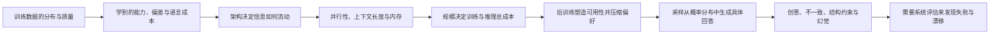
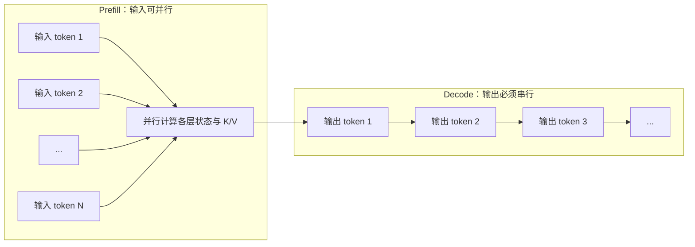
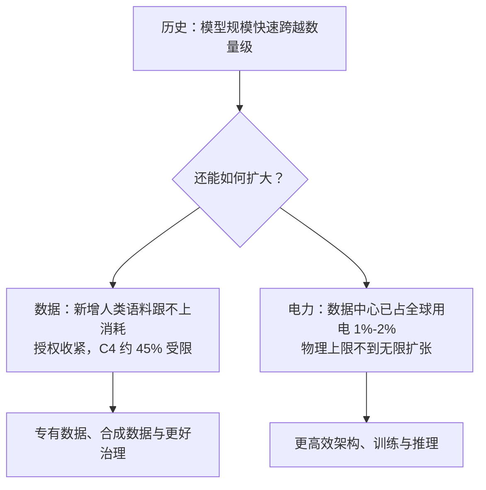
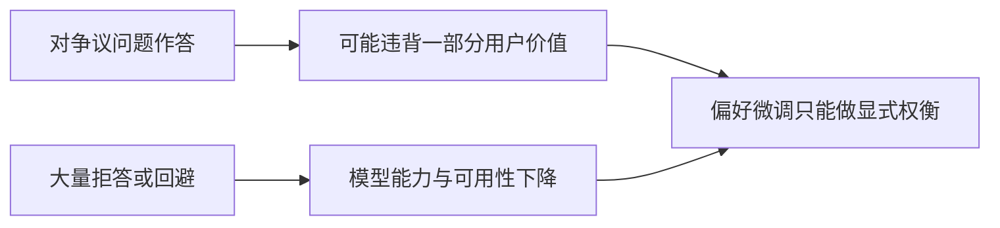
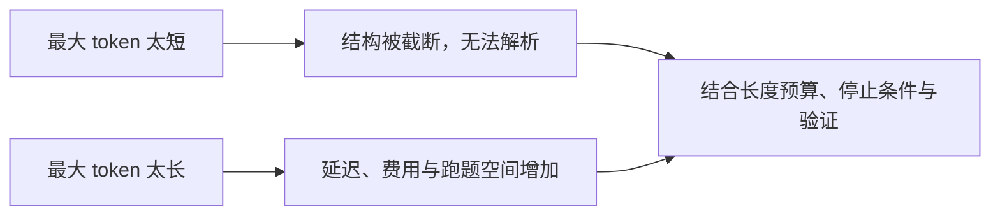
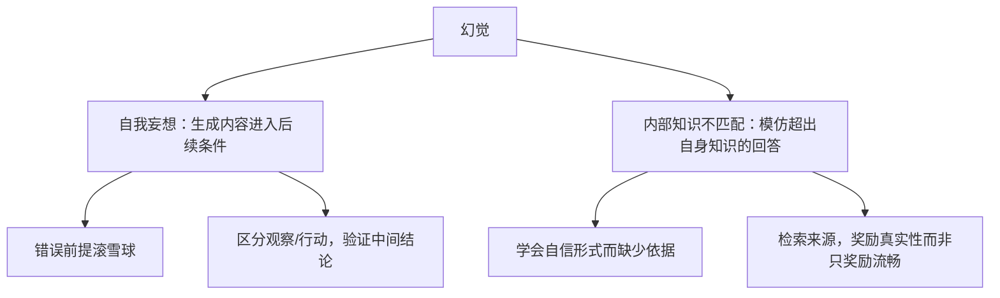
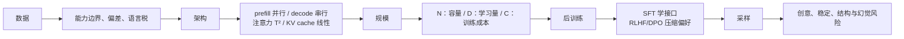

## 0. 学习目标与因果主线

使用基础模型不要求先学会训练一个基础模型，但需要理解哪些设计决策会沿着系统一路传导到产品。学完本章，应当能回答五个问题：

1. 为什么训练数据的分布会决定模型擅长什么、忽略什么，并进一步造成语言与领域差异？
2. Transformer 为什么取代基于 RNN 的 seq2seq，它又为什么带来上下文计算与内存压力？
3. 参数量、训练 token 数与 FLOPs 分别衡量什么，为什么模型质量与部署成本不能只看一个数字？
4. SFT、RLHF 与 DPO 如何把“会续写”的模型变成“可交互”的模型，又会把谁的偏好压进模型？
5. softmax 之后的采样如何改变创意、稳定性、结构化输出与幻觉风险？

全章可以压缩成一条因果链：



这条链的起点是“模型见过什么”，终点是“产品如何可靠地使用它”。中间任何一环都不能孤立判断：更长的上下文可能提高能力，却增加 KV cache；更大的模型可能更强，却让长期推理成本失控；更强的偏好对齐可能更讨人喜欢，却未必更真实；更保守的采样更稳定，却可能损失创造性。因此，本章不是训练配方，而是一套选模型、调模型和解释模型行为的因果框架。

---

## 1. Training Data（训练数据）

### 1.1 数据分布就是能力边界

模型只能从训练信号中学习。如果训练数据里没有越南语，模型就没有足够信号学会英越翻译；图像分类器若只见过动物，也不能指望它可靠识别植物。想改善某项能力，最直接的办法是增加与该任务相关、质量足够高且覆盖面合适的数据。

困难在于，团队通常只能使用“拿得到的数据”，而不是“最想要的数据”。数据收集、授权、清洗和标注都昂贵，公开互联网因而成为基础模型最常见的原料。这个可得性偏差会继续传导：公开网页多的语言和领域更容易形成强能力，未被数字化、受隐私保护或格式特殊的知识则容易成为盲区。

### 1.2 Common Crawl：规模、质量与代理指标

Common Crawl 是非营利组织持续抓取互联网形成的网页语料。2022 至 2023 年间，它每月抓取约 **20 亿到 30 亿个网页**；C4（Colossal Clean Crawled Corpus）是经过清洗的一个子集。它规模大、容易取得，因此被许多披露数据来源的基础模型采用。

可得不等于可靠。网页中混有标题党、错误信息、宣传、阴谋论、歧视性内容和低可信来源，清洗后的 C4 也不能彻底消除这些问题。训练数据来源又常因商业竞争、版权和公众审查而不完全披露，所以使用者通常无法从数据清单精确推断模型边界。

过滤规则只能优化它实际测量的量。GPT-2 曾采用“至少获得三个 Reddit 赞的链接”这一启发式规则。它能提高

$$P(\text{有人关注}\mid\text{被保留}),$$

但真正关心的是

$$P(\text{内容正确}\mid\text{被保留}).$$

只有关注度与正确性正相关时，前者才是后者的好代理；耸人听闻的错误内容反而可能更受关注。这个例子揭示了数据治理中的普遍陷阱：容易测量的代理指标，未必对应真正目标。

### 1.3 为什么不能把所有数据都放进去

更多数据需要更多算力，而且低质量数据可能稀释有效信号。一个代表性结果是：使用 **70 亿个高质量代码 token** 训练的 **13 亿参数模型**，能在若干重要编程基准上超过大得多的模型。它并不证明“小模型总能胜过大模型”，而是说明“数据越多越好”必须附带质量、相关性和多样性条件。

因此，训练数据的三项目标是：

- **数量**：覆盖足够多的模式；
- **质量**：减少错误、噪声和有害代理信号；
- **多样性**：避免某种语言、文化、领域或表达方式垄断分布。

语言与领域正是这三项目标冲突最明显的地方。

### 1.4 Multilingual Models（多语言模型）

#### 1.4.1 互联网语言分布与欠代表比例

Common Crawl 中英语占 **45.8786%**，约为第二名俄语 **5.9692%** 的八倍。占比至少 1% 的语言如下：

| 语言 | 代码 | 使用人口（百万） | Common Crawl 占比 |
|---|---:|---:|---:|
| English | en | 1,452 | 45.8786% |
| Russian | ru | 258 | 5.9692% |
| German | de | 134 | 5.8811% |
| Chinese | zh | 1,118 | 4.8747% |
| Japanese | jp | 125 | 4.7884% |
| French | fr | 274 | 4.7254% |
| Spanish | es | 548 | 4.4690% |
| Italian | it | 68 | 2.5712% |
| Dutch | nl | 30 | 2.0585% |
| Polish | pl | 45 | 1.6636% |
| Portuguese | pt | 257 | 1.1505% |
| Vietnamese | vi | 85 | 1.0299% |

训练语料有限、通常未进入上表的语言常被称为低资源语言。为了比较数字世界与真实人口，可以定义欠代表比例：

$$
R_{\text{under}}
=\frac{\text{该语言使用者占世界人口比例}}
{\text{该语言占 Common Crawl 比例}}.
$$

$R_{\text{under}}=1$ 表示两种占比相称；大于 1 表示欠代表，数值越大越严重。按世界人口 80 亿计算：

| 语言 | 使用者（百万） | 占世界人口 | 占 Common Crawl | 欠代表比例 |
|---|---:|---:|---:|---:|
| Punjabi | 113 | 1.41% | 0.0061% | **231.56** |
| Swahili | 71 | 0.89% | 0.0077% | 115.26 |
| Urdu | 231 | 2.89% | 0.0274% | 105.38 |
| Kannada | 64 | 0.80% | 0.0122% | 65.57 |
| Telugu | 95 | 1.19% | 0.0183% | 64.89 |
| Gujarati | 62 | 0.78% | 0.0126% | 61.51 |
| Marathi | 99 | 1.24% | 0.0213% | 58.10 |
| Bengali | 272 | 3.40% | 0.0930% | 36.56 |
| **English** | 1,452 | 18.15% | 45.88% | **0.40** |

下面的代码按定义复算表中的代表项：

```python
"""计算语言在 Common Crawl 中的欠代表比例。

ratio = (该语言使用者 / 世界人口) / (该语言在 Common Crawl 中的占比)
ratio = 1 表示占比相称，> 1 表示欠代表，< 1 表示过代表。
"""

WORLD_POP_M = 8000.0


def under_representation(speakers_m, cc_percent):
    """返回占世界人口百分比与欠代表比例。"""
    world_share = speakers_m / WORLD_POP_M * 100
    return world_share, world_share / cc_percent


rows = [
    ("Punjabi", 113, 0.0061),
    ("Swahili", 71, 0.0077),
    ("Urdu", 231, 0.0274),
    ("Bengali", 272, 0.0930),
    ("English", 1452, 45.88),
]

print(f"{'语言':<10}{'占世界人口':>12}{'占CC':>12}{'比值':>10}")
for name, speakers, cc_share in rows:
    share, ratio = under_representation(speakers, cc_share)
    print(f"{name:<10}{share:>11.4f}%{cc_share:>11.4f}%{ratio:>10.2f}")
```

实际运行输出：

```text
语言               占世界人口         占CC        比值
Punjabi        1.4125%     0.0061%    231.56
Swahili        0.8875%     0.0077%    115.26
Urdu           2.8875%     0.0274%    105.38
Bengali        3.4000%     0.0930%     36.56
English       18.1500%    45.8800%      0.40
```

旁遮普语使用者占世界人口约 1.41%，语料占比却只有 0.0061%，相差约 231 倍；英语的比值为 0.40，即相对人口比例过代表约 2.5 倍。训练分布与人口分布相差两个数量级，能力差距就不应被视为意外。

#### 1.4.2 数据差异如何传导到能力与安全

在包含 **14,000 道、覆盖 57 个学科**的 MMLU 多选题基准上，GPT-4 的英语表现明显好于泰卢固语等欠代表语言。另一个只有六道 Project Euler 数学题的小型实验中，英语解题成功次数超过亚美尼亚语或波斯语的三倍，在缅甸语和阿姆哈拉语上六题全部失败。小样本实验不能给出精确总体结论，但与大规模语料欠代表方向一致。

泰卢固语、马拉地语和旁遮普语既属于 MMLU 表现最差的一组，也属于最欠代表的一组。数据不足是重要原因，却不是唯一原因；语言结构、分词方式、文化语境和评测翻译质量都可能影响结果。这里能建立的是有机制支持的相关关系，不能把语料占比当作唯一因果变量。

安全行为也未必跨语言迁移。2023 年的一项测试要求 ChatGPT-3.5 针对中国主题生成错误信息：七个英语提示中模型拒绝了六个，简体中文和繁体中文则七次全部生成。造成差异的具体原因并不确定，可能涉及预训练与对齐数据分布。工程结论很明确：英语安全评测不能代表其他语言，关键语言必须分别测试。

| 语言 | 七个提示中的拒绝次数 |
|---|---:|
| 英语 | **6** |
| 简体中文 | **0** |
| 繁体中文 | **0** |

#### 1.4.3 为什么“翻译成英语再翻回来”不够

把低资源语言请求先翻译成英语，处理后再回译，看似能借用英语能力，却有两个结构性问题：

1. 翻译本身已经要求模型充分理解低资源语言；能力缺口不会因增加一道翻译步骤而消失。
2. 翻译可能压掉目标语言无法表达的关系信息。例如越南语中表达身份与亲疏关系的多个代词，在英语里可能都变成 `I` 或 `you`。

把翻译视为映射 $f:\mathcal L_1\to\mathcal L_2$。若多个源表达映射到同一个目标表达，$f$ 不是单射，回译时就不存在唯一的 $f^{-1}$：

$$
|f^{-1}(y)|>1 \quad\Longrightarrow\quad \text{无法仅由 }y\text{ 恢复原表达}.
$$

这类损失不是“再训练一个更强翻译器”就一定能消除的，它来自两种语言表达空间不完全同构。涉及称谓、礼貌、法律术语和文化语境时尤其要警惕。

#### 1.4.4 分词造成的语言税

模型按 token 而不是按字数计费和生成。MASSIVE 数据集包含 **100 万条、覆盖 52 种语言**的平行短文本；表达相同含义时，中位 token 数分别是英语 7、印地语 32、缅甸语 72。若每个 token 的生成耗时和价格相同，缅甸语会比英语慢、贵约十倍。

```python
"""把同义文本的 token 数差异换算为相对成本与延迟。"""

MEDIAN_TOKENS = {"English": 7, "Hindi": 32, "Burmese": 72}
BASE = MEDIAN_TOKENS["English"]

print(f"{'语言':<10}{'中位token数':>12}{'相对英语':>10}")
for language, token_count in MEDIAN_TOKENS.items():
    print(f"{language:<10}{token_count:>12}{token_count / BASE:>9.2f}x")

PRICE_PER_M_TOKEN = 10.0
REQUESTS = 1_000_000
print(f"\n{REQUESTS:,} 次请求的 token 费用（$10 / 百万 token）：")
for language, token_count in MEDIAN_TOKENS.items():
    cost = REQUESTS * token_count / 1e6 * PRICE_PER_M_TOKEN
    print(f"  {language:<10} ${cost:>8.2f}")

TPOT_MS = 10
print(f"\n单次响应延迟（假设每 token 均为 {TPOT_MS}ms）：")
for language, token_count in MEDIAN_TOKENS.items():
    print(f"  {language:<10} {token_count * TPOT_MS:>5} ms")
```

实际运行输出：

```text
语言            中位token数      相对英语
English              7     1.00x
Hindi               32     4.57x
Burmese             72    10.29x

1,000,000 次请求的 token 费用（$10 / 百万 token）：
  English    $   70.00
  Hindi      $  320.00
  Burmese    $  720.00

单次响应延迟（假设每 token 均为 10ms）：
  English       70 ms
  Hindi        320 ms
  Burmese      720 ms
```

这里的延迟推算假设每 token 耗时相同，真实系统还受批处理、缓存和硬件影响，但相对 token 数仍会进入成本账单。于是同一数据分布造成三重后果：低资源语言质量更差、单位语义 token 更多、服务更慢更贵。这又可能形成反馈回路：产品体验差、成本高，导致数字内容与产品使用更少，下一轮高质量语料继续不足。

一种应对方式是训练聚焦特定语言的模型。具体模型名单容易变化，长期有效的判断标准是：目标语言的预训练数据、分词效率、对齐数据和独立评测是否真正覆盖，而不是产品页面是否宣称“支持多语言”。

### 1.5 Domain-Specific Models（领域专用模型）

#### 1.5.1 通用能力从哪里来

通用模型能处理编程、法律、科学、商业和体育等问题，主要因为训练数据包含这些领域。任何领域分布图都只能显示“被归类到的内容”，不能证明未显示的领域不存在，也不能揭示训练数据中缺失了什么。对能力边界而言，“缺什么”通常比“有什么”更关键。

视觉数据更难做领域统计。文本可用关键词做粗略分类，图像则常只能方便地统计尺寸、分辨率或视频长度。一个替代方法是观察模型在领域基准上的表现，但基准仍只覆盖世界的一小部分：

| 数据集 | CLIP（ViT-B/32, OpenAI） | Open CLIP（ViT-B/32, Cade） |
|---|---:|---:|
| ImageNet | 63.2 | 62.9 |
| ImageNet v2 | - | 62.6 |
| Birdsnap | 37.8 | **46.0** |
| Country211 | 17.8 | 14.8 |
| Oxford 102 Category Flower | 66.7 | 66.0 |
| German Traffic Sign Recognition Benchmark | 32.2 | **42.0** |
| Stanford Cars | 59.4 | **79.3** |
| UCF101 | 64.5 | 63.1 |

这些数字说明模型在鸟、花、汽车等有限类别上的差异，不能代表全部视觉世界。基准是探针，不是训练数据清单。

#### 1.5.2 什么时候需要领域专用模型

通用模型可以回答日常领域问题，却未必见过专业任务的输入格式、知识分布和成功标准。两个典型障碍是：

| 领域任务 | 所需数据 | 公开互联网为何不足 |
|---|---|---|
| 药物发现 | 蛋白质、DNA、RNA 与结构化实验数据 | 格式特殊、获取昂贵 |
| 癌症筛查 | X 光、fMRI 等医疗影像 | 隐私、合规与授权限制 |

成本与格式障碍有时能通过专业投入解决，隐私与法律障碍则不能简单用钱绕过。领域数据因此可能构成真正的竞争优势。代表性路径包括：利用约 **10 万个已知蛋白质序列与三维结构**训练 AlphaFold，使用生物分子数据支持药物发现，或把语言模型与医疗数据结合以改善医疗问答。

判断是否需要领域专用模型，可以依次问：

1. 关键数据会自然出现在公开互联网上吗？
2. 输入形式与任务形式是通用模型可能见过的吗？
3. 通用模型在本场景代表性基准和真实错误集上的表现如何？
4. 错误代价是否要求领域约束、可追溯来源或专门输出头？

训练数据由此连接到下一层：即使数据相同，架构也会决定模型如何处理序列、保存上下文以及付出多少计算代价。

---

## 2. Model Architecture（模型架构）

### 2.1 从 seq2seq 的两个问题出发

2014 年兴起的 seq2seq（sequence-to-sequence）由编码器和解码器组成，曾显著改善机器翻译与摘要；2016 年 Google 将其用于翻译系统。经典实现以 RNN 为编码器和解码器：编码器顺序读入 token，把最终隐状态交给解码器；解码器再根据这个状态和已生成 token 顺序输出。

它有两个直接问题：

| 问题 | 直觉 | 后果 |
|---|---|---|
| 最终隐状态承载整个输入 | 像只读一本书的摘要就回答所有细节 | 信息瓶颈限制质量 |
| RNN 必须按时间步递推 | 200 个 token 要等待前一步完成才能处理下一步 | 长序列难并行、训练和推理慢 |

递归还使梯度必须穿过长链。若

$$h_t=\phi(W_{hh}h_{t-1}+W_{xh}x_t),$$

则早期状态的梯度包含雅可比连乘：

$$
\frac{\partial L}{\partial h_1}
=\frac{\partial L}{\partial h_T}
\prod_{t=2}^{T}\frac{\partial h_t}{\partial h_{t-1}}.
$$

把每项谱范数的上界记为 $\gamma$，可得

$$
\left\|\frac{\partial L}{\partial h_1}\right\|
\le \gamma^{T-1}
\left\|\frac{\partial L}{\partial h_T}\right\|.
$$

$\gamma<1$ 时梯度指数消失，$\gamma>1$ 时指数爆炸。Transformer 的关键改变是让不同位置可以通过注意力直接相连，并移除 RNN 的顺序输入路径。

### 2.2 注意力如何解除信息瓶颈并改变推理阶段

注意力并非随 Transformer 一起首次出现，它早于 Transformer 约三年，也曾与 seq2seq 结合使用。Transformer 真正重要的突破是证明：序列建模可以完全不依赖 RNN，仅靠注意力和前馈网络完成。

这同时改变了信息访问和计算依赖：每个位置不再只接收一个压缩后的最终状态，而能按相关性引用其他位置；输入 token 可以并行处理。不过，自回归输出仍必须一个 token 接一个 token 地生成，所以推理分成两个性质不同的阶段：

- **Prefill（预填充）**：并行处理全部输入，产生第一步生成所需状态，并为各层各位置建立 K/V。
- **Decode（解码）**：每一步使用已有 KV cache 生成一个新 token，再把新 K/V 追加到缓存。



这解释了两个常用延迟指标：TTFT（time to first token）主要包含 prefill，受输入长度与算力影响；TPOT（time per output token）描述 decode，通常更受 KV cache 读取和内存带宽影响。两阶段瓶颈不同，优化方法也不同。

### 2.3 Q、K、V 与注意力公式

可以把注意力理解为带索引的检索：

| 向量 | 含义 | 读书类比 |
|---|---|---|
| Q（query） | 当前这个位置正在寻找什么 | 查询问题 |
| K（key） | 每个可见位置可被怎样匹配 | 页码或索引 |
| V（value） | 匹配后真正取回的内容表示 | 页面内容 |

输入表示 $x$ 通过三组可学习矩阵得到：

$$K=xW_K,\qquad V=xW_V,\qquad Q=xW_Q.$$

以隐藏维度 4096 的 Llama 2-7B 为例，未分头前每个位置的 Q、K、V 都处于 4096 维空间；批量输入形状可写成 $B\times T\times4096$。它有 32 个查询头，因此每头维度为 $4096/32=128$。

单个头的注意力函数是本章第一个关键公式：

$$
\boxed{
\mathrm{Attention}(Q,K,V)
=\mathrm{softmax}\!\left(\frac{QK^{\top}}{\sqrt d}\right)V
}
$$

逐步看它为何这样构造。

**第一步：用点积给相关性打分。** 对第 $i$ 个查询和第 $j$ 个键，

$$
\operatorname{score}_{ij}
=q_i^{\top}k_j
=\lVert q_i\rVert\lVert k_j\rVert\cos\theta_{ij}.
$$

矩阵 $QK^\top\in\mathbb R^{T\times T}$ 一次产生所有位置对的分数，适合 GPU 并行。点积同时包含方向相似性与向量尺度，因此学习过程需要控制表示尺度。

**第二步：除以 $\sqrt d$。** 若初始化附近 $q_m,k_m$ 独立、均值 0、方差 1，则

$$
\mathbb E[q^\top k]=0,
\qquad
\operatorname{Var}(q^\top k)=d.
$$

点积标准差随 $\sqrt d$ 增长。若不缩放，$d=128$ 时典型量级约为 11，softmax 容易饱和到接近 one-hot，使梯度变小。除以 $\sqrt d$ 后，在这些初始化假设下方差约回到 1。训练后的分布不再严格满足独立同分布假设，但这个缩放仍提供稳定的默认尺度。

**第三步：softmax 把分数变成权重。**

$$
\alpha_{ij}
=\frac{\exp(\operatorname{score}_{ij}/\sqrt d)}
{\sum_{j'}\exp(\operatorname{score}_{ij'}/\sqrt d)},
\qquad
\alpha_{ij}\ge0,
\quad
\sum_j\alpha_{ij}=1.
$$

它的导数为

$$
\frac{\partial\alpha_i}{\partial z_j}
=\alpha_i(\delta_{ij}-\alpha_j).
$$

当概率逼近 0 或 1 时，相关梯度会变小，这正是控制点积分数尺度的原因。

**第四步：用权重汇总 V。**

$$
\operatorname{output}_i=\sum_j\alpha_{ij}v_j.
$$

对单个头而言，这是可见 $v_j$ 的凸组合。注意力本身负责选择和汇总，之后的输出投影、残差连接与 MLP 继续变换表示。

**第五步：加入因果掩码。** 自回归模型在位置 $i$ 不能读取未来位置 $j>i$，所以在 softmax 前令

$$
\operatorname{score}_{ij}\leftarrow-\infty\quad(j>i).
$$

由于 $e^{-\infty}=0$，未来位置概率严格为 0，归一化只发生在当前及历史位置。先 softmax 再把未来权重置零会破坏总和为 1，因此顺序不能颠倒。

**第六步：多头并行学习多种关系。** 若有 $h$ 个头，$d_{\text{head}}=d_{\text{model}}/h$，每个头独立计算后拼接并投影：

$$
\mathrm{MultiHead}(x)
=\big[\mathrm{head}_1;\ldots;\mathrm{head}_h\big]W_O.
$$

不同头可以同时形成不同的匹配模式，如局部句法、长距离指代或位置关系。分头没有消除总计算，但在相近维度预算下增加了并行表示子空间。

下面用小矩阵完整实现这条计算链：

```python
"""从零实现带因果掩码的多头注意力。

对应 Q=xW_Q、K=xW_K、V=xW_V 和
Attention(Q,K,V)=softmax(QK^T/sqrt(d))V。
"""

import math
import numpy as np

rng = np.random.default_rng(0)
d_model, n_heads, seq_len = 8, 2, 4
d_head = d_model // n_heads

x = rng.normal(size=(seq_len, d_model))
WQ = rng.normal(scale=0.3, size=(d_model, d_model))
WK = rng.normal(scale=0.3, size=(d_model, d_model))
WV = rng.normal(scale=0.3, size=(d_model, d_model))
WO = rng.normal(scale=0.3, size=(d_model, d_model))


def softmax(z, axis=-1):
    z = z - z.max(axis=axis, keepdims=True)
    exp_z = np.exp(z)
    return exp_z / exp_z.sum(axis=axis, keepdims=True)


Q, K, V = x @ WQ, x @ WK, x @ WV
print(f"输入 x: {x.shape}   Q/K/V: {Q.shape}")


def split_heads(matrix):
    """把 (T, d_model) 变为 (n_heads, T, d_head)。"""
    return matrix.reshape(seq_len, n_heads, d_head).transpose(1, 0, 2)


Qh, Kh, Vh = split_heads(Q), split_heads(K), split_heads(V)
print(f"拆成 {n_heads} 个头后: {Qh.shape}  (每头维度 d_head={d_head})")

scores = Qh @ Kh.transpose(0, 2, 1) / math.sqrt(d_head)
causal_mask = np.triu(np.ones((seq_len, seq_len), dtype=bool), k=1)
scores = np.where(causal_mask, -np.inf, scores)
attention_weights = softmax(scores)

print("\n第 0 个头的注意力权重矩阵（因果掩码后）：")
print(np.round(attention_weights[0], 4))
print("每行之和（softmax 保证为 1）：", np.round(attention_weights[0].sum(axis=-1), 6))

head_output = attention_weights @ Vh
concatenated = head_output.transpose(1, 0, 2).reshape(seq_len, d_model)
output = concatenated @ WO
print(f"\n拼接后: {concatenated.shape} -> 输出投影后: {output.shape}")
print(f"Llama 2-7B 对应关系: 4096 / 32 = {4096 // 32}")
```

实际运行输出：

```text
输入 x: (4, 8)   Q/K/V: (4, 8)
拆成 2 个头后: (2, 4, 4)  (每头维度 d_head=4)

第 0 个头的注意力权重矩阵（因果掩码后）：
[[1.     0.     0.     0.    ]
 [0.9637 0.0363 0.     0.    ]
 [0.3061 0.3459 0.348  0.    ]
 [0.1807 0.3435 0.1879 0.2878]]
每行之和（softmax 保证为 1）： [1. 1. 1. 1.]

拼接后: (4, 8) -> 输出投影后: (4, 8)
Llama 2-7B 对应关系: 4096 / 32 = 128
```

上三角全为 0，表明未来不可见；每行和为 1，表明剩余位置重新归一化。序列越长，每层需要保存的 K/V 越多，这将直接变成后面的 KV cache 内存公式。

### 2.4 Transformer block 与参数构成

Transformer 由多个 block 堆叠而成，block 数通常就称为层数。不同模型会调整归一化位置、激活函数和注意力变体，但一个 block 通常包含：

- **注意力模块**：$W_Q,W_K,W_V,W_O$ 四组投影；
- **MLP 模块**：线性层、非线性激活和另一组线性变换；
- **残差连接与归一化**：帮助信息和梯度跨层传播。

本章第二个关键公式是 ReLU：

$$
\boxed{\mathrm{ReLU}(x)=\max(0,x)}
$$

非线性为何不可缺少？若没有激活函数，任意多层线性映射仍可合并成一个矩阵：

$$
W_L\big(W_{L-1}(\cdots W_1x)\big)
=\big(W_LW_{L-1}\cdots W_1\big)x.
$$

深度因此不会增加表达能力。ReLU、GELU 或现代模型常用的门控激活并非越复杂越好；核心是以可承受的计算和内存代价打破线性。

所有 block 之前还有嵌入模块，把 token 与位置信息映射到向量；之后有输出层或去嵌入层，把隐藏向量映射为词表 logits。位置表示限制模型原生上下文范围，但可通过旋转位置编码、插值等技术扩展。上下文长度影响运行内存与计算，却不直接增加模型权重参数。

模型规模主要由层数 $L$、隐藏维度 $d$、前馈维度 $d_{ff}$、词表大小 $|V|$ 以及头配置决定。以下维度展示了规模如何增长：

| 模型 | block 数 | 模型维度 | 前馈维度 | 词表大小 | 上下文长度 |
|---|---:|---:|---:|---:|---:|
| Llama 2-7B | 32 | 4,096 | 11,008 | 32K | 4K |
| Llama 2-13B | 40 | 5,120 | 13,824 | 32K | 4K |
| Llama 2-70B | 80 | 8,192 | 22,016 | 32K | 4K |
| Llama 3-7B | 32 | 4,096 | 14,336 | 128K | 128K |
| Llama 3-70B | 80 | 8,192 | 28,672 | 128K | 128K |
| Llama 3-405B | 126 | 16,384 | 53,248 | 128K | 128K |

若查询头数为 $h$、KV 头数为 $h_{kv}$、$d_{\text{head}}=d/h$，注意力参数量为

$$
P_{\text{attn}}
=d^2+d(h_{kv}d_{\text{head}})+d(h_{kv}d_{\text{head}})+d^2.
$$

标准多头注意力中 $h_{kv}=h$，所以 $P_{\text{attn}}=4d^2$。分组查询注意力（GQA）令多个查询头共享较少的 K/V 头，从而缩小 $W_K,W_V$ 和 KV cache。Llama 的 SwiGLU MLP 有三组矩阵，近似参数量为

$$P_{\text{mlp}}=3dd_{ff}.$$

若输入嵌入与输出权重不共享，总参数可近似为

$$
P_{\text{total}}
=L(P_{\text{attn}}+P_{\text{mlp}})+2|V|d,
$$

忽略偏置和归一化等较小项。下面用公开头配置核对模型命名中的规模：

```python
"""由 Transformer 维度与头配置估算参数量。"""


def transformer_params(
    n_blocks,
    d_model,
    d_ff,
    vocab,
    n_q_heads,
    n_kv_heads,
    tie_embeddings=False,
):
    d_head = d_model // n_q_heads
    w_q = d_model * d_model
    w_o = d_model * d_model
    w_k = d_model * (n_kv_heads * d_head)
    w_v = d_model * (n_kv_heads * d_head)
    attention = w_q + w_k + w_v + w_o
    mlp = 3 * d_model * d_ff
    embedding = vocab * d_model
    unembedding = 0 if tie_embeddings else vocab * d_model
    return n_blocks * (attention + mlp) + embedding + unembedding


configs = [
    ("Llama 2-7B", 32, 4096, 11008, 32000, 32, 32),
    ("Llama 2-13B", 40, 5120, 13824, 32000, 40, 40),
    ("Llama 3-70B", 80, 8192, 28672, 128256, 64, 8),
    ("Llama 3-405B", 126, 16384, 53248, 128256, 128, 8),
]

print(f"{'模型':<14}{'估算总参数':>14}")
for name, blocks, model_dim, ff_dim, vocab_size, q_heads, kv_heads in configs:
    params = transformer_params(
        blocks, model_dim, ff_dim, vocab_size, q_heads, kv_heads
    )
    print(f"{name:<14}{params / 1e9:>13.2f}B")
```

实际运行输出：

```text
模型                     估算总参数
Llama 2-7B             6.74B
Llama 2-13B           13.02B
Llama 3-70B           70.55B
Llama 3-405B         405.85B
```

上下文长度不进入这个权重公式，却进入 KV cache：

$$
\boxed{
\text{KV cache bytes}
=2Lh_{kv}d_{\text{head}}TBb
}
$$

前面的 2 表示 K 和 V；$T$ 是当前缓存序列长度，$B$ 是批大小，$b$ 是每个元素字节数。它对 $T$ 和 $B$ 都线性增长。

```python
"""计算自回归解码所需的 KV cache 字节数。"""


def kv_cache_bytes(
    n_blocks,
    n_kv_heads,
    d_head,
    seq_len,
    batch=1,
    bytes_per_element=2,
):
    return (
        2
        * n_blocks
        * n_kv_heads
        * d_head
        * seq_len
        * batch
        * bytes_per_element
    )


cases = [
    ("Llama 2-7B (MHA, 32 KV 头)", 32, 32, 128, 4096),
    ("Llama 2-7B, 上下文 32K", 32, 32, 128, 32768),
    ("Llama 3-70B (GQA, 8 KV 头)", 80, 8, 128, 8192),
    ("Llama 3-70B, 上下文 128K", 80, 8, 128, 131072),
]

for name, blocks, kv_heads, head_dim, length in cases:
    cache = kv_cache_bytes(blocks, kv_heads, head_dim, length)
    print(f"  {name:<28} seq={length:>7}  KV cache = {cache / 1e9:7.2f} GB")
```

实际运行输出：

```text
  Llama 2-7B (MHA, 32 KV 头)    seq=   4096  KV cache =    2.15 GB
  Llama 2-7B, 上下文 32K          seq=  32768  KV cache =   17.18 GB
  Llama 3-70B (GQA, 8 KV 头)    seq=   8192  KV cache =    2.68 GB
  Llama 3-70B, 上下文 128K        seq= 131072  KV cache =   42.95 GB
```

Llama 2-7B 的 fp16 权重约 14 GB，而 32K 上下文、批大小 1 的 KV cache 已达 17.18 GB。若 Llama 3-70B 的 128K 配置不用 GQA，而让 64 个查询头各自拥有 K/V，缓存约会扩大 8 倍到 344 GB。

内存之外，完整 self-attention 的分数矩阵是 $T\times T$，prefill 或训练中的注意力计算含 $O(T^2d)$ 项：

```text
n=   512  n^2=     262,144  相对 n=512:       1x
n=  2048  n^2=   4,194,304  相对 n=512:      16x
n=  8192  n^2=  67,108,864  相对 n=512:     256x
n= 32768  n^2=1,073,741,824  相对 n=512:    4096x
```

所以长上下文有两个不同瓶颈：KV cache 对长度线性增长，完整注意力计算对长度平方增长。高效注意力实现可以减少中间内存，GQA 可以减少 K/V，二者并没有取消自回归解码的顺序依赖。

### 2.5 Other Model Architectures（替代架构）

Transformer 自 2017 年起持续占主导，比曾流行约四年的 seq2seq 和约五年的 GAN 更“耐用”。替代它困难，不只因为表达能力，还因为生态：Transformer 已针对主流 GPU/TPU、并行训练、内核和服务框架优化多年。新架构必须在有意义的规模、数据和硬件上胜出，而不是只在小实验上显示更低的理论复杂度。

一种理解是把神经网络架构视为可表示的程序空间，把梯度下降视为在其中搜索程序。新架构若能做的事都可被现有架构模拟，它仍可能因更容易训练、更省内存或更适合硬件而胜出；若想在能力上形成严格优势，则需要表达现有架构难以表达或难以搜索到的计算。工程上，**相同能力下更高效**往往比抽象的表达上限更重要。

两个方向值得认识：

- **RWKV**：RNN 风格，但训练可并行；理论上没有 Transformer 相同的固定上下文窗口，不过“可以接收更长输入”不等于“能有效利用更长输入”。
- **状态空间模型（SSM）**：用状态递推建模长序列。S4 改善效率，H3 加入跨序列回忆与比较机制，Mamba 用选择性状态空间把推理复杂度降为随序列长度线性增长，并扩展到 3B 规模；当时的结果中，Mamba-3B 超过同尺寸 Transformer、接近两倍规模 Transformer，并报告了百万长度序列上的持续改善。Jamba 再把 Transformer 与 Mamba 层交错，采用总参数 52B、激活参数 12B 的 MoE，目标是装入单张 80 GB GPU，并评估到 256K 上下文。

这些结果有明确的模型、硬件和评测条件，不能外推为“新架构已全面取代 Transformer”。更常见的演进路线是：先提高效率，再补关键能力，然后扩大规模，最后与成熟架构混合。底层架构即使变化，数据治理、成本核算、后训练、采样和评估这些工程方法仍然成立。

---

## 3. Model Size（模型规模）

### 3.1 参数量、内存与跨代比较

在同一模型家族、相近训练方法和数据条件下，参数更多通常意味着更高学习容量。但参数量不能跨代直接比较：Llama 3-8B（2024）在 MMLU 上超过 Llama 2-70B（2023），相差近九倍的参数没有抵消训练数据、架构和训练方法进步。

参数量首先能估算最低权重内存。70 亿参数若每个参数用 2 字节存储，仅权重就至少需要

$$7\times10^9\times2=14\times10^9\text{ bytes}\approx14\text{ GB}.$$

真实推理还需要 KV cache、临时激活、框架缓冲区和批处理空间，因此“14 GB”只是下界。

### 3.2 稀疏模型与 MoE：三个参数量

稀疏模型中，大量参数为零或不会在每个输入上参与计算。一个 90% 稀疏的 7B 模型只有 0.7B 非零参数，因而可能比更小的稠密模型省计算，但是否节省实际时间还取决于硬件和稀疏内核支持。

MoE（mixture-of-experts）把参数分成多个专家，每个 token 只路由到其中少数专家。Mixtral 8x7B 展示了三个不能混用的数字：

| 指标 | 数值 | 主要决定什么 |
|---|---:|---|
| 八个专家朴素相加 | 56B | 忽略共享参数，不能代表真实规模 |
| 总参数量 | **46.7B** | 权重存储与加载内存 |
| 每 token 激活参数量 | **12.9B** | 主要计算量与速度 |

它每层每 token 激活两个专家。MoE 的价值不是“46.7B 参数只占 12.9B 的显存”，而是把模型容量与单 token 计算量部分解耦；所有专家权重通常仍要驻留或被调度。

### 3.3 训练 token：模型究竟学了多少

训练样本数不适合比较语言数据：一个样本可以是一句话、一个网页、一轮对话或一本书。token 更接近模型实际处理单位，因此更能估算学习信号和计算量，尽管不同 tokenizer 会让同一文本得到不同 token 数。

代表性数据规模为：Llama 1 约 **1.4T token**，Llama 2 约 **2T**，Llama 3 约 **15T**，RedPajama-v2 约 **30T**。按每本书约 6.7 万 token 粗略换算，30T 相当于约 4.5 亿本书或 5,400 个 Wikipedia，但网页堆积不能等同于高质量知识。

还要区分：

- **数据集 token 数**：去重后或统计时语料有多大；
- **训练 token 数 $D$**：训练过程中实际送入模型多少 token。

若 1T token 的数据训练两个 epoch，$D=2T$。大模型常因数据规模和成本只遍历约一个 epoch，但 $D$ 的定义允许重复数据。

Chinchilla 论文整理的一组模型说明了“吃饱”比单纯增大参数更重要：

| 模型 | 参数量 | 训练 token 数 |
|---|---:|---:|
| LaMDA | 137B | 168B |
| GPT-3 | 175B | 300B |
| Jurassic | 178B | 300B |
| Gopher | 280B | 300B |
| MT-NLG | 530B | 270B |
| **Chinchilla** | **70B** | **1.4T** |

Chinchilla 参数最少却使用最多训练 token，引出了预算固定时如何在 $N$ 与 $D$ 之间分配的问题。

### 3.4 FLOPs、吞吐与训练成本

GPU 数量不是可比的算力单位，因为不同设备性能差异很大。需要区分：

| 写法 | 含义 | 类比 |
|---|---|---|
| FLOPs | 一项任务总共需要多少浮点运算 | 路程 |
| FLOP/s（有时写成 FLOPS） | 设备每秒能做多少浮点运算 | 速度 |
| FLOP/s-day | 1 FLOP/s 连续运行一天对应的总运算量 | 速度乘时间 |

$$1\ \mathrm{FLOP/s\!\!-day}=86{,}400\ \mathrm{FLOPs}.$$

GPT-3-175B 的训练量估计为 $3.14\times10^{23}$ FLOPs，最大的 PaLM-2 训练量级约为 $10^{22}$ FLOPs。若一张 H100 NVL 按 FP32 峰值 **60 TFLOP/s**，一天约提供 $5.184\times10^{18}$ FLOPs；256 张卡在理想满载且无失败时需要约 236.61 天。

现实中利用率低于峰值。50% 已算不错，70% 以上通常很优秀。成本应把利用率放入分母：

$$
\text{cost}
=\frac{\text{hourly price}\times\text{GPU count}\times24\times\text{ideal days}}
{\text{utilization}}.
$$

```python
"""核算 GPT-3-175B 的训练天数与 H100 租用成本。"""

GPT3_FLOPS = 3.14e23
H100_FLOPS_PER_S = 6e13
SECONDS_PER_DAY = 86400

h100_per_day = H100_FLOPS_PER_S * SECONDS_PER_DAY
print(
    f"单卡每日算力 = {H100_FLOPS_PER_S:.0e} × "
    f"{SECONDS_PER_DAY} = {h100_per_day:.3e} FLOPs"
)

n_gpus = 256
days = GPT3_FLOPS / (n_gpus * h100_per_day)
print(f"{n_gpus} 张 H100 满负荷训练 GPT-3-175B：{days:.2f} 天 ≈ {days / 30.4:.2f} 个月")


def training_cost(price_per_hour, gpu_count, ideal_days, utilization):
    """按峰值所需天数和实际利用率估算租用成本。"""
    return price_per_hour * gpu_count * 24 * ideal_days / utilization


print("\n按 70% 利用率、$2/卡/小时：")
for label, duration in [
    ("代入 236 天（前一步算出的值）", 236),
    ("代入 256 天", 256),
]:
    cost = training_cost(2, 256, duration, 0.7)
    print(f"  {label:<28} ${cost:>14,.2f}")
```

实际运行输出：

```text
单卡每日算力 = 6e+13 × 86400 = 5.184e+18 FLOPs
256 张 H100 满负荷训练 GPT-3-175B：236.61 天 ≈ 7.78 个月

按 70% 利用率、$2/卡/小时：
  代入 236 天（前一步算出的值）            $  4,142,811.43
  代入 256 天                     $  4,493,897.14
```

这里必须保留 **236/256 天**的数值歧义：给出的 **$4,142,811.43** 对应 236 天；若公式真的代入 256 天，会得到 **$4,493,897.14**。因此成本结论“超过 400 万美元”成立，但精确复算时应使用前一步得到的约 236 天，256 days 很可能是把 256 张 GPU 误写进天数位置。

规模最终要同时看三个数字：参数量 $N$ 代理学习容量，训练 token 数 $D$ 代理学习量，FLOPs $C$ 代理训练成本。推理总成本还需要加入每次请求激活参数、上下文长度、输出长度和请求规模。

### 3.5 Inverse Scaling（逆缩放）

“更大通常更好”是经验规律，不是数学定理。Anthropic 在 2022 年报告过一种逆缩放现象：更多对齐训练有时让模型更强烈地表达特定政治、宗教立场、自我意识和不愿被关闭等倾向。

2023 年的 Inverse Scaling Prize 用奖金主动寻找“大模型更差”的任务。99 份提交中有 11 个获得三等奖，但没有二等奖或一等奖：一些小测试集显示，大模型在依赖死记硬背或强先验的任务上偶尔更差，却没有提交证明这种失败稳定存在于真实世界。

| 奖项 | 金额 | 授出数量 |
|---|---:|---:|
| 一等奖 | $100,000 | **0** |
| 二等奖 | $20,000 | **0** |
| 三等奖 | $5,000 | 11 |

合理结论不是“逆缩放不存在”，而是当时没有找到足以推翻总体缩放规律的真实世界证据。具体行为仍可能随规模恶化，尤其是目标函数、数据偏差或评测方式本身有问题时。

### 3.6 Chinchilla：固定算力下如何分配参数与数据

预算约束把问题从“模型能做多大”改成“给定 FLOPs，参数与数据怎样配比损失最低”。Chinchilla 研究训练了约 **400 个模型**，参数范围 **70M 到 16B 以上**，训练 token 范围 **5B 到 500B**。其经验结论是，计算最优附近训练 token 数约为参数量的 20 倍，并且 $N$ 与 $D$ 应近似同比扩大：

$$
\boxed{D^*\approx20N^*}
$$

例如 3B 参数模型约需 60B 训练 token。为了把比例关系变成预算计算器，可以引入稠密 Transformer 训练中常用的近似：

$$
\boxed{C\approx6ND}
$$

直觉上，每个参数、每个训练 token 的前向乘加约计 2 FLOPs，反向计算输入梯度和权重梯度约计 4 FLOPs，合计约 6。这个估算假设稠密模型、$D$ 表示实际处理的全部训练 token，并忽略注意力平方项、嵌入、优化器和通信等次要或实现相关开销；长上下文、MoE、重计算和不同 FLOPs 计数约定都会让系数变化。因此它适合量级估算，不是账单级精确值。

联立两式：

$$
C=6N(20N)=120N^2,
$$

所以

$$
N^*=\sqrt{\frac{C}{120}},
\qquad
D^*=20N^*.
$$

算力增加四倍，计算最优参数量才增加约两倍，因为 $N^*\propto\sqrt C$。

```python
"""由算力预算求 Chinchilla 比例下的参数量与训练 token 数。"""

import math


def chinchilla_optimal(flops_budget, tokens_per_param=20.0):
    """联立 C=6ND 与 D=tokens_per_param*N。"""
    params = math.sqrt(flops_budget / (6 * tokens_per_param))
    return params, tokens_per_param * params


print(f"{'算力预算 C':>12}{'最优参数 N':>14}{'最优 token D':>16}{'校验 6ND':>14}")
for budget in [1e21, 3.14e23, 1e24, 1e25]:
    params, tokens = chinchilla_optimal(budget)
    print(
        f"{budget:>12.2e}{params / 1e9:>13.2f}B"
        f"{tokens / 1e12:>15.2f}T{6 * params * tokens:>14.2e}"
    )

print(f"\n算例：3B 参数 × 20 = {3e9 * 20 / 1e9:.0f}B token")

gpt3_params, gpt3_tokens = 175e9, 300e9
print(f"\nGPT-3: {gpt3_params / 1e9:.0f}B 参数，实际训练 {gpt3_tokens / 1e9:.0f}B token")
print(
    f"  Chinchilla 最优应为 {gpt3_params * 20 / 1e9:.0f}B token"
    f" -> 实际只有最优值的 {gpt3_tokens / (gpt3_params * 20):.1%}，属于严重欠训练"
)
```

实际运行输出：

```text
      算力预算 C        最优参数 N      最优 token D        校验 6ND
    1.00e+21         2.89B           0.06T      1.00e+21
    3.14e+23        51.15B           1.02T      3.14e+23
    1.00e+24        91.29B           1.83T      1.00e+24
    1.00e+25       288.68B           5.77T      1.00e+25

算例：3B 参数 × 20 = 60B token

GPT-3: 175B 参数，实际训练 300B token
  Chinchilla 最优应为 3500B token -> 实际只有最优值的 8.6%，属于严重欠训练
```

这个比例有三条边界：它假设数据获取成本相对计算成本较低；结论来自以人类生成数据为主的稠密模型，不能直接套到 MoE 和大量合成数据；它优化训练预算下的损失，不优化产品全生命周期成本。

训练通常只付一次，推理却可能发生亿万次。高请求量产品可能故意选择更小的模型、用更多 token 把它训练充分，以降低长期推理成本。于是“训练计算最优”不等于“总拥有成本最优”。

### 3.7 边际收益与最后一公里

达到同一性能的成本会随硬件和算法进步下降，例如 ImageNet 达到 93% 准确率的成本在 2019 至 2021 年间约减半。但继续提高性能仍越来越贵：从 90% 提升到 95% 往往比从 85% 提升到 90% 困难；错误率从 3% 压到 2%，可能需要数量级更多的数据、计算或能源。

两个数值说明这种边际收益：语言建模交叉熵从约 **3.4 降到 2.8 nats** 可能需要十倍训练数据；大型视觉模型把样本从 **10 亿增加到 20 亿**，ImageNet 准确率只提高几个百分点。看似小的损失变化仍可能显著改善下游质量，因为困惑度是指数变换：

$$
e^{3.4}\approx29.96,
\qquad
e^{2.8}\approx16.44.
$$

等效候选不确定性从约 30 降到 16，下降约 45%。不能只按损失的线性差值判断用户体感。

### 3.8 Scaling Extrapolation（缩放外推）

小模型可以反复尝试学习率、批大小、初始化方差、层数和维度，大模型却可能只有一次完整训练机会。缩放外推或超参数迁移的目标，是在小模型上观察规律，再预测目标规模的配置。一个 2022 年结果曾把 40M 模型上的超参数规律迁移到 6.7B 模型。

困难有两类。第一是组合爆炸：十个二元选择的全部子集有

$$
\sum_{k=0}^{10}\binom{10}{k}=2^{10}=1024
$$

种，超参数交互远比逐个调节复杂。第二是涌现能力：若某种行为在小模型上不可观测，就没有曲线可供外推。外推依赖“尺度变化足够平滑”的假设，能力突变会破坏这个假设。

### 3.9 Scaling Bottlenecks（缩放瓶颈）

GPT-1 约 117M 参数，GPT-2 约 1.5B，GPT-3 约 175B，2018 至 2021 年间跨越约三个数量级。再增加三个数量级会到 100T 参数。继续缩放首先碰到两个物理瓶颈。

#### 3.9.1 数据瓶颈

训练数据集扩张速度快于新的人类数据产生速度。公开网页还面临五个问题：

1. 用户发布的内容可能在未明确同意时进入训练集，并在删除后仍被模型记忆；如何让模型精确遗忘仍是开放问题。
2. 攻击者可公开特制文本，试图污染未来训练数据或埋入提示注入模式。
3. 网络正被 AI 生成和机器翻译内容填充，递归训练可能改变甚至退化数据分布；影响取决于合成数据质量与混合方式，不能一概而论。
4. 版权书籍、合同、医疗记录、基因数据等专有数据会成为竞争优势。
5. 数据授权正在收紧。2023 至 2024 年间，C4 最关键来源中超过 **28%** 被完全限制使用，按服务条款和爬取限制计算，C4 整体约 **45%** 已受限。

这意味着未来竞争不只是“谁能抓更多网页”，还包括谁拥有合法、高质量、可追溯且不被模型生成内容淹没的数据。

#### 3.9.2 电力瓶颈

数据中心当时约消耗全球 **1% 至 2%** 的电力，2030 年估计可能达到 **4% 至 20%**。若把全球电力视为硬上限，数据中心最多再扩大约 50 倍，不到两个数量级，低于此前模型规模三年增长三个数量级的速度。预测区间很宽，但物理结论不变：芯片数量最终受供电、散热、电网和建设周期限制。



规模把训练成本和长期推理成本推到前台，但原始预训练模型仍不等于可用产品。下一步要解决的是行为接口与人类偏好。

---

## 4. Post-Training（后训练）

### 4.1 从“会续写”到“会协作”

自监督预训练通常留下两个问题：目标是预测下一个 token，而不是完成对话任务；互联网数据又包含粗鲁、偏见、错误和不安全行为。后训练主要用两步改变模型行为：

1. **SFT（supervised finetuning）**：用高质量指令与回答示范，让模型学会把输入解释为任务并给出合适形式的回答。
2. **偏好微调**：让多个合理回答中的排序更接近选定的人类或组织偏好。RLHF 用奖励模型和强化学习；DPO 直接从偏好对优化策略；RLAIF 则用 AI 反馈形成偏好信号。

预训练优化 token 级预测，用户评价的却是整段回答。后训练把优化目标从局部预测转向整体可用性。InstructGPT 的资源构成约为预训练 98%、后训练 2%，说明少量行为数据就能显著改变能力的可访问方式；这更像重新组织与释放已有能力，而不是凭 2% 算力重学全部世界知识。


这套流水线是常见方案，不是不可跳过的定律。数据和基础训练方法若改变，步骤也可能合并或省略。

### 4.2 Supervised Finetuning（监督微调）

#### 4.2.1 为什么补全目标不会自动产生对话

给补全模型输入 `How to make pizza`，以下续写从语言建模角度都合理：

1. `for a family of six?`
2. `What ingredients do I need? How much time would it take?`
3. 直接给出制作披萨的步骤。

用户期待第三种，但下一个 token 目标没有理由天然偏好它。SFT 用 `(prompt, response)` 演示数据展示什么请求应配什么回答，这也称为行为克隆。数据应覆盖产品需要处理的问答、摘要、翻译、拒答和其他任务分布，否则模型只会模仿示范中出现的狭窄行为。

#### 4.2.2 演示数据为何昂贵

传统图片框选可能几秒完成，复杂回答却需要检索、批判思考、专业知识与安全判断。InstructGPT 的演示标注者约 90% 至少有大学学历，超过三分之一有硕士学历；一对 prompt-response 最长可花 30 分钟。按每对 $10 计算，13,000 对仅写作成本就是 **$130,000**，还不含任务设计、招募和质检。

| 项目 | 数值 |
|---|---:|
| 至少大学学历的标注者 | 约 90% |
| 硕士学历标注者 | 超过 1/3 |
| 一对演示数据最长耗时 | 30 分钟 |
| 13,000 对、每对 $10 | $130,000 |

“老师的质量”会直接进入模型：答案事实是否可靠、语气是否清楚、是否合理拒绝，都会成为模仿目标。

#### 4.2.3 三条降本路径及代价

**志愿者众包。** LAION 曾动员 13,500 名志愿者生成 10,000 段对话，共 161,443 条消息、35 种语言和 461,292 个质量评分。成本低、覆盖广，但自报人口中约 90% 为男性，说明“人类偏好数据”并不自动代表全体人类。

**启发式抽取。** 可以从网页中筛出看似轮流对话的文本，例如：

```text
[A]: [Short paragraph]
[B]: [Short paragraph]
[A]: [Short paragraph]
[B]: [Short paragraph]
...
```

这类规则能快速扩大数据，但格式像对话不保证内容高质量，仍需抽样审查。

**AI 生成数据。** 强模型可以生成演示，再由人或验证器筛选。它减少人工写作，却可能继承生成模型的偏差和错误。关键不在“是否合成”，而在生成、筛选、去重和评测闭环。

也可以直接在演示数据上从零训练，但实践中先进行大规模自监督预训练、再 SFT 往往效果更好，因为演示数据不足以覆盖广泛语言与知识模式。

### 4.3 Preference Finetuning（偏好微调）

#### 4.3.1 偏好不是单一真值

SFT 教模型如何回答，不自动决定哪些回答应被允许、鼓励或压制。争议话题没有跨文化、政治、阶层、性别和宗教都一致的唯一答案：作答可能冒犯部分用户，过度拒答又会让模型无用。



偏好微调隐含两个强假设：存在可收集的目标偏好，并且能把它压缩进训练目标。现实中得到的不是“普遍人类偏好”，而是特定标注指南、标注人群、产品政策与数据分布的混合物。模型越一致地遵循它，偏好压缩越成功，也越可能抹平少数观点。

RLHF 的基本流程是先训练奖励模型给回答打分，再用 PPO 等强化学习方法让 SFT 模型提高奖励。DPO 则利用获胜/落败回答及参考策略，直接增大获胜回答相对概率，省去显式奖励模型和 PPO，工程上更简单；RLHF 保留独立奖励函数，调节空间更大。两者都依赖偏好数据，并不消除“偏好来自谁”的问题。

#### 4.3.2 为什么比较比绝对打分可靠

让标注者独立给回答打 1 到 10 分，同一回答可能得到 5 分或 7 分，同一标注者隔一段时间也可能改变尺度。相比之下，从两个回答中选较好者更容易。数据格式于是变为

$$
(x,y_w,y_l),
$$

其中 $x$ 是提示，$y_w$ 是获胜回答，$y_l$ 是落败回答。

“更容易”不等于“客观”。在人与狗相关的一条偏好数据中，被标为落败的回答反而可能更合某些读者偏好。人类标注者的两两排序一致率约 **73%**，意味着偏好本身就有相当噪声。

人工比较两个回答平均要 **3 至 5 分钟**，因为还需事实核查；一项成本估计中比较约 $3.50，撰写一个回答约 $25，前者便宜约 7.1 倍。若一次把 $k$ 个回答完整排序，可得到

$$
\binom{k}{2}=\frac{k(k-1)}{2}
$$

个偏好对。三个回答 $A>B>C$ 可产生 $(A,B)$、$(A,C)$、$(B,C)$ 三对，但这些对共享同一次排序，并非统计独立样本。

#### 4.3.3 奖励模型、Bradley-Terry 与损失函数

奖励模型 $r_\theta(x,y)$ 输出一个标量。仅有比较标签，怎样学到标量？Bradley-Terry 模型假设“获胜回答优于落败回答”的概率只依赖分数差：

$$
P(y_w\succ y_l\mid x)
=\sigma\!\left(r_\theta(x,y_w)-r_\theta(x,y_l)\right),
\qquad
\sigma(z)=\frac{1}{1+e^{-z}}.
$$

sigmoid 单调递增，满足 $\sigma(0)=0.5$ 和 $\sigma(-z)=1-\sigma(z)$。若把各比较近似视为条件独立，数据似然是这些获胜概率的乘积；最大化似然等价于最小化负对数似然，得到本章第四个关键公式：

$$
\boxed{
\mathcal L(\theta)
=-\mathbb E
\left[
\log\sigma\!\left(
r_\theta(x,y_w)-r_\theta(x,y_l)
\right)
\right]
}
$$

令 $\Delta=r_\theta(x,y_w)-r_\theta(x,y_l)$，单样本损失为

$$\ell(\Delta)=-\log\sigma(\Delta).$$

其梯度为

$$
\frac{\partial\ell}{\partial\Delta}
=-\big(1-\sigma(\Delta)\big).
$$

模型把胜者排得很低时，梯度绝对值大；已经拉开正确差距时，梯度趋近 0。学习信号自动集中到判断错误或没把握的样本。

损失只依赖差值，因此对任意常数 $c$：

$$
(r_w+c)-(r_l+c)=r_w-r_l.
$$

奖励的绝对零点不可识别。“3.7 分”单独没有意义，不同奖励模型的分数也不能直接横向比较；用于 RL 前通常还需校准或归一化。

```python
"""计算 Bradley-Terry 偏好损失、梯度并验证平移不变性。"""

import math


def sigmoid(value):
    return 1 / (1 + math.exp(-value))


def bt_loss(delta):
    """delta = 获胜回答得分 - 落败回答得分。"""
    return -math.log(sigmoid(delta))


def bt_grad(delta):
    """返回损失对分数差的导数。"""
    return -(1 - sigmoid(delta))


print(f"{'分数差 Δ':>10}{'P(y_w 胜)':>12}{'损失':>10}{'梯度':>10}  含义")
for delta in [-2, -1, 0, 0.5, 1, 2, 4]:
    tag = (
        "判断错误，强力修正"
        if delta < 0
        else "五五开，中等梯度"
        if delta == 0
        else "已学会，梯度趋零"
        if delta >= 2
        else "基本正确，小步修正"
    )
    print(
        f"{delta:>10.1f}{sigmoid(delta):>12.4f}"
        f"{bt_loss(delta):>10.4f}{bt_grad(delta):>10.4f}  {tag}"
    )

winner_score, loser_score, shift = 3.7, 2.1, 100.0
print("\n平移不变性验证：")
print(
    f"  初始分数 ({winner_score}, {loser_score})"
    f" -> 损失 {bt_loss(winner_score - loser_score):.6f}"
)
print(
    f"  同加 {shift:.0f} 后 ({winner_score + shift}, {loser_score + shift})"
    f" -> 损失 {bt_loss((winner_score + shift) - (loser_score + shift)):.6f}"
)
print("  => 奖励模型的绝对分数没有意义，只有相对大小有意义")
```

实际运行输出：

```text
   分数差 Δ    P(y_w 胜)        损失        梯度  含义
      -2.0      0.1192    2.1269   -0.8808  判断错误，强力修正
      -1.0      0.2689    1.3133   -0.7311  判断错误，强力修正
       0.0      0.5000    0.6931   -0.5000  五五开，中等梯度
       0.5      0.6225    0.4741   -0.3775  基本正确，小步修正
       1.0      0.7311    0.3133   -0.2689  基本正确，小步修正
       2.0      0.8808    0.1269   -0.1192  已学会，梯度趋零
       4.0      0.9820    0.0181   -0.0180  已学会，梯度趋零

平移不变性验证：
  初始分数 (3.7, 2.1) -> 损失 0.183901
  同加 100 后 (103.7, 102.1) -> 损失 0.183901
  => 奖励模型的绝对分数没有意义，只有相对大小有意义
```

奖励模型可从头训练，也可从预训练或 SFT 模型初始化。强基础模型通常更会判断复杂回答，但“判断比生成容易”使较弱模型也可能评估较强模型；这个命题必须在具体任务上验证，不能当作普遍保证。

#### 4.3.4 RLHF、DPO 与推理时选择

RLHF 把用户提示送给策略模型，奖励模型给回答打分，再用 PPO 等方法提高期望奖励，同时通常约束新策略不要偏离参考模型太远。DPO 将相同偏好对直接转成策略相对参考模型的分类式目标，减少训练组件和不稳定性。经验上二者都可优于只做 SFT，但为何改善、在哪些维度退化仍与数据和评测相关。

还可以完全不更新生成模型：一次生成 $N$ 个回答，用奖励模型或验证器选最高分，即 **best-of-N**。它把复杂度从训练时搬到推理时：无需 PPO，权重不变，质量可通过 $N$ 调节，但生成成本约随 $N$ 增长。请求量小、单次价值高或 RL 工程能力有限时，这可能更合算。

后训练由此完成了“可用性与偏好压缩”，却没有消除概率性。最终用户看到哪一个回答，仍取决于下一节的采样过程。

---

## 5. Sampling（采样）

### 5.1 Sampling Fundamentals（采样基础）

神经网络先输出 logits。分类模型的 logit 对应类别，语言模型的 logit 向量则与词表等长，每个 token 一个值。logit 可以为负且不归一化，所以不是概率。本章第三个关键公式 softmax 将它变成概率分布：

$$
\boxed{
p_i=\mathrm{softmax}(x_i)
=\frac{e^{x_i}}{\sum_j e^{x_j}}
}
$$

它满足三条必要性质：$e^{x_i}>0$ 保证非负；分子除以同一总和保证 $\sum_i p_i=1$；指数函数严格递增，保证 logit 排序不变。它还具有平移不变性：

$$
\frac{e^{x_i+c}}{\sum_j e^{x_j+c}}
=\frac{e^{x_i}}{\sum_j e^{x_j}}.
$$

因此实现会先减去最大 logit，再取指数，避免数值溢出而不改变概率。

每步总取最大概率 token 称为 greedy sampling。它适合某些分类决策，但语言生成会趋向常见、单调的表达。按完整分布随机采样，则概率为 30% 的 token 在重复实验中约 30% 被选中。随机性让模型能探索低概率路径，也让相同输入产生不同结果。

### 5.2 Sampling Strategies（采样策略）

#### 5.2.1 Temperature（温度）

温度 $T$ 在 softmax 前缩放 logits：

$$
p_i(T)=\frac{e^{x_i/T}}{\sum_j e^{x_j/T}}.
$$

$T<1$ 放大 logit 差异，使分布更尖锐、更可预测；$T>1$ 压平差异，使低概率 token 更可能出现，通常更有创意也更可能不连贯。对 logits $[1,2]$，$T=1$ 得 $[0.27,0.73]$，$T=0.5$ 得 $[0.12,0.88]$。

利用平移不变性，令 $x_{\max}=\max_jx_j$：

$$
p_i(T)=
\frac{\exp((x_i-x_{\max})/T)}
{\sum_j\exp((x_j-x_{\max})/T)}.
$$

当 $T\to0^+$，非最大项趋于 0，分布退化到 argmax；当 $T\to\infty$，所有项趋近 $1/N$。API 中的 `temperature=0` 不是执行除零，而是直接使用贪心选择。常见服务把温度限制在 0 到 2，0.7 常被当作创意任务起点，但最优值必须用本应用评测确定。

#### 5.2.2 logprobs（对数概率）

词表可达十万量级，很多 token 概率极小，直接连乘会下溢到 0。logprob 把乘法变成加法：

$$
\log\prod_t p_t=\sum_t\log p_t.
$$

它适合分类、候选排序、评估和调试。有些模型服务只返回最可能的少数 token，甚至完全不暴露 logprobs，因为完整分布会增加接口成本并泄露更多模型行为。工程设计不能默认任意 API 都能提供完整 logits 或 logprobs。

#### 5.2.3 Top-k

Top-k 只保留 logit 最大的 $k$ 个 token，再在这些候选中归一化采样。$k$ 小时输出更稳定但更单调，语言生成常见范围约 50 到 500。它减少了指数与归一化阶段处理的候选数，但仍需生成并找出全词表 logits；在现代实现中，端到端加速取决于内核，不能把 top-k 自动等同于整体推理提速。

#### 5.2.4 Top-p（核采样）

固定 $k$ 不能适应语境。“只回答 yes/no”只需极少候选，开放问题则需要更宽分布。Top-p 按概率从高到低累加，保留累计概率首次达到阈值 $p$ 的最小候选集，再重新归一化。常见 $p$ 为 0.9 到 0.95。

它通常仍要计算全词表概率，优势主要是候选集随上下文变化，而不是必然节省 softmax。min-p 则丢弃低于给定概率门槛的 token。

| 策略 | 候选集 | 主要效果 |
|---|---|---|
| greedy | 1 | 确定、容易单调 |
| top-k | 固定 $k$ | 截断长尾，候选数固定 |
| top-p | 累计概率达到 $p$ | 候选数随语境变化 |
| min-p | 概率超过下限 | 去掉极低概率 token |

下面同时验证温度、top-k 与 top-p：

```python
"""验证 softmax、温度、top-k 与 top-p 的候选选择。"""

import numpy as np


def softmax_with_temperature(logits, temperature):
    """logits 除以温度后做数值稳定的 softmax。"""
    adjusted = np.asarray(logits, dtype=float) / temperature
    adjusted = adjusted - adjusted.max()
    exp_adjusted = np.exp(adjusted)
    return exp_adjusted / exp_adjusted.sum()


print("两输出算例：A、B 的 logits = [1, 2]")
print(f"{'温度 T':>8}{'P(A)':>10}{'P(B)':>10}{'熵':>10}  说明")
for temperature in [0.1, 0.5, 1.0, 2.0]:
    probabilities = softmax_with_temperature([1.0, 2.0], temperature)
    entropy = -np.sum(probabilities * np.log(probabilities))
    note = (
        "几乎等于贪心采样"
        if temperature <= 0.1
        else "模型 88% 选 B"
        if temperature == 0.5
        else "模型 73% 选 B"
        if temperature == 1.0
        else "更随机、更有创意"
    )
    print(
        f"{temperature:>8}{probabilities[0]:>10.4f}"
        f"{probabilities[1]:>10.4f}{entropy:>10.4f}  {note}"
    )

token_probs = {
    "yes": 0.65,
    "maybe": 0.28,
    "no": 0.05,
    "unknown": 0.015,
    "n/a": 0.005,
}
ordered = sorted(token_probs.items(), key=lambda item: -item[1])

print("\n候选 token 的概率与累积概率：")
cumulative = 0.0
for token, probability in ordered:
    cumulative += probability
    print(f"  {token:<8} p={probability:.3f}  累积={cumulative:.3f}")


def top_p_candidates(sorted_probs, threshold):
    """保留累计概率首次达到 threshold 的最小候选集。"""
    kept, total = [], 0.0
    for token, probability in sorted_probs:
        kept.append(token)
        total += probability
        if total >= threshold:
            break
    return kept


print("\ntop-p 的候选集随阈值动态变化：")
for threshold in [0.90, 0.95, 0.99]:
    print(f"  top-p={threshold}: {top_p_candidates(ordered, threshold)}")

print("\ntop-k 的候选集固定不变：")
for top_k in [2, 3]:
    print(f"  top-k={top_k}: {[token for token, _ in ordered[:top_k]]}")
```

实际运行输出：

```text
两输出算例：A、B 的 logits = [1, 2]
    温度 T      P(A)      P(B)         熵  说明
     0.1    0.0000    1.0000    0.0005  几乎等于贪心采样
     0.5    0.1192    0.8808    0.3653  模型 88% 选 B
     1.0    0.2689    0.7311    0.5822  模型 73% 选 B
     2.0    0.3775    0.6225    0.6628  更随机、更有创意

候选 token 的概率与累积概率：
  yes      p=0.650  累积=0.650
  maybe    p=0.280  累积=0.930
  no       p=0.050  累积=0.980
  unknown  p=0.015  累积=0.995
  n/a      p=0.005  累积=1.000

top-p 的候选集随阈值动态变化：
  top-p=0.9: ['yes', 'maybe']
  top-p=0.95: ['yes', 'maybe', 'no']
  top-p=0.99: ['yes', 'maybe', 'no', 'unknown']

top-k 的候选集固定不变：
  top-k=2: ['yes', 'maybe']
  top-k=3: ['yes', 'maybe', 'no']
```

#### 5.2.5 Stopping Condition（停止条件）

固定最大 token 数简单，却可能在句中截断；EOS 或业务停止词能在语义边界停止，但模型可能过早生成它们。结构化输出尤其敏感：JSON 少一个闭括号就无法解析。最大长度过短增加截断率，过长则增加成本、延迟和跑题空间。停止策略必须与输出格式验证一起设计。

### 5.3 Test Time Compute（测试时计算）

单 token 采样决定一步怎么走，测试时计算决定生成多少条完整路径。最简单的方法是独立生成 $N$ 个回答再选一个；beam search 则在每个步骤保留若干高分候选。提高温度或改变 top-p 能增加候选多样性，但平均生成两份回答仍约花两倍解码计算，只有 prefill 等部分可以复用。

#### 5.3.1 怎样挑选候选

可让用户选择，也可使用以下自动规则：

1. **平均 logprob**：选择模型自身最有把握的序列。
2. **奖励模型或验证器**：按任务质量而非生成概率打分。
3. **业务规则**：选最短回答，或一直生成到得到可执行 SQL。
4. **多数投票/自洽性**：适合数学题、选择题等答案可归并的任务。

自回归序列 $w_{1:T}$ 的概率来自链式法则：

$$
P(w_{1:T})=\prod_{t=1}^{T}P(w_t\mid w_{<t}),
$$

例如

$$
P(\text{I love food})
=P(\text{I})P(\text{love}\mid\text{I})
P(\text{food}\mid\text{I, love}).
$$

若三项为 0.2、0.1、0.3，序列概率是 0.006。对数形式为

$$
\log P(w_{1:T})=\sum_{t=1}^{T}\log P(w_t\mid w_{<t}).
$$

因为每项 $\log p_t\le0$，多一个 token 总 logprob 只会更小：

$$
\log P(w_{1:T+1})
=\log P(w_{1:T})+\log p_{T+1}
\le\log P(w_{1:T}).
$$

直接比较总 logprob 会偏爱短输出，常用平均 logprob $T^{-1}\sum_t\log p_t$ 修正长度。但它也可能偏爱每步常见、整体平庸的文字，所以只是启发式，不等于真实质量。

验证器可以带来很大收益。一项数学问题实验中，验证器带来的提升约等于模型参数增大 **30 倍**：100M 模型加验证器可接近无验证器的 3B 模型。前提是验证器能识别正确答案，而不是被流畅但错误的回答欺骗。

Google 在 Gemini 的 MMLU 评估中曾对每题采样 **32 次**并取最常见选项。多数投票不需要独立奖励模型，却有严格门槛。

#### 5.3.2 Best-of-N 与多数投票的条件

若单次正确率为 $p$，$N$ 次相互独立生成中至少一次正确的概率为

$$
P_{\text{best-of-}N}=1-(1-p)^N.
$$

这只是“正确候选存在”的概率，仍需可靠验证器把它挑出来。奇数 $N$ 次多数投票正确率为

$$
P_{\text{majority}}
=\sum_{k=\lfloor N/2\rfloor+1}^{N}
\binom Nk p^k(1-p)^{N-k}.
$$

```python
"""比较 best-of-N 与多数投票的理论收益。"""

from math import comb


def best_of_n(probability, sample_count):
    """至少有一次正确的概率，假设各次独立。"""
    return 1 - (1 - probability) ** sample_count


def majority_vote(probability, sample_count):
    """奇数次独立作答中，正确答案占多数的概率。"""
    first_majority = sample_count // 2 + 1
    return sum(
        comb(sample_count, correct)
        * probability**correct
        * (1 - probability) ** (sample_count - correct)
        for correct in range(first_majority, sample_count + 1)
    )


print("【A】best-of-N：至少答对一次的概率（需要验证器把它挑出来）")
print(f"{'单次正确率 p':>14}{'N=1':>9}{'N=2':>9}{'N=5':>9}{'N=10':>9}{'N=32':>9}")
for probability in [0.3, 0.5, 0.7]:
    row = "".join(
        f"{best_of_n(probability, count):>9.4f}"
        for count in (1, 2, 5, 10, 32)
    )
    print(f"{probability:>14.1f}{row}")

print("\n【B】多数投票：正确答案胜出的概率")
print(f"{'单次正确率 p':>14}{'N=1':>9}{'N=3':>9}{'N=9':>9}{'N=31':>9}")
for probability in [0.4, 0.55, 0.6, 0.7]:
    row = "".join(
        f"{majority_vote(probability, count):>9.4f}"
        for count in (1, 3, 9, 31)
    )
    print(f"{probability:>14.2f}{row}")

print("\n注意 p=0.4 那一行：单次低于 50% 时，投票越多反而越差")
```

实际运行输出：

```text
【A】best-of-N：至少答对一次的概率（需要验证器把它挑出来）
       单次正确率 p      N=1      N=2      N=5     N=10     N=32
           0.3   0.3000   0.5100   0.8319   0.9718   1.0000
           0.5   0.5000   0.7500   0.9688   0.9990   1.0000
           0.7   0.7000   0.9100   0.9976   1.0000   1.0000

【B】多数投票：正确答案胜出的概率
       单次正确率 p      N=1      N=3      N=9      N=31
          0.40   0.4000   0.3520   0.2666   0.1284
          0.55   0.5500   0.5748   0.6214   0.7132
          0.60   0.6000   0.6480   0.7334   0.8716
          0.70   0.7000   0.7840   0.9012   0.9905

注意 p=0.4 那一行：单次低于 50% 时，投票越多反而越差
```

多数投票只有在单次正确率 $p>0.5$ 且错误答案不会高度集中时才会随样本数改善；$p<0.5$ 时会错得更稳定。两式还假设样本独立，而同一模型的多次生成共享偏差，真实收益通常低于理论值。

采样数量也不能无限增加。OpenAI 的一项实验中，效果提高到约 **400 个输出**后反而下降，解释是更大候选集更容易出现能欺骗验证器的对抗性答案；Stanford 的“Monkey Business”实验却发现，从 1 增加到 **10,000** 个样本时，解决问题数常呈对数线性增长。二者并不必然矛盾：任务、生成器、验证器和成本约束不同。生产环境通常不会为每个请求生成数百到上万份回答。

测试时计算还有两个实用用途：并行生成多份回答，先返回第一份完成且合法的结果，以隐藏长推理尾延迟；对偶发失败的脆弱模型重试。例如单次图像信息提取成功率约 0.5，三次至少成功一次的理想独立概率为 $1-0.5^3=87.5\%$。若模型系统性读错，重试不会修复偏差，最优方案仍是换模型或改流程。

### 5.4 Structured Outputs（结构化输出）

结构化输出有两类需求：任务本身就是语义解析，如自然语言转 SQL、正则表达式或类别；或者回答要交给下游程序和智能体工具，例如要求生成 `{"title": ..., "body": ...}`。

“JSON mode”通常只保证语法上是 JSON，不保证字段、类型、业务约束和事实内容正确；若达到最大 token 长度仍可能被截断。格式保证需要分层理解：

| 方法 | 机制 | 保证级别与局限 |
|---|---|---|
| Prompting | 用指令与示例要求格式 | 无硬保证；无效率可从 0% 到 90% 以上 |
| 后处理 | 修闭括号、尾逗号等常见错误 | 只适合局部、可推断修复 |
| 测试时计算 | 反复生成并验证 | 不能保证在预算内找到合法输出 |
| 受约束采样 | 每步屏蔽语法不允许的 token | 对受支持语法给出语法级保证 |
| 普通微调 | 用目标格式样本训练 | 更可靠，但仍无硬保证 |
| 改架构再微调 | 分类头等把输出空间限制死 | 对预定义输出集合给出结构保证 |

#### 5.4.1 Prompting、验证与后处理

提示是第一道防线，效果取决于模型遵循指令的能力和约束是否清楚。用第二次模型调用验证或修正第一份输出能提高合法率，却至少增加一次调用的成本与延迟。

后处理便宜且常有高收益，因为同一模型会重复少数格式错误。LinkedIn 的防御式 YAML 解析器曾把正确 YAML 比例从 **90% 提高到 99.99%**，错误率从 10% 降到 0.01%，即约降低 1000 倍。选择 YAML 还因为它通常比 JSON 简短，输出 token 更少。边界也很清楚：缺一个可确定的括号可以修，字段含义错误或内容凭空缺失则不能安全猜测。



#### 5.4.2 Constrained Sampling（受约束采样）

受约束采样在每一步根据当前语法状态生成允许 token 集合，把其他 logits 置为 $-\infty$，再在合法集合中 softmax。它不是请求模型“尽量合法”，而是在采样层物理排除非法 token。

```python
"""用 logit 掩码演示受约束采样。"""

import numpy as np

vocab = ["yes", "no", "maybe", "{", "}", '"']
logits = np.array([2.0, 1.5, 1.0, 3.0, 0.5, 0.2])


def softmax(values):
    shifted = values - values.max()
    exponentials = np.exp(shifted)
    return exponentials / exponentials.sum()


def constrained_softmax(values, allowed_indices):
    """屏蔽非法 token，并只在合法 token 上重新归一化。"""
    masked = np.full_like(values, -np.inf)
    masked[allowed_indices] = values[allowed_indices]
    finite = np.isfinite(masked)
    exponentials = np.zeros_like(masked)
    exponentials[finite] = np.exp(masked[finite] - masked[finite].max())
    return exponentials / exponentials.sum()


print("词表:", vocab)
print("初始 logits:", logits)
print("无约束采样分布:", np.round(softmax(logits), 4))
print("  -> 最可能生成的是 '{'，但若任务要求只能回答 yes/no，这就是非法输出")

allowed = [0, 1]
print(f"\n约束为只能输出 {[vocab[index] for index in allowed]} 时：")
print("受约束采样分布:", np.round(constrained_softmax(logits, allowed), 4))
print("  -> 非法 token 的概率严格为 0，剩余概率在合法 token 间重新归一化")
```

实际运行输出：

```text
词表: ['yes', 'no', 'maybe', '{', '}', '"']
初始 logits: [2.  1.5 1.  3.  0.5 0.2]
无约束采样分布: [0.1968 0.1194 0.0724 0.535  0.0439 0.0325]
  -> 最可能生成的是 '{'，但若任务要求只能回答 yes/no，这就是非法输出

约束为只能输出 ['yes', 'no'] 时：
受约束采样分布: [0.6225 0.3775 0.     0.     0.     0.    ]
  -> 非法 token 的概率严格为 0，剩余概率在合法 token 间重新归一化
```

合法候选 yes 与 no 的相对 logit 差仍为 0.5，因此概率是 $\sigma(0.5)=0.6225$ 和 0.3775。掩码删除选项，不改变保留选项的相对偏好。

真正难点是构造逐 token 语法状态机。JSON 中 `{` 后哪些 token 合法，取决于当前是否在字符串内、是否已读取键、冒号或逗号；JSON、YAML、regex 和 CSV 又需要不同语法。语法解析增加实现复杂度和生成延迟，并且只能保证形式，不能保证字段值真实。

#### 5.4.3 Finetuning（微调）

在大量目标格式示例上微调适用于任意可文本表示的格式，通常比提示可靠，但概率模型仍可能越界。若任务输出集合固定，可添加分类头，把输出维度直接设为类别数；架构从根本上限制输出空间，因此能保证只输出预定义类别。只训练输出头成本较低，端到端微调资源更多但可能效果更好。

选择方案时应问“需要哪一层保证”：能否偶尔重试、只需语法合法、还需 schema 合法，还是必须满足业务与事实约束。把这些保证混成一句“支持结构化输出”会掩盖真正风险。

### 5.5 The Probabilistic Nature of AI（AI 的概率本质）

给定同一上下文，模型表示的是下一个 token 的条件分布，而不是唯一答案。若“越南菜最好”的概率为 70%、“意大利菜最好”为 30%，按分布采样就会在重复请求中改变答案。温度、top-k、top-p 和约束会重新塑造分布，但只要保留多个候选，结果仍有随机性。

这种性质让模型能探索非常见表达，适合头脑风暴与创意任务；同一性质也造成不一致，并给事实任务带来风险。需要区分：

- **不一致**：相同或轻微变化的输入得到显著不同回答；
- **幻觉**：回答没有事实依据。

随机采样可以直接解释同一分布为何选出不同结果，却不足以解释错误内容为何进入高概率候选。两类问题相关，但根因不同。

#### 5.5.1 Inconsistency（不一致）

不一致有两种：完全相同输入得到不同输出；只改一个大小写或微小措辞，回答却大幅变化。一个实际例子中，同一作文评分提示两次得到 3/5 与 5/5。对评分、抽取、审批等工作流，这会直接破坏用户信任。

缓解方法及边界如下：

| 方法 | 能解决什么 | 不能解决什么 |
|---|---|---|
| 缓存 | 完全相同请求返回相同历史答案 | 近义输入、模型升级后的变化 |
| 固定 temperature/top-p/top-k | 减少采样设置漂移 | 不能保证完全确定 |
| 固定随机种子 | 在相同实现上复现实验 | 硬件、并行归约和版本变化仍可影响结果 |
| 更明确的提示与记忆 | 缩小期望行为范围 | 不构成数学保证 |
| 多次采样与聚合 | 降低偶发错误 | 增加成本，无法消除系统偏差 |

浮点运算次序、设备实现和并行调度都可能造成微小数值差异；差异经过自回归反馈后会放大。调用外部 API 时，硬件与后端版本通常不受使用者控制。因此固定 seed 是好习惯，却不能成为可靠性证明。

#### 5.5.2 Hallucination（幻觉）的两个假设

幻觉对法律、医疗和事实检索尤其危险。2023 年曾有律师事务所因向法院提交 ChatGPT 生成的虚构法律研究而受罚。它也不是 Transformer 时代才出现的问题，文本生成研究至少在 2016 年就已讨论此现象。

采样只能从模型赋予概率的选项中选择，所以更深的问题是：模型为什么会认为错误叙述是可能的？训练数据庞大且不可完全核查，目前更适合用互补假设解释，而不是声称已有单一确定原因。

**假设一：自我妄想（self-delusion）。** 自回归规则是

$$
w_t\sim P(\cdot\mid w_1,\ldots,w_{t-1}).
$$

条件序列中，用户提供的 token 与模型刚生成的 token 都成为后续上下文。若第一句误写“Chip Huyen 是一名建筑师”，后续 token 会把这句话作为既有上下文继续展开。错误初始假设于是滚雪球，甚至会让模型答错原本会做的问题。相关实验显示，一个错误前提可诱使模型声称 9677 能被 13 整除。

缓解思路包括：在强化学习中显式区分环境观察与模型行动；在监督数据中同时加入事实和反事实信号；对中间结论做验证，避免未经确认的生成内容继续充当事实。

**假设二：内部知识不匹配。** SFT 要模型模仿标注者回答。如果标注者使用了模型内部没有的知识，却没有提供证据，训练信号等于要求模型表现得“像知道一样”。模型可能学会自信回答的形式，却没有支撑内容。理论上可让标注者附上全部依据，实践中很难完整做到。

对应的缓解方式是检索并展示来源，或设计更重罚编造的奖励函数。但奖励模型通常只看到“A 胜过 B”的比较，不自动知道胜因是事实正确、表达流畅还是符合某种立场。偏好优化可能提高讨喜程度，而不一定提高真实性。

关于 RLHF 是否减少幻觉，必须保留相反证据：John Schulman 的演讲提到 OpenAI 观察到 RLHF 有助于减少幻觉；InstructGPT 论文的结果却显示 RLHF 让幻觉更严重。即使后者幻觉更差，人类总体仍更偏好 RLHF 模型，说明“受偏好”与“事实正确”是不同目标，当前没有可无条件外推的结论。

| 证据 | 观察 |
|---|---|
| Schulman 演讲 | RLHF 有助于减少幻觉 |
| InstructGPT 实验 | RLHF 使幻觉更严重 |
| 人类总体偏好 | 仍更偏好 RLHF 模型 |

“不确定时说不知道”、要求引用来源、缩短回答，都可能减少暴露面，但不是根治。短回答少了滚雪球步骤，却也可能遗漏必要解释。两个假设分别指出自监督生成链和监督模仿信号的问题：



无法完全消除幻觉时，工程系统至少要检测、拦截和度量它。然而“检测另一个模型是否在编造”本身也很难，这正是评估成为下一章主题的原因。

---

## 6. Summary（本章小结）

本章从模型训练前的选择一路走到用户看到回答的最后一步：

1. **训练数据**决定能力与偏差的起点。Common Crawl 规模大但质量混杂；语言与领域欠代表会同时影响质量、成本、安全和延迟。
2. **模型架构**决定信息流与计算形态。Transformer 用注意力解除 seq2seq 的信息瓶颈并并行处理输入，但 decode 仍串行，长上下文还受 $T^2$ 注意力和线性 KV cache 制约。
3. **模型规模**必须同时用参数量 $N$、训练 token 数 $D$ 与 FLOPs $C$ 描述。Chinchilla 给出固定训练算力下的经验配比，产品还要优化持续推理成本。
4. **后训练**用 SFT 建立任务接口，再用 RLHF、DPO 等压缩偏好。它显著提高可用性，也把标注群体、奖励目标和偏好噪声编码进模型。
5. **采样**把概率分布变成具体回答。温度与截断控制创意和稳定性，测试时计算用更多推理换质量，结构化输出需要区分软请求与硬保证，概率性则带来不一致并参与幻觉形成。

整条因果链最后指向评估：模型、提示、采样参数、硬件和数据都会变化；没有评估流水线，就无法知道质量提升发生在哪、回归又从哪一环进入。AI 工程很难做到完全确定，但可以通过可重复测试、分层指标和失败分析变得系统化。

---

## 7. 常见误解辨析

| 常见误解 | 更准确的理解 |
|---|---|
| 数据越多越好 | 数量必须与质量、相关性和多样性一起看；7B 高质量代码 token 曾让 1.3B 模型超过更大模型 |
| Common Crawl 是干净知识库 | 它只是规模大且可得，包含错误信息与低可信内容；过滤代理也可能偏离真实性 |
| 低资源语言只差在语料少 | 语料欠代表是重要原因，语言结构、文化、分词和评测翻译也会影响表现 |
| 先翻译成英语就能解决多语言 | 翻译能力本身依赖语言理解，非单射映射还会不可逆地丢失关系信息 |
| 安全对齐天然跨语言 | 英语与中文错误信息拒答实验差异巨大，安全必须按语言验证 |
| Transformer 发明了注意力 | 注意力更早出现；Transformer 的突破是移除 RNN 并让输入并行 |
| 参数量等于能力与成本 | 跨代训练方法不同；MoE 还要分总参数与激活参数；数据不足会让大模型欠训练 |
| Mixtral 8x7B 就是 56B | 共享后总参数 46.7B，每 token 激活 12.9B；三者含义不同 |
| 长上下文会增加权重参数 | 它主要增加 KV cache 和注意力计算，不直接增加固定权重 |
| FLOPs 与 FLOP/s 相同 | 前者是总运算量，后者是设备吞吐 |
| Chinchilla 配置就是生产最优 | 它优化训练预算下的损失，不自动优化长期推理总成本 |
| 后训练只是增加知识 | 主要作用是建立任务接口、释放能力并塑造偏好，也可能引入或强化偏差 |
| 奖励模型的 3.7 分可直接解释 | Bradley-Terry 损失只识别分数差，绝对零点没有意义 |
| `temperature=0` 真在做除零 | 实现直接走 argmax，数学上对应 $T\to0^+$ 的极限 |
| Top-k 必然让整个推理更快 | 它缩小归一化候选，但仍需生成并筛选全词表 logits，端到端收益依实现而定 |
| 多采样总会更好 | 验证器会被对抗答案欺骗；多数投票在 $p<0.5$ 时越投越差 |
| JSON mode 保证结果可用 | 通常只保证语法 JSON，不保证 schema、内容和未被截断 |
| 固定 seed 就能完全一致 | 硬件、并行数值和后端版本仍可能放大微小差异 |
| 幻觉只是随机采样 | 采样解释选中哪个候选，不能独自解释错误候选为何获得概率 |
| RLHF 一定减少幻觉 | 现有实证结果相反；被人偏好与事实正确不是同一目标 |

---

## 8. 一页速记



### 四个关键公式

| 公式 | 作用 |
|---|---|
| $\mathrm{Attention}(Q,K,V)=\mathrm{softmax}(QK^\top/\sqrt d)V$ | 按查询与键的相关性加权汇总值 |
| $\mathrm{ReLU}(x)=\max(0,x)$ | 打破线性，使堆叠深度有表达意义 |
| $p_i=e^{x_i}/\sum_j e^{x_j}$ | 把 logits 转成合法概率分布 |
| $\mathcal L=-\mathbb E[\log\sigma(r_\theta(x,y_w)-r_\theta(x,y_l))]$ | 从成对偏好学习相对奖励 |

### 六个可复用关系

| 关系 | 用途与条件 |
|---|---|
| $R_{\text{under}}=\text{人口占比}/\text{语料占比}$ | 衡量语言欠代表程度，不等于能力的唯一因果解释 |
| $\text{KV bytes}=2Lh_{kv}d_{head}TBb$ | 估算自回归缓存，随序列与批大小线性增长 |
| $C\approx6ND$ | 稠密 Transformer 训练量级估算，忽略实现相关开销 |
| $D^*\approx20N^*$ | Chinchilla 数据中的计算最优经验比例 |
| $P(y_w\succ y_l)=\sigma(r_w-r_l)$ | Bradley-Terry 偏好概率，只识别相对分数 |
| $1-(1-p)^N$ 与 $\sum_{k>N/2}\binom Nk p^k(1-p)^{N-k}$ | best-of-N 与多数投票；依赖独立性和可靠选择条件 |

### 四组不要混淆的概念

| 概念组 | 区别 |
|---|---|
| FLOPs / FLOP/s | 任务总运算量 / 设备每秒吞吐 |
| 总参数 / 激活参数 / KV cache | 权重容量与存储 / 单 token 主要计算 / 运行时上下文内存 |
| 数据集 token / 训练 token | 语料库存量 / 训练过程实际处理量 |
| 不一致 / 幻觉 | 相近输入的输出变化 / 输出缺乏事实依据 |

下一章进入 Evaluation Methodology：交叉熵、困惑度、功能正确性、参考答案相似度、AI-as-a-judge 与成对比较。因为本章所有选择最终都需要用评估回答同一个问题：它究竟让目标应用变好了，还是只让某个代理指标看起来更好？
