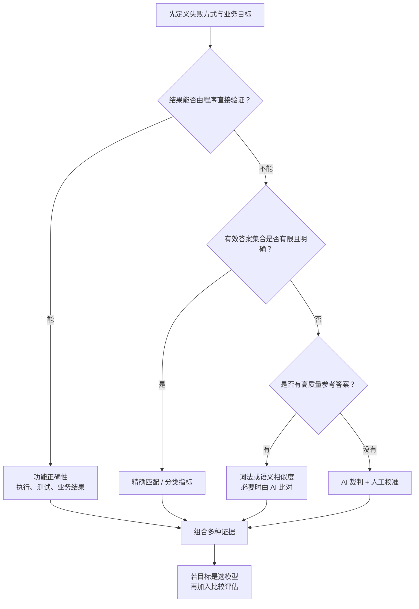
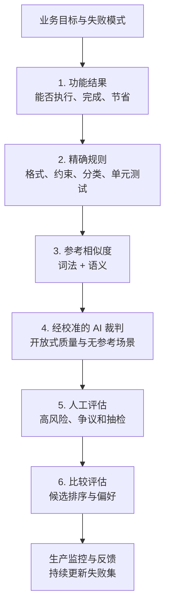

## 0. 学习目标与方法主线

基础模型越强、使用范围越广，失败的影响就越大。聊天机器人可能诱导用户采取危险行为，模型生成的虚假案例可能进入法庭，客服机器人给出的错误承诺也可能让企业承担赔偿责任。没有可靠的质量控制，AI 带来的风险可能超过收益。

评估因此不是上线前的最后一道验收，而是贯穿系统设计、模型选择、迭代和生产监控的基础设施。学完本章，应当能够回答五组问题：

1. **为什么基础模型比传统 ML 模型更难评估？** 理解能力门槛、开放式输出、黑盒、基准饱和与能力范围扩张带来的困难。
2. **语言模型本身学得怎么样？** 掌握熵、交叉熵、KL 散度、BPC、BPB 和困惑度的关系、推导与适用边界。
3. **什么时候能得到确定、可复现的评分？** 学会使用功能正确性、精确匹配、词法相似度和语义相似度。
4. **开放式质量如何自动判断？** 理解 AI 裁判的提示设计、验证方法、成本、偏差与版本风险。
5. **如何从两两比较得到模型排名？** 区分点式评估、比较评估与 A/B 测试，理解 Elo、Bradley–Terry、可扩展性和传递性问题。

本章的核心不是寻找一个万能分数，而是为不同问题选择合适的证据：



这条路线包含两个原则：

- **从失败模式出发，而不是从现成指标出发。** 如果不知道系统会在哪里失败，再多指标也无法使系统可靠；有时还要重新设计系统，让中间状态和失败原因可观察。
- **自动化程度越高，越需要校准。** 精确执行结果最可靠；词法和语义指标引入了代理假设；AI 裁判更灵活，却也把模型、提示和采样参数的偏差带进评估。

第三章聚焦“有哪些评估方法、它们如何工作以及何时失效”；第四章再把这些方法组织为针对具体应用的评估流水线。

---

## 1. 为什么基础模型更难评估

### 1.1 模型能力越高，评估门槛越高

一年级数学题的错误大多数人都能识别，博士级数学证明却需要领域专家。胡言乱语式摘要很容易判错；一篇语句连贯但暗含事实错误的摘要，则要求评估者先读完材料、核查事实并复现推理。

因此，模型能力提高会产生一个反直觉结果：**生成变得更自动，评估反而需要更高水平的人和更多时间。** 判断回答“听起来像不像真的”已经不够，还要检查：

- 事实是否有来源支撑；
- 推理步骤是否成立；
- 是否遗漏决定结论的条件；
- 是否满足特定领域的规范；
- 即使局部合理，整体任务是否完成。

这形成了一个能力缺口：如果模型已经超过普通评估者，评估者可能连错误在哪里都看不出来。评估成本也会随任务复杂度上升，而不是随生成成本下降。

### 1.2 开放式输出破坏了“与标准答案比较”的范式

传统分类任务的输出空间有限。若正确类别是 A、模型输出 B，就能无歧义地判错。开放式任务却可能有大量正确回答：同一个问题可以有不同措辞、结构、详略和论证路径。为每个输入穷举所有合法答案在组合意义上不可能。

这使评估从“查表”变成“判断”。例如：

- 翻译可以有多种自然表达；
- 摘要可以选择不同但都合理的重点；
- 代码可以用完全不同的算法得到相同结果；
- 对话回答可能同时受正确性、帮助性、安全性和语气约束。

开放式输出不是不能评，而是必须先回答：**我们究竟在评什么属性，哪些差异允许存在，哪些差异会造成真实损失？**

### 1.3 黑盒使能力诊断退化为输出观察

模型架构、训练数据和训练过程能透露大量能力边界。例如，训练语料缺少某种语言时，多语言表现差并不意外；模型未做安全后训练时，拒答行为也不应被默认可靠。

现实中，模型提供商可能不披露细节，应用开发者也未必具备审计参数和训练过程的能力。评估于是常常只能做黑盒测试：给输入、看输出，再从有限样本外推整体行为。

黑盒评估有三个限制：

1. **只能观察到被测试输入触发的行为**，未触发的失败仍然不可见；
2. **看见错误却不一定知道原因**，难以判断应该改提示、检索、模型还是数据；
3. **模型版本可能静默变化**，同名 API 的能力分布不一定固定。

因此，黑盒系统尤其需要版本化测试集、固定生成设置、失败样本追踪和生产监控。

### 1.4 公共基准会饱和，也可能被污染

理想基准应覆盖模型的完整能力范围，并能区分强弱模型。模型进步后，一旦大量模型接近满分，基准就失去区分力，这叫**基准饱和（benchmark saturation）**。

这一过程已经多次发生：

- GLUE 在 2018 年发布，约一年后就需要更难的 SuperGLUE；
- NaturalInstructions 被 Super-NaturalInstructions 取代；
- MMLU 随后需要更难的 MMLU-Pro。

基准还面临数据污染：若测试题进入训练语料，模型可能靠记忆而非泛化取得高分。公开、长期使用的基准尤其容易被网页转载、讨论和吸收进下一轮训练数据。

所以基准分数必须连同四项信息解释：测试集版本、提示与采样设置、污染风险、与真实应用分布的距离。高分只证明模型在该测量条件下表现好，不自动证明它适合你的产品。

### 1.5 通用模型扩大了评估范围

任务专用模型通常只需评训练目标。例如欺诈检测模型围绕识别欺诈进行测量。通用模型却能执行大量已知和未知任务，评估的职责从“验证既定任务”扩展为：

- 测量已知能力；
- 发现模型还能完成哪些新任务；
- 确认能力在哪些边界条件下崩溃；
- 探索超过现有人类基准的能力；
- 识别新能力同时带来的滥用方式。

评估由此兼具**风险控制**和**能力发现**两种目标。只测失败会错过机会，只测最好成绩又会低估风险。

### 1.6 最大障碍不是缺少指标，而是缺少系统化投入

评估研究和工具在快速增长，但投入仍落后于模型训练与应用编排。常见替代做法是听口碑、肉眼查看若干输出，或维护一小组凭个人经验挑选的“常用提示”。这种方式可以帮助原型起步，却无法支撑持续迭代：

- 样本不代表生产请求；
- 判断标准没有定义；
- 每次查看的输出不同；
- 结果无法复现和比较；
- 团队无法知道分数变化来自应用还是评估器。

系统化评估至少需要：明确标准、代表性样本、固定执行条件、可追溯版本和失败分析。后面的各种方法，都是为这五个要求提供不同类型的信号。

### 1.7 先建立评估方法的四组坐标

评估方法容易混淆，可以先沿四个维度分类：

| 维度 | 一端 | 另一端 |
|---|---|---|
| **判断是否有歧义** | 精确评估：相同输入必得相同判断 | 主观评估：依赖评估者或提示 |
| **是否需要标准答案** | 基于参考（reference-based） | 无参考（reference-free） |
| **如何评价对象** | 点式：逐个对象独立打分 | 比较式：判断两个对象谁更好 |
| **谁执行评估** | 人工 | 自动程序或 AI |

这些维度可以组合。余弦相似度在给定嵌入后是精确计算，但嵌入由哪个模型生成带有主观选择；AI 裁判既可以无参考地打分，也可以借助参考答案比较；人类也既能点式打分，也能做两两比较。

---

## 2. 语言模型指标

许多基础模型仍以语言模型为核心。语言建模能力通常与下游能力相关，因此熵、交叉熵和困惑度能帮助理解模型训练、微调和数据处理；但这种相关不是等价关系，后训练可能改善任务完成能力，同时让下一 token 预测指标变差。

### 2.1 从“预测下一个 token”到概率分布

自回归语言模型学习条件分布

$$Q(x_t\mid x_1,\ldots,x_{t-1}),$$

其中 $x_t$ 是当前真实 token，$x_{<t}$ 是前文，$Q$ 是模型学到的分布。数据本身存在一个未知的真实分布 $P$。评估语言建模能力，本质是在问：**模型分布 $Q$ 对真实数据分布 $P$ 的近似有多好？**

若模型在上下文“I like drinking __”之后给“tea”较高概率、给“charcoal”较低概率，它捕捉到了语言统计规律。模型越能把概率集中到真实会出现的 token 上，预测损失越低。

### 2.2 信息量：为什么罕见事件携带更多信息

观察到必然发生的事件不会带来新信息；观察到罕见事件则会显著改变认知。信息量应满足三个自然条件：

1. 概率越低，信息量越大；
2. 概率为 1 时，信息量为 0；
3. 独立事件同时发生时，信息量可相加。

设事件概率为 $p$，信息量为 $I(p)$。独立事件的联合概率为 $p_1p_2$，第三个条件要求

$$I(p_1p_2)=I(p_1)+I(p_2).$$

把乘法变加法的连续函数是对数，因此

$$I(p)=-\log_b p.$$

负号保证 $0<p<1$ 时信息量为正；底数 $b$ 决定单位：

- $b=2$ 时单位是 **bit**；
- $b=e$ 时单位是 **nat**。

例如，概率为 $1/8$ 的事件携带

$$I(1/8)=-\log_2(1/8)=3\text{ bits},$$

意思是需要 3 个二进制位才能在 8 个等可能结果中指出它。

### 2.3 熵：数据本身有多难预测

随机变量 $X$ 服从分布 $P$，可能取值为 $x_1,\ldots,x_m$。熵是单次观察信息量的期望：

$$
H(P)=\mathbb E_{x\sim P}[I(P(x))]
=-\sum_{i=1}^{m}P(x_i)\log_bP(x_i).
$$

逐项解释：

- $P(x_i)$：结果 $x_i$ 出现的概率；
- $-\log_bP(x_i)$：观察到该结果时获得的信息；
- 对全部结果按概率加权求和：每个 token 平均携带的信息量。

熵同时表示**最优无损编码下的平均编码长度下界**。若四个位置 token 等概率出现，每个概率为 $1/4$：

$$H(P)=-4\times\frac14\log_2\frac14=2\text{ bits}.$$

2 bits 恰好能编码四种状态：00、01、10、11。若只有两个等概率状态，熵为 1 bit。状态更多且更均匀时，更难预测，熵更高。

两个边界帮助建立直觉：

- **确定分布**：某结果概率为 1，其余为 0，$H(P)=0$；每次都能预测，不产生新信息。
- **均匀分布**：$m$ 个结果各为 $1/m$，$H(P)=\log_bm$，这是固定结果数下的最大熵。

第二个结论可由 KL 散度非负推出，也可用拉格朗日乘子在约束 $\sum_i p_i=1$ 下求最大值。它说明不确定性来自“结果数量”和“概率均匀程度”两部分。

### 2.4 交叉熵：模型预测真实数据要付出多少编码成本

熵假设使用真实分布 $P$ 来编码数据。模型只知道自己学到的分布 $Q$，于是对真实样本 $x$ 使用编码长度 $-\log Q(x)$。对真实分布取期望，得到交叉熵：

$$
H(P,Q)=-\sum_x P(x)\log_b Q(x).
$$

它回答的是：**数据实际来自 $P$，却按照模型 $Q$ 分配的概率编码时，每个 token 平均需要多少 bit 或 nat？**

若模型给真实 token 很低概率，$-\log Q(x)$ 很大，损失就高；若 $Q(x)=0$ 而 $P(x)>0$，交叉熵趋于无穷大，因为模型认为实际发生的事件绝不可能。

#### 交叉熵与 KL 散度的关系

KL 散度定义为

$$
D_{\mathrm{KL}}(P\Vert Q)
=\sum_xP(x)\log_b\frac{P(x)}{Q(x)}.
$$

展开对数：

$$
\begin{aligned}
D_{\mathrm{KL}}(P\Vert Q)
&=\sum_xP(x)\big(\log_bP(x)-\log_bQ(x)\big)\\
&=\sum_xP(x)\log_bP(x)-\sum_xP(x)\log_bQ(x)\\
&=-H(P)+H(P,Q).
\end{aligned}
$$

移项得到

$$
\boxed{H(P,Q)=H(P)+D_{\mathrm{KL}}(P\Vert Q)}.
$$

这个分解把交叉熵拆成两部分：

- $H(P)$：数据自身不可消除的不确定性；
- $D_{\mathrm{KL}}(P\Vert Q)$：模型分布与真实分布不匹配造成的额外代价。

KL 散度非负，因此

$$H(P,Q)\ge H(P),$$

且仅当 $P=Q$（在 $P$ 有概率质量的位置上）时取等号。也就是说，完美模型最多消除“建模错误”，不能消除语言本身的歧义。

KL 非负可由 Jensen 不等式证明。因为 $-\log$ 是凸函数：

$$
\begin{aligned}
D_{\mathrm{KL}}(P\Vert Q)
&=\mathbb E_{x\sim P}\left[-\log\frac{Q(x)}{P(x)}\right]\\
&\ge -\log\mathbb E_{x\sim P}\left[\frac{Q(x)}{P(x)}\right]\\
&=-\log\sum_xQ(x)=0.
\end{aligned}
$$

成立条件是：$Q(x)>0$ 对所有 $P(x)>0$ 的位置成立，并且两个分布定义在同一支持集上。

#### 为什么交叉熵不对称

一般有

$$H(P,Q)\ne H(Q,P).$$

因为两者的加权分布不同。$H(P,Q)$ 用真实数据出现频率 $P$ 加权，惩罚模型漏掉真实事件；$H(Q,P)$ 则用模型分布 $Q$ 加权，回答的是另一个问题。评估模型预测真实数据时，应使用 $H(P,Q)$。

#### 训练数据上的经验交叉熵

真实分布 $P$ 不可直接获得，只能用数据集 $x_1,\ldots,x_n$ 的经验平均估计：

$$
\widehat H(P,Q)
=-\frac1n\sum_{t=1}^{n}\log_bQ(x_t\mid x_{<t}).
$$

这就是平均负对数似然（NLL）。最小化交叉熵、最大化似然、最小化经验 KL 散度，在固定数据分布时是同一个优化目标。

### 2.5 BPC 与 BPB：跨分词器比较编码效率

“每 token 多少 bit”不能直接跨模型比较，因为不同分词器切出的 token 数不同。一个模型可能把单词作为一个 token，另一个模型可能拆成多个子词。需要把总编码成本除以更稳定的原始数据单位。

设一段文本包含 $N_t$ 个 token、$N_c$ 个字符、$N_b$ 个原始字节，总编码成本为 $L$ bits，则

$$
\mathrm{bits/token}=\frac{L}{N_t},\qquad
\mathrm{BPC}=\frac{L}{N_c},\qquad
\mathrm{BPB}=\frac{L}{N_b}.
$$

若每 token 平均含 $c=N_c/N_t$ 个字符，则

$$
\mathrm{BPC}=\frac{\mathrm{bits/token}}{c}.
$$

例如交叉熵为 6 bits/token，每 token 平均 2 个字符，则 BPC 为 $6/2=3$。

字符还受编码方式影响。UTF-8 中不同字符占用的字节数不同，因此 BPB 比 BPC 更适合跨语言和编码比较。若沿用一个理想化例子：每字符占 $7/8$ byte、BPC 为 3，则

$$
\mathrm{BPB}=\frac{3}{7/8}=\frac{24}{7}\approx3.43.
$$

这表示模型平均用 3.43 bits 表示原始数据的一个 byte；相对于每 byte 8 bits，理论编码长度不到原始大小的一半。这里讨论的是概率模型诱导出的理想编码长度，实际压缩文件还包含模型、词表和编码协议的开销。

### 2.6 困惑度：把对数损失还原为“等效候选数”

交叉熵的单位和对数尺度不够直观。困惑度（perplexity, PPL）对交叉熵取指数：

$$
\mathrm{PPL}(P,Q)=
\begin{cases}
2^{H(P,Q)}, & H\text{ 以 bits 计},\\
e^{H(P,Q)}, & H\text{ 以 nats 计}.
\end{cases}
$$

若模型在每一步都面对 $m$ 个等概率候选，则交叉熵为 $\log_bm$，困惑度为

$$b^{\log_bm}=m.$$

因此困惑度可以理解为：**模型预测下一个 token 时，等效地在多少个同样可能的候选之间犹豫。** 交叉熵为 2 bits 时，PPL 为 $2^2=4$；交叉熵为 0 时，PPL 为 1，表示完全确定。

#### 从 token 概率直接推导困惑度

给定 token 序列 $x_1,\ldots,x_n$，模型给整条序列的概率为

$$
Q(x_1,\ldots,x_n)=\prod_{t=1}^{n}Q(x_t\mid x_{<t}).
$$

平均 nats 交叉熵为

$$
H=-\frac1n\sum_{t=1}^{n}\ln Q(x_t\mid x_{<t}).
$$

取指数：

$$
\begin{aligned}
\mathrm{PPL}
&=\exp\left(-\frac1n\sum_{t=1}^{n}\ln Q(x_t\mid x_{<t})\right)\\
&=\exp\left(\ln\left(\prod_{t=1}^{n}Q(x_t\mid x_{<t})^{-1}\right)^{1/n}\right)\\
&=\left(\prod_{t=1}^{n}\frac1{Q(x_t\mid x_{<t})}\right)^{1/n}\\
&=Q(x_1,\ldots,x_n)^{-1/n}.
\end{aligned}
$$

所以困惑度是“真实 token 概率倒数”的**几何平均**。使用几何平均而非乘积，消除了序列长度对数值规模的直接影响。

实际计算需要拿到模型对每个真实下一 token 分配的概率或 logprob。部分商业 API 不暴露完整 logprobs，因此即使公式明确，也未必能计算闭源模型在任意文本上的 PPL。上述定义同样适用于生成图像 token、音频 token 等其他离散序列的模型，不只适用于自然语言。

### 2.7 数值验证：熵、交叉熵、KL 与困惑度

下面的代码把各个公式放在同一组数据上验证。

```python
"""验证熵、交叉熵、KL 散度、BPC/BPB 与困惑度之间的关系。"""
import math


def entropy(p, base=2):
    """H(P) = -sum p(x) log p(x)。"""
    return -sum(x * math.log(x, base) for x in p if x > 0)


def cross_entropy(p, q, base=2):
    """H(P,Q) = -sum p(x) log q(x)。"""
    return -sum(px * math.log(qx, base) for px, qx in zip(p, q) if px > 0)


def kl_divergence(p, q, base=2):
    """D_KL(P||Q) = sum p(x) log(p(x)/q(x))。"""
    return sum(px * math.log(px / qx, base) for px, qx in zip(p, q) if px > 0)


P = [0.50, 0.25, 0.25]       # 真实分布
Q = [0.40, 0.40, 0.20]       # 模型分布

h = entropy(P)
ce = cross_entropy(P, Q)
kl = kl_divergence(P, Q)
print(f"H(P)      = {h:.6f} bits")
print(f"D_KL(P||Q)= {kl:.6f} bits")
print(f"H(P,Q)    = {ce:.6f} bits")
print(f"H(P)+KL   = {h + kl:.6f} bits")
print(f"PPL       = 2^H(P,Q) = {2 ** ce:.6f}")

print("\n均匀分布的熵与困惑度：")
for n in [2, 4, 8]:
    p = [1 / n] * n
    h_n = entropy(p)
    print(f"  {n} 个等概率候选: H={h_n:.1f} bits, PPL={2 ** h_n:.1f}")

bits_per_token = 6
chars_per_token = 2
bpc = bits_per_token / chars_per_token
bpb = bpc / (7 / 8)
print(f"\n6 bits/token, 2 chars/token -> BPC={bpc:.2f}")
print(f"若每字符占 7/8 byte -> BPB={bpb:.4f}")

true_token_probs = [0.5, 0.25, 0.8, 0.1]
avg_nll = -sum(math.log(p) for p in true_token_probs) / len(true_token_probs)
ppl = math.exp(avg_nll)
product_form = math.prod(1 / p for p in true_token_probs) ** (1 / len(true_token_probs))
print(f"\n序列平均 NLL = {avg_nll:.6f} nats")
print(f"PPL=exp(NLL)  = {ppl:.6f}")
print(f"倒数几何平均   = {product_form:.6f}")
```

实际运行输出：

```text
H(P)      = 1.500000 bits
D_KL(P||Q)= 0.071928 bits
H(P,Q)    = 1.571928 bits
H(P)+KL   = 1.571928 bits
PPL       = 2^H(P,Q) = 2.973018

均匀分布的熵与困惑度：
  2 个等概率候选: H=1.0 bits, PPL=2.0
  4 个等概率候选: H=2.0 bits, PPL=4.0
  8 个等概率候选: H=3.0 bits, PPL=8.0

6 bits/token, 2 chars/token -> BPC=3.00
若每字符占 7/8 byte -> BPB=3.4286

序列平均 NLL = 1.151293 nats
PPL=exp(NLL)  = 3.162278
倒数几何平均   = 3.162278
```

结果验证了三条关键关系：$H(P,Q)=H(P)+D_{\mathrm{KL}}(P\Vert Q)$；均匀分布的困惑度等于候选数；序列困惑度等于真实 token 概率倒数的几何平均。

### 2.8 如何解释困惑度

困惑度越低，模型对给定数据越能预测；但“低到多少算好”没有跨数据集的统一答案。至少有三个控制变量：

#### 数据越结构化，期望困惑度越低

HTML 比日常语言更可预测。看到 `<head>` 后，附近出现 `</head>` 的概率很高。代码、模板和格式固定的日志通常也比开放式散文更容易预测。因此不能用模型在 HTML 上的 PPL 与另一模型在小说上的 PPL 比强弱。

#### 候选空间越大，困惑度通常越高

儿童读物词汇较窄，通常比《战争与和平》容易预测。字符级模型每步从有限字符中选择，词级模型则面对更大的词表，因此两者 PPL 不能直接比较。分词器不同，即使数据相同，预测单位也不同。

#### 可用上下文越长，困惑度通常越低

更多前文能消除歧义。计算 PPL 时必须说明模型能看到多少前文；500 token 上下文与 10,000 token 上下文得到的数值不应直接比较。最大上下文长度只是上限，实际滑动窗口与截断策略也会影响结果。

PPL 为 3 可以理解为模型每步等效地在 3 个候选中犹豫。相对于数万甚至十万规模的词表，这已经是很强的预测能力；但它不意味着真实 token 每次都有恰好 $1/3$ 的概率，因为困惑度是整段数据上的几何平均。

### 2.9 困惑度的用途与边界

#### 用途一：训练和模型能力的代理指标

在相同数据、分词器和上下文设置下，更大、更充分训练的语言模型通常有更低 PPL。它适合跟踪预训练是否继续改善，也可帮助筛选基础模型。

但它不是下游质量的充分条件。指令微调和 RLHF 优化的是完整回答是否有帮助，而不是是否像训练语料中的下一 token。后训练后，任务完成能力可能提高，PPL 却上升；量化也可能以难以预测的方式改变 PPL。因此不能仅凭困惑度选择对话模型。

#### 用途二：检测数据污染和重复

模型对见过或记忆过的文本通常给更高概率、即更低 PPL。若模型在某公开基准上的 PPL 异常低，可能意味着测试数据进入训练集，基准分数可信度下降。

同一原理可用于数据去重：新样本对现有模型的 PPL 很低，说明它与已有数据高度相似；PPL 较高则可能带来新信息。不过罕见但高质量的数据也会有高 PPL，所以不能把“不可预测”等同于“值得保留”。

#### 用途三：发现异常文本

乱码、语序异常或极不寻常的内容通常 PPL 较高，可用于异常检测和质量过滤。但创新观点、少数语言、专业术语同样可能被判为异常。若直接按高 PPL 删除数据，会系统性排斥长尾知识。

困惑度最适合做**同条件下的相对信号**，不适合作为跨分词器、跨数据、跨后训练阶段的万能排行榜。

---

## 3. Exact Evaluation（精确评估）

精确评估产生无歧义、可重复计算的判断。例如，选择题标准答案是 A 而模型选择 B，那么结果就是错误；同一程序和同一组输入得到的测试结论也应一致。与之相对，作文评分会随评估者、量表和时间改变，属于主观评估。

“精确”只描述**计算规则确定**，不保证规则衡量了真正目标。BLEU 可以精确地计算词语重叠，却未必精确反映翻译质量；余弦相似度可以精确计算两个向量的夹角，却依赖嵌入模型是否保留了任务需要的语义。因此还要区分：

- **测量过程是否确定**；
- **被测代理是否真的代表目标**。

本节针对开放式输出讨论两类精确信号：功能正确性，以及与参考答案的相似度。

### 3.1 Functional Correctness（功能正确性）

功能正确性不关心答案写得像不像标准答案，而关心系统是否完成预期功能：

- 让模型创建网站，网站能否运行并满足要求；
- 让智能体预订餐厅，预订是否真正成功；
- 让模型生成 SQL，查询是否能执行且返回正确结果；
- 让调度系统降低能耗，最终能耗是否下降；
- 让游戏机器人玩俄罗斯方块，最终得分有多高。

它最接近产品真正关心的结果，因此通常是优先级最高的指标。困难在于，许多功能难以自动验收，或者 AI 只负责复杂流程的一部分。棋局胜负容易判定，单独评价某一步棋的质量却更难；最终业务结果还可能受到用户、库存和外部服务等混杂因素影响。

#### 代码为什么特别适合功能评估

代码有明确语法和可执行语义。把生成代码交给解释器或编译器，再运行测试用例，就能得到可自动化的判断。这沿用了软件工程中的单元测试，而不是为 LLM 新发明的评估方式。

例如，函数 `has_close_elements(numbers, threshold)` 要判断列表中是否存在距离小于阈值的两个数。每条测试用例由输入和期望输出组成；候选实现只有通过**全部**测试，才算解决该题。HumanEval、MBPP 等代码生成基准采用这种思路；Spider、BIRD-SQL、WikiSQL 等 text-to-SQL 基准也依赖执行结果。

测试通过并不等于程序绝对正确。测试集只覆盖有限场景，遗漏的边界条件仍可能失败。功能评估的可信度取决于：

1. 测试是否覆盖正常输入、边界值和异常输入；
2. 预期输出本身是否正确；
3. 执行环境是否与生产一致；
4. 外部副作用和非确定行为是否被控制；
5. 未受信任代码是否在沙箱中执行。

最后一项尤其重要：自动执行模型生成的代码可能造成文件破坏、网络访问或资源耗尽，评估器本身必须有权限隔离、超时和资源限制。

### 3.2 pass@k：多次采样时如何评价代码模型

生成模型具有随机性，同一道题可以生成多个候选。设一共有 $M$ 道题，每题生成 $k$ 个代码样本；若其中任意一个通过该题的全部测试，就认为该题在 $k$ 次机会下被解决。定义

$$
S_i(k)=\mathbf 1\{\text{第 }i\text{ 题的 }k\text{ 个候选中至少一个正确}\},
$$

则

$$
\mathrm{pass@}k=\frac1M\sum_{i=1}^{M}S_i(k).
$$

若 10 道题中有 5 道在 3 个候选内至少成功一次，则 pass@3 为 50%。同一生成策略下，机会越多，成功概率不会下降，因此期望上

$$
\mathrm{pass@1}\le\mathrm{pass@3}\le\mathrm{pass@10}.
$$

这也说明 **pass@k 必须连同 $k$ 报告**。pass@10 高于另一模型的 pass@1，不能直接说明前者单次生成更好。

#### 已生成 $n$ 个样本时的无偏估计

实际基准常为每题一次生成 $n$ 个样本，其中 $c$ 个正确，再估计从这 $n$ 个样本中随机抽 $k$ 个时至少出现一个正确答案的概率。

总抽法有 $\binom nk$ 种。抽出的 $k$ 个全部错误，必须从 $n-c$ 个错误样本中选择，共有 $\binom{n-c}{k}$ 种。因此

$$
P(\text{至少一个正确})
=1-P(\text{全部错误})
=1-\frac{\binom{n-c}{k}}{\binom nk}.
$$

于是每题的标准估计量是

$$
\boxed{\widehat{\mathrm{pass@}k}
=1-\frac{\binom{n-c}{k}}{\binom nk}}.
$$

当 $n-c<k$ 时，不可能抽到全错误集合，估计值为 1。

这个组合公式描述的是**从已生成样本中无放回抽取**，不要求这些 $n$ 个样本彼此独立。若另外假设每次独立生成的单次成功率恒为 $p$，理论成功率才简化为

$$1-(1-p)^k.$$

现实中候选共享同一模型偏差，往往相关；改变温度、top-p 或提示也会改变 $p$。所以比较 pass@k 时还必须固定采样配置、最大输出长度、测试环境和候选数。

```python
"""演示功能测试与 pass@k 的组合估计。"""
from math import comb


def has_close_elements(numbers, threshold):
    """排序后只需检查相邻元素；最近的一对必然在排序后相邻。"""
    ordered = sorted(numbers)
    return any(b - a < threshold for a, b in zip(ordered, ordered[1:]))


TEST_CASES = [
    ([1.0, 2.0, 3.9, 4.0, 5.0, 2.2], 0.3, True),
    ([1.0, 2.0, 3.9, 4.0, 5.0, 2.2], 0.05, False),
    ([1.0, 2.0, 5.9, 4.0, 5.0], 0.95, True),
    ([1.0, 2.0, 5.9, 4.0, 5.0], 0.8, False),
    ([1.0, 2.0, 3.0, 4.0, 5.0, 2.0], 0.1, True),
    ([1.1, 2.2, 3.1, 4.1, 5.1], 1.0, True),
    ([1.1, 2.2, 3.1, 4.1, 5.1], 0.5, False),
]

passed = sum(has_close_elements(xs, t) == expected for xs, t, expected in TEST_CASES)
print(f"功能测试: {passed}/{len(TEST_CASES)} 通过")


def pass_at_k(n, c, k):
    """1 - C(n-c,k)/C(n,k)：从 n 个候选抽 k 个时至少一个正确。"""
    if not (0 <= c <= n and 1 <= k <= n):
        raise ValueError("需要满足 0 <= c <= n 且 1 <= k <= n")
    return 1.0 if n - c < k else 1 - comb(n - c, k) / comb(n, k)


print("\n单题：n=5 个候选，其中 c=2 个正确")
for k in [1, 2, 3, 5]:
    print(f"  pass@{k} = {pass_at_k(5, 2, k):.3f}")

correct_counts = [2, 0, 5, 1]
print("\n四道题的平均估计：")
for k in [1, 2, 3, 5]:
    score = sum(pass_at_k(5, c, k) for c in correct_counts) / len(correct_counts)
    print(f"  pass@{k} = {score:.3f}")
```

实际运行输出：

```text
功能测试: 7/7 通过

单题：n=5 个候选，其中 c=2 个正确
  pass@1 = 0.400
  pass@2 = 0.700
  pass@3 = 0.900
  pass@5 = 1.000

四道题的平均估计：
  pass@1 = 0.400
  pass@2 = 0.525
  pass@3 = 0.625
  pass@5 = 0.750
```

### 3.3 基于参考答案的评估

无法直接执行或验收功能时，可以把模型输出与参考答案比较。数据通常采用

$$
(\text{input},\{\text{reference response}_1,\ldots,\text{reference response}_r\})
$$

的形式，一个输入可以有多个参考答案。参考答案也称标准答案、规范答案或 ground truth。需要参考答案的指标叫**基于参考（reference-based）**；无需参考的叫**无参考（reference-free）**。

参考数据是这套方法的瓶颈：

- 人工生成质量较高，但昂贵、缓慢，也可能带有偏好和错误；
- AI 生成更快，却可能把模型错误复制进评估集；
- AI 起草、人工审核可降低劳动量，但仍需定义审核标准；
- 参考集不完备时，正确回答也可能被误判。

“以人工答案为金标准”还隐含一个假设：人类示例代表任务的最佳完成方式。对于超过普通标注者能力的任务，这个假设未必成立。

比较开放式文本主要有四条路线：人工或 AI 直接判断、精确匹配、词法相似度、语义相似度。后三者是手工定义的确定计算规则。

### 3.4 Exact Match（精确匹配）

若生成结果与任一参考答案完全一致，就记为匹配。它适用于答案短、形式固定的任务，例如简单算术、账户余额、常识问答和填空。

实际使用时通常先规范化：统一大小写、去除首尾空白、规范 Unicode、可选地移除标点和冠词。例如 `"  Paris! "` 可规范化为 `"paris"`。规范化规则必须版本化，因为规则本身定义了哪些差异被忽略。

“包含参考答案就算正确”可以提高召回率，却容易误收错误回答。问题“Anne Frank 出生于哪一年？”的参考答案是 1929；回答“September 12, 1929”包含 1929，却把日期写错了。子串匹配只能证明出现了目标片段，不能证明整句事实正确。

精确匹配的核心权衡是：

- **精度高**：匹配时证据强；
- **召回低**：参考集不可能穷尽所有自然表达。

例如法语 `Comment ça va?` 可以译为 “How are you?”、“How are you doing?” 或 “How is it going?”。参考集中漏掉最后一种时，合法翻译会被判错。文本越长、任务越开放，精确匹配越不适用。

### 3.5 Lexical Similarity（词法相似度）

词法相似度衡量两个文本在字符、词或 n-gram 层面看起来有多像，不判断含义是否相同。

参考句是 “My cats scare the mice”：

- “My cats eat the mice” 与参考句共享 5 个词中的 4 个；
- “Cats and mice fight all the time” 共享 5 个词中的 3 个。

若用参考词召回率，前者为 80%，后者为 60%。这种指标简单透明，却会认为“猫吓老鼠”和“猫吃老鼠”非常相似，说明高词面重叠并不保证事实关系一致。

#### 编辑距离与模糊匹配

编辑距离表示把字符串 $s$ 变为 $t$ 所需的最少操作数。经典 Levenshtein 距离允许：删除、插入和替换。令

$$D_{i,j}=\text{把 }s_{1:i}\text{ 变为 }t_{1:j}\text{ 的最少操作数}.$$

边界条件为

$$D_{i,0}=i,\qquad D_{0,j}=j,$$

因为非空前缀变为空串只能逐字符删除，反之只能逐字符插入。

对 $i,j>0$：

$$
D_{i,j}=\min\begin{cases}
D_{i-1,j}+1, & \text{删除 }s_i,\\
D_{i,j-1}+1, & \text{插入 }t_j,\\
D_{i-1,j-1}+\mathbf1[s_i\ne t_j], & \text{匹配或替换}.
\end{cases}
$$

递推成立是因为任意最优编辑序列的最后一步必属于这三类之一；去掉最后一步，剩余部分也必须是对应前缀问题的最优解，否则可用更短解替换，产生矛盾。这就是动态规划的最优子结构。

完整表格的时间和空间复杂度都是 $O(|s||t|)$；若只需要最终距离，可滚动保留两行，把空间降为 $O(\min(|s|,|t|))$。有些实现还把相邻字符交换作为一步，称 Damerau–Levenshtein 距离；不同库的“模糊匹配分数”因此未必可比。

#### n-gram 重叠

n-gram 是连续 $n$ 个 token。句子 “my cats scare the mice” 有四个 bigram：

```text
my cats | cats scare | scare the | the mice
```

设候选文本中 n-gram $g$ 的计数为 $C_g$，参考文本计数为 $R_g$。为避免候选重复某个词骗取高分，匹配数采用**截断计数**：

$$M_g=\min(C_g,R_g).$$

修改后的 n-gram 精确率与召回率分别为

$$
P_n=\frac{\sum_gM_g}{\sum_gC_g},\qquad
R_n=\frac{\sum_gM_g}{\sum_gR_g}.
$$

- $P_n$ 问：候选写出的 n-gram 有多少被参考支持；
- $R_n$ 问：参考中的 n-gram 有多少被候选覆盖。

#### BLEU 与 ROUGE 的侧重点

BLEU 主要以 n-gram 精确率为基础。简化形式为

$$
\mathrm{BLEU}=\mathrm{BP}\cdot
\exp\left(\sum_{n=1}^{N}w_n\ln P_n\right),
\qquad \sum_nw_n=1.
$$

使用几何平均意味着某一阶 n-gram 精确率接近 0 会强烈拉低总分，要求候选同时保留局部词语和较长结构。为了防止输出极短文本获得虚高精确率，引入长度惩罚：

$$
\mathrm{BP}=\begin{cases}
1, & c>r,\\
e^{1-r/c}, & c\le r,
\end{cases}
$$

其中 $c$ 是候选长度，$r$ 是参考长度。候选比参考短时 $1-r/c<0$，惩罚小于 1；长度接近时趋于 1。若某阶 $P_n=0$，对数无定义，实践中需平滑。

ROUGE 更强调召回，常用于摘要：ROUGE-N 本质上接近 $R_n$；ROUGE-L 基于最长公共子序列（LCS），允许中间穿插其他 token。设候选前缀为 $c_{1:i}$、参考前缀为 $r_{1:j}$，LCS 长度满足

$$
L_{i,j}=\begin{cases}
0, & i=0\text{ 或 }j=0,\\
L_{i-1,j-1}+1, & c_i=r_j,\\
\max(L_{i-1,j},L_{i,j-1}), & c_i\ne r_j.
\end{cases}
$$

递推依据与编辑距离相同：最优公共子序列在末尾 token 相等时必可扩展 1；末尾不等时，至少要舍弃其中一侧的末尾。令最终 LCS 长度为 $L$，则

$$P_{LCS}=\frac{L}{|c|},\qquad R_{LCS}=\frac{L}{|r|},$$

再计算调和平均即可得到常见 ROUGE-L 形式。完整实现还可能使用不同的 $F_\beta$ 权重和多参考聚合规则。

METEOR 会考虑词形、词干和同义词匹配；TER 衡量把译文改成参考译文需要的编辑量；CIDEr 用 TF-IDF 降低常见 n-gram 权重，并衡量候选与多个人类描述的共识。

这些指标计算规则不同，分数不能直接互换。它们都依赖参考数据完整且正确。

### 3.6 词法指标为什么会失效

词法相似度有三个根本限制。

**第一，参考答案不完备。** 图像描述模型可能生成正确描述，却因参考集中没有相似措辞而得低分。增加参考数量能缓解，无法穷尽开放式答案。

**第二，参考答案也可能错误。** 机器翻译评测中发现过大量低质量参考译文；此时与错误参考更相似，分数反而更高。无参考指标有时会比基于参考的指标更接近人工判断。

**第三，词面相似不等于功能正确。** HumanEval 中，正确和错误代码的 BLEU 分数可能相近。代码只改一个运算符就会从正确变错误，但绝大多数 token 不变；完全不同的算法则可能功能相同而词面重叠很低。因此能执行测试时，应优先使用功能正确性，而不是 BLEU。

### 3.7 Semantic Similarity（语义相似度）

词法指标比较“长得像不像”，语义相似度比较“意思近不近”。“What’s up?” 与 “How are you?” 词面不同，语义接近；“Let’s eat, grandma” 与 “Let’s eat grandma” 只差一个逗号，含义却完全不同。

要计算语义，先用嵌入模型把输入映射为向量：

$$f:\mathcal X\rightarrow\mathbb R^d.$$

若生成回答的嵌入为 $A$，参考回答的嵌入为 $B$，常用余弦相似度：

$$
\cos(A,B)=\frac{A\cdot B}{\lVert A\rVert_2\lVert B\rVert_2}
=\frac{\sum_iA_iB_i}{\sqrt{\sum_iA_i^2}\sqrt{\sum_iB_i^2}}.
$$

由 Cauchy–Schwarz 不等式

$$|A\cdot B|\le\lVert A\rVert_2\lVert B\rVert_2,$$

可知非零向量的余弦相似度位于 $[-1,1]$。同方向为 1，正交为 0，反方向为 -1。它具有尺度不变性：对任意正数 $a,b$，

$$\cos(aA,bB)=\cos(A,B),$$

所以比较的是方向而不是模长。

将向量归一化为 $\hat A=A/\lVert A\rVert$、$\hat B=B/\lVert B\rVert$ 后：

$$
\lVert\hat A-\hat B\rVert_2^2
=2-2\hat A\cdot\hat B
=2(1-\cos(A,B)).
$$

因此，在单位向量上，最大化余弦相似度与最小化欧氏距离给出相同排序。

语义相似度的计算在给定向量后是精确的，但整个方法不是完全客观的：不同嵌入模型会产生不同向量和排序。它的可靠性取决于嵌入是否保留了任务关心的属性。通用语义接近不一定能识别事实否定、数值变化、法律效力或代码行为。

BERTScore 不把整段文本只压成一个向量，而是比较候选与参考的 token 嵌入。候选 token 嵌入为 $\hat c_i$，参考 token 嵌入为 $\hat r_j$，向量已归一化，则

$$
P_{\mathrm{BERT}}=\frac1{|c|}\sum_i\max_j \hat c_i^\top\hat r_j,
\qquad
R_{\mathrm{BERT}}=\frac1{|r|}\sum_j\max_i \hat r_j^\top\hat c_i,
$$

$$
F_{\mathrm{BERT}}=
\frac{2P_{\mathrm{BERT}}R_{\mathrm{BERT}}}
{P_{\mathrm{BERT}}+R_{\mathrm{BERT}}}.
$$

每个候选 token 寻找最相似参考 token，形成精确率方向；参考 token 反向寻找候选 token，形成召回率方向。基础形式允许多个 token 匹配同一个 token，并不保证全局一一对齐；具体实现还可加入逆文档频率权重。MoverScore 则结合多种表示，估计把一个文本的语义质量“搬运”到另一个文本的代价。

### 3.8 数值实现：精确匹配、编辑距离、BLEU 与余弦

```python
"""实现常见参考相似度，并展示它们衡量的是不同属性。"""
import math
import re
import unicodedata
from collections import Counter


def normalize(text):
    """统一 Unicode、大小写、标点与空白；规则变化会改变精确匹配结果。"""
    text = unicodedata.normalize("NFKC", text).casefold()
    text = re.sub(r"[^\w\s]", " ", text)
    return " ".join(text.split())


def levenshtein(source, target):
    """使用滚动数组计算 Levenshtein 距离，空间 O(min(m,n))。"""
    if len(source) < len(target):
        source, target = target, source
    previous = list(range(len(target) + 1))
    for i, source_char in enumerate(source, start=1):
        current = [i]
        for j, target_char in enumerate(target, start=1):
            current.append(min(
                previous[j] + 1,                         # 删除
                current[j - 1] + 1,                      # 插入
                previous[j - 1] + (source_char != target_char),  # 替换/匹配
            ))
        previous = current
    return previous[-1]


def ngrams(tokens, n):
    return [tuple(tokens[i:i + n]) for i in range(len(tokens) - n + 1)]


def clipped_precision(candidate, reference, n):
    c = Counter(ngrams(candidate, n))
    r = Counter(ngrams(reference, n))
    matches = sum(min(count, r[g]) for g, count in c.items())
    return matches / sum(c.values()) if c else 0.0


def ngram_recall(candidate, reference, n):
    c = Counter(ngrams(candidate, n))
    r = Counter(ngrams(reference, n))
    matches = sum(min(count, c[g]) for g, count in r.items())
    return matches / sum(r.values()) if r else 0.0


def bleu2(candidate, reference):
    """等权 BLEU-2；示例未加零值平滑。"""
    p1 = clipped_precision(candidate, reference, 1)
    p2 = clipped_precision(candidate, reference, 2)
    c, r = len(candidate), len(reference)
    bp = 1.0 if c > r else math.exp(1 - r / c)
    return 0.0 if p1 == 0 or p2 == 0 else bp * math.exp((math.log(p1) + math.log(p2)) / 2)


def cosine(a, b):
    dot = sum(x * y for x, y in zip(a, b))
    norm_a = math.sqrt(sum(x * x for x in a))
    norm_b = math.sqrt(sum(x * x for x in b))
    return dot / (norm_a * norm_b)


print("规范化精确匹配:", normalize("  Paris! ") == normalize("paris"))
print("子串陷阱:", "1929" in "September 12, 1929", "但完整日期错误")
print(f"编辑距离 bad->bard: {levenshtein('bad', 'bard')}")
print(f"编辑距离 bad->cash: {levenshtein('bad', 'cash')}")

reference = "my cats scare the mice".split()
response_a = "my cats eat the mice".split()
response_b = "cats and mice fight all the time".split()
print(f"\nA 的 unigram 参考召回率: {ngram_recall(response_a, reference, 1):.2f}")
print(f"B 的 unigram 参考召回率: {ngram_recall(response_b, reference, 1):.2f}")
print(f"A 的 bigram 参考召回率:  {ngram_recall(response_a, reference, 2):.2f}")

candidate = "the cat is on the mat".split()
reference2 = "the cat sits on the mat".split()
print(f"\nBLEU-2: {bleu2(candidate, reference2):.4f}")
print(f"ROUGE-2式召回率: {ngram_recall(candidate, reference2, 2):.4f}")

a, b, c = [1, 2, 3], [2, 4, 6], [1, 0, -1]
cos_ab, cos_ac = cosine(a, b), cosine(a, c)
print(f"\ncos(a,b)={cos_ab:.4f}（同方向，长度不同）")
print(f"cos(a,c)={cos_ac:.4f}")
print(f"单位向量距离平方 = 2(1-cos) = {2 * (1 - cos_ac):.4f}")
```

实际运行输出：

```text
规范化精确匹配: True
子串陷阱: True 但完整日期错误
编辑距离 bad->bard: 1
编辑距离 bad->cash: 3

A 的 unigram 参考召回率: 0.80
B 的 unigram 参考召回率: 0.60
A 的 bigram 参考召回率:  0.50

BLEU-2: 0.7071
ROUGE-2式召回率: 0.6000

cos(a,b)=1.0000（同方向，长度不同）
cos(a,c)=-0.3780
单位向量距离平方 = 2(1-cos) = 2.7559
```

这段输出也展示了代理差异：回答 A 的词语召回很高，但把“吓”改成“吃”已经改变事实；余弦忽略向量长度；BLEU 与 ROUGE 即使使用相同 n-gram，也因精确率/召回率侧重点不同而回答不同问题。

### 3.9 Introduction to Embedding（嵌入简介）

计算机处理数值，嵌入（embedding）把文本、图像、音频、商品或用户映射为低维向量，并尽量使任务上相似的对象在向量空间中接近。实际嵌入通常有数百到数千维，例如：

| 模型 | 典型嵌入维度 |
|---|---:|
| BERT base / large | 768 / 1024 |
| CLIP 图像与文本 | 512 |
| text-embedding-3-small / large | 1536 / 3072 |
| Cohere Embed v3 变体 | 384 或 1024 |

原始文本的可能空间几乎无限，因此几千维仍属于压缩表示。压缩必然丢失信息，目标不是重建全部细节，而是保留下游任务有用的结构。

GPT、Llama 等 Transformer 内部也会生成中间向量，但专门训练的嵌入模型通常更适合检索和相似度任务。嵌入质量可以通过两类方式评价：

- **内在评价**：语义相似对象是否更接近；
- **外在评价**：用这些嵌入做分类、聚类、推荐、检索或 RAG 时效果是否更好。

外在评价更接近最终用途。MTEB（Massive Text Embedding Benchmark）用多种任务综合衡量文本嵌入，避免只对单一相似度数据集过拟合。

#### 多模态联合嵌入

联合嵌入空间让不同模态可以直接比较。CLIP 用文本编码器和图像编码器分别产生向量，再投影到共同空间，使配对图文靠近、不配对图文远离。ULIP 进一步连接文本、图像与 3D 点云；ImageBind 把文本、图像、音频等六种模态放入联合空间。

设批次中有 $N$ 对匹配的图像 $I_i$ 与文本 $T_i$，归一化嵌入为 $u_i,v_i$，温度为 $\tau>0$，相似度为

$$s_{ij}=\frac{u_i^\top v_j}{\tau}.$$

从图像检索文本的对比损失为

$$
\mathcal L_{I\to T}
=-\frac1N\sum_{i=1}^{N}
\log\frac{e^{s_{ii}}}{\sum_{j=1}^{N}e^{s_{ij}}}.
$$

分子是正确配对，分母包含该图像与批内所有文本的候选。最小化损失会提高 $s_{ii}$、压低 $s_{ij},j\ne i$。再对称计算文本到图像的损失：

$$
\mathcal L=\frac12(\mathcal L_{I\to T}+\mathcal L_{T\to I}).
$$

这是一种标准的对比学习形式。它假设批内其他样本可视为负例；若批中恰有语义相同但未配对的图文，它们会成为“假负例”。温度控制 softmax 的尖锐程度，批次大小则决定负例数量。

训练后，文本“a fisherman”的向量应接近捕鱼男子的图片，而远离时装秀图片，于是可以实现文本搜图、跨模态去重和联合推荐。

嵌入方法的主要边界是：

1. **语义取决于训练目标。** 为检索训练的空间未必适合事实一致性或法律判断。
2. **单向量会压缩细节。** 长文中的少数关键否定、数字或例外条款可能被平均掉。
3. **相似不等于正确。** 与参考答案很像的回答仍可能包含关键错误。
4. **计算并非免费。** 专用嵌入模型会增加延迟、成本和版本管理负担。
5. **阈值依赖分布。** 余弦 0.8 是否足够相似，必须在具体任务数据上校准。

相似度不仅用于评估，还贯穿检索、排序、聚类、异常检测和数据去重。后续 RAG 与数据工程都会复用这些概念。

---

## 4. AI as a Judge（用 AI 评估 AI）

开放式回答难以靠规则覆盖，人工评估又慢且昂贵，于是自然出现一个问题：既然 AI 能自动化生成、翻译和推理，能否也自动化评估？使用 AI 模型判断其他 AI 输出的方法称为 **AI as a judge** 或 **LLM as a judge**，承担判断任务的模型称为 AI 裁判。

这不是“让模型证明自己正确”，而是把评估写成另一个推理任务。例如给裁判输入问题、候选回答、可选参考答案和评分规则，让它判断正确性、相关性、忠实度、毒性或偏好。

这一方法在强大通用模型出现后才真正实用。到 2023 年，LangChain 平台约 58% 的评估已由 AI 裁判执行。它流行的原因不是绝对可靠，而是填补了“规则测不了、人工又太贵”的空白。

### 4.1 为什么 AI 裁判有用

#### 快、便宜、可扩展

与人工逐条阅读、核查和评分相比，模型可以批量执行相同规则，适合实验阶段回归测试和生产抽检。即使单次调用不便宜，通常仍显著低于专业人工评审。

#### 可以无参考工作

生产请求通常没有标准答案。AI 裁判可以仅根据问题和回答判断是否相关、是否自相矛盾、语气是否合适，因而能覆盖 reference-free 场景。

#### 判断标准灵活

同一个通用模型可以根据提示判断：

- 正确性与完整性；
- 是否忠于给定上下文；
- 是否重复、冗长或偏题；
- 是否包含毒性、违法建议或隐私信息；
- 是否符合角色设定；
- 产品图片是否让人信任；
- 两个回答中用户可能更喜欢哪一个。

#### 可以给出理由

规则指标只返回数值，AI 裁判还能解释哪些主张缺乏证据、为何某答案更相关。理由有助于审计和失败分析，但**解释听起来合理不等于判断正确**；解释本身也要抽检。

#### 在部分任务上与人类高度相关

MT-Bench 的研究中，GPT-4 与人类判断的一致率约为 85%，高于该实验中人类之间约 81% 的一致率。AlpacaEval 的 AI 评价结果与由人类投票形成的 Chatbot Arena 排名相关系数约为 0.98。

这两个数字不能混为一谈：

- **一致率**衡量单个判断是否相同；
- **相关系数**衡量一组模型的排序或分数变化是否同向。

高排名相关不保证每条样本判断都对，高人机一致也不证明人类标签是真理。

### 4.2 AI 裁判的三种基本用法

#### 点式评价：独立判断一个回答

输入问题和一个回答，让裁判按量表评分：

```text
任务：评价回答是否正确、相关且足以解决问题。
评分：1 到 5。
1 表示错误或完全无关；5 表示正确、直接且完整。
问题：{question}
回答：{answer}
请输出分数和简短理由。
```

这种方法得到绝对分数，适合检查是否跨过可用门槛；难点是“3 分”在不同裁判、提示和团队中含义可能不同。

#### 基于参考的判断

给裁判问题、参考回答和生成回答，让它判断两者是否表达相同事实，或按参考答案评价质量。它比精确匹配和词法相似度更能容忍改写，但继承了参考答案的遗漏和错误。

#### 成对比较

同时给出回答 A 和 B，让裁判选择更好者，也可允许平局。成对比较常用于：

- 生成偏好微调数据；
- best-of-N 测试时计算；
- 比较模型或提示版本；
- 构建模型排行榜。

人和模型通常都比“给一篇回答打 73 分”更擅长回答“这两篇哪一篇更好”。但偏好问题不能替代事实正确性；下一节会进一步讨论这个边界。

### 4.3 如何写裁判提示

一个可审计的裁判提示至少要明确四部分。

#### 任务

说明输入包含什么、裁判要输出什么。例如“判断生成回答与问题是否相关”，不要只写“评价这个答案”。

#### 标准

把抽象概念拆成可观察条件。评价相关性时，可要求：回答直接处理问题、不依赖无关信息、包含解决问题所需内容。评价忠实度时，应说明：只检查回答中的主张能否由上下文支持，不评价上下文本身是否真实。

#### 量表

常见形式包括：

- 分类：正确/错误、相关/无关/中立；
- 离散分数：1–5；
- 连续分数：0–1。

语言模型通常更擅长文本类别，而不是精确连续数值。离散分数一般比连续分数稳定，范围越宽，模型越难保持相邻等级的一致含义。因此 1–5 比 1–100 更常见。

#### 标尺示例与理由

仅描述“1 很差、5 很好”仍然模糊。应为各等级提供代表样本和判分理由，使量表从形容词变成决策规则。例如：

| 分数 | 可操作定义 |
|---:|---|
| 1 | 与参考事实矛盾，或没有回答问题 |
| 2 | 有少量相关内容，但关键结论错误 |
| 3 | 主要方向正确，遗漏重要条件 |
| 4 | 正确且基本完整，只有次要缺陷 |
| 5 | 正确、完整、直接，并满足格式要求 |

示例可以提高一致性，但会拉长提示、增加成本，并可能让裁判过度模仿示例表面特征。示例应覆盖边界情况，而不只是明显的 1 分与 5 分。

### 4.4 裁判不是一个模型，而是一个系统

一个 AI 裁判应标识为

$$
J=(\text{model},\text{model version},\text{prompt},
	ext{sampling settings},\text{output parser}).
$$

改变其中任一项，就是换了裁判。即使都叫“relevance”或“faithfulness”，不同工具的实现也不可直接比较：

- 有的忠实度量表为 1–5；
- 有的逐条主张输出 0/1；
- 有的只输出 YES/NO；
- 有的把输入问题纳入判断，有的明确要求忽略问题、只比较回答与上下文。

因此，评估结果必须与裁判版本绑定。上个月连贯性 90%、本月 92%，只有在裁判完全相同时才可能表示应用改善；若提示修了一个错别字、模型供应商升级版本或解析器改变，分数漂移可能来自评估器。

一个实用原则是：**看不到裁判所用模型和提示，就不要把它当成可追溯基准。**

### 4.5 如何校准 AI 裁判

AI 裁判也需要自己的评估集。一个可操作流程是：

1. 由领域专家建立小型高质量校准集，包含明确标签、理由和边界样本；
2. 固定裁判模型、提示、温度、输出解析器和重试规则；
3. 分别测量正确性与重复运行一致性；
4. 按任务类别、语言、长度和风险等级切片；
5. 做位置交换、长度控制和来源隐藏等偏差测试；
6. 对分歧样本人工复核，迭代提示或改用专用裁判；
7. 裁判升级后重跑整个校准集，而不是只比较平均分。

#### 一致率不够时，用 Cohen’s $\kappa$ 扣除随机一致

简单一致率

$$p_o=\frac{\text{裁判与人工标签相同的样本数}}{n}$$

会被类别不平衡夸大。若 95% 样本都是“安全”，裁判永远输出“安全”也有 95% 一致率，却没有识别能力。

设人工给类别 $c$ 的比例为 $p_H(c)$，裁判给该类别的比例为 $p_J(c)$。若双方只按各自边际比例随机标注，期望一致率为

$$p_e=\sum_cp_H(c)p_J(c).$$

Cohen’s kappa 定义为

$$
\kappa=\frac{p_o-p_e}{1-p_e}.
$$

- $\kappa=1$：完全一致；
- $\kappa=0$：不比按边际比例随机一致更好；
- $\kappa<0$：比随机还差。

这个修正假设样本独立，且两位评估者使用同一组互斥类别。$\kappa$ 仍不能判断人类标签是否正确，也不能替代按高风险类别查看召回率。

### 4.6 Inconsistency（不一致）

AI 裁判与其他生成式应用一样具有概率性：

- 换一种提示措辞，分数可能变化；
- 相同提示运行两次，也可能得到不同分数；
- 硬件、模型版本和服务端实现也可能造成变化。

在一项实验中，加入评价示例使 GPT-4 的一致性从约 65% 提升到 77.5%，但调用成本增加到约四倍。更高一致性也不表示更高正确率：裁判可能稳定地犯同一种错误。

这两个轴必须分开测：

| | 一致性高 | 一致性低 |
|---|---|---|
| **正确率高** | 理想裁判 | 判断通常对但难复现 |
| **正确率低** | 稳定偏差，最容易误导 | 几乎不可用 |

降低温度、固定 seed、提供清晰量表和示例可以改善复现性，但不能保证 100% 确定。高风险评估应保留精确规则或人工复核。

### 4.7 成本、抽检与延迟

若生成一次回答需要 1 次模型调用，再用 $m$ 个独立提示评价 $m$ 项标准，则全量同步评估需要

$$1+m$$

次调用。评价整体质量、事实一致性和毒性三项，就从 1 次变成 4 次，调用数约增至四倍。

若只抽检比例 $f$ 的回答，平均每个请求调用数为

$$1+fm.$$

抽检降低成本，却可能漏掉失败。若失败率为 $q$，独立抽取 $n$ 个样本，至少发现一次失败的概率为

$$P(\text{发现失败})=1-(1-q)^n.$$

这个公式假设样本独立同分布。生产请求存在时间聚集和用户群差异时，应做分层抽样，而不是只随机抽全局流量。

同步裁判还会增加用户等待时间。可选架构包括：

- 高风险场景同步拦截，接受额外延迟；
- 低风险场景异步评估，发现问题后撤回、纠正或进入人工队列；
- 用轻量规则先筛选，再把疑难样本交给强裁判；
- 强裁判只抽检，弱裁判全量运行。

风险、置信度、成本和延迟之间没有统一最优点，需要按应用损失函数选择。

### 4.8 数值实现：校准、一致性和抽检成本

```python
"""计算 AI 裁判的人机一致、Cohen's kappa、重复运行一致性和抽检成本。"""
from collections import Counter


def observed_agreement(a, b):
    return sum(x == y for x, y in zip(a, b)) / len(a)


def cohen_kappa(a, b):
    """按双方类别边际分布扣除随机一致。"""
    labels = set(a) | set(b)
    n = len(a)
    observed = observed_agreement(a, b)
    count_a, count_b = Counter(a), Counter(b)
    expected = sum((count_a[label] / n) * (count_b[label] / n) for label in labels)
    return (observed - expected) / (1 - expected)


human = [1, 1, 1, 1, 1, 1, 0, 0, 0, 0]
judge = [1, 1, 1, 1, 0, 0, 1, 0, 0, 0]
print(f"人机简单一致率: {observed_agreement(human, judge):.2f}")
print(f"Cohen's kappa: {cohen_kappa(human, judge):.2f}")


def repeat_consistency(score_runs):
    """同一样本多次评分的两两一致比例。"""
    equal_pairs = total_pairs = 0
    for scores in score_runs:
        for i in range(len(scores)):
            for j in range(i + 1, len(scores)):
                total_pairs += 1
                equal_pairs += scores[i] == scores[j]
    return equal_pairs / total_pairs


runs = [[4, 4, 4], [2, 3, 2], [5, 5, 4], [1, 1, 1]]
print(f"重复运行两两一致率: {repeat_consistency(runs):.4f}")

criteria = 3
print("\n三个评价标准下的平均调用倍数:")
for fraction in [1.0, 0.1, 0.01]:
    print(f"  抽检 {fraction:>5.0%}: {1 + fraction * criteria:.2f}x")

failure_rate = 0.02
print("\n真实失败率为 2% 时，至少发现一次失败的概率:")
for n in [10, 50, 100, 200]:
    detection = 1 - (1 - failure_rate) ** n
    print(f"  抽 {n:>3} 条: {detection:.4f}")
```

实际运行输出：

```text
人机简单一致率: 0.70
Cohen's kappa: 0.40
重复运行两两一致率: 0.6667

三个评价标准下的平均调用倍数:
  抽检  100%: 4.00x
  抽检   10%: 1.30x
  抽检    1%: 1.03x

真实失败率为 2% 时，至少发现一次失败的概率:
  抽  10 条: 0.1829
  抽  50 条: 0.6358
  抽 100 条: 0.8674
  抽 200 条: 0.9824
```

简单一致率 70% 看似尚可，扣除类别边际导致的偶然一致后，$\kappa$ 只有 0.40。抽检 1% 几乎不增加平均调用数，但“1%”本身不能说明置信度；真正要看抽到多少条、失败率多高以及是否覆盖关键切片。

### 4.9 AI 裁判的常见偏差

#### 自我偏好（self-bias）

模型倾向偏爱自己生成的回答。生成时认为某种表达概率高，评价时也可能给同类表达高分。实验中 GPT-4 对自己的胜率偏好约高 10%，Claude-v1 约高 25%。

缓解方法：隐藏回答来源；避免让同一模型既生成又裁判；用多种裁判交叉验证；在校准集中加入不同模型、不同风格的回答。

#### 位置偏差（position bias）

成对比较时，AI 裁判可能偏爱第一个答案；人类则常有近因偏差，更偏爱最后看到的内容。缓解方法是交换 A/B 顺序重复判断：

- 两次都选择同一内容，信号较强；
- 两次都选择第一个位置，说明位置偏差明显；
- 两次结论冲突，可判平局或交给人工。

只在总结果中随机化顺序能平衡整体偏差，却不能保证单条判断可靠。

#### 冗长偏差（verbosity bias）

裁判常把长度、细节数量和质量混淆。GPT-4 与 Claude-1 曾偏爱约 100 词但含事实错误的回答，而不是约 50 词的正确回答；长度差达到两倍时，创意任务中的裁判几乎总偏爱长回答。

缓解方法包括：在评分规则中明确“长度本身不加分”；将正确性置于完整性之前；先压缩为主张列表再核查；用长度匹配样本测试裁判；单独报告回答长度。

#### 隐私与知识产权

使用专有模型作裁判，需要把问题、回答、上下文和可能的内部数据发送给供应商。若供应商不披露训练和保留策略，还要考虑商业使用与知识产权风险。评估流量与生成流量应接受同等级的数据治理。

### 4.10 什么模型可以当裁判

裁判可以比被评模型更强、相同或更弱，各自解决不同问题。

#### 强模型评弱模型

强模型通常更接近专家判断，也能指出弱模型如何改进。若强模型太贵或太慢，可让便宜模型生成全部回答，只用强模型抽检 1%，或在后台异步检查。

局限是：最强模型没有更强裁判；而“谁最强”本身仍需要其他评价方法确定。

#### 模型自评与自我批评

让模型评价自己存在自我偏好，但适合做基本健全性检查和修订：

```text
问题：10 + 3 等于多少？
初答：30
自检：这个答案正确吗？
修订：不正确，答案是 13。
```

若模型自己都认为回答不正确，原回答显然不应直接交付。自评可促进修改，却不能作为独立质量证明；同一个知识盲区可能同时影响生成和审查。

#### 弱模型评强模型

判断常比生成容易：很多人能评价歌曲，却不能创作歌曲。通用裁判整体上仍呈现“模型越强、与人类偏好越相关”的趋势，但**小型专用裁判**可能在单一标准上胜过大型通用模型。

专用裁判把任务、标准和输出空间收窄，常见三类：

| 类型 | 输入与输出 | 代表思路 |
|---|---|---|
| **奖励模型** | `(prompt, response)` → 质量分数 | Cappy 约 3.6 亿参数，输出 0–1 正确性分数 |
| **基于参考的裁判** | 候选 + 参考 → 相似度或质量 | BLEURT；Prometheus 结合问题、回答、参考和 rubric 输出 1–5 |
| **偏好模型** | 问题 + 回答 A/B → 更偏好的回答 | PandaLM、JudgeLM，可同时解释理由 |

奖励模型和偏好模型还能用于 RLHF、best-of-N 和模型排序。专用模型更便宜、标准更稳定，但只在训练覆盖的标准与分布内可靠；换领域、语言或安全政策后必须重新校准。

### 4.11 何时应该使用 AI 裁判

可以按优先级决策：

1. 能用功能正确性时，优先执行真实功能；
2. 能用可靠规则精确判断时，优先规则；
3. 有高质量参考时，可组合相似度与 AI 比对；
4. 开放式、无参考且人工成本过高时，使用经校准的 AI 裁判；
5. 高风险样本始终保留人工升级路径。

AI 裁判不应单独承担所有评估。稳健系统通常组合功能测试、手工规则、AI 裁判和人工抽检，让不同方法的失效模式互相补足。

---

## 5. Ranking Models with Comparative Evaluation（用比较评估给模型排名）

很多时候，团队并不关心模型得到 82 分还是 84 分，只想知道：**哪个模型更适合当前应用？** 获得排名有两条路线。

### 5.1 点式评估与比较评估

**点式评估（pointwise evaluation）**独立评价每个模型，再按分数排序。像舞蹈比赛中逐个给选手打分，最高者获胜。

**比较评估（comparative evaluation）**让多个模型面对同一输入，评估者直接选择更好的回答，再从大量比较结果推导排名。像让两名选手同台表演，判断谁更好。

主观质量通常更适合比较：人们往往难以稳定地给歌曲打 83 分，却较容易判断两首歌更喜欢哪一首。这也是偏好微调采用成对数据的原因。

比较评估在 AI 中于 2021 年前后开始应用，后来成为 Chatbot Arena 一类排行榜的核心。ChatGPT 偶尔展示两个回答让用户选择，也是在收集比较信号。两个回答可以来自不同模型，也可以来自同一模型的不同提示、参数或采样结果。

每次比较称为一场 **match**。若允许平局，评估者可以选择 A、B 或 tie，避免两个答案同样好或同样差时被迫随机选择。

### 5.2 偏好不能代替正确性

并非所有问题都应该由投票决定。问题“手机辐射是否导致脑瘤？”有事实答案，不能让用户在“是”和“否”中选择更喜欢的。数学问题的用户之所以求助，往往正是因为不知道正确答案；把两个答案交还给用户选择，会造成挫败并收集错误信号。

偏好投票成立需要一个关键条件：**投票者有能力判断任务。** 它更适合 AI 作为实习生或助手的场景——用户本来会完成任务，只是借 AI 提速。例如程序员可以比较两段自己能读懂的代码，文案人员可以选择更符合品牌的版本。

若用户无法判断，应优先使用功能测试、专家评审或事实核查。偏好是“更喜欢哪个”，不是“哪个更真实”。

### 5.3 比较评估不等于 A/B 测试

两者都比较候选，但观察方式不同：

| 方法 | 单个用户看到什么 | 常见信号 |
|---|---|---|
| **比较评估** | 同时看到多个候选 | 直接选择 A/B/平局 |
| **A/B 测试** | 只看到一个候选 | 点击、留存、任务完成等行为 |

比较评估控制了输入和上下文，能直接获得偏好；但并排展示会改变用户判断，也可能偏爱更醒目的回答。A/B 测试更贴近真实体验，却需要更多流量，信号还受用户群和时间等混杂因素影响。在线系统可以把二者组合使用。

### 5.4 从比赛记录到胜率

模型 A 对 B 的经验胜率为

$$
\widehat p_{A>B}=\frac{w_{AB}}{n_{AB}},
$$

其中 $n_{AB}$ 是 A 与 B 的比较次数，$w_{AB}$ 是 A 获胜次数。若平局各记半分，则分子可写为

$$w_{AB}+\frac12t_{AB}.$$

只有两个模型时，胜率超过 50% 的模型排在前面。模型多时，不同配对可能产生冲突。以下五模型数据会形成循环：模型 1 以 90% 胜模型 2，模型 2 以 80% 胜模型 5，模型 5 又以 90% 胜模型 1。

| 配对 | 比较数 | A 胜 B |
|---|---:|---:|
| 1 vs 2 | 1000 | 90% |
| 1 vs 3 | 1000 | 40% |
| 1 vs 4 | 1000 | 15% |
| 1 vs 5 | 1000 | 10% |
| 2 vs 3 | 1000 | 60% |
| 2 vs 4 | 1000 | 80% |
| 2 vs 5 | 1000 | 80% |
| 3 vs 4 | 1000 | 70% |
| 3 vs 5 | 1000 | 10% |
| 4 vs 5 | 1000 | 20% |

肉眼无法给出满足全部配对的线性排名，因此需要评分算法把冲突信号压缩为每个模型的标量分数。

### 5.5 Elo：在线更新的比赛评分

Elo 最初用于棋类。模型 A、B 的当前评分为 $R_A,R_B$，A 的预期胜率为

$$
E_A=\frac{1}{1+10^{(R_B-R_A)/400}},
\qquad E_B=1-E_A.
$$

观察比赛结果 $S_A$ 后更新：

$$
R'_A=R_A+K(S_A-E_A),
$$

其中胜、平、负的 $S_A$ 分别为 1、0.5、0，$K$ 控制新比赛对评分的影响。B 做对称更新。

若双方都为 1000 分，则 $E_A=0.5$。A 获胜且 $K=32$ 时：

$$R'_A=1016,\qquad R'_B=984.$$

Elo 易于在线维护，但逐场更新会让结果依赖比赛顺序和初始设置。同一批比较按不同顺序处理，可能得到不同评分。Chatbot Arena 后来从 Elo 转向 Bradley–Terry，原因之一就是 Elo 对评估者和提示顺序敏感。

### 5.6 Bradley–Terry：把排名写成概率模型

Bradley–Terry 为每个模型分配潜在能力分数 $r_i$，定义 A 胜 B 的概率：

$$
P(A>B)=\frac{e^{r_A}}{e^{r_A}+e^{r_B}}
=\sigma(r_A-r_B).
$$

它与第二章奖励模型的成对偏好公式相同：胜率只由能力差决定。若一场结果 $y=1$ 表示 A 胜、$y=0$ 表示 B 胜，则对数似然为

$$
\ell_{AB}=y\log p_{AB}+(1-y)\log(1-p_{AB}).
$$

若 A、B 共比较 $n_{AB}$ 次，A 赢 $w_{AB}$ 次，则聚合对数似然为

$$
\ell_{AB}=w_{AB}\log p_{AB}
+(n_{AB}-w_{AB})\log(1-p_{AB}).
$$

对全部配对求和并最大化，就得到最符合历史比赛的分数。对 $r_A$ 的梯度为

$$
\frac{\partial\ell_{AB}}{\partial r_A}
=w_{AB}-n_{AB}p_{AB},
$$

即“实际胜场减去模型预期胜场”。实际胜得比预期多，$r_A$ 上升；反之下降。

和奖励模型一样，所有分数同时加常数不会改变胜率：

$$
\sigma((r_A+c)-(r_B+c))=\sigma(r_A-r_B).
$$

因此绝对分数不可识别，通常固定某模型为 0，或每轮把全部分数中心化到均值 0。

Bradley–Terry 假设每个模型能由**一个标量能力**表示，比赛独立，偏好分布稳定。若模型各有专长、不同配对使用不同提示或评估者，假设会被破坏，前面的循环胜率就是例子。

TrueSkill 等方法进一步为每个模型维护能力的概率分布，同时表示估计值和不确定性，在比较稀疏时更有用。

### 5.7 数值实现：Elo、Bradley–Terry 与不确定性

```python
"""用五模型胜率数据拟合 Bradley–Terry，并计算比较规模与 Elo 更新。"""
import math
from math import comb


PAIRS = [
    (0, 1, 1000, 0.90), (0, 2, 1000, 0.40),
    (0, 3, 1000, 0.15), (0, 4, 1000, 0.10),
    (1, 2, 1000, 0.60), (1, 3, 1000, 0.80),
    (1, 4, 1000, 0.80), (2, 3, 1000, 0.70),
    (2, 4, 1000, 0.10), (3, 4, 1000, 0.20),
]


def sigmoid(x):
    return 1 / (1 + math.exp(-x))


def fit_bradley_terry(n_models, pairs, steps=20_000):
    """对聚合比赛似然做梯度上升，并把分数中心化以消除平移不识别。"""
    scores = [0.0] * n_models
    for step in range(steps):
        gradient = [0.0] * n_models
        for i, j, matches, observed_rate in pairs:
            predicted = sigmoid(scores[i] - scores[j])
            update = matches * (observed_rate - predicted)
            gradient[i] += update
            gradient[j] -= update
        learning_rate = 0.00002 / (1 + step / 5000)
        scores = [s + learning_rate * g for s, g in zip(scores, gradient)]
        mean = sum(scores) / n_models
        scores = [s - mean for s in scores]
    return scores


scores = fit_bradley_terry(5, PAIRS)
ranking = sorted(range(5), key=lambda i: -scores[i])
print("Bradley-Terry 分数:")
for i, score in enumerate(scores, start=1):
    print(f"  Model {i}: {score:.4f}")
print("排名:", " > ".join(f"Model {i + 1}" for i in ranking))
print("注：Model 1 与 Model 4 的分数四舍五入后相同")

print("\n循环偏好造成的拟合冲突:")
for i, j in [(0, 1), (1, 4), (0, 4)]:
    observed = next(rate for a, b, _, rate in PAIRS if a == i and b == j)
    predicted = sigmoid(scores[i] - scores[j])
    print(f"  {i+1}>{j+1}: 观察={observed:.2f}, 标量排名预测={predicted:.4f}")

rating_a = rating_b = 1000
k_factor = 32
expected_a = 1 / (1 + 10 ** ((rating_b - rating_a) / 400))
rating_a += k_factor * (1 - expected_a)
rating_b += k_factor * (0 - (1 - expected_a))
print(f"\nElo 等分模型比赛前 E_A={expected_a:.2f}")
print(f"A 获胜后: R_A={rating_a:.0f}, R_B={rating_b:.0f}")

n_models, comparisons = 57, 244_000
n_pairs = comb(n_models, 2)
average = comparisons / n_pairs
max_se = math.sqrt(0.25 / average)  # p=0.5 时标准误最大
print(f"\n57 个模型共有 {n_pairs} 个配对")
print(f"244000 次比较平均每对 {average:.2f} 次")
print(f"最坏情况下胜率标准误约 {max_se:.4f}，95% 误差约 ±{1.96*max_se:.4f}")
```

实际运行输出：

```text
Bradley-Terry 分数:
  Model 1: -0.3825
  Model 2: 0.2478
  Model 3: -0.1707
  Model 4: -0.3825
  Model 5: 0.6879
排名: Model 5 > Model 2 > Model 3 > Model 4 > Model 1
注：Model 1 与 Model 4 的分数四舍五入后相同

循环偏好造成的拟合冲突:
  1>2: 观察=0.90, 标量排名预测=0.3474
  2>5: 观察=0.80, 标量排名预测=0.3917
  1>5: 观察=0.10, 标量排名预测=0.2553

Elo 等分模型比赛前 E_A=0.50
A 获胜后: R_A=1016, R_B=984

57 个模型共有 1596 个配对
244000 次比较平均每对 152.88 次
最坏情况下胜率标准误约 0.0404，95% 误差约 ±0.0793
```

标量排名对循环数据只能折中，甚至会把观察胜率 90% 的 `1>2` 拟合成 34.7%。这不是优化器失败，而是“一维能力 + 传递性”模型无法同时解释这些信号。模型排名应附带配对数据、置信区间和任务切片，而不是只发布一个总分。

### 5.8 排名为什么是预测问题

若 A 排在 B 前面，排名隐含预测：未来随机匹配中，A 被偏好的概率应超过 50%。因此不存在先验给定的“真实排名”；排名算法的质量应通过**预测未来比赛结果**评价。

可使用：

- 未来比赛的对数损失；
- 胜负预测准确率；
- 概率校准：预测 70% 的配对是否约 70% 真由前者获胜；
- 按任务、语言和用户群切片的预测效果。

这比“哪个算法产出的数字更像 Elo 分”更有意义。不同算法可以给出不同排名，关键是哪个对未来偏好更有预测力。

### 5.9 Challenge 1：比较数量按平方增长

$m$ 个模型有

$$
\binom m2=\frac{m(m-1)}2=O(m^2)
$$

个无序配对。57 个模型就有 1596 对。即使收集 244,000 次比较，平均每对也只有约 153 次；基础模型任务范围很广，这点样本还要分摊到编程、写作、数学、多语言等切片。

经验胜率的标准误近似为

$$
\mathrm{SE}(\widehat p)=\sqrt{\frac{p(1-p)}n},
$$

在 $p=0.5$ 时最大。$n=153$ 时约为 0.040，粗略 95% 区间约为 $\pm0.079$。因此 51% 与 49% 的胜率通常不足以支持稳定排序。

#### 传递性既节省比较，也可能制造错误

排名算法通常利用传递性：A 优于 B、B 优于 C，就推断 A 优于 C，从而不必比较每一对。但人类偏好可能不传递：

- A 擅长代码，B 擅长写作，C 擅长数学；
- 不同配对由不同评估者、提示和任务判断；
- 风格偏好可形成类似石头剪刀布的循环。

一维总排名会把这些结构压平。可以按能力领域建立多个排名，或使用允许非传递关系的模型。

#### 新模型和私有模型

点式评估加入新模型时，只需评新模型；比较评估要让它与现有模型比赛，并可能改变旧模型排名。内部数据训练的私有模型又不能轻易上传公共平台，团队需要自行收集比较信号或购买私有评估服务。

#### 主动匹配减少浪费

随机匹配会在胜负已明确的模型对上继续浪费样本。更高效的调度应优先选择：

- 评分接近、胜负最不确定的模型对；
- 比较次数少、置信区间宽的模型对；
- 对整体排序影响最大的相邻模型；
- 新模型与具有代表性的锚点模型。

目标是每次比较最大化信息增益，而不是让所有配对次数相等。

### 5.10 Challenge 2：众包信号缺乏标准化和质量控制

公开竞技场让任何用户输入提示，得到两个匿名模型的回答并投票，投完才显示模型名。匿名降低品牌偏见，也使作弊更难，但带来三类噪声。

#### 判断标准不统一

用户可能偏爱礼貌、简短、无过滤或更有文采的回答，也可能不做事实核查。有人甚至故意选择有毒回答。真实世界偏好多样是有价值的信号，却未必符合企业的安全政策。

#### 提示不代表生产分布

公开数据中常有大量 `hello`、`hi` 和重复脑筋急转弯。某批 33,000 个提示中，180 个是 hello/hi，约占 0.55%；“X 有三个姐妹，每个姐妹都有一个兄弟，X 有几个兄弟？”出现了 44 次。

简单提示几乎所有模型都能回答，区分力很低。公开平台通常也无法复现企业 RAG 的内部文档、工具权限和复杂上下文，因此排行榜不代表完整应用效果。

#### 用户不一定认真比较

用户可能只读第一个回答、随机点击，或根本没有判断能力。少量高质量投票有时仍足以形成信号，但需要异常检测、重复一致性检查和置信度估计。

可能的改进各有代价：

| 方法 | 优点 | 代价 |
|---|---|---|
| 固定一组提示 | 标准化、可重复 | 降低用例多样性，容易被针对训练 |
| 只保留困难提示 | 提高区分力 | “困难”本身要由模型或人工判断 |
| 使用受训评估者 | 标准明确、质量高 | 昂贵，比较数量下降 |
| 嵌入真实产品流程 | 分布真实 | 用户未必愿意比较，也可能不懂答案 |
| 使用 AI 裁判 | 快、统一、可扩展 | 继承裁判偏差与版本问题 |

### 5.11 Challenge 3：相对更好不等于绝对够用

比较评估只能说明 B 比 A 更受偏好，不能区分以下三种情况：

1. B 好、A 差；
2. A、B 都差；
3. A、B 都好。

产品通常需要的是“达到可用门槛”，不是“在一群坏模型中排名第一”。

假设客服模型 A 能解决 70% 工单，B 对 A 的胜率为 51%。这个 1 个百分点的偏好优势无法直接换算为工单解决率：有些应用会获得巨大提升，有些几乎不变。若 B 的成本是 A 的两倍，没有绝对业务指标就无法做成本收益分析。

因此，模型选择至少要同时看：

$$
	ext{绝对可用性} + \text{相对偏好} + \text{成本/延迟/风险}.
$$

比较排名适合缩小候选，最终上线决策仍需应用级功能与业务指标。

### 5.12 比较评估为什么仍有未来

尽管局限很多，比较评估有四项难以替代的优势。

#### 人类在不能绝对打分时，仍可能比较差异

当模型写作超过标注者自身创作水平，标注者可能无法给出可靠绝对分，却仍能比较两篇哪篇更好。这使比较成为超越人类基准后可能保留的信号。

#### 直接测量人类偏好

许多产品最终关心用户更愿意使用哪个回答。比较评估不必把“好”完全拆成手工指标，能捕捉真实偏好；但事实问题仍应由正确性约束。

#### 不容易饱和

静态基准在模型满分后失效；只要持续加入更强模型，两两比较仍能产生区分信号。

#### 相对难以通过记忆参考答案作弊

比赛提示和对手动态变化，没有一套固定答案可直接背诵。它仍可能被刷票、品牌泄露和提示针对性优化操纵，但比公开静态测试集更难直接污染。

因此，比较评估适合作为离线基准的辅助信号，也可在线配合 A/B 测试，而不是取代绝对评估。

---

## 6. 如何组合本章的方法

没有单一指标能覆盖开放式 AI 系统。一个实用的证据优先级是：



层级不是说后者一定更差，而是前者通常提供更直接的证据。实际系统可并行组合：代码助手同时看测试通过率、AI 裁判的可读性分数、人工安全抽检和用户偏好。

建立评估时，可以按以下顺序思考：

1. **写出失败清单。** 错误事实、未执行任务、泄露隐私、格式失败分别需要不同信号。
2. **优先测最终结果。** 能运行就运行，能观察业务结果就不要只比较文本。
3. **给代理指标写下假设。** 例如“余弦相似度高代表语义等价”，并专门寻找反例。
4. **固定评估器版本。** 数据、参考答案、代码、嵌入模型、裁判提示和排名算法全部版本化。
5. **切片而非只看平均。** 语言、任务、长度、风险等级和用户群都可能掩盖局部失败。
6. **保留人工校准。** 自动评估的目标是扩大覆盖，不是消灭责任主体。
7. **把生产失败送回评估集。** 每个真实事故都应变成长期回归样本。

---

## 7. 常见误解辨析

| 误解 | 正确理解 |
|---|---|
| 模型分数高，就适合我的应用 | 公共分数只覆盖特定数据、提示和设置；必须在应用分布上评估 |
| 精确指标就是客观真相 | 计算可以精确，代理目标仍可能选错；BLEU 精确但未必代表功能正确 |
| 困惑度越低，对话模型一定越好 | PPL 衡量下一 token 预测；SFT/RLHF 可改善任务能力同时提高 PPL |
| 不同模型的 PPL 可以直接比较 | 需要固定数据、分词器、上下文和计算方法；否则预测单位不同 |
| 精确匹配没命中就是错误 | 开放式任务存在大量合法改写，参考集不完备会造成假阴性 |
| 语义相似度高就事实正确 | 嵌入可能忽略否定、数字和关键关系；相似只表示所选空间中的接近 |
| AI 裁判比人工一致，所以更正确 | 一致性不等于正确性；模型和人还可能共享偏差 |
| “faithfulness=0.8”在各工具中含义相同 | 标准、提示、量表和底层模型不同，分数不可直接比较 |
| 固定温度后 AI 裁判就是确定的 | 模型版本、硬件、服务实现和提示都可能造成变化 |
| 让模型自评可以证明回答正确 | 自评适合健全性检查和修订，不能提供独立证据 |
| 比较评估能找出“好模型” | 它只给相对顺序，无法说明所有模型是否达到绝对门槛 |
| 用户偏好的回答就是正确回答 | 偏好适合主观质量；事实、数学和安全仍需正确性约束 |
| 排行榜第一就是全领域最强 | 聚合排名压平了任务专长、非传递关系和样本不确定性 |
| 比较次数很多就一定可靠 | 配对数按平方增长；总量大不表示每对、每个任务切片样本充足 |

---

## 8. 一页速记

### 五类自动评估信号

| 方法 | 最适合 | 关键局限 |
|---|---|---|
| **语言模型指标** | 预训练、数据异常、污染与去重 | 不等于下游任务质量 |
| **功能正确性** | 代码、SQL、游戏、工具执行、可量化业务目标 | 测试覆盖和执行环境决定可信度 |
| **参考相似度** | 翻译、摘要、问答的自动回归 | 参考不完备/错误，词面或嵌入只是代理 |
| **AI 裁判** | 开放式、无参考、多标准评价 | 不一致、标准漂移、成本与偏差 |
| **比较评估** | 候选模型排序、人类偏好 | 平方扩展、非传递、没有绝对门槛 |

### 核心公式

$$
H(P)=-\sum_xP(x)\log P(x)
$$

$$
H(P,Q)=H(P)+D_{\mathrm{KL}}(P\Vert Q)
$$

$$
\mathrm{PPL}=e^{-\frac1n\sum_t\ln Q(x_t\mid x_{<t})}
=Q(x_{1:n})^{-1/n}
$$

$$
\widehat{\mathrm{pass@}k}
=1-\frac{\binom{n-c}{k}}{\binom nk}
$$

$$
\cos(A,B)=\frac{A\cdot B}{\lVert A\rVert\lVert B\rVert}
$$

$$
\kappa=\frac{p_o-p_e}{1-p_e}
$$

$$
P(A>B)=\sigma(r_A-r_B)
$$

### 三条最终原则

1. **先定义失败，再选择指标。** 不要从工具提供的默认分数反推产品目标。
2. **越接近真实功能，证据越直接。** 相似度、裁判分数和偏好都是代理，需要写明假设并校准。
3. **评估器本身也要被评估和版本化。** 数据集、参考答案、嵌入模型、裁判提示和排名算法都会改变结论。

第三章解决“可用哪些方法产生评价信号”；下一章将继续解决“如何围绕具体应用定义标准、构建数据集、运行实验，并把这些信号组织成可靠的评估流水线”。
