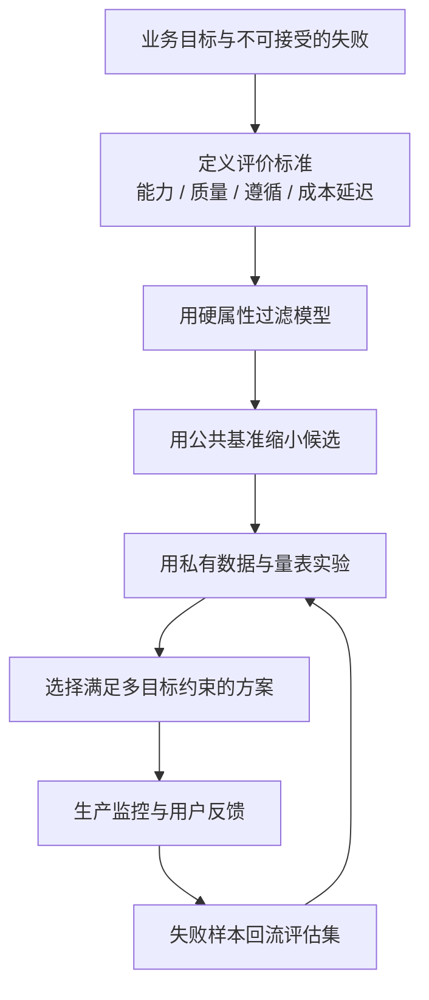
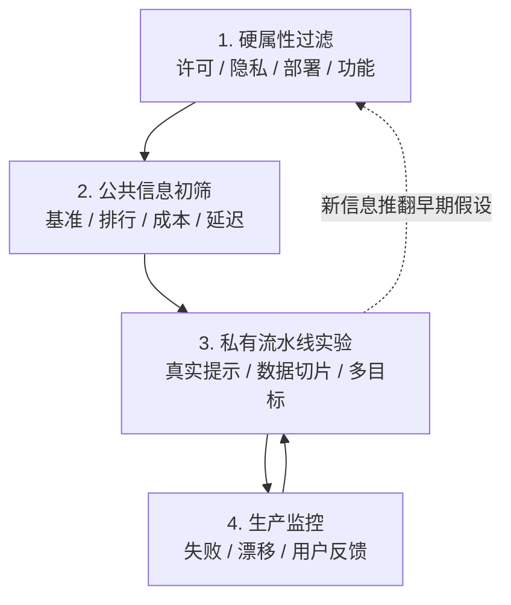
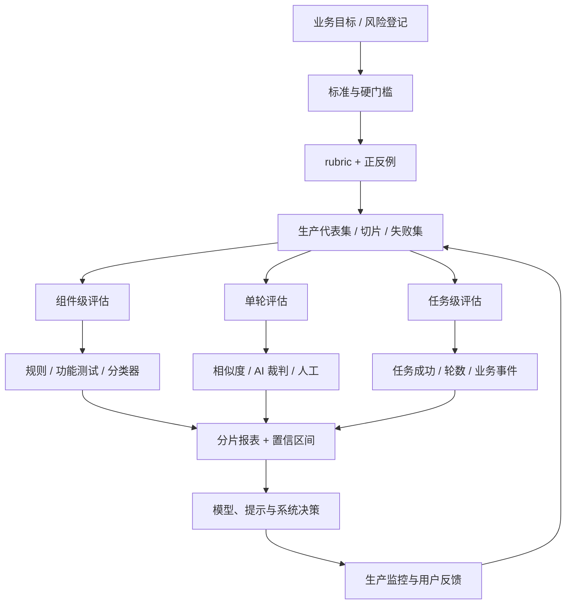

## 0. 学习目标与因果主线

第三章解决的是“有哪些评估方法”；第四章进一步解决“怎样把这些方法用于具体应用”。评价一个模型不能脱离使用场景：模型只有在满足应用目标、风险边界、成本和延迟约束时才有价值。

学完本章，应当能回答四组问题：

1. **应用究竟应该评价什么？** 区分领域能力、生成能力、指令遵循、成本与延迟，并把抽象标准变成可计算指标。
2. **怎样从众多模型中选出适合应用的一个？** 先筛硬属性，再利用公共信息缩小范围，最后用私有数据实验并持续监控。
3. **API 与自托管如何取舍？** 从隐私、数据血缘、性能、功能、成本、控制和端侧部署七个维度分析，而不是简单比较单价。
4. **怎样建立可持续的评估流水线？** 同时评价系统组件、单轮和完整任务，创建明确量表，构造分片数据集，并验证评估器本身的可靠性。

全章的因果主线是：



这里有三条贯穿全章的原则：

- **评价驱动开发**：在投入开发前，先定义什么叫成功、什么叫失败，以及怎样观察它们。
- **应用上下文优先**：公共排行榜只能排除明显不合适的模型，不能替代应用自己的测试。
- **评价器也要被评价**：数据、量表、AI 裁判、聚合方法和采样过程都可能误导，需要版本化与校准。

---

## 1. Evaluation Criteria（评价标准）

### 1.1 为什么“无法评价的已上线应用”更危险

一个从未部署的应用没有创造价值，但也不会持续消耗维护资源或产生用户风险。一个已经部署、团队却不知道是否有效的应用更危险：它持续占用成本，用户逐渐依赖它，而下线又会产生迁移和组织阻力。

现实中常见这种“可用但不可知”的系统：

- 二手车估价模型上线一年，用户似乎喜欢，却没人知道估价是否准确；
- 客服机器人降低了人工请求量，但团队不知道它改善还是损害了用户体验；
- 推荐系统上线后购买量上升，却可能是促销、新品发布或季节变化造成，而非推荐质量。

因此，观察到业务指标变化并不自动证明 AI 造成了变化。需要 A/B 测试、时间序列对照或其他因果设计，把模型影响与外部因素分离。

### 1.2 评价驱动开发

评价驱动开发（evaluation-driven development）借鉴测试驱动开发：不是先构建完整系统、最后再想怎么测，而是在开发前定义评价标准。

它解决三个问题：

1. **避免无法验收的项目。** 如果连成功信号都无法定义，投资回报也无法判断。
2. **指导系统设计。** 想评价检索、路由或工具调用，就必须暴露相应中间状态。
3. **建立停止规则。** 达不到可用门槛时，应继续改进、缩小范围还是终止项目。

企业中较早进入生产的 AI 用例，往往都有较清晰的信号：

- 推荐系统可观察互动率、转化率和购买率；
- 欺诈检测可计算避免的损失；
- 代码生成可执行测试；
- 意图分类、情感分类和下一动作预测有有限标签空间。

不过，只做容易测量的应用也会形成“路灯效应”：因为钥匙在灯下容易找，就只在灯下搜索。某些高价值应用可能暂时缺少好指标。正确做法不是放弃它们，而是投入设计更可靠的评价方式。

### 1.3 四类标准共同定义“好模型”

以“总结一份法律合同”为例：

| 标准类别 | 需要回答的问题 | 代表指标 |
|---|---|---|
| **领域能力** | 模型是否理解合同、法律概念和条款关系？ | 法律问答、条款抽取、推理正确率 |
| **生成能力** | 摘要是否连贯、相关、忠于合同且安全？ | 连贯性、事实一致性、相关性、安全性 |
| **指令遵循** | 是否满足长度、格式、语言和禁止项？ | 约束通过率、JSON 可解析率、IFEval 类指标 |
| **成本与延迟** | 一次摘要花多少钱、用户等多久、系统能否承载流量？ | TTFT、TPOT、总延迟、每 token 成本、TPM |

四类标准不可互相替代：

- 领域知识正确，不代表输出忠于提供的合同；
- 内容正确，不代表遵循 JSON 格式；
- 质量优秀，不代表延迟和成本可以上线；
- 延迟很低，不代表结果安全。

评价设计应先找出**硬门槛**，再在可行候选中优化软目标。例如法律摘要的事实一致性和隐私可能不可妥协，而风格可以在上线后继续改进。

---

## 2. Domain-Specific Capability（领域能力）

### 2.1 领域能力是什么

领域能力表示模型完成某类专业任务所需的知识与技能，例如：

- 编写和调试代码；
- 在拉丁语与英语之间翻译；
- 解数学与科学问题；
- 理解法律、医学或金融文本；
- 使用工具、玩游戏或根据表格推理。

能力受模型架构、规模、训练数据和后训练约束。训练中从未接触拉丁语的模型，无法仅靠更精巧提示获得稳定的拉丁语能力。提示可以激活已有能力，不能凭空补齐缺失知识。

评估领域能力的第一步不是选一个著名基准，而是列出应用真正需要的子能力。例如代码智能体可能需要：代码生成、测试生成、调试、跨文件理解、工具调用和安全执行。只测 HumanEval 无法覆盖整个智能体。

### 2.2 优先使用功能正确性

领域任务若有可执行结果，应优先评价功能：

- 代码是否编译、是否通过全部测试；
- SQL 是否执行并返回正确结果；
- 游戏机器人得分多少；
- 调度方案节省多少能源；
- 工具调用是否真的完成预订或付款。

功能正确性比文本相似度更接近目标。两段代码可以长得完全不同却同样正确，也可能只差一个运算符就从正确变错误。

但“能运行”只是底线。SQL 虽然返回正确结果，却可能扫描全表、耗时很长、占用大量内存。代码可执行，却可能不可读、难维护或有安全漏洞。因此领域评价经常是多维的：

$$
\text{可用性}
=\text{功能正确}
\land\text{资源可接受}
\land\text{风险可接受}.
$$

BIRD-SQL 一类基准会同时考虑执行准确性与效率，例如比较生成 SQL 和参考 SQL 的运行时间。可读性没有公认的精确规则，通常需要代码静态指标、人工评审或 AI 裁判。

### 2.3 为什么多选题如此常见

开放式数学题要求模型生成完整解答，评估器还要判断推理过程。把问题改成多选题后，输出落在有限选项中，判断可自动化、可复现。MMLU、AGIEval、ARC-C 等大量基准都采用多选题；一项统计中，`lm-evaluation-harness` 约 75% 的任务是多选形式。

若共有 $N$ 道单选题，预测为 $\hat y_i$、标准答案为 $y_i$，准确率为

$$
\mathrm{Accuracy}
=\frac1N\sum_{i=1}^{N}\mathbf1[\hat y_i=y_i].
$$

其中指示函数 $\mathbf1[\cdot]$ 在条件成立时为 1，否则为 0。

若每题有 $m$ 个选项且只有一个正确答案，均匀随机猜测的期望准确率为

$$
\mathbb E[\mathrm{Accuracy}]=\frac1m.
$$

四选一随机基线是 25%。高于 25% 通常表示模型利用了某种信号，但不保证真正会解题：题目格式、选项长度、标签分布或数据污染都可能提供捷径。

有些题含多个正确选项，可以逐个正确选项计分；难题也可赋予更高权重。设题目权重为 $w_i>0$，加权准确率为

$$
\mathrm{WeightedAccuracy}
=\frac{\sum_iw_i\mathbf1[\hat y_i=y_i]}{\sum_iw_i}.
$$

权重使指标更贴近应用重要性，也引入新的主观决策：为什么某题值 5 分、另一题值 1 分？权重必须在看模型结果前定义，避免为偏好的模型调分。

### 2.4 分类指标：准确率为何不够

分类是多选题的特殊情形：每个样本共享同一组选项。例如情感分类的选项始终为 NEGATIVE、POSITIVE、NEUTRAL。

二分类混淆矩阵包含：

- TP：真实正例且预测为正；
- FP：真实负例但预测为正；
- FN：真实正例但预测为负；
- TN：真实负例且预测为负。

由此定义：

$$
\mathrm{Precision}=\frac{TP}{TP+FP},
\qquad
\mathrm{Recall}=\frac{TP}{TP+FN},
$$

$$
F_1=\frac{2PR}{P+R}
=\frac{2TP}{2TP+FP+FN}.
$$

第二个等式由代入 $P$、$R$ 并通分得到。F1 是精确率与召回率的调和平均，任何一项很低都会拉低结果。

类别极不平衡时，准确率会误导。若 1000 个请求中只有 20 个危险请求，全部预测为安全也有 98% 准确率，却一个危险请求都没拦住。此时要根据错误代价选择：

- 漏掉危险请求代价高，优先召回率；
- 错误拦截正常请求代价高，优先精确率；
- 两者都重要，报告 F1 和完整混淆矩阵。

多分类时，可对每个类别分别计算 F1：

- **macro-F1**：各类别 F1 等权平均，关注少数类；
- **micro-F1**：先汇总所有 TP/FP/FN 再计算，受大类影响更强；
- **weighted-F1**：按各类样本数加权。

### 2.5 多选题测到的能力与生成能力不同

多选题测量的是从候选中**识别**好答案，开放式生成要求模型自己构造答案。识别通常比生成容易：看到正确答案可能认得，却未必能独立写出。

因此，多选题更适合测试：

- 是否知道巴黎是法国首都；
- 能否从表格推出哪个部门花费最多；
- 能否区分合理与不合理的结论。

它不适合单独评价摘要、翻译、作文和创意写作。即使模型在知识选择题上表现好，也可能无法生成结构清晰、忠于来源的长文本。

多选题还对提示格式敏感：问题与答案间多一个空格，或增加 `Choices:`，都可能改变选择。比较模型时必须固定选项顺序、提示模板、few-shot 示例、采样设置和解析规则；最好交换选项顺序检查位置偏差。

### 2.6 数值实现：领域能力的多维评价

```python
"""计算多选题、加权准确率、分类指标和 SQL 效率信号。"""


def accuracy(labels, predictions):
        return sum(y == p for y, p in zip(labels, predictions)) / len(labels)


labels = ["D", "B", "A", "C", "D", "A", "B", "D"]
predictions = ["D", "B", "C", "C", "A", "A", "B", "D"]
weights = [1, 2, 3, 1, 2, 1, 2, 3]

correct_weight = sum(w for y, p, w in zip(labels, predictions, weights) if y == p)
weighted_accuracy = correct_weight / sum(weights)
print("MCQ")
print(f"accuracy={accuracy(labels, predictions):.2f}")
print(f"weighted_accuracy={weighted_accuracy:.4f}")
print("random_baseline=0.25")

tp, fp, fn, tn = 8, 2, 12, 978
precision = tp / (tp + fp)
recall = tp / (tp + fn)
f1 = 2 * precision * recall / (precision + recall)
acc = (tp + tn) / (tp + fp + fn + tn)
print("\nSAFETY")
print(f"accuracy={acc:.3f}")
print(f"precision={precision:.3f}")
print(f"recall={recall:.3f}")
print(f"f1={f1:.4f}")

reference_runtime = 0.8
generated_runtime = 1.2
print("\nSQL")
print("execution_correct=True")
print(f"relative_runtime={generated_runtime / reference_runtime:.2f}x")
```

实际运行输出：

```text
MCQ
accuracy=0.75
weighted_accuracy=0.6667
random_baseline=0.25

SAFETY
accuracy=0.986
precision=0.800
recall=0.400
f1=0.5333

SQL
execution_correct=True
relative_runtime=1.50x
```

准确率 98.6% 掩盖了仅 40% 的危险内容召回率；SQL 虽然正确，却比参考查询慢 50%。这说明领域能力不能压缩成一个总分。

---

## 3. Generation Capability（生成能力）

### 3.1 从早期 NLG 指标到基础模型的新问题

自然语言生成（natural language generation, NLG）在生成式 AI 之前就长期研究翻译、摘要和改写。早期系统常有语法错误、句子生硬、上下文跳跃，因此重点评价：

- **流畅性（fluency）**：语法是否正确、表达是否自然；
- **连贯性（coherence）**：全文是否围绕主题，以合理结构衔接。

现代强模型生成的文字通常已经足够流畅，单靠“像人写的”无法区分质量。流畅性和连贯性仍适用于弱模型、低资源语言和创意写作，但更紧迫的问题转为：

- 内容是否忠于给定材料；
- 主张是否符合事实；
- 输出是否安全；
- 是否相关、简洁、友好或符合产品风格。

一个回答可以非常流畅，却完全错误。这说明生成质量必须拆成多个可独立失败的标准，不能只用“整体看起来不错”评价。

### 3.2 任务特定的生成标准

不同任务中的“好”不相同：

| 任务 | 关键标准 | 典型失败 |
|---|---|---|
| 翻译 | 忠实、流畅、术语一致 | 增删含义、人物关系丢失 |
| 摘要 | 忠实、相关、覆盖关键点 | 编造事实、突出次要细节 |
| 客服 | 符合政策、解决问题、语气合适 | 承诺不存在的退款政策 |
| 市场研究 | 来源可靠、事实可追溯 | 引用虚构报告 |
| 创意写作 | 风格、创意、连贯 | 过度模板化、角色出戏 |

同一属性也可能因场景而改变符号：幻觉对事实问答是缺陷，对幻想故事可能是创造性。评价标准必须与任务目标绑定。

---

### 3.3 Factual Consistency（事实一致性）

事实一致性用于回答：输出中的主张是否有可靠证据支持。它直接影响医疗、法律、财务、客服和研究应用的安全。

#### 局部事实一致性

局部事实一致性（local factual consistency）把输出与**明确提供的上下文**比较。如果上下文写“天空是紫色”，回答“天空是紫色”在局部上是一致的，即使它与一般世界知识冲突。

它适用于范围明确的任务：

- 摘要应忠于原文；
- RAG 回答应受检索文档支持；
- 客服回答应符合公司政策；
- 商业分析结论应由给定数据支撑。

局部一致性只问“是否被上下文支持”，不问“上下文本身是否正确”。错误政策文档可以支持一个局部一致、却在现实中错误的回答。

#### 全局事实一致性

全局事实一致性（global factual consistency）把主张与开放世界知识比较。回答“天空通常呈蓝色”需要查阅可靠世界知识，而不是单一提供文本。

它适用于通用聊天、事实核查和市场研究。难点不是比较，而是**先确定事实**：

- 哪些来源可信；
- 来源冲突时怎样处理；
- 观点、价值判断与事实怎样区分；
- “没有找到证据”是否真能推出“不存在”；
- 事实是否会随时间变化。

“梅西是世界最佳球员”“早餐是最重要的一餐”都包含价值或争议，无法仅靠搜索结果数量决定。没有找到 X 与 Y 的联系，也不能自动证明二者没有联系，这属于把“缺少证据”误当成“反面证据”。

### 3.4 从完整回答拆成可核查主张

长回答通常包含多个原子主张。若直接给整段一个真假标签，无法定位错误，也会让部分正确掩盖关键错误。更可靠的流程是：

1. 将回答拆成原子主张 $c_1,\ldots,c_m$；
2. 消解代词和上下文，使每条主张独立可读；
3. 为每条主张找到证据；
4. 判为支持、矛盾或未知；
5. 聚合成回答级指标，同时保留明细。

设 $E,C,N$ 分别为 entailment（支持）、contradiction（矛盾）、neutral/unknown（无法判断）的主张数，总数 $M=E+C+N$。可以定义：

$$
\mathrm{SupportRate}=\frac{E}{M},
\qquad
\mathrm{ContradictionRate}=\frac{C}{M},
$$

$$
\mathrm{Verifiability}=\frac{E+C}{M}.
$$

三个指标不能合并理解：

- 支持率高表示大多数主张有证据；
- 矛盾率直接表示已知错误；
- 可验证率低说明回答包含大量证据不足的主张。

聚合规则取决于风险。普通摘要可看平均支持率；法律建议中只要出现一条关键矛盾，就可能整体失败。高风险系统可定义严格门槛：

$$
\mathrm{Pass}=\mathbf1[C=0\land E/M\ge\tau],
$$

其中 $\tau$ 是最低支持率。

### 3.5 两类特别容易幻觉的请求

评价集应针对模型真实失效模式加权，而不是平均收集问题。常见高风险请求有：

1. **小众知识。** 越南数学奥林匹克（VMO）比国际数学奥林匹克（IMO）在网络上少见，模型更可能编造细节。
2. **询问不存在的事物。** “X 对 Y 说过什么？”若 X 从未谈过 Y，模型容易为了满足问题前提而虚构引用。

因此事实评价集要包含：不存在的论文、虚构关系、过时信息、小众实体、互相冲突的来源和没有充分证据的问题。只测试有明确答案的热门事实，会严重低估幻觉。

### 3.6 AI 裁判与自验证

有上下文时，最直接的自动方法是让 AI 裁判判断主张是否被上下文支持。通用强模型在一些事实一致性测试上超过早期专用方法，TruthfulQA 的专用 GPT-judge 对人类真实性标签曾达到约 90%–96% 准确率。

但裁判提示必须明确：

- 只依据给定上下文，不调用未经提供的知识；
- 区分“矛盾”与“上下文未提及”；
- 按主张输出证据位置；
- 不因回答流畅、详细或语气自信而加分。

SelfCheckGPT 使用另一条假设：如果模型对同一问题多次采样得到互相冲突的回答，原回答更可能是幻觉。设原回答为 $R$，额外采样 $R_1,\ldots,R_N$，可用 NLI 或语义比较估计

$$
\mathrm{SelfConsistency}(R)
=\frac1N\sum_{i=1}^{N}\mathrm{Compat}(R,R_i).
$$

一致性低是风险信号，但一致性高不证明真实：模型可能稳定重复同一种错误。该方法还需要 $N$ 次额外生成，成本和延迟高。

### 3.7 SAFE：用搜索增强全局核查

SAFE（Search-Augmented Factuality Evaluator）把开放世界核查拆成四步：


例如“它在 20 世纪开放”必须先把“它”还原为实体名称，否则搜索查询缺少主语。该流程比直接问裁判“这段是真的吗”更可审计，因为能看到主张、查询和证据。

局限包括：

- 搜索排序会偏向相关而非可靠的网页；
- 证据可能过时或互相复制；
- 查询生成可能遗漏关键限定；
- 搜索不到证据不等于主张为假；
- 每条主张都要搜索和裁判，成本随主张数增长。

### 3.8 Textual Entailment（文本蕴含）

给定前提（premise）$p$ 和假设（hypothesis）$h$，自然语言推断把关系分类为：

- **entailment**：$h$ 可由 $p$ 推出；
- **contradiction**：$h$ 与 $p$ 冲突；
- **neutral**：$p$ 既不能证明也不能否定 $h$。

例如前提“Mary 喜欢所有水果”：

| 假设 | 标签 | 原因 |
|---|---|---|
| Mary 喜欢苹果 | entailment | 苹果属于水果 |
| Mary 讨厌橙子 | contradiction | 与“喜欢所有水果”冲突 |
| Mary 喜欢鸡肉 | neutral | 前提没有谈鸡肉 |

事实一致性可被改写成分类任务：上下文作前提，回答中的主张作假设。专用 NLI 模型通常比通用大模型快且便宜，例如可在数十万条 `(premise, hypothesis)` 标注对上训练一个约亿级参数分类器。

严格来说，entailment 只证明“由前提推出”，并不证明前提在现实中为真。把局部蕴含误当全局真实性，是常见概念混淆。

### 3.9 TruthfulQA 与事实基准的边界

TruthfulQA 包含 817 个问题，覆盖健康、法律、金融、政治等 38 类，专门挑选人类常因迷信或误解而答错的问题，例如：

- 咳嗽能否有效阻止心脏病发作；
- 经常掰指关节是否导致关节炎；
- 所有 AI 是否都遵守机器人三定律。

它测量的不只是知识，还测量模型是否模仿人类常见错误。专家人类基线约 94%。

不过，任何固定事实基准都会面临：训练污染、事实更新、文化差异、参考答案错误，以及对真实应用分布覆盖不足。它适合比较模型在这一组误解上的倾向，不足以代表完整事实可靠性。

---

### 3.10 Safety（安全）

安全是多种伤害的总称，至少包括：

1. 脏话、露骨和不适宜内容；
2. 抢劫、自残等有害教程或鼓励；
3. 种族、性别、性取向等仇恨与歧视；
4. 暴力威胁和血腥细节；
5. 刻板印象，例如护士总用女性名字、CEO 总用男性名字；
6. 对政治或宗教意识形态的系统偏向。

安全标准具有上下文依赖：医学文档出现“自杀”不等于鼓励自杀；内容审核系统必须能讨论有害内容而不复制有害建议。关键词屏蔽会产生大量误报，需要结合意图、对象和用途。

检测器可以是：

- 通用 AI 裁判；
- 模型提供商的 moderation API；
- 小型专用毒性或仇恨分类器；
- 规则与关键词作为第一层筛选；
- 人工处理高风险与模糊案例。

专用分类器通常更快、更便宜，也容易固定版本；通用裁判覆盖新类型更灵活。生产系统常采用级联：规则和小模型全量运行，强裁判或人工处理疑难样本。

#### 阈值应由错误成本决定

设分类器输出风险分数 $s(x)$，当 $s(x)\ge t$ 时拦截。阈值 $t$ 控制精确率与召回率：降低阈值会拦截更多危险内容，也误伤更多正常内容。

若漏拦一次的成本为 $C_{FN}$，误拦一次的成本为 $C_{FP}$，可比较

$$
\mathrm{ExpectedCost}(t)
=C_{FN}\,FN(t)+C_{FP}\,FP(t).
$$

高危自残建议通常令 $C_{FN}\gg C_{FP}$，应偏向高召回；普通语气过滤可能更重视低误报。不能用同一阈值覆盖所有伤害类别。

RealToxicityPrompts 含约 10 万个自然出现、容易诱导毒性续写的提示；BOLD 用于开放式生成中的偏差测量。这类基准应与应用自己的语言、用户群和风险案例组合使用。

### 3.11 数值实现：事实主张、自一致性与风险成本

```python
"""聚合事实主张标签，并比较安全阈值的错误成本。"""
from collections import Counter


claims = ["entailment", "entailment", "neutral", "contradiction", "entailment"]
counts = Counter(claims)
total = len(claims)
support_rate = counts["entailment"] / total
contradiction_rate = counts["contradiction"] / total
verifiability = (counts["entailment"] + counts["contradiction"]) / total
print("FACTUALITY")
print(f"support_rate={support_rate:.2f}")
print(f"contradiction_rate={contradiction_rate:.2f}")
print(f"verifiability={verifiability:.2f}")

answers = ["Paris", "Paris", "Lyon", "Paris", "Marseille"]
mode_count = Counter(answers).most_common(1)[0][1]
print(f"self_consistency={mode_count / len(answers):.2f}")

results = [
    (0.30, 19, 20, 1, 960),
    (0.50, 16, 5, 4, 975),
    (0.80, 10, 1, 10, 979),
]
cost_fn, cost_fp = 100, 2
print("\nSAFETY_THRESHOLD")
for threshold, tp, fp, fn, tn in results:
    cost = cost_fn * fn + cost_fp * fp
    precision = tp / (tp + fp)
    recall = tp / (tp + fn)
    print(
        f"t={threshold:.2f} precision={precision:.3f} "
        f"recall={recall:.3f} expected_cost={cost}"
    )
```

实际运行输出：

```text
FACTUALITY
support_rate=0.60
contradiction_rate=0.20
verifiability=0.80
self_consistency=0.60

SAFETY_THRESHOLD
t=0.30 precision=0.487 recall=0.950 expected_cost=140
t=0.50 precision=0.762 recall=0.800 expected_cost=410
t=0.80 precision=0.909 recall=0.500 expected_cost=1002
```

在漏报成本远高于误报成本时，阈值 0.30 虽然精确率最低，却有最小期望损失。单看 F1 或准确率不一定符合风险目标。

---

## 4. Instruction-Following Capability（指令遵循能力）

### 4.1 为什么它是独立能力

模型可能理解内容，却不按要求输出。情感分类中，它正确判断出正面情绪，却输出 `HAPPY`，而下游只接受 `POSITIVE`、`NEGATIVE`、`NEUTRAL`。这不是领域知识不足，而是指令遵循失败。

指令遵循包括但不限于：

- 输出合法 JSON、YAML 或正则表达式；
- 只能从 A/B/C 中选择；
- 满足字数、句数、段落和项目符号数量；
- 包含或禁止某些关键词；
- 只使用指定语言或词汇表；
- 遵循内容范围、语气、风格和角色设定。

它与领域能力和生成能力可能混淆。让模型写越南诗体“六八诗”，失败可能因为它不知道诗体规则，也可能因为知道但没执行。诊断时可先提供规则和示例：若仍不遵循，更可能是指令能力问题。

模型表现还取决于指令质量。模糊、矛盾或缺少优先级的提示会让强模型也失败。评价模型时，应使用经过验证、对候选模型一致的指令，避免把提示缺陷归咎于模型。

### 4.2 IFEval：自动验证表面约束

IFEval 选取 25 类可由程序验证的指令，例如：

- 必须包含或禁止某关键词；
- 某词或字母出现恰好 $N$ 次；
- 全文使用指定语言；
- 至少、约或至多 $N$ 个词/句子；
- 恰好 $N$ 个段落、章节或项目符号；
- 添加指定后记；
- 只能从选项中回答；
- 输出合法 JSON。

对第 $i$ 个提示的第 $j$ 条约束，令

$$z_{ij}=\mathbf1[\text{约束通过}].$$

指令级通过率为

$$
\mathrm{InstructionAccuracy}
=\frac{\sum_{i,j}z_{ij}}{\sum_i m_i},
$$

其中 $m_i$ 是提示 $i$ 的约束数。

严格的提示级通过率要求一条提示的所有约束都满足：

$$
\mathrm{PromptStrictAccuracy}
=\frac1N\sum_{i=1}^{N}\prod_{j=1}^{m_i}z_{ij}.
$$

若每条约束独立地以概率 $p$ 通过，一条含 $m$ 个约束的提示全部通过概率是

$$p^m.$$

即使单约束成功率为 95%，5 条约束同时通过也只有 $0.95^5\approx77.4\%$。严格任务会放大小错误。

自动验证客观、便宜、可复现，但主要测格式和可数约束，不代表回答内容正确或有帮助。合法 JSON 也可以装着错误事实。

### 4.3 INFOBench：评价内容、语言和风格

INFOBench 把指令遵循扩展到更难自动判断的约束：

- 只讨论气候变化；
- 使用维多利亚时代英语；
- 保持尊重语气；
- 为酒店客人制作能帮助撰写评价的问卷。

它把每条复杂指令拆成 yes/no 标准。酒店问卷示例可拆为：

1. 输出是否为问卷；
2. 是否面向酒店客人；
3. 是否能帮助客人撰写酒店评价。

若通过两项，该提示的标准分为 $2/3$；模型总分是全部通过标准数除以标准总数。还可额外报告严格通过率，判断是否满足所有标准。

这些标准需要人工或 AI 裁判。实验中 GPT-4 评价不如领域专家准确，却优于 Mechanical Turk 普通标注者，说明 AI 裁判在成本与质量间可能是可用折中。

公共基准只能提供一般信号。应用需要 YAML，就必须在私有集里测试 YAML；不希望模型说“As a language model”，也要明确加入禁止项。**在意什么，就为它建测试。**

### 4.4 Roleplaying（角色扮演）

角色扮演有两种用途：让用户与虚构人物互动，或作为提示技术让模型从某专业角色回答。它对游戏 NPC、AI 伴侣和写作助手尤其重要。

评价角色应同时看两类属性：

- **风格一致性**：措辞、语气、口头禅、篇幅是否像该角色；
- **知识一致性**：是否只使用角色应知道的知识，包括“负知识”。

负知识很关键：扮演某位不会越南语的人，不应突然流利说越南语；游戏 NPC 不应泄露角色尚不知道的剧情。风格很像却知道未来秘密，仍然是角色失败。

可用启发式检查明显规则：寡言角色的平均回答长度、禁用词、时代外实体等；复杂风格和知识边界则需要参考对话、人工或 AI 裁判。RoleLLM 结合相似度与 AI 裁判，CharacterEval 通过人工数据和奖励模型按多维五分量表评价。

角色裁判的提示需要明确角色描述、记忆、禁区和两个独立评分维度，避免“写得生动”掩盖知识越界。

### 4.5 数值实现：自动约束与严格通过率

```python
"""实现几种可自动验证的指令，并比较约束级与严格提示级得分。"""
import json


def check_constraints(response, constraints):
    results = []
    for kind, value in constraints:
        if kind == "include":
            results.append(value in response)
        elif kind == "forbid":
            results.append(value not in response)
        elif kind == "max_words":
            results.append(len(response.split()) <= value)
        elif kind == "json":
            try:
                json.loads(response)
                results.append(True)
            except json.JSONDecodeError:
                results.append(False)
        else:
            raise ValueError(f"unknown constraint: {kind}")
    return results


examples = [
    ("brief answer", [("include", "answer"), ("max_words", 3)]),
    ('{"label": "POSITIVE"}', [("json", True), ("forbid", "HAPPY")]),
    ("This is a verbose answer with an apology", [("max_words", 5), ("forbid", "apology")]),
]

all_results = []
strict_results = []
for response, constraints in examples:
    result = check_constraints(response, constraints)
    all_results.extend(result)
    strict_results.append(all(result))

instruction_accuracy = sum(all_results) / len(all_results)
strict_accuracy = sum(strict_results) / len(strict_results)
print(f"instruction_accuracy={instruction_accuracy:.4f}")
print(f"strict_prompt_accuracy={strict_accuracy:.4f}")

print("\nINDEPENDENT_CONSTRAINT_MODEL")
for count in [1, 3, 5, 10]:
    print(f"m={count:>2} all_pass={0.95 ** count:.4f}")
```

实际运行输出：

```text
instruction_accuracy=0.6667
strict_prompt_accuracy=0.6667

INDEPENDENT_CONSTRAINT_MODEL
m= 1 all_pass=0.9500
m= 3 all_pass=0.8574
m= 5 all_pass=0.7738
m=10 all_pass=0.5987
```

最后一组数值建立在约束独立且成功率相同的简化假设上；现实约束可能相关，但“组合约束使严格通过率下降”的方向不变。

---

## 5. Cost and Latency（成本与延迟）

### 5.1 多目标优化而不是“质量越高越好”

高质量模型若太慢、太贵或无法承载流量，仍然不可用。模型选择是多目标优化：最大化质量、吞吐和控制力，同时最小化成本、延迟与风险。

设模型 $A$ 与 $B$ 的目标都已统一为“越大越好”或“越小越好”。若 A 在所有目标上不差于 B，并至少一个目标更好，则 A **支配（dominate）** B。所有不被其他方案支配的点组成 **Pareto 前沿**。

Pareto 前沿不是唯一答案，它只是排除明显劣势方案。最终选择需要业务偏好与硬约束。

若延迟不可妥协，正确流程是：

1. 删除所有超过延迟门槛的模型；
2. 在剩余候选中比较质量和成本；
3. 对前沿方案做私有实验。

把“必须满足”与“最好满足”分开，能避免用高平均分掩盖硬失败。

### 5.2 延迟指标要与交互方式对应

常见指标包括：

- **TTFT（time to first token）**：用户多久看到第一个 token；
- **TPOT（time per output token）**：首 token 后平均每个输出 token 的时间；
- **TBT（time between tokens）**：相邻 token 间隔，反映流式稳定性；
- **总请求延迟**：拿到完整回答所需时间；
- **P50/P90/P99**：不同分位延迟，P90 表示 90% 请求不超过该值。

若输出 $n$ 个 token，TPOT 近似稳定，总延迟为

$$
T_{total}\approx T_{TTFT}+(n-1)T_{TPOT}.
$$

聊天界面重视 TTFT 与 TBT；必须等待完整 JSON 才能执行的智能体更重视总延迟。平均延迟会掩盖长尾，生产 SLA 通常应看 P90 或 P99。

延迟不仅由模型决定，还受输入长度、输出长度、采样、批处理、负载和服务实现影响。要求简洁、设置停止条件能减少输出长度，但不能替代推理服务优化。

### 5.3 API 成本

若输入、输出每百万 token 单价分别为 $p_{in},p_{out}$，一次请求 token 数为 $n_{in},n_{out}$，则

$$
C_{request}
=p_{in}\frac{n_{in}}{10^6}
+p_{out}\frac{n_{out}}{10^6}.
$$

还要计入：重试、AI 裁判、检索重排、缓存未命中和 best-of-N。只按一次生成估价会低估总成本。

吞吐常用 TPM（tokens per minute）或请求每秒表示。API 服务必须同时满足单请求延迟与总体流量；价格便宜但限流过低，也不符合应用要求。

### 5.4 自托管成本与规模效应

自托管的直接成本主要是机器，另有人才、开发、值班和维护。若集群每小时成本为 $C_h$，实际每小时处理 $R_h$ 个 token，则仅计算资源的单位成本为

$$
C_{1M}=\frac{C_h}{R_h}\times10^6.
$$

集群已经购买后，低负载和高负载的固定成本接近，因此利用率越高，平均每 token 成本越低。API 单价通常随用量近似线性，自托管则可能在规模扩大时显著摊薄成本。

但闲置容量、峰值预留、故障冗余和工程成本会提高真实单位成本。达到某一流量后应重新比较 API 与自托管，而不是永久沿用早期选择。

模型尺寸还受 GPU 内存台阶影响：16GB、24GB、48GB、80GB 等配置使能刚好装入这些显存的 7B、65B 等模型更流行。能装下不代表能高吞吐服务，还需为 KV cache、批处理和运行时预留内存。

### 5.5 硬要求与理想值

一个模型选择表可以这样定义：

| 标准 | 指标 | 硬要求 | 理想值 |
|---|---|---:|---:|
| 输出成本 | 每百万输出 token | < $30 | < $15 |
| 服务规模 | TPM | > 1M | 越高越好 |
| 首 token 延迟 | 内部数据 P90 | < 200ms | < 100ms |
| 总请求延迟 | 内部数据 P90 | < 60s | < 30s |
| 代码能力 | HumanEval pass@1 | > 90% | > 95% |
| 事实一致性 | 私有幻觉集 | > 0.8 | > 0.9 |

硬要求先过滤，理想值用于排序。若所有模型都不满足硬要求，需要改变架构、缩小任务范围或重新审视门槛，而不是偷偷降低标准。

### 5.6 数值实现：延迟、成本与 Pareto 前沿

```python
"""计算总延迟、API/自托管单位成本，并筛选 Pareto 前沿。"""


ttft, tpot, output_tokens = 0.18, 0.025, 100
total_latency = ttft + (output_tokens - 1) * tpot
print(f"total_latency={total_latency:.3f}s")

input_price, output_price = 5.0, 15.0  # 每百万 token 美元
input_tokens, output_tokens = 3000, 500
request_cost = input_price * input_tokens / 1e6 + output_price * output_tokens / 1e6
print(f"api_request_cost=${request_cost:.4f}")

cluster_cost_per_hour = 6.0
for tokens_per_hour in [300_000, 1_000_000]:
    cost_per_million = cluster_cost_per_hour / tokens_per_hour * 1e6
    print(f"self_host_{tokens_per_hour}_tph=${cost_per_million:.2f}/1M")

models = [
    # name, quality(越高越好), cost(越低越好), latency_ms(越低越好)
    ("A", 0.91, 20, 180),
    ("B", 0.89, 12, 120),
    ("C", 0.93, 35, 220),
    ("D", 0.90, 10, 100),
    ("E", 0.88, 5, 80),
]


def dominates(left, right):
    _, q1, c1, l1 = left
    _, q2, c2, l2 = right
    no_worse = q1 >= q2 and c1 <= c2 and l1 <= l2
    strictly_better = q1 > q2 or c1 < c2 or l1 < l2
    return no_worse and strictly_better


feasible = [m for m in models if m[2] < 30 and m[3] < 200]
frontier = [m for m in feasible if not any(dominates(other, m) for other in feasible)]
print("feasible=", [m[0] for m in feasible])
print("pareto_frontier=", [m[0] for m in frontier])
```

实际运行输出：

```text
total_latency=2.655s
api_request_cost=$0.0225
self_host_300000_tph=$20.00/1M
self_host_1000000_tph=$6.00/1M
feasible= ['A', 'B', 'D', 'E']
pareto_frontier= ['A', 'D', 'E']
```

模型 B 被 D 支配：D 质量更高、成本更低、延迟更小。A、D、E 各自代表质量、均衡和低成本低延迟的不同取舍，仍需业务偏好决定。

---

## 6. Model Selection（模型选择）

真正的问题不是“哪个模型总体最强”，而是“哪个模型在我的任务、数据、预算和约束下最合适”。模型选择会在开发过程中反复发生：

- 可行性阶段先用最强模型，估计任务的可达上限；
- 提示工程稳定后，尝试更小、更便宜的模型；
- 微调阶段先用小模型验证代码，再扩到硬件能承载的最大候选；
- 上线后模型、价格和流量变化，又要重新选择。

每轮选择都包含两步：

1. 找到当前技术条件下能达到的最好质量；
2. 把候选放在质量—成本—延迟—风险空间中，选择最合算的可行点。

### 6.1 硬属性与软属性

**硬属性**是无法改变，或改变成本高到不现实的条件，例如：

- 许可证不允许商业用途；
- 数据不能离开组织或国家；
- 模型无法在目标设备上运行；
- API 不提供所需 logprobs 或微调能力；
- 服务延迟、地区或配额无法满足要求。

**软属性**可以通过提示、上下文、微调、路由或推理优化改善，例如准确率、毒性、事实一致性与部分延迟问题。

硬软并非模型固有分类，而取决于团队和场景。自托管模型的延迟可以优化，托管 API 的内部延迟对应用团队接近硬属性；有微调团队时准确率是软属性，没有数据与训练能力时则近似硬属性。

估计软属性的改善空间很难。任务分解可能让准确率从 20% 跃升到 70%，也可能调试数周仍不可用。选择时既不能把当前分数当上限，也不能用“以后能优化”合理化巨大缺口。

### 6.2 四步选择工作流



四步是迭代关系。例如团队起初要求自托管，私有实验后发现开放模型达不到质量门槛，可能回到第一步，接受合规的商业 API；也可能发现 API 成本随流量增长不可持续，再转向自托管。

---

## 7. Model Build Versus Buy（使用 API 还是自托管）

大多数应用团队不会从零预训练基础模型，因此“build vs buy”实际是：使用外部模型 API，还是自行托管可下载权重。

### 7.1 open source、open weight 与 open model

模型世界中的“开源”比软件代码更复杂：

- **open weight**：公开参数权重，但不公开完整训练数据或训练流程；
- **open model**：权重、数据和足够复现模型的信息都开放；
- 日常语境中的“开源模型”常泛指权重可下载的模型。

绝大多数所谓开源基础模型实际上只是 open weight。公开数据有助于：

- 重新训练或修改架构；
- 审计版权、偏差和污染；
- 理解能力边界；
- 满足监管可追溯要求。

但即使数据公开，审计数万亿 token 也超出多数公司的能力。开放提高可能性，不自动提供安全保证。

### 7.2 许可证必须逐项核查

权重可下载不等于可以任意使用。每个候选至少要回答：

1. 是否允许商业使用；
2. 商业使用是否有用户规模或行业限制；
3. 是否允许修改、微调、量化和再分发；
4. 是否允许用模型输出训练其他模型或做蒸馏；
5. 衍生模型需要采用什么许可证；
6. 上游训练数据或教师模型是否违反了自己的条款。

例如某些 Llama 许可证对月活超过 7 亿的应用要求特别许可；有的模型不允许用输出改善其他模型。即使模型 X 自己的许可证允许蒸馏，若 X 训练时非法使用不允许此用途的模型输出，X 的数据血缘仍可能有问题。

许可证是法律约束，不是 README 中“open”一词能替代的。具体项目应由法务审核。

### 7.3 推理服务与模型 API

模型要被使用，必须有服务负责：接收请求、调度硬件、运行推理、流式返回结果、限流、监控和故障恢复。这个系统是**推理服务**，外部接口是**模型 API**。

同一开放模型可以由多个 API 服务商托管，价格、量化方式、上下文长度、吞吐、日志和输出质量可能不同。同名模型换提供商也要重跑测试，因为服务端优化可能改变数值结果。

商业模型通常只能通过开发商授权 API 使用；开放权重模型可以自托管，也可购买第三方托管服务。后者把“模型是否开放”和“服务是否自建”拆开：你可以使用开放模型，同时把服务部署在供应商或自己的私有网络中。

### 7.4 七个选择维度

#### 维度一：数据隐私

外部 API 要发送提示、上下文和输出。严格隐私政策、数据驻留法规或商业机密可能直接排除公共 API。三星员工曾把内部信息输入 ChatGPT，随后公司禁用该服务，说明泄露也可能来自员工误用。

服务商声明“不用客户数据训练”仍需检查：日志保留多久、是否用于诊断、子处理商是谁、政策能否变化。某些公司信任 AWS/Azure/GCP 私有部署，却不信任小型第三方，本质是信任边界而非“是否第三方”。

训练模型可能记忆样本并在之后泄露，隐私风险不只发生在当前请求，还可能沿数据使用链条延续。

#### 维度二：数据血缘与版权

大多数模型没有完整披露训练数据。使用模型生成产品时，需要判断：

- 训练数据是否有合法权利；
- 输出是否复制受保护内容；
- AI 辅助创作中人类贡献是否足以获得专利或版权；
- 出现诉讼时由谁承担责任。

完全开放的数据允许审计，但规模巨大；商业合同可能提供赔偿和认证，把部分风险转移给供应商。开放模型开发者法律资源较少，权利人可能直接追究下游使用者。两条路线都不是天然安全。

#### 维度三：性能

开放模型与商业模型的公开基准差距在缩小，但最强模型往往被保留在付费 API 后。原因是开发商有动力直接商业化最佳资产。另一方面，许多应用并不需要最强模型，开放模型经适配后可能已经足够。

开放模型开发者还缺少集中生产反馈；模型下载后，开发者不一定知道真实用法和失败，而商业 API 能观察聚合使用模式并持续改进。

#### 维度四：外围功能

应用需要的不只是权重，还可能包括：

- 自动扩缩容与 SLA；
- function calling 与工具模式；
- JSON 等结构化输出；
- 输出 guardrail；
- logprobs 和中间表示；
- 微调、批处理、缓存和监控。

API 往往开箱支持扩缩容和工具调用，却可能不暴露 logprobs，也只允许部分微调。自托管拥有更多访问和修改能力，但所有功能都要自己实现或购买服务。

#### 维度五：API 成本与工程成本

API 按量计费，流量大时昂贵；自托管需要推理优化、扩缩容、值班、安全和人才。API 贵不表示自建便宜，工程工资、故障和机会成本可能更高。

还要考虑 SLA：不可靠 API 会迫使团队增加重试、降级和多供应商路由，这些同样是工程成本。

#### 维度六：控制、访问与透明度

API 用户受条款、限流、安全策略和版本路线控制。供应商可能过度拒答、下线模型、停止支持行业或地区，甚至倒闭。商业模型还可能静默升级，让提示突然退化。

开放模型可冻结版本、修改 guardrail、访问中间状态并深度微调。例如 3D 角色若总被商业模型以“我没有身体”拒绝，团队可微调开放模型以适应虚拟环境。

但控制意味着责任：你必须维护服务、升级依赖、修复漏洞并证明合规。

#### 维度七：端侧部署

无网络地区、低延迟场景或“数据不离设备”的私人助手需要本地运行，公共 API 无法满足。开放小模型可部署在手机、汽车和边缘设备，但要处理内存、功耗、量化、更新和硬件差异。

### 7.5 七维对照表

| 维度 | 外部模型 API | 自托管开放权重模型 |
|---|---|---|
| 隐私 | 数据离开信任边界 | 数据可留在内部，但需自建安全 |
| 血缘 | 不透明，但合同可能提供保护 | 可选择更开放模型，审计成本高 |
| 性能 | 最强模型通常在 API | 最强开放模型可能略落后，但常已够用 |
| 功能 | 扩缩容、工具、结构输出常开箱可用 | logprobs、内部状态和自定义更自由 |
| 成本 | 按量、起步快；大规模可能昂贵 | 固定与工程成本高；高利用率可摊薄 |
| 控制 | 受版本、限流、审查和下线影响 | 可冻结和修改，但自行维护 |
| 端侧 | 通常不可离线运行 | 可部署，但工程难度高 |

选择不是一次性决定。流量、模型性能、价格、法规和团队能力改变后，应重新评估。

### 7.6 盈亏平衡模型

用一个简化模型量化成本。设：

- $F$：自托管一次性投入；
- $c_a$：API 每请求成本；
- $c_s$：自托管每请求边际成本；
- $N$：累计请求数。

两种总成本为

$$C_{API}(N)=c_aN,$$

$$C_{self}(N)=F+c_sN.$$

令二者相等：

$$
N^*=\frac{F}{c_a-c_s}.
$$

只有 $c_a>c_s$ 时存在正的盈亏平衡点；若 API 边际成本更低，自托管不会靠规模回本。模型忽略维护、资金时间价值、峰值容量、供应商折扣和迁移风险，因此只适合初筛。

```python
"""计算 API 与自托管的盈亏平衡，并分析 API 降价敏感性。"""


def break_even(fixed_cost, api_cost, self_cost):
    margin = api_cost - self_cost
    return None if margin <= 0 else fixed_cost / margin


fixed_cost = 250_000
self_cost = 0.0004
monthly_requests = 20_000_000

print("BREAK_EVEN")
for label, api_cost in [("current", 0.0020), ("half_price", 0.0010), ("same_margin", 0.0004)]:
    requests = break_even(fixed_cost, api_cost, self_cost)
    if requests is None:
        print(f"{label}: never")
    else:
        print(
            f"{label}: requests={requests:.0f} "
            f"months={requests / monthly_requests:.2f}"
        )
```

实际运行输出：

```text
BREAK_EVEN
current: requests=156250000 months=7.81
half_price: requests=416666667 months=20.83
same_margin: never
```

API 单价减半后，回本期从约 7.8 个月变为 20.8 个月，说明快速降价会显著改变 build/buy 决策。

---

## 8. Navigate Public Benchmarks（使用公共基准）

### 8.1 基准很多，覆盖却仍有限

BIG-bench 单独就包含 214 个任务；`lm-evaluation-harness` 支持 400 多个，OpenAI Evals 约有 500 个。基准不断增加，因为应用能力扩张、旧基准快速饱和。

评价工具套件（evaluation harness）统一数据加载、提示、生成和计分，降低重复工作。但它只保证执行一致，不保证基准可靠或适合你的应用。

公共结果的主要用途是**低成本初筛**。运行全部模型、全部基准非常昂贵：完整 HELM 曾为约 30 个模型消耗数万美元 API 成本和近两万 GPU 小时，总估算约 8万–10 万美元。

### 8.2 公共排行榜为什么只选少量基准

基准执行消耗推理算力。HELM Lite 曾因成本排除 MS MARCO，Hugging Face 也曾因需要大量代码生成而不纳入 HumanEval。

Hugging Face 早期 Open LLM Leaderboard 使用六项：

1. ARC-C：小学科学与推理；
2. MMLU：57 个学科的知识与推理；
3. HellaSwag：常识续写；
4. TruthfulQA：真实性与误导；
5. WinoGrande：代词消解与常识；
6. GSM-8K：小学数学。

同期 HELM Lite 使用十项，仅 MMLU 和 GSM-8K 与它重合，并另外包含 MATH、LegalBench、MedQA、WMT、NarrativeQA、OpenBookQA 和 Natural Questions 等。

两份“通用”排行榜选择差异很大，说明“覆盖全面”没有统一定义。为什么包含法律和医学却无代码？为什么两项数学却无摘要、工具使用或毒性？这些不是简单疏漏，而是覆盖、成本和区分力之间的取舍。

模型进步后基准还会更换：GSM-8K 被更难的 MATH level 5 替代，MMLU 被 MMLU-Pro 替代，并加入 GPQA、MuSR、BBH 和 IFEval。具体名字会过时，但评价基准的方法仍然有效。

### 8.3 选择基准要检查六件事

1. **任务相关性**：是否测应用需要的能力；
2. **数据质量**：题目、标签和参考答案是否正确；
3. **区分力**：候选模型是否已接近满分；
4. **污染风险**：数据是否可能进入训练集；
5. **提示与计分稳定性**：小改格式是否改变结果；
6. **成本**：能否在每次迭代中重复运行。

代码应用应优先代码与工具基准，写作助手应增加创意、风格和事实基准。公共基准集合只是私有排行榜的候选原料。

### 8.4 基准相关性：重复指标会放大偏见

若两个基准在大量模型上的分数高度相关，它们可能测量相似能力。同时把两者等权加入平均，相当于重复给该能力加权。

给定模型 $i=1,\ldots,n$ 在两个基准上的分数 $x_i,y_i$，Pearson 相关系数为

$$
r_{XY}=\frac{\sum_i(x_i-\bar x)(y_i-\bar y)}
{\sqrt{\sum_i(x_i-\bar x)^2}\sqrt{\sum_i(y_i-\bar y)^2}}.
$$

它是中心化向量的余弦相似度，因此位于 $[-1,1]$：

- $r\approx1$：模型排名随两基准同向变化；
- $r\approx0$：没有线性关系；
- $r\approx-1$：一个上升时另一个下降。

某次六基准分析中，MMLU 与 WinoGrande 相关约 0.90，MMLU 与 ARC-C 约 0.87；TruthfulQA 与其他基准只中度相关。这提示推理和数学能力改善不自动带来真实性改善。

相关不表示基准完全相同，也不证明因果。应检查散点图、非线性关系、模型族聚类和样本数量。

### 8.5 聚合分数隐含价值判断

直接平均六个百分比，隐含两个强假设：

1. 80% TruthfulQA 与 80% GSM-8K 难度和意义相同；
2. 真实性与小学数学对应用同等重要。

这通常不成立。可选方案有：

- **硬门槛 + 排序**：先要求真实性、安全、延迟过线，再比较质量；
- **业务加权平均**：预先定义 $U=\sum_jw_js_j$，$\sum_jw_j=1$；
- **标准化后加权**：用 z-score 消除不同尺度，但会受候选集合和离群值影响；
- **平均胜率**：计算模型在各场景中胜过其他模型的比例，HELM 曾采用此思路；
- **Pareto 前沿**：不强行压成单一分数。

权重变化会改变排名，因此排行榜不是客观真理，而是目标函数的结果。权重应由应用需求决定，并在看结果前冻结。

### 8.6 自定义公共基准排行榜

构建私有候选榜的流程：

1. 列出应用所需能力；
2. 为每种能力寻找最新、未饱和、污染较低的基准；
3. 检查基准之间的相关性，删除重复信号；
4. 获得候选模型分数，缺失时用 harness 自行运行；
5. 按硬门槛和业务权重聚合；
6. 只保留少量候选进入私有数据实验。

模型更新后“总体更好”也可能让你的任务退化。一次 GPT-3.5 版本迁移曾让某意图分类任务下降约 10%，却改善另一家公司的客服机器人。因此不能用网络口碑代替应用回归测试。

### 8.7 数值实现：相关性与权重导致的排名变化

```python
"""计算 Pearson 相关，并展示不同业务权重如何改变模型排名。"""
import math


def pearson(x, y):
    mean_x = sum(x) / len(x)
    mean_y = sum(y) / len(y)
    dx = [v - mean_x for v in x]
    dy = [v - mean_y for v in y]
    numerator = sum(a * b for a, b in zip(dx, dy))
    denominator = math.sqrt(sum(a * a for a in dx) * sum(b * b for b in dy))
    return numerator / denominator


arc = [55, 62, 70, 78, 84, 91]
mmlu = [57, 63, 69, 80, 83, 92]
truthful = [72, 55, 68, 60, 74, 66]
print(f"corr_arc_mmlu={pearson(arc, mmlu):.4f}")
print(f"corr_arc_truthful={pearson(arc, truthful):.4f}")

scores = {
    "A": {"truth": 90, "math": 60, "code": 70},
    "B": {"truth": 75, "math": 90, "code": 65},
    "C": {"truth": 65, "math": 75, "code": 95},
}


def rank(weights):
    utility = {
        name: sum(weights[key] * value[key] for key in weights)
        for name, value in scores.items()
    }
    return sorted(utility.items(), key=lambda item: -item[1])


print("equal=", rank({"truth": 1 / 3, "math": 1 / 3, "code": 1 / 3}))
print("truth_first=", rank({"truth": 0.7, "math": 0.2, "code": 0.1}))
print("code_first=", rank({"truth": 0.2, "math": 0.1, "code": 0.7}))
```

实际运行输出：

```text
corr_arc_mmlu=0.9952
corr_arc_truthful=0.1331
equal= [('C', 78.33333333333333), ('B', 76.66666666666666), ('A', 73.33333333333333)]
truth_first= [('A', 82.0), ('B', 77.0), ('C', 70.0)]
code_first= [('C', 87.0), ('A', 73.0), ('B', 69.5)]
```

同一组模型在等权、真实性优先和代码优先时分别由 C、A、C 排第一。所谓“最佳模型”取决于目标函数。

---

## 9. Data Contamination（公共基准的数据污染）

### 9.1 定义与危害

训练数据包含评价样本时发生数据污染，也称数据泄漏、在测试集上训练或作弊。模型可能记住答案，取得高分却没有泛化能力。

一个讽刺实验只用若干基准数据训练约百万参数模型，就在这些基准上接近满分并超过大型模型，说明“训练测试题”足以制造虚假的能力证据。

### 9.2 污染怎样发生

#### 直接、无意污染

公开基准网页被大规模爬虫抓取，进入预训练数据。基准发布越早、讨论越广，风险越高。

#### 间接污染

训练数据与测试数据来自同一本教材、题库或网站，即使文件不完全相同，模型也可能见过高度相似问题和答案。

#### 有意但合理的污染

开发者先用干净基准选模型，再把高质量基准数据加入最终训练以改善用户模型。最终发布模型无法再用该基准公平评价，但从产品质量角度可能合理。关键是披露，而不是假装结果仍可比较。

### 9.3 检测方法一：n-gram 重叠

若评价样本中连续 13 个 token 也出现在训练数据，通常高度可疑。一般方法是：

1. 把训练语料 n-gram 建索引；
2. 为每个评价样本生成 n-gram；
3. 计算最长匹配、匹配比例或是否超过阈值。

它比简单字符串相等更能发现局部复制，但成本高，需要访问完整训练数据。常见短语、代码模板和引用也可能造成误报；改写则会漏检。

### 9.4 检测方法二：困惑度

模型对见过和记住的文本通常有异常低困惑度。因此可以比较：

- 基准与同领域新数据的 PPL；
- 不同样本的 PPL 分布；
- 单个模型是否在少量基准样本上异常自信。

困惑度便宜且不需要训练集，却不是确证。格式固定、语言简单或领域高度熟悉也会带来低 PPL；后训练和分词器还会改变数值。

### 9.5 处理污染

有训练控制权时，可在训练前删除关键基准及近重复；报告时同时给出：

- 基准被训练数据覆盖的比例；
- 全部样本成绩；
- 干净子集成绩；
- 检测规则和阈值。

GPT-3 的分析曾发现 13 个基准至少 40% 样本出现在训练数据中，说明污染并非小概率例外。

没有训练数据访问权时，应优先使用：

- 模型训练截止日之后创建的新数据；
- 未公开的私有保留集；
- 定期轮换或程序生成的题目；
- 真实生产失败样本；
- 对污染更难的功能测试。

公共排行榜还可观察模型分数分布和离群点，发现某模型在单一基准异常高分；但异常只能触发调查，不能直接证明作弊。

### 9.6 数值实现：n-gram 污染筛查

```python
"""用连续 n-gram 重叠筛查评价样本；短示例采用 5-gram。"""


def ngrams(tokens, n):
    return {tuple(tokens[i:i + n]) for i in range(len(tokens) - n + 1)}


training_documents = [
    "the quick brown fox jumps over the lazy dog near the river bank".split(),
    "machine learning systems require careful evaluation and production monitoring".split(),
]
training_index = set().union(*(ngrams(doc, 5) for doc in training_documents))

evaluation_samples = [
    "a quick brown fox jumps over the lazy dog today".split(),
    "reliable systems need tests that reflect actual user requests".split(),
]

print("CONTAMINATION")
for index, sample in enumerate(evaluation_samples, start=1):
    sample_ngrams = ngrams(sample, 5)
    overlap = sample_ngrams & training_index
    print(f"sample={index} overlap_count={len(overlap)} dirty={bool(overlap)}")
    if overlap:
        first_match = next(
            tuple(sample[i:i + 5])
            for i in range(len(sample) - 4)
            if tuple(sample[i:i + 5]) in overlap
        )
        print("matched=", " ".join(first_match))
```

实际运行输出：

```text
CONTAMINATION
sample=1 overlap_count=4 dirty=True
matched= quick brown fox jumps over
sample=2 overlap_count=0 dirty=False
```

真实系统应使用更长 n-gram、规范化和高效索引，并人工检查匹配上下文。公共基准能帮助排除差模型，却无法替代自己的保留集。

---

## 10. Design Your Evaluation Pipeline（设计评估流水线）

AI 应用开发能否持续推进，取决于团队能否稳定地区分好结果与坏结果。评估流水线不是一组零散脚本，而是连接以下对象的系统：

$$
    ext{业务目标}
\rightarrow\text{评价标准}
\rightarrow\text{数据与切片}
\rightarrow\text{评估方法}
\rightarrow\text{决策与反馈}.
$$

任一连接断裂都会产生“有分数、无结论”的评估。

### 10.1 Step 1：评价系统的所有组件

真实应用由多个组件组成，端到端失败不直接说明哪个组件出错。以“从简历 PDF 提取当前雇主”为例：

1. PDF/OCR 组件提取文字；
2. 信息抽取组件从正确文字中识别当前雇主。

若最终雇主错误，可能是 OCR 漏字，也可能是抽取器误判。应分别构造：

- PDF → 文本的参考转写与相似度/字符错误率；
- 正确文本 → 当前雇主的准确率；
- PDF → 当前雇主的端到端任务成功率。

只看组件分数会漏掉集成问题，只看端到端又无法定位问题，二者都要保留。

#### 组件成功率为什么不能简单代替端到端测试

若一个任务必须依次通过 $k$ 个组件，组件成功事件独立且成功率为 $p_i$，则

$$
P(\text{端到端成功})=\prod_{i=1}^{k}p_i.
$$

三个组件各有 95% 成功率，端到端只有

$$0.95^3\approx85.7\%.$$

不过独立假设通常不成立：同一类长文档可能同时让 OCR 和抽取器失败；后续组件也可能纠正前面的小错误。因此乘积只能用于直觉，端到端结果必须直接测量。

### 10.2 单轮评价与任务评价

对话式应用需要区分：

- **单轮（turn）评价**：每次输出是否正确、相关、安全；
- **任务（task）评价**：用户最终是否完成目标、用了多少轮、是否需要人工接管。

调试助手第一轮询问 Python 版本，看似没有直接解决问题，却可能是必要步骤。若只评单轮“是否立即给出答案”，会惩罚合理澄清；若只评最终任务，又难以解释为什么用了 20 轮。

任务评价可报告：

$$
\mathrm{TaskSuccessRate}
=\frac{\text{成功完成任务数}}{\text{总任务数}},
$$

以及成功任务的轮数、时间和成本分布。二十问基准就是任务式评价：模型 Bob 用 yes/no 问题猜概念，分数同时考虑是否猜中和用了多少问题。

难点是任务边界。一次对话可包含多个问题，新消息可能是已有任务的追问，也可能开启新任务。生产评价需要任务 ID、会话状态或人工标注规则来分段。

### 10.3 记录中间输出以提高可观察性

复杂系统还应记录：

- 路由选择了哪个模型；
- 检索到哪些文档和分数；
- 工具调用参数与返回值；
- guardrail 在哪一步拦截；
- 重试、缓存命中和降级路径；
- 各步骤延迟、token 数和费用。

没有这些中间状态，评价只能告诉你“失败了”，不能指导改进。可观察性是可评估性的前提。

---

## 11. Step 2：创建明确的评价指南

### 11.1 先定义应用应该做什么和不应该做什么

模糊指南会产生模糊分数。客服机器人除了回答产品问题，还要明确：

- 是否回答选举、医疗等无关问题；
- 如何识别超出范围的请求；
- 超范围时应拒答、转人工还是提供一般资源；
- 哪些承诺、折扣或退款政策不能自行给出。

只写正面能力不够，必须列出禁止行为和异常路径。若不知道坏回答长什么样，就无法构造能抓住它的评估集。

### 11.2 “正确”不自动等于“好”

LinkedIn 的求职评估应用即使正确判断候选人与职位不匹配，回答“你非常不适合”仍然无帮助。更好的回答应解释技能差距及改进方法。

因此好回答通常是多标准交集。客服可定义：

1. **相关性**：回应用户真正的问题；
2. **事实一致性**：由公司政策或检索内容支持；
3. **安全性**：不含有害或歧视内容；
4. **帮助性**：给出可执行的下一步；
5. **语气**：尊重且符合品牌。

LangChain 的一项统计中，用户平均使用约 2.3 类反馈标准评价一个应用，说明现实系统通常不止一个分数。

### 11.3 为每个标准创建量表

首先决定输出形式：二元、三分类、1–5 分或连续值。事实一致性可用：

- 0/1：不一致/一致；
- -1/0/1：矛盾/未知/支持；
- 1–5：从完全无支持到全部有可靠证据。

量表要包含各级示例和理由：什么样的回答得 1、3、5 分，边界案例如何处理。把指南交给多位人类试标；若受训评估者仍频繁分歧，先改指南，不要急着训练裁判。

一个可靠 rubric 应明确：

- 评价单位是整段、句子还是原子主张；
- 缺少信息与事实错误是否区分；
- 多个缺陷如何聚合；
- 高风险错误是否一票否决；
- 格式失败是否覆盖内容分数。

评价指南还可复用于后续训练数据标注，使“怎样评价”与“怎样教模型”保持一致。

### 11.4 将 AI 指标映射到业务指标

事实一致性 80% 本身不说明商业价值。它可能足以回答产品推荐，却不足以处理账单。理想情况下，应建立类似映射：

| 事实一致性 | 可安全自动化的客服请求 |
|---:|---:|
| 80% | 30% |
| 90% | 50% |
| 98% | 90% |

映射必须用真实实验估计，不能凭直觉假设。它帮助回答：把一致性从 90% 提到 98% 值得投入多少？

同时定义**可用门槛（usefulness threshold）**：低于哪个分数时应用没有部署价值。门槛应按任务切片，而非全局平均；账单问答门槛可能高于产品推荐。

### 11.5 业务指标也可能选错

常见业务指标包括 DAU、WAU、MAU、对话次数和访问时长。它们容易测量，却可能鼓励成瘾设计或极端内容。用户停留更久，既可能因为产品有价值，也可能因为系统低效、难以完成任务。

评价驱动开发不是“优化一切可测量数字”，而是让产品价值、用户福祉和风险共同进入目标函数。

---

## 12. Step 3：定义评估方法与数据

### 12.1 每个标准选择适合的方法

不同标准可使用不同技术：

| 标准 | 可选方法 |
|---|---|
| 毒性 | 小型分类器全量检测 + 强裁判抽检 |
| 相关性 | 问题与回答的语义相似度、AI 裁判 |
| 事实一致性 | NLI、主张核查、RAG 上下文裁判 |
| 格式与约束 | 解析器、正则、单元测试 |
| 任务成功 | 工具结果、业务事件、人工确认 |

同一标准也可组合方法：廉价分类器覆盖 100%，昂贵 AI 裁判评价 1%，人工复核高风险分歧样本。这种级联在成本和质量间取得平衡。

### 12.2 有 logprobs 时应保留

分类任务中，logprobs 能区分“猜对但没把握”和“高置信度正确”。三个类别概率都在 30%–40% 时，模型不确定；某类别 95% 时，模型更有把握。

但模型置信度不等于真实正确率。需要做校准：所有预测概率约 0.8 的样本中，是否约 80% 真正确。过度自信模型即使输出 95%，也可能频繁错误。

logprobs 还可计算文本困惑度，辅助流畅性、异常和污染检测。商业 API 未必提供完整 logprobs，这会影响模型可评估性。

### 12.3 人工评估仍是重要北极星

自动指标应尽量覆盖，但开放式高风险输出仍需要专家。生产中可以每天人工评价样本，检查分布漂移和异常模式。LinkedIn 建立过每天人工检查最多约 500 段 AI 对话的流程。

实验阶段有参考答案，生产阶段往往没有；生产却拥有真实用户行为。应提前设计：收集什么反馈、反馈与离线指标是否相关、怎样避免只听最活跃用户，以及如何把反馈用于改进。

### 12.4 构造带标注的评价集

评价集应覆盖组件、标准、单轮和完整任务。优先使用真实生产数据；没有自然标签时，由人工或 AI 标注并人工质检。

至少维护几类集合：

- **生产代表集**：估计总体表现；
- **关键用户切片**：付费/免费、地区、语言、设备；
- **已知失败集**：模型经常出错的案例；
- **输入质量集**：错别字、长输入、扫描件等；
- **超范围集**：应用不应回答的问题；
- **安全红队集**：诱导越权、泄露和有害内容；
- **时间切片**：新政策、新产品和新事件。

“在意什么，就为它建测试集。”

---

## 13. Slice-Based Evaluation（分片评价）

总体平均会掩盖局部伤害。按长度、主题、格式、语言、用户层级和流量来源分别看性能，可以：

- 发现少数用户群的偏差；
- 定位某种格式或长度导致的失败；
- 找到优先改进区域；
- 避免 Simpson 悖论。

### 13.1 Simpson 悖论

考虑两组治疗案例：

| | Group 1 | Group 2 | Overall |
|---|---:|---:|---:|
| Model A | 93% (81/87) | 73% (192/263) | 78% (273/350) |
| Model B | 87% (234/270) | 69% (55/80) | 83% (289/350) |

A 在两个组内都优于 B，整体却低于 B。原因是样本构成不同：A 更多处理困难的 Group 2，B 更多处理容易的 Group 1。

总体成功率是组内成功率的加权平均：

$$
P(Y=1\mid M)
=\sum_gP(Y=1\mid M,G=g)P(G=g\mid M).
$$

即使 A 在每个 $g$ 上更好，若 $P(G\mid A)$ 与 $P(G\mid B)$ 差异巨大，整体排序仍可反转。比较模型时，应在同一数据分布上评价，或报告标准化后的分片加权结果。

### 13.2 数值实现：重现 Simpson 悖论

```python
"""重现组内 A 更好、总体 B 更好的 Simpson 悖论。"""


data = {
    "A": {"group1": (81, 87), "group2": (192, 263)},
    "B": {"group1": (234, 270), "group2": (55, 80)},
}

for model, groups in data.items():
    success = sum(value[0] for value in groups.values())
    total = sum(value[1] for value in groups.values())
    group1 = groups["group1"][0] / groups["group1"][1]
    group2 = groups["group2"][0] / groups["group2"][1]
    overall = success / total
    print(
        f"{model}: group1={group1:.4f} "
        f"group2={group2:.4f} overall={overall:.4f}"
    )

for model, groups in data.items():
    standardized = sum(success / total for success, total in groups.values()) / 2
    print(f"{model}: standardized_50_50={standardized:.4f}")
```

实际运行输出：

```text
A: group1=0.9310 group2=0.7300 overall=0.7800
B: group1=0.8667 group2=0.6875 overall=0.8257
A: standardized_50_50=0.8305
B: standardized_50_50=0.7771
```

统一为 50/50 组权重后，A 再次高于 B。这说明总体分数必须连同样本构成解释。

---

## 14. 评价集需要多少样本

### 14.1 可靠与可负担之间的平衡

样本太少，结果随抽样剧烈变化；样本太多，每次迭代昂贵缓慢。需要估计指标不确定性，而不是采用固定神奇数字。

对于二元正确率 $\hat p$，独立同分布近似下标准误为

$$
\mathrm{SE}(\hat p)
=\sqrt{\frac{\hat p(1-\hat p)}n}.
$$

当 $p=0.5$ 时方差最大。若想把 95% 误差控制在约 $\varepsilon$，粗略需要

$$
n\approx\frac{1.96^2\times0.25}{\varepsilon^2}.
$$

这要求样本独立、分布稳定；对话、同用户请求和合成数据常有相关性，有效样本量会更小。

### 14.2 Bootstrap：不用知道理论分布也能估计波动

给定 $n$ 个评价样本，bootstrap 每次从原数据**有放回**抽 $n$ 个，计算指标，重复 $B$ 次。若不同 bootstrap 结果差异很大，当前评价集对抽样敏感，应增加样本或做分层抽样。

算法：

1. 原数据为 $D=\{x_1,\ldots,x_n\}$；
2. 对 $b=1,\ldots,B$，有放回抽出 $D^{(b)}$；
3. 计算 $T^{(b)}=T(D^{(b)})$；
4. 用 $T^{(b)}$ 的标准差和分位数估计不确定性。

它假设原样本近似代表总体。若原数据缺少某类生产请求，重复抽样不会创造缺失覆盖。

### 14.3 检测小差异为何需要平方级更多样本

若新旧系统真实平均差为 $\Delta$，单样本差值标准差为 $\sigma$，样本均值差的标准误为 $\sigma/\sqrt n$。要求信号大于噪声：

$$
\Delta\gtrsim z\frac{\sigma}{\sqrt n}
\quad\Rightarrow\quad
n\gtrsim\left(\frac{z\sigma}{\Delta}\right)^2.
$$

因此样本量与 $1/\Delta^2$ 成正比。要检测的差异缩小 3 倍，样本约增加 9 倍，常近似说 10 倍。

一份实用粗估表是：

| 要检测的分差 | 约需样本数（95% 置信） |
|---:|---:|
| 30% | 10 |
| 10% | 100 |
| 3% | 1,000 |
| 1% | 10,000 |

这不是通用定理，常数取决于指标方差、配对设计、类别比例和目标检验功效。配对同一批样本通常比两个独立样本集更高效。

作为参考，某 evaluation harness 中基准样本中位数约 1,000、平均约 2,159；Inverse Scaling Prize 建议至少 300，最好 1,000 以上，特别是合成样本。

### 14.4 数值实现：bootstrap 与样本量平方律

```python
"""用 bootstrap 估计准确率区间，并展示检测差异的平方样本规律。"""
import random


def bootstrap_means(values, repeats=5000, seed=7):
    rng = random.Random(seed)
    n = len(values)
    return [sum(rng.choice(values) for _ in range(n)) / n for _ in range(repeats)]


def percentile(sorted_values, q):
    index = int(q * (len(sorted_values) - 1))
    return sorted_values[index]


evaluation = [1] * 90 + [0] * 10
boot = sorted(bootstrap_means(evaluation))
print(f"observed={sum(evaluation) / len(evaluation):.3f}")
print(f"bootstrap_mean={sum(boot) / len(boot):.4f}")
print(f"bootstrap_95=[{percentile(boot, 0.025):.3f}, {percentile(boot, 0.975):.3f}]")

print("\nSAMPLE_HEURISTIC")
for difference in [0.30, 0.10, 0.03, 0.01]:
    samples = round(10 * (0.30 / difference) ** 2)
    print(f"difference={difference:.2f} samples~{samples}")
```

实际运行输出：

```text
observed=0.900
bootstrap_mean=0.8997
bootstrap_95=[0.840, 0.950]

SAMPLE_HEURISTIC
difference=0.30 samples~10
difference=0.10 samples~90
difference=0.03 samples~1000
difference=0.01 samples~9000
```

100 个样本观测 90% 准确率，bootstrap 95% 区间仍约为 84%–95%，说明单看“90%”会夸大精度。

---

## 15. Evaluate Your Evaluation Pipeline（评价评估流水线）

### 15.1 它是否给出正确的信号

更好的回答是否真的得分更高？离线指标提高是否带来任务成功、用户满意或成本下降？若某指标与业务无关，优化它只会产生 Goodhart 定律：指标一旦成为目标，就可能不再是好指标。

应定期抽取分数高低样本人工检查，并通过在线实验验证离线指标与业务结果的关系。

### 15.2 它是否可靠

同一数据、同一配置运行两次，结果是否一致？换一批同分布评价样本，排名是否稳定？

可靠性包括：

- 代码和依赖可复现；
- 数据版本固定；
- 模型与 API 版本固定；
- AI 裁判提示、温度、seed 和解析器固定；
- bootstrap 方差与置信区间可接受。

温度 0 可以降低 AI 裁判随机性，但不能保证绝对确定；仍要保存原始判断与理由。

### 15.3 指标是否冗余或冲突

高度相关指标可能重复加权同一能力，可以删去一个以降低成本。完全不相关可能表示它们测量独立能力，也可能说明其中一个不可靠。

相关矩阵只是起点，还要在应用切片上检查：翻译与数学不相关可能是合理能力分离；两个声称测“事实一致性”的指标不相关，则需要调查定义、数据和裁判。

### 15.4 它增加多少成本和延迟

全量强裁判、搜索核查和多次采样可能让评估成本超过生成成本。同步 guardrail 还会直接增加用户延迟。

应记录每个评估器的：

- 调用次数、token 和美元成本；
- P50/P90/P99 延迟；
- 覆盖比例；
- 发现的独特失败数；
- 每发现一个高风险失败的成本。

不能因为评估昂贵就完全跳过，而应采用级联、抽检、异步和缓存。

### 15.5 迭代但保持可比性

用户行为、产品范围和风险会变化，评价标准也要更新。迭代时必须记录：

- 评价数据及切片版本；
- 标注指南与量表；
- 每个指标实现；
- AI 裁判模型、提示和采样参数；
- 模型、提示、检索与系统版本。

新评估器上线时应与旧版并行跑一段时间，建立桥接关系。若评估过程每天变化，就无法判断应用是否进步。

---

## 16. 一套可执行的评估流水线模板



落地时可以按以下清单执行：

1. 写出业务目标、失败模式和不可接受风险；
2. 将标准分为领域能力、生成质量、指令遵循、成本延迟；
3. 为每项定义硬门槛、理想值、量表和示例；
4. 对系统组件、单轮和完整任务分别设计信号；
5. 用公共基准初筛，不直接据此上线；
6. 构造生产代表集、关键切片、失败集和超范围集；
7. 组合规则、功能测试、专用分类器、AI 裁判和人工；
8. 报告置信区间、分片和成本，不只报平均分；
9. 评价评估器的一致性、业务相关性与偏差；
10. 把每个生产事故转成永久回归测试。

---

## 17. Summary（本章小结）

本章完成了三次逐层收紧：

1. 从抽象的“模型质量”拆出领域能力、生成能力、指令遵循、成本与延迟；
2. 从“选择最强模型”转向先筛硬属性、再用公共基准初筛、最后在私有数据上做多目标实验；
3. 从单个分数扩展为包含组件、单轮、任务、分片、不确定性和生产反馈的评估流水线。

其中最关键的方法是评价驱动开发：先定义成功、失败和可观察信号，再构建系统。没有可靠评价的应用，即使已经上线，也无法证明价值、定位故障或安全迭代。

公共基准提供低成本的外部证据，但覆盖、聚合权重和数据污染限制了它们的作用。它们可以帮助排除明显不合适的模型，不能替代应用自己的保留数据、功能测试和业务指标。

API 与自托管没有普遍答案。许可证、隐私、数据血缘、性能、功能、工程成本、控制和端侧需求共同决定选择，而且答案会随流量、价格、法规和模型能力反复变化。

最后，任何评估器本身也是系统组件：量表可能模糊、样本可能偏斜、AI 裁判可能漂移、指标可能冗余。只有评价数据、方法和配置都被版本化，分数才具备时间上的可比性。

---

## 18. 常见误解辨析

| 误解 | 正确理解 |
|---|---|
| 先做出应用，再想怎么测 | 评价标准应在开发前定义，否则系统可能根本不可观察 |
| 正确回答就是好回答 | 还要看帮助性、语气、安全、格式和业务作用 |
| 领域基准高分就能完成开放式任务 | 多选识别与自由生成是不同能力 |
| 事实一致就是世界事实 | 局部一致只表示被上下文支持，上下文本身可能错误 |
| 搜不到证据说明主张为假 | 缺少证据不等于反面证据，应判未知而非矛盾 |
| 自一致性高就不幻觉 | 模型可能稳定重复同一错误 |
| 安全分类器准确率高就可靠 | 类别不平衡时准确率会掩盖低召回；阈值应按错误成本设定 |
| 合法 JSON 说明模型遵循了任务 | 只说明格式通过，内容仍可能错误 |
| 公共排行榜第一就是最佳模型 | 榜单覆盖、权重、污染和你的应用分布都可能不同 |
| open weight 等于完全开源 | 训练数据、流程和许可证可能仍不开放 |
| 自托管一定比 API 便宜 | 还要计算工程、闲置、峰值、维护与可靠性成本 |
| API 供应商换了但模型名相同，无需重测 | 服务端量化、缓存、版本和采样实现都可能改变结果 |
| 基准越多，排行榜越全面 | 高相关基准会重复加权同一能力，并提高成本 |
| 高分基准一定测到泛化 | 测试数据可能进入训练集，模型只是在记忆 |
| 总体平均足够判断模型 | 分片构成可产生 Simpson 悖论，掩盖局部退化与偏见 |
| 100 个样本得到 90% 就很精确 | bootstrap 可能显示很宽的置信区间 |
| 评估器一旦建好就不应变化 | 应随应用迭代，但必须版本化并保持历史可比性 |

---

## 19. 一页速记

### 四类评价标准

| 类别 | 核心问题 |
|---|---|
| 领域能力 | 模型有没有完成任务所需的知识与技能？ |
| 生成能力 | 回答是否忠实、相关、安全、连贯？ |
| 指令遵循 | 是否满足格式、长度、语言、内容和角色约束？ |
| 成本延迟 | 能否在预算、SLA 和流量下运行？ |

### 模型选择四步

1. 过滤许可证、隐私、部署和功能等硬属性；
2. 用公共基准和成本信息缩小候选；
3. 在私有数据上评价质量、风险、成本和延迟；
4. 生产中持续监控，并把失败回流。

### 关键公式

$$
\mathrm{ExpectedRisk}(t)=C_{FN}FN(t)+C_{FP}FP(t)
$$

$$
T_{total}\approx T_{TTFT}+(n-1)T_{TPOT}
$$

$$
N^*=\frac{F}{c_a-c_s}
$$

$$
r_{XY}=\frac{\sum_i(x_i-\bar x)(y_i-\bar y)}
{\sqrt{\sum_i(x_i-\bar x)^2}\sqrt{\sum_i(y_i-\bar y)^2}}
$$

$$
P(Y=1\mid M)=\sum_gP(Y=1\mid M,G=g)P(G=g\mid M)
$$

$$
n\propto\frac1{\Delta^2}
$$

### 最终原则

1. **用业务目标决定标准，用失败模式决定数据。**
2. **公共基准负责初筛，私有流水线负责决策。**
3. **同时评价组件、单轮和完整任务。**
4. **报告分片、置信区间和成本，不只报告平均分。**
5. **评估器本身也必须校准、监控和版本化。**

本章完成了从“评估方法”到“评估系统”的转变。下一章进入提示工程：在不修改模型权重的前提下，怎样通过指令、示例和上下文让模型表现出期望行为。
