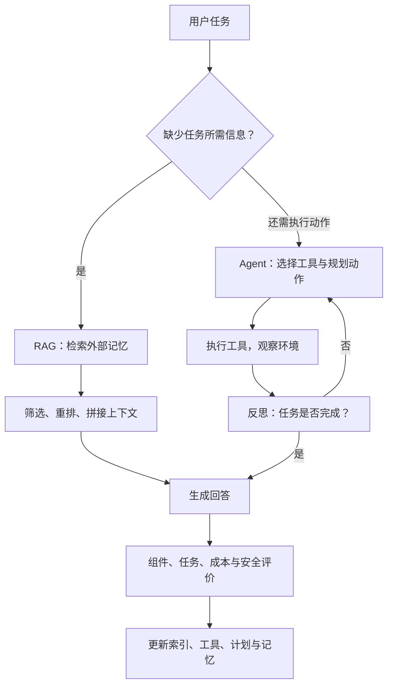
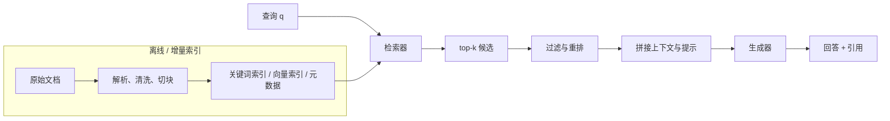
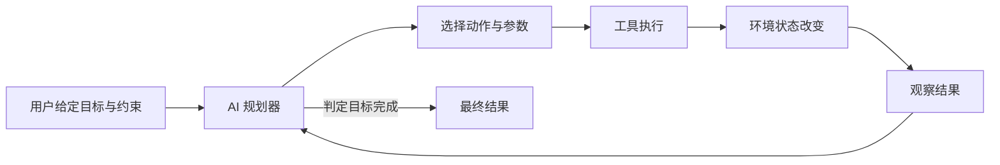
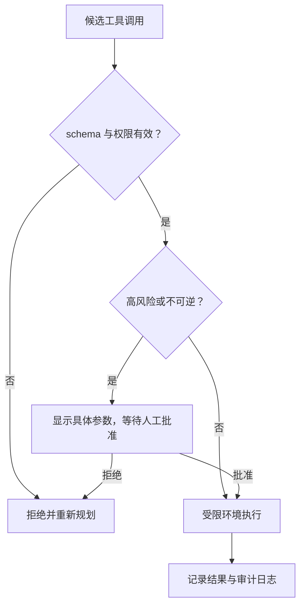
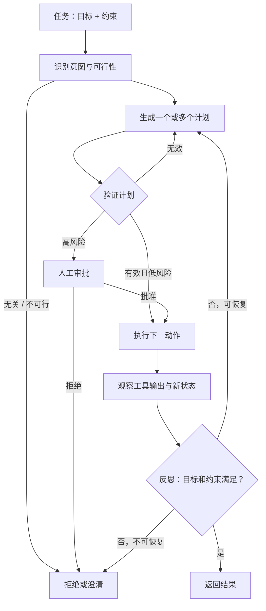
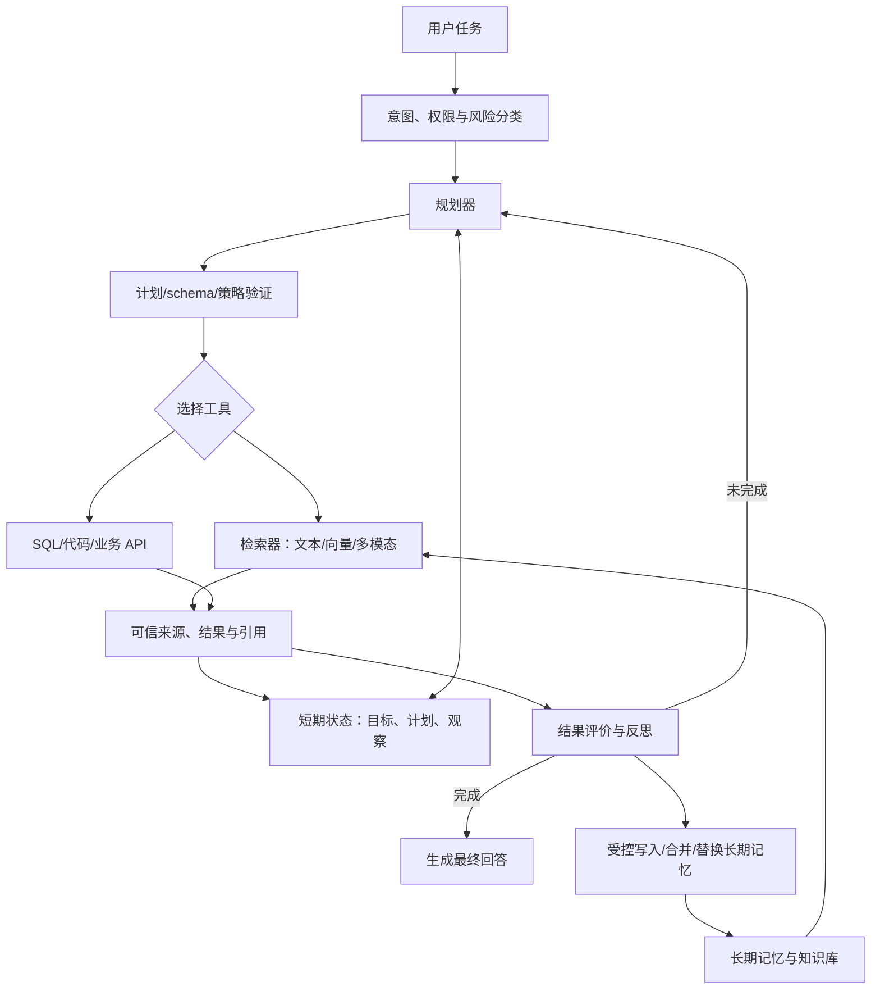

## 0. 学习目标与因果主线

模型要完成任务，需要两类输入：

- **指令**：告诉模型怎样做；
- **上下文**：提供这一次任务所需的信息。

第五章关注指令，第六章关注怎样为每个查询动态构造上下文。缺少信息时，模型只能依赖参数中的内部知识，知识可能过时、不完整或错误，因而更容易幻觉。

本章讨论两种主导模式：

- **RAG（retrieval-augmented generation）**：从外部数据源检索相关信息，再交给模型生成；
- **Agent（智能体）**：让模型规划并使用检索、搜索、数据库、代码执行等工具，不只读取信息，还能改变外部世界。

学完本章，应当能够回答五组问题：

1. **RAG 为什么在长上下文模型时代仍然有用？** 理解按查询选择信息对质量、成本、延迟、权限与新鲜度的意义。
2. **检索器怎样工作和评价？** 掌握 TF-IDF、BM25、嵌入检索、ANN、Precision/Recall、MRR、MAP、NDCG 与 RRF。
3. **怎样优化 RAG？** 能选择 chunk、重排、查询改写、上下文化检索，并处理文本、图像和表格数据。
4. **智能体比普通工作流多了什么？** 理解环境、工具、规划、函数调用、控制流、反思和工具选择。
5. **怎样限制智能体失败？** 能区分规划、工具、效率和记忆故障，并建立组件级与端到端评价。

本章主线如下：



贯穿全章的四条原则：

- **上下文越多不等于越好。** 每个 token 都有成本，也可能引入噪声、冲突和攻击内容。
- **检索是生成质量的上游瓶颈。** 生成器无法引用没有被检索到的事实。
- **工具扩大能力，也扩大损失半径。** 读工具与写工具必须使用不同权限和审批标准。
- **复杂系统必须分层评价。** 端到端失败要能定位到检索、规划、参数、工具或记忆。

---

## 1. RAG：为每个查询构造相关上下文

### 1.1 定义与历史

RAG 是先从外部记忆中取回相关信息，再基于这些信息生成回答的技术。外部记忆可以是：

- 企业合同、备忘录、会议记录和产品文档；
- 用户历史会话与偏好；
- 互联网、新闻和知识库；
- 图像、音频、视频和结构化数据库。

retrieve-then-generate 模式在 2017 年的开放域问答中已出现：系统先取回五篇相关 Wikipedia 页面，再由文档阅读器回答。2020 年，“retrieval-augmented generation”这一名称被用于知识密集型 NLP：无法把全部知识塞进模型时，只提供与当前查询最相关的部分。

例如用户问“Acme fancy-printer-A300 能否每秒打印 100 页？”，模型若拿到该型号规格，回答会比只靠内部记忆可靠。

RAG 的直觉可以概括为：

$$
\text{Answer}=G\big(q,\operatorname{Retrieve}(q,\mathcal M)\big),
$$

其中：

- $q$ 是当前查询；
- $\mathcal M$ 是外部记忆；
- Retrieve 选择相关资料；
- $G$ 是生成器。

RAG 让每个查询拥有不同上下文，而不是让所有用户共享同一大段资料。这也有助于数据权限：只把与当前用户、当前任务相关且被授权的信息放入提示。

### 1.2 上下文构造与传统特征工程

传统 ML 的特征工程把原始输入转成模型需要的信号；基础模型中的上下文构造承担类似职责：为模型补充完成当前任务所需的信息。

区别在于，传统特征通常是固定数值字段，RAG 上下文是动态检索的自然语言或多模态数据。二者共同遵循：**模型无法利用没有进入输入的信号。**

这带来一个重要诊断顺序：回答错误时先问“正确证据是否进入上下文”，再问生成器是否正确使用证据。否则团队可能错误地微调生成器，而真正问题是检索漏召回。

### 1.3 长上下文不会消灭 RAG

上下文窗口从数千扩展到百万 token，仍不能让 RAG 失去意义。

#### 数据增长没有固定上限

企业数据不断增加，很少删除。无论窗口多长，总会有代码库、邮件、日志或档案超过它。

#### 能装下不等于能利用

长上下文存在 lost-in-the-middle、注意力稀释和冲突。模型可能关注错误片段，关键事实即使在窗口中也未被使用。

#### 每个 token 都有成本

输入越长，prefill 延迟、API 费用、KV cache 与计算开销越高。无关 token 还会增加噪声。

#### RAG 支持权限与新鲜度

按查询检索可执行文档级访问控制，并在数据更新后立即使用新内容；仅依赖模型权重需要重新训练。

因此，“全量长上下文”和 RAG 是可组合的两种方案。若知识库足够小且模型确实能高效使用整个窗口，直接放入可能更简单。Anthropic 曾建议：对 Claude，若知识库小于约 20 万 token，可先测试全量上下文，无需立即构建 RAG。这个阈值依赖模型、任务、成本和上下文效率，不能照搬。

---

## 2. RAG Architecture（RAG 架构）

### 2.1 两个核心组件

RAG 包含：

1. **Retriever（检索器）**：从外部记忆取回候选信息；
2. **Generator（生成器）**：基于查询和候选信息生成回答。



原始 RAG 研究曾联合训练检索器和生成器；生产系统常使用分别训练的现成组件。分别搭建更容易，端到端微调则有机会让“检索什么”和“生成需要什么”更一致。

### 2.2 Indexing 与 Querying

检索器有两个阶段：

- **索引（indexing）**：预处理数据，使将来能快速查找；
- **查询（querying）**：给定查询，返回相关数据。

索引方式必须服务未来查询。按术语查找需要倒排索引；按语义查找需要嵌入与向量索引；按时间和权限过滤需要保存元数据。

文档长度可能从十几个 token 到百万 token。整篇取回会让上下文失控，因此通常先切成 chunk。信息检索中 chunk 也可视为 document；后文在不产生歧义时统一称“文档”。

### 2.3 RAG 质量的因果链

端到端结果依赖多步：

$$
P(\text{检索到充分证据且正确回答})
=P(\text{检索到充分证据})
\times
P(\text{正确使用证据}\mid\text{证据充分}).
$$

这是联合概率的条件分解，不要求两个事件独立。对必须依赖外部证据的问题，若充分证据召回率只有 70%，即使生成器看到充分证据时 100% 正确，**由检索证据支持的成功率**上限也只有 70%。模型偶尔可能凭内部知识答对，因此不能把这个乘积无条件等同于所有查询上的总体正确率。

实际还应加入解析、权限、重排和提示等事件。RAG 的首要任务通常是提高证据召回，再减少噪声和提高生成忠实度。

---

## 3. Retrieval Algorithms（检索算法）

检索的核心是对文档按与查询的相关性排序。算法差异在于如何表示查询和文档、怎样计算相关分数，以及如何在质量与速度间取舍。

### 3.1 “稀疏/稠密”与“词项/嵌入”两种分类

常见文献按向量稀疏性分类：

- **稀疏检索**：表示中大多数维度为 0；
- **稠密检索**：大多数维度非零。

词项 one-hot 向量通常稀疏，神经嵌入通常稠密。但 SPLADE 用 BERT 生成语义表示，再通过正则化压到大多数值为 0。它在机制上更接近嵌入检索，却会被“稀疏”分类放到词项方法旁边。

因此，本章更强调：

- **term-based（词项/词法检索）**；
- **embedding-based（嵌入/语义检索）**。

表示稀疏性是实现属性，相关性来自词面还是学习语义则是能力属性。

---

## 4. Term-Based Retrieval（词项检索）

### 4.1 关键词匹配的两个问题

直接返回包含查询词的文档会遇到：

1. 很多文档都含该词，需要排序；
2. 查询中词的重要性不同，“Vietnamese”“recipes”比“for”“at”更有区分力。

TF 与 IDF 分别解决这两个问题。

### 4.2 Term Frequency（TF）

词 $t$ 在文档 $D$ 中出现次数记为

$$
\mathrm{TF}(t,D)=f(t,D).
$$

朴素假设是：出现越多，文档越相关。但原始计数对长文档有偏好，也会让重复关键词无限增加分数。后面的 BM25 会处理这两个问题。

### 4.3 Inverse Document Frequency（IDF）

设语料库有 $N$ 篇文档，$C(t)$ 篇含词 $t$。朴素 IDF 为

$$
\mathrm{IDF}(t)=\log\frac{N}{C(t)}.
$$

推导直觉：若随机抽一篇文档，含 $t$ 的概率约为 $C(t)/N$；观察到 $t$ 的信息量是

$$
-\log\frac{C(t)}{N}=\log\frac{N}{C(t)}.
$$

所以越罕见的词越有信息。若所有文档都含 $t$，IDF 为 0；若只一篇含有，IDF 为 $\log N$。

实际实现常平滑，避免未见词除零，并控制极端值。例如：

$$
\mathrm{IDF}_{smooth}(t)
=\log\frac{N+1}{C(t)+1}+1.
$$

### 4.4 TF-IDF 分数

查询 $Q$ 含词 $t_1,\ldots,t_q$，朴素文档分数为

$$
\mathrm{Score}_{TFIDF}(D,Q)
=\sum_{i=1}^{q}\mathrm{IDF}(t_i)f(t_i,D).
$$

它奖励文档中反复出现的稀有查询词。更完整实现还会考虑查询词频、向量归一化、词干化与字段权重。

### 4.5 倒排索引

Elasticsearch/Lucene 等系统使用倒排索引：

```text
term -> [(document_id, term_frequency), ...]
```

查询只访问含查询词的 posting list，不必扫描全部文档。索引还保存文档频率、位置和字段，支持短语、邻近与 BM25。

建索引的代价换来低查询延迟；数据频繁变化时，还要考虑增量更新和索引一致性。

### 4.6 BM25：词频饱和与长度归一化

BM25 是 TF-IDF 的强基线。常见形式：

$$
\mathrm{BM25}(D,Q)=
\sum_{t\in Q}
\mathrm{IDF}_{BM25}(t)
\frac{f(t,D)(k_1+1)}
{f(t,D)+k_1\left(1-b+b\frac{|D|}{\mathrm{avgdl}}\right)}.
$$

其中：

- $f(t,D)$：词频；
- $|D|$：文档长度；
- $\mathrm{avgdl}$：语料平均文档长度；
- $k_1>0$：控制词频饱和，常在 1.2–2.0；
- $b\in[0,1]$：长度归一化强度，常约 0.75。

常用 IDF 为

$$
\mathrm{IDF}_{BM25}(t)
=\log\left(1+\frac{N-C(t)+0.5}{C(t)+0.5}\right).
$$

#### 为什么词频要饱和

忽略长度项，词频因子为

$$
g(f)=\frac{f(k_1+1)}{f+k_1}.
$$

当 $f\to\infty$：

$$
\lim_{f\to\infty}g(f)=k_1+1.
$$

词出现 100 次不会比 10 次重要 10 倍。$k_1$ 越大，饱和越慢；$k_1\to0$ 时，只要出现一次就接近固定得分。

#### 为什么要长度归一化

长文档更容易偶然包含查询词。长度因子

$$
1-b+b\frac{|D|}{\mathrm{avgdl}}
$$

在文档长于平均时大于 1，增大分母、降低分数；短文档则得到相对提升。$b=0$ 不做长度归一化，$b=1$ 完全按相对长度调整。

BM25 及 BM25+、BM25F 至今仍是生产检索的强基线。没有与 BM25 比较，就很难证明复杂语义系统真正带来收益。

### 4.7 分词决定能检索什么

最简单分词按空格拆词，但会破坏 `hot dog` 这类多词实体。改进包括：

- 小写与 Unicode 规范化；
- 去标点和可选 stop words；
- 词干化/词形还原；
- 把常见 n-gram 作为词项；
- 为错误码、产品名和代码符号保留原样；
- 按语言选择分词器。

过度规范化可能丢掉大小写敏感产品名、负号、版本号和代码符号。分词策略必须用真实查询评价。

---

## 5. Embedding-Based Retrieval（嵌入检索）

### 5.1 为什么需要语义检索

词法匹配不能处理同义表达，也无法消除歧义。查询 `transformer architecture` 可能返回电气变压器或电影 Transformers。语义检索希望让“神经网络注意力架构”靠近查询，而不是只看字符重叠。

索引阶段把每个文档映射为向量：

$$
\mathbf d_i=E(D_i).
$$

查询阶段使用同一个嵌入模型：

$$
\mathbf q=E(Q),
$$

再按余弦、内积或欧氏距离返回最近的 $k$ 个向量。

嵌入模型若不能保留任务需要的语义，向量数据库再快也没有意义。领域缩写、错误码和产品名尤其容易在嵌入中被弱化。

### 5.2 Exact k-NN

精确 k 近邻对所有 $N$ 个向量计算相似度，再取 top-k。若向量维度为 $d$，距离计算约为

$$O(Nd),$$

全排序为 $O(N\log N)$；用大小为 $k$ 的堆可降为 $O(N\log k)$，但仍需扫描全部向量。

精确搜索能返回**给定向量表示与距离函数下**的真实 top-k，适合小数据或建立 ANN 对照真值；它不保证这些近邻符合人类判断的语义相关性。大规模下扫描全部向量的查询延迟和计算成本过高。

### 5.3 Approximate Nearest Neighbor（ANN）

ANN 通常牺牲一部分近邻召回率，换取更低延迟或更少计算/存储。具体内存取舍取决于索引：HNSW 的图结构通常增加内存，PQ 压缩才主要减少向量存储。常见路线：

#### LSH

局部敏感哈希让相似向量更可能落入同一桶，只搜索少数桶。它通用、索引较轻，但要调桶数量和哈希表数量，在召回与查询成本间权衡。

#### HNSW

构建多层近邻图：高层稀疏、用于快速跳转；底层密集、用于局部精细搜索。查询从高层贪心接近目标，再逐层下降。

HNSW 通常查询快、召回高，但构建时间和内存开销大。参数 `efSearch` 增大时会访问更多节点，召回提高、延迟也增加。

#### Product Quantization（PQ）

把 $d$ 维向量分成 $m$ 个子向量，每个子空间用有限码本近似：

$$
\mathbf x\approx
[c_1(z_1),c_2(z_2),\ldots,c_m(z_m)].
$$

存储短码而非完整浮点向量，距离可通过查表近似。压缩越强，存储与计算越省，量化误差越大。

#### IVF

先用 k-means 把向量分到倒排簇。查询只探测离查询最近的若干 centroid 所对应簇，再在候选中搜索。`nprobe` 越大，召回越高、延迟越大。

IVF 常与 PQ 组合，构成 FAISS 的重要方案。

#### Annoy

建立多棵随机二叉树，以随机超平面递归划分空间。查询沿树搜索并合并候选。树越多，索引更大、召回更高。

FAISS、ScaNN、Annoy、Hnswlib 等库实现了这些方法。多数应用开发者不应自己重写 ANN，而应理解参数、指标和数据更新约束。

### 5.4 向量数据库真正困难的是搜索

存储向量并不难，难的是在高维、大规模和高并发下快速找近邻，同时支持：

- 增删改和增量索引；
- 元数据与权限过滤；
- 多租户隔离；
- 量化和压缩；
- 召回—延迟调参；
- 备份、复制和一致性。

传统数据库也在加入向量字段与搜索，因此“向量数据库”不必是独立产品类别。

---

## 6. Comparing Retrieval Algorithms（比较检索算法）

### 6.1 词项检索与嵌入检索

| 维度 | 词项检索 | 嵌入检索 |
|---|---|---|
| 索引 | 分词、posting list，通常快 | 生成嵌入与 ANN 索引，较慢 |
| 查询 | 倒排表，通常低延迟 | 查询嵌入 + 向量搜索 |
| 优势 | 精确关键词、错误码、名称；强开箱基线 | 同义、自然语言与语义匹配 |
| 失败 | 同义词漏召回、词义歧义 | 关键词被模糊、嵌入领域不匹配 |
| 优化空间 | 成熟、相对有限 | 可微调嵌入、检索器和生成器 |
| 成本 | 通常低 | 嵌入生成、向量存储与查询可能昂贵 |

向量数据库费用有时可达到模型 API 支出的五分之一甚至一半，尤其在数据每天变化、需重算上亿文档嵌入时。语义效果必须证明值得额外成本。

### 6.2 Context Precision 与 Recall

给定查询 $q$，所有相关文档集合为 $G_q$，检索 top-k 为 $R_q^k$：

$$
\mathrm{Precision@k}
=\frac{|R_q^k\cap G_q|}{|R_q^k|},
$$

$$
\mathrm{Recall@k}
=\frac{|R_q^k\cap G_q|}{|G_q|}.
$$

- Precision 高：上下文中噪声少；
- Recall 高：所需证据不易漏掉。

增大 $k$ 通常提高 recall、降低 precision，并增加生成成本。RAG 要按答案是否需要多篇证据选择平衡点。

Recall 难计算，因为需要知道库中**所有**相关文档；Precision 只需判断已取回文档，因此更容易由人工或 AI 裁判计算。只报告 precision 会掩盖“取回的都不错，但漏了关键证据”。

### 6.3 排名指标

#### MRR

若第一个相关文档排名为 $r_q$：

$$
\mathrm{RR}(q)=\frac1{r_q},
\qquad
\mathrm{MRR}=\frac1{|Q|}\sum_{q\in Q}\mathrm{RR}(q).
$$

它只关心第一个相关结果，适合“找到一个正确答案即可”的任务，不评价后续相关文档。

#### Average Precision 与 MAP

令 $\mathrm{rel}_q(i)\in\{0,1\}$ 表示第 $i$ 个结果是否相关：

$$
\mathrm{AP@k}(q)
=\frac1{|G_q|}
\sum_{i=1}^{k}\mathrm{Precision@i}(q)\,\mathrm{rel}_q(i).
$$

相关文档越靠前，加入时的 Precision@i 越高。MAP@k 是查询上的 AP@k 均值。这里分母保留全部相关文档数 $|G_q|$，所以 top-k 外未取回的相关文档贡献 0；若评价完整排名，就把求和上限换成排名长度。

#### NDCG

若相关性有等级 $rel_i\ge0$：

$$
\mathrm{DCG@k}
=\sum_{i=1}^{k}\frac{2^{rel_i}-1}{\log_2(i+1)}.
$$

分子让高相关等级收益更大，分母按排名对数折扣。把理想排序的 DCG 记为 IDCG：

$$
\mathrm{NDCG@k}
=\frac{\mathrm{DCG@k}}{\mathrm{IDCG@k}}\in[0,1].
$$

NDCG 同时考虑等级和位置，适合多证据、有 graded relevance 的 RAG。

### 6.4 索引与查询的取舍

ANN-Benchmarks 常比较：

- **Recall**：找到真实近邻的比例；
- **QPS**：每秒查询数；
- **Build time**：索引构建时间；
- **Index size**：索引存储。

HNSW 索引重、内存大，但查询快且召回高；LSH 建得快、内存轻，却可能查询更慢或不够准。数据频繁更新时，构建时间与增量能力比静态最高 QPS 更重要。

检索器最终还要在整个 RAG 中评价：它是否提高回答质量。独立 embedding 基准如 MTEB 能提供初筛，不能替代端到端测试。

### 6.5 数值实现：BM25、精确向量检索与排名指标

```python
"""实现 BM25、余弦 k-NN 与 Precision/Recall/MRR/AP/NDCG。"""
import math
import re
from collections import Counter


documents = [
    "python network error eaddrnotavail address unavailable",
    "transformer neural network attention architecture",
    "electrical transformer converts voltage",
    "transformers movie robots action",
    "rag retrieval improves factual answers",
]
query = "transformer attention architecture"


def tokenize(text):
    return re.findall(r"[a-z0-9]+", text.casefold())


def bm25_scores(query_text, docs, k1=1.5, b=0.75):
    tokenized = [tokenize(doc) for doc in docs]
    query_terms = tokenize(query_text)
    n_docs = len(docs)
    avgdl = sum(map(len, tokenized)) / n_docs
    document_frequency = Counter()
    for doc in tokenized:
        document_frequency.update(set(doc))

    scores = []
    for doc in tokenized:
        frequencies = Counter(doc)
        score = 0.0
        for term in query_terms:
            df = document_frequency[term]
            if not df:
                continue
            idf = math.log(1 + (n_docs - df + 0.5) / (df + 0.5))
            tf = frequencies[term]
            denominator = tf + k1 * (1 - b + b * len(doc) / avgdl)
            score += idf * tf * (k1 + 1) / denominator
        scores.append(score)
    return scores


bm25 = bm25_scores(query, documents)
bm25_ranking = sorted(range(len(documents)), key=lambda i: -bm25[i])
print("BM25")
for index in bm25_ranking:
    print(f"doc={index} score={bm25[index]:.4f}")


def cosine(left, right):
    dot = sum(a * b for a, b in zip(left, right))
    norm_left = math.sqrt(sum(a * a for a in left))
    norm_right = math.sqrt(sum(b * b for b in right))
    return dot / (norm_left * norm_right)


query_vector = [1.0, 0.0, 0.0]
document_vectors = [
    [0.0, 0.0, 1.0],
    [0.99, 0.05, 0.0],
    [0.10, 0.99, 0.0],
    [0.70, 0.70, 0.0],
    [0.20, 0.10, 0.90],
]
semantic = [cosine(query_vector, vector) for vector in document_vectors]
semantic_ranking = sorted(range(len(documents)), key=lambda i: -semantic[i])
print("\nSEMANTIC")
for index in semantic_ranking:
    print(f"doc={index} score={semantic[index]:.4f}")


relevance = {1: 3, 3: 1}  # 0 表示不相关，正数表示分级相关性
ranking = [1, 2, 3, 0, 4]
k = 3
retrieved = ranking[:k]
relevant_docs = {doc for doc, grade in relevance.items() if grade > 0}
hits = [doc for doc in retrieved if doc in relevant_docs]
precision = len(hits) / k
recall = len(hits) / len(relevant_docs)
first_rank = next(i for i, doc in enumerate(ranking, 1) if doc in relevant_docs)
mrr = 1 / first_rank

running_hits = 0
ap_sum = 0.0
for i, doc in enumerate(retrieved, 1):
    if doc in relevant_docs:
        running_hits += 1
        ap_sum += running_hits / i
average_precision_at_k = ap_sum / len(relevant_docs)


def dcg(items):
    return sum((2 ** relevance.get(doc, 0) - 1) / math.log2(i + 1)
               for i, doc in enumerate(items, 1))


ideal = sorted(ranking, key=lambda doc: -relevance.get(doc, 0))
ndcg = dcg(ranking[:k]) / dcg(ideal[:k])
print("\nMETRICS")
print(f"precision@3={precision:.4f}")
print(f"recall@3={recall:.4f}")
print(f"mrr={mrr:.4f}")
print(f"average_precision@3={average_precision_at_k:.4f}")
print(f"ndcg@3={ndcg:.4f}")
```

实际运行输出：

```text
BM25
doc=1 score=3.5809
doc=2 score=0.9465
doc=0 score=0.0000
doc=3 score=0.0000
doc=4 score=0.0000

SEMANTIC
doc=1 score=0.9987
doc=3 score=0.7071
doc=4 score=0.2157
doc=2 score=0.1005
doc=0 score=0.0000

METRICS
precision@3=0.6667
recall@3=1.0000
mrr=1.0000
average_precision@3=0.8333
ndcg@3=0.9828
```

词法与语义排序都把神经网络文档放首位，但后续候选不同。指标示例中两个相关文档都在 top-3，因此 recall 为 1；一个低相关文档被放到第二位，使 NDCG 低于 1。

---

## 7. Combining Retrieval Algorithms（组合检索）

词法与语义检索的失效模式互补，生产系统常采用混合搜索（hybrid search）。

### 7.1 串行：候选召回后重排

先用便宜、高召回的检索器取较大候选集，再用昂贵、精确的模型重排。例如先按 `transformer` 找全部词项候选，再用向量或 cross-encoder 区分神经网络、电气设备和电影。

串行架构减少昂贵重排的输入规模：库有 $N$ 文档，第一阶段取 $K\ll N$，第二阶段只处理 $K$ 个。它要求第一阶段 recall 足够高；漏掉的文档无法被重排找回。

### 7.2 并行：多个检索器做 ensemble

BM25、向量、时间与业务规则可并行返回排名，再融合。并行提高召回，但候选和计算更多。

分数直接相加很困难：BM25、余弦和学习排序器尺度不同。排名融合避免校准原始分数。

### 7.3 Reciprocal Rank Fusion（RRF）

有 $n$ 个排名列表，第 $i$ 个检索器把文档 $D$ 排在 $r_i(D)$，RRF 定义：

$$
\mathrm{RRF}(D)
=\sum_{i=1}^{n}\frac1{k_0+r_i(D)}.
$$

$k_0$ 是平滑常数，常取 60：

- 避免 rank 0 或极端头部支配；
- $k_0$ 越小，第一名与后续差距越大；
- 文档未出现在某列表时，该列表贡献 0。

RRF 只依赖顺序，不依赖不可比的原始分数。它假设各列表具有价值；很差的检索器仍可能引入噪声，应通过消融评价。

### 7.4 数值实现：RRF

```python
"""融合 BM25 与语义排名，展示 k0 对头部权重的影响。"""


def reciprocal_rank_fusion(rankings, k0=60):
    scores = {}
    for ranking in rankings:
        for rank, document in enumerate(ranking, start=1):
            scores[document] = scores.get(document, 0.0) + 1 / (k0 + rank)
    return sorted(scores.items(), key=lambda item: (-item[1], item[0]))


bm25 = [1, 2, 0, 3, 4]
semantic = [1, 3, 4, 2, 0]

print("RRF_K60")
for document, score in reciprocal_rank_fusion([bm25, semantic], 60):
    print(f"doc={document} score={score:.6f}")

print("\nRRF_K0")
for document, score in reciprocal_rank_fusion([bm25, semantic], 0):
    print(f"doc={document} score={score:.6f}")
```

实际运行输出：

```text
RRF_K60
doc=1 score=0.032787
doc=2 score=0.031754
doc=3 score=0.031754
doc=0 score=0.031258
doc=4 score=0.031258

RRF_K0
doc=1 score=2.000000
doc=2 score=0.750000
doc=3 score=0.750000
doc=0 score=0.533333
doc=4 score=0.533333
```

$k_0=0$ 时两个第一名贡献巨大；$k_0=60$ 时排名差异被平滑。文档 2 和 3 因两列表中位置互换而同分。

---

## 8. Retrieval Optimization（检索优化）

检索效果不只由 BM25 或向量算法决定。数据怎样切块、候选怎样重排、用户问题怎样改写、chunk 是否拥有足够上下文，都可能比更换向量数据库带来更大影响。

### 8.1 Chunking Strategy（切块策略）

#### 固定长度

最简单是按字符、词、句子、段落或 token 固定切分，例如 2048 字符、512 词、20 句。它易实现、容量可控，却可能从语义中间切断。

#### 递归切分

先按章节，过长时按段落，再按句子，最后按 token。它尽量保留结构边界，适合文档和 Markdown。

#### 领域切分

- 代码按函数、类或语法树；
- Q&A 按问答对；
- 合同按条款；
- 表格按逻辑行/组；
- 中文等语言使用适合自身标点和分词规则。

领域切分通常比任意固定窗口更能保持可回答单元。

### 8.2 为什么需要 overlap

无重叠时，关键信息可能横跨边界。例如：

```text
I left my wife | a note
```

两个 chunk 都失去完整语义。设 chunk 长度为 $C$、重叠为 $O<C$，步长为

$$S=C-O.$$

长度为 $L$ 的序列所需 chunk 数近似：

$$
n=\begin{cases}
1,&L\le C,\\
1+\left\lceil\frac{L-C}{C-O}\right\rceil,&L>C.
\end{cases}
$$

重叠增加边界覆盖，也增加 chunk、嵌入、存储和检索重复。重叠过大时，top-k 可能全是同一段的近重复，降低信息多样性。

### 8.3 Chunk 大小的双向影响

**小 chunk 的优势：**

- 相关片段更聚焦，precision 可能提高；
- 固定上下文预算能容纳更多来源；
- 细粒度权限、引用和更新更容易。

**小 chunk 的代价：**

- 局部片段失去定义、主语和前后关系；
- chunk 数增加，嵌入与索引成本上升；
- 向量搜索空间增大；
- 多跳问题需要组合更多片段。

**大 chunk 的优势：**上下文完整；**代价：**噪声多、token 贵、可容纳来源少，向量可能把多个主题平均掉。

chunk 不得超过生成模型上下文，也不应超过嵌入模型输入上限。按生成模型 tokenizer 切块便于预算，但换 tokenizer 后可能需要重建索引。

不存在通用最佳大小和 overlap，应在查询集上联合比较检索指标、答案质量、成本与延迟。

### 8.4 数值实现：chunk 数量与边界覆盖

```python
"""计算固定窗口 chunk，并展示 overlap 如何保留跨边界短语。"""
import math


def chunk_count(length, chunk_size, overlap):
    if overlap >= chunk_size:
        raise ValueError("overlap must be smaller than chunk_size")
    if length <= chunk_size:
        return 1
    return 1 + math.ceil((length - chunk_size) / (chunk_size - overlap))


def chunks(tokens, size, overlap):
    step = size - overlap
    result = []
    for start in range(0, len(tokens), step):
        result.append(tokens[start:start + size])
        if start + size >= len(tokens):
            break
    return result


print("CHUNK_COUNT")
for overlap in [0, 20, 100]:
    print(f"overlap={overlap} chunks={chunk_count(10000, 512, overlap)}")

tokens = "I left my wife a note before work".split()
phrase = ["wife", "a", "note"]
print("\nBOUNDARY_COVERAGE")
for overlap in [0, 2]:
    parts = chunks(tokens, size=4, overlap=overlap)
    covered = any(
        any(part[i:i + len(phrase)] == phrase for i in range(len(part) - len(phrase) + 1))
        for part in parts
    )
    print(f"overlap={overlap} covered={covered} chunks={parts}")
```

实际运行输出：

```text
CHUNK_COUNT
overlap=0 chunks=20
overlap=20 chunks=21
overlap=100 chunks=25

BOUNDARY_COVERAGE
overlap=0 covered=False chunks=[['I', 'left', 'my', 'wife'], ['a', 'note', 'before', 'work']]
overlap=2 covered=True chunks=[['I', 'left', 'my', 'wife'], ['my', 'wife', 'a', 'note'], ['a', 'note', 'before', 'work']]
```

overlap=2 保住了 `wife a note`，但 chunk 从 2 增到 3。实现会在某个窗口已经到达序列末尾时停止，避免再产生一个被前一窗口完全覆盖的尾块；生产系统还常合并过短尾块并去重候选。

---

## 9. Reranking（重排）

初始检索器强调低成本、高召回，重排器在较小候选集上做更精确比较。需要将 100 个候选压到上下文能容纳的 5–10 个时，重排特别重要。

常见重排器：

- **cross-encoder**：把 query 与 document 一起输入模型，直接输出相关性；质量高但每对都要推理；
- **强嵌入或精确 k-NN**：对初筛集合做更昂贵向量比较；
- **AI 裁判**：按任务标准评相关性，灵活但慢；
- **时间衰减**：新闻、邮件和市场数据优先新内容；
- **业务规则**：权限、来源可信度、文档状态与产品优先级。

可将语义分数 $s_{rel}$ 与时间衰减组合：

$$
s(D,q)=\alpha s_{rel}(D,q)
+(1-\alpha)e^{-\lambda\Delta t_D}.
$$

$\Delta t_D$ 是文档年龄，$\lambda$ 控制衰减；$\alpha$ 越高越重语义。该线性组合要求两个分数先校准到可比尺度。

搜索排名中第一与第五差异很大；RAG 中只要都进入上下文，位置影响相对较弱，但仍存在开头/结尾优势。重排还应考虑最终上下文排列，而非只选集合。

---

## 10. Query Rewriting（查询改写）

多轮对话中的用户输入常依赖历史：

```text
用户：John Doe 上次何时购买？
模型：两周前。
用户：Emily Doe 呢？
```

把最后一句直接检索会得到大量无关 Emily 文档。应改写为自包含查询：

```text
When was the last time Emily Doe bought something from us?
```

查询改写也称 reformulation、normalization 或 expansion。传统搜索用拼写、同义词和规则；AI 应用可让模型基于对话改写。

### 10.1 改写的正确性标准

好改写应：

- 保留用户真实意图；
- 消解代词和省略；
- 不添加历史中没有的事实；
- 独立可理解；
- 适配检索器，例如保留错误码和实体名。

“他妻子呢？”还需要身份解析。若数据库不知道妻子是谁，模型应输出 `UNRESOLVED_ENTITY` 或向用户澄清，而不是猜姓名。

### 10.2 多查询扩展

可为一个问题生成多个查询：关键词形式、同义表达、子问题。并行检索后融合排名能提高召回，但成本更高，也可能引入偏离意图的文档。

改写器本身需要评价：语义保持率、实体准确率、检索 recall 提升、额外延迟和幻觉率。

---

## 11. Contextual Retrieval（上下文化检索）

chunk 离开原文后可能失去标题、实体和主题。上下文化检索在索引前为每个 chunk 增加辅助信息。

### 11.1 元数据增强

可以加入：

- 标题、章节、作者、时间和标签；
- 提取的实体、产品名与错误码；
- 商品描述、评价和类别；
- 图片/视频标题与 caption；
- 权限、租户和文档状态。

错误码 `EADDRNOTAVAIL (99)` 即使在稠密嵌入中被弱化，也能通过关键词元数据召回。

### 11.2 问题增强

为 chunk 生成它能回答的问题。密码重置文档可附：

- “怎样重置密码？”
- “我忘了密码。”
- “无法登录账户。”

用户查询可能更像问题而不是文档陈述，问题增强能缩小表达差距。生成问题必须质检，错误问题会污染检索。

### 11.3 文档级上下文

为每个 chunk 生成 50–100 token 的短说明，解释它在整篇文档中的位置，再把说明前置后索引：

$$
D_i'=\mathrm{Context}(D_i,D_{whole})\oplus D_i.
$$

例如 chunk 只写“其收入增长 12%”，上下文可补成“该段讨论 Acme 2024 Q3 欧洲区收入”。

这会增加索引 token、嵌入成本和生成模型依赖，还可能让错误摘要进入每次检索。应保存原 chunk，并分别评价上下文生成与检索提升。

---

## 12. Evaluating Retrieval Solutions（评价检索方案）

除离线 relevance 指标，还应检查：

1. 支持哪些机制，能否 hybrid search；
2. 向量方案支持哪些嵌入与 ANN；
3. 存储与流量扩展性、真实流量模式；
4. 全量/增量构建时间与批量增删；
5. 不同算法的 P50/P90/P99 查询延迟；
6. 按文档量、向量量还是查询量计费；
7. 权限过滤、合规、多租户与控制/数据平面隔离；
8. 备份、恢复、可观测性和供应商锁定。

RAG 必须三级评价：

- 检索质量；
- 嵌入质量（若使用）；
- 最终回答质量与引用。

高检索分数却不改善回答，可能是生成器不使用上下文、上下文拼接错误或指标与任务不一致。

---

## 13. RAG Beyond Texts（超越文本的 RAG）

### 13.1 Multimodal RAG

多模态生成器可同时接收文本、图像、音频和视频。问“电影《飞屋环游记》中的房子是什么颜色”，检索器可返回房屋图片，而不只返回文字描述。

图像有标题、标签、caption 时可按元数据检索；按内容跨模态检索则需要 CLIP 一类联合嵌入：

1. 为全部文本和图像生成共同空间向量；
2. 为文本查询生成向量；
3. 取最接近的图像和文本；
4. 把多模态候选交给生成器。

评价要覆盖模态检索 recall、跨模态相关性、版权、图像安全，以及生成器是否正确观察图片。

### 13.2 RAG with Tabular Data

结构化表格不适合简单切块后做向量相似度。问题“过去 7 天卖出多少顶 Fruity Fedora？”需要聚合查询：

```sql
SELECT SUM(units)
FROM Sales
WHERE product = 'Fruity Fedora'
  AND timestamp >= :start_date;
```

典型链路：

1. 根据问题和 schema 生成 SQL；
2. 验证权限、语法和只读策略；
3. 执行 SQL；
4. 将结果作为上下文生成回答。

表很多、schema 放不下时，先检索相关表，再做 text-to-SQL。SQL 可由同一生成器或专用模型完成。

这一模式已经接近 agent：SQL 生成与执行是工具调用。最大的风险不是“回答措辞”，而是错误查询、越权读取和写操作。

### 13.3 可运行示例：安全的表格 RAG

```python
"""用 SQLite 演示 text-to-SQL 之后的只读执行与答案生成。"""
import sqlite3


connection = sqlite3.connect(":memory:")
connection.execute(
    "CREATE TABLE Sales(order_id INTEGER, day INTEGER, product TEXT, units INTEGER)"
)
connection.executemany(
    "INSERT INTO Sales VALUES (?, ?, ?, ?)",
    [
        (1, 1, "Fruity Fedora", 2),
        (2, 3, "Purr & Shake", 5),
        (3, 5, "Fruity Fedora", 4),
        (4, 12, "Fruity Fedora", 9),
    ],
)


def execute_read_only(sql, parameters):
    """示例仅允许单条 SELECT；生产系统还需 AST、权限和资源限制。"""
    normalized = sql.strip().casefold()
    if not normalized.startswith("select") or ";" in normalized[:-1]:
        raise ValueError("only one SELECT statement is allowed")
    return connection.execute(sql, parameters).fetchone()[0]


sql = "SELECT SUM(units) FROM Sales WHERE product = ? AND day >= ?"
total = execute_read_only(sql, ("Fruity Fedora", 4))
print("TABULAR_RAG")
print(f"sql={sql}")
print(f"result={total}")
print(f"answer=Units sold in the period: {total}")

try:
    execute_read_only("DELETE FROM Sales", ())
except ValueError as error:
    print(f"blocked={error}")
```

实际运行输出：

```text
TABULAR_RAG
sql=SELECT SUM(units) FROM Sales WHERE product = ? AND day >= ?
result=13
answer=Units sold in the period: 13
blocked=only one SELECT statement is allowed
```

示例将参数与 SQL 模板分离，避免字符串拼接注入；真实系统还要限制表/列、查询成本、返回行数，并用数据库只读账号作为最终权限边界。

---

## 14. Agents（智能体）总览

AI 智能体仍是快速演进的领域，尚无公认的定义、开发与评价理论框架。下面是在经典智能体定义与现有工程实践上建立的工作框架，不应视为固定行业标准。

### 14.1 定义：环境、感知与行动

智能体是能够**感知环境并对环境采取行动**的实体。这个定义不要求它像人，也不要求它必须自主运行很久。判断一个系统是不是智能体，关键看三件事：

1. 它处于什么环境；
2. 它能观察到什么；
3. 它能执行哪些动作。

环境由用例决定：棋类智能体的环境是棋盘；网页研究助手的环境是互联网；编程智能体的环境是终端、文件系统和代码仓库；自动驾驶智能体的环境是道路及周边区域。

工具决定动作集合。例如编程智能体可搜索、读取、编辑文件并执行测试。环境与工具相互约束：棋盘环境只允许合法棋步；只会游泳的机器人只能在水域活动。



其中模型是“大脑”：处理任务和环境反馈，规划动作序列，并判断目标是否完成。它不是环境，也不是工具执行器。

### 14.2 RAG 是一种简单智能体

只要系统能根据输入选择检索动作，RAG 就可以看作智能体模式的特例：

- 环境：文档库、向量库或数据库；
- 工具：文本检索、图像检索、SQL 生成和 SQL 执行；
- 动作：检索、查询、生成回答；
- 目标：基于外部证据回答问题。

表格 RAG 对“预测未来三个月销售额”的处理可能是：先取五年销售数据，检查缺失，再取营销活动，最后预测。工具结果会改变下一步计划，因此它不再是固定的单次 retrieve-then-generate 流程。

### 14.3 智能体为何需要更强模型

#### 复合错误

若每个步骤独立成功概率为 $p$，必须全部成功的 $n$ 步任务，其理想化成功率是：

$$P(\text{all succeed})=p^n.$$

当 $p=0.95$：

$$0.95^{10}\approx59.9\%,\qquad 0.95^{100}\approx0.59\%. $$

真实步骤并不独立，但公式揭示了核心风险：长轨迹会放大微小单步错误。反思和重试能提升结果，却也增加成本和新的失败点。

#### 更高损失

普通聊天回答错了，用户可能只看到一句错话；拥有邮件、数据库或支付工具的智能体可能真的发送、删除或转账。能力越大，权限、审批、回滚和审计越重要。

智能体可以节省大量人工时间，也可能持续消耗 token 和工具费用。评价必须同时观察成功、步骤、延迟、成本与风险，而不是只看最终文本是否流畅。

---

## 15. Tools（工具）

模型自身通常只有一种原生动作，例如语言模型生成文本。外部工具让它感知环境、弥补固有限制并改变环境。工具集合称为 **tool inventory（工具清单）**。

工具不是越多越好。更多工具扩大任务范围，也增加描述 token、选择难度、误调用概率和攻击面。最优清单取决于环境、任务与模型能力，需要实验确定。

### 15.1 工具一：知识增强

这类工具把当前模型不知道或上下文放不下的信息取回来：

- 文本、图像与向量检索器；
- SQL 执行器和库存 API；
- 企业人员、邮件与 Slack 搜索；
- 搜索引擎、新闻、天气、航班、GitHub 和社交平台 API。

联网能缓解模型知识过时，并提供可引用证据；也会把提示注入、错误网页、仇恨内容和恶意下载带进系统。搜索结果只能视为**不可信输入**，不能视为系统指令。

### 15.2 工具二：能力扩展

与其耗费大量数据把模型训练成计算器，不如给它精确工具。典型扩展包括：

- 计算器、日历、时区和单位转换；
- 翻译、OCR、语音转写和图像描述；
- Python/代码解释器、LaTeX 编译器和浏览器；
- 文生图模型，使纯文本规划器获得图像生成能力。

代码执行能让智能体做实验、分析数据和绘图，也允许任意代码触碰文件、网络和凭据。必须使用沙箱、资源配额、网络隔离和最小权限，而不能靠提示中的“请勿作恶”。

工具增强可能比提示甚至微调更有效。Chameleon 的实验中，13 个工具让 GPT-4 智能体在 ScienceQA 相比此前最佳 few-shot 结果提高 11.37%，在 TabMWP 提高 17%。这说明工具能把确定性计算和专门感知交给更适合的组件；数字是特定实验结果，不代表所有任务都能复现相同增益。

### 15.3 工具三：写操作

读工具观察世界，写工具改变世界：

| 工具 | 读操作 | 写操作 |
|---|---|---|
| SQL | 查询数据 | 插入、更新、删除 |
| 邮件 API | 读取邮件 | 发送、回复、删除 |
| 银行 API | 查看余额 | 发起转账 |
| GitHub | 读取代码和 issue | 合并 PR、发布版本 |

写操作可以自动化完整工作流，但风险不应只由模型自行判断。生产系统应采用：

1. **最小权限**：默认只读，按任务临时授予写权限；
2. **参数校验**：金额、收件人、路径和资源 ID 使用允许列表或强约束；
3. **风险分级**：可逆、低影响动作可自动执行；不可逆或高影响动作需审批；
4. **预览与确认**：展示将执行的具体动作和参数，而不是只问“是否同意”；
5. **幂等与回滚**：重试不重复扣款，必要时能撤销；
6. **审计**：记录计划、工具版本、输入参数、输出、审批人与时间；
7. **外部强制边界**：数据库权限、沙箱和策略引擎最终兜底。



“模型说它会小心”不是权限控制；真正的安全边界必须位于模型之外。

---

## 16. Planning（规划）

任务由**目标**与**约束**共同定义。“以 5000 美元预算安排从旧金山到印度的两周旅行”中，到达并完成旅行是目标，时长和预算是约束。只完成目标、不满足约束，仍然失败。

计划是实现任务的一组有序动作。有效规划需要：理解意图、枚举或构造候选路径、预测动作结果、比较成功概率与成本，再选择最有希望的路径。

### 16.1 规划本质上是搜索

把环境状态记为 $s$，动作记为 $a$，状态转移为 $T(s,a)$。规划器寻找动作序列：

$$
\pi=(a_1,a_2,\ldots,a_n),
$$

使最终状态满足目标和约束，同时尽量降低步骤、成本、延迟与风险。

例如“有多少家尚无收入的公司融资至少 10 亿美元”：

1. 先找全部无收入公司，再按融资额过滤；
2. 先找融资至少 10 亿美元的少量公司，再检查收入。

两者都可能正确，但第二条路径处理的候选更少。规划不仅关心“能不能到达”，也关心“怎样更高效地到达”。

搜索常需回溯：走到动作 A 后发现状态无望，返回旧状态尝试 B。自回归模型虽然逐 token 向前生成，却可以读取失败观察、修改后续计划或整体重启，形成系统层面的回溯。真正困难的是准确预测动作会把环境带到什么状态。因此，可靠规划通常还需要搜索算法、显式状态、模拟器或世界模型，而不应只让模型生成一段看起来合理的步骤。

### 16.2 将规划与执行解耦

若模型在一次调用中边想边执行，一个错误的千步计划可能运行数小时。更稳健的流程是：



计划验证可先用便宜、确定性的检查：

- 所有动作是否存在于工具清单；
- 参数 schema、类型和范围是否有效；
- 是否超过最大步骤、预算、时间或重试次数；
- 数据依赖顺序是否成立；
- 是否包含未审批的高风险动作；
- 计划是否覆盖目标和约束。

启发式规则之后，才考虑模型裁判评价计划合理性。模型裁判也会错，不能替代权限和 schema 检查。坏计划可要求重生成；也可并行生成多个计划，让评价器选择，代价是更多 token 和延迟。

### 16.3 智能体循环的四个阶段

1. **计划生成**：把任务分解为可管理动作；
2. **计划反思与纠错**：在执行前检查计划；
3. **执行**：调用具体工具；
4. **结果反思与纠错**：检查输出、目标和约束，必要时重新规划。

反思不是智能体定义的必要条件，却常是成功完成复杂任务的必要工程机制。

人可以介入任何阶段：给高层计划、批准计划、执行敏感步骤或验证结果。每个动作都应明确自动化等级，例如“自动读取、批准后发送邮件、禁止转账”。笼统地说系统是“human in the loop”并不足够。

### 16.4 意图分类与范围控制

规划之前先判断用户意图，可缩小工具集合。账单问题开放支付查询；重置密码开放文档检索。无法支持的请求应归入 `IRRELEVANT` 或 `OUT_OF_SCOPE`，直接解释边界，而不是浪费计算构造不可能计划。

意图分类器本身也可能成为独立组件甚至独立智能体。由计划生成、计划验证、工具执行和结果评价等组件组成的系统，可以视为多智能体系统；“多智能体”不一定意味着多个拟人角色，只表示多个拥有不同职责的决策组件。

### 16.5 Foundation Model 与 RL 规划器

基础模型是否真正会规划仍有争议。批评者指出：模型可能从训练数据复述“规划知识”，输出形式合理但执行会失败；这不等于在状态空间中可靠搜索。

RL 智能体与基础模型智能体都由环境和动作定义，区别主要在规划器怎样获得能力：

- RL 规划器通过交互和奖励学习策略；
- 基础模型直接作为规划器，通过提示或微调适配。

二者并不互斥。基础模型可提出动作和解释，搜索器追踪状态，RL 或价值模型估计回报。长期看，更合理的方向是组合，而不是把“LLM 会不会规划”当作非黑即白问题。

---

## 17. Plan Generation 与 Function Calling

### 17.1 生成计划

最简单的计划生成器是提示模型：给出任务、工具名称、参数说明、约束和少量示例，要求输出合法动作序列。商品助手可拥有：

```text
get_today_date()
fetch_top_products(start_date, end_date, num_products)
fetch_product_info(product_name)
generate_response(query, evidence)
```

对“上周最畅销商品多少钱”，计划可为：取日期、取上周第一名、取商品信息、生成回答。

参数通常不能在初始计划中全部确定。只有 `get_today_date()` 返回当前日期后，才能计算“上周”的起止日期；只有最畅销商品查询返回名称后，才能调用商品详情。执行器需要让后续步骤显式引用先前输出，而不是在计划阶段编造值。

用户也可能没有给足信息：“最畅销商品的平均价格”没有说明取几个、哪个时间段。正确行为是使用明示默认值并告知用户，或者提问澄清；静默猜测会把参数错误伪装成确定答案。

改进计划生成的手段包括：

- 更清晰的系统提示和覆盖边界情况的示例；
- 准确描述工具用途、参数、单位、返回值与错误；
- 把复杂工具拆成模型更容易正确调用的简单工具；
- 使用更强模型；
- 用真实调用轨迹微调计划器。

### 17.2 Function Calling 不等于函数自动执行

函数调用通常遵循以下协议：

1. 应用声明工具清单：名称、用途、参数 JSON Schema；
2. 每次请求指定允许模型使用的工具；
3. 模型返回结构化的工具名称和参数；
4. 宿主应用验证权限和参数，并实际执行；
5. 工具结果作为新消息返回模型；
6. 模型继续调用工具或生成最终答案。

常见工具选择模式：

- `required`：至少调用一个工具；
- `none`：禁止调用工具；
- `auto`：由模型决定。

API 可以约束函数名和参数结构，却无法保证参数值符合用户意图。例如 schema 能保证 `lbs_to_kg` 只有一个数值参数 `lbs`，不能保证用户说 120 磅时模型没有填成 100。因此应记录并检查每次调用的实际参数。

### 17.3 可运行示例：白名单函数调用

下面不连接外部模型，而是完整演示模型返回 tool call 后，宿主应用必须做的确定性验证和执行。

```python
"""验证模型提出的函数调用；只有白名单工具和精确参数能执行。"""
from numbers import Real


def lbs_to_kg(lbs):
    return lbs * 0.45359237


TOOLS = {
    "lbs_to_kg": {
        "function": lbs_to_kg,
        "parameters": {"lbs": Real},
    }
}


def execute_tool_call(tool_call):
    name = tool_call["name"]
    arguments = tool_call["arguments"]
    if name not in TOOLS:
        raise ValueError(f"unknown tool: {name}")

    specification = TOOLS[name]
    expected = specification["parameters"]
    if set(arguments) != set(expected):
        raise ValueError(
            f"invalid parameters for {name}: "
            f"expected={sorted(expected)}, got={sorted(arguments)}"
        )
    for parameter, expected_type in expected.items():
        if not isinstance(arguments[parameter], expected_type):
            raise TypeError(f"{parameter} has invalid type")

    return specification["function"](**arguments)


calls = [
    {"name": "lbs_to_kg", "arguments": {"lbs": 40}},
    {"name": "lbs_to_kg", "arguments": {"lbs": 40, "precision": 2}},
    {"name": "bank_transfer", "arguments": {"amount": 1000}},
]

for call in calls:
    try:
        result = execute_tool_call(call)
        print(f"executed={call['name']} result={result:.4f}")
    except (TypeError, ValueError) as error:
        print(f"blocked={error}")
```

实际运行输出：

```text
executed=lbs_to_kg result=18.1437
blocked=invalid parameters for lbs_to_kg: expected=['lbs'], got=['lbs', 'precision']
blocked=unknown tool: bank_transfer
```

模型输出只是一份**调用建议**。宿主应用在白名单之外拒绝 `bank_transfer`，也不因函数名合法就接受多余参数。生产系统还应验证数值范围、单位、调用者权限和业务状态。

### 17.4 Planning Granularity（规划粒度）

细计划难生成、易执行；粗计划易生成、难执行。层级规划折中：先生成季度级高层步骤，再逐项展开成月、周或具体工具调用。

计划若直接写 `get_time()`，工具改名为 `get_current_time()` 后，提示、示例和微调数据都可能失效。高层计划写“取得当前日期”能抵抗 API 变化，再由 translator/program generator 翻译成具体调用。翻译比完整规划简单，但仍须单独评价。

### 17.5 Complex Plans 与控制流

动作顺序称为 control flow：

- **Sequential**：B 依赖 A，例如先生成 SQL 再执行；
- **Parallel**：A 与 B 无依赖，例如同时浏览十个网页；
- **If**：按观察选择分支，例如报告满足阈值才发警报；
- **For/While loop**：重复动作直到条件满足。

传统程序由精确逻辑控制分支；智能体常让模型判断条件，因此必须加最大迭代、超时、预算和终止条件，避免无限循环。并行可显著降延迟，但会增加速率限制、成本峰值和结果合并难度。选择框架时应检查它是否真正支持依赖图、并发、条件分支、重试、持久化与恢复。

---

## 18. Reflection and Error Correction（反思与纠错）

反思可发生在四个位置：收到请求后判断可行性；计划生成后检查；每步执行后检查轨迹；全部执行后确认目标与约束。

反思可由行动模型自我批评，也可由独立评价器给分。独立评价器减少“自己批准自己”的风险，但两个模型可能共享盲点。

### 18.1 ReAct：推理与行动交错

ReAct 将 reasoning 与 action 交错：

```text
Thought: 当前缺少哪个事实？
Action: search(query=...)
Observation: 工具返回的证据或错误
Thought: 证据是否足够，下一步是什么？
...
Action: Finish(answer=...)
```

这里真正重要的是**观察能够改变下一动作**。如果系统无论工具返回什么都执行固定列表，只是普通工作流，不是闭环规划。

生产系统没有必要暴露模型的完整私有思维链；可记录简短决策理由、状态、工具参数、观察摘要和终止原因，以便审计，同时避免把冗长自由文本当作可靠状态。

### 18.2 Reflexion：从失败轨迹产生新策略

Reflexion 将机制拆成：

1. evaluator 判断结果是否成功；
2. self-reflection 分析失败原因；
3. actor 根据反思提出新 trajectory（轨迹/计划）。

例如代码通过 $2/3$ 测试，评价器指出全负数组失败；反思总结“错误地把最大和初始化为 0”，下一轮计划补上该边界并重测。有效反思应绑定可观察证据和可执行修改，而不是“下次更仔细”。

反思通常比从头提升规划能力容易，能带来明显收益；代价是更多模型调用、输入示例、thought/observation token 和用户等待时间。必须限制反思次数，并检测相同计划循环。

---

## 19. Tool Selection（工具选择）

Toolformer 使用 5 个工具，Chameleon 使用 13 个，而 Gorilla 曾尝试在 1645 个 API 中选择。这些规模差异说明没有普适数量。

选择工具时应：

1. 对不同工具子集做端到端比较；
2. 做 ablation：移除某工具，若质量不降则考虑删除；
3. 找出高误调用工具，改进描述、示例或接口，仍无改善则替换；
4. 统计各工具选择率、成功率、参数错误率、延迟和成本；
5. 按任务类型和模型分别分析，不能把一个模型的工具偏好外推到另一个。

若工具很多，可先检索少量候选工具，再让规划器选择，类似“为工具清单做 RAG”。工具描述必须明确说明**何时不使用**，避免语义重叠的工具互相竞争。

工具转移分析统计调用 X 后调用 Y 的概率。频繁共同出现且边界稳定的工具可组合成高层工具，降低计划长度。Voyager 的 skill manager 更进一步，把成功产生的代码程序存入技能库，供后续任务检索复用。自动创造工具仍需测试、权限审查、版本管理和淘汰机制，不能让一次偶然成功的代码直接成为永久能力。

---

## 20. Agent Failure Modes and Evaluation（智能体失败与评价）

评价的目标是发现失败。智能体除继承普通 AI 应用的幻觉、安全、偏见和鲁棒性问题，还因多步规划、工具执行与自动循环产生新的失败面。应先列出失败分类，再统计每类频率；只用一个端到端成功率无法定位修复点。

### 20.1 Planning Failures（规划失败）

#### 工具使用失败

1. **无效工具**：计划调用清单中不存在的 `bing_search`；
2. **合法工具、无效参数结构**：`lbs_to_kg` 需要一个 `lbs`，却传两个参数；
3. **合法工具、参数值错误**：结构上正确地传一个参数，但用户说 120，模型传 100。

前两类可由清单和 schema 确定性检测；第三类需要回看用户意图、上游工具输出和单位。能通过 JSON Schema 只说明“形状合法”，不说明“含义正确”。

#### 目标与约束失败

“安排从旧金山到河内、预算 5000 美元的两周旅行”，以下都失败：

- 目的地变成胡志明市：目标错误；
- 河内行程花费 8000 美元：违反预算；
- 只安排 10 天：违反时长；
- 在出发或申请截止日后才完成：违反时间约束。

评价数据必须把目标和每项约束独立标注，不能只让模型裁判输出“整体看起来不错”。

#### 反思失败与 false completion

智能体可能给 50 人分配酒店房间，只分了 40 人便宣称完成。这不是执行器失败，而是完成判定失败。应由确定性不变量优先检查，例如：

$$
\left|\bigcup_j\mathrm{Guests}(room_j)\right|=50,
$$

并检查是否重复分配、是否超容量。模型自评只能补充难以写成规则的质量判断。

### 20.2 规划评价数据与指标

可构造样本 $(task, tool\ inventory, constraints, expected\ outcomes)$。每个任务生成 $K$ 个计划并计算：

$$
\mathrm{PlanValidityRate}=\frac{\#\text{有效计划}}{\#\text{生成计划}},
$$

以及：

- 获得首个有效计划的平均尝试数；
- 工具调用结构合法率；
- 无效工具率；
- 参数 schema 错误率；
- 参数值语义错误率；
- 目标成功率与每项约束满足率；
- false-completion rate；
- 超时、超预算和需要人工接管的比例。

按任务、工具、模型、轨迹长度和风险等级切片。若某工具持续失败，可能要改善描述、增加示例、微调，或重构接口。

### 20.3 可运行示例：计划结构与语义分层评价

```python
"""区分无效工具、无效参数结构和结构合法但值错误。"""
INVENTORY = {
    "lbs_to_kg": {"required": {"lbs"}},
}
EXPECTED_CALL = {"name": "lbs_to_kg", "arguments": {"lbs": 120}}

plans = [
    [{"name": "bing_search", "arguments": {"query": "convert 120 lb"}}],
    [{"name": "lbs_to_kg", "arguments": {"lbs": 120, "precision": 2}}],
    [{"name": "lbs_to_kg", "arguments": {"lbs": 100}}],
    [EXPECTED_CALL],
]


def classify_call(call):
    name = call["name"]
    if name not in INVENTORY:
        return "invalid_tool"
    if set(call["arguments"]) != INVENTORY[name]["required"]:
        return "invalid_parameters"
    if call != EXPECTED_CALL:
        return "incorrect_values"
    return "valid"


labels = [classify_call(plan[0]) for plan in plans]
for index, label in enumerate(labels, start=1):
    print(f"plan={index} label={label}")

structurally_valid = sum(label in {"incorrect_values", "valid"} for label in labels)
semantically_valid = labels.count("valid")
print("\nMETRICS")
print(f"tool_call_structural_validity={structurally_valid / len(labels):.4f}")
print(f"plan_validity={semantically_valid / len(labels):.4f}")
print(f"attempts_until_first_valid={labels.index('valid') + 1}")
```

实际运行输出：

```text
plan=1 label=invalid_tool
plan=2 label=invalid_parameters
plan=3 label=incorrect_values
plan=4 label=valid

METRICS
tool_call_structural_validity=0.5000
plan_validity=0.2500
attempts_until_first_valid=4
```

若只报结构合法率 50%，就会掩盖第三个计划把 120 写成 100；结合任务语义后，真正有效率只有 25%。

### 20.4 Tool Failures（工具失败）

工具执行失败是**选对了工具和调用意图，但工具输出错误或不可用**：

- 图像描述器看错物体；
- text-to-SQL 生成语法正确但含义错误的 SQL；
- 搜索 API 超时、限流或返回过期缓存；
- 单位转换器版本缺陷；
- 高层自然语言计划到具体 API 的 translator 翻译错。

另一类是 **tool-inventory coverage failure（工具清单覆盖失败）**：系统根本没有完成任务所需的工具。它容易被误判为规划差，判断时需要领域专家说明理想执行者会用什么工具。原书将它放在广义 tool failure 下；工程监控最好单列，才能区分“工具坏了”和“根本没给工具”。

每个工具应脱离智能体单独测试：正常、空结果、超时、异常、恶意输出、超大输出、重试和幂等。日志至少包含工具名、版本、脱敏参数、开始/结束时间、状态、输出摘要和错误。对于工具返回的外部文本，还要保留来源和可信度。

### 20.5 Efficiency（效率）

计划可以正确却极其低效。应跟踪：

- 每个成功任务平均动作数与模型调用数；
- 每个任务和每个成功任务的 token/API/工具成本；
- 总耗时及各动作 P50/P90/P99 延迟；
- 并行度、重试数、重复调用率与缓存命中率；
- 人工接管耗时；
- 到达截止时间前的完成率。

若希望把成功与失败尝试的全部开销摊到实际完成的任务上，可定义：

$$
\mathrm{AmortizedCostPerSuccess}
=\frac{\sum_i \mathrm{cost}_i}{\sum_i \mathbb{1}[\mathrm{success}_i]}.
$$

这不是“只统计成功样本的条件平均成本”，因为分子包含失败尝试；它衡量获得一次成功需要摊销多少总成本。分母为零时该值没有定义，报告系统应明确显示而不是除零。

基线可以是另一个智能体、固定工作流或人类。不要直接把“动作数少”视为优越：AI 可并行浏览 100 个网页，人类却通常串行；但 100 个网页的 API 费用和攻击面仍需计算。

### 20.6 分层、可回放的评价

一次完整轨迹应能回放：任务、模型/提示版本、工具清单、计划、每次参数、工具输出、状态、反思、审批、最终答案、成本和时间。评价顺序可分为：

1. **组件级**：计划器、translator、每个工具、评价器和检索器；
2. **轨迹级**：动作依赖、重试、状态变化和终止是否正确；
3. **任务级**：目标、约束和用户价值；
4. **系统级**：成本、延迟、安全、稳定性和人工负担。

测试集应同时包含正常任务、缺信息任务、无解任务、工具故障、恶意工具输出、超时和高风险写操作。只有正常 happy path 会高估自主性。

---

## 21. Memory（记忆）

记忆是让模型保留并使用信息的机制。RAG 要记住可检索知识，多步智能体要保存指令、示例、工具清单、计划、工具输出、状态和反思；任何需要跨轮保持信息的应用都依赖记忆。

### 21.1 三类记忆机制

| 类型 | 载体 | 生命周期 | 优点 | 局限 | 适合信息 |
|---|---|---|---|---|---|
| 内部知识 | 模型参数 | 直到模型更新 | 每次查询可直接使用 | 难更新、难删除、会过时 | 高频通用知识与稳定能力 |
| 短期记忆 | 当前上下文 | 通常限当前任务/会话 | 访问快、模型直接可见 | token 容量有限 | 当前目标、最近观察、活跃状态 |
| 长期记忆 | 外部数据库/文件/索引 | 跨任务持久化 | 容量大、可更新和删除 | 必须检索，可能漏召回 | 历史、偏好、低频知识、溢出信息 |

模型权重保留训练知识，因此也是一种记忆；除非训练、微调或换模型，否则不会因一次对话而改变。上下文是短期记忆：立即可用但容量有限。RAG 数据源是长期记忆：可跨会话保存，也可独立更新和删除。

选择原则与访问频率有关：所有任务都需要的稳定知识适合参数；当前任务立即需要的信息放上下文；偶尔用到、经常变化或必须可删除的信息放外部记忆。

### 21.2 记忆系统的价值

#### 管理单次任务的信息溢出

长任务会积累大量网页、工具输出和中间结果。上下文放不下时，原始材料或摘要可移入长期记忆，需要时再检索。

#### 跨会话持久化

教练若每次都忘记目标，助手若反复询问偏好，就难以个性化。长期记忆可保存用户明确授权的偏好、历史决定和未完成任务。

#### 提高一致性

模型可参考以前的判断和格式，减少同一问题前后矛盾。但“一致”不等于“正确”：旧错误也会被重复，因此记忆必须允许纠正。

#### 保持结构完整性

把表格逐行塞进文本不保证模型保留行列约束。数据库、工作表、队列和状态机能以原生结构保存销售线索、动作依赖和任务状态。自然语言摘要不应替代需要精确约束的结构化状态。

### 21.3 两个核心功能：管理与检索

记忆系统包含：

1. **Memory management**：决定添加、合并、替换、压缩和删除什么；
2. **Memory retrieval**：从长期记忆中取回当前任务相关内容。

第二项本质上又是 RAG。记忆写入质量决定未来检索上限：错误、重复或无来源的记忆被写入后，会持续污染后续任务。

上下文预算可写成：

$$
C_{system}+C_{task}+C_{short}+C_{retrieved}
+C_{tool}+C_{output}\le C_{max}.
$$

其中 $C_{output}$ 是为生成预留的 token。若把可用输入上下文的 30% 留给长期记忆检索，短期记忆最多使用其余 70%，还要扣除系统指令、当前任务和工具 schema。达到阈值后，应把短期溢出压缩或移入长期记忆。

### 21.4 FIFO 及其危险

最简单策略是 first in, first out：保留最近 $N$ 条消息或 token，最早内容先移出。它假设越早越不相关，但对任务对话可能完全错误：第一条消息往往定义目标、硬约束和用户授权，丢掉后智能体会高效地做错事。

因此应把信息分级：

- **固定信息**：目标、安全规则、权限和硬约束，不参与普通 FIFO；
- **活跃状态**：当前子任务、最近观察和未解决错误，留在短期；
- **可压缩历史**：已完成步骤和冗长工具输出，摘要后外移；
- **原始证据**：保存在长期存储，由引用指针找回。

### 21.5 去冗余、摘要与实体状态

自然语言有大量重复。对话摘要加命名实体状态就能显著压缩，例如分别维护：

```text
目标：安排两周河内旅行
约束：总预算 <= $5000；11 月 3 日前确认
实体：出发地=San Francisco；目的地=Hanoi
未决事项：等待用户确认酒店
证据指针：flight_search/run-42
```

摘要会遗漏细节或改写事实，不能删除原始记录。Bae 等人的方法进一步比较原记忆句子与摘要句子，决定新记忆保留原句、摘要句、两者或都不保留，以减少摘要的信息损失。

### 21.6 Reflection 驱动的更新

另一种策略是在每次动作后反思新信息，并选择：

- **insert**：出现全新事实；
- **merge**：新信息补充旧事实；
- **replace**：新事实使旧事实过期或被纠正；
- **ignore**：重复、不可信或与任务无关。

遇到冲突时，“总保留最新”并不可靠，新信息可能来自低可信网页。也不能无条件让模型裁判二选一。更稳妥的是保留值、来源、时间、适用范围和置信度；在领域规则允许时确定当前有效值，并保留历史版本供审计。

### 21.7 可运行示例：固定目标、溢出与更新

下面以消息条数代替 token 预算，展示固定目标不会被 FIFO 移除、旧信息进入长期记忆、同一 key 的新值替换旧值。

```python
"""一个最小记忆管理器：固定目标、短期溢出、长期检索和版本更新。"""
from dataclasses import dataclass
import re


@dataclass
class MemoryItem:
    key: str
    value: str
    pinned: bool = False
    revision: int = 1


class Memory:
    def __init__(self, short_limit):
        self.short_limit = short_limit
        self.short = []
        self.long = {}

    def upsert(self, key, value, pinned=False):
        for index, item in enumerate(self.short):
            if item.key == key:
                self.short[index] = MemoryItem(
                    key, value, item.pinned or pinned, item.revision + 1
                )
                return

        previous = self.long.pop(key, None)
        revision = 1 if previous is None else previous.revision + 1
        self.short.append(MemoryItem(key, value, pinned, revision))
        self._spill()

    def _spill(self):
        while len(self.short) > self.short_limit:
            index = next(
                (i for i, item in enumerate(self.short) if not item.pinned),
                None,
            )
            if index is None:
                raise MemoryError("pinned memories exceed the short-term limit")
            item = self.short.pop(index)
            self.long[item.key] = item

    @staticmethod
    def _terms(text):
        return set(re.findall(r"[a-z0-9]+", text.casefold()))

    def retrieve(self, query, k=2):
        query_terms = self._terms(query)
        candidates = [(item, "short") for item in self.short]
        candidates += [(item, "long") for item in self.long.values()]
        ranked = sorted(
            (
                (
                    len(query_terms & self._terms(f"{item.key} {item.value}")),
                    item.key,
                    source,
                )
                for item, source in candidates
            ),
            key=lambda row: (-row[0], row[1]),
        )
        return ranked[:k]


memory = Memory(short_limit=3)
memory.upsert("goal", "Plan Hanoi trip under $5000", pinned=True)
memory.upsert("origin", "San Francisco")
memory.upsert("hotel", "Old Inn")
memory.upsert("airline", "Skylark")
memory.upsert("hotel", "New Inn")

print("SHORT_TERM")
for item in memory.short:
    print(
        f"{item.key}={item.value} revision={item.revision} pinned={item.pinned}"
    )

print("\nLONG_TERM")
for item in memory.long.values():
    print(f"{item.key}={item.value} revision={item.revision}")

print("\nRETRIEVAL")
for score, key, source in memory.retrieve("trip origin San Francisco"):
    print(f"{key} score={score} source={source}")
```

实际运行输出：

```text
SHORT_TERM
goal=Plan Hanoi trip under $5000 revision=1 pinned=True
hotel=New Inn revision=2 pinned=False
airline=Skylark revision=1 pinned=False

LONG_TERM
origin=San Francisco revision=1

RETRIEVAL
origin score=3 source=long
goal score=1 source=short
```

`origin` 是最早的非固定项，因此溢出到长期记忆；目标仍留在短期；酒店更新为 revision 2；查询又从长期记忆找回出发地。真实系统会按 token 预算并采用更强检索，也会保存来源和时间。

### 21.8 记忆的安全与治理边界

- **隐私**：只保存完成任务所需且用户授权的信息，设置保留期与删除能力；
- **租户隔离**：检索前执行用户/组织权限过滤，不能检索后再从提示中删；
- **记忆投毒**：网页和工具输出不能直接成为永久指令，写入前要验证来源；
- **提示注入**：长期记忆是数据，不得覆盖系统策略；
- **事实与推断分离**：区分用户明确陈述、工具观测和模型推断；
- **可纠正性**：用户应能查看、更新和删除重要偏好；
- **结构化状态**：金额、权限和完成条件由数据库/状态机维护，不能只靠摘要。

无限存储不意味着永不删除。错误、过期、重复和依法应删除的信息都需要生命周期管理。

---

## 22. 把 RAG、Agent 与 Memory 连成一个系统



这张图揭示三个容易混淆的边界：

- RAG 解决“当前缺什么信息”；
- Agent 解决“下一步采取什么动作”；
- Memory 解决“哪些信息跨步骤或跨会话保留，以及怎样找回”。

三者可以独立使用，也常组合。可靠性来自明确状态、受限工具、分层评价和模型之外的强约束，而不是来自某个框架名称。

---

## 23. 本章总结

1. RAG 先检索再生成，让模型在不修改权重的前提下使用私有、最新且超出上下文窗口的信息。
2. 关键词检索便宜、透明，是强基线；嵌入检索能跨越词面表达；混合检索和 RRF 常兼得二者。
3. 检索质量必须用带相关性标注的查询集评价。Precision、Recall、MRR、MAP 与 NDCG 回答不同问题。
4. 向量检索通常依靠 ANN 以少量准确率换吞吐和延迟；索引 recall 与语义 relevance 是两个不同层次。
5. chunk、overlap、重排、查询改写与上下文化检索共同决定进入模型的证据，必须联合调参。
6. RAG 不限文本：图像可用跨模态嵌入检索，表格可通过 text-to-SQL 与受限执行构造上下文。
7. 智能体由环境与动作集合定义；工具扩展感知和行动，规划器根据目标、约束和观察选择动作。
8. 函数调用只生成结构化调用建议。宿主应用必须校验、授权、执行并记录；写操作需要更严格审批。
9. 规划应与执行解耦，支持验证、层级分解、并行/分支/循环和有限反思。
10. 智能体评价要区分规划、参数、工具、完成判定和效率失败，并保存可回放轨迹。
11. 内部知识、短期上下文和外部长期记忆承担不同角色。记忆管理决定 insert、merge、replace、压缩和删除，记忆检索本身又是 RAG。
12. RAG 与智能体主要通过输入、上下文和工具改变模型行为，并不修改模型权重；下一章的微调才会更新模型参数。

---

## 24. 常见误解辨析

### 误解 1：上下文窗口足够长，就不需要 RAG

长窗口仍有成本、延迟、权限、数据增长、信息新鲜度和 lost-in-the-middle 问题。小知识库可先测试全量上下文，但不是普遍结论。

### 误解 2：向量检索一定优于 BM25

错误码、人名、型号和精确术语常更适合关键词。BM25 是便宜而强的基线，hybrid 往往比单一路径稳健。

### 误解 3：chunk 越小越精准

过小会丢主语、定义和跨句关系；过大则噪声多、成本高。大小和 overlap 必须在真实查询上调优。

### 误解 4：检索到相关文档就等于回答正确

生成器可能忽略、曲解或受到恶意上下文影响。还要评价答案忠实度、引用支持和任务正确性。

### 误解 5：RAG 能消除幻觉

RAG 只提高获得证据的机会。漏召回、错误来源、过期数据和生成器误读都仍会产生错误。

### 误解 6：Function calling 会替我安全地执行函数

模型通常只返回函数名和参数。执行、权限、范围验证、幂等、审批和审计都是宿主系统责任。

### 误解 7：参数通过 schema 就一定正确

schema 检查结构和类型，不能知道 120 是否被错误写成 100，也不能判断收件人是否符合用户意图。

### 误解 8：工具越多，智能体越强

能力范围会扩大，但选择难度、提示长度、误调用和攻击面同步增加。应做消融和调用分布分析。

### 误解 9：反思能保证模型纠正错误

行动模型和评价器可能共享盲点，反思还可能循环或自信地批准错误。确定性约束、测试和人工审批仍不可缺。

### 误解 10：完整保存聊天历史就是好记忆

全量历史会超预算、引入冲突和噪声。好记忆需要固定关键约束、摘要、结构化状态、检索、来源和生命周期。

### 误解 11：FIFO 足以管理长对话

最早消息可能恰好是目标与硬约束。关键项应固定，历史应按重要性、状态和可恢复性管理。

### 误解 12：自主程度越高越先进

自主性是风险与收益选择。对不可逆、高金额或受监管动作，明确审批通常比完全自动更成熟。

---

## 25. 一页速记

### RAG 流程

```text
数据 -> 清洗/切块 -> 上下文增强 -> 关键词与向量索引
查询 -> 改写 -> 多路召回 -> 过滤/融合 -> 重排
    -> 拼接上下文 -> 生成 -> 引用与评价
```

### 检索选型

| 需求 | 优先方案 |
|---|---|
| 错误码、型号、专名 | BM25 / keyword |
| 同义表达、概念相近 | embedding |
| 两者都重要 | hybrid + RRF / reranker |
| 数据规模大、低延迟 | ANN，再精排 |
| 表格聚合 | schema retrieval + text-to-SQL + 只读执行 |
| 图文跨模态 | 联合嵌入 + 多模态生成器 |

### 指标怎么选

| 问题 | 指标 |
|---|---|
| top-k 有多少是相关的 | Precision@k |
| 相关内容找回多少 | Recall@k |
| 第一个相关结果多靠前 | MRR |
| 多个二元相关结果整体排序 | AP / MAP |
| 多级相关性与位置折损 | NDCG |
| ANN 是否接近精确 k-NN | ANN Recall@k |

### 智能体循环

```text
目标与约束
  -> 意图/可行性
  -> 生成计划
  -> 验证计划与权限
  -> 执行一个或一组动作
  -> 观察
  -> 反思目标是否完成
  -> 完成，或在预算内重新规划
```

### 上线前检查

- 正确证据能否进入上下文，引用是否支持结论；
- 每个工具是否有清晰 schema、错误语义、超时和独立测试；
- 工具参数和输出是否全程可观测、可回放；
- 读写权限是否分离，高风险动作是否展示具体参数并审批；
- 是否设置最大步骤、token、费用、时间与重试；
- 目标和约束是否由确定性不变量优先验证；
- 记忆是否区分事实、推断、来源、版本和作用域；
- 是否覆盖缺信息、无解、工具故障、注入和越权测试；
- 是否同时报告质量、成本、延迟、安全与人工负担。

本章最值得保留的判断框架是：**先确定任务缺少什么信息，再决定怎样检索；先确定目标和约束，再决定允许智能体做什么；最后用可回放证据评价每一步，而不是被流畅的最终文本迷惑。**
