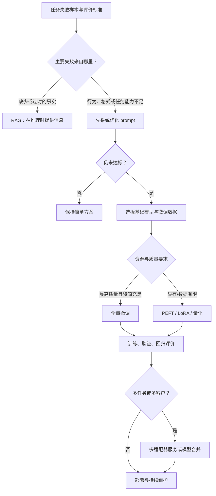
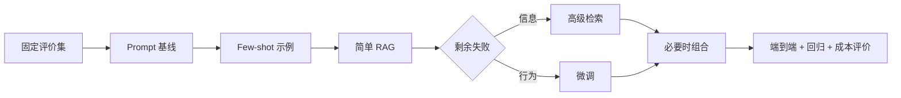
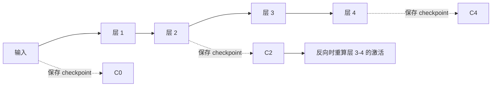
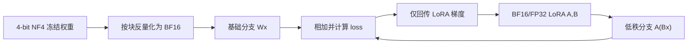
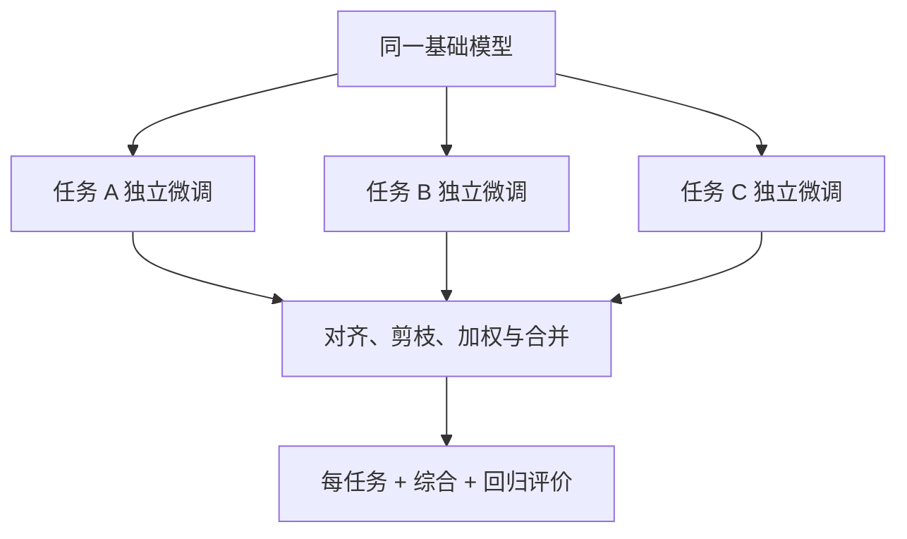

## 0. 学习目标与全章因果主线

前两章讨论的是 **prompt-based adaptation（基于提示的适配）**：通过指令、上下文、检索结果和工具改变模型本次推理看到的输入，但不改变模型参数。第七章转向另一条路线：**通过继续训练改变模型权重，使某种能力或行为成为模型本身的一部分。**

微调（finetuning）是从一个已有能力但尚未完全满足任务需求的基础模型出发，用新的训练过程更新其全部或部分参数，使它更适合目标任务。

这一章真正要回答的不是“怎样调用某个训练 API”，而是下面五组因果问题：

1. **为什么要微调？** 它能改善哪些问题，哪些问题用提示或 RAG 更合适？
2. **为什么微调昂贵？** 训练比推理多保存哪些张量，参数量、可训练参数量和数值精度怎样决定显存？
3. **怎样把微调降到普通开发者可承受的规模？** PEFT、LoRA 和量化分别减少了什么？
4. **怎样把多个专用模型组合起来？** 多任务训练、模型合并与集成有什么区别？
5. **怎样把技术变成可靠实践？** 如何选择基础模型、方法、框架和学习率、批大小、epoch 等超参数？



贯穿本章的四条判断原则：

- **先定位失败，再选择适配方式。** 不知道问题来自信息还是行为，技术选型就只是猜测。
- **训练显存不等于模型文件大小。** 权重之外还有激活、梯度和优化器状态。
- **“参数高效”只表示少更新参数。** 它不自动保证训练更快、推理更快或质量等同于全量微调。
- **微调是持续维护的模型分支。** 数据、训练、部署、监控、基础模型升级和回归测试都要长期付费。

---

## 1. Finetuning Overview（微调概览）

### 1.1 严格定义：微调改变什么

设基础模型参数为 $\theta_0$，目标任务训练集为

$$
\mathcal D=\{(x_i,y_i)\}_{i=1}^{N}.
$$

令 $\mathcal T$ 为允许更新的参数坐标索引，冻结其他坐标。对应的可行域为：

$$
\Omega_{\mathcal T}
=\left\{θ\mid θ_j=θ_{0,j},\ j\notin\mathcal T\right\}.
$$

微调从 $\theta_0$ 出发，在这个可行域中最小化目标任务损失：

$$
θ^*=\arg\min_{θ\in\Omega_{\mathcal T}}
\frac{1}{N}\sum_{i=1}^{N}\mathcal L
\big(f_θ(x_i),y_i\big).
$$

其中：

- $x_i$ 是输入或指令；
- $y_i$ 是期望输出；
- $f_θ$ 是参数为 $θ$ 的模型；
- $\mathcal L$ 衡量模型输出与目标输出的差异；
- $\mathcal T$ 决定哪些参数坐标可训练；
- $\Omega_{\mathcal T}$ 是满足“其他坐标保持基础值”的参数向量集合。

不同适配方法的关键区别就在 $\mathcal T$ 与可行域：

- **全量微调**：$\mathcal T$ 包含原模型全部坐标；
- **部分微调**：$\mathcal T$ 只包含原模型的部分层或参数；
- **PEFT**：冻结绝大多数原参数，$\mathcal T$ 主要包含少量新增参数或特定坐标；
- **推理/提示适配**：根本不求新的 $\theta^*$，仍使用 $\theta_0$。

训练从随机初始化参数开始，而微调从已经训练过的 $\theta_0$ 开始。这个初始点不是小差别：它已经编码语言、世界知识和通用模式，所以目标任务通常只需较少数据和较小更新。

### 1.2 微调、提示和 RAG 的边界

| 方法 | 改变权重 | 新知识何时提供 | 主要适合 | 主要代价 |
|---|---:|---|---|---|
| Prompt engineering | 否 | 每次请求 | 指令澄清、少量示例、输出约束 | 输入 token、提示维护 |
| RAG | 否 | 每次请求动态检索 | 私有、最新、可引用事实 | 检索链路与推理延迟 |
| Finetuning | 是 | 训练时写入参数/行为 | 风格、格式、任务能力、稳定行为 | 数据、训练、部署与维护 |
| Pre-training | 是 | 大规模训练期间 | 通用能力和广泛知识 | 极高数据与算力成本 |

微调不是把 prompt “永久塞进模型”的简单压缩。参数更新会在大量输入上改变条件概率分布，可能泛化到未见样本，也可能损害原有能力；因此必须在目标任务和回归任务上共同评价。

### 1.3 Transfer Learning（迁移学习）

微调属于迁移学习。迁移学习的目标是：把源任务或源数据学到的表示与能力迁移到相关目标任务，从而减少目标任务所需数据和训练量。

设：

- 源域与源任务为 $(\mathcal X_s,P_s,T_s)$；
- 目标域与目标任务为 $(\mathcal X_t,P_t,T_t)$。

基础模型先从源分布获得参数 $\theta_0$，再用目标分布数据求 $\theta^*$。如果源任务学到的结构对目标任务有用，优化起点 $\theta_0$ 会比随机起点更接近目标解，所需样本和更新步数都更少。

这就是 **sample efficiency（样本效率）** 的直觉：达到同一目标质量时，所需目标样本更少。它不是无条件定理，依赖源任务和目标任务相关。如果迁移来的表示误导目标任务，就会出现 **negative transfer（负迁移）**。

早期大规模例子是 Google 多语言翻译：模型从葡萄牙语—英语和英语—西班牙语中学到共享表示，即使没有直接的葡萄牙语—西班牙语样本，也能在两者间翻译。对 LLM 而言，大规模 next-token prediction 学到语言和世界结构，再迁移到法律问答、代码、摘要或 text-to-SQL。

一种有用的理解是：预训练已经获得许多潜在能力，微调常常不是从零创造能力，而是让某种能力更容易被特定输入稳定触发。InstructGPT 将其描述为“解锁”模型已有但不易通过普通提示访问的能力。这个说法不应被绝对化：模型从未学过的领域模式仍可能需要大量新数据。

### 1.4 参数微调与特征迁移

迁移学习不只包括微调。

- **参数微调**：继续反向传播，更新模型参数；
- **feature-based transfer（基于特征的迁移）**：冻结基础模型，把其 embedding 或中间表示作为另一个模型的输入。

例如冻结图像模型，用它提取视觉向量，再训练一个小分类头。后者训练便宜、原模型不会遗忘，但表示本身不能适应新任务；微调能改变表示，表达力更强，也更容易过拟合或破坏原能力。

---

## 2. 微调发生在训练流程的哪个位置

### 2.1 Self-Supervised Finetuning / Continued Pre-training

模型预训练通常依赖自监督学习：标签由数据本身构造，不需要人工逐条标注。语言模型的文本序列就是训练材料。

在昂贵的任务标注数据之前，可以先用廉价领域原始数据继续自监督训练，这称为：

- self-supervised finetuning；
- continued pre-training（持续预训练）；
- domain-adaptive pre-training（强调领域适配时）。

例如：

1. 先用大量无标注法律文书继续做 next-token prediction；
2. 再用少量高质量“法律问题—答案”做监督微调。

第一步让模型熟悉术语、文体和领域分布，第二步教它怎样按用户任务作答。越靠前的数据越便宜但监督信号越弱；越靠后的标注越昂贵但任务针对性越强。

### 2.2 自回归目标的完整推导

对 token 序列 $z=(z_1,z_2,\ldots,z_T)$，概率链式法则给出：

$$
p_\theta(z_1,\ldots,z_T)
=\prod_{t=1}^{T}p_\theta(z_t\mid z_{<t}),
$$

其中 $z_{<t}=(z_1,\ldots,z_{t-1})$。最大化整个序列的似然，等价于最小化负对数似然：

$$
\begin{aligned}
\theta^*
&=\arg\max_\theta p_\theta(z)\\
&=\arg\max_\theta \log p_\theta(z)\\
&=\arg\max_\theta
\sum_{t=1}^{T}\log p_\theta(z_t\mid z_{<t})\\
&=\arg\min_\theta
\left[-\sum_{t=1}^{T}\log p_\theta(z_t\mid z_{<t})\right].
\end{aligned}
$$

第二步使用对数的单调性，第三步使用 $\log\prod=\sum\log$。每个位置的负对数概率就是 token-level cross-entropy。实际实现通常除以参与损失的 token 数，使不同长度 batch 可比较。

这个目标成立的前提是序列按自回归方式分解；它训练的是“给定前缀预测下一个 token”，并不直接保证事实正确、遵循指令或满足人类偏好。

### 2.3 Infilling Finetuning（填空式微调）

masked model 根据空位前后两侧 token 预测缺失内容。自回归基础模型也可以通过特殊标记和微调学习 infilling：

```text
<PRE> 函数开头 <SUF> 函数结尾 <MID> 待生成代码
```

它适合文本编辑、代码补洞和 bug 修复，因为用户通常保留前后文，只要求改中间部分。普通从左到右生成只能看到前缀；infilling 让后缀也参与条件。

### 2.4 Supervised Finetuning（监督微调，SFT）

SFT 使用高质量 $(input,output)$ 对。输入通常是 instruction/prompt，输出是期望 response。输出可以是：

- 开放式：摘要、解释、邮件；
- 封闭式：分类标签、JSON、SQL、函数调用。

给定 prompt token $p_1,\ldots,p_P$ 和 response token $y_1,\ldots,y_R$，拼接序列为 $z=(p,y)$。常见 response-only 损失是：

$$
\mathcal L_{\mathrm{SFT}}
=-\frac{1}{R}\sum_{t=P+1}^{P+R}
\log p_\theta(z_t\mid z_{<t}).
$$

为什么只算 response？推理时 prompt 由用户提供，模型真正要学习的是生成 response。也可以给 prompt token 一个较小权重 $\lambda\in[0,1]$：

$$
\mathcal L
=-\frac{1}{\lambda P+R}
\left[
\lambda\sum_{t=1}^{P}\log p_\theta(z_t\mid z_{<t})
+\sum_{t=P+1}^{P+R}\log p_\theta(z_t\mid z_{<t})
\right].
$$

$\lambda=0$ 是 response-only；$\lambda=1$ 表示 prompt 与 response token 等权。第 17.6 节会回到 prompt loss weight 的实践选择。

高质量 instruction data 难在“目标答案”本身：事实一致性、领域专业性、风格、安全和政治敏感性都需要清晰标注规范与质检。训练 API 容易调用，不意味着数据容易得到。

### 2.5 Preference Finetuning（偏好微调）

SFT 告诉模型“应输出什么”；偏好微调常用三元组：

$$
(x,y^+,y^-),
$$

其中 $x$ 是指令，$y^+$ 是获胜/偏好响应，$y^-$ 是落败响应。训练目标不是只拟合一个标准答案，而是提高 $y^+$ 相对 $y^-$ 的偏好。

实现可以基于强化学习，也可以使用直接偏好优化类目标。具体算法不同，但数据语义相同：比较信号表达“哪个更好”。它适合有多个合理答案、难以定义唯一 ground truth，却能比较帮助性、安全性或风格的任务。

偏好不是客观真理。标注者群体、比较标准和提示分布会决定模型学到谁的偏好，因此应报告数据来源与分歧。

### 2.6 Long-Context Finetuning（长上下文微调）

延长最大上下文并不只是把配置中的 4096 改成 16384。位置编码必须能表达更多位置，训练数据也必须包含模型需要利用的长距离依赖。

长上下文微调可能涉及：

- 调整或插值位置 embedding；
- 修改 RoPE 等位置机制的缩放；
- 改变注意力实现以控制 $O(T^2)$ 计算和激活；
- 使用足够长、确实要求跨段推理的数据。

Code Llama 从 Llama 2 出发，通过不同后训练路线产生基础、Python、instruction 与长上下文版本；长上下文路线把上限从 4096 扩到 16384 token。

边界是：

- 上下文“能放下”不等于能可靠利用；
- 长序列显著增加训练显存和计算；
- 长上下文适配可能降低短序列表现；
- 位置外推效果依赖原架构和训练分布。

### 2.7 模型开发者与应用开发者的不同起点

模型开发者通常先预训练，再做 continued pre-training、SFT、偏好微调和安全后训练，然后发布多个版本。应用开发者大多不会从原始 base model 开始，而会选择已经 post-trained 的模型继续适配。

基础模型越成熟、已有知识越相关，目标微调需要做的工作通常越少。但“已经 instruction-tuned”也意味着新的微调可能覆盖原有对齐行为，所以必须保留安全和通用能力回归集。

---

## 3. When to Finetune（何时微调）

微调显著增加数据、硬件和 ML 人才投入，通常应在系统化尝试 prompt-based 方法之后进行。提示和微调不是互斥方案：生产系统常同时使用 prompt、RAG 和微调。

### 3.1 Reasons to Finetune（值得微调的理由）

#### 提升目标任务能力

通用模型的平均 benchmark 很强，不代表你的分布上足够好。典型情况包括：

- 少见 SQL 方言；
- 企业特有 text-to-SQL 查询；
- 专门的代码编辑模式；
- 医疗、法律或内部流程的任务行为。

有效前提是训练数据覆盖真实失败模式。用与线上分布无关的数据微调，只会让训练指标好看。

#### 稳定输出结构与风格

JSON、YAML、DSL、函数调用或固定技术规格要求模型反复遵守形式。少见或复杂语法在互联网训练数据中占比低，微调能把格式模式固化为更高概率行为。

对常见 JSON，先用 constrained decoding、schema validator、重试和更清晰提示；只有这些仍不能满足质量/延迟要求时，才把微调加入方案。

#### 偏差缓解与安全行为

基础模型会继承训练数据偏差。经过审慎策划的数据可以反向提供信号，例如增加女性 CEO 和非西方作者文本，降低性别或地域偏差。

局限是偏差不是单一标量：改善一个切片可能伤害另一个切片；策划数据也可能带入新的刻板印象。必须用分群指标和真实样本评价，而不是只看总平均。

#### 让小模型在窄任务上超过大模型

小模型更容易微调、部署更便宜、推理更快。常见路线是让大模型产生或标注数据，再用这些数据训练小模型模仿大模型，这称为 distillation（蒸馏，第八章详述）。

Grammarly 的案例中，微调后的 Flan-T5 在多种写作助手任务上超过一个专门做文本编辑的 GPT-3 变体，模型小约 60 倍，训练使用约 82000 个 instruction-output 对。它说明的是“窄分布上的专门小模型可以胜过通用大模型”，不能推导为所有任务都能用相同数据量复现。

### 3.2 Reasons Not to Finetune（不应急于微调的理由）

#### 目标能力提高，其他能力可能下降

在“修改订单”数据上微调，可能改善修改订单，却降低原本不错的推荐和一般反馈能力。这属于任务干扰；连续训练还可能出现 catastrophic forgetting（灾难性遗忘）。

缓解方法包括：

- 训练集混入所有需要保留的任务；
- 建立通用能力和安全回归集；
- 为不同任务使用独立模型或适配器；
- 训练后进行模型合并；
- 减小学习率、训练步数或更新参数范围。

#### 数据前期投入高

领域专家标注、规范、冲突仲裁和质检都昂贵。开源数据和合成数据能降成本，但有效性高度依赖覆盖率与质量，不能把样本数量当作有效监督量。

#### 需要完整训练能力

框架可以自动运行，却不能替你回答：

- 哪个基础模型最合适？
- 学习率、batch 和 epoch 怎样选择？
- 训练是否欠拟合、过拟合或数值不稳定？
- 评价集有没有泄漏？
- 线上失败是数据问题还是模型问题？

#### 部署与维护成为长期成本

得到权重后还要量化、服务、扩缩容、监控和升级。基础模型快速演进，新的通用模型可能很快超过你的专用分支。团队需要预先定义：质量提升多少才迁移、旧分支维护多久、是否重新生成数据和训练、怎样回滚。

### 3.3 先把 prompt 实验做成工程

大量“prompt 无效，所以必须微调”的案例，实际问题是：

- 指令含糊；
- few-shot 示例不代表线上分布；
- 没有版本控制；
- 指标定义错误；
- 只试了一两个随意提示。

系统化 prompt 实验会提前建立评价管线、标注规范和实验追踪，这些正是后续微调的基础。若连 prompt 版本差异都无法可靠比较，也无法知道微调是否真的带来净收益。

### 3.4 “领域模型必胜”是危险推断

2023 年 BloombergGPT 是 500 亿参数金融模型，训练约需 130 万 A100 GPU 小时，估算纯计算成本约 130 万至 260 万美元。同期零样本 GPT-4-0314 在书中列出的两个金融 benchmark 上明显更高：

| 模型 | FiQA 情感分析 weighted F1 | ConvFinQA accuracy |
|---|---:|---:|
| GPT-4-0314 zero-shot | 87.15 | 76.48 |
| BloombergGPT | 75.07 | 43.41 |

这不证明 BloombergGPT 对 Bloomberg 内部任务无价值，也不证明 benchmark 代表真实业务；它证明“模型专门为某领域训练”不能单独推出“该模型在领域内优于更强通用模型”。应在自己的数据、隐私、延迟、成本和部署约束下比较。

### 3.5 用微调减少 prompt token 的收益已经变弱

过去可以把大量 few-shot 示例从每次 prompt 移入权重，以降低输入 token、成本与延迟。现在 prompt caching 能复用重复前缀，这个收益不再像过去那么强。

微调仍有一个不同优势：训练样本数量不受单次上下文窗口限制。prompt 中只能放有限示例，微调可以从远多于窗口容量的数据学习统计模式。不过，它不能在回答时精确引用每条训练事实，也不提供 RAG 那样的来源追踪。

---

## 4. Finetuning and RAG（微调还是 RAG）

### 4.1 先区分 information failure 与 behavior failure

#### Information-based failure（信息型失败）

模型不知道私有事实，或者知识截止日期早于新事件，因而回答错误、过时或幻觉。解决方向是把当前、授权、可引用的信息在推理时交给模型，即 RAG。

#### Behavior-based failure（行为型失败）

模型知道相关事实，却没有按任务方式使用：

- 技术规格正确但缺少工程团队需要的字段；
- 输出不是要求的 HTML/JSON/DSL；
- 内容相关性、风格或安全行为不稳定；
- 少见语义解析格式总是出错。

这类问题在提示、约束解码等方法仍不足时适合微调。

一句易记但必须带边界的话是：

> **RAG is for facts; finetuning is for form.**

它是诊断启发式，不是严格二分。高质量微调可能增加领域知识并减少某些幻觉；低质量数据也可能加重幻觉。RAG 也会通过检索示例影响格式和行为。

### 4.2 为什么当前事件通常更适合 RAG

训练把知识压入参数，更新慢且难删除；RAG 在索引更新后即可提供新事实。Ovadia 等人在当前事件问答上的结果如下：

| 基础模型 | 原模型 | 原模型 + RAG | FT-reg | FT-par | FT-reg + RAG | FT-par + RAG |
|---|---:|---:|---:|---:|---:|---:|
| Mistral-7B | 0.481 | 0.875 | 0.504 | 0.588 | 0.810 | 0.830 |
| Llama 2-7B | 0.353 | 0.585 | 0.219 | 0.392 | 0.326 | 0.520 |
| Orca 2-7B | 0.456 | 0.876 | 0.511 | 0.566 | 0.820 | 0.826 |

在这些设定中，基础模型加 RAG 不但超过单独微调，也超过“微调模型加 RAG”。结果说明微调可能改善目标行为，同时损害其他能力；它不是 RAG 的必然增强器。数字只代表该论文模型、数据和方法，不应外推为所有任务定律。

同一研究在 MMLU 各类别上的比较还显示：相对只使用 RAG，在微调模型上再加 RAG 只有 43% 的情况取得提升，57% 的情况没有提升。这进一步说明“RAG + 微调”必须作为独立方案评价，不能由两个组件各自有效推出组合必然更强；43%/57% 也只适用于该实验设置。

### 4.3 诊断矩阵

| 观察到的失败 | 首选动作 | 原因 |
|---|---|---|
| 私有政策不知道 | RAG | 信息不在基础模型中 |
| 新闻/价格过时 | RAG | 事实变化快 |
| 引用和审计要求 | RAG | 训练参数不能提供可靠来源 |
| JSON 经常格式错 | schema/约束解码，再考虑微调 | 主要是形式行为 |
| 内部 DSL 不会写 | 微调 | 少见语法模式暴露不足 |
| 答案有事实但不符合团队规范 | 微调 | 行为/相关性问题 |
| 既缺事实又格式不稳 | 先 RAG，再评估微调 | 先解决上游信息瓶颈 |
| 检索结果相关但模型不会使用 | prompt/微调生成器 | 信息已经到达，使用行为失败 |

### 4.4 原书建议的渐进式工作流

在任何适配前，先定义评价标准和管线；评价贯穿每一步。

1. 用系统化 prompt engineering 建立基线并版本化 prompt；
2. 加 1–50 个代表性 few-shot 示例，具体数量由任务决定；
3. 若频繁缺信息，连接数据源，先从 BM25 等简单词项检索开始；
4. 仍失败时按类型分流：
   - 信息问题：尝试 embedding/hybrid 等更复杂 RAG；
   - 行为、格式、相关性或安全问题：尝试微调；
5. 在独立实验确认增益后，再组合 RAG 与微调。



高级 RAG 增加的是推理链路复杂度；微调增加的是模型开发和维护复杂度。选择时不只比较离线质量，还要比较延迟、算力、迭代速度、数据新鲜度、可解释性和组织能力。

---

## 5. Memory Bottlenecks（显存瓶颈）

基础模型规模使内存同时成为推理和训练瓶颈，而训练通常远比推理占用更多内存。本节先给出结论，再逐项推导：

1. 权重内存主要由**总参数量**与每个权重的字节数决定；
2. 梯度和优化器状态主要由**可训练参数量**决定；
3. 激活内存由架构、batch size、序列长度和实现决定，可能超过权重；
4. PEFT 通过减少可训练参数降低梯度和优化器状态；
5. 量化通过减少每个数值所需 bit 数降低权重或其他张量内存；
6. 两者解决不同乘数，因此可以组合成 QLoRA。

必须区分：

- **storage**：模型文件在磁盘上的大小；
- **host RAM**：CPU 内存；
- **device memory / VRAM**：GPU/加速器显存；
- **peak memory**：某一步骤瞬时峰值，而不只是静态张量总和。

训练是否能运行取决于峰值显存，还受内存碎片、临时 kernel workspace、通信 buffer 和框架开销影响。纸笔公式只能做容量初筛，不能替代真实 profiling。

---

## 6. Backpropagation and Trainable Parameters（反向传播与可训练参数）

### 6.1 可训练参数与冻结参数

设模型全部参数为 $\theta=(\theta_1,\ldots,\theta_N)$，可训练参数索引集合为 $\mathcal T$：

$$
θ_j\leftarrow
\begin{cases}
θ_j-\eta g_j,&j\in\mathcal T,\\
θ_j,&j\notin\mathcal T,
\end{cases}
$$

其中：

- $\eta$ 是学习率；
- $g_j=\partial\mathcal L/\partial\theta_j$ 是梯度；
- $j\notin\mathcal T$ 的参数被 frozen（冻结）。

预训练通常更新全部参数；推理不更新参数；微调可以更新全部、部分或新增参数。冻结参数仍要参与前向计算，也仍要加载其权重，但不需要为它保存参数梯度和优化器状态。

### 6.2 前向与反向传播

考虑一个简化网络：

$$
a=w_1x+b_1,
\qquad h=\operatorname{ReLU}(a),
\qquad \hat y=w_2h+b_2,
$$

使用平方损失：

$$
\mathcal L=\frac12(\hat y-y)^2.
$$

**Forward pass（前向传播）**依次计算 $a,h,\hat y,\mathcal L$。训练为了在反向传播使用链式法则，通常要保留部分中间激活，例如 $a$ 和 $h$。

先求损失对输出的导数：

$$
\frac{\partial\mathcal L}{\partial\hat y}
=\hat y-y.
$$

输出层参数：

$$
\frac{\partial\mathcal L}{\partial w_2}
=\frac{\partial\mathcal L}{\partial\hat y}
\frac{\partial\hat y}{\partial w_2}
=(\hat y-y)h,
$$

$$
\frac{\partial\mathcal L}{\partial b_2}=\hat y-y.
$$

继续沿计算图向前一层传播：

$$
\frac{\partial\mathcal L}{\partial h}
=(\hat y-y)w_2.
$$

ReLU 的导数在 $a>0$ 时为 1，在 $a<0$ 时为 0；$a=0$ 不可导，框架通常选一个次梯度（常取 0）：

$$
\frac{\partial h}{\partial a}
=\mathbb 1[a>0].
$$

因此：

$$
\frac{\partial\mathcal L}{\partial w_1}
=(\hat y-y)w_2\mathbb 1[a>0]x,
$$

$$
\frac{\partial\mathcal L}{\partial b_1}
=(\hat y-y)w_2\mathbb 1[a>0].
$$

反向传播不是一种新的求导规则，而是把链式法则按计算图逆序高效复用。每个可训练参数需要一个梯度值；优化器还可能需要额外状态。

### 6.3 优化器为什么增加内存

最简单 SGD：

$$
θ_{t+1}=\theta_t-\eta g_t,
$$

不保存跨步状态。Momentum 保存一阶速度 $v_t$：

$$
v_t=\beta v_{t-1}+(1-\beta)g_t,
\qquad
θ_{t+1}=\theta_t-\eta v_t.
$$

Adam 为每个可训练参数保存梯度的一阶矩和二阶矩估计：

$$
m_t=\beta_1m_{t-1}+(1-\beta_1)g_t,
$$

$$
v_t=\beta_2v_{t-1}+(1-\beta_2)g_t^2.
$$

做偏差修正后：

$$
\hat m_t=\frac{m_t}{1-\beta_1^t},
\qquad
\hat v_t=\frac{v_t}{1-\beta_2^t},
$$

$$
θ_{t+1}
=\theta_t-\eta\frac{\hat m_t}{\sqrt{\hat v_t}+\epsilon}.
$$

$m_t$ 和 $v_t$ 就是两个 optimizer states。它们只为可训练参数创建，所以把可训练参数从 70 亿降到数百万，会大幅减少这部分显存。

### 6.4 可运行示例：解析梯度与有限差分

有限差分用损失函数的数值变化近似导数：

$$
\frac{\partial\mathcal L}{\partial w}
\approx
\frac{\mathcal L(w+\varepsilon)-\mathcal L(w-\varepsilon)}{2\varepsilon}.
$$

当 $\varepsilon$ 足够小、函数在该点光滑且浮点舍入尚未主导时，近似应接近反向传播解析梯度。

```python
"""验证一个两层标量网络的链式求导，不依赖第三方库。"""
from math import isclose


def forward(parameters, x, target):
    """对应 a -> ReLU -> y_hat -> 1/2 MSE 的前向传播。"""
    w1, b1, w2, b2 = parameters
    pre_activation = w1 * x + b1
    hidden = max(0.0, pre_activation)
    prediction = w2 * hidden + b2
    loss = 0.5 * (prediction - target) ** 2
    return loss, pre_activation, hidden, prediction


def backward(parameters, x, target):
    """按链式法则计算 dL/d(w1,b1,w2,b2)。"""
    w1, _, w2, _ = parameters
    _, pre_activation, hidden, prediction = forward(parameters, x, target)
    output_gradient = prediction - target
    relu_gradient = 1.0 if pre_activation > 0.0 else 0.0
    return (
        output_gradient * w2 * relu_gradient * x,
        output_gradient * w2 * relu_gradient,
        output_gradient * hidden,
        output_gradient,
    )


def finite_difference(parameters, x, target, epsilon=1e-6):
    gradients = []
    for index in range(len(parameters)):
        plus = list(parameters)
        minus = list(parameters)
        plus[index] += epsilon
        minus[index] -= epsilon
        loss_plus = forward(plus, x, target)[0]
        loss_minus = forward(minus, x, target)[0]
        gradients.append((loss_plus - loss_minus) / (2.0 * epsilon))
    return tuple(gradients)


parameters = (0.5, 0.1, -0.4, 0.2)
x = 2.0
target = 1.0
loss, pre_activation, hidden, prediction = forward(parameters, x, target)
analytic = backward(parameters, x, target)
numeric = finite_difference(parameters, x, target)

print("FORWARD")
print(f"a={pre_activation:.4f} h={hidden:.4f} prediction={prediction:.4f}")
print(f"loss={loss:.6f}")
print("\nGRADIENT_CHECK")
names = ("w1", "b1", "w2", "b2")
for name, exact, approximate in zip(names, analytic, numeric):
    matched = isclose(exact, approximate, rel_tol=1e-7, abs_tol=1e-7)
    print(
        f"{name}: analytic={exact:.6f} numeric={approximate:.6f} "
        f"match={matched}"
    )
```

实际运行输出：

```text
FORWARD
a=1.1000 h=1.1000 prediction=-0.2400
loss=0.768800

GRADIENT_CHECK
w1: analytic=0.992000 numeric=0.992000 match=True
b1: analytic=0.496000 numeric=0.496000 match=True
w2: analytic=-1.364000 numeric=-1.364000 match=True
b2: analytic=-1.240000 numeric=-1.240000 match=True
```

数值梯度只是教学和小模型 debug 工具；每个参数都需要两次前向传播，复杂度约是普通前向的 $2N$ 倍，不能代替大模型反向传播。

---

## 7. Memory Math（显存估算）

### 7.1 单位与符号

定义：

- $N$：模型总参数数；
- $T$：可训练参数数，$0\le T\le N$；
- $b_w$：每个权重字节数；
- $b_g$：每个梯度字节数；
- $b_o$：每个优化器状态字节数；
- $s$：每个可训练参数的优化器状态个数；
- $M_{act}$：激活显存；
- $M_{KV}$：推理 KV cache 显存；
- $M_{tmp}$：临时 buffer、框架和碎片开销。

本章的 GB 使用十进制：$1\ \mathrm{GB}=10^9$ bytes。硬件有时显示 GiB：$1\ \mathrm{GiB}=2^{30}$ bytes。$26$ GB 约等于 $24.21$ GiB，比较 GPU 标称容量时要确认单位。

### 7.2 推理显存

只考虑权重：

$$
M_{weights}=Nb_w.
$$

完整推理近似为：

$$
M_{infer}
=Nb_w+M_{act}+M_{KV}+M_{tmp}.
$$

书中给出便于纸笔估算的经验式：

$$
M_{infer}\approx 1.2Nb_w,
$$

即把激活与 KV 等暂估为权重的 20%。这只适合普通序列和 batch 的粗估。长上下文、大 batch、多并发时 KV cache 可以远超 20%。不同注意力实现、GQA/MQA、量化 KV 和 paged attention 也会改变结果。

对 13B 参数、FP16/BF16（2 bytes）：

$$
M_{weights}=13\times10^9\times2=26\ \mathrm{GB},
$$

$$
M_{infer}\approx26\times1.2=31.2\ \mathrm{GB}.
$$

70B 模型即使只看 16-bit 权重也需要：

$$70\times10^9\times2=140\ \mathrm{GB}.$$

单张消费级 GPU 无法完整容纳，需要量化、分片或 offloading。

### 7.3 训练显存

训练需要：

$$
M_{train}
=M_{weights}+M_{act}+M_{grad}+M_{opt}+M_{tmp}.
$$

梯度与优化器状态近似为：

$$
M_{grad}=Tb_g,
\qquad
M_{opt}=Tsb_o.
$$

于是：

$$
M_{train}
\approx Nb_w+M_{act}+T(b_g+sb_o)+M_{tmp}.
$$

这条式子直接解释 PEFT：它不一定降低 $Nb_w$，因为冻结权重仍需加载；它把 $T$ 从接近 $N$ 降到远小于 $N$，主要削减梯度和 optimizer states。

原书用所有值 2 bytes 的简化假设。Adam 有两个状态，所以每个可训练参数额外需要：

$$
1\times2\text{ bytes（梯度）}
+2\times2\text{ bytes（Adam 状态）}
=6\text{ bytes}.
$$

13B 全参数训练额外为：

$$13\times10^9\times6=78\ \mathrm{GB}.$$

若仅 1B 参数可训练，则为 6 GB。权重 26 GB 没变，下降的是 72 GB 的训练附加状态。

现实中常见 mixed-precision Adam 会把主权重或 $m,v$ 保持 FP32，实际每个可训练参数可能需要更多字节。例如 FP16 权重 + FP16 梯度 + 两个 FP32 Adam 状态已经是 $2+2+8=12$ bytes，还没计主权重副本。必须以框架配置为准。

### 7.4 激活为什么可能成为最大项

反向传播需要中间激活。粗略看，Transformer 基础激活至少随以下量增长：

$$
M_{act}=O(BLSHb_a),
$$

其中：

- $B$：micro-batch size；
- $L$：层数；
- $S$：序列长度；
- $H$：隐藏维度；
- $b_a$：每个激活字节数。

朴素 attention 还可能物化 $S\times S$ 注意力矩阵，产生 $O(BLS^2)$ 项；FlashAttention 等实现通过分块避免完整物化，显著改变峰值显存，但不改变 attention 的数学结果。这里用 $S$ 避免与本节“可训练参数数 $T$”混淆。

所以“激活恒为权重的 20%”不成立。长序列、大 batch、深层网络时，激活可能压倒权重。

### 7.5 Gradient Checkpointing / Activation Recomputation

若保存每层激活，反向快但显存高。Checkpointing 只保留部分边界激活，反向到某段时重新执行前向：



它用更多计算换更少显存，不减少参数、梯度或优化器状态。重算开销取决于切分策略，不能简单说“显存减半、时间翻倍”。

### 7.6 可运行示例：推理、全量微调与 PEFT 显存

```python
"""按本章近似公式估算十进制 GB；不包含框架临时开销。"""


def gb(byte_count):
    return byte_count / 1_000_000_000


def estimate_memory(
    total_parameters,
    trainable_parameters,
    weight_bytes=2,
    gradient_bytes=2,
    optimizer_state_bytes=2,
    optimizer_states=2,
    activation_ratio=0.2,
):
    weight_memory = total_parameters * weight_bytes
    # 按原书 20% 经验式：这里合并代理激活、KV 等前向开销。
    activation_memory = weight_memory * activation_ratio
    gradient_memory = trainable_parameters * gradient_bytes
    optimizer_memory = (
        trainable_parameters * optimizer_states * optimizer_state_bytes
    )
    return {
        "weights": gb(weight_memory),
        "activations": gb(activation_memory),
        "gradients": gb(gradient_memory),
        "optimizer": gb(optimizer_memory),
        "inference_total": gb(weight_memory + activation_memory),
        "training_total": gb(
            weight_memory
            + activation_memory
            + gradient_memory
            + optimizer_memory
        ),
    }


total = 13_000_000_000
scenarios = {
    "inference": 0,
    "full_finetuning": total,
    "peft_1b_trainable": 1_000_000_000,
}

for name, trainable in scenarios.items():
    result = estimate_memory(total, trainable)
    print(name.upper())
    print(
        f"weights={result['weights']:.1f}GB "
        f"activations={result['activations']:.1f}GB "
        f"gradients={result['gradients']:.1f}GB "
        f"optimizer={result['optimizer']:.1f}GB "
        f"total={result['training_total']:.1f}GB"
    )
```

实际运行输出：

```text
INFERENCE
weights=26.0GB activations=5.2GB gradients=0.0GB optimizer=0.0GB total=31.2GB
FULL_FINETUNING
weights=26.0GB activations=5.2GB gradients=26.0GB optimizer=52.0GB total=109.2GB
PEFT_1B_TRAINABLE
weights=26.0GB activations=5.2GB gradients=2.0GB optimizer=4.0GB total=37.2GB
```

输出严格对应原书的“所有训练值 2 bytes、前向附加开销暂估权重 20%”假设。代码为简洁把这项命名为 `activations`，但它是激活、KV 等前向开销的合并代理量，并非对真实激活张量的独立精算。示例没有计 mixed-precision 主权重副本、临时张量、长上下文和内存碎片，因此只能用于相对比较和硬件初筛。

---

## 8. Numerical Representations（数值表示）

### 8.1 浮点数怎样表示范围与精度

IEEE 风格二进制浮点数通常由三部分组成：

$$
x=(-1)^s\times (1.f)_2\times2^{e-\mathrm{bias}},
$$

其中：

- $s$：符号 bit；
- $e$：指数域，决定数量级范围；
- $f$：尾数/有效数字域，决定相邻可表示数的间隔；
- bias 让无符号指数域同时表达正负指数；
- $(1.f)_2$ 对正规数包含隐含前导 1。

常见格式：

| 格式 | 总 bit | 符号 | 指数 | 显式尾数 | 每值字节 | 直觉 |
|---|---:|---:|---:|---:|---:|---|
| FP64 | 64 | 1 | 11 | 52 | 8 | 科学计算高精度 |
| FP32 | 32 | 1 | 8 | 23 | 4 | 传统训练标准 |
| FP16 | 16 | 1 | 5 | 10 | 2 | 精度较好、范围较窄 |
| BF16 | 16 | 1 | 8 | 7 | 2 | 接近 FP32 范围、精度较低 |
| TF32 | 19 个有效计算 bit | 1 | 8 | 10 | 通常以 FP32 接口使用 | NVIDIA Tensor Core 计算格式 |

格式名称和物理存储需要结合硬件语义理解。TF32 名称含 32，但乘法有效格式约为 19 bit；输入/输出接口常仍是 FP32，不应简单按 19/8 bytes 估文件。

### 8.2 range 与 precision 的交换

FP16 和 BF16 都是 16 bit。FP16 给尾数更多 bit，所以在可表示范围内通常更精细；BF16 给指数更多 bit，所以能容纳接近 FP32 的数量级。

对正规数，若有效精度有 $p$ 个二进制位（含隐含前导 1），1 附近相邻数的相对间隔约为：

$$\epsilon_{machine}=2^{-(p-1)}.$$

因此：

- FP16：$p=11$，$\epsilon\approx2^{-10}=9.765625\times10^{-4}$；
- BF16：$p=8$，$\epsilon\approx2^{-7}=7.8125\times10^{-3}$；
- FP32：$p=24$，$\epsilon\approx2^{-23}\approx1.19\times10^{-7}$。

BF16 在 1 附近更粗，但大值不易 overflow。FP16 最大有限值是 65504，超过后可能变成 infinity；BF16 最大量级约 $3.39\times10^{38}$。

加载模型时应遵循其预期 dtype。把为 BF16 训练、包含较大数值的权重强制转成 FP16，可能 overflow 或显著舍入，导致质量下降。

### 8.3 数值格式选型依赖三个条件

1. **数值分布**：最大/最小绝对值是否超出范围；
2. **误差敏感性**：微小舍入是否会改变 loss、排序或累积更新；
3. **硬件与 kernel**：设备是否原生高吞吐支持该格式。

bit 少不必然更快。若硬件缺少对应 kernel，频繁 cast/dequantize 的开销可能抵消内存带宽收益。

---

## 9. Quantization（量化）

### 9.1 定义与术语边界

广义量化是把高精度值映射到较低 bit 表示，以减少内存和带宽。严格说，从浮点转整数才是 quantization；工程文献常把 FP32 到 FP16/BF16 等 precision reduction 也称量化，本章沿用广义用法。

一个 10B 模型：

$$
10^{10}\times4\text{ bytes}=40\text{ GB（FP32）},
$$

$$
10^{10}\times2\text{ bytes}=20\text{ GB（FP16/BF16）}.
$$

显存近似随 bit 数线性下降，但质量与速度并不线性变化。

### 9.2 仿射整数常数量化的推导

要把实数区间 $[x_{min},x_{max}]$ 映射到整数区间 $[q_{min},q_{max}]$，令反量化为：

$$
\hat x=s(q-z),
$$

$s>0$ 是 scale，$z$ 是 zero point。要求两个端点对应：

$$
x_{min}=s(q_{min}-z),
\qquad
x_{max}=s(q_{max}-z).
$$

两式相减：

$$
x_{max}-x_{min}=s(q_{max}-q_{min}),
$$

所以：

$$
s=\frac{x_{max}-x_{min}}{q_{max}-q_{min}}.
$$

代回第一式：

$$
z=q_{min}-\frac{x_{min}}{s}.
$$

由于 $z$ 必须是整数，实际取 round 并 clip。量化与反量化为：

$$
q=\operatorname{clip}
\left(\operatorname{round}\left(\frac{x}{s}\right)+z,
q_{min},q_{max}\right),
$$

$$
\hat x=s(q-z).
$$

误差来自：

- round：区间内离散化误差通常不超过约 $s/2$；
- clip：校准区间外的值被截到端点，误差可很大；
- scale/zero point 自身的有限精度。

### 9.3 对称量化

权重常以 0 为中心，可取 INT8 $q\in[-127,127]$，令 $z=0$：

$$
s=\frac{\max_i|x_i|}{127},
\qquad
q_i=\operatorname{round}(x_i/s).
$$

它实现简单、零点精确，但若正负范围高度不对称，会浪费一侧码值。per-tensor 为整个张量用一个 scale；per-channel/per-group 为更小分组使用 scale，通常误差更低，但元数据和 kernel 更复杂。

### 9.4 可运行示例：对称 INT8 量化误差

```python
"""将一组权重做对称 INT8 量化，并计算反量化误差。"""


def quantize_symmetric_int8(values):
    absolute_max = max(abs(value) for value in values)
    if absolute_max == 0.0:
        return [0] * len(values), 1.0
    scale = absolute_max / 127.0
    quantized = [
        max(-127, min(127, round(value / scale))) for value in values
    ]
    return quantized, scale


weights = [-1.0, -0.5, -0.1, 0.0, 0.3, 0.9]
quantized, scale = quantize_symmetric_int8(weights)
restored = [value * scale for value in quantized]
errors = [abs(original - recovered) for original, recovered in zip(weights, restored)]

print(f"scale={scale:.8f}")
print("value      int8    restored    abs_error")
for original, integer, recovered, error in zip(
    weights, quantized, restored, errors
):
    print(f"{original:>5.1f} {integer:>9d} {recovered:>11.6f} {error:>12.6f}")
print(f"max_abs_error={max(errors):.6f}")
```

实际运行输出：

```text
scale=0.00787402
value      int8    restored    abs_error
 -1.0      -127   -1.000000     0.000000
 -0.5       -64   -0.503937     0.003937
 -0.1       -13   -0.102362     0.002362
  0.0         0    0.000000     0.000000
  0.3        38    0.299213     0.000787
  0.9       114    0.897638     0.002362
max_abs_error=0.003937
```

最大绝对值 $1.0$ 决定 $s=1/127$。$-0.5/s=-63.5$ 在 Python 的 ties-to-even `round` 下得到 $-64$；不同硬件/库的舍入规则可能在半整数处不同。

### 9.5 量化什么

主要候选包括：

- **weights**：静态、分布相对稳定，最常见；
- **activations**：随输入变化，有 outlier，校准更难；
- **KV cache**：长上下文推理的重要内存项；
- **gradients / optimizer states**：训练内存重要，但更新对误差更敏感。

权重量化往往比激活量化更容易保持质量。所谓 W4A16 表示 4-bit 权重、16-bit 激活；W8A8 表示权重和激活均 8 bit。

### 9.6 何时量化：PTQ、QAT 与低精度训练

#### Post-Training Quantization（PTQ）

模型训练完成后再转低精度。它便宜、通用，是应用开发者最常见方式。通常用 calibration data 估计范围、scale 或哪些通道含 outlier。校准数据若不代表线上分布，量化误差会被低估。

低精度推理已经成为常态。原书列举了从 `LLM.int8()` 的 8-bit LLM 到 QLoRA 的 4-bit 权重方案。Apple 在端侧模型中混用 2-bit 与 4-bit 表示，平均约 3.5 bits-per-weight；NVIDIA Blackwell 则加入 4-bit 浮点推理支持。这些案例说明收益依赖“表示 + kernel + 硬件”的共同设计，不能只把现有模型文件机械压成更少 bit。

#### Quantization-Aware Training（QAT）

训练前向中插入 fake quantization：模拟量化与反量化，让模型学习适应离散化误差；参数更新和很多计算仍在高精度。

QAT 的主要目标是**得到低精度推理质量更好的模型**。它不必然减少训练时间或显存，甚至因模拟操作更慢。

#### 直接低精度训练

若真正用 INT8/FP8 等执行训练计算，可以同时降低训练显存和计算成本，但反向传播更敏感：

- 小梯度可能 underflow 成 0；
- 大激活或梯度可能 overflow；
- 多步舍入误差累积；
- loss 的细小误差可能改变更新方向。

Character.AI 报告过全 INT8 训练；这需要专门算法、kernel 和稳定性工程，不能等同于把 dtype 参数简单改成 INT8。

### 9.7 Mixed Precision Training（混合精度训练）

混合精度将敏感部分保留高精度，其他部分用低精度。例如：

- 保存 FP32 master weights；
- 前向/反向使用 FP16/BF16；
- embeddings 或归一化保持 16/32 bit；
- 梯度更新由高精度 optimizer state 累积。

FP16 小梯度容易下溢，可用 loss scaling：先将损失乘 $S$，反向得到放大梯度：

$$
\nabla_\theta(S\mathcal L)=S\nabla_\theta\mathcal L,
$$

更新前再除以 $S$。数学上方向不变，数值上让梯度进入 FP16 可表示范围。若放大过头导致 overflow，则降低 $S$。BF16 范围更大，通常较少需要 loss scaling。

AMP（automatic mixed precision）根据算子稳定性和硬件能力自动选择精度，但仍需监控 NaN/Inf 和最终质量。

### 9.8 极低 bit 的边界

INT4/FP4 已用于推理。理论上每个二值权重至少 1 bit；BitNet b1.58 使用三值集合 $\{-1,0,1\}$。若三种状态等概率，信息论上的名义位宽（熵）是：

$$\log_2 3\approx1.585\text{ bits}.$$

这表示理想分组编码下的平均信息量，不代表每个三值权重都能用普通固定宽度字段直接存成 1.585 bit：逐值固定宽度二进制通常需要 2 bit，实际系统还要计 scale、分组和打包元数据。

原书列出的实验显示 BitNet b1.58 在最高 3.9B 参数范围内可接近 16-bit Llama 类模型，但这不证明任意现成模型都能无损 PTQ 到 1.58 bit；这类模型通常需要从训练阶段适配。

量化的收益边界是：质量损失、转换开销、硬件支持和 kernel 成熟度。最终必须比较目标任务质量、峰值显存、吞吐、首 token 延迟和每 token 延迟，而不能只报 bit 数。

---

## 10. Finetuning Techniques（微调技术总览）

本章的技术演进由同一个瓶颈推动：**怎样在尽量接近全量微调质量的同时，降低可训练参数、显存、数据与部署成本？**

### 10.1 Full Finetuning（全量微调）

全量微调令全部基础模型参数可训练：

$$T=N.$$

它与预训练都更新完整权重，区别是初始点：预训练通常从随机参数开始，全量微调从预训练参数开始。

以 7B 参数、16-bit 权重、Adam 状态也按 16 bit 的原书简化模型：

$$
M_{weights}=7\times10^9\times2=14\ \mathrm{GB},
$$

$$
M_{grad+opt}
=7\times10^9\times(1+2)\times2
=42\ \mathrm{GB}.
$$

不计激活就达到：

$$14+42=56\ \mathrm{GB}.$$

这已经超过多数 12–24 GB 消费级 GPU，实际训练还会更高。

全量微调的优势是参数自由度最大，数据充分、资源充足时通常有最高质量上限。代价是显存、训练数据、checkpoint 存储、分布式训练和每个任务维护一整份权重。

### 10.2 Partial Finetuning（部分微调）

部分微调冻结一部分原参数，只更新另一部分。例如 10 层网络冻结前 9 层，仅更新最后一层。靠近输出的层常更任务特化，早期层往往学习更通用表示，但这只是常见经验，不是所有架构的定律。

它减少 $T$，却可能 **parameter-inefficient（参数利用效率低）**：简单开放最后若干层，常要更新大量原参数才能接近全量微调。Houlsby 等人在 BERT-large/GLUE 的实验中，部分微调约需更新 25% 参数才达到接近全量微调的表现。

这促成了更精确的问题：能否不按整层开放，而是在最有效的位置放入少量可训练自由度？

### 10.3 Parameter-Efficient Finetuning（PEFT）的定义

PEFT 没有统一的参数比例阈值。通常指：用比全量微调少几个数量级的可训练参数，获得接近全量微调的目标任务质量。

注意三个量不同：

- 总参数 $N$：基础模型实际规模；
- 可训练参数 $T$：需要梯度和优化器状态的参数；
- 推理时有效参数：是否将 adapter 合并、是否增加新层。

PEFT 直接降低 $T$，不一定降低 $N$，也不一定降低激活。若基础权重仍为 16 bit，加载它们的显存仍然存在。要进一步降低静态权重显存，需要量化或 offloading。

CPU offloading 不是减少总内存，而是把一部分权重、梯度或优化器状态放到 CPU RAM，需要时在 CPU/GPU 之间传输。它用通信和训练时间换 GPU 容量。

### 10.4 Houlsby Adapter 的关键思想

Houlsby 等人在每个 BERT Transformer block 中插入两个小 adapter，冻结原模型，仅更新 adapter。典型 bottleneck adapter 对隐藏向量 $h\in\mathbb R^d$ 做：

$$
\operatorname{Adapter}(h)
=h+W_{up}\sigma(W_{down}h),
$$

其中：

- $W_{down}\in\mathbb R^{r\times d}$ 将维度压到 $r\ll d$；
- $W_{up}\in\mathbb R^{d\times r}$ 再升回 $d$；
- $\sigma$ 是非线性；
- residual connection 保留原表示。

每个 adapter 主要参数量为：

$$rd+dr=2dr,$$

远少于一个 $d\times d$ 全连接层的 $d^2$。在原论文实验中，只用约 3% 可训练参数，GLUE 表现与全量微调相差约 0.4%。

缺点是 adapter 是新增串行层，推理必须多执行 `down -> activation -> up`，因此会增加延迟。LoRA 的设计目标之一就是保留参数高效，同时让更新可直接并回原矩阵。

PEFT 常表现出较高样本效率，几千甚至更少样本可能产生明显效果；但这取决于基础模型、任务难度、数据质量与评价。不能把“PEFT”本身当作小数据必然成功的保证。

---

## 11. PEFT Techniques（PEFT 技术分类）

现有方法大致可分为 adapter/选择性更新类与 soft prompt 类。分类边界并不完全统一，新方法也常组合多种思想。

### 11.1 Adapter-based / Additive / Selective Methods

广义上，这类方法为模型引入少量可训练模块，或只开放少量原参数：

- **Houlsby adapters**：插入 bottleneck 层；
- **LoRA**：为权重更新增加低秩分支，后文详解；
- **BitFit**：只训练 bias；严格说不是新增 adapter，但同属少量参数更新；
- **IA3**：学习小向量，对 attention/FFN 中的激活通道做缩放；其混合任务 batching 设计适合多任务；
- **LongLoRA**：结合 LoRA 与 attention 修改扩展上下文长度。

这些方法的差别不只在参数量，还在 adapter 插入位置、是否改变前向深度、能否合并、支持怎样的多任务 batch，以及训练/推理 kernel 是否成熟。

### 11.2 Soft Prompt-Based Methods

硬提示由离散、可读 token 构成：

```text
请按 JSON 输出，并解释置信度。
```

soft prompt 是可训练连续向量：

$$
P=(p_1,p_2,\ldots,p_k),
\qquad p_i\in\mathbb R^d.
$$

它们与输入 embedding 一起送入冻结模型，通过反向传播更新。若只在输入层添加 $k$ 个向量，参数量约为 $kd$。

| 对比 | Hard prompt | Soft prompt |
|---|---|---|
| 表示 | 离散 token | 连续向量 |
| 人类可读 | 是 | 否 |
| 是否训练 | 通常否 | 是 |
| 优化方式 | 人工/搜索/模型改写 | 反向传播 |
| 是否占上下文位置 | 是 | 通常是或作为层前缀 |

soft prompt 像是 prompt engineering 与微调的交叉：不修改基础权重，却需要训练。

### 11.3 Prefix-Tuning、Prompt Tuning 与 P-Tuning

这些名称相似，主要区别是软向量插入哪里、经过什么参数化网络：

- **prompt tuning**：通常只在最初输入 embedding 前加 soft tokens；
- **prefix-tuning**：在每个 Transformer 层的 attention key/value 前加入可训练 prefix；
- **P-Tuning**：一系列通过可训练 prompt encoder/深层提示改进 soft prompt 的方法，不同版本细节不同。

在输入层加 prompt 最简单；在每层加 prefix 表达力更强，参数和运行开销也更高。实际使用应按框架文档确认名称与实现，不能只凭术语猜位置。

原书以 2024 年 Hugging Face PEFT 仓库 issue 数作为使用热度代理，LoRA 明显占主导。issue 数会受 bug、文档和用户群影响，只能说明社区活跃度，不能直接表示方法质量。

---

## 12. LoRA（Low-Rank Adaptation）

### 12.1 它要解决什么问题

传统 adapter 在网络中增加串行层，无法从前向图消失。LoRA 不增加必须串行执行的非线性层，而是把**权重更新**限制在低秩矩阵空间；训练后可把更新合入原权重，因此单模型部署不增加额外推理层。

### 12.2 矩阵定义与维度检查

设某线性层：

$$
y=Wx,
\qquad
W\in\mathbb R^{n\times m},
\quad x\in\mathbb R^m.
$$

全量微调可学习任意同形更新 $\Delta W\in\mathbb R^{n\times m}$：

$$W'=W+\Delta W.$$

LoRA 假设任务所需更新可由低秩乘积表达：

$$
\Delta W=AB,
\qquad
A\in\mathbb R^{n\times r},
\quad B\in\mathbb R^{r\times m},
$$

其中 $r\ll\min(n,m)$ 是 LoRA rank。因为：

$$
(n\times r)(r\times m)=n\times m,
$$

$AB$ 可与 $W$ 相加。加入缩放：

$$
W'=W+\frac{\alpha}{r}AB.
$$

于是前向为：

$$
y=W'x
=Wx+\frac{\alpha}{r}A(Bx).
$$

训练时冻结 $W$，只更新 $A,B$。

文献和框架有时交换 $A,B$ 的命名，写成 $BA$；判断实现是否正确应看维度和乘法顺序，而不是字母名称。

### 12.3 参数量为什么大幅下降

全量矩阵更新需要：

$$P_{full}=nm$$

个可训练参数。LoRA 需要：

$$P_{LoRA}=nr+rm=r(n+m).$$

比例为：

$$
\rho=\frac{r(n+m)}{nm}.
$$

若 $n=m=d$：

$$
\rho=\frac{2dr}{d^2}=\frac{2r}{d}.
$$

例如 $d=4096,r=8$：

$$
P_{full}=4096^2=16{,}777{,}216,
$$

$$
P_{LoRA}=2\times4096\times8=65{,}536,
$$

仅为 $0.390625\%$。9×9 矩阵若 $r=1$，原更新 81 个参数，两个因子共 $9+9=18$ 个。

LoRA 原论文在 GPT-3 的若干任务上用约 4.7M 可训练参数取得与全量微调相当或更好的结果，只相当于全量参数的约 0.0027%。这是特定模型、任务和配置的实验结果，说明低秩更新可能非常高效，但不能推导为任意任务都只需同样比例。

低秩表达是有损约束：$\operatorname{rank}(AB)\le r$，并非任意 $\Delta W$ 都能精确表示。$r$ 越大，允许的更新子空间越丰富，参数和显存也越多。

### 12.4 LoRA 的梯度如何传播

记缩放 $c=\alpha/r$，并令上游梯度：

$$G=\frac{\partial\mathcal L}{\partial W'}\in\mathbb R^{n\times m}.$$

因为 $W'=W+cAB$，矩阵微分：

$$dW'=c(dA\,B+A\,dB).$$

利用 Frobenius 内积 $d\mathcal L=\langle G,dW'\rangle$ 和 trace 循环性质，可得：

$$
\frac{\partial\mathcal L}{\partial A}
=cGB^\top,
$$

$$
\frac{\partial\mathcal L}{\partial B}
=cA^\top G.
$$

维度验证：

$$
(n\times m)(m\times r)=n\times r,
$$

$$
(r\times n)(n\times m)=r\times m.
$$

常见初始化令 $A$ 随机、$B=0$，所以初始 $AB=0$，模型一开始与基础模型完全相同。此时：

- $\partial\mathcal L/\partial A=cGB^\top=0$；
- $\partial\mathcal L/\partial B=cA^\top G$ 通常非零。

第一步先更新 $B$，之后 $A$ 也获得梯度。如果 $A$ 和 $B$ 都初始化为零，两者梯度都会为零，训练无法启动。

### 12.5 可运行示例：低秩分支与离线合并等价

```python
"""用纯 Python 验证 W'x 与 Wx + (alpha/r)A(Bx) 完全等价。"""
from math import isclose


def matrix_vector(matrix, vector):
    return [sum(value * item for value, item in zip(row, vector)) for row in matrix]


def matrix_multiply(left, right):
    columns = list(zip(*right))
    return [
        [sum(a * b for a, b in zip(row, column)) for column in columns]
        for row in left
    ]


def add_matrices(left, right):
    return [
        [a + b for a, b in zip(left_row, right_row)]
        for left_row, right_row in zip(left, right)
    ]


def scale_matrix(matrix, scale):
    return [[scale * value for value in row] for row in matrix]


weight = [[1.0, 2.0], [3.0, 4.0]]
adapter_a = [[0.1], [0.2]]       # n x r
adapter_b = [[0.3, -0.4]]        # r x m
rank = 1
alpha = 2.0
scale = alpha / rank
input_vector = [2.0, -1.0]

delta_weight = scale_matrix(matrix_multiply(adapter_a, adapter_b), scale)
merged_weight = add_matrices(weight, delta_weight)
merged_output = matrix_vector(merged_weight, input_vector)

base_output = matrix_vector(weight, input_vector)
low_rank_hidden = matrix_vector(adapter_b, input_vector)
adapter_output = [scale * value for value in matrix_vector(adapter_a, low_rank_hidden)]
separate_output = [
    base + adapter for base, adapter in zip(base_output, adapter_output)
]
outputs_close = all(
    isclose(merged, separate, rel_tol=1e-12, abs_tol=1e-12)
    for merged, separate in zip(merged_output, separate_output)
)

dimension = 4096
production_rank = 8
full_parameters = dimension * dimension
lora_parameters = 2 * dimension * production_rank

print("LORA_FORWARD")
print(f"delta_weight={[[round(value, 6) for value in row] for row in delta_weight]}")
print(f"merged_output={[round(value, 6) for value in merged_output]}")
print(f"separate_output={[round(value, 6) for value in separate_output]}")
print(f"outputs_close={outputs_close}")
print("\nPARAMETER_COUNT")
print(f"full={full_parameters:,}")
print(f"lora={lora_parameters:,}")
print(f"ratio={lora_parameters / full_parameters:.6%}")
```

实际运行输出：

```text
LORA_FORWARD
delta_weight=[[0.06, -0.08], [0.12, -0.16]]
merged_output=[0.2, 2.4]
separate_output=[0.2, 2.4]
outputs_close=True

PARAMETER_COUNT
full=16,777,216
lora=65,536
ratio=0.390625%
```

数学上两条路径相等；二进制浮点因加法结合顺序不同可能在约 $10^{-16}$ 量级出现差异，所以代码用绝对/相对容差而不是 `==` 验证。

### 12.6 为什么 LoRA 可能有效

LoRA 的经验依据是：大模型参数空间很高维，但特定下游任务所需的有效更新可能位于低维子空间，即具有较低 **intrinsic dimension（内在维度）**。

直觉上，预训练已经学到广泛表示；微调更多是重新组合和偏置已有能力，而不是重新学习整个世界。因此几百/几千样本和少量方向就可能改变任务行为。

多项研究观察到：预训练后模型的下游适配内在维度较低，某些更大、训练更充分的模型甚至更容易以少量参数适配。这个解释是经验假说与实验结论，不是“所有任务更新必然低秩”的定理。领域差异大、要注入新能力或数据量充分时，全量微调仍可能更强。

还要区分：

- 权重矩阵 $W$ 本身是否低秩；
- 任务更新 $\Delta W$ 是否低秩；
- 优化轨迹是否位于低维子空间。

LoRA 只约束第二项，不把原始 $W$ 低秩分解。

### 12.7 为什么不从预训练开始就全部低秩

预训练要从海量数据形成广泛表示，所需自由度可能远高于一个下游更新。过早限制所有权重/更新 rank 可能造成欠拟合。

低秩预训练并非不可能。早期 CNN/NN 低秩方法、SqueezeNet，以及较新的 ReLoRA、GaLore 都在探索。原书提到 ReLoRA 在最高约 1.3B Transformer 上有效，GaLore 在 1B 达到可比表现并在 7B 展示潜力。

一个仍待验证的解释是：先进行足够 full-rank 预训练，把下游任务压缩到较低内在维度后，再切换低秩训练。何时切换、能扩展到多大模型仍是研究问题。

### 12.8 LoRA Configuration：target modules

Transformer 中常见目标是 attention 的：

- query projection $W_q$；
- key projection $W_k$；
- value projection $W_v$；
- output projection $W_o$。

“对 $W_q$ 使用 LoRA”通常表示对每个 Transformer 层的 query projection 都加 LoRA。也可以加到 feedforward/gate/up/down projections；更多矩阵通常提高表达力，也增加训练参数和显存。

GPT-3 175B 有 96 层、hidden dimension 12288。对四个方阵都用 $r=2$：

$$
P_{layer}=4\times(12288\times2+2\times12288)
=196{,}608,
$$

$$
P_{all}=96\times196{,}608
=18{,}874{,}368.
$$

约 18.87M，只占 175B 的约 0.0108%。在原 LoRA 论文固定约 18M 参数预算的实验中：

- 一个矩阵可用 $r=8$；
- 两个矩阵可各用 $r=4$；
- 四个矩阵可各用 $r=2$。

四个矩阵、低 rank 在 WikiSQL/MultiNLI 上最好；若只能选两个，$W_q,W_v$ 通常较好。后续经验也显示 FFN LoRA 可与 attention LoRA 互补。它们是特定模型/任务经验，不是普适最优组合。

### 12.9 rank 与 alpha

$r$ 控制更新最大秩和参数量。许多任务 $r=4$ 到 $64$ 已足够；提高 rank 不保证质量提高，可能收益饱和或在小数据上过拟合。某些任务也可能需要 $r=256$ 等更大值。

$\alpha/r$ 控制低秩分支尺度。若保持 $\alpha$ 不变而增大 $r$，每个 rank 分量总缩放减小；若设置 $\alpha\propto r$，整体比例保持近似不变。

原书观察到实践中 $\alpha:r$ 常在 1:8 到 8:1 间，但最优组合依赖任务。应联合搜索 $(target\ modules,r,\alpha,dropout,learning\ rate)$，不能只调 rank。

### 12.10 Serving LoRA Adapters（服务 LoRA）

#### 方案一：离线合并

部署前计算：

$$W' = W + \frac{\alpha}{r}AB.$$

推理只执行 $W'x$，没有 LoRA 分支额外延迟。适合只服务一个适配模型。代价是每个任务都保存一整份 $W'$，也失去快速切换 adapter 的能力。

#### 方案二：基础权重与 adapter 分离

保留共享 $W$，推理动态计算：

$$Wx+\frac{\alpha}{r}A(Bx).$$

它增加小矩阵计算、adapter 加载与调度开销，却适合 multi-LoRA：多个客户/任务共用一份基础模型，只切换小 adapter。

以一个 $4096\times4096$ 矩阵、$r=8$、100 个客户：

- 合并模型：$100\times16{,}777{,}216=1{,}677{,}721{,}600$ 参数；
- 分离模型：$16{,}777{,}216+100\times65{,}536=23{,}330{,}816$ 参数。

存储下降约 72 倍，切客户时也只加载 65536 参数的 adapter。实际 multi-LoRA serving 还要解决 batch 内不同 adapter、缓存、并发、版本和权限隔离。

Apple 曾用多个 LoRA adapter 让同一个 3B 基础模型服务不同设备功能，并结合量化实现端侧部署。adapter 还可像模型一样共享于 Hugging Face、AdapterHub 等平台，但来源不明的 adapter 是可执行模型行为，必须做安全和许可证审查。

### 12.11 LoRA 的局限

- 质量上限通常不如充分训练的全量微调；
- target module 和架构命名依赖具体模型；
- 动态 adapter 会增加推理与调度复杂度；
- 多 adapter 组合可能互相干扰；
- rank 小会欠拟合，rank 大会增加显存/过拟合风险；
- 框架若不支持某个新架构，需要理解模型实现并正确注入模块。

热门模型通常由 Hugging Face PEFT、Axolotl、Unsloth、LitGPT 等直接支持，降低了实现门槛，但不能替代任务评价。

---

## 13. Quantized LoRA（量化 LoRA 与 QLoRA）

### 13.1 为什么应先压基础权重，而不是继续压 adapter

LoRA adapter 相对基础权重非常小。原书示例：

| 模型 | 16-bit 基础权重 | LoRA 可训练参数 | 16-bit adapter |
|---|---:|---:|---:|
| Llama 2 13B | 26 GB | 3.28M | 6.55 MB |
| GPT-3 175B | 350 GB | 18.87M | 37.7 MB |

即使 adapter 再缩小一半，对总显存影响也很小；把 26 GB 基础权重从 16 bit 变成 4 bit，理论静态权重约降到 6.5 GB，收益大得多。

### 13.2 QLoRA 的计算路径

QLoRA 的核心流程：

1. 把冻结基础权重以 4-bit NF4 存储；
2. 前向需要某个权重块时，反量化到 BF16 等计算 dtype；
3. 用反量化权重与高精度 LoRA 分支计算；
4. 反向只为 LoRA 参数求梯度，基础 4-bit 权重保持冻结；
5. optimizer 只更新 adapter。



因此“4-bit 微调”不等于所有矩阵乘法都在 4 bit，也不表示直接更新离散的 4-bit 基础权重。

### 13.3 NF4、double quantization 与 paged optimizer

**NF4（NormalFloat-4）**针对预训练权重近似零均值正态分布的特点选择 16 个表示区间，使这些码值在该分布下比均匀量化更有效。若权重分布严重偏离假设，优势可能下降。

QLoRA 还使用：

- **double quantization**：量化每个 block 的量化常数，进一步减少 scale 元数据；
- **paged optimizer**：利用统一内存机制，在显存峰值时把 optimizer 数据在 CPU/GPU 间分页迁移，缓解长序列造成的突发 OOM。

这些技术让论文作者在单张 48 GB GPU 上微调 65B 模型。该结论依赖其序列长度、batch、checkpointing、实现和硬件，不能仅凭“65B + QLoRA”保证任意配置都能放入 48 GB。

### 13.4 质量与速度边界

QLoRA 的 Guanaco 系列在论文当时的 benchmark/比较评价中很有竞争力，65B 常被 GPT-4 裁判偏好于当时 ChatGPT，但没有超过 GPT-4。模型裁判、提示和 2023 年模型版本都会影响该结果。

原书列出的 2023 年 5 月 GPT-4 裁判 Elo 如下：

| 模型 | 模型/权重大小 | Elo |
|---|---:|---:|
| GPT-4 | 未列出 | 1348 |
| Guanaco 65B | 41 GB | 1022 |
| Guanaco 33B | 21 GB | 992 |
| Vicuna 13B | 26 GB | 974 |
| ChatGPT | 未列出 | 966 |
| Guanaco 13B | 10 GB | 916 |
| Bard | 未列出 | 902 |
| Guanaco 7B | 6 GB | 879 |

Elo 是在该比较池和裁判下的相对值，不能跨时代或跨评价池直接比较；表中 “GB” 是论文列出的模型大小，不是训练峰值显存。

主要代价是反量化和数据搬运。QLoRA 显著降低峰值显存，却可能比普通 LoRA 训练更慢。选择时应同时报告：

- 峰值 GPU/CPU 内存；
- 每秒 token 与总训练时间；
- adapter 与基础模型最终质量；
- 不同 sequence length 下的稳定性；
- 部署时是否继续量化以及对应 kernel。

QA-LoRA、ModuLoRA、IR-QLoRA 等继续探索量化粒度、表示与低秩更新的组合。方法快速演进，原理比具体框架参数名更稳定。

---

## 14. Model Merging and Multi-Task Finetuning（模型合并与多任务微调）

微调从一个模型产生一个专用模型；模型合并把多个模型或多个任务更新组合为一个新模型。合并本身可以只做参数运算，不一定需要 GPU 或继续训练，因此对算力有限的开发者很有吸引力。不过它比 LoRA 更实验性，理论和最佳实践仍在演进。

### 14.1 合并要创造什么“额外价值”

若模型 A 和 B 分开已经可用，合并后至少应在某个维度更好：

- **质量**：A 擅长前一部分问题，B 擅长后一部分，合并模型覆盖更多；
- **内存/成本**：一个模型替代多个完整模型；
- **部署简化**：端侧只放一个多能力模型；
- **知识聚合**：把多个设备或数据孤岛的更新汇总；
- **模型扩展**：由已有模型构造更深或 MoE 模型。

如果合并模型质量不如路由多个模型，且参数也没减少，合并就没有实现目标。

### 14.2 多任务微调的三条路线

#### Simultaneous Finetuning（同时微调）

把所有任务样本混成数据集：

$$
\mathcal D=\bigcup_{k=1}^{K}\mathcal D_k,
$$

优化加权多任务损失：

$$
\mathcal L(\theta)
=\sum_{k=1}^{K}\lambda_k\mathcal L_k(\theta),
\qquad \lambda_k\ge0.
$$

它只维护一个模型，但任务可能竞争参数，数据量差异还会让大任务压制小任务。$\lambda_k$、采样比例与 batch 组成都会改变结果。多技能同时学通常需要更多数据与训练。

#### Sequential Finetuning（顺序微调）

先在 A 上得到 $\theta_A$，再从 $\theta_A$ 在 B 上训练：

$$
θ_0\xrightarrow{\mathcal D_A}\theta_A
\xrightarrow{\mathcal D_B}\theta_{A\to B}.
$$

每次只聚焦一个任务，容易训练；但 B 的梯度可能覆盖 A 所依赖的参数，导致 **catastrophic forgetting（灾难性遗忘）**。可以混入旧任务 replay data、正则化重要参数或使用独立 adapter 缓解，但都会增加成本。

#### Parallel Finetuning + Merging（并行微调后合并）

从同一基础参数 $\theta_0$ 独立训练：

$$
θ_0\to\theta_A,
\qquad
θ_0\to\theta_B,
$$

再合并 $\theta_A,\theta_B$。每个分支不经历另一个任务的顺序覆盖，因而降低灾难性遗忘风险；合并阶段仍可能产生参数干扰，并不保证同时保留两种能力。



### 14.3 端侧部署

手机、笔记本、汽车和机器人内存有限，且存在以下需求：

- 隐私数据不能离开设备；
- 网络不可靠或延迟不可接受；
- 希望把云端推理成本转移到用户设备。

多个任务各放一个模型会重复保存共享能力。合并或共享基础模型 + 多 adapter 能减少重复，但必须比较最终峰值内存、能耗和延迟。

### 14.4 Federated Learning（联邦学习）

同一初始模型分发到多个设备，各自在本地数据上训练，再汇总更新。经典 FedAvg 按客户端样本量加权：

$$
θ^{(t+1)}
=\sum_{k=1}^{K}
\frac{n_k}{\sum_j n_j}\theta_k^{(t+1)},
$$

其中 $n_k$ 是客户端 $k$ 的本地样本数。

它是一种模型合并，但“数据不上传”不等于自动隐私。权重/梯度更新可能泄露信息，还需 secure aggregation、差分隐私、客户端认证与恶意更新防御。客户端数据非独立同分布时，简单平均也可能不稳定。

### 14.5 Model Merging 与 Ensembling

| 对比 | Model merging | Ensembling |
|---|---|---|
| 组合对象 | 参数、层或 adapter | 各模型输出 |
| 推理模型调用 | 通常一次 | 通常多次 |
| 推理成本 | 接近一个合并模型 | 随成员数增加 |
| 是否保留成员模型 | 不一定 | 是 |
| 兼容性要求 | 参数/架构常需兼容 | 只需输出可组合 |
| 典型方式 | 平均、SLERP、堆叠 | 投票、平均概率、judge |

ensemble 常更稳，因为不在参数空间混合不兼容模型；代价是每个请求运行多个模型。模型合并希望把多能力压到一次推理中，但合并后行为更难预测。

---

## 15. Model Merging Approaches（模型合并方法）

原书把高层方法分为：

1. summing（求和/插值）；
2. layer stacking（层堆叠）；
3. concatenation（拼接）。

可以混合使用，例如部分层平均、其他层堆叠。所有方法都必须在独立评价集验证；参数运算“维度合法”不代表语义能力能组合。

### 15.1 合并前的兼容条件

直接逐元素合并通常要求：

- 相同或可映射的架构和参数名；
- 相同 tensor shape；
- 相同 tokenizer/vocabulary 语义；
- 相同基础模型或处于可连接的 loss basin；
- 数值尺度可比较。

两个神经网络即使函数相似，hidden unit 也可能因 permutation symmetry 以不同顺序表示同一功能。把不对齐的 neuron 直接平均可能相互抵消。最稳妥场景通常是：多个模型从**同一 checkpoint** 独立微调。

### 15.2 Summing：线性组合

给定同形参数 $\theta_A,\theta_B$ 和非负权重 $w_A,w_B$：

$$
θ_{merge}
=\frac{w_A\theta_A+w_B\theta_B}{w_A+w_B}.
$$

令 $\lambda=w_B/(w_A+w_B)$，则：

$$
θ_{merge}=(1-\lambda)\theta_A+\lambda\theta_B,
\qquad \lambda\in[0,1].
$$

$\lambda=0$ 返回 A，$\lambda=1$ 返回 B，$0.5$ 是平均。若模型参数尺度差异大，应先分析或重标定，否则绝对值较大的模型会支配结果。

Model soups 对多个从同一基础模型微调的 checkpoint 做权重平均，可能在不增加推理成本时提高泛化。简单平均有效的直觉是这些解处在同一低损失区域，连线上的参数仍保持较低损失；若两模型位于不兼容 basin，中点可能质量很差。

### 15.3 Task Vectors（任务向量）与任务算术

从同一基础模型 $\theta_0$ 微调任务 $k$ 得到 $\theta_k$，定义：

$$
τ_k=\theta_k-\theta_0.
$$

$\tau_k$ 是 task vector / delta parameters，表示该任务相对基础模型的参数变化。组合为：

$$
θ_{merge}
=\theta_0+\sum_{k=1}^{K}\lambda_k\tau_k.
$$

如果 $\sum_k\lambda_k=1$，这等价于直接加权平均各微调模型；若权重和不为 1，task-vector 形式仍只保留一份基础模型，语义更清晰。

任务算术还可尝试减法：

$$
θ'=\theta_0-\lambda\tau_{undesired},
$$

用于减弱某种行为或偏差。参数方向通常同时影响多个能力，减法可能造成旁路损伤，必须在目标和通用任务上回归。

LoRA 天然表示 task vector：

$$
τ_k\approx\frac{\alpha_k}{r_k}A_kB_k.
$$

因此无需存每个完整 $\theta_k$，就能组合任务更新。

### 15.4 参数对齐

若模型不共享同一初始化，可尝试先建立 neuron/通道匹配，再平均：

- optimal transport 对齐；
- permutation matching / Git Re-Basin；
- 在 task parameter subspace 中匹配。

对齐在概念上合理，却需要求复杂映射，可能比朴素合并昂贵且不稳定，因此实践中同源 checkpoint 合并更常见。

### 15.5 SLERP（球面线性插值）完整公式

线性插值在向量空间走直线，向量范数可能在中间缩小。SLERP 在单位球面的大圆最短路径上以恒定角速度插值。

令单位向量 $u,v$ 满足 $\|u\|=\|v\|=1$，夹角：

$$
\Omega=\arccos(\operatorname{clip}(u^\top v,-1,1)).
$$

对 $t\in[0,1]$：

$$
\operatorname{SLERP}(u,v;t)
=\frac{\sin((1-t)\Omega)}{\sin\Omega}u
+\frac{\sin(t\Omega)}{\sin\Omega}v.
$$

端点验证：

$$
t=0\Rightarrow
\frac{\sin\Omega}{\sin\Omega}u+0v=u,
$$

$$
t=1\Rightarrow0u+\frac{\sin\Omega}{\sin\Omega}v=v.
$$

为什么系数是正弦？$u,v$ 张成二维平面，选择以 $u$ 为第一轴、与之正交的单位向量 $q$，可写：

$$v=\cos\Omega\,u+\sin\Omega\,q.$$

球面上走到角度 $t\Omega$ 的点为：

$$p(t)=\cos(t\Omega)u+\sin(t\Omega)q.$$

由


$$
q=\frac{v-\cos\Omega\,u}{\sin\Omega}
$$

代入并用


$$
\sin((1-t)\Omega)
=\sin\Omega\cos(t\Omega)
-\cos\Omega\sin(t\Omega)
$$

即可得到 SLERP 公式。

边界：

- $\Omega\approx0$ 时 $\sin\Omega$ 接近 0，应退化为线性插值并归一化；
- $\Omega\approx\pi$ 时最短大圆路径不唯一，数值不稳定；
- 原模型参数不是单个单位向量，工具可能对 tensor/分组归一化并处理幅值；
- SLERP 原生只合并两个向量，多模型顺序 SLERP 通常**不满足结合律**，结果依赖顺序。

### 15.6 可运行示例：task vector、SLERP 与 LoRA 拼接

```python
"""演示三种参数合并运算；示例向量不代表真实模型质量。"""
import math


def add(*vectors):
    return [sum(values) for values in zip(*vectors)]


def subtract(left, right):
    return [a - b for a, b in zip(left, right)]


def scale(vector, factor):
    return [factor * value for value in vector]


def slerp(first, second, interpolation):
    first_norm = math.sqrt(sum(value * value for value in first))
    second_norm = math.sqrt(sum(value * value for value in second))
    unit_first = [value / first_norm for value in first]
    unit_second = [value / second_norm for value in second]
    dot = max(-1.0, min(1.0, sum(a * b for a, b in zip(unit_first, unit_second))))
    angle = math.acos(dot)
    if abs(angle) < 1e-8:
        return unit_first
    return add(
        scale(unit_first, math.sin((1.0 - interpolation) * angle) / math.sin(angle)),
        scale(unit_second, math.sin(interpolation * angle) / math.sin(angle)),
    )


def matrix_multiply(left, right):
    columns = list(zip(*right))
    return [
        [sum(a * b for a, b in zip(row, column)) for column in columns]
        for row in left
    ]


def round_matrix(matrix):
    return [[round(value, 6) for value in row] for row in matrix]


base = [1.0, 2.0, 3.0]
model_a = [2.0, 2.0, 4.0]
model_b = [1.0, 4.0, 2.0]
task_a = subtract(model_a, base)
task_b = subtract(model_b, base)
merged = add(base, scale(task_a, 0.6), scale(task_b, 0.4))

spherical = slerp([1.0, 0.0], [0.0, 1.0], 0.25)
spherical_norm = math.sqrt(sum(value * value for value in spherical))

adapter_a1 = [[1.0], [2.0]]
adapter_b1 = [[0.5, -0.5]]
adapter_a2 = [[-1.0], [0.5]]
adapter_b2 = [[0.2, 0.4]]
lambda1, lambda2 = 0.6, 0.4
concatenated_a = [
    [lambda1 * row1[0], lambda2 * row2[0]]
    for row1, row2 in zip(adapter_a1, adapter_a2)
]
concatenated_b = adapter_b1 + adapter_b2
concatenated_delta = matrix_multiply(concatenated_a, concatenated_b)

print("TASK_VECTOR")
print(f"task_a={task_a}")
print(f"task_b={task_b}")
print(f"merged={[round(value, 6) for value in merged]}")
print("\nSLERP")
print(f"point={[round(value, 6) for value in spherical]}")
print(f"norm={spherical_norm:.6f}")
print("\nLORA_CONCATENATION")
print(f"merged_rank={len(concatenated_b)}")
print(f"delta={round_matrix(concatenated_delta)}")
```

实际运行输出：

```text
TASK_VECTOR
task_a=[1.0, 0.0, 1.0]
task_b=[0.0, 2.0, -1.0]
merged=[1.6, 2.8, 3.2]

SLERP
point=[0.92388, 0.382683]
norm=1.000000

LORA_CONCATENATION
merged_rank=2
delta=[[0.22, -0.46], [0.64, -0.52]]
```

SLERP 点保持单位范数；LoRA 拼接把两个 rank-1 adapter 变成 rank-2 adapter，其乘积精确等于两个低秩更新的加权和。

### 15.7 Pruning Redundant Task Parameters

微调会改变许多参数，但大量变化幅度很小，对任务贡献有限。把 task vector 中冗余坐标重置为 0，相当于让对应微调权重恢复基础值：

$$
τ^{pruned}_{k,j}
=\begin{cases}
τ_{k,j},&j\in\text{保留集合},\\
0,&\text{其他}.
\end{cases}
$$

TIES-Merging 的高层思路是：

1. **Trim**：按幅值保留重要 task-vector 坐标；
2. **Elect Sign**：多个任务在同一坐标正负冲突时选主导符号；
3. **Merge**：只合并与选定符号一致的更新。

DARE 的高层思路是随机 drop 一部分 delta，再把保留值按 $1/(1-p)$ rescale。若每个坐标以概率 $1-p$ 保留：

$$
\mathbb E\left[
\frac{m_j}{1-p}\tau_j
\right]
=\tau_j,
\qquad m_j\sim\operatorname{Bernoulli}(1-p).
$$

因此单个坐标在期望上不变，同时稀疏化不同任务的冲突。

坐标的一阶期望不变不代表非线性网络的输出、loss 或能力在一次具体 drop 后不变。DARE 更适合从同一基础模型得到、delta 较小的 SFT 分支和经过验证的丢弃率；较大 delta、过高丢弃率或 continued pre-training 分支可能明显退化。

原书引用的 TIES 实验中，保留 task vector 最大约 20% 参数仍可接近保留 100% 的性能。该比例依赖任务。这里剪枝的目标主要是**减少合并干扰**，最终加回基础模型后通常仍是稠密模型，不必然降低推理内存或延迟。

模型越多，可冲突坐标越多，剪枝与符号处理通常越重要。

### 15.8 Layer Stacking（层堆叠）

层堆叠从一个或多个模型选层并依次连接，也称 passthrough 或 frankenmerging。它可以产生新的层数和参数量，不要求逐元素平均。

例如 Goliath-120B 从两个 Llama 2-70B 微调模型 Xwin 和 Euryale 选取大量层组合。此类结构的相邻层原本未共同训练，hidden distribution 可能不匹配，通常需要继续微调恢复质量。

#### Sparse Upcycling 与 MoE

可以复制预训练 dense 模型的某些 FFN 模块成为多个 experts，再加入 router：

$$
y=\sum_{i\in\operatorname{TopK}(g(x))}
p_i(x)E_i(x),
$$

$g(x)$ 是路由器，$E_i$ 是 expert。每个 token 只激活少量 expert，然后继续训练 router 和 experts。这比从零训练 MoE 节省资源，已有实验显示可优于从零 MoE。

原书在这里也提到 Together AI 的 Mixture-of-Agents。需要区分：MoA 让多个模型/agent 生成并汇总输出，机制上更接近 ensemble/协作推理，并不是把六个模型的层堆成一个参数级 MoE。

### 15.9 Model Upscaling（模型扩展）

已有 7B 模型、后来获得更大显存时，可以用层堆叠构造更深模型，再继续训练，而不是从随机初始化训练大模型。

SOLAR 10.7B 的 depthwise scaling 从一个 32 层、7B 模型出发：

1. 复制 32 层基础模型；
2. 第一份删除末尾 8 层，保留原第 0–23 层；
3. 第二份删除开头 8 层，保留原第 8–31 层；
4. 将两个 24 层片段顺序拼接，最终层数为：

$$24+24=48;$$

5. 继续预训练和微调，使新相邻层适应彼此。

这里并不是把 16 对层的权重逐元素相加。原书用“summing certain layers”概括时容易让人产生这种误解；更精确的 SOLAR 过程是裁掉两份副本合计 16 层后做 passthrough concatenation。

“参数更多”不会自动带来原生训练同规模模型的能力，层间适配与继续训练是关键。

### 15.10 Concatenation（拼接）

对两个 LoRA 更新：

$$
\Delta W
=\lambda_1A_1B_1+\lambda_2A_2B_2,
$$

定义横向拼接：

$$
A_{cat}=[\lambda_1A_1\ \ \lambda_2A_2],
$$

纵向拼接：

$$
B_{cat}=\begin{bmatrix}B_1\\B_2\end{bmatrix}.
$$

分块矩阵乘法给出：

$$
A_{cat}B_{cat}
=\lambda_1A_1B_1+\lambda_2A_2B_2.
$$

若两个 rank 分别为 $r_1,r_2$，新 rank 为：

$$r_{cat}=r_1+r_2.$$

它能无损保留两个 adapter 更新，却没有压缩参数；持续拼接会让总 rank 和 adapter 参数线性增长。**动态保留 adapter 分支时**，低秩分支计算量也随总 rank 近似线性增长；若先把拼接后的 $\Delta W$ 离线并入 $W$，推理不再有额外分支计算，但仍需为每个合并模型保存完整权重。因此原书不推荐将拼接作为节省内存的方法。只有质量增益足以抵偿额外参数或存储时才值得使用。

---

## 16. Finetuning Tactics（微调实践策略）

真正困难的通常不是调用 `train()`，而是选择基础模型、训练方法与数据，解释实验结果，并长期服务模型。一个微调项目至少要同时决定：

1. base model；
2. finetuning method；
3. framework / API；
4. data 与 loss mask；
5. hyperparameters；
6. evaluation、checkpoint 与部署策略。

### 16.1 Base Model Selection（基础模型选择）

选择标准继承第四章：目标任务质量、参数规模、上下文、语言/模态、许可证、部署硬件、生态和安全。微调还要检查：

- 是否提供可训练权重，而不只是推理 API；
- tokenizer 与目标数据是否合适；
- 框架是否支持该架构的 LoRA target modules；
- 原模型 dtype、量化格式和训练代码；
- instruction-tuned 还是 raw base；
- 商用和衍生模型发布是否被许可证允许。

项目早期可先用预算内最强模型测试任务**可行性上限**：若最强模型和良好 prompt 都失败，更弱模型通常不会凭空成功。达到质量后，再向更小模型探索价格—性能边界。

这与“先用最便宜模型测试训练代码”并不矛盾：前者验证任务与模型能力，后者验证工程管线。

### 16.2 Progression Path（渐进路线）

原书引用的开发路线可拆成：

1. **便宜、快速模型做 smoke test**：数据加载、mask、反向传播、checkpoint 路径和恢复均可运行；
2. **中等模型验证数据**：增加数据后训练/验证是否改善；若 loss 完全不降，先查数据、格式、labels 和学习率；
3. **最强模型做少量高价值实验**：估计质量上限；
4. **所有候选做最终训练**：画出质量、训练成本、推理成本和延迟的 Pareto frontier。

不要一开始就在昂贵模型上跑长训练。先让一个极小训练集过拟合到很低 loss，是验证数据—loss—梯度链路的便宜方法。若连 8–32 个样本都记不住，扩大训练通常只会扩大浪费。

### 16.3 Distillation Path（蒸馏路线）

1. 用小规模高质量数据微调预算内最强模型；
2. 让这个 teacher 产生、筛选或标注更多训练数据；
3. 用扩展数据训练更便宜的 student；
4. 在真实人工评价集上比较，而不是只比较 teacher 生成数据上的拟合。

强基础模型通常用更少数据就能达到高质量，因此适合先做 teacher。风险是 student 会复制 teacher 的错误、偏差和固定措辞；合成数据还可能让分布变窄。第八章专门讨论数据工程与蒸馏。

### 16.4 Finetuning Method Selection（方法选择）

| 条件 | 更合适的起点 | 原因 |
|---|---|---|
| 首次微调、显存有限 | LoRA | 成本低、生态成熟、易回滚 |
| 基础权重放不下 | QLoRA | 4-bit 冻结权重显著省显存 |
| 数据很少（几百级） | PEFT + 强正则/评价 | 全量微调更易过拟合 |
| 数据充足、追求最高上限 | 全量微调 | 更新自由度最大 |
| 多任务/多客户共用基础模型 | 独立 LoRA adapters | 存储和切换高效 |
| 只需轻微输入行为引导 | soft prompt | 参数极少、不改基础权重 |
| 必须保持原推理图 | 可合并 LoRA / 全量微调 | 离线合并后无额外分支 |

原书建议新手先尝试 LoRA，再根据质量差距考虑全量微调。全量微调通常至少需要数千样本，很多任务需要更多；PEFT 可能用更少数据见效。数字是经验范围，不能替代 learning curve。

方法还应与服务设计一起决定：若最终要服务 100 个客户模型，全量微调的 100 份权重可能比训练本身更难承受。

### 16.5 Finetuning APIs 与自建框架

#### 托管 API

上传数据、选择受支持 base model，服务返回微调模型。

优点：上手快、无需管理训练集群；缺点：模型选择和超参数有限、数据治理受供应商约束、训练细节和权重可移植性可能不足。

#### 自建框架

原书列举 LLaMA-Factory、Unsloth、Hugging Face PEFT、Axolotl、LitGPT 等。它们支持多种 adapter 与量化方式。全量微调也可使用模型仓库的训练代码。

优点：模型、loss、数据和训练过程可控；缺点：需要配置 GPU、驱动、checkpoint、监控和部署。

多机训练还需要 DeepSpeed、PyTorch Distributed、ColossalAI 等分布式能力。分布式训练不会消除总计算，只是把参数、数据或 pipeline 分到多设备，还会引入通信和一致性问题。

选择框架时实际验证：

- 当前模型架构与精度是否支持；
- SFT/preference/continued-pretraining loss 是否正确；
- sequence packing 与 label mask 是否符合预期；
- checkpoint 能否保存、恢复和导出；
- LoRA 能否 merge/unmerge，量化模型能否部署；
- 日志是否包含 loss、学习率、梯度范数、吞吐和峰值显存；
- 许可证与社区维护状态。

---

## 17. Finetuning Hyperparameters（微调超参数）

### 17.1 Learning Rate（学习率）

梯度下降更新：

$$
θ_{t+1}=\theta_t-\eta_t\nabla\mathcal L(\theta_t).
$$

$\eta_t$ 太小，收敛慢；太大则跨过低谷、振荡甚至发散。

#### 用二次函数严格解释稳定区间

设一维 loss：

$$
\mathcal L(\theta)=\frac{a}{2}(\theta-\theta^*)^2,
\qquad a>0.
$$

梯度：

$$
\nabla\mathcal L(\theta)=a(\theta-\theta^*).
$$

定义误差 $e_t=\theta_t-\theta^*$，代入更新：

$$
\begin{aligned}
e_{t+1}
&=\theta_t-\eta a(\theta_t-\theta^*)-\theta^*\\
&=(1-\eta a)e_t.
\end{aligned}
$$

迭代收敛要求误差倍率绝对值小于 1：

$$
|1-\eta a|<1
\iff 0<\eta<\frac{2}{a}.
$$

- $0<\eta<1/a$：同侧逐步靠近；
- $1/a<\eta<2/a$：跨越最优点振荡但幅度缩小；
- $\eta=2/a$：等幅振荡；
- $\eta>2/a$：误差放大，发散。

真实网络有许多不同曲率方向，最大曲率限制稳定学习率；随机 mini-batch 又引入噪声，所以没有通用最优值。

原书给出常见实验范围 $10^{-7}$ 到 $10^{-3}$。一种起点是用预训练结束学习率的 0.1–1 倍，但 LoRA、全量微调、batch size 和 optimizer 会改变适合范围。

#### 从 loss 曲线诊断

- loss 大幅上下跳、出现 NaN/Inf：学习率可能过高，也要查数值溢出和坏样本；
- loss 平稳但下降极慢：可能过低，也可能模型/数据无信号；
- 训练突然恶化：调度跳变、梯度爆炸或恢复 checkpoint 状态错误；
- train loss 降而 validation 不改善：不是简单增大学习率能解决，通常是过拟合或分布问题。

#### Learning Rate Schedule

训练初期常用 warmup，从小学习率升到峰值，避免随机/新 adapter 状态导致大更新；之后 linear、cosine 或其他 decay 逐渐减小，以便在低谷附近精细收敛。

学习率曲线必须与 optimizer step 对齐。用了 gradient accumulation 后，一个 optimizer step 包含多个 micro-batch，不能误把每个 micro-batch 都推进 scheduler。

### 17.2 Batch Size（批大小）

单样本梯度为 $g_i$，batch 梯度估计：

$$
\bar g_B=\frac1B\sum_{i=1}^{B}g_i.
$$

若样本独立同分布，单样本梯度方差为 $\sigma^2$，则：

$$
\operatorname{Var}(\bar g_B)
=\operatorname{Var}\left(\frac1B\sum_i g_i\right)
=\frac{1}{B^2}\sum_i\operatorname{Var}(g_i)
=\frac{\sigma^2}{B}.
$$

这解释了大 batch 通常更稳定：独立噪声平均后标准差按 $1/\sqrt B$ 缩小。成立条件是样本近似独立、方差有限；高度相关的 batch、长度/任务分组和 non-IID 数据会破坏该简化。

大 batch 还能提高硬件并行利用率，却增加激活显存。书中把少于 8 的 batch 作为可能不稳定的经验提醒，不是硬阈值；现代训练还受 optimizer、学习率缩放和数据质量影响。

### 17.3 Gradient Accumulation（梯度累积）

显存只能放 micro-batch $b$ 时，连续计算 $K$ 个 micro-batch 梯度，暂不更新，最后取平均：

$$
g_{eff}=\frac{1}{Kb}
\sum_{k=1}^{K}\sum_{i=1}^{b}g_{k,i}.
$$

有效 batch size：

$$
B_{eff}
=B_{micro}\times K_{accum}\times W_{data\ parallel},
$$

$W$ 是 data-parallel worker 数。

它在以下条件下近似等价于一个大 batch：

- optimizer 在累积中间不 step；
- 梯度按总 token/样本正确归一化；
- scheduler 只按 optimizer step 更新；
- dropout 随机性和数值顺序差异可接受；
- 没有依赖 micro-batch 统计的 BatchNorm 等行为。

不同长度序列若简单平均每个 micro-batch loss，可能让短 batch 与长 batch 等权，偏离按 token 平均。LLM 训练应检查框架是按有效 token 数还是 batch 数归一化。

### 17.4 可运行示例：梯度累积等价于大 batch

线性模型 $\hat y=wx$，单样本损失：

$$
\mathcal L_i=\frac12(wx_i-y_i)^2,
\qquad
g_i=(wx_i-y_i)x_i.
$$

```python
"""验证四个样本的大 batch 梯度等于两个 micro-batch 的累积梯度。"""
from math import isclose


def sample_gradient(weight, x, target):
    return (weight * x - target) * x


examples = [(1.0, 2.0), (2.0, 4.0), (3.0, 6.0), (4.0, 8.0)]
initial_weight = 0.5
learning_rate = 0.1

all_gradients = [
    sample_gradient(initial_weight, x, target) for x, target in examples
]
large_batch_gradient = sum(all_gradients) / len(all_gradients)
large_batch_weight = initial_weight - learning_rate * large_batch_gradient

accumulated_sum = 0.0
microbatch_size = 2
microbatch_sums = []
for start in range(0, len(examples), microbatch_size):
    microbatch = examples[start:start + microbatch_size]
    gradient_sum = sum(
        sample_gradient(initial_weight, x, target) for x, target in microbatch
    )
    microbatch_sums.append(gradient_sum)
    accumulated_sum += gradient_sum

effective_gradient = accumulated_sum / len(examples)
accumulated_weight = initial_weight - learning_rate * effective_gradient

print("LARGE_BATCH")
print(
    f"gradient={large_batch_gradient:.6f} "
    f"updated_weight={large_batch_weight:.6f}"
)
print("\nGRADIENT_ACCUMULATION")
for index, gradient_sum in enumerate(microbatch_sums, start=1):
    print(f"microbatch={index} gradient_sum={gradient_sum:.6f}")
print(
    f"effective_gradient={effective_gradient:.6f} "
    f"updated_weight={accumulated_weight:.6f}"
)
print(
    "match="
    f"{isclose(large_batch_weight, accumulated_weight, rel_tol=1e-12)}"
)
```

实际运行输出：

```text
LARGE_BATCH
gradient=-11.250000 updated_weight=1.625000

GRADIENT_ACCUMULATION
microbatch=1 gradient_sum=-7.500000
microbatch=2 gradient_sum=-37.500000
effective_gradient=-11.250000 updated_weight=1.625000
match=True
```

代码始终用同一个 `initial_weight` 计算四个梯度，最后才更新。如果每个 micro-batch 后更新权重，第二个梯度会在新参数上计算，就变成两个小 batch step，不再等价。

### 17.5 Number of Epochs（训练轮数）

一个 epoch 是完整遍历一次训练集。若数据集有 $N$ 个样本，有效 batch 为 $B_{eff}$，大致 optimizer step 数：

$$
S\approx E\left\lceil\frac{N}{B_{eff}}\right\rceil,
$$

$E$ 是 epoch 数。对按 token 动态 batch、drop-last 或分布式 sampler，精确步数会不同。

小数据往往需要更多 epoch 才产生足够更新；大数据 1–2 epoch 可能足够，几千样本可能在 4–10 epoch 仍改善。这是原书经验，不是固定规则。

利用 train/validation 曲线判断：

- 二者都持续下降：可能继续训练或增加数据；
- train 下降、validation 上升：过拟合，应早停、减 epoch、加数据/正则；
- 二者都高且不降：欠拟合、学习率/数据/实现问题；
- validation 波动大：评价集太小、分布混杂或生成评价噪声高。

不要用 test set 反复选择 epoch，否则 test 也被间接拟合。用 validation 做模型选择，最后一次使用 test 估计泛化。

### 17.6 Prompt Loss Weight

第 2.4 节定义的加权 SFT loss 中，prompt token 权重为 $\lambda$，response token 权重为 1：

$$
\mathcal L
=-\frac{
\lambda\sum_{t\in P}\log p_\theta(z_t\mid z_{<t})
+\sum_{t\in R}\log p_\theta(z_t\mid z_{<t})
}{\lambda|P|+|R|}.
$$

- $\lambda=0$：只学习 response；
- $\lambda=1$：prompt 与 response token 等权；
- 中间值：保留少量输入语言建模信号。

推理时 prompt 由用户给定，通常 response 更重要，因此原书提到默认值常约 10%。但不同框架的 `prompt_loss_weight`、`train_on_inputs`、label mask 定义可能不同：有的参数 0 表示 mask，有的布尔开关根本不加权。应抽取一个 tokenized batch，直接检查 labels 中哪些位置是 ignore index。

对 continued pre-training，所有 token 都是学习目标；对 instruction SFT，response-only 更常见；对需要模型复述/重构输入的任务，prompt token 也可能有价值。

### 17.7 LoRA 专属超参数与通用旋钮的耦合

除了 $r,\alpha,target\ modules$，还常见：

- `lora_dropout`：只作用 adapter 分支，缓解小数据过拟合；
- adapter learning rate：通常可高于全量微调，因为参数少且随机初始化；
- weight decay：是否应用于 A/B、bias、norm 需确认；
- max sequence length：直接影响截断、激活和训练分布；
- packing：多个短样本拼入一条序列，提高 token 利用率，但要正确隔离 attention/loss；
- warmup ratio、gradient clipping、scheduler。

超参数不是独立的。增大 effective batch 改变梯度噪声，常需要重新调学习率；增大 sequence length 可能迫使 micro-batch 下降；提高 rank 增加显存，也可能需要更多数据。

---

## 18. 从实验到部署的完整微调流程

### 18.1 训练前

1. 定义目标任务、线上分布和不可退化能力；
2. 固定 prompt/RAG/强模型基线；
3. 建立 train/validation/test，按用户、时间或来源防止泄漏；
4. 人工检查原始和 tokenized 样本；
5. 估算权重、激活、梯度和 optimizer 显存；
6. 确认许可证、PII、数据保留与衍生模型权限；
7. 记录随机种子、代码、模型 revision、tokenizer 和数据版本。

### 18.2 训练中

监控：

- train/validation loss；
- 任务指标与通用回归指标；
- learning rate、gradient norm、NaN/Inf；
- token/s、step time、GPU utilization；
- 当前与峰值显存；
- 样本/token 数，而不只是 epoch；
- checkpoint 是否真正可恢复。

先运行：

1. 单 batch forward；
2. 单 batch backward；
3. 极小数据 overfit；
4. 短训练 + 保存；
5. 从 checkpoint 恢复并继续；
6. 小规模 validation generation。

这样可以在分钟内发现 label 全被 mask、checkpoint 目录不存在、模型处于 eval mode 或 scheduler 步数错误，而不是训练数小时后才发现。

### 18.3 常见症状与诊断顺序

| 症状 | 优先检查 | 不应立即下的结论 |
|---|---|---|
| loss 完全不降 | labels/mask、可训练参数、optimizer、LR | “模型太弱” |
| loss 为 NaN | dtype、loss scaling、异常样本、LR | “多跑几步会恢复” |
| train 好、validation 差 | 泄漏、过拟合、分布差异 | “增加 epoch” |
| OOM | sequence、micro-batch、激活、临时峰值 | “模型权重明明放得下” |
| 格式变好、事实变差 | 回归集、数据质量、RAG 使用 | “总分提高就可上线” |
| 离线好、线上差 | prompt 模板、sampling、流量漂移 | “训练失败” |
| merge 后能力冲突 | task vector 符号、权重、同源性 | “维度正确所以合并正确” |

### 18.4 训练后与上线

1. 在目标、通用、安全和边界数据上与基线做配对比较；
2. 测不同 decoding、prompt 和 RAG 组合，微调模型仍需要推理配置；
3. 量化后重新评价，不能沿用量化前分数；
4. 测吞吐、P50/P95/P99 延迟、峰值显存和成本；
5. 保存 base revision、adapter、merge 配置、tokenizer 和数据血缘；
6. 做 shadow/canary 发布并保留回滚；
7. 监控线上失败分布，决定更新 prompt、RAG、adapter 还是数据。

微调不是一次性产物。新的基础模型可能在目标任务上直接超过旧微调模型。团队应预设迁移阈值：质量提升、成本下降或新能力达到什么程度才重训/切换，避免每次发布都凭感觉决策。

---

## 19. 本章总结

1. **微调通过训练改变参数。** 它从已有模型参数出发，在目标数据上继续优化，属于迁移学习；提示和 RAG 只改变输入。
2. **微调有多种目标。** continued pre-training 学领域分布，SFT 学输入—输出行为，preference finetuning 学比较偏好，long-context finetuning 扩展位置与长序列能力。
3. **先问是否真的需要微调。** prompt 实验、评价标准和失败分类不到位时，微调只会把问题变贵。
4. **信息与行为要分开诊断。** 私有、最新、可引用事实通常优先 RAG；格式、风格、相关性和任务行为在其他手段不足时适合微调。
5. **领域专用不等于领域更强。** 更强通用模型可能零样本超过昂贵领域模型，必须在真实分布比较。
6. **训练显存由多个张量组成。** 权重随总参数 $N$ 增长，梯度/优化器状态随可训练参数 $T$ 增长，激活随 batch、层数和序列长度增长。
7. **PEFT 与量化作用于不同乘数。** PEFT 减少 $T$；量化减少每值字节；checkpointing 减少保存激活；offloading 把张量搬到其他内存层级。
8. **数值范围与精度不同。** FP16 比 BF16 尾数更精细，但指数范围更窄；错误 dtype 可能 overflow 或损害质量。
9. **量化不只有 bit 数。** 还要决定量化权重/激活/KV/梯度、per-tensor/per-group、PTQ/QAT/低精度训练，并验证硬件 kernel 与质量。
10. **LoRA 约束的是更新。** $\Delta W=(\alpha/r)AB$，参数从 $nm$ 降为 $r(n+m)$；它不要求基础权重 $W$ 本身低秩。
11. **LoRA 的模块化利于服务。** 单模型可离线合并实现零额外分支；多任务可共享一份基础权重并动态加载 adapter。
12. **QLoRA 主要压缩冻结基础权重。** 4-bit NF4 存储、BF16 等计算、仅更新 adapter；它省显存但反量化和分页可能增加时间。
13. **模型合并是实验性组合。** 同源 checkpoint 最适合线性/task-vector 合并；SLERP、TIES/DARE、层堆叠和拼接各有兼容条件。
14. **合并不同于 ensemble。** 合并组合参数后通常只推理一次，ensemble 保留成员模型并组合输出，成本更高但兼容性更强。
15. **超参数通过训练动态相互作用。** 学习率决定稳定性，batch 决定梯度噪声与显存，累积模拟大 batch，epoch 决定数据重复次数，loss mask 决定模型从哪些 token 学习。
16. **最终难点是数据与维护。** 训练 API 可以自动化，但高质量数据、回归评价、部署、监控与基础模型升级不能自动消失。

本章从“是否微调”的产品决策进入显存和数值表示，再用 PEFT/LoRA/量化解决资源约束，继而讨论多任务合并，最后回到实验工程。作者的思路始终是：**先识别瓶颈，再确认哪个量造成瓶颈，最后选择只改变那个量的技术。**

---

## 20. 常见误解辨析

### 误解 1：模型答错，就应该微调

答错可能来自缺信息、坏检索、提示不清、评价错误或工具故障。只有明确是行为/能力问题，且更简单方法不足时，微调才是合理下一步。

### 误解 2：微调能像数据库一样可靠写入事实

参数记忆难精确更新、引用和删除。对快速变化、私有或需溯源事实，RAG 通常更合适。

### 误解 3：领域模型一定超过通用模型

领域标签不代表能力。模型规模、通用训练质量和后训练可能让通用模型在领域 benchmark 上更强。

### 误解 4：PEFT 后只需加载 adapter

adapter 很小，但前向仍依赖完整基础模型。PEFT 主要减少可训练状态，不自动消除基础权重显存。

### 误解 5：LoRA 是把基础矩阵低秩近似

LoRA 保留完整 $W$，低秩约束的是任务更新 $\Delta W$。这是它与模型压缩式低秩分解的关键区别。

### 误解 6：LoRA rank 越高越好

高 rank 提高表达能力，也增加参数与过拟合风险。很多任务在较小 rank 已饱和，最优值依赖 target modules、数据和任务。

### 误解 7：LoRA 永远没有推理开销

离线合并后没有额外分支；动态 multi-LoRA 必须计算低秩分支并调度 adapter，会有开销。

### 误解 8：QLoRA 是所有计算都在 4 bit

基础权重以 NF4 存储，但矩阵计算前通常反量化到 BF16 等 dtype；LoRA 参数和 optimizer 也不一定是 4 bit。

### 误解 9：bit 减半，延迟必然减半

内存近似减半，但速度依赖带宽、kernel、硬件和转换开销。没有原生低 bit kernel 时甚至可能更慢。

### 误解 10：QAT 会降低训练成本

QAT 主要让模型适应低精度推理，训练常仍用高精度并额外模拟量化，可能更慢。直接低精度训练才以降低训练成本为目标之一。

### 误解 11：只看模型文件大小就能判断是否 OOM

训练还需要激活、梯度、optimizer states、临时 buffer 和碎片；长序列激活可能比权重更大。

### 误解 12：Gradient checkpointing 减少所有显存

它主要减少保存的激活，用重算换显存；权重、梯度和优化器状态不会因此消失。

### 误解 13：Gradient accumulation 会让训练计算更少

它让小 micro-batch 模拟大有效 batch，降低单次激活显存；总样本的前向/反向计算仍要完成，训练时间可能更长。

### 误解 14：train loss 越低，模型越好

train loss 可以通过记忆数据继续下降，同时 validation 和真实任务变差。选择 checkpoint 要看独立任务指标与回归指标。

### 误解 15：任意两个同形模型都能平均

hidden unit 可能未对齐，tokenizer/基础 checkpoint 也可能不同。同源微调模型通常更适合参数合并，仍要完整评价。

### 误解 16：模型合并一定比多模型服务省内存

线性合并可以保持单模型规模；LoRA 拼接和层堆叠会增加参数。是否节省取决于具体合并方式。

### 误解 17：RAG 与微调叠加一定更强

原书引用的实验中，微调模型 + RAG 并非总胜过基础模型 + RAG。两个改动可能互相干扰，组合必须独立实验。

### 误解 18：训练跑通就表示微调完成

还要验证 checkpoint 恢复、量化后质量、服务延迟、安全回归、数据血缘、许可证和上线回滚。

---

## 21. 一页速记

### 21.1 先做方法决策

```text
定义评价集
    -> 系统化 prompt + few-shot
    -> 是否缺事实？是：简单 RAG -> 高级 RAG
    -> 是否仍有行为/格式问题？是：LoRA/微调
    -> 必要时组合，并与每个单独方案比较
```

### 21.2 四类微调

| 类型 | 数据 | 主要学习内容 |
|---|---|---|
| Continued pre-training | 无标注领域文本 | 领域分布、术语与文体 |
| SFT | instruction-response | 任务行为与输出 |
| Preference finetuning | prompt-winner-loser | 人类比较偏好 |
| Long-context finetuning | 长序列任务数据 | 位置范围和长依赖使用 |

### 21.3 显存公式

$$
M_{infer}=Nb_w+M_{act}+M_{KV}+M_{tmp}.
$$

$$
M_{train}
\approx Nb_w+M_{act}+T(b_g+sb_o)+M_{tmp}.
$$

| 技术 | 主要减少什么 | 主要交换条件 |
|---|---|---|
| PEFT/LoRA | $T$、梯度和 optimizer state | 更新自由度 |
| Quantization | 每个值的 bit | 数值误差/kernel |
| Checkpointing | 保存的 activation | 重算时间 |
| Offloading | GPU 驻留内存 | CPU 容量和传输 |
| Smaller batch/sequence | activation | 吞吐/任务上下文 |

### 21.4 LoRA 核心

$$
W'=W+\frac{\alpha}{r}AB,
$$

$$
P_{LoRA}=r(n+m),
\qquad
\frac{P_{LoRA}}{P_{full}}
=\frac{r(n+m)}{nm}.
$$

```text
选择 target modules
    -> 搜索 rank r 与 alpha
    -> A 随机、B=0（或等价初始化）
    -> 冻结 W，只训练 A/B
    -> 单任务离线 merge；多任务动态 adapter
```

### 21.5 量化核心

$$
s=\frac{x_{max}-x_{min}}{q_{max}-q_{min}},
$$

$$
q=\operatorname{clip}(\operatorname{round}(x/s)+z),
\qquad
\hat x=s(q-z).
$$

```text
PTQ：训练后量化，便宜常用
QAT：训练时模拟量化，改善低精度推理质量
低精度训练：实际用低精度计算，难度最高
QLoRA：4-bit 冻结基础权重 + 高精度 LoRA 更新
```

### 21.6 模型合并核心

$$
τ_k=\theta_k-\theta_0,
\qquad
θ_{merge}=\theta_0+\sum_k\lambda_k\tau_k.
$$

| 方法 | 直觉 | 关键风险 |
|---|---|---|
| Linear/task vector | 参数加权 | basin/符号干扰 |
| SLERP | 沿球面插值 | 近同向/反向数值边界 |
| TIES/DARE | 剪冗余、减冲突 | 剪枝率与任务损失 |
| Layer stacking | 选层重组/扩深 | 层间不适配，需再训练 |
| Concatenation | 无损并列 adapter | rank 与参数持续增长 |

### 21.7 超参数诊断

| 旋钮 | 太小 | 太大 |
|---|---|---|
| Learning rate | loss 降得慢 | 振荡、NaN、发散 |
| Batch size | 梯度噪声大 | 显存高、泛化可能变化 |
| Epochs | 欠拟合 | 过拟合/遗忘 |
| LoRA rank | 表达不足 | 参数高、可能过拟合 |
| Sequence length | 截断关键信息 | 激活与计算暴涨 |
| Prompt loss weight | 忽略输入建模 | 过多优化用户提供 token |

### 21.8 最小验收清单

- 目标失败是否已被证明是微调可解决的行为问题；
- prompt、RAG 与强模型基线是否固定；
- train/validation/test 是否无泄漏并覆盖回归与安全；
- tokenization、packing、labels 和 loss mask 是否人工检查；
- 极小数据能否过拟合，checkpoint 能否恢复；
- 显存估算是否包含激活、梯度、optimizer 与峰值；
- 是否同时记录模型、数据、代码、配置和随机种子；
- LoRA/量化/合并后是否重新评价，而不是沿用原分数；
- 是否比较质量、延迟、吞吐、训练成本与服务成本；
- 是否有 canary、监控、回滚和基础模型升级政策。

本章最值得保留的判断框架是：**事实问题先改上下文，行为问题才改权重；显存问题先拆成权重、激活、梯度和优化器状态，再针对对应项使用 PEFT、量化、checkpointing 或 offloading；任何训练收益都必须用独立评价和部署成本验证。**
