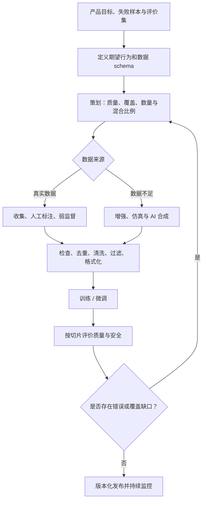
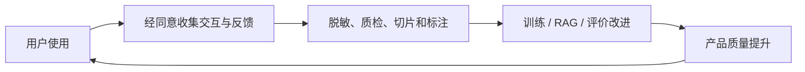
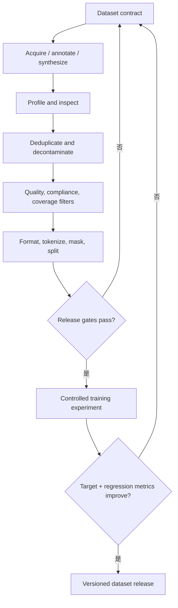

## 0. 学习目标与全章因果主线

第七章说明了怎样通过微调改变模型权重，但微调算法只能从训练数据中提取信号：数据没有表达的行为，优化器无法凭空创造；数据中的错误、偏见和格式噪声，也会被模型学习。

**Dataset engineering（数据集工程）**的目标，是在预算、时间、合规和算力约束下，构造能让目标模型获得最佳任务表现的数据集。它不是简单的“收集更多数据”，而是一组持续迭代的决策：

1. 需要模型学会什么行为；
2. 哪些样本能提供这些学习信号；
3. 数据是否正确、一致、多样且合规；
4. 每类数据需要多少、怎样配比；
5. 数据从哪里获得，怎样标注或合成；
6. 训练前怎样检查、去重、过滤和格式化；
7. 训练结果暴露了哪些覆盖缺口，再回到前面补数据。



这条流程不是一次性流水线。模型评价可能暴露某个语言、长度或工具上的失败，迫使团队重新策划、获取和处理数据。

学完本章，应能回答：

- 数据中心 AI 与模型中心 AI 分别优化什么，为什么二者不能互相替代；
- 数据质量、覆盖率和数量如何共同决定效果；
- 怎样估算数据需求并设计 learning curve，而不是迷信固定样本数；
- 人工标注、自然数据、弱监督和合成数据分别适合什么条件；
- 传统增强、模板、仿真、模型生成和蒸馏为什么有效，又会引入什么偏差；
- 为什么 inspection、deduplication、cleaning、filtering 和 formatting 必须在训练前形成可审计流程。

贯穿本章的五条原则：

- **训练数据必须展示期望行为。** 口头要求模型“会推理、会用工具”不够，监督轨迹要真正包含这些行为。
- **质量、覆盖和数量不可互相替代。** 大量重复错误样本不会变成高质量、多样数据。
- **数据分布就是隐式产品规范。** 哪些任务出现得多、哪些答案被选为赢家，会塑造模型优先服务谁。
- **合成数据扩大已有信号，不保证创造真相。** 生成器的盲点、风格和错误会被放大。
- **数据是有版本、有血缘的生产资产。** 每个样本应能追踪来源、许可证、处理步骤、质量判断和训练用途。

---

## 1. Dataset Engineering（数据集工程）

### 1.1 为什么模型算法再强也绕不过数据

设训练算法为 $A$，训练数据为 $D$，最终模型为：

$$
M=A(D).
$$

模型在目标分布 $P_{target}$ 上的风险为：

$$
R(M)=\mathbb E_{(x,y)\sim P_{target}}
\left[\mathcal L(M(x),y)\right].
$$

算法只在 $D$ 所提供的观测上优化经验风险：

$$
\widehat R_D(M)
=\frac{1}{|D|}\sum_{(x_i,y_i)\in D}
\mathcal L(M(x_i),y_i).
$$

从 $\widehat R_D$ 降低到真实目标风险 $R$，依赖至少三个条件：

1. 标签或目标输出表达了正确行为；
2. 训练分布覆盖目标分布中的重要情况；
3. 样本量足以让经验信号稳定，而不是拟合偶然噪声。

若某类输入在训练集中从未出现，经验损失不会直接约束该区域；若标签系统性错误，降低训练损失反而会强化错误；若重复样本占比很高，名义样本数很大但独立信息很少。

因此，“最好的团队 + 无限算力”也无法从坏数据中稳定训练出好模型。算力只能更充分地拟合被提供的目标。

### 1.2 数据为什么成为竞争优势

能从头预训练基础模型的组织越来越少，应用团队更常共享相同或相近的基础模型。此时差异来自：

- 私有、及时且合法的数据来源；
- 能表达产品标准的高质量标注；
- 对长尾、文化、语言和工具轨迹的覆盖；
- 快速发现线上失败并回流为数据的机制；
- 去重、过滤、评估和版本化基础设施。

数据工作已经从工程师“有空时处理”的杂务，演变为专门的数据标注、数据创建、质量工程和治理角色。GPT-3 的贡献列表中，直接负责数据收集、过滤、去重和污染分析的人数很少；到 GPT-4，参与不同数据流程的人员已达到数十人，且不含外包标注者。这反映了数据复杂度而不只是模型规模的增长。

### 1.3 本章聚焦 post-training data

不同训练阶段的数据单位不同：

- 预训练通常按 token 数衡量；
- continued pre-training 使用领域序列，也常按 token 数衡量；
- SFT 常按 instruction-response 示例数和有效 response token 数衡量；
- preference finetuning 常按比较对数衡量；
- agent/tool-use 数据还需按轨迹数、步骤数、工具类别与成功状态衡量。

本章以应用开发者更常接触的 post-training data 为主，同时借鉴预训练数据的混合、质量和规模经验。

---

## 2. A Data-Centric View of AI（数据中心 AI）

### 2.1 Model-Centric 与 Data-Centric

**Model-centric AI（模型中心 AI）**固定或基本固定数据，改进：

- 模型架构；
- 参数规模；
- loss、优化器和训练算法；
- 推理与训练效率。

**Data-centric AI（数据中心 AI）**固定或基本固定模型与训练过程，改进：

- 标签错误与一致性；
- 样本覆盖、类别和任务混合；
- 数据增强、合成与过滤；
- 去重、格式和合规；
- 困难样本与长尾样本。

这是一种实验控制方式，不是两个互斥阵营。真实技术进步往往同时需要模型和数据改进。

### 2.2 为什么固定模型能评价数据

若对不同候选数据集 $D_1,D_2$ 使用同一训练算法 $A$、模型架构、算力预算和评价集，则：

$$
M_i=A(D_i).
$$

比较 $M_i$ 的下游表现，主要变化来源就是数据。DataComp 使用标准训练脚本，在提交的数据集上训练同类 CLIP 模型，再以 38 个下游任务评价数据集；后续语言模型版本覆盖约 412M 到 7B 模型。DataPerf、dcbench 也采用类似的数据中心 benchmark 思路。

这个比较依赖控制变量：若不同数据集获得不同训练 token、超参数或清洗成本，结论就混合了数据与算力因素。一个数据集对 400M 模型最好，也不保证对 70B 模型最好，因为模型容量和数据利用方式不同。

### 2.3 数据中心竞赛揭示的工程动作

Andrew Ng 2021 年的数据中心竞赛要求参赛者不换模型，而通过以下方式提升结果：

- 修正错标签；
- 添加 edge cases；
- 数据增强；
- 改善一致性和覆盖。

它强调一个常被忽略的事实：当模型已经足够表达任务时，修一批关键数据可能比换一个更复杂模型更有效、更可解释。

---

## 3. Data Curation（数据策划）

数据策划不是简单筛文件，而是根据模型怎样学习、产品要什么行为、团队有哪些资源，决定数据 schema、来源、混合比例、质量门槛和数量。

### 3.1 不同训练目标需要不同数据结构

#### Self-Supervised / Continued Pre-training

数据是 token 序列：

```text
<document tokens>
```

标签由序列移位或 mask 自动产生。核心问题是领域、语言、时间、许可证和文档质量，而不是人工答案。

#### Instruction Finetuning

典型结构：

```text
(instruction, response)
```

还可能包含 system prompt、context、工具 schema 和 metadata。response 必须展示模型上线时应有的内容、结构、语气与拒答边界。

#### Preference Finetuning

典型结构：

```text
(instruction, winning_response, losing_response)
```

比较对必须能体现目标偏好。若 winner 只是更长，而标注指南没有控制长度，模型可能学到“越长越好”而不是真正的帮助性。

#### Reward Model

可以使用比较对，也可使用：

```text
((instruction, response), score)
```

分数需要定义量表、锚点和可比较范围。不同标注者的“4 分”若含义不同，数值标签并不自动成为精确监督。

### 3.2 数据应直接展示期望行为

模型通过损失函数拟合可观测目标。希望模型输出简洁答案，训练答案就应简洁；希望模型给出分数与理由，数据就必须同时有分数和理由；希望模型在不确定时澄清，训练集中就要包含“信息不足 -> 提问”的轨迹。

“答案事实正确”只是一个可能的要求。创意写作需要新颖性；安全响应需要边界一致；客服可能要求同理心和下一步行动。数据是否 aligned，取决于产品任务，而不是抽象的唯一“正确答案”。

### 3.3 Chain-of-Thought 数据

CoT prompting 要求模型先分步处理再给结论。若想通过微调稳定获得分步行为，训练 response 应包含步骤，而不只有最终答案。

例如：

```text
问题：食堂有 23 个苹果，午餐用了 20 个，又买了 6 个，还剩多少？
仅答案：9
分步答案：23 - 20 = 3；3 + 6 = 9，所以有 9 个。
```

仅答案监督主要约束最终 token；分步监督在中间状态也提供 token-level signal。Chun 等人的实验显示，在某些 CoT 任务中加入分步 response 后，不同规模模型的准确率可接近翻倍。

难点是：高质量推理轨迹比最终答案更昂贵，且“看起来连贯”不等于推理真实有效。错误中间步骤偶然得到正确答案，会把错误算法写进模型。需要检查：

- 每一步是否由前一步推出；
- 是否使用了题目允许的信息；
- 最终答案是否与步骤一致；
- 是否存在冗长但无贡献的套话；
- 隐私或安全场景是否允许暴露内部推理。

生产数据也可用简洁 justification、可验证程序或结构化子目标代替自由文本长思维链。

### 3.4 Tool-Use 数据

工具能力不只要求模型知道工具名称，还要学会：

1. 何时调用、何时直接回答；
2. 选择哪个工具；
3. 生成正确参数；
4. 读取 observation；
5. 处理空结果、错误与超时；
6. 决定继续、重试、换工具或结束；
7. 对高风险操作请求批准。

一条工具轨迹可表示为：

```text
user task
-> assistant tool_call(name, arguments)
-> tool result
-> assistant reflection / next tool_call
-> final response
```

领域专家能说明任务和业务约束，但直接口述步骤容易遗漏“习惯到不再意识到”的动作。观察专家真实工作通常更准确。

然而，人类最方便的操作未必适合 AI：人会打开浏览器、复制查询、逐个点击；模型可直接调用 search API 并并行处理结果。因此不应机械模仿人类界面操作，应寻找对机器可观测、可审计、低成本的动作空间。仿真环境和合成轨迹常用于探索更适合模型的工具策略。

### 3.5 工具数据的消息格式

普通聊天常是一轮一个 assistant message。工具使用时，一轮可能同时包含：

- 发给 code interpreter 的调用；
- 发给用户的进度说明；
- 工具返回的 observation；
- 下一次调用或最终回答。

因此 schema 必须区分：

- role；
- source 与 destination；
- message / tool call / tool result 类型；
- turn 结束与 message 结束；
- tool call ID 与对应 result；
- 并行调用的依赖关系。

Llama 3 为此设计 multi-message chat format，用消息 header 指定来源和目的地，并用特殊终止 token 区分 message 与 human/AI turn 边界。格式错误会让模型学不到“结果属于哪次调用”。

### 3.6 Single-Turn 与 Multi-Turn

**单轮数据**训练模型对独立指令立即回答，结构简单、容易收集。

**多轮数据**训练：

- 消解代词和历史依赖；
- 在信息不足时澄清；
- 接受用户纠正；
- 维护约束和状态；
- 避免重复已经问过的问题；
- 在多步任务中持续推进。

真实任务常需要来回交互，只用单轮数据会让模型把每条消息当作独立任务。多轮数据更难获得，因为需要设计完整场景、保证每轮状态一致，并防止后续答案泄漏给前文。

数据混合应匹配产品使用：若 80% 流量是单轮 FAQ、20% 是多轮排障，不能因为多轮“更高级”就让它无约束地主导训练。

### 3.7 数据策划也包括删除

策划不只增加正样本，也要删除会强化坏行为的样本。

例如用户只要求事实核验，模型却总附带未经请求的改写建议。检查训练集发现许多标注者习惯在答案后追加改写。修复应同时：

1. 删除或降权这些反例；
2. 增加“只核验、不越界改写”的正例；
3. 将“未经请求的额外工作”写入标注指南；
4. 在评价集中加入对应回归样本。

只追加少量正例，未必能抵消大量旧模式。数据删除也是改变训练分布的一种干预。

### 3.8 策划的三个核心维度

原书用烹饪类比：

- **Data quality**：食材是否新鲜、正确；
- **Data coverage**：各种食材配比是否合适；
- **Data quantity**：总量是否足够。

三者相互作用：一千条完美但全是简单英语问答，无法覆盖多语言工具调用；一百万条覆盖广但错误率高，会注入噪声；覆盖和质量都好但数量太少，模型可能只记住样本而无法稳健泛化。

---

## 4. Data Quality（数据质量）

### 4.1 质量是“对目标任务有用”，不是抽象洁净度

高质量数据帮助系统高效、可靠地完成目标。它不是脱离任务的固定属性：19 世纪法律文本对“今天的法规问答”可能过时，对“19 世纪法律史”却高度相关。

原书归纳六个特征：

1. relevant；
2. aligned with task requirements；
3. consistent；
4. correctly formatted；
5. sufficiently unique；
6. compliant。

### 4.2 Relevant（相关）

相关性同时涉及：

- 任务：是否支持目标能力；
- 时间：是否过时；
- 地域和法律适用范围；
- 用户群体与语言；
- 难度：是否接近线上问题；
- 模型阶段：预训练文本和 SFT 答案需求不同。

“来自同一领域”不等于相关。大量合同正文不一定能教会模型按公司模板生成风险摘要；还需任务形态匹配的输入—输出监督。

### 4.3 Aligned with Task Requirements（与任务要求一致）

标注应直接体现成功标准：

- 要求事实一致，答案必须可核验；
- 要求创造性，不能只保留模板答案；
- 要求评分和理由，两者都要有；
- 要求简洁，冗长答案即使正确也不 aligned；
- 要求安全拒答，拒答边界和可提供的替代帮助必须一致。

原书使用 aligned 而不是 accurate，是因为某些任务没有唯一事实答案。例如广告文案的目标可能是品牌调性而非“客观正确”。

### 4.4 Consistent（一致）

同类输入应按同一规则标注。若两篇同质量作文分别得到 2 分和 5 分，模型收到冲突梯度。

一致性包括：

- annotator 内部一致；
- annotator 之间一致；
- 不同批次和时间一致；
- guideline 版本一致；
- 分数尺度和格式一致。

标注指南应包含定义、正反例、边界例、冲突升级机制和版本号。仅写“标注高质量答案”无法形成可复现标准。

#### 一致性不等于所有人必须同意

主观任务可能存在合理分歧。分歧本身是信号：

- 保留多个可接受答案；
- 记录 annotator 背景；
- 用概率分布而不是硬标签；
- 将高分歧样本交给专家或从确定性训练集移出。

强行多数投票可能抹掉少数用户的真实偏好。

### 4.5 Correctly Formatted（格式正确）

格式问题会直接变成模型学习目标：

- HTML 标签、导航文本和抓取残留；
- 多余换行、尾随空格、大小写不一致；
- 整数列误存浮点或浮点被取整；
- JSON 中字段顺序/类型不一致；
- chat role、终止 token 或 tool call ID 错位；
- prompt token 错误计入 response loss；
- Unicode normalization 不一致。

原书特别提醒数值 dtype：浮点列被错误存为整数会悄悄舍入，训练能正常运行，却学到难以解释的行为。

“格式正确”要以目标 tokenizer、chat template 和训练 loader 的最终张量为准，不只是源 JSON 能解析。

### 4.6 Sufficiently Unique（足够唯一）

重复会：

- 让某些样本被过度加权；
- 降低有效样本多样性；
- 增加 benchmark contamination；
- 让 validation/test 与 train 泄漏；
- 浪费 token 和算力；
- 增加记忆和隐私风险。

不是所有重复都必须删除。罕见但重要行为可以有意过采样；相同 prompt 的多个高质量 response 可表达多样性。关键是区分“训练策略上的有意权重”和“采集管线造成的无意复制”。

### 4.7 Compliant（合规）

数据应满足：

- 隐私和 PII 政策；
- 著作权、许可证和服务条款；
- 数据驻留和跨境要求；
- 内部保密与访问控制；
- 删除请求和保留期限；
- 儿童、医疗、金融等行业规定；
- 合成数据中使用真实数据的边界。

合规不能只在训练前跑一次正则。应保存来源、授权依据、处理记录、用途限制和删除映射。数据规模大时，合规本身可能是全职工作。

### 4.8 小而精为什么可能胜过大而噪

若训练样本中一部分标签错误，经验梯度可写成：

$$
\widehat g
=\frac{1}{N}
\left(
\sum_{i\in C}g_i+
\sum_{j\in E}\widetilde g_j
\right),
$$

其中 $C$ 是正确样本，$E$ 是错误样本。错误梯度 $\widetilde g_j$ 可能与目标方向相反。增加同分布噪声样本会让错误贡献稳定存在，而不是自动相互抵消，特别是系统性标注偏差。

Yi 团队观察到约 1 万条精心构造指令优于数十万噪声指令。LIMA 用 1000 条精心策划的 prompt-response 微调 65B Llama，在人类比较中有 43% 的回答被判断为与 GPT-4 相当或更好；但小数据模型不如产品级系统稳健。结论不是“1000 条永远足够”，而是质量可显著提高每个样本的学习价值，覆盖不足仍会暴露长尾脆弱性。

Llama 3 团队还发现，人类标注在细致安全政策上也容易错误和不一致，因此开发 AI-assisted annotation tools。AI 辅助能提示规则和检查矛盾，但最终质量仍需校准，不能因为“由 AI 检查”就视为正确。

---

## 5. Data Coverage（数据覆盖）

### 5.1 操作化定义：覆盖目标分布的重要区域

设目标使用分布为 $P_{target}$，训练分布为 $P_{train}$。理想情况不是二者在每个输入点完全相同，而是目标中高概率或高风险的**可定义区域/切片** $A$ 在训练中有足够支持：

$$
P_{target}(A)>0
\quad\Longrightarrow\quad
P_{train}(A)>0.
$$

至少应对重要切片成立。若某区域目标概率非零而训练概率为零，模型只能依赖预训练迁移，不能从本次监督直接学习。这是 coverage audit 的必要启发式，不是泛化的充分条件：语言输入空间巨大，模型不需要见过每个具体 $x$；即使每个切片都有样本，数量、质量和切片内部多样性仍可能不足。

覆盖常被称为 diversity，但二者侧重点不同：

- diversity 描述样本彼此不同；
- coverage 描述这些差异是否覆盖**需要服务的目标空间**。

随机加入无关领域会增加表面多样性，却不增加目标覆盖。

### 5.2 覆盖维度由应用定义

可能的 axes：

- 任务/意图；
- topic/domain；
- 语言、方言和文化；
- prompt 长度、response 长度；
- 单轮/多轮和 turn 数；
- 难度、推理步数；
- 正常、边界、对抗和无解样本；
- 输出格式；
- 工具类型、轨迹长度、错误状态；
- 用户设备、地区、权限和产品版本；
- 人工数据与 AI 合成数据比例。

法英翻译工具不需要输出语言多样性，却需要主题、句长、正式程度和口语风格；全球商品推荐 chatbot 可能领域较固定，却需要语言和文化覆盖。

### 5.3 真实表达方式也要覆盖

若线上用户会：

- 写非常短或非常详细的 prompt；
- 拼写错误、缩写或中英混输；
- 省略上下文；
- 使用不同编程语言；
- 提供互相冲突的要求；
- 纠正模型后继续对话；

训练和评价数据就应包含这些模式。只用整洁、完整、专家书写的指令，会造成 train-serving skew。

### 5.4 Llama 3 不同训练阶段的数据混合

原书给出的高层领域比例：

| 领域 | Pre-training | SFT | Preference finetuning |
|---|---:|---:|---:|
| General knowledge (English) | 50% | 52.66% | 81.99% |
| Math and reasoning | 25% | 21.19% | 5.89% |
| Coding | 17% | 14.89% | 6.93% |
| Multilingual | 8% | 3.01% | 5.19% |
| Exam-like | 0% | 8.14% | 0% |
| Long context | 0% | 0.11% | 0% |

这说明不存在跨阶段通用“最佳混合”：

- pre-training 建立广泛知识和基础能力；
- SFT 强化任务行为，加入 exam-like 和少量 long context；
- preference data 更接近用户偏好分布，因此 general knowledge 比例更高。

三列按表中比例都加总为 100%。Pre-training 中 math + reasoning + code 为 $25\%+17\%=42\%$；SFT 中这两类为 $21.19\%+14.89\%=36.08\%$。如果把 exam-like 也视为推理型监督，SFT 的广义“推理/代码”比例是 $36.08\%+8.14\%=44.22\%$。这些比例远高于它们在普通互联网文本中的直觉占比。Llama 3 团队发现，在训练后期用逐渐减小的学习率、逐渐增加高质量代码与数学数据做 annealing，能提升关键 benchmark。这支持“代码和数学的结构化监督有助于推理”的经验判断，但不证明所有自然语言任务都应使用相同比例。

Preference finetuning 中二者合计约 12.82%，可能因为该阶段更强调真实用户偏好分布。

### 5.5 怎样选择 data mix

#### 方法一：匹配真实流量

若目标是平均用户体验，可令训练类别比例近似线上：

$$
q_k\approx p_k,
$$

$p_k$ 是目标流量类别 $k$ 的权重，$q_k$ 是训练混合。

但纯流量匹配会低估低频高风险事件，例如支付错误、安全越权和医疗建议。更一般可设置风险权重：

$$
w_k\propto p_k c_k,
$$

$c_k$ 是该类失败成本，再归一化得到训练/评价权重。

#### 方法二：小模型 scaling experiments

对每个候选 mix 训练多个较小模型，拟合“规模—数据混合—性能”关系，再外推大模型。Meta 用类似 scaling-law 实验选择 Llama 3 mix。

成立边界：小模型的最优混合不一定保持到大模型；外推只应在观察规模附近使用，并保留大模型验证预算。

#### 方法三：失败驱动迭代

对评价失败做 taxonomy，统计每类频率、严重性和置信区间，优先补最有价值的缺口。添加数据后做 ablation，验证该切片改善且其他切片未退化。

### 5.6 数据越异质不一定越好

异质数据可能带来正迁移，也可能引发：

- 任务梯度冲突；
- 输出风格不一致；
- 低质量长尾稀释高质量信号；
- 固定训练 token 下挤占核心任务；
- 模型容量不足以同时学习所有模式。

“The Data Addition Dilemma” 表明某些情况下增加异质数据反而降低性能。是否“更多样”要通过目标切片和总体回归共同评价。

Zhou 等人让同一个 7B 模型分别在三个同为 2000 条的数据集上训练：高质量但不多样、多样但低质量、既高质量又多样。第三种生成质量最好，说明质量与覆盖是互补条件。

### 5.7 可运行示例：检查 data mix 与目标分布

总变差距离（total variation distance）衡量两个离散分布差异：

$$
D_{TV}(P,Q)
=\frac{1}{2}\sum_{k=1}^{K}|p_k-q_k|.
$$

它位于 $[0,1]$：0 表示完全相同，1 表示支持集完全不重叠。它只衡量比例，不知道类别语义，也不能代替高风险权重。

```python
"""比较候选训练数据混合与目标流量分布。"""


def normalize(counts):
    total = sum(counts.values())
    if total <= 0:
        raise ValueError("counts must contain at least one example")
    return {name: value / total for name, value in counts.items()}


def total_variation(target, candidate):
    categories = set(target) | set(candidate)
    return 0.5 * sum(
        abs(target.get(name, 0.0) - candidate.get(name, 0.0))
        for name in categories
    )


target_mix = {
    "general": 0.50,
    "math": 0.25,
    "code": 0.15,
    "multilingual": 0.10,
}
candidate_counts = {
    "general": 55,
    "math": 10,
    "code": 25,
    "multilingual": 10,
}
candidate_mix = normalize(candidate_counts)

print("MIX_GAPS")
for category in target_mix:
    gap = candidate_mix[category] - target_mix[category]
    print(
        f"{category}: target={target_mix[category]:.2f} "
        f"candidate={candidate_mix[category]:.2f} gap={gap:+.2f}"
    )
print(f"total_variation={total_variation(target_mix, candidate_mix):.4f}")
```

实际运行输出：

```text
MIX_GAPS
general: target=0.50 candidate=0.55 gap=+0.05
math: target=0.25 candidate=0.10 gap=-0.15
code: target=0.15 candidate=0.25 gap=+0.10
multilingual: target=0.10 candidate=0.10 gap=+0.00
total_variation=0.1500
```

候选集数学欠采样 15 个百分点、代码过采样 10 个百分点。$D_{TV}=0.15$ 可理解为至少重新分配 15% 的概率质量才能匹配目标。真实策划还要按难度、质量、失败成本和合成来源继续切片。

---

## 6. Data Quantity（数据数量）

“需要多少数据”没有脱离任务的固定答案。一个模型可以从单个样本学到可见行为，也有团队使用数百万样本微调。需要的量由质量、覆盖、方法、任务复杂度、基础模型能力和目标提升共同决定。

### 6.1 微调规模与预训练规模不可直接类比

Llama 2 和 Llama 3 的预训练数据量约为 2T 和 16T token。若粗略假设每个样本 2000 token，则分别相当于：

$$
\frac{2\times10^{12}}{2000}=10^9
$$

和


$$
\frac{16\times10^{12}}{2000}=8\times10^9
$$

个等长样本。原书正文写成 “1 billion and 15 billion examples”，其中第二个换算与 16T/2000 不一致；严格算术是 8 billion。实际预训练文档长度变化很大，这个换算本来就只用于数量级直觉。

预训练从广泛数据学习通用表示，微调从已有表示出发，只需调整目标行为，因此即使百万级微调样本，相对预训练仍很小。

### 6.2 数据很多时是否应从头训练

通常微调比从零训练高效，但数据非常多、目标分布与预训练差异大时，应把 from-scratch training 也纳入实验。

一个原因是 **ossification（固化）**：预训练形成的参数结构可能使模型不容易适应后续数据。Hernandez 等观察到小模型比大模型更容易受固化影响。直觉是容量有限的小模型已把参数组织到旧任务的局部结构中，后续优化自由度不足。

这不是“有很多数据就一定重训”的规则。重训会失去预训练知识并承担巨大算力。应比较：

- 从头训练；
- continued pre-training + finetuning；
- full finetuning；
- PEFT；
- 不同基础模型。

### 6.3 决定数据需求的三个额外因素

#### Finetuning technique

Full finetuning 自由度高，通常需要更多数据稳定约束大量参数；LoRA 等 PEFT 在较小参数子空间更新，小数据下往往更稳。

- 数百到数千条：优先尝试 PEFT；
- 数万到数百万高质量 pairs：可比较 full finetuning。

这些是经验起点，不是方法门槛。复杂任务即使用 LoRA 也可能需要大量数据。

#### Task complexity

二分类情感任务的决策边界简单，金融报告多跳问答则包含检索、数值推理、长上下文和领域知识。任务状态空间、输出长度、推理步骤和容错标准越复杂，通常需要更多覆盖样本。

#### Base model performance

基础模型越接近目标，纠正所需样本越少。OpenAI 指南中的实验显示，只有 100 条时，先进模型微调后明显更强；达到 550000 条时，五个候选模型表现趋近。

因此：

- 小数据：强基础模型 + PEFT 常更合适；
- 大数据：较小模型 + full finetuning 可能得到更优成本。

这与预训练 scaling 不同：预训练中更大模型需要更多数据发挥容量；微调中更强模型可能已经拥有目标能力，只需少量信号触发。

### 6.4 从 50–100 条高质量样本开始

在投资大规模标注前，先构造约 50 条精心检查的数据：

1. 验证任务能否因微调改善；
2. 验证 schema、tokenization 和 loss mask；
3. 暴露标注指南歧义；
4. 建立初始切片指标；
5. 估计单条成本与处理时间。

原书认为多数任务在 50–100 条后应看到某种改善。若完全没有改善，先排查：

- 学习率、epoch 和方法；
- 数据质量与覆盖；
- prompt/格式不匹配；
- 评价指标不敏感；
- 可训练参数或 label mask 错误；
- 基础模型是否具备必要能力。

“小数据没提升，所以再标 10 万条”通常不是第一选择，但也不能在训练管线有 bug 时断言更多数据无用。

### 6.5 分阶段使用低成本数据

可以先用便宜但相关性较弱的数据建立表示，再用少量高质量目标数据收尾：

1. **self-supervised → supervised**：先学法律文本，再学法律 Q&A；
2. **less relevant → relevant**：先学推文情感，再学商品评论情感；
3. **synthetic → real**：先学合成医疗报告，再用少量真实报告校准。

顺序的直觉是由宽到窄、由便宜到昂贵。风险包括负迁移、灾难性遗忘和合成风格残留。两个阶段的学习率、样本混合和停止点都需实验；流程更复杂、计算更多，可能不如直接用真实高质量数据。

### 6.6 Learning Curve（学习曲线）

用 25%、50%、100% 数据分别训练，绘制性能与数据量关系。常见经验模型是误差随样本量呈幂律下降：

$$
E(N)=E_{\infty}+aN^{-b},
\qquad a>0,\ b>0.
$$

其中：

- $N$：训练样本或 token 数；
- $E_{\infty}$：在当前模型、数据分布和方法下的不可约/渐近误差；
- $a$：当前任务的数据敏感规模；
- $b$：scaling exponent。

边际误差下降：

$$
-\frac{dE}{dN}=abN^{-(b+1)}.
$$

因为 $b+1>0$，$N$ 增大时边际收益下降。数据翻倍带来的误差下降为：

$$
E(N)-E(2N)
=aN^{-b}\left(1-2^{-b}\right),
$$

同样随 $N$ 变小。这是经验拟合，不是所有任务的定理；数据混合改变、训练未收敛或评价噪声会让曲线非单调。

### 6.7 可运行示例：观察翻倍收益

```python
"""根据多个数据子集实验，计算每次翻倍带来的实际增益。"""


dataset_sizes = [50, 100, 200, 400]
validation_scores = [0.70, 0.76, 0.80, 0.82]

print("LEARNING_CURVE")
for size, score in zip(dataset_sizes, validation_scores):
    print(f"examples={size:>3} score={score:.2f}")

print("\nDOUBLING_GAINS")
for previous_index in range(len(dataset_sizes) - 1):
    current_index = previous_index + 1
    old_size = dataset_sizes[previous_index]
    new_size = dataset_sizes[current_index]
    gain = validation_scores[current_index] - validation_scores[previous_index]
    print(f"{old_size}->{new_size}: gain={gain:.2f}")

annotation_budget = 10_000
cost_per_example = 2
maximum_examples = annotation_budget // cost_per_example
print("\nBUDGET")
print(f"maximum_examples={maximum_examples}")
```

实际运行输出：

```text
LEARNING_CURVE
examples= 50 score=0.70
examples=100 score=0.76
examples=200 score=0.80
examples=400 score=0.82

DOUBLING_GAINS
50->100: gain=0.06
100->200: gain=0.04
200->400: gain=0.02

BUDGET
maximum_examples=5000
```

每次翻倍仍提升，但收益从 0.06 降到 0.02。是否继续标注取决于 0.02 的业务价值和置信区间，而不是只看正增益。

### 6.8 数量之外还有 task diversity

Chung 等的实验把 instruction-tuning 任务数从 9 增到 282 时性能显著提升；超过 282 后开始平台化，但直到 1836 个任务仍有小幅收益。

任务数只是 diversity 代理。真正维度还包括 topic、难度、语言、格式和交互方式。新增 100 个高度相似任务，信息增量可能小于一个关键新任务。

### 6.9 预算约束

若标注预算为 $B$、每条平均成本为 $c$，数量上限：

$$
N\le\left\lfloor\frac{B}{c}\right\rfloor.
$$

例如 10000 美元、每条 2 美元，最多 5000 条，还未计 guideline、质检、返工、工具和项目管理。总预算还要在数据和计算之间分配：更多数据会挤压训练实验，更多训练会减少标注。

更合理目标是最大化单位总成本的验证/业务收益，而不是最大化样本数。

---

## 7. Data Acquisition and Annotation（数据获取与标注）

### 7.1 数据获取的目标与渠道

目标是在预算内获得**足够大、质量和覆盖达标、尊重隐私并符合法规**的数据集。渠道包括：

- 应用与用户数据；
- 公共数据；
- 购买专有数据；
- 内部专家或外包人工标注；
- 弱监督、半监督和主动学习；
- 数据增强与合成。

实际数据集通常是多源混合。每个来源应保存 source ID、license、采集时间、处理版本、质量等级和允许用途。

### 7.2 应用数据与 Data Flywheel

应用数据最接近真实目标分布，可包括：

- 用户内容；
- 使用日志和系统轨迹；
- 用户显式反馈；
- 人工接管和纠错；
- 成功/失败工具调用；
- 线上延迟、放弃和重试信号。

Data flywheel（数据飞轮）是：产品使用产生数据，数据改善模型，模型改善产品并吸引更多使用，再产生更多数据。



飞轮不是“默认保存一切”。需要：

- 明确告知和合法处理基础；
- 最小化收集；
- PII 脱敏与访问控制；
- 用户删除和退出机制；
- 防止线上恶意输入污染训练；
- 时间切分，避免未来信息泄漏；
- 区分用户原文、模型输出和反馈。

模型输出被当作用户数据回流时，会形成 feedback loop，后文的 model collapse 与偏差放大风险随之出现。

### 7.3 先检查已有数据

公共和商业市场可能已有可用数据。原书列举：

- Hugging Face、Kaggle；
- Google Dataset Search；
- Data.gov、data.gov.in 等政府开放数据；
- ICPSR 社会研究数据；
- UCI Machine Learning Repository、OpenML；
- Open Data Network、AWS Open Data；
- TensorFlow Datasets 等框架内置数据；
- lm-evaluation-harness 等 benchmark 集；
- Stanford Large Network Dataset Collection。

可用不等于可直接训练。必须检查：

1. license 是否允许目标用途和衍生模型；
2. 上游来源是否合法，即使聚合数据集声称可商用；
3. 是否含 benchmark/test contamination；
4. 语言、时间和用户分布是否匹配；
5. 数据曾被怎样清洗、翻译或模型生成；
6. 是否含 PII、毒性、版权和安全风险。

### 7.4 多源策划示例

原书用一个简化流程展示 11000 条高质量 instruction-response 如何形成：

1. 找到 10000 条候选；
2. 删除 1000 条低质量 instruction，剩 9000；
3. 其中 3000 条 response 低质量，先隔离，留下 6000 条完整高质量样本；
4. 人工重写这 3000 条 response，恢复到 9000；
5. 发现 topic X 覆盖不足，创建一批模板并合成 2000 条 instruction；
6. 人工为 2000 条合成 instruction 标 response，得到 11000 条。

原书这一处先写“100 个模板”，下一句又写“这 10 个模板”，数字彼此冲突，因此这里不强行选择其一，只保留关键事实：通过模板补 2000 条 instruction。真实流程会反复修改 guideline、返工、事实核验和调整每模板生成量。若单个模板生成过多样本，近重复会伤害 diversity；更好的做法可能是增加模板、减少每模板产量。

### 7.5 Annotation Guideline（标注指南）

指南要回答：

- 好 response 的必要和充分条件是什么；
- “正确但没帮助”怎样评分；
- 3 分和 4 分的可观察差别；
- 事实、风格、安全、长度冲突时谁优先；
- 信息不足、任务无解和恶意请求怎样处理；
- 工具轨迹哪些步骤必须出现；
- 不确定时怎样升级给专家；
- 是否允许外部资料、如何引用。

指南应包含正例、反例、边界例、锚点和版本历史。先用小批 pilot annotation 测试：若训练后的 annotator 仍大量分歧，问题通常是规则不清，而不是简单要求“更认真”。

同一套成功标准也用于 evaluation。因此早期投资评价指南和数据，能直接复用于训练标注和合成验证。

### 7.6 标注质量控制

常见机制：

- 入职培训与 qualification tasks；
- 重叠标注和 inter-annotator agreement；
- gold questions / hidden checks；
- 专家仲裁；
- 随机审计；
- 按标注者、时间段和任务难度切片；
- 反馈与指南迭代；
- 对模型辅助建议记录接受/修改率。

标注者可能因疲劳、激励或文化背景产生系统差异。总体平均一致不能掩盖某个安全切片的严重分歧。

### 7.7 Cohen’s Kappa 的推导与边界

两位标注者的原始一致率：

$$
p_o=\frac{\text{一致样本数}}{N}.
$$

即使随机按各自标签边际分布标注，也会偶然一致。设标签集合为 $\mathcal C$，标注者 A/B 给类别 $c$ 的比例为 $p_A(c),p_B(c)$，随机期望一致率：

$$
p_e=\sum_{c\in\mathcal C}p_A(c)p_B(c).
$$

Kappa 把超过随机基线的一致量，除以理论上仍可提高的量：

$$
\kappa=\frac{p_o-p_e}{1-p_e}.
$$

- $\kappa=1$：完全一致；
- $\kappa=0$：不优于边际随机一致；
- $\kappa<0$：比随机预期更不一致。

当 $p_e=1$ 时分母为零，例如两人只使用同一个标签，Kappa 无定义。类别极不平衡时会出现 prevalence paradox：原始一致率很高但 Kappa 较低。因此要同时报告 confusion matrix、$p_o$、每类一致性和争议样本，而不是只报一个数。

### 7.8 可运行示例：标注者一致性

```python
"""计算两名标注者在二分类任务上的 Cohen's kappa。"""
from collections import Counter


annotator_a = [
    "good", "good", "bad", "good", "bad",
    "good", "bad", "bad", "good", "bad",
]
annotator_b = [
    "good", "bad", "bad", "good", "bad",
    "good", "good", "bad", "good", "bad",
]

if len(annotator_a) != len(annotator_b):
    raise ValueError("annotators must label the same number of examples")

example_count = len(annotator_a)
observed = sum(a == b for a, b in zip(annotator_a, annotator_b)) / example_count
counts_a = Counter(annotator_a)
counts_b = Counter(annotator_b)
labels = set(counts_a) | set(counts_b)
expected = sum(
    (counts_a[label] / example_count) * (counts_b[label] / example_count)
    for label in labels
)
kappa = (observed - expected) / (1.0 - expected)

print("AGREEMENT")
print(f"observed={observed:.4f}")
print(f"expected_by_chance={expected:.4f}")
print(f"cohen_kappa={kappa:.4f}")
```

实际运行输出：

```text
AGREEMENT
observed=0.8000
expected_by_chance=0.5000
cohen_kappa=0.6000
```

10 条中 8 条一致；两人的 good/bad 边际都是 50%/50%，随机期望一致为 $0.5^2+0.5^2=0.5$，扣除偶然一致后 $\kappa=0.6$。这衡量一致性，不证明两人都标对了。

---

## 8. Data Augmentation and Synthesis（数据增强与合成）

数据、算力和人才是 AI 的三类核心稀缺资源。人工生成复杂训练数据昂贵，业界长期希望以程序自动扩大数据。

### 8.1 严格区分

**Data augmentation（数据增强）**从已有真实样本变换出新样本：

$$
(x,y)\longrightarrow(T(x),y'),
$$

例如翻转猫图、裁剪足球图、改写一句话。

**Data synthesis（数据合成）**从规则、仿真器或生成模型直接采样，模仿真实数据属性：

$$
(\widetilde x,\widetilde y)
\sim Q_{synthetic}.
$$

合成样本不对应一个具体真实事件，例如虚构保险理赔、模拟机器人轨迹。

二者都自动创造数据，术语经常混用。原书后文也常用 synthesis 统称两者。工程上仍应保留 provenance：样本是原始、变换、仿真还是模型生成，因为质量、隐私和权利风险不同。

### 8.2 增强成立的核心假设：标签不变性

对分类任务，若变换 $T$ 不改变目标语义，应满足：

$$
P(y\mid x)=P(y\mid T(x)).
$$

确定标签时可写成：

$$
f^*(T(x))=f^*(x)=y.
$$

翻转猫图通常仍是猫，但翻转交通标志、医学左右侧图像或带方向文字的图片可能改变标签。将 “good” 换成 “bad” 会改变情感；将人名替换成另一个文化群体可能改变上下文事实。

因此增强不是“只要看起来相似就复用标签”，而是为每类变换声明 invariance，并用抽样审查或自动测试验证。

### 8.3 合成分布与真实分布

合成器定义分布 $Q_{synthetic}$，目标是真实分布 $P_{real}$。训练混合可写成：

$$
P_{train}
=(1-\lambda)P_{real}+\lambda Q_{synthetic},
\qquad 0\le\lambda\le1.
$$

$\lambda$ 越大，数量与可控覆盖可能越高，也越容易受 synthetic gap 影响。理想合成器不只匹配常见外观，还要保留目标条件关系：

$$
Q(y\mid x)\approx P(y\mid x).
$$

若合成理赔数据外观逼真，却把欺诈标签与金额简单绑定，模型会学到伪相关。

### 8.4 从软件测试到复杂生成

程序生成假数据早已用于测试。Faker、Chance 等可生成姓名、地址、电话和邮件，检查解析器能否处理不同国家格式。现代生成模型进一步能产生医生笔记、合同、财报、商品描述、图像和视频，使合成从 schema 测试扩展到模型训练。

合成数据通常不能完全替代真实/人工数据。真实数据提供环境中的未知细节和校准基准；合成数据提供规模与受控覆盖。许多场景最有效的是混合。

---

## 9. Why Data Synthesis（为什么合成数据）

### 9.1 增加 Quantity

合成能低成本批量产生罕见或难收集样本：

- 极端天气与深海探索；
- 自动驾驶事故；
- 稀有疾病和设备故障；
- 新工具 API 的调用轨迹。

更多样本只有在新增有效信息时才有价值。把同一个模板改 1000 次表面字段，只会增加名义数量。

### 9.2 增加 Coverage

可以定向指定：

- 很短/很长文本；
- 特定语言、主题和格式；
- toxic/safe 对照；
- adversarial prompts；
- 少数类别；
- 工具错误、超时与权限拒绝。

TrueTeacher 用 LLM 生成事实不一致摘要，再训练检测器识别不一致。Anthropic 通过模型编写评价数据，覆盖 154 种行为，包括人格、政治观点、伦理立场和社会偏见；其模型生成集在部分比较中接近或超过人工集。

合成覆盖的优势是可控，但前提是团队已经知道缺口。未知未知仍需真实使用和人工探索发现。

### 9.3 提高 Quality

“人工必优于 AI”并不总成立：

- AI 工具调用方式可能比人类界面动作更适配模型；
- AI 可系统枚举更复杂数学题；
- 固定 judge 配置可能比不同情绪、经验的人类评分更一致；
- 程序执行能自动筛掉错误代码。

但一致地错比随机噪声更危险。AI 标注质量必须以独立真值、功能测试和下游效果校准。

### 9.4 缓解 Privacy 限制

医疗和保险可能无法直接使用患者记录或真实理赔。合成记录可减少直接 PII 暴露。

“synthetic” 不自动等于匿名：生成器可能记忆并复现训练数据，稀有属性组合也可能重新识别个人。需要 membership/inversion 风险测试、相似度审计和隐私机制；若要求形式化保证，可考虑差分隐私，而不是只删姓名。

### 9.5 Model Distillation

teacher 生成输入、输出或 soft targets，student 学习其行为，以获得更小、更快、更便宜的模型。蒸馏是合成数据的特殊用途，第 15 节详述。

---

## 10. Traditional Data Synthesis Techniques（传统合成技术）

在生成式 AI 之前，软件测试、游戏和机器人已广泛使用 procedural generation。原书将传统路线归为 rule-based 与 simulation。

### 10.1 Rule-Based Synthesis（规则与模板）

模板定义字段和约束，随机生成器填值。例如交易：

```text
Transaction ID: [unique ID]
Date: [MM/DD/YYYY]
Amount: [amount]
Merchant: [name/category]
Location: [city/country]
Payment Method: [card/cash/online]
Status: [completed/pending/failed]
```

模板适合：

- invoice、resume、tax form、bank statement；
- event agenda、catalog、contract；
- configuration file；
- regex、grammar 和数学式。

金融欺诈团队可先用模板交易验证模型可行性，再申请真实敏感数据。AlphaGeometry 使用约 1 亿合成几何例题训练奥赛级系统，说明规则系统在可验证形式领域可扩展到极大规模。

模板的局限是组合爆炸和模板指纹。若字段独立随机，可能产生不符合现实联合分布的记录，例如城市与邮编不匹配。规则必须表达 cross-field constraints。

### 10.2 Transform Existing Data（变换真实数据）

图像增强：旋转、裁剪、缩放、翻转、遮挡、亮度与噪声。AlexNet 通过 ImageNet 图像增强提高泛化。

文本增强：

- 同义词替换；
- paraphrase；
- translation / back-translation；
- 拼写和键盘噪声；
- 实体、性别或文化属性的反事实替换。

“She is a fantastic nurse” 可生成 “He is a fantastic nurse”，削弱职业—性别共现；CEO、父母、姓名也可生成反事实版本。

边界是替换必须保持任务标签和语法。`great` 不一定在讽刺语境等同于 `fantastic`；代词替换还要同步所有指代和所有格。

### 10.3 可运行示例：受控反事实增强

```python
"""用词边界做简单性别词反事实替换，避免替换单词内部子串。"""
import re


SWAPS = {
    "She": "He",
    "He": "She",
    "she": "he",
    "he": "she",
    "Ms": "Mr",
    "Mr": "Ms",
}
PATTERN = re.compile(r"\b(?:She|He|she|he|Ms|Mr)\b")


def counterfactual_swap(text):
    return PATTERN.sub(lambda match: SWAPS[match.group(0)], text)


examples = [
    "She is a fantastic nurse.",
    "He is a skilled doctor.",
    "The CEO, Ms. Alex Wang, approved it.",
]

print("COUNTERFACTUAL_AUGMENTATION")
for example in examples:
    print(f"original={example}")
    print(f"augmented={counterfactual_swap(example)}")
```

实际运行输出：

```text
COUNTERFACTUAL_AUGMENTATION
original=She is a fantastic nurse.
augmented=He is a fantastic nurse.
original=He is a skilled doctor.
augmented=She is a skilled doctor.
original=The CEO, Ms. Alex Wang, approved it.
augmented=The CEO, Mr. Alex Wang, approved it.
```

代码只演示字符串层变换。真实数据需检查姓名、亲属、代词一致性，以及任务是否真的应对该属性保持不变。

### 10.4 Perturbation 与对抗鲁棒性

给输入加小扰动 $\delta$：

$$
x'=x+\delta,
\qquad \|\delta\|\le\epsilon.
$$

若人类语义不变，理想模型应满足：

$$
f(x')=f(x).
$$

但神经网络可能被极小扰动欺骗。One Pixel Attack 在其设置下只改一个像素，就能使 Kaggle CIFAR-10 中 67.97% 和 ImageNet 中 16.04% 的自然图像被误分类。

对抗训练可写成鲁棒优化：

$$
\min_M\ \mathbb E_{(x,y)}
\left[
\max_{\|\delta\|\le\epsilon}
\mathcal L(M(x+\delta),y)
\right].
$$

内层寻找最坏扰动，外层让模型在该扰动上也正确。成立边界是 $\epsilon$ 与扰动集合必须保持真实标签；过强噪声会改变语义。

ImageNet-C/P 用亮度、雪、对比度和噪声等 15 类常见 corruption 测试鲁棒性。文本可加入 typo、字符交换和 token 替换。

原书称 BERT “替换 1.5% token 为随机词”：更完整地说，BERT 选择约 15% token 做 MLM，其中约 10% 替换为随机 token，所以随机替换占全部 token 的 $15\%\times10\%=1.5\%$。其余选中 token 多数被 `[MASK]` 替换或保持不变。

Snap 还通过生成不同肤色、体型、发型、服装和表情的角色资产，补未覆盖 corner cases 并缓解隐式偏差。

### 10.5 Simulation（仿真）

真实实验昂贵或危险时，在虚拟环境运行：

- 自动驾驶遇到高速公路上的马；
- 机器人不同关节动作倒咖啡；
- 公司 IPO、破产和市场冲击；
- 制造缺陷；
- 气温、降水和极端天气。

自动驾驶仿真器包括 CARLA、Waymo SimulationCity 和 Tesla 的城市仿真。机器人可尝试大量动作，仅把成功轨迹加入训练。

仿真优势：便宜、并行、可复现、无物理伤害、能控制罕见条件。局限是 **sim-to-real gap**：仿真省略摩擦、传感器噪声、人类行为和开放世界细节。仿真成功不保证现实成功；仿真失败通常是很有价值的否证。

缓解包括 domain randomization、系统辨识、少量真实数据校准和现实回放测试。

### 10.6 用仿真生成工具轨迹

给定任务，可以在沙箱中枚举/搜索动作序列，执行并验证结果，再选择成功且成本低的轨迹作为 response。这比照抄人类鼠标操作更适合 agent。

轨迹选择可形式化为：

$$
\pi^*=\arg\min_{\pi\in\Pi}
C(\pi)
\quad\text{s.t.}\quad
G(T(s_0,\pi))=1,
$$

$s_0$ 是初始状态，$T$ 执行轨迹，$G$ 判断目标完成，$C$ 是步骤、时间、费用或风险。

### 10.7 可运行示例：BFS 合成最短动作轨迹

```python
"""在小型可验证环境中搜索到目标状态的最短动作序列。"""
from collections import deque


ACTIONS = {
    "add_one": 1,
    "add_two": 2,
    "subtract_one": -1,
}


def shortest_trajectory(start, goal, lower=0, upper=6):
    queue = deque([(start, [])])
    visited = {start}
    while queue:
        state, trajectory = queue.popleft()
        if state == goal:
            return trajectory
        for action_name, delta in ACTIONS.items():
            next_state = state + delta
            if lower <= next_state <= upper and next_state not in visited:
                visited.add(next_state)
                queue.append((next_state, trajectory + [action_name]))
    raise ValueError("goal is unreachable")


start_state = 0
goal_state = 4
trajectory = shortest_trajectory(start_state, goal_state)

state = start_state
print("SIMULATED_TRAJECTORY")
print(f"start={state}")
for action in trajectory:
    state += ACTIONS[action]
    print(f"action={action} observation={state}")
print(f"goal_reached={state == goal_state} steps={len(trajectory)}")
```

实际运行输出：

```text
SIMULATED_TRAJECTORY
start=0
action=add_two observation=2
action=add_two observation=4
goal_reached=True steps=2
```

BFS 在每个动作同成本时保证首次到达是最少步骤轨迹。若工具费用不同，应改用 Dijkstra/A*；若模拟器状态转移不准确，轨迹即使在仿真成功也可能在线上失败。

---

## 11. AI-Powered Data Synthesis（AI 驱动的数据合成）

规则和物理仿真要求人类先明确生成机制；基础模型能在自然语言、代码和多模态空间中生成复杂样本，显著降低模板工程成本。但生成模型本身也是一个有偏、有截止日期、会幻觉的分布。

### 11.1 AI 作为 simulator

AI 可模拟 API 返回，避免真实调用的费用、限流和延迟。StableToolBench 用模型模拟 API 结果，以训练/评价工具使用。

适用条件：

- API 语义可由模型可靠预测；
- 不需要实时、私有或精确状态；
- 结果可与少量真实调用校准；
- 模拟输出明确标记，不能与真实日志混淆。

模拟支付、库存和数据库写入时，模型生成的“成功”不代表动作真实可执行。关键轨迹仍需在 sandbox 或真实 staging API 验证。

### 11.2 AI 模拟人类与 Self-Play

两个或多个 agent 可扮演客户、客服、谈判对手、玩家或评价者。Self-play 让模型与自己的不同副本互动并从结果学习。

OpenAI 的 Dota 2 simulator 每天产生约 180 年等量游戏；AlphaGo 从数百万盘 self-play 学习。自博弈可探索人类数据未覆盖策略，前提是环境有可信规则和 reward。

对开放式客服，reward 比游戏胜负模糊。两个模型可能共同形成不真实的对话习惯，因此要用真实用户数据校准语言、耐心、目标和终止方式。

### 11.3 Paraphrasing（改写）

“How to reset my password?” 可扩展为：

- “I forgot my password.”
- “How can I change my password?”
- “Steps to reset passwords.”

改写增加表达覆盖，但必须保留 intent、实体和约束。可形式化为：

$$
\operatorname{Intent}(x')=\operatorname{Intent}(x),
\qquad
\operatorname{Slots}(x')=\operatorname{Slots}(x).
$$

若把 “不能重置密码” 改成 “怎样重置密码”，表面相似却改变否定语义。

MetaMath 将 MATH/GSM8K 的约 15000 道题做多种改写，扩成接近 400000 条，并使其模型在相关数学 benchmark 上超过更大模型。收益可能同时来自数量、表达多样性和解题格式，不能只归因于 paraphrase。

### 11.4 Translation 与 Back-Translation

把高资源语言数据翻译到 Quechua、Lao 等低资源语言，可快速扩大覆盖。代码也可在编程语言间翻译。

回译验证：

$$
x\xrightarrow{F}y
\xrightarrow{B}x'.
$$

若 $x'$ 与 $x$ 差异很大，$y$ 可能翻译错误。可用 semantic similarity、实体/数字一致、可执行测试或人工检查比较。

必要条件不是逐字相同，而是语义等价。回译器可能与正向翻译器共享错误，导致错误往返后看似一致；低资源语言也可能没有足够强的独立模型。因此 back-translation 是过滤信号，不是真值证明。

Llama 3 还对代码做回译：由 code 生成 explanation/documentation，再由说明还原 code；只有还原结果被判断忠实，说明样本才进入微调集。

### 11.5 Pre-training 与 Post-training 中的合成比例

Post-training 更常主动使用合成数据，因为 instruction 和 preference 标注昂贵，而且目标行为容易通过 prompt 指定。

Pre-training 目标之一是增加知识。AI 擅长把已有知识换一种表达，却较难创造可靠新知识；递归使用生成内容还可能缩窄分布。尽管如此，互联网已含大量 AI 内容，模型事实上会接触合成数据。Cosmopedia 是一个约 25B token 的合成预训练集，包含教材、博客、故事、帖子和 WikiHow 风格文章，由 Mixtral-8x7B-Instruct-v0.1 生成。

### 11.6 Preference Data 与位置偏差

让 AI 在响应 A/B 中选 winner 比人工生成完整答案便宜，但 judge 可能偏好第一个位置。NVIDIA 的处理是交换顺序询问两次：

$$
J(A,B)=A
\quad\land\quad
J(B,A)=A.
$$

只有两次都选同一内容，才保留 $(prompt,winner,loser)$。这过滤 first-position bias 导致的不稳定样本，但无法消除 verbosity、style、自我偏好和事实盲点。

---

## 12. Instruction Data Synthesis（指令数据合成）

SFT 样本有 instruction 和 response；AI 可生成其中一个或两个。

### 12.1 从覆盖矩阵生成 instructions

先定义：

- topic；
- keyword/entity；
- instruction type；
- 难度；
- 输入/输出长度；
- 语言；
- 格式；
- 单轮/多轮；
- 安全和边界条件。

再为每个 cell 生成指定数量。topic list 和模板也可由 AI 生成，但需人工检查本体是否重叠、遗漏或含伪类别。

若每个模板生成过多样本，模板措辞会成为捷径。应统计 n-gram、embedding cluster 和结构重复，并让模板数量随目标多样性增长。

### 12.2 UltraChat 与 Alpaca

UltraChat 的高层流程：

1. ChatGPT 生成约 30 个日常生活 topic；
2. 每个 topic 生成约 30–50 个 subtopic；
3. 同一模型围绕 subtopic 生成 instruction 和多轮 response。

Alpaca 从 Self-Instruct 的 175 个 seed instruction-response 出发，让 `text-davinci-003` 模仿扩展到约 52000 对。

Seed 决定生成分布的初始边界。若 seed 缺少拒答、长文本或某语言，简单自举通常不会自动补齐。

### 12.3 Reverse Instruction（反向指令）

长 response 比短 instruction 更容易积累幻觉。反向指令从已有高质量长内容 $y$ 出发，让 AI 生成能诱导它的 instruction $x$：

$$
y_{human}\longrightarrow x_{AI},
\qquad (x_{AI},y_{human}).
$$

高质量故事、书籍、Wikipedia 文章作为 response，避免让 AI 从头生成长事实内容。

验证要问：$x$ 是否真的能由 $y$ 完整回答？若 AI 生成的问题只与文章部分相关，整篇文章作为答案会冗长、不 aligned。

### 12.4 Iterative Bootstrapping

Li 等提出：

1. 少量 seed 训练弱模型；
2. 弱模型为高质量内容反向生成 instruction；
3. 新 pairs 再微调模型；
4. 重复直到达到目标。

理论上形成自我改进循环，实际每轮必须有外部高质量内容和验证器。若只用模型自己的未验证输出，错误会累积而不是自动变好。

### 12.5 合成长上下文数据

当前模型只能处理 8K，但目标是 128K 时，可：

1. 将长文切成小于 8K 的 chunks；
2. 每个 chunk 生成多个 QA；
3. 训练样本把**原始长文**作为 context，把生成 QA 作为目标；
4. 扩展位置机制并做长上下文微调。

生成器只需在短 chunk 中作题，训练模型却必须从完整长 context 定位证据。

局限：若问题只靠局部关键词就能定位，模型可能没有学到跨段推理。应加入 distractors、跨 chunk 问题、无答案样本和不同证据位置，并检查答案确实由长文支持。

### 12.6 Llama 3 Coding Data Pipeline

Llama 3 的代码合成组合了生成、翻译、回译和执行验证：

1. 生成覆盖多 topic 的 programming problem；
2. 给定问题和语言生成 solution，并提供良好编程规则与 CoT；
3. parser/linter 检查 syntax、import、未初始化变量；
4. 生成 unit tests 并执行，检查 runtime/semantic correctness；
5. 失败时把原题、错误代码和工具反馈交给模型修复；
6. 只有通过全部检查的样本进入 SFT；
7. 翻译到其他语言并再次跑测试；
8. 生成解释和文档，再用 back-translation 验证。

约 20% 初始错误 solution 在反馈后自我修正，说明 execution feedback 能形成有效纠错信号。三条路线合计为 Llama 3.1 SFT 产生超过 270 万条代码相关合成样本。

### 12.7 可运行示例：parser + unit test 验证链

下面只执行代码中写死的教学候选。生产系统绝不能直接 `exec` 不可信模型输出，必须使用进程/容器沙箱、资源限制、网络隔离和只读文件系统。

```python
"""模拟 Llama 3 代码合成中的语法检查与单元测试过滤。"""
import ast


CANDIDATES = {
    "correct": "def solve(a, b):\n    return a + b",
    "syntax_error": "def solve(a, b)\n    return a + b",
    "logic_error": "def solve(a, b):\n    return a - b",
}
TESTS = [(2, 3, 5), (-1, 4, 3)]


def verify(candidate_name, source_code):
    try:
        tree = ast.parse(source_code)
    except SyntaxError:
        return "rejected=syntax_error"

    # 仅用于固定教学字符串；真实生成代码必须在隔离沙箱运行。
    namespace = {}
    exec(compile(tree, f"<{candidate_name}>", "exec"), {"__builtins__": {}}, namespace)
    solve = namespace["solve"]
    for left, right, expected in TESTS:
        actual = solve(left, right)
        if actual != expected:
            return (
                f"rejected=test_failure input=({left},{right}) "
                f"expected={expected} actual={actual}"
            )
    return "accepted"


print("CODE_VERIFICATION")
for name, code in CANDIDATES.items():
    print(f"{name}: {verify(name, code)}")
```

实际运行输出：

```text
CODE_VERIFICATION
correct: accepted
syntax_error: rejected=syntax_error
logic_error: rejected=test_failure input=(2,3) expected=5 actual=-1
```

Parser 只能拒绝语法错；unit tests 才发现 `a-b` 的逻辑错。测试覆盖仍可能不足，因此“全部测试通过”只证明对测试集合成立。

---

## 13. Data Verification（合成数据验证）

合成容易之后，瓶颈转为验证。人们倾向合成可验证数据，因此代码、数学和结构化输出成为最常见场景。

### 13.1 验证层级

按可靠性大致排序：

1. **形式约束**：schema、parser、type、长度；
2. **功能正确性**：执行、unit/property tests、模拟器目标；
3. **外部事实核验**：数据库、检索证据、计算器；
4. **cycle consistency**：back-translation / round trip；
5. **专用 scorer**：factuality、toxicity、relevance；
6. **通用 AI judge**：按 rubric 打分；
7. **人工抽检与下游训练效果**。

越靠前越确定但适用范围窄；judge 适用广却会偏见和幻觉。最好组合多层，而非让同一个生成模型批准自己的输出。

### 13.2 Functional Correctness

若任务有 oracle $V(x,y)\in\{0,1\}$，只保留：

$$
D_{verified}
=\{(x,y)\in D_{generated}:V(x,y)=1\}.
$$

代码可编译/测试，数学可符号或数值验证，SQL 可在只读数据库执行，工具轨迹可在 simulator 回放。

验证器本身也可能有 bug。AI 生成 unit tests 时，solution 和 tests 可能共享误解；应加入独立手写 tests、mutation testing 和隐藏 cases。

### 13.3 AI Verifier

不可功能验证时，可让模型：

- 1–5 分评分；
- good/bad 分类；
- 对每条质量要求给布尔判断；
- 检测 factual inconsistency；
- 预测 topic 以过滤无关样本；
- 做 anomaly detection。

AI judge 应使用明确 rubric、顺序交换、校准集和多次一致性；阈值按人工 precision/recall 调整。

### 13.4 Real-vs-Synthetic Discriminator

若目标是模拟真实数据，可训练判别器区分 $P_{real}$ 与 $Q_{synthetic}$。最优二分类器接近随机 50% 时，两分布在其可见特征上难区分。

但“骗过判别器”不等于事实正确或任务有用；生成器可能只匹配表面风格。还要评估标签关系、覆盖和下游模型。

### 13.5 Heuristic Filtering

可过滤：

- 空、过短、过长；
- 关键词、作者、日期、来源不符；
- 重复；
- 同 instruction 多个冲突 response；
- output 重复 input；
- 无关 topic 或异常格式。

Self-Instruct 使用了重复、长度、冲突和 input/output 复读等规则。Heuristic 快且透明，但会误删新颖样本，应在抽样标注上计算 precision/recall。

### 13.6 最终标准是下游效果

合成集本身的分数只是代理。最终要做 controlled experiment：固定模型、训练预算和真实评价集，比较：

- real only；
- synthetic only；
- 不同比例 mixed；
- 不同 verifier/threshold；
- 等 token 与等成本条件。

若高 judge 分数据不能改善目标模型，它对当前任务就不是高价值训练数据。

---

## 14. Limitations to AI-Generated Data（AI 合成数据的局限）

### 14.1 Quality Control

生成数据可能事实错、逻辑错、格式错或与任务无关。无法可靠验证时，规模越大只会让审计更难。“Garbage in, garbage out” 在合成管线中仍成立。

### 14.2 Superficial Imitation（表面模仿）

模仿专有 LLM 的输出，student 可能学会 teacher 的措辞和结构，却没有事实知识和推理能力。

更危险的是：teacher 能解复杂数学题，student 只见到流畅 solution token。交叉熵会鼓励 student 输出“像解答的文本”，即使其内部能力不足，于是被教会自信幻觉。

缓解：

- 用可执行验证过滤；
- 同时改善 base model 能力；
- 加入过程监督和反例；
- 在未见任务上评价泛化；
- 不只用 style judge。

### 14.3 Potential Model Collapse（模型坍塌）

递归用前代模型输出训练后代，尾部事件可能逐代丢失。模型更常生成高概率事件，低概率事件采样不足；下一代再把这种缩窄分布当现实，形成反馈。

#### 一个稀有事件衰减的 toy model

设真实稀有事件概率为 $q_t$，生成器对稀有事件的相对采样率只有常见事件的 $\rho$，$0<\rho<1$。归一化后：

$$
q_{t+1}
=\frac{\rho q_t}{(1-q_t)+\rho q_t}.
$$

换成 odds：

$$
o_t=\frac{q_t}{1-q_t}.
$$

代入可得：

$$
o_{t+1}=\rho o_t,
$$

所以：

$$
o_t=\rho^t o_0\longrightarrow0.
$$

只要 $\rho<1$，稀有事件 odds 指数衰减。真实模型坍塌更复杂，这只是解释尾部消失的最小模型。

若每代保留比例 $1-\lambda$ 的真实数据：

$$
q_{t+1}
=(1-\lambda)q_{real}
+\lambda\frac{\rho q_t}{1-q_t+\rho q_t},
$$

则只要 $\lambda<1$ 且 $q_{real}>0$，每轮有下界：

$$
q_{t+1}\ge(1-\lambda)q_{real}>0.
$$

这说明混入真实数据可防止 toy model 中概率归零，不保证所有能力不退化，也不给出通用最佳比例。

### 14.4 可运行示例：递归合成与真实数据锚定

```python
"""模拟合成器持续低估稀有事件时的概率变化。"""


def synthetic_next(rare_probability, relative_sampling_rate):
    numerator = relative_sampling_rate * rare_probability
    denominator = 1.0 - rare_probability + numerator
    return numerator / denominator


initial_probability = 0.10
relative_rate = 0.50
generations = 5

pure = initial_probability
anchored = initial_probability
real_fraction = 0.20

print("RARE_EVENT_PROBABILITY")
print(f"generation=0 pure={pure:.6f} mixed={anchored:.6f}")
for generation in range(1, generations + 1):
    pure = synthetic_next(pure, relative_rate)
    synthetic_component = synthetic_next(anchored, relative_rate)
    anchored = (
        real_fraction * initial_probability
        + (1.0 - real_fraction) * synthetic_component
    )
    print(f"generation={generation} pure={pure:.6f} mixed={anchored:.6f}")
```

实际运行输出：

```text
RARE_EVENT_PROBABILITY
generation=0 pure=0.100000 mixed=0.100000
generation=1 pure=0.052632 mixed=0.062105
generation=2 pure=0.027027 mixed=0.045638
generation=3 pure=0.013699 mixed=0.038682
generation=4 pure=0.006897 mixed=0.035778
generation=5 pure=0.003460 mixed=0.034572
```

纯递归从 10% 降到约 0.35%；每代混入 20% 真实数据后趋向一个正值。数字只说明模型假设，不能预测实际 LLM 的 collapse 速度。

### 14.5 经验结果为什么看似矛盾

一些研究认为全合成递归会坍塌，混入真实数据可避免；但没有统一最佳比例。另一些单轮实验非常成功：

- Llama 2-7B 数学微调中，合成数据扩到约 100 万条仍无明显饱和；
- Nemotron-4-340B 的 instruction/preference finetuning 使用约 98% 合成数据。

它们只观察有限轮次。**一轮大量验证合成数据有效**，不等于无限代反馈安全。

### 14.6 Bias Amplification

若模型输出进入下一轮训练，原有偏差可能被放大。Taori 与 Hashimoto 讨论 data feedback loops：模型生成分布越偏离真实尾部，迭代越可能失真。

需要按代次保存真实/合成来源，固定真实 anchor set，监控类别、文化、语言和罕见事件比例，而不是只看总体 loss。

### 14.7 Obscure Data Lineage（血缘模糊）

生成模型受其训练数据影响，可能复现受版权保护内容或 benchmark。使用模型 X 合成训练集时：

- X 的训练数据若侵权，生成内容可能继承风险；
- X 若见过 benchmark B，用其生成的数据训练再测 B 会污染；
- API 不披露训练来源时，商业可用性难判断；
- 多轮改写会让原始来源更难追踪，而不自动消除权利。

每条合成数据至少记录 generator/model revision、prompt、seed、采样参数、输入来源、生成时间、verifier 和许可证约束。无法追溯时应提高风险等级。

---

## 15. Model Distillation（模型蒸馏）

### 15.1 定义

Knowledge distillation 用 teacher 的行为训练更小的 student。传统目标是保留尽量多能力，同时降低参数、延迟和成本。

student 可以从头训练，也可以从预训练模型微调：

- DistilBERT 从 BERT 蒸馏，尺寸减少约 40%，保留约 97% 语言理解能力，并快约 60%；
- Alpaca 用 175B `text-davinci-003` 生成样本微调 Llama-7B，student 约为 teacher 参数量的 4%。

百分比来自特定评价与硬件，不表示所有任务等比例保留。

### 15.2 Hard-Label / Sequence Distillation

闭源 API 通常只返回文本。Teacher 生成 response $y_T$，student 以普通 SFT loss 学习：

$$
\mathcal L_{seq}
=-\sum_{t=1}^{L}
\log p_S(y_{T,t}\mid x,y_{T,<t}).
$$

这传递 teacher 最终选择的一条序列，不包含其他 token 的相对概率。优点是简单；缺点是 teacher 错误和采样偶然性成为硬标签。

### 15.3 Soft-Target Distillation

若能访问 teacher logits，温度 $T_d>0$ 下：

$$
p_T(i;T_d)
=\frac{\exp(z^T_i/T_d)}
{\sum_j\exp(z^T_j/T_d)},
$$

$$
p_S(i;T_d)
=\frac{\exp(z^S_i/T_d)}
{\sum_j\exp(z^S_j/T_d)}.
$$

$T_d>1$ 会软化分布，暴露 teacher 对非 top-1 类别的相似性判断，即 dark knowledge。

典型联合损失：

$$
\mathcal L
=\alpha\mathcal L_{hard}
+(1-\alpha)T_d^2
\operatorname{KL}
\left(p_T(\cdot;T_d)\|p_S(\cdot;T_d)\right).
$$

- $\mathcal L_{hard}$：真实标签交叉熵；
- KL：student 拟合 teacher 软分布；
- $\alpha\in[0,1]$：真实监督与模仿的权重；
- $T_d^2$：补偿 softmax 对 logits 的梯度随温度约按 $1/T_d^2$ 缩小，使不同温度的梯度量级可比较。

Teacher 不是 ground truth；保留 hard-label 项能锚定真实答案。

### 15.4 Distillation 与一般 synthetic training 的区别

只有当 teacher 行为是 student 的模仿标准时，才称蒸馏。合成数据也可帮助比 generator 更大的模型，甚至让 student 超过 teacher：

- reverse-instruction bootstrapping；
- Nemotron-4：340B base 使用 Mixtral-8x7B-Instruct 生成 instruction/preference data，最终 student 在多项任务超过 teacher。

Mixtral-8x7B 通常按约 46.7B 总参数、每个 token 激活约 12.9B 参数统计，而不是把 $8\times7$ 简单算成 56B；它与 340B dense 参数仍不宜直接比较，但这个案例说明“生成数据者必须比学习者大”不是定义要求。

### 15.5 许可与成本边界

许多模型许可证/服务条款禁止用输出训练竞争模型。技术上能调用不表示法律上可蒸馏。

BuzzFeed 用 `text-davinci-003` 样本和 LoRA 微调 Flan-T5，报告推理成本下降约 80%，但公开信息未清楚说明质量。成本下降必须与真实表现同时报告。

### 15.6 Self-Distillation 与验证

Llama 3 观察到：无差别使用 self-generated data 不会自动提升，甚至退化；加入功能验证、过滤和纠错后，才可能持续改善。

可靠流程：

1. teacher 生成多个候选；
2. 独立 verifier 检查；
3. 保留通过或高价值失败样本；
4. 与真实数据混合；
5. student 训练；
6. 在 teacher 未参与构造的评价集比较；
7. 监控风格模仿、事实、推理和尾部覆盖。

---

## 16. Data Processing（数据处理总览）

策划和获取之后，原始数据仍不能直接训练。每个用例的处理顺序不同，常见阶段是：

```mermaid
flowchart LR
    R["Raw immutable data"] --> I["Inspect / profile"]
    I --> D["Deduplicate"]
    D --> C["Clean / compliance"]
    C --> F["Quality / relevance filtering"]
    F --> S["Split and decontaminate"]
    S --> M["Model-specific formatting"]
    M --> V["Token-level validation"]
    V --> O["Versioned training dataset"]
```



这不是固定顺序，应按成本优化：

- 去重便宜、清洗贵：先去重，避免重复清洗；
- 低质量过滤便宜、近重复检测贵：先过滤；
- 合规删除必须尽早：先隔离敏感数据；
- split contamination 必须在最终训练前检查。

两条工程原则：

1. **先 trial run**：在小样本运行脚本，检查样本数、字段、分布和删除原因；
2. **不要原地修改**：保留只读 raw snapshot，所有输出带 transformation version。

非原地处理让其他任务能重用原始数据，也能在脚本 bug 污染输出时重建。每一步应记录：输入版本、代码 commit、参数、输出版本、保留/删除数和原因分布。

---

## 17. Inspect Data（检查与探索数据）

拿到 raw dataset 后，第一件事不是训练，而是理解它。

### 17.1 Provenance Questions

- 数据来自哪里、谁创建；
- 何时采集，覆盖哪个时期；
- 经过哪些清洗、翻译和模型生成；
- 曾用于哪些训练/评价；
- license 和允许用途；
- 是否能按删除请求定位；
- source 间是否互相复制。

没有这些信息，benchmark contamination、时间泄漏和版权风险都难判断。

### 17.2 基础分布

至少统计：

- 样本、token 和有效 response token 数；
- input/response/context 长度分布及 P50/P90/P99/max；
- special tokens、空值和截断率；
- topic、language、task、format、turn 数；
- label/score/winner 分布；
- 数据来源、创建时间、annotator；
- 人工/AI 生成比例；
- PII/toxicity/license 状态；
- exact/near duplicate rate。

不能只看全局平均。按 source、time、annotator、language 和 task 切片，才能发现一个来源答案特别长、某标注者偏高分或后半批次质量下降。

### 17.3 内容结构统计

Microsoft 研究者曾用 instruction 中的 `(verb, direct-object noun)` 分布和 response length 比较 GPT-3/GPT-4 对同一 prompts 的输出。GPT-4 显示更广泛的动词—名词组合，并倾向更长回答。

长度和词汇多样只是描述，不等于质量。长回答可能更完整，也可能冗长；更多 verb-noun pair 可能提高覆盖，也可能偏离任务。

### 17.4 Outliers 与分歧

检查：

- 极短/极长 response；
- 不可能分数；
- 罕见语言或乱码；
- 某 annotator 的偏态分数；
- 同 query 不同 response；
- 不同 query 完全相同 response；
- 高 inter-annotator disagreement。

Outlier 不自动等于错误。它可能是真正重要的长尾。先追溯原因，再决定修复、保留、分层或删除。

### 17.5 Manual Inspection 的不可替代性

工具能画分布，却不理解产品细节。作者经验是盯数据 15 分钟常能避免数小时排错。手工做：

1. 随机样本；
2. 每个重要切片；
3. 最大/最小和异常值；
4. 每个过滤器将删除/保留的边界样本；
5. 自己重新标注若干条并与原标签比较；
6. 事实核验 responses。

随机抽样容易漏罕见问题，必须与分层和异常抽样结合。

---

## 18. Deduplicate Data（数据去重）

### 18.1 重复造成什么问题

假设红色铅笔 `$20` 出现三次，绿色铅笔 `$1` 只出现一次，模型可能误以为红色普遍昂贵。重复实际改变了样本权重：

$$
\widehat R(M)
=\frac{1}{N}\sum_{u\in U}c_u
\mathcal L(M(x_u),y_u),
$$

$U$ 是唯一样本集合，$c_u$ 是重复次数。无意重复相当于给该样本权重 $c_u$。

危害包括：

- 分布和偏差扭曲；
- train/test duplicate 导致 contamination；
- 更强记忆和隐私泄漏；
- 浪费 token、时间和算力。

Anthropic 实验中，仅把 0.1% 数据重复 100 次，就能使 800M 模型退化到约 400M 模型水平，尽管其余约 90% 训练 token 仍唯一。它说明少量高频重复也可主导优化。

### 18.2 重复的层级

- whole-document duplicate；
- intra-document duplicate：同文档重复段落；
- cross-document duplicate：多个文档共享段落/引用；
- sentence/token span duplicate；
- semantic duplicate：措辞不同、内容相同；
- structured duplicate：列表顺序不同但元素相同。

定义取决于任务：FAQ 中同意图的不同表达是有价值覆盖，不应都删；评测题的轻微改写进入 train 则仍是污染。

### 18.3 Exact、n-gram、Fuzzy 与 Semantic

先标准化：Unicode、大小写、空白、标点和可选模板字段，再 exact hash。近似方法包括：

- token/n-gram Jaccard；
- edit distance / fuzzy match；
- embedding cosine；
- task-specific canonical form。

两个 shingle 集 $A,B$ 的 Jaccard：

$$
J(A,B)=\frac{|A\cap B|}{|A\cup B|}.
$$

阈值越低，召回更多重复，也更容易误合并相关但不同样本。应在人工标注 pairs 上选择阈值。

### 18.4 Pairwise Comparison 的复杂度

$N$ 个样本两两比较：

$$
\binom{N}{2}=\frac{N(N-1)}{2}=O(N^2).
$$

百万样本约有 $5\times10^{11}$ 对，不可直接全算。需要 blocking、hashing、ANN 或分布式处理。

### 18.5 MinHash 的核心性质

对集合元素应用随机排列 $\pi$，定义：

$$
h_{\pi}(A)=\min_{a\in A}\pi(a).
$$

$A\cup B$ 中排列最小的元素等概率来自任一元素。只有当该最小元素属于 $A\cap B$ 时，两集合的 MinHash 相等。因此：

$$
\Pr[h_{\pi}(A)=h_{\pi}(B)]
=\frac{|A\cap B|}{|A\cup B|}
=J(A,B).
$$

用 $k$ 个独立 hash，碰撞比例估计 Jaccard，标准误差约：

$$
\sqrt{\frac{J(1-J)}{k}}.
$$

LSH 再把签名分桶，只比较可能相似的候选，避免全量 $O(N^2)$。

### 18.6 Bloom Filter 用于 seen-before 检查

Bloom filter 用 $m$ 个 bit 和 $k$ 个 hash 存 $n$ 个元素。一个 bit 保持 0 的概率近似：

$$
\left(1-\frac1m\right)^{kn}
\approx e^{-kn/m}.
$$

不在集合的查询被误判为存在，需要 $k$ 个位置都为 1：

$$
p_{fp}\approx\left(1-e^{-kn/m}\right)^k.
$$

给定 $m,n$，近似最优 hash 数：

$$
k^*=\frac{m}{n}\ln2.
$$

Bloom filter 没有 false negative（在标准、未删除实现和正确 hash 前提下），但有 false positive，因此适合快速过滤候选，不适合单独做不可逆删除决定。

### 18.7 向量与降维方法

可先把文本 embedding，使用 ANN 找近邻，再精确比较候选。降维降低索引和比较成本，但可能丢失区分信息。与第六章向量检索一样，要测 ANN recall 和最终 duplicate precision/recall。

原书列举 dupeGuru、Dedupe、datasketch、TextDistance、TheFuzz、deduplicate-text-datasets，以及 Bloom-filter 类工具。选库时检查规模、语言、流式处理和可解释候选输出。

### 18.8 可运行示例：exact + Jaccard 聚类

```python
"""先规范化，再用词集合 Jaccard 发现精确和近似重复。"""
import re


DOCUMENTS = [
    "Reset your password from Settings",
    "reset your password from settings!",
    "Reset forgotten password in Account Settings",
    "Weather is sunny today",
]


def token_set(text):
    return set(re.findall(r"\w+", text.casefold()))


def jaccard(left, right):
    union = left | right
    return len(left & right) / len(union) if union else 1.0


parents = list(range(len(DOCUMENTS)))


def find(index):
    while parents[index] != index:
        parents[index] = parents[parents[index]]
        index = parents[index]
    return index


def union(left, right):
    left_root = find(left)
    right_root = find(right)
    if left_root != right_root:
        parents[right_root] = left_root


tokens = [token_set(document) for document in DOCUMENTS]
threshold = 0.35
print("DUPLICATE_PAIRS")
for left in range(len(DOCUMENTS)):
    for right in range(left + 1, len(DOCUMENTS)):
        similarity = jaccard(tokens[left], tokens[right])
        if similarity >= threshold:
            kind = "exact" if similarity == 1.0 else "near"
            print(
                f"pair=({left},{right}) similarity={similarity:.3f} "
                f"kind={kind}"
            )
            union(left, right)

clusters = {}
for index in range(len(DOCUMENTS)):
    clusters.setdefault(find(index), []).append(index)
print(f"clusters={list(clusters.values())}")
```

实际运行输出：

```text
DUPLICATE_PAIRS
pair=(0,1) similarity=1.000 kind=exact
pair=(0,2) similarity=0.375 kind=near
pair=(1,2) similarity=0.375 kind=near
clusters=[[0, 1, 2], [3]]
```

阈值 0.35 把三个密码问题放一组。对 instruction tuning，它们可能是有价值的表达多样性，不应仅因聚类就删除；可保留不同措辞、去掉真正复制，或在 train/test split 时把整组放在同一侧防泄漏。

---

## 19. Clean and Filter Data（清洗与过滤）

### 19.1 去除无关格式

网页抓取常含 HTML、Markdown 导航、广告和 boilerplate。若任务不需要生成这些 token，应删除。

Databricks 报告去除多余 Markdown/HTML 后，模型准确率提高约 20%，输入 token 长度减少约 60%。这是其具体数据和实验结果；收益来自降低噪声与预算浪费，不代表所有 Markdown 都有害。若任务是生成 Markdown/HTML，就应保留正确结构。

### 19.2 Compliance Cleaning

识别并处理：

- PII 和敏感个人数据；
- 未授权版权内容；
- toxic/违法内容；
- 内部秘密、密钥和凭据；
- 不允许使用的字段，如姓名、邮编、性别。

处理动作可以是删除记录、删除字段、脱敏、聚合、限制用途或隔离访问。不能一律替换为 `[REDACTED]` 后认为安全；上下文组合仍可能识别个人。

### 19.3 Low-Quality Filtering

复用第 13 节的功能验证、事实核验、judge、anomaly 和 heuristic。每个过滤器应记录 reason code，并抽检：

- 被删样本 precision：删除的确实多为坏数据；
- 保留样本漏检率；
- 不同语言/群体的误删差异；
- 过滤前后覆盖和 label mix。

手工观察能发现非直观规则。Kern 等发现标注 session 后半段质量更低，可能来自疲劳/无聊。时间位置可成为审计切片，但不应直接删除所有后半段；先验证该项目是否复现。

### 19.4 数据太多时的 Pruning

当计算预算只允许训练子集，应选择最有学习价值的数据，而不是随机删除。

#### Active Learning

用当前模型选择最不确定或最能区分假设的样本交给标注。分类熵：

$$
H(Y\mid x)
=-\sum_{c}p(c\mid x)\log p(c\mid x).
$$

高熵表示模型不确定。但模型可能对 OOD 错误地自信，或反复选择噪声边界；需结合 diversity、代表性和人工规则。

#### Importance Sampling

目标风险：

$$
R=\mathbb E_{x\sim p}[\ell(x)].
$$

若从 proposal $q$ 采样且 $q(x)>0$ whenever $p(x)>0$：

$$
\begin{aligned}
R
&=\int p(x)\ell(x)dx\\
&=\int q(x)\frac{p(x)}{q(x)}\ell(x)dx\\
&=\mathbb E_{x\sim q}
\left[\frac{p(x)}{q(x)}\ell(x)\right].
\end{aligned}
$$

权重 $p/q$ 修正有偏采样。若 $q$ 在重要区域太小，权重方差巨大；若不知道真实 $p$ 或样本重要性，方法难以可靠使用。

Meta 的 data pruning 研究结论是：好的 pruning metric 能显著降低现代深度学习资源，但“什么样本重要”正是核心难题。

### 19.5 过滤阈值的多目标权衡

提高质量阈值通常提高 precision，却减少数量和覆盖。应画：

- 保留 token；
- verifier precision/recall；
- 各切片覆盖；
- 下游 performance；
- 处理成本。

不要只优化“平均质量分”，导致稀有语言和困难题因 judge 不擅长而被系统性删除。

---

## 20. Format Data（格式化数据）

### 20.1 以目标模型的 tokenizer/chat template 为准

每个模型期待特定：

- BOS/EOS；
- system/user/assistant role token；
- turn/message 终止 token；
- tool call/result schema；
- tokenizer 与 vocabulary；
- response loss mask；
- packing 和 truncation。

源 JSON 正确不代表 token 序列正确。必须 decode tokenized sample，检查 role、边界、EOS 和 labels。

### 20.2 Prompt Engineering 格式不等于 Finetuning 格式

Base model 做食物分类时可能需要 three-shot：

```text
Label the item edible or inedible.
Item: burger
Label: edible
Item: car
Label: inedible
Item: mushroom
Label: edible
Item: {INPUT}
Label:
```

微调可把示例拆成：

| Input | Output |
|---|---|
| `burger -->` | `edible` |
| `car -->` | `inedible` |
| `mushroom -->` | `edible` |

模型从大量训练 pairs 学会任务，推理 prompt 可缩为：

```text
{INPUT} -->
```

这减少输入 token，但前提是推理格式匹配训练。以下都可能改变行为：

- `burger`：缺箭头；
- `Item: burger -->`：多 prefix；
- `burger --> `：多尾随空格。

模型可能仍能泛化，但不应假设格式变化零成本。把格式鲁棒性作为独立评价切片。

### 20.3 Response-Only Loss Mask

SFT 常只对 assistant response 计算 loss。拼接 token：

$$
z=(z_1,\ldots,z_P,z_{P+1},\ldots,z_{P+R}),
$$

labels：

$$
\ell_t=\begin{cases}
-100,&1\le t\le P,\\
z_t,&P<t\le P+R.
\end{cases}
$$

PyTorch CrossEntropyLoss 默认 `ignore_index=-100`，prompt positions 不贡献梯度。不同框架值可能不同，应查实现。

EOS 通常应参与 response loss，让模型学习停止；若 EOS 被 mask，模型可能持续生成。Padding 应 mask，跨样本 packing 不能让一个样本看到后一个样本答案。

### 20.4 可运行示例：格式与 label mask

以下用空格切词只解释 mask，不代表真实 subword tokenizer。

```python
"""展示 prompt tokens 被 -100 屏蔽、response 和 EOS 参与损失。"""


TOKEN_IDS = {
    "burger": 10,
    "-->": 11,
    "edible": 12,
    "<eos>": 2,
}


def format_example(item, label):
    prompt_tokens = [TOKEN_IDS[item], TOKEN_IDS["-->"]]
    response_tokens = [TOKEN_IDS[label], TOKEN_IDS["<eos>"]]
    input_ids = prompt_tokens + response_tokens
    labels = [-100] * len(prompt_tokens) + response_tokens
    return input_ids, labels


input_ids, labels = format_example("burger", "edible")
active_positions = [
    index for index, label in enumerate(labels) if label != -100
]

print("FORMATTED_EXAMPLE")
print(f"input_ids={input_ids}")
print(f"labels={labels}")
print(f"loss_positions={active_positions}")
```

实际运行输出：

```text
FORMATTED_EXAMPLE
input_ids=[10, 11, 12, 2]
labels=[-100, -100, 12, 2]
loss_positions=[2, 3]
```

位置 0–1 是用户提供的 prompt，不计算 loss；位置 2 的答案和位置 3 的 EOS 被训练。

### 20.5 Truncation、Packing 与 Split

#### Truncation

统计被截断比例及截掉的是 prompt 还是 response。若答案结尾/EOS 经常被截，训练目标会损坏。长文本可按任务策略截左、截右、滑窗或摘要，不能默认统一切尾。

#### Packing

将多个短样本拼成一个长序列可减少 padding，提高 token utilization：

$$
U=\frac{\text{非 padding token}}
{\text{总计算 token}}.
$$

必须正确设置 attention boundary 和 loss mask，否则样本 B 会看到样本 A 或反之，产生虚假上下文。

#### Train/Validation/Test Split

应先形成 duplicate/semantic groups，再按 group 切分；同一用户、文档或时间链也常需放同侧。否则轻微改写跨 split，验证分数虚高。

时间敏感系统使用 chronological split，确保 train 不含未来信息。评价 benchmark 要在训练/合成 generator lineage 中检查污染。

### 20.6 最终 token-level 验收

训练前随机 decode 若干最终 batches，逐项确认：

- 角色和内容未颠倒；
- response label 对齐一个 token shift；
- prompt/padding 被 mask；
- EOS 存在且训练；
- tool call 与 result ID 对应；
- 特殊 token 没被拆成普通文本；
- truncation 未破坏关键字段；
- packed 样本边界隔离；
- 实际 token mix 与策划 mix 一致。

许多“模型奇怪 bug”最终来自 chat template 或 label alignment，而不是模型能力。

---

## 21. 把策划、合成与处理连成一个可复现系统

### 21.1 Dataset Contract

在收集前写清：

| 项目 | 应回答的问题 |
|---|---|
| 任务 | 模型要学什么、明确不学什么 |
| Schema | instruction/response/preference/tool 字段是什么 |
| Success rubric | 什么是正确、帮助、安全和一致 |
| Target distribution | 语言、任务、难度、长度、风险比例 |
| Sources | 真实、公共、购买、人工、合成的来源 |
| Rights | license、同意、用途、保留和删除规则 |
| Quality gates | parser、tests、judge、人工抽检阈值 |
| Splits | 用户/文档/时间/duplicate group 怎样隔离 |
| Tokenization | tokenizer、chat template、loss mask、截断 |
| Release criteria | 数据与模型哪些指标达标才发布 |

Contract 不是一次写死。每次 guideline 或 schema 改动都要产生新版本，旧样本应标记适用版本。

### 21.2 Sample-Level Lineage

每条样本至少保存：

```text
sample_id
source_type / source_uri / source_revision
license / consent / allowed_uses
created_at / collected_at
human_or_synthetic
generator_model / prompt_version / random_seed
annotator_or_verifier / rubric_version
transformation_history
quality_scores / filter_decisions
duplicate_group_id
split
tokenizer_and_template_version
```

模型训练产物再记录 dataset version、代码、超参数和 base model，才能从线上输出追溯到数据。

### 21.3 Dataset Release Gates

发布训练集前检查：

1. **结构**：schema、解析、必填字段、类型；
2. **内容**：人工抽检、事实和功能验证；
3. **分布**：质量/覆盖/数量和目标 mix；
4. **一致性**：annotator disagreement、冲突 response；
5. **唯一性**：exact/near duplicates、跨 split contamination；
6. **合规**：PII、版权、许可证、删除映射；
7. **模型输入**：token、mask、EOS、截断、packing；
8. **实验**：固定训练预算下的下游增益和回归；
9. **复现**：raw snapshot、脚本、配置与统计报告。



### 21.4 评价数据与训练数据的防火墙

评价指南可复用为标注指南，但 evaluation examples 不应直接复制进训练后再用于报告。可使用评价失败的**类别和原则**生成新训练样本，同时保留独立 holdout。

合成器若见过 test prompts，也会造成间接污染。应记录 generator 的已知训练信息，使用时间后移、私有或新建 benchmark，并做 n-gram/semantic overlap 检查。

---

## 22. 本章总结

1. 数据集工程是在预算和合规约束下，构造能让目标模型学到期望行为的数据资产。
2. Model-centric 改模型，data-centric 改数据；真实系统通常同时投资二者。
3. 不同训练阶段需要不同数据：序列、instruction-response、preference pair、score、长上下文和工具轨迹。
4. 训练数据必须直接展示期望行为；CoT、澄清、工具错误恢复和拒答都要有对应轨迹。
5. 数据策划的核心是 quality、coverage、quantity，三者不能互相替代。
6. 高质量包括相关、任务对齐、一致、格式正确、足够唯一和合规。
7. Coverage 是覆盖目标分布的重要区域，不是无目的地增加异质样本。
8. Data mix 应结合真实流量、失败成本、小模型实验和切片回归；更多异质数据可能造成任务干扰。
9. 数据需求由微调方法、任务复杂度和基础模型能力决定；从 50–100 条高质量数据验证可学性，再用 learning curve 估算边际收益。
10. 数据获取常混合应用数据、公共/购买数据、人工标注与合成数据；应用数据最相关，但必须取得合法授权并防止反馈污染。
11. Annotation guideline 与 evaluation rubric 本质相同；一致率只衡量标注者是否同意，不证明其正确。
12. Augmentation 从真实样本变换，synthesis 从规则、仿真或模型生成；增强必须满足标签不变性。
13. 合成可增加数量、覆盖、质量，缓解隐私约束并支持蒸馏，但不能自动替代真实数据。
14. 规则模板可控、仿真安全可验证；两者分别受模板指纹和 sim-to-real gap 限制。
15. AI 可模拟 API/人类、self-play、改写、翻译、反向生成 instruction，并用执行反馈修复代码。
16. 合成数据应优先通过 parser、tests、外部事实、回译和独立 verifier，最终由下游真实评价决定价值。
17. AI 合成的主要风险是质量控制、表面模仿、模型坍塌、偏差反馈和血缘模糊。
18. 蒸馏以 teacher 行为为 student 标准；一般 synthetic training 不一定是蒸馏，student 也可能大于或超过 generator。
19. 处理顺序应按成本优化，但必须 trial run、保留 immutable raw data 和 transformation lineage。
20. Manual inspection、去重、清洗、合规过滤和正确 chat template 都可能比换模型带来更直接收益。
21. 格式化要检查最终 token、roles、EOS、response loss mask、truncation、packing 和 split，而不只检查源 JSON。

作者的分析路径是：**先从模型需要学习的行为反推数据，再用质量、覆盖和数量检查策划；真实数据不足时采用增强与合成，但把验证作为合成的必要配对；最后通过检查、去重、过滤和模型专属格式，把数据变成可训练、可追溯的版本。**

数据工作难，不是因为原则神秘，而是很多关键步骤难自动化：定义想要什么、写清 annotation guideline、验证复杂输出、发现未知缺口和关注细节。也正因为没有唯一机械流程，数据集设计需要大量创造力。

---

## 23. 常见误解辨析

### 误解 1：数据越多越好

大量错误、重复或无关数据会浪费计算并强化偏差。先看质量、覆盖和有效独立信息。

### 误解 2：1000 条 LIMA 成功，所以任何任务 1000 条都够

LIMA 展示高质量数据的效率，也明确存在鲁棒性不足。所需数量取决于模型、任务、覆盖和目标标准。

### 误解 3：领域数据都与领域任务相关

法律正文不一定教会法律问答格式，旧法规也不适合今天的咨询。相关性同时要求领域、时间和任务形态匹配。

### 误解 4：标注者一致就表示标签正确

两人可以一致误读指南。Kappa 只扣除随机一致；还需专家、事实和下游验证。

### 误解 5：多样性越高越好

无关异质数据会稀释核心任务或产生梯度冲突。Coverage 必须相对目标分布和风险定义。

### 误解 6：小样本没提升，继续加数据即可

先查超参数、label mask、数据格式、评价和基础能力。坏训练管线不会被更多样本修好。

### 误解 7：用户数据天然最优，可以直接回流训练

它最相关，也最敏感、最容易被恶意污染，并包含模型自身输出。需要同意、脱敏、质量过滤和来源区分。

### 误解 8：公开数据等于可商用数据

聚合数据集的 license 可能与上游冲突，还可能含 PII、版权或 benchmark。必须追踪来源与用途。

### 误解 9：数据增强总能保留标签

翻转医学图、替换否定词或文化实体可能改变任务语义。每种变换都要声明并验证 invariance。

### 误解 10：Synthetic data 就没有隐私风险

生成器可能复现训练记录，稀有组合也可能识别个人。合成不等于差分隐私。

### 误解 11：AI judge 通过就是真实高质量

Judge 有位置、长度、风格和自我偏好。应结合功能测试、顺序交换、人工校准和真实下游效果。

### 误解 12：Back-translation 相同就证明翻译正确

正向和反向模型可能共享错误，逐字不同也可能语义正确。它只是一个 cycle-consistency 信号。

### 误解 13：Self-play 会自动产生真实用户行为

规则清晰的游戏适合 self-play；开放对话中的两个模型可能共同偏离人类分布。

### 误解 14：用 teacher 输出训练就是蒸馏

只有把 teacher 行为视为 student 的模仿目标才是 distillation。生成器也可只负责创造问题或数据候选。

### 误解 15：Student 只能小于、弱于 teacher

传统部署蒸馏通常如此，但更大 student 可从较小 generator 的验证数据受益并超过它。

### 误解 16：一轮 98% 合成数据成功，递归训练就安全

单轮效果不能证明多代反馈无坍塌。必须保留真实锚点、血缘和代次分布监控。

### 误解 17：Exact hash 就完成去重

大小写、标点、段落复制和语义改写会绕过 exact match。需按任务选择 n-gram、MinHash 或 embedding。

### 误解 18：聚成近重复就应该只留一条

不同用户表达可提供有价值覆盖。聚类还可用于 group split、降权或只删除真正复制。

### 误解 19：Bloom filter 说存在就一定重复

Bloom filter 有 false positive。它适合候选过滤，不应单独驱动不可逆删除。

### 误解 20：清洗越强，数据越好

过度过滤会删除方言、罕见语言、困难题和真实长尾。每个 filter 要测误删和覆盖变化。

### 误解 21：JSON 能解析，训练格式就正确

Tokenizer、chat template、role、EOS、loss mask 和 packing 仍可能错。必须检查最终 token batch。

### 误解 22：训练 prompt 与推理 prompt 大致相似就够

模型可能对箭头、空格和 prefix 很敏感。保持一致，并单独评价格式鲁棒性。

---

## 24. 一页速记

### 24.1 三个策划维度

| 维度 | 核心问题 | 常见失败 |
|---|---|---|
| Quality | 每条信号是否有用可靠 | 错标签、不一致、格式/合规问题 |
| Coverage | 重要目标区域是否出现 | 语言、长尾、工具错误缺失 |
| Quantity | 信号是否足够稳定 | 过拟合、learning curve 未饱和 |

### 24.2 训练阶段与 schema

```text
Continued pre-training: token sequences
SFT: instruction -> response
Preference: instruction + winner + loser
Reward model: (instruction, response) + score
Tool use: task -> tool_call -> observation -> ... -> final
```

### 24.3 数量决策

```text
50–100 条高质量 pilot
    -> 检查管线与初始提升
    -> 25% / 50% / 100% subsets
    -> learning curve + confidence interval
    -> 结合边际业务价值和标注/计算预算
```

经验幂律：

$$
E(N)=E_{\infty}+aN^{-b}.
$$

### 24.4 获取与合成选型

| 来源 | 优势 | 主要风险 |
|---|---|---|
| 应用数据 | 最匹配真实分布 | 隐私、污染、反馈循环 |
| 公共/购买 | 快速获得规模 | license、来源、分布偏移 |
| 人工标注 | 可表达产品标准 | 成本、一致性、疲劳 |
| 规则增强 | 可控、可验证 | 模板指纹、标签改变 |
| Simulation | 安全、并行、罕见事件 | sim-to-real gap |
| AI synthesis | 复杂、便宜、可扩展 | 幻觉、坍塌、血缘 |

### 24.5 合成验证优先级

```text
schema/parser
    -> executable/function tests
    -> external facts / round-trip
    -> specialized scorer
    -> calibrated AI judge
    -> stratified human audit
    -> controlled downstream training experiment
```

### 24.6 去重公式

$$
J(A,B)=\frac{|A\cap B|}{|A\cup B|},
$$

$$
\Pr[h_{min}(A)=h_{min}(B)]=J(A,B),
$$

$$
p_{Bloom}\approx(1-e^{-kn/m})^k.
$$

### 24.7 最终处理顺序

```text
inspect/profile
    -> cheap filters / compliance isolation
    -> exact + near dedup
    -> quality and coverage filters
    -> group/time split + contamination check
    -> model chat template + tokenizer
    -> loss mask / EOS / truncation / packing validation
    -> version + release report
```

### 24.8 上线前数据检查

- 数据是否直接展示期望行为和失败恢复；
- 六类质量要求是否有可测试定义；
- mix 是否覆盖流量与低频高风险；
- learning curve 是否支持继续标注；
- 每条样本是否有来源、权利和处理血缘；
- 合成样本是否有独立 verifier 和真实 anchor；
- annotator disagreement 是否按切片审查；
- duplicate groups 是否跨 split；
- filters 是否系统性误删少数群体/难题；
- tokenized batch 的 role、mask、EOS 和边界是否人工 decode；
- 固定训练预算下是否真能改善独立真实评价集；
- 原始数据、脚本、统计和发布版本是否可重建。

本章最值得保留的判断框架是：**先写清模型应该学到的行为，再以质量、覆盖和数量设计数据；只有能验证的合成才有训练价值；最终检查的对象不是源文件，而是带完整血缘、经过切分并真正送进模型的 token 序列。**
