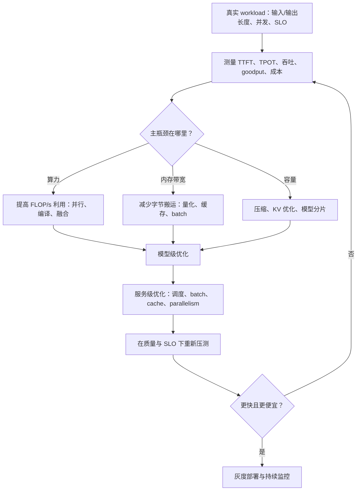
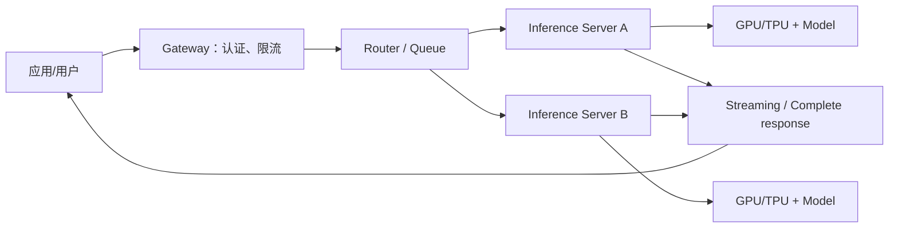
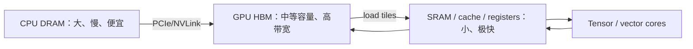
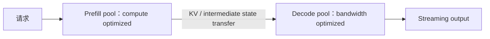

## 0. 学习目标与全章因果主线

前几章主要讨论怎样让模型回答得更好；第九章关注怎样让已经选定或训练好的模型**更快、更便宜地服务真实请求**。

Inference（推理）是给模型输入并计算输出的过程。推理优化不是单纯追求最高 tokens/s，而是在质量约束下，同时满足：

- 用户能接受的首 token 与完整响应延迟；
- 业务流量所需吞吐和并发；
- 单请求、单 token 和总体成本；
- 硬件内存、带宽、算力和功耗约束；
- 可用性、公平调度和尾延迟 SLO。

模型即使质量很高，如果股票次日预测要两天才算完，结果已经失去价值；如果单次预测成本高于业务收益，也无法成为产品。



本章按以下顺序展开：

1. 建立推理服务、瓶颈与 prefill/decode 的共同词汇；
2. 定义 latency、TTFT、TPOT、throughput、goodput、MFU、MBU；
3. 理解 accelerator 的算力、内存层级和功耗；
4. 做 model-level optimization：压缩、自回归解码、attention、kernel/compiler；
5. 做 service-level optimization：batch、prefill/decode 分离、prompt cache 与并行。

贯穿本章的五条原则：

- **先 profile，再优化。** 给 bandwidth-bound 工作负载继续堆 FLOP/s，可能几乎没有收益。
- **指标必须代表用户和成本。** 平均延迟、峰值吞吐和 `nvidia-smi` utilization 都可能制造错觉。
- **prefill 与 decode 是两种工作负载。** 前者偏 compute-bound，后者偏 bandwidth-bound，不能只报一个总延迟。
- **模型级优化可能改变行为。** 量化、剪枝、蒸馏和架构修改都要重新做质量与安全评价。
- **服务级优化不改数学模型，也不等于没有风险。** 调度、缓存、分片和流式输出会影响尾延迟、隔离、隐私和故障模式。

原书还给出模型提供商的经济约束。设训练总成本为 $C_{train}$，每次推理收费为 $p$，可售出 $N$ 次调用，商业上至少要满足：

$$
C_{train}\le pN.
$$

这只是回收训练成本的必要条件，尚未包含推理硬件、研发、网络、运营和利润。使用量越大，训练固定成本越容易摊薄；但第三方在开源模型上转售推理的成本结构不同。

---

## 1. Understanding Inference Optimization（理解推理优化）

### 1.1 Training 与 Inference

- **Training**：通过 forward + backward 更新参数，建立模型；
- **Inference**：只做 forward，用固定参数计算输出。

训练通常追求大规模吞吐，工作负载和 batch 更可预测；在线推理要处理到达时间、长度、模型和优先级均变化的请求，更关心用户延迟与动态资源调度。

推理优化可以发生在三个层级：

| 层级 | 改变什么 | 示例 | 是否可能改变输出 |
|---|---|---|---|
| Model | 权重、精度、结构或解码算法 | 量化、剪枝、蒸馏、GQA | 是 |
| Hardware | accelerator 与内存/互联 | GPU、TPU、Inferentia | 同一数值实现原则上否，但精度/kernel 可能影响 |
| Service | 请求调度和资源分配 | batching、cache、replica | 原则上否 |

生产优化通常跨层组合。比如 INT4 模型需要硬件原生低精度 kernel；continuous batching 需要配合 KV cache 内存管理。

---

## 2. Inference Overview（推理概览）

### 2.1 Inference Server 与 Inference Service

**Inference server** 是实际加载模型、占用 accelerator 并执行 forward 的组件。它负责：

- 模型权重加载与生命周期；
- tokenization 或模型输入；
- batch 和 decoding；
- KV cache 与显存；
- kernel 执行；
- 返回 token/结果。

**Inference service** 是更大的系统，还包括：

- API 接入、认证和配额；
- request preprocessing；
- model routing；
- queue、priority 和 admission control；
- 多 server 负载均衡；
- streaming；
- timeout、retry、监控和计费。



OpenAI、Google 等模型 API 本身就是 inference services。使用托管 API 时，用户不实现多数底层技术，但仍需理解指标、价格、batch/cache 行为和服务商质量差异。

### 2.2 优化就是找到控制总时间的瓶颈

系统包含算子执行、内存读写、设备间通信、排队和网络。总延迟不是各资源峰值规格的简单倒数，而是关键路径上最慢阶段加等待时间。

一个 kernel 的执行时间可以粗略下界为：

$$
T\ge\max\left(
\frac{F}{P_{peak}},
\frac{D}{B_{peak}}
\right),
$$

其中：

- $F$：所需浮点运算数（FLOPs）；
- $P_{peak}$：硬件峰值 FLOP/s；
- $D$：必须从较慢内存层搬运的 bytes；
- $B_{peak}$：峰值内存带宽。

第一项大，说明 compute 限制；第二项大，说明数据搬运限制。现实还要加通信、同步、launch 和排队，因此这是理想下界。

---

## 3. Computational Bottlenecks 与 Roofline

### 3.1 Compute-Bound

任务完成时间主要由算术运算量决定。例如密码穷举、大规模矩阵计算或 diffusion 多步去噪。

改进方向：

- 更高 FLOP/s 的芯片；
- 更多 accelerator 并行；
- 低精度 tensor core；
- 更高 MFU；
- 减少 FLOPs 的模型/算法；
- kernel fusion 与编译。

### 3.2 Memory Bandwidth-Bound

处理单元等待数据从 HBM、DRAM 或设备间互联搬入。LLM 自回归 decode 常每生成一个 token 都要读取大量权重，但 batch 小、单步运算少，因此 ALU 空闲、带宽成为瓶颈。

改进方向：

- 更高 HBM 带宽；
- 量化，减少每个权重 bytes；
- 提高 batch，让一次权重读取服务更多 token；
- cache 与 data reuse；
- operator fusion，减少中间张量读写；
- 更好的 memory layout/tiling。

### 3.3 “Memory-Bound”的术语歧义

有人用 memory-bound 表示 bandwidth 不足；也有人表示 capacity 不足（OOM）。二者不同：

- **capacity-bound**：模型/KV/activation 放不下；
- **bandwidth-bound**：放得下，但搬运太慢。

容量不足可通过 CPU offload 或多 GPU 分片解决，但会引入更多低带宽传输，最终又表现成带宽/通信延迟。因此讨论时应明确说 capacity 还是 bandwidth。

### 3.4 Arithmetic Intensity（算术强度）

定义：

$$
I=\frac{F}{D}
\quad\text{FLOPs/byte}.
$$

硬件的平衡点：

$$
I^*=\frac{P_{peak}}{B_{peak}}.
$$

Roofline 可达到的性能：

$$
P_{attainable}
\le\min(P_{peak},B_{peak}I).
$$

推导：

1. 算力上限直接给出 $P\le P_{peak}$；
2. 每秒最多搬 $B_{peak}$ bytes，每 byte 做 $I$ 次运算，所以 $P\le B_{peak}I$；
3. 两个上限同时成立，取较小者。

若 $I<I^*$：

$$B_{peak}I<P_{peak},$$

为 bandwidth-bound；若 $I>I^*$，为 compute-bound。$I=I^*$ 是屋顶斜线与水平线交点。

Roofline 通常使用 log-log 图。实际性能低于 roof 还可能来自并行度不足、shape 不友好、分支、通信和 kernel launch。

### 3.5 可运行示例：Roofline 分类

```python
"""根据 FLOPs、访存量与硬件峰值判断理想 Roofline 瓶颈。"""


def roofline(flops, bytes_moved, peak_flops_per_second, peak_bytes_per_second):
    intensity = flops / bytes_moved
    compute_time = flops / peak_flops_per_second
    memory_time = bytes_moved / peak_bytes_per_second
    attainable = min(
        peak_flops_per_second,
        peak_bytes_per_second * intensity,
    )
    bottleneck = "compute" if compute_time >= memory_time else "bandwidth"
    return intensity, compute_time, memory_time, attainable, bottleneck


hardware_peak = 100e12       # 100 TFLOP/s
hardware_bandwidth = 2e12    # 2 TB/s
workloads = {
    "prefill_like": (10e12, 100e9),
    "decode_like": (1e12, 100e9),
}

print("ROOFLINE")
print(f"ridge_point={hardware_peak / hardware_bandwidth:.1f} FLOPs/byte")
for name, (flops, bytes_moved) in workloads.items():
    intensity, compute_time, memory_time, attainable, bottleneck = roofline(
        flops, bytes_moved, hardware_peak, hardware_bandwidth
    )
    print(
        f"{name}: intensity={intensity:.1f} "
        f"compute_ms={compute_time * 1000:.1f} "
        f"memory_ms={memory_time * 1000:.1f} "
        f"attainable_tflops={attainable / 1e12:.1f} "
        f"bottleneck={bottleneck}"
    )
```

实际运行输出：

```text
ROOFLINE
ridge_point=50.0 FLOPs/byte
prefill_like: intensity=100.0 compute_ms=100.0 memory_ms=50.0 attainable_tflops=100.0 bottleneck=compute
decode_like: intensity=10.0 compute_ms=10.0 memory_ms=50.0 attainable_tflops=20.0 bottleneck=bandwidth
```

Prefill-like 强度 100，高于 ridge point 50，碰到算力屋顶；decode-like 强度 10，只能达到带宽斜顶的 20 TFLOP/s。示例忽略 kernel 和通信，只说明 Roofline 下界逻辑。

---

## 4. LLM Inference：Prefill 与 Decode

### 4.1 Prefill

给定输入 token $x_1,\ldots,x_S$，模型一次并行处理全部输入，建立每层初始 KV cache，并计算第一个输出 token 的分布。

矩阵较大、可并行 token 多，算术强度较高，因此通常 compute-bound。输入越长，prefill FLOPs 与 TTFT 越高；attention 的朴素计算还随 $S^2$ 增长。

### 4.2 Decode

之后逐个生成 $y_1,y_2,\ldots$：

$$
p(y_t\mid x_{1:S},y_{<t}).
$$

每一步只有新 token 的 query，但要使用大模型权重和历史 KV。小 batch 下每次读取大量 bytes、只产生一个 token，通常 bandwidth-bound。

### 4.3 为什么二者应分别优化

| 特征 | Prefill | Decode |
|---|---|---|
| token 处理 | 输入 token 并行 | 输出 token 串行 |
| 主要用户指标 | TTFT | TPOT/TBT |
| 常见瓶颈 | Compute | Memory bandwidth |
| 长度驱动 | Input length | Output length/active sequences |
| 优化偏好 | 强算力、大矩阵 | 高带宽、batch、低 bytes/weight |

生产中可将 prefill 与 decode 分配到不同机器，避免 compute-heavy prefill 干扰正在 decode 的请求；后文详述。

上下文长度、输出长度、batch 策略和 attention/KV 优化都会改变瓶颈。不能把“prefill 永远 compute-bound、decode 永远 bandwidth-bound”当作定理：大 batch decode 可能变成 compute-bound，长 context 的 attention/KV 搬运也可能影响 prefill。

---

## 5. Online、Batch 与 Streaming APIs

### 5.1 Online API

请求到达后尽快处理，优先低延迟。chatbot、代码补全和交互式 agent 通常使用 online API。

Online 仍可在几毫秒窗口内 batch，只要不破坏 SLO。它不是“每请求单独执行”的同义词。

### 5.2 Batch API

允许数小时级 turnaround，以换取更高吞吐和更低成本。原书写作时 Gemini 和 OpenAI batch API 约有 50% 价格折扣，但价格是时点事实，应查当前文档。

适合：

- 合成数据；
- 周期 Slack/社媒/工单报告；
- 新客户文档初始化；
- 模型迁移后的全量重处理；
- 大规模个性化推荐/Newsletter；
- 知识库重建索引。

Foundation-model batch API 与传统 ML batch inference 不同。传统推荐可在请求前预计算有限用户/商品的结果；开放 prompt 无法枚举，所谓 batch 通常仍在任务提交后离线排队，只是不保证低延迟。

### 5.3 Streaming

非流式等待完整 response；流式按 token/chunk 返回，降低用户看到首 token 的时间和感知等待。

代价：完整答案尚未生成，无法在展示前做全响应 factuality、安全或格式评分。可做 token-level guardrail、buffer 一小段、事后撤回，但用户可能已经看到有害内容。

Streaming 不降低模型完成全部输出的总计算，主要改善 perceived latency。

---

## 6. Inference Performance Metrics（推理性能指标）

### 6.1 End-to-End Latency

从用户发送请求到收到完整响应：

$$
T_{e2e}
=T_{network,in}+T_{queue}+T_{preprocess}
+T_{prefill}+T_{decode}+T_{postprocess}
+T_{network,out}.
$$

模型服务内部 latency 不等于用户观察 latency。排队、网关、工具调用和网络可能主导尾延迟。

### 6.2 Time to First Token（TTFT）

从请求发出到第一个可见 output token：

$$
TTFT\approx
T_{network}+T_{queue}+T_{preprocess}+T_{prefill}.
$$

对聊天应接近即时；长文摘要用户可能容忍更久。TTFT 通常随 input length 增长。

Agent/CoT 中模型可能先生成隐藏计划、调用工具，再发布最终答案。模型内部第一个 token 很早，用户第一个可见 token 很晚。因此可用 **time to publish** 明确测量第一个用户可见 token。

### 6.3 Time Per Output Token（TPOT）与 TBT/ITL

第一个 token 后的平均生成时间：

$$
TPOT
=\frac{T_{last}-T_{first}}
{N_{out}-1},
\qquad N_{out}>1.
$$

原书使用近似总延迟：

$$
T_{generation}\approx TTFT+TPOT\times N_{out}.
$$

若严格定义 TTFT 已包含第一个 token，后续只有 $N_{out}-1$ 个间隔，更精确是：

$$
T_{generation}
=TTFT+\sum_{i=2}^{N_{out}}TBT_i
\approx TTFT+(N_{out}-1)TPOT.
$$

书中公式是便于估算的约定；报告时必须说明 TPOT 是否按全部 output token 还是 token 间隔计算。

100 ms/token 时，1000 token 约需 100 秒 decode。极快读者约 120 ms/token，因此 streaming 中 6–8 tokens/s 常已能跟上阅读；代码生成、agent 和机器消费输出可能需要更快。

### 6.4 Percentiles，不只看平均

样本 $x_{(1)}\le\cdots\le x_{(n)}$ 排序后，经验 $p$ 分位数有多种插值定义。最简单 nearest-rank：

$$
Q_p=x_{(\lceil pn\rceil)}.
$$

p50 是 median，p90/p95/p99 描述尾部。平均会被少数网络错误、长 prompt 或冷启动拉高；只看 p50 又会掩盖最慢用户。应按 input/output length、batch、cache hit、模型、区域和状态切片。

### 6.5 Throughput

输出 token throughput：

$$
\text{output TPS}
=\frac{\sum_r N_{out,r}}{\Delta t}.
$$

输入与输出 token 应分开，因为 prefill/decode 特性不同。还可报：

- TPS/user；
- completed requests/s（RPS）；
- completed requests/min（RPM）；
- concurrency 下的吞吐曲线。

不同 tokenizer 的 token 粒度不同，跨模型 TPS 不完全可比；cost/request、characters/s 或 task/s 可补充。

### 6.6 Throughput 到成本的推导

硬件每小时成本 $C_h$，输出吞吐 $q$ tokens/s。每小时生成 $3600q$ token：

$$
C_{1M,out}
=\frac{C_h}{3600q}\times10^6.
$$

若 $C_h=2$ 美元/小时、$q=100$：

$$
C_{1M,out}
=\frac{2}{360000}\times10^6
\approx5.56\text{ 美元}.
$$

平均每请求 200 output token，1000 请求需 200000 token：

$$5.56\times0.2\approx1.11\text{ 美元}.$$

若 prefill 吞吐为 100 requests/min，则一小时 6000 请求，1000 请求成本：

$$
C_{1000,prefill}=2\times\frac{1000}{6000}
\approx0.33\text{ 美元}.
$$

总计约 1.44 美元/1000 请求。它只计 accelerator 时间，不含空闲、网络、CPU、存储、冗余和工程成本。

### 6.7 Latency/Throughput Trade-Off

Batch 增大能让一次权重加载服务更多请求，提高 throughput；但请求为等 batch 或 GPU 空闲会增加 queue/TTFT，活跃序列竞争也可能提高 TPOT。

LinkedIn 团队观察到，接受更差 TTFT/TPOT 时吞吐可能翻 2–3 倍。这是具体 workload 经验，不是普遍比例。

### 6.8 Goodput

Throughput 只统计完成数量，不管是否满足 SLO。定义请求 $r$ 的合格指示：

$$
I_r=\mathbb 1[
TTFT_r\le a
\land TPOT_r\le b
\land \text{其他 SLO}
].
$$

Goodput：

$$
G=\frac{\sum_r I_r}{\Delta t}.
$$

若每分钟完成 100 个请求，只有 30 个满足 `TTFT <= 200 ms` 且 `TPOT <= 100 ms`，throughput=100 RPM，goodput=30 RPM。

Goodput 比峰值吞吐更接近产品目标，但 SLO 必须合理，并按请求类别设置；长文摘要与短聊天不能共用同一 TTFT 阈值。

### 6.9 可运行示例：延迟、分位数、吞吐、Goodput 与成本

```python
"""从一组请求记录计算用户指标；仅使用 Python 标准库。"""
import math


REQUESTS = [
    {"ttft_ms": 100, "tpot_ms": 80, "output_tokens": 100},
    {"ttft_ms": 180, "tpot_ms": 95, "output_tokens": 200},
    {"ttft_ms": 250, "tpot_ms": 90, "output_tokens": 150},
    {"ttft_ms": 120, "tpot_ms": 130, "output_tokens": 50},
    {"ttft_ms": 3000, "tpot_ms": 70, "output_tokens": 100},
]
WINDOW_SECONDS = 60


def nearest_rank(values, percentile):
    ordered = sorted(values)
    rank = max(1, math.ceil(percentile * len(ordered)))
    return ordered[rank - 1]


ttfts = [request["ttft_ms"] for request in REQUESTS]
total_output_tokens = sum(request["output_tokens"] for request in REQUESTS)
qualified = [
    request
    for request in REQUESTS
    if request["ttft_ms"] <= 200 and request["tpot_ms"] <= 100
]

throughput_rpm = len(REQUESTS) / WINDOW_SECONDS * 60
goodput_rpm = len(qualified) / WINDOW_SECONDS * 60
output_tps = total_output_tokens / WINDOW_SECONDS
hourly_cost = 2.0
cost_per_million = hourly_cost / (3600 * output_tps) * 1_000_000

print("LATENCY")
print(f"mean_ttft_ms={sum(ttfts) / len(ttfts):.1f}")
print(f"p50_ttft_ms={nearest_rank(ttfts, 0.50)}")
print(f"p80_ttft_ms={nearest_rank(ttfts, 0.80)}")
print("\nSERVICE")
print(f"throughput_rpm={throughput_rpm:.1f}")
print(f"goodput_rpm={goodput_rpm:.1f}")
print(f"output_tps={output_tps:.1f}")
print(f"cost_per_million_output_tokens=${cost_per_million:.2f}")
```

实际运行输出：

```text
LATENCY
mean_ttft_ms=730.0
p50_ttft_ms=180
p80_ttft_ms=250

SERVICE
throughput_rpm=5.0
goodput_rpm=2.0
output_tps=10.0
cost_per_million_output_tokens=$55.56
```

3000 ms outlier 把 mean 拉到 730 ms，而 median 只有 180 ms；5 个请求中只有前两个同时满足 SLO。窗口吞吐很低，所以按满时计费的单位成本高。

---

## 7. Utilization、MFU 与 MBU

### 7.1 `nvidia-smi` GPU Utilization 的局限

它主要表示采样窗口内 GPU 有 kernel 活跃的时间比例。100% active 不代表全部算力被使用：一块每秒能做 100 次运算的假想 GPU，即使持续每秒只做 1 次，也可显示活跃。

它适合发现 GPU 完全空闲，不适合单独衡量计算效率。

### 7.2 Model FLOP/s Utilization（MFU）

严格写法：

$$
MFU
=\frac{P_{model,observed}}
{P_{hardware,peak}}.
$$

若知道每 token 理论模型 FLOPs 为 $F_{token}$、吞吐为 $q$：

$$
P_{model,observed}=F_{token}q,
$$

$$
MFU=\frac{F_{token}q}{P_{peak}}.
$$

原书用“峰值时理论 100 tokens/s，实际 20”直观定义为 20%。跨精度比较时峰值 FLOP/s 和理论 token FLOPs 必须使用一致口径。

Prefill 的 MFU 通常高于 decode；训练 workload 更规则，MFU 通常高于在线推理。原书称训练 MFU 超过 50% 常被认为不错，并列出 GPT-3 21.3%、Gopher 32.5%、Megatron-Turing 30.2%、PaLM 46.2% 等历史结果。

峰值规格可能只在稀疏矩阵、特定 shape/precision 下成立，因此低 MFU 可能同时反映 denominator 不现实。

### 7.3 Model Bandwidth Utilization（MBU）

对小 batch decode，假设每 token 读取一次全部权重，权重流量近似：

$$
D_{per\ token}=Nb_w,
$$

$N$ 是参数数，$b_w$ 是每参数 bytes。吞吐 $q$ tokens/s 时：

$$
B_{observed}\approx Nb_wq,
$$

$$
MBU\approx\frac{Nb_wq}{B_{peak}}.
$$

7B FP16、100 token/s：

$$
7\times10^9\times2\times100
=1.4\times10^{12}\text{ bytes/s}
=1.4\text{ TB/s}.
$$

原书中间行写成 `700 GB/s`，与 7B × 2 × 100 的算术不符；若硬件峰值 2 TB/s，正确简化 MBU 是：

$$
MBU\approx\frac{1.4}{2}=70\%.
$$

原书最终 70% 与正确流量相符，说明 `700 GB/s` 是笔误。

这个估算忽略 KV cache、activation、cache hit、权重共享、batch reuse 和通信。应优先使用 profiler 的 achieved bandwidth。

### 7.4 MFU/MBU 如何解释

- compute-bound：常见高 MFU、低 MBU；
- bandwidth-bound：常见低 MFU、高 MBU；
- 并发提高后，decode 矩阵更大，MBU 可能下降而 MFU 上升，瓶颈从带宽转算力。

高利用率不是最终目标。更贵芯片即使 utilization 更高，如果 latency 和 cost 都更差，仍不是更好方案。比较必须固定 model、precision、input/output 分布和 SLO。

### 7.5 可运行示例：MFU 与 MBU

```python
"""演示 MFU/MBU 的简化估算，并暴露 bytes 单位。"""


parameter_count = 7_000_000_000
bytes_per_parameter = 2
tokens_per_second = 100
peak_bandwidth_bytes_per_second = 2_000_000_000_000

bytes_per_token = parameter_count * bytes_per_parameter
observed_bandwidth = bytes_per_token * tokens_per_second
mbu = observed_bandwidth / peak_bandwidth_bytes_per_second

model_flops_per_token = 140_000_000_000
peak_flops_per_second = 100_000_000_000_000
observed_flops = model_flops_per_token * tokens_per_second
mfu = observed_flops / peak_flops_per_second

print("UTILIZATION")
print(f"weight_bytes_per_token={bytes_per_token / 1e9:.1f}GB")
print(f"observed_bandwidth={observed_bandwidth / 1e12:.1f}TB/s")
print(f"mbu={mbu:.1%}")
print(f"observed_compute={observed_flops / 1e12:.1f}TFLOP/s")
print(f"mfu={mfu:.1%}")
```

实际运行输出：

```text
UTILIZATION
weight_bytes_per_token=14.0GB
observed_bandwidth=1.4TB/s
mbu=70.0%
observed_compute=14.0TFLOP/s
mfu=14.0%
```

同一 workload 的 MBU 70%、MFU 14%，符合小 batch decode 偏带宽瓶颈的直觉。每 token 140B FLOPs 是教学假设，实际依模型结构和 context 变化。

---

## 8. AI Accelerators（AI 加速器）

软件能多快、多便宜，受硬件上限决定。模型与硬件一直共同演进：算力不足是早期神经网络研究停滞的因素之一；AlexNet 在 2012 年用少量 GPU 取代过去需要大量 CPU 的训练方式，降低了深度学习实验门槛。

### 8.1 什么是 Accelerator

Accelerator 是为特定计算 workload 设计的芯片。AI accelerator 针对矩阵乘法、卷积、attention 和低精度 tensor 运算。

CPU 与 GPU 的设计取舍：

| 特征 | CPU | GPU/AI accelerator |
|---|---|---|
| Core | 少量强 core | 大量较小 core |
| 擅长 | 分支、I/O、OS、串行逻辑 | 数据并行、矩阵/tensor |
| 延迟取向 | 单线程响应 | 总吞吐与并行 |
| 内存 | 大容量 DDR | 高带宽 HBM + 小 SRAM |
| 编程 | 通用、成熟 | 需 kernel、并行与内存布局 |

矩阵乘法可把输出元素分给大量 core 独立累加，因而适合 GPU。研究估计 matmul 占许多神经网络浮点运算的 90% 以上，但比例取决于架构与 kernel。

GPU 之外还有 Google TPU、Intel Habana Gaudi、Graphcore IPU、Groq LPU、Cerebras wafer-scale 芯片、AMD GPU 等。名称不是性能保证，应以目标 workload 实测。

### 8.2 为什么出现 inference-specialized chips

生产系统的累计 inference 成本可能超过一次训练，某些部署中推理占 ML 成本最高可达约 90%。训练与推理需求不同：

- 训练需要 backward、optimizer state 和更高数值稳定性；
- 训练偏高 throughput、大容量；
- 在线推理偏低 latency、高带宽和低精度；
- edge inference 还要求低功耗、离线和隐私。

因此出现 Apple Neural Engine、AWS Inferentia、Meta MTIA、Google Edge TPU、NVIDIA Jetson 等。芯片也可针对 Transformer 或特定算子设计；反过来，模型架构也会迎合硬件原语。

### 8.3 Compute Primitives

硬件可包含：

- scalar unit；
- vector/SIMD unit；
- matrix/tensor core；
- specialized reduction/activation unit。

现代 GPU 除 vector core 外还有 tensor core；TPU 以 systolic matrix/tensor 运算为中心。模型 shape、layout 和 dtype 若无法命中专用单元，峰值规格就没有意义。

---

## 9. Accelerator Characteristics（加速器关键指标）

### 9.1 Computational Capability：FLOP/s

FLOP/s 表示每秒浮点操作数。注意：

- FLOP 是 operation count；
- FLOP/s 是 rate；
- FLOPS 常被厂商当作 FLOP/s 的缩写；
- 峰值只在特定 dtype、稀疏性和 shape 下成立。

同一芯片低精度吞吐通常更高。原书列出 NVIDIA H100 SXM tensor-core、带 sparsity 的峰值：

| Precision | Peak teraFLOP/s（表中口径） |
|---|---:|
| TF32 | 989 |
| BF16 | 1979 |
| FP16 | 1979 |
| FP8 | 3958 |

这些数字不能直接解释为任意模型实际速度：稀疏条件、tensor core 使用、矩阵 shape、频率和功耗都会改变 achieved FLOP/s。

低 bit 运算并非严格按 bit 数成反比。硬件为某 dtype 配置的执行单元数量不同；cast、dequantization 和 accumulator 精度也有成本。

### 9.2 Memory Capacity 与 Bandwidth

Accelerator 通常接触三级内存：

#### CPU DRAM

- 容量大，约几十 GB 到 TB；
- 典型带宽约 25–50 GB/s（原书数量级）；
- 远离 GPU；通过 PCIe/互联搬运慢；
- 适合 offload、数据准备和冷数据。

#### GPU HBM

- 靠近 GPU；
- 典型约 256 GB/s 到 1.5+ TB/s，现代高端产品可更高；
- 容量远小于 host memory；
- 保存热权重、KV、activation。

#### On-Chip SRAM / Cache / Registers

- L1/L2、shared memory、register file；
- 带宽可超过 10 TB/s；
- 容量通常只有 MB 级；
- kernel tiling 尽量让数据在这里复用。



很多优化本质是减少 HBM 往返：tiling 把小块留在 SRAM，fusion 避免中间结果写回，cache 重用 KV/prefix。

PyTorch/TensorFlow 高层 API 不给所有内存访问的细粒度控制，因此 CUDA、Triton、ROCm 等 kernel 编程变得重要。

### 9.3 Capacity Feasibility

只有权重时：

$$
M_{weights}=Nb_w.
$$

服务还需：

$$
M_{total}
=M_{weights}+M_{KV}+M_{activations}
+M_{workspace}+M_{runtime}.
$$

$M_{activations}$ 尤其影响长 prefill 和大 batch；$M_{workspace}$ 指 kernel/编译器临时 buffer，$M_{runtime}$ 包括框架、通信和 allocator 开销，三者不应重复计算。

若 $M_{total}>M_{device}$，单卡不可行，需要量化、缩 batch/context、offload 或 model parallelism。标称 80 GB 不表示可把 80 GB 文件完全塞满：runtime、通信和内存碎片都需余量。

### 9.4 Power Consumption 与 TDP

晶体管切换消耗能量并产生热，冷却又耗电。原书给出的 H100 数量级：满载一年约 7000 kWh，而美国家庭年均约 10000 kWh。

若功率 $P$ watts、运行 $t$ 小时：

$$
E_{kWh}=\frac{Pt}{1000}.
$$

连续一年 $t=8760$。800 W 芯片理论设备能耗：

$$
E=\frac{800\times8760}{1000}
=7008\text{ kWh}.
$$

数据中心实际还要乘 PUE（Power Usage Effectiveness）：

$$
E_{facility}=PUE\times E_{IT}.
$$

PUE 包含冷却和供电损耗。例如 PUE=1.2 时设施消耗约 8410 kWh。

规格中的：

- **maximum power draw**：满载可能达到的峰值；
- **TDP**：典型 workload 下散热系统设计目标，不是精确电表读数。

原书给出 CPU/GPU 最大功率可能约为 TDP 的 1.1–1.5 倍，但具体架构和 workload 差异很大。云用户不管理冷却，费用和碳排仍受到它影响。

### 9.5 Selecting Accelerators

三个核心问题：

1. **能运行吗？** 权重、KV、batch 是否放得下，dtype/kernel 是否支持；
2. **多快？** TTFT、TPOT、goodput 和实际 MFU/MBU；
3. **多贵？** 按请求/token 的总拥有成本和功耗。

Compute-bound workload 优先 FLOP/s；bandwidth-bound 优先 HBM bandwidth；长 context/high concurrency 还要大容量。不要用单一峰值指标选卡。

购买硬件的成本可近似摊销：

$$
C_{hour}
=\frac{C_{purchase}}{L_{hours}}
+C_{power/hour}
+C_{facility/hour}
+C_{ops/hour}.
$$

云价格已把这些折入租金，但还要计空闲率和最小租用粒度。

### 9.6 可运行示例：容量、Roofline 时间与能耗

```python
"""比较两个候选加速器对同一简化推理 workload 的可行性。"""


ACCELERATORS = {
    "compute_heavy": {
        "peak_tflops": 200,
        "bandwidth_tb_s": 1.5,
        "memory_gb": 80,
        "power_w": 700,
    },
    "bandwidth_heavy": {
        "peak_tflops": 120,
        "bandwidth_tb_s": 3.0,
        "memory_gb": 96,
        "power_w": 600,
    },
}

work_flops = 20e12
bytes_moved = 60e9
required_memory_gb = 72

print("ACCELERATOR_COMPARISON")
for name, specs in ACCELERATORS.items():
    compute_ms = work_flops / (specs["peak_tflops"] * 1e12) * 1000
    memory_ms = bytes_moved / (specs["bandwidth_tb_s"] * 1e12) * 1000
    lower_bound_ms = max(compute_ms, memory_ms)
    fits = required_memory_gb <= specs["memory_gb"]
    annual_kwh = specs["power_w"] * 8760 / 1000
    print(
        f"{name}: fits={fits} compute_ms={compute_ms:.1f} "
        f"memory_ms={memory_ms:.1f} lower_bound_ms={lower_bound_ms:.1f} "
        f"annual_kwh={annual_kwh:.0f}"
    )
```

实际运行输出：

```text
ACCELERATOR_COMPARISON
compute_heavy: fits=True compute_ms=100.0 memory_ms=40.0 lower_bound_ms=100.0 annual_kwh=6132
bandwidth_heavy: fits=True compute_ms=166.7 memory_ms=20.0 lower_bound_ms=166.7 annual_kwh=5256
```

该 workload 的算力时间更大，因此 200 TFLOP/s 设备下界更低；若显著提高 bytes/FLOP，带宽型设备才可能领先。真实选择还要用 achieved 性能、云价格、互联和软件生态。

---

## 10. Inference Optimization（推理优化总览）

### 10.1 Model Optimization（模型级优化）

三个层级可类比射箭：

- model-level：制造更轻、更合适的箭；
- hardware-level：更强、更快的射手；
- service-level：安排弓、场地、排队和射击流程。

理想优化不改变质量，但现实中量化、蒸馏、剪枝、attention 架构和近似 kernel 都可能改变输出。原书展示同一 Llama 模型经不同服务商优化后，benchmark 有轻微差异。因此任何“lossless”之外的优化都要重新评估目标、通用、安全和数值稳定性。

当前 Transformer 自回归模型的三个资源问题：

1. model size：权重大、加载和搬运贵；
2. autoregressive decoding：token 间串行；
3. attention：长 context 的计算和 KV cache 大。

---

## 11. Model Compression（模型压缩）

### 11.1 Quantization

把 FP32/FP16 权重、activation 或 KV 降到更少 bit，减少容量和带宽，并在有对应 kernel 时提高吞吐。第七章已推导 scale/zero point 与误差。

Weight-only quantization 最常用，因为：

- 权重静态，易离线校准；
- 直接减少 decode 每步读取 bytes；
- 多种模型可开箱使用；
- 不要求重新训练。

FP32 到 FP16 理论权重减半；INT4 相对 FP16 再约减 4 倍。极限不能低于每二值状态 1 bit，且低 bit 的 scale、metadata 和 packing 仍有开销。

### 11.2 Distillation

大 teacher 产生 hard sequence 或 soft probability，训练小 student 模仿。它能产生真正 dense 小模型，直接减少权重、FLOPs 和服务成本；代价是训练数据、teacher 调用和能力损失。

对窄任务，student 可接近 teacher；对开放长尾，表面风格可能保留而知识/推理退化。第八章已推导 distillation loss。

### 11.3 Pruning 的两种含义

#### Structured Pruning

删除完整 neuron、channel、attention head、layer 或 block，改变架构并减少参数：

$$
N' < N.
$$

Dense shape 仍规则，现有硬件容易加速。删除结构后通常需 finetune 恢复质量。

#### Unstructured Pruning

把不重要权重设为 0：

$$
W'_{ij}=m_{ij}W_{ij},
\qquad m_{ij}\in\{0,1\}.
$$

总坐标数不变，non-zero count 降低：

$$
\|W'\|_0 < \|W\|_0.
$$

若 sparse storage 只保存 nonzero 与索引，可减存储；若硬件/kernel 仍执行 dense matmul，零值不会自动带来速度。2:4 等结构化稀疏更易命中专用单元。

### 11.4 怎样判定“最不重要”

最简单 magnitude pruning 按 $|w_i|$ 小删除，但小权重可能与其他权重组合重要。二阶近似提供更严格直觉。

在局部最优 $\nabla\mathcal L\approx0$ 附近，把某参数变化 $\Delta w$ 对 loss 的影响 Taylor 展开：

$$
\Delta\mathcal L
\approx
\frac12\Delta w^\top H\Delta w,
$$

$H$ 是 Hessian。把 $w_i$ 设为 0 时 $\Delta w_i=-w_i$，忽略交叉项：

$$
\Delta\mathcal L_i
\approx\frac12H_{ii}w_i^2.
$$

重要性同时与幅值和局部曲率有关。完整 Hessian 对大模型太贵，实践用近似、梯度统计或校准数据。

研究曾在某些网络上删除 90% 以上 nonzero 权重而不损准确率，还可由剪枝发现更小架构；但实践不如量化常见，因为实现复杂、稀疏硬件支持有限、加速常低于理论。

### 11.5 压缩后的恢复与评价

流程通常是：

```text
baseline profile
  -> quantize/prune/distill
  -> calibration or finetuning
  -> task + safety regression
  -> target hardware benchmark
```

报告压缩率不够，还要报实际文件/显存、TTFT、TPOT、throughput、energy 和质量。一个稀疏 10 GB 模型可能比 dense 12 GB 模型更慢。

---

## 12. Overcoming the Autoregressive Decoding Bottleneck

自回归因子分解：

$$
p(y_{1:T}\mid x)
=\prod_{t=1}^{T}
p(y_t\mid x,y_{<t}).
$$

$y_t$ 依赖已生成 prefix，普通算法不能在知道 $y_t$ 前精确生成 $y_{t+1}$。如果每 token 100 ms，100 token 约 10 s。

原书写作时，作者观察到部分模型 API 的 output token 价格约为 input token 的 2–4 倍；比例会随供应商、模型和缓存定价变化，应查当前价格页。Anyscale 的特定实验中，一个 output token 对延迟的影响约等于 100 input tokens。它反映串行 decode 的昂贵，不是跨模型通用换算。

### 12.1 Speculative Decoding：高层算法

给定当前 prefix：

1. 快速 draft/proposal 模型连续提出 $K$ 个 token；
2. target 模型用一次并行 forward 验证这些位置；
3. 从左到右接受最长合法 prefix；
4. target 再产生一个校正/额外 token；
5. 以新 prefix 重复。

若全部拒绝，至少输出一个 target token；若全部接受，一轮最多推进 $K+1$ token。

关键收益来自：

- target 验证多个已知 token 类似 prefill，可并行；
- 序列中标点、空格、模板和常见代码等容易预测；
- decode bandwidth-bound 时有闲置 FLOPs 做验证。

若 target 已 compute-saturated，额外验证未必划算。

### 12.2 “Target agrees”不是精确采样定义

Greedy decoding 可比较 target argmax 与 draft token；但 sampling 要保持 target 分布 $p$，不能简单“相同就接受”。设 draft 分布 $q(z)$ 提议 token $z$。

接受概率：

$$
a(z)=\min\left(1,\frac{p(z)}{q(z)}\right).
$$

提议并接受后输出 $z$ 的概率：

$$
q(z)a(z)=\min(q(z),p(z)).
$$

总接受概率：

$$
A=\sum_z\min(p(z),q(z)).
$$

拒绝后，从 residual distribution 采样：

$$
r(z)=\frac{(p(z)-q(z))_+}{1-A},
$$

其中 $(u)_+=\max(u,0)$。最终输出 $z$ 的总概率：

$$
\begin{aligned}
P_{out}(z)
&=\min(p(z),q(z))+(1-A)r(z)\\
&=\min(p(z),q(z))+(p(z)-q(z))_+\\
&=p(z).
\end{aligned}
$$

所以在精确算法和相同采样参数下，speculative sampling 不改变 target 分布。多 token 版本逐位置应用此逻辑，并在首次拒绝处校正。

### 12.3 可运行示例：枚举证明分布不变

```python
"""枚举单步 speculative sampling 的接受质量与残差校正。"""


target = {"A": 0.50, "B": 0.30, "C": 0.20}
draft = {"A": 0.60, "B": 0.10, "C": 0.30}

accepted_mass = {
    token: min(target[token], draft[token]) for token in target
}
acceptance_rate = sum(accepted_mass.values())
rejection_rate = 1.0 - acceptance_rate
residual = {
    token: max(target[token] - draft[token], 0.0) / rejection_rate
    for token in target
}
output = {
    token: accepted_mass[token] + rejection_rate * residual[token]
    for token in target
}

print("SPECULATIVE_SAMPLING")
print(f"acceptance_rate={acceptance_rate:.2f}")
for token in target:
    print(
        f"token={token} accepted_mass={accepted_mass[token]:.2f} "
        f"residual={residual[token]:.2f} output={output[token]:.2f} "
        f"target={target[token]:.2f}"
    )
```

实际运行输出：

```text
SPECULATIVE_SAMPLING
acceptance_rate=0.80
token=A accepted_mass=0.50 residual=0.00 output=0.50 target=0.50
token=B accepted_mass=0.10 residual=1.00 output=0.30 target=0.30
token=C accepted_mass=0.20 residual=0.00 output=0.20 target=0.20
```

Draft 对 B 低估的 0.20 恰好成为拒绝后的 residual mass，最终恢复 target 分布。

### 12.4 Draft Model 与 $K$ 的取舍

- draft 太弱：acceptance 低，验证浪费；
- draft 太强：自身慢、占显存；
- $K$ 大：target 调用少，但更后面的 token 更易错；
- $K$ 小：接受率高，但并行收益小。

代码、模板和结构化文本 acceptance 通常较高。Draft 最好共享 tokenizer/vocabulary，避免 token 映射复杂，但理论上可不同架构。

DeepMind 为 Chinchilla-70B 训练 4B draft，draft 约 1.8 ms/token、target 14.1 ms/token，整体延迟降低一半以上且保持 target 分布；T5-XXL 也有类似结果。具体 speedup 依硬件、batch、$K$ 和 acceptance。

vLLM、TensorRT-LLM、llama.cpp 等已支持相关方案。

### 12.5 Inference with Reference

输出常大量复制输入：

- 文档问答引用原文；
- 修代码保留大部分代码；
- 多轮对话复述已有内容。

Reference decoding 不用 draft model，而从 input/context 找候选 span 作为 draft，再由 target 验证。最简单是当前输出 suffix 与 context span 匹配后继续复制。

优点：无需额外模型；缺点：只有 input-output overlap 高时有效，且必须快速找到相关 span。论文在相关任务中报告约 2 倍加速，不能外推到开放创作。

如果直接复制而不经 target 验证，输出可能偏离原模型，因此 lossless 方案仍需验证。

### 12.6 Parallel Decoding

尝试同时预测 $y_{t+1},\ldots,y_{t+K}$，打破严格串行。虽然不知道中间 token，已有 context 常足以猜测后续结构，例如 “the cat sits ... the”。猜测之后必须验证和修正。

#### Lookahead / Jacobi Decoding

1. 并行生成 $K$ 个未来 token；
2. 按上下文和相互一致性验证；
3. 只重算失败位置；
4. 迭代到固定点/可接受序列。

Jacobi 方法原本是并行更新方程各变量的迭代法。用于 decoding 时，一轮用上一轮的整组猜测更新多个位置，不保证一次正确，但可能并行收敛。

#### Medusa

冻结原模型，添加多个小 decoding heads。原 head 预测 $t+1$，第 $k$ 个额外 head 预测更远的 $t+k+1$。每个 head 给多个候选，组成树；target 用 tree attention 并行验证路径并选择最长可接受分支。

NVIDIA 在 HGX H200 上报告 Medusa 让 Llama 3.1 token generation 最高约 1.9 倍。它需要训练额外 heads 和复杂 tree verification，部署比普通 speculative decoding 难。

### 12.7 三类解码加速对比

| 方法 | 候选来源 | 是否额外模型/参数 | 适用条件 | 关键风险 |
|---|---|---|---|---|
| Speculative | 小 draft model | 是 | draft 与 target 一致度高 | acceptance 低 |
| Reference | input/context span | 否 | 输出大量复制输入 | overlap 低 |
| Parallel/Medusa | 并行 heads/迭代 | 可能 | 可预测结构、可训练 heads | 验证复杂 |

最终都依赖“便宜地产生多个候选，昂贵 target 并行验证”。

---

## 13. Attention Mechanism Optimization（注意力优化）

### 13.1 为什么需要 KV Cache

第 $t$ 个 decode token 的 self-attention 需要历史 $1,\ldots,t$ 的 key/value：

$$
K_{1:t}=X_{1:t}W_K,
\qquad
V_{1:t}=X_{1:t}W_V.
$$

生成 $t+1$ 时，历史 $K_{1:t},V_{1:t}$ 没变。若每步重算，会重复做历史 projection。KV cache 保存它们，只计算新 token：

$$
k_{t+1}=x_{t+1}W_K,
\qquad
v_{t+1}=x_{t+1}W_V,
$$

再 append 到 cache。

Cache 用容量换计算。训练时整条序列已知，可并行计算所有位置，通常不需要这种跨 decode step 的 persistent KV cache；训练仍需保存/重算 activation，这是另一类内存。

### 13.2 复杂度不是“指数增长”

原书正文说 attention computation 随序列长度“exponentially”，但脚注正确写为 $O(n^2)$；应以二次增长为准。

第 $t$ 步新 query 与约 $t$ 个历史 key 点积，成本 $O(td)$。生成 $n$ 个 token 的累计：

$$
\sum_{t=1}^{n}O(td)
=O\left(d\frac{n(n+1)}{2}\right)
=O(n^2d).
$$

KV cache 让历史 K/V projection 不重算，却没有消除新 query 对全部历史 key 的 attention。Cache 容量随保存 token 数线性：$O(n)$。

### 13.3 KV Cache 大小公式

每层、每 token 保存 key 和 value 两个向量。一般形式：

$$
M_{KV}
=2BSL H_{KV}b,
$$

其中：

- $B$：batch/并发序列数；
- $S$：每序列 cache token 数；
- $L$：Transformer 层数；
- $H_{KV}=n_{kv\ heads}d_{head}$：每层 key/value 总维度；
- $b$：每个值 bytes；
- 前面的 2 表示 K 和 V。

标准 MHA 中 $n_{kv\ heads}=n_{q\ heads}$，所以 $H_{KV}=H$（model hidden dimension），得到原书公式：

$$
M_{KV}=2BSLHb.
$$

Llama 2 13B：$B=32,S=2048,L=40,H=5120,b=2$：

$$
M_{KV}
=2\times32\times2048\times40\times5120\times2
=53.687\text{ GB},
$$

约 54 GB。它还不含权重、workspace 和 fragmentation。

500B+ MHA、batch 512、context 2048 的论文配置中，KV 可达 3 TB，甚至超过权重。长 context 和高并发下，KV 常是 batch 上限。

### 13.4 可运行示例：MHA/GQA/MQA KV 容量

```python
"""按 KV head 数计算 cache；使用十进制 GB。"""


def kv_cache_gb(batch, sequence, layers, kv_heads, head_dimension, bytes_per_value):
    byte_count = (
        2
        * batch
        * sequence
        * layers
        * kv_heads
        * head_dimension
        * bytes_per_value
    )
    return byte_count / 1_000_000_000


configuration = {
    "batch": 32,
    "sequence": 2048,
    "layers": 40,
    "head_dimension": 128,
    "bytes_per_value": 2,
}

print("KV_CACHE")
for attention_type, kv_heads in [("MHA", 40), ("GQA", 8), ("MQA", 1)]:
    memory = kv_cache_gb(kv_heads=kv_heads, **configuration)
    print(f"{attention_type}: kv_heads={kv_heads} memory_gb={memory:.3f}")
```

实际运行输出：

```text
KV_CACHE
MHA: kv_heads=40 memory_gb=53.687
GQA: kv_heads=8 memory_gb=10.737
MQA: kv_heads=1 memory_gb=1.342
```

从 40 个 KV heads 降到 8 个理论 cache 约减 5 倍；降到 1 个约减 40 倍。质量、训练方式和 kernel 会决定是否可直接获得这些收益。

---

## 14. Redesigning Attention（重设计注意力）

这些方法改变模型架构，通常要在训练或 finetuning 时使用，不能在任意 checkpoint 上无损打开。

### 14.1 Local Windowed Attention

每个 query 只看最近窗口 $w$：

$$
\operatorname{Attention}(q_t,K,V)
\rightarrow
\operatorname{Attention}
(q_t,K_{t-w+1:t},V_{t-w+1:t}).
$$

单步 attention 从 $O(t)$ 降到 $O(w)$；若旧 KV 可驱逐，cache 从 $O(S)$ 降到 $O(w)$。平均 10000 token、窗口 1000，局部 cache 理论约减 10 倍。

代价是无法直接访问窗口外事实。可穿插 global attention layer/token，让局部层捕获邻近关系、全局层传播长距离信息。

### 14.2 Multi-Query Attention（MQA）

MHA 每个 query head 有独立 K/V；MQA 让所有 query heads 共享一组 K/V：

$$
n_{kv}=1.
$$

KV cache 与 K/V 带宽大幅下降，可能损失一些表达能力。

### 14.3 Grouped-Query Attention（GQA）

把 $n_q$ 个 query heads 分组，每组共享 K/V：

$$
1<n_{kv}<n_q.
$$

三种配置关系应按 KV head 数表达：

$$
\begin{aligned}
\operatorname{MQA}:&\quad n_{kv}=1,\\
\operatorname{GQA}:&\quad 1<n_{kv}<n_q,\\
\operatorname{MHA}:&\quad n_{kv}=n_q.
\end{aligned}
$$

MQA 与 MHA 是 KV-sharing 配置的两个端点，不是集合包含关系；GQA 在 cache 与质量间折中，现代 LLM 常用。

### 14.4 Cross-Layer Attention

相邻层共享 K/V。若每 3 层共享一套，cache 理论约减 3 倍。层表征需求不同，共享过多可能损质量，需训练适配。

Character.AI 平均对话历史约 180 messages，KV 是主要 throughput 瓶颈。其 MQA、local/global interleaving 与 cross-layer attention 组合报告 cache 减少 20 倍以上，使大 batch 不再被容量限制。该结果依其模型架构。

---

## 15. Optimizing KV Cache Management

### 15.1 Fragmentation

请求长度未知且不同。若预先为每条分配最大连续 KV 区域，会产生：

- internal fragmentation：分配块内部未用；
- external fragmentation：空闲空间分散，无法满足大连续申请；
- 请求结束后回收困难；
- beam/prefix 间重复 cache。

### 15.2 PagedAttention

借鉴操作系统分页，把逻辑连续 KV 切成固定大小 blocks，物理上可不连续。每请求维护 block table：

```text
logical block 0 -> physical block 17
logical block 1 -> physical block 3
logical block 2 -> physical block 41
```

收益：

- 按需分配，减少预留浪费；
- 小 block 降低 fragmentation；
- finished request blocks 可立即回收；
- beam/prefix 可引用共享 blocks；
- 支持更大 continuous batch。

代价是 block-table lookup、管理 metadata 和专门 attention kernel。vLLM 因 PagedAttention 获得广泛采用。

### 15.3 KV Quantization

将 FP16/BF16 KV 降到 INT8/FP8/INT4：

$$
M'_{KV}\approx M_{KV}\frac{b'}{b}.
$$

FP16 到 INT8 理论减半。KV 是输入动态 activation，分布随层/token/head 变化，比静态权重量化难；outlier 和长序列误差会累积。

### 15.4 Adaptive Compression 与 Selective Cache

不是所有历史 token 同等重要。可：

- 按 attention/recency 保留重要 token；
- 合并相似 KV；
- 为不同层分配不同 budget；
- 驱逐低贡献 token；
- 对旧 token 用更低精度。

这些近似可能改变输出，不应与纯内存分页混为一谈。需在 long-context retrieval、needle、事实和安全任务上评价。

---

## 16. Attention Kernels 与 FlashAttention

### 16.1 标准 Attention

$$
S=\frac{QK^\top}{\sqrt d},
\qquad
P=\operatorname{softmax}(S),
\qquad
O=PV.
$$

朴素实现把 $S,P$ 的 $S_{len}\times S_{len}$ 中间矩阵写到 HBM，再读回来。即使 FLOPs 不变，大量 HBM I/O 成为瓶颈。

FlashAttention 通过 tiling 把 Q/K/V 小块放入 SRAM，融合 score、softmax 和 value aggregation，避免完整 attention matrix 落 HBM。它是 exact attention 的 I/O-aware 实现，不是 local/sparse 近似；算术复杂度仍近似 $O(S^2d)$，但内存访问显著降低。

### 16.2 Online Softmax 为什么能分块且精确

对一个 query row，scores $s_i$，目标：

$$
o=\frac{\sum_i e^{s_i}v_i}
{\sum_i e^{s_i}}.
$$

为数值稳定，维护当前最大值 $m$、归一化分母 $\ell$ 和未归一化加权和 $a$：

$$
m=\max_i s_i,
$$

$$
\ell=\sum_i e^{s_i-m},
\qquad
a=\sum_i e^{s_i-m}v_i.
$$

已有块状态 $(m,\ell,a)$，新块状态 $(m_b,\ell_b,a_b)$。合并最大值：

$$
m'=\max(m,m_b).
$$

旧块每项原为 $e^{s_i-m}$，换基准 $m'$：

$$
e^{s_i-m'}
=e^{m-m'}e^{s_i-m}.
$$

因此：

$$
\ell'
=e^{m-m'}\ell+e^{m_b-m'}\ell_b,
$$

$$
a'
=e^{m-m'}a+e^{m_b-m'}a_b.
$$

最终 $o=a'/\ell'$。这与一次性 softmax 完全相同，可逐块处理而不保存全部 scores。

### 16.3 可运行示例：分块 Online Softmax

```python
"""验证分块 online softmax 的加权输出等于朴素 softmax。"""
import math


scores = [1.0, 2.0, 3.0, 4.0]
values = [10.0, 20.0, 30.0, 40.0]


def naive_softmax_weighted(scores, values):
    maximum = max(scores)
    weights = [math.exp(score - maximum) for score in scores]
    return sum(weight * value for weight, value in zip(weights, values)) / sum(weights)


def block_state(block_scores, block_values):
    maximum = max(block_scores)
    weights = [math.exp(score - maximum) for score in block_scores]
    denominator = sum(weights)
    accumulator = sum(
        weight * value for weight, value in zip(weights, block_values)
    )
    return maximum, denominator, accumulator


def merge_states(left, right):
    left_max, left_denominator, left_accumulator = left
    right_max, right_denominator, right_accumulator = right
    merged_max = max(left_max, right_max)
    left_scale = math.exp(left_max - merged_max)
    right_scale = math.exp(right_max - merged_max)
    return (
        merged_max,
        left_scale * left_denominator + right_scale * right_denominator,
        left_scale * left_accumulator + right_scale * right_accumulator,
    )


first = block_state(scores[:2], values[:2])
second = block_state(scores[2:], values[2:])
_, denominator, accumulator = merge_states(first, second)
online = accumulator / denominator
naive = naive_softmax_weighted(scores, values)

print("ONLINE_SOFTMAX")
print(f"naive={naive:.6f}")
print(f"blockwise={online:.6f}")
print(f"match={math.isclose(naive, online, rel_tol=1e-12)}")
```

实际运行输出：

```text
ONLINE_SOFTMAX
naive=34.926527
blockwise=34.926527
match=True
```

分块结果与朴素计算一致。FlashAttention 还要处理矩阵 tiling、causal mask、反向和硬件调度，但 online softmax 是保持精确性的关键。

---

## 17. Kernels and Compilers（内核与编译器）

### 17.1 Kernel

Kernel 是针对特定 accelerator 优化、反复执行的低层算子，如 matmul、attention、convolution。编写需要理解：

- global/HBM、shared memory、cache、register；
- thread/block/warp；
- coalesced access；
- synchronization；
- dtype 和 tensor core shape。

常用 CUDA、Triton、ROCm。Kernel 与架构绑定：FlashAttention 最初主要面向 A100，FlashAttention-3 针对 H100 新能力优化。

### 17.2 四种常见 Kernel 优化

#### Vectorization

一次加载/计算多个连续元素，减少指令和 I/O 次数。要求 alignment、连续布局和可 vectorize 操作。

#### Parallelization

把 tensor 切成独立 chunks 给不同 core/thread。上限受数据依赖、同步和负载均衡影响。

#### Loop Tiling

把大矩阵分块，使工作集放入 cache/SRAM，重复使用后再写回。Tile shape 依硬件 cache、warp 和 tensor core；CPU 最优 tile 未必适合 GPU。

#### Operator Fusion

若 `y = activation(xW + b)` 分开执行，matmul 输出写 HBM，bias/activation 再读写。融合 kernel 在寄存器/SRAM 内完成，减少中间 tensor 往返：

$$
D_{fused}<D_{separate}.
$$

Fusion 可能增加 register pressure、降低 occupancy，且需要理解模型图，不能无限融合。

### 17.3 Lowering 与 Compiler

模型代码是高层计算图，硬件执行低层指令。Lowering 将算子逐层转换为目标硬件表示；compiler 在过程中做：

- graph capture；
- constant folding；
- dead-code elimination；
- layout/shape specialization；
- fusion；
- kernel selection/autotuning；
- memory planning；
- code generation。

Standalone/infra 包括 Apache TVM、MLIR；框架内包括 `torch.compile`、XLA/OpenXLA、TensorRT compiler。公司也会维护专有 kernels，形成成本优势。

动态 shape、Python side effects、data-dependent control flow 可能造成 graph break 或频繁 recompilation。Compiler warmup 时间也要计入部署和冷启动。

### 17.4 PyTorch 案例的正确解读

原书列出 PyTorch 对 Llama-7B/A100 80GB 的逐步优化：

1. `torch.compile`；
2. INT8 weight quantization；
3. INT4；
4. speculative decoding。

Throughput 逐步提高，但公开图未清楚说明每步对输出质量的影响。组合优化的增益也不一定可简单相乘，因为它们共享瓶颈：量化后 decode 可能从 bandwidth-bound 转 compute-bound，后续 kernel 收益会改变。

### 17.5 Benchmark Kernel/Compiler

必须包含：

- 正确性：容差、生成质量和 deterministic cases；
- shape：真实 batch、input/output length；
- dtype、sparsity 和 hardware revision；
- warmup 与 steady-state；
- compile time/cache hit；
- p50/p99，不只 microbenchmark；
- end-to-end，不只单 kernel；
- power 与显存。

单算子快 2 倍，若只占总延迟 10%，Amdahl 定律给端到端 speedup：

$$
S=\frac{1}
{(1-f)+f/s},
$$

$f=0.1,s=2$：

$$
S=\frac{1}{0.9+0.05}
\approx1.053.
$$

所以先 profile 热点，再写 kernel。

---

## 18. Inference Service Optimization（推理服务优化）

模型和硬件给定后，服务层面对动态请求分配 compute、memory、queue 和 cache，以优化 latency、goodput 与 cost。

服务级技术通常不改模型参数与采样定义，所以原则上不应改变质量；但以下情况仍可能有差异：

- floating-point reduction 顺序变化；
- cache/key/invalidation bug；
- timeout、truncation 或 overload fallback；
- streaming guardrail 时机；
- 不同 replica 模型版本不一致。

服务优化必须同时做 correctness、isolation 和 failure testing。

---

## 19. Batching（批处理）

一次 matmul 处理多个请求，可让同一权重块被多个输入复用，提高 arithmetic intensity 和 throughput。类比：每人一辆车延迟灵活，bus 承载更多人但有人要等车。

原书正文有一句 batching “reduce throughput”，结合上下文应为减少成本/提高 throughput。

### 19.1 Static Batching

固定收集 $B$ 个请求才执行：

```text
while batch not full:
    wait
run(batch)
```

优点：batch 满、设备利用稳定；缺点：低流量时第一个请求可能无限等最后一个，在线尾延迟不可控。更适合离线已知数据。

### 19.2 Dynamic Batching

设置 max batch $B_{max}$ 和等待窗口 $W$：

$$
t_{dispatch}
=\min(t_{full},t_{first}+W).
$$

Batch 满或窗口到期即发车。每请求 batching wait 满足：

$$
0\le T_{batch\ wait}\le W
$$

（不计更上游 queue）。$W$ 大提高平均 batch/throughput，却增加 TTFT；$W$ 小更低延迟但 batch 不满。

可按 input length bucket，减少 padding；按 model/adapter、sampling config 和 priority 分组。过细分组又会降低 batch formation rate。

### 19.3 Naive Batch 的 Head-of-Line Blocking

若 batch 内 A 输出 10 token、B 输出 1000 token，naive 实现等待全 batch 完成才返回，A 被 B 阻塞。即使 A 完成，其 slot 也可能 padding/idle 到 B 结束。

### 19.4 Continuous / In-Flight Batching

每个 decode iteration 后：

1. 返回已完成 sequences；
2. 回收其 KV blocks/slots；
3. 将新请求插入空 slot；
4. 对当前 active sequences 执行下一步。

短请求不等长请求，新请求无需等整个 batch 边界。Orca 推广 iteration-level scheduling，vLLM 等服务广泛使用。

挑战：

- active sequence 长度和 KV block 不同；
- 新 prefill 可能干扰 decode；
- sampling/adapter 不同；
- priority 与 starvation；
- 每轮调度 overhead。

### 19.5 可运行示例：Naive 与 Continuous

假设两个 decode slots、三个请求同时到达，所需 token steps 分别 A=2、B=5、C=1。每步每 active 请求生成一个 token。

```python
"""离散模拟：naive batch 等全批结束，continuous 完成即换入请求。"""
from collections import deque


REQUESTS = [("A", 2), ("B", 5), ("C", 1)]
SLOTS = 2


def naive_batch(requests, slots):
    completion = {}
    active_operations = 0
    clock = 0
    for start in range(0, len(requests), slots):
        batch = requests[start:start + slots]
        batch_steps = max(tokens for _, tokens in batch)
        active_operations += sum(tokens for _, tokens in batch)
        clock += batch_steps
        for name, _ in batch:
            completion[name] = clock
    capacity = clock * slots
    return completion, active_operations / capacity


def continuous_batch(requests, slots):
    waiting = deque(requests)
    active = []
    completion = {}
    active_operations = 0
    clock = 0

    while waiting and len(active) < slots:
        active.append(list(waiting.popleft()))

    while active:
        clock += 1
        for request in active:
            request[1] -= 1
            active_operations += 1

        unfinished = []
        for name, remaining in active:
            if remaining == 0:
                completion[name] = clock
            else:
                unfinished.append([name, remaining])
        active = unfinished

        while waiting and len(active) < slots:
            active.append(list(waiting.popleft()))

    capacity = clock * slots
    return completion, active_operations / capacity


naive_completion, naive_utilization = naive_batch(REQUESTS, SLOTS)
continuous_completion, continuous_utilization = continuous_batch(REQUESTS, SLOTS)

print("BATCHING")
print(f"naive_completion={naive_completion}")
print(f"naive_slot_utilization={naive_utilization:.1%}")
print(f"continuous_completion={continuous_completion}")
print(f"continuous_slot_utilization={continuous_utilization:.1%}")
```

实际运行输出：

```text
BATCHING
naive_completion={'A': 5, 'B': 5, 'C': 6}
naive_slot_utilization=66.7%
continuous_completion={'A': 2, 'C': 3, 'B': 5}
continuous_slot_utilization=80.0%
```

Continuous 让 A 在第 2 步返回、C 在第 3 步返回，总 makespan 从 6 降到 5。真实服务的 prefill、KV 和 scheduler overhead 会降低理想收益。

---

## 20. Decoupling Prefill and Decode（分离预填充与解码）

同一 GPU 上 prefill 大矩阵会占用 compute，打断已有 decode iterations，使其 TPOT 抖动；decode 又占 HBM/KV 容量，限制 prefill batch。

Disaggregated serving：



### 20.1 为什么可能提高 Goodput

- prefill pool 独立 batch 长 prompts；
- decode pool 保持稳定 iteration cadence；
- 两池分别 autoscale；
- 可选不同硬件与并行度；
- TTFT/TPOT SLO 可分别调优。

DistServe、Inference Without Interference 在多个模型/workload 上展示更高 SLO-attaining request volume。

### 20.2 新成本：KV Transfer

Prefill 产生每层 KV，要传给 decode instance：

$$
T_{transfer}
\ge\frac{M_{KV,prompt}}{B_{link}}.
$$

长 prompt KV 大，跨节点 Ethernet 可能抵消收益。节点内 NVLink/高带宽 fabric、拓扑感知调度、KV 压缩和重叠传输很重要。

服务还要处理失败恢复：prefill 完成但 decode 节点失败时，KV 是否重传或重算。

### 20.3 Capacity Ratio

Prefill/decode instance 比依 workload：

- 长 input、低 TTFT 优先：原书给出 2:1 到 4:1 的经验例；
- 短 input、低 TPOT 优先：1:2 到 1:1。

这些不是固定配置。可由 token 流量估算初始需求：

$$
R_{prefill}\propto\lambda E[S_{in}]C_{prefill},
$$

$$
R_{decode}\propto\lambda E[S_{out}]C_{decode},
$$

$\lambda$ 是请求率，$C$ 是每 token 资源成本。最终用 queue、SLO 和 transfer profile 校准。

---

## 21. Prompt Caching（提示缓存）

多个请求常共享 prefix：system prompt、few-shot、同一本书/代码库、多轮历史。Prefix/context cache 保存该 prefix 的 prefill 结果（通常 KV blocks），后续只处理新增 suffix。

### 21.1 节省量

共享 prefix 长 $S_p$，共 $N$ 次请求。无 cache 处理：

$$
N S_p\text{ tokens}.
$$

假设首请求建立 cache，后续全命中：

$$
S_p\text{ tokens}.
$$

节省：

$$
(N-1)S_p.
$$

1000-token system prompt、每天 100 万调用，约省：

$$
(10^6-1)\times1000
\approx10^9\text{ input tokens/day}.
$$

### 21.2 Cache Key 与命中

通常要求 tokenized prefix 精确相同，并包含：

- model/tokenizer revision；
- adapter；
- system/tools/schema；
- position/attention settings；
- tenant/security scope。

空格、tool 顺序或模型版本变化都可 miss。不要把 response cache 与 prefix cache 混淆：前者复用最终答案，后者只复用计算，用户 suffix 仍由模型生成。

### 21.3 成本与风险

- KV cache 占显存/存储；
- cache lookup、eviction、TTL；
- stale system prompt/knowledge；
- 跨租户泄漏；
- 共享 prefix 引用计数与回收；
- cache warming 和 cold start。

Prompt cache 可能将敏感对话 KV 保留更久。必须 tenant-isolated、加密/访问控制，并遵循删除期限。

### 21.4 原书时点案例

写作时 Gemini cached input 折扣约 75%，另收约 1 美元/百万 token/小时存储；Anthropic 宣称最高约 90% 成本、75% 延迟降低。其案例：

| Use case | 无 cache TTFT | 有 cache TTFT | 成本降低 |
|---|---:|---:|---:|
| 100K-token book chat | 11.5 s | 2.4 s（-79%） | 90% |
| 10K-token many-shot | 1.6 s | 1.1 s（-31%） | 86% |
| 10-turn + 长 system | ~10 s | ~2.5 s（-75%） | 53% |

价格、折扣和实现会变化，应查当前文档。Cache 对短、不重复 prompt 收益小。

### 21.5 可运行示例：Token 与费用节省

```python
"""计算共享 prefix 在理想命中下的输入 token 与费用。"""


prefix_tokens = 1_000
request_count = 1_000_000
regular_price_per_million = 3.00
cached_discount = 0.75

without_cache_tokens = prefix_tokens * request_count
with_cache_regular_tokens = prefix_tokens
with_cache_discounted_tokens = prefix_tokens * (request_count - 1)

without_cache_cost = (
    without_cache_tokens / 1_000_000 * regular_price_per_million
)
cached_price = regular_price_per_million * (1.0 - cached_discount)
with_cache_cost = (
    with_cache_regular_tokens / 1_000_000 * regular_price_per_million
    + with_cache_discounted_tokens / 1_000_000 * cached_price
)

print("PROMPT_CACHE")
print(f"tokens_reused={with_cache_discounted_tokens:,}")
print(f"without_cache_cost=${without_cache_cost:,.2f}")
print(f"with_cache_cost=${with_cache_cost:,.2f}")
print(f"cost_reduction={1.0 - with_cache_cost / without_cache_cost:.1%}")
```

实际运行输出：

```text
PROMPT_CACHE
tokens_reused=999,999,000
without_cache_cost=$3,000.00
with_cache_cost=$750.00
cost_reduction=75.0%
```

这里按 cached tokens 仍收费 25% 计算，且忽略存储费和 suffix。首个 1000 token 的常规费被四舍五入隐藏在两位美元输出中。

---

## 22. Parallelism（并行策略）

并行是 accelerator 和高性能服务的基础。策略可组合，但每种都引入通信、同步和调度。

### 22.1 Replica Parallelism

创建完整模型副本，每个 replica 服务不同请求。训练中同类思想称 data parallelism。

优点：

- 实现简单；
- 线性扩展独立请求吞吐（理想时）；
- 降低每 replica queue，改善 latency/goodput；
- 故障隔离。

缺点：每副本存完整权重，不能让单个放不下的模型变可行；低流量会空闲。

模型与异构 GPU 放置是 bin-packing。8B、13B、34B、70B INT8 约需至少 8、13、34、70 GB 权重，还要 KV/runtime。把三个 13B 放 40 GB 卡几乎没有运行余量，不能只按权重相加。

### 22.2 Tensor Parallelism（张量并行）

把一个 operator 的 tensor 分到多设备，也叫 intra-operator parallelism。

线性层：

$$Y=XW.$$

Column-wise split：

$$
W=[W_1\ W_2\ \cdots\ W_p],
$$

各设备算：

$$
Y_i=XW_i,
$$

最后 concatenate：

$$
Y=[Y_1\ Y_2\ \cdots\ Y_p].
$$

Row-wise split 则将 $X,W$ 的收缩维切分，各设备结果需求和/all-reduce：

$$
Y=\sum_i X_iW_i.
$$

收益：模型跨卡放下，单请求 matmul 并行、latency 可能降低。代价：每层频繁 collective；跨慢网络时通信可能超过计算。通常要求高速 NVLink/InfiniBand 和拓扑感知。

### 22.3 Pipeline Parallelism

把层分为 $p$ 个 stages，每设备执行连续层。一个 batch 切 $m$ 个 micro-batches，形成流水。

若每 stage 每 micro-batch 时间均为 $t$，不流水顺序时间：

$$
T_{serial}=mpt.
$$

理想流水 makespan：

$$
T_{pipeline}=(m+p-1)t.
$$

Stage utilization：

$$
U=\frac{m}{m+p-1}.
$$

$m$ 大时 bubble 比例下降；单请求必须依次通过所有 stage，latency 至少 $pt$ 加通信。因此 pipeline 更常用于 throughput-oriented training，严格在线 latency 下常优先 replica/tensor。

### 22.4 Context Parallelism

把长 input sequence 的 token 分给不同设备，协同计算 attention。每设备保存/处理部分 context，降低单卡 activation/KV；但全局 attention 需要交换 K/V 或中间结果，通信随算法而异。

适合单条超长 context 无法在一设备处理的场景。

### 22.5 Sequence Parallelism 的术语边界

原书将 sequence parallelism 描述为把整条输入所需的不同 operators 分到机器，例如 attention 在机器 1、feedforward 在机器 2；这在许多系统文献中更接近 operator/pipeline partition。

现代 Megatron 等语境中，sequence parallelism 常指在无法 tensor-parallel 的部分（LayerNorm、Dropout 等）沿 sequence dimension 分片，以减少重复 activation，并与 tensor parallelism 配合。

因此评估框架时不要只看名称，要问：

- 沿哪个 tensor dimension 切；
- 哪些 operators 在哪里执行；
- 每层需要什么 collective；
- 分片的是 weights、activation、sequence 还是 pipeline stages。

### 22.6 选择与组合

| 目标 | 常见起点 |
|---|---|
| 模型单卡可放、流量高 | Replica |
| 模型单卡放不下且低延迟 | Tensor parallel |
| 极大模型/训练吞吐 | Tensor + Pipeline |
| 超长单请求 | Context/sequence sharding |
| 多模型异构流量 | Replica + bin-packing + routing |

常见 3D parallelism 组合 data/replica、tensor、pipeline；长上下文再叠 context/sequence。并行维度越多，故障、拓扑和调度越复杂。

### 22.7 Amdahl 与 Communication Bound

若可并行比例为 $f$，$p$ 设备理想 speedup：

$$
S(p)=\frac{1}{(1-f)+f/p}.
$$

$p\to\infty$ 时上限：

$$
S_{max}=\frac{1}{1-f}.
$$

还没计 communication。实际：

$$
T(p)=T_{serial}+\frac{T_{parallel}}{p}
+T_{communication}(p)+T_{imbalance}(p).
$$

增加设备可能让最后两项增长，出现 speedup 饱和甚至反向。必须在目标 topology 上压测，而不是按 GPU 数线性估算。

---

## 23. 端到端推理优化方法论

### 23.1 先定义 Workload，不要只定义模型

同一模型在不同 workload 的瓶颈可能相反。基准必须包含：

- input length 分布；
- output length 分布；
- arrival rate 与 burst；
- concurrency；
- streaming/non-streaming；
- shared prefix/cache hit；
- model/adapter/sampling mix；
- online/batch priority；
- SLO 和超时；
- hardware/topology。

只用固定 128-in/128-out、单请求 benchmark，无法代表长文、多轮或高并发生产。

### 23.2 Quality Gate

优化目标可写成约束优化：

$$
\min_{c\in\mathcal C}
\operatorname{Cost}(c)
$$

subject to：

$$
Q(c)\ge Q_{min},
$$

$$
p99(TTFT_c)\le A,
\qquad
p99(TPOT_c)\le B,
$$

$$
G(c)\ge G_{min}.
$$

$c$ 是模型、精度、batch、parallelism 和 cache 配置。质量不达标的“最快配置”不可行；只看平均 latency 也不能满足 tail SLO。

### 23.3 Little’s Law：从延迟估并发

稳定系统中：

$$
L=\lambda W,
$$

其中：

- $L$：系统平均在途请求数；
- $\lambda$：完成/到达率（requests/s）；
- $W$：请求平均在系统时间（s）。

若 20 RPS、平均 end-to-end 2 s：

$$L=20\times2=40.$$

系统平均要容纳 40 个 in-flight requests，其 KV/connection/queue 都占资源。

Little’s Law 要求观察窗口内系统稳定、单位一致；它不说明分布和 p99，也不告诉如何调度，只给长期平均关系。

### 23.4 Queue Saturation

简化 M/M/1 queue，服务率 $\mu$、到达率 $\lambda<\mu$，平均系统时间：

$$
W=\frac{1}{\mu-\lambda}.
$$

利用率 $\rho=\lambda/\mu$ 接近 1 时，$W$ 非线性爆炸。真实 LLM 服务不满足指数到达/服务时间，长度分布还重尾，但结论仍有用：把设备长期压到 100% 可能让 queue/p99 失控。

因此容量规划通常保留 headroom，使用 admission control、priority、autoscaling 和 batch API 削峰。

### 23.5 Cost per Good Request

若观察期总成本 $C$、完成请求 $N$、满足 SLO 且质量合格请求 $N_g$：

$$
C_{request}=\frac{C}{N},
\qquad
C_{good}=\frac{C}{N_g}.
$$

一个高 throughput 但只有 30% 请求满足 SLO 的配置，$C_{good}$ 可能远高于表面 cost/request。

### 23.6 逐步实验流程

1. 固定 model、decoding、质量集和真实 workload trace；
2. 建立端到端 baseline：TTFT/TPOT/tail、TPS、goodput、cost、power；
3. Profile：queue、prefill、decode、KV、kernel、network；
4. 提出单一可证伪假设，例如“decode 受 HBM bandwidth 限制”；
5. 选直接作用于瓶颈的最小改动；
6. 做 microbenchmark 验证机制；
7. 做 end-to-end load test 验证用户收益；
8. 做质量、安全和数值回归；
9. 在多长度、并发、cache hit 和故障下测试；
10. Canary 部署，观察真实 p99 和成本；
11. 记录模型、compiler、kernel、driver、hardware 和配置版本。

### 23.7 技术选择矩阵

| 观察 | 首选调查/技术 | 不应先做什么 |
|---|---|---|
| 权重单卡放不下 | 量化、tensor parallel、offload | 只加 replica |
| 长 context KV OOM | GQA/MQA、KV quant、PagedAttention、window | 只买高 FLOP/s 卡 |
| Prefill TTFT 高 | 编译/fused attention、prefill replicas/cache | 只优化 decode |
| Decode TPOT 高、MBU 高 | weight quant、batch、高 bandwidth、speculative | 只堆 compute |
| Queue/p99 高 | replica、admission、dynamic batch、autoscale | 只看平均 |
| 短请求被长请求拖延 | continuous batching | static full batch |
| Prefill 干扰 TPOT | disaggregation | 同池继续加 batch |
| 共享长 prefix | prompt cache | response cache 混用 |
| 单 kernel 热点 | compiler/kernel/fusion | 优化冷路径 |
| 低流量成本高 | batch API、scale-to-zero/共享服务 | 保持满载专用卡 |

---

## 24. 本章总结

1. 推理优化的目标是在质量和 SLO 约束下，降低 latency 与 cost、提高 goodput。
2. Inference server 执行模型；inference service 还负责接入、路由、排队、调度、流式和监控。
3. Roofline 用 arithmetic intensity 区分 compute-bound 与 memory-bandwidth-bound；capacity-bound/OOM 是另一问题。
4. LLM prefill 处理输入、通常偏 compute-bound；decode 逐 token、通常偏 bandwidth-bound，但 workload 可改变分类。
5. Online API 优先 latency，batch API 优先 throughput/cost；streaming 主要改善感知延迟，不减少总计算。
6. 用户延迟应拆成 TTFT、TPOT/TBT 和 end-to-end，并报告 p50/p90/p95/p99 与长度切片。
7. Throughput 与 cost 直接相关，但会和 latency 交换；goodput 只统计满足 SLO 的请求，更接近产品价值。
8. `nvidia-smi` utilization 是活跃时间，不是算力效率；MFU 衡量模型 FLOP/s，MBU 衡量带宽使用。
9. Accelerator 应按实际 workload 的 FLOP/s、capacity、bandwidth、互联、功耗和软件生态选择。
10. 量化、蒸馏和剪枝压缩模型；稀疏只有在存储格式与硬件 kernel 支持时才真正加速。
11. Speculative decoding 用 draft 并行提出、target 验证；精确 residual correction 可保持 target sampling 分布。
12. Reference decoding 从输入复制候选，适合输入输出 overlap 高；parallel decoding 用迭代或多 heads 猜未来 token。
13. KV cache 避免重复 K/V projection，容量随 batch、sequence、layers、KV heads 线性增长；累计 attention 仍是二次。
14. Local attention、MQA/GQA、cross-layer sharing 从架构上减 KV；PagedAttention 从内存管理上减碎片；二者不要混淆。
15. FlashAttention 以分块和 online softmax 减少 HBM I/O，保持 exact attention。
16. Kernel 优化包括 vectorization、parallelization、tiling、fusion；compiler 将高层模型 lowering 到硬件 kernel。
17. Static/dynamic batching 控制 batch formation，continuous batching 在 iteration 粒度完成即换入，减少 head-of-line blocking。
18. Prefill/decode 分离允许分别优化 TTFT/TPOT，但需传 KV，并依赖高带宽互联。
19. Prompt cache 复用 prefix prefill/KV，不是复用最终答案；收益取决于 prefix 长度、命中率和存储成本。
20. Replica 提高独立请求吞吐，tensor parallel 拆单算子，pipeline 拆层，context/sequence 并行处理长输入。
21. 并行收益受串行比例、communication、imbalance 和 topology 限制，不按 GPU 数线性增长。
22. 最有效技术取决于 workload。原书认为跨场景最常有显著影响的是量化、tensor parallel、replica parallel 和 attention 优化。

作者的分析思路是：**先用指标描述用户体验和成本，再用 Roofline/内存分析找资源瓶颈；模型级技术减少工作量或字节，服务级技术提高复用和调度效率；每次优化最后都回到真实 workload 下的质量、tail latency、goodput 和成本。**

---

## 25. 常见误解辨析

### 误解 1：峰值 FLOP/s 更高，模型一定更快

Decode 可能等 HBM；shape/dtype 也可能无法命中 tensor core。要看 achieved Roofline 与端到端指标。

### 误解 2：GPU utilization 100% 表示没有优化空间

它可能只表示一直有 kernel 活跃。MFU、MBU、occupancy、stall 和 goodput 才能说明效率。

### 误解 3：Memory-bound 只表示 OOM

文献常指 bandwidth-bound；OOM 是 capacity-bound。应明确术语。

### 误解 4：Prefill 永远算力受限，decode 永远带宽受限

这是常见小/中 batch profile。大 batch decode、长 context 和不同硬件可改变瓶颈。

### 误解 5：Streaming 会缩短模型总推理时间

它提前展示部分 token，主要降感知等待；总 token 计算通常不变，还增加传输与安全处理。

### 误解 6：平均 latency 足够

平均会被 outlier 拉高，也会掩盖用户尾部。至少看 percentiles、length 和 cache-hit 切片。

### 误解 7：Throughput 高就是服务好

Batch 可提高 TPS 却让大多数请求违反 TTFT/TPOT。应优化 goodput 和 cost/good request。

### 误解 8：设备应长期跑到 100% 才划算

没有 headroom 时 burst 会让 queue 和 p99 爆炸。最大设备 utilization 不等于最大业务效率。

### 误解 9：量化 bit 减半，速度必然翻倍

容量/带宽近似下降，但 dequant、kernel 和 compute bottleneck 会限制速度，质量也可能变。

### 误解 10：把权重置零就会自动加速

Dense kernel 仍计算零值。需要 sparse format、结构化 pattern 和硬件支持。

### 误解 11：Speculative decoding 会改变模型答案质量

朴素 greedy/近似实现可能改变；精确 speculative sampling 用接受与残差校正可保持 target 分布。

### 误解 12：Draft 越大或 $K$ 越大越好

Draft 变慢会吃掉收益；$K$ 过大降低后续 acceptance。最优值依 domain、batch 和硬件。

### 误解 13：Reference decoding 对所有任务都有效

只有输出大量复用 context 时有效。创作任务 overlap 低。

### 误解 14：KV cache 消除了 attention 的二次复杂度

它避免历史 K/V projection 重算；新 query 仍与历史 keys 交互，累计 attention 仍约 $O(n^2)$。

### 误解 15：KV cache 只由 context window 决定

还随 batch、layer、KV head、head dimension 和 dtype 线性增长。

### 误解 16：GQA/MQA 可在任意 MHA checkpoint 上无损打开

它们改变架构和 KV heads，通常需训练/转换与质量验证。

### 误解 17：PagedAttention 与 FlashAttention 是同一种优化

前者管理 KV blocks/碎片；后者优化 attention 算子的 HBM I/O。可以组合。

### 误解 18：FlashAttention 是近似 attention

核心算法通过 online softmax 保持精确数学结果，主要改变计算与内存访问顺序。

### 误解 19：Compiler 一次编译适合所有输入

动态 shape 和 graph break 会触发不同 graph/kernel 或退回 eager。要测 compile cache 和真实 shape。

### 误解 20：Batching 一定让每个请求更慢

Batch formation 增加等待，但提高执行效率可能抵消；dynamic/continuous 能控制等待并减少阻塞。结果需实测。

### 误解 21：Continuous batching 只是 dynamic batching 换名

Dynamic 决定请求怎样组成初始 batch；continuous 在 decode iteration 中完成即移出、新请求换入。

### 误解 22：分离 prefill/decode 总会更快

KV transfer、跨节点互联和两池失衡可能抵消收益。短 prompt/低流量未必值得。

### 误解 23：Prompt cache 就是答案 cache

Prefix cache 复用计算/KV，suffix 仍推理；答案 cache 直接复用最终 response，语义和失效风险不同。

### 误解 24：Replica parallel 能让单次 forward 计算更快

Replica 主要降低 queue、提高并发吞吐；单请求算子仍在一个 replica。Tensor parallel 才拆单请求计算。

### 误解 25：Tensor parallel 加 $p$ 张卡就加速 $p$ 倍

All-reduce、同步、shape 和 imbalance 限制 speedup；慢互联可能更差。

### 误解 26：Service-level optimization 绝不改变输出

设计目标是不改模型，但 timeout、版本漂移、数值 reduction、cache bug 和 truncation 仍会改变用户结果。

---

## 26. 一页速记

### 26.1 Roofline

$$
I=\frac{FLOPs}{bytes},
\qquad
P\le\min(P_{peak},B_{peak}I).
$$

```text
I < P_peak/B_peak  -> bandwidth-bound
I > P_peak/B_peak  -> compute-bound
```

### 26.2 LLM 两阶段

| 阶段 | 常见瓶颈 | 指标 | 常见技术 |
|---|---|---|---|
| Prefill | Compute | TTFT | compile、FlashAttention、cache、prefill pool |
| Decode | Bandwidth | TPOT/TBT | quant、batch、speculative、高带宽 |

### 26.3 指标公式

$$
T_{e2e}\approx TTFT+(N_{out}-1)TPOT.
$$

$$
TPS=\frac{\text{output tokens}}{\text{second}}.
$$

$$
Goodput=\frac{\#\text{满足 SLO 请求}}{\Delta t}.
$$

$$
MFU=\frac{F_{token}\times TPS}{P_{peak}},
\qquad
MBU=\frac{B_{achieved}}{B_{peak}}.
$$

仅在 batch 1、每个 token 近似完整读取一次权重、忽略 cache/KV/通信时，才可用：

$$
B_{achieved}\approx Nb_w\times TPS.
$$

多序列 batch 会让一次权重读取服务多个 token，聚合 TPS 直接代入会高估带宽；生产应使用 profiler 的 achieved bandwidth。

### 26.4 KV Cache

$$
M_{KV}=2BSL(n_{kv}d_{head})b.
$$

| 技术 | 减少什么 |
|---|---|
| Local window | 保存 token 数/attention span |
| MQA/GQA | KV heads |
| Cross-layer | KV layer copies |
| KV quant | bytes/value |
| PagedAttention | fragmentation/reservation |
| Selective compression | 保存 token/信息（可能有损） |

### 26.5 解码加速

```text
Speculative: draft model proposes -> target verifies
Reference: context span proposes -> target verifies
Parallel/Medusa: future heads propose -> tree/iterative verify
```

精确 speculative 单 token：

$$
a(z)=\min(1,p(z)/q(z)),
\qquad
r(z)\propto(p(z)-q(z))_+.
$$

### 26.6 服务策略

```text
Static batch: wait until full
Dynamic batch: full OR timeout
Continuous batch: each decode step removes/adds sequences
Disaggregation: prefill pool -> transfer KV -> decode pool
Prompt cache: reuse exact token prefix KV
```

### 26.7 并行选型

| 策略 | 切什么 | 主要目标 |
|---|---|---|
| Replica | 请求/模型副本 | 吞吐、queue、可用性 |
| Tensor | 单 operator tensor | 大模型、单请求 latency |
| Pipeline | Layers/stages | 大模型、吞吐 |
| Context | Context tokens | 超长输入 |
| Sequence | 依框架定义的 sequence activation | 降 activation/配合 TP |

### 26.8 优化验收清单

- Workload 是否使用真实长度、并发、burst 和 cache hit 分布；
- 是否分开 TTFT、TPOT、queue、prefill、decode 与 network；
- 是否同时报告 p50/p95/p99、TPS、goodput 和 cost/good request；
- Roofline/profile 是否证明当前 bottleneck；
- 模型、dtype、kernel、driver 和 hardware revision 是否固定；
- 量化/剪枝/蒸馏/attention 修改后是否重做质量和安全评价；
- KV 是否按 batch、sequence、layers、KV heads、dtype 精算；
- Batch 策略是否测试短长混合、priority 和 starvation；
- Prefix cache 是否正确 key、隔离、TTL、删除和失效；
- Parallelism 是否计 collective、拓扑、failure 和 imbalance；
- 是否区分 warmup/compile/cold start 与 steady state；
- Microbenchmark 增益是否在端到端和 canary 中仍成立。

本章最值得保留的判断框架是：**不要从热门优化技术出发，而要从真实 workload 的 SLO、质量和成本出发；先用 TTFT/TPOT/goodput 与 Roofline 找到瓶颈，再选择直接减少该瓶颈的计算、字节或等待的技术，最后回到端到端负载验证。**
