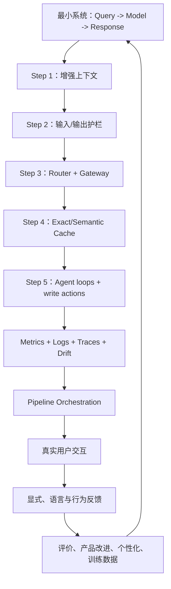
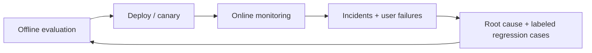
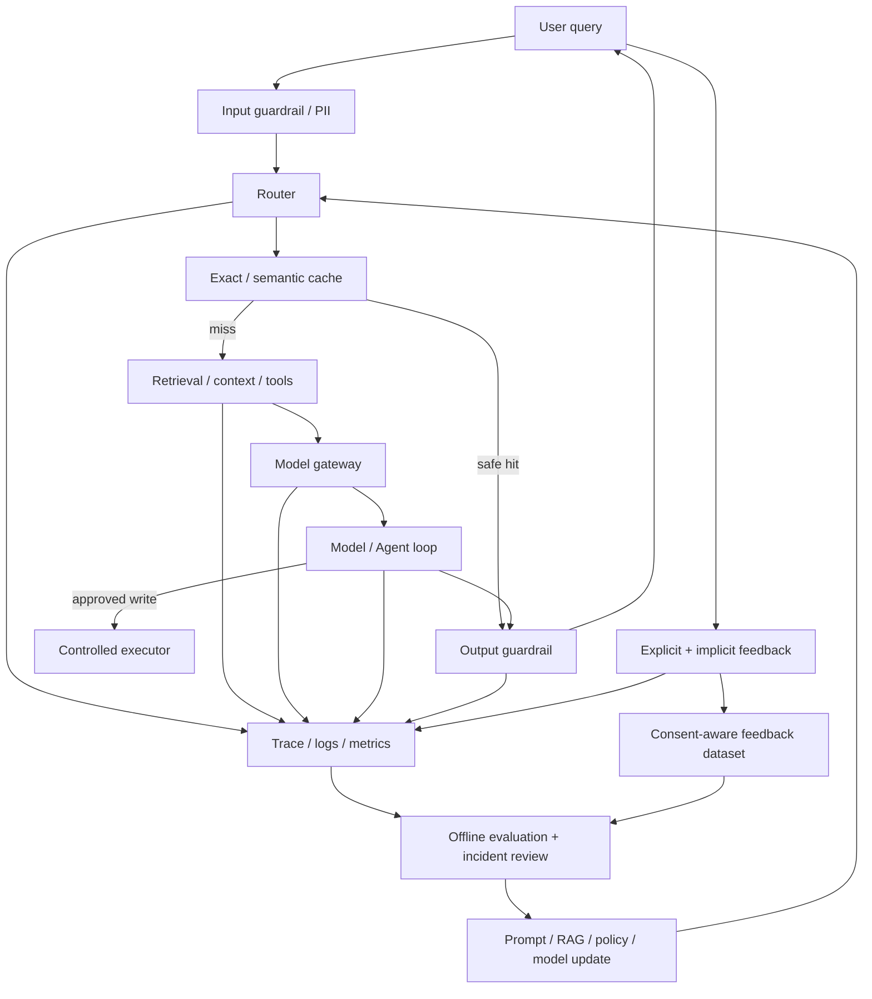

## 0. 学习目标与全章因果主线

前九章分别讨论模型选择、评价、提示、RAG/Agent、微调、数据集和推理优化。第十章把这些技术放回一个真实产品：**怎样从最简单的模型调用逐步构造可用、可控、可观测、可持续改进的 AI 系统。**

本章有两条相互连接的主线：

1. **Architecture**：随着失败模式出现，逐步加入上下文、护栏、路由/网关、缓存和 Agent；
2. **Feedback**：把用户显式评价、自然语言纠正和行为信号变成评价、个性化与训练数据，同时防止偏差和退化反馈环。



这不是要求所有应用按固定顺序堆齐组件。作者给出的是常见生产演进：**只在真实需求出现时增加组件。** 每个组件都带来新能力，也增加延迟、成本、状态、依赖和故障点。

学完本章，应能回答：

- 最小 AI 应用为什么会逐渐需要上下文、护栏、router、gateway、cache 和 Agent；
- 输入/输出护栏分别防什么，为什么安全与误拒绝必须同时评价；
- Router 与 gateway 的职责有什么区别，怎样做成本敏感和风险敏感路由；
- Exact cache 与 semantic cache 如何选择，怎样避免时效、个性化和跨租户泄漏；
- Metrics、logs、traces 和 drift detection 如何共同缩短 MTTD/MTTR；
- Orchestrator 应负责哪些数据流和控制流，何时不该过早引入；
- 对话中有哪些显式与隐式反馈，信号为什么有歧义；
- 怎样低摩擦收集反馈，并处理宽容、随机、位置、偏好和曝光偏差；
- 怎样让反馈形成数据飞轮，而不是把产品推入 sycophancy 或 filter bubble。

贯穿本章的六条原则：

- **从最小系统开始。** 复杂度必须由可观察的失败或业务需求支付。
- **组件边界是流动的，职责必须清楚。** 护栏可在 gateway、模型或独立服务中实现，但最终责任不能模糊。
- **安全不能只看拦截率。** False refusal 会破坏合法工作流。
- **可观测性必须随架构一起设计。** 无法追踪一次请求，就无法可靠修复复合系统。
- **用户反馈是带选择偏差的数据。** 用户行为不是天然 ground truth。
- **反馈闭环要保留探索与事实锚点。** 只优化眼前点击会放大已有曝光和偏好。

---

## 1. AI Engineering Architecture（AI 工程架构）

### 1.1 最小架构

最简单系统：

$$
q \xrightarrow{\text{Model API}} y,
$$

其中 $q$ 是用户 query，$y$ 是模型 response。Model API 可以是第三方服务，也可以是自托管 inference server。

这个系统的优势：

- 代码少、上线快；
- 变量少、容易建立质量和成本基线；
- 适合验证任务可行性；
- 失败路径短，容易定位。

它也没有：

- 私有/最新上下文；
- 输入/输出安全控制；
- 多模型选择和统一访问；
- 结果缓存；
- 工具、循环和写操作；
- 完整监控与反馈闭环。

### 1.2 为什么要渐进增加组件

设系统包含组件 $C_1,\ldots,C_n$。若一次请求必须让全部串行组件成功，粗略独立假设下：

$$
P(\text{success})=\prod_{i=1}^{n}p_i.
$$

即使每个组件成功率 $p_i=0.99$，10 个串行组件全成功概率也只有：

$$
0.99^{10}\approx90.44\%.
$$

独立假设通常不成立，但乘积揭示复合系统会累积风险。总延迟也近似：

$$
T_{serial}=\sum_{i=1}^{n}T_i,
$$

成本为各模型、检索、工具与基础设施成本之和。

所以组件不应因为“行业架构图里有”而加入。每一步都要写清：

1. 当前失败模式；
2. 新组件怎样改变因果链；
3. 新增的延迟、成本和风险；
4. 可证伪的成功指标；
5. 失败时怎样降级和回滚。

### 1.3 原书五步演进

1. Enhance context；
2. Put in guardrails；
3. Add model router and gateway；
4. Reduce latency with caches；
5. Add agent patterns。

顺序是经验框架，不是规范。公共信息查询可能先需要 cache；医疗系统可能在首次试验前就需要严格 guardrails；单模型内部工具可能暂时不需要 gateway。

---

## 2. Step 1: Enhance Context（增强上下文）

### 2.1 它解决什么问题

基础模型内部知识可能：

- 不包含企业私有数据；
- 已过时；
- 缺少当前用户状态；
- 无法容纳整套代码/文档；
- 不知道实时天气、新闻和库存。

上下文构造为每个 query 动态选择信息：

$$
C(q)=\operatorname{Retrieve}(q,D)
+\operatorname{ToolResults}(q),
$$

$$
 y=G(q,C(q)).
$$

这里的加号表示组合，不是数值相加。承接第六章的上下文构造讨论，本章将其类比为 foundation model 的 feature engineering：模型只能利用进入输入的信号。

### 2.2 数据来源

- text retrieval；
- image/audio/video retrieval；
- SQL/tabular retrieval；
- conversation memory；
- web search、news、weather、events；
- 企业业务 API 和内部服务。

### 2.3 为什么供应商支持不同

不同模型/API 对以下能力支持不同：

- 文件类型与数量；
- 单文件/总 token 上限；
- chunking 与 retrieval algorithm；
- vector database 与 metadata filter；
- tool schema；
- parallel function calls；
- long-running/background jobs；
- 权限、审计和数据保留。

通用文件上传 API 可能只接少量文档；专用 RAG 可扩到向量库容量，却需要自己管理索引、权限和评价。选型要比较真实限制，不只看“支持 RAG/Tools”的标签。

### 2.4 上下文构造的新风险

- Retriever 漏掉正确证据；
- 噪声与冲突证据干扰模型；
- 文档权限越界；
- 恶意文档 prompt injection；
- 工具返回错误或过期值；
- context 过长导致成本和 lost-in-the-middle；
- 外部来源不可用或变慢。

因此新增 context 后要分别评价 retrieval、tool、最终答案和端到端 latency，而不能只看回答是否更长。

---

## 3. Step 2: Put in Guardrails（加入护栏）

Guardrail 应放在每个风险暴露边界。原书按 input/output 分类；真实系统还可在 retrieval、tool execution、gateway 和 memory write 处设置策略。

### 3.1 Input Guardrails

主要防两类风险：

1. 把隐私/企业机密发送给外部 API；
2. 执行会攻击或操纵系统的 prompt。

泄漏可能来自：

- 员工粘贴内部秘密或用户 PII；
- 开发者把内部政策放入 system prompt；
- 工具从内部数据库取出敏感字段并拼入 context。

只要数据离开组织，就没有“绝对不泄漏”的应用层保证。护栏用于降低风险，不代替供应商合同、数据边界和最小权限。

### 3.2 Sensitive Data Detection

常见类别：

- 身份证/账号/银行卡；
- 电话、邮箱、地址；
- 人脸和生物特征；
- 凭据、API key；
- 企业 IP 关键词和特权信息。

检测可用规则、校验位、NER/分类模型和上下文判断。规则 precision 高但覆盖有限；模型能识别地址等语义实体，却会误报和漏报。

### 3.3 Block、Mask 与 Reverse Map

发现敏感数据后：

- **Block**：拒绝整条请求，适合高风险且无法安全完成；
- **Mask/Tokenize**：替换实体，再由内部映射恢复；
- **Route**：送到自托管/合规模型；
- **Minimize**：只传完成任务所需字段。

设替换函数 $M$ 将实体 $e_i$ 映射为唯一 placeholder $p_i$：

$$
M(e_i)=p_i,
$$

内部 reverse map：

$$
R(p_i)=e_i.
$$

模型只看到 placeholders，响应返回后在可信边界内恢复。Placeholder 必须本请求/租户唯一；不能用同一个 `[PHONE]` 表示多个号码后失去对应关系。

### 3.4 可运行示例：PII Masking 与 Unmasking

下面示例用简化正则，生产环境还需国际号码、校验、上下文与 secret manager。

```python
"""在外部模型边界前脱敏，并在内部边界恢复占位符。"""
import re


EMAIL_PATTERN = re.compile(r"\b[A-Za-z0-9._%+-]+@[A-Za-z0-9.-]+\.[A-Za-z]{2,}\b")
PHONE_PATTERN = re.compile(r"(?<!\d)(?:\+?1[- ]?)?\d{3}[- ]\d{3}[- ]\d{4}(?!\d)")


def mask_sensitive(text):
    reverse_map = {}
    counters = {"EMAIL": 0, "PHONE": 0}

    def replace(kind):
        def replacer(match):
            counters[kind] += 1
            placeholder = f"[{kind}_{counters[kind]}]"
            reverse_map[placeholder] = match.group(0)
            return placeholder
        return replacer

    masked = EMAIL_PATTERN.sub(replace("EMAIL"), text)
    masked = PHONE_PATTERN.sub(replace("PHONE"), masked)
    return masked, reverse_map


def unmask(text, reverse_map):
    restored = text
    for placeholder, original in reverse_map.items():
        restored = restored.replace(placeholder, original)
    return restored


query = "Email alice@example.com or call 415-555-0100."
masked, reverse_map = mask_sensitive(query)
external_response = "I will contact [EMAIL_1] and [PHONE_1]."

print("PII_GUARDRAIL")
print(f"masked={masked}")
print(f"reverse_map={reverse_map}")
print(f"restored={unmask(external_response, reverse_map)}")
```

实际运行输出：

```text
PII_GUARDRAIL
masked=Email [EMAIL_1] or call [PHONE_1].
reverse_map={'[EMAIL_1]': 'alice@example.com', '[PHONE_1]': '415-555-0100'}
restored=I will contact alice@example.com and 415-555-0100.
```

示例的 reverse map 本身极敏感，不能记录到普通日志或跨请求复用。模型若改变 placeholder 拼写，也可能无法恢复。

---

## 4. Output Guardrails（输出护栏）

### 4.1 两个职责

1. 检测输出 failure；
2. 为每类 failure 规定处理 policy。

检测不等于处置。Invalid JSON 可修复/重试；疑似泄漏应阻断并告警；高风险写操作应要求审批。

### 4.2 Quality Failures

- 空响应（用户确实要求空输出时除外）；
- malformed JSON/YAML/schema；
- 缺字段、类型错；
- 事实不一致/无证据 hallucination；
- 无关、冗长、低质量；
- 引用不支持结论。

### 4.3 Security Failures

- toxicity、仇恨、性内容和违法活动；
- PII、秘密和受版权保护内容；
- 可触发远程 code/tool execution 的内容；
- 误导品牌、竞争者或法律立场；
- 绕过批准的写动作。

### 4.4 False Refusal

护栏过严会拒绝合法请求。设：

- $Y=1$ 表示请求/响应确有风险；
- $\widehat Y=1$ 表示护栏阻断。

风险检出率：

$$
TPR=P(\widehat Y=1\mid Y=1).
$$

False refusal rate：

$$
FRR=P(\widehat Y=1\mid Y=0).
$$

只最大化 TPR 的极端系统可以拒绝一切，此时安全却不可用。应同时报告 TPR、FRR、分群指标和失败成本。

### 4.5 Failure Policy：Retry

模型有随机性，重试可能得到合法结果。若每次独立成功概率为 $p$，最多尝试 $k$ 次，至少一次成功概率：

$$
P(\text{success within }k)
=1-(1-p)^k.
$$

若 $p=0.7,k=3$：

$$
1-0.3^3=97.3\%.
$$

独立同分布是假设。固定 prompt 的系统性事实错误不会因重试消失；重试还增加 latency、cost 和 rate-limit 压力。

应区分：

- transient API error：指数退避 + jitter；
- malformed output：更强 schema/constrained decoding；
- safety failure：不要盲目重试同一攻击；
- deterministic tool error：修参数或换路径；
- non-idempotent write：禁止无保护重试。

### 4.6 Parallel Candidates

不等第一次失败，可并行生成 $n$ 个候选并由 scorer 选最好。若独立合格概率 $p$：

$$
P(\text{at least one good})=1-(1-p)^n.
$$

Wall-clock 接近最慢候选 + scorer，而不是串行重试总和；成本约乘 $n$。候选高度相关时收益低，scorer 也可能选错。

### 4.7 Human Fallback

以下情况可转人工：

- 关键词/高风险 intent；
- 用户愤怒或多次纠正；
- 超过最大 turn，疑似循环；
- 低 confidence；
- 账单、法律、医疗和不可逆操作；
- 自动 policy 无安全降级。

人工接管需要携带必要、经授权的 trace/context，避免让用户从头复述，也不能把不必要 PII 暴露给操作员。

### 4.8 Streaming Trade-Off

完整生成后检查可在展示前阻断，但 TTFT/总等待高。Streaming 先展示 token，partial response 很难做全局 factuality/安全判断，危险内容可能先被看见。

折中：

- 小 buffer 后再 stream；
- token/句级 classifier；
- 高风险任务禁用 streaming；
- 先生成 plan/结构、再 stream；
- 发现风险时终止并撤回；
- 前后两层护栏。

撤回不能保证用户没看到或客户端没保存。

### 4.9 Guardrail Placement

- Provider/model 内置；
- application input/output；
- gateway；
- retrieval/tool boundary；
- standalone scorer/policy service。

第三方 API 常自带护栏，减少应用实现，但其 policy 未必符合业务且可能产生不可控拒绝；self-host 不外发数据，却需团队承担完整 output safety。

原书列举 Purple Llama、NeMo Guardrails、PyRIT、Azure AI content filters、Perspective API、OpenAI moderation API。工具生态和名称会变化，核心是 failure taxonomy、policy 和独立评价。

---

## 5. Step 3: Add Model Router and Gateway

应用开始使用多模型、多工具和人工路径后，需要把“选择哪个处理方案”与“怎样统一、安全地调用模型”分离。

---

## 6. Router（路由器）

### 6.1 Router 解决什么

不是所有 query 都值得昂贵大模型：

- FAQ 可返回固定页面；
- billing error 应转人工；
- technical issue 可走专用模型 + RAG；
- out-of-scope 可直接拒绝；
- ambiguous query 应澄清；
- Agent 下一步可选 search/code/tool。

Router 通常是 intent classifier 或 next-action predictor：

$$
\widehat a=R(q,state,metadata).
$$

### 6.2 Routing 的价值

1. 专用模型在窄任务上可能更强；
2. 简单任务走便宜路径，降低成本；
3. 风险任务走人工/受限模型；
4. 越界请求不浪费生成调用；
5. 模糊请求先澄清；
6. 根据 context length 选择可容纳模型。

例如 query 1000 token，web search 又返回 8000 token，而原路由模型 context 只有 4K：要么过滤/压缩 context，要么重新路由到长上下文模型。

### 6.3 Router 应快而便宜

Router 位于主路径，延迟和错误影响所有请求。可用：

- 规则；
- 小型 classifier；
- BERT/GPT-2/Llama 小模型；
- embedding nearest prototype；
- 大模型少量 query（高难或回退）。

路由本身应有 confidence、abstain 与 fallback。

### 6.4 成本敏感路由的严格形式

对 query $x$ 和候选路径 $m\in\mathcal M$，定义：

- $Q_m(x)$：预期质量；
- $C_m(x)$：成本；
- $L_m(x)$：延迟；
- $R_m(x)$：风险损失。

可选满足约束的最低成本路径：

$$
m^*(x)=\arg\min_m C_m(x)
$$

subject to：

$$
Q_m(x)\ge q_{min},
\quad
L_m(x)\le l_{max},
\quad
R_m(x)\le r_{max}.
$$

质量未知时用预测器估计，会引入 calibration error。一个小模型错误地把难题判成简单，会节省成本却损质量。

### 6.5 Routing Before/After Retrieval

常见路径：

```text
route -> retrieve -> generate -> score
```

Retrieval 前 router 判断：in-scope？需检索？用哪个知识库？

Retrieval 后也可 router：证据不足则转人工/长上下文模型。多阶段 router 应共享 trace，避免互相矛盾。

### 6.6 可运行示例：风险/长度/意图路由

```python
"""一个确定性路由基线：先处理高风险，再检查范围和上下文。"""


MODELS = {
    "cheap_chat": {"context_limit": 4_000, "cost": 1},
    "long_context": {"context_limit": 16_000, "cost": 4},
}


def route(intent, query_tokens, retrieved_tokens, high_risk=False):
    if high_risk or intent == "billing_dispute":
        return "human"
    if intent == "password_reset":
        return "faq"
    if intent not in {"technical_support", "general_question"}:
        return "out_of_scope"

    total_tokens = query_tokens + retrieved_tokens
    feasible_models = [
        (specification["cost"], name)
        for name, specification in MODELS.items()
        if total_tokens <= specification["context_limit"]
    ]
    if not feasible_models:
        return "compress_context_or_human"
    return min(feasible_models)[1]


requests = [
    ("password_reset", 200, 0, False),
    ("billing_dispute", 500, 0, False),
    ("technical_support", 1_000, 8_000, False),
    ("general_question", 1_000, 500, False),
    ("politics", 200, 0, False),
]

print("ROUTING")
for request in requests:
    print(f"intent={request[0]} route={route(*request)}")
```

实际运行输出：

```text
ROUTING
intent=password_reset route=faq
intent=billing_dispute route=human
intent=technical_support route=long_context
intent=general_question route=cheap_chat
intent=politics route=out_of_scope
```

这是透明 baseline，不是完整 ML router。它暴露 policy 顺序：高风险优先于成本；长 context 只在 cheap model 放不下时升级。

---

## 7. Model Gateway（模型网关）

### 7.1 Gateway 与 Router 的区别

- **Router**：决定走哪个模型/路径；
- **Gateway**：提供统一、受控的调用入口并执行治理。

Router 是决策组件；gateway 是访问与策略执行层。两者可部署在一起，但职责应分开测试。

### 7.2 Unified Interface

不同 provider 的参数、错误、流式协议和 response schema 不同。Gateway 对应用暴露统一结构：

```text
request(model, messages, max_tokens, sampling, tools)
-> normalized response / stream / error
```

Provider API 改变时只更新 adapter，而不是所有应用。

统一接口不应抹掉 provider 特有语义。Unsupported feature 要显式报错，不能静默降级。

### 7.3 Access Control 与 Secret Management

组织成员不直接拿 provider API keys，只调用 gateway。Gateway 执行：

- user/app authentication；
- model/tool allowlist；
- tenant isolation；
- token/request budget；
- data residency；
- PII policy；
- audit logs。

Gateway 变成高价值单点，必须高可用、最小权限、密钥轮换和防旁路访问。

### 7.4 Cost Management

记录并限制：

- requests；
- input/output/cached tokens；
- model/provider；
- retries/fallback；
- team/project/user；
- daily/monthly budget。

可做 quota、rate limit、预算告警和按成本路由。若只看主调用，重试和隐藏 orchestrator calls 会漏计。

### 7.5 Fallback Policies

Primary rate-limit/timeout/5xx 时：

1. 对幂等请求按 backoff 重试；
2. 切替代 provider/model；
3. 返回 degraded response；
4. 排入 batch/稍后完成；
5. 明确失败。

Fallback 模型可能 context、tool、safety 和质量不同。切换前要验证兼容性，响应 metadata 应记录实际模型。

对 write action，不可因 timeout 自动在另一 provider 重做，除非有 idempotency key 和事务状态。

### 7.6 其他能力

由于所有 request/response 流经 gateway，可集中：

- load balancing；
- logging/tracing；
- analytics；
- caching；
- guardrails；
- model/version rollout；
- standardized errors。

功能越多，gateway 越容易成为“万能平台”和性能/故障单点。关键策略应模块化，支持绕过或降级。

原书列举 Portkey、MLflow AI Gateway、Wealthsimple LLM Gateway、TrueFoundry、Kong、Cloudflare 等时点实例。也可构建 tool gateway 统一工具访问，虽然原书写作时尚非普遍模式。

---

## 8. Step 4: Reduce Latency with Caches（用缓存降延迟）

缓存复用以前的计算结果，降低重复推理、检索、SQL、web search 和多步 chain 的成本。

必须区分三类：

| 缓存 | 复用内容 | 常见位置 |
|---|---|---|
| KV cache | 单次 decode 内历史 K/V | Inference server |
| Prompt/prefix cache | 跨请求共享 prefix 的 prefill/KV | Model API/server |
| System result cache | 检索结果、中间结果或最终响应 | Application/gateway |

第九章讨论前两类；本章关注系统 exact/semantic cache。

### 8.1 缓存的期望延迟与成本

设：

- 命中率 $h$；
- lookup 延迟 $T_l$；
- 命中读取额外延迟 $T_h$；
- miss 后完整计算延迟 $T_m$。

每次都先查 cache：

$$
E[T]
=h(T_l+T_h)
+(1-h)(T_l+T_m).
$$

整理：

$$
E[T]=T_l+hT_h+(1-h)T_m.
$$

相对不缓存的收益：

$$
\Delta T
=T_m-E[T]
=h(T_m-T_h)-T_l.
$$

在 $T_m>T_h$（命中读取确实比完整重算快）时，缓存有正延迟收益要求：

$$
h>\frac{T_l}{T_m-T_h}.
$$

要存在 $0\le h\le1$ 的可行解，还必须有 $T_l<T_m-T_h$；否则即使 100% 命中也不比不缓存快。若 lookup 本身昂贵、命中率低或原计算便宜，缓存可能更慢。成本推导同理，还要加存储、索引和失效维护。

---

## 9. Exact Caching（精确缓存）

只有 cache key 精确相同才复用。例子：

- 同一 product/version 的摘要；
- 同一 query/filter/index version 的向量检索结果；
- 同一 SQL + parameters + snapshot；
- 同一 deterministic pipeline 输入。

### 9.1 Cache Key 不应只有 query 文本

正确 key 通常包含：

$$
k=H(
tenant,
userScope,
query,
contextVersion,
modelVersion,
promptVersion,
sampling,
policyVersion
).
$$

若漏掉 membership、权限或数据版本，就会返回语义上不属于当前请求的结果。

原书给出的泄漏案例：用户 X 问“电子产品退货政策”，系统根据 X 的 membership 生成个性化答案，却把它当通用答案缓存；用户 Y 同问时得到 X 的信息。

### 9.2 什么不适合缓存

- “我的最近订单状态”等高度用户特定查询；
- 天气、股价、库存等时效数据；
- non-idempotent write result；
- 含一次性 credential；
- 高随机创作且用户期待多样性；
- 未经授权的敏感 context。

可以训练 cacheability classifier，但 classifier 错误会成为一致性或泄漏故障。高风险场景优先确定性规则。

### 9.3 TTL 与失效

TTL 应小于底层事实可接受陈旧时间。还可：

- event-driven invalidation；
- versioned key；
- stale-while-revalidate；
- manual purge；
- per-tenant deletion。

“缓存失效是难题”在 AI 中更严重，因为 response 同时依赖 model、prompt、retrieval index、tools 和 policies。

### 9.4 Eviction

- LRU：淘汰最久未访问；
- LFU：淘汰最少访问；
- FIFO：按进入时间；
- Cost-aware：保留重算最贵项；
- Size-aware：考虑 item bytes；
- Risk-aware：敏感项更早删除。

缓存可用 Redis、内存、PostgreSQL 或 tiered storage。内存快但容量小；数据库慢一些但持久、可审计。

### 9.5 可运行示例：作用域与版本安全的 Exact Cache

```python
"""缓存 key 显式包含租户、会员等级、数据和 prompt 版本。"""
from dataclasses import dataclass


@dataclass(frozen=True)
class CacheKey:
    tenant: str
    membership: str
    query: str
    data_version: str
    prompt_version: str


class ExactCache:
    def __init__(self):
        self._values = {}

    def get(self, key):
        return self._values.get(key)

    def put(self, key, value):
        self._values[key] = value


cache = ExactCache()
query = "What is the electronics return policy?"
x_key = CacheKey("shop", "gold", query, "policy-v3", "prompt-v2")
y_key = CacheKey("shop", "standard", query, "policy-v3", "prompt-v2")

cache.put(x_key, "Gold members: returns within 60 days.")

print("EXACT_CACHE")
print(f"x_hit={cache.get(x_key)}")
print(f"y_hit={cache.get(y_key)}")
updated_key = CacheKey("shop", "gold", query, "policy-v4", "prompt-v2")
print(f"new_policy_hit={cache.get(updated_key)}")
```

实际运行输出：

```text
EXACT_CACHE
x_hit=Gold members: returns within 60 days.
y_hit=None
new_policy_hit=None
```

相同文字但 membership 不同不会命中；政策版本更新也自动 miss。真实 key 还应包含访问策略和 locale，并对敏感 value 加密。

---

## 10. Semantic Caching（语义缓存）

Query 不同但意图相同也复用。例如：

```text
What is the capital of Vietnam?
What is Vietnam's capital city?
```

都可返回 Hanoi，提高 hit rate。

### 10.1 算法

1. 计算 query embedding $e(q)$；
2. 在 cache embeddings 中找最近邻 $q^*$；
3. 计算 similarity $s(e(q),e(q^*))$；
4. 若 $s\ge\tau$，复用 cached result；否则完整执行并写入。

$$
q^*=\arg\max_{q_i\in C}
\operatorname{sim}(e(q),e(q_i)).
$$

### 10.2 Threshold Trade-Off

把“可安全复用”看成二分类：

- $\tau$ 低：hit/recall 高，false hit 多；
- $\tau$ 高：precision 高，收益下降。

应在人工标注 query pairs 上画 precision-recall/cost curve。False semantic hit 比 ordinary miss 更危险：系统快速、自信地返回错误答案。

### 10.3 语义相似不等于答案可复用

以下 pair embedding 可能很近但答案不同：

- “退款期限是多少？” vs “Gold 会员退款期限是多少？”
- “今天北京天气？” vs “明天北京天气？”
- “删除用户 123？” vs “删除用户 124？”
- “可以吃布洛芬吗？”不同病史用户。

Cache eligibility 应同时考虑 entities、time、tenant、permissions 和 tool/data versions，不只 cosine similarity。

### 10.4 系统成本

Semantic cache 需要 embedding + vector search，其成本随 cache size 和 index 变化：

$$
E[C]
=C_{embed}+C_{search}
+hC_{hit}
+(1-h)C_{full}.
$$

只有避免的 full pipeline 足够昂贵且安全 hit rate 高，复杂度才值得。

### 10.5 可运行示例：阈值选择的精确率/命中率

```python
"""用已标注候选 pair 比较 semantic-cache 阈值；分数预先给定。"""


PAIRS = [
    # similarity, 是否真的可以复用答案
    (0.97, True),
    (0.94, True),
    (0.92, False),  # 语义近，但会员等级不同
    (0.88, True),
    (0.84, False),
]


def evaluate_threshold(threshold):
    hits = [label for score, label in PAIRS if score >= threshold]
    safe_hits = sum(hits)
    precision = safe_hits / len(hits) if hits else 1.0
    hit_rate = len(hits) / len(PAIRS)
    return len(hits), precision, hit_rate


print("SEMANTIC_CACHE")
for threshold in (0.90, 0.95):
    hits, precision, hit_rate = evaluate_threshold(threshold)
    print(
        f"threshold={threshold:.2f} hits={hits} "
        f"precision={precision:.3f} hit_rate={hit_rate:.3f}"
    )
```

实际运行输出：

```text
SEMANTIC_CACHE
threshold=0.90 hits=3 precision=0.667 hit_rate=0.600
threshold=0.95 hits=1 precision=1.000 hit_rate=0.200
```

阈值 0.95 消除这组 false hit，却把 hit rate 从 60% 降至 20%。真实系统还要按错误损失选择阈值，不能只最大化 cache hit。

---

## 11. Step 5: Add Agent Patterns（加入 Agent 模式）

此前 query 多为固定顺序：route → retrieve → generate → score。Agent 引入：

- loop；
- conditional branch；
- parallel actions；
- reflection/replanning；
- read/write tools。

### 11.1 闭环

模型生成 response 后判断任务未完成，再检索或调用工具：

$$
s_{t+1}=T(s_t,a_t,o_t),
$$

其中 $s_t$ 是任务状态，$a_t$ 是动作，$o_t$ 是 observation。直到：

$$
G(s_t)=1
$$

或达到 budget/timeout/人工终止。

必须设置：

- max steps；
- token/cost/time budget；
- retry limit；
- loop detection；
- completion invariant；
- cancellation 与 checkpoint。

### 11.2 Write Actions

模型可发送邮件、下单、更新数据库、发起转账。能力和损失半径同步增加。

写操作必须在模型外强制：

1. 最小权限；
2. 参数 schema/range/allowlist；
3. idempotency key；
4. dry-run/preview；
5. 风险分级和人工审批；
6. transaction/rollback；
7. immutable audit log。

模型生成“我将转账”不是动作；只有受控 executor 才能改变环境。

### 11.3 架构复杂度与可调试性

Agent 让一次 query 访问多个模型、检索器、工具和 cache。最终答案错误可能来自：

- 初始 route；
- retrieval；
- tool selection/arguments；
- tool output；
- memory；
- reflection/completion；
- guardrail；
- cache；
- model generation。

没有 trace，只看最终 response 无法归因。下一节的 observability 因此不是附加功能，而是 Agent 上线前置条件。

---

## 12. Monitoring and Observability（监控与可观测性）

可观测性应在产品设计时加入，而不是系统复杂后再补。它的目标与 evaluation 一致：

- 缓解 application failure、security attack 和 drift；
- 发现质量、体验与成本优化机会；
- 让团队能解释系统表现并承担责任。

### 12.1 Monitoring 与 Observability

按原书的区分：

- **Monitoring**：持续跟踪系统外部输出、指标和事件；它本身不保证这些输出足以解释内部故障；
- **Observability**：通过充分 instrumentation，使内部状态能从外部 telemetry 推断，发生故障时无需临时加代码就能定位。

在软件实践中，可观测性通常由 metrics、logs、traces、profiles 和事件关联组成。核心测试是：发生未预料故障时，是否无需临时发布新日志代码就能定位。

### 12.2 Evaluation 与 Monitoring 的闭环

离线评价指标应可映射到线上监控；线上 incident 又应回流评价集：



若离线“质量很好”、线上投诉很多，可能是：

- 评价分布不代表真实流量；
- 指标不对应用户价值；
- 线上 prompt/tool/model 版本不同；
- 监控 scorer 漂移；
- 性能、UI 或安全问题未进入离线评价。

---

## 13. MTTD、MTTR 与 CFR

### 13.1 Mean Time to Detection

Incident $i$ 在 $t_i^{start}$ 开始、$t_i^{detect}$ 被发现：

$$
MTTD
=\frac{1}{N}
\sum_{i=1}^{N}
(t_i^{detect}-t_i^{start}).
$$

它衡量发现速度。Incident 实际开始时间常未知，可用 first bad event 估计，可能有测量偏差。

### 13.2 Mean Time to Response/Resolution

原书用 mean time to response，指发现后到解决：

$$
MTTR
=\frac{1}{N}
\sum_{i=1}^{N}
(t_i^{resolve}-t_i^{detect}).
$$

行业中 MTTR 也可能表示 repair/recovery/resolution，报告时要声明定义。还应看 median/p90，因为 mean 会被少数长 incident 主导。

总暴露时间：

$$
T_i^{impact}
=(t_i^{detect}-t_i^{start})
+(t_i^{resolve}-t_i^{detect}).
$$

降低 MTTD 与 MTTR 同样重要。

### 13.3 Change Failure Rate

观察期内部署/变更数 $D$，导致需要修复或 rollback 的变更数 $F$：

$$
CFR=\frac{F}{D}.
$$

高 CFR 不一定是监控差，反而可能检测很敏感；但它提示 pre-deployment evaluation、canary 或发布流程需要改进。不知道 CFR 本身就是变更血缘不足。

### 13.4 可运行示例：Incident 指标

```python
"""从 incident 时间线计算 MTTD、MTTR、总影响时间和 CFR。"""


INCIDENTS = [
    {"start": 0, "detect": 5, "resolve": 20},
    {"start": 100, "detect": 112, "resolve": 130},
    {"start": 200, "detect": 203, "resolve": 215},
]
deployments = 20
failed_changes = 2

detection_times = [item["detect"] - item["start"] for item in INCIDENTS]
response_times = [item["resolve"] - item["detect"] for item in INCIDENTS]
impact_times = [item["resolve"] - item["start"] for item in INCIDENTS]

print("OBSERVABILITY")
print(f"mttd_minutes={sum(detection_times) / len(detection_times):.2f}")
print(f"mttr_minutes={sum(response_times) / len(response_times):.2f}")
print(f"mean_impact_minutes={sum(impact_times) / len(impact_times):.2f}")
print(f"change_failure_rate={failed_changes / deployments:.1%}")
```

实际运行输出：

```text
OBSERVABILITY
mttd_minutes=6.67
mttr_minutes=15.00
mean_impact_minutes=21.67
change_failure_rate=10.0%
```

三个 incident 很少，mean 不稳定；生产报告应带样本量、分位数、severity 和服务切片。

---

## 14. Metrics（指标）

指标不是目标。指标的用途是：发现故障、定位变化或发现机会。设计顺序应是：

```text
failure mode / business question
-> observable signal
-> metric + slice + threshold
-> alert / investigation / action
```

### 14.1 Quality Metrics

易确定性检查：

- 空响应率；
- invalid JSON/schema rate；
- 缺字段、类型错误；
- tool-call 参数合法率；
- citation 存在与 URL 状态。

开放生成：

- factual consistency / groundedness；
- relevance；
- conciseness/verbosity；
- creativity/style；
- task success。

AI judge 可计算部分指标，但 judge 也有版本、位置和长度偏差，需人工校准并监控自身 drift。

### 14.2 Safety Metrics

- toxicity/hate/sexual/illegal rates；
- input/output PII；
- prompt-attack detection；
- guardrail trigger；
- refusal rate 与 false refusal；
- 未批准 tool/write attempt；
- anomalous query/rate。

同时追踪漏拦截和误拦截。Guardrail trigger 变高可能是攻击增加，也可能是 detector 版本改变。

### 14.3 Conversational Proxy Metrics

- early stop generation；
- average turns/conversation；
- input/output tokens；
- regenerate/correction；
- refusal phrases；
- output token/topic distribution。

这些是 proxy，不是直接质量。长对话对 companion 可能好，对客服可能表示任务没解决。

### 14.4 Component Metrics

端到端外，每组件独立监控：

- Router：intent accuracy、abstain、route distribution；
- RAG：recall/precision、no-result、index/query latency；
- Vector DB：storage、query p99、index freshness；
- Tool：success/error/timeout、argument validity；
- Cache：hit、false hit、stale、eviction、bytes；
- Model：TTFT/TPOT、tokens、quality、refusal；
- Gateway：provider errors、fallback、quota/cost；
- Guardrail：TPR/FRR、latency；
- Agent：steps、loop、completion、cost。

组件指标使端到端失败可归因。

### 14.5 Business/North-Star Correlation

比较技术指标与 DAU、subscription、task completion、retention、session duration。Correlation 可提示机会：

$$
\rho_{XY}
=\frac{\operatorname{Cov}(X,Y)}
{\sigma_X\sigma_Y}.
$$

但相关不等于因果。高质量分与留存相关，可能因为简单 query 同时更容易回答、用户也更易留存。用 A/B test、随机实验或因果分析确认。

### 14.6 Latency 与 Cost

监控 TTFT、TPOT、total latency，并按 user/concurrency/region/model/input length 切片。成本包括：

- query count；
- input/output/cached tokens；
- retrieval/tool calls；
- retries/fallback；
- cache storage；
- requests/second 与 provider limits。

### 14.7 Spot Checks 与 Exhaustive Checks

**Exhaustive** 每请求检查，适合便宜、关键、确定性规则；**spot** 抽样昂贵 judge/人工 review。

抽样率 $r$，真实 failure rate $p$，观察 $n$ 个样本，标准误差近似：

$$
SE(\widehat p)
=\sqrt{\frac{p(1-p)}{n}}.
$$

低频严重事件需要更大样本或风险分层抽样。只均匀抽样可能长期看不到高风险长尾。

### 14.8 Sliceability

所有 metric 应可按：

- user/tenant；
- release/model/prompt/chain version；
- query/intent/type；
- language/region/device；
- time；
- cache hit/fallback；
- human/synthetic traffic；

切分。聚合正常可能掩盖单租户泄漏或某语言退化。

---

## 15. Logs and Traces（日志与追踪）

### 15.1 Metrics 与 Logs

- Metrics：聚合数值，快速发现“发生了什么趋势”；
- Logs：append-only events，回答“当时具体发生了什么”。

典型调试：

1. Metric 告警五分钟前 error spike；
2. 按时间/version/trace ID 查 logs；
3. 定位错误；
4. 将 log 模式与 metric 对齐，验证 root cause。

Logs 延迟 15 分钟会直接增加 MTTR。

### 15.2 应记录什么

原书建议尽可能完整记录：

- endpoint/provider/model/version；
- temperature/top-p/top-k/stop/max tokens；
- prompt template/version；
- user query、最终 prompt、response；
- intermediate output；
- retrieval documents/IDs/scores；
- tool calls/arguments/results；
- component start/end/error；
- cost、token、latency；
- tags、request/trace/span IDs。

但“log everything”必须受隐私和合规约束。不要把 raw PII、API keys、完整医疗/财务数据写入普通日志。使用：

- redaction/tokenization；
- content hashes/secure references；
- access controls；
- encryption；
- retention/deletion；
- tenant isolation；
- sampling。

日志本身可能成为最大数据泄漏面。

### 15.3 Trace

Trace 把同一 transaction 的 disjoint events 链成时间线。每个 span 包含：

```text
trace_id, span_id, parent_span_id
component, start, end, status
input/output references, version, cost
```

AI request trace 应显示：

- raw query 如何变换；
- route；
- retrieval documents；
- prompt；
- model calls；
- tool actions；
- guardrail/scorer；
- retries/fallback；
- latency/cost。

目标是回答：错误发生在 query processing、retrieval、generation、tool、cache 还是 guardrail。

### 15.4 Critical Path

把一次请求表示为互不重叠的**任务 DAG**，或把嵌套 trace span 转成 exclusive/self duration 后，并行任务的总延迟不是全部 duration 相加，而是最长依赖路径：

$$
$T_{request}=\max_{\pi\in Paths}
\sum_{s\in\pi}T_s.
$$

这里 $T_s$ 必须是任务自身的 exclusive duration。标准 tracing 中父 span 的 wall-clock duration 往往已经包含子 span，若直接把父子 duration 沿路径相加会重复计算；此时应根据 span 起止时间、父子重叠和依赖关系重建关键路径。优化非关键路径可能不降 end-to-end latency。

### 15.5 可运行示例：任务 DAG 关键路径

```python
"""在组件依赖 DAG 上计算最早完成时间和关键路径。"""


SPANS = {
    "input": {"duration": 2, "depends_on": []},
    "route": {"duration": 4, "depends_on": ["input"]},
    "pii": {"duration": 6, "depends_on": ["input"]},
    "retrieve": {"duration": 20, "depends_on": ["route"]},
    "prompt": {"duration": 3, "depends_on": ["pii", "retrieve"]},
    "generate": {"duration": 50, "depends_on": ["prompt"]},
    "guardrail": {"duration": 8, "depends_on": ["generate"]},
}


def finish_time(name, memo):
    if name in memo:
        return memo[name]
    span = SPANS[name]
    parent_finish = max(
        (finish_time(parent, memo) for parent in span["depends_on"]),
        default=0,
    )
    memo[name] = parent_finish + span["duration"]
    return memo[name]


memo = {}
for span_name in SPANS:
    finish_time(span_name, memo)

print("TRACE")
for span_name in SPANS:
    print(f"{span_name}: finish_ms={memo[span_name]}")
print(f"end_to_end_ms={max(memo.values())}")
print(f"serial_sum_ms={sum(span['duration'] for span in SPANS.values())}")
```

实际运行输出：

```text
TRACE
input: finish_ms=2
route: finish_ms=6
pii: finish_ms=8
retrieve: finish_ms=26
prompt: finish_ms=29
generate: finish_ms=79
guardrail: finish_ms=87
end_to_end_ms=87
serial_sum_ms=93
```

Router 与 PII 并行，最终等待较慢的 retrieval 路径，因此总计 87 ms，不是串行和 93 ms。

### 15.6 人工查看生产数据

自动 log analysis/anomaly detection 必要，但每日抽看真实（经授权、脱敏）交互仍有价值。开发者接触更多数据后，会改变对“好/坏输出”的理解，从而更新 prompt 与评价集。

---

## 16. Drift Detection（漂移检测）

组件越多，可变化项越多。

### 16.1 System Prompt Drift

Template、typo fix、policy 或 tool schema 可能悄然改变最终 prompt。保存：

- template version；
- rendered prompt hash；
- policy/tool versions；
- deploy commit。

确定性 hash 即可发现非预期变化，不必先用 ML drift detector。

### 16.2 User Behavior Drift

用户会学习怎样与系统交互：更短 prompt、特定关键词、绕过限制、欺负自动系统。Response length 下降可能是模型变简洁，也可能是用户学会写更精确指令。

监控 input length、intent、language、error correction、attack 和 cohort 随时间变化，结合定性调查找原因。

### 16.3 Underlying Model Drift

第三方 endpoint 名称不变，provider 可能更新底层模型。原书举例：2023 年不同日期 GPT-4/GPT-3.5 benchmark 变化，以及 Voiceflow 从 `gpt-3.5-turbo-0301` 切到 `1106` 后报告约 10% performance drop。

应：

- pin version（若可用）；
- 定时运行 canary prompts；
- 保存 output fingerprints/distributions；
- provider/model version 写 trace；
- 更新前 shadow test；
- 保留 fallback。

数字是特定历史案例，不代表所有更新退化。

### 16.4 Distribution Drift 指标

离散分布可用 Jensen-Shannon divergence：

$$
M=\frac12(P+Q),
$$

$$
JSD(P,Q)
=\frac12KL(P\|M)
+\frac12KL(Q\|M).
$$

JSD 对称且有限（使用自然对数时上界 $\ln2$）。可比较 intent、token、route 或 refusal 分布。统计差异只提示变化，不说明好坏和原因；大流量下极小差异也显著，应结合业务阈值。

---

## 17. AI Pipeline Orchestration（AI 管线编排）

应用包含多模型、数据源、工具、cache 和策略时，orchestrator 描述它们怎样组成端到端 pipeline。

### 17.1 两步：定义组件与 Chaining

**Components definition** 声明：

- models/gateway；
- retrievers/data sources；
- tools；
- guardrails/scorers；
- cache/memory；
- monitoring/evaluation。

**Chaining** 是 function composition。顺序例：

$$
y=(g_6\circ g_5\circ\cdots\circ g_1)(q).
$$

典型：process query → retrieve → compose prompt → generate → evaluate → return/human。

实际 pipeline 还包括 branch、loop、parallel、timeout、retry 和 compensation，不能只表示线性 chain。

### 17.2 Data Contracts

Orchestrator 应保证上一步输出符合下一步输入：

```text
RetrieverOutput {
  documents: list[Document],
  scores: list[float],
  index_version: str
}
```

Schema/version mismatch 要在边界失败，而不是让模型吞掉 malformed data 后产生不可解释回答。使用 typed schema、validation、idempotency 和 explicit errors。

### 17.3 Parallelize 独立步骤

若 routing 与 PII detection 都只依赖 raw query，可并行：

$$
T_{parallel}=\max(T_{route},T_{PII}),
$$

而非：

$$
T_{serial}=T_{route}+T_{PII}.
$$

只并行无依赖、无冲突 side effects 的步骤。并行会增加瞬时负载和取消复杂度：一个分支失败时是否取消另一个？

### 17.4 与通用 Workflow Orchestrator 的区别

Airflow/Metaflow 偏离线、确定性、分钟/小时 jobs；AI online orchestrator 常处理：

- 用户级低延迟；
- streaming；
- token/cost budget；
- model/tool dynamic branch；
- conversation state；
- probabilistic retry；
- human-in-the-loop。

通用工具仍可承载 batch 数据/训练工作流，不要混用 online request path 与离线 DAG 需求。

### 17.5 不要过早引入

External orchestrator 会：

- 增依赖和版本；
- 隐藏 prompt/API calls；
- 增 latency/cost；
- 抽象掉关键错误；
- 形成 lock-in。

先用普通函数实现最小 pipeline，理解数据流和失败；复杂度足够时再引入。

### 17.6 选择 Orchestrator 的三个维度

#### Integration and Extensibility

是否支持当前/未来 models、DB、tools；不支持时扩展多难。没有框架能原生支持全部生态。

#### Complex Pipelines

是否支持 branching、parallel、loop、error handling、checkpoint、resume、human approval 和 durable state。

#### Ease, Performance, Scalability

API、文档、社区；是否发隐藏调用；额外 latency；是否能扩到多应用、开发者和流量；能否导出 trace、成本与状态。

原书列举 LangChain、LlamaIndex、Flowise、Langflow、Haystack。RAG/Agent framework 往往也是 orchestrator；gateway 与 orchestrator 也有功能重叠。评估职责而不是产品标签。

---

## 18. User Feedback（用户反馈）

用户反馈有两类传统作用：

1. 评价产品当前表现；
2. 指导后续开发。

在 AI 产品中还有第三重价值：feedback 是 proprietary training/personalization data，可形成第八章的数据飞轮。早上线并获得真实用户可能产生竞争优势。

但 feedback 是 user data。使用前要明确：

- 收集什么；
- 为什么收集；
- 用于个性化、分析还是训练；
- 谁能访问、保存多久；
- 是否离开设备；
- 怎样退出、导出和删除。

开源软件若由用户自行部署，维护者通常看不到真实使用和反馈，这是相对商业托管产品的数据劣势，也是一种隐私优势。

### 18.1 三种用途

- **Evaluation**：线上满意度、失败率和模型比较；
- **Development**：prompt、RAG、工具和未来模型训练；
- **Personalization**：价格、风格、长度、语言和内容偏好。

三者的数据许可和风险不同。用户允许本会话个性化，不等于允许训练全局模型。

---

## 19. Explicit 与 Implicit Feedback

### 19.1 Explicit Feedback

应用明确请求：

- thumbs up/down；
- upvote/downvote；
- star rating；
- “解决问题了吗？”；
- side-by-side preference；
- reason/category/free text。

优点：语义相对直接；缺点：额外用户努力、稀疏、自选择和 response bias。

### 19.2 Implicit Feedback

从自然发生的行为推断：

- 购买推荐商品；
- 接受代码补全；
- 编辑/复制/发送；
- regenerate；
- 停止生成；
- rephrase/correction；
- 删除、重命名、分享、收藏；
- 转人工或离开。

它量大、低摩擦，却高度依赖场景。分享可能因为内容有用，也可能因为错误可笑。

### 19.3 对话接口为什么特殊

用户会像日常对话一样反馈：

```text
No, I meant Melbourne, Australia.
Make it shorter.
Bill is the suspect, not the victim.
Are you sure? Show sources.
```

同一句同时包含：

- 对上一回答的评价；
- 正确内容/约束；
- 用户偏好；
- 下一步 instruction。

抽取器必须保留这些角色，不能把所有负面词都当 dislike。

### 19.4 酒店例子

模型推荐 Sydney 三家酒店：The Rocks 约 400 美元、Surry Hills 约 200、Bondi 约 300。

- “Book the one near galleries”：显示艺术/区域偏好，并接受第二项；
- “Nothing under $200?”：显示价格敏感，也说明推荐未满足约束。

偏好可能是本次旅行约束，不一定是永久用户画像。Memory 应保存 scope、时间和 confidence。

---

## 20. Extracting Conversational Feedback（提取对话反馈）

真实满意度/任务成功通常是潜变量 $Z$，只能观察 signals $S_1,\ldots,S_k$。单一 signal 有歧义，应结合内容、顺序和产品上下文。

### 20.1 Natural Language Feedback

从 message content 抽取的信号。

#### Early Termination

用户停止 streaming、退出 app、语音说 stop、Agent 等不到下一选择，通常提示不满意；也可能用户已拿到所需前半段、网络断开或被打断。

应结合生成位置、已显示内容、错误和后续行为。

#### Error Correction / Rephrasing

“No...”“I meant...” 或语义相似地重写原请求，常表示模型误解。可用规则、embedding 或分类器检测 rephrase。

具体纠正如 “Bill is suspect, not victim” 可构造：

- 原错误 response；
- 用户 correction；
- 修正 response；
- grounding evidence。

#### Action Correction

Agent 用户会说“也查 GitHub”“看 CEO 的 X”。它可能表示原计划不完整，也是有价值的 plan/tool supervision。

#### Confirmation Requests

“Are you sure?”“Check again”“Show sources”不必然代表事实错，也可能表示：

- 缺证据/细节；
- 高风险决策需要确认；
- 用户普遍不信任模型。

#### Direct Edits

用户编辑代码/文案是强反馈。偏好 pair：

$$
(q,y^+=y_{edited},y^-=y_{original}).
$$

但编辑可能只为个人风格，不代表全局更优；若用户只改一个局部，应保留 diff 和 edit type。

#### Complaints

错误、无关、toxic、冗长、缺细节、重复、粗鲁。FITS 自动聚类结果：

| Group | Feedback type | Count | 比例 |
|---|---|---:|---:|
| 1 | 再次澄清需求 | 3702 | 26.54% |
| 2 | 未回答/无关/让用户自己找 | 2260 | 16.20% |
| 3 | 指出能回答的搜索结果 | 2255 | 16.17% |
| 4 | 建议使用搜索结果 | 2130 | 15.27% |
| 5 | 事实错或未 grounded | 1572 | 11.27% |
| 6 | 不具体/不准确/不完整/不详细 | 1309 | 9.39% |
| 7 | 模型总是不确定 | 582 | 4.17% |
| 8 | 重复/粗鲁 | 137 | 0.99% |

分类能直接指导修复：冗长改 prompt，缺证据修 RAG，重复修 memory/loop，而不是统一“换更大模型”。

#### Sentiment

“Ugh”、挫败、嘲讽或语音音量上升提示恶化；由怒转喜可能已解决。Sentiment 模型跨语言/文化会偏差，不能用于惩罚或高风险决策而不审查。

#### Model Refusal

模型输出 “I don’t know”“As a language model...” 可能让用户不满。Refusal 也可能是正确安全行为，因此要按 request legitimacy 评价，而不是最小化所有 refusal。

### 20.2 Other Conversational Feedback

#### Regeneration

可能不满意，也可能想比较创意、验证一致性。Usage-based 计费下用户付费 regenerate，负面信号通常比 subscription 场景更强。

Regenerate 后让用户比较新旧 response，可形成 preference pair，但展示顺序和完整性会影响选择。

#### Conversation Organization

- 删除：可能质量差，也可能隐私/尴尬；
- 重命名：内容有用但自动标题差；
- bookmark/favorite：常正面；
- share：可能有用或荒谬。

#### Conversation Length

Companion 中长对话可能 engagement 高；客服中长对话可能低效。必须结合 task success、turn type 和用户情绪。

#### Dialogue Diversity

长但模型反复几句话可能陷入 loop。可跟踪 distinct tokens/topics、semantic repetition 和 state progression。

### 20.3 多信号组合：Bayesian 视角

设 $D=1$ 表示用户不满意，观察 signals $S$。Bayes：

$$
P(D=1\mid S)
=\frac{P(S\mid D=1)P(D=1)}
{P(S)}.
$$

Naive Bayes 假设给定 $D$ 后各信号条件独立：

$$
P(S\mid D)
=\prod_jP(S_j\mid D).
$$

该假设常不成立（early stop 与 rephrase 相关），但提供透明 baseline。Likelihood 必须由标注/user study 校准，不能凭直觉上线。

### 20.4 可运行示例：组合 Early Stop 与 Correction

```python
"""用教学 likelihood 计算多信号不满意后验；数字需由真实数据校准。"""


prior_dissatisfied = 0.20
likelihoods = {
    "early_stop": {True: 0.60, False: 0.10},
    "correction": {True: 0.70, False: 0.05},
}


def posterior(signals):
    dissatisfied = prior_dissatisfied
    satisfied = 1.0 - prior_dissatisfied
    for name, observed in signals.items():
        probability_if_dissatisfied = likelihoods[name][True]
        probability_if_satisfied = likelihoods[name][False]
        if not observed:
            probability_if_dissatisfied = 1.0 - probability_if_dissatisfied
            probability_if_satisfied = 1.0 - probability_if_satisfied
        dissatisfied *= probability_if_dissatisfied
        satisfied *= probability_if_satisfied
    return dissatisfied / (dissatisfied + satisfied)


print("FEEDBACK_POSTERIOR")
for signals in (
    {"early_stop": True, "correction": False},
    {"early_stop": True, "correction": True},
    {"early_stop": False, "correction": False},
):
    print(f"signals={signals} p_dissatisfied={posterior(signals):.3f}")
```

实际运行输出：

```text
FEEDBACK_POSTERIOR
signals={'early_stop': True, 'correction': False} p_dissatisfied=0.321
signals={'early_stop': True, 'correction': True} p_dissatisfied=0.955
signals={'early_stop': False, 'correction': False} p_dissatisfied=0.034
```

单独 early stop 且没有 correction 时约为 32.1% 后验；两者同时出现升至约 95.5%。这说明多信号更清晰，也不表示该 toy model 可直接用于用户决策。

---

## 21. Feedback Design（反馈设计）

目标是得到可解释、高质量信号，同时不破坏用户任务。Feedback collection 应：

- 随时可用但不 intrusive；
- 易给、易忽略；
- 对用户有直接收益；
- 明确含义和数据用途；
- 支持“不知道/都不行/跳过”；
- 携带必要且经同意的 context。

---

## 22. When to Collect Feedback（何时收集）

### 22.1 In the Beginning：校准

首次使用可收集：

- Face/voice calibration；
- 语言水平；
- 风格、长度和领域偏好；
- 允许的数据用途。

Face ID 等功能必须校准；其他产品初始问卷会增加 signup friction，应可跳过，先用 neutral defaults 再逐步学习。

### 22.2 When Something Bad Happens

模型 hallucinate、误拒绝、生成不安全图像、超时或任务失败时，提供：

- downvote + reason；
- regenerate；
- switch model；
- edit/correct；
- report；
- human handoff。

更重要的是让用户完成任务：分类错可编辑；图像局部错可 inpainting；AI 无法修复时转人工。修正操作既改善当前体验，也产生高质量监督。

### 22.3 When Confidence Is Low

不确定用户要短摘要还是逐节摘要，可展示两个候选让用户选。Comparative signal 可用于 preference tuning。

但生成两份增加成本；用户未必愿读。Gemini 等有时只展示候选开头，用户点击展开。完整与 partial 哪个反馈更可靠需实验：完整信息更充分，partial 摩擦更低但可能只按开头选择。

Google Photos 在不确定两个人/宠物是否相同时询问，属于 uncertainty-driven feedback/active learning。

### 22.4 When Something Good Happens

用户可点赞、收藏、分享。Apple HIG 曾警告不要同时要求正/负反馈，因为好结果应是默认，过度询问可能暗示好结果罕见。

另一观点是 enthusiastic positive feedback 揭示真正高价值功能。可低频采样，例如仅向 1% 用户展示；但采样更小会增加选择偏差和估计方差。

最终正面行为还包括留存和继续使用，不必每次弹窗。

---

## 23. How to Collect Feedback（怎样收集）

### 23.1 嵌入工作流

Midjourney 每 prompt 给四图，用户可：

1. upscale 某图：强正信号；
2. variation 某图：较弱正信号；
3. regenerate：当前集合不够好或只是探索。

用户完成创作的自然动作同时产生反馈，不需额外问卷。

GitHub Copilot 以灰色 draft 展示，Tab 接受、继续输入忽略/修改。接受、edit distance 和最终保留代码比 thumbs-up 更贴近任务。

### 23.2 集成产品比独立聊天更容易观察结果

Gmail 可知道 draft 是否发送和怎样编辑；ChatGPT 生成邮件后不知道是否被使用。Standalone app 的 copy 并不等于发送，也看不到下游 outcome。

可通过插件/集成收集更接近 outcome 的信号，但权限和隐私成本更高。

### 23.3 Feedback Context 与 Consent

Thumbs-down 只有统计价值；调试常需前 5–10 turns、retrieval、tool 和 model version。Context 可能含 PII，不能默认附带。

可用 data donation flow：用户提交反馈时明确勾选共享最近交互。UI 要解释：

- 用于本用户个性化？
- 聚合分析？
- 人工查看？
- 训练未来模型？
- 是否离开设备？

承诺必须真实可执行。

### 23.4 不要让用户做无法完成的判断

用户不懂统计题时，不能强迫其在两个数学答案中选一个。提供：

- “I don’t know”；
- “Both bad”；
- “Both acceptable”；
- 跳过；
- 请求专家/查看证据。

事实正确性不应被当成纯偏好。可执行题优先用 tests，而不是众包投票。

### 23.5 UI 清晰性

Icon/tooltips 解释选项。Luma 案例中 angry emoji（1 星）放在用户以为 5 星的位置，产生“文本正面但 1/5”噪声。界面布局本身会改变标签分布，需 usability test 和 telemetry。

### 23.6 Public vs Private

公开 like/upscale 影响社会形象，用户会更克制；private signals 更 candid，可能数量增加。2024 年 X 将 likes 私密后，其所有者声称 like 数显著上升。

私密也降低 discoverability/explainability：用户看不到朋友点赞，推荐原因更难理解。反馈 visibility 是产品与数据质量共同决策。

---

## 24. Feedback Limitations（反馈的局限）

用户反馈不是免费真值。它由：

- 谁愿意反馈；
- 看到了什么；
- UI 怎样呈现；
- 用户是否理解；
- 激励和成本；
- 当时情绪；
- 产品当前策略；

共同生成。将 feedback 直接当 label，会把界面与策略偏差训练进模型。

---

## 25. Feedback Biases（反馈偏差）

### 25.1 Leniency Bias（宽容偏差）

用户为了礼貌、避免冲突或省去解释，更倾向给高分。若负面评分会弹出必填理由，匆忙用户可能直接给正面。

五星量表中 4/5 本应都好，现实用户可能认为 5 才正常、4 代表出错。原书引用 2015 年 Uber 平均司机评分 4.8，低于 4.6 可能面临停用。

这不必然使系统无用：若目标只区分相对好坏，压缩后的分布仍可能有信息。但要看 distribution，而不是把 4.8 解释成“96% 完美”。

缓解：用语义锚点替代数字：

```text
Great.
Pretty good.
Nothing wrong, nothing stellar.
Could be better.
Do not match me again.
```

选项必须经过用户研究，原书示例本身未验证。

### 25.2 Randomness

用户没动机读两篇长答案，可能随机点一个；Midjourney 用户也可能随便选 variation 玩耍。

检测/缓解：

- response time 太短；
- repeated consistency questions；
- attention/scroll（需隐私审慎）；
- “skip/I don’t know”；
- 降低比较负担；
- 质量权重而非全量硬标签；
- 重复抽样校准。

### 25.3 Position Bias

第一个选项更易被看见/点击。随机交换位置是最直接的实验设计；也可估计 position propensity 后校正。

简化 examination model：

$$
P(click\mid item=i,position=j)
=r_i e_j,
$$

$r_i$ 是 item 内在吸引/相关概率，$e_j$ 是位置被认真查看的概率。

给 item $i$ 的 impressions 集 $I_i$，可用 method-of-moments：

$$
\widehat r_i
=\frac{\sum_{k\in I_i}click_k}
{\sum_{k\in I_i}e_{position_k}}.
$$

它假设 click 由独立的 examination × relevance 产生，且 $e_j$ 已从随机实验估计。UI 交互更复杂时模型会偏。

### 25.4 可运行示例：校正 Position Bias

```python
"""原始 CTR 与 examination-propensity 校正可能给出不同排序。"""


POSITION_EXAMINATION = {1: 1.0, 2: 0.5}
LOGS = [
    # item, position, impressions, clicks
    ("A", 1, 8, 4),
    ("A", 2, 2, 0),
    ("B", 1, 2, 1),
    ("B", 2, 8, 2),
]

aggregates = {}
for item, position, impressions, clicks in LOGS:
    state = aggregates.setdefault(
        item,
        {"impressions": 0, "clicks": 0, "expected_examinations": 0.0},
    )
    state["impressions"] += impressions
    state["clicks"] += clicks
    state["expected_examinations"] += (
        impressions * POSITION_EXAMINATION[position]
    )

print("POSITION_BIAS")
for item in sorted(aggregates):
    state = aggregates[item]
    raw_ctr = state["clicks"] / state["impressions"]
    corrected_relevance = state["clicks"] / state["expected_examinations"]
    print(
        f"item={item} raw_ctr={raw_ctr:.3f} "
        f"corrected_relevance={corrected_relevance:.3f}"
    )
```

实际运行输出：

```text
POSITION_BIAS
item=A raw_ctr=0.400 corrected_relevance=0.444
item=B raw_ctr=0.300 corrected_relevance=0.500
```

A 因 80% impressions 在首位，raw CTR 更高；校正位置后 B 更高。真实估计要带置信区间，并确保 position 由随机化提供 overlap。

### 25.5 Preference Bias

容易观察的表面属性会影响选择：

- verbosity bias：偏长答案，即使更不准确；
- recency bias：偏最后看到的；
- style/authority bias：偏自信、漂亮格式；
- agreement bias：偏符合已有观点；
- model/name bias：知道品牌后改变评价。

缓解：隐藏模型名、随机顺序、控制长度、要求具体 reason、事实题用 oracle，按用户/任务切片分析。

### 25.6 Explicit Feedback 的 Selection Bias

愿意反馈的人不是全体用户。特别满意/不满者更可能点击；小用户群中 feedback 极稀疏。

若样本特征为 $X_i$，最终观察到 feedback 的整体概率

$$
\pi_i=P(O_i=1\mid X_i)
$$

已知或可可靠估计，可用 inverse propensity weighting 估计总体均值：

$$
\widehat\mu_{IPS}
=\frac{1}{N}
\sum_{i=1}^{N}
\frac{O_iY_i}{\pi_i},
$$

$O_i$ 表示是否观察到反馈，$Y_i$ 是结果。$\pi_i$ 应包含“系统是否邀请反馈”与“受邀后用户是否回应”两阶段概率，例如：

$$
\pi_i
=P(invite_i=1\mid X_i)
\cdot
P(respond_i=1\mid invite_i=1,X_i).
$$

成立要求 $\pi_i>0$（positivity）、propensity 正确，且给定 $X_i$ 后缺失近似随机。若回应还取决于未观测真实满意度（MNAR），仅靠 IPS 不能消除自选择偏差；需要随机反馈实验、额外变量或 sensitivity analysis。极小 $\pi$ 使方差巨大，常用 clipping/self-normalization。

### 25.7 Implicit Feedback 的 Ambiguity

Implicit 更丰富，但每个 action 多义。增加 signals/sequence/context 可消歧，例如 share 后立刻 rephrase，较可能表示上一答案未满足；share 后继续使用并收藏，较可能正面。

结论应是概率和 confidence，而不是硬标签。

---

## 26. Degenerate Feedback Loops（退化反馈环）

反馈不完整：只能收到**系统展示内容**的反馈。当前模型/排序决定 exposure，exposure 决定 click，click 又训练下一模型。

### 26.1 Exposure/Popularity Loop

视频 A 初始分数略高，展示更多，得到更多 clicks，模型把 clicks 当质量，A 继续升高；B 没曝光就没有证明自己的机会。

可写成：

$$
E_t(i)=\operatorname{Policy}(s_t(i)),
$$

$$
F_t(i)\sim P(feedback\mid quality_i,E_t(i)),
$$

$$
s_{t+1}(i)=\operatorname{Update}(s_t(i),F_t(i)).
$$

若 Update 忽略 exposure propensity，把 `more feedback` 等同 `higher quality`，初始随机差异被放大。这也称 exposure bias、popularity bias、filter bubble。

### 26.2 产品定位漂移

少量用户喜欢某类内容，系统多生成该内容，吸引更多同类用户，反馈继续强化。产品可能从通用工具变成极窄内容社区。若被放大的是种族、性别或色情偏好，风险更严重。

### 26.3 Sycophancy（谄媚）

只优化用户即时赞同时，模型会说用户想听的话，而非最准确/有益的内容。Human-feedback 训练研究观察到模型更倾向匹配用户观点。

满意度不是唯一目标。高风险领域要把 factuality、policy 和长期 outcome 作为硬约束：

$$
\max \operatorname{UserUtility}
\quad\text{s.t.}\quad
\operatorname{Factuality}\ge f_{min},
\quad
\operatorname{Safety}\ge s_{min}.
$$

### 26.4 缓解反馈环

- 随机探索/epsilon-greedy；
- interleaving/randomized position；
- propensity logging 与 IPS；
- 新内容/少曝光项保留配额；
- 固定真实/专家评价集；
- 多目标优化（事实、安全、覆盖、满意）；
- 分群公平性与长期指标；
- 延迟使用反馈，先人工审计；
- 保留 model/version/exposure lineage；
- 允许用户纠正/删除记忆。

Feedback 用于训练前应检查：谁产生、看到了什么、为何会反馈、信号与真实目标关系、加入模型后会怎样改变下一轮数据。

---

## 27. 把架构、可观测性与反馈连成闭环



### 27.1 一个请求必须可回答的问题

- 谁发起、属于哪个 tenant；
- 输入经过哪些 redaction/guardrail；
- Router 为什么选此路径；
- Cache key、hit 和 scope；
- 检索了哪些 document/version；
- Gateway 实际调用哪个 model/version；
- Sampling 与 prompt version；
- Agent 做了哪些 actions、谁批准写操作；
- 哪个 guardrail/scorer 阻断或重试；
- 每步 latency、tokens、cost；
- 用户看到了什么、给了什么反馈；
- 数据是否允许用于分析/训练。

回答不了，就无法可靠归因、删除数据、复现输出或训练下一版本。

### 27.2 Feedback 到 Training 的安全路径

```text
raw feedback event
-> consent / purpose check
-> join authorized context by trace ID
-> redact PII and secrets
-> infer signal + uncertainty
-> human / functional verification
-> correct exposure and UI bias
-> deduplicate and split
-> evaluation or training dataset
-> controlled experiment
-> canary + monitoring
```

Raw “thumbs down” 不应直接成为训练 label。它可能针对 UI、latency、retrieval 或模型；先 root-cause，再决定修 prompt、cache、router、tool 或权重。

### 27.3 每个组件的最小 Contract

| Component | Input Contract | Output Contract | 关键 telemetry |
|---|---|---|---|
| Input guardrail | raw query + tenant | allowed/masked/blocked | detector, entities, policy |
| Router | safe query + state | route + confidence | candidate scores, fallback |
| Retrieval | query + ACL | docs + scores + versions | recall proxy, latency |
| Cache | scoped key | hit/miss + value/version | false/stale hit, bytes |
| Gateway | normalized request | normalized stream/error | actual model, retry, cost |
| Agent | goal + tools + budget | state/actions/result | steps, tools, completion |
| Output guardrail | response + context | allow/fix/block/escalate | scorer, FRR, policy |
| Feedback | action/message + exposure | signal + confidence + consent | UI position, propensity |

Contracts 使 orchestrator 能验证数据流，traces 能重建因果路径。

### 27.4 渐进架构的停止条件

不是最终一定达到“所有框都有”。若：

- 单模型 prompt 已满足任务；
- 没有私有/实时信息；
- 低风险内部用户；
- 流量小，cache/gateway 无收益；
- 无 write action；

则保持简单可能是最佳架构。复杂度本身没有用户价值。

---

## 28. 本章总结

1. AI 工程架构应从 query → model → response 的最小系统开始，按真实失败逐步增加组件。
2. 上下文构造为模型提供私有、实时和任务相关信息，是 foundation-model 的动态 feature engineering。
3. Input guardrails 防 prompt attack 和外发敏感数据；block、mask、route 和 minimize 应按风险选择。
4. Output guardrails 既要检测 failure，也要定义 retry、repair、block、fallback 和 human escalation policy。
5. 安全评价不能只看拦截率；false refusal 会伤害合法用户。
6. Retry 对随机 failure 有效，对系统性错误无效；parallel candidates 用成本换 latency 与成功率。
7. Router 选择路径，gateway 统一安全访问。Router 应快、便宜、可 abstain，gateway 执行 access、quota、fallback 和审计。
8. Exact cache 安全性取决于完整 scope/version key；semantic cache 提高 hit，却可能产生错误复用。
9. Cache 收益由 hit、lookup、重算成本和失效决定；用户特定、时效和写操作不应轻率缓存。
10. Agent 的 loop/branch/tool/write 扩大能力和故障面；写动作必须由模型外 executor、审批和幂等约束。
11. Monitoring 跟踪状态；observability 通过 instrumentation 让未知内部故障可从 telemetry 定位。
12. MTTD、MTTR 衡量检测/解决速度，CFR 衡量变更失败；离线 evaluation 与线上 monitoring 要互相回流。
13. Metrics 应从 failure mode 反推，并按版本、用户、语言、组件、时间切片；技术指标要与 north-star 联系但不能把相关当因果。
14. Logs 记录事件，traces 连接一次请求的完整路径；完整日志必须受隐私、访问和保留约束。
15. Drift 可来自 system prompt、用户行为或第三方底层模型，即使 API 名称不变。
16. Orchestrator 定义 components 与 chaining，负责 typed data flow、branch、parallel、loop 和 errors；不应在简单项目中过早引入。
17. 用户反馈可用于 evaluation、development 和 personalization，但三种用途需要不同 consent。
18. Explicit feedback 语义较直接但稀疏；implicit feedback 丰富但有歧义。
19. 对话中的 early stop、correction、edit、complaint、sentiment、regenerate、organize 和 turns 都可形成 signals。
20. 多信号概率组合比单一行为更可靠；仍需 user study 与标注校准。
21. 反馈应嵌入工作流、随时可给且不打断任务；错误发生和模型低 confidence 时尤其有价值。
22. Edit/inpainting/human handoff 同时修复当前任务并产生高质量数据。
23. Feedback context 只有在明确授权时才能附带；用户应知道数据是否用于训练。
24. Leniency、randomness、position、verbosity、recency、selection 和 ambiguity 都会污染反馈。
25. 系统只获得已曝光内容的反馈，若忽略 propensity，会形成 popularity/filter bubble。
26. 只优化即时赞同会诱导 sycophancy；事实、安全、公平和长期 outcome 应作为约束。
27. AI 挑战常是系统问题：同一 failure 可由多个组件解决，也可能需要多个组件协作。

作者的核心分析路径是：**不要先画一张“大而全”的架构图，而要从最小调用出发，每遇到一种生产 failure 才加入对应组件；组件增加后立刻补 telemetry 和 contracts；系统最终只有经过真实用户反馈，才能知道是否实现产品目标，但反馈本身也必须被当作有偏、敏感的数据来治理。**

---

## 29. 常见误解辨析

### 误解 1：成熟 AI 应用必须包含图中的所有组件

架构是演进框架，不是 checklist。没有需求的组件只增加故障和成本。

### 误解 2：RAG 只要检索到更多内容就会更好

权限、噪声、冲突、注入和 context 长度都会损害结果。上下文要相关、可信、最小。

### 误解 3：第三方 API 有护栏，应用就不需护栏

Provider policy 通用且会变化，无法覆盖企业 PII、品牌、工具和业务规则。

### 误解 4：Self-host 后没有输入安全问题

减少外发风险，但 prompt injection、内部越权、工具攻击和日志泄漏仍存在。

### 误解 5：拦截越多越安全

拒绝一切 TPR 很高但不可用。必须测 false refusal 和合法任务完成率。

### 误解 6：重试总能修复模型错误

只对瞬态/随机失败有效；事实缺失、错误 context 和坏 policy 会重复失败。

### 误解 7：并行生成两个候选是免费降延迟

Wall-clock 可能低，但 token/API 成本约翻倍，还需 scorer。

### 误解 8：Router 与 Gateway 是同一个概念

Router 选择路径，gateway 统一访问和治理。实现可合并，职责不能混淆。

### 误解 9：小模型 Router 错了只影响一点质量

Router 位于所有下游之前，可能把高风险/难题送错路径，影响质量、安全和成本。

### 误解 10：Query 文本相同就可安全 exact cache

User、membership、ACL、数据、模型、prompt 和 policy 版本也要进入 key。

### 误解 11：Semantic similarity 高就能复用答案

时间、实体、权限和个性化差异可让相似问题答案完全不同。

### 误解 12：Cache hit rate 越高越好

False/stale hit 会快速返回错误或泄漏。应优化安全命中带来的净收益。

### 误解 13：Agent 等于更长的固定 chain

Agent 的关键是 observation 改变后续动作、支持 branch/loop 和 completion 判断。

### 误解 14：模型承诺“先询问”就足以保护写操作

权限、审批、幂等和 transaction 必须由模型外系统强制。

### 误解 15：监控指标越多，可观测性越好

没有 failure/action 关联的 metrics 只是噪声。可观测性要求能定位内部状态。

### 误解 16：线上平均分与离线分相关，所以提高它会提高留存

Correlation 不等于 causation，可能有 query 难度等混杂。需要实验。

### 误解 17：原书说 log everything，就应保存全部原文

目标是保留足够调试信息，不是违反隐私。敏感内容需 redact、引用或受控存储。

### 误解 18：Trace latency 等于所有 span duration 之和

并行 span 应取关键路径；优化非关键路径不降端到端时间。

### 误解 19：API endpoint 不变，模型就没变

Provider 可更新底层权重或 policy。需 canary、fingerprint 和版本追踪。

### 误解 20：Orchestrator 是 AI 项目的第一项依赖

过早抽象会隐藏调用和状态。先用普通代码理解 pipeline。

### 误解 21：Thumbs-up/down 是无偏 ground truth

只有部分用户反馈，且 UI、位置、激励和曝光决定谁点击。

### 误解 22：用户 regenerate 表示第一版一定不好

可能只是探索、创意比较或一致性检查，含义依计费和任务。

### 误解 23：Conversation 越长，用户越满意

Companion 可能如此，客服长对话可能表示未解决。需结合 task success。

### 误解 24：用户编辑后的 response 可直接作为全局 winner

编辑可能是个人/局部偏好，还需 scope、事实和 policy 验证。

### 误解 25：用户点击第一个候选，证明它更好

可能只是 position/exposure bias。随机位置并记录 propensity。

### 误解 26：Private feedback 总是优于 public feedback

Private 更 candid，但减少 discoverability/explainability；目标不同。

### 误解 27：按反馈优化总会改善产品

反馈闭环会放大曝光、流行度和观点偏差，甚至诱导 sycophancy。

---

## 30. 一页速记

### 30.1 渐进架构

```text
Query -> Model -> Response
    + Context
    + Input/Output Guardrails
    + Router/Gateway
    + Exact/Semantic Cache
    + Agent Loops/Write Actions
    + Metrics/Logs/Traces/Drift
    + Orchestration
    + User Feedback/Data Flywheel
```

### 30.2 组件职责

| 组件 | 核心职责 | 首要风险 |
|---|---|---|
| Context | 提供任务信息 | 权限、噪声、注入 |
| Guardrail | 检测与执行 policy | 漏检、误拒绝、延迟 |
| Router | 选择处理路径 | 路由错误、校准 |
| Gateway | 统一安全访问 | 单点、密钥、隐藏降级 |
| Cache | 复用计算 | stale/false hit、泄漏 |
| Agent | 闭环动作 | loop、越权写、成本 |
| Observability | 检测与归因 | 盲区、敏感日志 |
| Orchestrator | 数据/控制流 | 隐藏复杂度、lock-in |
| Feedback | 真实产品信号 | 偏差、隐私、反馈环 |

### 30.3 Guardrail 指标

$$
TPR=P(block\mid risky),
\qquad
FRR=P(block\mid legitimate).
$$

$$
P(\text{k 次内成功})=1-(1-p)^k.
$$

### 30.4 Cache 判定

```text
Exact cache key:
tenant + user scope + query + data/model/prompt/policy version

Semantic cache:
embedding nearest neighbor + threshold
AND entity/time/permission/version checks
```

$$
\Delta T=h(T_m-T_h)-T_l.
$$

### 30.5 Observability

$$
MTTD=avg(t_{detect}-t_{start}),
$$

$$
MTTR=avg(t_{resolve}-t_{detect}),
$$

$$
CFR=failed\ changes/all\ changes.
$$

```text
Metrics: discover trend
Logs: inspect events
Traces: reconstruct one request
Drift: prompt / user / model changes
```

### 30.6 对话反馈信号

| 信号 | 可能含义 | 主要歧义 |
|---|---|---|
| Early stop | 不满意/无关 | 已拿到答案、断线 |
| Correction/rephrase | 理解错误 | 新增要求 |
| Edit | 原文不足 | 个人风格 |
| Regenerate | 不满意 | 探索/一致性 |
| Delete | 质量差 | 隐私/尴尬 |
| Rename/bookmark | 内容有用 | 只标题差 |
| Long conversation | Engagement | 卡住/低效 |
| Share | 有价值 | 错误有趣 |

### 30.7 反馈设计

```text
Nonintrusive + easy to skip
Useful to current task
Clear options + "I don't know"
Consent for context and training
Randomized positions + propensity logging
Explicit purpose: personalization / analytics / training
```

### 30.8 上线检查

- 每个新增组件是否对应具体失败和指标；
- 输入/输出/检索/工具/写操作边界是否有 policy；
- 是否同时评价安全漏检与 false refusal；
- Router 是否支持 confidence/abstain/fallback；
- Gateway 是否记录实际 model、retry、fallback 和 cost；
- Cache key 是否含 tenant/ACL/version，semantic hit 是否二次校验；
- Agent 是否有 budget、loop detection、approval 和 idempotency；
- 每请求是否能从 trace 定位 route、docs、prompt、tools、model 和 guardrail；
- Logs 是否脱敏、隔离、可删除；
- Offline evaluation 是否吸收线上 incident；
- Orchestrator 是否隐藏 API calls 或增加不可见 latency；
- Feedback 是否低摩擦、语义清晰且可跳过；
- 是否记录 exposure、position、model 和 UI version；
- Feedback 用途是否获得用户知情同意；
- 训练前是否校正选择/位置偏差并防退化反馈环；
- 是否用事实、安全与长期价值约束即时满意度。

本章最值得保留的判断框架是：**从最小架构出发，只为真实 failure 增加组件；每加一层能力就同步加 contracts、telemetry 和降级路径；最后把用户反馈视为有偏且敏感的观测，而不是答案本身，用它驱动可验证、可逆的系统改进。**
