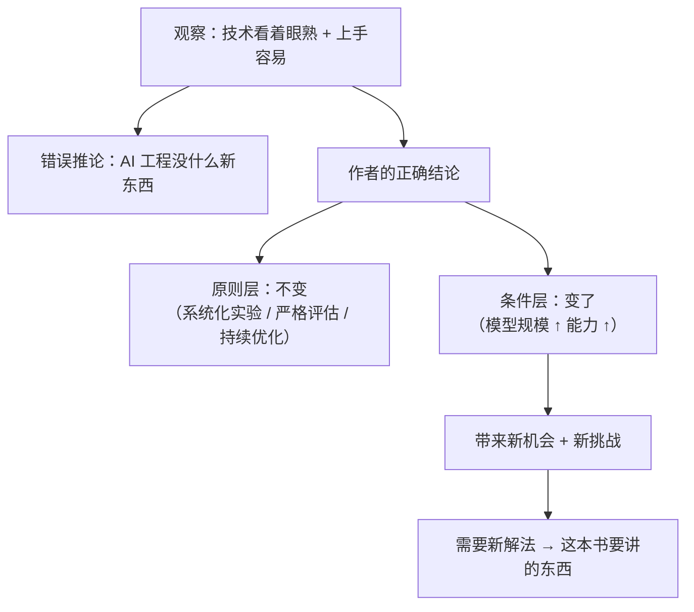
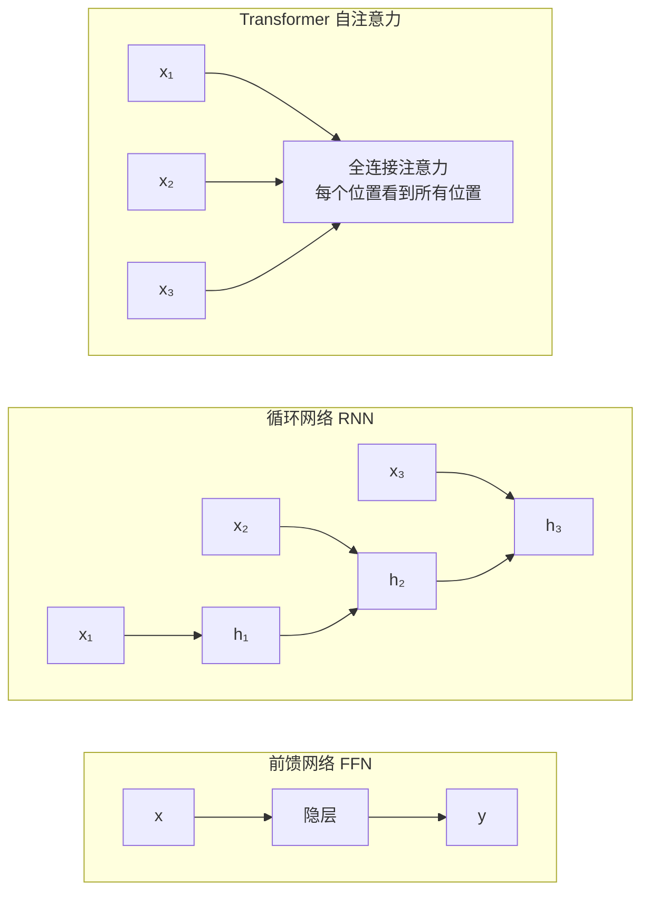
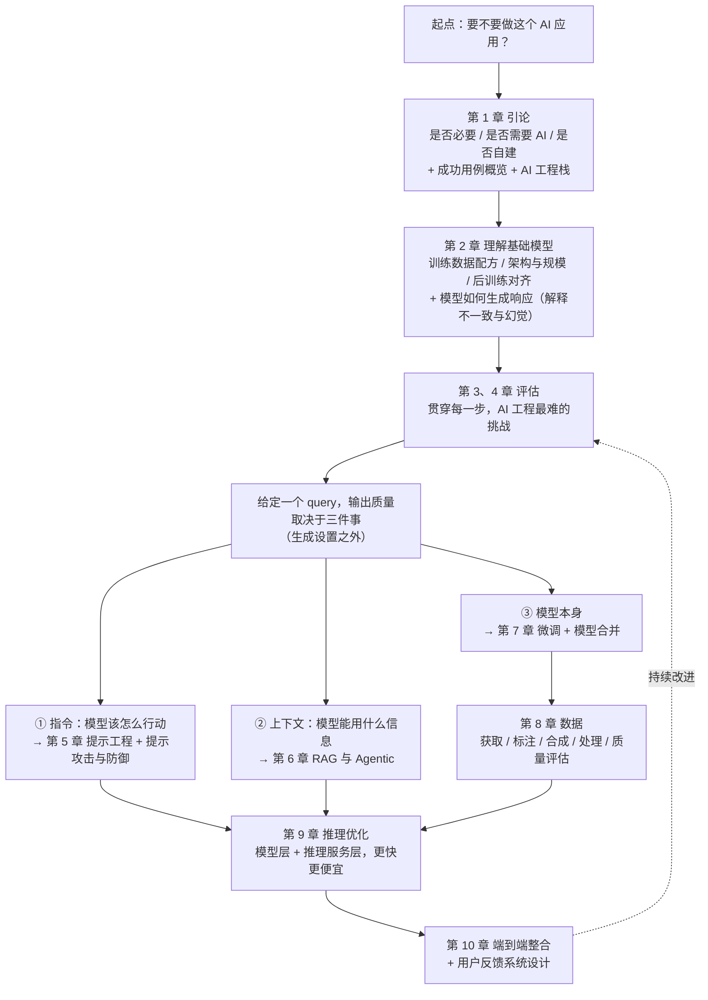

Chip Huyen，*AI Engineering*，O'Reilly，2025 年第一版（2024 年 12 月首印）。本笔记沿 Preface 的小节顺序展开，把背景、概念边界和实践用法放在同一条学习主线上。

## 0. 学习目标与主线

读完这一章，应当能回答四个问题：

- ChatGPT 为什么没有只带来线性的能力提升，而是触发了应用数量的非线性增长？
- 开发门槛下降之后，为什么仍然需要一门独立的 AI Engineering？
- AIE 与传统机器学习、DMLS 的关系是什么，哪些知识值得长期投入？
- 这本书不教什么、写给谁，以及十章内容如何对应一条真实的应用开发流程？

主线可以压缩为：**模型能力跨过阈值 → 大量场景同时可行 → 更多开发者可以参与 → demo 激增 → 评估、可靠性、成本与安全成为新的工程瓶颈**。前言先解释这条变化，再界定本书的任务、读者和路线，最后通过写作与评审过程展示一种以假设验证和多视角反馈为核心的方法。

---

## 1. 从 ChatGPT 冲击到 AI Engineering 的问题意识

### 1.1 真正令人意外的不是模型变大

ChatGPT 发布时，Chip Huyen 和许多同行一样感到迷茫。但让她意外的并不是模型规模或能力本身。这个区分很重要：AI 社区早已知道，更大的数据、更强的算力和更大的模型通常会带来更好的结果；若变化仅仅是模型继续变强，那么已有的机器学习叙事已经足以解释它。

真正需要解释的是技术能力如何传导到应用侧。此前容易采用一种线性直觉：指标提高一点，可做的应用也增加一点；ChatGPT 之后出现的却是应用可能性的爆发。AI Engineering 的问题意识由此产生：当通用模型已经可用，核心工作不再只是继续训练更强的模型，还包括识别场景、适配模型，并把原型变成可靠系统。

### 1.2 规模化为何不是 2022 年才出现的新发现

AlexNet 在 2012 年的 ImageNet 竞赛中把 top-5 错误率从约 26% 降到约 16%，其成功同时依赖约 120 万张标注图像、两块 GTX 580 GPU 和约 6000 万参数。论文作者当时已经判断，等待更快的 GPU 和更大的数据集，就可能继续改善结果。十年后的基础模型规模化，延续的正是这条经验规律。

这段历史提供了两个判断依据：

- **规模化是旧知识**：Ilya Sutskever 后来联合创立 OpenAI，GPT 系列把这条路线推到了更大尺度；Chip Huyen 在 2017 年做语言模型评估翻译质量的项目时，也曾得到「还需要更好的语言模型」这一结论。
- **应用爆发才是待解释的增量**：研究问题不应停在「模型为何更强」，而要继续追问「为何看似有限的指标提升，会突然解锁数量级更多的产品」。

这也体现了本书贯穿始终的研究方式：先把新现象与已有知识对齐，再集中分析旧框架解释不了的增量。

### 1.3 真正的意外：能力的小幅提升 → 应用的爆炸式增长

作者原本预期模型质量指标小幅提高，只会带来应用数量的小幅增长；实际发生的却是新可能性爆发。两种心智模型的差别如下：

| | 作者原本的心智模型 | 实际发生的 |
|---|---|---|
| 输入 | 模型质量指标小幅提升 | 模型质量指标小幅提升 |
| 输出 | 应用数量小幅增加 | 应用可能性爆炸 |
| 关系 | 近似**线性** | 强烈**非线性** |

如果应用数量与模型质量线性相关，那么研究的重点仍然只是把模型做得更好，工程只是交付环节。若大量应用各有一个可用性阈值，模型一旦进入阈值密集区，许多场景就会同时变得可行。此时，**识别刚刚跨过阈值的场景，并把能力转化成可靠产品**，就成为一项独立工作。

### 1.4 第二个变化：入门门槛的塌陷

能力提升不只增加了 AI 应用需求，也降低了开发者的入门门槛。调用 API、编写提示，甚至使用无代码工具，就能做出第一个原型。于是 AI 从少数专家才能训练和部署的专门学科，变成更多开发者可直接使用的通用开发工具。

这里有两个独立变化：

1. **需求侧**：能力提升 → 想做 AI 应用的人变多了（第 1.3 节讲的）。
2. **供给侧**：门槛下降 → 能做 AI 应用的人变多了（本节）。

两者相乘，才完整解释了 2023 年之后的应用膨胀：既有更多需求，也有更多供给者。成本结构的变化进一步解释了门槛为何下降：

| 环节 | 传统 ML：每个任务训练一个模型 | 基础模型：适配一个通用模型 |
|---|---|---|
| 起点 | 收集并标注任务专属数据 | 调用已有模型 |
| 核心技能 | 特征工程、训练、调参 | 提示、上下文构造、评估 |
| 首个原型 | 走完数据、训练、部署链路 | 一段提示即可开始 |
| 算力 | 自行承担训练 | 主要承担推理，也可交给 API |
| 是否必须写代码 | 通常必须 | 不一定 |
| 主要成本 | 训练期 | 推理与运营期 |

门槛下降并不等于成本消失，而是把一次性的资本和稀缺技能投入，部分转化为按量增长的推理成本与运营问题。这正是第 9 章需要专门讨论推理优化的原因：原型更容易了，规模化后的成本控制仍然困难。

### 1.5 「新」技术其实站在旧技术之上

今天的 AI 应用看起来很新，但其基础并不新。语言建模、信息检索和机器学习系统工程分别提供了三条重要的技术血统。

**(1) 语言建模：1950 年代就有论文。**

Claude Shannon 在 1948 年已用马尔可夫链近似英文，1951 年又测量了英文的熵与冗余度。语言模型的核心任务始终是：给定前文，预测下一个符号的概率分布。

n-gram 用马尔可夫假设把依赖截断为前面有限数量的词，Transformer 则用注意力处理更长范围的依赖。从 Shannon 到 GPT，基本目标没有变，变化的是条件概率的逼近方式和可用规模。

**(2) RAG：检索技术比 "RAG" 这个词老得多。**

RAG（Retrieval-Augmented Generation，检索增强生成）这一名称因 2020 年 Lewis 等人的论文而流行，但其中的检索来自搜索和推荐系统积累了几十年的方法：倒排索引、TF-IDF、BM25 和向量近邻检索。RAG 的召回、排序和索引更新问题，因此应当首先借鉴信息检索领域，而不是重新发明。

**(3) 传统 ML 的部署最佳实践依然适用。** 作者点名了三条：

- **systematic experimentation**（系统化实验）：变更要可控、可复现、可归因，一次只动一个变量。
- **rigorous evaluation**（严格评估）：没有可信的评估，任何「优化」都是自欺。
- **relentless optimization for faster and cheaper models**（对更快更便宜的模型不懈优化）：性能和成本是产品属性，不是事后补丁。

这三条预告了全书骨架：评估占第 3、4 章，推理优化占第 9 章。新应用并没有使旧工程原则失效，反而让这些原则更重要。

### 1.6 熟悉感陷阱：为什么「没什么新东西」是错的

技术有旧基础、接口又容易上手，很容易导出一个错误结论：AI 工程没有新东西。更准确的判断是，**原则层没有变，工作条件变了**。模型规模、生成能力和自然语言接口带来了新的机会，也暴露出旧方法无法直接处理的问题。

这个转折划定了内容边界：本书不重复传统 ML 已经讲透的部分，也不把一切包装成全新发现，而是聚焦于**旧原则在新规模与新能力下需要怎样的新解法**。后续章节给出三个具体落点：

1. **评估变难**：开放式生成没有唯一正确答案，「正确」本身需要定义，因此第 3、4 章专门讨论评估。
2. **成本重心改变**：基础模型单次推理昂贵，推理优化从次要问题变成系统设计的一部分。
3. **接口变得模糊**：自然语言既灵活又可被注入攻击，提示设计和安全边界必须一起考虑。

### 1.7 作者写这本书的方法论（以及为什么读者该在意）

作者写书也是一个学习和验证过程。她使用了 **100 多次对话与访谈**的笔记，参与者包括主要 AI 实验室的研究者、框架开发者、不同规模公司的 AI 与数据负责人、产品经理、社区研究者和独立应用开发者。除此之外还有两个重要反馈源：

- **早期读者**：他们「检验我的假设、引入不同视角、让我接触到新问题和新方法」。
- **博客社区**：部分章节在博客上发布后收到了数千条评论，「很多给了我新视角，或者验证了某个假设」。

书出版后，这个过程继续向读者开放，反馈可以通过 X、LinkedIn 或 `hi@huyenchip.com` 提交。

**为什么把这段写进前言？** 三个作用：

1. **建立可信度**：说明书中的判断不是一个人的经验外推，而是跨角色（研究员 / 框架开发者 / 高管 / 产品经理 / 独立开发者）交叉验证过的。
2. **暗示方法论**：作者用来写书的方法——**广泛访谈 + 早期评审 + 公开验证假设**——恰好也是她推荐给读者做 AI 产品的方法（先验证假设，再规模化）。
3. **设定读者关系**：这本书是「一起学习」，不是「专家布道」。这也对应后文她说自己常用「we」来指代「你和我」。

---

## 2. 本书的定位：用基础模型构建应用

### 2.1 核心定义：foundation model、LLM、LMM、adaptation

本书提供一套把基础模型适配到具体应用的框架，讨论对象同时包括大语言模型（LLM）和大多模态模型（LMM）。要理解这句话，需要先分清四个概念：

- **Foundation model（基础模型）**：在大规模、多样化数据上训练，并能适配到许多下游任务的通用模型。它是上层应用的地基，而不是某个单一任务的终点。
- **LLM（大语言模型）**：以文本理解和生成为核心的基础模型。
- **LMM（大多模态模型）**：能共同处理文本、图像、音频或视频等多种模态。这里第二个 M 是 **Multimodal**。
- **Adaptation（适配）**：不从头训练通用模型，而是让它在特定场景中达到可用水平。常见手段按侵入性大致排列为：提示工程 → 上下文构造（RAG / 工具调用）→ 参数高效微调 → 全参数微调 → 继续预训练。

这条谱系也是一条成本与风险轴：越靠后，对数据、算力、评估和运维的要求通常越高。因此本书不提供唯一配方，而是比较多种方案的权衡，并给出选择方案时应当追问的问题。读者要学的是**如何判断**，而不是记住某个工具的固定步骤。

### 2.2 本书要回答的问题清单

下面的问题按书中的顺序排列，并结合章节路线说明其难点：

| # | 要回答的问题 | 难点在哪 | 主要章节 |
|---|---|---|---|
| 1 | Should I build this AI application?（我该不该做这个 AI 应用？） | 「能做」不等于「该做」；要评估用例价值、期望管理、里程碑与维护成本 | 第 1 章 |
| 2 | How do I evaluate my application? Can I use AI to evaluate AI outputs? | 开放式输出没有唯一正确答案；用 AI 当裁判又引入了裁判自身的偏差 | 第 3、4 章 |
| 3 | What causes hallucinations? How do I detect and mitigate hallucinations? | 幻觉源于模型生成机制本身，不是可以「修掉的 bug」 | 第 2 章（成因）、第 3–4 章（检测） |
| 4 | What are the best practices for prompt engineering? | 提示对措辞敏感、难以系统化；还要防提示攻击 | 第 5 章 |
| 5 | Why does RAG work? What are the strategies for doing RAG? | 检索质量决定生成质量，但检索本身是个完整的子系统 | 第 6 章 |
| 6 | What's an agent? How do I build and evaluate an agent? | 定义本身不清晰；多步决策使错误会累积放大 | 第 6 章 |
| 7 | When to finetune a model? When not to finetune a model? | 微调常被当成第一选择，实际往往应是最后选择 | 第 7 章 |
| 8 | How much data do I need? How do I validate the quality of my data? | 「数据质量」缺乏公认定义 | 第 8 章 |
| 9 | How do I make my model faster, cheaper, and secure? | 三者互相冲突，是多目标权衡 | 第 9 章 |
| 10 | How do I create a feedback loop to improve my application continually? | 反馈既要有用又不能损害用户体验 | 第 10 章 |

除此之外，本书还帮助读者在模型类型、评估基准、用例和应用范式构成的复杂版图中导航。

第 6 个问题尤其值得注意：书中把「什么是 agent」与「如何构建和评估 agent」并列，说明其定义和工程范式都还没有完全稳定。RAG 已被较充分理解并在生产中得到验证；agentic 模式潜力更大，但复杂度更高，仍处在探索期。使用时应把成熟度也纳入方案选择，而不能只比较能力上限。

### 2.3 本书的证据基础

本书的论证建立在三层证据上：作者亲历的案例、大量参考文献，以及不同背景专家的广泛评审。写作历时两年，经验基础则来自过去十年对语言模型和 ML 系统的实践。阅读时可以据此区分证据类型：案例提供情境，文献提供可追溯依据，多视角评审用于发现单一经验的盲点。

### 2.4 为什么写「基本原理」而不是工具

与 DMLS 一样，本书选择基本原理而不是特定工具或 API，因为工具很快过时，原理通常更长寿。作者在 2017 年教授 TensorFlow 时已经亲历了教程随版本迅速失效的问题。

具体 API 的有效期往往较短，基础原理通常更长，因此应结合知识寿命和使用频率分配学习时间。

### 2.5 专栏：AIE 与 DMLS 如何配合阅读

这一专栏比较本书 AIE 与前作 *Designing Machine Learning Systems*（DMLS）的关系：

| 维度 | DMLS（前作） | AIE（本书） |
|---|---|---|
| 建模对象 | 传统 ML 模型 | 基础模型 |
| 主要工作 | 表格数据标注、特征工程、模型训练 | 提示工程、上下文构造、参数高效微调 |
| 是否自足 | 是（self-contained、模块化） | 是（self-contained、模块化） |
| 阅读顺序 | 可独立阅读 | 可独立阅读 |

两本书的关系可归纳为三点：

1. **有重叠但不重复**：因为基础模型也是 ML 模型，有些概念两边都相关。若某话题与 AIE 相关但 DMLS 已充分讨论，本书**仍会覆盖，但篇幅更少**，并给出参考资源指针。
2. **各有独占内容**：很多话题只在 DMLS 里有，也有很多只在 AIE 里有。
3. **现实系统两者都要**：真实系统常常同时包含传统 ML 模型和基础模型，所以两边知识往往都需要。本书第 1 章会专门讲传统 ML 工程与 AI 工程的区别。

因此，AIE 是增量而不是替代。如果系统包含排序、风控或推荐模型，DMLS 仍然重要。可以用一个问题选择阅读重点：核心难点是**训练和运营任务模型**，还是**适配已有基础模型**？前者偏向 DMLS，后者偏向 AIE；混合系统则需要两套知识。

### 2.6 作者的核心方法论：如何判断「什么会长久」

工具变化太快，一本强调基本原理的书首先要解决筛选问题：怎样判断一个问题或方法能否长久？作者使用三条判据，它们分别处理机制判断、认知偏差和时间证据。

#### 判据一：这个问题是「根本性的」还是「会被更好的模型消解掉的」？

第一步是判断问题源于 AI 工作机制的根本限制，还是只源于当前模型不够好。前者值得分析其挑战和应对方案，后者则可能随模型进步而自行消退。

- **根本性问题**：源于「AI 是怎么工作的」这件事本身。比如模型是概率性地采样生成的，那么输出的不确定性就不是缺陷而是机制，无法靠「模型更强」消除，只能靠工程手段管理。
- **临时性问题**：只是当下模型不够好造成的。比如某个模型数不清单词里有几个字母，这类问题会随着模型迭代自己消失。**为临时性问题设计复杂的工程方案，是浪费。**

这个判据把工程投入引向「即使模型继续进步也必须管理」的部分，使知识与系统设计更具时间稳健性。

**局限**：区分本身是主观判断。今天看似根本的限制，可能被范式转换绕开。作者自己也承认「判断什么会长久往往很难」，所以才需要另外两条判据交叉验证。

与这条判据配套的是 **start-simple**：先尝试成本更低的简单方案，再随着新挑战增加复杂度。即使简单方案失败，它也建立了基线并暴露真正瓶颈。若失败会错过不可逆的时间窗口、触发安全事故或造成严重机会损失，则不能只按尝试成本决策。

#### 判据二：请教比自己聪明的人

第二条判据是咨询广泛的研究者与工程师网络，了解他们认为最重要的问题和方案。这与前面的 100 多次访谈呼应：个人很难准确判断技术寿命，跨组织、跨角色的外部意见能暴露盲点。不过，专家意见仍可能受到共同范式和选择偏差影响，因此它是校正机制，不是多数表决。

#### 判据三：Lindy 定律

作者偶尔还使用 Lindy 定律：一项技术已经存在得越久，预期未来还能存在的时间也越长。它是第三条、辅助性的启发式，不是首要判据。

Lindy 定律把已经存活的时间视为未来持续性的证据：一项技术每多存活一年，就多一份它持续解决真实问题的证据。它适合表达没有明确内在寿命上限的思想或技术范式，但这只是启发式，不是所有技术都必然服从的定律。

使用 Lindy 时需要同时记住局限：

1. 它更适合思想、技术范式和书籍等没有明确内在损耗的对象，不适合人、灯泡或硬盘。
2. 对极重尾的寿命分布，平均预期本身可能不稳定。
3. 它描述同类对象的条件平均，不预测某一项具体技术何时消失。
4. 已经存活很久的对象本就经过筛选，幸存者偏差既支持这种启发，也限制它的外推能力。
5. 年龄证据不能替代机制分析和专家校正，所以它只能放在三条判据的最后。

#### 例外声明

本书也会有意收录少量可能短命的概念：有些对当下开发者立即有用，有些则展示了值得迁移的问题解决方式。阅读具体技巧时，因此要分开评估两种价值：技巧还能使用多久，以及它背后的问题分解方式能否迁移到下一代工具。

---

## 3. 本书边界与阅读前置知识

这一节用排除法收紧边界：本书既不是特定工具的操作教程，也不是从头讲授机器学习理论的教材。明确这两点，才能用正确预期阅读后面的框架与权衡。

### 3.1 它不是教程（tutorial）

书中会提到具体工具，也会用伪代码说明概念，但不会逐步教授某个工具。它提供的是选择工具的框架：比较方案权衡，并列出评估方案时应该追问的问题。具体操作通常可以从在线教程或 AI 助手中快速获得。

阅读时要注意三个细节：

1. 书里的代码是 **pseudocode（伪代码）**，用途是「说明概念」，不是「可直接运行的示例」。所以读到代码时，应当关注它表达的**结构**而非语法细节。
2. 本书提供的是 **selecting tools 的框架**，不是 using tools 的步骤。这两者的知识寿命差别巨大（回看 2.4 节）。
3. 教程和聊天机器人已经擅长帮助开发者上手，书的有限篇幅更适合承载不易被检索替代的判断框架。

因此，学习目标不是照着搭出一个 RAG 系统，而是能判断场景是否需要 RAG、应选哪种变体，以及如何验证它确实有效。

### 3.2 它不是 ML 理论书

本书不解释神经网络的完整原理，也不教读者从头构建和训练模型；只在应用讨论需要时引入相关理论。它的目标是解决真实问题，而不是建立完整的 ML 理论体系。

但“不要求 ML 背景”不等于“ML 背景没有价值”。要求可以分成三层：

| 层次 | 结论 |
|---|---|
| 能不能做 AI 应用？ | 没有 ML 背景也能做 |
| 能不能读这本书？ | 没有 ML 背景也能读 |
| 做得好不好、少不少踩坑？ | 有 ML 基础会**明显更好** |

ML 基础是效果放大器，不是准入门槛。遇到陌生概念时，正文会给出高层解释或学习资源；下面先补齐最常用的一组概念，减少后续阅读阻力。

### 3.3 前置知识：从生成机制到评估指标

前言只把这些概念列为有帮助的背景知识，没有展开。下面采用标准 ML 定义，把它们组织为「问题 → 直觉 → 条件与局限 → 使用方式」：

- 概率：分布、采样、确定性。
- 训练：监督、自监督、对数似然、损失函数、梯度下降、反向传播、超参数调优。
- 架构：前馈网络、循环网络、Transformer。
- 指标：准确率、精确率、召回率、F1、余弦相似度、交叉熵。

下面按这四组逐一展开。

---

#### 3.3.1 概率组：分布、采样、确定性

基础模型先计算下一个 token 的概率分布，再根据解码策略选择结果。这直接影响输出复现性、幻觉表现，以及能否通过采样参数低成本改变行为。第 2 章对 AI 概率本质的讨论就建立在这三个概念上。

**（1）分布（distribution）**

*直觉*：一个「把概率质量分配到各种可能结果上」的账本。

语言模型在每一步输出的，就是词表上所有候选 token 的概率分布：每项概率都不为负，合计为 1。

**（2）采样（sampling）**

*直觉*：按账本上的比例掷骰子，抽出一个结果。

从一个分布中采样，就是让每个候选按它获得的概率被选中。常见实现会把 0 到 1 的随机数落到按概率划分的累计区间中。

**（3）确定性（determinism）**

*直觉*：同样的输入，永远给出同样的输出。

*关键区分*：**模型本身（前向计算）是确定性的**——给定输入和权重，logits 是唯一确定的；**不确定性来自最后那一步采样**。这是一个极常被混淆的点：

| 说法 | 对错 | 说明 |
|---|---|---|
| 「LLM 是随机的，所以不可复现」 | 不精确 | 随机性主要来自解码策略；固定随机种子 + 贪心解码可以复现 |
| 「把 temperature 设为零就完全确定了」 | 基本对，但有例外 | 数学上退化为 argmax；实际中浮点非结合性、批处理调度、并行归约顺序仍可能造成微小差异 |
| 「幻觉是随机性导致的」 | 不对 | 贪心解码（完全确定）同样会产生幻觉；随机性只影响幻觉的表现形式 |

**（4）把三者串起来：温度采样（temperature sampling）**

这是最能体现「分布—采样—确定性」关系的机制，也是“先调生成设置”这一低成本优化建议的基础。温度会拉伸或压缩候选 token 的打分差距：温度越低，概率越集中于最高分候选，输出越接近贪心解码；温度越高，候选概率越接近均匀，随机性越强。**温度是一个在确定性与随机性之间连续插值的旋钮。**

---

#### 3.3.2 监督 vs 自监督（supervision / self-supervision）

**要解决什么问题？** 监督学习需要人工标注，而标注是整个 ML 流程里最贵、最慢、最难扩展的一环。自监督就是为了绕开这个瓶颈而生的——它让数据**自己给自己当标签**。理解这一点，才能理解「为什么基础模型能用互联网规模的数据训练出来」。

| | 监督学习（supervised） | 自监督学习（self-supervised） |
|---|---|---|
| 训练样本 | 输入与人工标注的目标 | 输入与从输入自身构造的目标 |
| 标签来源 | 外部人工 | 数据内部结构 |
| 典型例子 | 图像→类别、评论→情感 | 句子前文 → 下一个词 |
| 数据规模上限 | 受标注预算限制 | 受原始数据量限制（大几个数量级） |
| 与本书关系 | 微调阶段常用（第 7、8 章） | 预训练阶段的基础（第 2 章） |

*语言建模为什么是自监督的严格说明*：给定一段文本，可以把每个位置之前的文本作为输入，把该位置的词作为目标。标签就是输入文本里的下一个词，**没有任何人工标注**。所以任何一段自然文本都能直接变成训练数据。

**易混淆点**：自监督**不是**无监督（unsupervised）。无监督学习没有标签，通常优化聚类或密度目标；自监督有明确的标签和监督信号，只是标签自动来自数据。它在训练机制上属于监督学习，在数据获取上免去人工标注。

---

#### 3.3.3 对数似然 → 交叉熵 → 困惑度：一条关系链

对数似然、交叉熵和困惑度是第 3 章评估方法的核心工具，也可以看作同一个优化目标的三种表达。

**第 0 步：语言模型在优化什么？**

给定一批训练数据，并暂时假设它们独立同分布，我们希望模型为真实出现的数据分配更高概率。

**第 1 步：最大似然（likelihood）。**

独立同分布假设下，整批数据的似然来自每个样本概率的连乘。直接连乘大量小于 1 的概率会数值下溢，而且不好求导。

**第 2 步：取对数 → 对数似然（log-likelihood）。**

对数是严格单调递增函数，因此取对数不会改变最优点，却能把连乘变成连加，使计算更稳定、梯度更容易求。

**第 3 步：取负、取平均 → 负对数似然（NLL），即损失函数。**

优化器通常做最小化，因此对平均对数似然取负。取平均还让损失不直接随数据量增长，便于比较。**最大化对数似然等价于最小化 NLL。**

**第 4 步：NLL 就是经验交叉熵。**

熵表示一个分布的平均不确定性；交叉熵表示真实数据来自一个分布、却用另一个分布设计编码时的平均代价。把按样本计算的 NLL 按各取值出现频率重新汇总，就得到经验交叉熵。**这就是分类和语言建模的损失函数都叫交叉熵的原因。**

**第 5 步：交叉熵由熵与 KL 散度构成，解释「模型学到的极限在哪」。**

交叉熵可以分成数据本身的熵与模型分布和真实分布之间的 KL 散度。KL 散度不会小于零，只有两种分布一致时才达到最低值。因此，最小化交叉熵、最小化 KL 散度和最大似然指向同一目标。交叉熵还有由数据固有不确定性决定的下界：下一个词本来就不唯一，即使模型完美，损失也未必能降到 0。

**第 6 步：困惑度（perplexity）由交叉熵指数转换得到。**

*直觉解释（这是最好用的一种）*：**困惑度表示模型在每一步等效地在多少个候选中犹豫**。困惑度为 1 意味着完全确定；若它接近词表大小，则说明模型几乎没有缩小候选范围。

致谢中特别感谢 Nutan Sahoo 提供了一种优雅的困惑度解释；完整讨论位于第 3 章。

---

#### 3.3.4 损失函数（loss function）

*要解决的问题*：训练是一个优化过程，优化必须有一个**标量目标**。损失函数就是把「模型有多差」压缩成一个可微的标量。

损失衡量单个预测与目标的差距；总损失汇总训练样本上的这些差距。

*常见选择与其概率解释*（这一层对应关系值得记牢）：

| 损失 | 定义方式 | 等价的概率假设 |
|---|---|---|
| 均方误差 MSE | 预测误差平方的平均 | 高斯噪声下的最大似然 |
| 二分类交叉熵 BCE | 二分类概率预测的平均对数损失 | 伯努利分布下的最大似然 |
| 多分类交叉熵 | 真实类别预测概率的平均对数损失 | 类别分布下的最大似然 |

**统一视角**：这三个「不同的损失」其实都是第 3.3.3 节那条关系链的特例——**换一个对数据分布的假设，就换出一个损失函数**。这也是为什么说「损失函数的选择，本质是对噪声的建模假设」。

*必须可微吗？* 用梯度下降训练时，需要**几乎处处可微**（ReLU 在 0 点不可微不影响，因为测度为零）。像 accuracy 这类不可微指标不能直接当损失，只能当评估指标——**这正是「损失函数」和「评估指标」必须区分开的原因**：

| | 损失函数 | 评估指标 |
|---|---|---|
| 服务对象 | 优化器 | 人 / 决策 |
| 要求 | 可微、数值稳定 | 可解释、贴近业务目标 |
| 例子 | 交叉熵 | 准确率、F1、人工评分 |
| 风险 | loss 降了指标不一定涨 | 指标好但业务不一定好 |

---

#### 3.3.5 梯度下降（gradient descent）

*要解决的问题*：模型参数可能有上百亿维，损失无法解析求解，也无法穷举。

*直觉*：在山上蒙着眼睛下山，每一步朝当前脚下最陡的下坡方向迈一小步。

梯度下降利用损失在当前位置的局部变化方向，朝损失下降的方向更新参数；每次移动的幅度称为**学习率**。局部近似只在小范围成立，所以学习率必须足够小；过大时会震荡甚至发散。**这也是实践中「loss 突然飞了」最常见的原因之一。**

实际训练通常使用随机梯度下降（SGD），因为全量梯度每一步都要遍历全部数据。SGD 用一个小批量估计梯度；在独立均匀采样条件下，它是无偏估计，但会引入方差。Adam 等自适应优化器进一步为不同参数调整有效步长。

---

#### 3.3.6 反向传播（backpropagation）

*要解决的问题*：梯度下降需要得到所有参数对损失的影响。若用有限差分逐个参数估计，每个参数至少要一次前向传播，对亿级参数完全不可行。**反向传播把这个代价降到与少数几次前向计算同一数量级，这是深度学习能规模化的算法前提。**

*核心依据*：**链式法则**。反向传播在计算图上从输出往输入方向复用中间结果，逐层传递梯度。前向缓存的激活值会在反向时被复用，这既是它高效的关键，也解释了微调为何占用大量显存。第 7 章计算模型内存时，除了权重，还必须计入激活值和优化器状态。

---

#### 3.3.7 超参数调优（hyperparameter tuning）

*先分清两个词*（这是初学者最常混淆的一组）：

| | 参数（parameter） | 超参数（hyperparameter） |
|---|---|---|
| 谁决定 | 训练过程自动学出来 | 人（或搜索算法）在训练前指定 |
| 例子 | 网络权重与偏置 | 学习率、批大小、层数、LoRA 的秩、温度、top-p |
| 是否可微 | 是（所以能用梯度下降） | 通常不可微（所以只能搜索） |

*要解决的问题*：超参数无法用梯度优化，只能在配置空间里**搜索**，而每次评估一组配置都要跑一次完整训练/评估——代价高昂。

*常见策略与权衡*：

| 方法 | 做法 | 优点 | 缺点 |
|---|---|---|---|
| 网格搜索 | 每维取若干候选，做笛卡尔积 | 简单、可复现 | 维数增加时组合数呈指数增长 |
| 随机搜索 | 从各维分布中随机采样组合 | 相同预算下通常更优 | 结果有随机性 |
| 贝叶斯优化 | 用代理模型指导下一次采样 | 样本效率最高 | 实现复杂、串行 |

随机搜索常优于网格搜索：只要好配置在搜索空间中占有一定比例，增加独立随机采样次数就会快速降低全部落空的概率。这个结论依赖独立采样和好配置比例固定的假设，但不直接随超参数维数恶化；网格搜索则容易在不重要的维度上重复花费预算。这是 Bergstra 与 Bengio（2012）论证的核心直觉。

---

#### 3.3.8 神经网络架构：feedforward / recurrent / transformer

阅读后续章节前，需要能区分三类架构的目标、信息路径和计算代价。

**(1) 前馈网络（feedforward / MLP）**

*要解决的问题*：拟合任意的固定维度输入→输出映射。
*局限*：输入长度固定，没有顺序概念。**它仍然是今天所有大模型内部的基本构件**（Transformer 每层里的 FFN 子层）。

**(2) 循环网络（recurrent / RNN）**

*要解决的问题*：处理变长序列，把「历史」压缩进固定维度的隐状态。
*核心局限（必须理解）*：
- **信息瓶颈**：无论前文多长，都要压进固定维度的隐状态。
- **梯度消失/爆炸**：反向传播经过许多时间步时，连续相乘可能让梯度迅速缩小或放大。LSTM/GRU 用门控缓解，但没根治。
- **无法并行**：当前隐状态依赖上一步，训练时序列方向必须串行，这是它在大规模训练上输给 Transformer 的**决定性原因**。

**(3) Transformer（自注意力）**

自注意力根据查询与键的匹配程度，对值进行加权聚合。缩放点积可以避免维度增大时 logits 尺度过大、softmax 过度饱和，从而让梯度保持在较好的区间。

*为什么它赢了*：
- **并行**：所有位置同时计算，训练可充分利用 GPU。
- **路径长度**：任意两个位置之间都能直接交换信息，RNN 则要逐步传递，因此长程依赖更易学习。

*它的代价*：

| 架构 | 每层计算复杂度 | 顺序操作数 | 最长依赖路径 |
|---|---|---|---|
| 自注意力 | 随序列长度二次增长 | 常数级 | 常数级 |
| 循环网络 | 随序列长度线性增长 | 随序列长度线性增长 | 随序列长度线性增长 |
| 卷积 | 随序列长度线性增长 | 常数级 | 随序列长度对数增长 |

这张表直接解释了后续两大主题。标准自注意力对序列长度的计算复杂度呈二次增长，因此上下文不是免费的：加入更多 token 会显著增加计算和内存开销。第 6 章的上下文构造必须权衡信息收益与成本，第 9 章则通过 KV 缓存和高效注意力等方法降低推理代价。长上下文的昂贵首先来自架构性质，而不只是实现质量。

---

#### 3.3.9 指标组：accuracy / precision / recall / F1 / cosine similarity / cross entropy

交叉熵已在 3.3.3 讲完，这里讲其余五个。

**混淆矩阵（confusion matrix）是所有分类指标的共同基础：**

| | 预测为正 | 预测为负 |
|---|---|---|
| **实际为正** | TP（真正例） | FN（假负例，漏报） |
| **实际为负** | FP（假正例，误报） | TN（真负例） |

- **准确率 Accuracy**：全部判断里正确的比例。
- **精确率 Precision**：「**我说是正的，有多少真是正的**」，衡量误报。
- **召回率 Recall**：「**真正的正例，我抓到了多少**」，衡量漏报。

*记忆法*：分母不同——精确率的分母是「我预测的正例总数」（看我说的），召回率的分母是「实际的正例总数」（看真相）。

**为什么需要 P/R 而不能只看 Accuracy？** 因为在类别不平衡时 Accuracy 会骗人。

**F1：为什么用调和平均？**

F1 是精确率和召回率的调和平均。

*为什么不是算术平均？* 因为算术平均对「一个极高、一个极低」的极端情况不敏感，而这种情况恰恰是最需要被惩罚的（比如只预测一个最有把握的样本为正，精确率 100%，但几乎什么都没抓到）。

**结论：F1 会被精确率和召回率中较小的一项牢牢限制。这就是调和平均的意义——短板决定成绩。**

**F-beta：当精确率和召回率不一样重要时**

F-beta 是二者的加权调和平均。权重偏向召回时适合怕漏报的疾病筛查、内容安全；偏向精确率时适合怕误报的自动执行操作；两者同等重要时就是 F1。

**余弦相似度（cosine similarity）**

*要解决的问题*：比较两个向量（如文本嵌入）的**方向**是否一致，而忽略长度差异。这是 RAG 检索常用的相似度度量，第 3 章的嵌入介绍和第 6 章都会用到。

**结论：在归一化向量上，余弦相似度最大与欧氏距离最小会给出等价排序**——这解释了为什么很多向量数据库把向量归一化后直接用内积检索。

**常见误解辨析（指标篇）**：

| 误解 | 纠正 |
|---|---|
| 「准确率高就说明模型好」 | 类别不平衡时准确率会被多数类主导。上例全预测为负也有 98% 准确率 |
| 「F1 是 P 和 R 的平均，所以 0.5 算中等」 | F1 是调和平均，会被较差的一项牢牢限制；0.5 可能意味着某一项只有 0.25 |
| 「余弦相似度高就是语义相同」 | 它只反映嵌入空间的方向接近；嵌入模型学到什么，它就反映什么，可能包含表面词汇相似 |
| 「交叉熵可以降到 0」 | 下界由数据本身的熵决定，见 3.3.3 第 5 步 |
| 「困惑度可以跨模型直接比」 | 依赖分词方式和词表；不同 tokenizer 的 PPL 不可直接比较 |

---

#### 3.3.10 自测清单

读正文前，用这份清单自查。**能用一句话讲清楚**就算过关：

- [ ] 分布、采样、确定性的区别；温度如何在两端插值（3.3.1）
- [ ] 自监督为什么让语言模型可以用海量无标注文本训练（3.3.2）
- [ ] 为什么「最大似然」「最小交叉熵」「最小 KL」是同一件事（3.3.3）
- [ ] 为什么损失降不到 0（3.3.3 第 5 步）
- [ ] 困惑度的「等效候选数」直觉（3.3.3 第 6 步）
- [ ] 损失函数与评估指标的区别（3.3.4）
- [ ] 学习率过大为什么会发散（3.3.5）
- [ ] 反向传播为什么比逐参数数值求导快得多，以及它为什么吃显存（3.3.6）
- [ ] 参数与超参数的区别；随机搜索为什么常胜过网格搜索（3.3.7）
- [ ] 注意力成本随序列长度二次增长，这如何决定长上下文的成本（3.3.8）
- [ ] Precision 与 Recall 的分母分别是什么；F1 为什么用调和平均（3.3.9）

---

## 4. 目标读者：从 demo 走向生产

本书面向希望用基础模型解决真实问题的人。它是技术书，主要使用 AI 工程师、ML 工程师、数据科学家、工程经理和技术产品经理熟悉的语言。三类场景最符合其目标：

| # | 典型场景 | 学习重点 |
|---|---|---|
| 1 | 你正在构建或优化 AI 应用——不论是从零开始，还是想**跨过 demo 阶段、进入生产就绪状态**；你可能正面临幻觉、安全、延迟或成本问题，需要针对性方案 | 「demo → production」是本书最核心的目标读者画像。**能跑通 demo 和能上生产，中间隔着评估、可靠性、成本、安全四道坎** |
| 2 | 你想让团队的 AI 开发流程更**系统化、更快、更可靠** | 面向流程与团队效率，而非单个模型效果 |
| 3 | 你想理解组织如何用基础模型改善**业务底线（bottom line）**，以及如何为此组建团队 | 面向决策与组织，说明本书也照顾管理视角 |

此外还有四类次要受益人群：

- **工具开发者**：想找出 AI 工程里「服务不足的领域」，为产品在生态中定位。
- **研究者**：想更好地理解 AI 的真实用例。
- **求职者**：想搞清楚做 AI 工程师需要哪些技能。
- **任何人**：想更好地理解 AI 的能力与局限，以及它会如何影响不同岗位。

部分内容会深入技术细节，但正文会提前提示。读者可以按职责和已有知识跳过局部技术细节，不影响主线；第 7 章的模型内存计算就是典型的技术深水区。

---

## 5. 章节路线：沿 AI 应用开发流程推进

全书目录按照典型 AI 应用开发流程组织，同时保持模块化，已经掌握或与当前任务无关的部分可以跳读。完整路线如下：

逐段还原作者的说明：

**第 1 章｜要不要做**
在决定动手之前，需要先理解这个过程涉及什么，并回答：这个应用有必要吗？需要用 AI 吗？必须自己造吗？第 1 章帮你回答这些，并覆盖一系列成功用例，让你对基础模型能做什么有个体感。

**第 2 章｜理解基础模型**

构建应用不要求先成为 ML 专家，但理解基础模型内部如何工作，能帮助开发者更有效地使用它。第 2 章分析训练数据配方、模型架构与规模、对齐训练，以及模型如何生成响应。这些机制解释了输出不一致和幻觉。

一个直接用法是：遇到质量问题时，先检查温度、top-p 等生成设置。它们调整成本低，有时能显著改善表现，符合 start-simple 原则；其机制见 3.3.1 节。

**第 3、4 章｜评估**

一旦决定构建应用，评估就不是最后验收，而是每一步的组成部分。开放式输出缺少唯一答案，使评估成为 AI 工程最困难的挑战之一，因此全书用两章分别讨论模型与系统层面的评估。

**第 5–7 章｜优化响应质量的三个抓手**

除生成设置外，给定一个查询，响应质量主要取决于三件事：模型收到的**指令**、回答时可用的**上下文**，以及**模型本身**。

| 抓手 | 章节 | 该章具体内容 | 侵入性/成本 |
|---|---|---|---|
| 指令 | 第 5 章 | 什么是提示、提示工程为什么有效、最佳实践；以及**坏人如何用提示攻击你的应用、如何防御** | 最低 |
| 上下文 | 第 6 章 | 两大上下文构造范式：**RAG** 与 **agentic** | 中 |
| 模型 | 第 7 章 | 各种微调方法 + 更实验性的 **model merging**；含一节技术性较强的**模型内存占用计算** | 最高 |

这个分解把「效果不好」变成可定位的问题：要求是否说清，必要信息是否可见，模型是否具备所需能力？三类问题的解法、成本和风险不同。若把上下文缺失误判为模型能力不足，就可能花费大量资源微调，而一个检索步骤已经足够。

第 6 章还区分两种范式的成熟度：RAG 更容易理解，已有较多生产验证；agentic 模式潜力更强，但链路更长、错误更易累积，目前仍在探索。

第 7、8 章给出一个反直觉提醒：现成框架已使微调过程相对直接，真正困难的往往是获得并验证合适的微调数据。

**第 8 章｜数据**
覆盖数据获取、数据标注、数据合成、数据处理。作者强调这一章的很多话题**超出微调场景**依然适用，包括「什么叫数据质量」以及「怎么评估你的数据质量」。

**第 9 章｜推理优化**

第 5–8 章主要改善质量，第 9 章则在模型层和推理服务层让推理更快、更便宜。是否深入阅读取决于部署方式：

- 用**模型 API**（别人替你托管）→ API 大概率已经帮你做了推理优化，这章可以略读。
- **自托管**（开源模型或自研模型）→ 这章的很多技术需要你自己实现。

**第 10 章｜端到端整合 + 用户反馈**
把全书概念汇合起来端到端搭一个应用。后半章更偏产品：**如何设计一个既能收集到有用反馈、又不损害用户体验的用户反馈系统**。

书中常用“我们”指作者与读者，这是作者教学经历形成的写作习惯，也延续了 1.7 节的定位：写作是一段共同学习过程，而不是单向讲授。

---

## 6. 排版约定：提示词也是工程资产

排版约定本身不是知识重点，但有一个与 AI 工程直接相关的信号：输入模型的提示词与变量、函数等程序元素一样使用等宽字体。

| 样式 | 用途 |
|---|---|
| *Italic*（斜体） | 新术语、URL、电子邮件地址、文件名、文件扩展名 |
| `Constant width`（等宽） | 程序清单；段落中指代程序元素，如变量名或函数名、数据库、数据类型、环境变量、语句、关键字，**以及输入给模型的提示（input prompts into models）** |
| **`Constant width bold`**（等宽粗体） | 应由用户**逐字输入**的命令或文本 |
| `Constant width italic`（等宽斜体） | 应替换为用户自己提供的值、或由上下文决定的值的文本 |

此外，书中用不同提示框区分建议、一般注释和警告。把提示词纳入程序元素，意味着它不应只是聊天窗口中的临时文本，而应像代码一样被版本化、评审、测试和监控。

---

## 7. 配套资源、许可与更新渠道

### 7.1 配套代码仓库

配套仓库 **https://github.com/chiphuyen/aie-book** 包含四类内容：

1. 代码示例与练习；
2. **AI 工程的额外资源**：重要论文和有用工具；
3. **书里因篇幅太深而没能展开的话题**；
4. 对写书过程感兴趣的人：**幕后信息与本书的统计数据**。

仓库承担持续更新的部分：遇到正文点到为止的主题，可先在那里查论文、工具和扩展材料。

技术问题或代码使用问题：support@oreilly.com。

### 7.2 代码使用许可（O'Reilly 标准条款）

| 场景 | 是否需要许可 |
|---|---|
| 在你自己的程序和文档中使用示例代码 | **不需要** |
| 写一个用到书中若干代码片段的程序 | **不需要** |
| 引用本书并援引示例代码来回答问题 | **不需要** |
| 复制**大量**代码 | **需要** |
| 销售或分发书中的示例 | **需要** |
| 把**大量**示例代码并入你产品的文档 | **需要** |

署名「感谢但通常不强制」，推荐格式为：*"AI Engineering by Chip Huyen (O'Reilly). Copyright 2025 Developer Experience Advisory LLC, 978-1-098-16630-4."* 超出合理使用范围请联系 permissions@oreilly.com。

### 7.3 O'Reilly Online Learning 与联系方式

在线学习平台位于 **https://oreilly.com**。本书勘误与更新页为 **https://oreil.ly/ai-engineering**，技术与代码问题可联系 `support@oreilly.com`。由于首印时间是 2024 年 12 月，遇到可能已变化的数字、工具名或实现细节时，应先查更新页。

---

## 8. 致谢中的方法论：用多视角评审覆盖盲区

致谢不只是名字列表，它揭示了这本书的质量控制机制。

项目要在两年内完成一本覆盖面很广、约 15 万词的书，时间约束很强。作者没有只依赖少数同类专家，而是让不同角色从各自容易发现的失效模式出发评审。

评审矩阵如下：

| 评审者 | 提供的视角 | 主要作用 |
|---|---|---|
| Luke Metz | 技术假设的「共振板」（soundboard） | 检查假设，防止作者走上错误的路 |
| Han-chung Lee | 社区与最新动态 | 指出作者遗漏的资源 |
| （Luke 与 Han 是**第一轮**评审，在送给下一轮技术评审之前） | | |
| Vittorio Cretella、Andrei Lopatenko | 财富 500 强 AI 创新负责人 | 把深厚技术专长与**高管洞察**结合 |
| Vicki Reyzelman | 软件工程背景读者 | 帮作者「接地气」，保持对软件工程师的相关性 |
| Eugene Yan | 应用科学家 | 技术与情感支持 |
| Shawn Wang (swyx) | 社区 | 重要的「vibe check」，让作者对书更有信心 |
| Sanyam Bhutani | 学习者视角 | 不仅写反馈，还**录视频**解释反馈 |
| Kyle Kranen | 深度学习 lead | 访谈同事并分享微调流程的 writeup，**指导了微调章** |
| Mark Saroufim | 效率优化 | 引荐效率相关资源 |
| （Kyle 与 Mark 的反馈对**第 7、9 章**至关重要） | | |
| Kittipat "Bot" Kampa | AI 平台 | 分享了他对 AI 平台的详细可视化思考 |
| Denys Linkov | 评估与平台 | 系统化的评估与平台建设方法 |
| Chetan Tekur | 应用范式 | 给出帮助作者组织 **AI 应用范式**的例子 |
| Shengzhi (Alex) Li、Hien Luu | AI 架构 | 对 AI 架构草稿的反馈 |
| Aileen Bui | **产品经理视角** | 独特的产品视角反馈与案例 |
| Todor Markov | RAG 与 Agents | 可执行的建议 |
| Tal Kachman | 微调 | 最后关头推动微调章完成 |
| Douglas Bailley | 早期读者中的「超级读者」 | 大量深思熟虑的反馈 |
| Nutan Sahoo | 早期读者 | **建议了一种优雅的方式来解释困惑度（perplexity）** |

此外，作者列出了一长串在交流中给过她想法的人（Andrew Francis、Charles Frye、Hamel Husain、Jeremy Howard、Maxime Labonne、Nathan Lambert、Omar Khattab、Sebastian Raschka、Soumith Chintala、Tim Dettmers、Victor Sanh 等数十人），并坦承「人的记忆必然有疏漏，如果漏了你的名字请提醒我」。

O'Reilly 团队：开发编辑 Melissa Potter、Corbin Collins、Jill Leonard；制作编辑 Elizabeth Kelly；文字编辑 Liz Wheeler（作者称其为「我合作过的最挑剔的文字编辑」）；Nicole Butterfield 从想法到成品全程督办。

作者把本书视为职业生涯经验的积累，也强调每一位合作者都教会了她如何把 ML 带入现实世界。更可迁移的做法是构造**视角多样化的评审矩阵**：技术深度 × 高管决策 × 软件工程 × 产品 × 学习者 × 社区脉搏。

这与设计评估集遵循同一原则：同质评审者容易一致漏掉某类问题，多样化评审者才能覆盖不同失效模式。对 AI 应用而言，技术正确性、业务价值、可用性、安全和学习成本也需要由不同角色共同检查。

---

## 9. 学习检查：把前言转成项目决策

选择一个候选 AI 应用，用下面十个问题检查自己是否真正掌握了前言的主线：

1. **问题价值**：用户问题是否真实存在，为什么值得解决，是否必须使用 AI？
2. **非线性机会**：模型是否刚跨过该场景的可用阈值？准确率、延迟、成本和可控性是否同时满足最低条件？
3. **系统分工**：哪些部分适合传统 ML，哪些部分需要基础模型？应借助 DMLS、AIE，还是两套方法共同设计？
4. **最小基线**：能否先用生成设置和简单提示建立可测量基线，再决定是否增加 RAG、工具调用或微调？
5. **评估闭环**：成功标准是什么，离线评估、线上指标和人工判断分别负责什么，评估是否贯穿开发全过程？
6. **质量诊断**：当前失败来自指令不清、上下文缺失、模型能力不足，还是采样设置不合适？
7. **成熟度选择**：RAG 是否已经足够？引入 agent 后新增的步骤、权限、错误传播和评估成本是否值得？
8. **数据条件**：若需要微调，是否已经有足量且可信的数据，能否验证标注与合成数据质量？
9. **生产约束**：幻觉、安全、延迟、成本和用户反馈分别由什么机制监控与改进？
10. **长期价值**：这个难题源于机制还是暂时的模型缺陷？专家意见和技术年龄提供了什么证据？评审者是否覆盖技术、产品、业务与用户视角？

能够具体回答这些问题，才算从“会调用模型”进入 AI Engineering。下一章将进一步展开用例地图、应用规划方法，以及 AI 工程栈与传统 ML 工程、全栈工程的区别。
