> 对应原章：**Appendix A. A “Hello World” Deep Learning System**
> 本附录用一个可在本地启动的 MiniAutoML 系统，把全书中的 dataset management、model training、metadata、artifact storage 与 model serving 从抽象设计变成一次可观察的端到端实践。

## 本附录要回答的核心问题

1. 一个最小但完整的深度学习系统需要哪些角色、服务和存储？
2. 为什么作者先从 persona 和 user workflow 讲起，而不是先画技术架构？
3. Data engineer、data scientist、system developer 与 application developer 各负责什么？
4. Dataset management、training、metadata store、prediction service 与 MinIO 各保存或执行什么？
5. 为什么 dataset / model bytes 放在 MinIO，而 metadata 进入独立服务？
6. 训练服务为什么既要查询 DM，又要直接从 object storage 下载数据？
7. Prediction service 为什么必须同时获得 model metadata 和 model files？
8. 图 A.1 中 A–G 七条依赖分别表达什么？
9. 图 A.2 中 A–D 四条用户工作流怎样连接成模型生命周期？
10. 四个 shell scripts 分别模拟哪位角色的哪项工作？
11. Dataset ID、dataset commit/version、training job ID、run ID 与 model ID 有何关系？
12. gRPC、`grpcurl`、Docker container 和 MinIO 在实验中分别扮演什么角色？
13. Training request 中 algorithm、dataset、version、output model 与 hyperparameters 怎样共同决定一次训练？
14. 实时 training status 与 metadata metrics 为什么由两个 API 查询？
15. Prediction request 怎样指定某个模型并得到 `joy` 分类？
16. 添加 `optimism` 标签为什么主要改变 dataset，而不一定修改 training code？
17. 这个实验哪些设计只为教学简化，不能直接照搬到生产？
18. 怎样把这个最小系统逐步演进为安全、可靠、可扩展的生产平台？

原章是动手实验附录，没有新的复杂数学算法。本文会补充身份模型、控制面/数据面、状态机、容量与可靠性推导，用来解释脚本背后的系统原理；这些属于工程扩展，不是原章另行提出的公式。原书明确要求执行时以 GitHub 仓库最新 README 为准，因此书中镜像版本、端口、API 与脚本都应视为成书时快照。

---

## 附录定位：为什么从一个 Mini System 开始

全书目标是教读者按自身场景设计深度学习系统，但只读抽象原则容易产生三个问题：

- 不知道多个服务真正怎样连接；
- 不清楚不同角色何时调用哪个接口；
- 难以把 dataset ingestion、training、metadata 与 serving 看成同一生命周期。

作者采用 learning by doing：提供一个极简系统和 code lab，让读者亲手观察最常见的三类活动：

```text
dataset ingestion
-> model training
-> model serving
```

这个系统有意只保留关键组件：dataset management、training、metadata、prediction 与 object storage。它覆盖深度学习系统的基本闭环，却省略许多生产能力，因此适合建立整体心智模型，不是 production reference architecture。

### 本附录的阅读顺序

1. A.1 从用户视角认识 personas、组件与 workflows；
2. A.2.1 用四个 scripts 跑通系统启动、数据集构建、模型训练和模型服务；
3. A.2.2 自己新增 `optimism` label，完成第二次训练。

这与作者的教学逻辑一致：先知道“谁为什么做什么”，再看“系统内部如何支持”，最后通过改变需求检验是否真正理解。

---

## A.1 “Hello World” 深度学习系统导览

作者认为理解软件系统最快的方法是从用户视角出发。因此 A.1 的顺序不是 database → API → deployment，而是：


这种方法防止平台“为了技术而技术”：每个服务都应能追溯到某类用户任务。

### A.1.1 Personas

#### 什么是 Persona

Persona 是对一类系统用户及其目标、职责和交互方式的抽象。它不一定等于一个真实职位：

- 小团队里，一人可以同时是 data scientist 和 system developer；
- 大组织里，一个 persona 可能由多个团队承担；
- Persona 重点描述责任边界，而不是组织汇报关系。

原章为降低复杂度，只保留四种最小角色：

| Persona | 核心目标 | 主要输入 | 主要输出 | 主要系统交互 |
| --- | --- | --- | --- | --- |
| Data engineer | 让训练数据可用、可存储 | Raw data | Training dataset | DM service |
| Data scientist / researcher | 训练满足业务要求的模型 | Dataset、algorithm、parameters | Model、metrics | Training service |
| System developer | 构建并维护整套系统 | Service code / infrastructure | 可工作的 DL platform | 所有服务 |
| DL application developer | 把模型转化为产品能力 | Model inference API | Chatbot / app behavior | Prediction service |

原章提醒：这些职责是教学化简。第 1 章给出了更完整的角色定义；现实还可能有 ML engineer、platform engineer、labeling team、security、SRE、product manager 等。

#### 为什么这四类角色是最小集合

一个端到端深度学习能力至少要回答：

```text
谁准备数据？
谁构建模型？
谁维护平台？
谁把模型用于产品？
```

若只有前三类，没有 application developer，模型不会产生业务影响；若没有 system developer，实验脚本无法长期形成共享基础设施；若没有 data / model owner，系统没有有意义的输入输出。

### A.1.2 Data Engineers

#### 原章职责

Data engineer 负责收集、处理和保存用于 deep learning training 的 raw data。Mini system 提供 DM（dataset management）service，data engineer 通过它上传 raw training data。

实验准备的是 intent-classification dataset。Feng 在 A.2 中扮演 data engineer。

#### 为什么不让 Data Engineer 直接写 MinIO

直接向 object storage 上传文件只能得到一个 object key，DM service 还能建立：

- Dataset ID；
- Dataset type；
- Commit / version；
- Statistics；
- Audit history；
- Stable lookup contract。

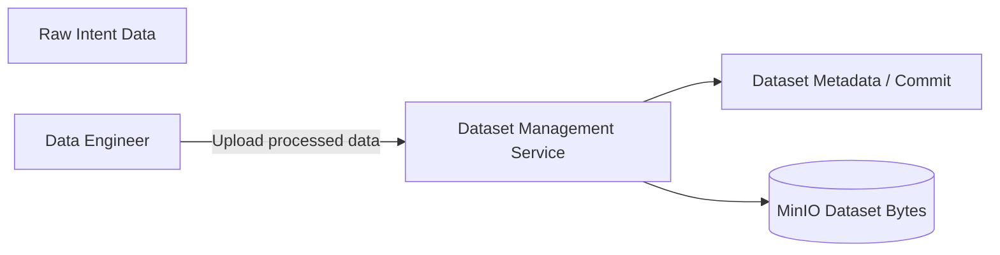

DM 将“文件”提升为可被训练服务引用的 versioned dataset。实验很简化，但这个边界与第 2 章的核心思想一致。

#### 生产环境还会增加什么

- Schema / quality validation；
- Access control 与审计；
- PII detection / retention；
- Split / sampling policy；
- Lineage 到 source systems；
- Large multipart upload；
- Idempotent commit；
- Dataset garbage collection。

这些不是附录 lab 的重点，不应因为 demo 未展示就认为不需要。

### A.1.3 Data Scientists / Researchers

#### 原章职责

Data scientist / researcher 开发 training algorithms，并产出满足 business requirements 的 models。他们是 model-training infrastructure 的客户。

Mini system 的 training service 负责运行 model training code。实验预先提供 intent-classification training code，Ivan 扮演 data scientist。

#### “Training Service 的客户”意味着什么

Data scientist 应关注：

- 使用哪个 dataset/version；
- 使用哪个 algorithm package；
- 设置哪些 hyperparameters；
- 观察 job status 与 metrics；
- 取得哪个 model ID。

平台则隐藏：

- 怎样启动 container；
- 怎样挂载 / 下载数据；
- 怎样采集日志和状态；
- 怎样保存 model bytes；
- 怎样写入 metadata。

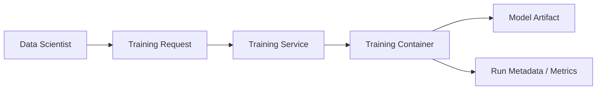

这就是 service abstraction 的价值：算法用户声明训练意图，不必为每次实验重新编写基础设施控制逻辑。

### A.1.4 System Developer

#### 原章职责

System developer 构建整套 deep learning system，并持续维护，确保 dataset uploading、model training 与 model serving 等 ML activities 正常运行。实验中 Tang 扮演该角色。

#### 为什么该角色横跨所有服务

System developer 不拥有具体业务模型，却拥有平台的非功能要求：

- Services 能否启动与发现；
- API / schema 是否兼容；
- MinIO、metadata 与 containers 是否健康；
- Logs、metrics、alerts 是否可用；
- Training / prediction 是否隔离；
- 升级、备份和恢复是否安全。

在 demo 中，这些责任被压缩成运行 `lab-001-start-all.sh` 并用 `docker ps` 检查 containers。生产中则会扩展为 CI/CD、orchestration、SRE、security 与 capacity management。

### A.1.5 Deep Learning Application Developers

#### 原章职责

Application developer 使用模型构建商业产品，例如 chatbot、self-driving software、facial-recognition mobile app。他们是系统最重要的客户，因为只有产品使用模型，才会创造业务影响和收入。

实验中 Johanna 把自己想象成 chatbot developer，向 prediction service 发送文本，取得 intent / emotion category。

#### 为什么 Application Developer 不是“最后顺便接一下 API”

他们决定 model inference 怎样进入真实产品：

- Request schema；
- Deadline 与 retry；
- Prediction 怎样映射为业务动作；
- Error / fallback；
- Model version 是否显式；
- User feedback 怎样回流。

模型离线指标再高，如果 application 无法可靠消费 response，就没有端到端价值。

### 四类 Persona 的责任交接

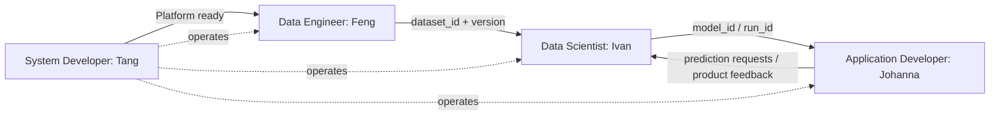

共同的 IDs 是角色间可执行的交付物。只说“数据好了”“模型好了”不够；下游需要稳定、可查询的引用。

### A.1.6 Sample System Overview

Mini system 包含四个 services 和一个 storage system。

#### 组件一：Data / Dataset Management Service

职责：存储与获取 datasets。

它接收上传，生成 dataset metadata / ID / commit，并把 dataset bytes 保存到 MinIO。Training service 可通过它查询 dataset location 与 version。

#### 组件二：Model Training Service

职责：运行 model training code。

它接收 gRPC training request，解析 algorithm、dataset 和 parameters，启动 training container，监控 job，保存 model files，并把 run metadata / metrics 写入 metadata store。

#### 组件三：Metadata Store Service

职责：保存 model metadata，例如 model name、version、algorithm；实验还存 run status、dataset tracing 与 per-epoch metrics。

Metadata store 保存小型结构化描述与关系，不是 model bytes 的主存储。

#### 组件四：Prediction Service

职责：执行 models，处理 customer prediction requests。

它按 request 中的 model / run ID 查询 metadata，定位并下载 model files，然后调用对应 predictor 返回分类结果。

#### 组件五：MinIO Storage

MinIO 在本机提供类似 Amazon S3 的 object storage。它保存两类大对象：

- Dataset bytes；
- Model files。

实验选 MinIO 的原因是：本地可部署、S3-like object API、无需真实 cloud account，适合展示 metadata / bytes 分离。

### 为什么 Metadata 与 Object Bytes 分开

| Metadata Store | MinIO Object Storage |
| --- | --- |
| Dataset / run / model IDs | Dataset / model bytes |
| Name、version、algorithm | Large files / directories |
| Status、metrics、tracing | High-throughput object transfer |
| Filter / query / relation | Key / URI lookup |

可把一个 model reference 写成：

$$
ModelRef=(model\_id,metadata,object\_uri,digest)
$$

原章 lab 未突出 digest，但生产系统需要它验证 bytes 与 metadata 指向同一不可变内容。

### 图 A.1：A–G 七条服务依赖

原图用 directed arrows 表达内部依赖。按原章文字与图中标号：

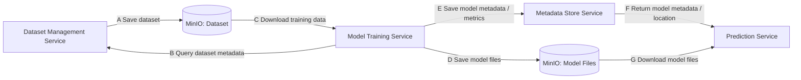

#### A：DM → MinIO Dataset

DM 持久化 dataset bytes。上传完成后才能安全发布 dataset commit / ID。

#### B：Training Service → DM

Training service 按 dataset ID / version 查询 DM，获得训练数据描述与位置。它不应猜 object key。

#### C：MinIO Dataset → Training Service

Training runtime 下载实际 training bytes。B 是 metadata lookup，C 是 data transfer，两者不是重复步骤。

#### D：Training Service → MinIO Model Files

训练完成后把 weights、vocabulary、labels 等 model files 保存到 object storage。

#### E：Training Service → Metadata Store

写入 run state、model name / version / algorithm、metrics 与 dataset tracing。Metadata 让 model 可查询和可追溯。

#### F：Metadata Store → Prediction Service

Prediction service 查询应加载哪个 model，以及 model files 在哪里。箭头表示 metadata dependency / 返回路径；实际请求方向是 prediction service 发起 query。

#### G：MinIO Model Files → Prediction Service

Prediction service / predictor 下载并加载 model bytes，随后才能执行 request。

### 图 A.1 的两条平面

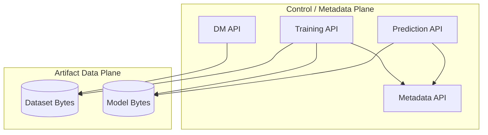

API 传 IDs、配置、status 和 URI；MinIO 传大对象。若把 dataset 直接塞进 gRPC training request，会造成超大消息、重复拷贝和恢复困难。

### Training 与 Prediction 的端到端时序

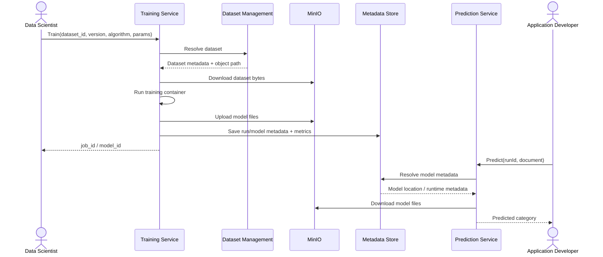

这是附录的核心闭环：dataset ID 进入训练，model / run ID 进入预测，metadata 与 bytes 在中间通过服务协作。

### A.1.7 User Workflows

图 A.2 从 persona 视角展示四个场景。

#### Scenario A：Data Management

```text
A.1 Data engineer uploads raw training data to DM
A.2 DM ingests data and stores a training dataset in MinIO
```

“Ingests” 不只是 copy；概念上还包括处理、组织为训练格式、生成 metadata 与返回 dataset ID。

#### Scenario B：Model Training

```text
B.1 Data scientist writes training code and submits a request
B.2 Training service executes code and stores model files in MinIO
B.3 Training service stores model metadata in metadata store
```

Model bytes 与 metadata 分别持久化，但通过 run / model ID 关联。

#### Scenario C：Model Serving

```text
C.1 Application developer sends prediction request
C.2 Prediction service resolves metadata, loads model, returns inference
```

Application 不直接访问 MinIO 或 metadata DB，从而与模型存储和加载细节解耦。

#### Scenario D：System Maintenance

System developer 构建并维护 autoML / deep learning system。图中用一条简化箭头表示，但责任覆盖所有 service / storage，而不是只维护 metadata store。

### 四个场景如何连接

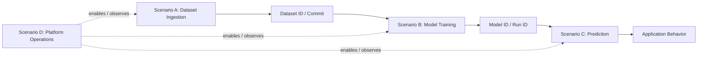

Scenario A 的 output 是 B 的 input；B 的 output 是 C 的 input；D 为 A–C 提供运行基础。四个 workflows 不是彼此独立的 demo 菜单，而是一个简化 model lifecycle。

### A.1 的核心设计推理

```text
产品要消费模型
-> 需要 Prediction Service

Prediction Service 要加载可定位模型
-> 需要 Model Files + Metadata Store

模型必须被可重复训练
-> 需要 Training Service

Training Service 必须取得版本化数据
-> 需要 Dataset Management + Object Storage

所有服务必须可运行和维护
-> 需要 System Developer / Platform Operations
```

作者从用户职责推导服务，再用 IDs 和 artifacts 连接服务。这比先选择 Docker、gRPC 或 MinIO 更稳健，因为底层技术可以替换，用户目标与领域关系仍然存在。

### A.1 的简化边界

这个 mini system 没有完整展示：

- Authentication / authorization / tenant isolation；
- Workflow orchestrator；
- HPO service；
- Distributed training；
- Dataset quality / labeling governance；
- Model registry promotion / traffic split；
- Autoscaling、SLO、HA、backup；
- Security scanning / secret management；
- Drift、business outcome 与 feedback loop。

这些能力在正文其他章节展开。附录的价值是把最小数据流跑通，不是证明四个 services 足以支撑任何生产场景。

---

## A.2 Lab Demo

A.1 建立了角色和架构视图，A.2 开始 learning by doing。原章让四位虚构角色合作训练 intent-classification model，并用它给任意文本分类：

| 角色 | Persona | 本实验动作 |
| --- | --- | --- |
| Tang | System developer | 启动并检查系统 |
| Feng | Data engineer | 准备并上传 dataset |
| Ivan | Data scientist | 提交并观察 training job |
| Johanna | Application developer | 发送 prediction request |

四步对应典型模型开发主干：


为了降低环境搭建门槛，作者把 microservices Dockerized，并用 shell scripts 自动化交互。这使读者把注意力放在服务协作，而不是手工输入几十条 `docker run` / `grpcurl` 命令。

### 运行前的版本与环境边界

原章要求未来更新后始终参考 GitHub repository 的最新 README。当前仓库说明相较书中快照补充了：

- OS：较新的 macOS、Linux 或 Windows 上的 WSL；
- JDK 11+；
- 建议使用全新 Conda environment；
- Docker Desktop；
- Kubernetes 为部分示例可选，附录这条 local Docker lab 主线不以它为核心；
- MinIO client `mc`；
- `grpcurl`；
- `jq`；
- 必须从 repository root 执行 scripts。

本文涉及“当前仓库实现”的具体判断，固定在审阅 commit `fa9eb34858f9a5a743489f31348700b4ce32154e`；未来 `main` 发生变化时，应重新核对 README、scripts 与 service source。

当前 README 推荐：

```shell
conda create --name miniautoml-lab
conda activate miniautoml-lab
```

以及在执行 lab 前验证：

```shell
java --version
docker version
mc --version
grpcurl --version
jq --version
```

这些命令是运行条件检查，不是深度学习系统本身的设计要求。不同版本的依赖、CPU architecture 和 package repository 仍可能影响实验；执行时以仓库锁定版本和 README 为准。

### 当前脚本顺序

```text
scripts/lab-001-start-all.sh
scripts/lab-002-upload-data.sh
scripts/lab-003-first-training.sh DATASET_ID
scripts/lab-004-model-serving.sh RUN_ID "DOCUMENT"
scripts/lab-005-second-training.sh DATASET_ID
scripts/lab-999-tear-down.sh
```

原章正文把前四步分别叙述为无参数脚本，但当前 README / scripts 已要求：

- `lab-003-first-training.sh` 接受 `dataset_id`；
- `lab-004-model-serving.sh` 接受 `run_id` 与 document；
- `lab-003` 当前还会在训练完成后直接发送一次 sample prediction；
- `lab-999-tear-down.sh` 用于停止并删除 demo containers。

这说明书中的代码 listing 是概念与历史快照，仓库脚本才是具体可执行入口。

### A.2.1 Demo Steps

#### Step 1：System Setup

原章命令：

```shell
./scripts/lab-001-start-all.sh
```

Tang 运行脚本，下载预构建 images、创建 Docker network，并启动所有 containers。

##### 启动脚本做了什么

当前 `lab-001-start-all.sh` 的主要控制流程可概括为：

```text
source env-vars.sh
-> create Docker network "orca3" if absent
-> start MinIO
-> start data-management
-> start metadata-store
-> reset local model_cache
-> start custom intent predictor
-> start TorchServe predictor
-> start prediction-service
-> run the training-image pull check
-> start training-service
```

脚本通过“存在则跳过”减少重复启动，但当前实现主要检查 `docker ps -a` 中是否存在 container name。若 container 已存在但处于 stopped / unhealthy 状态，简单跳过不等于系统已 ready。生产启动流程必须检查 health / readiness，而不只检查对象存在。

当前 training-image 检查还有一个脚本 bug：`docker image ls | grep -vq predictor | grep -q ...` 的前一段使用 quiet mode，不向后一段输出可匹配内容，所以条件会走 `docker pull orca3/intent-classification:latest` 分支，而不是可靠地做到“仅在 image 缺失时拉取”。这不影响本附录的服务关系，但执行时可能产生额外网络访问；应修为直接使用 `docker image inspect` 或正确的单段匹配。

##### 当前公开 Demo Ports

仓库的 `env-vars.sh` 在书中对应版本上定义：

| Component | Host port |
| --- | ---: |
| MinIO | 9000 |
| Dataset management | 6000 |
| Prediction service | 6001 |
| Metadata store | 6002 |
| Training service | 6003 |
| Custom intent predictor | 6101 |
| TorchServe inference | 6102 |
| TorchServe management | 6103 |

Container 内 Java gRPC services 通常监听 51001，再映射到上述 host ports。端口可能随仓库更新而变化，脚本用 environment variables 而不是让用户在每个请求中复制常量。

脚本使用 `-p HOST_PORT:CONTAINER_PORT`，Docker 默认绑定所有 host interfaces，而不只绑定 loopback。即使示例请求写成 `localhost`，这些端口仍可能被同一 LAN 或其他可达网络访问；若要仅供本机使用，应显式写成 `-p 127.0.0.1:HOST_PORT:CONTAINER_PORT`，并配合 host firewall。

##### 验证运行中的 Containers

原章使用：


```shell
docker ps --format="table {{.Names}}\t{{.Image}}"
```


Listing A.1 的示例输出：

```text
NAMES                                 IMAGE
training-service                      orca3/services:latest
prediction-service                    orca3/services:latest
intent-classification-torch-predictor pytorch/torchserve:0.5.2-cpu
intent-classification-predictor       orca3/intent-classification-predictor
metadata-store                        orca3/services:latest
data-management                       orca3/services:latest
minio                                 minio/minio
```

这里有 **5 个逻辑服务 / 存储角色，却有 7 个 runtime containers**：

- 四个书中逻辑 services：DM、training、metadata、prediction；
- 一个 MinIO storage；
- 两个可选 / 对比 predictor backends：custom predictor 与 TorchServe。

“组件数”与“container 数”不是同一概念。Prediction service 是 frontend / router，predictor containers 承担具体 model runtime。

##### 为什么多个 Services 共用一个 Image

原章特别说明：除 predictors 外，DM、training、metadata、prediction 等服务多数来自同一个 `orca3/services` image，通过不同 JAR argument 启动。

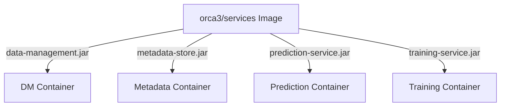

优点：

- Demo 只下载一个主要 image；
- 节省 disk；
- 构建和启动脚本简单。

原章明确说这**不是推荐的 production pattern**。生产中共享巨型 image 会：

- 增大每个服务的依赖和漏洞面；
- 任一服务改动导致全部 image 重新发布；
- 难独立版本、回滚和扫描；
- 把不需要的代码带入每个 container。

更稳妥的方式是 per-service image 或经过严格模块化的 shared base image。

##### `docker ps` 不等于 Readiness

`docker ps` 只能证明 process container 正在运行，不能证明：

- gRPC 已监听；
- MinIO bucket 已初始化；
- Metadata DB 可写；
- Prediction service 能访问 predictor；
- Training service 能创建 child container。

Demo 下一步的 API calls 实际兼任 integration smoke test。生产应有显式 health / readiness endpoints 和 dependency checks。

##### Demo 中必须警惕的安全设置

当前公开脚本为本地教学使用，包含：

- `grpcurl -plaintext`：无 TLS；
- 示例 MinIO root credentials 明文放在 public script；
- `latest` image tags；
- Training service 挂载 `/var/run/docker.sock`，可控制 host Docker daemon；
- 无明显 tenant isolation / production auth；
- MinIO、四个 service ports 和 predictor / management ports 都被发布到 host，默认并非 localhost-only。

这些设置让 lab 容易运行，却不应复制到共享、互联网或生产环境。尤其 Docker socket 等价于极高 host 权限，应由受控 job orchestrator / sandbox 取代。

##### Step 1 的成功条件

```text
All required containers are running
AND required gRPC ports respond
AND MinIO is accessible
AND service dependencies are healthy
```

原章只要求 Listing A.1 的容器检查；后面的三项是生产化解释。

#### Step 2：Building a Training Dataset

原章命令：

```shell
./scripts/lab-002-upload-data.sh
```

Feng 下载 raw data，进行训练所需修改，并上传给 DM service。完成后 DM 返回 unique dataset ID。

##### `prepare_data.py` 当前做了什么

当前仓库使用 Hugging Face `tweet_eval` 的 `emotion` split：

```python
import csv

from datasets import load_dataset


dataset = load_dataset("tweet_eval", "emotion", split="train")
label_names = dataset.features["label"].names
dataset = dataset.map(lambda row: {"label": label_names[row["label"]]})

part_1 = dataset.filter(lambda row: row["label"] != "optimism")
part_2 = dataset.filter(lambda row: row["label"] == "optimism")

part_1.to_pandas().to_csv(
        "tweet_emotion_part1.csv",
        header=False,
        index=False,
        quoting=csv.QUOTE_ALL,
)
part_2.to_pandas().to_csv(
        "tweet_emotion_part2.csv",
        header=False,
        index=False,
        quoting=csv.QUOTE_ALL,
)
```

代码语义：

- 把 numeric label 映射为 label name；
- `part_1` 故意排除 `optimism`，用于首次三分类训练；
- `part_2` 只包含 `optimism`，留给 A.2.2 的 dataset update；
- 两部分先生成 CSV，再由 shell script 上传。

这不是随机 train/test split，而是按 label 做教学性拆分。不能把 `part_2` 当作独立无偏 test set。

##### Script 的三阶段

当前 `lab-002-upload-data.sh`：

```text
1. Configure mc alias to local MinIO
2. Install / run data preparation and upload two CSV files to an upload area
3. Call DM CreateDataset with part_1 path
```

为什么 `part_2` 也提前上传？为了 A.2.2 更新 dataset 时直接引用 `upload/tweet_emotion_part2.csv`，但首次 `CreateDataset` 只 ingest `part_1`。

##### Object Upload 与 Dataset Creation 不同

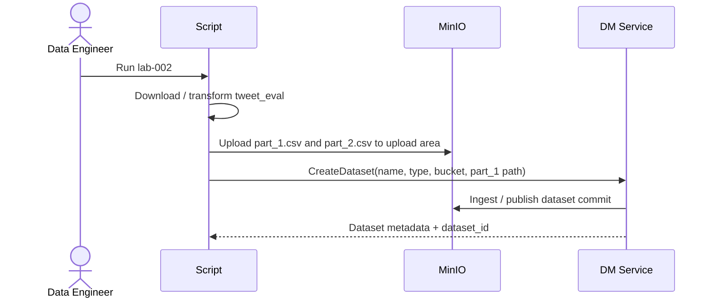

`mc cp` 只产生 raw object；`CreateDataset` 才产生可被 training service 引用的 logical dataset、commit 与 statistics。

##### Listing A.2：Dataset Metadata

去除书中注释编号后，示例为合法 JSON：

```json
{
    "dataset_id": "1",
    "name": "tweet_emotion",
    "dataset_type": "TEXT_INTENT",
    "last_updated_at": "2022-03-25T01:32:37.493612Z",
    "commits": [
        {
            "dataset_id": "1",
            "commit_id": "1",
            "created_at": "2022-03-25T01:32:38.919357Z",
            "commit_message": "Initial commit",
            "path": "dataset/1/commit/1",
            "statistics": {
                "numExamples": "2963",
                "numLabels": "3"
            }
        }
    ]
}
```

字段解释：

| 字段 | 含义 |
| --- | --- |
| `dataset_id` | Logical dataset identity |
| `name` | 人类可读名称 `tweet_emotion` |
| `dataset_type` | 数据 contract 类型 `TEXT_INTENT` |
| `last_updated_at` | Dataset metadata 最近更新时间 |
| `commits` | Version / audit history |
| `commit_id` | 该 dataset 下的 commit identity |
| `path` | Published object path |
| `numExamples` | 首次 commit 有 2963 个 examples |
| `numLabels` | 首次 commit 有 3 个 labels |

##### Dataset ID 与 Commit ID 不要混淆

```text
dataset_id = logical evolving dataset
commit_id = one appended dataset update
version_hash = current demo's selected-commit-set key for a materialized snapshot
```

首次 `dataset_id` 与 `commit_id` 可能恰好都是字符串 `"1"`，并不表示语义相同。A.2.2 更新时保留 `dataset_id="1"`，新增 commit；training 再用 `version_hash` 引用一组被选中并 materialize 的 commits。

当前实现中的名字容易误导：`version_hash` 不是 dataset bytes 的 cryptographic content digest。`PrepareTrainingDataset` 用 bitset 表示选中了哪些 commit，再把 bitset bytes 做 Base64 并加上 `hash` 前缀。因此它能作为该进程内 materialized snapshot 的选择 / lookup key，却不能证明底层 bytes 内容未被篡改。生产系统还应保存 manifest 与内容 digest。

##### 为什么 Training Request 还需要 Version Hash

只传 `dataset_id="1"` 会让 preparation 默认选择到 latest commit；未来 update 后重跑就会得到不同 commit 集合。当前 `lab-003` 先调用 `PrepareTrainingDataset`，取得 `version_hash`，再把它放进 training request：

$$
TrainingInput=(dataset\_id,version\_hash)
$$

这把 logical name 与 prepared-snapshot selection key 组合起来，使 training service 能查询同一个 materialized result。它比只传 dataset ID 更稳定，但不能替代内容 digest。

##### Step 2 的角色交接

Feng 不只告诉 Ivan“文件上传好了”，而是交付：

```text
dataset_id = "1"
dataset commit / version = resolved by DM
dataset type = TEXT_INTENT
statistics = 2963 examples, 3 labels
```

Ivan 接下来以 dataset ID 查询 DM，而不是访问 Feng 的本地 CSV path。

#### Step 3：Model Training

原章命令：

```shell
./scripts/lab-003-first-training.sh
```

当前仓库脚本要求传入 Step 2 返回的 ID：

```shell
./scripts/lab-003-first-training.sh 1
```

Ivan 首先构建 `training-code/text-classification`，并打包成 training image `orca3/intent-classification`。然后向 training service 提交请求，声明 dataset 和 training algorithm。

##### Training Code 与 Training Service 的关系

```text
Training code / image:
    knows how to train intent classifier

Training service:
    knows how to resolve data, launch image, track job, collect outputs
```

Training service 不应内置每种算法；algorithm image 是可替换执行单元。反过来，training image 不应自己实现平台的全套 job scheduler / registry。

##### 当前 Script 先准备 Dataset

```shell
grpcurl -plaintext \
    -d '{"dataset_id": "1"}' \
    localhost:6000 \
    data_management.DataManagementService/PrepareTrainingDataset
```

`PrepareTrainingDataset` 返回 `SnapshotVersion`，其中包含 selected commits 和 `version_hash`，并异步启动 dataset compression / materialization；它不直接返回最终 training root。Training service 的 tracker 随后用 `(dataset_id, version_hash)` 调用 `FetchTrainingDataset`：只有 `VersionedSnapshot.state == READY` 时，才取得 root bucket/path 并启动 training container。

```text
PrepareTrainingDataset(dataset_id)
-> SnapshotVersion(version_hash, selected commits)
-> asynchronous materialization

FetchTrainingDataset(dataset_id, version_hash)
-> RUNNING or READY
-> READY includes the training snapshot root used by the container
```

因此检查 prepared snapshot 不能只看 `Prepare` response；需要轮询 / 查询 `FetchTrainingDataset`。Commit-level statistics 来自 dataset metadata，materialized root/state 来自 `Fetch`，不要假设 `Prepare` 已返回 aggregate path / statistics。

##### Listing A.3：Training Request

原章的核心 payload 可整理为：

```json
{
    "metadata": {
        "algorithm": "intent-classification",
        "dataset_id": "1",
        "name": "test1",
        "train_data_version_hash": "hashAg==",
        "output_model_name": "twitter-model",
        "parameters": {
            "LR": "4",
            "EPOCHS": "15",
            "BATCH_SIZE": "64",
            "FC_SIZE": "128"
        }
    }
}
```

| 字段 | 作用 |
| --- | --- |
| `algorithm` | 查找 / 启动 intent-classification training image |
| `dataset_id` | Logical dataset identity |
| `train_data_version_hash` | 本次训练固定的数据版本 |
| `name` | Human-readable run request name |
| `output_model_name` | 输出模型逻辑名称 |
| `parameters` | 传给 training code 的 hyperparameters |

当前仓库的 `TrainingConfig` 把 `LR` 直接解析为 integer，训练代码再把它原样传给 `torch.optim.SGD(..., lr=config.LR)`；因此第一次训练的 learning rate 确实是 4，第二次 solution 是 50，没有隐藏缩放。这是非常大的教学参数，不能当作一般推荐值。所有 parameters 以 string 传输也只是简化，生产 contract 应有 typed schema、range validation 与 defaults。

两个 lab training scripts 都使用 `output_model_name="twitter-model"`。该字段不只是显示名称，还会成为 metadata store artifact repository 的 name / destination prefix；A.2.2 会看到这导致当前实现无法可靠保留两次训练的物理 model bytes。

##### gRPC Request 的完整调用

```shell
grpcurl -plaintext \
    -d '{
        "metadata": {
            "algorithm": "intent-classification",
            "dataset_id": "1",
            "name": "test1",
            "train_data_version_hash": "hashAg==",
            "output_model_name": "twitter-model",
            "parameters": {
                "LR": "4",
                "EPOCHS": "15",
                "BATCH_SIZE": "64",
                "FC_SIZE": "128"
            }
        }
    }' \
    localhost:6003 \
    training.TrainingService/Train
```

`grpcurl` 对 gRPC 的作用类似 `curl` 对 HTTP：无需编写 client application 即可调用 service method。`-plaintext` 适合 localhost demo，不适合不可信网络。

##### Training Service 内部时序

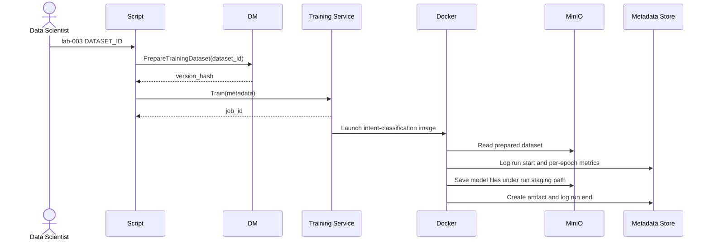

当前 demo 的 training service 通过 mounted Docker socket 启动 child training container，并根据 child-container exit status 维护 execution status。这是一种简便 local executor，不是安全多租户设计。Run start、epoch metrics、artifact creation 和 run end 则由 training code/container 直接调用 metadata-store APIs；不是 training service 代写最终 metadata。

##### Job ID 的作用

`Train` 是异步提交：service 先返回 `job_id`，训练在后台继续。Client 以它轮询状态：

```shell
grpcurl -plaintext \
    -d '{"job_id": "1"}' \
    localhost:6003 \
    training.TrainingService/GetTrainingStatus
```

示例状态变化：

```text
job 1 is currently in "launch" status, check back in 5 seconds
job 1 is currently in "running" status, check back in 5 seconds
job 1 is currently in "succeed" status
```

可抽象为：

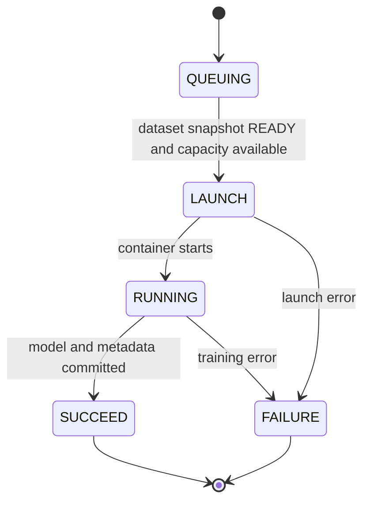

原章输出只展示 `launch`、`running`、`succeed`，但当前 protobuf 和 service 还实现字符串 `queuing`：job 在等待 prepared dataset 或 executor capacity 时处于该状态。生产仍需 canceled、lost、retrying、timeout 等状态与 attempt identity。

##### 为什么 Status 与 Metrics 来自两个 APIs

Listing A.4 查询：

```shell
grpcurl -plaintext \
    -d '{"job_id": "1"}' \
    localhost:6003 \
    training.TrainingService/GetTrainingStatus

grpcurl -plaintext \
    -d '{"run_id": "1"}' \
    localhost:6002 \
    metadata_store.MetadataStoreService/GetRunStatus
```

- Training service 是 execution authority，按 queue、container lifecycle 和 exit status 回答 job 是否仍运行；
- Training container 是 run metadata 的 writer，调用 metadata store 记录 run start、epoch、artifact 和 run end；
- Metadata store 是 experiment / lineage authority，保存并返回 run facts、metrics 和 artifacts。

两者信息相关但用途不同。真实系统要定义最终状态一致性：不能 training service 显示 success，而 model metadata / bytes 尚未 ready。

##### Listing A.4：Run Metadata 与 Metrics

原章示例去除省略号后，可抽取核心结构：

```json
{
    "run_info": {
        "start_time": "2022-03-25T14:25:44.395619",
        "end_time": "2022-03-25T14:25:48.261595",
        "success": true,
        "message": "test accuracy 0.520",
        "run_id": "1",
        "run_name": "training job 1",
        "tracing": {
            "dataset_id": "1",
            "version_hash": "hashAg==",
            "code_version": "231c0d2"
        },
        "epochs": {
            "0-10": {
                "start_time": "2022-03-25T14:25:46.880859",
                "end_time": "2022-03-25T14:25:47.054872",
                "run_id": "1",
                "epoch_id": "0-10",
                "metrics": {
                    "accuracy": "0.4925373134328358"
                }
            }
        }
    }
}
```

它展示四类事实：

1. **Execution**：start/end、success；
2. **Result**：final message / test accuracy；
3. **Lineage**：dataset ID、version hash、code version；
4. **Time series**：per-epoch metrics。

这说明 metadata store 不只是最终 model catalog，也是 training observability / reproducibility 的基础。

##### 当前 Train / Validation / Test Split 与 Metric 语义

当前 `train.py` 先设 `test_ratio=0.1`，再把剩余 90% 中的 95% 作为 train，因此近似比例为：

$$
train=85.5\%,\qquad validation=4.5\%,\qquad test=10\%
$$

代码使用 `torch.utils.data.random_split`，却未给 `generator` 或固定 random seed；每次 run 的三个 partitions 可能不同。Per-epoch `accuracy` 来自 validation loader，最终 message 中的 `test accuracy` 来自该次 run 随机生成的 test partition。

因此 Listing A.4 中 `0.4925...` 与 final `0.520` 不是同一数据子集上的两个时间点：前者是某 epoch validation accuracy，后者是训练结束后的 test accuracy。要比较第一次和第二次模型，应预先固定 split manifest / seed，并使用同一个 held-out test set；否则 data change、hyperparameters 和 sampled examples 会同时影响结果。

##### `job_id = run_id = model_id` 是 Demo 简化

原章明确说 model ID 也是 training job ID，并在 lab 中都使用字符串 `"1"`：

$$
job\_id=run\_id=model\_id
$$

这让角色交接和查询非常直观，但生产中通常应分开：

- 一个 job 可 retry，有多个 attempts；
- 一次 run 可产生多个 checkpoints / models；
- Job 可能失败而没有 model；
- 同一 model 可转换为多个 serving formats；
- Model identity 的生命周期长于 executor job。

更一般的关系是：

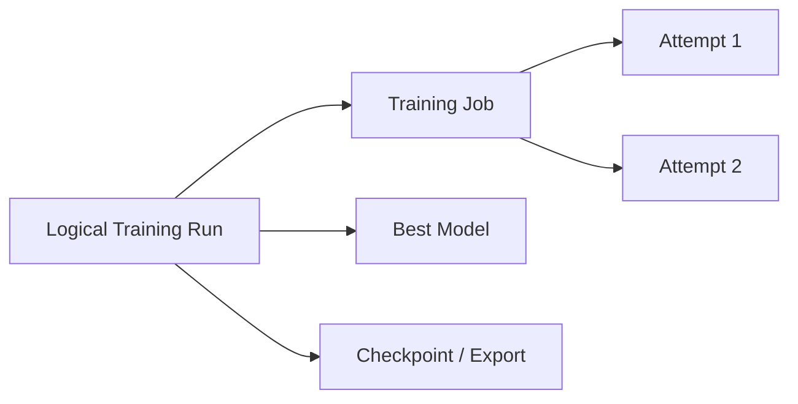

Demo 的 identity collapsing 是教学 convenience，不是领域不变量。

##### Polling 的成本与替代方式

当前 script 每 5 秒查询一次。如果有 $N$ 个并发 jobs，poll interval 为 $\Delta$，status query rate 约为：

$$
QPS_{poll}\approx\frac{N}{\Delta}
$$

1,000 个 jobs、5 秒 interval 约产生 200 QPS。规模增大后可使用 exponential backoff、long polling、server streaming、events 或 message notification。

##### Step 3 的角色交接

训练完成后，Ivan 给 Johanna `model_id / run_id`。此外平台已经保存：

- Dataset ID / version；
- Code version；
- Hyperparameters；
- Metrics；
- Model files；
- Execution status。

因此 Johanna 不需要知道训练 container、MinIO path 或 vocabulary filename，只需用稳定 ID 请求 prediction service。

#### Step 4：Model Serving

原章命令：

```shell
./scripts/lab-004-model-serving.sh
```

当前脚本要求两个参数：

```shell
./scripts/lab-004-model-serving.sh 1 \
    "You can have a certain arrogance, and I think that is fine, but never lose respect for others."
```

Johanna 正在开发 chatbot，希望用新训练的 intent-classification model 对 customer messages 分类。

##### Listing A.5：Prediction Request

```json
{
    "runId": "1",
    "document": "You can have a certain arrogance, and I think that's fine, but what you should never lose is the respect for the others."
}
```

```shell
grpcurl -plaintext \
    -d '{
        "runId": "1",
        "document": "You can have a certain arrogance, and I think that is fine, but never lose respect for others."
    }' \
    localhost:6001 \
    prediction.PredictionService/Predict
```

- `runId`：指定 lab 中的 model；
- `document`：待分类 text。

当前 API 使用 camelCase `runId`，metadata API 使用 snake_case `run_id`。这是不同 protobuf / API contract 的历史选择，client 必须按实际 schema 发送，不能凭字段含义自行替换。

##### Prediction Service 自动加载模型

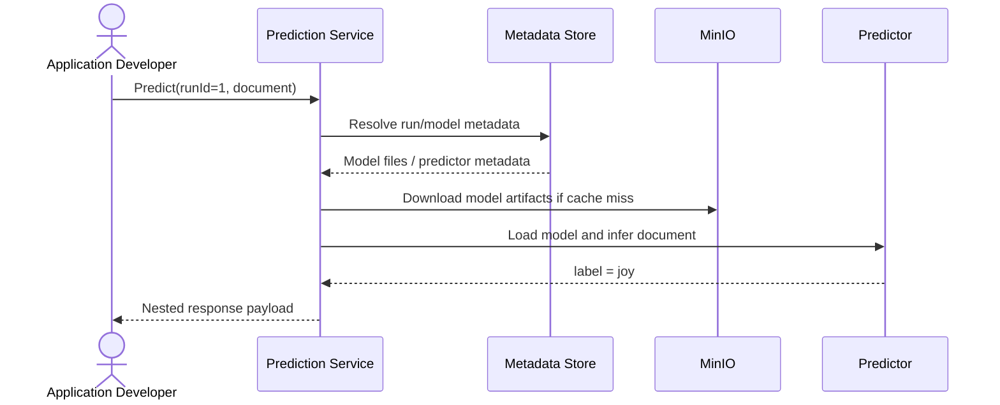

“自动加载”不是每个 request 都必须重新下载。合理实现会有 metadata cache、file cache 和 loaded-model cache；首次 / eviction 后走 cold path，后续走 hot path。

##### 示例 Response

```json
{
    "response": "{\"result\": \"joy\"}"
}
```

外层 `response` 是 string，其中又嵌套 JSON。Client 要二次解析才能取得 `result`：

```python
import json


grpc_response = {"response": "{\"result\": \"joy\"}"}
prediction = json.loads(grpc_response["response"])
assert prediction["result"] == "joy"
```

这种 double-encoded JSON 适合快速 demo，但生产 protobuf 应定义 typed response：

```text
message PredictionResponse {
    string result = 1;
    string model_id = 2;
    float confidence = 3;
}
```

Typed contract 能避免二次 parse、隐藏 schema 和运行时错误。

##### `joy` 表示什么

Model 对给定 sentence 输出训练标签之一 `joy`。它只是一次 inference 示例，不证明：

- Model accuracy 足够；
- 该句的人类 gold label 一定是 joy；
- Model 对新 `optimism` label 已有能力；
- 服务满足 production latency / availability；
- Chatbot 业务会正确使用该分类。

Lab 的目标是验证 end-to-end path，而不是证明模型质量。

##### Current README 中的 ID 示例要谨慎

当前 README 某示例命令传入 run ID `2`，紧邻输出文字却打印 `model_id is 1`。这类文档快照不一致再次说明：

- 不要硬编码书中 ID；
- 始终使用自己训练 response 返回的 `run_id`；
- 自动化脚本应从 JSON 解析 ID，而不是假设第一次永远是 `1`。

##### Step 4 的成功条件

```text
Prediction API accepts request
AND resolves requested model
AND loads compatible model artifacts
AND returns a parseable category
```

原章示例以 `joy` response 证明这条最小链路成立。生产还要检查 model version、confidence、deadline、malformed input、load、monitoring 与 business behavior。

#### 四个 Steps 的 Identity / Artifact 流


每一步的 output 成为下一步的 input；这就是 lab 真正要训练的系统思维。

#### Lab Cleanup

当前仓库还提供：

```shell
./scripts/lab-999-tear-down.sh
```

它停止并删除 MinIO、DM、prediction、metadata、training 和两个 predictor containers。对当前审阅的仓库 commit，数据丢失行为是确定的：

- DM 的 datasets / ID seed 位于进程内 `HashMap` / `AtomicInteger`；删除或重启 container 后丢失；
- Metadata store 的 runs、artifact repos 与 run-ID lookup 也只在进程内 `HashMap`；删除或重启后丢失；
- MinIO 启动时没有挂载 named volume 或 host volume，`/data` 位于被删除的 container writable layer；teardown 删除 MinIO container 后 dataset/model objects 丢失；
- Host `model_cache` 不由 teardown script 删除，但下一次 `lab-001` 会执行 `rm -r model_cache` 后重建，因此 cache 也不会跨正常 lab restart 保留。

所以当前 lab 不是持久化系统，IDs、commits、metrics、artifact lookup 和 MinIO objects 都不能依赖 container recreation 后继续存在。生产必须为 object storage 与 metadata databases 配置独立持久卷 / durable services、backup 和恢复验证。

### A.2.2 An Exercise to Do on Your Own

#### 新需求：Chatbot 增加 `optimism`

原章设定：Johanna 的 chatbot 成功发布后，需要支持新的 category `optimism`。现有 intent-classification model 只能识别初始 labels，因此必须 retrain。

角色分工：

- Feng 收集带 `optimism` label 的更多 training data，并更新 current dataset；
- Ivan 不必修改 training code，但要用更新后的 dataset 触发新 training job；
- Johanna 最终应使用新 model ID 验证 optimism text；
- Tang 确保系统和新训练正常运行。


#### 为什么 Training Code 可以不变

如果 training pipeline 已按 dataset schema 动态发现 labels，而 output layer / label mapping 会根据 dataset 构建，则增加 label 主要是 data change：

```text
same algorithm code
+ new dataset commit with optimism samples
-> retrained classifier with expanded label space
```

这个结论有前提：

- Code 没有硬编码三分类 output dimension；
- Label vocabulary 从 dataset 生成；
- Saved model package 包含更新后的 label mapping；
- Predictor 能加载新 mapping；
- API response schema 对新增 label 向前兼容。

若 application 使用 exhaustive enum 且不认识 `optimism`，即使 model 能输出，product integration 仍可能失败。因此“训练代码不变”不等于全系统零代码变化。

#### 当前 `prepare_data.py` 已为练习预留数据

首次实验中的：

```python
part_1 = dataset.filter(lambda row: row["label"] != "optimism")
part_2 = dataset.filter(lambda row: row["label"] == "optimism")
```

意味着：

- `part_1` 构建初始 3-label dataset；
- `part_2` 保存 optimism-only examples；
- Step 2 已把两个 files 上传到 MinIO upload area；
- A.2.2 只需把 `part_2` 作为新 commit 加入 logical dataset。

这种人为拆分让需求变化可重复演示，不代表真实产品只需收集单一新 label；还应保持旧 labels 的代表性数据，避免 catastrophic forgetting / class imbalance。

#### Dataset Update Request

当前 `lab-005-second-training.sh` 先调用：

```json
{
    "dataset_id": "1",
    "commit_message": "tweet_emotion_part2",
    "bucket": "mini-automl-dm",
    "path": "upload/tweet_emotion_part2.csv"
}
```

对应 gRPC method：

```text
data_management.DataManagementService/UpdateDataset
```

重要语义：

```text
logical dataset_id remains "1"
new commit / version is created
new version_hash selects commits 1 and 2 instead of only commit 1
```

旧 commit 不会被 dataset update 覆盖，因此 run 1 的 metadata 仍能指明它使用 3-label commit set，run 2 指向含 optimism 的 commit set。但当前 model artifact bytes 还有下文所述的同名覆盖缺陷，dataset lineage 可追溯不等于旧 model files 仍可冷加载。

#### 更新后的 Dataset 可能怎样组织

当前 commit 的实现语义已经可以从源码确认：`UpdateDataset` 追加 commit 2；`PrepareTrainingDataset` 未指定 `commit_id` / tags 时选择从 commit 1 到 latest commit 的全部 commits；`IntentTextTransformer` 再把选中 parts 累积合并为新的 `examples.csv` 与 `labels.csv`。因此第二次 preparation 包含原三类数据和新增 optimism data，不是只用 `part_2` 训练。

```text
commit 1: part_1, without optimism
commit 2: part_2, optimism only
Prepare latest with no filters
-> selected commits {1, 2}
-> cumulative four-label materialized snapshot
```

新 `version_hash` 编码的是 selected commit bitset `{1,2}`，不是 merged CSV 的内容摘要。调用 `PrepareTrainingDataset` 后，应继续调用 `FetchTrainingDataset(dataset_id, version_hash)` 直到 `READY`，再检查：

- 新 `version_hash` 与 selected commits；
- Materialized root bucket/path；
- Label count 是否从 3 变为 4；
- Example count 是否增加；
- Old examples 是否仍存在；
- Split / class distribution；
- 需要生产完整性时另算 manifest / content digest。

#### 第二次 Training Request

当前 solution script 与第一次结构相同，但在仓库快照中 parameters 改为：

```json
{
    "LR": "50",
    "EPOCHS": "15",
    "BATCH_SIZE": "64",
    "FC_SIZE": "1024"
}
```

它随后提交新 dataset `version_hash`、轮询新 `job_id`、查询 metadata，并发送 prediction request。

#### 为什么修改超参数会削弱单变量比较

原章文字说 Ivan 不需要改变 training code，但 solution script 同时改变了 `LR` 与 `FC_SIZE`。Code 不变与 hyperparameters 不变不是一回事。

若练习目标是隔离“新增 optimism data”的影响，应先保持 hyperparameters 相同：

$$
Change=DatasetVersion_{v1}\rightarrow DatasetVersion_{v2}
$$

再单独做参数实验。若 data 与 parameters 同时变化，新模型表现差异无法只归因于新增 label。当前 training code 还使用未固定 seed 的 `random_split`，因此 controlled comparison 还必须固定 train / validation / test split 或至少固定 generator seed，并用同一 held-out test set。

Solution script 的目的是演示更新与再训练，不是严格 controlled experiment。

#### 新旧 Identity 应怎样变化

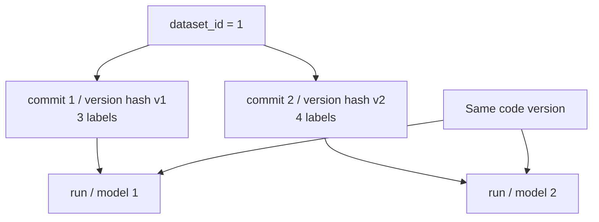

应保持 / 变化的身份：

| 对象 | 预期 |
| --- | --- |
| Logical `dataset_id` | 保持不变 |
| Dataset commit / `version_hash` | 新 commit 与新的 commit-selection key |
| Training code version | 可保持不变 |
| Training `job_id` / `run_id` | 新 ID |
| Model ID | Demo 中等于新 run ID |
| Label mapping | 新版本，包含 optimism |

Run / model identity 的目标是不覆盖 run/model 1，否则已有 prediction、metrics 和 lineage 会失去解释。然而当前仓库只部分做到这一点：metadata store 给同名 artifact 分配递增 `version`，但 `CreateArtifact` 把每一版 files 都复制到 `twitter-model/<filename>`，destination path 不包含 artifact version 或 run ID。第二次训练同样使用 `output_model_name="twitter-model"`，所以会覆盖第一次训练的 API-visible model files；已加载的 predictor cache 可能暂时掩盖问题，而 cold load run 1 可能实际读到 run 2 bytes。

要做可靠 old/new comparison，必须先采取至少一种修复：

- 两次 request 使用不同 `output_model_name`，例如 `twitter-model-v1` 与 `twitter-model-v2`；
- 修改 artifact store，把 destination 建成 `artifact_name/version/file` 或 `artifact_name/run_id/file`；
- 让 metadata 中每个 run 返回自己的 immutable object path / digest，并禁止覆盖。

只有 metadata version、physical path 和 bytes 都隔离后，才能声称旧模型可重载、比较和回滚。

#### 推荐的练习步骤

1. 先完成 A.2.1，保存初始 `dataset_id`、version hash、run ID 与 metrics；
2. 不看 solution，调用 DM `UpdateDataset` 加入 optimism data；
3. 查询 dataset metadata，确认新 commit 与 statistics；
4. 调用 `PrepareTrainingDataset` 取得新 version hash；
5. 用相同 algorithm / hyperparameters、固定 split / seed 提交第二次训练；
6. 轮询 status 并查询 metadata；
7. 先使用 unique model names 或修复 versioned artifact path，再对 old/new models 发送相同 regression examples；
8. 对新 model 发送 optimism examples；
9. 比较 label coverage、accuracy、confusion matrix 和错误样本；
10. 最后再与 `lab-005-second-training.sh` solution 对照。

#### 当前 Solution Script

```shell
./scripts/lab-005-second-training.sh 1
```

仓库 README 把它描述为 bonus scenario / quiz answer。原章鼓励先自己实验，再查看 solution；这样才能真正理解 DM update、new version 与 retraining，而不是只证明脚本能运行。

当前 `lab-005` 在训练后仍发送第一次使用的 arrogance / respect sentence，而不是 optimism-specific document。因此它证明的是 dataset update、第二次 training 和 serving path 能跑通，并不直接证明新模型会输出 `optimism`。应再显式运行：

```shell
./scripts/lab-004-model-serving.sh NEW_RUN_ID \
    "I am hopeful and optimistic that tomorrow will be better."
```

即使返回 `optimism`，也只是 smoke test，仍需下述固定 test set 上的 class metrics。

#### 怎样验证 `optimism` 能力

最低 smoke test：

```text
Predict(new_model_id, optimism-like document)
-> result can be optimism
```

但单个样本不足。应构建四类验证：

##### 1. New-Class Recall

在独立 optimism test set 上：

$$
Recall_{optimism}=\frac{TP_{optimism}}{TP_{optimism}+FN_{optimism}}
$$

若分母为 0，说明 test set 中没有真实 optimism positives，recall 未定义；不能静默报告为 0 或 1，应先修复 evaluation coverage。

##### 2. New-Class Precision

$$
Precision_{optimism}=\frac{TP_{optimism}}{TP_{optimism}+FP_{optimism}}
$$

防止模型把大量 joy / positive 文本都误判为 optimism。

若模型从不预测 optimism，precision 分母为 0，也应按评估规范标为 undefined / not applicable，并结合 recall 与 support 解读。

##### 3. Old-Class Regression

确认新增类别后，旧三类 metrics 没有不可接受下降。只看 overall accuracy 可能掩盖某个 class 崩溃。

##### 4. Serving Compatibility

确认 predictor 加载新的 output dimension 与 label mapping，不出现 shape mismatch、unknown label 或 cache 仍命中旧 model。

#### 数据量与 Class Imbalance

如果 optimism examples 很少，四分类训练会出现 imbalance。可查看每类数量 $n_k$ 与比例：

$$
p_k=\frac{n_k}{\sum_j n_j}
$$

必要时采用 class-weighted loss、sampling、augmentation 或收集更多真实 data。Demo 中的目标是演示更新流程，不保证数据策略达到生产质量。

#### Exercise 的真正学习目标

这个练习把静态流程变成演进流程：

```text
new product requirement
-> data collection
-> dataset version update
-> reproducible retraining
-> new model identity
-> serving validation
```

它证明深度学习系统的核心不是“训练一次”，而是让数据、代码和模型能够带着 lineage 持续变化。

---

## 容易混淆的概念与常见误区

### 1. “Hello World” System 就是 Production Reference Architecture

它是教学最小系统，刻意省略 auth、HA、tenant、workflow、SLO、governance 等能力。数据流原理可复用，具体部署不能原样上线。

### 2. Persona 一定对应一个独立员工

Persona 描述责任和目标。一个人可承担多个角色，一个角色也可由多个团队承担。

### 3. Data Scientist 是 Training Service 的内部实现者

本附录将其视为 training infrastructure 的客户：声明 dataset、algorithm 和 parameters；system developer 维护平台执行机制。

### 4. Application Developer 只是可有可无的 API Consumer

应用把模型转为产品价值，是系统最重要的客户之一。没有产品 integration，模型不会创造业务影响。

### 5. System Developer 只负责启动 Containers

Demo 把职责压缩为脚本启动；生产还涉及 API、storage、security、observability、capacity、upgrade 和 incident response。

### 6. Dataset Management Service 就是 MinIO 的别名

MinIO 保存 bytes；DM 管 logical dataset、ID、commit、statistics 和 audit，并协调 object paths。

### 7. Metadata Store 与 MinIO 保存相同内容

Metadata store 保存结构化事实、metrics 和关系；MinIO 保存 dataset / model 大对象。二者通过 URI / ID 关联。

### 8. Training Service 只要访问 MinIO，无需查询 DM

MinIO key 不表达 logical dataset / version contract。Training service 先通过 DM 解析 snapshot，再下载 bytes。

### 9. Prediction Service 只需要 Model Metadata

Metadata 告诉它加载什么和在哪里；真正推理仍需 model files 及 compatible predictor runtime。

### 10. 图 A.1 的 Arrow 只表示 HTTP/gRPC Request 方向

有些箭头描述 dependency 或 data return，例如 metadata / model files 流向 prediction service。要区分 lookup request 与 response/data transfer。

### 11. Scenario A–D 是四个互不相关的 Demo

A 产出 dataset ID 给 B，B 产出 model/run ID 给 C，D 使 A–C 能运行。它们构成一条 lifecycle。

### 12. `docker ps` 显示 Running 就代表系统 Ready

Container process 可能已运行但 API、bucket、dependency 或 predictor 尚未 ready。需要 health / readiness 与 smoke request。

### 13. 四个 Services 意味着恰好四个 Containers

原书 lab 还有 MinIO 和两个 predictor containers，总计示例为七个；逻辑组件数与 runtime process 数不同。

### 14. 多个 Services 共用一个 Image 是微服务最佳实践

原章明确说这只是省 disk、简化 demo。生产通常需要独立 version / dependency / security boundary。

### 15. `orca3/services:latest` 是可复现版本

`latest` 可变。生产应 pin image digest，并记录 source / SBOM / signature。

### 16. Public Demo Credentials 可以用于生产

仓库中的固定 MinIO root values 是公开示例。生产必须使用 secret manager、最小权限与轮换。

### 17. `grpcurl -plaintext` 在任何网络都安全

它不加 TLS，适合受控 localhost lab。跨主机 / 多租户需要 encryption、authentication 和 authorization。

### 18. 挂载 Docker Socket 只是普通 Volume

控制 Docker daemon 通常近似 host root 权限。多租户 training 应使用受控 orchestrator / sandbox，而非暴露 daemon socket。

### 19. Step 2 直接把 Dataset 上传给 Training Service

Feng 先上传 object，再调用 DM `CreateDataset`。Training service 后续按 dataset ID/version 取得它。

### 20. `mc cp` 完成后就创建了 Dataset

它只上传 raw objects。DM API 才生成 logical dataset、commit、metadata 和 statistics。

### 21. `tweet_emotion_part2.csv` 是 Test Set

它按 `optimism` label 切出，专为新增类别练习；不是随机、独立、同分布的测试集。

### 22. Dataset ID 与 Commit ID 都是 `"1"`，所以语义相同

Dataset ID 指 evolving logical dataset；commit ID 指一次追加更新；当前 `version_hash` 编码 selected commit set。首次数值相同只是巧合，而且 `version_hash` 不是 content digest。

### 23. 训练只传 Dataset ID 就能复现

Dataset 后续会更新。还需固定 selected commits / version key，以及 code、parameters、environment 和内容完整性 manifest；当前 version key 本身不能检测 bytes 被改写。

### 24. `PrepareTrainingDataset` 只是多余查询

它选择 commits、返回 version key 并异步 materialize training-ready snapshot；还要通过 `FetchTrainingDataset` 等待 `READY` 并取得 root path。

### 25. `algorithm` 字段只是人类描述

Demo 用它选择 intent-classification training image / implementation，是执行 contract 的一部分。

### 26. Hyperparameters 都是 String，所以不需要 Type / Range Validation

String 是 demo schema 简化。生产应定义 typed values、units、allowed ranges 和 required fields。

### 27. `LR="4"` 是经过隐藏缩放后的普通 Learning Rate

当前实现没有隐藏缩放：它把 integer 4 直接传给 SGD，第二次则直接传 50。二者都是异常大的 demo 值，不是通用训练建议。

### 28. `Train` 调用完成表示训练已完成

它是异步提交，先返回 `job_id`；client 还要观察 launch/running/succeed 或 failure。

### 29. 每 5 秒 Polling 在任意规模都没问题

并发 jobs 增长时 query QPS 线性增长。可用 backoff、stream、event 或 notification。

### 30. Training Status 与 Metadata Metrics 是重复 API

前者回答 execution state，后者回答 run facts、lineage 和 metrics。二者需一致但职责不同。

### 31. Training Container 只在结束时报告数据

原章说明它在运行中报告 per-epoch metrics，metadata service 可返回实时训练指标。

### 32. Final Message `test accuracy 0.520` 就是完整评价

单个 overall metric 缺少 test-set contract、class slices、confusion matrix、uncertainty 和 baseline。当前 epoch metric 是 validation accuracy，final message 才是 test accuracy；两者来自该 run 未固定 seed 的随机 split。

### 33. `job_id = run_id = model_id` 是通用领域规则

这是 demo identity collapse。生产中 job 可重试、run 可产多个 models、failed job 可无 model，应分开建模。

### 34. Model ID 永远是 `"1"`

它只是在干净 demo state 中的示例。应解析每次 API response，而不是硬编码。

### 35. Model ID 足以复现模型

还需 lineage 到 dataset version、code version、parameters、environment 和 artifacts。ID 是 lookup key，不是全部证据。

### 36. Prediction Service 每次请求都重新下载 Model

合理实现会 cache metadata/files/loaded model。首次或 eviction 后 cold-load，hot requests 复用。

### 37. `runId` 与 `run_id` 可以随便互换

它们属于不同 API contracts。JSON / protobuf 字段必须按服务 schema 使用。

### 38. Nested JSON String 是理想 Prediction Response

Demo 的 `response` 内嵌 JSON 需要二次 parse。生产应使用 typed protobuf fields。

### 39. 输出 `joy` 证明模型质量达到生产标准

它只证明一次端到端 inference 成功，不证明 accuracy、robustness、latency 或 business value。

### 40. Predictor 与 Prediction Service 是同一个组件

Prediction service 可作为 frontend / router，predictor 负责模型 runtime。Demo 同时启动 custom 与 TorchServe backends。

### 41. Model Serving 只需要 Weights

Intent classifier 还可能需要 vocabulary、labels、architecture / handler 和 preprocessing contract。

### 42. Cleanup Script 一定删除所有 Dataset / Model Bytes

在审阅 commit 中，DM / metadata 都是内存 stores，MinIO 没有持久卷，teardown 删除 containers 后这些状态和 bytes 会丢失；host model cache 则会在下一次 start 时被清空。一般原则仍是 container lifecycle 与 durable data lifecycle 必须分离。

### 43. 新增 `optimism` 一定要求修改 Training Algorithm Code

若 code 动态读取 label vocabulary / output size，数据更新和 retraining 可以足够；硬编码分类数时则必须改 code。

### 44. Training Code 不变意味着任何代码都不需要变

Application enum、predictor mapping、UI 和 monitoring 可能需要认识新 label。原章只说 Ivan 的 training code 不变。

### 45. 更新 Dataset 应覆盖旧 Version

应保留 old commit，创建新的 selected-commit snapshot。Old model 是否可复现还要求 model bytes 使用 versioned path；当前同名 `twitter-model` artifact 会覆盖旧 bytes，是已知 demo 缺陷。

### 46. 新 Dataset Commit 可以继续使用旧 Version Hash

当前 key 应随 selected commit bitset 变化，所以选择 commits 1+2 与只选 commit 1 不同；但它不会随同一 commit path 下的 bytes 变化，不能替代 content digest。

### 47. Dataset Update 后可以覆盖旧 Model ID

新 training 会产生新 run/model metadata ID；物理 model files 也必须保存在 run/version-specific path。当前 metadata 有新 version，但同名 destination 会覆盖旧 bytes，必须先修复才能可靠比较或回滚。

### 48. `part_2` 只有新类数据，所以直接训练不会有问题

当前默认 preparation 会累积合并 commits 1+2，所以不会只用 part 2；但仍需检查 class distribution、split 与旧类 regression。若使用 tags / commit filters，才可能选择不同 subset。

### 49. 新 Model 能输出 `optimism` 就完成验证

还需 optimism precision/recall、旧类 regression、serving compatibility 和 representative test set。

### 50. 新增一个 Label 不会影响 Output Shape

Classifier head 和 label mapping 通常从 3 类变 4 类；predictor 必须加载 compatible artifacts。

### 51. Solution Script 只改变 Dataset

当前 `lab-005` 还把 LR 从 4 改为 50、FC_SIZE 从 128 改为 1024，因此不是单变量比较。

### 52. Code Version 不变就能把性能变化完全归因于 Data

还要保持 hyperparameters、environment、固定 split / seed、同一 held-out evaluation set 和 random protocol 可比。当前 solution 不满足这些控制条件。

### 53. Overall Accuracy 足以评价新增类别

Class imbalance 会掩盖 optimism 失败。至少看 per-class precision、recall 和 old-class regression。

### 54. Label Count 从 3 变 4 就证明数据质量良好

还需 sample quality、coverage、balance、duplicates、split leakage 和 labeling consistency。

### 55. 同一个 Dataset ID 表示 Dataset 内容永远不变

它表示同一 logical dataset family；内容由 commit/version 区分。

### 56. Scripts 自动化意味着流程已经可靠

Scripts 降低手工步骤，却不自动提供 transaction、retry safety、HA、audit 或 security。

### 57. MinIO 类似 S3，所以本地行为与 Cloud S3 完全相同

API 风格相近，但 IAM、consistency、network、scaling、encryption、cost 和 failure modes 不同。

### 58. Demo 使用 gRPC，所以 gRPC 是唯一正确 API

作者选择它减少 boilerplate。HTTP/REST、events 或 SDK 也可实现相同领域边界。

### 59. 实验跑通后就不必阅读正文服务章节

附录只提供整体视图；数据、训练、serving、metadata 的生产原则仍需正文展开。

### 60. “Hello World” 越复杂越能代表真实系统

教学系统应保留关键因果链并删除次要复杂度。生产能力应分层演进，不应把全部特性塞进第一次实验。

## 本附录知识结构

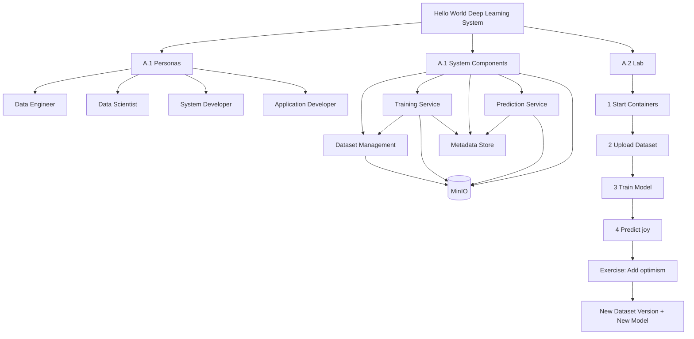

## 核心结论

### 原章主线与直接结论

1. **理解深度学习系统最快的方法之一，是从用户职责与实际工作流出发。**
2. **Mini system 用四个最小 personas 表达数据、模型、平台和产品四类责任。**
3. **Data engineer 通过 DM service 上传训练数据；data scientist 是 training infrastructure 的客户；system developer 维护系统；application developer 用模型创造产品价值。**
4. **系统包含 DM、training、metadata、prediction 四个 services 和 MinIO object storage。**
5. **DM 保存 dataset 到 MinIO；training service 查询 DM 并下载训练数据。**
6. **原章高层视图把 model files 与 metadata / metrics 的产出责任归于 training service。** 当前代码由其启动的 training container 直接上传 model staging files，并调用 metadata APIs 创建 artifact、记录 epoch 和结束 run；training service 自身维护 queue / container status。
7. **Prediction service 查询 metadata，再从 MinIO 下载 model files 以服务请求。**
8. **图 A.2 的四个场景分别是 dataset ingestion、model training、model serving 和 system maintenance。**
9. **Lab 用 Tang、Feng、Ivan、Johanna 分别模拟四类 persona。**
10. **四个核心 demo steps 是系统启动、training dataset 构建、model training 与 model serving。**
11. **`lab-001` 启动 Dockerized services，`docker ps` 用来检查示例 containers。**
12. **多个服务共享 `orca3/services` image 是 demo 简化，原章明确不推荐生产使用。**
13. **`lab-002` 处理和上传 tweet-emotion data，DM 返回 `dataset_id`、type、commit history 与 statistics。**
14. **首次示例 dataset ID 为 1，commit 统计为 2963 examples、3 labels。**
15. **`lab-003` 以 dataset ID、version、algorithm image 和 hyperparameters 提交异步 training job。**
16. **Training service 返回 job ID，并通过 `GetTrainingStatus` 提供 launch/running/succeed 状态。**
17. **Metadata store 的 `GetRunStatus` 返回 success、message、run ID、dataset tracing、code version 和 per-epoch metrics。**
18. **Lab 将 training job ID、run ID 与 model ID 合并，方便用户把训练结果交给 serving。**
19. **`lab-004` 以 `runId` 和 document 调用 prediction service，示例输出分类 `joy`。**
20. **独立练习要求把 optimism examples 加入现有 dataset，保持 training code，并触发第二次训练。**
21. **原章鼓励先自行完成，再查看 `lab-005-second-training.sh` solution。**

### 实践扩展与生产化边界

22. **Metadata / control plane 与 artifact data plane 应分离。** ID、status、metrics 走服务 API，大对象走 object storage。
23. **Dataset ID 是 logical identity，commit 是追加更新，当前 version hash 是 selected-commit-set key。** 它帮助定位 materialized snapshot，但不是 content digest；生产还需 manifest / checksum。
24. **Object upload 与 dataset registration 是两步。** 只有 DM commit 才形成可治理 dataset。
25. **异步训练需要稳定 job identity、状态机和 metrics / artifact finalization 协议。**
26. **Training status 与 experiment metadata 是不同 ownership，必须定义一致性边界。**
27. **`job_id = run_id = model_id` 只适合 demo。** 生产应支持 retries、attempts、多 checkpoints 和独立 model lifecycle。
28. **Prediction service 应解析 metadata、校验并加载完整 model package，可通过 cache 降低 cold path。**
29. **Nested JSON response 是 demo shortcut，typed protobuf response 更稳定。**
30. **当前 README / scripts 是可执行事实源，书中命令和固定 ID 是成书时示例。**
31. **公开 credentials、plaintext gRPC、latest tags 与 Docker socket 只适合本地 lab。**
32. **新增 label 的核心是 dataset version evolution 与 retraining，不应覆盖 old data / model lineage。** 当前 dataset commits 能累积保留，但同名 model artifact path 会覆盖 old bytes，必须修复。
33. **训练代码可不变的前提是 label vocabulary / output dimension 动态化，predictor 与 application 也要兼容新 label。**
34. **第二次训练若同时改变 data 与 hyperparameters，就不能把效果差异只归因于 optimism data。**
35. **新增类别要按 per-class precision/recall、旧类 regression 和 serving compatibility 验证。**
36. **这个最小系统的真正价值，是展示一个 output ID 如何成为下一个角色 / 服务的 input。**
37. **当前 lab 的 DM / metadata stores 和 MinIO container data 不跨 teardown 持久化。** 它演示的是运行时关系，不是 durable control plane。
38. **当前 `twitter-model` metadata version 与 physical files 没有同等隔离。** 新 run 可覆盖旧 artifact path，可靠 cold reload / rollback 需要 versioned object path。
39. **当前 metrics 来自未固定 seed 的约 85.5% / 4.5% / 10% random split。** Per-epoch 是 validation accuracy，final message 是 test accuracy，跨 run 比较前要固定 split。

## 从本附录提炼出的通用实践方法

面对一个需要快速验证的 deep learning platform / model lifecycle，可以按以下十步推进。

### 第一步：从 Personas 与目标开始

列出谁准备数据、谁训练模型、谁维护平台、谁消费 prediction。为每次责任交接定义稳定 ID 和可观察结果。

### 第二步：画 Control Plane 与 Artifact Plane

明确哪些 API 传 metadata / command / status，哪些 storage 传 dataset / model bytes。禁止通过控制 API 反复搬运大对象。

### 第三步：建立最小 Logical Identities

至少区分 dataset、commit selection、content digest、training run、job attempt、model artifact version / path 和 prediction request。Demo 可先合并，但文档要明确未来拆分方向，并测试 metadata version 是否真的映射到独立 bytes。

### 第四步：用本地 Object Store 和 Containers 降低门槛

选择 MinIO / Docker 等本地工具复现 cloud-like boundaries，让实验无需真实 cloud account；同时记录哪些行为与生产不同。

### 第五步：先跑通 Dataset Ingestion

Raw object upload 后调用 dataset API 建立 version、statistics 和 audit。把返回的 dataset ID/version 保存为下一步输入。

### 第六步：异步提交并观察 Training

Training request 固定 dataset snapshot、algorithm package、parameters 和 output contract。返回 job ID；观察 execution state、metrics、lineage 和 model finalization。

### 第七步：按 Model ID 跑通 Serving

Prediction service 解析 model metadata，取得 model package，加载 predictor，并返回 typed result。区分 cold load 与 hot inference。

### 第八步：用需求变化验证 Evolvability

新增 label / data，创建新 dataset commit、new run 和 new model；保留 old versions。若同一 code 可处理 schema evolution，说明抽象有复用价值。

### 第九步：做 Regression 与 Attribution

保持其他变量不变，固定 random seed / split / held-out set，比较 old/new model；检查新类和旧类 metrics。若同时修改 hyperparameters，要标注多变量变化，不能做单因果结论。比较前还要确保 old/new artifact paths 物理隔离。

### 第十步：逐层替换 Demo Shortcuts

按风险补充 immutable images、secret manager、TLS/auth、orchestrator、sandbox、typed schema、HA、SLO、monitoring、promotion 和 rollback，而不是把 demo 一次性扩成巨型平台。


这套方法的核心是：**用最少组件跑通真实身份和 artifact 流，再通过一个可控需求变化验证系统能演进，最后按风险逐步替换教学捷径。**

## 复习与自测

1. 作者为什么认为动手实践适合学习深度学习系统？
2. Mini system 刻意聚焦哪些核心活动？
3. A.1 为什么先介绍 personas，再介绍 system design？
4. Persona 与真实职位有什么区别？
5. 原章选择的四类 personas 是什么？
6. Data engineer 的原章职责是什么？
7. Data scientist / researcher 为什么被称为 training infrastructure 的客户？
8. System developer 维护哪些 ML activities？
9. Application developer 为什么是最重要的系统客户之一？
10. 小团队中一个人能否承担多个 personas？
11. 四类 persona 之间依次交付哪些 IDs / artifacts？
12. Mini system 的四个 services 和一个 storage 是什么？
13. DM service 与 MinIO 的职责有何区别？
14. Model training service 接收什么、执行什么、输出什么？
15. Metadata store 保存哪些 model / run facts？
16. Prediction service 怎样使用 metadata 与 model files？
17. MinIO 为什么适合本地模拟 S3-like object storage？
18. Metadata 与 object bytes 为什么要分开存？
19. 图 A.1 的 A 依赖是什么？
20. 图 A.1 的 B 与 C 为什么不是重复？
21. 图 A.1 的 D 与 E 分别保存什么？
22. 图 A.1 的 F 与 G 怎样共同支持 prediction？
23. Control / metadata plane 与 artifact data plane 分别传什么？
24. 为什么不应把完整 dataset 放进 gRPC training request？
25. 图 A.2 的 Scenario A 做什么？
26. Scenario B 中 training service 的三个主要动作是什么？
27. Scenario C 为什么让 application 与 MinIO 解耦？
28. Scenario D 的责任为何横跨 A–C？
29. 四个 scenarios 怎样构成一条 model lifecycle？
30. Mini system 省略了哪些生产能力？
31. A.2 中 Tang、Feng、Ivan、Johanna 分别对应谁？
32. 四个核心 demo steps 是什么？
33. 当前 README 要求哪些主要软件前置条件？
34. 为什么建议创建干净 Conda environment？
35. 为什么 scripts 应从 repository root 运行？
36. 当前 `lab-003` 和 `lab-004` 各需要什么参数？
37. `lab-999-tear-down.sh` 做什么？
38. `lab-001-start-all.sh` 创建哪些网络 / services / predictors？
39. 原章 Listing A.1 为什么显示七个 containers？
40. Prediction service 与 predictor container 有何区别？
41. 为什么多个 Java services 能从同一个 `orca3/services` image 启动？
42. 原章为什么不推荐生产中共用一个巨型 service image？
43. `docker ps` 能证明什么，不能证明什么？
44. Demo 中 plaintext gRPC 有什么边界？
45. Public MinIO root credentials 为什么只能用于本地实验？
46. Training service 挂载 Docker socket 有什么权限风险？
47. `prepare_data.py` 从哪个 Hugging Face dataset 读取数据？
48. 它怎样把 numeric labels 转为 names？
49. `part_1` 与 `part_2` 分别包含什么？
50. 为什么 `part_2` 不是 test set？
51. `lab-002` 为什么先用 `mc cp`，再调用 `CreateDataset`？
52. 为什么首次就把 part 1 和 part 2 都上传到 MinIO？
53. Listing A.2 的 `dataset_id`、type、commits 和 statistics 分别是什么？
54. 初始 dataset 有多少 examples 和 labels？
55. Dataset ID 与 commit ID 为什么必须区分？
56. `path=dataset/1/commit/1` 表达什么？
57. Feng 应向 Ivan 交付哪些 dataset facts？
58. `PrepareTrainingDataset` 解决什么问题？
59. 当前 `version_hash` 编码什么？为什么它比只传 dataset ID 更稳定、却仍不能替代 content digest？
60. Ivan 的 training code 放在哪里并如何打包？
61. Training image 与 training service 各负责什么？
62. Listing A.3 的 `algorithm`、`dataset_id`、version、output name 和 parameters 各做什么？
63. 原章示例的 LR、EPOCHS、BATCH_SIZE、FC_SIZE 是多少？
64. `grpcurl` 对 gRPC 起什么作用？
65. 为什么 `Train` 应被理解为异步提交？
66. Job 状态怎样从 launch 走到 running / succeed？
67. `GetTrainingStatus` 与 `GetRunStatus` 的 ownership 有何区别？
68. Training container 怎样实时报告 per-epoch metrics？
69. Listing A.4 的 final test accuracy 与示例 epoch accuracy 分别是多少？它们对应 test 还是 validation split，当前切分比例和随机性是什么？
70. `tracing` 中 dataset ID、version hash 和 code version 解决什么？
71. 为什么 job status success 与 model artifact ready 需要一致性协议？
72. `job_id = run_id = model_id` 为什么适合 demo？
73. 生产中为什么应把 job、run、attempt 和 model 分开？
74. Poll interval 5 秒时，1,000 个 jobs 约产生多少 status QPS？
75. Ivan 向 Johanna 交付哪个 ID？
76. Listing A.5 的 `runId` 与 `document` 分别是什么？
77. 为什么 prediction API 用 `runId`，metadata API 用 `run_id` 时 client 不能互换？
78. Prediction service 自动加载模型包含哪些 lookup / download / runtime steps？
79. Loaded-model cache 怎样改变 cold / hot path？
80. 为什么示例 response 需要二次 JSON parse？
81. Typed protobuf response 相比 nested JSON string 有什么优势？
82. `joy` response 能证明什么，不能证明什么？
83. 为什么不能把 model ID 永远硬编码为 1？
84. 当前 teardown 后 DM、metadata、MinIO 和 host model cache 分别怎样丢失或被清理？生产持久化应怎样不同？
85. A.2.2 的新产品需求是什么？
86. Feng 与 Ivan 为 optimism 分别做什么？
87. 什么前提下 training code 可以不变？
88. Application / predictor 为什么仍可能需要兼容新 label？
89. `UpdateDataset` request 包含哪些字段？
90. Dataset update 后哪些 identity 保持不变，哪些必须变化？
91. 为什么要检查 UpdateDataset 是增量还是完整 snapshot semantics？
92. 当前 `lab-005` 把 LR 和 FC_SIZE 改成了什么？
93. 为什么 data 与 hyperparameters 同时改变会妨碍因果归因？
94. 怎样设计只比较 dataset version 的 controlled retraining？
95. 当前同名 `twitter-model` 为什么会出现 metadata version 不同但 physical files 覆盖？怎样修复后再比较 old/new models？
96. 怎样验证 optimism precision 与 recall？
97. 为什么还要检查 old-class regression？
98. Class imbalance 对新增 optimism label 有什么影响？
99. `lab-005` 实际使用什么 prediction sentence，为什么它只证明 update/retraining path，而不能直接证明 optimism quality？
100. 请使用十步方法，把 MiniAutoML 从本地 demo 演进成支持多用户、安全训练、版本化模型发布和可靠 serving 的最小生产系统。
