> 对应原章：**Appendix B. Survey of Existing Solutions**
> 本附录不再从零设计单个服务，而是把 Amazon SageMaker、Google Vertex AI、Microsoft Azure Machine Learning 与 Kubeflow 放到全书参考架构的同一坐标系中，判断哪些能力可以直接使用、哪些需要组合、哪些仍应自行构建。

## 本附录要回答的核心问题

1. 为什么深度学习平台通常不应该默认全部从零构建？
2. 在什么情况下应该购买托管能力、采用开源组件、组合多个产品或自建？
3. 怎样用统一参考架构比较看似命名完全不同的平台？
4. Dataset management、training、serving、metadata/artifacts、workflow 与 experimentation 六个维度分别应检查什么？
5. Amazon SageMaker 怎样用 S3、Glue、Training、Endpoints、Registry、Lineage、Pipelines、Projects 与 Experiments 拼成系统？
6. Vertex AI 的 Dataset、Custom Training、Endpoint、ML Metadata、Pipelines 与 Experiments 如何映射？
7. Azure Machine Learning 的 Data assets、Jobs、Managed Online Endpoints、Registries、Pipelines 与 MLflow tracking 如何映射？
8. Kubeflow 为什么更像 Kubernetes 上的组件套件，而不是云厂商式一体化托管产品？
9. “功能存在”与“满足组织的生产要求”为什么是两回事？
10. 托管平台的控制面便利性与数据、身份、网络、成本、锁定之间如何权衡？
11. Open source 是否天然更便宜、更灵活、更可移植？
12. 怎样比较 metadata catalog、artifact bytes、lineage graph 与 experiment tracking，避免把它们混成一个功能？
13. 怎样比较单模型 endpoint、多模型 endpoint、traffic split 与真正的 model server？
14. 怎样把表 B.1 从静态功能表升级为基于真实 workload 的选型流程？
15. 原章成书时的产品名称、限制和 preview 状态在今天应如何使用？

原章几乎没有数学算法，重点是能力映射与选型判断。本文会补充覆盖率、加权评分、迁移成本与总体拥有成本（TCO）等形式化方法，帮助解释比较依据；这些属于工程推导，不是原章提出的公式。云产品和开源项目变化很快，正文会明确区分**原章成书时快照**与**当前采用时必须重新验证的事实**。

---

## 附录定位：Build、Buy、Adopt 还是 Compose

从零实现一个深度学习系统是巨大工程。特殊需求可能使自建合理，例如：

- 极端规模或独特调度；
- 严格的数据主权、隔离或合规；
- 特殊 accelerator / on-premises environment；
- 与内部数据、身份、发布系统深度耦合；
- 云产品缺少关键语义或成本不可接受。

但资源和时间有限时，使用现有 component，甚至采用完整 platform，往往更务实。真实选择通常不是二元的“全买/全造”，而是：

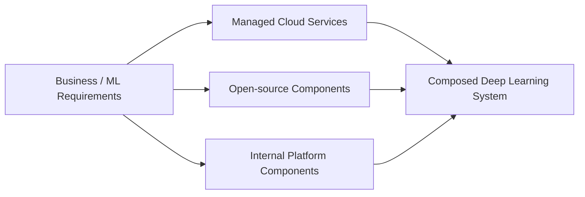

例如，团队可以用托管 training compute、自建 dataset contract、使用开源 serving runtime，再把 metadata 统一到内部 catalog。附录的目标不是选出唯一赢家，而是教读者看清每个积木覆盖参考架构的哪一部分。

### 原章调查的四套方案

1. Amazon SageMaker；
2. Google Vertex AI；
3. Microsoft Azure Machine Learning；
4. Kubeflow。

前三者是云厂商产品集合，Kubeflow 是 Kubernetes 上的开源 ML 工具套件。它们的 ownership、operation model 和锁定面并不相同，不能只按 feature checkbox 横向比较。

### 从 Serverless 到 Custom Container

原章指出现有方案覆盖从 serverless deployment 到 custom service container deployment 的多种操作模式。抽象程度大致形成连续谱：

```text
high-level AutoML / serverless API
-> managed job / endpoint with prebuilt runtime
-> managed control plane + custom container
-> self-managed Kubernetes components
-> fully custom services
```

抽象越高，启动速度通常越快，但 runtime、network、debugging 和 portability 控制可能越少；抽象越低，灵活性越高，但平台团队承担更多可靠性和运维责任。

---

## 参考架构：所有方案的共同坐标系

原章重新展示第 1.2.1 节的 reference architecture（图 B.1），把它作为比较起点，而不是假设任何厂商的产品分类就是问题本身的正确分类。

### 图 B.1 的用户与外部系统

系统面向：

- Product managers；
- Data scientists；
- Data engineers；
- Researchers；
- MLOps engineers；
- AI applications。

外部输入来自 data collectors 与 other data warehouses。用户通过 Web UI 或 public APIs 与系统交互；AI applications 请求 prediction 并回传 user feedback data。

### 图 B.1 的六个核心能力

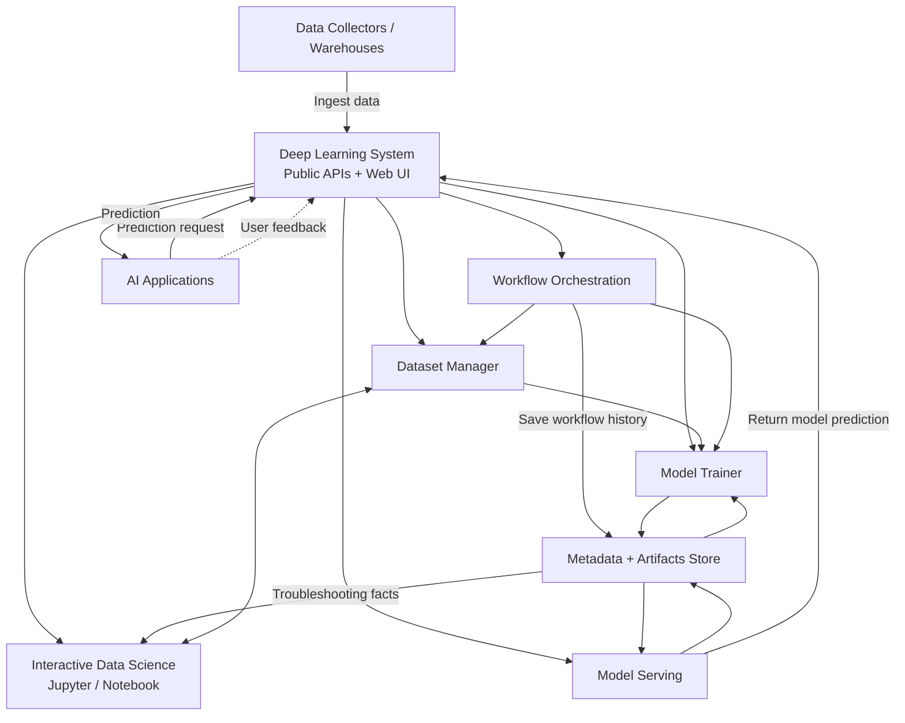

这六个比较维度是：

1. Dataset management；
2. Model training；
3. Model serving；
4. Metadata and artifacts store；
5. Workflow orchestration；
6. Experimentation。

图中还包含 interactive data-science environment 与公共访问层，但原章没有把 Notebook 作为表 B.1 的独立比较行；它通常由各平台的 workbench / studio 类产品承载。

### 为什么统一坐标系重要

不同平台常把同一能力放在不同名称下：

```text
dataset / data asset / table / artifact
pipeline / workflow / job graph
model registry / registry / model catalog
endpoint / deployment / inference service
experiment / run group / pipeline experiment
```

若直接比较产品名，容易把营销边界误当领域边界。参考架构要求先问“它解决哪个用户问题、保存哪类状态、执行哪种控制流”，再看产品名称。

### 六维评价清单

| 维度 | 核心问题 |
| --- | --- |
| Dataset | 是否有 immutable versions、schema、quality、lineage、access、large-data path？ |
| Training | 是否支持 custom code/container、distributed jobs、resource policy、retry、debug？ |
| Serving | 是否支持 model/runtime decoupling、multi-model、autoscaling、traffic policy、rollback？ |
| Metadata/artifacts | Metadata 与 bytes 在哪里？怎样 version、query、lineage、retain、delete？ |
| Workflow | DAG、schedule、event、local test、retry、artifacts、identity 与 tenancy 怎样处理？ |
| Experimentation | Params、metrics、artifacts、comparison、autolog、online outcome 如何记录？ |

原章主要做功能层映射；生产选型还要增加 security、reliability、operations、cost 和 portability。

### Coverage 不等于 Fitness

设参考架构有 $n$ 项 required capabilities，某方案原生覆盖 $k$ 项，最简单的 coverage ratio 为：

$$
Coverage=\frac{k}{n}
$$

但所有能力权重并不相同。更合理的是：

$$
Fit(solution)=\sum_{i=1}^{n}w_i s_i,\qquad \sum_i w_i=1
$$

- $w_i$：组织对第 $i$ 个能力的权重；
- $s_i$：候选方案在真实 POC 中的得分；
- Fit 只表示相对适配度，不自动包含迁移和长期成本。

### TCO 的工程分解

```text
TCO = license / cloud usage
    + platform engineering
    + integration and migration
    + security and compliance
    + operations / on-call
    + user waiting and productivity loss
    + exit / portability cost
```

“托管服务单价高”不等于总成本高；“开源无 license fee”也不等于免费。选型必须把人的时间和故障成本算进去。

### 时间边界

附录使用了“as of this writing”“preview”等措辞，说明作者知道产品能力会变化。阅读原则：

- 原章描述用于理解当时的能力映射；
- 当前采购 / 架构决策必须查目标 region、SKU、API version 与最新文档；
- 产品改名不一定改变底层领域边界；
- Preview 能力不能自动承担 production SLA；
- 已下线或弃用能力需要迁移评估。

---

## B.1 Amazon SageMaker

原章把 Amazon SageMaker 视为一组可组合 AI products 的 umbrella term。这些产品共同覆盖完整深度学习系统的大部分能力，但“同属一个品牌”不表示它们共享完全统一的数据模型、权限边界或生命周期。

> 版本边界：本节先忠实解释原章的 SageMaker 产品映射。AWS 后续扩展并调整了 SageMaker 品牌与产品命名；当前实施应按目标时期的 Amazon SageMaker / SageMaker AI 官方文档重新核对。

### B.1.1 Dataset Management

#### 原章判断：没有一个完整统一的 Dataset Manager

原章认为 SageMaker 没有提供一个统一 interface，专门管理 data preparation 与不同 DL personas 之间复杂交互的完整 dataset-management component。

但 AWS 提供了可组合的基础能力：

- Amazon S3：保存 raw data 和 prepared dataset bytes；
- AWS Glue Data Catalog：保存 table / schema / location 等 metadata tags；
- AWS Glue ETL：执行数据转换，产生训练可用 datasets。

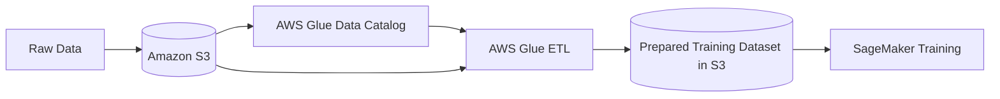

#### 为什么需要组合

Object storage 解决 bytes durability，Catalog 解决 discovery / schema，ETL 解决 transformation；但全书第 2 章的 dataset manager 还强调：

- Stable dataset identity；
- Immutable commit / snapshot；
- Training-ready materialization；
- Statistics / quality；
- Lineage；
- Persona-specific access workflow。

因此，团队通常还要在 AWS components 之上建立自己的 dataset API / SDK / portal，把 bucket、catalog table、ETL job 和 training snapshot 组合成领域 contract。

#### 解决了什么问题

- 无需自建高耐久 object storage；
- 可用 Catalog 做数据发现和 schema metadata；
- Glue ETL 承担 batch transformation；
- IAM / encryption / lifecycle 等可复用 AWS 基础设施。

#### 局限与适用边界

- S3 object key 不等于 dataset version；
- Catalog table 不自动保证 underlying objects immutable；
- 多服务组合存在 identity / transaction / lineage stitching；
- Data quality、labeling 和 product-specific split 仍需设计；
- Cross-account、cross-region 与 egress 影响操作和成本。

#### 与参考架构的关系

AWS 原生组件更像 dataset manager 的 storage / catalog / transform backend，而不是直接等同于完整 `(B) Dataset managers`。原章希望读者用第 2 章原则判断还缺什么，而不是因为已有 S3 就宣布 dataset management 完成。

### B.1.2 Model Training

#### 原章能力

SageMaker training 支持：

- Built-in algorithms；
- Externally provided custom training code；
- Custom containers；
- On-demand API launching training jobs。

这与参考架构中的 model trainer compute backend 高度相似。

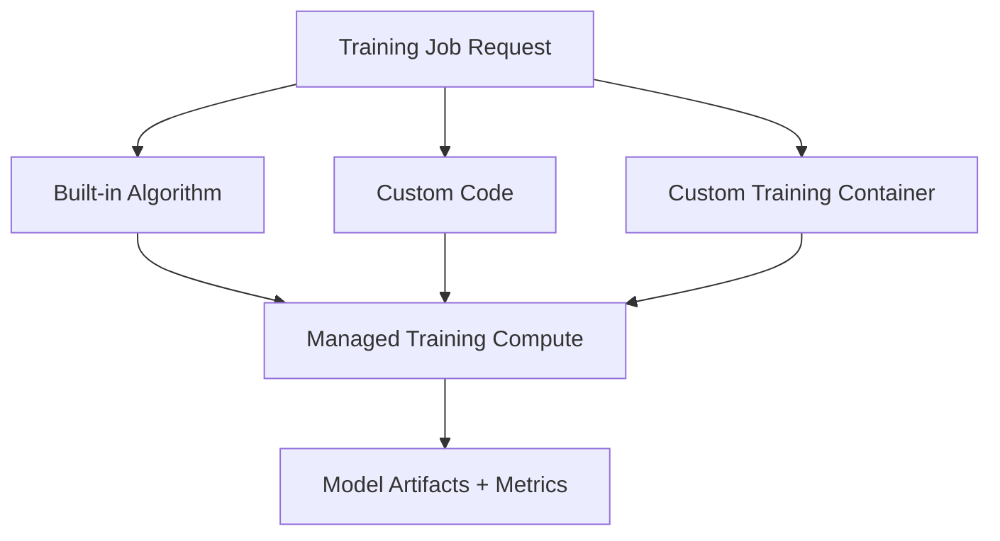

#### 为什么同时支持 Built-in 与 Custom

- Built-in / prebuilt：低接入成本、平台优化、适合标准算法；
- Custom code：保留熟悉 framework，平台管理 job lifecycle；
- Custom container：固定 system dependencies / runtime，灵活性最高。

抽象越低，用户承担的 image build、security、compatibility 和 debugging 越多。

#### Resource Management 与 IAM

原章提出可用 AWS tools 为 IAM users / roles 分配 resource limits 与 policies，以构建 training component 的 resource-management 部分。

这里要区分：

- IAM policy：谁能提交、读取和管理资源；
- Service quota：某 account / region 可使用多少资源；
- Scheduler / fairness：多个团队竞争时怎样排队与保证优先级；
- Cost allocation：谁消费了哪些 instances。

IAM 本身不是完整的公平调度器。如果组织需要 tenant quota、priority、preemption、内部 identity provider 或 chargeback，仍要增加控制层。

#### 适用范围

适合希望避免维护 training cluster control plane，同时保留 custom container 的团队。若有特殊 accelerator topology、内部 scheduler、极端 queue policy 或已有 identity platform，则 integration / custom training service 成本上升。

#### 关键验证项

- Supported instance / accelerator / region；
- Distributed framework 与 network topology；
- Dataset locality / throughput；
- Spot interruption / checkpoint；
- Container contract；
- Job retry / idempotency；
- Logs、metrics、debug；
- Quota、startup latency 与 cost。

原章的核心不是“必须采用 SageMaker”，而是它可以承担第 3、4 章 training component 的大量 compute-backend 工作。

### B.1.3 Model Serving

#### 基础能力：部署为 Web Service

原章描述 SageMaker 可把 trained model 部署为互联网可访问的 web service endpoint。这对应参考架构 `(D) Model serving` 的 online inference API。

#### Multi-Model Endpoint

为了避免每个 model 单独占一个 endpoint，SageMaker 提供 multi-model endpoint（MME）及 configurable model caching behavior：

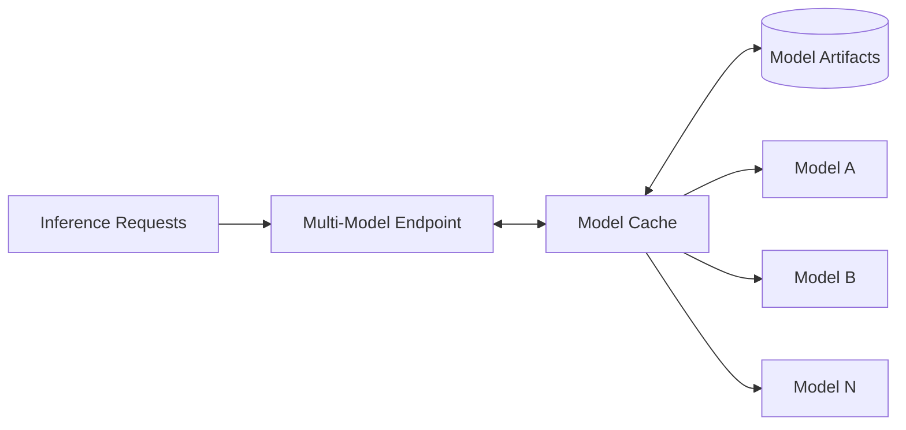

它解决大量低到中流量 models 独占资源造成的利用率问题。代价是 cold load、cache eviction、model-size heterogeneity、noisy neighbor 与 tail latency。

#### Multi-Container Endpoint

原章成书时 SageMaker 支持 multi-container endpoints。多个 containers 可用于：

- 不同 model / framework runtime；
- Pre/postprocessing 与 inference 分离；
- 在一个 endpoint 中组织多个调用目标。

“多个 containers”不自动等于任意 DAG；启动、路由和资源共享语义必须按具体 endpoint mode 验证。

#### Serial Inference Pipeline

Serial inference pipeline 把多个 containers 串联：

```text
request
-> preprocessing container
-> model container
-> postprocessing container
-> response
```

它与第 6、7 章的 serving pipeline / DAG 有相似处，但原章强调的是 serial pipeline。任意 branching、conditional graph、parallel ensemble 和复杂 state 不能从“pipeline”一词自动推断。

#### 适用范围与限制

应验证：

- Endpoint type 与 traffic pattern；
- Single-model / multi-model / multi-container compatibility；
- CPU/GPU caching restrictions；
- Model load latency；
- Autoscaling metric；
- Traffic split / canary；
- Payload / timeout / streaming；
- VPC、auth 与 observability；
- Cost at idle / peak。

原章的判断是：若这些工具满足需求，可以直接采用；否则用第 6、7 章原则识别并补齐缺口。

### B.1.4 Metadata and Artifacts Store

#### SageMaker Model Registry

Model Registry 映射全书 metadata/artifacts component 中围绕 trained model 的核心概念：

- Model metadata；
- Training metrics；
- Model versions；
- Registration / lifecycle information。

#### Registry 不等于 Artifact Bytes Store

原章指出 Model Registry 本身不是 artifact storage solution。Model files 通常存于 Amazon object storage，Registry 保存 reference 和 metadata。

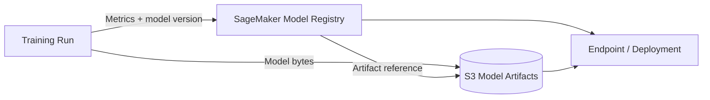

团队可在 Model Registry 与 S3 等 storage products 之上提供统一 interface，形成完整 metadata + artifact store。

#### ML Lineage Tracking

原章把 lineage 作为另一个重要 metadata 类型：artifact 之间怎样产生和消费。SageMaker 提供独立的 ML Lineage Tracking feature 自动记录这些关系。

需要确认 lineage 覆盖边界：

- 只覆盖 SageMaker-native actions，还是能注册外部 jobs？
- Dataset snapshot、processing、training、model、endpoint 是否都有 immutable IDs？
- Cross-account / external feature pipeline 怎样接入？
- Lineage retention 与 deletion 如何处理？

#### 为什么功能分散仍可组合

Registry、S3、Lineage 分别优化 catalog、bytes、graph。统一产品体验可以由 adapter / portal 聚合，但必须确定 canonical IDs，避免同一个 model 在三个系统中使用无法映射的身份。

### B.1.5 Workflow Orchestration

#### SageMaker Model Building Pipelines

原章使用 Model Building Pipelines 管理 workflows；SageMaker 术语称 pipelines。它可把以下 actions 按预定义顺序作为一个 unit 执行：

- Data preparation；
- Training；
- Model validation；
- 其他 pipeline steps。

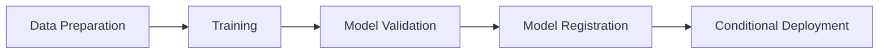

“arbitrary fashion”表示可以按需求组合步骤，不代表没有 DAG / step-type / condition 约束；具体控制流能力以目标版本为准。

#### SageMaker Projects

为让多类 users 协作，原章还介绍 Projects，用来组织：

- Workflows；
- Code versions；
- Lineage information；
- Different user access permissions。

Projects 更接近 enterprise organization / template boundary，不等同于单次 pipeline run。它把 code repository、CI/CD、pipeline 与权限关系组合成团队工作空间。

#### 与第 9 章原则的关系

需要评估的不只是“能否画 DAG”，还包括：

- Authoring / local testing；
- Retry / idempotency；
- Schedule / event trigger；
- Custom steps；
- Artifact passing；
- Multi-team isolation；
- Pipeline version / reproducibility；
- UI / debugging。

Managed pipeline 降低 scheduler 运维，但不自动消除 prototype-to-production conversion friction。

### B.1.6 Experimentation

#### SageMaker Experiments

原章描述 Experiments 为 experimental runs 添加相关 tracking information 与 metrics。典型组织关系是：

```text
experiment
-> trial / run
-> dataset input
-> algorithm / code
-> hyperparameters
-> metrics
-> output model
```

这类 tracking information 本质也是 metadata，帮助用户比较 data、algorithm 与 hyperparameter 的组合性能。

#### Experiment Tracking 与 Model Registry 的区别

| Experiment Tracking | Model Registry |
| --- | --- |
| 组织大量候选 runs | 管理经过筛选的 model versions |
| Params、metrics、debug artifacts | Registration、approval、release metadata |
| 探索阶段高写入 | 生命周期与部署集成 |
| 回答“哪个 run 更好？” | 回答“哪个 model 可被发布？” |

它们应通过 run/model lineage 连接，但不应把每个失败 trial 都当成可发布 model version。

#### 实验比较的前提

- Dataset / split 可比；
- Evaluation protocol 一致；
- Metric definitions 和 units 一致；
- Randomness / budget 有记录；
- Parent/child trials 可查询；
- Online business outcome 若需要，应另建 prediction-observation join。

原章的 Experiments 主要服务 offline training-run tracking，不能仅凭名字推断完整线上 A/B 或 bandit 能力。

### B.1 小结

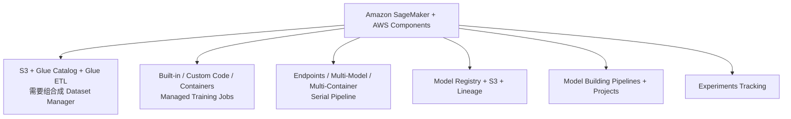

SageMaker 的优势是托管 control plane 与 AWS 生态集成；主要设计工作是把分散 products 统一成组织自己的 dataset、identity、lineage、security 和 developer experience，并验证锁定、成本与 region-specific capability。

---

## B.2 Google Vertex AI

原章把 Google Vertex AI 描述为 Google AI Platform 与 AutoML 产品的组合，提供可共同构成 deep learning system 的工具和服务。对读者真正有用的不是品牌演进史，而是它怎样将 data、training、model deployment、metadata、pipeline 和 experiments 放进统一 control plane。

> 版本边界：本节六个小节忠实保留原章成书时的能力和限制。Vertex AI 的 Dataset、Model Registry、Endpoint、Pipelines、Experiments 与 Metadata APIs 后续持续演进；涉及“不能 version”“video model 不能 online serving”等结论时，必须以目标 region、model type 和当前官方文档重新验证。

### B.2.1 Dataset Management

#### 原章使用流程

Vertex AI 提供简单、跨 dataset type 相似的 dataset API，但 object data 与 dataset metadata 分两步进入系统：

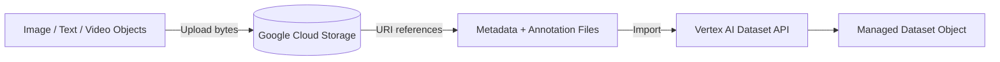

1. 先把 image/text/video 等 object bytes 上传到 Google Cloud Storage；
2. 再通过 Vertex AI API 上传引用这些 objects 的 metadata / annotation files；
3. Vertex Dataset object 管理 metadata 与训练入口，GCS 管 bytes。

#### 为什么这种设计有统一体验

不同 modality 的 bytes 格式不同，但都可以抽象为：

```text
object URI + annotation + schema / type metadata
```

统一 API 降低 application / training code 对具体 bucket layout 的依赖，也让 AutoML / managed training 能理解 labels 和 splits。

#### 原章指出的缺口

成书时 Dataset API 不提供 versioning information 和其他 lineage tracking information。也就是说，一个 dataset resource 能组织 references，却不自动回答：

- 本次训练使用哪个 immutable snapshot？
- Annotation file 后来是否改变？
- GCS objects 是否被覆盖？
- Dataset 由哪个 processing execution 生成？
- 哪些 models 使用过它？

#### Metadata Object Immutable 不等于 Referenced Bytes Immutable

即使 Dataset resource 本身有稳定 ID，若 URI 指向 mutable GCS object，历史训练仍可能重读不同内容。可复现输入至少需要：

```text
dataset resource/version
+ import manifest
+ object generation/content digest
+ annotation schema/version
+ split definition
```

#### 与参考架构的关系

Vertex Dataset API 比 AWS 的“自行组合 S3 + Glue”更接近 ready-to-use dataset-management interface，但原章认为 version / lineage 层仍需扩展。今天采用时要重新核对 current data resource / version semantics，而不能把原章缺口当永久事实。

#### 适用边界

适合使用 GCS 和 Vertex-native data formats、希望统一 image/text/video import 的团队。需要特殊 data governance、streaming snapshot、feature store、复杂 labeling lifecycle 或跨云 data plane 时，仍需额外 component。

### B.2.2 Model Training

#### Prebuilt 与 Custom Training Containers

原章描述 Vertex AI 同时支持：

- Prebuilt training containers：标准 framework/runtime，无需自行构建 base image；
- Custom-built training containers：用户需要更深定制时，自带完整 runtime。

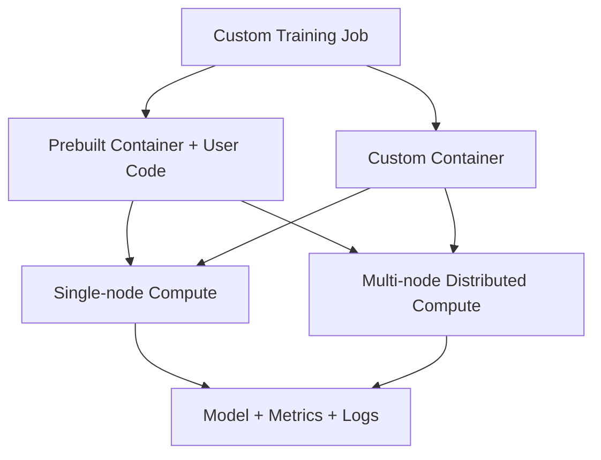

#### 为什么提供两种 Container 路径

| Prebuilt | Custom |
| --- | --- |
| 快速开始 | 完整 system dependency 控制 |
| 平台维护常见 framework | 用户维护 image / patches |
| 受支持版本约束 | 可加入 custom ops / binaries |
| 较少 build 工作 | 更大的 security / compatibility 责任 |

#### Single-node 与 Distributed Training

Vertex training interface 可启动单节点或多节点 runs。多节点支持不只等于“申请多台机器”，还要求：

- Worker roles / topology；
- Rendezvous / rank environment；
- Network 与 collective communication；
- Shared / sharded data access；
- Checkpoint / failure strategy；
- Framework-specific launcher。

原章还提到 distributed training 的 additional reduction support，用来加速参数 / gradient reduction。具体 reduction implementation、supported frameworks 和硬件是版本敏感能力，不应脱离目标配置泛化。

#### 与参考 Training Service 的关系

Managed Vertex training 承担 compute allocation、job launch 和基础监控。组织仍需决定：

- Training package contract；
- Dataset / code immutable identity；
- Quota / priority / cost policy；
- Metadata / model registration；
- HPO 与 workflow integration；
- Error taxonomy / retry。

原章希望读者用第 3、4 章判断哪些可直接用、哪些需 extension、哪些特殊需求值得自建。

### B.2.3 Model Serving

#### Model 与 Inference Container 解耦

原章强调 trained model 不与 container 永久绑死。部署时将：

```text
trained model artifact
+ prebuilt or custom inference container
+ compute resources
-> endpoint
```

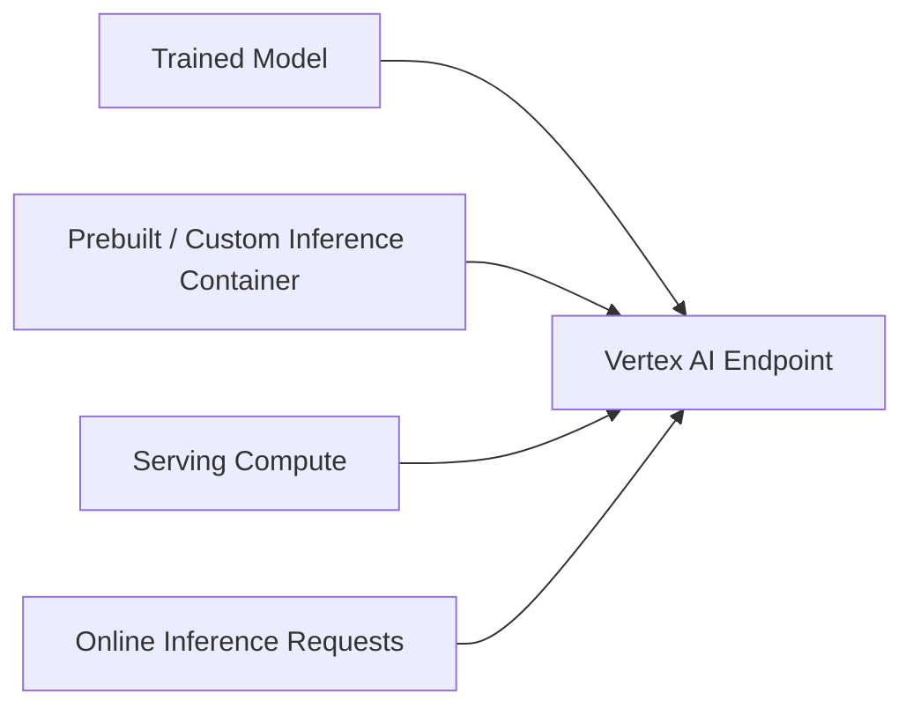

原章所说的“model 与 container 解耦”是部署概念：model files 与 serving runtime/container 是不同组成部分。具体到 Vertex resource model，上传 `Model` resource 时通常已经绑定 serving `container_spec`；同一 Vertex Model resource 可部署到多个 endpoints，但若要更换 serving container，通常需要上传新的 Model resource/version。不要把底层同一 weights 可被不同 runtimes 使用，误写成同一个 Vertex Model resource 可随部署任意替换 runtime。无论哪种方式，model format、handler、input schema 和 custom ops 都必须 compatible。

#### One Model to Multiple Endpoints

同一 model 可按 region、tenant、hardware 或环境部署多次。Model identity 与 deployment identity 应分离：

```text
model version != endpoint != deployed-model instance
```

#### Multiple Models in One Endpoint

原章说一个 endpoint 可部署多个 models，但与通用 multi-model server 不同，这在当时主要用于 canary 新 model versions 的 traffic split：

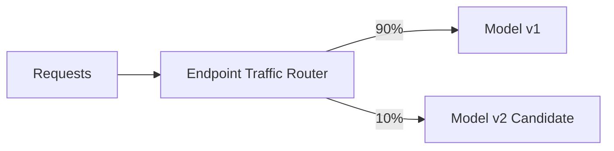

这解决 release experiment，不一定解决数千低流量 models 的 dynamic cache / load / eviction。必须区分：

- Multiple deployed versions behind one endpoint；
- Generic multi-model runtime with on-demand loading；
- Ensemble / DAG serving。

#### Video Model 的原章限制

原章指出，当时 Vertex AI video model 不能服务 online inference requests。这是特定 product/model-type 的历史限制，不能推导为“Vertex 永远不能 online serve video”。当前架构决策必须查目标 model family 的 online/batch support。

#### 评估要点

- Prebuilt / custom prediction image；
- Endpoint / deployed-model identity；
- Traffic split 与 rollback；
- Autoscaling / min replicas / cold start；
- GPU / accelerator support；
- Prediction payload / timeout；
- Private networking / auth；
- Monitoring / explanation；
- Batch versus online boundary。

### B.2.4 Metadata and Artifacts Store

#### Vertex ML Metadata 的 Graph Model

原章描述 Vertex ML Metadata 使用 graph 表达 datasets、training runs、trained models 等 artifacts 的关系。Nodes 与 edges 都可附 key-value metadata。

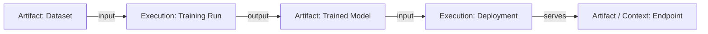

Graph 能回答：

- 哪个 dataset/code/config 产生 model？
- 某个 dataset 有问题会影响哪些 models？
- Production deployment 来自哪个 training run？
- 某 pipeline step 消费 / 产生哪些 artifacts？

#### Metadata 不直接保存 Artifact Bytes

Artifact bytes 存在 Google Cloud Storage；Vertex ML Metadata 保存 URI reference 与 graph facts。

```text
metadata node: type, properties, URI, lineage edges
GCS: actual dataset/model/report bytes
```

这与第 8 章统一 interface + 分离 physical stores 的方案相似。

#### Key-value Flexibility 的代价

任意 key-value 易扩展，但组织仍需 schema governance：

- Required properties；
- Type / unit；
- Namespace；
- Index / query pattern；
- PII / secret restrictions；
- Evolution / backward compatibility。

没有约定时，团队可能分别写 `learning_rate`、`lr`、`LearningRate`，导致全局比较失效。

#### Current Product Boundary

原章本小节聚焦 Vertex ML Metadata，没有单独展开后续 Model Registry 产品能力。当前采用时应同时核对 Model Registry 与 ML Metadata 的 ownership：哪个保存 model version / alias，哪个保存 lineage graph，artifact URI 如何统一。

### B.2.5 Workflow Orchestration

#### Vertex Pipelines

Vertex Pipelines 管理 deep learning workflows。Data preparation、training 等 operations 作为 pipeline steps；steps 是 DAG nodes，每一步由 container 实现。

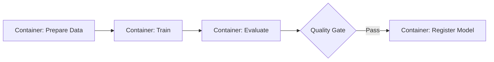

一次 pipeline run 本质上是对这些 container executions 的 orchestration。

#### Container-per-Step 的价值

- Dependency isolation；
- Language / framework flexibility；
- Immutable runtime；
- Resource specification；
- Step reuse / caching potential。

代价包括 image build、startup latency、artifact transfer、schema glue 和 debugging across containers。

#### DAG 与 Dataflow

Dependency edge 表示控制条件；step outputs 通常以 parameters / artifacts 传给 downstream。大对象应放 object storage，DAG metadata 传 URI，不应塞入 control-plane payload。

#### 评估重点

- Pipeline authoring SDK / compiler；
- Local component test；
- Custom containers；
- Caching / retry / failure semantics；
- Schedule / event trigger；
- Metadata / artifact lineage；
- IAM / service accounts；
- Cross-project / region；
- UI / logs / debugging。

Managed pipeline 不代表业务 code 自动从 Notebook 无缝生产化；第 9 章 human-centric principle 仍适用。

### B.2.6 Experimentation

#### Vertex AI Experiments

原章描述其提供统一 UI 来 create、track、manage experiments。Vertex AI SDK 的 autologging 可记录：

- Hyperparameters；
- Metrics；
- Data lineage；
- Training-run context。

与 Vertex ML Metadata 组合后，可以形成 training experiment runs 的整体视图。

#### Autologging 的价值与边界

价值：

- 降低 instrumentation 门槛；
- 自动捕获常见 framework facts；
- 快速获得可比较 baseline；
- 减少漏记 metrics / params。

边界：

- 不知道组织的 business dataset semantics；
- 可能捕获敏感或高基数字段；
- Framework / SDK 升级会改变 captured keys；
- Custom preprocessing / external service lineage 仍需显式记录；
- 自动日志不等于实验设计公平。

#### Experiments 与 ML Metadata 的关系

```text
Experiments UI / SDK:
  user-facing run organization and comparison

ML Metadata:
  graph facts and lineage across artifacts/executions

GCS:
  actual artifacts
```

三者组成 view、graph、bytes 三层。应有 canonical run / artifact IDs，避免同一事实重复写入不一致。

### B.2 小结

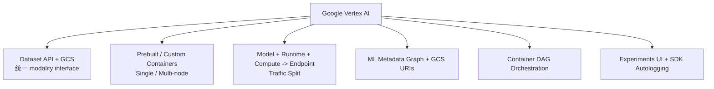

Vertex AI 在原章中提供较统一的 ML control plane，尤其是 Dataset API、container training、graph metadata 与 pipelines 的衔接。主要验证点是资源/version semantics、特定 model type serving support、managed abstraction 限制、GCP identity/network 与 portability。

---

## B.3 Microsoft Azure Machine Learning

原章先区分 classic ML Studio 与 Azure Machine Learning：前者偏 GUI，后者是一套也支持 code 与成熟 open-source frameworks 的工具和服务。这个区别体现平台演进方向：visual designer 可以降低门槛，但 production ML 还需要 code versioning、custom runtime、CI/CD 和 programmable infrastructure。

> 版本边界：原章写于 Azure ML v2 早期，包含“registry preview”“single endpoint 不支持 multiple models”等当时判断。当前官方 v2 文档已明确支持 endpoint 下多个 deployments、traffic split/mirroring、MLflow tracking/model management，以及跨 workspace Registries。下面先解释原章，再单列当前变化，避免历史限制污染今天的架构决策。

### B.3.1 Dataset Management

#### 原章 Dataset Paradigm

Azure Machine Learning 把 datasets 作为 data-processing / training tasks 的 first-class inputs 和 outputs。Dataset 由 raw-data reference 加 metadata 构成：

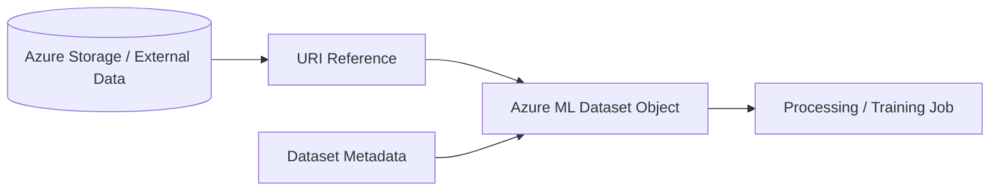

原章说 dataset 创建后 immutable，但 underlying data 不享有相同保证，仍由用户管理 immutability。

#### 为什么“Immutable Reference”仍可能不可复现

假设 Dataset object 固定为：

```text
name = camera-data
uri = azureml://datastores/raw/paths/camera/latest/
```

若 `latest/` 下 files 被替换，metadata object 未变，实际 bytes 已变。因此要同时固定：

- Data asset name/version；
- URI / path；
- Underlying blob version / immutable prefix；
- Manifest / digest；
- Schema / split。

#### Unified Client API

Data-processing 和 training code 可通过统一 client API 使用 datasets。原章列出两种 access mode：

- Download 到 local compute；
- Mount 为 network storage 直接访问。

选择取决于 dataset size、reuse、random access、network 和 local disk：

| Download | Mount |
| --- | --- |
| 启动时传输成本 | 按需读取、依赖网络 |
| 后续 local I/O 快 | 节省本地完整副本 |
| 需要足够 disk | 随机小文件可能受 latency 影响 |
| Snapshot 更容易固定 | Underlying path 变化需严格治理 |

#### 当前 v2 Data Concepts

当前官方文档更常使用 **data asset**、**datastore**、URI types：

- Datastore 是现有 Azure storage 的受管 reference / credential boundary；
- Data asset 类似带 friendly name 的 bookmark，保存 URI reference 与 metadata；
- Inputs / outputs 可用 `uri_file`、`uri_folder`、`mltable`；
- Access modes 包括 download、read-only mount、read-write mount、upload、direct；
- Data assets 可 version，但 underlying referenced data 的不可变性仍需用户保证。

因此原章的核心警告仍成立：catalog identity 不自动等于 bytes immutability。

#### 与参考架构的适配

Azure 提供较完整 data access abstraction，但完整 dataset manager 仍可能需要：

- Quality / statistics；
- Label lifecycle；
- Snapshot manifest；
- Lineage；
- Access approval / compliance；
- Cross-workspace promotion；
- Retention / deletion。

### B.3.2 Model Training

#### 原章能力快照

Azure Machine Learning 提供：

- 带 Python distributions 的 prebuilt containers；
- 可按要求定义 custom base image；
- Training run 接收 runtime container 与遵循约定的 training code reference。

原章成书时称 custom training code 仅支持 Python；若需要其他 setup，则要自建 training service。

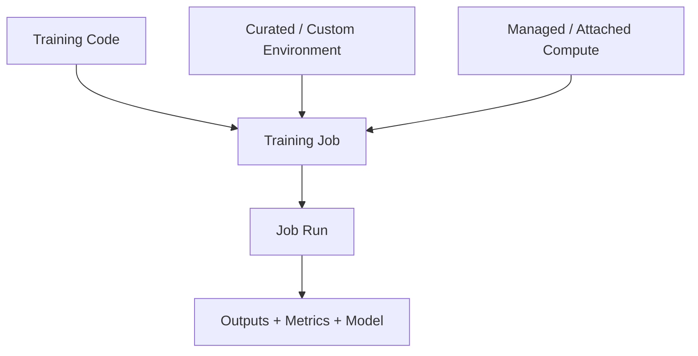

#### Runtime Container + Code Convention

平台要知道：

- Entrypoint / command；
- Code snapshot；
- Input/output bindings；
- Environment dependencies；
- Compute target；
- Distributed configuration；
- Identity / data access。

Convention 降低平台集成复杂度，但限制任意 process model。Custom image 提供逃生口，却把 patching、security 和 bootstrap 责任交给用户。

#### 历史 Python-only 限制如何使用

不能把原章一句话当作今天永久限制。Current Azure ML v2 以 Jobs、command、components 和 environments 组织训练，具体 language/runtime 能力取决于 job type、container 和 SDK/CLI contract。非 Python workload 仍应 POC 验证 logging、distributed launch、inputs/outputs 和 debug，而不是只验证 container 能启动。

#### Training Component 仍要补什么

- Quota / priority / fairness；
- Spot / checkpoint / retry；
- Multi-node topology；
- Dataset snapshot；
- Experiment logging；
- Model registration；
- Cost attribution；
- Private network / managed identity。

Managed compute 减少 cluster operations，但组织级 control plane 仍要定义。

### B.3.3 Model Serving

#### 原章 Azure ML v2 Endpoint

原章描述 endpoint 可服务 online inference，有两种主要实现：

1. 指定 model + Python scoring script；
2. 使用完全 custom container，例如 TensorFlow Serving。

Azure ML 还集成 NVIDIA Triton Inference Server，在 GPU inference 中可提供性能收益。

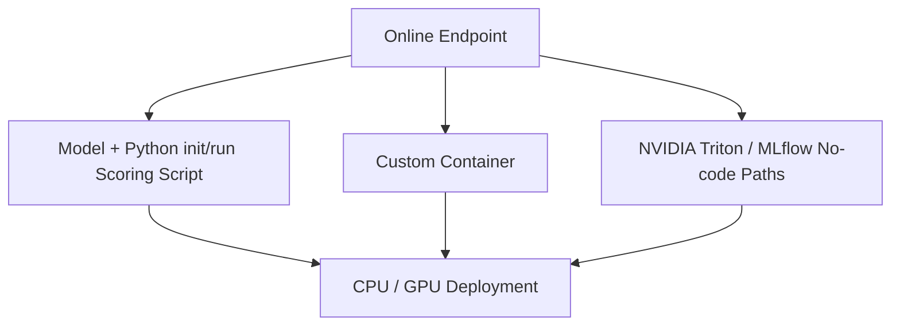

#### 原章限制

成书时作者判断：若要在 single endpoint 部署 multiple models，或管理 edge-device models / inference production，需要自建。

这句话必须拆开：

- Single endpoint multiple deployment/models：当前 managed online endpoints 已有原生能力；
- Dynamic multi-model cache / arbitrary tenant models：不等于多个固定 deployments；
- Edge fleet model lifecycle：仍是另一类控制面，不能因为 online endpoint 增强就假设已解决。

#### 当前 Endpoint / Deployment 分离

当前官方 v2 定义：

- Endpoint 是稳定 client interface 与 router；
- Deployment 是 model、code、environment、instance type/count 的具体实现；
- 一个 endpoint 可有多个 deployments；
- Traffic 可按比例路由，例如 blue 90%、green 10%；
- 可 mirror traffic 给 candidate，而不把 response 返回给 client。

当前官方文档还给 mirroring 设定边界：仅 managed online endpoints 支持；同一 endpoint 一次只配置一个 shadow deployment；mirrored percentage 最高 50%；同一个 deployment 不能同时接收 live routed traffic 与 mirrored traffic。这些限制会随 API 版本演进，实施时必须再核对。

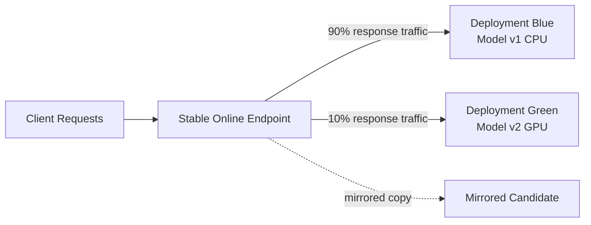

因此表述“Azure 不能 multiple models per endpoint”已经过时。更准确的问题是它能否满足你的 multi-model semantics、cache、routing、latency 和 cost。

#### No-code、Low-code 与 BYOC

当前文档区分：

- No-code：常见 framework / MLflow / Triton 模型；
- Low-code：提供 scoring script / dependencies；
- BYOC：自带完整 container stack。

选择时比较：

```text
speed to deploy
vs runtime control
vs security maintenance
vs portability
```

#### Serving 生产检查

- Endpoint authentication / TLS；
- Managed identity / network isolation；
- Autoscaling / quota；
- Traffic split / mirror / rollback；
- Local debug 与 cloud parity；
- P50/P95/P99；
- Model data collection / monitoring；
- Deployment-level cost；
- Active deployment 对 model/image 的引用生命周期。

### B.3.4 Metadata and Artifacts Store

#### Tags 与 Model Registration

原章指出 Azure ML 的许多 objects（models、training runs 等）可附 tags。Model registration 接口同时接收：

- Model file / artifact；
- Additional metadata / tags。

相比要求 artifact 已预先存在 object storage 的方案，它少一个显式 registration step。

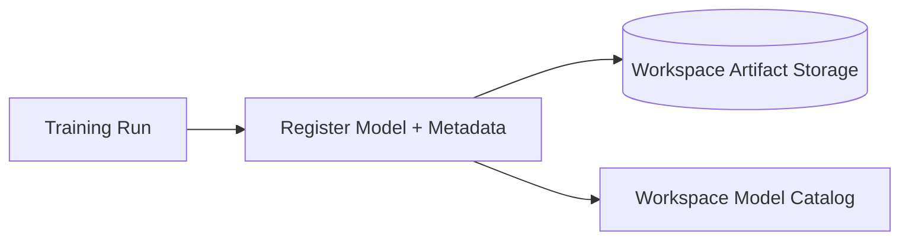

#### Tags 的能力与限制

Tags 适合 flexible search / annotation，却不是完整 typed lineage graph：

- Free-form naming drift；
- Relationship 要靠 IDs / conventions；
- Multi-hop impact query 困难；
- Units / types 不统一；
- Mutable tags 可能覆盖历史语义。

#### 原章 Registry Preview

原章称当时有一个 preview registry，可把 ML-related metadata 集中；若要 artifact lineage，可能要自建。

#### 当前 Azure ML Registries

当前官方 Registries 已用于跨 workspaces 集中共享：

- Models；
- Environments；
- Components；
- Data assets。

它支持 dev/test/prod workspace 之间 promotion，并把 assets 与单一 workspace 解耦。当前 model management 还记录 name/version、tags、training job / deployment information 等 lineage facts。

但仍需验证：

- Data/code/run/model/deployment 是否形成所需完整 graph；
- External jobs 与 cross-cloud artifacts 如何接入；
- Registry asset bytes 存储和 region replication；
- Alias / approval / promotion audit；
- Retention、delete 和 active deployment references。

“Registry 已 GA/可用”不自动等于满足第 8 章全部 lineage queries。

### B.3.5 Workflow Orchestration

#### Azure ML Pipelines

原章描述 ML pipelines 把 data、training 和其他 tasks 定义为 steps，再通过代码组成 pipeline。

Pipeline 可：

- 按 schedule 周期执行；
- 由 trigger 启动；
- 手动运行一次；
- Programmatically 配置 compute resources、execution environment、access permissions。

```mermaid
flowchart LR
    Input[Versioned Data Input]
    Prep[Data Component]
    Train[Training Component]
    Tune[HPO Component]
    Evaluate[Evaluation Component]
    Register[Registration Component]

    Input --> Prep --> Train --> Evaluate --> Register
    Prep --> Tune --> Evaluate
```

#### Component Contract

一个 pipeline step 不只是 function name，还应声明：

- Inputs / outputs；
- Code / command；
- Environment；
- Compute；
- Identity；
- Resources；
- Retry / timeout；
- Cache / reuse semantics。

#### Pipelines 与 Azure DevOps Pipelines 不同

- Azure ML pipeline：ML data/training/evaluation DAG；
- Azure Pipelines：通用 CI/CD system。

二者可组合：Git commit 触发 CI，CI 发布 ML components / pipeline，ML pipeline 产出 model，再由 CD promotion / deployment。

#### 评估重点

- Local component test；
- Pipeline job version；
- Schedule / event semantics；
- Caching correctness；
- Cross-workspace promotion；
- Metadata / lineage；
- Secrets / managed identity；
- Failure recovery / rerun；
- UI / logs。

### B.3.6 Experimentation

#### 原章 Experiments

Azure ML 可定义和跟踪 experiments。Training code 在 experiment run 中 log metrics，Web UI 展示结果；还支持 arbitrary tags 与 parent-child run relationships。

```mermaid
flowchart TB
    Experiment[Experiment]
    Parent[Parent Run / HPO Study]
    Child1[Child Run 1]
    Child2[Child Run 2]
    ChildN[Child Run N]

    Experiment --> Parent
    Parent --> Child1
    Parent --> Child2
    Parent --> ChildN
```

Parent-child 适合 HPO、cross-validation、pipeline sub-runs 与 nested evaluation。

#### 当前 MLflow Integration

当前 Azure ML workspaces 与 MLflow tracking APIs 兼容。官方建议用 MLflow 记录：

- Runs / experiments；
- Parameters；
- Metrics；
- Models / artifacts；
- Evaluation visualizations；
- Code、environment、input/output context。

这让本地或其他 compute/cloud 的 MLflow code 也能指向 Azure ML workspace。Azure ML v2 SDK 本身不承担原来的 logging API；MLflow 是主要 tracking interface。

#### Tracking、Registration、Deployment

```text
MLflow tracking
-> compare candidate runs
-> register selected model
-> deploy to online/batch endpoint
-> progressive rollout
```

各 client / language 的 capability 仍可能不同，不能因为 Python MLflow 路径完整就推断 R / Java 等同。

#### Version-sensitive Warning

当前官方文档还提示 MLflow Projects (`MLproject` files) support 计划在 2026 年 9 月完全 retired；MLflow tracking 本身仍受支持，并建议 training submission 转向 Azure ML Jobs。说明同一“MLflow integration”内部也有不同生命周期，采用时要识别具体 feature，而不是只看品牌。

### B.3 小结

```mermaid
flowchart TB
    Azure[Azure Machine Learning]
    Azure --> Data[Data Assets + Datastores + URIs<br/>Download / Mount / Direct]
    Azure --> Training[Jobs + Curated / Custom Environments<br/>Managed / Attached Compute]
    Azure --> Serving[Online Endpoint + Multiple Deployments<br/>Traffic Split / Mirror / BYOC]
    Azure --> Meta[Workspace Assets + Models + Registries<br/>Tags / Version / Lineage]
    Azure --> Pipelines[ML Component DAGs<br/>Schedule / Trigger / Manual]
    Azure --> Experiments[MLflow Tracking + Parent/Child Runs]
```

Azure ML 的优势是 workspace / asset / job / endpoint 与 Microsoft identity/network/monitoring 生态结合。原章中的 Python-only、registry preview、single-endpoint limitation 都必须按 current v2 重验；真正决策仍取决于 data immutability、multi-model semantics、cross-workspace lifecycle、cost 和 portability。

---

## B.4 Kubeflow

Kubeflow 是一组 open-source tools，用于在 Kubernetes 上构建 ML / deep learning system，目标之一是避免锁定到特定 cloud vendor。

“不锁定某个云”不等于自动 portable：

- Kubernetes API 提供共同底座；
- Storage、identity、load balancer、GPU、network policy 仍因环境而异；
- 不同 Kubeflow distributions 的版本、安装和集成可能不同；
- 团队承担 cluster、database、upgrade、security 和 on-call。

> 版本边界：原章描述大致对应 Kubeflow 1.3 时代，尤其把 metadata 完全放在 Pipelines 中、认为没有 central metadata repository。当前官方架构已有 Kubeflow Trainer、Katib、Kubeflow Hub/Model Registry 等 subprojects；以下会把原章快照与当前变化分开。

### B.4.1 Dataset Management

#### 原章判断

Kubeflow 的理念是不重复发明已有工具，因此不自带完整 data-management component。用户可采用其他 open-source data tools，并按第 2 章原则扩展。

#### Kubernetes 上的 Data Plane 仍需选择

```mermaid
flowchart LR
    Sources[Databases / Streams / Object Stores]
    Processing[Spark / Dask / Flink / Ray / Custom Jobs]
    Storage[(S3 / GCS / Azure Blob / HDFS / PVC)]
    Catalog[External Catalog / Dataset API]
    Kubeflow[Kubeflow Training / Pipelines]

    Sources --> Processing --> Storage
    Processing --> Catalog
    Catalog --> Kubeflow
    Storage --> Kubeflow
```

Kubernetes 解决 scheduling / execution，不自动提供：

- Dataset identity / version；
- Schema / statistics / quality；
- Labeling / split；
- Lineage；
- Data discovery；
- Retention / compliance；
- Efficient training access。

#### Current Ecosystem Boundary

当前 Kubeflow architecture 把 Spark Operator 等用于 data preparation / feature engineering，但它仍不是全书定义的统一 Dataset Manager。团队通常组合 object storage、table format、catalog、feature store、lineage 和 data processing operator。

#### 优势与代价

优势：可选择符合本地 / cloud / regulation 的 data stack。代价：团队自己定义 canonical dataset IDs、cross-component auth、artifact URIs 和 user experience。

### B.4.2 Model Training

#### 原章判断：Kubernetes Scheduler 是底座

Kubeflow 基于 Kubernetes，可以直接利用其 resource scheduler。与提供 prebuilt training containers 的云厂商不同，原章要求用户构建自己的 training containers 并管理 launch。

```mermaid
flowchart TB
    Spec[Training Job Spec]
    Container[User Training Container]
    Controller[Kubeflow Training Controller]
    Scheduler[Kubernetes Scheduler]
    Workers[Pods / GPU Workers]
    Outputs[Checkpoints / Model / Metrics]

    Spec --> Controller
    Container --> Controller
    Controller --> Scheduler
    Scheduler --> Workers
    Workers --> Outputs
```

#### Kubernetes 提供什么

- Pod placement；
- CPU/memory/GPU requests / limits；
- Node affinity / taints；
- Namespace / quota；
- Restart / controller reconciliation；
- Extensible custom resources / operators。

#### Kubernetes 不自动提供什么

- Training-specific job abstraction；
- Rank / world-size / rendezvous；
- Framework failure semantics；
- Elastic / gang scheduling policy；
- Dataset / checkpoint contract；
- Experiment metadata；
- User-friendly submission API；
- Cost / fairness governance。

这解释第 3、4 章为什么仍需要 training service：它在 Kubernetes 之上提供 ML domain abstraction。

#### Current Kubeflow Trainer

当前官方架构将 Kubeflow Trainer 用于 large-scale distributed training 和 LLM fine-tuning。它延续了 operator/controller 思路，帮助表达 multi-node / accelerator workloads。

采用前要验证：

- Supported frameworks / runtimes；
- Gang scheduling / queue integration；
- Elasticity；
- Checkpoint / resume；
- Multi-cluster；
- SDK / CRD version；
- Kubernetes / accelerator compatibility。

#### Container Ownership

Kubeflow 的自由度来自“bring your own training image”；也意味着用户 / platform team 负责 base image、framework、CUDA、security patches、entrypoint 和 model packaging。可通过 curated internal images 降低每个团队重复工作。

### B.4.3 Model Serving

#### KServe 的定位

原章描述 KServe 是 Kubeflow 的 model-serving component。它在 TensorFlow Serving、TorchServe、NVIDIA Triton 等 serving frameworks 之上提供统一 inference-service interface。

```mermaid
flowchart TB
    Client[Inference Client]
    KServe[KServe InferenceService]
    Runtime1[TensorFlow Serving]
    Runtime2[TorchServe]
    Runtime3[NVIDIA Triton]
    Custom[Custom Predictor Runtime]
    K8s[Kubernetes Networking / Autoscaling]

    Client --> KServe
    KServe --> Runtime1
    KServe --> Runtime2
    KServe --> Runtime3
    KServe --> Custom
    KServe --> K8s
```

#### 解决的 Operational Complexity

原章列举：

- Autoscaling；
- Health checks；
- Auto-recovery。

还可将 model storage initialization、predictor lifecycle、routing / revision 等统一在 Kubernetes resource model 中。

#### One Model 与 Multiple Models

原章称 open-source nature 使其可 host one or multiple models with same endpoint。这里需要区分实现模式：

- 一个 InferenceService 对应一个 model/revision；
- 多个 revisions 做 canary；
- ModelMesh / multi-model serving 做大量模型动态放置；
- Ensemble graph 由 Triton / custom runtime 表达。

“KServe 支持 multiple models”不能自动推导所有模式、runtime 和版本都支持相同语义。

#### KServe 是 Control Plane，不是所有模型的执行引擎

真正 forward pass 由 underlying runtime 完成。KServe 统一 deployment / protocol / autoscaling 等操作面。Custom preprocessing、tokenizer、GPU batching 和 model format 仍由 runtime / container 负责。

#### 适用边界

- Kubernetes 已是标准 serving substrate；
- 需要 open protocol / runtime choice；
- 能维护 ingress、certificates、autoscaler、storage credentials；
- 可接受 Pod / model cold starts；
- Platform team 能测试 KServe/runtime compatibility。

### B.4.4 Metadata and Artifacts Store

#### 原章：Metadata / Artifacts 嵌入 Kubeflow Pipelines

从 Kubeflow 1.3 起，metadata 与 artifacts 成为 Kubeflow Pipelines 的 integral parts。KFP pipeline 是 component graph；components 之间可传：

- Parameters：小型 scalar / structured control values；
- Artifacts：dataset、model、metrics、distribution report 等 side effects。

Metadata 描述 components / executions / artifacts。通过 input/output relationships 可推导：

```mermaid
flowchart LR
    Data[Artifact: Dataset]
    Prep[Execution: Preprocess]
    Prepared[Artifact: Training Data]
    Train[Execution: Train]
    Model[Artifact: Model]
    Evaluate[Execution: Evaluate]
    Metrics[Artifact: Metrics]

    Data --> Prep --> Prepared --> Train --> Model --> Evaluate --> Metrics
```

原章还声称可由这些 constructs 推导 input datasets、trained models、experiment results 与 served inferences 的 lineage。前三者可直接来自 pipeline executions；served-inference lineage 只有在 serving/deployment/prediction facts 被显式采集并关联到 model artifact 时才成立，KFP 不会仅凭训练 DAG 自动知道线上每次 inference。

#### Current KFP Metadata Backend

当前官方文档说明 KFP backend 把 runtime information 存入 metadata store，包括 task status、artifact availability、Execution / Artifact custom properties；KFP 使用 Google ML Metadata（MLMD）作为 metadata dependency，并能可视化跨 pipeline runs 的 Artifact–Execution lineage graph。

这与第 8 章 MLMD 模型直接对应：pipeline instrumentation 产生 graph，KFP UI/API 提供 view。

#### 原章“没有 Central Repository”的历史边界

表 B.1 原章称 Kubeflow 没有 central metadata/artifact repository，facts integral to Pipelines。对于成书时点，这强调 pipeline-scoped ownership。

当前 Kubeflow Hub（formerly Model Registry）已提供 central model metadata index：管理 models、versions 与 artifact references，并含 Model Catalog discovery。它填补 experimentation 到 production 的 model lifecycle gap。

KFP/MLMD facts 不会因为安装 Hub 就自动同步到 Registry。Pipeline 需要显式 registration component / adapter 调用 Registry API，并定义 KFP run/artifact IDs 与 registry model/version IDs 的映射；下图虚线表示这种可建设集成，而不是内建自动复制。

```mermaid
flowchart LR
    KFP[Kubeflow Pipelines / MLMD]
    Registry[Kubeflow Hub / Model Registry]
    Store[(Object Storage)]
    KServe[KServe]

    KFP -.->|Explicit registration step / adapter<br/>map run-artifact IDs| Registry
    KFP -->|Artifact bytes| Store
    Registry -->|Version + approved artifact URI| KServe
    Store --> KServe
```

#### Hub / Registry 不等于 Bytes Storage

Registry 管 index、versions、metadata、approval / lifecycle references；model weights 仍位于 object storage。Current Model Catalog 是 read-only federated metadata discovery，也不保存 external model weights。

#### 需要继续验证

- Hub / Registry maturity 与 API stability；
- KFP run IDs 与 registry model IDs 的 mapping；
- Non-pipeline models 怎样注册；
- Artifact integrity / signatures；
- Tenant RBAC；
- Promotion / alias / audit；
- Storage lifecycle；
- KServe deployment feedback 回 registry。

### B.4.5 Workflow Orchestration

#### Kubeflow Pipelines

原章将 KFP 用于 data preparation 和 training workflows。Pipeline metadata / versioning 内建，并可利用 Kubernetes users / access permissions 限制访问。

Current KFP 将 pipeline 定义为 components 构成的 computational DAG；每个 component execution 通常对应一个 container execution，并可产生 artifacts。

```mermaid
flowchart LR
    SDK[KFP Python SDK]
    IR[Platform-neutral IR YAML]
    Backend[KFP-conformant Backend]
    Pods[Kubernetes Container Tasks]
    Metadata[Runs / Experiments / Artifacts]

    SDK -->|Compile| IR
    IR --> Backend
    Backend --> Pods
    Pods --> Metadata
```

#### Current KFP 的 Developer Experience

官方当前定位包括：

- Python-native authoring；
- Custom / ecosystem components；
- Parameters / ML artifacts passing；
- Definitions、runs、experiments、artifacts 的 track / visualize；
- Parallel execution 与 caching；
- Platform-neutral IR YAML portability。

这些能力比“手写长 Kubernetes YAML”更 human-centric，但仍要管理 component images、data access、secrets 和 backend differences。

#### Portability 的真实边界

IR 可跨 KFP-conformant backends，例如 open-source KFP 与 Vertex AI Pipelines；但 component 内若直接依赖特定 cloud URI、IAM SDK、GPU type 或 Kubernetes resource，实际 portability 会下降。

可以定义 portability debt：

$$
Debt_{port}=\sum_j Cost(replace\ platform\ dependency_j)
$$

它不是精确财务公式，而是提醒团队记录每个 provider-specific dependency 的替换成本。

#### Caching 的正确性

Cache key 必须覆盖所有影响 output 的 inputs、code、environment 和 parameters。若 component 偷读 mutable `latest` data，KFP cache 可能返回过时 output。性能优化不能替代 immutable contracts。

### B.4.6 Experimentation

#### 原章 KFP Experiment

Kubeflow Pipelines 的 Experiment construct 把多个 training / pipeline runs 组织为 logical group，并提供 visualization tools 比较 runs，适合 offline experimentation。

```text
Experiment
-> Pipeline Run A
-> Pipeline Run B
-> Pipeline Run C
```

原章指出 online experimentation 需要自行实现，因为 KFP Experiment 组织的是 workflow runs，不是 production request randomization / outcome attribution。

#### KFP Experiment 与 Katib 不同

- KFP Experiment：run grouping / tracking / comparison；
- Katib Experiment：AutoML optimization study，执行 hyperparameter tuning、early stopping、NAS trials。

Current Katib 是 Kubernetes-native、framework-agnostic，可用 Bayesian optimization、TPE、random search、CMA-ES、Hyperband 等 algorithms，并可协调 multi-node / multi-GPU trials。

```mermaid
flowchart LR
    Katib[Katib Optimization Experiment]
    Suggestion[Search Algorithm]
    Trials[Training Trials]
    Metrics[Objective Metrics]
    Best[Best Configuration]

    Katib --> Suggestion --> Trials --> Metrics
    Metrics --> Suggestion
    Metrics --> Best
```

Katib 优化 objective，不自动提供产品线上 A/B 或 bandit。Trial result 还应写入 KFP/MLMD/Registry，保持 lineage。

#### Online Experimentation 仍需什么

- Stable subject assignment；
- Traffic router；
- Model/deployment version logging；
- Delayed outcome join；
- Guardrails；
- Statistical analysis；
- Rollback / kill switch。

KServe 可承担部分 traffic routing，但完整 online-experiment control plane 仍需设计。

### B.4 小结

```mermaid
flowchart TB
    KF[Kubeflow on Kubernetes]
    KF --> Data[External Data Stack<br/>Spark / Object Store / Catalog]
    KF --> Train[Kubeflow Trainer + User Containers<br/>Kubernetes Scheduler]
    KF --> Serve[KServe + Serving Runtimes]
    KF --> Meta[KFP MLMD + Kubeflow Hub / Registry<br/>External Object Storage]
    KF --> Pipeline[KFP Python SDK + IR YAML + Container DAG]
    KF --> Experiment[KFP Experiments + Katib HPO/NAS]
```

Kubeflow 的优势是 open-source、Kubernetes-native、component choice 与可扩展性；代价是组装、升级、兼容、security、storage、observability 与 SRE 责任。它减少 vendor control-plane lock-in，但不会消除 Kubernetes 和所选 ecosystem 的 operational lock-in。

---

## B.5 Side-by-Side Comparison

原章用表 B.1 按前述 components 汇总四套方案，帮助读者快速选取合适 solution。表格的真正用途是形成问题清单，而不是用单个格子的“支持/不支持”替代 POC。

### 原表存在一处重要复制错误

原始表 B.1 的 **workflow orchestration** 行只有 SageMaker column 是 workflow 内容；Vertex、Azure、Kubeflow 三列分别重复了 metadata/artifacts 行文本。这与原章 B.2.5、B.3.5、B.4.5 明确介绍的 Vertex Pipelines、Azure ML pipelines、Kubeflow Pipelines 相矛盾，属于明显的编辑 / 复制错误。

本文不会照抄错误行，而是依据四个 workflow 小节重建正确内容。原表其他行仍按成书时描述理解。

### 修正后的原章时点总表

| 维度 | Amazon SageMaker | Google Vertex AI | Microsoft Azure ML | Kubeflow |
| --- | --- | --- | --- | --- |
| Dataset management | S3、Glue Catalog、Glue ETL 等可组合出 dataset manager，但没有原章定义的单一统一组件 | Ready-to-use Dataset API；bytes 先到 GCS，metadata/annotations 单独导入；原章称缺 version/lineage | Dataset 是 first-class immutable metadata object，引用 underlying storage；统一 client 可 download/mount，但 raw bytes immutability 由用户保证 | 原章不提供完整 dataset manager，组合其他 OSS data tools |
| Model training | Built-in algorithms、custom code、custom containers；API 按需启动 jobs；IAM/quotas 可参与资源治理 | Prebuilt/custom training containers；single/multi-node distributed jobs；原章提及 reduction support | Prebuilt Python environments / custom base image；code 遵循 runtime convention；原章称 custom code 仅 Python | Kubernetes scheduler + 用户自建 training containers / operators；平台需封装资源与框架复杂度 |
| Model serving | Web endpoints、multi-model endpoints 与 cache、multi-container endpoints、serial inference pipelines；原表注明 GPU 场景存在部分限制，当前 GPU-backed MME 能力需另行核对 | Model 与 inference container 解耦；组成 endpoint；一 model 多 endpoints；多 models/versions 一 endpoint 主要用于 traffic split；原章称 video model 无 online serving | Endpoint + model/Python scoring 或 custom container；Triton integration；原章称 multi-model single endpoint / edge 要自建 | KServe 在 TF Serving、TorchServe、Triton 等 runtime 之上提供 inference abstraction、autoscaling、health/recovery |
| Metadata / artifacts | Model Registry 管 metadata/version，S3 管 artifacts；ML Lineage Tracking 管 lineage | Vertex ML Metadata graph 管 artifacts/executions relationships，GCS 管 bytes / URI targets | Tags、workspace model registration 同时接 metadata+files；原章 registry 尚 preview，复杂 lineage 可能自建 | 原章：metadata/artifacts integral to KFP components/runs，无独立 central repo；从 graph facts 推 lineage |
| Workflow orchestration | SageMaker Model Building Pipelines；Projects 组织 workflow/code/lineage/access | **Vertex Pipelines**：data/training container steps 组成 DAG | **Azure ML pipelines**：programmatic steps，可 schedule、trigger 或 manual，配置 compute/env/access | **Kubeflow Pipelines**：container DAG，metadata/versioning 与 Kubernetes access 集成 |
| Experimentation | SageMaker Experiments grouping/tracking runs | Vertex AI Experiments UI + SDK autologging，与 ML Metadata 组合 | Experiments 记录 metrics/tags，支持 parent-child runs 与 UI | KFP Experiment 组织 pipeline runs、比较 offline experiments；online experimentation 自建 |

### 表格只描述产品边界，不描述责任边界

同样写“支持 training”，实际可能表示：

```text
cloud provider:
  operates scheduler, compute provisioning, control-plane database

open-source stack:
  provides controllers and APIs
  user operates cluster, database, storage, upgrades, security
```

因此每个 feature cell 应补两个问题：

1. 谁实现 / 操作它？
2. 故障、升级和安全事件由谁负责？

### B.5.1 Dataset Management 横向结论

#### 原章相对位置

- Vertex / Azure 更接近 first-class dataset object / API；
- AWS 需要 S3 + Glue products 组合；
- Kubeflow 选择外部 data stack。

#### 四者共同未自动解决的问题

即使有 Dataset API，也必须验证：

- Referenced bytes 是否 immutable；
- Manifest / content digest；
- Schema / labels / split；
- Data quality；
- Lineage；
- Access / compliance；
- Training throughput；
- Cross-region / egress。

#### 选型关键

Data gravity 往往比 ML feature list 更重要。PB 级数据已在某 cloud / warehouse 时，跨云训练的 egress、copy time、compliance 和 duplicate governance 可能主导决策。

数据移动下界可粗略表示为：

$$
T_{move}\geq\frac{D}{B_{effective}}
$$

同时产生直接 egress cost 与长期双份数据管理成本。

### B.5.2 Model Training 横向结论

#### Cloud Managed Products

AWS、Vertex、Azure 都提供 managed job submission、prebuilt/custom runtime 与 compute integration，差异在：

- Supported accelerators / regions；
- Distributed launch；
- Queue / quota；
- Spot / checkpoint；
- Network / data integration；
- Environment contract；
- Debug / logs；
- Startup / price。

#### Kubeflow

Kubernetes/Trainer 提供更开放 control surface，但平台团队承担：

- Cluster / GPU operator；
- Scheduler / queue；
- Training images；
- Framework controllers；
- Metadata integration；
- Capacity planning；
- Upgrade compatibility。

#### 不应只比较每小时 Instance Price

单次训练成本近似：

$$
Cost_{run}=Cost_{queue}(T_{queue})+T_{compute}\times Price_{compute}+Cost_{data}+Cost_{failure}
$$

$Cost_{queue}(T_{queue})$ 把等待时间转换为人员等待、延迟实验和机会损失的货币估计，使所有加项量纲一致；compute time 乘实例单价得到直接费用。失败重跑、idle cluster 和平台维护也要计入。

### B.5.3 Model Serving 横向结论

#### 共同抽象

```text
model artifact
+ inference runtime / code
+ compute
+ stable endpoint
+ routing / autoscaling / monitoring
```

#### 不能混淆的三个“多模型”

1. **Multiple deployments / versions behind endpoint**：常用于 canary / blue-green；
2. **Dynamic multi-model serving**：按 request 加载大量 models，并管理 cache；
3. **Ensemble / inference graph**：一个 request 串/并行调用多个 models。

SageMaker MME、Vertex traffic split、Azure multiple deployments、KServe / ModelMesh 可能分别覆盖不同语义。看到“multi-model”必须追问是哪一种。

#### 比较指标

- Cold / hot latency；
- P99 at target load；
- Model density / cache policy；
- GPU sharing / batching；
- Autoscaling / scale-to-zero；
- Traffic split / mirror；
- Custom runtime；
- Protocol / payload；
- Private networking；
- Monitoring / model-data capture；
- Rollback；
- Idle / peak cost。

### B.5.4 Metadata and Artifacts 横向结论

#### 共同物理模式

四套方案最终都倾向：

```mermaid
flowchart LR
    Metadata[Metadata / Registry / Lineage Graph]
    URI[Immutable URI + Digest]
    Store[(Object Storage / Artifact Repository)]

    Metadata --> URI --> Store
```

区别是 metadata ownership：model-centric registry、generic lineage graph、workspace assets/tags、pipeline-integrated MLMD。

#### 当前变化

- Azure Registries 已不再只是原章 preview；
- Kubeflow Hub / Model Registry 已补充 central model metadata；
- Vertex/SageMaker 的 registry/metadata products 也持续演进。

原章“有没有 central repo”的静态结论应更新为更细问题：

- Central for which entity types？
- Workspace/project/account scope？
- Model bytes 还是 references？
- Arbitrary lineage graph or model lifecycle only？
- Cross-system IDs / external artifacts？
- Promotion / alias / approval / audit？

### B.5.5 Workflow 横向结论

四者都能表达 data → train → evaluate 等 DAG，但 portable pipeline 仍受 component dependencies 约束。

| 问题 | Managed Cloud Pipeline | Open-source KFP |
| --- | --- | --- |
| Control plane operation | Provider | Platform team |
| Native cloud steps | 丰富 | 需 components / SDK |
| Kubernetes control | 间接 / product-specific | 直接 |
| Portability | 受 provider APIs 约束 | IR 较中立，但 component 可锁定 |
| Upgrade ownership | Provider API migration | User manages KFP/K8s/database migration |
| Local authoring/debug | Product-specific | Python SDK / local component tests，backend parity 仍需验证 |

#### 原表 Workflow 行纠错后的意义

如果照抄原表错误行，会得出 Vertex/Azure/Kubeflow 没有 workflow 产品的荒谬结论。Cross-check summary table 与各正文小节，是阅读技术书籍和 vendor comparison 的必要方法。

### B.5.6 Experimentation 横向结论

四者都能组织 offline runs、params 与 metrics，但范围不同：

- SageMaker / Vertex / Azure：managed experiment tracking；
- Azure 当前以 MLflow 为主要 tracking API；
- KFP Experiment：pipeline-run grouping；
- Katib：optimization trials，而非普通 tracking 的同义词。

共同缺口通常是完整 online experimentation：

- Subject randomization；
- Sticky assignment；
- Production model/deployment logging；
- Delayed business outcome join；
- Statistical inference；
- Guardrails / rollback。

Experiment tracking 记录发生了什么；实验设计决定结论是否可信。

### 成书时快照与当前变化

| 原章描述 | 当前阅读方式 |
| --- | --- |
| Vertex Dataset 缺 version/lineage | 作为历史 gap；核对当前 resource/version semantics |
| Vertex video model 无 online inference | 核对具体 model family 和 endpoint support |
| Azure custom training 仅 Python | 核对当前 Jobs/container contract，不当作永久语言限制 |
| Azure single endpoint multiple models 要自建 | 已明显过时：当前 endpoint 支持多个 deployments、traffic split/mirror |
| Azure Registry 是 preview | 已演进为跨 workspace Registries，仍需查具体 asset/region support |
| Kubeflow 无 central metadata/artifact repo | 当前已有 Hub/Model Registry；KFP/MLMD 仍承担 run/artifact lineage |
| Kubeflow Experiment 用于 offline；online 自建 | 核心判断仍成立；Katib 增加 HPO/NAS，不等于 online A/B |

### Managed Cloud 与 Kubeflow 的责任对比

| 维度 | Managed Cloud Platform | Kubeflow / Self-managed Kubernetes |
| --- | --- | --- |
| Time to first workload | 通常较短 | 需安装 / 集成 |
| Control plane HA | Provider | 用户 / distribution vendor |
| Runtime flexibility | Custom container 下较高，但受 API 限制 | 高，直接 Kubernetes |
| Cloud integration | Native IAM/storage/network | 需适配，但可多环境 |
| Upgrade | Provider 管服务，用户管 API migration | 用户管 K8s/Kubeflow/DB/component matrix |
| Cost model | Usage + managed premiums | Infra + engineering + idle + operations |
| Lock-in | APIs、identity、metadata、data gravity | Kubernetes/CRDs/distribution/OSS operations |
| Support | Cloud support plans | Community / vendor distribution / internal team |

### Hard Constraints 先于 Weighted Score

若候选违反硬约束，加权平均再高也不可选。定义：

$$
Feasible(s)=\prod_{j=1}^{m}I[c_j(s)=true]
$$

- $c_j$：data residency、required accelerator、SLA、license 等硬条件；
- 任一条件 false，$Feasible=0$。

只对 feasible candidates 评分：

$$
Score(s)=\sum_i w_i q_i(s)-\lambda R(s)-\mu M(s)
$$

- $q_i$：POC 中质量 / 能力得分；
- $w_i$：预先确定的业务权重；
- $R$：风险 / 不确定性；
- $M$：migration / exit cost；
- $\lambda,\mu$：组织风险偏好。

### 可运行的加权决策示例

下面的标准库代码演示 hard constraints + weighted score。示例分数是占位数据，不代表对四个真实产品的评级。

```python
from __future__ import annotations

from dataclasses import dataclass


@dataclass(frozen=True)
class Candidate:
    name: str
    capabilities: frozenset[str]
    scores: dict[str, float]
    risk: float
    migration_cost: float


def rank_candidates(
    candidates: list[Candidate],
    required: set[str],
    weights: dict[str, float],
    risk_penalty: float = 0.15,
    migration_penalty: float = 0.10,
) -> list[tuple[str, float]]:
    if abs(sum(weights.values()) - 1.0) > 1e-9:
        raise ValueError("weights must sum to 1")
    if any(weight < 0.0 for weight in weights.values()):
        raise ValueError("weights must be non-negative")

    ranked: list[tuple[str, float]] = []
    for candidate in candidates:
        if not required.issubset(candidate.capabilities):
            continue
        if set(candidate.scores) != set(weights):
            raise ValueError(f"{candidate.name} has incomplete scoring dimensions")
        values = [*candidate.scores.values(), candidate.risk, candidate.migration_cost]
        if any(value < 0.0 or value > 1.0 for value in values):
            raise ValueError(f"{candidate.name} values must be normalized to [0, 1]")
        quality = sum(
            weight * candidate.scores[dimension]
            for dimension, weight in weights.items()
        )
        adjusted = (
            quality
            - risk_penalty * candidate.risk
            - migration_penalty * candidate.migration_cost
        )
        ranked.append((candidate.name, adjusted))

    return sorted(ranked, key=lambda item: item[1], reverse=True)


weights = {
    "dataset": 0.15,
    "training": 0.20,
    "serving": 0.25,
    "metadata": 0.15,
    "workflow": 0.15,
    "experimentation": 0.10,
}
required = {"private-network", "custom-container", "gpu"}

# Replace these illustrative values with measured POC results.
candidates = [
    Candidate(
        name="managed-cloud-option",
        capabilities=frozenset({"private-network", "custom-container", "gpu"}),
        scores={dimension: 0.8 for dimension in weights},
        risk=0.3,
        migration_cost=0.7,
    ),
    Candidate(
        name="self-managed-kubernetes-option",
        capabilities=frozenset({"private-network", "custom-container", "gpu"}),
        scores={dimension: 0.7 for dimension in weights},
        risk=0.6,
        migration_cost=0.4,
    ),
]

print(rank_candidates(candidates, required, weights))
```

代码体现四个原则：

1. Hard constraints 先过滤；
2. Weights 必须在看到结果前确定；
3. Scores 来自同一 POC，而不是 marketing claims；
4. Risk 与 exit cost 单独惩罚，避免功能多者自动获胜。

### POC 应使用同一条 Representative Workflow

```mermaid
flowchart LR
    Ingest[Ingest / Snapshot Data]
    Train[Custom Distributed Training]
    Track[Log Params / Metrics / Lineage]
    Evaluate[Evaluate + Quality Gate]
    Register[Register Immutable Model]
    Deploy[Canary / Rollback]
    Observe[System + Business Metrics]

    Ingest --> Train --> Track --> Evaluate --> Register --> Deploy --> Observe
```

在四个候选上使用相同 dataset size、model、SLO 和 security constraints，测量：

- First successful run time；
- Authoring / local debug time；
- Training queue/start/end；
- Distributed scaling efficiency；
- Artifact / lineage completeness；
- Serving cold/hot P99；
- Traffic rollout / rollback；
- Failure diagnosis；
- Cost / idle resources；
- Upgrade / migration steps。

### Lock-in 的分层分析

Vendor lock-in 不只是 custom API。至少分为：

| Layer | 典型锁定 |
| --- | --- |
| Data | Proprietary table / URI、egress、region |
| Code/runtime | Provider SDK、prebuilt image、custom ops |
| Workflow | Pipeline DSL、step types、triggers |
| Metadata | Run/model IDs、lineage graph、export fidelity |
| Serving | Endpoint protocol、traffic policy、monitoring |
| Identity/network | IAM/RBAC、private links、service accounts |
| Operations | Dashboards、alerts、runbooks、skills |

Open-source 也有 lock-in：CRDs、distribution patches、Kubernetes operational model、internal abstractions。

### Exit Plan

在采用前回答：

- Dataset / model artifacts 能否按开放格式导出？
- Runs / params / metrics / lineage 能否批量导出？
- Pipeline definition 是否有 portable IR？
- Model server 可否在另一环境运行？
- IDs / aliases 如何迁移？
- Egress 时间与费用？
- Parallel-run migration 需要多久？
- 谁拥有迁移 automation？

Exit plan 不是预言离开，而是限制未来议价和业务连续性风险。

### B.5 的核心选型结论

1. 没有一套方案在所有维度天然最佳；
2. Reference architecture 是能力清单，不是强制部署拓扑；
3. Managed products 主要购买 control-plane operations 和 ecosystem integration；
4. Kubeflow 主要购买开放扩展边界，但 operations 由自己承担；
5. Dataset bytes、identity、network 和现有组织技能经常比 feature list 更决定结果；
6. Product/version facts 必须在决策日期重新验证；
7. Summary table 必须与正文和官方文档 cross-check；
8. 最可信证据来自同一 representative workload 的 POC、failure drill 和 TCO。

---

## 容易混淆的概念与常见误区

### 1. 采用现有平台就不再需要系统设计

平台替你实现部分组件，但仍要定义数据身份、用户流程、权限、lineage、SLO、成本和发布策略。Buy 只是改变实现责任，不取消架构责任。

### 2. 从零构建一定更符合需求

自建能定制，也带来长交付周期、可靠性和维护成本。只有关键差异化需求足以覆盖 TCO 时才合理。

### 3. 托管云平台就是一个内部完全统一的产品

同一品牌下常包含独立 storage、catalog、training、registry、pipeline 服务，身份和事务边界仍需 glue。

### 4. Feature Exists 就等于 Fit for Purpose

“支持 multi-model”“支持 lineage”可能对应完全不同语义和限制。必须用 workload、规模、region、runtime 和 failure mode 验证。

### 5. 表 B.1 是永久有效的采购清单

它是成书时快照，且 workflow 行还有明显复制错误。当前决策必须重新查官方文档并做 POC。

### 6. Preview 功能可以默认承担 Production SLA

Preview 常无 SLA，API/行为可能变化。关键路径采用前要有 maturity、support 和 migration plan。

### 7. 有 Dataset API 就自动拥有 Immutable Training Data

Dataset/data asset 可能只是 URI + metadata。Underlying objects 若可覆盖，历史训练仍不可复现。

### 8. S3 / GCS / Blob 本身就是 Dataset Manager

Object storage 管 bytes，不自动提供 logical ID、schema、commit、statistics、quality、split 和 persona workflow。

### 9. Data Catalog Table 自动提供完整 Dataset Versioning

Catalog 可记录 schema/location，但 referenced partitions/objects 的版本与 lineage 仍需治理。

### 10. Azure Data Asset 创建后会复制并冻结所有 Raw Data

Current data asset 更像 friendly reference / metadata；bytes 常留在原 storage。需要用户保证 underlying path immutability。

### 11. Download 永远优于 Mount，或 Mount 永远优于 Download

选择取决于 dataset size、reuse、local disk、random access、network 和 startup latency。

### 12. ML 平台功能比 Data Gravity 更重要

PB 级数据搬迁时间、egress、合规和双份治理可能比某个训练功能更决定平台选择。

### 13. 使用 Custom Container 就完全消除 Vendor Lock-in

Container 提高 runtime portability，但 job API、data URI、identity、pipeline DSL、metadata IDs 和 endpoint semantics 仍可锁定。

### 14. Managed Training 意味着不需要 Platform Team

仍需 curated environments、quota、cost、network、dataset contract、metadata、support 和 user experience。

### 15. IAM Policy 就是完整 Resource Scheduler

IAM 管授权；queue、fairness、priority、preemption、capacity 和 chargeback 是另外的问题。

### 16. 支持 Multi-node 就保证 Distributed Training 高效

还取决于 framework launcher、collective network、data pipeline、topology、checkpoint 与 scaling efficiency。

### 17. Kubernetes Scheduler 已经等于 Training Service

Kubernetes 管 Pods；training service/operator 还要表达 framework roles、ranks、job state、artifacts、retry 和 user API。

### 18. Prebuilt Container 总比 Custom Container 好

Prebuilt 快速但受版本/依赖限制；custom 灵活但承担 patch/security。应按 customization gap 选择。

### 19. Endpoint、Deployment、Model Version 是同一对象

Endpoint 是稳定接口，deployment 是运行实现，model version 是 artifact identity。一个 endpoint 可路由多个 deployments。

### 20. 所有 “Multi-model” 都表示按需缓存成千上万个模型

它也可能只表示两个版本做 canary，或 ensemble graph。必须区分 multi-deployment、dynamic cache、ensemble。

### 21. Endpoint 做 90/10 Traffic Split 就自动得到可信 A/B 结论

还需 stable random assignment、sample size、outcome attribution、guardrails 和统计分析。

### 22. 一个 Model 部署到多个 Endpoints 会复制出多个 Model Identity

Model artifact identity 可保持不变；每个 deployment / endpoint 有独立运行身份和配置。

### 23. KServe 自己执行所有 Framework 的 Forward Pass

KServe 是 serving control/interface layer；TensorFlow Serving、TorchServe、Triton 或 custom runtime 执行模型。

### 24. Serverless / Scale-to-zero 没有任何性能代价

Cold Pod、image pull、model download/load/warm-up 会影响 tail latency。

### 25. Metadata Store 与 Artifact Store 是同一个数据库

通常 metadata/catalog/lineage 与 object bytes 物理分离，通过 immutable URI/digest 关联。

### 26. Model Registry 一定保存全部 Model Weights

Registry 常保存 metadata/version/reference，bytes 位于 object storage。具体 registration API 可代为上传，但职责仍不同。

### 27. Tags 足以表达任意 Lineage Graph

Tags 灵活，却缺少 typed edges、因果方向和高效 multi-hop query，容易命名漂移。

### 28. Graph Metadata 不需要 Schema Governance

Nodes/edges 可附任意 properties 仍需 required fields、types、units、namespace 和 evolution rules。

### 29. Artifact URI 存在就表示 Artifact Immutable 且完整

URI 是 locator；还需要 object generation/version、digest、size、signature 和 access policy。

### 30. Experiment Tracking 就是 Model Registry

Tracking 管大量候选 runs；Registry 管筛选后的 model lifecycle。两者由 lineage 连接但用途不同。

### 31. Experiment Tracking 就是 Online Experimentation

记录 params/metrics 不等于生产流量随机化、delayed outcome join 和因果分析。

### 32. Autologging 能捕获完整 Business Lineage

它只记录 framework 可见事实，不知道组织的 dataset semantics、approval、product outcome 和外部 preprocessing。

### 33. KFP Experiment 与 Katib Experiment 完全同义

前者偏 run grouping；后者是 HPO/NAS optimization study，包含 suggestion/trials/objective。

### 34. Katib 找到 Best Trial 就可以自动上线

Best objective trial 仍需统一 evaluation、safety、compatibility、serving 和 release gate。

### 35. Pipeline 编译为 DAG 就天然 Portable

Component 若硬编码 cloud URI、IAM SDK、GPU type 或 external service，IR 可移植也无法消除依赖。

### 36. Container-per-Step 在任何粒度都高效

过细 steps 会增加 scheduling、startup、artifact serialization 和 metadata 开销。

### 37. Pipeline Caching 总能安全节省计算

Cache key 若漏掉 code/environment/mutable data，可能返回错误旧结果。Inputs 必须完整、不可变。

### 38. Managed Pipeline 自动解决 Notebook-to-Production 摩擦

仍需 componentization、packaging、local test、dependency 和 error mapping。

### 39. SageMaker Project 就是一次 Pipeline Run

Project 更接近团队模板/代码/CI/CD/权限组织；pipeline run 是具体执行实例。

### 40. Azure ML Pipelines 与 Azure Pipelines 是同一个产品

前者编排 ML DAG，后者是通用 DevOps CI/CD；它们可以连接但职责不同。

### 41. Open Source 自动消除 Vendor Lock-in

仍可能锁定 Kubernetes、CRDs、distribution patches、internal abstractions 和特定 object store / identity。

### 42. 在 Kubernetes 上运行就自动跨云 Portable

Load balancer、storage class、IAM、GPU driver、network、DNS 和 managed add-ons 都可能 provider-specific。

### 43. Kubeflow 是版本永远一致的单体产品

它由多个 subprojects / distributions 组成，compatibility matrix、upgrade 和 support 需要治理。

### 44. Kubeflow 没有 Dataset Manager，所以不能训练模型

它可连接外部 object store / catalog / processing tools；缺的是统一 dataset-domain component，而不是数据访问能力。

### 45. 原章说 Kubeflow 无 Central Registry，所以今天仍然没有

当前已有 Kubeflow Hub/Model Registry；但 maturity、scope、artifact bytes 和 KFP integration 仍需核对。

### 46. 有 Central Registry 就自动拥有完整 End-to-End Lineage

Model-centric registry 不一定覆盖 dataset/code/pipeline/deployment 任意 graph。要检查 entity/edge scope。

### 47. 同一云内组合产品就不需要 Canonical IDs

Training run、model registry、lineage、endpoint 仍可能使用不同 IDs，需要稳定映射和 source of truth。

### 48. 最佳方案一定是尽量多选同一家厂商产品

生态集成有价值，但 critical gap、existing systems、data gravity 和 exit cost 可能支持混合架构。

### 49. 多产品组合会自动获得各自优点

组合也带来 dual source of truth、partial failure、identity mapping、support boundary 和 upgrade coupling。

### 50. 看 Feature Table 就可以直接选型

Feature table 只生成问题。真实证据来自 representative POC、failure drill、security review 和 TCO。

### 51. Weighted Score 可以覆盖不满足的硬条件

Data residency、license、required hardware、SLA 等必须先 hard-filter；平均分不能补救违规。

### 52. 六个维度应该使用相同权重

Online product 可能重 serving，research platform 可能重 training/experiments。权重应来自业务目标。

### 53. 评分可以直接引用 Vendor Marketing 数字

应在相同 workload、region、data、SLO 下测量，并记录 confidence / uncertainty。

### 54. TCO 就是 Cloud Bill 或 License Fee

还包含 engineering、integration、security、on-call、用户等待、故障和 exit cost。

### 55. Open-source 无 License Fee，所以 TCO 必然更低

Cluster idle、platform team、升级、DB/storage、incident 和 support 都有成本。

### 56. Migration / Exit Plan 可以等真正迁移时再设计

不先验证 metadata、pipeline、identity 和 artifact export，未来可能发现无法保持 lineage 或业务连续性。

### 57. Serving Cost 只看每小时 VM 单价

Model density、autoscaling、idle replicas、cold starts、egress、observability 和 failure reserve 都影响 per-request cost。

### 58. 跨云只需重新构建 Container

最大障碍往往是 data、metadata、workflow、identity/network 和 operational tooling，而非 container 本身。

### 59. POC 只要 Happy Path 跑通即可

还要验证 timeout、node loss、quota、bad artifact、rollback、upgrade 和 support/debug 路径。

### 60. 一次选型可以永久不变

Workload、产品能力、价格、团队技能与法规会变化。应定期复核，但避免无收益的平台迁移。

## 本附录知识结构

```mermaid
flowchart TB
    Root[Survey of Existing Solutions]
    Root --> Ref[Reference Architecture]
    Ref --> D[Dataset]
    Ref --> T[Training]
    Ref --> S[Serving]
    Ref --> M[Metadata / Artifacts]
    Ref --> W[Workflow]
    Ref --> E[Experimentation]

    Root --> AWS[Amazon SageMaker]
    AWS --> AWSData[S3 + Glue]
    AWS --> AWSTrain[Managed Training]
    AWS --> AWSServe[Endpoints / MME]
    AWS --> AWSMeta[Registry + Lineage]
    AWS --> AWSPipe[Pipelines / Projects / Experiments]

    Root --> GCP[Google Vertex AI]
    GCP --> GData[Datasets + GCS]
    GCP --> GTrain[Custom Training]
    GCP --> GServe[Endpoints]
    GCP --> GMeta[ML Metadata]
    GCP --> GPipe[Pipelines / Experiments]

    Root --> Azure[Azure ML]
    Azure --> AData[Data Assets]
    Azure --> ATrain[Jobs / Environments]
    Azure --> AServe[Endpoints / Deployments]
    Azure --> AMeta[Models / Registries]
    Azure --> APipe[Pipelines / MLflow]

    Root --> KF[Kubeflow]
    KF --> KFData[External Data Stack]
    KF --> KFTrain[Trainer / Kubernetes]
    KF --> KFServe[KServe]
    KF --> KFMeta[KFP MLMD + Hub]
    KF --> KFP[KFP + Katib]

    Root --> Decision[Selection Method]
    Decision --> Hard[Hard Constraints]
    Decision --> POC[Representative POC]
    Decision --> TCO[TCO / Risk]
    Decision --> Exit[Exit Plan]
```

## 核心结论

### 原章主线与直接结论

1. **从零实现深度学习系统成本巨大，有限资源下应优先评估现有 components / systems。**
2. **特殊要求仍可能使自建合理。** 原章目标不是统一推荐某厂商，而是教读者识别可复用积木。
3. **Reference architecture 是统一比较坐标。** 四套方案都按 dataset、training、serving、metadata/artifacts、workflow、experimentation 分析。
4. **SageMaker Dataset Management 在原章中是组合式能力。** S3、Glue Catalog、Glue ETL 可构建 dataset component。
5. **SageMaker Training 支持 built-in algorithms、custom code/containers 和 on-demand jobs。**
6. **SageMaker Serving 支持 endpoints、multi-model/cache、multi-container 和 serial inference pipeline。**
7. **SageMaker Model Registry、S3 与 ML Lineage Tracking 分担 metadata、bytes 与 lineage。**
8. **SageMaker Model Building Pipelines / Projects 管 workflow 与 enterprise organization，Experiments 管 runs。**
9. **Vertex Dataset API 为 image/text/video 提供相似体验，object bytes 与 metadata/annotations 分开导入。** 原章指出 version/lineage gap。
10. **Vertex Training 支持 prebuilt/custom containers、single/multi-node runs。**
11. **Vertex model、inference container 与 compute 组合为 endpoint。** 原章中的 multi-model endpoint 主要指 version traffic split。
12. **Vertex ML Metadata 用 graph 表达 artifacts/executions lineage，GCS 保存 bytes。**
13. **Vertex Pipelines 用 container steps 组成 DAG；Vertex Experiments + autologging 提供 run tracking。**
14. **Azure datasets/data assets 是 first-class references，但 underlying data immutability 仍由用户保证。**
15. **Azure Training 使用 runtime environment/container 与 code convention。** 原章的 Python-only 结论有时间边界。
16. **Azure v2 Endpoint 原章支持 model+Python scoring 或 custom container，并集成 Triton。**
17. **Azure model registration 可同时接收 artifact 与 metadata/tags。** 原章 Registry 尚 preview。
18. **Azure ML pipelines 可 schedule、trigger 或 manual；Experiments 支持 metrics/tags 和 parent-child runs。**
19. **Kubeflow 不内建完整 dataset manager，而是复用外部 data ecosystem。**
20. **Kubeflow 以 Kubernetes scheduler 和用户 containers 为 training 基础。**
21. **KServe 在多个 serving runtimes 上提供 autoscaling、health checks 和 recovery abstraction。**
22. **原章 Kubeflow metadata/artifacts integral to Pipelines，从 component inputs/outputs 推导 lineage。**
23. **KFP 编排 data/training workflows；KFP Experiment 组织 offline runs，online experimentation 仍需额外系统。**
24. **表 B.1 应帮助快速比较，但 workflow 行有复制错误，必须回到 B.1.5–B.4.5 纠正。**

### 当前演进与工程推论

25. **产品能力是时间函数。** Azure multiple deployments/Registries、Kubeflow Hub/Trainer/Katib 等已改变原章部分结论。
26. **Dataset resource immutability 与 bytes immutability 是两个层次。** 所有平台都需 manifest/digest 与治理。
27. **Custom container 提供 runtime freedom，不消除 data/API/identity/metadata lock-in。**
28. **Managed platform 购买的是 control-plane operations 和 native ecosystem integration。** 用户仍负责 domain contracts 与治理。
29. **Kubeflow 提供开放 Kubernetes control surface，平台团队承担完整 operation / compatibility responsibility。**
30. **Multi-model 必须按 multiple deployments、dynamic cache、ensemble 三种语义拆分。**
31. **Registry、artifact storage、lineage graph、experiment tracking 是相关但不同的系统。**
32. **Pipeline portability 取决于 component dependencies，不只取决于 DSL/IR。**
33. **Experiment tracking 不等于 online causal experimentation，Katib optimization 也不等于普通 run tracking。**
34. **Feature table 必须附 responsibility、scale、region、maturity 和 failure semantics。**
35. **Hard constraints 必须先于 weighted score。** 违规方案不能靠其他高分补偿。
36. **Data gravity、现有 identity/network 和团队技能常比产品 feature 数量更重要。**
37. **TCO 必须包含工程、集成、安全、on-call、用户生产力和退出成本。**
38. **最可信选型证据来自同一 representative workload 的 POC、failure drill 和可逆 exit test。**
39. **混合架构很常见，但必须定义 canonical IDs、write ownership 和 support boundary。**
40. **Reference architecture 是可裁剪能力模型，不是要求部署六个独立服务。**

## 从本附录提炼出的通用选型方法

面对 managed ML platform、Kubeflow 或自建组件选型，可以按以下十步推进。

### 第一步：固定 Personas 与 Representative Workload

明确主要用户、模型类型、数据规模、训练频率、serving SLO、regions、security 和团队能力。选择一条真实 data → train → deploy workflow 作为后续共同测试。

### 第二步：建立 Reference Capability Map

按 dataset、training、serving、metadata/artifacts、workflow、experimentation 列 requirements；再增加 security、reliability、operations、cost、portability。

### 第三步：先定义 Hard Constraints

列出 data residency、required accelerator、private network、SLA、license、region、compliance。任何不满足者先淘汰，不进入平均评分。

### 第四步：盘点 Existing Assets 与 Data Gravity

记录已有 cloud contracts、storage、Kubernetes、IAM、CI/CD、catalog、MLflow、skills 和 PB-scale data location。Reuse value 和 migration cost 都来自这里。

### 第五步：为每个 Candidate 画 Responsibility Matrix

每项能力标注 provider、platform team、model team 谁 build / operate / secure / support。避免把 OSS feature 当托管 service，也避免重复建设 provider 已承担的控制面。

### 第六步：按决策日期重新验证产品事实

固定 docs/API/version/region/SKU；标注 preview、deprecated、retirement 和 quota。Summary table 与正文/官方文档交叉检查。

### 第七步：执行相同 POC 与 Failure Drills

用相同 model/data/SLO 测 authoring、training、lineage、serving、rollout。主动注入 bad data、node loss、quota exhaustion、artifact corruption 和 rollback。

### 第八步：计算 TCO、Risk 与 Productivity

至少估算 1–3 年 cloud/infra、platform headcount、on-call、security、migration、idle、failure 和 user wait。对不确定项做 sensitivity analysis。

### 第九步：验证 Portability 与 Exit

实际导出一个 dataset snapshot、model、run history、lineage 和 pipeline，在第二环境重新运行。记录 fidelity、时间、egress 和缺失能力。

### 第十步：渐进采用并保留 Architecture Ownership

从高价值低风险能力开始，例如 managed training 或 KServe；建立 adapters、canonical IDs、observability 和 support runbooks。定期复核，但只有收益超过迁移成本时才更换平台。

```mermaid
flowchart LR
    Users[Personas / Workload]
    Map[Capability Map]
    Constraints[Hard Constraints]
    Inventory[Existing Assets]
    Responsibility[Responsibility Matrix]
    Verify[Versioned Fact Check]
    POC[POC + Failure Drill]
    Economics[TCO / Risk]
    Exit[Portability / Exit Test]
    Adopt[Incremental Adoption]

    Users --> Map --> Constraints --> Inventory --> Responsibility
    Responsibility --> Verify --> POC --> Economics --> Exit --> Adopt
```

这套方法的核心是：**以自身 workload 和责任边界为起点，把产品功能视为可验证假设，用 hard constraints、POC、TCO 和 exit test 取代品牌偏好。**

## 复习与自测

1. 为什么从零构建 deep learning system 通常是巨大工程？
2. 哪些特殊要求可能支持自建？
3. 为什么现实选择通常不是“全买或全造”？
4. 本附录比较哪四套方案？
5. Managed cloud suite 与 Kubeflow 的 ownership 有何根本差异？
6. 从 serverless 到 custom container 的抽象谱怎样变化？
7. 图 B.1 中有哪些主要 personas？
8. 图 B.1 的六个核心服务维度是什么？
9. Interactive notebook 为什么没有成为表 B.1 独立行？
10. 为什么应按领域能力而不是产品名比较？
11. Dataset management 的八类检查是什么？
12. Training、serving、metadata、workflow、experimentation 分别问什么？
13. Coverage ratio 为什么不足以表示 fitness？
14. 加权 Fit 公式中的 $w_i$ 与 $s_i$ 分别是什么？
15. TCO 应包含哪些直接和间接成本？
16. 为什么 preview 状态对 production 选型重要？
17. SageMaker 在原章中为什么被称为 umbrella term？
18. SageMaker 为什么没有直接等同于完整 Dataset Manager？
19. S3、Glue Catalog、Glue ETL 分别负责什么？
20. AWS 组合式 dataset component 还缺哪些领域 contract？
21. SageMaker Training 支持哪三类 algorithm/runtime 入口？
22. Built-in、custom code、custom container 有何取舍？
23. IAM、service quota 与公平调度为什么不同？
24. SageMaker training POC 应检查哪些 distributed / data / quota 项？
25. SageMaker basic endpoint 解决什么？
26. Multi-model endpoint 怎样改善 utilization，又引入什么 cache 风险？
27. Multi-container endpoint 与 serial inference pipeline 有何区别？
28. 为什么 serial pipeline 不等于任意 DAG？
29. SageMaker Model Registry 保存什么？Artifact bytes 通常在哪里？
30. ML Lineage Tracking 解决什么关系查询？
31. 为什么 Registry、S3、Lineage 需要 canonical IDs？
32. Model Building Pipelines 可包含哪些 steps？
33. SageMaker Projects 与一次 pipeline run 有何区别？
34. SageMaker Experiments 与 Model Registry 有何区别？
35. Offline experiment comparison 需要哪些公平性前提？
36. Vertex Dataset 的 object bytes 与 metadata/annotations 怎样进入系统？
37. 统一 image/text/video Dataset API 的价值是什么？
38. 原章指出 Vertex Dataset 缺少哪些 version/lineage facts？
39. Dataset resource ID 为什么不能证明 GCS objects immutable？
40. Vertex prebuilt 与 custom training container 有何取舍？
41. Multi-node support 还需要哪些 distributed semantics？
42. 原章提及 reduction support 时为何要按版本/框架核对？
43. Vertex model、inference container、compute 和 endpoint 怎样组合？
44. Model identity、endpoint 与 deployed-model identity 为什么不同？
45. 原章中的 Vertex multiple-model endpoint 主要用于什么？
46. 它与 dynamic multi-model cache 有何区别？
47. Vertex video-model online limitation应如何作为历史事实使用？
48. Vertex ML Metadata 的 graph nodes/edges 表达什么？
49. Vertex artifact bytes 存在哪里？Metadata 保存什么？
50. 任意 key-value metadata 为什么仍需 schema governance？
51. Vertex Pipelines 的 step 执行模型是什么？
52. Container-per-step 的优点和成本是什么？
53. Vertex Experiments autologging 能捕获什么，漏掉什么？
54. Experiments、ML Metadata、GCS 怎样形成 view/graph/bytes 三层？
55. 原章怎样区分 classic ML Studio 与 Azure ML？
56. Azure dataset/data asset 为什么被称为 first-class input/output？
57. Dataset metadata immutable 为什么不保证 raw bytes immutable？
58. Download、mount、direct 等 access mode 有何取舍？
59. Datastore 与 data asset 分别是什么？
60. 原章 Azure Training 的 runtime/code convention 是什么？
61. 原章 Python-only 限制为什么不能当作永久事实？
62. Azure online endpoint 的 model+scoring 与 BYOC 路径有何不同？
63. Triton integration 解决什么？
64. 当前 endpoint 与 deployment 怎样分离？
65. 当前 Azure endpoint 如何做 90/10 split 与 traffic mirroring？
66. Multiple deployments 为什么仍不等于 dynamic multi-model server？
67. Azure tags 与 typed lineage graph 有何差异？
68. Model registration 同时接收 file 与 metadata 有什么便利？
69. 原章 Registry preview 当前发生了什么变化？
70. Azure ML Registries 可跨 workspace 共享哪些 assets？
71. Azure ML pipeline 可用哪些 trigger modes？
72. Azure ML Pipelines 与 Azure DevOps Pipelines 怎样组合？
73. Parent-child experiment runs 适合哪些场景？
74. 当前 Azure ML 为什么以 MLflow 为主要 tracking interface？
75. MLflow Projects retirement 与 MLflow tracking support 为什么不是同一件事？
76. Kubeflow 为什么不内建完整 Dataset Manager？
77. Kubernetes scheduler 提供什么，又不提供哪些 training semantics？
78. Kubeflow Trainer 的当前定位是什么？
79. Bring-your-own training container 的收益和责任是什么？
80. KServe 与 underlying serving runtime 怎样分工？
81. KServe 带来哪些 operational abstractions？
82. KServe 的 multiple-model 可能指哪些不同模式？
83. 原章怎样描述 KFP metadata/artifact relationships？
84. 当前 KFP metadata 使用什么 backend，并能展示什么 lineage？
85. Kubeflow Hub/Model Registry 怎样改变原章“无 central repo”结论？
86. Registry 与 actual model-weight storage 为什么仍不同？
87. KFP Python SDK、IR YAML 与 backend 怎样协作？
88. IR portability 为什么会被 component cloud dependencies 削弱？
89. Pipeline caching 在什么情况下会返回错误旧结果？
90. KFP Experiment 与 Katib Experiment 有何区别？
91. Katib 支持哪些 optimization 类型？
92. 为什么 Katib 不能替代 online A/B experimentation？
93. 原表 B.1 的 workflow 行有什么错误？正确内容分别是什么？
94. Managed cloud 与 self-managed Kubeflow 的 responsibility matrix 有何差异？
95. Hard constraints 为什么必须先于 weighted scoring？
96. 三种常被混淆的 multi-model semantics 是什么？
97. Data gravity 怎样影响 cloud/platform 选择？
98. Lock-in 应从哪些层次分析？
99. Representative POC 应测量哪些开发、运行、故障和成本指标？
100. 请用本附录十步方法，为一个有敏感数据、多节点 GPU 训练、P99 在线推理和跨环境发布要求的团队比较 SageMaker、Vertex AI、Azure ML、Kubeflow 或混合方案。
