> 对应原章：**Appendix C. Creating an HPO Service with Kubeflow Katib**
> 本附录把第 5 章的 HPO service 设计落到 Kubeflow Katib：先以用户身份定义 Experiment、Suggestion、Trial 和训练容器，再从 operator/reconcile loop 解释其生产级实现，最后展示如何扩展新的搜索算法。

## 本附录要回答的核心问题

1. 为什么在自建 HPO service 前应先评估 Katib？
2. Katib 如何做到 framework / language agnostic？
3. Experiment、Suggestion、Trial 与 TrialJob 分别是什么？
4. 为什么 remote HPO service 要把训练代码打包为 container？
5. Training code 怎样暴露 hyperparameters，并向 Katib 报告 objective metrics？
6. Objective、algorithm、search space、trial budget 和 trial template 如何组成 Experiment spec？
7. `parallelTrialCount`、`maxTrialCount` 与 `maxFailedTrialCount` 分别限制什么？
8. `objective.type`、`goal`、`objectiveMetricName` 和 metric strategy 怎样决定“最佳”？
9. Katib 如何把 suggested values 替换进 Kubernetes Job / PyTorchJob？
10. 怎样启动、观察、查询和排查 Experiment / Trial？
11. Trial-level parallelism、trial-internal distributed training 与 early stopping 分别加速哪一层？
12. Median stopping rule 的直觉、前提与风险是什么？
13. Kubernetes controller/operator pattern 为什么适合 HPO？
14. Experiment、Suggestion、Trial controllers 如何通过 CRDs 与 suggestion service 协作？
15. Metrics collector、metric storage 和 status aggregation 怎样形成反馈闭环？
16. Katib 怎样与 Kubeflow training operators 集成分布式训练？
17. 为什么阅读 controller 的 reconcile function 是理解代码库的高效入口？
18. 新 HPO algorithm 为什么被实现为独立 Suggestion gRPC service？
19. Katib service 与 Ray Tune 等 HPO library 分别适合什么团队？
20. 原章成书时的 YAML、路径、组件和 API 如何避免被误当作当前永久事实？

本附录同时涉及 HPO 算法与分布式系统。本文会补充搜索预算、并行效率、early-stopping decision、controller invariants 和故障恢复等公式；这些是为了说明原理的工程推导，不是原章另行提出的公式。Katib 和 Kubeflow Trainer 持续演进，执行时应以目标版本官方文档、CRD schema 与 examples 为准。

---

## 附录定位：先采用，再决定是否自建

原章开门见山：Katib 基本覆盖第 5 章讨论的 HPO service requirements，因此强烈建议在自建前先考虑采用 Katib。

原因不是“开源一定更好”，而是生产级 HPO 需要同时解决：

- Search algorithm lifecycle；
- Trial scheduling / concurrency；
- Training runtime isolation；
- Metrics collection；
- Experiment state / history；
- Failure handling / resume；
- Multi-tenancy；
- Distributed training；
- Extensible algorithms / collectors；
- UI / API / SDK。

从零实现这些控制面能力的成本远高于调用一个 optimization library。

### Katib 的原章定位

- Cloud-native；
- Scalable；
- Production-ready；
- Framework / programming-language agnostic；
- Go implementation；
- Kubernetes-native，可 standalone 运行；
- HPO + early stopping；
- Neural architecture search（NAS）；
- Multi-tenancy；
- Distributed training；
- Extensible。

这些是作者成书时的总体评价。当前采用仍需按目标版本、规模、算法、metrics path、Kubernetes distribution 和 operation team 做 POC。

### 本附录的原章路线

原章开头说“五步”，实际正文依次是：

```text
C.1 Overview
-> C.2 How to use Katib
-> C.3 Expedite HPO
-> C.4 System design and code reading
-> C.5 Add custom algorithms
-> C.6 Further reading
-> C.7 When to use it
```

“五步”是主题分组而非严格章节数；本文保留实际章节顺序。

---

## C.1 Katib Overview

### Black-box HPO 的含义

从用户视角，Katib 把 optimization 和 compute management 封装为 black box。用户主要提供两类输入：

1. Training code / image；
2. HPO execution plan。

Katib 负责生成 suggestions、创建 trials、申请 compute、采集 metrics、更新最优值，直到退出条件满足。

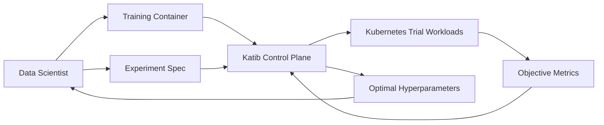

Black box 不表示算法不可解释，而是 training framework 与 execution details 通过 container/metrics contract 隔离。用户仍需正确定义 objective、search space、budget 和 evaluation protocol。

### 图 C.1：用户接口与 Kubernetes 隔离

原图展示三种接口：

- Web UI；
- APIs；
- Python SDK / Jupyter notebook。

用户可通过网页、Notebook、Kubernetes commands 或 HTTP request 创建 Experiment，并读取 status、result 和 history。

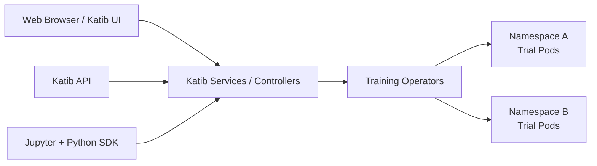

Katib control plane 自身通常不承担大量 training compute；它创建 Kubernetes workloads，真正 GPU/CPU 消耗发生在 Trial Pods。

原章进一步称 Katib service 本身不消耗很多 memory/disk；应把它理解为“control plane 相对 training workloads 较轻”，不是固定容量保证。实际 footprint 仍随 controller replicas、CRD/object 数、metrics retention、database、webhook 和并发 Experiment 数增长，需要压测和监控。

### Remote System 与两项用户准备

从用户角度 Katib 是 remote service。运行 HPO 前要：

1. Dockerize training code，并把待优化 hyperparameters 暴露为 external variables；
2. 创建 Experiment object，定义 algorithm、budget、parameters/search spaces、objective 和 trial template。

这两项形成稳定边界：

```text
Training contract:
  inputs = hyperparameters
  outputs = parseable objective metrics

Experiment contract:
  objective + search algorithm + search space + budget + workload template
```

### 为什么使用 Container

Katib 需要在 remote cluster 反复启动同一 training program、但使用不同 parameter assignments。Container 提供：

- Code / runtime / system dependency packaging；
- Reproducible entrypoint；
- Kubernetes scheduling unit；
- Resource isolation；
- Framework / language neutrality。

它不自动固定 dataset、random seed、external API 或 mutable image tag。生产 Experiment 应使用 immutable image digest 和 versioned data。

### Namespace 与 Multi-tenancy

原章指出 Katib 可在不同 namespaces 为不同 users 运行 training jobs，提供 resource segregation。

Namespace 能隔离 names、RBAC、quota、network policy 等，但不自动等于强安全 sandbox。生产还需：

- ServiceAccount / RBAC；
- ResourceQuota / LimitRange；
- NetworkPolicy；
- Pod security / runtime isolation；
- Secret boundaries；
- GPU / node pools；
- Per-tenant budget and fairness。

### HPO 的形式化目标

设 hyperparameter space 为 $\mathcal{X}$，training/evaluation 返回目标 $f(x)$。最大化问题为：

$$
x^*=\arg\max_{x\in\mathcal{X}} f(x)
$$

Katib 不计算 model gradient 来直接优化 $x$；它通过多次 Trial 观察 $f(x_t)$，由 search algorithm 决定下一批 $x_{t+1}$。

有限预算下真正目标通常是：

$$
\max_{x\in\{x_1,\ldots,x_T\}} f(x)\quad\text{subject to}\quad T\leq T_{max},\ C\leq C_{max}
$$

`maxTrialCount` 设置 completed terminal Trials 的成功阈值 $T$；它不是严格的 resource-admission hard cap。Resource quota、parallelism 和 early stopping 共同影响成本 $C$。

### Katib 解决与不解决的问题

Katib 解决：

- Search / trial orchestration；
- Parameter substitution；
- Metric collection；
- Best-trial status；
- Trial workload execution integration。

Katib 不自动解决：

- Objective 是否代表业务价值；
- Dataset split 是否公平；
- Trial code 是否可复现；
- Search space 是否合理；
- Validation overfitting；
- Best model 是否通过 production gates；
- Cluster capacity / cost policy 是否正确。

---

## C.2 Getting Started with Katib

原章按七步介绍完整用户体验。作者特意在设计书中保留 installation / operation，是因为：

1. 推荐采用 Katib，就应展示 data scientist 与 operator 的完整体验；
2. 先理解 terminology 和 workflow，才容易理解 design 和 codebase。

同时作者提醒安装说明会快速过时，因此执行时必须查 living docs。

### C.2.1 Step 1：Installation

#### 两种安装方式

- 安装完整 Kubeflow distribution，其中包含 Katib；
- 只需要 HPO 时，standalone 安装 Katib control plane。

当前官方入门还区分 control plane 与 Python SDK prerequisites。具体 manifests、Helm/Kustomize、supported Kubernetes versions 和 webhook/DB 配置必须按目标版本文档执行。

#### 安装成功不等于 Production Ready

还应验证：

- Controller / webhook / DB health；
- CRDs installed；
- UI/API access；
- Namespace / metrics-collector injection；
- RBAC / ServiceAccounts；
- Storage / backup；
- Resource quota；
- Suggestion images pull；
- Trial jobs internet/data access；
- Upgrade / rollback plan。

当前文档还提醒 KFP/Katib distribution 中的 service mesh sidecar injection 可能影响需要访问外部数据的 Trial，具体 annotation/egress policy 需核对。

### C.2.2 Step 2：Understanding Katib Terms

#### Experiment

Experiment 是一次完整 optimization run，包含：

- Training image / workload template；
- Objective metric / goal；
- Hyperparameters；
- Search spaces；
- HPO algorithm；
- Trial budget / concurrency / failure budget。

Experiment 是 control-plane aggregate，不等于一份 trained model。

#### Suggestion

Suggestion 是 search algorithm 提出的一个 hyperparameter assignment，例如：

```text
lr = 0.01418
num-layers = 3
optimizer = sgd
```

Suggestion 本身还没有模型质量；必须由 Trial 执行后观察 metric。

#### Trial

Trial 是 Experiment 的一次评估迭代：

```text
suggestion
-> instantiate training workload
-> train model
-> collect objective/additional metrics
-> mark succeeded/failed
-> feed observation back to algorithm
```

#### TrialJob

原章 C.4 进一步区分 Trial 与 TrialJob：

- Trial CR 保存 HPO assignment、metric/status 等领域状态；
- TrialJob 是实际 Kubernetes Job / PyTorchJob / TFJob 等 workload resource。

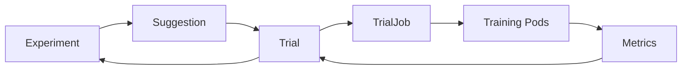

#### Trial Loop 与退出条件

Experiment 重复 Trial，直到：

- Objective goal reached；
- Completed terminal Trials reach the `maxTrialCount` success threshold；
- Failed trials reach `maxFailedTrialCount`；
- User stops/deletes Experiment；
- 其他 controller-level failure / policy condition。

原章简化为 goal 或 max trials；当前 spec 还明确 failure budget。

#### 三者不要混淆

| Entity | 输入 | 输出 | 生命周期 |
| --- | --- | --- | --- |
| Experiment | Objective、space、algorithm、budget | Optimal trial + aggregate status | 整个 HPO |
| Suggestion | Search space、history、request count | Parameter assignments | 每批建议 |
| Trial | One assignment + template | Metric observation / model | 一次配置评估 |

### C.2.3 Step 3：Packaging Training Code into a Docker Image

#### Service Approach 与 Library Approach 的最大差异

HPO library 通常在当前 Python process 内调用 objective function；remote service 必须在 cluster 中执行，因此需要 portable workload package。

```text
Library:
  search algorithm -> call local objective(parameters)

Katib service:
  search algorithm -> create remote Trial resource -> run container/pods
```

#### Requirement 1：Hyperparameters 外部化

训练代码要从 command-line args 或 environment variables 读取 values。原章用 `argparse` 暴露 batch size 与 learning rate：

```python
from __future__ import annotations

import argparse


def parse_args(argv: list[str] | None = None) -> argparse.Namespace:
    parser = argparse.ArgumentParser(description="PyTorch MNIST Example")
    parser.add_argument(
        "--batch-size",
        type=int,
        default=64,
        metavar="N",
        help="input batch size for training",
    )
    parser.add_argument(
        "--lr",
        type=float,
        default=0.01,
        metavar="LR",
        help="learning rate",
    )
    parser.add_argument("--num-layers", type=int, default=2)
    parser.add_argument("--optimizer", choices=("sgd", "adam", "ftrl"), default="sgd")
    return parser.parse_args(argv)


if __name__ == "__main__":
    args = parse_args()
    print(args)
```

为什么有效：Trial template 把 `${trialParameters.*}` 替换为 suggestion values，container command 再转成 `argparse` inputs。

边界：

- Parameter name / CLI flag 必须一致；
- Type / range 应验证；
- Defaults 不应掩盖 substitution failure；
- Config 应记录进 run metadata；
- Secret 不应作为普通 hyperparameter；
- Conditional parameters 需要 algorithm/spec 支持。

#### Requirement 2：报告 Objective Metrics

Katib 必须看到每个 Trial 的 objective。原章列出三个 pull-based source：

- StdOut；
- Arbitrary file；
- TensorFlow events。

当前官方能力还明确区分：

- Pull-based sidecar collector：StdOut / File / TensorFlowEvent / Custom；
- Push-based：training code 用 SDK `report_metrics()` 发给 Katib DB Manager。

#### StdOut 示例

```text
2022-01-23T05:19:53Z INFO Epoch[5] Train-accuracy=0.932769
2022-01-23T05:19:54Z INFO Epoch[5] Validation-accuracy=0.924463
```

若 `objectiveMetricName: Validation-accuracy`，collector 会解析后用于 ranking / stopping。

#### Default Regex

原章给出：

```text
([\w|-]+)\s*=\s*([+-]?\d*(\.\d+)?([Ee][+-]?\d+)?)
```

第一组是 metric name，第二组是 numeric value。它支持 `loss=3e-2`、`accuracy=.4` 等形式。

局限：

- 相似 log 可能误匹配；
- Metric 名称必须与 spec 完全一致；
- Locale / NaN / Inf / JSON 不一定适配；
- Duplicate metrics 需要 `max/min/latest` strategy；
- Sidecar 注入和 log access 必须正常。

#### Pull Collector 的 Namespace 前置条件

当前官方文档要求使用 pull-based collector 的 namespace 带 label：

```shell
kubectl label namespace YOUR_NAMESPACE \
  katib.kubeflow.org/metrics-collector-injection=enabled
```

某些 distribution 的 `kubeflow` namespace 已预配置，其他 namespace 不能假设 sidecar 会自动注入。

#### Container Production Contract

```text
immutable image digest
entrypoint + CLI/env schema
dataset/artifact access
resource requests/limits
metric output contract
checkpoint/output location
termination behavior
security context
```

原章还指向 Katib repository 中按 TensorFlow、PyTorch、MXNet 等 frameworks 提供的 sample training code 与 Docker image files。Repository layout 会演进；在目标 release/tag 中优先查 `examples/v1beta1/trial-images/`、官方 Trial images 文档和相邻 Dockerfiles，不要只依赖书中短链接。

Katib 只要能执行 workload 和读取 metrics，就不关心 TensorFlow、PyTorch、MXNet 或其他语言/framework，因此实现 framework agnostic。

### C.2.4 Step 4：Configuring an Experiment

Experiment 是 Kubernetes **custom resource**；CRD 是 custom resource definition。原文写作 “customer resource definition” 是排版/术语错误。

用户通过 Kubernetes API、`kubectl`、SDK 或 UI 创建 Experiment resource。YAML 可分三块：objective、algorithm/search-space/budget、trial template。

#### 原章 YAML 的大小写问题

Kubernetes field names 区分大小写。原书片段写了 `Objective`、`Parameters`，当前 v1beta1 schema 使用小写：

```text
spec.objective
spec.parameters
```

下面提供一份结构完整、可被 YAML parser 解析的示意配置。Image tag 和 Katib/Training Operator schema 仍须按目标版本核对。

```yaml
apiVersion: kubeflow.org/v1beta1
kind: Experiment
metadata:
  name: bayesian-optimization
  namespace: kubeflow
spec:
  objective:
    type: maximize
    goal: 0.99
    objectiveMetricName: Validation-accuracy
    additionalMetricNames:
      - Train-accuracy
  algorithm:
    algorithmName: bayesianoptimization
    algorithmSettings:
      - name: random_state
        value: "10"
  parallelTrialCount: 3
  maxTrialCount: 12
  maxFailedTrialCount: 3
  parameters:
    - name: lr
      parameterType: double
      feasibleSpace:
        min: "0.01"
        max: "0.03"
    - name: num-layers
      parameterType: int
      feasibleSpace:
        min: "2"
        max: "5"
    - name: optimizer
      parameterType: categorical
      feasibleSpace:
        list:
          - sgd
          - adam
          - ftrl
  trialTemplate:
    primaryContainerName: training-container
    trialParameters:
      - name: learningRate
        description: Learning rate for the training model
        reference: lr
      - name: numberLayers
        description: Number of training model layers
        reference: num-layers
      - name: optimizer
        description: Training model optimizer
        reference: optimizer
    trialSpec:
      apiVersion: batch/v1
      kind: Job
      spec:
        template:
          spec:
            restartPolicy: Never
            containers:
              - name: training-container
                image: docker.io/kubeflowkatib/mxnet-mnist:latest
                command:
                  - python3
                  - /opt/mxnet-mnist/mnist.py
                  - --batch-size=64
                  - --lr=${trialParameters.learningRate}
                  - --num-layers=${trialParameters.numberLayers}
                  - --optimizer=${trialParameters.optimizer}
```

#### First Section：Objective

```yaml
objective:
  type: maximize
  goal: 0.99
  objectiveMetricName: Validation-accuracy
  additionalMetricNames:
    - Train-accuracy
```

- `type`：maximize / minimize；
- `goal`：达到后可停止继续 suggestions；
- `objectiveMetricName`：决定最优 Trial；
- `additionalMetricNames`：记录但通常不直接决定最优。

原文前一段说“find optimal HP to minimize Validation-accuracy”，但配置是 `maximize`，且 accuracy 应越大越好；这是文字错误。Loss 才通常设 `minimize`。

#### Metric Strategy

当前 Katib 默认：maximize 比各 Trial 的 maximum metric，minimize 比 minimum metric。可用 `metricStrategies` 选择 `max`、`min` 或 `latest`。

若 training 每 epoch 打印 accuracy，选择 max 可能偏向偶然峰值；latest 反映最终 epoch；best validation + early stopping 则是另一语义。Metric strategy 是 objective definition 的一部分，不能忽略。

#### Goal 的前提

达到 `0.99` 就提前结束，前提是：

- Metric 可比较；
- Validation set 固定且代表目标；
- Measurement noise 可接受；
- 0.99 真的是足够阈值；
- Trial 没有通过重复搜索 overfit validation set。

如果不设 goal，Experiment 可运行到 completed terminal Trials 达到 `maxTrialCount` 成功阈值，或先触发 failure criterion。

#### Second Section：Algorithm and Hyperparameters

```yaml
algorithm:
  algorithmName: bayesianoptimization
  algorithmSettings:
    - name: random_state
      value: "10"
parallelTrialCount: 3
maxTrialCount: 12
maxFailedTrialCount: 3
```

- Bayesian optimization 利用历史 observations 建 surrogate/acquisition，倾向在 promising regions 采样；
- `random_state` 帮助 suggestion algorithm reproducibility；
- Parallel 3 是最大并发 Trials；
- Total 12 是 completed Trial success threshold；
- Failed 3 是 failure budget。

原章把这些名字称“self-explanatory”，但边界必须说清：`maxTrialCount` 是 completed terminal Trial count 的成功阈值，包含 succeeded、failed、killed、early-stopped 和 metrics-unavailable 等终态；`maxFailedTrialCount` 是 failed + metrics-unavailable subset 的更严格失败阈值，且先检查，先达到它时 Experiment 失败。它们是 Experiment completion criteria，不等同于严格 admission cap。Exact state classification 仍应查目标版本的 API/controller。

#### Search Space

```text
lr: double in [0.01, 0.03]
num-layers: int in [2, 5]
optimizer: categorical in {sgd, adam, ftrl}
```

理论组合空间混合 continuous / integer / categorical。Search-space quality 决定 HPO 上限：

- 太窄：最佳值在边界外；
- 太宽：预算浪费；
- Wrong scale：learning rate 常更适合 log scale；
- Invalid combinations：某 optimizer 的专属参数需 conditional space；
- Unsafe values：OOM / divergence trials 增多。

#### Trial Budget 与并发的粗略时间

若每个 Trial 平均耗时 $T$，总数 $N$，并发上限 $P$，资源充足且每批耗时相近，理想 wall time：

$$
T_{wall}\approx\left\lceil\frac{N}{P}\right\rceil T
$$

本例 $N=12,P=3$，理想约 4 批。Bayesian sequential dependency、异质 Trial 时间、queue 和 failures 会增加实际时间。

#### Last Section：Trial Configuration

`trialParameters` 是 substitution bridge：

```text
search parameter lr
-> reference: lr
-> template variable learningRate
-> --lr=${trialParameters.learningRate}
-> argparse --lr
```

任何一处名字错配都会导致默认值、无效参数或 Trial failure。

#### `trialSpec` 是 Unstructured Kubernetes Template

本例使用普通 `batch/v1 Job`，一个 Pod、一个 training container。Katib 也可用 PyTorchJob / TFJob 等 CRDs，由相应 training operator 执行。

原章还给出 Katib 支持的各 HPO algorithm 的 Experiment samples 路径：`katib/examples/v1beta1/hp-tuning/`。使用时应 checkout 与已部署 Katib 一致的 tag，再从该目录选择/验证示例。

#### `primaryContainerName`

Katib 需要知道哪个 container 是主要 training container，以便 metrics collector injection、command substitution 和 status association。多 container Pod 中不能模糊。

#### Image `latest` 的边界

原章示例使用 `:latest`，便于教学，不可复现。生产 Experiment 应 pin digest；否则同一 Experiment YAML 重跑可能执行不同 code。

### C.2.5 Step 5：Start the Experiment

保存 YAML 后：

```shell
kubectl apply -f bayesian-optimization.yaml
kubectl get experiment -n kubeflow
```

创建的是 `Experiment` custom resource：

```text
NAME                    TYPE      STATUS   AGE
bayesian-optimization   Created   True     46s
```

从此 controllers reconcile 它，直到 goal / budget / failure condition。

#### Kubernetes-native 的含义

Katib 用 CRDs 表达 Experiment、Suggestion、Trial 及其 spec/status；controllers watch/reconcile；training workloads 是 Job / PyTorchJob 等 resources。

好处：

- Declarative desired state；
- Standard RBAC / namespace / events；
- Controller restart 后可重建进度；
- `kubectl get/describe` 可观察；
- 与其他 operators 组合。

代价：

- CRD schema/version migration；
- etcd/object size 不适合存大 metrics/artifacts；
- Eventual consistency；
- Kubernetes operational burden。

除了 `kubectl`，还可通过 SDK、UI、HTTP/API 创建 Experiment。

### C.2.6 Step 6：Query Progress and Result

原章命令：

```shell
kubectl describe experiment bayesian-optimization -n kubeflow
```

重点读取 `.status`：

#### Conditions

记录 Created、Running、Succeeded/Failed 等当前与历史 condition。示例最后因为 `maxTrialCount` reached 而成功，并未达到 0.99 goal。

#### Current Optimal Trial

包含：

- Best Trial Name；
- Objective/additional metrics 的 latest/max/min；
- Parameter Assignments。

示例 best assignment：

```text
lr = 0.014183662191100063
num-layers = 3
optimizer = sgd
Validation-accuracy max = 0.979001
Train-accuracy max = 0.992621
```

Validation accuracy 未达到 goal 0.99，所以 Experiment 因 12-trial budget 而结束。

#### Trial Lists / Counts

显示 running/succeeded/failed Trials 及 totals。示例：12 Trials、12 succeeded。

#### “Best” 的准确含义

Best 是**已执行 Trial 中，按 objective type 和 metric strategy 最优**者，不保证：

- Global optimum；
- Test-set 最优；
- Production SLO 最优；
- Statistical superiority；
- 可直接发布。

HPO result 是 candidate configuration，仍需 retrain/evaluate/register gates。

#### JSONPath 获取结果

当前文档可用：

```shell
kubectl get experiment bayesian-optimization -n kubeflow \
  -o=jsonpath='{.status.currentOptimalTrial}'
```

自动化不应 parse 人类可读 `describe` text；应使用 API/SDK/JSON output。

### C.2.7 Step 7：Troubleshooting

#### 第一层：Describe Trial

```shell
kubectl describe trial TRIAL_NAME -n kubeflow
```

示例能看到 assignment 和：

```text
Trial has failed. Job has reached the specified backoff limit
Reason: TrialFailed / BackoffLimitExceeded
```

这说明 workload 重试耗尽，但不直接说明 root cause。

#### 第二层：Training / Metrics Collector Logs

StdOut pull collector 会以 sidecar 形式注入 `metrics-logger-and-collector`。原章命令：

```shell
kubectl logs TRIAL_POD \
  -c metrics-logger-and-collector \
  -n kubeflow
```

日志包含：

- Trial name；
- Initial parameters；
- Dataset download；
- Train-accuracy；
- Validation-accuracy；
- Training speed / errors。

还应分别查看 primary training container logs、Pod events、Job status、Suggestion/Controller logs。

#### Troubleshooting Ladder

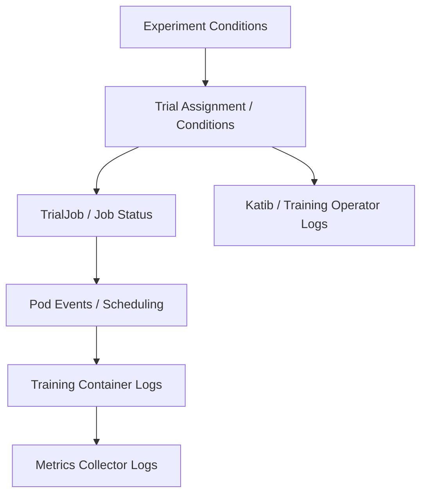

#### 常见故障分类

| 类别 | 证据 | 可能修复 |
| --- | --- | --- |
| Invalid parameter | Training argparse / exit | 修 search space / substitution |
| Image pull | Pod events | Registry auth / digest |
| Scheduling | Pending events | Resource quota / affinity |
| OOM | Pod termination | Resource / batch / space |
| Metric unavailable | Collector logs / Trial condition | Name/regex/sidecar label |
| Dataset/network | Training logs | Egress / credentials / cache |
| Algorithm service | Suggestion conditions/logs | Settings / service health |
| Backoff exceeded | Job condition | 查真正 container failure |

#### 原章操作指南的时间边界

Controller names、sidecar names、paths 和 commands 可能随版本变化。Troubleshooting 的稳定方法是沿 resource ownership：Experiment → Trial → TrialJob → Pod → container / collector → controllers，而不是死记某个 Pod name。

### C.2 小结


C.2 的核心不是记住 YAML，而是建立四项可验证 contract：parameter injection、metric extraction、workload execution、status/result retrieval。

---

## C.3 Expedite HPO

HPO 同时昂贵且耗时。原章给出三种加速方式：

1. Parallel trials：同时测试多个配置；
2. Distributed trial/training job：让单个 Trial 更快；
3. Early stopping：尽早结束无希望的 Trial。

它们作用在不同维度：

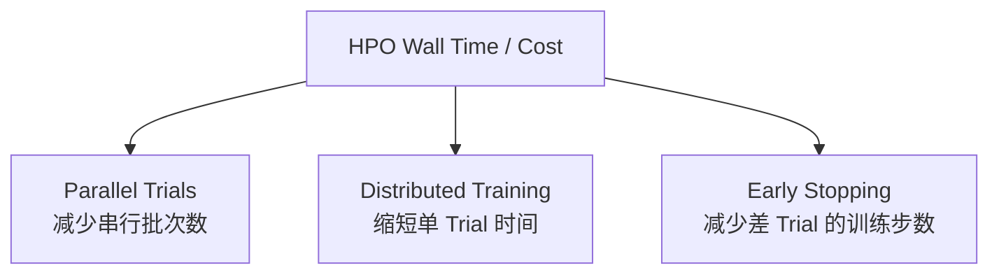

### 统一成本模型

设 Trial $i$ 使用 $r_i$ 个 accelerator，运行 $t_i$ 时间；cluster 同时执行不超过 $P$ 个 Trials。总 accelerator-time 为：

$$
C=\sum_{i=1}^{N}r_it_i
$$

Wall-clock time 受 scheduling / precedence constraints 影响，理想下界至少为：

$$
T_{wall}\geq\max\left(\max_i t_i,\frac{\sum_i r_it_i}{R_{cluster}}\right)
$$

其中 $R_{cluster}$ 是 cluster 可用 accelerator 数。三种方法的效果：

- Parallel trials 通常降低 $T_{wall}$，但若 Trial 不变，不降低 $C$；
- Distributed training 增加 $r_i$、希望降低 $t_i$，$C$ 可能升也可能降；
- Early stopping 直接降低不良 Trials 的 $t_i$，通常同时降低 $C$ 和 $T_{wall}$。

### C.3.1 Parallel Trials

在 Experiment 中设置：

```yaml
spec:
  parallelTrialCount: 3
  maxTrialCount: 12
```

表示最多同时运行 3 个 Trials，以 12 个 completed terminal Trials 为成功阈值。资源充足、无提前 goal/failure、无 metrics-unavailable 计数边界且 Trial 时长相同时，理想执行 4 批。

#### 并行并非免费

原章特别提醒：有些算法要求线性 Trial sequence，下一 Trial 必须等待当前结果，不能直接并行。

算法上的原因是第 $t+1$ 个 suggestion 依赖完整历史：

$$
x_{t+1}=A\left(\{(x_j,y_j)\}_{j=1}^{t}\right)
$$

如果同时发出 $P$ 个 suggestions，后几个 suggestion 看不到这一批尚未完成的 $y$，会出现 stale observation。影响包括：

- 重复或相近 suggestions；
- Surrogate uncertainty 不准确；
- Acquisition function 效率下降；
- 收敛所需 Trial 数增多。

Random / grid search 天然容易 batch；Bayesian optimization 需要 batch acquisition、pending-point handling 或接受 information lag。不能只看 Katib 能否并发创建 Trials，还要看所选 suggestion implementation 是否正确支持异步/批量。

#### 并行效率

设串行耗时 $T_1$，使用 $P$ 个并发后的耗时 $T_P$：

$$
S_P=\frac{T_1}{T_P},\qquad E_P=\frac{S_P}{P}
$$

由于排队、资源 contention、Trial stragglers、algorithm synchronization 与 metrics latency，通常 $S_P<P$。

#### 如何选 `parallelTrialCount`

同时受四类约束：

1. Algorithm：是否支持 batch/asynchronous suggestion；
2. Capacity：每 Trial 的 CPU/GPU/memory 与 quota；
3. Budget：并发升高会快速消耗 Trial budget；
4. Control plane：API QPS、scheduler、image pull、metrics DB 容量。

粗略 capacity bound：

$$
P\leq\min\left(
\left\lfloor\frac{G_{free}}{G_{trial}}\right\rfloor,
\left\lfloor\frac{C_{free}}{C_{trial}}\right\rfloor,
\left\lfloor\frac{M_{free}}{M_{trial}}\right\rfloor,
P_{quota}
\right)
$$

生产上先从较小并发开始，观察 queue time、utilization 和 suggestion quality，再逐步提高。

### C.3.2 Distributed Trial (Training) Job

Parallel trials 横向并发多个 hyperparameter configurations；distributed training 则让**一个配置**使用多个 workers。

```text
Experiment
  +-- Trial A (lr=...): 1 master + 2 workers
  +-- Trial B (lr=...): 1 master + 2 workers
  +-- Trial C (lr=...): 1 master + 2 workers
```

若 `parallelTrialCount=3` 且每 Trial 使用 3 个 training Pods，最多可能同时存在 9 个 training Pods，不能把 Trial concurrency 当作 Pod concurrency。

#### Katib 如何启用 Distributed Training

Katib 的 `trialSpec` 可定义 framework-specific resource。原章把普通 `Job` 改为 `PyTorchJob`，配置一个 Master、两个 Workers：

```yaml
trialTemplate:
  primaryContainerName: pytorch
  trialParameters:
    - name: learningRate
      description: Learning rate for the training model
      reference: lr
    - name: momentum
      description: Momentum for the training model
      reference: momentum
  trialSpec:
    apiVersion: kubeflow.org/v1
    kind: PyTorchJob
    spec:
      pytorchReplicaSpecs:
        Master:
          replicas: 1
          restartPolicy: OnFailure
          template:
            spec:
              containers:
                - name: pytorch
                  image: docker.io/kubeflowkatib/pytorch-mnist:latest
                  command:
                    - python3
                    - /opt/pytorch-mnist/mnist.py
                    - --epochs=1
                    - --lr=${trialParameters.learningRate}
                    - --momentum=${trialParameters.momentum}
        Worker:
          replicas: 2
          restartPolicy: OnFailure
          template:
            spec:
              containers:
                - name: pytorch
                  image: docker.io/kubeflowkatib/pytorch-mnist:latest
                  command:
                    - python3
                    - /opt/pytorch-mnist/mnist.py
                    - --epochs=1
                    - --lr=${trialParameters.learningRate}
                    - --momentum=${trialParameters.momentum}
```

原章标注的四个重点：

1. `trialParameters` 声明 learning rate 与 momentum；
2. `kind: PyTorchJob` 指定 TrialJob 类型；
3. `Master.replicas: 1` 配置 master trainer；
4. `Worker.replicas: 2` 配置 worker trainers。

除 `trialSpec` 外，Experiment 的 objective/search contract 不变。这是 orchestration abstraction 的价值：Katib 管 HPO，Training Operator 管 distributed execution。

#### 版本边界

上述 `kubeflow.org/v1` / `PyTorchJob` 是原章及 legacy Training Operator 风格。Kubeflow Trainer/Training Operator 的 API 正在演进；实际运行前应查询 cluster 安装的 CRD：

```shell
kubectl api-resources | findstr /I "pytorch trainjob"
kubectl explain pytorchjob.spec
```

另外，`latest` 仍只是教学 tag，应 pin digest。

#### Distributed Training 何时能提速

设单 worker compute time $T_{comp}$、通信/同步开销 $T_{comm}(W)$、其他串行部分 $T_{serial}$，$W$ 个 workers 的粗略时间：

$$
T(W)\approx T_{serial}+\frac{T_{comp}}{W}+T_{comm}(W)
$$

Speedup：

$$
S(W)=\frac{T(1)}{T(W)}
$$

当 model/dataset 太小、network 慢、workers 不均衡或 batch scaling 不当时，$T_{comm}$ 可能超过收益。原章 MNIST `--epochs=1` 主要用于演示 wiring，不代表值得三机训练。

#### HPO 公平性问题

Distributed trial 必须保持各 Trials evaluation protocol 一致：

- Global batch size 是否随 workers 增加；
- Learning-rate scaling rule；
- Number of updates vs number of epochs；
- Data sharding / sampler seed；
- Metric 是否只由 rank 0 输出；
- Checkpoint / artifact 是否避免 workers 冲突写入。

否则 HPO 比较的可能不是 hyperparameter 差异，而是 execution semantics 差异。

#### 两层并行的资源爆炸

若每 Trial 有 $W$ workers，每 worker 用 $g$ GPUs，并行 Trials 为 $P$：

$$
G_{peak}\approx P\cdot W\cdot g
$$

实际还包括 master/launcher、metric sidecars 与 control-plane Pods。配置前必须做 capacity admission，而非等 scheduler 长时间 Pending。

### C.3.3 Early Stopping

Early stopping 在 Trial 的 objective metrics 不再有竞争力时提前终止它，节省 compute 并缩短 Experiment。

原章强调的运维优势：通常只需修改 Experiment configuration，不必修改 training logic。更准确地说，training code 仍需**持续输出可按 step/time 排序的 intermediate metrics**；若只在训练结束打印一次，系统无从提前判断。

#### 配置位置修正

当前 v1beta1 文档把 early stopping 配在 `.spec.earlyStopping`，与 `.spec.algorithm` 并列：

```yaml
spec:
  algorithm:
    algorithmName: bayesianoptimization
  earlyStopping:
    algorithmName: medianstop
    algorithmSettings:
      - name: min_trials_required
        value: "3"
      - name: start_step
        value: "4"
```

原章“define `.earlyStopping...` in `.spec.algorithm` section”的表述容易误解为嵌套；应以 CRD schema 为准。

当前官方文档还要求 early stopping metrics 具有 timestamp 以确定报告顺序，并注明当前与 StdOut/File collector 配合。版本变化时重新核对 collector compatibility。

#### Median Stopping Rule

原章给出 Katib 当时支持的算法：median stopping rule，算法名 `medianstop`。

对 maximize objective，设 Trial $i$ 在 step $s$ 前最好值：

$$
b_i(s)=\max_{1\leq k\leq s} y_i(k)
$$

对已完成 Trial $j$，其截至 step $s$ 的 running average：

$$
\bar{y}_j(s)=\frac{1}{s}\sum_{k=1}^{s}y_j(k)
$$

基线为所有可比较 completed Trials 的中位数：

$$
m(s)=\operatorname{median}_{j\in\mathcal{C}_s}\bar{y}_j(s)
$$

若 pending Trial $i$ 的 best value 比基线差：

$$
b_i(s)<m(s)
$$

则可停止 Trial $i$。Minimize objective 的不等号方向相反。实际 Katib exact rule、step alignment 和 missing measurements 处理以目标版本实现为准。

#### 为什么用 Median

- 对异常优秀/差 Trial 比 mean robust；
- 不要求复杂 learning-curve model；
- 能随完成 Trials 更新 baseline；
- 适合大量可比较 configurations。

#### `min_trials_required` 与 `start_step`

- `min_trials_required`：至少多少 successful Trials 后才有足够 baseline；
- `start_step`：一个 Trial 至少报告多少 intermediate results 后才可停止。

两者都是 safety guard。过小会因冷启动和 early-curve noise 错杀潜力配置；过大则节省有限。

#### 数值例子

假设 3 个 completed Trials 在 step 4 的 running averages 为：

$$
0.72,\quad 0.76,\quad 0.81
$$

中位数 $m(4)=0.76$。新 Trial 到 step 4 的最好 accuracy 只有 $0.70$，则它低于 baseline，可 early stop。若它是 slow starter，后期原本会到 $0.85$，这个决定就是 false negative。

#### Early Stopping 的适用前提

1. Intermediate metric 与 final metric 有相关性；
2. 相同 step 代表可比 training progress；
3. Metric sampling cadence 一致；
4. Training curves 不是普遍 late-blooming；
5. Completed baseline 没有 severe selection bias；
6. Trial termination 能及时释放资源。

#### 常见风险

- Slow starters 被误停；
- 不同 batch size 下，同 epoch/step 消耗样本不同；
- Noisy metric 让 best-so-far 过度乐观；
- Parallel Trials 同时启动，早期没有足够 completed baseline；
- 被 early-stopped 的 observations 可能影响 suggestion algorithm 的 censoring assumptions；
- Stop signal 到 Pod 实际终止有 control-loop latency。

#### 节省估算

完整训练 $S$ steps，Trial $i$ 在 $s_i$ 停止，单位 step 成本 $c_i$。节省：

$$
\Delta C=\sum_{i\in\mathcal{E}}c_i(S-s_i)
$$

其中 $\mathcal{E}$ 为 early-stopped Trials。真实收益还应扣除 metrics collection、decision service 和启动固定成本。

#### Early Stopping 不等于 Model Training 的 Patience

- Training-internal early stopping：根据本 Trial validation curve 防 overfitting，通常由 training code 保存 best checkpoint；
- HPO early stopping：与其他 Trials 比较，决定是否停止整个 Trial，通常由 Katib control plane 管理。

两者可同时存在，但必须明确谁负责 termination、best checkpoint 和 status。

### 三种方法如何组合

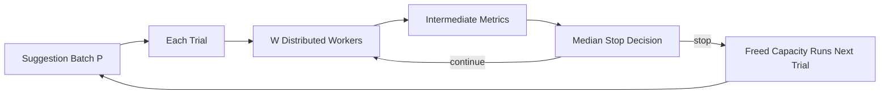

组合顺序建议：

1. 先保证单 Trial metrics/reproducibility 正确；
2. 再建立 single-trial resource/time baseline；
3. 验证 distributed scaling 是否真的划算；
4. 按 algorithm 能力增加 parallel Trials；
5. 最后校准 early stopping，测 false-stop rate 与成本收益。

### C.3 常见误解

#### 误解 1：`parallelTrialCount` 越大越快

容量不足会排队；adaptive algorithm 会遇到 stale feedback；总成本通常不变甚至更高。

#### 误解 2：Distributed Training 一定降低成本

它目标是缩短 latency；通信开销可能使 accelerator-hours 增加。

#### 误解 3：Early Stopping 不需 Training Code 配合

无需写 Katib-specific stop logic，不等于无需 intermediate metrics、timestamps 与 graceful termination。

#### 误解 4：早停后的最佳值可直接与完整 Trial 相比

被截断 learning curve 是 censored observation；算法和报告应识别其状态。

### C.3 小结

| 方法 | 主要降低 | 主要增加/风险 | 首要验证指标 |
| --- | --- | --- | --- |
| Parallel Trials | HPO wall time | Capacity、stale feedback | Queue time / search efficiency |
| Distributed Trial | Single-Trial latency | Communication、GPU-hours | Scaling efficiency |
| Early Stopping | Bad-Trial steps/cost | False stops、metric dependence | Saved cost / regret |

三者的共同原则是：优化端到端 HPO time-to-quality，而不是单独最大化 concurrency、worker count 或 stop rate。

---

## C.4 Katib System Design

C.2/C.3 从用户视角回答“怎样用 Katib”；C.4 转到 control plane，回答“它如何可靠地把声明变成运行中的 HPO”。

作者认为 Katib 虽是 production HPO system，核心却相对容易读：Experiment、Suggestion、Trial 都遵循同一个 Kubernetes controller/operator pattern。理解一个 controller 的 reconcile loop，就掌握了阅读其他组件的共同语法。

### C.4.1 Kubernetes Controller / Operator Pattern

#### Desired State 与 Actual State

用户通过 declarative API 创建/修改 resource definition object，描述 desired state。Controller watch API objects 和 cluster resources，反复执行：

$$
\mathrm{observe\ actual}\rightarrow\mathrm{compare\ with\ desired}\rightarrow\mathrm{act}\rightarrow\mathrm{record\ status}
$$

直到 actual state 收敛到 desired state。

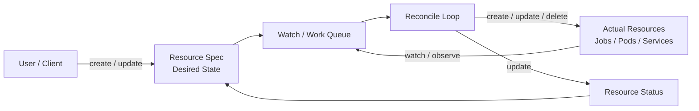

这对应原图 C.2：左侧 resource definition 是 intent，右侧 containers/volumes/jobs 是现实，中间 control loop 周期性或事件驱动地 reconcile。

#### Controller 与 Operator

- Controller：监听某类 resource，把 actual state 推向 desired state；
- Operator：通常指把特定领域运维知识编码进 controllers + CRDs 的应用。

Katib 是 HPO operator；Training Operator 是 distributed-training operator。两者通过 Kubernetes resources 组合，而不是彼此硬编码内部函数调用。

#### `spec` 与 `status`

典型 custom resource：

```yaml
apiVersion: example.org/v1
kind: Example
metadata:
  name: desired-example
  generation: 3
spec:
  desiredValue: 12
status:
  observedGeneration: 3
  actualValue: 12
  conditions:
    - type: Ready
      status: "True"
```

- `spec`：用户 intent；
- `status`：controller observation；
- `metadata.generation`：spec 修改版本；
- `status.observedGeneration`：controller 已处理到哪一代；
- `conditions`：可被人和 automation 判断的状态。

Katib resources 同样依靠 spec/status 分离。用户不应把 controller-owned status 当作输入反复 patch。

#### Reconcile 的理想性质

同一 key 可能被重复投递，controller 可能在任一步崩溃。因此 reconcile 应尽量：

1. Idempotent：重复执行得到同一结果；
2. Level-based：根据当前状态决策，不依赖只发生一次的 event；
3. Monotonic where possible：状态逐步推进；
4. Retryable：transient failure 可 requeue；
5. Ownership-aware：用 owner references / labels 找 child resources；
6. Conflict-safe：处理 resourceVersion / optimistic concurrency；
7. Observable：写 conditions、events、logs、metrics。

可以把 reconcile 抽象为：

$$
(O_t,W_t)=R(D_t,A_t)
$$

其中 $D_t$ 是 desired object，$A_t$ 是 observed actual state，$O_t$ 是要执行的 operations，$W_t$ 是 status write。若 $O_t$ 成功，下一轮应减少差异：

$$
d(D_{t+1},A_{t+1})\leq d(D_t,A_t)
$$

#### Event-driven 与 Periodic Reconcile

原章说 controller “periodically scans”。概念上成立，但典型 Kubernetes controller 实现是 informer/watch 触发 work queue，外加 requeue/resync 兜底；不是每次全量轮询所有 objects。理解这一点有助于排查：

- Watch event missed 后何时恢复；
- Rate limiting / backoff；
- Hot reconcile loops；
- API server pressure；
- Eventual consistency。

#### 为什么这种模式适合 HPO

HPO 是长生命周期、异步、多层资源编排：

```text
Experiment -> Suggestions -> Trials -> TrialJobs -> Pods -> Metrics
```

任何层都可能在数小时/数天内失败或重启。把 progress 外化为 Kubernetes objects，controllers 重启后可重新 observe，而不只依赖进程内 memory。

#### 它不自动保证什么

CRD 持久化并不自动等于 exactly-once：

- Create child 成功但 status write 失败，下一轮必须去重；
- External side effect 可能无法事务化；
- Metrics/history 可能另存 DB，不全在 CRD；
- Delete/finalizer 卡住会阻塞 cleanup；
- Schema upgrade 需 conversion/migration；
- Reconcile 只能从可观察状态恢复。

### C.4.2 Katib System Design and Workflow

原图 C.3 有三类 Katib controllers、算法服务、metrics storage 和 framework training operators。

#### 三个核心 Controllers

| Component | Watches | Creates / Manages | Core Responsibility |
| --- | --- | --- | --- |
| A. Experiment controller | Experiment / child status | Suggestion、Trial | Lifecycle、budget、scheduling、aggregate status |
| B. Suggestion controller | Suggestion | Suggestion algorithm service interaction | 请求/保存 parameter suggestions |
| C. Trial controller | Trial / TrialJob | Job、PyTorchJob、TFJob 等 | Materialize training workload、collect result/status |

此外：

- D. Suggestion algorithm services：Random、Bayesian、TPE 等独立 gRPC services；
- E. Training operators：Kubernetes Job / PyTorch / TensorFlow 等 execution controllers；
- Metric collector + metric storage：采集并持久化 observations。

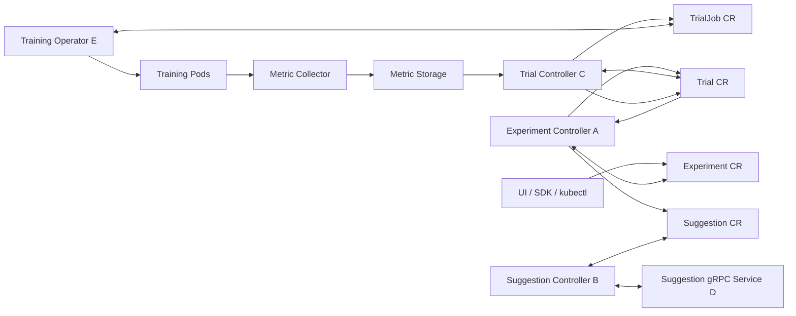

箭头是逻辑关系；实际协作多通过 API objects/watch，而非同步 direct calls。Suggestion controller 到 algorithm service 是 gRPC 例外。

#### Resource Graph 与 Ownership

```text
Experiment
  +-- Suggestion(s)
  +-- Trial 1
  |     +-- TrialJob 1
  |           +-- Pod(s)
  +-- Trial 2
        +-- TrialJob 2
              +-- Pod(s)

Per-Experiment Suggestion Service / Deployment
Metric Collector sidecars -> Metric Storage
```

理想 child resources 应通过 owner references/labels 可追溯到 parent，便于 deduplication、status aggregation 和 garbage collection。

#### Step 1：Create an Experiment Request

Data scientist Alex 通过 SDK、UI 或 `kubectl` 创建 Experiment CR，包含：

- Training workload definition；
- Hyperparameters / feasible spaces；
- HPO algorithm/settings；
- Objective；
- Trial budget/concurrency。

Experiment controller watch 到该 object 后：

1. Validate/default spec；
2. 确保所需 Suggestion request/service 存在；
3. 根据 budget / active Trials 判断是否要请求 suggestions；
4. 创建 child resources；
5. 更新 Experiment conditions/status。

原章描述 Katib 为每个 Experiment 部署其 HPO algorithm suggestion service。算法 library 被加载并暴露为 gRPC，Suggestion controller 可请求参数。

关键 invariant：

$$
N_{running}+N_{pending}\leq parallelTrialCount
$$

当前 main-branch status logic 用如下 terminal count 判断 `maxTrialCount`：

$$
N_{terminal}=N_{succeeded}+N_{failed}+N_{killed}+N_{earlyStopped}+N_{metricsUnavailable}
$$

Failure criterion 则使用：

$$
N_{failedForThreshold}=N_{failed}+N_{metricsUnavailable}
$$

Controller 先检查 $N_{failedForThreshold}\geq maxFailedTrialCount$，再检查 $N_{terminal}\geq maxTrialCount$。因此 `maxTrialCount` 是成功条件阈值，不应写成任何时刻都成立的 active + completed 硬上限。

还有一个值得从源码观察的版本实现边界：当前 `ReconcileTrials` 计算要补多少新 Trials 时，局部 `completedCount` 使用 succeeded + failed + killed + early-stopped，却没有加 metrics-unavailable；而 status completion/failure logic 会加上它。这可能让 metrics-unavailable 边界出现 replacement/overshoot。生产容量应由 quota/admission/concurrency 控制，不能把 `maxTrialCount` 当绝对资源上限；目标版本行为应以源码和故障测试确认。

一旦达到 exit criterion，controller 不应继续创建新 Trials。

#### Step 2：Get the Next Trial Hyperparameters

Experiment controller 创建 Suggestion CR，声明：

- Experiment/search-space context；
- Algorithm；
- Requested suggestion count；
- 已有 observations/history 的关联。

Suggestion controller reconcile 它，调用 algorithm service 的 `GetSuggestions`，再把 parameter assignments 保存在 Suggestion resource/status 中。

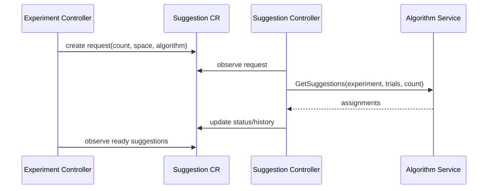

为什么独立 Suggestion CR 有价值：

- Request/result 可观察；
- Controller/API failure 后可恢复；
- Suggestions history 可追踪；
- Algorithm service 与 Experiment lifecycle 解耦。

#### Step 3：Create a Trial Request

Experiment controller 读取 ready assignments，为每组 values 创建 Trial CR。Trial 表达：

- Parameter assignments；
- Trial template/reference；
- Objective/additional metric expectation；
- Trial status/conditions；
- Early-stopping state。

一个 Suggestion batch 可以产生多个 Trials。创建时必须防止 reconcile retry 重复生成同一 assignment 的 child Trial。

#### Step 4：Launch the Training Job

Trial controller watch 新 Trial，进行 template substitution，并创建具体 TrialJob：

- `batch/v1 Job`；
- `PyTorchJob`；
- `TFJob`；
- 原章当时列出的 MXNet/其他 operator resources。

相应 Training Operator watch TrialJob，创建实际 Pods。Alex 使用 PyTorch training code，因此链路是：

```text
Trial CR
-> PyTorchJob CR
-> PyTorch Training Operator
-> Master / Worker Pods
```

这里有两个 ownership domain：

- Katib 负责“用哪组 HP 训练，并把结果归入哪个 Trial”；
- Training Operator 负责“如何正确启动/监控 framework-specific distributed job”。

#### Step 5：Return Trial Results

训练启动后，metrics collector sidecar 从 StdOut/File/Event 等来源解析 metrics，报告到 Katib metric storage。原章架构快照明确为 MySQL；当前 deployment 的 storage/DB-manager 实现应查目标版本。

结果回流：

```text
Training Pod
-> Metric Collector
-> Metric Storage
-> Trial Controller updates Trial status
-> Experiment Controller observes Trial
-> Experiment status aggregates progress/current optimum
-> Suggestion algorithm receives completed observations
```

Trial controller 还要结合 TrialJob condition 判断 success/failure，而不是只看 metric 是否出现。

#### Aggregation 的含义

Experiment status 是 materialized aggregate view：

$$
S_E=G(S_{T_1},S_{T_2},\ldots,S_{T_n},\text{budget},\text{objective})
$$

包括：

- Running/succeeded/failed counts/lists；
- Current optimal Trial；
- Objective observations；
- Experiment conditions/reason；
- Start/end time。

状态更新是 eventual consistent；刚完成的 Pod、Trial status 与 Experiment status 之间可能短暂不同步。

#### Steps 2–5 构成 Trial Loop

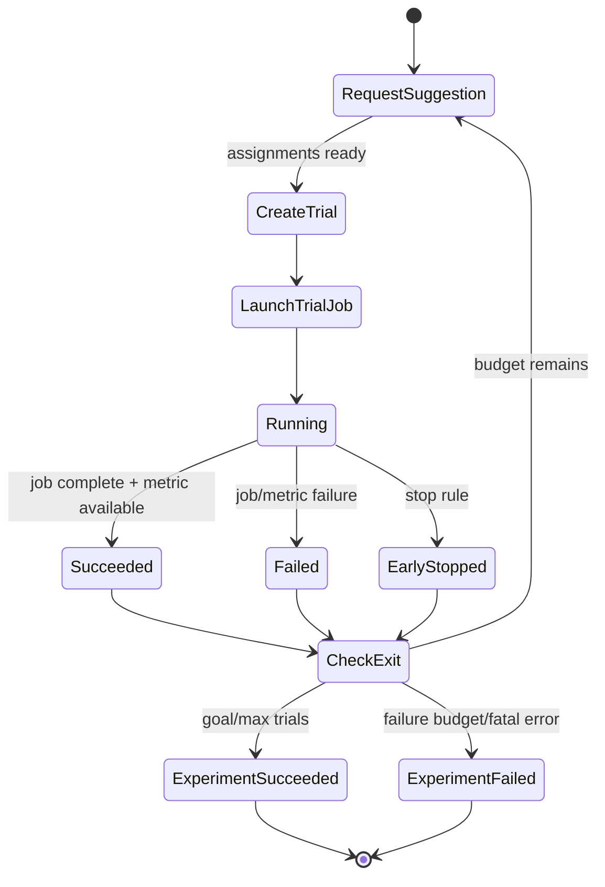

这就是 ask-and-tell optimization 的 distributed realization：

```text
ask -> materialize -> execute -> observe -> tell -> ask again
```

#### CRD 状态带来的 Simplicity

原章列出两个主要收益：

1. Accessibility：`kubectl describe experiment|trial|suggestion` 很快取得中间数据和 latest status；
2. Reliability：Katib/controller/operator 重启后可依据 objects 中的 execution state 恢复。

更精确地说，CRDs 是 durable checkpoints / source of coordination state，不一定包含完整 raw metrics、logs、model artifacts。恢复能力取决于 child resources、metric storage 和 ownership metadata 是否仍在。

#### Failure Scenarios 如何由 Reconcile 吸收

| Failure | Recovery reasoning |
| --- | --- |
| Experiment controller restart | Re-list Experiments/Trials，重新聚合并继续调度 |
| Suggestion call timeout | Retry/requeue；避免重复 assignment |
| Trial controller crash after Job create | 通过 owner/name 查到 existing Job，不再重复创建 |
| Training operator restart | Reconcile existing PyTorchJob/Pods |
| Metrics temporarily unavailable | Trial 等待/重试，最终 MetricsUnavailable/failed |
| Status update conflict | Re-fetch latest resourceVersion 后重试 |
| User deletes Experiment | Finalizer/garbage collection 清理 children/service |

这些是 controller pattern 应满足的工程目标；某版本 exact behavior 需通过代码和故障注入验证。

#### Control-plane / Data-plane 分离

```text
Control plane:
  Experiment/Suggestion/Trial controllers
  Suggestion services
  CRDs/status/metrics DB

Data plane:
  TrialJobs
  Training operators
  Training Pods
  Dataset/checkpoint traffic
```

分离使 Katib controllers 的资源负载不随模型 compute 线性增长，但 objects/events/metrics QPS 仍随 Trial scale 增长。

### C.4.3 Kubeflow Training Operator Integration for Distributed Training

原章指出 default Kubernetes Job 只启动 single-Pod training。要支持 distributed framework semantics，Katib 创建 framework CR，由对应 Training Operator 接管。

#### 图 C.4 的核心层次

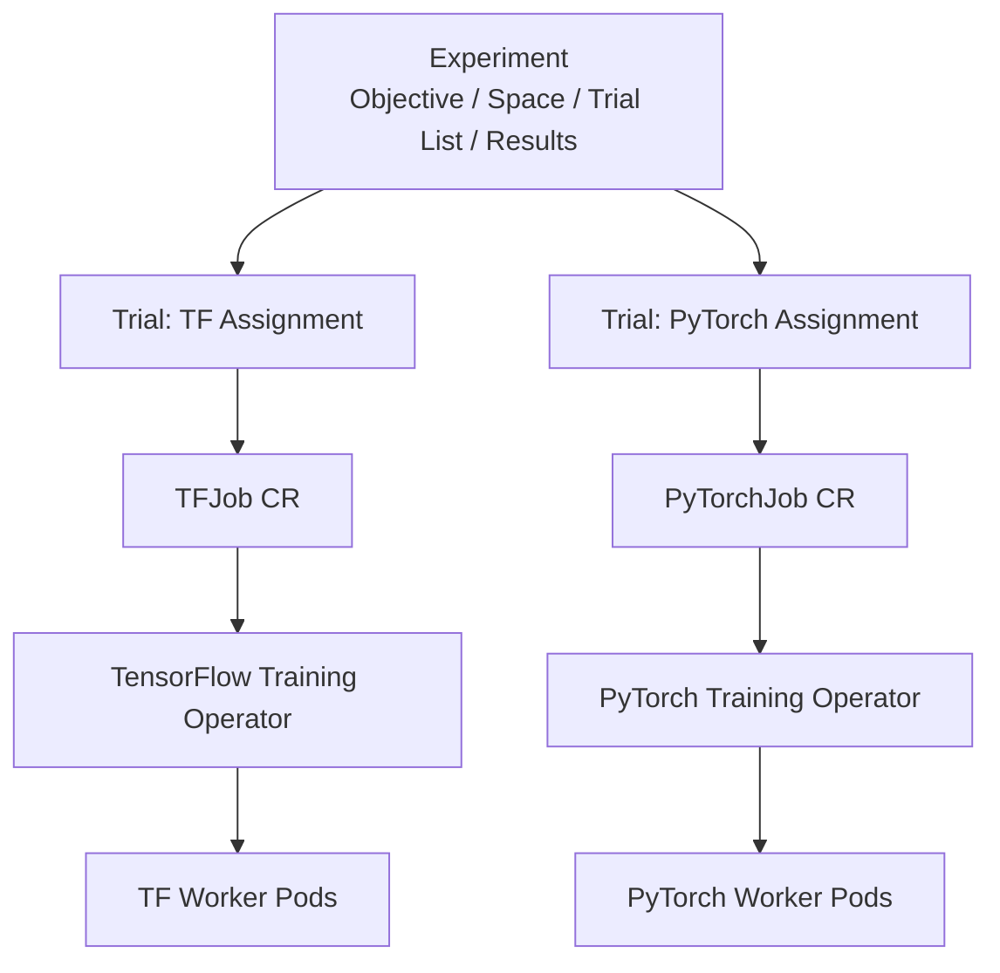

- Experiment 保存 learning objective、HP parameters/search spaces、Trial list、optimal values/history；
- Trial 是一组 generated HP values 的训练实例；
- TrialJob 是 Training Operator 理解的 execution definition；
- Training Operator 创建 actual distributed Pods。

#### Metadata Reformatting

原章说 Trial metadata 被重新格式化进 TrialJob CR：

```text
Katib domain:
  assignments + metric contract + trial status

Training domain:
  replica roles + replica counts + Pod templates + restart policy
```

Trial controller/template 是 adapter boundary。它把同一 HPO domain model 映射到不同 framework workload schema。

#### Controller Composition 的扩展性

Katib 与 Training Operator 都遵循 controller pattern，因此通过 CRD contract 集成：

1. Katib 不需要链接 PyTorch distributed launcher 内部代码；
2. Training Operator 不需要理解 search algorithm；
3. 两者可独立部署、升级和重启；
4. 新 workload kind 可通过 trial template 扩展。

这是 loose coupling，但不是 zero coupling。必须兼容：

- Group/version/kind；
- Required fields/defaults；
- Status/conditions；
- Success/failure semantics；
- Pod/container naming；
- Metrics collector injection；
- Cleanup/ownership。

#### PyTorchJob / TFJob

原章最常见的 TrialJob CRDs 是 `PyTorchJob` 与 `TFJob`。设置 worker count 后，Katib 创建对应 resource，Training Operator 启动 distributed group。

原章有一句“a trial CRD object and a TrialJob CRD object for each trail”，其中 `trail` 应为 `trial`；不影响架构含义。

#### 版本演进风险

Kubeflow Training APIs、group/version、resource kind 和 operator 架构可能变化。稳定集成策略：

```shell
kubectl api-resources | findstr /I "job trainer pytorch tensorflow"
kubectl explain YOUR_KIND.spec
kubectl get crd | findstr /I "kubeflow trainer"
```

并用目标 cluster 的 server-side dry run 验证 Experiment/Trial template，而不是仅依赖旧书 YAML。

### C.4.4 Code Reading

原章目标不是逐文件导览，而是给一个高杠杆入口：**先读每个 controller 的 reconcile function**。

#### 为什么从 `Reconcile` 开始

Controller 的职责是让 actual state 匹配 object 中的 desired state。Reconcile 通常直接暴露：

1. Fetch object；
2. Handle not-found/deletion/finalizer；
3. Read children/current status；
4. Validate/default；
5. Decide create/update/delete actions；
6. Update status/conditions；
7. Return requeue/error。

沿这些 branches 可快速画出 state machine，而从 utilities/types 随机读起容易失去主线。

#### 原章给出的历史路径

原章列出：

```text
pkg/controller.v1beta1/experiment/experiment_controller.go
pkg/controller.v1beta1/suggestion/suggestion_controller.go
pkg/controller.v1beta1/trial/trial_controller.go
cmd/katib-controller/v1beta1/main.go
```

原文第二、第三路径中混入空格，`trial_ controller.go` 也是排版错误。以上是成书版本的 repository snapshot，不保证当前 main branch 路径。本文尝试查询当前远程索引时服务未就绪，因此不把猜测路径标为现状。

#### 任意版本的稳定定位法

Clone/checkout 目标 tag 后：

```shell
rg -n "type .*Experiment.*Reconciler|func .*Experiment.*Reconcile|func .*Reconcile" pkg cmd
rg -n "Suggestion|Trial|Experiment" pkg/controller* cmd
rg -n "SetupWithManager|For\(&.*Experiment|Owns\(" .
rg -n "func main\(\)" cmd
```

若没有 `rg`，用 IDE symbol/reference search。先确定 target release/tag，避免一边读旧文档一边看 main branch。

#### 推荐的源码阅读顺序

1. API types / CRD schema：Experiment、Suggestion、Trial spec/status；
2. Controller registration：watch 哪些 kinds、own 哪些 children；
3. Experiment `Reconcile`：budget/exit/suggestion/trial creation；
4. Suggestion `Reconcile`：service lifecycle + gRPC call；
5. Trial `Reconcile`：template substitution + TrialJob + metric/status；
6. Metrics collector / DB manager；
7. Suggestion service implementation；
8. Tests/examples：用例反证对代码的理解。

#### 阅读每个 Reconcile 时回答的问题

```text
Input key 是什么？
Desired state 来自哪些 spec fields？
Actual state 读取哪些 child/external systems？
有哪些 terminal / retryable states？
如何保证 duplicate-safe？
何时 update status/conditions？
哪些 errors 会 requeue，backoff 多久？
Deletion/finalizer 怎样处理？
哪些 invariants 在代码或 tests 中维护？
```

#### 建立状态转移表

例如 Experiment controller：

| Observed State | Guard | Action | Expected Next State |
| --- | --- | --- | --- |
| New | Spec valid | Initialize conditions/service | Created/Running |
| Capacity available | Budget remains | Create Suggestion | Suggestion pending |
| Suggestion ready | Slot available | Create Trials | Trials running |
| Trial completed | Metric available | Aggregate/update algorithm history | More suggestions or done |
| Goal reached | Any | Stop scheduling | Succeeded |
| Too many failures | Threshold reached | Stop scheduling | Failed |
| Deleting | Finalizer present | Delete children/service | Removed |

这张表应由源码/tests 验证，不能把概念图当 exact implementation。

#### Local Debugging

原章给出方法：

1. 搭建 local Kubernetes cluster；
2. 在本机以 console application 运行 `katib-controller`；
3. 在 reconcile function 设 breakpoint；
4. `kubectl apply -f test_experiment.yaml`；
5. 触发 watch/reconcile，单步观察。

Katib controller 没有 UI/web rendering 主链，调试重点是 pure control logic + Kubernetes client interactions。

#### 更稳妥的调试分层

```text
Unit:
  fake client + reconcile input -> child/status assertions

Integration/envtest:
  real API server/etcd semantics + installed CRDs

Local cluster:
  controller + webhook + suggestion service + Job/operator

E2E:
  real metrics/training/failure/restart
```

直接 local cluster 最接近原章教程，但先跑 focused unit/integration tests 通常更快。

#### Breakpoint 之外的证据

- Kubernetes events；
- Structured controller logs with object key/reconcile ID；
- Work queue depth/retries；
- Reconcile duration/error metrics；
- Resource `generation` / `observedGeneration`；
- Owner references / finalizers；
- Child object diffs；
- gRPC request/reply；
- DB/collector metrics。

#### 故障注入练习

要真正理解 reliability，可以验证：

1. TrialJob create 后、Trial status update 前 kill controller；
2. Suggestion service 暂时不可达；
3. Training Pod OOM；
4. Metric name 故意错配；
5. Experiment 更新 generation；
6. Experiment 在 running 时删除；
7. Training Operator 重启。

检查是否 duplicate、是否正确 requeue、conditions 是否可解释、资源是否清理。

#### 读源码的版本纪律

```text
book architecture claim
-> target Katib tag/release
-> CRD schema at that tag
-> controller source at same tag
-> examples/tests at same tag
-> deployed image digest and cluster CRDs
```

不应把 book、main branch、cluster-installed release 三个时间点混读。

### C.4 设计评估

#### 优点

- Declarative API；
- Durable orchestration state；
- Restart/reconciliation；
- Framework-neutral control plane；
- Algorithm services extensible；
- Training Operator composition；
- Standard Kubernetes observability/RBAC/multi-tenancy primitives。

#### Trade-offs

- Kubernetes dependency 和 operations complexity；
- Multi-controller eventual consistency；
- CRD/API versioning；
- Metrics DB/collector consistency；
- Object/event scale；
- Cross-controller debugging；
- Exactly-once external side effects 难题。

### C.4 小结

Katib 的本质不是“一个 Bayesian optimization library 加 UI”，而是一个 Kubernetes-native feedback control system：

$$
\mathrm{Experiment\ intent}
\xrightarrow{controllers}
\mathrm{Trial\ workloads}
\xrightarrow{metrics}
\mathrm{observations}
\xrightarrow{suggestion service}
\mathrm{new\ assignments}
$$

Experiment controller 管全局目标/预算，Suggestion controller 管 ask，Trial controller 管 execution/tell，Training Operators 管 framework-specific Pods。CRDs 既是 API，也是组件之间的 durable coordination protocol。

---

## C.5 Adding a New Algorithm

图 C.3 中 Random、Bayesian、TPE 都作为独立 Suggestion/algorithm services 运行。Experiment 选择某 algorithm 后，Katib 启动对应 service；所有算法共享同一 orchestration contract，因此新增算法无需修改 Experiment/Trial controllers 的主流程。

### 扩展的本质：Ask-and-Tell

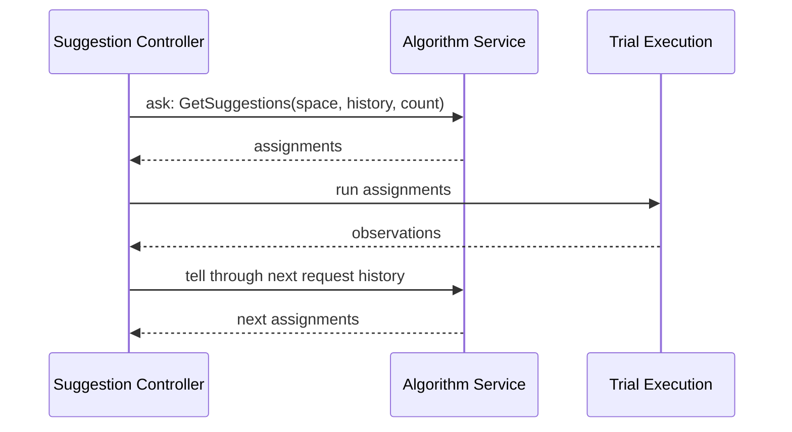

新算法只需实现：

$$
A:(\mathcal{X},H_t,k,\theta)\mapsto\{x_{t+1},\ldots,x_{t+k}\}
$$

其中：

- $\mathcal{X}$：search space；
- $H_t=\{(x_i,y_i,status_i)\}$：past Trial history；
- $k$：current requested suggestion number；
- $\theta$：algorithm settings；
- 输出：$k$ 组 parameter assignments。

Katib 负责把 assignments 变成 Trial workloads，算法 service 不应直接创建 training Pods。

### C.5.1 Step 1：Implement the Katib Suggestion API

原章给出的 gRPC service：

```proto
service Suggestion {
  rpc GetSuggestions(GetSuggestionsRequest)
      returns (GetSuggestionsReply);
  rpc ValidateAlgorithmSettings(ValidateAlgorithmSettingsRequest)
      returns (ValidateAlgorithmSettingsReply);
}
```

#### 两个 RPC

- `ValidateAlgorithmSettings`：验证用户 settings，尽早返回 actionable error；
- `GetSuggestions`：读取 Experiment/search space、historical Trials 和 requested count，运行算法并返回 assignments。

因为 contract 是 gRPC/protobuf，实现语言不必是 Python；只要 wire protocol、health check 和 container contract 一致即可。

#### 原章 Python 示例的纠正版本

```python
from __future__ import annotations

from typing import Any


class NewAlgorithmService(api_pb2_grpc.SuggestionServicer, HealthServicer):
    def ValidateAlgorithmSettings(self, request: Any, context: Any) -> Any:
        # Optional: reject invalid algorithm settings before trials start.
        return api_pb2.ValidateAlgorithmSettingsReply()

    def GetSuggestions(self, request: Any, context: Any) -> Any:
        search_space = HyperParameterSearchSpace.convert(request.experiment)
        trials = Trial.convert(request.trials)

        list_of_assignments = your_logic(
            search_space,
            trials,
            request.current_request_number,
        )

        return api_pb2.GetSuggestionsReply(
          parameter_assignments=Assignment.generate(list_of_assignments)
        )
```

原书用了大写 `Pass`，会触发 Python `NameError`；若方法暂不处理，应写 `pass`，但真实 gRPC handler 最好返回对应 reply 或设置 status，而不是无返回值。

原书返回值还写成 `trials=...`；核对当前 `api.proto` 后，`GetSuggestionsReply` 的 repeated field 是 `parameter_assignments`。执行时仍须以目标 Katib tag 生成的 bindings 为准。

原章四个标注对应：

1. Service 实现 Suggestion + Health interfaces；
2. `GetSuggestions` 为 Trials 提供 HP values；
3. `request.trials` 提供 past observations；
4. `your_logic(...)` 是新增算法核心。

#### Request 中应读取什么

```text
request.experiment
  -> objective direction / metric
  -> parameter types / feasible spaces
  -> algorithm settings

request.trials
  -> assignments
  -> target metric
  -> additional metrics
  -> status / completion information

request.current_request_number
  -> batch size k
```

Exact protobuf fields 以目标 Katib tag 的 `api.proto` / generated bindings 为准。

#### Output Invariants

每个 assignment 必须：

1. 覆盖 required parameters；
2. 值在 feasible space 内；
3. Type 可被 Trial template 正确序列化；
4. Batch size 恰好等于 `current_request_number`；
5. 尽量避免重复 completed/pending suggestions；
6. 对相同 seed/history 的 reproducibility 语义明确；
7. Maximize/minimize direction 正确。

形式化检查：

$$
\forall x\in A(\mathcal{X},H,k,\theta),\quad x\in\mathcal{X}
$$

以及：

$$
|A(\mathcal{X},H,k,\theta)|=k
$$

#### Validation 不应只检查语法

例如 Bayesian algorithm 可验证：

- `n_initial_points > 0`；
- Acquisition function 属于支持集合；
- Continuous dimensions / categories 符合实现限制；
- Algorithm 不支持的 conditional space 被拒绝；
- Requested parallelism 与 batch capability 兼容。

失败信息应指出 setting name、bad value、allowed range，而不是让 Trial 创建后才失败。

#### Stateless 与 Stateful Algorithm Service

最稳健方式是每次从 request 的 Experiment + Trial history 重建 optimizer state：

```text
service restart
-> receive durable history
-> rebuild optimizer
-> produce same next suggestions
```

优点是 Pod restart 不丢状态；代价是 history 大时重建昂贵。

若把 surrogate/population/checkpoint 保存在 service local memory：

- Restart 后如何恢复？
- 多 replicas 如何避免 divergent state？
- Request retry 如何保证 idempotency？
- State version 如何与 Trial history 对齐？

PBT 等 stateful algorithms 可能需要 shared volume/checkpoint/resume policy。State ownership 必须设计清楚。

#### Concurrency 与 Duplicate Safety

若 `GetSuggestions` 同一 request 因 timeout 重试，算法不能随意返回另一批随机值而让 controller 难以判重。常见策略：

- Deterministic seed = Experiment UID + suggestion generation/request ID；
- 按 durable history 重建；
- Service 持久化 request-id → reply；
- Controller 先查 Suggestion status 再调用。

Exact request identity 能力取决于 protocol/version，需通过代码验证。

### C.5.2 Step 2：Dockerize the Algorithm as a gRPC Service

实现 Suggestion interface 后，要：

1. 创建 gRPC server；
2. 注册 Suggestion servicer；
3. 注册 standard health servicer；
4. 监听 Katib 期望端口；
5. 打包 immutable container image。

原章 server skeleton 的有效 Python 写法：

```python
from __future__ import annotations

from concurrent import futures

import grpc


DEFAULT_ADDRESS = "[::]:6789"


def serve() -> None:
    server = grpc.server(futures.ThreadPoolExecutor(max_workers=10))
    service = NewAlgorithmService()
    api_pb2_grpc.add_SuggestionServicer_to_server(service, server)
    health_pb2_grpc.add_HealthServicer_to_server(service, server)
    server.add_insecure_port(DEFAULT_ADDRESS)
    server.start()
    server.wait_for_termination()


if __name__ == "__main__":
    serve()
```

当前官方自定义算法文档示例使用 port `6789`。实际必须与目标 Katib config/probe/service 一致。

#### 为什么需要 Health Service

Suggestion controller/Kubernetes 需要判断：

- Process 已启动；
- gRPC server 可接受请求；
- Algorithm dependencies/state 可用。

Liveness 与 readiness 不应混淆：短暂下游不可用时 readiness false，不一定立即重启 process；deadlock/crash 才由 liveness 处理。

#### Container Checklist

```text
generated protobuf version compatible
algorithm dependencies pinned
non-root runtime where possible
read-only filesystem where possible
port/probes declared
CPU/memory requests and limits
graceful SIGTERM
structured logs
image digest / SBOM / vulnerability scan
no training credentials unless required
```

#### Build 示例

```shell
docker build \
  -f cmd/suggestion/new-algorithm/Dockerfile \
  -t registry.example.com/katib/suggestion-new-algorithm:0.1.0 \
  .
docker push registry.example.com/katib/suggestion-new-algorithm:0.1.0
```

生产配置最好引用 digest：

```text
registry.example.com/katib/suggestion-new-algorithm@sha256:...
```

#### gRPC Error Semantics

应区分：

- `INVALID_ARGUMENT`：settings/search space 错误，不应盲重试；
- `UNAVAILABLE`：短暂服务不可用，可 backoff retry；
- `INTERNAL`：算法实现异常；
- Deadline exceeded：算法计算过慢或 timeout 太短。

不要把所有错误吞掉并返回空 assignments，否则 Experiment 可能进入无解释的 reconcile loop。

#### Observability

至少记录/暴露：

- Experiment/Suggestion identity；
- Request count / history size；
- Algorithm latency；
- Reply assignment count；
- Validation failures；
- Duplicate/out-of-space count；
- gRPC status；
- Optimizer rebuild/checkpoint time。

日志不应输出 secrets；高维 assignments 可用 hash/sample 控制 cardinality。

### C.5.3 Step 3：Register the Algorithm with Katib

Katib 需要从 `algorithmName` 找到 container image/runtime config。

#### 原章配置快照

原书展示 `suggestion` 中的 JSON map：

```json
{
  "tpe": {
    "image": "docker.io/kubeflowkatib/suggestion-hyperopt"
  },
  "random": {
    "image": "docker.io/kubeflowkatib/suggestion-hyperopt"
  },
  "new-algorithm": {
    "image": "registry.example.com/katib/suggestion-new-algorithm:0.1.0"
  }
}
```

这是成书版本格式，不能直接假设适用于当前 release。

#### 当前文档示意

当前官方文档把算法加入 Katib Config 的 `runtime.suggestions`：

```yaml
runtime:
  suggestions:
    - algorithmName: random
      image: docker.io/kubeflowkatib/suggestion-hyperopt:VERSION
    - algorithmName: tpe
      image: docker.io/kubeflowkatib/suggestion-hyperopt:VERSION
    - algorithmName: new-algorithm
      image: registry.example.com/katib/suggestion-new-algorithm:0.1.0
```

`VERSION` 和 config location/ConfigMap key 要用目标 release 实值。更新 config 后 controller 是否需 rollout/restart，也应查对应版本文档。

#### Name Binding

Experiment：

```yaml
spec:
  algorithm:
    algorithmName: new-algorithm
```

Registry：

```yaml
- algorithmName: new-algorithm
  image: registry.example.com/katib/suggestion-new-algorithm:0.1.0
```

名字必须精确匹配。Unknown name 应在 Experiment/Suggestion condition 中产生明确错误。

#### 注册前后的验证顺序

1. Unit-test algorithm math；
2. Test protobuf conversion；
3. In-process gRPC test；
4. Container health/probe test；
5. Registry image pull test；
6. Tiny Katib Experiment；
7. Controller/service restart test；
8. Parallel/duplicate/failure test；
9. Compare against random-search baseline；
10. Scale/long-running test。

#### Algorithm Correctness Test

只检查 RPC 返回 200/OK 不够。应验证：

- Every assignment in space；
- Direction maximize/minimize；
- Fixed seed reproducibility；
- No duplicate until finite space exhausted；
- Batch count；
- Missing/failed/early-stopped Trial handling；
- No history / cold start；
- All-categorical/all-continuous/mixed spaces；
- Convergence on synthetic benchmark；
- Runtime/memory bounds。

可用简单函数：

$$
f(a,b)=4a-b^2
$$

在 bounded space 检查算法是否优于或至少不显著劣于 random baseline。Stochastic test 应看多 seeds 分布，不应只断言单次 exact optimum。

### C.5.4 Examples and Documents

原章推荐：

- Katib repo 中“How to Add a New Algorithm”文档；
- Existing algorithms 作为相同 registration pattern 的 examples；
- `cmd/suggestion` 目录中的 service/container implementations。

阅读现有算法时应同时看：

```text
service implementation
generated proto/API conversion
server main + health service
Dockerfile/image
Katib config registration
unit tests
e2e Experiment YAML
```

只复制 algorithm function 而忽略 lifecycle/health/config/tests，无法得到生产可用 extension。

#### 当前路径边界

Repository layout 会变化。使用目标 tag 后，以搜索定位：

```shell
rg -n "class .*SuggestionServicer|GetSuggestions|ValidateAlgorithmSettings" .
rg -n "algorithmName:.*random|runtime:|suggestions:" config manifests examples .
rg -n "add_SuggestionServicer_to_server|6789" cmd pkg .
```

### C.5 小结

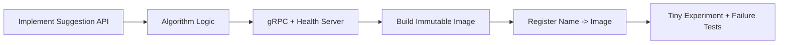

Katib 的 extensibility 来自窄而稳定的 protocol boundary：算法只做 suggestions，controllers 只做 orchestration，training runtime 只做 evaluation。

---

## C.6 Further Reading

原章因篇幅没有继续展开所有 Katib features，给出三组资料。

### 1. Design Paper

**A Scalable and Cloud-Native Hyperparameter Tuning System**：理解 Katib design thinking、requirements、architecture 和 evaluation。

阅读问题：

- 为什么选 Kubernetes CRD/controller？
- 如何分离 suggestion 与 trial execution？
- Multi-tenancy/scalability 如何验证？
- Paper 中 Katib version 与当前实现差异多大？

### 2. Official Website and GitHub Repository

- Official docs：feature updates、installation、tutorials、API/config；
- GitHub repo：source、examples、release notes、issues、tests。

建议按同一 release/tag 对齐：

```text
release notes
-> installation docs
-> CRDs/API reference
-> examples
-> controller source/tests
```

不要用 main-branch example 配旧 cluster CRD。

### 3. Python SDK and Jupyter Samples

适合在 Notebook 直接创建 HPO Experiment、等待完成、获取 optimal hyperparameters。SDK 降低 YAML ceremony，但不会消除：

- Remote container/runtime；
- Kubernetes resource/security；
- Metric contract；
- Search-space/objective design；
- Cost/failure handling。

SDK generated object 最终仍应可审计、versioned，并记录 Experiment spec。

### 扩展阅读顺序


先建立可运行 mental model，再读 paper/source；否则容易只理解组件名字，无法把 API、controller 和 runtime 对齐。

---

## C.7 When to Use It

原章结论：Katib 满足 production HPO service 的主要 design principles：

- Training framework/code agnostic；
- HPO algorithms extensible；
- Metric collectors extensible；
- Kubernetes 带来的 portability/scalability；
- Production-oriented orchestration。

作者因此把 Katib 称为寻求 production-level HPO service 时的最佳选择。这个结论应理解为：**在已经采用 Kubernetes、需要共享 HPO control plane、且能承担平台运维时，Katib 是强候选**，不是对所有团队的无条件排序。

### 最大 Caveat：Upfront and Ongoing Cost

原章列出：

- Build/obtain Kubernetes cluster；
- Install Katib；
- Dockerize training code；
- 用 Kubernetes commands 排障；
- Dedicated engineers 运营维护。

还应加入 ongoing costs：

- Upgrade/CRD migration；
- Security/RBAC/registry；
- DB/metrics storage；
- Capacity/quota/fairness；
- Observability/on-call；
- Training Operator compatibility；
- Idle control-plane cost。

总拥有成本可粗略表达：

$$
TCO=C_{infra}+C_{platform\ engineering}+C_{operations}+C_{migration}+C_{user\ friction}
$$

Katib 的价值是把 per-team duplicated HPO orchestration 成本转成 shared platform cost。当 usage/team count 足够大时，amortization 才明显。

### Katib 适合的信号

1. 已有 Kubernetes-based training platform；
2. 多团队/多用户共享 HPO；
3. 需要 namespace/RBAC/quota/multi-tenancy；
4. Trials 是 remote/distributed workloads；
5. 需要 framework-neutral API；
6. Experiment 运行小时/天，需 controller recovery；
7. 需要 UI/API/SDK 与集中 history；
8. 有 platform/SRE 能力；
9. 需要 custom algorithms/collectors/operators；
10. HPO 使用频率足以摊薄平台成本。

### HPO Library 更合适的信号

原章以 Ray Tune 为例：

1. Small team / prototype；
2. 单个 codebase / framework；
3. Data scientist 需要快速本地迭代；
4. 不需要独立 multi-tenant service；
5. 可在当前 process/cluster runtime 内组织 Trials；
6. 运营 Kubernetes control plane 的成本高于收益。

需要修正一个过度二分：Ray Tune 等 library 也能在 distributed Ray cluster 上规模化，Katib Python SDK 也能提供 library-like UX。真正差异是**谁拥有 orchestration lifecycle、state、isolation 和 operations**，不是“library 一定只能本地、service 一定更 scalable”。

### 对比表

| Dimension | Katib Service | HPO Library（如 Ray Tune） |
| --- | --- | --- |
| Primary abstraction | Kubernetes Experiment/Trial resources | In-code tuner/objective |
| Startup friction | 高 | 低到中 |
| Training packaging | Container/workload template 为核心 | 可直接 function，也可 remote/container |
| Multi-tenancy | 借助 namespace/RBAC/quota | 需 runtime/platform 另行提供 |
| Durable control loop | Kubernetes controllers | 取决于 library/runtime/checkpoint |
| Framework integration | Trial template + operators | Library integrations/runtime |
| Debugging | CRDs/controllers/Pods/DB | Python/runtime/cluster |
| Custom algorithm | gRPC service + image + config | In-process/plugin API 通常更直接 |
| Team fit | Platformized multi-team | Fast iteration / smaller ownership scope |
| Ongoing ops | Kubernetes/Katib/DB/operators | Dependency/runtime/cluster ops |

### 选择框架

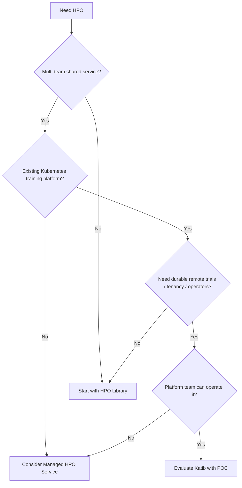

### POC 不应只测 Happy Path

Katib 评估指标：

- Time from code to first Experiment；
- Median/p95 Trial startup latency；
- Concurrent Trials / controller/API load；
- Metrics lag / missing rate；
- Recovery after controller/operator restart；
- Experiment resume/delete behavior；
- GPU utilization / queue time；
- Per-team isolation/quota；
- Upgrade effort；
- Operator-hours per month；
- Data scientist debugging time。

### Migration Strategy

从 library 到 service 时，先标准化 objective contract：

```text
inputs: typed hyperparameters
outputs: named intermediate/final metrics
runtime: container + resources + artifacts
metadata: code/data/image/seed versions
```

这能让同一 training program 先在 local library 调用，后在 Katib TrialJob 执行，降低迁移耦合。

### C.7 小结

Katib 的主要收益不是“算法更聪明”，而是把 HPO 变成可共享、可恢复、可治理、可扩展的 remote service。主要成本也不是写 Experiment YAML，而是长期承担 Kubernetes-native control plane。选择应由组织规模、已有基础设施、workload runtime 和 TCO 驱动。

---

## 全附录知识地图

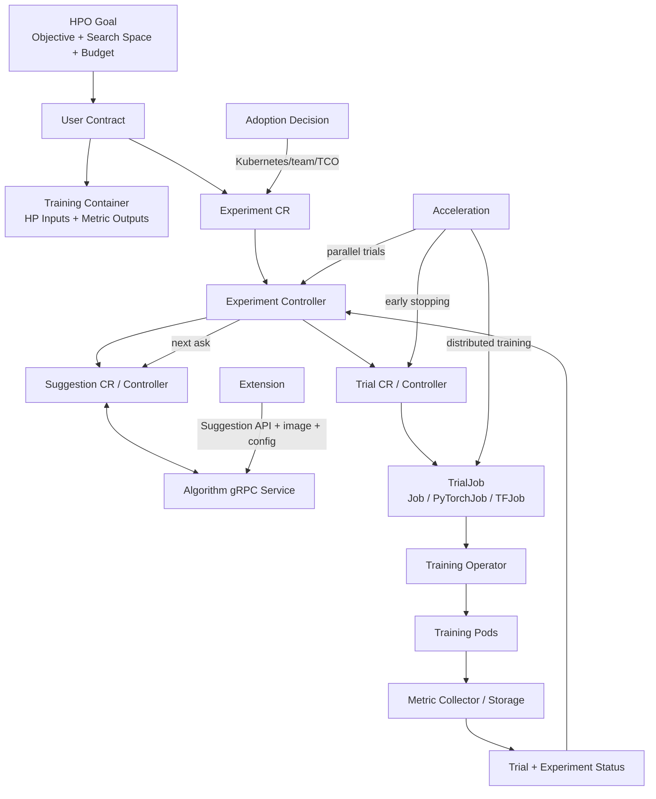

### 五层 Mental Model

#### 1. Optimization Layer

```text
objective + direction + search space + observations
-> algorithm
-> next assignments
```

关注 search efficiency、parallel suggestion、early stopping bias 和 convergence。

#### 2. Experiment Layer

```text
budget + concurrency + failure threshold + exit conditions
-> Experiment lifecycle
```

关注什么时候创建下一批 Trials、什么时候成功/失败、怎样聚合最优值。

#### 3. Trial Layer

```text
assignment + workload template
-> Trial
-> TrialJob
```

关注 parameter substitution、framework resource、resources、distributed roles。

#### 4. Observation Layer

```text
training logs/files/events/push
-> metric collector/storage
-> Trial observation
```

关注 metric name/regex/step/timestamp/strategy/availability。

#### 5. Control Layer

```text
CRDs + controllers + reconcile + status + ownership
```

关注 idempotency、retry、eventual consistency、recovery、versioning、operations。

### 四项端到端 Contract

| Contract | Producer | Consumer | 最常见故障 |
| --- | --- | --- | --- |
| Parameter | Suggestion/Trial template | Training entrypoint | Name/type/range mismatch |
| Workload | Trial controller | Kubernetes/Training Operator | GVK/schema/resources invalid |
| Metric | Training code/collector | Trial/Experiment/Suggestion | Name/format/step missing |
| State | Controllers/status/DB | UI/SDK/other controllers | Stale/conflict/incomplete recovery |

HPO service 的可靠性取决于四项 contract 同时闭合，而不是某个 search algorithm 单独正确。

---

## 关键公式与不变量速查

### Optimization Objective

$$
x^*=\arg\max_{x\in\mathcal{X}}f(x)
$$

Minimize 时改为 $\arg\min$。有限 Trial budget 下只能返回 observed best，不保证 global optimum。

### Ideal Batched Time

$$
T_{wall}\approx\left\lceil\frac{N}{P}\right\rceil T
$$

$N$ 为 Trials，$P$ 为 parallelism，$T$ 为相近的单 Trial 时间；忽略 queue、straggler、algorithm dependency。

### Resource Peak

$$
G_{peak}\approx P\cdot W\cdot g
$$

$W$ 为每 Trial distributed workers，$g$ 为每 worker GPUs。

### Distributed Trial Time

$$
T(W)\approx T_{serial}+\frac{T_{comp}}{W}+T_{comm}(W)
$$

Worker 数增加只有在 compute reduction 大于 communication/synchronization overhead 时才有效。

### Total Compute Cost

$$
C=\sum_{i=1}^{N}r_it_i
$$

Parallelism 主要改 wall time；early stopping 主要减少 $t_i$；distributed training 同时改变 $r_i,t_i$。

### Median Stop

$$
b_i(s)<\operatorname{median}_{j\in\mathcal{C}_s}\bar y_j(s)
$$

适用于 maximize；minimize 方向相反。需足够 completed Trials 和可比 intermediate steps。

### Experiment Scheduling Invariant

$$
N_{running}+N_{pending}\leq parallelTrialCount
$$

并且达到 goal/max-trials/failure criterion 后不再生成新 Trials。

### Reconcile Convergence

$$
\mathrm{desired}-\mathrm{actual}\xrightarrow{\mathrm{reconcile}}0
$$

重复 reconcile 必须尽量 idempotent，controller crash 后能从 durable observed state 继续。

### Ask-and-Tell

$$
A:(\mathcal{X},H_t,k,\theta)\mapsto\{x_{t+1},\ldots,x_{t+k}\}
$$

Custom algorithm 必须返回 in-space、typed、数量恰好匹配请求且 duplicate policy 明确的 assignments。

---

## 从需求到上线的通用方法

这套方法不只适用于 Katib，也适用于评估/设计其他 remote HPO services。

### Step 1：Define the Decision, Not Just the Metric

先回答：

- 最终要做什么 model/business decision？
- Objective maximize/minimize 什么？
- Additional constraints 是 latency、memory、cost 还是 fairness？
- Goal 是可接受阈值还是必须找到的 target？
- Best Trial 后如何 retrain/test/register？

单 metric optimization 可能写成带约束问题：

$$
\max_x accuracy(x)
\quad\text{s.t.}\quad
latency(x)\leq L,\ memory(x)\leq M
$$

Katib spec/algorithm 是否支持所需 multi-objective/constraint 语义，应按版本确认；否则在 Trial metric、feasibility filter 或后处理实现。

### Step 2：Make Training a Deterministic Evaluator

Training program 应近似一个明确函数：

$$
(x,code,data,seed,resources)\mapsto(metrics,artifacts,status)
$$

要求：

- Typed CLI/env parameters；
- Fixed code/image digest；
- Versioned data/split；
- Seed and nondeterminism policy；
- Resource requests/limits；
- Named metrics + timestamp/step；
- Artifact/checkpoint URI；
- Meaningful exit code；
- Graceful termination。

### Step 3：Test the Container Without Katib

先本地/单 Job 运行两组手工 parameters：

```text
Does CLI consume every value?
Does invalid input fail fast?
Does stdout/file contain exact metric name?
Can the image access data/artifact storage?
Does termination flush metrics/checkpoint?
```

若 standalone evaluator 不可靠，HPO 只会并行放大故障。

### Step 4：Design Search Space and Budget

根据 prior/domain knowledge 设置：

- Parameter type；
- Linear/log scale；
- Bounds/categories；
- Conditional dependencies；
- Invalid/OOM regions；
- Initial/random points；
- Algorithm and seed；
- Trial/failure budget。

先用小预算 dry run 验证 contract，再扩大 search。

### Step 5：Choose Parallel/Distributed/Stopping Deliberately

按顺序测量：

1. Single Trial time/resource/metric curve；
2. Distributed scaling curve $T(W)$ 与 GPU-hours；
3. Algorithm batch suggestion quality；
4. Cluster capacity/queue；
5. Early-stop false negative / saved cost。

不要一次把三项全部打开，否则很难归因 quality/cost regression。

### Step 6：Version-align Every Contract

固定一条 release chain：

```text
Katib image/version
<-> Katib CRDs
<-> Experiment schema/examples
<-> Python SDK
<-> Suggestion images/proto
<-> Training Operator CRDs
<-> Cluster Kubernetes version
```

部署前：

```shell
kubectl api-resources
kubectl explain experiment.spec
kubectl explain YOUR_TRIAL_KIND.spec
kubectl apply --server-side --dry-run=server -f experiment.yaml
```

### Step 7：Run a Tiny End-to-End Experiment

最低覆盖：

- 2–3 cheap Trials；
- Objective + additional metric；
- One known-good and one invalid parameter；
- Status/result query；
- Failure log path；
- Experiment delete/cleanup。

先证明 closed loop，再谈 algorithm quality。

### Step 8：Add Observability and SLOs

Control-plane SLO examples：

- Experiment creation → first Trial startup latency；
- Suggestion RPC success/latency；
- Trial completion → Experiment status lag；
- Metric unavailable rate；
- Reconcile error/retry rate；
- Orphan workload count；
- Cleanup latency。

Data-plane SLO examples：

- Pod pending/image pull time；
- GPU utilization；
- Trial success/OOM rate；
- Checkpoint/metric flush success；
- Queue fairness per tenant。

### Step 9：Test Recovery Before Scale

Kill/restart controllers、suggestion service、training operator；制造 timeout/OOM/missing metric；确认：

- No duplicate workloads；
- Progress resumes；
- Conditions explain state；
- Failure budget works；
- Cleanup works；
- Optimal Trial not corrupted。

### Step 10：Scale and Govern

最后再增加 users、Trials、workers 和 history：

- Quota / priority / fairness；
- Admission policy；
- Max concurrency；
- Image/data security；
- Metrics retention；
- Experiment TTL / cleanup；
- Chargeback/showback；
- Upgrade/canary/rollback。

---

## Production Readiness Checklist

### Objective and Science

- [ ] Objective direction/name/strategy 正确；
- [ ] Validation split 固定且不泄漏；
- [ ] Goal 有业务/统计依据；
- [ ] Search space scale/bounds 合理；
- [ ] Random seeds/repeats policy 明确；
- [ ] Best Trial 有独立 test/retrain gate。

### Training Container

- [ ] Immutable image digest；
- [ ] All hyperparameters externalized/typed；
- [ ] Invalid values fail fast；
- [ ] Metrics 按 exact name + step/timestamp 输出；
- [ ] Exit code/termination/checkpoint 正确；
- [ ] CPU/GPU/memory requests/limits；
- [ ] Dataset/artifact/secret access 最小化；
- [ ] Multi-worker metric/artifact write 无冲突。

### Experiment Spec

- [ ] Objective/algorithm/parameters fields 通过目标 CRD schema；
- [ ] Trial parameter references 全部闭合；
- [ ] `primaryContainerName` 正确；
- [ ] Trial GVK 已安装；
- [ ] Trial/failure/concurrency budgets 有依据；
- [ ] Collector type/namespace label 正确；
- [ ] Sidecar/service-mesh interactions 验证；
- [ ] Server-side dry run 通过。

### Acceleration

- [ ] Algorithm 支持 requested parallelism；
- [ ] Peak resource $P\times W\times g$ 不超 quota；
- [ ] Distributed scaling efficiency 测过；
- [ ] Global batch/steps 语义一致；
- [ ] Early-stop metrics 可比；
- [ ] `min_trials_required`/`start_step` 已校准；
- [ ] Saved cost 与 quality regret 同时监控。

### Reliability and Operations

- [ ] Controller/suggestion/operator restart tested；
- [ ] Duplicate TrialJob prevention tested；
- [ ] Metrics DB backup/retention；
- [ ] Conditions/events/logs/metrics 可观测；
- [ ] RBAC/quota/network/pod security；
- [ ] Experiment deletion/finalizer/TTL tested；
- [ ] Upgrade/schema migration/rollback plan；
- [ ] Runbook/on-call ownership 明确。

### Custom Algorithm

- [ ] Protobuf bindings match Katib version；
- [ ] Settings validation actionable；
- [ ] Assignments in space and typed；
- [ ] Retry/duplicate/state recovery semantics；
- [ ] gRPC health/readiness/deadline/status；
- [ ] Image pinned and pullable；
- [ ] Config name→image binding correct；
- [ ] Unit/gRPC/e2e/convergence/restart tests。

---

## 常见误区总表

### 误区 1：Katib 就是一个 HPO Algorithm

Katib 是 HPO service/control plane；算法只是独立 Suggestion service。Trial scheduling、metrics、status、operators、recovery 同样关键。

### 误区 2：Experiment 等于 Trial

Experiment 是整个 search run；Suggestion 是 assignment；Trial 是一次评估；TrialJob 才是实际 Kubernetes workload definition。

### 误区 3：把 Training Code 放进 Image 就自动可调参

必须暴露 HP inputs，并保证 Trial template reference → variable → CLI/env 全链路一致。

### 误区 4：打印 Accuracy 就能收集

Metric name、format、timestamp/step、collector、namespace injection、strategy 都必须匹配。

### 误区 5：Accuracy 应 `minimize`

通常 accuracy maximize，loss minimize。原章文字中的 minimize 与 YAML `maximize` 冲突，应采用后者语义。

### 误区 6：`goal` 是保证达到的目标

Goal 是达到即可停止的阈值；预算耗尽时可能仍未达到，Experiment 仍可按 max trials 成功结束。

### 误区 7：更多 Parallel Trials 总更快更好

会受 capacity、queue、stale feedback、algorithm batch support 限制；总 compute 通常不减少。

### 误区 8：Distributed Training 等于 HPO Parallelism

前者在一个 Trial 内扩 workers，后者并发多个 Trials；组合后资源乘法增长。

### 误区 9：Early Stopping 不需任何 Training 配合

无需 Katib-specific stopping code，但必须持续提供可排序 intermediate metrics，并能被安全终止。

### 误区 10：CRD 持久化等于 Exactly-once

Controller retry 仍可能跨越 side effect/status write 边界；必须用 idempotency、ownership 和 deduplication。

### 误区 11：Experiment Status 是强一致实时状态

它是 controllers 聚合的 eventually consistent view；Pod、Trial、Experiment 短暂不同步是正常的。

### 误区 12：Training Operator 与 Katib 是同一 Controller

Katib Trial controller 创建 TrialJob；framework Training Operator 再创建/管理 distributed Pods，职责分离。

### 误区 13：修改 Python Algorithm Function 就完成扩展

还需 Suggestion protocol、gRPC server、health、image、registration、version compatibility 和 tests。

### 误区 14：原书 YAML 可以永远直接运行

原书有大小写/缩进/`Pass`/术语错误，API 和 config 也演进；必须以目标 release CRD/schema 为准。

### 误区 15：Katib 永远优于 Library

Katib 的共享治理/恢复优势以 Kubernetes 和平台运维成本为代价；小团队/原型常更适合 library 或 managed service。

---

## 核心结论

1. Katib 把 HPO 从 process-local algorithm 提升为 Kubernetes-native remote service。
2. 用户侧最关键的不是 YAML 语法，而是 parameter、workload、metric、state 四项 contract。
3. Experiment 管 optimization goal/budget，Suggestion 管 ask，Trial 管单次 evaluation，TrialJob 管 actual execution definition。
4. Container 让 Katib framework/language agnostic，但 reproducibility 仍需 image/data/seed/artifact versioning。
5. Objective direction、metric strategy、goal 和 budget 共同定义“best”与“done”。
6. Parallel Trials、distributed training、early stopping 分别优化 HPO 批次数、单 Trial latency 和坏 Trial steps，不能混为一谈。
7. `parallelTrialCount` 与 per-Trial worker 数产生乘法资源需求，必须做 capacity model。
8. Median stopping rule 节约成本，但依赖 comparable learning curves，并有错杀 slow starter 的风险。
9. Katib 的可靠性来自 durable resources + repeated reconciliation，而不是 controller 永不失败。
10. 三个 Katib controllers 通过 CRDs 协作；Suggestion gRPC 和 Training Operator CRDs 是主要扩展边界。
11. 阅读源码应从 CRD schema、controller registration 和 `Reconcile` state machine 开始。
12. Custom algorithm 的最小闭环是 Suggestion API → algorithm → gRPC/health → image → config → tests。
13. Book snapshot、current docs/main branch、installed cluster 三个版本必须严格区分。
14. Katib 适合已有 Kubernetes training platform、multi-team、long-running remote Trials 与 platform ownership 的组织。
15. 是否采用 Katib 应比较 end-to-end time-to-quality 与 TCO，而非只比较算法列表。

---

## 自测题

### 基础理解

1. Experiment、Suggestion、Trial、TrialJob 各自负责什么？
2. 为什么 Katib 要求 training code containerized？
3. 什么 contract 让 Katib 与 programming language/framework 解耦？
4. `objectiveMetricName`、`type`、`goal` 各自影响什么？
5. 为什么原章的 Validation-accuracy 应 maximize 而不是 minimize？
6. `parallelTrialCount=3,maxTrialCount=12` 的理想批次数是多少？
7. `maxFailedTrialCount` 与 `maxTrialCount` 有何不同？
8. 为什么 `latest` image tag 不适合可复现 HPO？

### 系统设计

9. Reconcile loop 的 desired/actual/status 分别是什么？
10. 为什么 controller 必须 idempotent？给出 create child 后 status write 失败的例子。
11. Experiment controller、Suggestion controller、Trial controller 如何完成一次 ask-and-tell？
12. 为什么 Trial 与 TrialJob 要分成两个 resources？
13. Metric 从 training Pod 到 current optimal Trial 经过哪些组件？
14. Controller restart 后能恢复的前提是什么？为什么 CRD 不等于 exactly-once？
15. Katib 与 PyTorch Training Operator 如何低耦合集成？
16. 阅读一个新版本 Katib 源码时，为什么先查 CRD schema 和 `Reconcile`？

### 算法与资源

17. 为什么某些 sequential Bayesian algorithms 不宜直接设置很大 parallelism？
18. `P=4,W=8,g=1` 时仅 training workers 的峰值 GPU 约多少？
19. Distributed training 何时会增加而不是降低 accelerator-hours？
20. Median stopping rule 的 baseline 如何计算？
21. `min_trials_required` 与 `start_step` 为什么不能太小？
22. Early stopping 为什么可能错杀 slow starter？
23. Training-internal early stopping 与 Katib HPO early stopping 有什么差别？

### 扩展与选择

24. Custom Suggestion service 的 request/response 各需包含什么？
25. 为什么同一个 `GetSuggestions` request 重试时要考虑 determinism/deduplication？
26. `ValidateAlgorithmSettings` 应验证哪些 semantic constraints？
27. 为什么 gRPC service 需要 readiness/health 和明确 status codes？
28. 原章算法注册格式与当前文档示意有何差异？
29. 哪些组织信号支持采用 Katib？
30. 为什么“Katib 生产级，所以任何团队都应使用”不成立？

---

## 自测题参考答案

1. Experiment 是完整 optimization run；Suggestion 是算法给出的 assignments；Trial 是一次 assignment evaluation；TrialJob 是 Job/PyTorchJob 等 actual workload resource。
2. Remote cluster 要重复、隔离、可调度地执行同一 runtime；container 封装 code/dependencies/entrypoint 并成为 Kubernetes scheduling unit。
3. Typed HP inputs + parseable metric outputs + generic workload template；Katib 不调用 framework 内部 training API。
4. Name 指定比较 metric，type 决定 maximize/minimize，goal 是达到后可停止继续搜索的阈值。
5. Accuracy 越高通常越好；原 YAML 已设 `maximize`，文字中的 minimize 是矛盾笔误。
6. 资源充足且每 Trial 等时时，$\lceil12/3\rceil=4$ 批。
7. `maxTrialCount` 是 completed terminal Trial 的成功阈值；`maxFailedTrialCount` 是 failed + metrics-unavailable subset 的失败阈值，后者先检查。两者都不是严格 admission hard cap。
8. 同一 tag 可指向不同 image content，使 code/runtime 不可追溯；应 pin version/digest。
9. Desired 是 Experiment/Trial spec；actual 是 Suggestions/TrialJobs/Pods/metrics；status 是 controller 写回的 observation/conditions。
10. Event/retry 可能重复；若 Job 已创建但 status write 失败，下一 reconcile 必须发现 existing Job，不能再创建第二个。
11. Experiment controller 请求 Suggestion；Suggestion controller 调算法；Experiment 创建 Trial；Trial controller 执行并回写 observation；Experiment 聚合后请求下一批。
12. Trial 保存 HPO domain metadata/status，TrialJob 表达 framework-specific execution；分离让 Katib 可接多种 operators。
13. Pod → metric collector → metric storage/DB manager → Trial controller/status → Experiment controller/status → current optimal Trial；exact version may vary。
14. Durable parent/child objects、ownership、metrics/history 仍可观察；外部 side effect 与 status 更新不在单一事务内，所以仍需幂等/去重。
15. Katib 创建 PyTorchJob CR，PyTorch Operator watch 它并创建 distributed Pods；双方只依赖 CRD/status contract。
16. Schema 定义 desired/status vocabulary；Reconcile 集中体现 state transitions、side effects、retry 和 terminal conditions。
17. 同批 suggestions 看不到 pending Trial outcomes，surrogate/acquisition 使用 stale history，可能重复采样并降低 search efficiency。
18. $4\times8\times1=32$ GPUs，另计 master/control/sidecar 资源。
19. Model 太小、通信/同步/straggler 开销大或 scaling inefficiency 时，worker 数增加幅度大于 time reduction。
20. 在同一 step，把 completed Trials 截至该 step 的 running averages 取 median；pending Trial 的 best-so-far 若更差则停止。
21. 历史太少或训练太早时 metric noise/curve 排序不稳定，容易 false stop。
22. Early curve 差不代表 final metric 差；不同 hyperparameters 可能收敛速度不同。
23. 前者在单 Trial 内防 overfit/保存 checkpoint；后者跨 Trials 比较，由 HPO control plane 终止不具竞争力的 Trial。
24. Request 至少有 Experiment/search space、objective/settings、past Trials/metrics、requested count；response 是 typed in-space assignments。
25. Timeout retry 若产生新随机 batch，可能重复/漏记/破坏 reproducibility；应基于 identity/seed/history 保持一致或可去重。
26. Setting range/type、search-space compatibility、objective direction、batch capability、conditional parameters、必需配置。
27. Controller 要区分未就绪、暂时失败、无效输入和实现错误，才能选择 retry/backoff/fail-fast 并正确运维。
28. 原章是 `suggestion` JSON map 快照；当前文档示意为 Katib Config `runtime.suggestions` list，必须按目标 release 使用。
29. 已有 Kubernetes training platform、多团队、remote/distributed Trials、tenancy/governance、长期运行和 platform team。
30. Production capability 有 cluster、containerization、upgrade、DB、security、on-call 等 TCO；小团队/原型可能从 library/managed service 获得更低总成本。

---

## 最终一句话

> Katib 把“给优化器一个函数”扩展成“用 Kubernetes controllers 持续协调算法、Trials、训练 Operators 和 metrics 的可恢复反馈系统”；真正的设计工作，是让四项 contract、三层加速、两类扩展边界和一条版本链始终闭合。
