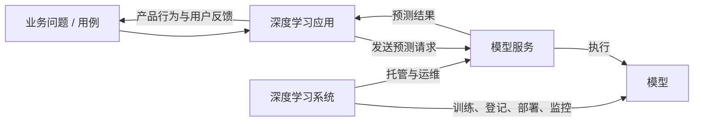
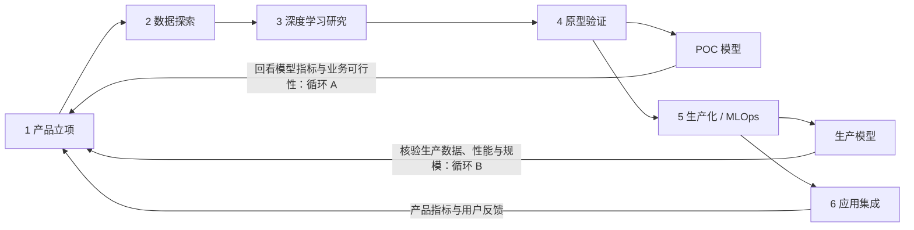
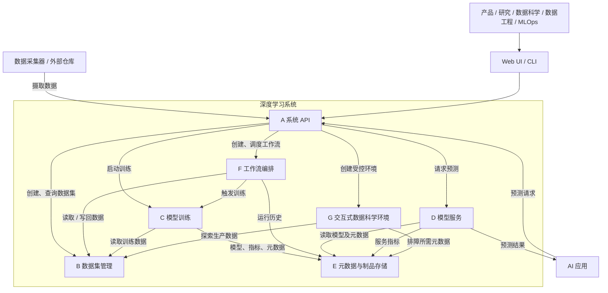
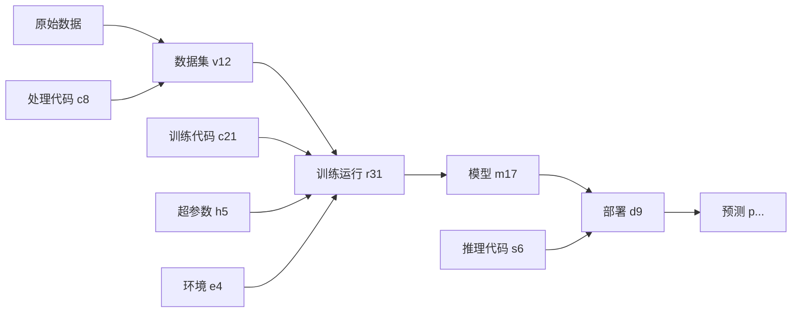
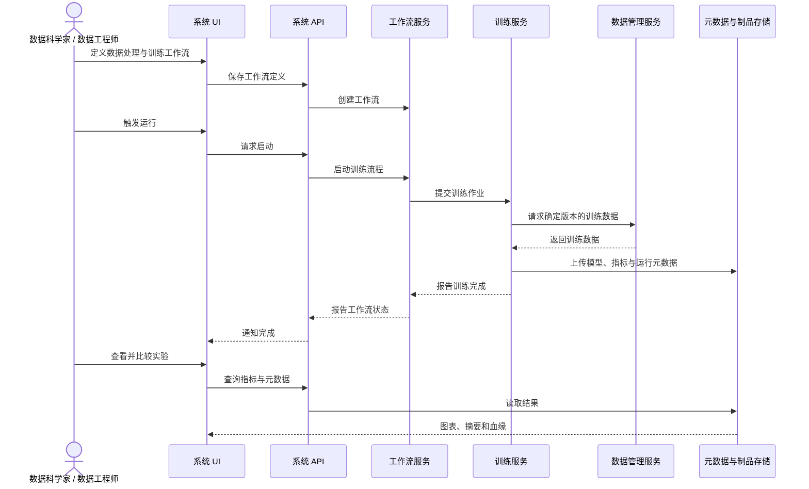
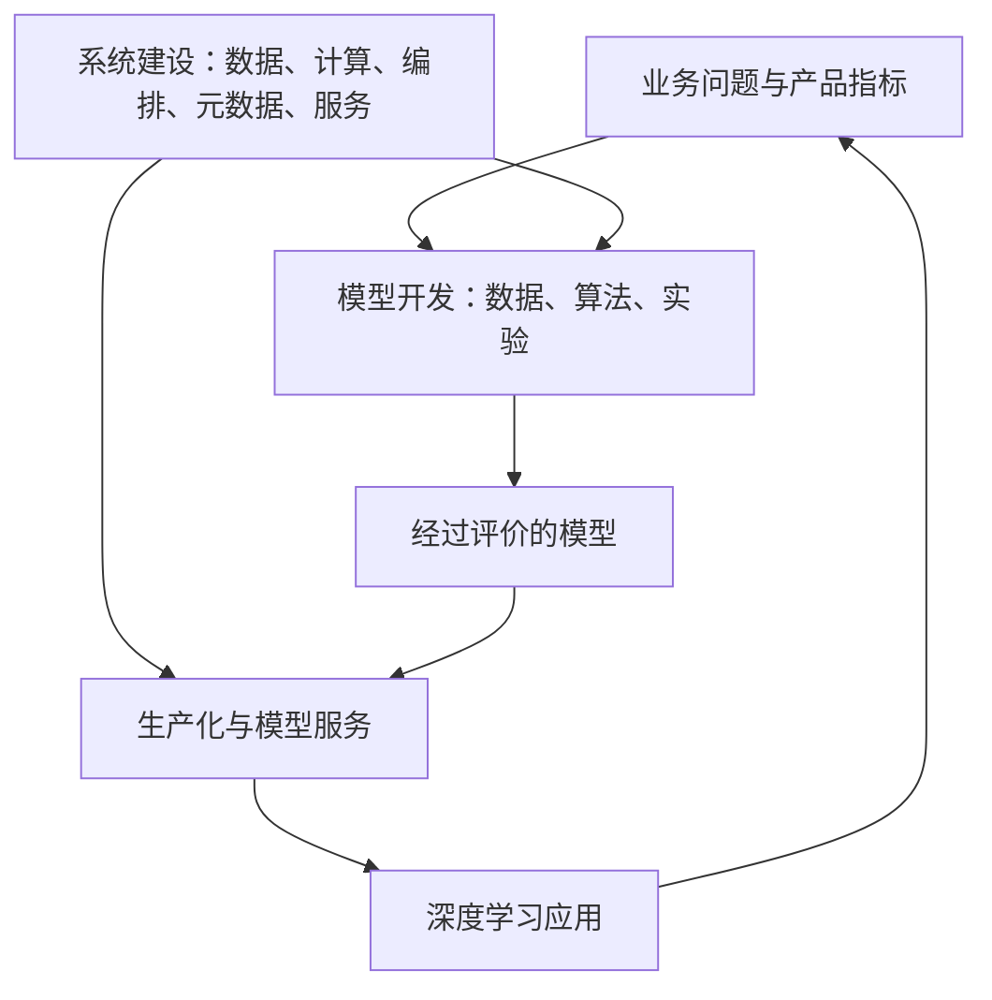

> 对应原章：**1 An Introduction to Deep Learning Systems**
> 本章任务不是讲某个神经网络如何训练，而是建立一幅更大的地图：一个模型怎样从业务设想出发，经由数据、实验、工程化和应用集成，最终成为可持续运行的产品能力；支撑这一过程的系统又应包含哪些部分。

## 本章要回答的核心问题

1. **什么是深度学习系统？** 它与模型、推理服务、深度学习应用分别是什么关系？
2. **为什么只会训练模型还不够？** 一个原型模型到生产产品之间缺少哪些工程能力？
3. **深度学习产品如何从想法走向上线？** 哪些阶段需要反馈回路，而不是单向推进？
4. **哪些角色参与其中？** 每个角色提供什么输入、关心什么结果、又依赖谁？
5. **一个基础系统由什么组成？** 数据集管理、训练、服务、元数据、工作流和交互环境如何协作？
6. **怎样从参考架构推导自己的设计？** 如何把业务目标、资源限制、安全要求和性能指标转化为组件取舍？
7. **Kubernetes 解决哪一层问题？** 它为何常作为底座，又有哪些问题并不由它解决？
8. **“开发模型”与“建设系统”有什么本质区别？** 两者的交付物、优化目标和复杂度分别是什么？

本章以概念、流程和架构为主，没有神经网络算法的公式推导。为使作者提出的工程权衡可以计算和检查，本文在对应知识点中加入时延、容量、血缘和可复现性的形式化表达；这些表达用于解释原章思想，不应误认为是原章另行提出的算法。

---

## 0. 阅读全章前先统一术语

系统设计最容易出现的第一类错误，不是技术选型错误，而是不同角色使用同一个词却指向不同对象。作者因此先规定全书语境中的术语。

### 0.1 机器学习与深度学习

- **机器学习（machine learning）**：算法从数据中归纳规律，再利用规律对新输入做判断。
- **深度学习（deep learning）**：机器学习的一类方法，以可编程神经网络作为学习算法。

二者是包含关系：

$$
\text{深度学习} \subset \text{机器学习} \subset \text{人工智能}
$$

本书示例使用神经网络，但数据管理、训练任务调度、模型部署、元数据追踪等设计原则也适用于一般机器学习。因此作者会在不影响含义时交替使用“机器学习”和“深度学习”。

### 0.2 用例、模型、推理、服务、应用与系统

| 概念 | 它是什么 | 它解决什么问题 | 不应与什么混淆 |
| --- | --- | --- | --- |
| 深度学习用例（use case） | 借助深度学习解决问题的场景，如客服意图识别、道路感知 | 定义“为什么使用 ML” | 不是具体软件，也不是一个模型文件 |
| 模型（model） | 可执行的模型结构与学习所得参数的组合 | 把输入映射为预测输出 | 不是完整产品，也不等于长期运行的网络服务 |
| 预测 / 推理（prediction / inference） | 对给定输入执行模型并产生输出 | 使用已学规律处理新数据 | 本书中二者基本同义；训练则是在学习参数 |
| 模型服务（model serving） | 托管模型、接收请求、执行推理并返回结果的服务 | 让其他软件可靠地调用模型能力 | 不等于面向用户的业务应用 |
| 深度学习应用（application） | 利用模型输出完成业务逻辑的软件 | 向最终用户交付价值 | 通常不承担训练等重计算；边缘设备是可能的例外 |
| 深度学习系统 / 平台 / 基础设施 | 支撑数据、实验、训练、部署、推理、追踪和协作的一组底层能力 | 让多个项目高效、可靠、规模化地开发 | 不是某一个模型，也不只是训练集群 |

可以把这些对象放在一条因果链上：



以客服机器人为例：

- “让用户用自然语言找答案”是**用例**；
- 意图分类网络及其权重是**模型**；
- 把一句话映射成“退款咨询”的过程是**推理**；
- 提供 `/predict` 接口的是**模型服务**；
- 展示对话、检索答案并处理会话状态的是**应用**；
- 管理训练数据、训练任务、模型版本、部署和运行记录的是**系统**。

### 0.3 为什么模型可以很好，产品却可能失败

模型只优化一个被形式化后的代理目标，而产品面对的是完整用户体验。设模型指标为 $M_{\mathrm{model}}$，业务指标为 $M_{\mathrm{business}}$，通常不能假定

$$
M_{\mathrm{model}} \uparrow \quad \Longrightarrow \quad M_{\mathrm{business}} \uparrow
$$

例如意图分类准确率从 $92\%$ 升至 $94\%$，但新模型使响应时延从 $200\ \mathrm{ms}$ 增至 $3\ \mathrm{s}$，用户仍可能更快退出。又如离线测试集与真实流量分布不一致，较高准确率也未必缩短用户找到答案的时间。

这正是本章的出发点：**模型只是产品价值链中的一个环节，系统必须支撑整条价值链及其反馈。**

---

## 1.1 深度学习开发周期

### 1.1.0 为什么系统书要先讲产品开发

作者没有直接从 GPU、训练框架或服务框架讲起，而是先问：**系统究竟要服务谁、服务什么过程？**

原因有三层：

1. 深度学习工作的终点通常是产品或服务，而不是实验目录中的一个权重文件。
2. 研究、数据、工程、运维和产品之间存在大量交接；系统若只优化训练阶段，就无法消除真正的交付瓶颈。
3. 市面上的工具各自解决局部问题。每个项目临时拼装一套工具，既重复又难以达到一致的质量标准。

因此，作者先定义**深度学习开发周期**：从业务机会出发，经过数据探索、研究与原型、生产化、应用集成，再从真实结果返回下一轮改进的完整过程。

一个好的系统不是要求数据科学家掌握所有底层细节，而是把复杂基础设施封装成稳定、易用的能力，让他们能完成整个周期。系统是否成功，也不能只看服务是否上线，而应看跨角色协作是否更顺畅、模型生产化是否更快、更可靠。

### 1.1.1 开发周期的阶段

原章把业务机会之后的工作概括为数据探索、原型、生产化和应用集成；若把起点“产品立项”也算入，则可写成五个宏观阶段。研究是原型阶段中从数据到候选算法的重要子步骤。



图中的编号沿用原章示意：研究与原型分别标为 3、4，生产化为 5，应用集成为 6。最重要的不是编号，而是三个事实：

- 流程不是瀑布式单行道；
- 原型后和生产化后都有昂贵投入前的校验点；
- 上线后的产品反馈会开启新一轮周期。

#### 1. 产品立项：先定义值得解决的问题

**是什么：** 业务负责人识别机会或痛点，判断它是否可能通过机器学习得到改善，并形成产品目标。

**为什么先做这一步：** 如果业务问题没有说清楚，后面的团队只能优化一个未经验证的技术目标。模型精度再高，也可能没有用户价值。

**核心输入与输出：**

- 输入：客户反馈、业务数据、产品战略、技术发展；
- 输出：目标用户、问题描述、预期行为、成功指标和约束；
- 关键判断：问题是否真的需要 ML，是否有足够数据，错误预测的代价是否可接受。

一个较好的要求不是“做一个 NLP 模型”，而是：

> 用户应能用一句自然语言问题找到正确的客服答案；主要产品指标是找到答案的平均耗时和中途退出率，同时约束预测时延与错误回答风险。

这里已经把**业务结果**、**可观测指标**和**服务约束**连接起来，为后续技术决策提供依据。

#### 2. 数据探索：确认问题是否有可学习的证据

**是什么：** 数据科学家与数据工程师寻找内部和公开数据，收集、清洗、标注并组织初始数据集，同时检查数据分布和质量。

**为什么必要：** 深度学习从数据中学习；算法不能补偿与目标无关、严重偏置或错误标注的数据。作者用“垃圾进，垃圾出”强调，数据质量是模型质量的前提。

这一阶段通常比较非结构化：可以是 Notebook、Python 或 Shell 脚本，甚至手工复制。此时问题和方案仍不确定，过早建设正式流水线可能固化错误假设并浪费成本。探索阶段追求的是**快速学习**，不是立即达到生产标准。

需要回答的问题包括：

- 是否存在与目标标签相关的数据？
- 样本量、类别分布、缺失率和标注一致性如何？
- 数据是否覆盖生产中的长尾和异常情况？
- 数据能否合法、合规地用于训练？
- 还需要采集或标注哪些数据？成本多大？

“数据越多越好”需要一个隐含前提：新增数据与目标相关且质量可控。大量重复、偏置或错误样本可能使模型更差，因此更准确的表达是：**在质量与覆盖度可接受时，更多相关数据通常提高得到有效模型的机会。**

#### 3、4. 研究与原型：寻找最可行而非最炫目的方案

**目标：** 在已有数据和业务约束下，提出并比较多种算法与处理方法，产出概念验证模型（POC），判断方案是否可行。

典型过程是：

1. 数据科学家理解数据并建立基线；
2. 研究人员或承担研究职责的数据科学家提出候选网络结构和技术；
3. 团队用同一验证标准执行实验；
4. 比较质量、资源、数据需求、实现成本和风险；
5. 选出适合生产化的方案，而不只是离线指标最高的方案。

可以把选择问题写成带约束的优化：

$$
\begin{aligned}
\max_{a \in \mathcal{A}} \quad & Q(a) \\
\text{s.t.} \quad
& L(a) \le L_{\max}, \\
& C_{\mathrm{train}}(a) \le B_{\mathrm{train}}, \\
& C_{\mathrm{serve}}(a) \le B_{\mathrm{serve}}, \\
& T_{\mathrm{impl}}(a) \le T_{\max}, \\
& D(a) \subseteq D_{\mathrm{available}}.
\end{aligned}
$$

其中：

- $a$ 是候选方案；
- $Q$ 是模型质量；
- $L$ 是推理时延；
- $C_{\mathrm{train}}$、$C_{\mathrm{serve}}$ 是训练与服务成本；
- $T_{\mathrm{impl}}$ 是工程实现时间；
- $D(a)$ 是方案所需数据。

这个表达揭示作者为何说“最实际的方案通常胜出”：最高精度方案若违反时延、预算、数据或交付时间约束，就不是可行解。

##### 循环 A：在昂贵生产化之前验证方向

循环 A 的路径是：

$$
\text{产品立项} \rightarrow \text{数据探索} \rightarrow \text{研究} \rightarrow
\text{原型} \rightarrow \text{POC 模型} \rightarrow \text{产品反馈}
$$

它可能执行多轮，直到产品负责人和技术团队对问题、数据与算法达成共识。

这一步解决的是**方向风险**：

- 模型是否解决了产品真正的问题？
- 输出形式是否能被业务使用？
- 错误模式能否接受？
- 用户是否认可这种交互方式？

生产数据管道、持续训练、服务集群和监控都很昂贵。先用 POC 获取产品团队甚至客户反馈，可以把返工留在成本较低的阶段。这不是降低工程标准，而是推迟不确定方案的重资产投入。

#### 5. 生产化：把一次实验变成可持续运行的过程

生产化也称“交付生产”或 MLOps 阶段。它的目标不是简单地把模型文件复制到服务器，而是让整个能力达到**生产就绪（production-worthy）**：

- 能处理真实客户请求；
- 能承受目标负载；
- 面对非法输入、过载和局部故障时可控退化；
- 上线后可持续监控、评价、收集反馈并重新训练；
- 每次数据、训练和部署活动可重复、可审计、可追踪。

原型代码通常回答“这个想法能否奏效”；生产代码还必须回答“能否重复执行、由谁执行、失败怎么办、结果从哪里来、何时可以上线”。因此这是整个周期中工程投入最大的阶段。

##### 生产化的主要工作

1. **持续数据摄取**：重复从多种数据源拉取数据，形成有版本的数据集。
2. **数据处理与标注**：自动执行清洗、增强、富化、格式转换，并对接内部或外部标注工具。
3. **训练代码工程化**：重构实验代码，固定依赖和运行环境，通常封装为容器。
4. **版本与追踪**：记录数据、代码、配置、环境、指标和输出之间的关系。
5. **CI/CD**：自动构建、验证和部署代码与服务。
6. **持续训练与评估**：让训练自动使用最新合格数据，并以可重复、可审计的方式产出模型。
7. **模型部署**：模型通过质量门禁后自动发布，使在线或离线推理服务能够加载它。
8. **持续监控**：监测数据分布、模型质量和服务性能，在异常时告警或触发重训。

##### 可复现性到底要求记录什么

一次训练结果可以抽象为：

$$
M_i = \operatorname{Train}(D_v, C_c, H_h, E_e, S_s)
$$

其中：

- $D_v$：版本为 $v$ 的数据集；
- $C_c$：版本为 $c$ 的训练代码；
- $H_h$：超参数与运行配置；
- $E_e$：框架、依赖、硬件等执行环境；
- $S_s$：随机种子及其他随机性控制；
- $M_i$：产出的模型版本。

若只保存 $M_i$，团队知道“有什么模型”，却不知道“它怎样产生”。保存右侧各项及运行日志后，才可能：

- 比较两次训练为何不同；
- 重现历史模型；
- 审计某模型使用过哪些数据；
- 在事故中定位是数据、代码、配置还是环境变化；
- 判断一个模型是否有资格部署。

严格的数值逐位复现还受非确定性算子和并行硬件影响，因此“记录完整输入”是必要条件，但不总是充分条件。生产系统通常还要明确所需的是逐位一致，还是指标在容差内一致。

##### 数据漂移与概念漂移不要混淆

- **数据漂移 / 特征漂移（data or feature drift）**：输入分布 $P(X)$ 改变，例如节假日问题类型与平日不同。
- **标签漂移（label drift）**：输出先验 $P(Y)$ 改变，例如退款类咨询比例上升。
- **概念漂移（concept drift）**：输入到标签的关系 $P(Y\mid X)$ 改变，例如同一句表达在新产品规则下对应不同意图。
- **模型性能退化**：观测到的结果，可能由上述漂移、数据质量故障、服务代码变化等多种原因导致。

所以，看到性能下降不能直接断言发生了概念漂移；系统需要同时保存数据统计、真实标签、模型版本和服务记录，才能诊断原因。

##### MLOps 与 DevOps 的关系

作者把 MLOps 理解为：弥合模型实验与生产运维之间的距离，使模型能高效、可靠地生产化。它借鉴 DevOps 的自动化、持续交付和可观测性，但还要处理两类传统软件没有或不突出的对象：

| 维度 | DevOps 常见重点 | MLOps 增加的重点 |
| --- | --- | --- |
| 版本对象 | 代码、配置、构建物 | 还包括数据集、特征、模型和实验 |
| 行为变化来源 | 主要来自代码与配置 | 代码不变时，数据变化也会改变模型 |
| 测试 | 单元、集成、系统测试 | 还需数据验证、离线评估、偏差与漂移检查 |
| 部署后监控 | 可用性、时延、错误率 | 还需预测分布、业务效果和模型质量 |
| 参与学科 | 软件工程与运维 | 机器学习、数据工程、软件工程与运维交叉 |

MLOps 不是某一个产品，也不等于“用了 Kubernetes”。它是一组围绕 ML 生命周期的工程实践，而深度学习系统为这些实践提供可复用的平台能力。

##### 为什么模型上线尤其困难

作者归纳出两大障碍：

1. **底层基础设施庞大**：数据、计算、容器、调度、部署、监控和存储相互依赖；
2. **跨团队协作沉重**：数据科学家、数据工程师、平台工程师、运维和应用工程师需要频繁交接。

系统设计的方向因此不是让每位数据科学家都成为基础设施专家，而是隐藏非必要复杂度，提供清晰的自助接口。类比汽车：使用者需要控制方向和速度，却不应为每次驾驶都理解发动机内部结构。

##### 循环 B：核验生产方案而不只核验原型

原型成功不代表生产版本仍然满足要求。生产化可能改变：

- 数据清洗与采样方式；
- 训练数据规模和分布；
- 模型压缩、序列化或运行时；
- 硬件与并发；
- 端到端时延和可承载流量。

循环 B 在应用正式集成前，把生产数据、生产模型和服务能力送回产品要求处核验。它解决的是**实现风险和规模风险**：生产模型的质量、吞吐与时延是否仍满足业务约束。

#### 6. 应用集成：模型输出开始承担业务后果

最后，应用工程师把业务应用接到模型服务。常见模式是：

1. 应用接收用户输入；
2. 通过网络调用模型服务；
3. 模型服务返回预测；
4. 应用结合业务规则、上下文和权限采取动作；
5. 系统记录结果，产品团队观察用户与业务指标。

客服机器人不是把模型预测原样展示给用户。模型可能只返回意图和置信度；应用还要决定检索哪个答案、低置信度时是否转人工、如何维护会话状态。这再次说明模型服务与应用不是同一层。

##### 模型指标与产品指标的连接

原章举到精确率—召回率曲线。二者定义为：

$$
\operatorname{Precision}=\frac{TP}{TP+FP}, \qquad
\operatorname{Recall}=\frac{TP}{TP+FN}
$$

- 精确率回答“被模型判成某类的样本中，有多少是真的”；
- 召回率回答“所有真实属于某类的样本中，有多少被找到”。

它们有助于理解模型错误，却不能直接代表“用户更快找到答案”。应用集成后还应观察点击率、退出率、留存率、转人工率、找到答案的平均时间等产品指标，并通过受控实验和用户访谈判断因果。产品指标受到 UI、业务规则、流量构成等多因素影响，不能把一次同步变化轻率归因于模型。

### 1.1.2 开发周期中的角色

不同组织的职位名称会变化；系统设计时真正要识别的是**职责、输入输出和痛点**，不能只照搬头衔。

#### 1. 业务负责人 / 产品负责人

主要职责：

- 从研究和客户问题中发现可用深度学习解决的机会；
- 定义业务目标与产品要求；
- 与客户沟通，确认方案是否产生真实价值；
- 协调跨职能团队并推动周期执行；
- 用产品指标而非只用模型指标评价最终效果；
- 根据结果推动数据、模型、生产化或应用的下一轮改进。

他们回答的是“为什么做、为谁做、什么算成功”。

#### 2. 研究人员

研究新的神经网络结构和提高训练精度、效率的方法，为模型开发提供可选技术。在大型技术公司中这一职位较独立，许多组织则由数据科学家兼任。

他们通常优化技术前沿，但进入产品时仍要接受数据、成本和时延约束。

#### 3. 数据科学家

这是业务问题与机器学习问题之间的翻译者，也是开发周期中的核心用户。其工作可能包括：

- 把多个研究架构、技巧及传统 ML 方法组合成可行方案；
- 探索数据并决定预处理方法；
- 编写实验代码、比较原型；
- 将原型转为可自动执行的生产训练代码；
- 使用平台把模型交付生产；
- 判断还需采集哪些数据；
- 持续评价生产数据和模型；
- 诊断模型退化。

作者对系统的理想是：数据科学家不必成为 DevOps 或数据工程专家，也能在平台支持下自主完成大部分周期。

#### 4. 数据工程师

负责持续收集数据并建设摄取、转换、富化和标注管道。数据科学家的探索脚本回答“哪些处理有用”，数据工程师通常把已验证处理变成稳定、可扩展、可监控的数据流程。

#### 5. MLOps / ML 工程师

这是跨越数据工程、运维、数据科学和平台工程的复合角色，主要负责：

- 设置并运行 ML 软件与硬件基础设施；
- 管理数据构建、训练、部署和评价的自动化流水线；
- 监控基础设施、训练任务和服务活动；
- 保证模型创建、交付、维护的效率和可靠性。

这一角色之所以困难，是因为它同时要求理解 ML 生命周期与生产系统运维。

#### 6. 深度学习系统 / 平台工程师

建设并维护多个项目共享的通用能力，例如数据仓库、计算平台、工作流编排、训练服务、模型服务、元数据与制品存储。本书主要站在这一角色的视角。

平台工程师不替某个业务训练“正确模型”，而是让各项目能以一致方式训练、追踪、部署和运行模型。

#### 7. 应用工程师

建设面向客户的前后端应用，把模型输出与业务规则结合，做出动作并交付用户体验。他们关心 API 契约、时延、可用性、回退策略和产品行为，而不只关心离线精度。

#### 角色协作总表

| 角色 | 主要输入 | 主要产出 | 最关心的系统能力 |
| --- | --- | --- | --- |
| 产品负责人 | 客户问题、业务目标 | 产品要求、成功指标、优先级 | 指标查询、实验结果、全流程可见性 |
| 研究人员 | 数据、论文、技术假设 | 新结构、训练技术、研究代码 | 安全数据访问、灵活实验环境 |
| 数据科学家 | 产品要求、数据、算法 | 数据处理、实验、模型、评价 | Notebook、数据集、训练、实验追踪、部署 |
| 数据工程师 | 原始数据与处理规则 | 持续数据管道、版本化数据集 | 摄取、转换、调度、质量监控 |
| MLOps / ML 工程师 | 原型与运行要求 | 自动化训练部署流程、运维保障 | 工作流、CI/CD、监控、资源管理 |
| 平台工程师 | 各角色的共性需求 | 可复用基础设施和 API | 多租户、安全、扩展性、稳定性 |
| 应用工程师 | 模型服务契约、产品逻辑 | 用户可见应用 | 稳定推理 API、SLO、版本与回退 |

角色未来可能随着平台成熟而合并，但“减少角色数量”不是目的本身。真正目标是减少重复操作和交接等待，同时保持必要的专业审查、权限隔离与责任边界。

### 1.1.3 客服系统案例：完整走一遍开发周期

原章用客服问答系统把抽象流程具体化。

#### 背景问题

旧系统用多层菜单组织常见问题。问题数量增长后，菜单越来越深，分析数据显示许多用户在找到答案之前退出。

#### 第 1 步：识别产品痛点

产品负责人希望提高留存并缩短找答案的时间。客户调研表明，用户希望直接用自然语言提问，而不是逐层导航。

这里先确认用户痛点，避免把“使用 NLP”当成自我目的。

#### 第 2 步：验证技术可能性

产品负责人与 ML 专家讨论。专家判断技术成熟度足以支持该场景，并提出若干深度学习方案。

此时结论只是“值得试验”，不是承诺上线。

#### 第 3 步：形成可测试的产品规格

产品规格要求系统一次接收一个问题，识别其意图，并匹配相关答案。模糊的愿景由此变成可以准备标签和评价输出的任务。

#### 第 4 步：探索数据并建立原型

数据科学家收集训练数据、咨询算法选择、编写实验代码，得到多个数据集、训练方法和模型，最后根据综合评价选择一个 NLP 模型。

这一阶段的关键不是只产出模型，而是排除不可行路径并积累关于数据和错误模式的知识。

#### 第 5 步：生产化

产品负责人组织平台、MLOps、数据工程师与数据科学家合作：

- 建设持续数据处理管道；
- 建设持续训练、部署和评价管道；
- 建立模型服务；
- 明确每秒预测数与时延要求。

“每秒预测数”和“时延”使“服务要快”变成可以压测和验收的条件。

#### 第 6 步：应用集成

应用后端调用模型服务。用户提交问题后，应用根据预测返回答案或采取其他动作。

#### 第 7 步：用产品结果驱动下一轮

产品负责人观察找到答案的平均时间等指标。若结果不理想，团队要判断问题来自数据、模型、服务时延、答案库还是交互设计，再进入相应环节改进。

案例体现的完整因果链是：

$$
\text{用户痛点}
\rightarrow \text{产品要求}
\rightarrow \text{ML 任务}
\rightarrow \text{数据与模型}
\rightarrow \text{生产服务}
\rightarrow \text{应用行为}
\rightarrow \text{产品指标}
$$

任何一段断开，团队都可能得到“模型上线了，但问题没有解决”的结果。

### 1.1.4 为什么项目开发难以规模化

一个项目需要七类职责，且多数阶段都有跨团队协作。随着项目数增加，问题不仅是算力不足，还有：

- 同样的数据管道、训练封装和部署步骤被重复建设；
- 团队要排队等待其他角色，交付时间受最慢交接影响；
- 每个项目的版本、监控和质量标准不一致；
- 个人必须理解越来越大的工具栈；
- 故障归属不清，追踪上下文散落在多个系统。

若有 $n$ 个角色需要彼此直接建立沟通通道，潜在两两通道数是：

$$
E=\frac{n(n-1)}{2}
$$

七个角色最多有 $21$ 条两两关系。真实项目并非每对角色都直接沟通，所以这不是对成本的精确模型；它只是说明组织协调可能随参与方增加而超线性增长。

深度学习基础设施的价值因此有两层：

1. **自动化重复技术工作**：数据处理、训练、部署、评价和监控；
2. **把跨团队协议产品化**：用稳定 API、数据契约、元数据和质量门禁替代临时沟通。

作者提出的关键成功信号是：模型生产化过程是否顺畅。理想情况下，数据科学家通过自助平台完成可扩展训练、数据流水线、部署和监控，把精力留给理解数据与试验算法。

这并不意味着“平台功能越多越成功”。如果抽象泄漏、接口难用或流程过重，平台本身会成为新的瓶颈。真正的价值是以最小额外负担扩大项目交付能力。

---

## 1.2 深度学习系统设计概览

### 1.2.0 系统设计的本质：在约束下实现目标

作者把系统设计定义为：在特定约束下实现目标的艺术。不存在脱离组织、预算和业务要求的唯一“最佳架构”。

可以形式化为：

$$
\begin{aligned}
\min_x \quad & \alpha C(x)+\beta L(x)+\gamma O(x) \\
\text{s.t.} \quad
& Q(x)\ge Q_{\min}, \\
& A(x)\ge A_{\min}, \\
& S(x)\in \mathcal{S}_{\mathrm{compliant}}, \\
& T(x)\le T_{\mathrm{deadline}}.
\end{aligned}
$$

其中 $x$ 是系统方案，$C$ 是成本，$L$ 是时延，$O$ 是运维复杂度，$Q$ 是模型或结果质量，$A$ 是可用性，$S$ 是安全合规状态。权重与阈值来自具体业务，而不是由架构师凭空决定。

#### 例 1：内存不足时如何服务多个模型

如果所有常驻模型的内存需求为 $m_i$，机器可用于模型的内存为 $M$，全量常驻要求：

$$
\sum_{i=1}^{k} m_i \le M
$$

若不满足，可以：

- 在内存与磁盘间换入换出模型，降低资源成本但增加冷启动时延；
- 每个模型使用独立小机器，减少换入等待但增加机器与运维成本；
- 压缩模型或减少同时在线版本，但可能影响质量与回滚能力。

选择取决于时延 SLO、访问热度、模型大小和预算。技术上能实现缓存，不代表业务上能接受缓存未命中时延。

#### 例 2：合规要求如何改变架构

若客户数据受严格访问政策约束，不能让开发者下载到本机。系统就需要在受控边界内提供数据访问、交互分析、权限校验和审计，而不是简单提供一个对象存储地址。

由此形成后文的“交互式数据科学环境”：它不是为了界面美观，而是安全与研发效率共同作用的结果。

参考架构的意义，是给设计一个接近常见终态的起点，缩短从空白开始的迭代；它不是必须逐项照搬的权威标准。

### 1.2.1 参考系统架构

原章的参考架构包含一个逻辑 API 入口和六项基础能力，图中共标为 A 到 G 七个方框：

- A：深度学习系统 API；
- B：数据集管理器；
- C：模型训练器；
- D：模型服务；
- E：元数据与制品存储；
- F：工作流编排；
- G：交互式数据科学环境。



这张图应从三种流来理解：

1. **控制流**：API 接收命令，工作流触发训练或数据处理；
2. **数据 / 制品流**：原始数据进入数据集管理器，训练读取数据并产出模型，服务读取模型；
3. **元数据流**：各组件把版本、指标、状态和关系写入统一存储，供比较、审计和排障。

#### 微服务假设

本书假设这些组件是通过 HTTP 或 gRPC 在网络上通信的进程，即采用宽泛意义上的微服务。这使它们能被不同角色和应用远程、安全地共享，并独立扩展。

但要避免两个误解：

- **逻辑组件不必一一对应独立部署单元。** 小团队可以先把若干能力放在同一服务中；
- **采用微服务不自动带来可靠性。** 网络故障、鉴权、超时、重试、幂等和可观测性反而成为必须处理的新问题。

组件可以自建，也可以使用 Kubeflow、Amazon SageMaker 等开源或托管方案。正确判断依赖需求、团队能力、成本和锁定风险，而不是“自建一定更灵活”或“托管一定更省钱”。

### 1.2.2 关键组件

#### A. 系统 API：统一能力契约，而不一定是单一网关

**为什么需要：** 系统消费者既有人类使用的 Web UI、CLI 和 Notebook，也有应用、脚本及合作方数据仓库。API 把底层能力变成可编程契约，使不同客户端不必直接操作内部数据库或集群。

API 常见职责包括：

- 创建、查询和更新数据集；
- 提交训练任务并查询状态；
- 定义和触发工作流；
- 登记、查询和部署模型；
- 请求在线预测；
- 认证、授权、限流和审计。

图中 A 是**逻辑上的完整 API 集合**，有两种常见实现：

| 方式 | 优点 | 代价 | 适合情况 |
| --- | --- | --- | --- |
| 集中式 API 网关 | 统一认证、路由、版本和限流；客户端入口稳定 | 增加一层部署与故障面；需维护聚合契约 | 服务较多、外部消费者多、治理要求高 |
| 客户端直连各组件 API | 起步简单，组件自治，少一跳 | 客户端知道更多拓扑；认证和版本治理可能分散 | 小团队、少量内部用例、早期系统 |

作者在全书示例中为简化而采用各组件 API 的总和，不额外实现聚合层。这里的关键是先分清逻辑接口与物理部署，不能仅凭架构图中的一个方框断言“必须有单体网关”。

#### B. 数据集管理器：让数据可发现、可理解、可复用

深度学习的学习信号来自数据，因此数据管理是中心能力。它需要支持：

- 收集和摄取原始数据；
- 组织、描述并持久化数据；
- 建立有版本的数据集；
- 支持探索与标注；
- 向处理流水线和训练任务提供稳定读取方式；
- 维护数据集之间的派生关系和质量信息。

它与其他对象至少有四类关系：

1. 数据采集器推送原始数据，创建或更新数据集；
2. 工作流读取数据、转换或增强，再写回新版本；
3. 数据科学家在交互环境中读取数据进行探索；
4. 训练服务读取确定版本的数据作为训练输入。

一个“数据集”不是随意文件夹名称，而应作为相关数据的管理单元。至少要能回答：

- 它包含哪些样本和模式？
- 版本如何标识，是否不可变？
- 谁创建、何时创建、来自哪里？
- 使用什么处理逻辑和标注规范？
- 质量统计是什么？
- 哪些模型使用过它？

数据集管理器与元数据存储有交集，但侧重点不同：前者管理数据本身及数据集局部关系，后者连接全系统的数据、代码、运行、模型和服务制品，形成端到端血缘。

#### C. 模型训练器：把代码、数据与算力变成可管理的训练作业

训练服务提供 CPU、内存、GPU 等计算资源及作业管理逻辑，运行训练代码并产出模型。参考流程为：

$$
\text{工作流触发}
\rightarrow \text{训练服务分配资源}
\rightarrow \text{读取数据集}
\rightarrow \text{执行训练}
\rightarrow \text{上传模型、指标与元数据}
$$

它要解决三类核心挑战。

##### 1. 缩短训练时间

数据和模型持续增大，系统要通过更高效硬件、数据加载、并行或分布式训练，把反馈周期保持在可接受范围。训练时间不仅是成本问题，也决定研究者一天能验证多少假设。

##### 2. 横向扩展

生产平台要同时处理不同项目和用户的训练请求，而不是只让一项作业跑得快。因此需要队列、公平性、优先级、配额、资源隔离和失败恢复。

##### 3. 降低采用新技术的成本

训练框架、SDK 和算法快速变化。服务应允许不同容器与依赖环境并存，避免升级一个项目破坏其他工作负载；同时必须设立安全、兼容性和资源治理边界。

训练器不负责决定“哪种神经网络最适合业务”，那属于模型开发；它负责让被提交的训练逻辑在有限资源上可靠、可追踪地执行。

#### D. 模型服务：把模型变成满足业务约束的预测能力

模型服务托管模型，接收输入，执行预测并返回结果。常见模式有：

- **在线推理**：逐个或小批请求到达，需要低时延；
- **离线批推理**：一次处理大量数据，更关注吞吐和总成本；
- **边缘推理**：请求来自本地传感器，受设备算力、功耗和网络可用性约束；
- **流式推理**：输入持续到达，需要处理背压和状态。

设计前应系统回答：

1. 请求来自网络还是本地传感器？
2. 可接受的平均、P95、P99 时延分别是多少？
3. 请求是临时、批量还是流式？
4. 同时服务多少模型，是单模型还是模型集成？
5. 模型多大，能否全部驻留内存？
6. 需要 CPU、GPU 还是专用加速器？
7. 前后处理、嵌入查询、归一化和聚合由谁承担？
8. 资源不足时能否换入换出模型，冷启动可否接受？

##### 端到端时延不能只看模型执行时间

$$
L_{\mathrm{e2e}}
=L_{\mathrm{network}}
+L_{\mathrm{queue}}
+L_{\mathrm{pre}}
+L_{\mathrm{infer}}
+L_{\mathrm{post}}
$$

假设网络、排队、预处理、模型推理和后处理分别耗时 $5,4,8,35,3\ \mathrm{ms}$，则：

$$
L_{\mathrm{e2e}}=5+4+8+35+3=55\ \mathrm{ms}
$$

若业务要求 P95 小于 $100\ \mathrm{ms}$，平均值 $55\ \mathrm{ms}$ 仍不能证明达标；还要在目标并发下测量尾时延，因为排队会随利用率升高而迅速恶化。

##### 用 Little 定律做容量直觉检查

稳定系统中，平均在途请求数 $N$、到达率 $\lambda$ 与平均停留时间 $W$ 满足：

$$
N=\lambda W
$$

若到达率为 $200\ \mathrm{requests/s}$，服务内平均停留 $40\ \mathrm{ms}=0.04\ \mathrm{s}$，则平均约有：

$$
N=200\times 0.04=8
$$

个请求同时在途。这可用于粗估并发槽位，但实际容量还受请求波动、批处理、GPU 利用率、模型差异和尾时延目标影响，必须以压测验证。

服务从元数据与制品存储获取模型。请求、响应和服务指标可送往监控评价服务；原章参考图未画出独立监控组件，也不在本书重点范围内，但生产系统不能因此省略监控需求。

#### E. 元数据与制品存储：保存对象，也保存对象之间的因果关系

单人、单模型时，开发者可能靠目录名记住数据、代码与模型关系；项目和人员增加后，关系数量快速增长，人工记忆会失效。

先区分两个概念：

- **制品（artifact）**：系统使用或产生的实体，如训练代码包、模型文件、推理代码、数据输出、指标报告；
- **元数据（metadata）**：描述制品、运行或关系的数据，如作者、版本、时间、参数、输入数据引用、模型质量和工作流状态。

典型记录包括：

- 训练代码的作者与版本；
- 模型对应的数据集、代码、超参数和训练环境；
- 训练开始时间、持续时间、负责人和训练指标；
- 模型版本、性能及血缘；
- 某次预测使用的模型、请求与推理代码；
- 数据处理和训练工作流每一步的运行历史。

可以把血缘表示为有向图：



当某次预测出错时，可以反向追踪到部署、模型、训练运行、数据与代码；当某批数据需要删除或纠正时，也可以正向查出受影响的模型。这就是血缘的实际价值。

存储“文件”但没有稳定 ID、版本和边，就不是完整的元数据系统。相反，只存元数据数据库而让模型文件可被覆盖，也无法保证引用可信。二者必须共同设计。

#### F. 工作流编排：把零散任务连接成可重复的 DAG

工作流编排允许用户把数据处理、训练、评价和部署步骤定义成**有向无环图（DAG）**，并按依赖顺序自动执行。

为何使用 DAG：

- 有向边表达“谁依赖谁”；
- 无环保证一次运行存在可确定的执行顺序；
- 没有依赖关系的节点可以并行；
- 每一步可单独记录状态、重试和复用结果。

典型自动化包括：

- 新数据集创建后启动训练；
- 监测上游数据，执行增强、格式转换、外部标注和合并；
- 模型通过质量门禁后部署；
- 周期性检查模型指标，退化时告警。

下面的伪代码展示控制逻辑：

```text
on dataset_version_created(dataset_version):
    validated_data = validate_and_transform(dataset_version)
    training_run = train(validated_data, code_version, hyperparameters)
    report = evaluate(training_run.model, fixed_test_dataset)

    record_lineage(dataset_version, code_version, training_run, report)

    if report.quality >= quality_threshold \
       and report.latency_p95 <= latency_budget:
        deploy_canary(training_run.model)
        compare_with_current_production_model()
    else:
        reject_and_notify_owner(report)
```

各行与架构组件对应：

- `validate_and_transform` 读写数据集管理器；
- `train` 由训练服务执行；
- `record_lineage` 写入元数据与制品存储；
- `deploy_canary` 操作模型服务；
- 工作流服务负责依赖、触发、状态和失败处理，而不亲自完成重计算。

“持续训练”看起来是循环，但单次 DAG 仍然无环：外部定时器、事件或上一轮结果触发一次新的 DAG 运行，而不是在图内画回边。

#### G. 交互式数据科学环境：在可信边界内保留探索能力

生产客户数据往往因安全与合规要求不能下载到个人电脑，但数据科学家仍需交互式地：

- 探索和可视化生产数据；
- 快速建立 POC；
- 调试失败的工作流；
- 下载并分析模型行为；
- 检查中间数据集、配置和其他制品。

因此系统在受控环境中提供远程 Notebook，常见基础是 Jupyter Notebook / JupyterLab 或云厂商方案。

它需要同时满足：

- 身份认证与细粒度授权；
- 网络和数据外流控制；
- 访问审计；
- 隔离的计算资源与依赖环境；
- 对数据集、训练和元数据服务的便捷访问。

Notebook 适合探索，不应直接等同于生产流水线。被验证的处理与训练逻辑应提取为版本化代码，由工作流和训练服务重复执行；否则结果仍依赖个人会话状态。

### 1.2.3 关键用户场景

组件列表只有放回用户流程中才有意义。原章依次讨论程序消费者和人类角色。

程序化消费者不只有数据采集器和深度学习应用，也可以是自动化脚本或完整的管理服务。人类用户通常通过 Web UI 或 CLI 使用系统，但熟悉接口的高级用户也可以在认证、授权和审计约束下直接调用 API；UI 是 API 之上的交互层，不是访问系统能力的唯一通道。

#### 场景 1：数据采集器写入数据

$$
\text{数据源 / 采集器}
\rightarrow \text{API}
\rightarrow \text{数据集管理器}
\rightarrow \text{适合训练的数据组织形式}
$$

API 提供认证、契约和错误反馈，数据管理器负责组织与描述。采集成功不等于数据已经可以训练，后续可能仍需校验、标注与转换。

#### 场景 2：应用请求预测

$$
\text{深度学习应用}
\rightarrow \text{API / 模型服务}
\rightarrow \text{加载的模型}
\rightarrow \text{预测}
\rightarrow \text{应用动作}
$$

应用是程序消费者，通常不需要知道模型文件位置和硬件细节，只依赖版本化输入输出契约与服务等级目标。

#### 场景 3：研究人员探索数据与打包新技术

研究人员通过 UI 进入数据探索与可视化功能，后端从数据管理服务读取授权数据。研究中可能有大量手工转换；技术成熟后，应把方法打包成库，让其他开发者复用，而不是把一个特定 Notebook 当作平台接口。

#### 场景 4：数据科学家定义、运行并比较训练工作流



这个场景说明组件为什么要解耦：工作流服务负责顺序，训练服务负责计算，数据管理服务负责训练输入，元数据存储负责结果与关系，UI 只是呈现和发起操作。

#### 场景 5：产品负责人查看系统与产品指标

产品负责人可通过 UI 查询指标，底层数据由元数据与制品存储提供。但产品指标可能还来自应用分析系统；实践中需要稳定关联模型版本、实验分组与业务事件，才能回答“哪个模型影响了哪个用户结果”。

### 1.2.4 从参考架构推导自己的设计

#### 第一步：收集目标和要求

设计必须从用户与利益相关者开始。若已有多个 ML 应用，可以先找它们的共性需求，判断平台在哪些重复环节最能缩短创新时间。

原章按角色给出问题，整理如下。

##### 面向数据工程师和产品负责人

- 应用是否需要收集训练数据？
- 输入是批量还是流式？
- 数据量、增长率和保留周期是多少？

##### 面向数据科学家和数据工程师

- 数据如何处理、标注和验收？
- 是否需要对接外部标注供应商？
- 测试集如何构建、隔离和版本化？
- 是否需要交互式 Notebook？

##### 面向研究人员和数据科学家

- 单次训练的数据规模、时长和资源是多少？
- 需要支持哪些实验类型、框架和硬件？
- 哪些参数、指标与制品必须记录，才能公平比较实验？

##### 面向产品负责人和应用工程师

- 推理在远程服务还是客户端 / 边缘执行？
- 是实时预测还是离线批处理？
- 吞吐、平均时延和尾时延要求是什么？
- 服务失败时应用如何降级？

##### 面向产品负责人

- 组织究竟要解决什么问题？
- 商业模式和成本边界是什么？
- 用哪些产品指标判断有效？

##### 面向安全与合规团队

- 谁可以访问哪些数据和模型？
- 是否要求租户或团队隔离？
- 哪些活动必须审计？
- 是否需满足 GDPR、SOC 2 等法规或认证要求？

#### 把口头要求变成可验证条件

| 模糊要求 | 可验证表达示例 |
| --- | --- |
| “预测要快” | 目标负载 200 QPS 时，P95 端到端时延不超过 100 ms |
| “训练要能扩展” | 至少并发 20 个作业；每团队有 GPU 配额和公平排队 |
| “结果可复现” | 每个模型必须绑定不可变数据、代码、配置、环境和运行 ID |
| “数据要安全” | 默认拒绝跨团队读取；所有导出需审批并保留审计日志 |
| “服务要稳定” | 月可用性目标、错误预算、超时与降级策略明确 |

只有可测量的要求才能指导架构选择和验收。要求之间冲突时，应由业务优先级决定取舍，并记录设计决策。

#### 第二步：增删参考组件

范围明确后，先判断哪些能力需要存在：

- 如果目标仅是管理远程服务器上的训练作业，且流程很简单，可以暂不建设通用工作流服务；
- 如果要用完整生产数据系统化比较实验、做在线 A/B 测试，可以增加实验管理能力；
- 如果只做离线批预测，可简化实时服务链路；
- 如果模型在设备端运行，需要增加模型打包、设备发布和端侧遥测能力；
- 如果监管严格，需要强化策略、审批、审计与数据隔离组件。

然后再深入每个保留组件：例如数据管理是否需要流式 API，训练是否需要分布式能力，模型服务是否需要多模型缓存。

#### 第三步：决定自建、开源集成还是托管

评估维度包括：

- 需求与现有产品的匹配程度；
- 团队是否具备长期运维能力；
- 总拥有成本，而不只是许可证或云账单；
- 扩展与定制难度；
- 安全、合规和数据驻留；
- 迁移成本与供应商锁定；
- 关键能力的成熟度和社区生态。

不必为了“平台完整”一次建齐所有组件。更稳妥的路径是围绕一个真实用例贯通最小端到端流程，再把重复且稳定的模式沉淀为平台能力。

#### 最重要的设计原则：简单且以用户为中心

大型系统的目的，是提高深度学习开发生产力。若数据科学家必须先理解调度器、存储拓扑和网络策略才能训练模型，平台只是把底层复杂度换了名字。

好的抽象应做到：

- 常见路径少量操作即可完成；
- 高级用户仍能在受控范围内配置；
- 错误信息能指向用户可采取的动作；
- 默认值体现组织最佳实践；
- 底层实现升级时，用户契约尽量稳定。

### 1.2.5 为什么常在 Kubernetes 上建设组件

#### 先看资源管理难题

在一台服务器上运行一个容器很简单；在 30 台服务器上运行 200 个容器则必须处理：

- 哪台机器有足够 CPU、内存和 GPU；
- 容器或节点失败后如何迁移和重启；
- 怎样跟踪每个作业何时完成；
- 如何监控硬件、进程和网络；
- 如何隔离团队资源并避免相互抢占；
- 如何发布、更新和回滚大量服务。

手工完成这些工作技术复杂且运营成本高，所以需要容器编排层。

#### Kubernetes 提供的核心机制

Kubernetes 是容器化应用的部署、扩缩和管理平台。用户声明期望状态，控制面持续协调实际状态去接近期望状态。

例如，一个训练任务声明需要 $16\ \mathrm{GiB}$ 内存和 1 块 GPU，调度器会寻找满足条件的节点。下面是对应的最小化 Job 片段：

```yaml
apiVersion: batch/v1
kind: Job
metadata:
  name: intent-model-training
  namespace: ml-team
spec:
  template:
    spec:
      restartPolicy: Never
      containers:
        - name: trainer
          image: registry.example.com/intent-trainer:1.4.0
          resources:
            requests:
              memory: "16Gi"
              nvidia.com/gpu: "1"
            limits:
              memory: "16Gi"
              nvidia.com/gpu: "1"
```

要实际运行，集群还需具备可调度 GPU、相应设备插件、可访问的镜像和训练数据凭据。清单只声明容器资源，并没有自动提供数据集版本、实验追踪或模型质量门禁。

原章强调的能力包括：

1. **自动扩缩容**：工作负载增长时增加节点或实例，下降时缩减容量，实现弹性计算管理；这依赖 HPA、VPA、Cluster Autoscaler 等相应组件、指标与资源池配置，并非所有集群默认开启；
2. **自愈**：容器或节点失败时重启、替换或重新调度，对未通过健康检查的实例采取动作；
3. **资源利用与隔离**：Pod 声明资源请求和限制，调度器在节点容量内装箱多个工作负载；
4. **命名空间与配额**：把一个物理集群划分为逻辑空间，按团队设置资源配额；
5. **声明式部署**：开发者描述希望运行什么及需要多少资源，由平台处理具体放置和维持状态。

#### Kubernetes 与工作流编排的边界

这是最容易混淆的一组概念：

| 问题 | Kubernetes | ML 工作流编排器 |
| --- | --- | --- |
| 容器应该放到哪台节点？ | 负责 | 通常不负责 |
| 容器失败后是否重启 / 重调度？ | 负责底层运行单元 | 决定任务级重试策略 |
| 数据处理完成后何时训练？ | 不理解业务 DAG | 负责步骤依赖 |
| 哪个模型通过质量门禁后部署？ | 不理解模型指标 | 负责流程条件与触发 |
| 数据、代码和模型血缘是什么？ | 不提供完整 ML 血缘 | 可协调记录到元数据系统 |

两者通常是上下层关系：工作流编排器决定“按什么业务顺序执行哪些任务”，Kubernetes 决定“这些容器在哪些机器上怎样运行”。

#### 收益不是免费的

Kubernetes 本身也消耗 CPU 和内存，并引入控制面、网络、存储、权限和升级复杂度。原章引用的一项实验中，每个 Pod 的 CPU 开销约为每秒 $10\ \mathrm{ms}$ CPU 时间。换算平均核占用：

$$
\frac{10\ \mathrm{ms}}{1000\ \mathrm{ms}}=0.01\ \text{CPU core}=1\%\ \text{of one core}
$$

若粗略假设 200 个 Pod 的开销线性且环境相同，则约为 2 个 CPU 核的平均占用。但这只是理解数量级的外推，不是普遍基准；真实开销取决于版本、网络、遥测、工作负载和集群配置，应在自己的环境中测量。

因此，小团队、少量固定服务未必需要 Kubernetes。只有当多服务部署、异构资源调度、隔离、自愈和扩缩需求足以抵消平台复杂度时，它才是合理底座。

---

## 1.3 建设深度学习系统与开发模型的区别

作者最后专门澄清本书边界。

### 1.3.1 开发深度学习模型做什么

模型开发通常包括：

1. 探索可用数据及其训练前转换；
2. 选择对问题有效的训练算法；
3. 训练模型；
4. 编写推理代码，并在未见数据上评价。

其中心问题是：**怎样从数据得到对该任务有效的预测函数？**

形式上，训练在假设空间中寻找参数 $\theta$：

$$
\theta^*=\arg\min_{\theta}\frac{1}{n}\sum_{i=1}^{n}
\ell\bigl(f_{\theta}(x_i),y_i\bigr)
$$

模型开发者关心特征、结构、损失函数、优化方法、泛化和错误分析。

### 1.3.2 建设深度学习系统做什么

系统建设不是替某个用例求出 $\theta^*$，而是提供一套环境，使许多团队能反复、安全、高效地完成从数据到模型再到产品的过程。

其中心问题是：**怎样让模型开发与交付过程可复用、可扩展、可追踪且可靠？**

| 维度 | 开发模型 | 建设深度学习系统 |
| --- | --- | --- |
| 直接目标 | 得到解决特定任务的有效模型 | 支撑多个模型和角色高效完成生命周期 |
| 主要对象 | 数据、网络结构、参数、损失、指标 | API、数据集、作业、资源、模型版本、工作流、服务 |
| 典型交付物 | 训练代码、模型、推理逻辑、评价 | 平台服务、契约、自动化、策略、可观测性 |
| 核心优化 | 精度、召回率、训练效率、泛化 | 可靠性、扩展性、吞吐、时延、成本、易用性、安全 |
| 时间尺度 | 一轮实验或一个产品迭代 | 多项目、长期演进和持续运维 |
| 用户 | 数据科学家与研究人员 | 数据、研究、MLOps、产品和应用等多种角色 |
| 失败示例 | 过拟合、数据不足、算法不合适 | 数据不可追踪、任务互相抢资源、部署不可回滚、服务过载 |

### 1.3.3 两者不是对立关系，而是上下层关系



- 没有模型开发，平台不会自动产生有业务价值的模型；
- 没有系统支持，优秀模型也可能停在原型阶段，或以不可重复、不可维护的方式上线；
- 平台的合理抽象来自真实模型开发需求，模型开发的规模化则依赖平台。

本书聚焦第二条路径，是因为讲模型的材料很多，而系统设计与建设的系统性资料相对少。

---

## 容易混淆的概念与常见误区

### 1. “模型”就是“AI 产品”

错误。模型只完成输入到预测的映射；应用还要负责交互、业务规则、上下文、权限、回退和结果呈现，系统则负责模型全生命周期。

### 2. 离线模型指标高，业务指标必然好

错误。离线数据可能不代表生产流量；时延、UI、错误代价和业务规则也会改变用户结果。模型指标是诊断工具和代理目标，产品指标才检验最终价值。

### 3. 原型能跑，复制到服务器就是生产化

错误。生产化还要求重复执行、版本追踪、负载能力、异常处理、监控、审计、回滚和持续维护。

### 4. MLOps 是某个工具或某个职位的别名

不准确。MLOps 是跨机器学习、数据工程、软件工程和运维的实践集合；职位边界因组织而异，工具只是实现手段。

### 5. API 方框意味着必须建设一个集中式网关

错误。参考图中的 API 是逻辑集合；可以集中代理，也可以由组件分别暴露，选择取决于治理与规模。

### 6. 元数据与制品是同一种东西

错误。模型文件是制品；“该模型由数据集 v12 和代码 c21 训练”是元数据关系。只有两者稳定关联，才能复现和追踪。

### 7. 工作流编排器与 Kubernetes 做同一件事

错误。前者理解 ML 任务依赖和质量条件，后者负责容器放置、资源隔离和维持运行。它们分别回答“先后做什么”和“在哪里怎样运行”。

### 8. DAG 无环，所以不能持续训练

错误。每次运行内部无环；定时器、数据事件或监控结果可以触发下一次运行，从多次 DAG 实例形成持续过程。

### 9. 上了 Kubernetes 就有了深度学习平台

错误。Kubernetes 提供通用容器与资源编排，不自动提供数据集语义、模型血缘、实验比较、模型注册和业务质量门禁。

### 10. 参考架构中的每个框都必须自建

错误。参考架构是需求讨论的起点。组件可以删除、合并、增加，也可以采用开源或托管产品。脱离需求照搬只会增加运维负担。

### 11. 平台的目标是彻底消灭专业角色

错误。平台首先消除重复操作、隐式协议和等待时间。角色可能合并，但安全审查、数据治理和专业判断仍可能需要独立责任。

### 12. 数据漂移就是概念漂移

错误。$P(X)$ 变化与 $P(Y\mid X)$ 变化不是同一现象；模型退化也不一定由漂移导致。诊断必须依赖数据、模型、服务和真实反馈的联合记录。

---

## 本章知识结构

```mermaid
flowchart TB
    Root[深度学习系统导论]
    Root --> Why[为什么需要系统]
    Why --> Why1[模型不等于产品]
    Why --> Why2[生产化复杂且跨角色协作昂贵]

    Root --> Cycle[开发周期]
    Cycle --> Cycle1[产品立项 → 数据探索 → 研究与原型]
    Cycle --> Cycle2[循环 A：验证方向]
    Cycle --> Cycle3[生产化 → 循环 B：验证生产能力]
    Cycle --> Cycle4[应用集成 → 产品指标反馈]

    Root --> Roles[七类角色]
    Roles --> Roles1[产品与研究]
    Roles --> Roles2[数据科学与数据工程]
    Roles --> Roles3[MLOps、平台与应用工程]

    Root --> Arch[参考架构]
    Arch --> Arch1[API、数据集管理、模型训练]
    Arch --> Arch2[模型服务、元数据与制品]
    Arch --> Arch3[工作流编排、交互式数据环境]

    Root --> Design[设计方法]
    Design --> Design1[识别 persona 与目标约束]
    Design --> Design2[量化 SLO 并增删组件]
    Design --> Design3[选择自建或集成，保持简单易用]

    Root --> Runtime[运行底座]
    Runtime --> Runtime1[Kubernetes：调度、弹性、自愈与隔离]
    Runtime --> Runtime2[资源开销与能力边界]

    Root --> Scope[范围辨析]
    Scope --> Scope1[开发模型：求有效预测函数]
    Scope --> Scope2[建设系统：优化可持续交付过程]
```



## 核心结论

1. **深度学习系统的价值不在于拥有多少组件，而在于能否让开发周期更快、更可靠。**
2. **产品目标是起点也是终点。** 模型指标不能替代真实用户和业务指标。
3. **开发周期必须有反馈回路。** 循环 A 在生产化前验证方向，循环 B 在应用集成前验证生产模型和规模能力，上线反馈驱动下一轮。
4. **生产化是从“偶然成功”到“可重复成功”的转换。** 数据、代码、配置、环境、模型和运行关系必须被版本化和追踪。
5. **系统要把跨团队协作协议固化成产品能力。** API、工作流、元数据和质量门禁都在减少临时交接。
6. **参考架构提供共同语言，而不是标准答案。** A 到 G 的组件应按用例、规模、预算、安全和团队能力裁剪。
7. **数据集管理、训练和服务构成主要执行链，工作流提供控制，元数据提供记忆，交互环境提供受控探索，API 提供统一契约。**
8. **Kubernetes 是通用资源与容器底座，不是完整 MLOps 平台。** 其收益要与资源开销和运维复杂度一起评估。
9. **模型开发优化特定预测函数，系统建设优化可持续交付模型的过程。** 两者互相依赖，却不能混为一谈。
10. **优秀平台应隐藏非必要复杂度而不是隐藏事实。** 用户无需理解节点调度，但仍应看得到数据版本、模型来源、运行状态和失败原因。

## 从本章提炼出的通用解题方法

面对一个新的深度学习系统设计问题，可以沿以下步骤推进：

1. **从业务结果反推任务**：明确用户痛点、产品动作、成功指标和不可接受的错误。
2. **验证数据与技术可行性**：用低成本探索和 POC 排除错误方向，不急于建设完整流水线。
3. **识别所有 persona 与交接点**：记录每个角色的输入、输出、等待和重复操作。
4. **把模糊要求量化**：定义数据量、并发、吞吐、P95/P99 时延、成本、可用性、合规和审计条件。
5. **画出控制流、数据流和元数据流**：三者缺一，架构图就无法解释系统如何执行、如何追踪。
6. **从参考架构做减法和局部加法**：先保留解决当前瓶颈所需的最小能力，再随真实需求演进。
7. **把重复过程自动化为工作流**：明确触发条件、依赖、质量门禁、重试、回滚和负责人。
8. **保留完整血缘和可观测性**：让每个结果能追溯输入，让每次异常能定位发生在哪一层。
9. **在两个关键节点重新核验业务要求**：原型后验证方向，生产化后验证规模与真实实现。
10. **上线后闭环**：联合分析模型、服务和产品指标，决定改数据、改模型、改系统还是改应用。

这套方法的本质是：**先理解价值链，再定位约束；先用反馈降低不确定性，再用系统化工程扩大已验证方案。**

## 复习与自测

1. 为什么 POC 模型通过离线评价后，不应立即投入完整生产化？
2. 循环 A 与循环 B 分别降低什么风险？
3. 为什么“模型准确率提升”不能推出“产品留存率提升”？
4. 数据集管理器和元数据与制品存储各自负责什么，它们在哪里协作？
5. 工作流编排器为什么使用 DAG？持续训练又如何在 DAG 无环的前提下实现？
6. 训练服务与模型开发的职责边界是什么？
7. 一个模型服务的端到端时延由哪些部分构成？为什么平均时延不足以验证 SLO？
8. 集中式 API 网关和组件直连各有什么代价？
9. 为什么交互式 Notebook 应位于受控环境中？为何又不应直接充当生产流水线？
10. Kubernetes 能为训练任务提供什么，不能提供什么？
11. 若一个模型无法常驻内存，可以采取哪些方案？选择依据是什么？
12. 怎样从一次错误预测追踪到训练数据、代码和部署版本？
13. 如果要为端侧离线推理裁剪参考架构，你会删除、修改或增加哪些组件？
14. 如何判断一个深度学习平台确实提高了项目开发的规模化能力？
