> 对应原章：**2 Dataset Management Service**
> 本章从深度学习系统的第一项基础能力出发，回答一个常被低估的问题：怎样把持续变化、来源各异的原始数据，变成结构稳定、可复现且便于训练消费的数据集。

## 本章要回答的核心问题

1. 为什么有 ETL 和对象存储之后，仍然需要专门的数据集管理服务？
2. 怎样解耦上游数据收集和下游模型训练，使两边可以独立迭代？
3. 数据集为什么既是动态的，又必须是静态的？
4. 摄取 schema 与训练 schema 为什么应该分离？
5. commit、训练快照和版本哈希分别表示什么？
6. 如何用统一 API 同时管理文本、图像和无 schema 数据？
7. 样例服务如何组织摄取、训练数据准备和内部存储？
8. Delta Lake + Petastorm 与 Pachyderm 分别适合什么技术环境？

本章以数据系统设计、API 和代码实现为主，没有需要推导的机器学习目标函数。本文会把版本、快照、复杂度和一致性等工程逻辑形式化，以帮助理解作者的设计选择；这些补充表达用于解释原理，不应误认为是原章提出的新算法。

---

## 2.1 理解数据集管理服务

### 2.1.0 定义：面向训练的数据专用存储与转换边界

数据集管理服务（dataset management service，简称 DM）是一个面向模型训练和性能排障的专用数据存储与管理组件。它接收上游原始数据，以内部格式组织数据，再按明确且稳定的训练格式输出数据集。

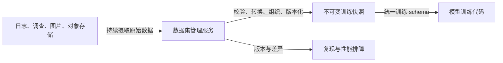

DM 的核心价值不是替代 ETL，而是在数据生产与模型消费之间建立稳定契约：上游可以继续采集和演化数据，下游只依赖训练 schema 和版本标识。

可以把它看成一个函数边界：

$$
\operatorname{DM}: (\text{raw batches},\ \text{metadata},\ \text{query})
\longrightarrow (\text{versioned training data},\ \text{lineage})
$$

这里有三个关键词：

- **专用（specialized）**：它围绕训练数据组织、版本与排障设计，不是任意业务数据的通用数据库；
- **稳定结构（well-defined structure）**：训练代码看到的是受 schema 约束的输出，不必了解所有上游来源；
- **可追溯（traceable）**：输出版本能追溯到被选中的输入批次和转换逻辑。

#### DM 与相邻数据组件的关系

| 组件 | 主要职责 | 与 DM 的关系 |
| --- | --- | --- |
| 数据源 / 采集器 | 产生日志、文本、图像、音频等原始数据 | 向 DM 提交数据或对象 URL |
| ETL 流水线 | 抽取、清洗、转换和装载数据 | 可在 DM 之前准备摄取数据，也可由 DM 内部转换承担一部分职责 |
| 对象存储 | 低成本、可扩展地保存大文件 | 保存实际 commit 与快照文件；DM 保存其 URL 和元数据 |
| 数据仓库 / 湖仓 | 支持通用查询、分析与数据加工 | 可以成为 DM 的数据来源或实现底座，但不自动提供面向训练的统一契约 |
| 特征存储 | 管理可复用特征，尤其强调训练—服务一致性 | 与 DM 有交集，但本章 DM 管理的是完整训练数据集与快照 |
| 元数据与制品存储 | 连接数据、代码、训练运行和模型的全系统血缘 | DM 管理数据集内部版本；更大的元数据系统把它与训练运行、模型继续关联 |

“已经有 S3，所以不需要 DM”混淆了**字节存储**和**数据集语义**。对象存储知道某个 key 对应一组字节，却通常不知道它属于哪个训练数据集、满足何种 schema、由哪次更新产生、可否与其他批次组合以及哪个模型用过它。

### 2.1.1 为什么深度学习系统需要数据集管理

#### 解耦训练数据的收集与消费

单人项目可以在“收集 → 预处理 → 训练 → 评价”长循环中同时修改所有代码；企业环境中，不同团队同时服务多个项目，任何格式变化都会变成跨团队协调和兼容性问题。

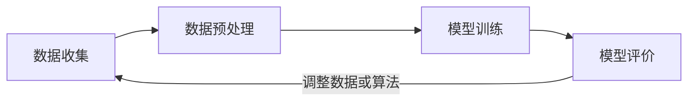

单人拥有整条链路时，上游字段变化即使破坏下游，通常也能在一次修改中修好。进入企业环境后，复杂度沿三个维度扩张：

- 多个项目同时开发；
- 数据、算法、平台等不同团队分别拥有不同阶段；
- 深度学习需要高频迭代数据和算法。

只要两个团队在边界上传递数据，就需要一个 data contract。假设 $p$ 个项目都独立维护 $h$ 个交接边界，最坏情况下要协调的契约数量约为：

$$
N_{\mathrm{contract}}=p\times h
$$

这不是精确的组织成本模型，却解释了为何项目数和交接点同时增长时，schema 很快失控。若再加入文本、图片、视频等数据类型，以及每个团队各自的版本，兼容矩阵会继续膨胀。

一个看似简单的改动，例如给文本样本增加 `language` 字段，可能要求：

1. 数据采集器开始提供新字段；
2. 清洗任务解析并保留该字段；
3. 中间文件格式修改；
4. 训练代码更新解析逻辑；
5. 所有旧消费者仍能读取新数据；
6. 各团队按彼此优先级排期并共同发布。

真正的瓶颈不一定是转换代码，而是等待、对齐和回归验证。深度学习又依赖持续调整训练数据，于是每次改善数据都可能触发一次昂贵的跨团队同步。

DM 为每种数据集类型管理两份契约：

- **摄取 schema**：上游数据开发者必须怎样提交数据；
- **训练 schema**：下游训练代码将稳定收到什么数据；
- **内部转换**：DM 负责把前者映射为后者。

于是一个跨团队长循环被拆成数据开发者与数据科学家各自拥有的两个短循环。

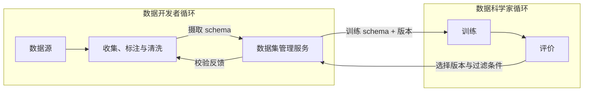

两边并非完全不沟通，而是通过少量、集中、版本明确的契约沟通。DM 把多对多依赖收敛为“上游 ↔ DM”和“DM ↔ 下游”两类边界：

$$
x\in\Sigma_{\mathrm{ingest}}
\quad\xrightarrow{\operatorname{Transform}}\quad
y\in\Sigma_{\mathrm{train}}
$$

只要输入仍满足摄取 schema，转换仍产生训练 schema，某一侧的内部变化就不必同步扩散到另一侧。

##### 为什么早期项目允许 `GENERIC`

强类型 schema 需要团队先知道哪些字段稳定、怎样序列化、如何演进。探索期恰恰尚未回答这些问题，过早固定契约会让每次实验都要求修改平台。因此作者保留 `GENERIC` 类型：DM 原样接受和打包数据，不校验也不转换。

它牺牲的是隔离与安全性，换来探索速度。合理生命周期是：

$$
{\text{高不确定性实验}}
\xrightarrow{\text{证明业务价值与稳定格式}}
{\text{强类型生产数据集}}
$$

`GENERIC` 是迁移阶段，不是绕过治理的永久捷径。

#### 支持模型可复现性

数据集可复现性要求：给定过去的版本标识，DM 必须返回与当时完全相同的训练样本。它是模型可复现性的必要组成部分，也是建立系统信任和定位性能回归的基础。

作者区分两个层次：

- **算法可复现性**：同一算法在同一数据上重复运行，得到相同或相近质量；
- **模型 / 系统可复现性**：能够恢复历史训练所需的准确数据、配置、代码和环境，重新产生等价模型。

模型可复现性包含但不限于算法可复现性。用函数表示：

$$
M=\operatorname{Train}(S_v,C_c,H_h,E_e,R_r)
$$

其中 $S_v$ 是训练数据快照，$C_c$ 是代码版本，$H_h$ 是超参数，$E_e$ 是执行环境，$R_r$ 是随机性状态。DM 主要保证 $S_v$ 可重取；它不能独自保证完整模型复现。

##### 为什么可复现性建立信任

机器学习应用会据模型输出采取真实动作。例如意图分类结果可能决定把客户转到哪个服务部门。若团队无法说明线上模型来自哪些训练数据，也无法重建它，那么模型行为就缺少可审计基础。

##### 为什么可复现性帮助排障

假设模型 $M_1$ 指标正常，$M_2$ 出现回归。排障首先要比较：

$$
\Delta D=S_{v_2}\setminus S_{v_1},\qquad
\Delta C=C_{c_2}-C_{c_1},\qquad
\Delta H=H_{h_2}-H_{h_1}
$$

如果连 $S_{v_1}$ 都取不回来，就无法可靠判断是数据、代码还是配置造成变化。理想 DM 还应提供版本 diff，直接展示增加、删除或改变的样本及统计。

“相同数据”仍不保证每次模型权重逐位相同：GPU 非确定性、并发顺序和随机种子都可能影响结果。数据集复现是必要条件，不是充分条件；很多场景追求的是指标在允许容差内一致。

### 2.1.2 数据集管理的五项设计原则

作者强调，这五项原则比某一种具体存储设计更重要。数据可能是结构化记录，也可能是图片、音频或任意二进制文件；不存在适合所有组织的唯一实现，但可以用同一组原则检查设计是否解决了核心问题。

#### 原则 1：支持数据集可复现，从而支持模型复现

同一版本标识必须永久指向同一组训练样本：

$$
\forall t_1,t_2,\quad
\operatorname{Fetch}(v,t_1)=\operatorname{Fetch}(v,t_2)
$$

这要求版本不可被重新绑定，快照内容不可原地覆盖，引用的对象也不能静默变化。仅保存一个“latest”路径不满足要求，因为其内容随时间改变。

更进一步，服务应支持：

- 列出历史版本与创建时间；
- 比较两个版本的数据差异与统计差异；
- 把训练运行关联到明确版本；
- 验证文件校验和，发现底层对象被破坏。

#### 原则 2：为不同数据集类型提供统一 API

文本通常是结构化字段，图片和音频常以二进制对象存在；内部处理必然不同，但外部生命周期动作相同：创建、追加、查询、准备训练快照和按版本获取。

统一 API 的目标是：

$$
{\text{稳定控制面}} + \text{按类型变化的数据面}
$$

用户只学习一套生命周期语义，训练平台也可按同一协议取数据。统一不等于把所有数据强塞进同一物理格式，而是保持操作和状态模型一致，把差异封装在类型转换器内部。

#### 原则 3：采用强类型数据 schema

强类型 schema 明确字段名、数据类型、必需性、重复规则和结构约束，并在边界处验证。它将错误从训练深处提前到写入时：

$$
x\notin\Sigma_{\mathrm{ingest}}
\Longrightarrow \operatorname{Reject}(x)
$$

越早拒绝非法数据，污染范围越小，错误上下文也越清楚。schema 同时保护：

- 上游：知道 DM 接受什么；
- 下游：知道 DM 保证输出什么；
- 历史消费者：兼容性规则防止新写入破坏旧代码。

schema 也可以版本化，但会引入“数据版本 × schema 版本”的额外管理维度。作者给出一种更简单的策略：一个数据集类型维持一份兼容演进的 schema；只做向后兼容更新，必须破坏兼容性时新建数据集类型。

常见兼容性判断：

| 变化 | 通常是否向后兼容 | 条件 |
| --- | --- | --- |
| 增加可选字段 | 是 | 旧消费者能忽略未知字段 |
| 增加带默认值字段 | 通常是 | 读取库正确应用默认值 |
| 删除旧字段 | 通常否 | 除非确认所有消费者已停止使用 |
| 改变字段类型 | 通常否 | 需要显式迁移或新类型 |
| 改变字段语义但不改名字 | 风险最高 | schema 语法无法检测语义漂移 |

#### 原则 4：保持 API 一致，在内部处理规模差异

数据集可能只有约 $50\ \mathrm{MB}$，也可能达到 TB 或 PB 级。调用方不应因为数据变大而改用另一套业务 API；服务应通过异步准备、分片、压缩、缓存和对象存储处理规模。

一致指**协议语义一致**，并不意味着性能相同。一个小数据集可能几秒准备好，大数据集可能需要数小时，但都遵循：

$$
{\text{Prepare}} \rightarrow \text{version handle}
\rightarrow \text{Fetch status} \rightarrow \text{download URLs}
$$

这一原则也避免在 gRPC 服务进程中搬运所有文件字节，使 API 带宽与数据规模松耦合。

#### 原则 5：保证数据持久性

用于训练的数据应尽量以不可变形式保存。更新通过追加 commit 表达，删除优先采用软删除：从新查询中排除对象，但保留历史引用和审计记录。

不可变并非“永远不能删除”。法规或用户撤回授权可能要求彻底删除个人数据，这时硬删除高于复现要求。系统必须同时处理：

- 找出受影响的 commit、快照和模型；
- 删除底层对象及副本；
- 保留不含敏感内容的合规审计记录；
- 标记相关历史模型不可再现或不可继续使用。

所以原则更准确的表述是：**默认不可变、删除受策略控制，并让例外可追踪。**

### 2.1.3 数据集的悖论性质：动态集合与静态快照

从数据开发者视角，数据集是不断追加新批次的动态目标；从训练视角，一次训练必须读取固定且可复现的样本集合。DM 用两种对象同时满足二者：

$$
D_t=\bigcup_{i=0}^{t} C_i
$$

其中 $C_i$ 是第 $i$ 次摄取形成的 commit，$D_t$ 是时间 $t$ 可见的逻辑数据集。训练并不直接依赖会继续变化的 $D$，而是依赖由特定 commit 集合和过滤条件产生的不可变快照：

$$
S_v=\operatorname{Materialize}\left(\{C_i\mid i\in I_v\},F_v,\Sigma_{\mathrm{train}}\right)
$$

这里 $I_v$ 是被选中的 commit 集合，$F_v$ 是业务过滤条件，$\Sigma_{\mathrm{train}}$ 是训练 schema，$v$ 是唯一版本标识。

#### 从摄取侧看：数据集是可增长的逻辑文件组

假设在 $T_0,T_1,T_2,T_3$ 分别到达四批数据，每次 API 调用形成一个 commit。数据开发者看到的数据集不断吸收新数据：

$$
D_{T_0}=C_0,\quad
D_{T_1}=C_0\cup C_1,\quad
D_{T_2}=C_0\cup C_1\cup C_2
$$

commit 记录这次上传的文件、消息、标签、统计和时间。它类似提交历史，但本章样例中的 commit 是追加的数据批次，不是整个数据集的完整复制。

#### 从训练侧看：数据集是固定的物化视图

训练在 $T_2$ 发起时，可以选择 $C_0,C_1,C_2$，也可以通过标签只选择其中一部分。DM 把选择结果聚合并转换为静态快照 `version1`。之后即使 $C_3$ 到达，`version1` 也不能改变。

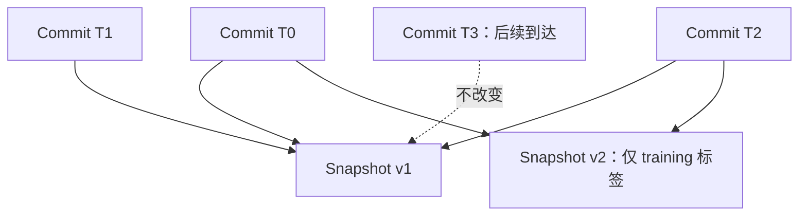

因此“dataset ID = 1”只标识一个持续演进的逻辑容器；真正可复现的训练输入必须写成“dataset 1 的 snapshot $v$”。若训练日志只记 dataset ID，不记 snapshot 版本，复现信息仍然不足。

#### 快照不是简单的时间切片

作者把训练快照描述为**时间过滤 + 客户逻辑过滤**后的结果。选择可由三类条件控制：

- 截止某个 commit；
- 使用 commit 标签，例如只取 `category=training set`；
- 使用具体 commit 集合。

样例服务只在 commit 粒度过滤，不支持逐样本谓词。这使实现和版本计算简单，但若一个 commit 内混有训练、验证和应排除样本，就无法精细选择。实际系统需要在摄取时合理划分 commit，或增加样本级索引与查询能力。

---

## 2.2 漫游样例数据集管理服务

这一节不是给出唯一正确实现，而是用一个最小 Java 服务证明前述原则可以怎样落地。设计顺序遵循“由外向内”：先识别用户和交互，再定义 API，最后推导内部存储和类型转换。

### 2.2.1 运行和体验样例服务

#### 在本地启动服务

样例服务使用：

- Java 11 实现 DM；
- gRPC 暴露接口；
- MinIO 模拟 Amazon S3 等对象存储；
- Shell 脚本完成环境变量、样例数据和本地网络初始化。

实验分三步：启动 MinIO 与 DM、创建并更新数据集、准备并获取训练数据。原书推荐从干净环境启动，以免前一次实验状态影响结果。

```text
start MinIO
start dataset-management service
create dataset and append commits
prepare versioned training snapshot
poll until snapshot is ready
```

样例为了减少依赖，把数据集元数据放在进程内存中。因此重启 DM 后所有元数据丢失，即使 MinIO 中的文件还在，也无法通过服务找到它们。这是演示简化，违反生产环境的持久性要求；正式实现应使用数据库或其他持久元数据存储。

#### 创建和更新语言意图数据集

场景使用语言意图分类数据。数据工程师先把 CSV 上传到 MinIO，再调用 `CreateDataset`，请求中给出：

- 数据集名称；
- `LANGUAGE_INTENT` / `TEXT_INTENT` 类型；
- 对象存储 bucket 与 path；
- 可选标签。

API 接收的是**可下载 URL 的位置描述**，不是文件字节。创建成功后返回数据集 ID、类型、更新时间、commit 历史及样本数、标签数等统计。

第一次创建形成初始 commit。随后再次把新 CSV 上传对象存储，并调用 `UpdateDataset`：

```json
{
  "dataset_id": "1",
  "commit_message": "More training data",
  "bucket": "mini-automl",
  "path": "upload/002.csv",
  "tags": [
    {"tag_key": "category", "tag_value": "training set"}
  ]
}
```

更新不会覆盖初始数据，而是创建 commit 2。标签既描述数据，也可在准备训练快照时充当过滤条件。`GetDatasetSummary` 则返回数据集基本信息、统计和完整 commit 历史。

需要注意，原章示例在请求中写 `LANGUAGE_INTENT`，部分响应和后文使用 `TEXT_INTENT`。它们在叙述中都指语言意图数据集；实现契约中应统一枚举名称，否则真实客户端会因未知枚举失败。

#### 获取训练数据集

获取训练数据采用两步异步协议：

1. 调用 `PrepareTrainingDataset(dataset_id, filters)`，服务选择 commit、创建快照记录并启动后台构建；
2. 使用返回的 `version_hash` 调用 `FetchTrainingDataset`，反复查询 `RUNNING`、`READY` 或 `FAILED` 状态。

不带过滤条件时，快照包含当前所有 commit；带标签时，只包含匹配的 commit。例如 `category=training set` 可排除标成测试集的批次。

`READY` 响应不直接携带数据字节，而是返回训练文件 URL，例如：

```json
{
  "dataset_id": "1",
  "version_hash": "hashDg==",
  "state": "READY",
  "parts": [
    {"name": "examples.csv", "path": "versionedDatasets/1/hashDg==/examples.csv"},
    {"name": "labels.csv", "path": "versionedDatasets/1/hashDg==/labels.csv"}
  ],
  "statistics": {"numExamples": "16200", "numLabels": "151"}
}
```

训练代码随后从对象存储下载 `parts`。状态机可表示为：

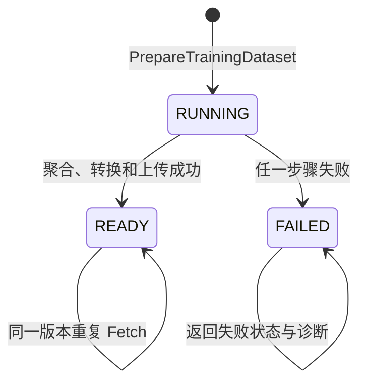

样例响应只展示状态；生产协议还应提供失败原因、进度、创建与完成时间、重试语义、结果校验和及 URL 过期策略。

### 2.2.2 用户、用户场景与整体架构

#### 用户与用户场景

作者先定义两位虚构用户：

- **Jianguo，数据工程师**：从日志、调查等来源持续收集并标注数据；调用摄取 API 创建、追加和查询数据集；
- **Julia，数据科学家**：编写 PyTorch 或 TensorFlow 训练代码；训练前调用获取 API 得到固定版本数据。

这两个 persona 对应两类相反但都合理的需求：

| 用户 | 希望数据怎样表现 | 主要 API |
| --- | --- | --- |
| 数据工程师 | 可持续追加、可描述每批更新 | `CreateDataset`、`UpdateDataset`、摘要查询 |
| 数据科学家 | 固定、结构稳定、可按版本重取 | `PrepareTrainingDataset`、`FetchTrainingDataset` |

作者强调从外向内设计：如果先选数据库再想用户如何操作，容易把底层技术限制暴露为笨重接口；先明确用户目标，效率与扩展需求才有依据。

#### 服务整体架构

样例服务分三层：

1. **数据摄取层**：面向数据工程师，创建、追加并查询数据；
2. **内部数据集存储层**：组织 dataset、commit、snapshot 和元数据，实际大文件外置到 MinIO；
3. **训练数据获取层**：面向数据科学家，异步构建并返回版本化训练快照。

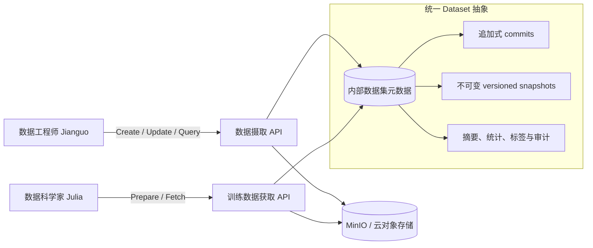

强类型的文本、图像数据和无 schema 的 `GENERIC` 数据都使用相同外部 API 与同一存储骨架；差异由内部 transformer 实现。

### 2.2.3 数据摄取 API

#### 摄取方法定义

摄取层暴露四个 gRPC 方法：

```protobuf
rpc CreateDataset(CreateDatasetRequest) returns (DatasetSummary);
rpc UpdateDataset(CreateCommitRequest) returns (DatasetSummary);
rpc GetDatasetSummary(DatasetPointer) returns (DatasetSummary);
rpc ListDatasets(ListQueryOptions) returns (stream DatasetSummary);
```

| 方法 | 作用 | 是否修改数据 |
| --- | --- | --- |
| `CreateDataset` | 创建逻辑数据集并写入第一批数据 | 是，创建初始 commit |
| `UpdateDataset` | 向既有数据集追加一批数据 | 是，创建新 commit |
| `GetDatasetSummary` | 查询一个数据集的摘要、统计和历史 | 否 |
| `ListDatasets` | 流式列出所有数据集摘要 | 否 |

`CreateDatasetRequest` 包含名称、描述、数据集类型、bucket、path 和重复标签。数据删除与修改没有在样例中实现；原章指出可以扩展管理 API。

选择 gRPC 是为了用 protobuf 简洁表达接口，并非作者断言它优于 REST。生产选型还要考虑浏览器支持、流量治理、调试工具、团队经验和外部客户端生态。

#### 数据 URL 与数据流传输

样例在摄取和获取两侧都传 URL，不经 DM API 直接流式传文件：

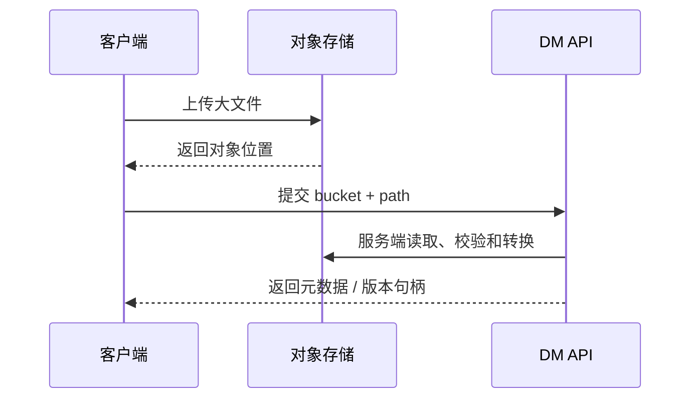

这样做的原因：

- 大文件不占用 DM 的双向代理带宽；
- 对象存储已经解决并行传输、断点续传、耐久性和高可用问题；
- DM 专注于数据集语义，代码更简单；
- 无论文件是 MB 还是 TB，控制 API 形状保持不变。

若文件大小为 $B$，经 DM 中转通常会产生至少一次客户端到 DM 和一次 DM 到存储的数据传输；直传对象存储再传引用可避免 DM 成为中心数据通道。真实系统通常用短期预签名 URL，而不是暴露永久凭据。

代价也要明确：

- DM 必须防范服务端请求伪造，只允许可信 bucket / 域名；
- URL 可能过期，后台作业要在有效期内读取；
- 必须校验对象完整性、大小和内容类型；
- 调用成功前不能假设对象会永久保留；
- 跨区域读取仍可能产生显著网络成本。

#### 创建新数据集

创建过程共有七个逻辑步骤：

1. 客户端把原始文件上传到对象存储；
2. 获取可下载位置；
3. 调用 `CreateDataset` 并提交名称、类型、位置和标签；
4. DM 分配 dataset ID 和初始 commit ID，按类型选择 transformer；
5. transformer 下载、校验、转换并将结果保存为 commit；
6. DM 保存 dataset 与 commit 元数据；
7. 返回数据集摘要、统计和历史。

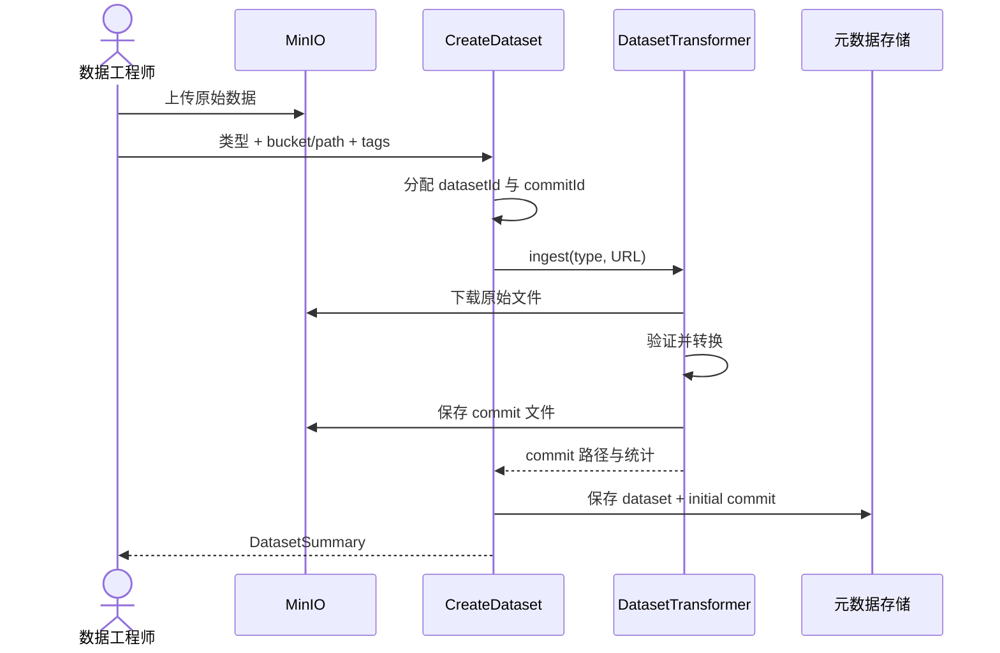

可概括为以下伪代码：

```text
create_dataset(request):
    dataset_id = allocate_dataset_id()
    dataset = Dataset(dataset_id, request.name, request.type)
    commit_id = dataset.next_commit_id()

    transformer = registry[request.type]
    commit = transformer.ingest(request.object_url, dataset_id, commit_id)
    commit.message = "Initial commit"
    commit.tags = request.tags

    metadata_store.save(dataset, commit)
    return summarize(dataset)
```

实现的关键不是 Java 语法，而是操作顺序与原子性。样例先完成摄取，再把 metadata 放入内存。生产系统若文件已保存而元数据写入失败，会产生孤儿对象；若元数据先提交而文件上传失败，会产生悬空引用。常见处理是 staging 状态、事务型元数据、幂等请求 ID 和定期垃圾回收。

#### 更新已有数据集

`UpdateDataset` 与创建流程几乎相同，区别是先按 ID 找到已有 dataset，再分配新 commit ID，不创建新 dataset。请求可附带 commit message 和 tags，用于历史解释与后续过滤。

作者明确拒绝把新数据原地合并进“当前文件”，理由有二：

1. 原地修改可能造成不可逆变化和静默数据丢失；
2. 历史训练快照必须能追溯到当时的原始批次。

追加式状态可写为：

$$
D_{n+1}=D_n\cup C_{n+1},\qquad D_n\ \text{保持不变}
$$

若上传了一批错误标签，可在管理层软删除或撤销对应 commit，而不是修改历史字节。样例没有实现这些 API，但 commit 边界使它们可实现。

追加式设计也有成本：小文件数量可能持续增长，读取多个 commit 的代价上升，需要快照压缩、compaction 和生命周期策略。不可变不是不做整理，而是整理后仍要保留旧版本的可解析映射。

#### 列出数据集与获取摘要

`ListDatasets` 用于发现数据集；`GetDatasetSummary` 返回单个数据集的详细信息，包括：

- dataset ID、名称和类型；
- 样本数与标签数；
- 创建和更新时间；
- commit 消息、标签、路径与统计；
- 审计历史。

列表接口不应默认返回所有大型嵌套历史。样例为演示而简化；生产服务通常需要分页、过滤、排序、访问控制和摘要 / 详情分离，否则数据集数量增长后，查询本身会成为扩展瓶颈。

### 2.2.4 训练数据集获取 API

#### 获取方法定义

获取层有两个方法：

```protobuf
rpc PrepareTrainingDataset(DatasetQuery) returns (DatasetVersionHash);
rpc FetchTrainingDataset(VersionHashQuery) returns (VersionHashDataset);
```

`DatasetQuery` 说明要从哪个 dataset 取数据，并可指定截止 commit 和标签过滤；`VersionHashQuery` 使用 dataset ID 与 `version_hash` 查询特定快照。

##### 为什么必须拆成两步

大数据集的下载、聚合、格式转换、压缩和再上传可能持续几分钟甚至几小时。若单次同步 RPC 等到完成，会遇到：

- 客户端、代理或负载均衡器超时；
- 连接中断后不清楚后台是否继续；
- 长连接消耗服务资源；
- 重试可能重复构建同一份数据。

两步协议把“接受工作”和“取得结果”分开：

$$
\operatorname{Prepare}(q)\rightarrow v\quad\text{快速返回}
$$

$$
\operatorname{Fetch}(v)\rightarrow

原章在这里存在两种返回体口径：2.2.1 的示例响应除 `version_hash` 外还展示 dataset 元数据与选中 commits，2.2.4 的 protobuf 定义则写成返回 `DatasetVersionHash`。二者共同且稳定的语义是：`Prepare` 先返回可跟踪快照的版本句柄，客户端再用它调用 `Fetch`；实现客户端时应以实际 protobuf 契约为准，不能假定示例中的扩展字段一定存在。
\{\text{RUNNING},\text{READY},\text{FAILED}\}
$$

数据越大，准备时间变化越大，但控制 API 仍然稳定。实际客户端应采用有上限的指数退避或事件通知，不能无间隔轮询。

#### 发送训练数据准备请求

收到 `PrepareTrainingDataset` 后，DM 执行三个同步动作和一个异步动作：

1. 按 dataset ID 找到数据集；
2. 根据截止 commit 与 tags 选择 commit；
3. 从选中 commit ID 集合计算版本哈希，在 registry 创建 `RUNNING` 快照记录；
4. 后台下载 commit 文件、聚合、转换、压缩并上传训练文件，最后写 URL 并改为 `READY`，失败则改为 `FAILED`。

样例的 commit 选择逻辑要求一个 commit 同时包含请求中的所有 tags。设请求标签集合为 $Q$，commit $C_i$ 的标签为 $T_i$，则：

$$
C_i\ \text{被选中}\iff Q\subseteq T_i
$$

过滤发生在 commit 级，而不是样本级。

##### 版本哈希如何形成

样例用位集合表示被选中的 commit ID，再编码为 Base64，并添加 `hash` 前缀。概念上：

$$
v=H(\operatorname{Canonicalize}(I_v))
$$

其中 $I_v$ 是有序、规范化的 commit ID 集合。相同集合产生相同 $v$，因此 registry 中已有该键时可以直接复用快照，不再聚合。这使版本标识同时成为**内容寻址式缓存键**。

```text
prepare(dataset_id, filters):
    commits = select_commits(dataset_id, filters)
    version = stable_hash(sorted(commit.id for commit in commits))

    if snapshot_registry.contains(version):
        return version

    snapshot_registry.create(version, state=RUNNING, commits=commits)
    submit_background_job(materialize_snapshot, version, commits)
    return version
```

##### 样例哈希方案的边界

如果版本只由 commit ID 集合决定，它隐含以下前提：

- commit 内容不可变；
- 同一 dataset 内 commit ID 永不复用；
- transformer 和训练 schema 不改变输出；
- 压缩参数等物化配置不影响语义。

一旦转换代码或 schema 改变，相同 commits 可能产生不同训练文件，却仍得到同一版本键。因此生产系统更稳妥的版本材料应包含：

$$
v=H(\text{dataset ID},\ \text{commit digests},\ \text{filter},\
{\text{transformer version}},\ \text{schema version},\ \text{options})
$$

此外，哈希应使用抗碰撞算法和规范序列化；哈希标识“输入身份”不等于验证输出完整性，生成文件还应有独立校验和。

##### 后台物化过程

后台任务从 MinIO 下载每个选中 commit，按数据集类型调用 transformer：

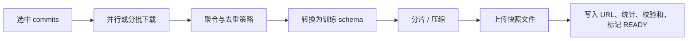

样例聚合成一个预定义格式的文件。大规模系统通常要分片，否则单文件会限制并行读取、恢复和局部重试。分片数量应结合对象大小、训练 worker 数、顺序读取吞吐和小文件开销决定。

#### 获取训练数据集

`FetchTrainingDataset` 本质是查询异步作业状态：按 dataset ID 找到 snapshot registry，再以版本哈希查 `VersionedSnapshot` 并返回其最新内容。

```text
fetch(dataset_id, version):
    dataset = metadata_store.get(dataset_id)
    snapshot = dataset.snapshot_registry.get(version)
    if snapshot does not exist:
        return NOT_FOUND
    return snapshot
```

当后台任务完成时，snapshot 包含：

- 状态 `READY`；
- 一个或多个训练数据 part 的名称与 URL；
- 样本数、标签数等统计；
- 版本哈希和来源 commit。

版本 URL 必须保持可解析，才能兑现“未来任意时间重取”。若使用短期签名 URL，持久保存的应是对象 key，调用 `Fetch` 时再生成新 URL，而不是永久保存已经过期的 URL。

缓存复用只有在快照不可变时才安全。若用户用相同版本获取到不同字节，版本就失去可复现语义，也会让下游训练缓存产生隐蔽错误。

### 2.2.5 内部数据集存储

样例在内存中保存一个 `dataset ID → Dataset` 字典。每个 `Dataset` 有两组核心集合：

- `commits`：摄取 API 每次创建或更新产生的动态数据批次；
- `versionHashRegistry`：准备 API 产生的静态训练快照。

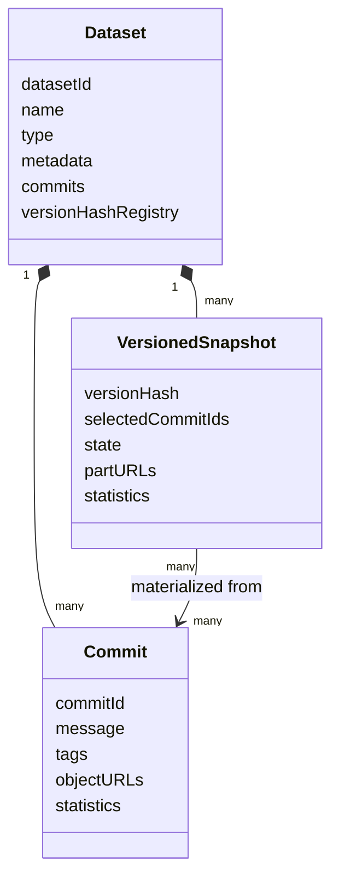

#### 元数据与文件分离

DM 内只保存 dataset ID、所有者、变更历史、commit、训练快照、统计和对象 URL 等元数据；实际文本、图片和快照文件存放在对象存储。

这种分层的理由是：

- 元数据体量较小，需要高频查询和关系索引；
- 数据文件体量大，适合对象存储的容量、耐久性与成本模型；
- DM 可专注版本、schema 和组织逻辑，不重造 blob storage。

生产实现可用关系数据库或 NoSQL 保存元数据。选择取决于是否需要事务、复杂关系查询、横向扩展和一致性。无论选什么，都要保证元数据提交与对象生命周期协同。

#### `DatasetTransformer`：统一 API 背后的多态实现

内部定义 transformer 接口：

```text
interface DatasetTransformer:
    ingest(raw_object, dataset_id, commit_id) -> CommitInfo
    compress(selected_commits, version_hash) -> SnapshotParts
```

- `ingest()` 处理摄取：读取原始输入、验证、转换并保存 commit；
- `compress()` 处理消费：合并选中 commits，生成训练快照。

`IntentTextTransformer` 对 `TEXT_INTENT` 执行强类型转换；`GenericTransformer` 不验证、不转换，只原样保存和打包。由 registry 按 dataset type 选择实现：

$$
\operatorname{Transformer}=R[\operatorname{DatasetType}]
$$

这使外部 API 遵循开闭原则：增加数据类型时扩展 transformer 和注册表，不修改所有客户端或复制整套服务方法。

#### 一个生产存储还缺什么

样例为了突出概念省略了很多能力：

- 持久 metadata 数据库与备份；
- 并发更新控制和 commit ID 原子分配；
- 访问控制、租户隔离与审计；
- 幂等键、重试和孤儿对象回收；
- 删除、撤销、保留期和法规擦除；
- 快照引用计数与对象生命周期；
- 小文件 compaction、分片与并行读写；
- 校验和、加密、跨区域复制和灾难恢复；
- schema / transformer 版本进入血缘。

因此样例证明的是数据模型和 API 思路，而不是可以直接上线的完整产品。

### 2.2.6 数据 schema

每种强类型数据集定义两套 schema。数据流依次经历：

1. 用摄取 schema 验证新原始数据；
2. 转换成训练 schema；
3. 以训练兼容格式保存为 commit；
4. 准备训练数据时合并 commits，仍输出同一训练 schema 的快照。

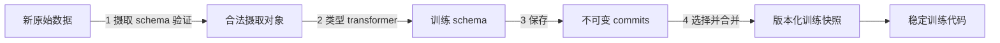

双 schema 是分别向 Jianguo 和 Julia 提供的契约。数据工程师只需满足摄取格式；数据科学家只需依赖训练格式。

#### 数据摄取 schema

`TEXT_INTENT` 的简化摄取格式为 CSV：

```text
<text utterance>,<label>,<label>,...
```

一个文本可以有多个标签，例如：

```csv
"I am still waiting on my credit card",activate_my_card;card_arrival
"I could not purchase gas",card_not_working
```

校验至少应检查：

- 第一列文本非空且编码合法；
- 标签分隔与转义正确；
- 标签名称满足规范；
- 行列结构一致；
- 文件大小和样本数在策略范围内。

CSV 在演示中直观，但不自带严格类型和可靠 schema 演进。逗号、换行、引号和字符编码也容易造成边界错误。

#### 训练数据集 schema

`TEXT_INTENT` 训练快照是一个压缩包，包含：

```text
examples.csv: <utterance>,<label_id>,<label_id>,...
labels.csv:   <label_id>,<label_name>
```

例如：

```csv
# examples.csv
"I am still waiting on my credit card",0;1
"I could not purchase gas",2

# labels.csv
0,activate_my_card
1,card_arrival
2,card_not_working
```

把标签名称映射为 ID 可让训练读取更紧凑，也把全局标签词表显式保存下来。关键不只是数字编码，而是 `examples.csv` 与 `labels.csv` 必须作为同一版本原子发布；若二者来自不同快照，ID 的语义会错位。

##### 为什么不直接输出 TFRecord 或 PyTorch Dataset

作者选择自定义中间格式，以隔离训练框架。若 DM 只输出 TensorFlow 专属格式，PyTorch 客户端就必须增加框架相关转换，平台也会被某一生态绑定。

合理分层是：

$$
{\text{DM 中立格式}}
\rightarrow \text{轻量框架适配器}
\rightarrow \text{PyTorch / TensorFlow loader}
$$

中立格式提高可移植性，但也意味着平台要自己定义规范、兼容性和高性能读取工具。若组织已统一框架且规模很大，框架原生格式也可能更高效；选择取决于互操作性与性能的权衡。

#### 一个数据集采用两种强类型 schema 的收益

假设数据工程师希望新增 `language` 字段。双 schema 允许分阶段演进：

1. DM 与数据工程侧先扩展摄取 schema；
2. transformer 暂时记录或忽略该字段，训练 schema 不变；
3. Julia 的旧训练代码继续读取相同输出；
4. 数据科学侧准备好后，再设计训练 schema 的兼容升级或新数据集类型。

这把同步发布变成异步演进。其成立前提是 DM 能无损保存未来可能需要的信息，或接受早期快照无法使用新字段。

生产格式更适合使用 Parquet、Protocol Buffers 或 Avro，因为它们提供类型、序列化、校验和 schema 兼容工具。大致比较：

| 格式 | 优势 | 局限 / 适用重点 |
| --- | --- | --- |
| CSV | 人类可读、生态广、演示简单 | 类型弱、演进弱、嵌套与二进制不便 |
| Parquet | 列式压缩、谓词下推、分析读取高效 | 不适合频繁单行更新，schema 管理仍需规范 |
| Protobuf | 强类型、紧凑、字段演进规则清楚 | 需要生成代码，不是分析型列式格式 |
| Avro | schema 随数据、流式与演进生态成熟 | 训练读取性能取决于访问模式和工具链 |

#### 通用数据集：无 schema 数据集

`GENERIC` 类型：

- 摄取时原样保存任意文件；
- 不执行数据验证和格式转换；
- 准备时把原始文件按原格式打包；
- 训练代码自行承担解析与兼容责任。

它适合算法、数据来源和格式都未稳定的实验期。它不适合长期生产，因为上游任意变化都可能在训练时才失败，且 DM 无法理解内容，难以做字段统计、schema diff 和语义校验。

可以用风险—灵活性关系理解：

| 阶段 | 推荐类型 | 主要优化目标 | 主要风险 |
| --- | --- | --- | --- |
| 探索 / POC | `GENERIC` | 快速试错 | 脆弱、不可验证、耦合训练解析 |
| 方案稳定 | 新建强类型 dataset type | 固化契约 | 初始设计与迁移成本 |
| 生产 | 强类型 + 兼容演进 | 可靠、可复现、可治理 | schema 维护成本 |

推广时不能只改枚举名，还要迁移历史数据、验证新 transformer 输出、更新训练引用并保留旧快照可读性。

### 2.2.7 增加新的数据集类型 IMAGE_CLASS

场景是假设 Julia 已用 `GENERIC` 成功验证图像分类，现在要把项目生产化，新增强类型 `IMAGE_CLASS`。

#### 第一步：从消费者出发定义训练 schema

团队先与数据科学家确定训练输出为 zip，包含：

```text
snapshot.zip
├── examples.csv       # <image filename>,<label id>
├── labels.csv         # <label id>,<label name>
└── examples/
    ├── imageA.jpg
    ├── imageB.jpg
    └── imageC.jpg
```

manifest 示例：

```csv
# examples.csv
imageA.jpg,0
imageB.jpg,1
imageC.jpg,0

# labels.csv
0,cat
1,dog
```

这样图片字节与标签映射分离，训练 loader 可先读 manifest，再按需加载图片。

#### 第二步：与生产者定义摄取 schema

数据工程师提交一个 zip，根目录下每个一级子目录代表类别，目录内图片属于该标签，且不允许更深的嵌套：

```text
upload.zip
├── cat/
│   ├── catA.jpg
│   └── catB.jpg
└── dog/
    ├── dogA.jpg
    └── dogB.jpg
```

`ImageClassTransformer.ingest()` 需要验证根目录结构、扩展名或实际媒体类型、重复文件名、空类别、损坏图片和路径穿越风险，再生成统一 manifest。

#### 第三步：实现并注册 transformer

1. `ingest()` 解析摄取 zip，将目录名转换为 label，整理文件并按内部训练格式保存 commit；
2. `compress()` 选择匹配 commits，处理跨批次 label ID 一致性与文件名冲突，合并成快照；
3. 将两个方法以 `IMAGE_CLASS` 键注册到摄取和压缩分派逻辑。

```text
class ImageClassTransformer implements DatasetTransformer:
    ingest(upload):
        validate_directory_layout(upload)
        labels = derive_labels_from_directories(upload)
        manifest = build_manifest(upload.images, labels)
        return persist_commit(manifest, upload.images)

    compress(commits):
        global_labels = build_stable_label_dictionary(commits)
        merged_manifest = remap_and_merge(commits, global_labels)
        return persist_snapshot(merged_manifest, global_labels, commits.images)

registry[IMAGE_CLASS] = ImageClassTransformer()
```

公共 API、dataset / commit / snapshot 结构和其他 transformer 都无需改变。这就是统一生命周期接口与内部多态的收益。

需要补充一个原章未展开但实现必需的细节：每个 commit 若自行分配 `cat=0`、`dog=1`，合并时必须重新建立快照级稳定词表并重映射 ID；不能直接拼接彼此可能冲突的数字标签。

### 2.2.8 服务设计回顾

样例对五项原则的对应关系如下：

| 原则 | 样例中的实现 | 仍需注意的边界 |
| --- | --- | --- |
| 数据集可复现 | 每份训练数据保存为 `VersionedSnapshot`，以版本哈希重取 | 哈希还应包含 schema / transformer 版本，文件需持久化 |
| 统一 API | 所有类型共享摄取与获取方法 | 统一语义不意味着统一物理格式 |
| 强类型 schema | `TEXT_INTENT` 与 `IMAGE_CLASS` 各有摄取、训练 schema | CSV 的类型与演进能力有限；`GENERIC` 是显式例外 |
| API 一致、内部扩展 | URL 控制面 + 异步准备，对大小保持同一协议 | 内存 metadata、单机线程池并不能真正无限扩展 |
| 数据持久性 | 每次更新形成不可变 commit，每次准备形成不可变 snapshot | 演示服务重启丢 metadata，生产必须补持久数据库与备份 |

#### 五项原则如何在一次请求中同时出现

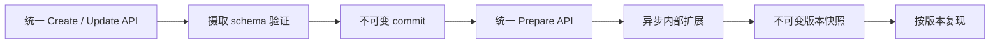

样例刻意省略删除、commit 撤销、审计查询等管理功能。读者应把它视为教学用参考实现，而不是完整需求清单。

---

## 2.3 开源实现路线

前面的样例服务说明了怎样自建 DM，但真正的工程决策还包括复用已有生态。作者选取两条有代表性的路线：

- 已有 Apache Spark 数据管道：用 Delta Lake 管理版本化表，再用 Petastorm 接入训练框架；
- 已有 Kubernetes 和对象存储、希望以文件为中心：用 Pachyderm 管理版本化数据与容器流水线。

它们不是样例服务的逐组件替代品，而是用各自抽象实现相似目标。选择应从现有技术栈、数据形态、schema 要求、团队规模和运维能力出发。

### 2.3.1 Delta Lake、Petastorm 与 Apache Spark 生态

这条路线的端到端关系是：

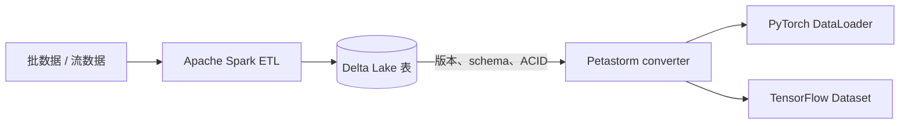

Delta Lake 负责存储层的事务、表 schema 和历史版本；Petastorm 负责把 Parquet / DataFrame 数据适配成训练框架容易消费的批次。二者职责不同。

#### Delta Lake

Delta Lake 是建立在对象存储和 Parquet 文件之上的表存储层，为 Spark 等处理引擎提供可扩展的 ACID 事务、schema 管理、历史版本和高效元数据操作。

##### 为什么对象存储之上还需要表存储层

Amazon S3、Azure Blob 等对象存储容量大、耐久且成本较低，但基本抽象是 `key → object`。一个训练表可能由成千上万个对象组成，仅靠对象 key 很难安全回答：

- 哪些文件共同构成版本 12？
- 一次批量更新只写完一半时，读者应看到旧状态还是残缺新状态？
- 两个 writer 并发修改时怎样避免相互覆盖？
- 新文件是否符合表 schema？
- 哪些旧文件已经不再被当前版本引用？

Delta Lake 通过事务日志记录每次表变更，将一组对象文件组织成逻辑表快照。概念上，第 $n$ 个表版本由前一版本和一组原子动作得到：

$$
T_n=\operatorname{Apply}(T_{n-1},A_n)
$$

读者只看到完整提交的 $T_n$，不看到 $A_n$ 的中间状态。

##### ACID 分别保护什么

| 性质 | 在数据表更新中的直觉 |
| --- | --- |
| Atomicity，原子性 | 一次更新要么全部可见，要么完全不可见 |
| Consistency，一致性 | 成功事务使表从一个合法状态进入另一个合法状态 |
| Isolation，隔离性 | 并发读写不会让客户端看到彼此未完成的中间结果 |
| Durability，持久性 | 已提交更新在故障后仍可恢复 |

ACID 保护的是事务和表结构一致性，不保证数据在业务语义上正确。把错误标签以合法字符串写入，schema 和事务都可能通过，仍需数据质量规则。

##### Delta 表及 bronze、silver、gold 分层

Delta 表类似 SQL 表，可查询、插入、更新和合并。作者介绍常见的三层数据加工命名：

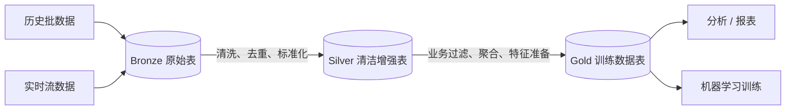

- **Bronze** 尽量忠实保留原始输入，便于重放；
- **Silver** 存放经过清洗、转换和增强的数据；
- **Gold** 面向具体消费场景，形成可直接分析或训练的数据集。

这三种名称表示数据成熟度和用途，不是 Delta Lake 强制的数据类型，也不保证每个项目一定需要三层。关键是每层都有明确契约和来源关系。

#### 为什么 Delta Lake 适合深度学习数据集管理

作者归纳出三项关键能力。

##### 1. 时间旅行支持数据集复现

Delta Lake 把写操作自动记录为表版本。训练记录表路径与版本号后，可以重新读取当时快照：

```python
# 概念示例：按版本读取训练表
training_df = (
    spark.read.format("delta")
    .option("versionAsOf", 12)
    .load("/datasets/intent/gold")
)
```

也可以按时间戳查询历史状态并查看操作历史。于是持续 ETL 虽然不断更新 gold 表，每次训练仍可绑定静态版本：

$$
{\text{training run }}r_i\longrightarrow
(\text{table path},\ \text{Delta version }v_i)
$$

时间旅行不是无限期备份。历史查询依赖事务日志和旧数据文件仍在保留期内；若执行清理或生命周期策略删除底层文件，旧版本可能不再可读。生产设计必须让复现期限、存储成本和清理策略一致。

##### 2. 批流统一支持持续更新

Delta 表可以接收历史批量写入，也可以作为持续流处理的目标；读者在写入同时查询已提交快照。这样无需为“旧数据 + 新流数据”手工维护另一套合并协议。

批流统一解决的是存储与事务语义统一，不意味着所有流式场景都能达到毫秒级延迟。对象存储写入、事务提交和索引维护都有成本。

##### 3. schema enforcement 与 schema evolution

- **schema enforcement**：写入时检查记录是否匹配预定义列和类型，不兼容则拒绝；
- **schema evolution**：在受控条件下扩展表结构，例如增加新列。

写时校验比读时才发现错误更有效，因为污染尚未进入共享表：

$$
{\text{非法写入被拒绝}}
\Rightarrow \text{下游版本保持合法}
$$

schema evolution 仍需兼容性评审。技术上允许增加列，不代表所有下游都理解其语义；删除、改名或改变含义尤其需要迁移计划。

#### Petastorm

Petastorm 是 Uber ATG 开源的数据访问库，使单机或分布式训练能够从 Apache Parquet 数据构建 TensorFlow 或 PyTorch 可消费的数据迭代器。

在本章路线中，它充当 Delta 表和训练代码之间的适配层：

1. Spark 读取选定版本的 Delta 表得到 DataFrame；
2. Petastorm converter 将 DataFrame 物化或缓存为 Parquet 数据；
3. converter 为 PyTorch / TensorFlow 创建分片、批处理的数据加载器；
4. 训练 worker 迭代批次，不必自己实现 Spark 到框架的转换。

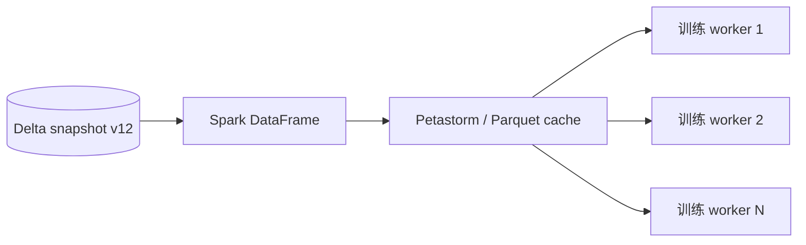

Petastorm 不是版本控制系统：表历史和 schema 由 Delta Lake 管理。它也不会替模型训练服务调度 GPU；它主要解决训练数据访问和框架适配。

#### 示例：为花卉图像分类准备训练数据

原章用 TensorFlow 团队的花卉图片数据说明：Delta 表并非只能保存文本记录，图片等非结构化数据可以作为 binary 列，与路径、标签和尺寸等结构化元数据共同管理。

##### 第一阶段：四步 ETL 建立 Delta 图像表

1. Spark 递归读取图片为 binary files；
2. 从目录路径提取类别，从图片字节提取宽高；
3. 形成每行一张图片的 DataFrame；
4. 把 DataFrame 写入 gold Delta 表。

简化代码如下：

> 原章代码字面使用 `spark.read.format("binary")`。下面改用 Spark 常见的内置 binary file 数据源名 `binaryFile`，以突出示例意图；实际运行时应以所用 Spark / Databricks 环境支持的数据源名称为准。

```python
from pyspark.sql import functions as F

images = (
    spark.read.format("binaryFile")
    .option("recursiveFileLookup", "true")
    .option("pathGlobFilter", "*.jpg")
    .load("/datasets/flower_photos")
)

image_table = images.select(
    "path",
    F.regexp_extract("path", r"flower_photos/([^/]+)", 1).alias("label"),
    "length",
    "content",
)

(image_table.write
    .format("delta")
    .mode("overwrite")
    .save("/datasets/flowers/gold"))
```

原章还用 pandas UDF 从 `content` 解析图片宽高。最终 schema 包含 path、label、label index、尺寸结构体和 binary content。

目录名充当标签的前提是数据目录已经按类正确组织。若文件放错目录，ETL 会稳定地生成错误标签，因此还需抽样、类别统计和图像质量检查。

##### 第二阶段：三步接入 PyTorch

1. 从指定 Delta 版本读取 DataFrame，并划分训练集与验证集；
2. 分别创建 Petastorm converter；
3. 用 `make_torch_dataloader` 构造 loader，交给训练与评价循环。

```python
flowers = (
    spark.read.format("delta")
    .option("versionAsOf", 12)
    .load("/datasets/flowers/gold")
    .select("content", "label_index")
)

train_df, validation_df = flowers.randomSplit([0.9, 0.1], seed=12345)
train_converter = make_spark_converter(train_df)
validation_converter = make_spark_converter(validation_df)

with train_converter.make_torch_dataloader(batch_size=32) as train_loader:
    for batch in train_loader:
        loss = train_step(batch)
```

若总计 $N=10{,}000$ 张图片，按 $0.9/0.1$ 随机划分，期望训练集和验证集大小约为：

$$
E[N_{\mathrm{train}}]=0.9N=9{,}000,
\qquad E[N_{\mathrm{val}}]=0.1N=1{,}000
$$

实际计数可能因随机划分略有差异。固定 seed 使划分过程在同一实现与输入下更易复现，但完整复现仍应保存实际划分或稳定样本 ID，而不是只依赖随机过程。

这段代码依赖 Spark、Delta Lake、Petastorm、PyTorch 及相应运行环境，本文未在本地执行；它用于展示数据路径和接口对应关系。

#### 何时使用 Delta Lake

优先考虑这条路线的条件是：

- 组织已经用 Spark 构建数据管道，具备集群和运维经验；
- 数据既有结构化记录，也可能包含以 binary 列保存的图片或音频；
- 需要持续批流更新、表级 ACID、schema enforcement 和历史版本；
- 训练数据能自然表示为表或 DataFrame；
- 希望把低成本对象存储作为底层容量层。

它尤其适合“ETL 本来就在 Spark 中”的组织，因为新增 DM 能力可复用现有计算、权限和数据目录。若只是几十 MB 的静态文件且团队不使用 Spark，引入整个栈可能得不偿失。

#### Delta Lake 的局限

原章指出三类代价。

##### 1. 协议与生态锁定

Delta 表由 Parquet 数据文件、事务日志及相关元数据共同组成，客户端必须理解 Delta 协议，不能把它当普通 Parquet 目录随意读写。迁移时不仅要复制文件，还要重建版本、事务和 schema 语义。

更准确地说，锁定对象是 Delta 表协议与兼容工具生态，不只是某一家公司。原章成书时把可读写环境概括为 Delta cluster；无论具体生态如何演进，设计时都应验证目标引擎对所需协议版本和功能的兼容性。

##### 2. 学习与运维成本

不熟悉 Spark 的团队还要学习 DataFrame、分区、shuffle、集群资源、流处理、事务日志和性能调优。软件开源不代表总拥有成本低。

##### 3. 不适合极低延迟摄取

底层对象操作和每次事务的日志 / 索引维护会引入延迟，难以把表创建与持久提交做到毫秒级。作者认为秒级摄取对多数深度学习数据准备不是问题，但实时风控等低延迟场景可能需要先写消息系统或在线存储，再异步落 Delta。

此外，非结构化文件全部内嵌 binary 列会影响读取和复制成本。实际设计也可以在表中存对象 URI 与校验和；选择“存字节还是存引用”取决于一致性、访问吞吐、文件大小和权限边界。

### 2.3.2 Pachyderm 与云对象存储

#### Pachyderm

Pachyderm 是运行在 Kubernetes 上、以对象存储为底座的数据版本控制与流水线平台。用户把抓取、摄取、清洗、标注或训练逻辑封装成 Docker 镜像，再由 Pachyderm 连接、调度和扩展这些步骤。

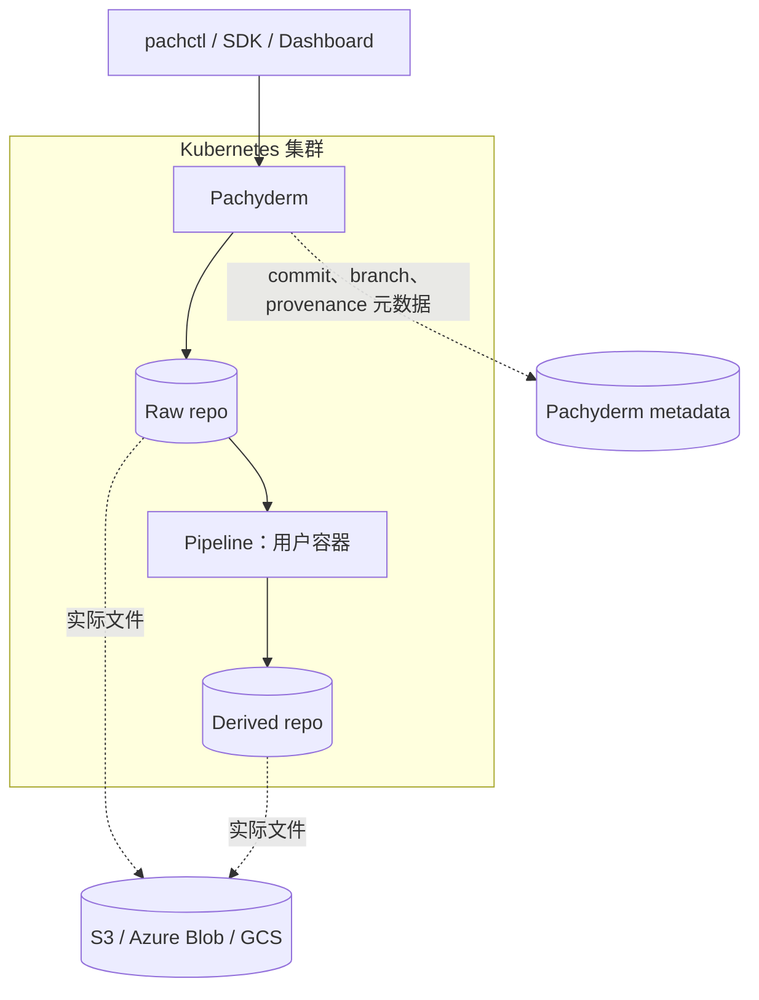

##### 两类核心对象

1. **版本化数据**：最高层数据对象称为 repo，内部包含 branch、commit 和 file；实际文件放对象存储，Pachyderm 管理版本元数据。
2. **pipeline**：声明输入 repo、用户容器镜像和执行命令；一次具体执行称为 job，结果写入派生 repo。

一个简化的图像边缘检测 pipeline 可以写成：

```json
{
  "pipeline": {"name": "edges"},
  "transform": {
    "image": "example/opencv:1.0",
    "cmd": ["python3", "/edges.py"]
  },
  "input": {
    "pfs": {"repo": "images", "glob": "/*"}
  }
}
```

`images` repo 出现新 commit 时，平台启动 job 执行容器，并把边缘图写到 `edges` 输出 repo。Kubernetes 负责运行容器，Pachyderm 在其上增加数据版本、触发关系和来源追踪。

“Git 风格”表示 repo、branch、commit 和历史查询等用户模型相似，不代表应把大型图片直接存进 Git，也不表示 Pachyderm 的实现就是普通 Git 仓库。

#### 版本与数据来源追踪

Pachyderm 自动版本化数据和 pipeline 变化。对任意输出 commit，可以查询：

- 父 commit；
- 创建与完成时间；
- 文件大小；
- 使用的 pipeline 规范；
- 来源输入 repo 与精确 commit。

把 provenance 表示成图：

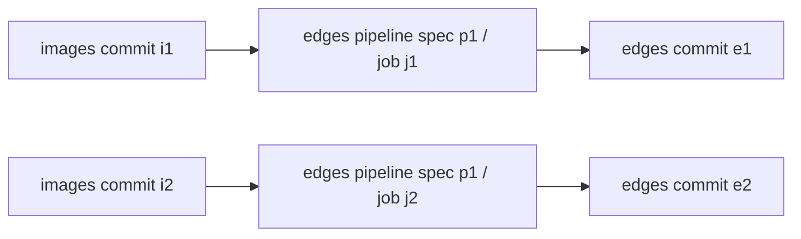

因此给定 `edges@e2`，可以反向找到输入 `images@i2` 和生成它的 pipeline 版本。这比只有输出文件名更适合复现与排障。

Pachyderm 的 provenance 与样例 DM 的 snapshot lineage 目标相同，但粒度不同：

- 样例 DM 显式把多个 ingestion commits 物化为一个训练 snapshot；
- Pachyderm 把每个 repo commit 与产生它的 pipeline / 上游 commits 连接起来。

若容器镜像使用可变标签（例如 `latest`），仅记录标签仍不能保证代码字节不变。生产流程应固定镜像 digest，并记录外部配置、密钥版本和运行参数。

#### 示例：图像数据标注与训练

原章设计一个自动化目标检测流程。训练前需要人在图片上画 bounding box，生成图像和标注文件，再启动训练。

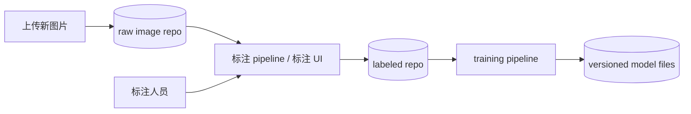

步骤如下：

1. 原始图片上传到 raw image dataset / repo，形成新 commit；
2. 标注 pipeline 启动标注应用，用户画框；图片与生成的标注写入 labeled dataset；
3. labeled repo 的新 commit 触发 training pipeline；
4. 训练容器读取确定版本的图像和标注，产出模型文件。

自动化之外，raw images、labeled data 和 model files 都被版本化。给定模型，可以沿 provenance 找到：

$$
{\text{model commit}}
\rightarrow \text{training job}
\rightarrow \text{labeled commit}
\rightarrow \text{labeling job}
\rightarrow \text{raw image commit}
$$

这条链回答“该模型到底见过哪些原始图片和哪一版标签”。

人类标注是长时交互过程，实际实现还需任务分配、并发编辑、审核、标注一致性和失败恢复；图中的 pipeline 只表达自动化连接，不等于 Pachyderm 自带完整标注产品。

#### 何时使用 Pachyderm

作者推荐它作为相对轻量的路线，尤其适合：

- 团队拥有并熟悉 Kubernetes 基础设施；
- 不想引入 Spark 集群；
- 数据以图片、音频等文件为主；
- 希望用 Docker 容器快速连接任意处理代码；
- 小团队需要 Git 风格数据版本与 provenance；
- 对象存储已经是主要数据底座。

“轻量”是相对 Spark 数据平台而言；团队仍需运行 Kubernetes、对象存储、Pachyderm 控制面和容器流水线。若连 Kubernetes 都没有，整体引入成本未必轻。

#### Pachyderm 的局限

核心缺口是**不理解文件内容的 schema**。Pachyderm 把对象视为文件并追踪版本，却不知道 CSV 有哪些列、图片标签是否合法或 protobuf 是否兼容。

后果包括：

- 数据类型验证完全依赖用户 pipeline；
- 上游代码改格式可能直到下游运行才暴露；
- 很难原生做字段级统计和两个数据集版本的语义 diff；
- 文件级版本正确不代表内容满足训练契约。

可以把二者分开：

$$
{\text{version correctness}}\not\Rightarrow\text{schema correctness}
$$

缓解方法是在摄取和每个 pipeline 边界主动运行 schema / 数据质量校验，并把校验规则与结果版本化。但这样一部分强类型 DM 能力需要团队自己建设。

### 2.3.3 三种路线的统一比较

| 维度 | 本章样例 DM | Delta Lake + Petastorm | Pachyderm |
| --- | --- | --- | --- |
| 核心数据抽象 | dataset、commit、versioned snapshot | versioned table snapshot | repo、branch、commit、file |
| 处理抽象 | `DatasetTransformer` + 后台线程 | Spark ETL / streaming job | container pipeline / job |
| schema | 每种类型双强 schema；`GENERIC` 例外 | 表 schema enforcement / evolution | 默认文件级，不理解内容 schema |
| 训练接入 | 自定义训练格式 URL | Petastorm 适配 PyTorch / TensorFlow | 训练容器直接读取 repo 数据 |
| 可复现机制 | 版本哈希定位不可变快照 | Delta table time travel | commit history + provenance |
| 大文件存储 | MinIO / 对象存储 | Parquet + 对象存储 | 对象存储 |
| 最适合 | 需要定制类型契约和统一 API | 已有 Spark / 湖仓生态 | 已有 Kubernetes、文件型非结构化数据 |
| 主要成本 | 自建大量生产能力 | Spark 学习、协议生态与集群成本 | schema 保护弱、Kubernetes 运维 |

三条路线共同遵循一个模式：

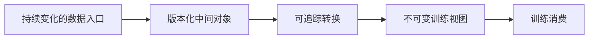

差别在于版本对象是 commit 集合、表快照还是 repo commit，以及 schema 和处理逻辑由谁负责。

---

## 容易混淆的概念与常见误区

### 1. 有 ETL 就不需要数据集管理

错误。ETL 解决怎样转换数据，DM 还要解决训练契约、版本快照、统一访问、历史重取和数据集生命周期。一个脚本可以产出数据，却未必能回答哪个模型用了哪一版数据。

### 2. 对象存储 bucket 就是数据集

不充分。bucket / prefix 是物理位置，数据集是带类型、schema、历史、统计和快照语义的逻辑文件组。仅靠路径难以保证内容不变和引用可复现。

### 3. dataset ID 足以复现训练

错误。dataset 是持续追加的动态容器；必须记录不可变 snapshot 版本。否则同一 ID 在不同时间对应不同数据。

### 4. commit 与 snapshot 是同一种版本

错误。commit 表示一次摄取的数据批次；snapshot 是从一个或多个 commit 经过过滤、聚合和转换得到的训练视图。两者是多对多来源关系。

### 5. 快照一定复制所有原始数据

不一定。样例将 commits 物化、压缩成新训练文件；其他系统可以用 copy-on-write、manifest 或表快照避免完整复制。关键是版本视图不可变且可解析，不是必须采用物理全拷贝。

### 6. 版本哈希天然保证内容正确

错误。哈希只对进入计算的规范化材料负责。若没包含 transformer、schema 或文件 digest，相同哈希仍可能映射到不同输出；弱哈希还可能碰撞。

### 7. 数据集可复现等于模型可复现

错误。数据只是模型复现的一项输入；还需代码、超参数、环境、随机性和硬件行为。DM 不能独自完成完整模型复现。

### 8. 强类型 schema 能阻止所有脏数据

错误。schema 能检查结构和类型，不一定能识别错误标签、异常分布、泄漏或偏见。还需语义规则、统计验证和人工抽检。

### 9. 摄取 schema 与训练 schema 应完全相同

未必。二者服务不同角色。分离后，上游可先增加字段，DM 可转换、规范化或暂存，而下游训练契约保持稳定。

### 10. `GENERIC` 越灵活，越适合生产

错误。它把解析和兼容风险推给训练代码，适合高不确定性的实验期。方案稳定后应升级为强类型数据集。

### 11. 统一 API 意味着所有数据使用同一格式

错误。统一的是创建、更新、准备和获取等生命周期语义；文本、图像与音频内部仍可采用不同格式和 transformer。

### 12. 软删除可以满足所有删除要求

错误。软删除保留可追溯历史，但用户撤回授权或法规要求可能必须硬删除。系统要在合规优先时标记受影响快照与模型。

### 13. 两步获取 API 只是多余的轮询

错误。它把长时数据物化与短时控制请求分开，避免 RPC 超时并支持状态、缓存和重试。客户端仍应退避轮询或使用通知，不能高频空转。

### 14. URL 传输让 DM 完全不消耗数据带宽

错误。客户端不经 DM 代理上传和下载，但 DM 的 transformer 仍可能从对象存储读取并写回数据。它减少中心 API 的中转瓶颈，并未消除网络 I/O。

### 15. Delta Lake 只能管理结构化文本

错误。图片和音频可作为 binary 列或对象引用，与路径、标签和尺寸等结构化元数据共同形成表。是否适合内嵌字节仍取决于文件规模和访问模式。

### 16. Delta Lake 的 time travel 是永久备份

错误。历史读取依赖旧日志和数据文件尚未被清理。版本保留、备份和法规归档必须另行设计。

### 17. Petastorm 是数据版本控制系统

错误。它是训练数据访问 / 框架适配库；Delta Lake 负责表版本与事务。

### 18. Pachyderm 的 Git 风格意味着它理解数据 schema

错误。它擅长文件版本、pipeline 和 provenance，但默认不解析文件内容。schema 校验需要用户流水线补充。

### 19. Pachyderm pipeline 与 Kubernetes 是同一层

错误。Pachyderm 定义数据触发、版本和来源关系；Kubernetes 调度并运行容器。前者建立数据工作流语义，后者提供通用执行底座。

### 20. 样例服务可直接用于生产

错误。它把 metadata 放内存、用单机后台线程，且省略鉴权、删除、事务、幂等、备份和灾难恢复。样例用于解释抽象，不是生产发行版。

## 本章知识结构

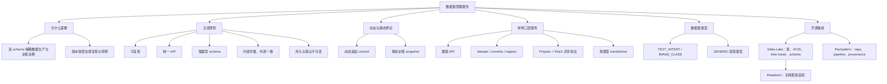

## 核心结论

1. **数据集管理不是文件存储的别名。** 它为训练提供类型、版本、历史、统计和统一访问语义。
2. **DM 的首要组织价值是解耦。** 摄取 schema、训练 schema 与内部转换让数据工程和算法开发在各自短循环中迭代。
3. **数据集同时动态与静态。** dataset / commits 表达持续增长，versioned snapshot 表达一次固定训练输入。
4. **只记录逻辑 dataset ID 不能复现。** 训练运行必须绑定不可变版本及其来源关系。
5. **数据集复现是模型复现的必要条件，不是充分条件。** 代码、配置、环境和随机性还需其他系统记录。
6. **五项原则比某个实现更持久。** 可复现、统一 API、强 schema、内部扩展和数据持久性可用于评价自建或第三方方案。
7. **commit 应追加且默认不可变。** 原地合并会丢失来源和回滚能力；合规硬删除是必须显式处理的例外。
8. **大数据准备适合异步两步协议。** `Prepare` 返回版本句柄，`Fetch` 查询状态和 URL，使 API 不随数据规模改变。
9. **版本哈希兼具身份和缓存价值，但必须覆盖所有影响输出的输入。** commit 内容、过滤、schema、转换器与配置都可能属于版本材料。
10. **统一 API 与多态 transformer 可以同时获得易用性和可扩展性。** 增加 `IMAGE_CLASS` 不应破坏现有客户端。
11. **`GENERIC` 用灵活性换安全性。** 它适合早期实验，稳定项目应迁移到强类型契约。
12. **Delta Lake 路线适合已有 Spark 的表型数据平台。** 它提供 ACID、time travel 和 schema，Petastorm负责训练框架接入。
13. **Pachyderm 路线适合已有 Kubernetes 的文件型工作流。** 它提供 Git 风格版本与 provenance，但 schema 保护需要自行补足。
14. **工具选择应服从现有生态和缺口。** 不应为了一个小数据集引入超出团队能力的大型平台，也不应为成熟通用能力重复自建。

## 从本章提炼出的通用解题方法

面对一个训练数据管理问题，可以按以下顺序推导设计。

### 第一步：识别生产者、消费者与各自变化速率

列出谁收集数据、谁训练模型、双方分别多久改变一次格式和代码。先找跨团队同步最昂贵的边界，而不是先挑存储产品。

### 第二步：定义数据集生命周期语义

明确 dataset、commit、snapshot、branch、删除和归档分别表示什么。尤其回答：

- 一次更新的原子边界是什么？
- 哪个标识代表动态容器，哪个代表不可变训练输入？
- 过去版本要保留多久？

### 第三步：分别设计摄取和训练契约

与数据工程师定义允许提交的结构，与数据科学家定义稳定输出；把转换责任放在清楚的中间边界。对每个 schema 规定兼容演进规则。

### 第四步：设计版本函数和血缘

列出所有会改变训练字节或语义的输入：

$$
v=H(D,C,F,\Sigma,T,O)
$$

其中 $D$ 是 dataset 身份，$C$ 是 commit 内容摘要，$F$ 是过滤条件，$\Sigma$ 是 schema 版本，$T$ 是 transformer 版本，$O$ 是物化选项。保存从 $v$ 回到这些输入的映射。

### 第五步：分离控制面与数据面

API 传小型元数据、状态和对象引用；大文件经对象存储传输。对长时构建采用异步作业，并定义幂等、重试、超时与失败状态。

### 第六步：把规模复杂度封装在内部

小数据和大数据使用相同外部协议；内部按需引入分片、并行、缓存、compaction 和分布式计算。用真实数据量压测，而不是用“对象存储无限”代替容量分析。

### 第七步：用五项原则检查候选实现

逐项问：

1. 历史训练数据能否精确重取？
2. 不同类型是否共享稳定生命周期 API？
3. 非法数据何时、由谁拒绝？
4. 数据放大后客户端是否需要重写？
5. 更新、软删除、硬删除和保留期如何处理？

### 第八步：基于现有生态决定自建或集成

- 已有 Spark 与表数据：优先评价 Delta Lake；
- 已有 Kubernetes、以文件和容器流水线为主：评价 Pachyderm；
- 有特殊双 schema、统一 API 或治理需求且现有工具不匹配：再考虑自建薄层。

### 第九步：从 `GENERIC` 有计划地走向强类型

实验阶段记录实际出现的数据结构和错误；业务价值确认后，冻结训练契约，编写 transformer，迁移历史数据，并同时验证旧、新快照。

### 第十步：把可观测性和合规作为数据模型的一部分

记录样本与标签统计、处理时间、失败原因、所有者、来源、校验和和访问审计。为法规删除设计反向索引，能从数据对象找到受影响快照和模型。

这套思路可以概括为：**先稳定语义边界，再版本化变化；先让结果可追溯，再优化规模与性能。**

## 复习与自测

1. 为什么对象存储和 ETL 不能自动替代数据集管理服务？
2. 双 schema 怎样把一个跨团队长循环拆成两个短循环？
3. 算法可复现、数据集可复现和模型可复现的包含关系是什么？
4. 五项设计原则分别防止哪类系统失败？
5. 为什么一个 dataset 既动态又静态？commit 和 snapshot 怎样表达这两面？
6. 只记录 dataset ID 而不记录 snapshot hash，会造成什么问题？
7. 样例服务为什么通过 URL 传数据，而不让 gRPC 中转文件字节？
8. `CreateDataset` 与 `UpdateDataset` 的共同流程和唯一主要区别是什么？
9. 为什么每次更新要创建新 commit，而不原地合并当前数据？
10. `PrepareTrainingDataset` 与 `FetchTrainingDataset` 为什么必须拆开？
11. `RUNNING`、`READY`、`FAILED` 状态之外，生产协议还应提供哪些信息？
12. 标签过滤发生在哪个粒度？它给数据组织带来什么限制？
13. 版本哈希只包含 commit ID 列表时，隐含了哪些不变性假设？
14. snapshot cache 为什么要求输出严格不可变？
15. `DatasetTransformer.ingest()` 与 `compress()` 各负责什么？
16. `TEXT_INTENT` 为什么使用两份文件表示样本与标签词表？
17. 自定义中立训练格式与框架原生格式各有什么收益和代价？
18. `GENERIC` 数据集何时合理，何时应被视为技术债？
19. 新增 `IMAGE_CLASS` 类型需要完成哪三个步骤？
20. 多个图像 commit 合并时，为什么不能直接拼接各自的 label ID？
21. Delta Lake 如何在对象存储之上提供表快照和 ACID？
22. Bronze、Silver、Gold 分别表示什么，它们是否是强制架构？
23. Delta time travel 为什么不等于永久备份？
24. Petastorm 在 Delta Lake 与 PyTorch / TensorFlow 之间承担什么职责？
25. 图像字节写入 Delta 表与只写对象 URI 各有什么权衡？
26. Pachyderm 的 repo、commit、pipeline 和 job 分别是什么？
27. provenance 如何从模型追溯到标注数据和原始图片？
28. 为什么 Pachyderm 有版本控制仍不能替代强类型 schema？
29. 对一个已有 Spark 的大团队和一个已有 Kubernetes 的小型图像团队，你会分别优先评估哪条路线？为什么？
30. 若用户要求永久删除某批个人数据，怎样找出并处理受影响的 snapshot 与模型？
