> 对应原章：**3 Model Training Service**
> 本章站在软件工程师而不是算法研究者的视角，讨论怎样把训练代码放入稳定、共享、可追踪的计算系统中执行。核心不是发明神经网络，而是管理训练作业、昂贵算力、运行环境和训练制品，使模型生产能够规模化。

## 本章要回答的核心问题

1. 为什么远程运行一个训练脚本还不等于拥有训练服务？
2. 专属训练机器与共享弹性集群各有什么成本和调度问题？
3. 怎样让一个 API 支持不同框架、模型结构和算法版本？
4. 普遍的 mini-batch 训练循环包含哪些数学步骤？
5. 为什么把训练代码容器化后，平台可以把它当作黑盒？
6. 训练服务与容器之间需要约定哪些输入、输出和状态？
7. 样例服务如何排队、启动、监控并查询训练作业？
8. 进程隔离、资源隔离、调度公平和弹性分别解决什么问题？
9. Kubeflow Training Operator 如何用 CRD 和调和循环执行训练？
10. 什么情况下应使用托管云平台，什么情况下值得自建？

本章以软件系统设计为主，只介绍理解训练服务所需的基本优化过程。本文会补充损失函数、梯度更新、资源利用率、排队和可复现性的形式化表达，用来解释作者的工程论证；这些补充并非原章另行提出的算法。原章中的云价格和 Kubeflow 组件状态带有成书时点，阅读时应把它们视为决策方法的例证，而不是 2026 年的实时产品报价或版本说明。

---

## 3.1 模型训练服务：设计概览

### 3.1.0 定义、角色与系统边界

企业中的模型训练由两类职责共同完成：

- **数据科学家 / 研究人员**：定义模型结构、损失函数、优化器、超参数和训练计划；
- **平台工程师**：建设并维护共享基础设施，负责排队、资源分配、隔离、执行、恢复和观测。

模型训练服务（model training service）是执行训练代码的基础设施控制面。它接收训练请求，将请求变成作业，分配 CPU、内存、GPU 等资源，在隔离环境中运行训练代码，并跟踪结果。

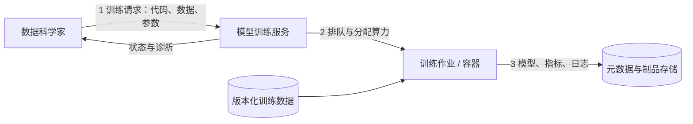

可以把训练服务的职责写成：

$$
\operatorname{TrainingService}=
\operatorname{ControlPlane}(\text{jobs},\text{resources},\text{policy},\text{state})
$$

训练容器则是数据面：

$$
\operatorname{TrainingContainer}(D_v,C_c,H_h,E_e)
\longrightarrow (M_m,\mathcal{L},\mathcal{R})
$$

其中 $D_v$ 是数据快照，$C_c$ 是训练代码，$H_h$ 是超参数，$E_e$ 是运行环境，$M_m$ 是模型，$\mathcal{L}$ 是日志，$\mathcal{R}$ 是指标。

这一区分非常重要：训练服务不决定模型是否准确；它保证被提交的训练程序在规定资源和策略下可靠执行，并保存足以解释结果的上下文。

### 3.1.1 为什么用服务执行模型训练

#### 专属机器与共享资源池

设团队有 Alex、Bob 和 Kevin。最简单的方案是每人一台高性能工作站：

- 优点：使用方式简单，环境和资源冲突少；
- 缺点：用户不训练时 GPU 闲置，其他人不能借用；
- 扩展问题：某次大型训练需要多机时，固定工作站无法临时满足；
- 管理问题：每台机器各自安装依赖、补丁和凭据，环境容易分叉。

一个资源的观察期利用率可粗略写为：

$$
U=\frac{\sum_{i=1}^{J}r_i t_i}{R\,T}
$$

其中 $R$ 是资源池总容量（例如 GPU 数），$T$ 是观察时长，作业 $i$ 占用 $r_i$ 个资源并运行 $t_i$。如果三台专属 GPU 在一天中分别只训练 2、3、1 小时，则：

$$
U=\frac{2+3+1}{3\times24}=\frac{1}{12}\approx8.3\%
$$

其余时间虽然机器已付费，却没有产生训练吞吐。

共享方案把服务器组成可伸缩资源池，所有用户提交作业，由服务统一调度。其经济性来自**统计复用**：不同用户的峰值通常不完全同时出现，因此总容量可以小于每个人峰值容量之和。

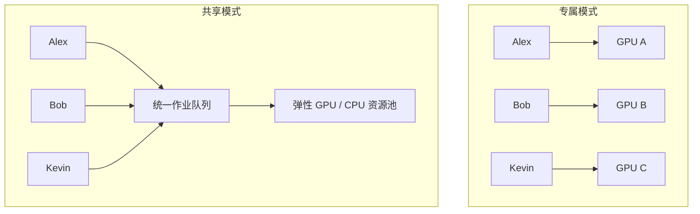

但共享不会自动变得高效，它引入新的控制问题：

- 突发请求如何排队和限流；
- 谁先运行，怎样避免重用户垄断；
- 作业卡死、失败或超时后怎样干预；
- 集群何时扩容、缩容；
- 不同用户的数据和进程怎样隔离；
- 怎样记录每次训练的环境与输入。

因此，作者并不是从“调用脚本不方便”推导服务，而是从**共享稀缺资源需要持续治理**推导服务。

#### 脚本与服务的区别

本章语境中的训练脚本，是用 Shell 在本地或远程服务器编排训练活动；训练服务则是通过 HTTP / gRPC 接收请求、长期运行并治理共享集群的网络进程。

| 维度 | 脚本 | 训练服务 |
| --- | --- | --- |
| 适用规模 | 单人、少量临时运行 | 多用户、多项目、长期生产 |
| 状态 | 常依赖终端和本地文件 | 持久作业 ID 与状态机 |
| 调度 | 人工选机器、手工等待 | 队列、配额、优先级和资源感知 |
| 环境 | 机器上预装依赖 | 每个作业携带容器化环境 |
| 隔离 | 依赖使用约定 | 进程、资源、网络与身份策略 |
| 复现 | 命令历史和个人记忆 | 版本化数据、镜像、参数与制品血缘 |
| 故障处理 | 人工登录重启 | 监控、重试、恢复和终态记录 |
| 合规 | 很难统一控制数据访问 | 在受控环境中执行和审计 |

一个 Shell 脚本可以调用服务，也可以成为容器入口；区别不在文件扩展名，而在是否有统一状态、资源策略、权限边界和多用户治理。

##### 服务化还解决哪些非计算问题

1. **环境设置**：训练框架、CUDA、系统库和代码依赖必须兼容；
2. **数据合规**：信用卡号、支付记录等敏感数据不能任意复制到个人机器；
3. **性能排障**：必须记录数据集 ID / 版本、代码 / 镜像版本、超参数和环境；
4. **可靠性**：长达数天或数周的训练不能因一次 OS 故障全部作废；
5. **成本控制**：空闲资源应回收，异常训练应尽早终止。

这些要求可以写进大量脚本，但当状态和策略需要被多人共享时，脚本最终会演化成一个服务，只是接口和状态模型可能更混乱。

#### 训练服务的价值

作者总结出四项直接收益：

- 饱和利用计算资源，降低平均训练成本；
- 让更多资源按需可用，以更快、更可靠的方式迭代模型；
- 在受控环境中执行训练，落实数据访问与合规策略；
- 保留训练上下文，支持模型质量回归排查。

更完整地看，平台优化的是单位时间内成功完成的有价值实验，而不是单纯让 GPU 指标永远为 $100\%$。若为了“高利用率”让作业排队数天，算法迭代反而变慢。

可用一个综合目标表达：

$$
\min \left(\alpha C_{\mathrm{success}}+\beta T_{\mathrm{feedback}}+\gamma F\right)
$$

其中 $C_{\mathrm{success}}$ 是每个成功模型的成本，$T_{\mathrm{feedback}}$ 是从提交到获得结果的时间，$F$ 是失败与不可复现风险。权重来自组织目标。

### 3.1.2 训练服务的四项设计原则

#### 原则 1：提供统一 API，并与具体训练代码解耦

目标检测、语音识别和意图分类的算法不同，但对平台的生命周期动作相同：提交、排队、启动、查询、取消和获取结果。因此外部应提供稳定的训练 API，而不是为每种模型重建服务。

“训练代码无关”不等于服务与代码没有关系。它要求双方遵守明确协议：

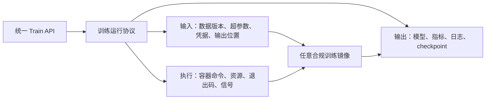

只要训练镜像满足协议，服务不必知道它用的是 CNN、Transformer、PyTorch 还是 TensorFlow。统一入口也使算法 A/B 测试容易自动化：两个算法使用同一数据版本和评价流程，只改变算法 / 镜像与参数。

协议至少应定义：

- 镜像怎样标识和固定版本；
- 数据怎样定位、认证和下载；
- 超参数怎样传递和校验；
- CPU、内存、GPU 与拓扑怎样声明；
- 模型、checkpoint、日志和指标写到哪里；
- 成功、失败、取消与超时怎样表示；
- 服务何时可以重试，训练代码是否幂等。

#### 原则 2：以高性能、低成本构建模型

“高性能”在这里主要指训练系统效率，不是模型预测准确率。服务可通过以下方法改善成本效益：

- 分布式训练缩短大型作业的墙钟时间；
- 资源感知调度提高 GPU / CPU 利用率；
- 合理队列和并发减少空闲与等待；
- 检测停滞、发散或明显偏离计划的任务并告警 / 终止；
- checkpoint 和恢复避免故障后从头计算；
- 按工作负载弹性增减节点。

训练作业的直接资源成本可粗略表示为：

$$
C_{\mathrm{job}}=\sum_{k}p_k r_k t_k+C_{\mathrm{storage}}+C_{\mathrm{network}}
$$

其中 $p_k$ 是第 $k$ 类资源单位时间价格，$r_k$ 是数量，$t_k$ 是占用时长。增加 GPU 可能缩短 $t$，却不保证总成本降低，因为分布式通信与并行效率会递减。

若使用 $n$ 个设备的加速比为 $S(n)=T(1)/T(n)$，并行效率为：

$$
E(n)=\frac{S(n)}{n}
$$

例如单卡需 10 小时，4 卡需 3 小时，则 $S(4)=10/3\approx3.33$，$E(4)\approx83.3\%$。若资源按相同单价计费，4 卡成本是 12 卡时，高于单卡的 10 卡时；团队要在反馈速度和费用之间选择。本章只提出分布式能力，具体方法在下一章展开。

#### 原则 3：支持模型可复现性

训练服务应在给定同一组输入时产生相同模型，或至少产生质量在约定容差内等价的模型。完整输入可写为：

$$
M=\operatorname{Train}(D_v,I_d,H_h,S_s,E_e,A_a)
$$

其中：

- $D_v$：不可变训练数据快照；
- $I_d$：固定 digest 的训练镜像；
- $H_h$：超参数；
- $S_s$：随机种子及随机状态；
- $E_e$：硬件、驱动、框架与系统环境；
- $A_a$：启动命令及其他训练配置。

仅记录算法名不够，因为算法名背后的镜像可能更新；仅记录数据集 ID 也不够，因为数据集持续变化。训练服务应把一次运行与所有精确版本及产出关联。

模型复现的价值有两层：

1. **建立信任**：贷款审批等业务不能依赖来源不明且无法重建的模型；
2. **性能排障**：质量回归时能比较数据、代码、参数和环境变化。

“同输入得到同模型”是理想语义。GPU 非确定性算子、并行归约顺序和硬件差异可能让权重无法逐位一致，因此生产要求应明确：是 bitwise 相同、预测相同，还是指标在容差 $\epsilon$ 内：

$$
\left|Q(M_1)-Q(M_2)\right|\le\epsilon
$$

#### 原则 4：提供健壮、隔离且弹性的计算管理

这项原则包含三个不同问题。

##### 健壮性

- 检测容器、节点、网络和存储故障；
- 对可重试故障自动重启；
- 从 checkpoint 恢复，而不是从第一个 epoch 开始；
- 保存终态和失败原因；
- 避免重复提交产生两个昂贵作业。

若训练总时长为 $T$，每隔 $\tau$ 保存 checkpoint，忽略 checkpoint 开销且故障时刻在区间内均匀分布，则单次故障平均丢失计算约为：

$$
E[W_{\mathrm{lost}}]\approx\frac{\tau}{2}
$$

checkpoint 越频繁，丢失越少，但存储和暂停开销越大；频率应结合故障率、写入成本和模型状态大小选择。

##### 隔离性

- **进程 / 依赖隔离**：一个作业的 Python、CUDA 和系统库不污染另一个作业；
- **资源隔离**：每个作业和团队有 CPU、内存、GPU 配额与限制；
- **数据与权限隔离**：作业只能访问被授权数据和输出位置；
- **故障隔离**：一个容器 OOM 或崩溃不应拖垮其他任务。

容器主要提供运行环境和进程边界，不自动完成公平调度、GPU 配额、强安全沙箱或数据授权；这些需要容器运行时、Kubernetes 和平台策略共同实现。

##### 弹性

弹性可指两层：

- **集群弹性**：根据队列与利用率增加或减少节点；
- **作业弹性**：训练过程中动态改变 worker 数量。

原章本节主要强调前者。集群扩容有启动延迟，缩容也不能杀死不可中断作业；服务需要最小 / 最大容量、空闲窗口和排空策略。

---

## 3.2 深度学习训练代码的通用模式

平台工程师无需掌握每种网络的研究细节，但必须理解训练程序的共性，才能定义资源、重试、checkpoint、参数和指标协议。所谓“黑盒”是隐藏内部算法差异，不是放弃输入输出契约和可观测性。

### 3.2.1 模型训练工作流

#### 训练的目标：反复减小经验损失

给定训练集：

$$
\mathcal{D}=\{(x_i,y_i)\}_{i=1}^{N}
$$

神经网络 $f_{\theta}$ 由参数 $\theta$（权重与偏置）决定。训练寻找一组参数，使预测 $f_{\theta}(x_i)$ 接近目标 $y_i$。经验风险为：

$$
J(\theta)=\frac{1}{N}\sum_{i=1}^{N}
\ell\left(f_{\theta}(x_i),y_i\right)
$$

$\ell$ 是单样本损失函数，$J$ 是全数据平均损失。分类任务可用交叉熵，回归任务可用均方误差；损失函数把“预测得多差”转换成可优化标量。

训练的理想目标是：

$$
\theta^*=\arg\min_{\theta}J(\theta)
$$

深度网络通常无法直接求闭式解，因此使用迭代优化。

#### 为什么使用 mini-batch

整个数据集和中间激活通常无法一次放入 GPU 内存，也没必要每更新一次参数都扫描全部数据。将数据划分为大小为 $B$ 的 mini-batch，每个 epoch 的批次数约为：

$$
K=\left\lceil\frac{N}{B}\right\rceil
$$

mini-batch 损失为：

$$
J_{\mathcal{B}_t}(\theta_t)=\frac{1}{B}
\sum_{(x_i,y_i)\in\mathcal{B}_t}
\ell\left(f_{\theta_t}(x_i),y_i\right)
$$

它给出全数据梯度的近似。较小 batch 更新频繁、梯度噪声较大但内存需求低；较大 batch 更利于设备并行，却占更多显存，并可能要求调整学习率。

#### 一次训练迭代的五步

1. **前向传播**：把 mini-batch 输入网络，计算预测

   $$
   \hat{y}=f_{\theta_t}(x)
   $$

2. **计算损失**：比较预测与标签

   $$
   L_t=J_{\mathcal{B}_t}(\theta_t)
   $$

3. **反向传播**：利用链式法则计算每个参数对损失的梯度

   $$
   g_t=\nabla_{\theta}L_t
   $$

4. **优化器更新参数**：最简单的随机梯度下降为

   $$
   {\theta}_{t+1}={\theta}_t-\eta g_t
   $$

   其中 $\eta$ 是学习率。梯度指出损失上升最快的方向，沿负梯度移动会在足够小步长和局部光滑条件下减小损失。Adam、带动量 SGD 等优化器会利用历史梯度调整方向和尺度。

5. **完成与保存**：达到 epoch 上限、验证指标目标或停止条件后，保存网络结构与参数为模型制品。

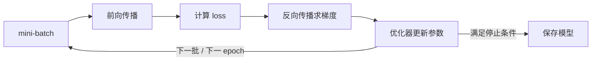

对应伪代码：

```text
initialize model parameters theta

for epoch in 1..max_epochs:
    for batch in training_data:
        predictions = model.forward(batch.inputs)
        loss = loss_function(predictions, batch.labels)
        gradients = backward(loss, model.parameters)
        optimizer.step(model.parameters, gradients)

    validation_metric = evaluate(model, validation_data)
    save_checkpoint(model, optimizer, epoch, validation_metric)

    if early_stopping(validation_metric):
        break

save_final_model(model)
```

##### epoch、iteration、batch 不要混淆

- **sample / example**：一条训练样本；
- **batch / mini-batch**：一次前向与反向计算使用的样本集合；
- **iteration / step**：通常指一次参数更新；
- **epoch**：训练集被完整遍历一轮。

若 $N=10{,}000$，batch size $B=64$，则每个 epoch 有：

$$
K=\left\lceil\frac{10{,}000}{64}\right\rceil=157
$$

个 step。训练 15 个 epoch 大约执行 $15\times157=2{,}355$ 次参数更新。

##### 停止条件与原章表述的边界

原章说训练在完成预期轮数或达到预期模型准确率时结束。实践中不应直接用训练集 accuracy 决定停止，因为继续拟合可能降低未见数据上的效果。更常见的是观察验证损失 / 指标，使用 patience 早停，并在独立测试集上只做最终评价。

训练损失下降也不保证业务质量提升：数据偏差、标签泄漏、验证集污染和指标选择错误都可能产生“低 loss、差产品”的模型。

#### 为什么不同网络能共享这一模式

RNN、CNN、Transformer 和 autoencoder 的层结构及损失不同，但大多遵循“批数据 → 前向 → loss → 反向 → 优化器 → 模型”的迭代模式。平台据此可以统一：

- 容器启动与资源声明；
- 数据版本和参数输入；
- 日志、指标与 checkpoint 输出；
- 单机或分布式执行生命周期。

这也是下一章讨论分布式训练的基础：分布式策略改变数据、梯度或模型参数怎样分布，不改变训练作业的外部生命周期。

### 3.2.2 把模型训练代码 Docker 化为黑盒

#### 为什么直接启动进程不够

若训练服务直接在宿主机启动 Python 进程，它必须为每个算法安装特定版本的框架、CUDA、Python 库和系统依赖。两个项目可能分别要求不兼容的 PyTorch 或驱动组合，升级一方会破坏另一方。

Docker 镜像把以下内容打包：

- 训练代码与入口命令；
- Python / 系统依赖；
- 深度学习框架和必要运行库；
- 数据解析和模型序列化逻辑。

训练服务只需拉取镜像并启动容器：

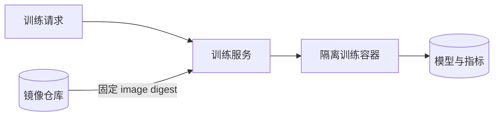

由此实现两种解耦：

1. 数据科学家专注算法与容器内部实现；
2. 平台工程师专注调度、资源、可靠性和协议。

#### 黑盒之间如何通信

服务无需理解训练算法，但必须与容器共享契约。一个典型协议可分为四部分。

| 协议面 | 示例 |
| --- | --- |
| 输入参数 | `EPOCHS`、`BATCH_SIZE`、`LEARNING_RATE`、随机种子 |
| 数据定位 | dataset ID、snapshot hash、对象存储 URI、临时凭据 |
| 运行控制 | 容器命令、资源请求、超时、取消信号、checkpoint 目录 |
| 输出 | 模型 URI、指标事件、日志、退出码、失败原因 |

环境变量适合少量标量配置；复杂嵌套参数更适合版本化配置文件或结构化请求。敏感凭据不应作为普通环境变量长期保存或出现在日志中，应通过短期身份、secret volume 或工作负载身份注入。

训练容器的最小入口可写成：

```text
main():
    config = validate(read_runtime_contract())
    dataset = download_exact_snapshot(config.dataset_version)
    state = restore_checkpoint_if_present(config.checkpoint_uri)

    model, metrics = train(dataset, config.hyperparameters, state)

    model_uri = upload_model(model, config.output_uri)
    report_metrics(metrics)
    write_manifest(model_uri, config, checksums)
    exit(0)
```

平台只看到统一的输入、状态和制品，不关心 `train()` 内部网络结构。

#### 容器化的收益和边界

| 收益 | 原因 |
| --- | --- |
| 环境可移植 | 镜像携带代码和用户空间依赖 |
| 依赖隔离 | 不同训练作业拥有独立文件系统与进程空间 |
| 统一执行 | 单机和集群都可围绕容器调度 |
| 版本追踪 | 镜像 digest 可作为训练代码身份 |
| 快速清理 | 终止容器即可回收大部分作业环境 |

但容器并不把所有东西都封装进去：宿主 GPU 驱动、内核、硬件、挂载数据和外部服务仍影响结果。使用可变标签 `latest` 也不支持复现；应记录不可变 image digest。

“黑盒”也不等于不可观测。服务仍应采集资源、生命周期、日志和模型指标，并要求健康检查与结构化错误。一个完全不报告进度的黑盒无法区分“正在训练”和“已经死锁”。

---

## 3.3 样例模型训练服务

作者用几百行 Java 代码实现一个最小训练服务，展示三个基本生产场景：接收请求、在 Docker 容器中启动训练、跟踪执行进度。这个样例的价值是把抽象原则变成可观察的控制流，不是提供可以直接上线的完整平台。

样例做了两项重大简化：

- 作业元数据只放进程内存，服务重启即丢失；
- 作业直接运行在本机 Docker Engine，没有真正的多节点调度。

因此后文应区分“概念机制已展示”和“生产能力已具备”。

### 3.3.1 运行和体验服务

实验先构建并启动训练服务容器。为了让容器内服务控制宿主机 Docker，启动时挂载 Docker socket：

```shell
docker build -t orca3/services:latest -f services.dockerfile .
docker run --name training-service \
  -v /var/run/docker.sock:/var/run/docker.sock \
  --network orca3 --rm -d -p "${TS_PORT}:51001" \
  orca3/services:latest training-service.jar
```

服务收到请求后，再通过这个 socket 创建训练容器。实验容易在本机运行，但 Docker socket 几乎赋予容器控制宿主 Docker 的高权限；生产系统不能把它当作普通文件挂载，应采用受控调度 API、最小权限身份和隔离节点。

#### 提交训练作业

样例通过 `Train` gRPC 方法提交：

```json
{
  "metadata": {
    "algorithm": "intent-classification",
    "dataset_id": "1",
    "name": "test1",
    "train_data_version_hash": "hashBA==",
    "parameters": {
      "LR": "4",
      "EPOCHS": "15",
      "BATCH_SIZE": "64",
      "FC_SIZE": "128"
    }
  }
}
```

字段分别回答：

- **执行什么**：`algorithm` 映射到训练镜像；
- **使用什么数据**：dataset ID + 不可变 snapshot hash；
- **这次运行叫什么**：`name`；
- **怎样训练**：学习率、epoch、batch size、全连接层大小等参数。

原章样例把所有参数都编码为字符串，由容器自己解析。这样 protobuf 简单，却把类型错误推迟到运行期；生产 API 更适合按算法 schema 验证数值类型、范围、必需字段和默认值。示例中的 `LR="4"` 只应按原样视为实验输入，不能据此推导通用合理学习率。

`Train` 快速返回 `job_id`，并不等待训练完成。这是典型长任务异步协议：

$$
\operatorname{Train}(request)\longrightarrow job\_id
$$

#### 查询训练进度

客户端随后调用：

```text
GetTrainingStatus({"job_id": <returned job id>})
```

服务返回等待、启动、运行、成功或失败状态。两个 API 就形成最小控制闭环：提交一次，按 ID 多次查询。

生产接口通常还需要取消、重试、列出、筛选、查看日志和取得产出等操作；样例只保留理解状态机所需的最小集合。

> 这些脚本依赖 Docker、MinIO、样例镜像和 MiniAutoML 实验环境。本文没有在本地执行实验，以下分析基于原章代码与流程。

### 3.3.2 服务设计概览

#### 两个用户角色

- **Alex，数据科学家**：开发 PyTorch 训练代码，把代码构建成 Docker 镜像并发布到镜像仓库，然后自助提交和查询训练；
- **Tang，平台开发者**：建设训练服务，关注系统可用性、效率、隔离和作业执行，不负责提高模型准确率。

真实环境中，镜像构建通常自动化：

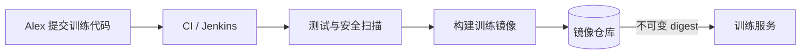

如果数据科学家手工在本地构建和推送，难以保证来源、测试与供应链安全。CI 应保存源代码 commit、Dockerfile、依赖锁文件、镜像 digest 和扫描结果。

#### 端到端自助工作流

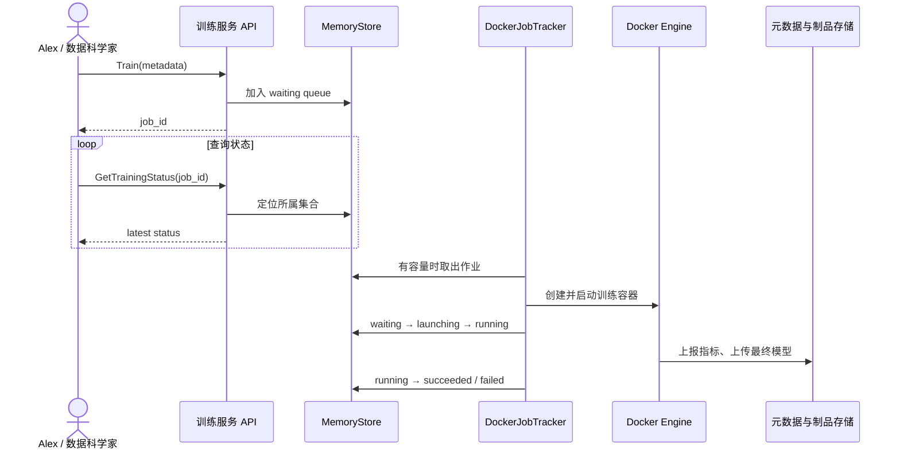

模型评价没有被纳入训练服务主流程。训练代码会上报 loss、准确率等，Alex 再判断质量。这个职责边界说明：

- 服务执行成功只表示程序正常完成；
- 它不等于模型达到业务质量门槛；
- 模型晋级 / 部署仍需评价与质量门禁。

#### 两个核心内部组件

**MemoryStore** 使用四个集合组织作业：

1. `jobQueue`：等待容量；
2. `launchingList`：容器已创建或正在启动；
3. `runningList`：容器正在执行；
4. `finalizedJobs`：已经成功或失败。

**DockerJobTracker** 周期性执行两项工作：

- 有容量时，从等待队列取作业并启动容器；
- 查询容器状态，把作业迁移到对应集合。

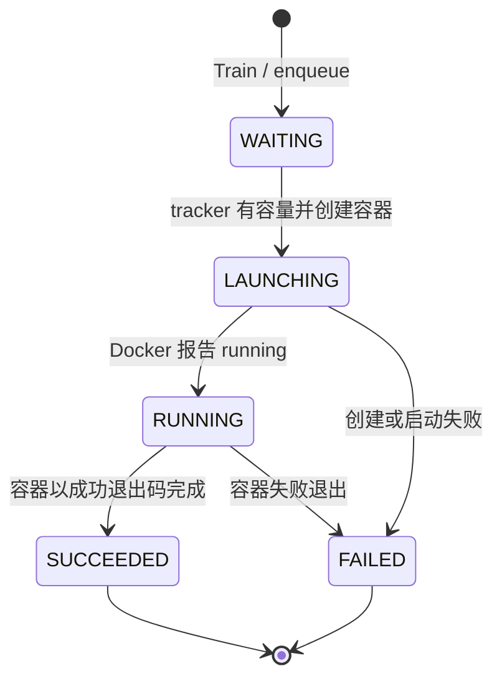

四个集合是状态机的一种物理实现。更可靠的实现通常使用一张 jobs 表和 `status` 字段，并用事务或乐观并发控制迁移，因为一个作业同时存在于两个集合或两个集合都不存在都会破坏状态真实性。

#### 数据划分放在哪里

样例容器在训练时把数据划分为 train、validation、test。作者指出也可以在数据集构建阶段划分，两种方式不显著改变训练服务本身。

| 划分位置 | 优点 | 风险 / 代价 |
| --- | --- | --- |
| 数据集管理阶段 | 划分可版本化、多个训练公平共享同一测试集 | 迭代划分策略需要新数据版本；平台需理解 split 语义 |
| 训练容器阶段 | 算法团队灵活试验划分策略 | 每次运行可能划分不同；容易泄漏或比较不公平 |

若在训练时划分，必须记录随机种子、比例、分层策略和实际样本 ID。测试集不应每个 epoch 用来调参，否则它事实上变成验证集。

### 3.3.3 训练服务 API

样例公开两个 gRPC 方法：

```protobuf
service TrainingService {
  rpc Train(TrainRequest) returns (TrainResponse);
  rpc GetTrainingStatus(GetTrainingStatusRequest)
      returns (GetTrainingStatusResponse);
}
```

`TrainingJobMetadata` 包含：

| 字段 | 含义 | 对复现 / 执行的重要性 |
| --- | --- | --- |
| `algorithm` | 预定义算法名，样例中也是 Docker image 名 | 确定训练代码，但名称若可变则不足以复现 |
| `dataset_id` | 数据集逻辑 ID | 定位数据集，单独使用不是固定输入 |
| `train_data_version_hash` | 训练快照版本 | 固定精确训练样本 |
| `name` | 人类可读作业名 | 搜索和组织，不应充当唯一 ID |
| `parameters` | 超参数键值对 | 决定训练行为，必须完整保存与校验 |

状态响应包含 status、job ID、消息、原 metadata 和队列位置。队列位置只能作为近似提示：高优先级作业、资源形状、失败重试和回填调度都会让位置变化，不能承诺严格开始时间。

#### 为什么数据 ID 和版本哈希都需要

数据集 ID 指向动态逻辑集合，版本哈希指向静态快照：

$$
\operatorname{TrainingInput}=(dataset\_id, snapshot\_hash)
$$

前者提供命名空间和权限上下文，后者提供不可变身份。只传 URL 也可能下载到数据，但会丢失数据集语义与血缘。

#### API 还隐含哪些验证

样例没有详细实现，但生产 `Train` 至少应在入队前检查：

- 调用者有权使用算法和数据；
- dataset snapshot 存在且可读；
- 算法已注册，镜像 digest 可解析；
- 超参数满足该算法 schema；
- 资源请求在用户配额内；
- 输出位置和身份可用；
- 客户端幂等键没有对应既有请求。

快速失败比让作业排队数小时后才发现配置错误更节省资源。

### 3.3.4 启动新的训练作业

#### 接收训练请求

`Train` 的实现很短：给请求分配递增 job ID，把 metadata 放入排序队列，再返回 ID。

```text
train(request):
    validate(request)
    job_id = next_job_id()
    job_queue.put(job_id, request.metadata)
    return job_id
```

原样例的 `MemoryStore` 大致是：

```text
jobQueue      : SortedMap<jobId, TrainingJobMetadata>
launchingList : Map<jobId, ExecutedTrainingJob>
runningList   : Map<jobId, ExecutedTrainingJob>
finalizedJobs : Map<jobId, ExecutedTrainingJob>
```

递增 ID + `TreeMap` 形成近似 FIFO：较小 ID 先被看到。它没有用户公平、优先级、资源匹配和抢占逻辑。

##### 内存队列为何不能直接生产化

- 服务重启丢失等待与运行状态；
- 多副本服务看不到同一份一致队列；
- job ID 种子重启后可能重复；
- 入队与返回响应之间没有持久事务；
- tracker 和 API 并发访问普通 map 可能产生竞态；
- 无法审计历史或恢复对运行容器的追踪。

生产方案可以使用数据库、持久消息队列或 Kubernetes CRD，但无论选什么，都要定义作业状态的唯一事实来源。

#### 启动训练作业（容器）

tracker 周期性查看队列，`hasCapacity()` 在样例中要求 launching + running 数量为 0，因此一次只运行一个训练容器：

$$
N_{\mathrm{launching}}+N_{\mathrm{running}}=0
\Longrightarrow \mathrm{canLaunch}=true
$$

这不是资源感知调度，只是为了演示的单并发开关。真实容量判断应比较作业请求与集群可分配资源：

$$
\forall k,\quad r_{job,k}\le R_{available,k}
$$

其中 $k$ 可表示 CPU、内存、GPU 型号、GPU 数量、临时磁盘和网络拓扑。

启动逻辑按以下顺序工作：

1. 获取训练数据快照位置；
2. 把 `TRAINING_DATA_PATH` 与超参数组装为环境变量；
3. 使用 `algorithm` 字符串选择 Docker image；
4. 配置网络、命令和环境；
5. 创建并启动容器；
6. 记录 job ID 到 container ID 的映射；
7. 把作业从 waiting 移到 launching。

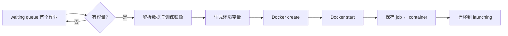

##### 环境变量协议

样例将用户的 `parameters` 直接展开为 `KEY=VALUE`，再加入数据路径。优点是任何语言都能读取，缺点是：

- 没有原生类型和嵌套结构；
- 操作系统对环境大小有限制；
- 用户键可能覆盖平台保留键；
- secret 可能在进程检查或日志中泄露；
- 未验证值可能造成命令或配置注入。

平台应区分用户参数、平台保留参数和 secret，定义命名空间与 allowlist。容器必须在开始计算前解析并验证全部参数。

##### image 名称不能替代不可变版本

样例 `createContainerCmd(metadata.getAlgorithm())` 直接把算法名当镜像名。若本地同名 tag 被覆盖，两次请求会执行不同代码。生产系统应由算法注册表解析为：

$$
algorithm\_name + algorithm\_version
\longrightarrow image@sha256:digest
$$

job metadata 必须保存最终 digest，而不是只保存用户输入名。

##### 启动迁移必须考虑失败窗口

如果容器启动成功、服务却在记录映射前崩溃，会产生仍在消耗 GPU 的孤儿容器；如果先标记 launching、Docker create 失败，则作业会卡在错误状态。可靠实现应使用幂等标签、期望状态记录和周期性 reconciliation 来收敛，而不是依赖一次跨系统操作原子成功。

#### 跟踪训练进度

tracker 轮询 Docker Runtime：

- 对 launching jobs，容器进入 running 后迁移到 `runningList`；
- 对 running jobs，容器退出后迁移到 `finalizedJobs`；
- final 状态不再轮询。

```text
update_container_status():
    for job in launching_jobs:
        state = docker.inspect(job.container_id)
        if state == RUNNING:
            move(job, LAUNCHING, RUNNING)
        elif state is terminal failure:
            move(job, LAUNCHING, FAILED)

    for job in running_jobs:
        state = docker.inspect(job.container_id)
        if state is terminal:
            move(job, RUNNING, SUCCEEDED if exit_code == 0 else FAILED)
```

轮询简单，但状态新鲜度取决于周期 $\Delta t$，平均检测延迟约为 $\Delta t/2$；周期太短会增加 Docker API 压力，太长会让 UI 和资源回收滞后。事件流可以降低无效轮询，但仍需周期性全量对账以修复丢失事件。

“容器停止”不自动等于“训练成功”。至少要同时检查：

- 退出码为 0；
- 模型制品和 manifest 已完整上传；
- 必需指标已写入；
- 输出校验和可验证；
- 没有被取消或超时杀死。

否则容器可能在上传前异常退出，或者代码错误地返回 0 而没有模型。

### 3.3.5 更新与获取作业状态

`GetTrainingStatus` 按 job ID 依次查询四个集合：

- 在 `finalizedJobs`：根据 `isSuccess()` 返回 `succeed` 或 `failure`；
- 在 `launchingList`：返回 `launch`；
- 在 `runningList`：返回 `running`；
- 否则假设仍在 `jobQueue`：返回 `waiting`。

这里“集合位置 = 状态”成立的前提是：

$$
\forall j,\quad
\sum_{s\in States}\mathbf{1}[j\in S_s]=1
$$

即每个作业恰好属于一个状态集合。迁移必须原子，否则查询可能短暂看到两个状态或查不到作业。

样例最后一个 `else` 也没有区分“正在等待”和“job ID 根本不存在”。生产 API 应明确返回 `NOT_FOUND`，不能把未知 ID 误报为 waiting。

#### 状态、进度和健康不是同一件事

- **生命周期状态**：waiting、running、succeeded；
- **算法进度**：epoch 7/20、已处理 35% 样本；
- **运行健康**：GPU 是否活跃、loss 是否更新、是否死锁；
- **模型质量**：validation F1 是否达标。

Docker 只能直接告诉服务容器状态。epoch 和 loss 需要训练代码主动上报；健康需要结合 heartbeat、日志与资源指标；质量需要数据科学评价。

在原章四种状态的基础上，面向生产扩展时还可增加 `VALIDATING`、`QUEUED`、`SCHEDULING`、`STARTING`、`UPLOADING`、`CANCELLED`、`TIMED_OUT` 和 `RETRYING` 等状态。

### 3.3.6 意图分类模型训练代码

样例容器训练一个三层神经网络，重点不在网络结构，而在它怎样遵守平台协议。流程按原章顺序为：

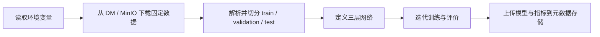

#### 第一步：读取输入参数

训练代码读取 `EPOCHS`、`BATCH_SIZE`、`TRAINING_DATA_PATH` 等，并应用默认值。正确实现应输出最终解析后的非敏感配置，使运行记录反映**实际值**，而不只是请求值。

#### 第二步：下载精确训练快照

代码从对象存储取得 `examples.csv` 与 `labels.csv`。这一输入来自第 2 章 DM 生成的不可变 snapshot。容器应验证：

- 路径对应请求中的 snapshot hash；
- 两个 part 属于同一版本；
- 文件 checksum 正确；
- 下载失败可区分暂时错误与永久错误。

#### 第三步：准备 DataLoader

数据被切分为训练、验证和测试子集，再按 batch size 创建 DataLoader。训练集通常 shuffle；验证和测试集不需要 shuffle 才能计算总体指标，虽然原章示例三个 loader 都设置 `shuffle=True`。只要评价覆盖每个样本且聚合正确，shuffle 不改变理论总体指标，但会增加复现实验顺序的复杂度。

#### 第四步：训练和评价

每个 epoch 调用训练函数，再计算验证指标。完成后在测试集上计算准确率。训练 loop 与 3.2 的前向、loss、反向和参数更新模式对应。

#### 第五步：保存模型与元数据

代码把模型文件上传到 model bucket，并创建 artifact metadata。上传顺序应防止下游看到半成品：先写临时对象，验证 checksum，再原子发布 manifest / registry 状态。

一次训练最好产出如下 manifest：

```json
{
  "job_id": 42,
  "dataset": {"id": "1", "version": "hashBA=="},
  "image_digest": "sha256:...",
  "hyperparameters": {"epochs": 15, "batch_size": 64},
  "model_uri": "s3://models/job-42/model.pt",
  "model_checksum": "sha256:...",
  "metrics_uri": "s3://metadata/job-42/metrics.json",
  "status": "SUCCEEDED"
}
```

它把“容器执行”连接到“可复现模型”。

#### 代码与服务职责对应

| 训练代码 | 训练服务 |
| --- | --- |
| 解析算法参数 | 验证并传入参数 |
| 下载指定快照 | 授权并提供数据身份 / 位置 |
| 定义模型和优化过程 | 不理解网络内部结构 |
| 上报 loss / accuracy | 收集、存储并展示指标 |
| 保存 checkpoint / 模型 | 提供输出位置、生命周期和血缘 |
| 返回退出码 | 判断执行终态并释放资源 |

容器化 + 协议让框架与模型结构可变，而外围执行方式稳定。

### 3.3.7 训练作业管理

#### 进程隔离不等于资源公平

Docker 能隔离进程和依赖，但如果所有用户共享一个 FIFO，用户 A 先提交 100 个作业，之后 B、C 各提交一个，那么 B、C 可能等待 A 的全部任务。这叫 head-of-line blocking / 资源垄断问题。

设单并发、每个作业耗时 $t$，A 的 100 个作业先入队，则 B 的等待时间近似：

$$
W_B\approx100t
$$

若 $t=2$ 小时，B 即使只运行 10 分钟也要等约 200 小时。高总体利用率并不代表良好用户体验。

#### 原章方案：按团队划分机器池和队列

为不同团队 / 用户设置：

- 独立 machine pool；
- 独立 GPU、CPU 和机器容量；
- 独立 job queue；
- 依据项目需求调整池大小。

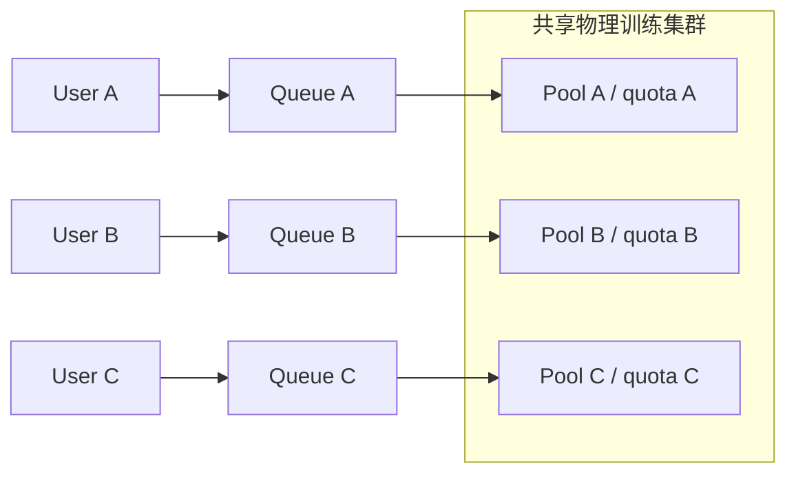

隔离保证一个重用户不能消耗其他团队的保留容量，但静态池会产生碎片：A 满载时，B 的空闲 GPU 可能无法借给 A。作者建议为池设置最小 / 最大规模，并在池之间移动或动态供应服务器。

原章主要给出独立资源池及弹性上下限；沿着公平与利用率这两个目标继续推导，常见调度选择还包括：

- 每用户 / 团队并发上限；
- weighted fair queueing；
- 配额保证 + 空闲容量借用；
- 优先级与抢占；
- gang scheduling，确保分布式作业全部 worker 同时可用；
- backfilling，用小作业填补暂时无法满足的大资源空隙。

选择取决于公平、吞吐、截止时间和资源碎片之间的权衡。

#### Kubernetes namespace 与 ResourceQuota

原章推荐用 Kubernetes：为每个团队创建 namespace，设置 CPU、内存和 GPU quota，训练服务按用户映射 namespace，再通过 Kubernetes API 创建作业。quota 满时，新 workload 无法获得资源。

```text
user identity
  -> team / tenant mapping
  -> Kubernetes namespace
  -> ResourceQuota + LimitRange + RBAC + policies
  -> training Pod / Job
```

这里要精确辨析：

- namespace 是逻辑作用域，不是真正的独立虚拟集群；
- ResourceQuota 限制可消费资源总量，不保证这些资源对应独占物理机器；
- 要绑定特定节点池，还需 node label、affinity、taint / toleration 等调度策略；
- namespace 本身不是强安全边界，还需 RBAC、NetworkPolicy、Pod Security、secret 与存储权限；
- quota 通常控制上限，公平排队和空闲借用仍需队列 / 调度组件。

尽管如此，Kubernetes 已替训练服务处理大量通用问题：资源请求与限制、放置、节点健康、Pod 生命周期和 namespace 配额，平台无需在应用代码中重造这些机制。

### 3.3.8 排障指标

作者把指标分成两大类。

#### 训练执行 / 系统指标

用于判断平台是否健康：

- 资源利用率 / 饱和率；
- 服务和训练执行可用性；
- 平均训练作业执行时间；
- 作业失败率。

可以更精确地定义：

$$
\operatorname{JobFailureRate}=\frac{N_{failed}}{N_{terminal}}
$$

$$
\operatorname{QueueLatency}=t_{start}-t_{submit}
$$

$$
\operatorname{RunDuration}=t_{finish}-t_{start}
$$

$$
\operatorname{ServiceAvailability}=1-\frac{T_{unavailable}}{T_{window}}
$$

原章用服务可用性高于 $99.99\%$、作业失败率低于 $0.1\%$ 作示例。它们不是普遍 SLO；训练作业失败还可能来自用户代码或数据，不能全部算作平台故障。建议分类：配置错误、算法异常、数据访问、资源不足、节点故障、平台内部错误。

平均值也可能隐藏长尾，实践中应同时看 P50、P95、P99 queue latency / duration，并按团队、算法、GPU 类型和失败原因分组。

#### 模型性能指标

用于判断学习质量：

- 每个 epoch 的 loss；
- 训练 / 验证评价分数；
- 最终 accuracy、precision、recall、F1 等。

对二分类：

$$
\operatorname{Accuracy}=\frac{TP+TN}{TP+TN+FP+FN}
$$

$$
\operatorname{Precision}=\frac{TP}{TP+FP},\qquad
\operatorname{Recall}=\frac{TP}{TP+FN}
$$

$$
F_1=2\cdot\frac{\operatorname{Precision}\cdot\operatorname{Recall}}
{\operatorname{Precision}+\operatorname{Recall}}
$$

类别不平衡时 accuracy 可能误导；多分类还要明确 micro、macro 或 weighted averaging。

#### 两类指标如何联合排障

| 现象 | 系统指标 | 模型指标 | 可能方向 |
| --- | --- | --- | --- |
| 训练突然变慢 | GPU 利用低、I/O 等待高 | loss 曲线正常但更新慢 | 数据读取或资源争用 |
| 运行稳定但质量下降 | 时长和资源与历史相近 | validation F1 下降 | 数据、代码或超参数变化 |
| loss 不再更新 | GPU 可能仍高 | 指标长时间不变 / NaN | 发散、死锁或上报故障 |
| 容器频繁 OOM | 内存达到上限 | 指标在中途截断 | batch 太大或内存泄漏 |

系统指标主要由平台采集；模型指标由训练代码上报。二者必须共享 job ID、时间戳和版本血缘，才可以关联分析。原章把模型指标的统一存储留到第 8 章。

### 3.3.9 支持新算法或新版本

#### 样例中的直接映射

样例规定：请求的 `algorithm` 必须等于本地 Docker image 名。例如：

```text
algorithm = "intent-classification"
        ↓
docker image = "intent-classification"
```

它证明了请求可以通过一个参数选择黑盒实现，但把用户 API、镜像命名和本机缓存紧耦合，无法表达版本、仓库、digest、权限和兼容协议。

#### 作者提出的算法注册表

在数据库维护映射并开放自助 API：

```text
createAlgorithmMapping(algorithmName, image, version)
updateAlgorithmVersion(algorithmName, image, version)
```

新增算法时注册新名字与镜像；升级时更新已有算法映射。外部 `Train` API 不变，只增加可用参数值。

更完整的数据模型可写为：

```text
AlgorithmVersion:
    algorithm_name
    semantic_version
    image_digest
    runtime_contract_version
    hyperparameter_schema
    supported_dataset_types
    default_resources
    owner
    lifecycle_state  # draft / active / deprecated
```

#### “用户无感升级”与可复现性的冲突

原章说用户可以继续使用同一算法名，不感知背后版本升级。这对易用性有利，却不能让历史运行只记录算法别名。设映射在 $t_1$ 指向镜像 $I_1$，在 $t_2$ 指向 $I_2$：

$$
R_{t_1}(a)=I_1,\qquad R_{t_2}(a)=I_2
$$

两个请求都写 `algorithm=a`，结果却来自不同代码。正确做法是：

1. 请求可以省略版本，表示使用当前默认版本；
2. 入队时立即解析并冻结具体 algorithm version + image digest；
3. job record 永久保存解析结果；
4. 需要严格复现或 A/B 时允许用户显式指定版本；
5. 升级通过 canary、兼容性测试和回滚，而不是直接覆盖。

算法注册 API 还需认证、审批、镜像扫描、签名验证和所有者管理，否则任意用户注册镜像等于允许在昂贵且可访问敏感数据的集群中执行任意代码。

---

## 3.4 Kubeflow Training Operator：开源方案

自建生产训练后端需要理解不同框架的分布式角色、Pod 编排、失败恢复和状态同步。作者因此介绍 Kubeflow Training Operators：它们把这些框架知识封装成 Kubernetes Operator，可单独安装到 Kubernetes 集群，并作为现有平台的训练执行后端。

> 版本边界：本节按原章成书时的 TensorFlow、PyTorch、MXNet、MPI operator 与相应 CRD 讲解。Kubeflow 项目的组件名称、API version、安装方式和整合状态会演进；实际部署必须以目标版本官方文档和 CRD schema 为准。本章真正可迁移的是 Operator / reconciliation 设计，而不是某条历史安装命令。

### 3.4.1 Kubeflow Training Operator

Kubeflow 是原生运行在 Kubernetes 上的开源机器学习平台，覆盖 Notebook、Pipeline、训练和服务等生命周期能力。用户可以采用完整平台，也可以只安装 Training Operator 或超参数优化等独立组件。

原章列举的 operator 包括：

- TensorFlow Operator；
- PyTorch Operator；
- MXNet Operator；
- MPI Operator。

每个 operator 理解一种训练框架的角色与启动方式，例如 PyTorch 的 master / worker 或 TensorFlow 的不同 replica spec，并把用户声明转换为 Pod、Service 等 Kubernetes 资源。

#### 作者推荐它们的三个理由

1. **安装和维护相对简单**：相比从零实现框架编排，operator 可独立安装并复用；
2. **兼容多种算法与框架**：训练代码容器化后，可通过对应 CRD 执行单机或分布式训练；
3. **容易集成**：Kubernetes API 本身就是声明式 HTTP API，创建自定义训练资源即可提交，读取资源状态即可查询结果。

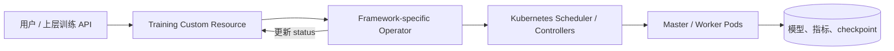

“开箱即用”是相对于自写框架控制器而言，并不代表安装后就拥有完整训练平台。数据访问、镜像注册、队列公平、认证、元数据、成本治理和用户 API 仍需要系统集成。

### 3.4.2 Kubernetes Operator / Controller 模式

#### 从命令式启动转向声明式期望状态

样例 Docker tracker 的思路是：应用代码主动创建容器并轮询状态。Kubernetes controller 则围绕持久 resource object 工作。

用户写入期望状态（desired state），controller 观察实际状态（observed state），不断执行调和函数：

$$
a_{t+1}=\operatorname{Reconcile}(d,o_t)
$$

其中 $d$ 是资源 spec 中的期望状态，$o_t$ 是当前观察状态，$a_{t+1}$ 是下一组创建、更新或删除动作。执行后得到新状态 $o_{t+1}$，循环直到：

$$
o_{t+1}\approx d
$$

这里“相等”不是所有字节相同，而是 controller 负责的约束已经满足。

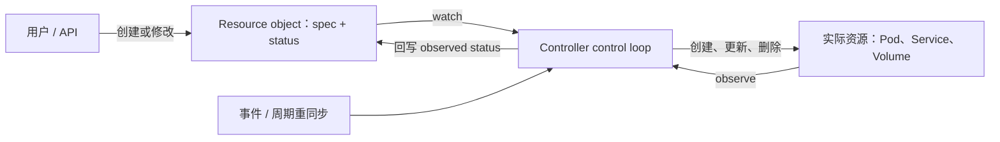

例如 Pod resource 的 spec 声明两个容器和一个 volume：

1. API Server 持久保存 object；
2. controller / scheduler 观察到它；
3. 集群创建实际 Pod、容器和挂载；
4. 状态被回写到 resource；
5. object 删除后，期望实例数变为零，相关实际资源被回收。

这比“调用一次 create 然后祈祷成功”更健壮，因为 controller 会反复对账。调和操作应尽量幂等：同一状态重复执行不会制造重复资源。

#### Resource、CRD、Custom Resource 与 Operator

- **Kubernetes resource object**：Pod、Namespace、ConfigMap 等由 API 保存的声明式对象；
- **CRD（CustomResourceDefinition）**：向 Kubernetes 注册一种新的 API 类型及 schema；
- **Custom Resource（CR）**：该类型的一个实例，例如名为 `pytorch-demo` 的 `PyTorchJob`；
- **Custom Controller / Operator**：watch 这种 CR，执行领域逻辑并更新状态的控制循环。

原章把 controller 与 operator 交替使用。在严格术语中，operator 通常是编码领域运维知识的 controller；本节不依赖这一区别。

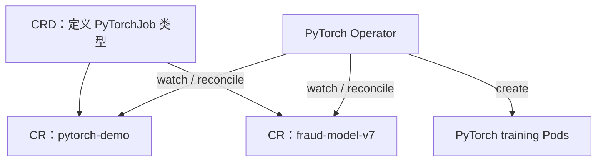

CRD 使 Kubernetes API 可扩展，operator 使新类型具有行为。只有 CRD 没有 controller，就只是能存储对象，不会自动启动训练。

### 3.4.3 Kubeflow Training Operator 设计

每种 Training Operator watch 对应 CR：

| Operator | 训练资源示例 | 领域知识示例 |
| --- | --- | --- |
| TensorFlow Operator | `TFJob` | chief、worker、parameter server 等角色与服务发现 |
| PyTorch Operator | `PyTorchJob` | master / worker 启动与分布式环境 |
| MPI Operator | `MPIJob` | launcher、worker 与 MPI 运行配置 |

以 `TFJob` 为例：

1. 用户创建 CR，spec 声明镜像、命令、角色、副本数和资源；
2. TensorFlow Operator watch 到对象；
3. operator 创建所需 Service 和 Pod；
4. Pod 运行 TensorFlow 训练容器；
5. operator 持续观察 Pod，调和副本数与状态；
6. 最新训练状态写回 `TFJob.status`。

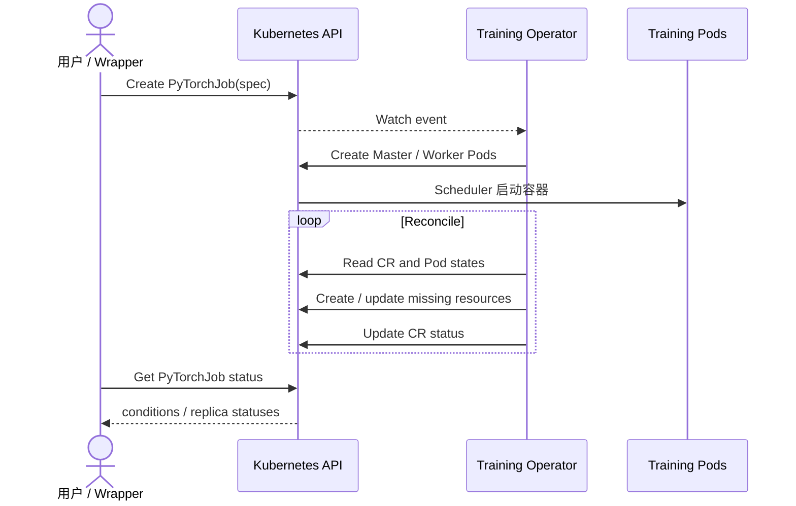

#### Operator 如何帮助故障恢复

若 spec 要求 2 个 worker，而一个 Pod 消失，观察状态变为 1：

$$
N_{observed}=1<N_{desired}=2
$$

`reconcilePods` 会尝试创建替代 Pod，使数量恢复为 2。这解决**运行单元数量**的自愈。

但要避免过度推论：

- 新 Pod 不自动拥有旧 Pod 内存中的模型和优化器状态；
- 某些分布式框架中一个 worker 丢失会让整个训练组失败；
- 真正从中途恢复需要训练代码定期写持久 checkpoint，并支持加载；
- 对多 worker 作业还可能需要整体重启或弹性训练协议。

因此：

$$
{\text{Pod replacement}}\neq\text{training state recovery}
$$

Operator 提供可靠执行骨架，算法容错仍是训练代码与存储协议共同责任。

#### CR 是期望状态和运行状态的汇合点

`spec` 由用户提交，描述想要什么；`status` 由 controller 更新，描述看到了什么。上层系统不必直接拼接所有 Pod 状态，而可读 Training CR 的 conditions 和 replica status。

CR 是 Kubernetes 中该作业状态的主要事实来源，但模型制品是否成功上传、业务质量是否达标，仍可能保存在外部元数据系统；两边应通过 job ID / CR UID 关联。

#### 队列与调度的边界

原章描述 operator 管理作业队列，并利用 Kubernetes 创建 Pod。实际架构中需区分：

- Operator：框架工作负载生命周期与角色编排；
- Kubernetes Scheduler：把可调度 Pod 放到节点；
- 可选批调度 / 队列层：团队配额、优先级、gang scheduling 和公平共享。

不能因为用了 Training Operator 就假定多租户公平和昂贵 GPU 队列问题全部解决。

### 3.4.4 如何使用 Kubeflow Training Operator

原章用 PyTorch Operator 给出四步流程；其他 operator 共享同一模式。

#### 第一步：安装 Operator 与 CRD

安装独立 PyTorch Operator 后，集群中应出现 controller Pod 和 `PyTorchJob` CRD。原章用：

```shell
kubectl get crd
```

确认 `pytorchjobs.kubeflow.org` 已注册。书中强调不必安装完整 Kubeflow 才能使用独立 operator。具体清单、API group 和安装方式必须按目标版本检查。

#### 第二步：让训练容器接受运行参数

容器要从环境变量或命令行读取 epochs、batch size、数据位置和输出配置。这与样例服务的黑盒协议完全一致，差别只是启动者从 Docker tracker 变成 Kubernetes Operator。

#### 第三步：创建 Training Custom Resource

下面是按原章字段意图整理的示意 YAML，不保证适配任意当前版本：

```yaml
apiVersion: kubeflow.org/v1
kind: PyTorchJob
metadata:
    name: pytorch-demo
    namespace: kubeflow
spec:
    pytorchReplicaSpecs:
        Master:
            replicas: 1
            restartPolicy: OnFailure
            template:
                spec:
                    containers:
                        -
                            name: pytorch
                            image: "registry.example.com/mnist@sha256:IMAGE_DIGEST"
                            env:
                                -
                                    name: EPOCHS
                                    value: "20"
                            command:
                                - python3
                                - "-m"
                                - mnist
                                - "--batch-size=32"
                            resources:
                                limits:
                                    nvidia.com/gpu: "1"
        Worker:
            replicas: 1
            restartPolicy: OnFailure
            template:
                spec:
                    containers:
                        -
                            name: pytorch
                            image: "registry.example.com/mnist@sha256:IMAGE_DIGEST"
```

主要字段对应：

- `kind`：训练 CR 类型；
- `metadata.name`：作业名；
- `pytorchReplicaSpecs`：分布式角色组；
- `replicas`：每类角色副本数；
- `containers`：镜像、命令、环境和资源；
- `restartPolicy`：失败后的 Pod 重启策略。

这份清单只用于说明字段层级。实际应用前必须替换镜像 digest 和 namespace，并依据集群中已安装的 CRD 版本核对 `apiVersion`、replica spec、资源字段及必需参数。确认后再应用资源：

```shell
kubectl create -f pytorch-job.yaml
```

Operator watch 到新对象后，将它加入处理队列并创建实际 Pod。

不要把长期云凭据像原章示例那样直接硬编码为普通环境变量值。生产中应使用 Secret 引用、CSI Secret Store 或 workload identity，并限制 service account 权限。

#### 第四步：查询 Training CR 状态

```shell
kubectl get -o yaml pytorchjobs pytorch-demo -n kubeflow
```

controller 会把 conditions、replica 状态等写回 CR。`kubectl` 只是 Kubernetes API 客户端；平台也可以用 REST / SDK 创建 CR 和读取 status。

#### 四步与样例服务的对应

| 样例 Docker 服务 | Kubeflow Operator 方案 |
| --- | --- |
| `Train` gRPC request | 创建 `PyTorchJob` CR |
| MemoryStore job metadata | Kubernetes 持久 CR spec / status |
| DockerJobTracker | Training Operator reconciliation loop |
| 本机 Docker container | Kubernetes Pod 中的训练 container |
| 四个内存集合 | CR conditions + replica / Pod states |
| `GetTrainingStatus` | GET Training CR status |

Operator 方案把易失的应用内状态变成 Kubernetes API 中的声明对象，并复用集群调度与自愈。

### 3.4.5 如何集成到现有系统

现有深度学习平台不必让所有用户直接学习 Kubernetes CRD。可在 Operator 前增加 wrapper training service，保持原有网站和训练 API 不变。

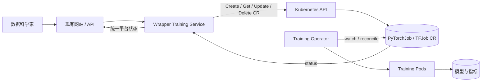

Wrapper 有三项职责：

1. 管理平台级作业队列与策略；
2. 把现有训练请求翻译成 Training CR 的 CRUD；
3. 读取 CR status，映射成现有平台状态。

还应承担：

- 用户身份到 namespace / service account 的映射；
- 算法注册信息到 image digest、command 和 replica spec 的转换；
- 数据、secret、输出位置和资源策略注入；
- CR UID 与平台 job ID、模型 artifact 的血缘关联；
- CRD 版本升级与用户 API 的兼容隔离。

#### 为什么加一层 wrapper 而不直接暴露 Kubernetes

- 用户只看到领域 API，不必理解 CRD 细节；
- 可以保持云 / 后端实现可替换；
- 集中执行认证、配额和参数校验；
- 平台 API 版本不随 Operator CRD 升级而变化；
- 可把多种 operator 统一成同一 `Train` 语义。

代价是 wrapper 与 CR 形成双层状态。应明确 Kubernetes CR status 是执行后端事实，平台 job record 是用户契约和长期历史；同步逻辑必须可重入，并定期对账。

作者的结论是：若已经在 Kubernetes 上执行训练，优先采用成熟 Training Operator，而不是重新实现各框架分布式编排和 Pod 可靠性。这并不免除对版本、运维和缺失平台能力的评估。

---

## 3.5 何时使用公有云

Amazon SageMaker、Google Vertex AI、Azure Machine Learning 等托管平台不仅提供训练，还覆盖数据处理、存储、版本、排障和部署。作者不比较哪家最好，而是从企业阶段与约束判断“买”还是“建”。

正确问题不是“云上有没有这个功能”，而是：

$$
\operatorname{Choose}=f(\text{time to market},\text{scale},\text{TCO},
{\text{control}},\text{compliance},\text{portability},\text{team capability})
$$

同一公司也可以混合选择：早期用托管训练验证产品，规模扩大后迁移部分稳定工作负载；敏感任务自建，普通任务托管。

### 3.5.1 何时使用公有云方案

#### 场景 1：创业或快速验证业务

托管平台承担集群、调度、基础监控和标准工作流，团队把时间投入业务逻辑、数据和算法。价值主要是缩短 time-to-market，而不一定是每小时单价最低。

如果一个想法最终失败，较高的可变费用可能仍然比提前招聘平台团队和建设固定基础设施便宜。这就是作者的“尽早失败、快速学习”。

#### 场景 2：用例少且符合标准路径

如果只有少数模型，训练频率低，框架、数据和部署流程都被托管产品良好支持，自建复杂训练服务难以摊薄工程成本。

可以粗略比较：

$$
TCO_{managed}=C_{usage}+C_{integration}+C_{vendor\ risk}
$$

$$
TCO_{self}=C_{compute}+C_{storage}+C_{engineering}+C_{operations}+C_{risk}
$$

早期 $C_{engineering}+C_{operations}$ 通常远高于托管溢价。规模扩大后，持续用量和定制约束可能改变结果。

#### 使用托管平台的前提

- 预定义方式能满足算法与数据流；
- 数据可以合法地放在目标云和区域；
- 身份、网络和审计能与组织集成；
- 服务配额、GPU 可用性和区域容量满足需求；
- 团队接受 API、制品格式和迁移成本；
- 已按当前价格、折扣和使用模式计算 TCO。

托管不等于“无需运维”：用户仍负责训练代码、数据质量、权限配置、成本预算、模型治理和失败诊断。

### 3.5.2 何时自建训练服务

作者列出五类需求。这里的“自建”不一定是从零实现调度器；更合理的含义往往是在 VM、对象存储、Kubernetes 和 Kubeflow Operator 等基础能力上建设自己的控制面。

#### 云无关

若客户禁止把数据放在某一云，或产品必须在 AWS、GCP、Azure 和本地部署，深度绑定某家托管 ML API 会阻碍迁移。

原章建议只使用 VM、存储等基础服务，在其上建立 Kubernetes 和自有训练 API。例如在 AWS 使用 EKS / EC2，在 GCP 使用 GKE，迁移时复用训练服务和工作负载定义。

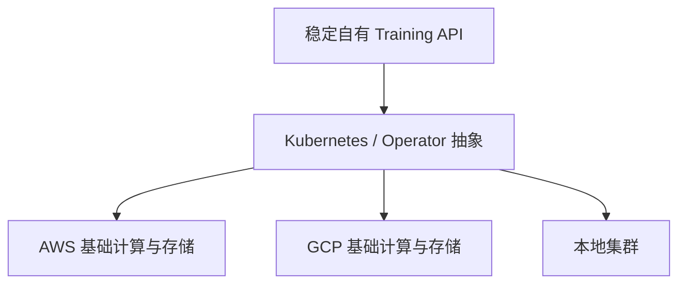

但云无关不是二元属性。负载均衡、身份、对象存储语义、GPU 型号、网络和托管 Kubernetes 都有差异。应明确要移植的是哪一层，并通过适配器、IaC 和跨环境测试验证，而不是因为“用了容器”就宣称零迁移成本。

#### 降低基础设施成本

原章给出 2022 年历史示例：同规格 `m5.2xlarge`，SageMaker 训练价格约为 0.461 USD/hour，直接 EC2 约为 0.384 USD/hour。

绝对差额：

$$
\Delta p=0.461-0.384=0.077\ \mathrm{USD/hour}
$$

以 SageMaker 价格为分母，节省比例为：

$$
\frac{0.077}{0.461}\approx16.7\%
$$

以 EC2 为分母，托管溢价约为：

$$
\frac{0.077}{0.384}\approx20.1\%
$$

所以原章“接近 20%”取决于比较分母。若每月使用 $10{,}000$ instance-hours，仅按这个历史按需差价，差额为：

$$
10{,}000\times0.077=770\ \mathrm{USD/month}
$$

这组价格只反映原章成书时特定区域 / 计费口径，不能用于当前采购。实际还要纳入：

- 预留、Savings Plans、Spot 和企业折扣；
- 托管平台包含的日志、自动扩缩、维护和支持价值；
- 自建平台工程师与 on-call 成本；
- 空闲率、失败重算和资源调度效率；
- 数据传输、存储、控制面与许可证。

只有训练规模足够大、团队能高效运营时，较低计算单价才可能转化成更低 TCO。

#### 定制能力

托管平台为了服务普遍场景，会限定工作流、支持的框架版本、网络形态和扩展点。自建适合：

- 特殊分布式拓扑或硬件；
- 新研究方法需要立即落地；
- 自定义调度、checkpoint 或数据路径；
- 业务特有的质量门禁与元数据协议；
- 托管平台尚未支持的运行时。

定制自由也意味着自己承担兼容、升级、故障和安全责任。不要为了理论上的未来灵活性提前重建所有能力；应由已发生且高价值的约束驱动。

#### 通过合规审计

医疗、隐私等业务可能需要 HIPAA、CCPA 或其他法规 / 认证证据。作者担心托管平台是黑盒，基础设施证据和检查清单难以获得，因此某些组织倾向自建以控制环境。

这不是“公有云无法合规”的普遍结论。许多托管服务提供特定认证和审计材料，自建也不会自动合规。决策应检查：

- 目标服务、区域和功能是否在认证范围内；
- 云厂商与客户各自承担哪些控制，即 shared responsibility；
- 数据驻留、加密、密钥、日志和删除是否满足要求；
- 是否能导出审计证据；
- 第三方依赖和供应链是否纳入审查。

如果托管服务的控制和证据不满足特定审计，才是自建或缩小托管范围的理由。

#### 身份认证与授权

企业已有自己的身份目录、服务认证和细粒度授权。直接向多种内部应用暴露云 AI 平台时，需要桥接：

- 企业用户 / 组与云 IAM role；
- 服务身份与临时凭据；
- 项目、数据集、算法和 GPU 配额权限；
- 本地与云上的审计主体；
- 离职、调岗与权限回收。

自有 Training API 可以更自然地接入内部 auth，并把后端凭据隐藏在平台后面。但自建认证本身也很难；应复用 OIDC、企业 IAM 和工作负载身份，不应自行设计密码或长期密钥系统。

#### 五项条件的共同本质

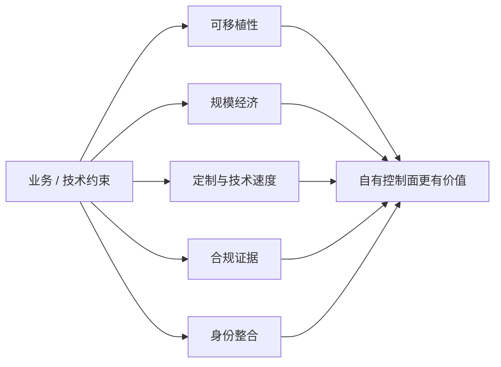

当组织需要的**控制权价值**超过自建的工程和运营成本时，自建才合理。

### 3.5.3 基于原章五项因素推导的选择框架

| 问题 | 偏向托管 | 偏向自建 / 自有控制面 |
| --- | --- | --- |
| 产品阶段 | 需求未验证、时间最重要 | 稳定且训练规模持续增长 |
| 用例数量 | 少数标准任务 | 多团队、多类型、共享平台 |
| 框架 / 硬件 | 托管支持良好 | 特殊拓扑、新框架、自定义调度 |
| 云策略 | 单云可接受 | 多云、本地、客户指定环境 |
| 合规 | 服务认证与证据满足 | 需要平台无法提供的控制 / 证据 |
| 身份 | 云 IAM 足够 | 深度集成企业内部授权 |
| 团队能力 | 无平台 / SRE 团队 | 有长期平台与 on-call 能力 |
| 成本结构 | 低频、波动大 | 高频、稳定、可摊薄固定成本 |

建议分四步决策：

1. 用实际工作负载和要求做小型托管 POC；
2. 计算 12 至 36 个月 TCO，而非只看实例单价；
3. 识别不可接受的锁定和合规差距；
4. 设计可逆路径，例如保持数据、镜像和训练契约尽量可移植。

---

## 容易混淆的概念与常见误区

### 1. 训练算法就是训练服务

错误。算法定义怎样从数据学习参数；服务管理算法在哪里、何时、用多少资源执行，以及怎样追踪结果。模型成功依赖算法与系统工程两根支柱。

### 2. 能远程执行 Shell 脚本就已经服务化

错误。多用户服务还需持久状态、排队、资源治理、隔离、权限、复现和故障处理。脚本可以是入口，但不是完整控制面。

### 3. 专属 GPU 一定比共享集群可靠

不一定。专属资源减少争用，却可能大量闲置、环境漂移且无法弹性扩展；共享平台通过治理换取更高利用和集中可靠性。

### 4. GPU 利用率越高，训练平台越成功

错误。长期满载可能伴随巨大排队时间。应联合看成功实验成本、反馈周期、公平性和失败率。

### 5. 高性能模型与高性能训练服务是同一含义

错误。前者通常指模型质量或推理性能；本章原则 2 主要指训练速度、资源利用与成本效益。

### 6. 训练代码无关意味着平台不需要协议

恰好相反。只有输入、输出、退出码、指标和 checkpoint 契约足够明确，内部算法才可以自由变化。

### 7. 容器就是虚拟机，也是完整安全沙箱

错误。容器共享宿主内核，主要提供进程、文件系统和依赖边界。强多租户还需运行时加固、权限、网络、节点和 secret 策略。

### 8. Docker 镜像 tag 可以唯一标识训练代码

错误。tag 可以移动；复现应保存不可变 image digest，并关联源代码和构建记录。

### 9. 相同数据和代码必然产生逐位相同模型

错误。随机性、并行归约、非确定性算子和硬件可能造成差异。必须定义复现等级和指标容差。

### 10. epoch、iteration 和 batch 是同一个概念

错误。batch 是一次处理的数据集合，iteration 通常是一次参数更新，epoch 是遍历完整训练集一轮。

### 11. loss 降低就表示业务效果必然提高

错误。loss 是训练目标的代理，可能受数据偏差、过拟合和错误指标影响。还要看验证、测试和产品指标。

### 12. 容器启动成功就表示训练成功

错误。成功至少需要正确退出、完整模型制品、必需指标和校验和；模型质量是否达标又是另一层判断。

### 13. 队列位置可以精确预测启动时间

错误。资源形状、优先级、重试、抢占和 backfilling 都会改变顺序。位置只是近似可观测信息。

### 14. FIFO 对所有用户都公平

错误。先提交大量作业的用户可阻塞其他团队。需要配额、用户并发、加权公平或分层队列。

### 15. Docker 提供进程隔离，所以资源隔离已完成

错误。还要设置 CPU、内存、GPU request / limit、配额和调度策略；默认无限制容器仍能抢占资源。

### 16. Kubernetes namespace 就是物理机器池或虚拟集群

错误。namespace 是逻辑作用域；ResourceQuota 是逻辑上限。物理节点绑定和强安全边界需要额外机制。

### 17. 系统指标和模型指标可以混为一个健康分数

错误。容器可靠完成与模型质量是正交维度。必须分别采集，再通过 job ID 联合分析。

### 18. 更新算法映射后，历史作业仍可凭算法名复现

错误。别名会改变。入队时必须冻结 algorithm version 与 image digest。

### 19. Controller 只在资源创建时运行一次

错误。Controller 由事件和周期重同步驱动，持续比较期望与观察状态，直到收敛并修复漂移。

### 20. CRD 和 Custom Resource 是同一对象

错误。CRD 定义一种 API 类型；CR 是该类型的实例。还需要 Operator 才会产生训练行为。

### 21. Operator 重建 Pod 等于从中断处恢复训练

错误。Pod 数量恢复不代表模型状态恢复。训练代码必须把 checkpoint 保存到持久存储并支持加载。

### 22. 安装 Training Operator 后就拥有完整 MLOps 平台

错误。Operator 主要解决框架训练工作负载编排；数据、算法注册、队列公平、元数据、权限和产品 API 仍需集成。

### 23. 直接把 CRD 暴露给所有用户最简单

短期可能简单，长期会泄漏 Kubernetes 细节、权限和版本变化。Wrapper API 能稳定领域契约并集中治理。

### 24. 托管云一定比自建昂贵

错误。实例单价可能有溢价，但自建还有工程、on-call、空闲和失败成本。低频或早期业务常由托管更省总成本。

### 25. 自建一定更合规、更安全

错误。控制权增加也意味着责任增加。应比较认证范围、证据、shared responsibility 和团队能力。

### 26. 使用 Kubernetes 就完全云无关

错误。身份、存储、网络、GPU、托管控制面和运维接口仍有云差异。可移植性必须实测。

## 本章知识结构

```mermaid
flowchart TB
    Root[模型训练服务]

    Root --> Why[为什么服务化]
    Why --> Shared[共享昂贵算力]
    Why --> Govern[排队、隔离、合规、排障]

    Root --> Principles[四项原则]
    Principles --> P1[统一 API / 训练代码无关]
    Principles --> P2[高性能 / 低成本]
    Principles --> P3[模型可复现]
    Principles --> P4[健壮、隔离、弹性]

    Root --> Pattern[训练代码模式]
    Pattern --> Loop[mini-batch → forward → loss → backward → update]
    Pattern --> Container[Docker 黑盒 + 运行协议]

    Root --> Sample[样例训练服务]
    Sample --> API[Train / GetTrainingStatus]
    Sample --> Queue[waiting / launching / running / finalized]
    Sample --> Tracker[Docker tracker]
    Sample --> Code[意图分类训练容器]
    Sample --> Resources[公平队列、namespace、quota]
    Sample --> Metrics[系统指标 / 模型指标]
    Sample --> Registry[算法与镜像版本注册]

    Root --> Kubeflow[Kubeflow Training Operator]
    Kubeflow --> CRD[Training CRD / CR]
    Kubeflow --> Reconcile[期望状态 ↔ 实际状态]
    Kubeflow --> Pods[框架角色 Pods]
    Kubeflow --> Wrapper[现有平台 Wrapper]

    Root --> Decision[托管还是自建]
    Decision --> Managed[早期、少量、标准用例]
    Decision --> Own[可移植、规模成本、定制、合规、身份]
```

## 核心结论

1. **模型训练由算法和系统工程共同完成。** 数据科学家定义如何学习，训练服务负责让学习过程可靠、经济、规模化地执行。
2. **服务化的根因是共享稀缺资源治理。** 远程启动只是起点，队列、公平、隔离、弹性和持久状态才是核心。
3. **统一 API 建立稳定控制面，容器建立可替换执行面。** 二者靠明确的运行契约连接。
4. **不同神经网络共享 mini-batch、前向、损失、反向和优化器更新的基本模式。** 这让平台能够把算法当黑盒执行。
5. **容器化解决依赖与进程隔离，但不自动解决资源公平、安全、数据权限和模型复现。**
6. **模型复现要求固定数据快照、镜像 digest、超参数、随机性和环境。** 算法别名与镜像 tag 都不够精确。
7. **样例服务用四个集合实现作业状态机，Docker tracker 负责启动和轮询。** 这种设计便于教学，但内存状态和单并发不适合生产。
8. **执行成功、运行健康、训练进度和模型质量是四个不同维度。** 指标和状态模型必须分别表达。
9. **共享集群要优化公平与吞吐，而不只是 FIFO 和利用率。** namespace + quota 是治理基础，不是完整调度方案。
10. **算法注册表应把稳定别名解析为不可变版本，并把解析结果写入作业记录。** 无感升级不能破坏历史复现。
11. **Kubernetes Operator 通过持续调和期望与实际状态，把训练框架运维知识编码成控制器。** CR spec 是请求，status 是观察结果。
12. **Pod 自愈不等于训练状态恢复。** 长任务还必须使用持久 checkpoint 和恢复协议。
13. **Kubeflow Training Operator 是成熟执行后端，不是完整用户平台。** Wrapper 能统一 API、身份、策略和 CRD 版本。
14. **托管云的主要早期价值是时间，自建的主要成熟期价值是控制。** 选择应比较长期 TCO、可移植性、定制、合规和身份整合。
15. **实例单价不是总成本，Kubernetes 也不是自动云无关。** 所有决策都需在真实用量和目标环境中验证。

## 从本章提炼出的通用解题方法

面对一个模型训练平台设计问题，可以按以下顺序推导。

### 第一步：分离算法职责与平台职责

列出训练容器内部负责什么，控制面负责什么。平台不应理解网络层细节，但必须拥有运行状态、资源策略和制品协议。

### 第二步：从真实工作负载量化需求

收集：

- 用户 / 团队数与提交频率；
- 单机、分布式及 GPU 型号需求；
- 训练时长、checkpoint 大小和故障代价；
- queue latency、完成时间和成本目标；
- 数据敏感度与部署环境。

不要先选择 Kubernetes 或云产品，再倒推问题。

### 第三步：定义不可变 TrainingJob 契约

至少包含：

$$
J=(identity,\ D_v,\ I_d,\ H,\ R,\ command,\ outputs,\ policy)
$$

即作业身份、数据版本、镜像 digest、超参数、资源、命令、输出和重试 / 超时策略。请求接收后冻结所有可变别名的解析结果。

### 第四步：设计显式状态机和事实来源

定义合法迁移、终态、取消和重试。选择数据库、队列或 CRD 作为持久事实来源，保证迁移幂等且可对账。未知 job ID 不能伪装成 waiting。

### 第五步：分离 admission、queueing 与 placement

- admission：请求是否合法、在配额内；
- queueing：哪个作业先获得机会；
- placement：Pod / 容器放在哪个节点；
- execution：怎样启动、监控、终止和恢复。

混为一个 `hasCapacity()` 函数只能支持最简单场景。

### 第六步：设计公平和资源效率策略

为团队定义保证配额、最大并发和优先级；允许空闲容量借用；为分布式作业考虑 gang scheduling；同时观察利用率和 queue latency。

### 第七步：把失败恢复放进训练协议

识别容器、节点、网络、数据和用户代码故障。定义 checkpoint 周期、持久位置、恢复入口、最大重试和幂等输出。不要把重启 Pod 当成恢复完成。

### 第八步：建立两类可观测性

- 平台：排队、启动、运行、资源、错误和成本；
- 算法：epoch、loss、梯度、质量和 artifact。

统一用 job ID、数据版本和镜像 digest 关联，并区分平台失败与用户代码失败。

### 第九步：优先复用成熟执行后端

若运行在 Kubernetes，先评估 Kubeflow Training Operator 及适用的批调度组件；在其上建设薄 wrapper，而不是从零实现框架角色和 Pod 调和。

### 第十步：用 TCO 和控制需求决定托管 / 自建

把 time-to-market、使用量、团队成本、锁定、合规和身份纳入同一决策。先做可逆 POC，保留不可变镜像和数据契约，避免过早绑定不可迁移接口。

这套方法可以概括为：**先把一次训练定义成可复现作业，再用状态机治理生命周期，用调度治理共享资源，最后根据规模与控制需求选择执行后端。**

## 复习与自测

1. 模型训练服务与模型训练算法分别负责什么？
2. 为什么专属 GPU 工作站容易造成低利用率，又为什么共享池不会自动高效？
3. 训练脚本与训练服务的本质区别是什么？
4. 四项设计原则分别防止什么系统问题？
5. 怎样同时衡量每个成功模型的成本与数据科学家的反馈速度？
6. 给定 $10{,}000$ 个样本和 batch size 64，一个 epoch 有多少次参数更新？
7. 前向传播、loss、反向传播和优化器更新之间是什么因果关系？
8. mini-batch 大小怎样影响内存、梯度噪声和硬件利用？
9. 为什么训练 loss 下降不能推出业务效果提高？
10. 容器化为何能支持框架无关，哪些环境因素仍在容器外？
11. 一个可靠的训练容器协议至少要定义哪些输入和输出？
12. 为什么敏感凭据不应作为普通环境变量传入？
13. 样例服务的四个作业集合分别表示什么？
14. 四集合实现要满足什么不变量，状态查询才可信？
15. 为什么样例 `hasCapacity()` 不是资源感知调度？
16. 容器停止后还要检查什么，才能把作业标为成功？
17. 在训练时划分数据与在 DM 中划分各有什么利弊？
18. 生命周期状态、算法进度、运行健康和模型质量怎样区分？
19. 为什么单一 FIFO 会让轻量用户被重用户阻塞？
20. machine pool 隔离如何改善公平，又怎样造成资源碎片？
21. namespace、ResourceQuota 和物理节点池有什么区别？
22. 训练执行指标与模型性能指标各自回答什么问题？
23. 作业失败率为何需要按失败责任分类？
24. 算法别名无感升级为什么会破坏复现？应怎样冻结版本？
25. Kubernetes controller 的 desired state、observed state 和 reconcile 分别是什么？
26. CRD、Custom Resource 与 Operator 有何关系？
27. `PyTorchJob` 如何变成实际 master / worker Pods？
28. 为什么 Operator 重建 worker Pod 不一定能继续原训练？
29. 使用 Training Operator 的四个基本步骤是什么？
30. Wrapper Training Service 如何隔离现有平台与 CRD 细节？
31. 哪些能力不由 Training Operator 自动提供？
32. 创业验证阶段为什么通常偏向托管云？
33. 原章云价格例子中“节省 16.7%”和“溢价 20.1%”为何都成立？
34. 计算训练 TCO 时，为什么不能只比较实例小时价格？
35. 使用 Kubernetes 为什么不等于完全云无关？
36. 合规要求在什么条件下支持自建，在什么条件下托管反而更合适？
37. 如何为一个有少量标准模型的小团队选择方案？
38. 如何为一个多云、强合规、多团队且持续高负载的组织选择方案？
