> 对应原章：**4 Distributed Training**
> 本章从软件工程师与数据科学家两个视角解释：当数据越来越多、模型越来越大时，怎样把一次训练扩展到多块 GPU 或多台机器；训练代码负责怎样表达并行算法，训练服务又怎样自动建立通信组、分配资源、监控状态并提供故障恢复。

## 本章要回答的核心问题

1. 数据并行、模型并行与流水线并行分别切分什么，解决什么瓶颈？
2. 为什么“训练太慢”和“模型放不下”必须采用不同策略？
3. 同步数据并行怎样聚合梯度，它在什么条件下等价于大 batch 单机训练？
4. AllReduce 做了什么，通信为何最终会抵消增加 GPU 的收益？
5. 同步更新与异步更新怎样权衡吞吐、等待和梯度陈旧？
6. PyTorch DDP、TensorFlow `MultiWorkerMirroredStrategy` 与 Horovod 有什么共同模式？
7. 数据科学家和训练服务开发者各自负责哪部分分布式工程？
8. 样例服务怎样用 Kubernetes 创建 master、worker、Service 和通信环境变量？
9. `WORLD_SIZE`、`RANK`、`MASTER_ADDR` 与 Pod / GPU 是什么关系？
10. 模型大于单卡显存时，梯度累积、CPU/GPU 换入换出、模型并行和流水线并行怎样选择？
11. GPipe 为什么引入 microbatch，pipeline bubble 又为何无法完全消失？
12. 平台工程师怎样支持可靠、高效且可复现的分布式训练？

原章以系统设计和概念代码为主。本文在对应位置补充梯度等价性、扩展效率、通信成本、梯度陈旧、有效 batch size、流水线利用率等推导，以说明作者结论成立的前提与局限；这些形式化表达不是原章另行提出的算法。原章代码和框架接口具有成书时点，实际运行时应以目标 PyTorch、TensorFlow、Horovod 和 Kubernetes 版本为准。

---

## 4.1 分布式训练方法的类型

### 4.1.0 为什么训练必须扩展到多设备

深度学习中有两个同时增长、但性质不同的量：

- **训练数据规模 $N$** 增长：单卡每轮要处理更多样本，训练墙钟时间变长；
- **模型状态规模 $M$** 增长：参数、梯度、优化器状态和激活可能超过单卡显存。

二者不能用同一个“加 GPU”口号解决。选择策略前必须先问：

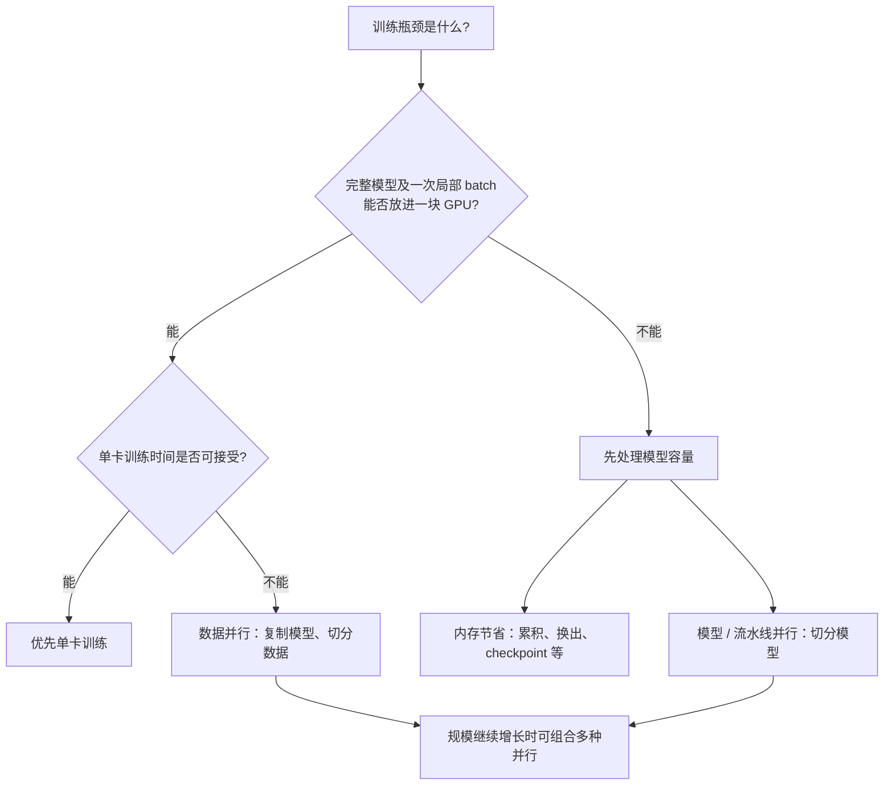

原章用 BERT 单 GPU 可能训练数月作为“训练太慢”的直觉例子。具体时间取决于模型版本、数据、硬件和实现，重要结论是：反馈周期若以月计，算法开发本身也会被拖慢。

### 4.1.1 三类主要方法

#### 数据并行（data parallelism）

每个设备保存**完整模型副本**，不同设备处理不同数据分片，再聚合梯度，让所有副本保持一致。

$$
\text{复制模型} + \text{切分数据} + \text{同步梯度}
$$

它主要解决：数据量大、单卡训练时间长。前提是完整模型与一个局部 mini-batch 能放进每个设备。

#### 模型并行（model parallelism）

把网络拆成按依赖连接的子网络，每个设备只保存并计算一部分：

$$
f_{\theta}(x)=f_{\theta_K}^{(K)}\circ\cdots\circ
f_{\theta_2}^{(2)}\circ f_{\theta_1}^{(1)}(x)
$$

它主要解决：模型状态或激活大到单卡放不下。代价是模型切分依赖具体架构，设备之间必须传输激活与梯度，而且顺序依赖会造成空闲。

#### 流水线并行（pipeline parallelism）

它在模型并行基础上，把一个训练 batch 再切成多个 **microbatch**，让不同模型阶段同时处理不同 microbatch：

$$
\text{切分模型} + \text{切分 batch 为 microbatches} + \text{重叠阶段计算}
$$

它同样解决单卡模型容量，并通过流水化降低朴素模型并行的设备空闲。

### 4.1.2 三者的关系与选择依据

| 维度 | 数据并行 | 朴素模型并行 | 流水线并行 |
| --- | --- | --- | --- |
| 切分对象 | 数据 | 模型层 / 子网络 | 模型阶段 + microbatch |
| 每设备是否有完整模型 | 是 | 否 | 否 |
| 主要目标 | 提高样本吞吐、缩短训练时间 | 让超大模型放得下 | 放下模型并提高阶段利用率 |
| 主要通信 | 梯度 / 参数 | 激活与反向梯度 | 激活与梯度的流水传输 |
| 代码改动 | 较少且模式标准 | 大、依赖模型结构 | 更大，还需调度 microbatch |
| 主要瓶颈 | AllReduce、慢 worker、全局 batch | 顺序依赖、设备空闲、切分不均 | pipeline bubble、阶段不均、通信 |
| 原章建议 | 模型能装入单卡时首选 | 容量方案但利用率低 | 模型不能装入单卡时的生产化方向 |

作者优先讲数据并行，不是因为它总比其他方法强，而是因为：

1. 不改变模型架构；
2. 主流框架提供标准 SDK；
3. 从单设备代码迁移改动相对少；
4. 容易调试，训练服务也能统一支持。

而模型 / 流水线并行没有一种对所有网络都最佳的切分方式。层的计算量、参数量、激活量和连接拓扑各异，数据科学家必须逐模型设计。

### 4.1.3 现代实践中的组合关系

原章按三种方法分别讲解，实际大模型训练常构成多维并行：

$$
N_{devices}=N_{data}\times N_{pipeline}\times N_{other\ model}
$$

例如 2 路流水线并行让模型跨两块 GPU，再复制 4 份流水线做数据并行，总计使用 $2\times4=8$ 块 GPU。这里的“其他模型并行”可以是张量维度切分等原章未展开的方法。

组合会提高容量与吞吐，也会把通信组、拓扑放置、checkpoint 和故障域变复杂。设计时仍应先用最简单、能满足目标的方法，不应因为有很多 GPU 就默认采用多维并行。

---

## 4.2 数据并行

### 4.2.1 理解数据并行

#### 同步数据并行的一次迭代

设有 $W$ 个 worker。第 $k$ 个 worker 保存相同初始参数 $\theta_t$，读取自己的局部 batch $\mathcal{B}_{t,k}$，计算：

$$
L_{t,k}(\theta_t)=\frac{1}{|\mathcal{B}_{t,k}|}
\sum_{(x,y)\in\mathcal{B}_{t,k}}\ell(f_{\theta_t}(x),y)
$$

$$
g_{t,k}=\nabla_{\theta}L_{t,k}(\theta_t)
$$

通信集合操作聚合各 worker 梯度。若局部 batch 大小相同且损失按样本求平均，常用：

$$
\bar g_t=\frac{1}{W}\sum_{k=0}^{W-1}g_{t,k}
$$

每个 worker 再执行相同更新：

$$
\theta_{t+1}=\theta_t-\eta\bar g_t
$$

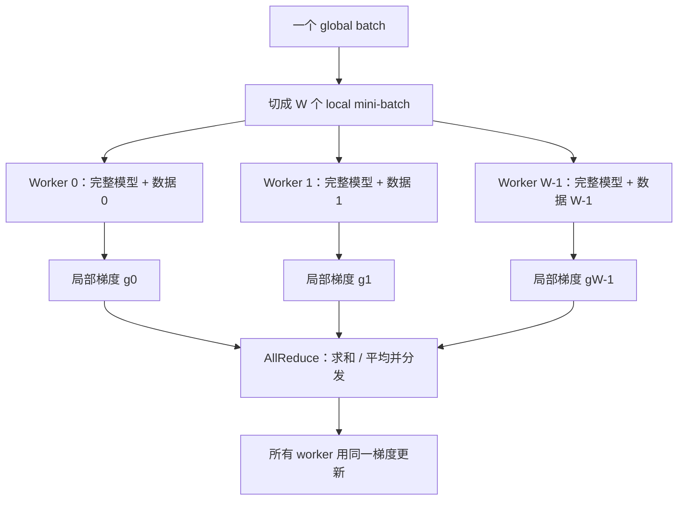

只要：

- 所有 worker 更新前参数完全相同；
- 各局部 batch 不重复且并集构成 global batch；
- 梯度按样本数正确加权；
- 随机层和归一化等语义得到一致处理；

那么同步聚合梯度等价于在 global batch 上计算梯度：

$$
\bar g_t=
\nabla_{\theta}
\left[
\frac{1}{\sum_k|\mathcal{B}_{t,k}|}
\sum_k\sum_{(x,y)\in\mathcal{B}_{t,k}}
\ell(f_{\theta_t}(x),y)
\right]
$$

局部 batch 大小不等时，不能简单平均每个 worker 的平均梯度，而应按样本数加权：

$$
\bar g_t=
\frac{\sum_k |\mathcal{B}_{t,k}|g_{t,k}}
{\sum_k |\mathcal{B}_{t,k}|}
$$

否则小 batch worker 与大 batch worker 获得同等权重，改变了训练目标。

#### Global batch size

每 worker batch size 为 $B_{local}$、worker 数为 $W$，且每个 worker 每步只算一次，则：

$$
B_{global}=W\times B_{local}
$$

例如 8 个 worker、每个 batch size 32，全局每次参数更新使用 $256$ 个样本。增加 worker 而保持局部 batch 不变，会同时改变优化算法的 global batch；若学习率等超参数不调整，收敛行为可能不同。分布式加速不是只改机器数量，还要检查优化语义。

#### AllReduce 是什么

AllReduce 是一个集合通信：每个进程提供同形状 tensor，系统对所有 tensor 做 reduce（如求和），再让**每个进程**都得到结果。

```text
worker 0 input: [1, 2]
worker 1 input: [3, 4]
sum AllReduce output on every worker: [4, 6]
```

它与“发给中心 server 再拉回”不是同一个固定拓扑。Ring AllReduce、tree AllReduce 等可在 worker 间直接组织通信。以 ring 为例，若梯度总大小为 $G$ bytes、worker 数为 $W$，忽略协议细节时，每 worker 传输量约为：

$$
V_{ring}\approx 2\frac{W-1}{W}G
$$

当 $W$ 增大，单 worker 字节量趋近 $2G$，但通信轮次、延迟、链路竞争和最慢参与者仍会影响时间。框架常把梯度分 bucket，并在反向传播中让已就绪 bucket 提前通信，从而把部分通信与计算重叠。

#### 同步相比单设备多了什么

单卡每步是：前向 → loss → 反向 → 参数更新。同步数据并行增加：

1. 数据按 worker 切分，且每个 epoch 的 sampler 要避免重复 / 遗漏；
2. 反向过程中或结束后聚合梯度；
3. 所有 worker 在逻辑上以同一聚合结果更新。

主要额外成本是通信与等待，而不是重复保存模型本身的计算。

#### 模型参数更新：同步与异步

##### 同步更新

所有 worker 在第 $t$ 步完成局部梯度后，在集合通信点等待：

$$
T_{step}^{sync}\approx
\max_k(T_{compute,k})+T_{communication}+T_{update}
$$

优点：

- 每一步所有模型副本一致；
- 聚合梯度对应同一参数版本；
- 训练语义接近大 global batch 单机 SGD；
- 结果和调试相对可预测。

缺点：慢 worker（straggler）决定整组速度。某台机器、数据读取或网络稍慢，其他 worker 都会在 barrier / collective 处空闲。

##### 异步更新

worker 不在每一步彼此等待，完成梯度后立即提交或应用更新，再继续下一批。常见实现会通过参数服务器或等价共享参数机制协调，而不是要求每个本地副本永远独立。

若 worker $k$ 在参数版本 $\theta_{t-\tau_k}$ 上算出梯度，当前参数已经是 $\theta_t$，则更新使用了陈旧梯度：

$$
\theta_{t+1}=\theta_t-\eta
g_k(\theta_{t-\tau_k})
$$

$\tau_k$ 称为 staleness。慢 worker 可能提交在第 5 次迭代计算的方向，而快 worker 已推进到第 20 次；这个方向对当前参数未必仍好。

优点：

- 不被单个慢 worker 的 barrier 完全阻塞；
- 单位时间可执行更多局部 step；
- 对异构 worker 更宽容。

代价：

- 梯度陈旧使收敛分析和调参更难；
- worker 参数版本不一致；
- 可能需要更小学习率、staleness 限制或冲突处理；
- 更多 step/min 不等于更快达到目标质量。

原章据此选择同步数据并行作为后续默认。这是主流、易于解释的基线，不代表异步在所有稀疏模型、超大规模或容错场景都劣于同步。

#### 数据与模型的显存约束

数据并行的每个 worker 都保存完整模型，因此其必要条件近似为：

$$
M_{parameters}+M_{gradients}+M_{optimizer}
+M_{activations}(B_{local})+M_{workspace}
\le M_{device}
$$

它可以通过减小 $B_{local}$ 降低 activation / batch 内存，但不会把模型参数、梯度和普通优化器状态自动分片。因此：

- **batch / activation OOM**：可先降低局部 batch，或使用梯度累积等技术；
- **模型状态本身 OOM**：普通数据并行无效，应采用模型 / 流水线并行或其他状态分片方法。

原章把“训练数据加载导致 OOM”作为第一类问题。现代输入管道通常流式读取 batch，而不是把完整 dataset 放显存；关键仍是每步驻留的局部数据与激活能否放下。

### 4.2.2 多 worker 训练的挑战

#### 故障容错

同步 collective 通常要求组内参与者共同进入操作。一个 worker 崩溃、卡住或断网，其他 worker 也可能阻塞或使整个作业失败。浪费量不只是故障 worker 的计算，而是全组从最近恢复点之后的计算。

平台和训练代码应配合：

1. 把模型、优化器、学习率调度器、epoch / step、随机状态等 checkpoint 到远程持久存储；
2. 给每个 checkpoint 写 manifest、版本和完整性校验；
3. 监测 heartbeat、collective timeout、Pod / 节点状态；
4. 按框架能力重启单个 worker、重建整个 worker group 或弹性缩放；
5. 所有 worker 从一致的 checkpoint 恢复。

仅保存模型参数通常不足以精确继续训练，因为 optimizer momentum、Adam moments、scaler 和 sampler 进度也影响下一步。

若每隔 $\tau$ 时间保存一次 checkpoint，故障在两个 checkpoint 之间近似均匀发生，则一次故障平均丢失计算约为：

$$
E[W_{lost}]\approx W\frac{\tau}{2}
$$

这里乘 $W$ 是因为同步组内所有 worker 自最近 checkpoint 后的算力都可能作废。更频繁保存降低重算，却增加 I/O 和同步开销。

原章建议“某 worker 失败后重启并加载最近状态”。实践中固定成员 collective 往往不能只透明替换一个进程；可能需要全组重启，除非框架明确支持 elastic membership。因此平台必须把恢复粒度写进协议，不能仅依赖 Kubernetes 重建 Pod。

#### 带宽饱和与扩展上限

增加 GPU 后，每个 worker 计算的数据减少，但每步仍要交换与模型梯度规模相关的数据。一个简化步时模型是：

$$
T_W\approx\frac{T_{compute,1}}{W}
+T_{communication}(W,G,network)
+T_{imbalance}+T_{input}
$$

加速比与效率：

$$
S(W)=\frac{T_1}{T_W},\qquad
E(W)=\frac{S(W)}{W}
$$

理想线性扩展是 $S(W)=W$、$E(W)=1$。原章给出历史示例：

- 8 GPU 获得 6 倍加速，效率 $6/8=75\%$；
- 50 GPU 获得 32 倍加速，效率 $32/50=64\%$。

这说明更多 GPU 仍可缩短时间，但边际收益下降。实际 sweet spot 必须用自己的模型、batch、互连和框架测试。

##### 哪些因素决定通信压力

- 参数 / 梯度 tensor 总字节数；
- 稀疏度与压缩方式；
- 通信频率；
- GPU 内部与跨 GPU 拷贝；
- 节点内 PCIe / NVLink 与节点间网络带宽、延迟；
- bucket 大小和计算通信重叠程度；
- worker 拓扑与慢节点。

大而稠密的模型每步传输量更大，通常更早受到网络限制。稀疏模型是否真正节省带宽，还取决于 collective 和编码是否利用稀疏性。

##### 原章给出的三类缓解方法

1. **拓扑感知放置**：把 worker 尽量集中到网络更快、跳数更少的节点，利用 Kubernetes node selector、affinity / anti-affinity 等策略；同节点多 GPU 还可能利用更快互连。
2. **升级并验证训练框架**：新版本可能改进 collective、梯度压缩或 overlap；升级必须配合兼容性和性能回归测试，不应无条件追逐最新版。
3. **调节梯度 bucket**：bucket 太小会增加大量通信启动延迟，太大则延迟通信开始、减少与反向计算重叠。最佳值依赖层大小、带宽和延迟。

还可考虑增大全局 batch 以降低每样本通信频率、梯度压缩、分层 AllReduce 等，但它们会改变优化或精度语义，必须由实验验证。

### 4.2.3 不同训练框架中的数据并行代码

原章代码的目的不是教平台工程师实现反向传播，而是辨认三个共同动作：

1. 建立通信组并给每个训练进程唯一身份；
2. 让框架在反向 / 优化器阶段聚合梯度；
3. 正确切分数据并限制一次性副作用。

#### PyTorch DDP

##### 第一步：初始化 process group

```python
import os
import torch.distributed as dist

def setup(rank: int, world_size: int) -> None:
    os.environ["MASTER_ADDR"] = "trainer-master"
    os.environ["MASTER_PORT"] = "12356"
    dist.init_process_group(
        backend="nccl",
        rank=rank,
        world_size=world_size,
    )

def cleanup() -> None:
    dist.destroy_process_group()
```

- `WORLD_SIZE`：通信组中训练**进程**总数；
- `RANK`：进程的全局唯一编号，范围 $[0,W-1]$；
- `MASTER_ADDR` / `MASTER_PORT`：用于 rendezvous / 建组的可达端点；rank 0 常承担约定的协调或唯一写入职责，但所有 DDP rank 都参与训练；
- backend：原章示例为 `gloo`，GPU 训练常使用 NCCL；应按硬件与框架支持选择。

`rank` 标识进程，不天然等于机器、Pod 或 GPU。一台多 GPU 机器可以启动多个 rank；一个 Pod 也可包含多个训练进程。

##### 第二步：包装模型并同步梯度

```python
import torch
from torch.nn.parallel import DistributedDataParallel as DDP

torch.cuda.set_device(local_rank)
model = MyModel().to(local_rank)
ddp_model = DDP(model, device_ids=[local_rank])

outputs = ddp_model(inputs)
loss = loss_fn(outputs, labels)
loss.backward()  # 返回时参数梯度已由 DDP 同步
optimizer.step()
```

DDP 为参数注册 autograd hook，梯度就绪时按 bucket 发起 collective。它同步梯度，不自动保证各 rank 读取不同样本，所以还要使用 `DistributedSampler`：

```python
sampler = torch.utils.data.DistributedSampler(
    dataset,
    num_replicas=world_size,
    rank=rank,
    shuffle=True,
)
loader = DataLoader(dataset, sampler=sampler, batch_size=local_batch_size)

for epoch in range(num_epochs):
    sampler.set_epoch(epoch)
    for inputs, labels in loader:
        train_step(inputs, labels)
```

忘记 sampler 会让所有 worker 训练重复数据；忘记每 epoch 调用 `set_epoch` 可能让 shuffle 顺序每轮不变。

##### DDP 的边界

- 模型结构与参数注册顺序应在所有 rank 一致；
- 所有 rank 必须按兼容顺序进入 collectives，否则可能 hang；
- 不同控制流可能产生 unused parameters，需要明确配置和调试；
- 每个 rank 的随机种子既要支持可复现，也要避免所有数据增强完全相同。

以上代码是概念整理，API 细节应以目标 PyTorch 版本为准，本文未实际运行多 GPU 作业。

#### TensorFlow / Keras

TensorFlow 用 `TF_CONFIG` 描述 cluster 与当前 task：

```python
import json
import os
import tensorflow as tf

tf_config = {
    "cluster": {
        "worker": [
            "worker-0.example:12345",
            "worker-1.example:12345",
        ]
    },
    "task": {"type": "worker", "index": 0},
}
os.environ["TF_CONFIG"] = json.dumps(tf_config)

strategy = tf.distribute.MultiWorkerMirroredStrategy()
global_batch_size = per_worker_batch_size * num_workers

with strategy.scope():
    model = build_and_compile_model()

model.fit(dataset, epochs=3, steps_per_epoch=70)
```

关键关系：

- `cluster.worker` 列出通信组端点；
- 每个进程的 `task.index` 不同；
- `MultiWorkerMirroredStrategy` 建立同步数据并行；
- 模型与 optimizer 等需要在 `strategy.scope()` 中创建；
- dataset 必须正确 auto-shard 或显式 sharding；
- global batch 通常是每 worker batch 与 worker 数之积。

平台不应让数据科学家手写动态 Pod IP。训练服务或 Operator 应发现 worker、生成每个进程不同的 `TF_CONFIG` 并注入。

#### Horovod

Horovod 专注于让 TensorFlow、Keras、PyTorch、MXNet 等框架采用统一分布式训练接口。共同流程是：

1. `hvd.init()` 建组；
2. 按 `hvd.rank()` / `hvd.size()` 切分数据和设置设备；
3. 从 rank 0 广播初始模型和 optimizer 状态；
4. 用 DistributedGradientTape 或 DistributedOptimizer 聚合梯度；
5. 只让 rank 0 保存 checkpoint / 模型。

TensorFlow 风格：

```python
import horovod.tensorflow as hvd

hvd.init()

with tf.GradientTape() as tape:
    predictions = model(images, training=True)
    loss_value = loss_fn(labels, predictions)

tape = hvd.DistributedGradientTape(tape)
gradients = tape.gradient(loss_value, model.trainable_variables)
optimizer.apply_gradients(zip(gradients, model.trainable_variables))

if first_batch:
    hvd.broadcast_variables(model.variables, root_rank=0)
    hvd.broadcast_variables(optimizer.variables(), root_rank=0)

if hvd.rank() == 0:
    checkpoint.save(checkpoint_dir)
```

PyTorch 风格：

```python
import horovod.torch as hvd

hvd.init()
model = build_model()
optimizer = torch.optim.SGD(model.parameters(), lr=learning_rate)
optimizer = hvd.DistributedOptimizer(
    optimizer,
    named_parameters=model.named_parameters(),
)
hvd.broadcast_parameters(model.state_dict(), root_rank=0)
hvd.broadcast_optimizer_state(optimizer, root_rank=0)

for inputs, targets in train_loader:
    optimizer.zero_grad()
    loss = loss_fn(model(inputs), targets)
    loss.backward()
    optimizer.step()
```

广播初始状态非常重要：即使各进程代码相同，随机初始化也可能不同；若不统一起点，平均梯度后模型副本未必一致。

只让 rank 0 写同一个路径，防止多个进程并发覆盖或生成重复制品。若每个 rank 确实要写 shard，路径必须包含 rank 且最终由 manifest 原子汇总。

Horovod 统一的是分布式通信 SDK 和启动模式，不替代底层训练框架，也不自动提供训练服务、队列、资源和元数据治理。

#### 三套代码的共同模式

| 步骤 | PyTorch DDP | TensorFlow | Horovod |
| --- | --- | --- | --- |
| 建立组 | `init_process_group` | `TF_CONFIG` + strategy | `hvd.init()` |
| 进程身份 | rank / world size | task type / index + cluster | rank / size / local rank |
| 梯度同步 | DDP hooks / collectives | strategy 内部 | DistributedTape / Optimizer |
| 数据切分 | DistributedSampler | dataset auto-shard / sharding | rank-aware sampler / step 数 |
| 初始一致 | DDP 初始化约束 / broadcast | strategy 管理 | 显式 broadcast root state |
| 单次副作用 | 常用 rank 0 | chief / 指定 task | rank 0 |

因此，平台虽需适配不同配置格式，但可以用同一生命周期管理：创建 $W$ 个进程、给每个进程身份与端点、启动相同镜像、监控整组、保存一致 checkpoint 和唯一模型。

### 4.2.4 数据并行的工程分工

#### 数据科学家负责什么

- 把单设备模型包装成 DDP / strategy / Horovod 训练；
- 使用分布式 sampler，定义 global batch 与学习率策略；
- 在正确 rank 保存 checkpoint、模型和指标；
- 让训练可从一致 checkpoint 恢复；
- 测量 worker 数量对收敛与吞吐的影响。

#### 训练服务开发者负责什么

作者从图 4.2 提炼三项增强。

##### 1. 按需建立 worker group

收到请求后分配多台机器 / 多个 Pod，将同一版本训练镜像和数据配置发给所有进程，并确保整组资源可以启动。分布式作业通常需要 gang scheduling：如果只启动部分 worker，已启动进程会在建组处等待并浪费资源。

##### 2. 自动注入通信配置

平台发现或创建稳定端点，为每个进程分配 rank / task index，并按框架生成：

- PyTorch / Horovod 的 world size、rank、master endpoint；
- TensorFlow 的完整 `TF_CONFIG`；
- 每进程 GPU / local rank 映射。

用户应只声明“框架类型、并行实例数、资源形状”，不应手工拼动态 IP 和编号。

##### 3. 提供远程 checkpoint 与恢复能力

平台提供持久卷或对象存储、短期身份和 checkpoint URI；训练代码负责序列化 / 恢复。平台监控 worker，按协议重启单进程或整组。

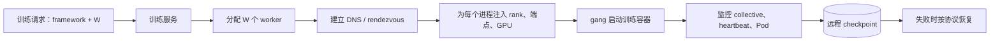

#### 为什么仍能把训练代码当黑盒

黑盒协议从单进程扩展为分布式协议，但边界仍稳定：

```text
DistributedTrainingContract:
    framework_type
    world_size
    process_identity / role
    rendezvous endpoints
    local device assignment
    dataset shard contract
    checkpoint URI and recovery policy
    output ownership (for example, rank 0)
```

平台不需要理解每层网络，只需懂各框架怎样建立通信组。框架 SDK 隐藏梯度 collective 的细节，训练服务隐藏机器、DNS、rank 和持久存储的细节。

---

## 4.3 支持数据并行的样例训练服务

这一节把第 3 章的单容器训练服务扩展为多 Pod 数据并行服务。作者刻意保持用户工作流不变：数据科学家仍然构建训练镜像、调用 `Train`、用 job ID 查询状态；变化被封装在训练代码和执行后端内部。

这体现了训练服务“统一 API、执行后端无关”的原则：

$$
\operatorname{TrainAPI}(job)
\longrightarrow
\begin{cases}
{\text{Docker backend}}, & W=1\text{ 或选择本地后端}\\
{\text{Kubernetes backend}}, & W\ge1\text{ 且选择集群后端}
\end{cases}
$$

其中 $W$ 是训练进程组规模。样例用 `PARALLEL_INSTANCES` 表达它，并采用“一 Pod 一进程”的简化映射。

### 4.3.1 服务概览

#### 从单容器后端扩展为双后端

第 3 章架构有 MemoryStore 和 Docker job tracker。新版本保留它们，并增加 Kubernetes job tracker：

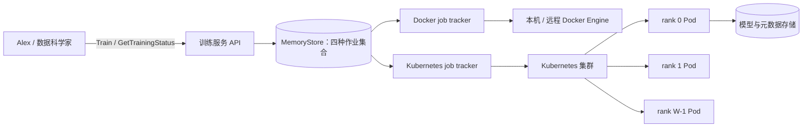

Kubernetes tracker 负责：

- 按请求创建一个或多个训练 Pod；
- 为分布式组创建稳定的 rendezvous / master Service；
- 给每个训练进程注入不同 rank 与共同组信息；
- 轮询 Pod 状态并更新 MemoryStore；
- 清理 Pod、Service 等资源。

Docker tracker 仍可执行本地单容器任务。前台 API 不暴露后端细节，因此用户无需因执行平台变化而重写调用程序。

#### 训练代码与服务各有一次变化

- **Alex 的训练代码**：增加 process-group 初始化、DDP 包装、分布式 sampler 和 rank 0 唯一输出，同时保留 `WORLD_SIZE=1` 的单进程路径；
- **Tang 的训练服务**：识别 `PARALLEL_INSTANCES`，按需创建 Pod 组、建立网络身份并注入配置。

“API 无需改变”更准确地说是 gRPC 方法与通用 metadata 结构不变；请求的通用 parameters map 新增了 `PARALLEL_INSTANCES` 这个约定键。若 API 使用强类型资源字段，通常会显式增加 `distributed_config`，以便校验和演进。

#### 为什么选择 Kubernetes

多机训练需要资源放置、Pod 生命周期、网络服务发现、配额和故障观察。Kubernetes 提供这些通用原语，服务只需实现“训练组”领域逻辑，而不必自己通过 SSH 管理机器。

但本章样例仍手工创建 Pods 和 Service，不等于已经使用 Kubeflow Training Operator 或成熟批调度器；组级原子调度、框架容错、公平队列和持久状态仍需补充。

### 4.3.2 运行和体验服务

#### 启动 Kubernetes 后端

样例训练服务容器挂载本地 kubeconfig，并通过配置选择 Kubernetes backend：

```shell
docker build -t orca3/services:latest -f services.dockerfile .
docker run --name training-service \
  -v "$HOME/.kube/config:/.kube/config" \
  --env APP_CONFIG=config-kube.properties \
  --network orca3 --rm -d -p "${TS_PORT}:51001" \
  orca3/services:latest training-service.jar
```

这适合本地实验。生产中不应把个人 kubeconfig 直接挂入服务容器，因为它可能包含高权限和长期凭据；在集群内运行时应使用专用 ServiceAccount、RBAC 和短期工作负载身份。

#### 提交三进程训练请求

与第 3 章相比，只增加：

```json
{
  "algorithm": "intent-classification",
  "dataset_id": "1",
  "train_data_version_hash": "hashBA==",
  "parameters": {
    "PARALLEL_INSTANCES": "3",
    "EPOCHS": "15",
    "BATCH_SIZE": "64",
    "FC_SIZE": "128"
  }
}
```

- `PARALLEL_INSTANCES=3`：创建三个训练进程；样例恰好也是三个 Pod；
- `PARALLEL_INSTANCES=1`：同一 Kubernetes tracker 创建一个 Pod，走非分布式代码路径；
- `BATCH_SIZE` 在原章样例中需要结合训练代码确认是 local 还是 global batch，平台契约不能让这个语义含糊。

如果 `BATCH_SIZE=64` 表示每进程 batch，则三进程 global batch 是：

$$
B_{global}=3\times64=192
$$

若用户本意是保持原单卡 global batch 64，则每 worker batch 不能简单设为 $64/3$，因为不是整数；需要改变 worker 数、采用不等批次加权或梯度累积。API 应明确 batch 语义。

#### 从 Kubernetes 观察实际资源

调用 `GetTrainingStatus` 仍可查询平台状态；也可用：

```shell
kubectl get all -n orca3
```

看到三个 Pod 和一个指向 rank 0 Pod 的 ClusterIP Service：

```text
intent-classification-1-master
intent-classification-1-1-worker
intent-classification-1-2-worker
intent-classification-1-master-service
```

Service 的作用是提供稳定 DNS 和端口，不是承担参数服务器计算。三个 DDP 进程都保存模型并参与 collective；rank 0 只是被约定为 rendezvous 端点和唯一制品写入者。

> 本实验依赖 MiniAutoML、Docker、本地 Kubernetes、镜像和数据集服务，本文未实际部署运行。命令用于解释原章交互，实际使用应按目标环境修正镜像、权限和配置。

### 4.3.3 启动训练作业

#### 从等待队列取出一组资源请求

请求先进入上一章的 `jobQueue`。Kubernetes tracker 周期性检查：

1. 是否有等待任务；
2. 集群 / namespace 是否有足够资源；
3. 需要一个 Pod 还是一个分布式 Pod 组；
4. 创建成功后把 job 从 waiting 移到 launching。

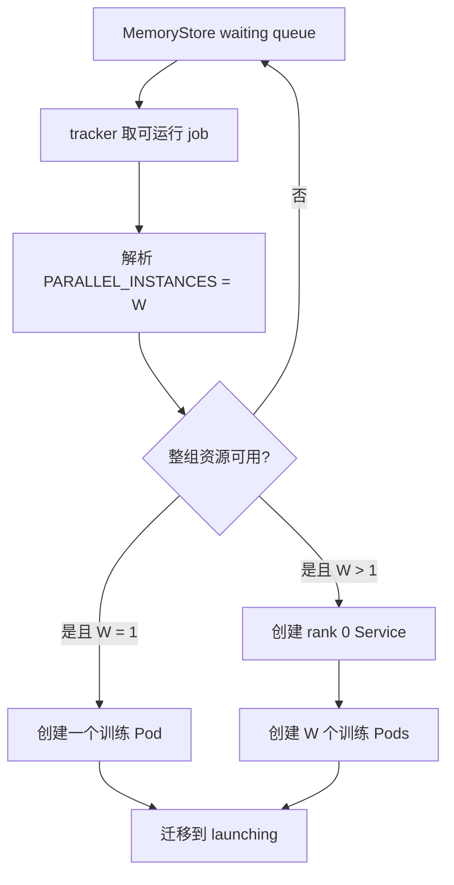

样例逐个创建 Pod，不具备严格 gang scheduling。若只成功创建两个、第三个因 GPU 不足 pending，前两个会在 `init_process_group` 等待并占用资源。生产平台应先做 admission，使用 gang scheduler / Training Operator，或在部分创建失败时回滚整组。

#### 为什么要给 master / rank 0 建 Service

Pod 是易失对象，重建后 IP 可能变化。直接把某次 Pod IP 写入 `MASTER_ADDR` 会使组在重建后失联。Kubernetes Service 通过 selector 指向 rank 0 Pod，并提供稳定 DNS：

```text
intent-classification-1-master-service.orca3.svc.cluster.local
```

所有进程用 DNS + `MASTER_PORT` rendezvous。Service 稳定不表示训练状态稳定：若 rank 0 Pod 重建，DNS 可以指向新 Pod，但新进程仍需恢复 checkpoint，并与其他进程按框架协议重建通信组。

#### 四个核心环境变量

样例为每个 Pod 注入：

| 变量 | 含义 | 三进程示例 |
| --- | --- | --- |
| `WORLD_SIZE` | 通信组的训练进程总数 | 所有进程均为 3 |
| `RANK` | 当前进程的全局唯一编号 | 0、1、2 |
| `MASTER_ADDR` | rendezvous 端点地址 | 同一个 Service DNS |
| `MASTER_PORT` | rendezvous 端口 | 例如 12356 |

```text
rank 0 Pod: WORLD_SIZE=3, RANK=0, MASTER_ADDR=<service>, MASTER_PORT=12356
rank 1 Pod: WORLD_SIZE=3, RANK=1, MASTER_ADDR=<service>, MASTER_PORT=12356
rank 2 Pod: WORLD_SIZE=3, RANK=2, MASTER_ADDR=<service>, MASTER_PORT=12356
```

训练容器据此调用：

```python
dist.init_process_group(
    backend="gloo",
    rank=int(os.environ["RANK"]),
    world_size=int(os.environ["WORLD_SIZE"]),
)
```

`MASTER_ADDR` 和 `MASTER_PORT` 主要用于建立组；数据并行的后续 collective 通信不应被误解为所有梯度永久经 rank 0 中转。

#### Rank、Pod、节点和 GPU 的关系

这是本节最容易混淆的边界：

$$
{\text{rank}}\equiv\text{training process identity}
$$

它不必一一对应 Pod、机器或 GPU。

- 样例：1 Pod = 1 process = 1 rank；
- 常见多 GPU Pod：1 Pod 内启动多个 process，每 process 一个 local rank / GPU；
- 一台节点可运行多个 Pod；
- global rank 在整个 job 唯一，local rank 只在节点或 Pod 的本地设备集合中编号。

若两台机器、每台 4 GPU、每 GPU 一进程，则：

$$
WORLD\_SIZE=2\times4=8
$$

而不是 Pod 数必然等于 8。API 的 `PARALLEL_INSTANCES` 应明确表示进程、Pod、节点还是 GPU；样例只能在一 Pod 一进程假设下混用。

#### `launchTrainingPods` 的核心算法

原章 Java 代码可压缩为：

```text
launch_training_pods(job, world_size):
    if world_size > 1:
        create_service(selecting rank_0_pod)

    pod_names = []
    for rank in 0 .. world_size - 1:
        env = common_training_parameters(job)
        env[WORLD_SIZE] = world_size
        env[RANK] = rank
        env[MASTER_ADDR] = master_service_dns
        env[MASTER_PORT] = master_port

        pod = build_pod(
            image=resolve_algorithm_image(job.algorithm),
            env=env,
            restart_policy=Never,
        )
        create_pod(pod)
        pod_names.append(pod.name)

    return pod_names
```

同一训练镜像通过不同环境变量获得不同进程身份。镜像、数据版本和公共超参数必须一致；rank、local device 和可能的数据 shard 信息则按进程变化。

#### 怎样扩展到 TensorFlow

PyTorch 只需共同 master endpoint 与每进程 rank / world size。TensorFlow `MultiWorkerMirroredStrategy` 要求每个进程获得包含全组端点和自身 task 的 `TF_CONFIG`。服务需要：

1. 为每个 worker 创建稳定 DNS；
2. 组装完整 `cluster.worker` 地址数组；
3. 给第 $i$ 个 worker 生成 `task.index=i`；
4. 在容器启动前注入对应 JSON。

这说明统一平台生命周期下仍要有 framework adapter：

$$
\operatorname{FrameworkAdapter}(generic\ group\ spec)
\longrightarrow framework\ specific\ runtime\ config
$$

更成熟的做法是使用 Kubeflow Training Operator，让对应 operator 维护这些框架知识。

### 4.3.4 更新与获取作业状态

Pod 创建后，tracker 轮询 Kubernetes API：

- Pod 开始运行：launching → running；
- Pod 成功或失败结束：running → finalized；
- 用户查询时，服务仍按 job ID 在四个集合中定位状态。

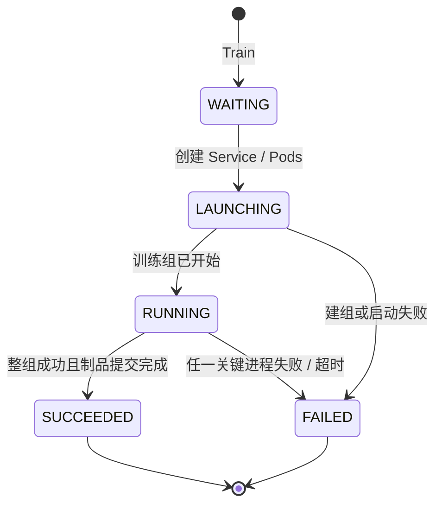

#### 原章为何只检查 master Pod

原章认为同步数据并行中所有 worker 每轮都同步，所以 rank 0 的进展可以代表整组：其他 worker 不参与 collective 时，rank 0 通常也无法继续完成训练。它给教学样例提供一个简单状态代理。

但“只看 master Pod”不是充分的生产判断：

- worker 失败后 rank 0 可能暂时仍显示 `Running`，直到 collective timeout；
- rank 0 成功退出不严格证明所有 worker 的退出码和清理都成功；
- 某 worker 可能 Pending、OOMKilled 或网络隔离；
- 最终模型上传可能晚于或独立于 Pod phase；
- 弹性训练中成员状态更复杂。

生产 job 状态应聚合所有预期进程与制品提交：

$$
Success(job)=
\left(\bigwedge_{r=0}^{W-1}ExitCode_r=0\right)
\land ArtifactCommitted
$$

还要区分 Pod `Succeeded`、训练框架成功和模型质量通过。使用 Training CRD 时，可让 Operator 汇总 replica status，但平台仍需校验制品和元数据。

#### 状态事实来源与资源清理

样例继续使用 MemoryStore，因此继承第 3 章问题：服务重启丢状态，多副本不一致，跨 Kubernetes / 内存迁移不原子。生产系统应持久保存：

- job spec 和解析后的 Pod / process 拓扑；
- Kubernetes UID、Pod / Service 名称和 namespace；
- 每个 rank 状态、退出码与重试次数；
- checkpoint 与模型 URI；
- 清理状态。

终态后应按保留策略删除 Service 和 Pods，但保留日志、事件、spec 和 artifact 血缘。清理操作需幂等，避免训练完成后资源泄漏。

### 4.3.5 将训练代码改为分布式运行

原章只做两类核心修改，使同一镜像兼容 $W=1$ 与 $W>1$。

#### 第一次修改：初始化训练组

代码先判断：

```python
def should_distribute() -> bool:
    return dist.is_available() and config.WORLD_SIZE > 1

def is_distributed() -> bool:
    return dist.is_available() and dist.is_initialized()
```

当 $W>1$：

1. 用环境变量中的 rank / world size 初始化 process group；
2. 用 DDP 包装完整模型；
3. 用 DistributedSampler 给各 rank 分配互斥数据子集。

```python
if should_distribute():
    dist.init_process_group(
        backend="gloo",
        rank=config.RANK,
        world_size=config.WORLD_SIZE,
    )

if is_distributed():
    model = DDP(model)
    train_sampler = DistributedSampler(
        split_train_,
        num_replicas=config.WORLD_SIZE,
        rank=config.RANK,
        shuffle=True,
    )
```

当 $W=1$，跳过这些步骤，继续执行原单设备代码。这使算法镜像只有一份，减少单卡 / 多卡实现漂移。

##### 还必须检查的细节

- DataLoader 使用 sampler 时不要同时设 `shuffle=True`；
- 每个 epoch 调 `train_sampler.set_epoch(epoch)`；
- 根据 rank 设置设备 / local rank，而不只是包装 CPU 模型；
- 验证和测试数据要避免重复计数，或只在 rank 0 用完整集合评价；
- 所有 rank 应按相同顺序进入 collective；
- 正常 / 异常结束都要销毁 process group；
- global batch、学习率和 steps per epoch 要按 world size 重新核对。

原章代码突出最少改动，这些是沿着同一机制走向生产时必须补齐的条件。

#### 第二次修改：只有 master Pod 上传最终模型

所有 DDP worker 在同步训练后理论上有一致参数。如果每个进程都向同一对象 key 写模型，会发生覆盖和浪费，因此原章约定：

```python
if config.RANK == 0:
    test_accuracy = evaluate(test_dataloader)
    upload_model_and_create_artifact(model, test_accuracy)
```

这里的 rank 0 是**唯一 writer**，不是唯一训练者。其余 rank 必须参与全部训练 collective。

生产中可在训练结束后先 barrier，确保所有 rank 完成：

```python
if is_distributed():
    dist.barrier()

if config.RANK == 0:
    publish_model_atomically()
```

但 barrier 也会在某 rank 已失败时阻塞到 timeout；异常路径必须有超时和组级失败处理。模型发布应先上传临时对象、验证 checksum，再提交唯一 manifest。

Checkpoint 策略不一定只能 rank 0 写一个文件：

- 完整复制的 DDP checkpoint 可由 rank 0 写；
- 分片 optimizer / model state 可能需要每 rank 写独立 shard；
- 每个 shard 路径必须包含 rank，最后由 manifest 记录完整集合。

所以“master-only”适用于样例的完整最终模型，不是所有分布式 checkpoint 的普遍规则。

### 4.3.6 可改进之处

原章提出三条直接方向：

1. 按 4.2.2 增加 checkpoint、failover 和恢复；
2. 调优拓扑、框架和通信参数，缓解带宽饱和；
3. 为 TensorFlow 与 Horovod 增加建组 adapter。

沿这些方向生产化，还需要：

- 用持久数据库 / CRD 替代 MemoryStore；
- 用 Kubeflow Training Operator 或批调度器管理组级生命周期；
- 采用 gang scheduling，避免半组占用；
- 声明 GPU、CPU、内存、临时盘和拓扑约束；
- 支持取消、timeout、重试、checkpoint resume 和整组清理；
- 汇总所有 rank 的日志、指标、heartbeat 与退出状态；
- 记录镜像 digest、数据版本、world size、rank 拓扑、backend 与通信参数；
- 用 ServiceAccount、RBAC、NetworkPolicy 和 Secret / workload identity 限权；
- 通过基准测试选择 worker 数、global batch 和 bucket 大小；
- 处理节点维护、抢占式实例和网络分区。

#### 框架无关的稳定协议

不同框架变量名不同，但信息本质相同：

| 通用概念 | PyTorch | TensorFlow | Horovod |
| --- | --- | --- | --- |
| 组规模 | world size | cluster task 数 | `hvd.size()` |
| 进程身份 | rank | task type + index | `hvd.rank()` |
| rendezvous / peers | master addr / port | `TF_CONFIG.cluster` | launcher / host discovery |
| 本地设备 | local rank | strategy / visible devices | `hvd.local_rank()` |
| 梯度聚合 | DDP | distribute strategy | DistributedTape / Optimizer |

训练服务可维护 adapter，把统一 `DistributedJobSpec` 转成框架配置；训练代码仍作为遵循协议的黑盒。这是样例服务最可迁移的设计结论。
---

## 4.4 训练单 GPU 无法容纳的大模型

数据并行要求每个 worker 放下一份完整模型。模型参数增长快于单卡显存后，即使数据再切分也无法启动。原章用历史 ImageNet 模型说明这种不平衡：模型参数从约 400 万增长到 1.458 亿乃至十亿级，而同期 GPU 显存增长远慢于参数规模。

显存不只保存参数。训练峰值近似包括：

$$
M_{train}=M_{parameters}+M_{gradients}+M_{optimizer}
+M_{activations}+M_{temporary}+M_{input}
$$

以 FP32 参数 + 梯度 + Adam 为例，一个参数可能粗略对应：

- 参数：4 bytes；
- 梯度：4 bytes；
- Adam 一阶 / 二阶状态：8 bytes；

仅这三类约 16 bytes / parameter，还未计算激活、临时 buffer、混合精度 master weights 和框架开销。10 亿参数只按 16 bytes 已约 $16\ \mathrm{GB}$，所以“参数文件大小”远低于实际训练显存需求。

原章把应对路线分成两类：

1. **内存节省**：一次只让更少数据 / 激活 / 层驻留 GPU，以速度换容量；
2. **模型并行**：把模型状态分布到多 GPU；流水线并行进一步提高利用率。

### 4.4.1 传统内存节省方法

原章设想 24 GB 模型要在 10 GB GPU 上训练。严格说能否做到还取决于“24 GB”指参数文件、推理驻留还是完整训练状态；若仅模型参数本身就超过 GPU，单靠梯度累积并不能使它放下。选择前必须先用内存剖析确认峰值来自 batch 激活还是模型 / optimizer 状态。

原章还提到 activation / gradient checkpointing 和 NVIDIA vDNN，但不展开。它们与下面方法共同体现“少存一些、需要时重算或搬运”的时间—空间交换。

#### 梯度累积

#### 它解决什么

梯度累积（gradient accumulation）用于缓解大 batch 的输入和中间激活导致的 OOM：把一次逻辑 batch 切成 $A$ 个 microbatch，逐个前向 / 反向，把梯度累积在参数 `.grad` 中，只在第 $A$ 个之后执行 optimizer step。

设 microbatch size 为 $B_{micro}$，累积步数为 $A$，单进程有效 batch：

$$
B_{effective}=A\times B_{micro}
$$

若再做 $W$ 路数据并行：

$$
B_{global}=W\times A\times B_{micro}
$$

原章示例：目标 batch 32，显存只能容纳 8 个样本，则 $A=4$，每四次 microbatch 才更新一次参数。

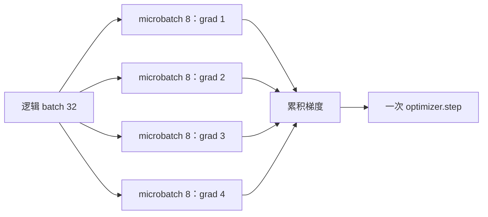

#### 为什么梯度需要缩放

如果单个 microbatch loss 是样本平均值，直接调用四次 backward 会得到四个**平均梯度之和**，比 batch 32 的平均梯度大 $A$ 倍。通常应：

```python
optimizer.zero_grad()

for micro_step, (inputs, labels) in enumerate(loader, start=1):
    predictions = model(inputs)
    loss = loss_fn(predictions, labels) / accumulation_steps
    loss.backward()

    if micro_step % accumulation_steps == 0:
        optimizer.step()
        optimizer.zero_grad()
```

于是：

$$
g_{acc}=\frac{1}{A}\sum_{a=1}^{A}g_a
$$

在每个 microbatch 大小相同、模型参数在累积期间不更新、随机 / 状态型层语义可接受时，它近似等于一次大 batch 梯度。

#### 它并不减少哪些内存

梯度累积主要减少与 batch size 相关的输入和激活峰值。它不会自动减少：

- 模型参数；
- 参数梯度 tensor 本身；
- optimizer state；
- 与模型大小固定相关的 workspace。

若这些固定部分已经超过显存，必须换出 / 分片 / 模型并行。

#### 性能与语义局限

原章说 4 个 microbatch 相比一次 batch 32 约慢 4 倍。这个表述应理解为：无法并行计算 32 个样本，而要串行执行四次 forward/backward，吞吐显著下降；它不严格意味着墙钟必然恰好 4 倍，因为 batch 32 本身计算也更多，GPU 利用、kernel 启动和 I/O 会改变比率。

还要注意：

- BatchNorm 等依赖 batch 统计的层看到的仍是 microbatch 统计，不等价于 batch 32；
- dropout 等随机操作使逐位结果不同；
- 学习率 scheduler 应按 optimizer step 还是 micro-step 前进必须明确；
- DDP 下若每个 microbatch 都 AllReduce，会增加通信，框架通常提供 `no_sync()` 在非最后累积步跳过同步；
- 最后不足 $A$ 个 microbatch 的尾批次要正确缩放和 step。

#### GPU / CPU 内存换入换出

#### 基本思想

前向传播生成每层 activation，反向传播又需要它们。若全部保留 GPU，显存可能溢出。换出（offload / swap）在暂时不用时把 activation、参数或 optimizer state 搬到 CPU 内存，需要时再搬回 GPU。

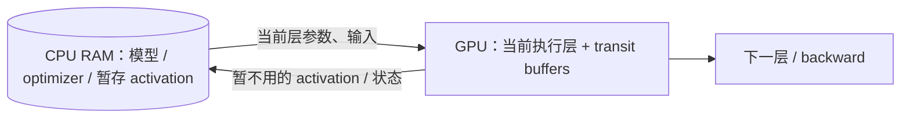

原章介绍 L2L（layer to layer）：GPU 只保留当前执行层和中转 buffer，完整模型与 optimizer state 放 CPU。这能让较小 GPU 运行大模型。

#### 为什么会变慢

假设每步要搬运 $V$ bytes，CPU—GPU 有效带宽为 $B_{pcie}$，则不可重叠传输下限近似：

$$
T_{transfer}\ge\frac{V}{B_{pcie}}
$$

若参数和 activation 往返，传输量会多次计算。PCIe 带宽远低于 GPU HBM，且传输有启动延迟；如果不能用预取和异步 stream 与计算重叠，GPU 会等待数据。

#### 适用范围

- 原型验证：有较小 GPU，但先要证明大模型方案可行；
- 计算密集、每层计算足以掩盖部分搬运；
- CPU RAM 充足且 PCIe / NVLink 拓扑可控；
- 框架已有稳定 offload 支持。

如果目标是高吞吐生产训练，仅依赖频繁换入换出通常不够，需要多 GPU 模型分片 / 流水线。还应监控 host RAM、page-locked memory、NUMA 和数据加载竞争，避免 CPU 内存成为新瓶颈。

#### 梯度累积、activation checkpoint 与 offload 的区别

| 方法 | 主要减少 | 交换成本 |
| --- | --- | --- |
| 梯度累积 | 每次驻留的 batch activation / input | 更多串行 micro-step，可能更低 GPU 利用 |
| Activation checkpoint | 保存的中间 activation | backward 时重算部分 forward |
| CPU offload / swap | GPU 上的 activation / 参数 / optimizer state | CPU RAM 与总线传输 |

三者可以组合，但总训练时间和系统复杂度也会累积。

### 4.4.2 流水线模型并行

数据并行在每卡复制完整模型，因此这里不适用。作者先解释最直接的模型并行，再说明流水线怎样填补设备空闲。

#### 模型并行

#### 怎样切分模型

将网络拆为 $K$ 个顺序 stage：

$$
h_1=f_1(x;\theta_1),\quad
h_2=f_2(h_1;\theta_2),\quad\ldots,\quad
\hat y=f_K(h_{K-1};\theta_K)
$$

stage $k$ 放在设备 $k$。前向时传输 activation $h_k$，反向时反方向传输对 activation 的梯度。

两 GPU 概念代码：

```python
class LargeModel(nn.Module):
    def __init__(self):
        super().__init__()
        self.stage0 = build_first_half().to("cuda:0")
        self.stage1 = build_second_half().to("cuda:1")

    def forward(self, inputs):
        hidden = self.stage0(inputs.to("cuda:0"))
        outputs = self.stage1(hidden.to("cuda:1"))
        return outputs
```

原章 Listing 4.2 中 `subnet2` 与 `sub_network2` 命名不一致，且 `forward` 省略 `self`，应视为说明设备传输的伪代码；上面按其意图整理，不是完整训练程序。

#### 为什么切分是逐模型工程

理想切分需要同时平衡：

- 每 stage 参数 / optimizer 内存；
- activation 峰值；
- forward / backward 计算时间；
- stage 边界需要传输的 tensor；
- 残差、分支、共享参数等非顺序连接；
- 各 GPU 速度和互连拓扑。

只按层数均分通常不平衡。某一 stage 每 microbatch 耗时最大，就决定 pipeline 周期：

$$
T_{stage}=\max_k T_k
$$

#### 朴素模型并行为什么利用率低

一个 batch 顺序经过 stage 0 → 1 → … → $K-1$，随后 backward 反向经过。若各 stage 耗时相等，任一时刻只有一个设备工作，平均每设备理想利用率约：

$$
U_{naive}\approx\frac{1}{K}
$$

所以：

- 3 GPU 时利用约 $33.3\%$，空闲约 $66.7\%$；
- 4 GPU 时利用约 $25\%$，空闲约 $75\%$。

这与原章图 4.7、4.8 的数字一致。真实网络 stage 时间不等，利用率可能更差，而且 activation 通信还会增加空闲。

#### 流水线并行

#### 核心改进：用 microbatch 填充流水线

把原 batch 拆成 $m$ 个 microbatch。stage 0 完成 microbatch 0 后，不等待它走完整个模型，而开始 microbatch 1；与此同时 stage 1 处理 microbatch 0。流水线填满后，多设备同时工作。

```mermaid
gantt
    title 三阶段前向流水示意
    dateFormat X
    axisFormat %s
    section GPU 0 / Stage 0
    MB0 :0, 1
    MB1 :1, 2
    MB2 :2, 3
    MB3 :3, 4
    section GPU 1 / Stage 1
    MB0 :1, 2
    MB1 :2, 3
    MB2 :3, 4
    MB3 :4, 5
    section GPU 2 / Stage 2
    MB0 :2, 3
    MB1 :3, 4
    MB2 :4, 5
    MB3 :5, 6
```

这张图只显示 forward，以直观呈现填充与排空；完整训练还需安排 backward 和 activation 生命周期。

#### GPipe 的语义

原章列举了两种代表性流水线实现：Microsoft 的 PipeDream 与 Google 的 GPipe，并选择 GPipe 作为演示，因为作者认为它在训练 step 内的梯度更新语义和吞吐方面更适合本节说明。两者的具体调度、参数版本和一致性机制不同，不能只凭“都使用流水线”视为等价实现。

原章用 GPipe 举例。模型切成 $K$ 个 cell / stage，batch 切成 $m$ 个 microbatch：

1. microbatches 依次流水通过所有 stage 做 forward；
2. 每个 microbatch backward 使用其 forward 时同一版本参数；
3. 梯度在一个逻辑 batch 内累积；
4. 所有 microbatch 完成后同步更新一次模型参数。

因此它结合了流水执行与梯度累积，避免在同一 batch 内因参数提前更新产生版本不一致。

#### Pipeline bubble

流水线开始时后段等待第一份输入，结束时前段等待反向排空，这些空闲称 bubble。若 $K$ 个等时 stage、$m$ 个 microbatch，仅用简化 forward pipeline 模型，处理时槽数为 $m+K-1$，有效 stage 工作量为 $mK$，平均利用率：

$$
U_{forward}\approx\frac{m}{m+K-1}
$$

bubble 比例：

$$
B_{forward}\approx\frac{K-1}{m+K-1}
$$

例如 $K=4$：

- $m=1$：$U=1/4=25\%$，退化为朴素模型并行；
- $m=4$：$U=4/7\approx57.1\%$；
- $m=16$：$U=16/19\approx84.2\%$。

原章 GPipe 图中 4 stage、4 microbatch，在完整 forward + backward 调度下观察到约 $47\%$ 空闲，即约 $53\%$ 利用，和这个只用于直觉的 forward 简化式数量级相近但不应直接等同。真实利用率取决于 forward / backward 时长、调度方式、重计算和通信。

增加 microbatch 可缩小 bubble，但也有代价：

- microbatch 太小会降低 kernel 效率；
- 调度和通信次数增加；
- 需要保存更多在途 activation，或通过 checkpoint 重算；
- batch 与优化语义发生变化；
- 最慢 stage 仍限制吞吐。

#### 原章 PyTorch GPipe 示例的四部分

##### 1. 初始化远程通信

示例调用 `rpc.init_rpc` 设置 name、rank 和 world size。其接口反映当时 PyTorch pipeline / RPC 教程；当前可用 pipeline API 可能已经变化，本文只保留概念。

##### 2. 切分 Transformer 并放置设备

根据层数和 GPU 数计算 partition length，把前半 encoder blocks 放 GPU 0，后半及 decoder 放 GPU 1。真正切分应按 profile 的时间和内存，而非只按层数。

##### 3. 建立 Pipe 并设置 chunks

```python
chunks = 8
pipeline_model = Pipe(sequential_model, chunks=chunks)
```

`chunks` 就是 microbatch 数。框架负责把输入拆分，并调度各 stage。

##### 4. 按普通训练 loop 调用

调用 pipeline model 得到输出，在最后一块 GPU 计算 loss，再 backward 和 optimizer step。框架隐藏 microbatch 的阶段传输与梯度聚合，但数据科学家仍需决定切分、设备、chunks 和 loss placement。

概念伪代码：

```text
initialize_process_group()
stages = partition_model_by_profile(model, devices)
pipeline = build_pipeline(stages, microbatches=m)

for logical_batch in data:
    optimizer.zero_grad()
    output = pipeline(logical_batch.inputs)
    loss = loss_fn(output, logical_batch.targets_on_last_stage)
    loss.backward()
    optimizer.step()
```

#### 流水线并行比数据并行复杂在哪里

- 数据并行复制同一模型，框架只需聚合同形状梯度；
- 流水线并行改变模型放置和执行图；
- stage 边界要传 activation 与 backward gradient；
- 需要 microbatch schedule、bubble 管理和参数版本一致性；
- checkpoint 是跨 stage 的分片集合；
- stage 故障、慢 stage 和不平衡都会影响全组。

因此数据并行若可用，应先用数据并行；只有容量约束迫使切模型时才承担流水线复杂度。

### 4.4.3 软件工程师怎样支持流水线并行

作者给出三项职责。

#### 1. 自动化执行与提升资源利用率

训练服务要：

- 分配满足每个 stage 内存 / 算力要求的 worker / GPU；
- 按高速拓扑共同放置相邻 stage；
- 建立进程通信并注入 IP、rank、GPU ID、world size；
- 把对应 stage / 完整 pipeline 代码分发到 worker；
- 监控 stage 时间、bubble、通信和显存；
- 保存分片 checkpoint 与完整 manifest。

流水线请求协议可扩展为：

```text
PipelineJobSpec:
    stages
    stage_to_device_mapping
    model_partition_version
    microbatch_count
    schedule
    activation_checkpoint_policy
    checkpoint_manifest_uri
    topology_constraints
```

如果切分逻辑已经内嵌在训练镜像，平台至少要记录其版本和 microbatch / 资源参数，才能复现与调优。

#### 2. 帮助数据科学团队发现并试验新方法

平台工程师了解集群资源、拓扑和新框架能力，可以主动提出流水线方案，与数据科学家共同 profile 模型、选择 stage 边界和比较吞吐。算法团队决定模型语义，平台团队提供可执行性和性能证据。

#### 3. 提高可用性与失败恢复

任何 stage 失败都可能使整条 pipeline 停止。平台需要：

- 监控每个 stage / rank，而不是只看一个 master；
- collective / RPC timeout 与故障分类；
- group-level restart 或框架支持的 elastic recovery；
- 将所有 stage 的 checkpoint shard 原子归入同一个 logical step；
- 避免恢复时混用不同 step 的 shard；
- 对抢占节点提前 checkpoint；
- 清理通信组和悬空 GPU 资源。

一致 checkpoint manifest 可以写成：

```json
{
  "global_step": 12000,
  "partition_version": "partition-v3",
  "stages": [
    {"stage": 0, "uri": "s3://ckpt/12000/stage-0.pt", "sha256": "..."},
    {"stage": 1, "uri": "s3://ckpt/12000/stage-1.pt", "sha256": "..."}
  ],
  "optimizer_state": "s3://ckpt/12000/optimizer-manifest.json"
}
```

只有 manifest 完整提交后，step 12000 才是可恢复点。

#### 数据并行还是流水线并行

原章给出简单而实用的决策顺序：

1. 始终从单机 / 单卡基线开始；
2. 模型能放入单卡，但数据大、训练太慢：优先数据并行；
3. 模型放不入单卡：先评估内存节省，生产速度要求高时采用模型 / 流水线并行；
4. 规模更大时才组合数据并行与流水线并行。

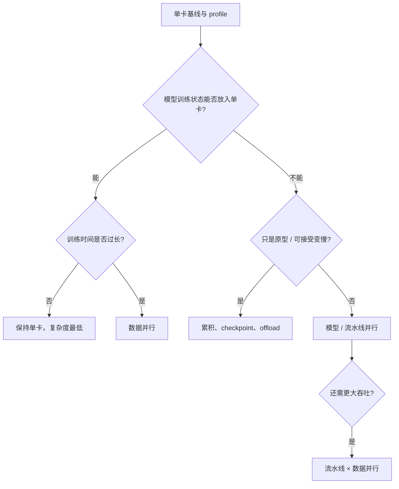

选择依据不是“哪种方法更新”，而是先判断容量约束，再判断时间目标，最后用测量结果决定复杂度是否值得。
---

## 容易混淆的概念与常见误区

### 1. 分布式训练就是数据并行

错误。数据并行切数据、复制模型；模型并行切模型；流水线并行在模型切分上用 microbatch 重叠阶段。三者解决的首要瓶颈不同。

### 2. 增加 GPU 总能线性提速

错误。通信、输入、慢 worker、同步和调度开销最终主导。必须看 $S(W)$ 与 $E(W)$，而不是只看 GPU 数。

### 3. 数据并行能解决模型本身放不进单卡

错误。普通数据并行在每个 worker 复制完整模型；它只能通过 local batch 调整缓解数据 / activation 峰值，不能分摊模型状态。

### 4. 每个 worker 训练自己的数据，所以最后得到不同模型

同步数据并行中错误。只要起点一致、聚合与更新相同，每个 worker 每步后仍有相同参数。异步训练则可能暂时持有不同版本。

### 5. AllReduce 就是参数服务器

错误。AllReduce 是每个参与进程都得到 reduction 结果的集合通信语义，可用 ring / tree 等去中心拓扑实现。参数服务器是另一种架构。

### 6. Rank 0 是所有梯度都必须经过的参数服务器

错误。rank 0 通常只是约定的 rendezvous、日志或唯一写入角色；DDP collective 可以在所有 rank 间直接通信。

### 7. Rank 等于 Pod，也等于 GPU

错误。rank 标识训练进程。样例一 Pod 一进程才恰好一一对应；多 GPU Pod 常启动多个 rank，一节点也可运行多个 Pod。

### 8. World size 就是机器数量

错误。world size 是通信组进程数。两台机器每台 4 进程时 world size 为 8。

### 9. Local batch、global batch 和 microbatch 可以混用

错误。local batch 是一个 worker 每 step 的数据；global batch 是所有 worker 聚合后一次更新对应的数据；microbatch 是为内存或流水线进一步切分的子块。

### 10. 增加 worker 但保持 local batch 不变，只改变速度

错误。global batch 随 $W$ 增大，优化轨迹和学习率要求可能改变。系统扩展与算法语义必须一起评估。

### 11. 同步数据并行中快 worker 可以直接进入下一步

错误。它必须等待集体梯度操作完成；最慢参与者和网络决定 step latency。

### 12. 异步训练每分钟 step 更多，所以更快收敛

错误。陈旧梯度可能让每个 step 价值下降。应比较达到目标验证质量的墙钟时间与成本，而不是 steps/min。

### 13. 大稀疏模型天然只传非零梯度

不一定。通信是否利用稀疏性取决于 tensor 表示、collective 和压缩算法；普通 dense AllReduce 仍可能传完整 tensor。

### 14. 把所有 Pod 放同一节点一定更快

不一定。节点内互连常更快，但单节点 GPU、CPU、内存和 PCIe 可能饱和，也会扩大单节点故障域。应按 profile 和拓扑放置。

### 15. 框架升级一定提升分布式性能

错误。新版本可能优化通信，也可能改变 kernel、数值、API 或性能。必须做兼容与基准回归。

### 16. 梯度 bucket 越大越好

错误。大 bucket 减少启动开销，却推迟通信并降低与 backward 的 overlap；小 bucket 相反。存在模型和网络相关 sweet spot。

### 17. DDP 会自动为每个 rank 分配不同数据

错误。DDP 同步模型梯度；数据切分通常由 DistributedSampler 或输入管道完成。遗漏 sampler 会重复训练相同样本。

### 18. TensorFlow 的 `TF_CONFIG` 可以由数据科学家手写固定 IP

本地静态实验可以，动态平台不合适。Pod / 机器地址与 task index 应由训练服务或 Operator 自动发现和注入。

### 19. Horovod 替代了 TensorFlow 或 PyTorch

错误。Horovod 提供跨框架分布式通信包装，模型、loss 和训练主体仍由底层框架实现。

### 20. 只保存模型参数就能无缝恢复训练

通常错误。还需 optimizer、scheduler、mixed-precision scaler、step、随机状态和 sampler 进度；所有 rank / stage checkpoint 要属于同一逻辑 step。

### 21. Kubernetes 重建失败 Pod 就完成训练恢复

错误。新进程没有旧内存状态，固定通信组也可能整体失效。要从持久 checkpoint 恢复，并按框架协议重建单进程或整组。

### 22. Service DNS 保证 master 训练状态不丢

错误。DNS 只提供稳定寻址。Pod 后端变化后，模型 / optimizer 状态仍需 checkpoint。

### 23. 同步训练只看 rank 0 Pod 就足以判定生产作业成功

错误。它是原章样例的状态代理。生产中要汇总所有进程退出码、超时和制品提交。

### 24. Rank 0 写最终模型意味着只有它训练

错误。所有 rank 都训练并同步；rank 0 只是避免重复 / 冲突写入。分片 checkpoint 甚至可能要求所有 rank 各写一份。

### 25. 梯度累积能让任意大模型放进小 GPU

错误。它主要减少 batch activation 内存，不减少完整参数、梯度和 optimizer state。固定模型状态已超显存时仍无效。

### 26. 梯度累积与大 batch 完全逐位等价

不一定。BatchNorm、随机层、浮点求和顺序、loss 缩放和 scheduler 都可造成差异。它是在明确条件下的梯度近似等价。

### 27. 梯度累积四步必然比大 batch 慢四倍

不严格。它串行执行四次 microbatch，通常吞吐下降，但实际比率由 GPU 利用、kernel、I/O 和大 batch 本身耗时决定。

### 28. Activation checkpoint 与 checkpoint 恢复是一回事

错误。前者为省显存而在 backward 重算中间激活；后者把训练状态持久化，用于故障后恢复。

### 29. CPU offload 免费增加显存

错误。它用 CPU RAM 和 PCIe / 互连传输换 GPU 显存，可能让 GPU 等待并争用 host 资源。

### 30. 模型并行和流水线并行是完全不同的两类切分

不准确。流水线并行建立在模型阶段切分之上，再通过 microbatch 重叠计算来提高利用率。

### 31. 按层数均分模型就能平衡 pipeline

错误。层的计算、参数、activation 和通信差别很大。应 profile 后按时间、内存与边界 tensor 综合切分。

### 32. Microbatch 越多，流水线越快

错误。更多 microbatch 降低 bubble，但过小 microbatch 降低 kernel 效率、增加通信 / 调度和在途 activation。

### 33. Pipeline parallelism 消除了所有设备空闲

错误。填充、排空、阶段不均、通信和 backward 调度都会形成 bubble；它只是显著改善朴素模型并行。

### 34. 数据并行与流水线并行只能二选一

错误。超大规模常将一条 pipeline 复制多份做数据并行，但复杂度和通信组数量也相乘。

### 35. 有多 GPU 就应该直接分布式训练

错误。单卡满足时间和容量目标时复杂度最低。应先建立单卡基线，再由瓶颈驱动并行策略。

## 本章知识结构

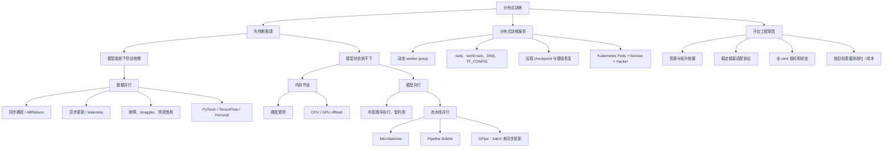

## 核心结论

1. **分布式策略首先由瓶颈决定。** 模型能放进单卡但训练慢，优先数据并行；模型放不下，才需要内存节省或模型 / 流水线并行。
2. **数据并行复制模型、切分数据。** 它提高样本吞吐，却不分摊普通模型状态。
3. **同步数据并行在参数起点、数据切分和梯度加权正确时，近似等价于 global batch 梯度。** worker 数变化会改变 global batch 和优化语义。
4. **AllReduce 是梯度归约并把结果送到所有进程的集合通信。** 它不等同于参数服务器，也不意味着梯度全部经 rank 0。
5. **同步更新易于收敛和复现，但受最慢 worker 限制；异步更新减少等待，却引入梯度陈旧。** 应比较达到目标质量的时间，而非局部 step 速率。
6. **扩展总有上限。** 计算随 worker 分摊，梯度通信、输入和不平衡不会同速消失；必须测量 speedup、efficiency 和成本。
7. **PyTorch、TensorFlow 和 Horovod API 不同，但都需要建组、进程身份、数据分片、梯度同步和唯一副作用。** 训练服务可以围绕这些共同概念设计 adapter。
8. **平台应自动分配 worker、发现端点、注入 rank / 配置并提供远程 checkpoint。** 数据科学家不应手工管理动态 IP。
9. **Rank 标识训练进程，不是 Pod、节点或 GPU。** 一 Pod 一 rank 只是样例部署选择。
10. **Kubernetes Service 解决稳定寻址，不解决训练状态持久化。** Pod 重建仍要配合框架和 checkpoint 做组级恢复。
11. **样例用统一 `Train` API 同时支持单进程和分布式后端。** 这是控制面稳定、执行面可替换的体现。
12. **生产状态必须聚合所有 rank 和制品结果。** 只看 master Pod 是教学简化，不能证明整组成功。
13. **梯度累积用多次小 microbatch 模拟较大有效 batch，主要减少 activation 峰值。** 必须正确缩放 loss，并理解它不减少模型固定状态。
14. **CPU offload 用传输和 host 内存换显存。** 它适合容量受限或原型场景，性能取决于计算—通信重叠。
15. **朴素模型并行让不同 stage 顺序等待。** 等时 $K$ 阶段的理想平均利用率只有约 $1/K$。
16. **流水线并行通过 microbatch 重叠阶段计算，减小而非消除 bubble。** microbatch 数、stage 平衡和通信共同决定吞吐。
17. **GPipe 在一个逻辑 batch 内累计 microbatch 梯度，batch 末同步更新。** 这样保证各 microbatch forward / backward 使用一致参数版本。
18. **流水线并行需要逐模型切分、分片 checkpoint 和拓扑感知，代码与平台复杂度远高于数据并行。**
19. **单卡、数据并行、内存节省、流水线并行应按复杂度逐级采用。** 先 profile，再由容量和时间目标驱动升级。

## 从本章提炼出的通用解题方法

面对一个训练扩展问题，可以沿以下步骤推导。

### 第一步：建立可信单设备基线

固定数据版本、镜像、超参数和随机种子，记录 step time、吞吐、显存峰值、GPU 利用率、验证质量和成本。没有基线就无法计算分布式收益。

### 第二步：拆解显存与时间瓶颈

区分参数、梯度、optimizer、activation、输入和 temporary workspace；区分计算、输入、通信和等待时间。先回答“放不下”还是“太慢”。

### 第三步：按最小复杂度选择策略

```text
模型能放下 + 时间可接受 -> 单卡
模型能放下 + 时间过长   -> 数据并行
activation / batch OOM   -> 小 batch + 梯度累积 / checkpoint
模型固定状态 OOM        -> offload / 模型分片 / 流水线
容量解决后仍需吞吐      -> 流水线 × 数据并行
```

### 第四步：定义不含歧义的分布式作业契约

至少记录：

$$
J=(framework,\ W,\ topology,\ B_{local},\ A,\ B_{global},
backend,\ bucket,\ checkpoint,\ output)
$$

即框架、进程数、拓扑、local batch、累积步数、global batch、通信 backend、bucket 配置、恢复和输出责任。

### 第五步：自动建立通信组

平台负责 admission、gang allocation、DNS / rendezvous、rank 与 local device 分配、框架配置转换；训练代码只消费稳定协议。

### 第六步：保证数据和初始状态正确分布

使用 sampler / sharding 避免数据重复，统一模型和 optimizer 初始状态，明确随机种子策略和 global batch。先验证单步梯度或短程 loss 是否与单卡基线一致。

### 第七步：把容错设计到训练状态中

保存完整 checkpoint，定义一致 logical step、manifest 和校验和；明确单 rank 重启、整组重启或 elastic membership。用故障注入验证，而不是只测试成功路径。

### 第八步：拓扑感知地调优通信

测量节点内 / 节点间带宽、collective 时间、bucket overlap 和 straggler；调整 worker 数、放置、batch、bucket 和框架版本。不要照搬历史推荐 GPU 数。

### 第九步：对流水线做 stage profile

按每层计算、参数、activation 和边界通信切分，选择 microbatch 数；同时观察最慢 stage、bubble、显存与 kernel 效率。以完整 forward + backward + optimizer 吞吐验收。

### 第十步：按目标质量比较总成本

最终比较：

$$
\operatorname{CostToQuality}=
\operatorname{ResourcePrice}\times
\operatorname{TimeToTargetQuality}
$$

同时考虑失败重算、工程复杂度和排队时间。最快的单次 step 不一定是最低成本、最快得到可用模型的方案。

这套方法的核心是：**先辨别容量与吞吐，再保护训练语义；先自动化共同的通信和恢复协议，再针对模型调优并行拓扑。**

## 复习与自测

1. 数据规模增长与模型状态增长分别造成什么瓶颈？
2. 数据并行、模型并行、流水线并行分别切分什么？
3. 为什么作者在模型能放入单卡时优先推荐数据并行？
4. 同步数据并行的一次参数更新包含哪些额外步骤？
5. 在什么条件下，平均局部梯度等价于 global batch 梯度？
6. 不同 worker 的 local batch 大小不等时，为什么要按样本数加权？
7. 8 个 worker、每 worker batch 32 时 global batch 是多少？
8. AllReduce 的输入输出语义是什么？它为什么不等于参数服务器？
9. Ring AllReduce 的每 worker 传输量为何不会随 worker 数趋近零？
10. 同步 step time 为什么由最慢 worker 影响？
11. 梯度 staleness $\tau$ 表示什么，它怎样影响异步收敛？
12. 为什么 steps/min 不能单独比较同步与异步训练？
13. 数据并行能缓解哪类 OOM，不能缓解哪类 OOM？
14. 一个可恢复 checkpoint 为什么不能只保存模型参数？
15. 为什么固定成员同步训练中，一个 Pod 重建可能要求全组重启？
16. 8 GPU 加速 6 倍和 50 GPU 加速 32 倍的并行效率分别是多少？
17. 哪些模型与网络因素决定带宽饱和 sweet spot？
18. 梯度 bucket 太大和太小分别有什么问题？
19. PyTorch DDP 建组需要哪些关键变量？
20. DDP 为什么仍需 DistributedSampler？
21. TensorFlow `TF_CONFIG` 的 cluster 与 task 分别表达什么？
22. Horovod 为什么要从 rank 0 广播初始模型和 optimizer 状态？
23. 三套框架代码有哪些共同生命周期动作？
24. 数据科学家与训练服务开发者在分布式训练中怎样分工？
25. `PARALLEL_INSTANCES=3` 在样例中实际创建哪些 Kubernetes 资源？
26. Kubernetes Service 为什么比直接使用 master Pod IP 稳定？
27. Rank、local rank、Pod、节点和 GPU 分别是什么关系？
28. 为什么 `MASTER_ADDR` 不表示所有梯度都经 master 转发？
29. 把 PyTorch generic group spec 转成 TensorFlow 时还需生成什么？
30. 为什么生产状态不能只看 master Pod phase？
31. Rank 0 唯一写模型解决什么问题，在哪些 checkpoint 场景不适用？
32. 如何让同一训练代码同时支持 world size 1 和大于 1？
33. 梯度累积的有效 batch 怎样计算？为什么 loss 常除以累积步数？
34. 梯度累积不能减少哪些显存组成？
35. Activation checkpoint、训练 checkpoint 和 CPU offload 有什么区别？
36. CPU/GPU 换入换出的时间下限由什么决定？
37. 为什么朴素三阶段模型并行约有 $66.7\%$ 空闲？
38. 流水线 microbatch 怎样让多个 stage 同时工作？
39. GPipe 为什么在逻辑 batch 末才更新参数？
40. 简化 forward pipeline 中，$K=4,m=16$ 的理论利用率是多少？
41. 为什么 microbatch 数不能无限增加？
42. 模型切分为什么应按 profile，而不能只按层数？
43. 流水线 checkpoint manifest 为什么要原子关联所有 stage shard？
44. 平台工程师怎样帮助算法团队采用流水线并行？
45. 什么情况下应组合流水线并行与数据并行？
46. 设计一个分布式训练基准时，应同时记录哪些时间、成本和质量指标？
