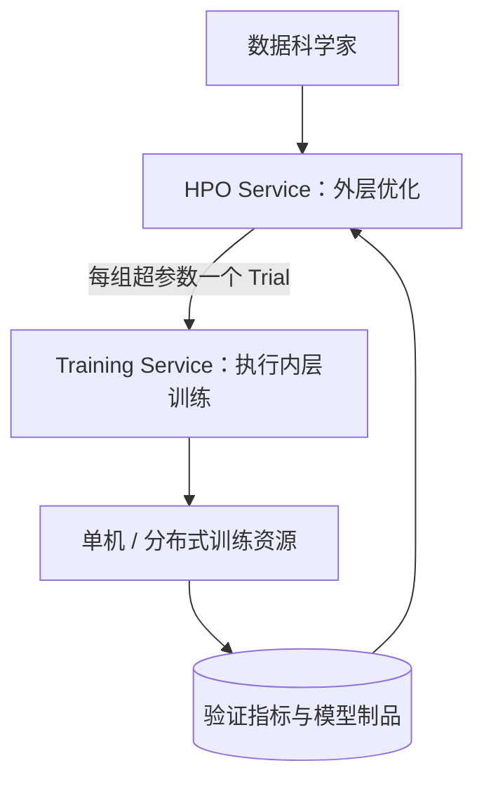
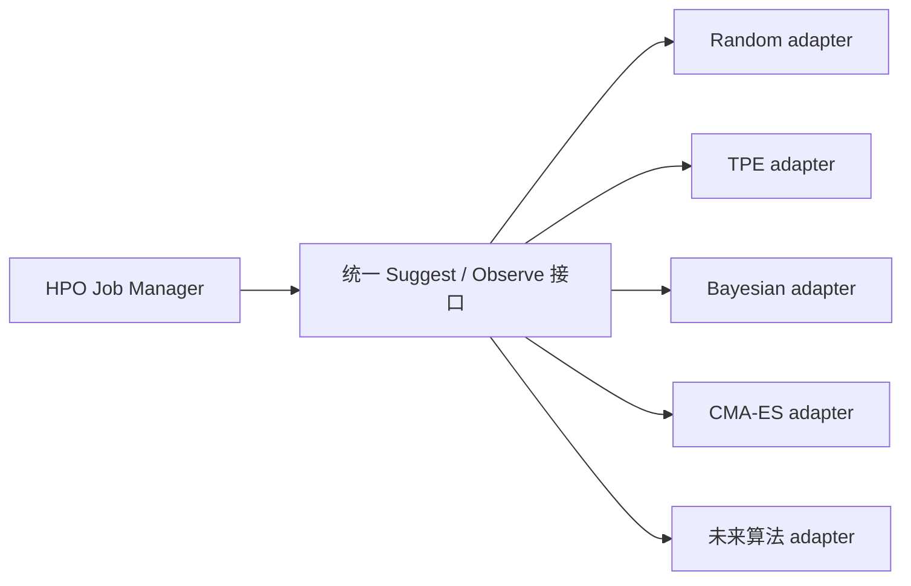
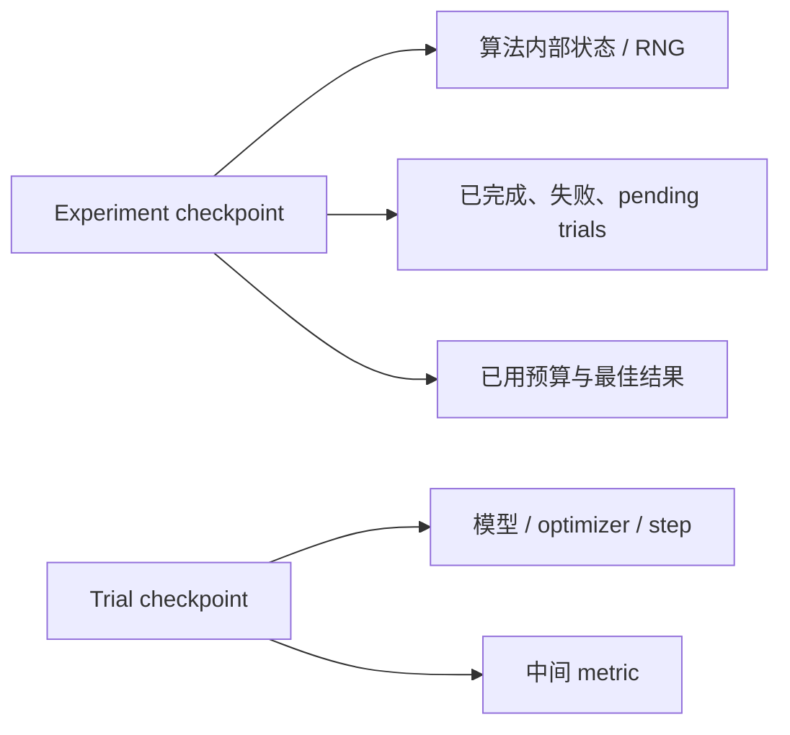
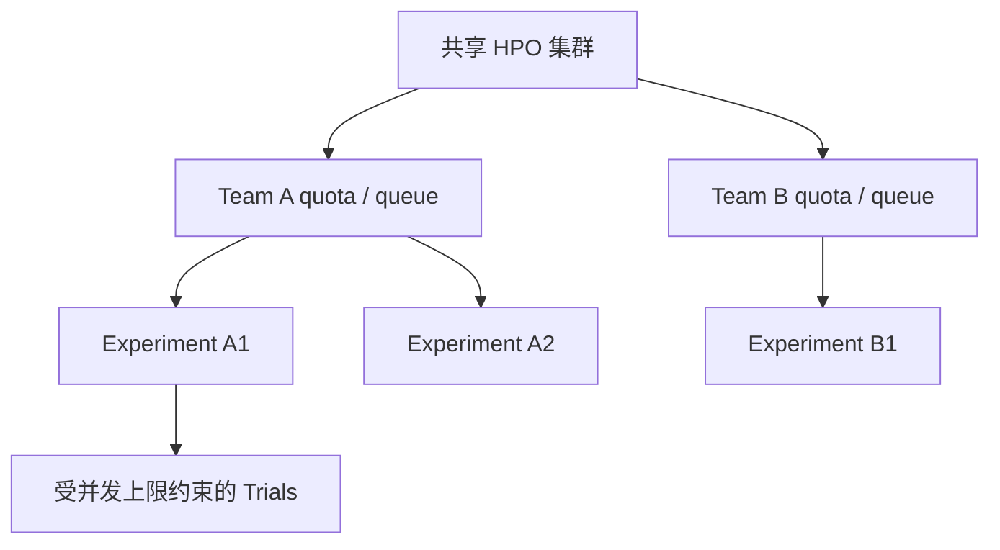
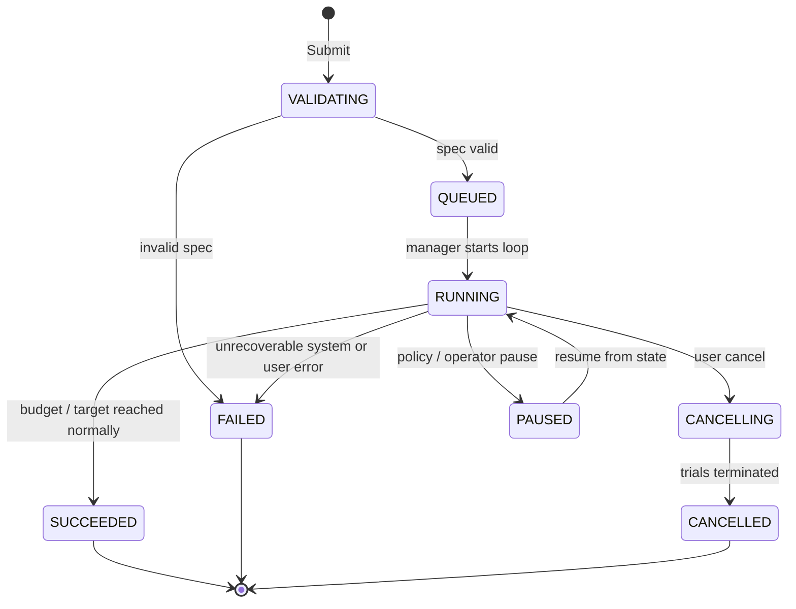
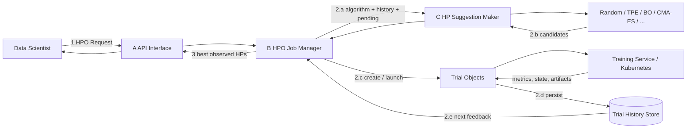
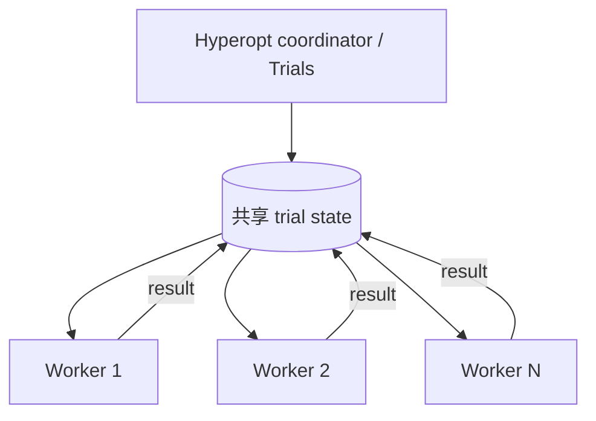
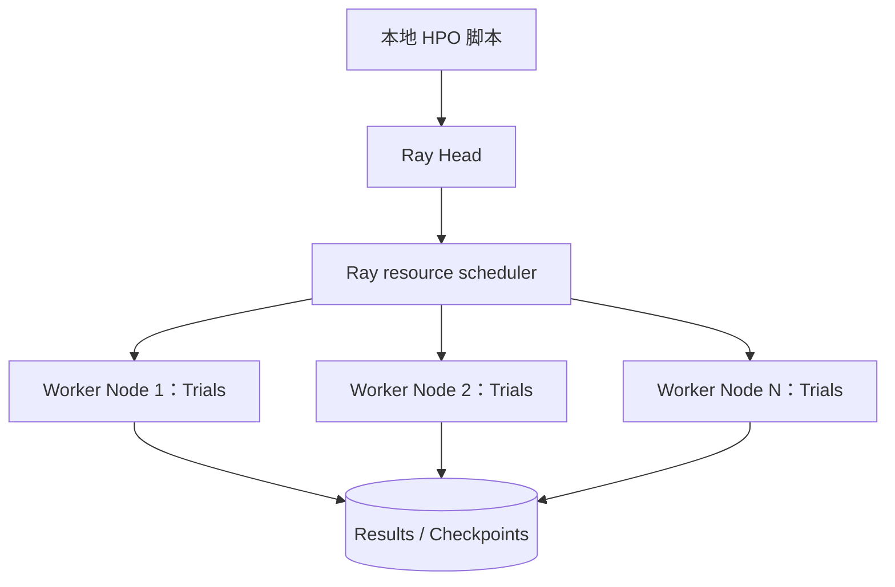

> 对应原章：**5 Hyperparameter Optimization Service**
> 本章讨论怎样把“凭经验试几个训练配置”变成自动、可扩展、可恢复的优化系统。核心闭环是：定义搜索空间和目标，生成候选超参数，执行训练 trial，收集验证指标，再利用历史结果决定下一次试验。

## 本章要回答的核心问题

1. 模型参数与超参数有什么本质区别？哪些配置属于超参数？
2. 超参数为什么同时影响模型质量、训练时间、显存和成本？
3. HPO 优化的到底是什么函数，“最优”依赖哪些前提？
4. Trial、experiment、search space、objective、budget 和 stopping criterion 分别是什么？
5. 网格搜索、随机搜索、贝叶斯优化和多保真优化如何生成候选？
6. 为什么随机搜索在高维稀疏重要性空间中常优于同预算网格？
7. 贝叶斯类方法为何能用较少昂贵 trial 找到好区域？
8. Library approach 与 service approach 的职责边界和适用规模是什么？
9. 一个训练代码无关的 HPO 服务需要哪些组件和协议？
10. 如何同时支持 trial 级并行和单 trial 的分布式训练？
11. Hyperopt、Optuna 与 Ray Tune 的编程模型、并行方式和局限分别是什么？
12. 什么时候应该采用 Kubeflow Katib，而不是继续维护库式 HPO？

原章以 HPO 工程为主，对搜索算法只做高层介绍。本文会补充笛卡尔积、概率、代理模型、采集函数、低保真资源和并行度等形式化表达，帮助理解算法为何有效及何时失效；这些推导不是原章新增算法。原章对库功能和推荐结论具有成书时点，实际选型应按目标版本、团队技术栈和当前维护状态重新验证。

---

## 5.1 理解超参数

### 5.1.1 什么是超参数

训练涉及两类“参数”。

#### 模型参数（model parameters）

模型参数由训练算法从数据中学习，例如神经网络的权重 $W$ 和偏置 $b$。它们在训练迭代中随梯度更新：

$$
\theta_{t+1}=\theta_t-\eta\nabla_{\theta}L(\theta_t;\lambda)
$$

其中 $\theta$ 是模型参数，$\eta$ 是学习率，$\lambda$ 代表其他超参数。

#### 超参数（hyperparameters）

超参数是在一次训练开始前由人或外层优化过程设定、不能由该次普通训练直接估计的配置。它们控制：

- **优化过程**：学习率、optimizer、batch size、epoch、正则强度；
- **模型结构**：层数、每层宽度、embedding dimension、activation；
- **数据处理**：增强强度、采样比例、序列长度；
- **系统执行**：在广义 HPO 中还可包括并行度、精度模式等，但它们是否进入搜索取决于目标。

可以把训练写成内层求解：

$$
\theta^*(\lambda)=\arg\min_{\theta}
L_{train}(\theta;\lambda)
$$

$\lambda$ 是超参数配置，固定后内层训练学习 $\theta$。HPO 则是外层选择 $\lambda$。

#### “训练前设定”不是绝对不变

原章把超参数描述为训练前设置且静态，这对 API 边界很实用。但实践中学习率 schedule、Population Based Training 等会在训练中改变超参数。它们仍不是普通反向传播直接学出的模型参数，而是由预设策略或外层控制器调整。

#### 容易混淆的例子

| 对象 | 通常属于 | 原因 |
| --- | --- | --- |
| 神经网络权重 | 模型参数 | 由训练数据和优化器学习 |
| 初始学习率 | 超参数 | 控制参数更新步长 |
| Adam 一阶 / 二阶动量 | 优化器状态 | 训练中计算，但不是部署模型的普通参数，也不是事前候选值 |
| 层数 / hidden units | 超参数 | 决定模型架构 |
| 训练后选出的阈值 | 视流程而定 | 若通过验证集搜索，它是外层配置 |
| 随机种子 | 实验控制参数 | 影响结果，应记录；是否调优需谨慎 |

### 5.1.2 为什么超参数重要

超参数同时决定学习动态和资源消耗。

#### 对模型质量的影响

- 学习率过大可能震荡 / 发散，过小则收敛慢；
- 模型太小会欠拟合，太大可能过拟合；
- 正则过强抑制学习，过弱降低泛化；
- batch size 改变梯度噪声与优化轨迹；
- activation 和 optimizer 改变可优化性。

即使训练算法名字相同，不同 $\lambda$ 也可能产生完全不同的验证性能：

$$
Q(\lambda_1)\ne Q(\lambda_2)
$$

原章引用词嵌入研究说明，一些被归因于算法的改进，实际很大部分来自系统设计和超参数选择。这提醒我们：比较算法时必须给每种算法合理调参，否则结论不公平。

#### 对时间、内存和成本的影响

超参数不仅影响 accuracy：

$$
\lambda\longrightarrow
\left(Q,\ T_{train},\ M_{peak},\ C_{compute}\right)
$$

例如更深网络增加计算和显存；更大 batch 可能提高 GPU 吞吐但增加 activation 内存；更多 epoch 提高预算，却可能过拟合。

因此“最优”不是天然唯一。如果目标只最小化 validation loss，会忽略时延和成本；实际可用约束优化：

$$
\min_{\lambda}L_{val}(\theta^*(\lambda),\lambda)
\quad\text{s.t.}\quad
T_{train}\le T_{max},\ M_{peak}\le M_{device},\ C\le B
$$

也可做多目标 Pareto 优化，而不是把 accuracy、时延和费用武断压成一个分数。

#### TensorFlow Playground 案例

原章建议在 TensorFlow Playground 直观观察学习率、正则、activation、层数和神经元数怎样改变决策边界与学习曲线。针对螺旋数据，书中给出 6 个 hidden layers、每层 5 neurons、ReLU、batch size 10、L1，并在约 500 epoch 后得到较好分类。

这个组合只是演示，不是螺旋任务的普遍最优解。Playground 的随机初始化、数据噪声和划分都会改变结果；正确结论是复杂数据模式对容量和优化配置敏感。

---

## 5.2 理解超参数优化

### 5.2.1 什么是 HPO

#### 双层优化视角

HPO（hyperparameter optimization / tuning）寻找能让模型在**未参与参数拟合的验证数据**上表现最佳的超参数：

$$
\lambda^*=\arg\min_{\lambda\in\Lambda}
L_{val}\left(\theta^*(\lambda);\lambda\right)
$$

其中：

$$
\theta^*(\lambda)=\arg\min_{\theta}L_{train}(\theta;\lambda)
$$

- $\Lambda$：超参数搜索空间；
- 内层：给定 $\lambda$ 训练模型参数 $\theta$；
- 外层：评价该模型并选择下一组 $\lambda$；
- $L_{val}$：HPO objective，防止直接优化训练 loss。

原章用“在给定数据集上最小化预定义 loss”定义 optimal。更严格地说，每个 trial 应使用相同训练 / 验证协议，最终泛化只在独立 test set 检验。反复用 test set 选超参数会造成 test leakage。

#### HPO 的四步 trial loop

每次模型训练称为一个 **trial**，一组 trial 组成一次 **experiment / study**：

```mermaid
flowchart LR
    Suggest[1 选择超参数 λ] --> Train[2 训练模型 θ*(λ)]
    Train --> Evaluate[3 在固定验证协议上计算 objective]
    Evaluate --> Stop{预算耗尽 / 目标达到?}
    Stop -->|否| History[记录 λ、指标、成本与状态]
    History --> Suggest
    Stop -->|是| Best[返回最佳 observed λ 与模型引用]
```

原章编号将 train / evaluate 作为 trial 的前两步，再检查结束条件，未结束则生成下一候选。关键对象是：

| 概念 | 含义 |
| --- | --- |
| Search space | 每个超参数的类型、范围、分布和条件依赖 |
| Trial | 一组候选配置对应的一次训练与评价 |
| Objective | 把 trial 结果映射为可比较分数的函数 |
| Direction | minimize 或 maximize |
| Budget | 最大 trials、时间、计算费用或资源 |
| Stop criterion | 预算耗尽、目标达到、无改善等 |
| Best trial | 已执行 trial 中 objective 最好者，不保证全局真最优 |

为了公平，各 trial 应使用同一数据版本、split、评价代码和资源 / 随机性政策。若数据或 metric 中途改变，历史分数不可直接比较。

#### 手工 HPO

人工流程通常是：从论文或经验配置开始，做少量调整，训练、比较，再选当前最好结果。优点是人可利用领域知识并快速排除荒谬区域；问题是：

- 尝试点少且带个人偏见；
- 容易漏记数据、代码、随机种子与失败；
- 多维条件空间难以靠直觉覆盖；
- 串行等待耗时，结果也难复现；
- 不知道当前最好离真正 optimum 多远。

原章例子有两个离散集合：

$$
batch\_size\in\{8,16,32,64,128,256\}
$$

$$
learning\_rate\in\{0.1,0.01,0.001,0.5,0.05,0.005\}
$$

笛卡尔积 trial 数：

$$
N=6\times6=36
$$

若有 $d$ 个参数、第 $i$ 个有 $n_i$ 个候选：

$$
N_{grid}=\prod_{i=1}^{d}n_i
$$

10 个参数每个 5 个值就有 $5^{10}=9{,}765{,}625$ 种，手工和穷举都不可行。

#### 自动 HPO

自动 HPO 请求通常包含：

- 训练代码 / 容器及数据版本；
- 待调超参数与搜索空间；
- objective metric、方向和评价方法；
- HPO search algorithm；
- trial 总预算、并行度和单 trial 资源；
- 目标阈值、timeout、early stopping / pruning 策略。

系统自动建议候选、调度 trial、收集结果、恢复失败并在结束时返回最佳 observed 配置。

Automatic HPO 的两个核心能力是：

1. **搜索算法**：用尽量少的 trial 找到好配置；
2. **trial 执行管理**：可靠且高效地使用计算资源。

前者主要是统计 / 优化问题，后者主要是分布式系统问题。软件工程师可以不推导每种算法，却必须给算法稳定的历史、状态与资源执行环境。

#### HPO 不保证找到全局最优

训练评价可能有噪声，搜索空间可能不包含真正好配置，预算总是有限。系统返回的是：

$$
\hat\lambda=\arg\min_{\lambda\in\mathcal{T}_{observed}}
\hat L_{val}(\lambda)
$$

即已观测 trial 中最好者。应保存 top-$k$、方差和重复验证，而不是把单次最高分当作确定真理。

### 5.2.2 常见 HPO 算法

原章把方法分成三类：model-free、model-based Bayesian optimization、multifidelity。分类边界并非绝对，例如 TPE 的归类在不同资料中不同；工程上更重要的是它是否依赖历史、怎样处理预算和并行。

#### 无模型优化方法

无模型方法不构建 trial objective 的代理模型，候选生成通常不依赖过去的分数。

##### 网格搜索（grid search）

对每个超参数定义有限候选集，枚举笛卡尔积：

$$
\Lambda_{grid}=S_1\times S_2\times\cdots\times S_d
$$

例如 learning rate 3 个值、batch size 3 个值，共 $3\times3=9$ 个 trial。

优点：

- 简单、确定、容易复现；
- 小型离散空间可保证覆盖所有网格点；
- trial 独立，可并行。

缺点：

- 候选数随维度乘法增长；
- 连续参数只能落在预先离散点；
- 对不重要维度重复花预算；
- 网格分辨率有限，可能永远错过两个格点之间的好值。

原章说 failed grid worker 会留下搜索空间“洞”。更准确的生产做法是将每个 grid point 持久化并重试；这是 library 手工执行的局限，不是 grid search 算法不可避免的性质。

##### 随机搜索（random search）

从为各参数定义的分布中独立采样，直到 trial budget $N$ 用完：

$$
\lambda^{(j)}\sim p(\lambda),\quad j=1,\ldots,N
$$

若“好区域”在采样分布下概率质量为 $p$，$N$ 次都没命中的概率：

$$
P(\text{miss all})=(1-p)^N
$$

至少命中一次：

$$
P(\text{hit})=1-(1-p)^N
$$

例如好区域占 $5\%$，随机做 60 次：

$$
P(\text{hit})=1-0.95^{60}\approx95.4\%
$$

这不是找到精确全局 optimum 的概率，只是进入定义的好区域。

为什么随机搜索常比网格有效：若高维空间中只有少数维度真正重要，随机点会在重要维度上尝试更多不同值；网格会把大量组合浪费在不重要维度的重复排列上。

优点：

- 任意预算都可运行；
- 连续空间覆盖更自然；
- trial 独立，容易并行和重试；
- 是评估更复杂算法的强基线。

局限：

- 不利用历史结果聚焦好区域；
- 有限预算无最优保证；
- 采样分布设计很重要，例如 learning rate 常应 log-uniform，而非线性 uniform。

#### 基于模型的贝叶斯优化

训练 trial 是昂贵黑盒函数：输入 $\lambda$，输出有噪声的 objective $y$。贝叶斯优化用历史数据：

$$
\mathcal{D}_t=\{(\lambda_i,y_i)\}_{i=1}^{t}
$$

拟合 surrogate / probabilistic model，估计未观察点的性能与不确定性，再用 acquisition function 选择下一点：

$$
\lambda_{t+1}=\arg\max_{\lambda\in\Lambda}
a(\lambda\mid\mathcal{D}_t)
$$

代理模型可用 Gaussian Process；TPE 则以不同密度建模好 / 差超参数区域。原章用“Bayesian-like”宽泛指代会参考历史结果生成下一建议的方法，并列举 GP、TPE、Hyperband、CMA-ES。严格地说 Hyperband 是多保真资源分配方法，CMA-ES 是进化策略，不应都视为标准贝叶斯算法；共同点是候选不再完全忽略历史或资源反馈。

##### Exploration 与 exploitation

采集函数需要平衡：

- **Exploitation**：试代理模型预测最好的区域；
- **Exploration**：试不确定性高、可能被低估的区域。

只 exploitation 容易困在局部好区域；只 exploration 退化成缺少聚焦的覆盖。

Expected Improvement（以最小化为例）的直觉是：在代理后验下，候选超过当前最好值 $y^*$ 的期望改善：

$$
EI(\lambda)=\mathbb{E}\left[\max(y^*-Y(\lambda),0)\right]
$$

预测均值好或不确定性高的点都可能有较大 EI。

##### 为什么能减少 trial

核心假设是相近或结构相关的超参数配置，其结果也有可学习关系。过去观测能缩小未来候选的不确定性，所以预算集中到高潜力区域，而不是均匀撒点。

原章二维例子中，真实 optimum 位于 $(0.5,1)$，10 次 Bayesian-style 采样逐渐集中到 $x\in[0.3,0.7]$、$y\in[1,1.5]$，随机搜索则仍散布全空间。

##### 局限与前提

- surrogate 假设若不适合高维、条件、离散空间，建议会变差；
- trial 噪声与随机失败需要显式处理；
- 大量并行 trial 同时 pending 时，算法还看不到它们的结果，建议可能重复或相关；
- 搜索算法本身也有配置；
- 代理优化开销虽通常小于训练，但 trial 极便宜时未必值得；
- “少 trial 找到好点”不等于理论保证找全局 optimum。

#### 多保真优化（multifidelity optimization）

真实完整训练成本高，多保真方法先用较便宜但不完全准确的 proxy 评价：

- 更少 epoch / training steps；
- 更小数据子集；
- 更低输入分辨率；
- 更小模型或更少资源。

令资源 / fidelity 为 $r\le R$：

$$
f(\lambda,R)\approx\text{完整训练质量},\qquad
f(\lambda,r)\approx\text{低成本代理质量}
$$

算法用小 $r$ 评估很多候选，淘汰差 trial，只给少数 promising trial 增加资源。


Hyperband / ASHA 是代表性方法。速度收益来自避免把完整预算浪费在早期明显落后的候选。

风险是 low-fidelity 排名与 full-fidelity 排名不一致：慢热配置可能早期差、最终好，却被过早剪枝。因此 objective 曲线、最小 grace period、不同 trial 可比 step 和噪声都要设计。

#### 为什么 Bayesian-like 方法有效

如果试验像独立掷硬币，历史不能预测未来；HPO 可行依赖 objective landscape 有结构：配置变化与结果之间存在统计相关性。代理模型把先验与 trial 证据结合，既给预测也给不确定性，再据此选择信息价值高的点。

这个假设很强，却非常有用。若训练极不稳定、搜索空间编码错误或数据版本变化，历史关系会被破坏，贝叶斯建议就不可信。因此 HPO 系统必须固定实验条件并记录噪声。

#### 哪种算法最好

没有 universally best 算法。选择维度包括：

| 条件 | 倾向方法 |
| --- | --- |
| 很小离散空间、需要完整覆盖 | Grid search |
| 需要简单强基线 / 高并行 | Random search |
| Trial 昂贵、预算少、维度中低 | GP / Bayesian optimization |
| 条件 / 混合空间 | TPE 等适配方法 |
| 可用中间指标、trial 很昂贵 | Hyperband / ASHA / multifidelity |
| 高维连续黑盒 | 可评估 CMA-ES 等 |

还要看“eventual optimality”还是“anytime performance”：前者在足够预算下追求最终最好，后者要求任何停止时刻都有较好结果。

原章引用 Optuna cheat sheet 和 FLAML 说明算法演进快。架构结论不是把某张选择图写死，而是 HPO 服务必须允许算法插件化，由数据科学家按任务选择。

### 5.2.3 常见自动 HPO 方案

对个人或小团队，部署完整 HPO service 可能超过收益。若模型只在本机或团队直接管理的 1-10 台服务器上训练，library approach 更灵活；规模扩大后再迁移到 service approach 更稳妥。

#### HPO library approach

数据科学家把 HPO library 与训练代码集成在同一应用中，本机或手工管理的小集群直接运行 trial loop。


优势是灵活、敏捷，改 objective 和条件空间都很快；但原章强调三类问题会快速暴露：

- scalability：20 servers / 10000 trials 级别下手工维护成本高；
- reusability：每个项目重复实现调度、重试、记录和恢复；
- stability：worker failure、状态不一致、环境漂移会破坏实验连续性。

#### HPO service approach

服务把训练镜像、搜索空间、目标指标和预算作为请求，远程管理资源、trial 执行和反馈闭环，向用户返回 best observed config。


它提供黑盒体验、autoscaling、failure recovery，更适合多团队生产环境。

#### Library 与 service 的选择

| 维度 | Library approach | Service approach |
| --- | --- | --- |
| 用户 | 个人 / 小团队 | 多团队 / 平台用户 |
| 运行位置 | 本机或预配置小集群 | 远程托管计算集群 |
| 代码改动 | objective 与训练紧密集成 | 训练容器遵循稳定协议 |
| 资源管理 | 用户承担较多 | 服务自动调度、扩缩、隔离 |
| 容错与历史 | 依赖库和项目实现 | 平台统一提供 |
| 适用阶段 | 探索、小规模 | 生产、共享、大规模 |

原章强调：HPO 不是一次性工作。数据集变化会改变 objective landscape，即使模型架构不变，原最优 $\lambda^*$ 也可能不再最优；训练代码、特征处理、硬件与业务目标变化时也应重新 HPO。

---

## 5.3 设计 HPO 服务

HPO service 的任务不是自己训练某个固定模型，而是把任意合规训练程序反复作为 trial 执行，并让可插拔搜索算法根据历史指标继续建议。它位于训练服务之上：



因此需要治理两级对象：

- **Experiment / HPO job**：搜索空间、算法、objective、预算和全部 trial 的父对象；
- **Trial**：一个候选配置对应的训练运行，可单机或分布式执行。

如果一个 experiment 并发 $P$ 个 trials，每个 trial 又使用 $W$ 个训练 worker，峰值训练进程数近似：

$$
N_{process}=P\times W
$$

例如同时运行 8 个 trial、每个 trial 用 4 GPU DDP，最多需要 32 个训练进程 / GPU。HPO 扩展性不能只看 trial 数，还要理解单 trial 的资源形状。

### 5.3.1 HPO 服务设计原则

#### 原则 1：训练代码无关

服务应能优化 TensorFlow、PyTorch、MPI 乃至任意语言编写的训练程序。实现这一点不能靠 HPO service 解析算法源码，而要定义稳定 trial contract：

```text
TrialContract:
    input:
        immutable training image / command
        dataset version
        sampled hyperparameters
        random seed policy
        resource request
        checkpoint and output locations
    output:
        objective metric name, value and step
        lifecycle status and failure reason
        optional model / checkpoint artifacts
```

训练代码只需：

1. 从环境变量、命令行或结构化配置读取候选超参数；
2. 使用固定数据与评价协议训练；
3. 以约定格式上报 objective 和中间 metric；
4. 正确返回成功 / 失败，并保存需要的 artifact。

服务无需知道网络内部结构。若使用 pruning / multifidelity，训练代码必须持续上报 `(step, metric)`，而不能只在结束时给最终分数。

“无需修改训练代码”是理想用户体验，但现有训练程序至少要有参数输入和指标输出边界。可通过 sidecar、日志 metric collector 或 SDK 适配，不能凭空从黑盒推断 objective。

#### 原则 2：支持不同算法时可扩展且体验一致

搜索算法是候选生成的“脑”，研究更新快。HPO service 应定义统一 suggestion interface：

```text
SuggestionAlgorithm:
    initialize(search_space, objective, seed, algorithm_config)
    suggest(history, pending_trials, count) -> candidates
    observe(trial_id, candidate, result_or_failure)
    save_state() -> checkpoint
    restore_state(checkpoint)
```

Grid、random、TPE、CMA-ES、Bayesian 或 multifidelity scheduler 都通过 adapter 注册。用户体验保持一致：

- 同一搜索空间 schema；
- 同一 objective / direction 定义；
- 同一 trial budget 与并行度语义；
- 同一状态、日志、最佳结果和错误模型；
- 算法专属参数放在明确扩展字段。



新增算法不能要求用户改训练代码或换一套 API。算法版本也应固定，因为同名算法升级、默认值或随机实现变化会改变候选序列。

一致性不等于抹平所有差异。Grid 可预生成全部候选，Bayesian 依赖历史，ASHA 需要中间 step / resource；服务应在统一生命周期内表达这些 capability，而不是假装所有算法有完全相同语义。

#### 原则 3：可扩展且容错

##### 两个并行层次

1. **Experiment-level / trial-level parallelism**：多个候选同时训练；
2. **Inside-trial distributed training**：单个候选用多 GPU / 多机训练。

trial 并行度越高，墙钟时间通常越短，但 adaptive search 的 sample efficiency 可能下降：同时发出的候选看不到彼此结果。设总 trial 数 $N$、平均单 trial 时间 $T$、并发槽 $P$，完全独立且均匀时理想下限：

$$
T_{experiment}\ge\left\lceil\frac{N}{P}\right\rceil T
$$

实际还包括排队、不同 trial 时长、suggestion 和故障开销。

对 random / grid，候选独立，适合大并发；对 Bayesian / TPE，系统可能采用 batch suggestions、fantasy / constant liar 等机制处理 pending trials，或限制并发以保留反馈价值。

##### 自动伸缩与资源效率

服务根据等待 trial 的资源请求扩缩计算集群，并支持 CPU、GPU 类型、内存和分布式拓扑。目标不是永远保有足够峰值机器，而是在 queue latency、利用率和成本之间平衡。

early stopping / pruning 是另一种扩展手段：不是增加算力，而是停止低潜力 trial，把资源转给 promising candidates。

##### 故障容错的两个状态层

Trial 失败恢复需要训练 checkpoint；Experiment 恢复还要保存搜索控制状态：



若只重启 Job Manager 而没有 algorithm state，同一历史可能因随机状态、pending candidate bookkeeping 不同而给出另一序列。至少持久化：

- experiment spec 与版本；
- suggestion algorithm 名称、版本、配置和状态；
- 每个 candidate、trial ID、资源和随机种子；
- running / pending / terminal 状态；
- 中间 / 最终 metrics；
- budget 消耗和当前 best；
- trial checkpoint 与 artifact URI。

##### Trial 失败怎样反馈算法

失败要分类：

- **基础设施暂时失败**：节点重启、网络中断，可重试相同 candidate，不应当作差 objective；
- **候选无效**：OOM、超参数不合法、数值 NaN，说明该区域不可行，可向算法反馈 constraint violation / failed trial；
- **用户代码缺陷**：所有候选都可能失败，应暂停 experiment，而不是无限消耗预算；
- **Pruned**：有有效中间结果但被策略停止，不等于 crash。

重试策略必须幂等，避免同一 candidate 的两个副本同时完成并重复计 budget。

#### 原则 4：多租户（multitenancy）

一个 HPO job 本质是大量训练任务，容易由单个用户占满集群。服务需在多个层级隔离：

- experiment 数量与并发 trial 配额；
- CPU、内存、GPU 和特定 GPU 型号配额；
- namespace / queue / priority 与公平共享；
- 镜像、网络、数据、secret 和 artifact 权限；
- package / runtime 隔离；
- 每租户成本归集与预算告警。



只限制每个 trial 的 GPU 数不够；用户仍可创建数千 trial。admission 应同时检查 experiment 总预算、并行度和累计成本上限。

多租户还要求 objective / result 不能跨团队泄漏。HPO history 可能包含数据规模、模型质量和业务标签，也属于敏感元数据。

#### 原则 5：可移植

服务应与 AWS、GCP、Azure 或本地的具体 VM API 解耦。原章推荐 Kubernetes，因为它统一容器、资源声明、调度和 namespace。

可移植边界可分层：

$$
{\text{HPO API}}
\rightarrow\text{Trial / Suggestion abstractions}
\rightarrow\text{Kubernetes workload API}
\rightarrow\text{cloud infrastructure}
$$

但“运行在 Kubernetes”不等于完全 cloud-neutral。对象存储、身份、GPU 驱动、网络、autoscaler 和持久卷仍有差异。真正可移植需要：

- 容器镜像和 OCI registry；
- 抽象 artifact / checkpoint URI；
- workload identity adapter；
- IaC 与跨环境测试；
- 不把 cloud-specific 字段泄漏到用户 HPO contract。

### 5.3.2 通用 HPO 服务设计

原章参考架构有三个主组件与一个 trial history 数据库。

#### A. API Interface：稳定用户入口

HPO request 至少包含：

```yaml
training:
    image: "registry.example.com/model@sha256:IMAGE_DIGEST"
    dataset_version: "dataset-12/snapshot-7"
    command: ["python", "train.py"]
search_space:
    learning_rate:
        type: float
        distribution: log_uniform
        min: 0.00001
        max: 0.1
    batch_size:
        type: categorical
        values: [32, 64, 128]
objective:
    metric: validation_loss
    direction: minimize
algorithm:
    name: tpe
    version: "1"
budget:
    max_trials: 100
    max_parallel_trials: 8
trial_resources:
    cpu: 4
    memory: 16Gi
    gpu: 1
```

这是解释性 schema，不是原章或 Katib 的可直接应用清单。API 还应支持：

- 提交、查询、列表、取消和恢复 experiment；
- 查询 trial、metrics、logs 和 artifacts；
- 返回 best / top-$k$ candidates；
- 校验搜索空间、objective 和预算；
- 幂等 request ID 与版本化 contract。

##### 搜索空间类型

- 连续：learning rate；
- 整数：layer count；
- categorical：optimizer / activation；
- conditional：只有 optimizer=SGD 时 momentum 才存在；
- log-scale：跨数量级的学习率、正则强度。

若把 $[10^{-5},10^{-1}]$ 的 learning rate 做线性 uniform，绝大多数样本靠近较大数量级；log-uniform 才在每个 decade 分配相似概率。搜索空间编码直接决定算法能探索哪里。

#### B. HPO Job Manager：Experiment 控制核心

Job Manager 对每个请求启动 trial loop，负责：

- 持久化 experiment spec 和状态；
- 请求候选并去重 / 标记 pending；
- 创建 Trial object；
- 通过训练后端分配资源和启动；
- 监控、重试、prune、取消和清理；
- 收集 metrics 与 artifacts；
- 更新 budget、best 和结束条件；
- 恢复中断 experiment。

一个显式 experiment 状态机：



Trial object 有两类责任，忠实对应原章：

1. 采集 training progress、tried hyperparameters、model metric / accuracy；
2. 管理训练启动、分布式设置、checkpoint 和恢复。

建议把 Trial execution backend 复用第 3、4 章 Training Service / Training Operator，而不是在 HPO Manager 内再次实现 GPU 调度。

#### C. HP Suggestion Maker：算法适配层

Job Manager 传入：

- 选定算法和其版本 / 配置；
- search space；
- objective direction；
- 已完成 history；
- pending candidates；
- 需要候选数量。

Suggestion Maker 运行对应 adapter，返回下一批 candidates。算法内部状态应由该组件持久化，不能只每次从数据库临时重建，除非 adapter 明确保证等价。

新算法注册流程通常包括：

1. 实现统一 `suggest / observe / checkpoint` contract；
2. 声明支持的参数类型、constraints、multi-objective、parallel suggestions 和 pruning capabilities；
3. 注册算法名、版本、镜像 / 库与默认配置；
4. 做确定性、失败、恢复与负载测试；
5. 经同一 API 暴露给用户。

#### Trial History Store：反馈事实源

原章图中 history 保存每次 trial 的候选和结果。生产 schema 至少包括：

```text
Experiment:
    experiment_id, spec_version, algorithm_version, status,
    budget_used, best_trial_id, created_by, timestamps

Trial:
    trial_id, experiment_id, candidate, candidate_hash,
    training_job_id, status, attempt,
    intermediate_metrics, final_objective,
    failure_type, checkpoint_uri, artifact_uri, timestamps
```

历史必须是可审计且幂等的。metric 要携带 step、timestamp 和数据 / 代码版本。Suggestion Maker 只能看到属于同一实验定义的可比较历史。

#### 组件关系总图



#### HPO 服务端到端执行流程

按原章图 5.9 / 5.10 的顺序：

1. 用户向 API 提交训练镜像、搜索空间、objective、HPO algorithm 和 budget；
2. Job Manager 创建 experiment 并启动 trial loop；
3. Manager 向 Suggestion Maker 请求候选，同时提供算法、已试参数和历史结果；
4. Suggestion Maker 计算并返回一组超参数；
5. Manager 创建 Trial object，启动训练；
6. Trial 持续上报状态、中间 metric 和最终 objective 到 history；
7. Trial 结束后，Manager 把更新后的 history 反馈给 Suggestion Maker；
8. 未满足结束条件则继续；预算耗尽或目标达到则停止；
9. 返回最佳 observed hyperparameters，并保留对应 trial / model 引用。

伪代码：

```text
run_experiment(spec):
    state = create_or_restore_experiment(spec)

    while not stop_condition(state):
        capacity = available_trial_slots(state)
        if capacity > 0:
            candidates = suggester.suggest(
                history=state.completed_trials,
                pending=state.pending_trials,
                count=capacity,
            )
            for candidate in candidates:
                validate(candidate, spec.search_space)
                persist_pending_trial(candidate)
                launch_trial(candidate, spec.training, spec.resources)

        events = wait_for_trial_events()
        for event in events:
            persist_event(event)
            if event.is_intermediate_metric:
                maybe_prune(event.trial_id)
            if event.is_terminal:
                suggester.observe(event.trial_result)
                update_budget_and_best(event.trial_result)

    stop_or_drain_remaining_trials(spec.stop_policy)
    return best_observed_result()
```

#### 结束条件的语义

- **Trial budget**：通常指已启动还是已完成 trials，失败 / pruned 是否计入，必须定义；
- **Objective target**：任一 trial 达到阈值即可停止新建议，但正在运行 trials 是立即取消还是 drain 也要定义；
- **Time / cost budget**：比固定 trial 数更直接反映业务约束；
- **No improvement**：若连续若干 trial 无显著提升可停止，但噪声下需容差。

“达到目标就返回最佳”存在并发竞态：多个 trial 同时完成时，系统应先持久化已收到结果，再原子决定 best 和 stop，不应因事件顺序丢掉更好 trial。

#### 为什么优先采用 Katib 而不是重建

原章没有再实现一个 sample HPO service，而推荐附录 C 的 Kubeflow Katib。理由是 HPO workflow 标准、开源实现成熟，自建 suggestion adapters、trial controller、metrics collector、恢复和 Kubernetes 集成很昂贵且少有差异化价值。

采用 Katib 仍需评估：

- 目标版本支持的 algorithms、metrics collector 和 early stopping；
- 与现有 Training Service、数据、身份和 artifact store 的集成；
- 多租户队列、配额和成本治理；
- CRD 升级与平台 API 隔离；
- experiment / trial history 的保留与备份。

最合理的自建部分通常是薄的用户 API / policy wrapper，而不是从零实现搜索和 trial 控制器。
---

## 5.4 开源 HPO 库

对个人或小团队，部署完整 HPO service 可能超过收益。若模型主要在本机或团队直接管理的少量服务器上训练，library approach 更灵活。原章依次介绍 Hyperopt、Optuna 和 Ray Tune，目的不是宣布永久排名，而是展示从轻量搜索库到分布式执行框架的能力梯度。

> 版本边界：以下代码沿原章的编程模型整理。三套库都在持续演进，尤其 Ray Tune 的 `tune.run`、`tune.report` 和集群命令可能已由新接口替代。片段用于解释原章，不保证在未固定依赖版本的环境直接运行。

### 5.4.0 Objective function：三套库的共同边界

Objective function 把一组超参数映射为可比较分数：

$$
f:\Lambda\rightarrow\mathbb{R},\qquad
f(\lambda)=\operatorname{Evaluate}\left(\operatorname{Train}(\lambda)\right)
$$

它通常做三件事：

1. 接收 / 建议 candidate；
2. 训练模型；
3. 在固定 validation protocol 上返回 scalar objective。


direction 必须与 metric 语义一致：loss/MSE 通常 minimize，accuracy/F1 通常 maximize。若接口只支持 minimize，需要明确变换方式。

每个 objective 还必须使用相同的 immutable dataset、split、评价代码和随机性政策，并把失败、NaN、OOM 与 timeout 作为结构化状态返回。否则搜索算法比较的不是同一个函数。

若验证分数有明显随机噪声，可对 top candidates 重复 $R$ 次：

$$
\bar Q(\lambda)=\frac{1}{R}\sum_{r=1}^{R}Q_r(\lambda)
$$

同时报告方差，避免选择一次幸运初始化。Library 中 objective 是进程内 Python 回调；Service 中同一逻辑被拆为训练容器的参数输入与 metric 输出协议。

### 5.4.1 Hyperopt

Hyperopt 是轻量 Python HPO library，可串行或并行运行。原章成书时列举其 random search、TPE 与 adaptive TPE；GP-based Bayesian 与 regression-tree 方法当时尚未实现。功能列表具有版本时效。

核心抽象是 `hp.*`（定义空间）、`fmin`（搜索）、`algo`（如 `tpe.suggest`）和 `Trials`（历史状态）。

#### 如何使用

原章用三步比较 `naive_bayes`、`svm` 和 `dtree`，并用条件空间表达结构化选择。

```python
def objective(args):
    model = train_model(args)
    validation_loss = evaluate_on_validation(model)
    return validation_loss
```

```python
from hyperopt import hp

space = hp.choice("classifier_type", [
    {
        "type": "naive_bayes",
    },
    {
        "type": "svm",
        "C": hp.lognormal("svm_C", 0, 1),
        "kernel": hp.choice("svm_kernel", [
            {"type": "linear"},
            {
                "type": "rbf",
                "width": hp.lognormal("svm_rbf_width", 0, 1),
            },
        ]),
    },
    {
        "type": "dtree",
        "criterion": hp.choice("dtree_criterion", ["gini", "entropy"]),
        "max_depth": hp.choice("dtree_max_depth", [
            None,
            hp.qlognormal("dtree_max_depth_int", 3, 1, 1),
        ]),
    },
])
```

这里 `svm_C` 只在选择 SVM 时存在，`width` 又只在 RBF kernel 时存在，因此是 tree-structured conditional space，而不是所有参数无条件做笛卡尔积。

`hp.lognormal(label, mu, sigma)` 的参数是对数正态分布参数，并不表示“在两个显式端点间 log-uniform”。采样 API 的数学语义必须查文档，不能只看函数名猜测。

```python
from hyperopt import fmin, tpe

best = fmin(
    fn=objective,
    space=space,
    algo=tpe.suggest,
    max_evals=100,
)
```

原章说明文字提过“10 max trials”，但示例代码是 `max_evals=100`。这里保留原章代码口径 100。

`fmin` 默认最小化 objective；若 objective 返回 accuracy，需要返回负值、`1-accuracy` 或使用符合库协议的变换。`max_evals` 通常表示累计评价总上限，恢复已有 `Trials` 时不是简单“再运行 100 次”。此外，`hp.choice` 的 best 结果可能是内部索引，应结合 trial record 或空间求值工具恢复人类可读配置。

#### 并行化

原章给出两条路线：多机 worker + 共享数据库，或 Spark 执行并行 trial。



并行度过高会让 TPE 在更多 pending trial 下变得不那么自适应。

共享数据库或 Spark 解决 trial 协调，不自动完成训练代码分发、依赖隔离、GPU 配额、autoscaling 和多租户权限。失败 worker 的 candidate 应由持久状态重新领取，而不是永久形成“网格洞”。

#### 何时使用

适合早期探索和小中规模团队，尤其是需要快速修改条件搜索空间、用 random / TPE 建立基线时。其优势是 HPO 代码与训练代码同项目，改动方便；代价是项目间重复实现环境、日志、重试和资源管理。若进入多团队治理场景，则需要更强执行层。

### 5.4.2 Optuna

Optuna 的核心是 `Study` / `Trial` 与 define-by-run 风格：在 objective 内通过 `suggest_*` 动态定义空间，配合 sampler/pruner/storage。

原章还强调 Optuna 的 visualization、文档和社区：参数重要性、parallel coordinate 等交互图可帮助理解哪些超参数真正影响 objective。作者把它称为 Hyperopt 的“高级版本”，这是成书时经验判断，不代表两者存在继承关系或 Optuna 在所有任务中必然更好。

#### 如何使用

```python
import optuna
from sklearn import ensemble, metrics, model_selection, svm

def objective(trial):
    regressor_name = trial.suggest_categorical(
        "regressor",
        ["SVR", "RandomForest"],
    )

    if regressor_name == "SVR":
        svr_c = trial.suggest_float("svr_c", 1e-10, 1e10, log=True)
        model = svm.SVR(C=svr_c)
    else:
        max_depth = trial.suggest_int("rf_max_depth", 2, 32)
        model = ensemble.RandomForestRegressor(max_depth=max_depth)

    x_train, x_validation, y_train, y_validation = (
        model_selection.train_test_split(X, y, random_state=0)
    )
    model.fit(x_train, y_train)
    predictions = model.predict(x_validation)
    return metrics.mean_squared_error(y_validation, predictions)
```

搜索空间直接写在 Python 控制流中：只有走到 SVR 分支才建议 `svr_c`。这种 define-by-run 风格表达条件空间自然，但完整空间较难静态检查，objective 源码也必须作为 experiment 版本的一部分保存。

```python
study = optuna.create_study(direction="minimize")
study.optimize(objective, n_trials=100)
```

原章示例没有显式写 direction；由于返回 MSE，默认 minimize 恰好合理。若 objective 返回 accuracy，应创建 maximize study。

```python
for epoch in range(num_epochs):
    train_one_epoch(model)
    validation_loss = evaluate(model)
    trial.report(validation_loss, step=epoch)

    if trial.should_prune():
        raise optuna.TrialPruned()
```

Pruner 比较同一 resource step 的历史 trial。若某个 trial 的一个 epoch 使用更多数据或计算，step 就不可比；过短 grace period 也会错杀慢热配置。

#### 并行化

原章方案是共享 relational DB，让多个 worker 共同运行同一 study。

```python
study = optuna.create_study(
    study_name="intent-hpo-v3",
    storage="mysql+pymysql://user:password@db/optuna",
    load_if_exists=True,
    direction="minimize",
)
study.optimize(objective, n_trials=100)
```

共享 relational database（关系数据库）作为 storage，负责 trial 协调和历史，不自动完成代码分发与资源隔离。

原章把分布式设置概括为三步：启动 MySQL 等 relational database；创建带 `storage` 的同名 Study；在多个进程 / 节点启动该 Study。数据库密码不应硬编码在代码或日志中。

`n_trials` 在多个 worker 下是每调用者还是整个 Study 的目标、heartbeat 如何识别失联 trial、哪些 storage 支持这些能力，都应按目标 Optuna 版本确认。

#### 何时使用

适合单机到中小规模多机场景，特别是需要 define-by-run 条件空间、可视化和 pruning 的团队。它能从单进程平滑扩展到共享 RDB，但用户仍要逐节点部署训练代码并管理计算资源；大团队、多项目和自动弹性场景会触及 library approach 上限。

### 5.4.3 Ray Tune

Ray Tune 基于 Ray 分布式运行时，强调 search algorithm 与 scheduler 分层：前者决定“试什么”，后者决定“给多少资源、何时停”。

原章列举其框架适配包括 PyTorch、TensorFlow / Keras、XGBoost、MXNet 等；搜索与调度能力包括 Population Based Training、BayesOptSearch、HyperBand / ASHA，并可接入 Hyperopt 等外部 search algorithm。其主要差异不是某一种搜索数学必然更强，而是 Ray 提供代码分发、资源调度、容错和多节点执行 substrate。

#### 如何使用

```python
def objective_function(config):
    model = ConvNet().to(device)
    optimizer = torch.optim.SGD(
        model.parameters(),
        lr=config["lr"],
        momentum=config["momentum"],
    )

    for epoch in range(10):
        train_one_epoch(model, optimizer, train_loader)
        accuracy = evaluate(model, validation_loader)
        tune.report(mean_accuracy=accuracy)
```

原章代码使用 `test_loader`；HPO 应使用 validation set 选择超参数，untouched test set 留到搜索结束后，这里按正确评价边界使用 `validation_loader`。

```python
search_space = {
    "lr": tune.sample_from(lambda spec: 10 ** (-10 * np.random.rand())),
    "momentum": tune.uniform(0.1, 0.9),
}
```

第一项大致生成 $(10^{-10},1]$ 的 log-scale 候选；为复现应控制 RNG，目标版本也可能提供更直接的 `loguniform` API。

```python
analysis = tune.run(
    objective_function,
    config=search_space,
    num_samples=20,
    scheduler=ASHAScheduler(metric="mean_accuracy", mode="max"),
)

trial_dataframes = analysis.trial_dataframes
```

`num_samples=20` 是候选 trial 数，不等于并行度；并行度受每 trial 资源请求与集群容量共同约束。

这些接口对应原章版本；当前 Ray 可能推荐 `Tuner`、`ray.train.report` 等 API，不能把不同代际示例混用。

#### 并行化

原章流程是 `ray up` 建集群、`ray submit` 提交，Ray 负责多节点调度与结果管理。



```python
ray.init(address="auto")
```

Ray Tune 还可表达每 trial 的 CPU / GPU 请求、单 trial 分布式训练、checkpoint、retry 和 TensorBoard logging。若同时运行 4 个 trials、每个 trial 需要 2 GPU，峰值需求是 8 GPU；Ray 调度这些资源，但团队仍要治理 cluster、storage、身份和成本。

ASHA 与 search algorithm 的边界：


search algorithm 负责提候选，scheduler 负责资源和早停。

ASHA（Asynchronous Successive Halving Algorithm）在若干 resource milestones 比较中间指标，停止低潜力 trial，让更多 epoch / steps 给高潜力 trial。`num_samples` 增大只是增加候选数，不会单独提高效率；收益来自 search、ASHA 和资源配置共同作用。

#### 何时使用

原章成书时推荐 Ray Tune 给不想自建 HPO service 的多数数据科学团队，并列出五个理由：使用简单；文档和示例较好；分布式执行自动且可编程；支持单 trial 分布式训练；ASHA 等 scheduler 可提前停止差 trial、降低成本。

它适合已经采用或愿意采用 Ray、需要自动多机 HPO、trial 资源多样且尚不要求强平台多租户 API 的团队。该建议具有时点性，应结合当前版本、维护状态和团队栈复核。

#### Ray Tune 的局限

共享多团队时，原章强调两类局限：

- 依赖与运行环境冲突（Python/CUDA/包版本）；
- 用户与资源隔离不足（配额、RBAC、审计、成本归因）。

书中场景要求每个 Ray worker 安装不同训练代码的依赖；十个项目可能带来大量 Python / CUDA 版本冲突。容器与 runtime environment 等能力可以缓解，但镜像固定、安全扫描和缓存仍需治理。

资源隔离方面，library cluster 不天然等同于团队边界：还需并发 quota、namespace / queue、网络与 secret 策略。一个用户提交大量 trials 仍可能占满共享资源。

另外，head / metadata 高可用、artifact 持久化、长期历史、autoscaling 成本和组织级 SLA 往往需要平台层补齐。当团队开始围绕 Ray 自建这些能力时，实际上已在建设 HPO service。

### 5.4.4 下一步

#### 三套库对比

| 维度 | Hyperopt | Optuna | Ray Tune |
| --- | --- | --- | --- |
| 主要抽象 | space + `fmin` + Trials | define-by-run objective + Study / Trial | trainable + search + scheduler + Ray runtime |
| 条件空间 | `hp.choice` 嵌套 | Python 控制流 + `suggest_*` | config search space / search adapter |
| 早停 | 依赖外部 / 实现 | pruner | ASHA / HyperBand 等 scheduler |
| 单机 | 简单 | 简单、visualization 强 | 可用但 runtime 更重 |
| 多机 | DB / Spark 等协调 | 共享 RDB，多节点手工启动 | Ray 自动资源与代码执行 |
| 单 trial 分布式 | 需训练框架另行处理 | 需训练框架 / 集成 | 原章强调原生集成能力 |
| 多租户隔离 | 非核心 | 非核心 | 原章认为不足，仍需平台治理 |
| 原章适用判断 | 小型 / 早期，易修改 | 单机到数机，可视化与 pruning | 不想自建 service 的多数团队 |

#### 从 library 迁移到 service 的信号

- 不止一个团队共享 GPU；
- 每次 HPO 都要手工部署 worker；
- Python / CUDA 依赖频繁冲突；
- 需要统一认证、quota、预算和审计；
- 实验需跨服务重启长期恢复；
- trial 和 artifact 历史需组织级保留。
- 需要语言 / 框架无关的训练容器协议；
- 需要自助 API / UI、SLO 和统一成本治理。

当这些信号长期出现，建议从 library approach 迁移到 HPO service。原章建议优先学习 Kubeflow Katib（附录 C）而非从零重建。

---

## 容易混淆的概念与常见误区

### 1. 模型参数与超参数都由反向传播学习

错误。权重、偏置等模型参数由内层训练更新；学习率、层数、batch size 等超参数由人、规则或外层 HPO 选择。

### 2. 超参数必须在整个训练过程中保持常量

不绝对。学习率 schedule、PBT 等会动态改变超参数；关键是它们不由普通模型参数梯度直接学习，而由外层策略控制。

### 3. Epoch、随机种子和硬件配置都一定应该搜索

错误。它们可以进入广义配置空间，但是否值得调优取决于目标。随机种子更常用于估计方差，不能靠搜索幸运 seed 冒充稳健提升。

### 4. HPO 就是在训练集上找最低 loss

错误。内层拟合训练集，外层应优化固定 validation protocol。直接优化 training loss 会偏向过拟合和过大容量。

### 5. 可以反复用 test set 选择超参数

错误。反复查看 test score 会把测试信息泄漏到选择过程。Test set 应在 HPO 和模型选择结束后用于最终估计。

### 6. “最佳超参数”与数据集、代码无关

错误。数据分布、split、预处理、模型实现、硬件数值和 objective 改变都可能改变最优配置，因此 HPO 不是一次性工作。

### 7. HPO 返回的是数学上保证的全局最优

错误。有限预算系统只返回已观察 candidates 中的最好者；搜索空间、噪声和算法假设都会限制结论。

### 8. 单次分数最高的 trial 一定最好

错误。训练有随机噪声。应对 top candidates 重复运行、报告均值与方差，并在独立协议中确认。

### 9. Manual HPO 完全没有价值

错误。领域经验适合设定合理空间、默认值和约束。问题是仅靠人工难以规模化、完整记录和系统探索。

### 10. Grid search 能穷举连续空间

错误。它只能穷举预定义有限网格；连续 optimum 可能在格点之间。维度增加还会发生组合爆炸。

### 11. Grid search 的 trial 数随参数数线性增长

错误。若每维候选数固定，笛卡尔积随维度指数增长：$N=\prod_i n_i$。

### 12. Random search 只是随便试，所以不会优于 grid

错误。在只有少数重要维度时，同预算随机搜索会在重要维度尝试更多不同值，并自然支持任意预算与并行。

### 13. Random search 做足够多次就保证有限预算找到精确 optimum

错误。有限预算没有保证；连续空间中命中精确单点的概率甚至可为零。它能提高进入高质量区域的概率。

### 14. Learning rate 应在线性区间均匀采样

不一定。跨多个数量级时通常更适合 log-uniform，否则线性采样会把绝大多数概率质量放在大值端。

### 15. Bayesian optimization 直接训练一个更好的神经网络

错误。它为“超参数 → objective”昂贵黑盒建立代理模型，并用 acquisition function 选择下一 candidate；真正模型仍由 trial 训练。

### 16. Bayesian optimization 只 exploitation 当前最好区域

错误。采集函数通常平衡预测均值与不确定性，即 exploitation 与 exploration。

### 17. TPE、Hyperband 和 CMA-ES 都是同一种 GP Bayesian 方法

错误。它们数学机制不同。原章把它们放在“利用历史 / 更高级建议”语境中，不能因此视为同一算法。

### 18. Bayesian optimization 在任何维度和预算下都最好

错误。高维、条件、强噪声、极大并行或廉价 objective 可能不适合 GP-style 方法。没有 universally best HPO algorithm。

### 19. 同时发越多 adaptive trials，搜索一定越高效

错误。并发缩短墙钟时间，却让同时 pending candidates 看不到彼此结果，可能降低 sample efficiency 或生成相关建议。

### 20. Multifidelity 只是在更小数据上训练

错误。Fidelity 可是 epoch、steps、数据量、分辨率或模型规模。关键是低 fidelity 更便宜且与完整结果有足够相关性。

### 21. Early pruning 永远不会错杀最佳配置

错误。慢热配置早期指标差、最终可能更好。Grace period、同 step 可比性和噪声处理至关重要。

### 22. ASHA 既决定超参数候选，又决定何时停止

不准确。ASHA 主要是资源 / early-stopping scheduler；search algorithm 决定试什么。二者可以组合。

### 23. Trial failure、pruned 和低 objective 是同一个结果

错误。基础设施故障可重试，invalid candidate 表示不可行，pruned 是策略终止，低分是正常完成。混在一起会污染搜索模型和预算。

### 24. Library 支持多机就等于拥有 HPO service

错误。库式多机常仍需用户管理代码分发、依赖、资源、容错和历史；service 还提供统一 API、多租户、autoscaling 和治理。

### 25. HPO service 可以替代 training service

错误。HPO 管理外层 experiment / candidates；training service 执行每个内层 trial。前者应复用后者，而不是重复实现 GPU 调度。

### 26. Training-code agnostic 意味着完全不需改造训练程序

错误。至少要有候选参数输入、objective / 中间 metric 输出、状态和 artifact 协议。SDK、sidecar 或日志 adapter 可以降低改动。

### 27. 一个 scalar objective 可以自然表达所有业务要求

错误。准确率、时延、内存、成本常有冲突。需要约束或 multi-objective Pareto 分析，随意加权会掩盖取舍。

### 28. Trial budget 的含义天然明确

错误。最大 trials 是“启动数”还是“成功完成数”，failed / pruned 是否计入，都要在 API 中规定。

### 29. Experiment 恢复只需恢复正在训练的模型 checkpoint

错误。还要恢复 suggestion algorithm、RNG、history、pending candidates、budget 和 best。否则候选序列可能改变或重复。

### 30. Retry 同一个 trial 不会产生重复结果

错误。网络超时可能发生在结果已提交后。Trial 必须有稳定 ID、attempt 和幂等 result commit，避免双重计费与计 budget。

### 31. Autoscaling 能保证没有资源空闲或等待

错误。节点启动延迟、GPU 稀缺、配额、最小容量和作业形状都会造成空闲或排队。Autoscaling 只是控制手段。

### 32. 多租户只需限制单 trial GPU 数

错误。用户可创建大量 trials。还要限制并发 trial、experiment 数、总预算、网络 / 数据权限和累计费用。

### 33. Kubernetes 自动使 HPO service 完全可移植

错误。身份、对象存储、GPU、网络、autoscaler 和持久卷仍有云差异。用户 API 不泄漏云字段才是第一步。

### 34. Objective 返回 accuracy 给 Hyperopt `fmin` 会自动最大化

错误。`fmin` 最小化；应返回 loss、负 accuracy 或结构化结果，并让命名反映方向。

### 35. `hp.lognormal` 等于指定上下界内 log-uniform

错误。它按对数正态分布参数采样；不同 sampling API 的参数语义不能凭名字猜测。

### 36. Optuna Study 只是一次 Trial

错误。Study 表示 experiment，Trial 表示一组候选的评价。它们对应服务中的 HPO job 与 trial object。

### 37. Optuna 共享数据库会自动分发代码和隔离 GPU

错误。Storage 协调 trial history / assignment；服务器、代码、依赖、GPU 和权限仍需团队管理。

### 38. Ray Tune 的 search algorithm 与 scheduler 是同一扩展点

错误。Search 决定 candidates，scheduler 决定资源与停止。它们组合形成完整 HPO 策略。

### 39. Ray Tune 在任何时代和团队中都一定优于另外两套库

错误。原章的推荐基于成书时功能。当前应按版本、已有 runtime、运维能力、隔离需求和 POC 结果选择。

### 40. 使用 Katib 就无需设计平台集成

错误。Katib 提供通用 HPO 控制能力，仍需接入数据、镜像、身份、队列、artifact、监控、备份和用户 API。

### 41. 找到 best hyperparameters 后可以直接部署该 trial 模型

不一定。最佳 trial 可能是低 fidelity、幸运 seed 或验证过拟合。常见做法是固定配置，用完整训练预算和明确 train / validation 数据重训，再用 untouched test / 产品门禁确认。

## 本章知识结构

```mermaid
flowchart TB
    Root[超参数优化服务]

    Root --> Params[参数类型]
    Params --> ModelP[模型参数 θ：内层训练学习]
    Params --> HyperP[超参数 λ：外层选择]

    Root --> Loop[HPO Trial Loop]
    Loop --> Space[Search Space]
    Loop --> Suggest[Candidate Suggestion]
    Loop --> Train[Trial Training]
    Loop --> Eval[Validation Objective]
    Loop --> Stop[Budget / Target / Pruning]

    Root --> Algorithms[三类算法]
    Algorithms --> Free[Model-free]
    Free --> Grid[Grid]
    Free --> Random[Random]
    Algorithms --> ModelBased[Bayesian / TPE / CMA-ES 等]
    ModelBased --> Surrogate[History + Surrogate / Suggestion]
    Algorithms --> Fidelity[Multifidelity]
    Fidelity --> ASHA[Hyperband / ASHA]

    Root --> Approaches[实现路径]
    Approaches --> Library[Library：灵活、小规模]
    Approaches --> Service[Service：远程、自动、多租户]

    Service --> API[API Interface]
    Service --> Manager[HPO Job Manager]
    Service --> Maker[HP Suggestion Maker]
    Service --> History[Trial History]
    Manager --> TrainingService[Training Service / Kubernetes]

    Root --> Libraries[开源库]
    Libraries --> Hyperopt[Hyperopt：space + fmin]
    Libraries --> Optuna[Optuna：Study / Trial + pruning]
    Libraries --> Ray[Ray Tune：search + scheduler + runtime]

    Root --> Production[生产治理]
    Production --> Parallel[Trial 并行 × 单 Trial 分布式]
    Production --> Recovery[Experiment / Trial 双层恢复]
    Production --> Tenant[Quota / Isolation / Cost]
    Production --> Katib[Kubeflow Katib]
```



## 核心结论

1. **模型参数由内层训练学习，超参数由外层过程选择。** HPO 是一个嵌套优化问题，而不是普通梯度更新的一部分。
2. **超参数同时影响质量、时间、显存和成本。** “最优”必须绑定 objective、约束、数据和训练实现。
3. **一个 trial 是一组超参数的一次训练与评价；一个 experiment 是多个 trial 的搜索闭环。**
4. **HPO 应优化固定 validation protocol，而不是训练 loss 或反复查看 test set。** 数据、split 和 metric 不一致会让 trial 无法公平比较。
5. **有限预算只得到 best observed configuration，不保证全局 optimum。** Top candidates 应重复确认并报告方差。
6. **Grid search 简单、确定，但受笛卡尔积爆炸和无效维度浪费影响。**
7. **Random search 是高并行、任意预算的强基线。** 在少数维度重要时，它常比同预算 grid 探索更多有效值。
8. **Bayesian-like 方法利用历史和不确定性聚焦高潜力区域。** 效果依赖 surrogate 假设、噪声、空间编码和 pending trial 处理。
9. **Multifidelity 用低成本近似筛选候选。** 它节省完整训练预算，但可能误剪慢热 trial。
10. **没有单一最佳 HPO algorithm。** 选择取决于空间类型、维度、噪声、trial 成本、预算、并行度和 anytime 目标。
11. **Library approach 优化本地灵活性，service approach 优化共享生产治理。** 支持分布式的库不自动等于多租户服务。
12. **训练代码无关依赖稳定 Trial contract。** 候选输入、中间 / 最终 metric、状态、checkpoint 和 artifact 必须可交换。
13. **HPO service 的三个核心组件是 API、HPO Job Manager 和 HP Suggestion Maker。** Trial history 连接执行反馈与下一次建议。
14. **Job Manager 管理 experiment lifecycle，Suggestion Maker 封装算法，Training Service 执行 trial。** 职责分离避免重复建设算力调度。
15. **扩展发生在两个层级：多个 trials 并行，以及单 trial 分布式训练。** 峰值资源是两者乘积。
16. **大并发缩短墙钟时间，却可能降低 adaptive search 的反馈效率。** 并行度也是 HPO 系统要优化的配置。
17. **容错必须覆盖 Trial 和 Experiment 两层。** 只恢复模型 checkpoint 不会恢复算法状态、pending candidates 和预算。
18. **多租户要限制并发、总预算、GPU、权限和成本。** 单个 experiment 可产生大量训练任务。
19. **Hyperopt、Optuna 和 Ray Tune 共享 objective → search → trial → result 模式，但 execution substrate 不同。**
20. **ASHA 是 scheduler / multifidelity 机制，不是候选 search algorithm。** 它通过提前停止差 trial 节省资源。
21. **Ray Tune 的原章优势在自动分布式执行和单 trial 分布式集成，其推荐具有版本时效性。**
22. **当依赖隔离、资源边界、统一 API 和长期恢复成为常态，应采用 HPO service。** 原章优先推荐 Kubeflow Katib，而不是无差异自建。
23. **HPO 不是一次性任务。** 数据、代码、预处理、objective 或执行环境变化都可能要求重新搜索。
24. **最佳配置还需完整预算重训和独立测试确认。** 搜索结束不是模型治理结束。

## 从本章提炼出的通用解题方法

面对一个 HPO 项目，可以按以下顺序设计。

### 第一步：定义真正的优化目标

明确 metric、direction、validation split、约束和最终产品要求。若有 accuracy / latency / cost 冲突，使用 constraints 或 multi-objective，而不是隐藏在含糊分数里。

### 第二步：冻结可比较的实验上下文

记录 dataset / split、训练镜像 digest、评价代码、随机策略和资源环境。HPO 过程中任何变化都应新建 experiment version。

### 第三步：编码有意义的搜索空间

为每个参数定义类型、范围、分布、条件和约束：

```text
learning_rate: float, log-uniform [1e-5, 1e-1]
optimizer: categorical {adam, sgd}
momentum: conditional float [0, 0.99] if optimizer == sgd
layers: integer [2, 12]
```

先利用领域知识缩小到合理空间，避免把大量预算花在必然失败配置上。

### 第四步：建立简单 baseline

至少运行经验默认值和 random search。复杂算法若不能超过同预算 random baseline，就不值得其额外复杂度。

### 第五步：根据 trial 成本与空间选择算法

- 小离散空间：grid；
- 任意预算 / 高并行：random；
- 昂贵且中低维：Bayesian / TPE；
- 有可靠中间指标：ASHA / multifidelity；
- 特殊连续高维：评估 CMA-ES 等。

不要根据库默认算法替代任务分析。

### 第六步：定义预算和并行策略

明确 max trials、time、cost、per-trial resource、parallel slots、inside-trial workers、failed / pruned 计数和停止后 drain / cancel 行为。

峰值资源估算：

$$
R_{peak}=P_{trials}\times R_{per\ trial}
$$

对 adaptive algorithm，逐步增加并发并测量 time-to-quality，而非直接占满集群。

### 第七步：设计 Trial contract 与状态机

统一参数注入、metric schema、step、checkpoint、artifact、failure classification 和幂等 ID。Training code 不同，协议不变。

### 第八步：持久化完整反馈与算法状态

保存 candidates、pending、intermediate metrics、terminal result、algorithm / RNG state、budget 和 best。恢复后不应重复候选或漏计 trial。

### 第九步：提供多租户与成本治理

设置 experiment / trial 并发、GPU quota、priority、namespace、RBAC、secret、network policy、预算告警和 chargeback。Pruning 与 autoscaling 也要可观测。

### 第十步：验证、重训并形成持续触发

对 top-$k$ candidates 多 seed 复验，选定配置后用完整训练协议重训，在 untouched test / 产品门禁检查。数据或代码漂移后触发新 HPO，而不是永久沿用旧配置。

这套方法的核心是：**先保证 trial 可比较，再提高搜索效率；先把候选、执行和反馈做成可恢复闭环，再扩大并行和服务范围。**

## 复习与自测

1. 模型参数和超参数分别由谁、在何时确定？
2. 为什么学习率是超参数，而 Adam momentum buffers 不是普通超参数？
3. 用双层优化公式解释 HPO 的内层和外层。
4. 为什么 HPO 应使用 validation set，而不是 training 或 test set？
5. Trial、experiment、search space、objective 和 budget 分别是什么？
6. 原章两组各 6 个候选为什么产生 36 个 trials？
7. 10 个参数每个 5 个 grid values 会产生多少组合？
8. Manual HPO 的价值和主要局限分别是什么？
9. Automatic HPO 的两个核心组件是什么？
10. 为什么 best observed configuration 不等于全局 optimum？
11. Grid search 在哪些场景仍是合理选择？
12. 为什么随机搜索在少数维度重要时常优于 grid？
13. 若好区域概率质量为 5%，60 次随机搜索至少命中一次的概率约多少？
14. Learning rate 为什么常用 log-uniform 搜索？
15. Bayesian surrogate model 输入什么历史，输出什么信息？
16. Acquisition function 怎样平衡 exploration 与 exploitation？
17. Expected Improvement 的直觉含义是什么？
18. 大量 pending trials 为什么会降低 adaptive search 的反馈效率？
19. TPE、Hyperband 和 CMA-ES 为什么不能都叫 GP Bayesian optimization？
20. Multifidelity 中 fidelity 可以由哪些资源表示？
21. ASHA 为什么能降低 HPO 成本，又可能错杀什么 trial？
22. “eventual optimality”和“anytime performance”有什么区别？
23. Library approach 与 service approach 的核心职责差别是什么？
24. 为什么 library 多机执行不等于完整 HPO service？
25. 数据改变后为什么通常需要重新 HPO？
26. HPO 服务的五项设计原则分别解决什么问题？
27. Training-code agnostic 需要怎样的 Trial contract？
28. 新 suggestion algorithm 怎样在不改变用户 API 的情况下接入？
29. Trial-level parallelism 与 inside-trial distributed training 怎样相乘？
30. 为什么容错必须同时保存 algorithm state 和 training checkpoint？
31. Infrastructure failure、invalid candidate、pruned 和 low score 应怎样区分？
32. 多租户 admission 为什么要检查总 trial budget，而不只检查单 trial GPU？
33. Kubernetes 提高了哪层可移植性，又留下哪些云差异？
34. API Interface、Job Manager、Suggestion Maker 和 History Store 各负责什么？
35. Trial object 在原章中有哪两类职责？
36. 结束条件达到时，正在运行的 trials 应有哪些策略选择？
37. 为什么原章建议优先采用 Katib 而不是重新自建 HPO service？
38. Objective function 为什么必须明确 minimize / maximize？
39. Hyperopt 怎样表达 SVM 与 RBF width 的条件搜索空间？
40. Hyperopt 原章文字与代码的 max trial 数有什么不一致？
41. Optuna 的 Study 和 Trial 分别对应服务中的什么对象？
42. Optuna define-by-run 的优势和代价是什么？
43. Optuna shared storage 能解决什么，不能解决什么？
44. Ray Tune 中 search algorithm 与 scheduler 怎样分工？
45. `num_samples=20` 是否意味着一定并行运行 20 个 trials？为什么？
46. 原章推荐 Ray Tune 的五项理由是什么？
47. Ray Tune 在共享多团队场景中有哪些原章局限？
48. 哪些信号说明团队应从 HPO library 迁移到 service？
49. 如何估计一个 HPO experiment 的峰值 GPU 需求？
50. 搜索结束后为什么还要 top-$k$ 重复、完整预算重训和独立测试？
