> 对应原章：**6 Model Serving Design**
> 本章讨论训练完成之后，怎样把模型变成最终用户可以稳定调用的产品能力。重点不在某个框架的预测 API，而在根据模型数量、模型类型、应用数量和成本约束，选择恰当的 serving 边界，并处理模型加载、缓存、路由、部署、时延与监控。

## 本章要回答的核心问题

1. 从服务工程视角看，一个“模型”究竟包含哪些部分？
2. Prediction、inference、scoring 与 serving 在本章语境中是什么关系？
3. 模型服务为什么不只是调用一次 `forward()` 或 `predict()`？
4. 一个预测请求经历哪些步骤，端到端时延由什么组成？
5. 为什么高资源利用率与低尾时延经常互相冲突？
6. Direct model embedding、model service 与 model server 分别适合什么场景？
7. 单模型应用为什么通常优先使用独立 predictor，而不是直接嵌入客户端？
8. 同一模型类型的多租户服务怎样通过模型缓存复用执行代码？
9. 缓存 miss、模型加载、LRU 淘汰和有限 GPU 内存怎样影响时延？
10. 为什么一个缓存不适合直接承载任意不同类型的模型？
11. 多应用、多模型类型场景为何需要统一 API、路由、DAG 和多个 inference backends？
12. 模型部署安全、时延、监控与告警为什么必须从设计第一天考虑？

原章以概念、术语和高层设计为主，没有给出需要推导的机器学习公式。本文会在对应位置补充端到端时延、Little 定律、缓存命中率、容量、可用性和 DAG 关键路径等工程表达，用来说明作者设计选择的依据与局限；这些形式化分析不是原章另行提出的算法。第 7 章才会进入具体服务实现、开源工具、部署与监控实践。

---

## 6.1 解释模型服务

模型服务（model serving）处在深度学习产品链路最靠近终端用户的位置。数据准备、训练、超参数优化和模型评价只产生候选模型；只有 serving 把这些模型接入应用，模型输出才开始承担真实业务后果。

以语音翻译为例：用户上传音频，远程服务加载并执行 sequence-to-sequence 模型，再返回翻译音频。模型文件、执行环境、预处理、预测、后处理、网络接口和运行服务共同构成实际的 serving 能力。

### 6.1.1 什么是机器学习模型

#### 原章的工程定义

对 serving 开发者而言，可以把模型理解为训练产生并被部署的一组文件及其可执行语义。原章把完整模型分成三部分：

1. **机器学习算法 / 模型架构（model algorithm / architecture）**：例如 CNN、LSTM、sequence-to-sequence network；
2. **模型数据（model data）**：训练得到的 weights、biases，以及 embeddings、label classes 等运行所需数据；
3. **模型执行器（model executor）**：接收外部输入、调用算法、完成预测并返回结果的包装代码。

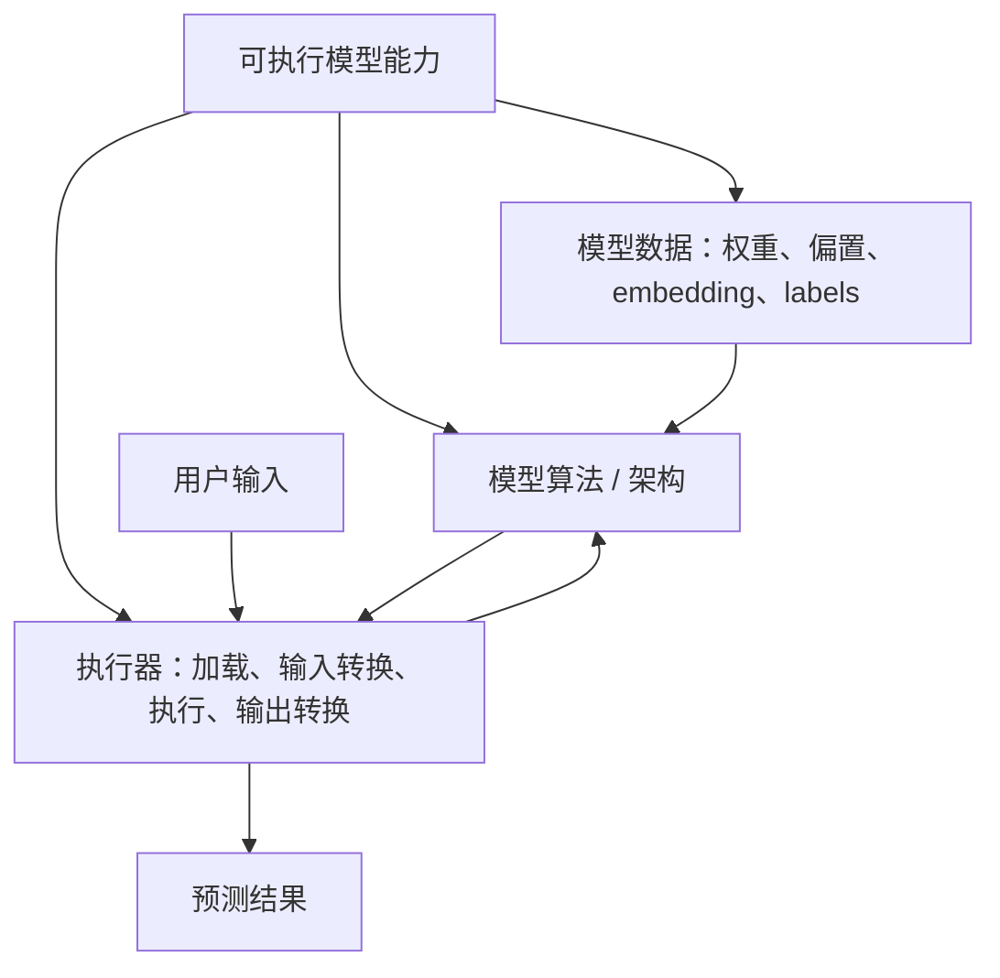

可以形式化为：

$$
y=E(A_{\theta},D_{aux},x)
$$

其中：

- $A_{\theta}$ 是由架构 $A$ 与学习参数 $\theta$ 组成的计算；
- $D_{aux}$ 是 vocabulary、embedding、label map 等辅助数据；
- $E$ 是 executor；
- $x$ 是外部输入，$y$ 是业务可消费输出。

#### 为什么不能把模型只理解为 weights 文件

一个权重 tensor 文件本身通常不能回答：

- 应实例化哪种网络结构？
- 输入是 RGB 图片、token IDs 还是归一化向量？
- 图片尺寸、文本 tokenizer、vocabulary 和 label map 是什么？
- 使用哪个框架 / runtime 和算子版本？
- 输出 logits 怎样转成类别、置信度或业务对象？

因此，只有权重而没有架构、依赖和执行契约，无法可靠预测。即使模型被序列化为一个“自包含”格式，它仍依赖兼容 runtime 和输入输出 schema。

更完整的部署包可表示为：

```text
ModelPackage:
    model_artifact
    model_format_and_runtime_version
    input_schema
    preprocessing_assets_and_code
    postprocessing_code
    labels_or_vocabulary
    dependency_manifest
    model_metadata
    checksums_and_signature
```

#### “模型是可执行程序”的准确边界

原章强调模型不是静态数据，而是可执行程序。这一表述的工程直觉正确：模型必须作为计算被运行。但一个 `.pt`、SavedModel 或 ONNX 文件是否自带全部执行逻辑，取决于序列化格式；有些只存 state dict，有些保存 graph，有些还需外部 custom operators。

所以更严谨地说：**被 serving 的对象是一套可重建、可加载并可执行的模型能力，而不一定是单个天然可执行文件。**

### 6.1.2 模型 prediction 与 inference

#### 学术语境可能区分二者

原章给出一种常见区分：

- **Prediction**：关注对未见数据预测，例如根据销售记录预测谁会响应营销活动；
- **Statistical inference**：关注数据生成机制与因果 / 参数解释，例如研究价格和收入怎样影响销售。

两者的科研目标不同，评价重点也可能不同。

#### Serving 工程语境中二者同义

在本章系统边界内，prediction 与 inference 都表示：

$$
y=f_{\theta}(x)
$$

即给定模型和输入，执行前向计算并获得输出。服务平台不需要从请求层区分模型的研究目的；它关心输入契约、执行环境、资源、结果和 SLO。

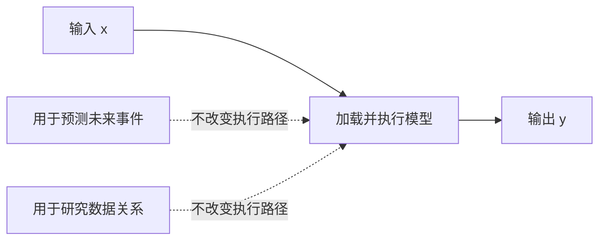

这是一种**局部术语约定**，不能反向断言统计学中的 prediction 和 inference 永远相同。跨团队沟通时应先声明语境。

### 6.1.3 什么是模型服务

#### 定义

模型服务是用输入数据执行指定模型并返回预测的全过程，至少包括：

1. 接收和验证 prediction request；
2. 定位并取得预期模型版本；
3. 建立 / 复用兼容执行环境，把模型加载到 CPU / GPU 内存；
4. 预处理输入；
5. 执行模型；
6. 后处理模型输出；
7. 返回结果并记录可观测信息。

原章将典型流程压缩为四步：收请求、加载模型、执行算法、返回结果。预处理与后处理在后续设计图中作为 executor / transformer 的一部分出现。

#### 三个基础组件

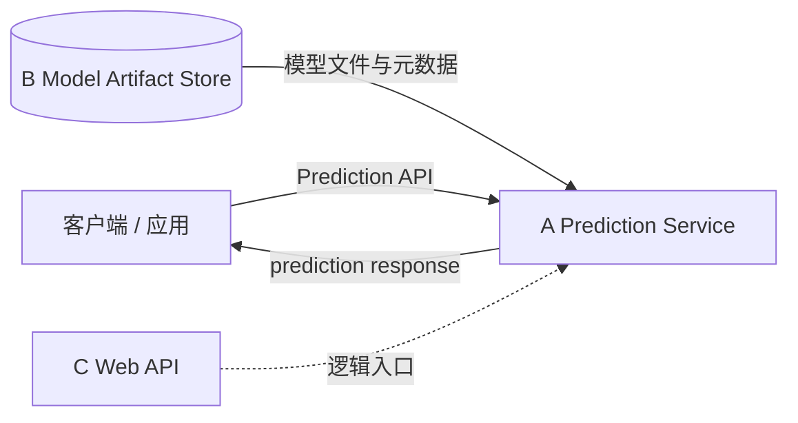

- **Prediction service**：处理请求、模型生命周期与执行；
- **Model artifact store / model file server**：保存训练产生的模型版本与相关文件；
- **Prediction web API**：面向应用暴露 predict 能力。

语音翻译、鲨鱼检测等用例通常以 HTTP / gRPC 远程服务实现。这样不同地点和语言的应用只依赖 API，不必直接理解模型框架。

#### Model serving 与 prediction service 不完全同义

- Model serving 是活动 / 能力；
- Prediction service 是承载该能力的网络服务；
- Direct embedding 也属于 model serving，但没有独立 prediction service；
- 一个 prediction platform 可包含多个 inference servers 和非模型组件。

#### 训练模式与评价模式

训练和 serving 可执行同一网络架构，但模式不同：

| 维度 | Training / learning mode | Serving / evaluation mode |
| --- | --- | --- |
| 目标 | 学习参数 | 仅产生预测 |
| Gradient | 构建反向图并求梯度 | 通常关闭 gradient |
| 参数更新 | optimizer 更新 | 参数保持不变 |
| Dropout | 按训练语义随机丢弃 | 关闭或按推理语义执行 |
| BatchNorm | 更新 / 使用 batch statistics | 使用已保存 running statistics |
| 内存 | 保存 backward 所需 activation | 通常显著更低 |

PyTorch 概念代码：

```python
model = load_model(model_path)
model.eval()

with torch.inference_mode():
    output = model(preprocessed_input)
```

`eval()` 切换 Dropout / BatchNorm 等层语义；`inference_mode()` 或 `no_grad()` 关闭 autograd。二者解决的问题不同，不能只写一个。

原章用“训练 open loop、评价 closed loop”说明参数是否反馈更新。这个说法不应按控制理论严格解释；最可靠边界是：serving 不根据单次请求执行 optimizer update。

#### 在线请求的端到端时延

原章把低时延列为核心挑战。可把单请求时延拆成：

$$
L_{e2e}=L_{network}+L_{queue}+L_{validation}
+L_{pre}+I_{miss}L_{load}+L_{infer}+L_{post}+L_{serialize}
$$

其中 $I_{miss}=1$ 表示模型不在内存，需付出加载成本。这个拆分说明：只优化 neural network kernel 不一定改善用户时延；排队、模型冷加载和输入转换可能更大。

例如：

| 阶段 | 耗时 |
| --- | ---: |
| 网络往返 | 10 ms |
| 排队 | 5 ms |
| 预处理 | 8 ms |
| 模型已缓存，加载 | 0 ms |
| 推理 | 25 ms |
| 后处理和序列化 | 7 ms |

则：

$$
L_{e2e}=10+5+8+0+25+7=55\ \mathrm{ms}
$$

若 cache miss 要额外加载 800 ms，同一请求会变成 855 ms。模型缓存和预热因此会直接影响尾时延。

### 6.1.4 模型服务的六项挑战

#### 挑战 1：不同模型的 prediction API 不同

CNN 可能接收固定尺寸图片并返回类别；RNN / Transformer 接收 token sequence；语音模型接收波形；检测模型返回可变数量 bounding boxes。统一 API 必须处理：

- 不同媒体类型与 tensor shape；
- variable length、batch 与 streaming；
- input validation 和大小限制；
- 不同输出 schema；
- pre / postprocessing 版本。

如果统一成不透明 bytes，客户端失去类型安全；如果为每个模型设计强类型接口，平台维护成本上升。后文三种策略正是在“专用契约”和“统一契约”之间选择。

#### 挑战 2：模型执行环境因框架而异

TensorFlow、PyTorch、ONNX Runtime 和自定义 C++ 算子可能要求不同：

- runtime / framework 版本；
- Python、C++、CUDA、cuDNN；
- CPU 指令集或 GPU compute capability；
- custom operators；
- model serialization format。

Prediction service 应封装这些差异，让应用只看 API。容器可隔离用户空间依赖，但宿主驱动、GPU、内核和 device plugin 仍需兼容。

#### 挑战 3：工具和产品太多

原章列举 TensorFlow Serving、TorchServe、NVIDIA Triton、Seldon Core、KFServing 等 20 多种选项。选择不能只比较 feature list，应从用例验证：

- 支持哪些模型格式和 custom ops；
- 在线、batch、streaming 与 ensemble；
- dynamic batching、GPU sharing、model repository；
- deployment、autoscaling、canary 与 rollback；
- metrics、tracing、logging；
- 团队的运行环境和长期维护能力。

产品名称和状态具有成书时点，例如 KFServing 后续项目名称可能演进；本章可迁移的是评估维度。

#### 挑战 4：不存在普遍最划算的架构

只服务一个花卉分类模型，与服务 10 种 OCR、文本和图像模型的约束完全不同。通用平台能降低第 101 个模型的接入成本，却会提高第 1 个模型的建设、调试和运维成本。

总成本可粗略写为：

$$
C_{total}=C_{build}+C_{onboard}+C_{operate}
+C_{compute}+C_{failure}+C_{change}
$$

Model server 往往提高 $C_{build}$，但随着模型 / 应用数量增长，降低重复的 $C_{onboard}$ 和 $C_{operate}$。合理选择依赖规模交叉点，而不是架构“先进程度”。

#### 挑战 5：低时延与资源饱和互相制约

为了降低成本，希望 GPU 保持高利用率；为了低尾时延，又希望请求无需排队并有冗余容量。两者存在张力：

- 增加 batching 提高吞吐，但第一个请求要等待 batch 填充；
- 高利用率接近 100% 时，突发流量导致 queue latency 快速增加；
- 缩容降低空闲成本，却增加冷启动和模型加载；
- 多模型共享 GPU 提高利用率，却增加缓存 miss、干扰和显存压力。

Little 定律给出稳定系统中的平均关系：

$$
N=\lambda W
$$

$N$ 是平均在途请求，$\lambda$ 是到达率，$W$ 是平均逗留时间。若 200 requests/s、平均 50 ms，则：

$$
N=200\times0.05=10
$$

平均约 10 个请求并发在系统内。它不能预测 P99，也不替代负载测试，但可做容量直觉检查。

吞吐近似：

$$
Throughput\approx\frac{concurrency}{average\ latency}
$$

只在稳定、单位一致且边界清楚时成立。服务设计应同时定义 QPS、P50 / P95 / P99 latency、错误率和资源成本，而不是只看 average latency 或 GPU utilization。

#### 挑战 6：部署和监控必须从第一天设计

模型部署不是复制一个文件；它要回答：

- 哪个版本进入生产、谁批准？
- 模型、executor、pre / postprocess 是否原子匹配？
- 怎样 canary、A/B、shadow 和 rollback？
- 旧版本保留多久？
- 正在处理请求时怎样无损切换？
- 怎样判断服务健康、模型质量和数据分布变化？

模型服务直接面向用户。Fraud detection、loan approval 等场景中，服务可用但模型质量退化同样危险。因此监控至少分两类：

- **系统指标**：availability、QPS、latency、error、CPU/GPU、cache hit、OOM；
- **模型 / 业务指标**：输入 / 输出分布、置信度、真实标签后的 accuracy / recall、业务损失和 drift。

原章把具体部署与监控实践留到下一章，但要求在架构阶段预留版本、流量和可观测接口。

### 6.1.5 模型服务术语

#### 本书采用的同义词

| 本书首选 | 常见同义词 | 本章含义 |
| --- | --- | --- |
| Model serving | model scoring、model inference、model prediction | 用输入执行模型并得到输出的活动 |
| Prediction service | scoring service、inference service、model serving service | 允许远程执行模型的网络服务 |
| Predict | inference | 模型执行入口函数 / 动作 |
| Prediction request | scoring request、inference request | 触发一次模型执行的 API 请求 |
| Model algorithm | machine learning algorithm、training algorithm | 训练和 serving 共用的网络 / 算法结构 |
| Model deployment | model release | 把指定模型版本送入可被生产 serving 使用的环境 |

这些同义关系只适用于本书 serving 讨论。实际产品、论文和团队可能赋予更细差异，例如 “deployment” 可指创建服务资源，“release” 可指让流量切换到已部署版本。设计文档应明确自己的状态机，而不是依赖词语默认含义。

#### 还要区分的几个对象

- **Model artifact**：序列化模型及相关文件；
- **Model package**：artifact 加 runtime / schema / executor 契约；
- **Model instance**：已加载到某进程 CPU / GPU 内存的运行时对象；
- **Replica**：承载一个或多个 model instances 的服务副本；
- **Model version**：可追踪、不可变的一版模型包；
- **Endpoint**：应用调用的网络地址和 API 契约。

混淆这些对象会导致诸如“模型已经部署”却不知道是文件已上传、实例已加载，还是生产流量已切换。

---

## 6.2 常见模型服务策略

原章给出三种策略，它们不是从落后到先进的单向升级，而是在**应用耦合、专用性、通用性和运维成本**之间取舍。

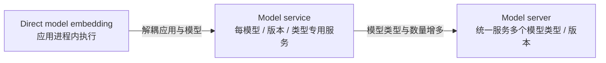

### 6.2.1 直接嵌入模型

#### 定义与流程

Direct model embedding 把模型加载和预测代码放在用户应用的同一进程内。花卉识别移动应用可将分类模型打包到客户端：拍照后本地预处理、推理并显示结果，不调用远端 predictor。

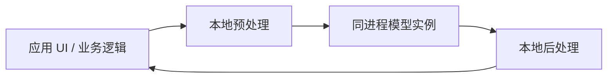

#### 为什么会采用

- 消除应用到远端模型服务的网络 hop；
- 离线可用；
- 原始敏感数据可不离开设备；
- 交互时延稳定，不受互联网波动影响；
- 单一进程可本地调试。

#### 原章指出的困难

1. 应用常用 Java、Go、C#、JavaScript，而建模多用 Python；需要 C++ / Java / JS runtime 或重写 wrapper；
2. 设备算力、内存和电量有限，大模型导致卡顿；
3. Model code 与业务代码混合，所有权、兼容和发布边界模糊；
4. Native runtime 资源可能不受语言 GC 管理，容易产生难观测内存泄漏。

#### 部署与版本代价

模型随客户端包发布时：

- 升级依赖 app store / 客户端更新，旧版本长期存在；
- 模型文件增加包体；
- 不可信设备可能提取模型；
- 端侧硬件碎片化，需要量化、加速器适配和兼容测试；
- 线上 A/B 和紧急 rollback 更难集中控制。

所以 direct embedding 并非“很少使用就不值得考虑”。在离线、隐私、网络不可用、超低时延或边缘设备场景，它可能是正确方案；只是原章针对一般业务应用更推荐 server-side model service。

### 6.2.2 模型服务

#### 定义

Model service 在服务器端为一个模型、一个主要版本或一种模型类型建立专用 web service，通过 HTTP / gRPC 暴露 predict API。

它管理完整运行生命周期：

$$
\text{fetch}\rightarrow\text{load}\rightarrow\text{preprocess}
\rightarrow\text{predict}\rightarrow\text{postprocess}\rightarrow\text{unload}
$$

文档分类例子可建立专用 OCR predictor，API、预处理和后处理都围绕该 CNN 模型设计。

#### 常见部署模式

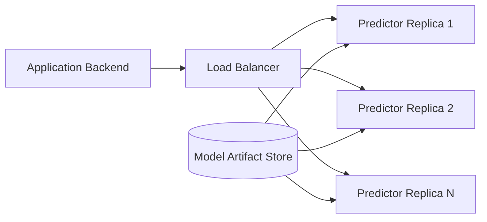

模型执行逻辑打进 Docker image，或者容器启动后从 artifact store 加载固定 model version。多个 stateless replicas 由负载均衡器分流。

#### 优点

- 架构和 API 简单、模型专用；
- 可复用训练代码、framework 和预处理逻辑；
- 应用与数据科学团队有清晰 API / deployment 边界；
- 每种模型可独立扩缩、选 CPU / GPU 和优化；
- 故障、指标和发布 blast radius 较小；
- 容易快速把单个模型送入生产。

#### 局限

若每模型类型 / 大版本都建立服务，数量增长后产生重复：

- CI/CD、镜像 patch、证书、网络和 autoscaling；
- 监控、告警、on-call；
- API client 和 deployment tooling；
- 每个服务各自保留空闲容量，资源碎片化；
- Framework runtime 和模型加载逻辑重复维护。

假设每个服务固定运维成本 $C_s$，有 $M$ 个 model services，则仅重复固定成本近似：

$$
C_{fixed}\approx M\times C_s
$$

模型类型很少时可接受；几十、上百种时会驱动 model server / prediction platform。

### 6.2.3 模型服务器

#### 定义

Model server 试图以黑盒方式承载多个模型类型、框架或版本，通过统一 prediction API 和管理 API 动态注册、加载、卸载并执行模型。新增合规模型通常不需要修改 / 部署一套新业务服务代码。

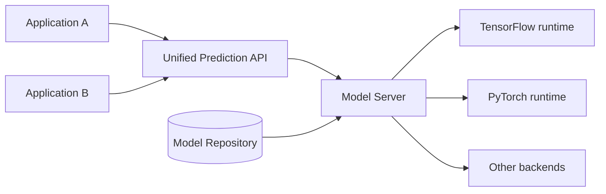

TensorFlow Serving、TorchServe、NVIDIA Triton 等是原章列举的 model server 方案。它们的实际模型格式与框架覆盖各不相同，不能仅凭“通用服务器”名称假设任意模型都可直接运行。

#### 为什么复杂

不同模型的差异贯穿：

- 输入 / 输出数据类型和 shape；
- tokenizer、embedding、图片 / 音频处理；
- CNN、LSTM、Transformer 等执行图；
- TensorFlow、PyTorch、自定义算子 runtime；
- CPU / GPU 和显存要求；
- batching、streaming 与 stateful sequence；
- 模型加载和版本格式。

一个统一 API 与单一进程无法魔法般消除这些差异。Model server 通常通过 standardized model format、backend adapter、custom handler 或 ensemble graph 建立扩展点。

#### 优点

- 新 model version / 类型的边际接入成本下降；
- 集中模型管理、加载、batching、metrics 与资源复用；
- Prediction API 和 deployment API 可统一；
- 多应用共享基础设施，提高资源利用；
- Runtime 优化可由专业工具复用。

#### 局限

- 初始建设和集成复杂；
- 通用 API 可能牺牲模型专用类型安全；
- Debug 路径跨 routing、backend、cache 和 model package；
- 一个共享平台故障或错误配置影响面更大；
- 多租户 noisy neighbor、GPU sharing 与安全隔离更困难；
- Custom preprocess / ops 仍可能要求代码和专用环境。

#### Black-box deployment 的真实含义

原章说，只要模型文件符合 model server 标准，通过管理 API 上传就可预测。这里隐含：

- 格式和 runtime 兼容；
- input/output schema 已注册；
- custom ops / handlers 已可用；
- 模型文件及依赖完整；
- 资源和版本策略允许加载；
- readiness 测试通过。

Black box 表示用户不管理内部执行细节，不表示模型可以不遵守契约。

### 6.2.4 三种策略的统一比较

| 维度 | Direct embedding | Model service | Model server |
| --- | --- | --- | --- |
| 执行位置 | 应用同进程 / 设备端 | 独立专用服务 | 通用 serving backend / 平台 |
| 网络 hop | 无远程 serving hop | 有 | 有，且可能多一层 routing |
| API 专用性 | 应用内部函数 | 模型 / 类型专用 | 尽量统一 |
| 框架隔离 | 与应用进程耦合 | 每服务独立 | 后端 adapter 统一管理 |
| 模型更新 | 随应用发布 | 独立服务发布 | 管理 API / model repository |
| 初始复杂度 | 表面低，跨语言可能高 | 低到中 | 高 |
| 模型数量扩展 | 差 | 少量类型较好 | 大量类型 / 版本较好 |
| 资源复用 | 使用端设备 | 服务级 | 平台级 |
| 最适合 | 离线、隐私、边缘、极低网络时延 | 单模型或少量模型类型 | 多应用、多模型类型、组织级平台 |

#### 选择函数

可以用以下问题路由：

1. 必须离线 / 端侧处理吗？若是，优先评估 direct embedding；
2. 只有一个模型或少量同类型模型吗？优先 model service；
3. 同类型但每租户一份模型吗？在 model service 中增加 versioned model cache；
4. 多应用共享大量不同模型类型吗？评估 model server / prediction platform；
5. 通用平台的建设和运维成本是否能被规模摊薄？若不能，退回更简单方案。

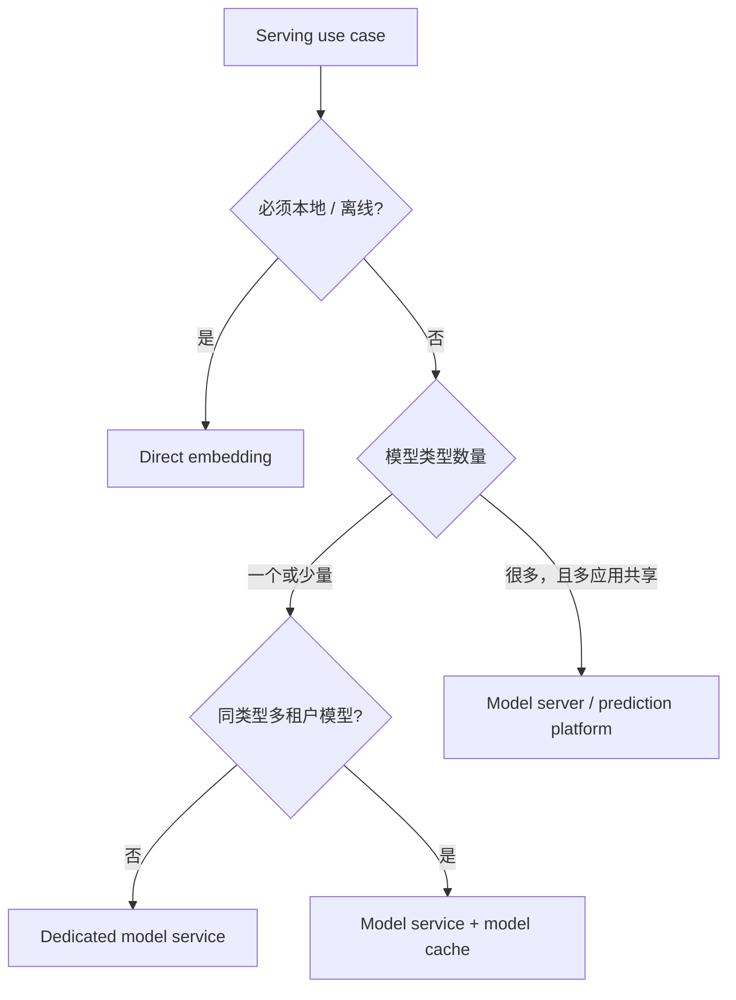

原章最重要的设计原则是：**从当前用户场景出发选择刚好足够的方案，而不是默认建设最通用的平台。**

---

## 6.3 设计 Prediction Service

系统设计常见错误是先追求“支持所有模型”，再寻找用户。模型服务尤其容易过度设计，因为通用平台听起来比单模型 predictor 更先进，但建设时间、debug 路径和固定运维成本也更高。

作者采用由外向内的方法：依次分析单模型应用、同模型类型多租户应用、多应用多模型类型平台。每增加一种真实需求，才引入对应组件。

$$
{\text{Use case complexity}}\uparrow
\Rightarrow\text{Serving architecture complexity}\uparrow
$$

但反方向并不成立：架构复杂不代表业务价值更高。

### 6.3.1 单模型应用

#### Face-swap 场景

移动应用让用户上传 source / target 图片，调用 deepfake 模型交换人脸并展示结果。它只依赖一种模型，因此候选方案是：

- 后端 model service；
- 客户端 direct embedding。

#### Model service 方案

#### 三个组件

1. **A：Web page / client app**：上传图片、选择 source / target、展示结果；
2. **B：Application backend**：认证、业务状态、对象存储和调用 predictor；
3. **C：Predictor**：专用 web interface、preprocess、单模型、postprocess 和模型文件加载。

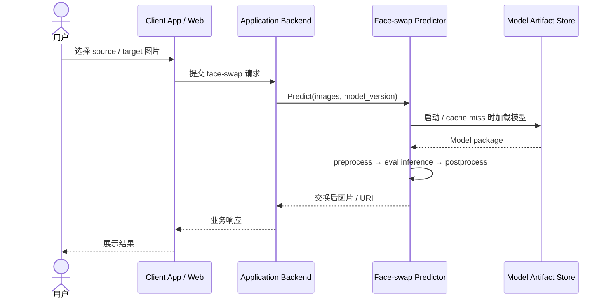

Predictor 内部复用原章通用四步：接收、加载、执行、返回，并显式包含图片 transformer。

#### 从 training container 转为 predictor container

原章指出可快速复用训练代码。主要变化：

1. 固定、下载或挂载已训练 model artifact；
2. 初始化 network architecture 并加载 weights；
3. 切换 evaluation mode / inference context；
4. 提取与训练一致的 preprocess；
5. 添加 postprocess；
6. 暴露 HTTP / gRPC predict API；
7. 添加 readiness、metrics 和 graceful shutdown。

不应直接把整个 training image 原封不动用于生产：其中可能包含编译器、Notebook、训练数据工具和高权限凭据，扩大镜像与攻击面。更稳妥的是共享模型 / transformer library，用精简 serving image 构建。

#### 为什么适合单模型

- 专用 API 可表达两张图片、质量和输出格式；
- 服务只加载一个 model version，缓存逻辑简单；
- 资源可按该模型 profile；
- 数据科学家和应用团队通过 API 分工；
- 发布、扩缩和 rollback 独立；
- 最快形成端到端产品闭环。

#### 扩缩与容量

单 replica 的平均稳定服务率为 $\mu$ requests/s，目标到达率为 $\lambda$，忽略冗余时至少：

$$
R\ge\left\lceil\frac{\lambda}{\mu\rho_{target}}\right\rceil
$$

$\rho_{target}<1$ 是目标利用率，留出突发和尾时延余量。例如 $\lambda=80$ QPS、单 replica $\mu=25$ QPS、目标利用率 $0.7$：

$$
R\ge\left\lceil\frac{80}{25\times0.7}\right\rceil=5
$$

这只是平均容量下限，还要压测 P99、故障冗余和模型加载时间。

#### Direct model embedding 方案

模型文件随客户端应用部署，启动时加载到同一进程；业务逻辑直接调用 preprocess → model → postprocess，不存在 application backend 到 predictor 的网络请求。

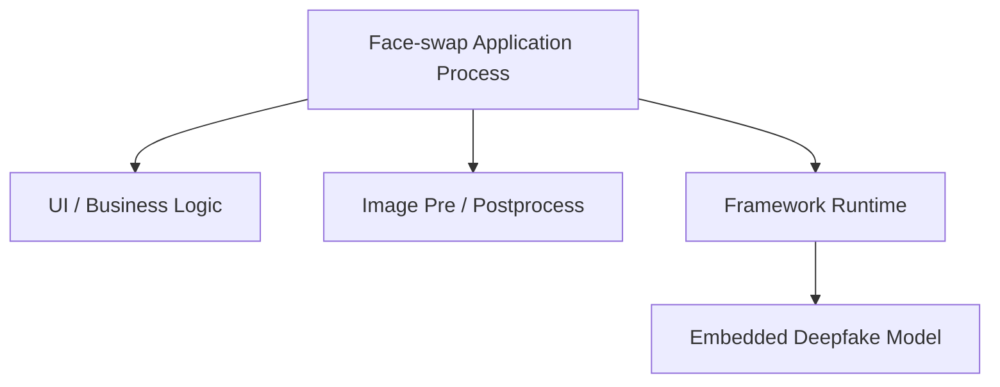

#### 两项直接收益

1. **少一个网络 hop**：

   $$
   L_{embedded}\approx L_{pre}+L_{infer}+L_{post}
   $$

   远端服务还需网络、排队和序列化。

2. **本地调试为一个整体**：应用、模型与 transformer 在同一进程重现，不必跨服务追踪。

还可能获得离线能力和数据本地性，但这是沿原章机制的场景扩展。

#### 代价

- 每台用户设备都重复存储和执行模型；
- 客户端硬件差异使 latency / OOM 难预测；
- 模型升级和 rollback 受客户端版本采用率影响；
- 应用崩溃与模型 native crash 共享故障域；
- 模型和 business release cadence 耦合；
- 端侧模型可能被提取或篡改；
- Java / JS / C++ runtime 与 Python 训练语义要保持一致。

#### 为什么 Model service 更流行

原章列出四项原因。

##### 1. 跨语言重实现成本

建模和预处理常用 Python；客户端可能是 Java、C++、C#、Go。虽然 TensorFlow / PyTorch 等提供非 Python runtime，custom layers、tokenizer 和 postprocess 仍可能重写。Model service 可直接复用大部分 Python / framework code。

这里不应理解为“算法必然要手工重写”。可移植 graph format 和 native SDK 会降低成本，但仍需语义、算子与版本验证。

##### 2. 所有权边界模糊

模型代码和应用业务代码共处仓库 / 发布单元，数据科学与应用团队需要交叉 review，任何模型升级都可能触发整个 app release，降低 shipping velocity。

独立 predictor 用 versioned API 和 artifact contract 分隔：

```text
Application team owns: UX, business workflow, API client and fallback
Model team owns: preprocess, executor, model package and model metrics
Platform team owns: runtime, deployment, SLO and observability
```

##### 3. 客户端性能问题

图片特征、preprocess 和大模型推理会占用 CPU / GPU、RAM 和电池，引起 UI 卡顿；低端设备体验尤其差。服务端可集中使用 GPU，并对请求 batch 和扩容。

##### 4. Native memory leak 难发现

原章以 Java 调 TensorFlow 为例：native tensors / execution objects 不一定由 Java GC 自动回收，需要显式关闭。Native allocation 不体现在普通 JVM heap 指标中，泄漏难定位。

这不是 direct embedding 独有，任何 JNI / native runtime 都可能发生。应使用 ownership API、try-with-resources、native allocator metrics、RSS 和 jemalloc 等工具。

#### 原章结论与例外

对一般联网单模型应用，作者强烈推荐 model service。例外包括：必须离线、数据不能离设备、网络不可接受或端侧 accelerator 足够时，direct embedding 仍可能更合理。应以用例约束覆盖默认推荐。

### 6.3.2 多租户应用

#### Chatbot 场景

- **Tenant**：学校、零售商等使用同一 chatbot SaaS 的组织，账户与数据隔离；
- **Chat user**：tenant 的客户；
- 应用用 intent classification 把对话转到对应服务部门。

最初所有 tenant 共用一个 intent model，准确率不足。改进后，每个 tenant 用自己的数据训练**同一种算法**，得到 tenant-specific model。Prediction request 必须根据 tenant 找到对应模型。

关键特征是：

$$
{\text{same model type / executor}}\quad+
{\text{many model data versions}}
$$

因此无需为每个 tenant 建一套代码服务，可在一个 model service 中缓存多个同类型模型实例。

#### 模型缓存设计

#### 架构

相较单模型 predictor，增加：

- **A：Model cache**：在 CPU / GPU 内存保存多个已加载模型 graph / data transformer；
- **B：Model file server**：持久保存所有 tenant 的 model packages，可被多个 service replicas 共享。

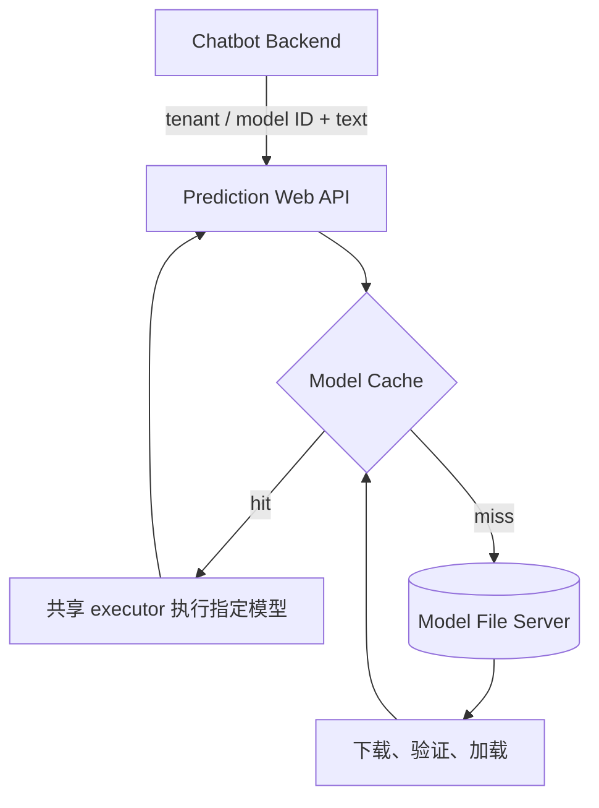

#### Cache key 怎样设计

原章给出两种思路：

1. Training run ID：天然追溯到产生模型的训练运行；
2. Model name + version：业务名称灵活、版本明确。

生产 key 还应包含 tenant / namespace，避免不同租户同名冲突：

$$
key=(tenant\_id,model\_name,model\_version)
$$

请求必须解析到不可变 model version。只用 `latest` 会让相同请求在时间上执行不同模型，难以审计；可由路由层把 alias 原子解析为具体版本，并记录结果。

#### Cache value 包含什么

不只是 weights：

- loaded model / inference graph；
- tokenizer、vocabulary、label map；
- preprocess / postprocess transformer；
- runtime / device handle；
- model metadata、size 和 readiness；
- 引用计数 / in-flight requests；
- last access、load time 和 error state。

原章图中 value 是 model inference graph + data transformer，正是“同类型共享代码、每模型保持状态”的边界。

#### Hit、miss 与平均时延

命中率为 $h$，hit latency 为 $L_h$，miss 还要加载，完整 miss latency 为 $L_m$：

$$
E[L]=hL_h+(1-h)L_m
$$

例如 $h=0.95$、$L_h=40\ \mathrm{ms}$、$L_m=840\ \mathrm{ms}$：

$$
E[L]=0.95\times40+0.05\times840=80\ \mathrm{ms}
$$

仅 5% miss 就把平均从 40 ms 翻倍，P95 / P99 可能更明显。需要预热热门模型、异步加载、请求合并和合理容量。

#### 内存容量约束

模型 $i$ 加载后占 $m_i$，cache 可用内存 $M$：

$$
\sum_{i\in Cache}m_i+M_{runtime}+M_{workspace}\le M
$$

不能只按磁盘文件大小估计：加载后 tensor dtype、graph、workspace、allocator fragmentation 和并发 batch 都消耗显存。

#### Model swapping 与 LRU

容量不足时淘汰模型再加载新模型。LRU（least recently used）淘汰最久未访问项，适合近期访问能预测未来热度的场景。

```text
predict(model_key, input):
    model = cache.get(model_key)
    if model is missing:
        reserve_capacity_or_evict_lru(model_key.required_memory)
        model = singleflight_load_and_validate(model_key)
        cache.put(model_key, model)

    pin(model)
    try:
        return model.predict(input)
    finally:
        unpin(model)
```

关键细节：

- 不能淘汰仍有 in-flight request 的模型；
- 同一 miss 的并发请求应 single-flight，避免重复下载 / OOM；
- 加载失败要负缓存 / backoff，避免请求风暴；
- 超大模型可能大于单实例容量，应在 admission 阶段拒绝或路由专用 pool；
- LRU 忽略模型大小和加载成本，可扩展为 size-aware / cost-aware 策略；
- 每 replica 各自 cache 会有不同命中率，routing 可做 model affinity。

#### 模型分区到不同实例

原章还提到把模型分散到多个 instances，降低 miss。方法包括：

- 一致性哈希 / model ID routing，使同模型请求集中到已缓存 replica；
- 按 tenant / 热度分片；
- 热模型多副本，冷模型少副本或按需加载；
- 专用 GPU pool 与 CPU fallback。

这提高 cache locality，但 replica 故障或扩缩时需重新映射。负载均衡不能只随机分流，否则同一模型可能在每个 replica 重复占显存。

#### 多租户安全

缓存共享执行进程，但 tenant 必须隔离：

- 请求身份只能解析到本 tenant model；
- cache key 包含 tenant namespace；
- logs / metrics 不泄漏原始输入；
- artifact store 权限最小化；
- model package 签名 / checksum；
- 公平限流，避免 noisy tenant 垄断 GPU；
- 按 tenant 记录 cost 和 SLO。

#### 能否把模型缓存扩展到多种模型类型

原章不推荐。原因不是技术上绝对做不到，而是 model service 的专用性会迅速消失：

- 图片与文本 API schema 不同；
- CNN、LSTM 等 runtime 和 executor 不同；
- tokenizer / embedding 与 image transformer 不同；
- postprocess 和错误语义不同；
- 资源、batching 和监控不同。

若硬塞进同一服务，就要为每种类型添加专用 web interface、pre / postprocess、runtime 和 deployment 分支，形成难维护的条件集合。

#### 少量模型类型时的折中

每种 model type 建一个 model service，每个服务内部缓存其同类型 tenant models：

```text
Intent Classification Service -> many tenant intent models
Image Classification Service  -> many tenant image models
OCR Service                   -> many tenant OCR models
```

这样 API 和 transformer 在类型内稳定。模型类型少时成本合理。

#### 何时跨越到 Model Server

当 model types 从几个增长到 20+、100+，每类型服务的 CI/CD、网络、监控和 24/7 on-call 重复成本不可扩展。此时应该把通用能力集中为 prediction platform，并复用成熟 inference servers。

这个阈值不是固定数字。应比较：

$$
M\times C_{service}\quad\text{与}\quad
C_{platform}+M\times C_{platform\ onboarding}
$$

当后者长期更低且平台能力成熟，集中化才经济。

### 6.3.3 一个系统支持多个应用

#### 场景与目标

组织已经有 chatbot、face swap、flower recognition、PDF scanning 等独立 model services，现在要新增 voice recognition，并降低所有应用 serving 成本。

继续“一应用一预测服务”会重复基础设施。作者提出集中式 **prediction platform**：采用 model server 策略，在一个系统中承载任意 model types，并让多个应用共享。

平台建设要同时考虑 model format、runtime、cache、version、workflow、data processing、management 与 unified API，因此复杂度显著高于 6.3.1 / 6.3.2。

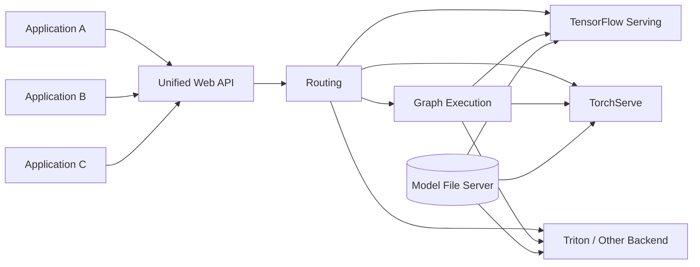

#### 统一 Web API

平台 API 要兼容不同 backend 与模型，原章提到 KFServing predict protocol 作为标准化尝试。API 可分三类：

1. **Prediction API**：执行模型或 graph；
2. **Model metadata API**：查询 model name、version、algorithm、framework、schema、状态；
3. **Model deployment API**：注册、部署、卸载、查询 rollout status。

#### 一个概念请求信封

```json
{
  "model": {
    "name": "intent-classifier",
    "version": "17"
  },
  "request_id": "req-123",
  "parameters": {
    "timeout_ms": 100,
    "trace": false
  },
  "inputs": [
    {
      "name": "utterance",
      "datatype": "BYTES",
      "shape": [1],
      "data": ["Where is my card?"]
    }
  ]
}
```

这是说明统一信封的补充示例，不是原章协议的逐字定义。统一 API 应同时解决：

- Model / graph identity 与不可变 version；
- Tensor name、datatype、shape、encoding；
- 请求大小、batch 和 timeout；
- response schema、error code 与 trace ID；
- authentication、tenant 和 idempotency；
- backward-compatible versioning。

通用协议无法替代 domain-specific API。应用 backend 可在外层提供 `/detect-shark` 等业务接口，再把数据转换成平台 tensor protocol，避免终端用户接触底层 shape。

#### 路由组件

Routing 根据 model metadata 与 routing config 选择能执行该模型的 inference backend。Metadata 至少包括：

- model algorithm / handler 名与版本；
- model version / format；
- training framework / runtime；
- required custom ops；
- CPU / GPU 与资源；
- input/output schema；
- deployment / health 状态。

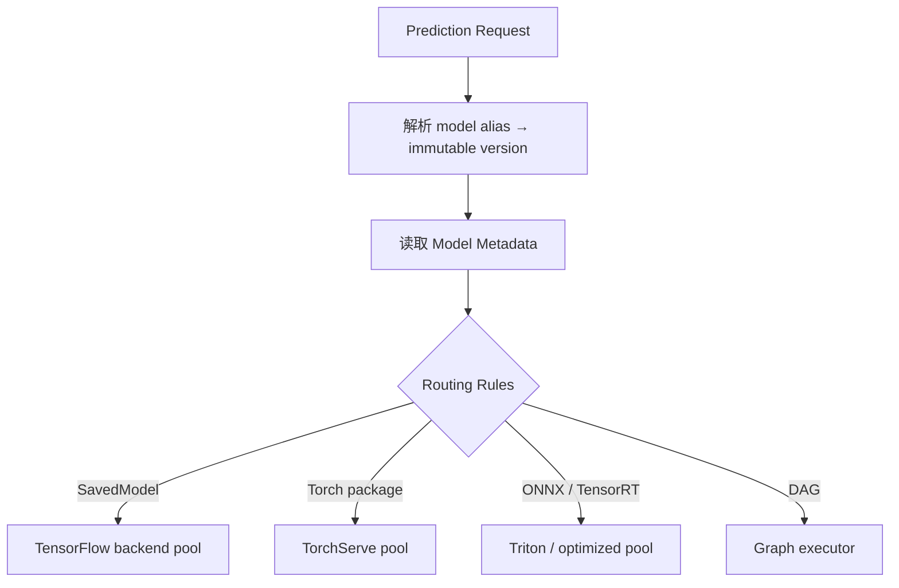

路由不仅按 framework，还要考虑：

- backend 支持的 model format / version；
- model 是否已加载及 cache affinity；
- replica health、queue depth 和 capacity；
- tenant / region / data residency；
- canary traffic percentage；
- fallback / timeout policy。

Routing config 与 model deployment 必须原子协调。先把流量路由到尚未 ready 的模型会造成错误；应由 readiness 和 rollout controller 驱动切换。

#### 图执行组件

单个业务请求可能按顺序执行多个模型。Mortgage approval 例子：


Graph execution component 用 DAG 描述依赖并一次执行。DAG 的作用：

- 拓扑排序依赖；
- 无依赖节点并行；
- 数据在节点间转换；
- 每节点 timeout、retry、fallback；
- 整体 tracing 和版本化。

#### DAG 时延

串行链时延近似各节点和网络之和：

$$
L_{chain}=\sum_{i=1}^{K}(L_{route,i}+L_{pre,i}+L_{infer,i}+L_{post,i})
$$

一般 DAG 的最低执行时间由 critical path 决定：

$$
L_{DAG}\ge\max_{p\in Paths}\sum_{v\in p}L_v
$$

并行分支只能缩短非关键路径；每增加一个远程节点也增加失败概率和 tail latency。Graph 不应把可在一个 optimized ensemble backend 内完成的操作无条件拆成网络微服务。

#### 失败与一致性

- 一个节点失败，是整图失败、重试该节点还是走 fallback？
- 重试是否安全，节点是否有副作用？
- 每个 model version 是否固定在请求开始时，避免执行中切版本？
- 中间数据是否含敏感信息，怎样加密和删除？
- 全图 deadline 怎样向下游分配？

图定义本身也应版本化，因为相同输入和相同单模型在不同 graph / transformer 版本下结果可能不同。

#### Inference Server

Inference server 执行实际模型预测，负责：

- 模型注册、加载、缓存、卸载；
- preprocess / postprocess 或 custom handler；
- CPU / GPU 资源管理；
- batching 与并发；
- predict API；
- model management API；
- metrics 和 health。

原章建议不要从零实现通用 inference server，而是复用 TensorFlow Serving、TorchServe、NVIDIA Triton 等，再集成自己的 model storage、routing、monitoring 和 alerting。

不同 backends 可以由不同团队 / pool 维护。Prediction platform 的“统一”主要发生在 API、metadata、routing 与治理层，不要求所有模型跑在同一种 server 进程。

#### Applications

Applications A、B、C 共享 serving backend。新增 voice-to-text Application D 时，理想流程是：

1. 按 backend 标准打包并上传 voice model；
2. 登记 metadata、schema 和 routing；
3. 部署 / 预热并通过 readiness；
4. Application D 调统一 prediction API。

无需为应用 D 修改平台核心代码的前提是已有 backend 能处理模型，pre / postprocess 可通过现有扩展点表达，且协议兼容。若需要新 custom runtime，仍要开发 adapter。

#### 平台何时更经济

集中平台把固定成本支付一次，并共享 replicas / GPU。其边际接入成本下降，但会出现平台团队、兼容测试和共享故障域。

可定义粗略 break-even：若独立服务每类型固定成本 $C_s$，平台固定成本 $C_p$，每类型平台接入成本 $C_o$，则当：

$$
M C_s>C_p+M C_o
$$

即：

$$
M>\frac{C_p}{C_s-C_o},\quad C_s>C_o
$$

平台从成本角度开始值得。数字还要加入 compute、failure、迁移和组织成本。

#### 模型预测工作流

按原章顺序：

1. 发布模型文件到 model file server；
2. 更新 model metadata 与 routing config，使 router 知道对应 backend；
3. 应用向 unified API 发 prediction request；
4. Router 解析 model version 并选择 inference server；
5. Inference server 从 file server 加载模型（或 cache hit）；
6. 把 payload 转为模型输入；
7. 执行算法；
8. 后处理并沿原路径返回。

更安全的部署顺序是先在 backend 加载并通过 readiness，再原子发布 routing；模型文件与路由不能只靠人工先后约定。

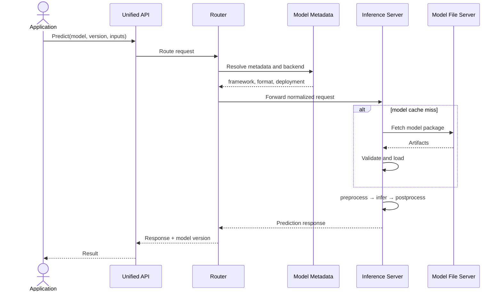

响应应返回实际执行的 immutable model version、trace ID 和可解释错误，使审计和 debug 能跨组件进行。

#### 为什么 Prediction Platform 不总是最佳

它增加：

- 一个或多级网络 hop；
- 统一协议转换；
- routing / metadata consistency；
- graph engine；
- 多 backend compatibility；
- 共享平台 on-call 与 blast radius；
- 更复杂的 end-to-end tracing。

对单模型 / 单类型多租户，这些成本是过度设计。原章明确建议按实际场景选择，而非坚持一种 serving approach。

### 6.3.4 Prediction Service 的共同要求

尽管三种场景架构不同，原章提出三个共同要求。

#### 1. 模型部署安全

无论 rollout / version 策略怎样，都必须能回退上一安全版本。最低能力包括：

- immutable model versions 和完整 lineage；
- artifact checksum / signature；
- compatibility 和 smoke test；
- readiness 后才接流量；
- canary / blue-green / shadow 等受控验证；
- 原子流量切换；
- 一键 rollback；
- 保留前一版本及其 executor / transformer。

回滚单位不能只有 weights。若新版本同时改变 tokenizer、label map 和 postprocess，必须整体回滚 model package。

一个简化状态机：

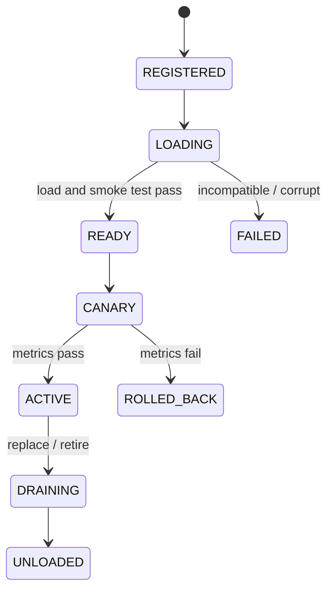

#### 2. Latency

原章说要降低平均响应时间；生产还应以 percentile SLO 管理尾时延，因为少量 cache miss、GC、GPU queue 或大输入会伤害用户。

例如 SLO：

```text
At 200 QPS with production request-size distribution:
P50 <= 40 ms
P95 <= 100 ms
P99 <= 180 ms
error rate <= 0.1%
```

优化方法映射到时延拆分：

| 阶段 | 可能方法 |
| --- | --- |
| Network / serialization | 更紧凑协议、同区域、压缩但评估 CPU 成本 |
| Queue | 扩容、限流、优先级、负载均衡 |
| Pre / postprocess | vectorization、缓存、native implementation |
| Model load | preload、warm pool、model affinity、较快存储 |
| Inference | optimized runtime、quantization、GPU、batching |
| Tail | 隔离大请求、deadline、hedging（谨慎）、避免 noisy neighbor |

Dynamic batching 提高 throughput，但有等待窗口：若最多等待 $L_b$ 才组 batch，则低流量请求可额外增加最多约 $L_b$ 排队。必须按 SLO 设置上限。

#### 3. Monitoring 与 alerting

Prediction service 停止或变慢会立即影响业务，因此应是深度学习系统中可观测性最强的组件。

##### 系统 / 服务指标

- Request rate、success / error、timeout；
- P50 / P95 / P99 latency 及各阶段 breakdown；
- Queue depth、concurrency、batch size；
- CPU、RAM、GPU utilization / memory；
- Model load time、cache hit / miss / eviction；
- Replica health、restart、OOM、backend errors；
- 每 model / version / tenant 的 SLO。

##### 模型 / 数据指标

- Input schema errors、missing / range；
- Feature / input distribution drift；
- Prediction / confidence distribution；
- Delayed ground truth 后的 accuracy、precision、recall；
- Fairness / segment metrics；
- Product outcome 与业务损失。

##### 版本维度不可缺少

所有 request metrics 应带：

```text
request_id, tenant_id, application_id,
model_name, model_version, executor_version,
graph_version, backend, replica, timestamp
```

否则 canary 退化时无法知道哪个版本负责。高基数字段不能无控制地作为 metrics labels；request ID 更适合 logs / traces。

##### Availability 与错误预算

可用性：

$$
Availability=\frac{T_{total}-T_{unavailable}}{T_{total}}
$$

若月度 SLO 为 $99.9\%$，30 天允许不可用时间约：

$$
30\times24\times60\times(1-0.999)=43.2\ \mathrm{minutes}
$$

但“HTTP 成功”不代表模型正确。可以分别定义 service availability 与 valid prediction rate。

##### Alert 应可行动

- Page：持续错误率 / P99 超 SLO、全部 replicas unavailable、错误模型 rollout；
- Ticket：cache hit 下降、GPU 成本异常、轻微 drift；
- 自动动作：停止 canary、rollback、扩容、隔离坏 model version；
- 每条告警关联 runbook、owner、dashboard 和 recent deployment。

监控与 alerting 的具体实现留到第 7 章，但 schema、版本和 hook 必须在本章设计阶段预留。

### 6.3.5 三类场景如何逐步演进

| 需求变化 | 新增能力 | 不应过早引入 |
| --- | --- | --- |
| 单应用、单模型 | 专用 predictor + replicas | 通用 graph / 多 backend router |
| 同模型类型、每 tenant 独立模型 | Model ID / version、cache、file server、eviction | 任意模型统一 API |
| 少量不同 model types | 每类型 model service + 类型内 cache | 组织级 prediction platform |
| 多应用、20+ / 100+ model types | Unified API、metadata router、graph、model servers | 为每模型继续建独立服务 |

演进时保持 API / metadata / artifact contract，可把已有 predictor 逐步挂到 router 后，而不必一次性重写所有模型。
---

## 容易混淆的概念与常见误区

### 1. 模型就是 weights 文件

错误。Serving 还需要架构 / graph、executor、runtime、preprocess、postprocess、labels / vocabulary 和输入输出契约。

### 2. 模型文件天然是可执行程序

不准确。原章强调模型能力是可执行的，但不同序列化格式可能只保存参数或 graph，仍需兼容 runtime 和 custom ops。

### 3. Model architecture、model algorithm 和 model executor 是同一个对象

错误。Architecture / algorithm 描述计算结构；executor 是加载输入、调用算法并返回业务结果的包装。两者版本都影响预测。

### 4. Prediction 与 inference 在所有学科语境都完全相同

错误。本书只在 model-serving engineering 中把它们视为同一执行动作；统计推断语境可区分研究目标。

### 5. Model serving 必须是远程 Web 服务

错误。Direct embedding 也是 serving。Prediction service 才特指通过网络提供远程执行的服务。

### 6. 调用 `model.eval()` 就完成了安全推理

错误。还要关闭 gradient、验证输入、固定模型版本、处理并发、超时、资源、pre/postprocess 和输出；`eval()` 主要切换层行为。

### 7. Training 与 serving 使用完全不同的神经网络

通常错误。二者使用同一架构和学习参数，执行模式不同；Serving 不做 optimizer update，Dropout / BatchNorm 等按评价语义运行。

### 8. 端到端时延就是模型 kernel 执行时间

错误。还包括网络、排队、验证、pre/postprocess、序列化和 cache miss 加载。优化 kernel 可能对用户 P99 几乎无效。

### 9. 平均 latency 达标就表示体验达标

错误。少量冷加载、GC、OOM 前抖动和大请求可造成高 P99。应管理 percentile latency 与请求大小分布。

### 10. GPU 利用率越接近 100%，在线服务越好

错误。高利用率会减少突发余量并增加 queue / tail latency。Serving 需在成本和 SLO 之间留安全余量。

### 11. Batching 只提高吞吐，不增加时延

错误。Batching 等待窗口会增加低流量请求排队；大 batch 还可能提高单批执行时间和显存。

### 12. Direct embedding 总比远程服务快

不一定。它少一个网络 hop，但客户端硬件可能远弱于服务端 GPU，且本地 preprocess 和内存压力可更大。

### 13. Direct embedding 不需要模型部署

错误。模型随应用包 / OTA 部署，仍需版本、兼容、签名和 rollback，只是发布渠道不同。

### 14. 客户端语言有模型 SDK 就无需验证语义一致性

错误。Custom op、tokenizer、dtype、layout、数值精度和 pre/postprocess 都可能与训练 Python 实现不一致。

### 15. Model service 与 model server 是同义词

错误。Model service 通常专用于一个模型 / 版本 / 类型；model server 以统一管理和 API 承载多模型类型 / 版本。

### 16. 每个 model version 都必须部署一套永久服务

不一定。Model service 可同时加载少量版本，model server 可动态管理版本。原章表述包含多种粒度，应由隔离与 rollout 决定。

### 17. Model server 一定比 model service 更便宜

错误。通用平台固定建设和运维成本高，只有模型类型和应用数量足够大时，低边际接入成本才可能摊薄它。

### 18. Model server 支持任意模型而无需适配

错误。模型必须符合格式 / runtime / schema，custom ops、handler 和 transformer 仍可能需要实现。

### 19. Black-box serving 意味着不需要知道模型版本和输入 schema

错误。Black box 隐藏内部执行，不取消外部契约、metadata、resource 和 observability 要求。

### 20. 多租户应用就是每个 tenant 部署一个独立 serving service

不一定。同模型类型、同 executor 的 tenant models 可在一个 service 中通过 versioned cache 复用；隔离与规模要求高时才考虑更强分离。

### 21. Cache key 只用 model name 就足够

错误。至少要固定 version，多租户还要 tenant namespace。只用 `latest` 会使审计和复现不稳定。

### 22. 模型磁盘文件大小等于加载后显存大小

错误。Graph、dtype 展开、workspace、allocator fragmentation、batch activation 和 runtime 都消耗内存。

### 23. LRU 总是最佳模型淘汰策略

错误。LRU 不考虑模型大小、加载成本、tenant 优先级和周期性访问。可采用 size / cost / frequency-aware 策略。

### 24. Cache miss 只比 hit 多一次磁盘读取

错误。还可能包含远程下载、checksum、反序列化、图编译、GPU allocation 和 warm-up，常显著影响尾时延。

### 25. 同一个模型 miss 的并发请求应各自加载一份

错误。应 single-flight 合并加载，否则重复占带宽与内存，并可能造成 OOM。

### 26. 可以立即淘汰最久未访问模型，即使它正在执行请求

错误。必须 pin / reference count in-flight model，等待安全点再 unload。

### 27. 随机负载均衡最利于多模型 cache

不一定。随机分流会让每个 replica 重复加载模型、降低 locality。Model affinity / consistent hashing 可提高 hit，但要兼顾热点与故障。

### 28. 同一个 cache 加几个 if 分支就能优雅支持任意模型类型

错误。Input/output、runtime、transformer、batching 和资源差异会使 model service 退化成未经设计的 model server。

### 29. Unified API 意味着所有业务直接发送裸 tensor

错误。平台可统一底层协议，应用 backend 仍应提供 domain-specific API，负责业务语义和 tensor 转换。

### 30. Routing 只需根据训练 framework 判断 backend

错误。还要考虑 model format、custom ops、资源、health、cache、region、tenant、canary 和 capacity。

### 31. Graph execution 只是连续调用几个 API，不需版本化

错误。节点、边、transformer、timeout 和 fallback 都影响结果；graph definition 是可部署、可审计的制品。

### 32. DAG 中并行所有节点就能得到节点时延最小值

错误。依赖形成 critical path，整体下限是最长路径之和，还包含调度与网络开销。

### 33. 新应用接入 prediction platform 永远零代码

错误。只有现有 backend、格式、handler 和协议覆盖时，平台核心可不改；新的 runtime / custom op 仍需 adapter。

### 34. 模型文件上传完成就表示部署完成

错误。还需验证、加载、warm-up、readiness、routing 和流量切换。Deployment state 必须明确。

### 35. Rollback 只需恢复旧 weights

错误。要原子恢复模型、executor、tokenizer、label map 和 pre/postprocess 等完整 model package。

### 36. HTTP 200 就表示模型服务健康

错误。可能返回错误版本、退化预测或过高 latency。Service health 与 model quality 是不同维度。

### 37. 所有 request ID 都适合做 metrics label

错误。高基数会破坏 metrics 系统成本与性能。Request ID 放日志 / trace，metrics 使用 model/version/tenant 等受控维度。

### 38. 模型监控只需看 CPU、GPU 和错误率

错误。还要看输入 / 输出分布、ground truth 质量、segment / fairness 和业务结果。

### 39. 监控和 rollback 可以上线后再补

错误。没有版本维度、traffic hook 和 model lineage，事后很难可靠增加 canary、诊断和 rollback。

### 40. 最通用的 prediction platform 应该从第一个模型开始建设

错误。原章核心观点是按场景选择刚好足够的系统，随模型类型和应用规模演进。

## 本章知识结构

```mermaid
flowchart TB
    Root[模型服务设计]

    Root --> Concepts[概念与术语]
    Concepts --> Model[Model = Algorithm + Data + Executor]
    Concepts --> Serving[Serving = Load + Execute + Return]
    Concepts --> Terms[Prediction / Inference / Scoring]

    Root --> Challenges[六项挑战]
    Challenges --> API[模型 API 异构]
    Challenges --> Runtime[框架环境异构]
    Challenges --> Tools[工具选择]
    Challenges --> Fit[无普适最优设计]
    Challenges --> Perf[时延与利用率]
    Challenges --> Deploy[部署与监控]

    Root --> Strategies[三种策略]
    Strategies --> Embed[Direct Embedding]
    Strategies --> Service[Model Service]
    Strategies --> Server[Model Server]

    Root --> Scenarios[场景驱动演进]
    Scenarios --> Single[单模型：专用 Predictor]
    Scenarios --> MultiTenant[同类型多租户：Model Cache]
    Scenarios --> MultiApp[多应用多类型：Prediction Platform]

    MultiTenant --> Key[Model ID / Version]
    MultiTenant --> LRU[Cache / Eviction / Affinity]

    MultiApp --> Unified[Unified API]
    MultiApp --> Router[Metadata Routing]
    MultiApp --> Graph[DAG Execution]
    MultiApp --> Backends[Multiple Inference Servers]
    MultiApp --> Store[Model File Server]

    Root --> Common[共同要求]
    Common --> Safe[Deployment Safety / Rollback]
    Common --> Latency[Latency SLO]
    Common --> Observe[Monitoring / Alerting]
```

## 核心结论

1. **Serving 是模型价值到达用户的最后一公里。** 它把训练制品变成满足业务 API 和 SLO 的运行能力。
2. **完整模型能力由算法、模型数据和 executor 共同构成。** 只有 weights 通常不能可靠执行。
3. **Prediction 与 inference 在本书 serving 工程语境中同义。** 这不抹除统计学语境中的差异。
4. **模型服务的通用流程是收请求、定位 / 加载模型、执行、返回。** 实际系统还必须包含验证、pre/postprocess、版本与观测。
5. **Serving 使用 evaluation mode，不更新模型参数。** `eval()` 与关闭 autograd 是不同要求。
6. **六项核心挑战是 API 异构、runtime 异构、工具选择、场景定制、时延/利用率权衡、部署与监控。**
7. **用户端时延是网络、排队、转换、加载、推理和序列化之和。** Cache miss 与 queue 经常比 kernel 更影响 P99。
8. **Direct embedding 少一个网络 hop并支持端侧 / 离线，但增加客户端资源、版本、跨语言、所有权和 native memory 风险。**
9. **单模型或少量类型通常优先 model service。** 专用 predictor 简单、隔离清晰，能快速形成产品闭环。
10. **Model service 的问题是每类型固定运维成本随数量线性增长。** 模型 / 应用足够多时才值得集中化。
11. **Model server 通过标准包、backend adapter 和管理 API降低新模型边际成本。** 它强大但初始建设、调试和共享治理更复杂。
12. **同模型类型的多租户场景适合 model service + versioned model cache。** 执行代码共享，模型数据按 tenant / version 切换。
13. **缓存设计必须同时管理 identity、显存、in-flight 引用、加载合并、淘汰和 routing locality。** LRU 只是起点。
14. **不要把类型内缓存无边界扩成任意模型平台。** 少量类型可每类型一服务，大量类型再采用 model server。
15. **多应用 prediction platform 由 unified API、metadata routing、graph execution、inference backends 和 model file server 组成。**
16. **平台统一的是接入、路由和治理，不要求所有模型使用同一种 runtime。** 成熟专用 backends 应被复用。
17. **DAG 的时延由 critical path 决定。** 每个远程模型节点都增加 failure 与 tail-latency 风险。
18. **新增应用接入成本接近零需要严格前提：现有格式、backend 和扩展点已覆盖模型。**
19. **Prediction platform 不是默认最佳方案。** 它只有在大量应用 / 模型摊薄固定成本时才更经济。
20. **所有 serving 设计都需要部署安全、latency 和 monitoring / alerting。** 版本、rollback 和可观测 hook 必须从第一天进入数据模型。
21. **服务可用性与模型质量是两个正交维度。** HTTP 成功无法证明预测仍正确。
22. **架构应按单模型 → 同类型多租户 → 多类型平台逐步演进。** 当前需求决定复杂度，而不是对未来功能的想象。

## 从本章提炼出的通用解题方法

面对一个模型服务设计问题，可以按以下步骤推进。

### 第一步：定义用户路径与执行位置

谁发请求、输入多大、结果用于什么、是否实时、是否必须离线 / 端侧、数据能否离开设备。先决定 embedded 还是 remote，不先挑 serving 产品。

### 第二步：盘点模型维度

列出：

- 应用数量；
- model type / framework / format 数量；
- 每类型的 versions 与 tenant models；
- 模型加载内存、load time、infer time；
- pre / postprocess 和 custom ops；
- CPU / GPU / accelerator 需求。

这些维度决定 model service、cache 或 platform。

### 第三步：定义完整 ModelPackage

固定 artifact、architecture / runtime、executor、schema、transformer、labels、dependencies、metadata、checksum 和 signature。把它作为部署与 rollback 的原子单位。

### 第四步：定义 API 与版本语义

明确 model / graph identity、immutable version、input/output schema、batch、timeout、errors、tenant 和实际执行版本。Business API 与平台 tensor API 可分层。

### 第五步：预算端到端 latency

为网络、排队、preprocess、load、infer、postprocess 分配 budget；定义目标 QPS 与 P50/P95/P99。用生产请求大小分布压测，不只 benchmark 单个 tensor。

### 第六步：设计容量与缓存

测量 loaded model footprint、workspace 和并发内存；选择 preload、LRU / cost-aware eviction、single-flight、model affinity 和 warm pool。对 cache miss 单独定义 SLO / fallback。

### 第七步：选择刚好足够的策略

```text
离线 / 端侧硬约束                  -> Direct embedding
单应用单模型 / 少量 model types     -> Dedicated model service
同类型多租户模型                    -> Model service + model cache
多应用、多类型、重复运维成本高       -> Model server / prediction platform
```

以总拥有成本而不是 feature 数量决策。

### 第八步：若建设平台，分离控制与执行

- Control / governance：metadata、deployment、routing config、versions；
- Data path：unified prediction API、router、graph；
- Execution：专业 inference server backends；
- Storage：immutable model repository；
- Observability：统一 metrics、logs、traces。

避免从零重写通用 inference runtime。

### 第九步：先设计安全发布与恢复

实现 validation、readiness、canary、traffic split、rollback、drain 和旧版本保留。注入加载失败、错误模型和 backend 故障，验证状态机能收敛。

### 第十步：建立服务与模型双重闭环

- 服务闭环：SLO、capacity、error budget、cost；
- 模型闭环：input/output drift、ground truth quality、business outcome。

所有信号按 model / version / tenant / application 关联，并用告警、rollback 或 retraining 驱动动作。

这套方法的核心是：**先按场景选择最小 serving 边界，再把完整模型契约、时延预算和安全发布做扎实；只有重复成本真实出现时，才把专用服务抽象为共享平台。**

## 复习与自测

1. 原章为什么把模型定义为算法、模型数据和 executor 三部分？
2. 只有 weights 文件时，还缺哪些 serving 信息？
3. Prediction 与 inference 在学术和 serving 工程语境中怎样不同？
4. Model serving、prediction service、model instance 和 endpoint 分别是什么？
5. 一次典型预测请求的四个原章步骤是什么？
6. Preprocess 与 postprocess 应被视为模型包的一部分吗？为什么？
7. Training mode 与 evaluation mode 在 gradient、Dropout 和 BatchNorm 上有何区别？
8. 为什么 `model.eval()` 和 `inference_mode()` 不能互相替代？
9. 端到端时延由哪些阶段组成？
10. 示例 cache hit 时为什么总时延是 55 ms？Cache miss 后是多少？
11. 六项模型服务挑战分别是什么？
12. 为什么 unified prediction API 很难同时强类型且适配任意模型？
13. 容器隔离了哪些 runtime 问题，哪些仍受宿主影响？
14. Little 定律怎样用于 serving 容量直觉检查？
15. 低 latency 与高 GPU utilization 为什么冲突？
16. Model deployment 为什么必须与 monitoring 同时设计？
17. Model serving、model scoring、inference 和 prediction 在本书如何使用？
18. Direct embedding 的两项直接收益是什么？
19. Direct embedding 为何可能在低端客户端反而更慢？
20. 原章为何对单模型应用更推荐 model service？
21. Native memory leak 为什么不容易从 Java heap 指标发现？
22. Model service 管理哪些模型生命周期动作？
23. 一个模型类型一个 service 在规模扩大后有哪些重复成本？
24. Model server 怎样降低新增模型的边际成本？
25. “Black-box model deployment”有哪些隐藏前提？
26. 三种 serving 策略在执行位置、API、更新和复杂度上怎样比较？
27. Chatbot 场景中 tenant 与 chat user 有何区别？
28. 为什么 tenant-specific intent models 可以共享一个 executor？
29. Model cache key 为什么应包含 tenant、name 和 immutable version？
30. Cache value 除 loaded weights 外还应包含什么？
31. 命中率 95%、hit 40 ms、miss 840 ms 时平均时延是多少？
32. 为什么不能淘汰有 in-flight request 的模型？
33. Single-flight loading 解决什么问题？
34. LRU 在不同模型大小和加载成本下有什么缺陷？
35. Model affinity 如何改善缓存，又会带来什么负载问题？
36. 为什么原章不建议把同类型模型缓存直接扩展到任意模型？
37. 何时“一类型一 model service”仍优于 prediction platform？
38. Prediction platform 的五个主要组件是什么？
39. Unified API 可以分成哪三类方法？
40. Router 需要哪些 model metadata 才能选择 backend？
41. Mortgage DAG 的三个模型按什么顺序执行？
42. 一般 DAG 的 latency 为什么由 critical path 决定？
43. Inference server 与 routing / graph components 怎样分工？
44. 新增 Application D 在什么前提下无需改平台代码？
45. 平台 break-even 公式表达了什么取舍？
46. 为什么模型加载 readiness 必须先于 routing 切流？
47. 三类场景如何从 predictor 演进到 cache 再到 platform？
48. 模型部署安全最低需要哪些机制？
49. Rollback 的原子单位为什么应是完整 model package？
50. 为什么 serving SLO 要看 P95/P99，而不只 average？
51. Dynamic batching 怎样同时影响 throughput 和 latency？
52. 系统指标与模型指标分别有哪些？
53. 为什么 request ID 不适合作为 metrics label？
54. 99.9% 月可用性大约允许多少分钟不可用？
55. 怎样设计一个可行动的 model-serving alert？
56. 面对一个新 serving 用例，如何按十步方法选择和验证架构？
