> 对应原章：**7 Model Serving in Practice**
> 第 6 章回答“如何按场景设计”，本章回答“如何把设计真正落成系统并长期运行”。作者用同一个意图分类模型实现自建 model service 与 TorchServe model server 两条路径，再比较开源工具，最后把模型注册、版本发布和生产监控串成闭环。

## 本章要回答的核心问题

1. 自建 predictor 如何借助 metadata store、共享磁盘与内存缓存完成一次预测？
2. 为什么 frontend API 与 backend predictor API 即使字段相同，也属于不同契约？
3. Predictor connection manager 如何根据模型算法路由到不同 serving backends？
4. 一个可执行意图分类模型为何需要 `manifest.json`、`model.pth` 和 `vocab.pth`？
5. 保存 PyTorch `state_dict` 后，训练代码与 serving architecture 如何保持兼容？
6. Model manager 如何并发安全地加载、缓存、执行和淘汰多个模型？
7. TorchServe 如何借助 `.mar` 与 handler 把任意 PyTorch 模型变成统一 API 可调用对象？
8. 多个 TorchServe replicas 为什么会遇到模型注册、文件复制与模型放置问题？
9. Kubernetes sidecar 怎样作为现有 API 与第三方 model server 之间的 adapter？
10. TensorFlow Serving、TorchServe、Triton 与 KServe 的核心抽象和适用边界分别是什么？
11. Model service 与 model server 应按什么规模和组织成本选择？
12. 模型怎样从训练制品注册为任意可测试版本，再通过 `STG/PROD` 别名安全发布？
13. 为什么服务健康不等于模型健康，工程师应收集哪些可关联的预测与 observation 数据？

本章原代码以教学片段为主，包含省略号、排印错误和成书时 API。本文会按原章意图解释代码，并在必要处给出语法完整的伪代码或现代工程边界；不会把整理后的代码冒充原书可直接运行版本。TorchServe、KServe、Triton 等项目能力和维护状态具有时效性，实际选型必须以目标版本文档、许可证和支持策略为准。

---

## 7.1 自建 Model Service 样例

样例采用第 6 章的 model service 策略：一个 frontend prediction service 对外提供稳定 API，一个自建 intent predictor 专门执行意图分类。Predictor 又增加多模型 cache，因此既可服务单模型应用，也可服务“同一算法、不同 tenant / training run 模型”的多租户应用。

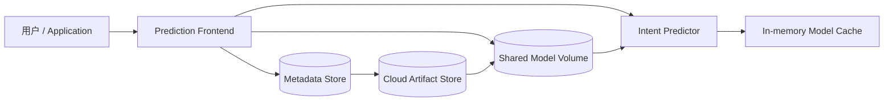

### 7.1.1 运行样例服务

原章实验先启动 backend predictor，再启动 frontend：

```shell
# 1. 构建并启动 intent predictor
docker build \
  -t orca3/intent-classification-predictor:latest \
  -f predictor/Dockerfile predictor

docker run \
  --name intent-classification-predictor \
  --network orca3 \
  --rm -d \
  -p "${ICP_PORT}:51001" \
  -v "${MODEL_CACHE_DIR}:/models" \
  orca3/intent-classification-predictor:latest

# 2. 构建并启动 prediction frontend
docker build -t orca3/services:latest -f services.dockerfile .

docker run \
  --name prediction-service \
  --network orca3 \
  --rm -d \
  -p "${PS_PORT}:51001" \
  -v "${MODEL_CACHE_DIR}:/tmp/modelCache" \
  orca3/services:latest prediction-service.jar
```

两个容器挂载同一个 host directory，但容器内路径不同。Frontend 下载模型到共享目录，predictor 从自己的 `/models` 视图读取。

请求通过 gRPC `PredictionService/Predict` 发送：

```json
{
  "runId": "1",
  "document": "merry christmas"
}
```

样例模型把文本预测为 `joy`。`runId` 同时充当 training run ID 与 model ID，`document` 是待分类文本。

> 该实验依赖附录 A 的 metadata/artifact store、模型制品、Docker network 与项目镜像。本文没有在本机运行这些容器；命令用于解释原章系统交互，而不是承诺当前镜像和 API 仍可直接执行。

#### 为什么启动顺序重要

Frontend 路由到 predictor 时，backend 必须可连接；metadata store 与 artifact store 也必须提前准备。生产系统不应靠人工顺序，而应使用：

- startup / readiness probes；
- retry、timeout 与 circuit breaker；
- dependency discovery；
- predictor 未就绪时拒绝流量，而非返回随机内部错误。

### 7.1.2 服务设计

#### 组件职责

**Frontend service**：

1. 对外承载 public prediction API；
2. 按 model ID 查询 metadata；
3. 把 model files 下载到 shared volume；
4. 按 algorithm / serving stack 选择 predictor backend client；
5. 转发请求并统一响应。

**Backend intent predictor**：

1. 从 shared volume 读取 model package；
2. 创建与 weights 匹配的 network；
3. 加载 vocabulary、classes 与 parameters；
4. 缓存 loaded model；
5. preprocess 文本、执行 inference、postprocess label。

**Metadata store** 保存 model ID、name、version、algorithm、framework 与 artifact URL；实际大文件位于 cloud object storage。**Shared volume** 是 frontend 与 predictor 之间的本地数据面。

#### 六步端到端流程

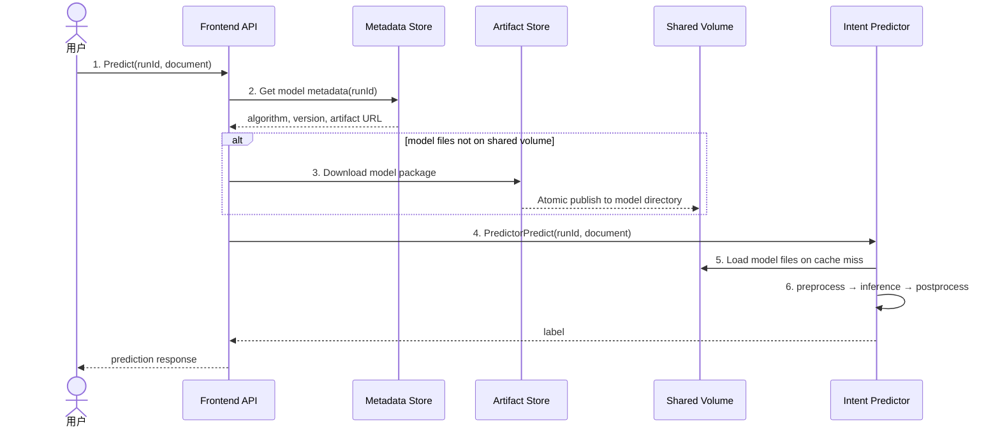

#### 两级 cache

样例实际上有不同语义的缓存：

| Cache | 所在层 | Key | Value | 避免的成本 |
| --- | --- | --- | --- | --- |
| Artifact metadata cache | Frontend | model / run ID | algorithm、version、URL | 重复查询 metadata service |
| Downloaded-file cache | Shared disk | model / run ID | model package files | 重复远程下载 |
| Loaded-model cache | Predictor memory | model / run ID | graph、weights、vocab、classes | 重复反序列化与初始化 |
| Predictor client cache | Frontend manager | algorithm type | backend client / channel | 重复建连与配置解析 |

“命中”必须按层描述。文件已下载并不表示模型已加载；metadata 命中也不表示 artifact 仍存在或未损坏。

#### 冷路径与热路径

热路径时延：

$$
L_{hot}=L_{frontend}+L_{grpc}+L_{pre}+L_{infer}+L_{post}
$$

完全冷路径还包含 metadata、下载和 load：

$$
L_{cold}=L_{metadata}+L_{download}+L_{disk}
+L_{deserialize}+L_{warmup}+L_{hot}
$$

样例把这些动作放在第一次用户请求上，设计简单但 P99 很高。生产可在 deployment / registration 阶段预下载、预加载和 warm-up，再报告 readiness。

#### Shared volume 的工程边界

共享磁盘简化两个容器间的大文件传递，但需要：

- 以 immutable model version 组织目录；
- 下载到临时路径，校验 checksum 后原子 rename；
- 文件权限与 tenant 隔离；
- 防止 path traversal；
- 多 frontend / predictor 并发时 single-flight 或 file lock；
- 容量、清理和 inode 监控；
- 明确网络盘的延迟和故障语义。

若 frontend 写到一半 predictor 开始加载，会得到损坏 model。仅有“共享目录”不构成完整 artifact publication protocol。

### 7.1.3 Frontend Service

Frontend 内部有三类核心对象：

1. **Web interface / `PredictionService`**：处理 public gRPC；
2. **`PredictorConnectionManager`**：缓存 metadata 与 backend clients，按 algorithm 路由；
3. **`PredictorBackend` implementations**：封装各后端的下载、注册和 inference protocol。

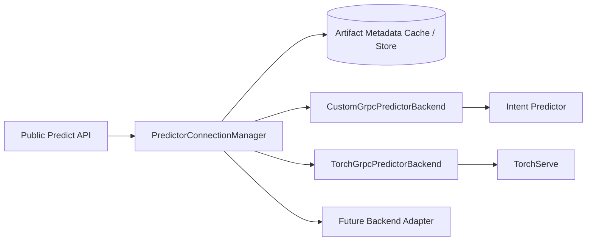

#### Frontend 服务代码流程

原章 `predict()` 的控制路径可整理为：

```text
predict(request):
    model_id = request.run_id

    metadata = artifact_cache.get(model_id)
    if metadata is missing:
        metadata = metadata_store.get_artifact(model_id)
        validate_and_cache(metadata)

    backend = predictor_manager.get_predictor(metadata.algorithm)
    backend.download_model_if_missing(model_id, metadata)
    return backend.predict(metadata, request.document)
```

这个结构把业务入口与 backend-specific API 解耦。新增 TorchServe 时，public API 和业务调用方不变，只增加 adapter 与配置映射。

#### Prediction API

原章 frontend 只有一个 gRPC 方法：

```protobuf
service PredictionService {
  rpc Predict(PredictRequest) returns (PredictResponse);
}

message PredictRequest {
  string runId = 3;
  string document = 4;
}

message PredictResponse {
  string response = 1;
}
```

它适合 intent demo，但不是通用 serving API：

- `document` 强绑定文本；
- `response` 是嵌套 JSON string，失去 protobuf 类型；
- 没有 timeout、request ID、tenant、model version alias；
- 没有结构化错误、actual model version 与 trace；
- Field numbers 从 3、4 开始可能是历史兼容，不能无理由复用 / 改号。

更合理的业务 API 可直接返回 typed label / confidence，同时让 backend adapter 处理 TorchServe bytes 等低层协议。

#### `runId` 作为 Model ID 的收益与局限

收益是血缘直接：

$$
model\_id=training\_run\_id
$$

可快速追溯训练。局限是一个 run 可能产生多个 artifacts，一个业务 model version 也可能来自外部注册而无训练 run。生产 metadata 更适合独立 `model_id`，再保存 `produced_by_run_id` 边。

#### Predictor Connection Manager

配置示例按 algorithm type 映射 predictor：

```properties
ps.enabledPredictors=intent-classification
predictors.intent-classification.host=intent-classification-predictor
predictors.intent-classification.port=51001
predictors.intent-classification.techStack=customGrpc
```

服务启动时读取 host、port、tech stack，创建 gRPC channel 与 `PredictorBackend` client，并放入：

```text
algorithm -> backend client
```

请求时先从 metadata 得到 algorithm，再查映射。这里有两个独立决定：

- 模型是什么 algorithm / format；
- 应由哪类 serving backend 与具体 endpoint 执行。

仅以 algorithm 名路由过于粗糙。生产 metadata 还应考虑 framework、model format、serving runtime / version、custom handler、resource、region 与 deployment readiness。

#### 配置映射的优点与风险

优点：新增 backend 无需修改 public API；环境配置即可切换。风险：

- 静态 properties 更新需重启；
- Backend endpoint 变化缺少动态 discovery；
- Model metadata 与 config 不一致时运行期失败；
- 明文 `usePlaintext()` 不适合跨信任边界；
- 单 channel / 单 host 不表达负载均衡、健康与重试；
- 缓存旧 metadata 可能继续路由到已淘汰 backend。

可演进为 versioned backend registry + service discovery + readiness-aware routing。

#### Metadata Cache

原章在 `PredictorConnectionManager` 中用字段 `artifactCache` 按 model ID 缓存 artifact metadata，减少远程查询。缓存策略必须处理：

- Immutable metadata：可长时间缓存；
- `PROD` / `STG` 这类 mutable alias：需要短 TTL、watch / invalidation；
- Artifact URL 可能是过期 pre-signed URL：不应永久缓存 URL；
- Metadata store 故障时是否允许 stale read；
- Model revoked / deleted 后如何使缓存失效。

缓存不可变 model version 与缓存 mutable release pointer 是两个不同问题。

#### Predictor Backend Interface

原章接口：

```java
public interface PredictorBackend {
    void downloadModel(String runId, GetArtifactResponse artifact);
    String predict(GetArtifactResponse artifact, String document);
    void registerModel(GetArtifactResponse artifact);
}
```

- `downloadModel`：把 artifact 准备到 backend 可见位置；
- `registerModel`：通知 model server 加载 / 注册；
- `predict`：转换请求并调用后端。

这个 adapter 很关键：自建 predictor 可能不需要显式 registration，TorchServe 必须 register `.mar`；两者都可以用同一 frontend lifecycle。

更健壮的接口应返回 typed result / future，并区分：

```text
prepare_artifact -> register -> wait_ready -> predict -> unregister
```

`void` 无法表达异步加载、失败、幂等或 readiness。

#### `CustomGrpcPredictorBackend`

它把 frontend request 转为 backend `PredictorPredictRequest(document, runId)`，通过 gRPC 调用 intent predictor。Adapter 应负责：

- Deadline propagation；
- Error code translation；
- Retry 只用于安全的暂时故障；
- Request / trace ID；
- Input size validation；
- Backend response decoding；
- Channel health 与 shutdown。

### 7.1.4 Intent Classification Predictor

Intent predictor 是独立 gRPC microservice，可同时服务多个由相同架构训练出的 intent models。核心由 **Predictor API** 与 **Model Manager** 组成。

#### Predictor 内部流程

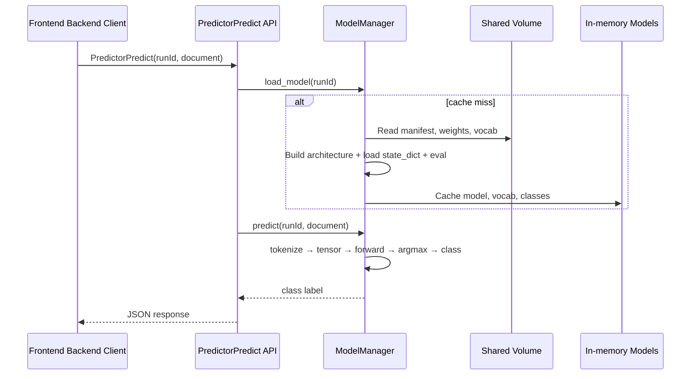

#### Prediction API

Backend 暴露：

```protobuf
service Predictor {
  rpc PredictorPredict(PredictorPredictRequest)
      returns (PredictorPredictResponse);
}

message PredictorPredictRequest {
  string runId = 1;
  string document = 2;
}
```

字段与 frontend 相同只是样例简化。两个 API 的设计目标不同：

- Frontend API 面向业务、认证、产品稳定性；
- Predictor API 面向 model execution，可能使用 tensor / bytes、batch 和 backend-specific options。

即使当前 schema 一样，也不应共享同一 contract 而导致未来强耦合。

#### Model Files

每个 intent model 目录包含：

```text
<model_id>/
├── manifest.json
├── model.pth
└── vocab.pth
```

| 文件 | 内容 | Serving 作用 |
| --- | --- | --- |
| `manifest.json` | algorithm、framework/version、model/code version、classes | 验证兼容性；把 class index 转 label |
| `model.pth` | `state_dict` learned parameters | 填充 network architecture |
| `vocab.pth` | 训练时 vocabulary | 把文本 token 转成相同 integer IDs |

如果 serving 使用不同 vocabulary，即使 network weights 完全相同，输入 token IDs 也会变，预测失效。Preprocess artifacts 与 weights 同等重要。

#### 保存整个模型还是 `state_dict`

原章选择：

```python
torch.save(model.state_dict(), model_path)
```

优点：避免 pickle 整个 object 对 Python class path / 目录结构的脆弱绑定；文件职责更清楚。代价：加载方必须拥有**完全兼容的 architecture code** 并用相同 shape 初始化：

```python
model = TextClassificationModel(
    vocab_size=vocab_size,
    embed_dim=embedding_dim,
    fc_size=fully_connected_size,
    num_class=len(classes),
)
model.load_state_dict(torch.load(model_path, map_location=device))
model.to(device)
model.eval()
```

应先验证 manifest 中 code / architecture version，而不是等待 shape mismatch。

#### Training Code 与 Serving Code 的同步边界

需要同步：

- Network architecture；
- Input/output schema；
- Tokenization / vocabulary / normalization；
- Label mapping；
- 必需 custom ops 与 runtime compatibility。

不直接影响 serving graph：

- Training scheduler；
- HPO algorithm；
- Dataset split；
- Distributed training strategy；
- 只改变最终 weights 的训练技巧。

当 architecture 或 schema 变化时，应产生新的 **serving contract / predictor version**，metadata 关联：

```text
model version
  -> training code version
  -> serving architecture / handler version
  -> artifact files
  -> input/output schema version
```

原样例没有实现多 architecture version。Model service 方案通常需要多个 predictor versions；model server 通过把 handler / graph 打进 model package 降低服务代码与训练代码的外部耦合，但 package 内仍存在这种关系。

#### Model Manager

Model manager 管理加载、内存缓存与 inference。原章代码将 model、vocab、classes 分别存入同一个 dict 的不同 key。更清晰的结构是一个不可分割 cache entry：

```python
from dataclasses import dataclass

@dataclass(frozen=True)
class LoadedIntentModel:
    model: object
    vocabulary: object
    classes: dict[str, str]

class ModelManager:
    def __init__(self, model_directory, tokenizer, device):
        self.model_directory = model_directory
        self.tokenizer = tokenizer
        self.device = device
        self.models: dict[str, LoadedIntentModel] = {}
```

这样不会出现 model 已写入但 vocab / classes 尚未写完的部分状态。

##### 加载算法

```text
load_model(model_id):
    if immutable cache entry exists:
        return it

    acquire per-model single-flight lock
    recheck cache
    validate complete artifact directory and checksums
    load manifest, vocab and state_dict
    verify algorithm/code/runtime/schema compatibility
    build architecture
    load parameters; switch eval mode
    optional warm-up
    atomically publish one cache entry
    return it
```

原章样例缺少并发锁。gRPC server 有 10 个 worker threads，两个相同 model ID 的并发 cold requests 可能重复加载；字典检查与插入不是完整 single-flight protocol。

##### Prediction 算法

```python
def predict(entry, document):
    token_ids = entry.vocabulary(self.tokenizer(document))
    if not token_ids:
        raise InvalidInput("document produced no tokens")

    text = torch.tensor(token_ids, dtype=torch.int64, device=self.device)
    offsets = torch.tensor([0], dtype=torch.int64, device=self.device)

    with torch.inference_mode():
        logits = entry.model(text, offsets)

    class_index = int(logits.argmax(dim=1).item())
    return entry.classes[str(class_index)]
```

原章代码调用 `model.eval()`，但没有显式 `no_grad()` / `inference_mode()`；后者避免 autograd graph，减少内存和开销。还要处理空文本、最大长度、encoding 和恶意输入。

##### 并发与线程安全

即使模型 forward 是只读，也要验证：

- Runtime operations 是否 thread-safe；
- Tokenizer / vocabulary 是否共享可变状态；
- CPU thread oversubscription；
- GPU stream 与 batch policy；
- 一个 Python process 的 GIL / native kernels 行为；
- Load / evict 与 in-flight predict 的同步。

`ThreadPoolExecutor(max_workers=10)` 不意味着可以线性处理 10 倍吞吐。应 benchmark 并设置 queue / backpressure。

#### Intent Predictor 请求工作流

`serve()` 创建一个共享 `ModelManager`，注册 gRPC `PredictorServicer`。每次 `PredictorPredict`：

1. `load_model(runId)`，命中则快速返回；
2. `predict(runId, document)`；
3. 返回 JSON-encoded label。

原章代码表达了“load on demand + cache + execute”的核心，但生产状态还应区分：

```text
NOT_PRESENT -> DOWNLOADING -> LOADING -> READY
                           -> FAILED
READY -> EVICTING -> NOT_PRESENT
```

请求只应在 `READY` entry 上执行。

### 7.1.5 Model Eviction

样例只加载不淘汰，模型持续增加后必然 OOM。原章建议用 LRU 保留近期模型并在超过内存阈值时淘汰最久未使用项。

#### 为什么不能只限制模型数量

不同模型加载内存差异很大，应以 bytes 与 runtime workspace 管理：

$$
\sum_{i\in Cache}M_i+M_{runtime}+M_{workspace}\le M_{budget}
$$

模型磁盘大小不等于 loaded footprint，需实测或加载时统计。

#### LRU 操作复杂度

Hash map + doubly linked list 可实现：

$$
T_{get}=O(1),\qquad T_{put/evict}=O(1)
$$

但 LRU 只按 recency，不看模型大小、加载时间和 tenant priority。可扩展为 weighted policy，例如优先保留：高频、昂贵加载、小体积或高优先级模型。

#### 安全淘汰

```text
on cache miss(model_id):
    estimate required memory
    while free memory is insufficient:
        choose an unpinned eviction candidate
        mark EVICTING so no new request can acquire it
        wait for in-flight reference count to become zero
        remove entry and release native/GPU resources
    single-flight load new model
```

需要注意：

- 正在 inference 的 entry 必须 pin；
- Python 删除引用后 GPU allocator 未必立即把显存还给 OS；
- 文件 cache 与 memory cache 有独立 eviction；
- 多 replicas 的 cache locality 和 model affinity；
- Cold-load storm、负缓存和 backoff；
- Eviction / load metrics 与 P99。

#### 命中率对时延的影响

命中率 $h$，hot latency $L_h$，cold latency $L_c$：

$$
E[L]=hL_h+(1-h)L_c
$$

若 $L_h=20\ \mathrm{ms}$、$L_c=1020\ \mathrm{ms}$、$h=0.99$：

$$
E[L]=0.99\times20+0.01\times1020=30\ \mathrm{ms}
$$

仅 1% miss 就增加 50% 平均时延，而且 P99 会落在冷路径附近。热门模型预热与 cache-aware routing 很重要。

---

## 7.2 TorchServe Model Server 样例

这一节保留 7.1 的 public frontend、metadata store、shared model directory 和 intent model，只把专用 `Intent Predictor` 替换为 TorchServe。这样可以在相同用户 API 与业务输入下比较 model service 与 model server，而不是把架构差异和业务差异混在一起。

核心变化：

```text
7.1: Frontend -> CustomGrpcPredictorBackend -> Intent-only Predictor
7.2: Frontend -> TorchGrpcPredictorBackend  -> TorchServe -> Packaged PyTorch Models
```

“任意 PyTorch 模型”仍有边界：模型必须采用 TorchServe 支持的 artifact，包含可执行 handler 与依赖，并满足 API / runtime contract。

### 7.2.1 运行服务

原章用 TorchServe 0.5.2 CPU image 作为 backend，分别暴露 inference 与 management gRPC ports，并把 shared directory 挂为 model store：

```shell
# 1. 启动 TorchServe backend
docker run \
  --name intent-classification-torch-predictor \
  --network orca3 \
  --rm -d \
  -p "${ICP_TORCH_PORT}:7070" \
  -p "${ICP_TORCH_MGMT_PORT}:7071" \
  -v "${MODEL_CACHE_DIR}:/models" \
  -v "$(pwd)/config/torch_server_config.properties:/home/model-server/config.properties" \
  pytorch/torchserve:0.5.2-cpu \
  torchserve --start --model-store /models

# 2. 启动同一个 prediction frontend
docker build -t orca3/services:latest -f services.dockerfile .
docker run \
  --name prediction-service \
  --network orca3 \
  --rm -d \
  -p "${PS_PORT}:51001" \
  -v "${MODEL_CACHE_DIR}:/tmp/modelCache" \
  orca3/services:latest prediction-service.jar
```

随后仍调用 frontend：

```json
{
  "runId": "<MODEL_ID>",
  "document": "merry christmas"
}
```

Frontend 下载 `.mar`，注册到 TorchServe，再将文本请求转换为 TorchServe protocol。

> 原章镜像版本 0.5.2 / 0.4.2 与 API 属于成书时示例。实际运行前必须核对目标 TorchServe 发行版、镜像来源、management API 安全默认值和项目支持状态；不要把历史命令直接用于公网生产。

#### Inference 与 Management 端口为什么分开

- Inference endpoint 面向高频 data-plane prediction；
- Management endpoint 注册 / 卸载模型、改变 worker 数，属于高权限 control plane。

Management API 不应与 public inference endpoint 使用同样暴露策略。应限制到内部网络、强认证 / authorization，并审计每次模型变更，否则攻击者可加载任意 handler code 或耗尽资源。

### 7.2.2 服务设计

架构与 7.1 的六步基本一致：

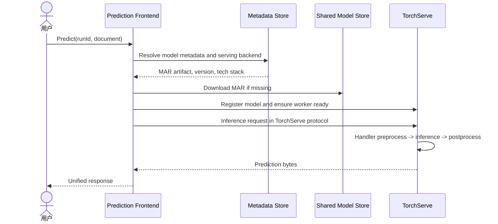

区别是：

- 7.1 的 predictor code 固定包含 `TextClassificationModel` 和模型缓存；
- 7.2 的 TorchServe process 是通用 PyTorch runtime，模型专用代码随 `.mar` handler 注册；
- Frontend adapter 需要额外 `registerModel` / worker readiness；
- TorchServe 自己管理 model workers 和 loaded models。

#### Control Plane 与 Data Plane

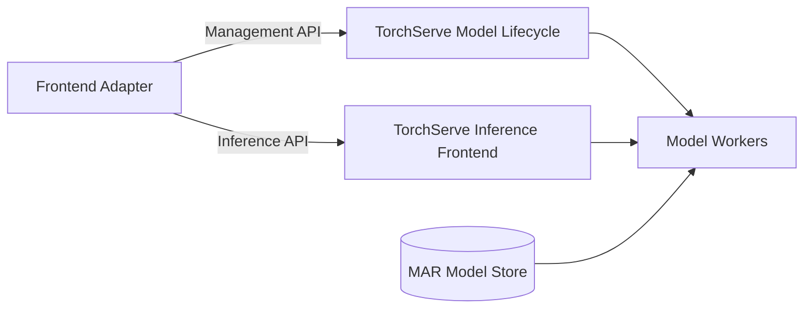

模型文件出现在 model store 不等于可服务；还要 register、allocate worker、load handler 并达到 ready。Prediction path 不应在每次请求无条件 scale / register，而应幂等检查状态。

### 7.2.3 Frontend Service

Frontend 延续 adapter 架构，只新增：

- `TorchGrpcPredictorBackend`；
- TorchServe inference channel；
- TorchServe management channel；
- model metadata / algorithm 到 `techStack=torchServe` 的映射。

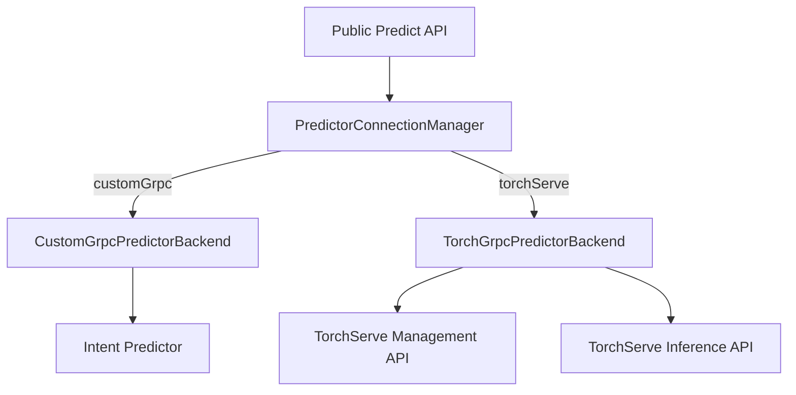

`TorchGrpcPredictorBackend` 负责：

1. 从 metadata 得到 `.mar` URL、model name、version；
2. 下载 `.mar` 到 shared model store；
3. 调 management API 注册模型；
4. 配置初始 worker / 等待 ready；
5. 把 frontend text 转为 TorchServe bytes input；
6. 调 inference gRPC；
7. 将 bytes response 适配回 public response。

#### 为什么 Adapter 层仍然必要

TorchServe 已有统一 API，但它不是现有业务 API：

- 模型命名规则不同；
- Input 是 bytes / map，业务 API 是 `document`；
- Model registration 与 worker lifecycle 是 TorchServe 特有；
- Error / timeout / version 语义不同；
- Existing metadata store 和 artifact URL 格式不同。

Adapter 保护应用不受 backend 工具变化。将来切换 Triton 时 public API 可保持不变。

#### Backend 选择不能只靠 Algorithm

同一个 intent algorithm 可能有 custom predictor package 和 TorchServe `.mar` 两种形式。Metadata 应明确：

```text
model_format, serving_backend_type, handler_version,
backend_protocol_version, model_name, model_version
```

否则 router 只看 `algorithm=intent-classification` 无法判断调用哪个 backend。

#### Registration 的并发幂等

多个同 model cold requests 可能同时下载、register、scale worker。Adapter 需要 per-model state machine：

```text
ABSENT -> DOWNLOADING -> REGISTERING -> LOADING -> READY
                         |              |
                         +---- FAILED <-+
```

只有一个请求执行 control action，其他等待同一 future。重复 register 的“already exists”要映射成幂等成功或先查询状态，不能作为普通失败。

### 7.2.4 TorchServe Backend

TorchServe 以黑盒服务器形式暴露 HTTP / gRPC inference、management、health、explanation 和 worker 管理能力。

样例使用三步：

1. 把 `.mar` 放入 model store；
2. 调 management API 注册，创建 / 加载 worker；
3. 调 unified inference API，worker 执行 `.mar` 中 handler。

#### 为什么不再为每种 Algorithm 写 Backend Service

专用 predictor 把 architecture 和 preprocess 编译进服务镜像。TorchServe 把这些模型专用逻辑移进 `.mar`：

$$
MAR=Metadata+SerializedModel+Handler+ExtraFiles
$$

TorchServe 只需理解标准 manifest、handler lifecycle 和 worker protocol。新增 PyTorch model 的主要动作从“部署新服务”变为“打包并注册新 MAR”。

#### Black Box 不等于零代码

原章说无需编写 predictor service code，强调不用重造 HTTP/gRPC server、worker 与 model lifecycle。但复杂模型仍需 handler，且 handler 本身包含 architecture、preprocess、inference、postprocess。工作从平台服务代码移到可部署模型包。

#### Worker 模型

TorchServe frontend 接收请求并路由到已加载目标模型的 worker processes。每 model / version 可配置 worker 数。

若单 worker 稳定吞吐 $\mu$、到达率 $\lambda$、目标利用率 $\rho$，粗略下限：

$$
n\ge\left\lceil\frac{\lambda}{\mu\rho}\right\rceil
$$

但 workers 可能共享 CPU / GPU，吞吐不一定线性；必须压测 worker count、batching、native threads 与显存。

### 7.2.5 TorchServe API

原章集中介绍 model registration 与 model inference 两类 API。TorchServe 还包括 health、explanation、describe 和 worker scale 等。

#### Model Registration API

模型文件放入 model store 后不会自动成为 ready model。注册请求提供 `.mar` URL / filename、model name 等；样例随后调用 scale worker，至少分配一个 worker：

```text
register_model(model_name, model_version, mar_file):
    ensure_mar_is_in_model_store(mar_file)
    management_api.register(url=mar_file, model_name=model_name)
    management_api.scale_workers(
        model_name=model_name,
        version=model_version,
        min_workers=1,
    )
    wait_until_model_workers_ready()
```

原章 Java 示例从 artifact 生成 `modelUrl` 与 `torchModelName`，调用 `registerModel` 后将 `minWorker` 设为 1。

#### Registration 与 Deployment 的区别

- 文件复制：artifact 进入 model store；
- Registration：TorchServe 认识 model package；
- Worker loading：至少一个 worker 加载模型；
- Readiness：可以成功处理请求；
- Release：业务流量 alias / route 指向该版本。

把这些状态都叫“部署”会导致竞态。Frontend 应等 ready 后才转发 inference。

#### Model Inference API

原章 REST 路径：

```text
POST /predictions/{model_name}
POST /predictions/{model_name}/{version}
```

Payload 可作为 binary multipart 输入。样例 frontend 使用 gRPC `PredictionsRequest`，设置 model name，并把 `document` 编成 UTF-8 bytes 放入 input map。

概念转换：

```text
Public request:
    runId=123, document="merry christmas"

Resolved metadata:
    modelName="intent", version="1.0", backend="torchserve"

TorchServe request:
    modelName="intent-1.0"
    input["data"] = UTF8(document)
```

统一 bytes API 只是 transport 通用；handler 仍需知道 bytes 表示文本、图片还是其他数据。Frontend 必须限制大小和 content type，TorchServe response 也应被解析为 typed public response，而不是不透明字符串透传。

#### Default Version 的风险

不指定 version 的路径依赖 TorchServe default mapping。可变 default 方便发布，却使请求审计不稳定。响应 / trace 必须记录实际 model version；模型评价应显式指定 immutable version。

### 7.2.6 TorchServe Model Files

TorchServe 要求 `.mar`（Model Archive）。Archiver 输入通常包括：

- Model name / version；
- Serialized weights / model file（`.pt` / `.pth`）；
- Optional model architecture file；
- Handler；
- Extra files（vocab、labels、manifest 等）；
- Runtime metadata。

#### Intent Classification `.mar` 文件

原章 intent archive：

```text
intent.mar
├── MAR-INF/
│   └── MANIFEST.json
├── manifest.json
├── model.pth
├── torchserve_handler.py
└── vocab.pth
```

`MAR-INF/MANIFEST.json` 指明：

```json
{
  "runtime": "python",
  "model": {
    "modelName": "intent_80bf0da",
    "serializedFile": "model.pth",
    "handler": "torchserve_handler.py",
    "modelVersion": "1.0"
  },
  "archiverVersion": "0.4.2"
}
```

注意两个 manifest：

- `MAR-INF/MANIFEST.json`：TorchServe package metadata；
- 根目录 `manifest.json`：样例自己的 algorithm / classes metadata。

名字相近但职责不同。

#### `.mar` 怎样实现 Algorithm-Agnostic Server

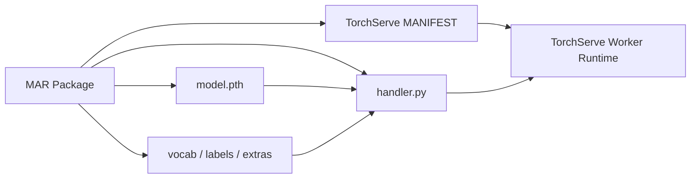

Server 不需在自身源码中硬编码 intent architecture；它按 manifest 创建 Python worker，再调用 handler entrypoint。Algorithm-specific knowledge 仍然存在，只是变成 package-owned plugin。

#### Model Package 完整性

`.mar` 应作为 immutable artifact 管理。仅 `modelVersion` 字符串不能证明内容不变，应保存 archive digest：

$$
package\_id=SHA256(MAR\ bytes)
$$

Metadata store 关联 model name/version、MAR digest、training run、source code、handler 和 archiver version。下载后先验证 checksum / signature，再注册。

#### 安全边界

Handler 是可执行 Python code。注册未经信任的 `.mar` 等于在 worker 环境执行代码。生产必须：

- 仅允许可信 CI 产出的 package；
- Artifact signature / checksum；
- Image / dependency scanning；
- Worker 最小权限、网络和 filesystem 隔离；
- 禁止 public user 直接指定任意 remote URL 注册；
- Audit registration owner 与 source commit。

#### TorchServe Handler 文件

Handler lifecycle 包含四类逻辑：

1. `initialize(context)`：定位 package directory，读 weights / vocab / labels，构建 network，`eval()`；
2. `preprocess(data)`：binary request → tokens / tensors；
3. `inference(model_input)`：执行 model；
4. `postprocess(output)`：logits → class / JSON；
5. `handle(data, context)`：串联入口。

```python
class IntentHandler:
    def initialize(self, context):
        self.model, self.vocabulary, self.classes = load_package(context)
        self.model.eval()
        self.initialized = True

    def preprocess(self, requests):
        return tokenize_and_batch(requests, self.vocabulary)

    def inference(self, model_inputs):
        with torch.inference_mode():
            return self.model(*model_inputs)

    def postprocess(self, logits):
        indices = logits.argmax(dim=1).tolist()
        return [
            {"prediction": self.classes[str(index)]}
            for index in indices
        ]

    def handle(self, requests, context):
        model_inputs = self.preprocess(requests)
        outputs = self.inference(model_inputs)
        return self.postprocess(outputs)
```

这是按原章 handler 意图整理的接口示例，不是目标 TorchServe 版本的完整 `BaseHandler` 实现。

#### 原章 Handler 代码的几个边界

- `user_input = " ".join(str(preprocessed_data))` 可能按字符插空格，不是可靠 bytes decode；应按 content type 解码；
- 只处理 `data[0]`，未真正 batch；
- `model.forward()` 可工作，但通常调用 `model()` 以保留 hooks；
- 缺少 `inference_mode()`；
- 省略 tokenizer / fields 初始化和 error handling；
- `initialize` 中变量来源有省略。

这些不影响四阶段教学结构，但不能照抄生产。

#### Handler 与自建 ModelManager 的对应

| 7.1 ModelManager | TorchServe Handler / Runtime |
| --- | --- |
| `load_model` | `initialize` + worker lifecycle |
| `text_pipeline` | `preprocess` |
| model forward | `inference` |
| class index mapping | `postprocess` |
| `models` dict | TorchServe registered models / workers |
| gRPC service | TorchServe frontend APIs |

Model server 不是取消 serving logic，而是把共同运行框架标准化。

#### 在训练阶段打包 `.mar`

原章建议训练完成时生成 `.mar`，因为：

- Training pipeline 知道精确 weights、code、handler 与 dependencies；
- Package 可与 model version 原子登记；
- 避免部署时临时拼装错误文件；
- 同一 package 可在 staging / production 重复验证。

两种方式之一是 CLI：

```shell
torch-model-archiver \
  --model-name intent_classification \
  --version 1.0 \
  --model-file torchserve_model.py \
  --serialized-file "workspace/<model_id>/model.pth" \
  --handler torchserve_handler.py \
  --extra-files "workspace/<model_id>/vocab.pth,workspace/<model_id>/manifest.json"
```

另一种是在训练代码最后调用 model archiver library。无论哪种方式，都应记录：

```text
source commit + training run + archiver version + handler version
+ serialized weights checksum + extra files checksum -> MAR digest
```

打包应尽量 deterministic / reproducible；至少最终 `.mar` 必须 immutable、签名并可追溯。

#### 为什么 Handler 通常与 Training Code 同仓库

Handler 需要相同 architecture、tokenizer、vocabulary 和 output schema。与训练代码共仓可减少漂移，但发布单位仍应分离：Training image 不必包含 serving server，MAR package 则包含 serving 所需最小内容。

CI 应执行：

1. 训练 / 导出；
2. 打包 MAR；
3. 在固定 TorchServe image 中注册；
4. 用 golden inputs 做 smoke / parity test；
5. 扫描并签名；
6. 上传 artifact store 并登记 metadata。

### 7.2.7 在 Kubernetes 中扩展

#### 单实例方案扩展时的三项问题

1. **Load balancer 隐藏具体实例**：Management register 请求随机落到一台，其他 replicas 未注册；
2. **每实例需要 model store**：文件怎样复制到所有 / 指定 instances？
3. **模型放置与资源平衡**：每台加载所有模型浪费内存，分片又需要 routing 知道模型在哪。

普通 stateless load balancing 假设 replicas 等价；而按需模型注册使 TorchServe replicas 持有不同本地状态，两者冲突。

#### 原章 Sidecar / Proxy 方案

每个 Pod 包含：

- TorchServe container：黑盒 inference server；
- Sidecar proxy：统一 API、model downloader、registration adapter；
- Pod-local shared volume：sidecar 与 TorchServe 共享 model store；
- 多 Pods 可另共享一个 model repository volume。

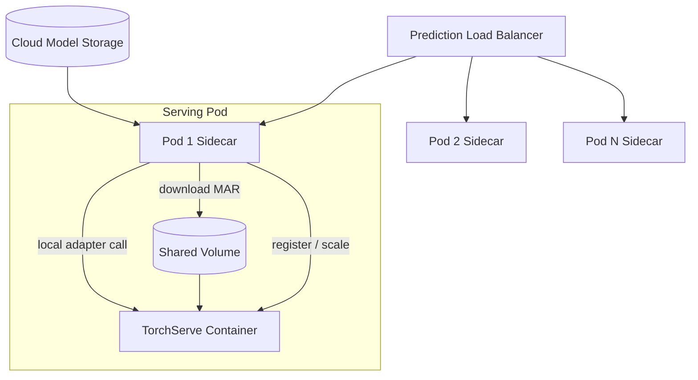

#### 五步请求流程

1. Prediction request 落到任意 Pod sidecar；
2. Sidecar 检查 / 下载 `.mar` 到 shared model store；
3. Sidecar 幂等注册模型，并把 public request 转 TorchServe protocol；
4. TorchServe worker inference，返回 sidecar；
5. Sidecar 统一响应客户端。

这样每个 Pod 能对到达的任意模型请求进行 lazy preparation，不需调用方指定实例。

#### Sidecar 的价值

- 隐藏 TorchServe management / model format 细节；
- 保持 existing public API；
- Model download 与 server register 跟随 Pod locality；
- 可复用于 TensorFlow Serving、Triton 等 model servers；
- Sidecar 与 server 同 Pod，可用 localhost，故障 / lifecycle 相关。

#### 原章方案的局限

“任意请求落任意 Pod再加载”会产生 cold latency 和重复模型。Shared cross-Pod volume 减少下载带宽，但每个 TorchServe process 仍需各自加载内存。

生产还需：

- Per-model single-flight；
- Registration / readiness state；
- Model-aware routing 提高 locality；
- Eviction 与 memory admission；
- Pod startup preload / warm-up；
- Sidecar 与 server readiness 协调；
- Management endpoint 仅 localhost / internal；
- Shared volume 性能、锁和故障处理；
- Sidecar version 与 backend protocol compatibility；
- 防止任意 handler code 执行。

Sidecar 不是自动扩缩本身。Kubernetes HPA / KEDA 等依据 QPS、queue、latency 或 custom metric 扩 Pod；TorchServe worker scaling 又发生在 Pod 内，两级扩缩需避免互相打架。

#### Model Placement 的选择

| 策略 | 优点 | 代价 |
| --- | --- | --- |
| 每 Pod 全量加载 | 任意路由、hit 高 | 显存浪费、启动慢 |
| Lazy load 任意模型 | 接入简单 | P99 cold miss、重复加载 |
| Model-aware shard / affinity | 资源高效、locality 好 | Routing / rebalance 复杂 |
| 热模型复制、冷模型分片 | 综合效率 | 需要热度预测和控制器 |

原章 sidecar 是集成模式起点，完整平台仍要显式设计 placement。
---

## 7.3 Model Server 与 Model Service 的选择

经过两个同用例样例，可以更具体地比较。

### Model Service 的成本曲线

对单应用 / 少量 model types：

- Predictor 是训练代码的精简 serving 版本，建设快；
- API 与 transformer 可专用，调试链短；
- 团队拥有端到端源码，行为透明；
- 每服务独立扩缩、发布和故障隔离。

但每新增 model type，要再做 predictor、CI/CD、监控、资源和 on-call。

### Model Server 的成本曲线

- 无需为每种算法重造 web server / worker lifecycle；
- 模型专用逻辑进入标准 package / handler / graph；
- 统一 inference / management API；
- 模型 types 多时显著降低边际接入成本。

代价是学习、配置、包装、运行和 debug 第三方复杂系统，还要集成现有 metadata / artifact / API。

### 原章判断

- 单应用：Model service 通常更简单；
- Serving platform / 500 model types：Model server 显然更可管理；
- 初学先 model service；
- 支持超过约 5–10 model types / applications 时可转 model server。

“5–10”是作者经验阈值，不是算法常数。实际 break-even 取决于：

$$
C_{service}(M)=M(C_{build}+C_{operate})
$$

$$
C_{server}(M)=C_{platform}+M C_{package/onboard}
$$

当 $C_{service}(M)>C_{server}(M)$ 且平台的可靠性 / 隔离能力足够时，model server 才更合算。

### 决策表

| 问题 | 偏向 Model Service | 偏向 Model Server |
| --- | --- | --- |
| Model types | 一个 / 少量 | 很多且持续增长 |
| Frameworks | 单一、稳定 | 多模型 / 多 backend，或同框架多算法 |
| API | 强业务专用 | 需要统一底层 protocol |
| Custom preprocess | 高度定制、难包装 | 可由 handler / backend 表达 |
| 团队规模 | 小团队、快速上线 | Platform team、多应用共享 |
| Debug | 需要源码全控制 | 能运营复杂第三方 runtime |
| 资源复用 | 独立服务可接受 | 需要集中 worker / GPU 管理 |
| 供应链 | 自建 image | 可安全生产标准 model packages |

可以混合：少数特殊模型保留 custom services，大多数标准模型进入 model server，frontend router 统一两类 backends。

---

## 7.4 开源 Model Serving 工具巡览

原章选择 TensorFlow Serving、TorchServe、Triton 和 KServe，并提到 Seldon Core、BentoML。所有工具的共同模式是：

```text
Package model in supported format
    -> Put it in model repository
    -> Load / register through lifecycle mechanism
    -> Send HTTP/gRPC request
    -> Runtime preprocess / execute / postprocess
```

真正差异在 framework coverage、model format、management API、scheduler/batching、Kubernetes deployment 和团队支持成本。

> 工具状态边界：本章内容反映原书成书时版本。项目名称、维护状态、API、许可证和商业支持到 2026 年可能已有显著变化；选型前必须查询当前官方仓库与 release policy。

### 7.4.1 TensorFlow Serving

TensorFlow Serving 是面向 TensorFlow models 的独立 production serving system，通过统一 REST / gRPC 承载多模型和多版本。

#### 功能

原章列举：

- 同时 serving 多 models / versions；
- 与 TensorFlow model 原生集成；
- 自动发现新版本，支持不同 model sources；
- 统一 gRPC / HTTP inference endpoints；
- Request batching 与性能调优；
- Version policy 与 model loading 可扩展。

#### 高层架构

核心抽象：

- **Servable**：可被 client 执行的底层对象，不限于模型；
- **Source**：发现 servable versions，并创建 / 提供 Loader；
- **Loader**：加载 / 卸载 servable；
- **Manager / DynamicManager**：按 version policy 管理完整 lifecycle，并给 client 返回 handle。

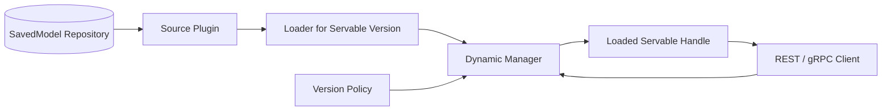

流程：Source 发现 repository 版本 → 通知 Manager → Manager 按 policy load / unload → 请求获取 handle 并执行。

#### TensorFlow Serving 模型文件

要求 SavedModel directory：

```text
<model_name>/<version>/
├── saved_model.pb
├── assets/
└── variables/
```

- `saved_model.pb`：graph / program 与 named signatures；
- `variables/`：变量 / checkpoint；
- `assets/`：vocabulary 等 graph resources。

Named signature 定义 tensor inputs / outputs，是统一 API 能调用模型的关键。

#### 模型服务流程

训练代码导出 SavedModel，把 versioned directory 放到 model path，启动 serving container，再调用：

```text
POST /v1/models/<model_name>/versions/<version>:predict
```

多模型 / 版本通过 model config 与 `model_version_policy` 声明。原章例子让 `model_a` 同时 load versions 2、3；`model_b` 无显式 policy 时按默认策略服务最新版本。

Version directory、config 与实际 API 需按目标 TensorFlow Serving 版本检查。Model repository 的更新要原子，避免 Source 发现半写目录。

#### 评价

原章优点：production-ready、REST/gRPC、GPU、minibatching、edge、版本发现。缺点：advanced metrics、灵活 management / deployment strategy 较弱，并锁定 TensorFlow model format。

适合 TensorFlow-only 或 SavedModel 已标准化的组织。若需要 PyTorch / ONNX 等多框架，不应通过强行转换来隐藏所有兼容风险，应评估 Triton / KServe 或多 backend platform。

### 7.4.2 TorchServe

TorchServe 面向 PyTorch eager / TorchScript models，以 model server 统一 inference，并提供较强 management APIs。

#### 高层架构

- **Frontend**：HTTP/gRPC request/response、model lifecycle；
- **Backend workers**：加载模型并运行 handler inference；
- **Model store**：本地或 cloud-accessible `.mar` repository。

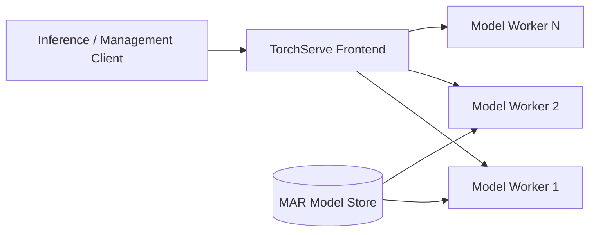

Inference 请求被路由到已加载目标 model/version 的 worker；management API register/unregister 并调整 worker counts。

#### 功能

- 多 models / versions；
- Unified gRPC / HTTP inference；
- Batching 与性能调优；
- Workflow 组合 PyTorch models / Python functions；
- Register/unregister、worker scale；
- Versioning 支持实验 / A/B 基础。

#### TorchServe 模型文件

纯 `state_dict` / PyTorch file 不能直接作为通用 server package；需要 `.mar`，其中 handler 连接 architecture、state、pre/postprocess 与 TorchServe lifecycle。详见 7.2.6。

#### 模型服务流程

1. 创建 model store 并复制 `.mar`；
2. 启动 TorchServe；
3. Management API 注册 model/version、initial workers；
4. Inference endpoint 请求 default 或指定 version；
5. Describe / scale APIs 管理 runtime。

原章示例把 intent v1.0 worker min 调到 3、max 调到 6。这里的 worker scale 与 Kubernetes Pod scale 是两级资源控制，需协调。

#### 评价

原章认为 TorchServe 是高性能、灵活的 PyTorch production solution，management API 是突出优势；主要局限是只服务 PyTorch ecosystem，存在 framework lock-in。

还应考虑当前项目维护与安全状态、handler 代码供应链和 management API 暴露。不能只按原章版本结论选型。

### 7.4.3 Triton Inference Server

NVIDIA Triton 是面向 CPU / GPU、cloud / data center / edge 的多 backend inference server。原章强调它比 TensorFlow Serving / TorchServe 覆盖更多 frameworks，例如 TensorFlow、TensorRT、PyTorch、ONNX、XGBoost。

#### 高层架构

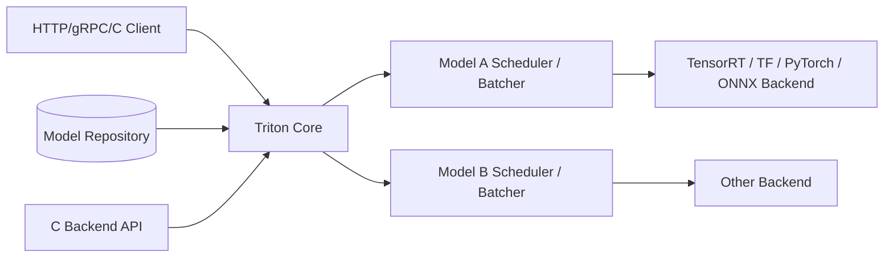

每模型有 scheduler，可配置 batching；Core 把请求交给对应 backend。Backend C API 允许新增 framework 或 custom pre/postprocess。Model management API 可查询和控制 repository models。

#### 功能

原章列举：

- 多 framework backends；
- 同一 CPU / GPU 并发多个 models；
- Real-time、batch、streaming；
- Dynamic batching；
- Model ensembles；
- Live model update；
- Model Analyzer 调优配置；
- Multi-GPU / multinode large-model inference。

这些能力受 model/backend/version/hardware 限制，必须针对实际模型验证。

#### Triton 模型文件

每 model repository 目录含版本与 `config.pbtxt`。Config 定义 platform / backend、max batch、inputs / outputs、instance group、scheduler 等。

概念示例：

```protobuf
name: "example_model"
platform: "pytorch_libtorch"
max_batch_size: 8

input {
    name: "input0"
    data_type: TYPE_FP32
    dims: [16]
}

output {
    name: "output0"
    data_type: TYPE_FP32
    dims: [16]
}
```

原章的 config 片段存在括号 / 字段排印简化；上面只说明 ModelConfig 意图，不保证匹配任意当前 backend schema。

训练 pipeline 最适合在导出时生成 config 并与 artifact 一起登记，但上线前应由 serving validation 检查真实 tensor names、dims 和 max batching 语义。

#### TorchScript

原章中 Triton 的 PyTorch backend 要求 TorchScript，而 TensorFlow 可用 SavedModel。TorchScript 把 Python model 转成可序列化 / 优化、可在 C++ runtime 运行的中间表示。

```python
model = TorchModel()
model.eval()
example = torch.rand(1, 3, 224, 224)

with torch.inference_mode():
        traced = torch.jit.trace(model, example)

traced.save("traced_torch_model.pt")
```

Tracing 只记录 example 执行路径，data-dependent control flow 可能丢失；必要时使用 scripting / export 等目标版本支持方式，并用多组 golden inputs 比较 eager 与 exported outputs。

#### 模型服务流程

原章三步：

1. Copy model / config to repository；
2. `POST v2/repository/models/{MODEL_NAME}/load` 注册 / 加载；
3. 向 `v2/models/{MODEL_NAME}/versions/{MODEL_VERSION}` 对应 inference endpoint 请求。

实际 V2 inference path / request body 应以 KServe V2 / Triton protocol 文档为准；management load 与 inference endpoint 的 URL 和语义不同，HTTP method 则应以目标版本文档为准。

#### 评价

原章成书时把 Triton 视为最佳选择，理由是：多 framework / extensible backend、GPU / dynamic batching / analyzer 性能能力、ensemble / streaming 等高级场景。

这不是 2026 年无条件结论。选型还应比较：

- 模型与 backend 兼容；
- 团队 GPU / C++ / Triton 运维能力；
- Debug、升级和 CVE 响应；
- 许可证虽允许开源商用，但企业支持成本；
- 供应商 / 硬件依赖；
- 当前其他工具的能力。

原章警告商业支持可能每 GPU 每年数千美元，这是历史价格描述，不能用于当前预算；应获取当前报价并计算 TCO。

### 7.4.4 KServe 与其他工具

原章还提到 Seldon Core、BentoML：BentoML 偏轻量易用，Seldon Core / KServe 强调 Kubernetes deployment。共同点仍是 model format、wrapper/config、repository 和 HTTP/gRPC endpoint。

#### KServe 的定位

KServe 试图提供 Kubernetes-native、serverless model serving abstraction，并统一常见 frameworks / runtimes。原章强调两项价值：

1. 标准 inference protocol，让不同 backends 可用一套 API；
2. `InferenceService` CRD 隐藏 server setup、model copy、revision、routing 和 autoscaling，历史设计使用 Knative 支持 scale-to-zero。

概念 CR：

```yaml
apiVersion: serving.kserve.io/v1beta1
kind: InferenceService
metadata:
    name: torchserve
spec:
    predictor:
        pytorch:
            storageUri: gs://example-bucket/models/image-classifier
```

这只是原章字段意图的语法整理。实际 `apiVersion`、predictor runtimes、storage initializer 和 Knative / standard deployment 模式应按目标 KServe 版本检查。

#### KServe 不是新的 Model Runtime

它通常在控制 / 协议层选择和部署 TensorFlow Serving、Triton 等 runtime，并提供 ingress、revision、autoscaling 与 CRD。实际模型格式和执行性能仍取决于 backend。

#### Serverless / Scale-to-zero 的边界

Scale-to-zero 节省冷模型资源，但首个请求要承担：

$$
L_{cold}=L_{pod\ schedule}+L_{image\ pull}+L_{model\ download}
+L_{model\ load}+L_{warmup}+L_{infer}
$$

大模型在线低延迟场景可能需要 min replicas / warm pool，而不是盲目 scale-to-zero。

#### 版本时点

原章称当时 KServe V2 尚在 beta。项目已演进，不能把该成熟度判断沿用到当前；但标准协议 + Kubernetes abstraction 这一架构价值仍然成立。

### 7.4.5 把 Serving 工具集成到已有系统

多数公司不能替换现有 public API、metadata 和 artifact storage，因此通常用 integration，而不是 greenfield replacement。原章以 Triton 为例，前提：

- Existing prediction service 在 Kubernetes；
- Public inference interface 不允许改变；
- Model files 存在 S3 等 cloud storage。

#### 架构

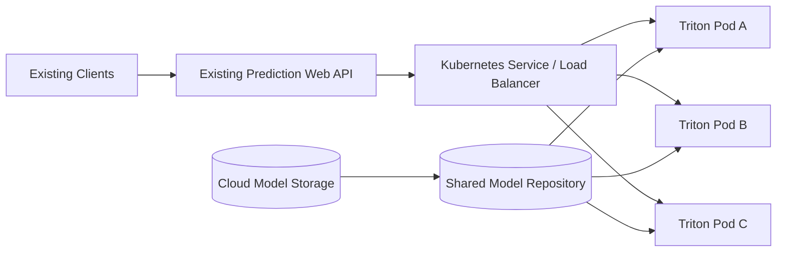

每个 Pod 内：

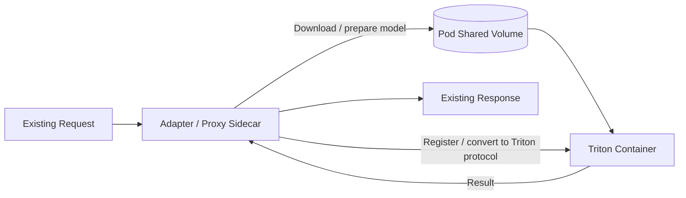

Sidecar：

1. 解析 existing request 和 metadata；
2. 下载 model 到 Triton repository；
3. 调 Triton management load；
4. 转换为 Triton inference protocol；
5. 把结果转换回 existing response。

所有变化隐藏在 prediction service 内，外部 clients / model storage 不变。

#### 这个模式为何通用

Adapter 可以换成 TorchServe / TensorFlow Serving 特定逻辑，black-box container 不变。它是 Anti-Corruption Layer：保护内部系统不被第三方 API / model format 侵入。

#### 生产边界

- Shared repository 的一致性和性能；
- Model-aware routing 与 cold load；
- Sidecar / server version compatibility；
- 双容器 health / readiness；
- Management API 最小权限；
- Trace context 和 error translation；
- Sidecar 增加的 latency；
- Artifact signature 与 arbitrary code；
- Backend unavailable 时 fallback；
- 避免每次请求重复 register。

原章结论是“可应用于任何 Dockerized serving tool”，应理解为架构模式可迁移，而非任何工具无需专属 adapter。

### 7.4.6 工具选择总结

以下工具能力、优缺点与推荐均以原章成书时版本为边界；当前选型必须重新核对项目维护状态、API、许可证、商业支持和目标 workload。

| 工具 | 主要框架范围 | 核心模型格式 | 突出能力 | 原章主要局限 / 关注点 |
| --- | --- | --- | --- | --- |
| TensorFlow Serving | TensorFlow | SavedModel | Servable lifecycle、版本发现、batching | TensorFlow lock-in、management / metrics 边界 |
| TorchServe | PyTorch | MAR + handler | Management API、per-model workers | PyTorch lock-in、handler 与 shared deployment 状态 |
| Triton | 多 backend | Backend-specific + ModelConfig | Dynamic batching、ensemble、GPU、多 framework | 系统复杂、debug / support 成本 |
| KServe | Kubernetes abstraction over runtimes | InferenceService + backend artifacts | 标准 protocol、routing、revision、autoscaling | 依赖 Kubernetes / runtime，版本能力需核实 |
| BentoML / Seldon 等 | 各有侧重 | 工具专属 package / wrapper | 轻量打包或 K8s deployment | 需按团队栈与当前维护状态评价 |

选择步骤：先锁定模型格式与场景，再用一个真实模型做 correctness / latency / deployment / rollback POC，最后比较 TCO 和运维能力。不要按原章排序直接选 Triton。
---

## 7.5 发布模型

Model release 是把新训练模型送入 production prediction path，让用户开始消费。原章指出两个核心问题：

1. 训练完成后应自动把模型发布到 prediction system 可发现的位置；
2. 新旧版本必须在同一 serving 环境中可调用，才能公平评价并防止 regression。

为此，作者提出三步：

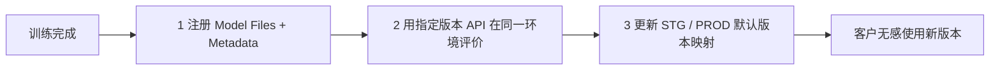

这三个动作不同：注册不等于加载，加载不等于 release，release 也不等于模型质量永久安全。

### 7.5.1 注册模型

#### Metadata Store 与 Artifact Store 分工

- **Artifact store**：S3 等对象存储，保存 weights、vocab、handler、MAR、SavedModel、config 等大文件；
- **Metadata store**：保存 model ID、canonical name、version、algorithm、dataset、training run、metrics、artifact URI 和状态；
- **Lookup table / index**：按 model name + version 或 model ID 快速定位 metadata object。

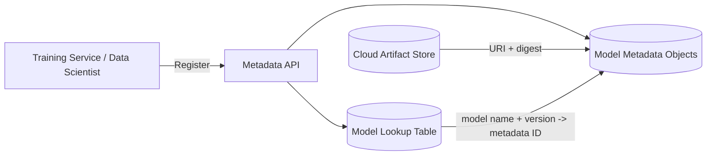

原章图 7.13 中，Model A versions 1.0.0 和 1.1.0 分别指向 metadata IDs 12345、12346。Lookup 是索引，metadata object 是事实记录，artifact bytes 外置。

#### Registration Request 应包含什么

```text
ModelRegistration:
    model_id
    canonical_name
    immutable_version
    algorithm_name_and_version
    framework_and_runtime
    model_format
    serving_backend_type
    input_output_schema_version
    training_run_id
    dataset_version
    code_and_handler_version
    artifact_uri
    artifact_digest_and_signature
    training_and_validation_metrics
    owner_and_created_at
```

Model version 必须不可变。同一 `(name, version)` 不能后来指向不同 artifact bytes；若内容变化，应创建新 version。否则 cache、审计和 rollback 都不可信。

#### 自动与手工注册

- Training service 成功后自动 register：血缘完整、适合生产流水线；
- Data scientist 手工 register 本地模型：便于引入外部模型，但需要额外验证、扫描和所有者信息。

手工注册不能绕过 quality / security gate。Artifact 可能携带 pickle / handler code，应在隔离环境验证。

#### 安全的注册顺序

```text
1. Upload artifact to immutable temporary/versioned URI
2. Compute and verify checksums/signature
3. Validate package format, schema and runtime compatibility
4. Create metadata object in REGISTERED state
5. Atomically create unique name/version index
6. Emit model-registered event
```

若 metadata 成功但 artifact 上传失败，会有悬空引用；反之会有 orphan object。可用 staging state、idempotency key、事务型 index 和 garbage collection 处理。

#### Registration 不应执行的动作

- 不自动把 customer `PROD` alias 指向新模型；
- 不假定训练 metric 足够代表 production quality；
- 不覆盖已注册 immutable version；
- 不立即向 public traffic 暴露未经 serving smoke test 的 handler。

### 7.5.2 实时加载任意模型版本

目标是让数据科学家用**同一 prediction service 和 API path**评价不同 model versions，消除环境差异。请求可以指定：

```text
/predict/{model_name}/{version}
/predict/{model_id}
```

#### 原章七步流程

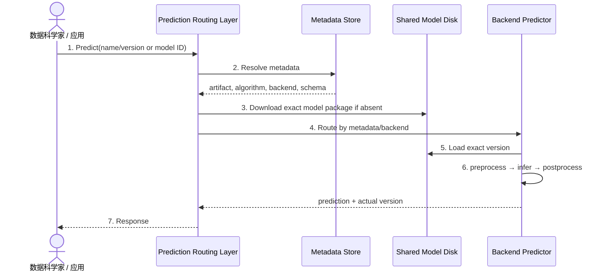

“实时加载”表示服务可按请求动态准备任意注册版本，不表示每个请求都重新下载 / load。正确实现使用 metadata / disk / memory caches。

#### 版本评价公平的前提

- 同一 input dataset / traffic sample；
- 同一 frontend validation 与 business logic；
- 相同 request preprocessing contract，或明确版本差异；
- 相同 hardware / concurrency / latency window；
- 明确随机 / stateful behavior；
- 记录每个请求实际执行版本；
- 评价 model quality 与 system performance 两类结果。

若 v2 使用新 tokenizer，比较的是完整 model package，不应强行只比较 weights。

#### Explicit Version 与 Alias

- Explicit immutable version：用于评价、debug、复现；
- Mutable alias (`STG`, `PROD`)：用于稳定客户 endpoint 和 release。

评价请求应尽量明确 version，避免 alias 在实验中途变化。

#### Cold Load 与并发

任意版本能力增加长尾：冷版本可能要下载、register、load、warm-up。可以：

- Evaluation 前显式 preload / wait ready；
- Per-model single-flight；
- 设最大可加载版本数和 eviction；
- 给数据科学请求独立低优先级 pool，避免影响 PROD；
- 对无权限版本拒绝访问；
- 返回 `MODEL_LOADING` / retry-after，而不是无限阻塞。

#### API Response 应包含

```json
{
  "request_id": "req-42",
  "model": {
    "name": "model-a",
    "requested_version": "STG",
    "resolved_version": "1.1.0",
    "model_id": "12346"
  },
  "prediction": {
    "label": "approved",
    "score": 0.91
  }
}
```

这是补充的 typed response 示例。`resolved_version` 对 release alias 审计至关重要。

### 7.5.3 更新默认版本以发布模型

客户不应记住 model IDs 和真实版本。原章定义两个稳定 tags：

- `STG`：preproduction / staging candidate；
- `PROD`：当前 production release。

Lookup table 保存：

```text
(ModelA, STG)  -> (ModelA, 1.1.0) -> metadata ID 12346
(ModelA, PROD) -> (ModelA, 1.0.0) -> metadata ID 12345
```

客户调用 `/predict/ModelA/PROD`，routing 先把 alias 解析为 immutable version，再加载 / 路由。

#### Release 操作

```text
release(model_name, target_version, alias=PROD):
    verify target version is registered and immutable
    verify serving package validation and quality gates passed
    preload / warm target version in production backends
    atomically update alias pointer with audit metadata
    invalidate / publish alias cache event
    monitor rollout and keep previous pointer for rollback
```

Release 的本质是 mutable pointer update：

$$
PROD_t\rightarrow v_1,\qquad PROD_{t+1}\rightarrow v_2
$$

Model artifacts $v_1,v_2$ 均保持不可变。

#### 为什么 Alias Update 要原子

多个 metadata replicas / caches 若看到不同 pointer，客户请求会随机落不同版本。应使用 transactional update / compare-and-swap：

```text
CAS(ModelA/PROD, expected=v1, new=v2)
```

记录 release ID、operator、timestamp、old/new version、approval 和 reason。失败重试不得覆盖另一个已完成 release。

#### Cache Invalidation

Frontend 可能缓存 `(ModelA, PROD) -> v1`。Release 后需要：

- Watch / event invalidation；
- 短 TTL；
- Versioned alias revision；
- Response 总是记录 resolved version。

不要删除 v1 的 loaded model，直到旧 in-flight requests drain 且 rollback window 结束。

#### 安全 Rollout 而非瞬时全量切换

原章展示 alias 全量切换，实际可在其上增加：

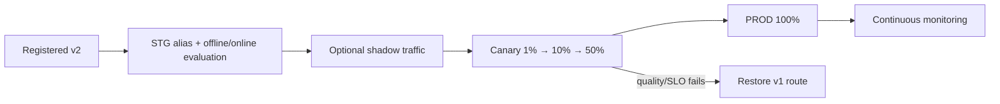

- Shadow：复制请求但不影响用户，注意数据合规与额外成本；
- Canary：少量真实用户消费 v2，逐步扩大；
- A/B：按用户稳定分桶比较业务结果；
- Blue-green：两套环境原子切换。

这些方法不是原章唯一实现，但解决它强调的“评价后安全发布”。

#### Default Alias 与 A/B 的区别

单一 `PROD -> v2` 表达一个默认版本；A/B 同时路由 v1/v2，需要 traffic policy 与 stable assignment，不应仅靠一个 lookup pointer 表达。

#### Rollback

保存 previous pointer：

```text
release r17: PROD v1 -> v2
rollback r18: PROD v2 -> v1 because p99/model-quality gate failed
```

Rollback 也要 preload / readiness、原子 routing 和 cache invalidation。若 v2 改变 input schema 或 application behavior，模型 pointer rollback 可能不够，需要兼容 API / feature rollout。

#### 没有唯一发布设计

原章明确指出 release 流程依赖公司 DevOps 和 serving architecture。`STG/PROD` lookup 是一个可推导参考，不是 universal standard。真正不变的是：immutable versions、可比较评价、显式 promotion、可审计 rollback。

---

## 7.6 生产后模型监控

上线后要同时监控：

1. Prediction service 是否可用、够快；
2. Model predictions 是否仍对现实世界有效。

Model drift 可在服务完全健康时发生。输入世界与训练数据不再匹配，模型 quality 下降，但 HTTP 仍返回 200、GPU 也正常。

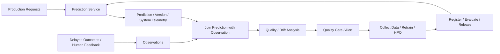

### 7.6.1 Metric Collection 与 Quality Gate

#### Metric Collection

数据科学家需要 production data 分析 drift，工程师负责把 serving events 与后来的 observations 可靠交付。

原章建议优先复用现有 telemetry / logging，例如 Datadog、Sumo Logic、Splunk，而不是为大多数项目重造独立 metric system。复用前仍要确认：

- 高基数 request / model dimensions 是否适合 metrics 还是 logs；
- 原始 input 是否含 PII，能否记录；
- 数据保留和删除法规；
- Late observation join 和 backfill；
- Sampling 是否有偏；
- Event schema / version 与数据质量。

一种合理分工：

| 数据 | 适合系统 |
| --- | --- |
| QPS、latency、error、GPU、cache | Metrics / monitoring |
| Request-level prediction、model version、trace | Structured logs / event stream |
| 大 payload / sensitive features | 受控 feature / audit store，引用而非直接日志 |
| Human / business outcome | Feedback / label pipeline |

#### Quality Gate

工程师与数据科学家把人工排障步骤自动化：

- Input schema / range / missing checks；
- Feature / prediction distribution drift；
- Ground-truth quality metrics；
- Segment / fairness checks；
- System SLO 与 cost；
- Model version / artifact integrity。

给定阈值后形成 gate：

```text
if service_p99 <= 100 ms
and error_rate <= 0.1%
and observation_coverage >= 20%
and macro_f1 >= 0.86
and no_critical_segment_regression:
    allow promotion / continue serving
else:
    block, alert, rollback, or retrain
```

阈值是示例，不是原章标准。Gate 可以用于 release 前，也可周期性检查 production 后触发 alert / retraining。

#### Gate 不能只看单点值

应定义：

- Evaluation window；
- Minimum sample count；
- Confidence interval / statistical test；
- Multiple-comparison control；
- Missing observation policy；
- Consecutive breach duration；
- 自动与人工 approval 边界。

样本少时 F1 波动大，立即 rollback 可能造成震荡。Quality gate 本身需要版本和审计。

### 7.6.2 应收集的 Metrics

原章提出至少五类数据。

#### 1. Prediction Tracing

每个顶层请求有唯一 `requestId`。复杂组合预测（如 PDF OCR → NLP NER）还需 group / parent ID，把 parent 与 child requests 关联。

更标准的表达可使用 distributed trace：

```text
trace_id: 整个业务预测链
span_id: 当前模型调用
parent_span_id: 上游模型 / graph 节点
request_id: 对外请求 ID
```

原章称 `groupRequestID` 给 sub/child requests；语义上它应作为共同关联 ID，而每个 child 还应有自己的 request/span ID，避免多个事件 ID 冲突。

PDF 例子：

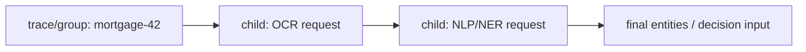

#### 2. Prediction Date

记录 start 和 completion time 最安全：

- 在线请求通常差异 < 1 秒；
- Fraud 等长窗口预测可能聚合多日活动，event time、feature-window end、request start、prediction completion 都不同。

仅记录 completion time 会混淆“模型基于哪个时间窗口做判断”。建议：

```text
event_time / feature_window
request_received_at
prediction_started_at
prediction_completed_at
observation_occurred_at
observation_ingested_at
```

#### 3. Model Version

每个 prediction event 记录所有参与 models 的：

- Model ID / canonical name；
- Resolved immutable version；
- Release alias / route revision；
- Handler / executor / graph version；
- Backend / replica；
- Input schema / feature version。

组合请求不能只记最终模型。OCR v2 + NER v7 与 OCR v3 + NER v7 是不同系统行为。

#### 4. Observation

Observation 是预测后可用于判断正确性的现实结果 / label。应关联：

- Original prediction；
- Expected / observed result；
- Model ID/version；
- Request / trace；
- Source（human review、customer feedback、business outcome）；
- Confidence / verification status。

原章建议 feedback / investigation API，让客户提交 model ID、expected result、current result。API 需要防 abuse、权限与 privacy，并区分投诉样本和随机抽样：投诉集通常严重 selection bias，不能直接估计总体 accuracy。

#### 5. Observation Date、Rate 与 Coverage

Observation 常延迟且只覆盖一部分 predictions。定义某窗口内覆盖率：

$$
Coverage=\frac{N_{predictions\ with\ valid\ observation}}
{N_{eligible\ predictions}}
$$

若 10,000 个 eligible predictions 只有 500 个 observations：

$$
Coverage=\frac{500}{10{,}000}=5\%
$$

这 5% 是否代表总体取决于采样机制。还要记录 observation rate 随时间和 segment 的变化。

“Observation rate”可有两种含义，应明确：

- Coverage proportion；
- 单位时间 observations arrival rate。

原章说需要 date 和 rate 判断统计代表性；工程 schema 不应只留一个含糊字段。

#### Prediction 与 Observation 的延迟 Join

```text
PredictionEvent(request_id, model_version, prediction, timestamp, ...)
ObservationEvent(request_id, observed_label, observed_at, source, ...)
```

按稳定 ID join。要处理：

- Observation 晚到 / 乱序；
- 重复 feedback；
- 一个预测有多个 observation revisions；
- 无 observation 的 censored samples；
- Retention 不够导致 prediction event 已删除；
- Right to delete / privacy requests。

#### 从观测计算 Quality

分类模型在有标签子集上计算 accuracy、precision、recall、F1，并按 version / segment / time window 切分。例如 observed accuracy：

$$
\widehat{Accuracy}_v=
\frac{\sum_i\mathbf{1}[\hat y_i=y_i]\mathbf{1}[version_i=v]}
{\sum_i\mathbf{1}[version_i=v]}
$$

这个估计只有在 observed subset 有代表性时才反映总体。若只调查低置信度请求，不能直接与历史随机样本 accuracy 比较。

#### Service Metrics 仍不可缺少

原章本节聚焦 model metrics，但 production monitoring 还要关联：

- QPS、P50/P95/P99 latency；
- Error / timeout / retry；
- Queue depth、batch size；
- CPU/GPU/RAM；
- Cache hit/miss/eviction、load time；
- Model worker / Pod health；
- Cost per 1,000 predictions。

Model quality drop 与 service latency spike 可能同源，例如 preprocessing bug；统一 trace 可加速诊断。

### 7.6.3 从 Monitoring 回到开发周期

```mermaid
flowchart LR
    Detect[Quality / Drift Gate Breach] --> Diagnose{根因}
    Diagnose -->|Input distribution| Data[收集 / 清洗 / 重标数据]
    Diagnose -->|Model underfit / algorithm| Train[改训练 / HPO]
    Diagnose -->|Serving transform bug| Fix[修 Executor / Handler]
    Diagnose -->|System latency / failure| Infra[扩容 / Cache / Runtime]
    Data --> Candidate[新 Candidate Model]
    Train --> Candidate
    Fix --> Candidate
    Candidate --> Register[Register]
    Register --> Evaluate[Versioned Evaluation]
    Evaluate --> Release[STG / Canary / PROD]
    Release --> Detect
```

监控不是只触发 retraining。根因可能是 data、algorithm、handler、routing 或 infrastructure，必须依赖完整 lineage 与 tracing 选择正确环节。
---

## 容易混淆的概念与常见误区

### 1. Frontend 与 Predictor API 字段相同，就应该共享同一个 Contract

错误。Frontend 面向业务稳定性，predictor 面向执行协议；今天字段相同只是样例简化，未来 batch、tensor、认证和错误语义会独立演进。

### 2. `runId` 天然就是完美的 Model ID

不一定。它便于追溯训练，但一个 run 可产生多个 artifacts，外部模型也可能没有 run。生产应独立 model identity，并保存 `produced_by` lineage。

### 3. Metadata Cache 命中等于 Model Cache 命中

错误。Metadata、已下载文件、loaded model 和 backend client 是四个不同 cache；每层命中只省掉对应工作。

### 4. 模型文件已在 Shared Volume，就可以立即预测

错误。还需完整性校验、反序列化、architecture 初始化、weights 加载、`eval()`、warm-up 和 readiness。

### 5. Shared Volume 自动保证文件原子一致

错误。Frontend 写入过程中 predictor 可能读取。应临时下载、校验后原子 publish，并处理并发锁和故障。

### 6. Model File 的磁盘大小就是内存占用

错误。Loaded tensors、dtype、graph、vocab、workspace、allocator fragmentation 和并发 activation 都增加 RAM / VRAM。

### 7. 保存 `state_dict` 后，Serving 不再依赖 Training Code

错误。Serving 必须重建兼容 architecture 和 input/output transformer。`state_dict` 只降低整个 Python object 序列化的脆弱性。

### 8. 只要 Architecture 一样，Vocabulary 可以换

错误。Vocabulary 决定 token → ID 映射。换 vocab 会让相同文本变成不同模型输入，即使 weights 不变也会破坏预测。

### 9. Training 的任何代码改动都要求改 Predictor

错误。只有 architecture、schema、pre/postprocess、custom ops 等 serving contract 变化直接影响 predictor；HPO、数据切分和训练策略通常只改变 weights。

### 10. `model.eval()` 会自动关闭 Autograd

错误。`eval()` 切换 Dropout / BatchNorm；还应使用 `inference_mode()` / `no_grad()` 降低图构建和内存。

### 11. gRPC `max_workers=10` 意味吞吐必然是单线程 10 倍

错误。GIL、native thread、CPU oversubscription、模型内部并行、GPU queue 和 memory bandwidth 都会限制 scaling。

### 12. Python Dict Check 足以防止并发重复加载

错误。Check-then-load 不是原子事务；同模型 cold requests 可能同时反序列化。需要 per-model single-flight / state future。

### 13. Cache 只要有 LRU 就不会 OOM

错误。LRU 要结合 byte budget、workspace、in-flight pin、native memory 释放和加载 admission。不同模型大小也使纯 recency 不够。

### 14. 删除 Python Model 引用就会立刻归还 GPU 显存给系统

不一定。Framework caching allocator 可能保留 block；还可能有 tensor references 或 in-flight kernels。必须测量实际可分配显存。

### 15. TorchServe 是黑盒，所以不需要写模型专用代码

错误。无需重造 server / worker，但 custom handler 仍包含 architecture、preprocess、inference 和 postprocess。

### 16. `.mar` 只是重命名后的 `model.pth`

错误。MAR 还包含 TorchServe manifest、handler、extra files 和 runtime metadata，是完整 model package。

### 17. 两个 `manifest.json` 是重复文件

错误。`MAR-INF/MANIFEST.json` 描述 TorchServe package；根 `manifest.json` 是样例模型 labels / metadata，职责不同。

### 18. 把 `.mar` 放进 Model Store 就完成 Registration

错误。File placement、registration、worker loading、readiness 与 release 是不同状态。

### 19. Default Model Version 适合做严格版本评价

错误。Default 是 mutable pointer，实验中可能变化。评价必须显式指定 immutable version，并记录 resolved version。

### 20. TorchServe Management API 可以直接暴露给公网

错误。它能注册可执行 handler、scale workers 和消耗资源，必须作为高权限 control plane 保护。

### 21. TorchServe 支持任意算法和任意 Framework

错误。它在 PyTorch 生态内不绑定具体 algorithm，但 model package 和 runtime 仍是 TorchServe / PyTorch contract。

### 22. TorchServe Worker 等于 Kubernetes Pod

错误。Worker 是 TorchServe process；Pod 内可有一个 server 管理多个 workers。Pod scaling 与 per-model worker scaling 是两层。

### 23. 多 TorchServe Replicas 放在 Load Balancer 后就是 Stateless

错误。每实例注册 / loaded models 不同，是有状态 replicas。随机路由可能落到未加载目标模型的实例。

### 24. 所有 Pods 共享 Model Repository，就共享了 Loaded Model

错误。共享磁盘只共享 bytes；每个 process 仍需单独 register、deserialize 和占用内存。

### 25. Sidecar 自动解决 Model Placement 与 Cache Locality

错误。Sidecar 隐藏下载和注册，但请求仍可能在任意 Pod cold-load。还需 model-aware routing、preload、eviction 和 placement controller。

### 26. Sidecar 不增加 Latency 和故障面

错误。多一层协议转换、进程和 lifecycle；它换取兼容性与隔离，需要独立监控和 deadline propagation。

### 27. Model Server 在任何规模都优于 Model Service

错误。单应用 / 少量 types 时，专用 predictor 更快、更透明；多 types 才能摊薄 model server 固定复杂度。

### 28. “超过 5–10 Types”是必须切换 Model Server 的硬阈值

错误。这是原章经验建议。团队、模型相似度、运维自动化和资源成本会改变 break-even。

### 29. TensorFlow Serving 可以直接服务 PyTorch Model

错误。它围绕 TensorFlow SavedModel。跨框架需要转换且有兼容风险，或采用多 backend server。

### 30. SavedModel 只有一个 `saved_model.pb`

错误。还可能包含 variables、assets 和 signatures；完整 version directory 才是可加载 package。

### 31. TorchServe 的主要优势只是 Inference API

不完整。它的 management API、per-model workers、version 和 handler packaging 是 model server 价值的重要部分。

### 32. Triton 支持多 Framework，就无需 Backend-specific Format

错误。每 backend 仍要求相应 model format；PyTorch、TensorFlow、ONNX 等 artifact 不同，并需正确 ModelConfig。

### 33. Dynamic Batching 一定同时降低 Latency 和提高 Throughput

错误。它通常提高 throughput / utilization，但等待 batch 会增加低流量 latency；需要严格 queue-delay budget。

### 34. TorchScript Tracing 能正确捕获任何 Python Control Flow

错误。Tracing 记录 example path；data-dependent branch 可能遗漏。应选择合适 export 方式并做 parity tests。

### 35. 原章称 Triton 最佳，所以当前无需 POC

错误。那是成书时作者判断。当前工具、团队、模型、支持和许可证已可能变化，必须基于真实 workload 验证。

### 36. BSD 许可证意味着 Triton 的全部企业成本为零

错误。软件许可与 commercial support、工程维护、debug 和 GPU infrastructure 是不同成本。

### 37. KServe 是执行所有模型的单一新 Runtime

错误。它主要提供 Kubernetes control-plane abstraction、协议、routing、revision 和 autoscaling，底层可用 Triton / TensorFlow Serving 等 runtime。

### 38. Scale-to-zero 永远最省钱且不影响用户

错误。大镜像 / 模型 cold start 可能远超 online SLO。热门模型通常需要 minimum replicas 或 warm pool。

### 39. KServe CRD 可以不经版本核对直接应用

错误。`apiVersion`、predictor spec 和 deployment mode 持续演进；原章 beta 判断也不能沿用。

### 40. 集成第三方 Server 最好替换现有 Public API

不一定。Sidecar / adapter 可保留 external contract，把 backend-specific model store、registration 和 request format 隔离在内部。

### 41. 注册模型就是发布模型

错误。Registration 只使 immutable model 可发现；还需 serving validation、评价和 promotion 才能让生产流量使用。

### 42. 模型名与版本字符串足以保证 Artifact 不变

错误。应有 immutable URI、digest / signature 和唯一 index constraint，防止同版本内容被覆盖。

### 43. 实时加载任意版本意味着每个请求都重新加载

错误。它表示按需可解析任意注册版本，正常实现依赖 metadata、file 和 memory caches。

### 44. `PROD` 是一个 Immutable Version

错误。`PROD` / `STG` 是 mutable aliases；必须解析并记录真实 version。

### 45. 更新 `PROD` Lookup Pointer 自动等于安全 Canary

错误。单 pointer 通常是全量切换。Canary / A/B 还要 traffic policy、stable assignment 和 metrics gate。

### 46. Alias Update 无需 Cache Invalidation

错误。Frontend / router 缓存旧 pointer 时会继续服务旧版本。需 event / TTL / revision，并记录 resolved version。

### 47. Rollback 只需把 Lookup 指回旧 Version

不总是。还要确保旧模型仍 ready、缓存更新、请求 drain；若 schema / application 已变化，还要协调代码 rollback。

### 48. HTTP 200 与低 Latency 表示模型仍健康

错误。Data / concept drift 可在服务完全健康时使预测质量下降。

### 49. Model Monitoring 只需建立一套新 Metric System

错误。原章建议优先复用现有 telemetry/logging；只有当高基数、延迟 join 和合规需求不满足时再补专用 pipeline。

### 50. Prediction Result 就是 Ground-truth Observation

错误。Prediction 是模型输出，observation 是后来发生 / 审核的现实结果，二者比较才得到 quality。

### 51. Customer Feedback 样本能无偏代表所有请求

错误。主动投诉通常偏向错误 / 极端案例。必须记录采样机制和 coverage，不能直接估计总体 accuracy。

### 52. `groupRequestID` 可以替代每个 Child Request ID

错误。Group / trace ID 负责关联，child span / request ID 负责唯一定位单次模型调用。

### 53. Prediction Start 与 Completion Time 永远可互换

错误。普通在线请求差异小，但多日 feature window / fraud scenario 需要 event、start、completion 和 observation times。

### 54. 只记录最终一个 Model Version 足以分析 Ensemble

错误。组合请求必须记录每个 child model、handler 和 graph version。

### 55. Observation Coverage 越低，只要样本数量大就一定可用

错误。代表性取决于采样机制与 segment；大量有偏 observation 仍会产生有偏估计。

### 56. Quality Gate 用一个 Accuracy 阈值就足够

错误。还需样本量、置信、segments、service SLO、数据质量、持续时间与缺失 observation policy。

### 57. Drift 检测后唯一动作是 Retraining

错误。根因也可能是 handler、schema、routing、服务资源或监控 bug，应先沿 lineage 诊断。

### 58. Release 和 Monitoring 是系统建完后再补的 Operations 细节

错误。没有 model version、request trace、alias、readiness 和 metrics hook，后续无法安全补齐生产闭环。

## 本章知识结构

```mermaid
flowchart TB
    Root[模型服务实践]

    Root --> Custom[7.1 自建 Model Service]
    Custom --> Frontend[Frontend API / Routing]
    Custom --> Predictor[Intent Predictor]
    Custom --> Metadata[Metadata + Artifact Store]
    Custom --> Caches[Metadata / File / Loaded-model Caches]
    Custom --> Evict[LRU / Memory Eviction]

    Root --> Server[7.2 TorchServe Model Server]
    Server --> Adapter[TorchGrpcPredictorBackend]
    Server --> APIs[Management / Inference APIs]
    Server --> MAR[MAR + Manifest + Handler]
    Server --> Workers[Per-model Workers]
    Server --> Sidecar[Kubernetes Sidecar Adapter]

    Root --> Choice[7.3 Strategy Choice]
    Choice --> Small[Single App / Few Types → Model Service]
    Choice --> Platform[Many Types → Model Server]

    Root --> Tools[7.4 Open-source Tools]
    Tools --> TF[TensorFlow Serving / SavedModel]
    Tools --> TS[TorchServe / MAR]
    Tools --> Triton[Triton / Backends + ModelConfig]
    Tools --> KS[KServe / InferenceService]
    Tools --> Integration[Existing API + Sidecar + Shared Repository]

    Root --> Release[7.5 Model Release]
    Release --> Register[Register Immutable Model]
    Release --> Version[Test Arbitrary Version]
    Release --> Alias[STG / PROD Alias]
    Release --> Rollout[Canary / Rollback]

    Root --> Monitor[7.6 Postproduction Monitoring]
    Monitor --> Trace[Prediction Trace / Version / Time]
    Monitor --> Observe[Observation / Date / Coverage]
    Monitor --> Gate[Quality Gate]
    Gate --> Loop[Data / Train / Serving Fix / Release]
```

## 核心结论

### 原章主线与直接推论

1. **模型服务实践不只包含构建 predictor，还包含模型打包、注册、扩缩、发布、回滚和持续质量监控。**
2. **自建样例由 frontend 与 intent predictor 解耦组成。** Frontend 负责 public API、metadata、artifact 准备和 backend routing；predictor 负责模型执行。
3. **Metadata、disk files、loaded model 和 backend client 是不同 cache 层。** 冷路径必须显式管理并观测。
4. **Shared volume 只是文件交换介质，不自动提供原子发布、完整性或加载 readiness。**
5. **`runId` 可简化模型血缘，但生产 model identity 应与 training run identity 解耦并建立关系。**
6. **Intent model package 至少需要 weights、vocabulary、labels / manifest 和兼容 architecture。** 模型输入语义与参数同样重要。
7. **保存 `state_dict` 避免 entire-object 序列化绑定，但把 architecture compatibility 责任交给 serving code。**
8. **Training 与 serving 只需同步 architecture 和 I/O contract 等执行相关部分，不需同步所有训练策略。**
9. **Model Manager 要以原子 cache entry 管理 model、vocab 和 classes，并处理 single-flight、readiness、in-flight pin 与 eviction。**
10. **LRU 是模型淘汰起点，不是完整容量策略。** Loaded bytes、加载成本、热度和 tenant priority 都会影响最优决策。
11. **TorchServe 用 `.mar` 把 model state、metadata、handler 和 extra files标准化，使同一 server 执行多种 PyTorch algorithms。**
12. **Model server 没有消除模型专用逻辑，而是把它从独立服务移入 handler / model package。**
13. **TorchServe registration、worker loading、readiness 和 release 是不同状态。** Management API 属于高权限 control plane。
14. **Handler 的 initialize / preprocess / inference / postprocess 与自建 ModelManager 的逻辑同构。** 差别在标准 runtime 与 lifecycle。
15. **在训练完成时打包 serving artifact，有利于 weights、code、handler 和版本原子对应，并支持跨环境复现。**
16. **多 TorchServe replicas 是有状态模型缓存，普通随机 load balancer 与每实例 registration 存在矛盾。**
17. **Sidecar 作为 adapter 隐藏第三方 model server 的下载、注册和 protocol，并保留已有 public API。** 它不自动解决 placement、cold start 和 autoscaling。
18. **Model service 适合单应用 / 少量 model types，model server 适合平台 / 大量 types。** 原章 5–10 阈值只是经验参考。
19. **TensorFlow Serving 的核心是 Servable lifecycle 与 SavedModel；TorchServe 的核心是 MAR、handler 和 management API；Triton 的核心是多 backend、scheduler/batching 和 ModelConfig；KServe 的核心是 Kubernetes serving abstraction 与协议。**
20. **原章对 Triton 的优先推荐和支持价格都是历史观点。** 当前选型必须用真实 workload、维护状态、许可证和 TCO 重新验证。

### 实践扩展与生产化边界

21. **Serving tool 集成应优先采用 adapter / anti-corruption layer，而不是破坏现有 API 和 artifact system。**
22. **模型发布分三步：注册 immutable version、在同一环境评价任意版本、更新 mutable release alias。**
23. **`STG/PROD` 提供稳定客户地址，必须原子解析到真实版本并在每个请求中记录。** 单 alias 不等于 canary / A/B。
24. **安全 release 需要 preload、readiness、traffic policy、quality gate、cache invalidation 和 rollback。**
25. **服务健康与模型健康是两个正交维度。** Model drift 可在 QPS、latency 和 error 全部正常时发生。
26. **监控至少关联 prediction tracing、prediction time、所有 model versions、observation、observation date/rate/coverage。**
27. **Observation 是延迟 ground truth，不是 prediction 本身。** Feedback sampling bias 会影响 quality estimation。
28. **Quality gate 需要 metric、样本量、窗口、segments 和统计规则，并能触发 block、rollback 或 retraining。**
29. **Production feedback 的根因可能在数据、训练、handler、routing 或 infrastructure。** 完整 lineage 决定正确修复路径。

## 从本章提炼出的通用解题方法

面对一个 model serving 落地任务，可以按以下步骤推进。

### 第一步：固定 Use Case 与 Strategy

明确应用数、模型类型、版本 / tenant 数、online SLO、框架和团队边界。少量 types 从 model service 开始，大量标准模型再采用 model server；允许混合 backends。

### 第二步：定义可部署 Model Package

列出 weights / graph、architecture / handler、pre/postprocess、vocab / labels、runtime、schema、metadata、digest 和 signature。确保 training pipeline 可重复生成 package。

### 第三步：分离 Public API 与 Backend Protocol

Frontend 提供业务稳定 contract；`PredictorBackend` adapter 负责 model download、registration、readiness、inference 与 error conversion。第三方工具变化不影响客户。

### 第四步：设计 Model Lifecycle 状态机

```text
REGISTERED -> DOWNLOADING -> REGISTERING -> LOADING -> READY
                                           -> FAILED
READY -> DRAINING -> UNLOADED / EVICTED
```

每次状态迁移幂等、可恢复、可观测。文件存在不等于 ready。

### 第五步：分层设计 Cache 与 Capacity

分别管理 metadata、artifact files、loaded models 和 connections。测量 loaded footprint / cold latency；实现 single-flight、byte budget、pin、eviction、preload 和 model-aware routing。

### 第六步：对候选 Serving Tool 做真实 POC

用同一个 representative model 测试：

- Correctness / parity；
- Package / custom ops；
- Cold / hot P50/P99；
- Throughput / batching / worker scaling；
- Registration、version、rollback；
- Metrics / traces / debugging；
- Security、maintenance 和 TCO。

不要只比较 feature list。

### 第七步：用 Adapter / Sidecar 集成

保留 existing API、metadata 与 storage，在 Pod 内适配第三方 model repository、management 和 inference protocol。限制 management 权限，协调 sidecar/backend readiness，并记录 protocol versions。

### 第八步：建立 Immutable Registration 与 Versioned Evaluation

Artifact 先上传、校验和签名，再原子创建 `(name, version)` metadata。Prediction service 支持明确 version / ID，允许同环境比较，响应返回 resolved version。

### 第九步：设计 Promotion、Traffic 与 Rollback

用 mutable `STG/PROD` aliases 或 deployment revisions 保持 client stable；先 warm target，再 canary / A/B，quality/SLO 通过后扩大；原子切换并保留 previous ready version。

### 第十步：建立 Prediction-Observation 闭环

定义 event schemas 和 stable IDs，记录 model / graph / executor versions 与 timestamps；建立 delayed join、coverage / bias 分析和 quality gates；把根因路由回 data、training、serving code 或 infrastructure。

这套方法的核心是：**把模型专用逻辑封装为可验证 package，把 serving 工具封装在稳定 adapter 后，再用 immutable version、可逆 release 和延迟 observation 构成完整生产闭环。**

## 复习与自测

1. 7.1 自建 prediction service 由哪两个主要组件组成？
2. Frontend 在一次请求中承担哪三类核心职责？
3. Metadata store 与 artifact store 分别保存什么？
4. 原章自建样例的六步预测流程是什么？
5. Shared volume 为何既简化文件共享又引入一致性风险？
6. Metadata cache、file cache 和 loaded-model cache 的命中分别省掉什么？
7. Public `Predict` API 的 `runId` / `document` 设计有哪些局限？
8. 为什么 frontend API 与 predictor API 不应长期共用同一 schema？
9. `PredictorConnectionManager` 怎样从 metadata 选择 backend？
10. Algorithm type 为什么不足以决定 serving backend？
11. `PredictorBackend` 三个原章方法分别做什么？
12. Adapter 应怎样传播 deadline 和错误？
13. Intent predictor 的三个 model files 分别有什么作用？
14. 为什么 `vocab.pth` 与 weights 一样影响预测正确性？
15. 保存整个 PyTorch model 与只保存 `state_dict` 有何取舍？
16. 哪些 training code 变化必须同步 serving，哪些通常不必？
17. 如何用 metadata 关联 model、training code 与 predictor version？
18. 原章 `ModelManager` 为什么可能发生并发重复加载？
19. 为什么应把 model/vocab/classes 作为一个原子 cache entry？
20. `model.eval()` 之外为何还要 `inference_mode()`？
21. LRU 怎样做到 O(1) get / put，为什么仍不够？
22. 1% cold miss 为什么可能显著影响平均和 P99 latency？
23. 安全 eviction 为什么必须 pin in-flight model？
24. 7.2 相比 7.1 只替换了哪个主要 backend？哪些组件复用？
25. TorchServe inference 与 management endpoints 为什么要隔离？
26. `TorchGrpcPredictorBackend` 做哪些协议转换和 lifecycle 动作？
27. 为什么 model 已在 store 还不能立刻 inference？
28. `.mar` 包含哪些模型服务要素？
29. 两个 manifest 的职责分别是什么？
30. Handler 的五个 lifecycle 方法怎样串联？
31. 为什么 TorchServe 是 algorithm-agnostic 而不是 framework-agnostic？
32. 原章 handler 的 bytes-to-text 处理有什么风险？
33. 为什么最好在 training pipeline 中打包 `.mar`？
34. MAR 供应链为什么需要签名和 worker sandbox？
35. 多 TorchServe Pods behind LB 的三项原章难题是什么？
36. Sidecar 五步 serving workflow 是什么？
37. Shared model repository 为什么不等于共享 loaded model？
38. Sidecar pattern 还缺哪些 model placement / cache 能力？
39. Pod autoscaling 与 TorchServe worker scaling 为什么可能冲突？
40. Model service 与 model server 的成本曲线怎样交叉？
41. 原章“5–10 model types”阈值应该如何使用？
42. TensorFlow Serving 的 Servable、Source、Loader、Manager 分别是什么？
43. SavedModel directory 包含哪些组成？
44. TensorFlow Serving 的 model version policy 解决什么？
45. TorchServe frontend、backend workers、model store 怎样协作？
46. Triton scheduler、backend 与 ModelConfig 分别负责什么？
47. Dynamic batching 怎样影响吞吐和时延？
48. TorchScript tracing 为什么可能遗漏 control flow？
49. 原章推荐 Triton 的三个理由是什么？为何要按当前情况重验？
50. KServe 与 Triton / TensorFlow Serving 的层次关系是什么？
51. Scale-to-zero 的完整 cold latency 包含哪些阶段？
52. Existing API + sidecar + third-party server 为什么是 anti-corruption layer？
53. 模型 registration request 应记录哪些 lineage 和 integrity 字段？
54. Registration、loading、readiness、release 有何区别？
55. 任意版本在线加载的七步原章流程是什么？
56. 为什么 model version evaluation 应显式指定 immutable version？
57. `STG/PROD` alias 怎样解析到真实 model version？
58. Alias update 为什么需要 CAS 和 cache invalidation？
59. 单 `PROD` pointer 与 canary / A/B 有何区别？
60. Rollback 为什么可能不仅是恢复旧 model pointer？
61. Service monitoring 与 model monitoring 分别关注什么？
62. Engineers 在 metric collection 与 quality gate 上怎样贡献？
63. 原章五类 model monitoring 数据是什么？
64. `requestId`、`groupRequestID`、trace ID 和 child span ID 怎样分工？
65. Fraud 场景为什么要区分 event、prediction start/completion 与 observation time？
66. 组合预测为什么要记录每个 child model version？
67. Observation 与 prediction 有何区别？
68. Customer complaint feedback 为什么存在 selection bias？
69. Observation coverage 5% 是否足够？还要知道什么？
70. 怎样用 request ID 延迟 join prediction 与 observation？
71. 一个可信 quality gate 需要哪些统计和业务条件？
72. Drift gate breach 后为什么不应无条件 retrain？
73. 如何用十步方法把一个新模型安全接入现有 prediction system？
