> 对应原章：**8 Metadata and Artifact Store**
> 本章讨论怎样保存深度学习活动产生的文件、事实与关系，使数据科学家能够独立回答“这个模型从哪里来、使用了什么、表现为何变化、怎样重新产生”。核心不只是存储对象，而是建立可查询、可追溯的模型 lineage。

## 本章要回答的核心问题

1. Artifact 为什么不仅是最终模型文件？
2. Metadata 与 artifact、日志、指标分别是什么关系？
3. 为复现一次训练，需要保存哪些输入、配置、环境和输出？
4. 为什么模型是特殊 artifact，需要同时记录训练与 serving 视角的信息？
5. 普通日志搜索为什么不能替代结构化 metadata management？
6. Model lineage 与 data provenance 分别回答什么问题？
7. 一个 metadata store 应满足哪些设计原则？
8. Client SDK、Web Server、Data Aggregator、Storage Adapter 与 UI 怎样协作？
9. 为什么原章 schema 以 `Training_Runs` 为中心？Model focus 与 pipeline focus 是否冲突？
10. Metadata 与大文件为什么通常分别存放？怎样保证引用一致？
11. ML Metadata（MLMD）的 Artifact、Execution、Event、Context 如何构成 lineage graph？
12. MLflow 的 Tracking、Projects、Models、Registry 分别解决什么问题？
13. 什么时候选轻量 MLMD，什么时候选完整 MLflow？

原章以概念、数据模型和工具用法为主，没有复杂数学算法。本文会补充图关系、复现函数、基数、时间序列和一致性等形式化表达，用来解释设计依据与局限；这些是工程推导，不是原章另行提出的算法。MLMD 与 MLflow 的 API、组件和产品状态具有成书时点，实际采用时应按目标版本重新验证。

---

## 8.1 Artifact：深度学习活动的输入与输出

### 8.1.1 Artifact 的广义定义

人们常把 artifact（制品）只理解为训练输出的 model file。原章强调更宽的定义：**深度学习组件使用或产生的文件、对象和数据，都可以是 artifact。**

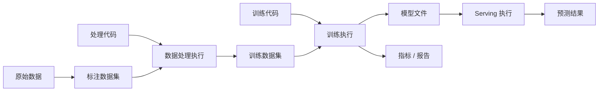

图中以下对象都可视为 artifacts：

- 原始输入数据；
- 标注后的数据集；
- 数据处理后的中间数据；
- 训练 / 推理代码 snapshot；
- 配置与环境文件；
- 模型权重、graph、vocabulary 和 labels；
- 训练曲线、评价报告；
- 预测输出或抽样结果。

Artifact 可以是目录、对象存储 key、数据库 snapshot、容器镜像、Git commit 所指代码，甚至逻辑 dataset version。关键不是物理形态，而是它是否作为某项 ML 活动的可识别输入或输出。

### 8.1.2 Artifact、Metadata 与实体内容

Artifact 是被使用或产生的对象；metadata 是描述 artifact、execution 或它们之间关系的数据。

| 对象 | 示例 |
| --- | --- |
| Artifact bytes / content | `s3://models/intent/17/model.pth` 的字节 |
| Artifact identity | `model_id=12346`、`version=1.1.0` |
| Descriptive metadata | 格式、大小、checksum、owner、created_at |
| Lineage metadata | 由 training run 931 使用 dataset snapshot 12 和 code commit `abc...` 产生 |
| Operational metadata | 生产 QPS、P99 latency、cache miss rate |

同一个 artifact 不应只靠可变路径识别。更稳妥的身份包含不可变版本与 digest：

$$
artifact\_identity=(logical\_name,version,content\_digest)
$$

其中：

$$
content\_digest=H(artifact\ bytes)
$$

路径告诉系统去哪里找，digest 帮助验证取回的内容是否仍是同一对象。

### 8.1.3 为什么 Metadata 与 Artifact 通常分开存

原章采用常见分层：

- Artifact files 放文件服务器、S3、Azure Blob 等对象存储；
- Metadata 和 artifact URL 放结构化 metadata store。

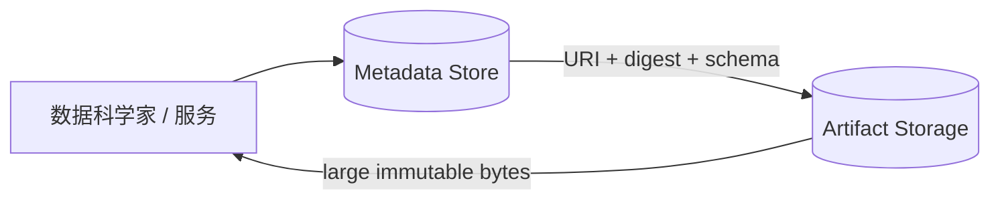

原因：

1. Artifact 可达到 GB / TB，适合低成本、高耐久对象存储；
2. Metadata 体积小但关系丰富，需要按 model、run、dataset、metric 搜索；
3. 大文件下载与 metadata 查询有不同性能和权限模式；
4. Metadata database 不应被 binary blob 拖累；
5. Artifact storage 不擅长复杂 lineage 查询。

分离也引入一致性问题：

- Metadata 已登记，但 artifact 上传失败，形成 dangling reference；
- Artifact 已上传，但 metadata 事务失败，形成 orphan object；
- Artifact 被覆盖或 lifecycle policy 删除，历史 lineage 失效；
- Pre-signed URL 过期，不应作为永久定位符保存。

安全注册通常采用：

```text
upload immutable artifact
-> verify checksum and size
-> write metadata in one transaction
-> publish searchable index
-> garbage-collect unreferenced staging objects
```

Metadata 中应保存稳定 object URI / key，需要下载时再生成短期授权 URL。

### 8.1.4 Lineage 的基本图模型

原章说，搜索一个模型后应能找到对应训练过程的全部输入与输出。最自然的抽象是有向图：

$$
G=(V,E)
$$

- $V$：artifacts、executions、contexts 等实体；
- $E$：`used`、`generated`、`belongs_to`、`derived_from` 等关系。

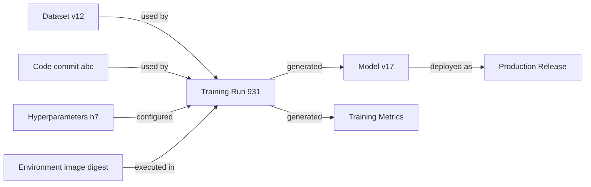

从 model v17 反向遍历可回答“怎样产生”；从 dataset v12 正向遍历可回答“哪些模型受它影响”。这分别是故障排查和影响分析的基础。

---

## 8.2 深度学习语境中的 Metadata

Metadata 一般指描述其他数据 / 对象的结构化参考信息。深度学习 metadata 特别描述 training runs、workflows、models、datasets 和其他 artifacts，以及它们的关系。

普通分布式系统也有 logs / metrics，例如 CPU utilization、active users 和 failed requests。ML metadata 则服务于另一组问题：模型比较、复现、lineage、部署和质量退化。它可视为系统 telemetry 中具有领域结构和长期关系的一部分。

### 8.2.1 四类常见 Metadata

Metadata 没有唯一清单。原章建议从四类开始：training run、general artifact、model file、pipeline / workflow，再按项目补充。

#### 1. Model Training Run Metadata

为复现、评价和排障，应记录一次 training run 的输入、执行和输出。

##### 数据输入

- Dataset ID 与不可变 version / snapshot；
- Train / validation / test split identity；
- Feature / preprocessing version；
- Data schema 与统计；
- 输入 artifact URIs 和 digests。

##### 算法与配置

- Hyperparameters：learning rate、epochs、batch size 等；
- Training code version / Git commit；
- Entry command 与 arguments；
- Random seeds；
- Framework、library、CUDA / driver；
- `conda.yml`、`requirements.txt`、Dockerfile 或 image digest。

##### 资源与执行

- CPU、GPU、TPU、RAM、disk 的 request / limit；
- GPU model、数量和 topology；
- 实际资源 consumption；
- Start / completion time、duration；
- Host / cluster / region；
- Status、exit code、failure category；
- Parent workflow / retry attempt。

##### 输出与指标

- Training loss / metric time series；
- Validation / test metrics；
- Model artifacts、checkpoints 与 reports；
- Logs、profiles；
- 产出的 model IDs / versions。

原章明确列出 dataset ID/version、hyperparameters、hardware resources、training code version/config、training metrics 和 evaluation metrics。上面的细分把其生产边界展开。

#### 复现函数

一次模型结果可写为：

$$
M=Train(D_v,C_c,H_h,E_e,R_r)
$$

- $D_v$：dataset snapshot；
- $C_c$：code snapshot；
- $H_h$：hyperparameters / config；
- $E_e$：environment / hardware；
- $R_r$：random state；
- $M$：model artifact。

Metadata store 必须保存右侧所有引用及其完整性信息。即使如此，GPU 非确定性也可能使 weights 不逐位相同，因此 reproducibility 标准应明确为 bitwise、prediction-equivalent 或 metric within tolerance。

#### 2. General Artifact Metadata

原章推荐至少记录：

- File location；
- File version；
- Description；
- Audit history：谁、何时、怎样创建。

生产中还常需要：

```text
artifact_id
artifact_type and schema_version
immutable logical version
storage_uri and region
content_digest, byte_size and media_type
created_by_execution_id
owner / tenant / ACL
retention and deletion status
created_at / registered_at
description / tags
```

File version 与 model version 不一定相同。一个 model package 可能有业务版本 `1.2.0`，同时 artifact object 有独立 revision / digest。

#### 3. Model File Metadata

Model 是 artifact，但因它是深度学习系统的主要产品，原章建议单独建模，并从 training 与 serving 两个视角记录。

##### Training 视角

- Producing training run ID；
- Dataset、code、hyperparameters 与 environment lineage；
- Training / evaluation metrics；
- Model architecture / algorithm；
- Model name、version、format；
- Parent / base model（fine-tuning 场景）。

##### Serving 视角

- Serving runtime / executor / handler version；
- Input / output schema；
- Memory / CPU / GPU / TPU consumption；
- Model loading 与 warm-up time；
- Deployment / release stage；
- Traffic distribution / experiment；
- QPS、latency、error、cache miss；
- Prediction statistics、quality 与 drift metrics。

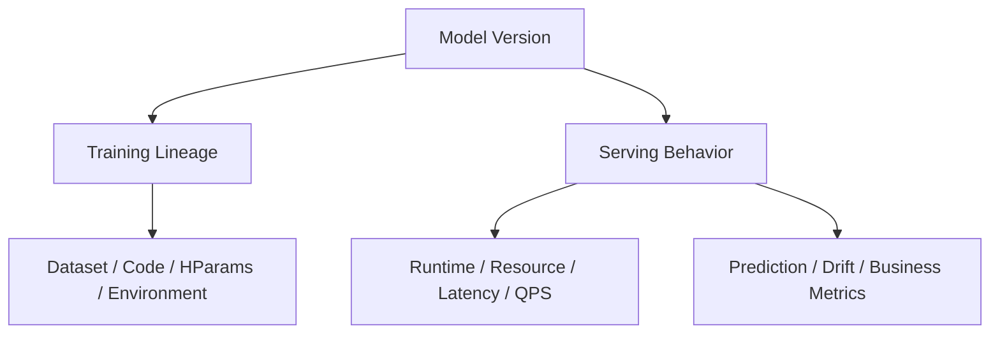

原章特别列出 resource consumption、training run、experiment、production usage 和 model performance。模型比较不能只看训练 metric；生产 latency 与真实 quality 同样决定可用性。

#### Model Degradation 与 Drift

原章用流行语变化影响 voice recognition 说明目标分布随时间变化，模型性能不可避免地可能下降。应区分：

- Data / feature drift：$P(X)$ 变化；
- Label shift：$P(Y)$ 变化；
- Concept drift：$P(Y\mid X)$ 变化；
- Performance degradation：观测结果，可能由上述 drift、bug、schema 或 serving 变化导致。

Metadata 必须把 prediction quality 与具体 model/executor/data period 关联，才能诊断，而不是看到 accuracy 下降就直接归因 concept drift。

#### 4. Pipeline / Workflow Metadata

Pipeline 把数据收集、feature extraction、augmentation、training、deployment 等多个 steps 自动化。应记录：

- Pipeline definition / version；
- Pipeline run ID、parent experiment；
- Step executions、依赖 DAG 与状态；
- 每 step 输入 / 输出 artifacts；
- Parameters、environment、resources；
- Start/end、retry、failure；
- Trigger / schedule / initiator；
- 最终 model / deployment outputs。


Pipeline metadata 用于 audit 与 troubleshooting：一个 model 即使 training run 正常，也可能使用了错误 upstream dataset step。

#### 四类 Metadata 的关系

| 类别 | 核心实体 | 主要问题 |
| --- | --- | --- |
| Training run | 一次训练 execution | 这次训练如何执行、表现怎样？ |
| General artifact | 任意输入 / 输出对象 | 文件在哪里、是什么版本、谁创建？ |
| Model | 特殊可部署 artifact | 它如何产生、怎样 serving、生产表现如何？ |
| Pipeline | 多步骤 execution graph | 哪些步骤、输入输出和失败共同产生结果？ |

这些类别会重叠，不应把同一事实复制成彼此不一致的记录。更好的做法是规范化实体与关系，在不同视图中聚合展示。

### 8.2.2 为什么要专门管理 Metadata

#### 为什么不能只搜索日志

Logs / metrics 很有价值，但通常围绕服务实例和时间组织：

- Schema 不稳定、消息自由文本；
- Retention 较短；
- 同一实体散落在多个服务；
- Artifact relationships 不显式；
- 高基数 lineage 不适合 metric labels；
- 服务重试导致重复 / 乱序事件；
- 很难回答多跳图查询；
- 日志中的路径可能已失效。

Metadata store 则围绕持久 domain identities 与 relationships 组织，并提供一致 API / UI。它不替代 observability system；logs 保留细节，metadata 提供长期结构与索引，两者通过 run / trace ID 互链。

#### BestFood 模型退化案例

原章设定三位角色：

- Julia：数据工程师，负责收集和解析数据；
- Ravi：数据科学家，负责 intent classification algorithm；
- Jianguo：系统开发者，负责 deep learning infrastructure。

实验 pipeline 验证成功后，Ravi 把算法提升到 production training pipeline；该 pipeline 使用 customer data 训练并自动部署模型。几周后 BestFood Inc. 报告：采用新 dataset 后，intent accuracy 下降 10%。

#### 没有 Metadata Store 时的排查链

Ravi 需要回答：

1. BestFood 当前实际 serving 哪个 model version？
2. 哪个 training run 产生它？
3. 使用哪个 dataset version？
4. Training code / environment / hyperparameters 是什么？
5. 当前与前一 model 的 training metrics 怎样？
6. 怎样取回两个 models、datasets 和 code 复现？
7. 数据分布变化是否解释下降？

但这些事实分散在 Ravi、Julia、Jianguo 各自系统与知识中，只能跨团队人工拼接。企业中没人掌握完整上下文，这种排查不可扩展。

#### 引入 Metadata Store 后

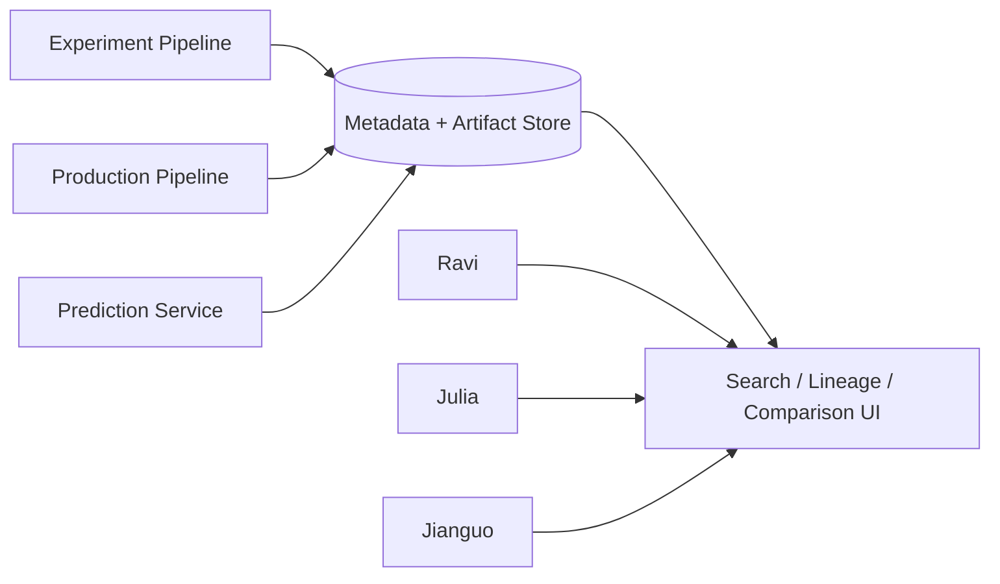

所有实验与生产 metadata 被集中并相关联。Ravi 可自助：

- 按 customer / release alias 找 production model；
- 反查 training run；
- 查看 dataset / code / parameters / metrics；
- 下载 artifacts；
- 对比 previous/current runs；
- 触发复现 / troubleshooting。

#### Lineage 查询示例

```text
findProductionModel(tenant="BestFood", model="intent")
-> model v17
-> producedBy training run 931
-> used dataset v12, code abc123, hparams h7, image digest d9
-> compareWith previous model v16 / run 904 / dataset v11
```

图查询可以表达为：

$$
Lineage(M)=Ancestors_G(M)
$$

影响分析：

$$
Impact(A)=Descendants_G(A)
$$

例如发现 dataset v12 标签错误，可正向找出所有依赖 models / deployments。

#### Metadata Management 的直接价值

1. **Experiment comparison**：同一 UI 对比 parameters、metrics、artifacts；
2. **Model troubleshooting**：快速重建完整上下文；
3. **Reproducibility**：取回精确输入和环境；
4. **Audit / compliance**：谁用哪些数据产生了哪个模型；
5. **Release safety**：production alias 对应的 immutable model 与 lineage；
6. **Collaboration**：把跨团队隐性知识变成可查询 contract；
7. **Impact analysis**：上游 artifact 问题影响哪些 outputs；
8. **Automation**：quality gate、rollback、retraining 可读取结构化事实。

---

## 8.3 设计 Metadata 与 Artifact Store

Metadata and artifact store 的目标不是“把所有日志复制进数据库”，而是围绕模型与产生它的 executions 建立长期、可查询的事实图，让用户能够比较 experiments、下载 artifacts、遍历 lineage 并重建训练上下文。

本章简称 metadata store 时，也包含 artifact management；物理上 metadata 与 artifact bytes 仍可分离。

### 8.3.1 设计原则

#### 原则 1：展示 Model Lineage 与 Versioning

给定 model name，系统至少应回答：

1. 有哪些 immutable versions？
2. 每个 version 对应哪个 model artifact？
3. 哪个 training run / pipeline run 产生它？
4. 该 run 使用哪些 dataset、code、configuration 和 environment？
5. Training / evaluation metrics 是什么？
6. 哪个 version 被部署到 staging / production？

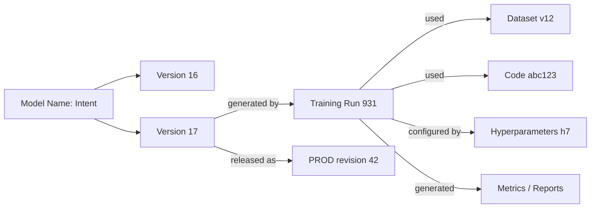

Versioning 与 lineage 不同：

- Versioning 区分同一逻辑对象的不同状态；
- Lineage 连接一个版本的来源、过程和下游用途。

只给 model 文件名加 `_v17` 不是完整 lineage；必须保存实体身份与关系。

#### 版本不可变原则

$$
(name,version)\longrightarrow artifact\_digest
$$

一旦登记，这个映射不应改变。同一版本被覆盖后，历史 training run 虽仍指向 `v17`，实际 bytes 已变，复现与审计都会失效。`PROD` 等 mutable alias 应作为独立 release pointer，不应伪装成 immutable model version。

#### Lineage 查询方向

- 反向 lineage：从 model 找 ancestors，定位 dataset、code、run；
- 正向 impact：从 dataset / code 找 descendants，定位受影响 models 和 deployments。

一个 metadata system 若只能显示 run 列表、不能查询关系，就尚未真正满足这项原则。

#### 原则 2：支持 Model Reproducibility

Reproducibility 要求 metadata store 保存足够信息，能构造一次等价训练：

```text
ReproductionBundle:
    dataset snapshot IDs and artifact digests
    training code / image digest
    entry command and configuration
    hyperparameters
    random-state policy
    framework / runtime / hardware facts
    pipeline definition and parent run
    expected output metrics and tolerances
```

理想重放函数：

$$
Reproduce(run\_id)\rightarrow
TrainingJobSpec(D_v,C_c,H_h,E_e,R_r)
$$

Metadata store 不一定亲自执行重放，但应能向 training / workflow service 提供完整 spec 和 artifact references。

#### 保存引用还不够

- Git branch 会移动，应保存 commit digest；
- Docker tag 会移动，应保存 image digest；
- Dataset name 会增长，应保存 immutable snapshot；
- Object URI 可能被覆盖，应保存 checksum / version ID；
- Dependency ranges 会解析到新包，应保存 lock file；
- Hardware / driver 可能影响数值结果，应保存 environment facts。

Reproducibility 也不等于 bitwise determinism。系统应保存原结果与允许误差：

$$
|Q(M_{reproduced})-Q(M_{original})|\le\epsilon
$$

如果要求逐位一致，则需更严格的 deterministic kernels、hardware 与 random-state 控制。

#### Reproducibility 与 Provenance 的关系

- Provenance / lineage 告诉你“发生过什么”；
- Reproducibility 要求这些事实足以“再做一次”。

Lineage 是必要条件，但如果 artifact 已删除、环境未锁定，仍无法复现。

#### 原则 3：便捷访问 Packaged Models

数据科学家既需要手工下载，也需要程序化访问：

- UI 搜索 production model 并下载排障；
- SDK / REST 按 model ID、name/version、stage 获取；
- 比较脚本批量拉取多版本；
- Prediction service 解析 release alias 并加载 artifact；
- Workflow 自动把已通过 gate 的 model 注册 / 发布。

#### 推荐 API 语义

```text
registerModel(metadata, artifact_reference)
getModel(model_id)
getModelVersion(name, version)
listModelVersions(name, filters, page_token)
getModelLineage(model_id, depth)
downloadArtifact(artifact_id)
compareRuns(run_ids, metric_names)
```

Artifact download 不应要求用户理解底层 S3 bucket、region 和 credentials。Store 可在授权后：

- Proxy bytes；
- 返回短期 pre-signed URL；
- 提供 SDK streaming。

#### Access 不是公开下载

Metadata 与 models 可能包含客户数据、敏感代码或可被反序列化执行的对象，因此需要：

- Authentication 与细粒度 authorization；
- Tenant / project scope；
- Artifact-level ACL；
- Audit logs；
- Short-lived credentials；
- Encryption 与 key policy；
- Package signature / checksum；
- 反序列化隔离。

UI 与 SDK 必须走同一 authorization policy，不能让 UI 隐藏按钮却允许 API 越权。

#### 原则 4：可视化 Training Tracking 与 Comparison

数据科学家需要从大量 runs 中理解差异，而不是逐条读 JSON。UI 应支持：

- 按 experiment / owner / time / status / tags 列出 runs；
- 选择 runs 并对齐 parameters；
- Plot loss、accuracy 等 metric time series；
- 比较 final metrics 与资源 / duration；
- 展示 model lineage graph；
- 查看 artifact previews / download；
- 显示最近 released models 的 production quality trend；
- Drill down 到 logs / traces。

#### Metric 的数据模型

Training metric 不是单个 key/value，而通常是时间序列：

$$
MetricPoint=(run\_id,key,step,timestamp,value)
$$

若只保存最终 loss，就无法诊断发散、过拟合或 early stopping。`step` 可以是 epoch、optimizer step 或 wall-clock interval，必须和 metric definition 一起记录。

比较时应处理：

- 不同 runs 的 step 数不同；
- Metric name 相同但 definition / averaging 不同；
- Missing values；
- Multiple seeds；
- Direction（minimize / maximize）；
- Scale（linear / log）；
- Segment / dataset split。

#### 可视化不应成为事实源

UI 是查询层，backend structured records 才是 source of truth。图表筛选、聚合和 downsampling 逻辑应可解释，程序化 API 应能取回原始 points。

### 8.3.2 通用设计方案

原章图 8.4 包含四个外部 / 顶层组件：

1. **Client SDK**：pipeline steps / services 中的 instrumentation library；
2. **Metadata Store Web Server**：REST ingestion / query 与聚合逻辑；
3. **Backend Storage**：抽象 metadata store 与 artifact repository；
4. **Web UI**：搜索、lineage、run comparison 和 visualization。

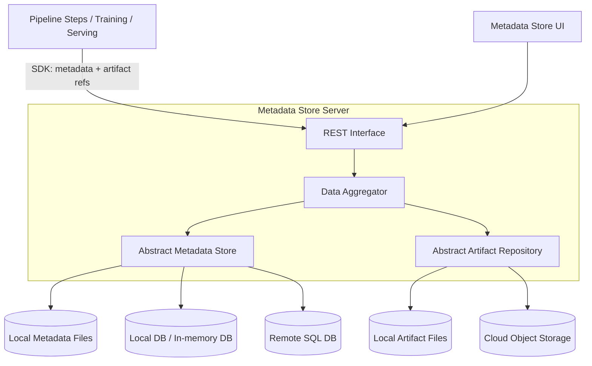

#### Client SDK

SDK 让每个 data processing、training、evaluation、serving step 以统一方式上报：

```text
start_execution(type, context, parameters)
log_input_artifact(execution_id, artifact)
log_metric(execution_id, key, value, step, timestamp)
log_output_artifact(execution_id, artifact)
end_execution(execution_id, status, error)
```

SDK 应提供：

- Async / buffered logging，避免阻塞训练热路径；
- Retry 与 backoff；
- Stable event IDs 和 idempotency；
- Offline spool；
- Schema validation；
- Context propagation；
- Language support；
- Secret / PII redaction。

如果 metadata 上报失败，不一定应让昂贵训练失败；但关键 lineage（inputs、outputs、status）缺失也不能静默忽略。可区分 required metadata 与 best-effort telemetry。

#### REST / Web Interface

服务器提供 ingestion 与 query。典型资源：

```text
POST /executions
PATCH /executions/{id}
POST /artifacts
POST /events
POST /contexts
GET /models/{name}/versions
GET /models/{id}/lineage
GET /runs?experiment=...&metric...
GET /runs/{id}/metrics
```

要求：

- Idempotent write / request key；
- Pagination；
- Filter、sort 和 field selection；
- Bulk metric ingestion；
- Optimistic concurrency / immutable fields；
- API versioning；
- Auth / audit；
- Rate and payload limits。

#### Data Aggregator

Data Aggregator 理解领域 schema 与关系，负责：

- 将 SDK event 映射为 entities / edges；
- 验证 type、required properties 和 state transition；
- 创建 / 更新 indices；
- 关联 run、artifact、model、experiment；
- 服务 lineage / comparison queries；
- 聚合 metrics 和 model views；
- 协调 metadata / artifact operations。

它不应把所有业务逻辑压成字符串 tags。Core identities 与 relationships 需结构化；tags 用于可选扩展。

#### Abstract Metadata Store

Adapter 隔离 SQL、NoSQL、本地文件等实现。核心 contract：

```text
put_entities(entities)
put_relationships(edges)
get_entity(type, id)
query_entities(filter, pagination)
traverse_lineage(start_id, direction, depth)
append_metric_points(points)
transaction(operations)
```

抽象层不应只追求“可换数据库”而退化到最低公共能力。Lineage traversal、unique constraints、transactions 和 metric queries 是领域必需；若 backend 不支持，adapter 要明确实现代价。

#### Abstract Artifact Repository

职责：

- Upload / download streaming；
- Immutable object naming；
- Checksum / size verification；
- Atomic publication；
- Signed access URL；
- Retention / legal deletion；
- Encryption / replication；
- List referenced / orphan staging objects。

Metadata store 通常保存 artifact references，而 artifact adapter 管理 bytes 生命周期。

#### Web UI

UI 应围绕用户任务，而不是数据库表：

```text
Experiment -> Runs -> Compare -> Model -> Lineage -> Artifact
Model -> Versions -> Production Stage -> Producing Run -> Inputs/Metrics
Dataset -> Versions -> Downstream Models / Impact
```

可导出 notebook / CSV，但不能绕过 authorization。大型 lineage graph 需要限制 depth、lazy load 和聚合，否则 UI 难以阅读。

#### 写入端到端流程

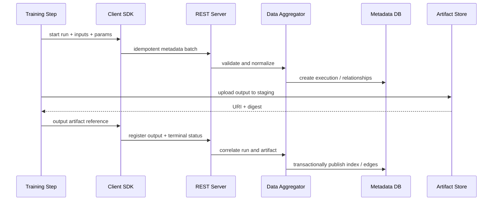

若使用 server-proxied artifact upload，bytes 会经 REST server；权限更集中，但 server 带宽与稳定性成为数据面瓶颈。

#### 查询端到端流程

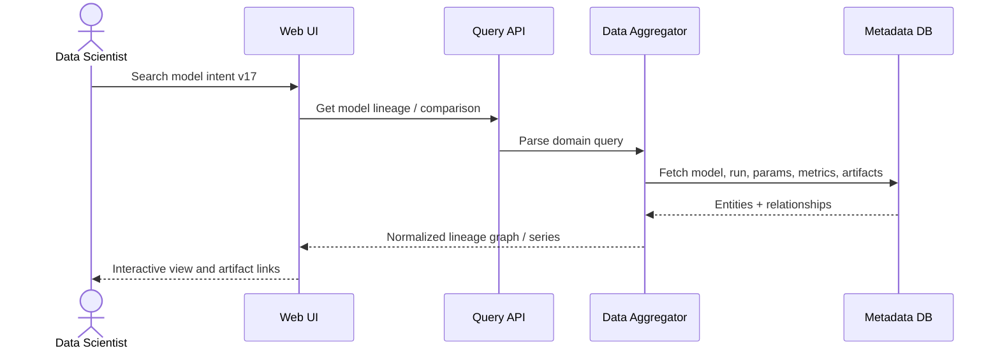

#### 容量与扩展假设

原章认为 metadata 量不大，每日不会超过约 1,000 training runs，因此单数据库实例通常足够。这个是示例组织的经验假设，不是 universal bound。

粗略估算：若每日 $R=1{,}000$ runs，每 run $K=10{,}000$ metric points，每点持久化后平均 $B=100$ bytes：

$$
V_{metrics/day}=RKB
=1{,}000\times10{,}000\times100
=1\ \mathrm{GB/day}
$$

一年约 365 GB（未算索引 / replication），单库仍可能需要 partition、retention 和 downsampling。决定规模的常常是 metric points、prediction metadata 和 lineage edges，而不只是 run 数。

扩展策略：

- Metadata relational tables 按 time / tenant partition；
- Metric time series 独立存储或分层降采样；
- Artifact bytes 始终外置；
- Read replicas / cache 服务 UI 查询；
- Asynchronous ingestion queue 平滑 bursts；
- Archive 冷 experiment；
- Lineage indices 和 materialized views。

先使用简单单库，但用测量与 schema 设计保留演进空间。

#### Metadata Storage Schema

原章图 8.5 以 `Training_Runs` 为中心，连接 `Models`、`Experiments`、`Parameters` 和 `Metrics`。原文前一句误写“图 8.4 显示 entity relationship diagram”，实际 ER 图是 8.5。

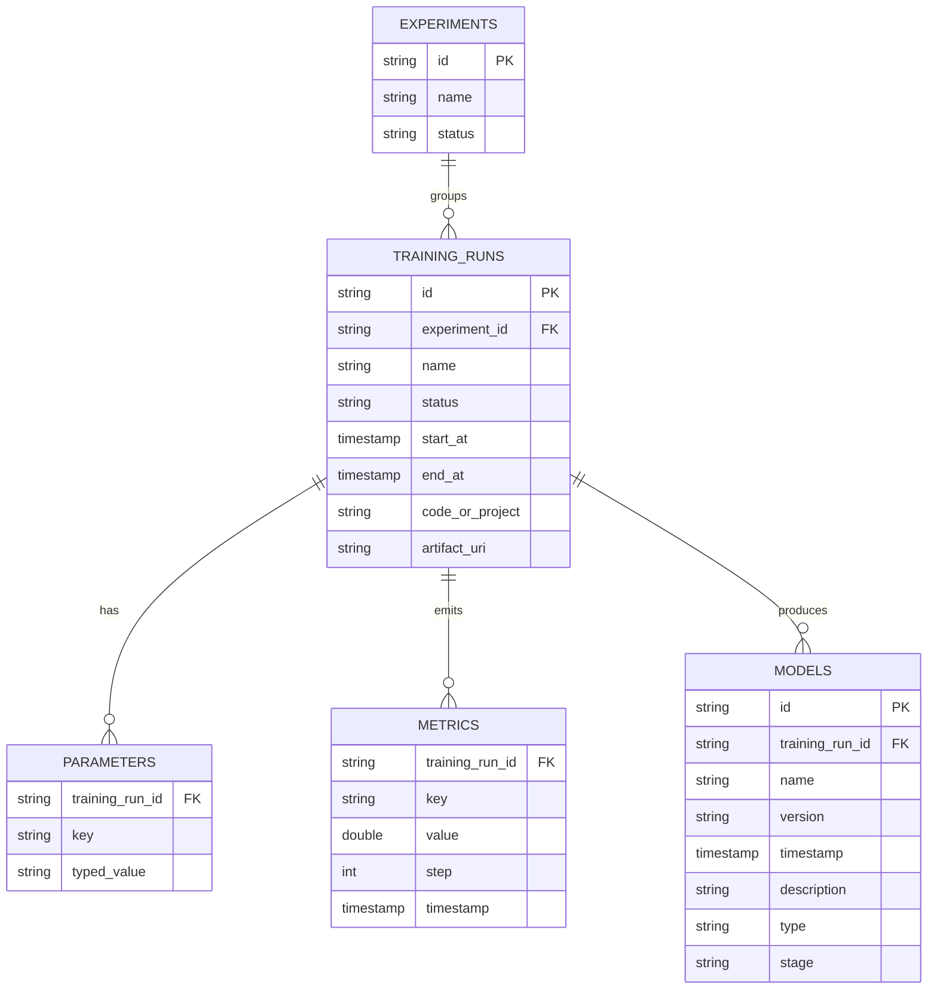

上图在原章字段上补了 model ID、metric step 与类型信息，因为仅 `(training_run_id,key,value,timestamp)` 在实际时间序列中也可工作，但 step 对齐更直接。

#### `Training_Runs` 为何居中

模型性能排查通常先找到 producing process：

$$
Model\rightarrow TrainingRun\rightarrow
\{Parameters,Metrics,Inputs,Environment\}
$$

Training run 是因果“发生点”，其 inputs 和 outputs 形成 lineage。原章把 output artifact URI 直接放在 `Training_Runs`，适合简单“一 run 一主要 artifact”示例。

#### 各实体职责

**Experiments**：组织一组目标相关 runs，如 intent model development。一个 experiment 对多 runs。

**Training_Runs**：一次具体 execution，记录 status、时间、code/project、experiment 和 output artifact。

**Parameters**：dataset ID/version、hyperparameters、configuration。原章用 key/value 灵活扩展。

**Metrics**：loss、F2 等时间序列；同一 key 有多个 timestamp / step points。

**Models**：模型的 name、version、type、stage、description、producing run。

#### Key/Value 灵活性与类型问题

EAV 风格 parameters / metrics 易于增加 key，但有局限：

- 所有 value 字符串化后无法正确数值比较；
- Key typo 形成新指标；
- Unit / direction / semantic version 不明确；
- Query / index 复杂；
- Required fields 难约束。

可设计 typed value：

```text
key, value_type,
string_value, int_value, double_value, bool_value,
unit, schema_version
```

并建立 MetricDefinition / ParameterDefinition，规定 `validation_f1` 的 type、direction、range 和 owner。

#### Artifact 不宜只放一个 URL

一个 run 可产生多个 artifacts：checkpoints、final model、report、profile。更规范 schema：

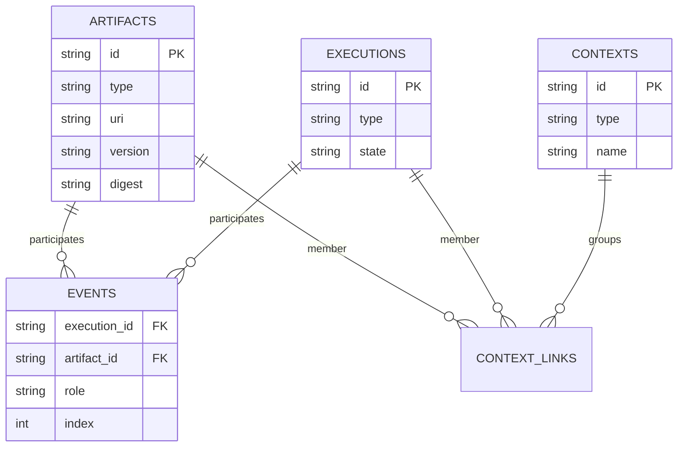

Event role 可为 INPUT / OUTPUT，使任意 execution 连接多个 artifacts。这也接近后文 MLMD 模型。

#### Model Stage 的可变性

原章 `Models.stage` 可保存 test、preproduction、production。若同一 immutable model row 的 stage 被覆盖，会丢失发布历史。更安全：

```text
ModelVersion (immutable)
Deployment / ReleaseEvent (model_version, stage, start, end, actor)
StageAlias (model_name, stage -> current model_version)
```

这样能回答“某天生产用哪个版本”，并支持 rollback audit。

#### Model Focus 与 Pipeline Focus

两种用户入口：

- Model focus：围绕 model version 聚合 lineage、serving、quality；
- Pipeline focus：围绕 workflow / training run 聚合 steps、inputs、outputs、metrics。

它们不是互斥 storage schemas，而是同一 lineage graph 的不同起点：

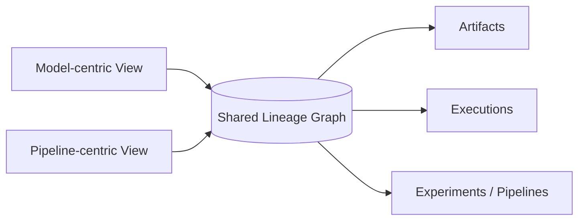

原章建议底层可按 pipeline / run focus 实现，再在 UI 同时提供 model search 与 pipeline search。这是合理的 view-layer 分离。

#### 常见查询及索引

| 查询 | 推荐索引 / 关系 |
| --- | --- |
| 按 name/version 找 model | Unique `(name, version)` |
| 找 model producing run | `model.training_run_id` / generated edge |
| 找 run 的 parameters | `(training_run_id, key)` |
| Plot metric | `(training_run_id, key, step/time)` |
| 列 experiment runs | `(experiment_id, start_at)` |
| 找 dataset 下游 models | Artifact-event reverse index |
| 找 current PROD | Stage alias `(name, stage)` |

Lineage graph traversal 要限制 depth、分页并防循环；DAG 是理想模型，但人工 import 或错误关系仍可能形成 cycle，写入时应验证。

#### 事务与 Idempotency

Distributed pipeline 会重试 metadata writes。每次 execution / artifact / event 应有稳定 external ID：

$$
idempotency\_key=(producer,run\_id,event\_type,sequence)
$$

数据库以 unique constraint 防重复。Terminal execution status 和 output artifact registration 应尽可能在同一 metadata transaction 提交；artifact bytes 则用 staging + publication 协调。

#### Retention 与删除

Reproducibility 希望长期保留，隐私 / 成本可能要求删除。需要区分：

- Metadata tombstone；
- Artifact hard delete；
- Legal hold；
- Derived artifact impact；
- Model / deployment invalidation；
- Audit history（不保留被删除敏感内容本身）。

删除一个 dataset 后，应通过正向 lineage 找到 models，标记不可再现 / 不可继续 serving，而不是只删除 S3 object。

---

## 8.4 开源方案

原章比较两类代表性方案：

- **ML Metadata（MLMD）**：轻量 metadata library / store，适合嵌入已有 pipeline 和平台；
- **MLflow**：较完整的 MLOps platform，Tracking、UI、Models、Projects、Registry 与 artifact management 集成。

它们都能独立运行、记录 / 查询 metadata，并以 executions / runs 为基本组织单位；差别主要在抽象层级与自带产品能力。

> 版本边界：以下 API 和组件描述以原章成书时版本为主。MLflow 和 MLMD 持续演进，Model Registry stage、artifact proxy、autolog 与 filter APIs 等当前语义应查目标版本文档。

### 8.4.1 ML Metadata（MLMD）

MLMD 是记录和查询 ML workflow metadata 的轻量 library，是 TensorFlow Extended（TFX）的组成部分，但可独立使用。原章还以 Kubeflow Pipelines / Notebook metadata 集成为例说明它适合作为已有系统的 metadata engine。

可以把 MLMD 看作一个**强类型 lineage logging library**：各 pipeline steps 主动声明 artifacts、executions、events 和 contexts，MLMD 将它们持久化到关系数据库。

#### 系统概览

MLMD 支持两种原章部署方式。

##### A. Client 直接连接 SQL Backend

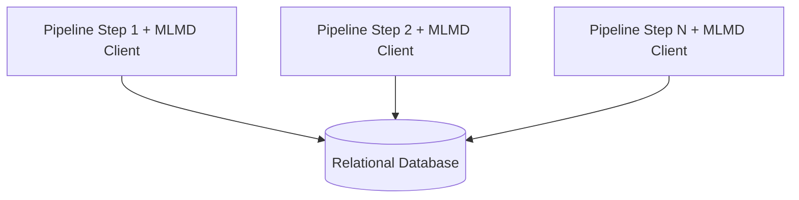

优点：少一个服务，适合本地或小型单信任域。缺点：

- 每个 workload 持有 DB credentials；
- Clients 与 database connection 耦合；
- 难统一 admission、rate limit、audit 和 network policy；
- 多语言 / 版本兼容更难集中治理。

##### B. Client 经 MLMD gRPC Service

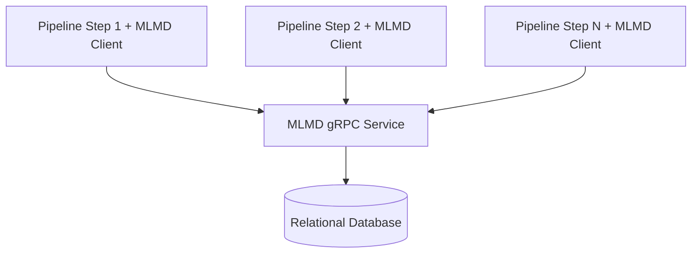

原章推荐 B，因为避免向每个 client 暴露 backend DB。gRPC service 建立了可集中接入认证、限流、连接治理和可观测性的服务边界；这些能力需要显式配置或外部组件实现，并非 MLMD server 自动提供的完整治理套件。代价是还要运行高可用 service。

MLMD backend 可用 SQLite（本地学习）、MySQL / PostgreSQL 等，具体支持以目标版本为准。

#### MLMD 的核心数据模型

##### Artifact

描述 execution 的输入 / 输出对象，例如 dataset、model、statistics。通常含 `type_id`、URI、state、typed properties 和 timestamps。Artifact record 是 metadata，不自动保存 URI 指向的 bytes。

##### Execution

表示 component / workflow step 的一次运行，例如 Trainer、Evaluator、Transform run。一个 component definition 可以执行多次，每次是不同 Execution instance。

##### Event

连接 Artifact 与 Execution，并表达 artifact 的 input / output 角色，是 data lineage 的核心边：

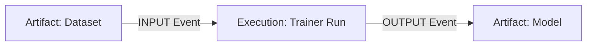

没有 Event，只把 Artifact 与 Execution 放在同一 Context，并不能精确断言“该 execution 使用 / 产生该 artifact”。

##### Context

逻辑分组，例如 experiment、pipeline、pipeline run、project。Context 可关联 artifacts 和 executions，支持从组视角查询。

##### Attribution 与 Association

- Attribution：Artifact 被归属到 Context；
- Association：Execution 被关联到 Context。

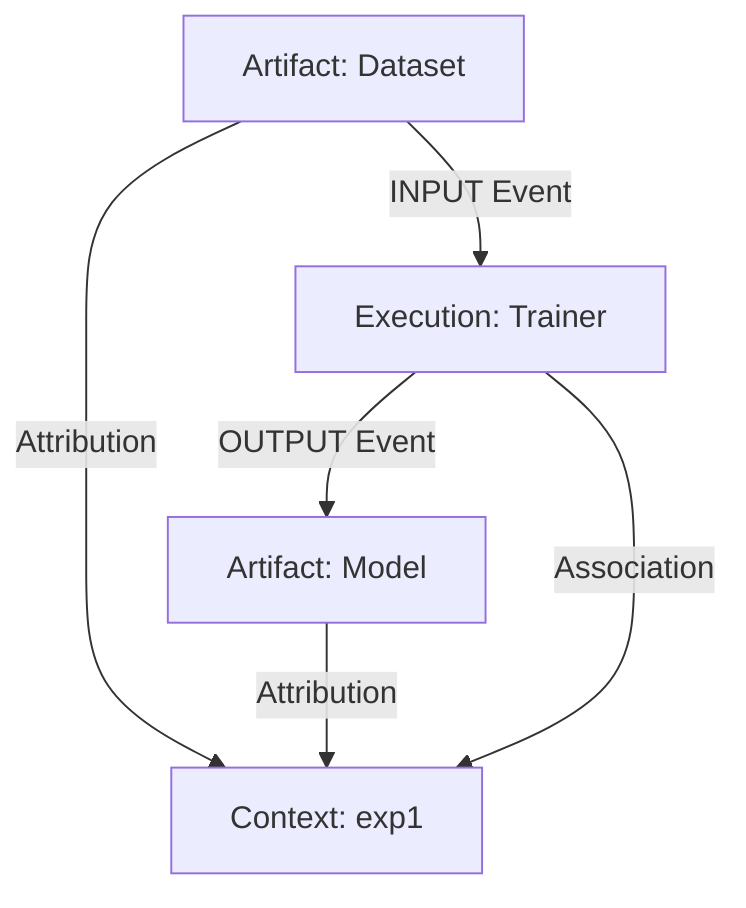

##### Type 与 Instance

MLMD 通常先登记 ArtifactType、ExecutionType、ContextType，再创建 instances。Type 定义属性 schema，使 metadata 不只是任意 JSON。Properties 受 type schema 约束；custom properties 提供灵活扩展。

#### Logging API

原章示例按以下顺序建立 dataset artifact、training execution、model artifact 和 experiment context。下面是语法完整的概念代码；运行需要安装并按目标版本配置 `ml_metadata`：

```python
from ml_metadata.proto import metadata_store_pb2

# 1. Dataset artifact
dataset = metadata_store_pb2.Artifact()
dataset.uri = "s3://datasets/mnist/train-v1"
dataset.type_id = dataset_type_id
dataset.properties["day"].int_value = 1
dataset.properties["split"].string_value = "train"
[dataset_id] = store.put_artifacts([dataset])

# 2. Training execution
trainer = metadata_store_pb2.Execution()
trainer.type_id = trainer_type_id
trainer.properties["state"].string_value = "RUNNING"
[execution_id] = store.put_executions([trainer])

# 3. Model artifact
model = metadata_store_pb2.Artifact()
model.uri = "s3://models/mnist/1/model"
model.type_id = model_type_id
model.properties["version"].int_value = 1
model.properties["name"].string_value = "MNIST-v1"
[model_id] = store.put_artifacts([model])

# 4. Experiment context
experiment = metadata_store_pb2.Context()
experiment.type_id = experiment_type_id
experiment.name = "exp1"
experiment.properties["note"].string_value = "My first experiment"
[experiment_id] = store.put_contexts([experiment])
```

原章接着用 Attribution / Association 把 model artifact 与 training run 放进同一 experiment：

```python
attribution = metadata_store_pb2.Attribution()
attribution.artifact_id = model_id
attribution.context_id = experiment_id

association = metadata_store_pb2.Association()
association.execution_id = execution_id
association.context_id = experiment_id

store.put_attributions_and_associations(
    [attribution],
    [association],
)
```

这建立 Context grouping；若要声明 dataset 是 input、model 是 output，还需 Events：

```python
input_event = metadata_store_pb2.Event()
input_event.artifact_id = dataset_id
input_event.execution_id = execution_id
input_event.type = metadata_store_pb2.Event.INPUT

output_event = metadata_store_pb2.Event()
output_event.artifact_id = model_id
output_event.execution_id = execution_id
output_event.type = metadata_store_pb2.Event.OUTPUT

store.put_events([input_event, output_event])
```

`INPUT` / `OUTPUT` 表示 execution 实际消费 / 产生 artifact；MLMD 还定义 `DECLARED_INPUT` / `DECLARED_OUTPUT` 来表达预期 signature，而非已经发生的读写。具体 Event enum 以目标版本为准。

原章代码标题说“声明 model、training run 与 experiment 的关系”，但只展示 Context links；Event 才形成严格 producing lineage。

#### 推荐 Instrumentation 生命周期

```text
1. Register or fetch entity Types
2. Create Context for experiment / pipeline run
3. Create Execution in RUNNING state
4. Register input Artifacts and INPUT Events
5. Record supported metadata / external metric references
6. Register output Artifacts and OUTPUT Events
7. Mark Execution COMPLETE or FAILED
8. Link all entities to Contexts
```

写入应有 stable external IDs / idempotency，避免 workflow retry 创建重复 executions。

#### 搜索 Metadata

MLMD 原章不提供完整可视化 UI，查询主要通过 client API：

```python
# All artifacts
artifacts = store.get_artifacts()

# By IDs
[stored_dataset] = store.get_artifacts_by_id([dataset_id])

# By URI
artifacts_with_uri = store.get_artifacts_by_uri(dataset.uri)
```

原章还展示了基于 ZetaSQL 的 declarative filter：

```python
from ml_metadata import metadata_store as mlmd

# Historical API used by the book; unavailable in MLMD 1.21.0+.
artifacts_with_conditions = store.get_artifacts(
    list_options=mlmd.ListOptions(
        filter_query=(
            'uri LIKE "%/data" '
            'AND properties.day.int_value > 0'
        )
    )
)
```

这是**原章时期 API**。MLMD 1.21.0 移除了基于 ZetaSQL 的 `filter_query` 和相应 `ListOptions` 参数。较新版本应使用 `get_artifacts_by_uri`、`get_artifacts_by_context`、`get_lineage_subgraph` 等 native lookup / lineage APIs 缩小结果集，再按需在 Python 中过滤；旧版本的 filter grammar 则按对应版本文档使用。Query 还可围绕 executions、contexts、events 和 relations 进行。

#### Lineage Query 的思路

给 model artifact ID：

```text
model artifact
-> OUTPUT event
-> trainer execution
-> INPUT events
-> dataset / code / config artifacts
-> contexts (experiment / pipeline run)
```

MLMD 提供关系原语，但产品通常还要封装高层 API 和 UI，让数据科学家无需拼多次 client calls。

#### 用 SQLite 学习 Schema

原章建议创建本地 SQLite backend，运行样例后查看 tables / rows，以理解 MLMD 数据模型：

```python
from ml_metadata import metadata_store
from ml_metadata.proto import metadata_store_pb2

connection = metadata_store_pb2.ConnectionConfig()
connection.sqlite.filename_uri = "./mlmd_run.db"
connection.sqlite.connection_mode = 3

store = metadata_store.MetadataStore(connection)
```

这是学习和测试方式，不适合多进程生产并发。`connection_mode=3` 的具体枚举语义应按版本文档确认，避免依赖魔法数字。

#### MLMD 的优点

- Data model 原语明确，适合 lineage；
- Lightweight，可嵌入已有 system；
- 与 pipeline components 结合自然；
- SQL / gRPC deployment 灵活；
- Types + typed properties 比纯日志结构更强；
- 不强制采用完整 MLOps platform。

#### MLMD 的局限

- 原章语境下没有面向最终用户的完整 UI；
- Artifact bytes / model registry / deployment 需外部系统；
- Run comparison、plot 和 experiment UX 要自建；
- Auth、multi-tenancy、artifact access 需集成；
- Client instrumentation 与 graph query 有学习成本；
- Metrics time-series 规模可能需要独立系统。
### 8.4.2 MLflow

MLflow 是更完整的 MLOps platform，原章列出四个主要组件：

1. **MLflow Tracking**：记录、查询 parameters、metrics、tags、artifacts 和 runs；
2. **MLflow Projects**：以可复用、可复现方式封装代码；
3. **MLflow Models**：以多个 flavor 打包可被不同 serving tools 使用的模型；
4. **MLflow Model Registry**：用 UI / API 管理 model lineage、versions、annotations 与 production promotion。

本章重点是 Tracking server，但选择 MLflow 的价值也来自这些组件组合。

#### 系统概览

MLflow 有本地文件、SQL、remote tracking server 等多种部署。原章聚焦 remote server + proxied artifact access：

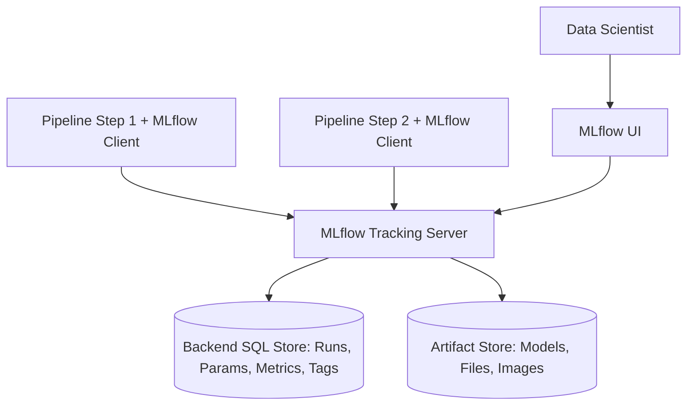

#### Backend Store 与 Artifact Store

- Backend store：run metadata、parameters、metrics、tags、experiment、registry facts；
- Artifact store：models、plots、documents、features 等 files。

这与本章通用设计的 metadata / bytes 分层一致。

#### Artifact 上传两种模式

1. Client 直接访问 artifact store；
2. Client 经 tracking server proxy artifact operations。

Proxy 的主要好处是**客户端无需拿到底层 object-store credentials / direct path**，由 server 统一授权与转发。原章“end users can have a direct path ... without credentials”措辞容易误解；图示与本意是通过 proxy 隐藏直接访问。

Proxy 代价：Tracking server 承担大文件带宽、timeout 和 scaling；direct 模式则要求安全分发 cloud credentials / workload identity。

#### UI

Tracking server 自带 UI，可：

- 按 experiment 列 runs；
- 按 parameter / metric 搜索；
- Plot metric；
- 比较 runs；
- 下载 artifacts；
- 查看 / 操作 registered models（取决于组件和版本）。

这使 MLflow 比 bare MLMD 更接近数据科学家可直接使用的产品。

#### Logging API

原章最小用法：设置 tracking URI、experiment，在 ActiveRun context 中记录 parameter、metric 和 artifact：

```python
import mlflow

mlflow.set_tracking_uri("https://mlflow.example.internal")
mlflow.set_experiment("/my-experiment")

with mlflow.start_run() as run:
    mlflow.log_param("parameter_a", 1)
    mlflow.log_metric("metric_b", 2.0, step=0)
    mlflow.log_artifact("features.txt")
    print(run.info.run_id)
```

#### Param、Metric、Tag、Artifact 的语义

- Param：通常 run 内固定的 input configuration；
- Metric：可随 step / time 更新的 numeric series；
- Tag：描述 / 筛选用 metadata；
- Artifact：文件 / 目录；
- Run：一次 execution；
- Experiment：组织一组 runs。

不要用 tag 代替核心 lineage relation，也不要用 param 记录会变化的 time series。

#### Nested Runs 与 Pipeline Steps

复杂 pipeline / HPO 可用 parent-child runs（按版本能力）表达层次，但 lineage 语义仍需一致设计：一个 run 是整个 pipeline，还是一个 step？组织必须规定，否则不同团队 UI 无法比较。

#### Logging 可靠性

- Run start 后要确保 terminal status；
- Retry 不能创建无数重复 runs；
- Artifact upload 与 metadata state 要协调；
- Async logging 的 flush / failure 要可见；
- Sensitive params / data 不应无控制记录；
- Metric key 与 unit 应规范化。

#### Automatic Logging

MLflow 支持：

```python
mlflow.autolog()
# 或框架专用：
mlflow.tensorflow.autolog()
mlflow.pytorch.autolog()
```

在训练前启用后，可自动捕获框架支持的 parameters、metrics、models 和 artifacts，降低 instrumentation 成本。

#### Autolog 的价值

- 快速建立 baseline metadata；
- 减少漏记常见 hyperparameters / metrics；
- Framework integration 可自动保存 model flavor；
- 对 notebook / experiment 友好。

#### Autolog 不能替代领域设计

- 不知道 business dataset ID / version；
- 不一定记录自定义 preprocessing lineage；
- Framework version 改变会改变自动记录项；
- 可能记录敏感 params / 大 artifacts；
- Key naming 不一定符合组织标准；
- Custom quality / serving metadata 仍需显式 log。

因此应把 autolog 当 baseline，再补充 required metadata contract，并测试升级差异。

#### 搜索 Metadata

MLflow UI 可 search / compare runs，也可用 `MlflowClient`：

```python
from mlflow.tracking import MlflowClient

client = MlflowClient()

run = client.get_run(run_id)
print(run.info.run_id, run.info.lifecycle_stage)

experiment = client.get_experiment(experiment_id)

model_version = client.get_model_version(
    name=model_name,
    version=model_version_number,
)
```

Programmatic API 支持 pandas 等分析工具，也可供 prediction service / release workflow 从 model registry 查 model versions。

#### 搜索与比较

典型查询：

```text
Find runs in experiment E
where params.learning_rate = 0.001
and metrics.validation_f1 > 0.88
order by metrics.validation_f1 desc
```

Filter syntax、pagination、metric aggregation 和 registry APIs 按版本核对。UI 展示的 final metric 与完整 time series 要区分。

#### Artifact Access 与 Serving Integration

MLflow Model Registry 可把 registered model version 关联到 run artifact。Serving system 可程序化解析 URI / flavor，再部署。Model Registry stages 自 MLflow 2.9.0 起已弃用，较新工作流优先使用 model aliases / tags；approval 和 registry semantics 仍须按目标版本确认，不能把原章 UI 状态机当作永久 API。

#### MLflow 的优点

- Tracking server + UI 开箱可用；
- Experiment / run comparison 强；
- Params / metrics / tags / artifacts 统一；
- Autolog 降低接入成本；
- Models / Registry / Projects 扩展到完整 lifecycle；
- Programmatic API 便于 serving integration；
- 社区与生态广（原章判断，当前需复核）。

#### MLflow 的局限与治理工作

- 完整平台比 library 更重；
- Run-centric schema 与复杂跨-pipeline artifact graph 的表达需要设计；
- Artifact credentials / proxy scaling；
- Multi-tenancy、RBAC、network、backup；
- Autolog schema 漂移；
- Backend DB 与 artifact GC 一致性；
- Registry 与公司现有 deployment process 集成；
- 高量 metric points 的性能 / retention。

### 8.4.3 MLflow 与 MLMD 对比

#### 共同点

- Open source；
- 可独立运行；
- 提供 metadata ingestion / query；
- 围绕 pipeline / training execution 记录事实；
- 可连接关系数据库；
- 需要 application / pipeline instrumentation。

#### 核心差异

| 维度 | MLMD | MLflow |
| --- | --- | --- |
| 定位 | Metadata library / data model | MLOps platform |
| 核心抽象 | Artifact、Execution、Event、Context | Experiment、Run、Param、Metric、Tag、Artifact、Registered Model |
| Lineage 原语 | Event + Context links 强 | Run / artifact lineage，复杂图需组织设计 |
| UI | 原章无完整最终用户 UI | 自带 Tracking UI / comparison |
| Artifact management | URI metadata，bytes 外部管理 | Tracking server 集成 artifact logging / proxy |
| Autolog | 需主动 instrumentation | 多框架 autolog |
| Model package / registry | 不内建完整产品 | Models + Model Registry |
| 集成风格 | 嵌入已有 platform / pipeline | 引入独立 tracking / lifecycle system |
| 自定义成本 | UI、registry、artifact access 自建 | 平台集成与治理成本较高 |

#### 原章选型建议

**选择 MLflow**：

- 要从零引入完整 metadata + artifact store；
- 需要现成 UI、experiment comparison；
- 需要 central model registry、model package；
- 希望使用 autolog 和更完整 MLOps capabilities。

**选择 MLMD**：

- 已有 artifact registry；
- 已有 metric visualization / UI；
- 只缺 structured metadata / lineage engine；
- 要把 metadata 嵌入现有 pipelines / platform；
- 愿意自建产品层。

原章将 MLflow 作为完整新系统首选、MLMD 作为已有系统集成首选。这是成书时经验建议，不是当前绝对排名；应按数据模型、现有技术栈、维护状态、迁移与 TCO 做 POC。

#### 选型问题清单

1. 主要查询是 run comparison 还是 arbitrary lineage graph？
2. 是否已有 artifact storage / registry / UI？
3. 需要 automatic logging 吗？
4. 需要 model packaging / promotion 吗？
5. Pipeline orchestrator 已经使用哪种 metadata backend？
6. Multi-tenancy / RBAC / audit 要求？
7. Metric point 规模与 retention？
8. Artifact proxy 还是 direct access？
9. 是否要迁移历史 experiments？
10. 团队愿意维护多少 custom UI / integration code？

#### 可以组合吗

技术上可以，但双写会产生两个事实源和 ID 映射问题。若 MLMD 服务 pipeline lineage、MLflow 服务 experiment UI，应定义：

- Canonical execution / artifact IDs；
- 哪个系统拥有 model registry / release state；
- Cross-links；
- Write ownership；
- Reconciliation / failure policy。

无明确收益时，优先一个 canonical metadata graph，再为用户场景构建 views。

---

## 容易混淆的概念与常见误区

### 1. Artifact 就是模型文件

Artifact 是 ML activity 的输入 / 输出对象，dataset、code snapshot、configuration、evaluation report、feature schema 和 model package 都可以是 Artifact。模型只是其中一种。

### 2. Artifact 与 Artifact Bytes 是同一个东西

Metadata record 描述 identity、URI、digest、type 和 lineage；bytes 存于 object store / filesystem / registry。两者生命周期相关，但物理存储和访问模式不同。

### 3. 有 URI 就有 Immutable Identity

`s3://bucket/model/latest` 可能指向会变化的对象。可复现引用至少要有 immutable object version / content digest，URI 只是 locator。

### 4. 文件名含 `v2` 就完成 Versioning

Version 不只要唯一，还要不可变、可验证并与产生它的 execution / inputs 关联。可覆盖文件名不是可靠版本。

### 5. Metadata 就是训练日志

日志偏事件诊断和文本搜索；metadata store 提供 typed entities、relations、identity、query 和 governance。日志可作为补充，不能自然替代 lineage graph。

### 6. 把实体放进同一个 Context 就建立了 Producing Lineage

Context 表达分组；Event 才表达某 Execution 的 INPUT / OUTPUT。共处一个 experiment 不等于存在因果数据流。

### 7. Experiment、Pipeline、Run、Execution 是同义词

Experiment 是比较 / 组织容器，pipeline 是 workflow definition，pipeline run 是一次 workflow execution，step execution 是其中一个动作。具体产品可折叠抽象，但内部语义必须固定。

### 8. Training Run ID 就是 Model ID

一次 run 可能无模型、产生多个 checkpoints / formats，也可能重试。Model Artifact 应有独立 immutable identity，再通过 Event 关联 producing run。

### 9. 记录 Hyperparameters 就能复现实验

还需要 immutable dataset、code / image、environment、hardware / distributed topology、random state 和 external dependency。即使全部记录，也可能受 nondeterministic kernels 影响。

### 10. 设置 Random Seed 就保证 Bitwise Reproducibility

并行调度、GPU kernels、library versions 和 floating-point reduction order 都可能改变结果。应明确目标是 exact replay 还是 statistically equivalent result。

### 11. Latest Dataset / Code Branch 可以用于 Lineage

`latest`、branch head 和 mutable tag 只能用于 discovery，不应作为历史事实。Lineage 必须记录解析后的 immutable snapshot / commit / digest。

### 12. Model Registry 就等于 Artifact Store

Registry 管理 model identity、versions、aliases、approval / lifecycle；artifact store 保存 bytes。它们可由同一产品提供，但职责不同。

### 13. Model Stage 是 Artifact 的固有属性

`PROD` / `STG` 更像可变 release alias / event。若直接覆盖 model row，会丢失历史 promotion、rollback、actor 和审批事实。

### 14. Metadata 数据量小，不必做容量设计

Entity rows 可能少，但 per-step metrics、events 和 high-cardinality tags 会快速增长。Retention、downsampling、partitioning 和专用 time-series store 仍需规划。

### 15. 只记录 Final Metric 足够比较模型

最终值适合排序，却看不到收敛、过拟合、异常波动和 early stopping 过程。应按目的保留 time series，必要时下采样。

### 16. 所有 Properties 存成 JSON 最灵活，所以最好

无 schema JSON 会削弱 type validation、index、unit consistency 和跨团队查询。Core fields 应 typed / indexed，长尾扩展才放 flexible properties。

### 17. Metadata Store 的事务能让 Artifact Upload 自动原子化

数据库与 object store 通常没有分布式事务。应采用 staging URI、digest verification、finalize state、outbox / reconciliation 等显式协议。

### 18. Workflow Retry 天然是幂等的

若无 stable external execution ID / idempotency key，重试会复制 runs、metrics 和 artifacts。系统必须定义 duplicate detection 与 retry ownership。

### 19. 删除 Metadata Row 就完成 Artifact 删除

还要处理 lineage retention、legal hold、aliases、bytes GC、shared references 和 audit tombstone。反过来，只删 bytes 会留下不可读取的 metadata。

### 20. Artifact Accessible 等于 Artifact 可安全使用

可访问不代表完整、可信或兼容。还需 digest、signature、malware / pickle risk、format / runtime compatibility 和 authorization checks。

### 21. Drift、Performance Degradation 与 Service Failure 是同一问题

Data drift 是分布变化，quality degradation 是效果下降，service failure 是可用性问题。它们可相关，但证据、责任系统和行动不同。

### 22. 检测到 Data Drift 就必须 Retrain

Drift 可能不影响目标，也可能源于 instrumentation bug。先验证 prediction / label quality、segment、business impact 和 lineage，再选择修数据、修服务、回滚或 retrain。

### 23. 业务指标下降一定由模型引起

Routing、feature pipeline、serving code、upstream data、product policy 和 seasonality 都可能是根因。Metadata lineage 的价值正是缩小排查范围。

### 24. UI 是 Metadata 的 Source of Truth

UI 是 query view。Canonical facts 应在 metadata store / event log，UI cache 和 derived tables 可重建。

### 25. MLMD 会保存模型与数据文件

MLMD 主要保存 artifacts 的 metadata / URI 和 relationships；bytes 需外部 repository。

### 26. MLMD Context 已经替代 Event

Context links 回答“属于哪个逻辑组”，Events 回答“哪个 execution 消费 / 产生哪个 artifact”。二者互补。

### 27. MLMD 无 UI，所以不适合生产

它适合做嵌入式 lineage engine，但产品层需自行建设。是否适合取决于已有 UI、artifact registry、orchestrator 和团队能力。

### 28. MLflow Backend SQL 保存所有 Artifact Bytes

SQL backend 主要保存 runs / params / metrics / tags / registry metadata；大文件通常在独立 artifact store。

### 29. MLflow Proxy Upload 要给每个 Client 对象存储凭据

Proxy 模式的价值之一就是由 tracking server 访问 object store；direct 模式才通常要求 client workload 有相应 identity / credentials。

### 30. `mlflow.autolog()` 会捕获完整业务 Lineage

Autolog 只捕获 framework integration 能观察到的事实，不知道组织的 dataset snapshot、feature contract、approval、business metric 和 serving dependency。

### 31. 使用 MLflow 就不再需要 Metadata Contract

平台提供 primitives，不会自动统一命名、units、required keys、PII policy、run granularity 和 retention。治理仍是系统设计的一部分。

### 32. MLflow 的 Experiment / Run 模型天然表达任意 DAG

Run-centric view 很适合 experiment tracking；复杂 artifact-to-execution graph 仍需 conventions、links 或额外 lineage model。

### 33. 同时写 MLMD 与 MLflow 可以自动获得双方优点

双写会引入 ID mapping、partial failure、reconciliation 和 source-of-truth 冲突。必须先证明两个系统承担的查询与 ownership 明确不同。

### 34. 开源工具推荐永远有效

原章对功能、社区和首选方案的判断有时间边界。当前决策必须重新核对版本、维护状态、license、security、迁移与 TCO。

### 35. Lineage 只用于从模型向前追溯训练输入

同一个 graph 也支持 forward impact analysis：某 dataset / code / image 有问题时，找出受影响 models、deployments 和 decisions。

## 本章知识结构

```mermaid
flowchart TB
    Root[Metadata 与 Artifact Store]

    Root --> Artifact[8.1 Artifact]
    Artifact --> Kinds[Dataset / Code / Config / Model / Report]
    Artifact --> Split[Metadata Record 与 Artifact Bytes 分离]
    Artifact --> Identity[URI + Version + Digest]
    Artifact --> Graph[Artifact - Execution - Event Lineage]

    Root --> Meta[8.2 Metadata]
    Meta --> Categories[四类 Metadata]
    Categories --> Training[Training Run]
    Categories --> General[General Artifact]
    Categories --> Model[Model]
    Categories --> Pipeline[Pipeline / Workflow]
    Meta --> Uses[比较 / 排错 / 复现 / 审计]
    Uses --> Feedback[Serving Feedback 回到 Data 与 Training]

    Root --> Design[8.3 Store Design]
    Design --> Principles[四项原则]
    Principles --> Lineage[Lineage 与 Versioning]
    Principles --> Reproduce[Reproducibility]
    Principles --> Access[Packaged Model Access]
    Principles --> Compare[Tracking 与 Comparison]
    Design --> Architecture[Client / API / Aggregator / UI]
    Architecture --> MStore[(Metadata Store)]
    Architecture --> AStore[(Artifact Repository)]
    Design --> Schema[Run-Centric + Event-Centric Schema]
    Schema --> ContextView[Model / Pipeline Context Views]
    Design --> Operations[幂等 / 事务边界 / Retention / Security]

    Root --> OSS[8.4 Open Source]
    OSS --> MLMD[MLMD]
    MLMD --> MLMDGraph[Artifact / Execution / Event / Context]
    MLMD --> Embed[嵌入已有平台]
    OSS --> MLflow[MLflow]
    MLflow --> Tracking[Tracking + UI + Autolog]
    MLflow --> Lifecycle[Models + Registry + Projects]
    OSS --> Choice[按 Query、现状与 TCO 选型]
```

## 核心结论

### 原章主线与直接推论

1. **Machine-learning metadata 可分为 training run、general artifact、model artifact 和 pipeline 四类。** 这四类共同描述从数据到模型的开发过程。
2. **Artifact 是深度学习活动的输入或输出，不限于模型文件。** 管理 metadata 的同时还要管理 artifact bytes 的位置与访问。
3. **Metadata / Artifact Store 支持模型比较、排错和复现。** 没有跨阶段关联，这些任务会退化成人工拼日志与目录。
4. **Lineage 与 versioning 必须回答模型来自哪个 dataset、code、configuration 和 execution。** 关系本身是一等数据。
5. **Reproducibility 依赖完整、不可变的输入集合。** 仅保存超参数不够。
6. **Prediction service 应能方便取得 packaged models。** 因此 artifact repository、metadata query 与 serving integration 必须共同设计。
7. **Training tracking / comparison 是 metadata system 的核心用户场景。** 它要求 parameters、metrics、artifacts 和 runs 有统一组织。
8. **通用架构分离 client、web interface、data aggregator、abstract metadata store、abstract artifact repository 与 UI。** 抽象层允许替换具体 storage。
9. **MLMD 是 lightweight metadata library。** Artifact、Execution、Event、Context 构成其 lineage model，适合嵌入已有平台。
10. **MLflow 是更完整的 MLOps platform。** Tracking、Projects、Models 和 Model Registry 覆盖更广 lifecycle。
11. **已有 artifact registry / visualization 时，MLMD 是原章建议的集成方案；需要完整独立系统时，MLflow 是原章首选。** 该建议应按当前版本重新评估。

### 实践扩展与生产化边界

12. **Metadata entity 与 artifact bytes 应分层保存、用 immutable ID / URI / digest 关联。** Locator 与 identity 不能混为一谈。
13. **Lineage 最自然的模型是 typed property graph。** Artifacts 是对象，Executions 是变换，Events 是输入 / 输出边，Contexts 提供多个查询视图。
14. **Model-centric 与 pipeline-centric 不是两套事实。** 它们应是同一个 canonical lineage graph 上的 views。
15. **核心字段应 typed / indexed，长尾字段才 flexible。** 否则查询性能与跨团队语义会逐渐失控。
16. **Metrics time series 要与 entity metadata 分开估算容量。** 高频指标可能需要 retention、downsampling 或专用 backend。
17. **DB transaction 不覆盖 object store。** Artifact 发布需 staging、digest verification、finalize 和 reconciliation protocol。
18. **Workflow retry 要有 stable IDs 与 idempotency。** 否则 metadata 会复制而非反映真实重试关系。
19. **Release alias / stage 是可变决策事件，不是 model artifact 的永久属性。** Promotion 与 rollback 历史应可审计。
20. **Lineage 同时支持 backward debugging 与 forward impact analysis。** 受污染 dataset / image / code 的影响范围应可查询。
21. **Autolog 降低接入门槛，但不能替代组织级 metadata contract。** Dataset identity、business semantics 与 security policy 必须显式设计。
22. **工具选型首先比较用户问题与查询模型，其次才是功能清单。** Run comparison 与 arbitrary lineage graph 的最优抽象可能不同。
23. **同时采用多个 metadata systems 必须定义 canonical source、ID mapping 和 failure policy。** 否则丰富功能换来事实冲突。
24. **Open-source capability 与 recommendation 都有版本边界。** 应用 representative workflow 做 POC，并评估 operation、migration 和 TCO。

## 从本章提炼出的通用解题方法

面对 metadata / artifact management 设计任务，可以按以下十步推进。

### 第一步：从用户问题反推查询

先写出必须在分钟级回答的问题，而不是先选数据库：

- 哪个 run 产生了这个 model？
- 为什么两个 runs 的效果不同？
- 能否复现某个 model？
- 某 dataset snapshot 影响哪些 models？
- Production model 当前解析到哪个 immutable artifact？

把每个问题写成 graph traversal / filtered query，可暴露缺失实体和边。

### 第二步：定义术语、粒度与 Identity

统一 Artifact、Execution、Run、Pipeline、Experiment、Context、Model Version、Release Alias 的含义。为每个 entity 定义：

- Internal ID；
- Stable external / idempotency ID；
- Type；
- Immutable version / digest；
- Owner / tenant；
- Created / finalized timestamps；
- Lifecycle state。

### 第三步：建立 Canonical Lineage Graph

用 Artifact、Execution、Event 作为最小因果骨架，再用 Context 组织 experiment / pipeline / project。明确 input / output role 与 producing execution，避免只做目录式分组。

### 第四步：设计 Reproducibility Manifest

至少固定：

```text
dataset snapshot + feature schema
code commit + build / container digest
hyperparameters + pipeline configuration
framework / dependencies + hardware topology
random state + determinism mode
output model digest + evaluation protocol
```

明确“exact replay”或“statistical reproducibility”验收标准。

### 第五步：分离 Metadata Plane 与 Artifact Plane

Metadata store 优化 typed relations / query，artifact repository 优化大对象吞吐 / durability。定义 URI、digest、encryption、authorization、signed access 和 regional placement。

### 第六步：设计跨存储写入协议

推荐生命周期：

```text
ALLOCATED -> UPLOADING -> VERIFYING -> READY
                 |             |
                 +-----------> FAILED
READY -> DEPRECATED -> TOMBSTONED -> BYTES_DELETED
```

先上传 staging object，验证 digest，再 finalize metadata；用 reconciliation repair partial failure。所有 API 支持 retry / idempotency。

### 第七步：设计 Typed Schema 与 Metric Strategy

Core properties 用 typed columns / indexed fields；custom properties 有 namespace、size 和 security limits。区分 entity facts 与 metric points，并估算：

$$
V_{day} = N_{runs/day}\left(S_{entity} + N_{metric\ points/run}S_{point} + S_{event}\right)
$$

据此选择 OLTP、time-series / analytical store、retention 与 downsampling。

### 第八步：围绕工作流做 Views 与 APIs

提供 model view、pipeline view、experiment comparison、impact analysis 和 reproducibility export。UI 只消费 canonical APIs，不另造事实源；serving / release workflow 使用 immutable model reference。

### 第九步：补齐 Governance 与 Lifecycle

定义 RBAC / tenant isolation、PII / secret filtering、audit、encryption、legal hold、backup / restore、schema evolution、retention、tombstone 和 artifact garbage collection。为 metadata freshness / completeness 建 SLO。

### 第十步：用代表性 Pipeline 做 POC

对 MLMD、MLflow 或自建方案运行同一条 data → train → evaluate → register 流程，验证：

- Required metadata coverage；
- Backward / forward lineage query；
- Run comparison UX；
- Retry / partial upload recovery；
- Query latency 与 metric ingestion；
- Artifact auth / proxy throughput；
- Schema evolution / export；
- Operations、migration 与 TCO。

这套方法的核心是：**从必须回答的问题反推 canonical lineage graph，用不可变引用连接 metadata 与 bytes，再把复现、比较、排错、影响分析和治理构建为同一组事实上的 views。**

## 复习与自测

1. Artifact 的广义定义是什么？列出模型以外的五种 artifacts。
2. Artifact metadata 与 artifact bytes 分别保存什么？为什么要分层？
3. URI、version 与 content digest 各解决什么问题？
4. 为什么 `latest` 不能作为历史 lineage 的唯一引用？
5. Artifact、Execution、Event、Context 在 lineage graph 中分别扮演什么角色？
6. Backward lineage 与 forward impact analysis 的 traversal 方向有何不同？
7. 本章四类 metadata 是什么？
8. Training-run metadata 至少应记录哪些 inputs、outputs 和 environment facts？
9. General-artifact metadata 为什么要包含 type、version、location、creator 和 timestamps？
10. 从 training 与 serving 视角看 model metadata 各关注什么？
11. Pipeline metadata 为什么既要记录 definition 又要记录 run / step state？
12. Structured metadata management 相比普通日志解决了哪些问题？
13. Model comparison 需要哪些 metadata 才公平？
14. `Train(D_v, C_c, H_h, E_e, R_r)` 中每个变量代表什么？
15. Exact replay 与 statistical reproducibility 有何区别？
16. 设置相同随机种子后为何仍可能无法 bitwise reproduce？
17. BestFood chatbot 效果下降时，如何利用 metadata 逐层排查？
18. Data drift、quality degradation 与 service failure 有何区别？
19. 本章 metadata / artifact store 的四项设计原则是什么？
20. Model lineage / versioning 如何支持 troubleshooting？
21. 为什么 prediction service 需要便捷但受控的 packaged-model access？
22. Run comparison UI 需要哪些 filters、plots 和 artifacts？
23. Client SDK、REST / Web Interface、Data Aggregator、Metadata Store、Artifact Repository 和 UI 各负责什么？
24. 为什么 Data Aggregator 不应把上传大文件与 metadata transaction 混成一个隐式操作？
25. Direct artifact upload 与 server-proxied upload 有何取舍？
26. 一个 run-centric relational schema 通常有哪些 tables？
27. 为什么 Parameters 与 Metrics 需要 typed values / units？
28. Event-centric schema 怎样表达 dataset → trainer → model？
29. Model-focus 与 pipeline-focus 为什么应是同一 graph 的 views？
30. 高频 metric points 会怎样改变容量与 storage selection？
31. Artifact upload 与 metadata finalization 之间有哪些 partial-failure 场景？
32. Stable external ID / idempotency key 如何处理 workflow retry？
33. 为什么 `PROD` 更适合建模为 alias / release event？
34. Retention 与 deletion 为什么必须同时考虑 lineage、bytes 和 shared references？
35. MLMD 的 Artifact、Execution、Event、Context、Attribution、Association 分别是什么？
36. MLMD direct-SQL setup 与 gRPC setup 有何优缺点？
37. 为什么将 model 和 run 放入同一 Context 仍不足以证明产生关系？
38. MLMD 为什么先定义 entity Types？Properties 与 custom properties 怎样取舍？
39. 用 MLMD API 建立一次训练 lineage 的关键写入顺序是什么？
40. 怎样从 model artifact ID 查询其 input dataset 和 experiment context？
41. 原章为什么建议用 SQLite 学习 MLMD schema？为何不直接用于高并发生产？
42. MLMD 的主要优势与需要自建的产品能力分别是什么？
43. MLflow Tracking、Projects、Models、Model Registry 各解决什么问题？
44. MLflow backend store 与 artifact store 分别保存什么？
45. MLflow 的 direct 与 proxy artifact mode 对 credentials 和 server scaling 有何影响？
46. Param、Metric、Tag、Artifact 与 Run 的语义有何区别？
47. `mlflow.autolog()` 带来什么价值？它为何不能捕获完整业务 lineage？
48. MLflow UI 与 `MlflowClient` 分别适合哪些使用方式？
49. Model Registry 如何把 registered model version 关联到 training run artifact？
50. MLMD 与 MLflow 在定位、lineage model、UI、artifact management、autolog 和 registry 上有何差异？
51. 哪些已有系统条件更适合选择 MLMD？
52. 哪些需求更适合引入 MLflow？
53. 为什么原章的工具推荐具有时间边界？当前 POC 应复核什么？
54. 同时使用 MLMD 和 MLflow 会产生哪些 dual-source-of-truth 风险？
55. 如何为两个系统定义 canonical IDs、write ownership 与 reconciliation？
56. 请为一次训练设计最小 reproducibility manifest。
57. 请把“某 dataset snapshot 被发现错误”写成一条 forward impact query。
58. 请设计 artifact 从 upload 到 ready、failure、deletion 的状态机。
59. 请估算每天 2,000 个 runs、每 run 5,000 metric points、每点 120 bytes 的纯 metric storage 量，并说明还漏了哪些开销。
60. 如何用本章十步方法，为已有训练平台选择并落地 metadata / artifact store？
