> 对应原章：**9 Workflow Orchestration**
> 本章讨论深度学习系统的最后一块关键基础设施：怎样把数据准备、训练、评估、发布等步骤组织成可重复执行的工作流，并由系统负责创建、调度、执行、监控和排错。

## 本章要回答的核心问题

1. Workflow、step、task、DAG 分别是什么？
2. 为什么工作流通常建模为 DAG，而不是任意有向图？
3. Workflow definition、workflow run、task definition 与 task instance 有何区别？
4. 手工运行一串脚本为什么无法替代 workflow orchestration？
5. 工作流怎样促进自动化、组件复用与团队协作？
6. 为什么深度学习原型通常从 Notebook / Python script 开始，而生产系统要求 workflow？
7. 从本地原型到生产工作流的摩擦为什么会反复发生，而不是一次性成本？
8. 一个通用编排系统包含哪些组件？控制流、状态与大对象分别怎样传递？
9. Scheduler、controller、worker、metadata database 与 object store 如何协作？
10. 怎样保证 workflow 正确、易用、可扩展、隔离且可伸缩？
11. “工作流应轻量”是什么意思？真正的计算应该在哪里完成？
12. Airflow、Argo Workflows 与 Metaflow 分别采用什么抽象？
13. 三种工具如何实现同一个每日数据处理流程？
14. 非 ML、Kubernetes-native 与 ML iterative development 场景应怎样选型？

原章以概念、系统设计和工具比较为主，没有复杂数学推导。本文会补充 DAG、拓扑排序、关键路径、可靠性和容量等形式化表达，以解释设计为什么有效；这些属于工程推导，不是原章另行提出的算法。Airflow、Argo Workflows 与 Metaflow 都持续演进，文中的命令、API 和局限会明确区分“原章成书时结论”与当前采用时必须重新核对的版本事实。

---

## 9.1 Workflow Orchestration 简介

原章先不急着讨论某个产品，而是依次回答三个问题：

1. 什么是 workflow？
2. 什么是 workflow orchestration，为什么深度学习系统需要它？
3. 通用编排工具为什么在深度学习场景中仍可能难用？

这条论证路线很重要：**先定义要自动化的执行计划，再解释自动化产生的组织价值，最后从人的工作方式中推导额外设计要求。**

> 原章说明：本章中 deep learning 与 machine learning 的编排需求几乎相同，因此两个术语会交替使用。

### 9.1.1 什么是 Workflow

#### 基本定义

Workflow（工作流）是为完成一个更大目标而组织起来的一系列操作。以模型训练为例，一个最简单的流程可能是：

```text
获取原始数据
-> 重建训练数据集
-> 训练模型
-> 评估模型
-> 部署模型
```

人可以手工逐项执行这个计划，但只要步骤、依赖与成功条件能够明确描述，就可以把它交给系统自动执行。

原章把 workflow 建模为由 steps 组成的有向无环图（directed acyclic graph，DAG）。这里需要区分四个概念：

| 概念 | 含义 | 示例 |
| --- | --- | --- |
| Workflow | 为一个较大目标定义的完整执行计划 | 训练并发布 NLP 模型 |
| Step / Task | 最小可恢复计算单元；原章交替使用这两个词 | 构建数据集、训练、离线评估 |
| Dependency | 某任务开始前必须满足的前置关系 | 训练依赖数据集构建完成 |
| DAG | 由任务节点和依赖边构成、且不存在有向环的图 | 数据准备到模型发布的执行图 |

#### Definition 与 Run 不要混淆

为了后续系统设计更精确，还应区分“定义”和“实例”：

| 静态定义 | 一次运行中的实例 |
| --- | --- |
| Workflow definition / DAG | Workflow run |
| Task definition | Task instance / task run |
| Schedule / trigger rule | 某个具体触发时间或事件 |
| Retry policy | 第 1、2、3 次 attempt |

同一份每日训练 DAG 可以运行 365 次；其中某天的 training task 还可能重试三次。若把这些层次都叫“workflow”，状态、日志、幂等和 lineage 很快就会混乱。

#### DAG 的形式化表达

把工作流表示为：

$$
G=(V,E)
$$

- $V$ 是任务集合；
- $E\subseteq V\times V$ 是依赖边集合；
- 边 $(u,v)$ 表示任务 $v$ 必须等待任务 $u$ 满足触发条件。

“无环”意味着不存在节点序列：

$$
v_1\rightarrow v_2\rightarrow\cdots\rightarrow v_k\rightarrow v_1
$$

因此至少存在一个拓扑序，使所有前驱都排在后继之前。调度器不一定严格串行执行这个顺序；没有依赖关系的节点可以并行。

#### 原章 NLP 训练工作流案例

图 9.1 的关键不是某个具体算法，而是两类 step、两类 edge 与并行关系：

- 实线箭头表示任务之间的依赖；
- 虚线箭头表示任务向外部服务发送 Web request；
- 椭圆表示执行动作，菱形表示质量检查 / 决策；两者都是 workflow steps，只是类型不同；
- Authorization 首先执行；
- Dataset building 与 embedding fetching 在授权后可并行；
- Dataset 必须通过 data-quality check；不合格则通知 DS team；
- Model training 同时依赖 embedding 与合格 dataset；
- Model 必须通过 model-quality check；不合格也通知 DS team，合格才 release。

按原图节点和边重画如下：

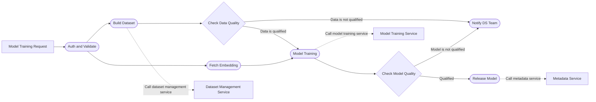

这里的并行不是因为图画在同一列，而是因为 Dataset 与 Embedding 之间不存在可达依赖路径。若两者耗时分别为 20 和 8 分钟，顺序执行要 28 分钟，并行执行的这一段下界约为：

$$
T_{parallel}=\max(20,8)=20\text{ minutes}
$$

忽略调度与资源等待后，整个工作流的最短完成时间由 critical path（关键路径）决定：

$$
T_{workflow}\geq \max_{p\in Paths(G)}\sum_{v\in p} t_v
$$

增加 worker 只能减少可并行节点的等待，不能突破关键路径上的串行依赖。

#### 为什么要求 DAG

原章给出的理由是：工作流不应含 loop；DAG 可防止执行陷入死循环，使工作流在依赖层面能够完成。

更精确地说，DAG 带来三项工程收益：

1. 可做拓扑排序，调度器能确定 ready tasks；
2. 可判定 workflow 在依赖层面是否终止；
3. 可计算关键路径、并行度和影响范围。

这不代表业务永远不能迭代。常见做法是：

- 把有限循环在提交时展开为多个 DAG nodes；
- 把每轮迭代建模为新的 workflow run；
- 在 task 内部执行有边界的算法循环；
- 由外部 controller 根据结果触发下一次 run。

关键约束是：**某一次已物化的依赖图保持无环，循环必须有显式边界与状态。**

#### 拓扑分层：调度器怎样找到可执行任务

下面的标准库示例按“可并行层”输出 tasks。它不是生产调度器，但直接展示了 DAG 语义：只有入度为 0 的节点才能进入 ready set；移除这些节点后，再寻找下一层。

```python
from collections import defaultdict
from collections.abc import Iterable


def topological_layers(
    tasks: Iterable[str], dependencies: Iterable[tuple[str, str]]
) -> list[list[str]]:
    task_set = set(tasks)
    children: dict[str, list[str]] = defaultdict(list)
    indegree = {task: 0 for task in task_set}

    for upstream, downstream in dependencies:
        if upstream not in task_set or downstream not in task_set:
            raise ValueError("Dependency references an unknown task")
        children[upstream].append(downstream)
        indegree[downstream] += 1

    ready = sorted(task for task, degree in indegree.items() if degree == 0)
    layers: list[list[str]] = []
    processed = 0

    while ready:
        current_layer = ready
        layers.append(current_layer)
        processed += len(current_layer)
        next_ready: list[str] = []

        for task in current_layer:
            for child in children[task]:
                indegree[child] -= 1
                if indegree[child] == 0:
                    next_ready.append(child)

        ready = sorted(next_ready)

    if processed != len(task_set):
        raise ValueError("Workflow contains a cycle")

    return layers


workflow_tasks = {
    "auth",
    "build_dataset",
    "fetch_embeddings",
    "train",
    "evaluate",
    "release",
}
workflow_dependencies = {
    ("auth", "build_dataset"),
    ("auth", "fetch_embeddings"),
    ("build_dataset", "train"),
    ("fetch_embeddings", "train"),
    ("train", "evaluate"),
    ("evaluate", "release"),
}

print(topological_layers(workflow_tasks, workflow_dependencies))
```

输出为：

```text
[['auth'], ['build_dataset', 'fetch_embeddings'], ['train'], ['evaluate'], ['release']]
```

其时间复杂度为：

$$
O(|V|+|E|)
$$

因为每个节点和每条依赖边只处理常数次。生产调度器还需加入状态机、资源、优先级、并发限制、重试和持久化，但 readiness 的图论基础不变。

#### “最小可恢复单元”意味着什么

原章把 step 定义为最小 resumable unit，并认为它作为整体成功或失败。这意味着：

- Scheduler 记录 task instance 的 terminal state；
- 失败时通常重试整个 task，而不是从任意源代码行继续；
- Task output 应在成功后以原子方式发布；
- 重试可能重复外部副作用，因此 task 最好幂等；
- Task 粒度过大，重试代价高；粒度过小，调度开销和状态数量高。

例如“训练 12 小时后上传模型”若是一个 task，最后上传失败可能导致整个训练重跑。更合理的边界可能是训练 task 先把 checkpoint 原子写入 artifact store，再由独立 registration task 注册模型。

#### Workflow 为什么适合深度学习

只要过程能分解成 tasks 与依赖，就可以建模为 workflow。深度学习生产活动尤其适合，因为：

- 数据准备、训练、评估和发布天然有依赖；
- 不同阶段使用不同计算资源；
- 训练长、成本高，需要重试与恢复；
- 结果需要 lineage、版本和审计；
- 多团队共同完成一条模型生命周期链路。

因此，生产中的模型构建活动通常不是一段人工运行的脚本，而是可观察、可恢复的 workflow runs。

### 9.1.2 什么是 Workflow Orchestration

#### 从“计划”到“执行与监控”

定义 DAG 后，还必须按依赖执行它。原章把 workflow orchestration 定义为：**执行并监控 workflow 的过程。** 实践中，这一概念通常扩展为工作流全生命周期管理：

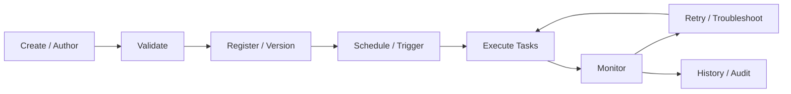

编排系统不负责理解“怎样训练 Transformer”这种领域算法，而是负责：

- 何时运行；
- 哪些 tasks 已满足依赖；
- 把 task 交给哪个 worker；
- 失败后是否、何时重试；
- 状态和输出存在哪里；
- 用户怎样观察、暂停、恢复和排错。

它既是让 scheduled code 持续运行的“脉搏”，也是数据科学家管理深度学习自动化的 control plane。

#### 为什么不把整个项目写成一个 Notebook

在原型阶段，把代码放在一个 Jupyter Notebook 中很自然：

- 反馈快；
- 中间结果可见；
- 适合探索和修改；
- 不必预先设计生产边界。

但 Notebook monolith 难以稳定承担生产自动化：

- 步骤边界与依赖隐含在 cell execution order；
- 环境和隐藏状态难复现；
- 失败后不易只恢复必要部分；
- 多人修改和复用困难；
- Schedule、retry、alert、audit 需另行实现。

转为 workflow 的目的不是否定 Notebook，而是把已经验证的过程显式化，让系统接管重复执行。

#### 原章给出的两项直接原因：Automation 与 Work Sharing

##### 1. Automation

手工流程要求人记住顺序、检查状态并处理失败。编排系统把依赖、触发、重试和监控编码为可重复规则，使每日训练、数据刷新或定期评估不再依赖人工值守。

##### 2. Work Sharing

把大段项目代码拆成 tasks 后，常用动作可以成为共享组件。原章图 9.2 想象三位数据科学家分别开发 workflow A、B、C：DAG 虽不同，但总共六类 steps 高度重叠，例如三个 workflow 都从 authorization 开始，也都可能复用 dataset service connector。

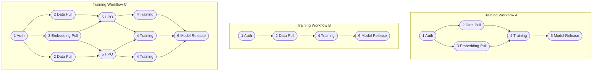

三个 subgraphs 是彼此独立的 workflow runs，没有跨项目 dataflow。相同编号表示复用同一种 step implementation / contract，而不是多个项目共享同一个运行时 task instance：1 Auth、2 Data Pull、3 Embedding Pull、4 Training、5 HPO、6 Model Release。

如果 Dataset Management service 的认证、分页、重试和错误语义已封装为 operator / step function，算法工程师只需声明输入，不必每个项目重新学习 Web API。

#### 复用为什么能产生组织级收益

假设某通用连接器首次实现成本为 $C_b$，每次复用的接入成本为 $C_r$，从头重复实现成本为 $C_d$，被 $n$ 个项目使用。复用的净节省可粗略表示为：

$$
S=nC_d-(C_b+nC_r)
$$

当 $C_r\ll C_d$ 且 $n$ 增大时，共享收益迅速增加。但公式隐含几个前提：

- Shared step 有稳定 contract；
- 版本升级不破坏已有 workflows；
- 文档、测试和 owner 明确；
- 通用化没有把简单任务变成过度抽象。

因此，编排系统只提供复用机制；真正的组织收益还依赖 component governance。

#### Workflow 怎样促进协作

模型开发往往由不同团队共同完成：数据团队负责数据，算法团队负责训练，平台团队负责资源与发布。DAG 将大项目拆为边界明确的 steps，并把依赖公开展示：

- 每个团队拥有自己的 task implementation；
- 输入 / 输出 contract 连接团队边界；
- DAG 让所有参与者看到顺序和阻塞关系；
- 单个组件可独立测试、版本化与替换；
- Run history 为跨团队排错提供共同事实。

因此原章总结：良好的 workflow orchestration 鼓励工作共享、促进团队协作，并自动化复杂开发场景。

#### Orchestration 不等于所有计算都由编排器完成

编排器决定控制流，真正的重计算通常委托给专门系统：

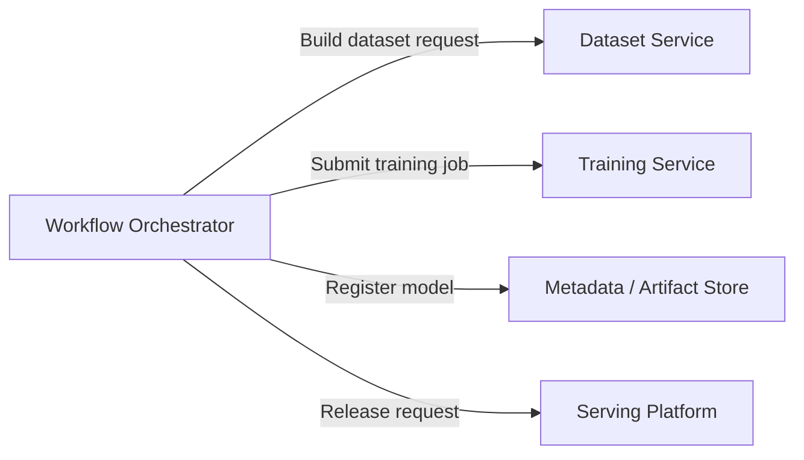

这与第 2–8 章的关系是：workflow orchestration 把此前各服务连接成端到端自动化流程，而不是替代数据、训练、HPO、serving 或 metadata services。

### 9.1.3 深度学习使用 Workflow Orchestration 的挑战

工作流带来自动化与协作，但原章强调一个关键 caveat：**它可能让算法原型开发变得笨重。** 问题不在 DAG 本身，而在数据科学家的迭代方式与通用生产编排工具之间存在体验断层。

#### 两阶段开发过程

图 9.3 从数据科学家视角把项目分为两个阶段：

```mermaid
flowchart LR
    subgraph Local[Local Incubation Phase]
        Explore[Data Exploration] --> Prototype[Training Prototype]
        Prototype --> LocalEval[Local Evaluation]
    end

    subgraph Gap[Production Onboarding]
        Refactor[Split Code into Tasks]
        Refactor --> Define[Define DAG / Config]
        Define --> RemoteDebug[Remote Test and Debug]
    end

    subgraph Production[Production Phase]
        Submit[Submit Workflow] --> Schedule[Scheduled Runs]
        Schedule --> Experiment[Production Experiment]
    end

    LocalEval -->|Promising| Refactor
    Experiment -->|New idea / poor result| Explore
```

1. **Local incubation phase**：在本地 / 开发环境做数据探索和训练原型；
2. **Production phase**：把原型拆成 tasks、定义 DAG，提交给编排系统按 schedule 执行。

这个大方向是合理的：探索需要低摩擦，生产需要稳定边界。问题出在两者之间的 conversion step。

#### Gap 1：Workflow 构建与排错不直观

数据科学家需要额外学习：

- DAG syntax；
- Workflow libraries；
- 新的 coding paradigm；
- Operator / executor semantics；
- Remote logs、permissions 和 runtime environment；
- 编排系统自身的 troubleshooting 方法。

原章认为 workflow troubleshooting 最痛苦。许多编排系统缺少等价的本地执行方式，只能把 workflow 提交到远端后测试。此时运行环境和日志都在远端，定位错误比本地单步调试困难得多。

典型失败可能来自多个层次：

```text
Python / algorithm bug
-> Dependency or trigger rule bug
-> Container / package mismatch
-> Credential / network failure
-> Worker resource shortage
-> Orchestrator state / retry behavior
```

如果 UI 只显示 `task failed`，数据科学家必须跨越多层系统才能找到 root cause。

#### Gap 2：Workflow 构建不是一次性成本

常见误解是：“Production onboarding 只发生一次，复杂一点可以接受。”原章指出深度学习开发本质上是迭代过程：

```text
prototype -> production experiment -> observe -> improve -> prototype -> ...
```

每次算法、数据或评估方式变化，都可能要求更新、测试和重新部署 workflow。若一次转换成本为：

$$
C_{iteration}=C_{author}+C_{package}+C_{deploy}+C_{remote\ debug}
$$

迭代 $n$ 次的累计摩擦约为：

$$
C_{gap}\approx\sum_{i=1}^{n}C_{iteration,i}
$$

所以优化 conversion 不是锦上添花，而是直接影响 experiment velocity。即使每次只浪费半天，20 次迭代也会损失约 10 个工作日。

#### 难点的本质：两类目标同时成立

不能简单地要求“所有原型一开始就按生产标准编写”，也不能让 Notebook 原样承担生产责任。系统要同时满足：

| 原型阶段需要 | 生产阶段需要 |
| --- | --- |
| 快速修改与反馈 | 可重复、可审计执行 |
| 本地数据与交互调试 | 隔离环境与受控资源 |
| 少量样本快速试验 | 完整数据和规模化运行 |
| 灵活依赖 | 固定、可复现环境 |
| 单人探索 | 多人协作和权限治理 |

真正的设计问题是：**怎样保留同一份业务逻辑和用户心智模型，只替换运行规模、基础设施与治理强度。**

#### 平滑从 Prototyping 到 Production

原章没有否定“本地原型后转生产”的流程，而是要求让转换近乎无缝。面向深度学习的编排系统应提供：

- 从普通 Python code 直接构造 workflow 的方法；
- Local runner 与 production runner 的一致 API；
- 本地验证 DAG、parameters 和 step contracts；
- 自动打包 code / dependencies；
- 相同的 run / step / artifact 观察模型；
- 从本地 run 到生产 run 的可追踪关系。

原章提前以 Metaflow 为例：用户用 Python annotations 标注原型代码，库据此生成 workflow；同一 workflow 可以在本地与云端以相似方式运行，从而降低构建和测试摩擦。

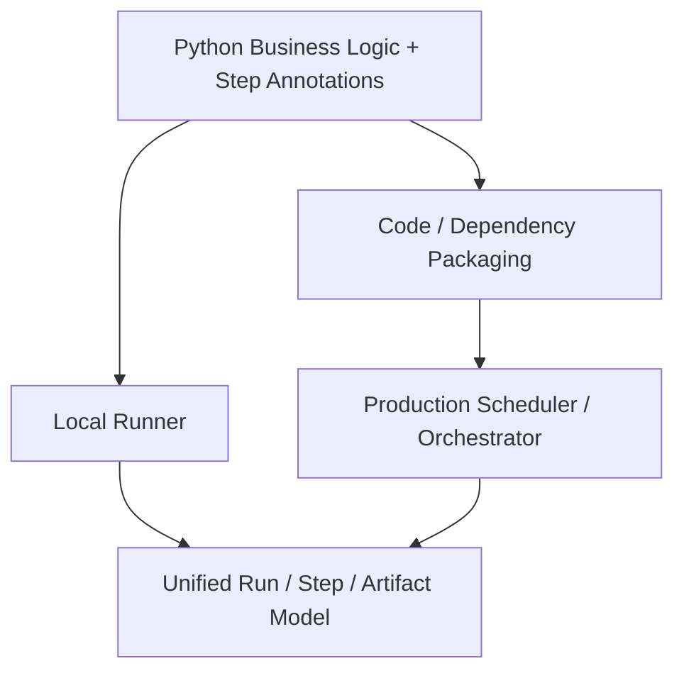

“相同体验”不表示本地机器与生产集群完全相同，而是用户不必重写业务逻辑或重新学习一套控制流表达。

#### Human-Centric 是系统要求，不是界面修饰

原章专门强调：把通用工具引入深度学习系统时，不应满足于“功能可用”，还要减少人在系统中消耗的时间。原因是：

1. 人的等待与排错时间也是系统成本；
2. 数据科学家的核心价值在算法与数据判断，不在维护 YAML / scheduler；
3. 每次迭代的微小摩擦会累计；
4. 平台抽象应让正确路径更容易，而不是把基础设施复杂度转嫁给用户。

可以把一次实验的端到端反馈时间写成：

$$
T_{feedback}=T_{author}+T_{validate}+T_{queue}+T_{execute}+T_{debug}
$$

编排系统不仅要优化 $T_{execute}$，还应通过本地运行、可理解错误、自动打包和统一 API 降低其他四项。只追求 scheduler throughput，而让用户花数小时定位一个环境错误，并不是人本的深度学习平台。

#### 9.1 小结：作者怎样形成解决思路

原章的推理链可以概括为：

```text
模型生产过程由有依赖的任务组成
-> DAG 能显式表达依赖与并行
-> 编排系统自动执行并监控 DAG
-> Task 复用促进组织协作
-> 但通用生产编排增加原型转换和远端调试成本
-> ML 开发频繁迭代，转换成本会重复累积
-> 因而 ML 编排必须同时把本地原型与生产运行当作一等场景
```

这为 9.2 的系统设计和第六项 human-centric principle 奠定了依据，也解释了 9.3 为什么不能只按 scheduler 功能数量比较工具。

---

## 9.2 设计 Workflow Orchestration System

原章按三个层次推进：

1. 先从数据科学家 Vena 的使用场景观察系统；
2. 再抽象出通用五组件架构与执行时序；
3. 最后归纳六项设计原则，用于自建或评估开源系统。

这种顺序避免了“先画组件、再为组件寻找需求”的常见错误。每个后端组件都能追溯到一个用户动作或可靠性要求。

### 9.2.1 用户场景

尽管业务 workflow 千差万别，数据科学家的交互通常分为 development phase 与 execution phase。

#### Development Phase：从训练代码到 Workflow

原章图 9.4 以 Vena 为例，分成五步。

##### 第一步：在本地建立原型

Vena 在 Jupyter Notebook 或普通 Python 中完成数据探索、训练和本地评价。当结果值得用真实客户数据做 online experiment 时，才进入生产化。

这一步保留探索自由度，不要求尚未验证的想法提前承担生产治理成本。

##### 第二步：把原型拆成 DAG

因为生产中的自动化都以 workflow 运行，Vena 使用编排系统的语法，把代码重建成 tasks 与 dependencies：

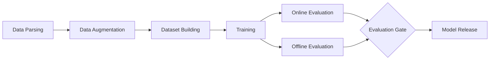

这里发生了三种显式化：

- **Control flow**：哪些任务先后或并行；
- **Data flow**：每个 task 消费与产生什么；
- **Failure boundary**：哪个最小单元可单独重试。

##### 第三步：设置每个 Task 的输入、输出与 Action

以 training task 为例，Vena 可以把 action 定义为向 model training service 发送 REST request。Request payload 来自 task inputs，response 中的 job ID 则成为后续轮询和 lineage 的依据。

```text
training task input
  = dataset_version + code_version + hyperparameters + resource_request

training task action
  = POST /training-jobs

training task output
  = training_job_id + model_artifact_reference + metrics_reference
```

Task action 也可以是 shell command、Python function、container 或云服务调用。编排系统提供统一 lifecycle，operator / plugin 负责把 lifecycle 翻译成目标系统协议。

##### 第四步：设置 Schedule 与 Trigger

原章示例将 workflow 设为每月第一天运行，同时允许 external event 触发。两类 trigger 含义不同：

- Time-based schedule：由 calendar / cron 产生 run；
- Event-based trigger：数据到达、模型漂移或外部 API request 产生 run。

生产设计还要明确：

- 同一周期重复触发时是否去重；
- 上一次 run 未完成时是 skip、queue 还是并发；
- 补跑历史周期是否启用 catchup / backfill；
- Event 至少一次投递时怎样保证 run creation 幂等。

##### 第五步：本地验证并提交

提交前至少验证：

- DAG 无环且所有 references 存在；
- Inputs / outputs type compatible；
- Required parameters 已提供；
- Schedule / timezone 合法；
- Operator configuration 与 secrets references 合法；
- Code / image / dependencies 可解析；
- Policy、quota 与权限通过。

验证通过后，Vena 把 workflow definition 提交到 orchestration service。

#### 原章伪代码怎样映射到概念

原章使用接近 Airflow 的伪代码表达每月训练 workflow：

```text
with DAG(description, schedule, start_date) as dag:
    data_parse_step = BashOperator(...)
    data_augment_step = BashOperator(...)
    dataset_building_step = BashOperator(...)
    training_step = BashOperator(...)

    data_parse_step
        >> data_augment_step
        >> dataset_building_step
        >> training_step
```

- `DAG(...)` 声明 workflow definition 与 schedule；
- 每个 operator instance 声明一个 task；
- `>>` 声明 upstream / downstream dependency；
- Operator 封装实际执行协议。

原章使用 `timedelta(months=1)` 作为概念性写法；Python 标准库 `datetime.timedelta` 并不支持 `months`。真实系统应使用目标编排器支持的 calendar / cron schedule，并明确 timezone 与月末语义。

#### Execution Phase：系统接管运行

原章将执行阶段分成四步。

##### 第一步：持久化 Workflow DAG

Workflow 提交后，系统把 definition、DAG、schedule 与版本保存到 metadata database。生产上不应悄悄覆盖已经产生 runs 的历史定义；每次修改应形成新 version 或 immutable snapshot。

##### 第二步：Scheduler 与 Controller 调度 Tasks

Scheduler 发现到期或被事件触发的 workflow，创建 workflow run；controller 按 DAG dependency 把 ready task instances 分派给 backend workers。

##### 第三步：通过 Web UI 实时查看

Vena 在 UI 中查看：

- DAG 与当前 task states；
- Scheduled / actual start time；
- Logs、attempts 与 errors；
- Inputs / outputs / artifacts；
- Duration、resource usage；
- Retry、cancel、resume 等操作。

##### 第四步：发布或继续迭代

若 workflow 产出合格模型，Vena 可把它 promotion 到 staging / production；否则回到本地原型进入下一轮。

注意：workflow success 不等于 model quality pass。前者表示 tasks 按定义完成，后者由 evaluation / quality gate 的业务规则决定。

#### Development 与 Execution 的端到端映射

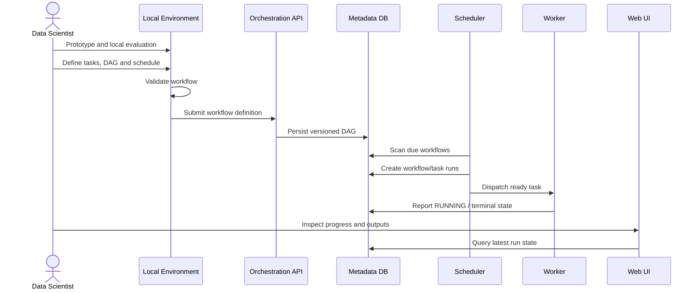

#### 为什么 Workflow 本身必须轻量

原章特别提醒：workflow 的目标是连接与自动执行 tasks，而不是承载重计算。可将其理解为：

- DAG code 负责 declaration，不在 scheduler parse 阶段下载数据或训练；
- Task 描述怎样调用 compute，而不是让 control plane 进程执行数小时 GPU training；
- 大数据通过 object / dataset references 传递，不塞进 scheduler metadata；
- 实际资源由 workers 或外部 training / data services 提供。

若 DAG definition import 时就训练模型，会导致 scheduler parsing 变慢、重复副作用、control plane 资源耗尽，也无法正确记录 task lifecycle。

### 9.2.2 通用 Workflow Orchestration System 设计

原章图 9.5 抽象出五个核心组件。这是理解不同产品的共同坐标系。

#### 总体架构

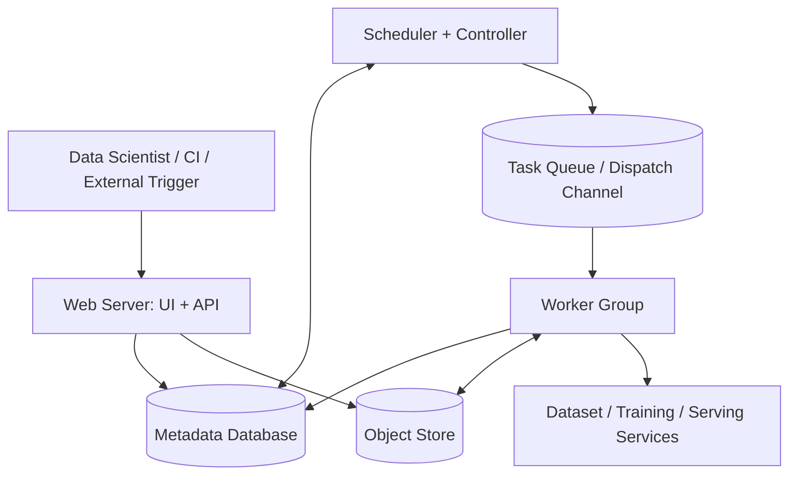

图中 task queue 是原章执行描述里出现的调度通道，可嵌入 controller / executor，也可作为独立消息系统；因此原章仍把顶层概括为五个组件。

#### 组件一：Web Server

Web server 对外提供 UI 与 APIs，支持：

- Create / update / validate workflow；
- Trigger / cancel / retry / backfill run；
- Inspect DAG、task state、history 和 logs；
- Debug workflow behavior；
- 管理权限、variables、connections 或 secrets references。

它是 user-facing control plane，不应直接执行用户任务。API 操作需要 authentication、authorization、audit 和 idempotency。

#### 组件二：Scheduler 与 Controller

原章把两个逻辑单元通常放在一起实现，但职责可以区分：

| 组件 | 核心问题 | 典型动作 |
| --- | --- | --- |
| Scheduler | 什么时候创建 run，哪些 task 已 ready？ | Scan schedule、evaluate dependencies、create task instances |
| Controller / Executor | 任务交给哪里、怎样跟踪？ | Select backend、enqueue task、renew lease、handle completion |

Scheduler 持续观察 active workflows，在合适时间触发；controller 把 tasks 分派给 workers。二者都必须避免在 failover 后重复拥有同一任务，常用 database lock、lease、leader election 或 compare-and-swap。

#### 组件三：Metadata Database

Metadata database 保存控制面的小型结构化事实：

- Workflow definitions、versions 与 DAG；
- Schedule / trigger configuration；
- Editing / deployment history；
- Workflow run 与 task instance states；
- Attempts、timestamps、error summaries；
- Artifact references 与 execution metadata。

它不是训练数据湖，也不适合存大型模型或完整 tensor。它必须支持并发状态更新、事务、一致查询、索引、备份与恢复。

#### 组件四：Worker Group

Workers 提供执行 task 的 compute，并抽象底层基础设施。原章举例：Kubernetes worker 与 Amazon EC2 worker 可在不同基础设施上运行同一 task。

Worker 通常负责：

1. 从 queue / controller 领取 task；
2. 获取 immutable task definition；
3. 准备 environment / credentials；
4. 执行 operator；
5. 上传 outputs / logs；
6. 心跳并报告 terminal state；
7. 清理临时资源。

“Infrastructure agnostic”不是完全忽略差异，而是 task contract 与 scheduling interface 尽量稳定，executor adapter 处理 Kubernetes、EC2 或 batch backend 的差异。

#### 组件五：Object Store

Object store 是组件共享的文件存储，通常构建在 S3 等 cloud object storage 上。原章重点用途是 task output sharing：

```text
upstream worker
  -> writes output bytes to object store
  -> records immutable URI / digest in metadata DB
  -> downstream worker reads URI
  -> downloads or streams input bytes
```

Metadata database 与 object store 的职责对比：

| Metadata Database | Object Store |
| --- | --- |
| DAG、state、attempt、small values | Dataset、model、report、large files |
| Transactional state transitions | High-throughput durable bytes |
| Filter / join / index | URI / key based access |
| Scheduler 高频读写 | Workers 大对象读写 |

中央存储使 web server、scheduler 与 workers 解耦：它们不必同时在线或通过内存直接传递状态。但“所有组件都可访问”不应理解为共享同一高权限 credential；生产上要按角色与 tenant 最小授权。

#### Control Flow、State Flow 与 Data Flow

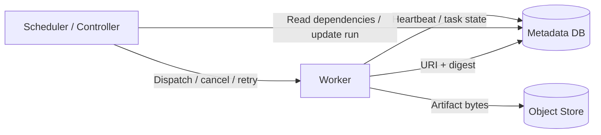

- Control flow：scheduler 告诉 worker 做什么；
- State flow：scheduler / worker 持久化执行状态；
- Data flow：tasks 通过 object store 或外部 data service 交换大对象。

把三者混在消息 payload 中，会造成 broker 超大消息、重复传输与恢复困难。

#### Workflow 执行的五步时序

原章按以下顺序解释图 9.5。

##### 第一步：定义 DAG 与 Operators

Vena 声明 tasks、control flow，并为每个 task 选择内置 Shell / Python operator 或自定义 operator。

##### 第二步：提交 Workflow

DAG 与 dependent code 通过 UI / CLI 提交到 web server，随后持久化到 metadata database。

##### 第三步：Scheduler 扫描并触发

Scheduler 每隔数秒或数分钟扫描 metadata database，识别新 workflow / 到期 schedule，创建 run；controller 按 DAG sequence 把 ready tasks 放入 worker queue。

Polling interval 是 freshness 与数据库负载的权衡。若扫描周期为 $\Delta$，在均匀到达且无其他拥塞的理想情况下，单由 polling 引入的平均检测延迟约为：

$$
E[T_{poll}]\approx\frac{\Delta}{2}
$$

最大检测延迟接近 $\Delta$。实际 schedule lag 还包括 leader failover、database contention、queueing 与 worker shortage。

##### 第四步：Worker 执行并报告

Worker 从 shared queue 取 task，读取 definition，运行 operator；执行期间把 output 写入 object store，把 status 写回 metadata database。

##### 第五步：UI 展示最新状态

Scheduler / controller 与 workers 持续更新 metadata，UI 查询同一事实源，因此可显示最新 workflow status。

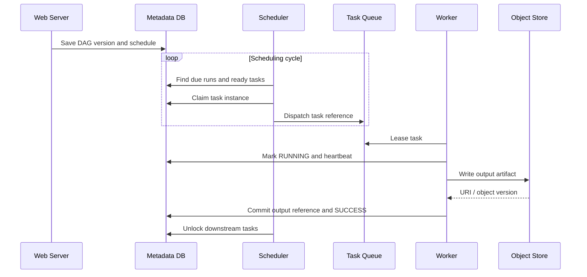

#### Task Instance 状态机

原章只要求 task 整体 success / fail；生产系统通常需要更细状态以支持恢复：

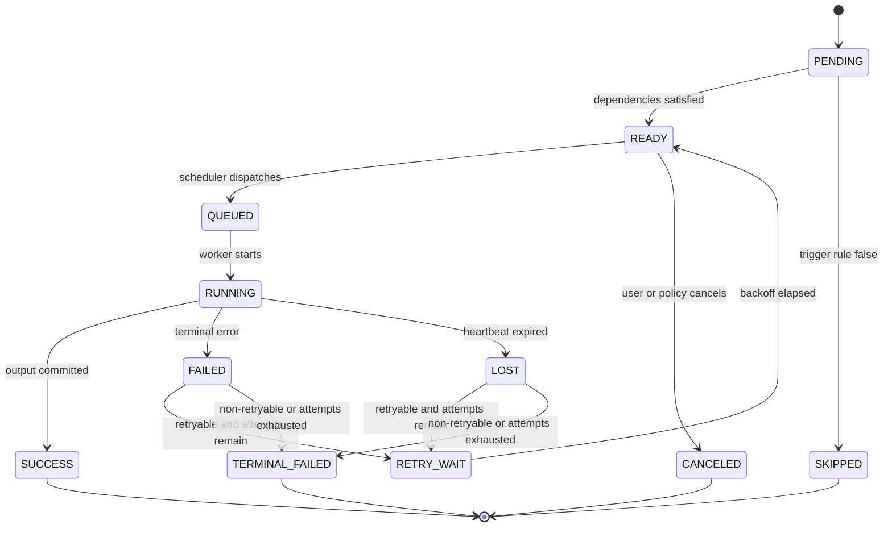

关键不变量包括：

- Downstream 不应在 required upstream success 前运行；
- 同一 attempt 只有一个有效 owner / lease；
- Terminal state 与 output reference 一致提交；
- Retry 产生新 attempt，不篡改旧 attempt 历史；
- Workflow run state 由 task states 与 trigger rules 推导。

#### Delivery Semantics：不要轻易承诺 Exactly Once

考虑 worker 已完成外部写入，但在报告 `SUCCESS` 前崩溃：scheduler 无法知道副作用是否发生，通常只能重试。因此实际执行常接近 at-least-once。

安全做法是：

- 为每个 task instance / output 分配 deterministic idempotency key；
- External service 支持 create-if-absent / upsert / compare-and-swap；
- Output 先写 staging location，验证后原子发布；
- Lease / heartbeat 检测失联 worker；
- Reconciliation 查询外部 job 是否已存在；
- 将 side effects 与 attempt IDs 记录到 metadata。

“Exactly once effect”通常由幂等 task 与事务性目标共同实现，而不是 queue 单独保证。

#### Retry 怎样改善瞬时故障成功率

若一次 task attempt 成功概率为 $p$，各次失败近似独立，最多重试 $r$ 次，则最终至少一次成功的概率为：

$$
P_{success}=1-(1-p)^{r+1}
$$

例如 $p=0.9$、允许两次 retry，即最多三次 attempt：

$$
P_{success}=1-0.1^3=99.9\%
$$

但该公式只适用于 transient、近似独立故障。代码 bug、权限错误或数据 schema mismatch 会在每次重试中重复失败；盲目 retry 只增加成本。因此错误必须分类，并使用 exponential backoff、jitter 与 retry budget。

#### Workflow 级成功率为什么更脆弱

若 workflow 有 $n$ 个都必须成功的 tasks，且最终成功概率分别为 $p_i$，在独立近似下：

$$
P_{workflow}=\prod_{i=1}^{n}p_i
$$

20 个 tasks 各有 99.5% 最终成功率时：

$$
P_{workflow}=0.995^{20}\approx90.46\%
$$

这说明大型 DAG 需要高 task reliability、合理 retry、checkpoint 和局部恢复。真实故障还可能相关，例如共享数据库故障会同时影响多个 tasks，独立假设会高估成功率。

#### 调度容量与 Backpressure

设 workflow runs 到达率为 $\lambda$，平均在系统停留时间为 $W$，稳定状态下平均在途 run 数满足 Little's Law：

$$
L=\lambda W
$$

它提醒我们：执行时间增长或到达突发都会增加 active runs。系统需设置：

- Global / tenant / workflow concurrency limit；
- Worker pools 与 resource-aware queues；
- Priority 与 fairness；
- Queue depth / schedule lag alerts；
- Admission control 与 backpressure；
- Catchup / backfill 限速。

只无限增加 scheduler 创建任务的速度，会把压力推给 queue、workers 和外部 services。

#### 高可用与恢复边界

通用设计还隐含几项生产要求：

- Web server 可横向扩展并保持 stateless；
- Scheduler failover 后从持久化状态恢复；
- Metadata DB 是关键依赖，需要 HA、backup 与 schema migration；
- Queue message 与 task lease 可重新投递；
- Workers 可短暂消失，不丢失 canonical state；
- Object store output 有 digest / version 与 lifecycle policy；
- Control plane 升级不破坏已注册 workflow versions。

### 9.2.3 Workflow Orchestration 设计原则

原章提出六项原则。它们既可指导自建系统，也可作为工具 POC 的评分维度。

> 原章提醒：workflow orchestration 是深度学习系统中工程投入最重的组件之一，早期版本不必一次完美满足全部原则。更实际的路线是先守住正确执行与可恢复底线，再根据用户摩擦和规模瓶颈迭代易用性、扩展性与伸缩能力。

#### Principle 1：Criticality

Workflow orchestration 本质是 job scheduling。底线是：合法 workflow 应被正确、可重复、按计划执行。

“正确”至少包括：

- Dependencies 与 trigger rules 正确；
- 不漏掉到期 run；
- Failover 后不产生不可控重复副作用；
- State、logs 与 artifacts 可追踪；
- Retry / cancel / resume 语义确定；
- 历史 definition 可重放或解释。

衡量按时性的基础指标是 schedule lag：

$$
L_{schedule}=t_{actual\ start}-t_{scheduled}
$$

应观察 P50 / P95 / P99，而不只看平均值，并按 workflow criticality 定义 SLO。

#### Principle 2：Usability

在深度学习场景，易用性应以数据科学家 productivity 衡量。主要交互是 create、test、monitor、troubleshoot，因此系统应提供：

- 熟悉且可组合的 authoring API；
- 快速 local validation / execution；
- DAG visualization；
- 可搜索 logs 与明确错误分类；
- 从 failed task 恢复，而非重跑全部；
- 参数、artifact、lineage 与 code version 可见；
- IDE / CLI / UI 体验一致。

“功能能实现”不等于“可用”。若写一个 training step 需要理解 scheduler database schema，说明抽象泄漏。

#### Principle 3：Extensibility

深度学习基础设施多样，系统应允许定义 operator 与 executor，而不要求业务代码关心部署位置。

建议分离：

| 扩展点 | 负责内容 |
| --- | --- |
| Operator / Task type | 业务动作与参数 contract |
| Hook / Connector | 外部 service client、authentication、retry translation |
| Executor / Worker backend | 在 Kubernetes、EC2、Batch 等位置运行 |
| Trigger / Sensor | 等待外部条件 |
| UI / Metadata plugin | 展示领域状态与 links |

扩展机制还需 versioning、compatibility tests、security review 和 owner，避免 plugin ecosystem 变成无法升级的依赖集合。

#### Principle 4：Isolation

原章区分两类隔离。

##### Workflow Creation Isolation

一个用户提交无效 DAG，或发布 shared library 新版本，不应破坏现有 workflows。需要：

- Immutable workflow / dependency versions；
- Validation / staging namespace；
- Per-project package environment；
- Backward-compatible shared component policy；
- Definition parse timeout / sandbox。

##### Workflow Execution Isolation

每个 workflow 在隔离环境中运行，不应与其他 workflow 争抢失控，也不应传播失败。需要：

- Process / container / VM boundary；
- CPU、memory、GPU、ephemeral storage quota；
- Tenant-specific credentials 与 network policy；
- Queue / worker pool / priority isolation；
- Blast-radius limit 与 circuit breaker。

原章说“没有资源竞争”可理解为目标：资源竞争应由 quota / scheduling policy 控制，而不是完全不存在共享资源。

#### Principle 5：Scaling

原章把伸缩分为两个不同问题。

##### A. 大量并发 Workflows

增加 workers 后，系统应能处理更多 concurrent runs，并保持每个 workflow 的 SLA。原章举例：无论其他 workflow 数量多少，某 workflow 都应在 schedule 后 2 秒内启动。

“2 秒”是说明 SLA 隔离的示例，不是所有系统的通用门槛。Batch training 可能允许分钟级 lag，实时控制流程则可能要求更严。

控制面瓶颈可能是：

- Scheduler DAG evaluation throughput；
- Metadata DB queries / locks；
- Queue partitions；
- Worker registration / heartbeat；
- External API rate limits；
- UI 对历史状态的查询。

##### B. 单个超大 Workflow

大型 DAG 或长时间 task 的优化目标是让用户仍写可读、直接的代码。系统应提供 parallel map、fan-out / fan-in、distributed training operator、resource-aware execution 等能力，而不是要求每位用户手写分布式调度。

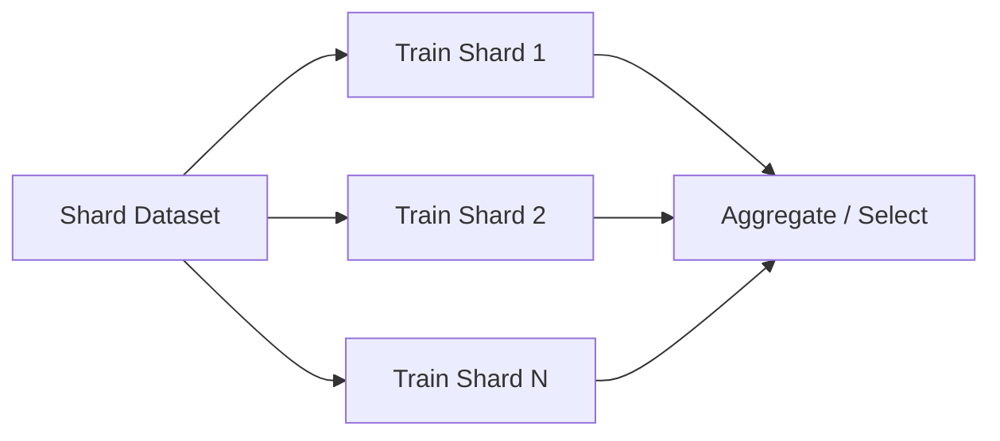

原章的核心思想是：**在系统层解决 performance / scalability，让用户优先保持代码可读、可调试、可运维。** 过早把调度细节写入业务代码会增加长期成本。

#### Principle 6：同时支持 Prototyping 与 Production 的 Human-Centric 设计

这是深度学习场景最有辨识度的原则。系统必须承认项目在本地探索与生产实验之间持续往返，并主动降低转换成本：

- 同一 code / API 可切换 local 与 remote executor；
- 自动 snapshot code、data references 与 dependencies；
- 本地 DAG / task test 与生产语义尽量一致；
- 一条命令从 local run 发布到 production backend；
- 错误信息映射回用户代码；
- Infrastructure defaults 合理，但允许专家覆盖。

可以把平台改进优先级近似看成：

$$
Impact=Frequency\times Time\ Saved\times Affected\ Users
$$

一次只节省 5 分钟的操作，若每位数据科学家每天发生 10 次，组织收益可能高于偶尔把训练 runtime 优化 1%。

#### 六项原则之间的关系与张力

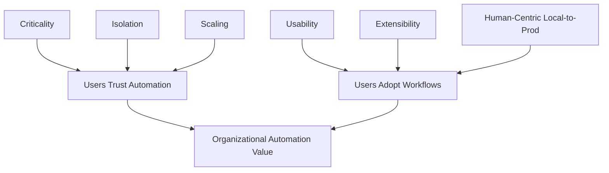

这些原则不能分别最大化：

- 强隔离会增加 container startup latency；
- 无限 extensibility 会扩大 security / compatibility surface；
- 强 production validation 会降低 local feedback speed；
- 高频 scheduler polling 会增加 database load；
- 细 task 粒度提高恢复性，却增加调度开销。

因此评估系统时，应根据 workload 与团队明确权重，而不是寻找所有维度都绝对最优的产品。

#### 9.2 小结：从用户问题到架构决策

本节的设计推理可压缩为：

```text
用户需要 author / validate / submit / observe
-> Web Server 提供 UI 与 API

Workflow 要按时间与依赖运行
-> Scheduler + Controller 维护 control flow

系统必须故障恢复并显示历史
-> Metadata Database 持久化 definitions 与 states

Tasks 需要不同计算资源
-> Worker Group 抽象 execution infrastructure

Tasks 要交换大对象
-> Object Store 保存 bytes，Metadata DB 保存 references

ML 开发反复往返本地与生产
-> Human-centric local-to-production 体验成为独立原则
```

架构的价值不在组件数量，而在它把控制、状态、计算和大对象分开，使每部分能独立扩展和恢复。

---

## 9.3 开源 Workflow Orchestration Systems 导览

原章选择三套经过生产验证、但抽象层次不同的系统：

- **Airflow**：以 Python DAG、Operator 与 Scheduler 为核心的通用编排平台；
- **Argo Workflows**：以 Kubernetes CRD、Pod 与 Container 为核心的云原生工作流引擎；
- **Metaflow**：以数据科学家 Python code、`@step` 与统一 local-to-production 体验为核心的 ML workflow framework。

为了公平比较，原章让三者实现同一个每日数据处理需求：


这里的“同一个需求”主要指业务 steps；原章三个 listings 并未一致编码 daily schedule：Airflow 明确使用 `@daily`，Argo 的 `kind: Workflow` 只表示一次执行，Metaflow 的 `run` 示例也是一次本地执行。要满足每日触发，Argo 需要 `CronWorkflow` 或外部 trigger，生产 Metaflow flow 则需要 `@schedule(daily=True)` 或目标 orchestrator 的 schedule。

比较重点不是哪段语法最短，而是同一个意图经过不同抽象后，用户要负责什么、平台替用户负责什么。

> 版本说明：以下先忠实解释原章示例和成书时判断，再补充当前官方文档中的变化。工具版本会改变 API 与能力，但三种设计取向仍有比较价值。

### 9.3.1 Airflow

Airflow 由 Airbnb 在 2014 年创建，后来成为 Apache Software Foundation 项目。它用于 programmatically author、schedule 与 monitor workflows，最初主要解决越来越复杂的 ETL / data pipelines，并凭借 extensibility、production quality 和 GUI 扩展到包括 ML 在内的多个领域。

原章成书时称 Airflow 是采用最广的编排系统。这是历史判断，不应当作当前市场份额事实；实际选型应核对目标版本、社区维护与组织现状。

#### Airflow 的核心抽象

| 抽象 | 作用 | 原章案例 |
| --- | --- | --- |
| DAG | 定义 workflow、schedule 与 task dependencies | `data_process_dag` |
| Operator / Task | 封装一个执行动作 | Python、SQL、Slack actions |
| Sensor | 等待外部条件成立 | 等待 `data.csv` 到达 |
| Hook / Connection | 封装外部系统连接与 credential reference | PostgreSQL、Slack、filesystem |
| Executor / Worker | 决定 task instance 在哪里运行 | Local、Celery、Kubernetes 等 |
| Dag Run / Task Instance | 某次运行与其中的具体任务实例 | 某一天的数据处理 run |

Airflow DAG 本质上由 Python code 构造。这带来表达能力：可以用函数、循环与配置生成 tasks；也带来约束：Scheduler / DAG processor 会反复加载并执行 top-level Python 来发现 DAG，因此 top-level 不能做网络访问、数据库查询或重计算。

#### 原章典型用例的两步构造法

##### 第一步：定义 DAG 与 Tasks

原章 Listing 9.1 声明五类主要 task：

1. `FileSensor` 检查新文件；
2. `PythonOperator` 调用 `transform_data`；
3. PostgreSQL operator 建表；
4. Python task 把结果写入数据库；
5. Slack operator 通知数据科学团队。

Listing 还从保存 task 分出 `create_report`，说明一个 upstream task 可以有多个 downstream tasks。

##### 第二步：声明 Dependencies

Airflow 用 `>>` / `<<` 表示 downstream / upstream：

```text
is_new_data_available >> transform_data
transform_data >> create_table >> save_into_db
save_into_db >> [notify_data_science_team, create_report]
```

这段代码只是构图，不会在 Python 解释到这里时立即执行 tasks。Scheduler 为具体 Dag Run 创建 Task Instances，满足 dependencies 与 trigger rule 后再执行。

#### 用现代 Airflow 语义重写 Listing 9.1

下面保留原章控制流，但采用当前 Airflow 3 文档中的 `schedule` 参数，并使用 provider packages 中的 operators。它是语法完整的示例；实际运行需要安装 Airflow 及相应 providers，并配置 filesystem、PostgreSQL 与 Slack connections。

```python
from __future__ import annotations

import pendulum

from airflow.providers.common.sql.operators.sql import SQLExecuteQueryOperator
from airflow.providers.slack.operators.slack_webhook import SlackWebhookOperator
from airflow.providers.standard.operators.empty import EmptyOperator
from airflow.providers.standard.operators.python import PythonOperator
from airflow.providers.standard.sensors.filesystem import FileSensor
from airflow.sdk import DAG


def transform_new_data() -> str:
    """Transform the new partition and return its immutable output URI."""
    return "s3://example-bucket/transformed/2026-08-07/data.parquet"


def store_in_database() -> None:
    """Load a versioned transformed partition with idempotent SQL."""
    # The real implementation should UPSERT a deterministic partition.


with DAG(
    dag_id="data_process_dag",
    schedule="@daily",
    start_date=pendulum.datetime(2026, 1, 1, tz="UTC"),
    catchup=False,
    default_args={"retries": 2},
) as dag:
    is_new_data_available = FileSensor(
        task_id="is_new_data_available",
        fs_conn_id="data_path",
        filepath="data.csv",
    )

    transform_data = PythonOperator(
        task_id="transform_data",
        python_callable=transform_new_data,
    )

    create_table = SQLExecuteQueryOperator(
        task_id="create_table",
        conn_id="postgres_customer_data",
        sql="""
        CREATE TABLE IF NOT EXISTS invoices (
            invoice_id TEXT PRIMARY KEY,
            amount NUMERIC NOT NULL
        );
        """,
    )

    save_into_db = PythonOperator(
        task_id="save_into_db",
        python_callable=store_in_database,
    )

    notify_data_science_team = SlackWebhookOperator(
        task_id="notify_data_science_team",
        slack_webhook_conn_id="slack_data_science",
        message="Daily transformed data is ready.",
    )

    create_report = EmptyOperator(task_id="create_report")

    is_new_data_available >> transform_data >> create_table >> save_into_db
    save_into_db >> [notify_data_science_team, create_report]


if __name__ == "__main__":
    dag.test()
```

代码与原理的对应关系：

- `with DAG(...)` 创建静态 definition；
- `schedule="@daily"` 声明 daily trigger；
- `catchup=False` 表示不自动为过去所有 interval 补跑；
- Sensor 是“等待条件”的 task，而不是 DAG 构建时的 `if`；
- Operators 描述执行动作；
- 最后两行 dependency expression 构成 DAG edges；
- `dag.test()` 在当前版本中提供模拟本地运行路径，但外部服务、credentials 与 production executor 的差异仍需 integration / staging test。

#### 原章 API 与当前 API 的版本边界

原章使用：

```text
schedule_interval="@daily"
PostgresOperator(...)
```

在 Airflow 3 中，`schedule_interval` 已移除，应使用 `schedule`；SQL operator 的 provider import 与参数也已演进。因此原章 Listing 应作为概念示例，不能不锁版本直接复制。

#### 为什么 Tasks 应近似数据库事务

Airflow 当前官方 best practices 建议把 task 当作 transaction：失败时不留下半成品，重跑产生相同结果。对应本章 9.2 的 at-least-once 分析，实践上应：

- 用 UPSERT 替代可能重复插入的裸 INSERT；
- 读取明确 data interval / partition，不读取会变化的 `latest`；
- 输出先写临时位置，再原子 publish；
- 使用 logical data interval，而不是关键逻辑中的 wall-clock `now()`；
- 外部 API 携带 deterministic idempotency key。

例如 daily run 的目标表主键可以包含 `data_interval_start`。即使 Task Instance 重试，也覆盖同一 partition，而不是生成重复数据。

#### Task 间怎样传递数据

原章通用架构要求大对象进入 object store。Airflow 中也应区分：

- XCom / task metadata：传小型 control values，例如 URI、row count、model ID；
- S3 / HDFS / dataset store：传大型 data / model bytes；
- Connection / secrets backend：保存 credential reference，不把 token 写入 DAG。

```text
transform task
-> writes s3://bucket/partition/data.parquet
-> pushes URI and digest through metadata / XCom
-> downstream task reads bytes from S3
```

若上游把文件写到 worker local disk，下游可能被调度到另一台机器，无法读取；retry 也会遇到残留文件状态。

#### 原章 CLI 观察方式

原章展示：

```text
airflow dags list
airflow tasks list data_process_dag
airflow tasks list data_process_dag --tree
```

它们分别用于列出 active DAGs、列出某 DAG 的 tasks、以树形查看 hierarchy。当前版本还可用 UI Graph view、`airflow dags show` 和 `dag.test()` 等方式；CLI flags 应以部署版本为准。

#### Key Feature 1：DAG

Airflow 用 DAG 抽象复杂 workflow，并用 Python library 表达 tasks 与 dependencies。DAG 关心顺序、retry、timeout、schedule 等 orchestration 语义，不应关心 task 内部算法细节。

#### Key Feature 2：Programmatic Workflow Management

因为 DAG 是 Python 构造的，可通过函数、循环与配置动态生成 tasks，适合大量结构相似的 pipelines。

但“动态”通常指 parse 时生成稳定 topology，不等于每次 scheduler scan 都从不稳定外部状态随意改变历史结构。动态 DAG 应有 deterministic ordering 与 versioned configuration。

#### Key Feature 3：丰富的 Built-in Operators

原章列举 MySQL、HTTP、Docker 等 operators。Predefined operators 让用户声明“执行 SQL”“调用 API”“运行 container”，无需重复编写认证、连接与基础 polling。

Provider ecosystem 是 Airflow 复用能力的重要来源，但 provider 与 core version compatibility 必须测试。

#### Key Feature 4：可靠的 Dependency 与 Execution Management

原章强调：

- 每个 task 内建 retry policy；
- Sensors 可等待 file、task completion、workflow state change 等 runtime dependency。

当前 Airflow 还提供 trigger rules、branching、setup / teardown、backfill 等控制语义。复杂 trigger rules 会影响 Dag Run 最终状态，必须用失败路径测试，而不能只看 happy path。

#### Key Feature 5：Extensibility

Sensors、hooks、operators 与 executors 可扩展，使 Airflow 能通过 custom operator 接入内部 Dataset、Training、Registry 和 Serving services。

好的 custom operator 应只暴露领域参数，例如 `dataset_version` 与 `resource_profile`，而把 HTTP retries、authentication 和 job polling 封装在内部。

#### Key Feature 6：Monitoring 与 Management UI

Airflow UI 可查看 DAG / Task Instance 状态和历史，也可触发、清理或重试 runs / tasks。生产排错还需要把 UI 状态关联到：

- Centralized task logs；
- External training job ID；
- Artifact URI / model version；
- Attempt / worker / executor identity；
- Scheduler delay 与 queue duration。

#### Key Feature 7：Production Quality

原章列举 log search、scaling、alerting 与 REST APIs。Airflow 的优势不是单一算法，而是围绕长期运行的 scheduler 提供成熟的运维面。

代价是 metadata DB maintenance、DAG parsing performance、provider upgrades、executor capacity 与 multi-team governance 都需要平台工程投入。

#### 原章局限一：数据科学家上手成本高

当内置 operator 不覆盖需求时，用户需要学习 Airflow lifecycle、context、templating、provider dependencies 与部署方式。算法 code 还可能与 Airflow runtime dependencies 冲突。

原章称“没有简单的 workflow local testing 方法”。这反映成书时体验；当前 Airflow 已提供：

- 直接运行 DAG file 做 loader test；
- DAG / task unit tests；
- `dag.test()` 模拟 Dag Run；
- `dag.test(use_executor=True)` 使用配置的 executor；
- Staging environment 与 self-check tasks。

因此今天更准确的局限是：**本地测试能力已增强，但要复制 distributed executor、secrets、network、container 与 production data 的完整行为仍有成本。**

#### 原章局限二：Prototype 到 Production 转换摩擦高

数据科学家仍需把 Notebook / script 重构为 Airflow DAG、选择 operators、打包 dependencies，并遵守 parse-time 与 runtime 边界。TaskFlow API、decorators、virtualenv / external Python / Docker / Kubernetes operators 已改善体验，但 abstraction 仍可能泄漏基础设施细节。

这正是与 Metaflow 的比较点：Airflow 首先优化通用调度平台，Metaflow 首先优化数据科学家的代码生命周期。

#### 原章局限三：在 Kubernetes 上运维复杂

原章认为若系统以 Kubernetes 为主，Argo Workflows 更自然；Airflow 在 Kubernetes 上的部署和运维不够直接。这个相对判断仍有架构依据：

- Argo Workflow / task 直接是 Kubernetes resources / Pods；
- Airflow 还维护自身 scheduler、metadata DB、DAG processor、executor 与 provider layers；
- Airflow 的 KubernetesExecutor / KubernetesPodOperator 能使用 Kubernetes，但 Airflow 并未因此变成 Kubernetes controller model。

不过“复杂度高低”取决于团队已有能力与托管服务，必须通过实际运维 POC 验证。

#### Airflow 用于深度学习时的正确边界

Airflow 适合作为控制平面，调用专门服务：

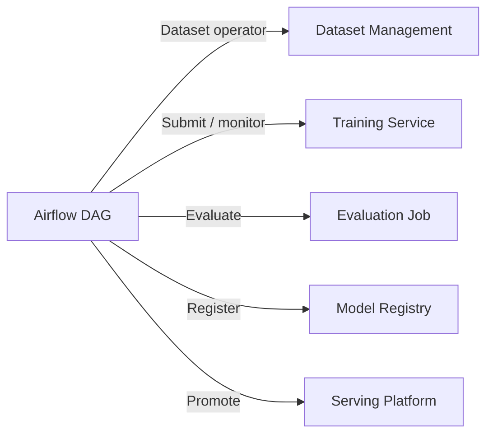

不应让 Scheduler process import PyTorch 后直接训练，也不应通过 XCom 传模型文件。GPU allocation、distributed training、checkpoint 和 model artifacts 应由 task runtime / training platform 管理。

#### Airflow 的适用范围

适合：

- 已有大量 scheduled ETL / data workflows；
- 需要成熟 UI、backfill、operator ecosystem；
- 团队熟悉 Python 与 Airflow operations；
- ML pipeline 主要由调用外部 services 组成；
- 希望 data 与 ML workflows 使用同一平台。

需谨慎：

- 数据科学家要求几乎零转换的 local-to-production 体验；
- 每个 task 有高度冲突的系统 dependencies；
- 团队只愿维护纯 Kubernetes-native control plane；
- 流程要求毫秒级 request orchestration；
- DAG parse 中包含重计算或动态外部访问。

#### Airflow 小结

Airflow 的核心优势是**成熟的通用调度与 operator ecosystem**。它能可靠表达每日数据流程，也能编排 ML services；其主要权衡是数据科学家需要适应 DAG / runtime 边界，平台团队需要维护 Airflow 自身的生产复杂度。

### 9.3.2 Argo Workflows

Argo Workflows 是运行在 Kubernetes 上的开源 container-native workflow engine，用于编排并行 workflows / tasks。它与 Airflow 解决相似的依赖执行问题，但选择 Kubernetes-native control model：

- Workflow 以 Kubernetes custom resource（CR）表示；
- Workflow schema 由 custom resource definition（CRD）声明；
- Workflow controller 监听资源并协调执行；
- Container / script tasks 通常在独立 Kubernetes Pods 中运行；
- Status 写回 Workflow resource，并可通过 Argo API / UI 访问。

#### 与 Airflow 的根本差异

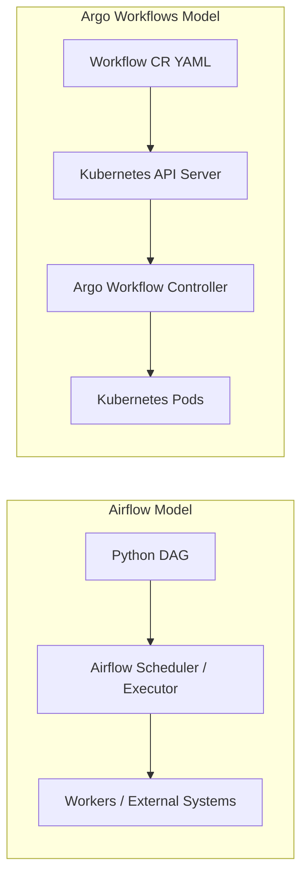

Airflow 在 Kubernetes 上运行时仍保留 Airflow 的 scheduler / executor abstraction；Argo 则直接把 Kubernetes API、resource reconciliation 与 Pod lifecycle 当作底座。

#### CRD、CR、Workflow 与 Pod 的关系

容易混淆的层次如下：

| 对象 | 含义 |
| --- | --- |
| CRD | 向 Kubernetes 注册 `Workflow` 等资源类型的 schema |
| Workflow CR | 某一个 workflow 的 definition + execution state，是 live object |
| WorkflowTemplate | 可复用、可引用的 namespaced workflow template |
| ClusterWorkflowTemplate | cluster-scoped reusable template |
| Template | 类似函数，定义工作或调用其他 templates |
| Step / DAG task | 一次 template invocation |
| Pod | Container / script task 的实际运行载体 |

原章指出 Workflow 同时包含 definition 与 execution state，因此应把它当作 live instance，而不只是静态模板。若要把“可复用定义”与“每次运行”分开，生产上常使用 WorkflowTemplate / ClusterWorkflowTemplate，再由提交生成 Workflow instances。

#### 原章图 9.6 的执行过程

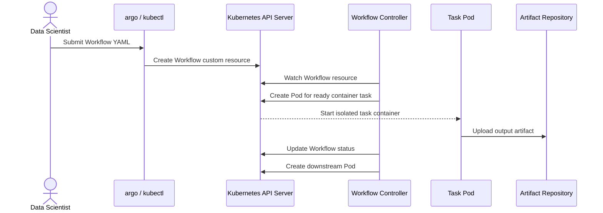

每个 Pod 具有独立 filesystem / process / resource boundary。上游 output file 不是靠同一机器目录共享，而是由 artifact repository 持久化；下游 Pod 启动时，Argo executor 按声明把 artifact 放到指定 path。

> 原章把“每个 task 都作为 Pod”作为核心直觉。当前 Argo 还有 HTTP、resource、suspend、plugin 等 template types，并非每种逻辑节点都等价于新建一个普通 container Pod；但 container / script workloads 的 Pod isolation 仍是主要模型。

#### 两种 Control-Flow Template

当前 Argo 文档区分两种 template invocators：

- `steps`：list of lists；外层顺序执行，内层并行执行；
- `dag.tasks`：每个 task 显式声明 dependencies。

例如：

```yaml
steps:
    -
        -
            name: step-a
            template: task-a
    -
        -
            name: step-b
            template: task-b
        -
            name: step-c
            template: task-c
```

语义是先执行 A，再并行执行 B 与 C。YAML 的双层 `-` 不是装饰，而是二维序列结构。

#### 原章典型用例

原章 Listing 9.2 用 Argo 实现与 Airflow 相同的业务步骤：

```text
check-new-data
-> transform-data
-> save-into-db
-> notify-data-science-team
```

Listing 使用普通 `Workflow` CR，因此提交一次就运行一次，本身没有 daily schedule。生产中可由 `CronWorkflow` 包装相同 workflow spec，或由外部 event / scheduler 创建 Workflow instances。

Listing 的重点有八项：

1. `kind: Workflow` 声明 custom resource 类型；
2. `steps` 声明 workflow control flow；
3. Step 通过 `template` 引用实现；
4. `arguments.artifacts` 声明 input artifact；
5. `from` 把 upstream output 绑定为 downstream input；
6. `data-checker` template 类似函数实现；
7. `outputs.artifacts.path` 声明输出文件；
8. `inputs.artifacts.path` 指定下游容器内的挂载位置。

#### 结构完整的 Argo YAML

下面修正原章伪代码中的缩进和 template name，使结构可以被 YAML parser 读取。它仍是部署骨架：`ghcr.io/example/...` images、artifact repository、PostgreSQL Secret 与 Slack Secret 必须替换 / 配置后才能运行。

```yaml
apiVersion: argoproj.io/v1alpha1
kind: Workflow
metadata:
    generateName: data-processing-
spec:
    entrypoint: data-processing
    serviceAccountName: workflow-runner
    templates:
        -
            name: data-processing
            steps:
                -
                    -
                        name: check-new-data
                        template: data-checker
                -
                    -
                        name: transform-data
                        template: data-converter
                        arguments:
                            artifacts:
                                -
                                    name: data-paths
                                    from: "{{steps.check-new-data.outputs.artifacts.new-data-paths}}"
                -
                    -
                        name: save-into-db
                        template: postgres-writer
                        arguments:
                            artifacts:
                                -
                                    name: transformed-data
                                    from: "{{steps.transform-data.outputs.artifacts.transformed-data}}"
                -
                    -
                        name: notify-data-science-team
                        template: slack-messenger

        -
            name: data-checker
            container:
                image: "ghcr.io/example/data-checker:1.0.0"
                command: [data-checker]
                args: ["--scan", "/datastore/ds", "--output", "/tmp/data-paths.txt"]
            outputs:
                artifacts:
                    -
                        name: new-data-paths
                        path: /tmp/data-paths.txt

        -
            name: data-converter
            inputs:
                artifacts:
                    -
                        name: data-paths
                        path: /tmp/raw-data/data-paths.txt
            container:
                image: "ghcr.io/example/data-converter:1.0.0"
                command: [data-converter]
                args:
                    - "--input-list"
                    - /tmp/raw-data/data-paths.txt
                    - "--output"
                    - /tmp/output/data.parquet
            outputs:
                artifacts:
                    -
                        name: transformed-data
                        path: /tmp/output/data.parquet

        -
            name: postgres-writer
            inputs:
                artifacts:
                    -
                        name: transformed-data
                        path: /tmp/input/data.parquet
            container:
                image: "ghcr.io/example/postgres-writer:1.0.0"
                command: [postgres-writer]
                args: ["--input", "/tmp/input/data.parquet"]
                env:
                    -
                        name: DATABASE_URL
                        valueFrom:
                            secretKeyRef:
                                name: workflow-postgres
                                key: url

        -
            name: slack-messenger
            container:
                image: "ghcr.io/example/slack-messenger:1.0.0"
                command: [slack-messenger]
                args: ["Daily transformed data is ready."]
                env:
                    -
                        name: SLACK_WEBHOOK_URL
                        valueFrom:
                            secretKeyRef:
                                name: workflow-slack
                                key: webhook-url
```

#### Workflow 与 Template 为什么像调用关系

`spec.entrypoint: data-processing` 类似程序的 `main`。`data-processing` 是 steps template，它调用 `data-checker`、`data-converter` 等 implementation templates。

这种分离带来 composability：

- Workflow 描述 orchestration；
- Template 描述可复用执行单元；
- Arguments 绑定调用参数；
- Input / output declarations 形成 dataflow contract。

同一 `data-converter` 可被不同 workflows 复用；通过 WorkflowTemplate 还可跨多个 definitions 共享模板。WorkflowTemplate 对象本身可被更新，不自动成为 immutable semantic version；若历史运行必须固定实现，应由 Git revision、不可变 template name / release 或其他 GitOps policy 管理并固定引用。

#### Artifact 怎样跨 Pod 传递

原章用 `data-paths` 展示数据流：

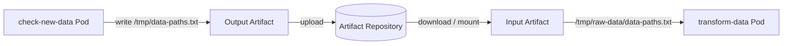

`from: "{{steps.check-new-data.outputs.artifacts.new-data-paths}}"` 是 output reference，不是把整个文件嵌入 Workflow status。Artifact repository 需要单独配置，并考虑：

- Object key / prefix uniqueness；
- Encryption 与 access control；
- Digest / integrity；
- Retention 与 garbage collection；
- 大文件 upload / download 成本；
- Retry 是否覆盖同一个 logical output。

小型 scalar values 可用 parameters；大对象用 artifacts。把 GB 级内容塞进 Kubernetes resource status 会触及 API / etcd 大小和性能边界。

#### 提交与查看 Workflow

原章展示的 Argo CLI：

```text
argo submit -n argo sample_workflow.yaml
argo list -n argo
argo get -n argo WORKFLOW_NAME
```

因为 Workflow 是 Kubernetes custom resource，也可使用：

```text
kubectl get crd
kubectl get workflows.argoproj.io -n argo
kubectl describe workflow/WORKFLOW_NAME -n argo
kubectl get pods -n argo
```

原章写作 “customer resource definition” 是排版 / 拼写问题，正确术语是 **custom resource definition**。另外 CRD 是 cluster-scoped resource，`kubectl get crd` 本身不受 namespace 限制；Workflow instances 才是 namespaced。

#### Code Dockerization：为什么降低 Production Deployment 成本

Argo 本质上以 containers / Pods 调度工作。它要求用户把 task code 放进 images，这看似增加前置步骤，却形成稳定交付单位：

```text
source code + system libraries + Python dependencies
-> container image
-> local container test
-> push immutable image digest
-> Argo task runs the same image
```

相对 Airflow 中把 prototype 改造成 DAG operator 并处理 shared runtime dependencies，原章认为 Argo 从本地 Docker prototype 到生产几乎没有代码转换。

这个结论有前提：

- 本地确实用同一 image 测试；
- 生产引用 immutable digest，而非 mutable `latest`；
- CPU architecture、GPU runtime 与 drivers compatible；
- Secrets、ServiceAccount、network policy、volumes 和 artifact repository 正确；
- Image entrypoint 不依赖本地 bind mounts 或隐藏环境变量。

Container image 保证用户空间依赖较一致，不保证整个 distributed environment 等价。

#### Key Feature 1：Kubernetes 上安装与维护路径直接

原章认为已有 Kubernetes expertise 时，安装和排错成本低：可沿用 `kubectl`、Pod logs、events、RBAC 与 resource inspection，不必再学习完全不同的 worker substrate。

但“安装简单”不等于“生产治理免费”。仍需维护 controller HA、Argo Server、artifact repository、archive / retention、RBAC、admission policy、Pod quotas 和 CRD upgrades。

#### Key Feature 2：Robust Workflow Execution

Pod 提供 task process / filesystem / resource isolation；Argo 还支持 retry 与 CronWorkflow。Kubernetes node failure、Pod eviction 等状态可被 controller reconciliation 捕获。

可靠性仍依赖 task 幂等。Pod 被重新创建时，数据库 INSERT、通知或模型发布可能重复发生。

#### Key Feature 3：Templating 与 Composability

Templates 类似函数，支持组合共享 steps。它们把容器实现、resources、inputs / outputs 和 retry policy 封装为复用单元。

复用时需避免 mutable shared template 无版本升级。可将 template name / labels 与 image digest、schema version 关联，并先在 staging workflows 验证。

#### Key Feature 4：完整 UI

原章强调 UI 可提交 / 停止 workflow、列出 workflows、查看 definitions 与运行状态。UI 还应帮助定位到 Pod logs、node status、artifacts 与 retries。

高权限提交 / terminate 操作必须通过 Argo Server auth、Kubernetes RBAC 与 namespace policy 管理，不应把 admin UI 直接暴露给不可信网络。

#### Key Feature 5：Flexibility 与 Applicability

原章指出 Argo 有 REST APIs 与 plugins，container-based tasks 使其用于 ML、ETL、batch processing、CI/CD 等领域。

当前 template types 还包括 container、script、resource、suspend、HTTP、plugin、steps、DAG 等。灵活性来自 Kubernetes ecosystem，但也意味着用户可能需要理解 Pod、ServiceAccount、resource request、volume 与 network。

#### Key Feature 6：Production Quality

原章以 Kubeflow Pipelines 和 Argo CD 作为 Argo ecosystem 的生产案例。这里需区分：Argo CD 是同一生态中的 GitOps continuous delivery 项目，不等同于 Argo Workflows；产品边界与具体底层集成应按版本核对。

#### 原章局限一：人人维护 YAML

短 workflow 尚可读，复杂流程会出现：

- 深层 list / map indentation；
- 大量重复 resources、env、artifact declarations；
- Template reference 难追踪；
- 字符串模板与 YAML quoting 交织；
- Schema / CRD version 变化；
- Review 时难区分控制流与运行配置。

WorkflowTemplate、ClusterWorkflowTemplate、参数化、JSON Schema validation 和生成式 SDK 可减轻问题，但若最终只有 generated YAML 可调试，用户仍需理解底层资源。

#### 原章局限二：需要 Kubernetes 专业知识

熟悉 Kubernetes 的团队会觉得 Argo 自然；新手则必须同时理解：

- Namespace、Pod、Container；
- Requests / limits、GPU resources；
- ServiceAccount 与 RBAC；
- Secret、ConfigMap、Volume；
- Image registry 与 pull policy；
- Pod scheduling、eviction 与 logs。

平台可以提供 golden templates / higher-level SDK 隐藏大部分细节，但必须保留逃生口和可解释错误。

#### 原章局限三：Task Execution Latency

每个 container task 通常要创建 Pod。一次 task 的端到端 latency 可分解为：

$$
T_{task}=T_{schedule}+T_{pod\ pending}+T_{image\ pull}+T_{container\ start}+T_{execute}+T_{artifact}
$$

若业务逻辑只运行 100 ms，而 Pod 启动需要数秒，基础设施开销会完全主导。Image 大、节点冷、GPU 资源稀缺时甚至可能等待数分钟。

因此 Argo 适合秒到小时级 batch / ML / data tasks，不适合把每个毫秒级 online prediction request 建成 workflow。实时 serving 应使用长期运行的 model service；Argo 可编排它的训练、部署或批处理，而不是 request path。

可以定义粗略效率：

$$
\eta=\frac{T_{execute}}{T_{task}}
$$

$\eta$ 很低时，应合并过细 tasks、复用长期服务或选择低延迟执行模型；但合并过多又会降低 checkpoint 与重试粒度。

#### Isolation 与成本的权衡

每 task 一个 Pod 带来：

- 独立 dependency / system library；
- Resource requests / limits；
- SecurityContext 与 ServiceAccount；
- Failure blast-radius boundary；
- 可观察的 Pod lifecycle。

代价是：

- Pod scheduling / startup overhead；
- 大量小 tasks 对 API server / controller 的压力；
- 每步 artifact materialization；
- Image build / scan / pull lifecycle；
- 更多 ephemeral resources 与 logs。

隔离不是免费功能，任务粒度必须让恢复收益覆盖调度成本。

#### Argo 用于深度学习时的注意事项

- Training image 使用 immutable digest 并记录 code / environment lineage；
- GPU / topology / node affinity 由 template 或 training operator 声明；
- Distributed training 最好由专门 Kubernetes operator / training service 管理；
- Dataset 与 model bytes 走 object store / PVC / data service，不走 CR status；
- Workflow Pod ServiceAccount 遵循最小权限；
- Retryable error 与 deterministic code error 分开；
- Workflow archive 与 artifact retention 协调；
- Large fan-out 设置 parallelism、semaphore 和 quota，避免 Pod storm。

#### Argo Workflows 的适用范围

适合：

- 基础设施已标准化在 Kubernetes；
- Tasks 已 containerized；
- 需要强 task isolation 与多语言 / 多系统依赖；
- Batch、ML、ETL、CI 等 workflows 共用 Kubernetes；
- 团队熟悉 YAML、CRD、RBAC 与 Pod operations。

需谨慎：

- 团队缺少 Kubernetes 经验；
- 数据科学家不愿直接维护 YAML / containers；
- 大量 tasks 极短且要求低启动延迟；
- 需要完全脱离 Kubernetes 运行；
- Local prototype 到 image build 的工具链尚未自动化。

#### Argo Workflows 小结

Argo 的核心优势是**直接复用 Kubernetes 的 resource model 与 Pod isolation**。若代码已经 Dockerized，它能以较小转换成本进入生产；主要权衡是 YAML / Kubernetes cognition 与每 task Pod 带来的启动和控制面成本。

### 9.3.3 Metaflow

Metaflow 是以 human-friendly Python API 为核心的 ML / data workflow framework，由 Netflix 开发并于 2019 年开源。它不只追求“能够自动执行 DAG”，还直接优化数据科学家从本地探索到生产运行所花的人力时间。

#### 它针对的根问题

9.1.3 已指出，传统流程存在两个反复发生的摩擦：

1. 每次迭代都要把原型重写成编排器专用定义；
2. 成书时许多通用编排器缺少等价本地执行，workflow 常需远端测试，调试环境和日志远离用户。

Metaflow 的解决思路是：

- 用 Python class、`@step` 与 `self.next(...)` 从业务代码内定义 DAG；
- 让 local runner 与 production orchestrator 使用相同的 flow / step / artifact model；
- 自动 snapshot code、persist artifacts、记录 metadata；
- 用 decorators / CLI 选择 resources、dependencies 与 compute backend；
- 把 flow 自动导出到 Argo Workflows、AWS Step Functions 等生产 orchestrators。

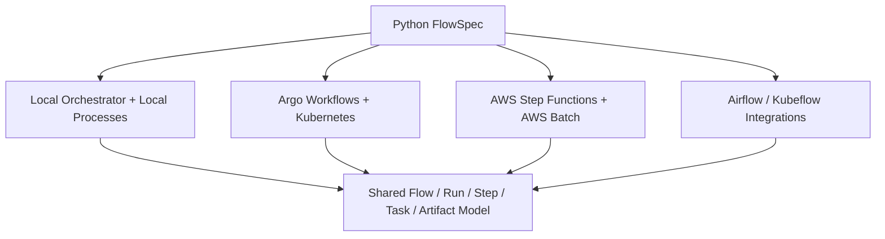

因此 Metaflow 与 Argo 并非只能二选一：Metaflow 可以面向数据科学家提供 authoring / artifacts / metadata 体验，再把 production scheduling 交给 Argo。

#### FlowSpec、Step、Transition 与 Artifact

| 抽象 | 含义 |
| --- | --- |
| `FlowSpec` | 一条 flow 的 Python class 与入口 |
| `@step` | 把 method 声明为最小执行 / checkpoint 单元 |
| `self.next(...)` | 声明下一步，形成 DAG edge |
| `Parameter` | Flow 的 typed runtime input |
| `self.<name>` | Step 产生并持久化的数据 artifact |
| Run / Task | 一次 flow execution / 某 step 的 execution instance |
| Decorator | Retry、resources、environment、remote compute 等运行策略 |

每条 flow 需要 `start` 与 `end` step。Run 从 `start` 开始；`end` 成功结束时，flow 才成功。

#### Workflow 沉浸在代码里意味着什么

在 Airflow / Argo 的原章示例中，用户显式构建另一份 DAG definition，再把函数或 images 绑定到 tasks。Metaflow 的 method 本身同时包含业务逻辑和 graph transition：

```python
@step
def transform(self):
    self.transformed = transform_data(self.raw_data)
    self.next(self.train)
```

- Function body 是 task logic；
- `@step` 声明 checkpoint boundary；
- `self.transformed` 是持久化 artifact；
- `self.next(self.train)` 是 control-flow edge。

“不修改原型代码”应理解为业务函数可以保留、再加少量 annotations / transitions，而不是任意 Notebook 自动无损变成 production workflow。Hidden notebook state、interactive plotting、local files 和 unpinned dependencies 仍需整理。

#### 原章图 9.7：统一 Local 与 Production 体验

```mermaid
flowchart LR
    DS[Data Scientist]
    Code[Same FlowSpec Code]
    Local[Local Scheduler / Processes]
    Prod[Production Orchestrator]
    Compute[Remote Compute]
    LocalStore[(Local Metadata / Datastore)]
    ProdStore[(Production Metadata / Object Store)]
    Model[Unified Run / Step / Artifact Model]

    DS --> Code
    Code -->|python flow.py run| Local
    Code -->|production create| Prod
    Prod --> Compute
    Local --> LocalStore
    Compute --> ProdStore
    LocalStore --> Model
    ProdStore --> Model
```

图中的统一是逻辑 API 与对象模型，不要求本地和生产共用同一个物理 store。统一 API 隐藏 infrastructure selection，但不会消除环境差异。Local machine 和 production cluster 的 data access、IAM、network、CPU architecture、GPU runtime 仍可能不同，必须做 staging / integration validation。

#### 原章典型用例

原章 Listing 9.3 仍实现同一个数据处理流程，但在 transform 后并行：

```mermaid
flowchart LR
    Start[start: Fetch New Data] --> Transform[transform_data]
    Transform --> Save[save_to_db]
    Transform --> Notify[notify_data_science_team]
    Save --> Join[join]
    Notify --> Join
    Join --> End[end]
```

与 Airflow / Argo 的原章示例略有差异：保存数据库和发送通知在 Metaflow Listing 中是并行分支，然后 join。若业务要求“只有保存成功才通知 ready”，应使用顺序依赖；DAG 不应为了展示 fan-out 而改变业务语义。

#### 语法完整的 Metaflow 示例

下面保留原章结构，并以简单 stub 让业务逻辑自洽。为补齐本节开头提出、但原章 Listing 9.3 未编码的 daily requirement，示例还增加 `@schedule(daily=True)`；本地 `run` 仍是一次执行，该 schedule 由支持它的 production deployment backend 实现。运行需要安装 `metaflow`；示例不会真实连接数据库或 Slack。

```python
from __future__ import annotations

from metaflow import FlowSpec, Parameter, schedule, step


def fetch_new_data(source: str) -> list[str]:
    return [f"{source}/data-001.json", f"{source}/data-002.json"]


def transform_data(paths: list[str]) -> list[dict[str, str]]:
    return [{"source": path, "status": "transformed"} for path in paths]


@schedule(daily=True)
class DataProcessFlow(FlowSpec):
    data_source = Parameter(
        "data-source",
        help="Immutable source prefix for the data-processing run",
        required=True,
    )

    @step
    def start(self) -> None:
        self.new_data_paths = fetch_new_data(self.data_source)
        self.next(self.transform_data)

    @step
    def transform_data(self) -> None:
        self.transformed_data = transform_data(self.new_data_paths)
        self.next(self.save_to_db, self.notify_data_science_team)

    @step
    def save_to_db(self) -> None:
        self.saved_row_count = len(self.transformed_data)
        self.next(self.join)

    @step
    def notify_data_science_team(self) -> None:
        self.notification = f"Prepared {len(self.transformed_data)} rows"
        self.next(self.join)

    @step
    def join(self, inputs) -> None:
        self.saved_row_count = inputs.save_to_db.saved_row_count
        self.notification = inputs.notify_data_science_team.notification
        self.next(self.end)

    @step
    def end(self) -> None:
        print(self.saved_row_count, self.notification)


if __name__ == "__main__":
    DataProcessFlow()
```

#### Linear、Static Branch、Foreach 与 Join

Metaflow 通过 `self.next` 表达几种 dataflow：

```text
Linear:
    self.next(self.train)

Static parallel branch:
    self.next(self.evaluate_cpu, self.evaluate_gpu)

Dynamic foreach:
    self.next(self.train_one_config, foreach="hyperparameters")
```

Static branch 为不同 operations 创建并行 paths；`foreach` 为 list 中每个 item 创建同一 step 的 task instances，适合 dataset shards、models 或 HPO configurations。

每个并行分支必须汇合。Join method 接收 `inputs`，因为不同分支可能产生同名但不同值的 artifacts：

```text
inputs.branch_a.score
inputs.branch_b.score
```

用户必须显式选择、聚合或用 `merge_artifacts` 合并无歧义值。这使 data conflict 在 join boundary 暴露，而不是静默选择某一分支。

#### Artifact Persistence 与 Checkpoint

在 step 中赋给 `self` 的 instance variables 会持久化为 data artifacts，并沿后续 linear steps 传播。其意义是：

- Step 成功后形成 checkpoint；
- 后续失败可复用已完成 steps 的 outputs；
- Client API 可检查历史 artifacts；
- Local / remote tasks 之间由 Metaflow 处理 transfer；
- Debugging 可从 production run 的已完成状态 resume。

```mermaid
flowchart LR
    S1[Step A] -->|self.dataset_uri| Store[(Metaflow Datastore)]
    Store --> S2[Step B]
    S2 -->|self.model_uri / score| Store
    Store --> Debug[Client API / Resume / Debug]
```

Step 粒度是 checkpoint 与 overhead 的权衡。过大则失败重算多、内部状态难检查；过小则 process / container startup、serialization 与 persistence 成本高。当前官方文档给出“单 step 最好不超过约一小时，通常更短”的经验建议，但真实边界应由 checkpoint value 和运行开销决定。

#### 本地查看与运行

原章命令：

```text
python data_process_flow.py show
python data_process_flow.py run --data-source s3://example/input/v1
```

- `show` 输出 flow graph；
- `run` 使用 local orchestrator，steps 默认作为 local processes 执行；
- Parallel branches / foreach 可在本地利用多个 processes；
- Artifacts 与 metadata 仍按 Metaflow 模型记录。

这使 graph 和业务代码从开发初期就在一起测试，而不是上线前才另写 DAG。

#### 从本地推送到 Production

原章展示：

```text
python data_process_flow.py --with retry step-functions create
python data_process_flow.py --with retry argo-workflows create
```

当前官方语义中，这些命令 snapshot working-directory code 和 Metaflow version，并将 flow 导出到相应生产编排器；Argo 路径生成 WorkflowTemplate。`--with retry` 为 steps 加 retry，但只有幂等 steps 才安全。

Production flow 的 Parameters 会映射到目标 orchestrator parameters。再次 `create` 会生成新 production version；staging、namespace、project 与 deployment policy 仍需组织设计。

#### Scheduler、Orchestrator 与 Compute Backend 不要混淆

Metaflow 把不同职责组合起来：

| 层 | Local 例子 | Production 例子 |
| --- | --- | --- |
| Flow authoring | `FlowSpec` / `@step` | 同一份 `FlowSpec` |
| Orchestration | Local orchestrator | Argo Workflows / AWS Step Functions / integration |
| Compute | Local processes | Kubernetes / AWS Batch |
| Datastore | Local files | S3 / Azure Blob / GCS 等 |
| Metadata | Local metadata | Central metadata service |

`@resources(cpu=..., memory=..., gpu=...)` 只描述需求，本身不会凭空创建资源。结合 `--with kubernetes` / `@kubernetes` 或 `--with batch` / `@batch` 后，remote backend 才按需求申请资源。

#### Key Feature 1：Structures Code as Workflow

Python annotations 与 transitions 让 workflow structure 靠近业务代码：

- 少一份手工 YAML / external DAG glue；
- Function 可直接 unit test；
- Graph 与 code 一同 version control；
- Local run 及早暴露 step boundary 问题；
- Data scientist 使用熟悉的 Python mental model。

局限是 Metaflow 主要围绕 Python；多语言 container tasks、已有 operator ecosystem 或复杂 infrastructure resources 可能更适合 Argo / Airflow 原生表达。

#### Key Feature 2：Reproducibility

原章强调 Metaflow 保存执行每个 step 所需的 data、code 与 external dependency 的 immutable snapshot，并记录 execution metadata。

更准确地说，复现仍受以下边界影响：

- 外部数据库若只记录 mutable query，不是 immutable data snapshot；
- Remote API response 可能变化；
- GPU kernels 可能 nondeterministic；
- Secret value 通常不应被 snapshot；
- Container base image / package source 需 immutable reference。

Metaflow 提供强机制，但用户仍要给外部 inputs 稳定 identity。

#### Key Feature 3：Versioning

原章说 Metaflow 通过 hashing workflow 中的 code 和 data 满足 ML version control。Content hash 有助于：

- Deduplicate identical artifacts；
- 判断两个 outputs 是否相同；
- 把 run 与 code package 关联；
- Resume 时定位已有 checkpoint。

Hash 不等于业务 semantic version，也不自动说明两个 models 哪个可投产。Registry、evaluation 与 release decision 仍是其他层的职责。

#### Key Feature 4：Robust Workflow Execution

原章列举 dependency management、`@conda` environment 与 retries。可理解为 Metaflow 同时管理：

- DAG dependencies；
- Step-level package / environment；
- Artifact checkpoint；
- Retry / resume；
- Production orchestrator integration。

当前依赖管理能力与 decorator syntax 会随版本演进，应锁定 Metaflow / Python / package versions，并测试 local 与 remote environment parity。

#### Key Feature 5：面向 ML 的 Usability

Metaflow 把 prototyping 与 production 都视为 first-class：同一 flow 可先 local run，再迁移到 remote compute / production scheduler。真正节省的是反复迭代中的：

$$
T_{rewrite}+T_{package}+T_{remote\ reproduce}+T_{artifact\ plumbing}
$$

它不只是减少代码行，而是保持同一 run / step / artifact mental model，使 production failure 能回到 local code context 中排查。

#### Key Feature 6：Seamless Scalability

原章举例给 step 加 `@batch(cpu=1, memory=500)`，让 AWS Batch 分配资源。当前能力还包括 Kubernetes、GPU、parallel branches、large `foreach` 和 distributed compute integrations。

Scale-up 与 scale-out 要区分：

- `@resources(memory=60000, gpu=1)`：为一个 task 请求更大 machine；
- `foreach`：将多个 items 分成并行 task instances；
- Distributed training：一个 task 内再启动多 worker cluster，需要专门 runtime。

Metaflow 提供声明和 integration，底层 quota、capacity、cost 与 scheduling delay 仍由 compute platform 决定。

#### 原章局限一：不支持 Conditional Branching

这是**成书时事实**，现在已经过时。Metaflow 2.18 新增 conditional branches：

```python
self.next(
    {"accept": self.release, "reject": self.stop},
    condition="decision",
)
```

它根据某个 artifact 的值只执行一条分支。2.18 还增加有限 recursion，用一个 step 的条件回到自身；flow 仍不支持任意无边界 graph loops。

生产 backend support 可能滞后：例如当前官方资料提示 conditional / recursive steps 尚不支持 AWS Step Functions deployment，而 Argo 支持情况应按目标版本验证。因此“library 支持”不等于“每个 production backend 都支持”。

#### 原章局限二：没有 Job Scheduler

原章说 Metaflow 自身不带 production job scheduler，不能单独提供 cron workflow，需要 AWS Step Functions / Argo 等系统。这一层次判断仍有意义：local runner 不是高可用 production scheduler。

但当前更完整的说法是：Metaflow 已通过 production integrations 提供 `@schedule`、event triggers 和 deployment commands；实际调度可靠性由 Argo、Step Functions、Airflow 或 Kubeflow 等 backend 提供。用户面对的是统一 API，而平台仍需部署生产 orchestrator。

#### 原章局限三：与 AWS 紧耦合

这也是明显的历史边界。原章时代的重要能力依赖 S3、AWS Batch、Step Functions，因此非 AWS 扩展成本较高。

当前官方 infrastructure matrix 已支持：

- AWS、Azure、Google Cloud；
- 任意 Kubernetes，包括 on-premises；
- S3、Azure Blob Storage、Google Cloud Storage；
- Kubernetes compute、AWS Batch；
- Argo Workflows、AWS Step Functions、Airflow、Kubeflow integrations。

所以不应再笼统称“Metaflow tightly coupled to AWS”。更准确的当前局限是：不同 cloud / scheduler 组合的 feature parity、成熟度和运维路径不完全相同，跨 backend 前要验证 decorators、events、conditional、datastore 与 metadata support。

#### Metaflow 还没有消除哪些成本

- 仍需生产 orchestrator、compute、datastore 与 metadata infrastructure；
- Python-centric abstraction 不覆盖所有语言 / resource types；
- 自动 artifact persistence 可能产生 storage / serialization 成本；
- 大型 Python objects 不一定适合直接作为 artifacts；
- Local success 不能证明 production IAM / network / capacity 正确；
- Decorator 与 backend capability matrix 会演进；
- Data scientists 仍需设计幂等、task boundaries 和 immutable inputs；
- 多团队需要 namespace、project、RBAC、retention 与 deployment governance。

#### Metaflow 的适用范围

适合：

- Python 为主的 ML / data science 团队；
- 本地试验与生产运行频繁往返；
- 需要自动 artifact / metadata / code snapshot；
- 希望把 infrastructure 选择藏在 decorators / deployment 后；
- 已有或愿意部署 Argo / Step Functions 等 production backend；
- HPO、data sharding 等需要 branch / foreach parallelism。

需谨慎：

- Workflow 主要由非 Python、任意 containers / Kubernetes resources 组成；
- 组织已有成熟 Airflow DAG authoring 且转换摩擦很小；
- 目标 backend 不支持所需 Metaflow constructs；
- 需要毫秒级 online request orchestration；
- 不愿维护 Metaflow metadata / datastore integration；
- Artifact objects 极大或难安全序列化。

#### Metaflow 小结

Metaflow 的核心优势是**把 ML workflow、artifacts 与 local-to-production 体验围绕 Python 开发者重新设计**。它可以利用 Argo / Step Functions 等生产编排器，而不必自己重新实现全部 control plane；主要权衡是增加一层 framework，并受其 Python model 与 backend capability matrix 约束。

### 9.3.4 什么时候使用哪一种系统

#### 原章直接建议

原章给出简明选择：

- 非 ML workflow automation：Airflow 与 Argo 都很好；
- 系统运行于 Kubernetes，团队熟悉 Docker：优先考虑 Argo Workflows；
- 否则 Airflow 是可靠的通用选择；
- 希望优化 ML development lifecycle：原章强烈推荐 Metaflow，因为它减少 prototype 到 production 的转换与部署负担。

原章甚至称 Metaflow 是当时 ML 项目的“best option”。这是成书时作者判断，不是永久排名。当前产品能力、团队现有平台、managed services、security 与 TCO 都可能改变结论。

#### 三者并非完全同层

```mermaid
flowchart TB
    Developer[ML / Data Developer Experience]
    Orchestrator[Production Workflow Orchestrator]
    Compute[Task Compute Backend]
    Storage[Metadata / Artifact Storage]

    Metaflow[Metaflow] --> Developer
    Metaflow --> Storage
    Airflow[Airflow] --> Orchestrator
    Argo[Argo Workflows] --> Orchestrator
    Argo --> Compute
    Metaflow -. export / integration .-> Airflow
    Metaflow -. export / integration .-> Argo
```

Airflow 与 Argo 首先是 production orchestrators；Metaflow 同时提供 authoring、artifacts、metadata 与 infrastructure abstraction，并可把 scheduling 委托给前两者。因此现实方案可能是：

```text
Metaflow developer experience + Argo production orchestration + Kubernetes compute
```

而不是机械地只选一个品牌。

#### 维度对比

| 维度 | Airflow | Argo Workflows | Metaflow |
| --- | --- | --- | --- |
| 首要定位 | 通用 scheduled workflow platform | Kubernetes-native workflow engine | Human-centric ML workflow framework |
| Authoring | Python DAG / Operators / TaskFlow | YAML CRD / Templates / Containers | Python `FlowSpec` / `@step` |
| 运行基础 | Airflow executors / workers / external systems | Kubernetes controller / Pods | Local runner；生产依赖 integrated orchestrator |
| 复用单元 | Operator、Hook、Sensor、TaskGroup | Template、WorkflowTemplate | Step code、decorator、flow component |
| Task 隔离 | 取决于 executor / operator | Container task 通常 Pod 隔离 | 取决于 local / Kubernetes / Batch backend |
| Local experience | 已有 loader/unit/`dag.test()`，完整 parity 仍有限 | 可 lint/render/submit，本地 cluster 常有成本 | 核心优势，同一 flow 本地直接运行 |
| Artifact model | XCom + external object store convention | Parameters + artifact repository | `self` artifacts 自动持久化 |
| Schedule | 内建 | CronWorkflow / triggers | 由 production integration 提供统一 decorators |
| Ecosystem | Data / ETL providers 丰富 | Kubernetes / container ecosystem | ML / Python lifecycle 与 backend integrations |
| 主要认知成本 | Airflow runtime / providers | Kubernetes / YAML / containers | Metaflow model / backend capability matrix |
| 典型优势 | 成熟调度、backfill、UI、operators | 强隔离、Kubernetes-native、多语言 image | 原型到生产、artifact / metadata、Python UX |

#### 决策树

```mermaid
flowchart TB
    Start{主要目标是什么?}
    Start -->|通用 ETL / scheduled jobs| Existing{已有成熟平台?}
    Start -->|ML iteration velocity| Python{团队主要使用 Python?}
    Existing -->|Airflow| UseAF[继续 Airflow，补齐 ML operators]
    Existing -->|Kubernetes / Argo| UseArgo[继续 Argo，建设 templates / SDK]
    Existing -->|没有| K8s{Kubernetes 是标准底座?}
    K8s -->|是，且熟悉 containers| UseArgo
    K8s -->|否| UseAF
    Python -->|是| MF[评估 Metaflow]
    Python -->|否| Container[优先 container-native Argo / 通用 Airflow]
    MF --> Backend{生产 backend?}
    Backend -->|Kubernetes| Combo[Metaflow + Argo]
    Backend -->|AWS managed| SF[Metaflow + Step Functions / Batch]
    Backend -->|已有 Airflow| MFAF[评估 Metaflow + Airflow integration]
```

#### 不要只按语言或部署环境决定

至少回答以下问题：

1. 主要用户是 data engineers、data scientists 还是 platform engineers？
2. Workflow 是 schedule-heavy ETL，还是频繁迭代的 ML experiments？
3. Tasks 是 Python functions、external service calls，还是 arbitrary containers？
4. 是否已有 Kubernetes、Airflow 或 managed orchestrator？
5. 本地复现 production failure 有多重要？
6. 是否需要 backfill、event triggers、conditional、dynamic fan-out？
7. Task startup latency、运行时长和并发规模？
8. Dependencies 是否互相冲突，需要 Pod / image isolation？
9. Artifacts、metadata 与 lineage 已由谁管理？
10. Multi-tenancy、RBAC、audit 与 secrets 要求？
11. 哪个团队负责 upgrades、on-call 和 cost control？
12. 目标 backend 是否支持所需 framework features？

#### 用同一代表性 Workflow 做 POC

功能表无法暴露真实摩擦。应让候选系统执行同一条 representative pipeline：

```text
event / schedule
-> immutable dataset snapshot
-> transform
-> fan-out training / evaluation
-> quality gate
-> model registration
-> human approval or release
```

量化：

- 第一次 authoring 时间；
- 修改一个 training step 后重新上线时间；
- Local failure reproduction 时间；
- Cold task startup、schedule lag、end-to-end duration；
- 100 / 10,000 tasks 的 scheduler / controller 表现；
- Retry 后是否重复副作用；
- Artifact / metadata completeness；
- 日志和错误定位步数；
- Platform install / upgrade / on-call 成本；
- 每 run infrastructure 与 storage cost。

可以用加权评分表达组织取舍：

$$
Score(tool)=\sum_{i=1}^{m}w_i s_{i,tool},\qquad \sum_{i=1}^{m}w_i=1
$$

$w_i$ 是组织对可靠性、易用性、隔离、成本等维度的权重，$s_{i,tool}$ 是真实 POC 得分。权重必须在看结果前确定，避免为了偏好的工具事后调整标准。

#### 选型结论

- 已有稳定平台通常比追逐“最佳工具”更重要；先评估增量改进；
- Airflow 强在成熟通用调度和 data ecosystem；
- Argo 强在 Kubernetes-native container execution 与 isolation；
- Metaflow 强在 ML Python developer experience，可与生产 orchestrator 组合；
- Online request path 不应使用这些 batch workflow systems；
- 原章推荐提供方向，不替代目标版本、真实 workload 与组织 TCO 的验证。

---

## 原章 Summary 回顾

原章最后将全章压缩为七点：

1. Workflow 是更大任务中的一系列 operations，可建模为 steps 构成的 DAG；step 是最小 resumable computation unit，整体成功或失败；DAG 定义 dependencies 与 execution order。
2. Workflow orchestration 是按照 DAG 顺序执行 workflow steps。
3. 采用 workflow 能促进工作共享、团队协作和自动化。
4. 深度学习采用 workflow 的主要挑战，是降低 workflow 构建成本并简化测试与排错。
5. 六项设计原则是 criticality、usability、extensibility、task isolation、scalability 与 human centricity。
6. 非 ML 项目可选 Airflow 或 Argo；若项目运行在 Kubernetes 且采用 Docker，原章更推荐 Argo。
7. 对 ML 项目，原章在成书时最推荐 Metaflow，因为它重点优化数据科学家的开发周期。

前六项概念与设计原则仍具有普适性；最后两项产品推荐具有明显时间和组织边界，应以当前版本 POC 复核。

## 容易混淆的概念与常见误区

### 1. Workflow 就是 Workflow Orchestration

Workflow 是执行计划 / DAG；orchestration 是创建、调度、执行、监控和恢复这些 plans 的系统行为。前者是“做什么及依赖”，后者是“怎样可靠地运行”。

### 2. Workflow Definition 就是 Workflow Run

Definition 可被重复触发；每次触发产生独立 run。Task definition 也会在每个 run 中实例化为 task instance，并可能有多个 attempts。

### 3. Step、Task、Task Instance 与 Attempt 完全同义

原章交替使用 step / task 描述定义层最小单元；task instance 属于某次 workflow run；attempt 是该 instance 的某次执行尝试。生产状态必须区分这些 identity。

### 4. DAG 不允许环，所以 ML 不能迭代

一次 materialized run 的 dependency graph 保持无环；实验迭代可产生新 runs，有限循环可在 task 内运行或展开为 tasks，现代系统也可能提供有界 recursion。关键是终止条件与状态明确。

### 5. DAG Edge 一定表示数据传输

Edge 首先表示 control dependency。Data 可以通过 artifact URI、database、object store 或 service 传递；有 control edge 不代表 bytes 沿 edge 直接搬运。

### 6. 两个 Tasks 没有依赖就一定并行

它们只是具备并行资格。是否同时运行还受 worker capacity、quota、pool、priority、resource availability 和 concurrency limit 约束。

### 7. Workflow Run 成功就说明模型质量合格

Run success 只表明定义的 tasks 满足 execution semantics。模型能否发布必须由 evaluation / quality gate 判断；一个成功 workflow 完全可能产出应拒绝的模型。

### 8. Cron 就是完整 Workflow Orchestrator

Cron 能按时间启动命令，却不天然提供 DAG dependencies、distributed state、retry semantics、artifact tracking、backfill、UI、HA 与 cross-task recovery。

### 9. Notebook 不能参与 Production Development

Notebook 适合探索；问题是 hidden state 和交互过程不能直接作为稳定 production contract。可将验证后的业务函数抽出并由 workflow 调用，而不必禁止 Notebook。

### 10. Workflow 应执行所有重计算

Workflow code 应轻量，负责连接 tasks。GPU training、dataset build 等重任务由 worker、container 或专门 service 执行；control plane 不应直接承担计算。

### 11. Task 越细越好

细粒度提高 checkpoint、retry 与观察能力，却增加 scheduling、container startup、artifact serialization 和 metadata 成本。边界应围绕可恢复价值与原子 side effect 选择。

### 12. Task 越大越高效，所以最好做成一个 Task

Monolithic task 减少调度开销，却失去并行、局部重试、阶段指标和复用。12 小时训练最后一步失败时，可能被迫全部重跑。

### 13. Retry 能提供 Exactly-Once Execution

Worker 可能在外部副作用完成后、状态提交前崩溃。Retry 通常意味着至少一次尝试；exactly-once effect 依赖 idempotency key、transaction / CAS、reconciliation 和 immutable output。

### 14. 所有错误都应该自动重试

Network timeout 等 transient error 可重试；syntax error、权限拒绝、schema mismatch 和确定性 OOM 通常不会因重试消失。错误分类比提高 retry 次数更重要。

### 15. Metadata Database 应保存所有 Task Outputs

数据库适合 definitions、states 和小型 references；dataset、model、report 等大对象应放 object store / artifact repository。把大 bytes 存进控制面会拖慢调度与恢复。

### 16. Object Store 可以替代 Metadata Database

Object store 擅长 key-based bytes，不擅长 scheduler 所需的事务状态迁移、ready-task query、locks 与 relational history。两者职责互补。

### 17. Scheduler 与 Worker 是同一种组件

Scheduler / controller 决定何时和在哪里运行；worker 执行 operator。把不可信长任务放进 scheduler process 会破坏 control-plane availability。

### 18. 增加 Workers 能解决所有 Scaling 问题

Worker shortage 只是一个瓶颈。Scheduler evaluation、metadata DB locks、queue、API server、artifact bandwidth 和 external service rate limit 都可能先饱和。

### 19. Workflow SLA 只等于 Task Runtime

端到端延迟还包括 schedule lag、queue wait、resource provisioning、image pull、artifact transfer 与 retry backoff。只优化算法 runtime 可能不改变用户等待。

### 20. Execution Isolation 表示完全没有共享资源竞争

现实系统仍共享 cluster、database、network 和 object store。Isolation 的目标是用 quota、namespace、credential 与 failure boundary 控制干扰和 blast radius。

### 21. Container Isolation 自动等于 Security Isolation

Container / Pod 提供 process 和 filesystem boundary，但还需 ServiceAccount、RBAC、network policy、secret isolation、image policy、runtime hardening 与 tenant controls。

### 22. Shared Operator 越通用越好

过度通用会形成参数爆炸和隐藏耦合。可复用 task 需要稳定、窄 contract、versioning、owner、tests 与 backward compatibility。

### 23. Local Test 通过就保证 Production 成功

Local runner 无法完整复制 production IAM、network、data scale、GPU、scheduler、quota 与 failure mode。Local test 缩短反馈环，不替代 staging / integration test。

### 24. Airflow DAG Python 文件只在 Workflow Run 时执行

Airflow 会反复执行 top-level Python 来发现 DAG。Top-level network / database / ML computation 会拖慢 parsing 并产生重复副作用；真正工作应在 task runtime 中完成。

### 25. Airflow 的 `>>` 会立即执行右侧 Task

`>>` 只建立 dependency edge。具体 Task Instance 由 Scheduler 在 Dag Run 中满足条件后交给 executor / worker。

### 26. XCom 适合传 Dataset 或 Model 文件

XCom / metadata channel 适合小型值和 URI；大对象应放 object store。传大 bytes 会膨胀 metadata DB、serialization 与 UI 查询成本。

### 27. Airflow 永远无法本地测试

这是原章成书时局限的概括。当前 Airflow 已有 loader tests、unit tests 与 `dag.test()`；但完整 production parity 仍需真实 executor / staging。

### 28. 使用 KubernetesExecutor 后 Airflow 就等于 Argo

Airflow 仍采用自身 DAG processor、scheduler、metadata DB 和 executor model；Argo 直接采用 Kubernetes CR / controller / Pod reconciliation。底层都用 Pod，不代表 control plane 相同。

### 29. CRD、Workflow CR 与 WorkflowTemplate 是同一对象

CRD 注册资源 schema；Workflow CR 是 definition + state 的 live run object；WorkflowTemplate 是可复用定义。混淆三者会导致错误的 version / retention 设计。

### 30. Argo 中每个图节点永远创建一个新 Pod

Container / script tasks 通常运行于 Pod，但 resource、HTTP、suspend、plugin 等 template types 有不同执行语义。应按具体 template type 评估 latency 与 isolation。

### 31. Argo 会自动保存 Artifact，无需配置 Repository

Input / output declaration只描述 dataflow；生产仍需配置 S3 等 artifact repository、credentials、keys、retention 和 integrity policy。

### 32. Container Image 保证完全可复现

Image 固定用户空间依赖，但 external data、secret、driver、hardware、network service 和 mutable image tag 仍可变化。应使用 digest 和 immutable input references。

### 33. `image: latest` 是一个稳定版本

`latest` 是 mutable tag。历史 run 应记录解析后的 image digest，否则 retry 或复现可能运行不同代码。

### 34. Kubernetes-Native 对所有用户都更简单

它对已熟悉 Kubernetes 的平台团队自然，却把 Pod、RBAC、resources、volumes 与 YAML 暴露给数据科学家。Higher-level SDK / templates 常是必要产品层。

### 35. Argo Workflows 适合处理每个在线预测请求

Pod provisioning 通常是秒到分钟级，远高于毫秒级 serving SLA。Argo 适合训练、批预测和发布流程，不适合逐 request orchestration。

### 36. Metaflow 自己就是完整高可用 Production Scheduler

Metaflow 提供 local orchestrator 与 production deployment integrations；高可用 schedule / event execution 通常由 Argo、Step Functions、Airflow 等 backend 承担。

### 37. `@resources` 会自动创建 CPU / GPU

它只是资源声明；必须结合 Kubernetes、AWS Batch 等 compute backend，且底层还要有 quota 和实际 capacity。

### 38. `self.x` 只是普通内存变量

在 Metaflow step 中，它会成为持久化 data artifact，并可能跨 process / cloud 传输。应考虑大小、serialization、安全和 retention。

### 39. Metaflow 不支持条件分支

这是原章时期局限。Metaflow 2.18 已支持 conditional branch 与有限 recursion，但各 production backend 的支持可能不一致。

### 40. Metaflow 只能运行在 AWS

这是过时结论。当前支持 Azure、GCP、任意 Kubernetes 等路径；但不同 backend 的 feature parity 与成熟度仍需验证。

### 41. Metaflow 能把任意 Notebook 零改动变成 Production Workflow

通常仍需提取业务函数、定义 step boundaries / transitions、消除 hidden state、固定 dependencies 和声明 immutable inputs。它降低转换成本，不消除生产化设计。

### 42. Airflow、Argo 与 Metaflow 完全处于同一层

Airflow / Argo 主要是 production orchestrators；Metaflow还提供 ML authoring、artifacts 与 metadata abstraction，并可导出到它们。组合方案可能比单选更合理。

### 43. Human-Centric 只意味着 UI 好看

它关注总人力时间：authoring、local validation、deployment、debugging、artifact plumbing 和 failure reproduction。漂亮 UI 不能弥补每天数小时的转换摩擦。

### 44. Backfill 就是 Retry

Retry 重试同一 task instance / logical run 的失败 attempt；backfill 为过去 data intervals 创建新 runs。两者 identity、输入范围和副作用语义不同。

### 45. Tool Feature List 可以直接决定选型

同名功能的可用性、延迟、调试路径和运维成本差异很大。应使用相同 representative workflow 做 POC，并按预先确定的组织权重评分。

## 本章知识结构

```mermaid
flowchart TB
    Root[Workflow Orchestration]

    Root --> Concepts[9.1 Concepts and Motivation]
    Concepts --> Workflow[Workflow = DAG of Steps]
    Workflow --> Identity[Definition / Run / Task / Attempt]
    Workflow --> Graph[Dependency / Topological Order / Critical Path]
    Concepts --> Why[Automation / Reuse / Collaboration]
    Concepts --> Gap[Prototype-to-Production Gap]
    Gap --> Human[Human-Centric Local-to-Prod]

    Root --> Design[9.2 System Design]
    Design --> Scenario[Development + Execution Phases]
    Design --> Components[Five Components]
    Components --> Web[Web Server]
    Components --> Scheduler[Scheduler + Controller]
    Components --> DB[(Metadata Database)]
    Components --> Workers[Worker Group]
    Components --> Store[(Object Store)]
    Design --> Runtime[State Machine / Retry / Idempotency]
    Design --> Principles[Six Principles]
    Principles --> C[Criticality]
    Principles --> U[Usability]
    Principles --> E[Extensibility]
    Principles --> I[Isolation]
    Principles --> S[Scaling]
    Principles --> H[Human Centricity]

    Root --> Tools[9.3 Open-Source Systems]
    Tools --> Airflow[Airflow: Python DAG + Operators]
    Tools --> Argo[Argo: Kubernetes CRD + Pods]
    Tools --> Meta[Metaflow: FlowSpec + Artifacts]
    Meta -. Production Backend .-> Argo
    Meta -. Integration .-> Airflow
    Tools --> Choice[POC by Workload / Team / TCO]
```

## 核心结论

### 原章主线与直接结论

1. **Workflow 是完成更大任务的一系列 operations，可表示为 steps 构成的 DAG。** Step 是整体成功或失败的最小 resumable unit。
2. **DAG 显式表达 task dependencies 与 execution order。** 无依赖 tasks 可以并发，图中不应存在使执行陷入死循环的 dependency cycle。
3. **Workflow orchestration 的直接目标是按 DAG 自动执行并监控 tasks。** 实践中还覆盖 creation、schedule、management 与 troubleshooting。
4. **深度学习需要 workflow，不只因为自动化，还因为复用与协作。** Shared steps 减少组织内重复集成工作，DAG 暴露团队边界。
5. **通用编排给 ML 带来的最大挑战是 prototype 与 production 不连续。** 用户必须学习新语法、重构代码并远端排错。
6. **Workflow construction 不是一次成本。** ML 是反复实验过程，每次 prototype 改进都可能重新发生转换摩擦。
7. **面向 ML 的关键改进是让 local code 到 production workflow 的转换无缝。** Local 与 production 应尽量共享 code、API 与 execution model。
8. **用户场景分为 development 与 execution 两阶段。** 前者 author / validate / submit；后者由 scheduler、controller、worker 和 UI 接管。
9. **Workflow 自身必须轻量。** 它连接 tasks，真正重计算应由 tasks、workers 或外部 services 完成。
10. **通用系统包含 Web Server、Scheduler/Controller、Metadata Database、Worker Group 与 Object Store。** 中央存储使组件解耦。
11. **六项设计原则是 criticality、usability、extensibility、isolation、scaling 和 human-centric prototyping/production support。**
12. **Scaling 包含并发 workflows 与单个大型 workflow 两个问题。** 原章主张在系统层提供并行能力，不把可伸缩复杂度推给业务用户。
13. **Airflow 的核心是 Python DAG、Operators、Sensors、扩展生态和成熟运维。** 它首先是通用 data / workflow platform。
14. **Argo 的核心是 Kubernetes CRD、templates 与 Pod execution。** Containerization 带来隔离和部署一致性，也带来 YAML/Kubernetes 学习与启动开销。
15. **Metaflow 的核心是 human-centric Python workflow、artifact persistence 与统一 local-to-production 体验。** 它优先减少 ML 开发者时间。
16. **原章对三种工具的推荐具有场景性：通用流程选 Airflow/Argo，Kubernetes 优先 Argo，ML development 优先 Metaflow。** 产品结论必须按当前版本更新。

### 实践扩展与生产化边界

17. **Definition、run、task instance 与 attempt 必须有独立 identity。** 否则 retry、backfill、lineage 与审计无法准确表达。
18. **Control flow、state flow 与 data flow 应分离。** Scheduler 传 control，metadata DB 存 state，object store / data service 传大对象。
19. **Task boundary 是恢复性、可观察性与调度成本的权衡。** 没有对所有 workload 通用的最佳粒度。
20. **Task execution 通常接近 at-least-once。** 幂等 key、事务目标、atomic publish 与 reconciliation 才能控制重复副作用。
21. **Retry 只适合可恢复错误。** Error classification、backoff、jitter 与 retry budget 比无限重试更可靠。
22. **Critical path 决定理想完成时间下界；worker 数量不能突破真实串行依赖。** 调度优化前应先识别瓶颈路径。
23. **调度伸缩不仅是增加 workers。** Scheduler、DB、queue、API server、artifact bandwidth 与外部 service 都可能需要 backpressure。
24. **Isolation 包含 creation isolation 与 execution isolation。** Immutable definitions / dependencies 保护前者，container / quota / credentials 保护后者。
25. **Human-centric 是可量化系统目标。** 应测量 author、validate、deploy、queue、execute 与 debug 构成的端到端 feedback time。
26. **Airflow DAG top-level code 必须轻量，XCom 只传小值，大对象走 remote storage。** 当前版本已有更好的 local tests，但不等于完整 production parity。
27. **Argo Workflow CR 是 live object，Template 是可复用函数式定义，artifact repository 承担跨 Pod dataflow。** Container image 应用 digest 固定。
28. **Metaflow `self` artifacts 同时提供 dataflow、checkpoint 和 debugging 能力。** 自动持久化仍有 serialization、storage 与 security 成本。
29. **Metaflow 的原章局限已有变化。** 2.18 增加 conditional / recursion，基础设施不再只限 AWS，但 backend feature parity 仍不同。
30. **三种系统不是严格同层替代。** Metaflow 可以作为 developer layer，与 Argo / Airflow production orchestration 组合。
31. **Batch workflow orchestrator 不属于在线预测请求路径。** 毫秒级 serving 应使用长期运行服务，编排器管理训练、批任务、部署与回滚过程。
32. **工具选型必须用同一 representative workflow 验证。** Feature list 不能替代 authoring、failure reproduction、latency、scale、security、operations 与 TCO 数据。

## 从本章提炼出的通用解题方法

面对一个 workflow orchestration 设计或选型问题，可以按以下十步推进。

### 第一步：明确用户、目标与非目标

列出主要用户、workflow 类型、触发方式、任务时长、并发量、基础设施与 SLA。明确系统是 batch automation，不承担毫秒级 online request orchestration。

### 第二步：先画业务 DAG，再选工具

把端到端目标拆为 tasks，标出 control dependencies、data dependencies、并行 branches、quality gates 和 external services。检查 cycle，并计算 critical path / maximum parallel width。

### 第三步：定义 Identity 与 Task Contract

为 workflow definition/version、run、task definition、task instance、attempt 和 artifact 定义稳定 ID。每个 task 明确：

```text
typed inputs
immutable input references
action / operator
typed outputs and artifact URIs
success condition
timeout / retry class
resource profile
idempotency key
owner
```

### 第四步：选择合理的 Task Boundaries

围绕可独立重试、可复用、可观察且副作用原子的动作切分。估算：

$$
Cost_{boundary}=C_{schedule}+C_{startup}+C_{serialize}+C_{persist}
$$

只有 checkpoint / parallel / reuse 收益高于边界成本时才继续拆分。

### 第五步：分离 Control、State、Compute 与 Data

- Web / API 接收用户操作；
- Scheduler / controller 管 control flow；
- Metadata DB 管 canonical state；
- Workers / external services 管 compute；
- Object store / data platform 管 large data；
- Queue / lease 管 dispatch ownership。

不要用数据库传模型 bytes，也不要用 worker local disk 作为跨 task contract。

### 第六步：设计状态机与故障语义

明确 pending、ready、queued、running、success、failed、lost、retry、skipped、canceled。逐一演练：

- Worker 在执行前 / 后崩溃；
- Output 上传成功但 DB 未提交；
- Scheduler failover；
- Queue 重复投递；
- External job 已创建但 response 丢失；
- User cancel 与 task completion 竞态。

用 lease、heartbeat、idempotency、atomic publish 与 reconciliation 收敛状态。

### 第七步：设计 Trigger、Backfill 与 Capacity Policy

定义 time / event trigger、timezone、dedup、overlap、catchup、backfill 和 concurrency。按 tenant / workflow 设置 pool、quota、priority、parallelism 与 backpressure，并监控 schedule lag / queue depth。

### 第八步：优化 Local-to-Production Feedback Loop

提供同一 business code 的 local runner、DAG validation、unit test、artifact fixture、remote failure resume、automatic packaging 和 staging deployment。目标是降低：

$$
T_{feedback}=T_{author}+T_{validate}+T_{deploy}+T_{queue}+T_{execute}+T_{debug}
$$

### 第九步：补齐 Observability、Security 与 Governance

统一 workflow/run/task/attempt IDs 进入 logs、metrics、traces 与 artifacts。建立 RBAC、tenant isolation、secret references、image policy、audit、retention、definition versioning、plugin ownership 与 upgrade tests。

### 第十步：用真实 Workflow 做 POC 与渐进上线

让 Airflow、Argo、Metaflow或组合方案执行相同 data → train → evaluate → register 流程。测量 authoring、local debug、schedule lag、startup、recovery、scale 和 TCO。先迁移低风险 workflow，建立 golden templates 与 on-call runbook，再扩大使用。

这套方法的核心是：**先从人的迭代过程和业务 DAG 推导 task contract，再分离控制、状态、计算与数据，用明确状态机和幂等语义保障恢复，最后以真实开发时间与生产 SLO 选择工具。**

## 复习与自测

1. Workflow、workflow orchestration、step 和 DAG 分别是什么？
2. 原章为什么交替使用 task 与 step？生产系统还需要区分哪些实例层次？
3. 为什么 step 被定义为最小 resumable unit？
4. Workflow definition、workflow run、task instance 和 attempt 如何关联？
5. DAG 的 $V$ 与 $E$ 分别表示什么？
6. 为什么 DAG 的无环性允许拓扑排序？
7. 原章图 9.1 的实线与虚线箭头分别表示什么？
8. Authorization 后的哪两个任务可以并行？为什么？
9. Critical path 怎样决定 workflow 最短完成时间？
10. 为什么增加无限 workers 也不能突破关键路径？
11. 不允许 DAG loop 是否意味着不能实现迭代训练？有哪些安全表达方式？
12. Task 粒度过大和过小分别有什么代价？
13. 为什么 production model-building activities 常表示为 workflows？
14. Workflow orchestration 的狭义与广义定义有何不同？
15. Notebook monolith 在生产自动化中有哪些问题？
16. 原章认为采用 workflow 的两个直接原因是什么？
17. 图 9.2 怎样说明跨项目 task reuse？
18. Shared dataset connector 怎样节省组织级成本？其前提是什么？
19. Workflow DAG 怎样促进数据、算法和平台团队协作？
20. Orchestrator 与 Dataset / Training / Serving services 是替代还是连接关系？
21. 图 9.3 的 local incubation 和 production phase 各做什么？
22. Prototype-to-production 的第一类 gap 是什么？
23. 为什么 remote workflow troubleshooting 特别困难？
24. 为什么 workflow construction 不是一次性成本？
25. 怎样用累计迭代成本解释 human-centric design 的必要性？
26. Metaflow 在 9.1.3 被提前用来说明哪两项改进？
27. 为什么 human-centric 不只是 UI 设计？
28. Vena 在 development phase 的五个步骤是什么？
29. 将原型拆成 DAG 时显式化了哪三类边界？
30. Training task 的 input、action 和 output 可怎样设计？
31. Time schedule 与 external event trigger 有何不同？
32. Workflow 提交前应做哪些静态 / 策略验证？
33. 原章伪代码中的 `DAG`、Operator 与 `>>` 分别表示什么？
34. 为什么 `timedelta(months=1)` 只是概念写法？
35. Execution phase 的四个用户 / 系统步骤是什么？
36. Workflow success 与 model quality pass 为什么不同？
37. “Workflow 应轻量”对 DAG code、task payload 和重计算意味着什么？
38. 通用编排系统的五个核心组件是什么？
39. Web Server 应提供哪些 UI / API 能力？
40. Scheduler 与 Controller 的职责怎样区分？
41. Metadata Database 保存什么？为什么不保存大型模型？
42. Worker 从领取 task 到清理资源经历哪些动作？
43. Object Store 怎样让上下游 workers 交换 outputs？
44. Control flow、state flow 与 data flow 分别走什么路径？
45. 原章描述的 workflow execution 五步时序是什么？
46. Polling interval 怎样影响平均检测延迟与数据库负载？
47. 一个生产 Task Instance 状态机应包含哪些状态？
48. Worker 完成副作用但未报告成功时，为什么会出现重复？
49. 怎样用 idempotency key、staging output 与 reconciliation 处理至少一次执行？
50. Retry 成功率公式有哪些独立性 / transient-failure 假设？
51. 为什么 tasks 增多会降低完整 workflow success probability？
52. Little's Law 怎样帮助估算 active workflow runs？
53. 编排系统在哪些位置需要 backpressure？
54. Criticality 原则要求哪些正确性与时效性？
55. Schedule lag 怎样定义？为什么要看 P95 / P99？
56. Usability 应如何从数据科学家 productivity 衡量？
57. Operator、Hook、Executor 与 Sensor 四类扩展点有何不同？
58. Creation isolation 与 execution isolation 分别防止什么？
59. 原章所说的两个 scaling problems 是什么？
60. Human-centric principle 为什么是 ML 场景的特殊指标？
61. 六项设计原则之间有哪些冲突或取舍？
62. Airflow 的 DAG、Operator、Sensor、Hook、Executor 各是什么？
63. Listing 9.1 的五类主要 tasks 和 dependency graph 是什么？
64. 为什么 Airflow top-level DAG code 不能做训练或网络调用？
65. Airflow 3 中原章 `schedule_interval` 应怎样更新？
66. 为什么 Airflow task 应像数据库 transaction 一样幂等？
67. XCom 与 object storage 各适合传什么？
68. 原章列出的 Airflow 七类 key features 是什么？
69. 原章列出的 Airflow 三项局限是什么？哪些已因 `dag.test()` 等能力发生变化？
70. Airflow 使用 Kubernetes executor 为什么仍不等同 Argo？
71. Argo 的 CRD、Workflow CR、WorkflowTemplate、Template 与 Pod 如何关联？
72. Argo `steps` 的 list-of-lists 怎样表达顺序和并行？
73. Listing 9.2 中八个标注分别说明什么？
74. Argo怎样把 upstream output artifact 放入 downstream Pod？
75. 为什么 Workflow status 不应直接保存大型 artifact bytes？
76. 本地测试同一 container image 为什么能降低 production conversion cost？仍缺哪些一致性？
77. 原章列出的 Argo 六类 key features 是什么？
78. 原章列出的 Argo 三项局限是什么？
79. 怎样分解 Argo container task 的端到端启动 / 执行延迟？
80. 为什么 Argo 不适合逐 online prediction request 调度？
81. Metaflow 针对 prototype-to-production gap 做了哪两项核心改进？
82. `FlowSpec`、`@step`、`self.next`、`Parameter` 与 `self.x` 分别是什么？
83. Workflow “沉浸在 Python code 中”有什么收益和边界？
84. Listing 9.3 的 fan-out / join graph 是什么？为什么业务上可能需要改成顺序通知？
85. Static branch 与 `foreach` 分别适合 task parallelism 还是 data parallelism？
86. Join step 为什么必须显式处理同名 artifact 冲突？
87. Metaflow artifact persistence 怎样支持 checkpoint、resume 与 debugging？
88. `show`、`run`、`step-functions create` 与 `argo-workflows create` 分别做什么？
89. Metaflow authoring、orchestration、compute、datastore 与 metadata 五层怎样组合？
90. `@resources`、`@kubernetes` 与 `@batch` 有何区别？
91. 原章列出的 Metaflow 六类 key features 是什么？
92. Hash-based versioning 为什么不能替代 business model registry？
93. 原章对 conditional branching 的局限为何已过时？backend support 为什么仍要核对？
94. “Metaflow 没有 job scheduler”在当前版本下应怎样准确理解？
95. 为什么“Metaflow tightly coupled to AWS”已不再准确？
96. Airflow、Argo 与 Metaflow 为什么不是完全同层的替代品？
97. 在什么场景下 `Metaflow + Argo + Kubernetes` 是合理组合？
98. 原章 9.3.4 对非 ML、Kubernetes 与 ML 项目的推荐分别是什么？
99. 为什么这些开源工具推荐具有时间边界？
100. 请用本章十步方法，为一个每日训练并自动评价 / 注册模型的流程设计和选择编排系统。
