> 对应原章：**10 Path to Production**
> 本章是全书的收束：它不再单独设计某一项基础服务，而是以图像识别产品为例，把数据集管理、训练、超参数优化、元数据与制品、工作流编排、模型服务串成一条从研究成果到终端产品的完整路径。

## 本章要回答的核心问题

1. Productionization（生产化）究竟是什么？“模型能运行”为何不等于“值得投产”？
2. Research、prototyping 与 productionization 三个阶段各自优化什么？
3. 为什么研究和原型阶段都偏爱 Notebook？它的边界又在哪里？
4. 公开、版本化的数据与版本化代码如何支撑研究可复现性？
5. 原型阶段的 exploratory loop 如何让训练数据形态和代码逐渐稳定？
6. 什么条件表示一个原型已经足以进入生产化，而不是继续无止境探索？
7. 为什么 Notebook 中的数据处理、训练和推理代码必须组件化？
8. 训练代码、推理代码、数据转换代码应在哪里切分？
9. 为什么组件化后还要打包、注册，并用同一个 handle 建立关联？
10. 工作流、训练服务、HPO 服务、元数据与制品存储如何合作产出模型？
11. 模型服务如何找到匹配的推理容器和模型文件？
12. 产品集成前，接口、压力、异常输入和业务指标应怎样验证？
13. Canary、blue-green 与 multi-armed bandit 分别怎样分配流量？
14. 三种部署策略的风险、信息收益、回滚成本和适用范围有什么差异？
15. 怎样把“离线指标好”转化为“线上产品真的受益”的可信证据？

原章采用系统流程与案例解释，没有提出复杂的新数学算法。本文会补充资源吞吐、SLA、流量风险、实验统计和 multi-armed bandit 的形式化表达，用来解释工程直觉、前提与局限；这些补充属于工程推导，不是原章另行提出的公式。开源工具和具体 API 会随版本演进，本章更值得保留的是服务边界、制品身份、验证门槛与渐进发布方法。

---

## 全章视角：从研究成果到可消费产品

前九章分别解释了深度学习系统中的核心服务。本章回到第 1 章的 deep learning product development cycle，重点放大靠近产品发布的三个阶段：

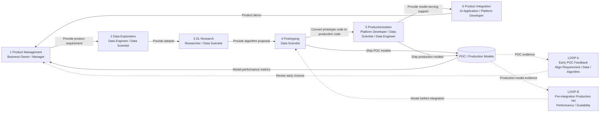

原章图 10.1 来自第 1 章，完整周期包含 Product Management、Data Exploration、DL Research、Prototyping、Productionization 与 Product Integration；框 3、4、5 是本章焦点。Business owner 提供需求，数据与研究团队交付 dataset / algorithm proposal，prototyping 与 productionization 分别交付 POC / production models，模型指标与 product demo 又反馈给管理侧。

- **Loop A** 是早期 POC feedback loop：用 POC model 与 performance metrics 反复校准 product requirement、available data 和 algorithm proposal，直到各方形成可继续推进的共识；
- **Loop B** 是 product integration 前的 production vet：把稳定原型转成可重复生产模型，验证 performance 与 scalability；不满足要求时回到 prototyping / productionization 继续迭代。

两条环都说明这不是一次单向移交，但 Loop A 主要降低“做什么、用什么数据和算法”的不确定性，Loop B 主要降低“能否以生产方式可靠运行”的不确定性。

作者在本章有意暂时忽略更细的 experimentation、testing、training 与 exploration 小循环，改用高层视角追踪一项最终成果如何从 research 进入 end product。这不是说迭代不重要，而是为了看清角色、跨阶段交付物与系统服务怎样衔接。

### Productionization 的定义

原章定义：**Productionization 是把成果变成值得使用、并且已经准备好被用户消费的产品的过程。**

Production worthiness 至少包括：

- 能处理真实 customer requests；
- 能承受目标 request load；
- 面对 malformed input、request overload 等不利条件时能优雅处理；
- 满足明确的 latency、availability 等 service-level agreement（SLA）；
- 出现生产问题时能够快速定位与恢复。

因此：

```text
模型能在 Notebook 中给出正确预测
≠ 模型能稳定服务真实请求
≠ 模型已经为产品创造价值
```

Productionization 同时包含算法、软件、系统、运维和产品验证。只完成模型序列化，距离最终生产价值仍有多道边界。

### 什么是 Inference Request

原章把 inference request 定义为：用户或应用发给已训练模型、用来产生 inference 的输入。

以视觉识别为例：

```text
request: 一张猫的图片
trained visual-recognition model
response / inference: label = "cat"
```

生产请求不仅有“正常猫图”，还会出现：

- 空文件、损坏编码、超大图片；
- 不支持的格式或色彩空间；
- 业务域外图片；
- 突发并发、重复请求、超时和取消；
- 恶意输入或隐私敏感内容。

这解释了为何离线模型评价只是 production readiness 的一部分。

### 三阶段中的主要交互方式

原章图 10.2 展开 research、prototyping 与 productionization：

- Research 与 prototyping 都强调快速 training / experimentation turnaround；
- 前八步的主要交互入口是 Notebook environment；
- 步骤 2、6 通过 dataset management service 跟踪训练数据；
- 步骤 4、8 可使用 training service 与 HPO library / service；
- 当 training data shape 与 code 较稳定后，才进入 productionization；
- Productionization 几乎调用全书所有系统服务。

这里图 10.2 的步骤 1–8 是跨 research / prototyping 阶段的总览编号；后文 Alice 的七步研究流程和 motion-detection 的六步原型场景是各自小节内的细化编号，三套编号粒度不同，不应直接一一对应。

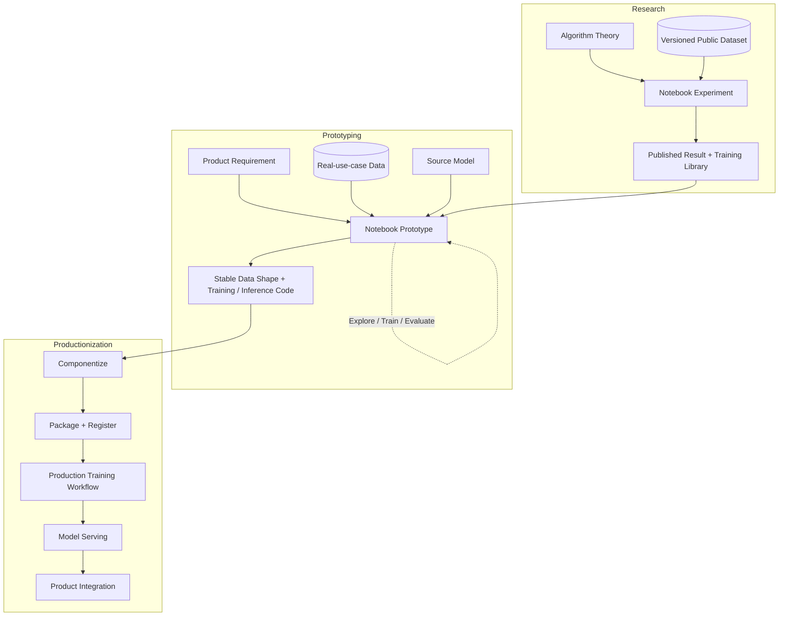

### 各服务在 Productionization 中的角色

| 服务 | 本章中的职责 |
| --- | --- |
| Dataset management service | 管理版本化训练数据与数据 lineage |
| Workflow orchestration service | 启动、复现和跟踪生产训练流程 |
| Training service | 执行并管理模型训练 jobs |
| HPO service | 系统化搜索训练超参数 |
| Metadata and artifact store | 保存代码容器、模型、指标及相互关系 |
| Model service / model server | 加载模型和推理实现，服务 inference traffic |
| Product backend | 调用模型服务，把 inference 转化为产品行为 |

这些服务不是流水线上的孤岛。共同的 model handle、immutable versions、workflow run ID 与 artifact lineage 把它们连接起来。

---

## 10.1 为 Productionization 做准备

本节追踪模型从“出生之前”到“足以进入生产化”的旅程，依次讨论 research 与 prototyping。

原章图 10.3 强调：

- Research 产生或改进训练算法；
- 并非每个组织都做基础研究，使用现成算法时可以跳过 10.1.1；
- Prototyping 假设算法已可用，核心是快速迭代数据探索与实验训练；
- 该阶段的目标是找到合适的 training data shape，并形成稳定 codebase。

“准备好生产化”并不表示模型已经上线，而表示最剧烈的探索性变化已经收敛，可以开始建立稳定 contract、package、workflow 与 serving integration。

### 10.1.1 Research

#### Research 阶段解决什么问题

Research 的目标是发明新深度学习算法，或证明对已有算法的改进。它首先回答科学问题：

- 改动是否真实提高了目标指标？
- 提升是否能跨随机种子、数据切分或 benchmark 复现？
- 与合理 baseline 相比是否公平？
- 结果能否被其他研究者验证？

这与 prototyping 的产品问题不同。Research 可以在公开 benchmark 上证明算法改进，却不必已经满足某款安防摄像头的 latency、算力或错误成本。

#### 为什么需要公开可访问的数据

Peer-reviewed research 要求结果可复现，所以 model training data 需要公开访问。原章以 ImageNet 为例：多个研究团队可以在同一公开 benchmark 上训练和比较视觉算法。

公开数据的价值是建立共同实验基线：

$$
\Delta M=M(algorithm_{new},D_v)-M(algorithm_{base},D_v)
$$

- $D_v$ 表示同一版本的数据集；
- $M$ 表示在相同评价协议下的指标；
- 固定 $D_v$ 后，观察到的差异才更有可能来自 algorithm change。

该比较仍需控制训练预算、预处理、随机种子与超参数。只固定数据并不能自动保证公平实验。

#### 为什么 Notebook 适合 Research

JupyterLab 等 notebook environment 具有：

- 代码、说明、公式、可视化紧邻；
- 可逐步检查 tensor、sample 与中间输出；
- 适合快速修改假设；
- 指标、图像与 error cases 可立即展示；
- 支持交互式数据探索。

Research 的首要约束是 hypothesis-feedback loop，而不是 production service lifecycle，因此 Notebook 的灵活性通常优于过早建立复杂 workflow。

#### Alice 的七步视觉算法研究流程

原章用研究员 Alice 改进 visual-recognition algorithm 的故事说明完整过程。

##### 第一步：理论形成后开始原型验证

Alice 已完成一部分理论工作，准备通过实验验证视觉识别算法改进。此时问题从纸面推理进入可证伪实验。

##### 第二步：在 JupyterLab 创建新 Notebook

Notebook 成为本轮研究的交互入口。生产实践中还应让 Notebook 关联 Git repository、environment specification 与 experiment identity，避免结果只存在单个临时 session。

##### 第三步：获得并版本化 ImageNet

Alice 想使用 ImageNet 训练和 benchmark，有两种路径：

1. 编写代码下载数据，并存入 dataset management service 以供复用；
2. 发现该数据已注册，直接使用已有版本。

无论哪条路径，关键不是“目录里有一份文件”，而是获得稳定 dataset identity：

```text
dataset_name
dataset_version / snapshot
split definition
schema / preprocessing assumptions
storage location
content checksum or manifest
license / access policy
```

##### 第四步：实现算法改进并在本地训练实验模型

Alice 在 Notebook 中修改已有视觉算法，直到能产出 experimental models。此阶段允许频繁变化，但每个值得比较的 run 应记录 code commit、dataset version、config 与 metrics。

##### 第五步：改变超参数并比较多个实验模型

她修改 hyperparameters，训练、测试若干模型并比较 metrics。一次比较可形式化为：

$$
r_i=(D_v,C_i,H_i,E_i,S_i,M_i)
$$

- $D_v$：dataset version；
- $C_i$：code version；
- $H_i$：hyperparameters；
- $E_i$：execution environment；
- $S_i$：random state；
- $M_i$：evaluation metrics。

若一次同时改变 code、data、hyperparameters 与 evaluation set，就很难判断提升来源。良好实验需要可控变量或足够系统的实验设计。

##### 第六步：用 HPO 扩大实验并确认改进

Alice 可使用第 5 章的 HPO 技术自动运行更多 experiments，确认改进不是偶然选到一组超参数。

HPO 在这里解决两类问题：

- 为新旧算法分别找到合理 operating point，避免只给新算法精调；
- 检查改进在超参数空间中是否稳定，而不是一个狭窄点上的偶然优势。

HPO 不能替代实验公平性。如果新算法获得 100 倍搜索预算，而 baseline 只用默认参数，结论仍可能失真。

##### 第七步：发表结果并把训练改进打包为 Library

研究输出不只是论文指标，还包括可供其他人复用的 training-code improvement。把它打包成 library，形成向 prototyping 阶段交付的算法制品。

理想交付物包括：

- Algorithm implementation；
- Public API 与 example；
- Pinned dependencies；
- Benchmark / reproduction scripts；
- Expected metrics 与 tolerance；
- Supported input shape / model architecture；
- License 与 known limitations。

#### Versioned Dataset 与 Source Control 怎样形成 Provenance

原章强调两条最小 lineage：

1. Dataset management service 固定输入训练数据；
2. Git 等 source-control system 跟踪代码。

于是每个 experimental model 可以追溯到：

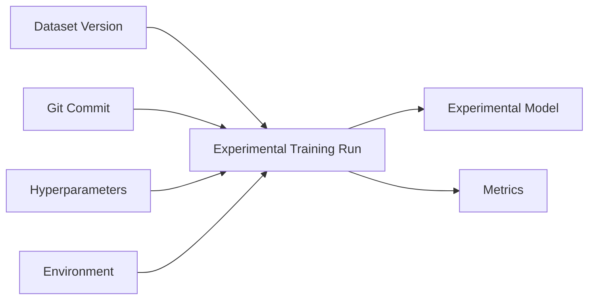

仅保存 notebook 当前内容不够，因为 cell execution order、未提交修改与隐藏 kernel state 可能影响结果。进入正式比较的实验应由干净 code snapshot 和显式 entrypoint 重放。

#### Research 计算资源与 I/O 瓶颈

原章指出，本阶段训练通常发生在承载 Notebook 的本地 compute node，因此节点需要足够资源；若训练数据通过网络读取，要防止 read speed 成为瓶颈。

一个 epoch 的纯数据读取时间下界可粗略估计为：

$$
T_{read}\geq\frac{D}{B_{effective}}
$$

- $D$：一个 epoch 实际读取的数据量；
- $B_{effective}$：考虑网络、存储、解码与并发后的有效吞吐。

若 GPU 每秒可消费 1 GB 样本，而数据管道只能提供 300 MB/s，昂贵 accelerator 会等待输入。可观察：

- GPU utilization 与 data-loader wait；
- Network / storage throughput；
- Decode / augmentation CPU time；
- Cache hit rate；
- Time-to-first-batch。

可选优化包括本地 cache、prefetch、parallel data loader、压缩格式优化或靠近数据部署 compute。但必须保持 cache 与 dataset version 对应，不能为了速度读取未跟踪的本地副本。

#### Research 阶段的适用边界

不是每个组织都需要发明算法。若使用 out-of-the-box algorithm、pretrained model 或第三方 API，可跳过基础研究，但不能跳过：

- 验证许可证与适用域；
- 记录 upstream model / code version；
- 在产品数据上 prototyping；
- 建立生产推理与监控边界。

跳过 research 缩短路径，不代表第三方能力天然满足产品要求。

### 10.1.2 Prototyping

#### Prototyping 是 Research 与产品场景之间的桥

原章定义：Prototyping 是寻找合适的 training data、algorithm、hyperparameter 与 inference support 组合，使深度学习功能满足 product requirements 的实践。

它回答的不再只是“算法在 ImageNet 上是否更好”，而是：

- 能否改善安防摄像头 motion detection？
- 真实摄像头数据需要怎样筛选、标注和变换？
- 哪个 source model 适合 transfer learning？
- 推理 runtime 是否能在产品预算内工作？
- Offline metric 提升是否对应可接受的产品行为？

#### 为什么 Prototyping 仍使用 Notebook

该阶段仍需要快速 turnaround：看样本、改数据、训练、评价、分析 error slice，并重复。因此 Notebook 继续是数据科学家和工程师的常见首选。

但与 research 相比，prototyping 更早引入生产约束：

- 产品 input / output contract；
- Target hardware / latency；
- Privacy、compliance 与 data access；
- Real traffic distribution；
- Source-model license；
- Business success metric。

#### 安防摄像头 Motion Detection 的六步场景

##### 第一步：接收产品需求

Model development team 收到需求：改善 security-camera product 的 motion detection。

一个可执行需求不能只写“更准确”，而应明确：

- 哪类 motion：人、宠物、车辆、光影变化？
- False positive 与 false negative 的业务代价；
- Camera resolution、frame rate、夜视条件；
- Edge 还是 cloud inference；
- Latency、compute、power 与 bandwidth budget；
- 用户隐私和数据保留规则。

##### 第二步：选择 Alice 的新视觉算法

团队根据需求判断 Alice 的算法可能改善 motion detection。Research artifact 在这里成为候选 solution，但仍需在真实 use case 上验证 domain transfer。

##### 第三步：建立 Notebook 并探索相关数据

团队创建新 Notebook，围绕所选算法寻找训练数据：

1. 若已有 collected data 与问题匹配，则复用；
2. 若现有数据不足，则收集新数据。

“匹配”不仅指有摄像头画面，还包括：

- 场景、天气、昼夜与地区 coverage；
- Camera models 与 compression artifacts；
- Positive / negative event distribution；
- Label definition 与 quality；
- 用户 consent、retention 和用途限制；
- 与未来 inference population 的接近程度。

##### 第四步：选择 Source Models 做 Transfer Learning

原章指出，多数情况下会应用 transfer learning，并选一个或多个 existing models 作为 source models。

这样做有效的直觉是：source model 已学到边缘、纹理、形状等可迁移 representation，产品团队只需用领域数据适配，而不必从随机初始化重新学习全部特征。

适用前提：

- Source task / domain 与目标有一定相关性；
- Architecture 可在目标 runtime 上执行；
- Pretraining data / license 可接受；
- Fine-tuning 数据足以校正 domain shift。

局限包括 negative transfer、pretraining bias、输入预处理耦合与模型过大。

##### 第五步：开发 Modeling Code 并训练 Experimental Models

团队把算法、collected data 与 source models 组合成 modeling code，训练多版 experimental models。

这里至少同时探索：

- Data filtering / sampling / augmentation；
- Label taxonomy；
- Model architecture / source checkpoint；
- Loss、optimizer、learning-rate schedule；
- Threshold 与 postprocessing；
- Inference preprocessing / output interpretation。

##### 第六步：评价并循环，直到 Data Shape 与 Code 稳定

团队评价 experimental models 是否满意；若不满意，重复步骤 3–6。

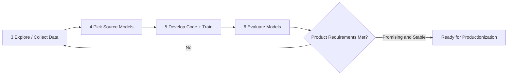

原章把步骤 3–6 称为 **exploratory loop**。原型初期循环非常快，焦点是逐渐收窄 training data shape 与 code。

#### 什么是 Training Data Shape

原章只说明 training data shape 会在 exploratory loop 中逐渐稳定，没有逐项定义其组成。本笔记从生产 contract 角度将它解释为“适合该产品训练任务的数据定义”，而不只理解为 tensor 维度；工程上通常包括：

- 样本来源和 inclusion / exclusion criteria；
- Input schema、resolution、sequence length；
- Label schema 与 annotation policy；
- Train / validation / test split；
- Class / segment distribution；
- Preprocessing、augmentation 与 feature transform；
- Dataset size、version 和 refresh cadence；
- Privacy / compliance filters。

当这些条件持续大幅变化时，生产 workflow contract 也会不断变化；等它们相对稳定后，才适合建立可重复 pipeline。

#### “稳定”不等于“永不改变”

Data shape 与 code stable 的含义是：

- 主 input / output contract 已明确；
- 关键 preprocessing 与 model interface 不再每天重写；
- Evaluation protocol 能重复运行；
- 结果在合理 seeds / slices 上有稳定趋势；
- 主要 product constraint 已被纳入；
- 后续变化可通过 versioning 与兼容策略管理。

它不表示未来不再 retrain、迭代或修复。Productionization 恰恰要为受控变化建立路径。

#### Exploratory Loop 怎样形成解决思路

作者的逻辑是逐步缩小不确定性：

```text
产品需求
-> 候选算法
-> 候选数据 / source model
-> 实验代码与模型
-> 离线评价和错误分析
-> 调整数据、算法、超参数或推理支持
-> 收敛到可稳定表达的方案
```

每轮实验都应产生 evidence，而不是无方向地改参数。可记录：

$$
Experiment_i=(Hypothesis_i,Change_i,Result_i,Decision_i)
$$

- `Hypothesis`：预期为何改善；
- `Change`：本轮改变什么；
- `Result`：总体和分片指标、失败样本；
- `Decision`：保留、回退或追加什么实验。

这样 exploratory loop 才是逐步收敛，而不是 accumulating notebook history。

#### 从 Research Benchmark 到 Product Metric

Alice 的算法可能提高 ImageNet accuracy，但 motion detection 产品可能更关心：

- Event-level recall；
- 每摄像头每天 false alarms 数；
- Detection delay；
- Night / rain / backlight slices；
- Edge-device latency / power；
- 用户关闭通知的比例。

因此，产品原型必须建立指标映射：


前一层通过不保证后一层成功。生产发布后仍要用业务指标验证最终价值。

#### 原型阶段的退出条件

可以将 ready-for-productionization gate 组织为：

```text
Data:
  versioned snapshot + schema + legal basis + representative splits

Model:
  repeatable offline result + slice evaluation + baseline comparison

Code:
  explicit training / inference entrypoints + tests + pinned environment

Serving feasibility:
  packageable model + target runtime compatibility + latency estimate

Product:
  input/output contract + owner + business metric + acceptable failure policy
```

这不是原章给出的固定 checklist，而是从“data shape 和 code 稳定、可进一步调优并部署”推导出的工程判别条件。

### 10.1.3 Key Takeaways

原章在结束准备阶段时总结四点。

#### Takeaway 1：Research 与 Preproduction Prototyping 都偏爱 Notebook

原因是高 interactivity 与 verbosity：代码、样本、中间结果、图表与解释可以放在同一环境中，缩短反馈时间。

边界是 Notebook 不应成为唯一事实源。进入 productionization 的成果要提取为可测试、版本化、可打包 components。

#### Takeaway 2：Training Data Access 应尽可能宽且灵活

在 legality 与 compliance 允许范围内，研究和原型团队应容易发现、访问和组合数据，以加速 exploration。

“宽”不等于所有人能任意复制敏感数据，而是：

- Catalog 可发现；
- Policy 可理解；
- Approval / entitlement 自动化；
- 使用有 audit；
- 敏感字段最小化；
- Dataset versions 可复用。

#### Takeaway 3：提供足够 Compute，缩短 Turnaround

Research / prototype 的生产力受反馈周期限制。资源策略应优化 time-to-evidence，而不只是单次 GPU utilization。

可将一次有效实验反馈时间写为：

$$
T_{feedback}=T_{author}+T_{queue}+T_{data}+T_{train}+T_{evaluate}+T_{analyze}
$$

增加 GPU 只会降低其中一部分。若 queue 等两天或数据加载占一半时间，单纯升级 accelerator 收益有限。

#### Takeaway 4：至少建立 Dataset 与 Code Provenance

最低要求：

- Dataset management service 跟踪训练数据；
- Source-control management system 跟踪代码。

更完整的 lineage 还应使用 metadata store 保存 metrics，并关联 dataset、code、config、environment、training run 与 model artifact。

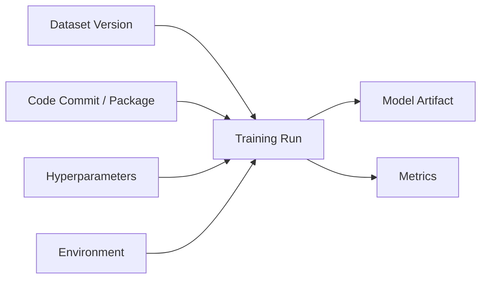

#### 10.1 小结：准备阶段的核心方法

Research 先把算法假设变成可复现实验；prototyping 再把算法放进真实产品约束中，通过 exploratory loop 收敛 data shape、code 与 inference feasibility。两阶段都优化快速反馈，但必须从一开始保留 dataset / code provenance，才能把最终结果安全交给 productionization。

---

## 10.2 Model Productionization

模型进入终端产品之前，必须从动态、交互式的 Notebook 环境迁移到能够承受真实流量和故障的生产环境。

原章先给出三项底线：

1. 模型能为 end product 或 end user 的 production inference requests 提供服务；
2. Model serving 满足预先定义的 SLA，例如 response latency 不超过 50 ms，availability 达到 99.999%；
3. 与模型有关的生产问题容易排查。

### 从“指标示例”理解 SLA

#### 50 ms 不能只看平均值

若要求“50 ms 内响应”，必须说明统计口径：

- Server processing latency 还是端到端 latency？
- P50、P95、P99 还是 hard deadline？
- 是否包含 queue、model load、network 与 product backend？
- 哪些 request types / payload sizes 适用？

平均 30 ms 可能掩盖 P99 为 500 ms。用户体验和 timeout 通常由 tail latency 决定。

#### 99.999% Availability 的直觉

若以一年粗略计算，允许不可用时间为：

$$
T_{down}=(1-0.99999)\times365\times24\times60\approx5.256\text{ minutes/year}
$$

这只是理论预算。还要定义：

- 什么算“可用”：HTTP 200，还是返回正确、及时的 inference？
- 以全局还是 region / tenant 计算？
- Planned maintenance 是否计入？
- Dependency failure 怎样归责？

高 availability 不只靠多副本，还要求安全发布、快速回滚、dependency isolation 与可观测性。

### 图 10.4 的 Productionization 主线

原章把 productionization 展开为以下步骤：

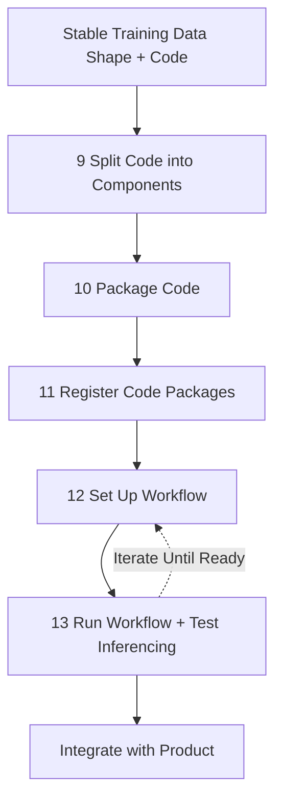

图中的编号承接图 10.2 前八步。Productionization 也会迭代：workflow、package、model、inference contract 或 capacity test 失败时，需要修正后重新运行，而不是一次线性发布成功。

### 为什么几乎所有服务都会参与

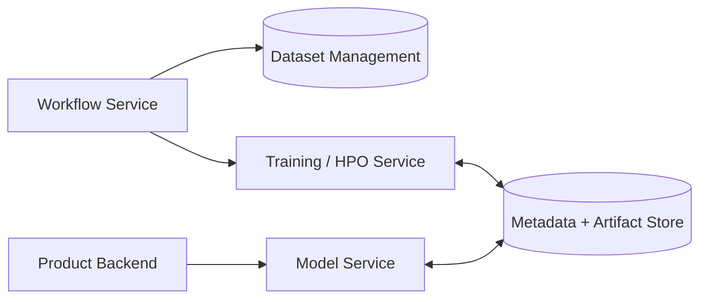

Productionization 不是把 Notebook “部署到一台服务器”，而是把其中隐含的数据、代码、环境、执行与推理关系映射到稳定服务 contracts。

### 10.2.1 Code Componentization

#### 为什么必须拆分 Notebook

原型阶段，data preparation、model training 与 inference code 常混在一个 Notebook：

```text
read raw data
-> clean / transform
-> train
-> evaluate
-> load model
-> preprocess request
-> infer
-> postprocess response
```

它有利于探索，却把不同生命周期和运行环境耦合：

| 代码 | 触发方式 | 资源 | 依赖 | 变化节奏 |
| --- | --- | --- | --- | --- |
| Data preparation | 数据到达 / 定期重建 | CPU、memory、I/O | Data libraries | 随 schema / source 变化 |
| Model training | 手动、schedule、drift | GPU / distributed compute | Training framework | 随算法 / data 变化 |
| Model inference | 每个 online request | Low-latency CPU/GPU | Minimal runtime | 随 serving contract 变化 |

若不拆分：

- Serving image 被迫携带训练依赖和攻击面；
- 改一个 Notebook cell 就难判断需要重训还是只更新 serving；
- Data refresh 与 model retrain 不能独立调度；
- 训练和推理 preprocessing 容易产生隐藏差异；
- 每个阶段无法独立测试、扩缩和回滚。

#### 第一条切分线：Trained Model 是输出

原章图 10.5 首先在“trained model 输出处”切分：

1. **Model training code**：以训练数据为输入，输出 trained model；
2. **Model inference code**：以 trained model 与 inference request 为输入，输出 inference。

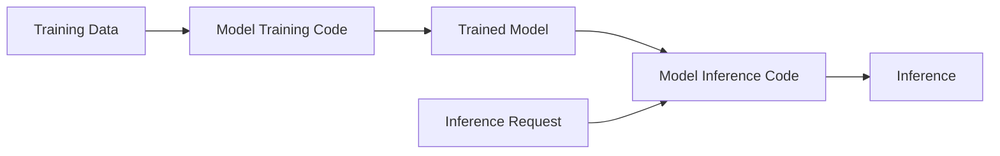

模型 artifact 是两部分之间的正式交付边界。训练端承诺产生某个 format / signature；推理端承诺能加载该 format 并实现相同 preprocessing / postprocessing contract。

#### 可选第二条切分线：Training Data 是输出

Model training code 还可以拆成：

1. **Training data transformation code**：raw data → training data；
2. **Model training code**：training data → trained model。

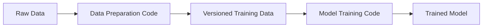

原章给出两个适合拆分的条件：

- 其他 model training code 也能复用相同 prepared data；
- Data preparation 与 model training 的执行 cadence 不同。

例如原始摄像头视频每天到达，curated dataset 每周重建，而模型每月或 drift 触发时训练。把三者绑成一个 task 会重复昂贵数据处理，也无法独立验证 dataset。

#### 何时不必拆 Data Preparation

若变换：

- 只服务单个模型；
- 与模型 architecture / learned state 强耦合；
- 计算很轻；
- 必须在每次训练中随机执行；

单独建立共享数据产品可能增加不必要的 artifact 和调度成本。切分应基于复用、生命周期、资源与失败恢复，而不是“组件越多越专业”。

#### Component Contract 应包含什么

##### Data Preparation Contract

```text
input: raw dataset snapshot + schema version
output: training dataset URI + manifest + statistics
guarantees: split policy, label schema, preprocessing version
```

##### Training Contract

```text
input: training dataset version + source model + hyperparameters
output: model artifact + signature + metrics + training metadata
guarantees: deterministic identity, format, compatibility metadata
```

##### Inference Contract

```text
input: model artifact + typed request
output: typed response or classified error
guarantees: preprocessing, postprocessing, deadline, resource bounds
```

#### 防止 Training-Serving Skew

拆分会引入新风险：训练和推理两边可能采用不同 preprocessing。例如训练把 RGB 归一化到 $[-1,1]$，serving 却使用 $[0,1]$，服务仍返回结果，但质量悄悄下降。

应选择以下一种或组合：

- 把 preprocessing 固化进 exported model graph；
- 训练 / 推理共享版本化 library；
- 在 model package 中携带 transform spec；
- 用 golden inputs 比较 offline 与 serving outputs；
- 在 metadata 中记录 feature / preprocessing version。

Parity test 可写为：

$$
\max_{x\in G}\left\|f_{offline}(x)-f_{serving}(x)\right\|\leq\epsilon
$$

$G$ 是 golden request set，$\epsilon$ 根据数值精度和业务容差定义。它只能检查已覆盖输入，不能证明所有请求完全等价。

#### Componentization 的直觉

原章直接给出“model output”与可选的“training data output”两个切分点，并以 prepared data 可复用、执行 cadence 不同解释第二次切分。本笔记可进一步从 artifact / contract 角度理解这些边界：它们可版本化、可持久化且输入输出明确，因而比按 Notebook cell 或团队组织随意切分更容易复用，也能由 metadata lineage 连接。

### 10.2.2 Code Packaging

#### Componentization 与 Packaging 的区别

- Componentization 决定逻辑边界与 contracts；
- Packaging 把每个 component 连同 runtime dependencies 变成可部署制品。

只有 Python source directory，不一定能在 training service、model service 和 workflow service 中一致运行。Package 需要遵守 host service conventions。

#### Training Code 的约定

原章举例：training code 应从 training service 设置的 environment variable 所指位置读取 training data。类似约定还可包含：

```text
TRAINING_DATA_URI
OUTPUT_MODEL_URI
RUN_ID
HYPERPARAMETERS_FILE
CHECKPOINT_URI
```

Entry point 不应硬编码某位数据科学家的本地路径：

```python
from __future__ import annotations

import os
from pathlib import Path


def required_environment_path(name: str) -> Path:
    value = os.environ.get(name)
    if not value:
        raise RuntimeError(f"Missing required environment variable: {name}")
    return Path(value)


training_data_path = required_environment_path("TRAINING_DATA_PATH")
output_model_path = required_environment_path("OUTPUT_MODEL_PATH")
```

代码展示的是 contract：服务注入位置，package 消费位置。真实系统常使用 object-store URI，而非必须映射为本地 `Path`；此时应由 SDK / filesystem adapter 解析 URI。

#### Model Inference Code 的三种策略

原章按第 6 章的 serving strategy 给出三条路径。

##### 1. Direct Model Embedding

模型和推理逻辑直接嵌入产品服务。需要与产品团队共同确保 inference code 在其 runtime 中工作。

适合少量、强耦合、资源可控的模型；代价是模型发布常与应用发布耦合。

##### 2. Model Service

Inference code 必须提供 model service 可调用的 interface，例如标准 handler：

```text
initialize(model_artifact, metadata)
preprocess(request)
predict(tensor)
postprocess(output)
```

Model service 管理版本、加载、路由、扩缩和监控；package 管理模型专用逻辑。

##### 3. Model Server

若 model server 已原生支持 model format 和 I/O contract，可能不需要自定义 inference code。这里的“可能不需要”有前提：

- 标准 preprocessing / postprocessing 足够；
- Custom ops 已支持；
- Input / output schema 可由 server 表达；
- Model format 与 runtime 完全兼容。

只要仍有 tokenizer、feature transform、label mapping 或业务后处理，就需要 handler、adapter 或旁路组件。

#### 为什么使用 Docker Containers

原章建议把 code components 打包为 Docker containers，使相应 host services 能 launch、access 和 track 它们。

Container package 固定：

- Application code；
- Language runtime；
- Libraries 与 system dependencies；
- Entrypoint；
- 默认 configuration 与 filesystem layout。

它解决“在我的 Notebook 能运行”的环境漂移，但不自动固定：

- Dataset / model bytes；
- External services；
- Secrets；
- GPU driver / kernel；
- Mutable image tag；
- Architecture 差异。

生产应记录 image digest，而不是只记录 `latest` tag，并进行 vulnerability scan、SBOM、signature 与 least-privilege runtime 设置。

#### Package Manifest

一个 package 的 metadata 可以包含：

```json
{
  "name": "visual_recognition",
  "role": "inference",
  "version": "1.3.0",
  "image": "registry.example/visual-recognition-inference@sha256:abc123",
  "model_format": "onnx",
  "model_schema_version": "2",
  "input_schema_version": "3",
  "runtime": "onnxruntime-1.x",
  "entrypoint": "serve.handler:predict"
}
```

Manifest 让 registry 和 serving system 在下载大制品前做 compatibility check。示例 digest 是占位值，真实 digest 必须是完整不可变内容摘要。

#### Data Transformation 应放哪里

原章指出，若需要特殊 data transformation，可把转换代码集成进 data management service。

这适合产生可复用、版本化 training dataset 的确定性变换。若变换是每 epoch 随机 augmentation 或 model-specific tensor operation，则更可能属于 training package。边界应由 artifact ownership 和复用决定。

### 10.2.3 Code Registration

#### 为什么打包后还要注册

Package 若只存在 CI registry 中，workflow / training / model services 不知道：

- 它属于哪个模型能力；
- 是 training 还是 inference role；
- 与哪个 model format / schema 兼容；
- 当前 production workflow 应使用哪个 immutable version；
- 谁创建、验证、批准；
- 怎样追溯到 source commit。

因此，训练与推理 packages 必须在 metadata and artifacts service 中注册和存储。

#### `visual_recognition` Common Handle

原章图 10.6 使用共同 handle `visual_recognition`：

- Training container 注册为 `visual_recognition` training；
- Inference container 注册为 `visual_recognition` inference；
- Training service 产出的 model 也以 `visual_recognition` 关联；
- Workflow、model service 和 request 使用同一 handle 查找正确制品。

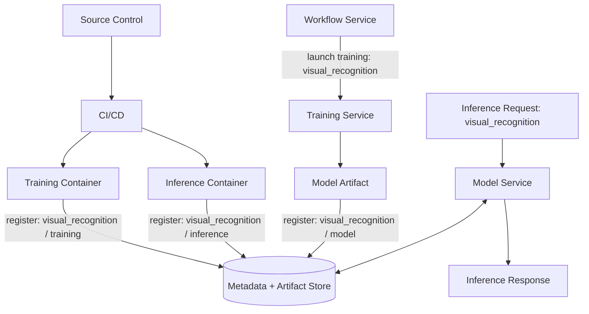

#### Handle 不是 Immutable Version

`visual_recognition` 是逻辑能力 / lookup namespace，不应独自作为历史制品身份。生产 registry 至少需要：

$$
ArtifactKey=(handle,role,version,digest)
$$

例如：

```text
(visual_recognition, training, 1.4.0, sha256:...)
(visual_recognition, inference, 1.3.0, sha256:...)
(visual_recognition, model, run-742/model.onnx, sha256:...)
```

Mutable alias（如 `PROD`）可解析到 immutable model version，但 run history 必须记录解析后的真实 ID。否则更新 handle 后，旧 workflow replay 可能拿到新 container。

#### 为什么 Training 与 Inference Package 必须关联

训练 package 决定 model architecture、serialization 与 preprocessing；inference package 决定怎样加载和执行。二者兼容关系不是仅靠同名保证。

可以注册 compatibility constraint：

```text
inference package 1.3.0 supports:
  model_format = onnx
  model_schema_version in {2}
  input_schema_version = 3
  required_ops_version <= 5
```

发布前选择满足 constraints 的组合，而不是默认取“最新训练包 + 最新推理包 + 最新模型”。多个 latest 未必相互兼容。

#### 注册与发布不是同一步

- Register：制品不可变地进入 catalog / registry，可被测试和引用；
- Promote / release：通过 gate 后，将 alias 或 traffic 指向某个已注册版本。

把上传即发布合并，会绕过安全扫描、compatibility、offline evaluation、load test 和审批。

### 10.2.4 Training Workflow Setup

#### 为什么不常训练也要建立 Workflow

原章明确建议：即使模型不定期训练，也应建立 training workflow。主要原因是保证同一生产训练流程可复现。

它解决：

- 原作者不在时，其他人仍能训练；
- 生产环境隔离时，只能经批准 workflow 产出模型；
- Data、code、config 和 environment 有统一记录；
- Retry / status / artifacts 可追踪；
- 紧急 retrain 不依赖手工 Notebook 操作。

低频流程反而更容易因人员遗忘而失效，因此应定期做 dry run / game day，验证 credentials、dependencies 与 package 没有腐化。

#### 图 10.7 的 `visual_recognition` 训练路径

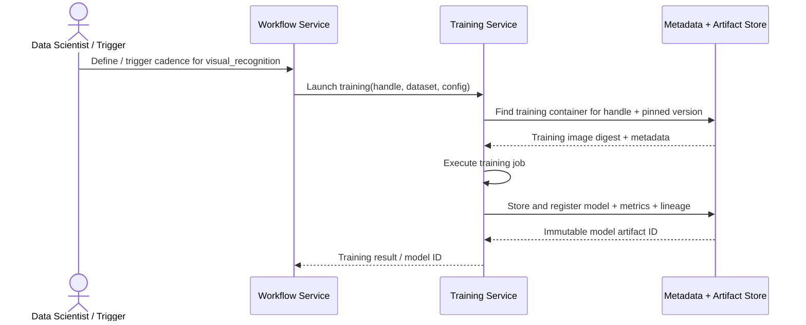

原图的职责分工：

- Workflow service 管 what、when、how；
- Training service 真正运行 training job；
- Metadata / artifact store 提供 training container，保存 model 并建立 metadata 关系。

#### Workflow Definition 应固定什么

```text
workflow version
dataset snapshot / split
training package digest
source model artifact
hyperparameters or HPO search space
resource / distributed topology
evaluation protocol
output artifact location
retry / timeout / notification
promotion gate
```

若 workflow 只写 `train visual_recognition with latest data and latest code`，它能够自动运行，却不能可靠复现。

#### HPO 路径

原章指出，生产训练常使用 HPO。此时 workflow 不直接调用 training service，而是调用 HPO service；HPO service 再创建多个 training trials。

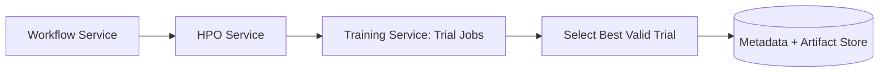

需要记录两层 identity：HPO study 与每个 training run。Winning trial 仍必须通过统一 evaluation / production gate，不能因为它是搜索中的最大指标就自动上线。

#### Workflow 的 Reliability Requirements

- Training submission 使用 idempotency key；
- Worker / orchestrator retry 不重复创建昂贵 job；
- Model output 先验证完整性再注册 READY；
- Failed / canceled jobs 保留 logs 与 partial artifacts policy；
- Dataset、package 与 source model references 不可变；
- Workflow run 能从 model artifact 反向追溯；
- Long-running training 有 checkpoint 与 resume；
- HPO 有 budget、concurrency 与 early stopping。

### 10.2.5 Model Inferences

#### 从“模型已训练”到“能服务请求”

模型在生产环境训练并注册后，还要验证：

- 能承受目标 request rate；
- 在 latency budget 内产生 inference；
- Request / response schema 正确；
- Model 与 inference runtime 兼容；
- 冷启动、并发、错误和资源使用可接受。

#### 图 10.8 的 Serving 路径

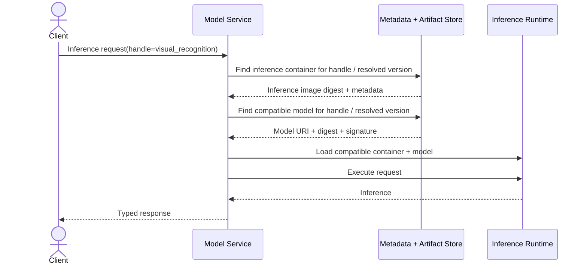

原章强调 model service 需要同时找到：

1. `visual_recognition` 对应的 inference container；
2. `visual_recognition` 对应的 model file。

两者共同产生 response。这里不能只验证“都叫同一个 handle”，还要验证 format、schema、ops、runtime 与 preprocessing compatibility。

#### Model Server 前的 Thin Layer

若使用通用 model server，可能需要一层薄 adapter 告诉它去哪里取得 model file。两种常见方式：

- Frontend / sidecar 查询 metadata and artifact store，再把 model 注册给 server；
- 使用 model server 的 custom model manager，由其查询 registry 并加载正确版本。

Thin layer 还可负责：

- 把业务 handle / alias 解析为 immutable version；
- 下载与校验 digest；
- 转换业务 schema 和 serving protocol；
- 等待 model readiness；
- 记录 resolved model / runtime version。

#### Capacity 与 Latency

设平均到达率为 $\lambda$ requests/s，单副本稳定服务率为 $\mu$，副本数为 $c$。粗略 utilization 为：

$$
\rho=\frac{\lambda}{c\mu}
$$

必须保持 $\rho<1$ 才可能稳定，但接近 1 时 queue latency 会快速上升，无法满足 tail SLA。生产 capacity 要为 traffic burst、单机故障、发布中双版本与 autoscaling delay 留 headroom。

应测试：

- Warm P50 / P95 / P99 latency；
- Cold model load / first inference；
- Sustained throughput 与 saturation point；
- Payload-size / batch-size sensitivity；
- CPU/GPU memory 与 utilization；
- Error / timeout / queue depth；
- Cache hit、eviction 与 reload；
- 多模型共置干扰。

#### Load Test 必须保持正确性

只生成 QPS 而不验证 response，可能把快速错误响应误判为高性能。Load test 应同时断言：

- Response schema；
- Resolved model version；
- Golden sample correctness；
- Error taxonomy；
- Deadline behavior；
- 系统和模型质量指标。

#### 冷启动与预热

Model service 的 cold path 可能包含：

$$
T_{cold}=T_{resolve}+T_{download}+T_{verify}+T_{load}+T_{warmup}
$$

大型模型可达秒或分钟级。发布前可 preload / warm target version，再切流量；不能把首次真实用户请求当作预热机制。

### 10.2.6 Product Integration

#### 最后一公里：把 Inference 变成产品行为

获得合格 inference response 后，产品要集成 model-service client。原章案例是在 security-camera video-processing backend 中调用改进后的 motion-detection model。

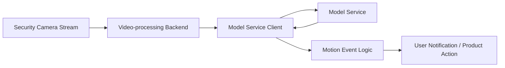

模型 response 通常不是最终产品。Backend 还会做 threshold、deduplication、time-window aggregation、policy 与 user preference 处理。

#### 原章检查项一：Response 可被产品消费

需要验证：

- Field names、types、units、range；
- Label taxonomy / confidence semantics；
- Model version / trace ID；
- Empty / partial result；
- Error code 与 retryability；
- Backward / forward compatibility；
- Deadline / cancellation propagation。

例如模型返回 frame-level `motion_probability`，产品可能需要 event-level `motion_started_at`。若没有明确 contract，产品团队会各自猜测阈值和聚合方式。

#### 原章检查项二：按近似 Production Traffic 压测

Stress test 不应只用恒定平均 QPS。应建模：

- Daily / weekly traffic shape；
- Camera reconnect burst；
- Payload size 与 resolution distribution；
- Tenant / region skew；
- Peak concurrency；
- Model release 时 cache coldness；
- Dependency degradation。

Little's Law 给出稳定状态关系：

$$
L=\lambda W
$$

若平均到达率 2,000 req/s、平均端到端停留 0.04 s，则系统平均约有：

$$
L=2000\times0.04=80
$$

个在途请求。P99 与 burst 下的 concurrency 会更高，connection pool、queue 和 memory 要按分布而非只按均值设计。

#### 原章检查项三：Malformed Requests

测试损坏图片、不支持格式、缺字段、错误 shape、超大 payload、NaN / Inf、恶意压缩数据等，确保：

- Model inference code 不 crash process；
- Model service 返回受控 4xx / domain error；
- 不无限分配 memory / CPU；
- Bad input 不进入 retry storm；
- Logs 不泄露原始敏感数据；
- Metrics 能区分 client error 与 server error。

“Graceful handling”不是勉强给出一个 prediction，而是快速、明确、安全地拒绝无效请求。

#### Production Readiness Criteria

原章说明三项只是基础，各组织通常有更多标准。一个更完整的 gate 可分为：

| 维度 | 代表检查 |
| --- | --- |
| Functional | Schema、golden tests、train-serving parity |
| Model quality | Overall / slice metrics、threshold、bias / safety |
| Reliability | Availability、timeout、retry、dependency failure |
| Performance | P50/P95/P99、throughput、cold start、resource |
| Security | AuthN/Z、input limits、image / model scan、secrets |
| Privacy / compliance | Consent、retention、data minimization、audit |
| Operations | Dashboard、alert、runbook、owner、on-call、rollback |
| Release | Immutable version、approval、canary / blue-green plan |
| Cost | Per-request / per-camera cost、capacity budget |

Readiness 应输出证据和 sign-off，而不是口头说“测试过了”。

#### System Metrics 与 Business Metrics

原章最后强调：除了判断 serving 是否正常的 system metrics，还要建立 business metrics，验证模型是否帮助业务 use case。

##### System Metrics

- Request rate、latency、error、availability；
- Queue、saturation、CPU/GPU/memory；
- Model load、cache、timeout；
- Input validation failure；
- Resolved model version。

##### Model / Product Metrics

- Motion-event precision / recall；
- 每台摄像头每天 false alerts；
- Missed critical events；
- Detection delay；
- 用户查看 / 关闭通知行为；
- Feature adoption、retention、support tickets。

一个服务可以 99.999% 可用，却稳定地产生无用 prediction。反过来，模型 accuracy 很高，但 latency 让产品无法使用，也没有生产价值。

#### Prediction 与 Outcome 的关联

Business metric 往往延迟到达，需要 stable request / event ID 将 prediction 与 outcome join：

```text
request_id
camera / tenant segment
event_time
resolved model version
prediction + score
product action
later observation / user feedback
```

若没有这条观测链，10.3 的线上 deployment experiment 就无法判断哪个 model 真正更好。

#### 10.2 小结：Productionization 为什么按这六步展开

原章按以下六步展开 productionization。本笔记可把这条顺序理解为逐层建立稳定边界：

```text
Componentize
  明确 data / train / inference responsibilities

Package
  固定 runtime 和 host-service conventions

Register
  建立 identity、role、version 和 lineage

Set up training workflow
  让生产模型可重复产生

Test model inference
  验证 model + runtime 能满足流量和 latency

Integrate with product
  验证接口、异常、系统指标和业务价值
```

每一步都把原型中的隐含假设变成可测试 contract。跳过前面的身份和兼容性设计，后面的自动化只会更快地部署不可解释组合。

---

## 10.3 Model Deployment Strategies

10.2 假设模型首次上线，没有旧版本需要替换。一旦模型正在服务 production traffic，若没有 maintenance window，就不能简单停机替换。Deployment strategy 要解决两个目标：

1. **Continuity**：更新模型时不中断 inference requests；
2. **Risk / Experimentation**：限制坏版本影响，并利用 production business metrics 比较版本。

原章比较三种策略：canary、blue-green 与 multi-armed bandit（MAB）。主要实现位于 model service，因为所有 inference requests 都在那里路由。

### Deployment Control Plane 需要保存什么

无论采用哪种策略，控制面至少要描述：

```text
deployment_id
candidate model versions and inference packages
traffic allocation / targeting rule
start time and owner
system + model + business guardrails
minimum sample / observation window
promotion / rollback rule
previous stable version
change history
```

Model service 在每个请求中记录实际 resolved version，而不是只记录用户请求的 `PROD` alias。否则流量变化与模型效果无法关联。

### Deployment、Release 与 Experiment 的区别

- Deployment：让某版本在环境中可运行；
- Release：让用户流量开始使用它；
- Experiment：按设计分配用户并收集因果比较证据；
- Promotion：根据证据扩大流量或更新稳定 alias；
- Rollback：把流量恢复到已知稳定版本。

Canary 可以只用于风险控制，也可以带实验设计；但“给 10% 流量”本身不自动构成有效 A/B experiment。

### 10.3.1 Canary Deployment

#### 定义与原图流量

Canary deployment 与 A/B testing 类似：新模型只服务一小部分 production inference requests，旧模型继续服务大多数请求。

原章图 10.9 使用：

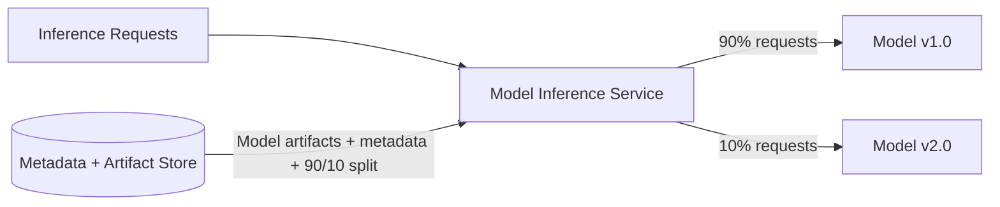

Model service 必须支持 traffic segmentation 与 routing。Traffic split 可以按随机 request、stable user / device hash、tenant、region 或明确 allowlist 实现。

#### 为什么 Canary 能控制风险

若候选版本会导致每个请求期望损失 $L$，分配比例为 $p$，观察窗口内有 $N$ 个请求，则候选直接暴露量约为：

$$
N_{candidate}=pN
$$

粗略期望损失为：

$$
E[Loss]\approx pNL
$$

把 $p$ 从 1 降到 0.1，在其他条件相同的简化假设下，把初始 blast radius 降到约十分之一。实际损失会因用户价值、错误相关性与 feedback delay 而异。

#### Rollback 为什么直接

旧模型仍在线且保持 warm，只需把新模型流量比例调回 0：

```text
v1 = 90%, v2 = 10%
-> guardrail breach
-> v1 = 100%, v2 = 0%
```

真正快速回滚还要求：

- 旧 model / inference package 未被删除；
- 旧版本容量能立刻接回全部流量；
- Traffic config 更新原子传播；
- Feature schema / upstream changes 仍向后兼容；
- Candidate 没有造成不可逆 side effect。

模型回滚不一定能回滚已经发出的用户通知、写入的决策或数据 schema 迁移。

#### 原章优势

新模型的 adverse effect 被限制在少部分 end users；出现问题时，将全部 inference traffic 路由回旧模型即可。

#### 原章局限

Canary 只观察小部分用户上的 performance。Candidate 全量服务时可能出现不同效果，例如：

- User mix / region 不同；
- Cache 与 resource contention 改变；
- 下游系统 load 放大；
- Rare segments 在 10% 中样本不足；
- Network effect / interference；
- Full-volume cost 或 queue saturation 未暴露。

因此“小流量表现好”不能机械推出 100% 表现相同。

#### Canary 与 A/B Testing 的区别

| Canary | A/B Experiment |
| --- | --- |
| 首要目标是降低发布风险 | 首要目标是估计因果效果 |
| 可按内部用户、region 等定向 | 通常要求随机且稳定分组 |
| 可快速逐级放量 | 需预设样本量与观察窗口 |
| Guardrail breach 即回滚 | 按统计规则分析 primary metric |
| 不一定无偏 | 尽量保证 treatment/control 可比 |

若只把最活跃或最安全用户放进 candidate，观察结果存在 selection bias。要兼顾实验，应按 stable subject ID 随机分桶，并保持 sticky assignment。

#### Progressive Canary

生产常采用：

```text
0% -> internal shadow / smoke
1% -> 5% -> 10% -> 25% -> 50% -> 100%
```

每级设置：

- Minimum duration / samples；
- System guardrails：error、latency、saturation；
- Model guardrails：invalid output、drift、slice quality；
- Business guardrails：false alerts、conversion、complaints；
- Automatic pause / rollback；
- Human approval for high-risk expansion。

Feedback 延迟较长时，放量速度不能只看即时 system metrics。安防事件的 ground truth 可能数小时后才出现。

#### Shadow Traffic 不等于 Canary

Shadow / mirroring 同时把 request copy 给新模型，但只有旧模型 response 影响用户。它适合验证 latency、compatibility 和离线对比，用户风险更低；但无法测量候选 response 真正改变产品行为后的 business effect。

### 10.3.2 Blue-Green Deployment

#### 定义与原图流量

在本章语境中：

1. 部署新模型 green；
2. 把全部 inference traffic 从旧模型 blue 原子切到 green；
3. 旧模型继续在线，直到确认新模型达到预期；
4. 若不满意，把全部流量切回 blue。

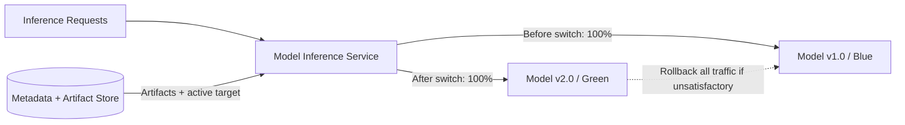

任一时刻业务流量只指向一个 environment / model version，不需要按比例 splitting。

#### 为什么实现最简单

三种策略中，blue-green 不需要 simultaneous traffic allocation algorithm。Model service 只维护 active pointer：

```text
active = model_v1
CAS(active: model_v1 -> model_v2)
```

Compare-and-swap（CAS）可防止并发发布覆盖彼此。切换前 green 必须完成 preload、warm-up 和 readiness；pointer update 要原子且可审计。

#### 原章优势

- 实现简单；
- 新模型直接面对全部用户，可看到 full-traffic performance；
- 旧模型保持在线，回滚只需把 pointer 指回去。

Full traffic 能暴露 candidate 的真实容量、cache、segment mix，以及切换后观察到的聚合业务指标，这是 small canary 可能看不到的。但前后全量切换没有同期随机对照，seasonality、产品改动等因素会混入结果，因此不能仅凭 blue-green 隔离模型的因果业务效果。

#### 原章局限

若新模型有问题，所有 end users 都受影响。风险不是逐渐扩散，而是在切换瞬间从 0% 到 100%。

原章认为它可能适合基于新模型开发全新 product feature：用户还没有建立稳定体验预期。随着产品成熟、用户形成稳定预期，团队可能希望改用风险更低的渐进发布策略。

#### 双环境的容量与成本

旧、新两套版本同时在线，切换期间需要接近双份容量。若单版本资源成本为 $C$，重叠窗口成本近似：

$$
C_{overlap}\approx C_{blue}+C_{green}
$$

这不是严格等于 $2C$：green 可在切流前用少量 warm-up capacity，blue 在稳定后逐步缩容。但若要求瞬时回滚，两边都必须有足够容量接全量流量。

#### Blue-Green 的隐藏回滚条件

- Input / feature schema 对旧模型仍兼容；
- Product client contract 未同步做不可逆 breaking change；
- Old model artifact 与 inference image 可用；
- State / cache / downstream schema 可回退；
- Route update 在所有 replicas 一致传播；
- Database / business side effects 有补偿策略。

只保留旧 model weights，并不自动拥有完整 rollback。

#### 何时适合

- Candidate 已经过强 offline / staging / load validation；
- Feature 是新功能或风险较低；
- Model state 无不可逆写入；
- 需要快速观察新版本在全负载和完整用户分布下的行为；
- 基础设施不支持复杂 traffic split；
- 有强监控、自动回滚和双版本容量。

#### Blue-Green 不等于 Rolling Update

Rolling update 逐批替换 replicas，期间请求可能同时命中新旧实例，但通常目标是基础设施平滑更新，不一定有稳定实验分桶。Blue-green 保留两套明确环境，并通过 active route 在它们之间切换。

### 10.3.3 Multi-Armed Bandit Deployment

#### 定义

Multi-armed bandit（MAB）是三者中最复杂的策略。系统持续观察多个模型的 performance，并随时间把越来越多 inference traffic 分配给当前表现更好的模型。

名称来自“多台老虎机”：每个 model version 是一个 arm；每次请求选择一个 arm，随后观察 reward。系统需要在两者之间权衡：

- **Exploration**：给不确定 arm 流量，学习其真实表现；
- **Exploitation**：把流量给当前最佳 arm，立即获得更多收益。

#### 原章图 10.11 的 Day 0 / Day 1

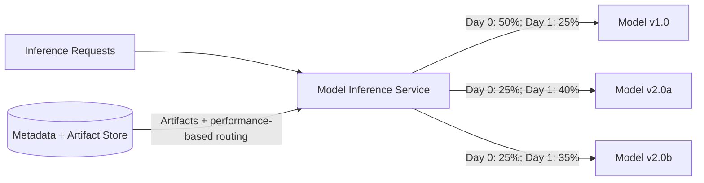

Day 1 中 v2.0a 获得 40%，说明它当时领先；v2.0b 也从 25% 增至 35%；v1.0 从 50% 降至 25%。图只是动态分配示意，不指定具体 bandit algorithm 或 reward 数值。

#### 为什么 Model Service 实现最复杂

它必须：

- 为每个 request 选择 model；
- 保持 user / session assignment 语义；
- 收集 delayed outcome；
- 把 reward 归因到正确 model / decision；
- 在线更新 traffic policy；
- 限制低质量 arm 风险；
- 应对 drift、seasonality 与 segment 差异；
- 记录每个时刻的 traffic split。

原章特别强调：model service 必须理解 model performance，而 performance metric 的定义可能本身就很复杂。

#### 原章优势

MAB 在给定时间内尽量让最佳模型获得更多 traffic，最大化累计 benefit。相比固定 10% canary，若新模型明显更好，MAB 能更快扩大其收益。

可用 cumulative pseudo-regret 表达目标：

$$
R_T=T\mu^*-\sum_{t=1}^{T}\mu_{a_t}
$$

- $\mu^*$：最佳 arm 的期望 reward；
- $a_t$：第 $t$ 次选择的 arm；
- $R_T$：按各 arm 期望收益计算的累计 pseudo-regret；若策略选择含随机性，再对该量取策略期望可得到 expected pseudo-regret。

Bandit 的目标通常是降低 $R_T$，不一定像经典 A/B test 那样优先得到无偏 treatment-effect estimate。

#### Epsilon-Greedy 的直觉

一种简单策略：

- 以概率 $1-\epsilon$ 选择当前平均 reward 最高的模型；
- 以概率 $\epsilon$ 随机探索其他模型。

```python
from __future__ import annotations

import random
from dataclasses import dataclass


@dataclass
class Arm:
  name: str
  pulls: int = 0
  reward_sum: float = 0.0

  @property
  def mean_reward(self) -> float:
    return self.reward_sum / self.pulls if self.pulls else 0.0

  def update(self, reward: float) -> None:
    self.pulls += 1
    self.reward_sum += reward


def choose_arm(arms: list[Arm], epsilon: float) -> Arm:
  if not 0.0 <= epsilon <= 1.0:
    raise ValueError("epsilon must be between 0 and 1")

  untried = [arm for arm in arms if arm.pulls == 0]
  if untried:
    return random.choice(untried)
  if random.random() < epsilon:
    return random.choice(arms)
  return max(arms, key=lambda arm: arm.mean_reward)


def simulate(seed: int = 7, requests: int = 20_000) -> list[Arm]:
  random.seed(seed)
  true_conversion = {
    "v1.0": 0.080,
    "v2.0a": 0.095,
    "v2.0b": 0.090,
  }
  arms = [Arm(name) for name in true_conversion]

  for _ in range(requests):
    arm = choose_arm(arms, epsilon=0.10)
    reward = float(random.random() < true_conversion[arm.name])
    arm.update(reward)

  return sorted(arms, key=lambda arm: arm.pulls, reverse=True)


for result in simulate():
  print(result.name, result.pulls, round(result.mean_reward, 4))
```

代码与原理对应：

- `mean_reward` 是每个 model 当前效果估计；
- 未尝试 arm 优先获得初始证据；
- `epsilon` 保留探索；
- `max` 执行 exploitation；
- 每个 observed reward 更新该 model 统计量。

这是教学模拟，不是生产 router。它假设 reward 快速到达、独立同分布且只有一个全局目标，现实中往往不成立。

#### UCB 的基本思路

Upper Confidence Bound（UCB）不仅看平均 reward，还奖励不确定性。常见形式：

$$
UCB_i(t)=\widehat{\mu}_i(t)+c\sqrt{\frac{\ln t}{n_i(t)}}
$$

- $\widehat{\mu}_i$：arm $i$ 的经验平均 reward；
- $n_i$：被选择次数；
- $t$：总选择次数；
- $c$：探索强度。

样本少的 arm 置信上界更高，因而获得探索；随着 $n_i$ 增大，不确定性项缩小。公式通常假设 reward 有界、环境相对 stationary；concept drift 下需 sliding window、discounting 或重新探索。

#### Delayed Reward 是 ML 产品中的关键难点

安防摄像头的即时 response 很快，但“是否为真实 motion event”“用户是否认为是误报”可能很晚才知道。MAB 更新必须处理：

- Reward delay；
- Missing outcomes；
- Feedback selection bias；
- 同一事件多个 predictions；
- User action 被 model output 影响；
- Long-term 与 short-term reward 冲突。

在 outcome 到达前快速放量，可能把暂时未知误当作成功。

#### Reward 不能只用单一 Business Metric

若只最大化 notification click-through，算法可能倾向发送更多刺激性通知，却增加误报和用户流失。生产策略应包含：

- Primary reward；
- Safety / quality constraints；
- Latency / error guardrails；
- Segment fairness；
- Cost budget；
- Minimum exploration floor；
- Emergency kill switch。

可以把 constrained objective 写成：

$$
\max_{\pi}E[Reward(\pi)]
$$

subject to：

$$
ErrorRate_i\leq e_{max},\quad P99Latency_i\leq l_{max},\quad Safety_i\geq s_{min}
$$

没有 guardrails 的高 reward 模型不应继续获得流量。

#### 为什么必须记录 Traffic Split History

原章明确要求 model service 报告 traffic split 如何随时间变化。因为 observed metric 是不同 policy 下样本的结果：

```text
timestamp
request / subject ID
eligible models
chosen model
choice probability / policy version
context / segment
observed reward and time
```

若只保存每天每模型的平均效果，却不知道它何时获得哪类流量，就无法解释 performance，也无法做 propensity correction 或审计。

#### MAB 与 A/B Test 的目标差异

| MAB | A/B Test |
| --- | --- |
| 优先最大化实验期间累计 reward | 优先估计固定 treatment effect |
| 流量分配自适应变化 | 分配通常固定 |
| 高表现 arm 很快获得更多样本 | 各组保持预设比例 |
| Naive estimator 有 adaptive bias | 随机化分析相对直接 |
| 适合持续优化 | 适合明确假设检验 |

需要可靠科学结论时，不能直接用普通独立样本公式分析 adaptive allocation；应使用适合 bandit logging / inference 的方法。

#### Non-Stationarity 与 Context

最佳模型可能随时间或用户 segment 不同：

- 夜间与白天；
- Camera hardware；
- Region / weather；
- New / mature users；
- Traffic seasonality。

全局 MAB 可能把主流 segment 的赢家强加给少数 segment。Contextual bandit 根据 context 选择 arm，但增加模型、数据和安全复杂度。低数据 segment 还可能被过度探索。

#### 何时适合 MAB

- Reward 可清晰、可靠、较快获得；
- 流量足够支持持续学习；
- 多版本长期共存有价值；
- 每个错误决策风险有限；
- Model service 能可靠记录 choice probability 和 outcomes；
- 有成熟 guardrail、监控与 on-call。

不适合：

- 医疗、安全等单次错误代价极高；
- Ground truth 极慢或极稀缺；
- 需要干净因果结论；
- 用户跨版本体验必须完全一致；
- 流量太低；
- Reward 容易被操纵或与长期价值错位。

### 三种策略对比

| 维度 | Canary | Blue-Green | Multi-Armed Bandit |
| --- | --- | --- | --- |
| 初始 candidate traffic | 小比例 | 切换时 100% | 多 arms，动态调整 |
| 首要目标 | 限制发布风险 | 简单全量切换 | 在线最大化累计 reward |
| Traffic router | 固定 / 分阶段 split | 单 active pointer | 自适应 policy |
| 全负载、完整用户分布下的观测表现 | 逐步扩大后获得 | 切换后立即获得，但不是因果估计 | 随 policy 演进，分析需处理自适应分配 |
| Blast radius | 初始较小 | 可能影响全部用户 | 取决于 exploration 与 guardrails |
| 回滚 | Candidate 调到 0 | Pointer 指回 blue | 停止 arm / 恢复 stable policy |
| 统计复杂度 | 中 | 低到中 | 高 |
| 基础设施复杂度 | 中 | 最低 | 最高 |
| 主要风险 | 小样本不代表全量 | 坏版本全量影响 | Reward / attribution / adaptive bias |

### 怎样选择 Deployment Strategy

依次回答：

1. 单次错误的业务 / 安全损失有多大？
2. 是否能稳定切分 user / device，而不是随机 request？
3. Ground truth / business reward 多久到达？
4. 需要风险控制，还是严格实验，还是在线收益优化？
5. 新旧版本能否同时 warm，成本多少？
6. Schema、state 与 side effects 是否可回滚？
7. Model service 是否支持多版本、sticky routing 与 policy audit？
8. 有多少流量和最小 segment 样本？
9. Guardrails、自动 rollback 与 on-call 是否成熟？
10. 法规 / fairness 是否允许 adaptive allocation？

高风险、成熟产品通常从 shadow + canary 开始；低风险新功能可考虑 blue-green；只有 reward、流量、guardrails 与在线决策基础设施都成熟时，才值得采用 MAB。

### Deployment State Machine

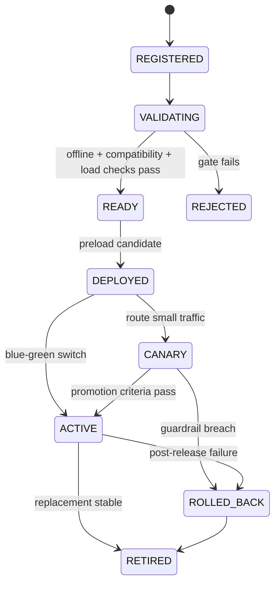

MAB 可把 `CANARY` 扩展为动态 allocation 状态，但每个 arm 仍需先经过 `VALIDATING -> READY`。Bandit 不是绕过 production readiness 的理由。

### 10.3 小结：三种策略背后的共同原则

三者不是“新模型怎样复制到服务器”的区别，而是**怎样在不确定性下分配真实用户流量**：

- Canary 用小暴露换取风险控制；
- Blue-green 用 100% 切换换取实现简单，以及全负载、完整用户分布下的观测表现；它不提供同期因果对照；
- MAB 用 adaptive exploration / exploitation 换取累计收益，但承担最大测量与控制复杂度。

无论哪种策略，都依赖 immutable versions、预热、真实 resolved-version logging、system / business guardrails、可逆路由和可信 outcome join。

---

## 原章 Summary 回顾

原章最后用九点串起全书服务：

1. Deep learning research teams 发明和改进用于训练模型的算法；
2. Model development teams 使用已有算法与可用数据，训练解决具体 deep learning use case 的模型；
3. Research 与 prototyping 都高度依赖交互式 code development、data exploration 和 visualization，因此常使用 Notebook；
4. Dataset management service 在研究和原型阶段跟踪 experimental models 所用的训练数据；
5. 当 training data 与 code 足够稳定后，生产化第一步是打包 model training code、model inference code 和 source models；
6. 这些 packages 可被系统各服务用来训练、跟踪和服务模型；
7. 当 training workflow 正常运行且获得满意 inference response 后，可开始 end-user product integration；
8. 若 serving inference requests 不能中断，则更新模型需要 deployment strategy；
9. 多种 deployment strategies 同时也能支持 production experimentation。

这些结论共同表达一个核心：**模型价值不是在训练结束时完成，而是在可追溯制品、可重复流程、可靠服务和产品反馈共同闭环后完成。**

## 容易混淆的概念与常见误区

### 1. Productionization 就是把模型文件上传到服务器

上传只是 artifact transfer。Productionization 还包括组件边界、runtime、注册、训练复现、serving SLA、异常处理、产品 contract 与监控；完整 path to production 随后还要处理 deployment、发布和回滚。原章将 product integration 视为 productionization 的最后一步，再单独进入 deployment strategies。

### 2. Production-Ready 等于 Offline Accuracy 达标

离线质量只验证特定数据和 protocol。生产还要满足 latency、availability、capacity、security、schema、cost 与 business outcome。

### 3. Research 与 Prototyping 是同一个阶段

Research 验证算法是否改进并强调公开可复现 benchmark；prototyping 将算法、产品数据、source model 和 inference constraint 组合成具体功能。

### 4. 所有组织都必须先做 Deep Learning Research

原章明确说并非如此。使用现成算法可跳过 research，但仍需验证版本、license、产品域效果和生产约束。

### 5. 使用 Public Dataset 就自动保证 Reproducibility

还需固定 dataset version / split、code、hyperparameters、environment、seed 和 evaluation protocol。Public 只解决可获取性的一部分。

### 6. ImageNet 提升意味着安防 Motion Detection 必然提升

Research benchmark 与产品域、标签、错误成本和 runtime 不同。必须在 representative camera data 和 product metrics 上原型验证。

### 7. Notebook 不适合任何生产相关工作

Notebook 很适合 research / prototyping。问题是不能把 hidden state、手工 cell order 和本地路径作为唯一生产入口；稳定成果要提取为组件。

### 8. Notebook 中显示过的结果天然可追溯

未提交代码、不同 cell 顺序、缓存变量和本地数据副本都会破坏 provenance。需要 dataset version、Git commit、run metadata 和 explicit entrypoint。

### 9. HPO 搜到更高指标就证明新算法更优

新旧算法要有公平搜索预算、相同数据和 evaluation protocol。Winning trial 还可能 overfit validation set。

### 10. Research Library 就是 Production Package

研究 library 交付算法实现；production package 还要满足 host-service interface、pinned runtime、security、observability 和 deployment contract。

### 11. Prototyping 只是在调 Hyperparameters

Exploratory loop 同时收敛 data shape、algorithm、source model、labels、pre/postprocessing、threshold、inference support 和 product fit。

### 12. Training Data Shape 只表示 Tensor Dimension

它还包括样本来源、schema、label policy、split、distribution、transforms、size、version、refresh cadence 和 compliance filters。

### 13. Stable Data / Code 表示以后不能改变

稳定表示 contract 足以版本化和重复执行，不表示停止迭代。Productionization 正是为未来受控变化建立机制。

### 14. Data Access 越宽越好，合规可以以后处理

原章限定在 legality / compliance 范围内。宽访问应通过 catalog、policy、entitlement、audit 和数据最小化实现，不是开放敏感原始数据。

### 15. 给 Notebook 节点更多 GPU 就一定缩短反馈

Queue、data I/O、CPU decode、evaluation 和 analysis 都可能主导 $T_{feedback}$。应先测瓶颈。

### 16. Code Componentization 等于把 Notebook 拆成多个文件

组件化依据独立 input/output、lifecycle、resource、failure 和 ownership contract；机械拆文件没有建立这些边界。

### 17. 训练代码与推理代码应该完全复制一份 Preprocessing

复制会产生 train-serving skew。应共享版本化 transform、导出进 model graph 或用 parity tests 约束。

### 18. Data Preparation 永远应该独立成服务

只有在可复用、cadence 不同、成本高或需要独立版本化时才值得拆分。强 model-specific 随机变换可能更适合留在 training package。

### 19. Componentization 与 Packaging 是同义词

前者决定逻辑边界；后者固定代码、runtime 与 dependencies，形成 host service 可执行制品。

### 20. Docker Image 保证整个训练完全可复现

Image 不固定 data、external service、secret、hardware、driver 和 mutable tag。应记录 digest 与完整 lineage。

### 21. `latest` Image Tag 是 Immutable Version

Tag 可被覆盖。历史 workflow 与 deployment 必须记录 image digest。

### 22. 使用 Model Server 就绝不需要 Inference Code

只有标准 format 与 I/O 足够时才可能。Tokenizer、feature transform、custom ops、label mapping 和业务后处理仍需要 handler / adapter。

### 23. Code Registration 就是 Model Release

Registration 让制品可查、可测；release / promotion 才改变 production traffic。二者合并会跳过 gates。

### 24. `visual_recognition` Handle 是完整 Artifact Identity

它只是逻辑 namespace。还要区分 role、version、digest；请求最终解析到 immutable model 与 inference package。

### 25. Training、Inference 与 Model 都同名，所以一定 Compatible

同名不保证 format、schema、runtime 或 custom ops 兼容。Registry 应保存 compatibility constraints。

### 26. “最新训练包 + 最新推理包 + 最新模型”一定是最佳组合

三个 latest 可能来自不同 contract generations。应选择已验证的 immutable bundle / compatibility set。

### 27. 模型很少重训，就没必要建立 Training Workflow

低频手工流程最容易知识流失。Workflow 保证他人、隔离环境和紧急场景仍能重复生产模型。

### 28. Workflow 自动化就自动拥有 Reproducibility

若 workflow 引用 `latest data/code/model`，自动执行仍不可复现。Definition 必须固定 immutable inputs 与 environment。

### 29. HPO Service 取代 Training Service

HPO 管 study、search 与 trial coordination；实际 trials 通常仍由 training service 执行。

### 30. HPO Winning Trial 可以自动进入 Production

它只在搜索 objective 上领先，还需统一 evaluation、compatibility、safety、load 和 release gate。

### 31. Model 注册后就能立即处理 Production Traffic

还要解析 compatible inference package、下载、校验、加载、warm-up、readiness 和 capacity validation。

### 32. HTTP 200 表示 Model Inference 正确

服务可能快速返回错误 schema、错误版本或无意义预测。Load test 要同时验证 correctness 与 resolved version。

### 33. 平均 Latency 小于 50 ms 就满足 50 ms SLA

必须定义 percentile、端到端边界、payload 和 deadline。Mean 不代表 P99。

### 34. 99.999% Availability 只需增加 Replicas

还需 dependency resilience、safe deployment、capacity、failover、rollback 与 operation discipline；并先定义何为 successful request。

### 35. Model Service 只需按 Handle 找 Model File

原章图 10.8 还要求找到 inference container。两者必须 compatible，且实际 resolved versions 应记录。

### 36. Thin Layer 只是多余网络跳转

它可把业务 handle 转为 immutable artifact、适配 protocol、校验 digest、等待 readiness，并隔离通用 model server 的管理接口。

### 37. $ρ<1$ 就保证低延迟

它只表示平均服务能力可能超过到达率。接近 1 时 queue tail 会急剧上升，burst 和故障还需 headroom。

### 38. 只测高 QPS 就完成 Stress Test

还要覆盖真实 payload / burst、correctness、tail latency、resource saturation、cold start、errors 与 dependency degradation。

### 39. Malformed Request 应尽量修复后继续预测

不可信或超限输入应快速、安全地拒绝。盲目容错可能产生错误结果、资源攻击或隐私泄漏。

### 40. Inference Response 就是最终 Product Outcome

产品 backend 通常还应用 threshold、aggregation、policy 和 user preference。真正 outcome 可能延迟出现。

### 41. System Metrics 健康就表示模型创造价值

低 latency 和低 error 不能证明 motion alerts 有用。需要 model / business metrics 与用户 outcome。

### 42. Business Metric 越高，模型一定越好

Metric 可能受 UI、seasonality、营销、selection bias 影响，也可能激励错误行为。必须有 guardrails 与可信 attribution。

### 43. Deployment 与 Release 是同一个动作

Deployment 让版本可运行；release 才让用户流量使用。先部署并预热、后切流能降低冷启动风险。

### 44. Canary 与 A/B Testing 完全相同

Canary 优先控制风险，可定向分流；A/B test 优先因果估计，通常要求随机稳定分桶与预设分析。

### 45. 10% Canary 成功就证明 100% 一定成功

小流量可能缺少 rare segments、full-load contention、network effects 和成本压力。应分阶段扩大并重新验证。

### 46. Canary Rollback 一定能撤销所有影响

它能恢复未来流量，不能自动撤销已发送通知、错误业务决定或不可逆 schema / state change。

### 47. Shadow Traffic 就是 0% 风险 Canary

Shadow response 不影响用户，适合系统验证；但无法测量候选改变产品行为后的 business outcome。

### 48. Blue-Green 的两套环境会各承接 50% 流量

本章定义中，切换前 blue 100%，切换后 green 100%。旧环境保持在线用于回滚，不做比例分流。

### 49. Blue-Green 不需要双份资源

要瞬时切流和回滚，两套版本在重叠期都需 readiness 与足够 capacity，会增加成本。

### 50. 保留旧 Model Weights 就保证 Blue-Green 可回滚

还需旧 inference image、compatible inputs、route、state 与 downstream contracts。Breaking schema change 可能阻断回滚。

### 51. Blue-Green 等于 Rolling Update

Rolling update 逐批替换 replicas；blue-green 保持两套明确环境并原子切 active route，目标和观察语义不同。

### 52. MAB 会自动找到全局最佳模型且没有代价

它必须探索较差或未知 arms，因此有 regret；reward noise、delay、drift 与 bias 也可能误导 policy。

### 53. MAB 只要比较平均 Reward

还要表达 uncertainty、minimum exploration、context、delayed outcomes、guardrails 和 non-stationarity。

### 54. MAB 与 A/B Test 的统计分析相同

Adaptive allocation 改变样本分布，naive estimator 可能有偏。MAB 优化累计收益，A/B 更偏向固定 treatment-effect inference。

### 55. 获得最多 MAB Traffic 就证明该模型对所有 Segment 最好

全局 winner 可能只在主流用户占优。不同 camera、region、昼夜可能有不同最佳 arm。

### 56. Reward 到达越晚也不影响 MAB

系统在未知 outcome 期间仍会分配流量；若把未反馈当成功，会错误放量。必须显式处理 delay / censoring。

### 57. MAB 能替代 Production Readiness Gate

每个 arm 仍需先通过 offline、compatibility、security、load 与 safety validation。用户不是未经筛选模型的测试环境。

### 58. 记录每日最终 Traffic Split 就足够审计 MAB

还需每个 decision 的 eligible arms、chosen arm、choice probability、policy version、context 和 reward time。

### 59. 任意产品都应采用最复杂的 MAB

低流量、高风险、慢反馈或需要清晰因果结论时，复杂度可能远大于收益。Canary 常是更稳妥默认。

### 60. 模型上线后 Path to Production 就结束

生产 feedback、drift、故障和新需求会回到 prototyping / training。Production 是闭环，不是单向终点。

## 本章知识结构

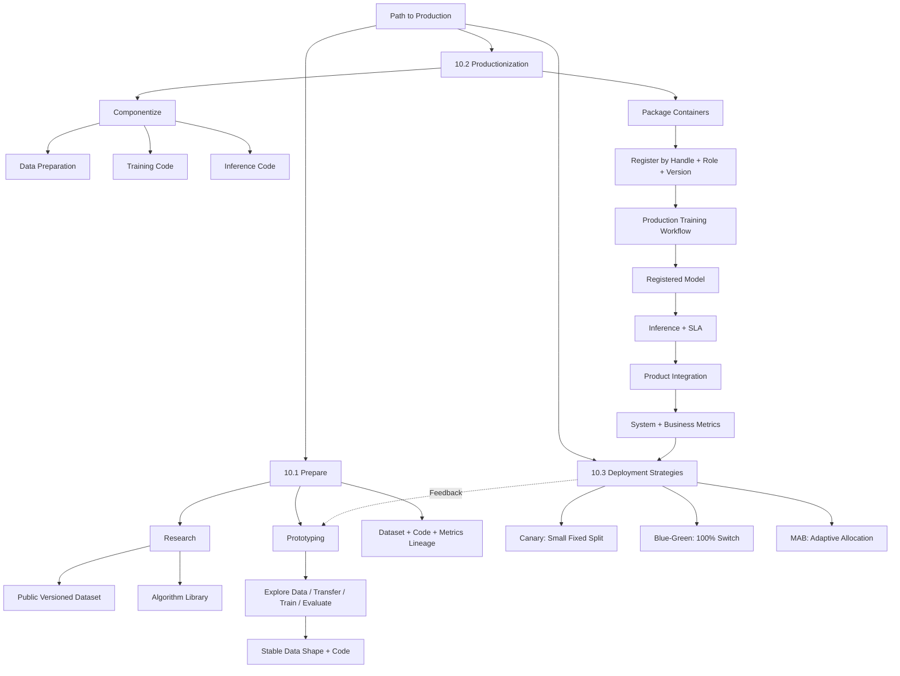

## 核心结论

### 原章主线与直接结论

1. **本章把前九章服务连接为 research → prototyping → productionization → deployment 的产品路径。**
2. **Productionization 是把成果变成值得且准备好被用户消费的产品。** Production-worthy 至少要处理真实请求、目标负载与异常情况。
3. **Research 产生或改进算法，强调公开数据和可复现结果。** 并非所有组织都必须做 research。
4. **Notebook 因交互性和灵活性适合 research 与 prototyping。** 这两个阶段都需要快速训练和实验 turnaround。
5. **Alice 的研究流程从理论、ImageNet、实验训练、超参数比较和 HPO，走向发表结果与 library package。**
6. **Versioned dataset 与 source control 是 experimental-model provenance 的最低基础。**
7. **Prototyping 把 research algorithm 与真实 product use case 连接。** 它寻找 data、algorithm、hyperparameter 与 inference support 的合适组合。
8. **安防摄像头案例通过探索 / 收集数据、transfer learning、训练和评价循环，收敛 training data shape 与 code。**
9. **Steps 3–6 构成 exploratory loop。** 当 data shape 与 code 相对稳定，才准备进入 productionization。
10. **准备阶段四项重点是 Notebook、合法合规范围内的灵活数据访问、足够计算资源和完整 provenance。**
11. **生产化要求模型服务真实 inference、满足 SLA 并易于排错。**
12. **代码组件化首先在 trained model 输出处切成 training 与 inference；可选地在 training data 输出处再拆 data transformation。**
13. **若 prepared data 可复用或 cadence 不同，独立 data transformation component 更合理。**
14. **Components 要按 training / workflow / model services 的 conventions 打包，原章推荐 Docker containers。**
15. **Inference packaging 取决于 direct embedding、model service 或 model server strategy。** Model server 原生支持时可能不需自定义 inference code。
16. **Training 与 inference packages 注册到 metadata / artifact store，并用 `visual_recognition` common handle 关联。**
17. **即使不常训练，也应建立 production training workflow，以保证他人和隔离环境可重复产出模型。**
18. **Workflow service 管训练流程，training service 执行 jobs，metadata / artifact store 提供代码并保存模型。**
19. **使用 HPO service 时，workflow 可先调用 HPO，再由其协调训练 trials。**
20. **Model service 按 handle 查找 inference container 与 model file，共同产生 inference response。** Model server 可能需要 thin lookup layer / custom manager。
21. **Product integration 前至少验证 response 可消费、近似生产流量压力和 malformed requests。**
22. **System metrics 说明 serving 是否正常，business metrics 说明模型是否帮助 use case。**
23. **已有模型不能中断服务时，需要 deployment strategy；策略也可用于 production experimentation。**
24. **Canary 让新模型服务小部分流量、旧模型服务多数流量，限制 blast radius，但小样本未必代表全量。**
25. **Blue-green 把 100% 流量从旧模型切到新模型并保留旧版，最简单且能观察全负载、完整用户分布下的表现，但这不是因果估计，坏版本还会影响所有用户。**
26. **MAB 持续观察多个模型并把更多流量给当前赢家，能提高实验期间收益，但 model service 实现最复杂。**
27. **MAB 必须报告 traffic split 的时间变化，才能关联流量与 model performance。**

### 实践扩展与生产化边界

28. **Research benchmark、产品离线指标、系统 SLO 与业务 outcome 是逐层证据，前一层通过不保证后一层成功。**
29. **Training data shape 是完整数据 contract，而非只有 tensor shape。** 稳定表示可以版本化演进，不表示永不改变。
30. **Component boundary 应围绕可持久化领域 artifacts：training data 和 trained model。** 这使复用、cadence 和 lineage 明确。
31. **拆分训练与推理会带来 train-serving skew，必须用共享 transform、model graph 或 golden parity tests 控制。**
32. **Container 固定用户空间 runtime，不固定全部外部依赖。** 历史执行应记录 image digest、dataset、model 与 environment。
33. **Common handle 不是 immutable artifact ID。** Registry 应使用 handle + role + version + digest，并记录 package/model compatibility。
34. **Registration 与 release 必须分离。** 先注册、验证和审批，再改变 production alias / traffic。
35. **Workflow 可重复性取决于 immutable references，不取决于是否自动运行。** `latest` 会破坏 replay。
36. **Model serving capacity 不只要求 $\rho<1$，还要为 tail latency、burst、故障、双版本与 autoscaling 留余量。**
37. **Production readiness 是多维 evidence gate：功能、模型质量、可靠性、性能、安全、合规、运维、发布和成本。**
38. **Prediction 必须通过 stable IDs 与 delayed outcome 关联，才能计算可信 business metrics 和线上实验结果。**
39. **Canary 控制风险，A/B 估计因果，两者可能共享流量系统但实验假设不同。**
40. **Blue-green 的简单性来自单 active pointer，但即时回滚要求旧环境、schema 与容量都仍可用。**
41. **MAB 在 exploration 与 exploitation 间权衡，目标常是最小 cumulative regret，而非生成最简单的无偏比较。**
42. **Adaptive routing 必须处理 delayed reward、non-stationarity、segment heterogeneity 与 choice-probability logging。**
43. **任一部署策略都不能绕过 offline / compatibility / safety / load gates。**
44. **上线是闭环起点。** 生产 feedback 应沿 model version、request 和 outcome lineage 回到 prototyping 与 retraining。

## 从本章提炼出的通用解题方法

面对一个“把深度学习能力推向生产”的任务，可以按以下十步推进。

### 第一步：把产品需求改写成可测 Contract

定义输入 population、目标行为、错误成本、offline / business metrics、latency、availability、throughput、hardware、privacy 和 failure policy。避免只写“提高准确率”。

### 第二步：建立 Research / Buy / Reuse 决策

判断是发明算法、采用研究 library、fine-tune source model 还是调用外部 API。无论来源如何，都登记 version、license、supported domain 与 known limits。

### 第三步：用 Exploratory Loop 收敛 Data 与 Code

每轮明确 hypothesis、change、result、decision。版本化 dataset、code、config、environment 和 metrics；用 representative slices 评价，直到 data shape、modeling 和 inference contract 足以稳定表达。

### 第四步：在 Artifact 边界做 Componentization

至少拆 training 与 inference；当 training data 可复用或 cadence 不同时，再拆 data preparation。为每个 component 定义 typed input/output、owner、error、resource 与 idempotency。

### 第五步：打包并验证 Runtime Parity

将 components 打包为 immutable images / packages，固定 entrypoint 与 host-service conventions。记录 digest、SBOM、dependencies；用 golden requests 检查 train-serving preprocessing 与 outputs。

### 第六步：注册 Identity、Lineage 与 Compatibility

按 `(handle, role, version, digest)` 注册 training、inference、source model 与 produced model。建立 code → run → model → deployment 关系，并把 registration 与 promotion 分开。

### 第七步：建立可重复 Production Training Workflow

固定 dataset snapshot、packages、source model、parameters / HPO space、resources、evaluation 和 output policy。实现 idempotent submission、checkpoint、retry、budget 和 lineage。

### 第八步：完成 Serving 与 Product Readiness Gates

验证 load / warm-up / P99 / errors / capacity / compatibility；在产品侧验证 response contract、malformed input、deadline、security、fallback、observability、runbook 和 cost。

### 第九步：按风险与证据选择 Deployment Strategy

- 高风险成熟产品：shadow + progressive canary；
- 强验证、低风险且需要简单全量切换：blue-green；
- Reward 快、流量足、在线决策基础成熟：constrained MAB。

所有策略都定义 guardrails、minimum window、promotion、rollback 与 previous stable version。

### 第十步：连接 Production Outcome，持续闭环

每个请求记录 resolved model / inference package / policy version，通过 stable ID join delayed outcome。按 segment 监控 system、model 与 business metrics；把 drift、failure 和用户反馈路由回 data、code、workflow 或 product logic。

```mermaid
flowchart LR
  Requirement[Product Contract]
  Explore[Research / Prototype]
  Build[Componentize / Package / Register]
  Train[Production Workflow]
  Validate[Readiness Gates]
  Release[Canary / Blue-Green / MAB]
  Observe[System + Business Outcomes]

  Requirement --> Explore --> Build --> Train --> Validate --> Release --> Observe
  Observe -->|New evidence| Requirement
  Observe -->|Data / model issue| Explore
```

这套方法的核心是：**先让算法结论在产品约束中收敛，再把隐含 Notebook 状态转为不可变制品和可重复流程，最后用可逆流量策略与真实 outcome 证明生产价值。**

## 复习与自测

1. 本章为何在全书最后重新回到高层 product development cycle？
2. 图 10.1 中本章关注哪三个阶段？
3. Productionization 的原章定义是什么？
4. Production worthiness 至少包含哪三类能力？
5. 什么是 inference request？视觉识别示例的 request 与 inference 分别是什么？
6. 为什么本章暂时忽略更细的 experimentation / training cycles？
7. 图 10.2 中前八步的主要交互环境是什么？
8. Research / prototyping 分别在哪些步骤使用 dataset management、training 和 HPO？
9. Productionization 中 Dataset、Workflow、Training、Metadata / Artifact、Model services 各负责什么？
10. Research 阶段的主要目标是什么？
11. 为什么 peer-reviewed research 偏好 publicly accessible datasets？
12. ImageNet 在 Alice 场景中起什么作用？
13. Alice 研究流程的七个步骤是什么？
14. Alice 获得 ImageNet 有哪两条路径？
15. Dataset version 为什么使实验输入更可比？
16. 比较新旧算法时，除了 dataset 还要控制哪些变量？
17. Alice 为什么在手工 hyperparameter experiments 后还使用 HPO？
18. HPO 怎样帮助检查算法提升不是偶然 operating point？
19. Research 最终为什么要把 training-code improvement 打包成 library？
20. Dataset service 与 Git 怎样共同提供 experimental-model provenance？
21. Notebook hidden state 为什么会破坏复现？
22. Research training node 为什么需要充足 compute？
23. 怎样用 $D/B_{effective}$ 判断 data read 是否可能成为瓶颈？
24. 不做基础研究的组织仍需完成哪些验证？
25. Prototyping 的原章定义是什么？
26. Research 与 prototyping 分别回答科学问题还是产品问题？
27. 安防摄像头 motion-detection 原型的六个步骤是什么？
28. 产品需求应怎样明确 false positive / false negative 代价？
29. 第三步为什么既可能复用已有数据，也可能收集新数据？
30. 怎样判断 collected camera data 是否匹配目标 inference population？
31. 为什么 prototyping 常使用 transfer learning？
32. Source model 选择有哪些前提与 negative-transfer 风险？
33. Experimental modeling code 通常同时探索哪些因素？
34. Exploratory loop 包含哪四个步骤？
35. Training data shape 为什么不只是 tensor dimension？
36. Data shape 与 code “稳定”具体表示什么？
37. 稳定为何不等于永不更新？
38. 怎样用 Hypothesis / Change / Result / Decision 让探索循环收敛？
39. Research benchmark、product offline metric、system metric 和 business metric 为什么不能相互替代？
40. Ready-for-productionization gate 可从哪些维度判断？
41. 10.1.3 的四条 key takeaways 是什么？
42. 为什么 data access 必须同时考虑 flexibility 与 compliance？
43. 一次 experiment feedback time 由哪些部分组成？
44. 为什么增加 GPU 不一定明显缩短 feedback time？
45. 完整 lineage 比 dataset + source control 还多哪些实体？
46. Model productionization 的三项原章底线是什么？
47. 50 ms SLA 为什么必须定义 percentile 和测量边界？
48. 99.999% 年度不可用时间约是多少？该计算隐含什么简化？
49. 图 10.4 中 productionization 的步骤 9–13 是什么？
50. 为什么 productionization 仍包含迭代？
51. 图 10.5 的第一条代码切分线在哪里？
52. Model training code 与 inference code 的输入输出分别是什么？
53. 可选第二条切分线在哪里？
54. 原章给出哪两个理由支持独立 data transformation component？
55. 何时不值得单独拆 data preparation？
56. Componentization 与机械拆文件有什么区别？
57. Data、training 与 inference contracts 应各包含什么？
58. 什么是 train-serving skew？举一个归一化不一致的例子。
59. 怎样用 shared transform、model graph 和 golden set 控制 skew？
60. 为什么 trained model 与 training data 是自然 component boundaries？
61. Componentization 与 packaging 有何区别？
62. Training service 可通过哪些环境变量向 package 注入输入输出位置？
63. Direct embedding、model service、model server 三种策略对 inference code 有何不同要求？
64. 什么条件下 model server 可能不需要自定义 inference code？
65. Docker container 固定什么，又不固定什么？
66. 为什么应保存 image digest 而非 `latest` tag？
67. Package manifest 可记录哪些 compatibility fields？
68. 特殊 data transformation 何时适合集成进 dataset management service？
69. 为什么 package 生成后仍需 code registration？
70. 图 10.6 中 `visual_recognition` handle 关联哪些制品与服务？
71. Handle、role、version、digest 如何共同形成 artifact key？
72. 为什么 handle 不应作为历史 immutable identity？
73. Training / inference package 的 compatibility 应怎样描述？
74. 为什么多个 `latest` 制品可能不兼容？
75. Registration 与 release / promotion 有何区别？
76. 原章为什么建议低频模型也建立 training workflow？
77. 图 10.7 中 workflow、training、metadata / artifact services 各做什么？
78. Production workflow 应固定哪些 inputs、packages 和 policies？
79. Workflow 引用 `latest data` 为什么不可复现？
80. 使用 HPO 时调用链怎样变化？
81. HPO study 与 training trial identity 为什么都要记录？
82. Training workflow 需要哪些 idempotency、checkpoint 与 artifact guarantees？
83. 图 10.8 中 model service 必须查找哪两类制品？
84. Thin layer / custom model manager 在 model server 前解决什么问题？
85. $ρ=\lambda/(c\mu)$ 表示什么？为什么 $ρ<1$ 仍不足以满足 P99？
86. Production load test 应覆盖哪些 latency、throughput、correctness 和 resource 指标？
87. Cold path 包含哪些阶段？为什么发布前要预热？
88. Product integration 在安防摄像头案例中发生在哪里？
89. 原章给出的三项产品集成检查是什么？
90. Malformed image request 应怎样被安全处理？
91. Production readiness gate 可分成哪些维度？
92. System metrics、model metrics 与 business metrics 各回答什么？
93. 为什么 prediction 必须通过 stable ID 与 delayed outcome 关联？
94. Canary 的原章 90/10 流量如何分配？优势与局限是什么？
95. Canary 与 A/B testing 的首要目标和分桶要求有何不同？
96. Blue-green 在切换前后怎样分配 100% 流量？为什么简单又高风险？
97. Blue-green 快速回滚需要哪些隐藏前提？
98. 图 10.11 中三个模型从 day 0 到 day 1 的流量怎样变化？
99. MAB 的 exploration、exploitation、regret、delayed reward 和 traffic-history logging 分别为何重要？
100. 请使用本章十步方法，为安防摄像头 motion-detection 模型设计从原型收敛、制品注册、训练复现到 canary 发布和业务观测的完整方案。
