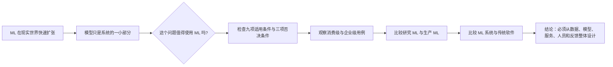
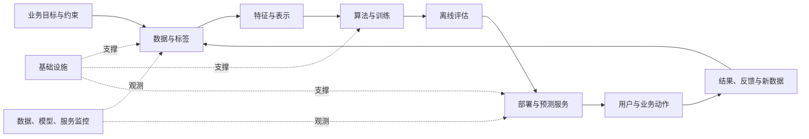
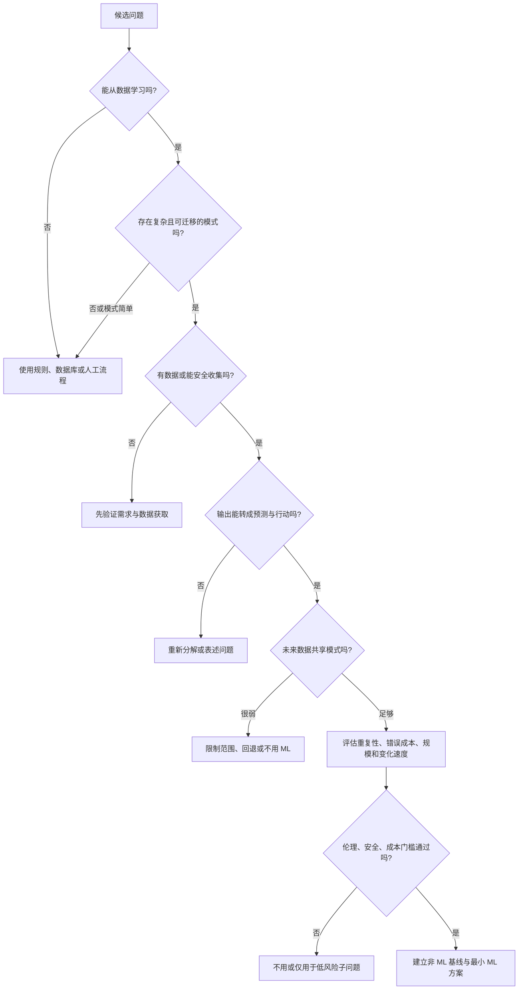
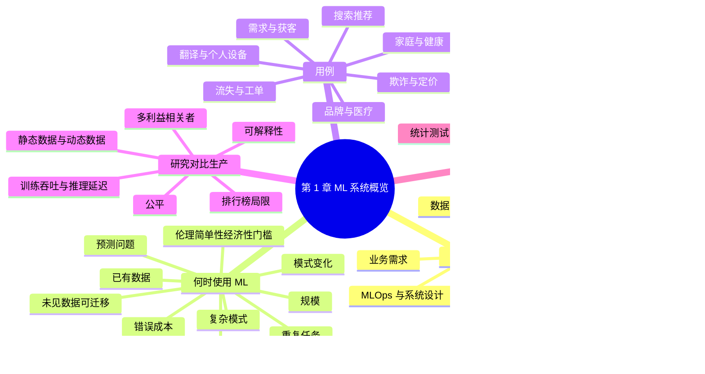

> 对应原章：1. Overview of Machine Learning Systems.md
> 本章不是算法目录，而是在回答三个更靠前的问题：一个生产级 ML 系统究竟包含什么，什么问题值得使用 ML，以及研究中的模型怎样变成真实世界中可运行、可负责的系统。
>
> 本笔记严格沿原章顺序展开。原章以概念、案例和工程判断为主，没有集中给出一套数学算法；文中标为“教学化分析”“补充推导”的公式、代码和框架用于解释作者结论，不应误认为原章逐式给出的内容。书中引用的成本、调查和性能数字主要来自 2016–2020 年，本文保留其历史时间边界，不把它们当作 2026 年的当前统计。

## 0. 本章要回答的核心问题

1. 为什么“机器学习系统”远大于“机器学习算法”？
2. MLOps 与 ML systems design 有什么联系，又有什么区别？
3. 怎样从“学习、复杂模式、已有数据、预测、未见数据”五个词判断一个问题是否适合 ML？
4. 为什么重复性、错误成本、规模和变化速度还会进一步影响 ML 的经济性？
5. 什么情况下即使 ML 能做，也不应该做？
6. 消费级与企业级 ML 用例有哪些，它们的要求为何不同？
7. 研究中的 ML 与生产中的 ML，为何在目标、计算、数据、公平性和可解释性上存在根本差异？
8. 延迟与吞吐量怎样定义，批处理为什么可能同时提高吞吐量和延迟？
9. 为什么平均延迟会误导，p50、p90、p95、p99 应该怎样计算和使用？
10. 为什么传统软件工程最佳实践仍然必要，却不足以覆盖 ML 的数据与模型问题？
11. 怎样把本章结论转化成一套可复用的 ML 项目立项与系统设计流程？

本章的论证主线如下：



一句话概括：**先证明问题值得用 ML，再把模型放回业务、数据、部署、监控、公平和维护构成的完整系统中。**

---

## 1. 开篇：从 Google 神经机器翻译到完整 ML 系统

### 1.1 2016 年的生产级深度学习里程碑

2016 年 11 月，Google 宣布把多语言神经机器翻译系统用于 Google Translate。这是深度神经网络较早的大规模生产成功案例之一。按 Google 当时的说法，这次更新带来的翻译质量跃升，超过此前十年改进的总和。

这个案例的意义不只是“某个模型分数提高了”，而是证明深度学习可以进入全球规模的真实服务：

- 输入来自多语言、长尾且不断变化的真实用户；
- 结果必须在用户可接受的时间内返回；
- 服务要承受巨量请求并处理故障；
- 模型更新不能破坏现有语言和用户体验；
- 质量提升必须最终体现在真实翻译，而不只是基准测试。

成功推动了整个行业对 ML 的兴趣。此后五年，ML 快速进入信息获取、交流、工作和社交等生活环节；医疗、交通、农业和宇宙研究中仍有大量待探索场景。

### 1.2 模型只是 ML 系统的一小部分

很多人听到“机器学习系统”，首先想到逻辑回归、神经网络等算法。但生产系统还包括：

| 层次 | 要解决的问题 | 原书覆盖位置 |
| --- | --- | --- |
| 业务需求 | 为什么做、优化什么、有哪些硬约束 | 第 1、2 章 |
| 数据 | 数据从哪里来，怎样存储、处理和标注 | 第 3、4 章 |
| 特征工程 | 如何把事实转换成训练与预测可用的表示 | 第 5 章 |
| ML 算法 | 如何从数据中学习映射 | 本书不详讲具体算法 |
| 评估 | 如何判断候选模型是否真的更好 | 第 6 章 |
| 部署、监控与更新逻辑 | 如何提供预测、发现退化并安全更新 | 第 7、8、9 章 |
| 基础设施 | 如何提供存储、计算、编排和平台能力 | 第 10 章 |
| ML 系统用户 | 谁使用系统，系统如何影响人 | 第 11 章 |
| ML 系统开发者 | 谁设计、开发和运维整条链路 | 全书 |

它们的关系不是简单堆叠，而是反馈闭环：



只优化模型，会遗漏至少三类失败：

1. **目标错误**：模型准确预测了一个与业务无关的代理指标。
2. **链路错误**：训练特征与线上特征语义不一致，或服务延迟过高。
3. **生命周期错误**：上线后数据变化，却没有监控、更新和回滚能力。

### 1.3 MLOps 与 ML 系统设计

原章用专栏区分两个容易混淆的概念。

**MLOps** 中的 Ops 来自 DevOps。把某种能力 operationalize，意味着把它带入生产，包括部署、监控和维护。MLOps 是让 ML 进入生产的一组工具与最佳实践。

**ML systems design** 则用系统视角处理 MLOps：它不仅问“用什么工具部署”，还问所有组件和利益相关者能否一起满足目标与要求。

| 对比角度 | MLOps | ML 系统设计 |
| --- | --- | --- |
| 主要关注 | 生产化流程、工具和实践 | 整个系统的目标、边界、组件关系和权衡 |
| 典型问题 | 如何训练、登记、部署、监控和更新？ | 为什么这样设计，各方目标如何协调，改变一处会影响哪里？ |
| 关系 | 提供重要的实现能力 | 决定这些能力应怎样组合与取舍 |

二者不是竞争关系。没有 MLOps 能力，系统设计难以落地；没有系统设计，工具可能自动化了一条目标错误或彼此断裂的流程。

### 1.4 为什么本书讲框架而不是具体算法

具体算法会快速更新，完整系统要解决的问题更持久：目标如何定义、数据怎样形成、评估是否可信、预测如何服务、退化怎样发现、责任怎样分配。

因此本书要提供的是**选择与组合方案的框架**，而不是替读者指定某个算法。第 1 章先回答何时使用 ML，再通过研究、生产和传统软件的比较，解释为什么生产 ML 需要独立的系统方法。

---

## 2. When to Use Machine Learning：什么时候使用 ML

### 2.1 先问“必要且划算吗”，不要先问“能否训练模型”

ML 很强，但不是解决一切问题的魔法工具。即使 ML 能够给出答案，也可能不是最优或最经济的方案。

原章没有问“ML 是否足够”，因为作者在脚注中直言：答案永远是否定的。模型必须依赖数据系统、产品逻辑、人员和运维，单独一个模型不会构成完整解决方案。

作者用一句定义拆出五个基本条件：

> 机器学习是一种从已有数据中学习复杂模式，并利用这些模式对未见数据作出预测的方法。

对应五个关键词：

1. **Learn**：系统能够学习。
2. **Complex patterns**：确实存在值得学习的复杂模式。
3. **Existing data**：已有数据，或能够收集数据。
4. **Predictions**：问题需要预测式答案。
5. **Unseen data**：未来数据与训练数据共享可迁移的模式。

原章随后再补充四项使 ML 更有优势的特征：

6. **Repetitive**：任务重复发生，模式有多次样本。
7. **Cheap errors**：错误成本较低，或平均收益足以覆盖错误风险。
8. **At scale**：预测次数足以摊薄固定投入。
9. **Changing patterns**：模式持续变化，手写规则维护困难。

这九项不是“全部满足才允许使用”的机械打分表。前五项更接近可学习性的基础，后四项主要影响样本效率、风险和投资回报。

### 2.2 Learn：系统必须有东西可以学习

关系数据库可以保存两列之间由人明确指定的关系，但通常不会自行从样本归纳这种关系，所以它本身不构成 ML 系统。

在监督学习中，数据由输入—输出对构成：

$$
D=\{(x_i,y_i)\}_{i=1}^{n}.
$$

训练算法在某个函数集合中寻找映射 $f_w$，使预测 $f_w(x_i)$ 与目标 $y_i$ 尽量接近：

$$
\widehat w=\arg\min_w\frac{1}{n}\sum_{i=1}^{n}
\ell\big(f_w(x_i),y_i\big).
$$

以 Airbnb 租金预测为例：

- $x_i$：面积、房间数、街区、设施、评分等房源特征；
- $y_i$：对应租金；
- 学到的 $f_{\widehat w}$：把新房源特征映射为价格预测。

“学习”不是把训练样本逐条背下来，而是找到能迁移到新房源的关系。若系统只是按房源 ID 查历史价格，它更接近数据库查询，不是可泛化的价格模型。

### 2.3 Complex patterns：必须有模式，而且复杂到值得学习

#### 模式与分布不是一回事

公平六面骰的每个结果都服从已知均匀分布：

$$
P(X=k)=\frac{1}{6},\qquad k\in\{1,2,3,4,5,6\}.
$$

但独立投掷的下一个结果没有可利用的序列模式：

$$
P(X_{t+1}=k\mid X_1,\ldots,X_t)=\frac{1}{6}.
$$

知道分布，只能说明长期频率；它不能让模型可靠猜中下一次具体点数。原章脚注特意提醒：**知道结果分布，不等于生成顺序存在可预测模式。**

#### 训练失败不能证明模式不存在

作者用社交媒体发言与加密货币价格举例。可能存在影响，也可能不存在；即使所有当前模型都失败，也只能说明以下至少一项有问题：

- 可用数据没有捕捉真正信号；
- 样本量不足或噪声过大；
- 特征、算法或训练方法不合适；
- 评估方法无法识别微弱效应；
- 模式不稳定，已经随市场参与者行为改变。

因此，“没有发现证据”不能自动推出“证据所指的模式不存在”。反过来，大量投资也不能证明存在稳定、可盈利的模式，仍需要严格的时间切分和样本外评估。

#### 简单模式应使用简单程序

若任务是根据美国邮政编码判断州，已知映射表足以解决：

```text
state = ZIP_TO_STATE[zip_code]
```

使用 ML 反而引入近似误差、训练数据和维护成本。租金与房源众多属性之间的关系难以手写，才更适合让模型从样本中学习。

这种变化常被称为 **Software 2.0**：

| 传统软件 | ML 方案 |
| --- | --- |
| 人显式编写输入到输出的规则 | 人提供数据、目标和模型结构，训练得到规则参数 |
| 行为主要由代码决定 | 行为由代码、数据和训练共同决定 |
| 规则变化通常修改代码 | 模式变化通常需要更新数据和模型 |

机器和人眼中的“复杂”也不同。十次幂运算对人麻烦、对机器简单；看图识别猫对人直观、对机器却需要学习高维视觉规律。

### 2.4 Existing data：必须有数据，或能够安全收集数据

预测个人应缴税额需要足够的人群收入与税务数据。没有访问权限、合法用途和代表性样本，算法再先进也无法凭空学习。

#### Zero-shot 不等于从未使用数据

零样本学习指模型没有在当前任务的专用样本上训练，也能作出预测。但它通常已经在其他相关任务或大规模通用数据上学习过。因此更准确的说法是：

$$
\text{当前任务专用数据可以为零}
\not\Rightarrow
\text{模型历史训练数据为零}.
$$

#### 先部署、后学习的风险

持续学习系统理论上可以从未训练状态部署，再从线上数据更新。但未充分训练的模型会把探索成本转嫁给用户，可能造成糟糕体验甚至不可逆伤害。安全做法通常需要：

- 一个规则或人工基线；
- 受限探索范围；
- 明确的错误预算与停止条件；
- 对高风险动作进行人工审核；
- 防止早期错误反馈污染后续训练。

#### “先人工、后自动化”

没有数据、又不能在线学习时，有些公司先让人类在幕后给出预测，把产品运行中产生的交互积累为训练数据。这常被称为 “fake it till you make it”。

它能验证需求并收集样本，但不能忽略透明度、劳动条件、隐私和标签质量。人类操作员的判断也会成为模型学习的偏差来源。

### 2.5 Predictions：问题必须能转化为预测式答案

英语中的 predict 常指估计未来，例如天气、比赛结果或用户下一部想看的电影。机器学习中的预测范围更宽：问题可以关于未来、现在甚至过去，只要输出是从输入估计未知答案。

典型形式包括：

- 分类：这笔交易是否欺诈？
- 回归：该房源合理租金是多少？
- 排序：哪些商品最相关？
- 生成：这段话最可能的翻译是什么？
- 状态估计：图像中是否有肿瘤？

#### 用近似预测替代昂贵计算

若一个精确物理或图形过程计算昂贵，可以训练模型近似其输出：

$$
y=g(x)\quad\longrightarrow\quad \widehat y=f_w(x)\approx g(x).
$$

训练阶段先用昂贵过程或高质量数据产生监督信号，推理阶段用较便宜的 $f_w$ 替代。图像去噪和屏幕空间着色是原章例子。

这种方法有效的条件是：

1. 近似误差对应用可接受；
2. 查询次数足够多，能摊薄生成训练数据和训练模型的成本；
3. 输入范围可界定，超出训练域时有检测或回退；
4. 近似模型确实比原过程便宜。

“能够预测”仍不等于“能够行动”。系统还要定义如何根据预测选择动作，以及错误动作的代价。

### 2.6 Unseen data：未见数据必须与训练数据共享模式

训练的目的不是解释过去，而是服务未来输入。设生产分布为 $P_{prod}(x,y)$，模型在生产中的真实风险为

$$
R_{prod}(w)=\mathbb E_{(x,y)\sim P_{prod}}
\left[\ell(f_w(x),y)\right].
$$

训练时只能最小化有限样本经验风险：

$$
\widehat R_{train}(w)=\frac{1}{n}\sum_{i=1}^{n}
\ell(f_w(x_i),y_i).
$$

要让较低的训练或测试风险代表生产风险，隐含前提是训练、评估与未来数据共享足够稳定的生成规律。通常简化为：

$$
P_{train}(x,y)\approx P_{prod}(x,y).
$$

原章用 2008 年 App Store 数据预测 2020 年圣诞下载量说明问题：产品生态、设备、用户和流行趋势已经改变，历史模式不再直接适用。

未来数据尚未出现，因此团队不可能“知道”其分布，只能提出可检验假设，例如明天的用户行为不会突然完全不同。生产监控负责发现假设破裂，第 8 章讨论分布变化，第 9 章讨论生产测试与持续学习。

这里有两个边界：

- 分布不必完全相同，模型可能对某些变化具有鲁棒性；
- 训练与测试同分布也不保证生产正确，因为二者可能共同遗漏真实用户群体。

### 2.7 Repetitive：重复任务更容易产生足够样本

人类擅长少样本学习，孩子看几张猫的图片就能形成概念。原书成书时的大多数 ML 算法仍需要许多例子。

重复任务提供两个优势：

1. 同类模式多次出现，更容易估计稳定关系；
2. 自动化收益可以在多次预测上累积。

重复不等于样本独立。一个用户连续点击十次可能高度相关，不能当成十个完全独立用户。设计训练与评估切分时，应按用户、时间或实体避免信息泄漏。

### 2.8 Cheap errors：错误成本低，或收益足以覆盖风险

有意义任务几乎不可能永远 100% 正确。推荐错误通常只导致用户不点击，所以推荐系统成为 ML 的大用例。医疗、信贷和自动驾驶的错误则可能带来严重后果。

#### 教学化决策模型

给定输入 $x$，系统选择动作 $a$，真实结果为 $y$，效用为 $U(a,y)$。合理动作应最大化条件期望效用：

$$
a^*(x)=\arg\max_a\sum_y P(y\mid x)U(a,y).
$$

这说明阈值不应只由准确率决定，而应由不同错误的代价决定。

以欺诈拦截为例，设模型给出欺诈概率 $p$：

- 错拦正常交易成本为 $C_{FP}$，拦截的期望成本是 $C_{FP}(1-p)$；
- 放过欺诈交易成本为 $C_{FN}$，放行的期望成本是 $C_{FN}p$。

当

$$
C_{FP}(1-p)<C_{FN}p
$$

时应拦截，即

$$
p>\frac{C_{FP}}{C_{FP}+C_{FN}}.
$$

前提是概率已校准、成本可估计且两种动作覆盖主要结果。现实中还要加入人工审核容量、客户流失、法律和攻击者响应。

自动驾驶（自驾系统）说明平均收益与单次灾难风险之间的张力。系统若统计上比人类安全，可能挽救更多生命；但这不能把所有风险简单压成平均值。灾难性、安全和伦理约束往往应作为硬门槛，而不是靠大量普通正确预测抵消。

### 2.9 At scale：规模负责摊薄前期投入

ML 项目通常需要非平凡的数据、计算、基础设施和人才投入。设：

- 固定投入为 $C_{fixed}$；
- 每次预测相对现有方案的增量价值为 $\Delta v$；
- 每次预测的增量运行成本为 $c$；
- 预测次数为 $N$。

教学化净价值为

$$
\Delta V=N(\Delta v-c)-C_{fixed}.
$$

当 $\Delta v>c$ 时，盈亏平衡规模为

$$
N^*=\frac{C_{fixed}}{\Delta v-c}.
$$

若每次增量价值连运行成本都覆盖不了，再大规模只会放大亏损。若单位净价值为正，规模越大，越容易摊薄固定成本。

原章的规模例子包括每年处理数百万封邮件、每天路由数千张支持工单。看似四年才发生一次的总统选举预测，实际可能每小时根据新信息更新一次，因此仍是一系列预测。

规模通常也带来更多训练数据，但不是自动带来更高质量：重复、偏置或由旧模型政策产生的数据可能只会强化已有错误。

### 2.10 Changing patterns：模式持续变化时，数据驱动更新更有优势

文化、偏好和技术不断变化。今天的垃圾邮件可能冒充尼日利亚王子，明天可能换成另一种叙事。

手写规则的维护过程是：

```text
发现环境变化 -> 人解释变化 -> 修改规则 -> 测试 -> 发布
```

数据驱动模型可以变成：

```text
收集新数据 -> 更新标签与训练集 -> 重训评估 -> 安全发布
```

第二条路径省去了完整手工描述模式的要求，但没有消除工程工作。团队仍要发现变化、取得正确标签、避免反馈污染、验证新模型并监控发布。**ML 能从新数据更新，不等于模型会自动适应。**

若变化突然而且历史中从未出现，模型可能比明确的应急规则更脆弱。持续学习适合有稳定反馈和安全更新机制的场景，不是对所有漂移的万能答案。

### 2.11 九项条件之间的关系



这张图不是原章算法，而是把作者的九项判断整理成可执行顺序。它优先排除不可学习、无数据或不道德的问题，再讨论模型复杂度。

### 2.12 什么时候不应使用 ML

原章明确列出三项：

#### 1. 用途不道德

伦理不是精度提高后再考虑的优化项。若用途本身侵犯权利、制造不可接受的歧视或无法提供必要的申诉路径，模型能预测也不应部署。第 11 章会讨论自动评分偏差案例。

#### 2. 简单方案已经有效

查表、规则、SQL、搜索或人工流程若能可靠满足目标，就没有理由承担模型训练、漂移和监控成本。第 6 章的模型开发四阶段把非 ML 方案放在第一阶段。

#### 3. 不具成本效益

应比较完整生命周期成本，而不只是一次训练费用：

$$
C_{total}=C_{data}+C_{develop}+C_{train}+C_{serve}
+C_{monitor}+C_{update}+C_{risk}.
$$

其中风险成本包括错误决策、事故、合规与机会损失。收益应与现有基线做增量比较。

#### 把大问题拆成可预测的子问题

如果无法构建能回答所有问题的客服机器人，可以先做 FAQ 匹配：

1. 预测用户查询是否匹配已有高频问题；
2. 若匹配，返回已审核答案；
3. 若不匹配，交给人工客服。

这种分解让 ML 只处理边界清晰、错误可回退的部分。它也会产生新的高质量人工处理数据，供后续改进。

#### 不要因当前经济性不足就永久否定新技术

技术进步通常是渐进的。某种方案今天不划算，随着硬件、算法、数据和生态投资，未来可能变得可行。作者警告，如果等整个行业证明价值后才学习，组织可能落后多年。

这不等于立即在关键路径押注未成熟技术。更稳妥的区分是：

- **生产决策**要求当前收益、风险和成本成立；
- **探索决策**可以用受限预算购买学习和未来选择权。

---

## 3. Machine Learning Use Cases：机器学习用例

### 3.1 消费级应用：搜索、推荐与个人设备

信息和服务爆炸后，人很难独立找到所需内容。搜索引擎和推荐系统分别解决两种需求：

- 搜索：用户主动表达意图，系统预测哪些结果最相关；
- 推荐：用户意图不完整，系统根据上下文预测其可能感兴趣的内容。

智能手机中的 ML 还包括：

- 预测输入：预测用户下一词或表达；
- 照片增强：预测合适的编辑参数或生成增强图像；
- 指纹与人脸认证：预测当前生物特征是否与注册用户匹配。

认证不是普通分类问题。它需要同时权衡：

- False Accept Rate：错误接受攻击者；
- False Reject Rate：错误拒绝合法用户。

阈值越严格，通常越安全但越容易拒绝本人，具体选择取决于设备风险与备用认证路径。

### 3.2 机器翻译与无障碍沟通

机器翻译是把一种语言自动转换成另一种语言，也是吸引作者进入 ML 领域的用例。它不仅是技术指标问题，还能降低文化和语言障碍。作者的父母不会英语，但借助 Google Translate 能阅读她的文章，并与不会越南语的朋友交流。

翻译难点包括：

- 同一句话有多种正确译法；
- 语义依赖上下文与文化；
- 低资源语言数据不足；
- 自动指标未必等同于人类可用性。

### 3.3 家庭设备：助手、安全摄像头和健康监测

Alexa、Google Assistant 等个人助手把语音识别、语言理解和动作执行连接起来。智能摄像头可识别宠物离家或陌生访客；居家健康系统可以预测独居老人是否跌倒。

跌倒检测体现了高风险系统的完整要求：高召回能减少漏报，但过多误报会造成告警疲劳；隐私要求限制摄像头和数据使用；模型之外还需要通知、确认和救援流程。

### 3.4 企业应用与消费应用的要求差异

尽管消费市场显眼，原章指出多数 ML 用例仍在企业领域，其中既包括内部流程，也包括面向客户的外部应用。作者给出一个总体倾向，而不是绝对规律：

| 维度 | 消费应用常见倾向 | 企业应用常见倾向 |
| --- | --- | --- |
| 准确性 | 小幅提升可能不易被单个用户察觉 | 0.1% 的效率提升也可能节省巨额成本 |
| 延迟 | 用户容易因一秒延迟离开 | 某些工作流可容忍更高延迟 |
| 分发 | 应用商店和 Web 易触达大量用户 | 销售和集成周期更长 |
| 变现 | 较容易分发，但变现困难 | 单客户价值高，但需求不容易从外部看见 |

例子：语音识别从 95% 提升到 95.5%，普通消费者可能感受不明显；大型公司的资源分配效率提高 0.1%，则可能节省数百万美元。

这些只是常见模式。交易系统、临床系统等企业应用也可能同时要求极低延迟；消费健康应用也可能要求极高准确性。

### 3.5 2020 年企业 ML 调查

原章引用 Algorithmia 的 2020 年调查，展示企业内部和外部用例。图中用途非互斥，因此比例不能相加为 100%。

| 用例 | 比例 | 用例 | 比例 |
| --- | ---: | --- | ---: |
| 降低成本 | 38% | 生成客户洞察与情报 | 37% |
| 改善客户体验 | 34% | 内部流程自动化 | 30% |
| 留住客户 | 29% | 与客户互动 | 28% |
| 推荐系统 | 27% | 检测欺诈 | 27% |
| 获取新客户 | 26% | 提高客户满意度 | 26% |
| 减少客户流失 | 26% | 预测需求波动 | 25% |
| 提高客户忠诚度 | 20% | 提高长期客户参与度 | 19% |
| 提高转化率 | 17% | 其他 | 15% |
| 过滤资产与内容 | 14% | 建立品牌认知 | 14% |

这些数字用于说明用例分布，不代表今天的市场比例，也不说明某个用途一定有正投资回报。

### 3.6 欺诈检测

只要产品涉及有价值交易，就可能遭遇欺诈。ML 可以从历史欺诈样本学习，预测新交易是否异常或欺诈。

常见方法包括：

- 有监督分类：需要可信的欺诈标签；
- 异常检测：找出偏离正常行为的交易；
- 图模型：识别账户、设备和支付工具之间的可疑关系；
- 规则与模型组合：规则处理已知攻击，模型发现复杂模式。

难点是正例稀少、标签延迟、攻击者会适应系统。高准确率可能毫无意义：若欺诈率为 0.1%，全部预测“正常”也有 99.9% 准确率。应结合精确率、召回率、拦截损失、人工审核容量和客户摩擦。

### 3.7 价格优化

价格优化是在某个时期估计价格，以最大化利润、收入或增长等目标。三者不是同一个目标：更高收入可能伴随更低利润，更快增长可能要求短期补贴。

设需求函数为 $D(p)$，单位成本为 $c$，简化利润为

$$
\Pi(p)=(p-c)D(p).
$$

若教学化地假设线性需求 $D(p)=a-bp$，其中 $a>0$、$b>0$，并把可行价格限制为 $0\le p\le a/b$ 以保证需求非负，则

$$
\Pi(p)=(p-c)(a-bp).
$$

求导：

$$
\frac{d\Pi}{dp}=a-2bp+bc.
$$

二阶导数为 $-2b<0$，所以驻点若在可行域内就是唯一内点最大值。令一阶导数为零，得到

$$
p^*=\frac{a+bc}{2b}.
$$

该内点解还要求 $0\le c<a/b$，也就是单位成本低于使需求降为零的阻断价格。若 $c\ge a/b$，上式落在可行域边界之外或边界上，在这个简化模型中没有正利润的内点销售方案，应比较边界或选择不销售。整个推导还依赖需求线性、参数稳定、没有库存和竞争约束。现实中模型要估计价格对需求的**因果影响**，而不仅是观察到“高价商品卖得少”的相关性。动态定价还要考虑公平、法规、用户信任和价格试验风险。

原章指出，它尤其适合交易量大、需求波动且消费者接受动态价格的场景，如网络广告、机票、住宿、网约车和活动票务。

### 3.8 需求预测与库存

企业需要预测需求，以安排预算、库存、资源和价格。杂货店库存太少会缺货，太多会腐坏。

一个经典的单周期库存模型是 newsvendor。设：

- 少备一单位造成的缺货成本为 $C_u$；
- 多备一单位造成的剩余成本为 $C_o$；
- 需求累积分布为 $F$。

令临界分位水平

$$
\alpha=\frac{C_u}{C_u+C_o}.
$$

对一般分布，最优库存是广义分位数

$$
q^*=\inf\{q:F(q)\ge\alpha\}.
$$

当 $F$ 连续且在该位置严格递增时，才可简写为 $F(q^*)=\alpha$；离散需求可能不存在恰好满足等式的库存量。直觉是：缺货越昂贵，目标分位数越高，库存越保守；报废越昂贵，目标分位数越低。需求预测给出分布，业务成本决定取哪个分位数。只输出一个均值，不能完整支持这种决策。

公式假定单周期、成本线性且需求分布可信。多仓调拨、补货提前期、替代商品和促销会使实际问题更复杂。

### 3.9 获客与广告定位

原章引用的 2019 年历史数据称：移动应用获取一名最终产生应用内购买的用户，平均成本为 86.61 美元；Lyft 获客成本估计为每位乘客 158 美元。企业客户的获客成本通常更高。

ML 可以用于：

- 识别更可能转化的潜在客户；
- 选择广告受众和出价；
- 估计何时提供折扣；
- 预测客户生命周期价值。

单位经济性至少要满足：

$$
LTV-CAC-C_{serve}>0,
$$

其中 $LTV$ 是客户生命周期价值，$CAC$ 是获客成本。模型应优化增量转化，而不只是挑出本来就会购买的人，否则离线预测很准，却没有因果增量。

### 3.10 客户流失预测

原章引用的估计是：获取新用户的成本约为留住现有用户的 5 到 25 倍。流失预测旨在识别即将停止使用产品或服务的客户，以便采取挽回行动；同样思路也可用于员工流失。

必须区分：

- **谁会流失**：预测问题；
- **给谁干预最有效**：因果决策问题。

最容易被挽回的人不一定是流失概率最高的人。无论是否发优惠都要离开的客户，可能浪费干预预算；本来就不会离开的客户也不需要优惠。可靠系统应通过随机实验估计 uplift，而不是直接按流失分数发放资源。

### 3.11 支持工单自动分类

传统工单可能在部门间反复转发。模型可分析内容，预测正确队列，缩短响应时间并提高满意度；内部 IT 工单也适用。

生产设计应包括：

- 高置信度时自动路由；
- 低置信度时给出 top-k 候选或交给人工；
- 新问题类别无法识别时允许“未知”；
- 记录改派结果作为反馈标签；
- 监控组织架构变化导致的标签语义变化。

只追求分类准确率可能掩盖不同错误成本：把安全事件发到普通咨询队列，远比把账单问题错发一次更严重。

### 3.12 品牌监测

品牌监测需要发现品牌在何时、何地、以何种方式被提及：

- 显式提及，如公司名称；
- 隐式提及，如“搜索巨头”；
- 提及所带的正面、负面或中性情绪；
- 负面提及是否突然异常增长。

它可能组合命名实体识别、实体链接、共指消解、情感分析和时间序列异常检测。讽刺、方言、同名实体和机器人内容会造成误判，因此告警通常应保留原文证据供人审核。

### 3.13 医疗健康

原章列出皮肤癌检测和糖尿病诊断等令人期待的应用。由于准确性和隐私要求严格，这类系统通常通过医院等医疗机构提供，或用于辅助医生，而不是脱离临床流程独立决策。

医疗系统不能只报告整体准确率，还要检查：

- 灵敏度与漏诊风险；
- 特异度与过度检查风险；
- 不同人群、设备和医院上的表现；
- 概率校准与决策阈值；
- 数据隐私、同意和审计；
- 医生怎样理解、质疑和覆盖模型建议。

---

## 4. Understanding Machine Learning Systems：理解机器学习系统

作者接下来通过两组比较解释为什么需要系统设计：

1. ML in research 与 ML in production；
2. ML systems 与 traditional software。

第一组说明学术成功为何不能直接推出生产成功，第二组说明传统软件工程为何必要但不充分。

## 4.1 Machine Learning in Research Versus in Production

### 4.1.1 五项主要差异

| 维度 | 研究环境 | 生产环境 |
| --- | --- | --- |
| 要求 | 在基准数据集上达到最先进性能 | 不同利益相关者有不同甚至冲突的要求 |
| 计算优先级 | 快速训练、高吞吐量 | 快速推理、低延迟 |
| 数据 | 通常静态、干净、已知 | 噪声大、动态、偏置和标签问题复杂 |
| 公平性 | 往往不是首要评估目标 | 必须纳入设计与运行 |
| 可解释性 | 往往不是首要评估目标 | 很多行业用例是信任、合规和调试要求 |

研究也有持续学习、公平和可解释性子领域；表格描述的是常见激励差异，不是说所有研究都忽略生产问题。

### 4.1.2 Different stakeholders and requirements：餐厅推荐案例

#### 各角色真正优化的目标

某移动应用向用户推荐餐厅，并从每笔订单收取 10% 服务费：

| 角色 | 诉求 | 隐含目标或约束 |
| --- | --- | --- |
| ML 工程师 | 用更多数据和复杂模型推荐用户最可能下单的餐厅 | 提高预测质量与下单概率 |
| 销售团队 | 多推荐昂贵餐厅 | 提高单笔服务费 |
| 产品团队 | 100 ms 内返回 | 避免延迟导致订单下降 |
| ML 平台团队 | 暂缓模型更新，先解决扩展和夜间事故 | 提高可靠性和运维可持续性 |
| 经理 | 最大化利润 | 甚至可能通过裁撤 ML 团队降成本 |

“最可能点击或下单”与“给平台带来最多收入”是不同目标。第 2 章会讨论目标解耦：为不同目标训练模型，再组合预测。

教学化组合分数可以写为：

$$
S(u,i)=w_1\widehat P(\mathrm{order}\mid u,i)
+w_2\widehat M(u,i),
$$

其中 $\widehat M$ 是预计利润或服务费，两个量必须先校准或归一化。真正部署还要满足原文给出的 100 ms 要求。原文没有说明它是单请求硬上限、均值还是某个百分位，因此这里只能把它写成统计口径尚待利益相关者明确的约束：

$$
L_{\mathrm{specified}}\le 100\ \mathrm{ms},
$$

以及容量、可靠性、公平性等约束。

#### 硬约束与软目标

假设模型 A 优化下单概率，模型 B 优化收入，但二者都无法在 100 ms 内返回。若产品数据表明超过 100 ms 会让 10% 用户关闭应用，那么延迟是硬约束，A、B 都不可部署；若只是偏好，则可以在价值与延迟之间权衡。

设计顺序应是：

1. 先列出所有利益相关者；
2. 把要求量化；
3. 区分不可违反的硬约束和可权衡的软目标；
4. 排除不可行方案；
5. 在可行集合中比较净价值与风险。

这比先训练模型、最后才询问产品要求更有效，因为它避免在不可部署的方向上优化数月。

### 4.1.3 为什么竞赛优胜方案不一定适合生产

#### Ensemble 的收益与代价

集成学习把多个模型组合起来。例如加权平均：

$$
\widehat p(y\mid x)=\sum_{k=1}^{K}\alpha_k
\widehat p_k(y\mid x),
\qquad \alpha_k\ge 0,\quad \sum_k\alpha_k=1.
$$

若模型错误不完全相关，组合可以降低方差并提高预测性能。这也是 Netflix Prize 等竞赛中常见的策略。

生产代价包括：

- 需要存储和加载多个模型；
- 推理计算和延迟增加；
- 依赖、版本和回滚关系更复杂；
- 故障定位与解释更困难；
- 各模型更新节奏可能不同。

并行推理、蒸馏或缓存可以缓解部分问题，但不会让复杂度消失。若增益只有极小百分点，必须证明它足以覆盖长期成本。

#### 小幅指标提升何时值得

原章指出，电商推荐点击率提高 0.2% 可能带来数百万美元收入；另一些任务中，同样量级的提升用户根本感受不到。

应关注增量价值：

$$
\Delta V=N\cdot\Delta r\cdot v-\Delta C,
$$

其中 $N$ 是机会次数，$\Delta r$ 是指标带来的真实行为增量，$v$ 是每次行为价值，$\Delta C$ 是额外开发、服务和风险成本。关键难点是证明离线指标变化真的导致 $\Delta r$，通常需要在线实验。

### 4.1.4 对 ML 排行榜的批评

原章总结了三层问题。

#### 1. 很多困难步骤已经替参赛者完成

竞赛通常已经给定问题、数据、标签、切分和指标。真实项目最困难的工作恰恰可能是：

- 判断是否需要 ML；
- 定义不会被投机的标签和指标；
- 收集合法、代表生产的数据；
- 建立服务、监控和更新链路。

排行榜只覆盖了完整系统的一小段。

#### 2. 多重假设检验会让“偶然优胜”出现

若一个没有真实提升的方案以概率 $\alpha$ 偶然在固定测试集上显得显著，独立测试 $m$ 个方案时，至少一个假阳性的概率为

$$
P(\mathrm{at\ least\ one\ false\ positive})
=1-(1-\alpha)^m.
$$

例如 $\alpha=0.05$、$m=100$：

$$
1-0.95^{100}\approx 99.4\%.
$$

这个计算假定测试独立，实际排行榜提交互相依赖、团队还会根据结果自适应调参，但方向更值得警惕：反复窥视同一测试集会逐渐过拟合它。

解决思路包括隐藏最终测试集、限制提交、报告置信区间、在新时间和新域复验，以及预先注册主要假设。

#### 3. 单指标激励会排挤其他价值

Ethayarajh 和 Jurafsky 在 2020 年 EMNLP 论文中指出，NLP 基准推动了准确率进步，却可能牺牲实践者重视的紧凑性、公平性和能效。

排行榜不是没有价值，它提供共享比较条件；问题在于把一个代理指标误当成系统全部价值。

### 4.1.5 Computational priorities：训练吞吐与推理延迟

#### 研究阶段与生产阶段的瓶颈不同

模型开发期间会训练许多候选模型，每个模型多轮遍历训练数据，通常只在较小验证集上预测一次，所以训练是瓶颈。

部署后，模型长期重复生成预测，推理成为瓶颈。因此：

- 研究通常优先快速训练与高吞吐；
- 生产在线服务通常优先快速推理与低延迟。

离线批量推理、嵌入生成等生产任务也可能优先吞吐，所以这仍是常见倾向，不是绝对规则。

#### 本书对 latency 的约定

更严格的分布式系统术语会区分：

- service time：服务实际处理请求的时间；
- queueing delay：等待处理的时间；
- network delay：网络传输时间；
- response time：客户端从发送到收到结果的总时间。

有些书把 latency 专指等待或潜伏时间。为了与 ML 社区习惯一致，本书把 **latency** 用作客户端看到的 response time：

$$
L_{end\text{-}to\text{-}end}
=L_{network}+L_{queue}+L_{preprocess}+L_{model}+L_{postprocess}.
$$

因此只优化模型核函数，不一定显著改善端到端延迟。

#### 单请求串行处理

若系统一次只处理一个请求，单请求平均耗时为 $t$ 秒，理想吞吐量为

$$
Q=\frac{1}{t}.
$$

- $t=10$ ms $=0.01$ s，$Q=100$ 请求/秒；
- $t=100$ ms $=0.1$ s，$Q=10$ 请求/秒。

这里假定没有并发、空闲、网络和调度开销。

#### 批处理为什么能提高吞吐量

若一个 batch 含 $B$ 个请求，处理耗时为 $t_B$ 秒，则吞吐量近似为

$$
Q_B=\frac{B}{t_B}.
$$

原章的两个例子：

- $B=10$，$t_B=10$ ms，吞吐量为 $10/0.01=1000$ 请求/秒；
- $B=50$，$t_B=20$ ms，吞吐量为 $50/0.02=2500$ 请求/秒。

第二种方案的处理延迟从 10 ms 上升到 20 ms，吞吐量却从 1000 请求/秒上升到 2500 请求/秒。原因是 GPU 等硬件对大批矩阵运算利用率更高。

在线动态批处理还要等待请求凑批：

$$
L_{request}=L_{batch\ wait}+t_B+L_{other}.
$$

低流量时等待可能超过计算本身。生产系统常同时设置最大 batch size 与最大等待时间，在吞吐和尾延迟之间取舍。

#### 低延迟可能提高单位成本

为减少等待和计算延迟，系统可能使用更小 batch，让昂贵硬件未充分利用。于是：

$$
\mathrm{cost\ per\ query}
=\frac{\mathrm{hardware\ cost\ per\ second}}{\mathrm{queries\ per\ second}}
$$

可能上升。延迟、吞吐、利用率和成本是同一组约束，不能分别优化。

#### 延迟会影响业务

原章引用三项历史观察：

- Akamai 2017 年研究称，100 ms 延迟可能使转化率下降 7%；
- Booking.com 2019 年报告称，约 30% 延迟增加造成约 0.5% 转化率损失；
- Google 2016 年报告称，超过一半移动用户会离开加载时间超过 3 秒的页面。

这些数字来自不同产品、时期和实验定义，不能直接套用。正确做法是在自己的产品中测量延迟—行为曲线。

### 4.1.6 平均延迟、百分位与尾延迟

#### 为什么平均值会误导

原章给出十个请求延迟：

```text
100, 102, 100, 100, 99, 104, 110, 90, 3000, 95 ms
```

均值为

$$
\overline L=\frac{3900}{10}=390\ \mathrm{ms}.
$$

九个请求都不超过 110 ms，一个 3000 ms 网络异常把平均值拉到 390 ms。均值提示总体成本，却不能描述典型用户和尾部用户。

#### p50、p90、p95、p99 的含义

p50 是中位数：至少一半请求不超过该值，也至少一半不小于该值。高百分位用于观察少数慢请求，常见 p90、p95 和 p99。

对有限样本，百分位有多种合法估计约定。设排序后数据为 $x_{(1)}\le\cdots\le x_{(n)}$：

- nearest-rank 定义：$Q_p=x_{(\lceil pn\rceil)}$；
- 线性插值常在位置 $(n-1)p$ 的相邻样本间插值；
- 监控系统中的直方图、t-digest 等又会使用近似算法。

原章把这十个值的 p90 写为 3000 ms，表达“最高 10% 请求落入异常尾部”的教学意图；按常见 nearest-rank，p90 是 110 ms、p95 才是 3000 ms；按常见线性插值，p90 是 399 ms。**使用 SLO 前必须固定百分位定义、时间窗口和聚合方法。**

下面的标准库 Python 代码复现吞吐量、均值和两种百分位算法：

```python
from math import ceil

latencies = [100, 102, 100, 100, 99, 104, 110, 90, 3000, 95]


def nearest_rank(values, quantile):
    ordered = sorted(values)
    return ordered[ceil(quantile * len(ordered)) - 1]


def linear_percentile(values, quantile):
    ordered = sorted(values)
    position = (len(ordered) - 1) * quantile
    lower = int(position)
    upper = min(lower + 1, len(ordered) - 1)
    fraction = position - lower
    return ordered[lower] + fraction * (ordered[upper] - ordered[lower])


ordered = sorted(latencies)
mean = sum(latencies) / len(latencies)
median = (ordered[4] + ordered[5]) / 2

print(f"mean={mean:.1f} ms")
print(f"median={median:.1f} ms")
print(
    "nearest-rank "
    f"p90={nearest_rank(latencies, 0.90)} ms, "
    f"p95={nearest_rank(latencies, 0.95)} ms, "
    f"p99={nearest_rank(latencies, 0.99)} ms"
)
print(
    "linear "
    f"p90={linear_percentile(latencies, 0.90):.1f} ms, "
    f"p95={linear_percentile(latencies, 0.95):.1f} ms, "
    f"p99={linear_percentile(latencies, 0.99):.1f} ms"
)

for name, batch_size, batch_ms in [
    ("single", 1, 10),
    ("batch10", 10, 10),
    ("batch50", 50, 20),
]:
    qps = batch_size / (batch_ms / 1000)
    print(f"{name}: {batch_ms} ms -> {qps:.0f} qps")
```

运行结果应为：

```text
mean=390.0 ms
median=100.0 ms
nearest-rank p90=110 ms, p95=3000 ms, p99=3000 ms
linear p90=399.0 ms, p95=1699.5 ms, p99=2739.9 ms
single: 10 ms -> 100 qps
batch10: 10 ms -> 1000 qps
batch50: 20 ms -> 2500 qps
```

#### 为什么高百分位特别重要

尾部请求可能揭示网络错误、热点、缓存未命中、超大输入或依赖故障。慢请求用户也不一定“不重要”：Amazon 的慢用户可能因为购买历史多、账户数据大，恰恰是高价值客户。

因此生产要求常写成：

```text
p99 latency < 200 ms over a rolling 10-minute window
```

而不是“平均延迟低于 200 ms”。还应同时规定最小请求量、区域、接口和错误请求是否计入。

### 4.1.7 Data：静态基准与动态生产数据

#### 研究数据的常见特征

- 已清洗、格式统一；
- 为复现实验而保持静态；
- 很多人研究过，已知缺陷和处理脚本较多；
- 研究者可以把更多精力用于模型。

研究中也有持续学习处理变化分布，但不是普通基准实验的默认条件。

#### 生产数据的常见特征

- 噪声、缺失、重复和非结构化；
- 持续由用户、系统和第三方生成；
- 分布与业务语义不断变化；
- 标签稀疏、不平衡、延迟或错误；
- 项目目标变化可能迫使团队重定义历史标签；
- 用户数据涉及隐私、授权和法规；
- 偏差存在，但团队未必知道偏差在哪里。

原章采用 Andrej Karpathy 的示意图：博士研究阶段“失眠原因”几乎都在模型和算法，Tesla 生产阶段大部分在数据。图是经验性比喻，不是精确比例统计。它表达的是优先级迁移：**现实系统中，数据质量、覆盖与反馈链往往比再换一个算法更耗费精力。**

### 4.1.8 Fairness：公平不能等上线后再补

研究者可能先追求最先进准确率，把公平留到生产阶段。但部署后再发现系统性歧视，伤害已经发生，数据和流程也可能已经固化。

原章列出的现实风险包括：

- 邮政编码代理社会经济背景，影响贷款；
- 姓名拼写影响简历排序；
- 信用评分可能使弱势人群承担更高利率；
- 预测性警务、雇主性格测试和大学排名放大既有偏差。

原章引用 2019 年报道：研究者估计 2008–2015 年间，线下和线上贷款机构拒绝了 130 万名信用合格的黑人和拉丁裔申请者；删除种族标识后，使用相同收入与信用分数可改变决定。按原章叙述，这个案例支持的是种族标识可能直接影响决定，不能单凭它证明哪些其他字段构成代理变量。

进一步的一般性补充是：删除敏感字段仍不足以保证公平，因为邮编等变量可能与受保护属性高度相关，历史标签本身也可能包含歧视。但这个判断需要另外检查变量关系、决策机制和群体结果，不能由上述案例单独推出。

#### 模型更像编码过去，而不是预言未来

模型从历史数据中学习：

$$
\mathrm{model\ behavior}
=\mathrm{algorithm}+\mathrm{historical\ data}+\mathrm{objective}.
$$

历史数据包含制度和采样偏差，模型会复制甚至放大它们。自动化还把局部偏见扩展到每秒数百万决策。

#### 整体准确率如何掩盖少数群体伤害

若主群体占 98%，少数群体占 2%，总准确率为

$$
Acc=0.98Acc_{major}+0.02Acc_{minor}.
$$

即使 $Acc_{major}=99\%$、$Acc_{minor}=50\%$，仍有

$$
Acc=0.98\times0.99+0.02\times0.50=98.02\%.
$$

一个看似优秀的 98.02% 总准确率，可以同时意味着少数群体有一半预测错误。这解释了为什么只优化总体指标，会让小群体改善显得“不划算”。

#### 常见公平指标及其边界

以下是为理解原章补充的标准定义。

设敏感群体属性为 $A$：

- 人口统计平等要求各群体选择率接近：

$$
P(\widehat Y=1\mid A=a)
\approx P(\widehat Y=1\mid A=b).
$$

- 机会均等要求合格者的真阳性率接近：

$$
P(\widehat Y=1\mid Y=1,A=a)
\approx P(\widehat Y=1\mid Y=1,A=b).
$$

- Equalized odds 进一步要求真阳性率和假阳性率都接近。

不同公平定义可能在群体基础率不同、模型不完美时互相冲突。没有一个类似排行榜“最先进分数”的公平指标能替代价值判断。团队必须先说明谁受到什么决策影响、哪类错误造成何种伤害。

原章引用的 2019 年调查中，只有 13% 的大型公司表示正在采取措施缓解平等与公平风险。这个历史数字说明当时实践不足，不代表今天的比例。

### 4.1.9 Interpretability：为什么能解释在生产中常是要求

#### Hinton 的 AI 外科医生问题

Geoffrey Hinton 在 2020 年提出一个争议问题：若黑盒 AI 外科医生治愈率 90%，人类医生治愈率 80%，是否应因为 AI 无法解释而禁止它？

作者随后向 30 位非科技上市公司高管提问，只有一半愿意选择更有效但不能解释的 AI，另一半选择人类医生。

这个思想实验故意把准确率与可解释性对立起来，但现实还需要追问：

- 90% 与 80% 怎样估计，适用于哪些患者？
- 失败类型是否相同？
- AI 是否能识别自己不知道的情况？
- 谁承担责任，患者能否同意或拒绝？
- 人类医生能否审查或接管？

所以可解释性不是简单用 10 个百分点准确率交换的单一变量。

#### 可解释性的两个主要用途

1. **面向用户和业务负责人**：理解决策依据、建立适当信任、发现潜在偏差，并在某些司法辖区满足解释权要求。
2. **面向开发者**：调试错误、发现泄漏和伪相关、比较版本并改进模型。

人们可以不懂微波炉原理仍然使用它，但对影响贷款、医疗和工作的 AI 决策更谨慎，因为错误后果与责任结构不同。

#### 容易混淆的三个词

| 概念 | 含义 | 局限 |
| --- | --- | --- |
| 内在可解释模型 | 模型结构本身能被人理解，如小决策树 | 简单不自动保证公平或正确 |
| 事后解释 | 对复杂模型某次输出给出特征贡献或示例 | 解释可能稳定性差，甚至不忠实于真实计算 |
| 透明度 | 披露数据、目标、评估、限制和责任流程 | 不等于能逐步解释每个参数 |

原章引用的 2019 年调查中，只有 19% 的大型公司在改善算法可解释性。和公平数字一样，应按历史调查理解。

### 4.1.10 Discussion：为什么大多数岗位在生产化

只懂学术 ML 并没有错，纯研究也很重要；作者反对的是“研究岗位数量很多，所以无需了解生产”的推论。

多数公司无法承担与短期业务应用无关的纯研究，尤其在模型沿“更大、更好”路线发展、单次研究需要巨量数据和数千万美元算力时。与此同时，研究成果和现成模型越来越易获得，更多组织希望把它们用于具体业务，这会增加生产化需求。

作者据此判断，绝大多数 ML 相关岗位将会、并且已经集中在生产化。其一般逻辑是：

$$
\text{模型供给增加}
\rightarrow
\text{可尝试应用增加}
\rightarrow
\text{数据、部署、评估和运维需求增加}.
$$

---

## 4.2 Machine Learning Systems Versus Traditional Software

### 4.2.1 传统软件工程原则仍然必要

ML 是软件工程的一部分。模块化、测试、代码审查、版本控制、持续集成、可观测性、回滚和安全等成熟实践都应继续使用。若 ML 从业者具备更强的软件工程能力，生产系统会更可靠。

但直接照搬仍不够，因为传统 SWE 常隐含代码与数据可以分离，而 ML 系统由三类共同决定：

$$
\mathrm{ML\ system}
=\mathrm{code}+\mathrm{data}+\mathrm{artifacts}(\mathrm{code},\mathrm{data}).
$$

artifacts 包括特征、模型权重、词表、统计量、索引和评估结果。代码不变、数据变化，也能产生行为完全不同的新模型。

### 4.2.2 从 algorithm-centric 转向 data-centric

过去十年的趋势表明，拥有更多、更好数据的应用常常胜出。许多公司与其不断发明算法，不如改进：

- 数据覆盖；
- 标签质量；
- 长尾与困难样本；
- 反馈速度；
- 训练与生产一致性。

因为数据变化快，ML 应用可能需要比传统软件更快的开发与部署循环。但“更快”必须和验证、灰度和回滚配套，否则只是更快把数据错误推向生产。

### 4.2.3 不只版本化代码，还要版本化数据与模型

传统软件主要测试和版本化代码。ML 还需要回答：

- 大型数据集怎样形成可复现版本？
- 样本加入、删除和修正怎样追踪？
- 标签规范改变后，旧版本是什么意思？
- 哪些样本对当前模型更有价值？
- 某个模型由哪版代码、数据、配置和环境产生？

一次训练可抽象为：

$$
M_v=\operatorname{Train}(D_d,C_c,H_h,E_e,S_s),
$$

其中 $D_d$ 是数据版本、$C_c$ 是代码版本、$H_h$ 是超参数、$E_e$ 是环境、$S_s$ 是随机性配置。只保存 $M_v$ 不能解释模型从何而来。

大型数据通常不适合把每个字节直接放进普通 Git。常见做法是保存不可变对象、内容哈希、分区清单和元数据，让一个轻量 manifest 唯一指向完整数据快照。

### 4.2.4 不是所有样本都同等有价值

若肺部扫描模型已经见过 100 万张正常肺、只有 1000 张癌症肺，新的一张癌症样本通常比又一张常见正常样本更能补足决策边界。

样本价值与以下因素有关：

- 稀有性与类别覆盖；
- 模型当前不确定性；
- 是否代表高代价错误；
- 标签质量；
- 与已有样本的重复程度；
- 是否覆盖新时间、新设备或新人群。

无差别接受所有数据可能使类别更失衡、强化偏差，甚至遭遇数据投毒。数据管道需要验证来源、异常、标签和影响，而不只是追求行数。

### 4.2.5 模型大小带来的生产挑战

原章成书时，数亿到数十亿参数模型已经常见。若模型有 $P$ 个参数，每个参数 $b$ bit，仅权重内存近似为

$$
M_{weights}=\frac{Pb}{8}\ \mathrm{bytes}.
$$

BERT Large 有 3.4 亿参数。若使用 FP32：

$$
340{,}000{,}000\times4
=1.36\times10^9\ \mathrm{bytes}
\approx1.36\ \mathrm{GB}.
$$

这与原章给出的 1.35 GB 大致一致；换算为 GiB 约 1.27 GiB。实际推理还需要激活、运行时工作区、缓存和框架开销，训练则还要梯度与优化器状态。

大型模型在边缘设备上尤其困难，因为设备内存、电量、散热和网络受限。压缩、量化、剪枝、蒸馏和硬件加速都在解决容量与速度问题，但可能牺牲质量或增加工程复杂度。

自动补全模型说明延迟是功能正确性的一部分：如果建议下一个字符所需时间比用户自己输入更长，即使预测准确也没有产品价值。

### 4.2.6 生产监控与调试更困难

传统程序出现异常时，常能沿确定性调用栈定位。ML 系统可能“正常返回”一个错误预测：

- HTTP 状态是成功；
- 服务延迟正常；
- 模型没有抛异常；
- 但数据语义或预测质量已经退化。

复杂模型缺乏可见性，生产标签又可能延迟，导致问题难以及时发现。监控至少分四层：

| 层次 | 示例 |
| --- | --- |
| 服务 | 请求量、错误率、延迟、资源利用率 |
| 数据 | schema、缺失率、范围、分布、新类别 |
| 模型 | 预测分布、置信度、切片表现、校准 |
| 业务 | 转化、流失、人工覆盖、伤害与申诉 |

单层正常不能证明整个系统正常。

### 4.2.7 BERT：工程生态可以迅速改变“不可生产化”判断

2018 年 BERT 论文发布时，人们认为它过大、过慢、过于复杂，不实用。预训练 BERT Large 有 3.4 亿参数、约 1.35 GB。到 2020 年，BERT 及其变体已用于几乎每一次英文 Google 搜索。

这个案例与本章前面的技术成熟度警告相呼应：

- 今天的成本判断必须诚实；
- 但不能把当前硬件和软件限制误认为永久边界；
- 平台、编译器、压缩和硬件共同决定模型能否落地。

### 4.2.8 传统软件与 ML 系统对照

| 维度 | 传统软件常见情况 | ML 系统新增问题 |
| --- | --- | --- |
| 行为来源 | 主要由代码和配置决定 | 代码、数据、训练过程共同决定 |
| 正确性 | 可为明确输入断言预期输出 | 统计质量、切片、概率和阈值 |
| 版本 | 代码与依赖 | 代码、数据、特征、模型、配置、环境 |
| 变化来源 | 代码发布或依赖变化 | 即使不发布，生产数据也会变化 |
| 测试 | 单元、集成、端到端 | 再加数据、模型、漂移和公平测试 |
| 调试 | 日志、调用栈、确定性复现 | 标签延迟、概率行为、数据血缘 |
| 部署物 | 可执行程序或服务 | 模型、预处理、词表、索引及服务 |
| 监控 | 可用性、错误、性能 | 再加数据质量、预测质量和业务影响 |

---

## 5. 原章总结的完整还原

本章先浏览了生产 ML 的广泛用例。消费者应用最容易被看到，但多数 ML 用例位于企业领域，并同时服务企业内部与外部场景。ML 能很好解决一部分问题，却不能解决所有问题，也并非对所有可解问题都合适。一个大问题无法整体交给 ML 时，可以把其中边界明确的预测子问题交给 ML。

随后，本章比较了研究与生产：

1. 研究常围绕单一基准性能，生产面对多方要求；
2. 研究常重训练吞吐，生产在线系统常重推理延迟；
3. 研究数据通常静态干净，生产数据动态混乱；
4. 公平性在生产中不能忽略；
5. 可解释性常是用户信任、合规和调试要求。

最后，本章比较 ML 系统与传统软件。ML 继承软件工程问题，又增加数据、模型产物、统计行为、快速变化、模型体积和质量监控等挑战。这正是全书需要采用系统方法的原因。

---

## 6. 容易混淆的概念与常见误区

### 6.1 ML 系统不等于 ML 模型

模型是输入到输出的映射；系统还包含目标、数据、特征、评估、部署、监控、更新、基础设施和人员。模型离线得分高，不能证明系统成功。

### 6.2 MLOps 不等于买齐一组工具

MLOps 是生产化实践和能力。工具没有共同目标、数据契约、责任和采用流程时，只是彼此孤立的产品。

### 6.3 “有分布”不等于“有可预测模式”

公平骰子有明确均匀分布，下一次点数却没有可利用的序列规律。预测需要输入包含关于具体输出的信息。

### 6.4 模型失败不等于世界没有模式

也可能是数据不足、特征错误、算法能力不够、噪声过大或评估失真。结论应限制为“当前证据下没有学到可泛化模式”。

### 6.5 Zero-shot 不等于 zero-data

模型可以没有当前任务示例，但它依赖其他数据上的预训练。真正从未使用任何数据的学习没有信息来源。

### 6.6 预测不只指未来

图像分类、语音识别和历史文档抽取都在估计未知答案，虽然对象属于现在或过去。

### 6.7 数据越多不一定越好

重复、错误、偏置或被攻击的数据可能降低性能。长尾、高代价和新分布样本通常比又一条常见样本更有价值。

### 6.8 模式变化不等于重训必然有效

若没有及时标签、变化来自目标定义、或新环境超出可学习范围，重训可能复制新错误。先诊断变化类型，再决定更新方式。

### 6.9 规模大不等于投资回报一定为正

只有单位增量价值高于单位运行成本，规模才能摊薄固定投入；负单位价值会被规模放大。

### 6.10 平均正确不等于风险可接受

少数灾难性错误不能总被大量普通正确预测抵消。安全、权利和法规应设置硬门槛。

### 6.11 企业应用不总是慢，消费应用不总是低风险

原章给出的是总体倾向。高频交易等企业系统追求极低延迟，消费医疗应用则要求极高准确性和隐私。

### 6.12 预测流失不等于知道怎样挽留

前者估计自然结果，后者需要估计干预的因果增量。最高风险客户不一定最可挽回。

### 6.13 高吞吐不等于低延迟

大 batch 可以提高每秒处理量，却增加处理时间和等待凑批时间。两项指标必须分别测量。

### 6.14 本书中的 latency 采用 ML 社区宽泛定义

它指端到端 response time。阅读其他系统资料时，要检查 latency 是否只指排队或等待，避免术语冲突。

### 6.15 百分位没有脱离算法的唯一小样本结果

nearest-rank、线性插值和流式近似会给出不同数值。SLO 必须固定算法、窗口与聚合范围。

### 6.16 高总体准确率不等于公平

少数群体权重小，严重错误可能只让总指标下降很少。必须按受影响群体和错误类型切片。

### 6.17 可解释性不等于生成一个听起来合理的理由

事后解释可能不忠实或不稳定。应验证解释是否反映模型真实行为，并结合透明度、审计和人工覆盖。

### 6.18 竞赛最优不等于生产最优

竞赛通常不计延迟、成本、能耗、公平、维护和数据获取。生产方案是在约束下的整体最优，而不是单指标榜首。

### 6.19 ML 特殊性不等于传统软件工程失效

ML 更需要测试、版本、模块化、CI/CD 和可观测性，只是测试和版本对象从代码扩展到数据与模型。

### 6.20 “当前不划算”不等于“永远不值得学习”

生产采用与技术探索是两种决策。可以不承担当前生产风险，同时以有限预算积累未来能力。

---

## 7. 本章知识结构



知识之间的因果关系是：

1. ML 从数据学习，而数据来自变化的现实环境。
2. 因而模型行为不能只由代码保证，必须同时管理数据和模型产物。
3. 模型进入产品后，要满足多方目标、延迟、公平和解释等要求。
4. 这些要求互相耦合，单一排行榜指标无法代表系统价值。
5. 所以立项前要判断 ML 的必要性，立项后要按完整生命周期设计。

---

## 8. 核心结论

1. **ML 算法只是生产系统的一小部分。** 业务、数据、评估、服务、监控、更新、基础设施和人共同决定结果。
2. **ML systems design 是对 MLOps 的系统化视角。** 它关注组件和利益相关者怎样共同满足目标，而不只是生产化工具。
3. **适合 ML 的问题具有可学习、复杂、数据可得、可预测和可迁移的模式。** 重复、低错误成本、大规模和持续变化会进一步提高 ML 优势。
4. **ML 能做不等于 ML 应该做。** 不道德、简单方案足够或全生命周期不经济时，应拒绝或缩小 ML 范围。
5. **大问题可以拆成 ML 子问题与确定性流程。** FAQ 匹配加人工客服比企图一次构建万能机器人更可控。
6. **消费与企业 ML 的目标和约束常不同。** 不能把一个市场的延迟、准确性和变现经验直接复制到另一个市场。
7. **研究成功不自动转化为生产成功。** 多利益相关者、推理性能、动态数据、公平和解释要求都会改变模型选择。
8. **训练通常重吞吐，在线推理通常重延迟。** batching 可以提高硬件利用率和吞吐，却增加处理及等待延迟。
9. **延迟是分布，不是一个平均数。** SLO 应观察高百分位，并明确百分位算法、窗口和聚合范围。
10. **公平不能在上线后追加。** 历史数据会编码偏差，总体指标又会掩盖少数群体伤害。
11. **可解释性同时服务信任、问责和调试。** 一个听起来合理的事后说明不一定忠实。
12. **传统软件工程仍是基础，但 ML 还要测试和版本化数据与模型。** 代码不变时，系统行为也会因数据改变。
13. **模型大小、数据价值与质量监控是独特的生产挑战。** 参数文件能否加载、预测能否及时返回、退化能否发现，都属于功能正确性。
14. **技术经济性会变化。** BERT 从“难以实用”到广泛用于搜索，说明当前约束不能被误认为永久边界。

---

## 9. 从本章提炼出的通用问题解决方法

### 第一步：定义真实业务结果与动作

不要从“训练一个分类器”开始。先说明谁根据预测采取什么动作，希望改变什么结果，错误动作会伤害谁。

### 第二步：先做伦理、安全与合规门禁

若用途本身不可接受，或无法提供必要的监督、申诉和退出机制，不进入模型比较。硬约束不能靠高平均收益抵消。

### 第三步：建立非 ML 基线

使用查表、规则、SQL、搜索或人工流程得到成本和质量基线。它既可能直接解决问题，也为 ML 提供最低比较标准和安全回退。

### 第四步：逐项检查九个适用条件

确认：

- 是否存在复杂模式；
- 数据是否合法可得、标签是否可定义；
- 输出能否表述为预测；
- 未来数据是否共享模式；
- 任务是否重复；
- 错误代价是否可控；
- 规模能否摊薄成本；
- 模式是否经常变化；
- 模型是否真的比简单方案有优势。

### 第五步：必要时重新分解问题

把开放、不可验证的大问题拆成边界清楚的预测、规则和人工步骤。给低置信度、高风险和新类别设计回退路径。

### 第六步：收集所有利益相关者要求

把业务、产品、ML、平台、安全、法务和用户要求量化，区分硬约束与软目标。模型开发前就确认延迟、成本和责任边界。

### 第七步：把价值写成端到端因果链

例如：

$$
\text{模型排序改善}
\rightarrow
\text{用户看到更相关结果}
\rightarrow
\text{增量转化}
\rightarrow
\text{净收益}.
$$

每个箭头都是待验证假设。离线指标只能验证第一段，后续通常需要影子流量、灰度和 A/B 实验。

### 第八步：设计代码、数据、模型和服务的共同版本

记录数据来源与时间、标签规范、代码、配置、环境、模型、评估和发布。确保训练结果可解释、线上问题可追溯、新版本可回滚。

### 第九步：按生产约束评估

除了平均离线分数，还要检查：

- 关键用户与长尾切片；
- 概率校准与业务阈值；
- p50、p95、p99 延迟与吞吐；
- 资源和单位成本；
- 公平、隐私和解释；
- 故障、过载、未知输入和回退。

### 第十步：上线前建立监控与更新闭环

为数据、服务、模型和业务指标设置基线、窗口、阈值、负责人和响应动作。模型上线只是反馈循环开始，不是项目结束。

可以把这套方法压缩成伪代码：

```text
输入：业务问题、当前方案、可用数据、约束、受影响人群

定义业务动作与成功标准
如果用途违反伦理、安全或合规硬约束：
    停止

建立最简单的非 ML 基线
检查复杂模式、数据、预测形式和未来可迁移性
如果任一基础条件不成立：
    重新表述、拆分问题或继续使用基线

估计错误成本、预测规模、变化速度和全生命周期成本
如果 ML 没有正的增量价值：
    不部署；必要时保留受限探索

收集所有利益相关者要求
排除不满足延迟、公平、隐私、可靠性等硬约束的方案
构建最小端到端 ML 系统

循环：
    在离线数据、关键切片和生产性能上验证
    以影子、灰度或实验验证真实增量
    只有净价值改善且风险可接受时才扩大发布
    监控数据、模型、服务和业务结果
    当假设破裂时更新、回滚或退役系统
```

这套方法的核心不是“永远使用 ML”，而是**让 ML 只进入它真正擅长、证据充分且能被完整运行和负责的那部分问题。**
