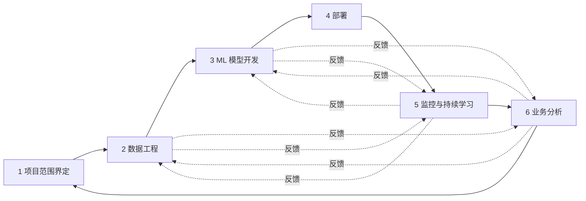
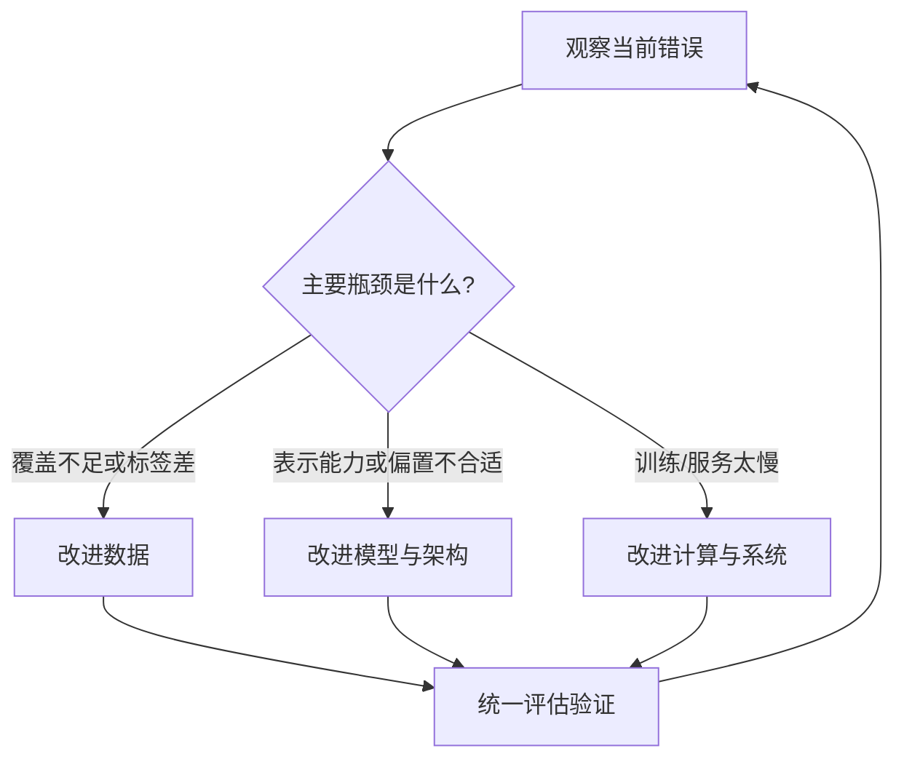
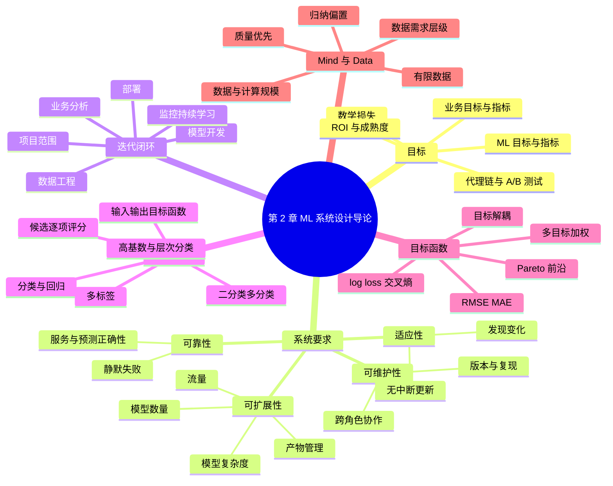

> 对应原章：2. Introduction to Machine Learning Systems Design.md
> 本章把第 1 章的系统全景转化为设计顺序：先问项目为什么存在，再把业务目标翻译成 ML 目标；明确可靠性、可扩展性、可维护性和适应性；用迭代闭环推进系统；最后选择合适的问题表述、任务类型和目标函数。
>
> 本笔记严格按照原章顺序展开。原章中的调查、成本和模型规模数据主要来自 2013–2020 年，本文保留其历史语境，不将其视为 2026 年的现状。
>
> **归因说明：** 除相邻文字明确写明“原章定义”“原章公式”或“原章示例”的内容外，本文新增的 A/B 置信区间、ROI、容量估算、复现关系、层次准确率、多标签损失、Mermaid 图和伪代码，均是为了讲清原章思想而补充的形式化表达，不是作者在本章逐式提出的公式。容易与原文混淆的位置会再标为“笔记补充”。

## 0. 本章要回答的核心问题

1. 为什么 ML 项目必须从业务目标开始，而不能从模型或指标开始？
2. 业务目标、ML 目标、评估指标和目标函数分别是什么，怎样建立可验证的联系？
3. 为什么 A/B 测试有助于确认业务价值，却仍可能无法归因复杂系统中的失败？
4. 可靠性、可扩展性、可维护性和适应性各解决什么问题，它们怎样相互约束？
5. ML 系统为什么是持续迭代的闭环，而不是“收集数据—训练—部署”的直线？
6. 广告展示案例的 13 个步骤怎样暴露标签错误、类别不平衡、模型陈旧和目标错位？
7. 如何把“加快客服响应”这种业务诉求表述成具有输入、输出和目标函数的 ML 问题？
8. 分类、回归、二分类、多分类、多标签和层次分类有什么区别？
9. 为什么同一个业务问题换一种表述，就可能显著改变数据需求、模型结构和上线成本？
10. RMSE、MAE、log loss 和交叉熵从哪里来，各自优化什么、有什么局限？
11. 多目标系统为什么常先解耦模型，再在服务层组合分数？什么时候不应只做软加权？
12. “智能设计”与“数据/计算”之争真正争论什么，数据为何必要却不充分？

全章主线可以概括为：


一句话概括：**系统设计不是先选算法，而是把业务价值、系统约束、可学习任务、数据证据和持续反馈连接成一条可验证的因果链。**

---

## 1. 开篇：ML 系统设计从目标开始

第 1 章已经说明，ML 系统设计是对 MLOps 的系统化视角：业务要求、数据栈、基础设施、部署、监控及其利益相关者必须共同满足明确目标。

第 2 章据此安排了四个问题：

1. **为什么建设这个系统？** 业务目标必须先翻译成 ML 目标。
2. **怎样才算一个好系统？** 用可靠性、可扩展性、可维护性和适应性描述。
3. **怎样开发它？** 采用持续反馈、反复修正的迭代过程。
4. **模型到底要学什么？** 把业务问题表述成输入、输出和目标函数明确的 ML 任务。

最后一节讨论“智能设计与数据谁更重要”，因为所有问题表述和模型优化最终都受数据质量、数量和覆盖范围约束。

这套顺序很重要。如果先训练模型、后补业务目标，团队很可能精确优化一个无价值的代理；若先规定目标、约束和证据，算法选择才有判断标准。

---

## 2. Business and ML Objectives：业务目标与 ML 目标

### 2.1 四个层次不能混为一谈

生产 ML 中至少有四种“目标”：

| 层次 | 回答的问题 | 示例 |
| --- | --- | --- |
| 业务目标（business objective） | 组织希望改变什么结果？ | 增加利润、降低欺诈损失、减少流失 |
| 业务指标（business metric） | 怎样观察业务结果？ | 购买率、广告收入、月活、取消率 |
| ML 目标与评估指标（ML objective / metric） | 模型要预测什么，离线怎样比较？ | 点击概率、F1、AUC、RMSE、推理延迟 |
| 数学目标函数（objective / loss function） | 优化器训练时最小化什么标量？ | 交叉熵、均方误差、正则化损失 |

它们构成代理链，而不是同义词：

$$
\text{loss 下降}
\Rightarrow
\text{离线 ML 指标改善}
\Rightarrow
\text{产品行为改变}
\Rightarrow
\text{业务指标改善}.
$$

每个箭头都是需要证据支持的假设。损失下降可能只说明模型更拟合训练分布；准确率提高可能没有改变用户动作；用户停留时间增加也未必提升长期价值。

### 2.2 为什么只追求 ML 指标会让项目死亡

数据科学家容易为准确率从 94% 提升到 94.2% 而兴奋，并投入数据、算力和工程时间。公司通常不关心这个小数本身，只关心它是否推动业务指标。

短命项目常遵循以下路径：

```text
团队优化方便测量的模型指标
    -> 没有证明业务影响
    -> 管理层看不到投入回报
    -> 项目提前终止，团队也可能被裁撤
```

问题不是 0.2 个百分点一定没有价值。若模型每天参与十亿次高价值决策，小幅提升可能非常重要；关键是团队必须证明规模、行为与收益之间的联系。

### 2.3 商业利润、直接目标与间接目标

原章引用 Milton Friedman 的观点，把企业唯一目的概括为最大化股东利润，并据此认为项目最终应直接或间接提高利润：

- **直接路径**：增加销售或转化，减少成本和损失；
- **间接路径**：提高满意度、网站停留时间或留存，再影响长期收入。

需要保留论证边界：这是原章采用的一种商业目标框架，不是所有组织都接受的唯一规范。公共机构、非营利组织和利益相关者治理公司还会重视公共价值、员工、环境和法定义务。即使在营利企业中，安全、公平和合规也不能总被短期利润抵消。

### 2.4 从业务目标翻译到 ML 目标

翻译过程可写成一条因果链：


以电商推荐从批量预测切换到在线预测为例：

1. 业务关心购买率（purchase-through rate）。
2. 在线预测可能使用更近期上下文，推荐更相关。
3. 更相关的推荐可能提高模型预测质量。
4. 历史数据可能显示，预测质量每提升 1%，购买率平均增加某个幅度。
5. 团队仍要实验验证在线架构的真实增量，因为延迟、成本和用户行为也会改变。

这里的“历史映射”只是先验依据，不能自动证明因果。过去的模型改进、流量结构和产品页面可能与当前变化不同。

### 2.5 为什么点击率预测和欺诈检测容易获得支持

这两类用例的 ML 输出与金钱之间路径较短：

- 广告点击率提高，通常直接带来更多广告收入；
- 拦截真实欺诈，通常直接减少损失。

但“路径短”仍不等于没有副作用。广告系统可能诱导低质量点击，欺诈系统可能错误拒绝正常客户。完整目标应考虑净价值：

$$
\Delta V
=\Delta \mathrm{revenue}
-\Delta \mathrm{operating\ cost}
-\Delta \mathrm{error\ cost}
-\Delta \mathrm{risk\ cost}.
$$

### 2.6 Netflix 的 take-rate：自定义桥接指标

很多公司创建中间指标，把模型表现连接到业务结果。Netflix 的推荐 take-rate 定义为：

$$
\mathrm{take\text{-}rate}
=\frac{\text{quality plays}}{\text{recommendations seen}}.
$$

“quality play”需要业务规则定义，例如播放达到一定时长。take-rate 的直觉是：用户看到的推荐中，有多少真正转化为有质量的观看。

Netflix 还把它与总观看时长和订阅取消率联合分析，并发现更高 take-rate 与更高观看时长、更低取消率相关。

使用此类桥接指标必须检查：

- 分母中的“看到”怎样定义，曝光日志是否可靠；
- quality play 的时长阈值是否会被模型投机；
- 指标提高是因推荐更好，还是页面位置、营销活动等共同变化；
- 短期观看是否损害长期满意度；
- 相关关系是否经过随机实验验证。

### 2.7 同一个个性化模型可能产生相反业务影响

个性化方案更贴合用户，可能提高满意度并让用户购买更多；也可能更快解决问题，使按使用时长或次数收费的服务收入下降。

这说明“用户体验更好”到“利润更高”不是恒真命题。团队应明确商业模式：

$$
\text{模型输出}
\rightarrow \text{用户行为}
\rightarrow \text{计费机制}
\rightarrow \text{短期与长期价值}.
$$

相同产品行为在订阅制、广告制和按次付费中可能产生不同结果。

### 2.8 A/B 测试：为什么需要实验（含笔记补充推导）

为了获得 ML 指标对业务指标影响的更确定答案，公司常把用户随机分为对照组和实验组，并选择业务指标更好的模型，即使它的离线 ML 指标不更高。

设实验组业务结果均值为 $\bar Y_1$，对照组为 $\bar Y_0$，简单平均处理效应估计为

$$
\widehat\tau=\bar Y_1-\bar Y_0.
$$

若两组独立，样本方差分别为 $s_1^2,s_0^2$，样本数为 $n_1,n_0$，标准误近似为

$$
SE(\widehat\tau)
=\sqrt{\frac{s_1^2}{n_1}+\frac{s_0^2}{n_0}}.
$$

大样本下，近似 95% 置信区间为

$$
\widehat\tau\pm1.96\,SE(\widehat\tau).
$$

为什么随机化有效？随机分组使用户类型、时间等混杂因素在期望上平衡，所以组间差异可归因于处理变化。

成立条件与限制包括：

1. 分流真正随机，且实验前两组可比；
2. 用户不会同时落入两组，组间干扰可忽略；
3. 指标、样本量和停止规则尽量预先确定；
4. 实验覆盖代表性的时间周期，避免新奇效应和季节性；
5. 统计显著不等于业务上值得，也不代表长期安全；
6. 网络效应、推荐生态和多边市场可能违反“一个用户处理不影响另一个用户”的假设。

### 2.9 严格实验为何仍可能无法完成组件归因

原章的网络安全系统包含一条长链：


若最终没有阻止威胁，可能是：

- 模型没有发现异常；
- 规则误分类；
- 专家误判或处理太慢；
- 阻断流程失败；
- 日志无法关联各阶段。

端到端 A/B 测试能判断整套方案是否改善结果，却未必告诉团队哪一环造成失败。解决组件归因需要阶段性指标、统一事件 ID、数据血缘、人工决定记录和反事实测试。

### 2.10 “AI-powered”不是价值证明

有些公司强调“AI 驱动”，因为标签本身有营销价值，即使 AI 组件没有产生实用增量。这会造成目标倒置：先决定使用 AI，再寻找可宣传的理由。

正确问题应是：

- 相比当前基线，ML 改善了什么？
- 证据来自离线评估、在线实验还是营销叙事？
- 移除 ML 后，用户和业务结果是否恶化？

### 2.11 现实地估计回报：可能神奇，但不会一夜发生

Google 的搜索、广告、翻译和 Android 都从 ML 获益，但这些回报建立在数十年投入上。ML 投资回报与组织成熟度相关：

- 数据和标签管道越成熟，准备成本越低；
- 训练、评估和发布越自动化，开发周期越短；
- 基础设施利用率越高，单位云成本越低；
- 团队积累越多，重复犯错越少。

原章引用 Algorithmia 2020 年调查：

- 已有模型生产经验超过 5 年的成熟组织，接近 75% 能在 30 天内部署模型；
- 刚开始建设 ML 管道的组织，60% 部署一个模型需要超过 30 天。

图 2-1 还按 0–7 天、8–30 天、31–90 天、91–365 天和 1 年以上分段，对比起步、1–2 年、2–4 年和 5 年以上四个成熟阶段。

这是一项历史观察性调查。成熟度与速度相关，不证明“使用年限”单独造成速度提升；公司规模、项目类型、样本选择和自报偏差也可能影响结果。

### 2.12 教学化 ROI 框架

设项目周期为 $T$，第 $t$ 期增量收益为 $B_t$、成本为 $C_t$、折现率为 $r$，净现值为

$$
NPV=\sum_{t=0}^{T}\frac{B_t-C_t}{(1+r)^t}.
$$

初期通常是数据、人员和基础设施投入，收益滞后出现；成熟后公共平台与经验会降低边际成本。因此只看上线后第一个月，容易低估长期能力建设；只讲遥远收益，又会掩盖没有验证的项目。

合理做法是设置分阶段证据门：需求验证、非 ML 基线、离线可行性、影子流量、在线实验和规模化，每一阶段都允许停止。

---

## 3. Requirements for ML Systems：机器学习系统的四项要求

### 3.1 目标与要求的区别

- **目标**说明希望系统带来什么结果，例如降低欺诈损失。
- **要求**说明系统必须以什么性质持续提供结果，例如 p99 延迟、可用性、可复现性和更新能力。

一个模型可以达到目标指标，却因频繁宕机、无法扩容或无人能维护而不构成好系统。原章集中讨论四项普遍要求：可靠性（reliability）、可扩展性（scalability）、可维护性（maintainability）、适应性（adaptability）。

### 3.2 Reliability：可靠性

#### 定义

面对硬件故障、软件故障甚至人为错误时，系统仍应以期望性能完成正确功能。

这里包含两层：

1. **服务正确性**：请求能到达、代码能执行、接口返回合法结果；
2. **预测正确性**：模型输出对真实任务有用。

`model.predict()` 成功调用，只能证明执行路径完成，不能证明预测正确。

#### ML 为什么容易静默失败

传统软件常用崩溃、运行时异常或 404 明确暴露故障。ML 系统可能：

- HTTP 返回 200；
- schema 合法；
- 延迟正常；
- 预测却因数据漂移、标签变化或特征错误持续变差。

不会目标语言的用户使用 Google Translate 时，甚至无法识别译文错误，于是继续把失败系统当成正常系统。

#### 可靠性不能只等于 uptime（笔记补充量化）

可用率常写为

$$
A=\frac{\text{满足服务标准的请求数}}{\text{有效请求总数}}.
$$

对 ML 服务，“满足标准”至少可能包含：

- 未超时、未报错；
- 输入与特征有效；
- 模型版本和依赖正确；
- 预测质量没有越过最低门槛。

最后一项往往有标签延迟，不能实时得到。因此需要代理信号（输入分布、预测分布、置信度）与延迟标签质量共同监控。代理异常不是质量下降的充分条件，只是调查触发器。

#### 可靠性设计手段

- 输入 schema、范围和完整性验证；
- 超时、重试、幂等、熔断和依赖隔离；
- 规则、旧模型或人工流程作为降级路径；
- 模型灰度、金丝雀发布和快速回滚；
- 按用户群体、时间和关键场景监控质量；
- 故障演练和清晰的响应责任。

### 3.3 Scalability：可扩展性

ML 系统至少有三条增长轴。

#### 1. 模型复杂度增长

去年使用逻辑回归，1 GB RAM 的 AWS 免费实例足够；今年切换到 1 亿参数神经网络，推理需要 16 GB RAM。扩展问题从请求量变成单副本能否加载、延迟是否达标以及硬件是否可得。

仅权重内存的粗略下界为

$$
M_{weights}=P\times\frac{b}{8},
$$

其中 $P$ 是参数量，$b$ 是每参数 bit 数。真实推理还要激活、缓存、运行时和预处理空间。

#### 2. 流量增长与波动（含笔记容量估算）

日请求量可能从 1 万增长到 100 万至 1000 万。平均 QPS 为

$$
QPS_{avg}=\frac{N_{daily}}{86{,}400}.
$$

对应约为：

| 日请求量 | 平均 QPS |
| ---: | ---: |
| 10,000 | 0.116 |
| 1,000,000 | 11.57 |
| 10,000,000 | 115.74 |

平均值不能直接用于容量规划。若峰值是平均值的 $k$ 倍、每副本安全容量为 $q$，最低副本数近似为

$$
R=\left\lceil\frac{k\,QPS_{avg}}{q}\right\rceil.
$$

还应保留故障和发布余量。

#### 3. 模型数量增长

一个热点标签模型后来可能增加 NSFW 过滤和机器人推文过滤。企业 ML 公司还可能为每位客户维护一个模型；作者接触的一家创业公司为 8000 位企业客户运行 8000 个模型。

模型数增长会放大：

- 注册、版本和血缘；
- 部署与回滚；
- 监控和告警；
- 重训计划与资源冲突；
- 所有权、权限和退役。

#### 扩缩容术语辨析

原章用 up-scaling / down-scaling 泛指增加或减少资源。标准云计算术语还常区分：

| 术语 | 含义 | 示例 |
| --- | --- | --- |
| scale up / down（垂直） | 把单个组件变大或变小 | 8 GB 实例换成 32 GB |
| scale out / in（水平） | 增加或减少等价副本 | 10 个 Pod 增至 100 个 |

阅读系统文档时应先确认术语口径，不要把“向上扩容”与“横向扩容”混用。

#### 自动扩缩容的价值与困难

峰值需要 100 张 GPU，平时只需 10 张，长期保留 100 张会浪费约 90 张 GPU 的资源时段。autoscaling 根据使用量自动增减机器，但需要处理：

- 模型加载和实例启动时间；
- 指标采集与决策延迟；
- 突发流量快于扩容；
- 缩容时正在处理的请求；
- 冷缓存和批处理效率；
- 配额与区域容量。

原章引用 2018 年 Amazon Prime Day 的历史事件：自动扩缩容失败导致系统崩溃，一小时停机损失估计为 7200 万至 9900 万美元。估计区间不是精确财务审计，但足以说明扩容机制本身也是高风险系统。

#### 扩展不只等于增加机器

管理 100 个模型与管理 1 个模型不同。单模型可以人工监控、手动更新，用一个文件记录复现信息；百模型场景需要自动监控、重训、代码生成和可追溯产物管理。

因此可扩展性包含：

$$
\text{resource scalability}
+\text{operational scalability}
+\text{artifact scalability}.
$$

### 3.4 Maintainability：可维护性

ML 工程师、DevOps 工程师和领域专家（SME）来自不同背景，使用不同语言和工具，负责流程的不同部分。

可维护性的目标不是强迫所有人使用同一工具，而是建立清晰契约，让各角色能使用合适工具协作：

- 代码有必要文档和测试；
- 代码、数据和产物都有版本；
- 模型能在原作者离开后复现；
- 出现问题时能沿血缘共同定位，而不是互相指责。

下面的训练依赖关系是本笔记用于解释“可复现”的补充形式化：

$$
M_v=\operatorname{Train}(D_d,C_c,H_h,E_e,S_s),
$$

其中：

- $D_d$：数据快照与标签规范；
- $C_c$：代码提交；
- $H_h$：超参数与运行配置；
- $E_e$：依赖、容器和硬件环境；
- $S_s$：随机种子与非确定性设置。

复现还应记录特征定义、上游数据时间、评估切分和产物校验和。相同输入在并行硬件上未必 bit-for-bit 一致，所以“可复现”应先定义容许误差和目标用途。

### 3.5 Adaptability：适应性

系统面对数据分布和业务要求变化时，应同时具备：

1. **发现改进机会的能力**：监控退化、分析错误、识别新群体和新目标；
2. **不中断服务地更新能力**：重新训练、验证、灰度、切换和回滚。

适应性与可维护性紧密相连。没有清晰版本和自动测试，快速更新只会增加事故；没有更新能力，再易维护的静态系统也会随环境过时。

典型安全更新流程是：

```text
发现变化 -> 取得新证据 -> 更新数据/代码/模型
-> 离线门禁 -> 影子或灰度 -> 线上验证
-> 扩大发布或回滚 -> 继续监控
```

适应不等于每次检测到分布变化就重训。变化可能不影响任务，也可能来自传感器故障、业务定义改变或攻击；先诊断原因，再选择修复数据、模型、规则或产品流程。

### 3.6 四项要求的关系与张力

| 改动 | 可能改善 | 可能损害 |
| --- | --- | --- |
| 增加复杂模型 | 预测质量 | 延迟、成本、可维护性 |
| 自动快速重训 | 适应性 | 若门禁不足，会损害可靠性 |
| 为每客户单独建模 | 个性化 | 模型数量与运维扩展性 |
| 统一平台与接口 | 可维护性、复用 | 过度统一可能降低用例适应性 |
| 保留大量冗余容量 | 峰值可靠性 | 成本效率 |

因此“好系统”不是四项分别最大，而是在业务硬约束下取得可持续平衡。

---

## 4. Iterative Process：机器学习系统的迭代过程

### 4.1 为什么不是一次性直线

作者部署第一个 ML 系统前，以为流程是：

```text
收集数据 -> 训练模型 -> 部署 -> 完成
```

现实则是长期循环。数据、标签、特征、模型、系统和业务目标会互相暴露问题；上线后仍要监控和更新。传统软件也具有迭代性，ML 的额外困难是数据和统计目标也进入循环。

### 4.2 广告展示案例：13 步怎样层层推翻假设

任务是预测用户输入搜索词时是否展示广告。原章给出的过程如下。

#### 第 1–4 步：建立第一版模型

1. 选择优化指标，例如展示次数（impressions）。
2. 收集数据并取得标签。
3. 构造特征。
4. 训练模型。

此时团队默认：标签正确、类别可学、历史数据代表当前流量、展示次数代表业务价值。这些都只是尚未验证的假设。

#### 第 5–6 步：错误分析发现标签错误

5. 错误分析发现错误来自错误标签，于是重新标注。
6. 再次训练。

模型无法从系统性错误标签中学到正确决策。先修标签比盲目换算法更接近根因。

#### 第 7–8 步：发现 99.99% 标签为负

7. 模型总预测“不展示”，因为 99.99% 数据标签为 NEGATIVE；团队必须收集更多应展示广告的正例。
8. 再次训练。

若正例率为 $\pi=0.0001$，永远预测负类的准确率为

$$
1-\pi=99.99\%.
$$

所以高准确率在极端不平衡数据上毫无意义。应检查正例召回、精确率、PR-AUC、成本和正例覆盖，并重新设计采样或标签获取。

#### 第 9–10 步：测试集已经陈旧

9. 模型在两个月前的测试数据上很好，在昨天数据上很差，说明模型陈旧，需要近期数据。
10. 再次训练。

随机历史切分不能验证未来稳定性。时间变化任务应使用按时间向后验证：

```text
训练：较早窗口 -> 验证：随后窗口 -> 测试：最近窗口
```

#### 第 11–13 步：上线后发现优化错了业务目标

11. 部署模型。
12. 模型看似工作良好，但业务人员发现收入下降：广告展示了，用户却很少点击。团队决定从展示次数改为广告点击率。
13. 回到第 1 步。

展示次数是容易增加的活动指标，不是最终价值。系统可能通过展示低相关广告“提高”指标，同时降低用户点击、体验和收入。

#### 这 13 步揭示的四类根因

| 迭代触发 | 根因 | 应修改的层次 |
| --- | --- | --- |
| 错误标签 | 数据语义错误 | 标注规范与质量控制 |
| 全预测负类 | 类别极不平衡 | 数据采集、采样、指标和阈值 |
| 昨日数据表现差 | 分布变化 | 时间评估、近期数据和更新策略 |
| 收入下降 | 目标错位 | 项目目标、标签和在线实验 |

没有一种“更强模型”能同时修复这四种问题。

### 4.3 六阶段系统开发闭环

图 2-2 把过程概括为六个阶段，并用多条虚线表示跨阶段反馈，而不是只沿顺时针移动：



这是数据科学家或 ML 工程师视角的简化图。平台或 DevOps 工程师可能把更多时间放在资源、权限、编排和服务基础设施上。

### 4.4 Step 1：Project scoping（项目范围界定）

需要明确：

- 业务目标、ML 目标与成功标准；
- 用户、受影响群体与利益相关者；
- 数据、预算、人员、时间和基础设施；
- 延迟、可靠性、合规、公平和安全约束；
- 非 ML 基线、停止条件和责任人。

scoping 的产物不是一句“使用 AI 改善体验”，而是一份可验证的问题定义和边界。

### 4.5 Step 2：Data engineering（数据工程）

大多数模型从数据学习。此阶段包括：

- 接入不同来源与格式；
- 理解时间、实体和更新语义；
- 从原始数据采样训练样本；
- 生成、审核和版本化标签；
- 处理隐私、权限、质量和血缘。

第 3 章讲数据工程基础，第 4 章讲训练数据与标签。

### 4.6 Step 3：ML model development（模型开发）

从初始训练数据中提取特征，建立基线、训练候选模型并离线评估。这是最依赖 ML 知识、也最常被课程覆盖的阶段。

但模型开发不能脱离上游标签和下游服务。第 5 章讲特征工程，第 6 章讲模型选择、训练和离线评估。

### 4.7 Step 4：Deployment（部署）

模型需要以用户或其他服务可访问的形式发布。作者把系统开发比作写作：永远不会达到绝对完成，但会到必须发布并接受现实反馈的时刻。

部署至少包含：

- 打包模型和预处理依赖；
- 选择批量或在线预测；
- 容量、延迟、权限和降级；
- 模型版本、灰度、回滚和审计。

第 7 章详细讨论。

### 4.8 Step 5：Monitoring and continual learning（监控与持续学习）

生产模型要监控服务、数据、预测和业务质量，发现性能衰减，并适应环境与需求变化。

持续学习不必等同于每条样本实时更新。它可以是每天、每周或事件触发的批量重训；关键是更新闭环持续存在。第 8、9 章分别讨论分布变化、监控和持续更新。

### 4.9 Step 6：Business analysis（业务分析）

把模型表现放回业务目标，产生业务洞察：

- 系统是否带来净增量价值？
- 哪些用户和场景受益或受损？
- 哪些项目应停止？
- 哪些新问题值得立项？

结果返回 Step 1，形成新的范围界定。因此业务分析不是上线后的汇报，而是下一轮系统设计输入。

### 4.10 迭代过程的一般算法

```text
初始化：定义业务目标、硬约束、非 ML 基线和证据门

循环：
    获取并验证当前数据与标签
    建立最简单可行模型
    在时间、群体和错误类型上分析失败
    判断根因属于目标、数据、特征、模型还是服务
    只修改最可能控制根因的层次
    通过离线、影子、灰度或 A/B 实验验证
    若满足业务目标和系统要求：渐进发布
    否则：回滚、重构问题或终止项目
    监控环境和要求是否变化
直到系统退役
```

关键不是“多训练几次”，而是每轮用证据更新问题理解。

---

## 5. Framing ML Problems：表述机器学习问题

### 5.1 业务问题不是天然的 ML 问题

银行老板听说竞争对手使用 ML，使客服请求处理速度提高两倍，于是要求团队也用 ML 加速客服。

“客服慢”只有结果描述，没有定义：

- 输入 $x$ 是什么；
- 输出 $y$ 是什么；
- 学习过程优化什么目标函数。

调查发现瓶颈是请求在会计、库存、人力资源和 IT 四个部门之间路由。于是可以表述为四分类：

$$
x=\text{客户请求文本与上下文},
$$

$$
y\in\{\text{会计},\text{库存},\text{HR},\text{IT}\},
$$

$$
\min_\theta\frac{1}{n}\sum_{i=1}^{n}
\ell(f_\theta(x_i),y_i).
$$

模型只解决路由瓶颈，不自动解决客服知识、人员不足或处理流程。表述之前的流程调查决定了 ML 是否作用于真正瓶颈。

### 5.2 问题表述为什么会改变难度

表述决定：

- 需要什么标签；
- 输出空间大小；
- 能否支持新类别；
- 训练样本数量；
- 推理次数和延迟；
- 使用什么损失与指标；
- 错误怎样影响产品。

因此 framing 不是把业务语言机械翻译成术语，而是在多个可行任务中选择最容易学习、部署和演化的一种。

### 5.3 Types of ML Tasks：机器学习任务类型

#### 5.3.1 Classification versus regression：分类与回归

##### 基本定义

- 分类输出离散类别，例如垃圾邮件或非垃圾邮件；
- 回归输出连续数值，例如房价。

形式上：

$$
f_{class}:\mathcal X\to\{1,\ldots,K\},
\qquad
f_{reg}:\mathcal X\to\mathbb R.
$$

分类模型通常先输出每类分数或概率，再通过 argmax 或阈值得到离散决定。

##### 回归怎样离散化为分类

房价可以量化为区间：低于 10 万美元、10–20 万、20–50 万等。若区间边界为 $b_0<\cdots<b_K$，标签是

$$
y_{class}=k\quad\text{if}\quad y\in[b_{k-1},b_k).
$$

收益：输出更容易解释，对离群值可能更稳健。代价：丢失区间内顺序和距离。例如 200,001 与 499,999 美元被视为同类，199,999 与 200,001 却被视为不同类。

桶越窄，信息损失越少但类别越多、数据越稀疏；桶越宽，任务更简单但预测分辨率越低。

##### 分类怎样通过连续分数做决定

垃圾邮件模型输出 $s(x)\in[0,1]$，再按阈值 $t$ 判断：

$$
\widehat y=\mathbb 1[s(x)>t].
$$

原章把这种形式称为将分类表述为回归。技术上，它通常仍是**概率式二分类或评分任务**，尤其使用 logistic loss 时并不是普通连续目标回归。关键思想是：先预测连续分数，再把产品阈值与模型训练分开。

阈值不必是 0.5。漏掉欺诈的成本高时可降低阈值，误拦正常邮件的成本高时可提高阈值；前提是分数排序或概率校准可信。

#### 5.3.2 Binary versus multiclass classification：二分类与多分类

二分类只有两个互斥类别，例如：

- 评论是否有毒；
- 肺部扫描是否显示癌症；
- 交易是否欺诈。

多分类有两个以上且互斥的类别。二分类更容易计算和解释 F1、混淆矩阵；多分类需要决定 macro、micro 或 weighted 平均，并分析 $K\times K$ 的错误关系。

作者提出一个有趣但未定论的问题：二分类在行业中常见，是因为自然问题本来多为二元，还是因为从业者更擅长把问题简化成二元？

#### 5.3.3 High cardinality：高基数分类

疾病可能有数千类，商品可能有数万类。作者按经验认为，模型通常至少需要每类约 100 个样本；若 1000 类，就已需约 10 万样本。

这个“100 个/类”是经验启发，不是学习理论定律。实际样本量取决于：

- 类别可分性和特征质量；
- 预训练与迁移学习；
- 标签噪声；
- 类内多样性；
- 错误成本与目标指标。

真正困难在长尾：高频类有大量样本，稀有疾病或商品可能只有几个样本。整体准确率会被头部类主导。

#### 5.3.4 Hierarchical classification：层次分类

商品可以先分到电子、家居厨具、时尚、宠物用品，再把“时尚”细分为鞋、衬衫、牛仔裤和配饰。

优点：

- 每层类别数更少；
- 可以共享粗粒度数据；
- 输出符合业务目录；
- 粗类正确时只比较局部子类。

缺点是错误传播。以下乘积是笔记补充：若父分类准确率为 $a_p$，并把 $a_c$ 明确定义为“父类预测正确条件下，子类也预测正确”的条件准确率，则端到端叶子准确率为

$$
a_{leaf}=a_p\,a_c.
$$

例如 $a_p=0.95$、$a_c=0.90$，最终只有 85.5%。软路由、保留多个父类候选或统一层次损失可以缓解过早硬决策。

#### 5.3.5 Multiclass versus multilabel：多分类与多标签

##### 核心区别

- 多分类：每个样本恰好属于一个类别；
- 多标签：一个样本可同时属于多个类别。

文章主题有 tech、entertainment、finance、politics 四类：

- 单标签 entertainment：$[0,1,0,0]$；
- 同时 entertainment 和 finance：$[0,1,1,0]$。

前者是 one-hot，后者是 multi-hot。

##### 方法一：一个模型输出全部标签

作为笔记补充，一种常见实现是让模型输出 $K$ 个独立分数，并为每个标签使用 sigmoid 与二元交叉熵：

$$
\mathcal L_{multi}
=-\sum_{k=1}^{K}
\left[y_k\log p_k+(1-y_k)\log(1-p_k)\right].
$$

多标签的 $p_k$ 通常不要求总和为 1，因为多个标签可同时为真。原章示例向量 $[0.45,0.2,0.02,0.33]$ 恰好和为 1，但不能据此把一般多标签输出理解为互斥概率分布。

##### 方法二：拆成多个二分类器

为四个主题各训练一个模型，分别回答“是否属于该主题”。优点是模型、数据和阈值可独立更新；缺点是训练和服务成本增加，标签相关性也容易被忽略。

一个多输出模型也可以在内部共享表示，所以“一个模型还是多个模型”与“每标签使用二元损失”是两个不同设计维度。

##### 为什么多标签最容易出问题

1. **标注 multiplicity**：一个标注者选两个标签，另一个只选一个，缺失标签和负标签难区分。
2. **预测数量未知**：多分类直接 argmax；多标签不知道应选 1、2 还是 3 个。
3. **标签相关**：tech 与 finance 可能共现，独立分类器未必建模关系。
4. **指标选择复杂**：exact match 太严格，micro-F1 被高频标签主导，macro-F1 对稀有标签敏感。

常见解码方式包括：

- 每标签固定或独立阈值 $p_k>t_k$；
- 取 top-$k$，但要先知道标签数；
- 同时设置阈值与最大标签数；
- 另建模型预测标签 cardinality；
- 使用结构化解码保证标签约束。

阈值必须在验证集上按产品成本选择，不能只因为 0.5 看起来自然。

#### 5.3.6 Multiple ways to frame a problem：一个问题的多种表述

任务是预测手机用户下一步最可能打开的应用。设候选应用数为 $N$。

##### 表述 A：$N$ 类分类

输入是用户和环境特征，输出是所有应用上的分布：

$$
p(a\mid u,c)=\operatorname{softmax}(z(u,c))\in\mathbb R^N.
$$

每个用户时刻只需一次前向预测，但输出层尺寸依赖 $N$。增加新应用后，类别集合和参数形状改变，通常需要重训至少所有依赖 $N$ 的组件；新应用也没有历史类参数。

##### 表述 B：逐应用评分

把应用特征也作为输入：

$$
s(u,c,a)\in[0,1].
$$

对每个候选应用分别计算一次分数，再排序：

$$
\widehat a=\arg\max_{a\in\mathcal A_u}s(u,c,a).
$$

新应用只需提供特征，不必扩展固定输出层。这更接近 pointwise ranking 或二元概率评分；原章称之为回归，是为了强调输出从 $N$ 维类别向量变为一个连续数。

##### 两种表述的权衡

| 维度 | $N$ 类分类 | 逐应用评分 |
| --- | --- | --- |
| 每上下文的逻辑输出 | 1 个 $N$ 维向量 | $N$ 个候选分数（可在一个或多个 batch 中计算） |
| 输出层是否依赖候选数 | 是 | 否 |
| 新应用支持 | 通常需更新模型 | 有特征即可初步评分 |
| 候选间比较 | softmax 中直接竞争 | 需保证分数可跨应用比较 |
| 大候选集成本 | 大输出层 | $N$ 次评分，常需候选召回 |
| 冷启动 | 新类缺参数 | 取决于应用特征质量 |

当 $N$ 很大时，逐项评分也昂贵，常先召回一小批候选，再精排。更好的 framing 不是无代价，而是把扩展难题从“重训固定类别头”转为“候选生成和批量评分”。

---

## 6. Objective Functions：目标函数

### 6.1 数学目标函数是什么

模型需要一个标量指导优化。监督学习中，预测与真实标签通过损失比较：

$$
\widehat\theta
=\arg\min_\theta
\frac{1}{n}\sum_{i=1}^{n}
\ell(f_\theta(x_i),y_i).
$$

原章指出 objective function 也常称 loss function，因为训练通常最小化错误损失。脚注特别强调：数学 objective function 不同于本章前面讨论的业务目标和 ML 目标。

### 6.2 回归损失：RMSE 与 MAE

设误差 $e_i=\widehat y_i-y_i$。

均方误差：

$$
MSE=\frac{1}{n}\sum_{i=1}^{n}e_i^2.
$$

均方根误差：

$$
RMSE=\sqrt{\frac{1}{n}\sum_{i=1}^{n}e_i^2}.
$$

平均绝对误差：

$$
MAE=\frac{1}{n}\sum_{i=1}^{n}|e_i|.
$$

| 损失 | 直觉 | 优点 | 局限 |
| --- | --- | --- | --- |
| RMSE | 大误差被平方放大 | 与 MSE 在固定样本集上有相同最优点，单位与目标相同 | 对离群值敏感；全部残差为零处不可微 |
| MAE | 每单位误差等价计价 | 对离群值较稳健，可用次梯度优化 | 残差为零处不可微；单个非零残差的次梯度幅值恒定 |

严格地说，在误差独立、零均值、同方差高斯分布且方差固定时，最大似然直接对应最小化 SSE / MSE；RMSE 只是对 MSE 取严格单调的平方根，所以在固定样本数下具有相同最优解。在误差独立、以零为中心的 Laplace 分布且尺度固定时，最大似然对应最小化 MAE。若噪声异方差、相关或尺度也要学习，这些对应关系需要调整。损失选择本质上是在表达错误成本和噪声模型。

### 6.3 二分类 log loss

若 $y\in\{0,1\}$，预测正类概率为 $p$，二元交叉熵为

$$
\ell(y,p)=-\left[y\log p+(1-y)\log(1-p)\right].
$$

真实为正时只剩 $-\log p$；模型给真实结果的概率越低，惩罚越大。数学上采用 $0\log0=0$ 的连续延拓约定：边界预测若与标签一致，损失为 0；若给真实结果分配 0 概率，损失为 $+\infty$。实际实现常把概率裁剪到 $[\epsilon,1-\epsilon]$，避免计算 `log(0)` 并保持有限梯度；有限 logits 经 sigmoid 得到的概率本来也严格位于 $(0,1)$。

### 6.4 多分类交叉熵的推导

真实 one-hot 分布为 $p=(p_1,\ldots,p_K)$，模型分布为 $q=(q_1,\ldots,q_K)$：

$$
H(p,q)=-\sum_{k=1}^{K}p_k\log q_k.
$$

若真实类别是 $c$，只有 $p_c=1$，所以

$$
H(p,q)=-\log q_c.
$$

这也来自最大似然。独立样本似然为

$$
\mathcal L(\theta)=\prod_{i=1}^{n}q_\theta(y_i\mid x_i).
$$

对数严格单调，因此最大化似然等价于最大化对数似然：

$$
\arg\max_\theta\mathcal L(\theta)
=\arg\max_\theta\sum_i\log q_\theta(y_i\mid x_i).
$$

取负并除以 $n$，就得到平均交叉熵。取对数还把易下溢的概率连乘变成稳定的求和。

### 6.5 原章政治文章示例与可运行代码

真实标签是 politics：

$$
p=[0,0,0,1].
$$

模型输出：

$$
q=[0.45,0.2,0.02,0.33].
$$

因此损失只有真实类别一项：

$$
H(p,q)=-\log(0.33)\approx1.108663.
$$

下面修正了原章代码块在 Markdown 转换中丢失的函数缩进，并只使用 Python 标准库。输入合法性校验与零概率边界处理是本笔记额外加入的行为，原章示例没有这些检查：

```python
from math import isclose, isfinite, log


def cross_entropy(target, prediction):
    if len(target) != len(prediction):
        raise ValueError("target and prediction must have equal length")
    if not target:
        raise ValueError("distributions must not be empty")
    if any(not isfinite(value) or value < 0 for value in target):
        raise ValueError("target must contain finite nonnegative values")
    if any(
        not isfinite(probability) or probability < 0 or probability > 1
        for probability in prediction
    ):
        raise ValueError("prediction must contain probabilities in [0, 1]")
    if not isclose(sum(target), 1.0, rel_tol=0.0, abs_tol=1e-9):
        raise ValueError("target probabilities must sum to 1")
    if not isclose(sum(prediction), 1.0, rel_tol=0.0, abs_tol=1e-9):
        raise ValueError("predicted probabilities must sum to 1")
    if any(
        target[index] > 0 and prediction[index] == 0
        for index in range(len(target))
    ):
        return float("inf")
    loss = -sum(
        target[index] * log(prediction[index])
        for index in range(len(target))
        if target[index] > 0
    )
    return 0.0 if loss == 0 else loss


target = [0, 0, 0, 1]
prediction = [0.45, 0.20, 0.02, 0.33]
loss = cross_entropy(target, prediction)

print(f"cross_entropy={loss:.6f}")
print(f"true_class_probability={prediction[3]:.2f}")
```

实际输出应为：

```text
cross_entropy=1.108663
true_class_probability=0.33
```

代码与公式一一对应：`target[index]` 是 $p_k$，`log(prediction[index])` 是 $\log q_k$；one-hot 中前三项质量为 0，只保留 politics 的 $-\log0.33$。函数还验证两个向量是有限的离散概率分布；预测在目标支持集上为 0 时返回无穷，在目标质量为 0 的位置则跳过 $0\log0$ 项。

### 6.6 损失容易选，不代表目标容易定义

工程师常直接使用成熟损失：

- 回归：RMSE 或 MAE；
- 二分类：logistic / log loss；
- 多分类：cross entropy。

困难通常不在写出公式，而在于：

- 标签是否代表业务想要的概念；
- 样本权重是否反映错误成本；
- 训练分布是否代表生产；
- 可微代理是否与不可微业务指标一致；
- 模型是否会利用捷径投机目标。

### 6.7 Decoupling objectives：解耦多个目标

#### 6.7.1 新闻流从单目标变成冲突目标

原始目标是最大化互动，通过：

1. 过滤垃圾内容；
2. 过滤 NSFW；
3. 按用户点击概率排序。

但极端内容往往更吸引互动，算法可能优先放大极端观点。为了建设更健康的信息流，系统增加：

1. 过滤垃圾内容；
2. 过滤 NSFW；
3. 过滤错误信息；
4. 按质量排序；
5. 按互动排序。

冲突随之出现：高互动、低质量的帖子该排高还是排低？“质量”本身又难以定义，原章为简化暂时假设真实质量可知。

#### 6.7.2 方法一：在训练时合成一个损失

设质量损失与互动损失为 $L_q,L_e$：

$$
L=\alpha L_q+\beta L_e,
\qquad \alpha,\beta\ge0.
$$

梯度也是加权和：

$$
\nabla_\theta L
=\alpha\nabla_\theta L_q
+\beta\nabla_\theta L_e.
$$

所以 $\alpha,\beta$ 不只是展示层权重，它们直接改变模型参数学习方向。

使用时要先检查损失尺度。若 $L_q$ 约为 0.1，$L_e$ 约为 100，即使 $\alpha=\beta=1$，互动梯度也可能主导。常见做法是归一化损失、动态调权或检查梯度大小。

若新闻流质量提高、互动下降，团队可能降低 $\alpha$、提高 $\beta$。问题是每次改变权重都必须重训和重新验证模型。

#### 6.7.3 Pareto optimization：多目标没有天然唯一最优

设方案的两个损失为 $(L_q,L_e)$。若方案 A 在两项损失上都不高于 B，且至少一项严格更低，则 A 支配 B。未被其他方案支配的集合构成 Pareto 前沿。


Pareto 优化帮助团队看到“改善质量需要牺牲多少互动”，但不会替团队决定哪种价值更重要。

#### 6.7.4 方法二：分别训练模型，在服务层组合

- `quality_model` 最小化 $L_q$，输出 `quality_score`；
- `engagement_model` 最小化 $L_e$，输出预计点击或互动分数。

最终排序：

$$
S(post)=\alpha\,s_q(post)+\beta\,s_e(post).
$$

改变 $\alpha,\beta$ 不必重训两个模型，只需重新配置组合层并验证。这降低了实验成本。

解耦还有维护优势：垃圾攻击变化快，需要频繁更新；质量判断可能变化较慢。不同目标可以由不同团队、数据和周期维护。

#### 6.7.5 为什么通常先解耦

1. **可调性**：业务权重变化时不必重训全部模型。
2. **可解释性**：能看到每个目标如何贡献最终分数。
3. **可维护性**：各目标按自己的数据与更新频率演化。
4. **可测试性**：可以单独验证垃圾、质量和互动模型。
5. **故障隔离**：某个目标退化时可禁用或回滚该组件。

#### 6.7.6 解耦不是没有代价

- 多模型增加推理延迟、成本和部署复杂度；
- 两个分数尺度可能不同，必须校准或标准化；
- 独立模型可能遗漏目标之间的交互；
- 权重改变仍需线上实验，不能跳过验证；
- 训练数据和曝光政策会相互影响，模型并非真正独立。

更重要的是，某些目标不应只作为可被补偿的软分数。违法内容、安全风险和明确 NSFW 禁止项通常应作为硬约束或过滤门：再高互动也不能抵消违反约束。

一种更清晰的层次是：

```text
先执行安全、法律与产品硬门禁
    -> 对剩余候选分别计算质量、互动等软目标
    -> 组合、排序并在线验证
```

---

## 7. Mind Versus Data：智能设计与数据之争

### 7.1 “Mind”和“Data”分别指什么

- **Mind**：归纳偏置、因果结构、先验知识和聪明的架构设计；
- **Data**：大规模数据，通常还连带更大计算，因为处理更多数据需要更多算力。

理论上可以同时追求好架构和大数据，现实中时间、预算和人才有限，对一方投入会减少另一方投入。争论的核心不是“要不要任何数据”，而是有限资源应优先用于更强结构还是更大规模。

### 7.2 Mind-over-data：数据不会自己产生理解

Judea Pearl 以因果推断和贝叶斯网络闻名。他在 *The Book of Why* 的“Mind over Data”导言中强调“Data is profoundly dumb”，并在 2020 年以强烈措辞警告，仅追随数据中心范式的从业者可能在三到五年内落伍。

其核心担忧是：观察相关性不能自动回答干预和反事实问题。即使有无限多来自同一观察分布的数据，也未必知道“如果采取另一动作会怎样”，除非加入因果假设或实验。

Christopher Manning 给出温和版本：巨大计算、大量数据配上简单算法，可能产生样本效率很差的学习器；合理结构让系统从更少数据中学到更多。

从学习角度看，归纳偏置限制候选函数空间。若偏置与任务匹配，有限数据下方差更小、样本效率更高；若偏置错误，则会造成系统性偏差。

### 7.3 Data-over-mind：长期胜者往往是可扩展的一般方法

Richard Sutton 在 “The Bitter Lesson” 中总结 70 年 AI 研究：能利用不断增长计算的一般方法，长期往往大幅超过依赖人类领域知识的精巧设计。短期手工知识可能有效，但难随算力持续扩展。

Peter Norvig 解释 Google Search 成功时强调：“我们没有更好的算法，只是有更多数据。”这句话表达规模优势，不应字面理解为算法完全相同或数据质量无关。

### 7.4 数据科学需求层级

Monica Rogati 的数据科学需求金字塔从底到顶是：

| 层级 | 关键能力 | 为什么是上层前提 |
| --- | --- | --- |
| Collect | 埋点、日志、传感器、外部数据、用户内容 | 没有观测就没有事实 |
| Move / store | 可靠数据流、基础设施、管道、ETL、结构化与非结构化存储 | 数据必须可达、可持久化 |
| Explore / transform | 清洗、异常检测、准备 | 原始数据通常不能直接使用 |
| Aggregate / label | 分析、指标、分群、聚合、特征、训练数据 | 把事实转成问题所需语义 |
| Learn / optimize | A/B 测试、实验、简单 ML | 先验证产品与决策闭环 |
| AI / deep learning | 复杂 AI 能力 | 建立在下层全部能力之上 |

金字塔不是说所有项目都必须建设庞大平台，而是说明高级模型不能替代采集、质量和实验基础。

### 7.5 有限数据必要，但是否充分仍有争议

原章特别区分“很多数据”与“无限数据”。如果拥有包含所有可能查询与答案的无限数据，理论上可以直接查表；现实数据有限、分布变化、长尾无限延伸，因此模型必须进行归纳。

有限数据的作用是提供证据，归纳偏置决定怎样从有限证据推广到未见样本。二者关系更接近：

$$
\text{generalization}
=f(\text{data},\text{inductive bias},\text{compute},\text{objective}).
$$

### 7.6 数据规模的历史增长

原章正文明确列出三个语言模型数据量级，图 2-8 还展示了 PTB、Text8、BookCorpus 和 C4。下表中标为“图示约数”的值只按对数图读取数量级，不是原章给出的精确统计：

| 图中顺序 | 数据集 / 模型 | token 量级 | 证据口径 |
| ---: | --- | ---: | --- |
| 1 | PTB | 约 1 million | 图示约数 |
| 2 | Text8 | 约 10–20 million | 图示约数 |
| 3 | One Billion Word Benchmark | 0.8 billion | 原章正文 |
| 4 | BookCorpus | 约 1 billion | 图示约数 |
| 5 | GPT-2 | 10 billion | 原章正文 |
| 6 | C4 | 约数百 billion | 图示约数 |
| 7 | GPT-3 | 约 500 billion 的候选语料池 | 原章正文的简化表述 |

按原章正文的三个标题数字，从 0.8B 到 10B 是 12.5 倍，从 10B 到 500B 是 50 倍，总计约 625 倍。图 2-8 使用对数纵轴，才能在同一图中显示跨多个数量级的增长。

更精确的背景补充是：GPT-3 各来源过滤后的候选语料合计约 499B token，而训练过程按混合权重采样约 300B token。因此原章的“GPT-3 使用 500B token 数据集”适合表达可用语料池规模，不应与优化器实际消费的训练 token 数混为一谈。

这些数值用于展示趋势，不能直接比较“有效信息量”：tokenizer、去重、语种、过滤、重复率和数据质量不同，名义 token 数相同也可能产生不同训练价值。

### 7.7 更多低质量数据可能更糟

过时数据、错误标签、重复样本、泄漏和有害内容都可能损害模型。若高质量分布为 $P_{good}$，噪声分布为 $P_{noise}$，混合训练分布为

$$
P_{train}=(1-\eta)P_{good}+\eta P_{noise},
$$

增加数据若同时提高噪声比例 $\eta$，经验样本变多并不保证生产风险下降。

数据质量至少包括：

- 与目标和生产分布相关；
- 标签语义正确且一致；
- 时间上足够新；
- 覆盖长尾与高代价场景；
- 合法、同意充分、隐私可控；
- 可追溯、去重且无明显污染。

### 7.8 对争论的工程化结论

本章不裁决哪一派最终正确，而给出当前可行动结论：

1. 目前没有数据就没有可用 ML；
2. 数据质量和数量是系统成功的重要限制；
3. 架构与归纳偏置决定样本效率和可泛化方式；
4. 计算决定方法能否在规模上执行；
5. 应通过学习曲线、错误分析和成本判断下一单位资源投向数据、模型还是基础设施。



---

## 8. 原章总结的完整还原

本章首先强调，每个项目都必须从“为什么”开始。企业通常不会因为 ML 指标漂亮而持续投资，除非它能推动业务指标。因此业务目标必须先翻译成 ML 目标，指导模型开发与实验。

随后，本章提出四项普遍要求：

1. 可靠性：逆境中仍提供正确功能与期望性能；
2. 可扩展性：应对模型、流量和模型数量增长；
3. 可维护性：跨角色协作、版本、复现和共同调试；
4. 适应性：发现变化并安全、不中断地更新。

系统开发不是一次性任务，而是项目范围、数据、模型、部署、监控与业务分析之间持续往返的循环。

业务请求还必须先表述成 ML 能解决的任务。输出决定分类、回归及其子类型，目标函数指导模型学习；换一种表述可能显著降低扩展和维护难度。多目标通常适合先解耦，再组合结果。

最后，本章讨论智能设计与数据。作者在写作时回望约 2010–2020 年间，认为 AlexNet、BERT、GPT 等系统的成功显示，这一时期的进展很大程度依赖大规模数据和计算。无论数据能否最终压过智能设计，作者当时的结论是数据的重要性不可否认，因此后续章节会投入大量篇幅讨论数据问题。

复杂系统由简单模块构成。下一章开始下钻第一个基础模块：数据工程。

---

## 9. 容易混淆的概念与常见误区

### 9.1 业务目标、业务指标、ML 指标和损失不是同一个东西

它们位于因果链不同位置。交叉熵下降不能自动证明利润提高，必须逐层验证代理关系。

### 9.2 Friedman 的利润观点不是所有组织唯一接受的规范

它是原章采用的商业出发点。公共价值、安全、公平和法律责任可能构成不可被利润补偿的硬约束。

### 9.3 相关指标一起上升不等于一个导致另一个

take-rate、观看时长和取消率可能共同受产品变化影响。因果结论通常需要随机实验或更强识别设计。

### 9.4 A/B 测试能判断整体效果，不一定能定位组件故障

复杂管线最终失败时，需要阶段日志、血缘和组件测试才能区分模型、规则、人员与执行系统。

### 9.5 可靠性不等于接口不报错

ML 可以静默返回低质量预测。服务、数据、模型和业务四层都应有可观测性。

### 9.6 可扩展性不只是增加服务器

模型体积、流量、模型数量、监控和产物管理都可能成为瓶颈。能运行 1 个模型不代表能管理 8000 个模型。

### 9.7 scale up 与 scale out 不是同义词

前者通常指垂直增强单机，后者指水平增加副本；自动扩缩容文档必须确认具体口径。

### 9.8 可维护性不等于所有团队使用同一工具

更重要的是稳定接口、版本、文档、血缘和责任，让不同专业使用合适工具协作。

### 9.9 适应性不等于检测到漂移就自动重训

漂移可能无害或来自故障。先判断对目标的影响和根因，再决定修数据、模型还是业务流程。

### 9.10 迭代不等于反复调超参数

广告案例中的问题来自标签、采样、时间和业务目标。有效迭代允许回到任何控制根因的层次。

### 9.11 99.99% 准确率可能是无用模型

当 99.99% 样本为负类时，恒负预测即可达到该准确率。应检查少数类和错误成本。

### 9.12 业务问题不天然是 ML 问题

“客服太慢”没有输入、输出和目标函数。先找瓶颈，才能判断路由分类是否值得做。

### 9.13 分类模型也常输出连续概率

“输出 0–1”不自动把任务变成经典回归。应看标签语义和训练损失，而不是只看接口数据类型。

### 9.14 连续目标分桶不是免费转换

分桶降低分辨率并引入边界不连续。桶宽应由决策需求决定，不能只为使用熟悉的分类器。

### 9.15 每类 100 个样本不是定律

它是作者经验值。预训练、噪声、类内多样性和任务难度都会改变数据需求。

### 9.16 层次分类不会自动提高端到端准确率

父级错误会传到子级。它主要利用标签结构、降低局部类别数，并改善扩展与解释。

### 9.17 多分类与多标签的概率约束不同

softmax 多分类概率和为 1；独立 sigmoid 多标签概率一般不要求和为 1。

### 9.18 多标签不能总用 top-k 解码

每个样本标签数变化。固定 top-k 会强迫无关标签或漏掉合理标签，需要阈值、cardinality 或结构约束。

### 9.19 下一应用逐项评分也不是普通意义上的回归

它更接近 pointwise ranking / 二元概率评分。优势是支持新候选，代价是每个候选都要评分。

### 9.20 数学损失容易调用，不等于目标定义正确

库能计算交叉熵，却不能判断标签是否代表质量、互动是否值得优化、模型是否会利用捷径。

### 9.21 多目标加权中，权重相等不代表影响相等

损失量纲与梯度尺度可能相差巨大。应归一化、检查梯度并观察 Pareto 权衡。

### 9.22 解耦目标不等于所有目标都可软加权

安全、法律和产品禁区通常应先作为硬门禁，再对合格候选做效用排序。

### 9.23 更多数据不保证更好

过时、错误、重复或不相关数据可能提高噪声比例。数量必须与质量、覆盖和时间共同评估。

### 9.24 “数据胜过算法”不等于算法和归纳偏置无关

一般方法能利用计算是长期优势，结构则决定有限数据下怎样归纳。工程上应定位当前瓶颈，而不是加入阵营。

### 9.25 无限数据查表是思想实验，不是现实方案

现实输入空间巨大且变化，数据永远有限；模型仍需泛化到未见组合。

---

## 10. 本章知识结构



知识之间的因果关系是：

1. 业务目标决定系统是否值得建设。
2. ML 目标和指标只是业务目标的代理，需要实验验证。
3. 四项系统要求决定方案能否长期提供价值。
4. 迭代过程不断检验目标、数据和环境假设。
5. 问题表述决定输出空间、数据需求和模型复杂度。
6. 目标函数把表述变成优化信号，多目标设计决定价值冲突如何处理。
7. 数据、计算和归纳偏置共同决定模型能否泛化。

---

## 11. 核心结论

1. **每个 ML 项目都必须从“为什么”开始。** 没有业务目标和真实瓶颈，模型指标没有方向。
2. **业务目标、ML 指标与数学损失之间是代理关系。** 每一层映射都要用历史分析或实验验证。
3. **离线模型更好，不保证业务更好。** 公司最终可能选择业务指标更优而 ML 指标较低的模型。
4. **A/B 测试适合估计端到端增量，但不自动完成组件归因。** 复杂管线还需要阶段可观测性。
5. **ML 回报通常随组织成熟度积累。** 数据、平台和经验先投入，开发速度与单位成本随后改善。
6. **好 ML 系统应可靠、可扩展、可维护、可适应。** 四项要求互有张力，需要按场景权衡。
7. **ML 特有的可靠性难题是静默失败。** 接口成功与预测正确是不同层次。
8. **扩展有模型、流量和模型数量三条轴。** 资源自动扩缩容不能替代产物与运营自动化。
9. **系统开发是永不停止的反馈闭环。** 标签、分布和业务目标都可能迫使团队回到起点。
10. **错误分析应定位控制根因的层次。** 标签错误、类别不平衡、陈旧数据和目标错位不能靠调参统一修复。
11. **问题表述决定问题难度。** 同一业务需求可以变成固定类别分类、逐候选评分或层次任务，扩展代价完全不同。
12. **多标签不是多分类的轻微变体。** 标注数量不固定、概率不互斥、阈值和指标都更复杂。
13. **目标函数是数学优化信号，不是业务目标。** 交叉熵来自最大似然，但标签和代理是否正确仍需系统判断。
14. **多目标通常先解耦更易调节和维护。** 但硬安全约束不应被高互动分数抵消。
15. **数据目前是 ML 的必要基础，却不是无条件越多越好。** 质量、覆盖、时效与合法性共同决定价值。
16. **Mind 与 Data 不是简单二选一。** 归纳偏置决定样本效率，数据提供证据，计算使方法可扩展。

---

## 12. 从本章提炼出的通用问题解决方法

### 第一步：写清业务目标和不可妥协的约束

说明谁受益、谁承担风险、希望改变什么结果。把安全、法律、公平和预算等硬约束与可优化目标分开。

### 第二步：定位真实流程瓶颈

沿当前流程测量等待、返工和失败位置。不要因为竞争对手使用 ML，就默认自己的瓶颈也适合相同模型。

### 第三步：建立从模型到业务的因果链

明确：模型输出改变什么产品动作，动作怎样改变用户行为，行为怎样影响业务指标。为每个箭头记录证据和反例。

### 第四步：定义输入、输出、标签和数学目标

只有四者明确，业务诉求才成为可训练任务。检查标签是否真实代表目标，而不是方便取得的活动指标。

### 第五步：比较多种问题表述

至少比较分类、连续评分、排序、层次化和“规则 + ML”分解。评估新类别、样本量、推理次数和维护成本。

### 第六步：明确四项系统要求

为可靠性、可扩展性、可维护性和适应性设置可验证标准，包括静默质量退化、峰值容量、版本血缘和更新流程。

### 第七步：先做最简单的端到端基线

基线用于验证数据、标签、指标和服务链路。复杂模型只有在可靠证据显示模型能力是当前瓶颈时才值得引入。

### 第八步：用错误分析选择下一次修改

将错误归因到目标、数据、特征、模型、服务或产品层。每轮只做能区分假设的最小改动，并使用相同验证口径复查。

### 第九步：分层处理多目标

先执行不可补偿的硬门禁，再将质量、互动、成本等软目标分别建模并校准组合。用 Pareto 前沿展示权衡，不假装存在天然唯一权重。

### 第十步：用离线与在线证据共同决策

离线评估适合快速筛选，影子流量检查系统行为，灰度与 A/B 测试验证真实增量。统计显著、业务显著和伦理可接受必须分别判断。

### 第十一步：把上线当作下一轮输入

监控服务、数据、模型和业务结果；记录版本和血缘；当环境或目标变化时，安全更新、回滚、重新表述问题或退役系统。

完整流程可写为：

```text
输入：业务诉求、当前流程、数据、利益相关者、约束

定义业务结果与硬门禁
定位实际瓶颈，并建立非 ML 基线
如果 ML 不作用于瓶颈或没有可验证增量：
    使用更简单方案或重新分解问题

为候选任务定义输入、输出、标签和损失
比较不同 framing 的数据、扩展、推理和维护成本
明确可靠性、可扩展性、可维护性、适应性要求

构建最小端到端系统
循环：
    收集并验证数据
    训练简单基线
    按时间、群体和错误类型分析
    定位当前根因所在层次
    修改目标、数据、模型或系统中的最小必要部分
    通过离线、影子、灰度和业务实验逐级验证
    若净价值为正且硬约束满足：渐进发布
    否则：回滚、重构或终止
    监控新数据、需求和业务结果
直到系统退役
```

本章给出的最高层原则是：**不要把“训练出一个模型”当成设计完成；要让每个数学优化动作都能沿证据链回到业务价值，并让整套系统在变化中持续成立。**
