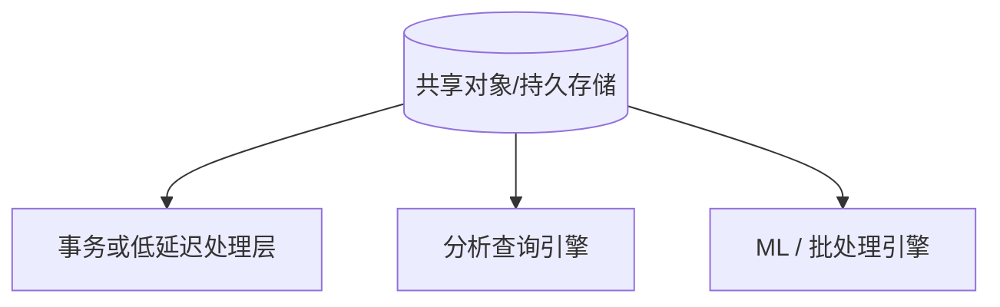
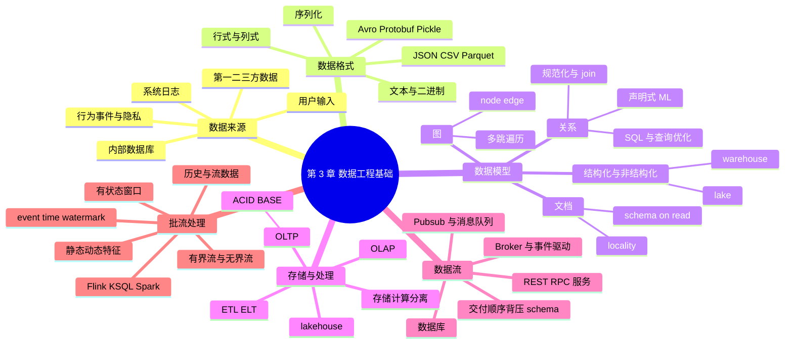

> 对应原章：3. Data Engineering Fundamentals.md
> 本章建立生产 ML 的数据系统共同语言：数据从哪里来，以什么格式序列化，按什么模型组织，由什么引擎存储和处理，怎样跨进程流动，最后如何通过批处理与流处理生成模型所需特征。
>
> 本笔记严格沿原章顺序展开。原章中的产品、价格、调查与性能数字主要截至 2014–2021 年，本文保留其历史语境，不把它们当作 2026 年现状。
>
> **归因说明：** 除相邻文字明确标为“原章定义”“原章案例”或“原章数字”的内容外，本文新增的读取放大、连接数量、可用性、滑动窗口复杂度、图遍历、事件语义、示例代码、Mermaid 图和伪代码，都是用于解释原章思想的笔记补充，不是作者在本章逐式提出的公式。原章为建立直觉而做的实现简化，也会在对应位置说明边界。

## 0. 本章要回答的核心问题

1. 用户输入、系统日志、行为事件、内部数据库和第三方数据分别有哪些质量、时效与隐私特点？
2. 数据格式、数据模型、存储引擎、数据流和处理范式为什么不是同一个概念？
3. 序列化解决什么问题，JSON、CSV、Parquet、Avro、Protobuf 和 Pickle 怎样选择？
4. 行式与列式布局为什么适合不同访问模式，读取放大和写入方式如何推导？
5. 文本与二进制格式在大小、可读性、schema、兼容性和安全性上如何权衡？
6. 关系、文档和图模型各怎样表示现实，规范化为什么减少冗余却增加 join？
7. SQL 的声明式本质是什么，查询优化器为何承担了关键复杂度？
8. “schemaless”和“unstructured”为什么不等于没有结构，而是把结构责任移给读取方？
9. OLTP、OLAP、ACID 和 BASE 分别是什么，为什么存储与计算正在解耦？
10. ETL 与 ELT 的顺序差异解决了什么问题，lakehouse 又试图调和什么矛盾？
11. 数据库、请求式服务和实时传输三种跨进程数据流各自适合什么场景？
12. REST、RPC、事件、pubsub 与 message queue 有什么关系，怎样处理失败、重复和顺序？
13. 批处理与流处理的核心差异是什么，为什么“批是有界流的特例”？
14. 静态特征与动态特征怎样结合，同时避免时间穿越和训练—服务偏差？

本章的概念链如下：


一句话概括：**不存在脱离未来访问方式的“最佳数据方案”；每一层都应从数据将被谁、在何时、以什么延迟和一致性要求使用来反推。**

---

## 1. 开篇：为什么 ML 工程必须理解数据系统

近年来 ML 的兴起与大数据系统的发展紧密相连。即使没有 ML，大规模数据系统也已经很复杂：缩写众多、问题与方案繁杂、工具和行业标准快速变化，不同公司的数据栈看起来各不相同。

本章不试图给出永远有效的产品清单，而是提供稳定的分层框架：

| 层次 | 核心问题 | 典型选择 |
| --- | --- | --- |
| 来源 | 数据由谁、以什么过程产生？ | 用户、系统、内部业务、第三方 |
| 格式 | 对象怎样持久化或传输？ | JSON、CSV、Parquet、Avro、Protobuf |
| 模型 | 实体、属性和关系怎样组织？ | 关系、文档、图 |
| 引擎 | 字节怎样存储、索引、查询与更新？ | 事务库、分析库、对象存储 |
| 数据流 | 不共享内存的进程怎样交换数据？ | 数据库、服务请求、实时传输 |
| 处理 | 何时、以何种状态模型计算？ | 批处理、流处理 |

这些层可以组合。例如，Parquet 是列式**文件格式**，不是数据库；关系模型可以存成 CSV 或 Parquet；数据库也可能同时支持关系和 JSON 文档；Kafka 是数据传输与持久日志系统，不是普通分析数据库。

生产系统通常有多个进程：特征服务从原始数据计算特征，预测服务消费特征并生成结果。数据必须跨进程传递。原章用一条常见路径建立直觉：落入数据库等持久存储的数据常作为历史数据批量处理，仍通过实时传输持续到达的数据常作为流处理；更准确的边界取决于输入是某时点已经存在的有界快照，还是持续产生、没有预知终点的事件序列，而不只取决于存储产品。

作者推荐 Martin Kleppmann 的 *Designing Data-Intensive Applications* 作为更深入的系统读物。若读者已熟悉本章基础，可以直接进入第 4 章学习训练数据采样与标签生成。

---

## 2. Data Sources：数据来源

### 2.1 为什么来源决定处理方式

数据质量不是脱离生成过程的静态属性。同一个字段来自用户表单、服务日志或外部供应商时，可信度、延迟、法律依据和错误模式都不同。

分析来源时至少询问：

- 谁产生数据，为什么产生？
- 数据是主动填写还是被动观测？
- schema、单位、时间戳和实体 ID 由谁保证？
- 数据何时可得，允许多大处理延迟？
- 能否用于当前目的，保留多久，谁可访问？
- 产生机制改变时，谁通知下游？

### 2.2 User input data：用户输入数据

用户显式输入文本、图像、视频和文件。只要存在输入错误的可能，生产中就会发生：

- 文本过长、过短或编码异常；
- 数字字段填入文字，单位混乱；
- 文件扩展名与真实内容不一致；
- 缺字段、重复提交或恶意载荷。

用户还缺乏耐心，通常期待立即返回结果。因此这类数据同时要求**严格验证**和**低延迟处理**。

一个稳健入口可分层：

```text
传输限制 -> 语法校验 -> schema / 类型校验
-> 语义与范围校验 -> 安全扫描 -> 标准化
-> 接受、隔离或给用户可操作的错误提示
```

验证不能只丢弃错误。若拒绝率突然上升，可能是客户端版本、表单或上游约定变化，应按来源和版本监控。

### 2.3 System-generated data：系统生成数据

系统组件生成日志、指标、任务结果和模型预测。日志可以记录：

- 内存、CPU、实例数量和云成本；
- 服务调用、依赖包与模型版本；
- 批处理、训练、部署和预测结果；
- 错误、重试、超时和状态变化。

它们为调试与改进提供可见性。平时很少逐条阅读，但“系统着火”时不可替代。原章脚注用幽默方式指出，生产中的“interesting”常指崩溃或云账单异常。

系统生成数据通常比用户输入格式稳定，也常允许每小时或每天处理；但安全告警、成本激增和模型故障需要近实时检测。

#### “记录一切”的两个后果

1. **信号淹没在噪声里**：需要索引、聚合、检索和异常检测。原章列出 Logstash、Datadog、Logz.io 等历史工具，并指出有些工具用 ML 帮助分析日志。
2. **存储量快速增长**：需要生命周期与分层存储，而不是所有日志永久放在高性能介质。

若日志产生速率为 $r$ bytes/s，保留 $T$ 秒，未压缩存储下界为

$$
V=rT.
$$

每天 100 GB、保留 30 天就是约 3 TB；再乘副本和索引系数，真实占用更大。因此要按调试、审计和法规分别定义保留期。

原章脚注给出 2021 年 11 月历史价格对比：毫秒级访问的 S3 Standard 每 GB 约为需 1 分钟至 12 小时恢复的 S3 Glacier 的 5 倍。具体价格与产品已变化，结论仍是：访问频率和恢复时间决定存储层级。

### 2.4 行为事件仍然是个人数据

系统还记录用户点击、选择建议、滚动、缩放、忽略弹窗和页面停留等行为。它们由系统采集，但仍是用户数据，可能受隐私法规约束。

“不使用年龄或位置”不等于“不使用个人数据”。浏览与购买历史能揭示兴趣、健康、经济状况甚至政治倾向，通常极其个人。

工程上要记录：

- 收集目的与法律依据；
- 同意和退出状态；
- 数据最小化、访问控制和删除传播；
- 是否用于训练、个性化或二次用途；
- 原始事件到派生特征的血缘。

### 2.5 Internal databases：内部数据库

公司内部服务与企业应用管理库存、CRM、用户和资产。这些数据可直接供模型使用，也可约束模型输出。

原章的 Amazon 搜索例子：用户输入 “frozen”，模型先判断意图是冷冻食品还是 Disney 的 *Frozen* IP，再查询内部库存，最后排序并展示可售商品。

这个流程说明模型预测不是最终答案：

$$
\text{候选结果}
=\text{语义预测}
\cap\text{库存与权限约束}
\cap\text{业务规则}.
$$

库存是动态事实，不能只依赖训练时快照；否则模型可能推荐已下架或不可配送的商品。

### 2.6 First-party、second-party 与 third-party data

| 类型 | 谁收集 | 与数据主体关系 | 典型风险 |
| --- | --- | --- | --- |
| 第一方数据 | 自己的公司 | 自己的用户或客户 | 目的扩张、权限和删除 |
| 第二方数据 | 另一家公司 | 对方自己的客户 | 合同、口径、合法共享 |
| 第三方数据 | 数据供应商 | 往往不是直接客户 | 来源不透明、同意、偏差、实体匹配 |

互联网和智能手机曾让跨应用聚合特别容易。iPhone 的 IDFA、Android 的 AAID 作为设备广告标识符，把 App、网站与签到服务中的活动聚合成个人历史。市场可出售社交活动、购买记录、浏览习惯、租车和政治倾向，并细分到年龄、职业和地区。

推荐系统可以利用“喜欢品牌 A 的人也喜欢品牌 B”之类关联，但清洗后的供应商数据仍可能：

- 来源、同意和去标识方式不透明；
- 与自己用户难以可靠匹配；
- 覆盖人群有系统偏差；
- 在采购后迅速过时；
- 因政策改变突然中断。

### 2.7 IDFA 隐私变化与第一方数据回归

Apple 在 2021 年初把 IDFA 改为 opt-in，显著减少 iPhone 上可用的第三方数据，迫使公司更多依赖第一方数据。广告行业随后投资规避方案；原章提到中国广告协会支持的 CAID 设备指纹方案，以及 TikTok、Tencent 等 App 的追踪争议。

这个案例展示数据源并非稳定自然资源，而受平台政策、法律和用户期待控制。一个依赖第三方标识符的模型，平台 API 一变就可能发生特征缺失和分布突变。

### 2.8 数据来源对照

| 来源 | 常见质量问题 | 时效要求 | 隐私敏感度 | 主要处理 |
| --- | --- | --- | --- | --- |
| 用户输入 | 格式、类型、恶意内容 | 通常实时 | 高 | 验证、反馈、安全扫描 |
| 系统日志 | 量大、噪声、版本变化 | 小时到实时 | 中到高 | 聚合、索引、分层保留 |
| 行为事件 | 曝光偏差、追踪缺失 | 秒到天 | 很高 | 同意、会话化、去重、血缘 |
| 内部数据库 | 语义分散、更新与时间一致性 | 取决于业务 | 高 | CDC、join、权限、质量契约 |
| 外部供应商 | 来源与口径不透明 | 常有延迟 | 很高 | 合同、审计、实体解析、漂移监控 |

---

## 3. Data Formats：数据格式

### 3.1 Serialization：为什么需要序列化

持久化数据前，要把内存中的数据结构或对象状态转换为可存储、传输并在以后重建的表示，这一过程称为**数据序列化**。

选择格式时要从未来用途反推：

- 多模态样本怎样关联图片、文本和元数据？
- 需要逐行写、按列分析还是随机读取？
- 人是否要直接检查和编辑？
- schema 是否演化，旧程序能否读新数据？
- 跨语言、跨硬件是否兼容？
- 大小、压缩、编码与解析成本如何？
- 反序列化不可信输入是否安全？

原章列出的常见格式：

| 格式 | 主要表示 | 人可读 | 原章示例用途 | 关键特点 |
| --- | --- | --- | --- | --- |
| JSON | 文本 | 是 | 广泛使用 | 灵活键值与嵌套，冗余较高 |
| CSV | 文本 | 是 | 广泛使用 | 简单行式表格，类型与转义薄弱 |
| Parquet | 二进制 | 否 | Hadoop、Redshift | 列式、带 schema、适合分析 |
| Avro | 主要二进制 | 否 | Hadoop | 行式记录、强调 schema 演化 |
| Protobuf | 主要二进制 | 否 | Google、TFRecord | 紧凑、跨语言、字段编号 |
| Pickle | 二进制 | 否 | Python、PyTorch 序列化 | Python 特定；不应加载不可信数据 |

格式选择不是排行榜。调试接口可用 JSON，训练分析数据可用 Parquet，低延迟服务契约可用 Protobuf，同一系统通常组合多种格式。

### 3.2 JSON

JSON 源自 JavaScript，但语言无关，现代语言大都能生成和解析。键值、数组和嵌套对象既能表达结构化记录，也能把信息塞进一段文本字段。

结构化表示：

```json
{
  "firstName": "Boatie",
  "lastName": "McBoatFace",
  "isVibing": true,
  "age": 12,
  "address": {
    "streetAddress": "12 Ocean Drive",
    "city": "Port Royal",
    "postalCode": "10021-3100"
  }
}
```

同一信息也可放在不可直接查询字段的文本 blob：

```json
{
  "text": "Boatie McBoatFace, aged 12, is vibing, at 12 Ocean Drive, Port Royal, 10021-3100"
}
```

前者容易验证年龄和城市，后者更灵活却需要 NLP 或规则重新抽取。JSON 常见痛点包括：

- 字段重命名和类型变化影响旧消费者；
- 数值精度与日期格式缺少统一语义；
- 每条记录重复键名，文本体积大；
- 可选字段、默认值和 `null` 容易产生歧义。

“JSON 灵活”不等于 schema 不重要。API 应定义版本、必填字段、兼容策略和未知字段处理。

### 3.3 Row-major Versus Column-major：行式与列式

#### 基本布局

- CSV 是典型行式序列：一行各字段相邻；
- Parquet 是典型列式格式：同一列的值组织在一起，并通常按 row group 切块。

连续访问更能利用顺序 I/O、CPU cache、向量化和预取。因此：

- 行式适合读取或追加完整记录；
- 列式适合只扫描少数列并做聚合。

原章以 1000 条样本、每条 10 个特征说明：读取今天的全部样本偏向行式；读取所有样本的时间戳偏向列式。

#### 读取放大的直觉推导

设表有 $C$ 个等宽列，只需其中 $k$ 列，忽略索引、元数据和压缩：

- 行式全扫描约读取全部数据，比例为 $1$；
- 列式理想读取比例约为 $k/C$；
- 行式相对列式的逻辑读取放大约为

$$
A_{read}\approx\frac{C}{k}.
$$

网约车交易有 1000 个特征，只读时间、位置、距离、价格 4 列时，理想量级为

$$
A_{read}\approx\frac{1000}{4}=250.
$$

真实收益取决于列宽、压缩、谓词下推、row group、缓存和文件大小，不会机械等于 250 倍。

#### 写入权衡

单条新样本天然包含一整行。行式文件或行存数据库可顺序追加；纯列式布局要分别更新多列，常先缓冲一批记录再写成列块。因此原章总结：大量逐记录写入偏向行式，大量列扫描偏向列式。

这不是说 Parquet 不能写，而是它更适合批量生成不可变文件，不适合频繁原地追加单行。

#### pandas 与 NumPy

原章专栏把 pandas DataFrame 描述为围绕列式操作构建，而 NumPy `ndarray` 默认 C-order（行优先），也可显式选择顺序。图 3-2 的历史基准中：

- pandas 按列迭代约 0.07 秒；
- 同一 DataFrame 按行迭代约 2.41 秒；
- 转成 NumPy 后逐行访问明显更快。

应把它理解为 API 与内存布局的性能直觉，不是所有版本和操作的固定比例。pandas 内部实现、dtype 分块、Arrow 后端和向量化会改变结果；最重要的实践是避免 Python 层逐行循环，优先列向量化操作。

#### CSV 的边界

原章用 CSV 是因为它普及，并明确记录早期评审者的反对：

- 非文本类型表达薄弱；
- 分隔符、换行、引号和编码容易歧义；
- 缺失值没有统一标准；
- 浮点数转文本时若格式化精度不足，可能损失信息。

例如 `0.12345678901232323` 可能被某些导出程序写成 `0.12345678901`。这不是 CSV 必然截断，而是 writer 配置和读取类型约定不充分。

### 3.4 Text Versus Binary：文本与二进制

文本格式使用字符编码，通常可由编辑器直接阅读；“二进制格式”是非纯文本格式的统称，程序必须知道字节布局、schema 或容器规范才能解释。

原章的整数例子：ASCII / UTF-8 文本 `1000000` 有 7 个数字，每个 1 byte，共 7 bytes；用 int32 编码固定为 32 bits，即 4 bytes。前提是值位于 int32 范围，并约定字节序和有符号性。

二进制常更紧凑，因为：

- 数值用固定或变长整数编码，而非逐字符；
- schema 避免重复字段名；
- 同类型列更易压缩；
- 可以存统计元数据，支持跳过无关块。

原章实测 `interviews.csv` 有 17,654 行、10 列，从 CSV 的 14 MB 转 Parquet 后为 6 MB。AWS 2019 年历史材料称，Parquet 相比文本格式卸载最高快 2 倍，在 S3 中最高节省 6 倍空间。“up to” 是特定负载上限，不是普遍保证。

#### 可运行示例：编码大小与读取放大

下面用标准库验证原章整数例子，并计算理想读取放大：

```python
import json
import struct

number = 1_000_000
text_bytes = str(number).encode("utf-8")
binary_bytes = struct.pack(">i", number)  # 大端、有符号 int32

record = {"name": "Boatie", "age": 12, "isVibing": True}
payload = json.dumps(record, separators=(",", ":")).encode("utf-8")
assert json.loads(payload.decode("utf-8")) == record

total_columns = 1_000
selected_columns = 4
read_amplification = total_columns / selected_columns

print(f"text_integer_bytes={len(text_bytes)}")
print(f"binary_int32_bytes={len(binary_bytes)}")
print(f"json_round_trip={json.loads(payload.decode('utf-8')) == record}")
print(f"ideal_row_read_amplification={read_amplification:.0f}x")
```

预期输出：

```text
text_integer_bytes=7
binary_int32_bytes=4
json_round_trip=True
ideal_row_read_amplification=250x
```

二进制并不必然更小：很短的数字、容器头、索引和小文件元数据可能抵消收益；文本也可压缩。选择应以真实 schema、文件规模和查询做基准测试。

---

## 4. Data Models：数据模型

### 4.0 表示方式决定可解决的问题

数据模型描述现实怎样被表示。同一辆车可以用品牌、型号、年份、颜色和价格描述，方便买家筛选；也可用车主、车牌和登记地址历史描述，方便执法追踪。

所以建模不是中性搬运，而是在选择：

- 什么是实体，什么是属性；
- 哪些关系显式保存；
- 身份怎样定义；
- 什么查询容易，什么查询昂贵；
- 历史变化是否保留。

原章讨论看似对立、实际正在融合的关系模型与 NoSQL 模型，并进一步区分结构化与非结构化数据。

### 4.1 Relational Model：关系模型

#### 4.1.1 Relation、tuple 与 table

Edgar F. Codd 在 1970 年提出关系模型。数据组织为 relation，每个 relation 是 tuple 的集合；table 是常见可视化，行对应 tuple。

严格关系具有两个容易忽视的性质：

1. 行和列的物理顺序不属于关系语义；
2. relation 是集合，不含重复 tuple。

SQL table 在默认语义下常是 bag / multiset，可以有重复行，所以“所有表都是严格关系”并不准确。查询若依赖顺序，必须显式 `ORDER BY`。

#### 4.1.2 Normalization：规范化为什么有效

原始 Book 表把出版社名称与国家重复放在每本书、每种格式中：

| Title | Author | Format | Publisher | Country | Price |
| --- | --- | --- | --- | --- | ---: |
| Harry Potter | J.K. Rowling | Paperback | Banana Press | UK | $20 |
| Harry Potter | J.K. Rowling | E-book | Banana Press | UK | $10 |
| Sherlock Holmes | Conan Doyle | Paperback | Guava Press | US | $30 |
| The Hobbit | J.R.R. Tolkien | Paperback | Banana Press | UK | $30 |
| Sherlock Holmes | Conan Doyle | Paperback | Guava Press | US | $15 |

其中有函数依赖：

$$
\mathrm{Publisher}\rightarrow\mathrm{Country}.
$$

同一出版社出现 $m$ 次，名称或国家变更就需更新 $m$ 行；漏一行会造成不一致。规范化把 Publisher 独立出来：

**Book**

| Title | Author | Format | Publisher ID | Price |
| --- | --- | --- | ---: | ---: |
| Harry Potter | J.K. Rowling | Paperback | 1 | $20 |
| Harry Potter | J.K. Rowling | E-book | 1 | $10 |
| Sherlock Holmes | Conan Doyle | Paperback | 2 | $30 |
| The Hobbit | J.R.R. Tolkien | Paperback | 1 | $30 |
| Sherlock Holmes | Conan Doyle | Paperback | 2 | $15 |

**Publisher**

| Publisher ID | Publisher | Country |
| ---: | --- | --- |
| 1 | Banana Press | UK |
| 2 | Guava Press | US |

此后 Banana Press 政名，只更新 Publisher 的一行。它减少：

- update anomaly：同一事实多处更新不一致；
- insertion anomaly：没有图书时难以单独记录出版社；
- deletion anomaly：删掉最后一本书时意外丢失出版社事实。

原章提醒还可继续拆分 format。规范化程度应由实体语义、完整性和访问模式决定，不是表越多越好。

#### 4.1.3 规范化的代价：join

事实分散到多个 relation 后，读取完整图书信息需要 join。大表 join 的成本取决于：

- 输入大小与过滤选择性；
- join key 是否有索引、是否倾斜；
- nested-loop、hash join 或 sort-merge join；
- 数据是否跨节点，需要多少 shuffle；
- 内存能否容纳 hash table。

因此分析系统常适度反规范化或预计算宽表，以空间和更新复杂度换读取速度。规范化保护写入一致性，反规范化服务特定读取路径，两者是权衡。

#### 4.1.4 SQL：声明式而非命令式

命令式程序指定怎样做；声明式查询指定想要什么。

```sql
SELECT b.Title, p.Publisher
FROM Book AS b
JOIN Publisher AS p USING (Publisher_ID)
WHERE b.Price < 25
ORDER BY b.Title;
```

用户声明表、条件、join、排序与输出，不指定先扫描哪张表、用什么 join 算法、是否走索引。数据库根据统计信息选择执行计划。

声明式的价值是把“结果语义”与“当前最佳执行方式”分离：数据量、索引和硬件变化后，系统可以换计划而不改业务查询。

带递归等扩展的 SQL 可以图灵完备，但图灵完备只表示理论表达能力，不保证查询易写、在有限内存和时间内可行。原章脚注给出极端案例：早期 Postgres 论文合著者 Greg Kemnitz 曾写约 700 行、访问 27 张表的报表查询，另有约 1000 行注释，耗时三天编写、调试和调优。

#### 4.1.5 Query optimizer：声明式背后的难题

查询优化器负责把逻辑查询变成物理计划：

```text
解析与校验 -> 逻辑重写 -> 估计基数和成本
-> 搜索 join 顺序与物理算子 -> 生成执行计划
```

$n$ 张表的线性 join 顺序就可能有 $n!$ 个排列，真实计划还包含不同 join 树和算法。优化器不会对大查询机械穷举所有计划，通常结合动态规划、剪枝、启发式和成本模型。

难点是中间结果基数估计：若错误估计过滤选择性，优化器可能选择本应很小、实际巨大的 hash table。原章还提到 Neo 等 learned query optimizer，尝试从历史查询学习改进计划。

优化器开发很难，但可被所有应用共享，这正是把复杂度集中到声明式系统中的收益。

#### 4.1.6 从声明式数据系统到声明式 ML（declarative ML）

声明式 ML 的愿景是：用户声明特征 schema 和任务，系统自动寻找模型、训练和调参方案。

原章列出：

- Uber 开发的 Ludwig：除输入输出 schema 外，还可指定全连接层数和隐藏单元；
- H2O AutoML：不必手写模型结构和超参数，尝试多种架构并选出表现最佳者。

原章 H2O 示例的流程是：

```text
从 train.columns 取得 predictors
-> 指定 response 列并转为 factor
-> H2OAutoML(max_models=20, seed=1)
-> 在 training_frame 上训练
-> 查看 leaderboard
-> 取得 aml.leader
```

AutoML 抽象的是模型开发搜索，不自动解决特征语义、数据处理、评估泄漏、分布变化、持续学习和线上责任。随着模型商品化，生产中最难的部分往往在模型之外。

### 4.2 NoSQL

关系模型适用广泛，但严格 schema 管理和专用查询可能成为限制。原章引用 Couchbase 2014 年供应商调查：schema 管理挫折是采用其非关系数据库的首要原因。该调查存在产品与样本偏差，应作为历史动机而非总体市场定律。

NoSQL 最初只是非关系数据库 meetup 的 hashtag，后来常解释为 **Not Only SQL**。它不等于“不允许 SQL”，许多 NoSQL 系统也支持关系查询或 SQL-like 接口。

原章重点讨论两个方向：

- document model：文档内部内容优先，文档间关系相对少；
- graph model：数据项之间关系本身最重要。

#### 4.2.1 Document model：文档模型

文档通常是 JSON、XML 或 BSON 编码的连续记录，每个文档有唯一 key。collection 类似 table，document 类似 row，但同 collection 的文档可有不同字段和嵌套结构。

规范化 Book 与 Publisher 可重新聚合成一本书一个文档：

```json
{
  "Title": "Harry Potter",
  "Author": "J.K. Rowling",
  "Publisher": "Banana Press",
  "Country": "UK",
  "Sold as": [
    {"Format": "Paperback", "Price": "$20"},
    {"Format": "E-book", "Price": "$10"}
  ]
}
```

原章另列 Sherlock Holmes 与 The Hobbit 两个文档，用来说明不同售卖格式可嵌入同一对象。不过，这两个示例本身需要勘误式阅读：

- 表 3-2 / 3-3 中 Sherlock Holmes 的两条记录都写成 `Paperback`，价格分别为 30 美元和 15 美元；Example 3-2 却把 15 美元那条改成了 `E-book`，原文没有解释这种变化。
- Example 3-3 的 `Sold as` 数组只有一项，但该项后保留了尾逗号；标准 JSON 不允许尾逗号，解析前应删除。

这两处不影响作者要说明的建模思想：同一实体的子项可以嵌入一个文档，提高按实体读取的局部性；它们不能被当作表到 JSON 的无损、可直接解析转换结果。

##### “Schemaless”真正意味着什么

数据库不强制写入 schema，不代表结构不存在。读取代码仍假定 `Title`、`Sold as` 和价格字段。因此责任从 schema-on-write 转为 schema-on-read：

$$
\text{无写入时强制 schema}
\not\Rightarrow
\text{无结构契约}.
$$

灵活写入会把迁移、验证和兼容成本推迟给所有消费者。成熟文档系统仍常用 JSON Schema、应用验证和版本字段。

##### Locality 与 join

一本书的作者、出版社和售卖格式都在同一文档中，按 key 读取具有良好局部性，不必 join 多表。

跨文档关系则更难。原章举例找价格低于 25 美元的所有书：若没有嵌套字段索引，必须扫描文档、抽取价格并比较。现代文档数据库可对嵌套字段建索引和做 aggregation；核心限制不是“永远只能全扫”，而是跨文档 join 与共享事实通常不如关系模型自然。

关系与文档正在融合：PostgreSQL、MySQL 等关系数据库也支持 JSON 类型和索引；文档数据库也增加事务与 join-like 能力。

#### 4.2.2 Graph model：图模型

图由 node 和 edge 构成，edge 显式表达 node 关系。文档模型优先对象内部内容，图模型优先关系遍历。

原图包含 person、city、state、country 等节点：

- Zhenzhong Xu `born_in` Palo Alto，Palo Alto `within` California，California `within` USA，共三跳到 USA；
- Chloe He 直接 `born_in` California，California `within` USA，共两跳；
- Chloe He `lives_in` Stanford，Stanford `within` California；
- Chris Re `lives_in` Paris，Paris `within` France，并与 Zhenzhong 是 `coworker`。

从 USA 反向沿 `within` 和 `born_in` 遍历，就能找到出生在美国的人，即使人与国家之间跳数不同。

笔记补充的广度优先遍历伪代码：

```text
queue = [USA]
visited = {USA}
results = []

while queue 非空:
    node = queue.pop_left()
    for neighbor, edge_type in 允许的反向边(node):
        if neighbor 未访问:
            标记并加入 queue
        if neighbor.type == "person" and 路径语义满足 born_in/within:
            results.append(neighbor)
```

对访问到的子图，BFS 时间复杂度为 $O(V+E)$、空间为 $O(V)$。真实图查询还要约束方向、边类型、最大深度和路径语义，否则高连接节点会造成遍历爆炸。

关系库可以用递归 CTE 表达可变跳数查询，并非“不可能”；图数据库的优势是把邻接关系作为一等结构，使关系遍历更自然、通常更高效。

### 4.3 Structured Versus Unstructured Data：结构化与非结构化

#### 4.3.1 结构化数据

结构化数据遵循预定义 schema。例如每项包含：

- `name`：最长 50 字符的字符串；
- `age`：范围 0–200 的无符号 8-bit 整数。

位宽也是 schema 的一部分；无符号 8-bit 整数范围为 0–255，能覆盖 0–200，若按有符号 8-bit 解释则最高只有 127。明确类型、位宽与字段让平均年龄等分析简单，也能在入口拒绝错误数据。

代价是 schema 演化。新增 email 时要决定历史用户的值；字段类型或单位变化可能触发回填和兼容 bug。

原章的真实 bug：schema 把缺失年龄替换成 0，模型于是认为交易由 0 岁用户发起。脚注说该案例用 -1 解决，但 sentinel 仍可能被模型当成真实数值。更稳妥的设计通常是保留 `null`、增加 `age_missing` 指示特征，并确保训练与服务采用同一处理逻辑。

#### 4.3.2 非结构化数据

非结构化数据不受预定义 schema 强制，可以是文本、数字、日期、图片或音频。模型日志文本是原章例子。

“非结构化”不等于随机。下面文本显现“姓名, 年龄”模式，但存储不保证每行都遵守：

```text
Lisa, 43
Jack, 23
Huyen, 59
```

读取方可以抽取结构，却必须处理例外、版本和解析失败。

#### 4.3.3 Data warehouse、data lake 与 schema 责任

原章用经典对照：

| 结构化数据 | 非结构化数据 |
| --- | --- |
| schema 明确 | 不必预先遵循 schema |
| 易搜索分析 | 到达快、接入灵活 |
| 只接受特定结构 | 可接收任意来源与字节 |
| schema 变化代价高 | 结构问题推迟给下游 |
| 常存 data warehouse | 常存 data lake |

更准确的核心不是文件有没有结构，而是谁承担责任：

- schema-on-write：写入代码先验证和塑形；
- schema-on-read：读取应用解释和验证。

现代 warehouse 也能存半结构化数据，lake 也可用 Parquet 与 table format 管理强 schema，data lakehouse（数据湖仓）则试图同时提供湖的开放存储与仓库的管理能力。所以边界是连续的，不应把产品名称当成绝对分类。

---

## 5. Data Storage Engines and Processing：存储引擎与处理

数据格式和模型定义用户看到的编码与结构接口；storage engine / database 实现数据怎样落盘、索引、并发更新和检索。

数据库传统上围绕两类负载优化：事务处理与分析处理。随后原章介绍 ETL / ELT 如何在系统间塑形数据。

### 5.1 Transactional and Analytical Processing

#### 5.1.1 OLTP：在线事务处理

数字世界中的 transaction 不只买卖，还包括发帖、叫车、上传模型和观看视频。典型操作是随事件生成而插入，之后偶尔更新或删除。

用户等待这些操作，所以系统要求低延迟和高可用。若交易处理失败，动作就无法完成。

事务库常面向短小、选择性高的读写，并采用行式组织，但“事务库必然行式”不是定义要求。

#### 5.1.2 ACID 的准确含义

##### Atomicity：原子性

一个事务内的写入要么全部提交，要么全部不生效。用户支付失败时，不应仍分配司机。原子性关注故障时的 all-or-nothing，不是线程操作一定不可分割。

##### Consistency：一致性

事务把数据库从满足不变量的状态带到另一个满足不变量的状态，例如引用的用户必须有效、账户余额约束成立。

这里是 ACID consistency，不应与分布式副本的强一致性/最终一致性混淆。数据库能执行约束，应用仍需正确声明业务不变量。

##### Isolation：隔离性

并发事务的中间状态不能以不允许的方式互相干扰。最强的 serializable 目标是效果等价于某个串行顺序。

原章用“两人不能同时预订同一司机”建立直觉；现实数据库有 read committed、snapshot isolation 等不同等级，并非所有 ACID 系统都提供完全串行化。

##### Durability：持久性

事务一旦确认提交，系统故障后仍应保留。叫车成功后手机关机，订单不能消失。实现通常依赖 write-ahead log、复制和持久介质；确认时点决定承诺强度。

##### BASE

非 ACID 系统有时称 BASE：Basically Available、Soft state、Eventual consistency。原章引用 Kleppmann 指出，这个缩写甚至比 ACID 更模糊，不能替代对具体读写语义的说明。

#### 5.1.3 OLAP：在线分析处理

“旧金山九月所有行程的平均价格”需要跨大量行扫描价格、地点和时间列，并聚合。这类长查询与单笔交易不同，分析数据库通常偏向：

- 列式扫描和压缩；
- 向量化执行；
- 大规模聚合、join 和并行计算；
- 读取历史快照而非高频单行更新。

| 维度 | OLTP 倾向 | OLAP 倾向 |
| --- | --- | --- |
| 请求 | 大量短事务 | 较少但长的分析查询 |
| 访问范围 | 少量行、较多列 | 大量行、少量列或聚合 |
| 写入 | 高频插入/更新 | 批量导入、追加、重写 |
| 目标 | 低延迟、高可用、并发正确 | 高扫描吞吐、查询灵活 |
| 布局 | 常行式 | 常列式 |

#### 5.1.4 为什么原章称 OLTP / OLAP “过时”

原章根据截至 2021 年 Google Trends 说两个术语热度下降，并给出三个技术原因。这里的“过时”应理解为边界变模糊，不是术语或工作负载已经消失。

##### 原因一：混合能力增强

技术限制曾迫使事务与分析分库，如今：

- CockroachDB 等事务数据库可执行分析查询；
- 原章把 Apache Iceberg、DuckDB 列为分析侧处理事务查询的例子。

需要补充边界：Iceberg 更准确地说是分析表格式，不是独立数据库引擎；DuckDB 是嵌入式分析数据库，支持事务语义不等于适合高并发 OLTP。应比较实际负载，而不是只看“支持事务”标签。

##### 原因二：存储与计算解耦

传统系统把数据布局和处理引擎紧耦合，可能为不同查询复制同一数据。BigQuery、Snowflake、IBM、Teradata 等采用存储—计算分离：



收益是独立扩缩计算、多个引擎共享数据、计算节点更易替换。代价是网络 I/O、缓存一致性、元数据协调、数据格式兼容和云出口成本。

##### 原因三：“online”含义过载

online 可能表示：

- 连接互联网；
- 已部署到生产；
- 数据立即可用于 I/O。

原章的数据可用性分类：

| 术语 | 含义 |
| --- | --- |
| online | 数据立即可用 |
| nearline | 不立即可用，但无需人工即可较快上线 |
| offline | 不立即可用，需要人工干预上线 |

它又不同于 online prediction、online learning。遇到 online 一词必须追问对象与时间语义。

### 5.2 ETL: Extract, Transform, and Load

#### 5.2.1 ETL 是什么

传统关系数据先从来源 **Extract**，转换为目标结构 **Transform**，再 **Load** 到数据库、warehouse 或 feature store。

原图的来源包括 database、App、CSV/XML flat files；目标包括 data warehouse、feature store、database。

#### 5.2.2 Extract：尽早阻止坏数据扩散

提取不只是复制：

- 读取不同协议、格式和增量位置；
- 校验 schema、校验和、时间戳与权限；
- 拒绝或隔离损坏、格式错误的数据；
- 通知来源并保留可审计原因。

第一步做对能节省大量下游返工。直接丢弃会形成静默偏差，因此通常写入 quarantine / dead-letter 区，而不是无痕删除。

#### 5.2.3 Transform：主要计算发生处

转换包括：

- join 多来源；
- 清洗、去重、排序、转置、聚合；
- 统一 `Male/Female`、`M/F`、`1/2` 等编码；
- 单位、时区和实体 ID 标准化；
- 生成派生字段与 ML 特征；
- 继续验证并记录血缘。

转换应尽量是确定、可重跑且幂等的。若同一输入重跑两次产生重复行，故障恢复与 backfill 会非常危险。

#### 5.2.4 Load：不只是写到哪里

Load 决定：

- 目标是文件、数据库、warehouse 还是 feature store；
- 全量覆盖、append 还是 merge / upsert；
- 每小时、每天还是事件触发；
- 如何分区、提交、验证和回滚；
- 下游何时看到完整一致的版本。

#### 5.2.5 ETL 与 ELT

互联网和硬件发展使数据来源与 schema 快速扩张。部分公司先把原始数据放进 lake，再由消费应用处理，形成 **Extract → Load → Transform**。

| 维度 | ETL | ELT |
| --- | --- | --- |
| 结构约束时点 | 入目标前 | 读取或派生表时 |
| 原始数据到达 | 转换可能增加延迟 | 快速接入 |
| 质量责任 | 集中在管道 | 分散到下游，需治理 |
| 重处理 | 原始数据可能未保留 | 可从原始数据重新计算 |
| 主要风险 | schema 过早固化 | raw lake 难发现、难理解、重复计算 |

原章脚注说明，作者初稿曾把存储成本列为“不要存一切”的理由，后来认为存储已很便宜。即使字节便宜，目录、治理、隐私、检索、计算和人员认知成本仍不会消失；无管理的数据湖会变成 data swamp。

随着云基础设施和 schema 工具标准化，提前管理结构又变得可行。lakehouse 试图结合 lake 的开放、低成本和灵活性与 warehouse 的 schema、事务、元数据和查询管理。原章列 Databricks 与 Snowflake 为例。

---

## 6. Modes of Dataflow：数据流模式

单进程内可直接传对象；多个不共享内存的进程必须序列化、传输并在另一端重建。原章归纳三种主模式：

1. 通过数据库；
2. 通过 REST / RPC 等服务请求；
3. 通过 Kafka / Kinesis 等实时传输。

### 6.1 Data Passing Through Databases

进程 A 写数据库，进程 B 读数据库。这是最直接的共享数据方式。

优点：

- 数据持久，生产者与消费者不必同时在线；
- 数据库提供查询、事务、权限与审计；
- 消费者可按自己的节奏读取历史。

原章指出两个限制：

1. 两个进程都必须能访问同一数据库，跨公司时常不可行；
2. 数据库读写可能不满足严格延迟要求。

第二点是场景判断，不是数据库永远慢。内存数据库、索引和本地副本可以达到低延迟；真正问题是额外持久化、轮询、查询和权限路径是否符合端到端 SLO。

### 6.2 Data Passing Through Services

#### 6.2.1 Request-driven 模式

进程 A 向服务 B 发请求，说明需要什么数据；B 经同一网络返回。目标服务必须暴露远程接口，反向调用则 A 也要成为服务。

跨公司例子：证券交易所提供当前股价，投资机构请求股价并预测未来价格。公司内部把组件做成独立服务，则形成 service-oriented / microservice architecture，使组件可独立开发、测试、部署和维护。

#### 6.2.2 网约车价格优化案例

原章简化为三个服务：

| 服务 | 预测 |
| --- | --- |
| Driver management | 某区域下一分钟可用司机数 |
| Ride management | 某区域下一分钟叫车请求数 |
| Price optimization | 让乘客愿付、司机愿接且平台获利的价格 |

价格依赖供给和需求，每次定价要取得司机与订单预测。脚注补充真实系统可缓存预测，每分钟左右刷新，不必每次请求都同步调用。

若请求链串行，端到端延迟近似为

$$
L_{total}=L_{driver}+L_{ride}+L_{price}+L_{network/queue}.
$$

若两个依赖并行，则关键路径近似为 `max` 而非求和，但仍受最慢依赖支配。

在独立故障的简化假设下，三个必要服务可用率乘积为

$$
A_{end}=A_dA_rA_p.
$$

每个都 99.9% 时，端到端约为 $0.999^3=99.7003\%$。真实故障往往相关，乘积只用于说明依赖会消耗可用性预算。

#### 6.2.3 REST 与 RPC

- REST 面向网络资源与统一接口，常用于公开 API；
- RPC 尝试让远程调用看起来像本地函数，常用于同组织、同数据中心服务间调用。

REST 不等于 HTTP：HTTP 是实现 REST 风格的一种常见协议，HTTP API 也不一定 RESTful。RPC 也可运行在 HTTP/2 等传输上。

“像本地函数”容易掩盖远程调用的本质：网络会超时、重复、乱序、部分失败，延迟也高得多。调用方必须定义 deadline、重试、幂等和降级。

### 6.3 Data Passing Through Real-Time Transport

#### 6.3.1 为什么点对点请求会形成网状依赖

司机服务也需要订单数和价格来动员司机；订单服务同样需要司机与价格。三个服务互相请求，就形成图 3-8 的六条有向数据依赖。

若 $n$ 个服务都必须知道并调用其他服务的端点，最坏有向服务地址 / API 耦合数为

$$
C_{direct\ endpoint}=n(n-1)=O(n^2).
$$

有 broker 后，在“每个服务最多配置一种发布角色和一种消费角色，且共享 broker 接口”的教学化假设下，需要直接认识的端点角色上界约为

$$
C_{broker\ endpoint}\le 2n=O(n).
$$

$n=100$ 时，最坏点对点为 9900 个有向服务端点绑定，broker 模式在上述简化下至多 200 个生产/消费端点角色。这不是“系统全部逻辑连接数”或物理 TCP 连接数：若每对服务仍通过不同 topic 形成语义依赖，订阅、ACL、schema 和数据契约仍可能达到 $O(n^2)$；客户端连接复用也会使物理连接数不等于 $2n$。broker 降低的是服务彼此地址和 API 的直接耦合，而不是消灭所有关系复杂度。

#### 6.3.2 同步失败传播

原章把 request-driven 描述为同步：目标必须监听；Driver 服务宕机时，Price 服务重试直至超时；Price 在响应前宕机，响应丢失；一个依赖故障可拖垮所有调用方。

超时、缓存、熔断和异步请求可缓解，但同步调用仍带来时间耦合：生产者和消费者要在同一请求窗口可用。

#### 6.3.3 Broker 与 event-driven

服务不再互相拉取，而是在产生预测时发布到 broker；消费者订阅最近的司机数、订单数和 surge price。数据单元称为 **event**，架构称 event-driven，broker 也称 event bus。

原章用“in-memory storage”帮助理解实时传输的低延迟中介角色。现代 Kafka 并不是纯内存队列，而是磁盘支持、依赖页缓存、可复制的持久 commit log；Kinesis 也提供持久保留。应把“实时传输”理解为低延迟追加与消费接口，而非实现必须只在 RAM。

原章概括：逻辑重、按需查询的系统适合 request-driven；数据重、多个消费者共享事件的系统更适合 event-driven。真实系统通常混合使用：命令与立即响应走 RPC，事实广播和异步派生走事件流。

#### 6.3.4 Pubsub 与 message queue

| 维度 | Publish-subscribe | Message queue |
| --- | --- | --- |
| 路由 | 发布到 topic | 消息面向特定消费者或队列 |
| 消费 | 每个订阅者可看到 topic 事件 | 通常一个消费者组内竞争处理 |
| 生产者是否知道消费者 | 不需要 | 常知道目标队列/工作类型 |
| 保留 | 常按时间保留并可重放 | 常在确认消费后移除 |
| 原章示例 | Kafka、Kinesis | RocketMQ、RabbitMQ |

event 若有预期消费者，原章称之为 message。pubsub 可保留 7 天后删除或迁移到 S3 等长期存储。

产品边界正在融合：Kafka consumer group 可表现为工作队列，RabbitMQ 也可 fan-out。选择时应比较语义而不是产品类别。

#### 6.3.5 事件系统必须明确的语义（笔记补充）

##### Delivery

- at-most-once：可能丢，不重复；
- at-least-once：不轻易丢，但可能重复；
- exactly-once：在明确边界内让结果看似只生效一次，通常依赖幂等、事务和状态 checkpoint。

“网络中绝不重复一次”很难保证。消费方常用 `event_id` 去重，并让副作用幂等。

##### Ordering

全局顺序昂贵，系统常只保证 partition / key 内顺序。若同一用户事件被分到不同 partition，特征可能乱序。

##### Backpressure

若生产速率 $\lambda$ 长期高于消费能力 $\mu$，积压近似按

$$
\frac{dB}{dt}=\lambda-\mu
$$

增长。必须扩容、限流、降采样或接受延迟；队列不会凭空消除容量不足。

##### Schema evolution

事件已被多个独立消费者保存和重放，字段删除或改类型会破坏旧代码。需要 schema registry、兼容检查、版本和默认值。

---

## 7. Batch Processing Versus Stream Processing

### 7.1 Historical data 与 streaming data

原章把进入数据库、lake 或 warehouse 的数据称为 historical data，把仍在 Kafka / Kinesis 等实时传输中到达的数据称为 streaming data。这描述了常见系统路径，但不是由存储位置决定的严格定义。

更准确地说，历史处理通常面对某时点已经存在、范围可界定的快照；流处理面对持续产生、没有预知终点的事件序列。同一事件可以先作为新事件被增量处理，随后作为历史记录被回放；Kafka 的一个有限 offset 区间也可作为有界历史输入，数据库 CDC 则能从持久存储变更产生无界流。

### 7.2 Batch processing

批任务按周期处理有界数据，例如每天计算过去一天所有行程的平均 surge charge。MapReduce、Spark 等分布式系统通过分区和并行处理大批历史数据。

批处理优势：

- 输入范围明确，容易重跑和审计；
- 可用大 batch 提高吞吐；
- 对乱序和迟到数据可等数据到齐再算；
- 适合 backfill 和全量重建。

代价是结果只在批次完成后更新，数据新鲜度受调度周期和执行时间限制。

### 7.3 Stream processing

流处理对未结束的数据序列持续计算。它可以每五分钟触发，也可在用户请求叫车时立即计算当前司机。

正确实现时无需先等待落入数据库，可显著降低新鲜度延迟。Flink 等流引擎能分布式并行，因此“流处理不能像 Spark 一样扩展”并不成立。

### 7.4 Stateful computation：为什么流处理可避免重复

原章的 30 天试用期参与度例子：每天批处理过去 30 天，就反复扫描 29 天旧数据。若每天值为 $x_t$，30 天滚动和为

$$
S_t=\sum_{i=t-29}^{t}x_i.
$$

相邻窗口满足

$$
S_t=S_{t-1}+x_t-x_{t-30}.
$$

从头重算每个窗口的工作量约 $O(TW)$，其中 $T$ 是天数、$W=30$；维护状态后每个新值只做常数次更新，总工作量约 $O(T)$，并保留最近 $W$ 个值用于过期。

这就是 stateful stream processing 的优势：不只是逐事件 map，而是跨事件维护窗口、计数、join 和聚合状态。

### 7.5 Static features 与 dynamic features

批处理频率低，常用于变化慢的特征，所以 batch features 也称 static features：

- 司机历史评分；
- 用户长期偏好；
- 商品类别统计。

流处理用于变化快的 dynamic / streaming features：

- 当前可用司机数；
- 最近一分钟叫车数；
- 未来两分钟将结束的行程数；
- 本区域最近 10 次行程价格中位数。

“static”不等于永不变化，只是相对更新慢；“dynamic”也不意味着必须逐毫秒更新，频率由决策价值决定。

价格模型通常同时需要两类特征。训练时必须按历史预测时点重建动态特征，不能使用之后发生的事件；线上则要保证定义、窗口和时间语义一致，否则产生 point-in-time leakage 与 training-serving skew。

### 7.6 流处理的困难：无界、乱序与可变速率

流没有天然终点，速率还会波动。复杂 ML 应用可能有数百至数千个实时特征，涉及多流 join 和多维聚合。

关键概念：

- **event time**：事件实际发生时间；
- **processing time**：系统处理时间；
- **window**：把无界流切成有限计算范围；
- **watermark**：系统对“某时间之前事件大致已到”的进度估计；
- **late event**：watermark 后才到达的旧事件；
- **checkpoint**：持久化算子状态以便故障恢复。

若只按 processing time，网络延迟会把本应属于同一业务窗口的事件拆开。使用 event time 则必须决定等待多久、迟到数据是否更正旧结果。

### 7.7 计算引擎

- 简单转换可使用 Kafka 生态中的 Kafka Streams 客户端库，计算运行在应用进程而不是 broker 内部；
- SQL 式流处理可使用独立服务 ksqlDB（原章写作时常称 KSQL）；多来源、复杂 join 和聚合还可使用 Flink、Spark Streaming 等引擎；
- 原章认为 Flink 与 KSQL 在当时行业辨识度较高，并为数据科学家提供 SQL 抽象。

工具生态会变化，选型应验证 event-time、state backend、checkpoint、扩容、语义、连接器和运维能力。

### 7.8 “Batch is a special case of streaming”

若把 stream 定义为事件序列：

- 无界流：没有已知终点；
- 有界流：存在终点。

batch 就是对有界流执行计算。流引擎天然能在看到 end-of-input 后产生最终结果；传统 batch 引擎要支持无限输入、持续状态、watermark 和 backpressure，则需要更深改造。因此原章说“让流处理器做 batch 往往比让 batch 处理器做 stream 容易”。

这是统一计算模型的观点，不表示批与流在成本、延迟和运维上完全相同。

### 7.9 可运行示例：连接增长与增量滑动窗口

```python
from collections import deque


def batch_rolling_sum(values, window):
    return [
        sum(values[end - window + 1 : end + 1])
        for end in range(window - 1, len(values))
    ]


def streaming_rolling_sum(values, window):
    state = deque()
    running_sum = 0
    outputs = []
    for value in values:
        state.append(value)
        running_sum += value
        if len(state) > window:
            running_sum -= state.popleft()
        if len(state) == window:
            outputs.append(running_sum)
    return outputs


daily_engagement = [3, 5, 2, 8, 4, 7, 6]
window = 3
batch_result = batch_rolling_sum(daily_engagement, window)
stream_result = streaming_rolling_sum(daily_engagement, window)
assert batch_result == stream_result

services = 100
direct_service_bindings = services * (services - 1)
broker_endpoint_roles = 2 * services  # 教学假设：每服务至多一种发布和一种消费角色

print(f"direct_service_bindings={direct_service_bindings}")
print(f"broker_endpoint_roles={broker_endpoint_roles}")
print(f"batch_rolling={batch_result}")
print(f"stream_rolling={stream_result}")
```

预期输出：

```text
direct_service_bindings=9900
broker_endpoint_roles=200
batch_rolling=[10, 15, 14, 19, 17]
stream_rolling=[10, 15, 14, 19, 17]
```

两个结果相等只验证了这个具体输入与窗口下，两种实现输出一致；一般正确性来自不变量：`running_sum` 始终等于队列中当前窗口元素之和，新值加入时加一次、过期值移除时减一次。该递推直接适用于按顺序到达、可逆增量维护的求和；并非所有聚合都能以相同方式更新。代码忽略迟到与乱序，生产实现还需要 event-time 和状态恢复。

---

## 8. 原章总结的完整还原

本章建立在第 2 章“数据对 ML 系统至关重要”的基础上。首先应根据未来访问方式选择数据格式，并理解行式/列式、文本/二进制的收益与代价。

随后讨论关系、文档和图三类模型。它们都广泛使用，各自让某类查询更容易。关系与文档、结构化与非结构化的边界正在融合；真正差异是结构由写入方还是读取方承担。

接着讨论事务与分析两类存储处理负载。传统系统把事务存储与事务处理、分析存储与分析处理绑定，现代架构逐渐混合能力并分离存储与计算。ETL / ELT 负责从不同来源验证、转换并加载数据，lakehouse 试图兼顾灵活性与治理。

生产系统通常跨多个进程，因而需要三种数据流：

1. 数据库共享最简单、持久，但有访问与延迟限制；
2. 服务请求最常见，与微服务紧密相关，但存在同步耦合；
3. 实时传输通过 broker 异步共享事件，以较低延迟降低点对点耦合。

原章中的常见路径是：数据库中的历史快照通过 batch 生成 static features，实时传输中的持续事件通过 stream engine 生成 dynamic features。很多模型同时需要二者；但处理模式由有界性、新鲜度和更新语义决定，不由数据库或 Kafka 的产品名称单独决定。有观点把 batch 看作有界 stream 的特例，用统一流引擎处理两类管道。

完成数据系统基础后，下一章将讨论怎样采集、采样和标注训练数据。

---

## 9. 容易混淆的概念与常见误区

### 9.1 数据格式不等于数据模型

JSON 是编码格式，document 是组织模型；Parquet 是列式文件格式，relation 是逻辑模型。同一模型可用多种格式。

### 9.2 数据模型不等于数据库

模型描述实体和关系，数据库实现存储、索引、并发与查询。PostgreSQL 可同时支持关系和 JSON 文档。

### 9.3 系统生成不等于非个人数据

点击和购买由系统记录，却仍描述个人行为，受隐私和目的限制。

### 9.4 第三方数据经过清洗不等于合法、无偏或可靠

供应商处理只能改善格式，不能自动证明来源、同意、覆盖和实体匹配正确。

### 9.5 JSON 灵活不等于 schema 可随意改变

读取应用依赖字段名和类型。没有数据库强制 schema，只是把兼容责任移到应用。

### 9.6 CSV 不严格等于内存 row-major 数组

它是按行序列化的文本；书中用 row-major 建立访问直觉。实际性能还受解析、索引和存储系统影响。

### 9.7 Parquet 列式不等于每一列只有一个连续全局块

Parquet 通常先分 row group，再在组内存 column chunk，以平衡并行、跳过和文件管理。

### 9.8 二进制不等于加密，也不等于必然更小

它只表示非纯文本编码。小文件元数据、压缩和数据类型会改变大小；敏感数据仍需独立加密。

### 9.9 Pickle 方便不等于适合不可信输入

反序列化 Pickle 可执行任意代码。只能加载可信来源，并优先选择数据型安全格式。

### 9.10 Relation 不等于任意 table

严格 relation 是无序 tuple 集合，不含重复；SQL table 默认可有重复并具物理布局。

### 9.11 规范化不等于表越多越好

它减少冗余和异常，却增加 join 与读取成本。应围绕完整性和访问模式选择。

### 9.12 声明式不等于没有算法

用户不指定步骤，复杂度转移给优化器。查询计划仍需要统计、搜索和物理算法。

### 9.13 图查询不是关系数据库绝对无法完成

递归 SQL 可以表达图遍历，但图模型把关系作为一等结构，通常更自然且利于多跳查询。

### 9.14 NoSQL 不等于 No SQL

它常解释为 Not Only SQL，系统之间差异远大于一个标签。

### 9.15 Schemaless 不等于 structureless

写入不强制 schema，读取方仍要假定结构。延迟约束不会消失，只会下移。

### 9.16 Unstructured 不等于没有内在模式

文本、图片和日志可包含可提取结构，只是存储层不保证固定 schema。

### 9.17 Data lake 不等于自动保留未来价值

没有目录、血缘、质量、权限和删除策略的 raw data 很快变成 data swamp。

### 9.18 ACID consistency 不等于副本一致性

前者指事务保持应用不变量；后者讨论多个副本看到什么值。二者属于不同语境。

### 9.19 Isolation 不等于所有事务物理串行执行

数据库可以并发执行，只要外部可见行为满足所承诺的隔离等级。

### 9.20 OLTP / OLAP 边界模糊不等于两类负载相同

混合引擎增加能力，但短事务和大扫描仍有不同资源与布局偏好。

### 9.21 “Online”必须结合语境

它可能指联网、生产、立即可用、在线推理或在线学习。不能只看单词猜语义。

### 9.22 ETL 与 ELT 的差别不只是字母顺序

它决定结构和质量责任发生在落库前还是读取后，也决定原始数据保留与到达延迟。

### 9.23 数据库传递不一定慢，服务请求也不一定同步阻塞

原章描述常见模式。具体延迟与同步性取决于实现、协议、缓存和调用方式。

### 9.24 REST 不等于 HTTP

REST 是架构风格，HTTP 是常见传输协议。HTTP API 也可能完全不 RESTful。

### 9.25 Broker 不会消灭所有耦合

它降低点对点地址与时间耦合，但 topic、schema、语义、权限和事件含义仍是契约。

### 9.26 Kafka 不只是内存消息暂存

它通常是磁盘支持、可复制和可重放的持久日志。内存视角只解释低延迟数据流角色。

### 9.27 Pubsub 与 queue 不是互斥产品类别

consumer group、fan-out 和路由使同一产品可提供两类语义。应比较消费和保留契约。

### 9.28 Exactly-once 不等于物理世界绝无重复

通常是在特定系统边界内通过事务、checkpoint、去重和幂等让结果只生效一次。

### 9.29 Streaming 不等于逐条、无 batch

流引擎会 micro-batch、buffer 或按窗口计算；定义关键是输入持续到达，而非每事件必须单独执行。

### 9.30 Static feature 不等于永不变化

它只是相对慢变、常由批处理更新。Driver rating 仍会随新行程变化。

### 9.31 流处理低延迟不等于结果天然正确

乱序、迟到、重复和状态恢复都会改变结果，需要 event time、watermark 与语义设计。

### 9.32 “批是流的特例”不等于应强行统一所有基础设施

计算模型可以统一，团队技能、成本、SLA 和故障处理仍可能需要不同部署。

---

## 10. 本章知识结构



知识之间的因果关系是：

1. 来源决定数据最初的质量、时效、偏差和法律边界。
2. 格式把内存对象变成可持久或传输的字节，并影响 I/O 与兼容性。
3. 模型决定哪些关系显式、哪些查询容易。
4. 存储引擎把格式与模型落实为索引、事务和执行。
5. 数据流决定跨进程的耦合、延迟与失败传播。
6. 批流范式决定数据新鲜度、状态和计算成本。
7. 所有选择最终共同决定训练数据与在线特征是否一致、及时和可信。

---

## 11. 核心结论

1. **数据系统选择必须从来源和访问模式开始。** 同一数据在质量、延迟和隐私上的处理取决于它如何产生、怎样被消费。
2. **用户行为是个人数据。** 系统自动采集不消除隐私、同意、保留和删除责任。
3. **格式、模型、引擎、数据流和处理是五个不同层次。** 混淆它们会导致错误选型。
4. **序列化在可读性、大小、schema、兼容和安全之间权衡。** 没有适合所有用途的格式。
5. **行式偏向完整记录写读，列式偏向少数列扫描与聚合。** 收益来自顺序 I/O、缓存、向量化和压缩。
6. **文本便于检查，二进制通常更紧凑高效。** 具体收益必须用真实数据测量。
7. **数据模型决定查询形状。** 关系模型擅长共享事实与 join，文档模型擅长对象局部性，图模型擅长关系遍历。
8. **规范化减少冗余和更新异常，但把读取成本转移到 join。** 反规范化是受访问模式驱动的有意识交换。
9. **声明式系统没有消除复杂度，而是把执行选择集中到优化器。** AutoML 同样只抽象模型开发的一部分。
10. **Schemaless 与 unstructured 都是在移动结构责任。** 读取方最终仍需要解释、验证和兼容数据。
11. **ACID 的四项保证需要分别理解。** 特别不要把事务不变量的一致性与副本一致性混为一谈。
12. **OLTP 与 OLAP 边界在融合，工作负载差异仍存在。** 存储—计算分离让不同引擎共享数据，也引入网络和元数据协调。
13. **ETL 先塑形后加载，ELT 先保留后解释。** lakehouse 试图同时获得开放灵活和可靠治理。
14. **三种数据流对应不同耦合方式。** 数据库提供持久解耦，服务提供按需响应，事件传输提供异步共享。
15. **在每个服务共享 broker 接口的简化假设下，broker 可把直接服务地址 / API 端点耦合从最坏 $O(n^2)$ 降到 $O(n)$；topic、订阅、ACL、schema 和语义依赖仍可能更复杂。**
16. **批处理面向有界历史，流处理面向持续事件和状态。** 同一系统通常同时需要 static 与 dynamic features。
17. **状态化增量计算可避免重复扫描。** 但无界、乱序、迟到、背压和恢复使流处理更难。
18. **批可建模为有界流的特例。** 统一抽象有价值，不代表所有运行约束完全相同。

---

## 12. 从本章提炼出的通用数据系统设计方法

### 第一步：从消费方反推，而不是先选工具

列出训练、在线预测、分析、审计和调试怎样访问数据：按行还是按列、单点还是范围、允许多旧、需要何种一致性。

### 第二步：建立来源清单和数据契约

对每个来源记录 owner、schema、单位、事件时间、实体 ID、质量门槛、隐私目的、保留期和变更通知方式。

### 第三步：区分逻辑模型与物理格式

先确定实体和关系，再为具体读写路径选择 JSON、Parquet、Protobuf 等编码。不要因为已有某格式就让它反向决定错误的数据语义。

### 第四步：用访问模式选择行列布局

估计列选择比例、写入粒度、文件大小、压缩和随机访问。使用代表性数据做扫描、写入、解析和成本基准，而不是只引用供应商峰值。

### 第五步：明确 schema 责任与演化策略

决定 schema-on-write、schema-on-read 或混合；规定字段增加、删除、改类型、默认值、历史回填和旧消费者兼容。

### 第六步：选择最贴近关系结构的数据模型

- 共享事实、约束和灵活 join：优先关系；
- 自包含对象、按 key 整体读取：考虑文档；
- 多跳关系和路径查询：考虑图；
- 多种查询并存：允许多模型组合，但管理同步与权威来源。

### 第七步：按负载选择存储与计算

分别量化短事务、分析扫描、并发、更新、延迟、吞吐和历史规模。评估混合引擎或存储—计算分离时，把网络、缓存、元数据和运营成本一起计算。

### 第八步：把 ETL / ELT 做成可重跑的数据产品

入口验证并隔离坏数据；转换幂等且记录血缘；加载采用原子提交和版本；支持 backfill、质量检查和回滚。

### 第九步：按时间与耦合选择数据流

- 需要持久共享和查询：数据库；
- 需要立即、按需响应：REST / RPC；
- 多消费者、异步事实传播：事件 broker。

复杂系统通常三者并用，应明确哪个是权威事实、哪个是缓存、哪个是事件通知。

### 第十步：为失败语义而设计

定义 timeout、重试、幂等、去重、顺序、交付保证、backpressure、dead-letter、保留和重放。只画正常路径不足以证明数据流可靠。

### 第十一步：按新鲜度选择批、流或混合

慢变特征可批量计算，快变特征用流处理；训练时按历史时点重建动态特征，线上复用同一转换定义。

### 第十二步：持续验证成本与假设

监控数据量、延迟、积压、schema 失败、查询扫描、特征新鲜度和下游使用。访问模式改变时，重新评估格式、模型、索引和处理范式。

完整流程可写为：

```text
输入：业务决策、数据来源、消费者、SLO、隐私与成本约束

枚举来源并定义数据契约
建模实体、关系、事件时间和权威事实
为每个消费路径量化读写模式与新鲜度
选择序列化格式、逻辑模型和存储引擎
设计 ETL / ELT、版本、血缘、质量和回填

对每条跨进程依赖：
    若需要持久共享查询 -> 数据库
    若需要同步按需答案 -> 服务请求
    若需要异步一对多传播 -> 事件 broker
    定义失败、重复、顺序、schema 和背压语义

对每个派生特征：
    根据变化速度与业务价值选择批或流
    保证训练时 point-in-time correctness
    保证线上定义、新鲜度和降级路径

持续监控访问模式、成本、质量与延迟
当假设改变时，迁移格式、模型、引擎或数据流
```

本章最重要的通用思路是：**先描述数据在时间和系统中的生命历程，再选择每一层的技术；工具名称会变化，访问模式、结构责任、耦合、状态和失败语义仍然是稳定的判断依据。**
