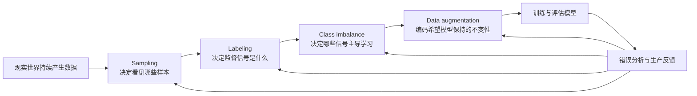
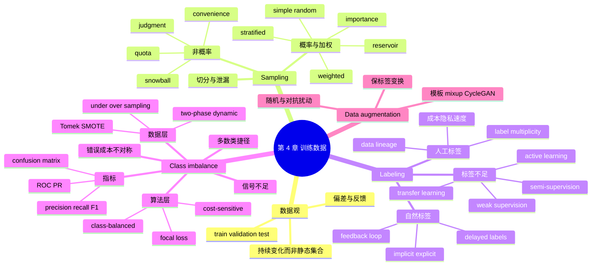

> 对应原章：4. Training Data.md
> 第 3 章从系统视角讨论数据怎样存储、传输和处理；本章转向数据科学视角，讨论怎样从现实数据中取样、获得标签、处理类别不平衡，并通过数据增强构造更有效的训练信号。
>
> 本笔记严格按照原章顺序展开。原章引用的行业调查、成本和实验数字主要来自 2016–2021 年，本文保留其历史语境，不将其直接当作 2026 年现状。
>
> **归因说明：** 除相邻文字明确写明“原章公式”“原章案例”或“原章数字”的内容外，本文新增的概率推导、方差与有效样本量、标注一致性、延迟标签、指标辨析、SMOTE / focal loss 展开、Mermaid 图、伪代码和可运行示例，均是为了解释原章思想而加入的笔记补充，不是作者在本章逐式提出的内容。

## 0. 本章要回答的核心问题

1. 为什么训练数据不是建模前一次性准备好的静态“数据集”？
2. 便利、滚雪球、判断和配额等非概率采样会引入什么选择偏差？
3. 简单随机、分层、加权、水库和重要性采样分别解决什么问题？
4. 水库采样为何能在不知道流长度的情况下，让每个样本以相同概率留下？
5. 重要性采样的权重 $P(x)/Q(x)$ 从哪里来，什么时候方差会失控？
6. 手工标注为什么昂贵、缓慢且涉及隐私，标注者分歧又意味着什么？
7. 数据血缘怎样帮助定位“增加数据后模型反而变差”的原因？
8. 自然标签、行为标签、显式标签和隐式标签有什么区别？
9. 反馈窗口为什么要在标签速度与标签准确性之间权衡？
10. 弱监督、半监督、迁移学习和主动学习分别利用什么额外信息？
11. 类别不平衡为什么会造成信号不足、捷径解和非对称错误成本？
12. 为什么准确率会掩盖少数类失败，ROC 与 PR 曲线又该怎样选择？
13. 欠采样、过采样、Tomek links、SMOTE、两阶段和动态采样有什么适用边界？
14. 代价敏感、类别平衡和 focal loss 怎样修改学习信号？
15. 简单变换、扰动和数据合成怎样扩展数据，又如何避免破坏标签语义？
16. 如何把采样、标注、评估与增强组织成一个可审计、可迭代的训练数据闭环？

全章主线如下：



一句话概括：**训练数据不是现实的被动副本，而是采样政策、标签政策、代价偏好和不变性假设共同构造出的学习接口。**

---

## 1. 开篇：为什么训练数据是持续演化的系统资产

### 1.1 数据工作不是建模的附属环节

机器学习课程往往偏向模型，因为设计最新模型更有趣；现实工作却常是处理格式错误、规模超过单机内存、语义不一致的数据。数据具有混乱、复杂、不可预测甚至危险的性质，处理不当会让整个 ML 项目失败。

因此，本章不是教“清洗完再训练”的固定步骤，而是讨论怎样获得或构造能够让模型学到有意义规律的数据。

### 1.2 本章“training data”的范围

本章的 training data 包含模型开发阶段使用的全部数据：

- 训练集：用于优化模型参数；
- 验证集：用于选择模型、阈值与超参数；
- 测试集：用于最后估计泛化表现。

作者刻意使用 **training data**，而不是 **training dataset**。严格的 set 容易让人联想到有限、静止的集合，而生产数据通常：

- 持续到达，不是有限的；
- 分布会变化，不是平稳的；
- 标签与业务定义会变化；
- 模型错误会促使团队重新采样和标注。

所以创建训练数据与模型开发一样，是迭代过程。

### 1.3 数据不等于真相

偏差可在多个环节进入：

```text
现实世界
  -> 采集机制选择了谁能被观察
  -> 采样机制选择了谁进入开发数据
  -> 标注规则定义了什么算“正确”
  -> 历史制度决定了标签中已有的偏见
  -> 模型与产品又改变下一轮用户行为
```

因此“使用数据，但不要过度相信数据”不是反数据立场，而是要求记录数据怎样产生、遗漏了谁、标签代表什么，以及结论在哪些分布上成立。

---

## 2. Sampling：采样

### 2.1 为什么采样是 ML 生命周期的基础操作

采样发生在多个位置：

1. 从所有现实事件中形成可观察数据；
2. 从可访问数据中构造训练数据；
3. 从数据中划分 train / validation / test；
4. 从生产事件中抽样做监控；
5. 用小子集快速判断新模型是否值得继续投入。

原章脚注提醒，小子集试验不是所有模型的可靠淘汰门槛：某些大模型在数据很少时不能体现能力，数据规模增加后才开始有效。更稳妥的做法是使用多个递增数据规模绘制学习曲线，再判断方案是否值得继续，而不是用一个小样本结果永久否决模型。

采样必要的原因包括：无法观察整个现实总体、全部处理成本过高，以及希望低成本快速实验。

设总体分布为 $P(x,y)$，采样机制对样本的纳入概率为 $s(x,y)$。模型实际看到的分布近似为

$$
P_{sample}(x,y)
=\frac{s(x,y)P(x,y)}{\mathbb E_P[s(X,Y)]}.
$$

若 $s(x,y)$ 不是常数，样本分布就会偏离总体。这个补充公式解释了为什么采样策略不是实现细节：它直接改变模型要最小化的风险。

### 2.2 两个采样目标不能混淆

- **代表性**：样本应支持对目标总体做可靠推断。
- **信息效率**：有限预算优先选择能帮助模型学习的样本。

简单随机采样偏向代表性；主动学习、困难样本或近期数据加权偏向信息效率。训练可以故意改变分布，但评估集通常应尽量代表部署目标，并用权重恢复真实业务代价。

### 2.3 Nonprobability Sampling：非概率采样

#### 2.3.1 四种方法

| 方法 | 选择规则 | 原章例子 | 主要风险 |
| --- | --- | --- | --- |
| Convenience sampling | 谁容易取得就选谁 | Wikipedia、Common Crawl、Reddit | 可获得性与目标总体不同 |
| Snowball sampling | 从已有样本扩展邻居 | 从少量合法 Twitter 账户抓取其关注账户 | 网络同质性、种子依赖 |
| Judgment sampling | 由专家选择 | 专家挑选重要案例 | 专家盲区，难估纳入概率 |
| Quota sampling | 非随机地填满各切片配额 | 三个年龄段各取 100 人 | 人为比例不代表真实分布 |

它们的共同点是纳入不由已知概率机制决定，因而难以用设计概率估计总体误差。

#### 2.3.2 三个便利采样案例

##### 2.3.2.1 语言模型

容易抓取的 Wikipedia、Common Crawl 和 Reddit 不代表所有可能文本。未联网者、私密交流、低资源语言和不愿公开发言的人群更少进入语料。

##### 2.3.2.2 通用情感分析

IMDB 与 Amazon review 自带评分，标签便宜；但愿意联网并主动评论的人不代表沉默用户。把影评训练结果直接迁移到医疗反馈或客服消息，还会遇到领域差异。

##### 2.3.2.3 自动驾驶

早期数据大量来自监管宽松的 Phoenix 和公司集中的旧金山湾区，两地通常晴朗。Waymo 在 2016 年扩展到 Kirkland，专门收集雨天数据，但晴天仍更常见。若训练分布缺少雨雪，整体里程再多也不能补足关键天气覆盖。

#### 2.3.3 何时仍可使用非概率采样

它适合：

- 建立第一个原型；
- 验证数据管道和标签定义；
- 发现明显失败模式；
- 形成后续概率采样框架。

但不能把“模型在便利样本上有效”直接推广为“在目标总体上有效”。可靠生产系统要记录来源，并针对关键缺口补采样或加权。

### 2.4 Simple Random Sampling：简单随机采样

#### 2.4.1 定义与优势

总体中每个样本有相同纳入概率。例如随机抽取 10%，每个样本都以 10% 概率被选中。它实现简单，在理想总体框架下便于估计不确定性。

#### 2.4.2 稀有类别为何可能完全消失

设稀有类占比为 $p$，有放回或近似独立地抽取 $m$ 个样本：

$$
K\sim\operatorname{Binomial}(m,p),
\qquad \mathbb E[K]=mp.
$$

一个稀有样本也没有抽到的概率为

$$
P(K=0)=(1-p)^m.
$$

至少抽到一个的概率是

$$
P(K\ge1)=1-(1-p)^m.
$$

若 $p=0.0001$（0.01%），想让“至少出现一次”的概率达到 95%，需要

$$
m\ge\frac{\log(0.05)}{\log(0.9999)}\approx29{,}956.
$$

仅仅“抽原数据的 1%”不足以判断是否覆盖稀有类，还取决于原总体大小和稀有率。

### 2.5 Stratified Sampling：分层采样

#### 2.5.1 基本思想

先按关心的切片划分 strata，再分别抽样。例如 A、B 两类各抽 1%，并为每层显式设置至少一个或业务所需的最小样本数，才能保证稀有层被纳入，而不是让多数类随机淹没它。若某层只有几十条，机械计算 1% 再向下取整仍可能得到 0；“分层”本身不自动提供最小配额。

常见形式：

- 比例分层：各层抽样率相同，保留总体比例；
- 非比例分层：稀有层抽得更多，提高该层估计或学习效率。

#### 2.5.2 改变比例后怎样恢复总体估计

若总体中 stratum $h$ 占比 $W_h=N_h/N$，样本中该层均值为 $\bar y_h$，总体均值估计应为

$$
\widehat\mu=\sum_h W_h\bar y_h.
$$

不能直接对非比例样本取普通平均，否则人为配额会被误当成真实比例。

#### 2.5.3 局限

- 必须在抽样前知道分层变量；
- 切片过多会形成稀疏交叉层；
- 多标签样本同时属于多个组，分层约束可能冲突；
- 未知稀有模式仍可能被遗漏。

### 2.6 Weighted Sampling：加权采样

#### 2.6.1 从权重到选择概率

若样本 $i$ 的非负权重为 $w_i$，一次有放回选择概率为

$$
q_i=\frac{w_i}{\sum_jw_j}.
$$

A、B、C 权重分别为 0.5、0.3、0.2，就对应 50%、30%、20% 的选择概率。

它可编码领域知识，例如近期数据更有价值；也可修正已知分布差异。样本数据红色 25%、蓝色 75%，目标总体各 50%，红样本相对蓝样本的权重比是

$$
\frac{0.5/0.25}{0.5/0.75}=3.
$$

所以红样本应有三倍相对权重。

#### 2.6.2 Weighted sampling 与 sample weights

| 概念 | 改变什么 | 数学效果 |
| --- | --- | --- |
| Weighted sampling | 哪些样本进入 batch、出现多少次 | 改变随机梯度的抽样分布 |
| Sample weights | 已选样本对损失贡献多大 | 改变目标函数中的每项系数 |

加权损失可写为

$$
\widehat L(\theta)
=\frac{\sum_i a_i\ell(f_\theta(x_i),y_i)}{\sum_i a_i}.
$$

二者在某些期望条件下可以产生相似梯度，但优化方差、batch 组成和重复过拟合风险不同，不能简单视为同一实现。

图 4-1 的核心观察是：sample weights 会改变各样本对目标函数与梯度的贡献，因此即使样本坐标和标签完全不变，也可能显著移动学习到的决策边界。

#### 2.6.3 原章 Python 用法

`random.choices` 接受相对权重，不要求总和为 1，而且默认有放回：

```python
import random

random.choices(
    population=[1, 2, 3, 4, 100, 1000],
    weights=[0.2, 0.2, 0.2, 0.2, 0.1, 0.1],
    k=2,
)
```

把 1、2、3、4 各复制两次，再均匀有放回抽样，在这个离散例子中具有相同选择分布；大规模数据不应真的通过复制实现。

### 2.7 Reservoir Sampling：水库采样

#### 2.7.1 要解决的问题

推文流长度未知、无法全部放入内存，但希望始终保留 $k$ 个均匀样本，并允许任意时刻停止。

#### 2.7.2 算法 R

1. 把前 $k$ 个元素放入 reservoir。
2. 对第 $n$ 个元素（$n>k$），在 $1,\ldots,n$ 中均匀生成整数 $i$。
3. 若 $i\le k$，用新元素替换水库第 $i$ 个槽位；否则丢弃新元素。

等价实现是以 $k/n$ 接受第 $n$ 个元素，接受后均匀替换一个槽位。

#### 2.7.3 为什么每个元素最终都以 $k/n$ 概率留下

**新元素。** 第 $n$ 个元素只有在 $i\le k$ 时进入，共 $k$ 个有利整数，因此

$$
P(n\text{ 入选})=\frac{k}{n}.
$$

**旧元素。** 假设处理 $n-1$ 个元素后，任一旧元素在水库中的概率是 $k/(n-1)$。处理第 $n$ 个元素时，它被替换的概率为：新元素入选 $k/n$，再选中该元素所在槽位 $1/k$，乘积为 $1/n$。因此它保留的概率为

$$
\frac{k}{n-1}\left(1-\frac1n\right)
=\frac{k}{n-1}\frac{n-1}{n}
=\frac{k}{n}.
$$

由归纳法，处理任意 $n\ge k$ 个元素后，每个元素入选概率都为 $k/n$。

#### 2.7.4 前提与局限

- 流中的每个事件恰好被处理一次；
- 随机数均匀且状态不丢失；
- 算法给事件等概率，不自动给用户等概率；高频用户会贡献更多事件；
- 若要时间衰减、分层或加权保留，需要对应变体；
- 分布式合并多个 reservoir 需要按分区流量正确加权。

### 2.8 Importance Sampling：重要性采样

#### 2.8.1 从目标分布改写到提议分布

希望计算目标分布 $P$ 下函数 $f(X)$ 的期望，但只能方便地从 $Q$ 抽样。只要

$$
Q(x)>0\quad\text{whenever}\quad P(x)f(x)\ne0,
$$

就有

$$
\begin{aligned}
\mathbb E_P[f(X)]
&=\sum_xP(x)f(x)\\
&=\sum_xQ(x)\frac{P(x)}{Q(x)}f(x)\\
&=\mathbb E_Q[w(X)f(X)],
\end{aligned}
$$

其中

$$
w(x)=\frac{P(x)}{Q(x)}.
$$

原章用 $f(x)=x$ 展示同一恒等式。关键不是“样本变成来自 $P$”，而是用权重让估计量在期望上恢复 $P$ 的目标。

#### 2.8.2 Monte Carlo 估计

若 $x_1,\ldots,x_m\sim Q$，无偏估计为

$$
\widehat\mu_{IS}
=\frac1m\sum_{i=1}^{m}\frac{P(x_i)}{Q(x_i)}f(x_i).
$$

若只知道未归一化密度，可用 self-normalized importance sampling：

$$
\widehat\mu_{SNIS}
=\frac{\sum_iw_i f(x_i)}{\sum_iw_i}.
$$

SNIS 一般有限样本有偏，但一致，实践中常更方便。

#### 2.8.3 方差与有效样本量

$Q$ 在 $P|f|$ 较大的区域给出的概率太小时，少数 $w_i$ 会极大，估计方差爆炸。常用诊断是

$$
ESS=\frac{(\sum_iw_i)^2}{\sum_iw_i^2},
$$

其范围约在 1 到 $m$。ESS 接近 1，表示名义上有很多样本，实际估计几乎被一个样本支配。

好的 $Q$ 应覆盖 $P$ 的支持集，并把更多质量放到 $|f(x)|P(x)$ 大的区域，同时保持易采样。

#### 2.8.4 强化学习例子

评估新策略 $\pi$ 时，真实运行新策略收集轨迹昂贵；若已有旧策略 $\mu$ 的数据，可用动作概率比重加权：

$$
w_t=\frac{\pi(a_t\mid s_t)}{\mu(a_t\mid s_t)}.
$$

整条轨迹的比率是多个 $w_t$ 的乘积，时间跨度一长就容易产生极高方差。因此离策略评估常需要截断、per-decision weighting、控制变量或专门的 doubly robust 方法。

### 2.9 训练、验证、测试切分也是采样（笔记补充）

虽然原章没有单列切分小节，但开篇明确把 train / validation / test 都纳入 training data。切分策略必须模拟真实泛化边界：

| 场景 | 合理切分单位 | 要避免的泄漏 |
| --- | --- | --- |
| 独立同分布图像 | 样本随机或分层 | 增强副本跨集合 |
| 用户行为 | 按用户分组 | 同一用户同时出现在 train/test |
| 时间预测 | 按时间向后 | 用未来事件预测过去 |
| 医疗 | 按患者、医院或设备 | 同一患者扫描跨集合 |
| 推荐 | 用户/物品冷启动切分与时间切分 | 未来曝光和标签泄漏 |

任何过采样、SMOTE、标签传播、词表拟合和标准化统计，都应只在训练折内部完成。测试集应保持目标分布且尽量只在最终决策时使用。

### 2.10 可运行示例：水库公平性与重要性采样

```python
import random


def reservoir_sample(stream, size, rng):
    reservoir = []
    for index, item in enumerate(stream, start=1):
        if index <= size:
            reservoir.append(item)
        else:
            slot = rng.randrange(index)
            if slot < size:
                reservoir[slot] = item
    return reservoir


# 用固定随机种子做 20,000 次实验，检查 10 个元素进入 4 槽水库的频率。
rng = random.Random(7)
trials = 20_000
counts = [0] * 10
for _ in range(trials):
    for item in reservoir_sample(range(10), 4, rng):
        counts[item] += 1
frequencies = [count / trials for count in counts]

# 目标 P=(0.8, 0.2)，提议 Q=(0.5, 0.5)，估计 E_P[X]=0.2。
proposal_samples = [0, 1, 0, 1]
target_probability = {0: 0.8, 1: 0.2}
proposal_probability = {0: 0.5, 1: 0.5}
estimate = sum(
    target_probability[value] / proposal_probability[value] * value
    for value in proposal_samples
) / len(proposal_samples)

print(f"reservoir_expected={4 / 10:.3f}")
print(f"reservoir_min={min(frequencies):.3f}")
print(f"reservoir_max={max(frequencies):.3f}")
print(f"importance_estimate={estimate:.3f}")
```

实际运行输出：

```text
reservoir_expected=0.400
reservoir_min=0.397
reservoir_max=0.402
importance_estimate=0.200
```

频率不可能恰好都等于 0.4，但实测围绕 0.4 波动；重要性样本被刻意配成两个 0、两个 1，因此本例精确得到目标期望 0.2。Monte Carlo 频率只用于检查实现，并不代替前面的归纳证明。

---

## 3. Labeling：标注

原章写作时观察到，生产中的多数模型仍依赖监督信号。模型性能不仅取决于样本数量，还取决于标签定义、准确性、覆盖、到达时间和来源。这是作者在 2021 年前后语境中的行业判断，不应未经新证据直接当作 2026 年比例结论。

### 3.1 Hand Labels：人工标签

#### 3.1.1 昂贵：专业知识决定单价与容量

垃圾评论可让众包标注者短期培训后处理；胸片标签需要执业放射科医生。专业人员的时间昂贵且稀缺，标签产能会成为模型迭代上限。

#### 3.1.2 隐私：标注意味着人必须看见数据

病历和公司机密财务数据不能随意发给第三方。数据可能被要求留在组织内，需要本地标注、最小权限、脱敏、审计和受控工作站。

脱敏也不是零风险：自由文本和影像可能包含间接身份信息；标注平台截图、缓存和导出都要进入威胁模型。

#### 3.1.3 缓慢：标签延迟直接降低适应性

原章数字：音频的精确音素级转录可耗费音频时长的 400 倍。1 小时音频需要 400 人时；若一人每天有效标 8 小时，需要 50 个工作日，约 10 周，而不是连续 24 小时计算下的 16.7 天。原章将其概括为“几乎三个月”。肺癌 X 光项目则等待近一年才取得足够标签。

情感模型从 NEGATIVE / POSITIVE 增加 ANGRY 类时，历史样本要重新审阅，还可能补采愤怒样本。标签 schema 改变会触发全链路迁移，而不是只改输出层。

#### 3.1.4 人工标签的总成本

可粗略写为

$$
C_{label}
=N(c_{annotate}+c_{review})
+C_{guideline}+C_{platform}+C_{privacy}+C_{rework}.
$$

只比较“每条标签价格”会遗漏指南设计、仲裁、质检、返工和安全成本。

#### 3.1.5 Label multiplicity：标签多重性

##### 3.1.5.1 Darth Sidious 实体识别案例

同一句话交给三位标注者，分别标出 3、6、4 个实体：

| 标注者 | 典型差异 |
| --- | --- |
| 1 | 把 `Dark Lord of the Sith` 与完整皇帝头衔作为长实体 |
| 2 | 把 `Dark Lord` / `Sith`、`Galactic Emperor` / `First Galactic Empire` 拆开 |
| 3 | 同时接受 `Emperor`，其余倾向最长实体 |

这不是简单多数票就能完全解决的问题。分歧可能来自：

- 指南不清；
- 边界语义本来多解；
- 标注者专业水平不同；
- 标注者疲劳或错误；
- 任务定义本身把连续概念强压成离散标签。

##### 3.1.5.2 先修问题定义，再修标注者

原章建议明确“多个可能实体时取最长子串”，并把规则纳入培训。标注系统还应提供：

- 正例、反例与边界例；
- `UNKNOWN` / `ABSTAIN` 选项；
- 指南版本；
- 双标与专家仲裁；
- 定期校准会议。

##### 3.1.5.3 一致性指标的作用和边界（笔记补充）

两位标注者的 Cohen's kappa：

$$
\kappa=\frac{p_o-p_e}{1-p_e},
$$

$p_o$ 是实际一致率，$p_e$ 是按各自标签边际分布偶然一致的概率。$\kappa=1$ 表示完全一致，0 表示不超过偶然水平。

但 kappa 不能告诉团队哪个标签正确，也会受类别极不平衡影响。序列边界任务还需 span-level agreement，而不能只算 token 准确率。

##### 3.1.5.4 不一定要强行压成一个硬标签

可选方案包括：

- 明确规则后专家仲裁；
- 多数票；
- 按标注者可靠性加权；
- 保留标签分布，使用 soft target；
- 把“无法一致”作为任务不确定性单独建模。

若专家本身合理分歧，“人类水平”就不是一个单值上限，而应报告专家间与专家内一致性。

#### 3.1.6 Data lineage：数据血缘

##### 3.1.6.1 “更多数据使模型变差”的案例

模型用 10 万高质量样本表现尚可，团队外包标注新增 100 万样本，结果性能下降。根因是新标注者准确率更低。如果新旧数据已经混在一起且没有来源字段，定位与回滚会非常困难。

##### 3.1.6.2 每条样本应能回答什么

```text
样本从哪里采集、何时采集？
采用了哪版过滤与采样策略？
谁或哪个函数给出标签？
标签指南、模型或 LF 是哪个版本？
经过几次复核与仲裁？
属于哪个数据快照、train/val/test split？
哪些模型消费过它？
```

血缘帮助：

- 按来源切片评估；
- 发现近期批次错误；
- 回滚污染数据；
- 审计许可、隐私和删除请求；
- 复现模型训练。

血缘只能提供追踪路径，不会自动保证标签质量；团队还需要质量门禁与责任人。

### 3.2 Natural Labels：自然标签

#### 3.2.1 定义与案例

自然标签是系统运行后能自动或部分自动得到的真实结果：

- 地图 ETA：行程结束后得到实际时长；
- 两分钟股价预测：两分钟后得到实际价格；
- 推荐：曝光后观察点击、购买或其他行为。

由点击、评分等用户行为推断的标签也称 behavioral labels。

#### 3.2.2 自然不等于无偏或因果

点击只在物品被曝光后可观察，标签受到旧排序策略、位置、界面和用户可见性的影响：

$$
P(\text{click})
=P(\text{examined})P(\text{click}\mid\text{examined}).
$$

没点击可能表示不喜欢、没看见、稍后再点或已经知道内容。把所有未点击曝光直接标为负类，会引入曝光偏差与错误负标签。

#### 3.2.3 主动设计反馈界面

没有天然标签的任务也可增加反馈机制：

- 翻译产品允许用户提交替代译文；
- 新闻流增加 Like 与其他 reaction；
- 搜索提供“结果是否有帮助”；
- 人工客服记录模型建议是否被覆盖。

反馈需要反滥用与审核。用户建议不应未经验证直接进入训练。

#### 3.2.4 86 家公司的历史调查

作者网络中的 86 家公司：

| 标签来源 | 公司比例 |
| --- | ---: |
| Hand labels | 62% |
| Natural labels | 63% |
| Programmatic labels | 30% |

比例可重叠，所以不相加为 100%。这不是“63% 的所有 ML 任务都有自然标签”，更可能反映企业优先选择标签便宜的任务；样本也不是随机行业调查。

#### 3.2.5 Implicit 与 explicit labels

- implicit negative：推荐 10 分钟后未点击，系统推定为负；
- explicit negative：用户给低分或 downvote；
- implicit positive：点击、停留、购买等行为；
- explicit positive：点赞、高评分或明确确认。

显式标签意图更清楚，但量小且有自选择偏差；隐式标签量大，却更容易受界面、曝光和延迟影响。

#### 3.2.6 Feedback loop length：反馈回路长度

##### 3.2.6.1 定义

从预测被服务到对应反馈可用的时间：

$$
T_{feedback}=t_{label\ available}-t_{prediction\ served}.
$$

相关商品点击可能是分钟；文章或视频消费可能是小时；Stitch Fix 服装试穿可能是数周；信用卡争议通常是一至三个月。

##### 3.2.6.2 不同反馈的量、强度与延迟

电商用户旅程可产生：

```text
曝光 -> 点击 -> 加购 -> 购买 -> 评分/评论 -> 退货
```

越靠前通常量越大、反馈越快，但与最终业务价值关系更弱；购买比点击强，退货又可能推翻购买的正信号。

优化点击与优化购买都可能合理，选择必须由产品目标、延迟容忍和实验共同决定。

##### 3.2.6.3 反馈窗口的速度—准确性权衡

窗口 $W$ 越短：

- 更快形成标签和检测问题；
- 更多迟到正例被提前判为负。

窗口越长：

- 标签更成熟；
- 模型监控与重训更慢。

对最终确实会点击的正例，令点击延迟随机变量为 $T$。截止 $W$ 时已观察到的最终正例比例为条件分布

$$
F_T(W)=P(T\le W\mid Y_{eventual}=1).
$$

因此观察 CTR 近似为

$$
CTR_{observed}(W)
\approx CTR_{eventual}\,F_T(W),
$$

该近似要求曝光记录完整、每次曝光都有明确观察终点，并且在最终正例中，窗口截断之外不存在未建模的信息性删失；若不同用户或物品的反馈延迟与点击倾向共同变化，还应按切片或生存模型校正。Twitter Ads 的历史研究发现多数点击在前五分钟发生，但仍有点击延迟数小时，所以短窗口系统性低估最终 CTR。

##### 3.2.6.4 标签成熟度与版本

不要把标签看成一次写死的字段。可记录：

```text
PENDING -> PROVISIONAL_NEGATIVE -> MATURE_NEGATIVE
                         \-> LATE_POSITIVE
```

训练、监控和业务报表使用不同成熟度：快速代理标签用于早期告警，成熟标签用于可靠评估和校正。

长反馈任务还可用短期代理，但必须验证代理与最终结果的关系，避免为了快速反馈而优化错误目标。

### 3.3 Handling the Lack of Labels：处理标签不足

#### 3.3.1 四种方法总览

| 方法 | 利用的信息 | 是否需要人工真值 | 核心风险 |
| --- | --- | --- | --- |
| Weak supervision | 领域启发式、规则、数据库、旧模型 | 理论上不必；建议小规模 gold set | 相关且系统性的规则噪声 |
| Semi-supervision | 数据结构与一致性假设 | 需要少量种子标签 | 确认偏差、假设不成立 |
| Transfer learning | 其他任务预训练出的表示 | zero-shot 不必；微调通常需要少量 | 域错配、预训练偏差 |
| Active learning | 当前模型最需要的信息 | 需要，且通常要循环标注 | 不确定性失真、采样偏差 |

它们不是互斥方案。例如先用弱监督生成初始标签，再用主动学习选择专家复核样本，最后基于预训练模型微调。

#### 3.3.2 Weak supervision：弱监督

原章以 Stanford AI Lab 开发的开源工具 Snorkel 为代表。弱监督的核心抽象是 labeling function，使用规则批量产生噪声标签；这种方法也称 programmatic labeling。

##### 3.3.2.1 Labeling function（LF）

LF 把领域启发式编码成程序。例如护士记录包含 pneumonia 时建议优先：

```python
ABSTAIN = 0
EMERGENT = 1


def lf_pneumonia(note):
    return EMERGENT if "pneumonia" in note.lower() else ABSTAIN
```

原章简例未写 `else`；实际 LF 通常必须显式 abstain，区分“规则不覆盖”与“规则判断为非急诊”。

LF 可来自关键词、正则、数据库名单和其他模型。

##### 3.3.2.2 多个 LF 为什么需要 label model

对样本 $x_i$，$m$ 个 LF 形成输出向量

$$
\lambda_i=(\lambda_1(x_i),\ldots,\lambda_m(x_i)),
$$

每项可为某类别或 abstain。LF 会：

- 覆盖不同样本；
- 相互冲突；
- 准确率不同；
- 因共享关键词或规则来源而相关。

label model 从 LF 的一致和冲突模式估计可靠性，输出概率标签，再训练判别模型。若把高度相关的十条规则误当成十个独立证据，会过度自信；条件独立假设与依赖结构需要检查。

##### 3.3.2.3 为什么仍推荐少量人工标签

小规模 gold set 可用于：

- 估计 LF 精度与覆盖；
- 发现系统性遗漏；
- 选择、调试和停止开发 LF；
- 最终评估判别模型。

不能一边反复用同一个 gold set 调 LF，一边把它当无偏最终测试集。

##### 3.3.2.4 程序化标注的价值

| 人工标注问题 | Programmatic labeling 的潜在改进 |
| --- | --- |
| 专业知识昂贵 | 规则可版本化、复用和共享 |
| 人必须查看全部数据 | 只在获准子集开发 LF，再批量运行 |
| 标签量线性增加时间 | 程序可从 1K 扩展到 1M |
| 定义变化需逐条重标 | 修改并重跑 LF |

隐私收益有前提：LF 输入和输出仍可能泄露敏感信息，运行环境、日志与访问权限仍需治理。

##### 3.3.2.5 Stanford Medicine 案例

原章报告：一名放射科医生用 8 小时写 LF 得到的弱监督标签，训练模型后与近一年人工标注数据训练的模型表现相当。CXR 与 EXR 两个任务分别只使用 18 和 20 个 LF，其中 6 个跨任务复用；增加未标注数据而不增加 LF，性能仍继续提升。脚注同时提醒，这只是该研究的规模；作者在实践中见过单个任务维护数百个 LF 的团队。

这是特定医疗影像研究结果，不保证所有任务都能用 8 小时规则替代一年标签。效果取决于启发式质量、任务结构、未标注数据和评估设计。

##### 3.3.2.6 若规则有效，为什么还要模型

LF 往往只覆盖部分样本。判别模型可以从程序化标签学习更广泛的特征，在没有任何 LF 命中的样本上预测，并将多个局部规则压缩成统一推理模型。

若弱标签噪声太高，它仍可能不可用；但适合作为低前期成本的可行性起点。

#### 3.3.3 Semi-supervision：半监督

弱监督利用启发式；半监督从少量种子标签出发，利用未标注数据的结构假设。原章指出这类方法至少在 1990 年代已经使用，并以 1998 年 co-training 工作为例；同时提供 2008 与 2018 年两份综述入口。

原章还给出有边界的实证结论：在某些实验设置中，即使丢弃相当一部分标签，半监督方法仍达到纯监督学习表现。这不是所有任务的保证，结果依赖未标注数据分布、结构假设和评估协议。

##### 3.3.3.1 Self-training（self-training）

```text
用已标注集 L 训练模型
对未标注池 U 预测
选择高置信伪标签 S
L <- L ∪ S, U <- U \ S
重新训练，直到停止条件满足
```

核心假设是高置信预测大多正确。风险是 confirmation bias：模型把早期错误当真值，再强化自己的决策边界。缓解方法包括更严格阈值、每类配额、teacher-student、数据增强一致性和人工抽查。

“高 softmax 概率”不保证正确，模型应先检查校准和域外行为。

##### 3.3.3.2 相似样本共享标签

将 `#AI` 标为 Computer Science 后，若 `#ML`、`#BigData` 与其出现在同一 MIT CSAIL profile，可传播同类标签。更一般地可用聚类、$k$NN 或图传播。

它依赖 cluster / smoothness assumption：相似样本更可能同类，决策边界穿过低密度区域。若相似度由无关特征主导，标签会沿错误邻域传播。

##### 3.3.3.3 Perturbation consistency

小扰动不应改变标签：

$$
f_\theta(x)\approx f_\theta(T(x)).
$$

可直接扰动图像，也可扰动词 embedding。$T$ 必须保持任务语义；旋转数字 6 可能变成 9，文本替词也可能改变情感。

##### 3.3.3.4 有限标签下的训练—评估冲突

标签全用于训练，就无法可靠选模型；留太多做验证，又减少监督信号。原章提到先用较大评估集选 champion，再把它加入训练继续训练。

这一步之后，原评估集已经进入训练，不能继续作为无偏最终测试集。应保留独立测试集或使用嵌套交叉验证，并把模型选择次数纳入过拟合风险。

#### 3.3.4 Transfer learning：迁移学习

##### 3.3.4.1 基本过程

1. 用便宜、丰富数据训练 base task；
2. 复用 base model 的表示解决 downstream task；
3. zero-shot 直接使用，或用少量标签 fine-tune。

语言建模不需人工语义标签：从文本自身构造“给定前文预测下一个 token”的目标。token 可以是词、字符或子词。

##### 3.3.4.2 Fine-tuning 与 prompting

- fine-tuning：继续训练全部或部分参数，使模型适配下游数据；
- prompting：把任务和示例写入输入模板，不一定更新参数；
- zero-shot：没有当前任务示例或参数更新，直接调用已有能力。

原章用问答 prompt 提供美国建国日期、独立宣言作者两个示例，再询问 Alexander Hamilton 出生年份。

##### 3.3.4.3 为什么有效

预训练先学习可复用表示，减少下游任务从有限标签中重新发现语法、视觉边缘或语义结构的成本。即使标签丰富，从预训练起点也常比随机初始化更好。

适用前提是 base 与 downstream 共享结构；域差异过大时可能 negative transfer。还要检查预训练许可、隐私、偏差、模型容量、推理成本与安全。

##### 3.3.4.4 历史趋势与时间边界

原章写作时观察到：通常 base model 越大，下游表现越好；GPT-3 训练成本被估计为数千万美元，并有人预测只有少数公司能承担大模型预训练，其余组织直接使用或微调。

这是 2020–2021 年语境中的趋势判断，不是大小与质量的无条件定律。数据质量、计算最优配比、架构、蒸馏和任务匹配同样重要。

#### 3.3.5 Active learning：主动学习

##### 3.3.5.1 核心闭环

主动学习让模型决定“接下来标哪些样本”，希望用更少标签获得更高准确率：


##### 3.3.5.2 Uncertainty sampling

多分类常见指标：

- least confidence：$1-\max_kp_k$；
- margin：最大与第二大概率之差，越小越不确定；
- entropy：

$$
H(p)=-\sum_kp_k\log p_k.
$$

原章玩具例有 400 个二维高斯样本。随机标 30 个训练得到 70% 准确率；主动选择 30 个得到 90%。这是特定玩具演示，不应外推成固定 20 个百分点收益。

##### 3.3.5.3 Query-by-committee（query-by-committee）

多个候选模型可由不同超参数或数据切片训练。选择委员会分歧最大的样本，例如 vote entropy：

$$
H_{vote}(x)
=-\sum_c\frac{V_c(x)}{M}\log\frac{V_c(x)}{M},
$$

$V_c$ 是投票给类 $c$ 的模型数，$M$ 是委员会规模。

委员会若共享同一偏差，可能一致地犯错；多样性比单纯增加模型数量重要。

##### 3.3.5.4 其他选择准则与三种数据 regime

还可选择预期梯度变化最大、预期损失下降最多的样本。候选样本来自：

1. 合成输入空间；
2. 已收集的固定未标注池；
3. 生产中持续到达的真实流。

流式主动学习特别适合适应分布变化，但必须控制标注预算、探索覆盖和标签延迟。

##### 3.3.5.5 主动学习的局限

- 模型过度自信时，least-confidence 看不到盲区；
- 只选边界样本会使标注集不代表生产总体；
- 异常和噪声常最不确定，可能浪费专家预算；
- 评估集不能跟随同一选择政策偏移；
- 需要持续训练、标注平台和血缘基础设施。

---

## 4. Class Imbalance：类别不平衡

### 4.0 定义不限于分类

分类中，各类样本数相差巨大。原章肺癌例：99.99% 正常、0.01% 癌症。

回归也可能出现目标长尾。医疗账单中位数低、95 分位极高。250 美元账单误差 100% 与 10,000 美元账单误差 100% 的业务后果不同；训练目标可能要优先高额账单，即使整体平均指标下降。

这里应区分：

- frequency imbalance：样本频率不均；
- cost imbalance：不同错误代价不均；
- difficulty imbalance：某些样本更难；
- distribution shift：训练比例与部署比例不同。

它们可能同时出现，但解决方法不同。

### 4.1 Challenges of Class Imbalance：类别不平衡的难点

#### 4.1.1 少数类信号不足

少数类只有几个实例时成为 few-shot；完全没有实例时，监督模型没有证据知道该类存在。增加总样本若只增加多数类，不会自动改善少数类。

#### 4.1.2 多数类捷径与训练信号失衡

99.99% 正常时，永远预测正常已有 99.99% 评估准确率，因此用 accuracy 选模会偏爱无用的多数类捷径。训练时通常优化可微的交叉熵而不是准确率，少数类样本仍会产生梯度；真正问题是它们只占 0.01%，未加权的平均梯度和损失容易被多数类贡献淹没。恒预测多数类不必然是交叉熵的局部最优，但有限数据、模型偏置与优化动态会使学习少数类边界很困难。

#### 4.1.3 错误成本不对称

漏诊癌症比误报正常片危险。若损失对每个样本等权，模型优化的是平均频率，不是业务代价。

#### 4.1.4 现实案例

- 支付卡欺诈：2018 年每 100 美元持卡消费约有 6.8 美分欺诈，即约 0.068%；
- 流失：多数客户通常不会取消；
- 疾病筛查：严重疾病通常稀少；
- 简历筛选：原章引用 2014 年材料称 98% 求职者在初筛被淘汰；
- 目标检测：候选框中多数是背景。

这些是特定年份与来源的历史数字，不能直接作为当前基准。

#### 4.1.5 不平衡可能由数据管道制造

Talos 2021 年页面称全球邮件近 85% 是垃圾邮件，但公司邮箱数据库中的垃圾比例可能很低，因为上游过滤器已拦截大部分垃圾。使用数据库样本训练会学到**经过旧系统选择后的条件分布**，不是原始邮件总体。

标签错误也会制造不平衡，例如标注者以为只有 POSITIVE / NEGATIVE，漏掉第三类。面对不平衡，第一步应查明它是现实基率、采样选择、旧模型过滤还是标签 schema 错误。

### 4.2 Handling Class Imbalance：处理类别不平衡

#### 4.2.1 是否一定要“修平衡”

真实生产分布本来不平衡，理想模型应学习真实基率。盲目改成 50/50 会破坏概率校准；但有限模型和有限数据又可能学不到少数类，因此仍需特殊训练。

原章引用的历史结论包括：问题越复杂，对不平衡越敏感；线性可分的简单问题可能不受影响；二分类通常比多分类容易；2017 年所谓“超过 10 层的很深网络”在不平衡数据上优于浅层网络。这些结论依赖任务和时代，不是现代架构的普遍阈值。

处理分三层：

1. 选择正确指标；
2. 数据层重采样；
3. 算法层修改损失或决策。

### 4.3 Using the right evaluation metrics：选择正确指标

#### 4.3.1 混淆矩阵

以 CANCER 为 positive：

| 术语 | 含义 |
| --- | --- |
| TP | 癌症且预测癌症（hit） |
| FN | 癌症却预测正常（type II error / miss） |
| FP | 正常却预测癌症（type I error / false alarm） |
| TN | 正常且预测正常（correct rejection） |

#### 4.3.2 Model A 与 Model B

| 模型 | TP | FP | FN | TN |
| --- | ---: | ---: | ---: | ---: |
| A | 10 | 10 | 90 | 890 |
| B | 90 | 90 | 10 | 810 |

两者准确率都是

$$
\frac{TP+TN}{1000}=0.9.
$$

但以 CANCER 为正类：

$$
Precision=\frac{TP}{TP+FP},
\qquad
Recall=\frac{TP}{TP+FN},
$$

$$
F_1=2\frac{Precision\cdot Recall}{Precision+Recall}
=\frac{2TP}{2TP+FP+FN}.
$$

| 模型 | Precision | Recall | F1 |
| --- | ---: | ---: | ---: |
| A | 0.50 | 0.10 | 0.1667 |
| B | 0.50 | 0.90 | 0.6429 |

Model B 在癌症召回上明显更合适。

原章把“模型在 CANCER class 上的 accuracy 10% / 90%”作为直觉表达；按标准术语，这实际上是该类的 recall / sensitivity，不是整体 accuracy。

#### 4.3.3 正类定义会改变指标

Precision、recall、F1 是非对称的。Model A 若把 NORMAL 当正类，F1 约 0.95；所以报告 F1 时必须写明 positive label。多分类还要说明 macro、micro 或 weighted averaging。

#### 4.3.4 ROC curve 与 AUC

阈值变化时：

$$
TPR=\frac{TP}{TP+FN},
\qquad
FPR=\frac{FP}{FP+TN}.
$$

ROC 绘制 TPR 对 FPR。ROC-AUC 可解释为随机抽一个正例和负例，模型把正例分数排得更高的概率（忽略 ties 的细节）。

原章称 ROC “只关注正类且不显示负类表现”，这句话并不严格：FPR 明确使用负类。真正问题是，在负类极多时，即使 FP 数量很大，除以巨大的 $FP+TN$ 后 FPR 仍可能很小，使 ROC 看起来乐观。

#### 4.3.5 Precision–Recall curve

PR 曲线直接展示：提高 recall 时，positive 预测中有多少仍正确。其基线 precision 等于正类 prevalence；类别极不平衡时，对误报更敏感，通常比 ROC 更有信息。

但 PR-AUC 也依赖正类比例，跨数据集比较前必须确认 prevalence 和采样政策一致。

#### 4.3.6 指标必须连接业务代价

医疗筛查可能优先 recall，同时约束 FP 带来的复检容量。最终阈值可最小化期望代价：

$$
R(t)=C_{FN}P(FN\mid t)+C_{FP}P(FP\mid t).
$$

若概率校准且成本可估计，可按期望效用选择；法规、安全与资源上限还可能形成硬约束。

### 4.4 Data-level methods: Resampling：数据层重采样

#### 4.4.1 随机欠采样与过采样

- undersampling：删除多数类；训练更快，但可能丢失边界和子群信息；
- oversampling：复制少数类；保留多数类信息，但重复会增加过拟合。

重采样只在训练集内部执行。验证和测试必须保持目标分布，否则指标不再代表生产，还可能因合成样本跨集合造成泄漏。

#### 4.4.2 Tomek links

若不同类样本 $x_i,x_j$ 互为最近邻，则构成 Tomek link。常删除该对中的多数类样本，使边界更清晰。

代价是删掉真实边界附近的困难样本，使模型看不到细微重叠，降低鲁棒性。它依赖距离有意义，主要适合低维空间。

#### 4.4.3 SMOTE

对少数类样本 $x_i$ 和其少数类近邻 $x_{nn}$，采样 $\lambda\sim U(0,1)$：

$$
x_{new}=x_i+\lambda(x_{nn}-x_i).
$$

新点是两者凸组合，位于线段上。它比简单复制产生更多局部变化，但隐含“少数类两点之间仍属于少数类”的假设。

若少数类跨越多个不相连簇、类别重叠、特征含离散字段或欧氏距离无意义，SMOTE 可能生成不真实样本。原章提醒它与 Tomek links 的有效证据主要来自低维数据。

#### 4.4.4 高维距离方法的局限

Near-Miss、one-sided selection 等需要实例间或实例到边界的距离。高维空间中距离趋于集中，计算昂贵；神经表示又会随训练改变。应在合适表示空间验证邻域语义，而不是机械套用。

#### 4.4.5 Two-phase learning

1. 先在重采样后的平衡数据上训练，让模型学到少数类；
2. 再在原始分布上微调，恢复真实基率与边界。

第二阶段可能重新偏向多数类，需要较小学习率、早停和按类监控。

#### 4.4.6 Dynamic sampling

训练过程中多展示低表现类别、少展示已学好的类别。它把采样分布变成由模型状态控制的课程。

风险是指标噪声造成采样振荡，以及长期忽视“容易但仍重要”的多数类。应限制权重范围、平滑性能估计，并记录每轮实际曝光分布。

### 4.5 Algorithm-level methods：算法层方法

数据分布保持不变，通过损失和决策规则让模型重视少数类或高代价错误。

#### 4.5.1 加权经验风险

普通平均损失：

$$
L(\theta)=\frac1N\sum_{i=1}^{N}\ell_i(\theta).
$$

加权后：

$$
L_w(\theta)=\frac{\sum_iw_i\ell_i(\theta)}{\sum_iw_i}.
$$

高权重样本产生更大梯度贡献。权重会改变训练目标；若部署需要真实概率，训练后应在原分布验证校准。

### 4.6 Cost-sensitive learning：代价敏感学习

#### 4.6.1 Cost matrix

$C_{ij}$ 表示真实类为 $i$、采取或预测类 $j$ 的代价；通常 $C_{ii}=0$。若把正类错判为负类的成本是反向错误两倍，则 $C_{10}=2C_{01}$。

给定模型后验 $P(Y=i\mid x)$，最小风险决策是

$$
j^*(x)=\arg\min_j\sum_i C_{ij}P(Y=i\mid x).
$$

原章还给出已知真实类 $i$ 时，对预测分布的期望代价：

$$
L(x;\theta)=\sum_j C_{ij}P_\theta(j\mid x).
$$

难点是成本矩阵依任务、规模和时间变化；医疗伤害、客户流失和人工审核也很难统一换算成金额。可通过业务实验与敏感性分析而不是拍脑袋固定成本。

### 4.7 Class-balanced loss：类别平衡损失

#### 4.7.1 逆频率权重

原章 vanilla 形式：

$$
W_i=\frac{N}{n_i},
$$

$n_i$ 是类 $i$ 样本数。为让平均权重约为 1，实践中也常用

$$
W_i=\frac{N}{K n_i},
$$

或再做归一化。极稀有类权重会巨大，放大错误标签和梯度方差，因此常裁剪或平滑。

#### 4.7.2 Effective number of samples

同类样本存在重复，信息量不一定随 $n_i$ 线性增加。Cui 等人定义

$$
E_{n_i}=\frac{1-\beta^{n_i}}{1-\beta},
\qquad 0\le\beta<1,
$$

并使用 $1/E_{n_i}$ 作为相对权重。只有当 $\beta$ 接近 1 且 $(1-\beta)n_i\ll1$ 时，利用 $\beta^{n_i}\approx1-n_i(1-\beta)$ 才有 $E_{n_i}\approx n_i$；样本继续增加后，边际有效信息逐渐饱和。若 $\beta=0$，任意 $n_i>0$ 都有 $E_{n_i}=1$，所以“小样本近似样本数”不是对整个 $0\le\beta<1$ 区间成立。

这仍是建模启发，不会自动识别类内多样性和标签噪声。

### 4.8 Focal loss

#### 4.8.1 公式与直觉

对真实类别的预测概率 $p_t$，交叉熵为

$$
CE(p_t)=-\log p_t.
$$

focal loss 为

$$
FL(p_t)=-\alpha_t(1-p_t)^\gamma\log p_t,
\qquad \gamma\ge0.
$$

- $\gamma=0$ 时退化为带 $\alpha_t$ 的交叉熵；
- $p_t\to1$ 时，$(1-p_t)^\gamma\to0$，易样本贡献快速下降；
- $p_t$ 小时，调制因子接近 1，困难样本保留较大损失。

图 4-11 展示 $\gamma$ 从 0、0.5、1、2 到 5 时，易分类区域的损失被越来越强地压低。

#### 4.8.2 适用范围与局限

它最初用于目标检测中大量 easy background anchors。困难样本也可能是错误标签、异常或域外输入；过大的 $\gamma$ 会让模型过度关注噪声。$\alpha_t$、$\gamma$ 和阈值都应在保持真实分布的验证集上选择。

Ensemble 有时也改善不平衡，但原章没有把它列为专用方法，因为不平衡通常不是采用 ensemble 的唯一原因。

### 4.9 可运行示例：混淆矩阵与 focal loss

```python
from math import log


def metrics(tp, fp, fn, tn):
    accuracy = (tp + tn) / (tp + fp + fn + tn)
    precision = tp / (tp + fp)
    recall = tp / (tp + fn)
    f1 = 2 * precision * recall / (precision + recall)
    return accuracy, precision, recall, f1


model_a = metrics(tp=10, fp=10, fn=90, tn=890)
model_b = metrics(tp=90, fp=90, fn=10, tn=810)


def focal_loss(probability_true, gamma):
    return -((1 - probability_true) ** gamma) * log(probability_true)


print("model_a=" + ",".join(f"{value:.4f}" for value in model_a))
print("model_b=" + ",".join(f"{value:.4f}" for value in model_b))
print(f"easy_ce={focal_loss(0.9, 0):.6f}")
print(f"easy_focal_gamma2={focal_loss(0.9, 2):.6f}")
print(f"hard_focal_gamma2={focal_loss(0.1, 2):.6f}")
```

实际运行输出：

```text
model_a=0.9000,0.5000,0.1000,0.1667
model_b=0.9000,0.5000,0.9000,0.6429
easy_ce=0.105361
easy_focal_gamma2=0.001054
hard_focal_gamma2=1.865094
```

两模型 accuracy 都为 0.9，但 recall / F1 差异很大。$\gamma=2$ 时，$p_t=0.9$ 的调制因子是 $(1-0.9)^2=0.01$，所以易样本损失从 0.105361 降为 0.001054，恰好缩小 100 倍；$p_t=0.1$ 的困难样本调制因子为 0.81，仍保留 1.865094 的较大损失。

---

## 5. Data Augmentation：数据增强

数据增强通过构造额外训练样本，编码希望模型保持的不变性。它最初常用于医疗影像等小数据场景，现在也用于大数据条件下提高噪声与对抗鲁棒性。

增强策略高度依赖模态：图像像素变换与文本离散 token 变换具有完全不同的语义边界。

### 5.1 Simple Label-Preserving Transformations：简单保标签变换

#### 5.1.1 计算机视觉

裁剪、翻转、旋转、水平/垂直反转、随机擦除等操作后，狗通常仍是狗。AlexNet 论文指出，CPU 可在 GPU 训练上一 batch 时并行生成变换图像，使当时这些增强“实际上计算免费”。

“免费”是流水线重叠条件下的历史工程描述。现代重增强也会占用 CPU、内存带宽和加速器时间。

#### 5.1.2 标签保持必须由任务定义

- 自然物体分类：小旋转常保标签；
- 数字识别：旋转可能把 6 变成 9；
- 医疗：左右翻转可能改变器官侧别；
- OCR：镜像可能破坏字符；
- 自动驾驶：裁剪掉交通灯会改变标签证据。

增强不是越强越好，而是在变换集合 $T$ 上加入先验：

$$
y(T(x))=y(x).
$$

该等式不成立时，增强制造的是错标签。

#### 5.1.3 NLP 同义替换

原章示例把 “I'm so happy to see you” 改为 glad、y'all、very 等版本。相似词可来自词典或 embedding 邻近。

局限：embedding 近不等于上下文可替换；否定、讽刺、实体、方言和强度可能改变标签。“very happy”也不是严格同义，只是在特定情感任务中可能保留正类。

### 5.2 Perturbation：扰动

#### 5.2.1 为什么单独讨论

扰动通常意在保标签，但同一机制也能构造让模型犯错的 adversarial examples，所以它同时是训练方法和安全问题。

#### 5.2.2 One-pixel attack 的历史结果

Su 等人的实验报告：只改变一个像素，可使 Kaggle CIFAR-10 测试自然图像中的 67.97% 和 ImageNet 测试图像中的 16.04% 被其所测 AllConv、NiN、VGG 模型误分类。

这些是特定模型、攻击和数据设置下的成功率，不表示所有现代模型或所有单像素修改都会产生同样结果。

#### 5.2.3 Adversarial augmentation

对抗攻击寻找小扰动 $\delta$：

$$
\max_{\|\delta\|\le\epsilon}
\ell(f_\theta(x+\delta),y).
$$

对抗训练再最小化最坏扰动损失：

$$
\min_\theta\mathbb E_{(x,y)}
\left[\max_{\|\delta\|\le\epsilon}
\ell(f_\theta(x+\delta),y)\right].
$$

DeepFool 近似寻找让预测越过决策边界的最小范数扰动，其目标不是把错误类别置信度推到很高。加入这些样本可暴露决策边界弱点，但增加训练成本，并只提升相应威胁模型下的鲁棒性。前面的 min-max 公式描述一般对抗训练目标，不是 DeepFool 本身的优化式。

#### 5.2.4 NLP 与 BERT 随机替换

文本随机字符容易变成乱码。原章以 BERT 为例：随机选择 15% token，其中 10% 替换为随机词，因此全体 token 中 1.5% 被随机替换。

完整 BERT masking 策略还包括：选中的 token 中 80% 换成 `[MASK]`、10% 换随机 token、10% 保持不变。原章只强调随机替换部分及其消融结果：少量随机替换带来小幅性能提升。

### 5.3 Data Synthesis：数据合成

#### 5.3.1 模板生成 NLP 数据

模板：

```text
Find me a [CUISINE] restaurant within [NUMBER] miles of [LOCATION].
```

填入 Vietnamese / 2 / my office 等槽位，可快速生成数千查询。组合数若三个词表大小为 $C,N,L$，理论组合为

$$
C\times N\times L.
$$

但组合合法性不是自动保证：1000 英里餐厅搜索不合理，某些地点与表达也不自然。模板数据覆盖意图结构，却常缺少真实用户的拼写错误、省略、方言和多意图。

#### 5.3.2 Mixup

给样本 $(x_1,y_1)$、$(x_2,y_2)$，采样 $\lambda\in[0,1]$：

$$
x'=\lambda x_1+(1-\lambda)x_2,
$$

$$
y'=\lambda y_1+(1-\lambda)y_2.
$$

DOG 编码 0、CAT 编码 1 时，混合标签为 $1-\lambda$。多分类通常混合 one-hot 向量。

Mixup 鼓励模型在样本之间近似线性，减少对单点和错误标签的记忆。原论文报告其改善泛化、对抗鲁棒性和 GAN 稳定性。

局限：像素线性混合未必是真实图像；不能随意混合结构化类别、离散文本或应保持物理约束的数据。$\lambda$ 分布与配对政策需要验证。

#### 5.3.3 生成模型合成

CycleGAN 可做域间图像转换。原章引用 Sandfort 等人的 CT segmentation 研究：把 CycleGAN 生成图像加入原训练数据，显著改善泛化。

合成数据必须检查：

- 是否增加真实多样性而不是复制训练样本；
- 标签是否与生成内容一致；
- 是否引入生成器伪影，让下游模型学会捷径；
- 隐私攻击能否恢复原样本；
- 合成比例是否淹没真实分布；
- 评估集是否保持真实、未合成。

#### 5.3.4 三类增强的关系

| 类型 | 主要先验 | 示例 | 最大风险 |
| --- | --- | --- | --- |
| 简单保标签变换 | 某变换不改变语义 | 翻转、裁剪、同义替换 | 标签并不真正保持 |
| 扰动 | 邻域内预测应稳定 | 随机噪声、DeepFool、embedding 扰动 | 超出语义邻域或只防一种攻击 |
| 数据合成 | 可组合或生成新语义样本 | 模板、mixup、CycleGAN | 合成伪影与分布失真 |

---

## 6. 原章总结的完整还原

训练数据仍是现代 ML 的基础。算法再聪明，坏数据也无法让它学到可靠规律，因此值得投入时间构造高质量训练数据。

原章首先介绍非概率与概率采样。理解采样机制既能避免选择偏差，也能提高有限数据预算的信息效率。

原章写作时观察到监督学习仍是生产主流，标签因而是核心资产。自然标签常见但通常延迟；预测到反馈可用之间是 feedback loop length。公司可能优先选择自然标签任务，因为更便宜、更容易形成闭环。

没有自然标签时，人工标注昂贵、缓慢并涉及隐私。弱监督、半监督、迁移学习和主动学习分别利用启发式、数据结构、预训练知识和模型信息需求，减少人工标签负担。

现实类别不平衡是常态。它带来少数类信号不足、多数类捷径和非对称错误成本。处理顺序包括选择正确指标、数据层重采样和算法层修改损失；这些方法可能必要但不充分。

最后，简单保标签变换、扰动和数据合成可增加训练信号，提高泛化和鲁棒性。下一章将从训练数据中提取特征。

---

## 7. 容易混淆的概念与常见误区

### 7.1 Training data 不只指用于梯度更新的 train split

本章语境包含 train、validation 和 test。三者用途不同，处理政策必须防止泄漏。

### 7.2 Dataset 不一定真是静态集合

生产数据持续到达、重标和漂移。版本快照是有限的，但数据资产本身不断演化。

### 7.3 随机采样不自动保证稀有类出现

每个样本机会相同，不等于每个类别有足够样本。应计算遗漏概率或使用分层策略。

### 7.4 分层采样不等于训练和评估都改成均衡分布

训练可为学习效率过采稀有层；评估仍应代表目标分布，或使用明确设计权重恢复总体。

### 7.5 Weighted sampling 不等于 sample weighting

前者改变进入 batch 的频率，后者改变每个样本的损失贡献；期望可能相似，优化动态不同。

### 7.6 水库采样均匀的是事件，不一定是实体

高频用户有更多事件，按事件均匀会让其更常入选。若目标是用户均匀，应先按用户聚合或采用分层 reservoir。

### 7.7 重要性采样不会把 $Q$ 样本真的变成 $P$ 样本

它通过权重修正期望；支持集不覆盖或权重极端时，估计不可用。

### 7.8 高一致率不等于高标签准确率

所有标注者可能共同误解指南。需要 gold set、仲裁和结果审计。

### 7.9 标注分歧不总是噪声

它可能表示概念本来多义。强行多数票会抹去有价值的不确定性。

### 7.10 数据血缘不等于数据质量

血缘告诉你错误从哪里来，不能自动防止错误进入。

### 7.11 Natural label 不等于 objective truth

点击和购买受到曝光政策、位置、价格和界面影响；自然反馈仍可能有偏。

### 7.12 未点击不等于不喜欢

它可能没被看见或尚未点击。隐式负类需要曝光和成熟窗口语义。

### 7.13 短反馈回路不等于更好的监督信号

点击快但弱，购买慢但强。应按业务目标权衡量、强度和延迟。

### 7.14 Weak supervision 不等于没有任何人工投入

专家要写、调试和维护 LF，小规模人工真值仍有助于校验。

### 7.15 Programmatic labels 不等于准确标签

LF 会冲突、相关和系统性遗漏，需要 label model、验证集和切片评估。

### 7.16 Semi-supervision 不等于把所有高置信预测当真值

模型可能高置信地错，伪标签会形成确认偏差。

### 7.17 Zero-shot 不等于 zero-data

当前任务没有标签，不代表 base model 没有用大量其他数据预训练。

### 7.18 主动学习样本不能直接代表生产总体

它故意选择困难或不确定样本。训练可以偏，最终评估必须独立代表目标。

### 7.19 类别比例不平衡不等于必须改成 50/50

真实基率包含概率信息；重采样是优化手段，不是部署先验。

### 7.20 高准确率不等于少数类有效

99.99% 正常时，恒预测正常也有 99.99% accuracy。

### 7.21 原章的 per-class “accuracy” 实际更接近 recall

标准术语应写 sensitivity / recall，避免与整体准确率混淆。

### 7.22 ROC 并非完全忽略负类

FPR 使用负类；重不平衡下的问题是大量 FP 被巨大 TN 分母稀释，PR 往往更直观。

### 7.23 PR-AUC 也不是跨数据分布不变

它依赖正类 prevalence，比较模型时要固定评估分布。

### 7.24 重采样不能在切分前完成

否则复制或合成近邻会跨 train/test，造成泄漏和虚高指标。

### 7.25 SMOTE 不等于通用数据合成

它只在少数类局部线段插值，依赖距离和凸组合语义，不能保证样本真实。

### 7.26 类别权重越大不一定越好

极端权重会放大错标签、异常值和梯度方差。

### 7.27 Focal loss 的“困难样本”可能只是噪声

应结合标签质量、损失裁剪和困难样本审计。

### 7.28 数据增强不等于复制数据

有效增强编码不变性或生成新变化；简单重复只改变频率。

### 7.29 图像旋转不总保标签，文本同义词也不总同义

是否保标签由任务语义决定，而不是变换名称决定。

### 7.30 对抗训练不保证所有攻击下鲁棒

它通常只对训练时定义的扰动集合提供经验鲁棒性。

### 7.31 BERT 不是把所有 token 的 15% 都随机替换

先选 15%，其中 10% 随机替换，所以约 1.5% 的全部 token 被随机词替换。

### 7.32 合成数据不天然保护隐私或消除偏差

生成模型可能记忆训练样本，也会复制来源偏差。

---

## 8. 本章知识结构



知识之间的因果关系是：

1. 采样决定模型有机会看见哪些现实模式。
2. 标签决定这些模式被解释成什么监督目标。
3. 标签来源与延迟决定迭代速度和可观测性。
4. 类别频率与错误成本决定平均损失是否代表业务重点。
5. 重采样和加权重新分配学习注意力，但评估必须回到目标分布。
6. 数据增强把领域不变性写入训练过程，但错误不变性会制造错标签。
7. 模型错误和生产反馈又反过来指导下一轮采样、标注和增强。

---

## 9. 核心结论

1. **训练数据是持续演化的系统资产，不是建模前一次性冻结的文件。**
2. **采样政策直接决定训练分布。** 便利采样适合起步，却不能无条件代表目标总体。
3. **简单随机采样也会遗漏稀有类。** 应按 prevalence 和样本量计算覆盖概率。
4. **分层采样配合每层最小配额，才能保证关键切片进入样本；加权采样则允许编码价值和分布修正。**
5. **Weighted sampling 与 sample weighting 作用层次不同。** 一个改变出现频率，一个改变损失贡献。
6. **水库采样在未知长度流中只需 $O(k)$ 空间；处理 $n\ge k$ 个事件后，每个事件以 $k/n$ 概率保留。** 当 $n<k$ 时，已有事件全部保留，概率为 1。
7. **重要性采样用 $P/Q$ 修正期望，但支持集缺失和极端权重会让方差失控。**
8. **人工标注的难点包括成本、隐私、速度和概念分歧。** 指南、仲裁与血缘和标签本身同等重要。
9. **自然标签量大且便宜，却受曝光、行为与延迟机制影响。** 未观察到正反馈不等于真实负类。
10. **反馈窗口是在适应速度与标签成熟度之间取舍。** 长反馈任务需要临时代理与成熟标签并存。
11. **弱监督、半监督、迁移学习和主动学习分别利用规则、结构、预训练知识和模型不确定性。** 它们可组合，但各有独立假设。
12. **类别不平衡的根因可能是真实基率，也可能是采样、旧系统过滤或标注错误。** 应先诊断再治理。
13. **准确率在重不平衡任务中可能毫无意义。** Precision、recall、F1、ROC、PR 和业务代价要联合分析。
14. **重采样只应用于训练集。** 欠采样会丢信息，过采样会过拟合，SMOTE 依赖局部几何合理。
15. **代价敏感、类别平衡和 focal loss通过修改梯度关注点处理非对称价值。** 它们也会放大错误标签和困难噪声。
16. **数据增强的本质是编码任务先验。** 普通保标签变换要求标签值不变；Mixup 等方法允许标签按明确规则同步变化。共同要求是变换后的标签仍与新样本语义正确对应。
17. **合成数据能扩展覆盖，不能自动保证真实性、公平性或隐私。** 真实分布上的独立评估不可替代。

---

## 10. 从本章提炼出的通用训练数据设计方法

### 第一步：定义目标总体与决策

写清模型将服务哪些时间、地区、用户、设备和场景，以及不同错误影响谁。没有目标总体，就无法判断样本是否有代表性。

### 第二步：绘制数据生成与选择路径

从现实事件到日志、过滤、数据库、抽样和标签逐步画出纳入机制。找出旧模型、界面和人工流程造成的选择偏差。

### 第三步：建立非概率来源清单与覆盖缺口

便利数据可以起步，但要列出未联网者、低资源语言、恶劣天气、稀有疾病等缺失切片，并给补采计划。

### 第四步：选择与目标匹配的采样策略

- 总体估计：简单随机或比例分层；
- 关键稀有切片：非比例分层并保存设计权重；
- 未知长度流：reservoir；
- 目标/可采分布不同：importance weighting；
- 标签预算有限：active learning。

### 第五步：先设计切分边界，再做任何学习型处理

按时间、用户、患者、设备或其他独立单位切分。重采样、SMOTE、伪标签和统计拟合只能在训练折中发生。

### 第六步：把标签写成可版本化的契约

定义类别、边界、未知项、成熟窗口、正反例和冲突处理。每次语义变化都生成新版本，而不是静默覆盖旧标签。

### 第七步：按成本、隐私和延迟组合标签来源

优先识别自然反馈；高价值困难案例交给专家；重复领域知识编码为 LF；预训练与半监督扩大利用未标注数据；主动学习分配剩余预算。

### 第八步：保存逐样本血缘和标签成熟度

记录来源、采样率、标注者/LF、指南版本、时间、复核与 split。允许按批次回滚、按来源切片评估和处理删除请求。

### 第九步：诊断不平衡的成因与业务代价

先问比例来自现实、采样、上游过滤还是标签错误；再确定需要改善的是概率校准、少数类召回、人工审核容量还是高额回归尾部。

### 第十步：按“指标—数据—算法”顺序治理

先选能揭示失败的切片指标，再决定是否重采样，最后修改损失和阈值。任何平衡训练都要回到原始目标分布评估。

### 第十一步：只应用能论证标签保持的增强

为每个变换写出不变性假设，抽查增强样本，并在真实未增强测试集评估。对抗增强要明确威胁模型，合成数据要检查伪影与记忆。

### 第十二步：把错误分析反馈到数据，而不只反馈到模型

按来源、标注者、时间、类别、反馈成熟度和增强类型分析错误。当前瓶颈若在覆盖或标签，换模型不是根因修复。

完整闭环可写为：

```text
输入：业务决策、目标总体、原始数据源、标签预算、风险约束

定义总体、标签语义和错误成本
绘制采集与选择机制，建立最小可追溯数据快照
先按独立实体或时间切分 train / validation / test

选择采样策略并记录纳入概率
组合自然、人工、程序化和迁移标签来源
审计标签一致性、来源质量和反馈成熟度

诊断类别与代价不平衡
选择切片指标和业务阈值
仅在训练集执行重采样、训练采样/损失加权或伪标签
应用经论证保标签的数据增强

训练模型并按来源、时间、群体和类别分析错误
如果问题来自覆盖：调整采样
如果问题来自语义或噪声：调整标签与指南
如果问题来自关注度：调整采样或损失
如果问题来自脆弱性：调整增强与模型

在未污染、代表目标分布的测试集验证
上线后收集带成熟度与血缘的反馈，进入下一轮
```

本章最值得迁移的原则是：**不要只问“有多少数据”，而要问这些数据为什么会出现、为什么带这个标签、哪些错误被平均数隐藏，以及每个处理动作改变了哪一个目标分布。**
