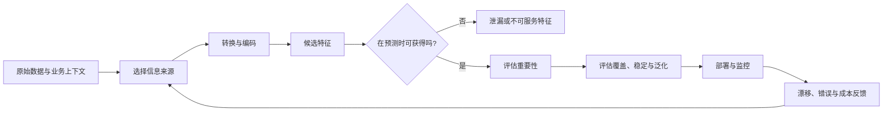
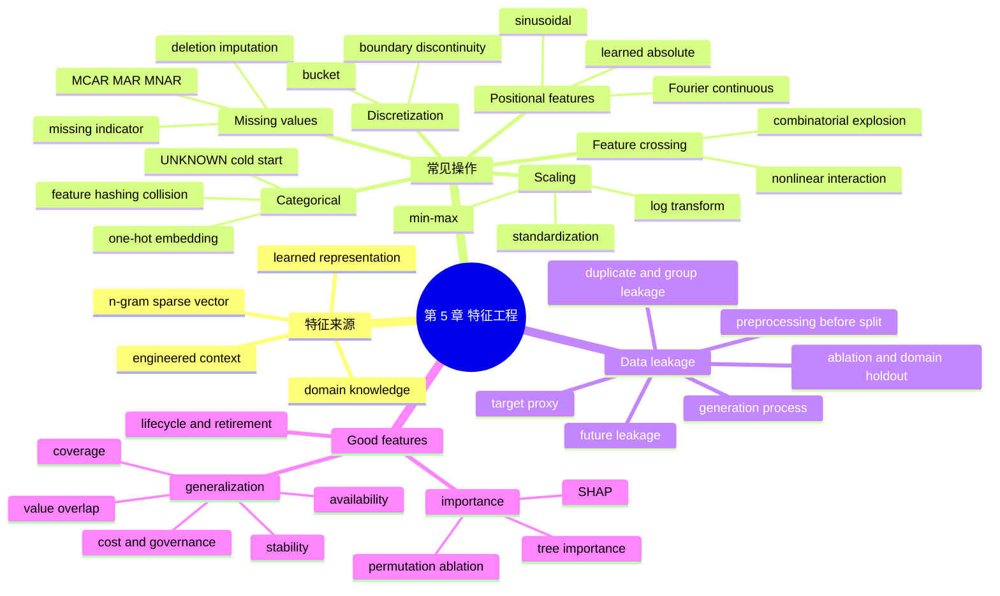

> 对应原章：5. Feature Engineering.md
> 本章讨论怎样把原始事实转换成模型可学习、生产可获得、未来可泛化的输入。它先比较自动学习特征与人工工程特征，再依次处理缺失值、缩放、离散化、类别编码、特征交叉和位置编码，随后集中分析数据泄漏，最后用重要性与泛化评估特征。
>
> 原章引用的产品规模、工具行为和研究结果主要来自 2014–2021 年。本文保留其历史语境，不把它们直接视为 2026 年现状。
>
> **归因说明：** 除相邻文字明确写明“原章公式”“原章案例”或“原章数字”的内容外，所有原章未出现而由本文加入的公式、方法细节、工程建议、Mermaid 图、伪代码和可运行示例，均为笔记补充，不是作者在本章逐式提出的内容。这包括但不限于缺失机制形式化、multiple imputation、Yeo-Johnson、监督式分箱、哈希碰撞概率、正余弦与周期编码、point-in-time 正确性和特征漂移指标。

## 0. 本章要回答的核心问题

1. 深度学习能自动学习特征，为什么生产系统仍然需要特征工程？
2. learned feature 与 engineered feature 的边界在哪里，它们怎样组合？
3. MCAR、MAR、MNAR 三种缺失机制有什么区别，删除和填补分别何时安全？
4. 为什么缺失本身可能是信息，缺失指示器又有什么风险？
5. Min-max、任意区间缩放、标准化和对数变换分别解决什么问题？
6. 哪些模型对尺度敏感，为什么树模型通常例外？
7. 离散化怎样降低学习难度，又为什么会制造边界不连续和信息损失？
8. 生产类别持续增长时，UNKNOWN 为什么不够，feature hashing 怎样处理开放词表？
9. 哈希碰撞概率与哈希空间怎样权衡，Booking.com 案例能说明什么、不能说明什么？
10. 特征交叉怎样让线性模型表达非线性关系，为什么会产生维数爆炸？
11. Transformer 为什么需要位置特征，learned、sinusoidal 与 Fourier features 有什么关系？
12. 数据泄漏究竟是什么，为什么它能通过时间、统计量、重复样本、群组和数据生成过程进入？
13. 为什么“离线指标异常好”有时反而是危险信号？
14. 怎样通过单特征预测力、消融、时间外与跨域评估发现泄漏？
15. 特征重要性与因果作用有什么区别，XGBoost importance、permutation importance 和 SHAP 各有什么边界？
16. 特征覆盖率、值域重叠、时间稳定性和生产可用性怎样共同决定泛化？
17. 如何把特征从提出、实现、验证、上线、监控到退役组织成可审计闭环？

全章主线如下：



一句话概括：**好特征既要包含对目标有用的信息，也必须在决策时真实可得、定义一致、计算及时，并能迁移到未来与新环境。**

---

## 1. 开篇：正确特征为何常比聪明算法更重要

2014 年 Facebook 广告点击预测论文认为，正确特征是模型开发中最重要的因素。作者此后在多家公司反复观察到：有了可工作的模型后，增加有效特征带来的提升，常大于超参数调优等算法技巧。最先进架构若没有有用信号，也会表现很差。

这个结论的直觉是：模型只能重组输入中已有的信息。若目标 $Y$ 与原始可用信息 $X$ 几乎独立，再强的函数 $f_\theta(X)$ 也无法凭空预测；若一个工程特征 $Z=g(X,H)$ 把领域知识 $H$ 转成更容易学习的表示，有限数据与有限模型就可能显著受益。

特征工程包括两类决定：

1. **使用什么信息**：文本、用户历史、线程热度、时间、设备等；
2. **怎样表示信息**：填补、缩放、分桶、哈希、交叉、embedding 等。

特征存储（feature store）是支持多应用复用、在线/离线一致性和治理的基础设施，原书把它放到第 10 章；本章关注特征本身的语义与构造。

---

## 2. Learned Features Versus Engineered Features：学习特征与工程特征

### 2.1 深度学习的承诺与边界

深度学习常被称为 feature learning：模型可以从原始文本、图像或音频中自动学习多层表示，减少人工设计边缘、纹理、词形和 n-gram 的工作。

但“自动学习”不等于“所有特征自动出现”：

- 模型看不到没有输入的数据；
- 用户历史、交易网络和业务规则仍要被采集、关联和时间对齐；
- 有限数据下，领域先验可以提高样本效率；
- 生产约束要求特征在推理时可用、稳定和低延迟；
- 表格、风控、排序等场景仍广泛依赖工程特征。

原章写作时还指出，多数生产 ML 应用并非深度学习。这是当时的行业观察，不应未经新调查当作 2026 年比例结论；“模型不能自动获得未提供上下文”这一系统结论仍然成立。

### 2.2 经典文本处理链

深度学习前，文本常经历：

```text
原始文本
-> stopword removal
-> lemmatization
-> contraction expansion
-> punctuation removal
-> lowercasing
-> tokenization
-> n-gram extraction
-> 稀疏向量
```

原图用 “I have a dog. He's sleeping.” 展示每一步。处理顺序会改变结果，而且某些操作可能破坏任务信息：

- 标点可能表达情绪；
- 大小写可能区分实体；
- stopword 在否定句中可能关键；
- contraction 展开规则依赖语言；
- lemmatization 可能抹去语法差异。

这解释了作者所说的 brittle：遗漏一步或发现某步有害时，整个下游词表与向量都可能重建。

### 2.3 n-gram 的定义与向量化

n-gram 是文本中连续的 $n$ 个单位，单位可为音素、音节、字符或词。

“I like food”的词级：

- 1-gram：`I`, `like`, `food`；
- 2-gram：`I like`, `like food`。

原章词表顺序为：

| 特征 | I | like | good | food | I like | good food | like food |
| --- | ---: | ---: | ---: | ---: | ---: | ---: | ---: |
| 索引 | 0 | 1 | 2 | 3 | 4 | 5 | 6 |

“I like food”的 count vector 是

$$
[1,1,0,1,1,0,1].
$$

词表大小为 $V$ 时，每条文本得到 $V$ 维稀疏向量。高阶 n-gram 能表达局部顺序，却导致维数快速增长、长尾严重和词表外问题。

### 2.4 可运行示例：n-gram 与原章向量

```python
from collections import Counter


def word_ngrams(tokens, orders):
    features = []
    for order in orders:
        for start in range(len(tokens) - order + 1):
            features.append(" ".join(tokens[start : start + order]))
    return features


vocabulary = [
    "I",
    "like",
    "good",
    "food",
    "I like",
    "good food",
    "like food",
]
counts = Counter(word_ngrams(["I", "like", "food"], orders=[1, 2]))
vector = [counts[feature] for feature in vocabulary]

print("ngrams=" + repr(word_ngrams(["I", "like", "food"], [1, 2])))
print("vector=" + repr(vector))
```

实际运行输出：

```text
ngrams=['I', 'like', 'food', 'I like', 'like food']
vector=[1, 1, 0, 1, 1, 0, 1]
```

结果精确复现原章七维 count vector；不存在于当前文本的 `good` 和 `good food` 两维为 0。

### 2.5 深度模型自动化了什么

现代文本模型通常从 tokenization 后的 token ID 和 embedding 开始，自行学习组合表示；视觉模型可直接从像素学习特征。自动表示减少了手写规则，却没有取消：

- tokenizer 与词表设计；
- 输入截断和上下文选择；
- 用户、线程、时间和统计特征；
- 跨实体 join 与窗口聚合；
- 在线新鲜度和 point-in-time 正确性。

### 2.6 Spam 案例：内容之外还有上下文

判断评论是否垃圾，除了文本本身，还可能使用：

| 对象 | 特征示例 | 为什么可能有用 |
| --- | --- | --- |
| Comment | ID、时间、作者、文本、upvote / downvote、链接、图片数、thread ID、reply-to、回复数 | 内容、社区反馈、媒体与回复关系共同揭示行为 |
| User | ID、创建时间、用户名、订阅、历史 upvote / downvote、回复数、karma、thread 数、邮箱认证、awards | 新建、高频、低信誉或未认证账户风险不同 |
| Thread | ID、时间、作者、文本、upvote / downvote、链接、图片数、回复数、浏览量、awards | 热度、媒体和互动规模影响 spam 吸引力 |

这些不是模型从评论字符中必然推断出的事实，需要系统关联多个数据源。TikTok 等复杂推荐任务可使用数百万特征；欺诈检测还需要银行与攻击模式的领域知识。

### 2.7 Learned 与 engineered 不是二选一

实际系统常为：

$$
\widehat y
=f_\theta(
\underbrace{h_\theta(x_{raw})}_{\text{learned representation}},
\underbrace{g(x_{context},H)}_{\text{engineered features}}
).
$$

模型自动学习内容表示，人工工程则提供上下文、约束和高价值聚合。选择标准不是“现代还是传统”，而是增量价值、数据量、计算成本、维护性和未来可用性。

---

## 3. Common Feature Engineering Operations：常见特征工程操作

原章依次讨论：缺失值、缩放、离散化、类别编码、特征交叉，以及离散和连续位置特征。这不是完整清单，而是生产中高频且容易出错的一组起点。

### 3.1 Handling Missing Values：处理缺失值

#### 3.1.1 缺失不是一种统一状态

令真实变量为 $X$，缺失指示器为 $M$：缺失时 $M=1$，已观察时 $M=0$。缺失机制讨论的是

$$
P(M\mid X_{observed},X_{missing}).
$$

原章以未来 12 个月是否购房的表格说明三类机制。

#### 3.1.2 MNAR：Missing Not At Random

即使已知其他观察变量，缺失概率仍与该字段未观察到的真实值有关：

$$
P(M\mid X_{observed},X_{missing})
\text{ depends on }X_{missing}.
$$

例子：高收入者更不愿披露收入。缺失本身携带关于收入的信息，直接删除或用总体均值填补会系统性扭曲分布。

MNAR 通常无法仅靠现有观察数据完全识别，需要领域假设、额外采集或敏感性分析。

#### 3.1.3 MAR：Missing At Random

给定已观察变量后，缺失与该字段真实值独立：

$$
M\perp X_{missing}\mid X_{observed}.
$$

例子：Age 缺失与已观察的 Gender=A 有关，而不是与真实年龄本身有关。名称中的“at random”容易误导，它允许缺失具有可预测模式，只要求模式能由已观察变量解释。

#### 3.1.4 MCAR：Missing Completely At Random

缺失与所有数据值独立：

$$
M\perp(X_{observed},X_{missing}).
$$

例子：Job 偶然漏填且与任何变量都无关。MCAR 在现实中罕见，应通过数据生成过程调查，而不是仅凭统计检验宣布成立。

#### 3.1.5 Deletion：删除

##### Column deletion

Marital status 超过 50% 缺失时，删列最简单；但婚姻可能高度关联购房，删除会丢掉重要信号。缺失率不是唯一标准，还要考虑业务意义、切片覆盖、替代特征和服务成本。

##### Row deletion

在 MCAR、缺失行很少（原章举少于 0.1%）时，完整案例删除可能近似无偏。若删除 10% 样本，方差和覆盖损失都可能明显。

MNAR 时，删掉收入缺失者会删掉高收入相关信息；MAR 时，删掉 Age 缺失行可能把所有 Gender=A 用户一起删掉，制造群体偏差。

#### 3.1.6 Imputation：填补

常见策略：

- categorical：空字符串、`UNKNOWN`、单独的 `MISSING`；
- numeric：均值、中位数、众数或条件统计量；
- temperature：按 July 等分组填对应月份中位数；
- model-based：用其他特征预测缺失值；
- multiple imputation：对不确定性生成多个合理填补版本。

所有统计量必须只用训练折拟合，再原样应用于 validation、test 和 production。

#### 3.1.7 不要让 sentinel 与真实值混淆

缺失 children 填 0，会把“未知”与“确实无子女”合并。Age 填 0 的生产事故更危险：前端不再收集年龄，线上全部变 0，而训练中从未见过 0，模型输出失真。

常见做法是同时添加缺失指示器：

$$
x_{filled}=\begin{cases}
x,&M=0\\
c,&M=1
\end{cases},
\qquad
x_{missing}=M.
$$

指示器让模型区分填充值与真实值，但也可能学习敏感群体或流程代理，必须做公平性和漂移审计。

#### 3.1.8 没有完美策略

- 删除会丢信息、降低覆盖或放大偏差；
- 填补会加入假设、压低方差和制造虚假值；
- 模型填补有额外误差，且容易泄漏；
- 缺失机制会随产品表单、传感器和上游服务变化。

选择应通过时间外、群体切片和业务指标验证，并监控 missing rate。

### 3.2 Scaling：缩放

#### 3.2.1 为什么尺度会影响优化

Age 为 20–40，Annual income 为 10,000–150,000。对线性模型、距离模型和梯度优化，尺度大的特征可能主导：

- 点积和距离；
- 梯度大小与条件数；
- L1 / L2 正则对不同单位的相对惩罚；
- 神经网络初始激活范围。

原章把 gradient-boosted trees 也列为尤其受益的经典算法。需要补充：普通决策树和基于阈值切分的 boosted trees 对单调尺度变换通常近似不变，不像逻辑回归、SVM、kNN、PCA 和神经网络那样要求缩放；具体实现的直方图、正则与数值精度仍可能产生差异。

原章脚注还记录了作者的一次个人经验：缩放曾使她的某个模型性能提高接近 10%。这是单个项目的历史案例，说明尺度问题有时影响巨大，不是所有模型都能获得同等提升的保证。

#### 3.2.2 Min-max scaling 到 $[0,1]$

原章公式：

$$
x'=\frac{x-x_{min}}{x_{max}-x_{min}}.
$$

$x=x_{min}$ 时为 0，$x=x_{max}$ 时为 1。前提是 $x_{max}>x_{min}$；常量列分母为 0，应删除、置零或单独处理。

测试值可以超出训练区间，因此线上 $x'$ 可能小于 0 或大于 1。是否 clip 取决于模型和业务；裁剪提高稳定性，也会丢失超界程度。

#### 3.2.3 缩放到任意区间 $[a,b]$

$$
x'
=a+\frac{(x-x_{min})(b-a)}{x_{max}-x_{min}}.
$$

先把训练区间映射到 $[0,1]$，再乘以宽度 $b-a$ 并平移到 $a$。原作者经验上认为 $[-1,1]$ 常比 $[0,1]$ 好，这是经验观察，不是通用定律。

#### 3.2.4 Standardization：标准化

$$
z=\frac{x-\mu_{train}}{\sigma_{train}}.
$$

在训练分布上得到零均值、单位标准差。它不要求数据严格正态；正态假设主要影响统计解释，而非代数变换本身。若 $\sigma=0$，同样需要处理常量列。

均值与标准差对离群点敏感，重尾数据可考虑 median / IQR 的 robust scaling。

#### 3.2.5 Log transformation

右偏非负数据可用

$$
x'=\log(1+x),\qquad x\ge0,
$$

压缩长尾和大值，使乘法关系更接近加法。若 $x>0$ 也可用 $\log x$；含负值时需使用有理论依据的平移、signed log、Yeo-Johnson 等，不能直接取 log。

在 log 空间分析会改变误差与系数解释。例如 log 目标上的 MSE 更接近相对误差，不等同于原空间绝对误差。

#### 3.2.6 缩放统计是模型状态

min、max、mean、variance 都是从训练数据学习出的参数：

```text
split -> fit preprocessor on train -> transform train/valid/test
-> 保存 preprocessor 版本 -> production 复用
```

线上分布变化后，旧统计可能不再合适。更新统计会改变全部输入，即使模型权重不变也会改变输出，因此预处理器应与模型共同版本化和发布。

### 3.3 Discretization：离散化

#### 3.3.1 定义与动机

Discretization / quantization / binning 把连续值映射到有限 bucket。例如收入：

- lower：$<35,000$；
- middle：$35,000$–$100,000$；
- upper：$>100,000$。

模型不必为每个精确收入学习独立行为，$9,000.50$ 与 $10,000$ 可被视为相近。有限数据、规则需求或单调性不明显时可能有用；作者说明自己实践中较少发现离散化有帮助。

#### 3.3.2 离散特征也能再次分桶

Age 虽取整数，仍可分成 `<18`、18–22、22–30、30–40、40–65、`>65`。这里“连续/离散”描述原变量取值，而 binning 描述模型表示。

#### 3.3.3 边界不连续与信息损失

34,999 与 35,000 被分到完全不同 bucket，35,000 与 100,000 却相同。分桶引入：

- 边界敏感；
- 区间内排序和距离丢失；
- 业务规则改变时需重算；
- bucket 太细时仍稀疏，太粗时欠拟合。

边界可来自领域知识、等宽、quantile 或监督式分箱。监督式分箱必须只在训练折拟合，避免标签和测试分布泄漏。

### 3.4 Encoding Categorical Features：类别特征编码

#### 3.4.1 整数编码不等于有效数值关系

给类别分配 ID 便于查表，但若直接把 0、1、2 输入线性或距离模型，会暗示顺序与距离。无序低基数类别通常使用 one-hot；高基数类别常用 embedding、hashing 或任务特定统计编码。

#### 3.4.2 类别在生产中会增长

Amazon 在 2019 年已有超过 200 万品牌。固定 ID 表在历史测试上工作，线上遇到新品牌就无法编码。

原章故障链：

1. 训练时给 200 万品牌编码为 0–1,999,999；
2. 新品牌出现，编码器崩溃；
3. 加 `UNKNOWN=2,000,000`，模型训练时没见过 UNKNOWN，仍不推荐；
4. 把底部 1% 品牌映射 UNKNOWN，让模型见过它；
5. 一小时内加入 20 个新品牌，奢侈品牌、山寨品牌和成熟品牌都被当成低人气旧品牌，CTR 暴跌。

同样问题存在于新账户、域名、餐厅、公司、IP 和产品类型。

#### 3.4.3 UNKNOWN 的结构性限制

UNKNOWN 能保证系统不崩溃，却把所有未见类别压成同一个表示。它适合作为明确回退，不足以解决新类别差异与冷启动。可组合：

- 品牌文本、国家、价格等 side features；
- character/subword 表示；
- 分层类别；
- feature hashing；
- 探索流量与快速更新 embedding。

#### 3.4.4 Hashing trick

给类别 $c$ 计算稳定哈希，再映射到 $m$ 个 bucket：

$$
h_m(c)=h(c)\bmod m.
$$

18-bit 空间有

$$
m=2^{18}=262{,}144
$$

个索引，即 262,144 个 bucket；新旧类别都能映射到固定范围 0–262,143。模型参数维度预先固定，适合开放词表和持续学习。

Python 内置 `hash()` 默认跨进程随机化，不适合需要训练/服务稳定映射的持久特征；应使用明确版本、种子与算法的稳定哈希。

#### 3.4.5 Collision：碰撞

不同类别可能共享 bucket。若 $n$ 个不同类别近似均匀映射到 $m$ 桶，期望被占用桶数为

$$
\mathbb E[U]
=m\left[1-\left(1-\frac1m\right)^n\right].
$$

超出每个已占 bucket 第一位的“重复占桶次数”为

$$
D=n-U,
$$

所以其期望为 $n-\mathbb E[U]$。这不是“所有参与碰撞的类别数”：一个桶有三个类别时，$D$ 只计 2，而参与共享桶的类别有 3。

若要计算参与碰撞的类别数，每个类别与至少另一个类别同桶的概率为 $1-(1-1/m)^{n-1}$，因此期望为

$$
\mathbb E[C_{participants}]
=n\left[1-\left(1-\frac1m\right)^{n-1}\right].
$$

均匀独立哈希下，碰撞类别对数的期望则为

$$
\mathbb E[C_{pairs}]=\binom n2\frac1m.
$$

至少一次碰撞的 birthday 近似为

$$
P(\text{collision})
\approx1-\exp\left(-\frac{n(n-1)}{2m}\right),
$$

适用于 $n$ 相对 $m$ 不太大且哈希近似均匀的情形。

碰撞给类别共享参数，既可能是噪声，也可能像随机正则。Booking.com 的特定 CTR 研究中，即使实验所定义的 collision rate 约为 50%，log loss 增幅仍小于 0.5%。该 collision rate 不应未经其实验口径核对，就直接等同于上面的重复占桶比例、参与类别比例或碰撞对比例；结果也不是所有任务的保证。

#### 3.4.6 普通 hashing 与 LSH 不同

普通 feature hashing 追求近似均匀、随机碰撞；locality-sensitive hashing 刻意让相似对象更可能接近或碰撞，用于相似搜索。不能仅通过更换普通字符串哈希就获得语义局部性。

#### 3.4.7 可运行示例：稳定 hashing 与碰撞

```python
import hashlib


def stable_bucket(value, buckets):
    digest = hashlib.blake2b(value.encode("utf-8"), digest_size=8).digest()
    return int.from_bytes(digest, "big") % buckets


brands = ["Acme", "Nova", "Orbit", "Vertex", "Acme"]
indices = [stable_bucket(brand, 16) for brand in brands]
unique_buckets = len(set(indices[:-1]))

print("indices=" + repr(indices))
print(f"stable_repeat={indices[0] == indices[-1]}")
print(f"unique_buckets_for_four={unique_buckets}")
print(f"hash_space_18bit={2 ** 18}")
```

实际运行输出：

```text
indices=[6, 4, 9, 7, 6]
stable_repeat=True
unique_buckets_for_four=4
hash_space_18bit=262144
```

在这个固定示例中四个不同品牌没有碰撞，重复的 `Acme` 稳定映射到 bucket 6；这不能证明 16 桶不会碰撞。哈希值只对代码中固定的 BLAKE2b 参数与字节编码成立，改变算法相当于改变特征定义。

### 3.5 Feature Crossing：特征交叉

#### 3.5.1 定义与购房案例

把两个或更多特征组合成新特征。例如：

$$
\text{Marriage}\times\text{Children}
\rightarrow
\{\text{Single,0},\text{Married,2},\ldots\}.
$$

婚姻与子女数各自作用可能不足以表达“已婚且有两个孩子”的特殊购房倾向。

#### 3.5.2 为什么线性模型需要显式交互

没有交叉时，logistic regression：

$$
\operatorname{logit}P(Y=1)
=\beta_0+\beta_1x_1+\beta_2x_2.
$$

加入乘积：

$$
\operatorname{logit}P(Y=1)
=\beta_0+\beta_1x_1+\beta_2x_2+\beta_{12}x_1x_2.
$$

$\beta_{12}$ 让一个特征的作用依赖另一个特征，表达非加性关系。

原章也把 tree-based models 列为可受益模型。树本身能通过连续切分学习交互，因此不是“无法学习非线性”；显式交叉可能帮助浅树、有限容量或稀疏类别组合更快学习，但收益要实测。

神经网络理论上也能学习交互，显式 cross 有时提高样本效率。DeepFM、xDeepFM 在推荐和 CTR 中结合显式与隐式交互。

#### 3.5.3 维数爆炸与过拟合

A、B 各 100 个类别，笛卡尔交叉最多有

$$
100\times100=10{,}000
$$

个值。$d$ 个字段基数分别为 $k_i$ 时，完整交叉空间为

$$
\prod_{i=1}^{d}k_i.
$$

大量组合没有训练样本，参数不稳定并容易记忆。常用缓解方法是 hashing crosses、频率门槛、正则化、factorization machine 和只交叉有领域依据的特征。

### 3.6 Discrete and Continuous Positional Embeddings：离散与连续位置嵌入

#### 3.6.1 Embedding 是什么

Embedding 是固定维向量表示；同一算法产生、维度相同的一组向量构成 embedding space。除了词，还可表示商品、图像、图节点、query 和用户。

#### 3.6.2 Transformer 为什么必须显式加入位置

RNN 按顺序处理 token，顺序进入状态转移。没有任何位置特征的 self-attention 对输入排列近似等变，无法仅凭 token 集合区分：

```text
a dog bites a child
a child bites a dog
```

所以核心原因是模型结构本身没有顺序信号，而不只是原章提到的“绝对位置数值不满足单位方差”。把 0–7 缩放到 0–1 也不能提供丰富的多频率关系，单一标量还把复杂位置关系压在一个维度。

#### 3.6.3 Learned absolute position embedding

为每个离散位置 $p\in\{0,\ldots,L-1\}$ 学一个 $d$ 维向量 $E_p$，与 token embedding $W_{token}$ 同维：

$$
h_p=W_{token_p}+E_p.
$$

原章序列长度 8，位置列为 0–7。Hugging Face BERT 在 2021 年使用这种 learned absolute embedding。优点是灵活；局限是最大长度固定，未训练位置难外推。

#### 3.6.4 Fixed sinusoidal position encoding

原始 Transformer 的标准形式：

$$
PE(pos,2i)=\sin\left(\frac{pos}{10000^{2i/d}}\right),
$$

$$
PE(pos,2i+1)=\cos\left(\frac{pos}{10000^{2i/d}}\right).
$$

不同维度使用不同频率，使位置拥有多尺度编码。对位移 $k$，$\sin(pos+k)$ 与 $\cos(pos+k)$ 可由 $pos$ 对应正余弦线性组合得到，帮助表达相对位移。

固定编码无学习参数，并可计算训练长度之外的位置；能否实际外推仍取决于模型训练与任务。

#### 3.6.5 Fourier features：连续坐标

连续 3D 坐标不能作为 embedding matrix 的离散列索引。原章给出广义 Fourier features：

$$
\gamma(v)=
\left[
a_1\cos(2\pi b_1^Tv),
a_1\sin(2\pi b_1^Tv),
\ldots,
a_m\cos(2\pi b_m^Tv),
a_m\sin(2\pi b_m^Tv)
\right]^T.
$$

$b_i$ 选择频率与方向，$a_i$ 选择幅度。把低维坐标映射到多频率空间，帮助普通 MLP 表达高频细节。频率过低会欠拟合，过高会对噪声敏感。

#### 3.6.6 可运行示例：正余弦位置编码

```python
from math import cos, sin


def positional_encoding(position, dimension):
    values = []
    for index in range(dimension):
        frequency_denominator = 10000 ** (2 * (index // 2) / dimension)
        angle = position / frequency_denominator
        values.append(sin(angle) if index % 2 == 0 else cos(angle))
    return values


position_zero = positional_encoding(0, 6)
position_one = positional_encoding(1, 6)

print("position_0=" + repr([round(value, 6) for value in position_zero]))
print("position_1=" + repr([round(value, 6) for value in position_one]))
print(f"dimensions={len(position_one)}")
```

实际运行输出：

```text
position_0=[0.0, 1.0, 0.0, 1.0, 0.0, 1.0]
position_1=[0.841471, 0.540302, 0.046399, 0.998923, 0.002154, 0.999998]
dimensions=6
```

位置 0 的所有 sine 维是 0、cosine 维是 1；位置 1 在不同维度以不同频率变化，后面的维度变化更慢。

---

## 4. Data Leakage：数据泄漏

### 4.1 定义：模型获得了部署时不该拥有的信息

原章定义：标签的某种形式泄入预测特征，而同样信息在推理时不可用。更广义地，leakage 是训练、选择或评估过程访问了目标决策时刻不可获得的信息，使离线性能系统性乐观。

设预测时刻为 $t$，合法特征必须满足 point-in-time 条件：

$$
x_j(t)=g_j(\mathcal I_{\le t}),
$$

其中 $\mathcal I_{\le t}$ 是决策时刻及之前真实可用的信息。若特征使用 $t$ 之后的诊断、购买、聚合或修正，就发生 future / target leakage。

### 4.2 COVID 医疗扫描案例

2021 年 *MIT Technology Review* 总结多种离线表现好、生产无用的 COVID 风险模型：

- 躺着扫描的患者通常更重，模型学会用 body position 预测严重程度；
- 某些医院的 text font（标注字体）与严重病例量相关，模型用字体识别医院，而非疾病。

这些代理在训练环境与标签相关，却不是稳定病理机制。医院、流程或字体改变后关联消失。

### 4.3 Hospital A 与 B 的扫描机

Hospital A 的医生怀疑癌症时，把患者送到高级扫描机；机器输出有细微风格差异。即使删除诊断字段，模型仍可从机器痕迹重建医生先验。

Hospital A 内随机切分会让同一流程同时出现在 train/test，模型看似优秀；Hospital B 随机分配机器，捷径失效。

这说明：删除显式标签列不等于删除标签信息。数据生成过程中的医疗决定、设备、采集顺序和后处理都可能成为 proxy。

### 4.4 Kaggle Ion Switching 警示

2020 年 University of Liverpool Ion Switching 竞赛用训练数据合成测试数据，参赛者能逆向恢复测试标签。两支获胜团队利用了泄漏，尽管不利用也可能获胜。

竞赛泄漏提醒：评估数据的生成与公开方式也是系统的一部分；匿名化列名或隐藏标签不足以阻断可逆关系。

### 4.5 Common Causes for Data Leakage：常见泄漏原因

#### 4.5.1 Splitting time-correlated data randomly instead of by time

股票价格、音乐趋势和用户行为都随时间共同变化。若随机切分，第 7 天样本进入训练，模型就提前知道第 7 天市场或趋势背景，再预测同一天其他样本。

应模拟部署：前 6 天训练，第 7 天评估。原章五周例用前四周训练，再把第 5 周分 valid/test。若第 5 周内部也强时间相关，更严格做法是按时间顺序把第 5 周前段作为 validation、后段作为 test，或 rolling backtest；随机拆第 5 周并非所有场景都安全。

#### 4.5.2 Scaling before splitting

先对全部数据计算 mean、variance、min、max，会让 test 分布进入预处理参数。正确顺序：

```text
raw data -> split -> fit scaler on train
-> transform train / validation / test with train statistics
```

在交叉验证中，scaler 必须在每个训练 fold 内重新拟合，不能在 CV 外预拟合。

#### 4.5.3 Filling in missing data with statistics from the test split

用全数据 mean / median 填补同样泄漏。Imputer、类别词表、target encoding、PCA、feature selection 和 learned preprocessing 都应视为模型 pipeline 的一部分，只在训练折拟合。

#### 4.5.4 Poor handling of data duplication before splitting

同一或近似样本跨 train/test，模型可能记忆而非泛化。原章历史发现：CIFAR-10 测试图像约 3.3%、CIFAR-100 约 10% 在训练集有重复。

重复可来自：

- 多数据源互相包含；
- 抓取与重试；
- 同一对象多次导出；
- oversampling 或 augmentation；
- 帧级视频与连拍。

应在切分前按原始实体去重，再在切分后检查 exact / near duplicate。Oversampling 只能在 train split 内进行。

#### 4.5.5 Group leakage

同一患者一周内两张 CT 高度相关，若分别进入 train/test，测试不是新患者泛化。目标检测中毫秒间拍摄同一物体也类似。

切分单位应是独立泛化单位：patient、user、household、device、session、document family 或 geographic site，而不是原始行。

#### 4.5.6 Leakage from data generation process

扫描机例要求理解医院操作。没有领域专家，仅从表格列名很难发现。缓解：

- 保存 source、device、site、operator 和 timestamp 血缘；
- 按医院、设备和地区做 leave-one-domain-out 测试；
- 标准化分辨率等可疑风格，但不要假设标准化消除全部 proxy；
- 与领域专家绘制采集流程与决策时间线。

归一化机器输出可能减少明显设备痕迹，却也可能删掉真实病理信号，且无法保证防泄漏。

### 4.6 Detecting Data Leakage：检测数据泄漏

#### 4.6.1 单特征与特征组合的预测力

若一个本不应知道答案的特征与标签异常相关，应追查生成时间和因果路径。两个特征单独无泄漏，组合可能泄漏：employee start date 与 end date 一起直接给出 tenure。

可训练简单单特征模型、计算互信息、分组标签率，并比较随机切分与时间/群组切分差异。

高预测力不是泄漏的充分条件；真正有用的生物标记也可能很强。关键是它在预测时是否可得、关系是否会跨环境成立。

#### 4.6.2 Ablation study

删除特征或特征组并重训。若把越大越好的评估量统一记为 utility $U$，则

$$
\Delta_j^{(U)}
=U(f_{all})-U(f_{without\ j}).
$$

正值表示加入特征提高 utility。若指标是越小越好的 loss $L$，应反向定义

$$
\Delta_j^{(L)}
=L(f_{without\ j})-L(f_{all}),
$$

同样让正值表示该特征有帮助。若删除某特征使性能大幅下降，应解释原因。上千特征不可能穷举所有组合，可优先检查新增、可疑、昂贵或高重要性特征，并在空闲资源时离线运行。

特征相关时，单独删除一项可能由替代特征补偿；group ablation 更有意义。

#### 4.6.3 对新增特征保持怀疑

新特征带来巨大跃升，可能是突破，也可能是标签代理、未来统计或切分污染。发布前应回答：

- 该值在决策时刻何时生成？
- 线上查询是否与离线定义一致？
- 跨时间、站点、设备和用户是否仍有效？
- 移除标签后还能否由流程逆推出？

#### 4.6.4 Test set 使用纪律

Test 只用于最终报告。用 test 构思新特征、调超参数或选择阈值，就把 test 信息反馈进开发，逐步对其过拟合。

需要多轮开发时，使用 validation；长期 benchmark 应保留隐藏 holdout、刷新测试集，并记录每次访问。

#### 4.6.5 泄漏检测清单

```text
为每个特征记录 event_time、available_time、compute_time
按预测时刻做 point-in-time join
先切分，再 fit 所有有状态转换
按实体/群组去重和切分
比较随机、时间外、群组外、站点外性能
对新增与高重要性特征做消融
审查异常好的单特征和特征组合
确认线上使用相同代码、窗口和数据延迟
```

### 4.7 可运行示例：训练统计与泄漏统计

```python
from statistics import mean, pstdev


train = [20.0, 30.0, 40.0]
test = [100.0]

train_mean = mean(train)
train_std = pstdev(train)
global_mean = mean(train + test)
global_std = pstdev(train + test)

test_scaled_correctly = (test[0] - train_mean) / train_std
test_scaled_with_leakage = (test[0] - global_mean) / global_std

print(f"train_mean={train_mean:.1f}")
print(f"global_mean_leaked={global_mean:.1f}")
print(f"test_scaled_train_stats={test_scaled_correctly:.6f}")
print(f"test_scaled_global_stats={test_scaled_with_leakage:.6f}")
```

实际运行输出：

```text
train_mean=30.0
global_mean_leaked=47.5
test_scaled_train_stats=8.573214
test_scaled_global_stats=1.686761
```

全局统计让测试值参与定义自己的坐标系，使它从相对训练数据的 8.57 个标准差，变成相对泄漏统计的 1.69 个标准差，看起来没有真实部署时那么极端。

---

## 5. Engineering Good Features：工程化优质特征

### 5.0 更多特征为什么可能更差

生产模型的特征列表往往只增不减，但过多特征会：

1. 增加泄漏机会；
2. 提高过拟合风险；
3. 增加模型参数、内存和实例成本；
4. 增加在线抽取、网络与推理延迟；
5. 形成技术债：上游字段变化时，所有派生特征都要维护。

L1 regularization 理论上能把无用线性权重压到 0，但实践中无用特征仍增加数据、计算、调试和漂移表面，也可能通过交互造成伤害。主动移除常让训练更快、系统更简单。

删除不等于销毁定义：可在 registry 中保留版本、所有者、血缘和历史实验，以便复用或恢复。Feature store 不一定管理 feature definition，能力边界要具体核查。

原章提出两个主要评价维度：对当前模型的重要性，以及对未见数据的泛化。

### 5.1 Feature Importance：特征重要性

#### 5.1.1 模型内置重要性

XGBoost 等树模型可按 split count、gain、cover 等输出 importance。不同口径排名可能不同，而且高基数、可切分点多的特征容易获得偏高重要性。

#### 5.1.2 Permutation 与 ablation 的直觉

- ablation：移除特征并重训，观察可替代后的性能变化；
- permutation：打乱特征值、保持模型不变，破坏其信息后观察性能下降。

相关特征会互相替代，单特征 importance 可能低；打乱一个相关特征还可能产生不真实组合。应联合看 group importance 与领域语义。

#### 5.1.3 SHAP

SHAP 基于合作博弈 Shapley value，把单次预测相对 baseline 的差异分摊给特征。对特征 $i$：

$$
\phi_i
=\sum_{S\subseteq F\setminus\{i\}}
\frac{|S|!(|F|-|S|-1)!}{|F|!}
[v(S\cup\{i\})-v(S)].
$$

$v(S)$ 表示知道特征子集 $S$ 时模型输出的价值。它既能解释单次预测，也能汇总全局贡献。

精确计算指数复杂，工具使用模型特定算法或近似。结果依赖 baseline、背景分布以及如何处理相关特征；SHAP 描述模型如何使用特征，不证明该特征因果改变结果。

图 5-8 是单次预测 waterfall：从 baseline $E[f(X)]=22.533$ 出发，红色贡献把输出推高、蓝色贡献把输出压低，所有贡献相加后得到 $f(x)=24.019$。该样本中 `LSTAT=4.98` 的贡献最大，为 $+5.79$；`RM=6.575` 的贡献为 $-2.17$。

图 5-9 是全局 beeswarm：每一行是一个特征、每一点是一个样本，横轴 SHAP 值的正负表示该特征在该样本上把模型输出推高还是压低，颜色表示特征原始值高低。行通常按平均绝对 SHAP 值排序，因此 `LSTAT` 位于顶部。它展示模型中的关联方向和异质性，不是因果效应图。

InterpretML 等工具利用重要性帮助理解模型。

#### 5.1.4 Facebook CTR 长尾

原章引用 Facebook 广告模型：前 10 个特征约贡献总 importance 的一半，最后 300 个特征合计不足 1%。图 5-10 的单特征重要性使用对数轴，累计曲线迅速趋近 1。

这支持审查长尾特征，但不能只按一个 importance 阈值机械删除：尾部特征可能只服务小而关键的用户群、异常条件或公平性约束。

### 5.2 Feature Generalization：特征泛化

#### 5.2.1 标识符的不同泛化能力

Comment ID 对新评论几乎没有复用价值，容易记忆；User ID 可能携带历史信誉，对重复出现的用户有用，但对新用户无效，并可能带来隐私、公平与冷启动问题。

是否使用 ID 取决于部署实体是否重复、生命周期、覆盖和目标，而不是“ID 一律不能用”。

#### 5.2.2 Coverage

$$
Coverage_j
=\frac{\#\{i:x_{ij}\text{ available}\}}{N}.
$$

Children 只覆盖 1% 时，通常难以成为普遍特征。但若覆盖本身 MNAR，且有值的 1% 中 99% 为 positive，则“是否有值”可能很有用。

应同时报告：

- 总体覆盖；
- 各群体、地区、设备覆盖；
- train / validation / production 覆盖；
- 随时间覆盖；
- 缺失时采用的回退。

Train 覆盖 90%、test 20% 是分布或采集流程差异信号，也可能提示泄漏。

#### 5.2.3 值分布与支持集重叠

已观察值与未来值完全不重叠时，模型在外推。Numeric 可比较 quantile、PSI、KS 等；categorical 可比较 unseen rate、频率和 Jensen-Shannon divergence。

一个常用 PSI 形式是

$$
PSI=\sum_b(p_b-q_b)\log\frac{p_b}{q_b},
$$

$p_b,q_b$ 是两个分布在 bucket $b$ 的比例。零比例需平滑。PSI 是启发式漂移量，不直接等于模型质量损失。

#### 5.2.4 DAY_OF_THE_WEEK 与 HOUR_OF_THE_DAY

用过去六天预测今天 ETA：训练值 Monday–Saturday，测试只有 Sunday。Coverage 都是 100%，但 Sunday 不在训练支持集；若编码不当会伤害模型。

HOUR_OF_THE_DAY 每天都覆盖 0–23，train/test 支持重叠更好。

周期类别可编码为

$$
x_{sin}=\sin\left(2\pi\frac{x}{P}\right),
\qquad
x_{cos}=\cos\left(2\pi\frac{x}{P}\right),
$$

其中 weekday $P=7$、hour $P=24$。这样 Sunday 与 Monday 在圆上相邻，而不是整数 6 与 0 相距很远。但如果训练完全没有 Sunday，编码不能凭空提供 Sunday 特有交通模式。

#### 5.2.5 Generalization 与 specificity 权衡

HOUR_OF_THE_DAY 具体但可能需要更多数据；IS_RUSH_HOUR 把 7–9、16–18 压成二元规则，更泛化、维度更低，却丢掉小时细节。

可同时使用两者，让模型学习全局规律与细节；也可通过层次、平滑和正则控制。目标不是最大泛化或最大特异，而是在未来覆盖与有效信息间平衡。

#### 5.2.6 好特征的多维检查

| 维度 | 核心问题 |
| --- | --- |
| Predictive value | 对目标有稳定增量吗？ |
| Availability | 决策时刻能取得吗？ |
| Point-in-time correctness | 是否只使用当时已知信息？ |
| Coverage | 对关键样本和群体可用吗？ |
| Stability | 定义、分布和来源会变吗？ |
| Cost | 在线计算、存储、带宽和延迟多少？ |
| Interpretability | 团队能解释含义与失败吗？ |
| Governance | 是否合规、公平、有所有者和血缘？ |

Importance 高但不可在线取得的特征不能上线；覆盖广但没有增量的特征只是成本。

### 5.3 特征生命周期（笔记补充）

```text
提出假设 -> 定义事件时间和语义 -> 离线实现
-> point-in-time 验证 -> 加入训练 pipeline
-> 影子计算成本与覆盖 -> 灰度模型
-> 监控分布、质量、延迟和使用者
-> 复用、修改或退役
```

每个定义应包含 owner、数据源、变换代码、窗口、freshness、默认值、版本、消费者和 SLA。未经所有者的特征会迅速成为技术债。

---

## 6. 原章总结的完整还原

原章首先强调，生产 ML 的成功仍高度依赖特征。组织应投入时间和资源做特征工程，而不能期待模型架构自动补偿缺失信息。

Learned features 自动化了文本与图像的许多表示工作，但业务上下文、跨实体统计和领域信息仍需工程。常见操作包括处理缺失值、缩放、离散化、类别编码、特征交叉及离散/连续位置编码。

数据泄漏是隐蔽而灾难性的风险。它可来自时间随机切分、全数据缩放或填补、重复样本、群组、采集流程和反复查看测试集。避免泄漏需要先切分、仅用 train 拟合转换、按独立实体与时间评估，并理解数据生成过程。

更多特征不一定更好。特征增加泄漏、过拟合、内存、延迟和维护成本。优质特征既要对模型重要，也要对未见数据泛化；覆盖与值分布是两个基本检查维度。

作者强调，怎样构造好特征没有万无一失的配方，最重要的学习方式是持续实验并观察特征怎样改变模型表现。阅读 Kaggle 获胜团队的特征工程方案，也能学习其技术与取舍过程。

特征工程经常需要领域专家，而领域专家未必是工程师。因此工作流应允许非工程人员表达、评审和验证领域规则，而不是要求所有贡献都先转化为工程代码才能进入系统。

原章最佳实践：

1. 时间数据按时间切 train / valid / test；
2. oversampling 在切分后执行；
3. scaling 与 normalization 在切分后执行；
4. 只用 train 统计缩放和填补；
5. 理解数据生成、采集和处理，邀请领域专家；
6. 保存数据血缘；
7. 理解 feature importance；
8. 使用泛化良好的特征；
9. 移除不再有用的特征。

进入模型训练并不意味着数据与特征工作结束。只要模型仍在生产，新数据、业务和环境就会要求持续改进特征。

---

## 7. 容易混淆的概念与常见误区

### 7.1 Learned features 不等于零特征工程

模型能学习输入内表示，不能自动获得用户历史、业务上下文、正确时间窗口和在线数据。

### 7.2 Feature engineering 不只是数值变换

最重要的决定往往是使用什么信息、在什么时刻计算、怎样关联实体，而不只是标准化函数。

### 7.3 MCAR、MAR、MNAR 的 “random” 很容易误解

MAR 允许缺失依赖已观察变量；MCAR 才要求与所有值无关；MNAR 在给定已观察变量后仍依赖未观察真值。

### 7.4 缺失不等于零、空串或 UNKNOWN

这些都是编码选择。若它们也是合法值，就必须用额外指示器或专用类别区分。

### 7.5 缺失指示器不总是安全信号

它可能编码敏感群体、设备故障或产品政策，关系改变后会漂移。

### 7.6 Scaling 不要求数据正态

Standardization 的代数变换对任意有限均值方差数据可做；正态性影响统计解释，不是执行前提。

### 7.7 树模型通常不依赖数值尺度

阈值切分对单调变换近似不变。缩放对距离、线性、核方法和梯度优化通常更关键。

### 7.8 Min-max 后线上值不保证永远在区间内

测试值超出训练 min/max 会得到区间外结果。裁剪是额外策略，不是公式自动行为。

### 7.9 Log transform 不等于“让数据变正态”

它常减小右偏，但不保证正态，也改变模型误差与结果解释。

### 7.10 Discretization 不等于免费简化

它减少取值空间，同时制造边界跳变并丢失距离和顺序信息。

### 7.11 类别 ID 不是有意义的连续数值

直接输入 ID 会暗示虚假的次序。ID 更适合作为 one-hot 或 embedding lookup 索引。

### 7.12 UNKNOWN 防崩溃不等于解决冷启动

所有新类别共享一个表示，仍无法区分质量与语义。

### 7.13 Feature hashing 不等于 LSH

前者通常随机压缩维度，后者刻意保留相似性；目标和哈希族不同。

### 7.14 50% collision 只损失 0.5% 不是普遍规律

它来自特定 Booking.com 模型和数据。高价值稀有类别碰撞可能造成更大伤害。

### 7.15 Feature crossing 不只是拼接字符串

它让模型拥有联合状态或乘积项，表达非加性关系；也会造成组合爆炸。

### 7.16 树与神经网络也可能受益于显式交叉

它们能自动学习交互，但显式领域先验有时提高有限数据下的学习效率。

### 7.17 Positional embedding 的核心不是把位置“缩放漂亮”

核心是给缺少顺序结构的模型加入位置与相对关系信号。

### 7.18 Learned position embedding 不自动外推更长序列

训练时没有的索引没有可靠表示；固定正余弦可计算，不代表模型一定会使用好。

### 7.19 数据泄漏不只是一列直接复制 label

未来聚合、医生决策、设备风格、重复样本和测试统计都可间接泄漏。

### 7.20 高相关不等于泄漏，低相关也不保证安全

泄漏取决于可用时间与生成路径；多个低相关特征组合也可能重建目标。

### 7.21 Random split 不总是随机得更公平

时间、患者、用户、设备和场景相关时，随机行切分会把相似样本放到两侧。

### 7.22 先全量预处理再切分仍然是泄漏

无监督转换也能读取 test 分布。应先切分，再在 train 内 fit。

### 7.23 标准化设备图像不保证消除采集泄漏

模型可能从其他噪声、压缩和流程痕迹识别来源；还可能删掉真实信号。

### 7.24 Feature importance 不是因果重要性

它解释模型依赖，不证明改变该特征会改变现实结果。

### 7.25 相关特征的重要性会互相分摊或替代

单个排名低不代表特征组没用。删除前应做 group ablation 与切片验证。

### 7.26 Coverage 低不等于必然无用

MNAR 时，“是否存在”本身可能强预测；但要检查它是否稳定、公平且线上可用。

### 7.27 Coverage 100% 不等于值域泛化

DAY_OF_THE_WEEK 每行都有值，但训练无 Sunday 仍是支持集外推。

### 7.28 泛化与特异性不是非黑即白

IS_RUSH_HOUR 更泛化，HOUR_OF_THE_DAY 更具体；可组合使用并通过正则控制。

### 7.29 Feature store 不自动解决特征语义

基础设施能复用与服务特征，但无法替团队定义正确窗口、可用时间与业务含义。

---

## 8. 本章知识结构



知识之间的因果关系是：

1. 信息来源决定模型理论上能知道什么。
2. 编码和变换决定有限模型能否高效利用这些信息。
3. 所有从数据学习的预处理参数都可能泄漏，必须只在训练折拟合。
4. 特征在决策时刻不可得，即使离线重要也没有生产价值。
5. 高重要性只描述当前模型依赖，泛化还取决于覆盖、支持集与稳定性。
6. 特征越多，泄漏、成本和维护面越大，因而需要持续退役。

---

## 9. 核心结论

1. **正确特征往往比细小的算法调优更有价值。** 模型无法从未输入的信息中学习。
2. **Learned 与 engineered features 是互补关系。** 深度模型学习内容表示，工程特征提供上下文、聚合和领域知识。
3. **缺失机制决定处理方式。** MCAR、MAR、MNAR 的可忽略条件不同，删除和填补都可能制造偏差。
4. **缺失本身可能有信息。** Sentinel 必须与合法值区分，missing indicator 也要监控漂移与公平风险。
5. **缩放改善对尺度敏感模型的条件与优化。** 预处理统计是模型状态，只能从 train 拟合并在生产复用。
6. **树模型通常对单调缩放不敏感。** 不应把缩放收益无条件推广到所有模型。
7. **离散化以信息损失换简单性。** Bucket 边界和粒度必须由数据与业务共同决定。
8. **生产类别是开放集合。** UNKNOWN 只能防崩溃，hashing 用固定维度接纳新类别，但引入碰撞。
9. **Feature hashing 的碰撞影响取决于具体任务。** Booking.com 的小损失结果不是普遍保证。
10. **特征交叉让简单模型表达联合效应。** 基数乘法会造成稀疏、数据需求和过拟合风险。
11. **位置编码为缺少顺序结构的模型提供位置信号。** Learned、sinusoidal 与 Fourier features 适应不同离散/连续场景。
12. **数据泄漏的本质是使用决策时刻不可获得的信息。** 标签代理、未来统计和测试分布都可能泄漏。
13. **先切分，再拟合任何有状态转换。** Scaling、imputation、词表、PCA、target encoding 和 resampling 都属于 pipeline。
14. **时间和群组数据必须按真实泛化边界切分。** 随机行切分常产生虚假高分。
15. **异常强的新特征应触发审计，而不只是庆祝。** 单特征预测力、消融和跨域测试是重要工具。
16. **Feature importance 不等于因果影响。** 相关特征、baseline 与算法口径都会改变解释。
17. **好特征必须同时重要且可泛化。** 可用时间、覆盖、分布重叠、稳定性、成本和治理缺一不可。
18. **特征需要生命周期管理。** 无用特征即使权重接近零，仍会产生基础设施和组织技术债。

---

## 10. 从本章提炼出的通用特征工程方法

### 第一步：从决策时刻定义合法信息边界

写出预测发生时间 $t$、结果成熟时间、每个原始事实的 event time 与 available time。预测只能使用在 $t$ 前真实可获得的信息。

### 第二步：先按真实泛化单位切分数据

按时间、用户、患者、设备、站点或对象家族切分。所有统计、词表、编码器和选择方法都在 train 内拟合。

### 第三步：建立简单模型与原始特征基线

先验证标签、数据流和服务链路，再增加变换。没有基线就无法知道复杂特征是否有增量。

### 第四步：逐字段审计缺失机制

记录 missing rate、切片、原因、线上回退和语义。区分“未知”“不适用”“采集失败”和“真实为零”，必要时添加受治理的缺失指示器。

### 第五步：按模型与分布选择数值变换

- 对尺度敏感模型做 scaling；
- 重尾非负值评估 `log1p`；
- 离群明显时考虑 robust statistics；
- 只有在边界有意义时才 binning；
- 保存训练统计并监控超界率。

### 第六步：按类别基数和演化选择编码

- 低基数稳定类别：one-hot；
- 高基数重复实体：embedding；
- 开放词表和在线学习：stable hashing；
- 新实体：side information 与探索；
- target encoding：严格 out-of-fold 与时间安全。

### 第七步：只创建有假设依据的交叉

写明预期联合机制，计算组合基数、覆盖和在线成本。用 hashing、factorization 或正则控制空间，而不是穷举所有组合。

### 第八步：为顺序和坐标选择合适表示

离散有限位置可 learned embedding；长度外推可评估 sinusoidal / relative 方法；连续坐标可 Fourier features。选择要结合精度、分辨率和外推需求。

### 第九步：建立泄漏红队检查

对每个高价值特征询问：

```text
它何时生成？
是否由标签后的动作产生？
是否包含未来窗口？
训练与线上 join 是否 point-in-time 正确？
是否只在某医院、设备或用户群成立？
随机切分高分在时间/站点外是否消失？
```

### 第十步：联合评估重要性与泛化

使用 built-in、permutation、ablation 和 SHAP 等多种口径；再检查覆盖、unseen rate、时间稳定、跨域表现、计算成本和公平切片。

### 第十一步：把预处理与模型作为同一版本发布

Imputer、scaler、vocabulary、hash seed、cross 定义、窗口和模型权重必须原子化版本，避免 training-serving skew。

### 第十二步：监控并退役

监控 missing rate、coverage、分布、超界、unseen category、freshness、计算失败、延迟和消费方。重要性长期低、成本高或来源废弃时，先影子移除，再正式退役。

完整闭环：

```text
输入：业务决策、预测时刻、原始数据、模型与服务约束

定义合法信息集合和泛化单位
先切分数据，再拟合预处理
建立原始特征基线

对每个候选特征：
    定义语义、事件时间、可用时间、owner 和回退
    选择缺失、缩放、类别、交叉或位置表示
    检查训练/服务代码与统计一致
    检查单特征异常预测力和标签代理
    在时间外、群组外与关键切片评估
    测量增量重要性、覆盖、延迟与成本
    若净价值为正且无泄漏：灰度发布
    否则：修改或放弃

上线后监控缺失、分布、freshness、unseen rate 和业务效果
定期消融长尾特征并退役无用项
将生产错误反馈到下一轮特征假设
```

本章最值得迁移的原则是：**特征不是表中现成的一列，而是一项带有时间语义、数据来源、模型假设、服务成本和维护责任的生产契约。**
