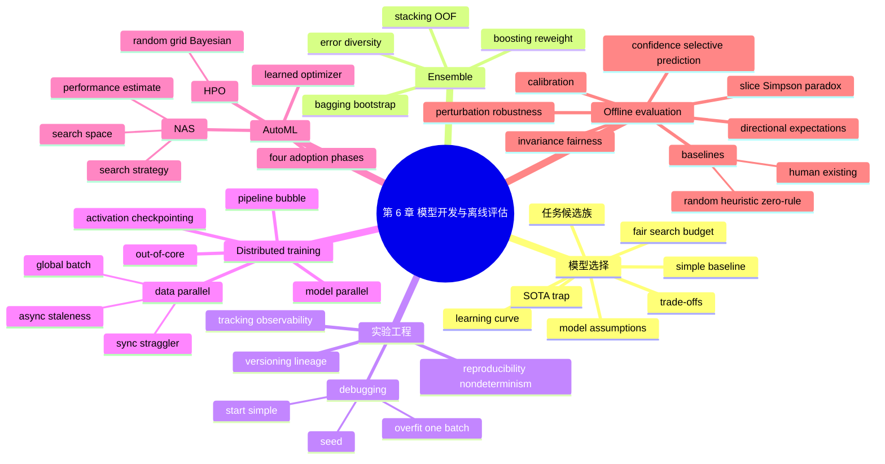

> 对应原章：6. Model Development and Offline Evaluation.md
> 第 4、5 章准备了训练数据与特征，本章进入模型阶段：先选择候选算法，再通过 ensemble、实验追踪、调试、分布式训练和 AutoML 迭代模型，最后用 baseline、扰动、不变性、方向性、校准、置信度和切片评估判断模型是否值得进入生产测试。
>
> 原章中的排行榜、模型规模、工具行为和研究数字主要来自 2016–2022 年。本文保留其历史语境，不把它们直接当作 2026 年现状。
>
> **归因说明：** 除相邻文字明确写明“原章公式”“原章案例”或“原章数字”的内容外，本文加入的学习曲线诊断、ensemble 一般公式、bootstrap 覆盖率、stacking 的 out-of-fold 约束、同步/异步更新式、pipeline 利用率、HPO 概率分析、Brier/ECE、selective prediction、Mermaid 图、伪代码和可运行示例，均为笔记补充，不是作者在本章逐式提出的内容。

## 0. 本章要回答的核心问题

1. 算法越来越多时，怎样在有限时间和算力下缩小候选集合？
2. 为什么 state-of-the-art 只表示特定 benchmark 上的结果，而不表示当前生产最优？
3. “最简单模型”与“最省启动工作量的模型”为什么不是同一概念？
4. 怎样给不同架构公平分配特征工程、调参和实验预算，避免研究者偏好影响结论？
5. 学习曲线怎样判断更多数据可能有用，为什么当前冠军未必是两周后的冠军？
6. 如何在 FP/FN、质量/成本、准确率/延迟和性能/解释之间做约束决策？
7. 模型的 IID、平滑性、线性边界、条件独立等假设怎样决定适用范围？
8. 三个 70% 准确率模型为何在独立错误假设下能组成 78.4% ensemble？相关错误为何会抹掉收益？
9. Bagging、boosting 和 stacking 分别怎样制造与利用多样性？
10. 实验追踪、版本管理、复现和调试各解决什么问题？
11. 数据并行、模型并行和 pipeline 并行分别切分什么，瓶颈是什么？
12. 同步 SGD 的 straggler 与异步 SGD 的 stale gradient 怎样权衡？
13. AutoML 的 HPO、NAS 与 learned optimizer 自动化到什么程度，为什么仍不能替代问题定义？
14. 非 ML、简单模型、优化简单模型和复杂模型四阶段为什么应依次推进？
15. 离线指标为什么必须与 random、heuristic、zero-rule、human 和现有系统 baseline 比较？
16. 扰动、不变性和方向性测试分别验证哪类行为约束？
17. Calibration、confidence 和 accuracy 有什么区别，怎样测量与使用？
18. Slice-based evaluation 怎样发现群体伤害、关键业务失败与 Simpson's paradox？
19. 为什么再完整的离线评估也不能证明生产效果？

全章主线如下：


一句话概括：**模型开发不是在排行榜中寻找最高分，而是在公平、可复现的实验下，选择满足业务约束、能被调试和扩展，并通过多维行为检查的最简单可用系统。**

---

## 1. 开篇：从数据和特征进入模型循环

模型阶段把此前数据与特征工作变成可观察预测，因而是很多从业者最喜欢的环节。原章按三个问题组织：

1. **选择什么模型？** 六条选择原则与 ensemble。
2. **怎样开发和训练？** 追踪、版本、调试、分布式训练和 AutoML。
3. **上线前怎样判断？** baseline 与一组超越总体指标的离线评估方法。

模型开发是迭代循环。每次变更都要与先前版本比较，并检查生产适用性，而不只是验证集分数。

本章假定读者已理解线性模型、树、$k$NN 与神经网络等基础算法；重点是围绕算法的工程与判断框架，而不是重新推导每种模型。

---

## 2. Model Development and Training：模型开发与训练

### 2.1 Evaluating ML Models：评估候选模型

#### 2.1.1 候选模型不是越多越理性

无限时间和算力下，可尝试所有方案；现实中必须缩小到与任务、标签、算力和服务约束匹配的模型族。

例如：

| 任务 | 常见候选 |
| --- | --- |
| Toxic tweet 文本分类 | naive Bayes、logistic regression、RNN、BERT/GPT 类模型 |
| 欺诈/异常检测 | $k$NN、isolation forest、clustering、神经网络 |
| 低延迟表格分类 | logistic regression、gradient-boosted trees |
| 推荐 | collaborative filtering、matrix factorization、树与神经排序模型 |

任务知识让团队从“所有算法”降到“少量合理假设”。

#### 2.1.2 Classical ML 与 neural networks 共存

深度学习没有淘汰经典算法：

- 推荐仍大量使用 collaborative filtering 与 matrix factorization；
- 严格延迟分类常用 gradient-boosted trees；
- 树与神经网络可组成 ensemble；
- $k$-means 可为神经网络生成 cluster features；
- BERT / GPT 可生成 embedding，再交给 logistic regression。

“经典/深度”不是系统边界。实际 pipeline 可让不同模型承担表示、候选召回、排序、校准或规则门禁。

#### 2.1.3 比较维度必须超越预测分数

| 维度 | 要问的问题 |
| --- | --- |
| Quality | accuracy、F1、log loss 与关键 slice 表现如何？ |
| Data | 需要多少标签，能否利用未标注或预训练？ |
| Training | 时间、GPU、能耗、调参成本如何？ |
| Inference | p95/p99 延迟、吞吐、内存、批处理能力如何？ |
| Explainability | 用户、开发者与监管需要什么解释？ |
| Maintainability | 依赖、更新、回滚、所有权是否可控？ |
| Adaptability | 新数据到来后怎样更新，学习曲线是否仍上升？ |

复杂神经网络可能略准，但 logistic regression 标签需求更少、训练和服务更快，也更容易解释。选择是多目标约束问题，而不是单指标排序。

#### 2.1.4 算法榜单会快速过时

2016 年 LSTM-RNN 与 seq2seq 是 NLP 主流，两年后 Transformer 大幅取代循环架构。静态“最佳算法表”会随研究变化失效。

更持久的方法是掌握基础假设、运行实验，并关注 NeurIPS、ICLR、ICML 等会议和高信噪比研究者。原章提到 Twitter，属于当时信息渠道，不是唯一或永久渠道。

#### 2.1.5 Six tips for model selection：模型选择六原则

##### 2.1.5.1 Avoid the state-of-the-art trap

SOTA 通常只表示：在特定静态数据、指标、切分与预算下优于已报告方案。它不保证：

- 在你的数据上更好；
- 达到你的延迟、成本与解释要求；
- 训练代码和依赖可维护；
- benchmark 增益具有业务意义；
- 评估没有 test overfitting。

应保持技术探索，但若便宜、简单方案已经满足目标，就采用它。使用新模型应由问题证据驱动，而不是营销“先进性”。

##### 2.1.5.2 Start with the simplest models

简单模型有三项价值：

1. **更早部署**：验证 training-serving pipeline 一致性；
2. **更易调试**：每次只增加一个组件，可定位收益或故障；
3. **形成 baseline**：复杂模型必须证明增量足以覆盖复杂度。

“简单”不等于“启动代码最少”。预训练 BERT 内部复杂，但 Hugging Face 实现可能几行即可运行；它低 effort to start，却可能高 effort to improve、服务与解释。仍应比较更简单模型。

##### 2.1.5.3 Avoid human biases in selecting models

工程师若偏爱 BERT，可能为它做 100 次实验，却只为 GBDT 做两次，于是比较的是**搜索投入**而非架构。

公平比较应控制：

- 相同 train/validation/test 与标签；
- 相同或合理可比的特征信息；
- 相似调参预算、并行度与停止规则；
- 相同业务约束；
- 多随机种子与不确定区间；
- 报告总计算和人工时间。

若架构 A 的搜索预算为 $B_A$、B 为 $B_B$，只比较

$$
\max_{h\in H_A(B_A)}Metric(A,h)
\quad\text{与}\quad
\max_{h\in H_B(B_B)}Metric(B,h)
$$

且 $B_A\gg B_B$，无法把差异归因于架构。

##### 2.1.5.4 Evaluate good performance now versus later

树模型在当前小数据上可能领先；两个月后数据翻倍，神经网络可能超越。Learning curve 把训练样本数 $n$ 与 train / validation 表现联系起来。

图 6-1：

- Naive Bayes 随 $n$ 增大，train score 下降、validation score 上升，二者在约 0.85 附近靠拢，暗示继续加数据的边际收益有限；
- RBF-SVM 的 validation score 随数据快速接近 1，仍显示更强拟合能力。

典型诊断：

| 曲线模式 | 可能问题 | 更多数据是否可能有用 |
| --- | --- | --- |
| train 与 validation 都低且接近 | high bias / underfit | 通常帮助有限 |
| train 高、validation 低且差距大 | high variance | 通常可能有用 |
| validation 仍随 $n$ 明显上升 | 尚未饱和 | 值得继续采集 |

学习曲线不能精确外推未来，也不能保证未来数据同分布。

原章案例：collaborative filtering 离线先领先，但更新需要重新看全量矩阵；简单神经网络可随新样本持续训练。团队双部署：CF 先服务，NN 在线学习，两周后 NN 超越。模型的**更新路径**也是选择属性。

##### 2.1.5.5 Evaluate trade-offs

###### FP 与 FN

- 指纹解锁：FP 把未授权者判为授权，风险高，应严格控制 FPR；
- COVID 筛查：FN 把患者判为阴性，风险高，应优先 sensitivity / recall。

阈值应最小化业务风险，而非默认 0.5：

$$
R(t)=C_{FP}P(FP\mid t)+C_{FN}P(FN\mid t).
$$

###### Quality 与 compute

更复杂模型可能提高质量，却需要 GPU 才能满足延迟，增加成本和容量风险。

###### Performance 与 interpretability

复杂不必然更准，简单也不必然完全可解释。应明确需要全局规则、单次理由、审计还是调试，并将其作为门禁。

##### 2.1.5.6 Understand your model's assumptions

George Box：“All models are wrong, but some are useful.” 模型通过假设压缩现实；选择模型就是选择哪些偏差可接受。

###### Prediction assumption

输入 $X$ 必须包含关于 $Y$ 的可泛化信息。若

$$
P(Y\mid X)=P(Y),
$$

模型无法优于只用基率的 baseline。

###### IID

很多训练与泛化推导假设样本独立、来自同一联合分布。用户事件、时间序列和推荐曝光通常不 IID；应按实体/时间切分，并显式处理漂移。

###### Smoothness

相似输入倾向相似输出。它支撑 $k$NN、核方法、局部插值与很多神经网络归纳。若微小合法变化能改变标签，或距离度量不代表语义，平滑假设失效。

###### Tractability

原章把 generative model 假设概括为 $P(Z\mid X)$ 可计算。需要补充：许多 latent-variable generative models 的真实 posterior 恰恰不可精确计算，因而使用 variational inference、MCMC 或其他近似。更准确的选择问题是：训练和推理所需的 likelihood、posterior 或其可优化界是否可处理。

###### Boundaries

线性分类器在所用表示空间中假设线性决策边界。Feature mapping 或 kernel 可以让原空间边界非线性。

###### Conditional independence

Naive Bayes 假设给定类别后各属性条件独立：

$$
P(x_1,\ldots,x_d\mid y)=\prod_jP(x_j\mid y).
$$

即使假设不严格成立，模型仍可能因低方差而有效。

###### Normality

某些统计方法假设残差或变量正态。必须说明究竟哪个量、条件于什么后正态，而不是笼统说“数据正态”。

---

### 2.2 Ensembles：集成模型

#### 2.2.1 为什么组合可以提高准确率

每个成员称 base learner。分类可 majority vote，回归可平均；概率模型可平均或学习加权。

原章历史数字：截至 2021 年 8 月，20 out of 22（22 个中有 20 个）Kaggle 获胜方案使用 ensemble；截至 2022 年 1 月，SQuAD 2.0 前 20 个方案都是 ensemble。它说明 leaderboard 中集成常见，不代表今天排行或生产比例。

生产中 ensemble 增加模型加载、延迟、监控、版本和回滚复杂度；在广告 CTR 等微小增益价值巨大时仍可能划算。

#### 2.2.2 三个 70% 模型的 78.4% 推导

设每个分类器正确概率 $p=0.7$，三者正确事件独立且同分布。多数票至少两个正确：

$$
P(\mathrm{correct})
=\binom32p^2(1-p)+p^3.
$$

代入：

$$
3\times0.7^2\times0.3+0.7^3
=0.441+0.343
=0.784.
$$

完整结果：

| 正确模型数 | 概率 | Ensemble |
| ---: | ---: | --- |
| 3 | $0.7^3=0.343$ | correct |
| 2 | $3(0.7^2)(0.3)=0.441$ | correct |
| 1 | $3(0.7)(0.3^2)=0.189$ | wrong |
| 0 | $0.3^3=0.027$ | wrong |

原章用 “uncorrelated” 描述条件；乘积计算实际需要更强的独立错误假设。若三者总在同一邮件上犯错，ensemble 仍是 70%。多样性应关注**错误相关性**，而非仅模型名称不同。

对奇数 $K$ 个独立、同准确率 $p$ 的二分类器：

$$
P_{vote}
=\sum_{j=(K+1)/2}^{K}\binom Kj p^j(1-p)^{K-j}.
$$

$p>0.5$ 时随 $K$ 增大趋于改善；若 $p<0.5$，多数票会趋于更差。

#### 2.2.3 可运行示例：多数票与错误相关性

```python
from math import comb


def majority_accuracy(models, accuracy):
    threshold = models // 2 + 1
    return sum(
        comb(models, correct)
        * accuracy**correct
        * (1 - accuracy) ** (models - correct)
        for correct in range(threshold, models + 1)
    )


print(f"three_independent={majority_accuracy(3, 0.7):.3f}")
print(f"five_independent={majority_accuracy(5, 0.7):.5f}")
print("perfectly_correlated=0.700")
```

实际运行输出：

```text
three_independent=0.784
five_independent=0.83692
perfectly_correlated=0.700
```

独立错误假设下增加合格成员可提高多数票；最后一行不是公式计算，而是说明完全相同预测下投票不会改变个体准确率。

#### 2.2.4 Bagging

Bagging = bootstrap aggregating：独立地从原训练集有放回抽取多个 bootstrap，每个训练一个模型，再聚合预测。各 bootstrap 抽样过程独立，但样本内容会重叠，不能理解为互不相交数据集。

若原数据有 $N$ 条、bootstrap 也抽 $N$ 次，某条样本一次都没被抽到的概率为

$$
\left(1-\frac1N\right)^N\to e^{-1}\approx0.368.
$$

所以每个 bootstrap 约包含 63.2% 不同原样本，其余是重复；未抽中的 out-of-bag 样本可用于估计。

分类聚合多数票，回归取均值。Bagging 主要降低不稳定学习器的方差，例如树、subset selection，某些神经网络；对 $k$NN 等稳定方法可能轻微变差。

Random forest = bagged trees + 每次切分只考虑随机特征子集，用额外随机性降低树间相关。

#### 2.2.5 Boosting

Boosting 迭代把 weak learners 组成 strong learner：

1. 在原数据训练第一个弱模型；
2. 提高前序错误样本权重；
3. 在重加权数据训练下一个模型；
4. 按 ensemble 当前错误继续更新权重；
5. 最终按学习器质量加权组合。

以 AdaBoost 二分类为直觉，令 $y_i\in\{-1,+1\}$，弱分类器输出 $h_t(x_i)\in\{-1,+1\}$，当前归一化样本权重满足 $\sum_iw_i^{(t)}=1$。其加权分类错误率定义为

$$
\epsilon_t
=\sum_iw_i^{(t)}\mathbb 1[h_t(x_i)\ne y_i].
$$

当 $0<\epsilon_t<0.5$ 时：

$$
\alpha_t=\frac12\log\frac{1-\epsilon_t}{\epsilon_t}.
$$

错误越小，$\alpha_t$ 越大。更新样本权重：

$$
w_i^{(t+1)}
\propto w_i^{(t)}
\exp[-\alpha_ty_ih_t(x_i)].
$$

误分类时 $y_ih_t(x_i)=-1$，权重乘 $e^{\alpha_t}$；正确时乘 $e^{-\alpha_t}$。

GBM 用 stage-wise 加法模型拟合可微损失的负梯度；XGBoost 曾广泛用于竞赛与分类、排序、Higgs 等任务，LightGBM 通过并行/分布式实现提高大数据训练速度。这些是原章写作时的生态描述。

Boosting 会关注困难样本，也可能放大错标签和异常值；需要正则、浅树、shrinkage、subsampling 和早停。

#### 2.2.6 Stacking

固定平均或多数投票只是 voting / averaging ensemble：组合规则不从数据训练，因此通常不称为严格的 stacking，也不需要为组合器生成 OOF 特征。Stacking 则训练一个 meta-learner（例如 logistic / linear regression）来组合 base learner 输出。

对真正训练组合器的 stacking，关键防泄漏要求是：meta-learner 不能使用 base learner 在其自身训练样本上的预测。应生成 out-of-fold（OOF）预测：

```text
把训练集分 K folds
对每个 fold:
    在其他 K-1 folds 训练每个 base learner
    在当前 fold 产生 base predictions
拼接所有 OOF predictions 训练 meta-learner
最后在全训练集重训 base learners
测试时 base predictions -> meta prediction
```

否则 meta 模型会利用 base 的训练记忆，离线结果虚高。

#### 2.2.7 三种 ensemble 的关系

| 方法 | 基模型关系 | 主要机制 | 主要风险 |
| --- | --- | --- | --- |
| Bagging | 可并行，同一算法不同 bootstrap | 降低方差 | 成员相关、成本增加 |
| Boosting | 串行，后者关注前者错误 | 降低偏差、聚焦困难样本 | 噪声放大、难并行 |
| Stacking | 多模型后再训练 meta | 学习最佳组合 | OOF 泄漏、过拟合 |

原章还指出，bagging / boosting 与 resampling 的组合曾被用于类别不平衡任务。它们可能通过多样化训练分布或聚焦困难样本改善少数类，但并不保证提升少数类 recall / PR-AUC，仍需在原始目标分布和关键 slice 上验证。

---

### 2.3 Experiment Tracking and Versioning：实验追踪与版本管理

#### 2.3.1 两个概念

- experiment tracking：记录训练过程与结果，便于观察和比较；
- versioning：记录重建实验所需的定义和产物，便于回溯与复现；
- artifact：实验生成文件，如 loss curve、eval graph、日志、checkpoint 和中间结果。

MLflow、Weights & Biases 从追踪扩展到版本；DVC 从版本扩展到实验追踪，说明两者边界相连但目的不同。

#### 2.3.2 Experiment tracking：追踪什么

训练是在“照看学习过程”。常见问题：loss 不降、过拟合、欠拟合、权重振荡、dead neurons、OOM。

应考虑记录：

| 类别 | 示例 | 用途 |
| --- | --- | --- |
| 学习曲线 | train 与各 validation loss | 发现过/欠拟合、发散 |
| 任务指标 | accuracy、F1、perplexity | 对齐目标 |
| 样本日志 | input、prediction、ground truth | sanity check 与错误分析 |
| 训练速度 | steps/s、tokens/s | 比较效率与瓶颈 |
| 系统指标 | CPU/GPU、内存、I/O、网络 | 发现资源浪费 |
| 动态参数 | learning rate、gradient norm、weight norm | 诊断优化、clipping、decay |

“能追踪一切”不等于“仪表盘越多越好”。过多低价值指标会遮蔽关键告警并增加存储成本。应从调试假设和决策需求反推。

最简实现可在每次 run 自动保存代码、配置、输出与时间戳；专用工具提供 dashboard、搜索、比较与协作。

#### 2.3.3 Versioning：版本化什么

##### 2.3.3.1 可重建 run 的依赖

$$
Run
=F(Code,Data,Features,Config,Environment,Seed,Hardware).
$$

至少记录：

- code commit 与未提交 diff；
- 数据快照、query、时间范围和 checksum；
- feature / label schema；
- 模型架构、超参数与 random seed；
- 依赖、容器、驱动、CUDA / framework；
- 硬件拓扑与分布式设置；
- checkpoint、metric 与日志。

##### 2.3.3.2 数据版本为何比代码难

- 数据远大于代码，不能复制每个版本；
- 二进制或百万字符记录不适合 line diff；
- 数据不一定装入每人本机；
- “diff”可能指文件、行、partition、schema、manifest 或目录 checksum；
- 两个模型分别对应 X、Y 数据，不表示应 merge 出无模型对应的 Z。

常用策略是 immutable object + content hash + manifest + transformation lineage，而非复制整个数据集。

原章写作时提到 DVC 以目录 checksum 和文件增删识别变化，应按当时工具行为理解。

##### 2.3.3.3 GDPR 与可删除历史

用户要求删除数据时，法律义务可能禁止恢复旧快照。可复现与删除权存在张力：

- 保存逻辑版本不等于永久保存所有原始个人数据；
- manifest 应支持 tombstone、重建和删除传播；
- 训练产物是否受删除要求影响需结合具体法规和法律意见；
- “能回到旧模型”与“能重放旧数据”应分开定义。

##### 2.3.3.4 Versioned 不等于 deterministic

CUDA atomic 操作、浮点归约顺序、并行调度和非确定 kernel 会造成差异。追踪提高 reproducibility，却不能自动保证 bitwise repeatability。

应定义复现目标：完全相同权重、指标容差内一致，还是业务行为一致。

#### 2.3.4 Debugging ML Models：调试模型

##### 2.3.4.1 为什么困难

1. **静默失败**：代码与 loss 正常，预测却错，用户也可能看不出；
2. **验证慢**：修复后要重训至收敛，甚至上线才知道；
3. **跨职能**：数据、标签、特征、算法、代码和基础设施由不同团队拥有。

##### 2.3.4.2 五类根因

| 根因 | 例子 |
| --- | --- |
| 理论约束 | 用线性边界模型拟合强非线性数据 |
| 实现 bug | PyTorch 评估模式、梯度记录或 mask/shape 处理错误 |
| 超参数 | 学习率使模型不收敛 |
| 数据 | 样本标签错配、噪声标签、旧归一化统计 |
| 特征 | 太多导致泄漏/过拟合，太少缺乏预测力 |

调试既要 preventive，也要 curative：设计单元测试、数据契约和可观测性，也要有定位与修复流程。

PyTorch 中三件事不能混淆：`model.eval()` 切换 Dropout / BatchNorm 等模块行为；`torch.no_grad()` 或 `torch.inference_mode()` 关闭梯度记录以减少内存和计算；只有执行反向传播并调用 `optimizer.step()` 才会更新参数。漏掉 `no_grad()` 本身不会自动改变权重，但会无谓构建计算图；漏掉 `eval()` 则可能直接改变预测行为。

##### 2.3.4.3 Start simple and add gradually

RNN 从一层开始；BERT-like 多目标可先只用 MLM，再增加 NSP。直接 clone 大型 SOTA 系统，一旦失败就难区分组件。

##### 2.3.4.4 Overfit a single batch

用极小训练集同时训练和评估：图像 10 张应接近 100% train accuracy，翻译 100 对句子应接近 BLEU 100。做不到通常提示实现、标签、容量或优化 bug。

这是训练路径 sanity check，不证明泛化，也不是要求含 dropout/augmentation 的完整生产设置必须零损失；调试时可暂时关闭随机正则。

##### 2.3.4.5 Set a random seed

固定初始化、dropout、shuffle 等随机源，减少比较噪声并复现错误。还需设置 Python、NumPy、framework、worker 与 distributed sampler 的 seed，并启用确定性算法（若可接受性能代价）。Seed 不能消除全部硬件非确定性。

---

### 2.4 Distributed Training：分布式训练

#### 2.4.1 为什么需要扩展

- 数据、CT、基因组或语料装不进内存；
- 单个样本或模型装不进设备；
- 训练时间太长；
- 大 batch 和实验吞吐需要多设备。

Out-of-core preprocessing、shuffle 和 batching 必须从存储增量读取并并行。单样本很大时，局部 batch 太小会使梯度方差大。

#### 2.4.2 Gradient checkpointing（gradient checkpointing）

普通反向传播保存中间 activation；checkpointing 只保存部分节点，反向时重算其余 activation，以额外计算换显存。

原章引用 2017 年开源项目：feed-forward 模型可放入 10 倍以上规模，计算时间只增加约 20%。这是特定模型与实现数字，不是通用保证。

Checkpointing 也可释放空间增大 batch，但是否更快取决于重算、通信和硬件利用率。

#### 2.4.3 Data parallelism：数据并行

每个 worker 有完整模型副本，处理不同 mini-batch，再聚合梯度。

设 $W$ 个 worker，各有 batch $B$，梯度累积 $A$ 步，global batch 为

$$
B_{global}=WBA.
$$

##### 2.4.3.1 Synchronous SGD

第 $t$ 步 worker $w$ 计算 $g_t^{(w)}$，同步平均：

$$
g_t=\frac1W\sum_{w=1}^{W}g_t^{(w)},
\qquad
\theta_{t+1}=\theta_t-\eta g_t.
$$

所有 worker 在 barrier 等待，step time 接近最慢 worker：

$$
T_{step}\approx\max_wT_w+T_{communication}.
$$

worker 越多，至少一个 straggler 出现的概率通常越高。Speculative execution、backup workers、弹性训练和更好数据均衡可缓解。

##### 2.4.3.2 Asynchronous SGD

worker 基于版本 $\theta_{t-\tau}$ 计算梯度，到达 server 时当前权重已是 $\theta_t$：

$$
\theta_{t+1}
=\theta_t-\eta g(\theta_{t-\tau};B_w).
$$

$\tau$ 是 staleness。无全局 barrier，硬件吞吐更高；但梯度方向可能过时，增加收敛步数或不稳定。

原章指出，在大参数、稀疏更新下，不同 worker 修改同一参数概率低，Hogwild 类方法可接近同步收敛。现代 dense Transformer 梯度通常不稀疏，不能无条件套用这一结论。

##### 2.4.3.3 Large batch 与学习率

原章例：每 worker batch 1000、1000 workers，按样本计 global batch 为 1M；GPT-3 175B 在 2020 年使用的 3.2M batch 指约 320 万 tokens，而不是 320 万 sequences / examples。二者单位不同，不能直接代入同一个按样本定义的 $B_{global}=WBA$ 比较。

设备数增加会减少每 epoch step，但通信与统计效率不线性。常用 linear scaling rule：

$$
\eta'\approx\eta\frac{B'}{B},
$$

并配 warmup；超过 critical batch 后，更多样本提供的梯度方差信息重复，收益递减，过大学习率会发散。

##### 2.4.3.4 Workload imbalance

主 worker 可能承担协调、输入和 checkpoint，资源高于其他 worker。给主 worker 小 batch 只是简单缓解；更根本要拆分控制面、数据读取和参数聚合，并按硬件拓扑放置任务。

#### 2.4.4 Model parallelism：模型并行

每个 worker 只保存/计算模型一部分，用于模型或 activation 无法单卡容纳。

- 层切分：机器 1 放前两层、机器 2 放后两层；
- 张量切分：同一矩阵沿维度分片，可并行矩阵计算；
- forward/backward 角色切分是原章示例之一。

“放在多机器”不等于同时计算。层 2 等层 1 输出时会空闲，还要传 activation 和 gradient。

#### 2.4.5 Pipeline parallelism

把 mini-batch 切为 $M$ 个 microbatches，让不同 stage 同时处理不同 microbatch。四层放四台机器时：stage 2 处理 microbatch 1，stage 1 同时处理 microbatch 2。

若只考虑相同耗时的单向 $P$ stages、$M$ microbatches，填充和排空总 slot 约为 $M+P-1$，理想 stage 利用率为

$$
U_{pipeline}\approx\frac{M}{M+P-1}.
$$

$M$ 增大可减小 bubble 比例，但会改变 microbatch、调度、activation 内存和优化语义。图 6-8 还包含 forward / backward 与更新，真实 1F1B、GPipe 利用率更复杂。

数据、张量和 pipeline 并行可以组合，代价是通信组、拓扑、checkpoint 和故障恢复显著复杂。

##### 2.4.5.1 可运行示例：global batch 与 pipeline 利用率

```python
def pipeline_utilization(stages, microbatches):
    return microbatches / (microbatches + stages - 1)


workers = 8
local_batch = 32
accumulation_steps = 4
global_batch = workers * local_batch * accumulation_steps

print(f"global_batch={global_batch}")
print(f"pipeline_p4_m4={pipeline_utilization(4, 4):.3f}")
print(f"pipeline_p4_m32={pipeline_utilization(4, 32):.3f}")
```

实际运行输出：

```text
global_batch=1024
pipeline_p4_m4=0.571
pipeline_p4_m32=0.914
```

在这一仅计算单向填充/排空的理想公式中，4 stages 配 4 microbatches 时利用率约 57.1%，增加到 32 microbatches 后约 91.4%。真实 forward/backward schedule、stage 不平衡和通信会使结果更低或口径不同。

---

### 2.5 AutoML

2018 TensorFlow Dev Summit 上，Jeff Dean 用“以 100 倍计算替代人工 ML expertise”的挑衅式叙事介绍 Google AutoML。它表达搜索自动化愿景，不表示生产问题定义、数据、约束和责任都可由算力替代。

#### 2.5.1 Soft AutoML: Hyperparameter tuning

##### 2.5.1.1 Hyperparameter 与 parameter

- parameter：训练从数据学习的权重；
- hyperparameter：用户/搜索过程给定，控制学习与系统，例如 learning rate、batch size、层数、hidden units、dropout、Adam $\beta_1,\beta_2$，甚至 32/16/8-bit quantization 选择。

同一模型不同超参数可差异巨大；2018 年 Melis 等指出，调优良好的弱模型可超过调优不足的复杂模型。

##### 2.5.1.2 Search methods

| 方法 | 做法 | 优点 | 局限 |
| --- | --- | --- | --- |
| Grid | 固定笛卡尔网格 | 可复现、简单 | 维数灾难，浪费不敏感维度 |
| Random search | 从分布独立采样 | 并行、覆盖更多重要维度值 | 不利用历史试验 |
| Bayesian optimization | surrogate + acquisition 选下一点 | 试验昂贵时样本效率高 | 高维、条件空间与并行更难 |

若好配置占搜索空间比例 $q$，独立随机试 $n$ 次至少命中一次概率：

$$
1-(1-q)^n.
$$

敏感超参数应更密集搜索；常见实践是 coarse-to-fine random search，再在缩小空间做 Bayesian 或 grid。Graduate student descent（graduate student descent）是对手工凭直觉调参的戏称。

工具的原章时代例：auto-sklearn、Keras Tuner、Ray Tune、NVIDIA Milano。

##### 2.5.1.3 Validation 与 test 纪律

HPO 在 validation 上选择，test 只报告最终一次。反复根据 test 调参会把 test 变成 validation，并对其过拟合。

搜索次数很多时，validation 也会发生 winner's curse；可用 nested CV、多个种子、独立 holdout 和置信区间降低风险。

#### 2.5.2 Hard AutoML: Architecture search and learned optimizer

##### 2.5.2.1 NAS 三组件

1. **Search space**：卷积、linear、activation、pooling、identity、zero、skip 等及组合约束；
2. **Performance estimation**：不把每个候选完整训练到收敛也能估质量；
3. **Search strategy**：random、reinforcement learning、evolution 等探索。

最终 NAS 架构是离散选择；DARTS 等可连续放松以求梯度，最后仍要离散化并重新验证。

Performance estimation 若低保真排名错误，搜索会优化代理而不是最终训练质量。搜索成本应计入模型总成本。

##### 2.5.2.2 Learned optimizer

普通 optimizer 是手写更新规则；learned optimizer 用神经网络根据梯度、历史等输出权重更新。它本身需要训练。

可每任务训练 optimizer，但成本高；也可在数千任务上 meta-train，再迁移到新数据、领域与架构。Metz 等的历史研究报告了这种跨任务泛化，并讨论用 learned optimizer 训练更好的 learned optimizer。

风险：meta-training 分布外泛化、稳定性、计算成本、解释与故障边界。

##### 2.5.2.3 AutoML 的生产价值与边界

原章给出两个价值：

- 搜出的架构/optimizer 可成为多任务 off-the-shelf 组件，节省后续训练和推理成本；
- 可能解决现有设计无法处理的问题。

EfficientNet 是 AutoML 产物，原章引用其在当时达到 SOTA 且最高 10 倍效率的结果，应按对应 benchmark 和硬件口径理解。

AutoML 不会自动定义标签、业务目标、公平门禁、线上延迟、监控和反馈。

#### 2.5.3 Four Phases of ML Model Development

##### 2.5.3.1 Phase 1：Before machine learning

先做 non-ML heuristic。预测英语下一字母可展示最常见 `e,t,a`，原章称可能约 30% accuracy。Facebook 2006 News Feed 先按时间排序，2011 才引入兴趣排序。

Martin Zinkevich 的启发：“如果 ML 能给 100% 提升，heuristic 可能先带来其中 50%。”它不是数学保证，而是提醒简单系统可快速提供价值和 baseline。

##### 2.5.3.2 Phase 2：Simplest ML models

Logistic regression、GBDT、$k$NN 等提供可见性，快速验证问题、数据和从工程到部署的 pipeline。

##### 2.5.3.3 Phase 3：Optimizing simple models

在框架可靠后，优化 objective、HPO、features、data 和 ensembles。

##### 2.5.3.4 Phase 4：Complex models

简单模型达到上限且业务要求显著提升时，再实验复杂模型。

还要测量生产衰减速度，反推重训频率和基础设施。四阶段不是永远禁止跳级；若已有成熟预训练组件和强证据，复杂模型可低成本起步，但仍需简单 baseline。

---

## 3. Model Offline Evaluation：模型离线评估

### 3.1 为什么“模型好不好”难回答

一家企业用 ML 为 100 架监控无人机检测入侵，却不知道漏掉多少入侵，无法比较算法。没有 ground truth 或业务指标，模型选择无锚点。

开发与生产最好用同一评价，但开发通常有标签，生产未必有。推荐点击可提供有偏 natural label；其他任务只能靠监控代理和延迟人工标签。

离线评估用于进入生产前筛选，不是生产效果证明。部署后还需在线测试和监控。

### 3.2 Baselines：基线

#### 3.2.1 指标没有参照就没有意义

FID（Fréchet Inception Distance）常用于生成图像评估，通常越低越好；但 FID=10.3 若不知道数据集、特征提取器、预处理、样本量和已有系统，仍无法判断是否有用。只有计算口径与数据一致时，FID 才适合直接比较。

正类占 90% 时，一个按标签分布随机预测的模型，正类 F1 约 0.9，accuracy 约 0.82；高 F1 并不表示学到了输入规律。

#### 3.2.2 Random baseline

设真实 POSITIVE prevalence 为 $\pi$，预测 POSITIVE 概率为 $q$，且预测与输入/标签独立：

$$
TP=\pi q,\quad FP=(1-\pi)q,
$$

$$
FN=\pi(1-q),\quad TN=(1-\pi)(1-q).
$$

因此，以下 $F_1$ 专指把 POSITIVE 当正类的 binary F1，而不是 macro / weighted F1：

$$
Precision=\pi,
\qquad Recall=q,
$$

$$
F_1=\frac{2\pi q}{\pi+q},
$$

$$
Accuracy=\pi q+(1-\pi)(1-q).
$$

原章表 6-2 使用 NEGATIVE=90%、POSITIVE=10%，即 $\pi=0.1$：

| 随机策略 | $q$ | F1 | Accuracy |
| --- | ---: | ---: | ---: |
| Uniform | 0.5 | 0.167 | 0.50 |
| 按标签分布 | 0.1 | 0.10 | 0.82 |

开头 anecdote 的 POSITIVE=90% 是对称的另一场景：$\pi=q=0.9$，F1=0.9、accuracy=0.82。

#### 3.2.3 Simple heuristic

不用 ML 的业务规则，例如 newsfeed 反向时间排序。Heuristic 暴露问题的最低可行价值。

#### 3.2.4 Zero-rule

永远预测最常见类。下一应用推荐中，推荐用户最常用 app 若已有 70% accuracy，复杂模型必须显著超过它并覆盖额外成本。

#### 3.2.5 Human baseline

自动驾驶要与人类司机比较；辅助系统也要说明在哪些场景改善人类效率。Human baseline 要定义专家资历、时间限制、是否可查资料及人际分歧，不能把“人类”当单一数字。

#### 3.2.6 Existing solutions

比较现有 if/else、供应商或人工流程。新模型即使略差，若更便宜、覆盖更广或速度更快，也可能有用。

#### 3.2.7 Good system 与 useful system

- 自驾比旧自驾好，但不如人类且用户不信任，可能 good but not useful；
- 下一词预测远差于母语者，但偶尔节省输入时间，可能 bad by benchmark but useful。

Useful 取决于用户工作流、成本和信任，不只是技术排名。

#### 3.2.8 可运行示例：random baseline 与 ensemble

```python
from math import comb


def random_baseline(prevalence, predicted_positive_rate):
    if not 0 < prevalence <= 1:
        raise ValueError("prevalence must be in (0, 1]")
    if not 0 < predicted_positive_rate <= 1:
        raise ValueError("predicted_positive_rate must be in (0, 1]")
    true_positive = prevalence * predicted_positive_rate
    false_positive = (1 - prevalence) * predicted_positive_rate
    false_negative = prevalence * (1 - predicted_positive_rate)
    true_negative = (1 - prevalence) * (1 - predicted_positive_rate)
    precision = true_positive / (true_positive + false_positive)
    recall = true_positive / (true_positive + false_negative)
    f1 = 2 * precision * recall / (precision + recall)
    accuracy = true_positive + true_negative
    return f1, accuracy


def majority_accuracy(models, accuracy):
    return sum(
        comb(models, correct)
        * accuracy**correct
        * (1 - accuracy) ** (models - correct)
        for correct in range(models // 2 + 1, models + 1)
    )


uniform = random_baseline(0.1, 0.5)
label_distribution = random_baseline(0.1, 0.1)

print(f"uniform_f1={uniform[0]:.3f},accuracy={uniform[1]:.2f}")
print(
    "label_distribution_f1="
    f"{label_distribution[0]:.2f},accuracy={label_distribution[1]:.2f}"
)
print(f"ensemble_3x70={majority_accuracy(3, 0.7):.3f}")
print(f"ensemble_5x70={majority_accuracy(5, 0.7):.5f}")
```

实际运行输出：

```text
uniform_f1=0.167,accuracy=0.50
label_distribution_f1=0.10,accuracy=0.82
ensemble_3x70=0.784
ensemble_5x70=0.83692
```

前两行精确复现原章表 6-2；后两行与 ensemble 推导一致。

---

### 3.3 Evaluation Methods：评估方法

生产不仅要求平均指标，还要求 robustness、fairness、calibration 与行为合理。以下方法是上线前 sanity checks。

#### 3.3.1 Perturbation tests

原章学生项目用医院采集的两秒干净 cough 判断 COVID，训练表现很好，真实用户录音却近随机。生产输入有背景音乐、谈话、麦克风差异和录音起点偏移。

在 test 上模拟合法噪声：

- 加背景噪音；
- 随机裁剪或时间平移；
- 改变音量、编码、设备响应；
- 图像改变照明，文本加入 typo 或 “loooooong”。

选择 perturbed data 上稳定的模型，而不只选 clean data 冠军。

设随机变换参数 $\delta\sim D$，以变换算子 $T_\delta$ 表示加噪、裁剪、编码变化或 typo，鲁棒风险为：

$$
R_{perturb}
=\mathbb E_{(x,y),\delta}
[\ell(f(T_\delta(x)),y)].
$$

$T_\delta$ 必须保留任务标签且反映生产；不真实噪声会测试错误能力。敏感模型维护困难，也更易遭对抗攻击。

#### 3.3.2 Invariance tests

某些输入变化不应改变输出：姓名拼写、种族或性别不应在不相关决策中改变贷款、简历或工资。

原章引用一项 2019 年报道的历史研究陈述：研究者估计，2008–2015 年间共有 130 万名信用合格的 Black 和 Latino 申请者被线下与线上贷款机构拒绝；在其分析中，保留收入与信用分数、删除种族识别信息后，申请得到接受。该陈述应按报道与研究设计的证据边界理解，不应从这一段单独外推出所有贷款系统的因果机制。

构造 paired counterfactual：保持其他输入相同，只改敏感属性 $a$：

$$
f(x,a)=f(x,a').
$$

可测 flip rate、概率差或排名变化。

原章建议最好排除敏感属性；需要补充：删除字段并不保证公平，proxy（邮编、学校、姓名）仍可重建群体；保留受控敏感属性常有助于公平审计。是否可用于训练取决于任务与法律。

Counterfactual 还必须现实可行；只改 race 而保持所有社会结果不变，是规范测试，不一定是可识别的因果干预。

#### 3.3.3 Directional expectation tests

某些变化应让输出按预期方向变化：其他条件相同，lot size 增加不应让房价下降；square footage 减少不应让预测上升。

测试：

$$
x'_j>x_j
\quad\Rightarrow\quad
f(x')\ge f(x)
$$

只在领域确实单调的区间成立。更大地块可能维护成本高，边际效应也可能饱和；测试应有条件与容差。

若单调性是硬要求，可用 monotonic constraints，不只事后测试。

#### 3.3.4 Model calibration

##### 3.3.4.1 概率校准定义

二分类预测概率 $\hat p(X)$ 完美校准意味着：

$$
P(Y=1\mid\hat p(X)=p)=p.
$$

在所有预测约 0.7 的事件中，约 70% 应发生。若球队预测 70%、1000 次只赢 60%，模型 overconfident。

Calibration 不等于 discrimination：模型可排序很好但概率偏高，也可输出所有人基率而完美校准却没有排序能力。

##### 3.3.4.2 两个原章案例

###### Ads

Ad A 10%、B 8%，只排序时 A>B 即可；预测总点击量时必须校准。真实 CTR 若 5%，按 10% 估算会翻倍。

###### Recommendation

用户看 romance 80%、comedy 20%，只推荐最可能类别会全是 romance；原章称 80/20 组合更 calibrated。这里更准确的术语是 **calibrated recommendation / distributional calibration**：推荐目录类别分布匹配用户偏好分布，与“预测概率等于经验频率”的 probability calibration 有关联但不是同一对象。

##### 3.3.4.3 Reliability diagram

把预测按概率 bin，横轴平均预测概率，纵轴实际正例率；完美模型落在 $y=x$。图 6-11 的 toy task 中 logistic regression 最接近对角线。

原图结论不能泛化成“优化 log loss 的 logistic regression 永远最校准”；模型错设、正则、分布变化和小样本都会影响。

##### 3.3.4.4 Brier score 与 ECE（笔记补充）

$$
BS=\frac1N\sum_i(\hat p_i-y_i)^2.
$$

Brier 同时反映 calibration 与 discrimination，不是纯校准量。

若分成 $B$ 个 bins：

$$
ECE=\sum_{b=1}^{B}\frac{n_b}{N}
|\bar y_b-\bar p_b|.
$$

$\bar y_b$ 是 bin 内正例比例（fraction of positives），$\bar p_b$ 是平均预测概率。这里讨论的是二分类 reliability ECE，不是使用“预测是否正确”和最大类别概率的 top-label ECE。

ECE 依赖分箱数量、边界与样本量，可能掩盖类或切片误校准。应看 reliability curve、Brier/log loss 与 slice calibration。

##### 3.3.4.5 Calibration methods

Platt scaling 在独立 calibration set 上拟合 sigmoid：

$$
P(Y=1\mid s)=\sigma(as+b).
$$

还可用 isotonic regression、temperature scaling 等。Calibrator 不能在 test 上拟合，也会随分布漂移失效；应与模型共同版本化。

#### 3.3.5 Confidence measurement

Confidence 是单个预测是否值得自动行动的依据；总体 accuracy 不能告诉你当前样本是否可靠。

系统要定义：

- 阈值以上自动显示/执行；
- 阈值以下丢弃、询问更多信息、规则回退或 human review；
- 覆盖率与风险怎样权衡。

令 confidence 阈值为 $\tau$：

$$
Coverage(\tau)=P(c(X)\ge\tau),
$$

$$
SelectiveRisk(\tau)
=\mathbb E[\ell(f(X),Y)\mid c(X)\ge\tau].
$$

阈值升高通常降低 coverage、也希望降低 risk；应画 risk-coverage curve。

Softmax 最大值不是天然可信 confidence，尤其域外、分布变化和过拟合时会高置信错误。Calibration、ensemble disagreement、conformal prediction 或专门 uncertainty 方法可辅助。

#### 3.3.6 Slice-based evaluation

##### 3.3.6.1 为什么总体分数会隐藏问题

多数群占 90%：

| 模型 | Majority | Minority | Overall |
| --- | ---: | ---: | ---: |
| A | 98% | 80% | $0.9(0.98)+0.1(0.80)=96.2\%$ |
| B | 95% | 95% | 95% |

只看 overall 会选 A，但 B 群体更均衡。选择取决于公平、伤害和业务要求，不能仅由加权平均决定。

相反，有些 slice 本应权重不同：churn 中 paid users 可能比 free users关键。不能一律追求每 slice 相同表现。

##### 3.3.6.2 Simpson's paradox

原章数字来自 1986 年 kidney stone treatment 研究。表中的“模型 A”实际对应开放手术（open surgery），“模型 B”对应经皮肾镜取石（percutaneous nephrolithotomy）；Group A 是小结石，Group B 是大结石。这里沿用 A/B 只是为了展示聚合反转：

| 模型 | Group A | Group B | Overall |
| --- | ---: | ---: | ---: |
| A | 81/87 = 93% | 192/263 = 73% | 273/350 = 78% |
| B | 234/270 = 87% | 55/80 = 69% | 289/350 = 83% |

A 在每组都优于 B，合并后 B 却更高，因为 B 更多样本落在容易的 Group A，而 A 更多在困难 Group B。聚合权重改变了比较。

Berkeley 1973 admissions 也显示总体男性录取率更高，但分院系后女性在 6 个系中的 4 个更高；差异与申请院系难度结构有关。这不自动证明没有任何性别偏差，而是说明总体关联需要条件化分析。

##### 3.3.6.3 Slice 还能发现非 ML bug

团队发现 mobile traffic 表现差，根因是小屏按钮被遮住，而不是模型。切片是端到端产品诊断工具。

##### 3.3.6.4 怎样发现 critical slices

1. **Heuristics / domain knowledge**：mobile/desktop、browser、location、付费状态、语言、设备；
2. **Error analysis**：人工看误分类，找共同模式；
3. **Slice finder**：beam search、clustering、decision tree 生成候选，再剪枝和排序。

自动 slice search 会做大量假设检验，容易找到偶然差异；需最小样本量、多重检验控制、独立验证和业务意义。

每个关键 slice 都要有足够、正确标签。评估质量上限由 evaluation data 决定。

##### 3.3.6.5 可运行示例：calibration 与 slice aggregation

```python
def expected_calibration_error(probabilities, labels, bins):
    total = len(probabilities)
    error = 0.0
    for lower, upper in bins:
        indices = [
            index
            for index, probability in enumerate(probabilities)
            if lower <= probability < upper
            or (upper == 1.0 and probability == 1.0)
        ]
        if not indices:
            continue
        confidence = sum(probabilities[index] for index in indices) / len(indices)
        fraction_positive = sum(labels[index] for index in indices) / len(indices)
        error += len(indices) / total * abs(fraction_positive - confidence)
    return error


probabilities = [0.1, 0.2, 0.8, 0.9]
labels = [0, 0, 1, 1]
bins = [(0.0, 0.5), (0.5, 1.0)]

model_a_overall = 0.9 * 0.98 + 0.1 * 0.80
model_b_overall = 0.9 * 0.95 + 0.1 * 0.95

print(f"ece={expected_calibration_error(probabilities, labels, bins):.3f}")
print(f"model_a_overall={model_a_overall:.3f}")
print(f"model_b_overall={model_b_overall:.3f}")
print(f"simpson_a={273 / 350:.3f}")
print(f"simpson_b={289 / 350:.3f}")
```

实际运行输出：

```text
ece=0.150
model_a_overall=0.962
model_b_overall=0.950
simpson_a=0.780
simpson_b=0.826
```

这个两-bin ECE 为 0.15，数值依赖分箱；Model A 总体较高但 minority 较差；Simpson 示例中 A 在两组分别领先，合并后 B 的 0.826 高于 A 的 0.780。

---

## 4. 原章总结的完整还原

本章进入许多从业者最感兴趣的算法环节。模型选择不能靠静态架构排行榜，而要结合目标、数据、预算、延迟、解释和未来改善路径。六条原则帮助团队远离 SOTA 陷阱，从简单 baseline 出发，在公平预算下理解模型假设与 trade-off。

单模型之后，bagging、boosting 和 stacking 可利用成员多样性提高性能；ensemble 在竞赛中常见，在生产中则要支付部署与维护成本。

大量实验要求自动追踪和版本化。代码、数据、配置、环境与 artifact 共同决定 run；版本记录提高可复现性，但不能消除硬件和并行非确定性。调试则应从简单模型、小 batch 过拟合和固定随机性开始，沿数据、特征、代码、算法与基础设施定位。

模型与数据变大后，分布式训练成为重要能力。数据并行复制模型切数据，模型并行切模型，pipeline 并行用 microbatch 重叠阶段；真实系统常组合多种并行，工程复杂度显著增加。

AutoML 从 HPO 延伸到 NAS 和 learned optimizer，可以减少搜索人工，但不替代业务目标、数据、约束和生产验证。模型开发应沿 non-ML、简单 ML、优化简单模型、复杂模型四阶段逐步推进，并测量生产衰减。

离线评估必须先有 baseline。Random、heuristic、zero-rule、human 和 existing solution 分别回答不同参照问题。随后用 perturbation、invariance、directional expectation、calibration、confidence 和 slice-based evaluation 检查平均指标未覆盖的行为。

无论离线评估多完整，生产分布、用户反馈和系统耦合仍可能改变效果；最终只能通过受控部署、在线测试和持续监控获得生产证据。下一章进入模型部署。

---

## 5. 容易混淆的概念与常见误区

### 5.1 SOTA 不等于生产最优

它只在特定 benchmark 与预算上领先，不保证延迟、成本、数据和业务匹配。

### 5.2 最简单不等于代码最少

预训练大模型可容易调用，却可能难以改进、服务和解释。

### 5.3 公平比较不只是用同一个 test set

还要比较搜索预算、特征、随机种子、停止规则、人工投入和系统约束。

### 5.4 当前冠军不等于未来冠军

数据规模、更新方式和学习曲线会改变排名。

### 5.5 IID 不是神经网络独有假设

许多统计学习泛化论证都依赖 IID；时间、用户和反馈系统常违反它。

### 5.6 Generative model 不一定有 tractable exact posterior

很多方法正因 $P(Z\mid X)$ 不可解才使用变分或采样近似。

### 5.7 “错误不相关”不等于模型架构名字不同

不同模型若使用同一泄漏特征，仍会一起犯错。多数票推导要求独立正确事件。

### 5.8 Bootstrap 数据集并不互斥

抽样过程可独立，内容会重叠；每个 bootstrap 约覆盖 63.2% 独特样本。

### 5.9 Bagging、boosting、stacking 不可互换

它们分别以并行重采样、串行纠错和 meta-learning 组合模型。

### 5.10 Stacking 不用 OOF 预测会泄漏

Meta-learner 会读到 base 对训练样本的过拟合表现。

### 5.11 Tracking 不等于 versioning，versioning 不等于 reproducibility

前者观察过程，后者记录依赖；非确定硬件仍可能让同版本结果不同。

### 5.12 Random seed 不保证 bitwise deterministic

并行调度、浮点归约和 kernel 仍可变化。

### 5.13 Overfit one batch 不是在测泛化

它验证训练路径是否有能力记住极小数据。

### 5.14 Gradient checkpointing 不是保存训练 checkpoint

前者重算 activation 省显存，后者保存模型状态用于恢复。

### 5.15 Data parallel 与 model parallel 切分对象不同

前者复制模型、切数据；后者切模型状态或计算。

### 5.16 Model parallel 不自动带来并行执行

顺序层依赖会让后续设备等待，pipeline 用 microbatch 增加重叠。

### 5.17 增加 GPU 不会线性减少训练时间

通信、straggler、global batch 与统计效率造成递减收益。

### 5.18 Async SGD 没有 barrier，不等于总是更快收敛

吞吐更高但 stale gradient 可能需要更多 step。

### 5.19 AutoML 不等于无人负责的自动系统

搜索空间、代理指标、数据、预算和上线门禁仍由人定义。

### 5.20 HPO 不能看 test

看了并据此选择，test 就已成为训练过程的一部分。

### 5.21 Baseline 不是“随便一个弱模型”

Random、zero-rule、human 与现有系统分别回答学习、复杂度和有用性问题。

### 5.22 Good model 不等于 useful system

技术改善若不超过人类/现有流程、用户不信任或成本过高，仍可能无用。

### 5.23 Perturbation 必须保留标签语义

不真实噪声测试的是另一个任务。

### 5.24 Invariance 不等于删除敏感列后自动公平

Proxy 仍可恢复敏感群体，敏感属性还可能是审计所必需。

### 5.25 Directional expectation 不是全局因果定律

单调关系需由领域和条件定义，可能只在局部成立。

### 5.26 Calibration 不等于 accuracy 或 ranking

排序正确的概率可系统偏高；输出基率的模型可校准却没有辨别力。

### 5.27 推荐分布校准不完全等于概率校准

80/20 内容比例匹配偏好，是 catalog calibration；概率校准比较预测概率和发生频率。

### 5.28 Confidence score 不一定可信

Softmax 可在域外高置信。阈值应通过 risk-coverage 与生产代价选择。

### 5.29 Overall metric 会隐藏关键 slice

多数群体权重会掩盖少数伤害，也可能忽略付费等高价值 slice。

### 5.30 Simpson's paradox 不是算术错误

组间样本比例不同，使聚合权重反转趋势。

### 5.31 自动找 slice 会引入多重检验

必须独立复验，避免把随机波动当关键群体。

---

## 6. 本章知识结构



知识之间的因果关系是：

1. 业务目标和系统约束先定义“可接受模型”。
2. 简单 baseline 与公平实验预算让架构比较具有意义。
3. Ensemble 用错误多样性换性能，但增加服务复杂度。
4. Tracking、versioning 和 debugging 让迭代可观察、可追溯。
5. 分布式训练扩大容量和吞吐，同时引入通信、staleness 与调度问题。
6. AutoML 扩大搜索效率，但仍优化人定义的代理目标。
7. Baseline 解释指标价值，多维行为测试检查总体分数之外的风险。
8. 离线通过只是生产测试的门票，不是生产成功证明。

---

## 7. 核心结论

1. **模型选择是受约束的多目标决策，不是算法排行榜。** 数据、训练、推理、解释、维护和未来更新都要纳入。
2. **SOTA 只在特定 benchmark 上成立。** 更简单、便宜且满足目标的方案通常更适合生产。
3. **从简单 baseline 开始能更早验证 pipeline、更容易调试，也为复杂方案提供增量参照。**
4. **架构比较必须控制搜索预算与人工偏好。** 调参次数不等会把投入差异误认为模型差异。
5. **学习曲线与更新机制决定未来潜力。** 当前分数不是唯一选择依据。
6. **所有模型都有假设。** IID、平滑、边界、条件独立和可计算性与数据不匹配时，模型会失败。
7. **Ensemble 的收益来自错误多样性。** 三个独立 70% 模型多数票为 78.4%，完全相关时仍为 70%。
8. **Bagging 降方差，boosting 串行纠错，stacking 学习组合。** Stacking 必须使用 OOF 预测。
9. **实验追踪提供 observability，版本管理提供 lineage。** 两者提高复现性，但不消除系统非确定性。
10. **ML 调试必须从可控小系统开始。** 简化组件、过拟合小 batch 和控制随机性是高价值 sanity checks。
11. **数据并行、模型并行和 pipeline 并行解决不同瓶颈。** 同步受 straggler 限制，异步受 stale gradient 限制。
12. **Global batch 和设备数存在临界收益。** 更多 GPU 不保证线性加速或相同步数收敛。
13. **AutoML 自动搜索，不自动定义正确问题。** HPO、NAS 和 learned optimizer 都受搜索空间、代理指标和预算约束。
14. **ML 采用应从 non-ML 到简单 ML，再优化和复杂化。** 每阶段都为下一阶段提供 baseline。
15. **指标必须与 baseline 比较。** Random、heuristic、zero-rule、human 和 existing solution 分别提供不同参照。
16. **离线评估不能只看总体 accuracy/F1。** Robustness、invariance、directionality、calibration、confidence 和 slices 都可能决定可用性。
17. **Calibration 是概率与频率一致，不是排序或准确率。** 依赖概率做容量和收益预测时尤其重要。
18. **Confidence 应连接可拒绝/人工回退策略。** Risk-coverage 比单个阈值更完整。
19. **Slice evaluation 能发现群体伤害、关键业务失败和非 ML bug。** 聚合还可能发生 Simpson's paradox。
20. **再好的离线评估也无法保证生产表现。** 上线必须受控、可回滚并持续监控。

---

## 8. 从本章提炼出的通用模型开发与离线评估方法

### 第一步：把业务目标翻译成模型与系统门禁

定义质量、关键 slice、FP/FN 成本、延迟、吞吐、内存、解释、公平和预算。先分硬约束与软目标。

### 第二步：建立五类 baseline

至少计算 random、zero-rule、simple heuristic，并记录 human 与 existing solution。模型只有在净价值上超过相关 baseline 才值得复杂化。

### 第三步：按任务和假设缩小候选族

检查标签、数据量、输入结构、边界、IID 违背、更新方式和计算环境。不要从所有算法或最新论文开始。

### 第四步：制定公平实验协议

固定 split、metric、seed 集合、搜索预算、停止规则与资源核算。保存每次 run 的代码、数据、配置、环境和 artifact。

### 第五步：从最简单可部署模型开始

先让端到端 pipeline 工作。用极小 batch 过拟合、单元测试和样本日志验证实现，再逐个增加组件。

### 第六步：画学习曲线与成本曲线

在多个数据规模比较 train/validation，判断 bias/variance 与未来潜力；同时测训练时间、推理延迟、内存和单位预测成本。

### 第七步：只有单模型达到可信基线后再 ensemble

测成员错误相关，按需要选择 bagging、boosting 或 OOF stacking。把 ensemble 服务成本与增量业务价值一起评估。

### 第八步：按瓶颈选择训练扩展方式

- 数据/时间瓶颈且模型可单卡：data parallel；
- 模型放不下：tensor/layer model parallel；
- 层式模型设备空闲：pipeline + microbatch；
- 显存不足：checkpointing、累积和压缩。

### 第九步：把 AutoML 限制在明确搜索空间

HPO 只用 validation，记录总试验次数和 winner's curse；NAS/learned optimizer 要核算搜索成本、迁移和稳定性。

### 第十步：执行行为测试矩阵

```text
clean metric + perturbation robustness
invariance on sensitive/noncausal changes
directional expectations on known monotonic relations
calibration curve + Brier/ECE
confidence risk-coverage + fallback
critical slice metrics + minimum sample counts
```

### 第十一步：做泄漏安全的切片与校准

Calibrator、slice finder 和阈值都只在 validation 开发；test 保持最终独立。自动发现的 slice 在独立数据复验并检查多重检验。

### 第十二步：形成上线决策记录

记录候选、被否方案、baseline、约束、总体与 slice 指标、鲁棒/校准结果、训练与服务成本、已知失败和回滚条件。

完整闭环：

```text
输入：业务目标、数据/特征、系统约束、训练预算

定义质量、风险、延迟与关键 slice 门禁
计算 random / heuristic / zero-rule / human / existing baselines
按任务结构和模型假设选择少量候选

对每个候选：
    分配可比的特征与搜索预算
    从简单实现开始，过拟合小 batch
    追踪 loss、metric、样本、梯度与系统资源
    版本化 code、data、config、environment、artifact
    画 learning curve，测训练/推理成本
    在需要时选择 ensemble 或并行方案

对入围版本：
    与全部 baseline 比较
    做 perturbation / invariance / directional tests
    检查 probability calibration 与 confidence rejection
    在关键 slice 和时间/域外数据上评估
    审计公平、泄漏、成本与维护风险

若硬门禁满足且增量价值为正：
    进入受控生产测试，保留回滚
否则：
    回到数据、特征、模型或问题定义
```

本章最值得迁移的原则是：**离线开发的目标不是制造一个最高分 checkpoint，而是形成一条可复现的证据链，说明该模型为什么比基线更有用、在哪些条件下可靠、哪些条件下应拒绝预测，以及为什么值得承担它的生产成本。**
