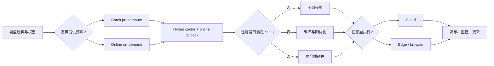
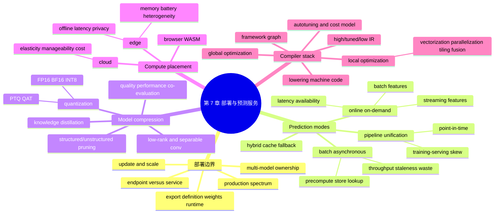

> 对应原章：7. Model Deployment and Prediction Service.md
> 本章把已开发的模型带离 notebook / development environment，讨论它怎样在生产中生成预测、满足延迟与吞吐要求，并运行在云、边缘或浏览器。主线依次是部署误区、批量与在线预测、训练/推理数据管道统一、模型压缩、云边选择、编译与推理优化。
>
> 原章中的公司模型数量、部署频率、云成本、硬件生态和性能数字主要来自 2015–2022 年。本文保留其历史语境，不把它们直接当作 2026 年现状。
>
> **归因说明：** 除相邻文字明确写明“原章公式”“原章案例”或“原章数字”的内容外，本文新增的容量/新鲜度模型、卷积参数完整公式、蒸馏与量化公式、延迟预算、编译优化分析、Mermaid 图、伪代码和可运行示例均为笔记补充，不是作者在本章逐式提出的内容。

## 0. 本章要回答的核心问题

1. “部署模型”究竟意味着什么，为什么暴露一个 POST endpoint 只是最简单的一步？
2. Production 为什么是一条光谱，而不是统一规模和标准？
3. 模型导出、序列化、模型定义、参数、预处理和运行环境之间是什么关系？
4. 为什么真实公司常同时维护数百乃至数千模型，部署基础设施必须以模型组合与版本为单位设计？
5. 模型为什么会在代码不变时退化，更新问题为何应先问“能多快安全更新”？
6. Batch、online、synchronous、asynchronous 与 streaming prediction 各指什么，哪些不是严格同义词？
7. Online features 与 streaming features 有什么区别？
8. 批量预测怎样用高吞吐与预计算换低读取延迟，又为什么会浪费计算并降低新鲜度？
9. 什么时候必须在线预测，什么时候批量或混合方案更经济？
10. 训练 batch pipeline 与线上 stream pipeline 为什么容易产生 training-serving skew，怎样统一语义？
11. 模型太慢时，压缩模型、优化执行和升级硬件三条路径怎样选择？
12. Low-rank / separable convolution、distillation、pruning、quantization 分别减少什么？
13. MobileNet 的参数节省怎样推导，原章 $K^2+C$ 直觉在哪些条件下成立？
14. 剪枝为什么可能只制造很多 0，却不带来实际速度提升？
15. 量化怎样把实数映射到有限整数，误差、范围与硬件加速怎样权衡？
16. 云和边缘在成本、网络、隐私、更新、资源与安全上怎样权衡？
17. 为什么框架不能为每种硬件手写一套后端，IR 与 lowering 解决了什么组合爆炸？
18. Vectorization、parallelization、loop tiling、operator fusion 与全图优化为什么有效？
19. cuDNN autotune 与 autoTVM 怎样用测量和 ML 搜索执行计划？
20. Browser / WASM 如何提供跨设备可移植性，它与 native inference 的差距是什么？
21. 怎样把模型质量、端到端延迟、单位成本、可用性和可更新性共同写成上线门禁？

全章主线如下：



一句话概括：**部署不是把模型文件放到服务器，而是把模型、特征、运行时和业务请求组成一个可扩展、低延迟、可观测、可更新并能在目标硬件上稳定运行的预测系统。**

---

## 1. 开篇：部署把模型逻辑变成生产能力

### 1.1 模型逻辑与部署逻辑

第 4–6 章形成模型逻辑：

```text
原始数据 -> 训练数据 -> 特征 -> 模型开发 -> 离线指标
```

这需要 ML 与领域知识。部署则负责让这套逻辑离开开发环境，在 staging 或 production 中被真实应用调用。

部署通常意味着“让模型运行且可访问”，但完整生产能力还包括：

- 输入/输出契约与预处理；
- 模型加载和运行时；
- 特征获取和时间语义；
- 路由、容量、超时与降级；
- 灰度、回滚和版本；
- 日志、指标、告警与值班；
- 数据、质量和成本监控；
- 安全、隐私与访问控制。

### 1.2 Production 是光谱

对某些团队，production 只是 notebook 中生成业务图表；对另一些团队，它意味着每天服务数百万用户。前者环境接近开发，本章的大规模服务细节影响较小；后者必须把模型视为长期在线系统。

成熟度应与风险和规模匹配，不应把大型公司的全部平台复制给小项目，也不能用 demo 标准支撑关键业务。

### 1.3 “一小时部署”的真正范围

原章给出用 Web endpoint 包装 `predict()`、把依赖装入 container、部署到 AWS/GCP 的示意。熟悉工具后，一小时做出 functional demo 完全可能。

原章文字称 FastAPI，但示例的 `@app.route(..., methods=['POST'])` 与全局 `request` 更像 Flask API；真正 FastAPI 常使用 `@app.post()` 和类型化 request model。这个语法细节不影响作者观点：**endpoint 只解决可调用性，不解决生产可靠性。**

困难部分是：

- 毫秒级延迟；
- 数百万用户；
- 明确的 availability SLO；
- 故障立即通知正确的人；
- 快速定位数据、模型或系统根因；
- 无中断发布修复。

原章写“99% uptime”作为直觉例子。30 天内 99% 仍允许约

$$
30\times24\times(1-0.99)=7.2\ \mathrm{hours}
$$

不可用；关键服务通常需要更严格、且明确定义“成功预测”的 SLO。

### 1.4 团队 handoff 的代价

有些公司由模型开发者负责部署，另一些把模型导出后交给部署团队。严格分工能专业化，却也可能造成：

- 来回解释输入、特征和依赖；
- 更新排队；
- 线上事故无法快速判断由谁处理；
- serving 约束太晚反馈给模型设计。

解决方向不是所有人做所有事，而是共同契约、端到端 ownership、可自助平台和跨团队观测。

### 1.5 Export / serialization

模型可导出两部分：

- definition：层、算子和连接结构；
- parameter values：学习出的权重。

通常一起导出。原章时代例：TensorFlow 2 `Model.save()` 输出 SavedModel，PyTorch `torch.onnx.export()` 输出 ONNX。

完整部署 artifact 还常需要：

- tokenizer / vocabulary；
- scaler、imputer 和 feature schema；
- label map、threshold 和 calibration；
- custom operators；
- framework/runtime 版本；
- 输入 shape、dtype 与动态维；
- checksum 和模型卡。

“序列化成功”只表示能重建对象或计算图，不保证目标运行时支持全部算子，也不保证数值一致。

---

## 2. Machine Learning Deployment Myths：部署误区

### 2.1 Myth 1：一次只部署一两个模型

学术项目常聚焦单模型，真实产品由多个任务和区域构成。网约车应用可能分别预测：

- ride demand；
- driver availability；
- ETA；
- dynamic pricing；
- fraud；
- churn。

若 20 个国家各需 10 个本地模型，就有

$$
20\times10=200
$$

个模型，还未计版本、实验和 fallback。

Netflix 图 7-2 展示的代表任务包括 content valuation、制作排期优化、剧本 NLP、网络质量预测、机器翻译、欺诈检测、流失预测、客服工单分类、内容标签、title portfolio optimization 和 CDN caching 等；图中并未直接列出推荐或搜索。原章历史数字：Uber 有数千生产模型；Google 同时训练数千模型，所述并发训练规模涉及数千亿（hundreds of billions）参数，不能读成某一个模型必然有如此规模；Booking.com 有 150+ 模型；Algorithmia 2021 调查中，超过 25,000 员工的组织有 41% 运行 100 个以上模型。

这些数字不用于比较今天公司，而是说明平台必须支持：

- 多模型发现、登记和 ownership；
- 依赖与兼容矩阵；
- 每模型或每租户资源隔离；
- 批量升级和回滚；
- 组合模型的端到端监控；
- 模型退役与成本分摊。

### 2.2 Myth 2：什么都不做，性能会保持不变

传统软件有 bit rot；ML 还依赖数据分布。即使代码和权重不变：

$$
P_{production,t}(X,Y)
\ne P_{train}(X,Y)
$$

就可能让风险随时间变化。用户偏好、攻击、产品界面、库存和上游采集都会改变。

模型刚训练完往往最贴近近期数据，但“必然单调下降”也不是定律：季节回归或偶然变化可能短暂改善。正确做法是监控、取标签和设更新门禁，而不是仅按模型年龄推断质量。

### 2.3 Myth 3：模型不用频繁更新

作者把“How often should?”改问“How often can?”，强调更新能力是竞争优势。原章历史部署频率：Etsy 50 次/天、Netflix 数千次/天、AWS 每 11.7 秒；Weibo 某些模型迭代 10 分钟，作者听到 Alibaba、ByteDance 有相似量级。

这些主要是软件/部分模型发布案例，不表示所有模型都应每 10 分钟重训。更新 cadence 受：

- 新数据与标签到达；
- 漂移速度和业务损失；
- 训练、验证与审批成本；
- 安全、监管和回滚能力；
- 实验统计功效。

更准确目标是：**当证据表明更新有净价值时，系统能多快安全验证并发布。**

### 2.4 Myth 4：多数 ML 工程师不必关心规模

规模可指每秒数百请求、每月数百万用户、数百模型或大 artifact。原章引用 Stack Overflow 2019 调查：超过半数受访开发者在至少 100 人公司工作；作者 Twitter 小调查得到类似模式。

公司人数不是流量的完美代理，调查也不是 ML 岗位随机样本。但 ML 工程师应掌握容量、延迟、故障和成本基本原理，因为模型成功后规模会增长。

---

## 3. Batch Prediction Versus Online Prediction：批量与在线预测

### 3.1 三种最值得记住的模式

1. Batch prediction，只使用批特征；
2. Online prediction，只使用预计算批特征；
3. Online prediction，同时使用批特征与流式特征，原章也称 streaming prediction。

术语未完全标准化，应先问清**预测何时计算、请求怎样传输、特征何时计算**，而不是只看名字。

### 3.2 Online prediction

请求到达后立即生成并返回预测，也称 on-demand prediction。传统 HTTP/REST 路径常表现为同步 request/response，因此也常称 synchronous prediction。

但“online”描述按需计算，不强制 HTTP 或阻塞协议。请求可通过 queue/event transport 异步发送，再由 caller 等待、轮询或接收回调。

端到端延迟是

$$
L_{e2e}
=L_{network}+L_{queue}+L_{features}
+L_{pre}+L_{inference}+L_{post}.
$$

只优化模型 kernel，若网络或 feature lookup 主导，用户几乎感受不到。

### 3.3 Batch prediction

按周期或触发条件预生成预测，写入 SQL、key-value store 或 memory database，应用到请求时读取。Netflix 每四小时计算推荐是原章例子。

Batch prediction 也常称 asynchronous prediction，因为计算与用户请求解耦。它优化批处理吞吐，并把在线关键路径变成 lookup。

“Batch prediction”不表示模型一次只能接收多样本；online serving 也能 dynamic batching，batch job 也可逐样本执行。这里的核心是**预测与业务请求是否同步生成**。

### 3.4 三张架构图的顺序

#### Batch 架构（图 7-4）

1. Prediction service 从 warehouse 读取 batch features；
2. 批量生成 predictions 并写回 warehouse；
3. App 收到请求后查询；
4. Warehouse 返回 precomputed prediction。

#### Online + batch features（图 7-5）

App 把请求发到 prediction service；服务从在线可访问存储取得预计算特征，现场推理后直接返回。

#### Online + streaming features（图 7-6）

App 日志进入 real-time transport；prediction service 同时取得 streaming features 与 warehouse 中 batch features，按请求推理。

原图简化了 feature store、缓存、事件时间、超时和 fallback，但清楚表达了数据路径差异。

### 3.5 Streaming Features Versus Online Features：batch、streaming 与 online features

- batch features：从历史快照周期计算，如餐厅过去平均备餐时间；
- streaming features：从持续事件增量计算，如最近 10 分钟订单数与可用骑手数；
- online features：在线预测时使用的全部特征，包括内存中的 batch embeddings 和 streaming features。

在原章讨论的 serving 语境中，online features 泛指在线预测使用的特征，其中既可以有批量预计算的特征，也可以有流式增量计算的特征；streaming features 则按计算来源命名。Item embedding 可批量预计算、在线读取，因此属于在线预测使用的 batch feature，而不是 streaming feature。

这不是跨所有系统都成立的严格集合包含关系：同一流式计算结果也可以落盘后供批任务使用。“Online”描述使用场景，“streaming”描述持续数据上的计算方式，两条分类轴应分开。

数据位于 Kafka 或数据库并不单独决定 batch/stream 语义；有界 replay 可批处理，数据库 CDC 也可产生流。关键是时间、更新和计算模式。

### 3.6 Batch 与 online 对照

| 维度 | Batch / asynchronous | Online / on-demand |
| --- | --- | --- |
| 触发 | 周期或任务触发 | 请求到来 |
| 主要目标 | throughput、资源利用率 | latency、availability |
| 预测新鲜度 | 受周期限制 | 可使用最新请求/事件 |
| 候选请求 | 需要提前知道 | 可处理未知请求 |
| 在线关键路径 | storage lookup | feature + inference |
| 计算浪费 | 可能为不活跃实体预计算 | 只为到达请求计算 |
| 峰值处理 | 批任务可错峰 | 需实时容量与降级 |
| 复杂模型 | 易用预计算隐藏延迟 | 需压缩、优化或异步 |

### 3.7 混合方案

热门 query 预计算并缓存，长尾 query 在线生成：

```text
request -> prediction cache hit? -> return
                            no -> online inference -> cache/return
```

还可先返回 batch fallback，再异步刷新；或 batch 召回候选、online 精排。

需要处理 cache key、TTL、模型版本、失效和同一请求是否允许旧结果。

### 3.8 Food ordering 案例

DoorDash / UberEats 可批量生成“推荐哪些餐厅”，因为候选餐厅很多；用户进入餐厅后，针对当前菜单和上下文在线推荐 food items。一个应用可按任务混用两种方式。

### 3.9 在线不一定比批量低效

在线也能 microbatch、vectorize、cache 和 autoscale，而且只计算真实请求。若每天仅 2% 用户活跃，给全部用户预计算会浪费约 98%。

原章用 Grubhub 2020 年 3100 万用户、每日 62.2 万订单说明数量级；订单数不等于唯一活跃用户数，所以不能由这两个数字精确推导活跃率，只能作为稀疏使用的历史例子。

### 3.10 可运行示例：预计算浪费、新鲜度与延迟预算

```python
from math import ceil

users = 31_000_000
daily_active_rate = 0.02  # 教学假设，不由订单数直接推导
active_users = int(users * daily_active_rate)
wasted_predictions = users - active_users

batch_period_hours = 4
average_staleness_hours = batch_period_hours / 2  # 请求在周期内均匀到达的理想假设

latency_ms = {
    "network": 18,
    "queue": 4,
    "features": 12,
    "preprocess": 2,
    "inference": 26,
    "postprocess": 3,
}
end_to_end_ms = sum(latency_ms.values())

peak_qps = 2_400
safe_instance_qps = 180
instances = ceil(peak_qps / safe_instance_qps)

print(f"active_users={active_users}")
print(f"wasted_predictions={wasted_predictions}")
print(f"waste_rate={wasted_predictions / users:.0%}")
print(f"average_batch_staleness_hours={average_staleness_hours:.1f}")
print(f"end_to_end_latency_ms={end_to_end_ms}")
print(f"minimum_instances={instances}")
```

实际运行输出：

```text
active_users=620000
wasted_predictions=30380000
waste_rate=98%
average_batch_staleness_hours=2.0
end_to_end_latency_ms=65
minimum_instances=14
```

平均陈旧度 $T/2$ 只在批计算瞬时完成、请求均匀到达时成立；容量计算也未包含故障、发布和突发余量，生产副本数应更高。

---

### 3.11 From Batch Prediction to Online Prediction

#### 3.11.1 为什么初次部署常从在线 endpoint 开始

原型交互就是“给输入、立即预测”。导出模型、上传 SageMaker / App Engine、获得 service entry URL，即可按请求调用。

若模型太慢，团队会把预测提前算好。Batch prediction 相当于用存储空间、陈旧度和预计算成本换取低 lookup latency。

#### 3.11.2 Batch 适用条件

- 要生成大量预测；
- 结果不要求立即可得；
- 候选请求可预先枚举；
- 周期内偏好变化可接受；
- 高吞吐比新鲜度更重要。

例如给所有客户预测购买概率，只联系 top 10%，其余预测即便未消费也可能是筛选所需成本。

#### 3.11.3 Batch 的两项根本限制

##### 偏好响应慢

Netflix 登录时充满 horror 推荐；用户当天搜索 comedy，列表要等下一批次更新。影响看似温和，却会连接 engagement 和 retention。

若批周期为 $T$，理想最大陈旧度接近 $T$，平均约 $T/2$；还要加批任务运行和发布延迟。

##### 无法预知任意请求

用户集合可枚举，新用户可给 generic 推荐；英译法文本空间不可穷举，必须请求到来后生成。

#### 3.11.4 必须在线的任务

- high-frequency trading；
- autonomous vehicle；
- voice assistant；
- face/fingerprint unlock；
- elderly fall detection；
- fraud prevention。

三小时后发现欺诈比不发现好，但不能阻止交易；业务动作时限决定 prediction deadline。

#### 3.11.5 “Batch 是 workaround”的条件化理解

作者把 batch prediction 称为在线推理不够便宜或不够快时的 workaround，并预测硬件进步后 online 成为默认。这是方向判断，不是所有任务结论。

即使在线同价同速，batch 仍可能用于：

- 报表和全量风险扫描；
- 离线计划、预算和资源分配；
- 可重复快照与审计；
- 不要求交互的异步工作流；
- 把峰值计算移到低价时段。

#### 3.11.6 在线预测的两项前提

1. Near-real-time pipeline：摄取、流式特征、模型输入和返回；
2. 足够快的模型：消费应用常要求毫秒级端到端响应。

模型 latency 只是预算一部分，feature freshness、lookup 和网络同样关键。

### 3.12 Unifying Batch Pipeline and Streaming Pipeline

#### 3.12.1 两套实现怎样制造 training-serving skew

ETA 特征“路径上所有车最近 5 分钟平均速度”：

- 训练：一个月历史数据上 dataframe 批量计算；
- 推理：事件流上维护 5 分钟 sliding window。

若算法、窗口边界、时区、迟到事件或默认值不同，离线和线上得到不同特征。不同团队维护两套代码会放大漂移。

图 7-8 给出更完整的生产闭环：streaming data 先经过 control、process 和 store；一条路径进入 data warehouse，构成 Research 框中的 ingest、离线 feature engineering、label、模型开发和训练；另一条路径由线上 feature engineer 直接为 inference 计算特征。图中 “Should be equal” 明确要求离线与线上特征语义相等。部署后的 ML model 产生 predictions 供 application 使用。反馈有两条独立支路：ML model 产生的 logs 回流为 streaming data；application 收到的用户 inputs 也直接回流为 streaming data，而不是先变成 logs。研究框只是循环中的一部分，不是系统终点。

#### 3.12.2 语义一致比代码字面复用更重要

统一方案可包括：

- 同一 transformation DSL / library；
- 流引擎同时处理 bounded replay 与 unbounded events；
- feature definition 只写一次，编译到 batch/online；
- point-in-time offline join；
- feature store 统一定义、materialization 与 serving；
- 对同一事件回放，对比 offline/online 输出。

“同一代码”不保证语义一致：底层引擎的 event time、watermark 和精度也要验证。

#### 3.12.3 原章基础设施趋势

Uber、Weibo 使用 Apache Flink 等流处理器改造批流统一；一些公司使用 feature store 保证训练批特征与预测特征一致。Feature store 不是自动正确性：错误定义会被更一致地复用。

---

## 4. Model Compression：模型压缩

### 4.0 三条推理性能路径

模型在线太慢，可：

1. inference optimization：同一模型更高效执行；
2. model compression：减少参数、运算或精度；
3. faster/specialized hardware：使用更合适后端。

压缩最初常为 edge 容量，模型变小也经常更快，但参数少不自动意味着低延迟；memory access、kernel、shape 和并行度都影响速度。

原章归纳四类：low-rank、knowledge distillation、pruning、quantization。

### 4.1 Low-Rank Factorization：低秩分解

#### 4.1.1 基本思想

高维 tensor 存在冗余时，用低维因子近似。例如矩阵

$$
W\in\mathbb R^{m\times n}
\approx UV^T,
\quad U\in\mathbb R^{m\times r},
\quad V\in\mathbb R^{n\times r},
$$

参数从 $mn$ 降到 $r(m+n)$。成立前提是有效秩 $r\ll\min(m,n)$，近似误差不损害任务。

#### 4.1.2 SqueezeNet

通过包括以 $1\times1$ convolution 替代部分 $3\times3$ 等策略，SqueezeNet 在 ImageNet 达到 AlexNet-level accuracy、参数少 50 倍。收益来自整体 architecture，不应归因于单一替换。

#### 4.1.3 MobileNet depthwise separable convolution

设 kernel $K\times K$、输入通道 $M$、输出通道 $N$：

- standard convolution 参数：

$$
P_{standard}=K^2MN;
$$

- depthwise：每输入通道一个 $K\times K$ kernel，参数 $K^2M$；
- pointwise：$1\times1$ 把 $M$ 通道混成 $N$ 通道，参数 $MN$。

所以

$$
P_{separable}=K^2M+MN,
$$

$$
\frac{P_{separable}}{P_{standard}}
=\frac1N+\frac1{K^2}.
$$

$K=3$、$N$ 较大时约为 $1/9$，即接近 8–9 倍减少。原章的 $K^2C$ 到 $K^2+C$ 是对单个 filter / 简化通道记号的直觉；完整层必须含 $M,N$。

这种结构依赖 convolution architecture 与高效 kernel 支持，不是任意模型的通用 low-rank 工具。

### 4.2 Knowledge Distillation：知识蒸馏

小 student 模仿大 teacher 或 ensemble，部署 student。可先训练 teacher，也可联合训练；student 与 teacher 架构可以不同。

Teacher logits $z^T$、student logits $z^S$，temperature $\tau$：

$$
q_i^T(\tau)
=\frac{\exp(z_i^T/\tau)}{\sum_j\exp(z_j^T/\tau)},
$$

高 $\tau$ 让非最大类别关系更可见。常见损失：

$$
L
=\alpha L_{hard}(y,p^S)
+(1-\alpha)\tau^2
D_{KL}(q^T(\tau)\Vert q^S(\tau)).
$$

$\tau^2$ 用于补偿 softmax 梯度随温度缩小的尺度；具体实现可不同。

原章历史 DistilBERT 数字：大小减少 40%，保留 97% language understanding capability，速度快 60%。这些指标依对应 benchmark / hardware。

优点是架构相对自由；缺点是 teacher 可用性、teacher 偏差传递和额外训练。Random forest student 模仿 transformer 输出在接口上可行，但能否达到质量取决于输入表示和容量。

### 4.3 Pruning：剪枝

#### 4.3.1 两种含义

- structured pruning：删除 node、channel、head、layer，改变 shape 与参数数；
- unstructured pruning：把不重要权重置 0，dense shape 不变、nonzero 数减少。

原章报告研究中可移除 90% 以上 nonzero weights，降低存储并改善推理而不损整体 accuracy；结果依模型和后端。

#### 4.3.2 稀疏不自动加速

把 dense tensor 的 90% 元素设 0，若仍用 dense kernel，FLOPs、内存布局和参数文件可能都不变。实际收益需要：

- sparse storage；
- 硬件/编译器支持的 sparsity pattern；
- 足够高且规则的稀疏度；
- kernel overhead 小于节省。

Structured pruning 更容易得到通用加速，但可能更伤质量；unstructured 灵活但硬件利用难。

#### 4.3.3 剪枝价值争论

Liu 等认为价值可能主要在发现 architecture，剪后结构可从头 dense 训练；Zhu 等发现大 sparse model 可超过重训 dense counterpart。说明“继承重要权重”与“找到好结构”要按设置验证。

剪枝还可能不均匀影响群体，第 11 章讨论 bias。

### 4.4 Quantization：量化

#### 4.4.1 内存收益

100M 参数：

| 表示 | 每参数 | 仅权重十进制大小 |
| --- | ---: | ---: |
| FP32 | 4 bytes | 400 MB |
| FP16/BF16 | 2 bytes | 200 MB |
| INT8 | 1 byte | 100 MB |
| 1-bit | 1 bit | 12.5 MB |

实际文件还含 metadata、scale、zero-point，运行时还需 activation、cache 和 workspace。

#### 4.4.2 Affine integer quantization

把实数范围映射到整数 $[q_{min},q_{max}]$：

$$
s=\frac{x_{max}-x_{min}}{q_{max}-q_{min}},
$$

$$
z=\operatorname{clip}\left(
\operatorname{round}\left(q_{min}-\frac{x_{min}}s\right),
q_{min},q_{max}\right),
$$

$$
q=\operatorname{clip}
\left(\operatorname{round}\left(\frac xs\right)+z,
q_{min},q_{max}\right),
$$

$$
\widehat x=s(q-z).
$$

若实数范围包含 0，上式可让实数 0 近似精确映射到整数 zero-point；若范围不含 0，未裁剪的 zero-point 可能越界，因此必须裁剪或使用对称/其他量化约定。误差来自 rounding 和 clipping。Per-channel scale 通常比全 tensor scale 精细，但 metadata 和 kernel 更复杂。

#### 4.4.3 速度不只由 bit 数决定

低精度可减少内存带宽、cache 占用并使用更高吞吐硬件指令，也可能允许更大 batch。原章“逐 bit 加法 32x vs 16x”用于直觉；现代 vector/tensor hardware 的加速不简单等于位宽比，取决于 kernel、accumulator、转换和是否 memory-bound。

#### 4.4.4 QAT 与 post-training quantization

- Static PTQ：先 FP32 训练，再用代表性 calibration data 估计 activation 量化范围；
- Dynamic PTQ：权重预先量化，activation 范围可在运行时动态确定，通常不需要离线代表性 calibration set；
- Weight-only PTQ：只量化权重，部分方案同样不需要 activation calibration；
- QAT：训练时模拟 quantize/dequantize，让权重适应误差。

原章脚注指出 2020 年 TensorFlow QAT 并非真的以低 bit 权重训练，而是收集/模拟用于后量化的统计。即使今天工具变化，也应区分 fake quant 与真实低精度算术。

FP16、BF16 是浮点低精度，不等同 INT8 fixed-point。BF16 保留较大 exponent range、牺牲 mantissa precision。Mixed precision 常用低精度乘法、高精度 accumulation。

BinaryConnect、XNOR-Net 探索 1-bit 权重；Xnor.ai 在 2020 年被 Apple 以报道约 2 亿美元收购，属于历史商业事件。

原章写作时还指出，fixed-point inference 已成为行业常用方案，一些 edge devices 只支持固定点推理；TensorFlow Lite、PyTorch Mobile、TensorRT 当时均提供少量代码即可使用的 PTQ。具体工具状态和支持矩阵会随版本变化。

#### 4.4.5 可运行示例：卷积参数与量化误差

```python
from math import isclose


kernel = 3
input_channels = 32
output_channels = 64
standard_parameters = kernel**2 * input_channels * output_channels
separable_parameters = kernel**2 * input_channels + input_channels * output_channels

parameter_count = 100_000_000
memory_mb = {
    "fp32": parameter_count * 4 / 1_000_000,
    "fp16": parameter_count * 2 / 1_000_000,
    "int8": parameter_count / 1_000_000,
}

minimum, maximum = -1.0, 1.0
q_min, q_max = -128, 127
scale = (maximum - minimum) / (q_max - q_min)
zero_point = max(q_min, min(q_max, round(q_min - minimum / scale)))
value = 0.3
quantized = max(q_min, min(q_max, round(value / scale) + zero_point))
restored = scale * (quantized - zero_point)

print(f"standard_conv_parameters={standard_parameters}")
print(f"separable_conv_parameters={separable_parameters}")
print(f"parameter_reduction={standard_parameters / separable_parameters:.2f}x")
print(f"memory_mb={memory_mb}")
print(f"quantized={quantized},restored={restored:.6f}")
print(f"absolute_error={abs(restored - value):.6f}")
assert isclose(memory_mb["fp32"], 400.0)
```

实际运行输出：

```text
standard_conv_parameters=18432
separable_conv_parameters=2336
parameter_reduction=7.89x
memory_mb={'fp32': 400.0, 'fp16': 200.0, 'int8': 100.0}
quantized=38,restored=0.298039
absolute_error=0.001961
```

本例假定 `bias=False`，$K=3,M=32,N=64$，卷积权重参数减少 7.89 倍；若包含 bias，standard 与 separable 的计数还应分别加入对应 bias。量化把 0.3 还原为约 0.298039。单个值的小误差不代表整个模型质量不变，必须在真实任务和关键 slice 上评估。

#### 4.4.6 Roblox BERT 案例

Roblox 目标：CPU 上服务 10 亿+ daily requests，部分 NLP 服务需 25,000+ inferences/s、低于 20 ms。图 7-10 在 32 CPU cores 下：

| 方案 | Throughput | p50 latency |
| --- | ---: | ---: |
| Baseline BERT + fixed shape | 100/s | 330 ms |
| DistilBERT + fixed shape | 185/s | 171 ms |
| DistilBERT + dynamic input | 369/s | 69 ms |
| + INT8 quantization | 3,015/s | 10 ms |

从方案 3 到 4，量化使 latency 约降 $69/10=6.9$ 倍、throughput 增 $3015/369\approx8.17$ 倍，与原章“7x / 8x”一致。

案例没有报告每步 output quality，因此不能只凭性能图判断可接受性。还应核对 p50/p99、输入分布、并发与 CPU 配置。

---

## 5. ML on the Cloud and on the Edge：云与边缘

### 5.1 两端是什么

- Cloud：公有或私有数据中心执行主要计算；
- Edge：browser、phone、laptop、watch、car、camera、robot、embedded device、FPGA、ASIC 等消费者或现场设备执行主要计算。

它们不是二选一。Hybrid 可在 edge 做预处理/快速决策，cloud 做重模型、聚合和更新；网络恢复后再同步。

### 5.2 Cloud 的优势

- Managed service 易起步；
- 集中部署、监控与更新；
- 弹性计算和强硬件；
- 模型/IP 不直接暴露给设备；
- 可跨用户聚合。

### 5.3 Cloud 的代价

#### Cost

原章历史报道：2018 年部分大公司每年云账单数亿美元；中小公司可为每年 50K–2M USD（5 万–200 万美元）；错误配置甚至可能拖垮 startup。数字依公司与年份，不能作今天预算。

单位成本近似：

$$
C_{request}
=C_{compute}+C_{feature}+C_{network}
+C_{storage}+C_{idle}.
$$

必须按真实 utilization、峰值与数据传输测量。

#### Network dependency

无网、弱网、乡村或 strict no-internet 环境无法依赖 cloud。

#### Latency

ResNet inference 从 30 ms 优化到 20 ms，若 network 达数百毫秒或秒，端到端收益很小。

#### Privacy concentration

数据跨网并集中存储，拦截或 breach blast radius 较大。原章引用 2020 年报道“近 80% 公司在过去 18 个月经历 cloud data breach”，应按调查口径理解。

### 5.4 Edge 的优势

- offline / unreliable network 可运行；
- 减少 round-trip latency；
- 降低 cloud compute 与 bandwidth；
- 原始敏感数据可留设备；
- 某些法规的数据驻留更容易满足。

### 5.5 Edge 的限制与新风险

- compute、RAM、storage、battery、thermal 受限；
- 设备高度异构；
- 更新、监控和回滚困难；
- 模型易被提取、篡改或逆向；
- 设备被盗可直接访问本地数据；
- 长尾旧设备限制可用算子。

手机即使能运行 full BERT，也可能快速耗电。Edge 降低一些隐私风险，不会消除风险。

原章还记录 Google、Apple、Tesla 自研芯片与 AI hardware startup 融资趋势，以及“2025 年 30 billion（300 亿）+ active edge devices”的历史预测，不能当作已验证 2025 实际值。

### 5.6 Cloud / Edge 选择矩阵

| 维度 | Cloud 倾向 | Edge 倾向 |
| --- | --- | --- |
| 模型大且常更新 | 是 | 困难 |
| 需要离线 | 否 | 是 |
| 极低网络延迟 | 受网络限制 | 是 |
| 原始数据敏感 | 需上传/治理 | 可本地 |
| 集中观测 | 容易 | 难 |
| 防模型提取 | 较容易 | 较难 |
| 设备资源 | 强、可弹性 | 受限、异构 |
| 单位规模成本 | 依利用率 | 转移到设备/开发 |

---

## 6. Compiling and Optimizing Models for Edge Devices：编译与优化

### 6.0 编译导论：从框架到目标硬件

#### 6.0.1 Framework × hardware 的组合爆炸

TensorFlow、PyTorch 等模型要在 CPU/GPU/TPU/NPU 上运行，需要：

- 算子语义支持；
- kernel 实现；
- memory layout；
- dtype 与 shape；
- scheduling 和 code generation。

TPU 2018 公开、到 2020 才支持 PyTorch 是原章历史例子。每个 framework 手写每个 backend 成本高。

原章把 CPU/GPU/TPU primitive 简化为 scalar/vector/tensor。脚注已说明现代 CPU 有 SIMD/vector、GPU 有 tensor cores；真实差异是 ISA、parallel hierarchy、memory/cache 和专用单元，不能按一维/二维永久分类。

#### 6.0.2 Intermediate Representation（IR）

IR 作为框架和硬件中间层：

```text
Framework model
-> high-level graph IR
-> tuned / optimized IR
-> low-level target IR
-> machine code
```

框架只需 lower 到共同 IR，硬件只需支持该 IR 生态，减少 $F\times H$ 组合。

High-level IR 保留 computation graph 和算子；low-level IR 更接近 loops、memory 和 ISA。图 7-12 举 XLA HLO、TensorFlow Lite、TensorRT、LLVM、NVCC 等不同层例子；产品分类会随版本变化。

Lowering 不是一对一翻译：一个高层 `matmul` 可被 tile、vectorize、fuse 成多种目标实现。

### 6.1 Model optimization：模型执行优化

#### 6.1.1 为什么“能跑”不等于“跑得快”

生成代码可能：

- 访问内存不连续；
- cache 利用差；
- 频繁 framework boundary / data copy；
- 未利用 vector/tensor instructions；
- 启动太多小 kernel；
- shape specialization 不足。

原章引用 Stanford DAWN 研究：NumPy、pandas、TensorFlow 典型 workload 在单线程下慢 23 times（23 倍）于手工优化代码。这是特定 benchmark，不是所有 pipeline 的固定倍数。

优化工程师同时需要 ML 图与硬件知识，成本高；optimizing compiler 尝试自动化。

#### 6.1.2 Local 与 global optimization

- local：单 operator 或小 subgraph；
- global：整个 computation graph 的布局、fusion 和 scheduling。

局部最优不保证全局最优。例如单个 operator 最快的 layout，可能迫使下一个 operator 转置。

#### 6.1.3 Vectorization

把连续数据的多个元素用 SIMD / tensor instruction 一次处理，减少 loop overhead 并提高吞吐。成立前提是 layout、alignment、dtype 与硬件支持合适。

#### 6.1.4 Parallelization

把数组分成独立 work chunks 并发执行。收益受依赖、负载均衡、同步和 memory bandwidth 限制；线程更多不一定更快。

#### 6.1.5 Loop tiling

把大 loop 分成适合 cache/shared memory 的 tile，增加数据复用、减少慢层级访问。最佳 tile 大小依 CPU cache、GPU shared memory 和 shape。

#### 6.1.6 Operator fusion

若

$$
y=g(f(x)),
$$

分开执行常把 $f(x)$ 写回 memory，再由 $g$ 读；fusion 在一个 kernel 内保留中间值，减少 memory traffic 与 launch overhead。

Fusion 也可能增加 register pressure、降低 occupancy 或阻止复用，需实测。

#### 6.1.7 Global fusion

图 7-14 展示 CNN vertical fusion（串行 CBR 组合）与 horizontal fusion（并行 branch 合并）；CBR 是 convolution、bias、ReLU。全图优化可跨 operator 选择更好 dataflow，但搜索空间组合爆炸。

### 6.2 Using ML to optimize ML models

#### 6.2.1 手工 heuristic 的限制

硬件团队可为 ResNet-50 / BERT 在某型号服务器深度优化，但：

- 不保证全局最优；
- 新模型、shape 或硬件要重做；
- benchmark 热门模型可能被过度优化，不能代表任意模型。

#### 6.2.2 cuDNN autotune

`torch.backends.cudnn.benchmark=True` 会对给定 convolution shape 从预设算法中 benchmark，选最快方案。它有效但主要限 convolution；动态 shape 可能反复搜索，首次启动有成本，可复现性/确定性设置也需核对。

#### 6.2.3 autoTVM

原章简化流程：

1. 拆 computation graph 为 subgraphs；
2. 估计 subgraph 大小/搜索价值；
3. 分配搜索预算；
4. 测量候选 schedule 真实运行时间；
5. 用测量训练 cost model；
6. 组合各 subgraph 最优方案。

Runtime 数据让 cost model 适应目标硬件，但 warm-up 搜索耗时。图 7-15 的 ResNet-50 / TITAN X 实验中，ML-based TVM 约 70 trials 后超过 cuDNN，最终相对 speedup 约 1.6；具体结果不泛化到其他模型/硬件。

搜索可能耗时数小时或数天，但同型号后端可缓存和复用。适合模型已基本稳定、目标硬件明确的阶段；模型 shape 常变时，优化 amortization 可能不划算。

---

### 6.3 ML in Browsers

#### 6.3.1 为什么 browser 是另一层 portability

若模型运行在浏览器 runtime，可覆盖 MacBook、Chromebook、iPhone、Android 等，不直接针对每种芯片。Apple 从 Intel 切 ARM 时，Web abstraction 继续存在，但 browser engine 仍需为新硬件实现后端。

#### 6.3.2 JavaScript 与工具

原章列 TensorFlow.js、Synaptic、brain.js。JavaScript 易集成网页，但复杂数值和数据处理性能受限；“JavaScript 很慢”依 workload、JIT、WebGL/WebGPU 与实现，需当前 benchmark。

#### 6.3.3 WebAssembly（WASM）

WASM 是浏览器可执行的开放字节码目标。模型可从 sklearn/PyTorch/TensorFlow 等经工具链编译成 WASM module，再由 JavaScript 调用。

原章历史数字：2021 年 9 月约 93% 全球设备支持；Jangda 等研究中 WASM 相对 native 平均慢 45%（Firefox）至 55%（Chrome）。浏览器和 WebGPU 生态持续变化，必须在目标设备重测。

Browser inference 的额外约束：下载大小、初始化、内存 sandbox、线程/SIMD 支持、用户权限、模型缓存和 IP 暴露。

---

## 7. 原章总结的完整还原

部署是工程挑战，而不仅是 ML 算法挑战。本章比较 batch 与 online prediction，以及 cloud 与 edge execution。

Online 能快速响应偏好与事件，却必须控制端到端 latency 和 availability；batch 在模型过慢或结果不紧急时以预计算隐藏推理成本，却降低灵活性、新鲜度，并要求提前枚举请求。两者常组成 hybrid。

Cloud 易起步、集中运行，但受 network latency、成本与集中隐私风险限制；edge 可离线、低 round-trip、让数据留本地，却受 compute、memory、battery、异构、更新和物理攻击限制。

模型压缩通过 low-rank、distillation、pruning 和 quantization 减少存储或计算；实际加速必须由目标硬件和 runtime 验证。编译器用 IR 把框架图 lower 到硬件代码，再通过 vectorization、parallelization、tiling、fusion 与 schedule search 优化。

作者在写作时预测，硬件更强后系统会向 online + on-device 迁移。它是趋势判断，不排除 batch/cloud 长期服务全量分析、重模型和集中更新。

模型上线不是项目结束。它开启模型保活、故障、质量下降、监控与更新问题；下一章讨论生产失败与监控。

---

## 8. 容易混淆的概念与常见误区

### 8.1 Deploy 不等于暴露一个 endpoint

Endpoint 只解决可访问，生产还需容量、SLO、监控、回滚、安全和更新。

### 8.2 原章示例不是 FastAPI 语法

`@app.route` 更接近 Flask；框架细节不会改变部署方法论。

### 8.3 Model export 不等于完整可复现部署

还需要 tokenizer、preprocessor、schema、runtime、custom ops 和依赖版本。

### 8.4 一个产品不等于一个模型

多个任务、地区、租户和版本会形成数百模型及其组合。

### 8.5 模型代码不变不等于模型质量不变

生产数据和反馈政策变化就能改变风险。

### 8.6 “能多快更新”不等于“无门禁地频繁更新”

更新必须有新证据、验证、灰度和回滚。

### 8.7 Batch prediction 不等于一次输入多个样本

它指预测预先/异步生成；在线服务也可 dynamic batch。

### 8.8 Online prediction 不必使用同步 HTTP

它描述按请求生成，可通过异步 transport 实现。

### 8.9 Streaming feature 不等于 online feature

在线使用的 batch embedding 是 online feature，却不是 streaming feature。

### 8.10 Streaming prediction 不是全行业统一术语

应明确请求、特征和输出各自时序。

### 8.11 Batch 不一定比 online 便宜

为 98% 不活跃实体预计算会浪费；在线则有峰值与低利用率成本。

### 8.12 Precomputed lookup 低延迟不等于预测新鲜

读取很快，但结果可能已陈旧数小时。

### 8.13 统一 batch/stream 不等于只使用一个存储产品

核心是 transformation、event-time 和 point-in-time 语义一致。

### 8.14 参数少不等于推理必然快

Kernel、memory access、shape、并行度和硬件支持都会改变 latency。

### 8.15 Low-rank 与 depthwise convolution 不是同一通用算法

二者都利用结构减少计算，但 separable convolution 是 CNN 特定 factorization。

### 8.16 Distillation 不等于直接复制 teacher 权重

Student 学 teacher 输出分布或表示，可使用不同架构。

### 8.17 Pruning 设为 0 不等于删除参数

Unstructured sparse tensor 若仍跑 dense kernel，不会自然加速。

### 8.18 Quantization 不只是把文件除以四

还涉及 scale、zero-point、activation、accumulator、校准与精度损失。

### 8.19 FP16/BF16 不等于 INT8 fixed-point

前者有 exponent，后者依量化 scale；范围、精度和硬件路径不同。

### 8.20 位宽减半不保证速度翻倍

只有目标硬件和 kernel 真正支持低精度时才可能加速。

### 8.21 Edge 不等于绝对隐私

设备可被盗、模型可被逆向，本地日志也会泄露。

### 8.22 Cloud 不等于一定更贵

低流量和 managed operation 下 cloud 可比自建/edge 开发更经济。

### 8.23 IR 不等于 ONNX 一种格式

编译链有多层 IR，分别保留图语义或暴露低层 memory/loop。

### 8.24 Lowering 不等于逐行翻译

高层算子可映射到多个 fused、tiled 和 vectorized 实现。

### 8.25 Local optimization 不保证 end-to-end 最快

单算子 layout 可能增加跨算子转换，全图才看到总成本。

### 8.26 Operator fusion 不总有收益

它可减少 memory traffic，也可能增加 register pressure。

### 8.27 热门 benchmark 快不等于任意模型快

ResNet/BERT 可能被硬件厂商过度优化；新图需要重新调优。

### 8.28 cuDNN benchmark 不等于训练模型

它是在候选 kernel 中测速选 plan，不改变模型权重。

### 8.29 AutoTVM 优化结果与硬件/shape 绑定

换型号、shape 或算子后缓存 schedule 可能失效。

### 8.30 Browser 跨硬件不等于 native 同速

WASM/runtime 提供 portability，仍有 sandbox、下载和执行开销。

---

## 9. 本章知识结构



知识之间的因果关系是：

1. 用户动作期限决定 batch、online 或 hybrid prediction。
2. Prediction mode 决定特征新鲜度、容量和关键路径。
3. 双数据管道会制造 training-serving skew，必须统一时间语义。
4. SLO 不满足时，压缩、执行优化和硬件要联合选择。
5. Cloud/edge 决定网络、隐私、资源、更新与故障边界。
6. IR 降低框架与硬件的组合成本，compiler 决定实际性能。
7. 所有优化都必须与模型质量、端到端延迟和总成本共同验证。

---

## 10. 核心结论

1. **部署是完整预测系统的工程化，不是把 `predict()` 包成 API。**
2. **Production 是光谱。** 可靠性与平台复杂度应匹配用户规模、风险和更新频率。
3. **真实产品通常使用很多模型。** 基础设施要管理组合、版本、租户和退役，而非单文件。
4. **模型会因分布变化而退化。** 更新能力必须与监控、验证、灰度和回滚一起建设。
5. **Batch 与 online 的核心区别是预测何时相对请求生成。** 不要与 tensor batching 或协议同步性混淆。
6. **Online 与 streaming 是不同分类轴。** 在线预测可使用批量预计算或流式增量特征；streaming prediction 是原章对其中一种在线架构的称呼。
7. **Batch 用吞吐、存储和陈旧度换低 lookup latency。** 它适合可枚举、非紧急的全量任务。
8. **Online 提供新鲜度和未知请求能力。** 代价是实时 feature、推理、容量和 availability。
9. **Hybrid 常是最实用方案。** 热门预计算、长尾在线，或 batch 召回、online 精排。
10. **训练与线上特征必须 point-in-time 一致。** 批流两套实现是常见 production bug 来源。
11. **压缩、编译优化和硬件是三条互补路径。** 参数更少不自动代表端到端更快。
12. **Depthwise separable convolution 把 $K^2MN$ 降为 $K^2M+MN$。** 收益依通道数和 kernel 支持。
13. **Distillation 转移 teacher 行为，pruning 利用稀疏，quantization 降低位宽。** 三者压缩对象和风险不同。
14. **稀疏只有在 storage/kernel/hardware 支持时才加速。** 把权重置零不是性能证明。
15. **量化收益与误差都由 scale、范围、粒度和硬件决定。** 位宽比例不等于速度比例。
16. **Cloud 易管理，edge 降网络依赖。** 成本、隐私、安全、更新和资源应整体权衡。
17. **IR 和 lowering 解决 framework × hardware 支持组合爆炸。** 机器码还需面向目标后端优化。
18. **很多推理瓶颈来自内存和 framework 边界，而不只是 FLOPs。** Fusion、tiling 和 layout 很关键。
19. **Autotuning 用实际测量和 cost model 搜索 schedule。** 结果绑定模型 shape、runtime 和硬件。
20. **离线性能优化必须同时报告质量、p50/p99、吞吐、内存、能耗和单位成本。**
21. **模型上线开启新的生命周期。** 下一步是发现生产失败并持续监控。

---

## 11. 从本章提炼出的通用部署与预测服务设计方法

### 第一步：定义业务动作期限与 SLO

写清 prediction deadline、p50/p99、QPS、availability、freshness、质量、成本和错误后果。没有 deadline，就无法选择 batch/online。

### 第二步：枚举请求与活跃率

判断请求空间能否预计算、实际消费比例多少、结果允许陈旧多久。估计 batch 浪费与 online 峰值容量。

### 第三步：选择 prediction mode

- 可枚举、非紧急、全量分析：batch；
- 未知请求、实时阻断、新鲜偏好：online；
- 头部稳定、长尾动态：hybrid；
- batch candidates + online ranking：两阶段。

### 第四步：画端到端关键路径

```text
client -> network -> gateway/queue -> feature lookup
-> preprocessing -> model runtime -> postprocessing -> response/action
```

给每段分 latency budget、timeout、owner 和 metrics。避免只优化模型。

### 第五步：定义 feature time contract

记录 event time、available time、window、late-event policy、default 和 freshness。对同一历史事件回放 offline/online 代码并比较输出。

### 第六步：设计容量、缓存和降级

按 peak QPS、safe per-instance QPS、故障和发布余量计算副本。定义 cache TTL、batch fallback、旧模型、规则和 reject/human path。

### 第七步：打包完整可执行 artifact

模型图、权重、tokenizer、preprocessor、schema、threshold、calibrator、custom ops、runtime 和依赖原子化版本；验证目标后端算子与数值。

### 第八步：先 profile，再选择优化

- 权重/activation 太大：compression；
- kernel/memory/layout 慢：compiler/runtime optimization；
- 后端不合适：hardware placement；
- network 主导：edge/cache/placement；
- features 主导：预计算、缓存或 pipeline 优化。

### 第九步：逐种压缩并做质量门禁

建立 FP32 baseline；分别评估 distillation、structured/unstructured pruning、PTQ/QAT。每次记录总体与 slice 质量、校准、artifact size、RAM、latency、throughput 和能耗。

### 第十步：选择 cloud、edge 或 hybrid

结合离线需求、数据敏感度、模型大小、设备覆盖、更新频率、网络、IP 风险和总成本。不要只比较单次 inference 价格。

### 第十一步：为目标硬件编译和 autotune

固定模型 shape/dtype 与硬件版本，执行 graph lowering、fusion、layout 和 schedule search；缓存 artifact，并在目标设备真实 workload 上 benchmark。

### 第十二步：设计发布与运行闭环

```text
register -> compatibility tests -> shadow
-> canary -> progressive rollout -> SLO/quality checks
-> full rollout or rollback -> monitor -> update/retire
```

跟踪模型、feature、runtime 和 hardware 版本，确保事故可定位。

完整决策伪代码：

```text
输入：模型、请求分布、业务 deadline、特征、目标设备、预算

定义质量/延迟/吞吐/可用性/freshness/成本门禁
判断请求是否可枚举，估计活跃率和预计算浪费
选择 batch、online 或 hybrid

画端到端数据与请求路径
验证 offline/online feature point-in-time 一致
建立容量、cache、timeout、fallback 和回滚
打包 model + preprocessing + runtime 完整 artifact

在目标负载 profile：
    若模型/activation 超内存 -> 压缩、分片或换硬件
    若 inference kernel 慢 -> quantize / compile / autotune
    若 feature path 慢 -> cache / precompute / stream optimize
    若 network 主导 -> edge / region placement / hybrid

对每个候选方案：
    在真实设备测 p50/p99、QPS、RAM、能耗和成本
    在总体与关键 slice 测质量、校准和鲁棒性
    审计安全、隐私、兼容和更新能力

满足全部硬门禁且净价值最高 -> shadow/canary/渐进发布
否则 -> 回到模型、特征、runtime 或 prediction mode
```

本章最值得迁移的原则是：**部署决策必须从用户何时需要什么预测出发，再反推特征新鲜度、计算位置、模型表示、运行时和硬件；任何只优化模型文件大小或单次 kernel latency、却不测端到端质量与成本的方案，都还没有完成部署设计。**
