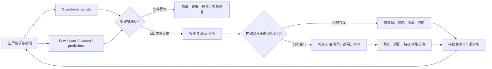
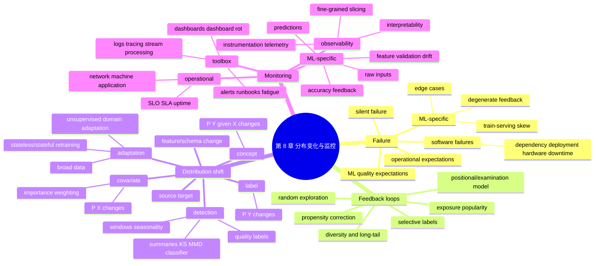

> 对应原章：8. Data Distribution Shifts and Monitoring.md
> 本章回答模型上线后的第一个核心问题：系统正在失效吗，为什么失效，怎样尽快发现？作者先区分软件故障与 ML 特有故障，再讨论训练—生产差异、edge cases 和退化反馈回路；随后形式化 covariate / label / concept shift，介绍检测与应对；最后建立 operational metrics、ML-specific metrics、日志、dashboard、alert 和 observability 组成的监控体系。
>
> 原章中的行业事故、调查、工具行为、SLA 与市场数字主要来自 2019–2022 年。本文保留其历史语境，不把它们直接视为 2026 年现状。
>
> **归因说明：** 除相邻文字明确写明“原章公式”“原章案例”或“原章数字”的内容外，本文加入的风险分解、反馈回路动力学、重要性加权、KS/MMD/PSI 与 classifier two-sample test 讲解、效应量与多重检验、窗口递推、SLO 预算、监控矩阵、Mermaid 图、伪代码和可运行示例均为笔记补充，不是作者在本章逐式提出的内容。

## 0. 本章要回答的核心问题

1. 什么才算 ML system failure，单次错误预测为什么不一定是系统故障？
2. 为什么 operational failure 容易显式报错，ML quality failure 却常静默发生？
3. 依赖、部署、硬件、宕机等软件故障为什么仍占 ML 事故的大头？
4. Train-serving skew 与随时间变化的 distribution shift 有什么区别？
5. Dashboard 上的“漂移”为什么经常其实是内部数据管道或版本错误？
6. Outlier 与 edge case 分别描述数据还是性能，为什么两者不能互换？
7. 预测怎样改变曝光和反馈，并让推荐、广告或招聘系统自我强化？
8. 怎样用多样性、长尾覆盖与 popularity-bucket hit rate 发现退化反馈回路？
9. Randomization、因果校正和 positional features 怎样缓解曝光偏差？
10. $P(X,Y)$ 的两种分解怎样导出 covariate shift、label shift 与 concept drift？
11. 三类 shift 的不变条件是什么，为什么现实中常同时发生？
12. Feature change 与 label schema change 为什么不应硬塞进经典三分类？
13. 有标签时为什么应直接监控质量，无标签时可监控哪些代理分布？
14. Summary statistics、KS、MMD、classifier test 等方法各检测什么、有哪些前提？
15. Statistical significance 为什么不等于 practical significance，大样本和多特征为何制造告警洪水？
16. 时间窗口怎样决定能看到 abrupt、gradual、seasonal shift 中的哪一种？
17. Cumulative metric 为什么会掩盖局部故障，sliding metric 又为何更噪？
18. 大数据预训练、无监督适配与有标签重训三条应对路线怎样选择？
19. Stateless retraining、stateful fine-tuning 和数据窗口怎样实验决定？
20. Monitoring 与 observability 有什么区别，instrumentation 与 telemetry 扮演什么角色？
21. Accuracy、prediction、feature、raw input 四层监控的可检测性和根因价值怎样权衡？
22. Feature monitoring 为什么容易造成 alert fatigue，却仍是调试的重要证据？
23. Logs、distributed tracing、dashboards、alerts 与 runbooks 怎样组成事故响应闭环？
24. 怎样把监控从“画图”升级为可行动、可归因、可验证的生产控制系统？

全章主线如下：



一句话概括：**漂移检测不是看到两个分布不同就报警，而是建立证据链，判断哪项生产期望被破坏、差异来自真实世界还是内部错误、是否伤害模型与业务，以及应该由谁采取什么动作。**

---

## 1. 开篇：模型交付不是生命周期终点

### 1.1 杂货需求预测故事

公司聘请咨询团队，用六个月开发下一周商品需求预测。部署初期表现良好，一年后开始：

- 一些商品持续高估，库存过期；
- 一些商品持续低估，损失销售；
- 库存团队先人工修正预测；
- 最终模型差到不能使用。

此时只能高价让原咨询公司更新、让新公司重新理解系统，或组建内部维护团队。

这暴露了两个系统缺口：

1. 没有持续监控，退化被人工和业务损失晚期发现；
2. 没有更新 ownership、数据/代码血缘和再训练能力。

部署只是把模型暴露给变化的现实；本章负责发现问题，第 9 章负责持续更新。

### 1.2 生产风险的两类来源

```text
软件系统层：依赖、权限、硬件、网络、调度、容量、部署
ML 行为层：数据/标签/特征、分布变化、edge cases、反馈回路
```

二者会相互伪装。Feature 突然全是 NaN 看起来像数据 shift，根因却是 pipeline bug；现实用户变化也可能先表现为 QPS 或 prediction distribution 变化。

---

## 2. Causes of ML System Failures：ML 系统故障原因

### 2.1 Failure 是期望被违反

传统软件主要关心 operational expectations；ML 还关心 statistical / behavioral expectations。

英法翻译系统可定义：

- operational：1 秒内返回法语；
- ML performance：99% 情况下翻译正确。

一次没有返回是 operational violation；一次翻错仍在 1% 错误预算内，不必称系统 failure。若在规定窗口中正确率持续低于 99%，才违反性能期望。

因此故障判断必须包含：

$$
\mathrm{Expectation}
=(\mathrm{metric},\mathrm{scope},\mathrm{window},
\mathrm{threshold},\mathrm{confidence}).
$$

没有窗口、样本量和 slice，单次普通预测错误不能证明统计性能期望已经失效；但数据泄露、有害输出、安全越界等零容忍硬约束可被单次事件违反。

### 2.2 为什么 ML 会 silent failure

Operational breakage 常有 timeout、404、OOM、segmentation fault。ML 可能正常返回 HTTP 200，输出格式合法，却语义错误；用户若不懂目标语言，甚至继续使用错误翻译。

检测 99% 翻译正确需要 ground truth、人工审查或可信反馈。标签不可得或延迟时，系统只能先监控代理信号。

### 2.3 Software System Failures：软件系统故障

#### 2.3.1 Dependency failure

第三方 package、API 或 codebase 崩溃、改变接口或停止维护。开源至少允许组织在原维护者消失后访问并维护代码，但不自动解决安全与 ownership。

#### 2.3.2 Deployment failure

- 部署旧 model binary；
- model、tokenizer、feature schema 版本不兼容；
- 权限不足，无法读写文件或 feature store；
- routing 指向错误 endpoint；
- configuration / secret 错误。

#### 2.3.3 Hardware failure

CPU/GPU 过热、内存错误、磁盘、网络或 cosmic-ray soft error。硬件异常可能造成 crash，也可能产生 silent corruption，因此关键系统需要 checksum、redundancy 和健康检查。

#### 2.3.4 Downtime / crash

模型依赖的 server、cloud service、scheduler 或数据库不可用，预测服务随之失败。应定义 timeout、retry、circuit breaker、fallback 与故障域。

#### 2.3.5 Google 96 次故障研究

Papasian 与 Underwood 在 2020 年回顾 Google 某大型 ML pipeline 15 年中的 96 次故障，其中 60 次原因并非直接 ML：多与分布式调度、orchestration、错误 join 和数据结构有关。

比例为

$$
\frac{60}{96}=62.5\%.
$$

这是单个大型系统的历史样本，不是行业总体故障率；它支持“ML engineering 多数时候是 engineering”。即使 server crash 不是 ML 专属，ML 高算力负载也可能提高其发生率。

### 2.4 ML-Specific Failures：ML 特有故障

包括：

- 数据采集和处理错误；
- 不合适 hyperparameters；
- training / inference pipeline 不一致；
- distribution shift；
- edge cases；
- degenerate feedback loops。

它们数量可能少，却更隐蔽、难修并可能让系统完全不可用。

#### 2.4.1 Production data differing from training data

##### 2.4.1.1 Generalization 的隐含前提

模型从有限训练样本估计 $P_{source}(X,Y)$，希望在 unseen target data 上有效。Development test 应模拟 unseen data，但通常假定：

$$
P_{target}(X,Y)\approx P_{source}(X,Y).
$$

这个假定在生产常因两个原因不成立。

##### 2.4.1.2 一开始就不相同：train-serving skew

现实多面、近似无限，训练数据受时间、算力、标注、采样与可访问性约束。Emoji encoding 变化也可能造成差异。

原章把 development 好、上线差称 train-serving skew。更精确地说，它既可能来自数据总体不代表生产，也可能来自离线/在线特征实现不一致；应分别定位。

##### 2.4.1.3 现实持续变化：nonstationarity

2019 年搜索 Wuhan 可能偏旅游；COVID 后偏疫情源地信息。同一 query 的意图变化，使旧模型退化。

Shift 可：

- abrupt：竞争对手调价、新区域上线、名人提及；
- gradual：语言、文化、产业和偏好变化；
- seasonal / cyclic：冬季 rideshare、假日航班。

它不是只由百年一遇事件触发。

##### 2.4.1.4 大多数 dashboard drift 可能是内部错误

原章引用一位 monitoring vendor CTO 的个人估计：其服务捕获的 drift 中约 80% 由 human error 导致。可能原因：

- pipeline bug；
- missing value 错填；
- training-serving feature 不一致；
- 用错 scaling statistics；
- 错 model version；
- UI bug 改变用户行为。

该 80% 不是经过公开抽样的行业统计，但提醒排障应先查内部变更，再宣布世界发生变化。

#### 2.4.2 Edge cases

##### 2.4.2.1 平均 99.99% 仍可能不可用

自驾 99.99% 时间安全、0.01% 可能致命，不能只看平均准确率。原章脚注比较 2019 美国每 10 万持证驾驶员交通死亡率 15.8，即 0.0158%；这种跨口径比较只能建立直觉，不能直接证明系统比人安全。

安全关键系统要结合每英里、场景暴露、事故严重度和置信区间。

##### 2.4.2.2 Edge case 与 outlier

- outlier：数据上显著不同；
- edge case：模型性能显著更差，尤其后果严重。

高速公路 jaywalking 是 outlier；若车辆正确检测并响应，就不是 edge case。普通输入也可能因模型盲区成为 edge case。

Development 可删除污染 outlier 帮助训练；inference 不能删除真实请求，只能转换、拒绝、降级或让模型处理。

##### 2.4.2.3 不只安全系统有 edge case

医疗、交通控制、e-discovery 属安全/法律关键；聊天机器人偶尔输出严重 racist / sexist 内容也会造成品牌和社会风险，足以让系统不可部署。

##### 2.4.2.4 Edge-case rate 本身也是监控信号

同分布尾部的 edge case 数突然增加，可能说明 target distribution 已移动。应维护 failure taxonomy、严重度和 slice rate，而不只收集“奇怪样本”。

#### 2.4.3 Degenerate feedback loops：退化反馈回路

##### 2.4.3.1 定义

系统输出影响用户行为，行为又成为下一轮输入或标签：

$$
\widehat Y_t
\rightarrow A_t\;\mathrm{(exposure/action)}
\rightarrow U_t\;\mathrm{(feedback)}
\rightarrow D_{t+1}
\rightarrow\widehat Y_{t+1}.
$$

这与“feedback loop length”不同：后者描述标签到达延迟，degenerate loop 描述政策改变未来数据生成。

##### 2.4.3.2 Song A / B 的自我强化

A 初始只比 B 略高，获得更靠前曝光；位置使 A 更易被点击，点击又被当作质量，下一轮把 A 排得更高。Popularity 于是被模型政策放大。

常见名称：exposure bias、popularity bias、filter bubble、echo chamber，含义有重叠但不完全同义。

##### 2.4.3.3 Resume screening 的结构性偏差

模型发现 feature X（Stanford、Google、male 等）与历史录用相关，于是只推荐 X；招聘者只面试 X，未来录用数据继续证明 X。这还包含 survivorship / selective labels：未被推荐者没有结果标签。

Feature importance 可发现模型过度依赖 X，但不能仅凭重要性证明歧视因果；还需政策、群体结果和反事实审计。

##### 2.4.3.4 Detecting degenerate feedback loops

Offline 很难观察用户响应，因为政策尚未真实影响用户。推荐可先监控：

- aggregate diversity：系统覆盖多少不同 item；
- long-tail coverage：长尾 item 获得多少曝光/命中；
- output concentration：Gini、entropy、top-k share；
- hit rate by popularity bucket。

Chia 等 2021 方法按历史互动量分 popularity bucket，再分别算 recommendation accuracy。若热门 bucket 远优于长尾，可能存在 popularity bias；也可能因为长尾标签少、质量不同，仍需进一步验证。

若生产输出随时间越来越同质，是 feedback degeneration 的强信号，但不构成唯一因果证明。

##### 2.4.3.5 Correcting degenerate feedback loops

###### 2.4.3.5.1 Randomization / exploration

随机展示部分 item，收集不完全受旧 ranking 控制的反馈。原章 TikTok 案例称新视频被随机分配初始流量池，可达数百 impressions，再决定扩大或淘汰。

完全随机会伤用户体验；contextual bandit、epsilon-greedy、Thompson sampling 等可在探索和利用间权衡。

###### 2.4.3.5.2 Causal / propensity correction

若目标是估计“对所有 context 都展示固定 item $i$”的平均潜在收益，旧政策在 $x$ 下展示它的 propensity 为 $\pi_0(i\mid x)$，可用 inverse propensity weighting：

$$
\widehat R(i)
=\frac1N\sum_{n=1}^{N}
\frac{\mathbb 1[a_n=i]r_n}{\pi_0(i\mid x_n)}.
$$

若要评估一般目标政策 $\pi$，相应 estimator 为

$$
\widehat V(\pi)
=\frac1N\sum_{n=1}^{N}
\frac{\pi(a_n\mid x_n)}{\pi_0(a_n\mid x_n)}r_n.
$$

识别需要 consistency、给定已记录 context 后没有遗漏影响曝光与收益的混杂、logging propensity 正确，以及 positivity：目标政策可能选择的动作在旧政策下有非零概率。小 propensity 会导致高方差；clipping 是引入偏差换方差，doubly robust 方法则还依赖 outcome model。

Schnabel 等以少量随机化与 causal inference 估计歌曲无偏价值，原章称可改善创作者公平。

###### 2.4.3.5.3 Positional features

点击受内容相关性与展示位置共同影响。训练中加入 `1st Position`，模型可学习 position bias；推理比较 item intrinsic score 时，原章 naive 方案把该特征设 False。

Positional feature 是展示位置字段，与 Transformer positional embedding 不同。

只把 position 塞入模型不保证去偏：位置由旧 ranking 决定，与 item score 和用户意图混杂。

###### 2.4.3.5.4 两阶段 examination / click 模型

若 click 必须先 examine，一般分解为：

$$
P(\mathrm{click}\mid x,i,pos)
=P(\mathrm{examine}\mid x,i,pos)
\cdot P(\mathrm{click}\mid\mathrm{examine},x,i,pos).
$$

原章的两阶段简化让第一模型估“看见/考虑”，只含位置；第二模型估看见后的点击，不含位置。要得到

$$
P(\mathrm{examine}\mid x,pos)
\cdot P(\mathrm{click}\mid\mathrm{examine},x,i),
$$

还需假定给定 context/position 后 examination 不依赖 item，且 examine 后 click 不再受 position 影响。现实中缩略图、item 大小和位置都可能破坏这些假设，仍需随机化或可识别数据验证。

---

## 3. Data Distribution Shifts：数据分布变化

### 3.1 Source 与 target distribution

- source：训练时分布；
- target：推理时分布。

Data shift 的基本定义是 source 与 target 联合分布不同：$P_s(X,Y)\ne P_t(X,Y)$。它可以从部署第一天就存在、随时间逐渐变化、突然跳变，也可以周期往复而不持续“发散”。Shift 只有在破坏模型或业务时才是问题；可检测差异不自动等于 harmful drift。

研究至少可追溯到 1986 年增量学习；2008 年已有 *Dataset Shift in Machine Learning* 专著。

### 3.2 Types of Data Distribution Shifts：三类经典 shift

#### 3.2.1 联合分布两种分解

监督数据来自

$$
P(X,Y).
$$

链式法则：

$$
P(X,Y)=P(Y\mid X)P(X)
=P(X\mid Y)P(Y).
$$

这两个恒等式本身不需要独立假设。

理想化定义：

| 类型 | 变化 | 保持不变 |
| --- | --- | --- |
| Covariate shift | $P(X)$ | $P(Y\mid X)$ |
| Label / prior shift | $P(Y)$ | $P(X\mid Y)$ |
| Concept / posterior drift | $P(Y\mid X)$ | $P(X)$ |

现实通常多个量一起变化，术语在文献中也不统一。这些定义主要帮助推导检测/校正算法，不应强迫每次事故只选一个标签。三类也不穷尽所有联合变化：例如 $P(X\mid Y)$ 改变而 $P(Y)$ 不变就不属于表中纯 label shift；原章脚注称这类变化相对缺少成熟研究。

#### 3.2.2 Covariate shift

##### 3.2.2.1 Breast cancer 年龄例

训练 clinic 因 40 岁以上女性更常筛查，年龄分布偏老；生产人群更年轻，所以 $P_s(X)\ne P_t(X)$。若给定年龄后癌症风险机制相同，则

$$
P_s(Y\mid X)=P_t(Y\mid X).
$$

这与 sample selection bias 紧密相关。

##### 3.2.2.2 人工训练分布也会制造 shift

原章在 covariate shift 小节列出 rare-class oversampling 和 active learning，但需更精确地区分：按类别随机过采样主要改变 $P(Y)$，若类内抽样不变则保持 $P(X\mid Y)$，更接近人为 label/prior shift；SMOTE 还会改变类内 $P(X\mid Y)$；按 feature 或 uncertainty 采样的 active learning 则可改变 $P(X)$，且通常不满足纯 covariate-shift 不变量。它们都让训练样本偏离真实基率，但不能统一归为纯 covariate shift。评估和概率校准必须回到 target distribution。

##### 3.2.2.3 生产环境变化

Marketing 吸引更富裕用户，income distribution 改变；若给定 income 的付费转换规律不变，就是 covariate shift。

##### 3.2.2.4 Importance weighting

目标风险：

$$
R_t(f)=\mathbb E_{P_t(X,Y)}[\ell(f(X),Y)].
$$

在纯 covariate shift 下：

$$
R_t(f)
=\mathbb E_{P_s(X,Y)}
\left[
\frac{P_t(X)}{P_s(X)}\ell(f(X),Y)
\right].
$$

权重

$$
w(x)=\frac{P_t(x)}{P_s(x)}
$$

要求 target support 被 source 覆盖。密度比估计误差或极端权重会导致高方差；未知未来 shift 无法预先完美校正。

#### 3.2.3 Label shift

Label shift / prior shift / target shift：

$$
P_s(Y)\ne P_t(Y),
\qquad
P_s(X\mid Y)=P_t(X\mid Y).
$$

它描述类别基率改变，而每一类内部观测分布稳定。

原章称 breast-cancer age 案例也可视为 label shift，但仅观察到 $P(Y)$ 随年龄边际变化并不足以成立。若年龄影响癌症风险且 $P(X)$ 改变，则 $P(\mathrm{age}\mid\mathrm{cancer})$ 一般也会改变；只有另行建立 $P_s(X\mid Y)=P_t(X\mid Y)$ 才是 label shift。这是原例没有证明的数学缺口，covariate shift 不会自动推出 label shift。

Preventive drug 例声称所有年龄风险下降、癌症患者年龄分布保持不变，因此是 label shift 而非纯 covariate shift。严格来说，$P(X\mid Y)$ 是否不变取决于药物对各年龄风险的相对影响与人口分布；它是教学假设，不是由“所有人服药”自动推出。

无 target labels 的 black-box shift estimation 可利用已知 classifier confusion matrix 和 target prediction frequencies 估新 priors，但依赖 $P(X\mid Y)$ 稳定、矩阵可逆和 classifier 可迁移。

#### 3.2.4 Concept drift

Concept / posterior shift 的理想化形式：

$$
P_s(Y\mid X)\ne P_t(Y\mid X),
\qquad
P_s(X)=P_t(X).
$$

“Same input, different output”：COVID 初期 San Francisco 同样三居室从约 200 万美元跌到 150 万美元。

工作日/周末 rideshare、假日机票可表现为 cyclic / seasonal concept patterns，可使用分场景模型或把周期纳入特征。它们是否属于 concept drift 取决于 $X$ 的定义：若星期、节日等已包含在特征中且机制稳定，则 $P(Y\mid X)$ 未必变化；遗漏时间上下文时才会表现为同一观测对应不同条件结果。

实践中 concept drift 常被宽泛用于 $P(Y\mid X)$ 改变，即使 $P(X)$ 也同时变化；阅读工具文档要核对定义。

### 3.3 General Data Distribution Shifts：一般变化

#### 3.3.1 Feature change

- 新 feature 加入、旧 feature 删除；
- 单位从年龄“年”变“月”；
- categorical vocabulary 改变；
- pipeline bug 把 feature 变 NaN。

这可能同时改变 $P(X)$ 与 $P(Y\mid X)$，首先是 schema / contract 事件，不只是统计漂移。

#### 3.3.2 Label schema change

Label shift 只改基率并保持 $P(X\mid Y)$；schema change 改变标签空间本身：

- credit score 300–850 改为 250–900；
- 新疾病类别；
- NEGATIVE 拆 SAD / ANGRY；
- 旧类退役或细化。

分类 softmax 输出维度随类别数变化，通常要重标、改模型头和重训。高基数分类尤其常见。

#### 3.3.3 多种 shift 可同时发生

新区域上线可能同时改变输入人群、label prevalence、条件行为和 schema。监控应描述“哪些量、何时、在哪些 slice 变化”，而不是只贴一种漂移标签。

### 3.4 Detecting Data Distribution Shifts：检测分布变化

#### 3.4.1 有标签时先监控真正质量

Shift 只有伤害模型才值得处置。若及时有 $Y$，直接监控 accuracy、F1、recall、AUC、loss、calibration 和业务指标，按重要 slice 分解。

指标突然上升或异常波动也要调查：可能标签泄漏、流量过滤或评估样本变化。

#### 3.4.2 无标签时能看什么

| 分布 | 是否需要 target $Y$ |
| --- | --- |
| $P(X)$ input/features | 否 |
| $P(\widehat Y)$ predictions | 否 |
| $P(Y)$ true labels | 是，或强假设估计 |
| $P(X\mid Y)$ | 是 |
| $P(Y\mid X)$ | 是 |

行业大多先监控 feature/input distribution，因为 target labels 延迟或不可得。它只是 proxy：input shift 可不伤模型，模型质量也可在 marginal $P(X)$ 看似稳定时下降。

#### 3.4.3 Statistical methods

##### 3.4.3.1 Summary statistics

比较 min、max、mean、median、variance、5/25/75/95 quantile、skewness、kurtosis。原章称 2021 年 TensorFlow Extended 内建验证主要使用 summary statistics。

它们便宜可合并，但同均值/方差的分布可完全不同。统计量不同提示变化；相同不能证明无变化。

##### 3.4.3.2 Two-sample hypothesis test

设 source samples $S\sim P$、target samples $T\sim Q$：

$$
H_0:P=Q,
\qquad H_1:P\ne Q.
$$

$p$-value 是在 $H_0$ 成立时观察到至少同样极端统计量的概率，不是“两个分布相同的概率”。拒绝 $H_0$ 不表示差异伤害业务。

样本很大时微小差异也显著；样本很小时严重差异可能无 power。应同时报告 effect size、置信区间与模型 impact。

监控数千 feature / slice / window 会做大量检验。若每项 $\alpha=0.05$ 且独立，$m$ 项至少一个假阳性的概率为

$$
1-(1-0.05)^m.
$$

需 Bonferroni、FDR、连续检测校正、告警聚合或影响门禁。

##### 3.4.3.3 Kolmogorov–Smirnov test

一维 empirical CDF：

$$
F_n(x)=\frac1n\sum_{i=1}^{n}\mathbb 1[X_i\le x].
$$

Two-sample KS statistic：

$$
D_{n,m}=\sup_x|F_n(x)-G_m(x)|.
$$

它非参数、对位置和形状变化敏感，仅直接处理一维。标准连续分布下 $p$-value 理论对 ties 较少最干净；离散/categorical 和大量 ties 应用专门方法或 permutation。

高维逐 feature KS 忽略联合 shift并引入多重检验；KS 计算与高频告警也有成本。

##### 3.4.3.4 MMD 与其他检测器

Kernel MMD 的 population identity：令 $X,X'\sim P$，$Z,Z'\sim Q$，则

$$
\operatorname{MMD}^2(P,Q)
=\mathbb E[k(X,X')]
+\mathbb E[k(Z,Z')]
-2\mathbb E[k(X,Z)].
$$

Characteristic kernel 下，population MMD=0 当且仅当分布相同；有限样本 empirical MMD 即使在 $H_0$ 下通常也非零，需用 permutation、bootstrap 或适用的渐近零分布校准阈值。结果高度依赖 kernel、bandwidth、样本量和计算近似。

原章还列 Least-Squares Density Difference、Learned Kernel MMD。图 8-2 的 Alibi Detect 列表覆盖 KS、Cramér–von Mises、Fisher exact、MMD 系列、chi-square、mixed-type tabular、classifier、spot-the-diff、classifier/regressor uncertainty 等，并标示 tabular、image、time series、text、categorical、online、feature-level 支持。

原章写作时 MMD 研究常见、工业采用不明。工具生态会变化，选型应看数据类型、在线状态、解释和成本。

##### 3.4.3.5 Classifier two-sample test

给 source 标 0、target 标 1，训练 classifier 区分。模型选择和调参在测试集之外完成后，若独立 held-out AUC 通过 permutation 或适当的 AUC 检验显著高于 0.5，说明两组样本可分；feature importance 可帮助定位变化。

必须用独立评估，防止高容量 classifier 记忆有限样本，也不能反复查看同一 holdout 后仍把它当未触碰测试集。能区分也不代表影响目标模型。

##### 3.4.3.6 降维的双刃剑

高维 test 前可 PCA、autoencoder 或随机投影，降低维度和计算。但降维可能丢掉 shift 方向；若表示在 target 上重新拟合，又会改变比较坐标。应在 source 固定表示，并验证关键 slice。

##### 3.4.3.7 可运行示例：KS statistic 与 PSI

```python
from math import log


def ks_statistic(source, target):
    values = sorted(set(source + target))
    source_sorted = sorted(source)
    target_sorted = sorted(target)
    maximum = 0.0
    for value in values:
        source_cdf = sum(item <= value for item in source_sorted) / len(source_sorted)
        target_cdf = sum(item <= value for item in target_sorted) / len(target_sorted)
        maximum = max(maximum, abs(source_cdf - target_cdf))
    return maximum


def population_stability_index(source_share, target_share):
    return sum(
        (target - source) * log(target / source)
        for source, target in zip(source_share, target_share)
    )


source = [1, 2, 3, 4, 5]
target = [3, 4, 5, 6, 7]
source_share = [0.50, 0.30, 0.20]
target_share = [0.30, 0.40, 0.30]

print(f"ks_statistic={ks_statistic(source, target):.3f}")
print(f"psi={population_stability_index(source_share, target_share):.6f}")
```

输出：

```text
ks_statistic=0.400
psi=0.171480
```

PSI 是常见工程启发式而非原章重点；零 bucket 需平滑，固定阈值不能替代业务影响验证。

#### 3.4.4 Time scale windows for detecting shifts

##### 3.4.4.1 Spatial 与 temporal shift

- spatial：新用户群、设备、地区、接入点；
- temporal：随时间变化。

Abrupt shift 易检测，slow drift 更容易与噪声混合。Temporal monitoring 应按 time series 思考。

##### 3.4.4.2 Reference window 决定结论

图 8-3：以 day 9–14 为 source，day 15 看似 shift；以 day 1–14 为 source，day 15 仍在完整周期范围。Seasonality 与 drift 混杂。

Reference 可选：

- 固定 training baseline；
- 最近稳定窗口；
- 同比窗口（上周同日/去年同季）；
- 多尺度 ensemble baseline。

每种回答不同问题。

##### 3.4.4.3 Sliding 与 cumulative statistics

长度 $W$ 的 sliding mean：

$$
\bar x_t^{(W)}
=\frac1W\sum_{i=t-W+1}^{t}x_i.
$$

Cumulative mean：

$$
\bar x_t^{(cum)}
=\frac1t\sum_{i=1}^{t}x_i
=\bar x_{t-1}^{(cum)}
+\frac{x_t-\bar x_{t-1}^{(cum)}}t.
$$

Cumulative 历史权重越来越大，会掩盖局部突降。图 8-4 中 sliding F1 在 16–18 小时越过 92% threshold，而 cumulative 仍缓慢下降、没有及时显露。

Sliding 更敏感，也因样本少更噪。窗口应兼顾检测延迟、方差和业务周期。

##### 3.4.4.4 多尺度与可合并统计

小时统计可 merge 成天级视图，但 quantile、distinct count 等需 mergeable sketch（t-digest、HyperLogLog 等），不能只平均小时 quantile。

高级平台可跨窗口做 root cause analysis，定位变化起点；自动 RCA 是候选证据，不是最终因果结论。

##### 3.4.4.5 可运行示例：累计指标掩盖局部跌落

```python
scores = [0.96] * 8 + [0.86] * 4
window = 3

cumulative = [
    sum(scores[: index + 1]) / (index + 1)
    for index in range(len(scores))
]
sliding = [
    sum(scores[max(0, index - window + 1) : index + 1])
    / min(window, index + 1)
    for index in range(len(scores))
]

threshold = 0.92
first_sliding_alert = next(
    index for index, value in enumerate(sliding) if value < threshold
)
cumulative_alerts = [index for index, value in enumerate(cumulative) if value < threshold]

seconds_in_30_days = 30 * 24 * 60 * 60
downtime_9999 = seconds_in_30_days * (1 - 0.9999)
downtime_99999 = seconds_in_30_days * (1 - 0.99999)

print(f"first_sliding_alert_index={first_sliding_alert}")
print(f"sliding_last={sliding[-1]:.3f}")
print(f"cumulative_last={cumulative[-1]:.3f}")
print(f"cumulative_alerts={cumulative_alerts}")
print(f"downtime_99.99_minutes={downtime_9999 / 60:.2f}")
print(f"downtime_99.999_seconds={downtime_99999:.2f}")
```

输出：

```text
first_sliding_alert_index=9
sliding_last=0.860
cumulative_last=0.927
cumulative_alerts=[]
downtime_99.99_minutes=4.32
downtime_99.999_seconds=25.92
```

### 3.5 Addressing Data Distribution Shifts：应对分布变化

#### 3.5.1 路线一：大规模、多样训练数据

希望 source 足够广，production points 落在覆盖内。它提高鲁棒性，却不能覆盖未知制度变化、schema 变化和无限长尾；数据越多还会增加成本、隐私和污染风险。

#### 3.5.2 路线二：无 target label 适配

研究包括 kernel/causal correction 和 domain-invariant representation。无需新标签很诱人，但依赖 shift 假设、support overlap 和可识别性；原章写作时工业采用有限。

#### 3.5.3 路线三：用 target labels 重训

行业常见，因为直接对新分布优化。两个决策轴：

| 轴 | 选项 |
| --- | --- |
| 初始化 | stateless 从头训练 / stateful 从 checkpoint fine-tune |
| 数据窗口 | 24h、1 周、6 月、shift 起点、旧新混合 |

Stateful 快但可能保留旧偏差与 optimizer state；stateless 成本高但更干净。只用新数据会 catastrophic forgetting，只用全历史会稀释新 regime。应实验并按 slice 验证。

本书将二者都称 retraining，第 9 章继续讨论。

#### 3.5.4 Domain adaptation 与 transfer learning

把 distribution 看作 domain，适配新分布就是 domain adaptation；把学习 $P(X,Y)$ 看作任务，也可表述为 transfer。不同点是 distribution adaptation 有时需要从头训练，而经典 transfer 通常复用 base model。

#### 3.5.5 预防性设计：性能与稳定性

App exact rank 预测力强但变化快；将 rank 分 top 10、11–100、101–1000 等更稳定，却损失细节。Feature selection 应同时评价：

$$
\mathrm{Utility}(f)
=\mathrm{PredictiveGain}(f)
-\lambda\,\mathrm{InstabilityCost}(f).
$$

这只是决策框架，$\lambda$ 由业务更新成本决定。

#### 3.5.6 分治不同变化速率

San Francisco 房价变化快，rural Arizona 慢。共享一个模型会按最快市场频率更新；分市场模型可各自更新，但增加模型数量、数据稀疏和维护成本。也可共享 backbone + region adaptation。

#### 3.5.7 Shift 不是默认根因

检测到异常先查 recent deploy、schema、missing、feature job、model routing、UI 和权限。Human error 先用工程修复，不应用重训掩盖。

---

## 4. Monitoring and Observability：监控与可观测性

### 4.1 两个术语

- monitoring：跟踪、测量、记录 metrics，判断何时出问题；
- observability：通过 instrumentation 收集足够 runtime outputs，帮助调查内部发生了什么；
- instrumentation：加 timer、NaN counter、transformation trace、unusual-input log；
- telemetry：远程组件运行时输出，如 logs、metrics、traces。

原章说 observability 是 monitoring 的一部分；行业也常反过来把 monitoring 看作 observability 的用例。术语边界不统一，关键是“检测”与“解释”两种能力都存在。

### 4.2 Operational metrics

三层：

- network：latency、packet/error、dependency；
- machine：CPU/GPU、memory、disk、temperature；
- application：QPS、2xx rate、queue、timeout、prediction latency。

模型再准，服务不可用也无价值。

### 4.3 Availability、SLO 与 SLA

- SLO：内部或对外目标；
- SLA：含承诺和违约补偿的协议；
- uptime：满足“up”条件的时间比例。

例：median latency <200 ms 且 p99 <2s 才算 up。AWS EC2 2021 历史 SLA 为月度 99.99%。按 30 天：

$$
D=(1-A)T.
$$

99.99% 允许 4.32 分钟，99.999% 允许 25.92 秒，与原章“四分钟/26 秒”一致。

Availability 定义应包含正确结果还是只含 HTTP 成功；对 ML，返回 garbage 不应算健康。

### 4.4 ML-Specific Metrics：ML 特有指标

监控四层 artifact：

```text
Raw inputs -> Features -> Predictions -> Accuracy/business outcome
难监控、靠近根因 -----------------> 易监控、靠近业务
较少受内部变换错误 ---------------> 更可能受任一变换错误影响
```

Accuracy 最相关但依赖标签；raw input 最接近现实却复杂难取。成熟系统联合四层，才能从症状回溯根因。

#### 4.4.1 Monitoring accuracy-related metrics

点击、hide、purchase、upvote/downvote、favorite、bookmark、share 等反馈应记录。可推 natural label 时，直接计算质量是最强信号。

YouTube 例：CTR 不变但 completion rate 下降，推荐质量可能恶化。脚注提醒优化 completion 会偏向短视频，应结合 watch time、满意度和长期留存。

Google Translate 提供 upvote/downvote；downvote 激增可报警，并把样本送专家重译形成下一轮标签。

标签延迟时应报告 label maturity，避免把尚未成熟的负例当真负例。

#### 4.4.2 Monitoring predictions

Prediction 通常低维，容易画分布和做 two-sample test。可检测：

- 连续预测均值、quantile、clip rate；
- 分类比例、entropy、all-False streak；
- confidence、abstention、calibration proxy；
- 按 slice 的输出变化。

在模型权重、routing、threshold 和后处理都不变时，prediction distribution 变化说明送入模型的有效输入分布发生了变化。反向不成立：input 可以变化却被模型映射成相同输出；prediction shift 也可能来自 model version 或 threshold 变化。

Prediction proxy 比延迟标签快，例如连续 10 分钟 all False 可立即发现。

#### 4.4.3 Monitoring features

##### 4.4.3.1 Feature validation

检查 schema 与基本关系：

- min/max/median 范围；
- regex；
- category set；
- null/type/unique；
- column existence/order；
- feature A > feature B 等关系。

也称 table testing / data unit tests。原章列 Great Expectations 与 AWS Deequ。图 8-7 示例要求 `room_temp` 60–75 且 mostly=0.95。

Validation violation 说明 contract 破坏，不一定是自然 distribution shift。

##### 4.4.3.2 Distribution test

对 feature 或 embedding 比较 source/target；高维需降维或 multivariate test。应保存 feature version、transform lineage 和 reference window。

##### 4.4.3.3 四个现实难题

1. **规模成本**：数百模型 × 数百/数千 features × 每小时统计，消耗计算、内存并拖慢 detection / serving。
2. **与质量关系弱**：小 shift 多数 benign，逐 feature 告警导致 alert fatigue；criticality 要结合 model sensitivity。
3. **多步根因难**：pandas/Spark、BigQuery/Snowflake 等多服务变换，feature change 可能来自 raw data 或任一步 bug。
4. **Schema 演化**：未版本化会把正常新 schema 当异常，或把错版本流量混在一起。

Feature monitoring 很适合 debug，不应被当作 model degradation 的充分证明。

#### 4.4.4 Monitoring raw inputs

Raw input 可区分现实变化与处理 bug，却可能多源、非结构化、隐私敏感和不可由 ML 团队直接访问。通常由 data platform 负责。

跨团队仍应建立 contract：raw source health、ingestion lag、schema、volume、sample access 和 lineage；否则 ML 告警无法追根。

---

### 4.5 Monitoring Toolbox：监控工具箱

原章从使用者角度组织为 logs、dashboards、alerts，而不是严格区分 metrics/logs/traces 三支柱。Trace 是关联事件的一种结构，metrics 也可由 logs 聚合；工具边界不如用途重要。

#### 4.5.1 Logs

##### 4.5.1.1 记录什么

Container start、memory、function start/end、调用链、input/output、crash、stack trace、error code。Etsy：“If it moves, we track it.”

生产日志还应包含 model version、feature version、request ID、event/available time、latency breakdown、prediction、threshold 和 fallback。敏感 input/output 不能无条件明文记录。

##### 4.5.1.2 规模与 distributed tracing

Badoo 2019 每天处理 200 亿 events。现代 request 可经过 20–30 hops；难点是“哪里坏了”。

为请求传播 trace ID / span ID，记录 timestamp、service、function、user/tenant（受隐私约束），才能还原因果时序。

High-cardinality tags 提高切片能力，也增加成本和隐私风险。需 sampling、retention、redaction 和 access control。

##### 4.5.1.3 Log analytics

ML 可做 anomaly / severity classification，或估计 service failure 传播。模型本身也会误报，不能替代明确错误码和拓扑。

Batch log processing 高吞吐但发现慢；Kafka/Kinesis + KSQL/Flink SQL 可实时处理。原章时代名称 KSQL 今天常称 ksqlDB，工具状态应按版本核对。

原章引用 2021 log management 市场 23 亿美元、2026 预测 41 亿美元，属于市场预测，不是技术事实。

#### 4.5.2 Dashboards

图形让关系和异常更易读，也让 PM / business stakeholders 参与监控。但图 8-8 提醒：wiggly loss line 不会自动解释 shift。

Dashboard rot：图越来越多、无人知道 owner、阈值和行动。每个 panel 应回答：

- 它对应哪个 SLO / 风险？
- 谁看？多久看？
- 变化后做什么？
- 数据和标签成熟度是什么？

低层指标应聚合成任务信号，同时保留 drill-down。

#### 4.5.3 Alerts

##### 4.5.3.1 三个组成

1. Alert policy：阈值、持续时间、窗口与 severity；
2. Notification channel：CloudWatch/GCP、email、Slack、PagerDuty 与 owner；
3. Description：timestamp、service、影响、相关 graph、model version、runbook。

原章例：accuracy <90%，或 HTTP latency >1s 持续 10 分钟。

##### 4.5.3.2 Actionability

Alert 应告诉接收者：确认什么、如何止损、怎样升级、何时回滚。Runbook 是 routine procedure 集合。

##### 4.5.3.3 Alert fatigue

频繁 trivial alerts 让团队麻木并伤害值班人员。降低方式：

- 只 page 用户影响明确的高严重事件；
- drift signal 与 quality/business impact 联合门禁；
- duration / hysteresis / cooldown；
- related alerts 聚合；
- 每条 alert 有 owner 和定期复盘；
- 无行动的 alert 改 dashboard 或删除。

### 4.6 Observability

#### 4.6.1 从控制理论到软件

Monitoring 外部 outputs 发现“何时”；observability 通过 runtime outputs 推断内部 state，帮助回答“什么、在哪里、为什么”。

强目标是无需发布新调试代码，就能用现有 telemetry 定位。

#### 4.6.2 Fine-grained query

应能查询：

- 过去一小时 model A 错误用户，按 zip code 分组；
- 过去 10 分钟 outlier requests；
- 一个 input 在各 transformation 的中间输出。

这要求事件带 tags、版本、trace 和时间语义，也要求标签能回连 request。

#### 4.6.3 Observability 与 interpretability

Interpretability 解释 model；observability 解释包含模型的数据、服务和业务系统。若一小时错误上升，按错误样本聚合 feature contribution 可帮助找到可疑 feature，但解释方法本身也需验证。

#### 4.6.4 Monitoring 是被动的

它等待问题发生、发现和解释，不能自动修复。自动 remediation 也必须有安全门禁。第 9 章 continual learning 讨论主动更新。

---

## 5. 原章总结的完整还原

本章先区分软件系统故障与 ML-specific failures。原章写作时，多数已观察事故仍是非 ML 专属；工具成熟后比例可能变化。

三类 ML 特有原因是 production data 与 training data 不同、edge cases 和 degenerate feedback loops。前两者主要与数据和覆盖有关，反馈回路则源于系统输出改变未来输入。

Distribution shift 部分区分 covariate、label、concept 三类，但研究术语不统一，很多算法假设预知 shift 或拥有 target labels；现实往往两者都没有。

检测 shift 需要监控。DevOps 的 operational metrics 与 ML-specific metrics 应结合；后者覆盖 accuracy、prediction、feature 和 raw input。

监控难点不在计算一条曲线，而在解释曲线、区分 seasonality / benign shift / harmful shift / pipeline bug，并把信号转成正确行动。统计知识、领域知识、血缘和 observability 都不可缺。

检测 production degradation 是第一步，下一章讨论怎样让系统适应变化。

---

## 6. 容易混淆的概念与常见误区

### 6.1 单次预测错误不等于系统 failure

统计性能期望包含允许误差、窗口与置信度，单次普通错误通常不能证明它失效；安全、隐私、有害输出等零容忍硬约束则可被单次事件违反。

### 6.2 HTTP 200 不等于 ML 系统健康

服务可用但预测错误是 silent failure。

### 6.3 ML-specific failure 不等于 ML 事故的多数来源

分布式、部署和数据 pipeline 仍可能占大头。

### 6.4 Dashboard 上 drift 不等于现实自然变化

先检查 schema、NaN、版本、feature job、UI 与 recent deploy。

### 6.5 Train-serving skew 不只指自然分布不同

也常指训练与服务实现或时间语义不一致。

### 6.6 Outlier 不等于 edge case

前者描述数据稀有，后者描述模型失败；两者只有部分重叠。

### 6.7 Edge case 不一定来自 source 分布之外

同分布长尾也可造成灾难错误。

### 6.8 Feedback loop length 不等于 degenerate feedback loop

一个是标签延迟，一个是输出改变未来训练数据。

### 6.9 Popularity 不等于 intrinsic quality

曝光位置和旧政策共同决定点击。

### 6.10 Positional feature 不等于 positional embedding

前者是展示位置偏差字段，后者为序列模型编码 token/坐标位置。

### 6.11 Covariate、label、concept shift 不是任意边际变化的别名

每类都有明确不变量；现实可同时违反多个条件。

### 6.12 Covariate shift 不自动推出 label shift

还需 $P(X\mid Y)$ 保持稳定。

### 6.13 Concept drift 实务定义常比严格定义宽

有时只要求 $P(Y\mid X)$ 变化，不要求 $P(X)$ 不变。

### 6.14 Feature schema change 不只是统计 drift

单位、字段和 NaN 是 contract 事件，应优先阻断。

### 6.15 Label schema change 不等于 label shift

前者改变类别空间/语义，后者只改变既有类别先验。

### 6.16 Detectable shift 不等于 harmful shift

必须连接模型 quality、slice 和业务影响。

### 6.17 $p$-value 不等于无 shift 的概率

它是在零假设下观察当前或更极端数据的概率。

### 6.18 Statistical significance 不等于 practical importance

大样本能检测无业务意义的微小差异。

### 6.19 多 feature 逐项检验不做校正会告警洪水

多重检验和连续查看提高假阳性。

### 6.20 KS 不是高维通用漂移检测器

它直接处理一维 CDF；逐维无法看到联合变化。

### 6.21 降维不保证更容易发现 shift

它也可能删除真正变化方向。

### 6.22 Reference window 不同会得出相反结论

Seasonal context 和 baseline 选择是检测定义的一部分。

### 6.23 Cumulative metric 不适合快速检测局部故障

历史权重会稀释近期突降；sliding 更敏感但更噪。

### 6.24 周期重训不等于最佳重训策略

它简单稳健，但可能太早浪费或太晚止损；不过低流量系统可能没有足够数据可靠学习触发式 cadence，此时固定时间表反而比过拟合稀疏证据更稳健，这也是原章脚注强调的反例。

### 6.25 Retraining 不只指从头训练

本书也包含 checkpoint fine-tuning；二者状态与遗忘风险不同。

### 6.26 Monitoring 与 observability 不完全同义

前者偏检测，后者偏由 telemetry 解释内部状态；行业层级定义不统一。

### 6.27 Observability 不等于日志越多越好

无 schema、trace、owner 和查询设计的海量日志只是成本。

### 6.28 Prediction shift 不必然证明 raw input shift

模型、threshold、routing 或 postprocessing 变更也会改变输出。

### 6.29 Input shift 不必然改变 prediction distribution

模型可能对变化不敏感或把不同输入映到同一输出。

### 6.30 Feature validation 不等于 drift detection

Validation 查契约，distribution test 查统计变化；两者都不直接证明质量下降。

### 6.31 Accuracy 最相关却可能最晚到达

标签成熟度决定其监控延迟。

### 6.32 Completion rate 不一定适合作为唯一目标

它会偏好短内容，应联合 watch time 和满意度。

### 6.33 Dashboard 不会自动给出解释

可视化需要统计、领域和历史上下文。

### 6.34 Alert 没有 owner/runbook 就不可行动

无行动告警应降级为 dashboard 或删除。

### 6.35 Monitoring 不会自动修复系统

它提供证据；修复、重训和发布仍需控制闭环。

---

## 7. 本章知识结构



知识之间的因果关系是：

1. 系统期望定义什么算 failure。
2. 多层 telemetry 判断故障发生在软件、数据、模型还是反馈政策。
3. Shift 分类说明哪个分布因子改变及算法可利用的不变量。
4. Statistical detector 只能证明差异证据，模型/业务指标判断其伤害。
5. 时间窗口决定检测速度、噪声和季节背景。
6. Monitoring 负责发现，observability 负责定位，retraining / engineering 负责修复。

---

## 8. 核心结论

1. **部署不是终点。** 模型、数据和环境持续变化，必须有长期 ownership、监控和更新能力。
2. **ML 系统同时有 operational 与 quality expectations。** ML 质量故障常返回正常响应而静默发生。
3. **原章引用的 Google 单一大型 pipeline 中，60/96 次历史故障并非直接由 ML 引起。** 该结果不能外推为当前行业比例，但支持先查依赖、版本、pipeline 和界面，再归因于自然 drift。
4. **Train-serving skew 可从第一天存在，distribution shift 也可初始存在、随时间变化或周期往复。** 两者都可能破坏泛化，但可检测差异不必然伤害模型。
5. **Edge case 描述模型失败，不等同数据 outlier。** 平均高分不能抵消灾难性长尾。
6. **退化反馈回路让模型政策塑造未来训练数据。** 曝光、点击和热门度必须因果化看待。
7. **随机探索、propensity correction 与位置/考察模型可缓解反馈偏差。** 它们都需要明确假设和用户体验预算。
8. **Covariate、label、concept shift 由不同不变量定义。** 现实常多种变化并存。
9. **Feature / label schema change 首先是契约变化。** 它可能要求代码、标签和模型结构同步升级。
10. **有及时标签时，应直接监控模型与业务质量。** 无标签的 input/prediction drift 只是代理。
11. **Summary statistics 相同不能证明分布相同。** KS、MMD、classifier test 等提供更强证据，也有维度、样本和成本限制。
12. **统计显著不等于业务重要。** Effect size、模型敏感度、slice 与多重检验必须一起考虑。
13. **Reference 与时间窗口是 detector 定义的一部分。** Seasonality 会让短窗口产生假警报。
14. **Cumulative 指标稳定但迟钝，sliding 指标敏感但噪。** 成熟系统使用多尺度。
15. **应对 shift 有广覆盖数据、无监督适配和 target-label retraining 三条路径。** 选择依可得标签、假设、成本与风险。
16. **Monitoring 应覆盖 raw input、feature、prediction、quality 和 operational 层。** 单层正常不能证明系统健康。
17. **Feature monitoring 很适合 debug，却容易造成 alert fatigue。** 告警必须连接质量和行动。
18. **Logs、dashboards 和 alerts 各解决记录、理解和通知。** Distributed trace、owner 与 runbook 让它们可操作。
19. **Observability 是为未知问题预先收集可切片 telemetry。** 它扩展到整个 ML 系统，而不只是模型解释。
20. **监控本质上被动。** 检测和定位后，还需要受控修复、重训、验证与发布。

---

## 9. 从本章提炼出的通用漂移监控与事故响应方法

### 第一步：把期望写成可测契约

对 latency、availability、quality、calibration、关键 slice、业务结果分别定义 metric、window、threshold、minimum sample 和 owner。

### 第二步：建立全链路版本与 trace

每次请求关联 raw source、feature pipeline/version、model、threshold、prediction、action、feedback 与 label maturity。没有关联 ID 就无法根因分析。

### 第三步：按层布置最小必要监控

```text
network/machine/application
-> raw input volume/schema/lag
-> feature null/range/freshness/distribution
-> prediction rate/confidence/distribution
-> delayed labels and slice quality
-> business outcomes and harm
```

### 第四步：先阻断 contract failure

Schema、unit、NaN、missing、旧模型、权限等确定性错误直接 fail fast / fallback，不要等统计漂移检测。

### 第五步：设计 reference 与多尺度窗口

同时比较 training baseline、recent stable、同比 seasonal；维护分钟/小时/天窗口。Cumulative 用于长期，sliding 用于近期。

### 第六步：选择与数据匹配的 detector

- scalar continuous：summary + KS / Wasserstein；
- categorical：chi-square / JS；
- embeddings/high-dimensional：fixed representation + MMD / classifier test；
- predictions：distribution + streak / entropy；
- labels available：直接 quality/calibration。

所有 detector 配 effect size、多重检验与 minimum sample。

### 第七步：把 drift signal 与 impact 联合门禁

```text
contract break -> immediate alert/fallback
large drift + quality/business harm -> page and mitigate
large drift + no harm -> investigate/watch
small drift + quality harm -> inspect concept/labels/slices
no drift + quality harm -> edge cases, feedback, model or hidden joint shift
```

### 第八步：按排障顺序定位根因

1. recent deploy / model routing；
2. upstream volume、schema、NaN、unit；
3. feature offline/online equality；
4. prediction、threshold、postprocess；
5. label maturity 与 feedback policy；
6. spatial/temporal/slice shift；
7. concept / business change。

### 第九步：对反馈系统保留探索数据

记录 propensity、position 和曝光；给新/长尾 item 小规模随机或 bandit 流量；监控多样性、concentration 和 popularity-bucket quality。

### 第十步：选择恢复动作

- 软件错误：rollback / fix pipeline；
- 暂时异常：fallback、限流、人工；
- covariate/prior shift：reweight、recalibrate、补采；
- concept/schema shift：重标、改目标、重训；
- 局部市场：分模型或 adapter；
- 长期 drift：调整数据窗口与更新 cadence。

### 第十一步：让 alert 可行动

每条 page 包含影响、起点、slice、版本、dashboard、owner、runbook、fallback 和升级路径。定期删除无行动告警。

### 第十二步：事故后回写系统

保留 timeline、root cause、检测延迟、业务损失、为何旧监控未发现、修复与预防测试。把新 failure mode 加入数据契约、slice、模拟和 runbook。

完整闭环：

```text
输入：生产请求、telemetry、预测、反馈、延迟标签、业务 SLO

持续：
    验证 operational 与 data contracts
    计算多尺度 input/feature/prediction/quality/business metrics
    对 drift tests 做 effect-size 与多重检验控制
    将信号按 model/version/slice/time 关联

当异常出现：
    判断是否达到用户影响门禁
    先检查 recent changes 和确定性 pipeline errors
    再区分 edge case、feedback degeneration 与 distribution shift
    有标签时以质量为准；无标签时保留不确定性
    执行 fallback、rollback、修复、reweight、recalibrate 或 retrain
    通过 shadow/canary 验证恢复
    更新监控、测试、血缘和 runbook
```

本章最值得迁移的原则是：**监控的终点不是证明“分布变了”，而是尽早发现用户期望被破坏，用足够细的 telemetry 找到可修复根因，并把每次事故转化为下一次更快检测、更小影响和更安全更新的系统能力。**
