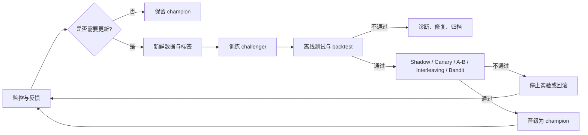
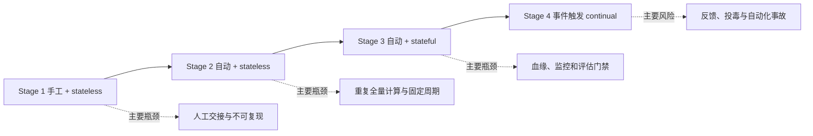
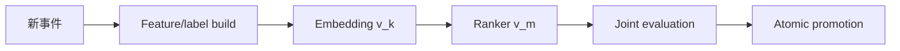
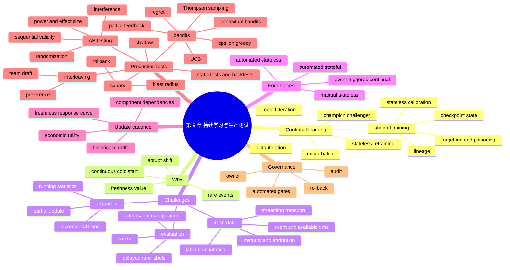

> 对应原章：9. Continual Learning and Test in Production.md
> 本章承接第 8 章：监控负责发现生产环境中的退化，持续学习负责安全、高效地更新模型，生产测试负责用真实流量验证更新是否有效。作者的核心判断是：持续学习表面上是训练问题，真正的瓶颈通常是新鲜数据、可靠评估、血缘、流式基础设施和自动化发布。
>
> 原章中的公司案例、产品状态、融资数字和行业判断主要来自 2014–2022 年。本文保留其历史语境，不将其直接当作 2026 年的现状。
>
> **归因说明：** 除相邻文字明确写明“原章”“作者”或“图 9-x”的内容外，本文加入的更新效用函数、数据新鲜度曲线、Welford 推导、A/B 样本量近似、随机化与干扰条件、序贯检验边界、regret、UCB/Thompson Sampling 公式、可运行代码、门禁矩阵、Mermaid 图和事故响应框架均为笔记补充，并非原章逐式给出的内容。

## 0. 本章要回答的核心问题

1. Continual learning 是逐样本在线更新、频繁重训，还是一种基础设施能力？
2. 为什么生产系统通常用 micro-batch，而不是每到一个样本就修改线上模型？
3. Champion–challenger 流程怎样把“训练成功”与“允许上线”分开？
4. Stateless retraining 与 stateful training 的本质区别是什么？
5. Stateful training 为什么省数据和算力，又为什么更容易累积偏差、遗忘与污染？
6. Model iteration 与 data iteration 为什么需要不同的迁移和验证策略？
7. Continual、online、continuous learning 与 continuous delivery 有何区别？
8. 突发分布变化、稀有事件与 continuous cold start 为什么需要快速适配？
9. 新鲜数据为什么不等于可训练数据，natural feedback 怎样计算成标签？
10. 流式标签连接要怎样处理 event time、延迟、重复、归因窗口与数据泄漏？
11. 更新模型的函数并不难，为什么评估才是持续学习的主要瓶颈？
12. Tay 案例说明频繁学习会放大哪些投毒与安全风险？
13. 为什么神经网络较容易增量更新，而矩阵分解和传统树模型较困难？
14. Feature scaling、quantile 等全局统计怎样改造成在线统计？
15. 组织怎样从手工、无状态重训演进到真正事件触发的持续学习？
16. Scheduler、data access、model store 与 lineage 分别解决什么问题？
17. “多久更新一次”为什么不能凭经验，而要实验测量 data freshness 的价值？
18. Model iteration 与 data iteration 的资源应怎样分配？
19. 静态测试集、backtest 与 live production test 为什么缺一不可？
20. Shadow、A/B、canary、interleaving 和 bandit 分别回答什么问题？
21. 原章对 $p$-value 的解释有什么错误，正确解释是什么？
22. A/B test 的随机化单位、样本量、干扰、窥视和多重检验怎样影响有效性？
23. Canary 为什么首先是风险控制机制，而不天然是因果实验？
24. Interleaving 为什么样本效率高，却不能证明 retention 等长期指标改善？
25. Bandit 如何在识别最好模型的同时减少机会成本，又牺牲了哪些推断便利？
26. 常见 $\varepsilon$-greedy 约定与原章写法为什么相反？
27. Model-selection bandit 与 contextual bandit 的 arm、context、reward 各是什么？
28. Partial feedback、propensity logging 与 off-policy evaluation 有什么关系？
29. 谁来执行评估为什么与“执行哪些测试”同样重要？
30. 怎样把更新触发、候选训练、离线验证、线上实验、晋级和回滚组成闭环？

全章关系可以压缩为：



一句话概括：**持续学习不是让生产模型自行吸收一切新样本，而是让组织可以在需要时快速生成候选更新，并用可复现、可审计、可回滚的证据决定是否晋级。**

---

## 1. 从第 8 章到第 9 章：发现退化之后怎么办

第 8 章解决“系统是否正在失效、哪里异常”；第 9 章解决两个后续问题：

1. 怎样适应新的数据分布；
2. 怎样确认更新后的模型在真实环境中更好且没有灾难性后果。

三组概念的职责不同：

| 能力 | 行为 | 主要问题 |
| --- | --- | --- |
| Monitoring | 被动观察当前模型的输出和反馈 | 何时、哪里退化 |
| Test in production | 主动选择哪个模型产生输出 | 哪个候选在真实流量上更好 |
| Continual learning | 自动生成、验证和发布更新 | 怎样安全、高效地适应 |

静态离线测试集无法代表不断变化的未来分布；只看线上指标又可能先伤害用户。因此可靠系统必须把离线 sanity check、时间回测和受控线上验证串起来。

---

## 2. Continual Learning：持续学习

### 2.1 持续学习不等于逐样本修改模型

听到 continual learning，人们常想象模型对每个生产样本立刻执行一次 gradient update。原章指出，真正这样做的公司很少，原因至少有两类。

第一，神经网络可能发生 **catastrophic forgetting**：在新数据上更新后，过去学到的能力突然明显退化。更一般地，若新批次只覆盖局部新分布，优化目标会偏向该局部：

$$
\theta_{t+1}
=\arg\min_{\theta}
\mathbb E_{(X,Y)\sim D_t}
[\ell(f_{\theta}(X),Y)].
$$

这里没有约束旧分布 $D_{<t}$ 上的风险，因此“在新数据上变好”不推出“整体变好”。Replay、正则化、参数隔离和周期性全量校准都在补这个缺口。

第二，现代 CPU/GPU/TPU 擅长 batch 运算。单样本更新难以利用向量化与数据并行，还让固定调度、通信和 kernel launch 开销占比过高。

生产系统更常按 512、1024 等 micro-batch 更新；最优 batch 大小由到达率、延迟预算、优化稳定性和硬件吞吐共同决定，不是越小越“持续”。

### 2.2 Champion–challenger：更新和服务必须解耦

不能直接在当前线上模型上原地更新。原章流程是：

1. 复制当前 champion；
2. 用新数据更新副本，得到 challenger；
3. challenger 与 champion 经过同一评估；
4. 只有 challenger 达到晋级条件才替换 champion；
5. 失败候选进入诊断、归档或修复流程。


图 9-1 为理解而简化。现实中可能同时有多个 challengers，而且“better”不是一个单指标。令质量 $Q$ 和安全指标 $S$ 越大越好，延迟 $L$ 和成本 $C$ 越小越好；一个更稳健的示意门禁是：

$$
\mathrm{Promote}(c)=
\mathbb 1[
\operatorname{LCB}(Q_c-Q_b)\ge \delta_Q
\land \operatorname{LCB}(S_c-S_b)\ge-\delta_S
\land \operatorname{UCB}(L_c-L_b)\le \delta_L
\land \operatorname{UCB}(C_c-C_b)\le \delta_C
\land \mathrm{HardGates}(c)
].
$$

$\operatorname{LCB}$ / $\operatorname{UCB}$ 是按预先规定置信水平计算的差异下/上界；$\delta_Q$ 是最小实际收益，$\delta_S,\delta_L,\delta_C$ 是相对 champion 可容忍的非劣边界。$\mathrm{HardGates}$ 仍包含不可由平均收益抵消的绝对安全、隐私和关键 slice 门槛。具体实验还要处理多重指标和序贯查看；公式只是门禁结构，不是统一检验方法。

Champion–challenger 与第 8 章 monitoring 的关系：监控可触发候选训练，也负责观察上线后的 champion；它不能替代候选比较。

### 2.3 更新频率不是定义

许多任务没有足够流量，或模型衰减很慢。若从每周改为每日没有收益，只增加训练、评估和发布风险，就没有必要。

持续学习真正表达的是：**基础设施允许在需要时选择合适数据、继承或重置状态、自动验证并快速部署。** 每五分钟、每天或按 drift 触发，只是这套能力的配置。

### 2.4 Stateless Retraining Versus Stateful Training

#### 2.4.1 两种更新方式

- Stateless retraining：每次从随机/预训练初始化重新训练；旧 checkpoint 不作为本轮学习状态。
- Stateful training：从前一 checkpoint 继续训练新数据，也称 fine-tuning 或 incremental learning。

原章特意称 stateful **training** 而不是 stateful retraining，因为训练过程在语义上没有重新开始。


图 9-2 中，无状态版本反复读取较长历史窗口；有状态版本沿模型版本链，每次只消费一段增量数据。

#### 2.4.2 为什么 stateful 更省数据和算力

若 yesterday checkpoint 已编码长期模式，今天只需学习增量变化。原章举例：stateless 可能每日重读三个月数据，而 stateful 只读一天。

原章引用 Grubhub 2021 案例：从每日 stateless 改为每日 stateful 后，训练计算成本降低 45 倍，purchase-through rate 提高 20%。这是特定推荐系统的历史结果，不能视为所有任务的通用收益。

粗略成本可写成：

$$
C_{stateless}\approx E_s N_{history}c+C_{artifact},
\qquad
C_{stateful}\approx E_f(N_{fresh}+N_{replay})c
+C_{artifact}+C_{restore},
$$

其中 $E_s,E_f$ 是 epoch 数，$c$ 是单样本计算，$C_{artifact}$ 是两条路径共有的保存、注册与评估成本，$C_{restore}$ 是 stateful 额外的 parent/optimizer 恢复和状态管理成本。$N_{replay}$ 表示为防遗忘重放的历史样本量。只有在 $N_{fresh}+N_{replay}\ll N_{history}$ 且 fine-tune 稳定时，后者才显著便宜。

#### 2.4.3 “可以不存训练数据”的边界

原章强调一种常被忽略的可能性：fresh sample 训练一次后不永久存储，可减少原始数据留存和部分隐私风险。

但这不是“自动满足隐私”：

- checkpoint 可能记忆敏感样本；
- 删除请求难以从已更新参数中精确撤销；
- 评估、审计、事故复现和合规可能要求保留受控数据；
- 去重、迟到事件和标签回填可能需要短期状态；
- 不保留 replay data 会加剧遗忘。

因此应由数据最小化、保留期限、访问控制、差分隐私或 machine unlearning 等策略共同决定，而不是把 stateful 当作隐私证明。

#### 2.4.4 Stateful 的额外状态

“从 checkpoint 继续”不仅是加载权重。可能还要决定是否继承：

- optimizer momentum / Adam moments；
- learning-rate scheduler；
- normalization running statistics；
- vocabulary 与 embedding table；
- random seed、训练步数、loss scaler；
- replay buffer 与数据游标。

继承错误状态会放大历史偏差；全部重置又可能造成优化突变。每类状态都应版本化并纳入回退。

#### 2.4.5 周期性从头校准

Stateful 不排斥 stateless。原章提到成熟团队会周期性用较大数据从头训练，或让两条训练路径并行。其目的包括：

- 清除累积优化路径依赖；
- 恢复旧分布能力；
- 检查 stateful 版本是否长期漂离；
- 重建 normalization、vocabulary 或全局表示。

原章提到 parameter server，但 parameter server 本质上是分布式参数存取/同步架构，并不天然定义“怎样合并两个独立模型”。模型融合还需 parameter averaging、ensemble、distillation 或专门对齐策略。

#### 2.4.6 Stateful 不保证更好

它的主要风险是：

1. catastrophic forgetting；
2. 错误标签和投毒沿版本链传播；
3. 早期偏差被反复继承；
4. optimizer state 与新 regime 不匹配；
5. 版本链过长导致复现和归因困难。

因此 lineage 应记录：

$$
v_t=(v_{parent},D_t,F_t,H_t,O_t,E_t),
$$

分别表示 parent version、增量数据、feature 版本、超参数、optimizer state 和评估证据。

#### 2.4.7 Model iteration 与 data iteration

原章区分：

| 类型 | 发生了什么 | 常见更新方式 |
| --- | --- | --- |
| Model iteration | 新 feature、架构或输出空间变化 | 通常从头训练或显式迁移 |
| Data iteration | 架构与 feature 不变，只刷新数据 | 很适合 stateful training |

增加 layer 会改变参数拓扑；增加 feature 会改变输入 schema，所以旧 checkpoint 不能无条件加载。Knowledge transfer、distillation、model surgery 可以把兼容权重迁移过去，但需要明确哪些参数复用、哪些重置，并重新验证。

原章引用 Google 2015 knowledge transfer 与 OpenAI 2019 model surgery，并指出当时没有清晰的行业结论。今天具体工具能力会变化，但结构兼容、迁移正确性和完整回归仍是基本问题。

#### 2.4.8 术语辨析

| 术语 | 本章采用的含义 | 易混点 |
| --- | --- | --- |
| Continual learning | 以 batch/micro-batch 多次更新，并具备安全发布能力 | 不要求逐样本 |
| Online learning | 常指每个样本到达后更新；文献也会泛指流式学习 | 还可能被理解为在线教育 |
| Continuous learning | 有时指逐样本连续更新，有时指持续交付 ML | 语义最不稳定 |
| Continuous delivery for ML | DevOps/MLOps 视角的持续构建、验证、发布 | Pipeline 能力不等于学习算法 |
| Incremental learning | 利用增量数据更新已有模型 | 常与 stateful 重叠 |

阅读论文或平台文档时，不要靠术语名推断行为，应检查更新粒度、是否继承状态、是否 replay、何时评估和如何发布。

### 2.5 Why Continual Learning?：为什么需要持续学习

#### 2.5.1 应对突然的分布变化

原章 rideshare dynamic pricing 案例：某社区平常周四晚需求低，模型给出低价；当晚突然有大型活动，需求激增。若模型不能快速提高价格并吸引司机，等待时间和流失都会增加。

这里的闭环是：

```text
事件 -> 需求变化 -> 反馈到达 -> 更新供需估计
     -> 调整价格/调度 -> 新供需状态
```

模型输出也影响司机和乘客，存在第 8 章所述 feedback loop。更新更快不等于更正确，动态定价还需公平、价格上限和政策门禁。

#### 2.5.2 适应稀有且短暂的事件

Black Friday / Singles Day 每年一次，去年的数据未必代表今年商品、流量和竞争环境。模型可以在活动当天持续吸收新反馈。

原章称 Alibaba 在 2019 年以 1.03 亿美元收购 Apache Flink 核心团队 Data Artisans，并将 Singles Day 推荐列为重要 ML 使用场景；脚注也提醒收购可能还包含扩大开源影响力的目标。该数字是历史案例，不证明“购买流处理框架就能获得持续学习”。

稀有事件适配尤其需要：预先演练、容量保障、快速标签、强 rollback，以及活动后避免把异常 regime 永久固化。

#### 2.5.3 Continuous cold start

经典 cold start：新用户或新 item 没有历史反馈，只能给流行内容或基于内容的默认结果。

Continuous cold start 把范围扩展到：

- 老用户换设备，行为模式变化；
- 用户未登录，身份无法连接；
- 低频用户半年后回访，旧历史已经过期；
- 新 item 尚未获得曝光和反馈。

原章引用 Coveo/SIGIR 2021 数据挑战：某些电商站点超过 70% 的购物者一年访问少于三次。这是特定数据集观察，不是所有电商的统一比例。

若模型只在夜间更新，短暂 session 的用户可能离开前都得不到个性化。原章以 TikTok 为例说明几分钟内适配 session 兴趣的潜力；该引用来自 2020 年二手文章，不能单独验证其内部算法或“高准确率”。

#### 2.5.4 “为什么不持续学习”仍是成本问题

作者称 continual learning 是 batch learning 的超集：能力上既可低频从头训练，也可高频增量更新。但工程上更大的状态空间、攻击面、评估与值班成本意味着它并非免费超集。

只有当

$$
\mathrm{Value}_{freshness}
>C_{data}+C_{train}+C_{evaluation}+C_{risk}+C_{operations}
$$

时，提高更新能力才有净价值。任务稳定、流量很低或标签很慢时，成熟的 batch pipeline 可能更合适。

### 2.6 Continual Learning Challenges：持续学习的三类挑战

原章按 fresh data access、evaluation、algorithm 三类分析。难度通常依次跨越数据平台、实验治理和学习算法，因此“写一个 update 函数”只是最小部分。

#### 2.6.1 Fresh data access challenge

##### 2.6.1.1 新鲜数据的延迟链

若要每小时更新，就需要每小时拿到新数据。只从 warehouse 拉取时，总延迟近似为：

$$
L_{trainable}
=L_{ingest}+L_{warehouse}+L_{join}+L_{label}+L_{quality}.
$$

直接从 Kafka、Kinesis 等 real-time transport 读取，可绕过 warehouse deposit 与下一次 batch schedule，但不能消除 label 和质量验证延迟。


##### 2.6.1.2 Natural labels 不会自动成为训练标签

适合持续学习的任务通常有短反馈：动态定价、ETA、广告点击、在线内容推荐等。但 click、purchase、arrival 只是行为事件，必须与当时的 query、候选集、model version 和曝光连接，才能构造训练样本。

原章电商例中，需要把：

```text
(timestamp, user_id, query)
-> (timestamp, user_id, recommendations)
-> (timestamp, user_id, click)
```

连接成 `(query, recommendation, label)`。


这个过程叫 **label computation**。Batch join 简单但慢；stream processing 更快，却必须处理：

- event time 与 processing time；
- 乱序和迟到事件；
- 重复投递与幂等；
- session / attribution window；
- 用户同时收到多个推荐时的归因；
- “未点击”要等窗口成熟后才成为负例；
- bot、误触和 position bias；
- 删除请求与隐私同意。

Natural label 也不是无偏真值。点击只观测已曝光 item，受旧 policy 和位置影响；未曝光 item 没有反事实标签。

##### 2.6.1.3 标签成熟度与 point-in-time correctness

训练样本在事件时刻只能使用当时已经可得的信息。若在 $t$ 时预测，feature 必须满足：

$$
t_{available}(f)\le t,
$$

而不是只要求事件自身发生时间早于 $t$。否则会把迟到但后来回填的数据泄漏进训练。

每个标签还应记录 maturity。例如七日购买标签在第七天前不能视为稳定负例。更新频率受“可确认标签”的速度，而不只是请求流量决定。

##### 2.6.1.4 Programmatic 与 crowdsourced labels

原章提到 Snorkel 等 programmatic labeling 与 crowdsourcing 可加速标注。它们得到的是噪声或弱监督标签，应估计 coverage、conflict、annotator agreement 和 slice bias；快标签不能无条件替代专家真值。

##### 2.6.1.5 流式基础设施的历史语境

原章写作时称 streaming tooling 尚早，并列出截至 2020–2021 年 Confluent、Snowflake 和 Materialize 的市场/融资动态。这些数字只说明当时生态投资热度；具体估值、产品能力和公司状态必须按当前版本重新核实。

#### 2.6.2 Evaluation challenge

##### 2.6.2.1 为什么评估比更新函数更难

训练脚本结束只证明“产生了 artifact”，不证明：

- 整体质量提高；
- 关键 slice 没退化；
- latency、cost 和 calibration 合格；
- 没有隐私、安全、公平或有害输出问题；
- 在线干预不会改变环境并反噬指标。

原章用两个历史高后果场景强调评估责任：住房贷款成本差异给少数群体造成数百万美元损失，以及驾驶者过度信任自动辅助驾驶后发生致命事故。它们不是同一种失效机制，但都说明平均离线分数不能替代公平、安全和真实使用方式的门禁。

更新越频繁，单位时间内的失败机会越多。若单次更新严重失败概率为 $p$，粗略独立假设下，一年 $n$ 次更新至少一次失败的概率是：

$$
1-(1-p)^n.
$$

真实失败并不独立，但公式说明即使每次风险很小，发布次数也会放大累积暴露。

##### 2.6.2.2 在线学习扩大投毒面

模型若快速吸收用户行为，攻击者可协调制造恶意样本。原章 Tay 案例：Microsoft 2016 年推出会从 Twitter 对话学习的聊天机器人，上线后遭恶意输入，约 16 小时即下线。

这个案例不能简化成“在线学习必然失败”，而说明必须有：输入过滤、速率限制、异常群体检测、可信数据源、更新隔离、safety eval、人工熔断与 rollback。

##### 2.6.2.3 评估延迟形成更新频率上限

原章支付公司欺诈检测案例中，正例稀少，需要约两周收集足够 fraud 才能比较新旧系统，因此即使训练可每日完成，也不能每日可靠晋级。

若标签成熟时间是 $L_y$、得到足够统计功效需要 $L_n$、评估和发布需要 $L_e$，则安全晋级的最短时间下界近似：

$$
L_{promotion}\ge \max(L_y,L_n)+L_e.
$$

Bandit 可以降低某些在线比较的机会成本，但不会凭空创造稀有正例，也不能绕过安全标签延迟。

#### 2.6.3 Algorithm challenge

##### 2.6.3.1 哪些算法容易增量更新

原章认为该挑战相对“软”，主要影响希望小时级更新的 matrix-based 与 tree-based 模型。

神经网络的 loss 通常可按 mini-batch 求随机梯度；但“任何 batch 都可更新”只是计算可行，不保证稳定。BatchNorm、小批噪声、optimizer 与 class imbalance 仍可能使极小批次失效。

经典 collaborative filtering 先构造大 user–item matrix，再做矩阵分解或降维。新增数据后若需重做全矩阵分解，频繁更新很贵。现代系统也有增量 ALS、online matrix factorization 或 embedding 方法，因此这是对特定算法实现的比较，不是矩阵模型的绝对限制。

传统 batch tree 难以在不重建结构的情况下吸收新样本；Hoeffding Tree 利用统计界决定何时分裂，Hoeffding Window Tree 与 Hoeffding Adaptive Tree 再处理变化窗口。原章称它们当时工业使用不广，不能外推为当前普及度。

##### 2.6.3.2 Feature pipeline 也必须可增量

即使模型可 `partial_fit`，scaler、quantile、vocabulary 和 target encoding 若每批独立重算，也会让 feature space 抖动。

对流式样本 $x_1,\ldots,x_n$，Welford 递推为：

$$
n' = n+1,
\qquad
\delta=x_{n'}-\mu_n,
$$

$$
\mu_{n'}=\mu_n+\frac{\delta}{n'},
\qquad
M_{2,n'}=M_{2,n}+\delta(x_{n'}-\mu_{n'}).
$$

于是 $M_{2,n}/n$ 是这 $n$ 个已观测值的经验总体方差。若这些观测是来自某总体的 IID 样本、总体方差有限且 $n>1$，则 $M_{2,n}/(n-1)$ 是总体方差的常用无偏估计。递推避免先求平方和导致的数值消减，也无需保存全部样本；时间相关或漂移数据下，“无偏总体估计”条件并不成立。

##### 2.6.3.3 可运行示例：在线均值与方差

```python
from math import sqrt


class RunningStats:
    def __init__(self):
        self.count = 0
        self.mean = 0.0
        self.m2 = 0.0

    def update(self, value):
        self.count += 1
        delta = value - self.mean
        self.mean += delta / self.count
        delta_after = value - self.mean
        self.m2 += delta * delta_after

    @property
    def population_variance(self):
        return self.m2 / self.count


stats = RunningStats()
for item in [10, 12]:
    stats.update(item)
for item in [14, 16, 18]:
    stats.update(item)

print(f"count={stats.count}")
print(f"mean={stats.mean:.3f}")
print(f"population_variance={stats.population_variance:.3f}")
print(f"population_std={sqrt(stats.population_variance):.6f}")
```

输出：

```text
count=5
mean=14.000
population_variance=8.000
population_std=2.828427
```

均值/方差可精确递推；quantile 通常要 KLL、t-digest 等可合并 sketch，以误差换内存。原章引用 running quantile 研究，并提到 `StandardScaler.partial_fit`，具体性能和支持范围应按当前库版本测量。

---

## 3. Four Stages of Continual Learning：持续学习的四个阶段

作者把组织演进分成四阶段，重点不是贴成熟度标签，而是说明每一步新增什么能力、消除什么瓶颈。



这不是所有组织都必须爬到 Stage 4 的单向阶梯。低流量、强监管或环境稳定的任务，Stage 2/3 可能是成本更合理的终态。

### 3.1 Stage 1: Manual, stateless retraining

团队早期优先覆盖新业务问题。原章以电商为例，依次开发 fraud detection、product recommendation、seller abuse 和 shipping-time 模型；维护旧模型被排到后面。

模型常在两个条件同时满足时才更新：

1. 性能已退化到弊大于利；
2. 团队刚好有时间。

结果是有的半年/季度更新，有的一年没动。典型流程要多人手工完成：warehouse query、清洗、feature、全量重训、导出 binary、部署。

真正危险的不只是慢，而是代码与 artifact 在交接中分叉：训练时修改了 data/feature/model logic，却没同步到 production，形成难追踪的 train-serving skew。

原章称“大多数非科技行业、采用 ML 不足三年且没有平台团队的公司”处于此阶段。这是作者写作时的经验性概括，不是抽样统计。

Stage 1 的最小改进不是立刻上流式学习，而是先让一次手工更新可复现：固定数据快照、代码 commit、环境、feature 定义、模型 artifact、评估报告和审批人。

### 3.2 Stage 2: Automated retraining

模型增至 5–10 个后，维护成本超过开发新模型的收益，团队用脚本和 Spark 等 batch system 自动串起更新流程。多数团队仍按“每天似乎合适”或“夜间算力空闲”设周期。

#### 3.2.1 不同模型有不同 cadence

一个推荐系统可包含：

- product embedding model：商品属性较慢变化，可每周更新；
- ranking model：用户兴趣和流行度变化快，可每日更新。

脚注提醒：若每天有大量新 item，embedding 也可能需要更频繁更新。Cadence 应由数据与性能决定，而不是由模型名字决定。

模型之间还有依赖：ranking 消费 embedding，embedding version 改变后，旧 ranker 可能面对不兼容表示。因此更新不是多个独立 cron，而是有依赖的 DAG：



#### 3.2.2 Requirements：七步自动工作流

原章要求基础设施能自动：

1. 拉取数据；
2. 必要时 downsample / upsample；
3. 提取 features；
4. 处理或标注 labels，生成训练集；
5. 启动训练；
6. 评估新模型；
7. 部署。

生产版还应补充 data validation、artifact signing、审批/策略门禁、shadow/canary、回滚和通知。自动执行不等于自动晋级。

#### 3.2.3 Scheduler、data 与 model store

作者认为 Stage 2 可行性主要由三项决定：

| 组件 | 解决的问题 | 不能单独解决 |
| --- | --- | --- |
| Scheduler/orchestrator | 依赖、重试、调度、状态 | 数据正确性与模型质量 |
| Data access | 快照、join、feature、label | Artifact 版本和发布 |
| Model store | 存储、版本、查找 model artifacts | 完整因果血缘与可复现性 |

已有 Airflow、Argo 等 scheduler 时，连任务可能不难；最耗时往往是跨组织数据、feature 重建和标签。原章引用 Stitch Fix 平台负责人观点，怀疑多数时间花在数据上。

最简单 model store 可是按约定目录组织的 S3 blob；但 object storage 自身不自动提供语义版本、搜索、审批和 lineage。原章举 SageMaker 与开源 MLflow 为更成熟选择；具体能力以当前版本为准。

一个可复现 artifact 至少应关联：

```text
model_id, parent_model_id, code_commit, environment_digest,
train_snapshot, label_definition, feature_versions,
hyperparameters, random_seed, evaluation_report, deploy_history
```

#### 3.2.4 Feature Reuse (Log and Wait)

生产请求已在线提取过 features。把当时真正送入模型的 feature vector 连同 request/model/feature version 记录下来，等待标签成熟后直接训练，称 **log and wait**。

它解决两个问题：

- 避免离线重复计算，节省成本；
- 训练使用当时实际 serving features，降低训练/服务不一致。

代价和边界：

- 高维 features 的日志存储昂贵；
- 需防 PII 和敏感派生特征泄漏；
- feature bug 会原样进入训练数据；
- 标签成熟前要维护稳定 request join key；
- 新 feature 无历史日志，无法直接做长窗口 backfill；
- 日志记录的是旧 policy 下被曝光的数据，仍有选择偏差。

因此 log and wait 提高 point-in-time consistency，却不自动得到无偏、无泄漏的数据。

### 3.3 Stage 3: Automated, stateful training

Stage 2 每次从头训练，频率越高越浪费。作者认为这一阶段的首要要求是 mindset 改变：团队要放弃“数据科学家每次从头交付一个孤立模型、工程师再重新部署”的默认交接方式，把模型看成有 parent、状态和演化历史的版本链。在此基础上，Stage 3 的自动工作流才会：

1. 找到已批准 parent checkpoint；
2. 校验架构、feature 和 optimizer-state 兼容性；
3. 加载 checkpoint；
4. 只用新窗口与必要 replay 继续训练；
5. 生成带 parent edge 的新版本。

#### 3.3.1 Requirements：lineage 从列表升级为图

原章举版本族：`1.0 -> 1.1 -> 1.2`、`2.0 -> 2.1`，最终可能并存 `3.32`、`2.11`、`1.64`。仅靠递增版本号不能回答：

- base model 是谁；
- 用了哪些增量数据；
- 哪一支被部署；
- 某错误从哪一代进入；
- 怎样重现或回滚到兼容祖先。

Lineage 应是 DAG，而不是文件列表。原章称其写作时没有现成 model store 提供所需能力；这是历史产品观察，今天应逐项验证当前 registry，而不是沿用结论。

若还要直接读取 real-time transport，streaming pipeline 的成熟度会成为额外要求。

#### 3.3.2 Stateful 更新的门禁

每次更新至少比较：

- parent champion；
- stateful challenger；
- 定期 stateless calibration model（若有）；
- 规则或简单 baseline。

这样可以区分“新数据确有价值”与“版本链正在积累错误”。若 stateful 持续输给 stateless，应检查 replay、learning rate、optimizer reset、label noise 和 feature statistics。

### 3.4 Stage 4: Continual learning

Stage 3 仍由开发者固定日程触发。现实变化速度不固定：平静周可能无需更新，突发周又可能一天一次都太慢。Stage 4 把触发条件交给系统，但晋级仍需完整评估。

#### 3.4.1 Requirements：四类触发器

原章列出：

| 触发类型 | 示例 | 主要局限 |
| --- | --- | --- |
| Time-based | 每五分钟 | 与真实需要脱节 |
| Performance-based | 质量突然下降 | 依赖及时标签 |
| Volume-based | 成熟标签增长 5% | 数量不等于信息量 |
| Drift-based | 检测到重大 shift | Drift 不一定伤害模型 |

实际可组合成：

$$
\mathrm{Trigger}
=V_{min}
\land (T_{max}\lor Q_{drop}\lor D_{harmful}),
$$

即先有最小有效样本，再满足最大等待时间、质量下降或有影响的漂移之一。还需 cooldown，避免告警抖动反复训练。

#### 3.4.2 Monitoring 是触发器的传感器

第 8 章强调，检测变化容易，判断变化是否重要很难。False positive 太多会造成：

- 无意义训练和评估成本；
- challenger 队列拥塞；
- 频繁小流量实验污染度量；
- 值班和审批疲劳；
- 增加错误晋级机会。

因此 drift alert 不应直接执行 `deploy`，最多触发候选构建；promotion 仍由独立门禁决定。

#### 3.4.3 Edge continual learning 的理想与约束

原章设想在手机、手表、无人机等设备上发布 base model，设备本地持续适配，不需向中心服务器传数据，从而降低服务器成本并改善隐私。

这个“holy grail”还受限于：

- 电量、内存、散热和训练算力；
- 设备数据少且高度偏置；
- 无中心评估时难以发现本地退化；
- 模型盗取、投毒和物理攻击；
- checkpoint 损坏后的恢复；
- 跨设备一致性、法规和软件更新。

数据留在设备是隐私优势，不等于没有隐私风险；本地模型参数和 telemetry 仍可能泄漏信息。

#### 3.4.4 四阶段真正增加的能力

```text
Stage 1: 能重现一次更新
Stage 2: 能自动重现整条无状态更新
Stage 3: 能追踪并安全继承训练状态
Stage 4: 能依据环境信号自动决定何时生成候选
```

每阶段都必须保留人工 stop、版本 pin、rollback 和重新全量训练路径。

---

## 4. How Often to Update Your Models：模型应该多久更新一次

作者先改变问题：不要先问“行业通常多久”，而要问“更新到更鲜数据能带来多少可验证收益”。

基础设施不成熟时，实用答案是“在保证安全的前提下，尽可能频繁”；自动化成熟后，答案取决于 freshness value、标签速度、实验功效、成本和风险。

### 4.1 Value of data freshness

#### 4.1.1 原章实验设计

假设有 2020 年数据：

- Model A：Jan–Jun 训练；
- Model B：Apr–Sep 训练；
- Model C：Jun–Nov 训练；
- 三者都在 December 数据测试。


窗口长度大致固定，主要改变最后训练日期到测试日期的 age。若 C 明显好于 A，就说明旧一个季度可能太久。

可定义 freshness response curve：

$$
S(a,w,s)=\mathrm{Score}
(D_{train}[s-w,s],D_{test}[t_0,t_1]),
\qquad a=t_0-s,
$$

$a$ 是训练窗口与测试期之间的 age，$w$ 是训练窗口长度，$s$ 是 cutoff。只改变 $a$ 才主要估 freshness；若同时改变样本量、季节覆盖、超参数或 label maturity，就会混杂。

#### 4.1.2 怎样让实验可信

1. 固定 model code、features、训练预算和 evaluation period；
2. 尽量固定训练样本量或窗口长度；
3. 所有 features 按 cutoff 做 point-in-time join；
4. 用多个历史 cutoff 重复，覆盖季节和事件；
5. 按重要 slice 报告均值、方差和置信区间；
6. 同时测 quality、calibration、latency 和 business proxy；
7. 检查新鲜数据是否只是标签更容易或数据清洗更好。

单个 December 回测无法证明全年最优 cadence；它只是 freshness curve 的一个点。

#### 4.1.3 历史案例

原章引用 Facebook 2014 ads CTR 实验：从每周改为每日重训，loss 约降低 1%，团队认为足以切换 pipeline。另引用 Weibo 2019 分享，说明有公司更新到数分钟级。

这些结果与具体 loss、流量和收入杠杆相关。“1% loss 改善”不是“业务增长 1%”，也不意味着其他模型值得每日更新。

#### 4.1.4 从性能曲线到经济决策

候选 cadence $k$ 的净效用可写为：

$$
U(k)=V(\Delta Q_k)
-C_{train}(k)-C_{eval}(k)-C_{serve}(k)-C_{risk}(k).
$$

$V$ 把质量改善映射成业务/风险价值。最频繁的 cadence 只有在边际收益仍大于边际成本时才最优。

数值例：月更 score 为 0.812；周更 0.829；日更 0.832。这里把“一个完整的 1.0 score 单位”的月价值定义为 1000 单位，每次更新成本 300 单位。与月更相比，周更每月约多 $30/7-1=3.286$ 次更新，日更多 29 次，因此：

| Cadence | Score 增益 | 增量月收益 | 增量月成本 | 相对月更净值 |
| --- | ---: | ---: | ---: | ---: |
| 月更 | 0 | 0 | 0 | 0 |
| 周更 | 0.017 | 17 | 约 986 | -969 |
| 日更 | 0.020 | 20 | 8700 | -8680 |

按该价值映射，任何提频都不划算；若一个完整 1.0 score 单位价值 100,000，周更相对净值约 $1700-986=714$，日更约 $2000-8700=-6700$，周更成为最优。若团队习惯把 0.01 称为“一个百分点”，价值参数必须相应换算。结论取决于价值函数和风险，不只取决于 score。

#### 4.1.5 不同组件分别优化

Embedding、ranker、calibrator、rules 变化速度不同。组件 $i$ 的 cadence 可分别求：

$$
k_i^*=\arg\max_{k_i} U_i(k_i),
$$

再受依赖约束，例如 embedding 更新后必须重验下游 ranker。不要把整套系统强制绑到最快组件的日程。

### 4.2 Model iteration versus data iteration

既要问多久更新，也要问更新什么：

- Data iteration：同架构、同 feature，用新数据刷新；
- Model iteration：改 feature、loss、架构或任务定义。

二者争夺实验、算力和工程资源。作者给出判断例：新架构要 100 倍训练计算只带来 1% 改善，而最近三小时数据只需 1 倍计算也带来 1%，应优先 data iteration。

更一般地比较边际效率：

$$
E_{data}=\frac{\Delta U_{data}}{C_{data}},
\qquad
E_{model}=\frac{\Delta U_{model}}{C_{model}}.
$$

短期选择效率更高者，但不能永远只迭代数据：架构上限、坏目标和缺失 feature 不会被更多新数据自动修复。反过来，环境变化快时反复搜架构也替代不了 data refresh。

#### 4.2.1 一个可执行的 cadence 决策流程

```text
对每个模型/组件：
    构造多个历史 cutoff
    在固定窗口、代码和预算下改变数据 age
    回测质量、安全、slice、calibration 与成本
    拟合 freshness response curve 和不确定性
    枚举可行 cadence，计算净效用
    检查标签成熟、依赖 DAG 和评估吞吐
    选择满足风险约束的最高净效用 cadence
    上线后持续比较预测值与真实收益
```

作者最终结论不是一个统一时间数字，而是：**用实验量化本任务的数据新鲜度价值，再决定更新频率。**

---

## 5. Test in Production：在生产环境中测试

持续学习不断产生新 challenger；静态 test split 无法覆盖当前分布，生产测试因此成为晋级证据的一部分。它不是“跳过离线测试直接上线”，而是把真实环境中无法离线模拟的交互、延迟、反馈和业务结果纳入验证。

### 5.1 三层评估为何缺一不可

#### 5.1.1 Static test split

固定测试集让多个版本在同一 benchmark 比较，适合回归、安全和已知 slice。它必须相对稳定，否则分数变化无法区分模型差异和测试集差异。

局限：若模型为适应新分布而更新，旧测试集可能不代表生产。

#### 5.1.2 Backtest

Backtest 在过去特定时间段上模拟“当时训练、随后预测”。例如用前一天更新，再用未进入训练的最后一小时评估。

它应遵守时间切分：

$$
\max t_{train}<\min t_{test},
\qquad
t_{available}(feature)\le t_{prediction}.
$$

Backtest 更接近近期分布，却可能被 pipeline corruption、回填泄漏或单一事件污染。因此原章要求仍保留深入研究过的静态 test set 作为 sanity check。

#### 5.1.3 Live production test

即使近期 backtest 好，也不能保证未来：模型输出会改变用户、市场和标签生成，serving stack 还有真实延迟与容量。只有真实部署才能观察这些效应。

生产测试的安全原则：

- 先离线，后线上；
- 从无用户影响到小影响逐步放量；
- 先定义 primary metric、guardrail、停止规则和最小实际效果；
- 版本、流量和反馈可追踪；
- 随时可停止和回滚；
- 高风险输出要额外人工或规则保护。

方法定位如下：

| 方法 | 用户看到 challenger? | 核心目标 | 典型代价/局限 |
| --- | --- | --- | --- |
| Shadow | 否 | 验证输出、延迟和容量 | 双算力；看不到行为反应 |
| A/B | 是，随机分组 | 估计平均因果效果 | 样本量、干扰、等待时间 |
| Canary | 是，小流量渐进 | 控制发布风险 | 非随机时不能可靠归因 |
| Interleaving | 是，同一列表混合 | 快速比较排序偏好 | 只适合排序；偏好不等于长期业务 |
| Bandit | 是，自适应分配 | 边学边减少机会成本 | 推断复杂；需要快速 reward |

### 5.2 Shadow Deployment

#### 5.2.1 原章三步流程

1. Candidate 与 existing model 并行部署；
2. 每个请求同时发给两者，只把 existing prediction 给用户；
3. 记录 candidate prediction 供分析。

Candidate 令人满意后才替换 champion。因为用户不接触 candidate action，它通常是风险最低的 live test。

#### 5.2.2 Shadow 能验证什么

- candidate 是否能处理真实 schema、缺失和长尾 input；
- prediction、confidence 和 disagreement 分布；
- latency、memory、GPU、timeout 与 error rate；
- throughput 和 autoscaling；
- 新旧输出在已知 slice 上的差异；
- 延迟标签到达后，若日志可 join，可做 counterfactual-like offline scoring。

#### 5.2.3 Shadow 不能验证什么

因为用户只看到 champion action：

- 无法直接观察 challenger 对点击、购买、司机供给等行为的影响；
- 对 action-dependent label，challenger 的真实 reward 不可观测；
- 它不能消除旧 policy 的选择偏差；
- 若 challenger 会改变下游状态，仅计算未执行动作不足以模拟闭环。

原章称同时请求两模型“通常意味着推理计算翻倍”。准确说增量取决于共享 preprocessing、batching、异步执行、采样 shadow 和模型大小，不必严格 2 倍，但容量与日志成本显著增加。

#### 5.2.4 Shadow 的晋级规则

```text
先检查服务健康：error / timeout / latency / memory
再检查输出契约：schema / range / safety / NaN
再检查新旧差异：overall / slices / long-tail
标签成熟后检查离线质量
所有硬门槛通过，才进入会影响用户的试验
```

### 5.3 A/B Testing

#### 5.3.1 原理与流程

A/B test 把现有 champion 与 candidate 当两个 treatment：

1. 并行部署；
2. 按预先确定概率随机分配实验单位；
3. 收集 prediction、用户反馈和 guardrails；
4. 估计两组指标差异与不确定性；
5. 依据预注册规则决定 promote、continue 或 stop。

原章引用 2017 年 Microsoft 和 Google 各自每年超过 10,000 次 A/B tests。它是历史规模数字，不是当前频次。

#### 5.3.2 随机化为什么有效

设潜在结果 $Y_i(1)$ 表示用户 $i$ 看到 challenger 的结果，$Y_i(0)$ 表示看到 champion 的结果。平均处理效应：

$$
{\tau}=\mathbb E[Y(1)-Y(0)].
$$

同一用户不能同时处于两种状态，反事实不可观测。随机分配 $Z_i$ 使 treatment 与潜在结果在期望上独立：

$$
Z_i\perp (Y_i(0),Y_i(1)).
$$

因此均值差

$$
\widehat\tau=\bar Y_B-\bar Y_A
$$

可无偏估计实验人群上的平均效果（还需遵守分配、无选择性缺失等条件）。

原章手机用户进 A、桌面用户进 B 的例子违反随机化：设备与 treatment 混杂，无法知道差异来自模型还是设备。

#### 5.3.3 随机化单位与 sticky assignment

应按会相互影响的最小独立单位随机：

- 推荐/搜索常按 user，避免同一用户频繁切模型；
- B2B 可按 account/organization；
- 社交网络可能按 cluster，降低用户间干扰；
- Marketplace/dynamic pricing 可能按 region × time，因为供需会跨用户传播。

原章提出动态定价可一天 A、一天 B。这是 switchback design 的直觉形式，但简单逐日交替仍可能被 weekday、天气和 carryover 混杂；应随机化时间块、平衡周期并考虑 washout。

#### 5.3.4 SUTVA 与干扰

标准均值差通常假设某用户结果不受其他用户 treatment 影响。Rideshare 中 A 的价格改变司机供给，进而影响 B 用户，违反 no-interference。此时 individual-level A/B 会低估或扭曲效果，应采用 cluster/switchback、市场级实验或专门的 interference model。

#### 5.3.5 样本量直觉

两组等样本、比较 Bernoulli conversion。令 $p_A$ 为 baseline，$p_B=p_A+\Delta$，$\bar p=(p_A+p_B)/2$，常见规划近似为：

$$
n_{group}\approx
\frac{
\left[
z_{1-\alpha/2}\sqrt{2\bar p(1-\bar p)}
+z_{1-\beta}\sqrt{p_A(1-p_A)+p_B(1-p_B)}
\right]^2
}{\Delta^2}.
$$

代码为给出清晰数量级，把两项方差都近似为 $\bar p(1-\bar p)$，使用 pooled 简化式：

$$
n_{group}\approx
\frac{2(z_{1-\alpha/2}+z_{1-\beta})^2
\bar p(1-\bar p)}{\Delta^2}.
$$

$\alpha$ 是双侧第一类错误，$1-\beta$ 是 power，$\Delta$ 是 minimum detectable absolute effect。真实设计还要考虑 unequal allocation、cluster correlation、variance reduction、noncompliance 和 multiple metrics。

#### 5.3.6 可运行示例：conversion A/B 样本量近似

```python
from math import ceil
from statistics import NormalDist


def approximate_samples_per_group(baseline, absolute_effect, alpha=0.05, power=0.80):
    average_rate = baseline + absolute_effect / 2
    z_alpha = NormalDist().inv_cdf(1 - alpha / 2)
    z_power = NormalDist().inv_cdf(power)
    numerator = 2 * (z_alpha + z_power) ** 2 * average_rate * (1 - average_rate)
    return ceil(numerator / absolute_effect**2)


samples = approximate_samples_per_group(0.10, 0.01)
print(f"samples_per_group={samples}")
print(f"total_samples={2 * samples}")
```

输出：

```text
samples_per_group=14752
total_samples=29504
```

这个公式只适合规划数量级，不能替代针对实际 estimator、实验单位和停止规则的 power analysis。

#### 5.3.7 正确理解 $p$-value

原章在此处包含两个需要纠正的问题：文字先写 significance 为 $p\le0.5$，按上下文显然应是常用例中的 $p\le0.05$；随后把 $p=0.05$ 解释为“重复实验 95% 会得到 A 更好”，这是错误的。

正确含义是：若零假设和检验模型成立，观察到当前或更极端统计量的概率为 5%。它不是：

- $H_0$ 为真的概率；
- A 更好的概率；
- 重复实验得到同一结论的概率；
- 实际效果足够大的证明。

应同时报告 effect size、confidence interval、power 和 practical threshold。结果不显著可能是“差异很小”，也可能是“样本不足”；若样本量足够且置信区间排除了有价值效果，才更支持“二者实际等价”。

#### 5.3.8 常见实验陷阱

- 每天看一次普通固定样本 $p$-value，显著就停：inflated false positive；
- 同时测很多指标、slice 和候选，不校正：multiple testing；
- 实验中途改 primary metric；
- 新奇效应、学习效应和周周期未覆盖；
- Assignment 与实际 serving 不一致；
- SRM（sample ratio mismatch）未检查；
- 只看平均指标，关键群体退化；
- 只看显著性，不看最小业务效果；
- 多候选 A/B/C/D 共用 control 却按独立两两检验处理。

需要频繁查看时，应使用预先设计的 group sequential、alpha spending、always-valid inference 或 Bayesian decision rule，而不是把 fixed-horizon test 随意序贯化。

### 5.4 Canary Release

#### 5.4.1 原章四步流程

1. Candidate 作为 canary 与 existing model 并行；
2. 小部分流量进入 canary；
3. 指标合格则增流，不合格则 abort 并回到 champion；
4. 直到 100% 替换或完全终止。

Canary 的核心目标是**限制事故爆炸半径**。典型阶梯可为 1% -> 5% -> 25% -> 50% -> 100%，每一阶段都有最短观察时间、硬 guardrails 与自动 rollback。

#### 5.4.2 Canary 与 A/B 的区别

两者都可并行部署和分流，但：

- A/B 以随机化估计因果效果；
- Canary 以渐进暴露控制发布风险。

Canary 可承载 A/B，前提是流量真正随机、实验持续足够久且分析尊重分配。把 candidate 先给“不重要市场”不是随机实验；市场差异会混杂，只能说明该市场没有明显事故，不能证明 candidate 全局更好。

#### 5.4.3 Canary guardrails

```text
Hard stop: crash, timeout, safety, privacy, schema, severe slice harm
Rate guard: latency p99, error rate, fallback rate, cost per request
Quality: label-ready primary metric and calibration
Business: conversion, retention proxy, complaints
```

低流量阶段可能没有足够 power 发现小质量变化，所以 canary 最擅长快速发现大故障，而非在 1% 流量上证明微小提升。

### 5.5 Interleaving Experiments

#### 5.5.1 为什么比用户级 A/B 更快

比较 ranker A/B 时，普通实验让一组用户看全 A，另一组看全 B；用户异质性带来大方差。Interleaving 把两个 ranker 的结果混成同一列表，让同一用户、同一 query 同时比较，类似 paired design，常能用更少样本识别偏好。

原章引用 Joachims 2002 起源与 Netflix 2017 经验：interleaving 以显著更小样本可靠找出更好 personalization algorithm。该结论依赖排序场景和具体实现，不能泛化到所有业务实验。


#### 5.5.2 Team-draft interleaving

为避免 position bias，在每个位置随机选 A 或 B，获选 ranker 提交其尚未出现的最高项。简化伪代码：

```text
result = []
credit = {A: 0, B: 0}
while result 未满:
    若 A 贡献较少则选 A；若 B 贡献较少则选 B
    若双方贡献数相同，则随机选择 A 或 B
    取该 ranker 中第一个未重复 item
    记录 item 的归属并追加
用户点击后，将 credit 计给该 item 的贡献方
```


原章表述为每个位置以相等概率选 A/B；标准 team-draft 通常还会优先让当前贡献更少的 team 选择，以保持 exposure 平衡。若两者贡献数相同再随机决定。

#### 5.5.3 有效性前提与局限

- Item 归属可追踪；重复结果要有确定处理；
- 两侧在位置、曝光机会和 tie-breaking 上公平；
- Click credit rule 预先定义；
- 用户能合理消费混合列表；
- 一个 ranker 的结果不会破坏另一个结果的语义。

Interleaving 主要测即时偏好。用户更爱点击 A 不保证 A 改善 retention、watch time、revenue、公平或长期满意度。因此它适合作为快速筛选，胜者仍需 A/B 或其他核心指标验证。

### 5.6 Bandits

#### 5.6.1 从老虎机到模型分流

每个候选模型视为 arm，reward 是点击、正确预测或业务结果。Bandit 在每轮选择 arm，平衡：

- exploitation：选当前看起来最好的；
- exploration：给不确定 arm 流量，避免过早锁定。

A/B 通常按预定比例分流，结束后统一分析；bandit 根据累计 reward 自适应改变分流。原章称 A/B stateless、bandit stateful，这里指 routing policy 是否依赖历史反馈，不是模型 checkpoint 的 stateful/stateless。

#### 5.6.2 实施条件

原章列出：

1. 模型能 online prediction；
2. 最好有短 feedback loop；
3. 能收集 reward、维护每个模型状态并据此路由。

还应记录 assignment probability（propensity）、reward maturity、delayed/censored feedback 和 policy version。否则既难复现，也难做 unbiased off-policy evaluation。

#### 5.6.3 Regret：边学习边少犯错

在平稳 stochastic bandit 中，令每个 arm 的期望 reward $\mu_a$ 固定，最佳固定 arm 的期望 reward 为 $\mu^*$，第 $t$ 轮选 $a_t$。相对于“始终选择最佳固定 arm”的 expected pseudo-regret 为：

$$
R_T=T\mu^*-
\mathbb E\left[\sum_{t=1}^{T}r_t\right].
$$

A/B 为获得对称证据，会持续给较差 arm 固定流量；bandit 学到差异后偏向较优 arm，通常降低 opportunity cost。但自适应数据让传统 fixed-allocation 置信区间不再直接适用。Contextual、adversarial 或 nonstationary bandit 要换 comparator 和 regret 定义，例如相对随时间变化 oracle 的 dynamic regret。

原章引用一项 Greg Rafferty 2020 演示：A/B 超过 630,000 samples，而 Thompson Sampling 少于 12,000 samples 判定 5% 差异。它是特定模拟/实验设置的博客结果，“95% confidence interval”的口径并不足以证明 bandit 一般有固定 50 倍优势。

#### 5.6.4 $\varepsilon$-greedy 与原章符号错误

常见约定：以 $1-\varepsilon$ 选择当前最好 arm，以 $\varepsilon$ 随机探索：

$$
a_t=
\begin{cases}
\arg\max_a \widehat\mu_a, & \text{概率 }1-\varepsilon,\\
{\text{随机 arm}}, & \text{概率 }\varepsilon.
\end{cases}
$$

若 90% 利用、10% 探索，通常写 $\varepsilon=0.1$。原章写“90% 或 $\varepsilon=0.9$ 走最佳模型”，等于把 $\varepsilon$ 定义成 exploitation probability；算法行为清楚，但与主流记号相反，阅读实现时必须核对定义。

简单算法：

```text
初始化每个 arm 至少一次
for each request:
    以 epsilon 概率随机选 arm，否则选经验均值最高 arm
    服务并等待成熟 reward
    更新该 arm 的 count 和 mean reward
```

在平稳渐近设置中，固定 $\varepsilon>0$ 会永久把一部分流量用于探索；衰减太快又可能锁定错误 arm。非平稳环境反而可能需要持续探索，并结合滑动窗口、discount 或 change detection 才能发现最佳 arm 已变化。

#### 5.6.5 UCB (Upper Confidence Bound)

Bernoulli/有界 reward 的 UCB1 直觉分数：

$$
\mathrm{UCB}_a(t)
=\widehat\mu_a(t)
+c\sqrt{\frac{\ln t}{N_a(t)}}.
$$

第一项是利用，第二项是 uncertainty bonus。被选次数少的 arm bonus 大，体现“面对不确定性保持乐观”。公式常数和置信界依 reward 假设而变。

#### 5.6.6 Thompson Sampling

Bernoulli reward 可给 arm $a$ 一个 Beta prior：

$$
{\theta}_a\sim\mathrm{Beta}(\alpha_a,\beta_a).
$$

每轮从各 posterior 采样 $\widetilde\theta_a$，选择最大者；观察 success 后 $\alpha_a{+}{=}1$，failure 后 $\beta_a{+}{=}1$。它按 posterior 中 arm 成为最优的可能性自然分配探索。

#### 5.6.7 可运行示例：确定性重放三种 Bernoulli bandit

为了可复现，下面先生成固定潜在 reward table，再让每个算法在同一环境重放。结果只说明这组 seed/参数，不是通用排名。

```python
import math
import random


def make_rewards(probabilities, rounds, seed):
    generator = random.Random(seed)
    return [
        [1 if generator.random() < probability else 0 for _ in range(rounds)]
        for probability in probabilities
    ]


def run_epsilon_greedy(rewards, epsilon, seed):
    generator = random.Random(seed)
    counts = [0] * len(rewards)
    totals = [0] * len(rewards)
    for round_index in range(len(rewards[0])):
        if 0 in counts:
            arm = counts.index(0)
        elif generator.random() < epsilon:
            arm = generator.randrange(len(rewards))
        else:
            arm = max(range(len(rewards)), key=lambda item: totals[item] / counts[item])
        counts[arm] += 1
        totals[arm] += rewards[arm][round_index]
    return counts, sum(totals)


def run_ucb(rewards):
    counts = [0] * len(rewards)
    totals = [0] * len(rewards)
    for round_index in range(len(rewards[0])):
        if 0 in counts:
            arm = counts.index(0)
        else:
            arm = max(
                range(len(rewards)),
                key=lambda item: totals[item] / counts[item]
                + math.sqrt(2 * math.log(round_index + 1) / counts[item]),
            )
        counts[arm] += 1
        totals[arm] += rewards[arm][round_index]
    return counts, sum(totals)


def run_thompson(rewards, seed):
    generator = random.Random(seed)
    successes = [0] * len(rewards)
    failures = [0] * len(rewards)
    counts = [0] * len(rewards)
    for round_index in range(len(rewards[0])):
        arm = max(
            range(len(rewards)),
            key=lambda item: generator.betavariate(
                successes[item] + 1, failures[item] + 1
            ),
        )
        reward = rewards[arm][round_index]
        counts[arm] += 1
        successes[arm] += reward
        failures[arm] += 1 - reward
    return counts, sum(successes)


probabilities = [0.05, 0.08, 0.12]
rounds = 5000
rewards = make_rewards(probabilities, rounds, seed=17)

for name, result in [
    ("epsilon_greedy", run_epsilon_greedy(rewards, epsilon=0.10, seed=23)),
    ("ucb", run_ucb(rewards)),
    ("thompson", run_thompson(rewards, seed=29)),
]:
    counts, total_reward = result
    print(f"{name}: counts={counts}, reward={total_reward}")
```

输出：

```text
epsilon_greedy: counts=[186, 148, 4666], reward=547
ucb: counts=[776, 1499, 2725], reward=466
thompson: counts=[49, 387, 4564], reward=541
```

注意这是 full reward table 的离线模拟；每个算法在同一轮面对相同的潜在 reward table，但只读取被选 arm 的 reward。单次 seed 中 $\varepsilon$-greedy reward 略高不代表它一般优于 Thompson Sampling 或 UCB，比较算法需要多 seed 报告均值、分位数和 regret。

#### 5.6.8 Contextual bandits as an exploration strategy

##### 5.6.8.1 与 model-selection bandit 的区别

原章约定：

| 问题 | Arm/action | Context | Reward |
| --- | --- | --- | --- |
| Model-selection bandit | 选择哪个模型服务 | 可不使用，或含请求信息 | 模型预测的反馈 |
| Contextual bandit | 选择展示哪个 item/ad | 用户、query、设备、时刻 | 点击、购买等 |

有些文献也把“按请求特征选择模型”叫 contextual bandit，术语会冲突。本章把 contextual bandit 保留给探索哪些 prediction/action 有价值。

##### 5.6.8.2 Partial / bandit feedback

1000 个 items 每次只展示 10 个，只有这 10 个获得反馈；其余 990 个的潜在 reward 不可见。这叫 partial feedback 或 bandit feedback。

Item 0 分可能表示：

- 从未曝光，完全不确定；
- 曝光很多但没人点，证据表明价值低。

只按累计点击排序会把两者混为一谈，并强化热门 item。Contextual bandit 用 uncertainty-aware exploration 获取反事实附近的信息。

##### 5.6.8.3 One-shot RL 的边界

Contextual bandit 每轮观察 context、选一次 action，随后得到一个 reward；reward 可以延迟到达。“One-shot”指决策模型不显式建模 action 之后的多步状态转移，而不是要求反馈在墙钟时间上立即到达。完整 reinforcement learning 处理 action sequence、state transition 与多步 credit assignment。

若推荐会改变长期兴趣或库存，单步点击 reward 可能短视；此时需要长期实验、延迟 reward 或 MDP/RL 建模，不能仅凭“one-shot RL”忽略动态效应。

##### 5.6.8.4 为什么更难落地

- 探索策略与模型架构、action space 绑定；
- Reward 延迟、稀疏、可被操纵；
- 安全/合规 action 不能随意探索；
- Policy 改变数据分布，离线评估需 propensity；
- Large action space 要 candidate generation、embedding 或结构化 exploration；
- 线上异常必须能停用 exploration。

原章引用 Twitter 与 Google 的效果报告，并推荐 Deep Bayesian Bandits。它们证明特定设置可行，不构成所有推荐系统的默认方案。

---

## 6. 评估流程的 owner 与自动化

作者在 bandits 后强调：好评估不仅是“测什么”，也是“谁来测、怎样保证一致”。

若模型开发者自行选择测试：

- 已知模型背景，使用方式不同于普通用户；
- 容易选择有利 slice 或指标；
- 不同人执行顺序与阈值不同；
- 失败结果可能没有统一记录。

团队应定义类似 CI/CD 的 model evaluation pipeline：

```text
artifact integrity
-> data/schema checks
-> static regression suite
-> temporal backtests
-> safety/fairness/slice checks
-> shadow
-> canary or controlled experiment
-> promotion review/policy
-> post-deploy monitoring
```

“谁来运行”不一定意味着独立团队手工审批每个版本，而是：标准由跨职能 owner 制定，自动化系统一致执行，风险例外由明确责任人审查。开发者不能单方面改掉失败门槛。

---

## 7. 原章总结的完整还原

本章讨论怎样持续更新生产模型以适应变化。作者把基础设施现代化描述为四阶段：从手工、每次从头训练，演进到自动、无状态，再到自动、有状态，最终由环境信号触发候选更新。

“多久更新一次”没有行业统一答案。应通过历史时间窗口实验测量数据新鲜度的价值，并在 model iteration 与 data iteration 之间分配资源。

Continual learning 与第 7 章 online prediction 类似，都受益于成熟 streaming infrastructure。训练本身可以 micro-batch；在线反馈、实时标签和 production evaluation 更需要 streaming。原章列 Spark Streaming、Snowflake Streaming、Materialize、Decodable、Vectorize 等当时方案，工具现状应按 2026 年重新核查。

作者最后重申：持续学习是 ML 特有需求，却主要依赖基础设施解法，需要 data science/ML team 与 platform team 协作。第 10 章继续讨论基础设施与工具。

---

## 8. 容易混淆的概念与常见误区

### 8.1 Continual learning 就是每来一个样本更新一次

不是。原章中的主流生产方式是 batch/micro-batch；核心是随需更新、验证和发布的能力。

### 8.2 更新得越频繁越先进

频率只有在新鲜数据收益超过训练、评估、风险与运维成本时才有价值。低流量或慢漂移任务不需要分钟级更新。

### 8.3 Stateful training 与频繁训练是同义词

Stateful 描述是否继承 checkpoint 状态；hourly/daily 描述 cadence。可以每日 stateless，也可以每月 stateful。

### 8.4 Fine-tuning 一定比从头训练好

它通常更省数据和计算，却可能遗忘、继承污染和累积路径偏差。周期性 stateless calibration 是重要对照。

### 8.5 Checkpoint 只包含模型权重

Optimizer、scheduler、normalization、vocabulary、训练步数和数据游标都可能影响继续训练，必须明确继承策略。

### 8.6 Stateful training 意味着不需要旧数据

只用 fresh data 是一种可能设计，不是普遍最优。Replay、回归评估、审计和法规可能仍需受控历史数据。

### 8.7 不永久存样本就自动保护隐私

参数可能记忆样本，日志、checkpoint 和 telemetry 也会泄漏；删除与审计还可能更困难。

### 8.8 Parameter server 会自动合并 stateful 与 stateless 模型

Parameter server 解决分布式参数通信/存取；如何融合模型仍需 averaging、ensemble、distillation 等定义。

### 8.9 Model iteration 可以直接加载任意旧 checkpoint

新增 feature、layer 或 label space 会改变张量拓扑和语义。只有兼容部分可迁移，其余需初始化并完整回归。

### 8.10 Continual、continuous、online learning 有统一定义

没有。不同文献会互换使用，必须检查更新粒度、状态继承、反馈和发布行为。

### 8.11 Continual learning 是 batch learning 的免费超集

能力上可包含 batch；工程上增加状态、攻击面、实验和运维成本，不一定有正净收益。

### 8.12 Natural label 就是真实且无偏的标签

Click、purchase 等受曝光、位置和旧 policy 影响；未曝光 action 没有反事实反馈。

### 8.13 有实时事件流就有实时训练数据

还要完成标签 join、maturity、去重、迟到处理、质量检查和 point-in-time features。

### 8.14 Event time 早于预测就不会泄漏

真正条件是该 feature 在预测时已经可用，即看 available time，而不只看 event time。

### 8.15 未点击可以立即标成负例

用户可能稍后点击。必须等 attribution window 成熟，否则近期样本系统性多出假负例。

### 8.16 Programmatic labels 能无损替代专家标签

弱监督加快 coverage，但有 conflict、bias 和噪声；应保留黄金集与质量估计。

### 8.17 能 `partial_fit` 就适合持续学习

计算接口只是必要条件。Feature statistics、类别覆盖、遗忘、评估和发布门禁仍可能失败。

### 8.18 神经网络可用任意小 batch 稳定更新

梯度在计算上可行不等于统计与优化稳定。BatchNorm、噪声、类别不平衡和硬件效率都会限制。

### 8.19 矩阵分解和树模型绝对不能增量更新

经典 batch 版本较困难，但已有 incremental factorization、Hoeffding Tree 等方法；要按具体算法判断。

### 8.20 每个 micro-batch 单独算 scaler 最“新鲜”

小批统计会剧烈抖动，使连续版本看到不同坐标系。应使用稳定 running/windowed statistics 并版本化。

### 8.21 自动化 retraining 就是自动化 deployment

训练结束不等于质量合格。候选构建、评估、审批、晋级和回滚必须分开。

### 8.22 Model store 只是存放 `.pkl` 的目录

Blob 可存 artifact，但 reproducibility 还需要 code/data/feature/parent/evaluation/deployment lineage。

### 8.23 Log and wait 自动消除 train-serving skew

它提高在线/训练 feature 一致性，但会忠实记录在线 bug 和旧 policy 选择偏差，新 feature 也没有历史值。

### 8.24 Drift alert 应直接触发部署

Drift 可无害或来自 pipeline bug。它最多触发 challenger build；是否晋级必须看质量、安全和业务证据。

### 8.25 Stage 4 对所有公司都是目标

四阶段描述能力演进，不是强制排名。稳定、低流量或高风险任务可能长期停在自动 batch/stateful 阶段。

### 8.26 固定 cadence 一定比事件触发落后

标签稀疏或 detector 噪声大时，固定日程更可预测，也可能比过拟合少量信号更可靠。

### 8.27 Freshest data 总是最好

近期窗口可能太小、含异常事件、标签未成熟或丢掉季节覆盖。Freshness 与样本量、代表性存在权衡。

### 8.28 单个 freshness backtest 能确定最优频率

单一 cutoff 会受季节与偶发事件影响，应跨多个历史 cutoff 重复并估计不确定性。

### 8.29 Loss 降低 1% 就等于收入提高 1%

模型指标与业务价值的映射取决于流量、决策边界和单位收益，需要线上验证。

### 8.30 Static test、backtest 和 production test 可以互相替代

三者分别守住已知回归、近期时间分布和真实闭环，证据互补。

### 8.31 Test in production 就是把未经验证的模型给用户

正确流程先离线和 shadow，再以 guardrail、限流、停止规则和回滚逐步暴露。

### 8.32 Shadow test 能证明 challenger 提升点击率

用户没看到 challenger action，无法直接观测它引起的行为。Shadow 主要验证兼容性、性能和输出。

### 8.33 Shadow 一定严格使推理成本翻倍

成本通常显著增加，但共享 preprocessing、采样和异步资源可改变倍数。

### 8.34 A/B test 只需把一半请求发给 A、一半发给 B

还需正确随机化单位、sticky assignment、样本量、干扰处理、指标和停止规则。

### 8.35 每次 request 随机最“随机”

同一用户跨版本会污染体验与指标。多数场景应按 user/account/cluster 等稳定分配。

### 8.36 A 一天、B 一天就自动形成有效 switchback

星期、天气、趋势和 carryover 会混杂。时间块应随机、平衡并考虑 washout。

### 8.37 $p=0.05$ 表示 A 有 95% 概率优于 B

错误。它是在零假设及检验模型成立时，得到当前或更极端数据的概率为 5%。

### 8.38 原章写 $p\le0.5$ 作为显著阈值是合理的

按上下文这是明显笔误，应为其示例采用的 $p\le0.05$；实际 $\alpha$ 应在实验前定义。

### 8.39 不显著说明两个模型完全相同

也可能是 power 不足。只有置信区间足够窄并排除有意义差异，才支持 practical equivalence。

### 8.40 实验中每天看普通 $p$-value，显著就停

这会扩大假阳性。应预设 horizon 或使用合法序贯推断。

### 8.41 Canary 天然是 A/B test

Canary 主要限制事故范围；非随机市场或流量的差异不能作因果归因。

### 8.42 1% canary 没出问题就证明质量更好

小流量擅长发现大故障，却通常没有 power 证明微小提升或稀有伤害不存在。

### 8.43 Interleaving 可以比较任意模型

它主要适合可混合的排序列表；分类、生成和互斥 action 未必有合理 interleaving。

### 8.44 Interleaving 赢就证明长期业务指标更好

它快速测即时偏好；retention、收入和长期满意度仍需专门实验。

### 8.45 每个位置独立 50/50 选择 ranker 就是完整 team-draft

标准 team-draft 还要平衡双方已贡献数量、处理重复和归属，平局时再随机。

### 8.46 Bandit 只是随时间改变流量比例的 A/B

Bandit 的分配依赖历史 reward，自适应性改变了数据分布和统计推断。

### 8.47 Bandit 总比 A/B 更好

短反馈、稳定 reward 和可控风险时 bandit 可降低 regret；需要清晰无偏因果估计、反馈很慢或安全限制强时，A/B 可能更简单可靠。

### 8.48 Bandit 能解决稀有标签的等待问题

它可以更有效分配流量，却不能创造尚未发生或尚未成熟的 fraud、retention 等标签。

### 8.49 90% 利用应写成 $\varepsilon=0.9$

原章采用这种反向定义；主流 $\varepsilon$-greedy 通常把 $\varepsilon$ 定义为探索率，所以应写 $\varepsilon=0.1$。

### 8.50 UCB 的置信上界就是普通统计置信区间

它是为序贯决策构造的 optimism bonus，形式依 reward 假设和算法版本而变。

### 8.51 Thompson Sampling 每次都选 posterior mean 最大的 arm

它从每个 posterior 采样，再选采样值最大者；不确定 arm 因 posterior 更宽而自然获得探索。

### 8.52 Contextual bandit 与 model-selection bandit 完全相同

前者通常按 context 选择 item/action，后者选择 serving model；术语可重叠，但决策空间和 reward 模型不同。

### 8.53 未曝光 item 的 0 reward 等于用户不喜欢

未选择时 reward 未观测，不是 0。把 missing feedback 当负例会强化 popularity bias。

### 8.54 Contextual bandit 能优化所有长期效果

它通常建模单步 reward；若 action 改变未来状态，需要长期实验或完整 RL/因果设计。

### 8.55 模型作者最了解模型，所以应自行决定所有门禁

领域知识重要，但自选测试易产生偏差和不一致。标准、执行和例外责任应制度化、自动化并可审计。

---

## 9. 本章知识结构



关键依赖关系：

1. Monitoring 提供更新信号，但不能决定模型应晋级。
2. Fresh data 只有经过 point-in-time feature 和成熟 label 才能训练。
3. Training 产生 challenger，lineage 使它可复现和可回滚。
4. Static test 守住已知能力，backtest 检查近期分布，production test 观察真实闭环。
5. Shadow、canary、A/B、interleaving、bandit 不是递进排名，而是分别优化安全、因果证据、排序效率和在线 regret。
6. Evaluation throughput 给安全更新频率设上限。
7. Cadence 最终由 freshness value、标签速度、风险和成本共同决定。

---

## 10. 核心结论

1. **持续学习首先是一种系统能力。** 它让团队能按需更新、验证和部署，不等于逐样本在线学习。
2. **生产更新应生成 challenger，而不是原地修改 champion。** 训练与晋级必须解耦。
3. **Stateful 与 stateless 的本质是状态是否继承，不是更新频率。**
4. **Stateful 可显著节省数据与算力，但会继承 optimizer 状态、偏差、污染和遗忘风险。**
5. **周期性 stateless calibration 是检测长期 stateful 漂移的重要对照。**
6. **Data iteration 更适合直接续训；model iteration 涉及结构和 schema 变化，通常需要迁移或重训。**
7. **Continual/online/continuous/incremental learning 术语不统一。** 应检查真实更新和发布行为。
8. **持续学习的价值来自突然 shift、稀有事件和 continuous cold start。** 但价值必须大于全链路成本。
9. **新鲜事件不等于新鲜训练样本。** Label computation、maturity、归因和 point-in-time correctness 决定可用速度。
10. **Natural feedback 是 policy-conditioned observation，不是无偏反事实标签。**
11. **持续学习最难的通常不是 update 函数，而是数据与评估。**
12. **更频繁更新增加投毒、错误晋级和累积版本风险。** 每个候选都需安全门禁。
13. **算法和 feature pipeline 都要支持增量。** 只给模型加 `partial_fit` 不够。
14. **在线统计让 feature 坐标跨 micro-batch 稳定。** Quantile 等需 sketch 或窗口算法。
15. **四阶段依次解决手工不可复现、重复全量计算、状态血缘和触发时机。** 并非所有任务都应达到 Stage 4。
16. **Stage 2 的关键是 scheduler、data access 和 model store；Stage 3 的关键是 lineage。**
17. **Log and wait 提高 serving/training feature 一致性，却不消除旧 policy 选择偏差。**
18. **Drift 可触发候选训练，不能直接触发无门禁部署。**
19. **更新频率应由 data-freshness experiments 决定。** 单一行业惯例或固定周期没有普适性。
20. **Freshness 实验必须控制训练窗口、样本量、代码、季节和标签成熟度。**
21. **选择 cadence 要优化业务净效用，而非单独最大化离线 score。**
22. **Model iteration 与 data iteration 应按单位成本收益配置资源。**
23. **静态测试集、backtest 和 production test 提供互补证据。** 任何一层都不能单独担保未来表现。
24. **Shadow 是最低用户风险的 live test。** 它验证真实输入和 serving，但看不到 challenger 行为效应。
25. **A/B 的识别能力来自正确随机化。** 样本数相等不等于随机化有效。
26. **Marketplace 和网络场景会发生跨用户干扰。** 需要 cluster 或 switchback 等实验设计。
27. **$p$-value 不是模型更优概率。** 必须联合 effect size、置信区间、power 与实际门槛。
28. **普通 fixed-horizon test 不能随意反复窥视。** 序贯决策需要相应推断方法。
29. **Canary 的首要目标是限制 blast radius。** 非随机 canary 不提供可靠因果比较。
30. **Interleaving 通过同一用户内配对提高排序比较效率。** 它测偏好，不保证长期业务改善。
31. **Bandit 边识别边偏向较优 arm，从而减少 regret。** 代价是状态管理和推断更复杂。
32. **常见 $\varepsilon$-greedy 把 $\varepsilon$ 定义为探索率。** 原章符号与主流约定相反。
33. **UCB 用不确定性 bonus 探索；Thompson Sampling 用 posterior sampling 探索。**
34. **Contextual bandit 处理 action-conditioned partial feedback。** 未曝光 action 没有 reward，而不是 reward 为零。
35. **Production evaluation 必须有标准化 owner、自动门禁和可审计例外。**
36. **安全持续学习闭环的终点不是“自动重训”，而是可验证晋级与可恢复失败。**

---

## 11. 作者分析问题的方法与可迁移解题框架

### 11.1 作者如何形成解法

本章的论证路径很清晰：

1. **从生产事实而非算法定义出发。** 第 8 章已经证明环境会变，因此模型需要更新。
2. **先纠正常见直觉。** Continual learning 不是每个样本更新，频率也不是本质。
3. **拆开两个正交维度。** 更新状态分 stateless/stateful，更新内容分 model/data iteration。
4. **用案例说明价值。** 突发供需、购物节和 continuous cold start 都要求更快反馈。
5. **把困难从“训练”外移到系统。** 新鲜数据、评估和算法/feature 增量能力共同限制频率。
6. **给出渐进式组织路线。** 四阶段让团队从可复现、自动化、状态继承走向事件触发。
7. **把经验问题改写成实验问题。** “多久更新”转化为测 freshness response curve。
8. **承认离线证据不够。** 再按风险和效率介绍五类 production tests。
9. **最终回到治理。** 统一的评估 pipeline 和 owner 才能稳定执行。

这种方法可迁移到其他 ML 系统设计题：先定义真实闭环，再拆控制维度、识别瓶颈、构造渐进成熟度，最后用实验决定参数，而不是凭工具或行业惯例下结论。

### 11.2 第一步：定义更新目标和不可违反约束

写清：

- Primary quality/business metric；
- Safety、fairness、privacy、latency、cost guardrails；
- Minimum practical improvement；
- 关键 slices；
- 标签成熟时间和实验单位；
- 自动停止与回滚条件。

没有这些定义，“challenger 更好”不可执行。

### 11.3 第二步：建立请求到标签的时间正确血缘

每条样本关联：

```text
request_id, subject/cluster_id, event_time, available_time,
raw/feature versions, model/policy version, action, propensity,
feedback events, attribution window, label maturity
```

这同时支持训练、实验归因、off-policy analysis、删除请求和事故复现。

### 11.4 第三步：先让手工更新完全可复现

在自动化前，证明给定 data snapshot、code commit、environment、seed 和 config 能重建 artifact 与评估报告。自动化不可复现过程只会更快制造不可解释版本。

### 11.5 第四步：自动化候选构建，但保留晋级分离

Pipeline 自动完成 data validation、label/feature build、training、artifact registration 和 offline evaluation。输出是 candidate，不是 production deployment。

### 11.6 第五步：选择 stateless/stateful 与训练窗口

```text
架构或 feature 变化 -> stateless 或显式权重迁移
同结构、fresh data 有价值 -> stateful challenger
遗忘风险高 -> fresh + replay / regularization
版本链长期累积 -> 并行 stateless calibration
```

明确 optimizer、scheduler、normalization、vocabulary 各自 reset/restore 策略。

### 11.7 第六步：用历史 cutoff 测 data freshness

固定模型、feature、训练预算和测试窗口，改变 train cutoff；跨多个季节重复。得到：

$$
\Delta Q(a),\quad \mathrm{CI}(a),\quad C(a),
$$

分别表示不同数据 age 的质量增益、不确定性与成本。不要只看一次回测。

### 11.8 第七步：选择触发机制与 cadence

把性能收益映射为净效用，并受数据、标签、评估吞吐约束：

$$
k^*=\arg\max_k U(k)
\quad
{\mathrm{s.t.}}\quad
N_{mature}(k)\ge N_{min},
\ L_{evaluation}(k)\le L_{budget}.
$$

稳定任务可 time-based；标签快且可信可 performance-based；只在有害 shift 和足够样本同时出现时才 drift-triggered。设置 cooldown。

### 11.9 第八步：分层验证 challenger

```text
L0 artifact/schema/security integrity
L1 static regression and critical slices
L2 temporal backtests and freshness validation
L3 shadow serving compatibility
L4 small canary for catastrophic guardrails
L5 randomized/interleaved/bandit online evidence
L6 full rollout with post-promotion monitoring
```

任一硬门槛失败都停止；不要用后层平均收益抵消前层安全违规。

### 11.10 第九步：按问题选择 production test

| 你要回答的问题 | 首选方法 | 原因 |
| --- | --- | --- |
| 新模型会不会 crash、超时、输出异常？ | Shadow | 无需影响用户 |
| 小流量下是否有灾难性回归？ | Canary | 控制 blast radius |
| 对 conversion/retention 的平均因果效果？ | Randomized A/B | 识别清晰 |
| 两个 ranker 谁更符合即时偏好？ | Interleaving | 同用户配对、样本效率高 |
| 要在线学习同时减少差模型流量？ | Bandit | 自适应降低 regret |
| 不同用户适合不同 item/action？ | Contextual bandit | 利用 context 探索 action |

常见组合不是五选一，而是 `shadow -> canary -> A/B`，排序候选可先 interleaving 筛选，成熟且短反馈场景再采用 bandit。

### 11.11 第十步：为线上实验保证统计有效性

1. 预注册 hypothesis、primary metric、MDE、$\alpha$、power 和 horizon；
2. 选择正确随机化单位并做 sticky assignment；
3. 检查 SRM、logging、noncompliance 和干扰；
4. 覆盖完整业务周期与标签成熟期；
5. 处理多指标、多候选和 repeated looks；
6. 同时报告 effect、CI、guardrails 与 slices；
7. 区分“不显著”“等价”和“没有足够 power”。

### 11.12 第十一步：为 bandit 记录决策概率

每次 action 保存 policy version、context、candidate set、chosen action、propensity 与成熟 reward。没有 propensity，adaptive log 很难做可靠 off-policy evaluation。

探索必须受安全 action set、预算和人工 kill switch 限制。Reward 设计要防止只优化点击而伤害长期结果。

### 11.13 第十二步：晋级、观察与自动回滚

Promotion 应原子更新 model、feature、policy 和依赖版本。Full rollout 后仍监控：

- 标签成熟后的真实效果；
- 新旧 slice 差异；
- feedback loop 与分布变化；
- latency、cost、fallback 和 complaint；
- 数据/模型 lineage 完整性。

若 guardrail 越界，回滚到已知兼容 champion；不要在事故中临时寻找旧 artifact。

### 11.14 第十三步：事故后更新系统能力

复盘：坏样本何时进入、哪个 gate 应发现、为何 detector/实验未发现、rollback 多久、哪些版本受污染。把结论写回 data contract、evaluation suite、trigger、runbook 和 lineage。

### 11.15 完整伪代码

```text
持续循环：
        收集带时间、版本、action probability 的请求与反馈
        计算成熟标签和 point-in-time features
        监控 quality / drift / volume / elapsed time

        if trigger 成立且 mature samples 足够且不在 cooldown:
                选择 stateless 或 stateful 更新策略
                从批准 parent 构建 challenger
                注册完整 lineage

                if static tests 或 backtests 未通过:
                        隔离 challenger，记录失败
                        continue

                运行 shadow
                if serving/safety guardrail 未通过:
                        停止 challenger
                        continue

                依据问题选择 canary / A-B / interleaving / bandit
                执行预注册停止与晋级规则

                if challenger 通过所有硬门槛且收益有实际意义:
                        原子晋级 challenger 为 champion
                        保留 parent 与一键回滚
                else:
                        停止流量并归档证据

        持续观察 champion 的成熟效果
        若严重 guardrail 越界，自动回滚并启动事故响应
```

本章最可迁移的原则是：**模型更新速度由最慢的可信证据链决定。真正成熟的持续学习，不是更新次数最多，而是能以最小延迟获得新鲜且时间正确的数据，以一致门禁证明候选值得上线，并在证据错误时迅速回到已知安全状态。**
