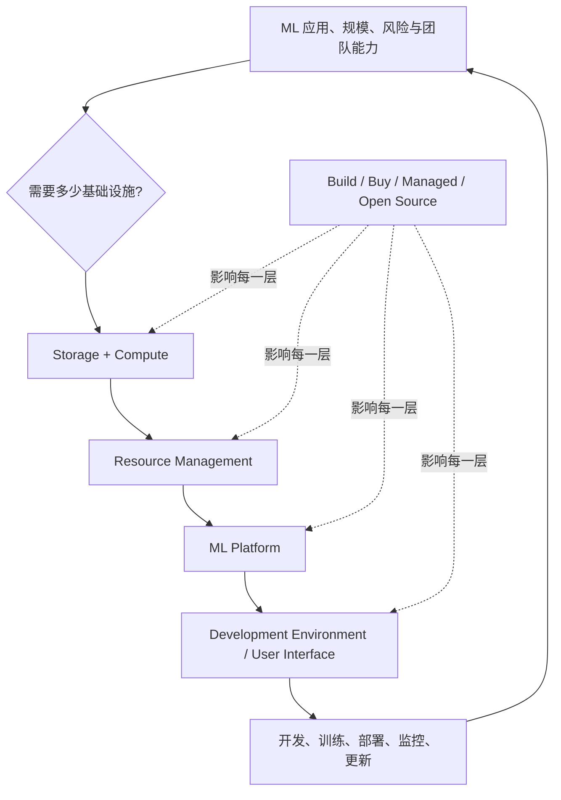
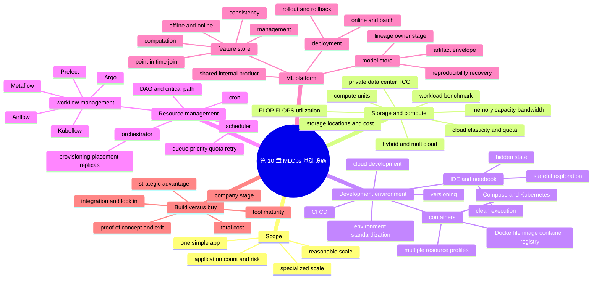

> 对应原章：10. Infrastructure and Tooling for MLOps.md
> 前几章已经说明 ML 系统应该怎样开发、部署、监控和持续更新；本章追问更现实的问题：团队是否拥有把这些原则稳定执行出来的基础设施？作者依次讨论 storage and compute、development environment、resource management、ML platform，最后用 build versus buy 把技术选择还原为组织和经济决策。
>
> 原章的云实例规格、价格、公司支出、融资、调查、工具能力与流行度主要来自 2014–2022 年。本文保留其历史语境；涉及 AWS、Airflow、Argo、Kubeflow、Metaflow、MLflow、Feast、Tecton 等当前能力时，必须按 2026 年实际版本重新核对。
>
> **归因说明：** 除相邻文字明确写明“原章”“作者”“图 10-x”或“历史案例”的内容外，本文加入的 roofline 直觉、利用率和排队推导、TCO/盈亏平衡模型、资源请求效率、DAG 拓扑算法、artifact manifest、point-in-time feature join、build-versus-buy 评分框架、Mermaid 图、伪代码和可运行 Python 均为笔记补充，不是作者在本章逐式提出的内容。

## 0. 本章要回答的核心问题

1. 为什么“知道正确 ML 做法”不等于组织能把它做出来？
2. 基础设施怎样减少专业知识、工程时间和 bug surface，又为何也可能成为昂贵负担？
3. 单个分析 Notebook、通用 ML 应用与自动驾驶/搜索规模分别需要多少基础设施？
4. “合理规模”是什么，为什么本章不以超大厂专用系统为默认模板？
5. Storage/compute、resource management、ML platform、development environment 四层分别解决什么问题？
6. 四层为何既有依赖顺序，又不应被理解成严格隔离的产品清单？
7. Compute unit 可以是 thread、core、VM、job、pod 还是 container？
8. Memory capacity、memory bandwidth、FLOPS、实际吞吐和 utilization 有何区别？
9. 为什么峰值 FLOPS 不能直接预测训练或推理时间？
10. 怎样按真实 workload benchmark，而不是只按 cores 或厂商数字选机器？
11. Public cloud 的 elasticity 解决什么，quota、capacity、spot interruption 又限制什么？
12. Cloud、private data center、hybrid、multicloud 的成本和组织边界如何比较？
13. Cloud repatriation 的经济论证需要哪些前提，为什么不能照搬 Dropbox 案例？
14. Development environment 为何可能是最值得优先投资的一层？
15. IDE、versioning、experiment tracking、CI/CD 在 ML 开发中怎样协同？
16. Notebook statefulness 为什么既提高探索效率又制造 hidden state？
17. 怎样验证 Notebook 从干净 kernel、固定顺序可重现？
18. 标准化环境应锁定 package、Python、OS、architecture 还是 IDE？
19. Cloud dev environment 的生产接近性、安全和成本优势有哪些反面条件？
20. Dockerfile、image、container、registry 的关系是什么？
21. Container 与 VM 有何区别，容器为什么不自动保证 bitwise reproducibility 或安全？
22. 为什么 feature、training 等步骤可能需要不同 containers 和不同硬件？
23. Docker Compose 与 Kubernetes 分别管理什么范围？
24. Resource management 为什么从“有限资源利用率”转向“成本—工程效率”权衡？
25. Cron、scheduler、orchestrator、workflow manager 的职责边界是什么？
26. DAG 为什么要求有向无环，循环业务逻辑应怎样表达？
27. Resource request 与实际 usage 不一致会造成什么浪费或失败？
28. Scheduler 怎样排队、优先级、quota、retry 和 reclaim？
29. Airflow、Argo、Prefect、Kubeflow、Metaflow 的原章对比反映了哪些设计维度？
30. “Python as code”与 YAML declarative workflow 各有什么取舍？
31. 本地开发与云上执行怎样尽量共享同一业务代码而不掩盖运行时差异？
32. ML platform 为什么通常从一个成熟业务团队的内部工具演化而来？
33. 部署服务怎样同时支持 online prediction、offline batch prediction 和 production tests？
34. Model store 为什么绝不只是保存一个 model binary？
35. 复现生产异常需要关联哪些 model、code、data、feature、environment 和 ownership artifacts？
36. Model registry、artifact store、experiment tracker 和 model card 有何区别？
37. Feature store 的 management、computation、consistency 三项能力各自解决什么？
38. Offline/online feature consistency 为什么仍需要 event time 与 point-in-time correctness？
39. Feature catalog、feature store、data warehouse 和 monitoring tool 为何会出现产品边界重叠？
40. Build versus buy 应看公司阶段、核心优势、工具成熟度、TCO、lock-in 还是合规？
41. 为什么自建不一定更便宜，购买也不等于零工程成本？
42. 怎样避免把基础设施建设变成按热点采购工具，而不是消除真实瓶颈？
43. 怎样用最小平台、well-lit path 与 escape hatch 兼顾标准化和特殊需求？
44. 作者如何从业务规模推导基础设施层，再从层推导工具选择？
45. 怎样形成可迁移的 ML 基础设施评估、实施和演进框架？

全章主线：



一句话概括：**基础设施的价值不是拥有最多工具，而是把组织反复需要的正确做法做成低摩擦、可复现、可审计的默认路径，并让计算、开发、编排和 ML artifacts 在同一血缘中协作。**

---

## 1. 开篇：基础设施必须匹配应用规模与特殊性

### 1.1 为什么前九章的正确做法仍可能无法执行

第 4–6 章讨论训练数据、模型开发与离线评估，第 7–9 章讨论部署、监控和持续更新。它们隐含了一个不现实前提：工程师已经有工具获取版本化数据、复现实验、分配算力、部署、追踪、回滚。

作者收到的常见反馈是：团队知道该做什么，却因基础设施不支持而做不到。合适的基础设施可以：

- 自动化重复步骤；
- 把复杂知识封装成 interface；
- 缩短开发与交付时间；
- 减少手工交接和配置差异；
- 让 monitoring、continual learning 等新能力成为可能。

反面是：错误抽象会迫使所有团队绕路，替换时还要迁移数据、workflow、权限和用户习惯。因此“先买平台再找问题”往往比没有平台更昂贵。

### 1.2 从无基础设施到专用基础设施

图 10-1 用应用数量/生产规模与投资需求构成粗略光谱：


#### 1.2.1 一次性或单一简单应用

季度用户预测等 ad hoc analytics，Jupyter、Python、Pandas 可能足够；给朋友展示的 Android object detection app 也许只需 TensorFlow Lite。这里额外平台的固定成本大于复用收益。

#### 1.2.2 极端特殊和超大规模应用

自动驾驶要求毫秒响应、接近零容忍错误和车端资源约束；Google Search 要处理极高 QPS。原章引用 2020 年资料称 Google 每秒约 63,000 次搜索，即每小时：

$$
63{,}000\times 3{,}600=226{,}800{,}000,
$$

约 2.27 亿，而原文写 2.34 亿；二者算术不一致，且搜索量本身是外部历史估计，不应作为 2026 年精确现状。此类组织往往需要专用 infrastructure，部分内部能力后来才商品化或开源。

#### 1.2.3 多个常见应用与 reasonable scale

本章主要面向 fraud、pricing、churn、recommendation 等多个常见应用，日数据量 GB/TB 级、数据团队约 10 到数百人的广泛中间地带。

原章对比：2018 年 Uber 日增数十 TB、Zillow 最大数据集约日增 2 TB；2014 年 Facebook 已日增 4 PB。它们是不同年份、不同口径的历史例子，只用于说明数量级，不能直接横比当前能力。

“20 人 startup 到 Zillow”跨度很大。真正决定基础设施的变量更应写成：

$$
I=f(N_{models},N_{teams},QPS,V_{data},SLA,R_{risk},H_{heterogeneity}),
$$

分别表示模型/团队数、请求量、数据量、服务目标、风险和 workload 异质性。公司人数不是充分指标。

### 1.3 Infrastructure 的四层

作者把 ML 基础设施定义为支持 ML 系统开发和维护的基础设施，并分四层：

| 层 | 核心职责 | 原章工具例 |
| --- | --- | --- |
| Storage and compute | 保存数据、执行 feature/training/prediction | S3、GCP、Snowflake |
| Resource management | 决定任务何时、在哪些资源运行 | Airflow、Kubeflow、Metaflow |
| ML platform | 提供 deployment、model/feature store、monitoring | SageMaker、MLflow |
| Development environment | 写代码、实验、版本、测试 | IDE、Git、CI/CD |


图 10-2 的两个方向：越往底层越 commodity、越被上层抽象；越往上越直接影响数据科学家体验。它不是严格产品边界：Kubernetes 同时调度和编排，ML platform 也可能托管 dev notebook 和 compute。

依赖逻辑是：没有数据和算力就无法运行；没有资源管理就难以规模化复用；没有 platform 就要每个团队重复拼接 artifacts；没有好 dev environment，底层能力也难被工程师正确使用。

### 1.4 本章的分析顺序

作者先讲最基础、最 commodity、也最容易解释的 storage/compute；再讲数据科学家每日接触的 dev environment；然后进入有争议的 resource management；最后讨论仍在形成中的 ML platform 和贯穿各层的 build/buy。

这个顺序体现一种通用分析法：**先识别不可缺少的资源，再识别资源分配机制，随后抽象领域复用能力，最终设计用户入口和组织选择。**

---

## 2. Storage and Compute：存储与计算

### 2.1 Storage layer

Storage 是数据收集和保存位置，可从本机 HDD/SSD 到 object store、warehouse，可能集中也可能跨 S3、Snowflake、Redshift、BigQuery 等多个位置。

原章称过去十年 storage “mostly commoditized and moved to cloud”，并有一句“storage cheap enough that companies store all data without the cost”，语义应理解为不太顾虑直接单价，而不是没有成本。真实成本还包括：

- hot/cold storage；
- request 和 metadata operations；
- cross-region/cloud egress；
- warehouse scan；
- replication、backup、retention；
- catalog、security、privacy 和 deletion；
- 小文件和 format 带来的 read amplification。

第 3 章已经详讲 data systems，因此本章把重点转向 compute。

### 2.2 Compute layer 与 compute unit

Compute layer 包含组织可访问的计算资源，以及资源怎样被使用的机制。它决定 workload 的规模上限。

原章用 “compute unit” 宽泛说明不同系统的资源抽象，并把 Spark/Ray job 与 Kubernetes pod 并列。更严格地应区分三类对象：

- Resource/allocation unit：CPU/GPU core、thread、vCPU、VM/instance、Spark executor、Ray worker、Kubernetes pod、Cloud Run instance；它们实际承载 CPU、memory 或 accelerator；
- Work/scheduling unit：Spark/Ray job 或 task、Kubernetes Job；它们描述待执行工作，再映射到 allocation units；
- Orchestration state：Step Functions state 负责调用 Lambda、Batch、ECS 等外部执行后端，本身不提供算力。

因此 job 是工作/control-plane object，executor/worker 才是主要执行资源，不能把两者的数量直接互换。Pod 是 Kubernetes 最小 deployable/schedulable unit，可包含多个共享 network/storage/lifecycle 的 containers；同一 pod 内 containers 不能作为独立 pod 单独调度或扩缩，但进程本身仍可各自退出/重启，不能把“不能独立 start/stop”理解成操作系统绝对限制。

### 2.3 Temporary job 与 long-lived instance

- Ephemeral unit：为一个短 job 创建，结束后销毁；
- Instance/VM：持续存在，可承载多个任务或服务；
- Service pod：实例可替换，但 service 逻辑长时间存在。

Ephemeral 提高隔离和按需计费；persistent 环境降低启动和缓存成本。训练、batch inference、online serving 的最佳生命周期不同。

### 2.4 Memory capacity、bandwidth 与 compute throughput

执行数组运算需先把数据放入可访问 memory。若容量不足，可使用 tiling、streaming、out-of-core、checkpointing 或 distributed sharding，而不是“操作绝对不可能”；代价是额外 I/O、通信或重计算。

Compute unit 的关键属性至少包括：

1. Memory capacity：一次能容纳多少 working set；
2. Memory bandwidth：每秒搬运多少 bytes；
3. Compute throughput：每秒可执行多少 operations；
4. Interconnect bandwidth/latency：多卡/多机通信；
5. Supported precision/kernel：FP32、BF16、INT8 等；
6. Reliability、availability 与 price。

原章脚注称写作时 ML workload 常需 4–8 GB、16 GB 足以处理多数 workload。该说法对今天的大模型训练/推理明显不能泛化；即使在当时也依模型和 batch 而异。

### 2.5 FLOP、FLOPS 与 utilization

- FLOP：一次 floating-point operation；
- FLOPS 或 FLOP/s：每秒浮点运算数；
- Peak FLOPS：硬件理论峰值；
- Achieved FLOPS：当前 workload 实际完成率。

利用率：

$$
U_{compute}=\frac{\mathrm{achieved\ FLOP/s}}
{\mathrm{peak\ FLOP/s}}.
$$

若峰值为 1,000,000 FLOP/s，实际 300,000 FLOP/s，则 $U=30\%$。原章指出 50% 可能好也可能坏，取决于 backend 和 workload。

FLOPS 指标有几个问题：

- 不同厂商对 operation、precision、sparsity 的计数不同；
- fusion 后“一个 kernel”不等于一个 mathematical operation；
- workload 可能由 memory/communication 而非 arithmetic 限制；
- peak 通常要求特定 tensor shape 和 precision；
- 端到端时间包含 data loading、compile、synchronization 和 idle。

### 2.6 Roofline 直觉：为什么带宽会限制 FLOPS

Arithmetic intensity：

$$
I=\frac{\mathrm{FLOPs}}{\mathrm{bytes\ moved}}.
$$

简化 roofline 上界：

$$
P_{attainable}\le
\min(P_{peak},\ B_{memory}\cdot I).
$$

低 $I$ workload 即使有很高 peak FLOPS，也会受 memory bandwidth 限制；高 $I$ 才可能 compute-bound。真实系统还受 cache、kernel、通信和并行效率影响。

### 2.7 不要只按 cores 选机器

Core count 是方便的代理，不包含单核性能、vector/tensor units、NUMA、memory、I/O 和软件优化。原章提醒 AWS vCPU 通常对应一个 hardware thread，例如某些实例两 cores × 每 core 两 threads = 4 vCPUs；但不同实例/architecture 的映射要看当前规格，不能普遍理解成“半个物理 core”。

图 10-3 是 2022 年 2 月 AWS GPU / GCP TPU 的规格截图，只能作为历史形态：


正确选型应在相同 software stack、precision、batch 和 SLA 下测量：

- training time / convergence time；
- throughput 与 tail latency；
- max batch/model size；
- failure/restart；
- energy 或 cloud cost；
- engineering complexity。

MLPerf 用 ResNet、BERT 等标准 workload 比较硬件；它提高可比性，但 benchmark 与自己的数据 shape、模型和服务目标仍可能不同。

### 2.8 Public Cloud Versus Private Data Centers

#### 2.8.1 Cloud elasticity 的价值

若一年只有一天需 1000 cores，其余 364 天只需 10 cores：

$$
\mathrm{CoreHours}_{actual}
=1000\times24+10\times364\times24
=111{,}360.
$$

自建若按峰值配置，容量为 $1000\times365\times24=8{,}760{,}000$ core-hours，静态容量利用率仅约：

$$
\frac{111{,}360}{8{,}760{,}000}\approx1.27\%.
$$

Cloud pay-as-you-go 对 bursty experiments 有明显价值，并把采购交付时间和部分运维转给 provider。

#### 2.8.2 Elastic 不等于 infinite

Cloud 仍有：

- account/service quota；
- region/zone capacity shortage；
- GPU scarcity；
- API rate limits；
- provisioning latency；
- spot/preemptible interruption；
- egress 和 managed-service constraints。

原章称当时 AWS 最大 X1e 为 128 vCPUs、近 4 TB memory、约 26.688 美元/小时。它是写作时规格，已不应作为当前上限。

On-demand 通常按需可申请但也不保证瞬时容量；spot 使用 provider 的闲置容量、价格低但可被回收。Spot 适合 checkpointable、retryable、flexible workloads，不宜把有严格不中断 SLA 的单副本服务直接放上去。

#### 2.8.3 历史云支出趋势

原章引用 Synergy Research：2020 年企业 cloud infrastructure services 支出增长 35% 到约 1300 亿美元，data-center hardware/software 支出下降 6% 到 900 亿美元以下。


这是 2020 年宏观数据，不证明任一公司的 cloud ROI；疫情、会计口径和 workload mix 都影响趋势。

#### 2.8.4 Cloud cost 与 repatriation

原章引用 a16z 分析称部分 public software companies 的 cloud 支出约占 cost of revenue 的 50%，并估计 50 家公司因 cloud margin impact 损失约 1000 亿美元市值；这些是投资机构基于公开数据的模型估计，不是普遍审计结论。

Dropbox 2018 S-1 称 IPO 前两年 infrastructure optimization 节省约 7500 万美元，其中很大部分与迁回自有 data centers 有关。Dropbox 本身是 storage-heavy、规模稳定的特殊 workload，不能直接推导一般公司都应 repatriate。

完整 TCO 应包括：

$$
TCO=C_{compute}+C_{storage}+C_{network}+C_{license}
+C_{people}+C_{facility}+C_{downtime}+C_{migration}
+C_{opportunity}.
$$

Cloud 单价高但 elasticity、managed services 和更快上市可降低 people/opportunity cost；自建长期稳定高利用可能便宜，却承担采购、容量规划、机房、硬件折旧和 on-call。

#### 2.8.5 可运行示例：峰值容量与简化 TCO

```python
def annual_cloud_cost(hourly_demand, cloud_price_per_unit_hour):
    return sum(hourly_demand) * cloud_price_per_unit_hour


def annual_private_cost(
    peak_units, annualized_cost_per_unit_year, annual_operations_cost
):
    return peak_units * annualized_cost_per_unit_year + annual_operations_cost


hours_per_year = 365 * 24
demand = [10.0] * hours_per_year
for hour in range(24):
    demand[hour] = 1000.0

used_unit_hours = sum(demand)
provisioned_unit_hours = max(demand) * len(demand)
capacity_utilization = used_unit_hours / provisioned_unit_hours
cloud_cost = annual_cloud_cost(demand, cloud_price_per_unit_hour=0.06)
private_cost = annual_private_cost(
    peak_units=max(demand),
    annualized_cost_per_unit_year=180.0,
    annual_operations_cost=40_000.0,
)

print(f"used_unit_hours={used_unit_hours:,.0f}")
print(f"peak_capacity_utilization={capacity_utilization:.2%}")
print(f"cloud_cost=${cloud_cost:,.0f}")
print(f"private_cost=${private_cost:,.0f}")
print(f"cloud_minus_private=${cloud_cost - private_cost:,.0f}")
```

输出：

```text
used_unit_hours=111,360
peak_capacity_utilization=1.27%
cloud_cost=$6,682
private_cost=$220,000
cloud_minus_private=$-213,318
```

参数是教学假设，不代表真实云价或服务器 TCO。这里 `$0.06` 的单位是美元/(unit-hour)，`$180` 是已经把采购/折旧等摊入一年的美元/(unit-year)，`$40,000` 是年度运维成本；若 `$180` 是一次性 capex，就必须先按寿命和资金成本年化，不能直接与年度 cloud bill 比较。改变 utilization、折旧年限和工程成本可反转结论。

#### 2.8.6 Hybrid cloud

Cloud 易开始，迁出很难。Hybrid 把 bursty/managed workloads 留在 cloud，把稳定、高利用、数据敏感或低延迟部分放私有环境。

它不是自动“两全其美”：还要处理 identity、network、data consistency、observability、capacity failover 和双栈技能。

#### 2.8.7 Multicloud 与 vendor lock-in

Multicloud 指跨两个或更多 public clouds。潜在收益：

- 避免单 provider dependency；
- 使用不同 provider 的优势服务/价格；
- 满足地域、客户或并购遗留要求；
- 提升谈判空间。

原章引用 Gartner 2019 调查称 81% 组织使用两个或更多 public cloud；“使用多个”不等于 workload 可无缝迁移或具备 active-active resilience。

作者和审阅者强调 multicloud 往往并非主动架构：部门独立决策、并购或战略投资自然形成。成本包括跨云 egress、身份、网络、数据复制、最低公分母抽象和故障排查。

可移植性不是把所有 provider-specific capability 抹平。更实用做法是区分：

- portable core：open formats、containers、IaC、standard telemetry；
- deliberate adapters：对少量 provider services 做接口封装；
- accepted lock-in：若独有服务带来的价值大于退出成本，则明确接受并记录 exit plan。

---

## 3. Development Environment：开发环境

### 3.1 Dev environment 是生产能力的入口

Dev environment 是工程师写代码、跑实验，并与 champion/challenger production environment 交互的地方。原章概括为：

- IDE / notebook；
- versioning；
- CI/CD。

作者引用 Ville Tuulos：许多公司生产 infrastructure 很成熟，代码如何开发、调试和测试却很 ad hoc；如果只能先做好一项 infrastructure，应优先 data scientists 的 dev environment。

理由很直接：

$$
\mathrm{AnnualProductivityGain}
\approx N_{engineers}\times N_{workdays}\times
\mathrm{minutesSavedPerDay}.
$$

每日小摩擦会乘以每个工程师和工作日；同时 dev 也是错误进入生产的第一道关口。

### 3.2 Dev Environment Setup

#### 3.2.1 Versioning 不只版本化 code

原章列出写作时常见组合：Git 管 code、DVC 管 data、Weights & Biases / Comet 管 experiments、MLflow 管 deployment artifacts，并提到作者当时创业项目 Claypot AI 的统一愿景。

ML run identity 应关联：

```text
source commit + dirty state
data snapshot / query / event cutoff
feature definitions
environment / image digest
config and hyperparameters
random seeds
metrics and artifacts
parent model and deployment history
```

只保存一张 loss 图或一个 `.pkl` 都不足以复现。

#### 3.2.2 CI/CD 的作用

GitHub Actions、CircleCI 等可在进入 staging/production 前执行 lint、unit/integration tests、data/schema contracts、model smoke tests 和 image scan。

传统 CI 关注 deterministic code；ML CI 还要处理随机训练、大数据依赖、统计阈值和昂贵测试。可分层：PR 上运行快速 deterministic checks，nightly/候选晋级运行重型回归。

#### 3.2.3 IDE

##### 3.2.3.1 IDE 与 Notebook 的不同优化目标

IDE 适合模块化 code、refactor、debug、test 和 review；Notebook 把 code、图、表、文字和内存状态放在一个交互文档，适合 EDA 与训练结果分析。二者不是互斥，探索可在 Notebook，稳定逻辑应提取为 versioned modules/tests。

##### 3.2.3.2 Notebook statefulness 的收益

大数据加载后留在 memory，step 4 失败可只重跑 step 4：


这缩短探索反馈回路，尤其适合昂贵 data loading 和可视化。

##### 3.2.3.3 Hidden state 与执行顺序

同一 statefulness 允许 `2 -> 3 -> 4`，也允许 `4 -> 3 -> 2`。当前输出可能依赖已删除的变量、旧 function definition 或未记录的 cell order。


最低可复现标准：

1. Restart kernel；
2. 从头按 document order 执行；
3. 无手工 hidden input；
4. 输出和关键 metrics 在容忍范围内一致；
5. Package/data/environment 有版本；
6. 业务逻辑可由 tests 独立调用。

##### 3.2.3.4 Notebook infrastructure

原章列 Netflix 2018 的 Papermill（参数化、多 notebook 执行/汇总）、Commuter（组织内查看、搜索、共享）和 nbdev（在 notebook 中协同 code、docs、tests）。这些说明 notebook 的缺点可以由 infrastructure 缓解，但平台不能自动消除 hidden state 或不受控数据依赖。

### 3.3 Standardizing Dev Environments

#### 3.3.1 为什么只锁 package 不够

作者创业团队经历三层不一致：

1. `torch` 未 pin version，不同机器安装不同版本；
2. Package 一致但 Python 3.8/3.9 不同，concurrency bug 无法复现；
3. 软件一致但新 M1 architecture 与工具支持不同。

因此 environment identity 至少包含：

$$
E=(OS,architecture,driver,runtime,language,
packages,systemLibraries,config).
$$

`requirements.txt` exact pin 提高 repeatability，但仍未固定 transitive dependency、wheel、OS、CUDA/driver 和 supply-chain provenance。Lockfile、immutable image digest、SBOM 和 artifact signature 可进一步收紧。

#### 3.3.2 标准化什么，不标准化什么

应标准化影响执行语义和协作接口的部分：

- Runtime and base image；
- Package lock 和 driver compatibility；
- Formatting/lint/test；
- Credential、network、data access；
- Build/deploy commands；
- Telemetry 和 artifact locations。

IDE keybindings、theme 等个人偏好通常无需强制。原章指出 editor war 的情感成本，并推荐能方便连接 cloud instance 的 VS Code 作为一种选择，而非唯一正确答案。

#### 3.3.3 Cloud dev environment

常见形态：

- Browser IDE + cloud environment；
- Local IDE 通过 SSH/remote protocol 连接 cloud VM/container；
- Managed notebook；
- Ephemeral per-branch workspace。

原章提 Cloud9、SageMaker Studio、GitHub Codespaces、EC2/GCP instance。具体产品状态、价格和 idle timeout 是历史信息，应按当前服务核实。

#### 3.3.4 收益

- IT 只维护少数标准 machine types；
- 远程访问一致；
- Laptop 丢失时可撤销 cloud credentials；
- Data 不必下载本地；
- Dev 与 cloud production 的 network/architecture 更近；
- 可按需提供 GPU/large memory。

原章用 4 vCPU/8 GB、约 0.1 美元/小时估算不停机约 73 美元/月：

$$
0.1\times24\times30.4\approx72.96.
$$

这是当时示意价；真实账单还含 storage、network、managed fee 和 idle policy。

#### 3.3.5 风险与 hygiene

- 闲置和过配产生浪费；
- Long-lived workspace 仍会环境漂移；
- Cloud credentials 权限过大；
- Source/data 上云可能违反政策；
- Network outage 阻断开发；
- Remote latency 影响体验；
- Dev 接近 prod 不应等于直接拥有 prod write access。

需要 auto-stop、budget/quota、least privilege、secret manager、audit log、patching、backup 和 ephemeral rebuild。

### 3.4 From Dev to Prod: Containers

#### 3.4.1 为什么 production 需要可重建环境

Dev 常固定在一台 machine；production 流量可能 10 倍突增并新增 instances。每个新实例都必须得到一致依赖。Container 用 declarative build instructions 生成可复制执行环境，避免手工安装。

#### 3.4.2 Dockerfile、image、container、registry

```text
Dockerfile --build--> immutable-ish image --run--> container process
                              |
                              +--> registry 保存/分发 image
```

- Dockerfile：构建步骤 recipe；
- Image：分层 filesystem、metadata 和 default command 的 artifact；
- Container：image 加 writable layer、namespace/cgroup 配置后运行的进程；
- Registry：按 repository/tag/digest 存取 images。

Tag 如 `latest` 可移动，不能保证重现；生产应 pin digest、扫描 vulnerability、生成 SBOM、签名并保留 provenance。

#### 3.4.3 原章 Dockerfile 例子的目的与问题

原章明确说例子用于说明、可能不可执行：从 `pytorch/pytorch:latest` 开始，clone Apex 和 Transformers source 后安装。

它揭示 Dockerfile 的顺序构建，却不适合作为现代 production template：

- `latest` 不可重现；
- Git repository 未 pin commit/tag；
- 依赖通过 source install，构建结果会变化；
- `cd` 只在同一 `RUN` shell 中有效；
- 最后一行 `--no-cache-dir.` 疑似拼写/参数错误；
- 无 non-root user、checksum、healthcheck、entrypoint；
- Build tools 留在 runtime image，镜像较大。

更稳健原则是 pin digest/commit、multi-stage build、最小 runtime、non-root、secret 不进入 layer，并在 CI 实际构建和 smoke-test。

#### 3.4.4 Container 不是 VM

Container 通常共享 host kernel，通过 namespaces/cgroups 隔离；VM 虚拟化 hardware 并带独立 guest kernel。Container 启动快、密度高，但隔离边界不同。

Image 固定 user space 也不保证跨 CPU/GPU bitwise 一致：host kernel、driver、accelerator、clock、nondeterministic kernels 和 external services 仍可改变行为。

#### 3.4.5 为什么一个 pipeline 需要多个 containers

原章示例：featurization 快但 memory-heavy，可用 high-memory CPU；training 慢但需要 GPU。若两者塞入一个 high-memory GPU instance，会浪费昂贵 GPU。

多 container 还解决 conflicting dependencies，例如两个步骤需要不同 NumPy 版本。拆分边界应按：

- 独立扩缩；
- 资源 profile；
- failure/retry boundary；
- security privilege；
- dependency lifecycle；
- data transfer cost。

过度拆分会增加 network serialization、部署对象和 observability 复杂度。

#### 3.4.6 Docker Compose 与 Kubernetes

- Docker Compose：主要编排单 host 上的一组 containers，适合本地开发和简单服务；
- Kubernetes：跨 nodes 调度 pods、service discovery、replication、rollout、self-healing 与 autoscaling。

Kubernetes 不会自动知道 ML model quality，也不会替你设计 training DAG、data lineage 或 feature consistency。它是通用 substrate。

原章称 K8s 自 2014 年后在 production 日益普及，同时指出它对 data scientist 不友好。合理的解决方向不是要求每位数据科学家掌握所有 K8s primitives，而是由平台提供 workload-oriented interface，并保留必要 escape hatch。

---

## 4. Resource Management：资源管理

### 4.1 从稀缺资源利用到经济效率

自建 data center 中 capacity 固定，给 A 增加资源会挤压 B，核心是最大化 utilization。Cloud 让容量更 elastic，问题转为：增加资源带来的收入或工程时间节省是否超过价格。

作者认为多数场景中 engineer time 比 compute time 贵，因此宁可多用一些非人力资源来减少手工规划。但这不是“compute 可以浪费”：

$$
\mathrm{NetValue}
=\mathrm{BusinessValue}
-C_{compute}-C_{people}-C_{delay}-C_{failure}.
$$

自动化可能让 $C_{compute}$ 上升，却使后三项下降。FinOps 只压低云账单而增加大量开发等待，也可能降低总价值。

### 4.2 Cron, Schedulers, and Orchestrators

#### 4.2.1 ML workflow 的两个特点

1. Repetitiveness：每周训练、每四小时 batch prediction；
2. Dependencies：data -> feature -> parallel train -> compare -> conditional deploy。

Cron 只擅长固定时间运行 script 并报告成功/失败，不原生理解复杂 dependency、conditional branch、artifact lineage 和资源需求。

#### 4.2.2 Workflow DAG

原章例：

1. 拉取上周数据；
2. 提取 features；
3. 并行训练 A/B；
4. 在 test set 比较；
5. A 好则部署 A，否则 B。


DAG 的 directed edges 表示依赖；acyclic 保证存在 topological order。若图有环，不能直接得到有限的一次性执行顺序。

原章说“有 cycle，job 会永远运行”是直觉简化。Workflow system 通常会在提交时拒绝 cyclic DAG，而不是执行到永远。业务上的 iterative loop 应显式表达为：

- 一次 run 内有上限的 loop primitive；
- 多次 DAG runs；
- event trigger 创建下一 run；
- state machine，而不是伪装成静态 DAG edge。

#### 4.2.3 Topological order 与 critical path

对 DAG $G=(V,E)$，若 task $v$ 的 duration 是 $d_v$，无限资源下最早结束时间：

$$
EF(v)=d_v+
\max_{u\in pred(v)} EF(u),
$$

无 predecessor 时最大项取 0。Workflow 理论最短 makespan 下界是 sink 的最大 $EF$，即 critical path；增加资源不能缩短串行依赖本身。

#### 4.2.4 Scheduler 决定 when

Scheduler 接受 workflow DAG/job queue，负责：

- time/event trigger；
- dependency readiness；
- priority、fairness、quota；
- retry、timeout、backoff；
- 根据 resource request 找可运行位置；
- 记录 task state。

原章把 scheduler 解释为可处理 dependency 的 cron。这个比喻有用，但现代 scheduler 还可能处理 preemption、gang scheduling、affinity 和 data locality。

#### 4.2.5 Queue 与资源请求

若 job 请求 2 CPU、8 GB memory，scheduler 要找到满足 request 的资源。用户经常 overrequest 或 underrequest：

$$
U_{request}=\frac{\int usage(t)\,dt}
{request\times runtime}.
$$

Overrequest 降低排队后的 cluster utilization；underrequest 可能 OOM、throttle 或反复 retry。Peak usage 也不等于整个 runtime 都需 peak capacity。

更成熟策略包括历史 usage recommendation、vertical/horizontal autoscaling、bin packing、preemption、resource reclaim 和分 workload class 的 QoS。Reclaim 必须保留隔离，否则 noisy neighbor 会让任务不可预测。

#### 4.2.6 Slurm 示例的准确解读

原章 Slurm script 设置 job name、`--time=11:00:00`、每 CPU memory 和 CPUs per task。需要注意：Slurm 的 `--time` 通常表示 wall-time limit，而原章注释写 “When to start the job” 容易误导；开始时间一般由 `--begin` 或 scheduler 决定。参数语义应按当前 Slurm 文档确认。

#### 4.2.7 Scheduler 的可靠性

General-purpose scheduler 要管理大量 machines、users、queues 和 workflows。Control plane 若是单点故障，会阻断新调度和状态推进。

需要：

- replicated state / leader election；
- durable metadata；
- idempotent task launch；
- scheduler restart reconciliation；
- workload-level retry 与 exactly-once effect 设计；
- admission control 和 quota。

“Task exactly once”通常无法由 scheduler 单独保证；外部写入需 idempotency key 或 transactional sink。

#### 4.2.8 Orchestrator 决定 where / how provision

原章的概念划分：

- Scheduler：job/DAG、queue、priority、user quota，决定何时运行；
- Orchestrator：machine/instance/cluster、replica、service group，决定在哪里获得资源并维护 desired state。

当 instance pool 不足，orchestrator 可 provision 更多 machines。Periodic batch jobs 常显式使用 scheduler；long-running services 常由 orchestrator 保持 replicas。

现实边界重叠：Kubernetes 有 scheduler 和 controllers；Slurm/Borg 也有 provisioning/placement 能力。不要仅按产品类别判断，应查看谁负责 trigger、dependency、placement、provisioning、retry 和 service reconciliation。

#### 4.2.9 Kubernetes 的位置

Kubernetes 可 on-prem 或 managed EKS/GKE，也可本地 minikube/kind。原章作者称很少有人享受自建 cluster，因此多数公司用 managed service；这是经验表述，不是统计。

Spark scheduler 可运行在 K8s 上，AWS Batch 可结合 EKS。Workflow scheduler 位于 orchestrator 之上是常见但非唯一架构。

#### 4.2.10 可运行示例：DAG 拓扑序与关键路径

```python
from collections import defaultdict, deque


def analyze_dag(tasks):
    if not tasks:
        return [], 0, 0

    successors = defaultdict(list)
    indegree = {name: 0 for name in tasks}
    for name, spec in tasks.items():
        for dependency in spec["dependencies"]:
            if dependency not in tasks:
                raise ValueError(f"unknown dependency: {dependency}")
            successors[dependency].append(name)
            indegree[name] += 1

    queue = deque(name for name in tasks if indegree[name] == 0)
    order = []
    earliest_finish = {}
    while queue:
        name = queue.popleft()
        order.append(name)
        dependencies = tasks[name]["dependencies"]
        earliest_start = max(
            (earliest_finish[dependency] for dependency in dependencies),
            default=0,
        )
        earliest_finish[name] = earliest_start + tasks[name]["duration"]
        for successor in successors[name]:
            indegree[successor] -= 1
            if indegree[successor] == 0:
                queue.append(successor)

    if len(order) != len(tasks):
        raise ValueError("workflow contains a cycle")
    return order, max(earliest_finish.values()), sum(
        spec["duration"] for spec in tasks.values()
    )


workflow = {
    "pull": {"duration": 2, "dependencies": []},
    "features": {"duration": 5, "dependencies": ["pull"]},
    "train_a": {"duration": 8, "dependencies": ["features"]},
    "train_b": {"duration": 6, "dependencies": ["features"]},
    "compare": {"duration": 2, "dependencies": ["train_a", "train_b"]},
    "deploy": {"duration": 1, "dependencies": ["compare"]},
}

order, critical_path, total_work = analyze_dag(workflow)
print(f"topological_order={order}")
print(f"critical_path={critical_path}")
print(f"total_serial_work={total_work}")
print(f"max_ideal_speedup={total_work / critical_path:.3f}")
```

输出：

```text
topological_order=['pull', 'features', 'train_a', 'train_b', 'compare', 'deploy']
critical_path=18
total_serial_work=24
max_ideal_speedup=1.333
```

函数把空 workflow 定义为零工作，并在拓扑排序前区分“引用不存在的 dependency”与真正 cycle。这个例子假设无限资源、零启动/传输开销；真实 makespan 还受 resource contention、queue 和 failures 影响。

### 4.3 Data Science Workflow Management

#### 4.3.1 Workflow manager 的抽象

Workflow manager 让用户用 Python/YAML 定义 DAG，每个 step 是 task。其 scheduler 关注整个 workflow，再与 orchestrator 合作分配 instances：


平台要保存的不只是 DAG definition，还包括每次 run 的 inputs、code/image、task attempts、artifacts、logs、lineage 和 outputs。

#### 4.3.2 评估 workflow tool 的设计维度

原章比较 Airflow、Argo、Prefect、Kubeflow、Metaflow，真正可迁移的维度是：

| 维度 | 问题 |
| --- | --- |
| Definition | Python、YAML、DSL 还是 UI？ |
| Parameterization | 同一 workflow 能否接受不同参数？ |
| Dynamic graph | 能否按 runtime metadata 映射 tasks？ |
| Isolation | 每 task 能否有独立 image/dependencies？ |
| Portability | 本地、cloud、K8s、batch backend 是否一致？ |
| Data passing | 小 metadata 与大 artifacts 如何传递？ |
| Caching | 相同 input/code 是否复用结果？ |
| Observability | Logs、retries、lineage、UI 是否完整？ |
| Reliability | Backfill、idempotency、partial rerun 如何处理？ |
| Operations | Control plane 谁维护、怎样升级？ |

产品版本变化很快，不能用 2022 年特性表替代当前 proof of concept。

#### 4.3.3 Airflow：configuration as code

原章介绍 Airflow 由 Airbnb 开发、2014 年发布，使用 Python 定义 DAG，拥有大量 operators 连接 cloud、database 和 storage。示例中 `t1` 后并行运行 shell sleep 与 Docker task，`t3` 完成再 `t4`。

原章随后列三个当时的局限：

1. Monolithic packaging，不易让每 step 使用不同 container；
2. DAG 不可 parameterize；
3. DAG static，不能按 runtime records 动态建 steps。

这些描述反映早期 Airflow 设计和当时作者体验。现代版本已有 task mapping、params、TaskFlow、Kubernetes/Docker operators 等能力；是否满足 isolation/dynamic use case 必须按部署版本验证。更持久的批评是：scheduler-time DAG parsing、control plane 运维和把 data-dependent loop 误建成巨大 DAG 会增加复杂度。

原章 Airflow 代码也是历史 API 风格，如 `schedule_interval` 和显式 `dag=dag`；不应直接当作当前最佳模板。

#### 4.3.4 Prefect：动态和参数化的 Python workflow

原章将 Prefect 视为吸取 Airflow 经验的下一代工具：workflow parameterized、dynamic，继续 Python-as-code。作者认为 task-level containers 不是当时第一优先，仍需处理 Dockerfiles 和 registration。

这类选择适合重视普通 Python 开发体验的团队，但“动态”也可能降低静态审查和可预测性。当前 deployment/work pool/image 行为需查版本。

#### 4.3.5 Argo：container-native YAML workflow

原章强调每个 Argo step 在独立 container 中，YAML 同时描述 task 和 requirement；coin-flip 示例按 output 条件走 heads/tails。

优点：

- Isolation/resource/image 明确；
- 与 Kubernetes execution model 对齐；
- Declarative spec 易由 control plane reconcile。

代价：

- 大 YAML 冗长；
- Template/quoting/type errors；
- 业务逻辑不宜塞入 YAML；
- 深度绑定 K8s concepts。

原章说 Argo “只能在 K8s，而 K8s 只在 production”，后半句并不严格：kind/minikube/k3d 和 dev clusters 可本地/测试运行；真正问题是本地与生产 cluster 的 storage、IAM、network 和 scale 仍不同。

#### 4.3.6 Kubeflow 与 Metaflow：缩小 dev/prod gap

原章把二者描述为让 data scientist 从 notebook/script 使用生产 compute，并抽象 Airflow/Argo boilerplate。

- Kubeflow Pipelines 当时建立在 Argo/K8s 生态上；Python workflow 仍可能需要 component Dockerfile/YAML；
- Metaflow 可用 decorators 指定 `@conda` dependencies、`@batch` 资源，把某 step 发到 AWS Batch/K8s，而其他 step 留本地。

原章主观评价 Metaflow UX 优于 Kubeflow，并称 Kubeflow 当时更流行。应把它视为作者体验，不是普遍 benchmark。

#### 4.3.7 原章 Metaflow ensemble sketch

示例让 `fitA` 本地运行、`fitB` 请求 2 GPUs/16 GB memory 在 AWS Batch，二者使用不同 NumPy versions，最后 ensemble。

它说明 step-level environment/resource routing，但原代码只是 sketch，存在未展示 imports、`end` 缺 `@step`、generator 表达式变量疑似 `input`/`inputs` 错误等，不能直接执行。

真正跨环境执行需处理：

- 大 `self.data` 如何 artifactize，而非隐式复制；
- 两模型的 schema 和 prediction ordering；
- 环境 build、cache 和 digest；
- Cloud credentials；
- Retry 是否重复 side effects；
- Local/cloud random seed 与 hardware determinism。

#### 4.3.8 Python vs YAML 不是简单胜负

Python-as-code：

- 易复用 language abstraction、测试和 IDE；
- 动态表达能力强；
- 过度动态会让 DAG 难静态分析。

Declarative YAML：

- Desired state 容易验证、diff、policy enforcement；
- 冗长、类型弱、复杂逻辑难表达。

成熟平台常组合：用户以 SDK/DSL 生成 versioned declarative IR，control plane 验证后执行。关键是 compiled artifact 可审查，而不是让 Python/YAML 偏好主导架构。

#### 4.3.9 Data science workflow 与普通 workflow 的特殊需求

ML workflow 并非本质上必须专用 DAG engine，但常有：

- 大 artifacts，而非只传小 messages；
- GPU/accelerator 和 distributed training；
- Experiment fan-out 与 hyperparameter sweep；
- Data/model/feature lineage；
- Statistical evaluation gate；
- Caching 与 reproducibility；
- Notebook/local-to-cloud experience；
- Long-running batch 与 online service 交接。

选择专用工具的理由应是这些需求，而不是贴上 “MLOps” 标签。

---

## 5. ML Platform：机器学习平台

### 5.1 平台怎样从业务工具演化

原章以一家大型 streaming company 为例：推荐团队为了部署推荐系统，先自建 feature management、model management、monitoring；公司发现其他 ML applications 也需要同一能力，于是组建 ML platform team，把成熟工具共享给各业务。

这反映典型路径：

```text
一个高价值业务重复遇到问题
-> 构建专用工具
-> 其他团队复制需求
-> 提取稳定共性
-> 平台团队提供共享 interface 和运营责任
```

过早平台化会抽象猜想，过晚会产生 N 套互不兼容 pipelines。较好的信号是：多个团队已经重复解决同类问题，且共性比差异稳定。

### 5.2 Platform 是能力、产品和团队

“ML platform”可同时指：

- 一组 deployment/model/feature/monitoring capabilities；
- 面向内部用户的 self-service product；
- 拥有 roadmap、SLO 和 support 的 platform team。

只有工具集合、没有 owner 与服务目标，不会自动成为平台。平台的用户是 data scientists/ML engineers，成功指标包括 time-to-first-run、lead time、deployment frequency、reproducibility、failure recovery 和 adoption，而不只是 cluster utilization。

### 5.3 原章聚焦的组件

作者称平台定义仍在形成，选取常见三项：

1. Model deployment；
2. Model store；
3. Feature store。

Monitoring 已在第 8 章讨论。本章开头曾把 “model development” 列为平台组件，随后正文标题用 Model Deployment；应理解为平台覆盖从开发到部署的一组能力，而非严格统一 taxonomy。

### 5.4 选型的两个通用轴

#### 5.4.1 与 compute/data environment 的兼容

工具是否支持当前 cloud、on-prem、network、identity、accelerator、storage 和 compliance boundary？为一项工具被迫迁 cloud，成本可能大于工具收益。

#### 5.4.2 Open source 与 managed service

| 选择 | 典型收益 | 典型成本 |
| --- | --- | --- |
| Self-hosted OSS | 控制、可定制、数据边界清晰 | 安装、升级、on-call、安全、capacity |
| Managed service | 快启动、vendor 运营 control plane | 价格、lock-in、data/model exposure、能力边界 |
| VPC-managed/hybrid | Vendor 运维部分组件，数据平面在客户环境 | Network/IAM/integration 复杂 |

Open source 不自动安全，managed 也不必把所有数据传给 vendor。应画清 control plane/data plane 和责任共享模型。

### 5.5 Model Deployment

#### 5.5.1 部署服务解决什么

训练并测试后，要把 model + dependencies 放到 production 可访问位置并暴露 prediction interface。Deployment service 常负责：

- Artifact/image rollout；
- Endpoint/job creation；
- Resource/accelerator configuration；
- Autoscaling 和 health checks；
- Version routing、shadow、canary、A/B；
- Logs、metrics 和 rollback；
- Authentication/authorization。

原章称 deployment 是平台中最成熟的组件，并列 SageMaker、Vertex AI、Azure ML、Alibaba ML Studio、MLflow Models、Seldon、Cortex、Ray Serve。名单是写作时生态快照，不代表当前成熟度或存续状态。

#### 5.5.2 Online prediction 与 batch prediction

Online endpoint 接收 request 并现场计算；batch prediction 对有限 dataset/job 生成一批结果。把多个 online requests 动态 batching 仍是 online serving optimization，不等于 batch prediction。

| 维度 | Online | Batch |
| --- | --- | --- |
| Trigger | 单请求/stream | Dataset/job/schedule |
| 主要目标 | Tail latency、availability | Throughput、completion、cost |
| Output | 即时 response | 写入 table/object store |
| Scaling | Request-driven replicas | Parallel partitions/jobs |
| Failure | Retry/fallback per request | Partial retry/idempotent output |

原章指出小规模 online deployment 往往直接，而 batch 需要 job orchestration 和结果存储，所以一些公司用 Seldon online、Databricks batch 等分离 pipelines。

分离实现不应分裂语义：model artifact、feature contract、pre/postprocess 和 evaluation 应尽量共享版本。

#### 5.5.3 Deployment service 也要支持晋级证据

第 9 章的 shadow、canary、A/B 需要：

- Stable model version 与 sticky routing；
- Traffic percentage/segment control；
- Request/response/feedback join；
- Guardrail metrics；
- Fast rollback；
- Audit trail。

能“创建 endpoint”不等于能安全发布。选型应实际演练 bad model rollback、schema mismatch、capacity spike 和 delayed label analysis。

### 5.6 Model Store

#### 5.6.1 为什么保存 binary 不够

原章构造事故：某 group inputs 上性能下降，DevOps 不知道 20 位 data scientists 中谁负责；找到 owner 后，本地 notebook 对同一 inputs 的输出又与 production 不同。

可能原因：

- Production model binary 错；
- Feature list 错；
- Featurization code 旧；
- Data processing pipeline 错；
- Environment/dependency 不同；
- Threshold/postprocess 不同；
- Serving model/version routing 与认知不一致。

如果 notebook 丢失、owner 离职或休假，仅有 binary 无法解释系统。

#### 5.6.2 原章八类 artifacts

1. **Model definition**：architecture、loss、layers/parameter shapes；
2. **Model parameters**：实际 learned values；
3. **Featurize and predict functions**：请求到 feature、model output 的逻辑；
4. **Dependencies**：Python/packages/system libs，通常由 container 表示；
5. **Data**：训练 snapshot/query/DVC commit/pointer；
6. **Model generation code**：framework、training、split、search space、final hyperparameters；
7. **Experiment artifacts**：loss curves、raw metrics、evaluation reports；
8. **Tags**：owner、team、task、risk、status 等。

现代实践还常需要：

- Code/image/artifact cryptographic digest；
- Feature definitions 和 lineage；
- Parent model；
- Random seeds；
- Model card、approval 和 policy results；
- Deployment/traffic/rollback history；
- Licenses、SBOM、data consent/retention metadata。

#### 5.6.3 Model definition + parameters 才能恢复行为

若 $f_{\theta}$ 的 architecture/operation 不明，只有 $\theta$ bytes 无法解释 shape 和执行；若只保存 code 而不保存 parameters，也没有 learned model。

即使二者都有，preprocess/postprocess、tokenizer、feature ordering 和 numerical runtime 仍会改变 prediction。Artifact envelope 要覆盖完整 inference graph。

#### 5.6.4 Artifact 分散与 manifest

原章较宽松地写成 parameters 在 S3、container 在 ECS、data 在 Snowflake、experiment 在 W&B、functions 在 Lambda；README 手工记 links 易丢。严格说 ECS 负责运行 containers，image artifact 通常存放在 ECR 或其他 registry，因此 manifest 应引用 image digest，而不是把 ECS 当 artifact store。

不要求所有 bytes 存在同一数据库，但需要一个 immutable manifest 以 content-addressed pointers 连接它们：

```yaml
model_id: fraud-v42
parent_id: fraud-v41
owner: risk-ml
model_artifact:
  uri: s3://models/fraud/v42/model.bin
  sha256: "..."
image_digest: "registry/app@sha256:..."
code_commit: "..."
training_data_snapshot: "warehouse://risk/train@2026-08-01"
feature_view_versions:
  - user_risk:v7
evaluation_report: "s3://reports/fraud-v42.json"
evaluation_report_sha256: "..."
```

Registry metadata transaction 与外部 object bytes 要处理一致性：先上传/校验 immutable artifacts，再原子发布 manifest，避免 registry 指向半成品。`approval_status`、stage、current traffic 等会变化的 lifecycle state 不应写进 immutable release manifest，而应由 registry 用 `manifest_digest -> lifecycle state` 的独立记录维护；evaluation report 等外部 artifact 也要有 version/digest。

#### 5.6.5 Model store、registry、tracker、card 的区别

| 概念 | 主要职责 |
| --- | --- |
| Artifact store | 保存大 bytes/objects |
| Experiment tracker | 记录 runs、params、metrics、artifacts |
| Model registry/store | 管可复用 model versions、lineage、stage、owner |
| Model card | 面向人说明 intended use、限制、评估和风险 |
| Deployment catalog | 记录哪个版本在何处、何时、服务多少流量 |

产品可以合并多项，但逻辑职责不应丢失。

#### 5.6.6 可复现性的层次

- Discoverability：找到 owner 和 artifacts；
- Repeatability：同 artifacts 再运行得到容忍范围内结果；
- Reproducibility：从 code/data/environment 重建 model；
- Traceability：production prediction 回连到 model/feature/data lineage；
- Recoverability：能回滚到兼容版本。

Bitwise 相同对 nondeterministic accelerator 未必合理，但指标和行为容忍区间必须定义。

#### 5.6.7 历史 MLflow 与 Stitch Fix 案例

原章称写作时 MLflow 是主要云厂商外最流行 model store，Stack Overflow 前六个相关问题中三个关于 artifact storage/access：


这只是某时刻搜索页面，不是严谨 usability benchmark。

Stitch Fix 自建 model store，把 serialized bytes、inferred API、Python/Git environment、tags、execution info 和 training statistics 包成 model envelope：


真正启示不是“必须自建”，而是 model 必须连到运行和组织上下文。

### 5.7 Feature Store

#### 5.7.1 Loaded term：先问能力，不问名称

“Feature store”可指 catalog、compute platform、offline store、online low-latency store、serving SDK、validation 或以上组合。原章归纳三个核心问题：management、computation/transformation、consistency。

#### 5.7.2 Feature management

多模型共享 features。原章引用 Uber 2017 跨团队约 10,000 features；churn 与 free-to-paid conversion 都可能复用 user activity features。

Catalog 需要：

- Name、description、owner；
- Entity/key 和 value schema；
- Definition/code/version；
- Source、lineage、freshness；
- Access control 和 sensitivity；
- Consumers 和 deprecation；
- Quality/SLA 和 documentation。

Amundsen、DataHub 是原章列出的 discovery/metadata examples。它们可能管理 feature metadata，但不必负责计算或 online serving。

#### 5.7.3 Feature computation

Feature definition 如“昨日平均备餐时间”，computation 才真正读取 events、按 entity/window 聚合并产出 values。

昂贵 feature 若被多个模型使用，可 materialize 一次、多次读取；代价是 storage、freshness 和 invalidation。是否缓存取决于：

$$
\mathrm{ReuseBenefit}
\approx (N_{consumers}-1)C_{compute}
-C_{materialize}-C_{staleness}-C_{maintenance}.
$$

Feature store 在此角色类似专用 data warehouse/compute layer，但还关联 feature definition、entity 和 serving semantics。

#### 5.7.4 Feature consistency

训练 pipeline 用 historical batch features，inference pipeline 用 streaming/online features；若 Python 定义被人工改写成 Java/C，两份逻辑容易分叉，形成 training-serving skew。

现代 feature store 的核心卖点是 single logical definition 生成/执行 offline 与 online paths。不过“同一逻辑”仍不足以保证相同值：

- Event arrival/out-of-order；
- Window boundary/timezone；
- Late data/backfill；
- Floating-point/engine differences；
- Default/null handling；
- Online TTL/freshness；
- Historical point-in-time join。

因此应做 offline/online parity tests，并保存 feature version 和 timestamp semantics。

#### 5.7.5 Point-in-time correctness

训练样本在 prediction time $t_p$ 只能使用当时已经可得的 feature record：

$$
f^*(e,t_p)=
\arg\max_{f:
f.entity=e,\ f.event\_time\le t_p,
\ f.available\_time\le t_p}
(f.event\_time,f.available\_time,f.record\_id).
$$

这里按 `(event_time, available_time, record_id)` 的预先定义全序做确定性 tie-break：先选最新事件，再选同一事件中当时已到达的最新版本，最后用 immutable ID 解平局。如果只按最新 record join，会把未来信息泄漏到历史训练；只检查 `event_time <= t_p` 也不充分，因为记录可能在事件后很久才 available。若没有合法 record，系统还必须定义 missing/default/拒绝策略。

#### 5.7.6 Offline 与 online store

- Offline store：历史范围扫描、training set generation，优化 throughput；
- Online store：按 entity key 低延迟读取最新 materialized value，优化 p99/availability；
- Registry/catalog：definition 和 metadata；
- Compute/materialization：batch/stream jobs 更新两侧。

两类 store 不是简单副本：保留期、索引、数据 shape 和一致性保证不同。需要 reconciliation 和 freshness SLO。

#### 5.7.7 可运行示例：point-in-time feature join

```python
from datetime import datetime


def parse_time(value):
    return datetime.fromisoformat(value)


def point_in_time_join(examples, feature_records):
    joined = []
    for example in examples:
        prediction_time = parse_time(example["prediction_time"])
        candidates = [
            record
            for record in feature_records
            if record["entity"] == example["entity"]
            and parse_time(record["event_time"]) <= prediction_time
            and parse_time(record["available_time"]) <= prediction_time
        ]
        if not candidates:
            joined.append((example["example_id"], None))
            continue
        chosen = max(
            candidates,
            key=lambda record: (
                parse_time(record["event_time"]),
                parse_time(record["available_time"]),
                record["record_id"],
            ),
        )
        joined.append((example["example_id"], chosen["value"]))
    return joined


examples = [
    {"example_id": "e1", "entity": "u1", "prediction_time": "2026-08-01T10:00:00"},
    {"example_id": "e2", "entity": "u1", "prediction_time": "2026-08-01T12:00:00"},
]
feature_records = [
    {
        "record_id": "r1",
        "entity": "u1",
        "event_time": "2026-08-01T09:00:00",
        "available_time": "2026-08-01T09:05:00",
        "value": 10,
    },
    {
        "record_id": "r2",
        "entity": "u1",
        "event_time": "2026-08-01T09:30:00",
        "available_time": "2026-08-01T10:30:00",
        "value": 20,
    },
    {
        "record_id": "r3",
        "entity": "u1",
        "event_time": "2026-08-01T11:00:00",
        "available_time": "2026-08-01T11:05:00",
        "value": 30,
    },
]

print(point_in_time_join(examples, feature_records))
```

输出：

```text
[('e1', 10), ('e2', 30)]
```

10:00 的样本不能使用 09:30 事件，因为它到 10:30 才可用；12:00 则选择 11:00 record。

#### 5.7.8 Validation、monitoring 与 feature store

Feature validation 检查 schema/range/null，monitoring 检查 production distribution/freshness；它们可由 feature platform 内建，也可由独立系统承担。边界取决于组织，不应因 vendor 把功能叫 “store” 就假设全有。

#### 5.7.9 原章工具与调查的历史边界

原章称写作时 Feast 强在 batch、弱在 streaming；Tecton 声称同时处理 batch/online，但集成深、traction 慢；SageMaker/Databricks 有各自实现。这些产品判断已强烈依赖版本和作者观察。

原章 2022 年 1 月对 95 家公司的调查中约 40% 使用 feature store，其中一半自建。样本选择和“使用”定义未详述，不能外推为行业普及率；它只说明当时类别尚未统一。

---

## 6. Build Versus Buy：自建还是购买

### 6.1 决策贯穿所有层

Managed Databricks cluster 可能只需少量平台人力；自管 Spark/EMR、K8s、registry、feature platform 需要更多 build/on-call。原章用“一名 vs 多五名工程师”作直觉例，不是通用 staffing formula。

两个极端：

- 全外包 end-to-end ML application，只保留 data/prediction integration；
- 敏感数据禁止第三方服务，连 data center 都自建。

多数公司是混合：AWS compute、Snowflake warehouse、自建 feature store 和 dashboards 等。

### 6.2 因素一：公司阶段

早期目标是快速验证核心产品，vendor 可降低固定成本和 time-to-market；规模增长后，usage pricing、能力边界和迁移风险可能使自建/替换合理。

决策应看当前和未来一段 horizon，而不是只看本月账单：

$$
NPV=\sum_{t=0}^{T}
\frac{Benefit_t-Cost_t}{(1+r)^t}.
$$

Build 通常前期成本高、边际成本可能低；buy 前期快、随 usage 增长。预测误差和 option value 也应进入 sensitivity analysis。

### 6.3 因素二：核心竞争优势

原章引用 Stitch Fix 平台负责人：“想真正擅长的能力内部管理，否则使用 vendor。”

更精确的问题：

- 该能力是否直接形成产品差异？
- 是否需要独特性能、控制或反馈速度？
- 内部是否有长期 owner 和人才密度？
- 自建会不会分散核心产品团队？

非科技行业也可能把某项 ML capability 视为核心，科技公司也不必自建 commodity IAM/storage。行业标签不是决定因素。

### 6.4 因素三：工具成熟度与 fit

团队可能希望购买 model store，却找不到满足 lineage/compliance 的成熟产品，只能在 OSS 上自建。Early adopters 因无现成工具而形成 custom stacks；后来的 vendor 很难适配，进入 “integration hell”。

工具成熟度不仅看 feature checklist：

- Reliability/SLO 与升级记录；
- API/data-model stability；
- Ecosystem/connector；
- Security/compliance；
- Observability/support；
- Migration/export；
- Vendor viability；
- 用户体验和 adoption。

### 6.5 Build 不一定便宜

自建成本：

$$
C_{build}=C_{engineer}+C_{oncall}+C_{infra}
+C_{upgrade}+C_{security}+C_{integration}
+C_{innovation\ delay}+C_{migration}.
$$

内部 salary 只是其中一项。Custom infrastructure 会让采用新技术更难，形成 innovation cost。

购买也不等于零工程：

$$
C_{buy}=C_{license/usage}+C_{integration}+C_{governance}
+C_{vendor\ risk}+C_{egress}+C_{exit}.
$$

Vendor demo 的 happy path 不代表 production ownership 消失。

### 6.6 Lock-in 是成本，不总是禁令

Lock-in 来源可包括 proprietary APIs、data format、metadata model、IAM、egress、workflow semantics 和用户培训。

避免所有 lock-in 会迫使系统只用最低公分母。更合理的是：

1. 量化独有能力的收益；
2. 明确不可逆数据/metadata；
3. 设计 export、backup 和 contract tests；
4. 对关键组件保留替代/退出演练；
5. 在收益大于退出成本时有意识接受 lock-in。

### 6.7 一套可操作评分矩阵

对 build、OSS self-host、managed vendor 各按 1–5 分评估：

| 维度 | 建议问题 |
| --- | --- |
| Functional fit | 能覆盖关键 workflow，不只是 feature list 吗？ |
| Time to value | 多久可让首个团队稳定使用？ |
| 3-year TCO | 人、云、license、on-call、迁移总成本？ |
| Reliability | SLO、DR、upgrade、support？ |
| Security/compliance | 数据平面、IAM、audit、region？ |
| Integration | 现有 storage/compute/identity/CI 兼容？ |
| Extensibility | 特殊需求有 API/plugin/escape hatch？ |
| Portability | Data/metadata/artifacts 可导出？ |
| User experience | 用户是否愿意采用，认知负担多大？ |
| Strategic control | 是否影响核心差异和反馈速度？ |

加权总分：

$$
Score(option)=\sum_i w_i s_{i,option},
\qquad \sum_i w_i=1.
$$

分数不是替代判断，而是暴露不同 stakeholder 的权重分歧，并用于 sensitivity analysis。

### 6.8 Proof of concept 应验证失败路径

不要只跑 vendor tutorial。用自己的代表性 workflow 测：

- 大 artifacts 和高并发；
- 权限、network、private data；
- Retry/idempotency；
- Upgrade 和 schema migration；
- Incident debugging；
- Export/restore；
- Cost under realistic load；
- 用户完成任务的时间。

### 6.9 Build/buy 不是一次性决定

公司阶段、规模、vendor 和法规会变化。Contract 应有 review date、usage/cost telemetry、exit plan 和 ownership。先 buy 后 build、先 build 后 replace、核心自建外围购买都很常见。

原章以 Erik Bernhardsson 2021 推文收束：基础设施快速增长使 vendor/product selection 成为 CTO 重要工作。这是观点，但揭示 selection 本身需要长期能力。

---

## 7. 原章总结的完整还原

作者首先重申：把 ML model 带到生产，本质上是基础设施问题。正确工具让 data scientists 能开发、部署和维护模型。

第一层是 storage and compute。它提供数据和算力，且已高度 commodity 化；多数公司用 cloud 按需购买。Cloud 易开始，但作者认为规模增大后成本可能过高，一些大公司会考虑 repatriation 或 private data centers。本文补充：是否划算必须基于具体 workload 和完整 TCO，不能从个别案例外推。

第二层是 development environment。工程师大部分时间在此，环境改善直接转化为 productivity。团队最先可做的事情之一是标准化 runtime、packages 和 machine environment，同时保留合理 IDE 偏好。

第三层是 resource management。作者从 cron 讲到 scheduler、orchestrator，再比较 Airflow、Argo、Prefect、Kubeflow、Metaflow 等 data science workflow tools。真正问题不是 data scientist 是否直接操作 Kubernetes，而是平台是否提供合适 abstraction。

第四层是新兴 ML platform。作者聚焦 deployment、model store、feature store，monitoring 已由第 8 章覆盖。平台组件定义尚不统一。

最后，所有层都面临 build versus buy。公司阶段、核心优势、现成工具成熟度会改变答案；选择高度 context-dependent，没有统一 vendor 或架构。

---

## 8. 容易混淆的概念与常见误区

### 8.1 基础设施越多，ML 团队越成熟

成熟度看交付、可靠性、复现和用户价值。单一简单应用使用 notebook 可能比堆叠十个 control planes 更合理。

### 8.2 大厂架构是所有团队的最佳实践

Google Search、自动驾驶的规模和风险特殊。复制其工具会继承复杂度，却未必获得对应收益。

### 8.3 “合理规模”只由数据量决定

模型数、团队数、QPS、SLA、风险和 workload 异质性同样重要。

### 8.4 四层是严格互斥的产品分类

不是。Kubernetes 同时有调度/编排，managed platform 也可提供 compute、notebook 和 monitoring。

### 8.5 最底层对 data scientist 不重要

底层可被抽象，但 memory、accelerator、quota 和 I/O 仍决定可行性与成本。用户不必操作所有细节，平台必须正确处理。

### 8.6 Storage 很便宜，所以保存数据没有成本

Capacity 之外还有 request、scan、egress、replication、catalog、安全、隐私和删除成本。

### 8.7 Compute unit 就是 CPU core

它可能是 thread、vCPU、VM、job、worker、pod 或 serverless task，取决于 abstraction。

### 8.8 Pod 就等于 container

Pod 是 Kubernetes 调度单位，可包含多个共享 lifecycle/network/storage 的 containers。

### 8.9 Memory 不够，计算就绝对不可能

可用 out-of-core、tiling、sharding、checkpointing；只是 I/O、通信或重计算成本上升。

### 8.10 Memory capacity 与 bandwidth 是同一指标

Capacity 决定能放多少，bandwidth 决定搬多快。大容量不保证 data feeding 快。

### 8.11 Peak FLOPS 就是实际模型速度

实际受 arithmetic intensity、memory、communication、kernel、shape、precision 和软件影响。

### 8.12 FLOP 与 FLOPS 可以互换

FLOP 是工作量，FLOP/s 是速率。训练总 FLOPs 与硬件 peak FLOPS 结合利用率才近似时间。

### 8.13 100% compute utilization 总是目标

追求 peak 可能增加 batch latency、queue 或成本。目标应是满足 SLA 下的端到端效率。

### 8.14 更多 cores 一定更快

串行部分、I/O、memory contention 和 communication 会限制 speedup。

### 8.15 一个 vCPU 永远等于半个 physical core

这只符合部分 SMT 配置。Provider、instance family 和 architecture 不同，需看规格。

### 8.16 Standard benchmark 能替代自己的 benchmark

MLPerf 提供可比基准，却不能覆盖自己的 model shape、data pipeline 和 latency target。

### 8.17 Cloud elasticity 等于无限容量

Quota、region capacity、GPU scarcity 和 provisioning latency 都会限制。

### 8.18 On-demand 保证任何时候都有实例

它是计费/采购模式，不消除瞬时 capacity shortage。

### 8.19 Spot 只是更便宜的 on-demand

Spot 可被回收，必须 checkpoint、retry 和容忍 interruption。

### 8.20 Cloud 按需付费一定比自建便宜

低利用、bursty 时常有利；稳定高利用和大规模 egress 时可能相反。要算完整 TCO。

### 8.21 Dropbox 节省 7500 万美元证明所有公司都应 repatriate

Dropbox 是 storage-heavy 特殊案例，节省还来自整体 infrastructure optimization。

### 8.22 Cloud repatriation 只需把 VM 搬回机房

还要采购、network、storage、运维、capacity、DR、迁数据和改 managed-service dependencies。

### 8.23 Hybrid cloud 自动兼得双方优势

它同时引入 IAM、network、observability 和双栈运维复杂度。

### 8.24 使用两个 clouds 就具备 multicloud resilience

若 workloads/data 不能切换，只是多 vendor 消费，不是故障切换能力。

### 8.25 避免 lock-in 就不能使用 provider-specific service

Lock-in 是可量化成本；有时独有收益值得有意识接受，只需保留 exit plan。

### 8.26 Dev environment 只是个人编辑器

它还包括 runtime、versioning、experiment tracking、CI/CD、credentials、data access 和与 production 的接口。

### 8.27 有 production cluster 就不必投资 dev experience

Ad hoc 开发会把错误送入再稳定的 production。每日开发摩擦也会乘以全团队。

### 8.28 Git 能版本化完整 ML workflow

Git 主要管 code；data、features、environment、config、runs、artifacts 和 deployment 仍需关联。

### 8.29 CI 跑过 unit tests 就证明模型可部署

还要 data/schema、statistical regression、slice/safety、serving 和 production tests。

### 8.30 Notebook 输出存在就可复现

输出可能来自乱序 cell 和旧 kernel state。必须 restart-and-run-all。

### 8.31 Notebook 一定不适合 production

Notebook 很适合探索，也可借 Papermill/nbdev 等进入受控 workflow；关键是提取逻辑、测试和干净执行。

### 8.32 Pin direct package versions 就完全可复现

Transitive dependencies、OS、architecture、driver、build artifact 和 external services 仍会变化。

### 8.33 标准化 dev environment 要强制所有人用同一 IDE

应标准化执行语义和接口。IDE 偏好若不影响 artifact，可保留。

### 8.34 Cloud dev 天然比 local 安全

它便于撤销和集中控制，也引入 cloud credentials、misconfiguration 和网络攻击面。

### 8.35 Dev 环境接近 production 就应有 production 权限

相似 runtime 与直接 write access 是两回事。仍应 least privilege 和环境隔离。

### 8.36 Container 能在任何硬件得到完全相同结果

它固定大部分 user space，不固定 host kernel、driver、accelerator 和 nondeterministic execution。

### 8.37 Dockerfile 是运行中的环境

Dockerfile 构建 image；image 运行后才产生 container。

### 8.38 `latest` tag 表示最新且可复现

Tag 可移动，同一 Dockerfile 以后可能拉到不同 bytes。Production 应 pin digest。

### 8.39 Container 等于轻量 VM

容器通常共享 host kernel，隔离和安全边界与 VM 不同。

### 8.40 一个应用最好只用一个 container

资源、依赖、扩缩和 failure boundary 不同时，拆分更合理；也不能无限微服务化。

### 8.41 Kubernetes 会解决所有 MLOps 问题

K8s 管通用 workload desired state，不理解 model quality、data lineage 或 feature semantics。

### 8.42 Data scientist 必须成为 Kubernetes 专家

平台应提供面向任务的 abstraction；高级用户和平台工程师处理底层，保留 escape hatch。

### 8.43 Resource utilization 是 resource management 唯一目标

Cloud 环境更应优化业务净值、工程等待和可靠性，而非只压满机器。

### 8.44 Cron 可以表达完整 ML workflow

它适合固定时间脚本，不原生处理复杂 dependency、conditional branch 和 lineage。

### 8.45 DAG 有环时 scheduler 会默默永远执行

多数系统在定义时拒绝 cycle。迭代应用 run/state-machine 表达。

### 8.46 Scheduler 和 orchestrator 是严格不同产品

概念上分别偏 when 与 where，现实产品能力大量重叠。

### 8.47 Scheduler retry 能保证 exactly-once

Retry 可能重复外部 side effect；sink 必须 idempotent 或 transactional。

### 8.48 Resource request 越高越安全

Overrequest 会阻塞 queue 和降低 utilization；underrequest 又会 OOM/throttle。应依据观测调优。

### 8.49 Critical path 可通过无限加机器消除

依赖链是并行下限；只有改算法或 DAG 才能缩短串行 path。

### 8.50 Airflow 天生不能参数化或动态 task

这是原章写作时对早期能力的描述；现代版本已有相关能力，需按版本核验。

### 8.51 Argo 只能在 production 运行

它需要 Kubernetes API，但本地可运行 kind/minikube；本地与生产环境仍不完全等价。

### 8.52 Python workflow 总比 YAML 好

Python 表达/测试强，YAML declarative/policy 强。常见解法是 SDK 编译成可验证 IR。

### 8.53 Dynamic DAG 越动态越灵活、越好

过度 runtime graph generation 会损害可预测、可视化、调度和审计。

### 8.54 Workflow manager 自动传输任意大对象

Control metadata 与大 artifacts 应分开；大数据通过 object/table references 传递。

### 8.55 同一 workflow code 本地/云端运行就一定一致

IAM、storage、network、hardware、scale、image 和 scheduler 仍可能不同。

### 8.56 ML platform 是购买的一套产品

它也是内部能力、接口、运营责任和团队；工具堆没有 owner 不构成平台。

### 8.57 平台应一次满足所有团队需求

先为重复需求提供 well-lit path，再用 extensibility/escape hatch 支持特殊场景。

### 8.58 Deployment service 只要能创建 endpoint 就够

还要 version routing、health、autoscaling、observability、production tests 和 rollback。

### 8.59 Dynamic batching 就是 batch prediction

前者合并在线请求提高吞吐；后者对有限数据集运行 job 并持久化结果。

### 8.60 Online 与 batch deployment 必须完全不同

执行架构可不同，但 model、feature contract、pre/postprocess 和 evaluation 应共享语义版本。

### 8.61 Model store 就是 S3 bucket

S3 可存 bytes；store/registry 还需 metadata、lineage、owner、stage、evaluation 和 deployment history。

### 8.62 保存 model parameters 就能复现 prediction

还需 definition、feature/tokenizer、pre/postprocess、dependencies 和 runtime。

### 8.63 所有 artifacts 必须复制到同一数据库

可分散存储，但 immutable manifest 必须可靠连接并校验 content digest。

### 8.64 Experiment tracker 与 model registry 完全相同

Tracker 以 runs 为中心；registry 以可复用/可部署 versions、stages 和 ownership 为中心，产品可组合。

### 8.65 Model card 可以替代 machine-readable lineage

Card 面向人解释用途和限制；自动重建、部署和审计需要结构化 metadata。

### 8.66 Feature store 只是在线 key-value store

它还可能负责 catalog、compute、historical joins、一致性和 validation，具体能力不统一。

### 8.67 Feature catalog 等于 feature store

Catalog 管 discovery/metadata，不必计算或服务 feature values。

### 8.68 Materialize feature 一次就永远复用

Source、definition、window 和 correction 变化会触发 recompute/backfill；还需 freshness SLO。

### 8.69 一份 feature code 自动保证 offline/online 值一致

Execution engine、late events、window、null、TTL 和 time semantics 仍可不同。

### 8.70 只要 `event_time <= prediction_time` 就不会泄漏

还要 record 在预测时已经 available。迟到回填数据不能泄漏进历史样本。

### 8.71 Online store 是 offline warehouse 的完整副本

Online 通常只保留按 key 的最新/近期值，索引和保留期不同。

### 8.72 Feature validation 与 monitoring 是同一件事

Validation 查契约，monitoring 查生产状态、分布和 freshness；两者互补。

### 8.73 2022 年 feature-store 调查代表当前行业

样本、定义和时间都有限，只能理解当时类别成熟度。

### 8.74 Buy 意味着不需要平台工程师

仍需 integration、governance、cost、support、incident 和 vendor management。

### 8.75 Build 只需比较工程师工资和 license

还要 on-call、security、upgrade、migration、innovation delay 和 opportunity cost。

### 8.76 核心竞争优势意味着所有层都自建

应只控制真正形成差异的部分，commodity 层可购买。

### 8.77 Vendor feature 最多者一定最好

Fit、可靠性、数据模型、迁移、用户体验和运营责任比 checklist 数量重要。

### 8.78 Proof of concept 跑通 happy path 就够

还要测 failure、retry、upgrade、export、权限、规模和真实账单。

### 8.79 Build/buy 是不可逆的一次性决策

阶段和生态会变，应定期 review，并从第一天设计 export/exit。

### 8.80 标准化意味着消灭所有选择

好的平台提供安全默认、可组合 primitives 和受控 escape hatch，不是把所有 workload 强塞一种工具。

---

## 9. 本章知识结构



关键依赖：

1. Storage/compute 给出物理和经济边界。
2. Dev environment 让用户以可复现方式定义 code、data 和 experiments。
3. Container 把环境变成可分发 artifact。
4. Workflow DAG 描述工作，scheduler 决定何时/以何资源运行，orchestrator 提供并维护执行位置。
5. ML platform 把 deployment、model lineage、feature semantics 做成跨团队能力。
6. Build/buy 决定每项能力由谁实现和运营，不改变该能力必须满足的 contract。
7. Monitoring、CI/CD、security、lineage 横跨所有层，而不是单独盒子。

---

## 10. 核心结论

1. **知道正确 ML 实践并不代表能执行。** 基础设施把原则转成重复、低摩擦的系统行为。
2. **基础设施需求由应用数量、规模、SLA、风险和异质性共同决定。** 不能只看公司人数或数据量。
3. **简单应用可能不需要平台，极端应用需要专用系统，多数团队适合通用 infrastructure。**
4. **四层是 storage/compute、resource management、ML platform、development environment。** 它们相互依赖且边界重叠。
5. **平台价值来自自动化和复用，风险来自错误抽象和迁移成本。**
6. **Storage 单价便宜不等于数据没有总成本。** Egress、scan、治理和隐私不可忽略。
7. **Compute unit 是软件抽象，不只物理 core。** 选型要明确资源和生命周期单位。
8. **Memory capacity、bandwidth、peak FLOPS 与 achieved throughput 是不同维度。**
9. **峰值 FLOPS 无法直接预测端到端性能。** Roofline、通信和 workload benchmark 更有解释力。
10. **Core count 只是代理。** 应在自己的 model、data、precision 和 SLA 下 benchmark。
11. **Cloud 的主要价值是 elasticity 与更低启动成本，不是无限或必然便宜。**
12. **Quota、capacity 和 interruption 使 cloud 仍需容量与故障设计。**
13. **Cloud/private 决策必须比较完整 TCO 和 opportunity cost。** 个别 repatriation 案例不能普遍外推。
14. **Hybrid/multicloud 增加选择，也增加数据、IAM、网络和运营复杂度。**
15. **Dev environment 是工程师与所有基础设施交互的入口，常是最高杠杆投资。**
16. **ML versioning 必须连接 code、data、features、environment、config、runs 和 deployments。**
17. **Notebook statefulness 既加快探索，又制造 hidden state。** Restart-and-run-all 是最低验证。
18. **标准化应覆盖执行语义，不必强制个人 IDE 偏好。**
19. **Cloud dev 可缩小 dev/prod gap，但仍需成本、安全和权限 hygiene。**
20. **Dockerfile 构建 image，image 运行成 container，registry 分发 image。**
21. **Container 固定 user space，不保证跨硬件 bitwise reproducibility，也不是 VM 等价物。**
22. **按资源 profile、failure 和依赖边界拆 containers 可降低成本；过度拆分会增加系统复杂度。**
23. **Kubernetes 是通用 workload substrate，不是完整 ML platform。**
24. **Resource management 优化的是总价值，不只是机器利用率。**
25. **Cron 处理固定重复，scheduler 处理依赖/队列/资源，orchestrator 处理 placement/provisioning/desired state。**
26. **概念职责清晰比产品分类重要，因为现代工具能力重叠。**
27. **DAG 的 critical path 给无限资源下的时间下界。** 增加机器不能消除串行依赖。
28. **Resource overrequest 浪费容量，underrequest 造成失败。** 应用 usage telemetry 持续校准。
29. **Retry 不自动保证 exactly-once。** 外部 side effects 必须幂等或事务化。
30. **Workflow tool 应按定义方式、动态性、隔离、可移植、artifact、可靠性和运维选型。**
31. **原章对 Airflow/Argo 等局限是历史版本观察。** 当前能力必须重新验证。
32. **Python 与 YAML 是表达/控制权衡，不是信仰选择。** 可编译的声明式 IR 常能结合双方优点。
33. **ML workflow 的特殊性来自大 artifacts、GPU、实验 fan-out、统计门禁和 lineage。**
34. **ML platform 是共享内部产品和运营责任，不只是工具集合。**
35. **Deployment service 要同时考虑 online、batch、production tests 和 rollback。**
36. **Dynamic batching 不等于 batch prediction。**
37. **Model store 的最小对象是完整 artifact envelope，而不是 model bytes。**
38. **Reproduction 需要 model definition、parameters、feature/predict logic、environment、data 和 code。**
39. **Artifacts 可分散保存，但 immutable manifest 必须以 digest 连接。**
40. **Experiment tracker、registry、model card、deployment catalog 职责不同。**
41. **Feature store 的三项核心问题是 management、computation 和 consistency。**
42. **Single feature definition 仍要处理 event/available time、late data 和 engine parity。**
43. **Point-in-time join 是防止 historical leakage 的关键。**
44. **Offline 与 online feature store 为不同 access pattern 优化，需要 reconciliation。**
45. **Feature-store 产品边界和普及数字高度依赖版本与定义。**
46. **Build/buy 取决于阶段、战略、工具成熟度、TCO、合规与迁移。**
47. **自建不天然便宜，购买不消除工程责任。**
48. **Lock-in 应被量化和有意识接受，而不是绝对避免。**
49. **PoC 必须测试 failure、upgrade、export、scale 和 bill，而非只跑 tutorial。**
50. **好的平台提供 well-lit path、可组合 primitives 和 escape hatch。**

---

## 11. 作者如何分析问题，以及可迁移的一般方法

### 11.1 作者的论证路径

1. **从能力缺口开始。** 前九章的原则需要 infrastructure 才能执行。
2. **先限定适用规模。** 避免把 notebook 和超大厂放进一个默认方案。
3. **按抽象层分解。** 从物理资源到资源管理、领域平台和用户入口。
4. **每层从最小概念开始。** 如 core -> compute unit、cron -> scheduler -> orchestrator、binary -> model envelope。
5. **用事故/摩擦说明为何需要抽象。** Package/Python/M1 不一致、production 无法复现、features 双写。
6. **用工具比较展示 trade-off。** Python/YAML、dynamic/static、container/local/cloud。
7. **最后回到组织经济。** 工具不是目的，build/buy 由阶段、核心能力和成熟度决定。

值得借鉴的是：**先画能力依赖，不先画 vendor architecture；先识别重复痛点，再决定是否平台化；最后把技术方案放进总成本与组织责任中验证。**

### 11.2 第一步：从用户 workflow 和 SLO 盘点需求

对每类 workload 记录：

```text
用户与团队数
data volume / location / sensitivity
training and inference pattern
CPU/GPU/memory/network profile
latency / throughput / availability
update cadence and experiment concurrency
artifacts and reproducibility requirements
compliance / audit / retention
current manual steps and incident history
```

不要从“我们需要 Kubernetes/feature store”开始，而从“哪个任务今天慢、错、不可复现”开始。

### 11.3 第二步：分类 no-infra、generalized、specialized

- 一次性低风险：优先 notebook/script + versioning；
- 多团队重复 common workflows：建立 generalized platform path；
- 极端 SLA/scale/hardware：专门优化，同时复用 commodity 层。

同一公司可同时有三类 workload，不必全公司只选一种架构。

### 11.4 第三步：建立四层 capability map

```text
Storage/Compute: 数据在哪、算力在哪、容量/带宽/价格
Resource Management: DAG、queue、placement、provisioning、retry
ML Platform: deploy、model lineage、feature semantics、monitoring
Dev Environment: code、experiment、test、self-service interface
```

给每项标注 owner、SLO、current pain、consumers 和 source of truth。重叠能力必须有唯一责任边界。

### 11.5 第四步：用 workload benchmark 选 compute

1. 定义 representative model/data/batch/precision；
2. 测 memory fit、throughput、p50/p99、time-to-convergence；
3. 记录 utilization、I/O、communication 和 failure；
4. 换算 cost per useful unit，如 cost/train、cost/1M predictions；
5. 做 burst/spot/quota/region capacity 测试；
6. 避免只比较 peak FLOPS 或 list price。

### 11.6 第五步：计算 cloud/private/hybrid TCO

至少模拟 steady、burst、growth 三种需求曲线，纳入：

```text
compute + storage + egress + managed/license
engineers + on-call + security + facility
idle/overprovision + interruption + downtime
migration + innovation delay + exit
```

对 utilization、增长、工资和折旧做 sensitivity analysis。若结论稍改参数就反转，应保留 option 而非大规模不可逆投资。

### 11.7 第六步：先标准化开发契约

定义：

- Source repository 与 review；
- Lockfile/base image/digest；
- Data/feature/run identity；
- Local/cloud setup one command；
- CI 分层；
- Secret/IAM；
- Restart-and-run-all notebook policy；
- Artifact 输出与日志位置。

没有可重复 dev build，生产容器和 workflow 只会稳定复制漂移。

### 11.8 第七步：把环境制成可验证 artifact

Container build 中：pin base digest、dependencies 和 source commit；生成 SBOM/signature；non-root；CI build + vulnerability + smoke test；registry immutable promotion。

按 resource/failure/security boundary 拆 image，不按组织图随意拆 microservices。

### 11.9 第八步：显式建模 DAG 和 side effects

每个 task 定义：

```text
inputs and immutable versions
outputs and artifact schema
resource request
timeout / retry / backoff
idempotency key
cache key
owner / alert
```

计算 critical path，先优化串行瓶颈；给外部 write 设计 transaction/upsert，不能依赖 scheduler 的 exactly-once 幻觉。

### 11.10 第九步：按职责选择 scheduler/orchestrator/workflow tool

问清：

- 谁解析 trigger/dependency？
- 谁维护 queue/fairness/quota？
- 谁 placement/provision/reconcile？
- 谁保存 run/artifact lineage？
- 谁给用户 UI/SDK？

用代表性 DAG PoC，验证 backfill、dynamic fan-out、GPU、partial retry、upgrade 和 control-plane failure。

### 11.11 第十步：只平台化已重复的稳定共性

先选 2–3 个真实 teams，提取共用 path：

```text
create dev workspace
submit training workflow
register model envelope
deploy shadow/canary
generate point-in-time training data
monitor and rollback
```

平台提供 golden template 和 self-service；特殊 workload 通过 extension/escape hatch，而不是 fork 整个平台。

### 11.12 第十一步：定义 model artifact contract

任何 deployable model 必须有 machine-readable manifest，连接：

```text
model definition + parameters
preprocess / feature / predict / postprocess
code + image + environment digest
training data snapshot + label definition
evaluation + model card + approval
owner + parent + deployment history
```

在 staging 实际从 manifest 重建并重放 golden requests，验证 tolerance。

### 11.13 第十二步：定义 feature contract

每个 feature 声明 entity、type、definition、source、event/available time、freshness、TTL、owner、sensitivity 和 consumers。

Historical dataset 必须 point-in-time join；online/offline 做 parity sample；late/backfill 有 reconciliation；deprecation 先查 consumers。

### 11.14 第十三步：做 build/buy 三方案比较

同时评估：

1. Managed vendor；
2. OSS self-host；
3. In-house build。

预先确定权重，用 3-year TCO 和真实 PoC；测试 failure/exit；记录 decision、assumptions、review date 和 owner。不要让 sunk cost 永久冻结选择。

### 11.15 第十四步：把平台当内部产品运营

监控：

- Time-to-first-success；
- Lead time / queue time；
- Reproducible-run rate；
- Deployment/rollback time；
- Platform SLO 和 incident rate；
- Cost per workload；
- Adoption、support tickets、escape-hatch usage。

低 adoption 可能是 path 不符合用户任务，而不一定是“用户需要培训”。

### 11.16 第十五步：定期清理和演练退出

删除无 owner workflows、废弃 images/features/models；演练 registry restore、region/provider outage、vendor export、credential revocation 和 model rollback。

基础设施会积累 entropy。若只添加工具不删除旧路径，平台本身会成为最大认知负担。

### 11.17 完整伪代码

```text
输入：应用清单、SLO、风险、工作流、团队能力、成本数据

对每类 workload：
        判断 no-infra / generalized / specialized
        描述 storage/compute/dev/resource/platform capabilities
        找出手工、等待、故障、不可复现的首要瓶颈
        用真实 workload benchmark 资源和候选工具
        计算 cloud/private/build/buy 的完整 TCO 与敏感性

        先标准化 code/data/environment/artifact contracts
        再自动化 DAG、资源分配、部署、lineage 和 feature joins
        为每一层指定 owner、SLO、telemetry 和 recovery
        提供 well-lit path + extension + escape hatch

上线后持续：
        测量用户 lead time、可靠性、复现率、成本和 adoption
        从 incidents 和 support tickets 修正 abstraction
        清理重复/废弃路径
        定期复核 vendor、TCO、lock-in 和 exit plan
```

本章最值得迁移的原则是：**从应用和用户工作流倒推能力，从能力倒推抽象，再从抽象倒推工具。好的 MLOps infrastructure 不要求每位数据科学家理解所有底层细节，却必须让底层约束、版本和失败可见；它把正确路径变得最容易，同时保留处理真正特殊问题的空间。**
