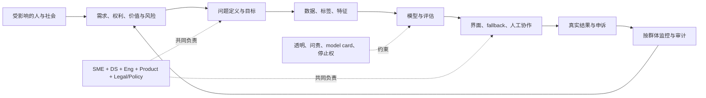
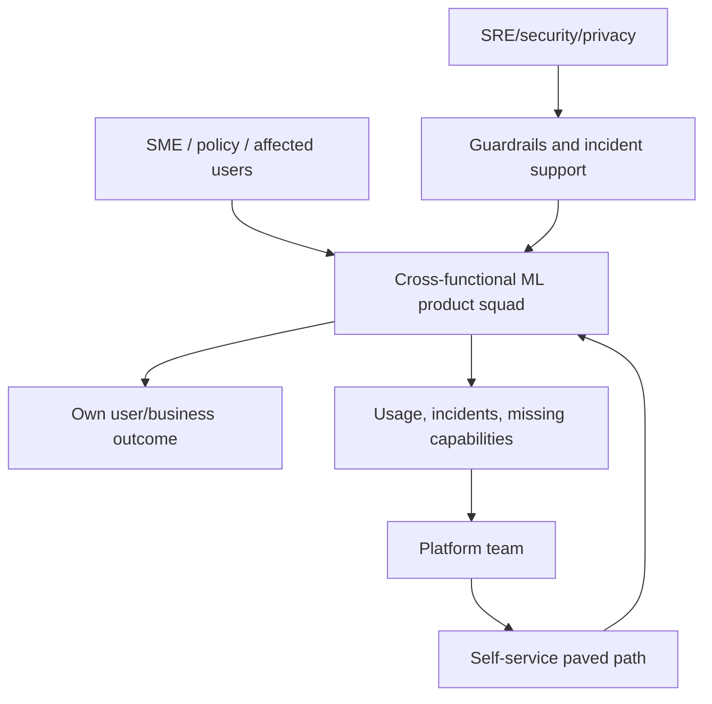
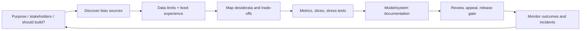
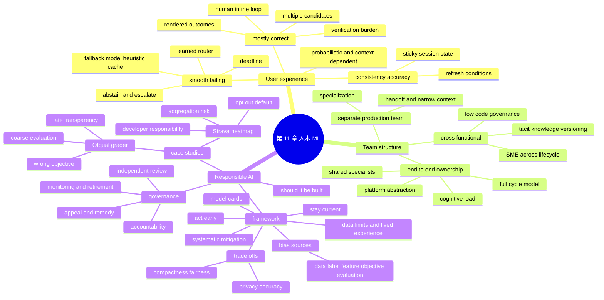

> 对应原章：11. The Human Side of Machine Learning.md
> 本章把前十章的技术系统重新放回人的世界：模型输出首先改变用户体验，模型开发依赖跨职能协作和清晰 ownership，模型目标、数据和发布决策最终会影响社会。作者先讨论 consistency、mostly-correct predictions 与 smooth failing，再比较职能分工和端到端数据科学家，最后通过 England 2020 A-level 自动评分与 Strava 2017 热力图在 2018 年引发的军事地点暴露事件构建 Responsible AI 框架。
>
> 原章中的 GPT-3、Booking.com、Netflix、Ofqual、Strava、AI 工具和制度案例主要来自 2018–2022 年。本文保留其历史语境，不把产品能力、组织模式或工具状态直接视为 2026 年现状。
>
> **归因说明：** 除相邻文字明确写明“原章”“作者”“图 11-x”或“历史案例”的内容外，本文加入的 consistency 状态机、top-$k$ 成功概率、fallback 期望损失、RACI/ownership 框架、公平指标、差分隐私定义、目标可行域、风险分层、model-card 自动门禁、Mermaid 图、伪代码和可运行 Python 均为笔记补充，不是作者在本章逐式给出的内容。

## 0. 本章要回答的核心问题

1. 为什么 ML system 即使服务正常，也会给用户带来传统软件少见的不确定性？
2. 相同输入得到不同输出究竟来自模型随机性、上下文、数据、模型版本还是基础设施？
3. Consistency 为什么本身具有用户价值，又为何会与最新预测 accuracy 冲突？
4. Booking.com 的 filter suggestion 为什么需要“何时锁定、何时刷新”的产品规则？
5. “Mostly correct” 输出在什么条件下能提升效率，何时反而制造危险的 verification burden？
6. 展示多个候选为什么可能提高至少一个正确的概率，相关错误会怎样削弱收益？
7. Human-in-the-loop 是怎样分配判断任务，为什么不能把最终责任简单转给用户？
8. 对非专家，为什么应展示可直接评价的 rendered outcome，而不只是模型内部 artifact？
9. Smooth failing 如何在超时、故障和不确定性下维持可接受体验？
10. Backup model、heuristic、cache 与 learned router 分别适合什么场景？
11. Speed–accuracy trade-off 为什么要加上超时损失、fallback 质量和 routing overhead？
12. SME 为什么不只是标签供应商，而是问题定义、特征、评估和 UI 的共同开发者？
13. 怎样把医生、律师等 tacit knowledge 变成可版本化、可审查的规则和证据？
14. No-code/low-code 怎样降低协作门槛，又会引入哪些权限、语义和审计风险？
15. Separate production team 的专业化收益与 handoff、debug、finger-pointing 代价是什么？
16. End-to-end ownership 为什么有助于缩短反馈回路，却不等于一个人完成所有工作？
17. 为什么要求 data scientist 同时精通建模、Kubernetes、Airflow 和 on-call 会形成不合理 cognitive load？
18. 好平台怎样让业务 owner 端到端负责，同时由 specialists 提供安全基础能力？
19. Responsible AI 包含 fairness、privacy、transparency、accountability 的什么具体工程行为？
20. 为什么有些应用即使有高准确率，也可能根本不应自动化？
21. Ofqual 自动评分为什么不是单纯的“模型 accuracy 低”问题？
22. 学校层级分布稳定与学生个体公平为什么是不同目标？
23. 平均 60% agreement 能否说明算法与人工同样可接受？
24. 为什么必须按学校规模、资源、族群和交叉群体做细粒度评估？
25. Transparency 为什么必须发生在目标与系统仍可改变时，而不是结果发布后？
26. Strava 案例为什么说明去掉姓名不等于隐私安全？
27. Aggregation、空间稀疏性、背景知识和默认 opt-out 如何共同造成泄露？
28. 用户隐私设置与开发者 privacy-by-default 责任应怎样分配？
29. Bias 可以从 training data、labeling、features、objective 和 evaluation 的哪些位置进入？
30. Disparate impact、demographic parity、equal opportunity、equalized odds 和 calibration 有何区别？
31. 删除 protected attribute 为什么不能自动消除 proxy discrimination？
32. 数据驱动方法为什么无法从历史数据中自行推导“社会上应该怎样”？
33. Privacy、accuracy、compactness、fairness、latency 和 transparency 为什么不是可独立优化的单目标？
34. 差分隐私的 $\varepsilon$ 保证是什么，为什么平均 accuracy 损失可能集中在少数群体？
35. Compression 为什么可能保持 top-line accuracy 却放大 long-tail harm？
36. “尽早行动”为什么比上线后补救更便宜，NASA 十倍成本说法应怎样谨慎理解？
37. Model card 应记录哪些内容，为什么它不是营销文档或合规 checkbox？
38. 模型频繁更新时怎样自动生成 card，同时保留人工责任和语义审核？
39. 工具、第三方 audit、治理流程与持续学习怎样协作降低偏差？
40. 为什么 Responsible AI 不是一次性测试，而是全生命周期 risk management？
41. 谁能批准目标、接受 residual risk、暂停系统和处理申诉？
42. 怎样把用户反馈、团队 ownership 与社会责任连接成一个闭环？
43. 作者如何从用户摩擦逐层推导到组织设计和制度治理？
44. 怎样形成可迁移的 human-centered ML 设计、评估、发布与复盘方法？

全章责任链：



一句话概括：**人本 ML 不是在模型完成后补一个伦理清单，而是从“是否应自动化”开始，把用户可理解性、团队 ownership、公平、隐私、透明和申诉嵌入目标、数据、评估、界面与运行治理。**

---

## 1. 开篇：ML 系统从来不只是技术系统

前十章主要讨论 ML system 的技术设计，但系统还包含：

- 做业务决策的人；
- 开发和运营系统的人；
- 直接使用产品的人；
- 被决策影响但未必主动使用产品的人；
- 监管者、社会组织和公众。

第 1–2 章已讨论 stakeholder 与目标；本章进一步问：概率模型怎样改变交互、组织怎样协作、系统怎样在社会中产生公平或伤害。

作者的顺序有意从近到远：

```text
一次输出对用户的影响
-> 多种角色怎样生产和维护输出
-> 大规模重复输出怎样形成社会后果
```

技术指标只有放进这条链，才知道“优化”是否真的改善人类结果。

---

## 2. User Experience：用户体验

### 2.1 ML 对 UX 的三种特殊挑战

原章概括：

1. **Probabilistic/inconsistent**：相同请求在不同时刻可能不同；
2. **Mostly correct**：总体常正确，但不知道具体哪个输入会错；
3. **Potentially high/variable latency**：大型模型或长序列可能突然很慢。

需要精确区分：训练好的 deterministic model 在固定 weights、preprocess、hardware、seed 和 deterministic kernels 下可重复；相同输入不同输出也可能来自 context、retrieval index、model version、sampling、feature freshness 或并发数值非确定性。不能把所有变化都归因于“ML 天生随机”。

用户感知的是完整服务：

$$
y_t=F(x,context_t,data_t,model_t,policy_t,rng_t,system_t).
$$

Consistency policy 要说明哪些变量变化时输出允许变。

### 2.2 Ensuring User Experience Consistency

#### 2.2.1 Consistency 是交互契约

用户依赖稳定的空间、名称和行为建立心智模型。原章以 Chrome minimize button 位置为例：即便新位置理论上更优，突然移动也会造成困惑。

ML recommendation 每次重排会让用户刚见过的 option 消失。这里的损失不是纯 prediction error，而是 search cost、信任下降和任务中断。

可以把产品效用写成：

$$
U(a_t)=Q(a_t\mid x_t)-
\lambda_s\,C_{switch}(a_t,a_{t-1}),
$$

$Q$ 是当前预测质量，$C_{switch}$ 是与用户已见状态的变化成本，$\lambda_s$ 表示场景对稳定性的重视。原章称之为 consistency–accuracy trade-off。

#### 2.2.2 Booking.com filter suggestion 案例

2020 年案例中，Booking.com 约有 200 个住宿 filters，如早餐、宠物友好、无烟。ML 根据本次 browsing session 建议用户可能需要的 filters。

问题：模型每次返回新的“最优” filters，用户可能找不到刚用过的 filter。团队增加产品规则：

- 用户已应用某 filter 时，相关推荐必须稳定；
- 用户改变 destination 等语义 context 时，允许刷新。

这不是让模型更准确，而是在模型外建立 state machine：

```text
session state + user action + context change
-> freeze / preserve / refresh / expire recommendations
```

#### 2.2.3 一致性 scope

应定义：

- 对谁稳定：request、session、user、household？
- 稳定多久：页面、会话、一天？
- 哪些变化允许刷新：destination、inventory、safety？
- 哪些 item 必须保留：已选择、已购买、正在编辑？
- 模型升级怎样迁移 state？

过度 sticky 会锁定旧错误、过期库存或 filter bubble；关键安全/价格变化不能为 UX consistency 隐藏。

#### 2.2.4 可运行示例：显式 consistency policy

下面实现的是 **pin applied items**，不是冻结整张 previous list：用户已经应用的项优先保留，其余位置可由新 ranking 填充。若 pinned items 超过 `limit`，示例按 previous order 截断；真实产品也可选择提高上限或单独展示 active filters，但必须显式定义。

```python
def choose_suggestions(previous, ranked, applied, context_changed, limit=3):
    ranked_unique = list(dict.fromkeys(ranked))
    if context_changed or previous is None:
        base = []
    else:
        base = [item for item in previous if item in applied]

    result = list(dict.fromkeys(base))[:limit]
    for item in ranked_unique:
        if len(result) >= limit:
            break
        if item not in result:
            result.append(item)
    return result


ranked = ["breakfast", "parking", "pool", "non-smoking"]
print(choose_suggestions(
    previous=["pet-friendly", "breakfast", "parking"],
    ranked=ranked,
    applied={"pet-friendly"},
    context_changed=False,
))
print(choose_suggestions(
    previous=["pet-friendly", "breakfast", "parking"],
    ranked=ranked,
    applied={"pet-friendly"},
    context_changed=True,
))
```

输出：

```text
['pet-friendly', 'breakfast', 'parking']
['breakfast', 'parking', 'pool']
```

第一行 pin 用户已应用的 `pet-friendly`，而不是承诺完整 recommendations 不变；第二行因 context 改变完全采用新 ranking。真实系统还要处理不可用 filter、排序位置和 state TTL。

### 2.3 Combatting “Mostly Correct” Predictions

#### 2.3.1 “大多正确”是否有用取决于 verification

原章以 GPT/GPT-2/GPT-3 生成 React code 为例。模型可用很少 task-specific data 处理多任务，但输出并非总正确，task-specific fine-tuning 当时也昂贵。


若客服 operator 能快速编辑草稿，mostly-correct response 可减少从零写作时间。若用户不会 React，生成 code 即使 90% 正确也可能完全不可用，因为最后 10% 的识别和修复成本超过任务本身。

把时间、人工和伤害都换算成同一成本/效用单位。辅助流程有价值的一个简化条件是：

$$
C_{review}+C_{edit}
+P(E_{model}\cap E_{miss})C_{harm}
<C_{manual}+P(E_{manual})C_{manual\_harm}.
$$

$E_{model}$ 表示模型错误，$E_{miss}$ 表示 reviewer 漏检，二者交集才产生该路径的残余伤害；manual baseline 也可能犯错。还要考虑 automation bias：人会因系统看起来专业而漏检错误。Review 不能假设免费、准确和无限容量。

#### 2.3.2 展示多个可评价结果

原章建议对同一 input 产生多个 React snippets，并渲染成 visual pages，让不懂 React 的用户选择。

若每个候选正确概率为 $p$ 且错误独立，$k$ 个候选至少一个正确的概率为：

$$
P(\ge1\ correct)=1-(1-p)^k.
$$

例如 $p=0.6,k=3$，理想独立时为 $1-0.4^3=0.936$。但同一模型候选错误高度相关，真实增益更小；diversity、temperature 和 independent retrieval 可改变相关性，却也可能降低平均质量。

候选越多还会增加选择成本：

$$
U(k)=P_k(success)V-C_{generation}(k)-C_{choice}(k).
$$

因此不是越多越好。

#### 2.3.3 Rendered outcome 与 inspectability

应把模型输出转换成用户能判断的形式：

- Code -> sandbox preview + tests + diff；
- Translation -> back-translation/关键实体高亮；
- Recommendation -> 理由和可撤销选择；
- Document extraction -> 原文 span 与 confidence；
- Medical support -> evidence、uncertainty、escalation，不能只给 label。

Rendered preview 本身也可能掩盖 security、accessibility、performance 等不可见错误，所以还需 automated validators。

#### 2.3.4 Human-in-the-loop 的三种角色

1. **Select**：在多个候选中选；
2. **Edit/approve**：修改并确认；
3. **Escalate/override**：拒绝自动化或转专家。

Human-in-the-loop 不是一句“最终由人负责”就完成。系统必须给人足够时间、信息、权限和训练，并监控 override、review error、workload 与 disagreement。

#### 2.3.5 高风险任务不能只靠候选选择

对贷款、医疗、招聘等场景，用户可能无法判断哪个结果正确；多个错误候选不会变安全。需要独立证据、专业审核、appeal、禁止自动执行的边界和责任 owner。

### 2.4 Smooth Failing

#### 2.4.1 为什么正常快不代表长尾快

Language/time-series 等 sequential model 的计算常随长度增长；retrieval、beam search、tool call、queue 也会让特定 query 超时。UX 由 tail latency 和 failure behavior 决定，不只是平均 latency。

#### 2.4.2 Backup system

原章建议：主模型超过 $X$ ms 时使用保证快速但质量稍差的：

- Heuristic/rule；
- Simple model；
- Cached/precomputed predictions。

也可先用 router 预测主模型 latency，再决定路径；但 router 自身增加延迟、错误和维护对象。

#### 2.4.3 Speed–accuracy–reliability trade-off

设用户 deadline 为 $D$，系统在更早的 cutoff $\tau<D$ 尚未得到主模型结果时就取消/放弃主路径并启动 fallback。主、备完成时间分别为 $L_m,L_b$，预测损失为 $\ell_m,\ell_b$，单位等待成本为 $c_L$，fallback failure 事件为 $F_b$。一个展开后的示意期望成本是：

$$
\mathbb E[
\mathbb 1(L_m\le\tau)(\ell_m+c_LL_m)
+\mathbb 1(L_m>\tau)(
\ell_b+C_{switch}+C_{cancel}
+c_L(\tau+L_b)
+\mathbb 1(\tau+L_b>D)C_t
+\mathbb 1(F_b)C_f)
].
$$

若等到 $D$ 才启动 fallback，它必然无法在同一 deadline 内完成；因此必须预留 fallback budget。$C_t$ 是迟到损失，$C_f$ 是 fallback 失败损失，$C_{cancel}$ 包含取消/已消耗主路径资源。公式只表达成本项，真实系统还要处理主路径在 cutoff 后恰好完成的 race。阈值应由 latency distribution、用户 deadline 和业务 harm 决定，不只看 p99。

#### 2.4.4 Fallback 的正确工程语义

- Deadline/cancellation 要贯穿下游，避免主模型超时后仍耗资源；
- Fallback 要独立故障域，否则共同依赖一起坏；
- Cached output 要标 freshness 和适用 context；
- 用户应看到适当 degraded-state 提示；
- 记录 fallback rate、原因和效果；
- 安全场景宁可 abstain/escalate，不应给未经保证的快速答案。

#### 2.4.5 Learned router 的限制

若 router 本身耗时 $L_r$，主模型只剩 $D-L_r$ 的预算。设 $q$ 是允许的 violation-probability threshold，且 `load` 表示实时 queue/capacity，路由到 fallback 的简化规则可写成：

$$
r(x,load)=
\mathbb 1[P(L_m>D-L_r\mid x,load)>q].
$$

Fallback 同样只能使用剩余的 $D-L_r$，更完整的 router 应比较两条路径的条件期望成本，而不只比较主模型超时概率。Router 可能因 workload/queue shift 失准；仅用 query features 而忽略实时 load 会错路由。

---

## 3. Team Structure：团队结构

### 3.1 为什么 ML 是跨职能产品

典型角色包括：

- Data scientist / ML engineer；
- Software、data、platform、DevOps/SRE；
- Product/design/research；
- Subject matter experts；
- Security、privacy、legal、policy；
- Operations、support 和受影响群体代表。

“最佳组织结构”不是固定 org chart，而是让每项决策有知识、有 owner、有反馈、有停止权。

### 3.2 Cross-functional Teams Collaboration

#### 3.2.1 SME 不是只负责 labeling

原章列 doctors、lawyers、bankers、farmers、stylists。SME 应参与：

- Problem formulation：是否值得自动化、错误代价；
- Data/label：定义真值、分歧和不确定性；
- Feature engineering：领域机制与 proxy 风险；
- Error analysis/evaluation：哪些 slice 和 failure 严重；
- Reranking/decision policy：模型分数怎样变成行动；
- UI：怎样呈现结果、证据和不确定性；
- Production monitoring：现实标准何时变化。

持续学习意味着 labeling/relabeling 也可能贯穿整个生命周期。

#### 3.2.2 Tacit knowledge 怎样版本化

“X–Y 区域有小点可能是癌症迹象”不是天然 code。可转成：

```text
领域概念定义
-> annotation guideline + positive/negative examples
-> decision table / ontology / labeling UI constraint
-> versioned review record
-> disagreement and exception log
-> model/data test slice
```

版本化不等于要求医生使用 Git。系统应让 SME 通过熟悉 interface 提交结构化变更，后台再生成 immutable version、diff、review 和 audit trail。

#### 3.2.3 跨语言沟通

工程师不能只说 AUC，SME 也不能只说“看起来不对”。Shared artifact 应包含：

- Concrete scenarios 与 counterexamples；
- Error taxonomy 和 severity；
- Confusion matrix/slices 用自然语言解释；
- Decision threshold 对真实工作流的影响；
- Known unknowns 和 escalation；
- 术语表和 decision log。

#### 3.2.4 No-code/low-code 的作用与边界

原章指出写作时多数 SME tools 聚焦 labeling、QA、feedback，并逐步扩展 dataset creation 和 issue investigation。

低代码应降低表达成本，不降低治理：

- Role-based access；
- Schema/constraint validation；
- Review/approval；
- Version/diff/rollback；
- Provenance；
- Sandbox preview；
- 禁止 silent production mutation。

#### 3.2.5 决策权要匹配知识

可使用 RACI 但不应机械化。下表是一个默认示例，不是跨组织/司法辖区的固定处方：某些领域由法人、法定 officer、委员会或多个机构共同承担问责。即便如此，也要明确谁有最终 decision authority、谁执行、发生分歧时怎样升级：

| 决策 | Responsible | Accountable | Consulted |
| --- | --- | --- | --- |
| 是否自动化 | Product/ML/SME | Business risk owner | Legal、受影响群体 |
| Label guideline | SME/data | Domain owner | Annotators、ML |
| Model gate | ML/evaluation | Model owner | SME、risk、SRE |
| Production rollback | On-call | Service owner | ML、product |
| Harm appeal | Operations/SME | Policy owner | Legal、ML |

常见产品决策可指定一个清晰 accountable owner；共同或法定问责场景则应记录各方权限和不可转移责任。无论采用哪种结构，决策证据都来自多角色，不能让“共同负责”变成无人能暂停或补救。

### 3.3 End-to-End Data Scientists

作者比较两种极端组织：按职能分工，或让 data scientists 负责完整 lifecycle。真正目标是缩短 handoff 和反馈回路，而非寻找“全能个人”。

#### 3.3.1 Approach 1: Have a separate team to manage production

##### 3.3.1.1 收益

- 更容易招聘单一技能 specialists；
- 每人专注 model 或 production；
- 平台、security、reliability 可由专家统一治理；
- 重型基础设施得到长期 owner。

##### 3.3.1.2 原章四类代价

1. **Communication/coordination overhead**：团队互相阻塞；
2. **Debugging challenges**：故障跨 data/model/platform/vendor，需多人协作；
3. **Finger-pointing**：找到根因后仍争谁修；
4. **Narrow context**：无人看完整 value stream，platform 等需求、DS 不感受 infrastructure 痛点。

作者引用 Brooks 的夸张表述：“一个程序员一个月做完的事，两个程序员两个月做完”，强调 communication overhead，不是可用于 staffing 的定量定律。

##### 3.3.1.3 Handoff failure 的根因

```text
Model artifact 交接，而不是 product outcome 共同 ownership
接口只约 happy path
缺少共同 telemetry/request ID
SLO 与激励不同
无 runbook 和 incident commander
```

解决方案不是取消 specialization，而是减少队列式 ticket handoff：跨职能 product squad、共同 design review、embedded platform partner、shared on-call/incident review 和 self-service contracts。

#### 3.3.2 Approach 2: Data scientists own the entire process

##### 3.3.2.1 全栈技能清单的吸引力

原章作者曾发布技能图，覆盖 SQL、modeling、distributed training、endpoint、Kubernetes 和 Airflow：


Eugene Yan 支持更 end-to-end；Eric Colson 警惕过度职能分工。完整上下文能让 owner 更快发现“模型指标好但产品坏”。

##### 3.3.2.2 Grumpy unicorn 问题

若让 DS 自己写大量 deployment boilerplate、Dockerfiles、cluster scaling 和 YAML，他们会变成难招聘的 “grumpy unicorns”，时间从数据和问题转向平台细节。

技能存在机会成本：

$$
T_{total}=T_{domain}+T_{data}+T_{model}+T_{infra}+T_{ops}.
$$

个人时间固定，某项增加会挤压其他项。Infrastructure 与 data science 是不同深度的专业领域。

作者后来修正自己“必须懂 K8s”的看法，并引用类比：要求 DS 了解底层 infrastructure，像要求 app developer 了解 Linux kernel。类比不意味着完全不懂运行约束，而是不应把平台内部实现设为日常门槛。

##### 3.3.2.3 End-to-end ownership 不等于 end-to-end implementation

Owner 应能：

- 定义问题和 success；
- 提交可运行 workflow；
- 理解关键资源/可靠性约束；
- 观察 production outcome；
- 参与 incident 和改进；
- 对模型/业务结果负责。

不要求 owner 自建 scheduler、container runtime、feature store 和 monitoring backend。

##### 3.3.2.4 平台抽象是关键

原章设想工具接受 data location、steps、execution backend、dependencies，自动管理 infrastructure。Stitch Fix/Netflix 经验强调 full-stack DS 依赖工具抽象 containerization、distributed processing、automatic failover 等复杂度。

好抽象要同时满足：

- Common path 简单；
- 底层 constraints 可见，不制造魔法；
- Failure 可诊断；
- Escape hatch 支持特殊 workload；
- Security/cost policy 默认执行；
- 平台 owner 维护 substrate，业务 owner 维护 outcome。

##### 3.3.2.5 Netflix full-cycle model

原章描述：原先拥有某一环节的 specialists 先把其工作工具化，data scientists 再用这些工具端到端拥有项目。


这里体现 “you build it, you run it” 的受控版本：业务团队拥有服务结果，平台/SRE/security 提供标准能力和 guardrails。高风险或底层故障仍需 specialists，不应把责任孤立给单个 DS。

##### 3.3.2.6 更现实的混合结构



目标是让一个小 squad 对 outcome 有完整视野，同时共享 specialists 的杠杆。

---

## 4. Responsible AI：负责任的人工智能

> **原章贡献署名：** 本节由 Montreal AI Ethics Institute 创始人兼 principal researcher Abhishek Gupta 提供了大量内容贡献；以下笔记保留这一具体归因。

### 4.1 为什么本节使用 AI 而不只 ML

作者说明 AI 范围比 ML 广，responsibility 问题适用于一般智能系统，因此本节使用 Responsible AI。

原章定义核心是：以善意和充分 awareness 设计、开发、部署系统，以赋能用户、建立信任，并给社会带来公平、正面影响。主要维度：

- Fairness；
- Privacy；
- Transparency；
- Accountability；
- Safety、inclusivity 与 user empowerment。

“善意”不等于好结果；需要可验证流程、责任和补救。

### 4.2 从哲学问题变成工程和政策问题

ML 已进入教育、金融、医疗、招聘、公共服务。错误会以规模和自动化重复，影响机会、权利与安全。

开发者责任包括：

- 分析系统对用户和非用户的影响；
- 帮助 stakeholder 理解责任；
- 把 ethics/safety/inclusivity 转成 objectives、data requirements、tests 和 governance；
- 当应用不适合自动化时提出停止。

Responsible AI 不是 data scientist 单独承担；最终决策还涉及组织领导、法律、政策、采购和监管责任。

### 4.3 这只是初步框架

原章明确免责声明：Responsible AI 文献庞大，本节不穷尽，只帮助 practitioner 导航。作者推荐 NIST SP 1270、ACM FAccT、Trustworthy ML 资料、Sara Hooker 2022 slides、Timnit Gebru/Emily Denton 2020 tutorials。

这些资源也是历史起点；当前法律、标准和机构指南应按 jurisdiction 与日期核实。

### 4.4 先问是否应该构建

后文框架也不能使所有应用合理。原章举 criminal sentencing、predictive policing：即使指标和文档完善，也可能因权力不对称、历史偏差、不可逆伤害或正当程序而不适合 AI。

风险决策的第一道 gate：

```text
任务是否具有合法、正当目的？
是否真的需要自动化？
是否存在伤害更小的非 ML 方案？
受影响者能否知情、质疑、退出和获得补救？
谁有权停止系统？
```

只有通过，才讨论“怎样负责任地建”。

### 4.5 Irresponsible AI: Case Studies

公众看见的事故只是可见样本；更多伤害可能静默发生。原章提到 AI Incident Database，案例的用途不是猎奇，而是沿 lifecycle 追踪哪里失守、怎样提前发现。

#### 4.5.1 Case study I: Automated grader’s biases

##### 4.5.1.1 事件背景

2020 年 COVID-19 期间，England 取消了决定大学录取的重要 A-level exams；英国其他构成国有各自安排。本案例中的监管机构 Ofqual 管辖 England，并批准用教师评估、学生排序和历史 attainment 等信息的统计模型分配最终成绩。

采用算法的初衷包括：担心不同学校 teacher assessment 不可比、跨年份标准变化和 grade inflation。结果却引发大规模抗议，最终系统失去公众信任。

##### 4.5.1.2 为什么“60% accuracy”不是完整判断

原章引用 Ofqual：在 2019 数据回测，各科平均 exact-grade accuracy 约 60%，即约 40% 预测与实际 grade 不同；Ofqual 又称 examiner 与 senior examiner agreement 也约 60%。

这不能直接推出“算法和人一样好”：

- 比较对象、样本和评分流程可能不同；
- 人工判断是决策流程的一部分，算法会系统化和规模化错误；
- 一等级和多等级错误后果不同；
- 平均 agreement 不显示群体差异；
- 实际 exam grade 也不是无噪声绝对真值；
- 自动系统的申诉、解释和纠正机制不同。

高风险评估至少要看：

$$
R=\sum_{g,s,c}w_{g,s,c}
\mathbb E[L(\widehat Y,Y)\mid group=g,school=s,class=c],
$$

用 severity-sensitive loss 和重要 slices，而不是一个平均 exact match。

作者从事故中归纳三类失败。

##### 4.5.1.3 Failure 1: Setting the wrong objective

###### 4.5.1.3.1 个体准确与学校标准不是同一目标

公众可能期望“尽量准确评价每位学生”；原章对 Ofqual 目标的解读是“maintaining standards”：让各校预测成绩分布符合历史分布。

可抽象成：

$$
\min_{\widehat y_i}
\sum_i \ell(\widehat y_i,y_i)
+\lambda\sum_s
D(\widehat P_s(Y),P_s^{history}(Y)).
$$

第一项关注 individual error，第二项让学校 $s$ 的预测分布接近历史。$\lambda$ 较大时，优秀个人会被学校历史上限拉回。

公式是笔记补充，不是 Ofqual 原模型复现。它说明“准确预测学生”与“维持学校间历史标准”可能冲突；选择 $\lambda$ 是价值和政策决定，不是数据自行决定。

其中 $y_i$ 表示学生若参加考试时的反事实/潜在真实成绩；考试已经取消，因此它在 2020 年决策时不可观测。这个式子是规范性目标冲突的示意，不是可直接计算的 training loss，也不能用当年缺失真值完整验证。

###### 4.5.1.3.2 历史数据会固化资源差异

资源丰富学校过去成绩高，资源不足学校过去成绩低。把 school history 当强 prior 会让 current high performer 承担历史不平等。原章举例：在历史上同班学生多获 D 的 cohort 中，本应获 A 的学生被降至 B/C。

这不是简单 feature bug，而是 normative objective：系统把哪种公平当优先。作者表述为“学校间公平优先于学生间公平”；更精确地说，维持分布标准不自动等同任何被普遍接受的 fairness definition。

###### 4.5.1.3.3 目标设计检查

```text
谁定义成功？
优化单位是 individual、school 还是 population？
谁承担 false positive / false negative？
历史分布是应保持的标准，还是需要改变的不平等？
有没有不允许 trade off 的权利/约束？
```

##### 4.5.1.4 Failure 2: Insufficient fine-grained model evaluation to discover biases

###### 4.5.1.4.1 Teacher assessment 也带偏差

模型把 teacher assessment 当 input，却未充分处理教师对不同 demographic groups 的期望差异。Protected groups 还可能同时受低期待、种族歧视、贫困等 multiple disadvantages。

算法可能把人类偏差转成看似客观的分数。Human input 不自动比 machine label 公平。

###### 4.5.1.4.2 Small-school rule 产生结构性差异

Ofqual 承认 small schools 数据不足，对其使用 teacher-assessed grades；原章引用评论称 private schools 往往 class 更小，因此实际得到更好成绩。

即便 fallback 对“小样本”统计上合理，它与 socioeconomic structure 相关，就会产生 group impact。Policy branch 本身必须像 model 一样按群体审计。

###### 4.5.1.4.3 平均值怎样掩盖伤害

应按 school size、historical performance、resource、demographic、teacher-assessment pattern 及其 intersections 检查：

- Support/sample size；
- Exact/within-one-grade accuracy；
- Mean signed error（系统升/降级）；
- Severe downgrade rate；
- Selection/admission impact；
- Uncertainty 和 confidence interval；
- Fallback policy coverage；
- Appeals/corrections。

Public release 后再切片太晚；应在目标仍可改变时由受信任 independent reviewers 和 affected stakeholders 参与。

###### 4.5.1.4.4 公平指标不是一个数

二元决策示意，protected group $A\in\{0,1\}$：

**Demographic parity difference**：

$$
\Delta_{DP}=P(\widehat Y=1\mid A=1)
-P(\widehat Y=1\mid A=0).
$$

**Disparate-impact ratio**（工程筛查形式）：

$$
DI=\frac{P(\widehat Y=1\mid A=1)}
{P(\widehat Y=1\mid A=0)}.
$$

这里须预先声明 $A=1$ 是被审计/潜在受不利影响组，$A=0$ 是 reference group；交换方向会得到倒数。所谓 80% rule 在部分美国 employment screening 语境中是初步信号，不是跨司法辖区的普适“公平证明”。Disparate impact 是法律/社会概念，不能被一个 ratio 完全定义。

**Equal opportunity gap**（TPR gap）：

$$
\Delta_{TPR}=P(\widehat Y=1\mid Y=1,A=1)
-P(\widehat Y=1\mid Y=1,A=0).
$$

**Equalized odds** 同时要求 TPR 与 FPR 接近。若模型输出概率 score $S\in[0,1]$，**calibration within groups** 的理想定义是对每个有支持的 score/group：

$$
P(Y=1\mid S=s,A=a)=s.
$$

实践中通常按 score bins 近似并报告 uncertainty；“不同组真实概率彼此接近”不如“各组都与所报 score 对齐”精确。

这些指标可能互不兼容，尤其 base rates 不同且预测不完美时。选哪个取决于 decision、harm 和法律，不是从 toolkit 默认值继承。

###### 4.5.1.4.5 可运行示例：总体和群体指标

```python
from collections import defaultdict


def safe_rate(numerator, denominator):
    return numerator / denominator if denominator else None


def safe_difference(left, right):
    return None if left is None or right is None else left - right


def safe_ratio(numerator, denominator):
    return None if numerator is None or denominator in (None, 0) else numerator / denominator


def format_rate(value):
    return "NA" if value is None else f"{value:.3f}"


def group_metrics(rows):
    grouped = defaultdict(list)
    for row in rows:
        grouped[row["group"]].append(row)

    result = {}
    for group, items in sorted(grouped.items()):
        positives = sum(item["prediction"] == 1 for item in items)
        actual_positive = [item for item in items if item["label"] == 1]
        actual_negative = [item for item in items if item["label"] == 0]
        true_positive = sum(item["prediction"] == 1 for item in actual_positive)
        false_positive = sum(item["prediction"] == 1 for item in actual_negative)
        result[group] = {
            "support": len(items),
            "positive_support": len(actual_positive),
            "negative_support": len(actual_negative),
            "selection_rate": safe_rate(positives, len(items)),
            "tpr": safe_rate(true_positive, len(actual_positive)),
            "fpr": safe_rate(false_positive, len(actual_negative)),
        }
    return result


rows = [
    {"group": "A", "label": 1, "prediction": 1},
    {"group": "A", "label": 1, "prediction": 1},
    {"group": "A", "label": 1, "prediction": 0},
    {"group": "A", "label": 0, "prediction": 1},
    {"group": "A", "label": 0, "prediction": 0},
    {"group": "B", "label": 1, "prediction": 1},
    {"group": "B", "label": 1, "prediction": 0},
    {"group": "B", "label": 0, "prediction": 0},
    {"group": "B", "label": 0, "prediction": 0},
    {"group": "B", "label": 0, "prediction": 0},
]

metrics = group_metrics(rows)
for group, values in metrics.items():
    print(
        f"{group}: n={values['support']}, positive_n={values['positive_support']}, "
        f"negative_n={values['negative_support']}, "
        f"selection={format_rate(values['selection_rate'])}, "
        f"tpr={format_rate(values['tpr'])}, fpr={format_rate(values['fpr'])}"
    )

selection_gap = safe_difference(
    metrics["B"]["selection_rate"], metrics["A"]["selection_rate"]
)
impact_ratio = safe_ratio(
    metrics["B"]["selection_rate"], metrics["A"]["selection_rate"]
)
tpr_gap = safe_difference(metrics["B"]["tpr"], metrics["A"]["tpr"])
print(f"selection_gap_B_minus_A={format_rate(selection_gap)}")
print(f"impact_ratio_B_over_A={format_rate(impact_ratio)}")
print(f"tpr_gap_B_minus_A={format_rate(tpr_gap)}")
```

输出：

```text
A: n=5, positive_n=3, negative_n=2, selection=0.600, tpr=0.667, fpr=0.500
B: n=5, positive_n=2, negative_n=3, selection=0.200, tpr=0.500, fpr=0.000
selection_gap_B_minus_A=-0.400
impact_ratio_B_over_A=0.333
tpr_gap_B_minus_A=-0.167
```

十条样本只用于说明指标，样本太小不能做现实公平结论；真实审计要置信区间、intersectional slices、label validity 和 harm context。即使 impact ratio 接近 1，也不能证明个体、公平程序或其他 error rates 合理。

##### 4.5.1.5 Failure 3: Lack of transparency

###### 4.5.1.5.1 透明必须及时

Ofqual 直到 grades 发布日才让公众知道 maintaining standards 的目标；教师也在提交 assessment/ranking 后才知道具体用法。其理由是防 gaming 和同步公布结果，意图并非恶意。

但保密使目标、数据和模型未在可改变阶段接受 public/independent scrutiny。Transparency 若只在不可逆结果后发生，无法参与治理。

###### 4.5.1.5.2 Transparency 不是公开全部源码

至少应披露：

- Purpose、decision authority 和 affected population；
- Objective、constraints 和 alternatives；
- Data sources、known biases、group coverage；
- Evaluation、uncertainty、failure modes；
- 哪些人/机构独立 review；
- Individual explanation、appeal、correction；
- 何时停止或回滚。

可以保护 security/privacy-sensitive details，同时让可信审计者访问足够证据。Open source 本身也不能保证公众可理解或能获得补救。

###### 4.5.1.5.3 Independent oversight

原章引用 Royal Statistical Society 对 technical advisory group 的组成、统计程序和透明度提出质疑。对高风险 public system，开发方自评不足；reviewer 需要独立性、相关 expertise、资源和发表异议的权利。

##### 4.5.1.6 自动化边界

即使修复三项失败，公众仍可能拒绝自动评分。问题不是“能否预测”，而是这种高后果、强争议决策是否具有：

- 可接受的 automation legitimacy；
- Due process；
- Individual evidence；
- Effective appeal；
- Human authority 能真正推翻系统；
- 非自动替代方案。

模型 accuracy 不能回答政治与权利问题。

#### 4.5.2 Case study II: The danger of “anonymized” data

##### 4.5.2.1 算法不是唯一风险源

该案例的显性问题不是 prediction model，而是 data collection、default setting、aggregation 和 release interface。Responsible AI 必须覆盖 data lifecycle，而不只是模型。

AI 研发需要高质量数据，但收集/共享会带来 privacy/security risk。美国 Department of Labor 对 PII 的定义包含能直接或间接合理推断身份的信息；删除姓名并不够。

##### 4.5.2.2 Strava 2017 发布与 2018 暴露事件

Strava 于 2017 年 11 月发布新版全球运动路径 heatmap，聚合 2015 至 2017 年 9 月约 10 亿活动、270 亿公里，并称数据匿名、排除 private activities 和 user privacy zones。2018 年 1 月，分析与媒体报道使海外军事地点和活动 pattern 的暴露问题受到广泛关注。

军事人员使用 Strava 后，空间活动 pattern 暴露海外基地、巡逻路线等敏感信息；分析者甚至称可能推断个人姓名和心率。


##### 4.5.2.3 为什么 aggregation/anonymization 失效

- Sparse location：偏远区域少量轨迹就很显眼；
- Auxiliary information：地图、基地位置、公开社交资料可连接；
- Repeated patterns：住处、工作地、巡逻周期形成 signature；
- Membership inference：某区域亮起本身泄露有人活动；
- Group harm：即使认不出个人，也可暴露军事设施或群体行为；
- Interface scale：全球可搜索可视化降低攻击成本。

Privacy risk 不只有 identity disclosure，还包括 attribute、membership、location、group 和 inferential privacy。

##### 4.5.2.4 Opt-out default 与 meaningful consent

原章指出默认 opt-out，设置不总清晰，部分只能在网站而非 app 修改，并主张 data collection 应默认 opt-in。

有效 consent 应：

- Specific、informed、freely given；
- 与用途/共享范围匹配；
- 容易拒绝和撤回；
- 不用 dark patterns；
- 对高风险二次用途重新取得；
- 不把核心服务不必要地绑定广泛收集。

Opt-in 不是所有法律场景的唯一 lawful basis，但 privacy-protective defaults 是产品责任。

##### 4.5.2.5 不能把责任全推给用户

事故后有人强调军人不该用消费 GPS device 或应关 location。用户 hygiene 有作用，但开发者更了解 collection、aggregation 和 attacker capability，并控制 default/interface。

合理责任分配：

```text
组织：data minimization、threat modeling、safe defaults、release review
管理员：设备/场景 policy 与培训
用户：在可理解且可执行的条件下选择
监管/审计：最低标准与问责
```

##### 4.5.2.6 Privacy by design

发布前问：

- 真的需要收集精度这么高、时间这么长的数据吗？
- 能否 on-device aggregate、降低 resolution、缩短 retention？
- Small cohort 是否 suppression？
- 是否应用 differential privacy，并评估 utility/group impact？
- Red-team 能否用 public auxiliary data 推断敏感事实？
- 数据下载/API/visualization 哪个 interface 增加风险？
- Incident 后能否删除、通知和阻断？

“匿名”应是具体 threat model 下的风险评估，不是永久属性或免责标签。

---

### 4.6 A Framework for Responsible AI

#### 4.6.1 框架的适用边界

作者把框架定位为 practitioner audit foundations，不保证适合所有 use case。Criminal sentencing、predictive policing 等可能无论怎样优化都不合适。

框架不是线性做一次，而是 lifecycle loop：



#### 4.6.2 Discover sources for model biases

Bias 不只在 dataset，可能出现在每个 lifecycle step。

##### 4.6.2.1 Training data

检查 training data 是否代表 deployment population、context 和时间；少数群体样本少会导致高 variance 和坏 coverage。

Representation 只是第一步：历史数据即使“代表现实”，也可能忠实记录现实歧视。盲目拟合会复制它。

##### 4.6.2.2 Labeling

检查：

- Annotator guideline 是否清晰；
- Subjective judgment 和 cultural assumptions；
- Inter-annotator disagreement；
- Adjudication；
- Annotator demographics/working conditions；
- Label 是否 proxy，而非真正 outcome；
- 不同群体 label noise 是否不同。

Disagreement 可能表示真实 ambiguity，不应总用 majority vote 抹平。

##### 4.6.2.3 Feature engineering

删除 race/gender 不足以消除 bias。ZIP code、school、language、device 等可与 protected class 相关并形成 proxy。

原章定义 disparate impact：表面 neutral 的 selection process 对群体产生广泛不同 outcomes。它涉及 context 和法律，不能仅通过 feature correlation 或单一 statistical parity 判断。

原章列 Feldman disparate-impact remover、AIF360 实现和 H2O Infogram 作为当时 tools。Preprocessing removal 会损失 utility、隐藏偏差或引入新伤害；必须重新按真实 outcome 验证，工具不能决定公平目标。

##### 4.6.2.4 Model objective

总体平均 loss 按样本数量加权，会由 majority group 主导：

$$
R(\theta)=\sum_g P(G=g)R_g(\theta).
$$

小群体即使 $R_g$ 很高，对总风险贡献也可能小。可考虑 group constraints、worst-group risk、reweighting 或多目标优化：

$$
\min_\theta \max_g R_g(\theta),
$$

但 worst-group 估计对小样本很噪，也不自动表达所有法律/个体公平要求。

##### 4.6.2.5 Evaluation

Fair evaluation 依赖 fair/adequate evaluation data。报告：

- Overall + predeclared slices；
- Intersections，而不只单属性；
- Support 和 uncertainty；
- Error severity；
- Threshold/policy effects；
- Calibration；
- Abstention/fallback/appeal；
- Production outcome，而不只 offline proxy。

大量探索 slices 会有 multiple comparisons 和隐私风险；应结合预注册、false-discovery control、minimum support 和 protected analysis environment。

#### 4.6.3 Understand the limitations of the data-driven approach

##### 4.6.3.1 数据描述过去，不定义应然

ML 从数据归纳 pattern；数据来自已有制度、资源分配、测量和行为：

$$
P_{observed}(X,Y)
=f(people,institutions,policy,measurement,history).
$$

模型可以估计“历史上发生什么”，不能只凭数据决定“社会应该怎样”。若过去低资源学校成绩较低，不能推出当前优秀学生应被降级。

##### 4.6.3.2 数据缺失也有结构

- 谁没有被记录？
- 谁没有机会产生 positive label？
- 谁因不信任系统而退出？
- 哪些 harm 没有 complaint channel？
- 哪些 outcome 要多年后才出现？

Missing not at random 会让 dashboard 看起来健康。选择进入数据的过程本身要建模和质询。

##### 4.6.3.3 跨学科与 lived experience

原章以 equitable grading 为例：必须理解学生 demographic、socioeconomic factors 怎样进入历史表现。

需要跨越 ML、domain、社会科学、人机交互、法律/政策和受影响社区。Lived experience 不是 anecdote 的同义词，而是发现数据 schema 和指标未表达伤害的重要证据；仍应以结构化研究、参与和决策记录纳入。

##### 4.6.3.4 量化证据与质性证据互补

```text
Metrics/slices：伤害是否集中、规模多大
Interviews/usability：人怎样理解、规避、被迫接受系统
Domain review：标签/目标是否有意义
Incident/appeal：部署后哪些路径失败
Policy/legal analysis：哪些 trade-off 根本不可接受
```

#### 4.6.4 Understand the trade-offs between different desiderata

##### 4.6.4.1 多目标而非单目标

系统可能同时追求 accuracy、latency、privacy、fairness、transparency、compactness、cost、security：

$$
\mathbf m(\theta)=
(accuracy,-latency,privacy,fairness,
transparency,-cost).
$$

不存在天然统一单位。Weighted sum：

$$
\max_\theta\sum_jw_jm_j(\theta)
$$

会把政治/伦理选择藏进 $w_j$。更安全做法是先定义不可违反 constraints，再比较 Pareto-efficient candidates：

$$
\max accuracy
\quad {\mathrm{s.t.}}\quad
privacy\ge p_0,
\ fairness\ge f_0,
\ latency\le L_0.
$$

阈值仍需 stakeholder 和制度决定。

##### 4.6.4.2 Privacy versus accuracy

原章介绍 differential privacy（DP）：单个个体是否在数据集中，不应显著改变机制输出。

对只差一个个体的 neighboring datasets $D,D'$，机制 $M$ 满足 $(\varepsilon,\delta)$-DP，当任意 measurable output set $S$：

$$
P[M(D)\in S]
\le e^\varepsilon P[M(D')\in S]+\delta.
$$

- $\varepsilon$ 越小，隐私约束通常越强；
- $\delta$ 是允许纯 $\varepsilon$ bound 失败的小概率松弛；
- 邻接定义、攻击面和多次查询 composition 是保证的一部分。

DP 不是“数据匿名化”；它给 mechanism-level、threat-model-specific 数学保证。训练中通过 clipping/noise 等实现时，隐私更强通常带来 utility cost，但不是任何场景下单调固定的 accuracy 曲线。

原章引用 Bagdasaryan/Shmatikov 2019：研究设置中 DP model 的 accuracy 对 underrepresented classes/subgroups 下降更多。平均 utility 不能代表公平影响；privacy budget 选择必须按群体评估。

##### 4.6.4.3 Compactness versus fairness

Pruning/quantization 可大幅减小 model，top-line accuracy 损失很小；但损失可能集中于 narrow subsets。

原章引用 Hooker 等 2019/2020：在其研究的 models/datasets/compression settings 中，不同参数量模型总体表现相近，却在窄子集显著分化；protected feature 位于 long tail 时 algorithmic harm 被放大。他们观察到 pruning disparate impact 高于所测 quantization methods。

这是实证结果，不应升级成“所有 pruning 都比 quantization 不公平”。需要对每个 candidate compression level 重新做 slice、calibration、robustness 和 production evaluation。

##### 4.6.4.4 Trade-off 也可能是设计失败的表象

“公平与准确冲突”有时来自：

- Label 本身有偏；
- Majority accuracy 被当唯一准确；
- Data coverage 不足；
- Threshold 不合适；
- 模型容量或 feature 设计差。

先改善数据/目标可能同时提高 fairness 和 utility。只有绘制可行域后，才能说存在不可避免 trade-off。

##### 4.6.4.5 Trade-off register

每次关键设计记录：

```text
desiderata and metrics
hard constraints
alternatives considered
overall and group-level effects
who benefits / who bears cost
uncertainty and missing evidence
decision owner and dissent
revisit trigger
```

#### 4.6.5 Act early

##### 4.6.5.1 建筑地基类比

原章讲 contractor 为省成本用劣质 cement、owner 不监督；一年后裂缝使整栋楼拆除。ML 若早期绕过 ethics/safety，后期目标、数据、UI 和组织流程都建立在坏地基上，返工更贵。

##### 4.6.5.2 NASA “每阶段十倍”应怎样理解

原章引用 NASA technical report，称 software error cost 在 lifecycle 每阶段上升一个数量级。它适合作为“越晚发现通常越贵”的历史风险直觉，不应当作所有项目每跨阶段固定乘 10 的普适定律；修复成本取决于 architecture、automation、regulation 和 harm 已否发生。

社会伤害还可能不可逆，不能只按工程返工成本计价。

##### 4.6.5.3 Shift-left checkpoints

| 阶段 | 尽早回答的问题 |
| --- | --- |
| Ideation | 应不应该构建？谁可能受害？替代方案？ |
| Objective | 优化谁的什么结果？哪些权利不可 trade off？ |
| Data | Consent、representation、label/proxy、retention？ |
| Modeling | Slice、uncertainty、privacy/security、compression？ |
| UX | Disclosure、fallback、override、accessibility、appeal？ |
| Release | Independent review、red team、rollback、owner？ |
| Operation | Outcome monitoring、incident、recourse、retirement？ |

##### 4.6.5.4 Act early 不等于一次性 sign-off

早期 risk assessment 会过时。Data、population、policy 和用途 shift 后要重评；重大 change 触发重新审批，而不是沿用旧 checkbox。

#### 4.6.6 Create model cards

##### 4.6.6.1 Model card 是什么

Model card 是随 trained model 一起发布的短文档，说明训练、评估、intended context 和 limitations。原始论文目标是标准化伦理/包容/公平维度的报告，使 stakeholder 能比较候选。

它服务于 model consumer、reviewer、operator 和 affected stakeholder，不只是开发者记事。

##### 4.6.6.2 原章字段完整整理

###### Model details

- 开发 person/organization；
- Model date、version、type；
- Training algorithm、parameters、fairness constraints/approaches、features；
- Paper/resource；
- Citation；
- License；
- Questions/comments contact。

###### Intended use

- Primary intended uses；
- Primary intended users；
- Out-of-scope uses。

###### Factors

- Relevant demographic/phenotypic/environmental/technical factors；
- Evaluation factors。

###### Metrics

- Performance measures 要反映 real-world impacts；
- Decision thresholds；
- Variation approaches / uncertainty。

###### Evaluation data

- Datasets；
- Motivation；
- Preprocessing。

###### Training data

能披露时应镜像 evaluation-data 信息；不能披露原始细节时，至少提供允许范围内的 distribution/factor 信息与限制原因。

###### Quantitative analyses

- Unitary results；
- Intersectional results。

###### Ethical considerations

预期 harm、受影响群体、privacy/security、human oversight、misuse、mitigation。

###### Caveats and recommendations

Known limits、out-of-scope、monitoring、fallback、何时不要用。

##### 4.6.6.3 Model card 与其他 artifacts

| Artifact | 主要作用 |
| --- | --- |
| Model card | 面向人的用途、证据、限制和伦理说明 |
| Model registry manifest | Machine-readable lineage、digest、stage、owner |
| Datasheet/data card | Dataset 来源、组成、收集、用途和限制 |
| System card | 完整系统、工具链、interaction 和 broader evaluations |
| Risk assessment | Harm scenario、control、residual risk、approval |

Card 不能替代 machine-readable lineage、审计或申诉。

##### 4.6.6.4 Card 必须版本绑定

Model update、threshold、feature、data、policy 或 intended use 变化都可能使旧 card 失效。Card 应绑定 immutable model/system version，并有 generated time、approver、supersedes relationship。

##### 4.6.6.5 自动生成与人工责任

原章指出频繁更新时手工 card 开销大，可利用 TensorFlow、Metaflow、scikit-learn 等当时工具或自建生成；model store metadata 与 card 大量重叠。

适合自动生成：

- Version/digests；
- Training/evaluation data pointers；
- Metrics/slices/CI；
- Threshold、latency、model size；
- Owners 和 deployment history。

必须人工/跨职能审查：

- Intended/out-of-scope use；
- Harm 和 ethical considerations；
- 指标为什么足够；
- Trade-offs、uncertainty、recommendations；
- Residual risk 是否可接受。

自动生成空洞文字会把 card 变成新的 checkbox。

##### 4.6.6.6 可执行 card completeness gate

```python
REQUIRED_SECTIONS = {
    "model_details",
    "intended_use",
    "factors",
    "metrics",
    "evaluation_data",
    "training_data",
    "quantitative_analyses",
    "ethical_considerations",
    "caveats_and_recommendations",
}


def is_explicit_not_applicable(value):
    return (
        isinstance(value, dict)
        and value.get("status") == "not_applicable"
        and isinstance(value.get("reason"), str)
        and bool(value["reason"].strip())
    )


def has_structured_content(value):
    if isinstance(value, dict) and value.get("status") == "not_applicable":
        return is_explicit_not_applicable(value)
    if isinstance(value, dict):
        return bool(value)
    if isinstance(value, list):
        return bool(value)
    return False


def validate_model_card(card):
    if not isinstance(card, dict):
        return [], ["card.type"]

    missing = sorted(REQUIRED_SECTIONS - card.keys())
    invalid = sorted(
        section for section in REQUIRED_SECTIONS
        if section in card and not has_structured_content(card[section])
    )
    analyses = card.get("quantitative_analyses")
    if analyses is not None and not is_explicit_not_applicable(analyses):
        if isinstance(analyses, dict):
            slice_results = analyses.get("intersectional")
            if not isinstance(slice_results, list) or not slice_results:
                invalid.append("quantitative_analyses.intersectional")
    return missing, sorted(set(invalid))


card = {
    "model_details": {"version": "grader-v3", "owner": "education-ml"},
    "intended_use": {"primary": "decision support", "out_of_scope": ["automatic final grades"]},
    "factors": ["school_size", "socioeconomic_context"],
    "metrics": {"exact_grade_accuracy": 0.71},
    "evaluation_data": {"snapshot": "eval-2026-07"},
    "training_data": {"snapshot": "train-2026-06"},
    "quantitative_analyses": {"intersectional": ["school_size x resource_level"]},
    "ethical_considerations": ["appeal required", "no automatic adverse action"],
    "caveats_and_recommendations": ["not validated outside England"],
}

print(validate_model_card(card))
incomplete = dict(card)
incomplete["ethical_considerations"] = []
incomplete["quantitative_analyses"] = {"intersectional": []}
print(validate_model_card(incomplete))
not_applicable = dict(card)
not_applicable["training_data"] = {
    "status": "not_applicable",
    "reason": "Restricted third-party data; distribution summary is in the evaluation report",
}
print(validate_model_card(not_applicable))
malformed = dict(card)
malformed["metrics"] = "looks good"
print(validate_model_card(malformed))
```

输出：

```text
([], [])
([], ['ethical_considerations', 'quantitative_analyses.intersectional'])
([], [])
([], ['metrics'])
```

这个 gate 只检查结构存在，不能判断内容真实、充分或负责任；它应阻止明显缺失，不应自动批准系统。显式 N/A 必须给出理由，并且只在该组织/法域的治理 policy 允许时有效；例如高风险模型的 ethical considerations 通常不应标成 N/A。

#### 4.6.7 Establish processes for mitigating biases

##### 4.6.7.1 从 ad hoc audit 到 lifecycle process

原章强调过程越临时，错误空间越大。Systematic process 应明确：

1. Risk tier 与禁止用途；
2. Stakeholder/impact assessment；
3. Data/label review；
4. Predefined slice/metric/threshold；
5. Privacy/security/red-team；
6. Independent review 与 dissent；
7. Release/rollback gate；
8. Outcome monitoring；
9. Appeal、incident 和 remedy；
10. Reassessment/retirement。

##### 4.6.7.2 工具 portfolio

原章列 Google Responsible AI best practices、IBM AIF360 的 metrics/explanations/mitigation，并建议 third-party audits。

工具只能实现被选中的 metric 或 algorithm：

- Metric 没覆盖真正 harm，工具会精确回答错误问题；
- Bias remover 可能降低其他群体/individual utility；
- Explanation 可能不忠实或不被用户理解；
- Internal owner 对 third-party audit findings 仍要负责。

##### 4.6.7.3 Three lines of defense（笔记补充）

```text
第一线：Product/ML/SME 构建和日常控制
第二线：Risk/privacy/legal/responsible-AI 制定标准与挑战
第三线：独立 audit/assurance 检查过程和证据
```

独立性越高，review 越不应由被考核上线速度的同一 owner 控制。

##### 4.6.7.4 申诉与补救是系统功能

Responsible process 不只防错，还要处理必然的 residual errors：

- 告知受影响者系统参与决策；
- 提供可理解理由和证据；
- 允许更正输入；
- 有具权限的人类 review；
- 设 response SLO；
- 汇总 appeal 发现系统性问题；
- 对已发生 harm 提供 remedy。

没有 recourse 的“human oversight”可能只是名义上的。

#### 4.6.8 Stay up-to-date on responsible AI

Bias sources、攻击方式、法律和技术不断变化。原章建议关注 ACM FAccT、Partnership on AI、Alan Turing Institute fairness/transparency/privacy group、AI Now Institute。

“Stay current” 应成为运营过程：

- 每季/半年 review standards 和 laws；
- 新研究映射到现有 risk register；
- 新 incident 触发测试补充；
- Tool/model/data 重大变化重新评估；
- Owner 和 training 保持更新；
- 记录为何某 guidance 适用或不适用。

追热点不等于治理；关键是把新知识转成具体 controls。

---

## 5. 原章总结的完整还原

本章偏离前八章的技术主题，强调 ML systems 由人开发、被人使用，并在社会留下影响。

User Experience 部分说明：概率性会造成体验不一致；mostly-correct prediction 在用户不能修复时可能无用；可以展示多个“最正确”候选，让人选择；高/长尾 latency 则可由快速 backup system smooth fail。

Team Structure 部分讨论 ML 需要多种技能。按职能分团队会产生 communication overhead、debug 困难、finger-pointing 和 narrow context；要求同一 data scientist 掌握全部技能又难招聘、令人不满。作者的折中是以第 10 章 infrastructure 抽象复杂性，让 data scientist 在不实现全部底层能力的前提下 end-to-end own 项目。

Responsible AI 是作者认为全书最重要的主题。它不是抽象哲学，而是需要紧急行动的实践。把 ethics 纳入 modeling 和 organization 能建立信任，也可能形成竞争优势；但不能把它做成 compliance checkbox，更不能替代“产品是否应该被构建”的批判性思考。

---

## 6. 容易混淆的概念与常见误区

### 6.1 ML 是概率模型，所以相同输入必然返回不同输出

不必然。变化可能来自 sampling、context、data/model version 或非确定硬件；固定完整状态可以重复。

### 6.2 API payload 一样就是真正的“相同输入”

服务还读取 user/session、retrieval、feature time、inventory、policy 和 model version。

### 6.3 Consistency 就是永不改变输出

Consistency 是有 scope 的交互契约。Context、库存、安全或用户意图改变时应刷新。

### 6.4 当前最准确 ranking 总能带来最好体验

变化成本会让用户找不到刚用过的 option。产品效用包含 continuity。

### 6.5 Stable output 永远优于 diverse output

Navigation/state 需要稳定，creative exploration/mostly-correct candidates 可能需要多样；场景不同。

### 6.6 展示 $k$ 个候选，成功率必为 $1-(1-p)^k$

公式要求同概率、独立错误。Same-model candidates 高度相关，实际收益更低。

### 6.7 候选越多越好

Generation 和 choice overload 增长，用户可能无法比较不可见质量。

### 6.8 渲染网页正确就说明生成代码安全可靠

Preview 不显示 injection、accessibility、性能、maintainability 等问题，还需 validators/tests。

### 6.9 Mostly correct 的唯一判断是 accuracy

还取决于 review time、错误可检测性、漏检 harm、用户 expertise 和责任。

### 6.10 Human-in-the-loop 自动保证安全

人会 automation bias、疲劳、缺信息或无权限。必须设计 workload、evidence、override 和 accountability。

### 6.11 有人点击 approve 就完成 human oversight

Reviewer 必须有时间、能力和真实否决权；橡皮图章不是 oversight。

### 6.12 最终由人决定，所以开发者不再负责

系统设计决定人看到什么、多久决定、默认是什么。责任不能转嫁给最末端用户。

### 6.13 Smooth failing 就是隐藏错误

它要提供可接受 fallback、状态提示、可恢复路径和 telemetry，而不是静默伪装成功。

### 6.14 平均 latency 合格就不需要 fallback

用户体验受 tail latency、长 query、queue 和 dependency failure 影响。

### 6.15 Backup model 越简单越安全

简单只代表快；仍可能 stale、biased 或不适合高风险 action。

### 6.16 Cached prediction 可以用于任何超时请求

Cache 必须匹配 user/context、freshness 和权限；否则返回错误甚至泄露数据。

### 6.17 Learned router 没有成本

它增加 latency、维护和 shift 风险；还需实时 load features。

### 6.18 SME 只在 labeling 阶段需要

SME 还应参与问题、目标、features、error analysis、decision policy、UI 和 monitoring。

### 6.19 领域知识无法版本化，因为专家不会 Git

可通过 guideline、ontology、decision table、examples、review UI 和后台版本系统记录。

### 6.20 No-code 意味着无需工程治理

仍需 schema、permission、review、version、rollback 和 provenance。

### 6.21 跨职能就是邀请所有人参加所有会议

有效协作是让相关知识在正确 decision point 有权参与，并有明确 owner，不是增加会议。

### 6.22 Separate production team 一定错误

Specialization 有价值；问题是 ticket handoff、激励分裂和缺少共同 outcome/telemetry。

### 6.23 End-to-end ownership 要求一个人实现所有层

Owner 对 outcome 和 lifecycle 有视野，可依赖 specialists/platform 实现底层。

### 6.24 Data scientist 必须精通 Kubernetes 才能生产化

应理解关键约束和故障接口，不必实现或操作全部 substrate。

### 6.25 平台抽象越彻底越好

隐藏所有约束会制造不可诊断“魔法”。好抽象保留 cost、state、failure 和 escape hatch 可见性。

### 6.26 “You build it, you run it” 表示团队不能求助专家

它强调 outcome ownership，不取消 SRE/platform/security 支援和共同 incident response。

### 6.27 Responsible AI 是 data scientist 的个人道德任务

它需要产品、管理、政策、法律、SME、平台和受影响群体的组织责任。

### 6.28 善意足以产生负责任结果

Ofqual/Strava 都包含善意理由；缺目标审查、威胁模型和问责仍会伤害。

### 6.29 Responsible AI 是公平指标工具箱

还包含是否构建、隐私、安全、透明、accountability、recourse 和制度合法性。

### 6.30 高准确率足以批准高风险系统

平均 accuracy 不显示 error severity、群体分布、程序权利和不可逆 harm。

### 6.31 人类 agreement 也是 60%，所以算法 60% 就等价

任务、流程、群体影响、规模、申诉和错误相关性不同，不能只比一个数字。

### 6.32 Ofqual 的问题只是模型太不准

原章指出 objective、fine-grained evaluation、transparency 和 automation legitimacy 都失败。

### 6.33 维持历史学校分布天然公平

历史分布可能编码资源差异；学校层 aggregate stability 与个体公平不是同一概念。

### 6.34 用历史数据是客观的

历史由制度和测量产生。模型会把价值选择隐藏为“数据事实”。

### 6.35 Fallback policy 不是模型，所以无需公平审计

Small-school branch 改变哪些人接受算法，可能与 class/resource 相关，同样产生 disparate impact。

### 6.36 Overall accuracy 加 demographic parity 就足够

还要 TPR/FPR、calibration、severity、intersection、support、individual process 和真实 harm。

### 6.37 Disparate impact 等于 impact ratio

Ratio 是一种筛查统计；法律判断还看具体制度、群体、business necessity 和 jurisdiction。

### 6.38 80% rule 是跨场景公平阈值

它来自特定 employment 语境，不是所有国家、任务或 harm 的通用标准。

### 6.39 Demographic parity 总是正确目标

Base rate、decision purpose 和 harm 不同；有时 equal opportunity、calibration 或程序公平更相关。

### 6.40 删除 protected attribute 就消除 discrimination

ZIP、school、language 等 proxies 仍携带相关信息；盲目删除也会妨碍测量和纠偏。

### 6.41 Fairness through unawareness 最安全

不知道群体就无法审计 disparate outcomes。敏感属性收集要有合法目的、保护和最小化。

### 6.42 Group metric 相等就没有个体不公

Aggregate parity 与 individual fairness、due process、错误理由是不同层次。

### 6.43 Transparency 就是公开 source code

公众更需要及时了解目的、数据、证据、限制、appeal 和 owner；源码可能不够也可能含敏感信息。

### 6.44 防 gaming 可以无限期保密

可以分层披露和 trusted independent review；完全保密会移除合法 scrutiny。

### 6.45 结果发布后说明 objective 也算及时透明

透明必须在 stakeholder 仍能影响目标和设计时发生。

### 6.46 Anonymized data 不再是个人数据

Auxiliary information、稀疏 pattern 和 repeated behavior 可重识别或推断敏感属性。

### 6.47 Aggregation 自动保护隐私

Small cohorts、location sparsity 和 interface query 能泄露 group/membership，即使没有个人 row。

### 6.48 隐私风险只指泄露姓名

还包括 membership、attribute、location、behavior、group 和 inferential privacy。

### 6.49 Privacy setting 存在就代表 consent 有效

设置可能隐蔽、默认开启、难撤回或不说明二次用途。

### 6.50 Opt-in 解决所有隐私问题

仍需 data minimization、purpose limitation、security、retention 和 safe release。

### 6.51 用户选择开 GPS，所以全部责任在用户

开发者更了解系统和攻击面，并控制 default、aggregation 和发布接口。

### 6.52 删除 PII 列就完成匿名化

Quasi-identifiers 和 pattern 可重新连接；应基于 threat model 和攻击测试。

### 6.53 数据越多，Responsible AI 越好

多收集会增加 privacy/security harm；代表性和必要性比无边界数量重要。

### 6.54 数据能告诉我们社会目标应该是什么

数据描述历史，normative objective 需要民主、领域、权利和政策判断。

### 6.55 缺失记录只是随机噪声

没有服务机会、退出和未投诉常是结构性的，会让 harm 不可见。

### 6.56 Fairness、privacy、accuracy、latency 可以分别优化

它们共享数据、模型和阈值，会互相影响；应看可行域和群体效应。

### 6.57 Weighted sum 会客观找出最佳模型

Weights 是价值判断，也可能允许平均收益抵消不可接受 harm；先设 hard constraints。

### 6.58 Differential privacy 就是匿名化

DP 是相邻数据集输出分布的 mechanism guarantee；匿名化是不同且常较弱的概念。

### 6.59 $\varepsilon$ 单独完整描述 DP

还需 $\delta$、neighbor definition、sampling、accounting/composition 和 mechanism。

### 6.60 更小 $\varepsilon$ 必然按固定比例降低所有群体 accuracy

Utility 曲线依任务/算法，损失还可能不均匀集中于少数群体。

### 6.61 Top-line accuracy 不降说明 compression 无害

Long-tail/protected slices 可显著退化，必须重新审计。

### 6.62 Pruning 在所有任务都比 quantization 更不公平

原章引用的是特定研究设置中的观察，不是普适定律。

### 6.63 任何 fairness improvement 都必须牺牲 accuracy

改 label、data、features 或 threshold 可能同时改善；先确认 trade-off 真存在。

### 6.64 Act early 是项目启动时填一次 risk form

重大 data/model/use change 需要持续重评。

### 6.65 每跨一个 lifecycle stage 修复成本精确乘 10

原章 NASA 引用是风险直觉，不是每个项目的固定公式。

### 6.66 Model card 是营销说明书

它应披露 evidence、out-of-scope、harm 和 limitations，包括不利信息。

### 6.67 Model card 等于 model registry manifest

Card 面向人解释；manifest 面向机器连接 artifacts/lifecycle，两者互补。

### 6.68 自动生成 card 就完成责任审查

自动化可填事实字段，不能决定用途正当性、伤害或 residual risk。

### 6.69 Card 创建一次后永久有效

Model、threshold、data、policy 和 intended use 更新都可能要求新版 card。

### 6.70 有 fairness toolkit 就有公平系统

工具实现既定指标；错误 objective 或漏掉 harm 时仍会失败。

### 6.71 Third-party audit 把责任转给 auditor

组织仍负责修复、披露和补救；audit 只是独立证据。

### 6.72 Human appeal channel 只需一个邮箱

还需清晰入口、权限、时限、证据、更正和有效 remedy。

### 6.73 没收到投诉说明没有 harm

用户可能不知道系统、无法申诉或担心报复；complaint data 有选择偏差。

### 6.74 Responsible AI 只是上线前的 release gate

Drift、新用途、feedback loop 和社会变化要求持续 monitoring 和 reassessment。

### 6.75 Stay up-to-date 就是订阅新闻

要把新法律、研究和事故映射成 risk register、tests、controls 和 owner actions。

### 6.76 合规就等于负责任

法律是最低边界之一；合法系统仍可能不正当、有害或不值得构建。

### 6.77 Responsible AI 一定降低商业竞争力

控制伤害可建立信任和降低事故成本，但不能把责任只当品牌收益工具。

### 6.78 所有社会问题都能靠更好的模型解决

有些问题需要政策、资源、流程或不自动化；技术优化不能替代制度改革。

---

## 7. 本章知识结构



关键关系：

1. 概率 output 只有经过 UX policy 才成为人可用的产品行为。
2. UX policy 需要 model、domain 和 user knowledge，推动跨职能团队。
3. End-to-end ownership 缩短反馈，但需要 platform/specialists 降低认知负担。
4. Objective、data、model、fallback 和 UI 都可能产生 bias，因此 Responsible AI 横跨 lifecycle。
5. Average metric 无法表示 group/individual harm，必须结合 slices、严重度和程序权利。
6. Transparency、model card 和 audit 提供证据，appeal/remedy 才让 accountability 有结果。
7. “是否应自动化”位于所有优化之前。

---

## 8. 核心结论

1. **ML system 是社会技术系统。** 人、组织、制度与界面共同决定结果。
2. **“相同输入”必须包括 context、data、model、policy 和随机状态。** 不应把所有变化归因于概率模型。
3. **Consistency 是用户契约，也是一项优化目标。** 它可能与当前 ranking accuracy 冲突。
4. **Booking.com 案例说明稳定/刷新条件应由显式状态规则定义。**
5. **Mostly-correct output 的价值由可验证性决定。** 用户不会修时，高平均准确也可能无用。
6. **多个候选只在错误有足够 diversity 且用户能评价时有价值。**
7. **Human-in-the-loop 需要信息、能力、时间、权限和责任。** 不是责任转嫁。
8. **Rendered outcome 提高可评价性，但不可见风险仍需自动测试。**
9. **Smooth failing 用稍差但快的 fallback 换取可靠体验。** Tail latency 与故障域比平均值更重要。
10. **高风险任务可能应 abstain/escalate，而不是快速猜测。**
11. **SME 是全生命周期共同开发者，不只是 annotator。**
12. **Tacit knowledge 可通过 guideline、ontology、examples 和审查系统版本化。**
13. **No-code 降低贡献门槛，不应降低权限、审计和回滚标准。**
14. **职能分工带来专业化，也产生 handoff、debug 和激励成本。**
15. **End-to-end ownership 不等于一人实现所有层。** 它强调完整 outcome context。
16. **平台使业务团队 own lifecycle，specialists 维护复杂 substrate 和 guardrails。**
17. **Responsible AI 包含 fairness、privacy、transparency、accountability、safety 与 inclusivity。**
18. **善意不足以保证负责任结果。** 必须有证据、流程和补救。
19. **第一道责任 gate 是“是否应该构建/自动化”。** 有些应用优化后仍不正当。
20. **Ofqual 事故不是单纯 accuracy 事故。** Objective、slice evaluation、transparency 和 legitimacy 同时失守。
21. **学校历史分布与学生个体公平不是同一目标。** 历史可固化资源差异。
22. **人工与算法 60% agreement 不能直接证明两种制度等价。**
23. **Fallback/exception policy 也会产生群体影响，必须审计。**
24. **Transparency 要发生在目标和系统可改变时。** 事后公开太晚。
25. **高风险系统需要 independent scrutiny、appeal 和真正可执行的 override。**
26. **Strava 表明模型之外的 collection、default 和 release interface 也会造成 AI harm。**
27. **删除 PII 或 aggregation 不自动匿名。** Auxiliary data 和 sparse patterns 可泄露个人/群体。
28. **Privacy risk 包括 identity、membership、attribute、location、group 和 inference。**
29. **Privacy-protective defaults 与 data minimization 是开发者责任。**
30. **Bias 可从 training data、labeling、features、objective 和 evaluation 进入。**
31. **Protected attribute removal 不足以消除 proxy discrimination。**
32. **Fairness 没有单一通用 metric。** 指标选择依 decision、harm、base rate 和法律。
33. **Overall metric 必须配合 group/intersection、support、uncertainty 和 severity。**
34. **数据描述历史制度，不自行定义社会目标。** Qualitative/lived evidence 与 quantitative evidence 互补。
35. **Desiderata 应作为多目标可行域和 hard constraints 管理。** 不应假设其他指标固定。
36. **DP 是相邻数据集上的数学保证，不是匿名化标签。**
37. **Privacy utility cost 可能不均匀落在 underrepresented groups。**
38. **Compression 可保持 top-line performance 却损害 long-tail slices。** 每个 candidate 都要复评。
39. **尽早介入通常降低返工和伤害，但 risk assessment 必须持续更新。**
40. **Model card 应记录 model details、use、factors、metrics、data、quantitative analysis、ethics 和 caveats。**
41. **Card 要绑定版本，并由机器事实自动生成、价值判断人工审查。**
42. **Model card、registry manifest、data card、system card 与 risk assessment 互补。**
43. **Bias mitigation 需要制度化 lifecycle，而非 ad hoc toolkit。**
44. **Third-party audit 增加独立证据，不转移组织责任。**
45. **Appeal、correction、remedy 和 shutdown authority 是系统功能。**
46. **Responsible AI 需要持续跟踪研究、法律、事故和用途变化。**
47. **合规不是终点，checkbox 不能替代 critical thinking。**

---

## 9. 作者如何分析问题，以及可迁移的一般方法

### 9.1 作者的论证路径

1. **从技术差异落到人的体验。** 概率、部分正确和延迟分别造成 consistency、verification、fallback 问题。
2. **从用户问题追到生产者结构。** 要解决 UX，必须让 model、domain、platform 等角色协作。
3. **比较两个组织极端。** 职能分工降低技能要求却增加 handoff；全栈 ownership 缩短反馈却增加认知负担。
4. **用 infrastructure 化解表面二选一。** Specialists 把复杂能力工具化，业务团队端到端负责 outcome。
5. **把责任扩大到社会。** 两个事故说明错误目标、粗指标、保密、数据默认和匿名化都可伤人。
6. **从案例抽象 lifecycle framework。** 找 bias source、承认数据边界、管理 trade-off、尽早行动、文档化、建立流程、持续学习。
7. **最终保留不可技术化的问题。** Framework 不能回答所有任务是否正当，checkbox 不能替代判断。

这是本章最可迁移的分析方式：**沿真实影响链向上追溯，从表面 prediction error 找到 UX policy、组织 handoff、目标和制度权力，再在每个可干预点建立 owner、证据和补救。**

### 9.2 第一步：建立 “should we build?” gate

```text
目的是否合法、正当、必要？
非 ML / 非自动化方案是否更安全？
谁获益、谁承担风险、谁没有选择？
错误是否可逆？
是否有 due process 和 appeal？
谁有权拒绝、暂停、退役？
```

高风险/权力不对称场景应由独立、跨学科 governance 决定，不由 model team 单独批准。

### 9.3 第二步：绘制 stakeholder 与 impact map

包含 direct users、decision subjects、non-users、operators、SMEs、owners、regulators 和 marginalized groups。对每方记录：目标、权力、数据、可见性、潜在 harm、反馈/申诉渠道。

被决策者不一定是产品用户；不能只优化付费客户体验。

### 9.4 第三步：把价值写成 objective + hard constraints

区分：

- Predictive target；
- Decision policy；
- Business objective；
- Individual/group rights；
- Safety/privacy/fairness constraints；
- 不可接受用途。

做 counterexample workshop：在什么情况下优化指标会产生明显错误社会结果？Ofqual 的 school distribution 就是典型。

### 9.5 第四步：设计跨职能 ownership

每个 lifecycle decision 有一名 accountable owner，并明确 SME、ML、product、platform、privacy/legal、operations 和 affected representatives 的参与时点。

共享：术语表、decision log、error taxonomy、model/data cards、dashboard、runbook。避免只靠 ticket handoff。

### 9.6 第五步：设计用户体验契约

定义：

```text
哪些状态必须 consistent
哪些 context 变化允许 refresh
模型 uncertainty 怎样表达
用户怎样 inspect / compare / edit
何时 fallback / abstain / escalate
超时和 degraded state 怎样呈现
怎样撤销、纠正和申诉
```

同时测 task success、time、trust calibration、override quality、accessibility 和 harm，不只 CTR。

### 9.7 第六步：建立 data/label/privacy threat model

记录 collection purpose、lawful basis/consent、retention、access、sharing、event lineage。模拟：re-identification、membership、attribute inference、group disclosure、breach 和 malicious insider。

采用 minimization、safe defaults、resolution reduction、aggregation、DP、access controls 和 release review；每项 control 都验证 group utility。

### 9.8 第七步：建立 bias-source register

对 data、label、feature、objective、evaluation、fallback、UI、deployment 分别记录：

```text
source of bias
affected groups
mechanism and evidence
severity / likelihood / reversibility
control and owner
residual uncertainty
monitoring and revisit trigger
```

### 9.9 第八步：预注册 evaluation matrix

在训练前定义：

- Overall + group + intersection slices；
- Minimum support/CI；
- Accuracy/calibration/TPR/FPR/selection/severity；
- Privacy/security/robustness；
- Latency/fallback/abstention；
- Human-review and appeal metrics；
- Hard gates 与 practical thresholds。

Protected analysis data 要最小化访问，并处理 multiple testing。

### 9.10 第九步：画多目标可行域

对 accuracy、latency、privacy、fairness、compactness、cost 生成 candidate frontier。先淘汰违反 hard constraints 的方案，再由有权 stakeholder 选择 trade-off，并记录 dissent。

不要只报告 overall accuracy “几乎无损”。

### 9.11 第十步：分层提供 human oversight

下面是设计讨论的示例起点，不是跨领域/司法辖区的固定风险分类。实际 tier 和 controls 要结合伤害严重度与可逆性、影响规模、弱势群体、现有权利、行业标准和法律义务；某些法域可能强制特定 human review，也可能禁止某类自动化。

```text
低风险：用户 edit/undo
中风险：trained operator approve + sampled audit
高风险：domain expert review + independent evidence + no automatic adverse action
不可接受：禁止自动化
```

给 reviewer evidence、时间、培训、override 权；监控 fatigue、agreement、漏检和 throughput。

### 9.12 第十一步：版本化文档和证据

Model/system/data card 绑定 immutable version，自动拉取 registry facts、metrics、slices 和 deployment history；人审 intended use、harm、trade-off 和 caveat。

任何重大 model/data/threshold/policy/use change 触发重评和新 card。

### 9.13 第十二步：分阶段发布与独立审查

先 simulation/offline、red team、shadow，再受控 pilot/canary。高风险系统需要 independent reviewer、affected-community input 和明确 launch authority。

发布条件包含 rollback、incident commander、appeal operations 和 communication plan。

### 9.14 第十三步：监控真实 outcome，而不只 model metric

按群体监控 selection、error、fallback、abstention、appeal、correction、complaint、downstream outcome 和 delayed harm。检查谁没有进入数据、谁无法申诉。

Traffic/社会变化后重新验证 fairness 和 privacy assumptions。

### 9.15 第十四步：提供 recourse 和 remedy

受影响者应知道系统作用，能访问理由、纠正错误数据、提交证据、获得有权限的人类 review，并在 harm 后获得实际补救。

Appeal findings 回流 error taxonomy、training data、policy 和 risk register。

### 9.16 第十五步：事故响应与透明披露

当 harm 发生：停止/限流、保存证据、通知 affected parties、独立调查、修复和 remedy。Postmortem 不只找 code bug，还问 objective、组织激励、review 和 transparency 为什么失败。

### 9.17 第十六步：定期重评与退役

定义 review cadence 和 triggers：新法律、用途扩张、population shift、新攻击、重大模型更新、incident、owner 消失。系统不再有正当目的、证据不足或 control 失效时，必须能退役并处理 retained data。

### 9.18 完整伪代码

```text
输入：拟议用途、受影响人群、替代方案、数据、组织和制度环境

if 目的不正当 or 伤害不可接受 or 缺少有效补救:
        不构建 / 不自动化
else:
        建立 stakeholder/impact map 和跨职能 owner
        定义 objective、hard rights/safety/privacy/fairness constraints
        设计 consistency、uncertainty、fallback、override、appeal UX
        审计 data/label/feature/objective/evaluation 的 bias 与 privacy threat
        预注册 overall + group + intersection + human/process metrics
        比较多目标候选，拒绝违反 hard gates 的方案
        生成 versioned model/data/system cards 和 risk decision
        独立 review，分阶段发布，保留停止/回滚权

while 系统运行:
        监控真实 outcome、群体差异、fallback、appeal 和 silent exclusion
        接受 correction、human override 和 remedy
        将 incident/研究/法律变化转成新 tests 与 controls
        重大变化重新审批
        若正当性或控制失效，暂停或退役
```

本章最值得迁移的原则是：**不要把“人”放在模型流程的最后一格。人决定目标、生成数据、解释输出、承担伤害，也拥有质疑系统的权利。真正负责任的 ML 把这些事实转成从立项到退役都可执行的设计契约、组织 ownership、证据门禁和补救机制。**
