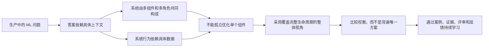
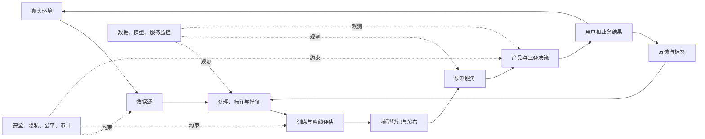
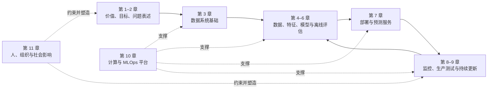
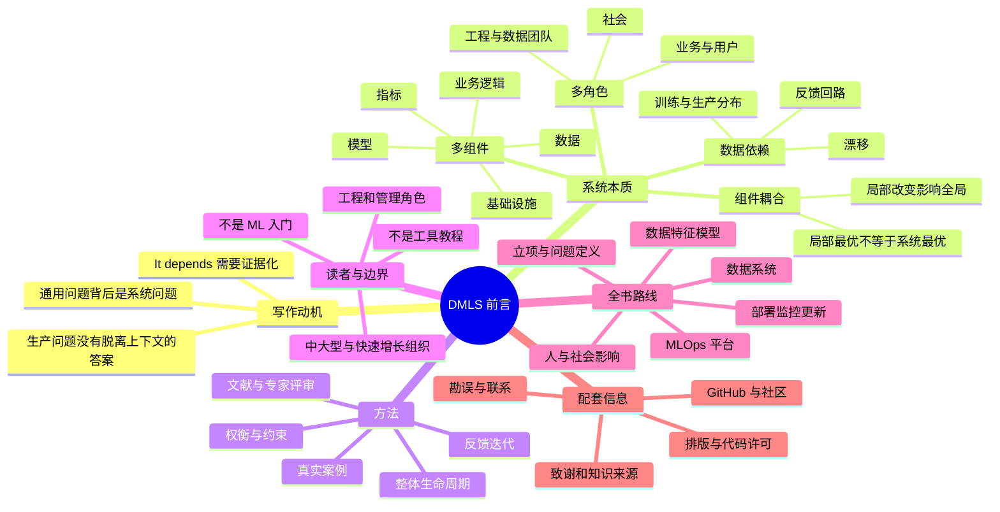

> 对应原文：Preface.md
> Chip Huyen，*Designing Machine Learning Systems*，O'Reilly，2022。
>
> 本文按照原书前言的顺序展开。前言本身没有提出需要逐式推导的数学公式或具体算法，它的主要任务是说明：为什么机器学习系统设计不能脱离上下文、全书为谁而写、讨论与不讨论什么，以及各章如何覆盖机器学习项目生命周期。文中标为“分析框架”“背景复习”或“教学示例”的公式、数字和伪代码，是为了把前言的方法论变成可操作的工具，不应误认为作者在前言中直接给出的模型。

## 0. 学习目标与全篇主线

读完这篇前言，应当能够回答以下问题：

1. 为什么“应该用什么模型”“多久重训一次”等问题不能脱离场景直接回答？
2. 为什么一个模型表现良好，仍不等于一个机器学习系统能够成功？
3. 机器学习系统的“复杂”与“独特”分别来自哪里？
4. 为什么改变一个局部组件，往往会牵动数据、评估、基础设施、组织和业务目标？
5. 作者所谓的“整体性方法”是什么，它又不是什么？
6. 本书适合哪些读者、默认哪些前置知识、刻意不承担哪些教学任务？
7. 十一章如何映射到项目立项、数据准备、模型开发、部署、监控、持续更新和组织协作？
8. 怎样把前言中的思想转化成一套可执行的机器学习系统设计流程？

前言的核心主线可以压缩为：



一句话概括：**这不是一本告诉读者“唯一正确架构”的书，而是一本训练读者根据目标、数据、约束和利益相关者做系统级判断的书。**

---

## 1. 写作动机：为什么所有简短答案都是“It depends”

### 1.1 从 2017 年斯坦福课程后的真实问题出发

作者从 2017 年第一次在斯坦福教授机器学习课程说起。此后，很多人向她询问如何在组织中部署机器学习模型。问题既有高度通用的，也有非常具体的。

| 原文中的问题类型 | 代表问题 | 表面上在问什么 | 实际牵涉的系统层次 |
| --- | --- | --- | --- |
| 通用问题 | 应该使用什么模型？ | 模型选择 | 数据量与标签、误差代价、延迟、算力、可解释性、维护成本 |
| 通用问题 | 应该多久重新训练一次？ | 更新频率 | 分布变化速度、反馈延迟、训练成本、验证门禁、发布风险 |
| 通用问题 | 如何检测数据分布变化？ | 统计监控 | 基线分布、窗口、告警阈值、标签延迟、业务季节性、响应流程 |
| 通用问题 | 如何保证训练与推理使用一致的特征？ | 特征一致性 | 转换代码复用、时间语义、数据血缘、在线存储、版本管理 |
| 具体问题 | 在线预测可能提高效果，怎样说服经理从批量预测切换？ | 架构升级 | 增量业务价值、服务成本、延迟预算、可靠性、团队值班能力和证据设计 |
| 具体问题 | 公司第一次建设机器学习平台，应从哪里开始？ | 平台建设 | 当前瓶颈、内部用户、公共能力边界、建设顺序、采用成本和长期所有权 |

这些问题的共同点是：**它们看起来像单点技术问题，真正的答案却取决于整条价值链。**

例如，“用什么模型”不能只比较离线准确率。假设模型 A 的 F1 为 0.92、单次推理 20 ms，模型 B 的 F1 为 0.925、单次推理 500 ms。如果产品要求端到端响应低于 200 ms，模型 B 即使离线分数更高，也可能根本不是可行方案。模型选择实际上是带约束的系统选择。

### 1.2 “视情况而定”不是回避，而是要求补齐上下文

作者的简短答案总是“It depends”。长答案则需要数小时交流，以弄清三个问题：

1. **提问者来自什么环境？** 包括组织规模、已有技术栈、数据成熟度、预算、监管要求和团队能力。
2. **他真正想达到什么结果？** 技术动作通常只是手段，目标可能是提高收入、减少人工、降低风险、缩短反馈周期或改善用户体验。
3. **在这个用例中，不同方案各有什么收益与代价？** 同一方案在不同上下文中可能得到相反结论。

因此，“视情况而定”之后不能停止，而应继续追问：**究竟取决于哪些变量，怎样取得这些变量的证据，什么变化会让当前结论失效？**

一个实用的上下文清单是：

- **目标**：希望改变哪项用户或业务结果？
- **决策**：模型输出会驱动什么动作？错误动作的后果是什么？
- **数据**：数据从哪里来，标签如何形成，多久可用，是否具有代表性？
- **规模**：样本量、请求量、峰值流量、模型数量和团队数量多大？
- **时效**：预测和反馈允许多大延迟，数据多快变旧？
- **约束**：成本、隐私、安全、合规、公平性、可解释性和资源上限是什么？
- **组织**：谁开发、谁审批、谁运维、谁为事故负责？
- **现状**：不使用 ML 时的基线是什么，真正瓶颈在哪里？

### 1.3 分析框架：把“视情况而定”形式化为约束决策

下面的模型是对前言思想的教学化表达，不是原文公式。

设候选方案集合为 $A$，上下文为 $c$。正确性、合规性、延迟上限等不可妥协要求写成硬约束 $g_j(a,c)\le b_j(c)$，则可行方案集合为

$$
\mathcal{F}(c)=\{a\in A\mid g_j(a,c)\le b_j(c),\ j=1,2,\ldots,m\}.
$$

第一步应当排除 $a\notin\mathcal{F}(c)$ 的方案。违反隐私规定或延迟上限的模型，不能靠更高的准确率“抵消”。

对剩余方案，再比较归一化后的质量、收益、成本和风险：

$$
U(a\mid c)=\sum_{i=1}^{k}w_i(c)\widehat q_i(a,c)-\lambda(c)R(a,c).
$$

其中：

- $\widehat q_i$ 是业务价值、模型质量、开发速度、可维护性等软目标；
- $w_i(c)$ 是当前上下文对第 $i$ 项目标的权重；
- $R(a,c)$ 是实施、运行和认知不确定性；
- $\lambda(c)$ 表示组织对风险的敏感程度。

这个表达说明为什么没有脱离场景的最佳方案：**候选方案的表现依赖上下文，目标权重也由上下文决定。** 一家金融机构和一家内部内容工具团队，对错误率、审计、开发速度的权重不会相同。

这种加权模型也有明确局限：

1. 很多指标难以准确归一化，权重也可能只是政治协商结果。
2. 质量与业务价值通常不是线性关系，越过某个风险阈值后损失可能突然增大。
3. 组件之间有交互项，单项分数相加不能完整描述系统。
4. 历史实验未必能估计新架构的运行风险。
5. 权重会随公司阶段、法规、用户和负载变化，决策必须定期复查。

因此，公式的价值不是自动算出答案，而是迫使团队显式写出假设、约束和证据。

### 1.4 教学示例：怎样判断是否从批量预测切换到在线预测

原文列出的具体问题是：某位工程师相信在线预测会提高模型表现，但不知道怎样说服经理。这个问题不能只说“在线更新鲜，所以更好”，因为经理需要的是**可验证的增量价值与完整成本**。

设：

- 每月有 $N$ 次推荐机会；
- 在线预测相对批量预测带来的转化率增量为 $\Delta r$；
- 每次新增转化的贡献价值为 $v$；
- 在线运行成本为 $C_{run}$；
- 建设成本按月摊销为 $C_{eng}$；
- 可靠性、值班和迁移风险折算为 $C_{risk}$。

则每月净增量价值可粗略写为：

$$
\Delta V=N\Delta r\,v-C_{run}-C_{eng}-C_{risk}.
$$

假设 $N=2{,}000{,}000$、$\Delta r=0.002$、$v=25$ 元，三个成本分别为 1.8 万、3 万和 1.2 万元，则

$$
\Delta V=2{,}000{,}000\times0.002\times25-18{,}000-30{,}000-12{,}000
=40{,}000\ \text{元/月}.
$$

若真实增量只有 $0.0005$，新增价值就只有 2.5 万元，净值变成 $-3.5$ 万元。可见结论对 $\Delta r$ 极其敏感，而这个量恰好不能靠主观确信获得。

更可靠的形成思路是：

1. 先定义“性能提升”究竟指离线指标、转化率、时效还是用户留存。
2. 用历史回放估计新鲜特征是否提供增量信息。
3. 用影子流量验证在线特征、延迟和稳定性，不影响用户决策。
4. 用小流量 A/B 测试估计 $\Delta r$ 及置信区间。
5. 把服务成本、故障代价和人员投入一起纳入决策。
6. 只有在证据支持时再逐步扩大流量，并保留回滚路径。

公式成立还依赖多项简化假设：转化增量能归因于预测方式、每次转化价值近似稳定、实验不存在严重干扰、长期用户行为不会反转。现实中必须通过实验设计和敏感性分析校正，而不是把估算表当成事实。

### 1.5 教学推导：为什么“多久重训一次”也没有固定答案

设每次重训的总成本为 $C$，两次训练间隔为 $T$。若模型因数据变化产生的瞬时过时代价随模型年龄 $t$ 线性增长，即 $l(t)=at$，则一个周期内的单位时间平均过时代价为

$$
\frac{1}{T}\int_0^T at\,dt=\frac{aT}{2}.
$$

训练成本分摊到单位时间是 $C/T$，总平均代价为

$$
J(T)=\frac{C}{T}+\frac{aT}{2}.
$$

求导并令其为零：

$$
\frac{dJ}{dT}=-\frac{C}{T^2}+\frac{a}{2}=0
\quad\Longrightarrow\quad
T^*=\sqrt{\frac{2C}{a}}.
$$

直觉是：

- 训练越昂贵，最优间隔越长；
- 环境变化越快、过时损失增长越快，最优间隔越短；
- 频繁重训和长期不更新分别位于同一权衡的两端。

这个推导不是生产系统的万能调度器。它假定每次训练能完全恢复模型、漂移近似线性、训练成本恒定、更新没有验证和发布延迟。突发事件、标签延迟、监管门禁、季节性和训练失败都会破坏这些假设。它真正说明的是：**重训频率应由变化速度、业务损失和更新成本共同决定，而不是套用“每天一次”之类的经验常数。**

---

## 2. 机器学习系统为何既复杂又独特

### 2.1 模型不是系统

模型通常可以抽象为一个参数化映射：

$$
\widehat y=f_{\theta}(x),
$$

其中 $x$ 是输入，$\theta$ 是训练得到的参数，$\widehat y$ 是预测。这个表达只描述计算核心，没有说明输入如何产生、输出怎样被使用，也没有处理部署、反馈和责任。

机器学习系统则包含让这个映射长期创造价值所需的一整套机制：

| 组成部分 | 解决的问题 | 典型失败表现 |
| --- | --- | --- |
| 数据源与采集 | 从真实环境取得信号 | 缺失、延迟、重复、权限错误 |
| 数据处理与标签 | 把原始事实变成训练样本 | 泄漏、标签偏差、时间穿越 |
| 特征与表示 | 把信息转换为模型可用形式 | 训练—服务偏差、版本不一致 |
| 模型与训练 | 从数据学习预测规律 | 欠拟合、过拟合、不可复现 |
| 离线评估 | 上线前比较候选模型 | 测试集不代表生产、指标错位 |
| 部署与预测服务 | 稳定提供预测 | 高延迟、容量不足、依赖失败 |
| 产品与业务逻辑 | 把预测转换成动作 | 阈值错误、用户体验受损 |
| 监控与反馈 | 发现变化并收集结果 | 静默退化、告警无响应 |
| 更新与治理 | 安全迭代模型和数据 | 无法回滚、血缘丢失、责任不清 |
| 底层基础设施 | 提供存储、计算、编排和权限 | 成本失控、资源争抢、故障扩散 |

完整关系更接近下面的反馈系统：



模型是系统中的关键组件，但不是价值的唯一来源，也不是故障的唯一来源。

### 2.2 “复杂”来自多组件、多关系和多目标

原文首先说，机器学习系统复杂，是因为它包含机器学习算法、数据、业务逻辑、评估指标和底层基础设施等不同组件。

复杂度不只是“组件数量多”，更来自三种关系：

1. **数据依赖**：下游模型依赖上游数据语义、时间和质量。
2. **控制依赖**：监控结果可能触发重训、回滚或人工审批。
3. **目标耦合**：提高质量可能增加延迟与成本，降低延迟可能损害质量。

例如，从批量预测切换到在线预测，会同时改变：

| 受影响层 | 必须重新回答的问题 |
| --- | --- |
| 数据 | 在线时刻能取得哪些特征？特征是否足够新鲜？ |
| 正确性 | 离线构造特征时是否严格遵守当时可见信息？ |
| 模型 | 模型是否真的能利用实时信号，还是只增加噪声？ |
| 服务 | 延迟、吞吐、可用性和降级策略是什么？ |
| 基础设施 | 是否需要在线特征存储、流处理或新的缓存？ |
| 评估 | 怎样用在线实验测量增量，而不是只比较离线分数？ |
| 成本 | 持续计算与值班成本是否超过业务收益？ |
| 组织 | 谁负责新服务，出现事故时谁决策回滚？ |

这就是作者反对孤立回答问题的根本原因：**局部改变会沿依赖关系传播。**

### 2.3 “复杂”还来自多利益相关者

系统同时涉及数据科学家、机器学习工程师、业务负责人、用户乃至整个社会。不同角色观察的是同一个系统，却使用不同的成功标准。

| 角色 | 主要关切 | 可能与其他目标发生的冲突 |
| --- | --- | --- |
| 数据科学家 | 数据、实验速度、模型质量 | 更复杂模型可能增加部署难度 |
| ML / 软件工程师 | 延迟、吞吐、可靠性、可维护性 | 稳定性门禁可能降低实验速度 |
| 数据工程师 | 数据质量、契约、血缘、处理效率 | 严格标准化可能限制探索灵活性 |
| 平台工程师 | 复用、自助服务、资源效率 | 过早抽象可能不能适配真实用例 |
| 业务负责人 | 收益、风险、交付时间 | 短期收入可能与长期信任冲突 |
| 最终用户 | 有用、快速、可控、公平 | 个性化可能与隐私期待冲突 |
| 法务与安全团队 | 合规、最小权限、审计 | 审批和限制会增加交付时间 |
| 社会 | 公平、可问责、外部影响 | 公司内部指标可能遗漏外部成本 |

因此，机器学习系统是一个**社会技术系统**：技术组件的行为与组织责任、激励和社会后果不可完全分离。原文只明确说明人的一面不可缺失，并指出第 11 章是末章；从学习路径看，本笔记可以把这种安排理解为：在理解完整技术链路后，再集中审视谁构建系统、谁承受影响、谁负责。

### 2.4 “独特”来自数据依赖

原文进一步指出，机器学习系统独特，是因为它们依赖数据，而不同用例的数据差异很大。

传统手写程序主要由代码显式规定行为；机器学习模型的行为还由训练数据共同决定。训练过程通常在经验数据上求解：

$$
\widehat\theta
=\arg\min_{\theta}\frac{1}{n}\sum_{i=1}^{n}
\ell\big(f_{\theta}(x_i),y_i\big).
$$

部署后真正关心的是生产分布上的期望风险：

$$
R_{prod}(\theta)
=\mathbb{E}_{(x,y)\sim P_{prod}}
\left[\ell\big(f_{\theta}(x),y\big)\right].
$$

训练有效通常隐含一个关键前提：训练样本所代表的 $P_{train}$ 与部署时的 $P_{prod}$ 足够接近。若

$$
P_{train}(x,y)\ne P_{prod}(x,y),
$$

即使训练和测试代码完全没有 bug，生产效果也可能下降。这解释了为什么数据分布变化是系统级问题，而不只是模型算法问题。

数据依赖还意味着：

- 同一个算法在不同采样、标签政策和时间窗口下会学到不同规律；
- 数据来源变化可以在没有代码发布的情况下改变系统行为；
- 用户会对模型输出作出反应，这些反应又进入下一轮数据；
- 数据带有现实社会结构与历史偏差，模型可能复制或放大它们；
- 数据与业务变化没有明确“版本终点”，系统需要持续观察。

### 2.5 同为电商推荐，系统也可能完全不同

原文用一个重要反例说明“同领域 + 同问题”不推出“同系统”：两家公司都做电商推荐，最终却可能采用不同模型架构、特征、指标，并得到不同投资回报。

下面是对该反例的教学化展开，具体设定不是原书案例细节：

| 维度 | 公司 A：高频内容型电商 | 公司 B：低频专业采购电商 |
| --- | --- | --- |
| 用户行为 | 浏览密集、兴趣变化快 | 购买稀疏、决策周期长 |
| 商品变化 | 库存与热点快速变化 | 商品稳定、属性复杂 |
| 可用信号 | 点击、停留、购物车等实时事件 | 历史采购、公司角色、合同限制 |
| 候选方法 | 两阶段召回与排序、实时特征 | 规则过滤、内容匹配、协同过滤组合 |
| 主要指标 | 点击率、会话转化率、延迟 | 有效询价率、采购额、覆盖率、合规率 |
| 预测方式 | 在线逐请求预测更有价值 | 每日批量候选可能已经足够 |
| 错误代价 | 多一次无关曝光 | 推荐不合规商品或破坏采购流程 |
| ROI 条件 | 流量大，小幅提升即可摊薄成本 | 流量小，复杂服务可能无法回本 |

模型架构差异不是任意偏好，而是由数据密度、时效、动作空间和错误代价共同推导出来。指标也不能互换：公司 A 的点击提升可能是有效代理，公司 B 若只优化点击，可能推荐了用户爱看却不能采购的商品。

### 2.6 局部最优不等于系统最优

许多生产文章只回答一个具体问题。聚焦有助于讲清局部技术，却容易让人误以为各问题可以独立处理。

可以把最终业务效用抽象为

$$
V=F(Q,L,A,C,S,H,E),
$$

其中 $Q$ 是预测质量、$L$ 是延迟、$A$ 是可用性、$C$ 是成本、$S$ 是安全与合规、$H$ 是人的使用行为、$E$ 是外部环境。函数 $F$ 通常具有非线性交互：

- 模型质量提高，但延迟越过用户容忍阈值，业务价值可能下降；
- 服务可用，但数据陈旧，返回的“正确预测”对当前决策已无意义；
- 转化率提高，但对某些用户群体造成系统性伤害，方案仍不可接受；
- 自动化节省人工，但缺少申诉和回退路径，会累积运营风险。

因此，不能简单假定

$$
Q\uparrow\quad\Longrightarrow\quad V\uparrow.
$$

系统设计的目标不是让每个局部指标分别达到最高，而是在硬约束下找到可运行、可维护、能产生净价值的整体方案。

### 2.7 “整体性方法”真正意味着什么

作者说明，本书采取整体性方法，同时考虑系统的不同组件和不同利益相关者的目标。

它意味着：

1. 从业务问题开始，而不是先选模型或工具。
2. 沿数据流、预测流和反馈流检查端到端行为。
3. 评估技术收益时同时计算成本、风险和组织负担。
4. 把上线视为生命周期中点，而不是终点。
5. 让数据、模型、基础设施、产品和人的责任形成闭环。

它不意味着：

- 每个项目都要建设完整的大公司平台；
- 一开始就引入所有 MLOps 组件；
- 为了“统一”而让所有用例采用同一种模型或部署方式；
- 任何决策都必须无限分析，无法快速试验；
- 系统级思考可以替代具体工具文档、基准测试和生产证据。

整体性关注的是**决策视野完整**，不是**实现规模最大**。一个小项目也可以用非常简单的实现，只要团队有意识地检查数据、评估、部署和反馈边界。

---

## 3. 作者如何形成答案：案例、证据、评审与反馈

### 3.1 为什么不能靠一套固定配方

既然系统具有上下文依赖性，作者就不能用一个标准架构回答所有问题。她选择提供“有细微差别的答案”：说明方案适用的条件、收益、代价和关联影响。

这类答案的形成需要多种证据互相校正：

| 证据来源 | 提供什么 | 不能单独证明什么 |
| --- | --- | --- |
| 作者亲历的生产案例 | 真实约束、失败方式和组织背景 | 不能证明所有公司都会得到相同结果 |
| 参考文献 | 可追溯的定义、方法和实证结果 | 文献负载未必匹配当前系统 |
| 学术与工业实践者评审 | 发现假设、遗漏和实践偏差 | 同行共识不等于永远正确 |
| 领域专家专项评审 | 校验批/流处理、存储计算、负责任 AI 等专业内容 | 只能降低错误率，不能消除环境差异 |
| 早期读者讨论 | 检验表达、暴露新视角和新问题 | 反馈可能存在选择偏差 |

原文特别说明，需要深入专业知识的部分还由对应领域专家进一步审阅，例如：

- 批处理（batch processing）与流处理（stream processing）；
- 存储和计算基础设施；
- 负责任 AI（responsible AI）。

这反映出一个可迁移的方法：**跨边界系统不能只由单一角色凭经验完成审查。** 数据语义、模型统计、分布式运行、产品目标和社会影响需要不同知识共同约束。

### 3.2 写作本身也是迭代学习过程

作者最初认为，课程讲义是为学生准备的，帮助他们应对未来数据科学家和机器学习工程师的工作要求。很快她发现，自己也在写作中学到了很多。

早期草稿引发的讨论完成了三件事：

1. **检验假设**：原先认为普遍成立的经验，可能只适合某类公司。
2. **引入不同视角**：业务、平台、研究和运维角色看到的瓶颈不同。
3. **发现新问题和新方法**：反馈不仅纠错，也扩展问题空间。

这个过程与机器学习系统开发本身高度相似：


作者希望书出版后，这个学习循环继续运行，因为每位读者拥有作者没有的经验与视角。她给出了 MLOps Discord、Twitter、LinkedIn 和个人网站等反馈渠道。这段话不仅是社群邀请，也说明复杂系统知识应被视为**可修订的共同实践**，而不是封闭的最终答案。

---

## 4. Who This Book Is For：本书写给谁

### 4.1 总体读者与规模边界

本书面向所有希望利用机器学习解决真实世界问题的人。这里的 ML 同时包含：

- 经典机器学习算法；
- 深度学习方法。

讨论更偏向中大型企业和快速增长创业公司中的规模化系统。原因不是小规模项目没有机器学习问题，而是很多系统复杂度只有在以下条件下才值得投入：

- 数据源和模型数量增加；
- 多个团队需要协作与复用；
- 预测进入关键业务路径；
- 更新频繁且需要可靠发布；
- 合规、审计、成本或服务级别要求提高。

较小系统通常复杂度更低，从一开始建设完整平台的收益也更小。应区分两件事：

- **方法论仍适用**：明确目标、验证数据、评估风险、监控结果。
- **实现应按比例缩放**：一个定时任务和清晰版本记录可能已经足够，不必复制大型公司的技术栈。

### 4.2 主要工程读者

作者具有工程背景，因此本书语言主要面向：

| 角色 | 可从本书获得的能力 |
| --- | --- |
| ML 工程师 | 把模型转化为可部署、可监控、可更新的服务 |
| 数据科学家 | 把业务问题、数据、指标和生产约束连接起来 |
| 数据工程师 | 理解数据系统如何决定训练与在线特征的质量和时效 |
| ML 平台工程师 | 识别可复用能力，并建设可供多团队复用的机器学习平台（machine learning platform） |
| 工程经理 | 评估建设顺序、团队边界、风险与投资回报 |

这些角色不是互斥的。小团队中一个人可能承担多个职责，大组织中同一职责又可能拆成多个岗位。

### 4.3 六类典型处境

#### 场景一：拿到业务问题和大量原始数据，不知道怎样开始

真正任务不只是“训练模型”，而是：

1. 判断问题是否需要 ML；
2. 把业务目标转成可学习任务；
3. 理解原始数据能否提供相应信号；
4. 设计标签、特征和评估指标；
5. 确认指标与真实业务结果是否一致。

难点在于业务语言、数据事实和数学目标之间存在语义鸿沟。若目标定义错误，后续优化只会更高效地解决错误问题。

#### 场景二：离线实验很好，准备部署

离线成功只说明模型在给定数据和评估程序上有效。部署还要处理：

- 生产输入格式与缺失值；
- 训练和推理的特征一致性；
- 延迟、吞吐和容量；
- 模型与依赖的版本；
- 灰度、回滚和降级；
- 隐私、安全与访问控制。

这里的核心跃迁是从“一个实验结果”变成“可持续提供预测的服务”。

#### 场景三：模型已经上线，却不知道表现如何

生产中往往无法立即获得真实标签。即使服务返回 200，也不能证明模型有效。团队需要同时观察：

- 数据输入是否变化；
- 预测分布是否异常；
- 服务延迟和错误率是否恶化；
- 标签到达后，模型质量是否下降；
- 用户与业务指标是否真的改善；
- 告警触发后，谁如何诊断和响应。

监控不是“画几个图”，而是从信号到行动的闭环。

#### 场景四：开发、评估、部署和更新都靠手工

手工流程在早期灵活，但规模增长后会变慢、不可复现且容易出错。改进目标包括：

- 自动执行重复步骤；
- 记录数据、代码、配置、模型和指标之间的血缘；
- 建立质量门禁和审批；
- 让失败可恢复、变更可回滚；
- 保留必要的人类判断，而不是盲目全自动化。

自动化的价值不是消灭人，而是让人把注意力放在需要判断的地方。

#### 场景五：每个用例都有一套独立工作流

独立工作流会重复建设模型存储、特征管理、监控、部署和权限机制，也难以形成统一的安全与质量标准。共享基础可以降低边际成本，但平台并非天然值得建设。

一个简化的建设条件是：

$$
C_{platform}+\sum_{i=1}^{n}C_{adopt,i}
<
\sum_{i=1}^{n}C_{bespoke,i}+C_{inconsistency},
$$

其中左侧是平台建设与各团队迁移成本，右侧是各自重复建设成本与不一致造成的事故、审计和维护成本。

公式提示两个常被忽略的事实：

- 平台有建设和采用成本，不能只计算“复用收益”；
- 用例数量、重复程度和组织成熟度不足时，简单共享库可能优于完整平台。

#### 场景六：担心系统存在偏差，希望负责任地建设 ML

偏差可能来自采样、历史标签、目标函数、阈值、产品呈现和反馈回路。负责任 AI 因而不能等上线前才追加一项公平性指标，还需要：

- 明确哪些人群会受到影响；
- 比较不同群体的错误及其后果；
- 检查数据和目标中的结构性偏差；
- 设计人工复核、申诉、解释和纠正路径；
- 持续监控部署后的实际影响。

### 4.4 其他可受益的群体

原文还列出三类读者：

1. **工具开发者**：可以发现 ML 生产生态中服务不足的环节，并理解工具应怎样定位和衔接。
2. **寻找 ML 相关岗位的人**：可以建立从业务问题到生产系统的完整知识地图，理解不同职位的协作边界。
3. **考虑采用 ML 的技术与业务负责人**：可以判断何时值得使用 ML、项目如何设定目标、风险和组织条件。

技术背景较弱的负责人，作者特别建议关注第 1、2、11 章：前两章帮助判断是否需要 ML、如何定义项目；第 11 章解释人与组织如何决定系统成败。

---

## 5. What This Book Is Not：本书不是什么

### 5.1 它不是机器学习入门教材

作者明确说明，已有大量课程和书籍讲解机器学习理论，本书因此把篇幅用于实践中的系统问题。读者不必对所有概念都能完整推导，但应有基本直觉。

下面的内容是为了整理前言列出的前置知识，不代表本书会从头教授它们。

### 5.2 背景复习一：常见模型

| 模型 | 核心思想 | 适合的问题 | 主要局限 |
| --- | --- | --- | --- |
| 聚类 | 按相似性把无标签样本分组 | 用户分群、探索数据结构 | 簇的含义依赖距离、尺度和算法假设 |
| 逻辑回归 | 用线性打分经 sigmoid 得到类别概率 | 二分类、可解释基线 | 原始决策边界线性，复杂关系需特征变换 |
| 决策树 | 递归选择特征切分样本 | 表格数据、非线性规则 | 单棵树易过拟合且对数据扰动敏感 |
| 协同过滤 | 从用户—物品交互推断相似偏好 | 推荐系统 | 冷启动、曝光偏差、稀疏反馈 |
| 前馈网络 | 信息从输入经多层变换到输出 | 通用固定维映射 | 本身不表达空间或时序结构 |
| 循环网络 | 用隐藏状态逐步处理序列 | 时序、文本 | 难并行，长程依赖训练困难 |
| 卷积网络 | 用共享局部卷积核提取模式 | 图像、局部结构信号 | 全局关系通常需更深层或其他机制 |
| Transformer | 用注意力直接建模位置间关系 | 文本、多模态、长程依赖 | 注意力成本、数据与算力需求较高 |

逻辑回归的基本形式是

$$
P(y=1\mid x)=\sigma(w^Tx+b)
=\frac{1}{1+e^{-(w^Tx+b)}}.
$$

$w^Tx+b$ 是线性打分。逻辑回归进一步假定给定 $x$ 时，$y$ 服从以 $\sigma(w^Tx+b)$ 为参数的伯努利分布，因此把 sigmoid 输出建模为条件概率 $P(y=1\mid x)$。仅仅落在 $(0,1)$ 区间并不足以赋予一个数概率语义；输出与真实发生频率是否一致，还取决于数据、模型设定、拟合和概率校准。逻辑回归常是重要基线：若复杂模型不能在可信评估上稳定超过它，就没有理由承担额外复杂度。

矩阵分解式协同过滤常把用户 $u$ 和物品 $i$ 映射到低维向量：

$$
\widehat r_{ui}=p_u^Tq_i.
$$

内积高表示潜在偏好匹配。但观测交互并不是随机样本：用户只能点击被曝光的商品，因此模型容易把既有曝光政策误认为自然偏好。

Transformer 的缩放点积注意力常写为

$$
\operatorname{Attention}(Q,K,V)
=\operatorname{softmax}\left(\frac{QK^T}{\sqrt{d_k}}\right)V.
$$

这里的目的不是要求读者在前言阶段掌握实现，而是能大致识别：不同模型家族编码了不同结构假设，模型选择必须结合数据形态、规模和运行约束。

### 5.3 背景复习二：常见 ML 技术概念

#### 监督学习与无监督学习

- **监督学习**从带目标的样本 $(x_i,y_i)$ 学习映射，例如垃圾邮件分类。
- **无监督学习**没有人工提供的目标标签，试图发现数据结构，例如聚类。

两者区别在训练信号，不在算法是否“自动”。自监督学习会从数据自身构造标签，在训练机制上仍有明确监督目标，不能简单等同于无监督学习。

#### 目标函数与损失函数

损失 $\ell(\widehat y,y)$ 衡量单个预测与目标的差异，训练通常最小化平均损失及正则项：

$$
\min_{\theta}
\frac{1}{n}\sum_{i=1}^{n}\ell(f_{\theta}(x_i),y_i)
+\lambda\Omega(\theta).
$$

- 第一项要求拟合训练数据；
- $\Omega(\theta)$ 惩罚不希望出现的复杂度；
- $\lambda$ 控制拟合与约束之间的权衡。

业务指标、评估指标和训练损失不是同义词。业务目标可能是利润或用户留存，评估指标可能是 F1，训练损失可能是交叉熵。需要通过实验验证三者之间的代理关系。

#### 梯度下降

对可微目标 $\mathcal L(\theta)$，一阶泰勒近似给出

$$
\mathcal L(\theta+\Delta)
\approx \mathcal L(\theta)+\nabla\mathcal L(\theta)^T\Delta.
$$

取 $\Delta=-\eta\nabla\mathcal L(\theta)$，且步长 $\eta$ 足够小时，右侧变化约为

$$
-\eta\|\nabla\mathcal L(\theta)\|_2^2\le 0,
$$

于是得到更新式

$$
\theta_{t+1}=\theta_t-\eta\nabla\mathcal L(\theta_t).
$$

它有效的依据是局部线性近似；学习率过大时近似失效，目标可能震荡或发散。

#### 正则化、泛化和超参数

- **正则化**通过参数惩罚、数据增强、早停等方式减少对训练样本偶然模式的依赖。
- **泛化**指模型在未见过、且代表生产场景的数据上仍然有效。
- **超参数**由训练过程之外设定，例如学习率、树深、正则强度和 batch size；模型参数则由数据和优化算法学习。

“训练误差更低”不自动表示“泛化更好”。如果训练集包含泄漏、重复样本或与生产不一致的分布，继续优化训练目标甚至会放大问题。

### 5.4 背景复习三：常见评估指标

对二分类，先定义：

- $TP$：预测为正且真实为正；
- $FP$：预测为正但真实为负；
- $FN$：预测为负但真实为正；
- $TN$：预测为负且真实为负。

常见指标为

$$
\operatorname{Accuracy}=\frac{TP+TN}{TP+FP+FN+TN},
$$

$$
\operatorname{Precision}=\frac{TP}{TP+FP},
\qquad
\operatorname{Recall}=\frac{TP}{TP+FN},
$$

$$
F_1
=2\frac{\operatorname{Precision}\cdot\operatorname{Recall}}
{\operatorname{Precision}+\operatorname{Recall}}
=\frac{2TP}{2TP+FP+FN}.
$$

直觉与边界：

- 准确率把所有样本等价计数，在正例极少时可能非常误导；
- 精确率回答“报出的正例有多少是真的”，适合误报昂贵的场景；
- 召回率回答“真实正例找回了多少”，适合漏报昂贵的场景；
- F1 是精确率和召回率的调和平均，但忽略真负例，也默认两者同等重要；
- 改变分类阈值会同时改变精确率和召回率，不能脱离阈值比较单点数字。

ROC 曲线在不同阈值下绘制真阳性率

$$
TPR=\frac{TP}{TP+FN}
$$

与假阳性率

$$
FPR=\frac{FP}{FP+TN}.
$$

ROC-AUC 可解释为随机抽取一个正例和一个负例时，模型把正例排在负例之前的概率。严重类别不平衡时，还应检查 Precision–Recall 曲线和具体业务阈值。

回归任务常用均方误差：

$$
MSE=\frac{1}{n}\sum_{i=1}^{n}(y_i-\widehat y_i)^2.
$$

平方会显著放大大误差，适合大偏差确实更昂贵的场景；若数据有强离群点，它也可能被少数样本支配。

给定参数 $\theta$ 和数据 $D$，似然为 $P(D\mid\theta)$。独立样本下，对数似然为

$$
\log P(D\mid\theta)=\sum_{i=1}^{n}\log P(y_i\mid x_i,\theta).
$$

取对数利用了严格单调性：最大化似然与最大化对数似然得到相同最优点，同时把连乘变成连加，改善数值稳定性。前提是概率模型与独立性假设合理；较高似然也不自动代表更高业务价值。

### 5.5 背景复习四：统计概念

#### 概率与方差

概率用于表达不确定性。随机变量 $X$ 的方差为

$$
\operatorname{Var}(X)
=\mathbb E\left[(X-\mathbb E[X])^2\right].
$$

方差衡量数据围绕均值的离散程度。训练数据变化导致模型表现大幅变化时，也常说估计具有高方差。

#### 正态分布与长尾分布

正态分布由均值 $\mu$ 和方差 $\sigma^2$ 决定，密度为

$$
p(x)=\frac{1}{\sqrt{2\pi\sigma^2}}
\exp\left(-\frac{(x-\mu)^2}{2\sigma^2}\right).
$$

它对称、尾部衰减快，适合许多聚合噪声的近似。现实 ML 数据经常呈长尾：少数类别、用户或物品占据大量交互，大量对象只出现很少次数。长尾会带来：

- 平均指标被头部样本主导；
- 稀有但重要情况难以学习和评估；
- 训练、缓存和服务负载高度不均；
- 随机切分可能掩盖冷启动和时间变化。

“看起来像钟形”不能代替分布检验，“均值和方差相同”也不意味着两个数据集具有相同尾部风险。

### 5.6 背景复习五：常见 ML 任务

| 任务 | 输入与输出 | 核心困难 |
| --- | --- | --- |
| 语言建模 | 根据上下文预测后续 token 的分布 | 长程依赖、开放式输出、评估与安全 |
| 异常检测 | 判断样本是否偏离正常模式 | 异常稀少、定义变化、标签不足 |
| 目标分类 | 将图像中的对象或整幅图像映射为类别 | 类别长尾、域变化、遮挡与标注质量 |
| 机器翻译 | 把源语言序列映射为目标语言序列 | 多种正确表达、上下文、低资源语言 |

前言只要求读者对这些概念有粗略认识。像 F1 这类容易忘记精确定义的内容，正文会提供短注释，但读者不应期待本书重新建立完整 ML 理论体系。

### 5.7 它也不是某个工具的逐步教程

书中会提到当时的工具来说明概念和方案，但技术更迭很快：

- API 会变；
- 产品会合并或退出；
- 默认配置会改变；
- 新工具会用新名称包装旧机制。

作者因此优先讲更持久的问题解决框架。根据这一定位，本笔记把工具评估时应追问的内容整理为：

1. 工具解决什么问题？
2. 它依赖哪些数据、运行和组织假设？
3. 它把复杂度隐藏在哪里？
4. 收益以什么成本、风险和锁定为代价？
5. 怎样用真实负载验证它适合当前用例？
6. 当规模和需求变化时，它如何演化或退出？

“选择工具的框架”与“使用工具的教程”不能混淆：前者帮助判断是否应该采用，后者帮助完成具体操作。选定工具后，仍需查阅对应版本的官方文档和教程。

书中代码较少，也是这一定位的直接结果。作者把有限篇幅用于权衡、正反面和具体案例，而不是容易随版本失效的命令清单。

---

## 6. Navigating This Book：全书怎样沿项目生命周期组织

### 6.1 组织原则不是算法目录，而是问题出现的顺序

作者按照数据科学家推进一个真实 ML 项目时遇到问题的顺序组织章节。全书可以看成三条互相交织的线：

1. **项目生命周期线**：立项、数据、模型、部署、监控、更新。
2. **基础设施线**：数据系统、计算资源、ML 平台和工具。
3. **人的责任线**：团队协作、组织设计与社会影响。

### 6.2 第 1–2 章：先保证项目值得做、问题定义正确

前两章建立项目成功的基础，从最基本的问题开始：**这个项目是否需要机器学习？**

它们还讨论：

- 怎样为项目选择目标；
- 怎样把问题表述成更容易解决的形式；
- 怎样避免在错误目标上投入昂贵的数据和模型工作。

这段安排体现了作者的优先级：系统设计不是从部署框架开始，而是从价值和问题建模开始。若读者已经熟悉这些考虑并希望尽快进入技术内容，作者允许跳过前两章；但在真实项目中，这些步骤不能被跳过。

### 6.3 第 4–6 章：部署前的数据、特征、模型与离线评估

这三章覆盖 pre-deployment 阶段：

1. 创建训练数据；
2. 构造和管理特征；
3. 在开发环境中训练并评估模型。

作者特别指出，这个阶段同时需要 ML 专业知识和问题领域知识。原因是：

- ML 专业知识决定怎样训练、验证和解释模型；
- 领域知识决定标签是否有意义、错误是否可接受、数据是否违反业务过程；
- 只有两者结合，离线指标才可能成为生产价值的可靠代理。

### 6.4 第 7–9 章：部署并不是结束

这三章覆盖部署及部署后阶段：

- 第 7 章关注模型部署与预测服务；
- 第 8 章关注数据分布变化和监控；
- 第 9 章关注持续学习与生产测试。

作者通过很多读者都可能经历的故事强调：**模型被部署，不代表部署过程已经完成。** 上线后的环境、用户和业务要求会变化，模型需要被监控、诊断和持续更新。

这改变了“完成”的定义：

| 原型式定义 | 生产式定义 |
| --- | --- |
| 模型文件生成 | 模型可安全发布、回滚和追踪 |
| 离线指标达标 | 在线服务与业务结果持续达标 |
| 一次训练成功 | 数据和模型能按需要可靠更新 |
| API 能返回结果 | 异常可发现、可诊断、可处置 |

### 6.5 第 3 章与第 10 章：支撑跨角色协作的基础设施

第 3 章和第 10 章都讲基础设施，但关注层次不同：

| 章节 | 重点 | 为什么重要 |
| --- | --- | --- |
| 第 3 章 | 数据库、数据格式、数据移动、批/流处理引擎等数据系统基础 | ML 依赖数据，不理解数据语义就无法正确构造训练和在线输入 |
| 第 10 章 | 计算基础设施、MLOps 工具和 ML 平台 | 让多个角色以可复用、可靠方式完成开发与运行 |

作者曾长期犹豫数据系统应讲多深、放在哪里。许多 ML 课程很少覆盖数据库、格式、移动和处理引擎，数据科学家可能误以为这些内容过于底层或与建模无关。

最终把数据系统基础提前到第 3 章，是因为后续所有数据讨论都依赖共同语言：

- 不理解事件时间与处理时间，就难以避免特征时间穿越；
- 不理解批处理与流处理，就难以判断数据新鲜度；
- 不理解存储格式与数据移动，就难以估算训练吞吐和成本；
- 不理解数据源的更新语义，就难以保证训练—服务一致性。

### 6.6 第 11 章：机器学习系统由人构建，也作用于人

全书覆盖大量技术内容，但作者认为，如果不讨论人的一面，机器学习生产系统的论述就是不完整的。

原因包括：

- 系统目标由人定义；
- 数据由人的行为和制度产生；
- 工程责任由组织结构分配；
- 模型输出会影响用户机会、选择和生活；
- 事故处置、申诉和问责不能交给指标自动完成。

技术正确性只是系统责任的一部分。一个延迟低、准确率高的系统，仍可能因偏差、缺少透明度或错误激励而造成严重影响。

### 6.7 “数据科学家”是职责伞形词，不是严格职位名称

作者提醒，“data scientist”这个角色近年变化很大，人们对其职责也有很多讨论，第 10 章还会继续展开。

本书为叙述方便，把“数据科学家”用作伞形术语，涵盖参与开发和部署 ML 模型的人，包括职位名称可能是：

- ML 工程师；
- 数据工程师；
- 数据分析师；
- 以及其他承担相关职责的人。

阅读时应按**实际责任**理解，而不是用职位名称推断能力边界。同名岗位在不同公司可能完全不同，不同岗位也可能承担相同工作。

### 6.8 十一章的完整知识地图

| 章节 | 生命周期位置 | 核心问题 |
| --- | --- | --- |
| 1. Overview of ML Systems | 立项与全局视角 | ML 系统有哪些特征，何时值得使用 ML？ |
| 2. Introduction to ML Systems Design | 问题定义 | 怎样定义目标、需求和系统指标？ |
| 3. Data Engineering Fundamentals | 数据基础设施 | 数据如何存储、移动和处理？ |
| 4. Training Data | 数据准备 | 怎样采样、标注并构造可信训练集？ |
| 5. Feature Engineering | 表示与一致性 | 怎样构造、管理并在线提供特征？ |
| 6. Model Development and Offline Evaluation | 模型开发 | 怎样开发、比较并离线评估模型？ |
| 7. Model Deployment and Prediction Service | 上线 | 怎样选择批量或在线预测并可靠服务？ |
| 8. Data Distribution Shifts and Monitoring | 运行观察 | 怎样发现输入、预测和性能变化？ |
| 9. Continual Learning and Test in Production | 更新与在线验证 | 怎样持续更新并在生产中安全测试？ |
| 10. Infrastructure and Tooling for MLOps | 平台支撑 | 怎样为团队提供计算与共享工作流？ |
| 11. The Human Side of Machine Learning | 组织与社会 | 怎样处理团队、责任和系统影响？ |

把它们放回一条闭环：



---

## 7. GitHub Repository and Community：配套资源与社区

本书配有 [GitHub 资源仓库](https://oreil.ly/designing-machine-learning-systems-code)，原文列出四类内容：

1. 基础 ML 概念复习；
2. 本书参考资料及其他更高级、持续更新的资源；
3. 书中使用的代码片段；
4. 面对不同工作流问题时可参考的工具列表。

这些资源与正文分工明确：

- 正文负责建立问题框架、权衡与系统关系；
- 仓库负责承载更易更新的链接、代码和工具信息；
- 工具的当前用法仍应以对应版本的官方文档为准。

作者还维护 [MLOps Discord 社区](https://discord.gg/Mw77HPrgjF)，读者可以讨论本书和相关问题。社区的价值不只是获得答案，还在于观察同一原则如何在不同组织约束下产生不同实现。

---

## 8. Conventions Used in This Book：排版约定

前言接着说明全书排版语义：

| 样式 | 含义 | 阅读方式 |
| --- | --- | --- |
| *斜体* | 新术语、URL、电子邮件地址、文件名、扩展名 | 首次出现时确认其定义或字面对象 |
| `等宽字体` | 程序清单，以及正文中的变量、函数、数据库、数据类型、环境变量、语句和关键字 | 按程序元素或技术标识符理解 |
| Note 提示框 | 一般性补充说明 | 用于澄清、扩展或提醒 |
| Warning 警告框 | 风险、限制或注意事项 | 使用方案或执行操作前重点检查 |

排版不是装饰，而是在连续正文中标记“概念”“字面代码”和“风险信息”的类型。阅读电子版或转换后的 Markdown 时，如果样式丢失，应结合上下文恢复这种语义区分。

---

## 9. Using Code Examples：代码示例怎样使用

补充材料可从本书的[代码资源页](https://oreil.ly/designing-machine-learning-systems-code)获取。遇到技术问题或代码使用问题，可以联系 `bookquestions@oreilly.com`。

原文对代码使用给出的原则可概括为：

- 一般情况下，可以在自己的程序和文档中使用书中示例代码；
- 使用若干代码片段通常不需要单独联系；
- 引用本书回答问题也通常不需要许可；
- 出售或分发 O'Reilly 图书示例、复制大量代码，或把大量示例纳入产品文档，则需要另行确认许可；
- 出版社欢迎署名，但一般不强制要求；典型署名包含书名、作者、出版社和 ISBN；
- 若用途超出合理使用或原文许可范围，可联系 `permissions@oreilly.com`。

这部分是原书的使用说明，不应被扩展解释成针对具体项目的法律意见。涉及大规模复制、商业再分发或许可边界时，应以正式授权条款和专业意见为准。

---

## 10. O'Reilly Online Learning

这一节属于出版社信息，不是 ML 系统设计方法。它介绍 O'Reilly 长期提供技术与商业培训，其在线学习平台包含：

- 直播培训课程；
- 深入学习路径；
- 交互式编码环境；
- O'Reilly 及两百多家其他出版机构的文本和视频资源。

对本书读者而言，这类平台可用于补齐第 5 节所列的前置知识或具体工具实践，但不能替代针对自己数据、负载和约束的系统验证。

---

## 11. How to Contact Us：联系与勘误渠道

原文提供 O'Reilly 的地址、电话、传真和线上渠道。对技术阅读最实用的信息如下：

| 用途 | 渠道 |
| --- | --- |
| 本书页面、勘误、示例和补充信息 | [Designing Machine Learning Systems 官方页面](https://oreil.ly/designing-machine-learning-systems) |
| 关于本书的评论或技术问题 | `bookquestions@oreilly.com` |
| 出版社网站 | [oreilly.com](https://oreilly.com/) |
| LinkedIn | [O'Reilly Media](https://linkedin.com/company/oreilly-media) |
| Twitter | [@oreillymedia](https://twitter.com/oreillymedia) |
| YouTube | [O'Reilly Media](https://youtube.com/oreillymedia) |

纸质通信地址为 O'Reilly Media, Inc., 1005 Gravenstein Highway North, Sebastopol, CA 95472。原文还给出美国或加拿大电话 `800-998-9938`、国际或本地电话 `707-829-0515`、传真 `707-829-0104`。

报告疑似错误时，最好附上书的版本、章节、具体上下文、期望结果与可核查来源。这个做法与报告生产 ML 问题相同：先固定版本和证据，再给出结论。

---

## 12. Acknowledgments：致谢揭示的知识生产过程

### 12.1 两年写作背后是更长期的准备

作者用两年写完本书，而知识和经验准备经历了更长时间。她强调自己得到大量帮助，也承认人的记忆并不可靠，可能遗漏贡献者；遗漏不代表不感激，并欢迎对方提醒以便更正。

这段致谢显示：覆盖数据、模型、基础设施、生产和人的系统书不可能只靠个人经验完成。它需要课程实践、同行审阅、早期读者、编辑制作和长期工业经验共同形成。

### 12.2 贡献群体

| 群体 | 原文致谢对象 | 主要贡献 |
| --- | --- | --- |
| 课程团队 | Michael Cooper、Xi Yin、Chloe He、Kinbert Chou、Megan Leszczynski、Karan Goel、Michele Catasta | 共同发展本书所基于的课程和材料 |
| 教授 | Christopher Ré、Mehran Sahami | 促成课程存在并提供学术环境 |
| 评审者 | Eugene Yan、Josh Wills、Han-chung Lee、Thomas Dietterich、Irene Tematelewo、Goku Mohandas、Jacopo Tagliabue、Andrey Kurenkov、Zach Nussbaum、Jay Chia、Laurens Geffert、Brian Spiering、Erin Ledell、Rosanne Liu、Chin Ling、Shreya Shankar、Sara Hooker | 不只鼓励作者，也实质改进内容 |
| Early Release 读者 | Charles Frye、Xintong Yu、Jordan Zhang、Jonathon Belotti、Cynthia Yu | 阅读早期版本并提供改进想法 |
| O'Reilly 团队 | Jill Leonard、Kristen Brown、Sharon Tripp、Gregory Hyman | 开发编辑、制作编辑等出版工作 |
| 从想法到提案的帮助者 | Laurence Moroney、Hannes Hapke、Rebecca Novack | 帮助把构想推进为正式书稿提案 |
| 同事与前同事 | Claypot AI、Primer AI、Netflix、NVIDIA、Snorkel AI 的同事 | 提供把 ML 带入真实世界的职业经验 |
| 创业与生活支持 | 联合创始人 Zhenzhong Xu、Luke | 分担创业事务，并支持作者投入写作 |

### 12.3 致谢与全书方法论的关系

致谢不是与技术内容无关的附录。它再次验证了前言的三个主张：

1. **系统跨越多个专业边界**，需要不同背景的人共同审查。
2. **知识通过反馈迭代形成**，早期版本和讨论是验证假设的机制。
3. **人的支持是技术产出的基础设施**，课程、组织、编辑和生活条件都会影响最终成果。

---

## 13. 容易混淆的概念与常见误区

### 13.1 “It depends”不等于没有原则

错误理解：既然答案依赖场景，就只能凭个人经验决定。

正确理解：应把场景拆成目标、数据、约束、规模、成本、风险和团队能力，再用实验和运行证据比较方案。上下文依赖提高了论证要求，而不是取消论证。

### 13.2 模型不等于机器学习系统

模型负责输入到预测的映射；系统还负责数据形成、服务、产品动作、反馈、更新和治理。模型质量是必要条件之一，不是系统成功的充分条件。

### 13.3 经典 ML 与深度学习不是互斥对象

深度学习是机器学习的一类方法。本书中的“ML”同时覆盖经典算法和深度学习，不应把 ML 误解为“只指非神经网络方法”。

### 13.4 离线指标不等于业务结果

离线指标只在测试分布、标签质量和指标代理关系成立时有意义。模型分数提高后，还要验证延迟、产品交互和在线业务指标是否改善。

### 13.5 部署不是项目终点

上线后数据、环境和业务目标会变化。没有监控、反馈、更新和回滚能力的“已部署模型”，仍不是完整生产能力。

### 13.6 在线预测不等于在线学习

- **在线预测**：请求到来时即时计算预测。
- **在线学习**：模型随新数据逐步更新参数。

系统可以在线预测但每天批量训练，也可以批量生成预测却频繁更新模型。两条轴彼此独立。

### 13.7 批量预测不等于批处理的全部含义

批量预测指一次为许多对象计算结果；批处理是更广泛的数据处理模式。流处理也可以为批量发布的模型准备实时特征，不能仅凭“batch”一词判断完整架构。

### 13.8 监控不等于日志收集

日志只是原始信号。有效监控还需要基线、聚合、阈值、告警、负责人、诊断手册和处置动作。没有响应闭环的仪表盘不能保证问题被解决。

### 13.9 数据变化不等于模型代码有 bug

生产效果下降可能来自 $P_{prod}$ 变化，即使代码与参数完全未改。反过来，检测到某个特征分布变化，也不一定意味着业务质量下降；必须结合影响路径和标签验证。

### 13.10 平台不等于工具堆叠

平台应围绕内部用户的重复痛点提供稳定、自助的能力。购买模型注册、特征存储和监控工具并不自动形成连贯平台，组件之间的契约、所有权和采用体验同样重要。

### 13.11 标准化不等于所有用例完全相同

应统一安全、血缘、发布和可观测性等公共要求，同时允许模型、特征时效和服务方式根据用例变化。强行统一业务差异会让平台成为阻碍。

### 13.12 整体性不等于最大复杂度

整体性要求考虑端到端影响，最终实现仍应尽量简单。规模较小、风险较低时，少量脚本和清晰流程可能比完整平台更合适。

### 13.13 负责任 AI 不只是计算一个公平性指标

责任问题还包含数据来源、错误后果、隐私、透明度、申诉、人工监督和社会外部性。单个群体指标无法替代完整治理。

### 13.14 职位名称不等于职责边界

“数据科学家”“ML 工程师”“数据工程师”在不同公司含义不同。协作设计应明确谁对数据、模型、服务和结果负责，而不是依赖职位名称猜测。

### 13.15 本书不是教程，不等于工具细节不重要

原则用于选择和解释工具，具体版本的 API、限制与故障行为仍决定实现是否正确。正确做法是先用原则提出问题，再用文档和实验确认答案。

### 13.16 案例有启发性，不等于可以原样复制

案例展示“约束如何导出方案”，不是证明某套架构普遍最佳。复制案例前必须比较数据、规模、团队、监管和失败代价。

---

## 14. 全篇知识结构



各部分之间的逻辑不是简单目录关系，而是一条因果链：

1. 生产问题的答案依赖上下文。
2. 上下文之所以关键，是因为 ML 系统由多组件、多角色构成，并且依赖具体数据。
3. 组件之间存在传播效应，所以不能孤立优化。
4. 为了做系统级决策，需要覆盖生命周期、明确权衡和责任。
5. 为了让判断可靠，需要案例、文献、专家评审和持续反馈。
6. 全书章节据此从立项一直组织到生产更新、平台和人的影响。

---

## 15. 核心结论

1. **机器学习生产问题没有脱离上下文的唯一答案。** 正确答案取决于目标、数据、规模、约束、成本、风险和团队能力。
2. **“It depends”是分析起点，不是终点。** 必须继续说明依赖哪些条件、证据是什么、结论何时失效。
3. **模型只是系统的一部分。** 数据、业务逻辑、评估、基础设施、部署、监控、更新和治理共同决定结果。
4. **机器学习系统复杂，因为组件和利益相关者众多；它独特，因为行为依赖具体数据。**
5. **局部改动会沿依赖关系传播。** 模型、特征或预测方式的变化可能同时改变服务、成本、指标和组织责任。
6. **同领域、同任务不保证同架构。** 数据、用户行为、错误代价和投资回报会导出不同模型、特征与指标。
7. **整体性方法要求端到端思考，但不要求堆叠最大规模的基础设施。** 实现复杂度应与问题规模和风险匹配。
8. **离线效果好不是部署成功的充分条件，部署也不是生命周期终点。** 生产系统必须可观察、可诊断、可更新和可回滚。
9. **本书强调持久的问题解决原则，而不是短命的工具步骤。** 工具仍要结合当前文档和真实负载验证。
10. **数据系统基础不是 ML 的外围知识。** 数据格式、移动、时间和处理方式直接决定训练与推理是否正确。
11. **机器学习系统由人构建并作用于人。** 组织、责任、公平、隐私和社会影响属于系统设计本身。
12. **可靠知识来自多种证据的交叉校正。** 真实案例、文献、专家评审和读者反馈各自提供不同视角，也各有边界。

---

## 16. 从前言提炼出的通用 ML 系统设计方法

下面是一套由前言方法论整理出的实践闭环。它不是作者在前言中给出的固定算法，而是阅读全书时可反复使用的检查框架。

### 第一步：先定义业务决策，不先选择模型

写清楚谁在什么时刻根据模型输出采取什么动作，以及希望改变哪项用户或业务结果。若输出不会改变任何决策，模型本身就没有可交付价值。

### 第二步：建立非 ML 基线，并判断是否真的需要 ML

比较规则、人工流程、搜索、统计方法和简单模型。只有当 ML 能在可接受成本下稳定超越基线，才值得增加数据与运行复杂度。

### 第三步：补齐上下文和硬约束

量化数据可用性、标签延迟、请求规模、时延、预算、隐私、安全、公平、可解释性和团队运维能力。把不能违反的要求与可以权衡的目标分开。

### 第四步：让业务目标、系统指标和模型指标形成因果链

例如：

$$
\text{排序质量提升}
\rightarrow
\text{用户更快发现相关商品}
\rightarrow
\text{有效转化增加}
\rightarrow
\text{净贡献增长}.
$$

每个箭头都只是待验证假设。离线 NDCG 提升不能自动证明最终利润增长，必须用用户实验和成本核算验证。

### 第五步：画出数据流、预测流和反馈流

明确：

- 原始事实在哪里产生；
- 谁执行转换和标注；
- 训练时和预测时分别能看到什么；
- 模型输出怎样进入产品动作；
- 标签何时返回；
- 哪个存储是权威来源；
- 失败时怎样降级和恢复。

很多所谓“模型问题”会在这一步暴露为数据时间、接口或责任问题。

### 第六步：从最小端到端方案开始

先建立可运行基线，让数据、模型、部署和反馈形成最短闭环。只有观测到明确瓶颈时，才增加实时特征、复杂模型、自动重训或共享平台。

### 第七步：分层验证，而不是一次性上线

验证顺序可以是：

1. 数据契约与时间正确性；
2. 离线回放和切分；
3. 简单基线与候选模型比较；
4. 影子流量中的服务行为；
5. 小流量灰度或 A/B 测试；
6. 成本、可靠性与群体影响评估；
7. 逐步扩大并保留回滚。

### 第八步：在上线前定义监控与响应

对每个关键目标写清：指标、基线、窗口、阈值、负责人和动作。不能等质量下降后才临时寻找标签、日志和模型版本。

### 第九步：用证据决定更新，而不是按习惯重训

更新触发可以来自时间、数据量、分布变化、质量下降、业务事件或安全修复。每次新模型仍要通过验证和发布门禁；“更新更频繁”并不天然更好。

### 第十步：记录假设，并设置复查条件

架构决策至少记录：

- 当时目标与约束；
- 使用的数据和证据；
- 被否决的替代方案；
- 已知风险与责任人；
- 哪些变化会触发重新评估。

整个过程可以写成以下伪代码：

```text
输入：业务问题、当前基线、数据、约束、利益相关者

定义业务决策与成功标准
如果非 ML 方案已满足目标：
    采用更简单的方案，并持续观察
否则：
    建立最小端到端 ML 基线

循环：
    收集数据、服务、用户和业务证据
    找出当前最大的系统瓶颈
    生成能解释该瓶颈的假设
    选择满足硬约束的最小改动
    先离线验证，再逐级进入生产验证
    如果净价值改善且风险可接受：
        渐进发布，记录版本、证据和责任
    否则：
        回滚或放弃该改动
    监控环境、数据和目标是否变化
直到系统退役
```

这段伪代码与前言思想一一对应：上下文决定可行方案，系统视角决定观测范围，实验决定是否采用改动，反馈决定下一轮问题。最终能力不是记住某套架构，而是能持续回答：**当前真正的问题是什么，证据支持哪种最小改动，它对整个系统和所有相关人意味着什么。**
