> 对应原文：Chapter 1_ Introduction to Modern Distributed AI.md
>
> 本笔记按照原章顺序展开：规模挑战与资源估算 -> 现代 AI 生命周期 -> 是否需要分布式的决策框架 -> 训练与推理实验 -> PyTorch 分布式栈与集合通信 -> DDP、数据采样、作业启动和练习。原章中的参数表、训练时长和显存数字有些属于教学估算或第三方推测；下文会保留作者要表达的系统思想，同时明确计算口径、前提和不能据此推出的结论。

## 0. 本章要回答的核心问题

本章的副标题是“从单 GPU 到分布式集群构建可扩展 AI 系统”。它不是一上来就教复杂并行，而是依次回答六个更基础的问题：

1. 什么变化使现代 AI 从单机计算问题变成分布式系统问题？
2. 给定参数量、精度、优化器、batch 和序列长度，如何估算训练或推理显存？
3. 训练、推理和服务分别在做什么，为什么不能用同一套指标评价？
4. 什么情况下必须使用分布式，什么情况下单 GPU 加优化引擎反而更合适？
5. 增加 GPU 为什么不会得到线性加速，怎样从实验数字读出扩展效率？
6. PyTorch 的 rank、process group、backend 和八类 collective 怎样连接到 DDP、FSDP 与高级并行？

全章论证主线如下：

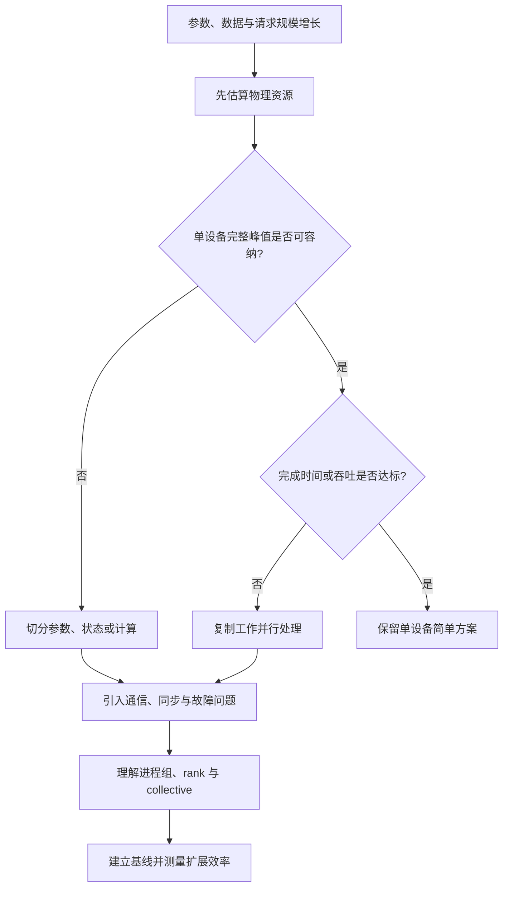

最重要的方法不是“模型大就上多卡”，而是：

> **先把逻辑规模换算成字节、FLOPs 和请求负载，分清容量约束与性能约束，再引入刚好足够的分布式复杂度。**

---

## 1. Overview：分布式系统的代价先于收益

### 1.1 Lamport 引语为什么放在开头

原章引用 Leslie Lamport 1987 年的一句话：分布式系统中，一台你甚至不知道存在的计算机发生故障，也可能让你自己的计算机无法使用。

这句话提前指出多设备的根本代价：

- 单进程失败通常只影响本进程；同步训练中一个 rank 消失，其余 rank 可能全部卡在 collective。
- 单卡性能主要由本地计算和显存决定；多卡性能还受最慢 rank、最慢链路和网络拓扑决定。
- 单机状态通常可由一个进程直接读取；分片状态必须通过协议重建、保存和恢复。
- 单设备调试有一条时间线；分布式调试要对齐多个进程的日志、事件和失败顺序。

因此，本章既解释“为什么需要分布式”，也反复提醒“只在必要时使用分布式”。这两个结论并不矛盾：模型和流量越过单设备边界时，分布式是必要条件；没有越界时，它可能只是额外成本。

### 1.2 本章覆盖范围

本章用三类内容建立后续各章的共同基础：

| 内容 | 要解决的问题 | 后续连接 |
| --- | --- | --- |
| 资源估算 | 模型能否容纳、需要几张卡 | 第 2、4、5、6 章 |
| 决策框架 | 应采用单卡、数据并行、状态/模型并行还是 PEFT | 第 2～7 章 |
| PyTorch 最小实践 | 多进程如何建立通信并交换张量 | 第 3、4、8 章 |

原章是“地图与词汇表”，不是对每种策略的最终性能承诺。DDP、FSDP、vLLM、SGLang 和硬件拓扑都会在后文展开。

---

## 2. Why modern AI requires distribution：为什么现代 AI 需要分布式

### 2.1 从“能在一张卡上训练”到三个边界同时被突破

经典机器学习模型通常有数千到数百万参数，数据可放入单机内存；ResNet、BERT 等深度学习模型把规模推到数千万或数亿参数，GPU 成为主要计算设备，但许多任务仍能在一张高端卡上完成。基础模型时代则同时突破三个边界：

1. **容量边界**：权重、梯度、优化器状态、激活或 KV cache 无法放入单 GPU。
2. **时间边界**：即使能够勉强放入，单设备完成全部计算需要数月或数年。
3. **服务边界**：单个模型副本可以处理一个请求，却不能满足生产并发、尾延迟与可用性目标。

三种边界对应不同方案：

| 被突破的边界 | 直接症状 | 首先考虑的机制 |
| --- | --- | --- |
| 容量 | OOM，模型无法加载或训练 | 量化、状态分片、TP/PP、offload、重计算 |
| 时间 | 单步或总训练时间不可接受 | 数据并行、算子优化、混合精度、更多有效算力 |
| 服务 | 排队变长、吞吐不足、尾延迟超标 | 多副本、动态 batching、路由、扩缩容 |

数据并行可以改善时间或吞吐，却不会让每个 DDP rank 的完整模型副本变小；量化可以减少容量，却不自动提高训练收敛速度；模型并行能让模型放下，却可能因通信增加而降低单请求性能。**先识别越过了哪条边界，是正确选型的第一步。**

### 2.2 如何阅读原书的模型规模表

原章用 ViT-22B、LLaMA 2 70B、Grok-1、DeepSeek-V2/V3、PanGu-Σ 等模型展示参数规模的快速增长，并列出若干闭源模型的估计值。表格的有效结论是“现代模型已经达到十亿、千亿乃至万亿参数数量级”，但具体数字要谨慎解释：

- 开源权重模型可以较可靠地知道总参数量；闭源模型常只有第三方估算。
- MoE 要同时报告**总参数**与**每 token 激活参数**。671B 总参数不代表每个 token 都执行 671B 参数的计算。
- 多模态系统可能包含多个编码器、路由器和专家，“参数量”未必采用同一统计边界。
- 参数量只描述容量的一部分，不能单独推出模型质量、训练成本或推理速度。
- 原表中若干 2025～2026 名称和数值依赖第三方来源或未公开信息，不宜视为厂商确认事实。

因此，更可靠的比较至少包含：

$$
(P_{total},\ P_{active},\ precision,\ tokens,\ FLOPs,\ context,\ quality)
$$

只按 $P_{total}$ 排名，会把稠密模型与稀疏 MoE、公开信息与推测信息混在一起。

### 2.3 The scale challenge：增长速度失配

作者用 70B 模型说明容量问题。FP32 每参数 4 字节，仅权重就需要：

$$
70\times10^9\times4=280\times10^9\ \mathrm{bytes}=280\ \mathrm{GB}
$$

这里使用十进制 GB；换成二进制 GiB 约为：

$$
\frac{280\times10^9}{2^{30}}\approx260.8\ \mathrm{GiB}
$$

无论采用哪种单位，都超过原章列举的 H200 141 GB 和 B200 192 GB 单卡容量。更重要的是，这还没算训练时的梯度、优化器和激活。

原章把矛盾概括为：模型、数据与计算需求近似指数增长，而单卡显存和算力改进远慢于模型增长。这里的“指数/线性”主要是趋势直觉，不是严格拟合定律。系统结论仍成立：**只等待下一代单卡，无法持续吸收工作负载增长；必须把状态和计算扩展到设备集合。**

### 2.4 分布式不只发生在模型计算

大规模训练的数据集可能达到万亿 token。一个训练 step 的完整路径是：

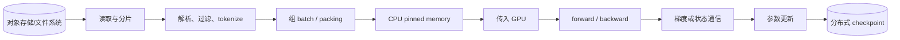

即使 GPU 算力足够，数据读取、CPU 预处理、网络、checkpoint I/O 中任一环节都可能使 GPU 空闲。原章因此把 distributed pipeline 也列为规模挑战，但全书主要聚焦 AI 特有的训练、推理和服务，Spark、Dask、Ray 等通用数据处理只作背景。

---

## 3. Estimating model resource requirements：资源估算

### 3.1 为什么必须在启动作业前估算

错误估算有两类代价：

- **低估**：作业在 forward、backward、optimizer step 或 checkpoint 时 OOM，已经消耗的排队和计算时间作废。
- **高估**：申请过多昂贵 GPU，队列等待更久，集群利用率和成本效率下降。

估算的目标不是得到一个永远精确的常数，而是形成两级答案：

1. 数量级上是否可能，至少需要多少容量？
2. 在目标框架和硬件上，峰值到底是多少？

第一级靠公式排除不可能方案；第二级靠最小实验、memory snapshot 和 profiler 校正。

### 3.2 权重内存：最简单但最容易被误当成总显存

设参数量为 $P$，每参数存储字节数为 $b_w$，则权重内存为：

$$
M_{weights}=P b_w
$$

7B 模型的理想权重大小如下：

| 格式 | 名义字节/参数 | 权重大小 | 说明 |
| --- | ---: | ---: | --- |
| FP32 | 4 | 28 GB | 高精度存储或计算 |
| BF16 / FP16 | 2 | 14 GB | 常见训练计算与推理 |
| FP8 | 1 | 7 GB | 依赖硬件、缩放和算子支持 |
| Int8 | 1 | 7 GB | 量化权重还需要 scale/zero-point 等元数据 |
| Int4 | 0.5 | 3.5 GB | 名义值，不含分组尺度、打包和对齐开销 |

不能直接把表中数字当作峰值显存，原因包括：

- 量化格式需要尺度、zero-point 或 block metadata；
- 某些 kernel 会临时反量化或申请 workspace；
- embedding、norm 或输出层可能保留更高精度；
- allocator 对齐、CUDA context 和框架缓存也占显存；
- 推理还需要 KV cache，训练还需要更多状态。

### 3.3 FP32、BF16、FP16、FP8 与低比特格式

浮点格式可抽象为符号位、指数位和尾数位：

- 指数位主要决定**动态范围**，即能表示多大或多小的数量级。
- 尾数位主要决定**有效精度**，即相邻可表示数有多密。

| 格式 | 指数位 | 尾数位 | 核心取舍 |
| --- | ---: | ---: | --- |
| FP32 | 8 | 23 | 范围和精度都高，内存与带宽成本高 |
| BF16 | 8 | 7 | 保留 FP32 的范围，牺牲精度 |
| FP16 | 5 | 10 | 比 BF16 精细，但范围窄，更易溢出/下溢 |
| FP8 E4M3 | 4 | 3 | 精度相对高、范围相对窄 |
| FP8 E5M2 | 5 | 2 | 范围相对宽、精度更低 |

BF16 常被优先用于训练，是因为梯度和激活的数量级变化很大，8 位指数降低了溢出/下溢风险。FP16 不是不能训练，而是常需 loss scaling 等机制。FP8、MXFP8、NVFP4 则不能只看“每值几位”：它们依赖 block scale、校准、硬件代际和特定 kernel，实际精度与内存都由“数值 + 元数据 + 执行策略”共同决定。

### 3.4 训练内存的完整分类

训练峰值可先写成概念式：

$$
M_{peak}=M_{weights}+M_{grad}+M_{optimizer}+M_{master}
+M_{activation}+M_{communication}+M_{temporary}+M_{fragmentation}
$$

其中：

- $M_{weights}$：模型当前权重；
- $M_{grad}$：反向传播得到的参数梯度；
- $M_{optimizer}$：动量、二阶矩等每参数状态；
- $M_{master}$：某些混合精度方案保留的 FP32 主权重；
- $M_{activation}$：反向传播需要的输入、中间值与保存张量；
- $M_{communication}$：DDP bucket、FSDP gather buffer 等；
- $M_{temporary}$：算子和优化器临时 workspace；
- $M_{fragmentation}$：分配粒度和生命周期造成的不可利用空隙。

前四项主要随参数量增长，激活主要随 batch、序列长度和架构增长；这一区分决定了优化方法：

| 主导项 | 更直接的手段 |
| --- | --- |
| 权重/梯度/优化器 | FSDP、ZeRO、低精度、offload |
| 激活 | 减小 microbatch、activation checkpoint、序列并行 |
| 通信 buffer | 调整 bucket/分片粒度、重叠与生命周期 |
| 临时与碎片 | 更换 kernel、allocator 配置、避免意外引用 |

### 3.5 SGD：为什么优化器额外状态近似为零

最基本 SGD 更新为：

$$
w_{t+1}=w_t-\eta g_t,
\qquad g_t=\nabla_w L(w_t)
$$

推导顺序是：

1. forward 计算损失 $L$；
2. backward 计算当前位置的梯度 $g_t$；
3. 负梯度方向是一阶局部下降方向；
4. 学习率 $\eta$ 控制沿该方向走多远；
5. 更新后不需要保存更早梯度。

$w_t$ 和 $g_t$ 都是参数规模张量，但它们分别属于权重与梯度，不算“优化器额外状态”。纯 SGD 只保存学习率等少量标量配置，因此额外状态约为 $0\times P$。

加入 momentum 后会保存一个同形 velocity：

$$
v_t=\mu v_{t-1}+g_t,
\qquad w_{t+1}=w_t-\eta v_t
$$

于是额外状态变为约 $1\times P$。momentum 用历史方向平滑噪声并加速持续一致的方向，代价就是多一个每参数状态。

### 3.6 Adam：两组矩从哪里来，为什么是 2× 状态

Adam 维护梯度的一阶矩和未中心化二阶矩：

$$
m_t=\beta_1m_{t-1}+(1-\beta_1)g_t
$$

$$
v_t=\beta_2v_{t-1}+(1-\beta_2)g_t^2
$$

从零初始化会让早期 $m_t,v_t$ 偏向 0，因此做偏差修正：

$$
\widehat m_t=\frac{m_t}{1-\beta_1^t},
\qquad
\widehat v_t=\frac{v_t}{1-\beta_2^t}
$$

最后更新：

$$
w_{t+1}=w_t-\eta\frac{\widehat m_t}{\sqrt{\widehat v_t}+\epsilon}
$$

直觉如下：

- $m_t$ 像带指数衰减的平均梯度，提供较稳定的方向；
- $v_t$ 记录梯度平方尺度，使大梯度坐标步长相对缩小、小梯度坐标相对放大；
- $\epsilon$ 防止分母为零并改善数值稳定性；
- $\beta_1,\beta_2,\eta,\epsilon,t$ 是少量标量；
- $m_t,v_t$ 与 $w_t$ 同形，各有一个值对应每个参数。

所以 Adam/AdamW 的额外状态元素数约为 $2P$。AdamW 改变 weight decay 与梯度更新的耦合方式，不减少这两组矩。状态“2×”描述元素数量，实际字节还要乘状态 dtype；若参数用 BF16 而矩用 FP32，优化器状态字节是 BF16 权重的 4 倍，而不是 2 倍。

常见优化器的状态数量级：

| 优化器 | 主要每参数状态 | 元素数量级 |
| --- | --- | ---: |
| SGD | 无 | 0× |
| SGD + Momentum / Nesterov | velocity | 1× |
| Adagrad | 累积平方梯度 | 1× |
| RMSProp | 二阶统计量，具体配置可再含 momentum | 1× 或更多 |
| Adam / AdamW / LAMB / Nadam | 一阶矩 + 二阶矩 | 2× |
| Lion | 一阶动量 | 1× |
| AMSGrad | 一阶矩 + 二阶矩 + 历史最大二阶矩 | 3× |
| Adafactor | 对矩阵状态做行列因子化 | 远低于完整 2×，取决于张量形状 |
| Shampoo | 预条件矩阵 | 与参数分块和维度有关，不能固定写成一个倍数 |

### 3.7 两层网络：为什么 forward 中间值要保存到 backward

原章用一个两层网络解释 activation memory。为使矩阵方向清楚，设单样本为列向量：

$$
z=W_1x,
\qquad h=\sigma(z),
\qquad \widehat y=W_2h
$$

采用平方损失：

$$
L=\frac{1}{2}\lVert\widehat y-y\rVert_2^2
$$

输出层误差为：

$$
\delta_2=\frac{\partial L}{\partial\widehat y}=\widehat y-y
$$

由矩阵乘法求导：

$$
\frac{\partial L}{\partial W_2}=\delta_2h^T
$$

这一步需要 forward 的 $h$。继续沿链式法则传播：

$$
\delta_1
=\frac{\partial L}{\partial z}
=W_2^T\delta_2\odot\sigma'(z)
$$

对 sigmoid，$h=\sigma(z)$ 且：

$$
\sigma'(z)=\sigma(z)(1-\sigma(z))=h(1-h)
$$

所以：

$$
\delta_1=W_2^T(\widehat y-y)\odot h(1-h)
$$

第一层梯度为：

$$
\frac{\partial L}{\partial W_1}=\delta_1x^T
$$

由此可以逐项追踪 backward 需要的值：

| 梯度 | 所需 forward 值 |
| --- | --- |
| $\partial L/\partial W_2$ | $h$ 与 $\widehat y$（或已形成的输出误差） |
| $\partial L/\partial W_1$ | $x$、$h$、$W_2$ 与输出误差 |

这就是 activation memory 的来源：不是“激活函数有参数”，而是链式法则需要某些 forward 输入或输出。

### 3.8 “必须存输入还是输出”不是只看函数名字

原章按导数公式把激活分成“只需输出”和“必须输入”两类，这个直觉有帮助，但不能机械套用。更准确的判断是：**backward 实现需要哪些信息，以及这些信息能否由已保存值低成本、无歧义地恢复。**

几个关键例子：

- Sigmoid：$\sigma'(z)=h(1-h)$，输出 $h$ 足够。
- Tanh：导数为 $1-h^2$，输出足够。
- ReLU：输出 $h>0$ 等价于输入 $z>0$；按常见 $z=0$ 导数约定，输出或一位 mask 都足够，并非数学上必须保存完整 $z$。
- Leaky ReLU：当斜率 $\alpha>0$ 时，输出符号也能判断分支；实现仍可能为了速度保存输入或 mask。
- ELU：负分支导数可由输出写成 $h+\alpha$，也不必一概断言必须保存完整输入。
- GELU/Swish/Mish：函数可能非单调，单凭输出通常不能唯一恢复输入；保存输入往往更自然。
- Softmax：是向量函数，backward 涉及 Jacobian 结构，但可利用输出概率高效计算，不会显式构造完整 Jacobian。

因此，真实 PyTorch 显存应以 autograd 的 `save_for_backward` 行为和 profiler 为准。框架可以保存输入、输出、bitmask、统计量，或者在 backward 重算；不能仅凭纸面导数断言实际保存哪个张量。

### 3.9 GELU 与 Swish：为什么常保存输入

精确 GELU 为：

$$
\operatorname{GELU}(z)=z\Phi(z)
$$

其中 $\Phi$ 是标准正态 CDF，$\phi$ 是 PDF。乘积求导得到：

$$
\operatorname{GELU}'(z)=\Phi(z)+z\phi(z)
$$

导数显式依赖 $z$。常用 tanh 近似仍包含 $z,z^2,z^3$，所以直接保存或重算输入比从输出逆推可靠。

Swish/SiLU 为：

$$
\operatorname{SiLU}(z)=z\sigma(z)
$$

求导：

$$
\operatorname{SiLU}'(z)
=\sigma(z)+z\sigma(z)(1-\sigma(z))
$$

它同样显式依赖 $z$，而且 Swish 非单调区间使输出到输入不全局一一对应。这里“保存输入”是由函数信息丢失和计算成本共同决定，而不仅因为公式中出现字母 $z$。

### 3.10 训练循环中的状态生命周期

标准训练循环为：

```python
for epoch in range(num_epochs):
    model.train()
    for inputs, targets in dataloader:
        optimizer.zero_grad(set_to_none=True)
        predictions = model(inputs)
        loss = criterion(predictions, targets)
        loss.backward()
        optimizer.step()
```

各阶段状态变化如下：

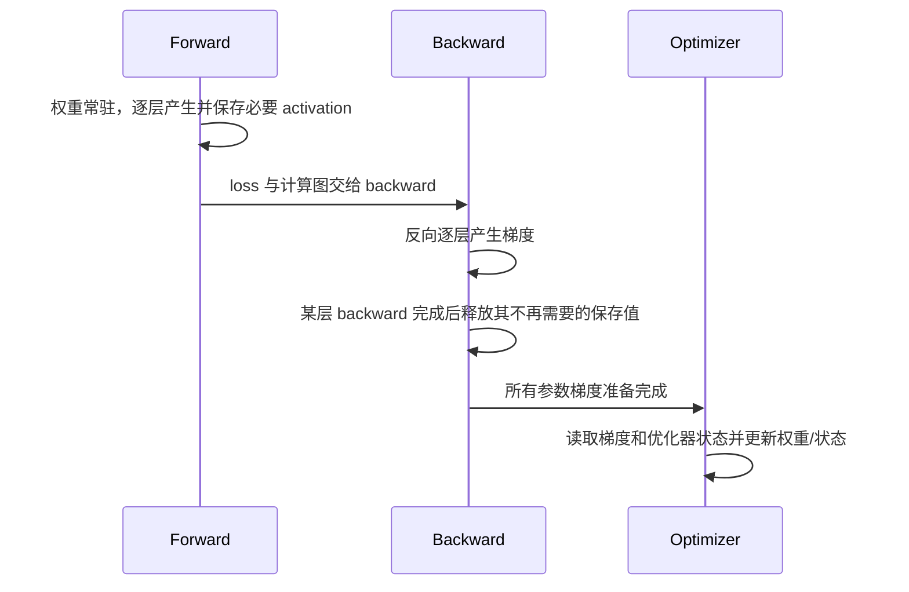

需要校正两个常见表述：

1. 优化器状态虽然只在 `optimizer.step()` 被访问，但通常**整个迭代都常驻显存**；它与 forward/backward activation 同时占容量。
2. 标准优化器不是每算完一层梯度就更新该层，而是完整 backward 后统一 step；activation 可以在反向经过该算子后逐步释放，不必等 optimizer step。

原章用“backward 时 activation 与 gradient 重叠”解释峰值，这是常见情况，但不是普遍定律。fused optimizer 可能在 step 时产生临时峰值，gradient accumulation 会让梯度跨 microbatch 常驻，checkpoint 保存和大型临时 kernel 也可能创造更高峰值。应实测峰值所在阶段。

### 3.11 7B Adam 示例：三种精度口径不能混用

原章的教学图假设**权重、梯度、Adam 的 $m,v$ 全部为 BF16**：

| 组成 | 每参数字节 | 7B 大小 |
| --- | ---: | ---: |
| 权重 | 2 | 14 GB |
| 梯度 | 2 | 14 GB |
| Adam $m,v$ | $2+2=4$ | 28 GB |
| 固定参数相关状态 | 8 | 56 GB |

若 activation 为 12 GB，则示意峰值为 $56+12=68$ GB。这个算术是自洽的，但不是最常见的生产 Adam 精度口径。

若 forward/backward 用 BF16，而 Adam 两组矩用 FP32：

| 组成 | 每参数字节 | 7B 大小 |
| --- | ---: | ---: |
| BF16 权重 | 2 | 14 GB |
| BF16 梯度 | 2 | 14 GB |
| FP32 Adam $m,v$ | $4+4=8$ | 56 GB |
| 固定参数相关状态 | 12 | 84 GB |

若再保留 FP32 master weight，则再加 28 GB，固定状态达到约 112 GB。不同 AMP、fused optimizer、分片和框架版本会改变布局，因此“BF16+Adam 每参数多少字节”必须先列 ledger，不能只背 8、12 或 16 bytes/parameter。

### 3.12 降低 activation 峰值的三种手段

#### 减小 microbatch

activation 通常随每卡 microbatch $B_{micro}$ 近似线性增长。减小它最直接，但每步处理样本数也下降，GPU 可能利用不足。

#### 梯度累积

连续处理 $A$ 个小 microbatch 后再更新，可保持有效全局 batch：

$$
B_{global}=B_{micro}\times A\times N_{DP}
$$

它降低单个 microbatch 的 activation 峰值，却不减少模型状态。为得到平均梯度，通常把每个 microbatch loss 除以 $A$；在 DDP 中还应对中间 microbatch 使用 `no_sync()`，否则每次 backward 都做一次不必要 AllReduce。

#### Activation checkpointing

只保存分段边界，backward 时重算段内 forward：

$$
\text{更少保存值} \quad \Longleftrightarrow \quad \text{更多重复计算}
$$

它适合 activation 主导且有算力余量的场景；若权重/优化器才是主导，仅 checkpoint activation 仍可能无法容纳。

### 3.13 推理内存：权重之外为什么还有 KV cache

自回归生成在第 $t$ 步要让新 query 关注此前 token。若每步都重新计算历史 token 的 Key/Value，会重复大量工作。KV cache 保存历史层的 K/V，使每步只计算新 token 对应状态。

设：

- Transformer 层数为 $L$；
- 活跃序列数为 $B$；
- 每序列已缓存长度为 $S$；
- KV head 数为 $H_{kv}$；
- 每 head 维度为 $d_h$；
- 每元素字节数为 $b$。

则规则形状下：

$$
M_{KV}=2LBSH_{kv}d_hb
$$

系数 2 来自 Key 与 Value。它说明 KV cache 对 $B,S,L$ 均线性增长；Multi-Query Attention 或 Grouped-Query Attention 通过减少 $H_{kv}$ 显著降低内存。

以近似 Llama 2 70B 配置建立直觉：$L=80$、$H_{kv}=8$、$d_h=128$、BF16 $b=2$、$B=32$、$S=2048$：

$$
M_{KV}
=2\times80\times32\times2048\times8\times128\times2
\approx21.47\ \mathrm{GB}
$$

即约 20 GiB。这与原章“20～40 GB”的低端一致；具体上界取决于模型的 KV head、缓存精度、分配方式和是否预留更长上下文。

70B BF16 权重约 140 GB，加约 20 GB KV 就已达到 160 GB，恰好等于两张 80 GB 卡的名义总容量，尚未包含 runtime、workspace 和碎片。因此“至少 2 张 A100”只是**算术下界**，不是可靠部署承诺；实际可能需要更多卡、较低并发、更低精度或量化。

### 3.14 超长上下文为何把推理重新变成容量问题

从公式可见，将 $S=2048$ 扩到一千万，单序列 KV cache 会扩大约：

$$
\frac{10{,}000{,}000}{2048}\approx4883
$$

倍。原章用支持千万 token 上下文的 Llama 4 Scout 举例，指出单序列完整上下文 KV cache 可超过 1 TB。这里要区分：

- 模型“支持的最大上下文”是能力上限；
- 生产中是否真的填满，要看任务与成本；
- KV 大小还由层数、KV heads、head dim 和 cache dtype 决定；
- 分布式只能分摊容量，不能消除随 token 数线性增长的基本规律。

这也是 PagedAttention、KV quantization、prefix reuse、context parallelism 和请求调度成为关键技术的原因。

### 3.15 GPU 数量估算：从理论下界到可运行配置

先设目标配置的峰值估算为 $M_{peak}$，每卡物理显存为 $M_{gpu}$，预留比例为 $r$，则单卡可规划容量为：

$$
M_{usable}=M_{gpu}(1-r)
$$

若状态可以理想均分，理论卡数下界为：

$$
N_{min}=\left\lceil\frac{M_{peak}}{M_{usable}}\right\rceil
$$

但这个下界只有在以下条件成立时才接近真实：

- 被计算的状态确实能按该并行策略分片；
- 每卡临时峰值没有重建完整大对象；
- 层大小可以较均衡地放置；
- 通信 buffer 和 runtime 已计入；
- 实际可用显存与标称值一致。

例如 13B BF16 权重是 26 GB。原章一处写“加 Adam 状态约 78 GB”，这只等于 26 GB 权重 + 两份 BF16 Adam 状态，**遗漏了至少 26 GB 梯度**；按原章全 BF16 ledger 应为约 104 GB 再加 activation。原章另一处给 13B BF16+Adam 训练约 110～130 GB，才与这一口径较接近。决策时不能把 78 GB 当作完整峰值塞进 80 GB A100。

### 3.16 真实部署中的额外开销

原章建议在基础估算上留 10%～30% 余量。余量不是替代逐项建模，而是覆盖难以预先精确知道的部分：

- CUDA context、kernel workspace 和框架缓存；
- NCCL communication buffer；
- allocator 对齐与碎片；
- checkpoint/状态转换的临时副本；
- 长度波动造成的 activation 或 KV 峰值。

原文把“操作系统需要 5～10 GB”列在额外内存中。通常这主要是**主机 RAM**，不应不加区分地从 GPU VRAM 扣除；GPU 上确有驱动 context 和 display 等开销，但应通过 `nvidia-smi`、PyTorch memory API 和目标容器实测。

### 3.17 可运行资源估算器

下面的标准库代码把权重、训练固定状态和规则 KV cache 公式落地。它不会替代 profiler，但能快速排除数量级错误。

```python
from dataclasses import dataclass
from math import ceil


@dataclass(frozen=True)
class TrainingPrecision:
    weight_bytes: int
    gradient_bytes: int
    optimizer_state_bytes: int
    master_weight_bytes: int = 0


def parameter_memory_gb(parameters_billions: float, bytes_per_parameter: float) -> float:
    return parameters_billions * bytes_per_parameter


def training_fixed_memory_gb(
    parameters_billions: float,
    precision: TrainingPrecision,
) -> float:
    bytes_per_parameter = (
        precision.weight_bytes
        + precision.gradient_bytes
        + precision.optimizer_state_bytes
        + precision.master_weight_bytes
    )
    return parameter_memory_gb(parameters_billions, bytes_per_parameter)


def kv_cache_gb(
    layers: int,
    batch_size: int,
    sequence_length: int,
    kv_heads: int,
    head_dim: int,
    element_bytes: int,
) -> float:
    values = 2 * layers * batch_size * sequence_length * kv_heads * head_dim
    return values * element_bytes / 1_000_000_000


def minimum_gpus(total_gb: float, gpu_gb: float, reserve_ratio: float = 0.2) -> int:
    usable_gb = gpu_gb * (1 - reserve_ratio)
    return ceil(total_gb / usable_gb)


bf16_everywhere_adam = TrainingPrecision(2, 2, 4)
mixed_adam = TrainingPrecision(2, 2, 8)

print(f"7B BF16 weights: {parameter_memory_gb(7, 2):.0f} GB")
print(f"7B teaching Adam state: {training_fixed_memory_gb(7, bf16_everywhere_adam):.0f} GB")
print(f"7B FP32-moment Adam state: {training_fixed_memory_gb(7, mixed_adam):.0f} GB")

kv_gb = kv_cache_gb(80, 32, 2048, 8, 128, 2)
print(f"70B-style KV cache example: {kv_gb:.2f} GB")
print(f"160 GB with 20% reserve on 80 GB GPUs: {minimum_gpus(160, 80)} GPUs")
```

预期输出：

```text
7B BF16 weights: 14 GB
7B teaching Adam state: 56 GB
7B FP32-moment Adam state: 84 GB
70B-style KV cache example: 21.47 GB
160 GB with 20% reserve on 80 GB GPUs: 3 GPUs
```

最后一行说明安全余量会把“160/80=2”的裸算术下界推到 3。真实并行组通常受 2、4、8 等拓扑和切分度约束，最终卡数不一定正好等于该函数输出。

### 3.18 原章快速参考表应怎样使用

原章给出 1B、7B、13B、70B 的 FP32/BF16 权重、BF16+Adam 训练与 BF16 推理范围。它适合作为 sanity check，不适合作为容量合同：

- 训练范围混合了特定 optimizer dtype 和“moderate batch”假设；
- activation 随架构、batch、sequence 变化巨大；
- 推理范围随 KV heads、并发和上下文变化；
- 量化还受 scale metadata 和 kernel 支持影响；
- sharding 后每卡持久状态和临时峰值不是简单总量除卡数。

正确用法是：先用表判断数量级，再为自己的配置建立逐项 ledger，最后实测。

---

## 4. The evolution from classic ML to foundation models

### 4.1 三个阶段的变化不是只有参数量

| 阶段 | 典型模型 | 主要资源形态 | 系统重心 |
| --- | --- | --- | --- |
| 经典 ML | 线性/逻辑回归、树、SVM、XGBoost | 单机 CPU 与内存 | 特征、统计假设、训练数据质量 |
| 深度学习 | ResNet、BERT | 单 GPU 或少量 GPU | accelerator、数据管线、实验管理 |
| 基础模型 | LLM、多模态模型、大型 MoE | 大规模 GPU 集群 | 多维并行、通信、容错、推理调度与成本 |

基础模型带来的质变包括：

- 一个通用预训练模型可适配许多任务，训练成本集中到少数大作业；
- 训练数据和 checkpoint 本身成为分布式存储与 I/O 问题；
- 生产推理可能比一次训练更长期、更昂贵；
- 研究迭代速度开始由集群调度、失败恢复和可观测性共同决定。

分布式架构使更大模型成为可能，也能通过并行实验缩短研究反馈周期；但“使用分布式”本身不会创造模型能力，能力仍来自数据、目标、架构和优化共同作用。

---

## 5. The modern AI model lifecycle：现代模型生命周期

### 5.1 为什么是循环而不是一次性流水线

原章把生命周期描述为：数据工程 -> 训练 -> 推理优化 -> 基准测试 -> 生产部署 -> 反馈 -> 新一轮数据与模型改进。


之所以必须成环，是因为离线数据无法预先覆盖全部真实请求。部署后才会观察到：

- 哪些输入分布导致质量退化；
- 哪些长度和并发模式导致延迟或 OOM；
- 哪些模型版本更适合某类用户；
- 哪些错误值得补数据、改目标或增加系统防护。

反馈既可能改变模型，也可能只改变路由、batching、cache 或安全策略。因此“模型生命周期”实质上是模型与系统共同迭代。

### 5.2 数据工程阶段

数据阶段包括收集、策展、转换、验证、清洗、去重、tokenize 和打包。分布式难点不只是吞吐：

- 多 worker 是否重复或遗漏样本；
- shuffle 是否可复现；
- 数据版本是否能和 checkpoint 对应；
- 过滤与去重是否改变目标分布；
- 数据流能否持续供给 GPU。

全书只简述通用 distributed data processing，把重点留给 AI 特有的状态与通信问题。

### 5.3 Training：学习参数的阶段

每个训练迭代执行：

$$
\text{forward}\to\text{loss}\to\text{backward}\to\text{update}
$$

分布式训练又增加：

- 不同 rank 的数据划分；
- 梯度或参数同步；
- activation、参数和 optimizer state 的分片；
- 长作业 checkpoint 与故障恢复；
- 全局 batch 与学习率语义。

训练常用指标是 samples/s、tokens/s、step time、time-to-train、MFU、收敛质量和总成本。单步更快但收敛步数显著增加，不一定缩短 time-to-quality。

### 5.4 对“7B、1T token、8 张 A100、约两周”的数量级复核

原章给出这一训练时间示例，但对稠密 Transformer 全量预训练，它与标准计算估算不相符。常见粗估为：

$$
F_{train}\approx6PD
$$

取 $P=7\times10^9$、$D=10^{12}$：

$$
F_{train}\approx4.2\times10^{22}\ \mathrm{FLOPs}
$$

一张 A100 的 BF16 dense Tensor Core 峰值约 312 TFLOP/s，8 张理论总峰值约 $2.496$ PFLOP/s。即便不可实现地假设 100% 利用率：

$$
T_{ideal}=\frac{4.2\times10^{22}}{8\times312\times10^{12}}
\approx1.68\times10^7\ \mathrm{s}\approx195\ \mathrm{days}
$$

若端到端利用率为 40%，约需 487 天。不同架构、计算公式、稀疏性和硬件会改变数字，但 8 张 A100 两周不足以完成这一稠密训练量。两周目标在理论 100% 峰值下也约需 111 张 A100，在 40% 利用率下约需 278 张。

应保留的作者结论是“大训练需要大量 GPU 与可靠同步”，而不是记住该具体时长。容量估算与计算时间估算必须分别做 sanity check。

### 5.5 Inference：固定参数做预测或生成

推理通常只有 forward，不保留参数梯度和优化器状态。它的难点转为：

- 交互请求的首 token 与逐 token 延迟；
- 高并发下的总吞吐；
- 权重、KV cache 和 workspace 的显存竞争；
- 可变长度请求如何 batching 与调度；
- 大模型跨 GPU 时的层内通信。

LLM 常用指标：

$$
TTFT=T_{queue}+T_{prefill}+T_{overhead}
$$

以及 decode 阶段的 ITL/TPOT、output tokens/s。只报告 requests/s 会受每个请求输出长度影响，不能公平比较。

### 5.6 Serving：围绕推理建立生产系统

推理是模型计算，服务是长期提供这项计算的系统：

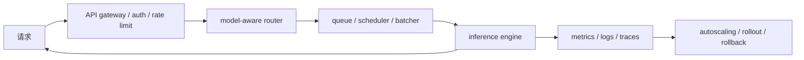

服务还要处理多模型、多租户、canary、A/B test、熔断、重试、故障转移和成本归属。它的“可用”不能只定义为进程存活，还应包含延迟与输出质量约束。

### 5.7 Training、Inference、Serving 对照

| 维度 | Training | Inference | Serving |
| --- | --- | --- | --- |
| 目标 | 学习参数 | 计算一次预测/生成 | 持续提供有 SLO 的推理能力 |
| 主要状态 | 权重、梯度、优化器、activation | 权重、activation/KV | 引擎状态、队列、cache、路由与版本 |
| 核心通信 | 梯度/参数/activation collective | TP/PP/EP 或结果汇总 | API、路由、状态与控制面通信 |
| 时间尺度 | 小时到数月 | 毫秒到分钟 | 持续运行 |
| 常见指标 | tokens/s、time-to-quality | TTFT、ITL、tokens/s | p99、可用性、吞吐、成本、公平性 |
| 典型失败 | loss 发散、rank hang、checkpoint 损坏 | OOM、超时、错误输出 | 排队雪崩、路由热点、版本回归、依赖失败 |

原章表中把 serving latency 简写为毫秒，把 inference latency 写为毫秒到秒。真实 LLM 长生成可能持续数十秒或更久；指标必须按 prefill/decode 和请求长度分解。

---

## 6. Decision framework：什么时候需要分布式系统

### 6.1 第一原则：分布式是约束的答案，不是身份标签

分布式会增加：

- collective 与网络开销；
- 配置和进程状态空间；
- 失败模式与恢复复杂度；
- 集群成本和排队时间；
- 复现与调试难度。

所以作者给出的原则是：**不得不用时才用，而不是想用时就用。** 判断时先区分训练/微调与推理/服务。

### 6.2 训练与微调的决策路径

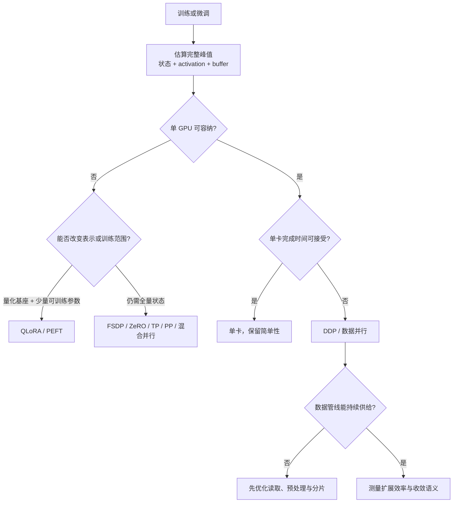

这里最重要的修正是：“模型是否 fit”不能只算 BF16 权重，必须算目标操作的完整峰值。13B 权重 26 GB 不代表可在 80 GB 卡上做 Adam 全量训练。

### 6.3 PEFT 如何改变问题，又没有改变什么

LoRA 令预训练权重 $W$ 冻结，只训练低秩增量：

$$
W'=W+BA,
\qquad A\in\mathbb R^{r\times d_{in}},
\quad B\in\mathbb R^{d_{out}\times r},
\quad r\ll d
$$

可训练参数和对应梯度/优化器显著减少。QLoRA 再把冻结基座量化到低比特，进一步降低权重显存。

但 PEFT 没有消除：

- 基座权重仍需以量化或分片形式容纳；
- forward/backward 仍产生 activation；
- 长序列和较大 microbatch 仍可能 OOM；
- 量化 metadata、dequantization workspace 和 adapter 状态仍占内存；
- “70B QLoRA 可放 48 GB”依赖具体量化、架构、序列、batch 和实现，不是普遍保证。

### 6.4 模型 fit 但训练太慢时为什么选数据并行

若每张 GPU 都能保存完整模型，最简单的扩展方式是让 $N$ 个 rank 各处理不同 local batch，再聚合梯度。它不改变单个模型算子，只扩大每步处理的数据量。

有效全局 batch 为：

$$
B_{global}=N\times B_{local}\times A
$$

其中 $A$ 是 gradient accumulation steps。增加 $N$ 若不调整其他量，会改变优化轨迹；学习率、训练步数、shuffle 和 loss reduction 都需一起检查。系统加速不自动等于训练语义不变。

### 6.5 大数据集不自动要求模型并行

数据集达到 TB 级时，可能需要分布式存储、sharding、prefetch 和并行预处理，但这与“模型是否跨卡”是正交问题：

- 小模型 + 巨大数据：模型可单卡复制，数据管线分布式。
- 大模型 + 小微调集：模型必须分片，数据本身未必难处理。
- 大模型 + 巨大数据：两类问题同时存在。

把数据规模和模型状态规模分开估算，才能选择正确维度。

### 6.6 推理与服务的决策路径

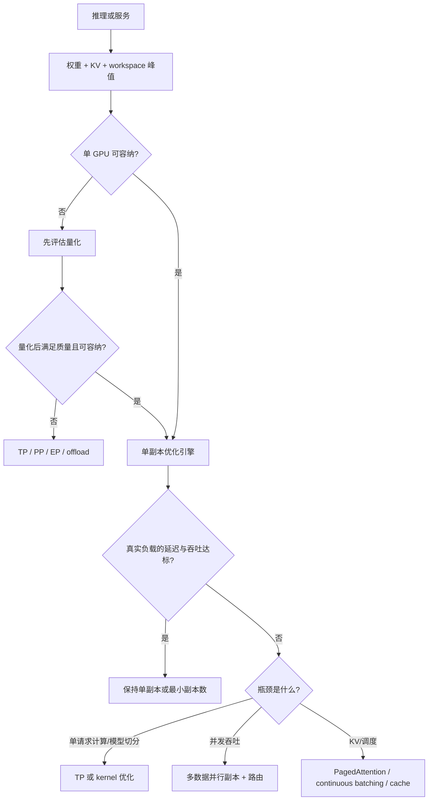

70B BF16 权重约 140 GB，加 KV 后 160～180 GB；两张 80 GB 卡只在最乐观低端勉强达到名义容量，生产配置要为 runtime 留空间。Int8 权重名义约 70 GB，看似可放一张 80 GB 卡，但剩余容量限制 KV 和并发，因此“单卡可加载”不等于“单卡可满足服务目标”。

### 6.7 一个可复用的决策表

| 问题 | 是 | 否 |
| --- | --- | --- |
| 完整峰值超过单卡可用显存？ | 改精度/训练范围，或切分状态与模型 | 继续检查时间/吞吐 |
| 单卡训练时间超过期限？ | 数据并行或优化计算/数据管线 | 保持单卡 |
| 推理单请求延迟超标？ | profile prefill/decode，评估 TP/kernel | 检查并发吞吐 |
| 并发吞吐不足？ | 增副本、batching、路由 | 保持最小部署 |
| 数据加载让 GPU 空闲？ | 优化 shard、worker、prefetch、存储 | 不要为此增加模型并行 |
| 方案收益未经同负载基准验证？ | 暂不能下结论 | 记录适用边界 |

本章决策框架的终点不是某个框架名字，而是一个可证伪假设，例如：

> 在 4 张 80 GB GPU、BF16、序列 4096、每卡 microbatch 1 的条件下，FSDP 能让目标模型容纳，并在保持 loss 基线的同时达到至少 70% 扩展效率。

后续实验才负责验证它。

---

## 7. Hands-On：运行分布式训练

### 7.1 为什么先做单 GPU baseline

作者没有直接启动多 GPU，而是先运行完全相同模型和数据的单卡版本。baseline 至少承担四个职责：

1. **正确性参照**：loss 是否下降、accuracy 是否达到合理范围。
2. **性能分母**：多卡 speedup 必须相对同口径单卡时间计算。
3. **故障隔离**：若单卡已错误，就不应先排查 NCCL 或 rank。
4. **复杂度判断**：若单卡已经满足时间和吞吐目标，分布式没有必要。

公平比较必须保持模型、数据、epoch、精度、预处理和计时边界一致。还要说明 batch 语义：若多卡保持每卡 local batch 不变，全局 batch 会增大；若保持 global batch 不变，每卡计算变少，通信占比可能上升。两种实验回答的问题不同。

### 7.2 环境搭建与代码来源

原章从官方配套仓库开始：

```shell
git clone https://github.com/PacktPublishing/Distributed-AI-Systems
```

理想环境是多张 NVIDIA GPU，例如 A10、A100、H100/H200 或 B200。原章也建议使用 Kaggle Notebook，并在 **Settings -> Accelerator** 中选择当时可用的双 T4 配置。

这类托管资源并非稳定契约：GPU 型号、配额、镜像、网络和运行时限会变化。复现实验时应记录实际 `torch.__version__`、CUDA、GPU 型号、驱动、batch 和启动命令，而不能只写“在 Kaggle 上运行”。

### 7.3 检查 CUDA 与 GPU

原章的 `code/check_cuda.py` 可整理为：

```python
import torch


print(f"CUDA available: {torch.cuda.is_available()}")
print(f"Number of GPUs: {torch.cuda.device_count()}")
for device_index in range(torch.cuda.device_count()):
    properties = torch.cuda.get_device_properties(device_index)
    vram_gib = properties.total_memory / 2**30
    print(f"GPU {device_index}: {properties.name} ({vram_gib:.1f} GiB)")
```

逐行对应关系：

- `is_available()` 检查当前 PyTorch build、驱动和 runtime 是否能使用 CUDA；它为 `False` 不等于机器物理上一定没有 GPU。
- `device_count()` 返回当前进程可见的 CUDA device 数，受 `CUDA_VISIBLE_DEVICES`、容器和调度器限制。
- `get_device_properties()` 读取名称和物理显存等静态属性。
- 除以 $2^{30}$ 得到 GiB；原文称 GB，但代码实际采用二进制换算。

这个脚本只能证明设备可见。要证明多卡通信可用，还需初始化 process group 并执行一次 collective；要证明性能正常，还需跑带宽和计算基准。

### 7.4 Single-GPU baseline：ResNet18 + FashionMNIST

作者选 ResNet18 和 FashionMNIST，是为了让实验快速完成，同时保留真实反向传播和卷积计算：

- FashionMNIST 有 70,000 张 $28\times28$ 灰度图，10 类；
- torchvision ResNet18 原本面向 3 通道 RGB 和 1000 类 ImageNet；
- 需要把输入通道改为 1，把最终输出改为 10 类。

核心修改为：

```python
model.conv1 = nn.Conv2d(
    1,
    64,
    kernel_size=7,
    stride=2,
    padding=3,
    bias=False,
)
model.fc = nn.Linear(model.fc.in_features, 10)
```

这两处修改分别维护输入与输出契约，中间 residual block 保持不变。需要注意，$28\times28$ 图像比 ImageNet 小得多，原版 $7\times7$、stride 2 卷积与 max-pool 会快速缩小空间分辨率；它适合教学，但未必是 FashionMNIST 精度最优架构。

运行：

```shell
python code/single_gpu_baseline.py
```

原章示例 3 个 epoch 的结果是：

```text
Epoch 1/3, Loss: 0.4164, Accuracy: 84.94%
Epoch 2/3, Loss: 0.2936, Accuracy: 89.17%
Epoch 3/3, Loss: 0.2531, Accuracy: 90.58%

Total training time: 8.78s
```

结果展示 loss 下降、accuracy 上升，说明最小训练闭环正常。精确数字会受随机种子、数据增强、cuDNN algorithm、batch、硬件和计时 warmup 影响，因此多卡版应比较趋势和同条件基准，而不是要求字符级一致。

### 7.5 Multi-GPU DDP：从一个训练循环变成多个对等进程

运行两进程：

```shell
torchrun --nproc_per_node=2 code/multi_gpu_ddp.py
```

或使用仓库启动脚本：

```shell
bash code/launch_torchrun.sh
```

`torchrun` 在本节点创建两个独立 Python 进程。典型一进程一 GPU，而不是一个 Python 进程控制两张卡。每个 rank：

1. 初始化同一 process group；
2. 把模型放到自己的 local GPU；
3. 用 DDP 包装完整模型副本；
4. 从 `DistributedSampler` 取得不同数据；
5. 独立 forward/backward；
6. backward 期间通过 AllReduce 聚合梯度；
7. 用相同聚合梯度独立执行相同 optimizer update。

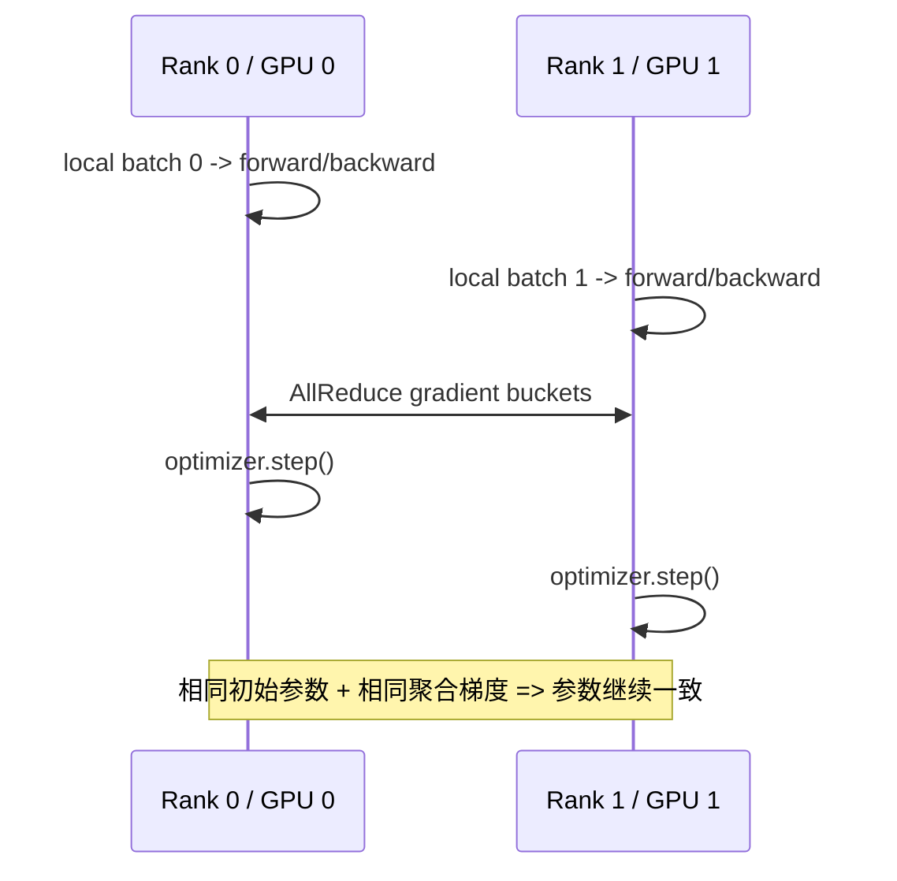

DDP 的同步不需要 rank 之间传递 optimizer object；同步的是梯度，之后每个 rank 对自己的完整副本执行确定性相同更新。

### 7.6 FashionMNIST 扩展结果怎样读

原章记录：

| GPU 数 $N$ | 时间 $T_N$ | 加速比 $S_N=T_1/T_N$ | 扩展效率 $E_N=S_N/N$ |
| ---: | ---: | ---: | ---: |
| 1 | 8.78 s | 1.00× | 100.0% |
| 2 | 5.91 s | 1.48× | 74.0% |
| 4 | 3.69 s | 2.38× | 59.5% |
| 6 | 2.92 s | 3.01× | 50.2% |
| 8 | 2.44 s | 3.60× | 45.0% |

8 卡把时间从 8.78 s 降到 2.44 s，绝对速度更快；但效率只有 45%，说明新增 GPU 的边际收益快速下降。不能只写“3.6× 加速”，还要看到理想线性值本应为 8×。

时间可拆为：

$$
T_N\approx T_{compute}(N)+T_{communication}(N)+T_{input}(N)
+T_{launch}+T_{synchronization}+T_{imbalance}
$$

FashionMNIST 作业很短、图片小，进程启动、数据准备和 collective 固定成本占比很高。增加 rank 后，每个 rank 的有效计算变少，固定开销不会同比缩小。

### 7.7 Amdahl 定律只用于建立“非并行占比”直觉

若把所有不能随 $N$ 缩小的工作归入比例 $f$，Amdahl 模型为：

$$
S_N=\frac{1}{f+(1-f)/N}
$$

由观测 $S_N$ 反解：

$$
f=\frac{1/S_N-1/N}{1-1/N}
$$

FashionMNIST 的 $N=8,S_8=3.60$ 给出：

$$
f\approx\frac{1/3.60-1/8}{1-1/8}\approx17.5\%
$$

这个 $f$ 是**有效非并行比例**，把 communication、launch、load imbalance 等动态开销都粗暴折成常数，并不证明源代码有 17.5% 真正串行语句。collective 成本会随 $N$ 变化，因此不能用 Amdahl 精确预测更大集群。

### 7.8 Extended training：ResNet18 + CIFAR-10

CIFAR-10 有 50,000 张 $32\times32$ RGB 训练图像，10 类。原章运行 20 epoch：

```shell
python code/single_gpu_extended.py --epochs 20
```

分布式版本：

```shell
torchrun --nproc_per_node=2 code/multi_gpu_ddp_extended.py --epochs 20
torchrun --nproc_per_node=4 code/multi_gpu_ddp_extended.py --epochs 20
torchrun --nproc_per_node=6 code/multi_gpu_ddp_extended.py --epochs 20
torchrun --nproc_per_node=8 code/multi_gpu_ddp_extended.py --epochs 20
```

原章结果及复算效率：

| GPU 数 $N$ | 时间 $T_N$ | 加速比 $S_N$ | 效率 $E_N$ |
| ---: | ---: | ---: | ---: |
| 1 | 73.00 s | 1.00× | 100.0% |
| 2 | 46.47 s | 1.57× | 78.5% |
| 4 | 27.72 s | 2.63× | 65.8% |
| 6 | 21.24 s | 3.44× | 57.3% |
| 8 | 18.20 s | 4.01× | 50.1% |

8 卡有效非并行比例约：

$$
f\approx\frac{1/4.01-1/8}{1-1/8}\approx14.2\%
$$

比 FashionMNIST 的 17.5% 小，说明较长工作负载使启动与固定开销占总时间比例下降，或者每 step 计算/输入特征更有利。

原章把更好扩展归因于“20 epoch 将通信开销摊到更多 step”。这句话需要精确化：若每个 step 都做一次同样的 AllReduce，增加 epoch 会同时增加计算和通信，**不会改变 steady-state 的每步计算/通信比**。它能摊薄的是一次性的进程启动、数据下载、初始化与 warmup。真正让每步通信相对更轻的，是每次同步之间有更多有效计算、更高算术强度、更大 local batch，或更好的 overlap。

同理，“十亿参数模型更接近线性扩展”也不是自动规律：模型计算增加的同时梯度字节数也增加。是否更好取决于计算/通信比、网络、bucket overlap、batch 和拓扑。

### 7.9 Strong scaling 与 weak scaling 不应混淆

原章实验更接近 strong scaling：固定同一训练任务，增加 GPU，观察总时间是否下降。

- **Strong scaling**：固定全局工作量，$N$ 增加后每 rank 工作减少；考察 time-to-solution。
- **Weak scaling**：每 rank 保持工作量，$N$ 增加时全局工作量一起增长；考察系统能否按比例扩大吞吐。

DDP 若保持 local batch 不变，会扩大 global batch，严格说训练语义也改变，既不是纯粹固定工作量，也不是只测系统。严谨 benchmark 应明确：

```text
固定 global batch 还是 local batch？
固定 epoch 还是 optimizer steps / tokens？
学习率是否调整？
是否包含数据下载、启动和首轮 warmup？
最终 accuracy/loss 是否可比？
```

### 7.10 为什么短基准容易误导

8.78 秒的任务中，数秒启动差异足以大幅改变 speedup。可靠测量应：

1. 先 warm up CUDA kernels 和 DataLoader；
2. 在计时边界前后 `torch.cuda.synchronize()`；
3. 多次独立重复，报告中位数和离散程度；
4. 单独记录 startup 与 steady-state step time；
5. 保证所有 rank 同步进入计时区间；
6. 同时验证精度、样本数和 global batch。

否则得到的是“脚本墙钟时间”，不一定能解释 DDP 通信效率。

### 7.11 Distributed inference：为什么通常比同步训练更易扩展

原章用 ResNet18 + FashionMNIST 推理说明吞吐扩展。独立请求无需 backward 和每步梯度同步，各副本只需：

$$
y_i=f_{\theta}(x_i)
$$

只要模型权重固定且请求独立，worker 之间通常不必交换每次预测的中间状态。因此多副本 data parallel inference 更接近 embarrassingly parallel。

但这只适用于模型能完整放入每张 GPU。LLM 权重单卡放不下时，单个请求内部仍要 TP/PP/EP 通信；模型可放下但请求共享 cache、需要全局排序或限流时，也有协调成本。

### 7.12 Data-split 与 request-split 两种模式

#### Data-split

先用 `DistributedSampler` 把有限数据集分成固定 shard，每个 GPU 顺序处理自己的部分：

```text
dataset -> shard 0 -> GPU 0
        -> shard 1 -> GPU 1
```

优势：调度简单、通信少、适合离线批评估。局限：工作量若按样本长度差异很大，静态 shard 可能不均衡；它也不模拟在线到达和排队。

#### Request-split

运行时把新请求分配给 worker，例如 round-robin：

```text
request stream -> dispatcher -> GPU 0
                           -> GPU 1
```

优势：更接近异步在线服务，可加入负载、模型、cache 和会话感知策略。局限：路由、队列和序列化会增加开销；简单 round-robin 不理解请求长度，可能产生热点。

原章的 queue 脚本“所有 GPU 仍遍历数据集”带来额外工作，所以它只是生产队列的近似演示，不是完整服务架构。

### 7.13 推理实验结果

命令：

```shell
python code/single_gpu_inference.py --requests 1000

torchrun --nproc_per_node=2 code/multi_gpu_inference.py --requests 1000
torchrun --nproc_per_node=4 code/multi_gpu_inference.py --requests 1000
torchrun --nproc_per_node=8 code/multi_gpu_inference.py --requests 1000

torchrun --nproc_per_node=2 code/multi_gpu_inference_queue.py \
  --requests 1000
```

原章给出实际列出的三行结果：

| GPU | 模式 | 时间 | 吞吐 | 加速比 | 效率 |
| ---: | --- | ---: | ---: | ---: | ---: |
| 1 | Baseline | 1.85 s | 541.00 req/s | 1.00× | 100.0% |
| 2 | Data-split | 0.98 s | 1025.45 req/s | 1.89× | 94.5% |
| 2 | Request-split | 1.22 s | 819.09 req/s | 1.51× | 75.5% |

data-split 接近线性，是因为请求独立且协调少；request-split 用约 20% 绝对效率换取动态调度能力。不能由这三行推出 4/8 GPU 的实际 near-linear scaling，因为原表没有给出相应观测值。

吞吐与时间还应做一致性检查：$1000/1.85\approx540.54$ req/s，与 541 接近；$1000/0.98\approx1020.41$，与 1025.45 有小幅差异，说明展示的时间可能经过舍入或指标使用更精确内部计时。

### 7.14 离线吞吐与线上 SLO 不同

离线 1000 请求总耗时只回答整体吞吐，不能回答：

- 单请求 p50/p95/p99 latency；
- 排队等待占比；
- 冷启动与 warm 状态差异；
- 可变输入长度下的 head-of-line blocking；
- 负载突发、取消和超时；
- 不同租户公平性。

在线服务优化常是多目标问题：

$$
\max Throughput
\quad\text{subject to}\quad
p99\le L_{SLO},\ Quality\ge Q_{min},\ Cost\le C_{max}
$$

仅追求最大 req/s 可能通过积累大 batch 提高吞吐，却让用户等待更久。

### 7.15 可运行的扩展结果分析器

下面的标准库代码复算原章三个 benchmark 的 speedup、效率和 Amdahl 有效非并行比例：

```python
from dataclasses import dataclass


@dataclass(frozen=True)
class Timing:
    devices: int
    seconds: float


def analyze_scaling(timings: list[Timing]) -> list[tuple[int, float, float, float]]:
    baseline = timings[0].seconds
    rows = []
    for timing in timings:
        speedup = baseline / timing.seconds
        efficiency = speedup / timing.devices
        if timing.devices == 1:
            effective_serial = 0.0
        else:
            effective_serial = (
                1 / speedup - 1 / timing.devices
            ) / (1 - 1 / timing.devices)
        rows.append((timing.devices, speedup, efficiency, effective_serial))
    return rows


fashion = [Timing(1, 8.78), Timing(2, 5.91), Timing(4, 3.69),
           Timing(6, 2.92), Timing(8, 2.44)]
cifar = [Timing(1, 73.00), Timing(2, 46.47), Timing(4, 27.72),
         Timing(6, 21.24), Timing(8, 18.20)]
inference = [Timing(1, 1.85), Timing(2, 0.98)]

for name, timings in (("Fashion", fashion), ("CIFAR", cifar),
                      ("Inference", inference)):
    devices, speedup, efficiency, effective_serial = analyze_scaling(timings)[-1]
    print(
        f"{name:9s} N={devices}: speedup={speedup:.2f}x, "
        f"efficiency={efficiency:.1%}, effective_serial={effective_serial:.1%}"
    )
```

预期输出：

```text
Fashion   N=8: speedup=3.60x, efficiency=45.0%, effective_serial=17.5%
CIFAR     N=8: speedup=4.01x, efficiency=50.1%, effective_serial=14.2%
Inference N=2: speedup=1.89x, efficiency=94.4%, effective_serial=5.9%
```

这里推理效率按未舍入时间 $1.85/0.98$ 计算为 94.4%，而原表用已展示的 1.89× 算会得到 94.5%；这是输入数字舍入造成的正常差异。

### 7.16 从两组实验真正能得到的结论

1. 多 GPU 可以缩短相同脚本的墙钟时间，但收益显著低于设备数增长。
2. 工作负载越短、每步计算越少，启动、输入和同步越容易主导。
3. 独立推理请求没有每步梯度同步，data-split 吞吐扩展通常比 DDP 更接近线性。
4. 更动态、更接近生产的调度会增加开销，但能处理离线静态分片解决不了的问题。
5. benchmark 结论必须绑定模型、batch、数据、计时边界、硬件和软件版本。
6. DDP 只适用于完整模型可在每个 rank 容纳；更大模型要进入后续参数/模型并行章节。

---

## 8. Distributed AI fundamentals with PyTorch

### 8.1 为什么看过实验后还要回到底层抽象

`torchrun` 和 DDP 把多进程启动、梯度同步封装得很简洁，但封装无法回答所有故障：

- 为什么只有某些 rank 卡住？
- 为什么同一代码在单机快、跨节点慢？
- 为什么 `all_reduce` 的 tensor shape 不一致会 hang 或报错？
- 为什么设置了 8 个进程，却有两个进程争用同一 GPU？
- 为什么 FSDP 节省显存却增加通信？

要回答这些问题，需要从 Python API 一直追到实际链路。原章把这条路径组织成分层 stack。

### 8.2 The distributed AI stack：七层视图

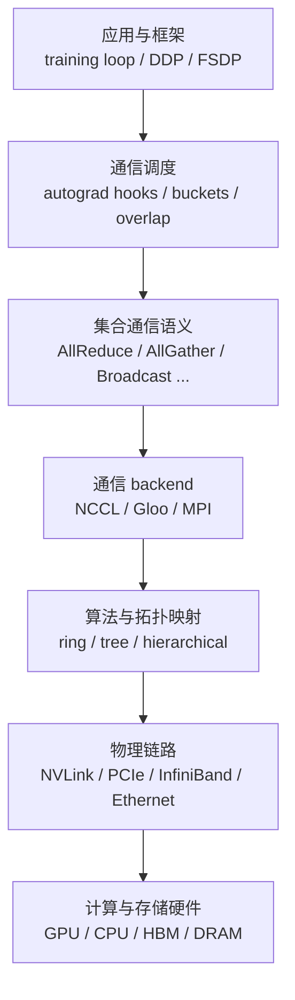

#### 应用与框架层

用户编写模型、loss、optimizer 和训练循环，并选择 DDP/FSDP 等并行抽象。PyTorch autograd 知道参数梯度何时 ready，DDP 才能在 backward 中插入同步。

#### 通信调度层

DDP 通常把许多小参数梯度组合成 bucket。这样做是因为一次网络/collective 调用有固定启动成本：发送 1000 个小 tensor 往往比发送同总字节的若干大 bucket 更慢。梯度 bucket ready 后可在后续 backward 计算同时发起通信。

需要精确区分：bucketing 是 DDP/FSDP 等高层组件的策略，不是每次手写 `dist.all_reduce(tensor)` 都会自动先进入同一套 DDP bucket。

#### Collective 语义层

这一层只规定“谁贡献什么、谁得到什么”：AllReduce 让所有 rank 获得 reduction，Gather 只让 root 获得所有输入。它不固定采用 ring 还是 tree，也不指定走哪块 NIC。

#### Backend 层

- **NCCL**：NVIDIA GPU collective 的常用 backend，能利用 NVLink、PCIe、GPUDirect RDMA 等路径。
- **Gloo**：常用于 CPU collective，也适合无 GPU 时验证控制与通信逻辑。
- **MPI**：依赖 MPI runtime 的传统 HPC 选择，是否可用取决于 PyTorch build 和集群环境。

backend 决定具体支持的设备和 operation；支持矩阵会随 PyTorch、backend 版本与构建变化，应运行时检查，而不是永久记住某张旧表。

#### 通信算法与拓扑映射层

ring、tree 是 collective 的**逻辑调度算法**；fat-tree、mesh、torus、NVLink fabric 是网络或互连的物理/逻辑拓扑。NCCL 可以在非物理环形的机器上构造逻辑 ring，也可以对节点内与节点间采用层次化算法。

因此，“ring AllReduce”不表示机箱中的线缆一定首尾相连成一个环。

#### 物理链路层

- NVLink/NVSwitch：常用于节点内高带宽 GPU-GPU 通信；
- PCIe：连接 CPU、GPU、NIC，也可承担 GPU peer-to-peer；
- InfiniBand/RoCE + RDMA：常用于跨节点高带宽、低 CPU 介入通信；
- Ethernet：普及度高，实际性能随速率、拥塞和 RDMA 支持差异很大。

原章给 NVLink 写出约 600 GB/s～1.8 TB/s。阅读此类数字必须确认它是单 link、单 GPU aggregate、单向还是双向，以及具体代际；不能直接与某条单向 NIC 线速比较。

#### 硬件层

GPU/TPU/NPU 提供矩阵计算和高速本地内存，CPU 负责部分输入、调度和控制。上层优化无法突破硬件上界，但硬件峰值也不等于端到端可达性能。

### 8.3 一次 `all_reduce` 如何穿过整个 stack

以 DDP 梯度 bucket 为例：

```text
autograd 算出一组参数梯度
  -> DDP 判断 bucket 已 ready
  -> 发起 AllReduce(SUM) 语义
  -> process group 交给 NCCL backend
  -> NCCL 根据 rank、拓扑和消息大小选算法/通道
  -> 数据经 NVLink/PCIe/NIC 移动
  -> reduction 结果写回各 rank 的 GPU buffer
  -> DDP 完成平均语义，optimizer 可读聚合梯度
```

排障也应沿层次缩小范围：

| 现象 | 优先检查层次 |
| --- | --- |
| 某些参数梯度从未同步 | autograd 路径、unused parameter、DDP hook |
| 小 tensor 通信调用过多 | bucket 与调度 |
| operation 或 dtype 不支持 | backend |
| 单机快、跨机骤降 | NIC、路由、跨节点 topology |
| GPU 等待 CPU 数据 | DataLoader、NUMA、PCIe，不一定是 collective |
| 全体 rank 在同一 collective 等待 | 更早失败的 rank、调用顺序与 shape |

### 8.4 分层抽象的意义与局限

分层让上层无需处理网络包，却也可能隐藏关键成本。例如调用 `DDP(model)` 很简单，但它隐含“每 rank 完整副本”和“每步梯度同步”两项重大假设。

分析任何高层 API 时，应向下追问：

1. 它触发哪一种 collective？
2. 每个 rank 输入输出多大？
3. 每 step 发生多少次？
4. 是否能与计算重叠？
5. 高频通信是否留在快链路内？
6. 一个 rank 缺席时其余 rank 如何表现？

这些问题也能迁移到 JAX、TensorFlow 或未来框架。

---

## 9. Process Groups and Ranks

### 9.1 Process、device 与 worker 的关系

PyTorch DDP 的常见模式是**一进程一 GPU**：每个 Python process 拥有一个模型副本，绑定一个 CUDA device，并作为一个通信参与者。它是常见约定而非数学必然：

- CPU collective 可以多个进程共享 CPU；
- 一个进程理论上可以管理多个 device，但不是标准 DDP 推荐路径；
- 一个 GPU 上可以出现多个进程，但会竞争显存、context 和计算，不代表真实多 GPU。

“worker”在不同文档中可能指进程、节点或 DataLoader worker。为了避免歧义，本笔记明确使用 rank process、node 和 DataLoader subprocess。

### 9.2 World 与 process group

**World** 是本次分布式作业中默认全体进程集合；`WORLD_SIZE` 是其进程总数。**Process group** 是可以共同执行 collective 的进程集合。

默认 world group 包含所有 rank，但高级并行会创建子组。例如 8 个 rank 采用 $DP=2,TP=4$：

```text
TP group 0: ranks [0,1,2,3]
TP group 1: ranks [4,5,6,7]
DP group 0: ranks [0,4]
DP group 1: ranks [1,5]
DP group 2: ranks [2,6]
DP group 3: ranks [3,7]
```

同一个 rank 同时属于一个 TP group 和一个 DP group，分别执行层内张量通信与副本间梯度/状态同步。看到 `world_size=8` 不能推断每次 collective 都有 8 个参与者，必须看传入哪个 group。

### 9.3 Global rank、local rank、node rank

- **Global rank**：在整个 world 中唯一，范围 $[0,W-1]$。
- **Local rank**：在当前 node 内唯一，通常映射当前进程应使用的本地 GPU 编号。
- **Node rank**：当前 node 在作业中的编号。

对每节点 GPU 数相同且进程连续排列的简单配置：

$$
global\_rank=node\_rank\times local\_world\_size+local\_rank
$$

两节点、每节点四进程：

| Node | Node rank | Local rank | Global rank |
| --- | ---: | ---: | ---: |
| node 0 | 0 | 0,1,2,3 | 0,1,2,3 |
| node 1 | 1 | 0,1,2,3 | 4,5,6,7 |

这个公式不适用于每节点进程数不一致或自定义 rank assignment。启动器注入的环境变量才是权威来源。

### 9.4 为什么不能在多节点上用 global rank 选 GPU

原章的入门函数使用：

```python
torch.cuda.set_device(rank)
```

它只在单节点且 global rank 恰好等于本地 GPU index 时成立。若 node 1 的 global ranks 为 4～7，而该节点可见 GPU index 仍为 0～3，`set_device(4)` 就错误。

多节点通用写法应使用 `LOCAL_RANK`：

```python
local_rank = int(os.environ["LOCAL_RANK"])
torch.cuda.set_device(local_rank)
```

global rank 用于身份和 group 语义，local rank 用于选择本机 device；二者不能混用。

### 9.5 初始化 process group 到底完成什么

所有 collective 之前必须调用 `dist.init_process_group()`。它需要解决：

1. 参与者总数和本进程 rank；
2. 参与者如何发现彼此，即 rendezvous；
3. 使用哪个 backend；
4. 超时和 group 生命周期；
5. 建立后续 collective 所需连接/状态。

`torchrun` 常通过环境变量提供：

| 环境变量 | 含义 |
| --- | --- |
| `RANK` | global rank |
| `WORLD_SIZE` | 全体进程数 |
| `LOCAL_RANK` | 本节点内 rank |
| `LOCAL_WORLD_SIZE` | 本节点启动进程数 |
| `MASTER_ADDR` | rendezvous/master 地址 |
| `MASTER_PORT` | rendezvous 端口 |

使用默认 `env://` 初始化时，代码不必手工传 rank/world size：

```python
import os
from datetime import timedelta

import torch
import torch.distributed as dist


def setup_distributed() -> tuple[int, int, int]:
    use_cuda = torch.cuda.is_available()
    backend = "nccl" if use_cuda else "gloo"
    local_rank = int(os.environ.get("LOCAL_RANK", "0"))

    if use_cuda:
        torch.cuda.set_device(local_rank)

    dist.init_process_group(
        backend=backend,
        init_method="env://",
        timeout=timedelta(minutes=5),
    )
    return dist.get_rank(), dist.get_world_size(), local_rank
```

返回的 rank/world size 从已初始化 group 读取，减少“传入配置与实际 group 不一致”的风险。生产代码应在 `finally` 中调用 `dist.destroy_process_group()`。

### 9.6 Rendezvous 不是训练中的中央参数服务器

`MASTER_ADDR`/`MASTER_PORT` 帮助进程在启动时互相发现并形成 group，不表示后续所有梯度都通过 master rank。NCCL AllReduce 通常由所有 rank 点对点协作，rank 0 不是每次同步的数据中心。

把 rendezvous endpoint、root rank 和 parameter server 混为一谈，会错误估计通信瓶颈。

### 9.7 最小通信 smoke test

原章建议先运行：

```shell
torchrun --nproc_per_node=2 code/distributed_basic_test.py
```

“每个 rank 打印 hello”只证明多进程启动和初始化成功。更强的 smoke test 应执行一个带已知答案的 collective，例如 rank $r$ 持有 $r+1$，SUM AllReduce 后每 rank 应得到：

$$
\sum_{r=0}^{W-1}(r+1)=\frac{W(W+1)}{2}
$$

这样同时验证数据路径和 reduction 结果。

### 9.8 单 GPU 上启动多进程能验证什么

原章给出：

```shell
CUDA_VISIBLE_DEVICES=0 torchrun --nproc_per_node=2 code/multi_gpu_simulation.py
```

它最多帮助检查环境变量、rank 分支和控制流。两个进程争用同一 GPU 时：

- 没有获得两份物理计算或显存容量；
- 无法测量 GPU-GPU 链路；
- 多 CUDA context 会增加开销；
- 某些 backend/框架配置不支持或不建议多个 rank 绑定同一 GPU；
- 不能据此推断真实 DDP speedup。

无 GPU 时，使用 Gloo + CPU tensor 更适合验证 collective 语义。

### 9.9 `OMP_NUM_THREADS` 为什么要在启动前设置

`torchrun` 会启动多个 Python 进程；如果每进程都让 OpenMP 使用全部 CPU cores，线程总数可能爆炸并互相争用。原章在 POSIX shell 中写：

```shell
OMP_NUM_THREADS=4 torchrun --nproc_per_node=2 code/distributed_basic_test.py
```

Windows PowerShell 对应写法是：

```powershell
$env:OMP_NUM_THREADS = "4"
torchrun --nproc_per_node=2 code/distributed_basic_test.py
```

必须在启动器创建子进程前设置，子进程才能继承。合理值取决于 CPU cores、DataLoader workers、进程数和 NUMA，不存在普遍最优的 4。

### 9.10 Collective 的共同契约

进入下一节八类 operation 前，先记住四条共同约束：

1. group 中所有参与 rank 必须以兼容顺序调用同一个 collective；
2. tensor 的 dtype、shape、device 等必须符合该 operation 契约；
3. collective 通常是 group 级同步依赖，即使 API 支持 async，也要正确等待结果；
4. 某 rank 在更早代码中异常退出，其余 rank 可能在下一个 collective 才表现为 timeout。

这解释了 Lamport 引语在 PyTorch 训练中的具体形式：看到通信 hang 时，应先找**所有 rank 中最早发生的异常**，而不是只看最后超时的调用栈。

---

## 10. Collective operations：八类集合通信

### 10.1 为什么先学语义，再学 API

集合通信把“一组进程如何共同移动数据”封装成一个 group 级操作。判断一个 collective，先回答四个问题：

1. 哪些 rank 提供输入？
2. 哪些 rank 获得输出？
3. 输入是被归约，还是被原样保留？
4. 每个接收者获得相同结果，还是不同分片？

八类操作可以放进一张表：

| Operation | 输入参与者 | 输出接收者 | 是否归约 | 各接收者结果 | 典型用途 |
| --- | --- | --- | --- | --- | --- |
| AllReduce | 全部 rank | 全部 rank | 是 | 相同 | DDP 梯度聚合 |
| AllGather | 全部 rank | 全部 rank | 否 | 相同的完整集合 | 重建参数、收集 embedding |
| Broadcast | root | 全部 rank | 否 | 相同 | 分发初始状态 |
| Reduce | 全部 rank | root | 是 | 仅 root 有聚合结果 | 汇总标量统计 |
| Gather | 全部 rank | root | 否 | 仅 root 有完整集合 | 集中保存预测结果 |
| Scatter | root | 全部 rank | 否 | 不同分片 | 分发预先切好的 tensor |
| ReduceScatter | 全部 rank | 全部 rank | 是 | 不同的聚合分片 | FSDP 梯度分片 |
| All-to-All | 全部 rank | 全部 rank | 否 | 每个目标收到专属交换结果 | MoE token 路由、维度转置 |

从表中可看到三组对偶关系：

- Broadcast 与 Reduce：one-to-all 对 all-to-one reduction；
- Scatter 与 Gather：分发不同分片与收回不同分片；
- AllGather 与 ReduceScatter：复制完整集合与保留聚合分片。

AllReduce 则能在满足相同分片布局和 reduction 条件时分解成 ReduceScatter 加 AllGather。All-to-All 不做 reduction，它表达的是任意源到任意目标的分片置换。

### 10.2 统一符号与通信成本模型

设 process group 中有 $W$ 个 rank，rank 编号为 $0,1,2,\ldots,W-1$。每个 rank 的输入 tensor 含 $n$ 个元素，每元素 $b$ 字节，则单个输入 payload 为：

$$
M=nb
$$

通信耗时不能只用字节数解释。一个简化的 latency-bandwidth 模型是：

$$
T_{comm}\approx s\alpha+\frac{V}{B_{effective}}
$$

其中：

- $s$ 是算法中依赖性的通信轮数；
- $\alpha$ 是每轮启动、排队与同步延迟；
- $V$ 是该 rank 实际发送或接收的数据量；
- $B_{effective}$ 是考虑拓扑、协议和拥塞后的有效带宽。

这个模型解释了两个现象：

- 小 tensor 即使总字节很少，也可能被 $s\alpha$ 主导；
- 大 tensor 更接近带宽受限，关键是 $V/B_{effective}$。

后文给出的通信量是帮助比较 operation 的**数量级模型**。实际 NCCL 可能选择 ring、tree、CollNet 或分层算法，并使用多个 channel；节点内外链路也可能不同。因此，逻辑输出大小、每 rank 链路流量和全网累计流量必须分开，不能把其中任意一个叫作唯一的“通信成本”。

### 10.3 AllReduce：所有人贡献，所有人得到归约值

设 rank $r$ 的输入为 $x_r$，归约运算为满足结合律的 $\oplus$，则 AllReduce 的语义是：

$$
y_r=\bigoplus_{i=0}^{W-1}x_i,\qquad r=0,1,\ldots,W-1
$$

所有 rank 的输出相同。若 $W=4$，输入分别为：

```text
rank 0: [1, 2]
rank 1: [2, 3]
rank 2: [3, 4]
rank 3: [4, 5]
```

执行 SUM AllReduce 后，每个 rank 都得到：

```text
[1+2+3+4, 2+3+4+5] = [10, 14]
```

#### AllReduce 为什么能同步 DDP 梯度

设每个 rank 在本地 batch 上得到梯度 $g_r$。若每个 local batch 大小相同，目标全局平均梯度为：

$$
g_{global}=\frac{1}{W}\sum_{r=0}^{W-1}g_r
$$

SUM AllReduce 先得到梯度和，再除以 $W$，每个 rank 都获得 $g_{global}$。由于模型初始参数相同，且每个 rank 使用相同聚合梯度执行相同 optimizer step，模型副本继续相同。

这里有一个重要前提：$g_r$ 是**相同样本数的局部均值**。若 rank $r$ 实际处理 $m_r$ 个有效样本，正确的全局样本平均应是：

$$
g_{global}=\frac{\sum_{r=0}^{W-1}m_rg_r}{\sum_{r=0}^{W-1}m_r}
$$

直接平均各 rank 的局部均值会让小 batch 与大 batch 权重相同。常规 DDP 通过 sampler 和丢弃/补齐策略尽量让各 rank step 数及 batch 大小一致；不均匀输入则需要显式处理权重和 collective 参与问题。

#### Ring AllReduce 的推导直觉

把一个大小为 $M$ 的 buffer 切成 $W$ 个 chunk。经典 ring AllReduce 分两阶段：

1. **ReduceScatter**：经过 $W-1$ 轮，每个 rank 得到一个已归约 chunk；
2. **AllGather**：再经过 $W-1$ 轮，让所有 rank 收集全部归约 chunk。

因此，经典 ring 总轮数是：

$$
s=2(W-1)
$$

每轮每 rank 发送约 $M/W$，所以每 rank 总发送量近似为：

$$
V_{ring}=2\frac{W-1}{W}M
$$

当 $W$ 较大时约为 $2M$，体现 ring 的带宽效率。代价是轮数随 $W$ 线性增长，小消息时 latency 可能较明显。Tree algorithm 的轮数可接近 $O(\log W)$，更适合某些小消息或拓扑。

> 原章把 ring AllReduce 描述为只需 $W-1$ 个通信 step。严格说，完整 ring AllReduce 包含 ReduceScatter 与 AllGather 两个阶段，共 $2(W-1)$ 轮；$W-1$ 只对应其中一个阶段。原章“比显式 Reduce + Broadcast 更高效”的核心方向成立，但原因在于 chunked、并行链路利用和 backend 融合优化，而不是把完整轮数写成 $W-1$。

#### 适用范围与局限

AllReduce 适合所有 rank 都需要同一个归约结果的场景，例如：

- DDP 梯度同步；
- 全局 max/min；
- 所有 rank 都要依据的 loss、norm 或是否停止标志。

如果只有 root 需要结果，Reduce 可以少复制输出；如果每个 rank 最终只需聚合结果的一部分，ReduceScatter 更匹配状态布局。AllReduce 也不自动完成“平均”语义：`ReduceOp.SUM` 只求和，是否除以 world size 由框架或调用者决定。

### 10.4 AllGather：保留每个贡献并复制完整集合

AllGather 不做归约。若每个 rank 输入 $x_r$，每个 rank 的输出是按 rank 顺序排列的完整集合：

$$
y_r=[x_0,x_1,\ldots,x_{W-1}]
$$

对前面的四组输入，每个 rank 都得到：

```text
[[1, 2], [2, 3], [3, 4], [4, 5]]
```

若每 rank 输入大小为 $M$，每 rank 输出 buffer 大小为 $WM$；其中本地已有 $M$，需要从其他 rank 收到约 $(W-1)M$。全体 rank 的新接收量数量级为：

$$
V_{aggregate}\approx W(W-1)M
$$

所以“每 rank 输出线性增长”和“全体累计流量近似二次增长”可以同时成立。原章写 $W^2N$ 是忽略低阶项后的总量直觉，不表示单个 rank 发送 $W^2N$。

#### 为什么 FSDP 使用 AllGather

假设完整参数 $P$ 被切成 $W$ 份，rank $r$ 持有 $P_r$。某个 FSDP unit 计算前需要逻辑完整参数：

$$
P=[P_0,P_1,\ldots,P_{W-1}]
$$

AllGather 在每个 rank 临时重建它。计算结束后可以释放非本地部分，再回到持久分片状态。因此，FSDP 节省的是**长期驻留状态**，不代表 forward 任意时刻都不出现完整 unit 参数。

其他用途包括：

- 对比学习中收集其他 rank 的 embedding；
- 分布式评估时让每个 rank 看见全局预测；
- 收集分片 logits 或 activation 供后续全局操作。

#### 前提与局限

标准 tensor AllGather 通常要求各 rank 的对应输入 dtype/device 兼容，并需按 API 要求准备输出。不同长度数据往往先 AllGather 长度，再 padding 到共同 shape，最后去掉 padding。

AllGather 会把完整结果复制到所有 rank；若只有 rank 0 需要结果，应优先考虑 Gather。大 embedding 或参数重建会显著提高峰值内存，因此还需控制 gather 粒度和生命周期。

### 10.5 Broadcast：root 的一份数据复制给所有 rank

设 root 为 $q$，Broadcast 语义为：

$$
y_r=x_q,\qquad r=0,1,\ldots,W-1
$$

只有 root 的输入有意义，其余 rank 提供形状与 dtype 兼容的接收 buffer。若 root 0 持有 `[10, 20]`，Broadcast 后每个 rank 都得到 `[10, 20]`。

常见用途是：

- 同步初始模型参数或 buffer；
- 从 root 分发控制 tensor；
- 让全体 rank 获得同一个随机种子或状态标记；
- root 加载某段 tensor 数据后分发。

#### 为什么不能说成本与 world size 无关

从**每个接收者的输出大小**看，它始终接收 $M$，与 $W$ 无关；但数据必须到达 $W-1$ 个其他 rank，全网累计传输和 root/中间节点负载会随规模变化。具体算法可能是：

- 朴素 root 逐个发送：root 发约 $(W-1)M$；
- tree Broadcast：约 $\lceil\log_2W\rceil$ 轮，中间 rank 继续转发；
- pipeline/ring：把大消息分块后沿链路传播。

因此，原章“root 无论 world size 都发送相同数据量”的表述只适合把 payload 大小理解为 $M$，不适合作为物理网络流量结论。

#### 与 DDP 初始化的关系

DDP 要求副本起点一致，通常会在构造阶段同步参数和 buffer。用户不应据此假设所有任意 Python 配置对象都会自动同步；非 tensor 配置仍需由启动配置、文件或对象通信机制保证一致。

### 10.6 Reduce：所有人归约，但只有 root 接收结果

Reduce 与 AllReduce 使用同样的归约运算，但输出只在 root $q$ 有定义：

$$
y_q=\bigoplus_{i=0}^{W-1}x_i
$$

其他 rank 的 tensor 在调用后不应被当作聚合结果。原章写“其他 rank unchanged”适合帮助理解目标语义，但健壮代码不应依赖非 root buffer 的调用后内容；应只在 `rank == root` 分支读取结果。

#### 为什么适合日志指标

若每个 rank 有 local loss sum $s_r$ 与样本数 $m_r$，可分别 SUM Reduce 到 root：

$$
s=\sum_rs_r,\qquad m=\sum_rm_r,\qquad loss_{global}=\frac{s}{m}
$$

这比简单平均 local loss 更能处理最后一批大小不同。root 可以记录结果，而其他 rank 不需要完整聚合值。

但如果 learning-rate scheduler、early stopping 或控制流要求所有 rank 做相同决定，仅在 root Reduce 后直接分支会造成 collective 顺序分叉。此时应再 Broadcast 决策，或直接 AllReduce 所需标量。

### 10.7 Gather：保留每个贡献，但只集中到 root

Gather 的 root 输出为：

$$
y_q=[x_0,x_1,\ldots,x_{W-1}]
$$

非 root 没有完整输出。它与 AllGather 的区别只在接收范围：

| 问题 | Gather | AllGather |
| --- | --- | --- |
| 谁得到完整集合 | root | 所有 rank |
| 完整结果复制份数 | 1 | $W$ |
| root 峰值输出 | $WM$ | $WM$ |
| 每个非 root 峰值输出 | 无完整集合 | $WM$ |

Gather 适合：

- 收集各 rank 的验证预测，由 root 写文件；
- 集中调试样本或统计；
- root 生成最终报告。

它的瓶颈也很明确：root 需要容纳 $W$ 份输入，并承担集中接收和后处理。若结果很大，分片写文件、流式汇总或分层 gather 可能更合理。

标准 tensor Gather 通常要求每个贡献 shape 兼容。变长序列可先 gather 长度，再 padding；使用对象 collective 虽方便，但有序列化、性能与不可信数据安全边界，不能替代大 tensor 通信。

### 10.8 Scatter：root 把不同分片发给不同 rank

若 root 持有分片列表：

$$
X_q=[x^{(0)},x^{(1)},\ldots,x^{(W-1)}]
$$

Scatter 后 rank $r$ 得到：

$$
y_r=x^{(r)}
$$

它与 Broadcast 的关键差异是：Broadcast 给每个 rank 相同内容，Scatter 给每个 rank 不同内容。

#### 为什么训练数据通常不用 root Scatter

如果每个 chunk 大小为 $M$，root 总共持有并分发 $WM$ 数据；world size 增加时，总数据当然增加。原章“root 总发送量与 world size 无关”不适用于固定每 rank chunk 的定义。

用 root 加载完整训练集再 Scatter 会产生：

- root 内存和 I/O 集中瓶颈；
- 每轮都要经过 root 网络路径；
- root 故障影响全部数据分发；
- 数据集无法轻松流式扩展。

因此常规数据并行更常让各 rank 访问共享/分片数据源，并由 `DistributedSampler` 生成不同索引。Scatter 更适合已经在 root 内存中的小型、固定 shape tensor，或自定义初始化/分片协议。

### 10.9 ReduceScatter：先按位置归约，再让每个 rank 保留一片

把每个 rank 的完整输入按目标 rank 切成 $W$ 个 chunk。rank $i$ 上发往逻辑位置 $j$ 的 chunk 记为 $x_i^{(j)}$。ReduceScatter 让 rank $j$ 得到：

$$
y_j=\bigoplus_{i=0}^{W-1}x_i^{(j)}
$$

若 $W=4$，每个 rank 的四个标量 chunk 为：

```text
rank 0 input: [ 0,  1,  2,  3]
rank 1 input: [10, 11, 12, 13]
rank 2 input: [20, 21, 22, 23]
rank 3 input: [30, 31, 32, 33]
```

SUM ReduceScatter 的输出是：

```text
rank 0:  0+10+20+30 = 60
rank 1:  1+11+21+31 = 64
rank 2:  2+12+22+32 = 68
rank 3:  3+13+23+33 = 72
```

每个 rank 只保留对应位置的归约结果，而不是完整 `[60, 64, 68, 72]`。

#### 与 FSDP 梯度的关系

FSDP backward 中，每个 rank 会因自己的 local batch 对逻辑完整参数产生梯度贡献。参数最终按 shard 持有，因此 rank $j$ 只需要第 $j$ 个参数分片的全局聚合梯度。ReduceScatter 把“跨 rank 求和”和“只保留 owner shard”合成一次 operation，避免先产生每 rank 完整聚合梯度再丢弃大部分。

若每 rank 输入完整 buffer 大小为 $M$，输出 shard 大小为 $M/W$。经典 ring ReduceScatter 中每 rank 通信量近似：

$$
V_{RS}=\frac{W-1}{W}M
$$

这约是完整 ring AllReduce 通信量的一半，因为它只完成第一个阶段。

#### 为什么 ReduceScatter + AllGather 等价于 AllReduce

ReduceScatter 后，所有归约 chunk 已经存在，只是分别位于不同 rank；紧接着 AllGather 收集这些 chunk，每个 rank 就得到完整归约结果。因此：

$$
AllReduce(X)=AllGather(ReduceScatter(X))
$$

等价成立需要相同 process group、相同 reduction、匹配的 chunk 顺序与 shape。工程价值在于两个阶段可分别与不同计算阶段重叠，而不是为了改写数学结果。

### 10.10 All-to-All：每个源给每个目标发送专属分片

设 rank $i$ 的输入被切成 $W$ 份，发往目标 $j$ 的部分为 $x_i^{(j)}$。All-to-All 后，rank $j$ 收到来自所有源、专门发给自己的分片：

$$
y_j=[x_0^{(j)},x_1^{(j)},\ldots,x_{W-1}^{(j)}]
$$

四 rank 的标签示例：

```text
rank 0 receives: [0->0, 1->0, 2->0, 3->0]
rank 1 receives: [0->1, 1->1, 2->1, 3->1]
rank 2 receives: [0->2, 1->2, 2->2, 3->2]
rank 3 receives: [0->3, 1->3, 2->3, 3->3]
```

All-to-All 与 AllGather 不同：AllGather 把每个源的整个输入复制给所有 rank；All-to-All 把源输入按目的地拆分，每个目标只收自己的部分。

#### MoE token routing 为什么需要它

Mixture-of-Experts 中，不同 expert 驻留在不同 rank。每个 rank 本地 batch 的 token 经 router 后，目标 expert 可能位于任意 rank：

1. 按目标 expert/rank 对 token 重排并分桶；
2. All-to-All 把 token 送到 expert owner；
3. 各 rank 执行本地 experts；
4. 第二次 All-to-All 把结果送回原 token 所在 rank；
5. 按原序列位置恢复顺序。

难点不只是字节数，还包括每个目标收到的 token 数不等。热门 expert 会造成：

- 某些 rank 计算更久，所有参与者等待；
- receive buffer 大小动态变化；
- capacity limit、dropping 或 auxiliary load-balancing loss 的取舍。

All-to-All 也用于 sequence/context parallel 中的布局转置。原章把 tensor parallelism 列为主要用途，但常规 Megatron 式 TP 的高频原语也可能是 AllReduce、AllGather 或 ReduceScatter；是否需要 All-to-All 取决于具体 tensor layout，不能由“用了 TP”直接推出。

若每 rank 总输入为 $M$ 且均匀切分，发送给自己的一片不走网络，则每 rank 网络发送量数量级约为：

$$
V_{A2A}=\frac{W-1}{W}M
$$

全网存在 $W(W-1)$ 条逻辑源-目标关系，但这不意味着每 rank 发送 $W$ 份完整 $M$。原章的 $W^2\times chunk\_size$ 是固定每对 rank chunk 大小时的全局逻辑总量；使用哪个口径必须先固定 $M$ 表示“每 rank 总输入”还是“每个目标 chunk”。

backend 对 `all_to_all`、`all_to_all_single`、dtype 和设备的支持会随版本变化。原章提醒其示例依赖 NCCL 是有用的运行边界，但实际环境仍应查询当前 PyTorch/backend 支持矩阵，而不是把历史限制推广到所有版本。

### 10.11 八类 operation 的数值模拟器

下面的标准 Python 代码不启动真实进程，也不测网络；它只把 collective 的**数学数据变换**显式算出来，适合在没有多 GPU 时核对语义。

```python
"""用 Python list 模拟 4 个 rank 的 collective 语义，不模拟并发和网络。"""

world_size = 4
rank_inputs = [[rank + 1, rank + 2] for rank in range(world_size)]


def vector_sum(vectors):
    return [sum(values) for values in zip(*vectors)]


all_reduce_result = vector_sum(rank_inputs)
all_reduce = [all_reduce_result.copy() for _ in range(world_size)]
all_gather = [[vector.copy() for vector in rank_inputs]
              for _ in range(world_size)]

root = 0
broadcast = [rank_inputs[root].copy() for _ in range(world_size)]
reduce = {root: vector_sum(rank_inputs)}
gather = {root: [vector.copy() for vector in rank_inputs]}

scatter_chunks = [[100 + rank] for rank in range(world_size)]
scatter = [chunk.copy() for chunk in scatter_chunks]

reduce_scatter_inputs = [
    [source_rank * 10 + target_rank for target_rank in range(world_size)]
    for source_rank in range(world_size)
]
reduce_scatter = [
    sum(source[target_rank] for source in reduce_scatter_inputs)
    for target_rank in range(world_size)
]

all_to_all_inputs = [
    [f"{source_rank}->{target_rank}" for target_rank in range(world_size)]
    for source_rank in range(world_size)
]
all_to_all = [
    [source[target_rank] for source in all_to_all_inputs]
    for target_rank in range(world_size)
]

print("AllReduce:", all_reduce)
print("AllGather:", all_gather[0], "(same on every rank)")
print("Broadcast:", broadcast)
print("Reduce:", reduce)
print("Gather:", gather)
print("Scatter:", scatter)
print("ReduceScatter:", reduce_scatter)
print("All-to-All rank 2:", all_to_all[2])
```

预期输出：

```text
AllReduce: [[10, 14], [10, 14], [10, 14], [10, 14]]
AllGather: [[1, 2], [2, 3], [3, 4], [4, 5]] (same on every rank)
Broadcast: [[1, 2], [1, 2], [1, 2], [1, 2]]
Reduce: {0: [10, 14]}
Gather: {0: [[1, 2], [2, 3], [3, 4], [4, 5]]}
Scatter: [[100], [101], [102], [103]]
ReduceScatter: [60, 64, 68, 72]
All-to-All rank 2: ['0->2', '1->2', '2->2', '3->2']
```

代码对应关系如下：

- `vector_sum(rank_inputs)` 表达 reduction；
- 把同一个 reduction 结果复制 $W$ 份，就是 AllReduce；
- 保留每个源输入并复制完整列表，就是 AllGather；
- 字典中只保留 root key，表达 Reduce/Gather 的单接收者；
- ReduceScatter 对固定目标下标跨所有 source 求和；
- All-to-All 对固定目标收集每个 source 的专属元素。

它无法验证真实 collective 的参与顺序、backend 支持、异步 stream 语义和性能；这些必须用 `torchrun` 启动多进程测试。

### 10.12 如何选择 operation

可以用下面的决策路径：

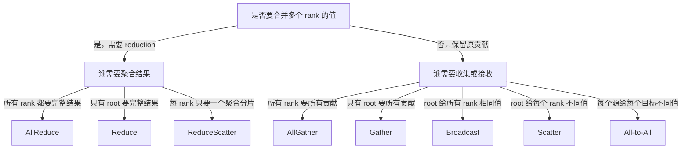

实践中还要再问：

- 最终状态本来就需要复制，还是只需要分片？
- 完整输出会不会造成峰值内存问题？
- root 是否会成为内存、带宽或 I/O 热点？
- 输入长度是否一致，是否要先交换 metadata？
- operation 是否位于每个 training step 的关键路径？
- backend 与设备是否支持当前 API、dtype 和异步模式？

### 10.13 Async collective 不等于结果立刻可用

PyTorch collective 常可设置 `async_op=True` 并返回 `Work` handle：

```python
work = dist.all_reduce(tensor, op=dist.ReduceOp.SUM, async_op=True)
# 在不依赖 tensor 归约结果的前提下做其他工作
work.wait()
# 此后才把 tensor 当作归约完成的结果使用
```

异步的目的通常是让通信与独立计算重叠。它不表示：

- collective 可以缺少某些 rank；
- 调用顺序可以不一致；
- CPU 返回后 tensor 已可安全用于任意 stream；
- 不调用 `wait()` 也一定能正确回收资源。

有效重叠还要求后续计算与通信没有数据依赖，且 backend、CUDA stream 与调度确实并行。只把同步 API 改成 `async_op=True`，但下一行马上 `wait()`，通常不会隐藏通信。

### 10.14 Barrier 是同步点，不是修复错误顺序的工具

原章的“八个主要 collective”没有把 Barrier 列入数据变换表，但分布式代码经常使用：

```python
dist.barrier()
```

Barrier 的语义是 group 中所有 rank 到达后才能继续，它通常不产生业务 tensor 输出。适合：

- rank 0 完成一次性下载后，其他 rank 再读取；
- 测试中分隔阶段；
- 确认所有参与者都到达某个生命周期边界。

它不应被用来掩盖 collective 顺序错误。若 rank 0 调 `all_reduce`、rank 1 调 `barrier`，再插入更多 barrier 不会让两个不同协议自动匹配。Barrier 还可能放大 straggler 等待，应只在确实需要全局阶段边界时使用。

### 10.15 Collective 排障的最小检查表

遇到 timeout、hang、错误结果或性能异常时，按以下顺序检查：

1. 找出所有 rank 最早的 exception、OOM 或 CUDA error；
2. 打印 global/local rank、hostname、PID 和 device mapping；
3. 确认所有 rank 对同一 group 调用相同 operation 和相同次数；
4. 核对 tensor shape、dtype、device、contiguity 与 split size；
5. 用极小已知 tensor 做同一 operation 的 smoke test；
6. 区分初始化/rendezvous 失败与 collective 数据路径失败；
7. 单机成功后再检查跨节点 NIC、端口、防火墙和 RDMA；
8. 正确性通过后再 profile 消息大小、轮数、带宽和 overlap。

这套顺序先验证协议，再验证性能，能避免把 shape 不一致误诊为网络带宽不足。

---

## 11. DistributedDataParallel：从 AllReduce 到同步数据并行

### 11.1 DDP 解决什么问题

PyTorch `DistributedDataParallel`（DDP）解决的是：**当完整模型可以放进每个 device 时，怎样让多个进程处理不同数据，同时保持一个逻辑模型。**

它采用 replicated data parallelism：

- 每个 rank 保存完整参数、buffer 和 optimizer state；
- 每个 rank 读取不同 local batch；
- forward 和 backward 在本地执行；
- 参数梯度在 backward 中跨 rank 聚合；
- 每个 rank 用相同梯度独立执行 optimizer step。

因此 DDP 的主要收益是增加每 step 处理的数据量或缩短固定数据量的时间；它不把模型切小，也不降低每 rank 的完整模型状态。

### 11.2 一个 DDP step 的状态与时序

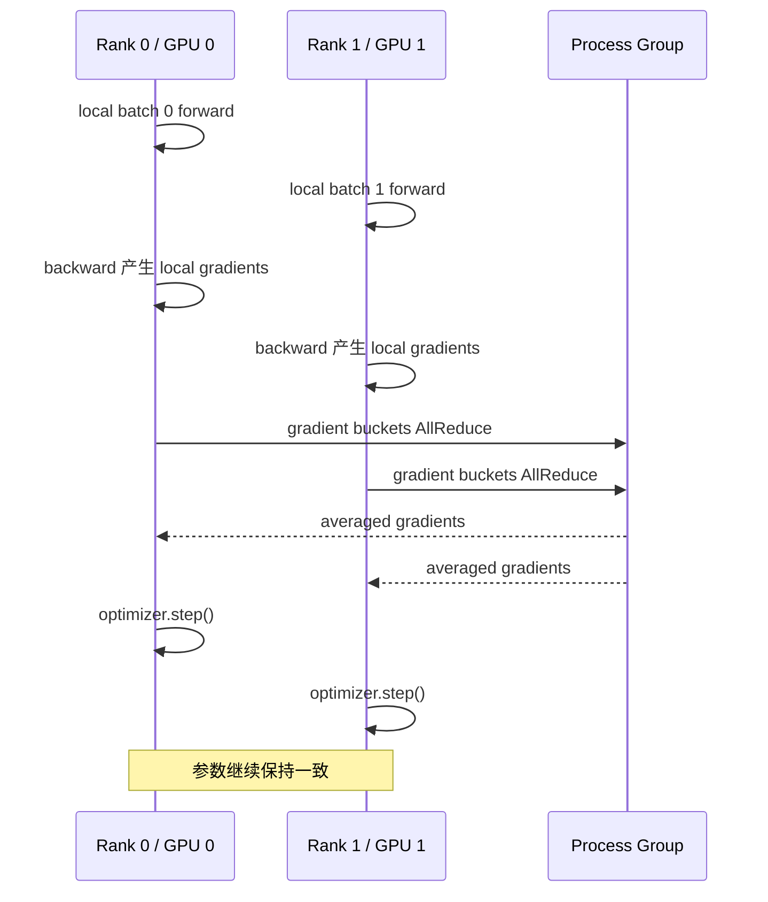

逻辑过程可以写成：

```text
相同初始参数 θ_t
  -> 各 rank 用不同数据计算 local gradient g_r
  -> DDP 聚合得到相同 g_global
  -> 各 rank 执行相同 update rule
  -> 得到相同参数 θ_(t+1)
```

对普通 SGD：

$$
w_{t+1}=w_t-\eta g_{global}
$$

Adam 虽然还维护一阶矩和二阶矩，但如果各 rank 的初始 optimizer state 相同、每步看到相同聚合梯度并按相同顺序更新，optimizer state 也会保持相同。DDP 通常不在每一步额外同步完整 Adam state；这种一致性来自确定性的相同状态转移。

### 11.3 参数、buffer、梯度与 optimizer state 分别怎样处理

| 状态 | DDP 中每 rank 是否完整复制 | 何时同步/如何保持一致 |
| --- | --- | --- |
| Parameters | 是 | 构造时确保起点一致；之后由相同梯度更新保持一致 |
| Gradients | backward 时每 rank 本地产生 | bucket ready 后 AllReduce/平均 |
| Module buffers | 是 | 默认可在 forward 前从 authoritative rank 同步，例如 BatchNorm running stats |
| Optimizer state | 是 | 通常不通信；由相同初态和梯度更新保持一致 |
| Input data | 否，应分片 | `DistributedSampler` 或其他数据分区机制 |
| Activations | 每 rank 只为 local batch 保存 | 普通 DDP 不跨 rank 共享 |

这张表说明为什么 DDP 显存并不会除以 world size：参数、optimizer 与 local activation 都存在于每个 rank。增加 rank 甚至会增加整个集群的状态总副本数。

### 11.4 DDP 怎样接入 autograd

包裹模型时：

```python
from torch.nn.parallel import DistributedDataParallel as DDP

model = model.to(device)
model = DDP(
    model,
    device_ids=[local_rank] if device.type == "cuda" else None,
)
```

DDP reducer 会为需要梯度的 parameters 注册 autograd hook，并把梯度组织成 buckets。Backward 从模型输出侧向输入侧推进，某个 bucket 的所有 gradients ready 后，DDP 就能发起该 bucket 的 collective，而不必等整个 backward 完成。

若第 $k$ 个 bucket 的通信时间为 $C_k$，同时还有独立 backward 计算 $B_k$，理想情况下可隐藏的部分近似为：

$$
O_k\le\min(C_k,B_k)
$$

总 step 并不是把所有计算与通信简单相加。实际 overlap 受 bucket 顺序、模型计算图、消息大小、CUDA stream 和链路影响。

用户调用 `loss.backward()` 就会触发 DDP 的梯度通信；普通 DDP 训练不应再手写一遍参数 gradient AllReduce，否则会重复聚合并改变 scale。

### 11.5 为什么所有 rank 必须执行兼容的 forward/backward

DDP collective 的调用由 gradient-ready 顺序触发。如果某个 rank：

- 因数据条件跳过一个 loss 分支；
- 提前 `continue` 或退出 training loop；
- 某些参数在该 rank 未参与计算；
- OOM 后只有该 rank 捕获异常并继续；

那么不同 rank 的 reducer 可能等待不同 gradients 或进入不同 collective 序列，最终表现为 hang/timeout。

`find_unused_parameters=True` 可以帮助某些存在 unused parameter 的动态图，但会增加图遍历开销，也不能修复任意 rank-dependent 控制流。更根本的要求仍是：每个 step 的逻辑图和 collective 参与关系必须兼容。

### 11.6 Global batch 与 DDP 梯度语义

若每 rank local batch 为 $B_{local}$，数据并行 rank 数为 $W$，每次 optimizer step 累积 $A$ 个 microbatch，则：

$$
B_{global}=B_{local}WA
$$

例如每卡 batch 32、8 个 rank、不累积，则每次更新对应 256 个样本。把单卡脚本原样扩到 8 卡且保持 local batch 不变，会同时改变：

- 每次更新的样本数；
- 每 epoch 的 optimizer step 数；
- 梯度噪声尺度；
- 可能合适的 learning rate 与 warmup；
- 每个 scheduler step 对应的实际样本进度。

因此，“DDP 与单卡 loss 曲线不同”不自动表示实现错误；先检查比较是否保持了 global batch、数据顺序、学习率 schedule 和随机性条件。

### 11.7 DDP 通信量为什么与参数梯度规模相关

设所有需要同步的梯度总大小为 $G$ 字节。经典 ring AllReduce 中，每 rank 每 step 的发送量近似为：

$$
V_{DDP}\approx2\frac{W-1}{W}G
$$

这说明：

- 增大 world size 不会让每 rank 梯度 payload 变成 $G/W$；DDP 仍同步完整模型梯度；
- 对固定模型，ring 每 rank 通信量在大 $W$ 时接近 $2G$；
- 扩展收益主要来自每 rank 计算更多数据并重叠通信，而不是通信消失；
- 参数量大、local compute 小或网络慢时，DDP 更容易通信受限。

梯度累积可以只在最后一个 microbatch 同步，从而用一次通信对应更多样本；但它也改变 global batch 和 optimizer 更新频率。详细的 `no_sync()`、bucket tuning 和 overlap 属于第 3 章。

### 11.8 DDP 与旧式 `DataParallel` 不应混淆

两者都复制模型并切数据，但执行模型不同：

| 维度 | `nn.DataParallel` | DDP |
| --- | --- | --- |
| 进程模型 | 一个 Python process 管多个 GPU | 常见为一进程一 GPU |
| Python GIL/主卡压力 | 更明显 | 各进程相对独立 |
| 梯度通信 | 主进程内聚合 | process group collective |
| 多节点 | 不适合作为标准方案 | 原生支持 |
| 推荐场景 | 遗留/简单原型 | 正式单机或多机数据并行 |

DDP 名称中的 Distributed 不是“模型被切碎”，而是多个独立 process 通过 distributed backend 协作。

### 11.9 DDP 适用边界

优先考虑 DDP 的条件：

- 完整模型、optimizer state 和 local activations 能放进每张 GPU；
- 希望提高训练吞吐或缩短 time-to-train；
- 各 rank 能获得相近数量、相近成本的数据；
- 网络足以承载每 step 梯度同步；
- 模型计算量足以摊薄启动与通信成本。

DDP 不适合单独解决：

- 完整模型状态单卡放不下；
- 单层计算本身必须跨卡；
- 超长序列 activation 单卡放不下；
- MoE expert 必须分布放置；
- 异步 parameter-server 式训练语义。

这些问题分别引出 FSDP/ZeRO、tensor/pipeline/context/expert parallelism。

---

## 12. DistributedSampler：让每个 rank 看到正确的数据子集

### 12.1 为什么同步了梯度仍需要数据分片

如果 $W$ 个 DDP rank 每一步都读取相同 batch，AllReduce 只是把相同梯度重复求和再平均，结果近似仍是单卡梯度。GPU 数增加了，单步有效样本却没有增加。

数据并行要同时满足两个条件：

1. 每个 rank 有相同模型副本；
2. 每个 rank 处理全局 batch 的不同样本。

DDP 只负责第 1 项及梯度同步，不会自动修改 `DataLoader`。`DistributedSampler` 负责把 dataset indices 分配给各 rank。

### 12.2 Sampler 分的是索引，不是复制或传输数据

`DistributedSampler` 产生当前 rank 应读取的 index 序列。随后每个进程的 `DataLoader` 仍在本地调用：

```python
sample = dataset[index]
```

它不会：

- 把 rank 0 内存中的数据 Scatter 给其他 rank；
- 自动把数据集物理切成多个文件；
- 保证底层存储不会被多个 rank 同时读取；
- 解决远程 I/O 吞吐或缓存一致性。

因此，index partition 正确只是数据管线正确性的第一层，底层 shard layout 和 I/O 仍需独立设计。

### 12.3 Shuffle 后按 rank 跨步取样

设 dataset 有 $N$ 个 index，world size 为 $W$。一个概念化算法是：

```text
用共同 seed 和 epoch 生成全局 permutation π_e
  -> padding 或 truncation，使总 index 数能被 W 整除
  -> rank r 取 π_e[r], π_e[r+W], π_e[r+2W], ...
```

第 $e$ 个 epoch 的 permutation 可抽象为：

$$
\pi_e=Permutation(N,seed+e)
$$

rank $r$ 的索引为：

$$
I_r=\{\pi_e[r+kW]\mid k=0,1,\ldots\}
$$

所有 rank 必须基于**同一个全局 permutation**再切片。如果每个 rank 用互不相关的 shuffle，多个 rank 可能抽到重叠样本并遗漏其他样本。

### 12.4 为什么每个 epoch 必须调用 `set_epoch()`

标准写法是：

```python
for epoch in range(num_epochs):
    sampler.set_epoch(epoch)
    for features, labels in dataloader:
        train_step(features, labels)
```

`set_epoch(epoch)` 改变 sampler 的确定性 shuffle seed。若忘记调用，同一 sampler 往往每个 epoch 生成相同顺序；样本仍可能被覆盖，但 epoch 间没有期望的 reshuffle。

为什么显式传入 epoch 比在 `__iter__()` 内自动递增更稳健：

- `DataLoader` iterator 可能因验证、异常恢复或调试被重复创建；
- 从 checkpoint 恢复时需要明确回到某个 epoch；
- 多个 rank 必须使用相同 epoch 值；
- “调用过几次 iterator”不是稳定的训练进度定义。

原章练习要求实现自动 epoch counter，有助于理解 sampler 生命周期，但生产训练仍优先显式 `set_epoch(epoch)`。

### 12.5 数据集大小不能整除 world size 时发生什么

设 $N=10$、$W=3$。为了让所有 rank 获得相同样本数并执行相同 step 数，`drop_last=False` 时概念上需要把总 index 数补到：

$$
N_{total}=\left\lceil\frac{N}{W}\right\rceil W=12
$$

每 rank 样本数为：

$$
N_{rank}=\frac{N_{total}}{W}=4
$$

如果 permutation 是：

```text
[7, 1, 3, 4, 9, 0, 6, 2, 5, 8]
```

可以复制开头两个 index 进行 padding：

```text
[7, 1, 3, 4, 9, 0, 6, 2, 5, 8, 7, 1]
```

跨步分配后：

```text
rank 0: [7, 4, 6, 8]
rank 1: [1, 9, 2, 7]
rank 2: [3, 0, 5, 1]
```

这样所有 rank step 数一致，但 index 7 和 1 在全局 epoch 中重复。训练通常能接受这种轻微 padding；严格评估若不去重，会让部分样本被重复计数并使指标有偏。

`drop_last=True` 时则可截去尾部，使可分配总数为 9，每 rank 3 个 index；代价是每 epoch 有样本未使用。具体边界行为应以当前 PyTorch 实现为准，但核心权衡始终是：**相同 step 数、重复样本与丢弃样本三者之间取舍。**

### 12.6 Sampler 的 `drop_last` 与 DataLoader 的 `drop_last` 不同

- sampler 的 `drop_last` 决定怎样让 dataset index 数适配 replicas；
- DataLoader 的 `drop_last` 决定每个 rank 最后不足 local batch 的一批是否丢弃。

二者作用在不同层次。即使 sampler 已让每 rank index 数相同，若每 rank 样本数不能整除 local batch，DataLoader 仍可能产生小尾批。反过来，只设置 DataLoader `drop_last=True` 也不能修复 sampler 层各 rank index 数不一致的协议。

### 12.7 正确构造 DataLoader

```python
from torch.utils.data import DataLoader
from torch.utils.data.distributed import DistributedSampler

sampler = DistributedSampler(
    dataset,
    num_replicas=dist.get_world_size(),
    rank=dist.get_rank(),
    shuffle=True,
    drop_last=False,
)

dataloader = DataLoader(
    dataset,
    batch_size=32,
    sampler=sampler,
    shuffle=False,
)
```

提供 `sampler` 后，不应再让 DataLoader 自己 `shuffle=True`；样本顺序已由 sampler 控制。很多版本会直接拒绝同时设置二者，概念上也会形成两个互相冲突的顺序来源。

### 12.8 分布式数据正确性检查

在小型 dataset 上，可以收集每 rank 的 indices 并检查：

1. 每 rank index 数是否符合预期；
2. padding 前是否没有意外 overlap；
3. union 是否覆盖全部期望样本；
4. 每个 epoch permutation 是否改变；
5. 所有 rank step 数是否相同；
6. checkpoint 恢复后 epoch/offset 是否正确；
7. 评估阶段是否去除 padding duplicates。

只看每个 rank 都能打印 batch，不能证明全局数据语义正确。

---

## 13. Launching distributed jobs：把进程、rank 与设备真正启动起来

### 13.1 `torchrun` 负责什么

`torchrun` 是 PyTorch 的分布式进程启动器。它负责：

- 按 `--nproc-per-node` 创建本地 worker processes；
- 为各 process 注入 global/local rank 与 world size；
- 提供 rendezvous 所需环境；
- 监控 worker 退出，并按配置处理失败/重启；
- 把脚本参数传给每个 worker。

它不负责：

- 在共享集群中申请 GPU；
- 自动选择跨节点最快 NIC；
- 自动分片 dataset 或模型；
- 保证 training loop 的 collective 顺序正确；
- 替代 SLURM/Kubernetes 等资源调度器。

在 SLURM 中可以先获得 allocation，再由 `srun`/`torchrun` 组织进程；这属于不同层次的组合。

### 13.2 单节点启动

原章命令是：

```shell
torchrun --nproc-per-node=2 code/multi_gpu_ddp.py
```

本地临时实验还可以显式使用 standalone rendezvous：

```shell
torchrun --standalone --nnodes=1 --nproc-per-node=2 code/multi_gpu_ddp.py
```

若当前进程只可见 GPU `[2,5]`：

```shell
CUDA_VISIBLE_DEVICES=2,5 torchrun --standalone --nproc-per-node=2 train.py
```

worker 的 `LOCAL_RANK=0` 对应**可见设备列表中的第 0 张**，即物理 GPU 2；`LOCAL_RANK=1` 对应物理 GPU 5。代码仍应使用 local rank，不应写死物理编号。

PowerShell 设置可见设备的方式为：

```powershell
$env:CUDA_VISIBLE_DEVICES = "2,5"
torchrun --standalone --nproc-per-node=2 train.py
```

### 13.3 多节点启动

假设两节点、每节点四个进程，node 0 地址为 `10.0.0.10`。静态启动的概念示例：

node 0：

```shell
torchrun --nnodes=2 --nproc-per-node=4 --node-rank=0 \
  --master-addr=10.0.0.10 --master-port=29500 train.py
```

node 1：

```shell
torchrun --nnodes=2 --nproc-per-node=4 --node-rank=1 \
  --master-addr=10.0.0.10 --master-port=29500 train.py
```

两边必须就以下事项达成一致：

- `nnodes` 与每节点 `nproc-per-node`；
- node rank 唯一且范围正确；
- master address 可从所有节点访问；
- master port 未被占用且防火墙允许；
- 脚本、依赖、模型和数据路径语义一致；
- 网络接口与 backend 配置兼容。

命令行 option 必须使用 ASCII 连字符 `--`。原书转换文本中有些 option 显示成不可见差异的 Unicode 连字符 `‑‑`，直接复制可能导致解析失败。

### 13.4 从环境变量到 device mapping

每个 worker 的启动逻辑应遵循：

```text
读取 LOCAL_RANK
  -> 选择本地 device
  -> 初始化 process group
  -> 创建/迁移 model
  -> 包裹 DDP
  -> 创建 DistributedSampler
  -> 进入训练循环
  -> finally 中销毁 process group
```

为什么先设置 device 再创建 GPU tensor/model：如果先在默认 GPU 0 分配模型，之后再切 device，可能造成 GPU 0 被所有进程占用或留下无用 allocation。

### 13.5 一个 CPU/GPU 兼容的最小 DDP 脚本

下面示例使用合成数据，重点验证 process group、sampler、DDP backward 和 cleanup。它会在有 NCCL GPU 时使用 CUDA，否则使用 Gloo + CPU。

```python
"""minimal_ddp.py: 用 torchrun 启动的最小同步数据并行示例。"""

import os

import torch
import torch.distributed as dist
from torch.nn.parallel import DistributedDataParallel as DDP
from torch.utils.data import DataLoader, TensorDataset
from torch.utils.data.distributed import DistributedSampler


def main() -> None:
    local_rank = int(os.environ.get("LOCAL_RANK", "0"))
    use_cuda = torch.cuda.is_available() and dist.is_nccl_available()
    backend = "nccl" if use_cuda else "gloo"
    device = torch.device(f"cuda:{local_rank}" if use_cuda else "cpu")

    if use_cuda:
        torch.cuda.set_device(local_rank)

    dist.init_process_group(backend=backend, init_method="env://")

    try:
        rank = dist.get_rank()
        world_size = dist.get_world_size()

        # 所有 rank 构造同一个逻辑 dataset；sampler 决定各自读取的 indices。
        features = torch.arange(64 * 4, dtype=torch.float32).reshape(64, 4) / 255.0
        labels = features.sum(dim=1, keepdim=True)
        dataset = TensorDataset(features, labels)

        sampler = DistributedSampler(
            dataset,
            num_replicas=world_size,
            rank=rank,
            shuffle=True,
            drop_last=False,
        )
        loader = DataLoader(dataset, batch_size=8, sampler=sampler)

        torch.manual_seed(2026)
        model = torch.nn.Linear(4, 1).to(device)
        ddp_model = DDP(
            model,
            device_ids=[local_rank] if use_cuda else None,
        )
        optimizer = torch.optim.SGD(ddp_model.parameters(), lr=0.05)

        for epoch in range(2):
            sampler.set_epoch(epoch)
            loss_sum = torch.zeros((), device=device)

            for batch_features, batch_labels in loader:
                batch_features = batch_features.to(device)
                batch_labels = batch_labels.to(device)

                optimizer.zero_grad(set_to_none=True)
                predictions = ddp_model(batch_features)
                loss = torch.nn.functional.mse_loss(predictions, batch_labels)
                loss.backward()  # DDP hooks 在这里同步 gradients。
                optimizer.step()
                loss_sum += loss.detach()

            dist.reduce(loss_sum, dst=0, op=dist.ReduceOp.SUM)
            if rank == 0:
                mean_rank_loss = loss_sum.item() / world_size
                print(f"epoch={epoch} mean_rank_loss={mean_rank_loss:.6f}")
    finally:
        dist.destroy_process_group()


if __name__ == "__main__":
    main()
```

CPU smoke test：

```shell
torchrun --standalone --nproc-per-node=2 minimal_ddp.py
```

本笔记在 Windows、Python 3.12.10、PyTorch 2.11.0+cpu 上验证时，发现该 wheel 没有 libuv，但 `torchrun` 的 elastic rendezvous 路径仍直接请求 libuv，因而在 workers 启动前报 `DistStoreError`；即使设置 `USE_LIBUV=0`，该版本的 launcher 路径也没有把开关传入 `TCPStore`。手工注入 `MASTER_ADDR`、`MASTER_PORT`、`WORLD_SIZE`、`RANK`、`LOCAL_RANK` 并启动两个 worker 后，Gloo DDP 训练成功。这是特定 wheel/launcher 的构建兼容问题，不是上述 DDP 代码失败；本书以 Linux 为主要环境，实际使用时应优先在目标 PyTorch build 上验证 `torchrun` rendezvous。

代码与原理对应：

- `LOCAL_RANK` 只用于本机 device mapping；
- `init_process_group()` 从 `torchrun` 环境获得 global rank/world size；
- `DistributedSampler` 让两个 rank 读取不同 indices；
- `loss.backward()` 触发 DDP gradient collective；
- `Reduce` 只把 epoch loss 汇总到 rank 0；
- `finally` 确保正常异常路径都尝试销毁 group。

示例中的 `mean_rank_loss` 是各 rank batch-loss 累加值的平均，用于 smoke test 日志，不是严格按全局样本数加权的 epoch MSE。生产指标应累计 loss sum 与有效样本数，再相除。

### 13.6 为什么 rank 0 一次性工作需要 Barrier

数据下载是典型场景：

```python
if dist.get_rank() == 0:
    download_or_prepare_dataset()
dist.barrier()
dataset = open_prepared_dataset()
```

Barrier 保证其他 rank 不会在文件完成前读取。但还应满足：

- 所有节点看到同一共享路径，或每节点都有自己的准备逻辑；
- 下载过程原子完成，避免“文件存在但未写完”；
- rank 0 失败时其他 rank 最终能超时退出；
- 不把每 epoch 常规读取都串行化到 rank 0。

### 13.7 启动成功不等于训练正确

`torchrun` 返回零、所有 rank 打印 hello，只证明进程和基础 rendezvous 可用。至少还应验证：

1. 每个 rank 绑定不同预期 device；
2. sampler indices 的 overlap/coverage 正确；
3. 一次已知 AllReduce 得到精确结果；
4. backward 后各 rank 参数相同；
5. global batch 与 scheduler 语义符合设计；
6. rank 失败时整个作业能退出或恢复；
7. 多节点 collective 实际走预期 NIC。

### 13.8 最常见启动故障及定位

| 现象 | 常见根因 | 最小检查 |
| --- | --- | --- |
| rendezvous timeout | 地址/端口错误、节点数不足、防火墙 | 从每节点测试 master endpoint，核对 node rank |
| invalid device ordinal | 用 global rank 选本地 GPU | 打印 `LOCAL_RANK` 与 `CUDA_VISIBLE_DEVICES` |
| GPU 0 被所有进程占满 | 模型创建早于 `set_device` | 调整初始化顺序 |
| 单机成功、跨机 hang | NIC/路由/RDMA/backend 配置 | 先跑小 tensor collective，再跑带宽测试 |
| epoch 末尾 hang | rank step 数不同 | 检查 sampler、drop_last、条件分支 |
| address already in use | master port 冲突或旧进程残留 | 选择空闲端口并清理旧 worker |
| duplicate logs/checkpoints | 每个 rank 都执行副作用 | 用 rank 0 guard，并保持 collective 控制流一致 |

---

## 14. Code summary 与证据边界

### 14.1 本章 API 不是孤立清单

原章的 code summary 可以按职责重新组织：

| 职责 | API / 工具 | 核心契约 |
| --- | --- | --- |
| 启动 | `torchrun` | 创建 workers 并注入 rank/rendezvous 环境 |
| 建组 | `dist.init_process_group()` | 建立 backend 与 group 通信上下文 |
| 身份 | `dist.get_rank()`、`dist.get_world_size()` | 从已初始化 group 读取权威身份 |
| 分组 | `dist.new_group()` | 为混合并行创建子通信域 |
| 归约复制 | `dist.all_reduce()` | 所有 rank 获得同一 reduction |
| 收集复制 | `dist.all_gather()` | 所有 rank 获得全部贡献 |
| root 分发 | `dist.broadcast()` | 所有 rank 获得 root 内容 |
| root 归约 | `dist.reduce()` | 仅 root 获得 reduction |
| root 收集 | `dist.gather()` | 仅 root 获得全部贡献 |
| root 分片 | `dist.scatter()` | 每 rank 获得 root 的不同 chunk |
| 归约分片 | `dist.reduce_scatter()` | 每 rank 获得不同 reduced chunk |
| 全交换 | `dist.all_to_all()` | 每个源给每个目标发送专属 chunk |
| 模型同步 | `DDP` | backward 中聚合 replicated model gradients |
| 数据分区 | `DistributedSampler` | 按 rank 生成 dataset indices |
| 清理 | `dist.destroy_process_group()` | 结束当前进程的 group 资源 |

一条训练链会同时使用多个职责：

```text
torchrun
  -> init_process_group
  -> local rank 选择 device
  -> DistributedSampler 切 indices
  -> DDP 包裹 replicated model
  -> backward 内部 AllReduce gradients
  -> rank 0 日志/检查点
  -> destroy_process_group
```

### 14.2 原章 references 应怎样使用

原章参考资料承担不同证据角色：

- 模型参数量表中的 `~` 表示估算，不是厂商公开的精确结构；
- 闭源 frontier model 的总参数可能由成本、架构线索或外部分析推断，证据强度低于公开 checkpoint/config；
- MoE 必须区分 total parameters 与每 token active parameters；
- GPU 性价比和训练成本趋势依赖时间窗口、精度、利用率与价格口径；
- Llama 4 的 vLLM 资料属于具体 serving implementation 证据；
- 资源表假设 Adam 与“moderate batch”，无法替代具体模型 activation profile；
- AllReduce 引用支持其作为数据并行核心 primitive，但不证明任何网络都能近线性扩展。

因此，参数和成本数字应写成：

```text
来源 + 日期 + disclosed/estimated + dense/MoE + total/active + 精度与状态假设
```

只写“某模型有 1T 参数”会把架构、证据类型和资源含义混在一起。

---

## 15. Exercises：五道练习的参考实现与分析

### 15.1 做这些练习真正要验证什么

原章练习从 process group 到同步计时，形成一条最小能力链：

```text
能正确建组
  -> 能手写 gradient AllReduce
  -> 能按 root 语义 Broadcast 并验证
  -> 能稳定改变每 epoch 的数据划分
  -> 能测量模型规模与通信时间的关系
```

练习代码不是 DDP/FSDP 的生产替代品。它的价值是把封装拆开，使下列不变量可见：

- rank 身份和 device mapping 必须一致；
- collective 输入契约必须一致；
- SUM 和 average 是两个步骤；
- 非 root 若没有 tensor，必须先知道接收 buffer 的 metadata；
- sampler 的 epoch 是全体 rank 的共同状态；
- GPU operation 计时必须考虑异步执行。

### 15.2 练习一：初始化 process group

#### 题目中的隐含前提

原题要求函数签名为 `setup_distributed(rank, world_size, backend='nccl')`。要让它工作，函数外还必须已经提供 rendezvous 信息，例如 `MASTER_ADDR` 与 `MASTER_PORT`。此外，`rank` 是 global rank，而 CUDA device 应由 local rank 选择；两者只在简单单节点配置中相同。

#### 参考实现

```python
import os
from datetime import timedelta

import torch
import torch.distributed as dist


def setup_distributed(rank: int, world_size: int, backend: str = "nccl") -> bool:
    """初始化默认 process group；失败时清理并返回 False。"""
    if not dist.is_available():
        print("torch.distributed is not available in this PyTorch build")
        return False

    backend = backend.lower()
    local_rank = int(os.environ.get("LOCAL_RANK", str(rank)))

    if backend == "nccl":
        if not torch.cuda.is_available() or not dist.is_nccl_available():
            print("NCCL requested, but CUDA/NCCL is not available")
            return False
        if not 0 <= local_rank < torch.cuda.device_count():
            print(
                f"Invalid LOCAL_RANK={local_rank}; "
                f"visible CUDA devices={torch.cuda.device_count()}"
            )
            return False
        torch.cuda.set_device(local_rank)
    elif backend == "gloo":
        if not dist.is_gloo_available():
            print("Gloo is not available in this PyTorch build")
            return False
    else:
        print(f"Unsupported backend for this exercise: {backend}")
        return False

    try:
        dist.init_process_group(
            backend=backend,
            init_method="env://",
            rank=rank,
            world_size=world_size,
            timeout=timedelta(minutes=2),
        )
    except Exception as error:
        if dist.is_initialized():
            dist.destroy_process_group()
        print(f"Rank {rank}: initialization failed: {error}")
        return False

    print(
        f"Rank {dist.get_rank()}/{dist.get_world_size()} initialized "
        f"with backend={dist.get_backend()} local_rank={local_rank}"
    )
    return True
```

调用者负责生命周期：

```python
rank = int(os.environ.get("RANK", "0"))
world_size = int(os.environ.get("WORLD_SIZE", "1"))

if setup_distributed(rank, world_size, backend="gloo"):
    try:
        print(f"Rank {rank}/{world_size} initialized successfully")
    finally:
        dist.destroy_process_group()
```

#### 为什么这样写

1. 先验证 build/backend，避免把“没有 NCCL”误报成网络故障。
2. 用 `LOCAL_RANK` 选 GPU，避免多节点 global rank 越界。
3. 显式 timeout，让缺失 rank 最终能产生可诊断错误。
4. 初始化后从 group 读取 rank/world size，用实际状态打印。
5. cleanup 属于调用者责任，因为函数成功后 group 要继续用于训练。

#### 局限

- 捕获宽泛 `Exception` 适合练习返回布尔值，生产系统通常应保留 traceback 或重新抛出，不能只打印后吞掉失败。
- `env://` 仍依赖外部 rendezvous 环境。
- 函数只覆盖 NCCL/Gloo，不代表 MPI、UCC 等 backend 不存在。
- 初始化成功只证明 control plane 与最初连接成功；还需已知答案 collective 验证 data plane。

### 15.3 练习二：手写梯度平均

#### 参考实现

```python
import torch
import torch.distributed as dist


@torch.no_grad()
def average_gradients(model: torch.nn.Module, world_size: int) -> None:
    """逐参数 SUM AllReduce，再原地除以实际 world size。"""
    if not dist.is_initialized():
        raise RuntimeError("Process group is not initialized")

    actual_world_size = dist.get_world_size()
    if world_size != actual_world_size:
        raise ValueError(
            f"world_size argument={world_size}, group={actual_world_size}"
        )

    for parameter in model.parameters():
        if not parameter.requires_grad or parameter.grad is None:
            continue
        dist.all_reduce(parameter.grad, op=dist.ReduceOp.SUM)
        parameter.grad.div_(actual_world_size)
```

训练顺序是：

```python
optimizer.zero_grad(set_to_none=True)
prediction = model(features)
loss = loss_function(prediction, labels)
loss.backward()
average_gradients(model, world_size=dist.get_world_size())
optimizer.step()
```

#### 正确性依据

若每个 rank 的 local loss 是等大 batch 的 mean，backward 得到 $g_r$，则：

$$
SUM=\sum_{r=0}^{W-1}g_r
$$

原地 `div_(W)` 后得到：

$$
AVG=\frac{1}{W}\sum_{r=0}^{W-1}g_r
$$

每个 rank 都执行相同代码，因此每个 parameter 的 `.grad` 最终相同。

#### 如何严格验证

不能只在一个 rank 打印 gradient。可以对每个 gradient 计算跨 rank 最大值与最小值：

```python
for parameter in model.parameters():
    if parameter.grad is None:
        continue
    gradient_max = parameter.grad.detach().clone()
    gradient_min = parameter.grad.detach().clone()
    dist.all_reduce(gradient_max, op=dist.ReduceOp.MAX)
    dist.all_reduce(gradient_min, op=dist.ReduceOp.MIN)
    if not torch.allclose(gradient_max, gradient_min):
        raise AssertionError("Gradients differ across ranks")
```

对于浮点 reduction，顺序差异可能产生微小舍入误差，通常应用 `allclose` 而不是逐 bit 相等。

#### 为什么它不等价于高性能 DDP 实现

- 每个 parameter 发起一次 collective，小 tensor latency 很高；
- 所有调用发生在完整 backward 之后，无法与计算重叠；
- 未处理 sparse gradient；
- 未处理不均匀 local batch 的加权平均；
- 未处理 unused parameter 与动态计算图；
- 若模型已被 DDP 包裹，再调用会重复同步。

DDP 的 reducer、bucket、hook 和异常协议正是为这些问题引入的。

### 15.4 练习三：Broadcast 并验证

#### 原题为什么需要一个 metadata 阶段

`dist.broadcast(tensor)` 是 tensor collective。非 root 必须在调用前准备 shape、dtype、device 兼容的 buffer。原题让非 root 的输入为 `None`，那么它仅凭 `None` 无法知道应分配 `[5]` 的 FP32，还是 `[2,3]` 的 INT64。

因此，一般解法先广播小型 metadata，再广播 payload。下面实现使用 `broadcast_object_list` 传 shape/dtype；它适合小 metadata，不应用来传大 tensor。

#### 参考实现

```python
import torch
import torch.distributed as dist


def broadcast_and_verify(
    tensor: torch.Tensor | None,
    root: int = 0,
) -> tuple[torch.Tensor, bool]:
    """从 root 广播任意 shape 的 dense tensor，并用 AllGather 做一致性验证。"""
    if not dist.is_initialized():
        raise RuntimeError("Process group is not initialized")

    rank = dist.get_rank()
    backend = str(dist.get_backend())

    if backend == "nccl":
        communication_device = torch.device("cuda", torch.cuda.current_device())
    else:
        communication_device = torch.device("cpu")

    if rank == root:
        if tensor is None:
            raise ValueError("Root rank must provide a tensor")
        if tensor.device.type != communication_device.type:
            raise ValueError(
                f"Tensor device {tensor.device} is incompatible with {backend}"
            )
        metadata: list[object] = [
            (tuple(tensor.shape), str(tensor.dtype).removeprefix("torch."))
        ]
    else:
        metadata = [None]

    dist.broadcast_object_list(
        metadata,
        src=root,
        device=communication_device,
    )
    shape, dtype_name = metadata[0]
    dtype = getattr(torch, dtype_name)

    if rank != root:
        tensor = torch.zeros(shape, dtype=dtype, device=communication_device)

    assert tensor is not None
    dist.broadcast(tensor, src=root)

    copies = [torch.empty_like(tensor) for _ in range(dist.get_world_size())]
    dist.all_gather(copies, tensor)
    verified = all(torch.equal(copies[0], copy) for copy in copies[1:])
    return tensor, verified
```

调用示例：

```python
rank = dist.get_rank()
device = torch.device(
    "cuda", torch.cuda.current_device()
) if dist.get_backend() == "nccl" else torch.device("cpu")

data = (
    torch.tensor([1.0, 2.0, 3.0, 4.0, 5.0], device=device)
    if rank == 0
    else None
)
result, verified = broadcast_and_verify(data, root=0)
print(f"Rank {rank}: {result}, verified={verified}")
```

#### 为什么验证又使用 AllGather

Broadcast 成功返回通常已经表明每个 rank 接收完成，但练习要求显式验证。AllGather 把各 rank 的结果放到每个 rank，再逐一 `torch.equal`，因此每个 rank 都得出同一个布尔值。

代价是额外 $W$ 倍结果内存和一次通信，只适合测试。生产代码通常：

- 使用 checksum/hash 或少量抽样验证；
- 只在 debug 模式做全量检查；
- 避免 `broadcast_object_list` 处理不可信反序列化内容；
- 对固定模型状态预先知道 shape/dtype，不需要 metadata round trip。

### 15.5 练习四：自动 epoch 的 DistributedSampler

#### 按题意的参考实现

```python
from collections.abc import Iterator

from torch.utils.data.distributed import DistributedSampler


class AutoEpochDistributedSampler(DistributedSampler):
    """每次创建 iterator 时自动使用并递增 epoch。"""

    def __init__(self, *args, **kwargs) -> None:
        super().__init__(*args, **kwargs)
        self._next_epoch = 0

    def __iter__(self) -> Iterator[int]:
        self.set_epoch(self._next_epoch)
        self._next_epoch += 1
        return super().__iter__()

    def reset(self) -> None:
        self._next_epoch = 0
        self.set_epoch(0)

    def get_epoch(self) -> int:
        """返回下一次 iterator 将使用的 epoch，也等于已创建 iterator 数。"""
        return self._next_epoch
```

原题测试中，每完整迭代一次 DataLoader，`get_epoch()` 依次返回 1、2、3，适合作为“已完成第几个 iterator”的人类可读编号。

#### 它为什么能够 reshuffle

基类 `DistributedSampler.__iter__()` 会根据内部 `epoch` 与 seed 构造 permutation。子类在调用基类前设置：

```text
第一次 iterator: set_epoch(0)
第二次 iterator: set_epoch(1)
第三次 iterator: set_epoch(2)
```

所有 rank 从相同初值开始、创建相同次数的 iterator，就会共享 epoch 值并生成同一个全局 permutation，再各取自己的 rank slice。

#### 为什么生产代码仍推荐显式 `set_epoch`

自动计数把训练进度绑定到 `__iter__()` 调用次数。以下情况会使 rank 或恢复状态偏离：

- 调试器或预取逻辑额外创建 iterator；
- 一个 rank 因异常重新创建 DataLoader iterator；
- checkpoint 从 epoch 20 恢复但 counter 重置为 0；
- 训练中途做额外数据遍历；
- 多个 consumers 共享 sampler。

因此这是一道理解生命周期的练习，不是比显式 `sampler.set_epoch(epoch)` 更可靠的抽象。若真要使用，还应把 `_next_epoch` 写入 checkpoint，并保证各 rank 恢复一致。

### 15.6 练习五：测量 gradient synchronization 时间

#### 先定义测量对象

“gradient synchronization time”至少有三种口径：

1. 单个连续 gradient buffer 的纯 AllReduce；
2. 逐 parameter 的多个 AllReduce 总时间；
3. DDP backward 中 bucket communication 的关键路径时间。

原题函数要求手写遍历 gradients，因此下面测量第 2 种。它不包含 forward/backward 计时，也不反映 DDP overlap。

#### 参考实现

```python
import time

import torch
import torch.distributed as dist


def _synchronize_device(device: torch.device) -> None:
    if device.type == "cuda":
        torch.cuda.synchronize(device)


def _make_synthetic_gradients(model: torch.nn.Module) -> None:
    model.zero_grad(set_to_none=True)
    losses = [
        parameter.square().mean()
        for parameter in model.parameters()
        if parameter.requires_grad
    ]
    if not losses:
        raise ValueError("Model has no trainable parameters")
    torch.stack(losses).sum().backward()


def measure_sync_time(
    model: torch.nn.Module,
    num_iterations: int = 10,
) -> float:
    """返回逐 parameter SUM AllReduce 的平均墙钟时间，单位为毫秒。"""
    if not dist.is_initialized():
        raise RuntimeError("Process group is not initialized")
    if num_iterations <= 0:
        raise ValueError("num_iterations must be positive")

    first_parameter = next(model.parameters())
    device = first_parameter.device
    world_size = dist.get_world_size()

    # Warmup 建立连接并触发可能的 lazy initialization。
    for _ in range(2):
        _make_synthetic_gradients(model)
        for parameter in model.parameters():
            if parameter.grad is not None:
                dist.all_reduce(parameter.grad, op=dist.ReduceOp.SUM)
        _synchronize_device(device)

    elapsed_seconds = 0.0
    for _ in range(num_iterations):
        _make_synthetic_gradients(model)
        dist.barrier()
        _synchronize_device(device)
        start = time.perf_counter()

        for parameter in model.parameters():
            if parameter.grad is None:
                continue
            dist.all_reduce(parameter.grad, op=dist.ReduceOp.SUM)
            parameter.grad.div_(world_size)

        _synchronize_device(device)
        elapsed_seconds += time.perf_counter() - start

    return elapsed_seconds * 1000.0 / num_iterations
```

用一个参数向量精确控制 payload 大小：

```python
class GradientPayload(torch.nn.Module):
    def __init__(self, num_parameters: int, device: torch.device) -> None:
        super().__init__()
        self.payload = torch.nn.Parameter(
            torch.ones(num_parameters, device=device)
        )


device = torch.device(
    "cuda", torch.cuda.current_device()
) if dist.get_backend() == "nccl" else torch.device("cpu")

for parameter_count in (1_000_000, 10_000_000, 100_000_000):
    model = GradientPayload(parameter_count, device)
    sync_ms = measure_sync_time(model, num_iterations=10)
    payload_mb = parameter_count * 4 / 1_000_000
    if dist.get_rank() == 0:
        print(
            f"parameters={parameter_count / 1e6:.0f}M, "
            f"gradient_payload={payload_mb:.1f} MB, "
            f"world_size={dist.get_world_size()}, sync={sync_ms:.2f} ms"
        )
    del model
```

#### 为什么计时前后都要同步

CUDA kernel 与 collective 通常异步排入 stream。若只写：

```python
start = time.perf_counter()
dist.all_reduce(tensor)
elapsed = time.perf_counter() - start
```

CPU 可能只测到 enqueue 时间，而 GPU/NCCL 尚未完成。计时前同步排除上一轮遗留工作，计时后同步等待本轮完成。Gloo CPU blocking collective 通常已同步返回，但统一逻辑便于比较。

`dist.barrier()` 让各 rank 在接近同一阶段开始，减少某个 rank 过早进入 collective 的额外等待被随机计入；不过 barrier 本身不在计时区间内，也不应出现在真实每个 bucket 前。

#### 怎样设计有解释力的实验矩阵

至少改变两条轴：

| 轴 | 示例 | 想回答的问题 |
| --- | --- | --- |
| Payload | 1M、10M、100M FP32 gradients | latency-bound 何时转为 bandwidth-bound |
| World size | 2、4、8 ranks | 轮数、拓扑与拥塞怎样增长 |
| Topology | 单机、跨机 | 节点内外链路差距 |
| Packing | 一个大 parameter、许多小 parameters | collective 启动成本 |
| Backend | Gloo CPU、NCCL GPU | backend/device 路径差异 |

每次报告：

- PyTorch/CUDA/NCCL 版本；
- GPU、NIC、节点与 rank mapping；
- dtype、总 gradient bytes 和 parameter 个数；
- warmup 次数、重复次数、均值与 p50/p95；
- 是否包含 barrier、除法和 device sync；
- 是否有其他作业共享网络。

#### 练习代码的资源边界

100M FP32 parameter 仅 parameter 就约 400 MB，gradient 再约 400 MB，`square()` 还产生临时 tensor；小显存或主存环境可能 OOM。测试应逐级扩大并监控峰值，不要因为题目列出 100M 就无条件一次运行。

真实 DDP 性能还要用 profiler 观察 bucket 与 backward overlap。这个练习回答“原始 payload collective 多久”，不能直接回答“整个训练为什么慢”。

### 15.7 Expected learning outcomes：完成练习后应具备的能力

原章列出的学习结果可以转成以下可检查行为：

1. 给定参数量、精度、optimizer 和 activation 假设，能估算训练/推理内存并写出未覆盖项。
2. 能解释 global/local rank，并在单机、多机上正确映射 device。
3. 能初始化和销毁 process group，并用已知答案 collective 做 smoke test。
4. 能从局部梯度推导 SUM AllReduce 后的全局平均，而不是只背 API。
5. 能根据“是否归约、谁接收、完整还是分片”选择 collective。
6. 能解释 `DistributedSampler` 的 permutation、rank slicing、padding 与 `set_epoch()`。
7. 能用同步边界正确测量 collective，而不把异步 enqueue 当完成时间。
8. 能区分纯通信时间、DDP overlap 后关键路径和端到端 step time。

若只能运行示例，却无法说明各 rank 的输入输出和失败路径，还没有达到这些学习结果。

---

## 16. 随章 PDF 权益说明

原章最后提供 Packt 的 PDF/随书权益解锁二维码，也可访问 [packtpub.com/unlock](https://packtpub.com/unlock)，按书名搜索并确认版本。它属于出版配套信息，不是本章技术论证的一部分。

确认 edition 很重要：框架 API、代码仓库和勘误可能随版次更新。复现实验时仍应记录代码 commit 与依赖版本，不能用“来自官方配套”替代版本说明。

---

## 17. 容易混淆的概念与常见误区

### 17.1 “现代 AI 很大”不等于每个 AI 任务都要分布式

分布式是对容量、时限或吞吐约束的回答。一个能在单卡满足显存、训练期限和服务 SLO 的任务，增加多进程只会引入通信、故障和运维成本。正确顺序是先估算和测量，再决定是否分布式。

### 17.2 参数量不等于显存需求

$P\times$ 每参数字节只得到某一类状态。训练还可能包含 gradient、optimizer state、master weights、activations、临时 workspace、通信 bucket 和 allocator reserve；推理还可能包含 KV cache 与并发请求状态。

“7B BF16 权重约 14 GB”不能推出“14 GB GPU 可训练 7B”。

### 17.3 降低权重精度不等于所有状态同比缩小

BF16/FP16 forward 权重可用 2 字节，但 Adam moments 或 master weights 可能仍为 FP32。量化推理也可能在计算时反量化，并保留高精度 scale、outlier 或 cache。必须逐项写 dtype，不能只给模型贴一个“FP16”标签。

### 17.4 Adam 的“两倍状态”不是训练总内存

一阶矩和二阶矩合计约 $2P$ 个状态元素，只是 optimizer 额外项。完整训练还要加参数、gradient、可能的 master copy 与 activations；字节数又取决于各项 dtype。

### 17.5 Activation 与 optimizer state 的生命周期不同

optimizer state 跨 step 长期存在；activation 通常只为当前 microbatch 的 forward/backward 保存。Activation checkpointing 用重计算缩短 activation 驻留，不会自动减少 Adam moments；ZeRO/FSDP 状态分片也不自动消除长序列 activation 峰值。

### 17.6 KV cache 不是模型权重，也不是训练 gradient

KV cache 是自回归推理为已处理 token 保存的注意力状态，随层数、KV heads、活跃 token 和并发增长。模型权重固定时，流量形态仍能让服务 OOM；训练内存表也不能直接当 serving 容量表。

### 17.7 “总显存够”不代表配置可运行

将所有 GPU HBM 相加，只得到集群总容量。若使用 DDP，每卡仍需完整模型；若使用分片，计算时还会有临时 AllGather、activation 与不均匀峰值。必须估算**每 rank 峰值**，不能只比较集群总和。

### 17.8 模型能放下不等于训练时间可接受

容量可行与性能可行是两个问题。CPU/NVMe offload 可能让模型运行，却因传输使训练极慢；单卡可以容纳也可能需要数月。反过来，小模型即使能多卡运行，也可能因同步开销更慢。

### 17.9 大数据集不自动要求模型并行

数据集可流式读取，通常不需整体放进 GPU。若模型单卡可放，数据量大主要增加总 steps，可以先用 DDP 扩大数据处理吞吐；模型并行针对的是模型/activation 单设备约束，不是“磁盘上数据很多”。

### 17.10 PEFT 不是“完全没有训练内存”

LoRA 等方法减少可训练参数及其 gradient/optimizer state，但 base model 权重、forward activations 和长序列计算仍存在。PEFT 可能把全参数微调从不可行变为可行，却不保证单卡一定足够。

### 17.11 Training、Inference 与 Serving 不是同义词

- Training 更新参数，包含 backward 与 optimizer state；
- Inference 固定参数执行预测/生成；
- Serving 还要处理请求队列、batching、路由、取消、发布、容错与 SLO。

一个 inference notebook 能跑通，不证明生产 serving 可承载目标流量。

### 17.12 GPU 数量与 speedup 不能画等号

$N$ 张 GPU 的理想上限是 $N$ 倍，但真实 speedup 受串行工作、collective、输入、负载不均与启动影响。应同时报告：

$$
S_N=\frac{T_1}{T_N},\qquad E_N=\frac{S_N}{N}
$$

只说“用了 8 卡”没有性能含义。

### 17.13 Amdahl 反推的“串行比例”不是源码中可圈出的串行代码

用 speedup 反推的 effective serial fraction 吸收了通信、调度、负载不均、资源争用和测量噪声。它适合诊断“扩展损失有多大”，不等于某段固定 Python 代码的真实占比。

### 17.14 Strong scaling 与 weak scaling 不能混报

- Strong scaling 固定总工作量，设备增加后每设备工作变少；
- Weak scaling 随设备数增加总工作量，保持每设备工作量近似不变。

二者回答不同问题。把 weak-scaling 吞吐增长写成 fixed-workload 加速会夸大收益。

### 17.15 离线 inference 吞吐不等于线上用户体验

离线 data-split 可以预先均匀切数据，几乎没有每请求路由；线上请求随机到达、长度不一，还要看 TTFT、ITL、p99、公平性和取消。离线 1.89× throughput 不能直接预测生产 SLO。

### 17.16 Process、rank、GPU 与 node 不是同一个对象

一进程一 GPU 是 DDP 常见映射，不是定义：

- process 是 OS 执行实体；
- rank 是 process 在 group 中的身份；
- GPU 是设备；
- node 是一台主机。

一个 node 可有多个 ranks/GPUs，一个 GPU 也可能被多个 process 错误或有意共享。

### 17.17 Global rank 与 local rank 不能互换

Global rank 在整个 job 唯一，用于通信身份；local rank 在当前 node 内编号，通常用于选择本地 GPU。单节点样例中的 `set_device(rank)` 不能无条件复制到多节点。

### 17.18 `MASTER_ADDR` 不表示所有梯度经过 master

Master endpoint 用于 rendezvous/store，使 workers 发现彼此。NCCL AllReduce 通常由所有 rank 按算法直接协作；rank 0 不是 parameter server，也不天然承载所有梯度流量。

### 17.19 Process group 不一定等于全世界

默认 world group 包含全部 ranks；混合并行会建立 DP、TP、PP 等子组。同一 rank 可以属于多个组。分析 collective 时必须明确 group，不能只看全局 `WORLD_SIZE`。

### 17.20 AllReduce 的 `SUM` 不会自动变成平均

数学 operation 是 sum、max、min 等。梯度平均还要除以有效权重。DDP 的具体 scale 由框架 loss reduction 与 reducer 语义共同决定；手写 `all_reduce(SUM)` 后不除会放大 gradient。

### 17.21 AllReduce 不等于“每个 rank 给每个 rank 发完整 tensor”

语义是所有 rank 获得归约结果，实现可用 ring、tree 或分层算法。逻辑上的 all-participant operation 不等于朴素 $W(W-1)$ 次完整消息。分析成本应看具体 algorithm 与 chunking。

### 17.22 Ring AllReduce 完整轮数不是 $W-1$

经典实现由 $W-1$ 轮 ReduceScatter 加 $W-1$ 轮 AllGather，共 $2(W-1)$ 轮；每轮只发送约 $M/W$。不能只记轮数而忽略每轮消息大小。

### 17.23 Broadcast/Scatter 成本不会完全独立于 world size

单个接收者得到的 payload 大小可固定，但更多 ranks 意味着更多接收者、链路和转发。算法可用 tree/pipeline 降低 root 串行发送压力，却不能让物理数据复制没有成本。

### 17.24 Reduce 后非 root buffer 不应当作全局结果

Reduce 的契约只保证 root 获得 reduction。即使某个版本/后端上非 root buffer 看似保留本地值，也不应依赖这种非目标语义。

### 17.25 Scatter 与 `DistributedSampler` 不是同一种数据分发

Scatter 从 root 内存发送不同 tensor；sampler 只给每 rank 不同 indices，各 rank 自己读取 dataset。大规模训练通常避免让 root 加载全部数据再逐步 Scatter。

### 17.26 DDP 不会自动切模型，也不会自动切 dataset

DDP 复制完整模型并同步 gradients；数据 index partition 需 sampler 或数据管线负责。只包裹 `DDP(model)` 而所有 ranks 使用相同 batch，会浪费计算。

### 17.27 `set_epoch()` 不是可选装饰

它让所有 ranks 用相同、随 epoch 变化的 permutation seed。忘记调用常导致每 epoch 重复同一 shuffle。让各 rank 自己随机又可能产生 overlap 和遗漏。

### 17.28 Barrier 不能修复 collective 顺序错误

Barrier 只增加一个必须全员到达的同步点。若 ranks 已进入不同 collective 或不同 group，插入 barrier 往往产生新的等待，而不是修复协议。

### 17.29 `async_op=True` 不表示结果已完成

它返回 work handle，为通信与独立计算重叠提供机会。读取结果前仍需满足 backend/stream 同步契约，通常要等待 `work.wait()`。下一行立即 wait 也不会产生有效 overlap。

### 17.30 `torchrun` 不是集群资源调度器

它组织 PyTorch workers 与 rank 环境，不负责排队申请 GPU、抢占、公平调度或集群配额。SLURM/Kubernetes 等在更外层管理资源，二者可组合。

### 17.31 单 GPU 多进程模拟不等于多 GPU benchmark

它能检查 rank 分支和部分 control flow，却没有设备间链路或新增算力，反而增加 context 竞争。CPU/Gloo 能验证 collective 数学语义，也不能推断 NCCL/NVLink 性能。

### 17.32 闭源模型参数估计不等于公开事实

对 closed model 的参数量、MoE experts 或训练成本，必须标注来源、日期和 estimated/disclosed。总参数、active parameters 与每 token FLOPs 也不能混为一个“模型大小”。

---

## 18. 本章知识结构

```mermaid
flowchart TD
        ROOT[第 1 章：现代分布式 AI 导论]

        ROOT --> WHY[为什么需要分布式]
        WHY --> SCALE[模型 / 数据 / 请求规模]
        SCALE --> CAP[容量边界]
        SCALE --> TIME[完成时间边界]
        SCALE --> QPS[吞吐与 SLO 边界]

        ROOT --> EST[资源估算]
        EST --> WEIGHT[参数与精度]
        EST --> TRAINMEM[gradient / optimizer / master weights]
        EST --> ACT[activation / checkpointing]
        EST --> KV[KV cache / 并发上下文]
        EST --> HEADROOM[workspace / fragment / reserve]

        ROOT --> LIFE[模型生命周期]
        LIFE --> DATA[数据工程]
        LIFE --> TRAIN[Training]
        LIFE --> INFER[Inference]
        LIFE --> SERVE[Serving]
        SERVE --> FEEDBACK[监控与反馈]
        FEEDBACK --> DATA

        ROOT --> DECIDE[分布式决策]
        DECIDE --> FIT{单设备是否容纳}
        FIT -->|能| DEADLINE{是否满足时限或流量}
        FIT -->|不能| SHARD[状态 / 张量 / 流水线 / 上下文分片]
        DEADLINE -->|能| SINGLE[保留简单单设备]
        DEADLINE -->|不能| DP[数据并行或服务副本]

        ROOT --> EXP[Hands-On 与基准]
        EXP --> BASE[单 GPU baseline]
        EXP --> DDPBENCH[多 GPU DDP]
        EXP --> INFbench[Data-split / Request-split]
        EXP --> METRIC[Speedup / Efficiency / Amdahl]
        EXP --> SCALETYPE[Strong / Weak scaling]

        ROOT --> STACK[分布式栈]
        STACK --> FRAME[DDP / FSDP / autograd]
        STACK --> COLL[Collective 语义]
        STACK --> BACKEND[NCCL / Gloo / MPI]
        STACK --> ALGO[Ring / Tree / Hierarchical]
        STACK --> LINK[NVLink / PCIe / IB / Ethernet]
        STACK --> HW[GPU / CPU / HBM / DRAM]

        ROOT --> ID[进程与身份]
        ID --> WORLD[World / Process Group]
        ID --> RANK[Global / Local / Node rank]
        ID --> RDZV[Rendezvous]

        ROOT --> OPS[八类 Collective]
        OPS --> REDUCEOPS[AllReduce / Reduce / ReduceScatter]
        OPS --> COPYOPS[AllGather / Gather / Broadcast / Scatter]
        OPS --> EXCHANGE[All-to-All]

        ROOT --> CORRECT[同步数据并行正确性]
        CORRECT --> REPLICA[DDP 模型副本]
        CORRECT --> GRAD[Gradient AllReduce]
        CORRECT --> SAMPLE[DistributedSampler]
        CORRECT --> LAUNCH[torchrun 与 device mapping]
```

这张图有四条贯穿主线：

1. **约束线**：规模增长 -> 容量/时间/流量边界 -> 是否分布式。
2. **状态线**：权重、训练状态、activation、KV cache -> 复制还是分片。
3. **数据流线**：local batch -> gradient -> collective -> 一致参数。
4. **证据线**：估算 -> 单设备基线 -> 扩展实验 -> profiler/指标 -> 决策。

---

## 19. 核心结论

1. **分布式 AI 的起点是资源与目标不匹配，不是模型名字或行业潮流。**
2. **先区分容量、完成时间与服务吞吐三个边界。** 它们可能需要不同方案。
3. **参数量只是一阶入口。** 训练和推理必须分别建立状态清单与峰值模型。
4. **内存估算必须写明 dtype、生命周期与是否复制。** 一个“每参数字节”无法描述全部运行时。
5. **训练、推理和 serving 构成连续生命周期，但状态与优化指标不同。**
6. **单设备 baseline 是分布式正确性和 speedup 的共同参照。** 没有它就无法归因。
7. **Speedup 与 efficiency 必须同时报告。** GPU 数量不是性能结果。
8. **短实验更容易被初始化、下载、编译和通信固定成本主导。**
9. **离线独立 inference 往往比同步 DDP 更接近线性扩展，但不代表生产 serving 简单。**
10. **分布式栈必须从 API 追到 backend、algorithm、topology 和物理链路。**
11. **Global rank 标识全局进程，local rank 映射本地设备；二者职责不同。**
12. **Rendezvous 负责发现，不是训练中的中央参数服务器。**
13. **Collective 的首要知识是语义：谁输入、谁输出、是否归约、完整还是分片。**
14. **AllReduce = ReduceScatter + AllGather 是理解 DDP 与 FSDP 数据流的重要桥梁。**
15. **DDP 复制模型、切数据、同步 gradient；它提高吞吐，但不降低单卡模型状态。**
16. **DistributedSampler 与 DDP 缺一不可：前者保证数据不同，后者保证更新一致。**
17. **Global batch 随 local batch、DP degree 和 accumulation 共同变化。** 扩卡会改变优化语义。
18. **所有 rank 必须执行兼容 collective 序列。** 最后超时的调用点不一定是最早根因。
19. **异步通信只有与无依赖计算重叠才有收益。** API 异步不等于硬件已并行。
20. **模拟可验证控制流和数学语义，真实性能只能在目标硬件、拓扑和软件栈上测量。**
21. **闭源模型估计、厂商峰值与示例 benchmark 都必须携带证据边界。**
22. **框架会更新，但状态布局、数据流、同步边界与测量方法更持久。**

---

## 20. 从本章提炼出的通用问题解决方法

### 第一步：定义工作负载与成功标准

先说明：

- 是预训练、微调、离线推理还是在线 serving；
- 模型架构、参数量、序列长度与数据规模；
- 目标 time-to-train、throughput、TTFT、p99 或成本；
- 正确性、收敛和质量不能低于什么水平。

没有可检验目标，“是否需要分布式”无法回答。

### 第二步：枚举状态，而不是只数参数

画出每类状态：

```text
长期状态：weights / gradients / optimizer / master weights
step 状态：activations / temporary tensors / communication buckets
服务状态：KV cache / request queue / prefix cache
系统余量：allocator reserve / fragmentation / runtime workspace
```

对每项标记大小公式、dtype、生命周期、所在设备与是否每 rank 复制。

### 第三步：做数量级估算并保留余量

估算不是为了给出小数点后精确值，而是先排除不可能方案。至少计算：

$$
M_{weight}=Pb
$$

$$
B_{global}=B_{local}W A
$$

以及训练状态、activation、KV cache 的主导项。随后为临时 buffer、碎片和波动留 headroom，并用小规模 profile 校正。

### 第四步：把“放不下”与“跑不快”分开

- 放不下：改变状态表示或布局，例如低精度、checkpoint、offload、FSDP/ZeRO、TP/PP/CP。
- 跑不快：定位 compute、memory bandwidth、communication、input 或 queue 瓶颈。
- 两者都有：先形成容量可行解，再优化性能。

一个能启动但慢到不可用的方案不算完成设计。

### 第五步：选择最小足够复杂的并行维度

```text
模型完整可放，训练太慢 -> DDP
模型状态复制放不下 -> FSDP / ZeRO
单层太大或计算需协作 -> Tensor Parallel
模型深度需跨设备 -> Pipeline Parallel
长上下文 activation/attention 主导 -> Sequence / Context Parallel
MoE experts 分布 -> Expert Parallel
模型可放、线上请求多 -> Serving replicas / Data Parallel
```

这是候选生成规则，最终仍需拓扑和 benchmark 验证。

### 第六步：写出正确性不变量

DDP 的不变量包括：

- 每个 rank 初始参数一致；
- 同一 step 的 collective 序列兼容；
- gradient 聚合 scale 正确；
- sampler 全局覆盖与 overlap 符合设计；
- optimizer 更新后参数继续一致；
- global batch 与 scheduler 语义明确。

先写不变量，才知道测试什么；“没有报错”不是完整正确性标准。

### 第七步：建立最小单设备基线

固定随机种子、数据、batch、精度、计时边界和质量指标。确认：

- loss 能下降；
- 样本与输出正确；
- 峰值内存和 step time 可测；
- checkpoint 可保存/恢复；
- baseline 重复运行波动可接受。

### 第八步：逐级扩大执行范围

```text
单进程
    -> 单进程 process-group smoke test
    -> 单机多进程
    -> 多节点小 tensor collective
    -> 完整模型小数据
    -> 真实数据与目标规模
```

每一级只引入少量新变量，使失败能定位到最近增加的边界。

### 第九步：画 rank、group、device 与数据映射

对每个 rank 写明：

- global/local/node rank；
- hostname 与 device；
- 所属 process groups；
- sampler index 范围或数据 shard；
- 输入/输出 collective；
- 日志和 checkpoint 副作用。

如果无法画出映射，配置还没有被真正理解。

### 第十步：为每个 collective 写数据流与成本

逐项回答：

1. 输入 payload 多大？
2. reduction 还是原样传递？
3. 输出复制还是分片？
4. 每 step 调几次？
5. 采用哪个 group？
6. 节点内还是跨节点？
7. 可与哪段计算重叠？
8. 某 rank 缺席会怎样？

这比只记 API 名更能预测性能与故障。

### 第十一步：设计公平的扩展实验

固定 workload 后报告：

- $T_1$、$T_N$、$S_N$、$E_N$；
- strong 还是 weak scaling；
- warmup 与 steady-state；
- compute、communication、input、idle 时间；
- quality/loss 是否等价；
- 成本是否随设备数更快增长。

不要用不同 global batch、不同数据量或不同精度的结果直接比较 speedup。

### 第十二步：先找最早失败，再看最后 timeout

收集所有 ranks 的日志并按时间排序。优先找：

- OOM；
- data exception；
- CUDA kernel error；
- shape/dtype mismatch；
- rank-dependent branch；
- process exit。

其余 ranks 常在下一个 collective 才超时，那里只是故障传播点。

### 第十三步：把正确性、性能和可靠性分开验证

- 正确性：结果、gradient、参数、样本覆盖；
- 性能：吞吐、延迟、利用率、通信 overlap；
- 可靠性：timeout、cleanup、checkpoint、worker failure。

一个测试同时声称证明三者，通常每一项都不够清楚。

### 第十四步：记录证据与适用边界

最终结论应采用这种形式：

> 在给定模型、精度、batch、序列长度、PyTorch/backend 版本、GPU/NIC 拓扑与计时边界下，配置 A 相对 baseline 获得某项收益；它付出某种显存、通信或复杂度代价。当这些前提变化时重新测量。

这比“多卡更快”或“某框架最好”更可复查，也更能迁移到新硬件和新版本。

---

## 21. 复习与自测

### 21.1 概念题

1. 哪三类边界会使单设备方案不再合适？
2. 为什么参数权重内存只是训练峰值的一部分？
3. Adam 一阶矩与二阶矩分别表达什么，为什么需要两组？
4. Activation checkpointing 用什么资源换什么资源？
5. 为什么 KV cache 让固定权重模型的服务显存随流量变化？
6. Training、inference、serving 的状态与目标分别是什么？
7. PEFT 能减少哪些内存，通常不能消除哪些内存？
8. Strong scaling 与 weak scaling 各固定什么？
9. 为什么 inference data-split 往往比 DDP 更接近线性扩展？
10. Distributed AI stack 中 collective 语义层与 backend 层有什么区别？
11. Ring 是物理拓扑还是 collective algorithm？
12. World group 与自定义 process group 有什么关系？
13. Global rank 与 local rank 各自负责什么？
14. Rendezvous endpoint 为什么不是 parameter server？
15. AllReduce、ReduceScatter、AllGather 的关系是什么？
16. Broadcast 与 Scatter 的区别是什么？
17. Gather 与 Reduce 的区别是什么？
18. AllGather 与 All-to-All 的输出布局有什么不同？
19. DDP 为什么能让 optimizer states 保持一致而不每步同步它们？
20. 为什么 DDP 与 `DistributedSampler` 需要配合？
21. 忘记 `set_epoch()` 会怎样？
22. 为什么 `async_op=True` 不自动带来 overlap？
23. 为什么最后打印 timeout 的 rank 不一定是根因？
24. `torchrun` 与 SLURM/Kubernetes 的职责边界是什么？

### 21.2 计算题

#### 题 1：权重与训练状态

13B 模型使用 2 字节权重，仅权重约多少十进制 GB？若采用每参数总计 16 字节的混合精度 Adam 粗估，模型训练状态约多少 GB？

答案：

$$
13\times10^9\times2=26\ \mathrm{GB}
$$

$$
13\times10^9\times16=208\ \mathrm{GB}
$$

两者都未包含 activation、workspace 与碎片。

#### 题 2：Global batch

8 个 DDP ranks，每 rank local batch 为 32，每次 optimizer step 累积 2 个 microbatches，global batch 是多少？

答案：

$$
B_{global}=32\times8\times2=512
$$

#### 题 3：Speedup 与 efficiency

单卡训练用时 100 s，8 卡用时 30 s。求 speedup 与 efficiency。

答案：

$$
S_8=\frac{100}{30}\approx3.33
$$

$$
E_8=\frac{3.33}{8}\approx41.7\%
$$

#### 题 4：Sampler padding

$N=1003$ 个样本、$W=8$。`drop_last=False` 时需要补到多少 index，每 rank 多少，重复多少？若 sampler `drop_last=True`，丢多少？

答案：

$$
N_{total}=\left\lceil\frac{1003}{8}\right\rceil\times8=1008
$$

每 rank 126，padding 重复 5 个。Drop-last 时保留 $\lfloor1003/8\rfloor\times8=1000$，每 rank 125，丢 3 个。

#### 题 5：Ring AllReduce 流量

梯度 buffer 为 2 GB，$W=8$。经典 ring AllReduce 每 rank 发送量近似多少？

答案：

$$
V=2\frac{7}{8}\times2=3.5\ \mathrm{GB}
$$

这是每 rank payload 流量数量级，不包含协议开销，也不直接等于墙钟时间。

#### 题 6：已知 rank 输入求 collective 输出

三个 ranks 输入标量 `[2, 5, 8]`：

- SUM AllReduce 后每 rank 是多少？
- SUM Reduce 到 root 0 后，谁能读取 15？
- AllGather 后每 rank 是什么？

答案：AllReduce 每 rank 得 15；Reduce 仅 root 0 的目标 buffer 保证为 15；AllGather 每 rank 得 `[2,5,8]`。

### 21.3 实践检查表

选择一个本地可运行的小模型，完成以下报告：

1. 列出权重、gradient、optimizer、activation 和 runtime overhead 的估算。
2. 运行单进程 baseline，记录 loss、峰值内存与 step time。
3. 启动两个 ranks，打印 global/local rank、hostname 与 device。
4. 用 $W(W+1)/2$ 公式验证一次 SUM AllReduce。
5. 收集 sampler indices，验证 coverage、overlap 与 epoch reshuffle。
6. 比较单进程与两进程的 global batch 和 optimizer step 数。
7. 记录 speedup、efficiency 与 communication time。
8. 故意让一个 rank 的 tensor shape 不同，观察并保存错误；随后恢复。
9. 故意让一个 rank 提前退出，找出其他 rank 最终在哪里感知失败。
10. 写明哪些结论只适用于当前 backend、硬件和 workload。

完成这份报告后，应能从“程序可以多进程运行”前进到“能解释它为什么正确、为什么快或慢、以及失败如何传播”。这正是本章为后续 GPU 硬件、网络拓扑和并行策略章节建立的基础。
