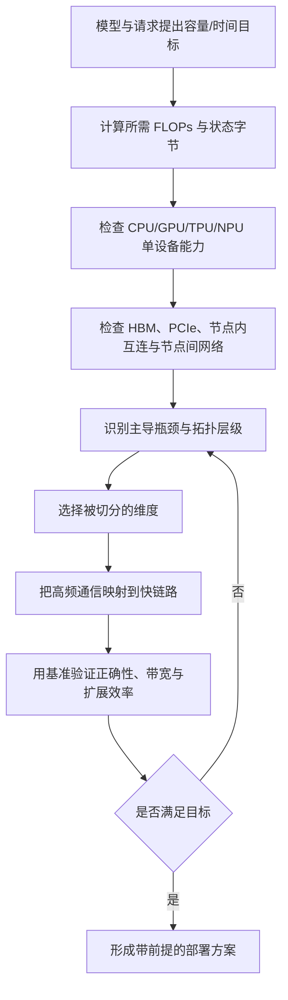
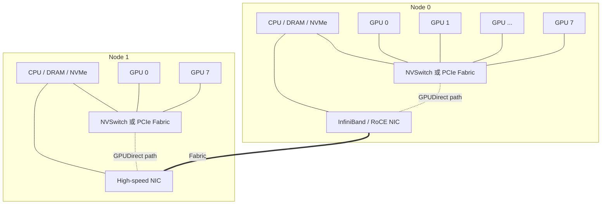
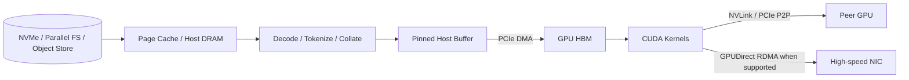
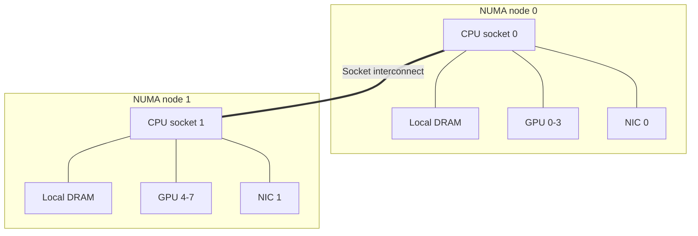
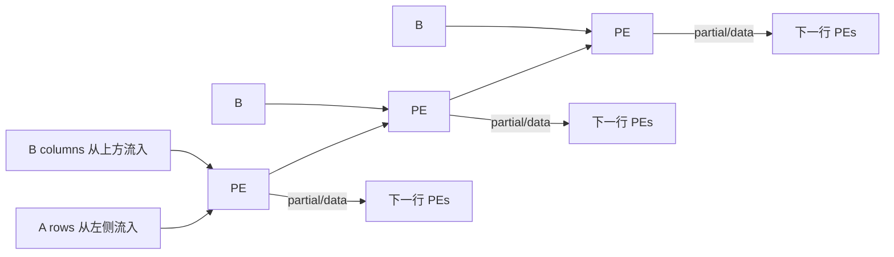
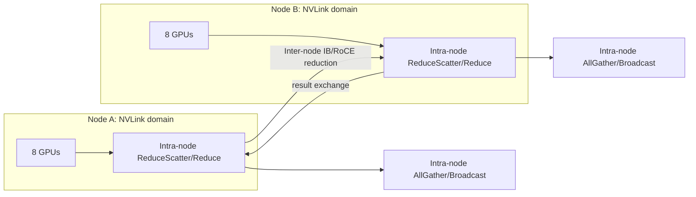
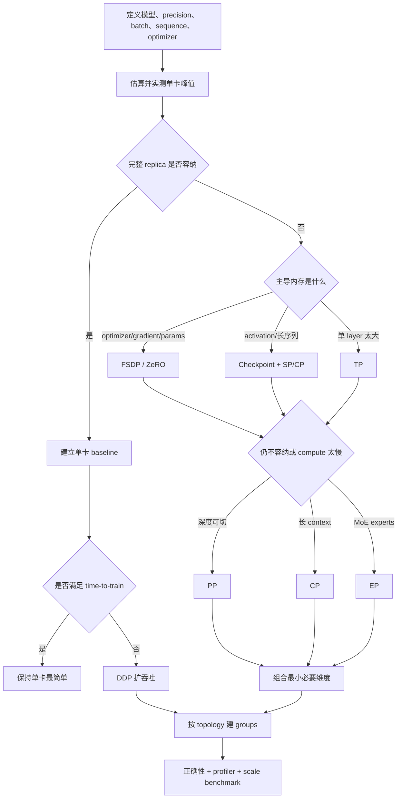
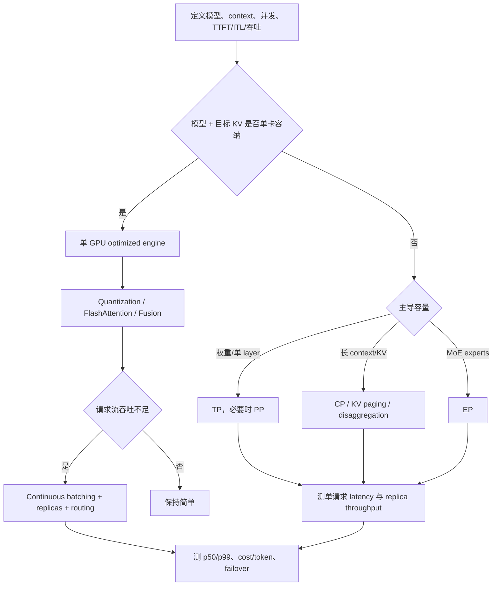

> 对应原文：Chapter 2. GPU Hardware, Networking, and Parallelism Strategies
>
> 本笔记严格沿原章顺序展开：先建立 AI 集群与性能指标，再依次讨论 CPU、GPU、TPU、NPU、高速互连、SPMD/CUDA、分布式通信、并行策略、训练/推理选型树、硬件实测和练习。原章中的规格数字会保留其教学作用，同时注明精度、方向、聚合口径、代际和测量边界；补充公式、数值例子与代码用于解释原理，不应误认为原书逐式给出的内容。硬件 SKU、云端可用性与软件支持变化很快，实际采购或部署必须复核目标日期的官方规格。

## 0. 本章要回答的核心问题

第 1 章回答了“什么时候需要分布式”，第 2 章继续回答“分布式任务究竟运行在什么物理系统上，以及如何让逻辑切分匹配物理拓扑”。读完本章，应能回答：

1. FLOPS、MFU、GPU utilization、吞吐和扩展效率分别衡量什么，为什么不能混用？
2. 为什么把 1000 张 1 PFLOPS GPU 放进机房，并不自动得到 1 EFLOPS 的有效训练能力？
3. CPU、主存、PCIe、GPU HBM、GPU-GPU 互连、NIC 与存储如何组成完整数据路径？
4. GPU 为什么擅长深度学习，Tensor Core、SM、warp 与 memory hierarchy 分别做什么？
5. TPU 的 systolic array、NPU 的 domain-specific design 与 GPU 的通用并行架构有何差异？
6. NVLink、NVSwitch、PCIe、InfiniBand、RoCE 与 Ethernet 各位于哪一层？
7. SPMD、SIMT、SIMD、CUDA thread hierarchy 与分布式 rank 是什么关系？
8. point-to-point 与 collective 通信如何映射到 ring、tree 和实际网络拓扑？
9. 数据并行、FSDP/ZeRO、tensor、pipeline、sequence/context 与 expert parallelism 分别切什么？
10. 为什么并行策略必须同时考虑容量、通信频率、拓扑、工作负载与运行目标？
11. 如何用 `nvidia-smi`、拓扑矩阵、内存带宽测试和 NCCL tests 验证硬件，而不是只读规格表？

全章主线可以压缩为：



本章最重要的思想不是记住某代 GPU 的数字，而是：

> **并行策略决定数据要怎样移动，硬件拓扑决定这种移动有多贵；只有二者匹配，峰值算力才可能转化为端到端吞吐。**

---

## 1. Overview：创新发生在整个系统栈

### 1.1 Jensen Huang 引语的作用

原章以“创新不只在芯片，而在整个 stack”开场。它预先否定了一种常见心智模型：只要换成更快 GPU，训练就会按理论 FLOPS 同比加速。

芯片只是系统的一层。一个训练 step 可能经历：

```text
存储读取数据
  -> CPU 解码/分词/组 batch
  -> 主存与 PCIe 搬运
  -> GPU kernel 读取 HBM 并计算
  -> GPU 间交换参数、梯度或 activation
  -> 节点间 NIC 传输 collective 数据
  -> 同步最慢 rank
  -> 写日志与 checkpoint
```

任何一段供给不足，GPU 都可能等待。系统吞吐因此更接近流水线中受约束最强部分的结果，而不是各组件峰值数字的简单相加。

### 1.2 本章如何承接第 1 章

第 1 章已经建立：

- 权重、梯度、optimizer state、activation 与 KV cache 的容量模型；
- 单设备 baseline 与多设备 speedup；
- process group、rank 与 collective 语义；
- DDP 复制模型、切数据并同步梯度。

本章向下追问：

- 一次 collective 走 NVLink、PCIe 还是 NIC？
- 单卡矩阵乘法受 Tensor Core 还是 HBM 限制？
- CPU 是否能及时供给数据和 kernel launch？
- 为什么同样 8 张 GPU，NVSwitch 机器与 PCIe 机器适合的 tensor-parallel degree 不同？
- 如何从物理约束反推 parallelism，而不是先选框架？

这也是从“API 能运行”走向“系统为什么这样表现”的一步。

---

## 2. Computational power：AI 集群为何存在

### 2.1 Computational power 是什么

计算能力（compute capacity）描述单位时间能完成多少运算。AI 领域常用 FLOPS：

$$
FLOPS=\frac{floating\ point\ operations}{second}
$$

数量级换算为：

| 单位 | 每秒浮点操作数 |
| --- | ---: |
| GFLOPS | $10^9$ |
| TFLOPS | $10^{12}$ |
| PFLOPS | $10^{15}$ |
| EFLOPS | $10^{18}$ |

若一张 GPU 在某精度下峰值约为 1000 TFLOPS，则 1000 张的**名义聚合峰值**为：

$$
1000\times1000\times10^{12}=10^{18}\ FLOPS=1\ EFLOPS
$$

这一步代数成立，但结论只表示理论上界。它隐含：

- 每张 GPU 都是同一 SKU 与工作频率；
- 使用规格表对应的 precision、Tensor Core 路径与 sparsity 口径；
- 所有 GPU 同时有足够计算可做；
- 没有通信、输入、同步、故障和软件开销。

现实训练无法同时满足全部理想条件，因此“1 EFLOPS cluster”不是“应用每秒必然完成 $10^{18}$ 个有用操作”。

### 2.2 FLOPS 必须携带 precision 与实现口径

同一芯片可能同时给出 FP64、TF32、FP32、BF16、FP16、FP8、INT8、FP4 等峰值，而且 Tensor Core 与普通 CUDA core 的数字不同；结构化 sparsity 还可能把宣传峰值再放大。

比较前至少记录：

```text
GPU SKU + form factor + precision + dense/sparse + Tensor Core/CUDA Core
  + boost/base clock 口径 + 单向/双向或每芯片/每模块
```

例如：

- HPC 模拟可能首先关心 FP64；
- 常规深度学习训练多看 BF16/FP16 Tensor Core；
- FP8 训练需要数值缩放、kernel 与模型收敛支持；
- FP4/INT4 峰值更多用于特定推理路径，不能直接替代 BF16 训练峰值。

所以两个都写“500 PFLOPS”的集群，可能一个引用 FP64 dense，另一个引用 FP8 sparse，实际能力完全不可直接比较。

### 2.3 Peak、achieved 与 useful compute

应区分三个层次：

1. **Peak FLOPS**：硬件规格上界。
2. **Achieved hardware FLOPS**：运行时实际执行的所有浮点运算率，包括必要计算、重计算或某些浪费。
3. **Useful model FLOPS**：按照模型数学定义计算的有效工作率，通常排除 padding、activation recomputation 等额外工作。

如果 activation checkpointing 让硬件执行更多 forward 重计算，GPU 可能很忙，achieved hardware FLOPS 很高，但每秒完成的有用 token 未必同比提高。这正是后文 MFU 比单纯 GPU utilization 更有解释力的原因。

### 2.4 为什么单设备能力增长追不上工作负载

原章指出，模型内存与训练算力需求增长快于单 GPU 容量和性能，因此形成 widening gap。这里不是一条精确、永久的指数定律，而是工程观察：

- 参数量、训练 token、上下文长度与多模态输入会共同增加工作；
- HBM 容量受封装、成本与功耗约束，不能任意增长；
- 芯片计算峰值增长后，memory/network 也必须同步增长；
- 单次训练还受可接受的 wall-clock deadline 约束。

即使模型权重勉强能放进一张 GPU，训练状态、activation 或完成时间也可能迫使任务使用多个设备。

### 2.5 Cluster 的定义与三种扩展

集群是一组通过网络连接、协同完成任务的 nodes。现代 AI node 常包含：

- 一个或多个 CPU sockets；
- 多张 GPU/accelerator；
- host DRAM；
- 本地 NVMe；
- GPU-GPU interconnect；
- 一张或多张高速 NIC。

集群带来三种扩展：

| 扩展对象 | 做法 | 解决的问题 | 新增代价 |
| --- | --- | --- | --- |
| Memory | 分片参数、梯度、optimizer、KV | 单设备放不下 | 重建、通信、布局管理 |
| Compute | 复制任务或拆算子 | 单设备太慢 | 同步、气泡、负载均衡 |
| Storage/I/O | 分布式文件系统、对象存储、本地缓存 | 数据和 checkpoint 太大 | 元数据、拥塞、一致性 |

集群不会把这些资源自动变成一个透明的大设备。应用必须决定状态放在哪里、谁计算哪部分、何时通信和怎样恢复。

### 2.6 AI cluster 的层级拓扑

典型 8-GPU node 的逻辑关系是：



这是一种**层次化网络**：

- GPU HBM 是本地最快容量；
- node 内 GPU 可能通过 NVLink/NVSwitch，或仅通过 PCIe；
- node 间通常通过 InfiniBand/RoCE/Ethernet fabric；
- CPU、NIC 与 GPU 的 PCIe/NUMA 位置决定跨节点入口成本。

并行策略应利用层级差异。例如高频 tensor-parallel collective 尽量留在 NVLink domain；数据并行的较大但频率相对可管理的同步可以跨节点。

### 2.7 AI cluster 与传统 HPC：差异不应绝对化

原章用“传统 HPC 常做大而不频繁的交换，AI 每 step 做频繁梯度同步”建立直觉。它揭示了 AI 训练对 collective 的高度依赖，但不是所有 HPC workload 的普遍事实：stencil、FFT、天气模拟等也可能频繁通信。

更准确的区别是，现代 AI 训练常呈现：

- 大量规则、重复的矩阵计算；
- 每个 step 重复相似 collective pattern；
- 全局同步使一个慢 rank 拖住所有 rank；
- 模型状态、activation 与 optimizer 带来超大 payload；
- 计算精度较低，单卡计算变快后通信占比反而上升。

因此 AI cluster 特别强调 accelerator fabric、collective library、拓扑感知分组和 communication-computation overlap。

### 2.8 训练 cluster 与推理 cluster 的目标不同

#### Training

训练集群通常强调：

- 大规模同步 collective 的 sustained bandwidth；
- 参数、梯度、optimizer 与 activation 的 aggregate memory；
- 数据与 checkpoint 的持续 I/O；
- 长作业的故障恢复和调度；
- time-to-train 与收敛到目标质量的总成本。

#### Inference

推理集群更强调：

- TTFT、inter-token latency 与 p99；
- KV cache 容量和碎片；
- 动态 batching、路由与负载波动；
- 每请求/token 成本；
- 模型副本、TP/PP group 与可用性。

“训练只关心 bandwidth、推理只关心 latency”是过度简化。大 tensor 推理并行仍需要带宽，训练中的大量小 control/collective 也受 latency 影响。区别是目标权重与 workload shape 不同。

---

## 3. Key metrics：怎样判断集群是否真的有效

### 3.1 指标必须形成因果层级

原章列出 MFU、linear scaling、GPU utilization、communication efficiency、throughput、resource utilization、energy 与 reliability。它们不应被当作互相替代的一排数字，而应按因果关系阅读：

```text
硬件峰值与拓扑
  -> kernel/内存/网络实际利用
  -> step time 与吞吐
  -> 扩展效率
  -> 达到目标质量的总时间与成本
  -> 长作业可用性与恢复损失
```

最底层指标帮助定位原因，最上层指标才回答业务或研究目标。GPU utilization 很高，但如果做了大量 padding，最终有用 token/s 仍可能很低。

### 3.2 MFU：有用模型计算占峰值的比例

Model FLOPs Utilization（MFU）定义为：

$$
MFU=\frac{F_{model}/T_{step}}{N C_{peak}}
$$

其中：

- $F_{model}$：整个 cluster 在一个 step 中按模型公式应完成的有用 FLOPs；
- $T_{step}$：该 step 的 wall-clock 时间；
- $N$：参与计算的 accelerator 数；
- $C_{peak}$：每 accelerator 在实际训练 precision、dense/sparse 口径下的峰值 FLOPS。

对 dense Transformer，训练一个 token 的 forward + backward 常用近似为：

$$
F_{token}\approx6P
$$

$P$ 是参数量。若 global tokens per step 为：

$$
D_{step}=B_{global}S
$$

则：

$$
F_{model}\approx6PB_{global}S
$$

代入 MFU：

$$
MFU\approx\frac{6PB_{global}S}{T_{step}NC_{peak}}
$$

这个近似的依据是：dense linear parameter 在 forward 约有一次 multiply-add，backward 对 input gradient 与 weight gradient 又产生约两倍工作；若把 multiply 与 add 各计一次 FLOP，就得到约 $6P$。Embedding、attention 的非参数相关项、MoE active parameters、sequence length 与具体实现会让真实模型 FLOPs 偏离，因此应优先使用模型/框架提供的精确 estimator。

### 3.3 MFU 数值例：口径必须闭合

假设 16 张 H100，每张 BF16 dense peak 取 989 TFLOPS；70B dense model 每 GPU 等效处理 2048 local tokens，global tokens 为：

$$
D_{step}=16\times2048=32768
$$

一个 step 的有用计算近似：

$$
F_{model}=6\times70\times10^9\times32768
=13.76256\times10^{15}\ FLOP
$$

若 step time 为 2 s，achieved useful rate 为：

$$
C_{useful}=\frac{13.76256\ PFLOP}{2\ s}=6.88128\ PFLOPS
$$

cluster peak 为：

$$
C_{cluster}=16\times0.989=15.824\ PFLOPS
$$

所以：

$$
MFU=\frac{6.88128}{15.824}\approx43.5\%
$$

原章用“每 iteration 约 860 TFLOP、2 s、430 TFLOPS，再除 H100 989 TFLOPS”得到约 43%。这个算式只有在 860 TFLOP 与 989 TFLOPS 都采用**同一局部/单卡等效口径**时闭合；若 860 TFLOP 是整个 cluster 的 step 工作，就必须除以 cluster aggregate peak，不能只除一张 GPU 峰值。

### 3.4 MFU、HFU 与 GPU utilization 的区别

| 指标 | 分子是什么 | 能回答什么 | 不能回答什么 |
| --- | --- | --- | --- |
| GPU utilization | 采样期间 GPU 是否有 kernel 活跃 | GPU 是否频繁空闲 | kernel 是否高效、是否做有用工作 |
| HFU | 实际硬件执行 FLOPs/s | 计算单元利用程度 | 额外重计算是否产生有效进度 |
| MFU | 理想模型有用 FLOPs/s | 峰值有多少转化为模型进度 | 不能单独定位瓶颈 |
| Token throughput | 有效 tokens/s | 训练/服务进度 | 不直接说明硬件为何慢 |

Activation checkpointing 的重计算可能提高 HFU 而不提高 MFU；padding 也可能让 GPU utilization 高但有效 token throughput 低。诊断时应组合使用。

### 3.5 MFU 高低怎样解释

原章给出大型模型 40%～60% MFU 作为常见目标区间，这是经验参考，不是普遍及格线。MFU 会受：

- 模型大小与 arithmetic intensity；
- sequence length、batch 与 shape alignment；
- precision 与 Tensor Core eligibility；
- activation checkpointing；
- kernel fusion 与 compiler；
- tensor/pipeline/data parallel communication；
- GPU SKU 与 peak 口径；
- 输入和负载不均；
- MoE routing 与 active parameters 定义。

小模型、稀疏或大量 elementwise workload 可能天然难达到大 dense Transformer 的 MFU。MFU 低是“需要分解时间”的信号，不是自动证明网络有问题。

### 3.6 Speedup、linear scaling 与效率

固定总 workload 的 strong scaling 中：

$$
S_N=\frac{T_1}{T_N}=\frac{X_N}{X_1}
$$

$T_N$ 是 $N$ GPU 时间，$X_N$ 是吞吐。并行效率为：

$$
E_N=\frac{S_N}{N}=\frac{X_N}{NX_1}
$$

原章称后一个公式为 linear scaling。$E_N=1$ 表示理想线性，$E_N=0.8$ 表示每张 GPU 平均保留单卡 80% 的吞吐能力。

必须固定：

- 模型与 precision；
- 总样本/token 与 global batch 语义；
- 计时边界和 warmup；
- quality/convergence 条件。

若 GPU 增加时 workload 也同比增加，那是 weak scaling，应报告每 GPU throughput 或固定时间内总吞吐，不应直接冒充 strong-scaling speedup。

### 3.7 为什么扩展效率会下降

一个 step 的简化时间模型是：

$$
T_N=T_{compute}(N)+T_{communication}(N)+T_{input}(N)
+T_{imbalance}(N)+T_{idle}(N)
$$

Strong scaling 下，每 GPU compute 往往随 $N$ 减少，但 communication 未必同比减少，甚至参与 rank 和跨节点 hops 增加。于是通信占比上升，$E_N$ 下降。

当效率低于某阈值时，不能直接断言“network bottleneck”。还需分别测：

- DataLoader/CPU 是否供不上；
- local batch 是否太小，kernel 不饱和；
- pipeline stages 是否不平衡；
- collective 是否跨慢链路；
- 某些 ranks 是否 thermal throttle、重试或共享资源。

原章给出的 0.7～0.9 是良好集群的经验范围，实际可接受值取决于 scale、模型和成本目标。

### 3.8 GPU utilization：活动率不是效率

可通过：

```shell
nvidia-smi --query-gpu=utilization.gpu --format=csv,noheader
```

观察采样窗口内 GPU 执行 kernel 的时间比例。90%+ 通常说明 GPU 很少完全空闲，但仍可能：

- Tensor Core 没有启用；
- kernel 受 HBM 限制；
- 做大量 padding/recomputation；
- 小 kernel launch 很密集但 occupancy 低；
- 通信 kernel 占据时间而有效模型计算少。

因此 utilization 适合快速发现“GPU 饥饿”，不能替代 profiler、MFU 与吞吐。

### 3.9 Communication efficiency：实际带宽怎样比较

原章定义：

$$
E_{comm}=\frac{B_{actual}}{B_{theoretical}}
$$

使用前必须让分子分母口径一致：

- Gb/s 与 GB/s：$8\ bit=1\ byte$；
- 单向与 aggregate bidirectional；
- 单 link、单 NIC、单 GPU 还是全 node；
- raw line rate 与扣除编码/协议后的 payload rate；
- point-to-point bandwidth 与 collective algorithm bus bandwidth。

例如 200 Gb/s raw line rate 的字节上限约为：

$$
\frac{200}{8}=25\ GB/s
$$

若有效 payload 为 22.5 GB/s，则按同方向 raw rate 计算为 90%。不能把 22.5 GB/s 与“200 GB/s”误比，也不能将双向聚合数字除以单向理论值。

低效率可能来自 topology、PCIe bottleneck、NUMA、协议 overhead、消息太小、拥塞、packet loss/retransmission、错误 NIC selection 或 collective algorithm 不匹配。

### 3.10 Throughput：训练进度的直接指标

若一个 step 的 global batch 为 $B$、每样本有效 token 数为 $S$、step time 为 $T$：

$$
Throughput_{cluster}=\frac{BS}{T}
$$

$$
Throughput_{perGPU}=\frac{BS}{TN}
$$

原章公式写“Total training time”，在按 step 计算时应理解为对应 workload 的测量时间；若分子只是一 step 的 tokens，分母也必须是一 step time。整场训练则用总有效 tokens 除完整 wall-clock。

高 tokens/s 不保证更快达到同一质量：

- 增大 global batch 会减少单位 epoch 的 optimizer steps；
- learning rate 与 warmup 可能要调整；
- padding token 不应算作有效 token；
- 数据重复或 sampler 错误会产生虚高吞吐；
- 低精度或近似 kernel 还需验证 convergence。

最终训练指标应是达到给定 validation quality 的 time-to-train 与总成本。

### 3.11 时间分解：不要把所有非计算都叫通信

原章将资源时间拆为 compute、memory transfer、communication 与 idle。实践中可进一步分为：

```text
GPU compute kernels
GPU local memory stalls
H2D / D2H copies
GPU-GPU collectives
CPU data preprocessing
storage I/O
framework / Python gaps
barrier / load imbalance
checkpoint / evaluation
```

“70%～80% compute、10%～20% communication、很少 idle”是大型优化 workload 的经验目标，不是所有模型的定律。推理 decode、embedding lookup、稀疏模型和小 batch 可能天然更 memory-bound。

### 3.12 Energy efficiency 与 PUE

芯片或系统能效常写为：

$$
EnergyEfficiency=\frac{FLOPS}{Watt}
$$

但比较时仍要固定 precision、dense/sparse 和 achieved/peak。更有运营意义的指标还包括 tokens/Joule、requests/kWh 或达到目标质量的总 MWh。

Power Usage Effectiveness（PUE）定义为：

$$
PUE=\frac{P_{facility}}{P_{IT}}
$$

若 IT 设备消耗 10 MW，PUE 为 1.25，则 facility 总功率为：

$$
P_{facility}=1.25\times10=12.5\ MW
$$

额外 2.5 MW 用于冷却、供电损耗等设施开销。PUE 越接近 1 越好，但它不衡量 GPU 是否做有效计算；低 PUE 数据中心里闲置 GPU 仍然浪费能源。

### 3.13 Reliability：规模越大，故障越接近常态

关键指标：

- **MTBF**：平均故障间隔；
- **MTTR**：平均恢复时间；
- **Availability**：可提供服务的时间比例；
- **Job success rate**：训练作业无需人工干预完成的比例；
- **Lost work**：故障后从上个 checkpoint 重算的工作量。

在简单 repairable system 模型下：

$$
Availability\approx\frac{MTBF}{MTBF+MTTR}
$$

若单个 GPU 独立服从相同指数故障分布，单 GPU MTBF 为 $M$，任一 GPU 失败就导致 job 失败，则 $N$ GPU job 的期望故障间隔近似：

$$
MTBF_{job}\approx\frac{M}{N}
$$

这个推导来自独立 hazard rates 相加。现实故障并不独立：电源、交换机、软件、机架温度会造成相关失败，所以公式只用于说明“规模放大故障暴露”，不能当容量 SLA。

对万卡长作业，故障每数小时出现并不反常；系统必须通过 checkpoint、elastic restart、健康检查与 spare capacity 缩短 MTTR 和 lost work。

### 3.14 Tail latency：同步训练由慢 rank 决定

一个 synchronous step 完成时间近似：

$$
T_{step}=\max_r T_r+T_{global\ overhead}
$$

因此平均通信 latency 很低也不够。一个 rank 的 p99 抖动会在大量 steps 中频繁出现，并让其他 GPU 等待。应观察：

- collective p50/p95/p99；
- 各 rank step-time distribution；
- 慢 node/NIC/GPU 是否长期固定；
- packet retransmission、ECC/thermal/clock event；
- shared storage 与 network congestion。

原章给出的“节点内典型 gradient size <1 ms、节点间 <5 ms”只能作为特定硬件和消息规模下的示意目标；collective latency 随 payload、world size、algorithm 与拓扑变化，不能脱离这些条件设成普遍阈值。

### 3.15 为什么要按多个规模点测量

原章建议在 8、64、512、2048 GPU 等规模观察指标。目的不是追求固定数字，而是识别**哪项指标随 scale 恶化**：

- 单卡 MFU 已低：先优化 local kernel、batch 或 input；
- 节点内好、跨节点骤降：检查 NIC/fabric 与跨节点 parallel dimension；
- 规模越大 p99 越差：检查 congestion、straggler 与 collective algorithm；
- throughput 增长但 cost/token 变差：已经越过经济有效 scale；
- failure/restart 占比上升：checkpoint 和 resilience 成为主导。

扩展曲线比单个最大规模点更能定位拐点。

### 3.16 可运行的集群指标计算器

下面的标准 Python 示例复算 MFU、扩展效率、通信效率、PUE 和简化可靠性。它不访问 GPU，目的是让每个指标的分子与分母显式可查。

```python
from dataclasses import dataclass


@dataclass(frozen=True)
class TrainingRun:
    parameters: int
    global_tokens_per_step: int
    step_seconds: float
    accelerators: int
    peak_flops_per_accelerator: float


def model_flops_utilization(run: TrainingRun) -> float:
    useful_flops = 6 * run.parameters * run.global_tokens_per_step
    achieved_flops_per_second = useful_flops / run.step_seconds
    cluster_peak = run.accelerators * run.peak_flops_per_accelerator
    return achieved_flops_per_second / cluster_peak


def scaling_efficiency(single_throughput: float, multi_throughput: float,
                       accelerators: int) -> float:
    return multi_throughput / (single_throughput * accelerators)


def communication_efficiency(actual_gbps: float, theoretical_gbps: float) -> float:
    return actual_gbps / theoretical_gbps


def availability(mtbf_hours: float, mttr_hours: float) -> float:
    return mtbf_hours / (mtbf_hours + mttr_hours)


run = TrainingRun(
    parameters=70_000_000_000,
    global_tokens_per_step=32_768,
    step_seconds=2.0,
    accelerators=16,
    peak_flops_per_accelerator=989e12,
)

print(f"MFU: {model_flops_utilization(run):.1%}")
print(f"8-GPU scaling efficiency: {scaling_efficiency(100, 640, 8):.1%}")
print(f"200 Gb/s link at 180 Gb/s: {communication_efficiency(180, 200):.1%}")
print(f"Availability (100 h MTBF, 0.5 h MTTR): {availability(100, 0.5):.3%}")
print(f"Independent 10,000-GPU job MTBF from 50,000 h/device: {50_000 / 10_000:.1f} h")
print(f"Facility power at 10 MW IT and PUE 1.25: {10 * 1.25:.1f} MW")
```

预期输出：

```text
MFU: 43.5%
8-GPU scaling efficiency: 80.0%
200 Gb/s link at 180 Gb/s: 90.0%
Availability (100 h MTBF, 0.5 h MTTR): 99.502%
Independent 10,000-GPU job MTBF from 50,000 h/device: 5.0 h
Facility power at 10 MW IT and PUE 1.25: 12.5 MW
```

最后两行只建立数量级直觉：GPU failure 并非独立、job 也可能容忍部分设备失败；PUE 也会随负载、季节与测量边界变化。

---

## 4. Central Processing Unit：GPU 吃不饱时先看主机侧

### 4.1 CPU 架构为何仍然重要

CPU 与 GPU 的优化目标不同：

| CPU | GPU |
| --- | --- |
| 优化单线程/少量线程 latency | 优化大量并行线程 throughput |
| 复杂控制、branch prediction、out-of-order | 规则数据并行、隐藏 memory latency |
| 少量强 cores、大 cache | 大量相对简单 execution lanes |
| 擅长 OS、调度、解析、串行逻辑 | 擅长矩阵、向量与批量数值计算 |

原章用 von Neumann architecture 介绍 ALU、control unit、register/memory。现代 CPU 实现远比这一教学模型复杂，但核心矛盾仍成立：CPU 把大量晶体管用于低延迟控制与 cache，GPU 把更多面积用于并行算术吞吐。

### 4.2 CPU 在训练 node 中做什么

CPU 常负责：

- 文件读取、解压、图像解码、tokenization 与 augmentation；
- DataLoader workers 与 batch collate；
- Python/runtime、kernel launch 与 framework control；
- 内存分配、pinned buffer 与 H2D enqueue；
- process group control、NIC queue 管理与错误处理；
- checkpoint serialization、日志和监控。

若 CPU 不能及时准备下一 batch，GPU timeline 会出现 kernel 之间的长空洞。此时增加 GPU Tensor Core 不会改善吞吐。

### 4.3 CPU-GPU data path

典型 batch 路径：



原章说 CPU 管理 GPU memory 与通信是正确的 control-plane 直觉，但应区分 control path 与 data path：

- 没有 GPUDirect 时，跨节点数据可能 staging 到 host memory；
- GPUDirect RDMA 可让 NIC 直接 DMA GPU memory，避免 payload 经过 CPU DRAM；
- CPU 仍参与连接建立、launch、queue 与错误处理，不等于完全退出系统。

### 4.4 PCIe 带宽怎样计算

PCIe x16 的理论单向 payload 上限随 generation 变化。常见近似：

| Link | 单向理论带宽 | 双向聚合 |
| --- | ---: | ---: |
| PCIe 4.0 x16 | 31.5 GB/s | 63 GB/s |
| PCIe 5.0 x16 | 63 GB/s | 126 GB/s |

原章前文用 Gen4 x16 “约 31.5 GB/s per direction”，后文 H200 示例用 Gen5 x16 “约 64 GB/s per direction”，口径一致。实际吞吐会低于理论值，并受 root complex、switch、NUMA、IOMMU、buffer pinning 与并发设备影响。

把 PCIe 与 NVLink 数字比较时必须确认后者是否是 aggregate bidirectional per GPU。不能拿 PCIe 单向 31.5 GB/s 与 NVLink 双向聚合 900 GB/s 得出精确 28.6 倍实际加速；它们至少说明链路层级相差显著。

### 4.5 Pinned memory 与异步拷贝为什么有用

普通 pageable host memory 在 DMA 前常需额外 staging；pinned/page-locked memory 可供设备 DMA 更直接访问。PyTorch DataLoader 可使用 `pin_memory=True`，tensor 搬运可使用 `non_blocking=True`。

有效 overlap 的条件是：

- 源 buffer 已 pinned；
- copy 与 compute 使用可并行的 engine/stream；
- 下一 batch 提前准备；
- copy 与当前 compute 没有数据依赖；
- PCIe 与 DRAM 没有被其他设备饱和。

Pinned memory 不是越多越好：锁页会减少 OS 可分页内存，过量可能损害整个 node。

### 4.6 NUMA：本地访问与远端访问不是同一成本

多 socket server 常采用 Non-Uniform Memory Access（NUMA）：每个 CPU socket 有本地 DRAM controllers 和部分 PCIe devices，访问另一个 socket 的 memory/device 需跨 socket interconnect。

概念拓扑：



若控制 GPU 0 的 rank 被 OS 调度到 socket 1 cores，DataLoader buffer 又分配在 NUMA node 1，H2D/CPU access 可能绕远。跨节点通信若 GPU 0 使用远端 NIC 1，也可能跨 socket。

检查：

```shell
numactl --hardware
```

还应结合：

```shell
nvidia-smi topo -m
lspci -tv
```

分析 CPU affinity、GPU 与 NIC 的 locality。PyTorch 不会为所有部署自动给出最佳 CPU pinning；launcher、SLURM binding、container cpuset 与 DataLoader workers 都会影响结果。

### 4.7 CPU affinity 的目标与风险

Affinity 将 rank/DataLoader threads 绑定到一组 CPU cores。目标是：

- 提高 cache locality；
- 减少跨 NUMA memory access；
- 避免 ranks 抢同一 cores；
- 让 GPU、NIC 与负责它们的 CPU threads 位于相近 NUMA domain。

但错误 binding 也会更慢：

- 给每个 rank cores 太少；
- 多个 DataLoader workers 重叠绑定；
- 忽略 hyper-thread sibling；
- 把 NIC progress thread 绑定到饱和 core；
- container cpuset 与 host binding 冲突。

所以 affinity 是需要 benchmark 的配置，不是“用了 `numactl` 就一定更快”。

### 4.8 CPU sizing heuristics 怎样理解

原章给典型 8-GPU node 的经验值：

- 每 GPU 2～4 CPU cores；
- host RAM 约 GPU aggregate memory 的 1.5～2 倍；
- 每 GPU 需要 PCIe x16，8 GPU 约 128 lanes；
- local NVMe aggregate sequential read 目标约 10～20 GB/s。

这些是采购起点，不是硬约束：

#### Cores

预先 tokenized text 可能 CPU 需求低；JPEG/video decoding、复杂 augmentation 或 online tokenization 可能远高于 4 cores/GPU。还要为 OS、NIC、checkpoint 与监控留 cores。

#### Host RAM

若使用 CPU offload、dataset cache 或大 checkpoint staging，可能需要远超 2 倍；纯 streaming 且不 offload 则未必需要如此多。Host RAM 与 GPU HBM 的固定比例没有普适理论。

#### PCIe lanes

设备可能通过 PCIe switches 共享 uplink，标称每 GPU x16 不表示所有 GPU 可同时对 CPU 达到 x16 aggregate。还要给 NIC 与 NVMe 留 lanes，并检查 root-complex oversubscription。

#### Storage

Sequential benchmark 不能代表大量小文件、metadata、随机读或多 node shared filesystem。最小带宽需求可从数据率反推：

$$
B_{storage}\ge\frac{SamplesPerSecond\times BytesPerSample}{CompressionRatio}
$$

再为解码、shuffle、checkpoint 与峰值留余量。

### 4.9 怎样确认 CPU 正在拖慢 GPU

可观察：

- GPU timeline 中周期性空洞是否对应 DataLoader；
- CPU cores、load average 与 context switches；
- DataLoader queue 是否经常为空；
- storage read throughput 与 latency；
- page faults、host memory bandwidth 与 NUMA remote access；
- H2D copy 是否与 compute 重叠；
- 增加 workers 后 throughput 是否上升或反而因争用下降。

实验顺序：

```text
用内存合成数据替换真实 DataLoader
  -> 若 GPU 吞吐显著上升，问题在 input path
  -> 分别测 storage、decode/tokenize、collate、H2D
  -> 调 workers/prefetch/pinning/affinity
  -> 每次复测 end-to-end throughput
```

这比看到 GPU utilization 低就直接扩 GPU 更能解决根因。

### 4.10 CPU 与 GPU 的关系总结

CPU 不是主要矩阵计算设备，却是 accelerator pipeline 的供应者与控制者。理想状态不是“CPU utilization 越高越好”，而是：

- CPU 能稳定提前准备数据；
- H2D 与 compute 尽量 overlap；
- rank、DataLoader、NIC threads 不争用；
- memory/device access 保持 NUMA local；
- host、PCIe、storage 吞吐不成为主导瓶颈。

下一节转向 GPU 内部：即使主机侧供给充足，kernel 仍可能受 compute、HBM bandwidth、cache、occupancy 或 interconnect 限制。

---

## 5. Graphics Processing Unit：吞吐、数据复用与内存层级

### 5.1 GPU 为什么适合深度学习

深度学习中的 GEMM、convolution、attention 等核心算子包含大量同构运算：不同输出元素可以并行计算，同一输入 tile 又能被许多 multiply-accumulate 重复使用。GPU 用以下设计换取吞吐：

- 大量 Streaming Multiprocessors（SMs）；
- 每个 SM 同时维护许多 warps，用其他 warp 隐藏 memory latency；
- Tensor Cores 专门执行小矩阵 multiply-accumulate；
- 高带宽 HBM/GDDR；
- registers、shared memory/L1 与 L2 形成显式/隐式数据复用层；
- CUDA/software libraries 把高层 tensor operation 映射到 kernels。

GPU 不会让单个依赖链像高端 CPU core 那样低延迟；它依靠“同时有大量独立工作”使计算单元持续忙碌。因此 small batch、小 tensor、频繁 CPU-GPU synchronization 和不规则 branch 会削弱其优势。

### 5.2 从 SM 到 Tensor Core：计算层次

一个简化 NVIDIA GPU 执行层次是：

```text
GPU
    -> 多个 SM
            -> warp schedulers
            -> CUDA cores / FP/INT units
            -> Tensor Cores
            -> registers
            -> shared memory / L1
    -> shared L2
    -> HBM/GDDR
```

线程以 warp 为调度单位。每个 warp 通常含 32 个 threads；同一 warp 执行同一 instruction，不同 lanes 处理不同数据。Tensor Core 则以 matrix fragments 为单位执行近似：

$$
D=A B+C
$$

输入可使用 BF16、FP16、TF32、FP8 等格式，accumulator 常采用更高精度，具体组合取决于 GPU generation 和 instruction。Tensor Core 的峰值只有在 shape、layout、alignment、dtype 与 library kernel 都匹配时才能接近。

### 5.3 GPU memory hierarchy

原章按速度快、容量小到速度慢、容量大描述：

| 层级 | 可见范围 | 主要作用 | 常见问题 |
| --- | --- | --- | --- |
| Registers | 单 thread | 当前 scalar/tile fragment | 使用过多降低 occupancy，spill 到 local memory |
| Shared memory / L1 | 单 block / SM | threads 协作复用 tile | bank conflict、容量不足、同步开销 |
| L2 cache | 全 GPU | 跨 SM 复用、缓冲 HBM traffic | working set 太大导致 miss |
| HBM/GDDR | 全 GPU | 参数、activation、KV 与大 tensor | 容量 OOM、bandwidth bottleneck |
| Host memory | CPU/node | staging、offload、dataset cache | 跨 PCIe/C2C 更慢、NUMA |

“local memory”在 CUDA 术语中并不表示高速片上本地内存；它通常是每 thread 的地址空间，物理上可能落到 device memory/cache hierarchy。Register spill 因而可能显著增加 HBM traffic。

### 5.4 数据复用为什么决定性能

考虑矩阵乘法：

$$
C_{ij}=\sum_{k=0}^{K-1}A_{ik}B_{kj}
$$

朴素实现若每次 multiply 都从 HBM 重新读 $A_{ik}$ 和 $B_{kj}$，数据搬运会压倒计算。Tiled kernel 会：

1. 从 HBM 读取一块 $A$ 与 $B$；
2. 放入 shared memory/register fragments；
3. 让许多 threads/Tensor Cores 重复使用 tile；
4. 累积多个结果后才写回 HBM。

这种 reuse 提高每搬运一个 byte 所完成的 FLOPs，也就是 arithmetic intensity。

### 5.5 Roofline：compute-bound 还是 memory-bound

设算子 FLOPs 为 $F$，从主存层级移动的 bytes 为 $Q$，arithmetic intensity 为：

$$
I=\frac{F}{Q}\quad FLOP/byte
$$

若设备计算峰值为 $C_{peak}$，对应内存带宽为 $B_{memory}$，Roofline 上界为：

$$
C_{attainable}\le\min(C_{peak},I B_{memory})
$$

两条上界交点的 ridge point：

$$
I_{ridge}=\frac{C_{peak}}{B_{memory}}
$$

- $I<I_{ridge}$：memory-bound，提高 compute peak 帮助很小；
- $I>I_{ridge}$：有机会 compute-bound，但仍可能受 occupancy、instruction mix 或 dependency 限制。

用原章 H100 约 989 TFLOPS BF16 与 3 TB/s HBM 的示意数字：

$$
I_{ridge}\approx\frac{989\times10^{12}}{3\times10^{12}}
\approx330\ FLOP/byte
$$

一个只有 2 FLOPs、读写约 4～8 bytes 的 elementwise operation，$I$ 远低于 330，必然偏 memory-bound。大型 tiled GEMM 通过重复使用 tile，可将 $I$ 提高到数百或数千 FLOP/byte，才有机会接近 Tensor Core peak。

### 5.6 方阵 GEMM 的 arithmetic-intensity 直觉

对 $n\times n$ 方阵 $C=AB$，乘加 FLOPs 约为：

$$
F\approx2n^3
$$

若理想情况下 $A$、$B$ 各从 HBM 读一次，$C$ 写一次，每元素 $b$ bytes：

$$
Q\approx3n^2b
$$

于是：

$$
I\approx\frac{2n^3}{3n^2b}=\frac{2n}{3b}
$$

BF16 的 $b=2$，$n=4096$ 时：

$$
I\approx\frac{4096}{3}\approx1365\ FLOP/byte
$$

它高于前面的 330 ridge point，说明在理想复用下可偏 compute-bound。现实还要多次读取、处理 cache/tile 边界，intensity 会降低；但推导清楚说明了大 GEMM 为何比逐元素算子更能利用计算峰值。

### 5.7 GPU utilization 低与 memory-bound 的关系

原章说“GPU utilization 低但 memory bandwidth 满，说明 memory-bound”，方向上成立，但 `nvidia-smi` 的 utilization 不是 compute-unit utilization。更可靠证据是 profiler 同时显示：

- HBM throughput 接近可持续上限；
- SM/Tensor Core active rate 受限；
- kernel 的 arithmetic intensity 位于 Roofline memory slope；
- stall reason 指向 memory dependency；
- 增加 FLOPs capability 不提高 kernel throughput。

Memory-bound kernel 仍可能显示很高 GPU utilization，因为 memory operation 也是活跃 kernel。应使用 Nsight Compute/PyTorch profiler，而不是从单一 utilization 百分比下结论。

### 5.8 Capacity、bandwidth 与 latency 是三件事

- **Capacity**：HBM 能否容纳峰值状态；不足会 OOM。
- **Bandwidth**：单位时间可搬多少 bytes；决定大流量 steady-state。
- **Latency**：一次访问或 operation 多久返回；决定依赖链和小消息。

H200 相对 H100 的核心价值之一是更大 HBM 容量；即使 compute 类似，也可能：

- 少用一层 model parallel；
- 提高 local batch；
- 容纳更长 sequence/KV cache；
- 减少 CPU offload；
- 用更少 GPU 达到容量可行。

这些系统级变化可能比单芯片 compute peak 更重要。

### 5.9 读取 `nvidia-smi` 规格输出

原章命令：

```shell
nvidia-smi \
    --query-gpu=name,memory.total,pcie.link.gen.max,pcie.link.width.max \
    --format=csv
```

应区分：

- `memory.total` 是 driver 可报告的 device memory，进程实际可用还少于它；
- `pcie.link.gen.max` 是设备/平台支持上限，不一定是当前 negotiated generation；
- `pcie.link.width.max` 是最大 lanes，不一定当前为 x16；
- MiB 与十进制 GB 不同；
- virtualized/cloud instance 可能隐藏或限制部分信息。

诊断降速时还应查 current link generation/width、clock、power、temperature、ECC 与 processes，而不只看 max。

### 5.10 读取 `nvidia-smi topo -m`

拓扑矩阵中的常见标记需要按当前系统帮助文本解释，典型含义包括：

| 标记 | 路径直觉 |
| --- | --- |
| `X` | 同一 device |
| `NV#` | 通过若干 NVLink 连接 |
| `PIX` | 经过至多一个 PCIe bridge |
| `PXB` | 经过多个 PCIe bridges，不跨 host bridge |
| `PHB` | 跨 PCIe host bridge/CPU |
| `NODE` | 跨同一 NUMA node 内多个 host bridges |
| `SYS` | 跨 NUMA/socket interconnect |

原章简化为 NVLink、PIX/PXB、NODE/SYS，足以建立快慢层级。实际解释还要看：

- GPU-GPU P2P 是否 enabled；
- NIC affinity 列；
- NVSwitch 是否提供均匀 all-to-all；
- 虚拟化/MIG 是否改变可见拓扑；
- 路径标记只描述类型，不直接给实测 bandwidth。

若 GPU 0～3 与 NIC 0 同 NUMA，GPU 4～7 与 NIC 1 同 NUMA，跨节点 rank mapping 应尽量让 GPU 使用邻近 NIC；否则 payload 可能先跨 socket。

### 5.11 架构里程碑怎样影响系统设计

原章按时间总结：

| 时代 | 关键能力 | 系统影响 |
| --- | --- | --- |
| Fermi/Pascal | CUDA 生态、早期 NVLink | GPU 通用并行与多 GPU 基础 |
| Volta | Tensor Cores | 低精度矩阵吞吐跃升 |
| Ampere/A100 | TF32、BF16、NVLink 3、NVSwitch、MIG | 训练精度更灵活，8-GPU fabric 成熟 |
| Hopper/H100/H200 | FP8、Transformer Engine、NVLink 4、H200 HBM3e | Transformer 低精度训练与更大容量 |
| Blackwell/B200 等 | 更高 HBM/NVLink、低精度推理、双 die/module | rack-scale fabric 与更高功率/冷却需求 |

这些不是“新代一定全面胜过旧代”的简单顺序。实际选择还受软件成熟度、SKU form factor、power cap、cooling、availability、cloud quota、network 配套和价格影响。

规格尤其需要时间戳。原章写作时列 H100 80 GB、H200 141 GB、B200 192 GB 以及更高容量 Blackwell variants；到具体采购日期应检查 vendor datasheet，确认 SXM/PCIe/NVL form factor 与 dense/sparse precision 口径。

### 5.12 三类关键硬件数字如何影响训练

#### HBM capacity 与 bandwidth

Capacity 决定可行 parallel degree；bandwidth 决定本地 memory-bound kernels 与 reduction 的速度。若训练峰值状态为 $M_{peak}$，每 GPU 可用容量为 $C(1-r)$，理想容量下界：

$$
N_{memory}\ge\left\lceil\frac{M_{peak}}{C(1-r)}\right\rceil
$$

$r$ 是 reserve ratio。但这只在状态可均匀分片时成立；DDP 每 GPU 完整复制，不能用总量除卡数。

#### Compute throughput

决定 compute-bound kernels 的上界。FP8 相对 BF16 的峰值提升只有在：

- 硬件支持；
- kernel 走 FP8 Tensor Core；
- scaling/amax 与 accumulation 稳定；
- 模型质量和 convergence 通过验证；
- non-matmul 与 communication 不成为主导；

时才能转化为 end-to-end speedup。原章引用 H100 Transformer Engine 相对 A100 “up to 6×”属于特定 workload/stack 的厂商上限，不是所有训练的预期值。

#### Interconnect bandwidth

决定 TP/DP/FSDP 等 collective 的可隐藏程度。更快 NVLink 不能解决跨节点 InfiniBand 瓶颈；更快 NIC 也不能修复节点内 PCIe-only 高频 TP。必须把每种通信定位到具体层级。

### 5.13 HGX、DGX、SuperPOD 与 NVL rack 不同层级

| 名称 | 层级 | 用户得到什么 |
| --- | --- | --- |
| HGX | GPU baseboard/platform | GPU + NVSwitch/NVLink 基础，由 OEM 补 CPU、NIC、storage、chassis |
| DGX | 完整 NVIDIA server/system | 预集成 GPU、CPU、storage、network 与软件支持 |
| SuperPOD | 多系统 cluster reference/solution | 多 DGX/rack、fabric、管理和验证方案 |
| GB200 NVL72 类 | rack-scale compute domain | 多个 superchips/GPUs 通过 NVLink fabric 连接 |

原章强调 NVL72 被营销为“一个巨大 GPU”，但编程上仍是许多 devices：仍需 rank、collective、TP/PP/DP 与 tensor placement。高带宽统一 fabric 缩小了分布式代价，不会把 72 张 GPU 变成一个无需分片的 CUDA device。

### 5.14 选择 H100、H200、B200 的思路

不要从产品名开始，而从约束开始：

```text
每 GPU 峰值内存不足？
    -> 更大 HBM 能否减少 parallel degree / offload / recompute
Compute-bound？
    -> 目标 precision 下峰值与 kernel efficiency 是否更高
Memory-bound？
    -> HBM bandwidth 与 cache 是否改善
Communication-bound？
    -> 实际 form factor 的 NVLink/NVSwitch 与 NIC 是否改善
Serving cost-bound？
    -> 目标 quantization、batch、power 与购置/租用价格下 cost/token
```

H100 可代表成熟、可获得的通用训练基线；H200 适合容量主导；B200 类适合追求更高 compute/HBM/NVLink 且能承担 power、cooling、价格与供应条件。实际结论必须按时间和区域复核。

Consumer GPU 可能在某些 inference 上有更低采购成本，但要评估：

- HBM/VRAM 容量；
- ECC、reliability 与长时间运行；
- P2P/NVLink 与 multi-GPU topology；
- datacenter support、virtualization 与 licensing；
- cooling、power 与 rack density。

### 5.15 Tensor Cores：专用矩阵引擎不是自动加速按钮

Tensor Cores 可比标量 CUDA cores 提供更高矩阵吞吐，但框架只有在合适条件下才能使用高效 kernel：

- dtype 支持 BF16/FP16/TF32/FP8 等；
- dimensions 满足 tile/alignment 要求；
- contiguous/layout 与 stride 合理；
- batch 足够大；
- library 选择到 Tensor Core kernel；
- accumulation 和 loss scaling 保证数值稳定。

“PyTorch 会自动使用”应理解为 cuBLAS/cuDNN/compiled kernels 会在条件满足时选择路径，不表示任何 tensor shape、任何 operation 都走 Tensor Core。Profiler 才是证据。

### 5.16 Transformer Engine：动态范围管理

FP8 exponent/mantissa 位数更少，动态范围和精度有限。Transformer Engine 类机制会：

- 追踪 activation/weight 的幅值统计；
- 选择 FP8 format 与 scaling factor；
- 对敏感 operation 或 accumulation 使用更高精度；
- 管理 delayed scaling/amax history；
- 在性能与数值稳定之间折中。

它解决“统一把所有 tensor cast 到 FP8 容易 overflow/underflow 或丢失精度”的问题，但不消除验证责任。不同模型、optimizer、训练阶段和 checkpoint 恢复都需检查 quality。

### 5.17 MIG：空间隔离，不是大模型分片

Multi-Instance GPU（MIG）把一张支持的 GPU 分成多个隔离实例，每个实例有专属的一部分 compute、memory 与 cache/resource。适合：

- 多租户小推理；
- 开发/测试资源隔离；
- 小 workload 提高整卡利用率。

它不等于 model parallel：一个大模型不能因切成多个 MIG instances 自动获得完整 GPU 的统一 HBM。训练大模型通常希望完整 GPU、完整互连与更少资源碎片；MIG 下 P2P、collective 和调度支持还应按具体产品/版本检查。

### 5.18 NVLink-C2C 与 heterogeneous memory

Grace Hopper 类系统用 NVLink-C2C 提供 CPU-GPU coherent/high-bandwidth connection。原章示例把 Grace CPU 512 GB LPDDR5X 与 GPU HBM 相加为更大 addressable memory。应避免两个误解：

1. Host LPDDR 与 GPU HBM 延迟/带宽仍不同，不是完全等价的一池 HBM；
2. 能 address 不表示访问成本为零，placement、prefetch 与 working set 仍重要。

它使 CPU offload、large embedding 或超 HBM workload 更实用，但性能是否可接受仍要测实际访问比例。

### 5.19 可运行的 Roofline 与容量计算器

```python
from math import ceil


def ridge_point(peak_tflops: float, memory_tb_per_second: float) -> float:
        """返回 FLOP/byte；TFLOPS / TB/s 的 10^12 单位正好抵消。"""
        return peak_tflops / memory_tb_per_second


def attainable_tflops(arithmetic_intensity: float, peak_tflops: float,
                                             memory_tb_per_second: float) -> float:
        memory_roof_tflops = arithmetic_intensity * memory_tb_per_second
        return min(peak_tflops, memory_roof_tflops)


def ideal_sharded_gpu_count(total_gb: float, capacity_gb: float,
                                                        reserve_ratio: float = 0.2) -> int:
        return ceil(total_gb / (capacity_gb * (1 - reserve_ratio)))


h100_peak = 989.0
h100_hbm = 3.0
print(f"H100 illustrative ridge point: {ridge_point(h100_peak, h100_hbm):.1f} FLOP/byte")
print(f"I=10 attainable: {attainable_tflops(10, h100_peak, h100_hbm):.1f} TFLOPS")
print(f"I=500 attainable: {attainable_tflops(500, h100_peak, h100_hbm):.1f} TFLOPS")
print(f"4096x4096 BF16 ideal GEMM intensity: {4096 / 3:.1f} FLOP/byte")
print(f"1.12 TB sharded state on 80 GB GPUs with 20% reserve: {ideal_sharded_gpu_count(1120, 80)} GPUs")
```

预期输出：

```text
H100 illustrative ridge point: 329.7 FLOP/byte
I=10 attainable: 30.0 TFLOPS
I=500 attainable: 989.0 TFLOPS
4096x4096 BF16 ideal GEMM intensity: 1365.3 FLOP/byte
1.12 TB sharded state on 80 GB GPUs with 20% reserve: 18 GPUs
```

最后一项是假设状态可完美均匀分片的容量下界，未含 activation/temporary buffers，也未考虑 parallel degree 必须与拓扑匹配；实际配置会高于 18 或取更适合分组的数量。

---

## 6. Tensor Processing Unit：用 systolic array 固化矩阵数据流

### 6.1 TPU 为什么出现

Google 面对大规模语音/推理需求时发现，若继续只用 CPU，数据中心容量与能耗难以经济扩展。TPU 的出发点是 domain-specific acceleration：如果主要工作是矩阵乘法，就减少 CPU/GPU 为通用性付出的控制、cache 和 instruction overhead，把面积、功耗和数据路径专门优化给神经网络。

这种选择解决的是：

- dense matrix throughput/Watt；
- 大规模部署的总成本；
- 可预测、规则 workload 的执行效率。

它付出的代价是：

- 非规则/自定义 operation 灵活性较低；
- 更依赖 compiler；
- shape 与 sharding 不匹配时 utilization 下降；
- 硬件只能通过 Google Cloud/Google 环境获得。

### 6.2 MXU 与 systolic array

TPU 核心 Matrix Multiply Unit（MXU）采用 systolic array。Processing Elements（PEs）排列成二维网格，输入值沿行/列节奏化流动，每个 PE 做 multiply-accumulate 并把数据/partial sum 传给邻居。

对于：

$$
C_{ij}=\sum_k A_{ik}B_{kj}
$$

朴素计算把 $A_{ik}$ 用于同一行多个 $j$，把 $B_{kj}$ 用于同一列多个 $i$。Systolic dataflow 让值进入 array 后在邻近 PEs 间复用，减少反复访问 HBM/register file 的能耗和带宽。



“systolic”强调像心跳一样按周期传递。Array 填充时有 pipeline latency；填满后可高吞吐输出。大而规则的 tiles 能摊薄 fill/drain，过小或不整齐 shape 会让部分 PEs 空闲。

### 6.3 TPU v1 数字怎样理解

原章给 TPU v1 的 256×256 array：

$$
256\times256=65536\ PEs
$$

若每 PE 每 cycle 完成一次 INT8 multiply-accumulate，并把 multiply 与 add 计为 2 operations，700 MHz 理论量级为：

$$
65536\times700\times10^6\times2
\approx91.75\times10^{12}\ OPS
$$

即约 92 TOPS，与原章一致。这个推导依赖“每 PE/cycle 一次 MAC”和“MAC=2 ops”的口径，不能与 FLOPS 或不同 precision 的 TOPS 不加说明比较。

### 6.4 Systolic array 为什么高效，又为何不万能

优势：

- 邻近数据转发减少 global memory traffic；
- 控制规则，可减少 instruction/control energy；
- 大 dense GEMM utilization 高；
- compiler 可全局安排 tiling 与 fusion。

局限：

- irregular gather/scatter、dynamic control 不适配纯 dense array；
- tile 边界和小 shape 造成 padding/underutilization；
- compilation 和 static shape assumptions 增加开发成本；
- attention、embedding、normalization 等仍需要 vector/sparse/memory units 配合。

所以 TPU 不是“只有一个巨大矩阵乘法器”；现代 TPU 同样有 vector、memory、network 和 specialized units。MXU 只是核心差异之一。

### 6.5 TPU generations 的设计演进

原章按设计能力概括：

- v1：INT8 inference accelerator，经 PCIe 挂接；
- v2：加入 BF16 training、HBM 与 chip-to-chip links；
- v4：Sparse Core、3D torus 与 Optical Circuit Switching；
- 后续 cloud families：继续提高 compute、memory、pod scale 与 workload specialization。

SKU 名称、峰值、memory 和区域 availability 属于快速变化事实。原章列 v5e/v5p、Trillium、Ironwood/TPU7x 与更新 line 作为写作时的环境；使用笔记时应查 [Google Cloud TPU 文档](https://cloud.google.com/tpu/docs)，不要把本章列表当永久目录。

### 6.6 TPU Pod 与 torus topology

TPU Pod 是多 TPU cluster。早期/经典设计采用 2D 或 3D torus：

- 2D torus：每 chip 与四个方向 neighbors 相连，边缘 wrap around；
- 3D torus：六个方向 neighbors，通常降低同规模网络 diameter；
- route 可能经过多个 hops，placement 决定 congestion；
- OCS 可重构 optical connections，帮助扩展和容错。

Torus 与 Clos/fat-tree 不是简单好坏：

| Torus | Clos/Fat-tree |
| --- | --- |
| 规则近邻、switch 数可较少 | 多级交换，任意 pair connectivity 更灵活 |
| local traffic 高效 | 设计目标可接近高 bisection/non-blocking |
| distant traffic 多 hops | 成本、布线与 switch radix 高 |
| placement/route 对拥塞敏感 | oversubscription 与 ECMP 仍需管理 |

原章称 Clos “non-blocking”是理想/充分配置形态；现实 Ethernet/InfiniBand fabric 也可能 oversubscribed，不能只凭拓扑名称假设任意流量都满带宽。

### 6.7 OCS 为什么有价值

Optical Circuit Switching 用可重构光路连接网络端点。相对固定电交换路径，它可：

- 根据 pod slice 重构连接；
- 绕过部分故障 component；
- 减少某些 electrical conversion；
- 让不同 logical topology 复用 physical fabric。

它适合较长生命周期的大流量 circuit，不等于 packet-level 每个小消息都动态重路由。Control plane 重配置时间和 topology scheduling 仍是系统问题。

### 6.8 TPU 与 GPU：决策维度

| 维度 | TPU | GPU |
| --- | --- | --- |
| 核心优势 | XLA + MXU + pod 的垂直整合 | 广泛 kernels、CUDA/ROCm 生态与灵活性 |
| 典型入口 | JAX/TensorFlow + XLA | PyTorch/JAX/TF + CUDA/ROCm libraries |
| 硬件获得 | Google Cloud/Google 环境 | 多云、on-prem、多 vendor |
| Dense matmul | 强项 | Tensor Core 同样强 |
| Custom/irregular ops | 更依赖 XLA 支持 | CUDA/Triton/custom kernels 更成熟 |
| Debug/profiling | compiler-oriented，生态相对集中 | Nsight/PyTorch profiler 与社区成熟 |
| Topology | pod custom interconnect/torus 等 | NVLink + IB/RoCE/Clos 等多样组合 |
| Portability | cloud/vendor 绑定更强 | NVIDIA 也有 CUDA lock-in，但部署面更广 |

原章“TPU v4 per-chip 不如 H100 peak”不能单独决定选择。End-to-end 还取决于：

- pod scaling；
- compiler fusion；
- memory capacity/bandwidth；
- framework model support；
- cloud price、quota 与 availability；
- team debugging/porting 成本；
- 达到同一 quality 的 time-to-train。

### 6.9 XLA programming model

JAX/TensorFlow 前端先构建 tensor computation，XLA 做 lowering、fusion、layout、buffer planning 与 device code generation。简化路径：

```text
Python/JAX/TensorFlow function
    -> traced graph / StableHLO-like IR
    -> XLA optimization and sharding
    -> TPU executable
    -> repeated execution with matching shapes
```

收益：

- 跨 op fusion 减少 HBM traffic 和 launch overhead；
- compiler 可联合优化 layout、collective 与 compute；
- steady-state 执行高效。

代价：

- 首次 compilation 可能长；
- shape/control-flow 变化可能触发 recompilation；
- error 可能在 lowering/compiler 层出现，离 Python source 较远；
- host callback 或动态行为可能破坏优化。

因此 benchmark 必须区分 compile time 与 steady-state step time。短任务若把编译算入总时间，结论可能与长训练相反。

### 6.10 JAX sharding 不等于只写 `jit`

多 chip 仍需描述 tensor 在 device mesh 上的布局。核心概念：

- device mesh：为设备赋予逻辑 axes；
- `PartitionSpec`：tensor dimensions 映射到 mesh axes；
- `NamedSharding`：把 mesh 与 spec 组合；
- `jax.jit`：编译并可接受输入/输出 sharding；
- `shard_map`：需要显式 per-device logic 时使用。

Compiler 能优化给定布局，但不能消除不合理 sharding 的物理通信。把高频交换维度映射到 torus 邻近方向，与 GPU 上让 TP 留在 NVLink domain 是同一原则。

### 6.11 Sparse Core 解决什么

Embedding lookup 是按离散 IDs 进行不规则 gather/update，arithmetic intensity 低、memory access 稀疏，难以填满 systolic MXU。Sparse Core 为 embedding-heavy workload 提供专用路径：

- 处理 sparse lookup/scatter；
- 使用专门 HBM/data path；
- 减少 dense matrix units 等待；
- 与 dense tower/MXU 形成异构 pipeline。

它体现 algorithm-hardware co-design：不是强迫所有 operation 进入同一种 engine，而是为主导非规则部分增加专用单元。Transformer-only workload 是否受益取决于 embedding/lookup 占比。

### 6.12 TPU 选择结论

TPU 更适合：

- workload 已被 JAX/TF/XLA 良好支持；
- dense matmul 比例高，shape 规则；
- 可在 Google Cloud 获得目标 pod slice；
- 团队能承担 compile/sharding/debug 模型；
- end-to-end price/performance 经真实 benchmark 胜出。

GPU 更适合：

- 快速变化的研究/custom ops；
- PyTorch/CUDA 现有栈；
- on-prem 或多云 portability；
- 需要成熟 profiler、community 与 third-party libraries；
- workload 混合、稀疏或动态性强。

这不是“ASIC 一定高效、GPU 一定灵活”的永久二分。现代 GPU 已包含大量 domain-specific engines，现代 TPU 也必须支持多种 operation；真正差异逐渐转向整个 hardware-software stack。

---

## 7. Neural Processing Unit：专用化程度与生态的权衡

### 7.1 NPU 是什么

NPU（Neural Processing Unit）通常泛指为 neural-network workload 优化的 domain-specific accelerator/ASIC。这个名称没有像某条 instruction set 那样统一的严格定义，不同厂商的 NPU 可能面向：

- datacenter training；
- cloud inference；
- phone/PC on-device inference；
- automotive/vision；
- recommendation/embedding。

因此不能只比较“GPU vs NPU”标签，必须比较具体 chip、memory、interconnect、supported ops、compiler/runtime 与 workload。

### 7.2 CPU、GPU、TPU/NPU 的边界正在融合

原章给出 mental model：CPU 偏 general-purpose control，GPU 偏 parallel throughput，NPU 偏 AI-first efficiency。但现代 GPU Tensor Cores 本身就是 domain-specific matrix engines；AMD datacenter accelerators 也围绕 matrix units 与 HBM；NPU 又常包含 vector/scalar units 以处理非矩阵 operation。

更连续的视图是：

```text
更通用、更灵活  <-------------------->  更专用、更高特定 workload 效率
CPU         GPU + matrix engines       AI ASIC / NPU / edge accelerator
```

专用化可能提高 perf/Watt 和 density，却缩小支持 operation、dtype 与动态行为的范围。Software ecosystem 经常比 die label 更决定项目成败。

### 7.3 NPU AI Core 组成

训练型 NPU 常包含：

- matrix multiplication engines：GEMM/convolution/attention 主体；
- vector units：activation、normalization、elementwise；
- scalar/control units：索引、shape 与 orchestration；
- local SRAM/cache：tile reuse；
- HBM controller：大状态与 activation；
- DMA/data-movement engines；
- chip-to-chip interconnect 与 collective engines。

若只提高 matrix peak，却没有足够 vector、HBM 和 network，Transformer 的 normalization、softmax、routing 或 collective 会成为 Amdahl bottleneck。

### 7.4 NPU memory hierarchy 的取舍

有些 NPU 采用更显式 scratchpad/local buffer 和 compiler-managed data movement，减少复杂 cache。优势是：

- 数据位置更可预测；
- 控制 overhead 更低；
- 对规则图可优化 reuse 与能耗。

代价是 compiler/programmer 必须正确安排 tile 和 lifetime；unsupported/dynamic pattern 可能性能骤降。原章说“memory subsystem 往往更简单”是架构倾向，不是所有 NPU 的统一事实。

Datacenter training NPU 同样需要大量 HBM；edge NPU 可能共享 system memory 或使用片上 SRAM。两者不能用同一 memory/TFLOPS 表比较。

### 7.5 Training NPU 与 inference NPU

| Training-oriented | Inference/edge-oriented |
| --- | --- |
| BF16/FP16/FP32 accumulation 与稳定性 | INT8/INT4/FP8/低比特效率 |
| 大 HBM 容纳参数、gradient、optimizer | 小 memory footprint、模型压缩 |
| 高速多 chip collective | 低功耗、低 latency、本地响应 |
| 支持 backward 与 optimizer | 固定 graph、limited ops 也可接受 |
| 长时间可靠性与 checkpoint | battery/thermal/cost 优先 |

“同一 chip 很少同时最擅长两者”来自目标冲突：训练需要 precision、memory、interconnect 和 flexibility；edge inference 追求低功耗、低成本和 deterministic latency。

### 7.6 软件栈是 NPU 的第一等硬件属性

一个 NPU stack 通常包含：

```text
PyTorch / TensorFlow / vendor framework
    -> graph capture / compiler
    -> operator library and custom-op SDK
    -> runtime / memory allocator
    -> collective communication library
    -> driver / firmware
    -> profiler / debugger / deployment tools
```

原章以 MindSpore/CANN 等说明 vendor-specific stack。评估时应检查：

- 所需 PyTorch operations 是否完整支持；
- dynamic shape、custom autograd 与 distributed checkpoint 是否可用；
- fused attention、MoE、quantization kernels 是否成熟；
- collective 与 topology awareness；
- profiler 能否定位 host/device/network；
- compiler error 是否可诊断；
- framework/version compatibility 与升级周期；
- 社区、vendor SLA 和工程人才。

ONNX Runtime 或 PyTorch backend 可以提供 API abstraction，但“能导出/能运行”不等于性能、数值和分布式功能无差异。

### 7.7 Lock-in 成本怎样量化

硬件小时价格只是总成本一部分。迁移到 NPU 的总成本近似：

$$
TCO=C_{compute}+C_{port}+C_{validation}+C_{operations}+C_{delay}
$$

- $C_{compute}$：实例、power、network、storage；
- $C_{port}$：改模型、custom ops、data pipeline；
- $C_{validation}$：重新验证 convergence/quality；
- $C_{operations}$：monitoring、debug、on-call、升级；
- $C_{delay}$：迁移延迟造成的机会成本。

若 NPU 每小时便宜 30%，但 porting 需要数月且 workload 经常变化，整体可能更贵；反之，稳定且规模巨大的 tuned workload 能摊薄迁移成本。

### 7.8 何时选择 NPU

适合：

- vendor 已为目标模型提供成熟 reference stack；
- edge power/thermal 是硬约束；
- region/supply-chain 要求特定硬件；
- workload 稳定、规模大，可摊薄 porting；
- 实测 price/performance 或 availability 优于 GPU；
- 团队能获得 vendor support。

优先 GPU：

- research architecture 经常改变；
- custom kernels 和开源生态重要；
- 需要多云/on-prem portability；
- PyTorch/CUDA/NCCL 现有资产巨大；
- 小团队无法承担 compiler/runtime 调试。

### 7.9 NPU interconnect 与 scaling

训练型 NPU cluster 同样是层次化：

```text
core/local SRAM
    -> die/chip fabric
    -> board/node chip-to-chip links
    -> rack interconnect
    -> cluster fabric
```

Vendor 通常提供自己的 collective library 与 custom interconnect。并行策略仍遵循同一物理原则：高频小粒度通信留在最快 domain，跨 rack 放较低频或较大粒度维度。

专有 interconnect 的风险：

- 与其他 accelerator 无法组成一个高效 collective domain；
- topology/bandwidth tools 不通用；
- 框架 process-group backend 与 checkpoint 格式可能绑定；
- 云外无法复现；
- vendor roadmap 改变会影响长期维护。

多 vendor cluster 可以在服务层按独立 pools 路由请求，却通常不适合让同一个 synchronous training collective 横跨不同 accelerator stacks。

### 7.10 原章列举的 NPU landscape 怎样阅读

原章按写作时点举例：Huawei Ascend/SuperPoD、AWS Trainium、Google Edge TPU、Cambricon 等，并说明 Tesla Dojo、Graphcore 的状态变化。名单本身会快速过时，真正要提取的是分类：

| 类别 | 典型部署 | 核心约束 |
| --- | --- | --- |
| Hyperscaler training ASIC | 特定 cloud instances/large clusters | cloud lock-in、compiler/collective maturity |
| Regional datacenter NPU | 特定 region/vendor SuperPod | supply、ecosystem、framework porting |
| Edge NPU | phone/PC/camera/embedded | power、supported ops、model compression |
| GPU-like AI accelerator | on-prem/cloud training | software ecosystem、network、custom kernels |

选择时必须查目标时间的 SKU、quota、precision、memory、interconnect、price 与 benchmark，不能沿用旧名单或厂商峰值。

### 7.11 GPU、TPU、NPU 的统一决策表

| 问题 | GPU | TPU | NPU/AI ASIC |
| --- | --- | --- | --- |
| 目标 framework | PyTorch/CUDA 最成熟 | JAX/TF/XLA 最自然 | Vendor backend/framework |
| Custom ops | CUDA/Triton 生态强 | 依赖 XLA lowering/custom call | 依赖 vendor SDK |
| 获取方式 | 多云/on-prem | Google Cloud | 特定 cloud/vendor/edge |
| Dense training | 强 | 强，pod/XLA 匹配时突出 | 视 chip/stack 而定 |
| Irregular workload | 相对灵活 | 需 compiler/专用单元 | 支持矩阵差异大 |
| Debug portability | 最成熟但 CUDA 绑定 | compiler-centric | 最碎片化 |
| Perf/Watt | 高 | 特定 workload 高 | 专用 workload 可很高 |
| Multi-chip scaling | NVLink + IB/RoCE + NCCL | TPU pod custom fabric | Vendor interconnect/collectives |

统一选择流程：

1. 先做模型 operation/dtype/shape inventory；
2. 检查 memory 与 target scale 是否可行；
3. 验证 framework、custom ops、checkpoint 和 profiler；
4. 在目标拓扑跑同质量 benchmark；
5. 计算 time-to-train、cost/token、energy 和 porting TCO；
6. 测 failure/recovery 与供应可得性；
7. 记录版本与退出/迁移方案。

硬件标签只用于缩小候选，不能替代这七步。

---

## 8. High-Speed interconnects：计算设备之间的数据公路

### 8.1 为什么 interconnect 会成为主导瓶颈

单 GPU Tensor Core 变快后，完成同样 local compute 所需时间缩短；但 gradient、parameter、activation 或 token 仍需跨设备移动。若 communication 没有同比加速，它在 step 中的比例就会上升。

可用简化模型描述：

$$
T_{step}\approx T_{compute}+T_{communication}-T_{overlap}+T_{other}
$$

若 $T_{compute}$ 减半，而 $T_{communication}$ 不变，即使芯片峰值翻倍，step time 也不会减半。这就是“更快 GPU 需要更快 fabric”的根本原因。

### 8.2 先区分互连层级

| 层级 | 常见技术 | 连接对象 | 典型用途 |
| --- | --- | --- | --- |
| 芯片/封装内 | die-to-die、on-package fabric | 同模块 dies/chiplets | 组成一个 accelerator module |
| CPU-GPU | PCIe、NVLink-C2C | host 与 accelerator | launch、H2D/D2H、offload |
| 节点内 GPU-GPU | NVLink/NVSwitch、PCIe P2P | 同 server GPUs | TP、FSDP/DP collective |
| 节点间 | InfiniBand、RoCE、Ethernet | servers/racks | multi-node collective、storage |
| 存储 fabric | IB/Ethernet/NVMe-oF/parallel FS | compute 与 storage | dataset/checkpoint I/O |

同一个 logical AllReduce 可能同时经过多个层级：先在 node 内 ReduceScatter，再让 node representatives 跨 NIC 归约，最后 node 内 AllGather。分析只看其中一个 peak bandwidth 会漏掉层次化算法。

### 8.3 PCIe：通用 I/O 基线

PCIe 连接 CPU、GPU、NIC、NVMe 与 switches。GPU-GPU 没有 NVLink 时，可以通过 PCIe peer-to-peer 路径通信。

原章说“GPU 通过 CPU 通信”适合作为慢路径直觉，但物理上要更精确：

- 若 GPU P2P 与 IOMMU/topology 支持，DMA payload 可经 PCIe switch/root complex 到 peer GPU，不必复制进 CPU userspace；
- 若 P2P 不支持或被虚拟化/container 禁止，runtime 可能 staging through host memory；
- 即使不经过 CPU DRAM，跨 root complex/NUMA 的路径仍可能受 host bridge 和 socket interconnect 限制。

因此应通过 `nvidia-smi topo -m`、P2P tests 和实际 bandwidth，而不是仅凭“PCIe”二字推断路径。

PCIe 的优势是通用、成熟、成本较低；不足是与现代 GPU HBM/NVLink 相比 bandwidth 较低，且多设备可能共享 uplink。PCIe-only 系统适合较低通信强度、较小 TP degree 或独立 inference replicas，通信密集的层内并行更容易受限。

### 8.4 NVLink：直接 GPU fabric link

NVLink 是 NVIDIA 的高带宽 chip/GPU interconnect。相对 PCIe，它通常提供：

- 更高 GPU-GPU aggregate bandwidth；
- GPU memory P2P load/store/DMA 路径；
- 更适合频繁 collective；
- 与 NVSwitch 组合成更大 connectivity domain。

原章列 Ampere/Hopper 每 GPU aggregate bidirectional 约 600/900 GB/s、Blackwell B200 类约 1.8 TB/s。使用这些数字前要确认：

- GPU/module 与 form factor；
- links 数量和每 link rate；
- 单向还是 bidirectional aggregate；
- logical pair bandwidth 还是 GPU 所有 links 总和；
- NVSwitch system 中同时多流的 bisection 限制。

一张 GPU 总 NVLink bandwidth 900 GB/s，不表示任意单个 peer pair 都独占 900 GB/s，也不表示所有 pairs 可同时各获得 900 GB/s。

### 8.5 NVSwitch：交换 NVLink，而不是扩大 HBM 成透明共享内存

NVSwitch 类似专用 switch fabric，把多个 GPU 的 NVLinks 接入交换域，使任意 GPU pair 不必只依赖固定 point-to-point links。主要收益：

- 更均匀的 all-to-all reachability；
- collective algorithm 有更多路径；
- 减少 PCIe/CPU 中转；
- 支持 node/rack-scale 高 bandwidth domain。

“All-to-all connectivity at full NVLink speed simultaneously”是理想化表达。真实并发吞吐受 GPU injection bandwidth、switch generations、port count、routing、bisection 与 traffic pattern 约束。应使用 collective tests 验证 all-reduce/all-to-all，而不是把 connectivity 当作无拥塞保证。

NVSwitch 也不把多张 GPU HBM 变成 latency/bandwidth uniform 的透明大内存。Framework 仍需显式 tensor placement、sharding 与 communication。

### 8.6 InfiniBand：面向 HPC/RDMA 的节点间 fabric

InfiniBand 提供低 latency、高 bandwidth 和原生 RDMA verbs，常用于大规模 GPU cluster。原章列 HDR 200 Gb/s、NDR 400 Gb/s 作为常见代际：

$$
200\ Gb/s=25\ GB/s,\qquad400\ Gb/s=50\ GB/s
$$

这是每 port raw line-rate 的数量级换算。Node 可能有多个 NIC/ports，GPU 也可能通过多 rail 使用 aggregate bandwidth；协议与 collective payload 仍低于 raw sum。

InfiniBand fabric 不只是一张 NIC：还包括 switches、subnet manager、routing、cables/transceivers、QoS 与 topology。单 port microbenchmark 好不代表全 cluster 在 all-to-all 或多 job 并发下没有 oversubscription/congestion。

### 8.7 RDMA：绕过传统 kernel copy path

Remote Direct Memory Access（RDMA）允许 NIC 直接访问已注册 memory region，减少 remote data transfer 中的：

- CPU copy；
- kernel network-stack traversal；
- context switches；
- host-side protocol overhead。

“不 involving CPU”应理解为 payload data path 的主要传输可绕过 CPU/kernel；连接建立、memory registration、queue-pair management、completion handling 与 error recovery 仍需要 host software/CPU。

普通 host RDMA 路径：

```text
Host memory A <-> RNIC A === Fabric === RNIC B <-> Host memory B
```

### 8.8 GPUDirect RDMA：让 NIC 直接 DMA GPU memory

GPUDirect RDMA 扩展为：

```text
GPU HBM A <-> PCIe/NVLink path <-> RNIC A
          === Fabric ===
RNIC B <-> PCIe/NVLink path <-> GPU HBM B
```

它避免传统 staged path：

```text
GPU HBM -> host DRAM -> NIC -> network -> NIC -> host DRAM -> GPU HBM
```

收益是减少 copies、CPU involvement 和 latency。有效使用仍依赖：

- GPU/NIC/driver/kernel/firmware support；
- PCIe topology 与 IOMMU/ACS 配置；
- memory registration 与 peer-memory support；
- container device exposure；
- NCCL/UCX/runtime 选择正确 transport；
- GPU 与 NIC NUMA locality。

看到 InfiniBand NIC 不等于 GPUDirect RDMA 必然启用，需从 NCCL logs、topology 和 benchmark 验证。

### 8.9 Ethernet：TCP 与 RDMA 是不同数据路径

Ethernet 描述 link/network family，不等于只能使用 TCP。现代 datacenter Ethernet 可有 100/200/400/800 Gb/s 等速率；原章的 10～100 Gb/s 适合作为较普通/旧集群示意，不是 Ethernet 上限。

#### TCP/IP Ethernet

- 生态普及、路由灵活；
- 可通过 kernel bypass/modern stacks 优化，但普通 socket path CPU overhead 较高；
- latency 与 jitter 通常不如专门调优 RDMA fabric；
- 适合管理网络、小规模或通信强度较低 workload。

#### RoCE

RoCE（RDMA over Converged Ethernet）在 Ethernet 上承载 RDMA。RoCE v2 使用 routable UDP/IP encapsulation，能跨 L3 network。

它可提供与同速率 InfiniBand 接近的 payload bandwidth，但 scale-out 稳定性依赖网络工程：

- ECN + DCQCN 等 congestion control；
- queue/QoS isolation；
- buffer 与 hashing；
- telemetry；
- 某些部署使用 PFC 构造 lossless class；
- 避免 pause storm、head-of-line blocking 和 incast。

原章说需要 DCB/PFC 是常见部署经验，但现代 RoCE 并非只有“全网 PFC lossless”一种正确设计；不同 vendor/cloud 可能依赖 ECN、careful traffic engineering 或其他 transport tuning。关键是验证目标 fabric 在 collective incast/all-to-all 下的 loss、retransmit、tail latency 与公平性。

### 8.10 InfiniBand 与 RoCE 不是“RDMA vs 非 RDMA”

| 维度 | InfiniBand | RoCE v2 |
| --- | --- | --- |
| Link/network | IB 专用协议/fabric | Ethernet/IP fabric |
| RDMA | 原生语义 | 通过 Ethernet/IP 承载 |
| 生态 | HPC/AI 成熟 | 云和 Ethernet 数据中心广泛 |
| 运维 | 专用 fabric/tooling | 可复用 Ethernet skills，但需精细拥塞控制 |
| 路由/QoS | IB mechanisms | Ethernet ECMP/QoS/ECN/PFC 等 |
| 选择依据 | scale、稳定性、现有集群 | 现有 Ethernet、云方案、成本与团队能力 |

不能只比较 port line rate；要测 NCCL collective、tail latency、多 rail、并发 jobs 与故障恢复。

### 8.11 Latency-bandwidth 模型

发送大小为 $M$ bytes 的一条消息，可用 $\alpha$-$\beta$ 模型：

$$
T(M)\approx\alpha+\beta M
$$

其中：

- $\alpha$：固定 startup/software/network latency；
- $\beta=1/B_{effective}$：每 byte 传输时间。

令 latency 与 bandwidth 时间相等：

$$
M_{cross}=\frac{\alpha}{\beta}=\alpha B_{effective}
$$

这就是 bandwidth-delay product 的相似直觉。小于这个规模时，合并 messages 可减少 startup；远大于它时，提高 sustained bandwidth 更重要。

例如 $\alpha=5\ \mu s$、$B=25\ GB/s$：

$$
M_{cross}=5\times10^{-6}\times25\times10^9=125000\ bytes
\approx122\ KiB
$$

因此许多几 KB messages 会由 latency 主导；数百 MB gradient bucket 更受 bandwidth 和 topology 支配。

### 8.12 Bisection bandwidth 与 oversubscription

**Bisection bandwidth**：把网络节点分成大小相近两半时，跨切面的 aggregate bandwidth。All-to-all、shuffle、MoE token routing 对它敏感。

**Oversubscription ratio** 可概念化为：

$$
O=\frac{B_{edge\ injection}}{B_{uplink}}
$$

若 8 个 400 Gb/s hosts 汇入只有 1.6 Tb/s uplink：

$$
O=\frac{8\times400}{1600}=2:1
$$

所有 hosts 同时跨 uplink 发送时，不可能各自保持 400 Gb/s。Point-to-point 单流测试可能仍很好，collective scale-out 才暴露 oversubscription。

### 8.13 Topology-aware parallel placement

把通信频率与链路层级匹配：

| Parallel dimension | 常见通信特征 | 优先映射 |
| --- | --- | --- |
| Tensor parallel | 每层高频 AllReduce/AllGather/ReduceScatter | NVLink/NVSwitch domain |
| Expert parallel | 高频、可能不均匀 All-to-All | 高 bisection domain，控制 group size |
| Context parallel | attention/KV ring or all-to-all | 高 bandwidth、低 latency neighbors |
| Pipeline parallel | stage 边界 activation P2P | 可跨较慢层，但需控制 tensor size |
| Data parallel | 每 step gradient/state collective | 可跨节点，结合 overlap/hierarchical collectives |

这只是常用优先级，具体 payload 取决于模型与实现。若 PP activation 比 DP gradients 更大，映射也可能改变。

### 8.14 怎样验证 interconnect

验证链：

1. `nvidia-smi topo -m`：逻辑/物理路径与 NIC affinity；
2. CUDA P2P/NVML：peer access 能否启用；
3. `ibstat`、`ibv_devinfo` 或 vendor tools：NIC/link state；
4. point-to-point microbench：单 pair latency/bandwidth；
5. `nccl-tests`：真实 collective algorithm bandwidth；
6. 多 node、多 message sizes、多 ranks 扩展曲线；
7. 并发 jobs 和 p99 jitter；
8. profiler 中真实训练 overlap。

不能用单 GPU HBM copy benchmark证明 NVLink，也不能用 `iperf` TCP bandwidth 代替 GPUDirect/NCCL collective。

### 8.15 可运行的链路模型计算器

```python
def transfer_time_microseconds(payload_bytes: int, latency_us: float,
                               bandwidth_gb_s: float) -> float:
    transfer_us = payload_bytes / (bandwidth_gb_s * 1_000_000_000) * 1_000_000
    return latency_us + transfer_us


def oversubscription(hosts: int, host_gbps: float, uplink_gbps: float) -> float:
    return hosts * host_gbps / uplink_gbps


for payload in (4 * 1024, 128 * 1024, 256 * 1024 * 1024):
    time_us = transfer_time_microseconds(payload, latency_us=5, bandwidth_gb_s=25)
    print(f"payload={payload:9d} bytes -> {time_us:10.2f} us")

print(f"Crossover payload: {5e-6 * 25e9 / 1024:.1f} KiB")
print(f"8x400 Gb/s into 1600 Gb/s uplink: {oversubscription(8, 400, 1600):.1f}:1")
```

预期输出：

```text
payload=     4096 bytes ->       5.16 us
payload=   131072 bytes ->      10.24 us
payload=268435456 bytes ->   10742.42 us
Crossover payload: 122.1 KiB
8x400 Gb/s into 1600 Gb/s uplink: 2.0:1
```

模型忽略 protocol overhead、congestion、routing、chunk pipeline 与 duplex，只用于解释小消息/大消息为何受不同因素主导。

---

## 9. Chip programming systems：SPMD、SIMT 与 CUDA

### 9.1 Programming model 与 execution model

原章先区分：

- **Programming model**：开发者如何表达并行，如 kernels、threads、blocks、ranks、tensor sharding；
- **Execution model**：硬件怎样调度 instruction、lanes、warps/wavefronts 与 memory operations。

两者中间还有 compiler/runtime：

```text
PyTorch/JAX/CUDA source
  -> graph/compiler/library selection
  -> kernels and launch configuration
  -> ISA instructions
  -> warp/SIMD units and memory hierarchy
```

同一 PyTorch operation 可在 NVIDIA CUDA、AMD ROCm、TPU XLA 或 NPU compiler 上使用不同 execution model。理解分层有助于避免把 API 行为直接等同于某个硬件 instruction。

### 9.2 SPMD：相同程序，不同身份与数据

Single Program, Multiple Data（SPMD）表示多个 processing elements 执行同一 program text，但用各自 ID 和 local data 走可能不同的控制路径。

它可出现在两个层级：

#### Rank-level SPMD

`torchrun` 启动多个 ranks 执行同一个 `train.py`：

```python
rank = dist.get_rank()
local_batch = next(loader_for_rank(rank))
loss = model(local_batch)
loss.backward()
```

每个 rank 是独立 OS process，处理不同 data shard，并通过 collectives 协调。

#### Kernel-level SPMD

CUDA 启动许多 threads 执行同一个 kernel，每个 thread 根据 `threadIdx`/`blockIdx` 处理不同 element。

两个 SPMD 层级不能混为一个：rank collective 跨 GPUs/nodes，CUDA thread cooperation 位于一个 kernel/device；它们的同步、memory visibility 和 failure model 完全不同。

### 9.3 CUDA vector-add：原章代码应标为 CUDA C++

原章把下面 kernel 放在 `python` 围栏，实际语法是 CUDA C++：

```cuda
__global__ void vector_add(const float* a, const float* b, float* c, int n) {
    int index = blockIdx.x * blockDim.x + threadIdx.x;
    if (index < n) {
        c[index] = a[index] + b[index];
    }
}
```

启动语法：

```cuda
int threads_per_block = 256;
int blocks = (n + threads_per_block - 1) / threads_per_block;
vector_add<<<blocks, threads_per_block>>>(a, b, c, n);
```

`ceil(n/T)` 的整数写法来自：

$$
Blocks=\left\lceil\frac{N}{T}\right\rceil
=\frac{N+T-1}{T}\quad\text{(integer division)}
$$

最后一个 block 可能有超出 $N$ 的 threads，所以必须 bounds check。

### 9.4 Grid-stride loop：thread 数不必等于元素数

更可扩展写法：

```cuda
__global__ void vector_add(const float* a, const float* b, float* c, int n) {
    int index = blockIdx.x * blockDim.x + threadIdx.x;
    int stride = blockDim.x * gridDim.x;
    for (int i = index; i < n; i += stride) {
        c[i] = a[i] + b[i];
    }
}
```

每个 thread 处理：

$$
i,\quad i+stride,\quad i+2\,stride,\quad\ldots
$$

这样可用有限 blocks 覆盖任意大数组，并让 scheduler 重用 threads。它仍是 SPMD：程序相同，起始 index 不同。

### 9.5 CUDA thread hierarchy

| 层级 | 身份 | 能否直接同步/共享 |
| --- | --- | --- |
| Thread | `threadIdx` | registers/private state |
| Warp | 32 threads 的调度单位 | lockstep-style instruction issue、warp primitives |
| Block | `blockIdx`，含多个 warps | shared memory、`__syncthreads()` |
| Grid | 一个 kernel 的所有 blocks | 一般不能在普通 kernel 内做全 grid barrier |
| Device/Stream | kernels 与 memory ops | stream ordering/events |

Block 必须可独立调度到任意 SM；因此不能假设 block 0 与 block 1 同时运行，或用普通 global memory spin-wait 实现安全 grid barrier。需要全局阶段边界时通常拆成两个 kernels，或使用受约束的 cooperative groups launch。

### 9.6 SIMT：硬件如何执行 thread program

NVIDIA 把 threads 组成通常 32-thread warps，warp scheduler 发射 instruction。每个 lane 有自己的 registers、predicate 和 address，因而编程上像独立 scalar threads；硬件执行资源则按 warp 组织。这就是 Single Instruction, Multiple Threads（SIMT）的核心。

SIMT 与 SIMD 的边界不应绝对化：两者都可能以一个 instruction 控制多个 lanes，也都通过 masking/predication 处理分支。SIMT 主要强调 thread state 与 scalar-thread programming abstraction；CPU SIMD 主要强调显式/编译器向量 instruction 和 vector registers。

原章说 SIMD “要求 aligned/contiguous”而 SIMT 不要求，过于绝对。现代 SIMD 支持 unaligned load、gather/scatter，SIMT 也会因 uncoalesced access 严重变慢。差异是成本和编程抽象，不是能/不能。

### 9.7 Warp divergence 为什么损失吞吐

若同一 warp 中部分 lanes 走 `if`，其余走 `else`，硬件通常需要分别执行路径，并用 active mask 屏蔽不参与 lanes。若两条路径时间分别为 $T_a,T_b$，理想同路径只花其一，divergent warp 可能接近：

$$
T_{divergent}\approx T_a+T_b
$$

具体 architecture 可有 independent thread scheduling，但不表示 divergence 免费。若 branch 与 warp 边界对齐，例如整个 warp 走同一路径，就没有 lane-level divergence。

### 9.8 Fine-grained multithreading 怎样隐藏 latency

一个 warp 等 HBM 时，SM scheduler 可发射另一个 ready warp。隐藏 latency 的条件是有足够 resident warps 且它们没有共同依赖同一瓶颈。

**Occupancy** 常指 active warps 相对硬件上限的比例。它受：

- 每 block threads；
- 每 thread registers；
- 每 block shared memory；
- architecture 的 blocks/warps limits；

约束。Occupancy 太低可能无法隐藏 latency；但 occupancy 100% 也不保证最快，某些 kernel 用更多 registers/shared memory 提高 reuse，反而在较低 occupancy 下更快。

### 9.9 1D 与 2D indexing

1D global index：

```cuda
int index = blockIdx.x * blockDim.x + threadIdx.x;
```

2D：

```cuda
int row = blockIdx.y * blockDim.y + threadIdx.y;
int column = blockIdx.x * blockDim.x + threadIdx.x;
```

正确性要同时检查每个 dimension 边界。Memory performance 还要求相邻 warp lanes 尽量访问相邻 addresses，使 transactions coalesced。对 row-major matrix，通常让 `threadIdx.x` 映射连续 column 更自然。

### 9.10 CUDA memory spaces 的实际含义

| CUDA space | 特征 | 适用 |
| --- | --- | --- |
| Registers | thread-private，最快 | scalar accumulator、indices |
| Shared memory | block-shared、显式管理 | tile cache、block reduction |
| Global memory | device-wide 大容量 | weights、activations、gradients |
| Constant memory | read-only cached/broadcast-friendly | 所有 lanes 读取相同小常量 |
| Texture/read-only paths | 特定 caching/access behavior | 图像/空间 locality、只读数据 |

容量数字随 architecture 和 configurable L1/shared partition 变化。原章给 48/96 KB、64 KB registers 等是典型教学值，不应写死为所有 SM。

Shared memory 优化同时要注意：

- bank conflicts；
- block synchronization；
- tile padding；
- 每 block 用量对 occupancy 的影响。

### 9.11 Coalescing：SIMT 灵活访问不是无代价

一个 warp 的 global-memory addresses 会被合并成若干 memory transactions。若 lanes 访问连续、对齐范围，transactions 少；若随机分散，可能需要许多 transactions，实际 bytes/FLOP 大幅增加。

因此：

```text
语义上每 thread 可访问任意地址
≠
性能上任意地址都一样快
```

Embedding、MoE routing 和 sparse access 的难点之一正是 coalescing/cache reuse 差，这也解释 TPU Sparse Core/NPU specialized data path 的价值。

### 9.12 Framework 怎样使用 CUDA

PyTorch 的：

```python
output = torch.matmul(inputs, weights)
```

通常不是在运行时从 Python 文本临时生成一个简单 kernel，而是 dispatch 到 ATen/cuBLAS/cuBLASLt 或 compiled/fused implementation。Convolution 常调用 cuDNN，collective 调 NCCL；`torch.compile`、Triton 或 custom extension 也可能生成 kernels。

优化技术：

- **Tiling**：提高 registers/shared memory reuse；
- **Fusion**：减少 intermediate HBM read/write 和 launch gaps；
- **Tensor Core kernels**：利用目标 dtype/shape；
- **Persistent kernels**：减少 launch/state reload；
- **Asynchronous copy/pipeline**：重叠 global-to-shared 与 compute；
- **Layout selection**：匹配 hardware instruction。

“框架自动优化”不表示永远最优。Dynamic shapes、unusual stride、小 tensor、custom op 或 graph break 仍可能选到低效路径。

### 9.13 Kernel fusion 为什么有效

例如：

```text
y = x + bias
z = gelu(y)
```

分开 kernels 时可能：

```text
读 x/bias -> 写 y 到 HBM
读 y -> 写 z 到 HBM
```

融合后可在 registers 中直接从 add 进入 GELU：

```text
读 x/bias -> registers 中 add + GELU -> 写 z
```

减少一次 intermediate write/read 与一次 launch，尤其有利于 memory-bound elementwise chain。局限：融合 kernel 可能 register pressure 高、compile time 增加，且不能跨任意 synchronization/side effect。

### 9.14 Distributed training 中的层次化 SPMD

一个 DDP job 同时包含：

```text
同一 train.py 在 W 个 rank processes 上执行
  -> 每 rank 调相同 model operations
  -> 每 operation 启动许多 CUDA blocks/threads
  -> 每 rank 在约定位置进入 NCCL collectives
```

Rank-level branch 可以不同，例如只有 rank 0 打日志；但 collective control flow 必须兼容。Kernel-level thread branch 可以不同，但 warp divergence 影响性能。两类“不同路径”的失败模式不同：

- rank 分叉：可能 collective hang；
- warp 分叉：通常结果仍正确，但 lanes 串行化、吞吐下降。

### 9.15 AMD 与其他 execution stacks

AMD ROCm/HIP 提供 CUDA-like programming model，hardware 以 wavefront/SIMD units、Compute Units 等组织执行。原章把 AMD 描述成“SIMD 而非 SIMT”容易制造过强二分；HIP threads 同样提供 SPMD/SIMT-like abstraction，底层 wavefront/SIMD width 和 scheduling 与 NVIDIA 不同。

移植性能要检查：

- warp 32 vs wavefront width；
- shared/LDS、register limits；
- matrix-core instructions 与 supported dtype；
- kernel library coverage；
- ROCm/PyTorch version；
- RCCL collective 与 topology；
- custom CUDA assumptions。

“尽量只用 NVIDIA”是原章对当前生态成熟度的实务建议，不是技术定律。采购应以目标 workload、软件支持、供应、成本和实际 benchmark 为准。

---

## 10. Distributed communication：从逻辑 collective 到物理流量

### 10.1 Point-to-point 与 collective

**Point-to-point（P2P）**指定 source 与 destination，例如 send/recv。**Collective**由 process group 全体或一组成员共同参与，定义整体数据变换，例如 AllReduce。

Collective 最终仍由 P2P transfers、switch reductions 或 hardware offload 实现，但它为 library 提供更多全局优化空间：chunking、ring/tree、multi-channel、hierarchical topology 与 overlap。

### 10.2 原语与训练策略映射

| Primitive | 典型训练/推理用途 | 主要数据 |
| --- | --- | --- |
| AllReduce | DDP、row-parallel output | gradients/partial outputs |
| AllGather | FSDP parameter materialization、column shards | parameters/activations |
| ReduceScatter | FSDP gradients、sequence-parallel output | reduced shards |
| Broadcast | 初始化、control state | weights/config tensor |
| All-to-All | MoE expert routing、layout transpose | tokens/activations |
| Send/Recv | Pipeline stage boundary | activations/gradients |

原章称 tensor parallel “每层 AllGather”，只是某些布局的例子。Megatron-style row/column parallel 常组合 AllReduce、AllGather、ReduceScatter；具体 primitive 取决于权重切法、输入/输出是否 sequence-parallel，不能用 TP 名称唯一推出。

### 10.3 Collective 语义、算法与 transport 三层

以 AllReduce 为例：

```text
语义：所有 rank 的 tensor 做 reduction，每 rank 得完整结果
算法：ring / tree / hierarchical / hardware-assisted
transport：NVLink / PCIe / InfiniBand / RoCE / sockets
```

PyTorch `dist.all_reduce()` 指定语义；NCCL 根据 message size、world、topology 与环境选择算法/transport。用户看到同一 API，在单机和跨节点可能走完全不同路径。

### 10.4 Ring AllReduce 成本

对 $p$ ranks、每 rank tensor $M$ bytes，经典 ring 分 ReduceScatter 和 AllGather，各 $p-1$ rounds，每 round chunk $M/p$：

$$
T_{ring}\approx2(p-1)\alpha
+2\frac{p-1}{p}\frac{M}{B}
$$

优点：大消息时每 rank bytes 接近 $2M$，bandwidth utilization 高。缺点：latency term 随 $p$ 线性，跨多层拓扑时 ring edge 可能穿慢链路。

### 10.5 Tree AllReduce 成本直觉

Balanced tree reduction + broadcast 的 rounds 约为：

$$
T_{tree}\approx2\lceil\log_2p\rceil\alpha
+C_{tree}\frac{M}{B}
$$

$C_{tree}$ 取决于 tree type、chunking 与 duplex。Tree 用较少 rounds，常对小/中消息 latency 有利；但 root/upper links 和大消息 bandwidth utilization 可能与 ring 不同。现代 NCCL 还可能使用 double binary tree、CollNet/NVLS 等，不应把选择简化为永久固定阈值。

### 10.6 Hierarchical collective

两节点、每节点 8 GPU 的 AllReduce 可概念化为：



目标是减少跨慢链路的冗余流量，并让节点内快 fabric 承担更多工作。实际 NCCL 可自动构造 channels/rings/trees，不一定按此精确阶段执行，但层次化思维对解释 topology 非常有用。

### 10.7 Algorithm bandwidth 与 bus bandwidth

`nccl-tests` 常报告：

- **algbw**：逻辑 operation payload 除以时间；
- **busbw**：按 collective 通信量因子换算的 fabric load 近似，便于跨 operation 比较。

对 ring AllReduce，常见 conversion factor 为：

$$
busbw=algbw\times2\frac{p-1}{p}
$$

若 8 ranks、algbw 100 GB/s：

$$
busbw=100\times2\times\frac{7}{8}=175\ GB/s
$$

它不是某一条 link 上仪器实测的 bytes/s，也不能直接与 aggregate bidirectional NVLink 数字无条件相除。应查 `nccl-tests` 当前定义、operation 与 topology，保持单位/方向一致。

### 10.8 Communication-computation overlap

DDP 将 gradients 放入 buckets；某 bucket ready 后发起 AllReduce，同时 backward 继续计算更早 layers。若总 compute $C$、communication $K$、可重叠部分 $O$：

$$
T=C+K-O,\qquad O\le\min(C,K)
$$

若 $K<C$ 且通信都被隐藏，step 接近 $C$；若最后一个 bucket 在 backward 结束才 ready，它的 tail communication 无法隐藏。

Bucket trade-off：

- 太小：startup $\alpha$ 次数多；
- 太大：第一次通信启动晚，overlap 减少；
- gradient ready 顺序与 bucket order 不匹配：额外等待；
- 网络慢：即使早启动，也可能拖出长 tail。

### 10.9 NCCL topology discovery

NCCL 会结合：

- GPU/NIC PCIe tree；
- NVLink/NVSwitch connectivity；
- peer access；
- network interfaces/HCA；
- process rank placement；
- message size 与 collective；

构造 transport 与 algorithm。它看到的 topology 受 container device visibility、VM、MIG、driver 与 permissions 影响，可能与 host 物理图不完全一致。

### 10.10 NCCL 环境变量怎样用于诊断

原章列出：

```shell
NCCL_DEBUG=INFO
NCCL_IB_DISABLE=1
NCCL_TOPO_FILE=/path/to/topo.xml
NCCL_SOCKET_IFNAME=ib0
```

正确用途：

- `NCCL_DEBUG=INFO`：短作业查看 transport、rings、NIC 与 error；长作业日志量较大。
- `NCCL_IB_DISABLE=1`：故意禁用 IB/RoCE transport，回退 socket，用于 A/B 隔离；不是优化建议。
- `NCCL_SOCKET_IFNAME`：选择 socket bootstrap/fallback 接口；它与 NCCL IB HCA selection 不是完全同一设置，复杂多 rail 还需当前 NCCL 文档中的 HCA 配置。
- `NCCL_TOPO_FILE`：罕见 override，XML 必须与 runtime 硬件一致；错误文件可能使性能或正确性更差。

环境变量名称与行为可能随 NCCL 版本更新，生产变更应记录旧值、实验结果和回滚方案。不要一次设置一长串“调优 magic flags”，否则无法归因。

### 10.11 Communication hang 的分层定位

```text
应用层：所有 ranks 是否进入相同 collective/group/order？
Tensor 层：shape/dtype/device/split sizes 是否兼容？
Process 层：是否有 rank 更早 OOM/exception/exit？
Backend 层：NCCL initialization/transport 是否成功？
Topology 层：GPU P2P、NIC affinity、container visibility 是否正确？
Network 层：link state、routing、firewall、RDMA、packet loss 是否正常？
```

先用 1 element known-answer collective 验证协议，再逐步增加 payload；若小消息正确、大消息慢，才进入 bandwidth/congestion 分析。最后 timeout 的 rank 通常只是第一个感知缺席者，不一定是根因。

### 10.12 从 microbenchmark 到训练结论

需要至少三层证据：

1. **Link/P2P**：确认物理 pair 能达到合理 bandwidth/latency；
2. **Collective**：不同 message sizes、world sizes 的 algbw/busbw；
3. **Application**：profiler 中真实 bucket/AllGather/All-to-All 与 compute overlap。

Microbenchmark 使用大连续 buffers、规则同步，通常比真实训练理想；真实模型有小消息、dependency、allocator、multiple streams 与 imbalance。反过来，microbenchmark 很差时，应用很难凭框架魔法变好。

### 10.13 通信分析的最小数据表

| 字段 | 示例 |
| --- | --- |
| Operation | AllReduce SUM |
| Group | TP=8，node 内 |
| Payload | 256 MiB BF16 |
| Frequency | 每 layer 2 次 |
| Algorithm/transport | ring + NVLink |
| algbw/busbw | 实测 |
| p50/p99 | 实测 |
| Overlap | 65% hidden |
| Critical tail | 1.8 ms |
| Topology | 8-GPU NVSwitch domain |

只有知道 operation、group、payload 和频率，带宽数字才能转化为 step-time 影响。

---

## 11. Parallelism：究竟切数据、切状态还是切计算

### 11.1 为什么 terminology 容易混乱

多个技术都会让“模型不再完整常驻每张 GPU”，但原因不同：

- DDP：模型完整复制，只切 input data；
- FSDP/ZeRO：持久 model/training state 分片，计算某单元时可临时重建；
- TP：一个 layer 的矩阵计算本身分到多卡；
- PP：不同 layers/stages 位于不同卡；
- CP/SP：沿 sequence/context 维切 activation/attention；
- EP：不同 experts 位于不同卡，token 动态路由。

如果都叫“model parallel”，就无法预测 memory、collective 和单 sample data path。原章采用 data/state/computation 三分类，适合系统分析。

### 11.2 统一 taxonomy

| 技术 | 主要切分对象 | 单 sample 计算是否跨设备 | 持久状态 | 主要通信 | 训练/推理 |
| --- | --- | --- | --- | --- | --- |
| DDP/replicated DP | batch/samples | 否 | 每 rank 完整复制 | gradient AllReduce | 训练；推理副本类似 request DP |
| ZeRO-1 | optimizer state | 否 | optimizer 分片 | update/state coordination | 训练 |
| ZeRO-2 | optimizer + gradients | 否 | 再分 gradient | ReduceScatter 等 | 训练 |
| FSDP/ZeRO-3 | params + gradients + optimizer | 逻辑上各 rank 独立 local samples；参数按需重建 | 全状态分片 | AllGather + ReduceScatter | 训练 |
| Tensor Parallel | layer tensor/operation | 是 | layer shards | AllReduce/AllGather/ReduceScatter | 训练与推理 |
| Sequence Parallel | sequence 维的部分 activation/ops | 是 | 部分 activation 分片 | Gather/ReduceScatter 等 | 训练，也可参与推理实现 |
| Context Parallel | attention context/KV/token positions | 是 | context/KV 分片 | ring P2P/All-to-All/AllGather | 训练与推理 |
| Pipeline Parallel | layers/stages | 是 | 每 stage 持有部分 layers | activation/gradient Send/Recv | 训练与推理 |
| Expert Parallel | experts | 是 | expert params 分布 | token All-to-All | 训练与推理 |
| Generic operator parallel | 任意 op tensor dimensions | 是 | 依 layout | compiler-selected collectives | 训练与推理 |

原章把 Context Parallelism 主要列为 inference；现代 long-context training 同样广泛使用 context parallel/ring attention 类方法。这里按机制而不是特定框架版本标注适用阶段。

### 11.3 原章的三个分类问题

对任意技术问：

1. 是否切分 forward/backward computation？
2. 处理一个 sample/sequence 是否必须经过多个 devices？
3. 是否引入新的 device collaboration/communication？

按原章定义：

- TP/PP/EP/SP/CP：前两问为“是”，属于 compute/model parallelism；
- FSDP/ZeRO：主要切 persistent state，不让不同 devices 各只计算一个 layer shard，属于 sharded data-parallel semantics；
- DDP：每 device 独立计算不同 samples，只同步 gradients。

第三问本身不能区分 DDP 与 FSDP，因为二者都通信；必须看**通信前后的 state layout**。

术语在社区中并非完全统一：FSDP/ZeRO-3 有时被宽泛称为 model sharding/model parallel。分析文档应直接写“参数何时完整、每 rank 计算什么、调用什么 collective”，避免只争标签。

### 11.4 Replicated Data Parallel：切 batch，复制训练状态

设 global batch $B$、DP degree $d$，理想等分 local batch：

$$
B_{local}=\frac{B}{d}
$$

每 rank 完整执行 model forward/backward，得到 local gradient $g_r$，再：

$$
g=\frac{1}{d}\sum_{r=0}^{d-1}g_r
$$

优点：

- 单 sample 不跨 device；
- 编程与单卡接近；
- compute 随 samples 自然并行；
- communication 通常每 parameter gradient 一次/step，可 bucket 和 overlap。

局限：

- 每 rank 保留完整 parameters、gradients、optimizer state；
- 模型单卡放不下时不可行；
- local batch 随 strong scaling 变小后，compute/communication ratio 降低；
- global batch 增长会改变 optimization。

原章说“memory usage scales with GPU count”应分口径：**单 rank memory 不因增加 DDP ranks 而减少，cluster aggregate replicated memory 随 ranks 增长**。

### 11.5 DDP 的 compute/communication 比

设每 rank local compute 与 local tokens 近似成正比，梯度总大小 $G$ 主要由 model parameters 决定。Ring AllReduce 每 rank bytes 约：

$$
V_{DP}\approx2\frac{d-1}{d}G
$$

增大 $d$ 且固定 global batch 时，local compute 下降，而 $V_{DP}$ 接近 $2G$，所以效率下降。增大 local/global batch 可提高 compute/communication ratio，却受 memory 与 convergence 约束。

### 11.6 ZeRO stages：按收益逐层消除复制

把每 parameter 的主要 training state 记为：

- 参数 $P_w$ bytes；
- gradient $P_g$ bytes；
- optimizer $P_o$ bytes。

忽略 activation/temporary，$d$ 个 data-parallel ranks 上每 rank 下界：

#### DDP

$$
M_{DDP}=P_w+P_g+P_o
$$

#### ZeRO-1

$$
M_{Z1}=P_w+P_g+\frac{P_o}{d}
$$

#### ZeRO-2

$$
M_{Z2}=P_w+\frac{P_g+P_o}{d}
$$

#### ZeRO-3 / fully sharded persistent state

$$
M_{Z3,persistent}=\frac{P_w+P_g+P_o}{d}
$$

这些是持久状态理想值，不是峰值。ZeRO-3/FSDP forward/backward 需要按 unit AllGather parameters，产生临时 full-unit params、prefetch overlap 与 communication buffers。

为什么 stages 有意义：如果 ZeRO-1 已解决 optimizer memory，没必要无条件支付 ZeRO-3 更高频 parameter AllGather；应使用解决约束所需的最小 stage。

### 11.7 FSDP/ZeRO-3 为什么仍是 data-parallel semantics

每个 rank 处理不同 local samples，并逻辑执行完整 model。区别在于：

```text
DDP：完整参数始终驻留
FSDP：某 unit 计算前 AllGather 参数 -> 本地完整计算 -> reshard/release
      backward 后 ReduceScatter gradient -> 每 rank 保留 owner shard
```

单个 sample 的某层计算通常仍在一个 rank 上完整执行，并非像 TP 那样把同一个 GEMM 分给多个 ranks。State storage 被分片，local sample computation 语义未沿 layer tensor 切开。

### 11.8 Tensor Parallelism：切一个 layer 的矩阵

设 linear layer：

$$
Y=XW
$$

$X\in\mathbb{R}^{B\times H_{in}}$，$W\in\mathbb{R}^{H_{in}\times H_{out}}$。

#### Column parallel

沿 output dimension 切：

$$
W=[W_0,W_1,\ldots,W_{t-1}]
$$

每 rank：

$$
Y_r=XW_r
$$

逻辑完整输出：

$$
Y=[Y_0,Y_1,\ldots,Y_{t-1}]
$$

若下一层能直接消费 sharded $Y_r$，不必立刻 AllGather；若外部需要完整 $Y$，再 AllGather。

#### Row parallel

沿 input dimension 切：

$$
X=[X_0,X_1,\ldots,X_{t-1}],\qquad
W=\begin{bmatrix}W_0\\W_1\\\vdots\\W_{t-1}\end{bmatrix}
$$

每 rank 产生 partial output：

$$
Z_r=X_rW_r
$$

完整输出是：

$$
Y=\sum_{r=0}^{t-1}Z_r
$$

因此需要 AllReduce，或 ReduceScatter 产生分片输出。

这解释了原章 4096×4096 weight 切成两个 4096×2048 的例子属于 column split；“然后 AllGather”是否立即发生取决于后续 layout，并非所有 TP layer 固定一次 AllGather。

### 11.9 Tensor Parallel 的收益与代价

收益：

- 单 layer weights/compute 分到 $t$ devices；
- 单 request 的大 GEMM 可并行；
- 降低每 rank layer parameter 与部分 activation；
- 训练与推理都可用。

代价：

- 每个 Transformer layer 常有多次 collective；
- latency 随 layer 数累积；
- local shard 太小时 GEMM efficiency 降低；
- hidden/head 数需适配 $t$；
- 高 degree 跨慢链路可能比少卡更慢。

因此 TP 通常优先放在 NVLink/NVSwitch domain。原章说“NVLink 或高带宽 InfiniBand”是可行性提示，但跨节点 TP 是否合理必须以 per-layer latency/throughput 实测；仅带宽高不代表 tail latency 与频率可接受。

### 11.10 Sequence Parallelism 与 Context Parallelism

两者都沿 token/sequence 维减少每 rank activation，但常解决不同范围：

#### Sequence Parallelism（狭义 Megatron 风格）

常与 TP 配套，把 LayerNorm、dropout、residual 等原本在 TP ranks 重复的 activation 沿 sequence 维分片；通过 ReduceScatter/AllGather 在 tensor layouts 间转换。它不一定把完整 self-attention 的 context dependencies 全部独立切开。

#### Context Parallelism

把 long sequence/context 及 attention/KV 状态跨 devices 切分。因为每个 query 可能依赖其他 shards 的 keys/values，需要：

- ring attention 中 K/V blocks 逐 hop 传递；
- AllGather K/V；
- All-to-All 转换 head/sequence layouts；
- 分布式 softmax 的 max/sum normalization。

它可用于 long-context training 和 inference。Inference 还要考虑 decode 时每步访问分布式 KV 的 latency。

### 11.11 Attention 分片为何比独立 token 分片更难

Self-attention：

$$
Attention(Q,K,V)=softmax\left(\frac{QK^T}{\sqrt{d_k}}\right)V
$$

若 sequence 分片，rank 只持有部分 $K,V$，但 local $Q$ 需要对全 context 计算。Softmax 又要求全局 denominator。可以在线合并 blocks：维护 running maximum $m$、normalizer $l$ 和 output accumulator，按 blocks 更新，从而无需同时 materialize 完整 score matrix。Ring attention 正是用通信 K/V blocks 与在线 softmax换取长上下文容量。

代价是通信随 context、heads 和 layers 重复，且 load balance、causal mask、variable lengths 与 decode 路径更复杂。

### 11.12 Pipeline Parallelism：沿深度切 stages

设模型 layers 分为 $p$ 个 stages：

```text
Stage 0: layers 0...k
  -- activation -->
Stage 1: layers k+1...m
  -- activation -->
...
Stage p-1: final layers/loss
```

Backward 反向发送 activation gradients。每 stage 只持有部分 layers，所以能解决深度方向容量；stage boundary 主要是 P2P activation，而不是每层 collective。

如果一次只送一个 batch，其他 stages 大部分时间空闲。把 batch 切为 $m$ 个 microbatches，形成 pipeline。

### 11.13 Pipeline bubble 推导

假设只看同耗时 forward pipeline，每 stage 每 microbatch 时间为 1，$p$ stages、$m$ microbatches：

- 第一个 microbatch 需 $p$ 个 time slots 才走完；
- 后续每个 microbatch 每 slot 完成一个；
- 总时间 slots 为 $m+p-1$；
- 每 stage 有效工作 $m$ slots。

利用率：

$$
U_{pipe}=\frac{m}{m+p-1}
$$

Bubble fraction：

$$
f_{bubble}=1-U_{pipe}=\frac{p-1}{m+p-1}
$$

$p=4,m=16$ 时：

$$
U=\frac{16}{19}\approx84.2\%
$$

真实训练含 forward/backward、1F1B/interleaved schedule、activation checkpoint 与 communication；公式只建立“microbatches 相对 stages 越多，填充/排空越容易摊薄”的直觉。

### 11.14 Pipeline 的其他难点

- **Stage balance**：最慢 stage 决定 steady-state clock；按 layer 数均分不一定按 FLOPs/latency 均分。
- **Activation memory**：更多 in-flight microbatches 会增加保存状态，schedule 影响峰值。
- **Global batch**：microbatch 数与 DP degree 共同改变 batch/optimization。
- **Boundary size**：activation tensor 跨 stage，慢链路会增加 latency。
- **Tied weights**：embedding/output weights 跨 stages 需额外同步。
- **Failure/debug**：不同 stages 有不同代码和 tensor shapes。

PP 适合跨较慢节点边界的原因是通信频率通常低于 TP，但不是无条件；巨大 activation 或小 microbatch 仍可能受网络限制。

### 11.15 Expert Parallelism：条件计算与动态 All-to-All

MoE layer 有 $E$ 个 experts，router 为每 token 选择 top-$k$ experts，$k\ll E$。总 model capacity 可随 $E$ 增长，而每 token expert compute 主要随 $k$ 增长。

若 experts 分到 $e$ ranks：

```text
local tokens
  -> router 计算 expert IDs
  -> 按 destination rank pack
  -> All-to-All dispatch
  -> local experts compute
  -> All-to-All combine/return
  -> restore token order
```

核心难点：

- token destinations 不均匀，造成 straggler；
- variable split sizes 与 buffer allocation；
- network all-to-all bisection pressure；
- capacity factor 太小会 drop/overflow，太大浪费 memory/compute；
- auxiliary load-balancing loss 影响模型训练；
- hot expert 可能随数据与训练阶段变化。

EP 只适用于模型本身有 experts。不能给 dense model “打开 EP”获得免费并行。

### 11.16 Generic operator / intra-op parallelism

TP、SP、CP 都可视为 operator/tensor sharding 的特定 pattern。XLA SPMD、JAX sharding、PyTorch DTensor 用 device mesh + placements 描述 tensor dimensions：

```text
Tensor shape [batch, sequence, hidden]
Mesh axes   [dp, cp, tp]
Placement   batch->dp, sequence->cp, hidden->tp
```

Compiler/runtime 插入 reshard collectives。优势是组合更系统；风险是 layout conversion 隐藏在 graph 中，若频繁 reshard，会产生看不见的 AllGather/All-to-All。仍需 inspect compiled graph/profile。

### 11.17 Hybrid parallelism：多个正交 groups

Dense model 常用：

$$
W=d\times t\times p\times c
$$

- $d$：data-parallel degree；
- $t$：tensor-parallel degree；
- $p$：pipeline stages；
- $c$：context-parallel degree；
- $W$：world size。

例如 $W=64,d=4,t=4,p=2,c=2$。每个 rank 同时属于：

- 一个 TP group（同 stage/context/DP replica）；
- 一个 PP route；
- 一个 CP group；
- 一个 DP group（相同 model shard 的 replicas）。

MoE 中 EP、expert-data parallel 与 TP groups 可能复用或嵌套维度，未必能简单再乘一个 $e$。必须以框架的 process-group construction 为准。

### 11.18 常见 composition patterns

| 组合 | 解决的问题 | 典型拓扑映射 | 新风险 |
| --- | --- | --- | --- |
| DP + TP | 单 layer 跨卡，同时复制 groups 扩吞吐 | TP node 内，DP 跨 node | 两套 collectives、global batch |
| DP + PP | 深度切 stages，再复制 pipelines | PP 可跨 node，DP 同 shard 对齐 | bubble、stage balance |
| DP + TP + PP | 超大 dense model | TP 最快域、PP 次级、DP scale-out | group 复杂、checkpoint/调试 |
| DP + EP | MoE experts 分布并复制 | EP 高 bisection，DP 跨 expert replicas | routing imbalance |
| FSDP + TP | 状态与 layer computation 两轴切分 | TP node 内，FSDP 跨/内 node | parameter materialization 与 TP layout 交互 |
| ZeRO-3 + PP | 每 stage 状态再分片 | stage groups + shard groups | schedule/prefetch/collective order |
| TP + CP | hidden/head 与 context 同时切 | 2D device mesh | layout reshard 与通信叠加 |

组合不是“策略越多越先进”。每新增一维都增加：process groups、collectives、配置约束、checkpoint layout、故障状态和 profiler 解释成本。

### 11.19 怎样把 hybrid groups 映射到硬件

一般优先级：

1. 把最高频 TP 放在 NVLink/NVSwitch domain；
2. EP/CP 若 All-to-All/ring 很重，也尽量控制在高 bisection domain；
3. PP 通过较少 stage-boundary transfers 跨节点；
4. DP/FSDP 使用 hierarchical collective 跨 nodes；
5. rank 与 NIC 保持 NUMA local；
6. 避免一个 logical group 跨越不均匀 links。

“DP inter-node、TP intra-node”是常见模式，不是定律。应为每一维计算：payload × frequency × latency sensitivity，再放置。

### 11.20 可运行的并行策略数量级计算器

下面代码只估算 persistent training state、pipeline forward 利用率和 hybrid world size，不包含 activation/temporary communication。

```python
from dataclasses import dataclass


@dataclass(frozen=True)
class TrainingState:
    weights_gb: float
    gradients_gb: float
    optimizer_gb: float


def state_per_rank(state: TrainingState, data_parallel: int,
                   zero_stage: int) -> float:
    if zero_stage == 0:
        return state.weights_gb + state.gradients_gb + state.optimizer_gb
    if zero_stage == 1:
        return state.weights_gb + state.gradients_gb + state.optimizer_gb / data_parallel
    if zero_stage == 2:
        return state.weights_gb + (state.gradients_gb + state.optimizer_gb) / data_parallel
    if zero_stage == 3:
        return (state.weights_gb + state.gradients_gb + state.optimizer_gb) / data_parallel
    raise ValueError("zero_stage must be 0, 1, 2, or 3")


def pipeline_utilization(microbatches: int, stages: int) -> float:
    return microbatches / (microbatches + stages - 1)


state_70b = TrainingState(weights_gb=140, gradients_gb=140, optimizer_gb=840)
for stage in range(4):
    print(f"ZeRO-{stage} persistent state/rank at DP=8: {state_per_rank(state_70b, 8, stage):.1f} GB")

print(f"Forward pipeline utilization (m=16, p=4): {pipeline_utilization(16, 4):.1%}")
print(f"World size DP=4, TP=4, PP=2, CP=2: {4 * 4 * 2 * 2}")
```

预期输出：

```text
ZeRO-0 persistent state/rank at DP=8: 1120.0 GB
ZeRO-1 persistent state/rank at DP=8: 385.0 GB
ZeRO-2 persistent state/rank at DP=8: 262.5 GB
ZeRO-3 persistent state/rank at DP=8: 140.0 GB
Forward pipeline utilization (m=16, p=4): 84.2%
World size DP=4, TP=4, PP=2, CP=2: 64
```

这里 optimizer 840 GB 对应每 parameter 12 bytes 的示意（例如 moments + master-related state 的某种口径）；实际 optimizer/dtype 要重新列账。即便 ZeRO-3 持久状态为 140 GB，也超过 80 GB GPU，且未含 activation，所以 DP=8 仍不够。

---

## 12. Strategy selection：从约束推导训练与推理方案

### 12.1 不存在脱离 workload 的最佳策略

同一个 70B 模型，在以下场景会选择不同方案：

- 全参数预训练：gradient/optimizer/activation 主导；
- LoRA 微调：base weights 与 activation 主导；
- 单请求低延迟推理：模型容量、TP latency 主导；
- 高并发 serving：KV cache、batching、replica throughput 主导；
- 长上下文：attention/KV 与 context parallel 主导；
- MoE：expert placement 与 All-to-All 主导。

因此选型树的入口不是模型参数量一个数字，而是 phase、state、load 和 SLO。

### 12.2 Training decision tree：第一问是完整训练峰值是否单卡可行



原章顺序“fit -> DDP；不 fit -> FSDP/ZeRO；仍不足再 compute sharding”是一条稳妥默认路线，因为每步只增加解决当前约束的复杂度。

### 12.3 第一步：单卡 baseline 不只是测 OOM

要确认：

- forward/backward/optimizer 峰值；
- tokens/s、MFU 与 kernel profile；
- loss/convergence；
- batch/sequence 的可调范围；
- input pipeline 是否供得上；
- checkpoint 与 evaluation 开销。

只有 baseline compute 足够大且数据管线健康，DDP 扩展结果才有解释力。

### 12.4 第二步：完整 model fit 时优先 DDP

DDP 适合：

- 每 GPU 完整 state + local activation 有余量；
- 目标是吞吐/time-to-train；
- network 可承载 gradient AllReduce；
- global batch 可合理扩展。

如果模型很小或 local batch 被切得太小，增加 ranks 可能降低效率。先测 2/4/8 GPUs strong-scaling curve，找经济拐点。

### 12.5 第三步：状态不 fit 时先选 FSDP/ZeRO

先找主导 state：

- optimizer dominant：ZeRO-1 可能已足够；
- optimizer + gradients：ZeRO-2；
- parameters 也不 fit：FSDP/ZeRO-3；
- node 内快、node 间慢：hybrid sharding 可限制 frequent gather domain。

原章建议先试全状态分片再加 model parallel，因为它保持 data-parallel computation model，相对易于迁移现有 training loop。但它不保证 throughput 更高；AllGather/ReduceScatter 与 smaller local compute 可能使训练变慢。

### 12.6 Activation 主导时不要只加 state sharding

长 sequence、大 microbatch、深网络的 activation 可能超过 persistent state。候选：

- 减小 microbatch；
- gradient accumulation 保持 global batch；
- activation checkpointing；
- selective checkpoint；
- sequence/context parallel；
- memory-efficient attention/fused kernels。

FSDP 可与 checkpoint 组合，但二者解决不同项。CPU/NVMe offload 也只是在容量层级之间迁移，需用传输换取可行性。

### 12.7 单 layer 或单 sample compute 必须跨卡时用 TP/CP

TP 适合：

- hidden/head dimension 可整齐切分；
- 单 layer weights/workspace 单卡不 fit；
- 单 request compute 需要并行；
- 有 NVLink/NVSwitch 或经验证的低 latency fabric。

CP 适合：

- long context attention/activation/KV 单卡不 fit；
- sequence 维足够大可切；
- ring/all-to-all communication 可接受。

“想更快”不是自动增加 TP degree 的理由。Shard GEMM 变小与 collective latency 可能让 TP=8 比 TP=4 慢。

### 12.8 深度切分时用 PP，但要先做 stage balance

PP 适合：

- model layers 可分段；
- stage boundary activation 相对可控；
- 有足够 microbatches 填 pipeline；
- 可以调整 virtual stages/interleaving；
- 不同 stages FLOPs/memory 可平衡。

用 profiler 按 layer latency 分段，而不是只按 layer 数平均。Embedding、attention、MoE、loss head 的成本常不均匀。

### 12.9 MoE 才考虑 EP

先测：

- expert parameter 是否需要跨卡；
- tokens/expert distribution；
- dispatch/combine All-to-All；
- capacity factor 与 dropped tokens；
- auxiliary loss 对 quality；
- expert groups 是否跨 rack。

EP degree 越大，单 rank expert memory 越小，但 all-to-all participants 与 imbalance 风险越大。

### 12.10 Training topology placement

原章给常见映射：

```text
TP：node 内 NVLink
DP：node 间 InfiniBand/RoCE
PP：可跨 node
```

真正做法是：

1. 从 profiler 得到每维 communication payload/frequency；
2. 从 topology 得到 link domains；
3. 枚举 rank mapping；
4. 用 NCCL tests 和 model benchmark 验证；
5. 检查 NIC/NUMA affinity；
6. 固化 mapping 到 launcher/scheduler。

Framework 可能提供 device mesh 自动布局，但不会替用户定义“哪种 trade-off 最重要”。

### 12.11 Memory 与 throughput 的 trade-off

原章总结：

- FSDP/ZeRO 优先 memory efficiency，不必然提高 throughput；
- TP 可分摊大 GEMM，但增加每 layer communication；
- PP 可扩 depth/capacity，需 microbatches 和 schedule；
- checkpoint/offload 增加 compute/transfer；
- mixed precision 同时减少 bytes、提高 Tensor Core throughput，但需 quality 验证。

可以把选型写成约束优化：

$$
\min T_{train}(x)
$$

约束：

$$
M_{rank}(x)\le C_{usable},\qquad
Q(x)\ge Q_{min},\qquad
Cost(x)\le Budget
$$

$x$ 包括 DP/TP/PP/CP degrees、sharding、batch、precision、checkpoint 与 offload。先满足硬约束，再比较时间和成本。

### 12.12 Inference decision tree：先区分单请求与请求流



### 12.13 Request-level parallelism 应先于 model parallelism

如果一个模型 replica 单卡可容纳：

- dynamic/continuous batching 提高 arithmetic intensity；
- 多 replicas 可独立处理 requests；
- load balancer 按 queue/cache/health 路由；
- 每 request 不需跨 GPU collective。

这通常比为了“用多卡”而给每 request 加 TP 更有总吞吐和故障隔离优势。TP 组任一 GPU 故障会影响整个 replica，而独立单卡 replicas failure domain 更小。

### 12.14 单 GPU inference 的优化顺序

1. 使用 production inference engine；
2. FlashAttention/memory-efficient attention；
3. fused kernels 与 CUDA Graph 等 launch 优化；
4. BF16/FP16 或经过质量验证的 INT8/INT4/FP8/FP4；
5. Paged KV cache 与 continuous batching；
6. prefix cache/speculative decoding 等 workload-specific 手段；
7. 达到单卡边界后才加入 TP/PP/CP。

Quantization 不一定“无需 retraining 且无质量损失”。Post-training quantization 的 calibration、outliers、kernel support 与 task quality 都要验证；某些模型需要 quantization-aware/fine-tuning。

### 12.15 Inference TP：容量收益与 latency 代价

TP 将 weights 分到多 GPU，并并行单 request GEMM。它可能降低 compute latency，但每 layer collective 增加 latency。收益条件：

- 单卡不 fit，TP 是容量必需；或
- GEMM 足够大，分片 compute 节省超过 collective；
- interconnect 足够快；
- batch/concurrency 使 shards 高效。

对 decode batch 很小的场景，GEMM shard 小、每 token 都要同步，TP degree 过大尤其容易变慢。

### 12.16 Inference PP 通常不会天然降低单请求 latency

PP 让 layers 分 stages。一条 request 的 token 仍需依次穿过所有 stages，所以单 token critical path 包含所有 stage compute + boundary communication。PP 的主要价值是：

- 模型容量跨 nodes；
- 多 requests/microbatches 流水后提高 aggregate throughput；
- 避免高频 TP 跨某些慢链路。

原章说 PP 可用于“very large models where you want to keep latency low”应理解为在模型必须跨设备时的一种折中，不是 PP 相对单卡天然降低 latency。

### 12.17 KV cache bottleneck 的处理层级

设每 request KV 近似：

$$
M_{KV}\approx2LSH_{kv}b
$$

并发 $R$ 个、长度 $S_r$：

$$
M_{KV,total}\approx2LH_{kv}b\sum_{r=1}^{R}S_r
$$

候选依次是：

- PagedAttention 降低预留和碎片；
- 更小 KV dtype（需 kernel/quality 支持）；
- GQA/MQA 架构降低 $H_{kv}$；
- admission control / max tokens；
- context parallel/KV sharding；
- CPU/remote KV offload；
- prefill/decode disaggregation。

Paging 解决 allocator efficiency，不消除每 token KV 的基本增长；offload 解决容量但增加每 token data movement。

### 12.18 Inference metrics 决定选型

| 目标 | 首要指标 | 常见策略倾向 |
| --- | --- | --- |
| Interactive chat | TTFT、ITL、p99 | 较小 batch、低 TP degree、cache locality |
| Offline generation | output tokens/s、cost/token | 大 batching、replicas、较高 utilization |
| Long-context QA | max context、TTFT、KV capacity | CP/KV paging、prefill optimization |
| Multi-tenant API | fairness、tail latency、isolation | routing、quotas、replicas、admission control |
| MoE serving | token routing、expert balance | EP + topology-aware routing |

只以平均 req/s 选型，会忽略长 request、首 token 与 decode 节拍。

### 12.19 70B inference 数量级案例

BF16 70B weights 约 140 GB：

- 80 GB GPU 单卡不 fit；
- 两卡 TP 理想每卡 70 GB weights，给 runtime/KV 的空间很少；
- 四卡 TP 理想每卡 35 GB weights，KV headroom 更大，但每 layer communication 参与 4 ranks；
- 4-bit 理想 packed weights 约 35 GB，加 scales/runtime 后可能单张大显存 GPU 容纳，但 quality 与 kernel 要验证；
- 若高并发长 context，即使 quantized weights 单卡 fit，KV 仍可能需要多 replicas 或 KV sharding。

因此“2 卡能装下”与“2 卡是最佳服务配置”不是同一结论。应比较 2-TP、4-TP、quantized 1-GPU replicas 的 TTFT、ITL、throughput、quality 和 cost。

### 12.20 Practical workflow：从简单方案逐级加复杂度

原章 practical tips 可组织为：

```text
1. Profile 当前单设备 baseline
2. 验证 memory ledger 与目标指标
3. 使用 NCCL 等成熟 backend，不手写 data path
4. 先 mixed precision / kernel / input optimization
5. 训练先 DDP 或 FSDP，推理先 batching/replicas
6. 只有约束仍未满足才加 TP/PP/CP/EP
7. 把高频 group 映射到快 topology
8. 从 2～4 GPUs 验证正确性、再扩 nodes
9. 每一层报告 speedup/efficiency/quality/cost
10. 记录 failure、checkpoint 与 rollback
```

### 12.21 可运行的策略筛选器

下面代码不是替代 benchmark 的自动决策器，而是把硬约束优先级显式化。

```python
from dataclasses import dataclass


@dataclass(frozen=True)
class Workload:
    phase: str
    model_gb: float
    training_state_gb: float
    activation_or_kv_gb: float
    gpu_usable_gb: float
    long_context: bool = False
    mixture_of_experts: bool = False


def strategy_candidates(workload: Workload) -> list[str]:
    candidates: list[str] = []
    total = workload.model_gb + workload.activation_or_kv_gb

    if workload.phase == "training":
        total += workload.training_state_gb
        if total <= workload.gpu_usable_gb:
            candidates.append("single GPU baseline, then DDP for throughput")
        else:
            candidates.append("FSDP/ZeRO for persistent state")
            candidates.append("activation checkpointing if activations dominate")
    elif workload.phase == "inference":
        if total <= workload.gpu_usable_gb:
            candidates.append("single-GPU engine, batching, then replicas")
        else:
            candidates.append("quantization or TP/PP for model capacity")
            candidates.append("KV paging/sharding/offload if KV dominates")
    else:
        raise ValueError("phase must be training or inference")

    if workload.long_context:
        candidates.append("sequence/context parallelism")
    if workload.mixture_of_experts:
        candidates.append("expert parallelism with load-balance checks")
    return candidates


training = Workload("training", 140, 980, 80, 64, long_context=True)
inference = Workload("inference", 35, 0, 20, 64)

print("Training:")
for candidate in strategy_candidates(training):
    print("-", candidate)

print("Inference:")
for candidate in strategy_candidates(inference):
    print("-", candidate)
```

预期输出：

```text
Training:
- FSDP/ZeRO for persistent state
- activation checkpointing if activations dominate
- sequence/context parallelism
Inference:
- single-GPU engine, batching, then replicas
```

它只生成候选，不知道 topology、communication、kernel、quality 与 price。真正决策必须在候选上做目标环境 benchmark。

---

## 13. Hands-On：从规格表走到可复现测量

### 13.1 实验目标与环境边界

原章安排五步：

1. 检查 GPU hardware；
2. 检查 topology；
3. 测单 GPU memory bandwidth；
4. 测 inter-GPU AllReduce；
5. 将结果映射回 parallelism strategy。

它们形成从静态 inventory 到动态 data path 的证据链。仅看到 GPU 型号不证明 NVLink，看到 NVLink 不证明 NCCL 走了它，microbenchmark 很快也不证明真实模型能 overlap。

本笔记所在工作区实测环境为：

```text
PyTorch: 2.11.0+cpu
torch.cuda.is_available(): False
torch.cuda.device_count(): 0
torch.version.cuda: None
nvidia-smi: unavailable
```

所以本节 Python 代码做语法验证，纯 CPU 解析/计算代码可实际执行；CUDA、HBM 与 NCCL 数字必须在 Linux NVIDIA GPU 目标机运行。不能把本机 CPU 结果当成 GPU 性能验证。

### 13.2 获取配套代码

原章仓库：

```shell
git clone https://github.com/PacktPublishing/Distributed-AI-Systems
cd Distributed-AI-Systems/chapter2-gpu-hardware-networking-and-parallelism-strategies
```

复现时额外记录：

- repository commit；
- Python/PyTorch/CUDA/NCCL/driver；
- GPU SKU/form factor 与 clocks/power cap；
- OS/kernel/container；
- node/NIC/topology；
- benchmark command 与 environment variables。

“官方代码最新版”也可能已改变 API 或输出，commit 是复现边界。

### 13.3 Step 1：检查 GPU hardware

原章 `check_cuda.py` 核心：

```python
import torch

print(f"CUDA available: {torch.cuda.is_available()}")
print(f"CUDA build version: {torch.version.cuda}")
print(f"Number of GPUs: {torch.cuda.device_count()}")

for index in range(torch.cuda.device_count()):
    properties = torch.cuda.get_device_properties(index)
    memory_gib = properties.total_memory / 1024**3
    print(f"GPU {index}: {properties.name}")
    print(f"  Total memory: {memory_gib:.1f} GiB")
    print(f"  Compute capability: {properties.major}.{properties.minor}")
    print(f"  Multiprocessors: {properties.multi_processor_count}")
```

原章输出称 `GB`，代码除以 $1024^3$，严格单位应是 GiB。Vendor datasheet 常用十进制 GB，而 PyTorch bytes 除 $2^{30}$ 得 GiB；比较容量时要统一。

这些字段分别回答：

- CUDA runtime 是否可用；
- PyTorch build 针对哪个 CUDA toolkit；
- process 可见几张 GPU；
- 每张 GPU 名称和总 HBM；
- compute capability 支持哪些 instructions/features；
- SM 数量提供粗略 parallel resources。

它们不能直接告诉：free memory、current PCIe link、NVLink topology、clock/power throttling 或实际 kernel performance。

### 13.4 Hardware inventory 还应检查什么

建议同时记录：

```shell
nvidia-smi
nvidia-smi -q
nvidia-smi --query-gpu=index,uuid,name,memory.total,memory.free,power.limit,clocks.sm,temperature.gpu,ecc.mode.current --format=csv
```

多租户/容器环境还要核对：

- `CUDA_VISIBLE_DEVICES` 映射；
- GPU UUID 而不只 index；
- MIG mode/instances；
- 当前占用 processes；
- driver 与 container CUDA compatibility；
- exclusive/default compute mode。

Free memory 是测量时刻动态值，不等于一个新 process 可稳定分配的容量。

### 13.5 Step 2：检查 topology

```shell
nvidia-smi topo -m
```

读取顺序：

1. GPU columns/rows 数是否与可见 devices 一致；
2. 每个 pair 是 NV#、PIX/PXB、PHB、NODE 还是 SYS；
3. CPU affinity/NUMA affinity；
4. NIC/HCA columns 与最近 GPU；
5. 是否形成均匀 NVLink island 或多个 connectivity islands。

再查 current PCIe：

```shell
nvidia-smi --query-gpu=name,memory.total,pcie.link.gen.current,pcie.link.width.current,pcie.link.gen.max,pcie.link.width.max --format=csv
```

Max 与 current 同时看，才能发现 link 降到较低 generation/width。Idle GPU 的某些平台可能动态降速，benchmark load 下再确认。

### 13.6 Topology matrix 不等于 bandwidth matrix

`NV18` 表示一类 NVLink connectivity，`PIX` 表示 PCIe path 类型；它们不包含：

- 当前 link errors/replay；
- concurrent-flow sharing；
- effective P2P read/write bandwidth；
- NCCL channel selection；
- virtualization limits。

下一步必须做 pairwise P2P 和 collective benchmark。若系统有多个 NVLink islands，可将 TP groups 放在 island 内，DP/PP 跨 islands；但仍要测实际应用。

### 13.7 Step 3：测单 GPU HBM copy bandwidth

原章使用 64 MiB tensors、200 iterations、`copy_`，并将读 source 与写 destination 都计入 bytes：

$$
BytesMoved=2\times TensorBytes\times Iterations
$$

这个口径适合 STREAM-like copy traffic。Vendor HBM bandwidth 同样描述 memory interface bytes/s，但 cache、write behavior 和 benchmark implementation 会影响可比性。

更稳健的 CUDA-event 版本：

```python
import statistics

import torch


def benchmark_hbm_copy(size_mib: int = 256, iterations: int = 100,
                       repeats: int = 5) -> tuple[float, list[float]]:
    if not torch.cuda.is_available():
        raise RuntimeError("CUDA GPU is required")
    if size_mib <= 0 or iterations <= 0 or repeats <= 0:
        raise ValueError("size_mib, iterations, and repeats must be positive")

    device = torch.device("cuda", torch.cuda.current_device())
    elements = size_mib * 1024 * 1024 // torch.tensor([], dtype=torch.float32).element_size()
    source = torch.randn(elements, dtype=torch.float32, device=device)
    destination = torch.empty_like(source)

    for _ in range(10):
        destination.copy_(source)
    torch.cuda.synchronize(device)

    samples_gib_s: list[float] = []
    for _ in range(repeats):
        start = torch.cuda.Event(enable_timing=True)
        end = torch.cuda.Event(enable_timing=True)
        start.record()
        for _ in range(iterations):
            destination.copy_(source)
        end.record()
        end.synchronize()

        elapsed_seconds = start.elapsed_time(end) / 1000.0
        bytes_moved = 2 * source.numel() * source.element_size() * iterations
        samples_gib_s.append(bytes_moved / 1024**3 / elapsed_seconds)

    return statistics.median(samples_gib_s), samples_gib_s


if __name__ == "__main__":
    median_gib_s, samples = benchmark_hbm_copy()
    print(f"Samples: {[round(value, 1) for value in samples]} GiB/s")
    print(f"Median effective read+write bandwidth: {median_gib_s:.1f} GiB/s")
```

代码对应：

- warmup 建立 context、完成 lazy initialization；
- CUDA events 在 device timeline 上计时；
- `end.synchronize()` 等 GPU 真正完成；
- 2× bytes 计 read + write；
- 多 repeats 取 median，降低 noise；
- GiB/s 与 vendor decimal GB/s 分开标注。

### 13.8 HBM benchmark 的陷阱

- Tensor 太小：可能受 L2 cache 影响，不代表 HBM。
- Tensor 太大：两份 buffer + context 可能 OOM。
- 第一次运行：context/JIT/lazy library 初始化污染。
- Power/clock：GPU 未升频、被 power cap 或 thermal throttle。
- ECC/MIG/共享 workload：改变可用 bandwidth。
- 单 stream copy：不一定达到架构可持续最大值。
- “read+write combined”与只按 payload 大小的结果相差 2 倍。

应测试多个 sizes，并用 profiler/专用 memory benchmark 复核。原章 H100/A100/H200 范围是示意，不能用低于范围直接断言 hardware 故障。

### 13.9 Step 4：测 Inter-GPU AllReduce

原章命令：

```shell
torchrun --nproc-per-node=2 code/allreduce_microbench.py
torchrun --nproc-per-node=4 code/allreduce_microbench.py
```

应先确认每 rank 绑定唯一 GPU、NCCL backend、同一 tensor size，并在 warmup 后计时。一个改进版本：

```python
"""allreduce_microbench.py: run with torchrun on NVIDIA GPUs."""

import os
import time

import torch
import torch.distributed as dist


def main() -> None:
    local_rank = int(os.environ["LOCAL_RANK"])
    torch.cuda.set_device(local_rank)
    device = torch.device("cuda", local_rank)
    dist.init_process_group(backend="nccl", init_method="env://")

    try:
        world_size = dist.get_world_size()
        rank = dist.get_rank()
        size_mib = int(os.environ.get("SIZE_MIB", "256"))
        warmup = 10
        iterations = 50
        elements = size_mib * 1024 * 1024 // 4

        # Zero remains zero after SUM, avoiding overflow across repeated reductions.
        tensor = torch.zeros(elements, dtype=torch.float32, device=device)

        for _ in range(warmup):
            dist.all_reduce(tensor, op=dist.ReduceOp.SUM)
        torch.cuda.synchronize(device)
        dist.barrier()

        start = time.perf_counter()
        for _ in range(iterations):
            dist.all_reduce(tensor, op=dist.ReduceOp.SUM)
        torch.cuda.synchronize(device)
        elapsed = time.perf_counter() - start

        # Use the slowest rank's elapsed time for a synchronous collective.
        elapsed_tensor = torch.tensor(elapsed, dtype=torch.float64, device=device)
        dist.all_reduce(elapsed_tensor, op=dist.ReduceOp.MAX)
        max_elapsed = elapsed_tensor.item()

        message_gib = tensor.numel() * tensor.element_size() / 1024**3
        alg_bw_gib_s = message_gib * iterations / max_elapsed
        ring_bus_bw_gib_s = alg_bw_gib_s * 2 * (world_size - 1) / world_size
        aggregate_logical_gib_s = alg_bw_gib_s * world_size

        if rank == 0:
            print(f"World size: {world_size}")
            print(f"Message per rank: {message_gib:.3f} GiB")
            print(f"Max elapsed: {max_elapsed:.6f} s")
            print(f"Algorithm bandwidth: {alg_bw_gib_s:.2f} GiB/s")
            print(f"Ring bus-bandwidth estimate: {ring_bus_bw_gib_s:.2f} GiB/s")
            print(f"Aggregate logical throughput: {aggregate_logical_gib_s:.2f} GiB/s")
    finally:
        dist.destroy_process_group()


if __name__ == "__main__":
    main()
```

### 13.10 纠正原章 AllReduce bandwidth 口径

按 `nccl-tests` 常用定义，若每 rank message 为 $M$、时间 $T$：

$$
algbw=\frac{M}{T}
$$

Ring AllReduce：

$$
busbw=algbw\times2\frac{n-1}{n}
$$

若额外报告所有 ranks 的 logical payload rate：

$$
aggregate\_logical=n\times algbw
$$

原章示例代码先用 `size × n / time` 得到约 39.38 GB/s，再称它为 `Algorithm bandwidth`；这其实是 aggregate logical throughput，不是上述 conventional per-rank `algbw`。随后计算的 `bus bandwidth` 也相应放大 $n$ 倍。

用原章 2 ranks、每 rank 100 MiB、50 iterations、0.248 s 复算：

$$
algbw=\frac{100\ MiB\times50}{0.248\ s}\approx19.69\ GiB/s
$$

$n=2$ 时 ring factor 为 1，所以 busbw 也约 19.69 GiB/s；aggregate logical 才约 39.38 GiB/s。比较 `nccl-tests` 时必须使用同一定义。

此外，原章脚本反复 SUM 同一 ones tensor，world size 较大时数值会指数增长并溢出；上面的 benchmark 用 zeros，通信 payload 相同但数值保持有限。

### 13.11 为什么取最慢 rank 时间

同步 collective 的 iteration 只有所有 ranks 完成才算完成。各 rank 本地 timer 可能因起始偏差、调度和 stream timing 略不同；只打印 rank 0 可能低估尾部。对 elapsed 做 MAX AllReduce：

$$
T_{collective}=\max_r T_r
$$

这更符合 application critical path。Timing reduction 本身放在测量区间外。

### 13.12 为什么仍应优先使用 `nccl-tests`

自写脚本适合理解口径和快速 smoke test；`nccl-tests` 提供：

- 多种 collectives；
- 多 message sizes；
- correctness validation；
- out-of-place/in-place；
- standardized algbw/busbw；
- 多 threads/GPUs/process configurations。

典型示意：

```shell
./build/all_reduce_perf -b 8 -e 1G -f 2 -g 8
```

多 node 应通过 MPI/cluster launcher 按项目文档启动，并记录 NCCL logs 与 rank placement。不要把 raw `ib_write_bw` 当作 NCCL AllReduce 结果，两者协议和流量模式不同。

### 13.13 Step 5：怎样分析 HBM 与 AllReduce 组合

| 观测 | 更可能的解释 | 下一步 |
| --- | --- | --- |
| HBM 低，P2P/collective 正常 | local memory/kernel/power 问题 | Nsight Compute、clock/power、size sweep |
| HBM 高，节点内 collective 低 | P2P/NVLink/PCIe/topology 问题 | topo、P2P test、NCCL logs |
| 节点内高，跨节点低 | NIC/fabric/NUMA/transport | HCA affinity、RDMA、multi-node NCCL tests |
| Microbench 高，模型 scaling 低 | overlap、small messages、input、imbalance | application profiler |
| 平均高、p99 抖动大 | congestion/straggler/shared resource | per-rank/tail telemetry |

### 13.14 不要从“低 interconnect”机械推出 FSDP

原章建议低 inter-GPU bandwidth 时偏向 FSDP/ZeRO 或 PP、避免 TP。避免高-degree TP 是合理默认，但 FSDP/ZeRO-3 本身每层/每 unit 有 parameter AllGather 和 gradient ReduceScatter，也可能非常通信密集。

PCIe-only 环境应比较：

- DDP：完整模型 fit 时，一次 gradient communication/step，可 overlap；
- FSDP：省内存但参数频繁 materialize；
- PP：boundary transfers 较少但有 bubble；
- TP：每 layer collective，通常最 latency-sensitive；
- offload/checkpoint：不增 GPU-GPU traffic，但增加 transfer/compute。

真正选择取决于 model unit size、batch、wrap policy、network 与 overlap，不能只按策略名称排序。

### 13.15 建议的实验结果表

| 字段 | 值 |
| --- | --- |
| GPU/driver/CUDA/NCCL | 记录 |
| Topology/NVLink island/NIC | 记录 |
| HBM copy size/iterations/median | 记录 |
| P2P pairs 与 bandwidth | 记录 |
| AllReduce ranks/message/algbw/busbw | 记录 |
| p50/p95/p99 | 记录 |
| NCCL algorithm/transport | 记录 |
| Power/clocks/temperature | 记录 |
| Model step/MFU/throughput | 记录 |
| DP/TP/PP/FSDP mapping | 记录 |

这张表将“硬件存在”转化为“当前软件与布局下可达到的有效性能”。

### 13.16 本章实验怎样衔接第 3 章

第 3 章进入 DDP 后，同样的 AllReduce 会由 gradient buckets 自动触发。本章实验给出：

- 单卡 HBM baseline；
- node 内/节点间 collective 上限；
- topology mapping；
- message-size sensitivity。

第 3 章 profiler 再回答：实际 gradient buckets 多大、何时 ready、通信隐藏多少。若先不知道硬件 baseline，就无法判断 DDP 慢在 fabric 还是 framework scheduling。

---

## 14. Code summary：命令与 API 的职责

| 工具/API | 职责 | 不能证明什么 |
| --- | --- | --- |
| `nvidia-smi` | GPU state、process、power、memory 快照 | 不能替代 kernel profiler |
| `nvidia-smi topo -m` | GPU/CPU/NIC path type | 不直接给 effective bandwidth |
| `torch.cuda.is_available()` | 当前 PyTorch runtime 能否使用 CUDA | 不证明 NCCL、多 GPU 正常 |
| `torch.cuda.device_count()` | 当前 process 可见 CUDA devices | 不等于 host 物理总卡数 |
| `torch.cuda.get_device_properties()` | 名称、capacity、compute capability、SM 等 | 不给动态 free memory/clock path |
| `torch.cuda.mem_get_info()` | 某 device 当前 free/total memory | 动态快照，不是稳定可分配承诺 |
| `dist.get_world_size()` | process group ranks 数 | 不等于 GPU 数或 node 数 |
| `dist.get_rank()` | 当前 process 的 group identity | 不能用于多节点本地 GPU index |
| `dist.get_backend()` | group backend | 不说明具体 transport/algorithm |
| `nccl-tests` | collective correctness/performance | 不等同真实模型 overlap |
| `ibstat`/vendor tools | InfiniBand adapter/link state | Link up 不证明无 congestion |
| PyTorch profiler/Nsight | application/kernel timeline | 需要正确 workload 与解释 |

工具链应按层组合，而不是寻找一个“万能 GPU 命令”。

---

## 15. Notes and references：数字的证据边界

### 15.1 GPU memory 与 model weight 图

原章引用 NVIDIA specs 并用 BF16 2 bytes/parameter 估算 model weight：

$$
M_{weight}=2P\ bytes
$$

例如 175B 约 350 GB、70B 约 140 GB。图的作用是展示单 GPU HBM 与模型权重间 gap；它不包含 gradients、optimizer、activation、KV、temporary。

闭源或未来模型 parameter counts 若为估计，应与 disclosed counts 分开。MoE 还要写 total 与 active parameters。

### 15.2 $6P$ FLOPs/token 来源

原章引用 PaLM Appendix 与 scaling-law 文献，使用 dense Transformer training 约 $6P$ matmul FLOPs/token。它适合 MFU 数量级；attention 非参数项、embedding、MoE、recompute 和具体 architecture 会改变真实计算。

使用时记录：

- forward 还是 training forward+backward；
- dense total/active params；
- effective non-padding tokens；
- checkpoint recompute 是否计入 model FLOPs；
- peak precision 与 sparse/dense 口径。

### 15.3 H100 “up to 6×”怎样阅读

原章引用 NVIDIA H100 whitepaper 与 MLPerf 结果。`up to` 表示特定 transformer、precision、software 和比较 baseline 下的上限，不是单纯芯片代际固定倍数。

可信比较层级：

1. Vendor architecture peak：解释潜力；
2. Audited benchmark：在标准规则下比较系统；
3. 自己的 workload：最终决策证据。

MLPerf 也要确认 benchmark version、quality target、closed/open division、system scale 与 submission date。

### 15.4 硬件规格都应带时间戳

GPU/TPU/NPU SKU、cloud quota、interconnect 与 vendor status 快速变化。笔记中的 H100/H200/B200、TPU families、NPU vendors 反映原章写作时点。采购或架构评审应重新获取：

- 官方 datasheet；
- cloud instance topology；
- driver/framework compatibility；
- availability/lead time；
- current price/power/cooling；
- 独立 benchmark 与自己的 proof of concept。

---

## 16. Exercises：四道练习的参考实现与分析

### 16.1 练习一：GPU hardware inspector

#### 要解决的问题

原题要求返回每张 GPU 的 name、total/free memory、compute capability、SM count 与 CUDA version，并在无 CUDA 时返回空 list。这里要区分：

- `torch.version.cuda`：当前 PyTorch build 使用的 CUDA toolkit version；
- driver version：需 NVML/`nvidia-smi` 查询，二者不是同一值；
- total memory：device property；
- free memory：当前 process/device context 下动态查询。

#### 参考实现

```python
from typing import Any

import torch


def inspect_gpu_hardware() -> list[dict[str, Any]]:
    """返回当前 PyTorch process 可见的 CUDA GPU 快照。"""
    if not torch.cuda.is_available():
        print("CUDA is not available; no GPU information to report.")
        return []

    cuda_version = torch.version.cuda or "unknown"
    gpu_information: list[dict[str, Any]] = []

    for index in range(torch.cuda.device_count()):
        properties = torch.cuda.get_device_properties(index)
        free_bytes, runtime_total_bytes = torch.cuda.mem_get_info(index)

        information = {
            "name": properties.name,
            "memory_total_gb": properties.total_memory / 1024**3,
            "memory_free_gb": free_bytes / 1024**3,
            "runtime_total_gb": runtime_total_bytes / 1024**3,
            "compute_capability": f"{properties.major}.{properties.minor}",
            "multiprocessor_count": properties.multi_processor_count,
            "cuda_version": cuda_version,
        }
        gpu_information.append(information)

    header = (
        f"{'GPU':>3}  {'Name':<28} {'Total GiB':>10} {'Free GiB':>9} "
        f"{'CC':>5} {'SMs':>5} {'CUDA':>8}"
    )
    print(header)
    print("-" * len(header))
    for index, information in enumerate(gpu_information):
        print(
            f"{index:>3}  {information['name']:<28} "
            f"{information['memory_total_gb']:>10.1f} "
            f"{information['memory_free_gb']:>9.1f} "
            f"{information['compute_capability']:>5} "
            f"{information['multiprocessor_count']:>5} "
            f"{information['cuda_version']:>8}"
        )
    return gpu_information


if __name__ == "__main__":
    gpu_info = inspect_gpu_hardware()
    print(f"Found {len(gpu_info)} visible GPU(s)")
```

本工作区实际运行会走无 CUDA 分支并返回 `[]`；在 GPU 主机上才会执行 `mem_get_info`。

#### 局限与验证

- `memory_free_gb` 会随其他 processes 和 caching allocator 改变；
- `properties.total_memory` 与 `mem_get_info` total 可能因 MIG/runtime reservation 略有差异；
- GiB 不是 vendor decimal GB；
- compute capability 只表示 feature generation，不直接给 FLOPS；
- 需要 NVML 才能补充 UUID、power、temperature、driver、PCIe/NVLink。

最小测试：无 CUDA 时断言返回空 list；有 CUDA 时断言 list 长度等于 `device_count()`、free 不大于 runtime total、所有容量为正。

### 16.2 练习二：training memory calculator

#### 原题为什么信息不足

原题给 `num_params, precision, optimizer, batch_size, seq_length`，要求算 activation。但 activation 还至少依赖：

- layers；
- hidden size、MLP expansion、attention implementation；
- 保存哪些 tensors；
- checkpoint policy；
- heads/KV heads；
- framework/kernel temporary buffers。

只凭 batch 与 sequence 无法得到可信 activation。参考实现增加 `activation_bytes_per_token_per_layer` 和 `num_layers`，让假设显式；若未知，就返回固定状态而不伪造 activation。

另一个边界：INT8 一般不是常规 gradient-based training precision；即使 weights INT8，gradients/optimizer 常为更高精度。参考实现分开 weight、gradient 与 optimizer dtype。

#### 参考实现

```python
from typing import Any


PRECISION_BYTES = {
    "fp32": 4,
    "bf16": 2,
    "fp16": 2,
    "int8": 1,
}


def calculate_training_memory(
    num_params: int,
    precision: str = "bf16",
    optimizer: str = "adam",
    batch_size: int = 1,
    seq_length: int = 2048,
    *,
    gradient_precision: str | None = None,
    optimizer_state_precision: str = "fp32",
    num_layers: int | None = None,
    activation_bytes_per_token_per_layer: float | None = None,
) -> dict[str, Any]:
    """计算十进制 GB；activation 只有在显式给出模型假设时才估算。"""
    if num_params <= 0 or batch_size <= 0 or seq_length <= 0:
        raise ValueError("num_params, batch_size, and seq_length must be positive")
    if precision not in PRECISION_BYTES:
        raise ValueError(f"Unsupported precision: {precision}")

    gradient_precision = gradient_precision or precision
    if gradient_precision not in PRECISION_BYTES:
        raise ValueError(f"Unsupported gradient precision: {gradient_precision}")
    if optimizer_state_precision not in PRECISION_BYTES:
        raise ValueError(
            f"Unsupported optimizer state precision: {optimizer_state_precision}"
        )

    optimizer = optimizer.lower()
    state_multipliers = {"adam": 2, "sgd": 1}
    if optimizer not in state_multipliers:
        raise ValueError(f"Unsupported optimizer: {optimizer}")

    parameter_bytes = num_params * PRECISION_BYTES[precision]
    gradient_bytes = num_params * PRECISION_BYTES[gradient_precision]
    optimizer_bytes = (
        num_params
        * state_multipliers[optimizer]
        * PRECISION_BYTES[optimizer_state_precision]
    )

    activation_known = (
        num_layers is not None
        and activation_bytes_per_token_per_layer is not None
    )
    if activation_known:
        if num_layers <= 0 or activation_bytes_per_token_per_layer < 0:
            raise ValueError("Activation assumptions must be non-negative")
        activation_bytes = (
            batch_size
            * seq_length
            * num_layers
            * activation_bytes_per_token_per_layer
        )
    else:
        activation_bytes = 0.0

    to_gb = lambda value: value / 1_000_000_000
    breakdown: dict[str, Any] = {
        "parameters": to_gb(parameter_bytes),
        "gradients": to_gb(gradient_bytes),
        "optimizer": to_gb(optimizer_bytes),
        "activations": to_gb(activation_bytes),
        "total_known": to_gb(
            parameter_bytes + gradient_bytes + optimizer_bytes + activation_bytes
        ),
        "activation_estimated": activation_known,
    }
    return breakdown


memory = calculate_training_memory(
    num_params=70_000_000_000,
    precision="bf16",
    optimizer="adam",
    batch_size=4,
    seq_length=2048,
)

for key, value in memory.items():
    print(f"{key}: {value:.2f}" if isinstance(value, float) else f"{key}: {value}")
```

预期输出：

```text
parameters: 140.00
gradients: 140.00
optimizer: 560.00
activations: 0.00
total_known: 840.00
activation_estimated: False
```

为什么总数是 840 GB：BF16 weights 2 bytes + BF16 gradients 2 bytes + 两个 FP32 Adam moments 8 bytes，共 12 bytes/parameter：

$$
70\times10^9\times12=840\ GB
$$

若实现还保留 FP32 master weights，再增加 280 GB，达到 1120 GB。原题“Adam optimizer 2× parameter size”若按当前 BF16 parameter bytes 直接乘 2，只得到 280 GB moments，隐含 moments 也是 BF16；常见 FP32 moments 应明确按 8 bytes/parameter 计算。

### 16.3 练习三：Topology detection and analysis

#### 为什么解析命令输出需要拆成两层

把“运行系统命令”和“解析文本”分开：

- parser 可用保存的 fixture 在无 GPU/CI 环境测试；
- runner 只处理 command availability、exit code、encoding；
- `nvidia-smi` 格式变化时更容易定位。

原题只找 `NV18/NV12/NV4` 和 `PIX/PXB`，会漏掉其他 `NV#` 数量以及 `PHB/NODE/SYS` 非 NVLink paths。参考实现用 `NV\d+` 泛化，并把所有 non-NV paths 记录下来。

#### 参考实现

```python
import re
import subprocess
from typing import Any


def parse_nvidia_topology(output: str) -> dict[str, Any]:
    """解析 nvidia-smi topo -m 的 GPU x GPU 子矩阵。"""
    lines = [line.rstrip() for line in output.splitlines() if line.strip()]
    header_index = next(
        (index for index, line in enumerate(lines) if re.search(r"\bGPU0\b", line)),
        None,
    )
    if header_index is None:
        raise ValueError("GPU topology header was not found")

    header_tokens = lines[header_index].split()
    gpu_columns = [token for token in header_tokens if re.fullmatch(r"GPU\d+", token)]
    if not gpu_columns:
        raise ValueError("No GPU columns were found")

    matrix: dict[str, dict[str, str]] = {}
    for line in lines[header_index + 1:]:
        tokens = line.split()
        if not tokens or not re.fullmatch(r"GPU\d+", tokens[0]):
            continue
        row_gpu = tokens[0]
        connections = tokens[1:1 + len(gpu_columns)]
        if len(connections) != len(gpu_columns):
            raise ValueError(f"Incomplete topology row for {row_gpu}")
        matrix[row_gpu] = dict(zip(gpu_columns, connections))

    if set(matrix) != set(gpu_columns):
        raise ValueError("GPU rows and columns do not match")

    nvlink_pairs: list[tuple[str, str, str]] = []
    non_nvlink_pairs: list[tuple[str, str, str]] = []
    for left_index, left_gpu in enumerate(gpu_columns):
        for right_gpu in gpu_columns[left_index + 1:]:
            connection = matrix[left_gpu][right_gpu]
            pair = (left_gpu, right_gpu, connection)
            if re.fullmatch(r"NV\d+", connection):
                nvlink_pairs.append(pair)
            else:
                non_nvlink_pairs.append(pair)

    pair_count = len(gpu_columns) * (len(gpu_columns) - 1) // 2
    all_to_all_nvlink = pair_count > 0 and len(nvlink_pairs) == pair_count

    if len(gpu_columns) <= 1:
        recommendation = "Single-GPU optimization or independent replicas"
    elif all_to_all_nvlink:
        recommendation = "TP/EP are viable candidates; benchmark collectives"
    elif nvlink_pairs:
        recommendation = "Keep TP inside NVLink islands; use DP/PP across islands"
    else:
        recommendation = "Prefer low-frequency communication; benchmark DDP/FSDP/PP"

    return {
        "num_gpus": len(gpu_columns),
        "nvlink_pairs": nvlink_pairs,
        "non_nvlink_pairs": non_nvlink_pairs,
        "pcie_only_pairs": [
            pair for pair in non_nvlink_pairs if pair[2] in {"PIX", "PXB", "PHB"}
        ],
        "has_all_to_all_nvlink": all_to_all_nvlink,
        "recommended_parallelism": recommendation,
    }


def analyze_gpu_topology() -> dict[str, Any]:
    try:
        completed = subprocess.run(
            ["nvidia-smi", "topo", "-m"],
            check=True,
            capture_output=True,
            text=True,
            timeout=10,
        )
    except FileNotFoundError as error:
        raise RuntimeError("nvidia-smi was not found") from error
    except subprocess.CalledProcessError as error:
        raise RuntimeError(error.stderr.strip() or "nvidia-smi failed") from error
    return parse_nvidia_topology(completed.stdout)
```

#### 无 GPU 环境的 parser fixture

```python
sample_topology = """
        GPU0    GPU1    GPU2    GPU3    CPU Affinity
GPU0     X      NV4     SYS     SYS     0-15
GPU1    NV4      X      SYS     SYS     0-15
GPU2    SYS     SYS      X      NV4     16-31
GPU3    SYS     SYS     NV4      X      16-31
"""

parsed = parse_nvidia_topology(sample_topology)
print(f"GPUs: {parsed['num_gpus']}")
print(f"NVLink pairs: {parsed['nvlink_pairs']}")
print(f"All-to-all NVLink: {parsed['has_all_to_all_nvlink']}")
print(f"Recommendation: {parsed['recommended_parallelism']}")
```

预期输出：

```text
GPUs: 4
NVLink pairs: [('GPU0', 'GPU1', 'NV4'), ('GPU2', 'GPU3', 'NV4')]
All-to-all NVLink: False
Recommendation: Keep TP inside NVLink islands; use DP/PP across islands
```

#### Parser 局限

- 输出格式随 driver/platform 变化；
- `SYS/NODE` 不直接说明是否通过 PCIe P2P；
- NVLink connectivity 不等于带宽；
- NIC affinity 未在这个最小 parser 中结构化；
- NVSwitch/NVL rack 可能有不同标记；
- topology recommendation 只是候选，必须 benchmark。

生产 inventory 更适合 NVML/DCGM/API；解析 CLI 适合学习与快速诊断。

### 16.4 练习四：Parallelism strategy selector

#### 原题为什么无法从 model size 单独推荐 training strategy

输入 `model_size_gb=140` 只说明权重；training 还需要 gradients、optimizer、activations。输入也没有单 GPU usable memory，所以无法计算 minimum GPUs。函数必须增加：

- `gpu_memory_gb` 与 reserve；
- `training_state_multiplier` 或完整 state estimate；
- activation/KV estimate；
- phase 与 latency/throughput target。

如果坚持原签名，任何“estimated_gpu_count”都是隐藏假设。参考实现保留原参数并增加 keyword-only assumptions。

#### 参考实现

```python
from math import ceil
from typing import Any


def recommend_parallelism_strategy(
    model_size_gb: float,
    num_gpus: int,
    topology_info: dict[str, Any],
    has_nvlink_all_to_all: bool,
    training_type: str = "training",
    *,
    gpu_memory_gb: float = 80.0,
    reserve_ratio: float = 0.2,
    training_state_multiplier: float = 8.0,
    activation_or_kv_gb: float = 0.0,
) -> dict[str, Any]:
    """生成容量可行的候选；不声称替代 profile/benchmark。"""
    if model_size_gb <= 0 or num_gpus <= 0 or gpu_memory_gb <= 0:
        raise ValueError("Sizes and GPU count must be positive")
    if not 0 <= reserve_ratio < 1:
        raise ValueError("reserve_ratio must be in [0, 1)")
    if training_type not in {"training", "inference"}:
        raise ValueError("training_type must be training or inference")

    topology_nvlink = bool(topology_info.get("has_all_to_all_nvlink", False))
    nvlink = has_nvlink_all_to_all and topology_nvlink
    usable_per_gpu = gpu_memory_gb * (1 - reserve_ratio)

    if training_type == "training":
        estimated_total = (
            model_size_gb * training_state_multiplier + activation_or_kv_gb
        )
        full_replica_fits = estimated_total <= usable_per_gpu
        minimum_sharded_gpus = ceil(estimated_total / usable_per_gpu)

        if full_replica_fits:
            primary = "DDP" if num_gpus > 1 else "single GPU"
            reasoning = "A full training replica fits; use data parallelism for throughput."
            alternatives = ["FSDP if later batches or sequences exceed memory"]
        elif minimum_sharded_gpus <= num_gpus:
            primary = "FSDP/ZeRO-3"
            reasoning = "A replica does not fit, but ideal full-state sharding is capacity-feasible."
            alternatives = ["activation checkpointing", "CPU offload"]
            if nvlink:
                alternatives.append("FSDP + TP if single-layer compute requires it")
        else:
            primary = "hybrid FSDP + TP/PP"
            reasoning = "Full-state sharding alone is not capacity-feasible on available GPUs."
            alternatives = ["activation checkpointing", "CPU/NVMe offload", "more GPUs"]
    else:
        estimated_total = model_size_gb + activation_or_kv_gb
        full_replica_fits = estimated_total <= usable_per_gpu
        minimum_sharded_gpus = ceil(estimated_total / usable_per_gpu)

        if full_replica_fits:
            primary = "single-GPU replicas"
            reasoning = "Weights and target KV/runtime state fit on one GPU."
            alternatives = ["quantization", "continuous batching"]
        elif minimum_sharded_gpus <= num_gpus:
            primary = "TP" if nvlink else "PP or low-degree TP"
            reasoning = "One replica needs multiple GPUs; topology determines communication cost."
            alternatives = ["quantization", "KV paging/offload"]
        else:
            primary = "quantization + hybrid TP/PP"
            reasoning = "The target serving state exceeds aggregate usable GPU memory."
            alternatives = ["CPU offload", "more GPUs", "smaller model"]

    memory_per_gpu = estimated_total / max(1, minimum_sharded_gpus)
    return {
        "primary_strategy": primary,
        "reasoning": reasoning,
        "alternative_strategies": alternatives,
        "estimated_gpu_count": minimum_sharded_gpus,
        "memory_per_gpu_gb": memory_per_gpu,
        "usable_memory_per_gpu_gb": usable_per_gpu,
        "assumptions": {
            "training_state_multiplier": training_state_multiplier,
            "activation_or_kv_gb": activation_or_kv_gb,
            "reserve_ratio": reserve_ratio,
        },
    }
```

#### 原题 70B 输入在显式假设下的结果

若 BF16 weights 140 GB，training state multiplier 取 8（总 1120 GB），每张 80 GB 留 20% reserve，则 usable 64 GB：

$$
N_{min}=\left\lceil\frac{1120}{64}\right\rceil=18
$$

只有 8 GPU，所以 ideal FSDP 也不够，主候选是 hybrid + checkpoint/offload/more GPUs，而不是因为存在 NVLink 就直接选 TP。

如果原题作者本意只是 inference weights，函数应设置 `training_type="inference"`，再加入 KV/runtime。两种 phase 的答案不同，不能共用 140 GB 一个数字。

### 16.5 Expected learning outcomes

完成练习后，应能用可检查行为证明：

1. 通过 PyTorch 查询当前 process 可见 GPU，区分 build CUDA、driver 与 runtime memory。
2. 逐项计算 parameters、gradients、optimizer，并明确 activation 未知时不伪造。
3. 解析 topology matrix，识别 NVLink islands、PCIe/NUMA paths 与 all-to-all 条件。
4. 知道 topology label 只是候选证据，必须通过 P2P/NCCL tests 测量。
5. 从 phase、峰值 state、usable HBM、topology 和目标指标生成 parallelism 候选。
6. 解释为什么高频 TP/EP/CP 应优先映射到高 bandwidth/low latency domain。
7. 给推荐结果附带 assumptions、alternatives 与复测条件，而不是只返回一个框架名。

---

## 17. 容易混淆的概念与常见误区

### 17.1 FLOPS 数字不带 precision 就没有可比性

FP64、FP32、TF32、BF16、FP16、FP8、INT8 和 FP4 峰值可能相差多个倍数；dense 与 structured-sparse 又可能再差一倍。比较 cluster 时必须写清 precision、Tensor Core/普通 core、dense/sparse 与 per-device/aggregate。

### 17.2 Cluster peak FLOPS 不等于应用 achieved FLOPS

把单 GPU peak 乘 GPU 数只得到理论上界。通信、输入、kernel efficiency、同步、故障和 workload shape 都会降低 achieved rate；useful model FLOPs 还应排除 padding、重计算等非模型进度。

### 17.3 MFU、HFU、GPU utilization 和 tokens/s 不是同义词

- MFU：有用模型 FLOPs 相对硬件 peak；
- HFU：硬件实际执行 FLOPs 相对 peak；
- GPU utilization：采样窗口内是否有 kernel 活跃；
- tokens/s：有效训练/生成进度。

Checkpoint recomputation 可能让 HFU 高于 MFU；padding 可让 GPU utilization 很高却有效 tokens/s 低。

### 17.4 MFU 分母不能忘记 GPU 数

若分子是整个 cluster 每秒有用 FLOPs，分母必须是 $N C_{peak}$；若分子只是一张 GPU 的 local work，才可除单卡 peak。混合口径会把 MFU 放大 $N$ 倍。

### 17.5 GPU utilization 90% 不证明 Tensor Core 接近峰值

Memory copy、低效 elementwise kernel、communication kernel 都能让 GPU 被视为 busy。需要 profiler 查看 SM/Tensor Core、HBM、occupancy、stall 与 kernel shapes。

### 17.6 Memory capacity、bandwidth 与 latency 不是一个“显存性能”

Capacity 决定是否 OOM；bandwidth 决定大数据 steady-state；latency 影响依赖链和小操作。H200 更大 HBM 可能减少并行维度，即使 compute 与 H100 接近也有系统价值。

### 17.7 GB、GiB、Gb/s、GB/s 不能混写

$$
1\ byte=8\ bits,
\qquad1\ GiB=2^{30}\ bytes,
\qquad1\ GB=10^9\ bytes
$$

200 Gb/s 是 25 GB/s raw line-rate，不是 200 GB/s。PyTorch memory bytes 除 $1024^3$ 得 GiB，不能仍无说明标作十进制 GB。

### 17.8 单向、双向聚合、单 link 与 per-GPU aggregate 不能直接比较

PCIe 常报 per-direction；NVLink marketing 常报 per-GPU aggregate bidirectional；NIC 常报 per-port line rate。先统一方向与聚合范围，才能计算效率。

### 17.9 HBM bandwidth 高不表示 GPU-GPU bandwidth 高

HBM 是一张 GPU 内部 memory path，NVLink/PCIe/IB 是设备间 path。一个 PCIe-only GPU 可有很高 HBM，却在 TP collective 上很慢。

### 17.10 PCIe GPU P2P 不一定把 payload 复制进 CPU memory

支持 P2P 时，DMA 可经 PCIe fabric 到 peer；不支持时才可能 host staging。是否跨 host bridge/NUMA 仍影响性能，必须查 topology 与 P2P benchmark。

### 17.11 NVLink 与 NVSwitch 不是同一个东西

NVLink 是 link/protocol，NVSwitch 是交换这些 links 的 fabric component。存在 NVLink pair 不代表所有 GPU all-to-all；存在 NVSwitch 也不意味着无限 bisection 或透明统一 HBM。

### 17.12 “NV18”不表示任意 pair 都独享某个固定 GB/s

它描述 NVLink connectivity 数量/类型，实际 bandwidth 受 generation、routing、并发和 GPU injection limit 影响。Topology label 必须配实测。

### 17.13 InfiniBand 与 RDMA 不是同义词

InfiniBand 原生支持 RDMA；RoCE 也提供 RDMA。RDMA 是 memory-access/data-path 能力，InfiniBand/Ethernet 是 network family。

### 17.14 RDMA “绕过 CPU”不等于 CPU 完全不参与

Payload 可避免传统 kernel copy path，但 connection、registration、queue、completion 和 error recovery 仍由 host software 管理。

### 17.15 GPUDirect RDMA 不因有 IB NIC 就自动生效

它依赖 GPU/NIC topology、driver、peer-memory、IOMMU、container 和 NCCL transport。必须从日志和 GPU-to-GPU benchmark 验证。

### 17.16 RoCE 不等于“普通 Ethernet 加一个开关”

它需要 congestion control、QoS、buffer、routing/ECMP 和 telemetry 协同；PFC 是部分部署的工具，也可能引入 pause storm。Line rate 相同不代表 scale-out tail latency 相同。

### 17.17 Point-to-point bandwidth 不能替代 collective benchmark

Collective 有多 participants、算法轮次、reduction、incast/all-to-all 和 topology mapping。`ib_write_bw`、`iperf` 与 NCCL AllReduce 测的不是同一 data path。

### 17.18 `algbw`、`busbw` 与 aggregate logical throughput 不同

对 per-rank message $M$：

$$
algbw=M/T
$$

Ring AllReduce：

$$
busbw=algbw\times2(p-1)/p
$$

$pM/T$ 是 aggregate logical payload rate。原章代码把最后一个称为 algorithm bandwidth，和 `nccl-tests` 口径不一致。

### 17.19 HBM `copy_` bandwidth 的 2× 不是随意放大

一次 copy 同时从 source 读 $M$ bytes、向 destination 写 $M$ bytes，memory traffic 计 $2M$。若另一工具只用 payload $M$ 报告，数字会差 2 倍；必须声明口径。

### 17.20 SPMD、SIMT 与 SIMD 位于不同抽象层

SPMD 是一个 program 多个身份/数据的编程模型；SIMT 是 thread-state + warp execution 抽象；SIMD 是 vector lanes/instructions。它们可同时存在，不是互斥产品标签。

### 17.21 CUDA thread 语义独立不表示硬件逐 thread 独立发射

Threads 有独立 index/register/predicate，但通常按 warp 发射。Warp divergence 会串行化路径，uncoalesced addresses 会增加 transactions。

### 17.22 SIMT 可以访问任意地址不表示任意地址都一样快

随机访问破坏 coalescing/cache reuse；CPU SIMD 也可 gather/scatter。差异在 abstraction 和代价，不是简单能/不能。

### 17.23 Occupancy 100% 不保证最快

高 occupancy 有助于隐藏 latency，但更多 registers/shared memory 可能提高 reuse 并减少 HBM traffic，即使 occupancy 降低仍更快。应优化 kernel time，不是单一 occupancy 百分比。

### 17.24 Tensor Core 不是只改 dtype 就自动满速

Shape、alignment、layout、batch、kernel selection 与 accumulation 都重要。FP8 还要 scaling 和 convergence 验证。Profiler 才能证明使用了目标 instruction path。

### 17.25 Kernel fusion 不是越大越好

Fusion 减少 HBM traffic/launch，却可能增加 register pressure、compile time、code size，或跨越不适合融合的 synchronization。要以 end-to-end benchmark 决定。

### 17.26 TPU pod 不是一个无需分片的巨大 device

JAX/XLA 仍需 mesh、sharding 与 collectives；torus placement 仍影响 hops/congestion。Compiler 自动化不能消除物理 topology。

### 17.27 Systolic array 不是所有神经网络 operation 的万能引擎

它擅长规则 dense matmul；embedding、dynamic control、sparse gather、softmax/vector ops 需要其他 units。小/不规则 shape 还会浪费 PEs。

### 17.28 NPU 不是一个统一架构标准

Datacenter training ASIC、phone NPU、edge TPU 的 precision、memory、interconnect 和 software 完全不同。必须比较具体 SKU 和 stack。

### 17.29 更专用的芯片不一定有更低总成本

Perf/Watt 或 hourly price 之外还有 porting、validation、operations、vendor lock-in 与 delay。稳定大 workload 能摊薄迁移，小团队/快速研究未必能。

### 17.30 DDP、FSDP 与 TP 的切分对象不同

- DDP：data；
- FSDP/ZeRO：persistent training state；
- TP：同一个 layer computation。

都使用 collective 并不使它们成为同一种并行。

### 17.31 FSDP 不一定比 DDP 少通信或更快

FSDP 用 parameter AllGather 和 gradient ReduceScatter 换 memory；DDP 主要 gradient AllReduce。Wrap unit、prefetch、batch 和 network 决定吞吐。

### 17.32 Tensor parallel 不固定“每层一次 AllGather”

Column/row layouts 可用 AllGather、AllReduce、ReduceScatter 或保持 sharded output。要看相邻 layers 如何组合，不能按策略名推原语。

### 17.33 Sequence parallel 与 context parallel 有重叠但不完全相同

狭义 SP 常分片非 attention activation 并与 TP 配套；CP 处理 attention 全 context dependencies/KV。不同框架命名会变化，应描述 tensor layout 与 communication。

### 17.34 Pipeline parallel 通常不天然降低单请求 latency

一条 token 仍依次经过所有 stages，并增加 boundary communication。PP 主要解决容量和流水多请求/微批吞吐；只有相对其他不可行方案时才可能是 latency 较好的折中。

### 17.35 More microbatches 会减 bubble，但不是免费

$m$ 增大使 $m/(m+p-1)$ 上升，却增加 in-flight activations、global batch 或 schedule complexity。还要兼顾 memory 和 optimization。

### 17.36 Expert parallel 只适用于 MoE

EP 依赖模型有 router/experts。Dense model 不能通过“开启 EP”变稀疏；All-to-All 与 load balance 也是其独有代价。

### 17.37 Hybrid world size 乘积不是所有框架都能机械套用

Dense DP×TP×PP×CP 常能表达 device mesh；MoE 的 EP 可能复用 DP axis 或有 expert-data groups。应读取框架实际 process groups。

### 17.38 Full model weights fit 不等于 training replica fit

140 GB BF16 weights 只是 70B 权重。Gradient、optimizer、activation 可让全训练状态达到数倍。训练选型不能只输入 model weight GB。

### 17.39 Aggregate GPU memory 足够不表示某个 strategy 可行

DDP 不聚合 HBM；FSDP 有临时 full-unit params；TP/PP 有 layout 和 workspace。必须检查每 rank 峰值与通信，而非只算 $N\times C$。

### 17.40 Quantization 不保证无训练、无质量损失或任何 GPU 都加速

需要 compatible kernels、calibration/scales、outlier handling 和 task evaluation。模型体积变小但 decode 可能受其他 bottleneck，低比特 peak 也不自动转化为低 latency。

### 17.41 PagedAttention 不消除 KV cache 的线性增长

它减少预留与碎片，使 allocator 更高效；每个有效 token 的 K/V 仍占空间。长 context、高并发最终仍受容量限制。

### 17.42 一张 GPU 多进程不能验证 NVLink/NCCL scaling

它只共享同一 device/context 资源，不能创造互连或新增 HBM/compute。无 GPU 时只能验证 parser、公式和控制逻辑，不能报告 GPU bandwidth。

### 17.43 Hardware recommendation 缺少 phase/SLO 就不完整

同一 70B 模型在 pretraining、LoRA、低延迟 chat、高吞吐离线和长上下文服务中答案不同。推荐必须包含 phase、state ledger、usable HBM、topology、quality 和 cost。

---

## 18. 本章知识结构

```mermaid
flowchart TD
        ROOT[第 2 章：硬件、网络与并行策略]

        ROOT --> METRIC[集群算力与指标]
        METRIC --> PEAK[Precision-specific peak FLOPS]
        METRIC --> MFU[MFU / HFU / GPU utilization]
        METRIC --> SCALE[Speedup / Scaling efficiency]
        METRIC --> ENERGY[Power / PUE]
        METRIC --> REL[MTBF / MTTR / Tail latency]

        ROOT --> HOST[CPU 与主机数据路径]
        HOST --> NUMA[NUMA / CPU affinity]
        HOST --> PCIE[PCIe / Pinned memory]
        HOST --> IO[Storage / DataLoader / H2D]

        ROOT --> ACCEL[Accelerators]
        ACCEL --> GPU[GPU: SM / Warp / Tensor Core]
        GPU --> MEM[Registers / Shared / L2 / HBM]
        GPU --> ROOF[Roofline / Arithmetic intensity]
        ACCEL --> TPU[TPU: MXU / Systolic array / XLA]
        ACCEL --> NPU[NPU: AI cores / Vendor stack]

        ROOT --> NET[Interconnect]
        NET --> INTRA[PCIe / NVLink / NVSwitch]
        NET --> INTER[InfiniBand / Ethernet / RoCE]
        NET --> RDMA[RDMA / GPUDirect RDMA]
        NET --> COST[Latency alpha + bytes / bandwidth]

        ROOT --> PROGRAM[Programming & execution]
        PROGRAM --> SPMD[Rank-level / Kernel-level SPMD]
        PROGRAM --> SIMT[Warp / Block / Grid]
        PROGRAM --> CUDA[CUDA memory / Coalescing / Fusion]

        ROOT --> COMM[Distributed communication]
        COMM --> SEM[Collective semantics]
        COMM --> ALG[Ring / Tree / Hierarchical]
        COMM --> NCCL[NCCL topology / transport]
        COMM --> BW[algbw / busbw / overlap]

        ROOT --> PAR[Parallelism]
        PAR --> DATA[Data: DDP]
        PAR --> STATE[State: ZeRO / FSDP]
        PAR --> COMPUTE[Compute sharding]
        COMPUTE --> TP[Tensor]
        COMPUTE --> PP[Pipeline]
        COMPUTE --> SP[Sequence / Context]
        COMPUTE --> EP[Expert]

        ROOT --> SELECT[Strategy selection]
        SELECT --> TRAIN[Training: fit / state / activation / layer]
        SELECT --> INFER[Inference: request / weights / KV / latency]
        SELECT --> MAP[Map frequent communication to fast links]
        SELECT --> VERIFY[Inventory -> Microbench -> Application profile]
```



可沿五条线复习：

1. **性能线**：peak -> achieved -> MFU/throughput -> time/cost。
2. **数据路径线**：storage -> CPU/DRAM -> PCIe -> HBM -> GPU -> fabric。
3. **抽象线**：PyTorch/SPMD -> CUDA threads -> warp/Tensor Core -> memory transactions。
4. **通信线**：collective semantics -> ring/tree -> NVLink/IB/RoCE。
5. **决策线**：状态 ledger -> bottleneck -> split dimension -> topology mapping -> benchmark。

---

## 19. 核心结论

1. **AI cluster 的能力不是 GPU peak 之和，而是整个计算、内存、网络、I/O 和软件栈的共同结果。**
2. **所有 FLOPS、bandwidth 与 memory 数字都必须带 precision、方向、单位和聚合口径。**
3. **MFU 衡量有用模型计算转化率；GPU utilization 只能告诉设备是否活跃。**
4. **扩展效率下降不自动等于 network bottleneck。** Local batch、input、imbalance 和 kernel efficiency 都可能主导。
5. **同步训练由最慢 rank 决定，tail latency 与可靠性是规模化的一等指标。**
6. **CPU、NUMA、PCIe 和 storage 决定 GPU 能否持续获得数据。** Accelerator 采购不能忽略 host design。
7. **GPU 性能由 compute 与 data movement 共同限制；Roofline 用 arithmetic intensity 连接二者。**
8. **大 GEMM 靠 tiling/reuse 接近 Tensor Core peak，elementwise/sparse operations 常受 memory 限制。**
9. **Tensor Core、Transformer Engine 和低精度都需要 shape、kernel 与数值条件，不能只看峰值。**
10. **TPU 通过 systolic dataflow 与 XLA 垂直整合换效率，代价是 compiler、可用性和灵活性约束。**
11. **NPU 是宽泛类别，实际价值取决于具体 chip + compiler + collective + ecosystem。**
12. **PCIe、NVLink/NVSwitch 与 InfiniBand/RoCE 构成不同层级，不能用单一 bandwidth 描述整个 job。**
13. **RDMA/GPUDirect 优化 payload path，但配置、topology 和 control plane 仍决定是否真正启用。**
14. **小消息受 latency 主导，大消息受 bandwidth 主导；消息合并与 bucket 大小是二者的权衡。**
15. **SPMD 是编程模型，SIMT/SIMD 是执行抽象；rank 与 CUDA thread 是两个不同层级。**
16. **Collective API 只定义语义，NCCL algorithm 与 physical transport 决定真实成本。**
17. **DDP 切数据，FSDP/ZeRO 切持久状态，TP/PP/SP/CP/EP 切单样本计算。**
18. **TP 通信频率最高之一，应优先留在 NVLink domain；PP、DP 的放置也要按真实 payload 计算。**
19. **Pipeline microbatches 减少 bubble，却会增加 activation/batch/schedule 约束。**
20. **MoE 用 sparse compute 扩容量，但把压力转成 All-to-All、routing 与 expert imbalance。**
21. **训练选型先看完整训练峰值，推理选型先区分单 request 与 request stream。**
22. **一个 model replica 单卡 fit 时，推理通常先 batching + replicas，再考虑 TP。**
23. **KV paging 改善分配效率，context parallel/offload 才进一步改变状态放置。**
24. **Microbenchmark 是硬件上限证据，不是 application speedup；必须再看 profiler overlap。**
25. **最可靠的策略是从简单 baseline 开始，每次只加入解决已证实约束的一种复杂度。**

---

## 20. 从本章提炼出的通用问题解决方法

### 第一步：定义 phase、workload 与成功标准

写清：

- pretraining、fine-tuning、offline inference 还是 online serving；
- dense/MoE、参数、layers、hidden、heads/KV heads、sequence；
- batch/concurrency 与输入输出长度分布；
- time-to-train、TTFT、ITL、throughput、quality、budget；
- failure/recovery 要求。

硬件和 parallelism 只能相对这些目标评价。

### 第二步：建立 state 与 compute ledger

逐项列：

```text
weights / gradients / optimizer / master weights
activations / temporary workspaces / communication buffers
KV cache / prefix cache / request queue
FLOPs per token / step / request
```

给每项 dtype、shape、lifetime、location、是否复制/分片和峰值时间。

### 第三步：固定所有规格口径

对硬件数字标注：

```text
precision + dense/sparse + direction + per-link/per-device/per-node
decimal GB vs GiB + raw line rate vs payload + peak vs sustained
```

若两项口径不同，先换算，不做排行榜。

### 第四步：检查单设备容量和 Roofline

1. 用 usable HBM 而非 nominal total；
2. 判断持久状态和峰值临时状态是否 fit；
3. 计算/测量 operation arithmetic intensity；
4. 判断 compute、HBM、launch 或 control 是否主导；
5. 先优化 local baseline。

单卡 kernel 尚未高效时，扩卡会复制低效率。

### 第五步：画完整 node 与 fabric topology

至少画：

- CPU sockets/NUMA memory；
- GPU 与 PCIe root/switch；
- NVLink/NVSwitch islands；
- NIC/HCA 与最近 GPU；
- node/rack/leaf-spine/oversubscription；
- storage path。

同时记录 container/VM/MIG 后实际可见 topology。

### 第六步：用分层 benchmark 验证拓扑

```text
Static inventory
    -> HBM copy
    -> GPU pair P2P
    -> NIC/RDMA pair
    -> NCCL collective size sweep
    -> multi-node scale sweep
    -> real model profiler
```

每层若异常，先修这一层，再向上归因。

### 第七步：定位主导约束

- 权重/训练状态不 fit；
- activation/context 不 fit；
- compute deadline；
- HBM-bound kernel；
- high-frequency collective；
- pipeline imbalance；
- CPU/input starvation；
- KV/cache/concurrency；
- failure/restart overhead。

不要用“GPU 很慢”覆盖多个原因。

### 第八步：选择被切分的对象

```text
只需更多样本吞吐 -> DDP / replicas
持久训练状态不 fit -> ZeRO/FSDP
单 layer 计算/权重不 fit -> TP
模型深度不 fit -> PP
长 sequence/context -> SP/CP
MoE experts -> EP
```

若只需 checkpoint/offload/mixed precision 解决，不必增加新的 process-group axis。

### 第九步：为每个候选写通信账本

| 项 | 要回答的问题 |
| --- | --- |
| Group | 哪些 ranks 参与？ |
| Primitive | AllReduce、AllGather、P2P 还是 All-to-All？ |
| Payload | 每次多少 bytes，dtype/shape？ |
| Frequency | 每 layer、每 step、每 token 多少次？ |
| Dependency | 能否 overlap，critical tail 多长？ |
| Topology | 经过 NVLink、PCIe 还是跨 node？ |
| Failure | 一个 rank 缺席时怎样退出/恢复？ |

通信账本比“TP 很通信密集”更可验证。

### 第十步：把 group 映射到物理层级

按 payload × frequency × latency sensitivity 排序，让最敏感 group 使用最快、最均匀 domain；同时保持 GPU-NIC NUMA locality，避免 group 跨不对称 links。

### 第十一步：检查 hybrid degree 的整除与布局

确认：

- world size 与 DP/TP/PP/CP/EP groups 一致；
- hidden/heads/layers/experts/sequence 可切；
- 每 rank local GEMM 仍足够大；
- pipeline stages 可平衡；
- checkpoint 能保存/恢复 layout；
- scale change 能否 reshard。

容量数学可行，不代表 tensor shapes 与框架 API 可行。

### 第十二步：同时验证正确性和性能

训练：loss、gradient scale、sample coverage、convergence、checkpoint resume。

推理：task quality、quantization regression、TTFT/ITL/p99、取消与 failover。

性能改善必须在同一质量约束下比较。

### 第十三步：测 scale curve，而非只测最大规模

在 1/2/4/8 GPUs、node 内/跨 node 逐级测：

- step time/throughput；
- $S_N,E_N$；
- MFU/HFU；
- collective algbw/busbw/p99；
- HBM/compute/input/idle breakdown；
- cost/token 或 cost-to-quality。

找性能和经济拐点，不追求设备数本身。

### 第十四步：主动测试尾部与失败

检查：

- 慢 rank；
- NIC/link 降速；
- worker exit；
- transient network loss；
- checkpoint 中断；
- topology visibility 变化；
- crowded/shared fabric。

长作业平均性能很好但每几小时重启，time-to-train 仍可能很差。

### 第十五步：写出带边界的决策记录

结论格式：

> 在给定模型、precision、batch/context、software versions、GPU form factor、node/fabric topology 和质量/SLO 下，采用某 device mesh；其容量、通信与成本满足目标。若 SKU、sequence、concurrency、world size 或 framework 变化，重新执行指定 benchmark。

这样硬件与并行决策才能在版本变化后复查，而不是变成无法追溯的经验口号。

---

## 21. 复习与自测

### 21.1 概念题

1. 为什么 1000 张 1 PFLOPS GPU 只能称名义 1 EFLOPS peak？
2. MFU 分子与分母各是什么？为什么必须统一 cluster/local 口径？
3. GPU utilization 高而 MFU 低可能有哪些原因？
4. Arithmetic intensity 如何决定 Roofline 上 memory-bound 或 compute-bound？
5. CPU/NUMA 怎样让 GPU 出现空闲？
6. PCIe max link 与 current link 为什么都要检查？
7. NVLink 与 NVSwitch 分别解决什么？
8. InfiniBand、RDMA、GPUDirect RDMA、RoCE 有何关系？
9. 为什么 point-to-point 满速不保证 All-to-All 满速？
10. SPMD、SIMT 与 SIMD 如何同时出现在一个训练 job 中？
11. Warp divergence 和 rank collective divergence 各造成什么后果？
12. 为什么 Tensor Core peak 需要 shape/dtype/kernel 条件？
13. Systolic array 怎样减少 matrix multiplication 的 memory traffic？
14. TPU/NPU 的专用化为什么同时带来效率和 lock-in？
15. DDP、FSDP、TP 的内存布局和计算语义分别是什么？
16. Column-parallel 与 row-parallel linear 分别需要怎样的输出组合？
17. Sequence parallel 与 context parallel 的关注范围有何区别？
18. Pipeline bubble 为什么随 stages 增加、随 microbatches 增加而下降？
19. Expert parallel 为什么依赖高 bisection bandwidth？
20. 为什么 training 与 inference 的 70B model 不能共用一个 strategy recommendation？
21. 为什么单卡可容纳的 inference 应先尝试 replicas/batching？
22. PagedAttention、KV sharding 与 offload 分别改变什么？
23. `algbw`、`busbw` 与 aggregate logical throughput 如何区分？
24. 为什么 microbenchmark 通过后还必须 profile real model？

### 21.2 计算题

#### 题 1：MFU

8 张每张 500 TFLOPS 的 GPU，一个 step 有用计算为 4 PFLOP，step time 2 s。MFU 是多少？

答案：

$$
C_{useful}=4/2=2\ PFLOPS
$$

$$
C_{peak}=8\times0.5=4\ PFLOPS
$$

$$
MFU=2/4=50\%
$$

#### 题 2：Roofline

设备 peak 1000 TFLOPS、HBM 4 TB/s，ridge point 是多少？Arithmetic intensity 50 FLOP/byte 时上界多少？

答案：

$$
I_{ridge}=1000/4=250\ FLOP/byte
$$

$$
C=\min(1000,50\times4)=200\ TFLOPS
$$

所以偏 memory-bound。

#### 题 3：链路时间

忽略协议与拥塞，latency 4 μs、bandwidth 50 GB/s，传 100 MB 十进制 payload 约多久？

答案：

$$
T=4\ \mu s+\frac{100\times10^6}{50\times10^9}s
=4\ \mu s+2000\ \mu s=2004\ \mu s
$$

约 2.004 ms。

#### 题 4：Oversubscription

16 个 200 Gb/s hosts 汇入 1.6 Tb/s uplink，oversubscription 是多少？

答案：

$$
O=\frac{16\times200}{1600}=2:1
$$

#### 题 5：ZeRO 持久状态

权重 100 GB、gradient 100 GB、optimizer 600 GB，DP=8。求 DDP、ZeRO-1、2、3 的每 rank 理想持久状态。

答案：

$$
M_{DDP}=800\ GB
$$

$$
M_{Z1}=100+100+600/8=275\ GB
$$

$$
M_{Z2}=100+(100+600)/8=187.5\ GB
$$

$$
M_{Z3}=800/8=100\ GB
$$

均未含 activation 与临时 parameter materialization。

#### 题 6：Pipeline bubble

8 stages、32 microbatches，按简化 forward pipeline 求 utilization 与 bubble fraction。

答案：

$$
U=\frac{32}{32+8-1}=\frac{32}{39}\approx82.1\%
$$

$$
f_{bubble}=7/39\approx17.9\%
$$

#### 题 7：Ring AllReduce

4 ranks、每 rank message 1 GiB，实测 0.02 s。求 conventional algbw 与 ring busbw。

答案：

$$
algbw=1/0.02=50\ GiB/s
$$

$$
busbw=50\times2\times\frac{3}{4}=75\ GiB/s
$$

Aggregate logical throughput 为 200 GiB/s，不能与 busbw 混用。

#### 题 8：Hybrid world size

DP=8、TP=4、PP=2、CP=2 的 dense mesh 需要多少 ranks？如果每 node 8 GPUs，至少多少 nodes？

答案：

$$
W=8\times4\times2\times2=128
$$

$$
Nodes=128/8=16
$$

具体 EP/group reuse 另算。

### 21.3 实践题

在一台可访问的 GPU node 或 cloud instance 上完成：

1. 记录 GPU UUID、SKU、HBM、compute capability、driver/CUDA/NCCL。
2. 保存 `nvidia-smi topo -m` 并画 GPU/NUMA/NIC 图。
3. 对每张 GPU 测多种 size 的 HBM copy，报告 median 与单位口径。
4. 测所有 GPU pairs 的 P2P bandwidth/latency，识别 islands。
5. 用 `nccl-tests` 测 AllReduce、AllGather、All-to-All size sweep。
6. 区分 algbw、busbw 与 raw link peak，计算效率时统一方向。
7. 运行一个真实模型 baseline，测 MFU、tokens/s、HBM 与 input gaps。
8. 比较 DDP/FSDP 或两种 TP degree，记录 communication ledger。
9. 改变 rank mapping，观察跨 NUMA/NVLink island 的影响。
10. 制造一个慢 rank 或限制某 NIC，观察 p99/step time。
11. 为 training 与 inference 分别提出最小复杂度方案。
12. 写出结论的适用版本、拓扑、SLO 与重新评估条件。

完成后，应能把“这台机器有几张什么 GPU”提升为“这套 stack 在目标 workload 下，哪些 bytes 经过哪些 links，为什么选择这个 parallelism，以及证据能否支持该选择”。这正是第 3 章进入 DDP 实现与调优前需要建立的硬件直觉。
