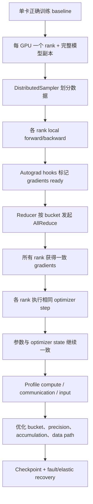
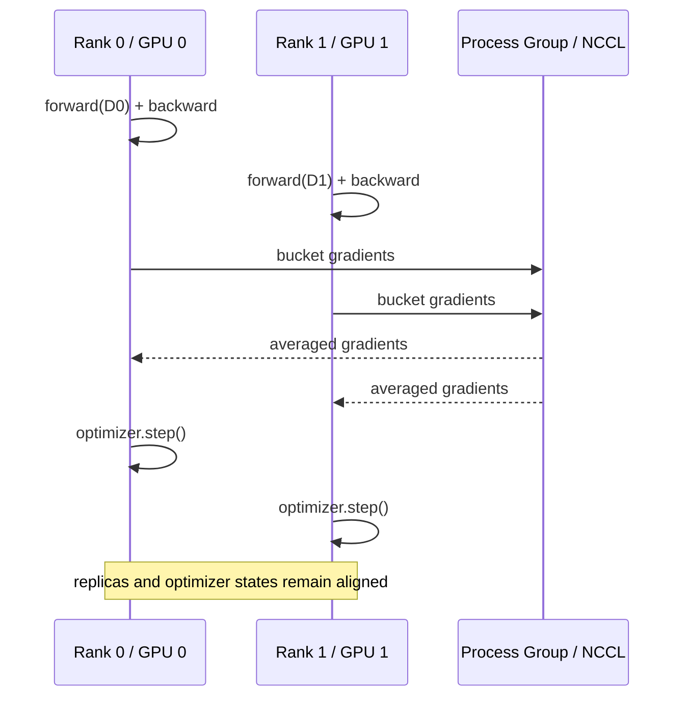
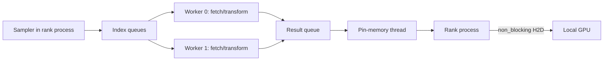
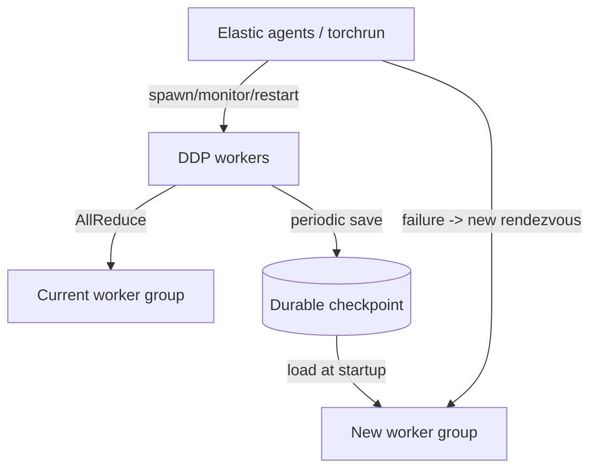

> 对应原文：Chapter 3. Distributed Training with PyTorch DDP
>
> 本笔记严格沿原章顺序展开：DDP 内部机制、单节点配置、多节点配置、排障、profiling、优化、checkpoint、高级 hooks、最佳实践、elastic training、完整 Transformer 示例、练习与总结。补充公式、实验代码与边界说明用于解释原理；框架私有实现和 API 会随 PyTorch 版本变化，使用时应以目标版本的官方文档、runtime diagnostics 和实际 profile 为准。

## 0. 本章要回答的核心问题

第 2 章已经建立硬件与并行策略，本章把 replicated data parallelism 落到 PyTorch DDP。读完应能回答：

1. DDP 如何让每个 rank 处理不同数据，却在每步后维持相同参数？
2. AllReduce 的 sum/average 与 global batch loss 有何数学关系？不等大 local batch 时为什么不能直接平均 rank gradients？
3. Gradient bucket 为什么能减少启动开销，又为何可能推迟通信？
4. Autograd hook、Reducer、CUDA stream 如何让 communication 与 backward overlap？
5. FP16 loss scaling 为什么有效？DDP 同步的是 scaled 还是 unscaled gradient？
6. Parameters、gradients、buffers、optimizer state 分别何时同步？
7. 单节点 DDP 中 `torchrun`、environment variables、`DistributedSampler`、DataLoader 与 device mapping 如何配合？
8. 多节点 DDP 新增了哪些网络、rendezvous、NIC 与配置一致性问题？
9. Hang、错误 gradient、OOM、低 utilization 与网络错误怎样分层定位？
10. PyTorch profiler 如何证明 bucket overlap，而不是凭总通信时间猜测？
11. Mixed precision、gradient accumulation、bucket tuning、unused parameter 与 static graph 分别优化什么？
12. DDP checkpoint 为什么通常只由 rank 0 保存？RNG、sampler、atomicity 与恢复还缺哪些状态？
13. Gradient hook 与 communication hook 有何语义差别，错误 hook 为什么会悄悄破坏训练？
14. `join()` 怎样让 uneven inputs 不再 hang，它是否保持了与等长输入完全相同的优化语义？
15. Elastic agent、rendezvous、worker restart 与 checkpoint 各负责哪一层容错？

全章主线：



核心不是“多启动几个 Python”，而是维持以下不变量：

> **每次 optimizer update 前，所有 replicas 必须从一致参数出发，获得语义正确且一致的聚合 gradient，并执行兼容的状态转换。**

---

## 1. Overview：DDP 是数据并行的标准实现

### 1.1 Sutton 引语与“规模”的含义

原章以“寻找终极算法就是寻找规模”开场，强调许多模型能力依赖更大数据、算力和训练时间。但规模并非只增加 GPU 数：

- 算法要保持与单卡目标一致；
- 网络要承载同步；
- 数据要不重不漏地分给 ranks；
- 故障不能毁掉数日进度；
- GPU 增加后效率与收敛仍要可接受。

DDP 提供的是成熟的 synchronous replicated data-parallel building block，不是所有规模问题的通用解法。完整模型若单卡放不下，需要第 4 章 FSDP 或其他 model/state sharding。

### 1.2 DDP 的适用前提

DDP 最自然的场景：

- 完整模型、gradient、optimizer 与 local activation 可放进每个 GPU；
- 训练 workload 可按 samples 分片；
- 各 rank 大致等量且计算成本接近；
- 每 step 可同步 gradients；
- global batch 与 optimization 允许扩展；
- interconnect 足以让 AllReduce 不成为绝对主导。

它不提供：

- 单卡模型容量扩展；
- 异步 stale-gradient parameter-server 语义；
- 自动数据清洗/全局去重；
- 作业调度与资源申请；
- 自动恢复训练进度；
- 任意 rank-dependent control flow 的正确性。

---

## 2. How DDP works internally

### 2.1 Basic flow：一个 step 的完整状态变化

设 world size 为 $W$，rank $r$ 的 local batch 为 $D_r$，step $t$ 的共同参数为 $w_t$。

1. 每 rank 计算 local loss：

$$
L_r(w_t)=\frac{1}{|D_r|}\sum_{x\in D_r}\ell(w_t;x)
$$

2. Local backward：

$$
g_r=\nabla_w L_r(w_t)
$$

3. DDP 聚合：

$$
g=\frac{1}{W}\sum_{r=0}^{W-1}g_r
$$

4. 每 rank 执行相同 optimizer transition：

$$
(w_{t+1},s_{t+1})=Update(w_t,s_t,g)
$$

$s_t$ 是 momentum/Adam moments 等 optimizer state。若 $w_t,s_t,g$ 相同且 update deterministic，则每 rank 的下一状态继续相同。



### 2.2 为什么 local mean 的 rank average 等价于 global mean

若所有 local batch 大小相同：

$$
|D_r|=m
$$

全局 batch $D=\cup_rD_r$，$|D|=Wm$。Global mean gradient：

$$
\nabla L_D
=\frac{1}{Wm}\sum_r\sum_{x\in D_r}\nabla\ell(w;x)
=\frac{1}{W}\sum_rg_r
$$

所以平均 local-mean gradients 等价于在 global batch 上求 mean loss 的 gradient。这是原章“与单 GPU global batch 相同 update”的数学前提。

若 local batch sizes $m_r$ 不同，正确结果是加权平均：

$$
g=\frac{\sum_rm_rg_r}{\sum_rm_r}
$$

直接做 $\frac1W\sum_rg_r$ 会让小 batch 与大 batch 权重相同。DDP 默认 reducer 不知道每个 loss 代表多少有效 samples；用户必须保持等大 batches，或按样本数缩放 local loss/gradient 并同步总样本数。

### 2.3 Sum、average 与 learning rate

Collective `SUM` 只求和。DDP 在默认语义下让最终 gradients 对 ranks 做平均，使固定 local mean loss 的 gradient scale 不随 $W$ 线性放大。

但 optimization 仍变化，因为：

$$
B_{global}=B_{local}\times W\times A
$$

$A$ 是 accumulation steps。Global batch 增大降低 gradient noise，并改变每 epoch updates 数。即使 gradient scale 形式一致，也可能需要调整 learning rate、warmup、scheduler 与 training steps。

### 2.4 每种状态怎样保持一致

| 状态 | 每 rank 是否完整 | DDP 如何处理 |
| --- | --- | --- |
| Parameters | 是 | 构造时同步；之后相同 gradient/update 保持一致 |
| Gradients | backward 时 local | bucket AllReduce 后一致 |
| Optimizer state | 是 | 通常不通信；由相同初态/gradient/update 保持一致 |
| Persistent buffers | 是 | 初始化同步；默认 forward 前 broadcast buffers |
| Activations | local batch 私有 | 不同步 |
| Dataset indices | 应不同 | `DistributedSampler` 划分 |
| RNG streams | 可相同或按 rank 派生 | 用户管理，取决于 dropout/data augmentation 目标 |

“Optimizer state 不同步”并不矛盾：它是相同输入驱动的 replicated state machine。若某 rank 跳过 optimizer step、overflow decision 不同或 scheduler 调用次数不同，状态就会分叉。

### 2.5 `DataParallel` 与 DDP

| 维度 | `nn.DataParallel` | DDP |
| --- | --- | --- |
| 进程模型 | 单 process、多 threads/devices | 常见一 process 一 GPU |
| Python GIL | 主进程控制受影响 | processes 独立 |
| Model replication | 每 forward scatter/replicate 模式 | 每 rank 持久 replica |
| Gradient 汇聚 | 主 device 成为中心路径 | collective，所有 ranks 参与 |
| 多节点 | 不适合作为标准方案 | 原生 process-group 支持 |
| 故障隔离/日志 | 单进程视角 | 每 rank 独立错误与输出 |

原章称 DP “所有 gradient synchronization 在 GPU 0”是高层瓶颈描述；具体 implementation 有 replicate/scatter/gather/reduce 路径。工程结论不变：PyTorch 官方推荐 DDP，即使单节点多 GPU 也优先使用。

### 2.6 Gradient bucketing 为什么必要

若模型有 $K$ 个参数 tensors，每个 gradient 都单独 AllReduce：

$$
T_{naive}\approx\sum_{k=1}^{K}\left(\alpha+\frac{M_k}{B}\right)
=K\alpha+\frac{\sum_kM_k}{B}
$$

$\alpha$ 是每次 collective 固定启动/同步 latency，$M_k$ 是 tensor bytes。上千个小 tensors 会让 $K\alpha$ 很大。

将 gradients 打包成 $J\ll K$ 个 buckets：

$$
T_{bucket}\approx J\alpha+\frac{\sum_kM_k}{B}
$$

总 payload 近似没变，但 collective 启动次数显著减少。

### 2.7 Bucket 大小的 trade-off

原章给默认约 25 MB，并允许通过 `bucket_cap_mb` 调整。默认值与内部行为可能随版本变化，必须在目标 PyTorch 上查询/measure。

| Bucket 较小 | Bucket 较大 |
| --- | --- |
| 较早 ready，可更早通信 | collective 次数少，摊薄 latency |
| 更好细粒度 overlap 机会 | bandwidth utilization 可能更高 |
| 启动开销多 | 首次通信推迟 |
| 小消息效率低 | 最后 bucket tail 可能更长 |

最优值取决于 gradient ready 时间线、network $\alpha/B$、模型层大小与 backward compute。不是“越大越快”。

### 2.8 Parameter order、gradient-ready order 与 bucket rebuild

原章先说按 `model.parameters()` 连续分桶，后面说明 reducer 大致反向组织，因为 backward 常按 forward 的逆序产生 gradients。更精确的心智模型：

- DDP 根据 parameter registration/order 构建 buckets；
- 初始 iteration 可观察 gradient ready order 并 rebuild buckets；
- dynamic control flow 可能使 ready order 改变；
- 所有 ranks 必须具有相同 parameters、registration order 与 compatible graph；
- 用户不应依赖 private bucket layout 永远固定。

如果一个 bucket 中最后一个 gradient 很晚才 ready，其他已 ready gradients 也必须等待，形成 bucket stall。

### 2.9 Communication-computation overlap 的时间模型

设 backward compute 总时长 $C$，communication 总执行时长 $K$，被覆盖时长为 $O$：

$$
T_{backward+sync}=C+K-O,
\qquad0\le O\le\min(C,K)
$$

如果全部串行，$O=0$；如果通信完全藏在 backward 后面，关键路径接近 $\max(C,K)$，但最后 ready bucket 通常仍有 unhidden tail。

```mermaid
gantt
    title DDP backward 与 bucket AllReduce 重叠
    dateFormat X
    axisFormat %s
    section Compute
    Backward late layers :a1, 0, 4
    Backward middle      :a2, 4, 8
    Backward early       :a3, 8, 12
    section Communication
    Bucket 0 AllReduce   :b1, 4, 8
    Bucket 1 AllReduce   :b2, 8, 12
    Final bucket tail    :b3, 12, 14
```



此图表达依赖关系，不代表真实秒数。Profiler 中应看到 NCCL kernels 与 backward kernels 在不同 CUDA streams 时间重叠。

### 2.10 Overlap 的实现组件

1. **Autograd hooks**：某 parameter gradient computed 时触发。
2. **Reducer**：记录 bucket 内哪些 gradients ready。
3. **Bucket buffer/views**：组合梯度存储，减少 collective 数。
4. **Async process-group work**：bucket ready 后启动 AllReduce。
5. **CUDA streams/events**：协调 compute 与 communication streams。
6. **Finalization**：optimizer 使用前确保 reductions 完成。

DDP 不是等 `loss.backward()` 算完所有 gradients 才统一通信；它尽可能在 backward 中途发起 bucket reductions。

### 2.11 Overlap 失败的常见原因

- 模型太小，backward 很快；
- bucket 太大，直到 backward 末尾才 ready；
- bucket 太小，小 collectives 启动开销过多；
- parameter order 与 ready order 不匹配；
- network 太慢，通信尾巴超过剩余 compute；
- 用户调用同步 API（`.item()`、不必要 `synchronize()`）阻塞；
- gradient hooks 做 CPU I/O/打印；
- dynamic graph/unused params 增加 reducer bookkeeping；
- local batch 太小，compute 不够覆盖通信。

### 2.12 Ring AllReduce 的成本

对 $W$ ranks、bucket 大小 $M$，经典 ring 包含：

- $W-1$ 轮 ReduceScatter；
- $W-1$ 轮 AllGather。

每 rank 数据量：

$$
V_{ring}=2\frac{W-1}{W}M
$$

简化时间：

$$
T_{ring}\approx2(W-1)\alpha
+2\frac{W-1}{W}\frac{M}{B}
$$

大消息时 bandwidth efficient；rank 数多、小 bucket 时 latency rounds 可能显著。Tree/double-tree 用约 $O(\log W)$ rounds 改善 latency，具体由 NCCL 按拓扑与消息选择。

### 2.13 “Ring 与物理 ring”不能混淆

Ring 是 logical collective schedule。NCCL 可在 NVSwitch、PCIe tree 或 Clos fabric 上构造 logical rings；一条 logical edge 可能跨多个 physical hops。慢的原因可能是：

- ring mapping 跨慢 PCIe/NUMA/NIC；
- 多 logical channels 争同一 uplink；
- topology visibility 错误；
- fabric congestion；
- message size 更适合另一算法。

`NCCL_DEBUG=INFO` 与 profiler 可帮助确认 transport/algorithm，但最终仍以实测 collective 时间为准。

### 2.14 Mixed precision：为什么 FP16 需要 loss scaling

FP16 exponent range 较窄，小 gradient 可能 underflow 为 0。将 loss 乘 scale $S$：

$$
L'=SL
$$

由微分线性：

$$
g'=\nabla L'=S\nabla L=Sg
$$

Backward 中较小 gradient 被放大到 FP16 可表示范围；optimizer 前再：

$$
g=g'/S
$$

如果 overflow，则跳过 step 并降低 scale；若长期无 overflow，可提高 scale。这是 dynamic `GradScaler` 的直觉。

### 2.15 AMP + DDP 的顺序

FP16 典型流程：

```text
autocast forward
  -> compute loss
  -> scaler.scale(loss).backward()
  -> DDP AllReduce scaled gradients
  -> scaler.unscale_(optimizer)（显式 clipping 时）
  -> check inf/nan
  -> scaler.step(optimizer)
  -> scaler.update()
```

AllReduce 的线性意味着相同 scale $S$ 下：

$$
\frac{1}{W}\sum_r(Sg_r)
=S\left(\frac{1}{W}\sum_rg_r\right)
$$

聚合后统一除 $S$ 与先除再聚合数学等价。关键前提是 ranks 的 scale/overflow decision 保持兼容。每个 rank 都必须调用 scaler step/update；不能只让 rank 0 optimizer step。

### 2.16 BF16 为什么通常不需要 GradScaler

BF16 exponent 位数与 FP32 相同，dynamic range 大，gradient underflow 风险显著低于 FP16；mantissa 更短，精度误差仍存在，但 loss scaling 主要解决 exponent range，不解决 mantissa 精度。因此 BF16 常只用 autocast，不用 `GradScaler`。

“通常”不是绝对：hardware/kernel support、特定 operation 与模型稳定性仍需验证。BF16 也不表示 optimizer state 自动变成 BF16。

### 2.17 Gradient clipping 必须在 unscale 后

若对 scaled gradient $g'=Sg$ 直接按 threshold $c$ clip，实际阈值变成 $c/S$，语义错误。FP16 AMP 应：

```python
scaler.unscale_(optimizer)
torch.nn.utils.clip_grad_norm_(model.parameters(), max_norm)
scaler.step(optimizer)
scaler.update()
```

DDP 已在 backward 中聚合 scaled gradients，所以 unscale 后每 rank 看到相同全局 gradient，clip norm 也应一致。

### 2.18 Buffer synchronization 是什么

PyTorch `Module` 主要持久状态：

- `_parameters`：通常参与 autograd/optimizer；
- `_buffers`：持久但不由 optimizer 更新，如 BatchNorm running stats、某些 masks/counters。

DDP 构造时会确保 module parameters/buffers 起点一致；默认 `broadcast_buffers=True` 时，在 forward 周期同步 buffers（以 authoritative rank 的内容广播），防止 replicas 的 persistent buffers 无界分叉。

### 2.19 Buffer broadcast 不等于 SyncBatchNorm

普通 BatchNorm 每 rank 用自己的 local mini-batch 计算当前 batch mean/variance，并更新 running stats。Forward 前 broadcast 只让本次起点一致；各 rank 在不同 local data 上更新后仍可暂时不同，下次 broadcast 再以 rank 0 状态覆盖。

**SyncBatchNorm** 则在 forward 中跨 ranks 聚合当前 batch statistics，使 normalization 使用 global stats。二者目的不同：

| 机制 | 同步什么 | 何时 | 代价/语义 |
| --- | --- | --- | --- |
| DDP buffer broadcast | persistent buffers | forward 前 | rank 0 authoritative |
| SyncBatchNorm | 当前 batch mean/variance | normalization 时 | 额外 collective，global batch stats |

所以原章“BatchNorm 等层需要 buffer synchronization 才能正确”应细化：buffer broadcast 保持 persistent state policy，但不能替代 global batch normalization。小 local batch 下普通 BN 仍可能统计不稳定。

### 2.20 何时可关闭 `broadcast_buffers`

可考虑：

- 模型没有会变化的 persistent buffers；
- buffers 只读且初始化已经一致；
- 应用有显式同步/聚合策略；
- 已验证 eval checkpoint 中 buffers 正确。

风险：silent state divergence，尤其 BatchNorm running stats、EMA/counters 或自定义 buffers。关闭前应比较各 rank buffers max difference 和最终 eval quality。

### 2.21 DDP forward 的高层职责

原章提到私有 `_sync_module_states`。私有函数名会随版本变化，稳定心智模型是：

1. DDP 初始化验证 parameter shapes/strides 等兼容；
2. 确保初始 parameters/buffers 一致；
3. Forward 前准备 reducer 状态；
4. 按配置同步 buffers；
5. 跟踪哪些 outputs/parameters 参与 backward（尤其 unused detection）；
6. Backward hooks 驱动 bucket reductions。

不要在业务代码依赖 `_sync_module_states` 等 private symbol；应依赖公开 DDP options 与 tests。

### 2.22 Unused parameters 为什么可能 hang

Reducer 期待 bucket 中每个需要同步的 gradient 都 ready。若某 parameter 没参与当前 loss graph，它的 autograd hook 不会收到 gradient；若 reducer 不知道它 unused，就可能一直等。

`find_unused_parameters=True` 从 forward outputs 遍历 autograd graph，预先标记不参与 backward 的 parameters。代价：

- 每 iteration graph traversal；
- dynamic graph bookkeeping；
- 可能暴露不同 ranks 使用参数集合不一致的问题。

如果 graph 稳定且所有参数总是 used，应保持 `False`；若只是 bug 导致 parameter 没接到 loss，打开选项会掩盖模型错误，应先调查。

### 2.23 DDP 正确性的最低协议

每个 iteration，所有 ranks 应：

1. 对同一 DDP module 执行兼容 forward/backward；
2. 产生 reducer 可解释的一致 bucket sequence；
3. 参与相同 process group collectives；
4. 在相同逻辑边界 optimizer/scheduler step；
5. 不让某个 rank 因 logging/eval/checkpoint 分支漏掉 collective；
6. 异常时让整个 worker group 退出/恢复，而不是单 rank 悄悄继续。

这套协议比“每 rank loss 都能打印”更能定义正确 DDP。

### 2.24 可运行的梯度等价性计算器

下面的纯 Python 例子验证等大 batch rank-average 与 global sample average 的关系，并展示不等大 batch 的偏差。

```python
def mean(values):
    return sum(values) / len(values)


equal_rank_samples = [
    [1.0, 3.0],
    [5.0, 7.0],
]
rank_means = [mean(samples) for samples in equal_rank_samples]
print(f"Equal local batches, rank mean: {mean(rank_means):.2f}")
print(f"Equal local batches, global mean: {mean(sum(equal_rank_samples, [])):.2f}")

uneven_rank_samples = [
    [1.0],
    [3.0, 5.0, 7.0],
]
uneven_rank_means = [mean(samples) for samples in uneven_rank_samples]
naive_rank_average = mean(uneven_rank_means)
weighted_global_average = mean(sum(uneven_rank_samples, []))

print(f"Uneven local batches, naive rank mean: {naive_rank_average:.2f}")
print(f"Uneven local batches, sample-weighted mean: {weighted_global_average:.2f}")
```

预期输出：

```text
Equal local batches, rank mean: 4.00
Equal local batches, global mean: 4.00
Uneven local batches, naive rank mean: 3.00
Uneven local batches, sample-weighted mean: 4.00
```

数字可视为一维 per-sample gradient，直观显示为什么 uneven inputs 不只会 hang，也可能改变优化目标。

---

## 3. Setting up Single-Node DDP

### 3.1 为什么先从单节点开始

单节点多 GPU 已包含 DDP 的核心变量：

- 多进程与 rank identity；
- 一进程一 GPU；
- NCCL process group；
- sampler/data-loader 分片；
- gradient collective；
- 日志与副作用的 rank 约束。

但它暂时排除了 DNS、跨节点 NIC、fabric、software drift 与 scheduler。先让单节点正确，才能把多节点新增故障归因到网络/部署边界。

### 3.2 `torchrun` 负责什么

`torchrun` 是 launcher/elastic agent 入口，主要负责：

- 按 `--nproc-per-node` 创建 workers；
- 为 workers 注入 `RANK`、`LOCAL_RANK`、`WORLD_SIZE` 等；
- 提供 rendezvous/store 信息；
- 收集 worker failures；
- 在 elastic 配置下重启 worker group。

它不负责：

- 自动给每个 process 创建 `DistributedSampler`；
- 自动选择正确 GPU，脚本仍需 `set_device(local_rank)`；
- 自动保证每 rank control flow 一致；
- 自动保存/resume checkpoint；
- 自动申请 cluster resources。

单节点静态启动：

```shell
torchrun --standalone --nnodes=1 --nproc-per-node=4 code/train_ddp_single.py
```

Option 必须使用 ASCII `--`。原书转换文本中偶有 Unicode 连字符，直接复制可能被 argument parser 拒绝。

### 3.3 Environment variables

常用变量：

| 变量 | 含义 | 典型用途 |
| --- | --- | --- |
| `RANK` | 当前 worker 的 global rank | 日志/checkpoint 主 rank、group identity |
| `LOCAL_RANK` | 当前 node 内 worker rank | 选择本地 CUDA device |
| `WORLD_SIZE` | 当前 worker group 总进程数 | global batch、metrics、group size |
| `LOCAL_WORLD_SIZE` | 当前 node local workers 数 | node 内布局/诊断 |
| `MASTER_ADDR` | rendezvous/store 可达地址 | 初始化发现 |
| `MASTER_PORT` | rendezvous/store port | 初始化发现 |
| `GROUP_RANK` | elastic worker group 中的 group/node rank（单 role 常对应 node rank） | elastic/multi-node 诊断 |

不要依赖所有版本都注入 `NODE_RANK` 或 `NNODES` 环境变量；它们是常见 launcher 参数/外层 scheduler 概念，但 PyTorch 稳定公开的 worker env 应按目标版本文档核对。代码通常只需 `RANK/LOCAL_RANK/WORLD_SIZE`。

### 3.4 Device mapping 必须早于 CUDA allocation

```python
local_rank = int(os.environ["LOCAL_RANK"])
torch.cuda.set_device(local_rank)
device = torch.device("cuda", local_rank)
```

顺序重要：如果先在默认 `cuda:0` 创建 model/tensor，再切 device，多 workers 可能先占满 GPU 0，或留下错误-device state。

`CUDA_VISIBLE_DEVICES=2,5` 时：

```text
LOCAL_RANK 0 -> process-visible cuda:0 -> physical GPU 2
LOCAL_RANK 1 -> process-visible cuda:1 -> physical GPU 5
```

`LOCAL_RANK` 是**可见设备空间中的 index**，不是原始 physical index。Global `RANK` 在多节点会超过本机 GPU 数，不能用于 `set_device()`。

### 3.5 一个稳健的 setup/cleanup 骨架

```python
import os
from dataclasses import dataclass
from datetime import timedelta

import torch
import torch.distributed as dist


@dataclass(frozen=True)
class DistributedContext:
    rank: int
    local_rank: int
    world_size: int
    device: torch.device


def setup_distributed() -> DistributedContext:
    if not torch.cuda.is_available():
        raise RuntimeError("This training entrypoint requires CUDA")

    local_rank = int(os.environ["LOCAL_RANK"])
    torch.cuda.set_device(local_rank)
    device = torch.device("cuda", local_rank)

    dist.init_process_group(
        backend="nccl",
        init_method="env://",
        timeout=timedelta(minutes=10),
    )
    return DistributedContext(
        rank=dist.get_rank(),
        local_rank=local_rank,
        world_size=dist.get_world_size(),
        device=device,
    )


def cleanup_distributed() -> None:
    if dist.is_available() and dist.is_initialized():
        dist.destroy_process_group()
```

训练入口应使用 `try/finally`：

```python
def main() -> None:
    context = setup_distributed()
    try:
        train(context)
    finally:
        cleanup_distributed()
```

Timeout 不是修复 hang，而是让缺失参与者最终产生诊断。过短会误杀慢初始化，过长会延迟发现真实失败。

### 3.6 DDP 包裹顺序

```python
model = build_model().to(context.device)
ddp_model = DDP(
    model,
    device_ids=[context.local_rank],
    output_device=context.local_rank,
)
optimizer = torch.optim.AdamW(ddp_model.parameters(), lr=learning_rate)
```

应先把 model 移到当前 device，再构造 DDP。Optimizer 在包裹前后创建通常都能引用同一 parameter objects，但在可能改变/wrap parameters 的组合框架中，稳妥做法是按框架推荐顺序创建；纯 DDP 中以上顺序清楚地表达最终训练对象。

### 3.7 原章最小示例的教学作用与限制

原章每 rank 创建随机 `data/target` 并训练同一个 linear model。它能验证：

- workers 启动；
- model 初始化同步；
- backward collective；
- optimizer update；
- rank-0 logging。

但它不是可比较 benchmark：

- 每 rank 随机数据没有固定 seed；
- rank 0 打印的是 local loss，不是 global loss；
- 没有 sampler/DataLoader；
- cleanup 不在 `finally` 中；
- 没有确认各 rank parameters 最终一致。

Smoke test 应增加 known-answer AllReduce 与 parameter checksum。

### 3.8 `DistributedSampler` 实际怎样划分 indices

对 map-style dataset 长度 $N$、replicas $W$：

1. `shuffle=True` 时，用共同 `seed + epoch` 生成全局 permutation；
2. 将 index list padding 或 truncation 到可被 $W$ 整除；
3. rank $r$ 取跨步 slice：

$$
I_r=indices[r:total\_size:W]
$$

因此原章图把 shards 描述为“连续 quarters”只是概念图；默认实现并非连续区间。在 shuffle 后，跨步切片有助于让每 rank 获得同一全局 permutation 的均匀子集。

### 3.9 `drop_last=False` 不会让某些标准 sampler ranks 多一步

对标准 `DistributedSampler`：

#### `drop_last=False`

$$
num\_samples=\left\lceil\frac{N}{W}\right\rceil,
\qquad total\_size=W\cdot num\_samples
$$

通过重复部分 indices padding，让**每个 rank 样本数相同**。

#### `drop_last=True`

通常截断到：

$$
total\_size=W\left\lfloor\frac{N}{W}\right\rfloor
$$

每 rank 同样等长，但全局丢弃尾部 indices。

所以原章“sampler `drop_last=False` 时有些 ranks 可能多一个 batch，需 `join()`”不适用于标准 map-style `DistributedSampler`：它专门通过 padding 保持等长。Uneven inputs 更常来自 IterableDataset、自定义 sampler、动态 filtering、数据读取错误或各 rank 数据源本来不同。

### 3.10 Sampler `drop_last` 与 DataLoader `drop_last`

- Sampler `drop_last`：使 dataset indices 能被 replicas 均分；
- DataLoader `drop_last`：丢掉每 rank 不足 local batch size 的最后 batch。

例如 $N=10,W=3$：

```text
sampler drop_last=False:
  padding 到 12，每 rank 4 samples
sampler drop_last=True:
  truncation 到 9，每 rank 3 samples
```

若 DataLoader batch size=2：

- 4 samples -> 2 full batches；
- 3 samples + loader `drop_last=False` -> 2 batches（2 + 1）；
- 3 samples + loader `drop_last=True` -> 1 batch。

所有 ranks 仍具有相同步数，因为 sampler 给每 rank 相同 samples。

### 3.11 可运行的 sampler 边界示例

```python
from torch.utils.data.distributed import DistributedSampler


dataset = list(range(10))
for drop_last in (False, True):
    print(f"drop_last={drop_last}")
    for rank in range(3):
        sampler = DistributedSampler(
            dataset,
            num_replicas=3,
            rank=rank,
            shuffle=False,
            drop_last=drop_last,
        )
        print(f"  rank {rank}: {list(iter(sampler))}")
```

预期输出：

```text
drop_last=False
  rank 0: [0, 3, 6, 9]
  rank 1: [1, 4, 7, 0]
  rank 2: [2, 5, 8, 1]
drop_last=True
  rank 0: [0, 3, 6]
  rank 1: [1, 4, 7]
  rank 2: [2, 5, 8]
```

默认 padding 让 indices 0、1 重复。训练通常接受；严格 evaluation 应去重或使用能跟踪原始样本的 gather/metric logic，避免指标偏置。

### 3.12 `set_epoch(epoch)` 为什么是协议的一部分

```python
for epoch in range(start_epoch, epochs):
    sampler.set_epoch(epoch)
    for batch in loader:
        ...
```

所有 ranks 用相同 epoch，生成同一个 global permutation 后再分片。若不调用，每个 epoch 常重复相同 ordering；若各 rank epoch 不同，会从不同 permutations 取 slice，产生不可控 overlap/omission。

从 checkpoint 恢复时，sampler epoch 必须与训练 epoch/step 一致。Mid-epoch exact resume 还需保存当前 sample/iterator offset，仅保存 epoch 不够。

### 3.13 DataLoader 内部 pipeline

`num_workers>0` 时，每个 DDP rank 主进程再创建 DataLoader subprocesses：



若 node 有 $G$ ranks，每 rank `num_workers=k`，总 loader workers 约：

$$
Workers_{node}=Gk
$$

还不含 rank processes、pin-memory threads、NCCL/runtime threads。设置 `num_workers=8` 在 8-GPU node 意味着 64 loader workers，可能过度争用 CPU、RAM、filesystem metadata。

### 3.14 Dataset copies 与 memory amplification

多进程 DataLoader workers 通常各自持有 dataset object 的进程副本。大 Python metadata/list 可能导致 host RAM 随 workers 放大；fork 的 copy-on-write 也会因对象访问/修改逐渐失去共享。

缓解：

- 将大 metadata 放入 NumPy/Arrow/mmap 等紧凑结构；
- lazy/open-per-worker resources；
- 控制 workers；
- shard files 而不是让每 worker 扫全目录；
- 使用 persistent workers 避免每 epoch 重建，但注意资源生命周期。

### 3.15 Prefetch 与 pinned memory 的准确边界

`prefetch_factor` 通常表示**每个 worker**预取 batches 数，总 in-flight batches 约 $k\times prefetch\_factor$，会增加 host RAM。

`pin_memory=True` 让 DataLoader 的 pin-memory stage 产生 page-locked buffers；要与 GPU compute overlap，还需：

```python
features = features.to(device, non_blocking=True)
labels = labels.to(device, non_blocking=True)
```

且需要 stream/data dependency 合理。Pinning 只减少/改善 H2D staging，不会自动修复磁盘或解码瓶颈。

### 3.16 Worker seeding 与 rank seeding

模型初始化通常希望所有 ranks 起点相同，DDP 初始化也会同步参数。数据 augmentation/dropout 是否应各 rank 不同，要显式设计：

- sampler global permutation seed 相同，epoch 相同；
- 每 rank/worker augmentation RNG 应有不同但可复现的 seed；
- checkpoint 恢复需恢复/重建 RNG progression。

可基于 base seed、rank、worker ID、epoch 派生：

$$
seed_{r,w,e}=Hash(base,r,w,e)
$$

不要让所有 workers 使用完全同一随机序列，否则不同样本可能获得重复 augmentation。

### 3.17 IterableDataset 需要额外分片

`DistributedSampler` 面向可索引、有稳定长度的 map-style dataset。Streaming/IterableDataset 需在 iterator 中按 rank 和 worker 显式 shard，例如先按 global rank 分 files，再按 worker ID 分片。

若每 rank stream 长度不同，才可能产生 uneven steps，需要：

- 统一 epoch token/sample budget；
- padding/dropping；
- DDP `join()`；
- 或让 scheduler/data service 保证等量。

### 3.18 Rank-0 logging 的 loss 不是 global metric

原章完整 CIFAR 示例只打印 rank 0 local batch loss。它适合进度观察，却不能代表 global batch mean。准确 aggregate：

```python
with torch.no_grad():
    loss_sum = loss.detach() * batch_size
    count = torch.tensor(batch_size, device=device, dtype=torch.float64)
    pair = torch.stack((loss_sum.to(torch.float64), count))
    dist.reduce(pair, dst=0, op=dist.ReduceOp.SUM)
    if rank == 0:
        global_mean = (pair[0] / pair[1]).item()
```

若每 step 都为日志额外 Reduce，会增加同步；可以本地累计一个 logging window 后再 reduce。

### 3.19 Dataset download race

原章每 rank 同时 `download=True`，可能竞争同一文件。更稳健：

```python
if rank == 0:
    torchvision.datasets.CIFAR10(root=data_root, train=True, download=True)
dist.barrier()
dataset = torchvision.datasets.CIFAR10(
    root=data_root,
    train=True,
    download=False,
    transform=transform,
)
```

这要求所有 ranks 看见同一 filesystem。多节点 local disks 则需要每 node local rank 0 下载/准备，不能只让 global rank 0 写其本地路径。

### 3.20 单节点完整训练骨架

```python
import os

import torch
import torch.distributed as dist
from torch.nn.parallel import DistributedDataParallel as DDP
from torch.utils.data import DataLoader
from torch.utils.data.distributed import DistributedSampler


def train_one_epoch(model, loader, sampler, optimizer, device, epoch):
    sampler.set_epoch(epoch)
    model.train()
    for features, labels in loader:
        features = features.to(device, non_blocking=True)
        labels = labels.to(device, non_blocking=True)
        optimizer.zero_grad(set_to_none=True)
        logits = model(features)
        loss = torch.nn.functional.cross_entropy(logits, labels)
        loss.backward()
        optimizer.step()


def run(dataset, build_model, epochs=10, local_batch_size=128):
    context = setup_distributed()
    try:
        sampler = DistributedSampler(
            dataset,
            num_replicas=context.world_size,
            rank=context.rank,
            shuffle=True,
            drop_last=False,
        )
        loader = DataLoader(
            dataset,
            batch_size=local_batch_size,
            sampler=sampler,
            shuffle=False,
            num_workers=4,
            pin_memory=True,
            persistent_workers=True,
        )
        model = build_model().to(context.device)
        model = DDP(model, device_ids=[context.local_rank])
        optimizer = torch.optim.AdamW(model.parameters(), lr=3e-4)

        for epoch in range(epochs):
            train_one_epoch(
                model, loader, sampler, optimizer, context.device, epoch
            )
    finally:
        cleanup_distributed()
```

这仍是骨架：production 还需 config、validation、AMP、checkpoint、metrics、signals、error recording 和 exact resume。

---

## 4. Setting up Multi-Node DDP

### 4.1 多节点新增了什么

单节点已有 DDP 语义；多节点新增的是 deployment failure surface：

- 每 node 一个或多个 launcher agents；
- 全局 rank mapping；
- rendezvous endpoint 的跨节点可达性；
- node 内 NVLink/PCIe 与 node 间 IB/RoCE/Ethernet；
- GPU-NIC NUMA affinity；
- software/container/data consistency；
- scheduler task topology；
- 网络抖动和相关故障。

DDP training loop 通常无需改变，启动和环境才是主要差异。

### 4.2 Rank layout

若静态、每 node local world size 都为 $G$：

$$
WORLD\_SIZE=N_{nodes}G
$$

$$
RANK=node\_rank\cdot G+LOCAL\_RANK
$$

两 nodes × 两 GPUs：

| Node rank | Local rank | Global rank |
| ---: | ---: | ---: |
| 0 | 0 | 0 |
| 0 | 1 | 1 |
| 1 | 0 | 2 |
| 1 | 1 | 3 |

公式不适用于 heterogeneous local worker counts 或自定义 role/rank assignment；runtime env 是权威。

### 4.3 Rendezvous 不是 gradient master

所有 agents/workers 需共同知道：

- job/run identity；
- endpoint；
- expected nodes/workers；
- rank assignment。

`MASTER_ADDR:MASTER_PORT` 用于 store/rendezvous/bootstrap。Gradient AllReduce 不会把每个 bucket 全部发送到 master rank；NCCL 按 topology 建立 peer/collective data paths。

### 4.4 Static two-node launch

Node 0：

```shell
torchrun --nnodes=2 --nproc-per-node=2 --node-rank=0 \
  --master-addr=10.0.0.10 --master-port=29500 \
  code/train_ddp_multi.py
```

Node 1：

```shell
torchrun --nnodes=2 --nproc-per-node=2 --node-rank=1 \
  --master-addr=10.0.0.10 --master-port=29500 \
  code/train_ddp_multi.py
```

`MASTER_ADDR` 可以是 IP，也可以是**所有 nodes 均能一致解析和路由到的 hostname**。原章要求一定是 IP 过强；真正要求是全员得到同一可达 endpoint，不能解析到 loopback/错误 management network。

### 4.5 Launch 前检查

1. 所有 nodes 系统时间、DNS/hosts 与 hostname 解析合理；
2. container/image/code/config/commit 一致；
3. PyTorch/CUDA/NCCL/driver 兼容；
4. 每 node 可见 GPU 数与 `nproc-per-node` 一致；
5. master endpoint 可达且 port 可绑定；
6. data/checkpoint paths 在各 node 语义一致；
7. NIC/HCA 与 GPU topology 已知；
8. firewall/security group 允许 rendezvous 和 collective data path；
9. 没有旧 job 争用 port/GPU；
10. 先运行小 known-answer NCCL collective。

只开放 master port 可能不够：NCCL/socket transport 还会建立 worker 间数据连接，实际 port/network policy 需按 cluster/runtime 配置。

### 4.6 NCCL 的层次化通信不是固定三步算法

原章用“node 内 reduce → node 间 reduce → node 内 broadcast”解释层次化直觉。NCCL 实际可能构造多 rings、trees、CollNet/NVLS 或其他 channels；是否分层、谁做 representative 取决于版本、topology、message size。

稳定结论是：node 内 fabric 通常快于 node 间，collective library 会尝试利用层级；不能假设每次 AllReduce 都严格执行固定三阶段。

### 4.7 Network interface selection

多 NIC node 常同时有：

- management Ethernet；
- IP over InfiniBand interface；
- RDMA HCA ports；
- storage network；
- container/loopback/virtual interfaces。

`NCCL_SOCKET_IFNAME` 控制 socket/bootstrap/fallback interface selection，例如：

```shell
export NCCL_SOCKET_IFNAME=^lo,docker0
```

或明确指定 cluster interface。RDMA HCA selection 还可能需要 `NCCL_IB_HCA` 等当前 NCCL 配置；把 `NCCL_SOCKET_IFNAME=ib0` 不应误解为所有 payload 一定走 GPUDirect RDMA。

### 4.8 InfiniBand/RoCE 验证层级

```text
Link state / firmware
  -> host RDMA pair test
  -> GPU-NIC locality / GPUDirect
  -> NCCL tests on 2 nodes
  -> more nodes / size sweep / p99
  -> real DDP bucket profile
```

`ib_write_bw` 验证 raw RDMA path；`nccl-tests all_reduce_perf` 更接近 DDP collective。二者都不能单独证明 application overlap。

### 4.9 NCCL diagnostic variables

短测试可用：

```shell
export NCCL_DEBUG=INFO
export NCCL_DEBUG_SUBSYS=INIT,NET,GRAPH,COLL
```

诊断 transport、HCA、rings/trees 与 initialization。不要长期无边界开启大量 debug logs。

`NCCL_IB_DISABLE=1` 可故意禁用 IB/RoCE 以做 socket fallback A/B；正常 RDMA cluster 不应把它当优化。默认行为与变量支持应查目标 NCCL 版本。

### 4.10 两种正确的 SLURM launch pattern

#### Pattern A：SLURM 一 task 一 GPU，直接运行 Python

```shell
#!/bin/bash
#SBATCH --nodes=2
#SBATCH --ntasks-per-node=2
#SBATCH --gres=gpu:2

export MASTER_ADDR=$(scontrol show hostnames "$SLURM_JOB_NODELIST" | head -n 1)
export MASTER_PORT=29500
export WORLD_SIZE=$SLURM_NTASKS

srun bash -c '
  export RANK=$SLURM_PROCID
  export LOCAL_RANK=$SLURM_LOCALID
  python code/train_ddp_multi.py
'
```

这里 SLURM 已创建每 GPU 一个 process，不再让每 task 内 `torchrun --nproc-per-node=2` 二次派生。

#### Pattern B：SLURM 每 node 一个 agent，agent 用 torchrun 派生 local workers

```shell
#!/bin/bash
#SBATCH --nodes=2
#SBATCH --ntasks-per-node=1
#SBATCH --gres=gpu:2

export MASTER_ADDR=$(scontrol show hostnames "$SLURM_JOB_NODELIST" | head -n 1)
export MASTER_PORT=29500

srun --ntasks=$SLURM_NNODES --ntasks-per-node=1 \
  torchrun --nnodes=$SLURM_NNODES --nproc-per-node=2 \
    --node-rank=$SLURM_NODEID \
    --master-addr=$MASTER_ADDR --master-port=$MASTER_PORT \
    code/train_ddp_multi.py
```

原章第二种示例同时 `ntasks-per-node=2` 与每 agent `nproc-per-node=2`，可能在每 node 启动两个 agents、每个再派生两个 workers，导致 4 workers 争 2 GPUs。关键原则：**明确谁负责派生 GPU workers，只保留一个层级。** 不同 SLURM cluster 对 `$SLURM_NODEID` 在 `srun` shell/step 中的传播细节不同，正式使用应按第 8 章和集群模板验证。

### 4.11 Multi-node global batch 与 scheduler

$$
B_{global}=B_{local}\times WORLD\_SIZE\times accumulation
$$

从 1 node × 8 GPU 扩到 8 nodes × 8 GPU，保持 local batch 不变会让 global batch 增长 8 倍。需要重新检查：

- learning-rate scaling；
- warmup tokens 而非只按 steps；
- total optimizer updates；
- evaluation/checkpoint cadence；
- data epoch definition。

否则系统扩展与 optimization 变化混在一起，无法判断 loss 差异来自 DDP bug 还是 batch dynamics。

### 4.12 Multi-node script 应保持 node-agnostic

训练脚本通常只读取：

```python
rank = int(os.environ["RANK"])
local_rank = int(os.environ["LOCAL_RANK"])
world_size = int(os.environ["WORLD_SIZE"])
```

不要在代码写 node 0/1 的 IP 或 global-rank-to-device 固定表。Launcher/scheduler 负责 topology，脚本负责 worker behavior。

原章 `model = nn.Linear(...).to(local_rank)` 应改用明确 device：

```python
device = torch.device("cuda", local_rank)
model = nn.Linear(10, 1).to(device)
```

整数 `.to()` 容易与 dtype/device overload 混淆，也不表达多节点本地 index 语义。

### 4.13 Multi-node smoke-test 阶梯

```text
每 node 单 GPU 单进程
  -> 每 node 单机多 GPU
  -> 2 nodes × 1 GPU known-answer AllReduce
  -> 2 nodes × all local GPUs NCCL test
  -> 小 model + synthetic data
  -> 真实 DataLoader
  -> 目标 model/batch
  -> 扩更多 nodes
```

每一级记录 rank/hostname/device/NIC 与结果。直接启动最大 job，任何 typo、数据异常或 RDMA 问题都可能只表现为“hang”。

### 4.14 Multi-node 配置清单

| 层 | 必查项 |
| --- | --- |
| Scheduler | nodes/tasks/GPUs 与派生层级 |
| Rank | global/local/world mapping 唯一 |
| Rendezvous | endpoint、run ID、port、可达性 |
| Software | image、driver、PyTorch、NCCL、code commit |
| GPU | 可见数、UUID、device mapping、health |
| NIC | interface/HCA、link、NUMA locality、RDMA |
| Data | shared/local path、shard、permissions、download policy |
| Checkpoint | shared durability、atomicity、rank ownership |
| Metrics | per-rank logs、clock、run identifier |
| Failure | timeout、launcher kill/restart、cleanup |

---

## 5. Debugging and troubleshooting

### 5.1 先按症状分类，再找最早根因

DDP 常见症状：

| 症状 | 常见发生层 | 首要证据 |
| --- | --- | --- |
| 初始化 hang | rendezvous/rank/network/software | 每 rank setup 日志、endpoint connectivity |
| 第一轮 backward hang | collective order、unused params、shape/device | 所有 rank 最早 exception、DDP/NCCL logs |
| epoch 边界 hang | step 数、validation/checkpoint 分支 | 每 rank batch count 与控制流 |
| Loss 异常 | batch/scale/data/optimizer/AMP | 单卡等价实验、gradient/parameter checksum |
| OOM | state、activation、bucket、错误映射 | per-rank allocated/reserved/peak 与阶段 |
| 运行但慢 | input、kernel、communication、imbalance | timeline、scale curve、synthetic-data A/B |

分布式故障的典型传播：rank 3 在 DataLoader 抛错并退出，rank 0～2 在下一个 AllReduce 等待，最终只打印 NCCL timeout。**最后超时处是故障传播点，所有 ranks 中时间最早的 exception 才更可能是根因。**

### 5.2 为每条日志添加分布式身份

```python
import os
import socket


def distributed_prefix() -> str:
    return (
        f"host={socket.gethostname()} "
        f"pid={os.getpid()} "
        f"rank={os.environ.get('RANK', '?')} "
        f"local_rank={os.environ.get('LOCAL_RANK', '?')}"
    )


def log_stage(message: str) -> None:
    print(f"[{distributed_prefix()}] {message}", flush=True)
```

至少在这些边界记录：

```text
process start
set CUDA device
before/after init_process_group
dataset ready
DDP wrapper ready
epoch/batch start
before/after forward
before/after backward
before/after optimizer step
checkpoint/eval start/end
cleanup
```

Debug 日志应短时启用，避免每 batch 大量 I/O 自己成为同步/性能问题。

### 5.3 初始化 hang 的原因

1. `WORLD_SIZE`/node count 与实际 workers 不一致；
2. 重复/缺失 global rank；
3. `MASTER_ADDR` 在部分 nodes 解析错误或不可达；
4. Port 被占用、防火墙/安全组阻断；
5. 某 node launcher 根本没启动；
6. 不一致 software stack 导致 backend initialization 失败；
7. 一个 process 在 init 前因 CUDA/device/data import 失败；
8. NIC/container visibility 不同。

不要用 `torch.cuda.device_count()` 计算 global world size：每 node 只看见自己的 local devices，heterogeneous/visibility 配置还可能不同。使用 launcher 注入的 group facts。

### 5.4 Collective order mismatch

错误：

```python
if rank == 0:
    dist.all_reduce(metric)
```

正确：所有 group ranks 调 collective，只有副作用可由 root 限制：

```python
dist.all_reduce(metric)
if rank == 0:
    write_metric(metric)
```

同样危险的分支：

- 只有 rank 0 跑 DDP-wrapped validation forward；
- 某 rank 遇到 NaN 后 `continue`，其他 ranks backward；
- 只有部分 ranks 做 gradient clipping/optimizer step；
- 数据为空的 rank 跳过 backward；
- 不同 ranks 创建不同 parameter/group order。

### 5.5 Collective tensor 契约 mismatch

所有参与 ranks 的 operation/group/order 必须兼容，tensor 还需满足对应 collective 的 shape、dtype、device 与 split 约束。错误可能立即报错，也可能在 backend 等待。

Debug 时打印 metadata 而非整个 tensor：

```python
log_stage(
    f"before all_reduce shape={tuple(tensor.shape)} "
    f"dtype={tensor.dtype} device={tensor.device}"
)
```

可先用 scalar known-answer operation 排除 network，再逐步恢复真实 payload。

### 5.6 Unused parameter 与 rank-dependent graph

三种情况要区分：

1. 所有 ranks 每轮都不使用同一组 parameters：`find_unused_parameters=True` 可处理，但应确认是否设计如此。
2. Used set 固定但包含 unused：可评估 `static_graph=True`。
3. 不同 ranks 因 local data 走不同 experts/branches，used sets 不兼容：单纯开启 unused detection 未必保证预期 reduction/optimization；需让 control flow/parameter participation 在 DDP 语义下兼容，或采用专门 MoE/conditional parallel framework。

### 5.7 Timeout 的正确用途

```python
from datetime import timedelta

dist.init_process_group(
    backend="nccl",
    timeout=timedelta(minutes=30),
)
```

Timeout 只决定等待多久后报告失败。把 30 分钟改为 2 小时不会修复漏掉 collective；调试时反而可用较短但足够初始化的 timeout 缩短反馈。

PyTorch/NCCL async error-handling 环境变量名称和行为随版本变化。原章列 `TORCH_NCCL_ASYNC_ERROR_HANDLING`、`TORCH_NCCL_BLOCKING_WAIT`，使用前应查目标 PyTorch 文档；不要假设不存在的 `NCCL_TIMEOUT` 能替代 process-group `timeout`。

### 5.8 Debug environment

可在短复现中启用：

```shell
export TORCH_DISTRIBUTED_DEBUG=DETAIL
export NCCL_DEBUG=INFO
export NCCL_DEBUG_SUBSYS=INIT,COLL,NET
```

`DETAIL` 可能增加检查和开销；NCCL logs 也可能很大。保存所有 rank logs 并带时间戳，不要只保留 rank 0。

### 5.9 分级复现顺序

```text
普通单 GPU（无 DDP）
  -> torchrun 1 process
  -> single node 2 GPUs
  -> single node all GPUs
  -> 2 nodes × 1 GPU
  -> 2 nodes × all GPUs
  -> target scale
```

每一级固定 model/data/seed，并添加一个 known-answer collective。最近新增的边界就是优先怀疑对象。

### 5.10 Wrong results：先定义“应该相同到什么程度”

可能的比较目标：

- **数学等价**：同 global batch、同 parameter state、同 precision，gradient 在容差内一致；
- **统计等价**：loss/quality 曲线分布相近；
- **bitwise deterministic**：每步完全相同，要求最严且常牺牲性能。

单卡与多卡若 local batch 相同，则 global batch 不同，不能期待 step-by-step loss 相同。公平测试应固定 global batch、optimizer updates、LR schedule 与有效 samples。

### 5.11 Seed 的正确设计：不是所有随机流都必须相同

原章建议所有 ranks 使用同 seed，适合确保初始 model 构造一致；DDP 初始化也会同步参数。但 stochastic training 中不同随机流有不同需求：

| 随机源 | 常见目标 |
| --- | --- |
| Model initialization | 各 ranks 相同，或由 DDP 初始化同步 |
| Sampler permutation | 相同 base seed + 相同 epoch，再按 rank 切 |
| Data augmentation worker | 按 rank/worker 派生，避免重复 augmentation |
| Dropout | 通常希望 ranks 有不同 masks，增加 global-batch 随机性 |
| Exact resume | 恢复各 rank 自己的 RNG progression |

如果所有 ranks 执行相同 RNG call sequence 且 seed 完全相同，dropout masks 也可能相同；这不一定导致 divergence，但降低跨 samples 的随机多样性。更稳健：先构造/同步模型，再用 `base_seed + rank` 派生训练 stochastic RNG，同时 sampler 自己维持共同 seed/epoch 协议。

### 5.12 `set_epoch()` 缺失的真实影响

忘记 `sampler.set_epoch(epoch)` 通常不会让 ranks 在同一 epoch 看到相同数据，也不会直接使 gradient 不一致；它让每个 epoch 重复相同 global shuffle ordering，可能影响随机性和收敛。应精确诊断，不把所有 loss 问题归给它。

### 5.13 Data overlap 与 padding

标准 sampler `drop_last=False` 会 padding，少数 samples 在同一 global epoch 重复，这是设计行为，不是任意 data leakage。真正错误包括：

- 每 rank 都不用 sampler，完整遍历 dataset；
- IterableDataset 未按 rank shard；
- 各 rank 使用不同 sampler seed/epoch；
- validation padding duplicates 未去重；
- DataLoader 同时 `shuffle=True` 与 sampler 冲突（通常 API 会拒绝）。

### 5.14 Rank-0 loss 与 global loss

Rank 0 local loss 不代表全局。比较曲线前按有效 sample count reduce sum/count。对 classification accuracy，也应 reduce correct count 与 total count，而不是平均各 rank accuracy（尾批大小不同时有偏）。

### 5.15 Gradient/parameter consistency check

在 debug 小模型中，可比较各 rank checksum 或 max/min：

```python
@torch.no_grad()
def assert_parameters_match(model, atol=1e-6, rtol=1e-5):
    for name, parameter in model.named_parameters():
        local = parameter.detach()
        maximum = local.clone()
        minimum = local.clone()
        dist.all_reduce(maximum, op=dist.ReduceOp.MAX)
        dist.all_reduce(minimum, op=dist.ReduceOp.MIN)
        if not torch.allclose(maximum, minimum, atol=atol, rtol=rtol):
            raise AssertionError(f"Parameter mismatch: {name}")
```

这会复制参数并增加昂贵 collectives，只用于小规模 debug。生产监控可抽样或 hash，但浮点 hash/bitwise equality 受 reduction non-determinism 影响。

### 5.16 Non-determinism 的来源

- cuDNN/cuBLAS algorithm selection；
- atomic operations；
- NCCL reduction order；
- asynchronous scheduling；
- DataLoader worker ordering；
- mixed precision/overflow；
- compiler/fused kernels。

回归测试可：

```python
torch.backends.cudnn.benchmark = False
torch.use_deterministic_algorithms(True)
```

并设置所需环境；但 deterministic mode 可能报 unsupported operation 或显著变慢。Production convergence 通常追求统计可复现，而不是 bitwise。

### 5.17 CUDA OOM：DDP 没有把单卡状态除以 world size

DDP 每 rank 完整复制：

$$
M_{rank}\approx M_{params}+M_{grads}+M_{optimizer}
+M_{activation}(B_{local},S)+M_{buckets}+M_{temporary}
$$

增加 GPUs 只在固定 global batch 时降低 $B_{local}$，从而可能减少 activation；parameters/optimizer 不下降。原章“memory usage scales with GPU count”应理解为 cluster aggregate replicas 增长，而非每 GPU memory 增长。

### 5.18 OOM 出现阶段决定主导项

| 阶段 | 常见主导项 |
| --- | --- |
| DDP construction | parameters、initial synchronization、bucket buffers |
| Forward | activations、attention workspace |
| Backward early | saved activations + gradients + buckets |
| Optimizer first step | Adam state lazy allocation |
| Validation/generation | logits、gathered predictions、KV/cache |
| Checkpoint | CPU/GPU serialization copies |

只看最终 OOM message 不够；记录各阶段 peak allocated/reserved。

### 5.19 Per-rank memory telemetry

```python
def log_cuda_memory(stage: str, device: torch.device) -> None:
    allocated = torch.cuda.memory_allocated(device) / 1024**3
    reserved = torch.cuda.memory_reserved(device) / 1024**3
    peak = torch.cuda.max_memory_allocated(device) / 1024**3
    log_stage(
        f"{stage}: allocated={allocated:.2f} GiB "
        f"reserved={reserved:.2f} GiB peak={peak:.2f} GiB"
    )
```

在测量窗口前调用 `reset_peak_memory_stats()`。`reserved > allocated` 不自动表示 leak；caching allocator 保留 blocks 供复用。需看随 steps 是否持续增长和 memory snapshot。

### 5.20 常见 OOM 根因与对应手段

- Local batch/sequence 太大：减 microbatch、accumulate。
- Activation 主导：checkpoint/selective recomputation、memory-efficient attention。
- FP32 状态主导：BF16/FP16、8-bit optimizer（需验证）、FSDP/ZeRO。
- Gradient accumulation 忘记 zero：在 window 开始/step 后清理。
- 保存带 graph 的 loss/output：使用 `.detach()`/`.item()`，不要把 graph tensors append 到 list。
- Rank 0 额外 gather/eval：streaming metrics、CPU offload、分片输出。
- 多 process 绑定同 GPU：检查 `LOCAL_RANK/CUDA_VISIBLE_DEVICES`。
- Fragmentation：检查 allocation pattern/allocator config，避免随 step 变化的大临时 shape。

`torch.cuda.empty_cache()` 只释放 allocator 中未使用的 reserved blocks 给 driver，不会释放仍被引用的 tensors，也不会降低一个活跃 step 的数学峰值；循环调用还会同步并降低性能。

### 5.21 Performance decomposition

$$
T_{step}=T_{input}+T_{H2D}+T_{forward}+T_{backward}
+T_{exposed\ comm}+T_{optimizer}+T_{misc}
$$

通信中与 backward overlap 的部分不应再次完整相加；真正影响 step 的是 exposed tail/未隐藏部分。GPU utilization 低只说明有 gaps，不告诉是哪一项。

### 5.22 Synthetic-data A/B

将真实 DataLoader 替换为预先放在 GPU 的固定 synthetic batch：

- 吞吐大幅提高：storage/CPU/H2D 主导；
- 几乎不变：重点看 kernels/communication/optimizer；
- 单卡正常，多卡慢：collective或 per-rank local batch 过小；
- 单节点正常，多节点慢：network/topology。

这是最便宜的输入瓶颈判别实验。

### 5.23 DataLoader 调优不能只加 workers

按顺序测试：

1. `num_workers=0` baseline；
2. 逐级增加 workers，测 samples/s 与 CPU/RAM；
3. `pin_memory` + `non_blocking`；
4. `persistent_workers`；
5. prefetch factor；
6. file sharding、decode/tokenization cache；
7. NUMA/CPU affinity。

Workers 太多会争 cores、内存和 filesystem，甚至更慢。每 rank 设置要乘 local world size。

### 5.24 Network debugging：不要用单进程 `init_process_group` 当测试

原章命令：

```shell
python -c "import torch; torch.distributed.init_process_group('nccl')"
```

若没有 launcher 注入 rank/world/endpoint，不能形成有效多 rank connectivity test。应使用 `torchrun` 启动一个 known-answer script，或 `nccl-tests`。

网络诊断阶梯：

```text
endpoint TCP 可达
  -> 2 ranks tiny tensor AllReduce correctness
  -> NCCL tests message-size sweep
  -> node 内 vs 跨 node
  -> HCA/NIC affinity and logs
  -> concurrent/fabric p99
  -> real DDP profile
```

### 5.25 Hang/错误/性能三类问题不要混修

先保证协议和结果正确，再优化。强制 NCCL algorithm、增 bucket、加 workers 都可能改变症状，却不会修复漏 collective 或错误 global batch。每次只改变一个变量并保留 baseline。

---

## 6. Profiling DDP performance

### 6.1 Profiling 要回答的五个问题

1. Step 的 input/forward/backward/optimizer 各多久？
2. 有多少 NCCL operations、payload 与频率？
3. Communication 有多少与 backward 重叠？
4. 未隐藏的 final communication tail 多长？
5. 各 ranks 是否平衡，跨节点是否出现 straggler？

Key averages 适合找总量热点；timeline 才能判断 concurrency 与依赖。

### 6.2 Profile 前先 warm up

首几步可能包含：

- CUDA context/library initialization；
- DDP bucket rebuild；
- allocator growth；
- compiler graph capture/compile；
- DataLoader workers 启动/cache cold；
- NCCL connection establishment。

若目标是 steady-state，应先 warmup，再用 profiler schedule 捕获有限 steps。若目标是 cold-start，则单独报告初始化。

### 6.3 每 rank 输出唯一 trace

只让 rank 0 export 会漏掉其他 ranks 的 straggler。稳健命名：

```python
trace_path = f"traces/ddp_rank{dist.get_rank()}.json"
prof.export_chrome_trace(trace_path)
```

多节点还应包含 hostname/run ID，且避免所有 nodes 写同名 local path。Trace 很大，短窗口即可。

### 6.4 推荐的 profiler skeleton

```python
from pathlib import Path

import torch
import torch.distributed as dist
from torch.profiler import ProfilerActivity, profile, record_function


def profile_training(model, loader, optimizer, criterion, device, steps=5):
    rank = dist.get_rank()
    Path("traces").mkdir(exist_ok=True)

    with profile(
        activities=[ProfilerActivity.CPU, ProfilerActivity.CUDA],
        record_shapes=True,
        profile_memory=True,
    ) as profiler:
        for index, (features, labels) in enumerate(loader):
            if index >= steps:
                break

            with record_function("input_to_device"):
                features = features.to(device, non_blocking=True)
                labels = labels.to(device, non_blocking=True)

            optimizer.zero_grad(set_to_none=True)
            with record_function("forward_and_loss"):
                logits = model(features)
                loss = criterion(logits, labels)
            with record_function("backward_ddp"):
                loss.backward()
            with record_function("optimizer_step"):
                optimizer.step()
            profiler.step()

    profiler.export_chrome_trace(f"traces/ddp_rank{rank}.json")
```

`with_stack=True`、shape 和 memory recording 都增加 overhead；只在需要时启用，不能拿高开销 profile run 的绝对吞吐当正式 benchmark。

### 6.5 Timeline 怎样识别 overlap

观察：

- backward compute kernels 位于 compute/default streams；
- NCCL kernels 位于 communication streams；
- 水平方向时间区间是否真正交叠；
- 最后一个 backward kernel 后还有多少 NCCL tail；
- CPU 是否在两者前后插入同步 gap。

同一 stream 上 events 按序执行；不同 streams 横向重叠才可能并行。仅看到 `nccl:all_reduce` 出现在 backward record-function 范围内，不足以证明 GPU kernels 真重叠。

### 6.6 为什么“总 backward time > 总 AllReduce time”不能证明 overlap

原章的 focused analyzer 比较 aggregated totals 并据此判断 overlap。这个推理不成立：

- 10 ms backward 后串行 5 ms AllReduce：backward > comm，但 overlap 为 0；
- 10 ms backward 与 8 ms comm 完全重叠：step 约 10 ms；
- key averages 对多 buckets/child kernels 求和，可能 double-count nested ranges。

需要时间区间交集。设 compute intervals union 为 $C$，communication union 为 $K$：

$$
OverlapDuration=|C\cap K|
$$

$$
CommunicationOverlapRatio=\frac{|C\cap K|}{|K|}
$$

$$
ExposedCommunication\approx|K|-|C\cap K|
$$

精确 critical-path attribution 还要考虑依赖和并行 kernels 的资源竞争；timeline intersection 是比 totals 更可靠的起点。

### 6.7 Communication percentage 的口径

原章给 `<20%/20–40%/>40%` 经验区间。必须说明是：

- NCCL kernel sum / step wall time；
- exposed communication / step；
- communication stream busy duration；
- 还是 profiler nested event total。

最有优化意义的是 exposed critical-path communication。通信 kernel 占比高但几乎完全 overlap，未必是首要瓶颈；通信总时长较低但位于 step 尾部，可能直接限制吞吐。

### 6.8 Bucket 在 trace 中的证据

多个 AllReduce 通常对应多个 buckets，但 operation count 还可能包括 buffer/metric/custom collectives。结合：

- DDP logging data；
- bucket cap；
- payload bytes；
- backward ready order；
- NCCL event sequence。

第一 iteration 可能 bucket rebuild，不应只 profile 一个冷 step。

### 6.9 Input pipeline gaps

Timeline 若每 step 开头 CPU 等 DataLoader、GPU streams 空白，优先优化输入。若 H2D copy 与前一 step compute 不重叠，检查 pinned memory、non-blocking、prefetch 与 stream dependency。

`record_function("input_to_device")` 是 CPU annotation；还要看实际 CUDA memcpy event。

### 6.10 Multi-node profiling 的正确 local rank

原章示例用：

```python
local_rank = rank % torch.cuda.device_count()
```

这只在 homogeneous、连续 rank mapping 时偶然成立。应始终读取：

```python
local_rank = int(os.environ["LOCAL_RANK"])
```

Multi-node trace 需要每 rank/每 node，否则 rank 0 的 0.18 ms NCCL 不能代表所有 ranks，也无法区分 node 内/跨 node phases。Nsight Systems、NCCL logs 与 network telemetry 更适合跨 rank 对齐。

### 6.11 Profile 矩阵

建议至少：

| 运行 | 目的 |
| --- | --- |
| 单 GPU real data | local compute/input baseline |
| 单 GPU synthetic data | kernel upper bound |
| 多 GPU synthetic data | isolate DDP communication |
| 多 GPU real data | end-to-end |
| 单 node vs 2 nodes | isolate scale-out network |
| bucket size sweep | overlap/latency trade-off |
| local batch sweep | compute/communication ratio |

用同一模型、precision、global/local batch 语义与 warmup 比较。

### 6.12 从 profile 到假设

```text
观察：AllReduce 尾部 8 ms，前面几乎无重叠
假设：bucket 太大或 ready 太晚
实验：减 bucket cap，保持 workload 不变
判据：tail 下降且 step time 改善，operation 启动开销未反超
```

Profile 的价值是形成可证伪实验，而不是生成一张漂亮 trace。

---

## 7. Optimizing DDP performance

### 7.1 优化顺序

原章建议 profile 后依次处理 precision/memory、accumulation、input/overlap，最后 bucket tuning。可进一步明确：

1. 正确性与单卡 baseline；
2. 输入 pipeline；
3. local kernels/precision；
4. local batch 与 global optimization；
5. communication overlap；
6. bucket/group/network tuning；
7. advanced hooks/compression。

如果 DataLoader 占 40%，先调 bucket 不会解决主瓶颈。

### 7.2 Mixed precision 的收益

- Matmul 使用 Tensor Cores，提高 compute throughput；
- weights/activations/gradients 某些路径 bytes 减少；
- bucket payload 通常随 gradient dtype 减少；
- 更大 local batch 增加 arithmetic intensity。

但 optimizer states 可能仍 FP32，某些 reductions/ops 保持高精度，memory 不会所有项严格减半。

### 7.3 FP16 与 BF16 实现骨架

现代 API 形式应按目标版本核对，概念代码：

```python
use_fp16 = precision == "fp16"
scaler = torch.amp.GradScaler("cuda", enabled=use_fp16)
autocast_dtype = torch.float16 if use_fp16 else torch.bfloat16

optimizer.zero_grad(set_to_none=True)
with torch.autocast(device_type="cuda", dtype=autocast_dtype):
    logits = model(features)
    loss = criterion(logits, labels)

scaler.scale(loss).backward()
scaler.unscale_(optimizer)
torch.nn.utils.clip_grad_norm_(model.parameters(), max_norm=1.0)
scaler.step(optimizer)
scaler.update()
```

BF16 时 scaler disabled，调用退化为普通 step；FP16 时处理 underflow/overflow。所有 ranks 执行相同 API 序列。

### 7.4 Gradient accumulation 的目标

$$
B_{effective}=B_{local}\times W\times A
$$

它允许小 microbatch 控制 activation memory，同时用 $A$ 次 backward 后才 update。若每个 microbatch loss 是 mean 且样本数相同，除以 window size $A$ 后累加：

$$
\sum_{a=1}^{A}\frac{g_a}{A}
=\frac1A\sum_ag_a
$$

即 window mean gradient。

### 7.5 为什么 intermediate backward 要用 `no_sync()`

默认每次 backward 都 AllReduce；累积 $A$ 次会通信 $A$ 次。`model.no_sync()` 暂停 DDP gradient synchronization，让 local gradients 累积，最后 backward 触发一次 reduction。

```text
microbatch 1...A-1: local backward, no_sync
microbatch A: synchronized backward
optimizer step
```

Context 必须包住 forward + backward（官方建议如此，确保 forward 设置的 DDP 状态也在 context 内），而不是只包 `loss.backward()` 的一行。

### 7.6 原章尾部不足 window 的 accumulation bug

原章示例在每个非第 $A$ 步 backward 使用 `no_sync()`，epoch 结束若剩 $k<A$ 个 microbatches，直接 `optimizer.step()`：

1. 最后 $k$ 次全在 `no_sync()` 中，gradients 从未跨 ranks 同步；
2. loss 仍除以 $A$，而正确 window mean 应除以 $k$；
3. 各 replicas 会用不同 local gradients 更新，参数分叉。

必须让实际尾窗最后一次 backward 同步，并按实际 window size 缩放。

### 7.7 已知 `len(loader)` 时的正确实现

```python
from contextlib import nullcontext


def train_with_accumulation(
    model, loader, optimizer, criterion, device, accumulation_steps
):
    total_batches = len(loader)
    optimizer.zero_grad(set_to_none=True)

    for index, (features, labels) in enumerate(loader):
        window_start = (index // accumulation_steps) * accumulation_steps
        window_end = min(window_start + accumulation_steps, total_batches)
        window_size = window_end - window_start
        is_window_end = index + 1 == window_end

        sync_context = nullcontext() if is_window_end else model.no_sync()
        with sync_context:
            features = features.to(device, non_blocking=True)
            labels = labels.to(device, non_blocking=True)
            logits = model(features)
            loss = criterion(logits, labels) / window_size
            loss.backward()

        if is_window_end:
            optimizer.step()
            optimizer.zero_grad(set_to_none=True)
```

它假设每 microbatch 样本数相同。若尾 batch 样本数不同，严格 sample mean 需按样本数加权：累计 loss sum，并除以 window total samples；还要考虑 DDP rank averaging。

### 7.8 Streaming/未知长度 accumulation

无法预知最后 window 时，可：

- 数据层保证 batches 数为 $A$ 的倍数；
- 缓冲/peek 判断最后 batch；
- epoch 尾对 local accumulated gradients 做显式 AllReduce 和正确 rescale；
- 使用 fixed token/update budget；
- 丢弃不完整 accumulation window。

不能在完全 `no_sync()` 的尾窗后直接 step。

### 7.9 AMP + accumulation + clipping 的顺序

```text
每 microbatch：autocast forward -> scaled loss/window -> backward
中间 microbatches：no_sync
window 最后：DDP sync scaled accumulated gradients
然后：unscale once -> clip once -> scaler.step once -> scaler.update once
```

不要每 microbatch `scaler.update()` 或 clip；optimizer update 粒度是 window。

### 7.10 Communication overlap hygiene

避免 critical path 上：

- backward 后无意义 `torch.cuda.synchronize()`；
- gradient hook 中 `.item()`/CPU print；
- 每参数 Python 操作；
- 每 step 全量 metric collective；
- 同步 checkpoint/eval；
- 在 DDP 外手写重复 AllReduce。

Optimizer step 本身需要 gradients ready，DDP 会建立必要 dependency；无需用户为“确保同步”每步全设备 synchronize。

### 7.11 `zero_grad(set_to_none=True)`

让 `.grad=None` 而非填零，可减少 memory writes，并让 autograd 在下一 backward 直接分配/写入。需确认 custom code/optimizer 能处理 `None` gradient；PyTorch optimizers 通常支持。

### 7.12 Bucket tuning 的正确实验

候选如 10/25/50/100 MiB，但每个配置应：

- 新建独立 DDP model/process run；
- warm up bucket rebuild；
- 固定 model/data/batch/precision；
- 测多个 steady-state steps；
- 报 step time、NCCL count、tail、memory；
- 至少重复若干次。

不要在同一已包裹 `model` 上循环再次 `DDP(model, bucket_cap_mb=...)`，那会嵌套 wrappers/复用状态，无法公平比较。

快 interconnect 不自动意味着 bucket 应更大；慢 interconnect 也不自动意味着更小。$\alpha$、bandwidth、ready order 和 remaining compute 共同决定，profile 才能选。

### 7.13 `gradient_as_bucket_view`

某些 PyTorch DDP 配置可让 parameter `.grad` 成为 bucket buffer views，减少 gradient 与 bucket 的重复内存和 copy。边界：

- 首 iteration 后内存收益才稳定；
- 不能对 grad 执行不支持 view 的 `detach_()` 等操作；
- custom optimizer/hook 必须兼容；
- 不改变通信数学语义。

使用前查目标版本默认值与 API。

### 7.14 `find_unused_parameters` 的选择

- 参数都 used：保持 `False`，避免每轮 graph traversal。
- 同一稳定 unused set：可先 `True` 验证，再评估 `static_graph`。
- 动态 branch：需要 `True` 及严格跨 rank control-flow 验证。
- 意外 unused：修模型，而不是只打开开关。

看到 DDP warning 提示未发现 unused，说明开关可能只有成本没有收益。

### 7.15 `static_graph=True`

语义要求：

- used/unused parameter set 在整个训练不变；
- iteration graph/control structure 满足 DDP static assumptions；
- 不随 local data 走改变 reducer participation 的路径。

收益可能包括减少 unused traversal、支持某些 reentrant backward/checkpoint pattern 和优化 reducer bookkeeping。错误声明 static 可能导致错误/hang。

原章用 `_get_ddp_logging_data()` 读取 `can_set_static_graph`；该方法带下划线，属于非稳定/诊断接口，版本可能变化。它可作线索，不替代代码审查和长运行验证。

### 7.16 Local batch 与 communication ratio

提高 local batch 通常：

- 增加 compute，改善 overlap；
- 提高 GEMM efficiency；
- 增加 activation memory；
- 增大全局 batch，改变 optimization。

如果要保持 global batch 固定，增加 ranks 必须减 local batch，正是 strong scaling 最终失效的原因之一。性能与收敛要联合选择。

### 7.17 DataLoader 与 DDP 联合调优

每 rank workers、prefetch 与 pinned buffers 会随 local world size 放大。测量 node aggregate CPU、RAM、storage，而不只看 rank 0。若多个 ranks 读相同 archive/shards，还要避免锁与热点。

### 7.18 优化结果的最低报告

| 项 | 优化前/后 |
| --- | --- |
| Model/precision/global batch | 相同或说明变化 |
| Step time / tokens per second | 报告 |
| MFU / GPU utilization | 报告口径 |
| Exposed NCCL tail | timeline 证据 |
| Peak allocated/reserved | 每 rank |
| Loss/quality | 同目标验证 |
| World/topology/software | 固定 |

如果只报“bucket 50 MB 快 10%”而不说明 workload 与 variance，结论不可迁移。

### 7.19 可运行的 accumulation-window 计算器

```python
def accumulation_windows(total_batches: int, accumulation_steps: int):
    windows = []
    for index in range(total_batches):
        start = (index // accumulation_steps) * accumulation_steps
        end = min(start + accumulation_steps, total_batches)
        windows.append((index, end - start, index + 1 == end))
    return windows


for batch_index, divisor, should_sync in accumulation_windows(10, 4):
    print(
        f"batch={batch_index:2d} divisor={divisor} "
        f"sync_and_step={should_sync}"
    )
```

预期输出：

```text
batch= 0 divisor=4 sync_and_step=False
batch= 1 divisor=4 sync_and_step=False
batch= 2 divisor=4 sync_and_step=False
batch= 3 divisor=4 sync_and_step=True
batch= 4 divisor=4 sync_and_step=False
batch= 5 divisor=4 sync_and_step=False
batch= 6 divisor=4 sync_and_step=False
batch= 7 divisor=4 sync_and_step=True
batch= 8 divisor=2 sync_and_step=False
batch= 9 divisor=2 sync_and_step=True
```

最后两批按 2 缩放，且 batch 9 的 backward 必须同步，恰好修复原章尾窗问题。

---

## 8. Checkpointing and resuming distributed jobs

### 8.1 Checkpoint 要恢复的是状态机，不只是 weights

完整训练状态至少包括：

| 状态 | 为什么需要 |
| --- | --- |
| Model parameters/buffers | 恢复模型本身 |
| Optimizer state | momentum/Adam moments 决定下一 update |
| LR scheduler | 保持 learning-rate progression |
| AMP scaler | 保持 FP16 dynamic scale/overflow history |
| Epoch/global update/microstep | 恢复控制流与日志 cadence |
| Sampler epoch/data offset | 避免重复或跳过数据 |
| RNG state per rank | dropout/augmentation 等 exact progression |
| Configuration/model schema | 防止不兼容加载 |
| World size/parallel layout | 判断 resume 是否需要调整 |
| Best metric/early-stop state | 保持训练策略 |

只保存 model weights 可以 warm-start，但不是语义等价 resume。

### 8.2 为什么 DDP 通常只由 rank 0 写主 checkpoint

DDP 的 model 与 optimizer states 在正确训练中逻辑相同，所有 ranks 写同一路径会：

- race/互相覆盖；
- 重复相同 I/O；
- 产生 partial/corrupt file；
- 放大 shared filesystem 压力。

因此主 replicated state 通常 rank 0 保存。FSDP/ZeRO state 被分片，才需要 distributed checkpoint/sharded writers。

### 8.3 `model.module.state_dict()` 与 `model.state_dict()`

原章说必须使用 `.module.state_dict()`。更准确：

- `model.module.state_dict()` 产生 underlying module 的 keys，便于在非 DDP model 上加载；
- `model.state_dict()` 也可调用，但 keys 通常带 `module.` prefix，加载目标需同样 wrapper 或转换 keys。

为了 checkpoint portability，保存 underlying module 是常见选择，不是 DDP wrapper state_dict 完全无效。

### 8.4 基础 checkpoint payload

```python
def build_checkpoint(
    ddp_model,
    optimizer,
    scheduler,
    scaler,
    epoch,
    global_step,
    config,
):
    checkpoint = {
        "format_version": 1,
        "epoch": epoch,
        "global_step": global_step,
        "model": ddp_model.module.state_dict(),
        "optimizer": optimizer.state_dict(),
        "config": config,
        "world_size": dist.get_world_size(),
    }
    if scheduler is not None:
        checkpoint["scheduler"] = scheduler.state_dict()
    if scaler is not None:
        checkpoint["scaler"] = scaler.state_dict()
    return checkpoint
```

`config` 应可序列化，并包含 architecture/precision/batch/tokenizer/data version 等足以检测不兼容的字段。

### 8.5 Atomic local-filesystem write

```python
import os
from pathlib import Path

import torch


def atomic_torch_save(payload, destination: str) -> None:
    path = Path(destination)
    path.parent.mkdir(parents=True, exist_ok=True)
    temporary = path.with_name(f".{path.name}.tmp.{os.getpid()}")

    try:
        with temporary.open("wb") as handle:
            torch.save(payload, handle)
            handle.flush()
            os.fsync(handle.fileno())
        os.replace(temporary, path)
    finally:
        temporary.unlink(missing_ok=True)
```

`os.replace` 在同一 local filesystem 内通常提供 atomic name replacement：读者看到旧完整文件或新完整文件，不应看到半文件。边界：

- 临时文件必须与目标在同一 filesystem；
- network/object store 的 rename/consistency 语义可能不同；
- Atomic rename 不等于 storage 已跨故障域持久化；
- 还需 manifest/checksum/retention 来检测 silent corruption。

### 8.6 传播 rank-0 保存失败

简单 `barrier()` 的问题：rank 0 若 save 抛异常并退出，其他 ranks 只会在 barrier 等到 timeout。可让 rank 0 广播保存状态：

```python
def save_on_rank_zero(payload, destination: str) -> None:
    status = [None]
    if dist.get_rank() == 0:
        try:
            atomic_torch_save(payload, destination)
        except Exception as error:
            status[0] = repr(error)

    dist.broadcast_object_list(status, src=0)
    if status[0] is not None:
        raise RuntimeError(f"Checkpoint save failed: {status[0]}")
```

这处理 Python exception；rank 0 硬崩溃仍依赖 process-group timeout/launcher 终止全组。Object collective 使用 pickle，只能处理可信内部对象，并不适合大 tensor payload。

### 8.7 加载时不要用 global rank 当 CUDA device

原章：

```python
torch.load(filepath, map_location=f"cuda:{rank}")
```

多节点 global rank 可能为 8、9，而本机只见 cuda:0～7，必然错误。更稳健地先加载到 CPU：

```python
checkpoint = torch.load(
    filepath,
    map_location="cpu",
    weights_only=False,  # 仅用于包含可信 Python/RNG 对象的内部 checkpoint
)
ddp_model.module.load_state_dict(checkpoint["model"])
optimizer.load_state_dict(checkpoint["optimizer"])
```

或映射到 `cuda:{LOCAL_RANK}`。CPU load 减少 checkpoint 中旧 device index 的耦合；optimizer load 会按参数设备恢复/cast state，仍应验证所有 optimizer tensors 位于预期 device。

`weights_only=False` 可反序列化任意 pickle object，有代码执行风险；绝不能对不可信 checkpoint 使用。若只保存 tensor/basic types，优先采用安全、版本明确的格式。

### 8.8 所有 ranks 读取还是 rank 0 广播

#### 所有 ranks 从 shared storage 读

简单，model/optimizer/scaler 都独立恢复；但大规模会产生 thundering herd。

#### Rank 0 读并广播

减少 storage reads，但要把 model 与复杂 optimizer states 通过 network 分发，代码复杂，可能由 DDP constructor/model broadcast 只解决一部分。

#### Distributed checkpoint

并行读写 shards，适合更大规模和 FSDP；需要 manifest、resharding 与 storage backend 支持。

小中型 replicated DDP 常接受所有 ranks 同读；大规模应 benchmark storage，而不是默认一种永远最好。

### 8.9 RNG 必须按 rank 保存

训练中各 rank dropout/augmentation RNG 通常已分叉。原章只让 rank 0 保存自己的 Python/NumPy/PyTorch/CUDA RNG，再让所有 ranks 恢复同一状态，会改变随机流，不能 exact resume。

每 rank 本地 RNG：

```python
import random

import numpy as np
import torch


def capture_local_rng(device: torch.device):
    return {
        "python": random.getstate(),
        "numpy": np.random.get_state(),
        "torch_cpu": torch.get_rng_state(),
        "torch_cuda": torch.cuda.get_rng_state(device),
    }


def restore_local_rng(state, device: torch.device):
    random.setstate(state["python"])
    np.random.set_state(state["numpy"])
    torch.set_rng_state(state["torch_cpu"])
    torch.cuda.set_rng_state(state["torch_cuda"], device)
```

可让每 rank 写小 sidecar，或 gather small RNG objects 到 rank 0：

```python
local_rng = capture_local_rng(device)
rng_by_rank = [None] * dist.get_world_size() if dist.get_rank() == 0 else None
dist.gather_object(local_rng, rng_by_rank, dst=0)
```

然后 rank 0 将 `rng_by_rank` 放入可信 checkpoint。恢复时 rank $r$ 使用第 $r$ 项。若 world size 改变，原 rank streams 无法一一映射，严格 bitwise resume 通常不成立；应按新 membership 重新派生 RNG，并接受统计恢复。

### 8.10 Data position 与 exact resume

仅保存 `epoch` 会从 epoch 开头重放数据。Mid-epoch exact resume 还需：

- global optimizer step；
- accumulation microstep；
- sampler epoch；
- 当前 index/token offset；
- shuffle/permutation state 或可重建 seed；
- iterable data shard/cursor；
- DataLoader worker RNG/prefetch 的边界处理。

Prefetched but not consumed batches 让 exact resume 更难。生产系统常选择 checkpoint 在 update/epoch boundary，并接受最多一个 interval 的重算。

### 8.11 Checkpoint interval 的权衡

Checkpoint 太频繁：I/O 和暂停高；太稀疏：故障 lost work 高。若故障间隔为 $M$、checkpoint 时间为 $C$，经典 Young 近似给 interval 直觉：

$$
I^*\approx\sqrt{2CM}
$$

它假设独立随机故障、固定 checkpoint cost 等，现实只作起点。还要考虑 restart/load time、preemption notice、storage bandwidth 和 checkpoint 异步化。

### 8.12 Checkpoint correctness checklist

1. 保存后在独立 process 实际 load；
2. 验证 model output/next step；
3. 检查 checksum/manifest；
4. 保留多个 generations，不只覆盖 latest；
5. 记录 format/schema/version；
6. 防止 rank 竞争；
7. 原子发布 latest pointer；
8. 测 storage 故障和满盘；
9. 恢复 optimizer/scheduler/scaler；
10. 验证 world-size change policy。

---

## 9. Advanced DDP features

### 9.1 Parameter gradient hooks

Tensor/parameter hook 在 autograd 产生 gradient 时被调用：

```python
def inspect_gradient(gradient):
    norm = gradient.detach().float().norm()
    return gradient


handle = ddp_model.module.fc.weight.register_hook(inspect_gradient)
```

用途：debug、监控、按元素变换。风险：

- 每 parameter `.item()`/打印触发同步并破坏 overlap；
- 修改 gradient 会改变训练数学；
- Hook 注册顺序与 DDP reducer hook 的相对时机不应凭直觉假设；
- Gradient accumulation 中 hook 每 microbatch 调用；
- Hook handle 需在不用时 remove。

Gradient clipping 通常应在完整 backward、AMP unscale 后统一执行，而不是用每参数 hook 实现 global norm clipping。

### 9.2 Gradient hook 与 communication hook 的层级

| Hook | 粒度 | 看到什么 | 典型用途 |
| --- | --- | --- | --- |
| Parameter/Tensor hook | 单 gradient tensor | local/accumulating gradient 生命周期中的 tensor | inspect/局部变换 |
| DDP communication hook | gradient bucket | 准备进行跨 rank 通信的 flat buffer | compression/custom reduction |

Communication hook 直接替换默认 reducer 通信协议，风险更高。

### 9.3 Communication hook 契约

Hook 接收 `(state, GradBucket)`，必须返回 `torch.futures.Future[Tensor]`，完成值应是 DDP 后续使用的 bucket buffer。它需要负责：

- collective；
- sum/average scale；
- async completion；
- dtype/compression/decompression；
- error propagation；
- state 生命周期。

注册 hook 后，DDP 不会再替你自动补默认 AllReduce 语义。

### 9.4 原章 custom allreduce hook 的静默错误

原章 hook 做 blocking `dist.all_reduce(tensor)` 后直接返回 tensor，没有除 world size。DDP communication hook 文档明确提醒 bucket 默认未预除；这样得到 SUM 而不是 mean，gradient 放大 $W$ 倍。

概念上正确的 async average hook：

```python
def average_allreduce_hook(process_group, bucket):
    group = process_group or dist.group.WORLD
    world_size = dist.get_world_size(group)
    buffer = bucket.buffer().div_(world_size)

    return (
        dist.all_reduce(buffer, group=group, async_op=True)
        .get_future()
        .then(lambda future: future.value()[0])
    )


ddp_model.register_comm_hook(
    state=dist.group.WORLD,
    hook=average_allreduce_hook,
)
```

Future value shape/type 和 backend support 应按目标 PyTorch 验证。若只是恢复默认行为，优先使用 PyTorch 提供的 `torch.distributed.algorithms.ddp_comm_hooks.default_hooks.allreduce_hook`，少写自定义协议。

### 9.5 Compression hook 为什么需要 error feedback

量化/sparsification 令压缩算子 $Q(g)$ 有误差：

$$
Q(g)=g+e
$$

长期直接丢弃 $e$ 可能造成 bias/收敛损失。Error-feedback 维护 residual：

$$
u_t=g_t+r_t
$$

$$
q_t=Q(u_t),\qquad r_{t+1}=u_t-q_t
$$

下一轮把上轮未传误差加回来。Hook state 必须保存 residual per bucket，并考虑 bucket rebuild、checkpoint 与 dtype。节省 bytes 不保证 step 更快：compression/decompression compute、small-message latency 和质量退化都要测。

### 9.6 Communication hook 的验证阶梯

1. 与默认 DDP 在 tiny deterministic model 上比较 gradients；
2. 检查 world-size scaling；
3. 测 inf/NaN 和 error propagation；
4. 验证 accumulation/no_sync；
5. 验证 checkpoint/restart hook state；
6. 比较 convergence/quality；
7. 最后测真实 step time，而非只测 payload。

### 9.7 Uneven inputs 为什么导致 hang

若 rank 0 有 2 steps、rank 1 有 3 steps：

```text
step 1: both participate
step 2: both participate
step 3: rank 1 enters DDP AllReduce, rank 0 has left loop
```

Rank 1 等不到 rank 0。标准 `DistributedSampler` 通常已保证等长；uneven 更常来自 IterableDataset、动态 filtering、不同本地数据源或错误处理。

### 9.8 `join()` 的机制

```python
with ddp_model.join():
    for features, labels in loader:
        optimizer.zero_grad(set_to_none=True)
        loss = criterion(ddp_model(features), labels)
        loss.backward()
        optimizer.step()
```

提前结束的 joined rank 会 shadow 尚未结束 ranks 的 DDP collectives，使 group protocol 保持匹配；所有 ranks 结束后，DDP 同步最终 model，使 replicas 一致。

### 9.9 `join()` 的 gradient weighting

随着 ranks 退出，有效参与数据减少。`divide_by_initial_world_size=True`（常见默认）保持按初始 world size 除，使每个输入样本的权重与早期相近；若按 effective active ranks 除，后期少量 ranks 的 samples 权重更大。

两种都不是自动等价于“把所有不等长 samples 做一次全局固定 batch 训练”。应根据数据语义选择并记录。

### 9.10 `join()` 的边界

- 它 shadow DDP 自己知道的 collectives；训练 loop 中还有 SyncBatchNorm 或其他自定义 collectives 时，可能仍不匹配，通常应设置 early-termination error 或统一协议。
- Early joined ranks 不执行后续真实 optimizer updates；最终 model 可同步，但其 optimizer state 未必与最后 active rank 等价。通常 join context 后结束训练或从 authoritative checkpoint 恢复，而不是直接继续新阶段。
- Uneven workload 仍造成资源浪费和 optimization 改变；`join()` 防 hang，不是 load balancer。
- 若 uneven 是数据 bug，应修数据，而不是掩盖。

### 9.11 何时适合 `join()`

- 不可避免的 IterableDataset 长度差；
- Dynamic batching/filtering；
- 每 rank 不同数据源且允许不等样本权重；
- 短尾部阶段。

Map-style dataset 能 padding/drop to equal steps 时，等长 sampler 通常更简单可预测。

---

## 10. Best practices and common patterns

### 10.1 验证阶梯

```text
普通单进程
  -> DDP world size 1
  -> 单节点 2 GPUs
  -> 单节点全部 GPUs
  -> 两节点 1 GPU/node
  -> 两节点全部 GPUs
  -> 目标规模
```

每级同时验证 loss、samples、parameters、memory 与 throughput，不只看 exit code。

### 10.2 使用 launcher，不手工拼 ranks

`torchrun` 管 workers、env、错误汇总和 elastic restart；SLURM/Kubernetes 管资源。手工 `multiprocessing` 只在 launcher 无法满足特殊嵌入场景时使用。

### 10.3 Reproducibility policy

记录 base seed、rank/worker 派生、sampler epoch、deterministic flags、software/hardware。明确目标是 bitwise regression 还是 statistical convergence。不能同时声称最大性能与完全 deterministic，而不说明代价。

### 10.4 Rank-0-only 副作用

通常只让 rank 0：

- 写主 checkpoint；
- 写 experiment tracker；
- 打印 summary；
- 发布 best model。

但参与这些决策所需 metrics/status 要先由所有 ranks collective 汇总。Rank 0 分支不能跳过 DDP protocol。

### 10.5 Profile before optimize

保留：单卡、多卡 synthetic、多卡 real-data 与 scale-out baseline。每次修改只针对已观测瓶颈，并复测 quality。

### 10.6 监控层级

- GPU：utilization、HBM、power、temperature、ECC；
- CPU/input：cores、RAM、I/O、queue wait；
- Network：link、retransmit、NCCL time、tail；
- Training：loss、gradient norm、tokens/s、skipped AMP steps；
- Reliability：restarts、checkpoint age、lost work。

`nvidia-smi` 适合快照；PyTorch profiler/Nsight/DCGM/cluster telemetry 各负责更细层。

### 10.7 Checkpoint 要定期做恢复演练

“文件存在”不是可恢复证据。自动启动 fresh process、load、执行下一 step、比较 metric/checksum。保留 last-N + periodic milestones，并监控 latest checkpoint age。

### 10.8 尽早做 multi-node smoke test

不要等模型训练数小时才第一次跨节点。用 tiny model/small collective 先验证 network、storage、scheduler 与 failure handling。

### 10.9 Production DDP checklist

```text
[ ] 单卡正确且有 baseline
[ ] local/global batch 与 LR schedule 明确
[ ] LOCAL_RANK device mapping 正确
[ ] sampler/IterableDataset 全局数据语义正确
[ ] 每 rank step/collective control flow 兼容
[ ] AMP/accumulation 尾窗正确
[ ] global metrics 正确汇总
[ ] profiler 证明瓶颈与 overlap
[ ] checkpoint 含完整状态且 atomic
[ ] per-rank RNG/data resume policy 明确
[ ] multi-node NIC/software/storage 已验证
[ ] rank failure 能让全组退出/restart
[ ] 目标 scale 的 cost/efficiency 可接受
```

---

## 11. Elastic data parallelism

### 11.1 Elastic 解决哪一层问题

DDP 负责 worker group 内 gradient synchronization；Torch Distributed Elastic/`torchrun` agent 负责：

- 启动与监控 local workers；
- 检测 worker failure；
- 终止旧 worker group；
- 重新 rendezvous；
- 重新分配 ranks/world size；
- 重启 entrypoint。

Checkpoint 负责训练进度持久化。三层关系：



Agent 能重启脚本，不会自动恢复 optimizer step；没有 checkpoint 就从头开始。

### 11.2 Static、fault-tolerant 与 elastic

| 模式 | Nodes | Failure 后 | World size |
| --- | --- | --- | --- |
| Static DDP | 固定 | 整个 job 失败 | 固定 |
| Fault-tolerant fixed size | 固定 | 最多重启若干次 | 通常固定 |
| Elastic membership | `MIN:MAX` | 重新 rendezvous/组队 | 可变化 |

Elastic 不是 asynchronous gradients；每个存活 worker group 内 DDP 仍是同步 AllReduce。

### 11.3 Rendezvous 与 agent lifecycle

Agents 使用共同 `rdzv-id/backend/endpoint` 汇合。Membership 改变或 worker 失败时，通常整个 worker group 被停止再重启，而不是只把一个 rank 热插入正在执行的 AllReduce。

新 group 的 `RANK` 可能变化。绝不能把 rank 当作跨 restart 的持久 worker identity、数据 ownership 或文件名唯一来源；使用 run ID、checkpoint metadata 与重新分片逻辑。

### 11.4 Fault-tolerant fixed-size launch

```shell
torchrun --nnodes=1 --nproc-per-node=2 --max-restarts=2 \
  --rdzv-id=elastic_one_node --rdzv-backend=c10d \
  --rdzv-endpoint=127.0.0.1:29400 \
  code/train_elastic_checkpoint.py
```

Worker crash 后重启 entrypoint；脚本启动时必须发现并加载 latest valid checkpoint。Single-node GPU 硬故障若使可用 GPU 数不足，固定-size restart 仍无法成功。

### 11.5 Multi-node elastic launch

```shell
torchrun --nnodes=2:4 --nproc-per-node=2 --max-restarts=3 \
  --rdzv-id=my_job --rdzv-backend=c10d \
  --rdzv-endpoint=MASTER_HOST:29400 \
  code/train_elastic_checkpoint.py
```

所有 agents 使用相同 rendezvous identity/endpoint。Etcd/c10d backend 可用性与参数按当前 PyTorch 文档确认；不要沿用可能已弃用的 backend 名而不验证版本。

### 11.6 World-size change 的训练语义

若 local batch 与 accumulation 不变：

$$
B_{global,t}=B_{local}\times W_t\times A
$$

$W_t$ 改变会改变 global batch、steps per epoch、gradient noise 和 scheduler/token cadence。需要选择 policy：

- 调 local batch/accumulation 保持 global batch；
- 按 world size 调 LR；
- 以 processed tokens 而非 steps 驱动 scheduler；
- 接受 batch 变化但做质量验证。

Resize 后 loss spike 可能来自 batch dynamics，不是 DDP synchronization bug。

### 11.7 Elastic data position

World size 改变时 sampler ownership 变化。若只按 epoch 重建，可能重复/遗漏本 epoch samples。更稳健的数据系统：

- 以 global sample/token cursor 定义进度；
- dataset shards 可重新分配；
- update boundary checkpoint；
- 明确 at-least-once 或 exact-once data semantics；
- 接受少量重放时记录范围。

Rank-based persistent file ownership 在重启后不安全。

### 11.8 Entry point 必须可重入与幂等

每次 restart 都从程序开头执行。需要：

- 检测 latest complete checkpoint；
- 不重复不可逆外部副作用；
- 日志按 restart/run ID 区分；
- 临时文件可清理；
- dataset initialization 可重复；
- checkpoint publish atomic；
- 恢复后 global step 不倒退。

### 11.9 错误记录

可使用 elastic error-recording decorator 让 launcher 汇总 worker traceback。具体 import/API 按 PyTorch 版本；它改善错误报告，不替代 per-rank logs 和 earliest-failure analysis。

### 11.10 何时使用 elastic

适合：

- 数日/数周 job；
- preemptible/shared resources；
- 大规模故障频繁；
- membership resize 有业务价值；
- checkpoint/restart 已成熟。

不适合/收益低：

- 短 job；
- stable dedicated cluster；
- 训练不能容忍 world-size change；
- checkpoint 很慢或无法可靠 resume；
- 外部系统副作用不可幂等。

Elastic 增加 control-plane 复杂度，应先有可靠 static DDP。

---

## 12. Complete example：DDP Transformer

### 12.1 示例把哪些组件连起来

原章 `train_transformer_ddp.py` 组合：

- process-group/device setup；
- GPT-style embedding + positional encoding + Transformer blocks；
- next-token prediction；
- `DistributedSampler.set_epoch()`；
- AMP autocast/GradScaler；
- rank-0 checkpoint；
- dummy token dataset。

它展示 wiring，不证明模型学会语言；random token IDs 没有真实结构，loss 主要用于 smoke test。

### 12.2 Next-token objective

长度 $S+1$ token sequence：

$$
x=[t_0,t_1,\ldots,t_{S-1}]
$$

$$
y=[t_1,t_2,\ldots,t_S]
$$

模型输出 logits shape $[B,S,V]$，交叉熵通常 flatten 为 $[BS,V]$ 对 $[BS]$ labels，并使用 causal mask 防止看到未来 token。

### 12.3 DDP 在 Transformer 中同步什么

每 rank 完整持有 embedding、attention、MLP、LayerNorm 与 output head。Local sequences 不同；backward 后所有 parameter gradients 按 buckets AllReduce。Activation 与 attention scores 不跨 rank，所以模型必须单卡可容纳。

### 12.4 AMP 选择

- FP16：autocast + enabled GradScaler；
- BF16：autocast，scaler 通常 disabled；
- Position IDs/masks/labels 保持适当 integer/bool；
- Softmax/normalization/accumulation 的内部精度由 kernels/autocast policy 管理。

不能无条件在 BF16 仍启用 FP16 scaler，也不能假设所有 operations 都实际低精度。

### 12.5 Data 与 checkpoint 替换

把 dummy dataset 换成真实 corpus 时新增：

- tokenizer/version；
- packed sequences 与 padding mask；
- document boundary；
- data shard/streaming resume；
- effective non-padding tokens；
- validation corpus；
- copyright/privacy/quality policy。

Checkpoint 需加入 tokenizer/config/data cursor/scheduler/RNG，而不只 model 与 optimizer。

### 12.6 启动与规模边界

```shell
torchrun --standalone --nproc-per-node=8 code/train_transformer_ddp.py
```

8 ranks 不会把 Transformer weights 除以 8。模型若单卡 OOM，应转 FSDP/TP/PP，而不是继续增加 DDP ranks。

### 12.7 从示例走向 production 的路径

```text
Dummy data smoke test
  -> tiny real dataset overfit
  -> single-GPU convergence
  -> world-size-1 DDP equivalence
  -> single-node scaling
  -> checkpoint kill/restart test
  -> multi-node synthetic
  -> multi-node real data
  -> target scale + profiler + failure drills
```

---

## 13. Summary、Code summary 与 references

### 13.1 原章核心总结

DDP 的六个支柱：

1. Gradient AllReduce 保持 replicas 一致；
2. Bucketing 摊薄 collective startup；
3. Autograd-driven overlap 隐藏通信；
4. `torchrun` 管 worker/rank lifecycle；
5. `DistributedSampler` 管数据索引；
6. Checkpoint + elastic agent 管长作业恢复。

原章 summary 提到“asynchronous training”，应避免误解：DDP 的 gradients 是同步聚合；异步的是 bucket communication launch/与 compute overlap，以及 elastic process lifecycle，不是 stale-gradient asynchronous optimization。

### 13.2 Code summary 按职责整理

| 职责 | API/工具 |
| --- | --- |
| 启动 | `torchrun` |
| 建组 | `dist.init_process_group()` |
| 身份 | `dist.get_rank()`、`get_world_size()`、`LOCAL_RANK` |
| 模型同步 | `DistributedDataParallel` |
| 数据分片 | `DistributedSampler`、`set_epoch()` |
| 暂停同步 | `DDP.no_sync()` |
| Uneven inputs | `DDP.join()` |
| AMP | `torch.autocast`、`torch.amp.GradScaler` |
| Profiling | `torch.profiler.profile`、`record_function` |
| 通信扩展 | `register_comm_hook()` |
| 保存 | `state_dict()`、`torch.save()`/DCP |
| 清理 | `dist.destroy_process_group()` |
| 网络诊断 | NCCL logs、`nccl-tests`、IB tools |

### 13.3 References 的作用

原章引用 Torch Distributed Elastic 官方文档、error recording 与 NanoGPT/data ideas。使用原则：

- Launcher flags、environment variables、hook Future contract 以当前 PyTorch 官方文档为准；
- Source/private logging methods 只能作版本相关诊断；
- 示例 repository 提供 wiring，不替代自己的 correctness/performance tests；
- 第 4 章 DCP/FSDP 处理 sharded state，与本章 rank-0 replicated checkpoint 边界不同。

---

## 14. Exercises：五道练习的参考实现与分析

### 14.1 练习目标：把封装拆成可验证的不变量

五道练习依次验证：

```text
逐参数 gradient AllReduce
  -> DP 与 DDP 的公平性能比较
  -> flatten/bucket/unflatten 数据布局
  -> checkpoint + restart 状态机
  -> NCCL operation 的 latency/bandwidth 口径
```

练习实现用于理解机制，不应替换生产 DDP reducer、成熟 checkpoint framework 或 `nccl-tests`。每个实现都要同时说明：数学语义、进程协议、测量口径和失效条件。

### 14.2 练习一：手写 gradient synchronization

#### 参考实现

```python
import torch
import torch.distributed as dist
from torch import nn


@torch.no_grad()
def sync_gradients(model: nn.Module, world_size: int) -> None:
    """逐参数 SUM AllReduce，再转为 rank 平均 gradient。"""
    if not dist.is_initialized():
        raise RuntimeError("The default process group is not initialized")

    actual_world_size = dist.get_world_size()
    if world_size != actual_world_size:
        raise ValueError(
            f"world_size argument={world_size}, process group={actual_world_size}"
        )

    for parameter in model.parameters():
        if not parameter.requires_grad or parameter.grad is None:
            continue
        dist.all_reduce(parameter.grad, op=dist.ReduceOp.SUM)
        parameter.grad.div_(actual_world_size)
```

使用顺序：

```python
optimizer.zero_grad(set_to_none=True)
prediction = model(features)
loss = loss_function(prediction, targets)
loss.backward()
sync_gradients(model, dist.get_world_size())
optimizer.step()
```

#### 为什么有效

等大 local batches 且 local loss 为 mean 时：

$$
g=\frac{1}{W}\sum_{r=0}^{W-1}g_r
$$

每个 rank 的 `all_reduce` 原地得到同一个 sum，再除以 $W$，所以 optimizer 输入一致。

#### 怎样验证，而不是只打印一个 sum

```python
@torch.no_grad()
def assert_gradients_equal(model: nn.Module) -> None:
    for parameter in model.parameters():
        if parameter.grad is None:
            continue
        minimum = parameter.grad.detach().clone()
        maximum = parameter.grad.detach().clone()
        dist.all_reduce(minimum, op=dist.ReduceOp.MIN)
        dist.all_reduce(maximum, op=dist.ReduceOp.MAX)
        if not torch.allclose(minimum, maximum, rtol=1e-5, atol=1e-7):
            raise AssertionError("A gradient differs across ranks")
```

浮点 reduction order 可能导致微小舍入差，使用 tolerance，而不是逐 bit 比较。

#### 前提与局限

- 所有 ranks 必须按相同 parameter order 调用相同次数的 AllReduce；
- `grad is None` 的 pattern 必须跨 ranks 一致，否则 collective 序列会分叉；
- 不支持 sparse gradients 的特殊同步；
- 每 parameter 一次 collective，latency 很高；
- 所有通信都在 backward 结束后，不能 overlap；
- 不处理 uneven local-batch weighting；
- 若模型已被 DDP 包裹，再调用会重复同步。

这正解释 DDP 为什么需要 unused-parameter bookkeeping、buckets 与 autograd hooks。

### 14.3 练习二：公平比较 `DataParallel` 与 DDP

#### 原题 scaling-efficiency 公式需要纠正

若 $X_N$ 是 $N$ GPU **cluster throughput**，正确公式为：

$$
S_N=\frac{X_N}{X_1},
\qquad
E_N=\frac{X_N}{N X_1}=\frac{S_N}{N}
$$

原题写成：

```text
efficiency = N_gpu * throughput_N / throughput_1
```

会把理想 $X_N=N X_1$ 算成 $N^2$，不是 scaling efficiency。除非 `throughput_N` 被另行定义为每 GPU 的倒数类量，否则该式错误。

#### 比较前必须固定 workload 语义

两种常见实验：

| 实验 | 固定什么 | Batch 设置 | 回答什么 |
| --- | --- | --- | --- |
| Strong scaling | global batch/总工作量 | DDP local batch = global/$N$ | 同一任务能加速多少 |
| Weak scaling | per-GPU local batch | global batch 随 $N$ 增长 | 增设备后总吞吐怎样增长 |

原题 `batch_size=64` 容易歧义：DP 的 input batch 是全局 batch，DDP 每 rank 的 input 通常是 local batch。若两者都传 64，则 DDP global batch 是 $64W$，比较的是 weak scaling，不是相同 batch。

#### 可复用计时核心

```python
import time
from collections.abc import Callable

import torch
from torch import nn


def run_timed_steps(
    model: nn.Module,
    optimizer: torch.optim.Optimizer,
    features: torch.Tensor,
    targets: torch.Tensor,
    warmup_steps: int,
    measured_steps: int,
    synchronize: Callable[[], None],
) -> float:
    loss_function = nn.CrossEntropyLoss()

    for _ in range(warmup_steps):
        optimizer.zero_grad(set_to_none=True)
        loss = loss_function(model(features), targets)
        loss.backward()
        optimizer.step()
    synchronize()

    start = time.perf_counter()
    for _ in range(measured_steps):
        optimizer.zero_grad(set_to_none=True)
        loss = loss_function(model(features), targets)
        loss.backward()
        optimizer.step()
    synchronize()
    return time.perf_counter() - start
```

#### DP benchmark

```python
import torch
from torch import nn
from torchvision.models import resnet50


def benchmark_dp(global_batch: int, measured_steps: int = 100) -> dict[str, object]:
    if torch.cuda.device_count() < 2:
        raise RuntimeError("DP comparison requires at least two visible GPUs")

    device = torch.device("cuda:0")
    for index in range(torch.cuda.device_count()):
        torch.cuda.reset_peak_memory_stats(index)

    model = nn.DataParallel(resnet50(weights=None)).to(device)
    optimizer = torch.optim.SGD(model.parameters(), lr=0.01)
    features = torch.randn(global_batch, 3, 224, 224, device=device)
    targets = torch.randint(0, 1000, (global_batch,), device=device)

    elapsed = run_timed_steps(
        model,
        optimizer,
        features,
        targets,
        warmup_steps=10,
        measured_steps=measured_steps,
        synchronize=torch.cuda.synchronize,
    )
    peaks_gib = [
        torch.cuda.max_memory_allocated(index) / 1024**3
        for index in range(torch.cuda.device_count())
    ]
    return {
        "throughput_samples_per_second": global_batch * measured_steps / elapsed,
        "peak_memory_gib_per_device": peaks_gib,
        "elapsed_seconds": elapsed,
    }
```

#### DDP benchmark

```python
import torch
import torch.distributed as dist
from torch.nn.parallel import DistributedDataParallel as DDP
from torchvision.models import resnet50


def benchmark_ddp(
    local_rank: int,
    local_batch: int,
    measured_steps: int = 100,
) -> dict[str, object] | None:
    device = torch.device("cuda", local_rank)
    torch.cuda.set_device(device)
    torch.cuda.reset_peak_memory_stats(device)

    model = resnet50(weights=None).to(device)
    model = DDP(model, device_ids=[local_rank])
    optimizer = torch.optim.SGD(model.parameters(), lr=0.01)
    features = torch.randn(local_batch, 3, 224, 224, device=device)
    targets = torch.randint(0, 1000, (local_batch,), device=device)

    elapsed = run_timed_steps(
        model,
        optimizer,
        features,
        targets,
        warmup_steps=10,
        measured_steps=measured_steps,
        synchronize=lambda: torch.cuda.synchronize(device),
    )

    # Synchronous job throughput is bounded by the slowest rank.
    elapsed_tensor = torch.tensor(elapsed, dtype=torch.float64, device=device)
    dist.all_reduce(elapsed_tensor, op=dist.ReduceOp.MAX)
    max_elapsed = elapsed_tensor.item()

    peak = torch.tensor(
        torch.cuda.max_memory_allocated(device) / 1024**3,
        dtype=torch.float64,
        device=device,
    )
    gathered_peaks = [torch.zeros_like(peak) for _ in range(dist.get_world_size())]
    dist.all_gather(gathered_peaks, peak)

    if dist.get_rank() != 0:
        return None

    global_batch = local_batch * dist.get_world_size()
    return {
        "throughput_samples_per_second": (
            global_batch * measured_steps / max_elapsed
        ),
        "peak_memory_gib_per_device": [value.item() for value in gathered_peaks],
        "elapsed_seconds": max_elapsed,
    }
```

启动 DDP 版本时，每 rank 都必须调用该函数，并由 `torchrun` 设置 process group/device。DP 与 DDP 应分开运行，避免同一进程生命周期和 CUDA context 污染。

#### GPU utilization 怎么测

`max_memory_allocated` 可由 PyTorch 读取；GPU utilization 是时间序列，不能在 benchmark 结束时读一个瞬时值代表整段。可在外部采样：

```shell
nvidia-smi dmon -s pucm -d 1 -o DT > gpu_dmon.log
```

大集群优先 DCGM/Prometheus。报告平均值、p50/p95、采样频率，并与 benchmark 时间窗对齐。

#### 公平报告清单

- 同一 ResNet-50、precision、optimizer、warmup 与 measured steps；
- 明确 strong/weak scaling；
- DDP 用最慢 rank elapsed；
- 单卡 baseline 单独测；
- 报 $S_N,E_N$，不只报 DP/DDP ratio；
- 每 device peak memory，不只 GPU 0；
- utilization 使用同一采样窗口；
- 重复多次，报告 median 与波动；
- 检查 loss/gradient scale 与 global batch 可比。

### 14.4 练习三：实现简化 GradientBucketer

#### 参考实现

```python
import time

import torch
import torch.distributed as dist
from torch import nn


class GradientBucketer:
    """教学版：backward 完成后 flatten -> AllReduce -> unflatten。"""

    def __init__(self, model: nn.Module, bucket_size_mb: float = 25.0):
        if bucket_size_mb <= 0:
            raise ValueError("bucket_size_mb must be positive")
        self.model = model
        self.bucket_size_bytes = int(bucket_size_mb * 1024 * 1024)
        self.buckets = self.create_buckets()

    def create_buckets(self) -> list[list[nn.Parameter]]:
        buckets: list[list[nn.Parameter]] = []
        current: list[nn.Parameter] = []
        current_bytes = 0

        for parameter in self.model.parameters():
            if not parameter.requires_grad:
                continue
            parameter_bytes = parameter.numel() * parameter.element_size()
            if current and current_bytes + parameter_bytes > self.bucket_size_bytes:
                buckets.append(current)
                current = []
                current_bytes = 0
            current.append(parameter)
            current_bytes += parameter_bytes

        if current:
            buckets.append(current)
        return buckets

    @staticmethod
    def _synchronize(device: torch.device) -> None:
        if device.type == "cuda":
            torch.cuda.synchronize(device)

    @torch.no_grad()
    def sync_bucket(self, bucket: list[nn.Parameter]) -> float:
        parameters = [parameter for parameter in bucket if parameter.grad is not None]
        if not parameters:
            return 0.0

        # Contract: every rank must have the same None/non-None pattern.
        device = parameters[0].grad.device
        dtype = parameters[0].grad.dtype
        if any(
            parameter.grad.device != device or parameter.grad.dtype != dtype
            for parameter in parameters
        ):
            raise ValueError("All gradients in a bucket must share device and dtype")

        flat_gradient = torch.cat(
            [parameter.grad.detach().reshape(-1) for parameter in parameters]
        )

        self._synchronize(device)
        start = time.perf_counter()
        dist.all_reduce(flat_gradient, op=dist.ReduceOp.SUM)
        flat_gradient.div_(dist.get_world_size())
        self._synchronize(device)
        elapsed_ms = (time.perf_counter() - start) * 1000.0

        offset = 0
        for parameter in parameters:
            element_count = parameter.grad.numel()
            parameter.grad.copy_(
                flat_gradient[offset:offset + element_count].view_as(parameter.grad)
            )
            offset += element_count
        return elapsed_ms

    def sync_all(self) -> list[float]:
        timings: list[float] = []
        for reverse_index, bucket in enumerate(reversed(self.buckets)):
            elapsed_ms = self.sync_bucket(bucket)
            timings.append(elapsed_ms)
            if dist.get_rank() == 0:
                payload_mib = sum(
                    parameter.numel() * parameter.element_size()
                    for parameter in bucket
                    if parameter.grad is not None
                ) / 1024**2
                print(
                    f"reverse_bucket={reverse_index} "
                    f"payload={payload_mib:.2f} MiB time={elapsed_ms:.3f} ms"
                )
        return timings
```

#### 为什么要用 `element_size()`

原题测试按每 parameter 4 bytes 计算，只适合 FP32 parameters。BF16/FP16 是 2 bytes，FP64 是 8 bytes；bucket capacity 应基于实际 storage bytes：

$$
M_p=numel(p)\times element\_size(p)
$$

Gradient dtype 也可能与 parameter dtype 不同，严格的 communication payload 应在 backward 后按 `parameter.grad.element_size()` 计算。

#### 为什么要 flatten/unflatten

将 $k$ 个 gradients 拼成连续 buffer：

$$
g_{flat}=[vec(g_1),vec(g_2),\ldots,vec(g_k)]
$$

线性 AllReduce 后，再按 offsets 切回。Reduction 对 concatenation 逐元素独立，所以数学语义不变，同时把 $k$ 次 collective 降为 1 次。

#### 与真实 DDP 的关键差别

- 该实现等完整 backward 结束才 `sync_all()`，没有 overlap；
- `torch.cat` 每步分配/copy，DDP 使用持久 bucket buffers/views；
- 仅在 `grad is None` pattern 跨 ranks 相同时安全；
- 没有 sparse gradients、dynamic graph、bucket rebuild；
- 没有 async work/CUDA-stream coordination；
- 参数跨 dtype/device 时应拆 bucket；
- 反转 bucket list 只是模拟 last-layer-first，不等同真实 ready order。

不能把 raw model 再包 DDP 后调用该 bucketer，否则 gradient 会被同步两次。

### 14.5 练习四：Fault-Tolerant DDP trainer

#### 容错要恢复哪些状态

主 checkpoint：

- underlying model state；
- optimizer；
- scheduler；
- epoch、next batch index、global step；
- world size 与配置/version metadata；
- 每 rank Python/NumPy/Torch/CUDA RNG。

每 rank RNG 可能不同，不能只保存 rank 0 RNG 后复制给所有 ranks。下面用 `gather_object` 收集到 rank 0，并要求恢复时 world size 相同。

#### 参考实现

```python
import os
import random
from pathlib import Path
from typing import Any

import numpy as np
import torch
import torch.distributed as dist
from torch import nn


def capture_local_rng_state() -> dict[str, Any]:
    state: dict[str, Any] = {
        "python": random.getstate(),
        "numpy": np.random.get_state(),
        "torch_cpu": torch.get_rng_state(),
    }
    if torch.cuda.is_available():
        state["torch_cuda"] = torch.cuda.get_rng_state(torch.cuda.current_device())
    return state


def restore_local_rng_state(state: dict[str, Any]) -> None:
    random.setstate(state["python"])
    np.random.set_state(state["numpy"])
    torch.set_rng_state(state["torch_cpu"])
    if torch.cuda.is_available() and "torch_cuda" in state:
        torch.cuda.set_rng_state(state["torch_cuda"], torch.cuda.current_device())


class FaultTolerantTrainer:
    def __init__(
        self,
        model: nn.Module,
        optimizer: torch.optim.Optimizer,
        scheduler: torch.optim.lr_scheduler.LRScheduler | None,
        loss_function: nn.Module,
        checkpoint_dir: str,
        save_every: int = 100,
    ) -> None:
        if save_every <= 0:
            raise ValueError("save_every must be positive")
        self.model = model
        self.optimizer = optimizer
        self.scheduler = scheduler
        self.loss_function = loss_function
        self.checkpoint_dir = Path(checkpoint_dir)
        self.checkpoint_path = self.checkpoint_dir / "latest.pt"
        self.save_every = save_every
        self.global_step = 0
        self.epoch = 0
        self.next_batch_index = 0

    @property
    def module(self) -> nn.Module:
        return self.model.module if hasattr(self.model, "module") else self.model

    def save_checkpoint(self) -> None:
        rank = dist.get_rank()
        world_size = dist.get_world_size()
        local_rng = capture_local_rng_state()
        rng_by_rank: list[dict[str, Any] | None] | None = (
            [None] * world_size if rank == 0 else None
        )
        dist.gather_object(local_rng, rng_by_rank, dst=0)

        status: list[str | None] = [None]
        if rank == 0:
            try:
                self.checkpoint_dir.mkdir(parents=True, exist_ok=True)
                temporary_path = self.checkpoint_path.with_suffix(".pt.tmp")
                payload = {
                    "model": self.module.state_dict(),
                    "optimizer": self.optimizer.state_dict(),
                    "scheduler": (
                        self.scheduler.state_dict() if self.scheduler is not None else None
                    ),
                    "epoch": self.epoch,
                    "next_batch_index": self.next_batch_index,
                    "global_step": self.global_step,
                    "world_size": world_size,
                    "rng_by_rank": rng_by_rank,
                }
                torch.save(payload, temporary_path)
                os.replace(temporary_path, self.checkpoint_path)
                status[0] = ""
            except Exception as error:
                status[0] = f"checkpoint save failed: {error!r}"

        # All ranks learn whether rank 0 published the file; avoid a blind barrier.
        dist.broadcast_object_list(status, src=0)
        if status[0]:
            raise RuntimeError(status[0])
        dist.barrier()

    def load_checkpoint(self) -> bool:
        rank = dist.get_rank()
        exists: list[bool | None] = [
            self.checkpoint_path.exists() if rank == 0 else None
        ]
        dist.broadcast_object_list(exists, src=0)
        if not exists[0]:
            return False

        # This assumes a shared filesystem. Load only trusted checkpoints.
        checkpoint = torch.load(
            self.checkpoint_path,
            map_location="cpu",
            weights_only=False,
        )
        if checkpoint["world_size"] != dist.get_world_size():
            raise RuntimeError("Exact RNG resume requires the saved world size")

        self.module.load_state_dict(checkpoint["model"])
        self.optimizer.load_state_dict(checkpoint["optimizer"])
        if self.scheduler is not None and checkpoint["scheduler"] is not None:
            self.scheduler.load_state_dict(checkpoint["scheduler"])

        self.epoch = checkpoint["epoch"]
        self.next_batch_index = checkpoint["next_batch_index"]
        self.global_step = checkpoint["global_step"]
        restore_local_rng_state(checkpoint["rng_by_rank"][rank])
        dist.barrier()
        return True

    def train_step(self, batch: tuple[torch.Tensor, torch.Tensor]) -> float:
        features, targets = batch
        device = next(self.module.parameters()).device
        features = features.to(device, non_blocking=True)
        targets = targets.to(device, non_blocking=True)

        self.optimizer.zero_grad(set_to_none=True)
        loss = self.loss_function(self.model(features), targets)
        loss.backward()
        self.optimizer.step()
        if self.scheduler is not None:
            self.scheduler.step()

        self.global_step += 1
        if self.global_step % self.save_every == 0:
            self.save_checkpoint()
        return float(loss.detach())
```

#### 恢复训练循环

```python
resumed = trainer.load_checkpoint()
resume_epoch = trainer.epoch
resume_batch = trainer.next_batch_index

for epoch in range(resume_epoch, num_epochs):
    sampler.set_epoch(epoch)
    for batch_index, batch in enumerate(dataloader):
        if epoch == resume_epoch and batch_index < resume_batch:
            continue
        trainer.epoch = epoch
        trainer.next_batch_index = batch_index + 1
        trainer.train_step(batch)

    trainer.epoch = epoch + 1
    trainer.next_batch_index = 0
    trainer.save_checkpoint()
```

#### 为什么这仍不保证 bitwise exact resume

- 跳过 DataLoader batches 可能重新执行 worker transforms/prefetch；
- worker RNG、iterable/streaming cursor 未保存；
- nondeterministic CUDA kernels/reduction order；
- filesystem/cache timing；
- checkpoint 只在 step boundary，故障后会重放 checkpoint 之后的工作。

生产 exact resume 需要 stateful data pipeline、sampler/worker state、config/code/data version 和 deterministic policy。Elastic world-size change 又需要重新定义 RNG/data ownership，不能直接按旧 rank 恢复。

#### 故障演练

1. 保存后记录 global step/loss；
2. 在非保存瞬间 kill 一个 worker；
3. 让 launcher 重启整个 group；
4. 确认从 latest complete checkpoint 恢复；
5. 核对 model/optimizer/scheduler/global step；
6. 确认没有读取 `.tmp`；
7. 比较 uninterrupted baseline 的允许误差；
8. 测量 lost work 与 MTTR。

### 14.6 练习五：分析 NCCL communication patterns

#### 先修正原题带宽估算

原题用：

```text
bandwidth = tensor_size × 2 / time
```

这只在 large-$W$ ring AllReduce 时近似 per-rank bus traffic。严格 ring factor：

$$
busbw=algbw\times2\frac{W-1}{W}
$$

其中 conventional algorithm bandwidth：

$$
algbw=\frac{M}{T}
$$

$W=2$ 时 factor 为 1，不是 2；忽略 $(W-1)/W$ 会把 2-rank bus bandwidth 高估一倍。

#### CUDA-event profiling helpers

```python
from collections.abc import Callable

import torch
import torch.distributed as dist


def timed_cuda_collective(
    operation: Callable[[], None],
    iterations: int,
    warmup: int = 5,
) -> float:
    if iterations <= 0:
        raise ValueError("iterations must be positive")

    for _ in range(warmup):
        operation()
    torch.cuda.synchronize()
    dist.barrier()

    start = torch.cuda.Event(enable_timing=True)
    end = torch.cuda.Event(enable_timing=True)
    start.record()
    for _ in range(iterations):
        operation()
    end.record()
    end.synchronize()

    local_average_ms = start.elapsed_time(end) / iterations
    device = torch.device("cuda", torch.cuda.current_device())
    maximum_ms = torch.tensor(local_average_ms, dtype=torch.float64, device=device)
    dist.all_reduce(maximum_ms, op=dist.ReduceOp.MAX)
    return maximum_ms.item()
```

#### AllReduce

```python
def profile_allreduce(
    tensor_size_mib: float,
    iterations: int = 20,
) -> dict[str, float]:
    world_size = dist.get_world_size()
    element_count = int(tensor_size_mib * 1024**2 / 4)
    tensor = torch.zeros(element_count, dtype=torch.float32, device="cuda")
    average_ms = timed_cuda_collective(
        lambda: dist.all_reduce(tensor, op=dist.ReduceOp.SUM),
        iterations,
    )

    message_gib = tensor.numel() * tensor.element_size() / 1024**3
    alg_bw = message_gib / (average_ms / 1000.0)
    bus_bw = alg_bw * 2 * (world_size - 1) / world_size
    return {
        "time_ms": average_ms,
        "algorithm_gib_s": alg_bw,
        "ring_bus_gib_s": bus_bw,
    }
```

使用 zeros 避免重复 SUM 后数值指数增长/overflow；payload 和通信路径不受其数值影响。

#### Broadcast 与 AllGather

```python
def profile_broadcast(tensor_size_mib: float, iterations: int = 20) -> dict[str, float]:
    element_count = int(tensor_size_mib * 1024**2 / 4)
    tensor = torch.zeros(element_count, dtype=torch.float32, device="cuda")
    average_ms = timed_cuda_collective(
        lambda: dist.broadcast(tensor, src=0),
        iterations,
    )
    message_gib = tensor.numel() * tensor.element_size() / 1024**3
    return {
        "time_ms": average_ms,
        "message_gib_s": message_gib / (average_ms / 1000.0),
    }


def profile_allgather(tensor_size_mib: float, iterations: int = 20) -> dict[str, float]:
    world_size = dist.get_world_size()
    element_count = int(tensor_size_mib * 1024**2 / 4)
    local = torch.zeros(element_count, dtype=torch.float32, device="cuda")
    outputs = [torch.empty_like(local) for _ in range(world_size)]
    average_ms = timed_cuda_collective(
        lambda: dist.all_gather(outputs, local),
        iterations,
    )
    message_gib = local.numel() * local.element_size() / 1024**3
    receive_gib = (world_size - 1) * message_gib
    return {
        "time_ms": average_ms,
        "per_rank_receive_gib_s": receive_gib / (average_ms / 1000.0),
    }
```

不同 operations 的“bandwidth”定义不同。报告字段应直接说明分子是 message、per-rank receive 还是 ring bus estimate，不要把所有数字都叫 bandwidth 后横向比较。

#### 生成 size sweep 报告

```python
def communication_report(
    sizes_mib: tuple[int, ...] = (1, 10, 100),
    theoretical_bus_gib_s: float | None = None,
) -> None:
    if dist.get_rank() == 0:
        print("size_MiB  time_ms  alg_GiB/s  ring_bus_GiB/s  efficiency")

    for size_mib in sizes_mib:
        result = profile_allreduce(size_mib)
        if theoretical_bus_gib_s is None:
            efficiency = "n/a"
        else:
            efficiency = f"{result['ring_bus_gib_s'] / theoretical_bus_gib_s:.1%}"
        if dist.get_rank() == 0:
            print(
                f"{size_mib:8d}  {result['time_ms']:7.3f}  "
                f"{result['algorithm_gib_s']:9.2f}  "
                f"{result['ring_bus_gib_s']:14.2f}  {efficiency}"
            )
```

500 MiB AllGather 在 $W$ ranks 上每 rank 需要约 $W\times500$ MiB outputs，可能 OOM；应从小 size 逐级扩大，并监控 peak memory。

#### 理论峰值比较的前提

- GiB/s 与 decimal GB/s 统一；
- 单向/per-link/per-GPU aggregate/bidirectional 统一；
- `busbw` 不是物理某一 link 的仪器读数；
- NVSwitch、多 channels、多 rails 的 aggregate scope 明确；
- 同时记录 world size、topology、algorithm、NCCL version；
- 使用最慢 rank 时间；
- 重复测 p50/p95，而不只一次平均。

自写 profiler 用于理解。正式 baseline 优先 `nccl-tests`，真实 DDP 瓶颈还要从 profiler 查看 gradient bucket sizes、frequency 与 overlap tail。

### 14.7 Expected learning outcomes

完成练习后，应能：

1. 从 local loss 推导 gradient SUM/average，并写出等大 batch 前提。
2. 解释为什么逐 parameter synchronization 正确但低效。
3. 公平区分 DP/DDP strong 与 weak scaling，并计算 $S_N,E_N$。
4. 按真实 dtype bytes 创建 bucket、flatten、AllReduce 和 unflatten。
5. 说明教学 bucketer 与 DDP reducer 在 overlap、buffer view、unused params 上的差距。
6. 把 checkpoint 视为 model/optimizer/scheduler/data/RNG 的状态机快照。
7. 设计 atomic publish、保存错误传播和 kill/restart 演练。
8. 区分 elastic process restart 与 checkpoint progress recovery。
9. 使用 CUDA events 和最慢 rank 时间测 collective。
10. 正确区分 AllReduce `algbw`、ring `busbw` 与硬件规格峰值。
11. 从 size sweep、topology 与 application trace 定位 latency、bandwidth 或 overlap bottleneck。

---

## 15. 随章 PDF 权益说明

原章最后提供 Packt 随书权益二维码，也可访问 [packtpub.com/unlock](https://packtpub.com/unlock)，按书名搜索并确认 edition。发票要求依购买渠道而定。

它属于出版配套信息，不影响 DDP 技术论证。代码与实验复现仍应记录 repository commit、PyTorch/CUDA/NCCL/driver 和硬件拓扑。

---

## 16. 容易混淆的概念与常见误区

### 16.1 DDP 不会把模型切到多张 GPU

每个 rank 持有完整 parameters、optimizer state 和 local activations。增加 DDP ranks 提高数据吞吐，不降低单 rank 模型状态；单卡 OOM 应考虑减 local batch、checkpointing、FSDP/ZeRO 或 model parallelism。

### 16.2 Data parallelism 与 `nn.DataParallel` 不是同义词

Data parallelism 是策略；`nn.DataParallel` 是旧式单进程多 GPU 实现；DDP 是多进程 replicated data-parallel 实现。讨论时应区分思想与类名。

### 16.3 DDP 的 `Distributed` 不表示参数分布存储

“Distributed”指 processes 可分布于多个 devices/nodes 并通过 process group 通信，不表示每个 process 只存一部分 model。

### 16.4 AllReduce `SUM` 不会自动表达任意全局平均

DDP rank-average 等价于 global sample mean，需要 local batches 等大且 local loss 具有兼容 reduction。Uneven batch 应按有效样本数加权。

### 16.5 相同 gradient scale 不表示与单卡训练轨迹相同

扩展 world size 通常改变 global batch、每 epoch updates、gradient noise 和 scheduler cadence。即使 DDP 同步完全正确，loss curve 也可能不同。

### 16.6 所有 ranks 的 loss 不需要数值相同

每 rank 处理不同 data，local loss 自然不同。应同步加权 loss sum/count 得 global metric；rank 0 local loss 不是全局 loss。

### 16.7 每 rank 参数相同，不要求每 rank activation 相同

Parameters/aggregated gradients 应一致；inputs、activations、dropout masks 和 local predictions 可以不同。这正是数据并行提供不同样本计算的方式。

### 16.8 所有随机种子都相同不是唯一正确策略

模型初始化需一致；sampler 需要共同 global permutation 后按 rank 分片；dropout/augmentation 往往希望 rank-local random streams。应设计随机流，而不是机械地让全部随机结果相同。

### 16.9 `DistributedSampler` 通常不是连续切 dataset quarters

它先生成 global index order，再按 rank 跨步取样。Shuffle、padding 与 implementation 决定结果；图中的连续片段只是教学示意。

### 16.10 Sampler `drop_last=False` 通常不会让部分 ranks 多一步

标准 `DistributedSampler` 会 padding 到可整除，使每 rank 样本数相同；代价是重复 indices。`drop_last=True` 截断尾部。DataLoader 自己还有另一个 `drop_last`，作用于 local mini-batch。

### 16.11 `set_epoch()` 不控制 model epoch counter

它主要改变 sampler deterministic shuffle seed。忘记调用通常使每 epoch 顺序重复，并非 DDP gradient 立即错误。

### 16.12 `num_workers` 是每 rank，不是每 node

8 ranks × 每 rank 8 workers = 64 DataLoader workers，还可能有 pin-memory threads。过多 workers 会争 CPU、RAM、filesystem 与 metadata，吞吐反而下降。

### 16.13 `pin_memory=True` 不会自动让所有传输异步重叠

还需 non-blocking copy、可重叠 stream/engine、提前 prefetch 和无数据依赖。锁页太多会损害 host memory。

### 16.14 Global rank 不能无条件用作本地 CUDA index

多节点 global rank 可为 8、9……，而每节点 device indices 仍从 0 开始。选 GPU 使用 `LOCAL_RANK`；global rank 用于 process identity。

### 16.15 `MASTER_ADDR` 不是 gradient parameter server

它用于 rendezvous/store/bootstrap。NCCL data path 通常由所有 ranks 直接协作；rank 0 不承载全部 gradient traffic。

### 16.16 `torchrun` 不负责申请集群资源

它启动/监控 PyTorch workers。SLURM/Kubernetes 等在外层分配 nodes/GPUs。若 SLURM 已一 task 一 GPU，就不要每 task 再用 `torchrun --nproc-per-node=G` 重复派生。

### 16.17 Rank 0 能访问文件不表示所有 nodes 都能访问

Multi-node checkpoint/data path 需要共享 storage 或显式分发。相同字符串路径在不同 node 上可能指不同本地磁盘。

### 16.18 `NCCL_SOCKET_IFNAME=ib0` 不证明 payload 走 GPUDirect RDMA

Socket interface、IB HCA、GPU-NIC affinity、driver 与 NCCL transport 是多层配置。必须通过 NCCL logs、topology 和 benchmark 验证。

### 16.19 `NCCL_IB_DISABLE=1` 是诊断开关，不是常规优化

它故意关闭 IB/RoCE transport，帮助与 socket fallback 做 A/B。正常高速网络配置不应长期禁用。

### 16.20 最后打印 timeout 的 rank 不一定是根因

某 rank 可能更早在 DataLoader、CUDA、OOM 或 Python 逻辑中退出，其余 ranks 在下一次 collective 才 timeout。应收集所有 rank 日志，找时间上最早异常。

### 16.21 Barrier 不能修复 collective order mismatch

若 rank 0 调 AllReduce、rank 1 调 Broadcast，增加 Barrier 只会增加另一个不匹配同步点。必须修复 control flow，使 group 中调用序列一致。

### 16.22 Process-group timeout 不是让慢训练自动变快

它只规定阻塞多久后报错。设太短会误杀 legitimate long collective，设太长会延迟故障发现。应先测正常 p99，再配置并保留 earliest-failure logs。

### 16.23 `NCCL_TIMEOUT` 不是通用 PyTorch process-group timeout

超时通常在 `init_process_group(timeout=...)` 和 PyTorch/NCCL async-error 配置层管理。环境变量名称随版本变化，不能凭旧博客猜测。

### 16.24 Bucket 越大不一定越快

大 bucket 少启动但更晚 ready；小 bucket 早通信但 latency 多。最优点由 gradient-ready timeline、message efficiency 和 overlap 决定。

### 16.25 Bucket 是 gradient storage/communication 单位，不是 optimizer parameter group

DDP buckets 决定 reduction；optimizer parameter groups 决定 learning rate、weight decay 等。二者可有不同分组和顺序。

### 16.26 AllReduce 出现在 backward 范围内不证明真实 overlap

要看 GPU timeline 上 NCCL kernels 与 backward compute kernels 是否在不同 streams 横向重叠，以及最后 unhidden NCCL tail。Key-averages 总时间无法恢复并发关系。

### 16.27 `async_op=True` 不自动带来 overlap

下一行立刻 `wait()`、存在数据依赖、同一 stream serialization 或没有剩余 compute 时，都不会隐藏通信。

### 16.28 `.item()`、频繁 `synchronize()` 和同步日志会破坏 pipeline

这些操作可能让 CPU 等 GPU，截断异步执行。应减少每 step host synchronization，并把详细日志采样到较低频率。

### 16.29 DDP 默认 buffer broadcast 不等于 SyncBatchNorm

前者同步 persistent buffers 的 authoritative state；后者聚合当前 batch statistics。小 local batch 的 BatchNorm 问题不能仅靠 `broadcast_buffers=True` 解决。

### 16.30 关闭 `broadcast_buffers` 不会影响 gradients，却可能破坏 eval state

Parameters 仍由 gradient update 对齐，但 BatchNorm running stats 或自定义 buffers 可能分叉，最后 rank-0 checkpoint 只保存其一。

### 16.31 `find_unused_parameters=True` 不是所有 hang 的修复按钮

它遍历 autograd graph 标记 unused parameters，有额外开销；rank-dependent graph、不同 collective 或真正模型 bug 仍需修复。静态模型无 unused params 时不要无条件打开。

### 16.32 `static_graph=True` 不是“模型结构类定义没变”

它要求跨 iterations 的 used/unused parameter pattern 和训练图行为满足 static assumptions。Data-dependent branches 即使 module tree 不变，也可能违反。

### 16.33 `gradient_as_bucket_view=True` 不会消除所有 gradient memory

它让 `.grad` 成为 bucket views，减少一份复制/峰值；首轮与 allocator、optimizer、activation 仍占内存，且某些 in-place/detach 操作受限。

### 16.34 DDP 使用 AMP 不表示所有 ranks 可只由 rank 0 更新 scaler

每 rank 都执行 backward、optimizer 和 scaler lifecycle。只在 rank 0 step 会立刻让 replicas 分叉。

### 16.35 FP16 scaler 解决 dynamic range，不解决 BF16 mantissa 精度

BF16 通常无需 scaler是因为 exponent range 大；它仍有较短 mantissa，数值误差和敏感 operations 需评估。

### 16.36 Gradient clipping 必须在 unscale 后

对 scaled gradient clip 会把有效阈值缩小 $S$ 倍。正确顺序是 unscale → clip → step → update。

### 16.37 Gradient accumulation 中只包 backward 的 `no_sync()` 可能无效

PyTorch 要求 forward 也在 `no_sync()` context 内，DDP 才知道本轮不准备同步。应把 forward、loss 和 backward 一起包住。

### 16.38 Accumulation 不能忘记除 window length

若每个 microbatch loss 都是 mean，累积 $A$ 次后要按 $A$ 缩放以保持 global mean。最后不足 $A$ 的 tail window 应除实际长度，不是固定 $A$。

### 16.39 `no_sync()` 减少通信，也改变 update frequency/global batch

它不是免费网络优化。Accumulation 增加每次 update 的样本数、减少 optimizer/scheduler calls，可能需要调整 learning rate 和 token-based schedule。

### 16.40 Rank-0 checkpoint 不应只保存 weights

精确恢复还要 optimizer、scheduler、AMP scaler、global step、epoch/data cursor、RNG、config/version。仅 weights 是 warm start，不是等价 resume。

### 16.41 `model.module.state_dict()` 不是唯一可保存形式

Underlying module state dict 没有 `module.` prefix，便于非 DDP 加载；DDP wrapper `model.state_dict()` 也可保存，但 keys 通常带 prefix，加载方必须匹配或转换。原章的推荐是 portability pattern，不是 wrapper state dict 无效。

### 16.42 加载 checkpoint 的 CUDA device 应用 local mapping

多节点不能 `map_location=f"cuda:{global_rank}"`。更稳妥是先 load 到 CPU，再让已放到 local device 的 model/optimizer 加载，或显式映射 `LOCAL_RANK`。

### 16.43 只保存 rank 0 RNG 会让所有 ranks 恢复到同一随机流

Dropout/augmentation 等 rank-local RNG 可能原本不同。应每 rank 保存，或保存可由 global seed、rank、step 重建的 RNG policy。

### 16.44 Atomic rename 不是所有存储的全局原子协议

同一 local filesystem 内 `os.replace` 通常原子；跨 filesystem、NFS 特性、object store publish 语义不同。需要 manifest/commit marker 或专用 checkpoint library。

### 16.45 Rank 0 保存失败后直接 Barrier 可能让其他 ranks hang

应捕获保存错误并先广播 status，让所有 ranks 一致抛错；不能让 rank 0 在到达 Barrier 前独自退出。

### 16.46 `torch.load(weights_only=False)` 只能加载可信 checkpoint

包含 Python/NumPy RNG 等任意对象时需要完整 pickle 反序列化，存在代码执行风险。不要加载不可信来源。

### 16.47 Parameter gradient hook 与 communication hook 不是同一层

Parameter hook处理单个 gradient；communication hook替换整个 bucket reduction。Hook 执行顺序和 reducer interaction 具有版本/注册顺序边界，不应假定任意 mutation 都发生在同步前后某固定位置。

### 16.48 自定义 AllReduce communication hook 必须恢复平均语义

只做 SUM 并返回会让 gradient 放大 $W$ 倍。Hook 替换默认同步后，用户负责 reduction、division、Future completion、dtype/device 与 error handling。

### 16.49 Gradient compression 没有 error feedback 可能长期积累偏差

Quantization/sparsification 丢弃的信息若不保留 residual，训练轨迹会系统偏移。压缩收益还必须大于 encode/decode 与额外 kernel 成本。

### 16.50 `join()` 防 hang，不自动恢复等长数据语义

早结束 rank执行 shadow collectives；剩余 samples 的 gradient weighting、effective world size 与 optimizer dynamics取决于 `divide_by_initial_world_size` 等 policy。需验证质量。

### 16.51 `join()` 只知道参与其 join protocol 的 collectives

Training loop 若还有 SyncBatchNorm、自定义 AllGather 等额外 collectives，可能仍不匹配。可使用 `throw_on_early_termination=True` 或更完整的 Joinable protocol，按当前文档设计。

### 16.52 Elastic training 不是 asynchronous DDP

每个当前 worker group 内仍同步 AllReduce。Elastic layer 负责 agent、rendezvous、restart 和可变 membership，不允许某 rank 用 stale gradient 独自前进。

### 16.53 Agent restart 不等于训练进度恢复

没有 checkpoint，entrypoint 重启就是从头开始；checkpoint 不完整，可能恢复错误状态。Process fault tolerance 与 application state recovery 必须同时设计。

### 16.54 Elastic rank 不是持久 worker identity

重 rendezvous 后 rank/world size 可改变。不能永久按 rank 绑定 dataset shard、checkpoint 文件 ownership 或外部副作用。

### 16.55 Elastic world-size change 会改变 global batch

若 local batch 与 accumulation 固定：

$$
B_{global,t}=B_{local}W_tA
$$

Resize 后 loss/scheduler 变化可能来自 optimization dynamics，不是 DDP bug。应保持 global batch、调整 LR，或按 token 驱动进度。

### 16.56 GPU utilization 低不一定是 communication

DataLoader、storage、CPU decode、H2D、small kernels、synchronization、imbalance 都可能导致空洞。先 synthetic-data A/B 与 timeline 分解，再调 NCCL。

### 16.57 NCCL microbenchmark 高不保证 DDP scaling 高

真实 buckets 可能更小、依赖更复杂、overlap 不充分；模型还受 input 和 compute。Microbenchmark 是 data-path 上限证据，application trace 才是最终证据。

### 16.58 `algbw`、`busbw` 与硬件 peak 不能混为一个带宽

AllReduce `algbw=M/T`；ring bus estimate 乘 $2(W-1)/W$；NVLink/IB 规格又有 link/device/direction scope。单位与范围一致后才能算 efficiency。

### 16.59 在单 GPU 上启动多个 ranks 不能验证 DDP scaling

它只验证部分 control flow，多个 processes 争同一 GPU，既没有新增算力也没有 GPU-GPU link。CPU/Gloo 可验证 collective 数学语义，同样不能推断 NCCL 性能。

### 16.60 “程序不 hang”不是 DDP 正确性的充分条件

仍可能有重复数据、错误 global batch、SUM 未平均、rank-0 local metric、不同 scheduler step、坏 checkpoint 或 silent comm-hook scale。必须写出并验证不变量。

---

## 17. 本章知识结构

```mermaid
flowchart TD
        ROOT[第 3 章：PyTorch DDP]

        ROOT --> CORE[同步数据并行不变量]
        CORE --> REPLICA[完整 model replicas]
        CORE --> DATA[不同 local data shards]
        CORE --> GRAD[一致 aggregated gradients]
        CORE --> UPDATE[相同 optimizer transition]

        ROOT --> INTERNAL[DDP 内部机制]
        INTERNAL --> HOOK[Autograd hooks]
        INTERNAL --> BUCKET[Gradient buckets]
        INTERNAL --> REDUCER[Reducer]
        INTERNAL --> AR[AllReduce / NCCL]
        INTERNAL --> OVERLAP[Compute-communication overlap]
        INTERNAL --> BUFFER[Parameter / Buffer initialization and broadcast]

        ROOT --> SINGLE[单节点]
        SINGLE --> RUN[torchrun / env]
        SINGLE --> DEVICE[LOCAL_RANK device mapping]
        SINGLE --> SAMPLER[DistributedSampler / set_epoch]
        SINGLE --> LOADER[Workers / Prefetch / Pinned memory]

        ROOT --> MULTI[多节点]
        MULTI --> RDZV[Rendezvous]
        MULTI --> NIC[NIC / IB / RoCE]
        MULTI --> SLURM[SLURM launch pattern]
        MULTI --> TOPO[Topology / NCCL transport]

        ROOT --> DEBUG[排障]
        DEBUG --> HANG[Hang / earliest failure]
        DEBUG --> WRONG[Wrong results / RNG / metrics]
        DEBUG --> OOM[Per-rank memory]
        DEBUG --> SLOW[Input / Compute / Communication / Imbalance]

        ROOT --> PROFILE[Profiling]
        PROFILE --> TRACE[Per-rank timeline]
        PROFILE --> TAIL[NCCL tail]
        PROFILE --> GAP[Input gaps]
        PROFILE --> MATRIX[Size / World / Topology matrix]

        ROOT --> OPT[优化]
        OPT --> AMP[FP16/BF16 AMP]
        OPT --> ACC[Accumulation / no_sync]
        OPT --> BT[Bucket tuning]
        OPT --> STATIC[Unused / Static graph / Bucket views]

        ROOT --> RECOVERY[恢复]
        RECOVERY --> CKPT[Atomic checkpoint]
        CKPT --> STATE[Model / Optimizer / Scheduler / RNG / Data cursor]
        RECOVERY --> ELASTIC[Agent / Rendezvous / Restart]

        ROOT --> ADV[高级语义]
        ADV --> GH[Gradient hooks]
        ADV --> CH[Communication hooks]
        ADV --> JOIN[join for uneven inputs]
```



可沿五条主线复习：

1. **数学线**：local mean → rank average → global batch gradient → optimizer state一致。
2. **执行线**：autograd ready → bucket → async AllReduce → overlap → final tail。
3. **数据线**：sampler indices → DataLoader workers → H2D → local batch → global metrics。
4. **诊断线**：最早异常 → per-rank trace → compute/input/communication 分解 → 单变量实验。
5. **恢复线**：atomic state snapshot → restart entrypoint → rendezvous → load → data/RNG continuation。

---

## 18. 核心结论

1. **DDP 是 replicated synchronous data parallelism：完整模型复制、数据分片、gradient 聚合。**
2. **等大 local batches 时，rank-average local-mean gradients 才等价于 global sample mean。**
3. **Optimizer state 通常不每步通信；相同初态、gradient 与 update 让它保持一致。**
4. **Bucketing 减少 collective startup，但 bucket 大小同时决定 ready 时间和 overlap。**
5. **DDP 的主要性能价值不只是高效 AllReduce，更是让它与 backward 重叠。**
6. **Ring 对大消息 bandwidth-efficient，tree 对某些小消息/拓扑 latency 更好；NCCL 动态选择。**
7. **FP16 loss scaling 利用微分线性放大 gradients，聚合后再 unscale；BF16 通常不需要。**
8. **Buffer broadcast 维护 persistent buffer policy，不等于跨 rank 当前 batch statistics。**
9. **`torchrun` 注入 global/local rank，`LOCAL_RANK` 才用于本地 GPU。**
10. **`DistributedSampler` 管 indices，DDP 管 gradients；二者职责不同且都必需。**
11. **Sampler padding 保持 rank 长度，可能重复样本；严格评估要去除 padding 偏差。**
12. **DataLoader workers 按 rank 成倍增长，输入调优必须考虑 node 总 CPU/RAM/I/O。**
13. **多节点新增 rendezvous、NIC、topology、software consistency 和更复杂失败域。**
14. **分布式 timeout 常是故障传播结果；最早 rank 异常更接近根因。**
15. **正确性、OOM 与性能要分开排查，不应用调优参数掩盖协议错误。**
16. **Overlap 必须由 timeline 上的并发与 unhidden tail 证明，不能由总时间相减猜测。**
17. **Gradient accumulation 用 `no_sync()` 降通信，但改变 global batch/update cadence，并需正确处理 tail window。**
18. **`find_unused_parameters`、`static_graph`、`gradient_as_bucket_view` 都有明确前提，不是默认开关。**
19. **Checkpoint 恢复的是完整训练状态机，不只是 weights。**
20. **DDP replicated weights 可由 rank 0 保存；rank-specific RNG/data state 仍需逐 rank 或可重建策略。**
21. **Atomic publish 与保存错误传播同样重要，否则可能产生损坏文件或 barrier hang。**
22. **Communication hook 替换默认 reducer 语义，必须显式保证平均、Future 和数值正确性。**
23. **`join()` 解决 uneven collective participation，但 weighting/extra collectives 仍需设计。**
24. **Elastic agent 管进程重启，checkpoint 管进度恢复；两者缺一不可。**
25. **World-size elasticity 会改变 batch、sampler ownership 和 scheduler 语义。**
26. **DDP 适用于完整模型单卡可容纳；容量越界后应进入 FSDP/TP/PP，而非只加 DDP ranks。**
27. **最可靠的扩展路线是单卡 → world-size 1 DDP → 单节点 → 多节点 → 目标规模。**
28. **所有性能结论都必须绑定模型、batch、precision、world size、topology、软件版本与质量。**

---

## 19. 从本章提炼出的通用问题解决方法

### 第一步：定义正确性与性能目标

写清：

- model/loss/optimizer/scheduler；
- local/global batch 与 accumulation；
- dataset coverage、padding policy；
- convergence/quality baseline；
- time-to-train、throughput、memory；
- recovery point 与允许 lost work。

若不知道什么必须保持不变，就无法判断 DDP 是否正确。

### 第二步：建立单进程可复现 baseline

确认：

- loss 能下降；
- tiny subset 可过拟合；
- peak memory/step time；
- data pipeline 无错误；
- checkpoint 能保存加载；
- random policy 与质量稳定。

### 第三步：用 world-size 1 经过 DDP code path

这一步引入 launcher、process group、DDP wrapper、sampler 与 cleanup，却不引入跨 GPU reduction。若失败，问题在 wiring 而非 network scale。

### 第四步：写出每 step 的协议

```text
相同 parameter state
    -> 不同 local batch
    -> compatible forward/backward graph
    -> 相同 bucket collective sequence
    -> 相同 averaged gradients
    -> 相同 optimizer/scheduler transition
```

为每个 rank-dependent branch 检查是否改变 collective participation。

### 第五步：验证数据语义

收集小 dataset 的 sampler indices，检查：

- union coverage；
- overlap/padding；
- 每 rank length/steps；
- `set_epoch()` reshuffle；
- DataLoader `drop_last`；
- resume cursor；
- iterable dataset worker/rank sharding。

### 第六步：验证 gradient/parameter 不变量

在小模型上：

- 手算或单卡 global batch 对照；
- 比较同步后 gradient min/max；
- optimizer step 后比较 parameters；
- 检查 AMP scale/overflow；
- 检查 buffers 与 eval output。

### 第七步：逐级扩大拓扑

```text
单 GPU
    -> 单节点 2 GPUs
    -> 单节点所有 GPUs
    -> 两节点每节点 1 GPU
    -> 两节点所有 GPUs
    -> 更多 nodes
```

每一级先用 known-answer collective/synthetic data，再运行真实模型。

### 第八步：让日志具备分布式身份

每条关键日志包含 timestamp、hostname、PID、global/local rank、device、epoch/step。保存所有 ranks 的 earliest exception，而不是只保留 rank 0。

### 第九步：按症状路由排障

```text
Hang -> earliest failure / collective order / unused graph / network
Wrong result -> batch/loss scale / sampler / RNG / metric / hook
OOM -> per-rank state / activation / bucket / fragmentation
Slow -> input / compute / communication / imbalance / sync gaps
```

不要在错误类别未确定时同时改 bucket、NCCL flags、workers 和 precision。

### 第十步：建立 per-rank profile baseline

Warm up 后记录：

- forward/backward/optimizer；
- NCCL operation、payload、stream；
- compute-communication overlap；
- final communication tail；
- DataLoader/H2D gaps；
- per-rank step distribution。

### 第十一步：一次提出一个可证伪瓶颈假设

示例：

> local batch 太小导致 backward compute 不足以隐藏 bucket AllReduce。

便宜检查：固定 world size 增大 local batch，比较 NCCL tail 与 MFU。若 tail 占比不变，假设可能错误，应看 topology 或 bucket ready order。

### 第十二步：按收益风险顺序优化

1. 修 input starvation 和明显同步点；
2. 使用合适 BF16/FP16；
3. 调 local batch/accumulation；
4. 验证 `no_sync()` tail；
5. 再调 bucket/overlap；
6. 在证据支持时启用 bucket views/static graph；
7. 最后才考虑 custom communication hook。

每步复测 correctness、quality、memory 和 throughput。

### 第十三步：设计 checkpoint protocol

明确：

- 谁写什么状态；
- 如何 atomic publish；
- 保存失败如何通知所有 ranks；
- latest checkpoint 怎样发现；
- 每 rank RNG/data cursor 如何恢复；
- world-size change 是否支持；
- retention、checksum、加载演练。

### 第十四步：做 kill/restart 测试

在 rank 0、非 rank 0、DataLoader、checkpoint 写入前后分别注入失败，记录：

- 检测时间；
- launcher 行为；
- latest valid checkpoint；
- lost steps；
- resumed state；
- duplicate data/side effects；
- MTTR。

### 第十五步：将 elastic policy 与优化策略解耦

Membership 变化时单独定义：global batch、learning rate、scheduler、data cursor、rank identity 与 checkpoint reshaping。不要假设 agent 自动替应用决定训练数学。

### 第十六步：形成带边界的结论

结论应写成：

> 在给定模型、global/local batch、precision、PyTorch/CUDA/NCCL、GPU/NIC topology 与数据管线下，配置 A 在保持指定质量时达到某 throughput/efficiency；主要尾部为某 bucket/输入阶段。若 world size、graph、sequence 或软件版本变化，按指定 profile 与恢复测试重新验证。

---

## 20. 复习与自测

### 20.1 概念题

1. DDP 为什么无需每步广播 parameters？
2. Rank-average local gradients 在什么条件下等价于 global sample mean？
3. Global batch 如何由 local batch、world size 与 accumulation 决定？
4. DataParallel 与 DDP 的进程和通信架构有何差异？
5. Gradient bucketing 减少了什么，增加了什么等待风险？
6. DDP 如何借助 autograd hooks 和 Reducer 形成 overlap？
7. 为什么最后一个 bucket 常形成 unhidden tail？
8. Ring 与 tree AllReduce 各适合什么消息/拓扑特征？
9. FP16 loss scaling 为什么不改变最终 gradient 数学值？
10. BF16 为什么通常不需要 scaler？
11. Buffer broadcast 与 SyncBatchNorm 有何差异？
12. `LOCAL_RANK`、`RANK`、`WORLD_SIZE` 分别用于什么？
13. `DistributedSampler` 如何保证每 rank 长度一致？
14. Sampler 与 DataLoader 的 `drop_last` 有何区别？
15. 为什么每 rank 的 `num_workers` 会放大 node 资源需求？
16. 多节点 DDP 比单节点新增哪些失败面？
17. 为什么初始化成功不证明 NCCL data path 正常？
18. 如何区分 collective order mismatch 与 network 慢？
19. 为什么 rank 0 local loss 不是 global loss？
20. DDP 为什么仍可能单 rank OOM？
21. Timeline 上什么证据能证明 compute/communication overlap？
22. 为什么 `no_sync()` 必须包含 forward？
23. Tail accumulation window 为什么要按实际长度缩放？
24. `find_unused_parameters` 与 `static_graph` 的使用前提是什么？
25. Rank-0 checkpoint 与 rank-specific RNG 如何兼容？
26. Atomic rename 能防止哪类 checkpoint 损坏，不能保证什么？
27. Communication hook 为什么必须自己除 world size？
28. `join()` 如何防止 uneven inputs hang？
29. Elastic agent 与 DDP 各负责哪一层？
30. World-size resize 为什么改变优化语义？

### 20.2 计算题

#### 题 1：Global batch

8 ranks，每 rank local batch 16，accumulate 4 次后更新。Global batch：

$$
B=8\times16\times4=512
$$

#### 题 2：Uneven gradient

Rank 0 处理 2 个样本，local-mean gradient 为 3；rank 1 处理 6 个样本，local-mean gradient 为 7。

Naive rank average：

$$
(3+7)/2=5
$$

Sample-weighted global mean：

$$
\frac{2\times3+6\times7}{8}=6
$$

#### 题 3：Bucket startup

1000 个 gradients 各自通信，固定 startup 10 μs；合成 20 个 buckets 后，仅 startup 从多少降到多少？

答案：

$$
1000\times10\ \mu s=10\ ms
$$

$$
20\times10\ \mu s=0.2\ ms
$$

Payload transfer 时间未改变。

#### 题 4：Ring payload

8 ranks、100 MiB bucket，每 rank ring AllReduce 网络 payload 近似：

$$
2\frac{7}{8}\times100=175\ MiB
$$

#### 题 5：Overlap

Backward compute 120 ms、NCCL kernels 合计 50 ms、其中 35 ms 与 compute 重叠。关键路径：

$$
120+50-35=135\ ms
$$

Unhidden communication 为 15 ms。

#### 题 6：Scaling efficiency

单卡 200 samples/s，8 卡 cluster 1200 samples/s：

$$
S_8=1200/200=6
$$

$$
E_8=6/8=75\%
$$

#### 题 7：Accumulation tail

Loader 有 10 microbatches，window $A=4$。Window 长度为 4、4、2，共 3 optimizer updates；最后两个 loss 应各除 2，而不是 4。

#### 题 8：AllReduce bandwidth

4 ranks、per-rank message 200 MiB，平均 5 ms。用 GiB：

$$
M=200/1024\approx0.1953125\ GiB
$$

$$
algbw=0.1953125/0.005\approx39.06\ GiB/s
$$

$$
busbw=39.06\times2\times\frac34\approx58.59\ GiB/s
$$

#### 题 9：Checkpoint lost work

每 20 分钟保存一次，故障在 checkpoint interval 内均匀发生，忽略保存时间。平均重算约 10 分钟，最坏接近 20 分钟。缩短 interval 会减少 lost work，却增加 I/O 停顿。

#### 题 10：Elastic resize

Local batch 8、accumulation 2，world size 从 16 变 24：

$$
B_{before}=8\times2\times16=256
$$

$$
B_{after}=8\times2\times24=384
$$

若要维持 256，需调整 local batch/accumulation，且整数约束可能使精确保持不可行。

### 20.3 实践检查表

1. 在单卡上过拟合 tiny subset，并保存 baseline loss/weights。
2. 用 world-size 1 跑相同 DDP entrypoint。
3. 在 2 ranks 上验证 sampler indices 与 gradient equality。
4. 比较单卡 global batch 与 DDP global batch 的一次 update。
5. 保存每 rank hostname/global/local rank/device 日志。
6. 用 synthetic data 排除 DataLoader bottleneck。
7. 采集每 rank profiler trace，标记 bucket NCCL 与 backward overlap。
8. 比较至少三种 `bucket_cap_mb`，报告 tail 而非只看总 NCCL time。
9. 正确实现 accumulation tail，并与大 batch baseline 比较。
10. 验证 FP16 unscale 后 clipping 与 BF16 no-scaler 路径。
11. 故意制造 unused parameter/rank-dependent branch，观察 earliest failure。
12. 故意让一个 rank 提前结束，用 `join()` 和 throw policy 比较。
13. 保存完整 checkpoint，kill 非 rank 0 worker 后恢复。
14. 验证 optimizer/scheduler/RNG/data cursor，而不只 weights。
15. 在两节点先跑 known-answer collective，再跑真实模型。
16. 对齐 NCCL logs、network telemetry 与 application trace。
17. 计算 $S_N,E_N$，明确 strong/weak scaling。
18. 写出当前方案何时应迁移到 FSDP/TP/PP。

完成这些检查后，应能回答三类问题：训练是否数学正确、性能损失发生在哪条路径、故障后能否从一致状态继续。这正是从“会启动 DDP”走向“能运营分布式训练系统”的分界。
