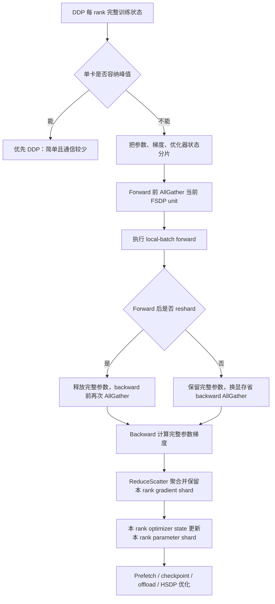
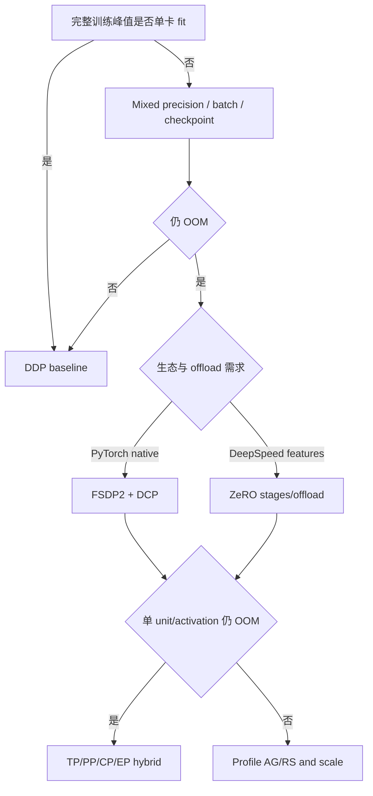

> 对应原文：Chapter 4. Scaling with Fully Sharded Data Parallel (FSDP)
>
> 本笔记严格沿原章顺序展开：从 DDP 到 FSDP、FSDP1/FSDP2、DeviceMesh 与层次化分片、T5 案例、DCP checkpoint、prefetch、activation checkpoint/offload、性能、多节点、调试、框架对比、高级集成与练习。文中会把稳定的算法机制与快速变化的 PyTorch API 分开；当前工作区为 PyTorch 2.11.0+cpu，可验证 API 签名、纯 Python 算法和 Gloo 通信，但无法在本机验证 CUDA/NCCL 的显存、吞吐与 FSDP GPU 性能。

## 0. 本章要回答的核心问题

第 3 章的 DDP 假设每个 rank 都能容纳完整训练状态。本章从这个假设被打破的位置开始，回答：

1. 为什么 DDP 的完整复制会让 7B BF16 + Adam 训练在 80 GB GPU 上不可行？
2. FSDP 分片 parameters、gradients、optimizer state 后，每 rank 持久状态为什么近似降为 $1/N$？
3. 为什么 $1/N$ 只是理想持久状态，不是实际峰值显存？
4. Forward AllGather、backward AllGather 与 gradient ReduceScatter 如何组成一个 FSDP unit 的生命周期？
5. `reshard_after_forward=True/False/int` 怎样交换显存与通信？
6. FSDP 为什么仍是 data parallelism，而不是 tensor parallelism？
7. FSDP1 的 FlatParameter 与 FSDP2 的 per-parameter DTensor 有何差异？
8. DeviceMesh 怎样表达 1D full sharding 与 2D hybrid sharding？
9. 为什么 FSDP2 必须自底向上调用 `fully_shard()`，只 shard root 为什么峰值和 overlap 较差？
10. T5 案例为何显示 FSDP2 的价值主要是 API、编译和 checkpoint，而非天然更快？
11. DCP 保存/加载为什么需要已初始化并分片的 model/optimizer template？
12. Sharded checkpoint、full checkpoint 与手工 rank files 分别适合什么场景？
13. Prefetch 如何隐藏 AllGather，又为何可能增大峰值或制造 allocator pressure？
14. Activation checkpointing、FSDP state sharding 与 CPU offload 分别减少哪项显存？
15. 多节点 FSDP 为什么比 DDP 更依赖拓扑、wrap granularity 与高速互连？
16. OOM、hang、慢训练与错误结果应如何从状态生命周期定位？
17. DDP、FSDP2、ZeRO stages、HSDP、TP/PP 的边界和组合关系是什么？
18. Meta-device initialization、shared parameters、gradient clipping、`torch.compile` 与 TPU/XLA 有哪些前提？

全章主线：



核心结论：

> **FSDP 不是把一层矩阵乘法拆给多个 GPU，而是让每个数据并行 rank 仅持久拥有训练状态的一片；计算当前 unit 时临时物化完整参数，再尽快释放。**

---

## 1. From DDP to FSDP

### 1.1 DDP 的容量边界

设模型有 $P$ 个参数。混合精度训练的一种常见状态账本：

| 状态 | 每参数字节示意 | 7B 大小 |
| --- | ---: | ---: |
| BF16 parameters | 2 | 14 GB |
| BF16 gradients | 2 | 14 GB |
| FP32 Adam first moment | 4 | 28 GB |
| FP32 Adam second moment | 4 | 28 GB |
| 可选 FP32 master weights | 4 | 28 GB |

不含 master copy：

$$
M_{fixed}=P(2+2+4+4)=12P\ bytes
$$

7B：

$$
M_{fixed}=7\times10^9\times12=84\ GB
$$

若还有 FP32 master weights：

$$
M_{fixed,master}=16P=112\ GB
$$

DDP 在每 rank 完整复制这些状态，因此增加 GPU 数不会降低单 rank 固定状态：

$$
M_{DDP,rank}\approx M_{fixed}+M_{activation}+M_{temporary}
$$

即使集群有 8×80 GB，总 HBM 640 GB，每 rank 仍尝试放 84/112 GB 加 activation，所以 DDP 不可行。

### 1.2 FSDP 消除的冗余

同步数据并行中，各 rank 的完整 parameters、gradients 与 optimizer states 在 update 后本来相同。ZeRO/FSDP 的观察是：这些完整副本是冗余的。若每项切成 $N$ 片，rank $r$ 只持有 owner shard：

$$
w=[w^{(0)},w^{(1)},\ldots,w^{(N-1)}]
$$

$$
g=[g^{(0)},g^{(1)},\ldots,g^{(N-1)}]
$$

$$
s=[s^{(0)},s^{(1)},\ldots,s^{(N-1)}]
$$

理想持久状态：

$$
M_{FSDP,persistent,rank}
\approx\frac{M_{parameter}+M_{gradient}+M_{optimizer}}{N}
$$

7B、84 GB、8 ranks：

$$
84/8=10.5\ GB/rank
$$

含 master copy 的 112 GB：

$$
112/8=14\ GB/rank
$$

这使 HBM 为 activation、临时 full-unit parameters、communication buffers 与 allocator reserve 留出空间。

### 1.3 为什么“84/N”不是峰值显存

实际峰值至少是：

$$
M_{peak}=M_{persistent\ shards}
+M_{unsharded\ unit}
+M_{activation}
+M_{prefetch}
+M_{temporary}
+M_{allocator}
$$

- `unsharded unit`：当前 FSDP unit AllGather 后的完整 parameters；
- `prefetch`：当前 unit 计算时，下一 unit 可能已完整/部分聚合；
- `activation`：FSDP 默认不沿 data-parallel group 分片 local-batch activations；
- `temporary`：GEMM/attention workspaces、flatten/cast buffers、gradient communication；
- `allocator`：reserved blocks 与 fragmentation。

因此图中 $84/N$ 是解释 persistent-state saving 的下界，不是“8 卡必然只用 10.5 GB”。Wrap granularity 越粗，单次 full-unit materialization 越大；只对整个 root 做一个 unit，可能一次物化全模型。

### 1.4 Activation 为什么没有随 FSDP degree 自动除以 N

FSDP 仍采用 data-parallel computation：每 rank 对自己的 local batch 执行完整逻辑模型。Local activations 属于本 rank 样本，不是 replicated training state；没有可按 FSDP rank 直接去重的相同副本。

若 local batch、sequence、model 不变：

$$
M_{activation,rank}\not\approx M_{activation}/N
$$

要降低 activation：

- 减 local microbatch；
- activation checkpointing/recomputation；
- memory-efficient attention/fusion；
- sequence/context/tensor parallelism；
- 缩短 sequence 或模型结构。

这也是为什么 FSDP + activation checkpointing 经常组合：前者降持久训练状态，后者降 local computation intermediates。

### 1.5 FSDP 与 ZeRO 的关系

ZeRO 将 data-parallel redundancy 分阶段消除：

| 方案 | Optimizer | Gradient | Parameter |
| --- | --- | --- | --- |
| DDP / ZeRO-0 | 复制 | 复制 | 复制 |
| ZeRO-1 | 分片 | 复制 | 复制 |
| ZeRO-2 | 分片 | 分片 | 复制 |
| ZeRO-3 / full FSDP | 分片 | 分片 | 分片 |

FSDP 的 full-shard 机制与 ZeRO-3 同类：参数按需 AllGather，gradient ReduceScatter。区别主要在框架 API、layout、scheduler/prefetch、checkpoint、offload 与生态实现，而不是基本数学目标。

### 1.6 FSDP 为什么仍是 data parallelism

在 Tensor Parallelism 中，同一个 sample 的一个 linear layer：

$$
Y=XW
$$

由多个 ranks 各计算 $XW_r$ 或 $X_rW_r$，单 layer compute 被切开。

FSDP 中，每 rank 在计算某 unit 前 AllGather 逻辑完整 $W$，然后用自己的 local samples 独立执行完整 layer compute。切的是**参数长期存储和 update ownership**，不是该 rank 的 layer arithmetic。因此：

- FSDP 扩训练状态容量；
- DDP/FSDP 都可通过不同 local batches 扩 cluster throughput；
- FSDP 不直接降低单 sample layer latency；
- 单 layer 临时完整参数/workspace 仍可能过大，此时需要 TP。

---

## 2. Why FSDP enables larger-than-memory models

### 2.1 “Larger-than-memory”准确指什么

它不是模型可无限大，而是：完整训练状态超过任一单 GPU HBM，但经过分片后，每 rank 的持久 shard 加运行峰值可容纳。

必要条件：

$$
\frac{M_{shardable}}{N}
+M_{unsharded\ peak}
+M_{unshardable}
\le C_{usable}
$$

- $M_{shardable}$：parameters/gradients/optimizer 等可分片状态；
- $M_{unsharded\ peak}$：最大同时物化 FSDP units/prefetch；
- $M_{unshardable}$：activation、workspace 等；
- $C_{usable}$：扣除 runtime/余量后的可用 HBM。

只满足总 HBM：

$$
N C\ge M_{total}
$$

不是充分条件，因为单个 unit、activation 或不均匀 shard 仍可能超过单卡。

### 2.2 Forward 的状态生命周期

以 unit $u$ 为例，rank $r$ 持有 parameter shard $w_u^{(r)}$。

1. AllGather：

$$
w_u=Concat(w_u^{(0)},\ldots,w_u^{(N-1)})
$$

2. Local forward：

$$
h_{u+1}^{(r)}=f_u(h_u^{(r)};w_u)
$$

3. 若 `reshard_after_forward=True`，释放/回到 shard $w_u^{(r)}$；否则保留 $w_u$ 到 backward。

关键：每 rank 的 activation $h_u^{(r)}$ 不同，因为 local batch 不同；parameter $w_u$ 在计算时相同。

### 2.3 Backward 的状态生命周期

若 forward 后已 reshard：

1. Backward 前再次 AllGather $w_u$；
2. 用 local activation 和 upstream gradient 计算 local full gradient contribution $g_{u,r}$；
3. ReduceScatter：

$$
g_u^{(r)}=Shard_r\left(\frac{1}{N}\sum_{i=0}^{N-1}g_{u,i}\right)
$$

4. 释放 full params/full grads；
5. Optimizer 只用 $g_u^{(r)}$ 更新 $w_u^{(r)}$ 及本 rank optimizer shard。

如果 reduction 使用 SUM 后框架按 data-parallel semantics 完成平均，最终每 shard 对应 global-batch gradient 的 owner 部分。

### 2.4 ReduceScatter 为什么比 AllReduce 后丢弃更匹配

AllReduce 会让每 rank 得到完整 reduced gradient，再只保留 $1/N$，造成不必要完整输出：

```text
local full gradients
  -> AllReduce full result on every rank
  -> discard (N-1)/N
```

ReduceScatter 直接：

```text
local full gradients
  -> reduce corresponding chunks
  -> rank r only receives reduced chunk r
```

经典 ring ReduceScatter 每 rank通信量近似：

$$
V_{RS}=\frac{N-1}{N}M
$$

输出只为 $M/N$，同时符合 optimizer ownership。

### 2.5 一个 unit 的通信量

参数大小 $M_u$：

- Forward AllGather 每 rank 接收约 $(N-1)M_u/N$；
- 若 forward 后 reshard，backward 前再一次 AllGather；
- Backward ReduceScatter 每 rank交换约 $(N-1)M_u/N$ 的数量级（gradient dtype 可能不同）。

忽略 dtype 差异和协议，`reshard_after_forward=True` 每 step 每 rank约：

$$
V_u\approx3\frac{N-1}{N}M_u
$$

`False` 避免 backward AllGather，约：

$$
V_u\approx2\frac{N-1}{N}M_u
$$

这解释了它用更多 memory 换少一次参数通信。真实 FSDP 会将多 parameters 分组 collective、prefetch/overlap，且 gradient/parameter dtype 不一定相同；公式用于数量级。

### 2.6 FSDP unit granularity

若模型总参数 $M$ 作为一个 root unit：

- collective 次数少；
- 单次消息大、bandwidth efficiency 好；
- 但 forward 前可能物化完整 $M$；
- 峰值高，无法逐层释放；
- overlap 机会少。

若每 Transformer block 一个 unit：

- 峰值完整参数约一个/少数 blocks；
- 可在当前 block compute 时 prefetch 下一 block；
- 更多 collectives，startup overhead 上升；
- unit 太小会网络效率差。

目标是让 unit 足够小以控制峰值，又足够大以摊薄 $\alpha$ latency。

### 2.7 可运行的 FSDP 内存与通信数量级计算器

```python
from dataclasses import dataclass


@dataclass(frozen=True)
class TrainingState:
    parameter_gb: float
    gradient_gb: float
    optimizer_gb: float

    @property
    def total_gb(self) -> float:
        return self.parameter_gb + self.gradient_gb + self.optimizer_gb


def persistent_shard_gb(state: TrainingState, world_size: int) -> float:
    if world_size <= 0:
        raise ValueError("world_size must be positive")
    return state.total_gb / world_size


def fsdp_unit_traffic_gb(unit_parameter_gb: float, world_size: int,
                         reshard_after_forward: bool) -> float:
    per_collective = (world_size - 1) / world_size * unit_parameter_gb
    all_gather_count = 2 if reshard_after_forward else 1
    reduce_scatter_count = 1
    return per_collective * (all_gather_count + reduce_scatter_count)


state = TrainingState(parameter_gb=14, gradient_gb=14, optimizer_gb=56)
print(f"DDP fixed state/rank: {state.total_gb:.1f} GB")
print(f"FSDP persistent state/rank at N=8: {persistent_shard_gb(state, 8):.1f} GB")
print(
    "10 GB unit traffic, reshard=True: "
    f"{fsdp_unit_traffic_gb(10, 8, True):.2f} GB/rank/step"
)
print(
    "10 GB unit traffic, reshard=False: "
    f"{fsdp_unit_traffic_gb(10, 8, False):.2f} GB/rank/step"
)
```

预期输出：

```text
DDP fixed state/rank: 84.0 GB
FSDP persistent state/rank at N=8: 10.5 GB
10 GB unit traffic, reshard=True: 26.25 GB/rank/step
10 GB unit traffic, reshard=False: 17.50 GB/rank/step
```

流量按参数与 gradient bytes 相同估算，未计 protocol、padding 和 multi-channel，仅用于比较两种 reshard policy。

---

## 3. FSDP1 vs FSDP2：表示方式的演进

### 3.1 稳定机制与 API 版本

稳定机制：

- state sharding；
- parameter AllGather；
- gradient ReduceScatter；
- unit boundary/prefetch；
- data-parallel local batches。

版本相关实现：

- FSDP1 wrapper、FlatParameter、auto-wrap/state-dict contexts；
- FSDP2 `fully_shard()`、DTensor、DeviceMesh、policy/offload APIs；
- DCP state-dict helpers 与 storage backends；
- compiler and mixed-precision integration。

学习时先掌握上层生命周期，再查目标 PyTorch API。原章写作时与本机 PyTorch 2.11 已有差异，例如当前 `fully_shard` 还暴露 `shard_placement_fn`、`ignored_params` 等。

### 3.2 FSDP1 FlatParameter

FSDP1 对一个 wrapped unit 的 parameters：

```text
W1, W2, W3
  -> flatten/concatenate to FlatParameter F
  -> pad if needed
  -> shard contiguous ranges of F across ranks
```

优点：

- 多小 parameters 合成大 collective；
- contiguous buffer 便于通信；
- 成熟 wrapper/auto-wrap 生态。

代价：

- 原 parameter identity/layout 被 flat representation 间接表示；
- 一个 flat group 通常要求兼容 dtype/`requires_grad` policy；
- state dict、shared params、optimizer mapping 更复杂；
- compiler 难以直接看 individual parameter layout；
- debugging 可能遇到 FlatParameter/private internals。

### 3.3 FSDP1 基本 API

```python
from torch.distributed.fsdp import FullyShardedDataParallel as FSDP
from torch.distributed.fsdp import ShardingStrategy


model = FSDP(
    model,
    sharding_strategy=ShardingStrategy.FULL_SHARD,
    device_id=torch.cuda.current_device(),
)
```

它返回 wrapper，与 DDP 相似。Submodule auto-wrap policy 决定多个 nested FSDP units；mixed precision 用 FSDP1 `MixedPrecision`；state dict 常通过 FSDP1 configs/context API 管理。

### 3.4 FSDP2 per-parameter DTensor

FSDP2 不先把所有参数变成单个 FlatParameter，而为每个 parameter 建立 sharded DTensor representation。默认常沿 dim 0：

$$
W\in\mathbb{R}^{4096\times1024},\quad N=4
$$

每 rank local shard：

$$
W^{(r)}\in\mathbb{R}^{1024\times1024}
$$

Parameter global shape 仍是 $(4096,1024)$；检查 shard 应使用 DTensor local view，而不是只打印 `.shape`。

优势：

- 保留 individual parameter visibility；
- 更自然支持不同 parameters 的 dtype/frozen policy；
- DeviceMesh/DTensor 与其他并行维度组合；
- compiler 能看见 parameter-level layout；
- DCP sharded state 与训练表示更一致。

代价/边界：

- API 较新、快速变化；
- 第 0 维过小/不可均匀时需要 padding 或 placement policy；
- shared/tied parameters、custom mutation 和 optimizer 初始化顺序需验证；
- 第三方 library integration 不一定与 FSDP1 同成熟。

### 3.5 `fully_shard()` 的原地语义

原章说“修改 model in place，不返回 wrapped model”。稳定使用方式是：

```python
fully_shard(model, mesh=mesh)
```

之后仍通过原变量 `model` 调用。当前实现会动态组合 FSDP module behavior，而不是外包一层传统 wrapper。即使某版本为了 chaining 返回 module，也不应把它理解成 DDP/FSDP1 的新 wrapper identity；以公开文档和原地状态为准。

### 3.6 Hooks 驱动生命周期

当前 `fully_shard` 文档说明：

- forward pre-hook AllGather；
- forward hook 在需要时释放/reshard；
- backward hooks 在计算前物化 parameters；
- gradient 计算后 ReduceScatter、释放 full state。

这解释两个限制：

1. 绕过 module `__call__`/hooks 或直接以非预期方式调用内部 forward，可能破坏 FSDP lifecycle；
2. 在 forward/backward 间随意修改当前 registered parameters，要理解它们此刻是 sharded、unsharded 还是 intermediate reshard layout。

### 3.7 FSDP1 为什么仍有价值

原章以 Wan2.2、Ulysses、MoE/frozen encoder integrations 举例，说明生产代码不只按“新 API 更好”迁移。实际考虑：

- 第三方 hooks/process groups 已围绕 FSDP1 稳定；
- auto-wrap policy 与 FlatParameter checkpoint 已验证；
- frozen/trainable/shared parameter layout；
- custom sequence/expert parallel integration；
- 迁移 regression 与运营成本。

具体项目的当前实现应查其代码 commit；案例说明的是生态路径依赖，不应泛化为“MoE/Ulysses 必须用 FSDP1”。

### 3.8 两代 API 对照

| 维度 | FSDP1 | FSDP2 |
| --- | --- | --- |
| 入口 | `FSDP(module, ...)` wrapper | `fully_shard(module, ...)` in-place |
| 参数表示 | FlatParameter per group | Per-parameter DTensor |
| Unit 定义 | manual/auto-wrap policies | bottom-up explicit calls/groups |
| Mesh | process group/sharding strategy 为主 | DeviceMesh first-class |
| Mixed precision | `MixedPrecision` | `MixedPrecisionPolicy` |
| Checkpoint | FSDP state-dict APIs/DCP | Unified state-dict helpers + DCP |
| Compiler | Flat representation 较难 | parameter visibility 更好 |
| 成熟生态 | 更久、遗留 integration 多 | 新项目方向、仍在演进 |

选择应基于 framework/version、integration 与验证，不只比较代码行数。

---

## 4. FSDP2：per-parameter sharding API

### 4.1 最小模式

```python
import torch
from torch.distributed.device_mesh import init_device_mesh
from torch.distributed.fsdp import MixedPrecisionPolicy, fully_shard


mesh = init_device_mesh("cuda", (world_size,))
policy = MixedPrecisionPolicy(
    param_dtype=torch.bfloat16,
    reduce_dtype=torch.float32,
)
fully_shard(model, mesh=mesh, mp_policy=policy)
```

前提：

- process group/rank 已正确初始化；
- 每 rank 已设置 local CUDA device；
- 所有 ranks 构造相同 module hierarchy/parameter order；
- optimizer 通常在 sharding/materialization policy 确定后按推荐顺序创建；
- 输入由 `DistributedSampler` 等按 data-parallel semantics 分片。

### 4.2 DeviceMesh 是什么

DeviceMesh 把 physical ranks 映射到有名称/维度的逻辑网格。它定义：

- 哪些 ranks 沿哪个 axis 通信；
- tensor placements 是 Shard 还是 Replicate；
- HSDP/TP 等多维组合的 group construction。

它不自动发现“最佳”拓扑。`(2,4)` 只是形状；用户仍要保证 mesh rank layout 与两节点×四 GPU 的 physical topology 一致。

### 4.3 1D full-shard mesh

4 ranks：

```python
mesh = init_device_mesh("cuda", (4,))
```

逻辑：

```text
shard axis: [rank 0, rank 1, rank 2, rank 3]
```

每 parameter 沿 shard placement 分到四 ranks；AllGather/ReduceScatter 在 4-rank group 内发生。跨节点时 full-shard AllGather 也跨节点。

### 4.4 2D HSDP mesh

2 nodes × 4 GPUs：

```python
mesh = init_device_mesh("cuda", (2, 4))
```

当前 FSDP2 文档的 2D layout 为：

$$
(Replicate(),Shard(0))
$$

第一维 replicate、第二维 shard。可画为：

```text
node/replicate row 0: r0  r1  r2  r3  <- shard group
node/replicate row 1: r4  r5  r6  r7  <- shard group
                         ^
same column shards replicated across rows
```

收益：heavy parameter AllGather 留在 4-GPU node 内；相同 shard 在 nodes 间复制并同步 gradients。代价：持久状态只除以 shard degree 4，不是 world size 8。

### 4.5 HSDP 内存公式

设 replicate degree $R$、shard degree $S$：

$$
W=RS
$$

每 rank persistent shard：

$$
M_{HSDP,persistent}\approx\frac{M_{state}}{S}
$$

而 1D full shard across all world：

$$
M_{FSDP,persistent}\approx\frac{M_{state}}{RS}
$$

HSDP 用 $R$ 倍更多 aggregate replicated state 换取主要 parameter materialization 留在快域，并将跨节点通信组织为 replica-shard gradient sync。

### 4.6 `reshard_after_forward=True`

非 root FSDP units 常默认/明确使用 True：

```text
forward AG -> compute -> reshard/free
backward AG -> compute gradients -> RS
```

优点：峰值低，任一时刻只保留少数完整 units。

代价：每 step 两次 parameter AllGather。

适合显存主导、unit 较大或 long sequence activation 需要空间的情况。

### 4.7 `reshard_after_forward=False`

```text
forward AG -> compute -> keep full parameters
backward compute directly -> RS/free
```

优点：避免 backward AllGather，减少通信/latency。

代价：从 forward 到 backward 一直占 full-unit parameters；多 units 若同时保留，峰值大幅增加。

当前 PyTorch 2.11 文档还指出 root module 通常在 backward 开头很快需要，因此 `reshard_after_forward=None` 时 root 默认 False、non-root 默认 True。原章笼统称 True 为默认适合普通调用，但精确默认应按目标版本、root/non-root role 查询。

### 4.8 `reshard_after_forward=int`

若 shard group 大小 $S$，传入其非平凡 divisor $k$，forward 后不是保留完整参数，也不是恢复到 $1/S$，而是 reshard 到中间 group size：

$$
M_{parameter,rank}\approx\frac{M}{k}
$$

Backward AllGather 只需在较小范围恢复，交换 memory 与通信。典型可取 intra-node size，类似 hierarchical parameter sharding 思路。具体合法值、group 构造与 API 行为按当前版本验证。

### 4.9 MixedPrecisionPolicy 的三种 dtype

当前签名主要包含：

- `param_dtype`：AllGather 后用于 forward/backward compute 的 parameter dtype；
- `reduce_dtype`：gradient ReduceScatter dtype；
- `output_dtype`：module output cast；
- `cast_forward_inputs`：是否 cast forward inputs。

原章称 `param_dtype` 为“parameter storage”容易误解：FSDP mixed-precision policy 主要控制 unsharded compute representation/casting；持久 sharded parameter/master representation与 optimizer/原始 parameter dtype 需按实现和初始化验证，不能仅凭 policy 字段推断全部 bytes。

BF16 compute + FP32 reduction：

```python
policy = MixedPrecisionPolicy(
    param_dtype=torch.bfloat16,
    reduce_dtype=torch.float32,
)
```

减少 parameter communication/compute bytes与使用 Tensor Cores，同时让 gradient reduction 更稳定，但 FP32 reduction 增加通信 bytes。应通过 memory snapshot、DTensor local dtype 和 profiler确认真实状态。

### 4.10 FSDP2 混合 dtype 的边界

Per-parameter design 更容易表达不同 dtype，但一个 communication group 仍需形成可通信的 buffers/collectives。不要从“FSDP2 支持 mixed dtype”推出：任意 parameters 可无约束放进同一 group且一次 collective。

实践应：

- 按 dtype/communication policy 合理分 units；
- 验证 frozen/trainable/shared parameters；
- 检查 optimizer state dtype；
- 检查 checkpoint round trip；
- 对 FP8 使用专门 scaling/recipe，不只 `param_dtype=torch.float8...`。

### 4.11 CPUOffloadPolicy

```python
from torch.distributed.fsdp import CPUOffloadPolicy, fully_shard


fully_shard(
    model,
    mesh=mesh,
    offload_policy=CPUOffloadPolicy(pin_memory=True),
)
```

它把 sharded states/optimizer path 放到 CPU policy 所定义的位置，并在需要时通过 host-device link 搬运。收益是扩容量，代价包括：

- PCIe/NVLink-C2C traffic；
- host DRAM capacity/bandwidth；
- pinned memory pressure；
- NUMA locality；
- CPU optimizer compute；
- transfer/compute overlap complexity。

原章给 20%～50% slowdown 为经验范围，不是保证；如果每 layer transfer 无法隐藏，可能更慢。

### 4.12 当前额外 API 边界

本机 PyTorch 2.11 `fully_shard` 还包含：

- `shard_placement_fn`：为 parameter 选择非默认 shard dimension；
- `ignored_params`：排除某些 parameters；
- 默认 policy/offload objects。

非 0 维 sharding 可能要求 even sharding；ignored/shared parameters 会改变 state ownership。使用前阅读目标版本 docstring/tests，不把本笔记签名当永久 API。

### 4.13 Hierarchical/bottom-up sharding

推荐模式：先 children，再 root：

```python
for block in model.layers:
    fully_shard(block, mesh=mesh, mp_policy=policy)

fully_shard(model, mesh=mesh, mp_policy=policy)
```

当前文档语义：调用 `fully_shard(module)` 建立一个 communication group，包含 `module.parameters()` 中尚未被更早 child call 分配的 parameters。因此顺序必须 bottom-up：

```text
block 0 call -> owns block 0 params
block 1 call -> owns block 1 params
root call    -> owns embedding/head/remaining params
```

如果先 root，root 已吞下所有 descendant params，之后 child boundaries无法按预期形成。

### 4.14 为什么 root 也要 shard

只 shard Transformer blocks，embedding、final norm、output head 等 remaining parameters 仍需归属 root FSDP group，否则可能完整复制、未由 FSDP lifecycle 管理或 optimizer/checkpoint layout 不一致。

若 embedding/head 很小，可留在 root group而不是单独 child unit；“不 shard embedding”应理解为不单独为它建立细粒度 unit，而不是必然完全排除 root sharding。

原章示例注释“Don't shard embedding”容易被读成永久复制。后续又调用 `fully_shard(model)` 时，未被 child group占用的 embedding通常会进入 root group。应以最终 group ownership而非单行注释判断。

### 4.15 Unit granularity 的三目标优化

对 unit $u$：

$$
T_u\approx T_{AG,u}+T_{compute,u}+T_{RS,u}-T_{overlap,u}
$$

同时峰值约包含：

$$
M_{peak,u}\supset M_{full,u}+M_{prefetch,next}
$$

选择 boundary 时权衡：

1. **Memory**：unit 越小，full materialization 峰值越低；
2. **Latency efficiency**：unit 越大，message 越大，更易摊薄 collective startup；
3. **Overlap**：多个 layer-size units 才能 prefetch next while compute current。

Transformer block 常是合理起点，但 embedding、MoE expert、共享权重和大小不均层需自定义。

### 4.16 不应分得过细的模块

- 极小 LayerNorm/bias：通信启动成本高于 payload；
- 跨模块 shared/tied parameters：ownership/sharedness复杂；
- 无 parameter module：没有 state saving；
- 计算极少的 tiny unit：无法隐藏 AllGather；
- 动态 module replacement：hooks/group layout可能失效。

一般把 attention+MLP 的完整 block 作为 unit，再 profile。

### 4.17 FSDP2 最小配置检查表

1. 所有 ranks 相同 module tree；
2. Local CUDA device 在创建 CUDA state 前设置；
3. DeviceMesh rank order匹配物理 topology；
4. Children bottom-up、root last；
5. Optimizer 初始化顺序符合目标 PyTorch guidance；
6. DistributedSampler 与 global batch正确；
7. `reshard_after_forward` 按 root/non-root和显存选择；
8. Mixed precision先单独验证 loss；
9. 打印 DTensor local shards，不只 global shape；
10. 用 profiler/memory snapshot确认 lifecycle。

---

## 5. Complete working example：T5 summarization with FSDP

### 5.1 为什么原章选择同一任务的三条路径

原章用 WikiHow summarization + FLAN-T5 提供：

- Single-GPU baseline；
- FSDP1 wrapper/auto-wrap；
- FSDP2 `fully_shard()`/DCP。

同模型、同任务的意义是把差异集中在 state layout 和 runtime，而不是把模型/数据变化误认为 FSDP 效果。正确比较仍需固定：

- model revision/tokenizer；
- effective global batch；
- sequence lengths/padding；
- precision/optimizer；
- epochs/steps/warmup；
- hardware/topology/software；
- data preprocessing 与 quality metric。

### 5.2 运行路径

准备数据：

```shell
cd code/FSDP
bash download_dataset.sh
```

Single GPU：

```shell
python code/FSDP/T5_training_Single.py
```

FSDP1 两 GPU：

```shell
torchrun --nnodes=1 --nproc-per-node=2 code/FSDP/T5_training_FSDP1.py
```

FSDP2 两 GPU：

```shell
torchrun --nnodes=1 --nproc-per-node=2 code/FSDP/T5_training_FSDP2.py
```

命令中的 ASCII `--` 不要被 PDF/HTML 转换后的 Unicode dash 替换。实际依赖、模型访问权限和 dataset URL 以 repository README/commit 为准。

### 5.3 T5/FLAN-T5 背景

T5 是 encoder-decoder Transformer，把 summarization、translation、QA 等统一为 text-to-text。FLAN-T5 在 instruction mixture 上进一步训练。Summarization forward 同时包含：

- encoder 对 source sequence 的 self-attention；
- decoder causal self-attention；
- decoder-to-encoder cross-attention；
- output vocabulary projection。

因此 memory 不只由 parameter count 决定；source/target lengths、padding、vocabulary head 和 encoder/decoder activation 都重要。

### 5.4 FLAN-T5-XL 案例怎样读

原章 H200 示例：

| Mode | GPUs | 常驻/观测 mem per GPU | Peak per GPU | iteration rate | epoch time |
| --- | ---: | ---: | ---: | ---: | ---: |
| Single | 1 | ~43 GB | ~58 GB | ~4.36 it/s | ~91 s |
| FSDP1 | 2 | ~22 GB | ~33 GB | ~4.09 it/s | ~49 s |

可得 epoch wall-clock speedup：

$$
S_2=91/49\approx1.86
$$

并行效率：

$$
E_2=S_2/2\approx92.9\%
$$

但 4.36 与 4.09 it/s 的“iteration”是否对应相同 global/local work 必须看脚本。若每 rank 每 epoch steps 减半，FSDP iteration rate 与 epoch time可以同时呈现上述关系。不要把 per-rank it/s 直接当 cluster samples/s。

结论：

- FSDP 将每 GPU state/peak 显著降低；
- 2 GPU 通过数据并行缩短 epoch；
- 单个 iteration 不因 sharding 自动更快；
- Communication 让 per-rank iteration rate略低于单卡并不意外。

### 5.5 FLAN-T5-XXL 案例怎样读

原章 H200 示例：

| Mode | GPUs | Mem/GPU | Peak/GPU | Rate | Epoch |
| --- | ---: | ---: | ---: | ---: | ---: |
| Single | 1 | OOM | OOM | - | - |
| FSDP1 | 2 | ~84 GB | ~105 GB | ~1.96 it/s | ~101 s |
| FSDP2 | 2 | ~84 GB | ~105 GB | ~1.86 it/s | ~106 s |

可得到 FSDP2 对 FSDP1 的 epoch time ratio：

$$
106/101\approx1.05
$$

在这一特定 setup，FSDP2 约慢 5%，memory近似相同。样本少、运行波动、版本/kernel/配置都可能解释差异，不能由一张表证明 API 代际的普遍性能排序。

真正结论：

- Single GPU 容量不可行，FSDP 使任务可运行；
- FSDP1/FSDP2 的核心 collective 同类，性能可接近；
- FSDP2 价值在 per-parameter layout、DeviceMesh、compiler 与 DCP 等工程组合；
- 迁移应以自己的模型和版本做 regression，而非假定 FSDP2 必快。

### 5.6 可运行的案例指标复算器

```python
single_epoch_seconds = 91.0
fsdp1_xl_epoch_seconds = 49.0
fsdp1_xxl_epoch_seconds = 101.0
fsdp2_xxl_epoch_seconds = 106.0

speedup = single_epoch_seconds / fsdp1_xl_epoch_seconds
efficiency = speedup / 2
fsdp2_slowdown = fsdp2_xxl_epoch_seconds / fsdp1_xxl_epoch_seconds - 1

print(f"XL 2-GPU epoch speedup: {speedup:.2f}x")
print(f"XL 2-GPU parallel efficiency: {efficiency:.1%}")
print(f"XXL FSDP2 epoch-time difference vs FSDP1: {fsdp2_slowdown:.1%}")
print(f"XL FSDP1 peak-memory ratio vs single: {33 / 58:.1%}")
```

预期输出：

```text
XL 2-GPU epoch speedup: 1.86x
XL 2-GPU parallel efficiency: 92.9%
XXL FSDP2 epoch-time difference vs FSDP1: 5.0%
XL FSDP1 peak-memory ratio vs single: 56.9%
```

这些都是原章观测值的复算，不是性能承诺。

### 5.7 FSDP1 policy 与 auto-wrap

FSDP1 用两个不同 policy：

- Mixed precision policy：parameter/reduction/buffer dtypes；
- Auto-wrap policy：哪些 modules成为独立 FSDP units。

T5 `transformer_auto_wrap_policy` 以 `T5Block` 为 boundary，使 encoder/decoder blocks各自 materialize/prefetch，而不是 root 一次聚合整个模型。

```python
import functools

from torch.distributed.fsdp.wrap import transformer_auto_wrap_policy


def get_t5_wrapper(T5Block):
    return functools.partial(
        transformer_auto_wrap_policy,
        transformer_layer_cls={T5Block},
    )
```

原章示例的函数参数/导入由具体 repository 定义；这里重点是 policy contract：递归遍历 module tree，在 transformer block 边界创建 FSDP wrappers。

### 5.8 FSDP2 explicit bottom-up ownership

FSDP2 不需要 auto-wrap callback，直接：

```python
for block in model.encoder.block:
    fully_shard(block, **fsdp_kwargs)

for block in model.decoder.block:
    fully_shard(block, **fsdp_kwargs)

fully_shard(model, **fsdp_kwargs)
```

Children first、root last。Root call接管 embedding、head 和其他尚未被 child groups拥有的 parameters。

### 5.9 Load-then-shard 的峰值问题

示例先：

```python
model = T5ForConditionalGeneration.from_pretrained(model_name)
model = model.to(device)
```

再 `fully_shard`。这要求每 rank 在 sharding 前暂时容纳完整模型，超大模型可能初始化时就 OOM，即使最终 shard可容纳。

解决方向：

- meta-device model construction；
- `to_empty` 后按 shard-aware方式 materialize；
- rank 0 load + sync/module state init（按 API）；
- distributed checkpoint直接加载到 sharded template；
- 避免每 rank 重复下载/host-memory峰值。

初始化可行性必须单独检查，不能只算 steady-state FSDP memory。

### 5.10 Case-study benchmark checklist

1. Single/FSDP 的 global batch是否相同；
2. Steps/epoch 是否因 sampler/world size改变；
3. `it/s` 是每 rank还是 cluster；
4. Memory 是 allocated、reserved还是 `nvidia-smi`；
5. Peak 是否 reset后测量；
6. Precision/reduction dtype一致；
7. Checkpoint/eval 是否在计时内；
8. Dataset/token lengths是否相同；
9. Warmup/compile是否排除；
10. 至少多次运行报告variance。

---

## 6. Checkpointing with FSDP2

### 6.1 为什么 DDP rank-0 checkpoint 模式不再足够

DDP每 rank有完整 model/optimizer state，rank 0保存一份即可。FSDP每 rank只持有：

- parameter shard；
- gradient shard；
- optimizer shard。

若强制 rank 0聚合完整 state：

- rank 0 host/GPU memory可能 OOM；
- 所有 shards向一个 coordinator集中；
- 单文件写成为吞吐瓶颈；
- 大规模 checkpoint暂停时间增长。

Sharded checkpoint让各 rank并行写本地 shard，保存路径与训练表示一致。

### 6.2 一个 checkpoint 必须包含什么

不仅是 model/optimizer：

| 状态 | 作用 |
| --- | --- |
| Model shards | 参数 |
| Optimizer shards | moments/master/step |
| Scheduler | LR/token cadence |
| AMP/scaling | FP16 overflow/scale |
| Global step/epoch | 训练进度 |
| Data cursor/sampler | 样本位置 |
| Per-rank RNG | dropout/augmentation |
| Model/tokenizer/config | 解释 state shapes/semantics |
| World/mesh metadata | 恢复/reshard policy |
| Code/data versions | 可追溯性 |

原章 DCP 示例仅 model、optimizer、epoch，用于 API 教学；production resume需扩展。

### 6.3 DCP `save()` 的 SPMD 协议

当前 PyTorch 2.11签名确认：

```python
dcp.save(
    state_dict,
    checkpoint_id=checkpoint_path,
)
```

每 rank调用并提供相同 top-level/key structure；DTensor/ShardedTensor只写本地 shard，coordinator负责规划/metadata。DCP不同于 `torch.save()`：它理解 distributed tensor layout。

```python
import torch.distributed.checkpoint as dcp
from torch.distributed.checkpoint.state_dict import (
    StateDictOptions,
    get_model_state_dict,
    get_optimizer_state_dict,
)


def save_checkpoint_dcp(model, optimizer, step: int, checkpoint_path: str):
    options = StateDictOptions(full_state_dict=False, cpu_offload=True)
    state = {
        "model": get_model_state_dict(model, options=options),
        "optimizer": get_optimizer_state_dict(
            model,
            optimizers=optimizer,
            options=options,
        ),
        "step": step,
    }
    return dcp.save(state, checkpoint_id=checkpoint_path)
```

所有 ranks必须调用。只在 rank 0进入 `dcp.save()` 会使 collective planner/metadata协议不匹配。

### 6.4 DCP save 的版本与 HSDP 边界

当前 docstring明确警告：

- DCP state dict跨 PyTorch版本不保证 backward compatibility；
- 若传自定义 process group，只有该 group ranks调用且 state属于它；
- HSDP有 replicated shard groups时，通常只让一个 shard group保存，并传对应 process group，避免重复写同一 shards；
- rank 0是 coordinator，但不是唯一 writer。

因此 checkpoint metadata必须记录 PyTorch版本和 mesh；升级前做实际 restore migration test。

### 6.5 DCP `load()` 为什么需要 template

当前 `dcp.load()`：

- 返回 `None`；
- 原地填充传入 state dict；
- 各 rank keys必须一致；
- 目标 tensors必须在调用前分配到 destination device；
- 对 DTensor只读取满足当前 local shard所需数据；
- non-tensor values被替换/修改。

所以加载顺序：

```text
构造 model
  -> 按目标 world/mesh fully_shard
  -> 构造 optimizer
  -> 从 model/optimizer 获取当前 layout template
  -> dcp.load(template) 原地填充
  -> set_model_state_dict / set_optimizer_state_dict 完成后处理
```

不是先从磁盘得到任意 dict，再猜怎样切给 model。

### 6.6 推荐 load skeleton

```python
import torch.distributed.checkpoint as dcp
from torch.distributed.checkpoint.state_dict import (
    StateDictOptions,
    get_model_state_dict,
    get_optimizer_state_dict,
    set_model_state_dict,
    set_optimizer_state_dict,
)


def load_checkpoint_dcp(model, optimizer, checkpoint_path: str) -> int:
    options = StateDictOptions(full_state_dict=False, cpu_offload=True)
    state = {
        "model": get_model_state_dict(model, options=options),
        "optimizer": get_optimizer_state_dict(
            model,
            optimizers=optimizer,
            options=options,
        ),
        "step": 0,
    }

    dcp.load(state, checkpoint_id=checkpoint_path)
    set_model_state_dict(model, state["model"], options=options)
    set_optimizer_state_dict(
        model,
        optimizers=optimizer,
        optim_state_dict=state["optimizer"],
        options=options,
    )
    return int(state["step"])
```

API/version变化时以官方 recipe为准。尤其 optimizer创建时机、state初始化和 `Stateful` abstraction可能更新。

### 6.7 DCP 怎样支持不同 world size 的 reshard

Checkpoint描述 global tensors与shard metadata；load planner根据**当前 template layout**读取所需 ranges。若保存时 $N=8$、加载时 $N=4$，每个新 rank可读取多个旧 shards的相关片段并组合当前 shard，而无需先在 rank 0构造完整 tensor。

成立前提：

- global tensor keys/shapes兼容；
- model architecture/config相同或有明确迁移；
- planner/storage支持该 distributed type/layout；
- optimizer state mapping兼容；
- checkpoint完整且metadata可读；
- 新 world/mesh有足够容量。

World-size reshard解决 tensor storage layout，不自动解决：

- global batch/LR变化；
- sampler/data cursor重新分配；
- per-rank RNG identity；
- pipeline/tensor-parallel architecture变化；
- code/schema version migration。

### 6.8 Manual rank-file checkpoint 的问题

原章手工方案：

```text
model_rank_0.pt, optim_rank_0.pt
model_rank_1.pt, optim_rank_1.pt
...
metadata.pt
```

优点：直观、可自定义。风险：

- rank文件与特定 world size/layout绑定；
- 不能自动 reshard；
- metadata可能在shards完成前发布；
- 某 rank失败留下partial directory；
- optimizer IDs/layout难手工迁移；
- shared parameters/DTensor serialization细节版本相关；
- 大量小文件压垮 metadata server。

若必须手工实现，至少使用：

```text
write into checkpoint.tmp/<rank files>
  -> each rank checksum + success collective
  -> coordinator writes manifest
  -> atomic publish/COMMITTED marker
  -> latest pointer only references committed checkpoint
```

不能因为 `metadata.pt` 存在就判定 checkpoint完整。

### 6.9 Shared filesystem、local disks 与 object storage

#### Shared filesystem

所有 ranks写同一 checkpoint namespace。需考虑：

- aggregate throughput；
- file count/metadata contention；
- atomic rename semantics；
- node/rack failure domain；
- permissions/quota。

#### Per-node local storage

吞吐高但 shards分散在nodes。若训练结束/节点故障前未同步到 durable storage，checkpoint不可恢复。仅写 `node_{rank}` local path不是完整容错方案。

#### Object storage

普通 `s3fs` path不等于 DCP原生 transactional backend。需要兼容 StorageWriter/Reader、multipart、manifest/commit与一致性语义。原章伪代码只表达架构方向，不能直接把 `s3://...` 传给所有版本 `dcp.save` 就假定可用。

### 6.10 Full state dict 的用途

需要单文件/普通 model state时，例如：

- inference export；
- 与非 FSDP tool共享；
- 最终归档；
- model conversion。

使用：

```python
options = StateDictOptions(
    full_state_dict=True,
    cpu_offload=True,
)
full_model_state = get_model_state_dict(model, options=options)
```

所有 ranks仍需参与collective；结果按 helper语义在 coordinator/rank 0 materialize。Rank 0 host RAM需容纳完整 model；full optimizer state更大，容易 OOM/慢。训练周期 checkpoint优先 sharded，最终 export才 full gather。

### 6.11 Full checkpoint 不必总保存 optimizer

推理 artifact通常只需：

- model weights；
- architecture/config；
- tokenizer/preprocessor；
- quantization metadata。

Optimizer full gather只为可移植训练恢复，成本巨大。可分别维护：

- frequent sharded training checkpoints；
- occasional full model export；
- validation/serving artifact。

### 6.12 Checkpoint correctness protocol

保存后不能只看目录存在。验证：

1. 所有 ranks save success；
2. Manifest/metadata完整；
3. 文件/objects checksums；
4. 在新 process group重建 model/optimizer；
5. DCP load；
6. 比较 selected parameters/optimizer steps；
7. 跑一个相同 batch update；
8. World-size change时做 reshard test；
9. 故意 kill writer，确保 partial checkpoint不被 latest选中；
10. 记录 restore wall time与storage load。

### 6.13 Checkpoint interval 的权衡

若 checkpoint interval $I$，故障在 interval内近似均匀，平均 lost work：

$$
E[LostWork]\approx I/2
$$

Checkpoint保存时间 $C$ 太大则频繁保存降低训练吞吐。经典近似可从 failure rate与 $C$ 权衡得到最优 interval数量级；实际还要考虑preemption notice、async checkpoint、storage congestion与恢复时间。

### 6.14 DCP checklist

- 所有 ranks相同 state keys；
- model已按目标 mesh sharded；
- destination tensors已分配；
- model/optimizer set helpers被调用；
- HSDP避免 replicated groups重复写；
- scheduler/scaler/RNG/data state另行纳入；
- checkpoint版本/schema有记录；
- publish有complete marker；
- load受信任数据；
- 定期做真实 restore。

---

## 7. Prefetching：隐藏参数物化通信

### 7.1 不 prefetch 的串行路径

对 layer $i$：

```text
AllGather(W_i) -> Compute_i -> AllGather(W_{i+1}) -> Compute_{i+1}
```

若每层 AllGather $A_i$、compute $C_i$：

$$
T_{serial}=\sum_i(A_i+C_i)
$$

每层 compute开始前都等待 parameters。

### 7.2 Forward prefetch 的原理

当前 layer $i$ compute时，communication stream提前 AllGather $i+1$：

```text
Compute_i
    || AllGather(W_{i+1})
then Compute_{i+1}
```

理想两段关键路径：

$$
T_i\approx\max(C_i,A_{i+1})
$$

如果 $C_i\ge A_{i+1}$，下一层 AllGather可完全隐藏；如果网络更慢，剩余 tail：

$$
Tail_{i+1}=\max(0,A_{i+1}-C_i)
$$

### 7.3 当前 FSDP2 forward prefetch API

本机 PyTorch 2.11验证签名为 `set_modules_to_forward_prefetch(self, modules: list[FSDPModule]) -> None`。真实调用形式：

```python
layer.set_modules_to_forward_prefetch(modules)
```

示意：

```python
def configure_forward_prefetch(layers, depth: int = 1) -> None:
    if depth < 0:
        raise ValueError("depth must be non-negative")
    for index, layer in enumerate(layers):
        following = layers[index + 1:index + 1 + depth]
        if following:
            layer.set_modules_to_forward_prefetch(following)
```

所有目标 modules必须已成为 FSDP2 modules/groups；execution order应稳定。Dynamic branch若跳过prefetched module，会浪费memory/communication。

### 7.4 Backward prefetch

Backward通常按 forward反向访问 layers。当前 layer $i$ backward compute时，提前物化下一步要反向计算的 $i-1$ parameters：

```python
def configure_backward_prefetch(layers, depth: int = 1) -> None:
    if depth < 0:
        raise ValueError("depth must be non-negative")
    for index, layer in enumerate(layers):
        previous = list(reversed(layers[max(0, index - depth):index]))
        if previous:
            layer.set_modules_to_backward_prefetch(previous)
```

需按 framework定义的“当前 module应prefetch哪些 modules”配置，并在 trace确认顺序。原章的 index loop表达基本直觉；不同版本的 scheduler/automatic prefetch可能变化。

### 7.5 Prefetch 的显存代价

不 prefetch时峰值可能含当前 full unit：

$$
M_{full,current}
$$

Depth=1时可能同时含：

$$
M_{full,current}+M_{full,next}
$$

再加 activation、communication buffers。Depth=2/3继续增加 in-flight full params。Memory-constrained模型可能因 prefetch反而 OOM。

### 7.6 Prefetch depth 不是越大越好

Depth 增加可能：

- 更早隐藏通信；
- 增大 full-param峰值；
- 增加 allocator pressure；
- 抢占 network bandwidth，使当前 gradient RS变慢；
- Prefetch太早，参数长时间占 HBM；
- Dynamic execution浪费。

一般从 0/1 开始，用 per-rank timeline和memory snapshot比较。原章建议先试 2 是一个经验起点，不是普适最优。

### 7.7 Prefetch 的成立条件

- 至少多个 FSDP units；
- 后续 execution order可预测；
- 当前 compute足以覆盖下一 AllGather；
- GPU/NIC支持 concurrent compute/communication；
- CUDA streams/events正确；
- HBM有两 unit或更多headroom；
- Network未被 concurrent RS/AG完全占满。

只 shard整个 root时没有有意义的“下一 unit”可prefetch，这再次说明 hierarchical boundaries影响性能。

### 7.8 怎样在 profiler 中证明有效

对每 rank trace观察：

- `all_gather`/NCCL kernel何时开始；
- 是否与当前 layer compute横向重叠；
- 下一 layer compute前还有多少 wait；
- prefetch后峰值 allocated/reserved；
- ReduceScatter是否因 bandwidth竞争变慢；
- step p50/p95是否改善。

Key-averages中 AllGather总时间不一定下降；prefetch成功的目标是**暴露在关键路径上的时间**下降。

### 7.9 可运行的 prefetch 时间模型

```python
def exposed_prefetch_time(compute_ms: float, next_all_gather_ms: float) -> float:
    return max(0.0, next_all_gather_ms - compute_ms)


scenarios = [
    (8.0, 5.0),
    (5.0, 8.0),
    (2.0, 8.0),
]

for compute_ms, gather_ms in scenarios:
    serial_ms = compute_ms + gather_ms
    overlapped_ms = compute_ms + exposed_prefetch_time(compute_ms, gather_ms)
    print(
        f"compute={compute_ms:.0f}ms gather={gather_ms:.0f}ms "
        f"serial={serial_ms:.0f}ms overlapped={overlapped_ms:.0f}ms "
        f"exposed_comm={exposed_prefetch_time(compute_ms, gather_ms):.0f}ms"
    )
```

预期输出：

```text
compute=8ms gather=5ms serial=13ms overlapped=8ms exposed_comm=0ms
compute=5ms gather=8ms serial=13ms overlapped=8ms exposed_comm=3ms
compute=2ms gather=8ms serial=10ms overlapped=8ms exposed_comm=6ms
```

模型只覆盖相邻 compute/AllGather，不包含 stream contention、launch或memory stall。

### 7.10 Prefetch 调优实验

固定 model/batch/precision/mesh，比较 depth 0、1、2：

| 指标 | Depth 0 | Depth 1 | Depth 2 |
| --- | --- | --- | --- |
| Step p50/p95 | 测 | 测 | 测 |
| Exposed AG tail | 测 | 测 | 测 |
| Peak allocated/reserved | 测 | 测 | 测 |
| RS duration | 测 | 测 | 测 |
| OOM/allocator retries | 测 | 测 | 测 |
| Loss/quality | 对照 | 对照 | 对照 |

选择满足memory约束下最小关键路径，而不是 AllGather开始最早的配置。

---

## 8. Activation checkpointing and offloading

### 8.1 三种内存优化解决不同对象

| 技术 | 减少什么 | 换来什么代价 |
| --- | --- | --- |
| FSDP | parameters/gradients/optimizer 持久复制 | AllGather/ReduceScatter |
| Activation checkpointing | forward intermediates | backward 时重算 forward segments |
| CPU offload | GPU 上的 sharded states/optimizer | H2D/D2H、host RAM/CPU/NUMA |

它们可以叠加，因为优化不同项。OOM 前先从 memory timeline确定主导项，不能看到 FSDP 仍 OOM 就无条件 CPU offload。

### 8.2 Activation memory 数量级

原章给 Transformer 示意：

$$
M_{activation}\approx LBSHbk
$$

- $L$ layers；
- $B$ local microbatch；
- $S$ sequence；
- $H$ hidden；
- $b$ bytes/element；
- $k$ 为 attention/MLP/residual 等中间 tensor factor。

原章 7B 示例：

$$
32\times8\times2048\times4096\times2\times12
=51{,}539{,}607{,}552\ bytes
$$

十进制约 51.54 GB，GiB约：

$$
51{,}539{,}607{,}552/2^{30}=48\ GiB
$$

原章写约 52 GB，采用十进制数量级。$k=12$ 是经验占位，不是模型无关常数；FlashAttention避免materialize $S^2$ scores后，公式会显著变化。

### 8.3 Activation checkpoint 的算法

普通 autograd：

```text
forward: 保存每个 backward 所需中间值
backward: 直接读取保存值计算 gradients
```

Checkpointed segment：

```text
forward: 只保存 segment inputs/boundary state
backward: 重跑 segment forward -> 重建中间值 -> 计算 gradients
```

若将 $L$ layers分成 segments，保存边界而不是全部内部 activation，memory下降；额外执行 forward compute使 step变慢。

### 8.4 “Backward 类似所以只慢 forward”是误解

重计算发生在 backward wall-clock 内：为了求 gradient，先重跑部分 forward，再执行真正 backward。因此：

$$
T_{step,ckpt}=T_{forward}+T_{recompute}+T_{backward}+T_{communication}
$$

相对 baseline增加 $T_{recompute}$。原章“roughly 30% slower forward pass, backward similar”不够准确；用户看到的是 backward phase变长/总 step增加，幅度取决于 checkpoint coverage与kernel比例。

若全部网络的 forward compute约为 $F$、backward约为 $2F$，完整重算增加约 $F$，compute从 $3F$ 变 $4F$，理想 compute overhead：

$$
\frac{4F}{3F}-1\approx33.3\%
$$

这解释常见约 30% 数量级，但真实还受 communication overlap、memory-bound kernels和 selective checkpoint影响。

### 8.5 普通 `checkpoint()` 的版本边界

当前 PyTorch 2.11：

```python
from torch.utils.checkpoint import checkpoint


def forward(self, inputs):
    if self.use_checkpoint:
        return checkpoint(
            self._forward_impl,
            inputs,
            use_reentrant=False,
        )
    return self._forward_impl(inputs)
```

显式设置 `use_reentrant`，避免依赖版本默认。Non-reentrant实现通常与现代 autograd功能组合更好，但适用限制按目标文档确认。

Checkpointed function应：

- forward重算语义确定；
- 不执行不可重复副作用；
- RNG/dropout由 checkpoint机制按预期保存/恢复；
- 输入/输出结构受实现支持；
- mutation与global state谨慎。

### 8.6 Module-level checkpoint wrapper

当前 PyTorch 2.11 wrapper 位于版本相关路径：

```python
from torch.distributed.algorithms._checkpoint.checkpoint_wrapper import (
    CheckpointImpl,
    apply_activation_checkpointing,
    checkpoint_wrapper,
)
```

下划线 module path 提醒它可能变化。稳定概念是给选中的 Transformer blocks套 checkpoint wrapper，再应用 FSDP boundaries；实际推荐顺序/import以当前 official recipe为准。

```python
wrapper = lambda module: checkpoint_wrapper(
    module,
    checkpoint_impl=CheckpointImpl.NO_REENTRANT,
)

apply_activation_checkpointing(
    model,
    checkpoint_wrapper_fn=wrapper,
    check_fn=lambda module: isinstance(module, TransformerBlock),
)
```

### 8.7 Selective checkpointing

Checkpoint every block：memory最低、recompute最大。Every other block：折中。选择可按：

- activation bytes saved；
- recompute FLOPs；
- layer latency；
- communication overlap；
- peak所在时间。

更合理目标是最大化：

$$
\frac{MemorySaved}{RecomputeTime}
$$

Attention/MLP blocks的activation与计算比不同，按固定奇偶只是简单起点。

### 8.8 FSDP 与 checkpoint 的交互

Backward重算 checkpointed block时，也需要其完整 parameters。若 forward后 reshard：

- FSDP backward pre-hook AllGather；
- 重跑 block forward；
- backward；
- ReduceScatter gradient。

Unit boundary与checkpoint boundary若对齐，lifecycle更易预测；错位可能让一个重算 segment跨多个 FSDP units，引入多次 materialization和复杂 peak。应在 trace中确认。

### 8.9 CPU offload 的数据路径

示意：

```text
CPU DRAM persistent shards
  -> pinned buffer / PCIe or C2C H2D
  -> GPU collective AllGather
  -> GPU compute
  -> gradient shard D2H
  -> CPU optimizer update
```

如果每 step移动 $V$ bytes，host-device effective bandwidth $B_{hd}$，不可隐藏传输下界：

$$
T_{offload}\ge\frac{V}{B_{hd}}
$$

例如每 step双向搬 100 GB、effective 25 GB/s，仅带宽下界约 4 s，尚未计latency/CPU optimizer。Offload是容量逃生手段，不是免费聚合 memory。

### 8.10 Pinned memory 与 NUMA

`CPUOffloadPolicy(pin_memory=True)` 可提高DMA/异步传输机会，但：

- pinned pages不能被OS正常换出；
- 多 ranks累计锁页可能巨大；
- GPU/NIC与CPU memory应尽量NUMA local；
- host DRAM bandwidth被多个 GPUs共享；
- CPU optimizer threads可能争用。

需要监控 host RAM、NUMA remote access、PCIe吞吐与 page-lock pressure。

### 8.11 CPU offload 的使用顺序

1. Mixed precision；
2. 合理 unit boundaries/full shard；
3. 减 microbatch + accumulation；
4. Memory-efficient attention；
5. Activation checkpointing；
6. 调整 sequence/model；
7. 仍不 fit 再 offload；
8. 如果性能不可接受，增加 GPU/采用 TP/PP/ZeRO-Infinity 等。

原章把 offload称 last resort是性能上的默认建议；若硬件采购约束或模型只需低频训练，offload也可能是经济合理选择，仍应算 time/cost。

### 8.12 可运行的 activation/offload 数量级计算器

```python
def activation_gib(layers: int, batch: int, sequence: int, hidden: int,
                   bytes_per_element: int, factor: float) -> float:
    total_bytes = layers * batch * sequence * hidden * bytes_per_element * factor
    return total_bytes / 1024**3


def transfer_seconds(volume_gb: float, bandwidth_gb_s: float) -> float:
    return volume_gb / bandwidth_gb_s


print(
    "Activation estimate: "
    f"{activation_gib(32, 8, 2048, 4096, 2, 12):.1f} GiB"
)
print(f"100 GB transfer at 25 GB/s: {transfer_seconds(100, 25):.1f} s")
print(f"Ideal full-checkpoint compute overhead from 3F to 4F: {(4 / 3 - 1):.1%}")
```

预期输出：

```text
Activation estimate: 48.0 GiB
100 GB transfer at 25 GB/s: 4.0 s
Ideal full-checkpoint compute overhead from 3F to 4F: 33.3%
```

---

## 9. Performance optimization

### 9.1 FSDP 性能分解

一个 step：

$$
T_{step}=T_{input}+T_{AG}+T_{forward}+T_{recompute}
+T_{backward}+T_{RS}+T_{optimizer}+T_{idle}-T_{overlap}
$$

与 DDP 相比，FSDP新增/加强：

- 参数 AllGather（forward，可能 backward）；
- Gradient ReduceScatter；
- Reshard/unshard/cast；
- Prefetch scheduling；
- DTensor/state management。

优化必须从 timeline判断 exposed cost，而不是把所有 NCCL duration相加。

### 9.2 Profile 前的基线

固定：model、global/local batch、sequence、precision、mesh、reshard policy、checkpoint coverage、prefetch depth、software/topology。Warm up排除：

- CUDA context；
- communicator setup；
- allocator growth；
- compile/autotune；
- initial parameter materialization。

每 rank输出独立 trace。原章说通常看 rank 0足够，只适合稳定均匀 job；调试 straggler、多节点或 OOM必须比较所有/采样 ranks。

### 9.3 Profiler skeleton

```python
from torch.profiler import ProfilerActivity, profile, record_function


rank = dist.get_rank()
with profile(
    activities=[ProfilerActivity.CPU, ProfilerActivity.CUDA],
    record_shapes=True,
    profile_memory=True,
) as profiler:
    for step, batch in enumerate(profile_batches):
        with record_function("input_to_device"):
            inputs, targets = move_batch(batch, device)
        with record_function("forward"):
            outputs = model(inputs)
            loss = criterion(outputs, targets)
        with record_function("backward"):
            loss.backward()
        with record_function("optimizer"):
            optimizer.step()
            optimizer.zero_grad(set_to_none=True)

profiler.export_chrome_trace(f"fsdp_trace_rank{rank}.json")
```

示意代码依赖用户定义 `profile_batches/move_batch/device`，用于展示标记边界。

### 9.4 Timeline 要回答什么

1. Forward前每 unit AllGather多长？
2. AG是否与前一 unit compute overlap？
3. `reshard_after_forward=True` 是否导致 backward AG？
4. Backward RS是否与更早 layer backward overlap？
5. Final RS/optimizer tail多长？
6. Checkpoint recompute占多少？
7. CPU/input gap是否使通信无法隐藏？
8. Prefetch是否同时物化多个 units造成peak？
9. Multi-node ranks是否有straggler？

### 9.5 `reshard_after_forward=False` 的调优

候选前先计算/测量多保留的 full parameter bytes。比较：

| 指标 | True | False |
| --- | --- | --- |
| Forward后 memory | 低 | 高 |
| Backward AllGather | 有 | 无 |
| Step time | 可能慢 | 可能快 |
| OOM risk | 低 | 高 |

应按 unit/root选择，而非全模型无差别 False。当前 root默认行为还可能已是 False；先读取实际配置/trace，避免“优化”没有改变任何东西。

### 9.6 Communication 优化顺序

1. 验证 NCCL走正确 NVLink/IB/RoCE；
2. Unit大小避免太小 messages；
3. Bottom-up boundaries提供 overlap；
4. Prefetch depth 0/1/2 A/B；
5. 有memory headroom再减少 reshard；
6. HSDP把 parameter AG限制在node内；
7. 调 parameter/reduce dtype并验证质量；
8. 最后考虑 custom communication。

`NCCL_IB_DISABLE=0 && NCCL_DEBUG=INFO` 可用于短诊断，但变量默认/支持按版本；不要长期 INFO或一次改多项。

### 9.7 Activation memory 优化

- 降 local microbatch；
- accumulation保持effective batch；
- selective/full activation checkpoint；
- FlashAttention/memory-efficient kernels；
- sequence/context parallel；
- 避免保存不必要 outputs/metrics graph；
- 及时 detach logging tensors。

若 `After forward`峰值远高于 pure sharded state，优先处理 activation，而不是继续缩 state shard。

### 9.8 FSDP2 gradient accumulation

当前 PyTorch 2.11 `FSDPModule.set_requires_gradient_sync(False)` 是 FSDP1 `no_sync` 的对应控制，可在中间 microbatches不做 gradient communication：

```python
def set_gradient_sync(model, enabled: bool) -> None:
    model.set_requires_gradient_sync(enabled, recurse=True)


optimizer.zero_grad(set_to_none=True)
for index, batch in enumerate(window):
    is_last = index + 1 == len(window)
    set_gradient_sync(model, is_last)
    outputs = model(batch.inputs)
    loss = criterion(outputs, batch.targets) / len(window)
    loss.backward()

optimizer.step()
set_gradient_sync(model, True)
```

`window` 为当前实际 accumulation window，tail不足 $A$ 时除实际长度。

### 9.9 HSDP 累积的额外控制

当前 API：

- `set_requires_gradient_sync(False)`：关 ReduceScatter + AllReduce；
- `set_requires_all_reduce(False)`：HSDP中可保留 ReduceScatter、只关 replica AllReduce；
- `set_reshard_after_backward(False)`：累积窗口中保留 unsharded params，减少下一 forward AG但增加 memory。

这些是高阶 trade-off；必须在每 window末恢复默认，并验证 accumulated gradient layout/scale。API快速变化，按目标版本 docstring。

### 9.10 为什么原章“无需特殊处理 gradient accumulation”不够准确

数学上可像普通模型连续 backward再 step；但若每 microbatch都 ReduceScatter/AllReduce，会有额外通信。高效累积需要显式sync control，并考虑 reshard。FSDP2与DDP控制 API不同，不能直接假定 `model.no_sync()` 存在/等价。

### 9.11 Gradient clipping

原章说直接 `torch.nn.utils.clip_grad_norm_`，在 FSDP2 per-parameter DTensor下是否能得到**global full gradient norm**取决于当前 PyTorch distributed-tensor support、placements与版本。稳妥做法：

- 使用当前官方 FSDP2 recipe/API；
- 在小模型与 unsharded baseline比较 norm/update；
- AMP先 unscale；
- 所有 ranks调用；
- 不从 local shard norm直接当 global norm。

Global $p$-norm需要跨 shards聚合：

$$
\|g\|_p=\left(\sum_r\sum_{i\in shard_r}|g_i|^p\right)^{1/p}
$$

$p=2$ 时各 rank先 local sum of squares，再 AllReduce SUM、开方。简单 local clip会让每 shard各自阈值，语义不同。

### 9.12 Memory telemetry

```python
def memory_snapshot(label: str, device: torch.device) -> None:
    allocated = torch.cuda.memory_allocated(device) / 1024**3
    reserved = torch.cuda.memory_reserved(device) / 1024**3
    peak = torch.cuda.max_memory_allocated(device) / 1024**3
    print(
        f"{label}: allocated={allocated:.2f} GiB "
        f"reserved={reserved:.2f} GiB peak={peak:.2f} GiB"
    )
```

在 before shard、after shard、after forward、after backward、after optimizer标记。每次实验前 reset peak；避免每 step打印导致同步。

进一步使用：

- `torch.cuda.memory_stats()`；
- `torch.cuda.memory_snapshot()`；
- `memory_summary()`；
- profiler `profile_memory=True`；
- `nvidia-smi` 对比 process外部总占用。

### 9.13 Allocated、reserved、device used 的区别

- Allocated：活跃 tensors由 PyTorch allocator管理；
- Reserved：allocator向CUDA申请的 blocks，含空闲可复用；
- `nvidia-smi` used：context、libraries、其他 allocations与reserved等总视角。

OOM可能是实际 tensors、temporary peak或fragmentation；看到 reserved高不应立即 `empty_cache()` 当根治。`empty_cache()`不释放活跃 tensors，也可能损害复用性能。

### 9.14 Optimization report

至少报告：

| 类别 | 字段 |
| --- | --- |
| Workload | model、sequence、global/local batch、precision |
| Mesh | world、shard/replicate、unit boundaries |
| Policies | reshard、prefetch、checkpoint、offload |
| Memory | persistent估算、allocated/reserved/peak per rank |
| Communication | AG/RS count、payload、tail、overlap |
| Performance | step p50/p95、tokens/s、MFU |
| Quality | loss/convergence/metric |
| Environment | GPU/NIC/PyTorch/CUDA/NCCL/commit |

---

## 10. Multi-node FSDP training

### 10.1 多节点新增的主要风险

机制不变，故障面扩大：

- parameter AllGather跨较慢node link；
- gradient ReduceScatter跨node；
- topology不均、NIC/NUMA映射；
- rendezvous/firewall/DNS；
- all ranks软件/model/data一致；
- checkpoint shard数量与storage metadata；
- failure probability与恢复成本。

FSDP通常比DDP每 layer/unit有更多参数物化通信，因此 topology与overlap更敏感；但“必然比DDP通信更多”仍取决于 sharding/reshard/unit/DP degree。

### 10.2 Static two-node launch

Node 0：

```shell
torchrun --nnodes=2 --nproc-per-node=8 --node-rank=0 \
  --master-addr=<master_ip> --master-port=29500 code/train_fsdp2.py
```

Node 1：

```shell
torchrun --nnodes=2 --nproc-per-node=8 --node-rank=1 \
  --master-addr=<master_ip> --master-port=29500 code/train_fsdp2.py
```

原章换行示例缺少 shell续行符，直接复制会把第二行当独立命令；这里补 `\`。所有 nodes需相同 `nnodes/nproc`、唯一 node rank、可达 endpoint、相同 image/code/config。

### 10.3 Launch 前的网络验证阶梯

```text
节点 DNS/IP/port reachability
  -> GPU/driver/CUDA/NCCL一致
  -> NIC/link state
  -> RDMA pair benchmark
  -> 2 nodes × 1 GPU NCCL known-answer
  -> 2 nodes × all local GPUs nccl-tests
  -> FSDP tiny model
  -> target model
```

Raw IB bandwidth不等于 FSDP collective；NCCL tests更接近 data path，application trace再验证真实AG/RS。

### 10.4 NCCL interface/HCA

短诊断：

```shell
export NCCL_DEBUG=INFO
export NCCL_DEBUG_SUBSYS=INIT,NET,GRAPH,COLL
export NCCL_IB_DISABLE=0
```

Socket/bootstrap interface与RDMA HCA selection可能是不同变量；`NCCL_SOCKET_IFNAME=ib0` 不自动证明 GPUDirect RDMA。检查 NCCL日志中的 `NET/IB`、HCA、GPU Direct、rings/trees，并与 `nvidia-smi topo -m` 的 NIC affinity对应。

### 10.5 Full shard across nodes 的 trade-off

1D world-size 16 full shard把persistent state除以16，但每 unit AG/RS跨16 ranks和nodes。优势是最低state/rank；代价是高频跨node parameter traffic。

若node内8 GPU NVSwitch、node间NDR IB，HSDP可：

- shard degree 8（node内）；
- replicate degree 2（nodes间）；
- parameter AG主要node内；
- gradient shards在replicas间AllReduce。

Persistent state从 $M/16$ 增为 $M/8$，换较低跨node通信。是否更快/能否fit由memory与network实测。

### 10.6 Checkpoint storage

#### Shared filesystem

DCP所有writers访问同一namespace。需要测试aggregate write/read、metadata、small files和failure atomicity。

#### Local node disks

原章建议各node local write后同步。只有当：

- 所有 shards最终上传 durable storage；
- manifest记录每个对象；
- node故障不导致latest checkpoint缺片；
- restore能找到原/新node mapping；

时才是完整方案。

#### Object storage

使用兼容DCP StorageWriter/Reader或先local staging再transactional upload；不能只安装 `s3fs` 就假定 `dcp.save("s3://...")` 在所有版本原生工作。

### 10.7 Shard file explosion

若 $N$ ranks、每次 checkpoint每 rank产生 $f$ files、保留 $K$ checkpoints：

$$
Files=NfK
$$

1024 ranks、每 rank 4 files、保留10份：40960 files。Filesystem metadata可能先于带宽成为瓶颈。DCP planner/storage可聚合写入，但实际file layout按版本/backend测量。

### 10.8 SLURM 两种 launch pattern不能混用

原章脚本设置：

```shell
#SBATCH --ntasks-per-node=8
srun torchrun --nproc-per-node=8 ...
```

这会潜在产生每 node 8个 SLURM tasks，每 task再派生8 workers，即64 workers/node；不是期望的一GPU一rank。

#### Pattern A：每 node 一个 torchrun agent

```shell
#SBATCH --nodes=4
#SBATCH --ntasks-per-node=1
#SBATCH --gres=gpu:8

export MASTER_ADDR=$(scontrol show hostnames "$SLURM_JOB_NODELIST" | Select-Object -First 1)
export MASTER_PORT=29500

srun torchrun \
  --nnodes="$SLURM_NNODES" \
  --nproc-per-node=8 \
  --node-rank="$SLURM_NODEID" \
  --master-addr="$MASTER_ADDR" \
  --master-port="$MASTER_PORT" \
  train_fsdp2.py
```

上面 `Select-Object` 是 PowerShell，不适用于 Linux SLURM shell；正确 Bash应为：

```shell
export MASTER_ADDR=$(scontrol show hostnames "$SLURM_JOB_NODELIST" | head -n 1)
```

完整 SLURM script使用 Bash `head`。这里特意区分 shell，避免跨环境复制。

#### Pattern B：SLURM 一 task 一 GPU

```shell
#SBATCH --nodes=4
#SBATCH --ntasks-per-node=8
#SBATCH --gres=gpu:8

srun python train_fsdp2.py
```

脚本从 SLURM env构造 global/local rank和rendezvous，不再由每 task执行 `torchrun --nproc-per-node=8`。

### 10.9 SLURM GPU/rank mapping

Pattern A中每 node agent看到8 GPUs，`torchrun`赋 `LOCAL_RANK=0..7`。Pattern B中SLURM应通过 `--gpus-per-task=1`/binding使每 task只见或绑定一GPU；具体cluster配置由管理员决定。

打印：hostname、SLURM_PROCID/LOCALID、RANK/LOCAL_RANK、CUDA_VISIBLE_DEVICES和current device，确认无重复。

### 10.10 Multi-node scaling 指标

- step p50/p95；
- tokens/s 与 scaling efficiency；
- per-rank peak memory；
- AG/RS exposed tail；
- node内/跨node NCCL时间；
- NIC throughput/retransmit；
- checkpoint save/load wall time；
- failure/restart rate。

更多 ranks降低persistent state，但也可能让每 rank local compute变小、collective participants增加。模型必须足够大才能摊薄网络。

### 10.11 Multi-node checkpoint consistency

保存期间一个 rank/node失败：

- planner/collective应让 save失败；
- partial checkpoint不能成为latest；
- 下一次保存使用新 staging ID；
- cleanup不应误删last valid；
- restore先读 committed manifest；
- object/storage retry保持幂等。

“每 rank shard较小”不自动提供 transactionality。

### 10.12 Multi-node readiness checklist

| 层 | 检查 |
| --- | --- |
| Resource | nodes/GPUs/tasks/binding |
| Identity | rank/local rank/world/node rank |
| Software | image、driver、PyTorch、NCCL、code commit |
| Network | endpoint、NIC/HCA、RDMA、firewall |
| Topology | GPU-NIC NUMA、NVLink islands |
| Model | same module tree、bottom-up groups |
| Data | sampler、shared/local shards、steps |
| Checkpoint | durable namespace、DCP group、commit protocol |
| Metrics | all-rank logs/traces/memory |
| Failure | timeout、rank exit、partial checkpoint |

---

## 11. Debugging FSDP issues

### 11.1 FSDP 调试为何比 DDP 多一维

DDP主要检查 replica/data/gradient sync；FSDP还要检查状态在时间上的 layout：

```text
当前 parameter 是 DTensor shard？
还是 AllGather 后的普通 full Tensor？
哪个 FSDP group拥有它？
Forward 后是否 reshard？
是否正在 prefetch另一个 full unit？
Gradient 是否已 ReduceScatter？
Checkpoint template是什么 layout？
```

同一 parameter在 step不同阶段的 local memory/registered representation可能变化，静态打印一次不足以解释峰值。

### 11.2 OOM 先按发生阶段分类

| OOM 阶段 | 更可能主导项 |
| --- | --- |
| Model construction / `.to(device)` | 完整初始化、未使用 meta/shard-aware load |
| `fully_shard` / optimizer creation | state materialization、optimizer顺序、重复副本 |
| First forward pre-hook | 当前 unit full params、cast buffers |
| Mid-forward | activations、prefetch next full unit、attention workspace |
| Backward pre-hook | backward parameter AllGather |
| Mid-backward | gradients、recompute activation、RS buffers |
| Optimizer step | optimizer states/master weights、foreach temporaries |
| Checkpoint | full state gather、CPU/GPU offload copies |

先定位阶段，再选择 unit、checkpoint、reshard、offload等手段。

### 11.3 验证 parameters 确实被分片

FSDP2 parameter global shape不变。检查 local shard：

```python
for name, parameter in model.named_parameters():
        local = parameter.to_local() if hasattr(parameter, "to_local") else parameter
        print(
                f"{name}: global_shape={tuple(parameter.shape)} "
                f"local_shape={tuple(local.shape)} "
                f"global_device={parameter.device} local_device={local.device}"
        )
```

所有 ranks打印（带 rank）并验证：

- 目标 parameter为 DTensor/有 placements；
- local numel约为 global/$S$ 加 padding；
- shared/ignored/small params是否按预期 replicated；
- root remaining params是否进入 group；
- dtype与device正确。

仅看 `parameter.shape` 得到 global shape，会误判“没有 sharding”。

### 11.4 OOM 排查顺序

1. `torch.cuda.reset_peak_memory_stats()` 后分阶段测 peak；
2. 禁 prefetch；
3. 确认 bottom-up units，不是 root-only巨大 unit；
4. 将 `reshard_after_forward=True` 用于 non-root units；
5. 减 local microbatch/sequence；
6. 开 activation checkpoint；
7. 检查 loss/log tensor是否保存 graph；
8. 检查 optimizer/foreach temporary；
9. 检查 full checkpoint gather；
10. 最后 offload/增加 GPUs/引入 TP。

每次只改变一项并重测 peak位置。

### 11.5 Hang/deadlock 的首要原因

FSDP hooks触发 collectives，因此所有 ranks必须执行兼容 module order。危险示例：

```python
if dist.get_rank() == 0:
        outputs = sharded_model(inputs)  # 只有 rank 0 触发 AllGather
```

正确方式：所有 ranks执行 forward，只有无 collective副作用的日志/保存分支 rank 0限定。Evaluation若只想 rank 0运行，不能直接对仍 sharded FSDP model单 rank forward；可导出完整 inference model或让所有 ranks参与。

### 11.6 其他 Hang 来源

- Ranks走不同 child module branch，AllGather sequence不同；
- Uneven DataLoader steps；
- 某 rank更早 OOM/exception；
- DCP save/load只有部分 ranks调用；
- Checkpoint keys/layout不一致；
- Shared parameter ownership不一致；
- Prefetch execution order与实际 graph不同；
- NCCL/network failure；
- SLURM重复派生/错误 rank mapping；
- One rank full-state checkpoint失败，其余 barrier等待。

最后 timeout通常是传播点；先找所有 rank最早 exception。

### 11.7 Incorrect results：Seed 不是唯一答案

原章建议所有 ranks相同 seed，适合保证 model initialization一致。但训练中：

- Model初始 global parameters必须一致；
- Sampler使用共同 seed/epoch生成global permutation再rank slice；
- Dropout/augmentation常需要rank-local不同 streams；
- Checkpoint resume需恢复每 rank RNG或可重建policy。

机械地每 rank始终同 seed可能让 dropout masks完全相同，减少随机多样性。应分别设计 initialization、data、model-randomness streams。

### 11.8 Correctness 对照阶梯

```text
Unsharded single-process FP32
    -> Unsharded mixed precision
    -> FSDP world-size 1
    -> FSDP 2 ranks, same global batch
    -> More ranks
    -> Multi-node
```

比较：

- 初始 full/global parameters；
- 一次 forward loss；
- 一次 update后的 full state或selected shards；
- gradient global norm；
- 数步 loss trajectory；
- checkpoint round trip。

Floating reduction order/precision产生小误差，用 tolerance和长期 convergence，不要求bitwise相同。

### 11.9 Shard-level gradient 检查

每 rank仅有自己的 gradient shard，不能直接比较 ranks `.grad` 内容（它们对应不同 global ranges）。正确检查：

- Gather/reconstruct小模型 full gradient后与baseline比；
- 按 global offset比较对应 shard；
- 计算 global norm/checksum用跨rank reduction；
- 检查 optimizer更新后每 shard对应 global slice。

“不同 ranks gradient不同”在FSDP可能完全正确，因为ownership不同；这与DDP每rank完整gradient应相同不同。

### 11.10 Slow training 的分类

| 证据 | 候选原因 |
| --- | --- |
| 每 unit compute前长 AG gap | Unit太大、网络慢、无prefetch |
| 大量小 AG/RS | Unit过细、startup主导 |
| Backward前重复 AG很长 | reshard=True且memory/overlap不足 |
| Prefetch后OOM/RS变慢 | In-flight params或network contention |
| Checkpointed backward显著变长 | Recompute覆盖过大 |
| Optimizer长 | CPU offload/optimizer state/foreach temporary |
| Multi-node骤降 | HCA/NIC/topology/full-shard跨node |
| GPU gaps但NCCL少 | DataLoader/CPU/H2D |

### 11.11 Debug 工具

```python
import torch.distributed as dist

dist.set_debug_level(dist.DebugLevel.DETAIL)
```

以及：

- `NCCL_DEBUG=INFO` / subsystem filters；
- PyTorch profiler/Chrome trace；
- Nsight Systems；
- `torch.cuda.memory_summary()`；
- `memory_snapshot()`；
- `nvidia-smi topo -m`；
- `nccl-tests`；
- Per-rank timestamped logs。

DETAIL/logging有开销，只在短复现启用。API/环境变量按版本确认。

### 11.12 最小 Debug report

```text
PyTorch/CUDA/NCCL/driver/commit
world/mesh/rank mapping/topology
module hierarchy + fully_shard call order
reshard/prefetch/mp/offload/checkpoint configs
global/local batch/sequence
last successful phase and earliest rank exception
per-rank peak memory
AG/RS timeline
minimal reproduction
```

没有这些信息，“FSDP hang/OOM”通常无法复现。

---

## 12. Comparing FSDP2 with ZeRO and DDP

### 12.1 三者先按状态布局比较

| 维度 | DDP | FSDP2 | DeepSpeed ZeRO |
| --- | --- | --- | --- |
| Parameters | 每 rank完整 | Per-parameter shards | Stage 3 shards |
| Gradients | 每 rank完整、AllReduce | ReduceScatter shards | Stage 2/3 shards |
| Optimizer | 每 rank完整 | Shards | Stage 1/2/3 shards |
| Parameter materialization | 无 | Per unit AllGather | Stage 3 gather |
| 生态 | PyTorch核心、最成熟简单 | PyTorch native新方向 | DeepSpeed完整栈 |
| Offload | 非主要能力 | CPU policy | CPU/NVMe/Infinity更丰富 |
| Checkpoint | Rank-0 replica | DCP/DTensor shards | DeepSpeed checkpoint tools |
| Compiler/mesh | DDP简单 | DTensor/DeviceMesh/compile | 依DeepSpeed integration |

### 12.2 Memory 下界

设完整可分片训练状态 $M$，data-parallel degree $N$：

$$
M_{DDP,persistent}=M
$$

$$
M_{FSDP/ZeRO3,persistent}\approx M/N
$$

但实际：

$$
M_{peak,FSDP}>M/N
$$

因为 full units、activation、prefetch、temporary。不能用“7B 84/8=10.5 GB”推断 16 GB GPU一定可训练。

### 12.3 Performance 不应泛化为“DDP 总是最快”

完整模型轻松fit时，DDP通常通信模式更简单，常更快。但FSDP可能通过：

- 更大 local batch；
- 避免 OOM/recompute/offload；
- Better memory headroom；

间接提高吞吐。反之，FSDP AG/RS会增加通信。比较应固定global batch/quality并实测。

### 12.4 原章“现代 GPU 约 7B fit DDP”不是规则

是否fit取决于：

- GPU HBM 24/40/80/141/192... GB；
- BF16/FP16/FP32/FP8；
- Adam/SGD/8-bit optimizer；
- master weights；
- batch/sequence/activation；
- checkpoint/attention kernels；
- allocator/headroom。

7B BF16 Adam常固定state 84/112 GB，80 GB H100也未必DDP fit；不能用parameter count阈值替代memory ledger。

### 12.5 FSDP2 vs ZeRO-3 的选择

优先 FSDP2：

- PyTorch-native stack；
- DeviceMesh/DTensor/compile；
- 希望减少外部 dependency；
- DCP符合checkpoint需求；
- 团队愿意跟进新API。

优先 DeepSpeed ZeRO：

- 已有DeepSpeed config/runtime；
- 需要成熟 CPU/NVMe offload、ZeRO-Infinity/++；
- Megatron/DeepSpeed integration；
- Production recipes已验证；
- Vendor/platform支持偏DeepSpeed。

不要只靠微基准宣称一方普遍更快；底层collectives相似，implementation、granularity、topology和版本主导。

### 12.6 何时需要超越 FSDP

- 单 FSDP unit full parameters/workspace仍不fit：TP；
- Activation/long context仍不fit：CP/SP/checkpoint；
- Model layers深且总容量巨大：PP；
- MoE experts：EP；
- GPU aggregate仍不够：offload/更多GPU；
- 单 sample latency需多GPU compute：TP，而非FSDP本身。

FSDP可与这些维度组成device mesh，但复杂度显著增加。

### 12.7 决策流程



---

## 13. Practical tips

### 13.1 Shared/tied parameters

如 input embedding 与 output projection共享同一 Parameter。若分别落入不同 FSDP groups，参数 swapping/materialization可能破坏alias/sharedness或产生双重ownership。

实践：

- 让 shared parameter的所有 uses归属同一上层 FSDP group；
- Bottom-up calls时排除含shared child，交给共同root；
- Shard后检查 object/DTensor storage alias语义；
- Checkpoint load后再次验证 tied weights；
- 参考目标版本shared-parameter限制。

“避免sharing”是最简单方案，但语言模型tied embedding有实际价值，不应无条件删除；应设计ownership。

### 13.2 Meta-device initialization 的目的

防止 sharding前每 rank materialize完整模型：

```python
with torch.device("meta"):
        model = Transformer(config)

for block in model.layers:
        fully_shard(block, mesh=mesh)
fully_shard(model, mesh=mesh)

model.to_empty(device=device)
model.reset_parameters()
```

这段是概念骨架，真实超大模型初始化必须核对目标 FSDP2 recipe：

- `to_empty` 与 DTensor local/global materialization顺序；
- `reset_parameters()` 是否正确初始化每个 shard/global distribution；
- Shared/tied parameters；
- Pretrained weight load；
- 所有 ranks initialization一致；
- Optimizer在真实参数materialize后创建。

简单“所有 ranks同 seed”只有在每 rank以相同 global initialization再一致切片时保证相同global model；若每 rank只生成local shard，必须使用 shard-aware deterministic initialization，不能让每 shard用同一 seed生成相同 values。

### 13.3 Pretrained 大模型初始化

优先路径：

```text
meta model + FSDP layout template
    -> DCP/distributed checkpoint load directly into shards
```

而不是：每 rank `from_pretrained()` 完整CPU/GPU model → shard。后者会放大host RAM、download和峰值。

若只有单文件full checkpoint，可用 DCP conversion/offline reshard，或 coordinator load + distributed state-dict APIs；按模型大小规划host memory。

### 13.4 Data loading 不因 FSDP 自动改变

仍用 `DistributedSampler`、`set_epoch()`；FSDP与DDP都是data-parallel local batches。每 rank loader workers、padding、global batch和metrics规则同第3章。

### 13.5 Gradient clipping 先验证 global norm

使用目标版本官方FSDP2 clip recipe。在小模型对照 unsharded global norm。若手写，对 shard local $L_2$ sums AllReduce：

$$
s_r=\sum_{i\in shard_r}g_i^2
$$

$$
\|g\|_2=\sqrt{\sum_rs_r}
$$

Clip coefficient：

$$
c=\min\left(1,\frac{max\_norm}{\|g\|_2+\epsilon}\right)
$$

每 rank将local shard乘相同 $c$。AMP需先unscale。

### 13.6 Mixed precision progressive rollout

1. FP32/world-size small correctness；
2. BF16 compute + FP32 reduction；
3. Compare loss/gradient/global norm；
4. 再尝试 BF16 reduction节省通信；
5. FP16使用GradScaler并验证overflow跨ranks；
6. FP8使用专门recipe/scaling；
7. Checkpoint round-trip dtype验证。

不要同时引入FSDP、mixed precision、checkpoint和offload后再调错误。

### 13.7 Progressive optimization

原章建议：

```text
FSDP2 basic correctness
    -> mixed precision
    -> unit boundaries
    -> activation checkpoint
    -> prefetch/reshard tuning
    -> HSDP
    -> CPU offload last
```

更准确地说，mixed precision也应在unsharded baseline先验证；每一步保留rollback和profile。

### 13.8 Full checkpoint 的节制

周期训练恢复用sharded DCP；最终 inference export才full state。频繁full gather会：rank 0 RAM峰值、网络fan-in、I/O停顿，并破坏scale。

### 13.9 Practical readiness checklist

- Model init不完整materialize；
- Bottom-up groups正确；
- Shared params同owner；
- Persistent与peak memory均测；
- Data/global batch正确；
- Mixed precision convergence；
- Global clipping语义；
- DCP kill/restore/world-size test；
- Prefetch/reshard有timeline证据；
- Multi-node topology mapping；
- Full export单独测试。

---

## 14. Advanced topics

### 14.1 HSDP：用复制换跨节点通信

4 nodes × 8 GPUs：

```python
mesh = init_device_mesh("cuda", (4, 8))
fully_shard(model, mesh=mesh)
```

逻辑 placements：replicate axis 4，shard axis 8。每 node内8-way shard，四 nodes保有相同shard layout replicas。

### 14.2 HSDP 通信组成

一般概念：

- Within shard group：parameters AllGather、gradients ReduceScatter；
- Across replicate group：对应 gradient shards AllReduce，使 replicas一致。

相较全世界16/32-way shard：

- Parameter materialization group更小/快；
- Persistent memory更多；
- 新增/保留 replica AllReduce；
- 可更好匹配 node内NVLink、node间IB。

实际实现可能融合/调度通信，按trace判断。

### 14.3 HSDP 适用条件

- Full shard persistent memory仍能按node内shard degree fit；
- Cross-node parameter AG成为瓶颈；
- Node内connectivity均匀；
- Nodes同构；
- Replica gradient sync可被接受/overlap；
- DCP避免重复replica groups写入。

如果必须依赖全world $1/N$ 才fit，HSDP增加复制会OOM。

### 14.4 `torch.compile` 顺序

原章建议：

```python
for block in model.layers:
        fully_shard(block, mesh=mesh)
fully_shard(model, mesh=mesh)
model = torch.compile(model)
```

原因：compiler需要看到 FSDP2 per-parameter/hook/layout后的module。兼容性仍依：PyTorch版本、dynamic shapes、checkpoint wrappers、custom ops、DTensor placements。Compile收益/graph breaks需profile；首次compile不计steady-state。

### 14.5 Compiler 能优化什么，不能消除什么

可能优化：

- Compute graph fusion；
- Reshard scheduling/graph visibility；
- Buffer lifetime；
- Parameter-level communication planning。

不能消除：

- 必要的物理bytes；
- 慢network；
- 峰值full unit硬约束；
- 不合理mesh；
- Dynamic graph导致recompile。

### 14.6 与其他并行维度组合

DeviceMesh可扩展为：

```text
[replicate, shard, tensor, context, pipeline]
```

但 FSDP group与TP/CP layouts的reshard必须明确。典型：TP node内，FSDP跨TP groups；PP切depth，stage内再FSDP/TP。每 rank所属groups与checkpoint global tensor layout必须可解释。

组合前分别验证每一维，再两两组合，不直接五维启动。

### 14.7 Custom communication

当前 FSDPModule有 custom reduce-scatter/all-reduce hooks 等，但属于高级、版本敏感接口。用户必须保证：

- Reduction/average语义；
- Shard output shape/layout；
- Async stream/event；
- Dtype/scaling；
- Error propagation；
- HSDP两阶段一致性；
- Checkpoint/optimizer compatibility。

错误可能不hang而silent convergence regression。优先默认collectives。

### 14.8 TPU/XLA SPMD FSDP

GPU FSDP2显式以 DTensor/hooks触发AG/RS；PyTorch/XLA SPMD使用compiler sharding annotations/GSPMD规划 computation和communication。

原章示意：

```python
import numpy as np
import torch_xla.runtime as xr
import torch_xla.distributed.spmd as xs


xr.use_spmd()
number_of_devices = xr.global_runtime_device_count()
mesh = xs.Mesh(
        np.arange(number_of_devices),
        (number_of_devices, 1),
        ("fsdp", "model"),
)
inputs = xs.mark_sharding(inputs, mesh, ("fsdp", None))
```

具体 `SpmdFullyShardedDataParallel` import/API取决于 torch-xla版本，只能在TPU/XLA环境验证。

### 14.9 GPU FSDP2 与 XLA SPMD 的共同点

- SPMD local program；
- Device mesh；
- Global tensors与local shards；
- Compiler/runtime插入collectives；
- Data parallel semantics；
- Topology/layout决定性能。

差异：GPU路径更显式由FSDP module hooks控制；XLA通过编译图和sharding propagation优化。不能把GPU API直接搬到TPU。

### 14.10 Advanced feature adoption ladder

```text
FSDP2 1D + DCP
    -> hierarchical units
    -> checkpoint/prefetch
    -> HSDP 2D
    -> torch.compile
    -> TP/CP/PP composition
    -> custom communication
```

每层需 correctness、memory、performance和restore test。

---

## 15. Summary、Code summary、links 与 references

### 15.1 原章核心总结

FSDP把单卡memory ceiling变为分布式state capacity问题。它通过：

1. Persistent parameter/gradient/optimizer sharding；
2. Forward/backward按unit AllGather parameters；
3. Backward ReduceScatter gradients；
4. Unit boundaries控制峰值和overlap；
5. DCP并行保存/reshard；
6. Checkpointing/offload/HSDP进一步交换资源。

它不改变的事实：

- 每 rank仍处理不同local data；
- Activation默认不由FSDP除以world size；
- 每 rank计算完整当前unit；
- 单sample compute不由FSDP layer-shard；
- Network和临时峰值仍是硬约束。

### 15.2 “可训练大 N 倍模型”需附条件

原章说8×、16×或更大，指可分片持久state的理想扩展。实际模型上限：

$$
M_{model,max}<N C_{usable}
$$

并受activation、unit peak、padding、network、optimizer和效率折损。不能把GPU数当线性无损容量。

### 15.3 Code summary 按职责

| 职责 | FSDP1 | FSDP2/通用 |
| --- | --- | --- |
| 应用分片 | `FSDP(module)` | `fully_shard(module)` |
| Layout | FlatParameter | DTensor per parameter |
| Units | auto/manual wrap | bottom-up calls |
| Sharding topology | ShardingStrategy/group | DeviceMesh |
| Mixed precision | `MixedPrecision` | `MixedPrecisionPolicy` |
| Offload | FSDP1 CPUOffload | `CPUOffloadPolicy` |
| Checkpoint | state-dict configs/DCP | unified state helpers + DCP |
| Prefetch | FSDP1 policies | FSDPModule prefetch methods |
| Reshard | strategy/options | `reshard_after_forward`/methods |
| Memory debug | CUDA APIs | 同左 + DTensor local shard |

### 15.4 Useful links 的使用方式

原章列：

- [PyTorch FSDP documentation](https://pytorch.org/docs/stable/fsdp.html)
- [PyTorch FSDP tutorial](https://docs.pytorch.org/tutorials/intermediate/FSDP_tutorial.html)
- [Per-parameter sharding RFC](https://github.com/pytorch/pytorch/issues/114299)
- [TorchTitan FSDP guide](https://github.com/pytorch/torchtitan/blob/main/docs/fsdp.md)
- [PyTorch/XLA SPMD](https://docs.pytorch.org/xla/master/spmd.html)
- Hugging Face/Accelerate FSDP/DeepSpeed guides；
- FSDP scaling research papers；
- Wan2.2 project。

优先级：当前 stable API docs/recipes > 当前 release tests > RFC设计背景 > 第三方教程。RFC和旧tutorial可能与安装版本不同。

### 15.5 References 的证据角色

- ZeRO paper：状态冗余与分阶段分片的算法来源；
- FSDP RFC：FSDP2 per-parameter设计动机；
- T5/FLAN-T5：案例模型背景；
- Wan2.2：FSDP1仍在复杂项目中的生态案例；
- XLA SPMD docs：TPU路径。

项目案例随commit变化，不能从一次引用推断当前架构永久不变。

### 15.6 从本章到第 5 章

FSDP解决PyTorch-native full state sharding。第5章进一步讨论：

- ZeRO stages/offload/Infinity/++；
- Tensor parallel；
- Pipeline/sequence/context/expert parallel；
- Megatron hybrid configurations。

当FSDP persistent state已低但单unit、activation、network或总aggregate capacity仍越界，就需要这些新维度。

---

## 16. Exercises：五道练习的参考实现与分析

### 16.1 练习目标

五道练习形成：

```text
手工 flatten/shard/AllGather
  -> 比较 sharding lifecycle
  -> 定义 FSDP unit boundaries
  -> 验证 mixed precision
  -> 建立可 reshard checkpoint protocol
```

手工实现用于理解 layout，不是可训练 FSDP替代品；真实参数在 computation前后的swap、autograd、optimizer ownership、prefetch和checkpoint由框架负责。

### 16.2 练习一：Implement manual parameter sharding

#### 题目隐含的 metadata

把所有 parameters flatten后分片，恢复必须知道：

- Parameter names/order；
- Original shapes；
- Numel/offsets；
- Dtype/device；
- Original total numel；
- Padding numel；
- World size/rank。

若参数混合 dtype/device，不能直接 `torch.cat`；教学实现要求相同 dtype/device，否则报错。真实 FSDP2 per-parameter sharding不采用全模型单flat tensor。

#### 参考实现

```python
from typing import Any

import torch
import torch.distributed as dist
from torch import nn
from torch.nn.utils import parameters_to_vector


@torch.no_grad()
def shard_parameters(
    model: nn.Module,
    world_size: int,
    rank: int,
) -> dict[str, Any]:
    """教学版：先在每 rank 完整 flatten，再保留一个等长 shard。"""
    if world_size <= 0 or not 0 <= rank < world_size:
        raise ValueError("Invalid rank/world_size")
    if dist.is_initialized():
        if world_size != dist.get_world_size() or rank != dist.get_rank():
            raise ValueError("Arguments do not match the process group")

    named_parameters = list(model.named_parameters())
    if not named_parameters:
        raise ValueError("Model has no parameters")

    first = named_parameters[0][1]
    if any(
        parameter.dtype != first.dtype or parameter.device != first.device
        for _, parameter in named_parameters
    ):
        raise ValueError("This teaching implementation requires one dtype/device")

    flat = parameters_to_vector(
        [parameter.detach() for _, parameter in named_parameters]
    )
    original_numel = flat.numel()
    shard_numel = (original_numel + world_size - 1) // world_size
    padded_numel = shard_numel * world_size
    padding_numel = padded_numel - original_numel

    if padding_numel:
        flat = torch.cat(
            [flat, torch.zeros(padding_numel, dtype=flat.dtype, device=flat.device)]
        )

    start = rank * shard_numel
    local_shard = flat[start:start + shard_numel].clone()
    return {
        "shard": local_shard,
        "names": [name for name, _ in named_parameters],
        "shapes": [tuple(parameter.shape) for _, parameter in named_parameters],
        "numels": [parameter.numel() for _, parameter in named_parameters],
        "original_numel": original_numel,
        "padding_numel": padding_numel,
        "world_size": world_size,
        "dtype": flat.dtype,
    }


@torch.no_grad()
def gather_parameters(
    sharded_params: dict[str, Any],
    world_size: int,
) -> dict[str, torch.Tensor]:
    """AllGather shards，并按 metadata 恢复具名完整 tensors。"""
    if not dist.is_initialized():
        raise RuntimeError("Process group is not initialized")
    if world_size != dist.get_world_size():
        raise ValueError("world_size does not match the process group")
    if sharded_params["world_size"] != world_size:
        raise ValueError("Shard metadata world_size mismatch")

    local_shard = sharded_params["shard"]
    gathered = [torch.empty_like(local_shard) for _ in range(world_size)]
    dist.all_gather(gathered, local_shard)
    full_flat = torch.cat(gathered)[:sharded_params["original_numel"]]

    restored: dict[str, torch.Tensor] = {}
    offset = 0
    for name, shape, numel in zip(
        sharded_params["names"],
        sharded_params["shapes"],
        sharded_params["numels"],
    ):
        restored[name] = full_flat[offset:offset + numel].view(shape).clone()
        offset += numel
    return restored
```

#### Padding 推导

原总元素 $P$、world size $N$：

$$
P_{shard}=\left\lceil\frac{P}{N}\right\rceil
$$

$$
P_{pad}=N P_{shard}-P
$$

每 rank shard等长，Collective contract简单；恢复后切掉 padding。

#### 如何验证

```python
original = {
    name: parameter.detach().clone()
    for name, parameter in model.named_parameters()
}
sharded = shard_parameters(model, dist.get_world_size(), dist.get_rank())
restored = gather_parameters(sharded, dist.get_world_size())

for name, expected in original.items():
    if not torch.equal(restored[name], expected):
        raise AssertionError(f"Mismatch for {name}")
```

#### 为什么它不能训练 larger-than-memory model

- 每 rank先构造完整 model和full flat tensor；
- `model.parameters()` 仍完整存在，并未释放/替换；
- Gather后所有完整 tensors同时存在；
- 无forward hooks/autograd ownership；
- Optimizer仍指向原完整 Parameters；
- 无gradient ReduceScatter。

它只演示 layout transformation。真实 FSDP从初始化、compute materialization到optimizer都理解shards。

### 16.3 练习二：Compare FSDP sharding strategies

#### 三种 FSDP1 strategy 的准确生命周期

| Strategy | Persistent/compute behavior | 直觉 |
| --- | --- | --- |
| `FULL_SHARD` | Forward前unshard，forward后reshard；backward前再unshard；gradient RS | 最低参数驻留，最多AG |
| `SHARD_GRAD_OP` | Params在compute外可sharded；forward后保持unsharded到backward结束；gradient/optimizer sharded | 类ZeRO-2 communication trade-off，高于FULL_SHARD peak |
| `NO_SHARD` | Params/grad/optimizer复制 | 类DDP，最少parameter AG |

原题简写“SHARD_GRAD_OP仅shard gradient/optimizer，parameter不shard”描述的是ZeRO阶段语义，不完全反映FSDP1参数在compute外的storage lifecycle。应以当前 FSDP docs/profile为准。

### 16.4 Benchmark 为什么每 strategy 要独立进程作业

顺序在同一 process中创建大模型会污染：

- CUDA caching allocator reserved memory；
- Communicators；
- Compile/autotune cache；
- Fragmentation；
- Python references/GC；
- OOM后的runtime状态。

推荐命令：

```shell
torchrun --standalone --nproc-per-node=8 benchmark_fsdp_strategy.py --strategy FULL_SHARD
torchrun --standalone --nproc-per-node=8 benchmark_fsdp_strategy.py --strategy SHARD_GRAD_OP
torchrun --standalone --nproc-per-node=8 benchmark_fsdp_strategy.py --strategy NO_SHARD
```

若 `NO_SHARD` 设计为不fit，OOM本身是容量结果；它不会有throughput数字。另准备一个所有strategy都fit的小模型做公平性能比较。

### 16.5 Benchmark 核心实现

```python
import time

import torch
import torch.distributed as dist
from torch.distributed.fsdp import (
    FullyShardedDataParallel as FSDP,
    ShardingStrategy,
)


STRATEGIES = {
    "FULL_SHARD": ShardingStrategy.FULL_SHARD,
    "SHARD_GRAD_OP": ShardingStrategy.SHARD_GRAD_OP,
    "NO_SHARD": ShardingStrategy.NO_SHARD,
}


def benchmark_training(
    raw_model,
    optimizer_factory,
    make_batch,
    strategy_name: str,
    warmup_steps: int = 10,
    measured_steps: int = 50,
) -> dict[str, float] | None:
    if strategy_name not in STRATEGIES:
        raise ValueError(f"Unknown strategy: {strategy_name}")

    local_rank = int(os.environ["LOCAL_RANK"])
    device = torch.device("cuda", local_rank)
    torch.cuda.set_device(device)
    torch.cuda.reset_peak_memory_stats(device)

    model = FSDP(
        raw_model.to(device),
        sharding_strategy=STRATEGIES[strategy_name],
        device_id=device,
    )
    optimizer = optimizer_factory(model.parameters())

    def one_step() -> int:
        features, targets = make_batch(device)
        optimizer.zero_grad(set_to_none=True)
        loss = torch.nn.functional.cross_entropy(model(features), targets)
        loss.backward()
        optimizer.step()
        return int(features.shape[0])

    for _ in range(warmup_steps):
        one_step()
    torch.cuda.synchronize(device)
    dist.barrier()

    start = time.perf_counter()
    local_samples = 0
    for _ in range(measured_steps):
        local_samples += one_step()
    torch.cuda.synchronize(device)
    local_elapsed = time.perf_counter() - start

    elapsed = torch.tensor(local_elapsed, dtype=torch.float64, device=device)
    dist.all_reduce(elapsed, op=dist.ReduceOp.MAX)
    peak = torch.tensor(
        torch.cuda.max_memory_allocated(device) / 1024**3,
        dtype=torch.float64,
        device=device,
    )
    dist.all_reduce(peak, op=dist.ReduceOp.MAX)

    if dist.get_rank() != 0:
        return None
    cluster_samples = local_samples * dist.get_world_size()
    return {
        "peak_memory_gib": peak.item(),
        "throughput_samples_s": cluster_samples / elapsed.item(),
        "step_ms": elapsed.item() * 1000 / measured_steps,
    }
```

示例依赖 `os/raw_model/optimizer_factory/make_batch`，应由完整脚本提供。关键测量：slowest-rank elapsed 与 max-rank peak。

### 16.6 Communication volume 怎样测

不能仅从strategy名字给出真实bytes。采用：

- PyTorch profiler读取 AllGather/ReduceScatter/AllReduce events；
- NCCL trace/log；
- 按 tensor numel×element_size统计payload；
- 区分 logical payload、ring bus estimate与实际link counters；
- 报 operation count/frequency和 exposed tail。

理论上 FULL_SHARD比 SHARD_GRAD_OP多 backward parameter AllGather；NO_SHARD主要 gradient AllReduce。Prefetch、bucket/group、dtype、root policy会改变数值。

### 16.7 公平策略比较表

```text
Strategy | Fit/OOM | Peak GiB(max rank) | samples/s | step p50/p95
         | AG count/bytes | RS count/bytes | exposed comm tail
```

固定 global batch、precision、checkpoint、unit boundaries与quality。若某strategy需不同 batch才能fit，分别报告“容量最大配置”和“同workload性能配置”，不要混成一张速度排名。

### 16.8 练习三：Custom FSDP wrapping policy

#### Policy 的递归语义

FSDP1 auto-wrap policy常被调用两次语义：

- `recurse=True`：是否进入 children继续找 boundary；
- `recurse=False`：当前 module完成递归后是否wrap。

要把 Transformer block整体作为unit：遇到block时不再深入其 attention/FFN children，然后在wrap阶段返回True。

### 16.9 按题目签名的教学实现

为了避免按第三方 class硬编码，约定 Transformer block class设置 marker `_fsdp_transformer_block=True`；embedding/output projection显式排除。

```python
from torch import nn


def transformer_auto_wrap_policy(
    module: nn.Module,
    recurse: bool,
    nonwrapped_numel: int,
    min_num_params: int = 1_000_000,
) -> bool:
    """教学 policy：marker 标识完整 Transformer block boundary。"""
    if isinstance(module, nn.Embedding):
        return False
    if getattr(module, "_fsdp_output_projection", False):
        return False

    is_transformer_block = bool(
        getattr(module, "_fsdp_transformer_block", False)
    )
    if recurse:
        # Block 已是目标原子边界；其他容器继续向下寻找。
        return not is_transformer_block

    return is_transformer_block and nonwrapped_numel >= int(min_num_params)
```

模型定义：

```python
class TransformerBlock(nn.Module):
    _fsdp_transformer_block = True

    def __init__(self, hidden_size: int):
        super().__init__()
        self.attention = nn.Linear(hidden_size, hidden_size)
        self.feed_forward = nn.Sequential(
            nn.Linear(hidden_size, 4 * hidden_size),
            nn.GELU(),
            nn.Linear(4 * hidden_size, hidden_size),
        )

    def forward(self, inputs):
        return inputs + self.feed_forward(self.attention(inputs))
```

Final output projection可在模型初始化后：

```python
model.output_projection._fsdp_output_projection = True
```

Embedding/projection不单独wrap，最终由root FSDP wrapper拥有，而不是完全不shard。

### 16.10 生产更应使用 class-based built-in policy

已知 Hugging Face具体 block class时：

```python
import functools

from torch.distributed.fsdp.wrap import transformer_auto_wrap_policy as builtin_policy


wrap_policy = functools.partial(
    builtin_policy,
    transformer_layer_cls={DecoderLayerClass},
)
```

这比按 class name字符串或结构猜测稳健。不同架构的 `LlamaDecoderLayer`、`T5Block` 等类型从当前 model implementation获得。

### 16.11 Wrap policy 验证

不要只数 FSDP units。还要列出路径与参数量：

```python
def list_fsdp_units(module, fsdp_type) -> list[tuple[str, int]]:
    units = []
    for name, child in module.named_modules():
        if isinstance(child, fsdp_type):
            units.append((name, sum(parameter.numel() for parameter in child.parameters())))
    return units
```

验证：

- 每 Transformer block一个unit；
- Attention/FFN未被重复nested wrap；
- Embedding/head由root拥有；
- Shared/tied parameter只一个owner；
- Unit messages足够大；
- Peak memory与AG/RS count符合预期。

`_module_wrap_policy` 是private symbol，不应在练习外依赖；使用公开wrap policies。

### 16.12 练习四：Implement mixed precision with FSDP

#### 原题的 `BF16 Compute` policy 实际仍是 FP32

原题写：

```python
MixedPrecision(
    param_dtype=torch.float32,
    reduce_dtype=torch.float32,
    buffer_dtype=torch.float32,
)
```

这就是 FP32 compute/reduction/buffers，不是 BF16 compute。FSDP1 `param_dtype` 明确控制 forward/backward期间parameter dtype，从而控制多数parameterized ops compute dtype。

### 16.13 三个可比较 precision cases

```python
from dataclasses import dataclass

import torch
from torch.distributed.fsdp import MixedPrecision


@dataclass(frozen=True)
class PrecisionCase:
    name: str
    model_dtype: torch.dtype
    policy: MixedPrecision | None
    use_grad_scaler: bool = False


precision_cases = [
    PrecisionCase(
        name="FP32 baseline",
        model_dtype=torch.float32,
        policy=None,
    ),
    PrecisionCase(
        name="BF16 compute, FP32 persistent params/reduction",
        model_dtype=torch.float32,
        policy=MixedPrecision(
            param_dtype=torch.bfloat16,
            reduce_dtype=torch.float32,
            buffer_dtype=torch.bfloat16,
        ),
    ),
    PrecisionCase(
        name="BF16 params/compute/reduction",
        model_dtype=torch.bfloat16,
        policy=MixedPrecision(
            param_dtype=torch.bfloat16,
            reduce_dtype=torch.bfloat16,
            buffer_dtype=torch.bfloat16,
            keep_low_precision_grads=True,
        ),
    ),
]
```

第二种：raw model以FP32初始化，FSDP在forward/backward把parameters cast到BF16；计算外sharded parameters保持原full precision，reduction FP32，optimizer使用FP32 gradients/state更稳健。

第三种：raw model本身BF16、reduction BF16并保留低精度grads，确实更省状态/通信，但optimizer必须支持低精度参数/gradients，收敛风险更高。它是实验配置，不是默认推荐。

### 16.14 FSDP2 对应 policy

```python
from torch.distributed.fsdp import MixedPrecisionPolicy


fsdp2_bf16_stable = MixedPrecisionPolicy(
    param_dtype=torch.bfloat16,
    reduce_dtype=torch.float32,
)

fsdp2_bf16_reduction = MixedPrecisionPolicy(
    param_dtype=torch.bfloat16,
    reduce_dtype=torch.bfloat16,
)
```

FSDP1与FSDP2 policy字段相似但class/内部语义不同，不能混用对象。Persistent shard/optimizer dtype仍应运行时检查。

### 16.15 FP16 GradScaler

FP16 case：

```python
scaler = torch.amp.GradScaler("cuda", enabled=use_fp16)

with torch.autocast(device_type="cuda", dtype=torch.float16, enabled=use_fp16):
    loss = loss_function(model(inputs), targets)

scaler.scale(loss).backward()
scaler.unscale_(optimizer)
# 使用当前版本支持 FSDP/DTensor global norm 的 clipping 路径。
clip_gradients(model, max_norm)
scaler.step(optimizer)
scaler.update()
```

`clip_gradients` 为项目按目标FSDP版本实现/封装的global clipping。BF16 cases通常 scaler disabled。

### 16.16 Mixed-precision benchmark harness

每个 case应独立进程作业，重新构造相同初始global weights与optimizer。伪代码：

```python
def run_precision_case(case, create_model, train_batches):
    torch.manual_seed(2026)
    model = create_model().to(dtype=case.model_dtype, device="cuda")
    model = FSDP(
        model,
        mixed_precision=case.policy,
        sharding_strategy=ShardingStrategy.FULL_SHARD,
        device_id=torch.cuda.current_device(),
    )
    optimizer = torch.optim.AdamW(model.parameters(), lr=learning_rate)

    torch.cuda.reset_peak_memory_stats()
    losses = []
    # Warmup 与 measured steps 使用相同固定 batches/order。
    elapsed, sample_count = train_and_time(
        model,
        optimizer,
        train_batches,
        losses,
        use_grad_scaler=case.use_grad_scaler,
    )
    return {
        "peak_gib": torch.cuda.max_memory_allocated() / 1024**3,
        "throughput": sample_count / elapsed,
        "losses": losses,
    }
```

这是结构伪代码，`FSDP/ShardingStrategy/learning_rate/train_and_time`由完整脚本定义。

### 16.17 怎样验证“收敛不变”

100 steps final loss不够。至少：

- 相同seed/data order/global batch；
- FP32 baseline与各case多次runs；
- Early loss曲线；
- Validation metric到同目标；
- NaN/Inf/overflow count；
- Gradient norm distribution；
- 最终quality差异/置信区间；
- Checkpoint resume后继续收敛。

吞吐用slowest rank elapsed；memory用max rank peak；report Tensor Core/communication dtype证据。

### 16.18 Memory saving 的来源要拆开

`param_dtype=BF16` 主要减少计算时unsharded parameter/cast buffer与communication；计算外FP32 shards可能仍在。`reduce_dtype=BF16` 降RS bytes；`keep_low_precision_grads=True` 才可能保持low-precision gradient shards供optimizer。Buffers不shard，首次forward后可能常驻 `buffer_dtype`。

所以不要只从dtype比值预测总peak减半；实际用memory snapshot分阶段测。

### 16.19 练习五：Implement FSDP checkpointing

#### 设计目标

提供两种格式：

- `sharded`：DCP，训练恢复、并行I/O、支持当前layout reshard；
- `full`：rank-0单文件，导出/兼容，内存和I/O成本高。

Checkpoint validation用global model digest作为教学验证；每次full gather极昂贵，生产不应为每个频繁checkpoint都这样做，可用storage checksums和周期性restore test。

### 16.20 Global model digest

```python
import hashlib
from typing import Any

import torch
import torch.distributed as dist
from torch.distributed.checkpoint.state_dict import (
    StateDictOptions,
    get_model_state_dict,
)


@torch.no_grad()
def global_model_digest(model) -> str:
    """所有 ranks 参与 full-state gather；rank 0计算并广播 SHA-256。"""
    options = StateDictOptions(full_state_dict=True, cpu_offload=True)
    full_state = get_model_state_dict(model, options=options)
    digest_value: str | None = None

    if dist.get_rank() == 0:
        digest = hashlib.sha256()
        for name in sorted(full_state):
            value: Any = full_state[name]
            if not isinstance(value, torch.Tensor):
                continue
            tensor = value.detach().cpu().contiguous()
            digest.update(name.encode("utf-8"))
            digest.update(str(tuple(tensor.shape)).encode("ascii"))
            digest.update(str(tensor.dtype).encode("ascii"))
            digest.update(tensor.view(torch.uint8).numpy().tobytes())
        digest_value = digest.hexdigest()

    digest_box = [digest_value]
    dist.broadcast_object_list(digest_box, src=0)
    return str(digest_box[0])
```

只加载可信 checkpoint；digest验证bytes，不证明训练语义/config/data正确。

### 16.21 Checkpointer 骨架

```python
import os
from pathlib import Path
from typing import Any

import torch
import torch.distributed as dist
import torch.distributed.checkpoint as dcp
from torch.distributed.checkpoint.state_dict import (
    StateDictOptions,
    get_model_state_dict,
    get_optimizer_state_dict,
    set_model_state_dict,
    set_optimizer_state_dict,
)


class FSDPCheckpointer:
    def __init__(self, model, optimizer, checkpoint_dir: str):
        self.model = model
        self.optimizer = optimizer
        self.root = Path(checkpoint_dir)
        self.sharded_options = StateDictOptions(
            full_state_dict=False,
            cpu_offload=True,
        )

    def _sharded_path(self, step: int) -> Path:
        return self.root / f"step_{step:012d}.distcp"

    def _full_path(self, step: int) -> Path:
        return self.root / f"step_{step:012d}.pt"

    @staticmethod
    def _broadcast_status(error: str | None) -> None:
        status = [error if dist.get_rank() == 0 else None]
        dist.broadcast_object_list(status, src=0)
        if status[0]:
            raise RuntimeError(status[0])

    def _checkpoint_exists(self, path: Path, marker: bool = False) -> bool:
        if dist.get_rank() == 0:
            target = path / "COMMITTED" if marker else path
            exists: bool | None = target.exists()
        else:
            exists = None
        box = [exists]
        dist.broadcast_object_list(box, src=0)
        return bool(box[0])

    def save_sharded(self, step: int) -> None:
        path = self._sharded_path(step)
        digest = global_model_digest(self.model)
        state = {
            "model": get_model_state_dict(
                self.model,
                options=self.sharded_options,
            ),
            "optimizer": get_optimizer_state_dict(
                self.model,
                optimizers=self.optimizer,
                options=self.sharded_options,
            ),
            "metadata": {
                "step": step,
                "world_size": dist.get_world_size(),
                "model_sha256": digest,
            },
        }

        self.root.mkdir(parents=True, exist_ok=True)
        dcp.save(state, checkpoint_id=path)
        dist.barrier()

        error: str | None = None
        if dist.get_rank() == 0:
            try:
                temporary = path / "COMMITTED.tmp"
                temporary.write_text(f"step={step}\nsha256={digest}\n", encoding="utf-8")
                os.replace(temporary, path / "COMMITTED")
            except Exception as exception:
                error = f"Could not publish checkpoint: {exception!r}"
        self._broadcast_status(error)
        dist.barrier()

    def load_sharded(self, step: int) -> dict[str, Any]:
        path = self._sharded_path(step)
        if not self._checkpoint_exists(path, marker=True):
            raise FileNotFoundError(f"No committed checkpoint at {path}")

        state: dict[str, Any] = {
            "model": get_model_state_dict(
                self.model,
                options=self.sharded_options,
            ),
            "optimizer": get_optimizer_state_dict(
                self.model,
                optimizers=self.optimizer,
                options=self.sharded_options,
            ),
            "metadata": {
                "step": 0,
                "world_size": 0,
                "model_sha256": "",
            },
        }
        dcp.load(state, checkpoint_id=path)
        set_model_state_dict(
            self.model,
            state["model"],
            options=self.sharded_options,
        )
        set_optimizer_state_dict(
            self.model,
            optimizers=self.optimizer,
            optim_state_dict=state["optimizer"],
            options=self.sharded_options,
        )
        return dict(state["metadata"])

    def save_full(self, step: int) -> None:
        path = self._full_path(step)
        options = StateDictOptions(full_state_dict=True, cpu_offload=True)
        model_state = get_model_state_dict(self.model, options=options)
        optimizer_state = get_optimizer_state_dict(
            self.model,
            optimizers=self.optimizer,
            options=options,
        )
        digest = global_model_digest(self.model)

        error: str | None = None
        if dist.get_rank() == 0:
            try:
                self.root.mkdir(parents=True, exist_ok=True)
                temporary = path.with_suffix(".pt.tmp")
                torch.save(
                    {
                        "model": model_state,
                        "optimizer": optimizer_state,
                        "metadata": {"step": step, "model_sha256": digest},
                    },
                    temporary,
                )
                os.replace(temporary, path)
            except Exception as exception:
                error = f"Could not save full checkpoint: {exception!r}"
        self._broadcast_status(error)
        dist.barrier()

    def load_full(self, step: int) -> dict[str, Any]:
        path = self._full_path(step)
        if not self._checkpoint_exists(path):
            raise FileNotFoundError(path)

        if dist.get_rank() == 0:
            payload = torch.load(path, map_location="cpu", weights_only=False)
            model_state = payload["model"]
            optimizer_state = payload["optimizer"]
            metadata: dict[str, Any] | None = payload["metadata"]
        else:
            model_state = {}
            optimizer_state = {}
            metadata = None

        options = StateDictOptions(
            full_state_dict=True,
            cpu_offload=True,
            broadcast_from_rank0=True,
        )
        set_model_state_dict(self.model, model_state, options=options)
        set_optimizer_state_dict(
            self.model,
            optimizers=self.optimizer,
            optim_state_dict=optimizer_state,
            options=options,
        )
        metadata_box = [metadata]
        dist.broadcast_object_list(metadata_box, src=0)
        return dict(metadata_box[0])

    def save(self, step: int, full_state: bool = False) -> None:
        if full_state:
            self.save_full(step)
        else:
            self.save_sharded(step)

    def load(self, step: int, full_state: bool = False) -> dict[str, Any]:
        if full_state:
            return self.load_full(step)
        return self.load_sharded(step)

    def validate_loaded_model(self, metadata: dict[str, Any]) -> bool:
        return global_model_digest(self.model) == metadata["model_sha256"]
```

### 16.22 Checkpointer 设计说明

- 所有 ranks参与 state helpers/DCP/full-state gather；
- `COMMITTED` 在 DCP save和barrier后发布，partial directory不会被load；
- DCP load根据当前sharded template支持world-size reshard；
- Full load使用 `broadcast_from_rank0=True`，具体 optimizer支持按目标版本test；
- `weights_only=False` 因metadata/optimizer可能含非tensor对象，只加载可信文件；
- Digest full gather代价高，仅练习验证；
- Scheduler/scaler/RNG/data cursor仍应加入生产payload；
- Directory marker原子性取决于filesystem，object store需专用commit protocol。

若一个rank在 `dcp.save` 内失败，其他rank可能由DCP/process-group timeout获知；外层marker无法修复已经hang的collective，只防止partial save被当成valid。

### 16.23 Reshard 验证流程

```text
以 world size 4 训练几步
  -> save_sharded(step)
  -> 结束整个 process group
  -> 以 world size 2 重建同global model并fully_shard
  -> 创建 optimizer/template
  -> load_sharded(step)
  -> validate digest
  -> 对固定 global batch跑一步
  -> 与 world-size 4保存前后的预期 state/quality比较
```

不能在同一活跃process group内假装修改 `WORLD_SIZE` 测 reshard。

### 16.24 Checkpoint validation 不只 checksum

- Key/schema；
- Tensor global shape/dtype；
- Shared/tied alias；
- Optimizer step/moments；
- Scheduler/scaler；
- Model digest；
- Fixed batch loss；
- One update result；
- Different world-size load；
- Kill during save；
- Restore wall time。

### 16.25 Expected learning outcomes

完成五题后，应能：

1. 从 parameter metadata实现 flatten、padding、shard与AllGather恢复。
2. 解释教学实现为何仍完整materialize、不能替代FSDP。
3. 区分 FULL_SHARD、SHARD_GRAD_OP、NO_SHARD生命周期，而非只背ZeRO标签。
4. 设计独立进程、固定workload的memory/throughput/communication benchmark。
5. 用已知 Transformer block class定义unit，避免private API和字符串猜测。
6. 解释 embedding/head“不单独wrap”与“不shard”的区别。
7. 正确配置FP32、BF16 compute+FP32 reduction、低精度state实验。
8. 说明mixed precision各dtype影响compute、communication、persistent state的不同阶段。
9. 使用DCP template原地load，并解释current mesh reshard。
10. 区分sharded training checkpoint与full export。
11. 设计commit marker、checksum和真实restore test。
12. 在同质量约束下平衡memory saving、communication与throughput。

---

## 17. 随章 PDF 权益说明

原章随书权益通过 Packt 解锁页面/二维码获取；访问 [packtpub.com/unlock](https://packtpub.com/unlock)，按书名与 edition确认。它属于出版配套，不影响FSDP算法或API结论。

---

## 18. 容易混淆的概念与常见误区

### 18.1 FSDP 不是把一层计算拆给多卡

它分片长期训练状态；每 rank在当前unit计算时仍看到完整parameters并对local batch执行完整layer。单layer compute/latency要靠TP等。

### 18.2 FSDP 的 $1/N$ 不是峰值显存保证

$M/N$ 只描述理想persistent shard。Peak还含full unit、prefetch、activation、workspace、cast/communication buffer和allocator reserve。

### 18.3 集群总 HBM 足够不是 FSDP 可行的充分条件

单个full unit、attention workspace、activation或不均匀parameter dimension仍可能单rank OOM。必须满足per-rank timeline峰值。

### 18.4 FSDP 不自动分片 activation

Local activations对应不同local samples，没有DDP式冗余副本可直接消除。需checkpoint、减batch、memory-efficient attention或SP/CP/TP。

### 18.5 FSDP 与 activation checkpointing 不重复

FSDP降model/training state；checkpoint降intermediates。二者互补，代价分别是communication和recompute。

### 18.6 FSDP 与 ZeRO-3 是同类机制，不是完全相同产品

二者都full-state sharding并AG/RS；API、layout、prefetch、offload、checkpoint和生态不同。选择不应只比较名称。

### 18.7 FSDP2 不是“FSDP1 一定更快的下一代”

案例可显示相近甚至略慢。FSDP2主要优势是per-parameter layout、DeviceMesh、compiler和DCP组合；性能由版本/workload/topology决定。

### 18.8 FSDP1 `FlatParameter` 不表示只剩一个模型参数语义

它是多个原parameters的通信/storage表示；state dict与optimizer仍需映射原names/slices。Flatten减少collectives，但增加representation复杂度。

### 18.9 FSDP2 global `.shape` 不表示未分片

DTensor显示global shape；local shard需 `.to_local()`/placements。只打印shape会误诊。

### 18.10 Per-parameter sharding 不表示每 parameter各发一次 collective

FSDP2仍把一个 `fully_shard` group中的多个parameters组织到collective，communication grouping是一等机制。

### 18.11 `fully_shard()` 原地改造不等于没有模块边界

虽然没有DDP式外层wrapper，hooks/group ownership仍附着于modules；bottom-up call顺序定义边界。

### 18.12 只调用 root `fully_shard(model)` 通常不是最佳层次化方案

可能把全部remaining parameters组成巨大unit，一次物化峰值高、prefetch/overlap少。Layer/block groups再root通常更合理。

### 18.13 “不单独 shard embedding”不等于 embedding 一定复制

如果最后调用root `fully_shard(model)`，未被child group拥有的embedding/head通常进入root group。应看最终ownership。

### 18.14 Unit 越小不一定越省总成本

峰值full params下降，但collective次数/latency增加。需要在memory、message efficiency与overlap间选择。

### 18.15 Unit 越大不一定通信更少就更快

大message效率高，却晚启动、无法与细粒度compute overlap，并可能OOM。关键是exposed critical path。

### 18.16 `reshard_after_forward=True` 不一定是所有 modules 的实际默认

当前PyTorch 2.11在 `None` 时non-root通常True、root通常False。默认随版本和root role变化，应查doc/trace。

### 18.17 `reshard_after_forward=False` 不会免费提速

它省backward AllGather，但让full params跨forward/backward常驻，可能OOM或阻塞prefetch空间。

### 18.18 Integer reshard 不是随便填任意数字

通常要求shard mesh size的非平凡divisor，并建立intermediate layout/group。错误值或不匹配topology不可用。

### 18.19 `param_dtype` 不能简单称为全部parameter storage dtype

FSDP mixed precision主要控制unsharded compute/cast representation；persistent shards、optimizer/master/checkpoint dtype需按FSDP版本和raw model检查。

### 18.20 BF16 compute + FP32 reduction 既省又贵

Compute/parameter AG可降bytes并用Tensor Core，FP32 gradient RS则增加communication bytes换稳定性。是否值得由网络和收敛决定。

### 18.21 Buffer 默认不按parameter方式分片

FSDP1文档说明buffers会cast并常驻；大buffers也可能成为未分片内存。FSDP2具体buffer policy按版本验证。

### 18.22 FSDP2 支持 mixed parameter dtype 不表示任意混合可在同一group无约束通信

Collective grouping、cast和optimizer仍需兼容。按dtype/unit组织并测试。

### 18.23 CPU offload 不是把GPU显存变成等速CPU显存

CPU DRAM容量大但PCIe/C2C、NUMA、host bandwidth和CPU optimizer显著更慢。必须算每step bytes。

### 18.24 Pinned memory 越多不一定越好

过量锁页减少OS可用memory，多ranks可能耗尽host RAM。Pinning只在可overlap DMA时有价值。

### 18.25 Activation checkpointing 的额外计算发生在 backward wall-clock

Backward前重跑forward segment；不是“forward慢30%、backward不变”。总step常增加约重计算量。

### 18.26 Checkpoint every layer 不一定最佳

Memory最低但recompute最大。Selective checkpoint应看memory saved/recompute time和peak位置。

### 18.27 Activation checkpoint 与 FSDP boundaries 错位可能增加物化

重算segment跨多个FSDP units会触发多个parameter lifecycles。Boundary对齐通常更易优化，但需profile。

### 18.28 Prefetch 越深不一定越快

它增加in-flight full params、allocator pressure和network contention。Depth 1可能优于2，甚至0。

### 18.29 AllGather 总时长不降不表示 prefetch 无效

Prefetch目标是隐藏关键路径时间；总NCCL执行量通常不变。看overlap和exposed tail。

### 18.30 HSDP 不是“比FSDP更省内存”

它只按shard degree分片，并沿replicate dimension复制，所以比full-world shard用更多memory，换更少/更局部的跨节点parameter communication。

### 18.31 2D mesh shape 不自动匹配 physical nodes

`(nodes,gpus)` 只有rank order正确时才让shard axis位于node内。Scheduler/rank mapping错误会把AG跨node。

### 18.32 FSDP gradient shards 在不同 ranks 不应逐值相同

它们对应global gradient不同ranges。DDP完整gradient equality检查不能直接搬来；需按offset或full reconstruction比较。

### 18.33 FSDP hang 不一定是NCCL问题

Rank-dependent module branch、partial DCP call、OOM、checkpoint key mismatch、uneven steps都可让其他ranks在collective超时。

### 18.34 只让 rank 0 对 sharded model forward 会 hang

Forward hooks触发AllGather，所有group ranks必须参与。Rank-0-only eval需full exported model或全ranks参与后只记录rank0输出。

### 18.35 所有 ranks相同seed不是完整随机策略

Initial global model需一致；dropout/augmentation应有rank-local streams；shard-only initialization还需global-consistent算法。

### 18.36 Meta device不自动正确初始化shards

`to_empty/reset_parameters`只是机制组件；shared weights、pretrained load、seed和optimizer顺序仍需shard-aware recipe。

### 18.37 在每 rank完整 `from_pretrained()` 后再shard可能初始化OOM

Steady-state可fit不代表load-time fit。Meta + DCP direct-to-shard更适合超大模型。

### 18.38 DCP coordinator rank 0 不是唯一writer

所有participating ranks调用DCP并写local shards；rank0协调planning/metadata。只rank0调用会协议不匹配。

### 18.39 `dcp.load()` 不返回新state dict

它原地填充template并返回None。必须预构造sharded model/optimizer state，随后调用set helpers完成后处理。

### 18.40 DCP 支持 reshard 不表示任何架构/world变化都可恢复

它重映射global tensor ranges；model keys/shapes、optimizer schema、mesh capacity、batch/data/RNG仍需兼容。

### 18.41 手工 `model_rank_N.pt` 文件不天然支持不同 world size

文件按旧rank/layout绑定。没有global metadata/planner，new ranks不知道怎样组合旧shards。

### 18.42 `metadata.pt` 存在不证明所有shards完整

Coordinator可能先写metadata或某writer失败。需要all-rank success、checksums和COMMITTED manifest。

### 18.43 Shared filesystem 的 rename 原子性不能外推到 object store

Object storage需要manifest/conditional publish/versioning等事务协议；`s3fs`只是访问层，不自动成为DCP backend。

### 18.44 Full checkpoint不是日常训练checkpoint的默认

它让rank0聚合完整model/optimizer，可能OOM并形成I/O热点。Sharded DCP用于频繁恢复，full用于export。

### 18.45 Checkpoint digest相同不证明优化状态和数据进度正确

还要验证optimizer/scheduler/scaler/RNG/data cursor及下一update。

### 18.46 FSDP2 accumulation 不应机械使用 DDP `no_sync()` 示例

当前主要API是 `set_requires_gradient_sync(False)`；HSDP还可只关all-reduce，并调reshard-after-backward。按目标版本doc。

### 18.47 累积不通信也不等于不发生parameter AllGather

关闭gradient sync主要影响RS/AR；每个microbatch forward仍可能需要unshard。保留unsharded params可减少AG但增memory。

### 18.48 直接对local gradient shard做clip不是global clipping

Global norm需跨shards汇总。每rank独立按local norm clip会产生不同系数和错误语义。

### 18.49 `torch.compile` 不会消除FSDP物理通信

它可优化调度/fusion/lifetime，但必要bytes、network和peak unit仍存在。先shard再compile是当前常见顺序，兼容性按版本。

### 18.50 Full shard world size越大不一定越快

Persistent memory下降，但AG/RSparticipants与跨node范围增加、local compute可能下降。容量与吞吐目标不同。

### 18.51 “FSDP比DDP通信更多”不是无条件定律

通常parameterAG/gradientRS更频繁，但dtype、reshard、unit、batch、DDP gradient size与overlap决定实际bytes/critical path。应profile。

### 18.52 “模型fit就一定用DDP”也有例外

FSDP可能允许更大batch/sequence或避免昂贵recompute，整体更快/更便宜；默认从DDP开始，但以目标workload实测。

### 18.53 原章“7B现代GPU可用DDP”不能当阈值

7B BF16 Adam固定state常84/112 GB，另有activation。GPU容量和optimizer不同，parameter count不是策略决策树唯一输入。

### 18.54 FSDP与TP可组合，但不自动组合

需要明确DeviceMesh axes、parameter placements、TP output layouts、FSDP groups和checkpoint global tensor。两个wrapper/API一起调用不保证正确。

### 18.55 TPU/XLA FSDP与CUDA FSDP2不是同一执行机制

共同是SPMD/sharding，XLA由compiler根据annotations插入/优化communication；GPU由FSDP module hooks与DTensor lifecycle显式控制。

### 18.56 CUDA不可用时只能验证算法与API，不能报告FSDP性能

CPU/Gloo可验证手工shard/AllGather和纯计算；FSDP CUDA memory、NCCL overlap、HSDP吞吐必须在目标GPU拓扑实测。

---

## 19. 本章知识结构

```mermaid
flowchart TD
    ROOT[第4章：FSDP]

    ROOT --> PROBLEM[DDP复制导致单卡容量上限]
    PROBLEM --> SHARD[Parameters / Gradients / Optimizer shards]

    SHARD --> LIFE[FSDP unit lifecycle]
    LIFE --> FAG[Forward AllGather]
    LIFE --> COMPUTE[Local-batch full-unit compute]
    LIFE --> RAF[Reshard after forward]
    LIFE --> BAG[Backward AllGather if needed]
    LIFE --> RS[Gradient ReduceScatter]
    LIFE --> OPT[Shard-local optimizer]

    ROOT --> API[API evolution]
    API --> F1[FSDP1 FlatParameter wrapper]
    API --> F2[FSDP2 per-parameter DTensor]
    F2 --> MESH[DeviceMesh 1D / 2D HSDP]
    F2 --> UNIT[Bottom-up communication groups]

    ROOT --> MEMORY[Memory tradeoffs]
    MEMORY --> ACT[Activation checkpoint]
    MEMORY --> OFF[CPU offload]
    MEMORY --> RESHARD[reshard true / false / int]
    MEMORY --> PREFETCH[Prefetch in-flight params]

    ROOT --> CKPT[Checkpoint]
    CKPT --> DCP[DCP sharded state]
    DCP --> TEMPLATE[Preallocated sharded template]
    DCP --> RESHARDLOAD[World-size reshard]
    CKPT --> FULL[Full state export]
    CKPT --> COMMIT[Manifest / atomic publish / restore test]

    ROOT --> SCALE[Multi-node]
    SCALE --> NET[NVLink / IB / RoCE]
    SCALE --> HSDP[Replicate across nodes, shard within]
    SCALE --> SLURM[One agent per node OR one task per GPU]

    ROOT --> DEBUG[Debug/profile]
    DEBUG --> OOM[Init / AG / Activation / Backward / Checkpoint]
    DEBUG --> HANG[Collective order / partial ranks / earliest failure]
    DEBUG --> PERF[AG/RS overlap and tail]
    DEBUG --> CORRECT[Global state/shard correctness]

    ROOT --> HYBRID[Advanced composition]
    HYBRID --> COMPILE[torch.compile]
    HYBRID --> TP[Tensor/Context/Pipeline/Expert]
    HYBRID --> XLA[TPU GSPMD]
```



五条复习主线：

1. **状态线**：full DDP state → persistent shards → temporary full unit → shard update。
2. **时间线**：AG → compute → reshard → backward AG → gradient compute → RS。
3. **内存线**：persistent、activation、prefetch、workspace、allocator分别处理。
4. **拓扑线**：1D full shard、2D HSDP、node内/跨node通信映射。
5. **恢复线**：global tensor metadata → shard writers → committed checkpoint → current template reshard。

---

## 20. 核心结论

1. **FSDP通过消除data-parallel训练状态冗余突破单卡容量，而不是拆分单层计算。**
2. **Persistent parameter、gradient、optimizer理想降为 $1/N$，但peak永远高于简单除法。**
3. **Activation默认仍是per-rank成本，FSDP常与activation checkpoint组合。**
4. **Forward AllGather物化当前unit，backward ReduceScatter直接输出owner gradient shard。**
5. **Forward后reshard省memory但增加backward AllGather；保留full params反之。**
6. **FSDP unit boundary同时决定峰值、collective粒度和prefetch overlap。**
7. **FSDP1以FlatParameter聚合表示；FSDP2以per-parameter DTensor提高组合性。**
8. **FSDP2必须bottom-up建立child groups，root最后接管remaining params。**
9. **DeviceMesh表达逻辑通信axes，但rank order必须匹配physical topology。**
10. **HSDP只按node内shard degree节省memory，用跨node复制换较局部parameter通信。**
11. **Mixed precision的compute、reduction、persistent/optimizer dtype必须分开描述。**
12. **T5案例显示FSDP首先提供容量可行性；FSDP2不保证比FSDP1即时更快。**
13. **DCP让每rank按global tensor metadata并行保存local shards，rank0只是coordinator。**
14. **DCP load必须先构造当前sharded template，函数原地填充而非返回新dict。**
15. **DCP reshard处理tensor layout，不处理batch、data cursor、RNG和架构迁移。**
16. **Full checkpoint适合export；频繁训练恢复优先sharded checkpoint。**
17. **Checkpoint完整性需要all-rank success、manifest/commit和真实restore，不是目录存在。**
18. **Prefetch隐藏critical-path AG，但总通信不变且提高in-flight memory。**
19. **Activation checkpoint通过重算换显存，额外时间主要显示在backward阶段。**
20. **CPU offload把容量问题转为host memory、PCIe/C2C、NUMA和CPU compute问题。**
21. **FSDP profiling必须关注AG/RS timeline、overlap、tail和各阶段memory peak。**
22. **Gradient accumulation要用当前FSDP sync controls，并考虑parameter reshard。**
23. **Global gradient clipping不能只用local shard norm。**
24. **多节点FSDP比单节点更依赖NIC/topology、unit granularity和checkpoint storage。**
25. **SLURM一task一GPU与每node一个torchrun agent是两种模式，不能叠加派生。**
26. **FSDP不同ranks持有不同state/gradient shards，DDP的逐rank完整gradient相等检查不适用。**
27. **Meta initialization解决构造峰值，但正确shard-aware initialization/load仍需专门协议。**
28. **Shared/tied parameter必须有一致FSDP ownership并做checkpoint round-trip验证。**
29. **如果single unit或activation仍不fit，需要TP/PP/CP，而不是继续增FSDP degree。**
30. **稳定知识是state lifecycle与数据移动；具体API必须按PyTorch版本验证。**

---

## 21. 从本章提炼出的通用问题解决方法

### 第一步：建立完整 memory ledger

逐项：parameters、gradients、optimizer/master、buffers、activations、full unit、prefetch、workspace、allocator。标记dtype、lifetime、是否shard及peak阶段。

### 第二步：证明 DDP/单卡不可行的具体原因

是persistent state、activation、single layer、optimizer temporary还是load-time full model？不同原因对应不同工具。

### 第三步：计算FSDP容量下界但不把它当peak

$$
M_{lower}=M_{shardable}/N
$$

再加最大unit、activation和reserve，做可行性预算。

### 第四步：先建立最小FSDP correctness baseline

小模型、world-size 1/2、FP32、无prefetch/offload/checkpoint。对照unsharded相同global batch的一步和数步loss/state。

### 第五步：按Transformer block建立bottom-up groups

列出每group names/numel/dtype/shared params；root接管remaining。避免root-only和tiny units。

### 第六步：画每unit状态时间线

```text
shard -> AG -> full compute -> reshard/keep
      -> backward AG if needed -> full grad -> RS -> grad shard
```

把每个峰值和collective放到时间线上。

### 第七步：选择 reshard policy

显存紧：non-root True。Communication tail高且有headroom：对特定unit/root试False。大group跨node：评估integer/hierarchical/HSDP。

### 第八步：分别处理 activation

先memory-efficient kernels与microbatch，再selective checkpoint；测recompute time，不把persistent shard优化当activation方案。

### 第九步：用trace选择prefetch

Depth 0/1/2固定workload，比较exposed AG、step p95与peak。只在execution order稳定且有memory时增加。

### 第十步：设计precision实验

FP32 baseline → BF16 compute+FP32 reduction → BF16 reduction；分别测global quality、communication bytes、persistent/peak dtype。FP16加入scaler与unscale clipping。

### 第十一步：设计DCP恢复协议

所有ranks同keys；current mesh template；DCP save/load；set helpers；scheduler/RNG/data另存；commit marker；kill-save；same/different-world restore。

### 第十二步：选择1D FSDP还是HSDP

1D：最低persistent memory，AG/RS跨full group。HSDP：更多memory、parameter AG局部，跨replica gradient sync。根据node内外带宽和fit实测。

### 第十三步：逐级扩multi-node

单node → 2 nodes×1 GPU → 2 nodes全GPU →目标规模。每级先NCCL tests，再tiny FSDP，再真实模型。

### 第十四步：按阶段路由故障

Init OOM、forward AG OOM、activation OOM、backward/recompute OOM、optimizer OOM、checkpoint OOM分别处理。Hang找最早异常与collective module order。

### 第十五步：将性能结论绑定配置

报告model/batch/sequence、unit map、mesh、reshard、prefetch、checkpoint、precision、topology、software，及memory/AG/RS/tail/tokens/s/quality。

### 第十六步：明确升级到其他并行的条件

如果FSDP后persistent已低但single unit/activation/latency仍越界，停止继续调shard degree，转TP/PP/CP/EP或offload。

---

## 22. 复习与自测

### 22.1 概念题

1. DDP哪三类训练状态存在冗余？
2. 为什么FSDP persistent memory近似 $1/N$，peak却不是？
3. Forward和backward各需要哪些collectives？
4. `reshard_after_forward=True` 为什么可能有两次AG？
5. ReduceScatter为何优于AllReduce后丢弃？
6. FSDP为何仍是data parallelism？
7. FSDP1 FlatParameter与FSDP2 DTensor有什么差异？
8. 为什么FSDP2要bottom-up调用？
9. Root FSDP group通常拥有哪些remaining params？
10. 1D mesh与2D HSDP如何放置Shard/Replicate？
11. HSDP用什么换什么？
12. `param_dtype`、`reduce_dtype`、persistent dtype有何区别？
13. T5案例为什么不能证明FSDP2性能普遍更高？
14. DCP save为何所有ranks都要调用？
15. DCP load为何需要预分配template？
16. DCP reshard不能自动恢复哪些训练语义？
17. Manual rank files为什么world-size绑定？
18. Full checkpoint为何容易形成rank0瓶颈？
19. Prefetch在什么条件下能完全隐藏AG？
20. Activation checkpoint的额外compute发生在哪里？
21. CPU offload受哪些host侧资源限制？
22. 如何从OOM阶段判断主导项？
23. 为什么rank0-only FSDP forward会hang？
24. FSDP gradient为何不能跨rank直接比较相等？
25. Gradient accumulation如何关闭FSDP通信？
26. Global gradient clipping如何跨shards计算？
27. SLURM两种launch模式是什么？
28. Meta device为什么仍需shard-aware initialization？
29. Shared parameter应如何安排ownership？
30. 哪些情况应从FSDP转向TP/PP/CP？

### 22.2 计算题

#### 题1：Persistent state

7B模型状态84 GB，8 ranks理想persistent：

$$
84/8=10.5\ GB/rank
$$

它不含activation/full unit。

#### 题2：HSDP

4 nodes×8 GPUs，总state 1.12 TB，node内8-way shard：

$$
1120/8=140\ GB/rank
$$

不是 $1120/32=35$ GB，因为跨nodes复制。

#### 题3：Unit traffic

8 ranks、unit params 4 GB，reshard True，按三次AG/RS数量级：

$$
3\times\frac78\times4=10.5\ GB/rank/step
$$

False：

$$
2\times\frac78\times4=7\ GB/rank/step
$$

#### 题4：Padding

1003 elements、8 ranks：

$$
P_{shard}=\lceil1003/8\rceil=126
$$

$$
P_{pad}=126\times8-1003=5
$$

#### 题5：Prefetch

Current compute 6 ms、next AG 9 ms：exposed communication为：

$$
\max(0,9-6)=3\ ms
$$

#### 题6：Activation

$L=24,B=4,S=4096,H=2048,b=2,k=10$：

$$
24\times4\times4096\times2048\times2\times10
=16{,}106{,}127{,}360\ bytes\approx15\ GiB
$$

#### 题7：Offload

每step双向200 GB，effective 40 GB/s，不可隐藏下界：

$$
200/40=5\ s
$$

#### 题8：Checkpoint files

512 ranks、每rank 3 files、保留20份：

$$
512\times3\times20=30720\ files
$$

#### 题9：Checkpoint lost work

每30分钟保存，故障均匀：平均lost work约15分钟，最坏接近30分钟。

#### 题10：案例speedup

Single epoch 91 s、2-GPU FSDP 49 s：

$$
S=91/49\approx1.86,\quad E=1.86/2\approx92.9\%
$$

### 22.3 实践检查表

1. 为目标模型建立parameter/gradient/optimizer/activation ledger。
2. 在小模型上验证unsharded与FSDP一步update。
3. 打印global/local DTensor shape与placements。
4. 列出bottom-up FSDP groups和owned parameters。
5. 比较root-only与block-level peak/collective count。
6. 比较reshard True/False的memory与backward AG。
7. 比较prefetch depth 0/1/2 timeline。
8. 加selective checkpoint并测recompute/peak。
9. 对BF16 compute/FP32 vs BF16 reduction做quality实验。
10. 验证global gradient norm/clipping。
11. DCP保存并same-world恢复。
12. 以不同world size重新load/reshard。
13. Kill一个checkpoint writer，确认partial不被latest采用。
14. 导出full model并用非FSDP inference加载。
15. 在两节点验证NCCL transport和GPU-NIC affinity。
16. 比较1D full shard与2D HSDP。
17. 制造rank-dependent branch，收集最早异常。
18. 验证meta/pretrained direct-to-shard初始化。
19. 检查tied weights在shard/save/load后仍共享。
20. 写明何时迁移到TP/PP/CP/DeepSpeed offload。

完成这些检查后，应能从“FSDP让模型放得下”进一步回答：哪些状态在何时位于哪里、每次为此移动多少数据、峰值为何出现、checkpoint如何跨布局恢复，以及什么时候FSDP已不是下一步正确工具。
