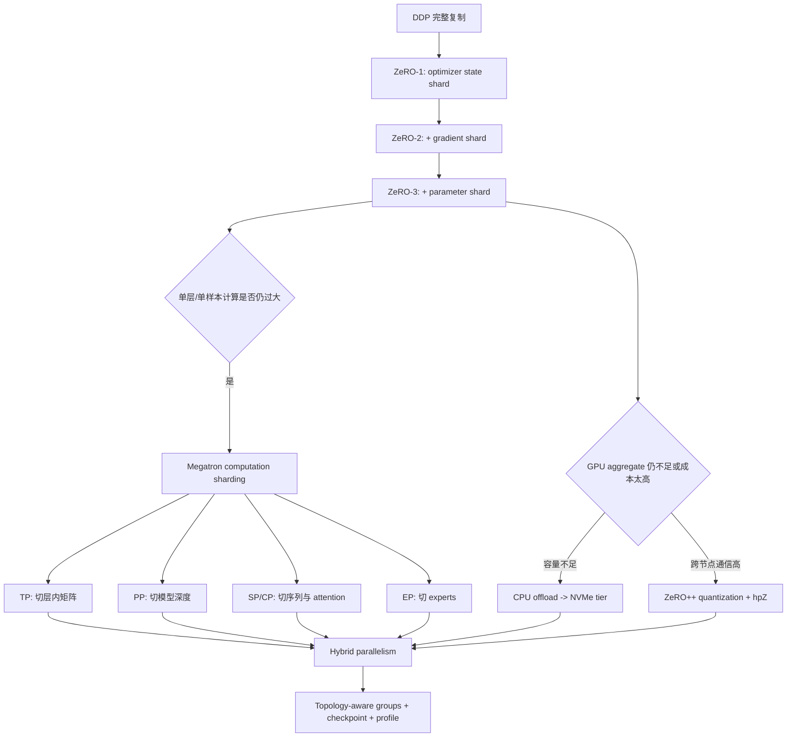
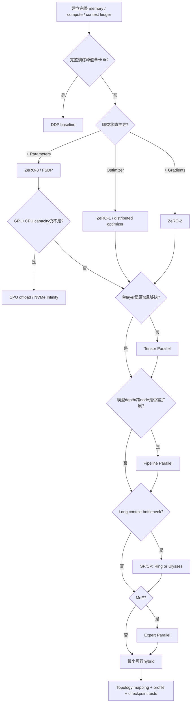

> 对应原文：Chapter 5. Beyond State Sharding with DeepSpeed and Megatron
>
> 本笔记严格沿原章顺序展开：ZeRO Stage 1/2/3、CPU/NVMe offload、ZeRO++，再进入 Megatron 的 tensor、pipeline、sequence/context、Ulysses 与 expert parallelism，最后讨论 Megatron Core、混合并行、真实配置、选型和练习。文中把算法机制、特定框架配置和厂商性能声明分开；当前工作区为 PyTorch 2.11.0+cpu，且未安装 DeepSpeed、Megatron、Transformer Engine，因此纯 Python 数学与 Gloo 示例可运行验证，CUDA/NCCL/框架性能配置只能做静态检查并明确标注目标环境验证要求。

## 0. 本章要回答的核心问题

第 4 章已经用 FSDP 解决“完整训练状态单卡放不下”。本章继续追问两类边界：**状态还可以放到哪里**，以及**单个样本的计算怎样跨设备**。

读完应能回答：

1. ZeRO-1、ZeRO-2、ZeRO-3 分别消除哪类 data-parallel state redundancy？
2. 每个阶段的理想 persistent memory 公式是什么，为什么峰值仍高于公式？
3. ZeRO-1/2 在 shard-local optimizer update 后如何保持 replicated parameters 一致？
4. ZeRO-3 为什么与 full-shard FSDP 同类，又为何不能等同于同一个产品？
5. Bucket size、contiguous gradients、prefetch 和 live-parameter limit 各控制哪种成本？
6. CPU offload 与 NVMe offload怎样把显存约束转移为 PCIe、DRAM、I/O 和 CPU compute 约束？
7. Async I/O、double buffering 和 prefetch为何有效，什么情况下无法隐藏慢层级？
8. ZeRO++ 的 quantized weights、hierarchical partitioning 和 quantized gradients分别减少什么通信？
9. hpZ 与 HSDP 的共同直觉是什么，为什么不是“一个节点内所有 GPU 都保存同一小 shard”？
10. 状态分片为何不能解决单层 GEMM 或单请求 compute 太大的问题？
11. Column-parallel 与 row-parallel linear 如何配对，使 MLP 只在必要位置通信？
12. Tensor parallel 为什么必须优先映射到 NVLink/NVSwitch 域？
13. Pipeline parallel 如何用 microbatches 降低 bubble，1F1B 与 GPipe/virtual pipeline 有何区别？
14. Sequence parallel 与 context parallel各自分片哪些 activation/attention 状态？
15. Ring Attention如何在不物化完整 K/V 的情况下得到全局 softmax结果？
16. Ulysses为何通过 sequence-to-head All-to-All 把问题变回标准 attention？
17. Expert parallel 的两次 All-to-All、capacity、router balance 与 grouped GEMM 如何关联？
18. 为什么 FSDP/ZeRO 与 Megatron 是两条正交轴，而不是二选一？
19. Megatron-FSDP、distributed optimizer、FP8/Transformer Engine分别解决什么？
20. 如何由 world size、模型结构、上下文、MoE 与物理拓扑构造 DP×TP×PP×CP×EP groups？

本章整体逻辑：



核心观点：

> **ZeRO/FSDP 决定训练状态长期存在哪里；Megatron 决定一个样本的一次计算由哪些设备共同完成。极大模型通常同时需要这两条轴。**

---

## 1. Beyond state sharding：为什么还需要计算分片

### 1.1 两条正交轴

设 Transformer layer参数 $W$，输入 $X$。

**状态分片**：

```text
平时每 rank 只存 W 的 shard
  -> 计算前临时 AllGather W
  -> 每 rank 对自己的 local batch 执行完整 X_r W
```

**计算分片**：

```text
W 沿行/列永久分给 TP ranks
  -> 每 rank 只计算 X W_i 或 X_i W_i
  -> 合并 partial outputs
```

状态分片解决 replica redundancy；计算分片解决单层容量、单层算力和单样本延迟/activation layout。

### 1.2 FSDP/ZeRO 的隐藏假设

即使参数平时分片，计算当前 FSDP/ZeRO-3 unit 时，某 rank仍要物化该 unit 的完整参数并完成完整 local-sample算子。必要条件：

$$
M_{full\ unit}+M_{activation}+M_{workspace}\le C_{usable}
$$

若一个 16K×64K MLP matrix、attention workspace或单层activation本身越过单 GPU边界，继续扩大state-shard degree不能解决；需要TP/CP等compute layouts。

### 1.3 为什么 100B+ 不只是“总参数更多”

参数总量可以通过更多 FSDP units逐层物化，但模型扩展通常同时带来：

- Hidden dimension增长，单个 GEMM weights/workspace增长；
- Layer数增加，activation和pipeline depth增长；
- Context增长，attention/activation增长；
- MoE experts增长，router与token shuffle增长；
- World size增长，collective latency/topology变复杂。

因此需要 tensor、pipeline、context和expert dimensions，不只是更细state shards。

### 1.4 本章工具的定位

| 工具/机制 | 主要问题 | 主要代价 |
| --- | --- | --- |
| ZeRO-1/2/3 | State redundancy | 逐级增加通信/协调 |
| ZeRO-Offload | GPU HBM不足 | PCIe、CPU RAM/compute |
| ZeRO-Infinity | GPU+CPU capacity不足 | NVMe I/O、staging、latency |
| ZeRO++ | ZeRO-3跨节点通信 | Quantization误差、额外复制/复杂度 |
| Tensor parallel | 单层太大/太慢 | 每层collective |
| Pipeline parallel | 模型太深/跨节点 | Bubble、activation P2P |
| Sequence/context parallel | 长context activation/attention | AllGather/All-to-All/ring traffic |
| Expert parallel | MoE expert capacity | Token All-to-All与负载不均 |

---

## 2. 统一内存账本：ZeRO stages 的共同语言

### 2.1 定义状态项

令：

- $P_w$：low-precision model parameters bytes；
- $P_g$：gradient bytes；
- $P_o$：optimizer-side state，包括 moments，按口径可含 master weights；
- $D$：data-parallel degree。

DDP persistent state/rank：

$$
M_0=P_w+P_g+P_o
$$

ZeRO stages理想值：

$$
M_1=P_w+P_g+\frac{P_o}{D}
$$

$$
M_2=P_w+\frac{P_g+P_o}{D}
$$

$$
M_3=\frac{P_w+P_g+P_o}{D}
$$

这些是persistent state下界，不包含activation、communication buckets、temporary full parameters、allocator、offload staging。

### 2.2 7B 的两种 optimizer 口径

BF16 parameter/gradient：各 2 bytes/param；FP32 Adam moments：8 bytes/param。

不计 master weights：

$$
P_w=14\ GB,\quad P_g=14\ GB,\quad P_o=56\ GB
$$

总计84 GB。

若optimizer侧再含FP32 master weights 4 bytes/param：

$$
P_o=84\ GB,\quad M_0=112\ GB
$$

原章早期用84 GB口径，70B concrete example用optimizer 840 GB（12 bytes/param，包含master+moments）。两种都可用，但不能在同一公式中混合。

### 2.3 70B、8-way DP 例子

按 source concrete example：

$$
P_w=140\ GB,\quad P_g=140\ GB,\quad P_o=840\ GB
$$

$$
M_0=1120\ GB
$$

8-way：

$$
M_1=140+140+840/8=385\ GB
$$

$$
M_2=140+(140+840)/8=262.5\ GB
$$

$$
M_3=1120/8=140\ GB
$$

即使ZeRO-3 persistent为140 GB，也无法放入80 GB GPU；还未计activation/full unit。需要更多DP shards、不同dtype/optimizer、offload或compute parallelism。

### 2.4 Cluster aggregate memory没有消失

ZeRO改变每rank复制量，不一定降低整个cluster保存global state所需的理论最低总量。它将：

```text
N 份重复状态
  -> 1 份 global state 分布于 N ranks
```

代价是计算需要状态时必须通信或移动。因此ZeRO本质是memory-communication trade-off。

### 2.5 可运行的 ZeRO memory calculator

```python
from dataclasses import dataclass


@dataclass(frozen=True)
class StateBytes:
    parameters_gb: float
    gradients_gb: float
    optimizer_gb: float


def zero_memory_per_rank(state: StateBytes, data_parallel: int) -> dict[int, float]:
    if data_parallel <= 0:
        raise ValueError("data_parallel must be positive")
    return {
        0: state.parameters_gb + state.gradients_gb + state.optimizer_gb,
        1: state.parameters_gb + state.gradients_gb + state.optimizer_gb / data_parallel,
        2: state.parameters_gb + (state.gradients_gb + state.optimizer_gb) / data_parallel,
        3: (
            state.parameters_gb + state.gradients_gb + state.optimizer_gb
        ) / data_parallel,
    }


state = StateBytes(parameters_gb=140, gradients_gb=140, optimizer_gb=840)
for stage, memory in zero_memory_per_rank(state, data_parallel=8).items():
    print(f"ZeRO-{stage}: {memory:.1f} GB/rank persistent state")
```

预期输出：

```text
ZeRO-0: 1120.0 GB/rank persistent state
ZeRO-1: 385.0 GB/rank persistent state
ZeRO-2: 262.5 GB/rank persistent state
ZeRO-3: 140.0 GB/rank persistent state
```

---

## 3. ZeRO Stage 1：只分 optimizer state

### 3.1 为什么先分 optimizer

Adam optimizer侧通常最大：moments 8 bytes/param，mixed precision可能再有master copy 4 bytes/param。Parameters与gradients各2 bytes时，optimizer占总固定状态的50%～75%。先分它能以较小算法改动获得最大第一步收益。

### 3.2 Ownership 与 update

把parameters分为 $D$ 个owner partitions。所有ranks仍有完整parameters和gradients，但rank $r$只保存/更新partition $r$ 的optimizer state：

```text
所有 ranks backward
  -> gradient synchronization
  -> rank r 用 optimizer shard更新 parameter partition r
  -> updated parameter partitions在ranks间同步
  -> 每rank恢复完整一致parameters
```

具体DeepSpeed实现可用reduce-scatter/all-gather等重新组织通信；稳定语义是gradient global reduction、partitioned update、replicated parameters恢复一致。

### 3.3 Memory 与 communication

$$
M_{Z1}=P_w+P_g+P_o/D
$$

相对DDP节省：

$$
\Delta M_1=P_o\left(1-\frac1D\right)
$$

通信总量与DDP同数量级，但多了partitioned update后parameter state一致性流程。ZeRO论文/实现通过collective rearrangement避免简单的额外完整通信；不要只根据高层伪代码推精确bytes。

### 3.4 DeepSpeed Engine 生命周期

```python
import deepspeed


config = {
    "train_batch_size": 32,
    "optimizer": {
        "type": "Adam",
        "params": {"lr": 1e-4},
    },
    "bf16": {"enabled": True},
    "zero_optimization": {"stage": 1},
}

engine, optimizer, _, _ = deepspeed.initialize(
    model=model,
    model_parameters=model.parameters(),
    config=config,
)

for batch in dataloader:
    loss = engine(batch)
    engine.backward(loss)
    engine.step()
```

原章使用FP16以兼容更多硬件；这里用BF16表达现代训练常见选择。实际GPU support、DeepSpeed版本和loss scaling需目标环境验证。

### 3.5 Optimizer 来源不能混淆

若config定义optimizer，DeepSpeed创建并返回engine-managed optimizer。不要同时创建外部 `torch.optim.Adam` 又假设其状态被ZeRO管理。DeepSpeed也支持传入optimizer的模式，但二者只能按文档选择一个权威来源。

检查：

- `engine.optimizer` identity/type；
- LR/weight decay/betas；
- Scheduler由谁step；
- Checkpoint保存哪个optimizer；
- Parameter groups是否完整。

### 3.6 `train_batch_size` 的约束

DeepSpeed常要求：

$$
B_{train}=B_{micro}\times D\times A
$$

- `train_micro_batch_size_per_gpu`：local microbatch；
- $D$：data-parallel world；
- `gradient_accumulation_steps`：$A$。

只写`train_batch_size=32`时，其他值可由环境/config推断，但复杂hybrid jobs应显式记录全部口径，避免batch/LR错误。

### 3.7 适用范围

适合：

- Parameters+gradients单卡fit；
- Optimizer states导致OOM；
- 想从DDP最小迁移；
- Debug简单优先。

不解决：replicated parameter/gradient容量、activation、单层compute。

---

## 4. ZeRO Stage 2：再分 gradients

### 4.1 为什么 full gradients 也冗余

Optimizer owner rank只需要自己parameter partition的global reduced gradient。让每rank长期保留完整 $P_g$ 没有必要。

ZeRO-2用ReduceScatter风格得到owner gradient shard：

$$
g^{(r)}=Shard_r\left(\frac1D\sum_{i=0}^{D-1}g_i\right)
$$

Owner更新local parameter partition，随后同步updated parameter partitions以恢复每rank完整parameters。

### 4.2 Memory

$$
M_{Z2}=P_w+\frac{P_g+P_o}{D}
$$

相对Stage1再省：

$$
\Delta M_{2-1}=P_g\left(1-\frac1D\right)
$$

但backward计算时gradient buckets有暂态；不能把persistent公式当peak。

### 4.3 Bucket 配置单位

```python
config = {
    "train_batch_size": 32,
    "bf16": {"enabled": True},
    "zero_optimization": {
        "stage": 2,
        "reduce_bucket_size": 500_000_000,
        "allgather_bucket_size": 500_000_000,
        "contiguous_gradients": True,
    },
}
```

DeepSpeed很多bucket字段按**elements**而非bytes。500M elements意味着：

- BF16/FP16约1 GB；
- FP32约2 GB。

这不是所有GPU“安全默认值”。大bucket摊薄latency却增峰值和ready延迟；小GPU/小模型应根据profile调小。

### 4.4 `contiguous_gradients`

把gradients复制/组织到连续buffer：

- 减fragmentation；
- 便于大ReduceScatter；
- 增加copy/buffer storage；
- 与overlap/lifetime交互。

是否节省peak取决于原gradient views和allocator，需实测。

### 4.5 Stage 2 vs DDP

Parameters仍完整，forward无需逐层parameter AllGather。因此当parameters fit但optimizer+gradients不fit时，Stage2通常比Stage3通信简单、吞吐更高。

### 4.6 适用范围

- Full parameters与activation单卡fit；
- Gradient+optimizer主导；
- 希望避免Stage3每层AG；
- 可接受DeepSpeed Engine生态。

不能解决parameter本身单卡不fit或单层compute太大。

---

## 5. ZeRO Stage 3：完整状态分片

### 5.1 Parameter sharding 完成最后一步

Stage3让每rank persistent：

$$
M_{Z3}=\frac{P_w+P_g+P_o}{D}
$$

计算当前module/layer前AllGather parameter shards，计算后release/partition；backward按配置再次gather并ReduceScatter gradients。

### 5.2 与 FSDP 的关系

算法同类：

- Persistent full-state shards；
- On-demand parameter materialization；
- Gradient ReduceScatter；
- Prefetch/overlap；
- Sharded optimizer update。

不同：

- DeepSpeed engine/config与PyTorch FSDP2 API；
- Parameter grouping/layout；
- Offload/Infinity/ZeRO++；
- Checkpoint格式与planner；
- Megatron/第三方集成；
- 版本和kernel优化。

“Functionally equivalent”指state-sharding级别，不表示checkpoint/API/performance可互换。

### 5.3 通信数量级

对总parameter bytes $P_w$，若forward和backward各gather一次、gradient RS一次，且dtype相同：

$$
V_{Z3,rank}\approx3\frac{D-1}{D}P_w
$$

原章称“3× model size”是 $D$ 较大时的近似，且默认parameter/gradient通信bytes相同。实际受：

- Persistence threshold/module granularity；
- Prefetch/live params；
- Reshard policy；
- Parameter/reduce dtype；
- Quantization；
- Hierarchical groups。

### 5.4 Stage3 配置项

```python
config = {
    "train_batch_size": 32,
    "bf16": {"enabled": True},
    "zero_optimization": {
        "stage": 3,
        "overlap_comm": True,
        "contiguous_gradients": True,
        "stage3_prefetch_bucket_size": 500_000_000,
        "stage3_max_live_parameters": 1_000_000_000,
    },
}
```

含义：

- `overlap_comm`：尽量让gather/reduce与compute并行；
- `prefetch_bucket_size`：一次提前物化多少elements；
- `max_live_parameters`：限制同时驻留unpartitioned/active parameters数量；
- `contiguous_gradients`：连续gradient buffer。

数值很大，按elements换算并监控peak。原章配置是示意，不应直接用于24 GB GPU。

### 5.5 Prefetch 的双刃剑

理想：

$$
T_{exposed}=\max(0,T_{gather,next}-T_{compute,current})
$$

但提前gather让当前+next parameters同时live。`max_live_parameters`与prefetch bucket共同控制memory/overlap。过大可能OOM或网络争用，过小则latency多。

### 5.6 Stage3 不保证单层fit

Persistent shard很小，当前layer完整parameter、activation和workspace仍可能超GPU：

$$
M_{layer,full}+M_{activation}+M_{workspace}>C_{usable}
$$

此时需要TP/PP/CP，而不是继续增加ZeRO DP degree。

### 5.7 性能声明的边界

原章提单节点Stage3相对Stage2常慢10%～20%、多节点差距扩大。这是经验范围，不是定律；model compute、bucket、NVLink、dtype和implementation都能反转结果。必须固定global batch/quality实测。

---

## 6. ZeRO-Offload：扩展到 CPU memory

### 6.1 Offload 的层级选择

常见两种：

- Optimizer offload：optimizer states和update在CPU，parameters计算仍GPU；
- Parameter offload：parameter shards也驻CPU，需要时H2D，再D2H/evict。

Stage2 + optimizer offload是ZeRO-Offload经典路径；Stage3可同时offload optimizer与parameters。

### 6.2 CPU optimizer 数据路径

```text
GPU backward / gradient partition
  -> gradient shard D2H
  -> CPU optimizer reads moments/master
  -> CPU updates parameter shard
  -> updated shard H2D before future compute
```

依赖链意味着“CPU处理上一步、GPU无条件开始下一batch”不总成立：下一forward需要更新后的parameters。DeepSpeed通过tiling/pipelining/overlap隐藏部分阶段，但无法消除真实依赖和bytes。

### 6.3 带宽下界

每step host-device volume $V_{hd}$，effective PCIe/C2C bandwidth $B_{hd}$：

$$
T_{hd}\ge\frac{V_{hd}}{B_{hd}}
$$

若双向100 GB、25 GB/s，下界4 s。CPU Adam还受DRAM bandwidth和vectorization限制。

### 6.4 配置

```python
config = {
    "train_batch_size": 8,
    "bf16": {"enabled": True},
    "zero_optimization": {
        "stage": 3,
        "offload_optimizer": {
            "device": "cpu",
            "pin_memory": True,
        },
        "offload_param": {
            "device": "cpu",
            "pin_memory": True,
        },
        "overlap_comm": True,
    },
}
```

只需optimizer offload时不要同时parameter offload；以最小慢层级迁移满足容量。

### 6.5 Pinned memory 与 CPU RAM

Pinning提高DMA机会但锁页不可换出。容量规划包括：

$$
M_{host}=M_{offloaded\ state}+M_{buffers}+M_{dataset/cache}+M_{runtime}
$$

还要考虑每rank/每node重复、NUMA、CPU sockets与swap禁用。Host RAM不足会触发OS OOM或swap，性能崩溃。

### 6.6 CPU utilization 不是唯一指标

监控：

- Process RSS/USS与node free memory；
- CPU memory bandwidth；
- PCIe H2D/D2H；
- NUMA remote traffic；
- Optimizer wall time；
- Pinned pages；
- GPU idle gaps；
- Step p50/p95。

### 6.7 使用顺序

Mixed precision → 合理batch/checkpoint → ZeRO stage满足state → 仍OOM再optimizer offload → parameter offload。Offload是feasibility策略；若吞吐成本高于增加GPU，应重新算TCO。

### 6.8 原章 354M 示例怎样读

GPU memory约3.5 GB只说明特定model/config/runtime的观测，不等于0.71 GB weights加offload后固定开销公式。Context、buckets、activation、engine kernels都占memory。必须报告peak allocated/reserved和host memory。

---

## 7. ZeRO-Infinity：将 NVMe 变为第三层容量

### 7.1 三层 memory hierarchy

| Tier | 容量 | 带宽/延迟 | 角色 |
| --- | --- | --- | --- |
| GPU HBM | 最小 | 最快 | Active compute working set |
| CPU DRAM | 中 | 较慢 | Staging、optimizer、warm state |
| NVMe | 最大 | 最慢 | Cold parameter/optimizer tiles |

Infinity Engine通过partition、tiling、prefetch、evict和overlap让当前compute需要的tile及时到GPU。

### 7.2 Working-set 必须满足

即使用NVMe，GPU仍需容纳：

$$
M_{GPU,working}=M_{active\ params}+M_{activations}+M_{workspace}+M_{buffers}
$$

CPU需容纳staging/double buffers和optimizer working set。NVMe只能扩展cold-state capacity，不能让active layer无限大。

### 7.3 Pipeline timing

对tile $i$：

```text
NVMe read tile i+1 -> CPU staging
CPU->GPU tile i
GPU compute tile i-1
GPU->CPU / NVMe evict older tile
```

理想steady state每tile时间：

$$
T_{tile}\approx\max(T_{nvme},T_{pcie},T_{compute})
$$

若NVMe 7 GB/s读14 GB tile约2 s，而compute仅0.2 s，I/O无法隐藏，GPU大部分时间等待。

### 7.4 Async I/O 配置

```python
config = {
    "zero_optimization": {
        "stage": 3,
        "offload_optimizer": {
            "device": "cpu",
            "pin_memory": True,
        },
        "offload_param": {
            "device": "nvme",
            "nvme_path": "/local_nvme/deepspeed",
            "buffer_count": 5,
            "buffer_size": 100_000_000,
        },
    },
    "aio": {
        "block_size": 1_048_576,
        "queue_depth": 16,
        "thread_count": 2,
    },
}
```

- `buffer_count/size`：staging/overlap capacity；
- `block_size`：I/O request granularity；
- `queue_depth`：outstanding requests；
- `thread_count`：host I/O workers。

过小不能饱和NVMe，过大增加host pinned memory和latency。必须size/queue sweep。

### 7.5 `nvme_path` 是目录，不是裸设备

正确：mounted filesystem中的目录，例如 `/local_nvme/deepspeed`。错误：`/dev/nvme0n1p7`。直接写raw block device会破坏filesystem/data且不符合普通offload API。

检查：

```shell
lsblk -o NAME,SIZE,FSTYPE,MOUNTPOINT
df -h /local_nvme
mkdir -p /local_nvme/deepspeed
```

### 7.6 依赖与系统限制

```shell
sudo apt install libaio-dev
ulimit -n 65535
```

实际还需：

- Local NVMe而非慢network filesystem；
- 足够free space；
- Filesystem/inode/open-file limits；
- I/O scheduler/permissions；
- SSD endurance与temperature；
- 多ranks路径隔离；
- Cleanup stale offload files。

### 7.7 Capacity 估算

原章建议free space约model size的2～4倍，属于粗略经验。应逐项计算offloaded params、optimizer、buffers、checkpoint和临时files。70B FP16 weights 140 GB，optimizer-side 840 GB，单node全offload可接近TB级，不能只按weights估算。

### 7.8 NVMe 性能与耐久

原章PCIe Gen4 5～7 GB/s是单盘顺序读示意；随机/并发读写、filesystem、thermal throttling和多ranks会降低。训练长期写放大也消耗TBW endurance。监控：throughput、IOPS、queue latency、utilization、temperature、wear level。

### 7.9 NVMe offload 的价值边界

它让“不可能运行”变成“可以但较慢”。比较：

$$
CostToTrain=HardwareHourlyCost\times WallClockHours
$$

便宜单GPU+NVMe若慢5倍，可能比更多GPU更贵且迭代周期更长。Feasibility与经济性分开评估。

### 7.10 可运行的 offload lower-bound calculator

```python
def transfer_seconds(volume_gb: float, bandwidth_gb_s: float) -> float:
    if volume_gb < 0 or bandwidth_gb_s <= 0:
        raise ValueError("Invalid volume or bandwidth")
    return volume_gb / bandwidth_gb_s


print(f"CPU offload 100 GB at 25 GB/s: {transfer_seconds(100, 25):.1f} s")
print(f"NVMe read 14 GB at 7 GB/s: {transfer_seconds(14, 7):.1f} s")
print(f"840 GB optimizer at 7 GB/s, one full read: {transfer_seconds(840, 7):.1f} s")
```

预期输出：

```text
CPU offload 100 GB at 25 GB/s: 4.0 s
NVMe read 14 GB at 7 GB/s: 2.0 s
840 GB optimizer at 7 GB/s, one full read: 120.0 s
```

真实引擎不会每step简单串行全读optimizer；数字用于显示慢层级不经tiling/overlap会有多昂贵。

---

## 8. ZeRO++：优化 ZeRO-3 的跨节点通信

### 8.1 问题来源

ZeRO-3内存高效，却可能每层forward/backward跨DP group AllGather parameters，并RS gradients。多节点时：

- Node内NVLink快；
- Node间IB/RoCE慢且共享；
- Parameter communication频繁；
- World size增大，latency/straggler更明显。

ZeRO++沿三个方向减少slow-link bytes或限制通信域。

### 8.2 qwZ：Quantized weights communication

原FP16/BF16 parameter payload约2 bytes/element，8-bit communication约1 byte/element：

$$
V_{qwZ}\approx\frac12V_{FP16}+V_{scale/metadata}
$$

流程：

```text
high-precision parameter shard
  -> block/group quantize for communication
  -> AllGather 8-bit payload + scales
  -> dequantize to compute dtype
  -> compute
```

Persistent master/optimizer仍高精度，quantization error不会作为唯一parameter copy逐step累积；但每次compute使用dequantized近似，仍可能影响gradient/quality，需验证。

### 8.3 qgZ：Quantized gradients communication

ReduceScatter/gradient exchange使用8-bit representation，降低bytes。Gradient分布更动态、含outliers，quantization通常比weights更敏感；需要scaling、可能error compensation和collective-specific algorithm。不能只cast INT8后SUM，整数overflow和scale不一致会错误。

### 8.4 hpZ：Hierarchical partitioning 的准确直觉

目标是避免每次parameter AllGather跨所有nodes。设每node $S$ GPUs、$R$ nodes：

- Global ZeRO optimizer/gradient ownership可跨更大DP；
- 为parameters维护一个node-local secondary partition；
- 每个node的 $S$ GPUs**共同拥有完整model的不同shards**；
- 相同local position shards跨nodes被复制。

两node×两GPU示意：

```text
Node 0: GPU0 -> shard A, GPU1 -> shard B
Node 1: GPU2 -> shard A, GPU3 -> shard B
```

每node内A+B可通过NVLink AllGather完整parameters，无需为每层从另一node取parameter shards。

原章图文把“Node 0两GPU都持S0、Node 1两GPU都持S1”作为简化，但那样每node仍缺另一半，无法实现纯node-local parameter gather。应将hpZ理解为**完整model在secondary group内分片、跨secondary groups复制**，与HSDP `(Replicate, Shard)` 类似。

### 8.5 hpZ memory-communication trade-off

全world参数分片persistent：

$$
M_{param,global}=P_w/(RS)
$$

Node-local secondary shard：

$$
M_{param,hpZ}=P_w/S
$$

每rank参数persistent增加 $R$ 倍，换parameter AllGather主要留在node内。Optimizer/gradient的具体partition取决于DeepSpeed配置与版本。

### 8.6 `zero_hpz_partition_size`

它表示secondary partition group大小，常设每node GPUs数，但必须匹配rank mapping/topology；不是见到8卡node就无条件填8。若SLURM rank交错导致group跨nodes，优化失效。

### 8.7 配置

```python
config = {
    "train_batch_size": 32,
    "fp16": {"enabled": True},
    "zero_optimization": {
        "stage": 3,
        "zero_quantized_weights": True,
        "zero_hpz_partition_size": 8,
        "zero_quantized_gradients": True,
    },
}
```

原章说ZeRO++量化“要求FP16、BF16会dtype mismatch”，这应视为其示例/特定DeepSpeed版本限制，不是ZeRO++论文算法永久只能FP16。目标版本检查supported dtype、quantizer kernel与hardware，不能盲开。

### 8.8 三种优化不是免费叠加

- qwZ/qgZ：quantize/dequantize kernel、scales、quality风险；
- hpZ：参数secondary replicas增加memory；
- All enabled：通信更少，但debug和checkpoint layout更复杂；
- Single node：hpZ跨节点收益不存在；
- 小模型/小消息：quantizer overhead可能超过节省。

### 8.9 验证 ZeRO++ 真正启用

不能只看config：

- DeepSpeed logs中的quantizer/group；
- NCCL operation payload/dtype变化；
- Cross-node NIC bytes；
- Per-rank parameter persistent memory变化；
- Step p50/p95；
- Loss/validation metric；
- Checkpoint round trip；
- Feature-by-feature A/B：qwZ、hpZ、qgZ、all。

### 8.10 适用场景

大模型、多节点、ZeRO-3 parameter/gradient communication暴露明显，且GPU有secondary replica headroom。单node或网络不是瓶颈时收益有限。

### 8.11 ZeRO++ 与 HSDP 的关系

共同思想：

```text
让高频参数物化留在快的局部shard group
  + 在更慢层级复制/同步较粗粒度状态
```

不同框架、状态划分和quantization能力不同，不应把配置直接互换。

### 8.12 可运行的 quantization/hpZ 数量级计算器

```python
def communication_payload_gb(elements: int, bytes_per_element: float,
                             metadata_ratio: float = 0.0) -> float:
    return elements * bytes_per_element * (1 + metadata_ratio) / 1_000_000_000


parameter_elements = 7_000_000_000
fp16_gb = communication_payload_gb(parameter_elements, 2)
int8_gb = communication_payload_gb(parameter_elements, 1, metadata_ratio=0.01)

print(f"7B FP16 communication payload: {fp16_gb:.1f} GB")
print(f"7B INT8 + 1% metadata payload: {int8_gb:.2f} GB")
print(f"Payload ratio: {int8_gb / fp16_gb:.3f}")
print(f"Parameter shard: global 16-way={140 / 16:.2f} GB, hpZ local 8-way={140 / 8:.2f} GB")
```

预期输出：

```text
7B FP16 communication payload: 14.0 GB
7B INT8 + 1% metadata payload: 7.07 GB
Payload ratio: 0.505
Parameter shard: global 16-way=8.75 GB, hpZ local 8-way=17.50 GB
```

真实quantization metadata与block scheme不同；数字只展示约2×payload reduction和hpZ的memory代价。

---

## 9. Megatron：把计算分片作为第二条轴

### 9.1 Megatron 解决的边界

ZeRO-3/FSDP可以把模型persistent state切得很细，但计算当前layer仍有三类单卡边界：

1. 完整layer parameters/workspace物化不下；
2. 单个GEMM太大/太慢，无法满足throughput或单样本latency；
3. Activation/context/experts的单rank计算布局不下。

Megatron通过对Transformer结构做model-aware computation sharding解决这些问题，而不是只在外层套一个通用state wrapper。

### 9.2 历史与可迁移思想

Megatron-LM 2019展示8.3B模型的intra-layer tensor parallelism。今天具体package、CLI和kernel已经演进，持久思想是：

- 利用matrix multiplication可沿行/列分解；
- 将attention heads/vocabulary/sequence切到合适axes；
- 用column/row parallel配对减少通信点；
- 用pipeline沿depth扩展；
- 将高频通信放在快拓扑；
- 与DP/state sharding组合。

### 9.3 状态分片的单层假设

原章7B示例称4096×16384 matrix约270M参数，实际：

$$
4096\times16384=67{,}108{,}864
$$

约67.1M parameters，FP16/BF16约134.2 MB（十进制），不是500 MB。若SwiGLU有两个up/gate projections，再加down projection，一个MLP block的矩阵总量才会是多个该规模。

175B风格：

$$
12288\times49152=603{,}979{,}776
$$

约604M，FP16约1.208 GB，原章这一数量级正确。加QKV、output、其他MLP matrices、activation和workspace后，单layer压力更大。

### 9.4 State sharding vs computation sharding

| 维度 | ZeRO/FSDP | Megatron TP/PP/CP/EP |
| --- | --- | --- |
| 切什么 | Persistent training state | Operator/layers/sequence/experts |
| 单sample是否跨设备 | 通常否（当前unit在local rank完整算） | 是 |
| 参数何时完整 | Compute前临时materialize | TP下可能永不单rank完整 |
| 主要通信 | AG/RS around units | Within layer / stage P2P / token shuffle |
| 主要目标 | Memory redundancy | Compute、unit memory、latency/activation |

二者可同时作用于不同process-group axes。

---

## 10. Tensor Parallelism：沿矩阵维度切一层

### 10.1 Linear layer 的两种分解

设：

$$
X\in\mathbb{R}^{B\times d_{in}},\quad
W\in\mathbb{R}^{d_{in}\times d_{out}},\quad
Y=XW
$$

Tensor-parallel degree $T$。

### 10.2 Column-parallel linear

沿输出列切：

$$
W=[W_0\mid W_1\mid\cdots\mid W_{T-1}]
$$

$$
W_r\in\mathbb{R}^{d_{in}\times(d_{out}/T)}
$$

所有TP ranks持有/接收相同 $X$，各算：

$$
Y_r=XW_r
$$

完整输出逻辑上：

$$
Y=[Y_0\mid Y_1\mid\cdots\mid Y_{T-1}]
$$

若下一operator支持sharded output，不必立即AllGather。原章说“无通信、只是逻辑concat”，只在保持sharded layout时成立；外部需要完整 $Y$ 时仍要AllGather。

### 10.3 Row-parallel linear

输入与weight沿contracting dimension切：

$$
X=[X_0\mid X_1\mid\cdots\mid X_{T-1}]
$$

$$
W=\begin{bmatrix}W_0\\W_1\\\vdots\\W_{T-1}\end{bmatrix}
$$

每rank partial：

$$
Z_r=X_rW_r
$$

完整输出：

$$
Y=\sum_{r=0}^{T-1}Z_r
$$

需要AllReduce；若后续接受sequence-sharded layout，可用ReduceScatter替代full replicated result。

### 10.4 为什么 MLP 配对只需关键通信点

典型MLP：

$$
H=\phi(XW_{up})
$$

$$
Y=HW_{down}
$$

$W_{up}$ column-parallel，activation $\phi$ 对每个shard独立执行；$W_{down}$ row-parallel，最后对partial outputs求和。这样中间宽维 $4d$始终分片，只在down projection末尾归约。

SwiGLU有gate/up两组column projections：

$$
H=SiLU(XW_g)\odot(XW_u)
$$

只要两者按相同output partition，local elementwise gate无需通信，down projection再归约。

### 10.5 Bias、activation 与 backward

- Column-parallel bias按output shard本地持有；
- Row-parallel output bias应在reduction后只加一次，或按实现正确处理；
- Backward communication是forward collectives的伴随操作，不能只按forward“一次AllReduce”估整step；
- Weight gradients本地对应weight shard，input gradients可能需要reduction/reshard。

真实Megatron将forward/backward通信封装在autograd functions并与sequence parallel组合。

### 10.6 Attention head parallelism

Q/K/V projections可column-parallel，使每rank处理部分heads；每head attention相对独立。Output projection row-parallel并归约。

约束：

- Query heads通常需能被TP degree合理分割；
- GQA的KV groups较少，TP大于KV groups时需要复制/特殊mapping；
- MQA只有一组K/V，不可简单按heads均切；
- RoPE、bias、mask与KV cache layout必须对应local heads。

不能从“attention heads独立”推出任意TP degree都无通信。

### 10.7 TP 的 per-rank compute 与 memory

理想大GEMM：

$$
F_{rank}\approx F/T
$$

Weight shard：

$$
M_{W,rank}\approx M_W/T
$$

但输入/输出、norm、residual、部分activation可能replicated；collective buffers与kernel efficiency也不按 $1/T$。TP增大后local GEMM变小，Tensor Core utilization下降，最终出现最优degree。

### 10.8 TP communication sensitivity

每Transformer block中attention output和MLP output都有高频归约/reshard。消息频率与layer数、microbatches、forward/backward成比例。

简化：每层 $c$ 次collective，层数 $L$：

$$
N_{collective/step}\propto cL\times microbatches
$$

因此TP更依赖low latency/high bandwidth，通常限制在同node NVLink/NVSwitch。跨node IB虽可用，频繁latency会累积。

### 10.9 `--tp-comm-overlap`

Overlap需要：

- 可以切分/分块的GEMM与collective；
- 独立CUDA streams和正确dependency；
- 足够大compute覆盖communication；
- Transformer Engine/Megatron版本支持；
- `CUDA_DEVICE_MAX_CONNECTIONS` 等ordering设置与目标平台匹配。

开flag不等于自动有效；用timeline看TP collective与GEMM是否真正并行。

### 10.10 TP correctness 的最小验证

1. 从同一full weights按列/行切shards；
2. 所有ranks用相同input；
3. Column outputs Gather后与 `F.linear` 比；
4. Row partials AllReduce后与full linear比；
5. 比较input/weight gradients；
6. 多steps比较optimizer state；
7. 测不同batch/shape/dtype。

只比较shape不证明数值正确。

### 10.11 可运行的矩阵分块验证

```python
import torch


torch.manual_seed(7)
x = torch.randn(3, 4)
first_weight = torch.randn(4, 8)
second_weight = torch.randn(8, 5)

full_hidden = x @ first_weight
full_output = full_hidden @ second_weight

first_shards = first_weight.chunk(2, dim=1)
hidden_shards = [x @ shard for shard in first_shards]
second_shards = second_weight.chunk(2, dim=0)
partial_outputs = [
    hidden @ weight
    for hidden, weight in zip(hidden_shards, second_shards)
]
parallel_output = sum(partial_outputs)

print(f"column shard shapes: {[tuple(value.shape) for value in hidden_shards]}")
print(f"row partial shapes: {[tuple(value.shape) for value in partial_outputs]}")
print(f"max error: {(parallel_output - full_output).abs().max().item():.3e}")
print(f"4096x16384 parameters: {4096 * 16384:,}")
print(f"12288x49152 parameters: {12288 * 49152:,}")
```

预期输出：

```text
column shard shapes: [(3, 4), (3, 4)]
row partial shapes: [(3, 5), (3, 5)]
max error: 9.537e-07
4096x16384 parameters: 67,108,864
12288x49152 parameters: 603,979,776
```

误差来自浮点运算顺序；双精度或不同PyTorch可能显示不同末位，应使用tolerance。

---

## 11. Pipeline Parallelism：沿深度切模型

### 11.1 基本数据流

$L$ layers分成 $P$ stages。Stage $p$只持有一段layers：

```text
Stage 0 forward -> activation send -> Stage 1 -> ... -> loss
loss backward -> gradient send backward -> ... -> Stage 0
```

Parameters/optimizer按stage自然分布；同一sample依次经过所有stages。

### 11.2 Naive pipeline 为什么浪费

只处理一个microbatch时，任一时刻通常只有一个stage工作。$P=4$ forward utilization约 $1/4$；加backward仍有大段空闲。解决方法不是“换1F1B名字”，而是将global/minibatch切成多个microbatches并并发推进。

### 11.3 Microbatch pipeline bubble

理想相同stage time、只看单方向pipeline，$M$ microbatches、$P$ stages：

$$
T=M+P-1\quad\text{stage-time units}
$$

每stage有效工作 $M$：

$$
U=\frac{M}{M+P-1}
$$

$$
Bubble=\frac{P-1}{M+P-1}
$$

增加 $M$ 摊薄fill/drain；但提高activation in-flight、accumulation和schedule复杂度。

### 11.4 GPipe vs 1F1B

**GPipe**：先执行所有microbatch forwards，再全部backwards。优点简单；缺点需保存许多microbatch activations，峰值高。

**1F1B**：warmup后每stage交替一个forward和一个backward，尽早释放activation。主要优势是降低in-flight activation memory、形成稳定schedule。

在理想同样microbatch count/stages下，microbatching本身决定主要fill/drain bubble；1F1B并不凭名字消除所有bubble。它相对GPipe最明确的收益是activation memory和调度steady state，具体bubble取决于schedule。

### 11.5 1F1B 阶段

对stage $p$：

1. Warmup：执行若干forwards填pipeline；
2. Steady：交替forward新microbatch与backward较早microbatch；
3. Cooldown：完成剩余backwards。

不同stage warmup数量不同。实现必须管理activation/gradient tags、microbatch IDs、P2P ordering，否则容易deadlock或错配。

### 11.6 Stage balance

Pipeline clock由最慢stage决定：

$$
T_{clock}=\max_p T_p
$$

每step浪费包括：

$$
\sum_p(T_{clock}-T_p)
$$

按layer数均分不一定按FLOPs/latency/memory均分。Embedding、loss head、MoE layers、long-context attention成本不均。用per-layer profile partition。

### 11.7 Activation P2P volume

Stage boundary tensor大约：

$$
V_{act}=B_{micro}\times S\times H\times b
$$

Forward发送activation，backward发送其gradient。Pipeline频率每microbatch每boundary，虽低于TP每layercollective，但长sequence/hidden仍可巨大。

### 11.8 为什么 PP 常跨 nodes

TP每层collective非常频繁；PP只在stage boundaries P2P，因此更能容忍较慢IB/RoCE。但若boundary activation大、microbatch很多或network拥塞，PP仍受限。通常TP group在node内，PP stages跨nodes是一条经验，不是定律。

### 11.9 Virtual/Interleaved Pipeline

每physical GPU持多个non-contiguous virtual chunks：

```text
GPU 0: virtual stage 0 + 2
GPU 1: virtual stage 1 + 3
```

更细stage粒度可降低bubble、改善balance，但：

- 更多P2P messages；
- Schedule更复杂；
- Activation bookkeeping增加；
- Layer count需满足virtual partition约束。

`--num-layers-per-virtual-pipeline-stage` 控制chunk granularity，含义按Megatron版本。

### 11.10 PP 与 global batch

若DP degree $D$、microbatch size $b$、每optimizer step microbatch数 $M$：

$$
B_{global}=bDM
$$

Pipeline需要 $M$ 足够大以填满；同时global batch/gradient accumulation受优化约束。不能只为降bubble无限加microbatches。

### 11.11 PP correctness

- Full model weights按layers切stage；
- Forward output与unsharded baseline一致；
- Backward gradients按layer一致；
- Microbatches loss sum/mean scale正确；
- Tied embedding跨首尾stage正确同步；
- Dropout RNG按microbatch/stage可重现；
- P2P tags/order无错配；
- Optimizer step只在全microbatch accumulation完成后。

### 11.12 Pipeline 利用率计算器

```python
def pipeline_utilization(microbatches: int, stages: int) -> float:
    if microbatches <= 0 or stages <= 0:
        raise ValueError("microbatches and stages must be positive")
    return microbatches / (microbatches + stages - 1)


for microbatches in (1, 4, 16, 64):
    utilization = pipeline_utilization(microbatches, stages=4)
    print(
        f"M={microbatches:2d}, P=4: utilization={utilization:.1%}, "
        f"bubble={1 - utilization:.1%}"
    )
```

预期输出：

```text
M= 1, P=4: utilization=25.0%, bubble=75.0%
M= 4, P=4: utilization=57.1%, bubble=42.9%
M=16, P=4: utilization=84.2%, bubble=15.8%
M=64, P=4: utilization=95.5%, bubble=4.5%
```

这是单方向/理想平衡模型；实际1F1B/interleaved包含forward/backward与P2P。

---

## 12. Sequence Parallelism 与 Context Parallelism

### 12.1 为什么长 context 成为独立轴

Activation近似随：

$$
M_{activation}\propto LBSH
$$

朴素attention score甚至：

$$
M_{score}\propto B\cdot heads\cdot S^2
$$

FlashAttention避免完整score materialization，但Q/K/V、residual、MLP和backward仍随 $S$ 增长。32K/128K context可让activation超过model state。

### 12.2 Sequence Parallelism（Megatron 狭义）

TP中某些LayerNorm、Dropout、residual等操作若在每TP rank处理完整sequence，会复制activation。SP沿sequence切这些regions，使每rank约持 $S/T$ tokens。

常通过ReduceScatter/AllGather在TP-sharded hidden layout与sequence-sharded layout间转换，替代某些AllReduce。它不是完整分布式attention；attention heads/hidden仍按TP逻辑。

### 12.3 SP memory saving 的边界

只有被sequence-shard的activation部分近似除以TP degree。Attention内部或其他replicated tensors不一定；不能说“所有activation精确降 $T$ 倍”。

### 12.4 Context Parallelism

CP沿sequence将inputs、intermediate activations和attention context分片：

$$
S_{local}=S/C
$$

每rank持local Q/K/V chunks，但local query必须看到global K/V。解决方式包括Ring Attention、AllGather KV或All-to-All layout transforms。

### 12.5 Ring Attention 数据流

$C$ ranks：

```text
Step 0: Q_r attends local K_r,V_r
Step 1: send K,V to next; receive previous chunk; update result
...
Step C-1: each Q_r has seen all K,V chunks
```

每rank只同时保存一个/少数KV chunks，不物化full context KV。远程chunks为 $C-1$ 轮。

### 12.6 Online softmax 合并

对一个Q block，KV block $j$ scores：

$$
S_j=QK_j^T/\sqrt{d_k}
$$

维护running maximum $m$、normalizer $l$、未归一output accumulator $o$。新block最大值 $m_j$：

$$
m'=\max(m,m_j)
$$

$$
l'=e^{m-m'}l+\sum e^{S_j-m'}
$$

$$
o'=e^{m-m'}o+e^{S_j-m'}V_j
$$

最终：

$$
Attention=o/l
$$

每次将旧/新指数缩放到共同最大值，数值稳定且等价于对所有scores一次softmax。Causal mask、padding与backward需要相应block-aware处理。

### 12.7 Ring communication overlap

当前KV block计算时异步收下一block。理想每轮：

$$
T_{round}\approx\max(T_{attention\ block},T_{KV\ transfer})
$$

Long sequence使block compute大，通信更易隐藏；短sequence或大CP degree使local block小，latency主导。

### 12.8 GQA 对 CP 通信的影响

GQA让多个query heads共享较少KV heads，K/V bytes从query-head数量降到KV-group数量，Ring KV transfer显著减少。TP/CP layout必须正确处理query heads与KV groups的不同partitionability。

### 12.9 CP 不保证取消 activation checkpoint

原章说可通过分布activation避免约30%重算，方向成立，但是否完全取消取决于：

- Local activation仍多大；
- Model layers/MLP；
- TP/DP/PP组合；
- Attention kernel；
- HBM headroom；
- CP communication cost。

常见是CP与selective checkpoint一起用，而非绝对二选一。

### 12.10 何时用 SP/CP

不要用固定“8K以上”作为定律。先profile：

- 若LN/dropout/residual replicated activation主导且已有TP：SP；
- 若full attention context/KV/QKV主导：CP；
- 若模型state主导：先state sharding；
- 若单层hidden compute主导：TP。

Context threshold随H、layers、batch、GPU HBM和kernel变化。

### 12.11 Activation 数量级计算器

```python
def activation_gib(layers: int, batch: int, sequence: int, hidden: int,
                   bytes_per_element: int, factor: float,
                   context_parallel: int = 1) -> float:
    total = layers * batch * sequence * hidden * bytes_per_element * factor
    return total / context_parallel / 1024**3


for sequence in (8_192, 32_768, 131_072):
    base = activation_gib(32, 1, sequence, 4096, 2, 5)
    cp4 = activation_gib(32, 1, sequence, 4096, 2, 5, context_parallel=4)
    print(f"S={sequence:6d}: base={base:6.1f} GiB, ideal CP4={cp4:6.1f} GiB")
```

预期输出：

```text
S=  8192: base=  10.0 GiB, ideal CP4=   2.5 GiB
S= 32768: base=  40.0 GiB, ideal CP4=  10.0 GiB
S=131072: base= 160.0 GiB, ideal CP4=  40.0 GiB
```

Factor=5与理想 $1/C$ 仅作教学；真实未分片tensors使saving较少。

---

## 13. DeepSpeed-Ulysses：Sequence-to-head All-to-All

### 13.1 Layout transpose

初始每rank：

$$
[B,S/C,H_{all},d_h]
$$

All-to-All后：

$$
[B,S,H_{local},d_h],\quad H_{local}=H_{all}/C
$$

每rank拥有完整sequence、部分heads，可运行标准attention；之后第二次All-to-All回到sequence-sharded layout。

### 13.2 为什么不需要 partial-softmax bookkeeping

每local head的所有sequence K/V都在同rank，因此softmax对完整context本地执行。复杂性被转移到前后两次global layout transpose。

### 13.3 约束

- Attention heads（以及GQA布局）必须能映射到Ulysses degree；
- 通常 $C\le$ 可分head/group数；
- All-to-All需要高bisection bandwidth；
- Full sequence×local heads的attention workspace仍约总量/$C$；
- Variable sequence/masks与backward需支持；
- 与TP组合时head axes不能冲突。

### 13.4 Ulysses vs Ring Attention

| 维度 | Ring Attention | Ulysses |
| --- | --- | --- |
| 通信 | $C-1$轮KV P2P/ring | 前后All-to-All |
| Compute | Partial block attention + online softmax | Standard full-sequence attention on local heads |
| Overlap | KV transfer与block compute自然pipeline | All-to-All通常阶段边界明显，可由实现优化 |
| Degree约束 | 主要按sequence blocks | 受heads/KV groups可分性限制 |
| Network | Neighbor bandwidth/latency | Bisection/all-to-all能力 |
| 实现复杂度 | Online softmax/mask/backward | Layout transpose/split metadata |

原章“小degree≤8 Ulysses常胜、100K+ Ring更好”是经验，不是普遍阈值。实际由head数、sequence、topology、kernel和overlap决定。

### 13.5 Ulysses shape invariant

All-to-All前后全局元素数不变：

$$
C\times(B\cdot S/C\cdot H\cdot d_h)
=C\times(B\cdot S\cdot H/C\cdot d_h)
$$

它是distributed transpose，不是复制full tensor到所有ranks。

### 13.6 选择方法

固定global batch/sequence/heads，比较Ring/Ulysses：

- Peak HBM；
- Attention kernel time；
- P2P/All-to-All bytes与p95；
- Exposed communication；
- Numerical output/gradient；
- Scaling degree；
- Causal/padding correctness。

---

## 14. Expert Parallelism：MoE 的稀疏计算轴

### 14.1 MoE 为什么能扩容量

$E$ experts，每token只选top-$k$：

$$
k\ll E
$$

Total expert parameters随 $E$增长，per-token expert compute主要随 $k$增长。Dense attention/shared layers仍每token执行。

### 14.2 Expert placement

EP degree $E_p$，experts平均分布：

$$
ExpertsPerRank=E/E_p
$$

若 $E$ 不整除，需要uneven placement或replication。一个expert本身过大时，还可对expert内部用TP；EP并不总替代TP。

### 14.3 Dispatch/compute/combine

```text
Local tokens -> router logits -> top-k expert IDs/weights
  -> Count destination tokens
  -> Pack tokens by destination rank/expert
  -> All-to-All dispatch
  -> Local expert grouped GEMM
  -> All-to-All return
  -> Unpack to original token order
  -> Weighted combine top-k outputs
```

每token通常发送 $k$ copies/representations（取决于routing实现），网络volume随tokens、hidden、$k$增长。

### 14.4 Capacity

总tokens $T_{tok}$，top-$k$ assignments为 $T_{tok}k$，均匀每expert期望：

$$
\mu=T_{tok}k/E
$$

Capacity factor $c_f$：

$$
Capacity=\left\lceil c_f\frac{T_{tok}k}{E}\right\rceil
$$

太小：overflow token被drop、reroute或延迟，影响quality；太大：为最坏情况padding/allocate，浪费memory/compute。

### 14.5 Load imbalance

Expert $e$ token count $n_e$，stage时间近似由最热expert决定：

$$
T_{expert}\propto\max_e n_e
$$

即使平均均匀，tail hotspot也让其他ranks等待。观察：max/mean、coefficient of variation、overflow率、per-expert GEMM utilization。

### 14.6 Balance 方法

- Auxiliary loss：惩罚router probability/token count不均；
- Sinkhorn/normalization：约束assignment更均衡；
- Bias/aux-loss-free动态修正；
- Capacity/reroute；
- Expert replication/placement；
- Batch tokens增大稳定统计。

Balance loss过强可能损害task routing specialization；这是quality-throughput trade-off。

### 14.7 Grouped GEMM

一rank有多个experts，每个token group大小不同。逐expert小GEMM效率低。Grouped GEMM将多个independent expert matrices一次调度/批处理，提高Tensor Core utilization并减少launch。

它不消除All-to-All或imbalance；只优化local expert compute。

### 14.8 `--moe-grouped-gemm` 与 permute fusion

- Grouped GEMM：合并local experts compute；
- Permute fusion：融合token pack/unpack/reorder；
- DeepEP等：优化dispatch/combine通信kernel，区分low-latency/high-throughput模式。

具体flags、supported dtype与package按Megatron版本。

### 14.9 EP 拓扑

All-to-All对bisection敏感。EP=8通常尽量node内；超大expert count跨nodes时：

- Hierarchical dispatch；
- Locality-aware expert placement；
- Dedicated communication streams；
- Token balance；
- NIC rails。

不能只按“一个expert一GPU”映射，shared layers、PP stages和DP replicas也占groups。

### 14.10 MoE 参数与 compute不能混写

例如Mixtral 8×7B并非总参数简单56B且每token算14B的精确公式；shared attention、expert结构、active top-k和embedding均影响。报告：total params、active params/token、experts、top-k、capacity和actual FLOPs。

### 14.11 可运行的 expert capacity calculator

```python
from math import ceil


def expert_capacity(tokens: int, top_k: int, experts: int,
                    capacity_factor: float) -> int:
    return ceil(tokens * top_k / experts * capacity_factor)


tokens = 4096
experts = 8
top_k = 2
for factor in (1.0, 1.25, 1.5):
    capacity = expert_capacity(tokens, top_k, experts, factor)
    allocated_slots = capacity * experts
    assignments = tokens * top_k
    print(
        f"factor={factor:.2f}: capacity/expert={capacity}, "
        f"slots={allocated_slots}, padding_headroom={allocated_slots - assignments}"
    )
```

预期输出：

```text
factor=1.00: capacity/expert=1024, slots=8192, padding_headroom=0
factor=1.25: capacity/expert=1280, slots=10240, padding_headroom=2048
factor=1.50: capacity/expert=1536, slots=12288, padding_headroom=4096
```

实际router不均时factor1仍可能某expert overflow，即使global slots恰好等于assignments。

---

## 15. Why FSDP2 cannot replace Megatron

### 15.1 一个反例足以说明边界

假设一层weight $W\in\mathbb{R}^{16384\times16384}$：

$$
P=268{,}435{,}456
$$

BF16 weight约536.9 MB。FSDP可平时只存shard，但计算时某rank仍物化完整 $W$，并执行完整GEMM。若完整weight+workspace+activation不fit或GEMM太慢，FSDP无解。

TP=8时每rank持/算约1/8 rows/columns，完整matrix不在单rank物化，代价是layer内collective。这是计算layout的根本差异。

### 15.2 不能用“都分参数”判断等价

- FSDP shard是**storage ownership随时间物化**；
- TP shard是**operator mathematical partition**；
- FSDP compute前通常需要full unit；
- TP compute直接使用local weight shard；
- FSDP通信围绕unit；
- TP通信位于operator之间。

### 15.3 Complementary, not competing

典型组合：

```text
TP group: 切一层hidden/head，留在node内
PP group: 切layers/stages，可跨nodes
CP/EP group: 切context/experts
DP group: 复制完整logical model布局处理不同data
ZeRO/FSDP/Distributed optimizer: 在DP group内分训练状态
```

State sharding只能在**持有同一种model-parallel shard的DP peers**之间进行；不能把不同TP columns误当同一parameter shards做ZeRO reduction。

### 15.4 Process-group 正交性

Dense world：

$$
W=D\times T\times P\times C
$$

- $D$ DP；
- $T$ TP；
- $P$ PP；
- $C$ CP。

一个DP group固定TP/PP/CP坐标，只变化DP坐标；一个TP group固定DP/PP/CP，只变化TP。Group错配可能不立即报错，却把不同tensor shards错误归约。

EP引入expert-data-parallel groups，不能总再机械乘 $E_p$；后文单独分析。

### 15.5 FSDP across nodes 也不天然“耐高延迟”

原章说state sharding可跨较慢nodes，方向来自TP更高频。但ZeRO-3/FSDP parameter AllGather也可能每layer发生。大规模常使用：

- ZeRO-1/distributed optimizer仅分optimizer；
- HSDP/hpZ局部parameter gather；
- Large buckets/prefetch/overlap；
- PP跨node；
- TP node内。

具体映射由payload/frequency决定，不能将full ZeRO-3无条件放跨node后期待低开销。

---

## 16. Hybrid Parallelism：状态轴与计算轴组合

### 16.1 70B、64 GPU 例子

8 nodes×8 GPU。选择：

$$
T=4,\quad P=2,\quad D=8
$$

$$
W=4\times2\times8=64
$$

TP×PP先将global model分成8个logical compute shards。BF16 parameters 140 GB：

$$
P_{model\ shard}=140/(4\times2)=17.5\ GB/rank
$$

### 16.2 只用 distributed optimizer（ZeRO-1 类）

每logical model shard的parameters和gradients在8个DP replicas中复制，optimizer跨DP分片：

$$
M=\frac{140}{TP\cdot PP}
+\frac{140}{TP\cdot PP}
+\frac{840}{TP\cdot PP\cdot DP}
$$

$$
=17.5+17.5+13.125=48.125\ GB/rank
$$

未含activation和buffers。它比ZeRO-3通信简单，可能已fit 80 GB。

### 16.3 Full state sharding across DP

若parameters/gradients/optimizer都在8-way DP group分片：

$$
M_{persistent}=\frac{1120}{TP\cdot PP\cdot DP}
=1120/64=17.5\ GB/rank
$$

但TP/PP local activations、ZeRO/FSDP temporary gathers、TP collective buffers仍额外占memory。

### 16.4 为什么组合有效

| Technique | 70B例中作用 |
| --- | --- |
| TP=4 | 每rank算1/4 layer width/heads |
| PP=2 | 每rank只持/算约1/2 layers |
| DP=8 | 八个logical replicas处理不同microbatches |
| State shard across DP | optimizer或full state再除8 |

每一维解决不同项，收益可以近似相乘；通信和不均衡代价不会简单相乘，必须profile。

### 16.5 拓扑映射

一种mapping：每node两个TP=4 groups；PP相邻stages可在node内不同TP groups或跨node；DP peers跨nodes。最优mapping取决于stage activation与DP state communication。

原则：

- TP/EP/高频CP使用最快bisection domain；
- PP用较少P2P跨node；
- DP state sync利用hierarchical network；
- GPU-NIC保持NUMA local；
- Group成员链路尽量均匀。

### 16.6 Hybrid fixed-state calculator

```python
def hybrid_state_gb(parameters_gb: float, gradients_gb: float,
                    optimizer_gb: float, tp: int, pp: int, dp: int,
                    zero_stage: int) -> float:
    model_parallel = tp * pp
    if zero_stage == 1:
        return (
            parameters_gb / model_parallel
            + gradients_gb / model_parallel
            + optimizer_gb / model_parallel / dp
        )
    if zero_stage == 3:
        return (
            parameters_gb + gradients_gb + optimizer_gb
        ) / model_parallel / dp
    raise ValueError("This example supports stage 1 or 3")


print(f"TP4 PP2 DP8, ZeRO-1-like: {hybrid_state_gb(140, 140, 840, 4, 2, 8, 1):.3f} GB/rank")
print(f"TP4 PP2 DP8, ZeRO-3: {hybrid_state_gb(140, 140, 840, 4, 2, 8, 3):.3f} GB/rank")
print(f"World size: {4 * 2 * 8}")
```

预期输出：

```text
TP4 PP2 DP8, ZeRO-1-like: 48.125 GB/rank
TP4 PP2 DP8, ZeRO-3: 17.500 GB/rank
World size: 64
```

---

## 17. Megatron Core：生产级 computation-sharding building blocks

### 17.1 为什么不应长期手写 TP/PP

教学代码能验证矩阵分解，却缺少：

- Optimized fused kernels；
- Autograd communication functions；
- RNG tracking/dropout一致性；
- Distributed checkpoint/reshard；
- Pipeline schedules/tags；
- FP8 scaling；
- MoE routing/grouped GEMM；
- Communication overlap；
- Topology-aware group management。

Megatron Core将这些封装成模型并行layers、Transformer blocks、parallel state、pipeline schedules与distributed optimizer。

### 17.2 主要模块概念

| 能力 | 代表抽象（版本可能变化） |
| --- | --- |
| TP layers | `ColumnParallelLinear`, `RowParallelLinear`, vocab-parallel embedding/cross entropy |
| Parallel groups | `megatron.core.parallel_state` |
| Transformer | `TransformerConfig`, attention/MLP blocks |
| Pipeline | schedules, P2P communication |
| Distributed optimizer | DP-sharded optimizer state |
| Checkpoint | dist checkpointing/reshard |
| FP8 | Transformer Engine integration |
| MoE | router, grouped GEMM, expert communication |

原章Code Summary中的 `megatron.model.parallel.layers` 反映旧/不同package路径；现代Megatron Core通常位于 `megatron.core.tensor_parallel` 等。使用目标commit docs，不硬编码旧路径。

### 17.3 安装边界

```shell
pip install --no-build-isolation "megatron-core[mlm,dev]" pybind11
```

或NVIDIA PyTorch container。实际需要匹配：CUDA、cuDNN、NCCL、Transformer Engine、PyTorch、GPU architecture与compiler。Container tag `25.04-py3`是时间相关示例，不是永久推荐。

本机无CUDA/Megatron，无法验证这些imports/flags；所有运行结论需目标环境。

### 17.4 Megatron distributed checkpoint

大规模checkpoint必须理解TP/PP/EP shards和global tensor mapping。支持reshard的含义是planner能从旧layout映射到新layout；并非任意TP/PP architecture变化都无需转换。验证：same layout、different DP、different TP/PP、optimizer state、tied embeddings与RNG/data state。

---

## 18. Megatron-FSDP：理解周围计算布局的状态分片

### 18.1 为什么通用 FSDP 未必最优

通用FSDP不知道Megatron block的：

- TP-sharded parameter semantics；
- PP stage/layer order；
- Expert groups；
- Transformer Engine FP8 buffers；
- Megatron gradient buffers；
- Overlap schedule。

Megatron-FSDP可按这些结构做更紧密bucket、buffer和overlap。

### 18.2 配置语义

```text
--use-megatron-fsdp
--data-parallel-sharding-strategy optim_grads_params
--overlap-grad-reduce
--overlap-param-gather
```

`optim_grads_params` 表示optimizer/gradient/parameter都在DP维分片，类似ZeRO-3；具体可选值按当前Megatron docs。

### 18.3 NCCL userbuffer 的目的

Communication kernels也占GPU SM/resources。Userbuffer/communication optimization试图：

- 减copy/staging；
- 更高效注册/复用buffer；
- 降communication SM占用；
- 为GEMM保留更多compute resources；
- 改善overlap。

它依赖NCCL/Transformer Engine/Megatron版本与拓扑，不是通用PyTorch特性。

### 18.4 Vendor benchmark 的边界

原章引用约15%～25% throughput与约23% memory收益相对PyTorch FSDP2。这是NVIDIA特定模型、硬件、软件版本和配置的发布结果，不是普遍保证。复核时固定：model、global batch、precision、checkpoint、TP/PP、network与quality。

### 18.5 选择

已有Megatron TP/PP/CP/EP且追求NVIDIA栈极致性能：评估Megatron-FSDP。希望纯PyTorch/DTensor/compile和更通用integration：FSDP2。已有DeepSpeed offload/ZeRO++：可选DeepSpeed，但process groups与Megatron集成必须由成熟framework管理。

---

## 19. Distributed optimizer：在 Megatron 的 DP 轴分 optimizer

### 19.1 Algorithm

每个DP rank拥有相同TP/PP/CP model shard。Backward后：

```text
contiguous gradient buffers
  -> ReduceScatter across DP peers
  -> rank r gets gradient partition
  -> local optimizer updates master/parameter partition
  -> AllGather updated parameter partitions
  -> DP peers recover replicated model-parallel shard
```

概念类似ZeRO-1/2，和TP/PP正交。

### 19.2 Memory formulas

原章表：

| Config | 无distributed optimizer | $D$-way distributed |
| --- | ---: | ---: |
| FP16 params, FP16 grads | 20 B/param | $4+16/D$ |
| BF16 params, FP32 grads | 18 B/param | $6+12/D$ |
| FP32 params, FP32 grads | 16 B/param | $8+8/D$ |

解释：常驻低精度parameter/gradient部分可能复制；FP32 master、moments、main-grad等optimizer-side部分分片。具体buffer/dtype因Megatron配置变化，以runtime memory report为准。

BF16 params + FP32 grads、$D=8$：

$$
6+12/8=7.5\ bytes/param
$$

相对18 bytes约：

$$
18/7.5=2.4\times
$$

### 19.3 Overlap

- `--overlap-grad-reduce`：backward中bucket ready即RS；
- `--overlap-param-gather`：下一iteration/region compute前预取updated params；
- Contiguous buffers减少collective数量；
- Last bucket/tail仍不可完全隐藏。

与DDP/FSDP一样，用timeline验证，不只开flag。

### 19.4 与 ZeRO Stage 的关系

Distributed optimizer通常更接近optimizer/gradient state sharding而保留Megatron model shards replicated across DP；Megatron-FSDP `optim_grads_params` 再分parameters。不要把 `--use-distributed-optimizer` 自动等同ZeRO-3。

### 19.5 可运行的 per-parameter calculator

```python
def distributed_optimizer_bytes(config: str, data_parallel: int) -> float:
    replicated_and_sharded = {
        "fp16_fp16": (4.0, 16.0),
        "bf16_fp32": (6.0, 12.0),
        "fp32_fp32": (8.0, 8.0),
    }
    replicated, sharded = replicated_and_sharded[config]
    return replicated + sharded / data_parallel


for config in ("fp16_fp16", "bf16_fp32", "fp32_fp32"):
    print(f"{config}, DP=8: {distributed_optimizer_bytes(config, 8):.1f} bytes/param")
print(f"BF16/FP32 reduction ratio: {18 / distributed_optimizer_bytes('bf16_fp32', 8):.1f}x")
```

预期输出：

```text
fp16_fp16, DP=8: 6.0 bytes/param
bf16_fp32, DP=8: 7.5 bytes/param
fp32_fp32, DP=8: 9.0 bytes/param
BF16/FP32 reduction ratio: 2.4x
```

---

## 20. FP8 training：低精度是数值系统，不是一个 dtype flag

### 20.1 FP8 formats

- E4M3：4 exponent、3 mantissa，precision较高、range较小，常用于forward；
- E5M2：5 exponent、2 mantissa，range较大、precision较低，常用于backward gradients。

Hybrid recipe按tensor/phase选择format。Accumulation通常更高精度。

### 20.2 Scaling

Tensor $x$ 使用scale $s$：

$$
q=Quantize_{FP8}(x/s)
$$

Compute时近似恢复：

$$
\widehat{x}=s q
$$

Scale由amax历史估计：

$$
a_t=\max_i|x_{t,i}|
$$

History/algorithm在对outlier响应和稳定性间折中。History太长可能适应慢，太短scale抖动。

### 20.3 Transformer Engine

负责：

- Amax collection；
- Scale update；
- E4M3/E5M2 recipe；
- Fused FP8 GEMM；
- Higher-precision master/accumulation；
- Distributed amax/parameter gather integration。

FP8不是把model `.to(float8)`；许多operations仍BF16/FP32。

### 20.4 配置

```text
--fp8-format hybrid
--fp8-amax-history-len 1024
--fp8-amax-compute-algo max
--fp8-param-gather
```

`fp8-param-gather` 让distributed optimizer/FSDP参数通信使用FP8，约减半payload，但增加quantization metadata/kernel和质量风险。

### 20.5 Hardware/software 前提

Hopper/Ada/Blackwell等有FP8 Tensor Cores，但有效支持还依赖Transformer Engine、CUDA、driver、PyTorch、Megatron和具体kernel。原章的H100/RTX4090“可用”不表示任意训练脚本都1.5～2×。

### 20.6 性能为何不等于2×

只有FP8 GEMM部分理论吞吐/bytes改善；Amdahl限制：

$$
S=\frac{1}{(1-f)+f/s}
$$

若80%时间可加速2×：

$$
S=1/(0.2+0.8/2)=1.667\times
$$

Communication、norm、softmax、routing、input不自动2×。

### 20.7 验证

- FP8 vs BF16相同global batch；
- Loss/validation/gradient norms；
- Overflow/saturation/amax；
- Per-layer fallback dtype；
- GEMM utilization；
- Param-gather bytes；
- Checkpoint resume；
- 多seeds长期收敛。

---

## 21. When do you need Megatron?

### 21.1 不使用固定参数量阈值

原章给“多数10B以下可只state shard”作为经验。真实边界由：

- Hidden/intermediate/vocab matrix；
- GPU HBM/compute；
- Sequence/batch；
- Dense/MoE；
- Latency/throughput；
- Topology；
- Kernel效率。

一个8B长上下文模型可能需要CP；一个30B短context模型可只FSDP；不能只看总参数。

### 21.2 四类触发条件

1. **Layer wall**：完整单层parameters/workspace不fit或GEMM太慢 → TP。
2. **Depth wall**：总layers/activation与world扩展 → PP。
3. **Context wall**：long sequence activation/attention → SP/CP/Ulysses。
4. **Expert wall**：MoE experts与router → EP。

若都没有，FSDP/ZeRO+DP更简单。

### 21.3 规模不是唯一理由

几百GPU时，Megatron optimized overlap/checkpoint/kernels可能改善效率，即使每层fit；但引入复杂性。用proof-of-concept比较time-to-quality与运维成本。

---

## 22. Real-world training configurations

### 22.1 配置是“约束解”，不是复制即用脚本

Megatron flags随版本变化，完整运行还需要tokenizer/data paths、distributed rendezvous、train iterations/LR schedule、checkpoint和容器。原章片段用于说明parallel dimensions，不是完整production command。

### 22.2 LLaMA-3 8B long-context / 8 GPUs

原章关键：

```text
TP=1, PP=1, CP=2, world=8 -> DP=4
microbatch=1, global batch=128
```

Accumulation microbatches：

$$
M=\frac{128}{1\times4}=32
$$

每DP replica每update处理32 microbatches，CP两rank共同处理每个sequence。

注意：原配置同时 `--tensor-model-parallel-size 1` 与 `--sequence-parallel`。Megatron狭义SP通常依赖TP>1；TP=1时可能无收益或被版本拒绝。CP=2已处理context。必须查目标Megatron flag validation，不能假设SP生效。

FP8 flags与 `--bf16` 可表示BF16 master/base recipe + FP8 eligible compute；A100不支持FP8 Tensor Core，应移除FP8 flags。

### 22.3 GQA

32 query heads、8 query groups意味着每4 query heads共享一组K/V，减少KV activation/communication。CP/TP mapping需保证query/KV group布局有效。

### 22.4 GPT-3 175B / 128 GPUs

```text
TP=8, PP=16, world=128 -> DP=1
96 layers / 16 stages = 6 layers/stage
microbatch=1, global batch=1536
```

若DP=1：

$$
M=1536/(1\times1)=1536\ microbatches/update
$$

这能充分填16-stage pipeline但产生很长accumulation周期；真实训练可能调整DP/world/global batch。原命令也需每node正确 `node_rank/master_addr` 或scheduler。

### 22.5 Mixtral 8×7B / 64 GPUs

原章：TP=1、PP=4、EP=8、world=64。

Dense/shared-layer DP size通常：

$$
D_{dense}=64/(TP\times PP)=16
$$

Expert data-parallel size在常见group构造中：

$$
D_{expert}=64/(TP\times PP\times EP)=2
$$

即dense params复制/同步16-way，experts在每个EP8 group分布，并有2份expert replicas。实际Megatron EP/TP group规则与expert tensor parallel flags可能改变，不能把 $DP\times EP$ 永远当独立乘积。

Global batch256、micro1，按dense DP16：

$$
M=256/(1\times16)=16\ microbatches/update
$$

PP=4时理想bubble已可较好摊薄。

### 22.6 配置 group calculator

```python
def dense_parallel_sizes(world: int, tp: int, pp: int, cp: int = 1) -> dict[str, int]:
    model_parallel = tp * pp * cp
    if world % model_parallel:
        raise ValueError("world must be divisible by TP*PP*CP")
    return {"model_parallel": model_parallel, "data_parallel": world // model_parallel}


llama = dense_parallel_sizes(8, tp=1, pp=1, cp=2)
gpt3 = dense_parallel_sizes(128, tp=8, pp=16)
mixtral = dense_parallel_sizes(64, tp=1, pp=4)

print(f"LLaMA: MP={llama['model_parallel']} DP={llama['data_parallel']} microbatches={128 // llama['data_parallel']}")
print(f"GPT-3: MP={gpt3['model_parallel']} DP={gpt3['data_parallel']} microbatches={1536 // gpt3['data_parallel']}")
print(f"Mixtral dense: MP={mixtral['model_parallel']} DP={mixtral['data_parallel']} microbatches={256 // mixtral['data_parallel']}")
print(f"Mixtral expert-data-parallel (illustrative EP=8): {mixtral['data_parallel'] // 8}")
```

预期输出：

```text
LLaMA: MP=2 DP=4 microbatches=32
GPT-3: MP=128 DP=1 microbatches=1536
Mixtral dense: MP=4 DP=16 microbatches=16
Mixtral expert-data-parallel (illustrative EP=8): 2
```

### 22.7 真实配置验证清单

- World size整除所有required axes；
- Hidden、heads、KV groups、experts、layers可分；
- Pipeline stage balance；
- Global batch可由micro×DP×accumulation实现；
- TP/EP/CP group不跨错误拓扑；
- FP8 hardware/software可用；
- Flags在当前commit存在且不冲突；
- Checkpoint可保存/reshard；
- Mock data只验证wiring，不验证quality。

---

## 23. Complete training example with Megatron

### 23.1 示例组成

原章 `train_megatron_mcore.py` 展示：

- Distributed state initialization；
- `TransformerConfig`/GPTModel；
- Megatron DDP wrapper；
- Gradient synchronization；
- Distributed optimizer；
- Training loop。

Package API快速变化，应以repository commit为准。

### 23.2 单节点启动

```shell
CUDA_DEVICE_MAX_CONNECTIONS=1 torchrun --standalone \
  --nproc-per-node=4 code/train_megatron_mcore.py
```

`CUDA_DEVICE_MAX_CONNECTIONS=1` 常用于某些Megatron overlap/order recipe，不是所有GPU/workload必需；A/B profile并遵循当前docs。

### 23.3 多节点启动

Node 0/1需相同 `nnodes/nproc/master`，不同node rank：

```shell
CUDA_DEVICE_MAX_CONNECTIONS=1 torchrun \
  --nproc-per-node=4 --nnodes=2 --node-rank=0 \
  --master-addr=node0 --master-port=29500 \
  code/train_megatron_mcore.py
```

Node1改 `--node-rank=1`。生产用SLURM/Kubernetes agent模式，不重复派生workers。

### 23.4 Megatron-FSDP + TP

```text
--use-megatron-fsdp
--data-parallel-sharding-strategy optim_grads_params
--tensor-model-parallel-size 4
--overlap-grad-reduce
--overlap-param-gather
```

TP切operator，FSDP只在相同TP/PP coordinate的DP peers间shard state。检查group日志，避免cross-shard reduction。

### 23.5 额外优化

- `--tp-comm-overlap`：TP communication overlap；
- `--sequence-parallel`：TP配套activation sharding；
- `--calculate-per-token-loss`：variable-length/padding下按有效token缩放loss；
- Virtual PP：减bubble；
- CUDA graphs：减CPU launch overhead，但要求稳定shapes/control；
- Activation recomputation：换memory；
- Distributed checkpoint：sharded save/load。

### 23.6 Per-token loss 为什么重要

若每microbatch有效token数不同，简单平均microbatch mean loss会让短序列和长序列权重相同。正确global token mean：

$$
L=\frac{\sum_m\sum_{t\in valid_m}\ell_{m,t}}
{\sum_m validTokens_m}
$$

Distributed/accumulation时需同步或正确缩放有效token count，类似DDP uneven batch weighting。

### 23.7 Production 缺失项

示例还需：data/tokenizer、LR schedule、validation、checkpoint retention、fault recovery、logging、security、job scheduler、topology binding和quality tests。能跑mock data不等于可训练frontier model。

---

## 24. Hybrid Parallelism in practice

### 24.1 Two-axis view

可以把系统画成两类维度：

```text
State axis:
    DP replication -> ZeRO-1 -> ZeRO-2 -> ZeRO-3/FSDP -> Offload

Computation axis:
    TP (width/head) × PP (depth) × CP/SP (sequence) × EP (experts)
```

State axis通常只在持有相同compute shard的DP/EDP peers间作用。Computation axes决定global model怎样分到一个model replica内部。

### 24.2 先构造 logical model replica

Dense model：

$$
M_{replica}=TP\times PP\times CP
$$

$$
DP=W/M_{replica}
$$

再决定DP维使用DDP、distributed optimizer、ZeRO-3或FSDP。若MoE还需区分dense DP与expert DP。

### 24.3 70B/64 GPU 配置回顾

TP=4、PP=2形成8-GPU logical model；64/8=8个DP replicas。它合理的前提：

- Hidden/heads可被4整除；
- 80 layers能平衡到2 stages；
- 每个TP4 group位于fast fabric；
- Pipeline boundary activation可承载；
- DP state sharding后memory fit；
- Global batch足以填pipeline和8 replicas。

### 24.4 配置不是只解方程

$TP\times PP\times DP=64$ 有多组整数解，例如：

| TP | PP | DP | 含义 |
| ---: | ---: | ---: | --- |
| 1 | 1 | 64 | 最简单DP，要求完整模型/层fit |
| 4 | 2 | 8 | 平衡层宽、深度与吞吐 |
| 8 | 4 | 2 | 更强model parallel，DP较少 |
| 8 | 8 | 1 | 几乎全model parallel，bubble/accumulation压力大 |

同一乘积的performance完全不同，因为collective frequency和local GEMM shape不同。

### 24.5 选择 TP degree

下界来自单layer容量/compute；上界来自：

- Hidden/head/KV group divisibility；
- Local GEMM太小；
- NVLink group size；
- Per-layer collective latency；
- EP/CP axes争用GPU维度。

从满足单layerfit的最小TP开始，比较TP=1/2/4/8。

### 24.6 选择 PP degree

PP增加用于：

- 模型depth/parameters分stage；
- 跨更多nodes扩展；
- 降每rank layer/activation范围。

但增加 $P$ 提高bubble；需要microbatch count $M\gg P$ 和stage balance。若TP×state shard已fit且world不大，不必默认PP。

### 24.7 选择 DP degree

剩余world给DP，提高global throughput并提供optimizer/state sharding peers。DP太小：optimizer state saving少、global samples并行少；DP太大：local batch可能太小、global batch过大、state collectives跨更多nodes。

### 24.8 加 CP/SP

Sequence/context是模型并行维度，会减少可用DP：

$$
DP=W/(TP\times PP\times CP)
$$

只在activation/context瓶颈明确时加入。CP degree受sequence block、KV/head布局和network约束。

### 24.9 加 EP

MoE才加入。先定义：

- EP group；
- Expert-data-parallel group；
- Dense DP group；
- Expert tensor parallel（如有）；
- Pipeline stage内expert placement。

不能只写EP=8后仍用dense乘积推所有groups。

### 24.10 Operational realities

Hybrid系统的复杂性来自：

- 每rank多个process groups；
- Collective ordering跨axes；
- Checkpoint global layout与reshard；
- RNG streams按TP/DP/PP/CP区分；
- Data sampler只沿DP；
- Metrics/loss按token和DP聚合；
- Rank mapping/topology；
- Failures影响整个同步job；
- Debug reproduction需要同mesh。

### 24.11 Checkpoint layout

TP=4、PP=2 checkpoint shards同时编码：

- Parameter所属pipeline stage；
- Parameter tensor row/column shard；
- Expert shard；
- DP state shard；
- Optimizer partition。

从TP4/PP2加载TP8/PP1需重新组合tensor slices和layer ownership，普通 `torch.load` rank files不能完成。需要Megatron distributed/universal checkpoint或offline conversion，并验证optimizer。

### 24.12 Communication overlap flags

```text
--overlap-grad-reduce
--overlap-param-gather
--tp-comm-overlap
```

三者可能竞争network、copy engines、CUDA streams和SM。分别开启A/B，再组合；看exposed tail，不把NCCL kernel总时长当overhead。

### 24.13 Memory optimizations

```text
--sequence-parallel
--use-distributed-optimizer
--recompute-activations (具体flag随版本)
```

Sequence parallel降低部分activation；distributed optimizer降DP冗余；recompute降保存activation。三者解决不同项。

### 24.14 Topology guidelines 的边界

经验：TP/EP在node内、PP跨node、DP跨更大范围、CP尽量快域。例外：

- Rack-scale NVLink domain可跨传统node；
- PP activation超大；
- EP experts超node capacity；
- CP long sequence compute足以隐藏跨node；
- Multi-rail IB使某些collective更合适。

用bytes×frequency×latency sensitivity和实测决定。

### 24.15 Configuration patterns

| Workload | 常见起点 | 原因 |
| --- | --- | --- |
| Dense <10B、短context | DDP/FSDP/ZeRO | Layer fit，避免compute sharding复杂度 |
| Dense 70B+ | TP node内 + DP state shard；必要时PP | 大layer与state |
| Very deep / many nodes | TP + PP + DP | Depth与拓扑扩展 |
| Long context | TP/SP + CP + state shard | Activation/attention |
| MoE | EP + dense DP/PP，必要时expert TP | Experts天然分布 |
| Limited GPU RAM | ZeRO-3 + checkpoint + offload | Capacity优先 |

参数量阈值只是经验；实际从ledger/profile出发。

### 24.16 Hybrid 性能报告

至少：

```text
World / nodes / topology
DP/TP/PP/CP/EP/EDP group layout
Global/micro batch + microbatches/update
Precision + optimizer/state shard
Per-rank persistent/peak memory
TP collectives, PP P2P, DP RS/AG, EP A2A bytes/time
Pipeline bubble/stage imbalance
Tokens/s, MFU, scaling efficiency
Loss/quality
Checkpoint save/load/reshard
```

---

## 25. Choosing the right strategy

### 25.1 决策树



### 25.2 为什么从最低 ZeRO stage 开始

如果参数和gradient fit，仅optimizer不fit，ZeRO-1已经解决；直接Stage3会引入parameter AllGather。最低stage通常更简单、更快、更易debug。

### 25.3 为什么 mixed precision/checkpoint 先于 offload

低精度与recompute使用GPU本地compute换memory，通常比每step跨PCIe/NVMe更经济。但如果quality或compute budget不允许，再offload。

### 25.4 为什么 TP 只在单层约束出现时加入

TP每层通信且要求shape/topology；若layer fit且state sharding足够，TP可能只降低local GEMM efficiency。加入前测单层peak与latency。

### 25.5 为什么 PP 不默认开启

PP解决depth/world扩展，却引入bubble、microbatch accumulation、P2P和stage balance。能用TP+DP满足时保持简单。

### 25.6 为什么长context单独判断

Parameter count不反映 $S$ 导致的activation/attention。8B模型在128K context可能比70B短context更需要CP。

### 25.7 为什么 MoE 是不同分支

Experts是条件执行，通信/imbalance与dense TP不同。必须设计router、capacity和expert groups；不能只套dense参数公式。

### 25.8 Memory savings 与 communication 表

| Strategy | Persistent memory | 高频通信 | 关键限制 |
| --- | --- | --- | --- |
| DDP | 完整 | Gradient AR/step | 单卡fit |
| ZeRO-1 | Optimizer /D | Grad sync + param update sync | Params+grads fit |
| ZeRO-2 | Grad+optim /D | RS + param sync | Params fit |
| ZeRO-3 | 全state /D | Per-unit AG/AG/RS | Full unit fit/network |
| Offload | GPU state进一步降 | H2D/D2H/NVMe | Slow tiers |
| TP | Weight/compute /T | Per-layer AR/RS/AG | Fast fabric, GEMM size |
| PP | Layers /P | Boundary P2P/microbatch | Bubble/balance |
| CP | Context activation /C | Ring/A2A | Long-seq compute/network |
| EP | Experts /E | Token A2A | Balance/bisection |

### 25.9 Concrete 70B memory example

原章固定state 1120 GB、8 GPUs：

- DDP：1120 GB/rank；
- ZeRO-1：385 GB；
- ZeRO-2：262.5 GB；
- ZeRO-3：140 GB。

80 GB GPU仍不fit，说明需要：

- DP degree至少按state下界 $\lceil1120/usable\rceil$；或
- TP/PP先分global model；或
- Lower-state optimizer/precision；或
- Offload；
- Activation/temporary另算。

### 25.10 约束优化形式

选择配置 $x$：

$$
\min_x TimeToQuality(x)
$$

约束：

$$
M_{rank,peak}(x)\le HBM_{usable}
$$

$$
Quality(x)\ge Q_{target}
$$

$$
Cost(x)\le Budget
$$

$$
TP\cdot PP\cdot CP\cdot DP=W
$$

MoE另加EP/EDP约束、shape divisibility、topology和checkpoint compatibility。

### 25.11 Progressive search

```text
Single GPU / DDP correctness
    -> lowest ZeRO stage that fits
    -> activation checkpoint / precision
    -> minimum TP that fixes layer wall
    -> minimum PP that fixes depth/world wall
    -> CP for measured context wall
    -> EP only for MoE
    -> overlap and low precision last
```

每一步保留可比较baseline。

---

## 26. Summary、Code summary、links 与 references

### 26.1 原章总结

本章两条互补路线：

1. **State sharding**：ZeRO阶段、offload、Infinity、ZeRO++；
2. **Computation sharding**：TP、PP、SP/CP、EP。

现代超大训练通过hybrid groups将二者叠加，并按物理拓扑映射。

### 26.2 Code summary 按职责修订

| 职责 | 常见接口/工具 |
| --- | --- |
| DeepSpeed engine | `deepspeed.initialize`, `DeepSpeedEngine.backward/step` |
| ZeRO init | `deepspeed.zero.Init`（版本/用法按docs） |
| CPU/NVMe offload | JSON `offload_optimizer`, `offload_param`, `aio` |
| Parallel state | `megatron.core.parallel_state` |
| TP layers | `megatron.core.tensor_parallel` 下的Column/Row layers（路径按版本） |
| PP schedules | `megatron.core.pipeline_parallel` / schedules（按版本） |
| Distributed optimizer | Megatron flags/config |
| Megatron-FSDP | `--use-megatron-fsdp` 等 |
| FP8 | Transformer Engine + Megatron recipe |
| Launch | `torchrun`, DeepSpeed launcher, scheduler |

原章的某些class路径可能属于旧Megatron-LM；以当前Megatron Core docs为准。

### 26.3 DeepSpeed/ZeRO references

- ZeRO：state redundancy与三阶段；
- ZeRO-Offload：CPU optimizer；
- ZeRO-Infinity：heterogeneous memory tiling；
- ZeRO++：quantized communication与hpZ；
- DeepSpeed docs/GitHub：实际config/API。

论文机制稳定，配置键与kernel支持随版本。

### 26.4 Megatron references

- 2019 Megatron-LM：intra-layer TP；
- 2021 Megatron scaling：TP+PP与interleaving；
- Sequence Parallelism论文；
- Ring Attention、Ulysses；
- Megatron Core docs/repository；
- DeepEP与MoE communication。

### 26.5 厂商/项目性能声明

Megatron-FSDP throughput/memory、FP8 1.5～2×、distributed checkpoint 50×等均需保留：hardware、model、scale、software版本、baseline与measurement。`up to` 不等于用户预期。

### 26.6 Integrated frameworks

Colossal-AI/NeMo等试图集成多维parallelism和heterogeneous memory。可降低wiring成本，但不会消除layout/topology/quality理解；仍需检查其checkpoint、group和version lock-in。

### 26.7 Colossal-AI Gemini 与 Google Gemini 不同

原章特别注明Gemini为Colossal-AI heterogeneous memory manager，不是Google模型产品。阅读搜索结果时避免名称混淆。

### 26.8 证据层级

```text
算法论文 -> 解释为什么可行
框架docs/source -> 当前API语义
Vendor benchmark -> 特定优化潜力
Microbenchmark -> 目标data path
真实模型time-to-quality -> 最终决策
```

### 26.9 从训练转向推理

训练parallelism不直接等同serving：推理无optimizer/gradient，却有KV cache、TTFT、decode latency、request batching。TP/PP/EP可复用，但目标和通信频率不同，后续章节重新选型。

---

## 27. Exercises：五道练习的参考实现与分析

### 27.1 练习目标

五题依次验证：

```text
ZeRO stage 的 state/communication trade-off
  -> CPU offload 的 heterogeneous bottleneck
  -> TP matrix decomposition + autograd mappings
  -> PP 1F1B schedule
  -> DP×TP×PP process groups
```

当前本机没有DeepSpeed/Megatron/CUDA，所以前两题配置与GPU measurement代码做语法/结构检查；第三和第五题可用CPU/Gloo真实验证；第四题的schedule simulator可运行，PyTorch pipeline路径需多进程目标环境。

### 27.2 练习一：Compare ZeRO stages

#### 为什么每 stage 必须独立进程运行

同一Python进程依次构造7B models会留下：

- CUDA context/allocator reserve；
- DeepSpeed communicators；
- Compiled extensions/cache；
- Fragmentation；
- OOM后的不稳定状态。

因此一个脚本只测一个stage，外层runner聚合JSON结果。

### 27.3 Config factory

```python
def make_zero_config(
    stage: int,
    micro_batch_size: int,
    data_parallel_size: int,
    accumulation_steps: int,
) -> dict:
    if stage not in {1, 2, 3}:
        raise ValueError("stage must be 1, 2, or 3")
    train_batch_size = micro_batch_size * data_parallel_size * accumulation_steps
    zero = {
        "stage": stage,
        "offload_optimizer": {"device": "none"},
        "overlap_comm": True,
        "contiguous_gradients": True,
        "reduce_bucket_size": 50_000_000,
    }
    if stage >= 3:
        zero.update(
            {
                "stage3_prefetch_bucket_size": 50_000_000,
                "stage3_max_live_parameters": 100_000_000,
            }
        )
    return {
        "train_batch_size": train_batch_size,
        "train_micro_batch_size_per_gpu": micro_batch_size,
        "gradient_accumulation_steps": accumulation_steps,
        "bf16": {"enabled": True},
        "optimizer": {
            "type": "AdamW",
            "params": {"lr": 1e-4, "betas": [0.9, 0.95]},
        },
        "zero_optimization": zero,
        "wall_clock_breakdown": True,
    }
```

50M elements仍是BF16约100 MB、FP32约200 MB，应按GPU调；比原章500M更适合作为保守教学起点，不是普适最优。

### 27.4 单-stage benchmark 核心

```python
import json
import os
import time
from pathlib import Path

import deepspeed
import torch
import torch.distributed as dist
from torch.profiler import ProfilerActivity, profile


def benchmark_zero_stage(
    create_model,
    make_batch,
    stage: int,
    warmup_steps: int = 5,
    measured_steps: int = 20,
    profile_steps: int = 3,
) -> dict[str, float | int]:
    world_size = int(os.environ["WORLD_SIZE"])
    local_rank = int(os.environ["LOCAL_RANK"])
    torch.cuda.set_device(local_rank)
    device = torch.device("cuda", local_rank)

    model = create_model()
    config = make_zero_config(
        stage,
        micro_batch_size=1,
        data_parallel_size=world_size,
        accumulation_steps=1,
    )
    engine, _, _, _ = deepspeed.initialize(
        model=model,
        model_parameters=model.parameters(),
        config=config,
    )

    def one_step() -> int:
        inputs, targets, valid_tokens = make_batch(device)
        loss = engine(inputs, targets=targets)
        engine.backward(loss)
        engine.step()
        return int(valid_tokens)

    for _ in range(warmup_steps):
        one_step()
    torch.cuda.synchronize(device)
    torch.cuda.reset_peak_memory_stats(device)
    dist.barrier()

    valid_tokens = 0
    start = time.perf_counter()
    for _ in range(measured_steps):
        valid_tokens += one_step()
    torch.cuda.synchronize(device)
    elapsed = time.perf_counter() - start
    peak_gib = torch.cuda.max_memory_allocated(device) / 1024**3

    elapsed_tensor = torch.tensor(elapsed, dtype=torch.float64, device=device)
    dist.all_reduce(elapsed_tensor, op=dist.ReduceOp.MAX)
    peak_tensor = torch.tensor(peak_gib, dtype=torch.float64, device=device)
    dist.all_reduce(peak_tensor, op=dist.ReduceOp.MAX)
    token_tensor = torch.tensor(valid_tokens, dtype=torch.int64, device=device)
    dist.all_reduce(token_tensor, op=dist.ReduceOp.SUM)

    dist.barrier()
    with profile(
        activities=[ProfilerActivity.CPU, ProfilerActivity.CUDA],
        record_shapes=False,
    ) as profiler:
        for _ in range(profile_steps):
            one_step()
        torch.cuda.synchronize(device)
    trace_path = f"zero_stage{stage}_rank{dist.get_rank()}.json"
    profiler.export_chrome_trace(trace_path)

    result = {
        "stage": stage,
        "world_size": world_size,
        "peak_memory_gib_max_rank": peak_tensor.item(),
        "throughput_tokens_s": token_tensor.item() / elapsed_tensor.item(),
        "step_ms_slowest_rank": elapsed_tensor.item() * 1000 / measured_steps,
    }
    if dist.get_rank() == 0:
        Path(f"zero_stage{stage}.json").write_text(
            json.dumps(result, indent=2),
            encoding="utf-8",
        )
    return result
```

`create_model/make_batch`由项目提供。`valid_tokens`不计padding。若engine forward signature不同，封装loss callback，核心测量不变。

### 27.5 启动与结果聚合

```shell
deepspeed --num-gpus=8 benchmark_zero.py --stage 1
deepspeed --num-gpus=8 benchmark_zero.py --stage 2
deepspeed --num-gpus=8 benchmark_zero.py --stage 3
```

每次使用fresh process。7B不fit时先用相同结构缩小model完成三者公平速度比较；另做逐级放大容量测试。`NO_SHARD/OOM` 或某stage OOM本身记录为结果，不在同进程catch后继续下一个stage。

### 27.6 Communication overhead 怎样报告

Profiler key-averages中NCCL/c10d kernel duration之和不是wall-clock overhead，因为可能overlap。报告两类：

1. **Executed communication**：AG/RS/AR count、payload、kernel sum；
2. **Exposed communication**：timeline上compute等待、最后tail、相对no-comm/另一stage step差。

Trace至少标注：

- Stage1 gradient sync + parameter update gather；
- Stage2 ReduceScatter + parameter sync；
- Stage3 parameter AG/gradient RS；
- Overlap区域；
- Slowest rank。

### 27.7 比较表

```text
Stage | Fit/OOM | Peak GiB (max rank) | tok/s | step p50/p95
      | AG count/bytes | RS count/bytes | AR count/bytes | exposed tail
```

固定model、global batch、sequence、precision、checkpoint、hardware和quality。Stage3若为fit而使用更大model，不能与Stage1小model throughput直接排名。

### 27.8 预期趋势而非预设结果

- Stage1 memory > Stage2 > Stage3；
- 通信/复杂度通常反向增加；
- Stage1可能因模型不fit无结果；
- Stage3对大compute layer能较好摊薄AG；
- 单node/多node排序可能不同。

若实测违背趋势，先检查optimizer口径、bucket、batch和peak measurement，不要篡改结果。

### 27.9 练习二：Implement CPU offloading

#### 三个独立对照

```text
A. ZeRO-3 GPU-only
B. ZeRO-3 optimizer -> CPU
C. ZeRO-3 optimizer + parameters -> CPU
```

这样能区分optimizer offload与parameter H2D的额外代价。

### 27.10 Config factory

```python
def make_offload_config(mode: str, world_size: int) -> dict:
    if mode not in {"gpu", "optimizer_cpu", "full_cpu"}:
        raise ValueError("Unknown offload mode")

    zero: dict = {
        "stage": 3,
        "overlap_comm": True,
        "contiguous_gradients": True,
        "reduce_bucket_size": 25_000_000,
        "stage3_prefetch_bucket_size": 25_000_000,
        "stage3_max_live_parameters": 100_000_000,
    }
    if mode in {"optimizer_cpu", "full_cpu"}:
        zero["offload_optimizer"] = {
            "device": "cpu",
            "pin_memory": True,
        }
    if mode == "full_cpu":
        zero["offload_param"] = {
            "device": "cpu",
            "pin_memory": True,
        }

    return {
        "train_batch_size": world_size,
        "train_micro_batch_size_per_gpu": 1,
        "gradient_accumulation_steps": 1,
        "bf16": {"enabled": True},
        "optimizer": {
            "type": "DeepSpeedCPUAdam" if mode != "gpu" else "AdamW",
            "params": {"lr": 1e-4},
        },
        "zero_optimization": zero,
    }
```

实际DeepSpeed optimizer type/config支持按版本；CPU offload常自动/推荐CPUAdam，需从engine日志确认。

### 27.11 Linux process memory helper

```python
from pathlib import Path


def linux_status_kib(field: str) -> int:
    """Read VmRSS/VmHWM from /proc; target benchmark is Linux."""
    for line in Path("/proc/self/status").read_text(encoding="utf-8").splitlines():
        if line.startswith(field + ":"):
            return int(line.split()[1])
    raise RuntimeError(f"{field} not found")


def process_memory_gib() -> dict[str, float]:
    return {
        "rss_gib": linux_status_kib("VmRSS") / 1024**2,
        "peak_rss_gib": linux_status_kib("VmHWM") / 1024**2,
    }
```

每node有多个ranks，process RSS不能简单当node总RAM；同时采集cgroup/node memory。Shared pages也会让RSS求和高估。

### 27.12 独立 model-size sweep

```shell
deepspeed --num-gpus=1 offload_bench.py --mode gpu --size 1B
deepspeed --num-gpus=1 offload_bench.py --mode optimizer_cpu --size 1B
deepspeed --num-gpus=1 offload_bench.py --mode full_cpu --size 1B

# 每个 size/mode 新进程，继续 3B/7B/13B，直到容量失败。
```

不要在同进程catch OOM后构造更大模型；allocator/context和host state已污染。最大trainable size必须同时满足：至少若干完整steps、loss有限、checkpoint可保存，而非只初始化成功。

### 27.13 测量字段

- Max GPU allocated/reserved/device-used；
- Per-process与node host RSS/HWM；
- H2D/D2H bytes、time、effective bandwidth；
- CPU optimizer time；
- GPU idle percentage；
- Tokens/s与step p95；
- NUMA locality；
- Pinned-memory量；
- Model size成功/失败阶段。

PCIe bandwidth utilization不能仅用“模型bytes/step time”准确得到。用Nsight Systems/CUPTI/PCIe counters识别Memcpy HtoD/DtoH，再按direction bytes/time与同方向peak比较。

### 27.14 Offload correctness

- 同一seed/global batch与GPU-only baseline；
- Parameter/optimizer dtype；
- One-step full parameter对照；
- 数步loss；
- CPUAdam结果tolerance；
- Checkpoint round-trip；
- Host OOM/pinned failure；
- Multi-rank CPU state ownership。

### 27.15 Offload benchmark 结论形式

```text
Mode | Max trainable params | GPU peak | Host peak | PCIe H2D/D2H
     | CPU optimizer ms | step ms | tok/s | quality
```

“最大模型更大”与“time-to-quality更优”分开结论。

### 27.16 练习三：Implement Tensor Parallelism

#### 为什么普通 `dist.all_reduce()` 不足以训练

Forward row-parallel需要sum partial outputs，但autograd还需正确定义collective的adjoint。Megatron使用两种mapping：

- **Copy to TP region**：forward identity，backward AllReduce input-gradient；
- **Reduce from TP region**：forward AllReduce partial outputs，backward identity。

这样column-parallel input gradient汇总，row-parallel output reduction不会在backward重复放大。

### 27.17 Autograd mappings

```python
import math

import torch
import torch.distributed as dist
import torch.nn.functional as F
from torch import nn


class _CopyToTensorParallel(torch.autograd.Function):
    @staticmethod
    def forward(ctx, inputs: torch.Tensor, group):
        ctx.group = group
        return inputs

    @staticmethod
    def backward(ctx, grad_output: torch.Tensor):
        grad_input = grad_output.contiguous().clone()
        dist.all_reduce(grad_input, op=dist.ReduceOp.SUM, group=ctx.group)
        return grad_input, None


class _ReduceFromTensorParallel(torch.autograd.Function):
    @staticmethod
    def forward(ctx, inputs: torch.Tensor, group):
        output = inputs.contiguous().clone()
        dist.all_reduce(output, op=dist.ReduceOp.SUM, group=group)
        return output

    @staticmethod
    def backward(ctx, grad_output: torch.Tensor):
        return grad_output, None
```

这些mapping假设整个TP group执行兼容graph，row-parallel output在group内replicated。更复杂sequence-parallel布局需要scatter/gather mappings。

### 27.18 ColumnParallelLinear

```python
class ColumnParallelLinear(nn.Module):
    """Split output features; return local output shard."""

    def __init__(
        self,
        in_features: int,
        out_features: int,
        world_size: int,
        rank: int,
        group=None,
        bias: bool = True,
    ) -> None:
        super().__init__()
        if out_features % world_size:
            raise ValueError("out_features must be divisible by world_size")
        self.in_features = in_features
        self.out_features = out_features
        self.world_size = world_size
        self.rank = rank
        self.group = group
        self.local_out_features = out_features // world_size
        self.weight = nn.Parameter(torch.empty(self.local_out_features, in_features))
        self.bias = (
            nn.Parameter(torch.empty(self.local_out_features)) if bias else None
        )
        self.reset_parameters()

    def reset_parameters(self) -> None:
        nn.init.kaiming_uniform_(self.weight, a=math.sqrt(5))
        if self.bias is not None:
            bound = 1 / math.sqrt(self.in_features)
            nn.init.uniform_(self.bias, -bound, bound)

    @torch.no_grad()
    def load_from_linear(self, linear: nn.Linear) -> None:
        weight_shards = linear.weight.chunk(self.world_size, dim=0)
        self.weight.copy_(weight_shards[self.rank])
        if self.bias is not None:
            if linear.bias is None:
                raise ValueError("Source linear has no bias")
            self.bias.copy_(linear.bias.chunk(self.world_size, dim=0)[self.rank])

    def forward(self, inputs: torch.Tensor) -> torch.Tensor:
        replicated_inputs = _CopyToTensorParallel.apply(inputs, self.group)
        return F.linear(replicated_inputs, self.weight, self.bias)
```

Weight shape采用PyTorch `[out,in]`，所以column/output split是dim 0，与数学 $W[in,out]$ 的dim 1相对应。

### 27.19 RowParallelLinear

```python
class RowParallelLinear(nn.Module):
    """Consume local input shard; return replicated reduced output."""

    def __init__(
        self,
        in_features: int,
        out_features: int,
        world_size: int,
        rank: int,
        group=None,
        bias: bool = True,
    ) -> None:
        super().__init__()
        if in_features % world_size:
            raise ValueError("in_features must be divisible by world_size")
        self.in_features = in_features
        self.out_features = out_features
        self.world_size = world_size
        self.rank = rank
        self.group = group
        self.local_in_features = in_features // world_size
        self.weight = nn.Parameter(torch.empty(out_features, self.local_in_features))
        self.bias = nn.Parameter(torch.empty(out_features)) if bias else None
        self.reset_parameters()

    def reset_parameters(self) -> None:
        nn.init.kaiming_uniform_(self.weight, a=math.sqrt(5))
        if self.bias is not None:
            bound = 1 / math.sqrt(self.in_features)
            nn.init.uniform_(self.bias, -bound, bound)

    @torch.no_grad()
    def load_from_linear(self, linear: nn.Linear) -> None:
        self.weight.copy_(linear.weight.chunk(self.world_size, dim=1)[self.rank])
        if self.bias is not None:
            if linear.bias is None:
                raise ValueError("Source linear has no bias")
            self.bias.copy_(linear.bias)

    def forward(self, local_inputs: torch.Tensor) -> torch.Tensor:
        if local_inputs.shape[-1] != self.local_in_features:
            raise ValueError("Expected a local input-feature shard")
        partial = F.linear(local_inputs, self.weight, bias=None)
        output = _ReduceFromTensorParallel.apply(partial, self.group)
        if self.bias is not None:
            output = output + self.bias
        return output
```

Bias在AllReduce之后加一次。若在每rank partial前加，sum后会放大 $T$ 倍。

### 27.20 Forward/backward correctness test

```python
def verify_tensor_parallel_pair(group=None) -> dict[str, float]:
    world_size = dist.get_world_size(group)
    rank = dist.get_rank(group)
    torch.manual_seed(17)

    full_column = nn.Linear(4, 8)
    full_row = nn.Linear(8, 3)
    column = ColumnParallelLinear(4, 8, world_size, rank, group)
    row = RowParallelLinear(8, 3, world_size, rank, group)
    column.load_from_linear(full_column)
    row.load_from_linear(full_row)

    full_input = torch.randn(5, 4, requires_grad=True)
    tp_input = full_input.detach().clone().requires_grad_(True)

    expected = full_row(full_column(full_input))
    local_hidden = column(tp_input)
    actual = row(local_hidden)

    forward_error = (actual - expected).abs().max()
    expected.square().mean().backward()
    actual.square().mean().backward()

    errors = [forward_error, (tp_input.grad - full_input.grad).abs().max()]
    errors.append(
        (column.weight.grad - full_column.weight.grad.chunk(world_size, dim=0)[rank])
        .abs()
        .max()
    )
    errors.append(
        (row.weight.grad - full_row.weight.grad.chunk(world_size, dim=1)[rank])
        .abs()
        .max()
    )
    maximum = torch.stack(errors).max()
    dist.all_reduce(maximum, op=dist.ReduceOp.MAX, group=group)
    return {
        "max_error": maximum.item(),
        "local_hidden_features": local_hidden.shape[-1],
    }
```

所有ranks用相同seed产生相同full reference，仅用于测试。生产初始化应按global weight确定shards或使用Megatron RNG/init机制。

### 27.21 教学实现边界

- 只支持even split；
- 默认whole-world group时rank必须group-local；
- 没有async overlap；
- 没有sequence parallel；
- Replicated bias optimizer state未做DP管理；
- 没有vocab/head/GQA特殊布局；
- Custom autograd未做compile/functional collective优化。

### 27.22 练习四：Implement Pipeline Parallelism

#### 手写1F1B需要哪些组件

- 每stage local module/optimizer；
- Microbatch split/merge；
- Forward activation send/recv；
- Backward activation-gradient send/recv；
- Warmup/steady/cooldown schedule；
- Tags/microbatch IDs；
- Loss仅last stage；
- Gradient accumulation后统一step；
- Shape/dtype metadata；
- Failure/timeout/order。

这比一个 `forward_backward()` 空函数复杂。生产优先Megatron或PyTorch pipelining。

### 27.23 可运行的 1F1B local schedule simulator

```python
def one_f_one_b_actions(
    stage_id: int,
    num_stages: int,
    num_microbatches: int,
) -> list[str]:
    if not 0 <= stage_id < num_stages:
        raise ValueError("Invalid stage_id")
    if num_microbatches <= 0:
        raise ValueError("num_microbatches must be positive")

    warmup = min(num_stages - stage_id - 1, num_microbatches)
    remaining = num_microbatches - warmup
    actions: list[str] = []

    for microbatch in range(warmup):
        actions.append(f"F{microbatch}")
    for index in range(remaining):
        actions.append(f"F{warmup + index}")
        actions.append(f"B{index}")
    for microbatch in range(remaining, num_microbatches):
        actions.append(f"B{microbatch}")
    return actions


for stage in range(4):
    print(f"stage {stage}: {' '.join(one_f_one_b_actions(stage, 4, 6))}")
```

预期输出：

```text
stage 0: F0 F1 F2 F3 B0 F4 B1 F5 B2 B3 B4 B5
stage 1: F0 F1 F2 B0 F3 B1 F4 B2 F5 B3 B4 B5
stage 2: F0 F1 B0 F2 B1 F3 B2 F4 B3 F5 B4 B5
stage 3: F0 B0 F1 B1 F2 B2 F3 B3 F4 B4 F5 B5
```

它描述每stage本地合法顺序，不模拟跨stage时钟/P2P；用于理解warmup与cooldown。

### 27.24 当前 PyTorch 1F1B 路径

本机PyTorch 2.11公开API：`pipeline`、`Pipe.build_stage`、`Schedule1F1B`。示意：

```python
import torch
import torch.distributed as dist
from torch import nn
from torch.distributed.pipelining import Schedule1F1B, SplitPoint, pipeline


class PipelineModel(nn.Module):
    def __init__(self, hidden: int = 128, layers: int = 12):
        super().__init__()
        self.layers = nn.Sequential(
            *[nn.Sequential(nn.Linear(hidden, hidden), nn.GELU()) for _ in range(layers)]
        )
        self.output = nn.Linear(hidden, 10)

    def forward(self, inputs):
        return self.output(self.layers(inputs))


def build_1f1b_schedule(
    model: nn.Module,
    example_input: torch.Tensor,
    stage_index: int,
    num_stages: int,
    num_microbatches: int,
    device: torch.device,
    pipeline_group,
):
    if num_stages != 4:
        raise ValueError("This split_spec demonstrates four stages")
    pipe = pipeline(
        model,
        mb_args=(example_input,),
        split_spec={
            "layers.3": SplitPoint.BEGINNING,
            "layers.6": SplitPoint.BEGINNING,
            "layers.9": SplitPoint.BEGINNING,
        },
    )
    stage = pipe.build_stage(stage_index, device, pipeline_group)
    schedule = Schedule1F1B(
        stage,
        n_microbatches=num_microbatches,
        loss_fn=nn.CrossEntropyLoss(),
        scale_grads=True,
    )
    return stage, schedule
```

每rank构造同一Pipe并build自己的stage。训练iteration概念：

```python
optimizer.zero_grad(set_to_none=True)
losses = []

if stage_index == 0:
    schedule.step(full_batch)
elif stage_index == num_stages - 1:
    outputs = schedule.step(target=targets, losses=losses)
else:
    schedule.step()

optimizer.step()
```

具体input/target传递、output return与optimizer绑定按当前PyTorch pipeline tutorial验证。`pipeline()` tracing会先构造full model，不适合无法单rank构造的巨大模型；此时手工每stage module + `PipelineStage`或Megatron。

### 27.25 Split model 的原则

- 按profile latency/FLOPs，不只layer count；
- 每stage memory fit；
- Boundary tensor尽量小；
- Tied weights单独处理；
- MoE layers均衡；
- Layers/virtual chunks整除；
- 最慢stage决定clock。

### 27.26 Bubble measurement

理想bubble：

$$
f_{bubble}=\frac{P-1}{M+P-1}
$$

实测还需：

- Stage active/idle timeline；
- P2P wait；
- Stage imbalance；
- Warmup/cooldown；
- Microbatch compute variance；
- Forward/backward不同cost。

与DP baseline比较时固定global batch、quality和world cost；PP解决容量时DP baseline可能OOM，另用小模型做性能对照。

### 27.27 练习五：Configure Hybrid 3D Parallelism

#### Rank coordinate

采用布局：

$$
rank=(d\cdot TP+t)\cdot PP+p
$$

反解：

$$
d=rank//(TP\cdot PP)
$$

$$
t=(rank//PP)\bmod TP
$$

$$
p=rank\bmod PP
$$

### 27.28 所有 ranks 必须同序创建 groups

`dist.new_group()`要求default group所有processes进入，并以相同全局顺序创建groups，即使当前rank不是成员。否则可能hang。多个NCCL communicators的collective ordering也必须一致。

### 27.29 参考实现

```python
from dataclasses import dataclass
from typing import Any

import torch.distributed as dist


@dataclass(frozen=True)
class ParallelContext:
    dp_rank: int
    tp_rank: int
    pp_rank: int
    dp_group: Any
    tp_group: Any
    pp_group: Any
    dp_ranks: tuple[int, ...]
    tp_ranks: tuple[int, ...]
    pp_ranks: tuple[int, ...]


def global_rank(dp_rank: int, tp_rank: int, pp_rank: int,
                tp: int, pp: int) -> int:
    return (dp_rank * tp + tp_rank) * pp + pp_rank


def setup_3d_parallelism(
    world_size: int,
    dp: int,
    tp: int,
    pp: int,
) -> ParallelContext:
    if not dist.is_initialized():
        raise RuntimeError("Initialize the default process group first")
    if dp * tp * pp != world_size or dist.get_world_size() != world_size:
        raise ValueError("DP * TP * PP must equal the process-group world size")

    rank = dist.get_rank()
    dp_rank = rank // (tp * pp)
    tp_rank = (rank // pp) % tp
    pp_rank = rank % pp

    dp_specs = [
        tuple(global_rank(d, t, p, tp, pp) for d in range(dp))
        for t in range(tp)
        for p in range(pp)
    ]
    tp_specs = [
        tuple(global_rank(d, t, p, tp, pp) for t in range(tp))
        for d in range(dp)
        for p in range(pp)
    ]
    pp_specs = [
        tuple(global_rank(d, t, p, tp, pp) for p in range(pp))
        for d in range(dp)
        for t in range(tp)
    ]

    selected: dict[str, tuple[Any, tuple[int, ...]]] = {}
    # Every rank executes this exact nested order.
    for name, specifications in (
        ("dp", dp_specs),
        ("tp", tp_specs),
        ("pp", pp_specs),
    ):
        for ranks in specifications:
            group = dist.new_group(ranks=list(ranks))
            if rank in ranks:
                selected[name] = (group, ranks)

    if set(selected) != {"dp", "tp", "pp"}:
        raise RuntimeError("Could not find all groups for this rank")

    return ParallelContext(
        dp_rank=dp_rank,
        tp_rank=tp_rank,
        pp_rank=pp_rank,
        dp_group=selected["dp"][0],
        tp_group=selected["tp"][0],
        pp_group=selected["pp"][0],
        dp_ranks=selected["dp"][1],
        tp_ranks=selected["tp"][1],
        pp_ranks=selected["pp"][1],
    )
```

### 27.30 8-rank group layout

DP=2、TP=2、PP=2：

```text
rank 0 -> (d0,t0,p0): DP(0,4), TP(0,2), PP(0,1)
rank 1 -> (d0,t0,p1): DP(1,5), TP(1,3), PP(0,1)
rank 2 -> (d0,t1,p0): DP(2,6), TP(0,2), PP(2,3)
rank 3 -> (d0,t1,p1): DP(3,7), TP(1,3), PP(2,3)
rank 4 -> (d1,t0,p0): DP(0,4), TP(4,6), PP(4,5)
...
```

DP peers持相同TP/PP model shard；TP peers同stage/replica切layer；PP peers同replica/TP coordinate串联stages。

### 27.31 Known-answer group test

```python
import torch


def verify_parallel_context(context: ParallelContext) -> None:
    rank = dist.get_rank()
    for group, ranks in (
        (context.dp_group, context.dp_ranks),
        (context.tp_group, context.tp_ranks),
        (context.pp_group, context.pp_ranks),
    ):
        value = torch.tensor(float(rank))
        dist.all_reduce(value, op=dist.ReduceOp.SUM, group=group)
        expected = float(sum(ranks))
        if value.item() != expected:
            raise AssertionError(f"Group {ranks}: {value.item()} != {expected}")
```

### 27.32 每个维度的通信

| Group | 数据 | 典型primitive | 频率 |
| --- | --- | --- | --- |
| DP | Gradients/state shards | AR或RS+AG | 每step/buckets |
| TP | Partial activations | AR/RS/AG | 每layer/microbatch |
| PP | Activations/gradients | Send/Recv | 每boundary/microbatch |

Scaling efficiency需要分别profile，不能只看总NCCL。

### 27.33 Hybrid benchmark

比较：

```text
DP8 TP1 PP1
DP4 TP2 PP1
DP2 TP2 PP2
DP1 TP4 PP2
```

固定global batch和model，记录fit/OOM、peak、tok/s、MFU、TP comm、PP bubble、DP tail。某单维配置若不fit，应标容量结果，不伪造speedup。

### 27.34 Checkpoint/RNG/Data ownership

- Sampler只沿DP rank切data；TP/PP peers处理同一microbatch不同model shard；
- Dropout RNG需在TP/SP布局下生成正确不重复/一致mask；
- Checkpoint记录DP/TP/PP layout；
- 换layout需reshard；
- Rank不是跨restart持久identity。

### 27.35 Expected learning outcomes

完成五题后，应能：

1. 公平比较ZeRO stages并区分persistent memory与peak。
2. 用trace区分communication executed time与exposed overhead。
3. 分别量化optimizer/parameter CPU offload的GPU、host和PCIe代价。
4. 解释max trainable model与time-to-quality不是同一指标。
5. 实现column/row TP并验证forward、input grad与weight-grad shards。
6. 理解Megatron copy/reduce autograd mappings。
7. 说明1F1B warmup/steady/cooldown和bubble来源。
8. 使用公共pipeline library而不是在production手写P2P schedule。
9. 从DP×TP×PP坐标构造所有process groups。
10. 保证所有ranks同序调用 `new_group` 和多communicator collectives。
11. 为每个维度记录通信与拓扑。
12. 在固定quality/global batch下比较hybrid configs。

---

## 28. 随章 PDF 权益说明

原章最后提供 Packt 随书权益二维码，也可访问 [packtpub.com/unlock](https://packtpub.com/unlock)，按书名与edition确认。它属于出版配套，不影响DeepSpeed/Megatron技术结论。

---

## 29. 统一公式与术语速查

### 29.1 并行维度

记：

- $W$：总accelerator数；
- $D$：data parallel degree；
- $T$：tensor parallel degree；
- $P_s$：pipeline stage数；
- $C$：context parallel degree；
- $E_p$：expert parallel degree；
- $M$：每次optimizer update的microbatch数；
- $b$：每个DP replica每个microbatch的samples；
- $S$：sequence length。

Dense model常见关系：

$$
W=D\cdot T\cdot P_s\cdot C
$$

MoE不能无条件再乘 $E_p$。很多实现让EP重解释或细分某个已有模型/数据并行维度，并另外形成expert-data-parallel group。必须以框架的rank generator为准。

### 29.2 先分 computation ownership，再算 state sharding

设每rank在TP/PP/CP/EP布局下拥有的logical parameter shard对应状态为：

- $S_P$：parameter bytes；
- $S_G$：gradient bytes；
- $S_O$：optimizer/master-state bytes。

则DP group内persistent下界：

$$
M_{Z0}=S_P+S_G+S_O
$$

$$
M_{Z1}=S_P+S_G+\frac{S_O}{D}
$$

$$
M_{Z2}=S_P+\frac{S_G+S_O}{D}
$$

$$
M_{Z3}=\frac{S_P+S_G+S_O}{D}
$$

这四式都不含activation、temporary full units、prefetch、communication buffers、kernel workspace与allocator reserve。

### 29.3 Peak memory

更真实的预算：

$$
M_{peak}\approx M_{persistent}+M_{activation}+M_{materialized}
+M_{prefetch}+M_{workspace}+M_{comm}+M_{reserve}
$$

如果单个materialization unit本身大于剩余HBM，继续增加DP degree也不能保证成功；需缩unit、TP或改operator。

### 29.4 Collective 数据量的数量级

对逻辑payload $X$，ring算法每rank理想网络流量：

$$
V_{AR}\approx2\frac{D-1}{D}X
$$

$$
V_{RS}\approx\frac{D-1}{D}X,
\qquad
V_{AG}\approx\frac{D-1}{D}X
$$

因此RS+AG与AR在字节数量级上相近，但生命周期、overlap机会和输出layout不同。NCCL可能选择tree、CollNet或其他算法，公式不是trace替代品。

### 29.5 Global batch 与tokens/update

对dense DP：

$$
B_{global}=b\cdot D\cdot M
$$

$$
Tokens/update=B_{global}\cdot S
$$

TP、PP、CP peers协作处理同一logical sample，不应重复乘入global batch。Sequence packing时应统计valid/non-padding tokens。

### 29.6 Tensor parallel algebra

对 $Y=XW$，column split：

$$
W=[W_1,W_2,\ldots,W_T]
$$

$$
Y_i=XW_i
$$

得到output-feature shards。Row split：

$$
X=[X_1,X_2,\ldots,X_T],
\qquad
W=\begin{bmatrix}W_1\\W_2\\\vdots\\W_T\end{bmatrix}
$$

$$
Y=\sum_{i=1}^{T}X_iW_i
$$

得到partial outputs，需要reduction。Forward分解正确还不够，backward必须实现对应autograd mapping。

### 29.7 Pipeline bubble

Equal-stage、无额外通信的简化模型：

$$
U_{pipeline}=\frac{M}{M+P_s-1}
$$

$$
f_{bubble}=\frac{P_s-1}{M+P_s-1}
$$

增加microbatches降低bubble，却可能缩小GEMM、增加P2P/launch和activation bookkeeping。真实利用率还受最慢stage约束。

### 29.8 Context parallel activation 下界

对可沿sequence均匀切分的activation：

$$
M_{activation,local}\approx\frac{M_{activation,base}}{C}
$$

它是理想下界，不含attention communication buffers、halo/KV blocks、load imbalance和不能切分的activation。

### 29.9 MoE capacity

若每batch有 $N_t$ tokens、top-$k$ routing、$E$ experts、capacity factor为 $f$：

$$
N_{assign}=kN_t
$$

$$
Capacity/expert=\left\lceil f\frac{kN_t}{E}\right\rceil
$$

Padding或dropping取决于实际route分布。Total parameters由全部experts决定，active FLOPs主要由每token选中的 $k$ 个experts决定。

### 29.10 Offload 下界

某方向每step必须搬运 $V$ bytes、有效带宽 $B_{eff}$：

$$
T_{transfer}\ge\frac{V}{B_{eff}}
$$

若最多有 $T_{overlap}$ compute可隐藏：

$$
T_{exposed}\ge\max(0,T_{transfer}-T_{overlap})
$$

CPU、PCIe/C2C、NVMe是pipeline stages；steady-state throughput由最慢stage与依赖链共同决定。

### 29.11 Scaling 指标

从 $W_0$ 扩到 $W_1$：

$$
Speedup=\frac{Throughput(W_1)}{Throughput(W_0)}
$$

$$
Efficiency=\frac{Speedup}{W_1/W_0}
$$

MFU近似为：

$$
MFU=\frac{Achieved\ model\ FLOP/s}{Theoretical\ peak\ FLOP/s}
$$

FLOPs口径、稀疏expert activity、recompute和FP8峰值必须一致，否则MFU不可比。

---

## 30. 常见误区与纠偏

| 误区 | 为什么错误 | 正确做法 |
| --- | --- | --- |
| ZeRO-3就是TP | ZeRO分DP副本状态，compute前仍需materialize；TP直接切operator | 分开画state axis与compute axis |
| 总state除world就是peak | Activation、full unit、prefetch与workspace未计 | 建lifetime-aware peak ledger |
| ZeRO stage越高越好 | Stage3 parameter communication与调度更复杂 | 用能fit的最低stage起步 |
| ZeRO-2比AllReduce一定少一半通信 | RS后通常还需parameter/update同步 | 比完整step数据流与exposed tail |
| Bucket配置单位都是bytes | DeepSpeed多项常以elements计 | 查目标版本schema/log并换算dtype |
| Offload等于免费扩容 | 它消耗host RAM、PCIe/NVMe、CPU与pinned memory | 报告容量和time-to-quality两套结果 |
| CPU utilization低说明offload无瓶颈 | 可能卡在memory bandwidth、NUMA或单方向DMA | 同看RSS、bandwidth、Memcpy与GPU idle |
| NVMe标称带宽可直接代入 | Queue depth、filesystem、thermal与共享I/O会降低有效带宽 | 测目标文件大小/并发的effective bandwidth |
| ZeRO++把训练权重永久变INT8 | qwZ/qgZ主要量化通信表示 | 验证persistent/compute dtype与quality |
| hpZ让每node只持一块global model | 那会使node-local gather无法得到完整parameter | Secondary group内完整model分片、groups间复制 |
| TP只做weight chunk | Forward collective和backward adjoint同样关键 | 对照full layer验证output/input-grad/weight-grad |
| Row-parallel bias可在reduction前每rank加 | SUM后bias会放大 $T$ 倍 | Reduction后只加一次logical bias |
| TP degree越大越快 | Local GEMM变小且per-layercollective latency上升 | 从满足layer约束的最小TP开始扫 |
| 1F1B消除pipeline bubble | 仍有warmup/cooldown；主要降低activation lifetime | 用 $M,P_s$ 与timeline量化 |
| Microbatch越多越好 | 会增加launch/P2P并缩小kernel | 联合扫描bubble、kernel效率与global batch |
| SP与CP是同义词 | Megatron SP通常切部分非attention activation；CP切完整context计算 | 明确切哪一维、哪些operators和collectives |
| Ring Attention不需数值处理 | 分块softmax必须维护online max与normalizer | 验证与full attention输出/梯度 |
| Ulysses适用于任意degree | Head/KV布局和A2A整除会限制degree | 检查head、GQA、sequence与group divisibility |
| EP让MoE所有成本都除以expert数 | Dispatch/combine A2A、imbalance、padding仍存在 | 同时报active FLOPs、route分布和bisection |
| EP可机械乘到dense world公式 | EP与dense DP/EDP关系由框架layout定义 | 显式列出每类group成员 |
| FSDP2可替代Megatron全部能力 | FSDP2主要解决state sharding，不自动提供TP/PP/CP/EP schedule | 按约束组合而非二选一 |
| Distributed optimizer就是ZeRO-3 | 它通常只分optimizer/master及相关DP状态 | 从实际parameter/gradient ownership判断stage-like语义 |
| FP8只是dtype flag | 需要format、scaling、amax history、fallback和TE kernels | 做FP8 recipe与quality验证 |
| `new_group`只由members调用 | PyTorch要求default group所有ranks同序创建 | 预生成全局group specs并一致循环 |
| 不同groups的collectives可任意交错 | 多communicator顺序不一致可deadlock | 固定全局schedule，async work跨group前wait |
| NCCL kernel总时长就是通信开销 | 多个kernel可与compute重叠 | 分开报告executed与exposed communication |
| 最大可初始化模型就是最大可训练模型 | Backward、optimizer和checkpoint尚未通过 | 要求多完整steps与save/restore |
| Vendor `up to` 可当容量规划值 | 它绑定特定硬件、模型、版本和baseline | 在目标系统复测并记录边界 |
| 训练并行配置可原样用于serving | Serving瓶颈是KV cache、prefill/decode和latency | 重新为TTFT、TPOT和request batching选型 |

---

## 31. 本章知识结构

```mermaid
flowchart TD
    ROOT[超大模型分布式训练] --> STATE[State axis]
    ROOT --> COMPUTE[Computation axis]
    ROOT --> SYSTEM[System axis]
    ROOT --> VALIDATE[Evidence axis]

    STATE --> Z1[ZeRO-1: optimizer]
    STATE --> Z2[ZeRO-2: gradients]
    STATE --> Z3[ZeRO-3: parameters]
    Z3 --> OFFLOAD[CPU offload]
    OFFLOAD --> INFINITY[NVMe / Infinity]
    Z3 --> ZPP[ZeRO++]
    ZPP --> QW[qwZ weights]
    ZPP --> QG[qgZ gradients]
    ZPP --> HPZ[hpZ hierarchy]

    COMPUTE --> TP[TP: width / heads]
    COMPUTE --> PP[PP: depth / stages]
    COMPUTE --> SEQ[Sequence / context]
    COMPUTE --> EP[EP: experts]
    TP --> COL[Column parallel]
    TP --> ROW[Row parallel]
    PP --> MB[Microbatches]
    PP --> F1B[1F1B / interleaving]
    SEQ --> SP[Sequence Parallel]
    SEQ --> CP[Context Parallel]
    CP --> RING[Ring Attention]
    SEQ --> ULYSSES[Ulysses All-to-All]
    EP --> ROUTE[Dispatch / combine]
    EP --> BALANCE[Capacity / balance]

    SYSTEM --> HYBRID[Hybrid groups]
    HYBRID --> DP[DP state group]
    HYBRID --> TOPO[Topology mapping]
    HYBRID --> CKPT[Distributed checkpoint]
    SYSTEM --> PRECISION[BF16 / FP8]
    SYSTEM --> OVERLAP[Communication overlap]
    SYSTEM --> MCORE[Megatron Core / FSDP]

    VALIDATE --> MEMORY[Persistent + peak memory]
    VALIDATE --> CORRECT[Forward + gradients + update]
    VALIDATE --> PERF[Timeline + throughput + MFU]
    VALIDATE --> QUALITY[Loss + target metric]
    VALIDATE --> RECOVERY[Checkpoint round-trip]
```



六条复习主线：

1. **State line**：replicated state → owner shards → temporary materialization → update/sync。
2. **Operator line**：full matrix/attention/expert → local compute → collective composition。
3. **Schedule line**：microbatch warmup → steady 1F1B → cooldown → optimizer step。
4. **Memory-tier line**：HBM → pinned CPU → NVMe，容量越大、带宽与延迟越差。
5. **Topology line**：TP/EP/CP快域、PP边界、DP层级同步、NIC/NUMA locality。
6. **Evidence line**：公式下界 → unit test → trace → scale test → time-to-quality。

---

## 32. 核心结论

1. **State sharding与computation sharding是正交问题，现代大模型通常需要组合。**
2. ZeRO-1、2、3依次分optimizer、gradient、parameter；stage越高不代表性能越高。
3. ZeRO公式给persistent下界，不给activation/temporary主导的peak。
4. ZeRO-3/FSDP仍需按unit materialize parameters，因此单unit必须fit。
5. ZeRO-2的RS与后续parameter同步应作为完整step分析，不能只看单个collective。
6. Bucket越大通常提高bandwidth efficiency，却增加buffer、延迟与峰值。
7. CPU offload把HBM问题转成host memory、NUMA、CPUAdam与PCIe/C2C问题。
8. NVMe进一步扩大容量，但只有working set能被compute隐藏时才可能有可接受吞吐。
9. ZeRO++用qwZ/qgZ减少通信payload，用hpZ增加局部parameter replicas换慢链路流量。
10. Quantized communication不等于永久低精度training state，仍需单独验证quality。
11. TP将单层weight和compute分片，是single-layer memory/latency wall的直接工具。
12. Column/row linear的forward矩阵分解和backward autograd mapping缺一不可。
13. TP通信发生在layer内部，频率高，通常优先映射到最高带宽域。
14. TP degree受hidden、head、KV group整除和local GEMM效率限制。
15. PP沿depth切model，通过microbatches并行stages，用bubble和P2P换容量/规模。
16. 1F1B主要降低activation lifetime；足够microbatches才降低相对bubble。
17. PP性能上限由最慢stage决定，按layer count平均不等于按latency/memory平衡。
18. Megatron狭义SP与CP不是同义词：前者常分非attention activation，后者分完整context计算。
19. Ring Attention通过online softmax组合blocks；Ulysses通过A2A转置sequence/head layout。
20. CP/Ulysses的选择由sequence、heads/GQA、网络和kernel实现共同决定。
21. EP只计算被route到的experts，却引入token A2A、capacity与load imbalance。
22. MoE必须区分total parameters、active parameters、dense DP、EP与EDP。
23. FSDP2不能自动替代Megatron的TP/PP/CP/EP，但两者可在不同axes组合。
24. Megatron distributed optimizer通常是DP轴上的ZeRO-1类优化，不应笼统称ZeRO-3。
25. Megatron-FSDP的价值在于理解周围model-parallel layout并优化state data path。
26. FP8是format、scaling、amax、kernel和quality组成的数值系统，不是单一flag。
27. Dense world-size乘积只描述整数容量；同一乘积的communication与kernel效率可能完全不同。
28. State sharding只应发生在持有同一种TP/PP/CP shard的DP peers之间。
29. 每个rank可能属于多个groups；group creation与collective execution都要全局一致排序。
30. Data sampler只沿DP维切样本，model-parallel peers处理同一logical microbatch。
31. RNG、loss reduction、gradient clipping和checkpoint都必须理解parallel layout。
32. Hybrid topology应按payload、频率、latency sensitivity和bisection实测映射。
33. Communication kernel总时长、网络字节和critical-path overhead是三个不同指标。
34. Throughput比较必须固定model、global batch、sequence、precision、quality和硬件成本。
35. Checkpoint不是附属功能：layout变化、world-size变化与故障恢复决定方案能否生产化。
36. 最小可行hybrid通常比一次开启所有flags更快、更稳、更容易定位问题。
37. 训练优化的最终目标是time-to-quality或cost-to-quality，不是单独最大模型或最高tok/s。
38. 稳定知识是ownership、lifetime、collective和拓扑；具体flags/API必须按版本验证。

---

## 33. 从本章提炼出的通用问题解决方法

### 第一步：冻结目标和比较口径

写明model architecture、sequence、global tokens/update、optimizer、precision、quality target、checkpoint要求、hardware budget。若目标变动，旧throughput不能直接比较。

### 第二步：盘点物理系统

记录GPU HBM/peak dtype FLOPs、node内fabric、NIC、跨node topology、CPU cores/RAM/NUMA、PCIe/C2C、NVMe与shared filesystem。不要只记录GPU型号。

### 第三步：建立完整 memory ledger

列parameter、gradient、master/optimizer、buffers、activations、materialized units、prefetch、workspace、communication与reserve，并标dtype、owner、lifetime和peak阶段。

### 第四步：识别真正的 wall

区分：

```text
Persistent-state wall
Single-layer / operator wall
Activation / context wall
Depth / world-size wall
Network / latency wall
Host / storage wall
Quality / numerical wall
```

一个OOM日志或低MFU数字不能自动指出是哪一类。

### 第五步：建立最小正确 baseline

从single GPU或DDP小规模、FP32/BF16、无overlap/offload/quantization开始。保存固定batch的一步output、loss、gradient和updated state作为oracle。

### 第六步：选择最低可行 state-sharding stage

只optimizer超限用ZeRO-1/distributed optimizer；再有gradient超限用Stage2；parameter超限才Stage3/FSDP。每升一级重新测peak与communication tail。

### 第七步：单独处理 activation

先调microbatch、memory-efficient kernels和selective checkpoint。不要期望ZeRO自动解决sequence-length导致的activation peak。

### 第八步：判断是否需要 TP

测最大layer的parameter、workspace与latency。只有single-layer不fit、单rank GEMM太慢或需更多model-parallel ranks时加入最小TP；验证head/hidden/KV整除。

### 第九步：判断是否需要 PP

按profile将layers分stage，估算boundary activation和 $M/(M+P_s-1)$。先保证stage memory fit和latency接近，再试1F1B/interleaving。

### 第十步：长context才加入 SP/CP

列出哪些activation被SP切、attention是否需要CP、Ring/Ulysses的数据布局和GQA限制。用full attention小shape做forward/backward oracle。

### 第十一步：MoE单独设计 EP/EDP

打印每token routes、expert load histogram、drop/padding、A2A bytes和per-expert latency。Dense参数与expert参数分别做ownership/checkpoint设计。

### 第十二步：容量仍不足再下沉 memory tier

按optimizer-only、parameter offload、NVMe逐级试。每级计算transfer lower bound，并测host peak、NUMA、pinned memory、effective bandwidth和GPU idle。

### 第十三步：先构造group specs再调用框架

为每rank生成 $(d,t,p,c,e)$ 坐标，列出DP/TP/PP/CP/EP/EDP members，验证每group对已知rank值的reduction。所有ranks同序创建。

### 第十四步：映射到物理拓扑

优先让高频、小粒度、latency-sensitive通信处于快域；让较低频PP P2P跨较慢域。检查GPU-NIC/NUMA affinity与多rail负载，而非只按rank连续性猜测。

### 第十五步：逐项开启 overlap 和低精度

一次只开启一个flag：gradient overlap、parameter prefetch、TP overlap、qwZ/qgZ、FP8。分别记录peak、executed/exposed communication、throughput和quality，再组合。

### 第十六步：建立分层 correctness tests

```text
Operator: full vs sharded output/gradient
One step: same global batch update
Few steps: loss trajectory
Distributed: group membership and collective order
Numerical: BF16/FP8/quantized communication quality
Recovery: save/load/resume
```

先小shape精确验证，再放大规模。

### 第十七步：设计layout-aware checkpoint

Checkpoint需保存global tensor metadata、TP/PP/expert ownership、optimizer partitions、scheduler、RNG和data cursor。测试same-layout、changed-world/layout restore及partial-save rejection。

### 第十八步：按轴profile

Trace中分别标识：

```text
DP: AR / RS / AG
TP: per-layer collectives
PP: send / recv / idle bubble
CP: ring / A2A
EP: dispatch / combine A2A
Offload: H2D / D2H / I/O
```

同时看slowest rank与p95，不只看rank0平均。

### 第十九步：渐进扩容

Single node → two nodes → target topology；小模型 →目标layer shape →目标model；短run →checkpoint resume →长run。每一级只引入一个新的通信/容量边界。

### 第二十步：用约束优化而非flag收集结束

在fit、quality、recovery与budget约束下，以time-to-quality/cost-to-quality选择最小复杂度方案。记录被否决配置和证据，避免下一轮重复猜测。

---

## 34. 复习与自测

### 34.1 概念题

1. State sharding与computation sharding分别改变什么ownership？
2. ZeRO-1、2、3依次分哪些state？
3. 为什么ZeRO-3 persistent接近 $1/D$，peak却可能远高于它？
4. 什么情况下增加DP degree仍无法解决OOM？
5. ZeRO-2的ReduceScatter之后为何仍可能需要parameter同步？
6. 为什么bucket不能只按越大越好调？
7. CPU optimizer offload的数据路径是什么？
8. Pinned memory为什么既有利又有风险？
9. NVMe offload要满足怎样的working-set条件？
10. qwZ、qgZ、hpZ分别优化什么？
11. hpZ为何增加parameter persistent memory？
12. ZeRO++量化通信与FP8 training有什么区别？
13. Column-parallel与row-parallel linear分别切哪一维？
14. Megatron copy/reduce autograd mappings为何必要？
15. Row-parallel bias为什么在reduction后加？
16. TP degree受哪些shape与topology约束？
17. GPipe与1F1B在activation lifetime上有何区别？
18. Pipeline bubble为何随microbatch增加而下降？
19. Stage imbalance为何不能靠更多microbatches完全修复？
20. Virtual pipeline/interleaving用什么代价换什么收益？
21. Megatron SP与CP的语义差异是什么？
22. Ring Attention怎样保持全局softmax语义？
23. Ulysses为什么受head/KV group整除限制？
24. GQA如何影响CP communication？
25. EP dispatch、expert compute、combine三阶段各做什么？
26. Capacity factor过高和过低分别有什么后果？
27. Total MoE parameters为何不等于active FLOPs？
28. FSDP2为何不能替代TP/PP/CP/EP？
29. Megatron distributed optimizer更接近哪个ZeRO stage？
30. Megatron-FSDP为何可能优于不了解model-parallel layout的通用路径？
31. FP8的E4M3/E5M2、scaling与amax分别解决什么？
32. Dense world-size公式中每个维度怎样影响DP degree？
33. 为什么EP不能总机械乘入dense world-size公式？
34. 一个rank通常属于哪些process groups？
35. 为什么所有ranks必须同序调用 `new_group`？
36. Data sampler为何只沿DP切分？
37. Executed communication与exposed communication有何区别？
38. 为什么max trainable size不能以初始化成功定义？
39. Hybrid checkpoint为什么需要global tensor metadata？
40. 哪些训练并行思想能用于serving，哪些目标必须重算？

### 34.2 计算题

#### 题1：ZeRO persistent state

70B示例：parameters 140 GB、gradients 140 GB、optimizer/master 840 GB，$D=8$：

$$
Z1=140+140+840/8=385\ GB
$$

$$
Z2=140+(140+840)/8=262.5\ GB
$$

$$
Z3=(140+140+840)/8=140\ GB
$$

三者都未计activation和temporary。

#### 题2：Hybrid distributed optimizer

同一70B模型，$T=4,P_s=2,D=8$：

$$
M=140/8+140/8+840/(8\times8)
$$

$$
=17.5+17.5+13.125=48.125\ GB/rank
$$

#### 题3：Peak而非persistent

若persistent 17.5 GiB、current full unit 3 GiB、prefetched unit 3 GiB、activation 22 GiB、workspace/comm 8 GiB、reserve 10 GiB：

$$
M_{peak}\approx17.5+3+3+22+8+10=63.5\ GiB
$$

不能报告成17.5 GiB。

#### 题4：Ring collective流量

8 ranks同步14 GB logical tensor：

$$
V_{AR}=2\times\frac78\times14=24.5\ GB/rank
$$

单次RS或AG：

$$
V=\frac78\times14=12.25\ GB/rank
$$

#### 题5：Pipeline bubble

$P_s=8,M=32$：

$$
U=\frac{32}{32+8-1}=82.05\%
$$

$$
f_{bubble}=17.95\%
$$

它仍未计stage imbalance与P2P。

#### 题6：Global batch

$b=2,D=16,M=32,S=4096$：

$$
B_{global}=2\times16\times32=1024
$$

$$
Tokens/update=1024\times4096=4{,}194{,}304
$$

TP/PP/CP不再乘入。

#### 题7：Context parallel activation

Base activation 160 GiB、$C=8$：

$$
M_{ideal}=160/8=20\ GiB/rank
$$

实际还要加communication buffers和不可切分部分。

#### 题8：MoE capacity

8192 tokens、top-2、8 experts、capacity factor 1.25：

$$
N_{assign}=8192\times2=16384
$$

$$
Capacity/expert=\left\lceil1.25\times16384/8\right\rceil=2560
$$

总slots为20480，比assignments多4096个headroom slots。

#### 题9：TP parameter shard

Linear $4096\rightarrow16384$，不含bias：

$$
N=4096\times16384=67{,}108{,}864
$$

Column TP=4每rank：

$$
N_{local}=16{,}777{,}216
$$

这不是约270M parameters。

#### 题10：Offload exposed time

单方向每step传120 GB，有效带宽30 GB/s，可重叠compute 3 s：

$$
T_{transfer}\ge120/30=4\ s
$$

$$
T_{exposed}\ge\max(0,4-3)=1\ s
$$

#### 题11：Scaling efficiency

8 GPUs为1000 tok/s，64 GPUs为6200 tok/s：

$$
Speedup=6200/1000=6.2
$$

$$
Efficiency=6.2/(64/8)=77.5\%
$$

#### 题12：hpZ parameter代价

Parameters 140 GB、global DP 16、secondary group 8：

$$
M_{global}=140/16=8.75\ GB/rank
$$

$$
M_{hpZ}=140/8=17.5\ GB/rank
$$

Parameter persistent增加2倍，换取主要在8-rank局部group做AllGather。

#### 题13：Dense group sizes

$W=128,T=4,P_s=4,C=2$：

$$
D=128/(4\times4\times2)=4
$$

DP groups有 $T P_s C=32$ 个、每组4 ranks；TP groups有 $D P_s C=32$ 个、每组4 ranks；PP groups有 $DTC=32$ 个、每组4 ranks；CP groups有 $DTP_s=64$ 个、每组2 ranks。

### 34.3 实践检查表

1. 为目标模型建立parameter/gradient/optimizer/activation/temporary ledger。
2. 分别报告persistent、allocated peak、reserved peak和device-used peak。
3. 在unsharded小模型保存forward/gradient/update oracle。
4. 用最低ZeRO stage做fit/performance baseline。
5. 验证bucket字段单位并记录换算后的bytes。
6. 用独立进程比较Stage1/2/3，避免allocator污染。
7. 分开报告collective bytes/kernel time/exposed tail。
8. CPU offload同时采集GPU peak、host RSS/HWM、NUMA与Memcpy。
9. NVMe offload用目标block size/queue depth测effective bandwidth。
10. 对qwZ、qgZ、hpZ分别A/B，再组合。
11. 对TP layer验证output、input-grad和weight-grad shard。
12. 检查hidden/head/KV group/vocab对TP degree的整除。
13. 打印每个PP stage的parameter、peak与forward/backward latency。
14. 比较GPipe/1F1B或不同microbatch数的bubble与kernel效率。
15. 对CP/Ring/Ulysses与full attention做小shape数值对照。
16. 对MoE记录expert load histogram、drop、padding和A2A bytes。
17. 枚举每rank DP/TP/PP/CP/EP/EDP group membership。
18. 用known-answer collective验证group成员与顺序。
19. 确认sampler只沿DP切data，model-parallel peers输入一致。
20. 验证RNG/dropout在TP/SP/CP布局下符合预期。
21. 一次只开启一个overlap或precision优化并保留baseline。
22. 对BF16/FP8/quantized communication运行loss与target metric测试。
23. 保存distributed checkpoint并same-layout恢复。
24. 改world size或TP/PP layout后reshard恢复。
25. 模拟partial checkpoint和rank failure，确认不会发布损坏版本。
26. 从single node逐级扩到two nodes与目标规模。
27. 记录GPU-NIC/NUMA affinity和实际NCCL transport。
28. 对所有配置固定global valid tokens、sequence与quality口径。
29. 报告slowest rank、step p50/p95、tok/s、MFU和cost。
30. 写清最终配置解决了哪一类wall，以及为什么没有选择更复杂方案。

完成这些检查后，应能把“开启ZeRO/Megatron”改写为一个可证伪的系统设计：每份状态由谁持有、每个operator在哪里计算、每次沿哪组移动多少数据、峰值在何时出现、正确性如何与full reference对照，以及配置变化后怎样恢复训练。
