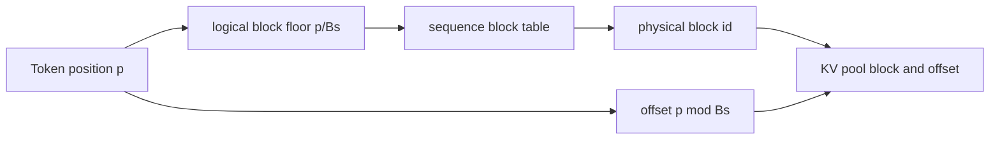
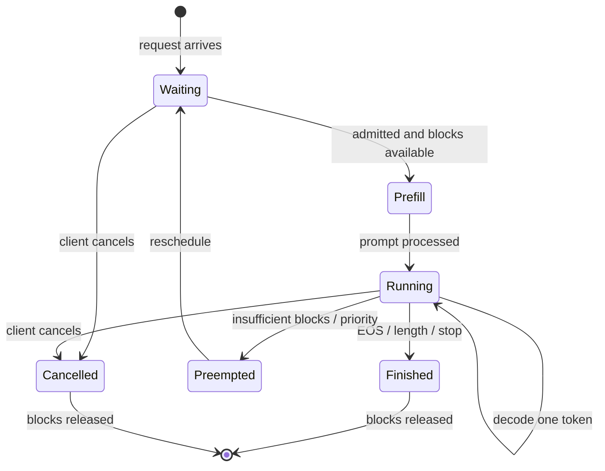
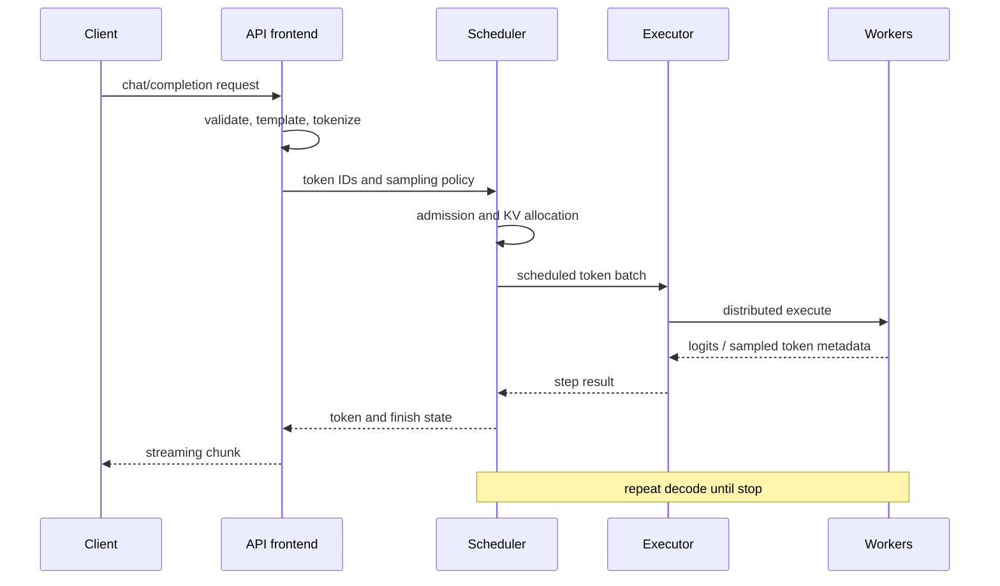

> 对应原书：*Distributed AI Systems*，Chapter 6：*Distributed Inference and vLLM*
> 本章主题：如何把训练完成的大语言模型变成同时满足容量、吞吐、延迟和可用性约束的在线服务。

---

## 0. 本章要回答的核心问题

1. 为什么训练系统的并行方案不能原样照搬到推理服务？
2. 在线推理为什么必须同时优化延迟、吞吐、内存和可用性？
3. Decoder-only Transformer为什么天然适合使用KV cache？
4. Prefill和decode为何是两类截然不同的工作负载？
5. KV cache究竟节省了什么计算，又新增了多少内存？
6. MHA、GQA、MQA和MLA怎样改变KV cache大小与分片方式？
7. 传统连续分配为何在变长请求下产生严重碎片？
8. PagedAttention如何借鉴虚拟内存，以block table解耦逻辑连续和物理连续？
9. PagedAttention减少的是内部碎片、外部碎片，还是padding计算？
10. Continuous batching如何在请求随时到达和结束时保持GPU繁忙？
11. vLLM的scheduler、executor、worker分别负责什么？
12. Weight memory、KV capacity和scheduler token budget如何共同限制并发？
13. 分布式推理中的TP、DP、PP分别解决容量、单请求延迟和总吞吐的哪一部分？
14. 为什么TP通常放在高速互连域，而PP更适合跨节点？
15. 推理DP为何通常不做梯度同步，却仍可能需要系统级协调？
16. Pipeline inference的bubble和训练pipeline有何异同？
17. Chunked prefill为什么能改善inter-token latency，又为何可能损害TTFT？
18. MoE推理中的EP怎样改变expert ownership、token dispatch和KV布局？
19. TP、DP、PP、EP组合时，world size和process groups应怎样理解？
20. TTFT、TPOT、ITL、E2E latency、goodput和tokens/s各回答什么问题？
21. 如何设计不会把tokenization、queueing、warmup或profiler开销混入结论的benchmark？
22. Speculative decoding为什么可以不改变目标模型分布却减少串行target steps？
23. OpenAI-compatible API如何实现streaming、timeout、retry与幂等边界？
24. 哪些原章结论属于稳定机制，哪些CLI、类路径和性能数字必须按版本复核？

本章的核心不是记住一组vLLM flags，而是建立四张账：

```text
Memory ledger: weights + KV + runtime workspace
Time ledger: queue + prefill + decode + network + serialization
Ownership map: request / weight shard / KV block / expert / pipeline stage
Evidence map: correctness + latency distribution + throughput + quality + recovery
```

---

## 1. From training to inference：目标函数已经改变

### 1.1 训练与推理不是同一个系统问题

原章从上一章的ZeRO、FSDP和Megatron过渡到serving。两者都运行Transformer，却有不同优化目标。

| 维度 | 训练 | 在线推理 |
| --- | --- | --- |
| 核心目标 | 固定资源下提高训练tokens/s、缩短time-to-quality | 在SLO下提高goodput并控制成本 |
| 输入 | 通常预先组成较规则的global batches | 请求随机到达，prompt/output长度未知 |
| 输出 | Loss、gradients、checkpoints | Token stream、finish reason、usage和错误 |
| 状态 | Weights、gradients、optimizer、activations | Weights、KV cache、request/scheduler state |
| 时间结构 | Forward/backward/update反复执行 | Prefill一次，decode串行重复 |
| 容错 | 可从checkpoint重启 | 请求在途，要求持续可用和有界尾延迟 |
| 并行收益 | 常优先总吞吐 | 必须同时考虑单请求延迟与总吞吐 |
| Batch | 形状较稳定，可等待凑batch | 不能无限等待，否则queue latency超标 |

所以训练中的“扩展效率”不能直接回答服务问题。推理系统真正优化的可写为：

$$
\max Goodput
$$

约束：

$$
P(TTFT\le S_{TTFT})\ge q
$$

$$
P(TPOT\le S_{TPOT})\ge q
$$

$$
M_{peak}\le HBM_{usable}
$$

其中 $q$ 常取0.95或0.99。只最大化raw tokens/s可能通过积累很大的batch获得高吞吐，却让用户等待很久，因此不等于好的在线系统。

### 1.2 推理的三段延迟

一个请求的端到端时间可拆为：

$$
T_{E2E}=T_{queue}+T_{prefill}+T_{decode}+T_{transport}
$$

首token时间近似为：

$$
TTFT=T_{queue}+T_{prefill}+T_{first\ decode}+T_{transport,first}
$$

若输出共 $N_o$ tokens，则一种常见TPOT定义为：

$$
TPOT=\frac{T_{last}-T_{first}}{N_o-1},\qquad N_o>1
$$

注意：行业工具对TPOT、ITL的定义不完全一致。有的直接平均相邻token间隔，有的从总时间减TTFT后除以输出token数。报告结果时必须写清公式。

### 1.3 为什么推理没有optimizer却仍容易OOM

推理去掉了gradient和optimizer state，保留：

```text
Model weights
+ KV cache for all live sequences
+ temporary activations / logits / communication buffers
+ CUDA graphs / kernel workspace / allocator reserve
```

权重通常是较稳定的固定成本；KV cache随并发请求数和上下文长度动态增长。训练时最醒目的optimizer memory消失后，KV cache成为serving特有的容量资源。

### 1.4 可用性使问题更复杂

训练任务失败后可以从checkpoint恢复；服务中的worker失败会影响：

- 正在生成的sequence及其KV cache；
- Streaming连接；
- Load balancer中的健康状态；
- Prefix cache命中；
- 已返回但客户端未确认的tokens；
- Retry是否导致重复计费或重复副作用。

因此“模型能跑”只证明计算可行，不证明service可用。

---

## 2. Introduction to vLLM

### 2.1 vLLM是什么

vLLM是面向大模型推理与服务的engine。原章强调它在2023年由UC Berkeley研究者提出，其标志性贡献是PagedAttention。今天可将它理解为一套组合系统：

```text
API / offline frontend
  -> request validation and tokenization
  -> scheduler and continuous batching
  -> KV-cache block manager
  -> model executor
  -> GPU/accelerator workers
  -> optimized attention, sampling and collectives
```

它不只是“更快的attention kernel”。PagedAttention、调度、模型执行、分布式通信和API层共同决定最终表现。

### 2.2 为什么要借鉴操作系统paging

传统serving为每个request预留连续KV区域，面临三个事实：

1. Prompt长度不同；
2. Output何时遇到EOS不可预知；
3. Request随时完成并释放空间。

这和进程的动态虚拟地址空间相似。操作系统用page table让逻辑地址连续、物理frames可以离散；vLLM把相同思想应用到KV token blocks：

```text
Logical token positions
  -> per-sequence block table
  -> physical KV blocks in a shared pool
```

后续的PagedAttention kernel直接按block table访问，不要求每条sequence物理连续。

### 2.3 vLLM解决与不解决的问题

它主要解决：

- 高效KV cache分配与回收；
- 变长请求的continuous batching；
- 优化过的attention/sampling执行；
- 单机和多机模型执行；
- OpenAI-compatible serving接口。

它不会自动解决：

- 业务流量预测与capacity planning；
- 跨副本的全局智能路由；
- Tenant isolation和admission policy；
- Model quality、安全和内容策略；
- 任意模型/quantization/kernel组合兼容；
- 所有故障下的session透明恢复。

### 2.4 稳定概念与版本敏感表面

稳定概念：

- KV reuse；
- Block-based cache；
- Iteration-level scheduling；
- TP/DP/PP/EP的所有权关系；
- TTFT/TPOT trade-off。

版本敏感表面：

- `vllm serve`参数名和默认值；
- V0/V1 engine内部class路径；
- Executor backend；
- Chunked prefill默认行为；
- EP backend与支持矩阵；
- Metrics字段；
- Reproducibility设置。

所以本笔记解释机制，命令用于示意；部署前应对目标vLLM版本运行 `vllm serve --help` 并查对应版本文档。

---

## 3. Prerequisites、installation 与基本使用

### 3.1 环境前提

原章以Linux、Python 3.10+和NVIDIA CUDA为主，也提醒vLLM支持AMD等其他accelerators。实际兼容性是一个四元组：

$$
(Driver,\ CUDA/ROCm,\ PyTorch,\ vLLM)
$$

还需检查：

- GPU compute capability与所选dtype/kernel；
- Model architecture是否受支持；
- Quantization format；
- NCCL/RCCL与节点网络；
- `/dev/shm`、IPC和container权限；
- Hugging Face访问权限与cache空间；
- Host RAM能否承受模型加载峰值。

### 3.2 为什么Docker适合第一次验证

Docker把Python、PyTorch、CUDA userspace和vLLM组合固定在镜像中，减少依赖解析变量。原章命令：

```shell
docker pull vllm/vllm-openai:latest

docker run --runtime nvidia --gpus all \
  -v $HOME/.cache/huggingface:/root/.cache/huggingface \
  --env "HF_TOKEN=$HF_TOKEN" \
  -p 8000:8000 --ipc=host \
  vllm/vllm-openai:latest \
  facebook/opt-125m
```

各参数的系统含义：

| 参数 | 作用 | 风险/边界 |
| --- | --- | --- |
| `--gpus all` | 将GPU暴露给container | 生产环境应限制具体devices |
| HF cache mount | 避免重复下载weights | 权限、共享I/O和cache一致性 |
| `HF_TOKEN` | 下载受限模型 | 不写入镜像、日志或代码仓库 |
| `-p 8000:8000` | 暴露API端口 | 还需auth、TLS和network policy |
| `--ipc=host` | 扩大共享内存/支持进程间数据交换 | 降低IPC隔离，按安全模型评估 |
| `latest` | 快速体验最新镜像 | 不可复现；生产应固定digest/tag |

“能启动”后的最小验证序列：

```shell
curl http://localhost:8000/health
curl http://localhost:8000/v1/models

curl http://localhost:8000/v1/completions \
  -H "Content-Type: application/json" \
  -d '{"model":"facebook/opt-125m","prompt":"The result of 1+1 is","max_tokens":3}'
```

Health只证明进程可响应；models只证明注册成功；实际completion才触发tokenization、scheduler、model execution和sampling。

### 3.3 Base model、chat model与embedding model不能混用端点语义

| 模型类型 | 常用端点 | 输入语义 |
| --- | --- | --- |
| Base causal LM | `/v1/completions` | 原始prompt continuation |
| Instruction/chat LM | `/v1/chat/completions` | Roles/messages经chat template |
| Embedding model | `/v1/embeddings` | Text到向量 |

Chat endpoint不只是把messages拼字符串。Chat template决定special tokens、roles和generation prompt；错误template会显著影响输出质量。

### 3.4 `temperature=0` 不等于系统级完全可复现

Greedy sampling消除了抽样随机性，但仍可能存在：

- 浮点归约顺序变化；
- Dynamic batching改变kernel shape或执行路径；
- TP collective非bitwise invariant；
- Quantized kernels；
- Tie logits的选择细节；
- Engine multiprocessing和版本差异。

因此可复现性要区分：

```text
Semantic stability: answer meaning close
Token determinism: exact token IDs
Bitwise determinism: exact logits/bits
```

原章提及关闭某些multiprocessing或启用batch invariance；这些都是版本相关选项，必须在目标版本实测。

### 3.5 Package manager安装

原章推荐用 `uv` 创建隔离环境并选择匹配的PyTorch backend：

```shell
uv venv --python 3.12 --seed
source .venv/bin/activate
uv pip install vllm --torch-backend=auto
```

也可在conda环境内用uv，或直接pip：

```shell
python3.12 -m venv vllm-env
source vllm-env/bin/activate
pip install vllm
```

验证：

```shell
python -c "import vllm; print(vllm.__version__)"
vllm --help
```

真正的环境验收还应包括一个短prompt生成、GPU kernel加载和目标dtype；单纯import不会触发大部分compiled extensions。

### 3.6 从source构建的适用边界

```shell
git clone https://github.com/vllm-project/vllm.git
cd vllm
pip install -e .
```

适合：修改kernel/engine、验证未发布fix、贡献代码。代价是CUDA toolkit、compiler、ABI和build cache都成为变量。生产通常优先固定版本binary/container，而不是长期追踪main branch。

### 3.7 Offline inference

原章示例的最小调用链：

```python
from vllm import LLM, SamplingParams

llm = LLM(model="facebook/opt-125m")
prompts = ["Hello, my name is", "The capital of France is"]
sampling_params = SamplingParams(
    temperature=0.8,
    top_p=0.95,
    max_tokens=32,
)

outputs = llm.generate(prompts, sampling_params)

for output in outputs:
    print(f"Prompt: {output.prompt!r}")
    print(f"Generated: {output.outputs[0].text!r}")
```

代码和原理的对应：

```text
LLM(...)              -> load/tokenizer/model/executor/KV pool
SamplingParams(...)   -> stopping and token selection policy
generate(prompts, ...) -> enqueue -> schedule -> prefill -> decode -> detokenize
outputs               -> request-level candidates and token metadata
```

Offline API也会batch和schedule，不等于“逐prompt朴素forward”。

### 3.8 Online inference

```shell
vllm serve Qwen/Qwen2.5-0.5B-Instruct --port 8000
```

Chat请求：

```shell
curl http://localhost:8000/v1/chat/completions \
  -H "Content-Type: application/json" \
  -d '{
    "model":"Qwen/Qwen2.5-0.5B-Instruct",
    "messages":[{"role":"user","content":"Hello, how are you?"}],
    "temperature":0,
    "max_tokens":32
  }'
```

Online path额外引入：HTTP parsing、authentication、queueing、stream backpressure、client cancellation、timeouts和load balancing。Offline throughput不能直接代表online SLO。

### 3.9 安装与API的实践检查

1. 固定image digest、vLLM、driver和model revision。
2. 记录model tokenizer/chat template revision。
3. 预下载并校验weights，避免首次请求阻塞下载。
4. 运行health、model list、base/chat/streaming实际请求。
5. 验证EOS、max tokens、stop strings和client cancellation。
6. 监控启动峰值、steady weights和可用KV blocks。
7. 不把Hugging Face token输出到日志。

---

## 4. KV cache：自回归推理的关键时空交换

### 4.1 Decoder-only Transformer

原章以GPT、LLaMA、Qwen等decoder-only模型为背景。每层通常包含：

```text
Pre-Norm
  -> causal self-attention
  -> residual
  -> Pre-Norm
  -> FFN / SwiGLU / MoE
  -> residual
```

原始Transformer图常画Post-Norm；现代LLM多采用Pre-Norm。这个差异不改变KV cache原理，但影响具体operator顺序和fusion。


### 4.2 Q、K、V的含义与形状

对第 $i$ 个token hidden state $x_i$：

$$
q_i=x_iW_Q,
\qquad
k_i=x_iW_K,
\qquad
v_i=x_iW_V
$$

Scaled dot-product attention：

$$
Attention(Q,K,V)=softmax\left(\frac{QK^{\mathsf T}}{\sqrt{d_k}}+M\right)V
$$

$M$ 是causal/padding mask。除以 $\sqrt{d_k}$ 的直觉：若query/key各分量方差近似1且独立，内积方差约为 $d_k$；缩放后logits保持 $O(1)$，避免softmax过度饱和。

对MHA，常见形状为：

$$
Q\in\mathbb R^{B\times H_q\times L_q\times d_h}
$$

$$
K,V\in\mathbb R^{B\times H_{kv}\times L_{kv}\times d_h}
$$

- MHA：$H_{kv}=H_q$；
- GQA：$1<H_{kv}<H_q$，多个query heads共享一个KV head；
- MQA：$H_{kv}=1$。

因此原章把所有K/V都简写为hidden dimension $D$ 只适用于MHA或粗略估算。现代模型应使用KV heads计算cache。

### 4.3 Causal mask的真正作用

训练/prefill时一次计算多个query positions，需要mask未来位置：

$$
M_{ij}=\begin{cases}
0,&j\le i\\
-\infty,&j>i
\end{cases}
$$

Decode每步只有最新query，它天然只能看到已经存在的KV，因此不存在“未来cache”；仍可能需要padding、sliding-window或prefix相关mask。

### 4.4 Text generation的两个阶段

#### Prefill

Prompt长度为 $L_p$。所有prompt tokens并行通过模型：

$$
X\in\mathbb R^{B\times L_p\times D}
$$

每层生成并保存prompt的K/V，同时最后一个位置的logits用于产生第一个output token。

特点：

- 大矩阵乘，算术强度较高；
- Attention score计算量约随 $L_p^2$ 增长；
- 一次写入大量KV；
- 直接影响TTFT；
- 长prompt可能阻塞同batch中的decode。


#### Decode

每一步只输入最新token：

$$
x_t\in\mathbb R^{B\times1\times D}
$$

为它计算新 $q_t,k_t,v_t$，把 $k_t,v_t$ 追加到cache，再让 $q_t$ 读取全部历史KV：

$$
a_t=softmax\left(\frac{q_tK_{0:t}^{\mathsf T}}{\sqrt{d_k}}\right)
$$

$$
z_t=a_tV_{0:t}
$$

特点：

- Autoregressive dependency使不同时间步不能完全并行；
- 单sequence每步只有一个token，GEMM较小；
- 每步要读取weights和不断增长的KV；
- 常受HBM bandwidth和kernel launch/communication latency限制；
- 直接影响TPOT/ITL。

### 4.5 不使用KV cache时到底重复了什么

要生成第 $t$ 个新token，朴素方法把整个已有prefix重新送入所有layers。它不仅重算K/V projections，还重算旧tokens在每一层的hidden states、attention和FFN。

若当前总长度为 $n$，一次完整causal forward的attention部分为 $O(n^2d)$，linear/FFN部分约为 $O(nd^2)$。连续生成 $T$ tokens，总成本是：

$$
\sum_{t=1}^{T}
\left[O((L_p+t)^2d)+O((L_p+t)d^2)\right]
$$

当生成长度主导时，attention求和可达 $O(T^3d)$。原章写“without cache每步 $O(L_{total}^2D)$”可理解为**每步重新跑整个prefix的attention部分**，但不能把它误当只有K/V projection的成本。

### 4.6 KV cache为何有效

Transformer在causal模式下有一个关键不变量：过去token在某一层算出的K/V不会因未来token到来而改变。因此可保存：

$$
K_{cache}^{(\ell)}=[k_0^{(\ell)},\ldots,k_t^{(\ell)}]
$$

$$
V_{cache}^{(\ell)}=[v_0^{(\ell)},\ldots,v_t^{(\ell)}]
$$

下一步只计算新token的hidden state和每层新K/V。每步attention读取长度 $L_p+t$，attention成本降到线性：

$$
O((L_p+t)d)
$$

连续 $T$ 步attention总成本：

$$
\sum_{t=1}^{T}O((L_p+t)d)
=O(TL_pd+T^2d)
$$

但每步仍要让新token通过全部linear/FFN layers，约有 $O(Td^2)$；KV cache没有消除weight读取和新token计算。

### 4.7 KV cache内存公式

设：

- $N$：Transformer layers；
- $H_{kv}$：KV heads；
- $d_h$：每head维度；
- $L$：当前cache tokens；
- $b_{kv}$：每个KV element bytes；
- $R$：live sequences数。

每sequence cache：

$$
M_{KV,seq}=2N H_{kv}d_h L b_{kv}
$$

系数2对应K和V。总cache：

$$
M_{KV,total}=R\cdot M_{KV,seq}
$$

若使用block allocator，还要加最后block内部碎片、block tables、metadata和allocator reserve。

### 4.8 数值例子：MHA与GQA的差异

假设32 layers、query heads 32、head dim 128、BF16 cache、context 4096：

MHA的 $H_{kv}=32$：

$$
M_{MHA}=2\times32\times32\times128\times4096\times2
=2\ GiB/sequence
$$

若GQA只有8个KV heads：

$$
M_{GQA}=0.5\ GiB/sequence
$$

这说明KV cache必须从architecture config推导，不能用parameter count猜测。

### 4.9 可运行的KV cache计算器

```python
from dataclasses import dataclass


@dataclass(frozen=True)
class KVCacheShape:
    layers: int
    kv_heads: int
    head_dim: int
    bytes_per_element: int


def kv_cache_bytes_per_token(shape: KVCacheShape) -> int:
    return (
        2
        * shape.layers
        * shape.kv_heads
        * shape.head_dim
        * shape.bytes_per_element
    )


def kv_cache_gib(
    shape: KVCacheShape,
    tokens_per_sequence: int,
    sequences: int = 1,
) -> float:
    total = kv_cache_bytes_per_token(shape) * tokens_per_sequence * sequences
    return total / 1024**3


mha = KVCacheShape(layers=32, kv_heads=32, head_dim=128, bytes_per_element=2)
gqa = KVCacheShape(layers=32, kv_heads=8, head_dim=128, bytes_per_element=2)

print(f"MHA bytes/token: {kv_cache_bytes_per_token(mha):,}")
print(f"MHA 4K cache: {kv_cache_gib(mha, 4096):.3f} GiB")
print(f"GQA 4K cache: {kv_cache_gib(gqa, 4096):.3f} GiB")
print(f"GQA 128 sequences x 4K: {kv_cache_gib(gqa, 4096, 128):.1f} GiB")
```

预期输出：

```text
MHA bytes/token: 524,288
MHA 4K cache: 2.000 GiB
GQA 4K cache: 0.500 GiB
GQA 128 sequences x 4K: 64.0 GiB
```

### 4.10 TP下的KV cache并不总是简单除以TP

- MHA/GQA且KV heads可均匀切分：每TP rank常只存local KV heads，近似除以 $T$；
- KV heads少于TP degree：框架可能复制KV heads，节省不再线性；
- MQA只有一个KV head：常需复制，除非使用专门的sequence/request partition；
- MLA存compressed latent，cache shape和MHA不同；
- PP使每stage只存本stage layers的KV，近似按layer ownership下降。

所以必须打印实际cache block bytes和每rank capacity，而不是套 `global KV / world size`。

### 4.11 KV cache的适用前提与局限

有效前提：

- Causal attention；
- 过去K/V不随未来token变化；
- Position encoding可以增量处理；
- Cache dtype/quantization满足质量要求。

局限：

- Cache随context与并发线性增长；
- Sliding-window模型只需保留窗口，但全局attention层例外；
- Beam search会产生共享后分叉的cache；
- Prefix caching需要跨请求识别相同prefix；
- Cache迁移/remote reuse受网络带宽限制；
- Quantized KV降低内存，却可能增加dequant kernel和质量风险。

### 4.12 Prefill/decode对优化选择的影响

| 优化 | Prefill收益 | Decode收益 |
| --- | --- | --- |
| Larger token batch | 大GEMM效率高 | 合并多requests提高weight reuse |
| FlashAttention | 避免materialize $L^2$ scores | Decode使用专门paged/decode kernel |
| Continuous batching | 降低请求间空闲 | 核心收益很大 |
| Chunked prefill | 限制单个长prompt占用 | 保护decode ITL |
| TP | 分weight/compute，也有collective | 聚合HBM bandwidth但延迟敏感 |
| Disaggregation | Prefill硬件独立扩展 | Decode容量/带宽独立扩展 |

本章后续所有调度与并行策略，本质上都在处理这两个阶段的资源冲突。

---

## 5. PagedAttention：解决KV cache碎片与变长批处理

### 5.1 问题不是“KV cache太大”这么简单

KV cache有四个同时存在的困难：

1. **动态增长**：每decode一步多一个token；
2. **未知终点**：EOS位置无法预知；
3. **生命周期交错**：请求到达和结束时间不同；
4. **变长访问**：同一batch中每条sequence有效context不同。

若按每个请求的最大允许长度预留连续区域，浪费为：

$$
W_{reserve}=\sum_i(L_{max,i}-L_{actual,i})m_{token}
$$

若按需用不同大小的连续区域增长，则会遇到无法原地扩展、迁移和外部碎片。两种方法分别以“预留浪费”和“动态分配复杂度”付费。

### 5.2 三类容易混淆的浪费

#### 外部碎片

空闲空间总量足够，但被分成不连续的小洞，无法满足一个大的连续allocation。

#### 内部碎片

已分配block没有完全使用。固定token block下，通常只发生在每条sequence最后一个block。

#### Padding计算

为了把不同context lengths放入规则tensor，按最大长度计算并mask无效位置。它浪费FLOPs/带宽，不一定对应已预留但未使用的物理cache。

PagedAttention主要通过fixed-size blocks消除**要求连续增长造成的外部碎片**，并将内部碎片限制到末块；配套的variable-length paged kernel可避免按batch最大长度遍历padding。三者不能合称为一种“fragmentation”。

### 5.3 传统连续分配为何失败

假设物理token slots为：

```text
[AAAA][free 3][BBBBBB][free 5][CCCC]
```

总空闲8 slots，但新请求需要连续6 slots，仍无法分配。若移动B/C压缩空间，需要复制每层K/V，并更新正在运行request的地址；在线decode中成本和同步风险都很高。

原章图6.7展示了完成请求留下空洞、活跃请求又需要继续增长的情形：


### 5.4 PagedAttention的映射

设block size为 $B_s$ tokens。Sequence $i$ 当前长度 $L_i$，需要：

$$
N_i=\left\lceil\frac{L_i}{B_s}\right\rceil
$$

逻辑block编号：

$$
0,1,\ldots,N_i-1
$$

Block table保存映射：

$$
BlockTable_i[j]=PhysicalBlockID
$$

逻辑token position $p$ 的位置为：

$$
j=\left\lfloor\frac{p}{B_s}\right\rfloor,
\qquad
o=p\bmod B_s
$$

先查physical block，再取block内offset $o$。因此sequence逻辑上连续，物理blocks可散布在pool中。



### 5.5 Block中存储什么

对一个worker的local model shard，单个physical block的主要bytes：

$$
M_{block}=B_s\cdot2N_{local}H_{kv,local}d_hb_{kv}
$$

不同实现可能按layer分别组织cache tensors，但同一logical block ID在各层对应相同token范围。不能只把一个layer的K/V称作完整sequence block。

### 5.6 分配、增长与释放

#### 新请求/prefill

根据prompt token数申请 $\lceil L_p/B_s\rceil$ blocks，写入prefill产生的K/V。

#### Decode增长

只要最后block有空slot，直接追加；跨越block boundary时从free pool取一个block并追加到block table。

#### 请求完成/取消

把block table中的physical IDs返回free pool；无需搬动其他sequence。

#### Allocation失败

Scheduler可延迟新请求、preempt低优先级sequence、重算其KV，或使用特定版本支持的swap/offload策略。具体policy依vLLM版本，不应把“paging”理解成一定会像OS那样自动换到磁盘。

### 5.7 内部碎片上界

每条非空sequence最后block最多浪费 $B_s-1$ token slots：

$$
0\le W_i<B_s
$$

$R$ 条live sequences：

$$
W_{total}<R B_s
$$

若长度在block余数上近似均匀，平均约浪费：

$$
E[W_i]\approx\frac{B_s-1}{2}
$$

Block越小，内部碎片越低；但block table更大、分配操作更多、kernel遍历metadata更多。Block size是granularity trade-off，不是越小越好。

### 5.8 可运行的block与浪费计算器

```python
from math import ceil


def paged_cache_stats(lengths: list[int], block_size: int) -> dict[str, int | float]:
  if block_size <= 0 or any(length < 0 for length in lengths):
    raise ValueError("Lengths must be non-negative and block_size positive")
  blocks = sum(ceil(length / block_size) for length in lengths)
  used_slots = sum(lengths)
  allocated_slots = blocks * block_size
  wasted_slots = allocated_slots - used_slots
  utilization = used_slots / allocated_slots if allocated_slots else 1.0
  return {
    "blocks": blocks,
    "used_slots": used_slots,
    "allocated_slots": allocated_slots,
    "wasted_slots": wasted_slots,
    "utilization": utilization,
  }


lengths = [4, 7, 3]
for block_size in (4, 8, 16):
  stats = paged_cache_stats(lengths, block_size)
  print(
    f"block={block_size:2d}: blocks={stats['blocks']}, "
    f"waste={stats['wasted_slots']}, "
    f"utilization={stats['utilization']:.1%}"
  )
```

预期输出：

```text
block= 4: blocks=4, waste=2, utilization=87.5%
block= 8: blocks=3, waste=10, utilization=58.3%
block=16: blocks=3, waste=34, utilization=29.2%
```

这个极短sequence例子故意展示“大block不一定接近100%利用率”。原章和PagedAttention论文中的高利用率来自真实长度分布、足够长sequence和小block，不是数学保证。

### 5.9 PagedAttention怎样避免padding FLOPs

传统rectangular batch若context lengths为 $L_i$，decode attention访问：

$$
V_{padded}=B\cdot L_{max}
$$

有效访问：

$$
V_{useful}=\sum_{i=1}^{B}L_i
$$

Padding比例：

$$
r_{pad}=1-\frac{\sum_iL_i}{B L_{max}}
$$

Paged kernel对每个sequence遍历block table及最后block的有效token count，工作量近似与 $\sum_iL_i$ 成正比。不存在的logical blocks不参与dot product。

图6.9中长度4、7、3：

$$
V_{padded}=3\times7=21
$$

$$
V_{useful}=4+7+3=14
$$

$$
r_{pad}=1-14/21=33.3\%
$$


严格说，**fixed-size allocation本身不会自动消除padding FLOPs**；真正避免计算的是理解block tables与有效长度的attention kernel。Block manager和kernel必须配套。

### 5.10 Online softmax跨blocks保持语义

物理blocks不连续，但attention结果必须等价于把所有K/V逻辑拼接后做一次softmax。Kernel可分块维护running maximum和normalizer。

对block $j$ 的logits $s_j$：

$$
m_j=\max(s_j)
$$

合并到旧状态 $(m,l,o)$：

$$
m'=\max(m,m_j)
$$

$$
l'=e^{m-m'}l+\sum_ke^{s_{j,k}-m'}
$$

$$
o'=e^{m-m'}o+\sum_ke^{s_{j,k}-m'}v_{j,k}
$$

最后输出：

$$
z=o'/l'
$$

这与FlashAttention/Ring Attention中的online softmax是同一数学技巧：分块改变访问顺序，不改变全局softmax归一化。

### 5.11 Prefix sharing与copy-on-write

Paging还允许多个logical sequences引用相同physical prefix blocks。例如parallel sampling或beam search在分叉前共享prompt KV：

```text
Sequence A table: [7, 3, 9]
Sequence B table: [7, 3, 12]
```

Blocks 7、3只存一份，并维护reference count。若共享的最后block需要被某一分支写入，就执行copy-on-write，避免修改另一分支看到的内容。

共享成立的前提包括：

- Token IDs和positions相同；
- Model/adapters/cache dtype相同；
- Attention语义兼容；
- Block边界与hash一致；
- 生命周期由reference count正确管理。

### 5.12 PagedAttention的收益与成本

收益：

- 消除连续增长要求；
- 快速回收完成请求的blocks；
- 将浪费限制为末块内部碎片；
- 支持变长continuous batch；
- 支持prefix/beam cache sharing；
- 提升可并发token slots。

成本：

- Block table lookup；
- Non-contiguous gather访问；
- Metadata与allocator同步；
- Custom kernel复杂度；
- Block size调优；
- Cache复制/共享正确性；
- Physical blocks仍受真实HBM容量约束。

“2～4× throughput”和“60～80%浪费”是论文/特定baseline与workload结果，不是每个现代engine上的固定收益。今天比较时需使用同版本kernel、相同prefix/length distribution和SLO。

---

## 6. Motivation：从OOM反推分布式推理

### 6.1 Weight容量下界

参数量 $P$、平均每parameter存储bytes $b_w$：

$$
M_{weights}\approx Pb_w+M_{scales}+M_{metadata}
$$

405B模型：

- FP16/BF16理论payload：$405\times10^9\times2=810$ GB；
- FP8理论payload：405 GB；
- INT4理论payload：202.5 GB。

量化还需要scales、zero points、packing alignment，有些layers保持更高精度，所以不能把4-bit模型精确当成0.5 byte/parameter。

DeepSeek-R1的671B是total parameters；MoE每token只激活一部分experts，降低compute，不意味着未激活expert weights无需驻留或可免费取得。

### 6.2 单GPU capacity equation

可用于KV的预算近似：

$$
M_{KV,budget}=uH-M_{weights}-M_{runtime}-M_{reserve}
$$

- $H$：物理HBM；
- $u$：允许engine使用的比例；
- Runtime包括activations、logits、CUDA graphs、workspace和communication buffers；
- Reserve避免瞬时峰值触顶。

可容纳的local token slots：

$$
N_{slots}=\left\lfloor\frac{M_{KV,budget}}{m_{KV,token,local}}\right\rfloor
$$

Paged allocator再向下取整为完整blocks。

### 6.3 可运行的capacity planner

```python
from math import floor


def kv_token_capacity(
  hbm_gib: float,
  utilization: float,
  weights_gib: float,
  runtime_gib: float,
  bytes_per_kv_token: int,
  block_size: int,
) -> dict[str, int | float]:
  if not 0 < utilization <= 1:
    raise ValueError("utilization must be in (0, 1]")
  budget_gib = hbm_gib * utilization - weights_gib - runtime_gib
  if budget_gib <= 0:
    return {"budget_gib": budget_gib, "blocks": 0, "token_slots": 0}
  raw_slots = floor(budget_gib * 1024**3 / bytes_per_kv_token)
  blocks = raw_slots // block_size
  return {
    "budget_gib": budget_gib,
    "blocks": blocks,
    "token_slots": blocks * block_size,
  }


capacity = kv_token_capacity(
  hbm_gib=80,
  utilization=0.90,
  weights_gib=30,
  runtime_gib=6,
  bytes_per_kv_token=131_072,
  block_size=16,
)
print(f"KV budget: {capacity['budget_gib']:.1f} GiB")
print(f"Physical blocks: {capacity['blocks']:,}")
print(f"Token slots: {capacity['token_slots']:,}")
```

预期输出：

```text
KV budget: 36.0 GiB
Physical blocks: 18,432
Token slots: 294,912
```

这些slots可以是一条超长sequence，也可以在许多requests间动态共享。实际最大并发还受 `max_num_seqs`、scheduler budget、maximum model length和workspace约束。

### 6.4 为什么quantization不是分布式的替代品

Quantization降低每rankweight bytes和weight bandwidth，TP/PP改变weight ownership。二者可组合：

```text
Quantization: fewer bytes per owned parameter
TP: fewer parameter slices per rank, same layer jointly computed
PP: fewer layers per rank
DP: more complete serving replicas
```

若INT4后模型已fit，仍可能因KV容量或latency使用TP；若FP8后仍不fit，则继续TP/PP。选择依据不是“先量化还是先并行”的教条，而是quality、kernel支持、容量和SLO。

### 6.5 分布式推理的三个触发条件

1. **Weight wall**：单GPU无法持有weights和runtime；
2. **KV wall**：模型虽fit，但剩余cache无法支持目标context/concurrency；
3. **Latency/throughput wall**：单GPU容量可行，却达不到TTFT、TPOT或QPS。

TP/PP主要拆模型，DP主要复制容量；但它们也通过aggregate HBM bandwidth、communication和scheduler布局影响延迟，不能只按“fit”分类。

---

## 7. vLLM architecture：Scheduler、Executor、Worker

### 7.1 分层的原因

原章用scheduler-executor-worker解释vLLM。分层是为了把三种决策隔离：

```text
What runs next?       -> Scheduler
How to coordinate it? -> Executor
Where to compute it?  -> Worker
```


内部class和V0/V1实现会变化，但职责分解具有长期价值。

### 7.2 Scheduler

Scheduler维护至少三类状态：

- Waiting requests；
- Running/preempted requests；
- KV blocks与token budget。

每个iteration选择：

- 哪些新prompt执行prefill或chunked prefill；
- 哪些running sequences执行一个decode step；
- 分配/回收哪些KV blocks；
- 是否因容量preempt；
- 是否允许高优先级请求抢占；
- 本轮总scheduled tokens是否超过budget。

Scheduler不是简单的“凑到batch size”。Prefill item可贡献许多tokens，decode sequence通常贡献1个token，因此核心约束更接近：

$$
\sum_{r\in batch}ScheduledTokens_r\le TokenBudget
$$

同时：

$$
|RunningSequences|\le MaxSequences
$$

### 7.3 Continuous batching

Static batching：等一批requests都完成才替换batch。若输出长度为 $[8,100,12]$，短请求完成后其slot仍被最长请求拖住。

Continuous batching在每个model iteration边界更新batch：

```text
admit pending requests
  -> allocate KV blocks
  -> run prefill/decode iteration
  -> sample tokens
  -> retire EOS/limit/cancelled requests
  -> free blocks
  -> admit replacements immediately
```

它常被称为iteration-level scheduling或Orca-style scheduling。收益来自缩短空槽寿命，而不是让单条autoregressive sequence并行生成多个未知tokens。

### 7.4 Scheduler的简化状态机



### 7.5 Continuous batching的困难

- 每轮batch shape变化；
- Prefill与decode计算强度差异巨大；
- 长prompt可阻塞decode；
- 每sequence sampling params不同；
- Stop条件和EOS不同；
- LoRA/adapters可能不同；
- Priority/fairness与throughput冲突；
- KV blocks不足时需选择preemption victim；
- Client cancellation要及时传播并回收状态。

### 7.6 Executor

Executor把scheduler的逻辑计划变成workers共同执行的命令。典型职责：

- 初始化distributed environment；
- 创建workers和process groups；
- Broadcast execute request；
- 协调model load；
- 收集必要输出；
- 管理单进程、多进程或cluster backend。

原章提到single-GPU、multiprocessing和Ray。Backend选择取决于是否跨节点、现有cluster manager和版本支持，而不是Ray一定比multiprocessing“更分布式”。

### 7.7 Worker

每worker通常绑定一个accelerator，持有：

- 本rank model shard或replica；
- Local KV cache tensors；
- Model runner和kernels；
- TP/PP/EP process-group handles；
- Sampling/logits相关本地状态；
- Device memory pool与CUDA graphs。

TP workers共同完成一个request的同一layer；DP workers可处理不同requests；PP workers处理同一request的不同layer stages。`worker = one GPU`是常见抽象，不是所有accelerator backend的永久实现契约。

### 7.8 API frontend不等于engine scheduler

API server负责：

- HTTP/OpenAI schema；
- Authentication/rate limiting（部分可由外层完成）；
- Tokenization/detokenization；
- Streaming与disconnect；
- Request IDs和usage。

Engine scheduler负责GPU工作。大规模DP时，单API frontend可能先成为CPU/tokenization/network瓶颈，因此扩GPU前要观察frontend queue和CPU。

### 7.9 一次请求的端到端数据流



### 7.10 Correctness invariants

1. 每logical token position映射到正确physical KV block；
2. 所有model-parallel ranks执行相同request order；
3. Position IDs与cache length一致；
4. Finished/cancelled sequence blocks只释放一次；
5. Prefix共享遵守reference count/copy-on-write；
6. Sampling只由拥有完整logits语义的一侧决定并同步；
7. Streaming顺序与token IDs一致；
8. Retry不会在旧request仍运行时无界复制工作。

---

## 8. vLLM parallelism strategies总览

### 8.1 四种策略的所有权差异

| 策略 | Weight ownership | Request ownership | KV ownership | 高频通信 |
| --- | --- | --- | --- | --- |
| TP | 每层tensor shard | TP group共同 | 常按KV heads shard/replicate | Layer内collectives |
| DP | 完整模型或完整TP/PP replica | 每replica不同requests | 每replica自身requests | Dense model通常无跨replicacollective |
| PP | 每rank/stage一段layers | PP stages共同 | 各stage只存本层KV | Stage-boundary P2P |
| EP | 每rank部分experts或expert shards | Group共同dispatch tokens | 主要由attention parallel布局决定 | Token All-to-All或实现相关collective |


### 8.2 先区分“拆一个replica”和“复制replica”

TP与PP主要构造一个可执行的model replica：

$$
G_{replica}=T\cdot P_s
$$

Dense serving再复制 $D$ 份：

$$
W=D\cdot T\cdot P_s
$$

这是最基本的容量关系。EP在MoE中可能跨TP和DP维重组expert ownership，后文不能机械套一个额外乘数。

### 8.3 选择问题的第一版

```text
Model and minimum KV do not fit one GPU?
  -> TP inside fast domain
Still exceeds one node / layer placement constraints?
  -> PP across stages/nodes
One replica fits and SLO-compliant capacity is insufficient?
  -> DP replicas
MoE expert weights or bandwidth dominate?
  -> evaluate EP with actual routing backend
```

### 8.4 同一GPU数并不代表同一服务能力

8 GPUs可组成：

```text
TP8 DP1: one request uses all GPUs, larger aggregate HBM bandwidth
TP4 DP2: two replicas, each request uses four GPUs
TP2 DP4: four replicas, more independent queues/KV pools
TP1 DP8: eight replicas, model must fit each GPU
```

越偏TP通常降低单request work per rank但增加collectives；越偏DP提高并发capacity但不降低单request compute latency。最优点由traffic concurrency和SLO决定。

### 8.5 后续分析统一使用的五项指标

1. **Fit**：weights、KV minimum和runtime peak是否fit；
2. **TTFT**：queue + prefill；
3. **TPOT/ITL**：decode cadence；
4. **Goodput**：满足SLO的requests/tokens；
5. **Cost**：GPU-hours、idle、network与运维复杂度。

只以“模型参数除以GPU数”比较并行策略是不完整的。

---

## 9. Tensor Parallelism：让多个GPU共同执行每一层

### 9.1 TP是什么、为什么引入

Tensor Parallelism沿单层tensor维度切weights和compute。一个request进入TP group后，每个rank执行该层的一部分，再通过collective组合出与完整层等价的结果。

它解决三类问题：

1. 单层weights/workspace不fit；
2. Weight占满HBM，留给KV的空间不足；
3. Decode受单GPU HBM bandwidth限制，需要聚合多GPU带宽降低TPOT。

它不是用多GPU处理不同请求；那是DP。TP的所有ranks通常处于同一请求的critical path，任何一个straggler都会拖慢该步。

### 9.2 Column-parallel linear

采用数学weight布局 $A\in\mathbb R^{d_{in}\times d_{out}}$：

$$
Y=XA
$$

沿output features切columns：

$$
A=[A_1|A_2|\cdots|A_T]
$$

每rank得到：

$$
Y_i=XA_i
$$

完整结果：

$$
Y=[Y_1|Y_2|\cdots|Y_T]
$$

如果下一算子需要完整 $Y$，执行AllGather；但Transformer会特意让下一层直接消费sharded $Y_i$，从而省掉中间AllGather。

PyTorch `nn.Linear.weight` 的存储shape是 `[out_features, in_features]`，所以同一个column/output split在代码中切dim 0。数学图与代码维度不要混淆。

### 9.3 Row-parallel linear

把input feature和weight rows配对切分：

$$
X=[X_1|X_2|\cdots|X_T]
$$

$$
A=\begin{bmatrix}A_1\\A_2\\\vdots\\A_T\end{bmatrix}
$$

每rank计算partial output：

$$
Z_i=X_iA_i
$$

再求和：

$$
Y=\sum_{i=1}^{T}Z_i
$$

通常用AllReduce；若下一布局接受sequence/reduce-scattered shard，也可采用ReduceScatter变体。Bias必须在logical sum后只加一次，不能每rank先加再求和。

### 9.4 MLP为何只需一个关键reduction

Transformer MLP：

$$
H=\phi(XA_{up})
$$

$$
Y=HA_{down}
$$

安排：

```text
Replicated X
  -> column-parallel up/gate: local H_i
  -> elementwise activation: local phi(H_i)
  -> row-parallel down: local partial Y_i
  -> AllReduce / ReduceScatter
```

Activation是elementwise，不需要完整hidden expansion；column output恰好成为row input。原章先说column parallel“用AllGather重组”，随后又指出MLP无需中间gather。正确理解是：AllGather是一般组合方式，Megatron式配对有意避免它。

### 9.5 Attention中的TP

Q/K/V projections可按heads或projection output切，local ranks计算一部分heads；attention output projection再做row parallel。

```text
Input hidden
  -> local Q heads / KV heads
  -> local attention and local KV cache
  -> local output-projection partial
  -> reduction
```

约束：

- Query heads最好被 $T$ 整除；
- GQA的KV heads也最好可切；
- 若 $H_{kv}<T$，可能复制KV heads；
- MQA/MLA cache可能被复制或采用专门DP-attention布局；
- Rotary embedding、vocab/head和quantization都有各自shard规则。

原章说“不整除时需要padding或换TP”；实际vLLM对某些GQA/MQA模型可能复制KV heads，是否支持取决于model implementation。不能自行padding trained heads而不验证语义。

### 9.6 Weight memory与KV head分片

理想均匀TP：

$$
M_{weights,rank}\approx\frac{M_{weights}}{T}+M_{replicated}
$$

其中embedding、norm、small metadata或某些KV projections可能复制。

若KV heads均匀分片：

$$
m_{KV,token,rank}\approx\frac{m_{KV,token}}{T}
$$

但一条request的KV总量仍分布在整个TP group；从cluster aggregate看没有消失。TP腾出的per-rank HBM可让group容纳更多token slots。

### 9.7 TP为什么可能降低decode latency

Decode每步需要读取大量weights。单GPU近似下界：

$$
T_{weight}\gtrsim\frac{M_{weights}}{BW_{HBM}}
$$

理想TP $T$ 路并行读取：

$$
T_{weight,TP}\gtrsim\frac{M_{weights}/T}{BW_{HBM}}
=\frac{M_{weights}}{T\cdot BW_{HBM}}
$$

但真实step还有：

$$
T_{step}\approx T_{local\ compute}+T_{collective,exposed}+T_{launch}+T_{scheduler}
$$

当collective latency超过节省的weight-read时间，继续增加TP反而变慢。这在小batch、PCIe、跨节点TP和local GEMM过小时尤其常见。

### 9.8 TP communication数量级

一次hidden reduction的logical payload：

$$
X=B_{tokens}\cdot D\cdot b_a
$$

$B_{tokens}$ 是本iteration所有scheduled token数，$b_a$ 是activation element bytes。Ring AllReduce每rank网络流量数量级：

$$
V_{AR}\approx2\frac{T-1}{T}X
$$

一个decoder layer通常在attention output与MLP output附近各有一次主要reduction，具体次数随architecture、sequence parallel与fusion实现变化。

Decode中 $B_{tokens}$ 往往约等于running sequences数；prefill中可包含大量prompt tokens。因此同一TP配置在prefill-heavy和decode-heavy流量下的通信占比不同。

### 9.9 可运行的TP payload估算

```python
def ring_all_reduce_bytes(logical_payload_bytes: int, world_size: int) -> float:
  if world_size <= 0:
    raise ValueError("world_size must be positive")
  return 2 * (world_size - 1) / world_size * logical_payload_bytes


def hidden_payload_mib(tokens: int, hidden_size: int, bytes_per_element: int) -> float:
  return tokens * hidden_size * bytes_per_element / 1024**2


tokens = 256
hidden_size = 8192
payload_bytes = tokens * hidden_size * 2
print(f"Logical hidden payload: {hidden_payload_mib(tokens, hidden_size, 2):.2f} MiB")
for tp in (2, 4, 8):
  traffic = ring_all_reduce_bytes(payload_bytes, tp) / 1024**2
  print(f"TP={tp}: ring AllReduce network traffic ~= {traffic:.2f} MiB/rank")
```

预期输出：

```text
Logical hidden payload: 4.00 MiB
TP=2: ring AllReduce network traffic ~= 4.00 MiB/rank
TP=4: ring AllReduce network traffic ~= 6.00 MiB/rank
TP=8: ring AllReduce network traffic ~= 7.00 MiB/rank
```

TP增大时local weight下降，但单次ring的per-rank流量趋近 $2X$，collective participants和latency也增加。它不是“分得越细、通信也越小”。

### 9.10 Topology为何决定TP上限

TP collective位于几乎每个layer，且decode step短，latency敏感。常见映射：

```text
Within NVLink/NVSwitch domain: preferred TP group
Across PCIe root complexes: profile carefully
Across nodes over IB/RoCE: possible but often expensive
```

“NVLink 600+ GB/s”和“PCIe 32 GB/s”必须注明generation、direction、aggregate与实测口径。不要用设备宣传峰值直接代替collective有效带宽。

### 9.11 TP的正确性验证

小模型/小shape至少验证：

1. Full与TP logits最大误差；
2. Greedy token IDs；
3. Prefill与多步decode；
4. KV cache按head分片后的结果；
5. GQA/MQA replication；
6. Vocab-parallel top-k/sampling；
7. Quantized TP；
8. 不同batch composition下结果稳定性。

训练时需要验证gradients；纯推理没有backward，但cache position和distributed sampling成为新增风险。

### 9.12 何时使用TP

适合：

- Model或单层不fit单GPU；
- Weight fit但KV headroom不足；
- 低并发下需要降低单request decode latency；
- 高速node-local interconnect可用。

谨慎：

- PCIe-only且小batch；
- TP跨慢网络；
- Heads/KV heads难以整除；
- Local matrices已太小；
- DP可更直接解决高并发吞吐。

### 9.13 vLLM启动示意

```shell
vllm serve meta-llama/Llama-2-70b-hf \
  --tensor-parallel-size 4 \
  --port 8000
```

部署前确认4 ranks确实落在预期高速fabric，并从日志核对world/group、dtype、quantization和可用KV blocks。

---

## 10. Data Parallelism：复制服务实例扩展吞吐

### 10.1 推理DP是什么

推理中的dense DP通常表示创建多个完整可执行replicas。每个replica可以是：

- 单GPU模型；
- 一个TP group；
- 一个TP×PP group。

不同replicas处理不同requests，各自拥有queue、KV cache和sampling state。没有训练gradient，因此不需要每step做gradient AllReduce。

### 10.2 与训练DP的区别

| 项目 | 训练DP | Dense inference DP |
| --- | --- | --- |
| Inputs | 不同data shards | 不同online requests |
| Weights | 初始相同，持续同步update | Read-only replicas |
| Gradient collective | 每step需要 | 无 |
| Optimizer | 有 | 无 |
| KV cache | 通常无persistent serving cache | 每replica独立 |
| Load balance | Sampler规则分batch | 动态按queue/cache/SLO路由 |

所以“DP无通信”只对dense model replicas的**model forward**近似成立。Control plane、API、metrics、health和多节点启动仍通信；MoE DP+EP更会发生expert token exchange。

### 10.3 DP怎样扩展吞吐

单replica在目标SLO下goodput为 $g$，理想 $D$ replicas：

$$
G_D\approx Dg
$$

真实效率：

$$
\eta_{DP}=\frac{G_D}{Dg}
$$

下降来源：

- 请求长度导致queue不均；
- Prefix affinity把流量集中到少数replicas；
- Shared API/tokenizer瓶颈；
- Shared NIC、storage或power cap；
- Replica cold start/failure；
- Traffic不足，无法填满所有replicas。

因此“4 replicas必得4× throughput”是上界直觉，不是生产保证。

### 10.4 DP不降低单请求计算路径

一个request仍只进入一个replica；其local prefill/decode没有被其他DP replicas拆分。因此在无queue时：

$$
Latency_{DP}\approx Latency_{single\ replica}
$$

DP可通过降低queue length改善observed TTFT，但不会像TP那样聚合HBM bandwidth来缩短该request的一次model step。

### 10.5 DP与KV cache

每replica有独立KV pool，总cluster KV capacity近似线性增加：

$$
Capacity_{cluster}\approx D\cdot Capacity_{replica}
$$

但空闲cache不能自动跨replica借用。若A满而B空，已在A生成的request不能无成本迁移，因为其KV cache位于A。Load balancer必须尽量在admission时做对选择。

### 10.6 Load balancing为什么是DP的核心

Round-robin只均衡request count，不均衡工作量。一条128K prompt与一条20-token chat显然不同。

可用信号：

- Waiting/running request count；
- Scheduled/queued tokens；
- Free KV blocks；
- Estimated prompt/output length；
- Prefix-cache affinity；
- Adapter/model variant；
- Recent TTFT/TPOT；
- Health与warm state。

可将路由score写为：

$$
Score_j=
\alpha Q_j+
\beta KVPressure_j+
\gamma PredictedWork_j-
\delta PrefixHit_j
$$

系数需通过workload校准。过度追求prefix hit可能使热门prefix replica过载；只追求最短queue又会丢失cache locality。

### 10.7 Little's Law用于容量检查

稳定系统中：

$$
N=\lambda W
$$

- $N$：平均在系统内requests；
- $\lambda$：arrival rate；
- $W$：平均response time。

例如100 req/s、平均E2E 2 s，系统平均有200 in-flight requests。若每replica在SLO下只能安全承载25条，则至少需8 replicas，且还未加burst和failure reserve。

Little's Law不直接告诉我们GPU数，因为每request的token长度与service time不同；它用于检查“并发、到达率、延迟”三者是否自洽。

### 10.8 Internal load balancing

原章示意：

```shell
vllm serve "$MODEL" \
  --data-parallel-size 4 \
  --tensor-parallel-size 2
```

逻辑上形成4个DP replicas，每个replica为TP2，总GPU数：

$$
W=D\cdot T=4\times2=8
$$

单endpoint简化客户端和内部queue-aware routing，但API process、tokenization和control plane可能成为瓶颈。具体可扩API server参数按目标版本文档确认。

### 10.9 Multi-node internal DP

原章给出head node和headless worker示例，使用：

```text
--data-parallel-size
--data-parallel-size-local
--data-parallel-start-rank
--data-parallel-address
--data-parallel-rpc-port
--headless
```

这些参数属于版本敏感部署接口。稳定语义是：

1. 全局DP ranks唯一；
2. 每节点声明local ranks及start rank；
3. 一个控制地址协调；
4. Headless nodes不暴露主API；
5. 所有replicas使用相同model revision/config。

需要额外解决service discovery、TLS、防火墙、node failure和滚动升级。

### 10.10 External load balancing

每个replica暴露独立endpoint，由nginx、Envoy、HAProxy、Kubernetes gateway或自定义router选择。

优点：

- API/frontends可独立扩展；
- 更丰富的KV-aware/prefix-aware routing；
- Replica独立健康检查和滚动升级；
- Multi-tenant policy更清晰。

代价：

- Router需要实时telemetry；
- Streaming connection较长，连接级负载不易迁移；
- Retry与幂等更复杂；
- Prefix locality和均衡目标冲突；
- Metrics label cardinality上升。

原章的per-rank命令表达概念；当前版本外部LB所需的rank/address参数必须以对应CLI文档为准，不能从旧示例盲复制。

### 10.11 Failure isolation不是自动的高可用

Dense replicas相互独立意味着一个replica失败时其他仍可接新流量。但失败replica中的in-flight requests和KV cache通常丢失。高可用还需要：

- Readiness先于接流量；
- Drain后再升级；
- Router快速摘除失败endpoint；
- Client/server timeout；
- 对非幂等上层动作谨慎retry；
- Capacity保留以承接失败流量；
- Model loading避免thundering herd。

### 10.12 可运行的dense parallel布局计算器

```python
from dataclasses import dataclass


@dataclass(frozen=True)
class ServingLayout:
  world_size: int
  tensor_parallel: int
  pipeline_parallel: int

  @property
  def replica_size(self) -> int:
    return self.tensor_parallel * self.pipeline_parallel

  @property
  def data_parallel(self) -> int:
    if self.world_size % self.replica_size:
      raise ValueError("world_size must be divisible by TP * PP")
    return self.world_size // self.replica_size


for tp, pp in ((8, 1), (4, 1), (2, 2), (1, 1)):
  layout = ServingLayout(world_size=8, tensor_parallel=tp, pipeline_parallel=pp)
  print(
    f"TP={tp}, PP={pp}, DP={layout.data_parallel}, "
    f"GPUs/replica={layout.replica_size}"
  )
```

预期输出：

```text
TP=8, PP=1, DP=1, GPUs/replica=8
TP=4, PP=1, DP=2, GPUs/replica=4
TP=2, PP=2, DP=2, GPUs/replica=4
TP=1, PP=1, DP=8, GPUs/replica=1
```

它只验证整数布局，不证明model fit，也不包含MoE EP重组。

### 10.13 TP与DP的选择

| 目标 | 更直接的起点 |
| --- | --- |
| Model/单层不fit | TP |
| Weight fit但KV headroom少 | TP或quantization，实测 |
| 无queue时TPOT过高 | TP，前提是fast fabric |
| 单replica已满足latency但QPS不足 | DP |
| Burst导致queue TTFT高 | DP + admission/autoscaling |
| 高并发且model单GPU fit | DP |
| 低并发、单request latency敏感 | TP |

常见正确顺序：先用最小TP/PP构造满足fit和latency的replica，再用DP复制这个replica满足traffic capacity。

---

## 11. Pipeline Parallelism：沿模型深度切分推理

### 11.1 PP是什么、为什么引入

Pipeline Parallelism把连续layers分到不同stages：

```text
Stage 0: embedding + layers 0..19
Stage 1: layers 20..39
Stage 2: layers 40..59
Stage 3: layers 60..79 + head
```

一个token batch依次流经stages。每stage只持本地layers的weights和这些layers对应的KV cache。

主要解决：

- Model总layers跨单node容量；
- TP degree已到高速互连域上限；
- 跨节点网络不适合每层collective；
- 不均匀layers或special modules需要显式placement。

### 11.2 PP与TP的通信频率差异

TP：每个layer内发生collective，频率高。PP：只在stage boundary发送activation，频率低但属于严格依赖链。

设boundary activation为：

$$
X\in\mathbb R^{B_{tokens}\times D}
$$

单次full hidden payload：

$$
V_{boundary}=B_{tokens}Db_a
$$

若TP×PP布局在boundary保留compatible sharded activation，每对TP ranks可能只发送约 $V_{boundary}/T$；若boundary要求replicated hidden，则不能除以TP。原章固定写 `/4` 只适用于其假定的sharded boundary layout，不是PP定义。

### 11.3 Weight与KV ownership

理想均匀layers：

$$
M_{weights,stage}\approx\frac{M_{weights}}{P_s}
$$

每stage的KV bytes/token近似：

$$
m_{KV,token,stage}=2N_{stage}H_{kv,local}d_hb_{kv}
$$

全pipeline对一个request的aggregate KV仍等于所有stages之和。每stage free block数量可能不同，最紧张stage限制可调度并发。

### 11.4 为什么按layer count均分不够

不同layers可能有不同：

- Dense vs MoE FFN；
- Shared experts；
- Attention pattern/window；
- Parameter count；
- Quantization kernel；
- KV bytes；
- Prefill/decode latency；
- Embedding/LM head成本。

Stage clock由最慢stage决定：

$$
t_{clock}=\max_s(t_s+t_{comm,s})
$$

Fast stages每个clock都要等待。因此应按prefill与decode profile加权划分，而不是机械均分layers。

### 11.5 Naive pipeline bubble

$P_s$ stages处理一个microbatch/request group，若各stage时间均为 $t$：

$$
T_{one} = P_st
$$

每stage active $t$，利用率：

$$
U_{one}=1/P_s
$$

图6.12中的三stage、单批次因此只有约1/3理想利用率：


### 11.6 多个request groups填充pipeline

让 $M$ 个independent groups交错进入等时pipeline：

$$
T_{makespan}=(M+P_s-1)t
$$

总stage work为 $MP_st$，总capacity为 $P_sT_{makespan}$，利用率：

$$
U=\frac{M}{M+P_s-1}
$$

$$
f_{bubble}=\frac{P_s-1}{M+P_s-1}
$$

持续流量下steady state可接近满pipeline，但启动/排空、stage imbalance、P2P和同一sequence的autoregressive dependency仍存在。

### 11.7 推理pipeline与训练pipeline的区别

- 推理只有forward，无backward 1F1B；
- 同一sequence的token $t+1$ 依赖token $t$ 从最后stage采样完成；
- 可用其他requests填充空槽；
- Decode每group每step token少，stage/P2P latency更敏感；
- KV cache长期驻留于各stage，而非训练activation短生命周期；
- Streaming要求最后stage尽快返回token。

因此训练中的microbatch bubble公式有相似结构，但schedule和state不同。

### 11.8 可运行的pipeline利用率计算器

```python
def inference_pipeline_utilization(groups: int, stages: int) -> float:
  if groups <= 0 or stages <= 0:
    raise ValueError("groups and stages must be positive")
  return groups / (groups + stages - 1)


for groups in (1, 4, 16, 64):
  utilization = inference_pipeline_utilization(groups, stages=4)
  print(
    f"groups={groups:2d}, PP=4: "
    f"utilization={utilization:.1%}, bubble={1 - utilization:.1%}"
  )
```

预期输出：

```text
groups= 1, PP=4: utilization=25.0%, bubble=75.0%
groups= 4, PP=4: utilization=57.1%, bubble=42.9%
groups=16, PP=4: utilization=84.2%, bubble=15.8%
groups=64, PP=4: utilization=95.5%, bubble=4.5%
```

这是理想等时模型，不是vLLM实际scheduler吞吐预测器。

### 11.9 Request groups与KV capacity trade-off

并发groups越多，pipeline越满，却同时消耗更多KV blocks。原章说“4 stages时每group约得到1/4 cache”，应理解为某种virtual-engine/cache partition实现下的直觉，不是普遍公式：

- 每stage本来就只存local layers的KV；
- Virtual engines是否静态切block pool由版本/实现决定；
- Scheduler也可能动态共享容量；
- 最大batch由最紧stage、每grouptoken分布和block allocation决定。

正确方法是从每stage日志读取physical blocks，再测增加virtual engines后的usable token slots。

### 11.10 Chunked prefill解决什么

一个4096-token prefill可能比一次decode iteration长很多。若整段不可抢占，已在streaming的请求等待，TPOT尾延迟升高。

Chunked prefill把prompt切为长度最多 $C$ 的chunks：

$$
N_{chunks}=\left\lceil\frac{L_p}{C}\right\rceil
$$

Scheduler可在chunks间插入decode：

```text
prefill request A chunk 0
decode B/C/D
prefill A chunk 1
decode B/C/D
...
```

它将一个长、不可调度的工作单元拆成多个较短单元，改善fairness和decode ITL。

### 11.11 Chunked prefill不改变的事情

后续chunk仍需attention到先前prompt KV。对chunks $c_j$，attention工作量求和仍约为完整causal prefill的 $O(L_p^2d)$ 数量级；它不是把quadratic attention变linear。

代价：

- 更多iterations和kernel launches；
- 小chunk降低GEMM效率；
- 单个新request的TTFT可能增加；
- Scheduler/metadata开销增加；
- Chunk boundary与prefix/cache correctness更复杂。

因此chunk size是在TTFT、decode ITL与throughput之间调节，不是越小越平滑越好。

### 11.12 Token budget与优先级

每轮有 `max_num_batched_tokens` 一类预算。一个常见policy是先保护running decode，再用剩余tokens做prefill chunks；不同版本默认policy可能变化。

若本轮decode有 $R$ tokens，budget为 $B_t$，可供prefill：

$$
B_{prefill}=\max(0,B_t-R)
$$

增大 $B_t$：prefill吞吐/TTFT可能改善，但decode iteration更长；减小 $B_t$：ITL更平滑，但prompt完成更慢。

### 11.13 PP适用边界

适合：

- Model跨node capacity；
- TP已填满node-local fast domain；
- Inter-node带宽较慢但可承受boundary P2P；
- Layers可较均衡划分；
- 有足够并发填pipeline。

不理想：

- 极低并发、严格单request latency；
- Layers数量少或强不均；
- Boundary activation巨大；
- Global batch/request groups不足；
- Stage故障导致整个replica不可用。

---

## 12. Expert Parallelism：MoE推理中的expert ownership与token routing

### 12.1 为什么MoE需要单独分析

Dense FFN每token使用同一组weights。MoE拥有 $E$ 个expert FFNs，但router只选择top-$k$：

$$
k\ll E
$$

这产生两个不同规模：

- **Total parameters**：决定weight memory；
- **Active parameters/token**：主要决定每token FFN compute。

模型可以有671B total parameters，却只激活较小子集。稀疏compute不自动减少所有weights的驻留需求，因此expert distribution成为容量核心。

### 12.2 Decoder layer结构

原章以Phi-tiny-MoE说明：attention后不是单一dense FFN，而是router + experts。

```text
hidden
  -> norm -> self-attention -> residual
  -> norm -> router
     -> dispatch tokens to selected experts
     -> expert MLPs
     -> weighted combine
  -> residual
```

生产vLLM不会逐expert运行Python loop；它会使用token permutation、grouped GEMM和fused kernels。原章class代码用于理解模型语义，不代表serving kernel实现。

### 12.3 Expert本身通常是gated MLP

以SwiGLU类结构为例：

$$
Expert_e(x)=W_{down,e}
\left[
\phi(W_{gate,e}x)\odot(W_{up,e}x)
\right]
$$

每个expert有自己的gate/up/down weights。若expert完整放在一个rank，local GEMM较大；若expert再做TP，weight分散但需要expert内部collective。

### 12.4 Router算法

Router logits：

$$
r=xW_r
$$

概率或scores：

$$
p=softmax(r)
$$

选择集合：

$$
S(x)=TopK(p,k)
$$

输出：

$$
y=\sum_{e\in S(x)}\widetilde p_e Expert_e(x)
$$

$\widetilde p_e$ 是否重新归一化、是否有shared experts、scoring function和bias修正由model architecture决定。不能把原章示例中固定 `top_k=2` 和 `sparsemixer` 推广到所有MoE。

### 12.5 Dispatch、compute、combine

EP iteration可拆：

1. 每rank为local tokens计算routes；
2. 按destination expert/rank排列tokens；
3. All-to-All、AllGather/ReduceScatter或其他dispatcher交换tokens；
4. Local experts执行grouped GEMM；
5. 将expert outputs送回source ranks；
6. 按routing weights combine并恢复原token顺序。

每个top-$k$ assignment都会产生一份expert input，理想assignment数：

$$
N_{assign}=N_{tokens}k
$$

通信量与hidden bytes和远程assignment比例有关：

$$
V_{dispatch}\propto N_{remote}Db_a
$$

Combine通常有相近数量级的返回流量。

### 12.6 无EP与有EP的weight layout

原章给出的vLLM直觉：

- 未启用EP时，MoE expert weights常随TP切分，每rank持每个expert的一部分；
- 启用EP后，experts沿由TP/DP形成的expert-parallel domain分布，每rank持部分完整experts或由backend定义的expert shards。

若 $E$ 可被EP size $E_p$ 整除且每expert完整放置：

$$
Experts/rank=E/E_p
$$

实际还可能存在：shared experts、redundant experts、uneven placement、expert TP和padding。必须从加载日志核对，而不是只算除法。

### 12.7 vLLM中的EP为何称modifier

原章强调 `--enable-expert-parallel` 不是像TP/DP/PP一样单独给degree；它修改已有TP/DP workers上MoE layers的weight和communication布局。常见关系为：

$$
E_p=T\cdot D
$$

且只有 $T\cdot D>1$ 才有分布意义。PP仍把layers分stage，每个stage只对本地MoE layers建立相应expert groups。

这是vLLM接口语义，不代表一般MoE理论中EP永远等于TP×DP。

### 12.8 为什么“TP+EP用AllReduce、DP+EP用All-to-All”过度简化

原章用这句话区分两种配置，但现代vLLM的expert dispatcher可能选择：

- Naive All-to-All；
- AllGather + ReduceScatter；
- DeepEP high-throughput或low-latency backend；
- PPLX或其他硬件特化backend；
- Fused MoE通信路径。

Attention层可能仍有TP AllReduce；expert层则按dispatcher交换tokens。通信primitive由backend、EP group、节点拓扑与版本决定，不能仅从 `DP>1` 推断。

### 12.9 DP Attention与KV cache

MoE中可以让attention部分按request/data parallel运行：每DP rank处理自己的requests并只持这些requests的KV，而expert层跨ranks路由tokens。

这对MLA/MQA尤其重要：

- TP可能无法有效按heads切compressed/single KV cache，导致复制；
- DP attention按request划分cache，不复制同一request；
- Expert weights则通过EP跨这些ranks分布。

因此DP+EP不是“完全独立replicas”：attention/KV可按request独立，MoE layers仍共同通信。

### 12.10 Load imbalance是EP核心瓶颈

若expert $e$ 接收 $n_e$ assignments，ideal average：

$$
\bar n=\frac{N_{tokens}k}{E}
$$

Imbalance ratio可定义为：

$$
I=\frac{\max_e n_e}{\bar n}
$$

MoE step通常等最忙rank/expert：

$$
T_{MoE}\approx\max_r(T_{dispatch,r}+T_{expert,r}+T_{combine,r})
$$

热门expert会让其他ranks等待。Training可用capacity/dropping保护固定batch；推理通常不能随意drop routed tokens而不改变模型输出，因此更多依赖placement、redundant experts、load-aware routing backend或较大token batch。

### 12.11 可运行的expert load分析器

```python
from collections import Counter


def expert_load_stats(
  selected_experts: list[list[int]],
  num_experts: int,
) -> dict[str, object]:
  loads = Counter(expert for route in selected_experts for expert in route)
  ordered = [loads[index] for index in range(num_experts)]
  assignments = sum(ordered)
  average = assignments / num_experts if num_experts else 0.0
  imbalance = max(ordered, default=0) / average if average else 0.0
  return {
    "loads": ordered,
    "assignments": assignments,
    "imbalance": imbalance,
  }


routes = [[0, 1], [0, 2], [0, 1], [3, 2], [0, 3], [0, 1]]
stats = expert_load_stats(routes, num_experts=4)
print(f"Loads: {stats['loads']}")
print(f"Assignments: {stats['assignments']}")
print(f"Max/mean imbalance: {stats['imbalance']:.3f}x")
```

预期输出：

```text
Loads: [5, 3, 2, 2]
Assignments: 12
Max/mean imbalance: 1.667x
```

这个batch中expert 0负载是平均值3的1.667倍。真实分析还应按rank聚合，因为多个experts可能同rank，并区分prefill与decode token batches。

### 12.12 Expert activation density不能单独决定EP收益

原章给出“大于3%可能有利、低于1%可能有害”的经验范围。它不能作为通用阈值，因为收益还取决于：

- Expert size与HBM bandwidth；
- Tokens/iteration；
- Top-$k$；
- Expert placement与hotness；
- Node内外bisection；
- Dispatcher backend；
- Quantization；
- MLA/MQA KV复制成本；
- Shared experts。

正确实验是同一model/traffic下比较TP-sharded experts与EP distributed experts的TTFT、TPOT、tokens/s、A2A bytes和load histogram。

### 12.13 EP的依赖与成熟度边界

某些高性能路径需要DeepEP、DeepGEMM、PPLX kernels或特定GPU/网络。支持矩阵可能受：

- Model architecture；
- Quantization；
- GPU generation；
- CUDA/ROCm；
- Single/multi-node；
- Eager/CUDA graph mode；
- EPLB功能。

不能只看到flag被CLI接受就认为optimized kernel已启用。检查startup logs、profiler中的collective和实际expert placement。

### 12.14 EP正确性与性能检查

正确性：

1. Full/reference logits；
2. Selected expert IDs与weights；
3. Token permutation/unpermutation；
4. Shared experts；
5. Uneven/replicated expert ownership；
6. Multi-step decode与KV positions；
7. Quantized expert output；
8. EPLB重映射后的结果。

性能：

- Per-expert/per-rank token counts；
- Dispatch/combine bytes和tail；
- Grouped GEMM sizes；
- Remote assignment ratio；
- All-to-All p50/p95；
- GPU idle/straggler；
- KV capacity；
- End-to-end SLO goodput。

---

## 13. Combining parallelism strategies

### 13.1 为什么现实部署必须组合

单一策略通常只能解决一个约束：

```text
TP -> layer/weight/KV headroom and per-request bandwidth
PP -> model depth and cross-node capacity
DP -> independent serving capacity and queue reduction
EP -> MoE expert memory/bandwidth and token dispatch
```

一个405B dense model可能需要TP8×PP4才形成一个可执行replica，再用DP复制满足QPS。一个671B MoE model还要在attention layout之上安排experts。

### 13.2 Dense model的rank代数

$$
W=D\cdot T\cdot P_s
$$

Rank可以表示为 $(d,p,t)$。一种layout：

$$
rank=(dP_s+p)T+t
$$

- TP group：固定 $d,p$，变化 $t$；
- PP group：固定 $d,t$，变化 $p$；
- DP replicas：固定同一replica内的 $(p,t)$ 模式，变化 $d$。

Inference dense DP通常不需要跨replica model collective，但这个坐标仍用于启动、metrics和failure domain。

### 13.3 TP + PP：常见多节点布局

典型原则：

```text
TP group -> within NVLink/NVSwitch node
PP stages -> across nodes
```

原因：TP每层collective，高频且latency-sensitive；PP每stage边界P2P，频率较低。例：4 GPUs/node，8 nodes：

$$
T=4,\qquad P_s=8,\qquad W=32
$$

每node形成一个TP4 stage，nodes串成PP8。

但这不是永恒规则：rack-scale NVLink、非均匀stage、超大boundary tensor、多rail网络都可能改变最优mapping。

### 13.4 TP + PP的数据路径

每stage内部：

```text
local TP layer shards
  -> layer collectives
  -> stage boundary activation
  -> point-to-point transfer to next PP stage's compatible ranks
```

若TP groups在相邻stages有相同rank ordering，可一对一发送sharded activation；否则可能需要gather/reshard。Checkpoint同样必须编码layer stage与tensor shard，不能把每rank文件当可任意重排的完整weights。

### 13.5 TP + DP

例：8 GPUs，TP4×DP2：

```text
Replica 0: ranks 0,1,2,3 jointly serve requests A...
Replica 1: ranks 4,5,6,7 jointly serve requests B...
```

它在两个方向扩展：

- TP4决定单replica fit、KV headroom和no-queue latency；
- DP2决定有多少independent queues/KV pools。

总throughput不是简单等于TP8或DP8。TP4×DP2常是latency与concurrency之间的折中。

### 13.6 TP + PP + DP

设 $T=4,P_s=2,D=4$，需要32 GPUs。每replica8 GPUs，共4 replicas。

Per-replica配置先通过以下条件：

$$
M_{weights,rank}+M_{KV,min,rank}+M_{runtime,rank}\le HBM
$$

$$
TTFT_{noqueue},TPOT_{noqueue}\le SLO
$$

然后DP数量由arrival rate和failure reserve决定。这样将“构造一个能服务的replica”和“复制多少replicas”分开求解。

### 13.7 EP组合

原章将两种常见取向概括为：

#### TP + EP

- Attention仍由TP group共同执行；
- Expert ownership在TP域分散；
- 每个request使用所有group ranks；
- 适合一个request就需要多GPU、低到中并发；
- KV是否有效shard取决于MHA/GQA/MQA/MLA。

#### DP + EP / DP Attention

- Attention requests按DP rank划分；
- 每rank只持本地requests的KV；
- Expert layers跨DP/EP domain交换routed tokens；
- 更适合高并发和KV复制代价高的MLA/MQA；
- DP ranks不再是完全无通信的dense replicas。

CLI示意：

```shell
# Latency-oriented TP domain with expert parallel modification
vllm serve "$MODEL" \
  --tensor-parallel-size 8 \
  --enable-expert-parallel

# Throughput-oriented data-parallel attention and distributed experts
vllm serve "$MODEL" \
  --data-parallel-size 8 \
  --enable-expert-parallel
```

“Latency-oriented/throughput-oriented”是起始假设，必须以目标model和traffic profile验证。

### 13.8 TP + DP + EP

原章示例 $T=4,D=2$，EP domain常覆盖8 ranks：

$$
E_p=T\cdot D=8
$$

Attention可按TP/DP布局，experts跨combined domain放置。此时不能说有两个完全独立replicas，因为MoE tokens可能跨DP边界通信。World size仍是：

$$
W=T\cdot D\cdot P_s
$$

$E_p$ 是在这些ranks上形成的expert group size，不额外乘入GPU总数。

### 13.9 EP activation constraint

若 $T=D=1$，启用EP没有跨rank可分布对象。原章说flag会被silently ignored；这一行为可能随版本改变，部署应从日志确认：

- Expert parallel size；
- Local/global expert count；
- Dispatcher backend；
- Expert placement；
- EPLB/redundancy设置。

不要以进程成功启动作为feature生效证据。

### 13.10 Parallelism配置矩阵

| 配置 | 单请求参与GPU | Replicas | 优点 | 主要风险 |
| --- | ---: | ---: | --- | --- |
| TP8 | 8 | 1 | Fit、聚合HBM带宽 | 每层collective、并发pool少 |
| TP4×DP2 | 4 | 2 | Latency/throughput折中 | 两个KV pools、routing |
| TP4×PP2 | 8 | 1 | 跨node容量 | Bubble、stage balance |
| TP2×PP2×DP2 | 4 | 2 | 容量与吞吐 | 三维运维复杂度 |
| DP8 | 1 | 8 | 最大独立并发 | 每GPU必须fit完整模型 |
| DP8+EP | 视attention layout | 逻辑请求分区 | MoE KV/throughput | Expert A2A与imbalance |

### 13.11 选型的约束优化形式

配置 $x=(D,T,P_s,EP,quant,chunk,limits)$：

$$
\min_x CostPerGoodToken(x)
$$

约束：

$$
M_{peak,r}(x)\le HBM_r
$$

$$
P(TTFT(x)\le S_{TTFT})\ge q
$$

$$
P(TPOT(x)\le S_{TPOT})\ge q
$$

$$
Quality(x)\ge Q_{min}
$$

$$
Availability(x)\ge A_{min}
$$

这解释了为什么“最高tokens/s”经常不是最终配置。

### 13.12 Topology mapping checklist

1. 列出GPU-to-GPU NVLink/NVSwitch或PCIe拓扑；
2. 列出GPU到NIC的NUMA距离；
3. 把TP ranks放入最高带宽域；
4. PP boundary尽量避开共享拥塞链路；
5. EP group按All-to-All bisection选择；
6. DP replicas跨failure domains分散；
7. 检查rank ordering与实际CUDA devices；
8. 用NCCL tests和真实message size测量，而非只看链路规格。

---

## 14. Hands-On examples

### 14.1 Basic vLLM Tensor Parallelism

原章使用旧式module entrypoint。当前更清晰的启动示意：

```shell
vllm serve meta-llama/Llama-2-70b-hf \
  --tensor-parallel-size 4 \
  --port 8000
```

启动前：

- 确认license/access；
- Model revision固定；
- 4 GPUs位于同一fast domain；
- Query/KV heads与TP兼容；
- Quantization kernel支持；
- `--max-model-len`符合真实需求而非盲开最大值。

启动后核对：

```text
Loaded weight bytes/rank
TP group members
KV cache blocks and token capacity
Maximum concurrency estimate
CUDA graph capture ranges
Health/model endpoint
```

原章用70B/4≈17.5B parameters/rank解释weight下界。它不含replicated weights、scales、runtime和KV。

### 14.2 Multi-node TP + PP

原章示意：

```shell
vllm serve deepseek-ai/DeepSeek-R1 \
  --tensor-parallel-size 4 \
  --pipeline-parallel-size 8 \
  --enable-chunked-prefill \
  --max-num-batched-tokens 2048 \
  --port 8000
```

逻辑GPU总数32。这个命令本身没有说明多节点process launcher、Ray cluster、container networking或head/worker启动过程；实际分布式启动必须按当前vLLM distributed serving文档补齐。

而且“每stage约84B params”只按671B/8算总parameter count；DeepSeek-R1是MoE，layers、shared experts和expert placement可能不均，单stage/rank实际weight不能由平均数保证fit。

### 14.3 为什么先用小模型验证control plane

直接加载数百B模型会把以下问题混在一起：

- Model access/download；
- Distributed rendezvous；
- NCCL network；
- TP/PP group；
- Weight fit；
- Kernel support；
- API service。

更稳妥的递进：

```text
Same container, tiny supported model, one GPU
  -> tiny model, all target nodes/GPUs and same TP/PP topology
  -> target architecture small checkpoint if available
  -> target model with short max length
  -> target context/concurrency
```

这样每一步只增加一个失败维度。

### 14.4 Python API配置chunked prefill

```python
from vllm import LLM, SamplingParams

llm = LLM(
    model="meta-llama/Llama-2-70b-hf",
    tensor_parallel_size=4,
    pipeline_parallel_size=2,
    enable_chunked_prefill=True,
    max_num_seqs=256,
    max_num_batched_tokens=1024,
)

sampling = SamplingParams(
    temperature=0.8,
    top_p=0.95,
    max_tokens=128,
)
outputs = llm.generate(["Hello, how are you?"], sampling)
```

参数关系：

- `max_num_seqs`：同时运行的sequence数量上限；
- `max_num_batched_tokens`：一次scheduler iteration的token预算；
- `max_tokens`：本request最大输出长度；
- `max_model_len`（若设置）：prompt+output上下文上限；
- Physical KV blocks：真正硬容量。

`256 × 4K`只是最坏token需求的一种估算，并不表示scheduler会提前为每条预留完整4K blocks；Paged allocation按实际增长分配。

### 14.5 Chunk budget实验矩阵

至少比较：

```text
max_num_batched_tokens: 256 / 512 / 1024 / 2048 / 4096
traffic: prefill-heavy / decode-heavy / mixed
concurrency: low / SLO knee / overload
prompt lengths: fixed / production distribution
```

记录：

- TTFT p50/p95/p99；
- TPOT/ITL p50/p95/p99；
- Request goodput；
- Input/output tokens/s；
- Prefill/decode batch tokens；
- GPU utilization；
- KV usage/preemptions；
- Queue length。

“最佳1024”只对特定模型和traffic成立。

### 14.6 OpenAI-compatible smoke test

```shell
curl -N http://localhost:8000/v1/chat/completions \
  -H "Content-Type: application/json" \
  -d '{
    "model":"Qwen/Qwen2.5-0.5B-Instruct",
    "messages":[{"role":"user","content":"Explain KV cache briefly."}],
    "stream":true,
    "temperature":0,
    "max_tokens":64
  }'
```

`-N`关闭curl输出缓冲，便于观察SSE chunks。Smoke test还应验证 `[DONE]`、finish reason、usage、client disconnect和错误status code。

---

## 15. Profiling、benchmark与best practices

### 15.1 为什么先定义workload

Inference性能取决于：

$$
Workload=(L_{in},L_{out},arrival,concurrency,sampling,prefix,streaming)
$$

固定batch 32、input 128、output 128的offline benchmark不能预测Poisson arrivals、长尾prompt和streaming chat。至少保留两类：

1. **Controlled grid**：定位硬件/parallelism趋势；
2. **Trace replay/distribution**：评估真实SLO与queueing。

### 15.2 指标定义

#### TTFT

$$
TTFT=t_{first\ token\ received}-t_{request\ sent}
$$

包含网络、queue、prefill和first decode。Server-side TTFT与client-side TTFT应分开。

#### Inter-token latency

$$
ITL_j=t_j-t_{j-1}
$$

平均TPOT不能暴露jitter，需报告ITL distribution。

#### End-to-end latency

$$
E2E=t_{last\ token}-t_{request\ sent}
$$

#### Throughput

分别报告：

$$
InputTPS=\frac{\sum_iN_{in,i}}{T}
$$

$$
OutputTPS=\frac{\sum_iN_{out,i}}{T}
$$

$$
TotalTPS=InputTPS+OutputTPS
$$

把input/output合成一个数字会掩盖prefill/decode差异。

#### Goodput

$$
Goodput=\frac{\#\ requests\ satisfying\ all\ SLOs}{T}
$$

### 15.3 Open-loop与closed-loop benchmark

Closed-loop：固定clients，每个请求完成才发下一个。Server变慢时arrival rate自动下降，容易隐藏overload。

Open-loop：按目标arrival process发请求，不等待前一个完成。能观察queue growth和SLO knee，更接近外部traffic。

两者都可用，但必须标注。Capacity planning优先open-loop sweep request rate，寻找goodput不再增长且tail latency快速上升的knee。

### 15.4 Warmup与steady state

Warmup可能包含：

- Model loading；
- CUDA context；
- Kernel/JIT compilation；
- CUDA graph capture；
- NCCL communicator；
- Filesystem cache；
- Prefix cache逐渐升温。

Cold-start latency是独立指标；steady-state benchmark应在warmup后开始，并使用独立进程测试不同TP/config，避免allocator和cache污染。

### 15.5 Token长度必须由tokenizer产生

原章练习使用 `"Hello " * (input_len // 2)`，这不能保证恰有 `input_len` tokens，因为BPE tokenizer与空格模式决定token count。可靠方法：

1. 从真实token IDs抽样；或
2. 生成候选text后tokenize并裁切到目标长度；或
3. Benchmark工具直接接受token IDs。

报告actual input/output tokens，不用字符串字符数代替。

### 15.6 Nsight Systems profiling

原章示意在server process外套 `nsys profile`：

```shell
nsys profile \
  --trace=cuda,nvtx,osrt \
  --output=vllm-profile \
  vllm serve meta-llama/Llama-2-70b-hf \
    --tensor-parallel-size 4
```

然后由另一个load generator发固定窗口的请求。Server长期运行，实际应设置capture range、duration或手动停止，否则trace过大。多进程TP还要确认是否capture child processes及每rank输出方式，按Nsight/vLLM版本配置。

### 15.7 Trace中看什么

#### Prefill

- Large GEMMs；
- Attention kernels；
- Chunk boundaries；
- Tensor-core utilization；
- TP collective overlap；
- Long prefill是否阻塞decode。

#### Decode

- Weight-loading/GEMV-like kernels；
- Paged attention；
- Sampling；
- Per-step launch gaps；
- NCCL latency；
- Batch token count变化。

#### PP

- Stage send/recv；
- Idle gaps；
- Slowest stage；
- Pipeline fill/drain；
- Request-group交错。

#### EP

- Permute；
- Dispatch/combine collectives；
- Grouped GEMM；
- Per-rank expert load；
- Straggler tail。

### 15.8 Executed communication与exposed overhead

NCCL kernels累计时长不等于step增加的时间，因为通信可与compute重叠，不同streams也可能并发。

报告：

```text
Executed: collective count, bytes, kernel duration
Exposed: compute waiting, critical-path gap, step tail
```

如果一个5 ms collective完全藏在10 ms compute后，它消耗网络资源，但当前step exposed overhead接近0；反之1 ms latency collective若串在短decode关键路径上可能非常显著。

### 15.9 GPU memory指标

至少区分：

- Physical HBM total；
- Framework allocated；
- Framework reserved；
- Device-used；
- Weight bytes；
- KV block pool bytes；
- KV blocks used/free；
- Runtime/CUDA graph/workspace；
- Peak与steady state。

`gpu_memory_utilization=0.9`一类配置是engine预算，不表示请求期间每时刻恰用90%，也不保证剩余10%覆盖所有非engine进程。

### 15.10 Benchmark配置记录模板

```text
Hardware: GPU count/type/HBM, NVLink/PCIe, NIC, nodes
Software: driver, CUDA/ROCm, PyTorch, vLLM, image digest
Model: repo + immutable revision, dtype, quantization, max length
Parallel: TP/PP/DP/EP, rank mapping, executor/dispatcher backend
Scheduler: max sequences/tokens, chunked prefill, cache settings
Traffic: actual input/output length distributions, arrival model, concurrency
Sampling: greedy/temperature/top-p/n, stop policy
Metrics: TTFT/ITL/E2E distributions, input/output TPS, goodput, errors
Resources: weight/KV/runtime memory, utilization, network bytes
```

### 15.11 Best practices：由约束到实验

1. 先固定model、quality和traffic；
2. 单GPU/最小replica建立correctness和latency baseline；
3. 用capacity ledger证明为什么要增加TP/PP；
4. TP先限制在fast domain；
5. Model replica达到no-queue SLO后再增加DP；
6. Long prompt干扰decode时扫描chunk budget；
7. MoE按attention cache和expert通信分别选布局；
8. 每次只改变一个major axis；
9. 用open-loop找SLO knee；
10. 以p95/p99和goodput作最终选择；
11. 验证client cancellation和overload shedding；
12. 保存profile、config与版本，确保结论可复现。

### 15.12 常见性能诊断路由

| 现象 | 首要证据 | 可能方向 |
| --- | --- | --- |
| TTFT高、TPOT正常 | Queue/prefill timeline | DP、chunk、admission、prefill capacity |
| TPOT高、GPU memory bandwidth满 | Decode roofline | TP、quantization、larger decode batch |
| TPOT高、NCCL gaps大 | TP collective trace | 降TP、改善topology、fusion |
| Input TPS低 | Prefill GEMM/attention | Token budget、kernel、quantization |
| KV很快耗尽 | Bytes/token、block usage | GQA/quantized KV、TP/PP、shorter limits |
| PP GPUs空闲 | Per-stage timeline | More groups、rebalance、chunk |
| MoE尾延迟高 | Expert load/A2A | EP layout、dispatcher、load balance |
| GPU低利用但queue高 | CPU/tokenizer/launch trace | API/tokenizer扩展、batch/scheduler |
| 吞吐高但用户体验差 | TTFT/ITL p99 | 降batch、admission、SLO-aware scheduling |

---

## 16. Summary、Code summary、links 与 references

### 16.1 原章总结

原章主线是：

```text
KV cache避免重复计算
  -> PagedAttention高效管理动态cache
  -> continuous batching保持GPU繁忙
  -> TP/DP/PP突破容量和吞吐边界
  -> EP处理MoE experts
  -> 按topology和workload组合
```

PagedAttention解决单worker内的cache allocation效率；distributed parallelism扩大一个replica或复制replicas。它们互补而非替代。

### 16.2 原章结论的适用边界

- “2～4× throughput”：来自论文/特定baseline，不是现代版本固定倍率；
- “Near-100% memory utilization”：仍有末块、metadata、runtime reserve；
- “DP线性扩展”：受routing、traffic和shared bottlenecks限制；
- “TP降低latency”：需collective小于local compute/bandwidth节省；
- “PP适合跨节点”：还需足够并发和stage balance；
- “EP阈值3%/1%”：是经验，不是architecture-independent定律；
- “Chunked prefill默认开启”：随vLLM engine/version/config变化。

### 16.3 Code summary的版本化理解

原章列出：

| 原章符号/模块 | 稳定职责 | 注意事项 |
| --- | --- | --- |
| `vllm.LLM` | Offline high-level engine | Constructor参数随版本变化 |
| `SamplingParams` | Sampling/stopping policy | Structured output等表面持续演进 |
| `LLMEngine` | Core engine概念 | V0/V1内部路径可能变化 |
| `Worker` | Per-device execution | Backend-specific实现不同 |
| `arg_utils` | CLI/config parsing | 不应作为稳定外部API依赖 |
| `parallel_state` | Process groups/layout | 具体functions随版本变化 |
| `AsyncLLMEngine` | Async serving概念 | 当前public integration按版本docs |

教学和业务代码优先依赖documented public API；不要因书中出现内部class就直接import固定路径。

### 16.4 Useful links

- [vLLM Documentation](https://docs.vllm.ai/)
- [vLLM GitHub](https://github.com/vllm-project/vllm)
- [PagedAttention paper](https://arxiv.org/abs/2309.06180)
- [vLLM parallelism and scaling](https://docs.vllm.ai/en/stable/serving/parallelism_scaling/)
- [vLLM data-parallel deployment](https://docs.vllm.ai/en/stable/serving/data_parallel_deployment.html)
- [vLLM distributed serving](https://docs.vllm.ai/en/stable/serving/distributed_serving.html)
- [vLLM supported models](https://docs.vllm.ai/en/latest/models/supported_models.html)

链接中的 `stable/latest` 会随时间移动；生产记录应保存使用时的版本号或commit。

### 16.5 References怎样使用

1. Kwon et al., *Efficient Memory Management for Large Language Model Serving with PagedAttention*, 2023：理解block allocator、sharing和原始实验。
2. vLLM docs/source：确认当前CLI、engine、parallelism与backend语义。
3. NCCL/Nsight docs：确认collective与profile口径。
4. Model config/source：确认heads、KV heads、MLA、experts和routing。
5. 目标集群microbenchmark：确认真实HBM/PCIe/NVLink/NIC能力。

证据层级：

```text
Paper -> why the algorithm can work
Current docs/source -> what this version implements
Microbenchmark -> what the target data path can deliver
Traffic replay -> whether production SLO is met
```

### 16.6 对下一章的连接

原章预告SGLang，强调request routing、prefix caching与disaggregation。更一般地，serving系统的发展方向是把：

- Compute-bound prefill；
- Bandwidth/KV-bound decode；
- Prefix-aware routing；
- Remote/disaggregated KV transfer；
- Autoscaling/admission；

拆成可独立扩展的资源池。vLLM也在持续发展disaggregated prefill/decode，因此不能把框架永久定格为某一种架构定位。

---

## 17. Exercises：五道练习的参考实现与分析

### 17.1 练习目标与本地验证边界

五题依次建立：

```text
Paged KV allocator
  -> iteration-level continuous scheduler
  -> SLO-aware online benchmark
  -> distribution-correct speculative decoding
  -> resilient streaming API client
```

当前环境没有vLLM/CUDA server，因此：

- 练习一、二可用CPU完整执行；
- 练习三的统计/请求代码可编译，GPU/online结果须在目标server验证；
- 练习四的算法可静态/小模型验证，性能须在共享词表的target/draft模型上验证；
- 练习五的SSE parser可单测，端到端需运行server。

### 17.2 练习一：Implement KV cache management

#### 设计选择

原题初始化：32 layers、32 heads、head dim 128、block 16、1000 blocks。若FP32一次性分配K/V：

$$
32\times32\times128\times16\times1000\times2\times4
=16\ GiB
$$

教学机很容易OOM。因此实现将physical block IDs预先加入free list，而K/V tensor在block首次写入时才物化。真实vLLM会预留连续device cache pool以获得可预测地址和kernel性能；lazy Python dictionaries只用于理解ownership。

#### 完整实现

```python
from collections import deque
from math import ceil

import torch


class KVCacheManager:
  def __init__(
    self,
    num_layers: int,
    num_heads: int,
    head_dim: int,
    block_size: int,
    num_blocks: int,
    *,
    dtype: torch.dtype = torch.float32,
    device: str | torch.device = "cpu",
  ) -> None:
    dimensions = (num_layers, num_heads, head_dim, block_size, num_blocks)
    if any(value <= 0 for value in dimensions):
      raise ValueError("All dimensions and counts must be positive")
    self.num_layers = num_layers
    self.num_heads = num_heads
    self.head_dim = head_dim
    self.block_size = block_size
    self.num_blocks = num_blocks
    self.dtype = dtype
    self.device = torch.device(device)

    self._free_blocks = deque(range(num_blocks))
    self._block_tables: dict[int, list[int]] = {}
    self._sequence_lengths: dict[int, int] = {}
    self._key_blocks: dict[int, torch.Tensor] = {}
    self._value_blocks: dict[int, torch.Tensor] = {}

  @property
  def num_free_blocks(self) -> int:
    return len(self._free_blocks)

  def _empty_block(self) -> torch.Tensor:
    return torch.zeros(
      self.num_layers,
      self.num_heads,
      self.block_size,
      self.head_dim,
      dtype=self.dtype,
      device=self.device,
    )

  def _materialize(self, block_id: int) -> tuple[torch.Tensor, torch.Tensor]:
    if block_id not in self._key_blocks:
      self._key_blocks[block_id] = self._empty_block()
      self._value_blocks[block_id] = self._empty_block()
    return self._key_blocks[block_id], self._value_blocks[block_id]

  def allocate(self, seq_id: int, num_tokens: int) -> list[int]:
    """Ensure capacity for num_tokens total tokens; never shrink a sequence."""
    if num_tokens < 0:
      raise ValueError("num_tokens must be non-negative")
    current_length = self._sequence_lengths.get(seq_id, 0)
    if num_tokens < current_length:
      raise ValueError("allocate cannot shrink an existing sequence")

    table = self._block_tables.setdefault(seq_id, [])
    required = ceil(num_tokens / self.block_size)
    additional = required - len(table)
    if additional > self.num_free_blocks:
      raise MemoryError(
        f"Need {additional} blocks, only {self.num_free_blocks} free"
      )

    # Capacity check happens before mutation, so failure is atomic.
    table.extend(self._free_blocks.popleft() for _ in range(additional))
    self._sequence_lengths[seq_id] = num_tokens
    return table.copy()

  def write(
    self,
    seq_id: int,
    start: int,
    keys: torch.Tensor,
    values: torch.Tensor,
  ) -> None:
    expected_prefix = (self.num_layers, self.num_heads)
    if keys.shape != values.shape or keys.ndim != 4:
      raise ValueError("K and V must have the same 4-D shape")
    if keys.shape[:2] != expected_prefix or keys.shape[3] != self.head_dim:
      raise ValueError("Expected shape [layers, heads, tokens, head_dim]")
    if start < 0:
      raise ValueError("start must be non-negative")

    token_count = keys.shape[2]
    end = start + token_count
    old_length = self._sequence_lengths.get(seq_id, 0)
    if start > old_length:
      raise ValueError("Cannot leave a hole in a sequence cache")
    self.allocate(seq_id, max(old_length, end))

    source_offset = 0
    while source_offset < token_count:
      position = start + source_offset
      logical_block = position // self.block_size
      block_offset = position % self.block_size
      copy_count = min(
        token_count - source_offset,
        self.block_size - block_offset,
      )
      block_id = self._block_tables[seq_id][logical_block]
      key_block, value_block = self._materialize(block_id)
      target = slice(block_offset, block_offset + copy_count)
      source = slice(source_offset, source_offset + copy_count)
      key_block[:, :, target, :].copy_(
        keys[:, :, source, :].to(device=self.device, dtype=self.dtype)
      )
      value_block[:, :, target, :].copy_(
        values[:, :, source, :].to(device=self.device, dtype=self.dtype)
      )
      source_offset += copy_count

  def append(
    self,
    seq_id: int,
    keys: torch.Tensor,
    values: torch.Tensor,
  ) -> None:
    self.write(seq_id, self._sequence_lengths.get(seq_id, 0), keys, values)

  def get_cache(self, seq_id: int) -> tuple[torch.Tensor, torch.Tensor]:
    if seq_id not in self._block_tables:
      raise KeyError(f"Unknown sequence {seq_id}")
    length = self._sequence_lengths[seq_id]
    empty_shape = (self.num_layers, self.num_heads, 0, self.head_dim)
    if length == 0:
      empty = torch.empty(empty_shape, dtype=self.dtype, device=self.device)
      return empty, empty.clone()

    key_parts = []
    value_parts = []
    for block_id in self._block_tables[seq_id]:
      key_block, value_block = self._materialize(block_id)
      key_parts.append(key_block)
      value_parts.append(value_block)
    keys = torch.cat(key_parts, dim=2)[:, :, :length, :]
    values = torch.cat(value_parts, dim=2)[:, :, :length, :]
    return keys, values

  def free(self, seq_id: int) -> None:
    try:
      blocks = self._block_tables.pop(seq_id)
    except KeyError as error:
      raise KeyError(f"Unknown sequence {seq_id}") from error
    self._sequence_lengths.pop(seq_id)
    for block_id in blocks:
      self._key_blocks.pop(block_id, None)
      self._value_blocks.pop(block_id, None)
      self._free_blocks.append(block_id)
```

#### Correctness test

```python
def test_kv_cache_manager() -> None:
  manager = KVCacheManager(
    num_layers=2,
    num_heads=2,
    head_dim=3,
    block_size=4,
    num_blocks=5,
  )

  first_keys = torch.arange(2 * 2 * 6 * 3, dtype=torch.float32).reshape(2, 2, 6, 3)
  first_values = first_keys + 1000
  manager.write(7, 0, first_keys, first_values)
  assert manager.allocate(7, 6) == [0, 1]
  assert manager.num_free_blocks == 3

  next_keys = torch.full((2, 2, 3, 3), 99.0)
  next_values = torch.full((2, 2, 3, 3), 199.0)
  manager.append(7, next_keys, next_values)
  assert manager.allocate(7, 9) == [0, 1, 2]

  actual_keys, actual_values = manager.get_cache(7)
  assert actual_keys.shape == (2, 2, 9, 3)
  assert torch.equal(actual_keys[:, :, :6], first_keys)
  assert torch.equal(actual_values[:, :, :6], first_values)
  assert torch.equal(actual_keys[:, :, 6:], next_keys)
  assert torch.equal(actual_values[:, :, 6:], next_values)

  manager.free(7)
  assert manager.num_free_blocks == 5
  print("KVCacheManager tests passed")


test_kv_cache_manager()
```

预期输出：

```text
KVCacheManager tests passed
```

#### 为什么不需要defragmentation

Fixed-size physical blocks彼此可替换，没有“需要连续N blocks”的外部碎片，因此无需搬动已分配blocks。可做的compaction多是metadata/cache-layout优化，而不是传统可变长heap defrag。

#### 教学实现局限

- `get_cache()`复制并拼接所有blocks，真实PagedAttention kernel直接按table读；
- Python dictionary和逐block loop性能很差；
- 没有reference count/prefix sharing；
- 没有CUDA stream同步；
- 没有per-layer独立pool与alignment；
- 没有preemption/swap；
- 没有并发线程安全；
- `allocate(num_tokens)`将参数定义为**总长度**，不是增量。

### 17.3 练习二：Implement continuous batching

#### 状态设计

每个request保存：

```text
prompt tokens
generated tokens
whether prefill finished
finish reason
arrival order
```

这个模拟器一次step先admit并prefill新请求，再让先前已prefill的requests decode一个token。真实vLLM可在同iteration混合chunked prefill与decode；模拟器有意保持规则可观察。

#### 完整实现

```python
from collections import OrderedDict, deque
from dataclasses import dataclass, field


@dataclass
class ScheduledRequest:
  request_id: int
  prompt_tokens: list[int]
  generated_tokens: list[int] = field(default_factory=list)
  prefilled: bool = False

  @property
  def total_length(self) -> int:
    return len(self.prompt_tokens) + len(self.generated_tokens)


class ContinuousBatchingScheduler:
  def __init__(self, max_batch_size: int, max_seq_len: int):
    if max_batch_size <= 0 or max_seq_len <= 0:
      raise ValueError("Limits must be positive")
    self.max_batch_size = max_batch_size
    self.max_seq_len = max_seq_len
    self._pending: deque[ScheduledRequest] = deque()
    self._running: OrderedDict[int, ScheduledRequest] = OrderedDict()
    self._known_ids: set[int] = set()

  def add_request(self, request_id: int, prompt_tokens: list[int]):
    """Add a new request to the FIFO pending queue."""
    if request_id in self._known_ids:
      raise ValueError(f"Duplicate request_id {request_id}")
    if not prompt_tokens:
      raise ValueError("Prompt must contain at least one token")
    if len(prompt_tokens) >= self.max_seq_len:
      raise ValueError("Prompt leaves no room for generation")
    self._known_ids.add(request_id)
    self._pending.append(ScheduledRequest(request_id, prompt_tokens.copy()))

  def _admit(self) -> list[int]:
    admitted = []
    while self._pending and len(self._running) < self.max_batch_size:
      request = self._pending.popleft()
      self._running[request.request_id] = request
      admitted.append(request.request_id)
    return admitted

  @staticmethod
  def _generate_token(request: ScheduledRequest) -> int:
    """Deterministic stand-in for model forward + sampling."""
    previous = (
      request.generated_tokens[-1]
      if request.generated_tokens
      else request.prompt_tokens[-1]
    )
    return (previous + 1) % 32_000

  def step(self) -> dict[int, list[int]]:
    """Run one scheduler iteration and return requests completed this step."""
    self._admit()
    completed: dict[int, list[int]] = {}

    for request_id, request in list(self._running.items()):
      if not request.prefilled:
        request.prefilled = True
        continue

      request.generated_tokens.append(self._generate_token(request))
      if request.total_length >= self.max_seq_len:
        completed[request_id] = request.generated_tokens.copy()
        del self._running[request_id]
        self._known_ids.remove(request_id)

    # Fill slots freed by decode, but these new requests prefill next step.
    self._admit()
    return completed

  def get_batch(self) -> list[int]:
    """Get current running request IDs in scheduling order."""
    return list(self._running)
```

#### Deterministic test

```python
def test_continuous_batching() -> None:
  scheduler = ContinuousBatchingScheduler(max_batch_size=2, max_seq_len=6)
  scheduler.add_request(1, [10, 11, 12, 13])
  scheduler.add_request(2, [20, 21, 22])
  scheduler.add_request(3, [30, 31, 32, 33])

  assert scheduler.step() == {}  # Requests 1 and 2 prefill.
  assert scheduler.get_batch() == [1, 2]

  assert scheduler.step() == {}  # Both decode one token.
  completed = scheduler.step()    # Request 1 reaches length 6.
  assert completed == {1: [14, 15]}
  assert scheduler.get_batch() == [2, 3]

  assert scheduler.step() == {2: [23, 24, 25]}
  # Request 3 was admitted after step 3 and prefills on step 4.
  assert scheduler.get_batch() == [3]
  assert scheduler.step() == {}
  assert scheduler.step() == {3: [34, 35]}
  assert scheduler.get_batch() == []
  print("ContinuousBatchingScheduler tests passed")


test_continuous_batching()
```

预期输出：

```text
ContinuousBatchingScheduler tests passed
```

#### 这里“优先prefill”的准确含义

新admitted request先完成prefill，下一iteration才能decode；并不意味着prefill永远压过running decode。生产系统常反过来保护decode SLO，并把剩余token budget给chunked prefill。Priority policy需要根据TTFT/TPOT目标定义。

#### 生产实现还缺什么

- Token budget而不仅是sequence count；
- Chunked prefill；
- EOS/stop strings/max output tokens；
- KV block admission与preemption；
- Priority/fairness/deadlines；
- Async arrivals和client cancellation；
- Multiple samples/beam；
- Prefix cache；
- Model/LoRA affinity；
- Distributed rank-consistent schedule；
- Actual logits和sampling。

### 17.4 练习三：Benchmark vLLM throughput

#### 为什么修订原题示例

原题在每个case内重新 `LLM(...)`，会反复加载模型并污染allocator；用字符串重复近似token数也不准确；offline `generate()` 完成后无法从客户端观察真实streaming TTFT；只读取第一个output metrics更不能代表batch分布。

更可靠的设计：

1. 每个TP配置启动一个fresh vLLM server；
2. 等readiness后warmup；
3. Client并发发送streaming requests；
4. 记录send、first non-empty token、last token时间；
5. 以API usage或tokenizer统计actual tokens；
6. 独立采集server GPU memory/utilization；
7. 停server后再启动下一TP配置。

#### Measurement record与percentile

```python
from dataclasses import dataclass
from math import floor


@dataclass(frozen=True)
class RequestMeasurement:
  input_tokens: int
  output_tokens: int
  started: float
  first_token: float
  finished: float

  @property
  def ttft(self) -> float:
    return self.first_token - self.started

  @property
  def e2e(self) -> float:
    return self.finished - self.started

  @property
  def tpot(self) -> float:
    intervals = self.output_tokens - 1
    return (self.finished - self.first_token) / intervals if intervals > 0 else 0.0


def percentile(values: list[float], quantile: float) -> float:
  if not values or not 0 <= quantile <= 1:
    raise ValueError("Need values and quantile in [0, 1]")
  ordered = sorted(values)
  position = (len(ordered) - 1) * quantile
  lower = floor(position)
  upper = min(lower + 1, len(ordered) - 1)
  fraction = position - lower
  return ordered[lower] * (1 - fraction) + ordered[upper] * fraction
```

#### Streaming request

```python
import json
import time

import httpx


async def measure_completion(
  client: httpx.AsyncClient,
  base_url: str,
  model: str,
  prompt: str,
  max_tokens: int,
  tokenizer,
) -> RequestMeasurement:
  payload = {
    "model": model,
    "prompt": prompt,
    "max_tokens": max_tokens,
    "temperature": 0,
    "stream": True,
    "stream_options": {"include_usage": True},
  }
  started = time.perf_counter()
  first_token: float | None = None
  finished_text: list[str] = []
  usage: dict = {}

  async with client.stream(
    "POST",
    f"{base_url}/v1/completions",
    json=payload,
  ) as response:
    response.raise_for_status()
    async for line in response.aiter_lines():
      if not line.startswith("data:"):
        continue
      data = line.removeprefix("data:").strip()
      if data == "[DONE]":
        break
      event = json.loads(data)
      if event.get("usage"):
        usage = event["usage"]
      for choice in event.get("choices", []):
        text = choice.get("text") or ""
        if text:
          if first_token is None:
            first_token = time.perf_counter()
          finished_text.append(text)

  finished = time.perf_counter()
  if first_token is None:
    first_token = finished
  input_tokens = usage.get("prompt_tokens")
  output_tokens = usage.get("completion_tokens")
  if input_tokens is None:
    input_tokens = len(tokenizer.encode(prompt, add_special_tokens=False))
  if output_tokens is None:
    output_tokens = len(
      tokenizer.encode("".join(finished_text), add_special_tokens=False)
    )
  return RequestMeasurement(
    input_tokens=input_tokens,
    output_tokens=output_tokens,
    started=started,
    first_token=first_token,
    finished=finished,
  )
```

首个SSE event可能只有role/metadata或空text，不能把socket收到第一行当first token。若模型产生不显示的special token，客户端文本TTFT与server token TTFT仍会不同；两者应分别命名。

#### 构造并报告actual input length

```python
def make_prompt(tokenizer, target_tokens: int) -> tuple[str, int]:
  if target_tokens <= 0:
    raise ValueError("target_tokens must be positive")
  seed = (
    "Distributed inference balances latency, throughput, memory, and quality. "
  )
  candidate = seed
  while len(tokenizer.encode(candidate, add_special_tokens=False)) < target_tokens:
    candidate += seed
  token_ids = tokenizer.encode(candidate, add_special_tokens=False)[:target_tokens]
  prompt = tokenizer.decode(
    token_ids,
    skip_special_tokens=True,
    clean_up_tokenization_spaces=False,
  )
  actual_tokens = len(tokenizer.encode(prompt, add_special_tokens=False))
  return prompt, actual_tokens
```

Decode后再encode可能因tokenizer normalization/merging改变长度，所以返回并记录 `actual_tokens`。若benchmark必须精确控制IDs，使用支持token-ID输入的专用endpoint/benchmark工具，并固定tokenizer revision。

#### 运行一个并发case

```python
import asyncio
import statistics


async def benchmark_case(
  base_url: str,
  model: str,
  tokenizer,
  concurrency: int,
  input_len: int,
  output_len: int,
) -> dict[str, float | int]:
  prompt, constructed_input_len = make_prompt(tokenizer, input_len)
  timeout = httpx.Timeout(connect=10.0, read=300.0, write=30.0, pool=30.0)
  limits = httpx.Limits(
    max_connections=max(16, concurrency),
    max_keepalive_connections=max(8, concurrency),
  )
  async with httpx.AsyncClient(timeout=timeout, limits=limits) as client:
    # Warmup is outside the measured interval.
    await measure_completion(client, base_url, model, "Warm up", 8, tokenizer)

    wall_start = time.perf_counter()
    measurements = await asyncio.gather(
      *[
        measure_completion(
          client,
          base_url,
          model,
          prompt,
          output_len,
          tokenizer,
        )
        for _ in range(concurrency)
      ]
    )
    wall_seconds = time.perf_counter() - wall_start

  input_tokens = sum(item.input_tokens for item in measurements)
  output_tokens = sum(item.output_tokens for item in measurements)
  ttfts = [item.ttft for item in measurements]
  tpots = [item.tpot for item in measurements]
  e2es = [item.e2e for item in measurements]
  return {
    "concurrency": concurrency,
    "target_input_len": input_len,
    "constructed_input_len": constructed_input_len,
    "target_output_len": output_len,
    "requests": len(measurements),
    "wall_seconds": wall_seconds,
    "input_tokens_per_second": input_tokens / wall_seconds,
    "output_tokens_per_second": output_tokens / wall_seconds,
    "ttft_p50_ms": percentile(ttfts, 0.50) * 1000,
    "ttft_p95_ms": percentile(ttfts, 0.95) * 1000,
    "tpot_p50_ms": percentile(tpots, 0.50) * 1000,
    "tpot_p95_ms": percentile(tpots, 0.95) * 1000,
    "e2e_mean_ms": statistics.fmean(e2es) * 1000,
    "e2e_p95_ms": percentile(e2es, 0.95) * 1000,
  }
```

这个case是closed-loop burst：并发请求同时发出。生产capacity还需open-loop arrival benchmark；否则server变慢不会继续积累新arrivals。

#### Sweep driver

```python
import argparse
import asyncio
import json
from pathlib import Path

from transformers import AutoTokenizer


async def run_sweep(args) -> None:
  tokenizer = AutoTokenizer.from_pretrained(args.tokenizer or args.model)
  results = []
  for concurrency in (1, 4, 8, 16, 32):
    for input_len in (128, 512, 1024, 2048):
      for output_len in (64, 128, 256, 512):
        result = await benchmark_case(
          args.base_url,
          args.model,
          tokenizer,
          concurrency,
          input_len,
          output_len,
        )
        results.append(result)
        print(json.dumps(result, ensure_ascii=False))
  Path(args.output).write_text(
    json.dumps(results, indent=2, ensure_ascii=False),
    encoding="utf-8",
  )


def parse_args():
  parser = argparse.ArgumentParser()
  parser.add_argument("--base-url", default="http://127.0.0.1:8000")
  parser.add_argument("--model", required=True)
  parser.add_argument("--tokenizer")
  parser.add_argument("--output", default="benchmark.json")
  return parser.parse_args()


# Save the combined snippets as a script, then enable this entry point:
# if __name__ == "__main__":
#     asyncio.run(run_sweep(parse_args()))
```

完整grid有 $5\times4\times4=80$ cases，每case都warmup会很慢。正式实验可每个shape先warmup一次、随机化case顺序、重复多轮，并保存run ID；示例保守地避免任何case在cold path测量。

#### 每个TP配置使用fresh server

```shell
# TP=1
CUDA_VISIBLE_DEVICES=0 vllm serve "$MODEL" \
  --tensor-parallel-size 1 --port 8000

# 停止上一server并确认GPU memory释放后，再启动TP=2
CUDA_VISIBLE_DEVICES=0,1 vllm serve "$MODEL" \
  --tensor-parallel-size 2 --port 8000

# 同理TP=4
CUDA_VISIBLE_DEVICES=0,1,2,3 vllm serve "$MODEL" \
  --tensor-parallel-size 4 --port 8000
```

Model、dtype、quantization、max length、scheduler limits、traffic和hardware均固定。若TP1 OOM，记录为capacity结果，不能换小模型后仍与TP2/4直接排名。

#### GPU memory与utilization采集

Client无法可靠读server workers的peak memory。另一路监控：

```shell
nvidia-smi \
  --query-gpu=timestamp,index,memory.used,memory.total,utilization.gpu,utilization.memory \
  --format=csv \
  --loop-ms=200 > gpu_metrics.csv
```

`nvidia-smi`采样适合长窗口趋势，短kernel需DCGM/CUPTI/Nsight。还应记录vLLM暴露的KV block usage、preemptions和scheduler metrics；`memory.used`不能分解weights/KV/workspace。

#### Plot与分析

```python
import json
from pathlib import Path

import matplotlib.pyplot as plt
import pandas as pd


results = pd.DataFrame(json.loads(Path("benchmark.json").read_text(encoding="utf-8")))
for input_len, group in results.groupby("target_input_len"):
  subset = group[group["target_output_len"] == 128].sort_values("concurrency")
  plt.plot(
    subset["concurrency"],
    subset["output_tokens_per_second"],
    marker="o",
    label=f"input={input_len}",
  )
plt.xlabel("Concurrent requests")
plt.ylabel("Output tokens/s")
plt.legend()
plt.tight_layout()
plt.savefig("throughput_by_concurrency.png", dpi=160)
```

除吞吐图，还应画TTFT p95、TPOT p95、goodput vs offered load、KV usage和error rate。寻找SLO knee，而不是只选图上最高点。

#### Utility单元测试

```python
assert percentile([1.0, 2.0, 3.0, 4.0], 0.0) == 1.0
assert percentile([1.0, 2.0, 3.0, 4.0], 0.5) == 2.5
assert percentile([1.0, 2.0, 3.0, 4.0], 1.0) == 4.0

sample = RequestMeasurement(
  input_tokens=10,
  output_tokens=5,
  started=1.0,
  first_token=1.2,
  finished=1.6,
)
assert abs(sample.ttft - 0.2) < 1e-12
assert abs(sample.tpot - 0.1) < 1e-12
print("Benchmark utility tests passed")
```

预期输出：

```text
Benchmark utility tests passed
```

### 17.5 练习四：Implement speculative decoding

#### 目标：减少串行target model steps

标准decode每产生一个token都运行一次大target model。Speculative decoding让小draft model先提出 $\gamma$ 个候选，target一次并行评分这些positions：

```text
Draft: propose x1, x2, ..., x_gamma sequentially
Target: score all proposals in one forward
Verifier: accept a prefix, then emit correction or bonus token
```

它不减少target单次forward的weight规模，而是让一次target verification可能提交多个tokens。

#### 原题模型组合为何不成立

原题用Llama-3.2 target、Qwen2.5 draft，却只加载Llama tokenizer。标准speculative decoding要求draft token ID在target中表示同一个token，通常要求相同tokenizer vocabulary及special-token语义。不同词表的ID 123可能表示完全不同字符串，无法直接验证概率比。

可选择同family共享词表，例如示意：

```text
Target: Qwen/Qwen2.5-1.5B
Draft:  Qwen/Qwen2.5-0.5B
Tokenizer: same immutable revision
```

即使vocab size相等也不证明ID mapping相同；应比较token-to-ID mapping或使用官方兼容组合。

### 17.6 Rejection sampling推导

设target下一token分布为 $p(x)$，draft为 $q(x)$。Draft采样候选 $x\sim q$，接受概率：

$$
a(x)=\min\left(1,\frac{p(x)}{q(x)}\right)
$$

被接受并输出 $y$ 的概率质量：

$$
q(y)a(y)=\min(q(y),p(y))
$$

总拒绝概率：

$$
R=1-\sum_x\min(p(x),q(x))
$$

拒绝后从校正分布采样：

$$
p'(y)=\frac{[p(y)-q(y)]_+}{\sum_x[p(x)-q(x)]_+}
$$

而：

$$
\sum_x[p(x)-q(x)]_+=R
$$

最终输出 $y$ 的概率：

$$
\min(p(y),q(y))+R\cdot p'(y)
$$

$$
=\min(p(y),q(y))+[p(y)-q(y)]_+=p(y)
$$

因此正确rejection sampling保持target distribution，而不是“draft猜对就用、猜错就贪心target”。

### 17.7 多token验证

Draft按conditional distributions提出：

$$
q_i(\cdot)=q(\cdot\mid prefix,x_1,\ldots,x_{i-1})
$$

Target一次forward得到对应：

$$
p_i(\cdot)=p(\cdot\mid prefix,x_1,\ldots,x_{i-1})
$$

按顺序验证。第一个拒绝位置 $i$：保留前面接受的tokens，从 $[p_i-q_i]_+$ 采一个校正token并结束本轮。若 $\gamma$ 个全接受，再从 $p_{\gamma+1}$ 采一个bonus token。

不能在拒绝后继续验证后面的draft tokens，因为它们条件于已被拒绝的prefix。

### 17.8 完整教学实现

```python
import torch


class SpeculativeDecoder:
  def __init__(
    self,
    target_model,
    draft_model,
    tokenizer,
    num_speculative: int = 4,
    temperature: float = 1.0,
    seed: int = 0,
  ) -> None:
    if num_speculative <= 0:
      raise ValueError("num_speculative must be positive")
    if temperature <= 0:
      raise ValueError("This rejection sampler requires temperature > 0")

    target_vocab = target_model.get_output_embeddings().weight.shape[0]
    draft_vocab = draft_model.get_output_embeddings().weight.shape[0]
    if target_vocab != draft_vocab:
      raise ValueError("Target and draft output vocabularies differ")

    self.target = target_model.eval()
    self.draft = draft_model.eval()
    self.tokenizer = tokenizer
    self.num_speculative = num_speculative
    self.temperature = temperature
    self.generator = torch.Generator(device="cpu").manual_seed(seed)
    self.last_stats: dict[str, int] = {}

  @staticmethod
  def _device(model) -> torch.device:
    return next(model.parameters()).device

  def _distribution(self, logits: torch.Tensor) -> torch.Tensor:
    return torch.softmax(logits.float().cpu() / self.temperature, dim=-1)

  @torch.inference_mode()
  def _draft_tokens(
    self,
    input_ids: torch.Tensor,
    count: int,
  ) -> tuple[torch.Tensor, torch.Tensor]:
    working = input_ids.to(self._device(self.draft))
    candidates = []
    distributions = []
    for _ in range(count):
      logits = self.draft(input_ids=working).logits[0, -1]
      distribution = self._distribution(logits)
      token = torch.multinomial(
        distribution,
        num_samples=1,
        generator=self.generator,
      )
      candidates.append(token.item())
      distributions.append(distribution)
      working = torch.cat(
        [working, token.reshape(1, 1).to(working.device)],
        dim=1,
      )
    return torch.tensor(candidates), torch.stack(distributions)

  @torch.inference_mode()
  def _target_distributions(
    self,
    input_ids: torch.Tensor,
    draft_tokens: torch.Tensor,
  ) -> torch.Tensor:
    prefix_length = input_ids.shape[1]
    combined = torch.cat(
      [input_ids.cpu(), draft_tokens.reshape(1, -1).cpu()],
      dim=1,
    ).to(self._device(self.target))
    logits = self.target(input_ids=combined).logits[0]
    # Position prefix_length-1 predicts the first draft token. The last
    # selected position predicts the bonus token after all candidates.
    relevant = logits[prefix_length - 1 : prefix_length + len(draft_tokens)]
    return torch.stack([self._distribution(row) for row in relevant])

  def _sample(self, distribution: torch.Tensor) -> int:
    return int(
      torch.multinomial(
        distribution,
        num_samples=1,
        generator=self.generator,
      ).item()
    )

  def _verify_tokens(
    self,
    input_ids: torch.Tensor,
    draft_tokens: torch.Tensor,
    draft_distributions: torch.Tensor,
  ) -> tuple[torch.Tensor, int]:
    target_distributions = self._target_distributions(input_ids, draft_tokens)
    emitted: list[int] = []
    accepted = 0
    eos_token_id = self.tokenizer.eos_token_id

    for index, candidate_tensor in enumerate(draft_tokens):
      candidate = int(candidate_tensor.item())
      p = target_distributions[index]
      q = draft_distributions[index]
      q_candidate = max(float(q[candidate]), torch.finfo(q.dtype).tiny)
      acceptance = min(1.0, float(p[candidate]) / q_candidate)
      uniform = float(torch.rand((), generator=self.generator))

      if uniform <= acceptance:
        emitted.append(candidate)
        accepted += 1
        if candidate == eos_token_id:
          return torch.tensor(emitted), accepted
        continue

      correction = torch.clamp(p - q, min=0)
      normalizer = correction.sum()
      correction = correction / normalizer if normalizer > 0 else p
      emitted.append(self._sample(correction))
      return torch.tensor(emitted), accepted

    bonus = self._sample(target_distributions[len(draft_tokens)])
    emitted.append(bonus)
    return torch.tensor(emitted), accepted

  def generate(self, prompt: str, max_tokens: int) -> str:
    if max_tokens < 0:
      raise ValueError("max_tokens must be non-negative")
    input_ids = self.tokenizer(prompt, return_tensors="pt").input_ids.cpu()
    if input_ids.shape[1] == 0:
      raise ValueError("Prompt must produce at least one token")

    generated: list[int] = []
    accepted_total = 0
    target_calls = 0
    while len(generated) < max_tokens:
      proposal_count = min(self.num_speculative, max_tokens - len(generated))
      draft_tokens, draft_distributions = self._draft_tokens(
        input_ids,
        proposal_count,
      )
      emitted, accepted = self._verify_tokens(
        input_ids,
        draft_tokens,
        draft_distributions,
      )
      target_calls += 1
      accepted_total += accepted

      stop = False
      for token in emitted.tolist():
        if len(generated) >= max_tokens:
          break
        generated.append(token)
        input_ids = torch.cat(
          [input_ids, torch.tensor([[token]], dtype=input_ids.dtype)],
          dim=1,
        )
        if token == self.tokenizer.eos_token_id:
          stop = True
          break
      if stop:
        break

    self.last_stats = {
      "generated_tokens": len(generated),
      "accepted_draft_tokens": accepted_total,
      "target_calls": target_calls,
    }
    return self.tokenizer.decode(generated, skip_special_tokens=True)
```

### 17.9 为什么这段代码正确但不快

它一次target call并行得到 $\gamma+1$ 个distributions，算法语义正确；但为了清晰：

- Draft每次重算完整prefix；
- Target每轮也重算完整prefix；
- Logits搬到CPU采样；
- 没有KV cache rollback；
- 没有fused verification；
- 没有batch/continuous scheduling。

Production vLLM用KV cache、optimized proposer、GPU sampling和scheduler集成。教学实现用于理解概率校正，不代表性能参考。

### 17.10 加载兼容模型

```python
from transformers import AutoModelForCausalLM, AutoTokenizer


target_name = "Qwen/Qwen2.5-1.5B"
draft_name = "Qwen/Qwen2.5-0.5B"
tokenizer = AutoTokenizer.from_pretrained(target_name)
target = AutoModelForCausalLM.from_pretrained(
  target_name,
  torch_dtype=torch.bfloat16,
).cuda()
draft = AutoModelForCausalLM.from_pretrained(
  draft_name,
  torch_dtype=torch.bfloat16,
).cuda()

decoder = SpeculativeDecoder(
  target,
  draft,
  tokenizer,
  num_speculative=4,
  temperature=1.0,
  seed=17,
)
text = decoder.generate("The capital of France is", max_tokens=50)
print(text)
print(decoder.last_stats)
```

部署前还应验证两个model revisions确实共享完整vocab mapping、BOS/EOS和normalization。若官方vLLM支持该model的特定speculator，优先用框架路径。

### 17.11 校正分布的代数测试

```python
def exact_one_token_output_distribution(
  target: torch.Tensor,
  draft: torch.Tensor,
) -> torch.Tensor:
  accepted_mass = torch.minimum(target, draft)
  rejection_mass = 1 - accepted_mass.sum()
  residual = torch.clamp(target - draft, min=0)
  if rejection_mass > 0:
    correction = residual / residual.sum()
    return accepted_mass + rejection_mass * correction
  return accepted_mass


p = torch.tensor([0.2, 0.5, 0.3], dtype=torch.float64)
q = torch.tensor([0.6, 0.3, 0.1], dtype=torch.float64)
actual = exact_one_token_output_distribution(p, q)
assert torch.allclose(actual, p, atol=1e-12)
print([round(value, 3) for value in actual.tolist()])
```

预期输出：

```text
[0.2, 0.5, 0.3]
```

若拒绝后直接从 $p$ 采样，最终分布一般不再等于 $p$；必须使用positive residual。

### 17.12 Expected accepted length与speedup边界

若每个candidate近似独立以概率 $\alpha$ 接受，单轮提交tokens（含correction/bonus）的期望：

$$
E[N_{emit}]=1+\sum_{i=1}^{\gamma}\alpha^i
$$

当 $\alpha=0.8,\gamma=4$：

$$
E[N_{emit}]=1+0.8+0.64+0.512+0.4096=3.3616
$$

但速度不是3.36×，因为draft要运行4步，target verification对多positions有成本，acceptance也随position变化。近似：

$$
Speedup\lesssim
\frac{E[N_{emit}]T_{target,1}}
{T_{target,verify}+\gamma T_{draft}+T_{overhead}}
$$

### 17.13 性能比较协议

固定：target、tokenizer、temperature/top-p、prompt/output分布、batch/concurrency、hardware。分别测：

```text
Standard target decoding
Speculative gamma=1/2/4/8
```

记录：

- Output tokens/s；
- TTFT与TPOT；
- Acceptance rate；
- Emitted tokens/target call；
- Draft/target kernel time；
- Peak KV memory；
- Distribution/quality tests。

同seed不保证标准与speculative产生同一sample path；正确性目标是相同target distribution。Greedy模式可逐token精确比较，但那不是rejection-sampling分布测试。

### 17.14 练习五：Deploy vLLM with OpenAI-Compatible API

#### 启动server

原章使用内部module entrypoint。优先使用当前public CLI：

```shell
vllm serve Qwen/Qwen2.5-0.5B-Instruct \
  --host 127.0.0.1 \
  --port 8000
```

若对外网暴露，还需反向代理/TLS、authentication、rate limit、request size limit和network policy。`0.0.0.0`不是安全策略。

### 17.15 SSE解析器

OpenAI streaming使用Server-Sent Events，核心行形如：

```text
data: {"choices":[{"delta":{"content":"hello"}}]}

data: [DONE]
```

一个chunk不保证等于一个token；不能用chunk间隔冒充精确ITL。

```python
import json


def parse_chat_sse_line(line: str) -> tuple[bool, str | None]:
  """Return (done, text); ignore comments, empty lines, and metadata chunks."""
  if not line.startswith("data:"):
    return False, None
  data = line.removeprefix("data:").strip()
  if data == "[DONE]":
    return True, None
  if not data:
    return False, None
  event = json.loads(data)
  if event.get("error"):
    raise RuntimeError(str(event["error"]))
  choices = event.get("choices") or []
  if not choices:
    return False, None
  content = (choices[0].get("delta") or {}).get("content")
  return False, content if isinstance(content, str) and content else None
```

### 17.16 Async client完整实现

```python
import asyncio
import random
from collections.abc import AsyncIterator

import httpx


class VLLMClient:
  RETRYABLE_STATUS = {429, 500, 502, 503, 504}
  RETRYABLE_CONNECT_ERRORS = (
    httpx.ConnectError,
    httpx.ConnectTimeout,
    httpx.PoolTimeout,
  )

  def __init__(
    self,
    base_url: str = "http://127.0.0.1:8000",
    *,
    api_key: str | None = None,
    timeout_seconds: float = 60.0,
    max_retries: int = 3,
  ) -> None:
    if max_retries < 0:
      raise ValueError("max_retries must be non-negative")
    headers = {"Accept": "application/json"}
    if api_key:
      headers["Authorization"] = f"Bearer {api_key}"
    timeout = httpx.Timeout(
      timeout_seconds,
      connect=min(10.0, timeout_seconds),
      pool=min(10.0, timeout_seconds),
    )
    self.client = httpx.AsyncClient(
      base_url=base_url.rstrip("/"),
      headers=headers,
      timeout=timeout,
    )
    self.max_retries = max_retries

  async def __aenter__(self):
    return self

  async def __aexit__(self, exc_type, exc_value, traceback):
    await self.aclose()

  async def aclose(self) -> None:
    await self.client.aclose()

  @staticmethod
  def _retry_delay(attempt: int, response: httpx.Response | None = None) -> float:
    if response is not None:
      retry_after = response.headers.get("Retry-After")
      if retry_after:
        try:
          return min(float(retry_after), 30.0)
        except ValueError:
          pass
    exponential = min(0.25 * 2**attempt, 8.0)
    return exponential * random.uniform(0.8, 1.2)

  async def _post_json(self, path: str, payload: dict) -> dict:
    for attempt in range(self.max_retries + 1):
      try:
        response = await self.client.post(path, json=payload)
      except self.RETRYABLE_CONNECT_ERRORS:
        if attempt == self.max_retries:
          raise
        await asyncio.sleep(self._retry_delay(attempt))
        continue

      if response.status_code in self.RETRYABLE_STATUS:
        if attempt == self.max_retries:
          response.raise_for_status()
        await asyncio.sleep(self._retry_delay(attempt, response))
        continue
      response.raise_for_status()
      return response.json()
    raise AssertionError("Retry loop must return or raise")

  async def list_models(self) -> list[str]:
    response = await self.client.get("/v1/models")
    response.raise_for_status()
    return [item["id"] for item in response.json().get("data", [])]

  async def _stream_chat(self, payload: dict) -> AsyncIterator[str]:
    for attempt in range(self.max_retries + 1):
      emitted = False
      try:
        async with self.client.stream(
          "POST",
          "/v1/chat/completions",
          json=payload,
        ) as response:
          if response.status_code in self.RETRYABLE_STATUS:
            if attempt == self.max_retries:
              response.raise_for_status()
            await asyncio.sleep(self._retry_delay(attempt, response))
            continue
          response.raise_for_status()

          async for line in response.aiter_lines():
            done, content = parse_chat_sse_line(line)
            if content is not None:
              emitted = True
              yield content
            if done:
              return
          return
      except self.RETRYABLE_CONNECT_ERRORS:
        # Never replay after text was exposed to the caller.
        if emitted or attempt == self.max_retries:
          raise
        await asyncio.sleep(self._retry_delay(attempt))

  async def chat(
    self,
    messages: list[dict[str, str]],
    stream: bool = False,
    *,
    model: str,
    max_tokens: int = 256,
    temperature: float = 0.0,
  ) -> str | AsyncIterator[str]:
    payload = {
      "model": model,
      "messages": messages,
      "stream": stream,
      "max_tokens": max_tokens,
      "temperature": temperature,
    }
    if stream:
      return self._stream_chat(payload)
    response = await self._post_json("/v1/chat/completions", payload)
    return response["choices"][0]["message"]["content"]
```

### 17.17 为什么不自动retry read timeout

连接建立失败通常表示server尚未接受请求；但read timeout可能发生在server已经完成计算、客户端只是没收到response时。自动重试会重复GPU工作、计费或上层动作。

Streaming更严格：一旦已经yield任何content，重连并重发会产生重复prefix。生产协议可使用request ID、server-side cancellation和application-level deduplication，但OpenAI-compatible generation本身不承诺透明resume。

### 17.18 Client使用

```python
async def client_demo() -> None:
  model = "Qwen/Qwen2.5-0.5B-Instruct"
  messages = [{"role": "user", "content": "What is KV cache?"}]

  async with VLLMClient() as client:
    print(await client.list_models())

    response = await client.chat(messages, model=model)
    assert isinstance(response, str)
    print(response)

    stream = await client.chat(messages, stream=True, model=model)
    assert not isinstance(stream, str)
    async for chunk in stream:
      print(chunk, end="", flush=True)
    print()


# asyncio.run(client_demo())
```

### 17.19 Latency distribution

```python
import time
from dataclasses import dataclass


@dataclass(frozen=True)
class StreamLatency:
  first_content_seconds: float
  e2e_seconds: float
  chunks: int


async def measure_chat_latency(
  client: VLLMClient,
  messages: list[dict[str, str]],
  model: str,
) -> StreamLatency:
  started = time.perf_counter()
  first_content: float | None = None
  chunks = 0
  stream = await client.chat(messages, stream=True, model=model)
  if isinstance(stream, str):
    raise TypeError("Expected a streaming iterator")
  async for content in stream:
    if first_content is None:
      first_content = time.perf_counter()
    chunks += 1
  finished = time.perf_counter()
  return StreamLatency(
    first_content_seconds=(first_content or finished) - started,
    e2e_seconds=finished - started,
    chunks=chunks,
  )
```

这里测的是first visible content和SSE chunks，不是server内部first token与per-token ITL。精确token timing需server instrumentation或确保每event的token语义。

### 17.20 SSE parser tests

```python
assert parse_chat_sse_line(": keep-alive") == (False, None)
assert parse_chat_sse_line(
  'data: {"choices":[{"delta":{"role":"assistant"}}]}'
) == (False, None)
assert parse_chat_sse_line(
  'data: {"choices":[{"delta":{"content":"Hello"}}]}'
) == (False, "Hello")
assert parse_chat_sse_line("data: [DONE]") == (True, None)
print("SSE parser tests passed")
```

预期输出：

```text
SSE parser tests passed
```

### 17.21 API production checklist

1. 固定model alias到immutable revision；
2. TLS与API authentication；
3. Request/body/token limits；
4. Connect/read/overall deadline分开；
5. Retry只覆盖可安全重试阶段；
6. Client disconnect传播到engine cancellation；
7. Backpressure与bounded queues；
8. 429 overload shedding而非无限排队；
9. Readiness在weights/KV pool/graphs准备后才成功；
10. Streaming中间代理关闭buffering；
11. Metrics区分queue/prefill/decode/network；
12. Logs不记录secret和敏感prompt；
13. Rolling upgrade先drain in-flight streams；
14. Error schema、finish reason和usage兼容性测试；
15. Load test覆盖client cancellation与replica failure。

### 17.22 Expected learning outcomes

完成五题后，应能：

1. 从KV shape推导bytes/token和block bytes。
2. 实现fixed-block allocation、dynamic growth与即时free。
3. 解释fixed blocks为何不需要传统external defragmentation。
4. 写出request waiting/prefill/decode/finished状态机。
5. 说明continuous batching为何不打破单sequence自回归依赖。
6. 区分target token length与tokenizer actual length。
7. 正确定义client-side TTFT、TPOT、E2E与input/output TPS。
8. 用fresh server公平比较TP degrees。
9. 分离GPU memory采集与HTTP client计时。
10. 证明speculative rejection sampling保持target distribution。
11. 识别target/draft tokenizer不兼容问题。
12. 用acceptance和cost模型判断speculation是否可能加速。
13. 正确解析SSE metadata、content和`[DONE]`。
14. 在stream已输出后禁止无状态自动重放。
15. 将API timeout、retry、cancellation和overload纳入推理系统设计。

---

## 18. 随章订阅信息

原章最后附有Packt Deep Engineering newsletter二维码与链接。这属于出版附加内容，不影响vLLM、PagedAttention或distributed inference的技术结论，阅读时与正文证据分开处理。

---

## 19. 统一公式与术语速查

### 19.1 服务延迟

$$
T_{E2E}=T_{queue}+T_{prefill}+T_{decode}+T_{transport}
$$

$$
TTFT=t_{first}-t_{send}
$$

$$
TPOT=\frac{t_{last}-t_{first}}{N_{out}-1},\qquad N_{out}>1
$$

相邻可见token/chunk latency应另报distribution，不用平均值掩盖jitter。

### 19.2 Attention

$$
Attention(Q,K,V)=softmax\left(\frac{QK^{\mathsf T}}{\sqrt{d_k}}+M\right)V
$$

Prefill attention compute约 $O(L_p^2d)$；有KV cache的单步decode attention约 $O((L_p+t)d)$。

### 19.3 KV cache

$$
m_{KV,token}=2NH_{kv}d_hb_{kv}
$$

$$
M_{KV,total}=R\cdot L\cdot m_{KV,token}
$$

实际每rank值还受TP的KV-head shard/replication和PP layer ownership影响。

### 19.4 Paged allocation

$$
N_i=\left\lceil\frac{L_i}{B_s}\right\rceil
$$

$$
AllocatedSlots=B_s\sum_iN_i
$$

$$
InternalWaste=AllocatedSlots-\sum_iL_i
$$

每sequence末块浪费小于 $B_s$，但没有“利用率必然接近100%”保证。

### 19.5 Padding overhead

$$
r_{pad}=1-\frac{\sum_iL_i}{B L_{max}}
$$

Variable-length paged kernel按有效blocks/tokens访问，避免按 $BL_{max}$ 做无效dot products。

### 19.6 Weight/KV capacity

$$
M_{weights}\approx Pb_w+M_{scales}+M_{metadata}
$$

$$
M_{KV,budget}=uH-M_{weights}-M_{runtime}-M_{reserve}
$$

$$
TokenSlots=\left\lfloor\frac{M_{KV,budget}}{m_{KV,token,rank}}\right\rfloor
$$

再向下取整到完整physical blocks。

### 19.7 Dense parallel layout

$$
W=D\cdot T\cdot P_s
$$

一个replica使用：

$$
G_{replica}=T\cdot P_s
$$

EP在vLLM MoE布局中常重组 $T\times D$ ranks，不额外乘入dense world size。

### 19.8 TP communication

Hidden payload：

$$
X=B_{tokens}Db_a
$$

Ring AllReduce per-rank network traffic数量级：

$$
V_{AR}\approx2\frac{T-1}{T}X
$$

### 19.9 PP bubble

Equal-stage、$M$ request groups：

$$
U_{PP}=\frac{M}{M+P_s-1}
$$

$$
f_{bubble}=\frac{P_s-1}{M+P_s-1}
$$

### 19.10 MoE routing与imbalance

$$
N_{assign}=N_{tokens}k
$$

$$
\bar n=\frac{N_{tokens}k}{E}
$$

$$
I=\frac{\max_en_e}{\bar n}
$$

### 19.11 Throughput与goodput

$$
InputTPS=\frac{\sum_iN_{in,i}}{T},
\qquad
OutputTPS=\frac{\sum_iN_{out,i}}{T}
$$

$$
Goodput=\frac{\#\{requests\ satisfying\ SLO\}}{T}
$$

### 19.12 Queueing sanity check

Little's Law：

$$
N=\lambda W
$$

用于检查arrival rate、平均in-flight和平均latency是否自洽，前提是观察窗口内系统近似稳定。

### 19.13 Speculative decoding

$$
a(x)=\min(1,p(x)/q(x))
$$

$$
p'(x)=\frac{[p(x)-q(x)]_+}{\sum_y[p(y)-q(y)]_+}
$$

近似独立acceptance $\alpha$、lookahead $\gamma$：

$$
E[N_{emit}]=1+\sum_{i=1}^{\gamma}\alpha^i
$$

### 19.14 Scaling efficiency

从 $W_0$ 到 $W_1$：

$$
Speedup=\frac{Throughput(W_1)}{Throughput(W_0)}
$$

$$
Efficiency=\frac{Speedup}{W_1/W_0}
$$

必须在相同SLO、model、traffic和quality下计算；否则只是不同实验的比值。

---

## 20. 常见误区与纠偏

| 误区 | 为什么错误 | 正确做法 |
| --- | --- | --- |
| 训练吞吐高就适合serving | 推理有queue、TTFT、TPOT和变长请求 | 用SLO goodput与成本评估 |
| 推理无optimizer，所以一定省显存 | KV可随context×concurrency超过weights | 建weights/KV/runtime三项账本 |
| TTFT就是prefill kernel时间 | 还含queue、first decode和transport | Client/server分层打点 |
| TPOT等于E2E/output tokens | 应先扣除TTFT且定义分母 | 明确公式并报告ITL distribution |
| `temperature=0`保证bitwise复现 | Dynamic batches、浮点归约和kernels仍可能变化 | 区分语义、token与bitwise determinism |
| Chat endpoint只是拼messages | Chat template和special tokens决定语义 | 固定template/tokenizer revision |
| KV cache省掉所有旧prefix成本 | 它避免旧hidden/K/V重算，但每步仍读weights与全部历史KV | 分别估算linear和attention成本 |
| 无KV cache只是重算K/V projection | 朴素完整forward还重算旧tokens各层attention/FFN | 按完整model forward分析 |
| KV bytes由query heads决定 | GQA/MQA用KV heads | 从config读取 $H_{kv}$ |
| TP后KV必除以TP | 少KV heads、MQA/MLA可能复制 | 从实际local cache shape验证 |
| PagedAttention让KV变小 | 每个有效token的K/V并未消失 | 它改善allocation与sharing |
| Paging消除所有碎片 | 末块仍有内部碎片和metadata | 计算block-size-dependent waste |
| Fixed blocks自动消除padding FLOPs | 还需要variable-length paged kernel | 区分allocator和attention execution |
| Paging会自动把KV换到磁盘 | vLLM paging主要是GPU block abstraction | 按版本确认swap/offload policy |
| Physical blocks不连续会改变attention | Blockwise online softmax可保持全局语义 | 对照contiguous attention测试 |
| Continuous batching并行生成同一sequence未来tokens | 自回归依赖仍存在 | 它在requests之间填补iteration slots |
| Batch size只等于sequence count | Prefill每request可贡献很多tokens | 同时限制sequences与scheduled tokens |
| Model量化后一定无需分布式 | KV或latency仍可能超限 | 联合评估quality、weight、KV和SLO |
| 4-bit准确等于0.5 byte/parameter | 还有scales、packing、alignment和高精度layers | 测实际loaded bytes |
| TP是多GPU各跑不同请求 | TP ranks共同执行同一request | 不同请求复制属于DP |
| Column-parallel总要立即AllGather | Transformer配对column/row避免中间gather | 看下一operator所需layout |
| TP越大latency越低 | Collective与小GEMM会抵消带宽收益 | 扫最小可行TP并profile |
| 宣传NVLink带宽就是NCCL有效带宽 | 代际、方向、拓扑和算法口径不同 | 用目标message size实测 |
| Inference DP等于训练DDP | 没有gradient/update同步 | 按request replicas理解 |
| DP必线性扩展 | Router、traffic和shared frontend可能瓶颈 | 报告scaling efficiency |
| Round-robin足够均衡 | Requests的prompt/output和KV压力不同 | Queue/cache/work-aware routing |
| DP天然高可用 | 失败replica的in-flight KV通常丢失 | Drain、retry边界和capacity reserve |
| PP边界payload固定除以TP | 取决于相邻stage activation layout | 从实际send tensor shape计算 |
| PP request groups必静态平分KV | 属于版本/实现细节 | 从block metrics和源码确认 |
| Chunked prefill减少attention总复杂度 | 它主要缩短调度粒度 | 用TTFT/ITL/throughput共同调优 |
| Chunk越小越好 | Launch增多、GEMM变小、TTFT可变差 | 扫token budget寻找SLO knee |
| MoE active params少，weights也可不驻留 | 未激活expert下一token仍可能被route到 | 分布或显式offload experts |
| EP是独立新增GPU维度 | vLLM常在TP×DP workers上重排experts | 不额外乘world size |
| EP通信只由TP/DP决定 | Dispatcher backend与topology也决定primitive | 从trace确认A2A/AG/RS |
| EP flag成功解析就已优化 | 可能未生效或fallback | 查EP size、backend和placement日志 |
| Throughput只报total tokens/s即可 | Input与output对应不同资源路径 | 分报InputTPS和OutputTPS |
| Fixed concurrency可代表production capacity | Closed-loop会隐藏overload queue | 增加open-loop arrival sweep |
| 字符串重复能精确生成目标tokens | BPE与normalization使长度不可预测 | Tokenize后报告actual tokens |
| Offline metrics等于client TTFT | 不含HTTP、queue或stream transport | 在线streaming实测 |
| NCCL kernel总时长就是overhead | 通信可能与compute重叠 | 分报executed和exposed时间 |
| Speculative decoding接受相同argmax即可 | Sampling模式需保持完整target distribution | 用 $p/q$ 与residual correction |
| 任意小模型都可作draft | Token IDs必须共享语义 | 使用兼容tokenizer/vocab |
| Draft拒绝后从target $p$ 采样即可 | 会重复已由accept path覆盖的概率质量 | 从 $[p-q]_+$ 采样 |
| SSE chunk等于token | Server/proxy可合并或拆分chunks | 用server token timestamps测ITL |
| Read timeout可无条件retry | Server可能已完成，重试会重复工作 | 仅在安全阶段retry或做dedup |
| `latest`镜像最适合生产 | 版本漂移使行为不可复现 | 固定tag与digest |
| API兼容等于行为完全兼容 | Extensions、usage、errors和stream细节可不同 | Contract tests覆盖实际客户端 |

---

## 21. 本章知识结构

```mermaid
flowchart TD
  ROOT[Distributed LLM inference] --> GOAL[Service objectives]
  ROOT --> MEMORY[Memory system]
  ROOT --> EXEC[Execution system]
  ROOT --> PAR[Parallel system]
  ROOT --> OPS[Operations and evidence]

  GOAL --> TTFT[TTFT / queue / prefill]
  GOAL --> TPOT[TPOT / ITL / decode]
  GOAL --> GOOD[Goodput / cost / availability]

  MEMORY --> WEIGHT[Weights and quantization]
  MEMORY --> KV[KV cache]
  KV --> BLOCK[Paged blocks]
  BLOCK --> TABLE[Block tables]
  BLOCK --> SHARE[Prefix sharing / CoW]
  BLOCK --> PKERNEL[PagedAttention kernel]

  EXEC --> PHASE[Prefill vs decode]
  EXEC --> SCHED[Continuous scheduler]
  SCHED --> CHUNK[Chunked prefill]
  SCHED --> ADMIT[Admission / preemption]
  EXEC --> ARCH[Scheduler / executor / worker]

  PAR --> TP[Tensor parallel]
  PAR --> DP[Data parallel replicas]
  PAR --> PP[Pipeline stages]
  PAR --> EP[Expert parallel]
  TP --> COLROW[Column / row linear]
  PP --> BUBBLE[Request groups / bubble]
  EP --> ROUTE[Dispatch / grouped GEMM / combine]
  PAR --> HYBRID[TP x PP x DP plus EP layout]
  HYBRID --> TOPO[Topology mapping]

  OPS --> BENCH[Open-loop / closed-loop benchmark]
  OPS --> PROFILE[Nsight / NCCL / memory]
  OPS --> API[OpenAI API / SSE / retry]
  OPS --> SPEC[Speculative decoding]
  OPS --> CORRECT[Correctness / quality / failure tests]
```



六条复习主线：

1. **目标线**：raw throughput → latency distributions → SLO goodput → cost/availability。
2. **时序线**：arrival → queue → prefill → repeated decode → stream completion。
3. **内存线**：weights → KV bytes/token → physical blocks → dynamic ownership/reuse。
4. **执行线**：scheduler选工作 → executor协调 → workers执行kernels/collectives。
5. **并行线**：TP拆层、PP拆深度、DP复制replica、EP分experts。
6. **证据线**：公式下界 → CPU/unit tests → GPU trace → workload replay → failure drill。

---

## 22. 核心结论

1. **推理优化目标是SLO下的goodput与成本，不是孤立的tokens/s。**
2. 训练和推理共享Transformer，却有不同state、时间结构、流量和可用性要求。
3. 推理内存由weights、KV cache和runtime workspace共同构成。
4. Prefill是并行、通常compute-intensive的prompt处理；decode是串行、常bandwidth/latency-sensitive的逐token过程。
5. KV cache利用过去K/V不随未来token改变的不变量，以线性内存换掉大规模重复计算。
6. KV cache不消除每个新token的layer/FFN计算，也必须持续读取历史KV。
7. KV bytes/token由layers、KV heads、head dim和dtype决定，不由parameter count直接决定。
8. GQA/MQA降低KV memory，但也改变TP分片与复制行为。
9. PagedAttention用block table解耦逻辑连续和物理连续，核心收益是动态分配、回收和共享。
10. Fixed blocks消除外部连续分配要求，却保留末块内部碎片和metadata成本。
11. 避免padding FLOPs需要理解有效blocks的paged attention kernel，不只是allocator。
12. Blockwise online softmax保证物理分块不改变完整attention语义。
13. Prefix sharing通过reference count与copy-on-write减少重复KV。
14. Continuous batching在iteration边界加入/移除requests，提高slot利用率，但不打破单sequence自回归依赖。
15. Scheduler的关键预算是scheduled tokens、live sequences与physical KV blocks。
16. vLLM的scheduler-executor-worker分层分别回答运行什么、如何协调和在哪里执行。
17. API frontend/tokenization可能先于GPU成为瓶颈，必须独立观测。
18. Quantization降低owned weight bytes，不替代KV管理或所有分布式需求。
19. TP让所有ranks共同执行每一层，解决单层容量、KV headroom和单请求带宽。
20. Megatron式column/row配对避免中间AllGather，只在关键边界reduction。
21. TP的收益由local weight/compute下降与每层collective代价共同决定。
22. TP通常属于最快互连域，但最终由真实message-size profile决定。
23. Inference DP复制完整可执行replicas，无gradient sync，主要扩展并发与降低queue。
24. DP不降低无queue单请求compute latency，且空闲KV不能自动跨replica共享。
25. DP scaling依赖queue/KV/prefix-aware load balancing，而非request-count round-robin。
26. PP按layers拆模型，降低每rankweight和local layer KV，并把通信集中到stage boundaries。
27. PP用request groups填pipeline；最慢stage、P2P和低并发决定bubble。
28. Chunked prefill缩短不可调度工作单元，保护decode ITL，但不降低attention渐近总成本。
29. MoE的total parameters决定容量，active parameters主要决定每token compute，两者必须分报。
30. EP分布experts并路由tokens，其瓶颈是dispatcher、network bisection和load imbalance。
31. vLLM EP常修饰TP×DP布局，不是额外独立world-size乘数。
32. DP Attention可按request划分KV，同时在MoE layers跨ranks执行expert communication。
33. Dense serving常先用最小TP/PP构造一个fit且达标的replica，再以DP复制。
34. 同一GPU总数的TP/DP/PP组合具有不同critical path、KV pools和failure domains。
35. TTFT、ITL/TPOT、E2E、InputTPS、OutputTPS和goodput不能互相替代。
36. Open-loop benchmark才能观察overload时的queue增长和SLO knee。
37. 不同TP/config必须用fresh server、固定实际token分布和版本公平比较。
38. Profiler应分开通信执行量与critical-path exposed overhead。
39. Speculative decoding通过正确rejection sampling减少target serial calls，同时保持target distribution。
40. Speculative target/draft必须共享token语义，高acceptance也不保证实际加速。
41. SSE chunk不是token；客户端可见延迟与server token延迟应分层测量。
42. Streaming一旦输出内容就不能无状态自动重试，否则可能重复文本。
43. OpenAI-compatible描述schema兼容，不保证所有扩展、错误和时序完全相同。
44. Production serving还需要admission、cancellation、security、rolling drain和failure reserve。
45. 稳定知识是ownership、lifetime、critical path和SLO；具体CLI/class/default必须按版本验证。

---

## 23. 从本章提炼出的通用问题解决方法

### 第一步：定义服务目标而不是先选框架参数

写明TTFT/TPOT/E2E的p50/p95/p99 SLO、target QPS、输入输出长度分布、streaming、quality、availability和cost ceiling。

### 第二步：冻结模型语义

固定model/tokenizer/chat template revisions、dtype、quantization、max context、sampling与stop policy。否则性能差异可能来自语义变化。

### 第三步：建立weight memory账本

按实际checkpoint dtype/quantization统计weights、scales、metadata、replicated layers和loading peak，不只用parameters×nominal bytes。

### 第四步：由architecture推导KV bytes/token

读取layers、KV heads、head dim、cache dtype、sliding window/MLA；再按TP/PP实际layout算per-rank值。

### 第五步：建立runtime与reserve账本

加入activations、logits、CUDA graphs、kernels、communication、allocator和非engine进程。得到真实KV budget，而非用空闲HBM全量填cache。

### 第六步：用block粒度转为token capacity

从bytes/token求raw slots，再按block size取整；估算末块内部碎片，并区分max model length与aggregate concurrent tokens。

### 第七步：构建最小单replica baseline

从单GPU或最小TP/PP开始，验证health、实际generation、logits/token correctness、weight/KV日志和no-queue latency。

### 第八步：识别主导wall

```text
Weight fit wall
KV capacity wall
Prefill/TTFT wall
Decode/TPOT wall
Queue/concurrency wall
Network collective wall
MoE imbalance wall
Frontend/control-plane wall
```

不同wall对应不同工具，不能都用“加GPU”。

### 第九步：选择最小TP

若单层/weights/KV headroom或decode bandwidth不足，扫描可整除heads且位于fast domain的TP degrees。测local compute、collective tail和KV blocks。

### 第十步：必要时加PP

当model跨node或TP不能再增，按profile平衡stages；验证boundary tensor layout、P2P、request-group bubble和每stage KV capacity。

### 第十一步：用DP满足流量

一个replica满足fit与no-queue SLO后，以open-loop arrival sweep估算replica capacity，再加failure/burst reserve。Router使用queue、KV与prefix signals。

### 第十二步：MoE单独设计attention与expert布局

分别回答KV放哪里、experts放哪里、tokens如何dispatch。记录selected experts、per-rank loads、A2A/AG/RS和grouped GEMM。

### 第十三步：设计continuous scheduling policy

明确max sequences、token budget、decode priority、chunked prefill、preemption、公平性与deadline。用变长trace测试，不只固定shape。

### 第十四步：为长prompt扫描chunk budget

比较多个token budgets的TTFT、ITL、throughput与preemptions。选择满足双SLO的点，而非单独最大prefill TPS。

### 第十五步：先做correctness再做性能

验证base/chat templates、full vs distributed logits、multi-step cache、stop/EOS、prefix sharing、quantization、EP routing和speculative distribution。

### 第十六步：构造两级benchmark

Controlled grid用于归因；production-like open-loop trace用于容量。所有结果记录actual token counts、warmup、duration、errors和版本。

### 第十七步：按层打点latency

Client、API、scheduler、worker各自打点send/queue/prefill/decode/serialize/receive，避免只用一个E2E数字猜瓶颈。

### 第十八步：按轴profile GPU与network

标注prefill/decode kernels、TP collectives、PP P2P、EP dispatch/combine、scheduler gaps。分析slowest rank与exposed tail。

### 第十九步：加入overload与failure实验

超过capacity观察429/queue；取消长请求观察KV回收；杀worker观察router摘除与in-flight行为；滚动升级验证drain。

### 第二十步：以最小复杂度配置结束

满足fit、quality、SLO、availability和cost后停止增加并行维度/flags。记录没有采用更复杂方案的证据，避免把feature数量当优化程度。

---

## 24. 复习与自测

### 24.1 概念题

1. 为什么训练的tokens/s不能直接作为serving目标？
2. TTFT包含哪些阶段？
3. TPOT与ITL有何区别？
4. 为什么推理没有optimizer仍可能OOM？
5. Prefill与decode的算术强度为何不同？
6. Causal attention为什么允许缓存过去K/V？
7. KV cache没有消除哪些计算和memory traffic？
8. MHA、GQA、MQA如何影响KV bytes/token？
9. 为什么TP下KV不一定按 $1/T$ 下降？
10. 外部碎片、内部碎片和padding FLOPs分别是什么？
11. Block table如何把logical position映射到physical cache？
12. Block size变大有哪些收益和代价？
13. Fixed blocks为何不需要传统heap defragmentation？
14. Paged kernel怎样保持全局softmax语义？
15. Prefix sharing为什么需要copy-on-write？
16. Continuous batching在哪个粒度改变batch？
17. 为什么continuous batching不能同时预测同一sequence的多个未知tokens？
18. Scheduler为何同时需要sequence和token budgets？
19. Scheduler、executor、worker的职责边界是什么？
20. API frontend为何可能成为GPU扩容前的瓶颈？
21. Quantization与TP/PP各改变什么？
22. Column-parallel和row-parallel linear分别怎样组合结果？
23. 为什么MLP中间不一定需要AllGather？
24. TP为什么可能降低decode latency，也可能使它变差？
25. 推理DP与训练DDP最根本的差异是什么？
26. DP为什么改善queue TTFT却不降低no-queue model latency？
27. Round-robin忽略了哪些request成本？
28. 一个replica失败后为什么不能自动恢复其in-flight streams？
29. PP与TP通信频率为何不同？
30. PP boundary payload何时能除以TP？
31. 推理pipeline如何用其他requests填bubble？
32. Chunked prefill用什么代价换取什么收益？
33. 为什么chunking不改变prefill attention的渐近总成本？
34. MoE total parameters与active parameters有何区别？
35. Router、dispatch、expert compute、combine分别做什么？
36. Expert imbalance为何由最忙rank决定tail？
37. vLLM中的EP为什么常是modifier？
38. DP Attention怎样改变KV ownership？
39. 为什么不能从DP值直接推断EP collective？
40. Dense world size与EP size的关系是什么？
41. Open-loop与closed-loop benchmark各会看到什么？
42. 为什么input/output TPS必须分开？
43. Executed communication与exposed overhead有何区别？
44. 原题offline benchmark为什么不能可靠测client TTFT？
45. Speculative decoding怎样保持target distribution？
46. 第一个draft token被拒绝后为何不能继续验证第二个？
47. 为什么Llama target不能直接用Qwen draft token IDs？
48. Acceptance rate高为何仍可能不加速？
49. SSE chunk为何不能等同于一个token？
50. Streaming输出后自动retry为什么危险？

### 24.2 计算题

#### 题1：MHA KV cache

32 layers、32 KV heads、head dim 128、BF16：

$$
m_{token}=2\times32\times32\times128\times2
=524{,}288\ bytes=512\ KiB
$$

4096 tokens：

$$
512\ KiB\times4096=2\ GiB
$$

#### 题2：GQA节省

若KV heads从32降到8，其他相同：

$$
m_{token}=128\ KiB
$$

4K sequence为0.5 GiB，是MHA的1/4。

#### 题3：Block allocation

Lengths `[17,32,33]`，block size 16：

$$
N=\lceil17/16\rceil+\lceil32/16\rceil+\lceil33/16\rceil
=2+2+3=7
$$

Allocated 112 slots、used 82、waste 30，利用率：

$$
82/112=73.2\%
$$

#### 题4：Padding FLOPs

Context lengths `[128,512,1024,2048]`：

$$
V_{padded}=4\times2048=8192
$$

$$
V_{useful}=3712
$$

$$
r_{pad}=1-3712/8192=54.7\%
$$

#### 题5：KV capacity

80 GiB HBM、engine预算90%、weights 30 GiB、runtime 6 GiB：

$$
M_{KV}=80\times0.9-30-6=36\ GiB
$$

若128 KiB/token：

$$
Slots=36\times2^{30}/131072=294{,}912
$$

恰为16的倍数时不再因block取整下降。

#### 题6：TP ring traffic

256 scheduled tokens、hidden 8192、BF16：

$$
X=256\times8192\times2=4\ MiB
$$

TP4 ring AllReduce：

$$
V=2\times\frac34\times4=6\ MiB/rank
$$

#### 题7：Dense layout

64 GPUs、TP4、PP2：

$$
D=64/(4\times2)=8
$$

形成8个replicas，每个8 GPUs。

#### 题8：PP utilization

PP8、32 groups：

$$
U=32/(32+8-1)=82.05\%
$$

理想bubble为17.95%。

#### 题9：Chunk count

4097-token prompt、chunk budget512：

$$
N=\lceil4097/512\rceil=9
$$

最后chunk只有1 token；实际scheduler可能与其他prefill/decode tokens共享预算。

#### 题10：Expert imbalance

1024 tokens、top-2、16 experts：

$$
N_{assign}=2048,\qquad\bar n=128
$$

若最忙expert接收256：

$$
I=256/128=2
$$

#### 题11：Little's Law

Arrival 120 req/s、平均E2E 2.5 s：

$$
N=120\times2.5=300
$$

平均约300 in-flight requests；若观测只有100且无rejection，数据口径可能不一致或系统不稳定。

#### 题12：DP scaling

1 replica在SLO下30 req/s，4 replicas实测105 req/s：

$$
Speedup=105/30=3.5
$$

$$
Efficiency=3.5/4=87.5\%
$$

#### 题13：Speculative expected tokens

$\alpha=0.8,\gamma=4$：

$$
E[N]=1+0.8+0.64+0.512+0.4096=3.3616
$$

它是每target verification的理想期望提交数，不是wall-clock speedup。

#### 题14：SLO goodput

60秒内完成6000 requests，其中5400同时满足TTFT和TPOT SLO：

$$
RawThroughput=100\ req/s
$$

$$
Goodput=90\ req/s
$$

只报告100会隐藏10%的SLO失败。

### 24.3 实践检查表

1. 固定model/tokenizer/chat template immutable revisions。
2. 建立weight、KV、runtime、reserve memory账本。
3. 从真实KV heads而非query heads计算cache。
4. 打印每rankweight bytes、KV bytes/token和physical blocks。
5. 测不同block size的internal waste与kernel性能。
6. 验证block allocate/grow/free和failure atomicity。
7. 验证prefix sharing/reference count/copy-on-write。
8. 对paged与contiguous attention做logit对照。
9. 用变长requests验证continuous admission与即时回收。
10. 测client cancellation后KV blocks是否释放。
11. 区分prefill batch tokens与decode sequences。
12. 扫描max sequences和token budget。
13. 建立单GPU/最小replica no-queue baseline。
14. 对TP验证head/KV divisibility及local cache shape。
15. 比较TP1/2/4/8的TTFT、TPOT、NCCL和KV capacity。
16. 检查TP ranks是否位于预期fast domain。
17. 打印PP每stagelayers、weights、KV和latency。
18. 测不同request-group数量的bubble与cache代价。
19. 扫描chunked prefill token budgets。
20. 对dense DP比较round-robin与queue/KV-aware routing。
21. 模拟一个replica failure与rolling drain。
22. 对MoE记录expert load histogram与remote assignments。
23. 确认EP dispatcher backend和实际collectives。
24. 对TP+EP与DP+EP分别测KV、A2A和SLO。
25. 使用fresh server运行每个parallel config。
26. Warmup与measurement window分离。
27. 报告actual input/output token distributions。
28. 同时运行controlled grid与open-loop trace replay。
29. 分报TTFT/ITL/E2E p50/p95/p99。
30. 分报InputTPS、OutputTPS、goodput和error rate。
31. 独立采集weight/KV/runtime memory与GPU utilization。
32. 用Nsight标注TP/PP/EP通信和critical-path gaps。
33. 对speculative decoder验证共享vocab与target distribution。
34. 扫描lookahead并记录acceptance、target calls和speedup。
35. Contract-test base/chat/streaming/usage/error endpoints。
36. 验证SSE `[DONE]`、empty delta和proxy buffering。
37. 验证connect retry、429 backoff和read-timeout不重放。
38. 加TLS、auth、request limits和secret-safe logging。
39. 以overload测试确认bounded queue/429而非无限等待。
40. 用SLO goodput和cost选择最小复杂度最终配置。

完成这些检查后，应能把“用vLLM部署一个大模型”转化为可证伪的系统设计：每份weight和KV由谁持有、每个请求在何时被调度、每个token沿哪些devices和collectives移动、内存为何在特定阶段达到峰值、延迟如何拆解、分布式配置为什么满足SLO，以及失败和过载时系统如何有界退化。
