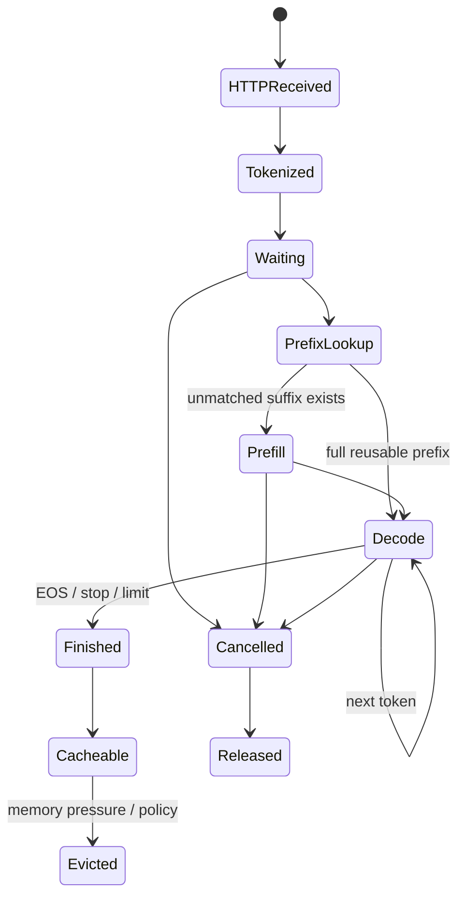
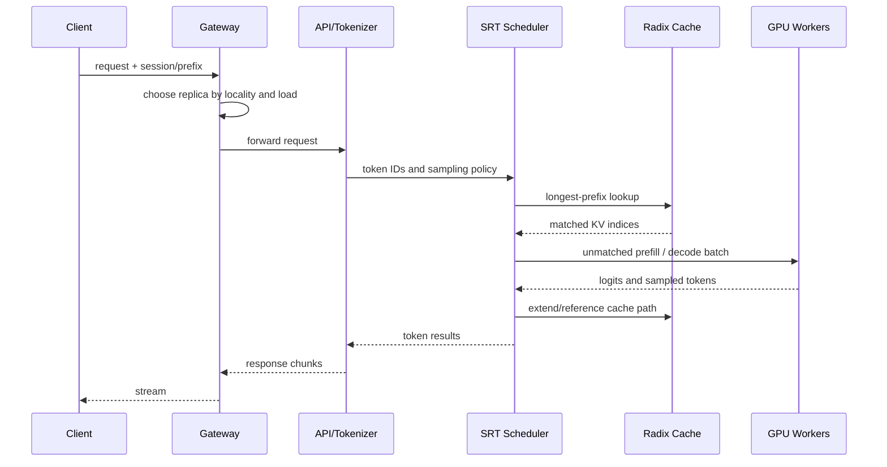
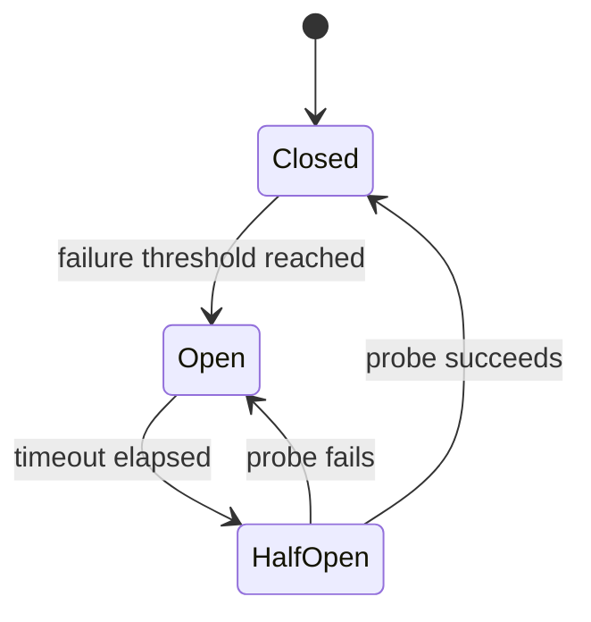

> 对应原书：*Distributed AI Systems*，Chapter 7：*Cross-Request Optimization with SGLang*
> 本章主题：如何把prefix复用、结构化生成、CPU/GPU流水、请求路由和prefill/decode解耦提升为大模型服务的一等系统能力。

---

## 0. 本章要回答的核心问题

1. “Cross-request optimization”究竟跨请求共享了什么，而不只是把请求放进同一batch？
2. SGLang与vLLM的差异是能力有无，还是设计重心和调度表示不同？
3. PagedAttention的block table与RadixAttention的radix tree分别解决什么问题？
4. 为什么相同文本字符串不一定构成可复用的KV prefix？
5. Radix tree怎样支持longest-prefix match、节点分裂、共享、reference count和LRU eviction？
6. Prefix cache命中究竟节省多少prefill计算、KV内存和TTFT？
7. Cache hit rate有哪些口径，为什么request hit rate可能误导？
8. Prefix-aware scheduling为何既提高reuse，也可能损害公平性与尾延迟？
9. XGrammar如何在采样前约束合法tokens，而不是生成后再校验/重试？
10. JSON Schema、regex、context-free grammar和语义校验分别保证到哪一层？
11. Operator fusion减少的是kernel launch、global-memory traffic还是模型FLOPs？
12. “Zero-overhead scheduler”如何重叠CPU和GPU，为什么不可能字面上零开销？
13. Placeholder token机制需要哪些依赖和正确性约束？
14. Router为什么能把cache locality变成集群级优化，又为什么可能造成hot worker？
15. Cache-aware、shortest-queue、round-robin和power-of-two choices分别适合什么流量？
16. Session affinity与prefix-aware routing有什么关系，worker失败时会发生什么？
17. Prefill/decode为什么适合拆成不同资源池？
18. PD disaggregation增加了怎样的KV transfer critical path？
19. KV transfer量、网络带宽与可隐藏时间怎样决定解耦是否值得？
20. Mooncake、NIXL、RDMA等transfer engine解决什么，不解决什么？
21. SGLang中的TP、PP、router-based DP、EP怎样组合？
22. 为什么EP通常重用已有ranks，而不能机械乘到world size？
23. Data Parallel Attention如何避免少KV heads下的cache复制？
24. TBO/SBO如何重叠MoE通信和计算，何时反而增加延迟？
25. Speculative decoding与RadixAttention分别优化prefill和decode的哪部分？
26. 怎样公平比较SGLang、vLLM及prefix caching配置？
27. 多轮conversation state怎样保证下一turn真的复用旧prefix？
28. Fork为什么能共享prefix KV，又为何不自动等于best-of-N提速？
29. 如何实现一个正确的教学版Radix cache、约束解码器和fork状态？
30. 如何从workload证据决定router、TP/PP、PD、EP与speculation的最小组合？

本章可归纳为五张图：

```text
Prefix graph: token prefixes -> shared KV ownership
Schedule pipeline: CPU prepare -> GPU execute -> CPU retire
Routing map: request/session/prefix -> worker and local cache
PD path: prompt -> prefill -> KV transfer -> decode -> stream
Parallel layout: TP / PP / request replicas / EP / DP Attention
```

---

## 1. A different philosophy for distributed inference

### 1.1 从“一个请求如何跑”转向“请求之间如何复用”

上一章的vLLM主线是：

- PagedAttention高效管理动态KV blocks；
- Continuous batching让不同长度请求共享GPU iteration；
- TP/PP让超大模型跨设备执行；
- DP replicas提高服务容量。

SGLang同样支持这些能力，但本章强调另一层问题：

> 多个请求具有相同prefix、相同grammar、同一session或相似执行结构时，系统怎样避免把它们当完全独立任务？

Cross-request optimization包括：

```text
Shared prefix KV
Cache-aware batch formation
Session-affine routing
Forked program-state sharing
Shared grammar compilation/state machinery
CPU/GPU work pipelining across adjacent batches
```

这并不意味着“vLLM只优化单请求、SGLang才支持跨请求”。现代vLLM也支持prefix caching、continuous batching与外部routing；两者的差异更多是数据结构、调度集成、产品表面和优化重点，且随版本持续收敛。

### 1.2 Intra-request与inter-request不是二选一

| 层级 | 典型问题 | 技术 |
| --- | --- | --- |
| Token/kernel内 | 一次attention/GEMM怎样更快 | Flash/paged kernels、fusion |
| 单请求内 | Prefill/decode、KV lifecycle | KV cache、speculation |
| Batch内 | 多requests如何共享iteration | Continuous batching |
| Worker内跨请求 | 相同prefix是否复用 | RadixAttention |
| Workers间 | 哪个worker已有prefix且不拥塞 | Model Gateway/router |
| Resource pools间 | Prefill与decode如何独立扩展 | PD disaggregation |
| Model内 | Weight/expert如何跨设备 | TP、PP、EP、DP Attention |

实际系统需要同时处理这些层级。Router不能替代超大模型所需TP/PP；RadixAttention也不能降低没有共享prefix的decode weight bandwidth。

### 1.3 为什么prefix reuse值得成为一等能力

典型请求：

```text
[500-token system prompt]
[2000-token few-shot examples]
[user-specific suffix]
```

若100个请求共享前2500 tokens，朴素系统对公共prefix prefill 100次。理想cache只计算一次，后99次从相同token boundary继续。

公共prefix token-work：

$$
W_{naive}=RP
$$

首次计算、其余命中：

$$
W_{cached}=P
$$

仅按token count的节省比例：

$$
S_{token}=1-\frac{1}{R}
$$

当 $R=100$ 时为99%。但prefill attention不是每token等成本，长prefix末端query访问更多历史；真实FLOP节省、TTFT收益、cache查找和调度开销需单独测量。

### 1.4 多轮对话为什么是天然prefix workload

第二轮通常把第一轮完整transcript作为prefix：

```text
Turn 1 input:
  system + user1

Turn 2 input:
  system + user1 + assistant1 + user2
```

若tokenization、chat template和model state一致，Turn 2可以复用直到 `assistant1` 末尾的KV，只对 `user2` 新tokens做prefill。

条件：

- 路由到持有cache的worker；
- Prefix未被evict；
- Prompt token IDs逐个相同；
- Position IDs和adapter/model revision相同；
- Sampling结果已按相同文本写入历史；
- Context truncation没有改变左侧tokens。

所以“同session”只是routing hint，不自动证明cache hit。

### 1.5 原章性能数字怎样读

原章列出follow-up latency 2～3×、prefix prefill最多节省90%、zero-overhead scheduler最多2×等。它们是特定论文/版本/workload/baseline结果，必须保留条件：

- Shared prefix长度和reuse次数；
- Cache是否warm；
- Request arrival与batching；
- Model/quantization；
- GPU与network；
- Baseline是否已支持prefix cache；
- TTFT还是E2E/throughput；
- SGLang版本和flags。

稳定结论是“有可复用工作时能省掉重复工作”，不是固定倍率。

### 1.6 何时这种哲学收益很小

- 每个prompt完全唯一；
- Prefix很短而suffix/输出很长；
- Cache频繁evict；
- Router把同prefix分散到不同workers；
- Low traffic导致reuse distance过长；
- Batch/offline吞吐已经主导；
- Model太大，一个replica占整个cluster；
- Tokenizer/template/adapters导致表面相似但token key不同。

此时系统仍可使用SGLang的kernels、scheduler和model parallelism，但Radix reuse不应被当作主要收益来源。

---

## 2. Prerequisites 与 installation

### 2.1 环境前提

原章以Linux、Python 3.10+、NVIDIA CUDA为主，并指出SGLang也支持其他accelerators。真正兼容性依赖：

$$
(Driver,\ CUDA/ROCm,\ PyTorch,\ SGLang,\ Model,\ KernelBackend)
$$

额外检查：

- GPU compute capability与BF16/FP8/quantization；
- FlashInfer/Triton/CUTLASS/DeepGEMM等kernel支持；
- TP/EP所需NCCL和network；
- Model remote code与安全审计；
- Router package/version是否与server兼容；
- PD transfer engine与NIC/RDMA配置；
- Host RAM、shared memory和model cache容量。

### 2.2 Docker为什么适合首次验证

原章runtime image：

```shell
docker pull lmsysorg/sglang:latest-runtime
```

启动示意：

```shell
export SGLANG_MODEL="Qwen/Qwen2.5-0.5B-Instruct"

docker run --runtime nvidia --gpus all \
  -v $HOME/.cache/huggingface:/root/.cache/huggingface \
  --env "HF_TOKEN=$HF_TOKEN" \
  --env "SGLANG_MODEL=$SGLANG_MODEL" \
  -p 30000:30000 --ipc=host --shm-size 32g \
  lmsysorg/sglang:latest-runtime \
  python3 -m sglang.launch_server \
    --model-path "$SGLANG_MODEL" \
    --host 0.0.0.0 \
    --port 30000
```

关键参数：

| 参数 | 作用 | 边界 |
| --- | --- | --- |
| `--gpus all` | 暴露accelerators | 生产应精确限制devices |
| HF cache mount | 避免重复下载 | 权限、共享I/O、revision一致性 |
| `HF_TOKEN` | 访问受限模型 | 不写入image/log/repo |
| `--ipc=host` | 共享host IPC namespace | 降低隔离，按安全模型评估 |
| `--shm-size` | 容器共享内存上限 | 不等于GPU KV cache容量 |
| `0.0.0.0` | 监听所有interfaces | 必须配auth/TLS/network policy |
| `latest-runtime` | 快速体验 | 生产固定tag和digest |

原章把32 GB shared memory与“KV cache/RadixAttention重要”相连容易误解：主KV tensors通常在GPU HBM；`/dev/shm`服务于host进程间通信、multiprocessing和特定数据路径，不是Radix KV的替代存储。

### 2.3 Model类型与endpoint

| Model | Endpoint | 关键语义 |
| --- | --- | --- |
| Base causal LM | `/v1/completions` | Raw continuation |
| Instruct/chat | `/v1/chat/completions` | Chat template/roles |
| Embedding | `/v1/embeddings` | Dense vectors |
| Reranker | 对应rerank API | Pair/list scoring |
| Reward/classifier | Model-specific API | Scores/classes |
| Multimodal | Chat/completion扩展 | Images/video preprocessing |
| Diffusion | 专用pipeline/API | 非标准autoregressive路径 |

OpenAI-compatible只表示公共schema高度兼容，不表示所有model types、stream chunks、errors、usage、grammar extensions完全一致。

### 2.4 最小验收链

```shell
curl -w "HTTP Status: %{http_code}\n" http://localhost:30000/health
curl http://localhost:30000/v1/models

curl http://localhost:30000/v1/chat/completions \
  -H "Content-Type: application/json" \
  -d '{
    "model":"Qwen/Qwen2.5-0.5B-Instruct",
    "messages":[{"role":"user","content":"Hello"}],
    "temperature":0,
    "max_tokens":32
  }'
```

Health只证明进程响应；model list只证明注册；真实请求才覆盖tokenization、schedule、GPU execute、detokenization和API序列化。Prefix cache验收还需发第二个具有相同token prefix的请求并检查cache metrics。

### 2.5 `temperature=0`与确定性

Greedy sampling消除抽样随机性，但dynamic batching、TP归约顺序、quantized kernels和版本变化仍可能导致边界logits差异。分清：

```text
Valid structured output
Semantically similar output
Exact token IDs
Bitwise-identical logits
```

Radix cache复用必须与未复用路径在允许误差内保持相同model语义；不能用“看起来回答一样”代替logit/token测试。

### 2.6 Pip、uv和source build

原章把其他安装方式指向官方文档是合理的，因为SGLang binary dependencies和backend支持变化快。实践原则：

1. 使用目标版本installation matrix；
2. 隔离Python environment；
3. 固定torch/backend versions；
4. Import后真正运行一个GPU request；
5. 若需DeepEP/Mooncake等，单独验证extension加载；
6. Source build记录compiler、CUDA toolkit和commit。

### 2.7 安全与可复现性

- 固定model和tokenizer immutable revisions；
- `trust-remote-code`前审阅代码；
- 固定container digest；
- 不把HF token放进命令历史/日志；
- 保存server `--help`与完整启动参数；
- 记录GPU topology和kernel backend；
- Router/server/transfer engine使用兼容版本。

---

## 3. Overview of the SGLang architecture

### 3.1 Frontend-backend职责分离

原章用API Server + SGLang Runtime（SRT）描述架构：

```text
Client / SGLang program
  -> API server
  -> tokenizer
  -> request queue
  -> scheduler + radix cache manager
  -> GPU workers
  -> detokenizer
  -> response stream
```


分层目的：

- API层处理协议、validation、streaming；
- Tokenizer/detokenizer处理CPU text/token转换；
- Scheduler决定下一iteration的工作与cache ownership；
- Workers执行model kernels和collectives；
- Router在多个SRT实例之上做集群级placement。

具体class/module路径随版本变化，职责边界比内部名称稳定。

### 3.2 Request在单worker内的生命周期



注意“Finished”不等于KV立即全释放：可复用prefix可能进入radix cache；active request引用必须释放，但cache-owned节点可保留到eviction。

### 3.3 Scheduler为何是智能核心

它必须联合决定：

- Longest cached prefix；
- Remaining prefill tokens；
- Running decode tokens；
- KV memory allocation；
- Batch token budget；
- Prefix-locality与fairness；
- Preemption/eviction；
- CPU准备与GPU执行的流水依赖。

优化目标不是单一cache hit：

$$
\max Goodput
$$

约束：

$$
TTFT_{p95}\le S_{TTFT},
\qquad
TPOT_{p95}\le S_{TPOT},
\qquad
M_{KV}\le Budget
$$

若一味等待相同prefix请求凑批，hit rate会上升，queue latency也可能失控。

### 3.4 GPU workers的不同组织方式

- 单GPU完整model；
- TP group共同执行一个request；
- PP stages分layers；
- EP group分experts；
- DP Attention ranks处理不同request token partitions；
- PD模式下worker只承担prefill或decode。

Router所说的一个“worker endpoint”可能背后是多GPU TP×PP group，而不一定是一张GPU。Session affinity应绑定到拥有该session cache的**可执行replica**。

### 3.5 Router/Model Gateway层

在多个SRT endpoints前增加：

```text
Control plane:
  registration / discovery / health / load / circuit state

Data plane:
  HTTP/gRPC proxy / streaming / routing / retry / rate limit
```

Router使cache locality从单worker调度扩展到cluster placement。它不能让worker A直接使用worker B的local radix cache；除非有显式remote KV transfer，命中要求请求落在持有prefix的worker。

### 3.6 与vLLM架构比较的准确边界

原章图7.2用“vLLM model parallelism vs SGLang independent routed workers”形成鲜明对比：


它适合说明两种scale axis，但不能读成框架互斥：

- vLLM也能运行独立replicas和prefix-aware routing；
- SGLang也支持TP/PP/EP；
- Independent workers本质是inference data-parallel replicas；
- TP workers仍需每层同步，无论前面是哪种router；
- 真正比较应固定model、parallel layout、prefix policy和SLO。

### 3.7 端到端数据流



### 3.8 Correctness invariants

1. Prefix key包含足够的model/tokenization语义；
2. Matched token count与KV positions一致；
3. Shared KV只读或使用copy-on-write；
4. Active nodes不能被evict；
5. LRU timestamp/reference更新原子；
6. TP/PP ranks执行相同request/cache mapping；
7. Placeholder token在依赖使用前被真实结果解析；
8. Router retry不会重复已streamed内容；
9. Session迁移后不能假装cache仍warm；
10. PD decode只消费与其model/layout兼容的KV。

---

## 4. SGLang core theory总览

原章列出四项核心：

| 技术 | 层级 | 解决的问题 | 不直接解决 |
| --- | --- | --- | --- |
| RadixAttention | KV/cache/scheduler | 跨请求prefix重复prefill | Unique prompts、decode bandwidth |
| XGrammar | Sampling/grammar | 每步只允许语法合法tokens | 事实/业务语义正确性 |
| Operator fusion | GPU kernel | Launch与中间memory traffic | 算法级总工作和queue |
| Zero-overhead scheduler | CPU/GPU pipeline | CPU schedule造成GPU gaps | GPU compute本身和overload |

四者可以叠加：prefix命中减少prefill，grammar约束decode，fusion缩短kernels，scheduler重叠host工作。性能归因必须feature-by-feature A/B，不能把总speedup都归给RadixAttention。

---

## 5. RadixAttention：prefix cache reuse

### 5.1 Prefix cache复用的数学前提

对确定的model state，causal Transformer在位置 $0..m-1$ 的K/V只依赖：

$$
(token_0,token_1,\ldots,token_{m-1})
$$

以及影响forward的其他上下文：

- Model/weights revision；
- Adapter/LoRA；
- Position encoding与positions；
- KV dtype/quantization；
- Multimodal embeddings；
- Attention/window配置；
- 某些request-specific model inputs。

因此安全cache key不能仅是原始文本字符串。最低层通常按token IDs匹配，并由engine实例/namespace隐含固定model配置。

### 5.2 Radix tree是什么

Radix tree是压缩trie。普通trie每条edge一个token；radix node可保存一段token sequence：

```text
root
  └── [1, 2, 3]
       ├── [4, 5]
       ├── [6, 7]
       └── [8, 9]
```

三条cached sequences：

```text
[1,2,3,4,5]
[1,2,3,6,7]
[1,2,3,8,9]
```

公共 `[1,2,3]` 只表示/存储一次。压缩edge减少节点数和pointer traversal。

### 5.3 Longest-prefix lookup

新请求tokens $x=(x_0,\ldots,x_{L-1})$。寻找最大 $m$：

$$
x_{0:m}=CachedPrefix_{0:m}
$$

Reuse $m$ 个tokens的KV，只prefill suffix：

$$
x_{m:L}
$$

Prefix match必须从位置0连续，不能复用中间substring。相同tokens出现在不同position时，rotary/position encoding不同，KV不等价。

### 5.4 插入与node split

已有edge `[1,2,3,4,5]`，插入 `[1,2,3,6,7]`：

1. 找共同prefix `[1,2,3]`；
2. 将旧edge拆为parent `[1,2,3]` + child `[4,5]`；
3. 新增sibling `[6,7]`；
4. 对应KV slices也按token boundary关联；
5. 更新references/LRU/size。

这就是原章图7.4～7.6中conversation tree随请求增长而重构的本质。


### 5.5 KV ownership与两级pool

原章以SGLang v0.5概念说明：

```text
Request/token pool:
  logical request positions -> KV slot indices

KV data pool:
  physical K/V tensors for all local layers/tokens

Radix tree:
  prefix token paths -> reusable KV slot-index ranges
```

Radix tree不必把完整KV tensor复制到每个node object；更高效的是保存指向physical KV slots的indices/references。具体tensor layout随backend/version变化，机制是“树管理共享映射，pool保存数据”。

### 5.6 与PagedAttention的关系

| 维度 | PagedAttention | RadixAttention |
| --- | --- | --- |
| 核心数据结构 | Fixed-size physical blocks + block table | Token radix tree + KV slot references |
| 首要目标 | 动态分配、避免连续内存碎片 | 查找并共享跨请求prefix |
| 匹配语义 | 一条sequence逻辑位置映射 | 多条sequences的相同token prefix |
| 回收 | Sequence/block lifecycle | Cache-node LRU/reference lifecycle |
| 可组合性 | 可作为Radix底层physical allocator | 可指向paged/non-paged KV slots |

现代vLLM的automatic prefix caching使用hash blocks实现相似复用。差异是显式radix tree与scheduler集成方式，不应写成“PagedAttention只能单请求、完全不能prefix cache”。

### 5.7 Active、cached与evictable状态

一个node可能：

- 被active request引用：不能evict；
- 无active reference但保留为cache：可按LRU evict；
- 与多个requests共享：reference count > 1；
- 是branch内部prefix：删除child前未必可删；
- 部分node KV已物理释放：必须从tree断开或标invalid。

Eviction不是简单删除最老dictionary entry。通常从evictable leaves开始，释放KV slots，并向上合并/清理空branch，同时保护active/shared ancestors。

### 5.8 LRU为什么合理、又有什么局限

LRU假设近期访问的prefix更可能再次访问，适合session/few-shot locality。图7.4～7.6展示在压力下删除旧inactive branches：


局限：

- 大但低价值prefix可能挤掉多个小高价值prefix；
- Recent不等于future reuse；
- Tenant热点可污染全局cache；
- Session暂停时间长会被淘汰；
- 只按entry而非bytes/tokens驱逐不公平。

更一般policy可考虑：reuse probability、saved prefill cost、size、tenant quota和deadline。

### 5.9 Cache hit rate的四种口径

#### Request hit rate

$$
H_{req}=\frac{\#\{requests\ with\ match>0\}}{R}
$$

命中1 token也算hit，容易虚高。

#### Token hit rate

$$
H_{token}=\frac{\sum_iM_i}{\sum_iL_i}
$$

$M_i$为matched tokens，$L_i$为input tokens。

#### Prefill token saving

若首个请求也需要构建cache：

$$
S_{prefill}=1-\frac{\sum_i(L_i-M_i)}{\sum_iL_i}
$$

这和token hit相同，但只在matched KV无需重算时成立。

#### Compute-weighted hit

Attention每个query成本随prefix length增长。可按profile或FLOP proxy对不同positions加权，更接近TTFT节省。

生产至少报告matched tokens/request分布、token hit和eviction/miss原因，不只报“60% cache hit”。

### 5.10 Prefix收益的可运行计算器

```python
from dataclasses import dataclass


@dataclass(frozen=True)
class PrefixRequest:
    input_tokens: int
    matched_tokens: int


def prefix_reuse_stats(requests: list[PrefixRequest]) -> dict[str, float | int]:
    if any(
        request.input_tokens < 0
        or request.matched_tokens < 0
        or request.matched_tokens > request.input_tokens
        for request in requests
    ):
        raise ValueError("Require 0 <= matched_tokens <= input_tokens")
    total = sum(request.input_tokens for request in requests)
    matched = sum(request.matched_tokens for request in requests)
    request_hits = sum(request.matched_tokens > 0 for request in requests)
    return {
        "requests": len(requests),
        "request_hit_rate": request_hits / len(requests) if requests else 0.0,
        "input_tokens": total,
        "matched_tokens": matched,
        "computed_tokens": total - matched,
        "token_hit_rate": matched / total if total else 0.0,
    }


workload = [
    PrefixRequest(3000, 0),
    PrefixRequest(3100, 2500),
    PrefixRequest(2800, 2500),
    PrefixRequest(400, 10),
]
stats = prefix_reuse_stats(workload)
print(f"Request hit rate: {stats['request_hit_rate']:.1%}")
print(f"Token hit rate: {stats['token_hit_rate']:.1%}")
print(f"Computed prefill tokens: {stats['computed_tokens']:,}")
```

预期输出：

```text
Request hit rate: 75.0%
Token hit rate: 53.9%
Computed prefill tokens: 4,290
```

这个例子显示request hit 75%，但有效token hit仅53.9%；第四个请求只命中10 tokens，却同样贡献一个request hit。

### 5.11 Prefill FLOP proxy

对标准causal attention，长度 $L$ 的score dot-product work近似与：

$$
\sum_{j=1}^{L}j=\frac{L(L+1)}{2}
$$

成正比。若前 $M$ tokens已有KV，处理suffix queries时仍需让每个新query attend到prefix，因此attention工作：

$$
W_{suffix}=\sum_{j=M+1}^{L}j
=\frac{L(L+1)-M(M+1)}{2}
$$

节省：

$$
W_{saved}=\frac{M(M+1)}{2}
$$

这说明复用前M tokens不仅省M个projection/FFN token-work，也省掉这些旧queries本身的attention；新suffix queries读取cached prefix的工作仍存在。

### 5.12 Prefix-aware scheduling

Scheduler可优先选择有长match的requests，以：

- 减少本轮prefill tokens；
- 让更多requests装进token budget；
- 缩短这些请求TTFT；
- 延长热门prefix cache活跃度。

但若始终按match length排序，unique requests可能starve。可构造score：

$$
Score_i=
\alpha SavedWork_i
-\beta QueueAge_i
-\gamma MemoryPressure_i
+\delta DeadlineUrgency_i
$$

符号取决于排序方向。原则是locality与fairness共同建模，而不是缓存命中绝对优先。

### 5.13 Session affinity与RadixAttention

Router维护：

$$
SessionID\rightarrow WorkerID
$$

命中该worker后，SRT radix tree再按token IDs找longest prefix。两层作用不同：

```text
Session affinity -> choose likely cache owner
Radix lookup      -> prove exact reusable token prefix
```

若worker健康但cache已evict，仍会session-affine却cache miss；若两个users共享同system prompt，即使session不同，cache-aware routing也可让它们共享prefix。

### 5.14 适用范围与限制

高收益：

- 长system prompt；
- Few-shot templates；
- Multi-turn chat；
- Tree search/fork；
- Repeated RAG documents；
- Structured programs共享scaffold。

低收益/风险：

- Unique prompts；
- Prefix经过timestamp/request ID扰动；
- Sensitive cross-tenant cache side channel；
- Adapters/vision inputs不同；
- Cache thrashing；
- Context truncation；
- Router metadata滞后；
- Hit提升却hot worker queue变长。

最终要以TTFT goodput、memory、fairness和isolation共同评价。

---

## 6. Structured output decoding with XGrammar

### 6.1 为什么“生成后解析，不合法就重试”很浪费

应用常要求：

- JSON object符合schema；
- SQL满足grammar；
- Function-call arguments类型正确；
- DSL/配置文件语法合法；
- 输出来自有限枚举。

朴素流程：

```text
Unconstrained generation
  -> parse
  -> invalid
  -> prompt model to repair or regenerate
```

这会浪费decode tokens和model calls，且重试仍不保证成功。Constrained decoding改为在每一步采样前，只保留从当前grammar state出发合法的token IDs。

### 6.2 Logit masking的数学语义

模型给出logits $z\in\mathbb R^V$。Grammar state $s$ 对应合法token集合 $A(s)$。构造mask：

$$
m_i=\begin{cases}
0,&i\in A(s)\\
-\infty,&i\notin A(s)
\end{cases}
$$

受约束分布：

$$
p(i\mid s)=softmax(z+m)_i
$$

采样token $i$ 后更新：

$$
s' = Transition(s,i)
$$

只要初始state、transition、tokenizer mapping和终止判断正确，所有生成prefix都可扩展为grammar中的合法字符串。

### 6.3 为什么不能逐步遍历128K vocabulary做字符串测试

若每个decode step对 $V$ 个tokens分别尝试grammar parser，复杂度至少：

$$
O(TV\cdot C_{parse})
$$

$V$ 可达十万级，且token可能包含多个字符、半个UTF-8片段或跨grammar terminal边界。CPU filtering会进入decode critical path。

XGrammar类引擎通过：

- 预编译grammar；
- 缓存grammar state对应的token bitmask；
- 让多数规则走有限状态机；
- 对CFG栈状态使用高效pushdown表示；
- 在GPU/高效kernel上应用mask；

把大部分重复工作从逐请求逐token的解释执行移到compile/cache阶段。

### 6.4 FSM、PDA与CFG的关系

#### Regular language / FSM

Regex、固定枚举、许多局部格式可由finite-state machine表示。State数量有限，不需要无界栈。

#### Context-free language / PDA

任意深度嵌套objects/arrays/parentheses需要记住未闭合结构，可用pushdown automaton：

```text
Read "{" -> push object frame
Read "[" -> push array frame
Read "]" -> pop array frame
Read "}" -> pop object frame
```

原章说“context-sensitive rules如balanced parentheses”并不严谨：平衡括号是经典context-free language，不是一般context-sensitive language。XGrammar的栈机制正是处理CFG嵌套。

### 6.5 Tokenizer使约束问题更难

Grammar定义在字符/字节上，模型选择的是subword token。一个token可能是：

```text
'true'
'"name":'
'}\n'
UTF-8 byte fragment
```

合法token集合必须判断：把整个token的byte sequence消费后，parser是否仍处于可接受或可继续状态。不能只检查token首字符。

还要处理：

- BOS/EOS；
- Leading-space tokens；
- Escapes；
- Unicode；
- Token healing/partial prefix；
- Stop tokens与grammar acceptance的优先级。

### 6.6 JSON Schema保证什么

Schema可约束：

- Object/array结构；
- Required fields；
- Field primitive types；
- Enum；
- Numeric/string部分constraints（取决于backend支持）；
- Additional properties等。

它不保证：

- `age`与输入事实一致；
- SQL查询安全；
- ID在数据库存在；
- Cross-field business invariant；
- 文本没有hallucination；
- 所有复杂JSON Schema keywords均被目标backend支持。

因此正确pipeline：

```text
Grammar-constrained generation
  -> JSON parser
  -> Schema validator
  -> Business-semantic validator
  -> Authorization / safe execution
```

### 6.7 OpenAI-compatible JSON Schema请求

原章示意：

```shell
curl http://localhost:30000/v1/chat/completions \
  -H "Content-Type: application/json" \
  -d '{
    "model":"Qwen/Qwen2.5-0.5B-Instruct",
    "messages":[
      {"role":"user","content":"Extract: John is 30 years old, lives in NYC"}
    ],
    "response_format":{
      "type":"json_schema",
      "json_schema":{
        "name":"person",
        "schema":{
          "type":"object",
          "properties":{
            "name":{"type":"string"},
            "age":{"type":"number"},
            "city":{"type":"string"}
          },
          "required":["name","age"],
          "additionalProperties":false
        }
      }
    },
    "temperature":0,
    "max_tokens":128
  }'
```

API字段、支持的schema subset和backend选择随版本变化，应以目标SGLang/OpenAI-compatible文档验证。

### 6.8 Offline Engine示意

```python
import json

from sglang import Engine


engine = Engine(model_path="Qwen/Qwen2.5-0.5B-Instruct")
schema = {
    "type": "object",
    "properties": {
        "name": {"type": "string"},
        "age": {"type": "integer", "minimum": 0},
    },
    "required": ["name", "age"],
    "additionalProperties": False,
}
outputs = engine.generate(
    ["Extract: John is 30 years old."],
    {
        "max_new_tokens": 100,
        "temperature": 0,
        "json_schema": json.dumps(schema),
    },
)
print(outputs[0]["text"])
```

这是版本敏感示意。核心语义是把schema传给**grammar/json-schema参数**，不是把JSON Schema误塞进regex参数。原章练习中的 `regex=Person.model_json_schema()` 类型与语义均不匹配，应修正。

### 6.9 Grammar compilation与cache

Compile本身可能昂贵。如果每个request动态生成一个从未见过的schema，TTFT会增加。可按canonical schema hash缓存compiled grammar：

$$
Key=Hash(Canonicalize(Schema),TokenizerRevision,BackendVersion)
$$

需限制：

- Cache entry数量/bytes；
- Untrusted schema complexity；
- Compile timeout；
- Tenant isolation；
- Version invalidation。

否则攻击者可提交大量独特复杂grammars造成CPU和memory DoS。

### 6.10 Constrained decoding性能拆解

每step附加：

$$
T_{constraint}=T_{state}+T_{mask\ lookup}+T_{mask\ apply}+T_{transition}
$$

同时约束可能减少invalid retries和平均output length。端到端比较应报告：

- Grammar compile cold/warm时间；
- TTFT；
- TPOT；
- Output tokens；
- Validity rate；
- Retry count；
- Schema复杂度；
- Batch中不同grammar数量。

“Minimal overhead”只在compiled/cache命中且backend/kernel有效时成立。

### 6.11 结构正确与概率分布

Mask后模型分布被条件化到合法集合：

$$
p_{constrained}(x)=
\frac{p_{model}(x)}{\sum_{y\in A(s)}p_{model}(y)},\quad x\in A(s)
$$

这不是原模型无约束分布。约束越强，输出质量可能提高（避免格式错误），也可能把模型迫入低概率合法路径。Schema设计本身是generation policy的一部分。

---

## 7. Operator fusion

### 7.1 Kernel launch与global-memory round trip

未fusion：

```text
Kernel 1: normalization -> write HBM
Kernel 2: linear        -> write HBM
Kernel 3: activation    -> write HBM
```

Fusion尝试：

```text
One/fewer kernels:
  load once -> normalize -> project/activate -> write final result
```

收益来自：

- 减少kernel launches；
- 减少intermediate HBM reads/writes；
- 提高register/shared-memory reuse；
- 融合layout conversion/quant-dequant；
- 降低decode短kernel之间的CPU launch gaps。

### 7.2 Roofline直觉

算术强度：

$$
I=\frac{FLOPs}{Bytes\ moved}
$$

若算子memory-bound，减少bytes可提高上限：

$$
Performance\le BW\cdot I
$$

Fusion通常不减少主要GEMM数学FLOPs，却减少中间traffic，使 $I$ 增大。对已compute-bound大GEMM，fusion收益可能较小；对decode、小batch、norm/activation等memory-bound操作更明显。

### 7.3 常见fusion边界

- RMSNorm + quantization；
- QKV projection相关epilogue；
- Bias/activation；
- Rotary embedding；
- Attention output projection；
- MoE token permutation + grouped GEMM epilogue；
- Sampling/logit processing。

原章举“layer norm + linear + activation”是直觉示例，并不表示所有三者能无条件融合成单kernel；register pressure、GEMM library边界、shape和dtype决定实际fusion plan。

### 7.4 Fusion的代价

- 更多specialized variants与compile time；
- Register pressure造成occupancy下降；
- 大kernel不易调度/overlap；
- Debug/profile粒度变粗；
- Dynamic shapes/grammars不易capture；
- Quantization numerical path变化；
- Hardware/backend lock-in。

判断是否有效要看kernel timeline和E2E，不只看“kernel count减少”。

### 7.5 MoE fusion不能消灭network All-to-All

Routing/permutation与expert GEMM融合可减少local copies，DeepEP/TBO可隐藏部分通信，但remote expert tokens仍需跨device移动。Local operator fusion、communication backend和overlap是三层不同优化。

---

## 8. Zero-overhead scheduler

### 8.1 “零开销”是隐藏开销，不是没有开销

Serial每iteration：

```text
CPU pre-schedule
  -> GPU kernels
  -> CPU post-process
  -> next iteration
```

若CPU阶段为 $C$，GPU为 $G$，$N$ steps：

$$
T_{serial}=N(C+G)
$$

流水稳态理想：

$$
T_{pipe}\approx C+G+(N-1)\max(C,G)
$$

当 $G\ge C$，CPU工作可大多隐藏，steady-state step接近 $G$，但startup/drain、依赖、同步和资源竞争仍存在。

### 8.2 三批次流水

原章描述：

```text
CPU post-process batch N-1
GPU execute      batch N
CPU pre-schedule batch N+1
```


为了并发，host工作可进一步拆为：

- Scheduler CPU：queue、radix match、memory plan、finish/cache update；
- Launch CPU：准备kernel inputs、launch、处理device result依赖。

线程/进程必须避免GIL、locks、memory allocator和CUDA API serialization重新形成瓶颈。

### 8.3 Placeholder token为什么需要

Batch $N$ 的真实sampled token尚未从GPU返回时，CPU想准备Batch $N+1$。对每个running sequence，下一步逻辑长度/slot可先预留，但token value未知。

Placeholder表示未解析依赖：

```text
Reserve next position and scheduling metadata
  -> launch current sampling
  -> later fill actual token
  -> only then run work that needs its value
```

它类似future/promise，不是随便伪造一个vocab token送进model。

### 8.4 正确性约束

1. Placeholder不能参与embedding/model forward；
2. Stop/EOS判断等待真实token；
3. Grammar state transition等待真实token；
4. Radix tree insertion不能把placeholder当key；
5. KV slot可预留，但取消/完成要rollback；
6. Sampling参数/request mapping不能错位；
7. TP ranks看到一致batch order；
8. Async completion异常必须传播，不能永久悬挂placeholder。

### 8.5 可运行的流水上界计算器

```python
def scheduler_pipeline_times(
    steps: int,
    cpu_ms: float,
    gpu_ms: float,
) -> dict[str, float]:
    if steps <= 0 or cpu_ms < 0 or gpu_ms < 0:
        raise ValueError("Require positive steps and non-negative times")
    serial = steps * (cpu_ms + gpu_ms)
    pipelined = cpu_ms + gpu_ms + (steps - 1) * max(cpu_ms, gpu_ms)
    return {
        "serial_ms": serial,
        "pipelined_ms": pipelined,
        "ideal_speedup": serial / pipelined if pipelined else 1.0,
    }


for cpu_ms, gpu_ms in ((2.0, 8.0), (5.0, 5.0), (8.0, 2.0)):
    stats = scheduler_pipeline_times(100, cpu_ms, gpu_ms)
    print(
        f"CPU={cpu_ms:.0f} GPU={gpu_ms:.0f} ms: "
        f"serial={stats['serial_ms']:.0f} ms, "
        f"pipeline={stats['pipelined_ms']:.0f} ms, "
        f"speedup={stats['ideal_speedup']:.2f}x"
    )
```

预期输出：

```text
CPU=2 GPU=8 ms: serial=1000 ms, pipeline=802 ms, speedup=1.25x
CPU=5 GPU=5 ms: serial=1000 ms, pipeline=505 ms, speedup=1.98x
CPU=8 GPU=2 ms: serial=1000 ms, pipeline=802 ms, speedup=1.25x
```

理论最大收益在CPU/GPU时间接近时约2×；一侧远大于另一侧时，隐藏短阶段只能带来有限收益。这解释了原章“up to 2x”的条件。

### 8.6 为什么CPU可能仍成为瓶颈

- Tokenization/detokenization；
- Radix lookup/tree updates；
- Grammar state/mask准备；
- Python/runtime overhead；
- Many small requests；
- Sampling/postprocessing；
- HTTP serialization；
- Lock contention；
- CPU-NUMA与GPU affinity不佳。

若 $C>G$，即使流水，steady-state仍由CPU决定：

$$
Throughput\approx1/C
$$

“GPU never waits”只有在host始终提前完成且依赖允许时成立。

### 8.7 与CUDA Graph/operator fusion的关系

- Fusion缩短GPU kernels/launch数量；
- CUDA Graph减少重复launch CPU overhead；
- Scheduler pipeline重叠剩余CPU工作；
- Dynamic batches/grammars/cache layouts会增加graph variants；
- GPU变快后，原本隐藏的CPU可能暴露。

每项优化都会改变另一项的瓶颈，应组合profile。

### 8.8 验证方法

Timeline至少标记：

```text
CPU pre-schedule
Launch
GPU compute/collectives
D2H result/event
CPU post-process
Idle gaps
```

比较serial/overlap配置的：step p50/p95、GPU idle%、CPU core utilization、queue latency和correctness。Nsys中看不到业务queue语义时增加NVTX/trace spans。

---

## 9. Router-based distributed architecture

### 9.1 Router增加的是request placement轴

Router前有多个可执行replicas：

$$
Replica_j=(ModelRevision,TP_j,PP_j,LocalKVCache_j,Queue_j)
$$

新请求选择：

$$
j^*=Policy(Request,ReplicaStates)
$$

Worker间无需为**不同requests**同步；但一个replica内部的TP/PP/EP通信不变。原章对此纠偏是关键：router消除inter-replica coordination，不消除intra-model collectives。

### 9.2 Model Gateway控制面

- Worker registration/discovery；
- Capability/model revision；
- Health probes；
- Queue/load/cache telemetry；
- Circuit-breaker state；
- Add/remove/drain workers；
- Kubernetes/service discovery integration；
- Config/policy distribution。

控制面状态滞后会导致错误placement：router以为prefix存在或queue很短，但worker实际已evict/拥塞。

### 9.3 Data plane

- HTTP/gRPC proxy；
- Streaming passthrough；
- Request/response schema；
- Connection pooling；
- Timeout和backpressure；
- Rate limiting/admission；
- Retry/failover；
- PD prefill/decode coordination；
- Metrics/tracing/logging。

Router hop增加一次network/proxy/serialization开销。只有cache hit、load distribution或reliability收益超过该开销时才改善E2E。

### 9.4 Cache-aware routing

对worker $j$：

- $M_j$：估计matched prefix tokens；
- $Q_j$：queue/work estimate；
- $K_j$：KV pressure；
- $H_j$：health/circuit；
- $A_j$：session affinity indicator。

可写成本：

$$
Cost_j=
-\alpha M_j
+\beta Q_j
+\gamma K_j
-\delta A_j
+\infty\cdot(1-H_j)
$$

选择最低cost。真实router可先用cache threshold决定是否保locality，再用absolute/relative load thresholds防hotspot。

### 9.5 为什么cache locality与load balance冲突

Worker A命中2000 tokens但queue 20；Worker B miss却空闲。粗略完成时间：

$$
T_A=QDelay_A+Prefill(L-M_A)+Decode
$$

$$
T_B=QDelay_B+Prefill(L)+Decode
$$

仅按prefix选A不一定更快。Router需要估计**saved work vs wait**，而非最大match绝对优先。

### 9.6 Router policies

#### Round-robin

优点：简单、低开销、易解释。缺点：忽略request长度、queue、cache和heterogeneous workers。

适合：请求成本相近、几乎无prefix reuse、worker同构。

#### Shortest queue

选择pending request count最小。比round-robin适应部分变长，但request count不等于token work。更好的是queued tokens或predicted service time。

#### Power of two choices

随机选两个workers，再选较轻者。只读取两个状态，却显著降低最大负载，适合大规模worker pool。

若 $n$ workers，全局最短队列需查看 $O(n)$ 状态；P2C每次 $O(1)$，router更易扩展。

#### Cache-aware

维护worker prefix摘要/approximate radix state，先考虑reuse，再以load thresholds回退。优势最大也最依赖准确telemetry和tokenization一致性。

### 9.7 Cache metadata如何表示

Router不应复制每worker完整KV或精确巨大radix tree。可维护：

- Prefix hashes；
- Compressed radix summaries；
- Bloom filters（有false positive）；
- Session map；
- Recent insertion/eviction updates；
- Worker-reported hit estimates。

误报：路由过去后worker实际miss，只损失性能；错误复用绝不能发生，因为worker仍需本地精确token match验证。Router metadata只能是placement hint，不能代替SRT correctness check。

### 9.8 Session affinity

Session map：

$$
session\_id\rightarrow(worker,expiry,generation)
$$

要求：

- Session ID不可被未授权用户猜测/劫持；
- TTL避免无限增长；
- Worker drain时迁移/失效；
- Model/version变化时namespace隔离；
- Cache miss时仍能正确重算；
- Sticky routing不突破负载保护；
- Multi-region场景考虑data locality。

### 9.9 Session affinity不等于保存conversation state

Router只决定worker。Application仍需提交完整或可重建的conversation history，除非使用显式server-side state API。Worker failure后KV会丢失；若应用只传最新一句，无法从KV逆推出完整prompt语义。

稳健设计：

```text
Durable conversation record in application/store
+ session affinity as performance hint
+ local KV as disposable acceleration cache
```

### 9.10 Circuit breaker

经典状态：



- Closed：正常发送；
- Open：快速失败/绕开，避免级联；
- Half-open：少量探测恢复。

原章举“5次失败”为典型值，不是固定SGLang契约。阈值、窗口、timeout和错误分类应按workload设置。

### 9.11 Retry边界

安全重试通常限于：

- Connect失败、服务尚未接受；
- 明确429/部分5xx；
- 尚未向client输出任何stream content；
- 有request ID/deduplication支持。

Read timeout可能发生在worker已计算后；stream已输出后failover会重复prefix。Gateway“支持retry”不等于任何请求可透明重放。

### 9.12 Worker failure与session迁移

Worker失败：

1. Health/circuit摘除；
2. 新requests路由健康workers；
3. In-flight streams通常失败或由上层重试；
4. Session map重绑定；
5. 新worker没有旧local KV，下一turn完整prefill；
6. 后续turn重新warm。

因此fault tolerance提高的是服务继续接流量，不是local cache/state零损失迁移。

### 9.13 Router适用场景

高收益：

- Model单GPU/小TP group可fit；
- 高QPS interactive；
- 多session和共享system prompt；
- Independent replicas易横向扩展；
- 需要rolling upgrade/fault isolation；
- Prefix-aware placement显著。

低收益：

- 一个model replica已占全部GPUs；
- Offline batch直接提交；
- Unique prompts无cache locality；
- Router成为CPU/network bottleneck；
- 超低延迟且额外hop不可接受；
- Global cache metadata成本高于reuse收益。

### 9.14 Router容量上限

Router需承受：

$$
Bandwidth_{router}\approx
RequestBytes/s+StreamResponseBytes/s
$$

以及connections、SSE chunks、tokenization（若router做）、policy lookups与metrics。100K sessions不等于100K QPS；应分别容量规划：

- Concurrent connections；
- New requests/s；
- Stream chunks/s；
- Bytes/s；
- Policy decisions/s；
- Worker telemetry updates/s。

### 9.15 可观察性

Gateway：

- Route decision latency；
- Per-policy decisions；
- Session hits/remaps；
- Prefix estimate vs actual hit；
- Per-worker queue/load；
- Retry/circuit/rate-limit；
- Active streams与backpressure。

Workers：

- Radix matched/evicted tokens；
- Prefix lookup latency；
- Prefill/decode tokens；
- KV usage；
- TTFT/TPOT；
- Errors/cancellations。

只有将router span与worker span用request ID关联，才能判断一次cache-aware route为何变快或变慢。

---

## 10. Prefill/Decode disaggregation

### 10.1 为什么拆分两个阶段

Prefill：一次处理prompt中许多tokens，大GEMM/attention，常更compute-intensive。Decode：逐token、小矩阵并反复读取weights/KV，常更memory-bandwidth和latency-sensitive。

统一worker会发生干扰：

- 长prefill拉长running decode的ITL；
- Token budget在TTFT与TPOT之间竞争；
- 同一种GPU无法分别按compute与memory优化；
- Autoscaling只能按整体replica，不能独立加prefill/decode capacity。

PD disaggregation按**工作阶段**拆资源，而PP按**model layers**拆。二者是正交概念。

### 10.2 原章利用率数字的边界

图7.8给出prefill compute 85%/memory 40%、decode compute 25%/memory 90%的示意：


这些不是硬件定律。Resource profile受model、batch、context、quantization、kernel和GPU影响。稳定结论是两个阶段的算术强度/批形态不同，应从目标系统profile证明是否值得拆分。

### 10.3 端到端架构

```text
Client
  -> PD-aware router
  -> selected prefill replica
       compute prompt K/V
       transfer K/V directly
  -> selected decode replica
       continue autoregressive generation
  -> router/client stream
```


Control plane选择prefill/decode endpoints并交换transfer metadata；data plane最好worker-to-worker传KV，不让大payload绕经router。

### 10.4 “Raw prompt never goes to decode”不是算法必然

原章说decode只收KV。某实现仍可能向decode侧传token IDs、positions、request/sampling metadata，用于：

- Cache mapping；
- Position/state；
- Stop/grammar；
- Detokenization或recovery；
- Correctness validation。

关键是decode不需重跑已完成的prefill，不是绝对不能看到prompt metadata。

### 10.5 KV transfer量

对prompt长度 $L_p$，全模型KV payload：

$$
M_{KV}=2NH_{kv}d_hL_pb_{kv}
$$

若prefill/decode均采用相同TP/PP layout，每rank只转local shard；若layout不同，需要reshard/repack，额外通信和workspace。

例：32 layers、8 KV heads、head dim128、BF16、32K prompt：

$$
M_{KV}=2\times32\times8\times128\times32768\times2
=4\ GiB/request
$$

这说明长context下transfer可能成为TTFT critical path。

### 10.6 Transfer latency下界

有效带宽 $B_{eff}$、固定控制/registration延迟 $T_0$：

$$
T_{transfer}\ge T_0+\frac{M_{KV}}{B_{eff}}
$$

若4 GiB、有效40 GiB/s：仅payload至少100 ms。即使RDMA避免CPU copy，也不能突破链路带宽和NIC/GPU memory registration成本。

### 10.7 可运行的PD transfer计算器

```python
def kv_payload_gib(
    layers: int,
    kv_heads: int,
    head_dim: int,
    prompt_tokens: int,
    bytes_per_element: int,
) -> float:
    total = (
        2
        * layers
        * kv_heads
        * head_dim
        * prompt_tokens
        * bytes_per_element
    )
    return total / 1024**3


def transfer_ms(payload_gib: float, bandwidth_gib_s: float, fixed_ms: float = 0) -> float:
    if payload_gib < 0 or bandwidth_gib_s <= 0 or fixed_ms < 0:
        raise ValueError("Invalid transfer inputs")
    return fixed_ms + payload_gib / bandwidth_gib_s * 1000


payload = kv_payload_gib(32, 8, 128, 32_768, 2)
print(f"KV payload: {payload:.1f} GiB")
for bandwidth in (20, 40, 100):
    print(f"{bandwidth:3d} GiB/s + 2 ms: {transfer_ms(payload, bandwidth, 2):.1f} ms")
```

预期输出：

```text
KV payload: 4.0 GiB
 20 GiB/s + 2 ms: 202.0 ms
 40 GiB/s + 2 ms: 102.0 ms
100 GiB/s + 2 ms: 42.0 ms
```

### 10.8 PD何时有净收益

统一worker的干扰/等待为 $T_{interfere}$。解耦新增：

$$
T_{extra}=T_{route}+T_{transfer,exposed}+T_{handoff}
$$

至少需要：

$$
T_{interfere\ saved}+T_{specialization\ gain}>T_{extra}
$$

并且吞吐上prefill/decode两池要匹配。若prompt短、traffic低、统一scheduler已能很好chunk/overlap，transfer可能使PD更慢。

### 10.9 Pool容量模型

平均每请求prefill service time $S_p$，decode占用时间 $S_d$，arrival rate $\lambda$。理想平均并发work：

$$
N_p=\lambda S_p,
\qquad
N_d=\lambda S_d
$$

Decode duration通常远长，decode pool可能需要更多replicas；但每prefill worker每秒可处理的prompt tokens更高。不能用“long-context就2:1 prefill:decode”当通用比例，需根据service demand和SLO计算并做queue simulation。

### 10.10 Transfer engines

#### Mooncake

面向高性能KV/data movement，常利用RDMA/GPUDirect路径，适合InfiniBand/RoCE等配置。低CPU involvement不等于零copy/零registration在所有环境自动成立。

#### NIXL

提供更通用的transfer abstraction，可覆盖多种fabric/backend。通用性、部署简便与极限性能之间需实测。

#### Ascend backend

面向华为Ascend NPU生态，接口与可用feature取决于对应release。

选择依据：

- GPU/NPU memory support；
- NIC/RDMA/UCX；
- Same/cross node；
- Registration/copy path；
- Chunking/pipelining；
- Failure semantics；
- Metrics/trace；
- Version/driver兼容性。

### 10.11 Transfer不是只看带宽

要测：

```text
Control-plane scheduling
Memory registration
Source pack / layout conversion
Network transfer
Destination unpack / placement
Synchronization and ready signal
Exposed vs overlapped time
```

Aggregate NIC throughput高但单request transfer tail高，仍会恶化TTFT。

### 10.12 Cache layout compatibility

Prefill和decode必须一致：

- Model revision；
- Layers/TP/PP ownership；
- KV heads/head dim；
- Cache dtype/quantization；
- Block/page size和layout；
- Position/rope scaling；
- Adapter/multimodal state；
- Sliding-window policy。

异构硬件可用不代表任意layout直接互通；可能需要conversion，抵消specialization收益。

### 10.13 PD setup示意

安装与CLI高度版本敏感。原章Mooncake示意：

```shell
uv pip install mooncake-transfer-engine

# Prefill endpoint
python -m sglang.launch_server \
  --model-path Qwen/Qwen2.5-0.5B-Instruct \
  --disaggregation-mode prefill \
  --port 30000 \
  --disaggregation-ib-device mlx5_roce0

# Decode endpoint
python -m sglang.launch_server \
  --model-path Qwen/Qwen2.5-0.5B-Instruct \
  --disaggregation-mode decode \
  --port 30001 \
  --base-gpu-id 1 \
  --disaggregation-ib-device mlx5_roce0
```

Router示意：

```shell
python -m sglang_router.launch_router \
  --pd-disaggregation \
  --prefill http://127.0.0.1:30000 \
  --decode http://127.0.0.1:30001 \
  --port 8080
```

原示例若prefill server与router都绑定host port 30000会冲突，除非运行在不同network namespaces/hosts。单机演示应给router不同端口（此处8080）。实际参数以对应release docs/`--help`为准。

### 10.14 PD fault semantics

- Prefill失败：请求可安全地重新prefill（未stream前）；
- Transfer部分失败：destination不得把partial KV标ready；
- Decode在生成中失败：local KV与已streamed tokens丢失，不能透明重放；
- Router失败：现有worker未必失败，但入口/control state需HA；
- Decode worker被选后要reserve KV capacity，避免transfer完成却无处落盘；
- Source/target使用request/transfer IDs防止旧数据串入新request。

### 10.15 PD benchmark

比较统一与解耦：

```text
Prompt distributions: short / 8K / 32K / mixed
Output distributions: short / long
Arrival: open-loop sweep
Same total GPU cost
Same model/dtype/quality
```

报告：

- Queue/prefill/transfer/decode TTFT breakdown；
- TPOT/ITL；
- Input/output TPS；
- KV bytes、effective bandwidth、p95 transfer；
- Pool utilization和queue；
- Cross-pool failure；
- Cost/good token。

---

## 11. Distributed inference architecture and parallelism strategies

### 11.1 四个名称、三类作用

| 策略 | 切分/复制对象 | 首要目标 | 通信 |
| --- | --- | --- | --- |
| TP | Layer tensors/heads | 单层/weight fit、聚合带宽 | 每层collectives |
| PP | Layer ranges | 深度/跨节点fit | Stage P2P |
| Router-based DP | 完整可执行replicas | QPS、queue、fault isolation | Dense request执行无跨replica collective |
| EP | MoE expert ownership | Expert weight/bandwidth | Token dispatch/combine |

DP Attention是attention布局，TBO/SBO是overlap schedule，不应与四种基础名字混作独立world dimensions。

### 11.2 原章world-size乘法需要纠正

原章写：

$$
W=TP\times PP\times DP\times EP
$$

并举 $8\times2\times4\times2=128$ GPUs。这通常不成立。EP往往在已有model/data parallel ranks上定义expert groups，与TP/DP关系受框架layout约束；它不是必然新增正交物理轴。

Dense replica基本式：

$$
W=D\cdot T\cdot P_s
$$

MoE另外定义EP group size $E_p$ 和成员集合：

$$
E_p\mid W_{relevant\ domain}
$$

是否与TP重叠、替代部分TP、跨DP或形成额外轴，必须由SGLang版本/model config验证。不能只把四个flags相乘。

### 11.3 Tensor Parallelism

Megatron式：

```text
Column-parallel QKV / MLP up
  -> local heads/features
  -> Row-parallel output / MLP down
  -> AllReduce or ReduceScatter-compatible composition
```

理想weight/rank：

$$
M_{weight,rank}\approx M_{weight}/T+M_{replicated}
$$

每层activation collective使TP依赖fast fabric。Router前的一个worker endpoint可对应TP group；不同TP groups再由router分requests。

启动示意：

```shell
python -m sglang.launch_server \
  --model-path Qwen/Qwen2.5-0.5B-Instruct \
  --tp 8
```

### 11.4 Multi-node TP

原章两节点TP16：

```shell
# Node 0
python -m sglang.launch_server \
  --model-path "$MODEL" --tp 16 \
  --dist-init-addr 172.16.4.52:20000 \
  --nnodes 2 --node-rank 0

# Node 1
python -m sglang.launch_server \
  --model-path "$MODEL" --tp 16 \
  --dist-init-addr 172.16.4.52:20000 \
  --nnodes 2 --node-rank 1
```

这只是rendezvous参数，不包含：firewall、NCCL interface、GPU-NIC affinity、container networking、model cache、clock sync和failure recovery。跨node TP每层collective，需先用NCCL tests测真实message sizes。

### 11.5 Pipeline Parallelism

PP把layers分stages。Inference只有forward，通信为stage-boundary activations。优点是低频P2P适合跨较慢链路；代价是bubble、stage imbalance、每request贯穿所有stages和整个group故障耦合。

TP8×PP4示意：

```shell
python -m sglang.launch_server \
  --model-path "$MODEL" \
  --tp 8 --pp 4 \
  --dist-init-addr 172.16.4.52:20000 \
  --nnodes 4 --node-rank 0
```

其余nodes使用唯一rank。原章只展示node0命令，实际每node都需启动。

### 11.6 Router-based DP

每个replica持完整model或完整TP×PP layout，处理不同requests。Dense inference没有gradient sync。

```text
Worker 1: model/TP group + local radix cache + queue
Worker 2: model/TP group + local radix cache + queue
Gateway: placement and health
```

优点：独立扩容、故障隔离、session locality。代价：weights复制、cache碎片分布在多个workers、router开销和hotspot。

原章“模型fit单GPU时DP几乎总优于TP”过强。若低并发且单请求TPOT严格、单GPUweight bandwidth不足，TP可能降低latency；若高并发，则replicas更常优。应按no-queue latency和offered load实测。

### 11.7 Hybrid layouts

#### 大模型

```text
Within node: TP
Across nodes within replica: PP
Across replicas: Model Gateway
```

例如32 GPUs可配置TP8×PP2×DP2：两个16-GPU replicas，而不一定TP8×PP4单replica。

#### 中等模型

16 GPUs可配置4个TP4 replicas，由router分发；比TP16单replica通常有更多independent queues/cache pools，但单request使用的aggregate bandwidth较少。

#### MoE

在上述ranks上定义EP groups和attention layout；不能先假设EP额外乘GPU。

### 11.8 通信模式

#### TP

每layer或关键operator的AR/RS/AG，payload约scheduled tokens×hidden×dtype，latency-sensitive。

#### PP

相邻stages的Send/Recv，频率按microbatch/iteration，payload取决于boundary layout。

#### EP

数据依赖的dispatch/combine，可能使用A2A、AG+RS、DeepEP等backend；不是永远一个固定primitive。

#### Router replicas

Dense model execute无跨replica collective，但有HTTP/gRPC、telemetry和control-plane traffic。

#### PD

每request transfer大块KV，低频但payload巨大，与上述model collectives不同。

### 11.9 Communication overlap

`--tp-comm-overlap`、TBO/SBO、async KV transfer都试图将通信藏在independent compute后。

可隐藏上限：

$$
T_{exposed}\ge\max(0,T_{comm}-T_{independent\ compute})
$$

Overlap不减少bytes，还可能竞争SM、copy engines、NIC和HBM。必须分报executed communication与exposed critical-path tail。

### 11.10 Group与topology验证

1. 打印rank到node/GPU映射；
2. 打印TP/PP/EP groups；
3. 验证heads/experts/layers整除；
4. 运行known-answer collectives；
5. TP尽量放fast domain；
6. EP按bisection与expert placement；
7. PP boundary避免拥塞；
8. Gateway replicas跨failure domains；
9. PD source/destination检查NIC locality；
10. Checkpoint/quantization layout兼容。

---

## 12. Multi-node SGLang deployment

### 12.1 两种根本不同的扩展方式

#### 一个replica跨节点

TP/PP/EP ranks共同完成同一requests。用于model/单layer/expert不fit单node。任何required rank失败通常导致replica不可用。

#### 多个replicas跨节点

每node或小GPU group是independent endpoint，gateway分requests。用于单replica已fit且要提高QPS、cache locality与fault isolation。

选择先问：

```text
Can one replica fit and meet no-queue TTFT/TPOT?
  yes -> replicate and route
  no  -> add minimum TP/PP/EP inside a replica
```

### 12.2 Multi-node TP验收

原章两节点命令只是启动表面。执行前：

1. 两节点SGLang/model/container版本一致；
2. Model cache完整且revision一致；
3. `dist-init-addr`可双向访问；
4. GPU数之和满足TP；
5. NCCL选择正确NIC；
6. GPU-NIC NUMA locality；
7. Shared/random ports不冲突；
8. Clocks用于trace而非correctness依赖；
9. 先运行NCCL collective benchmark；
10. Tiny model以相同topology验证control plane。

跨node TP的故障不是router能绕开的单worker故障；整个distributed endpoint需重建communicators。

### 12.3 Router-based multi-node

每节点启动endpoint：

```shell
python -m sglang.launch_server \
  --model-path Qwen/Qwen2.5-0.5B-Instruct \
  --host 0.0.0.0 \
  --port 30000
```

Gateway：

```shell
python -m sglang_router.launch_router \
  --worker-urls \
    http://node1:30000 \
    http://node2:30000 \
    http://node3:30000 \
  --policy cache_aware \
  --port 8080
```


生产不要用循环SSH作为进程管理器；使用Kubernetes、Slurm/systemd或其他orchestrator处理restart、logs、secrets、resource affinity和rolling updates。

### 12.4 Cache-aware policy参数

原章示意：

```shell
python -m sglang_router.launch_router \
  --worker-urls http://node1:30000 http://node2:30000 \
  --policy cache_aware \
  --cache-threshold 0.5 \
  --balance-abs-threshold 10 \
  --balance-rel-threshold 1.5
```

可作如下理解：

- Cache threshold：match足够大才值得sticky/locality；
- Absolute threshold：queue绝对差距太大时放弃locality；
- Relative threshold：负载比例差距太大时rebalance。

参数名和精确定义随gateway版本变化。应从实际policy source/docs确认分母是tokens、requests还是normalized load。

### 12.5 Policy评估矩阵

| Workload | 候选policy | 主要指标 |
| --- | --- | --- |
| Uniform unique requests | RR/P2C | Router overhead、queue balance |
| Variable lengths | Shortest-work/P2C | Queue p95、straggler |
| Shared system prompts | Cache-aware | Matched tokens、TTFT goodput |
| Multi-turn sessions | Affinity + load guard | Warm-turn TTFT、remap率 |
| Heterogeneous workers | Weighted load policy | Per-worker service rate |
| Huge worker pool | P2C | Decision cost、max queue |

### 12.6 Router policy模拟的通用成本

估计worker $j$完成时间：

$$
\widehat T_j=
\widehat Q_j+
\widehat P(L-M_j)+
\widehat D(O)+
T_{route,j}
$$

$L$ input、$M_j$ match、$O$ predicted output。输出长度未知，可用distribution/upper bound；误差不可避免，因此还要admission和动态telemetry。

### 12.7 Session affinity测试的正确请求

原章第二次只发送“你记得我说了什么吗？”一条message，却期待复用第一轮KV。如果API是无状态OpenAI chat，第二次请求必须包含第一轮history：

```python
messages = [
    {"role": "user", "content": "Hello!"},
    {"role": "assistant", "content": first_answer},
    {"role": "user", "content": "What did I say?"},
]
```

除非SGLang版本提供并明确启用server-side session state，`session_id`本身不自动把历史注入prompt。要证明reuse，比较实际token prefix/matched-token metrics，不只比较两次总latency。

### 12.8 Fault tolerance的层级

| Failure | 影响 | 恢复 |
| --- | --- | --- |
| 单router replica | Ingress/control | HA router/VIP重新连接 |
| Independent SRT worker | 该worker sessions/cache/streams | 摘除，其他worker接新流量 |
| TP rank | 整个TP endpoint | 重启distributed group |
| PP stage | 整个PP endpoint | 重启pipeline group |
| Prefill worker | 新请求prefill | 重新选择/重算 |
| Decode worker | In-flight generations | 通常失败，可能从文本重算 |
| Transfer engine/NIC | PD handoff | Fallback/retry before stream |

“Router绕过worker”只适用于replica-level failure，不会自动修复replica内部rank。

### 12.9 Rolling deployment

```text
Start new immutable-version workers
  -> load/warm/health
  -> register at low traffic
  -> verify cache namespace/version
  -> shift traffic
  -> drain old streams/sessions
  -> remove and stop old workers
```

不同model/tokenizer revision不能共享prefix metadata。Gateway需把model identity纳入routing pool。

---

## 13. Expert parallelism for MoE models

### 13.1 SGLang关注的MoE推理瓶颈

MoE每token选择top-$k$ experts：

$$
N_{assign}=N_{tokens}k
$$

Expert weights分布减少per-rank memory，却新增：

- Token permutation；
- Dispatch；
- All-to-All/other collective；
- Grouped expert GEMM；
- Combine；
- Load imbalance；
- Cross-node bisection pressure。

当expert compute较小、token batch小或routing不均时，通信/launch会主导。

### 13.2 Communication backends

#### DeepEP

面向MoE token dispatch，提供高吞吐/低延迟路径，尤其用于多GPU/多node。适用硬件、CUDA/NCCL和quantization需查release matrix。

#### Mooncake相关路径

可利用RDMA/高性能transport；它与PD KV transfer是不同payload和schedule，即使共享底层fabric。

#### `none`或fallback

原章说用于EP+TP AllReduce配置。具体意味着何种dispatcher/collective由版本实现决定；不能仅凭backend字符串推断完全没有通信。

### 13.3 Expert compute backends

- DeepGEMM：MoE/低精度optimized GEMM；
- Triton：可移植、易特化；
- CUTLASS：NVIDIA模板kernel生态；
- Auto：按hardware/model选择，但仍需从日志确认实际backend。

Runner backend优化local expert compute，不直接解决network dispatch。

### 13.4 基本配置示意

```shell
python -m sglang.launch_server \
  --model-path microsoft/Phi-tiny-MoE-instruct \
  --ep 8 \
  --moe-a2a-backend deepep \
  --moe-runner-backend deep_gemm
```

需先验证world/rank数与EP=8兼容、expert count/placement合理。小教学模型使用8 GPUs通常不是性能最优，只用于展示配置。

### 13.5 TP+PP+EP示意的校验

原章：

```shell
python -m sglang.launch_server \
  --model-path Qwen/Qwen3-235B-A22B \
  --tp 4 --ep 16 --pp 2 \
  --moe-a2a-backend deepep \
  --moe-runner-backend deep_gemm \
  --enable-dp-attention
```

不能从flags直接得出GPU数 $4\times16\times2$。先查看当前SGLang如何约束TP/EP/DP size，再计算required world。启动日志应打印parallel groups和local experts。

### 13.6 Two-Batch Overlap

将两个batches/microbatches交错：

```text
Batch A: expert dispatch/communication
Batch B: attention or expert compute
```

理想exposed communication：

$$
T_{exposed}\approx\max(0,T_{comm}-T_{independent\ compute})
$$

吞吐可能提高，但单request latency、memory和调度复杂度可能增加。需要至少两个可独立工作单元，低并发时收益不足。

### 13.7 Single-Batch Overlap

在一个batch内部切分tokens/chunks，通过多个streams让部分通信与其他部分compute交错。优点是不依赖两个完整batches；代价是更细粒度、更多同步和较小GEMM。

### 13.8 Overlap的资源冲突

通信kernel可能使用SM，GEMM使用SM/HBM；A2A与KV transfer共享NIC；streams并发不等于硬件完全独立。

检查：

- Executed A2A bytes/time；
- Exposed wait；
- GEMM occupancy；
- HBM/NIC utilization；
- Peak temporary buffers；
- TPOT/TTFT与throughput；
- Load imbalance。

### 13.9 Topology原则的边界

原章建议EP留在NVLink域，这是好的起点，但大expert数可能必须跨node。此时：

- Place hot/redundant experts；
- Hierarchical dispatch；
- DeepEP跨node路径；
- Multi-rail NIC；
- EPLB/load-aware placement；
- Token batch足够摊薄latency。

### 13.10 MoE correctness

- Full/reference logits；
- Selected expert IDs/weights；
- Permute/unpermute order；
- Shared experts；
- Expert quantization；
- Uneven/redundant placement；
- DP Attention与KV position；
- TBO/SBO batch interleaving；
- Dynamic expert rebalance后结果。

---

## 14. Speculative Decoding

### 14.1 本章定位

RadixAttention主要减少reused prefix的prefill；speculative decoding减少target model的串行decode calls。两者优化不同阶段，可组合：

```text
Prefix hit -> lower TTFT/prefill work
Speculation -> more output tokens per target verification
```

### 14.2 算法准确语义

Draft提出 $\gamma$ 个tokens，target一次并行给出这些positions的conditional distributions。Sampling模式不能只比较“是否等于target argmax”；要使用rejection sampling：

$$
a(x)=\min(1,p(x)/q(x))
$$

拒绝后从：

$$
p'(x)\propto[p(x)-q(x)]_+
$$

采样，才能保持target distribution。原章“若不match从首个不匹配用target output”是greedy直觉，不是完整sampling算法。

### 14.3 词表兼容

Target和draft需共享token ID语义、special tokens和normalization。Qwen family内组合通常更可行，但仍固定/核对tokenizer revision。

### 14.4 启动示意

```shell
python -m sglang.launch_server \
  --model-path Qwen/Qwen2.5-7B-Instruct \
  --speculative-draft-model-path Qwen/Qwen2.5-0.5B-Instruct \
  --speculative-num-draft-tokens 4
```

参数名与支持算法（draft model、EAGLE、n-gram等）随版本变化，目标release查docs。

### 14.5 Speedup上界

若平均一次target call提交 $E[N]$ tokens：

$$
Speedup\lesssim
\frac{E[N]T_{target,1}}
{T_{target,verify}+T_{draft}+T_{verification}+T_{rollback}}
$$

Draft太大、acceptance低、batch很大或target verification不高效时可能减速。原章70～90% acceptance、2～4×是兼容model/workload的经验，不是保证。

### 14.6 KV与Radix交互

- Draft和target各有cache；
- Rejected suffix的cache slots需rollback/free；
- Accepted tokens延长target radix path；
- Draft cache不能当target KV；
- Prefix hit可同时初始化target/draft各自可复用状态（实现相关）；
- Forked requests可共享target prefix，再各自speculate。

### 14.7 Benchmark

固定target、tokenizer、sampling、prompts、outputs、concurrency。扫描draft tokens/algorithm，报告：

- Acceptance distribution；
- Emitted tokens/target call；
- Draft/target time；
- TTFT/TPOT/output TPS；
- KV peak；
- Target-distribution correctness；
- Prefix hit strata。

---

## 15. Data Parallel Attention

### 15.1 少KV heads下TP的复制问题

若 $H_{kv}<T$，不能将每个KV head均匀切到所有TP ranks。实现可能复制KV heads。最极端MQA：$H_{kv}=1,T=8$，每rank都存同一request的KV，aggregate 8份。

### 15.2 DP Attention的布局

Attention阶段让不同ranks处理不同request/token partitions，各自只存local requests KV：

```text
Rank 0 attention: requests A/B, local KV
Rank 1 attention: requests C/D, local KV
...
```

MLP仍适合TP。Attention output在进入TP MLP前需要layout transform，原章描述为AllGather；MLP后再slice/ReduceScatter到request-owning ranks。

### 15.3 Layout变换

概念：

```text
DP-attention layout
  [different tokens/requests per rank, full/fewer attention state]
  -> AllGather / permutation
TP-MLP layout
  [same token batch, feature shards per rank]
  -> MLP collectives
  -> scatter back to request owners
```

它用activation communication换KV不复制和更大aggregate token capacity。

### 15.4 Memory收益

若传统TP把KV复制 $r$ 次：

$$
M_{KV,aggregate}^{TP}=rM_{KV,unique}
$$

DP Attention理想：

$$
M_{KV,aggregate}^{DPA}\approx M_{KV,unique}
$$

Per-rank并发request不同，local cache不再是同一sequence shards。收益对MLA/MQA、长context、高并发最明显。

### 15.5 通信代价

每layer/transition的activation exchange与scheduled tokens、hidden size相关：

$$
V\propto B_{tokens}Db_a
$$

低batch/latency-sensitive场景，collective latency可能超过KV节省；高batch/cache pressure下通常更有价值。

### 15.6 配置语义

原章示意同时 `--enable-dp-attention --dp-size 8 --tp-size 8`。当前SGLang flags可能使用 `--dp`/`--tp` 或其他名称；更重要的是DP与TP sizes的关系未必意味着64 GPUs。按版本查parallel layout和required world，不能机械相乘。

### 15.7 原章“up to 1.9×”的边界

这是模型、KV layout、batch和hardware相关结果。验证：

- Local/aggregate KV bytes；
- Decode batch size；
- Attention/MLP layout collectives；
- Output TPS与TPOT；
- Low/high concurrency；
- MLA/GQA/MQA；
- MoE EP interaction。

---

## 16. Production deployment patterns

### 16.1 不用固定参数量阈值替代约束分析

原章按<10B、10～100B、>100B推荐router/TP/PP，是方便的经验。真正判断：

$$
M_{weights,rank}+M_{KV,target,rank}+M_{runtime,rank}\le HBM
$$

以及：

$$
TTFT,TPOT,Goodput,Cost\ satisfy\ targets
$$

10B长context可能需要多GPU；100B INT4在大HBM节点可能fit；MoE total parameters也不能与dense直接类比。

### 16.2 Pattern A：小模型、高QPS、共享prefix

```text
Many independent single-GPU replicas
+ cache-aware gateway
+ session affinity
+ RadixAttention
+ structured output as needed
```

优势：无model collective、fault isolation、prefix locality。风险：weights复制、gateway bottleneck、hot prefixes。

### 16.3 Pattern B：中模型、小TP replicas

```text
TP2/4/8 within each node
+ multiple replicas behind gateway
```

先以最小TP满足fit/no-queue latency，再复制。Gateway把每个TP group当endpoint。

### 16.4 Pattern C：超大dense model

```text
TP within fast domain
+ PP across nodes
+ optional multiple giant replicas if budget allows
```

Radix与scheduler仍在replica内有效，但router-level复制可能受成本限制。

### 16.5 Pattern D：MoE

```text
TP/PP for dense/model placement
+ EP for experts
+ DP Attention for few KV heads
+ DeepEP/runner backend
+ TBO or SBO after profiling
```

### 16.6 Pattern E：Long-context/RAG

- Radix/cache-aware routing若documents重复；
- Chunked prefill控制ITL干扰；
- PD disaggregation若阶段profile和transfer economics成立；
- KV quantization/DP Attention提高capacity；
- Admission限制aggregate tokens；
- Prefix中动态timestamp/IDs放到suffix以提高reuse（不改变业务语义前提下）。

### 16.7 Pattern F：Structured agents

- XGrammar/JSON Schema避免format retries；
- Fork探索多个tool plans；
- Prefix cache共享system/tool schema；
- Business validation与tool authorization；
- Session affinity保留multi-turn state locality；
- Rate limits防止fork fan-out失控。

### 16.8 网络环境变量不可盲复制

原章列：

```text
NCCL_IB_DISABLE=0
NCCL_IB_GID_INDEX=3
NCCL_SOCKET_IFNAME=ib0
```

`GID_INDEX`、interface名字、RoCE/IB模式和multi-rail因集群而异。错误设置可断连或降速。先用`ibv_devinfo`、routing/topology和NCCL tests确定，不把示例当默认。

### 16.9 Quantization与chunked prefill

Quantization减少weight bytes/bandwidth，可能改变kernel和quality；chunking调整调度粒度，不减少完整prefill渐近attention work。两者与Radix作用不同，可组合但需分别A/B。

### 16.10 性能数字的证据边界

原章“50～100 ms TTFT、1000+ QPS、60～80% hit”等不能由模型<10B自动推出。它们依赖prompt、output、arrival、GPU、batch、network、warm cache和SLO定义。Capacity plan必须用目标trace。

---

## 17. Hands-on examples

### 17.1 Basic multi-node routed replicas

原章用SSH循环启动4 workers并启动cache-aware router，适合说明拓扑，不适合生产进程管理。验收：

```text
All endpoints same immutable model/tokenizer revision
Readiness after weights and cache initialized
Gateway sees four healthy workers
Requests distributed under unique prompts
Shared-prefix requests show actual matched tokens
Kill one worker and observe circuit/remap
Drain and restart without dropping all streams
```

### 17.2 PD with Mooncake

除了命令能启动，还必须证明：

- RDMA path而非fallback TCP；
- Source/destination memory registration；
- KV payload与expected formula接近；
- Effective bandwidth；
- Transfer p95；
- Decode reserve成功；
- Unified baseline在相同GPU成本下对比。

Prefill:decode 2:1、3:1或1:2只是起始候选，从arrival和service demand调整。

### 17.3 Session affinity test

正确实验：

1. 发送Turn 1，保存assistant output；
2. Turn 2 messages包含完整Turn 1 transcript；
3. 使用同session ID；
4. 记录两个请求落到哪个worker；
5. 记录matched tokens，不只elapsed；
6. 对照不同session/强制另一worker；
7. 重启worker后验证cold recompute；
8. 多次重复并报告TTFT distribution。

原章用 `requests.Response.elapsed` 测总response，若非streaming它不是TTFT。要测TTFT应使用streaming并记录首个有效content/token。

### 17.4 MoE EP+TP命令

原章：

```shell
python -m sglang.launch_server \
  --model-path microsoft/Phi-tiny-MoE-instruct \
  --tp 8 --ep 16 \
  --moe-a2a-backend deepep \
  --moe-runner-backend deep_gemm \
  --enable-dp-attention \
  --enable-two-batch-overlap
```

这组sizes可能与实际world/model experts不兼容，不能视为直接可运行保证。正确流程：

```text
Baseline supported model single/small layout
  -> verify EP size/world constraints
  -> EP only
  -> runner backend
  -> DP Attention
  -> TBO/SBO one at a time
```

每步测correctness、memory、A2A、load balance和SLO。

---

## 18. Summary、Code summary、links 与 references

### 18.1 原章总结主线

```text
RadixAttention shares prefix KV across requests
  + cache-aware scheduling chooses reusable work
  + XGrammar makes structured generation efficient
  + CPU/GPU overlap removes host gaps
  + Model Gateway preserves locality across replicas
  + PD pools specialize prefill and decode
  + TP/PP/EP/DPA scale model execution
```

SGLang不是拒绝model parallelism，而是在其上增加跨请求、跨worker和跨phase优化。

### 18.2 SGLang vs vLLM的准确结论

不能用“一个只做intra-request、一个只做inter-request”绝对划分。现代两者都支持：

- Paged/cache management；
- Prefix caching；
- Continuous batching；
- TP/PP/EP；
- Distributed serving；
- Structured outputs（支持表面不同）；
- Speculative decoding；
- PD/disaggregation（版本成熟度不同）。

选择基于目标版本在特定model/workload的稳定性、性能、API、backends和运维，不基于静态品牌标签。

### 18.3 Code summary的版本边界

原章列出的 `Runtime`、`LaunchEngine`、`srt.router` 等内部路径可能已变化。优先依赖：

- Documented server CLI；
- OpenAI-compatible API；
- Documented `sglang.Engine` offline API；
- Model Gateway公开CLI/API；
- 当前release的grammar/PD/EP配置。

内部module只用于源码学习，不应当稳定业务API。

### 18.4 Useful links

- [SGLang documentation](https://docs.sglang.io/)
- [SGLang GitHub](https://github.com/sgl-project/sglang)
- [SGLang paper](https://arxiv.org/abs/2312.07104)
- [SGLang v0.4 paper](https://arxiv.org/abs/2506.21901)
- [Model Gateway](https://docs.sglang.io/advanced_features/router.html)
- [PD disaggregation](https://docs.sglang.io/advanced_features/pd_disaggregation.html)
- [Expert Parallelism](https://docs.sglang.io/advanced_features/expert_parallelism.html)
- [Multi-node deployment](https://docs.sglang.io/references/multi_node_deployment/multi_node.html)
- [XGrammar paper](https://arxiv.org/abs/2411.15100)

文档URL的latest/stable内容会移动，生产实验保存SGLang/router commit或release。

### 18.5 证据层级

```text
SGLang/XGrammar papers -> mechanism and original experiments
Current docs/source    -> current API, defaults, constraints
Microbenchmarks        -> target kernel/network capability
Trace replay           -> prefix distribution and SLO behavior
Failure drills         -> production recovery semantics
```

### 18.6 与后续章节连接

下一章转向Slurm/HPC orchestration。本章的distributed groups、router/PD pools、NIC affinity和多进程生命周期都需要scheduler正确分配nodes/GPUs/ports，并在failure/cleanup时回收资源。推理算法与cluster operations不能分离。

---

## 19. Exercises：五道练习的参考实现与分析

### 19.1 练习目标与验证边界

五题依次验证：

```text
Radix prefix ownership and LRU
  -> fair cache benchmark
  -> grammar-constrained generation
  -> durable multi-turn state and locality
  -> forked prefix sharing and best-of-N
```

当前本机没有SGLang/vLLM/CUDA，因此：

- Radix cache、state/fork和统计工具可用CPU执行；
- JSON schema与SSE/client代码可编译、mock测试；
- Engine/server benchmark与GPU数据需在目标Linux GPU环境运行；
- SGLang native DSL/API示意需按目标release复核。

### 19.2 练习一：Implement RadixAttention cache

#### 数据结构与口径

原题只说 `max_size`，没有说明按entries、tokens还是bytes。教学实现定义：

```text
max_size = maximum number of unique cached token nodes
```

每token node保存该position的一片KV tensor；共同prefix nodes只保存一次。一个terminal cache entry代表一次完整sequence插入。LRU按terminal entries淘汰，删除entry后只prune不再被其他entries共享的suffix nodes。

真实SGLang存KV slot indices而不是在Python node中保存独立小tensor；这里优先展示ownership和lifecycle。

#### 完整实现

```python
from __future__ import annotations

from collections import OrderedDict
from dataclasses import dataclass, field

import torch


@dataclass(eq=False)
class RadixNode:
  token_id: int | None
  parent: RadixNode | None
  kv_slice: torch.Tensor | None = None
  children: dict[int, RadixNode] = field(default_factory=dict)
  terminal_ids: set[int] = field(default_factory=set)
  last_access: int = 0


class RadixCache:
  def __init__(self, max_size: int):
    """Initialize a token-trie cache bounded by unique non-root nodes."""
    if max_size <= 0:
      raise ValueError("max_size must be positive")
    self.max_size = max_size
    self.root = RadixNode(token_id=None, parent=None)
    self._node_count = 0
    self._clock = 0
    self._next_cache_id = 1
    self._entries: OrderedDict[int, tuple[RadixNode, ...]] = OrderedDict()
    self._lookups = 0
    self._request_hits = 0
    self._queried_tokens = 0
    self._matched_tokens = 0

  @property
  def node_count(self) -> int:
    return self._node_count

  @property
  def entry_count(self) -> int:
    return len(self._entries)

  @property
  def hit_rate(self) -> float:
    return self._request_hits / self._lookups if self._lookups else 0.0

  @property
  def token_hit_rate(self) -> float:
    return (
      self._matched_tokens / self._queried_tokens
      if self._queried_tokens
      else 0.0
    )

  def _tick(self) -> int:
    self._clock += 1
    return self._clock

  def _match_nodes(self, token_ids: list[int]) -> list[RadixNode]:
    node = self.root
    path: list[RadixNode] = []
    for token_id in token_ids:
      child = node.children.get(token_id)
      if child is None:
        break
      child.last_access = self._tick()
      path.append(child)
      node = child
    return path

  def _touch_entries_sharing(self, path: list[RadixNode]) -> None:
    if not path:
      return
    for cache_id, entry_path in list(self._entries.items()):
      shared = min(len(path), len(entry_path))
      if shared and all(entry_path[index] is path[index] for index in range(shared)):
        self._entries.move_to_end(cache_id)

  def _evict_entry(self, cache_id: int, protected: set[RadixNode]) -> int:
    path = self._entries.pop(cache_id)
    terminal = path[-1]
    terminal.terminal_ids.discard(cache_id)

    freed = 0
    for node in reversed(path):
      if node in protected or node.children or node.terminal_ids:
        break
      parent = node.parent
      if parent is None:
        break
      del parent.children[node.token_id]  # type: ignore[index]
      self._node_count -= 1
      freed += 1
    return freed

  def _ensure_capacity(self, additional_nodes: int, protected: set[RadixNode]) -> None:
    if additional_nodes > self.max_size:
      raise MemoryError("Sequence suffix exceeds total cache capacity")
    while self._node_count + additional_nodes > self.max_size:
      victim = next(
        (
          cache_id
          for cache_id, path in self._entries.items()
          if path[-1] not in protected
        ),
        None,
      )
      if victim is None:
        raise MemoryError("No evictable entry can free enough cache nodes")
      self._evict_entry(victim, protected)

  def insert(self, token_ids: list[int], kv_cache: torch.Tensor) -> int:
    """Insert [tokens, ...] KV slices and return a terminal entry ID."""
    if not token_ids:
      raise ValueError("token_ids must be non-empty")
    if kv_cache.ndim < 1 or kv_cache.shape[0] != len(token_ids):
      raise ValueError("kv_cache first dimension must equal token count")

    matched_path = self._match_nodes(token_ids)
    matched = len(matched_path)
    self._ensure_capacity(len(token_ids) - matched, set(matched_path))

    node = matched_path[-1] if matched_path else self.root
    path = matched_path.copy()
    for index in range(matched, len(token_ids)):
      token_id = token_ids[index]
      child = RadixNode(
        token_id=token_id,
        parent=node,
        kv_slice=kv_cache[index : index + 1].detach().clone(),
        last_access=self._tick(),
      )
      node.children[token_id] = child
      self._node_count += 1
      path.append(child)
      node = child

    # Shared prefix KV must represent the same model computation.
    for index in range(matched):
      cached = path[index].kv_slice
      incoming = kv_cache[index : index + 1]
      if cached is None or cached.shape != incoming.shape:
        raise ValueError("Incompatible KV shape for an existing prefix")
      if not torch.equal(cached, incoming.to(cached.device, cached.dtype)):
        raise ValueError("Conflicting KV values for identical token prefix")

    cache_id = self._next_cache_id
    self._next_cache_id += 1
    path[-1].terminal_ids.add(cache_id)
    self._entries[cache_id] = tuple(path)
    self._touch_entries_sharing(path)
    return cache_id

  def lookup(self, token_ids: list[int]) -> tuple[int, torch.Tensor | None]:
    """Return the longest matching token count and concatenated KV prefix."""
    self._lookups += 1
    self._queried_tokens += len(token_ids)
    path = self._match_nodes(token_ids)
    matched = len(path)
    self._matched_tokens += matched
    if matched:
      self._request_hits += 1
      self._touch_entries_sharing(path)
      slices = [node.kv_slice for node in path]
      if any(part is None for part in slices):
        raise RuntimeError("Matched node has no KV slice")
      return matched, torch.cat(slices, dim=0)  # type: ignore[arg-type]
    return 0, None

  def evict(self, num_entries: int) -> list[int]:
    """Evict the least recently used terminal sequence entries."""
    if num_entries < 0:
      raise ValueError("num_entries must be non-negative")
    evicted = []
    for _ in range(min(num_entries, len(self._entries))):
      cache_id = next(iter(self._entries))
      self._evict_entry(cache_id, protected=set())
      evicted.append(cache_id)
    return evicted
```

#### Known-answer test

```python
def test_radix_cache() -> None:
  cache = RadixCache(max_size=10)
  kv1 = torch.arange(5 * 2 * 3, dtype=torch.float32).reshape(5, 2, 3)
  kv2 = torch.cat([kv1[:3], torch.full((2, 2, 3), 100.0)], dim=0)
  kv3 = torch.cat([kv1[:2], torch.full((2, 2, 3), 200.0)], dim=0)

  id1 = cache.insert([1, 2, 3, 4, 5], kv1)
  id2 = cache.insert([1, 2, 3, 6, 7], kv2)
  id3 = cache.insert([1, 2, 8, 9], kv3)
  assert (id1, id2, id3) == (1, 2, 3)
  assert cache.node_count == 9  # 5 + 2 + 2 unique token nodes.

  matched, actual = cache.lookup([1, 2, 3, 4, 10, 11])
  assert matched == 4
  assert actual is not None and torch.equal(actual, kv1[:4])
  assert cache.hit_rate == 1.0
  assert abs(cache.token_hit_rate - 4 / 6) < 1e-12

  # Lookup made entry 1 recent, so entry 2 is now the oldest.
  assert cache.evict(1) == [2]
  assert cache.node_count == 7
  matched, _ = cache.lookup([1, 2, 3, 6, 7])
  assert matched == 3  # Shared [1,2,3] remains via entry 1.

  cache.insert([9, 9, 9], torch.full((3, 2, 3), 300.0))
  assert cache.node_count == 10
  print("RadixCache tests passed")


test_radix_cache()
```

预期输出：

```text
RadixCache tests passed
```

#### 复杂度

- Lookup：$O(M)$ token edges，$M$为matched length；
- Insert：$O(L)$ 加tensor copies；
- 教学版touch entries：$O(E\cdot M)$，真实系统不会这样全扫；
- Evict：OrderedDict取victim $O(1)$，prune与unique suffix长度成正比。

#### 与真实RadixAttention的差距

- Token-level trie而非compressed radix edges；
- Node持小tensor，真实系统持KV slot indices；
- 无active request pin/reference count；
- 无GPU allocator/TP rank coordination；
- 无copy-on-write/fork；
- 无bytes-aware eviction；
- 无thread safety；
- `torch.equal`只适合确定性测试，生产复用同一已存KV而非重算后比较。

尽管如此，它准确展示了：共享prefix不重复占node、lookup只返回连续prefix、LRU entry eviction保留共享祖先。

### 19.3 练习二：Benchmark prefix caching

#### 公平比较原则

原题直接把SGLang与vLLM名称对比会混淆框架差异和cache feature差异。现代vLLM也有automatic prefix caching。应至少有四个配置：

```text
SGLang prefix cache OFF
SGLang Radix/prefix cache ON
vLLM prefix cache OFF
vLLM automatic prefix cache ON
```

每个配置用fresh server/process，固定：model/tokenizer revision、dtype、quantization、parallelism、scheduler limits、max context、sampling、GPU和traffic。

### 19.4 Workload levels

#### No/low sharing

把unique identifier放在prompt最前，后续内容也不同。Tokenizer仍可能产生1～几个公共tokens，必须实测，不能靠字符串名字宣称0 sharing。

#### Moderate sharing

相同system prompt，后接unique question。

#### High sharing

相同system prompt + 长few-shot examples，后接unique query。

`prefix_len`必须按tokenizer tokens定义。原题用字符串重复和 `prefix_len // 30`，既不精确，也忽略了 `unique_len` 参数。

### 19.5 Token-level workload utilities

```python
from dataclasses import dataclass


def common_prefix_length(sequences: list[list[int]]) -> int:
  if not sequences:
    return 0
  limit = min(len(sequence) for sequence in sequences)
  for index in range(limit):
    token = sequences[0][index]
    if any(sequence[index] != token for sequence in sequences[1:]):
      return index
  return limit


@dataclass(frozen=True)
class PromptWorkload:
  name: str
  prompts: list[str]
  token_lengths: list[int]
  common_prefix_tokens: int


def make_prompt_workload(tokenizer, name: str, prompts: list[str]) -> PromptWorkload:
  token_ids = [
    tokenizer.encode(prompt, add_special_tokens=False)
    for prompt in prompts
  ]
  return PromptWorkload(
    name=name,
    prompts=prompts,
    token_lengths=[len(tokens) for tokens in token_ids],
    common_prefix_tokens=common_prefix_length(token_ids),
  )


def create_workload_texts(num_requests: int) -> dict[str, list[str]]:
  if num_requests <= 0:
    raise ValueError("num_requests must be positive")
  system = (
    "You are a precise technical assistant. State assumptions and give evidence.\n"
  )
  few_shot = (
    "Example: Q: What is caching? A: Reusing prior work under a valid key.\n"
    "Example: Q: What is latency? A: Time from request to an observed event.\n"
  )
  return {
    "low": [
      f"nonce-{index:08x} begins this unique request. Analyze value {index * 7919}."
      for index in range(num_requests)
    ],
    "moderate": [
      system + f"Question {index}: Explain concept {index * 17}."
      for index in range(num_requests)
    ],
    "high": [
      system + few_shot + f"Question {index}: Apply both definitions to case {index}."
      for index in range(num_requests)
    ],
  }
```

### 19.6 Streaming measurement

```python
import json
import time
from dataclasses import dataclass

import httpx


@dataclass(frozen=True)
class PrefixRequestMetric:
  input_tokens: int
  output_tokens: int
  ttft_seconds: float
  e2e_seconds: float


async def measure_streaming_completion(
  client: httpx.AsyncClient,
  base_url: str,
  model: str,
  prompt: str,
  tokenizer,
  max_tokens: int = 32,
) -> PrefixRequestMetric:
  payload = {
    "model": model,
    "prompt": prompt,
    "max_tokens": max_tokens,
    "temperature": 0,
    "stream": True,
    "stream_options": {"include_usage": True},
  }
  started = time.perf_counter()
  first_content: float | None = None
  output_parts: list[str] = []
  usage: dict = {}

  async with client.stream(
    "POST",
    f"{base_url}/v1/completions",
    json=payload,
  ) as response:
    response.raise_for_status()
    async for line in response.aiter_lines():
      if not line.startswith("data:"):
        continue
      data = line.removeprefix("data:").strip()
      if data == "[DONE]":
        break
      event = json.loads(data)
      usage.update(event.get("usage") or {})
      for choice in event.get("choices") or []:
        text = choice.get("text") or ""
        if text:
          first_content = first_content or time.perf_counter()
          output_parts.append(text)

  finished = time.perf_counter()
  input_tokens = usage.get("prompt_tokens") or len(
    tokenizer.encode(prompt, add_special_tokens=False)
  )
  output_tokens = usage.get("completion_tokens") or len(
    tokenizer.encode("".join(output_parts), add_special_tokens=False)
  )
  return PrefixRequestMetric(
    input_tokens=input_tokens,
    output_tokens=output_tokens,
    ttft_seconds=(first_content or finished) - started,
    e2e_seconds=finished - started,
  )
```

测到的是first visible text，不一定精确等于server first token；两个框架必须使用相同口径。若API不支持stream usage，fallback tokenizer只是近似，尤其special tokens需注意。

### 19.7 Warm-wave benchmark

```python
import asyncio
import statistics


def linear_percentile(values: list[float], quantile: float) -> float:
  if not values or not 0 <= quantile <= 1:
    raise ValueError("Need non-empty values and quantile in [0, 1]")
  ordered = sorted(values)
  position = (len(ordered) - 1) * quantile
  lower = int(position)
  upper = min(lower + 1, len(ordered) - 1)
  weight = position - lower
  return ordered[lower] * (1 - weight) + ordered[upper] * weight


async def benchmark_warm_wave(
  base_url: str,
  model: str,
  workload: PromptWorkload,
  tokenizer,
  concurrency: int,
) -> dict[str, float | int | str]:
  timeout = httpx.Timeout(connect=10, read=300, write=30, pool=30)
  limits = httpx.Limits(
    max_connections=max(16, concurrency),
    max_keepalive_connections=max(8, concurrency),
  )
  async with httpx.AsyncClient(timeout=timeout, limits=limits) as client:
    # Seed one representative prefix outside the measured window.
    await measure_streaming_completion(
      client, base_url, model, workload.prompts[0], tokenizer, max_tokens=8
    )
    selected = workload.prompts[1 : 1 + concurrency]
    started = time.perf_counter()
    metrics = await asyncio.gather(
      *[
        measure_streaming_completion(
          client, base_url, model, prompt, tokenizer
        )
        for prompt in selected
      ]
    )
    wall = time.perf_counter() - started

  ttfts = [metric.ttft_seconds for metric in metrics]
  total_input = sum(metric.input_tokens for metric in metrics)
  total_output = sum(metric.output_tokens for metric in metrics)
  return {
    "workload": workload.name,
    "requests": len(metrics),
    "common_prefix_tokens": workload.common_prefix_tokens,
    "wall_seconds": wall,
    "ttft_mean_ms": statistics.fmean(ttfts) * 1000,
    "ttft_p95_ms": linear_percentile(ttfts, 0.95) * 1000,
    "input_tokens_per_second": total_input / wall,
    "output_tokens_per_second": total_output / wall,
  }
```

Warm seed要与后续prompts共享预期prefix。对low-sharing workload，它主要warm kernels，不应产生显著prefix hit。

### 19.8 Cold、warm与steady-state三类实验

#### Cold cache

Fresh server后第一个真实请求。包含prefix miss，但应将model/kernel startup warmup单独排除，否则cache与cold-start混淆。

#### Controlled warm

先插入一个明确prefix，再测后续requests。用于因果验证。

#### Steady-state trace

按生产arrival/prefix/reuse-distance分布持续运行，cache自然evict。用于capacity/SLO结论。

三者不能互相替代。

### 19.9 Server启动矩阵

分别使用当前版本CLI确认开关：

```text
sglang-cache-off
sglang-cache-on
vllm-cache-off
vllm-cache-on
```

每个server：

1. 独立fresh process；
2. 同一GPU集合或成本；
3. 同一model/dtype/max context；
4. 同scheduler limits；
5. Readiness + kernel warmup；
6. Cache清空/重启后开始case；
7. 保存完整logs和version。

不能在同一进程先跑高sharing再跑low-sharing而不清cache；结果受残留tree/block entries影响。

### 19.10 Cache hit与memory从哪里取得

优先使用server Prometheus/internal metrics：

- Matched/cached input tokens；
- Cache hit tokens；
- Evicted tokens/nodes；
- KV usage/free；
- Prefix lookup time；
- Preemption；
- Queue/prefill tokens。

Metric names随版本变化，benchmark配置文件显式映射名称。Client端“理论公共prefix”只能验证workload，不证明server实际hit。

GPU memory另用DCGM/NVML/Nsight或 `nvidia-smi` 采样。Prefix sharing减少的是有效KV/token work，但engine可能预分配固定KV pool，所以`memory.used`未必随hit下降；应同时看physical pool与logical used slots。

### 19.11 结果表

```text
Engine/version/cache mode
Workload and actual common-prefix tokens
Cold/warm/steady
Matched-token p50/p95 and token hit rate
TTFT p50/p95/p99
E2E and output TPS
KV logical usage / physical pool / evictions
GPU and router resources
Errors and SLO goodput
```

### 19.12 Plot与结论

至少绘制：

- TTFT vs common-prefix tokens；
- Token hit rate vs throughput；
- TTFT p95 vs offered load；
- Cache memory/evictions over time；
- SGLang/vLLM cache-on相对各自cache-off的speedup。

框架间绝对差异可来自kernels/scheduler；**同框架cache on-off差值**更接近prefix feature因果贡献。

### 19.13 Utility tests

```python
assert common_prefix_length([[1, 2, 3], [1, 2, 4], [1, 2]]) == 2
assert common_prefix_length([[7], [8]]) == 0
assert common_prefix_length([]) == 0
assert linear_percentile([1.0, 2.0, 3.0, 4.0], 0.5) == 2.5
print("Prefix benchmark utility tests passed")
```

预期输出：

```text
Prefix benchmark utility tests passed
```

### 19.14 练习三：Implement constrained decoding

#### 为什么生产实现应复用XGrammar

完整JSON/CFG token filtering必须正确处理tokenizer byte mapping、Unicode、escape、nested stack、EOS和batch grammar states。从头手写简化parser很容易生成“多数时候合法、边界错误”的系统。本题采用：

```text
Application defines JSON Schema
  -> SGLang/XGrammar compiles grammar
  -> Engine obtains allowed token bitmask each step
  -> Mask logits before sampling
  -> Application parses and validates final object again
```

这既是实现，也是合理的软件边界：使用已验证grammar library负责核心domain logic。

### 19.15 Token mask核心

```python
import torch


def apply_allowed_token_mask(
  logits: torch.Tensor,
  allowed_token_ids: list[int],
) -> torch.Tensor:
  """Mask one vocabulary vector; grammar engine supplies allowed IDs."""
  if logits.ndim != 1:
    raise ValueError("Expected a one-dimensional vocabulary vector")
  if not allowed_token_ids:
    raise ValueError("Grammar produced no valid continuation")
  if any(token < 0 or token >= logits.numel() for token in allowed_token_ids):
    raise IndexError("Allowed token ID is outside the vocabulary")
  masked = torch.full_like(logits, -torch.inf)
  indices = torch.tensor(allowed_token_ids, device=logits.device)
  masked[indices] = logits[indices]
  return masked
```

XGrammar不是每步返回Python list再这样赋值；它会缓存/应用高效bitmask。代码仅对应数学定义。

### 19.16 Nested schema

```python
PERSON_SCHEMA = {
  "type": "object",
  "properties": {
    "name": {"type": "string", "minLength": 1},
    "age": {"type": "integer", "minimum": 0, "maximum": 150},
    "occupation": {"type": "string"},
    "address": {
      "type": "object",
      "properties": {
        "city": {"type": "string"},
        "country": {"type": "string"},
      },
      "required": ["city", "country"],
      "additionalProperties": False,
    },
    "skills": {
      "type": "array",
      "items": {"type": "string"},
      "maxItems": 8,
    },
  },
  "required": ["name", "age", "occupation", "address", "skills"],
  "additionalProperties": False,
}
```

Nested object/array由grammar backend的pushdown state处理，不需要应用逐字符拼模板。

### 19.17 OpenAI-compatible client

```python
import json

import httpx


async def extract_person_constrained(
  client: httpx.AsyncClient,
  base_url: str,
  model: str,
  text: str,
) -> dict:
  payload = {
    "model": model,
    "messages": [
      {
        "role": "user",
        "content": (
          "Extract only stated person information. "
          "Use an empty skills array if none are stated.\n" + text
        ),
      }
    ],
    "temperature": 0,
    "max_tokens": 256,
    "response_format": {
      "type": "json_schema",
      "json_schema": {
        "name": "person",
        "strict": True,
        "schema": PERSON_SCHEMA,
      },
    },
  }
  response = await client.post(
    f"{base_url}/v1/chat/completions",
    json=payload,
  )
  response.raise_for_status()
  content = response.json()["choices"][0]["message"]["content"]
  return json.loads(content)
```

API字段和`strict`支持按目标SGLang版本验证。若release使用`sampling_params.json_schema`或其他extension，schema本身不变，transport字段调整。

### 19.18 完整输出仍需应用验证

```python
def validate_person_payload(value: object) -> dict:
  if not isinstance(value, dict):
    raise ValueError("Expected an object")
  required = {"name", "age", "occupation", "address", "skills"}
  if set(value) != required:
    raise ValueError("Missing or unexpected top-level fields")
  if not isinstance(value["name"], str) or not value["name"]:
    raise ValueError("name must be a non-empty string")
  if type(value["age"]) is not int or not 0 <= value["age"] <= 150:
    raise ValueError("age must be an integer in [0, 150]")
  if not isinstance(value["occupation"], str):
    raise ValueError("occupation must be a string")

  address = value["address"]
  if not isinstance(address, dict) or set(address) != {"city", "country"}:
    raise ValueError("address must contain exactly city and country")
  if not all(isinstance(address[field], str) for field in address):
    raise ValueError("address values must be strings")

  skills = value["skills"]
  if (
    not isinstance(skills, list)
    or len(skills) > 8
    or not all(isinstance(skill, str) for skill in skills)
  ):
    raise ValueError("skills must be an array of at most 8 strings")
  return value
```

这里手写validator只用于无依赖测试。生产优先 `jsonschema` 或Pydantic，并确认它与grammar backend支持的schema subset一致。

### 19.19 为什么原题的regex用法错误

原题：

```text
regex=Person.model_json_schema()
```

问题：

- `model_json_schema()`返回dict，不是regex字符串；
- Regex不适合任意深度nested JSON；
- `@sgl.function`/`Runtime` API可能属于旧版本；
- 只catch最终validation error没有逐token约束证据。

正确的是把schema传入当前documented JSON-schema/grammar参数。

### 19.20 Overhead benchmark

```python
import asyncio
import statistics
import time


async def benchmark_json_constraint(
  client: httpx.AsyncClient,
  base_url: str,
  model: str,
  text: str,
  constrained: bool,
  repetitions: int = 20,
) -> dict[str, float | int]:
  latencies = []
  valid = 0
  for _ in range(repetitions):
    payload = {
      "model": model,
      "messages": [{"role": "user", "content": "Return person JSON: " + text}],
      "temperature": 0,
      "max_tokens": 256,
    }
    if constrained:
      payload["response_format"] = {
        "type": "json_schema",
        "json_schema": {
          "name": "person",
          "strict": True,
          "schema": PERSON_SCHEMA,
        },
      }
    started = time.perf_counter()
    response = await client.post(
      f"{base_url}/v1/chat/completions",
      json=payload,
    )
    response.raise_for_status()
    latencies.append(time.perf_counter() - started)
    content = response.json()["choices"][0]["message"]["content"]
    try:
      validate_person_payload(json.loads(content))
      valid += 1
    except (ValueError, json.JSONDecodeError):
      pass
  return {
    "requests": repetitions,
    "valid": valid,
    "valid_rate": valid / repetitions,
    "mean_e2e_ms": statistics.fmean(latencies) * 1000,
  }
```

删除了未使用的`asyncio`也不影响逻辑；这里保留是为了提醒可扩展为并发case。正式benchmark要：

- Grammar compile cold单独测；
- Warm compiled schema重复测；
- 相同output token limit/sampling；
- 记录actual output tokens；
- Streaming测TTFT/TPOT；
- Unconstrained无效时把retry成本计入业务baseline；
- 多种schema深度/枚举规模；
- Batch中相同和不同grammars。

### 19.21 Mask与nested validator tests

```python
logits = torch.tensor([0.0, 1.0, 2.0, 3.0])
masked = apply_allowed_token_mask(logits, [1, 3])
probabilities = torch.softmax(masked, dim=-1)
assert probabilities[0] == 0 and probabilities[2] == 0
assert torch.argmax(probabilities).item() == 3

person = {
  "name": "John Smith",
  "age": 35,
  "occupation": "software engineer",
  "address": {"city": "New York", "country": "US"},
  "skills": ["Python", "distributed systems"],
}
assert validate_person_payload(person) is person
print("Constrained decoding utility tests passed")
```

预期输出：

```text
Constrained decoding utility tests passed
```

### 19.22 适用范围与局限

适合：API objects、tool calls、SQL/DSL syntax、classification enums。局限：grammar compilation、mask overhead、schema subset、tokenizer edge cases、semantic hallucination。最终输出仍不能未经authorization直接执行。

### 19.23 练习四：Multi-turn conversation with state

#### 两类state必须分开

```text
Durable semantic state:
  system prompt + ordered messages + model/template version

Disposable acceleration state:
  worker-local KV slots + radix nodes + session affinity mapping
```

Application不能只保存session ID并假设worker永远记得history。Cache会evict，worker会失败，router会remap。完整messages或可重建event log才是正确性来源。

### 19.24 Immutable conversation model

```python
from __future__ import annotations

from dataclasses import dataclass


@dataclass(frozen=True)
class ChatMessage:
  role: str
  content: str

  def __post_init__(self) -> None:
    if self.role not in {"system", "user", "assistant"}:
      raise ValueError(f"Unsupported role: {self.role}")
    if not self.content:
      raise ValueError("Message content must be non-empty")


@dataclass(frozen=True)
class ConversationState:
  session_id: str
  messages: tuple[ChatMessage, ...]

  @classmethod
  def start(cls, session_id: str, system_prompt: str) -> ConversationState:
    if not session_id:
      raise ValueError("session_id must be non-empty")
    return cls(session_id, (ChatMessage("system", system_prompt),))

  def append(self, role: str, content: str) -> ConversationState:
    return ConversationState(
      self.session_id,
      self.messages + (ChatMessage(role, content),),
    )

  def user(self, content: str) -> ConversationState:
    return self.append("user", content)

  def assistant(self, content: str) -> ConversationState:
    return self.append("assistant", content)

  def fork(self, new_session_id: str) -> ConversationState:
    """Messages are immutable, so branches safely share message objects."""
    if not new_session_id:
      raise ValueError("new_session_id must be non-empty")
    return ConversationState(new_session_id, self.messages)

  def to_api_messages(self) -> list[dict[str, str]]:
    return [
      {"role": message.role, "content": message.content}
      for message in self.messages
    ]
```

每次append返回新state，旧state不变，便于branch、retry和event sourcing。Tuple虽会复制reference array，但message objects共享；真正KV sharing由server radix cache完成。

### 19.25 Durable store

```python
class ConversationStore:
  def __init__(self) -> None:
    self._states: dict[str, ConversationState] = {}

  def put(self, state: ConversationState) -> None:
    self._states[state.session_id] = state

  def get(self, session_id: str) -> ConversationState:
    try:
      return self._states[session_id]
    except KeyError as error:
      raise KeyError(f"Unknown session {session_id}") from error

  def branch(self, source_id: str, new_id: str) -> ConversationState:
    if new_id in self._states:
      raise ValueError(f"Session {new_id} already exists")
    branch = self.get(source_id).fork(new_id)
    self.put(branch)
    return branch
```

生产store使用database/event log并处理并发version。内存dict只用于教学。

### 19.26 用实际chat template计算prefix

```python
def conversation_token_ids(tokenizer, state: ConversationState) -> list[int]:
  return tokenizer.apply_chat_template(
    state.to_api_messages(),
    tokenize=True,
    add_generation_prompt=True,
  )


def expected_branch_prefix_tokens(tokenizer, states: list[ConversationState]) -> int:
  return common_prefix_length(
    [conversation_token_ids(tokenizer, state) for state in states]
  )
```

不能用messages字符数估算。Chat template可能加入role markers/EOS；model/tokenizer revision必须相同。

### 19.27 发送一轮并更新durable state

```python
import httpx


async def run_conversation_turn(
  client: httpx.AsyncClient,
  base_url: str,
  model: str,
  state: ConversationState,
  user_text: str,
) -> ConversationState:
  pending = state.user(user_text)
  payload = {
    "model": model,
    "messages": pending.to_api_messages(),
    "temperature": 0,
    "max_tokens": 200,
    # Version-sensitive routing hint; correctness does not depend on it.
    "session_id": state.session_id,
  }
  response = await client.post(
    f"{base_url}/v1/chat/completions",
    json=payload,
  )
  response.raise_for_status()
  assistant_text = response.json()["choices"][0]["message"]["content"]
  return pending.assistant(assistant_text)
```

只有成功取得完整assistant output后才commit新state。Streaming中若中途断开，要定义partial assistant message是否保存、重试是否重放，以及server是否取消旧request。

### 19.28 三轮conversation

```python
async def conversation_demo(client, base_url: str, model: str) -> ConversationState:
  state = ConversationState.start(
    "conversation-001",
    "You are a helpful assistant that explains concepts clearly.",
  )
  state = await run_conversation_turn(
    client, base_url, model, state, "What is machine learning?"
  )
  state = await run_conversation_turn(
    client, base_url, model, state, "Give me a simple example."
  )
  state = await run_conversation_turn(
    client,
    base_url,
    model,
    state,
    "How is it different from traditional programming?",
  )
  return state
```

每轮都提交完整history，worker cache miss时也能正确重算；session affinity和Radix只降低成本。

### 19.29 Branching conversation

```python
base = (
  ConversationState.start("base", "You are concise.")
  .user("Design a cache.")
  .assistant("Use explicit keys and bounded eviction.")
)
latency_branch = base.fork("latency").user("Optimize it for latency.")
memory_branch = base.fork("memory").user("Optimize it for memory.")

assert latency_branch.messages[:3] == memory_branch.messages[:3]
assert latency_branch.messages[0] is memory_branch.messages[0]
assert latency_branch.messages[-1] != memory_branch.messages[-1]
```

两个branch提交到同一cache owner时，可共享base的token/KV prefix；若router分散到不同workers，则各自重算。

### 19.30 Prefix sharing memory proxy

```python
def unique_trie_token_nodes(sequences: list[list[int]]) -> int:
  root: dict = {}
  nodes = 0
  for sequence in sequences:
    current = root
    for token in sequence:
      if token not in current:
        current[token] = {}
        nodes += 1
      current = current[token]
  return nodes


def branch_sharing_stats(sequences: list[list[int]]) -> dict[str, int | float]:
  naive = sum(len(sequence) for sequence in sequences)
  shared = unique_trie_token_nodes(sequences)
  return {
    "naive_token_slots": naive,
    "shared_token_nodes": shared,
    "saved_token_slots": naive - shared,
    "saving_rate": (naive - shared) / naive if naive else 0.0,
  }


stats = branch_sharing_stats(
  [[1, 2, 3, 4, 5], [1, 2, 3, 6], [1, 2, 3, 7, 8]]
)
print(f"Naive slots: {stats['naive_token_slots']}")
print(f"Unique radix nodes: {stats['shared_token_nodes']}")
print(f"Saving rate: {stats['saving_rate']:.1%}")
```

预期输出：

```text
Naive slots: 14
Unique radix nodes: 8
Saving rate: 42.9%
```

它只估算logical token slots；真实KV bytes再乘per-token local KV size，并加allocator/block内部碎片。

### 19.31 Conversation tests

```python
def test_conversation_state() -> None:
  store = ConversationStore()
  base = (
    ConversationState.start("base", "You are helpful.")
    .user("What is caching?")
    .assistant("Caching reuses prior work under a valid key.")
  )
  store.put(base)
  branch = store.branch("base", "branch")
  branch = branch.user("When is that key invalid?")
  store.put(branch)

  assert len(store.get("base").messages) == 3
  assert len(store.get("branch").messages) == 4
  assert store.get("base").messages[0] is store.get("branch").messages[0]
  assert store.get("branch").to_api_messages()[-1]["role"] == "user"
  print("Conversation state tests passed")


test_conversation_state()
```

预期输出：

```text
Conversation state tests passed
```

### 19.32 Cache efficiency实验

对每turn记录：

- Full input tokens；
- Matched tokens；
- New prefill tokens；
- Worker ID/session remap；
- Eviction；
- TTFT；
- Logical KV used；
- Cold control（另一worker/cleared cache）。

`runtime.get_cache_stats()`不是跨版本稳定API；使用当前metrics endpoint或logs。速度提高也可能来自kernel warmup，所以需要matched-token证据。

### 19.33 练习五：Parallel generation with fork

#### Fork的本质

给定prefix state $P$，创建 $n$ 个logical branches：

$$
State_i=P\oplus S_i
$$

$P$ 的KV只存一份并被references共享，每个branch只为suffix $S_i$ 分配新KV。写入共享末块时使用copy-on-write或在safe boundary分叉。

### 19.34 Framework-independent fork state

```python
from __future__ import annotations

from dataclasses import dataclass


@dataclass(frozen=True)
class ForkedTokenState:
  shared_prefix: tuple[int, ...]
  suffix: tuple[int, ...] = ()

  @property
  def tokens(self) -> tuple[int, ...]:
    return self.shared_prefix + self.suffix

  def append(self, token: int) -> ForkedTokenState:
    return ForkedTokenState(self.shared_prefix, self.suffix + (token,))


def fork_token_state(tokens: list[int], branches: int) -> list[ForkedTokenState]:
  if branches <= 0:
    raise ValueError("branches must be positive")
  shared = tuple(tokens)
  return [ForkedTokenState(shared) for _ in range(branches)]
```

所有branches的 `shared_prefix` 指向同一个immutable tuple；真实engine共享KV references。

### 19.35 API级并行候选

若目标SGLang/OpenAI endpoint支持 `n`：

```python
async def generate_candidates(
  client: httpx.AsyncClient,
  base_url: str,
  model: str,
  messages: list[dict[str, str]],
  candidates: int,
) -> list[str]:
  payload = {
    "model": model,
    "messages": messages,
    "n": candidates,
    "temperature": 0.8,
    "top_p": 0.95,
    "max_tokens": 200,
  }
  response = await client.post(
    f"{base_url}/v1/chat/completions",
    json=payload,
  )
  response.raise_for_status()
  choices = response.json()["choices"]
  return [choice["message"]["content"] for choice in choices]
```

一个request的多samples最容易让engine识别共享prefix。若版本不支持 `n`，并发提交相同prefix requests，并使用cache-aware/session routing，但可能出现首个cache尚未建立的race。

### 19.36 SGLang native fork API边界

原章展示 `@sgl.function`、`s.fork()`、`sgl.join()`，但其Runtime/DSL表面可能随版本变化。稳定语义是：

```text
Build common program state
Fork logical states
Schedule branch generations together
Share immutable prefix KV
Collect branch outputs
Do not concatenate every branch back into one prompt unless intended
```

使用native DSL时按当前docs验证fork return type、state indexing和join语义。原题在generation完成前从fork对象读取candidate，以及把“join”当简单状态合并，可能并不成立。

### 19.37 Best-of-N不能选最长回答

长度不是质量。长回答可能重复、偏题或hallucinate。Scorer应与任务对应：

- Verifiable answer/test result；
- Reward model；
- Target-model log probability with length normalization；
- Pairwise judge；
- Schema/business constraints；
- Safety filters；
- Cost/latency penalty。

```python
from dataclasses import dataclass
from typing import Callable


@dataclass(frozen=True)
class Candidate:
  text: str
  score: float


def select_best_candidate(
  texts: list[str],
  scorer: Callable[[str], float],
) -> Candidate:
  if not texts:
    raise ValueError("Need at least one candidate")
  scored = [Candidate(text, float(scorer(text))) for text in texts]
  return max(scored, key=lambda candidate: candidate.score)
```

Scorer本身也会有偏差；线上需防prompt injection影响LLM judge，并记录all candidates/selection reason。

### 19.38 Parallel不是免费加速

Sequential生成 $n$ 次的wall time约：

$$
T_{seq}\approx\sum_iT_i
$$

并发下界：

$$
T_{parallel}\ge\max_iT_i
$$

但所有branches仍执行各自decode compute并占KV。它提高wall-clock latency/throughput利用，不减少总output token work。Prefix只省公共prefill/KV。

资源放大：

$$
OutputWork\propto n\cdot L_{out}
$$

必须限制fork fan-out、max tokens、tenant quota和cancellation（选出best后取消不再需要的branches，如算法允许）。

### 19.39 Fork tests

```python
branches = fork_token_state([1, 2, 3], branches=3)
assert all(branch.shared_prefix is branches[0].shared_prefix for branch in branches)

branches[0] = branches[0].append(10)
branches[1] = branches[1].append(20)
assert branches[0].tokens == (1, 2, 3, 10)
assert branches[1].tokens == (1, 2, 3, 20)
assert branches[2].tokens == (1, 2, 3)

best = select_best_candidate(
  ["short but correct", "a much longer incorrect response"],
  scorer=lambda text: 1.0 if "correct" in text and "incorrect" not in text else 0.0,
)
assert best.text == "short but correct"
print("Fork and selection tests passed")
```

预期输出：

```text
Fork and selection tests passed
```

### 19.40 Sequential vs fork benchmark

固定prompts、sampling seeds/distribution、$n$、output limits、GPU和cache state。记录：

- First/all candidates latency；
- Aggregate output TPS；
- Prefix matched tokens；
- Logical/physical KV；
- Total generated tokens；
- Scoring latency/cost；
- Best quality/pass rate；
- Cancellation；
- SLO goodput。

Speedup应按“得到n个候选”或“得到一个达标best”的相同任务定义，不能拿顺序4次与并行1个候选比较。

### 19.41 Expected learning outcomes

完成五题后，应能：

1. 实现token trie的longest-prefix lookup和shared KV slices。
2. 区分unique token-node capacity与terminal entry LRU。
3. 驱逐branch时保留仍被其他entries共享的prefix。
4. 区分request hit、token hit和compute-weighted reuse。
5. 设计SGLang/vLLM cache off/on的公平实验。
6. 用actual tokenizer IDs构造prefix workloads。
7. 分开cold、controlled-warm和steady-state cache。
8. 解释grammar state到allowed-token mask的映射。
9. 正确把JSON Schema传给grammar backend而不是regex参数。
10. 对nested output执行parser、schema和业务三层验证。
11. 将durable conversation history与disposable KV分离。
12. 使用完整history保证cache miss时仍正确。
13. 用session affinity提升locality但不依赖它保证正确性。
14. 计算branches共享prefix带来的logical KV节省。
15. 解释fork的reference sharing与copy-on-write。
16. 选择任务相关scorer而不是最长文本。
17. 公平比较sequential与parallel generation的相同工作量。
18. 将prefix reuse、latency、memory、quality与failure一起验证。

---

## 20. 随章 PDF 权益说明

原章最后提供Packt PDF/配套权益二维码，也可访问 [packtpub.com/unlock](https://packtpub.com/unlock)，按书名和edition确认。它属于出版附加内容，不参与SGLang技术论证。

---

## 21. 统一公式与术语速查

### 21.1 Prefix matching

请求 $i$ 输入长度 $L_i$、最长匹配 $M_i$：

$$
0\le M_i\le L_i
$$

需要新prefill：

$$
U_i=L_i-M_i
$$

### 21.2 Hit rates

$$
H_{req}=\frac{\#\{i:M_i>0\}}{R}
$$

$$
H_{token}=\frac{\sum_iM_i}{\sum_iL_i}
$$

Request hit不反映match长度，容量/性能更应看matched-token distribution。

### 21.3 Prefix attention work proxy

完整causal score work：

$$
W(L)=\frac{L(L+1)}{2}
$$

复用前 $M$ queries节省：

$$
W_{saved}=\frac{M(M+1)}{2}
$$

Suffix新queries仍读取cached prefix：

$$
W_{suffix}=W(L)-W(M)
$$

### 21.4 KV bytes

每token：

$$
m_{KV}=2NH_{kv}d_hb_{kv}
$$

Matched prefix可避免额外存储/计算一份的逻辑KV：

$$
M_{saved}\approx M\cdot m_{KV,local}
$$

实际physical pool可能预分配，`nvidia-smi`不一定下降。

### 21.5 Radix sharing

对branches $S_i=P\oplus U_i$：

朴素token slots：

$$
N_{naive}=\sum_i(|P|+|U_i|)
$$

无额外suffix sharing时radix slots：

$$
N_{radix}=|P|+\sum_i|U_i|
$$

节省：

$$
N_{saved}=(B-1)|P|
$$

### 21.6 Grammar mask

$$
p(i\mid s)=softmax(z+m(s))_i
$$

$$
m_i(s)=0\quad i\in A(s),
\qquad
m_i(s)=-\infty\quad i\notin A(s)
$$

### 21.7 Scheduler流水

CPU stage $C$、GPU stage $G$、$N$ iterations：

$$
T_{serial}=N(C+G)
$$

$$
T_{pipe}\approx C+G+(N-1)\max(C,G)
$$

理论speedup：

$$
S=\frac{N(C+G)}{C+G+(N-1)\max(C,G)}
$$

### 21.8 Router estimated completion

Worker $j$：

$$
\widehat T_j=
\widehat Q_j+
\widehat P(L-M_j)+
\widehat D(O)+
T_{route,j}
$$

Cache match只是降低prefill项，queue可抵消收益。

### 21.9 PD transfer

$$
M_{KV}=2NH_{kv}d_hL_pb_{kv}
$$

$$
T_{transfer}\ge T_0+\frac{M_{KV}}{B_{eff}}
$$

PD有利的必要直觉：

$$
InterferenceSaved+SpecializationGain>Route+Transfer+Handoff
$$

### 21.10 Pool demand

Arrival rate $\lambda$、stage service time $S_p,S_d$：

$$
N_p=\lambda S_p,
\qquad
N_d=\lambda S_d
$$

用于检查平均in-flight demand，burst/tail/failure reserve另加。

### 21.11 Parallel layout

Dense replicas：

$$
W=D\cdot T\cdot P_s
$$

EP size是已有relevant rank domain上的group约束，不必额外乘入 $W$。

### 21.12 Communication overlap

$$
T_{exposed}\ge\max(0,T_{comm}-T_{independent\ compute})
$$

Overlap不减少network bytes。

### 21.13 MoE

$$
N_{assign}=N_{tokens}k
$$

$$
I=\frac{\max_en_e}{N_{tokens}k/E}
$$

最忙expert/rank决定tail。

### 21.14 DP Attention KV duplication

若传统TP复制同一KV $r$ 次：

$$
M_{aggregate}^{TP}=rM_{unique}
$$

DP Attention理想：

$$
M_{aggregate}^{DPA}\approx M_{unique}
$$

代价是attention/MLP layout transforms。

### 21.15 Speculative decoding

$$
a(x)=\min(1,p(x)/q(x))
$$

$$
p'(x)=\frac{[p(x)-q(x)]_+}{\sum_y[p(y)-q(y)]_+}
$$

### 21.16 Serving metrics

$$
TTFT=t_{first}-t_{send}
$$

$$
OutputTPS=\frac{\sum_iN_{out,i}}{T}
$$

$$
Goodput=\frac{\#\{requests\ satisfying\ all\ SLOs\}}{T}
$$

---

## 22. 常见误区与纠偏

| 误区 | 为什么错误 | 正确做法 |
| --- | --- | --- |
| SGLang只做request routing | 核心先是Radix、scheduler、kernels/grammar | 分execution与gateway两层理解 |
| vLLM只做单请求、SGLang才跨请求 | 现代vLLM也有batch/prefix cache/routing生态 | 比较目标版本功能与实现 |
| Router能替代TP/PP | 超大model仍需拆weights/layers | 先构造fit的replica再route |
| Router消除所有GPU同步 | 只消除independent replicas间协调 | Replica内TP/PP/EP仍通信 |
| 相同文本就是相同cache key | Tokenizer/template/model/adapter/positions都影响KV | 按token IDs和完整namespace验证 |
| Prefix cache能复用任意substring | Position encoding要求从开头连续匹配 | 只复用longest prefix |
| Session ID本身提供conversation history | 它通常只是routing hint | 应用持久保存并提交history |
| 同session一定cache hit | Cache可能evict或worker remap | 查actual matched tokens |
| Radix tree存一份完整KV于每个node | 实际常存KV slot references | 分开tree metadata与KV pool |
| PagedAttention与RadixAttention互斥 | 前者管physical allocation，后者管prefix sharing | 可组合，vLLM也能hash-prefix cache |
| Request hit rate足够描述cache | 命中1 token也算request hit | 报token hit和match distribution |
| 90% prefill节省等于90% E2E加速 | Decode、queue、suffix、lookup仍存在 | 拆TTFT/E2E并A/B |
| LRU删除最老node即可 | Shared ancestors/active refs不能随便删 | 从evictable branches/leaves释放 |
| LRU总是最优 | 不考虑size、saved compute、tenant价值 | 评估cost-aware policy |
| Cache-aware永远选最长prefix worker | Hot queue可能超过重算成本 | 比较saved work与wait |
| Router的prefix摘要可决定正确复用 | Metadata可过期/false positive | Worker做精确local lookup |
| Affinity越强越好 | 会形成hotspot和不公平 | 加load thresholds/TTL |
| Worker failure后session无损迁移 | Local KV丢失，首轮需重算 | Durable history + cold remap |
| Circuit breaker固定5次失败 | 只是经验示例 | 按窗口、错误类型和SLO配置 |
| Streaming可透明retry | 已输出内容会重复 | 输出后不自动重放 |
| JSON生成后能parse就够了 | Schema/业务语义仍可能错 | Parser+schema+business validation |
| JSON Schema可保证事实正确 | 只约束结构/部分值域 | 独立验证来源与业务规则 |
| Regex可替代任意nested JSON grammar | Regular language无无界栈 | 用CFG/PDA/XGrammar |
| Pydantic schema应传给regex参数 | Dict与regex类型/语义不同 | 使用JSON-schema grammar字段 |
| XGrammar每step遍历整个vocab parser | 预编译并缓存state/token mask | 从backend trace验证 |
| Constrained decoding保持原始分布 | 它是条件化后的合法集合分布 | 把constraint视为sampling policy |
| Grammar保证永不失败 | Unsupported schema/empty mask/backend错误仍可能发生 | Compile/edge/error tests |
| Fusion减少模型主要FLOPs | 多数减少launch和memory traffic | 用roofline/timeline归因 |
| Fusion kernel越大越好 | Register pressure/variants可减速 | Profile shapes/dtypes |
| Zero-overhead字面零CPU成本 | 只是把可独立CPU工作隐藏在GPU后 | 测startup、steady和exposed gaps |
| Placeholder可当临时token输入model | Token值未知不能embedding | 只是future/metadata reservation |
| GPU永不等待CPU是永久保证 | CPU可因grammar/tokenization/router变慢 | 测CPU stage和queue |
| PD与PP是同一件事 | PD拆phase，PP拆layers | 可正交组合 |
| PD不需要传prompt任何信息 | Decode仍可能需IDs/positions/metadata | 核心是不重跑prefill |
| RDMA使KV transfer免费 | Payload、registration、sync仍有成本 | 计算并测effective transfer |
| PD总能隔离prefill干扰 | 短prompt下handoff可能更贵 | 与统一worker同成本比较 |
| Prefill:decode比例可固定2:1 | 取决于arrival和service demand | Profile/queue模型求容量 |
| Transfer只看aggregate bandwidth | TTFT看单request p95和exposed time | 分解pack/network/unpack/sync |
| TP×PP×DP×EP必等于world size | EP常重用已有rank domain | 打印实际groups，不机械相乘 |
| Router DP与训练DDP相同 | 推理没有gradient sync | 按independent request replicas理解 |
| 单GPUfit时DP几乎总优于TP | 低并发TP可能降低weight-bound TPOT | 以no-queue latency和load决定 |
| EP永远使用All-to-All | Backend可能AG+RS/DeepEP等 | 从实际dispatcher确认 |
| DeepGEMM解决EP网络瓶颈 | 它优化local expert GEMM | 通信backend另分析 |
| TBO必然翻倍吞吐 | 需要independent work且资源不冲突 | 测exposed A2A和latency |
| DP Attention是普通replica DP | 它在层间切换request和TP layouts | 跟踪tokens/KV ownership |
| `dp-size=tp-size=8`必需64 GPUs | Sizes可能对应重叠layout | 查当前rank algebra |
| Speculation只需对比draft/target argmax | Sampling需rejection correction | 用 $p/q$ 和positive residual |
| 同family模型必共享tokenizer | Revision/vocab仍需验证 | 比较token-ID mapping |
| 70～90%接受率必得2～4× | Draft/verify/rollback都有成本 | 测emitted tokens/target call与wall time |
| Radix+speculation优化同一阶段 | 前者主要prefill，后者decode | 分阶段报告收益 |
| Fork自动减少总decode work | 只共享prefix，suffix各自生成 | 限制fan-out和output budget |
| Best-of-N选最长即可 | 长度不是质量 | 用verifier/reward/task scorer |
| Parallel 4 branches就是4×speedup | 受batch、resource、tail限制且work放大 | 比较相同n候选任务 |
| `Response.elapsed`就是TTFT | 非streaming通常到headers/完整响应口径不同 | Streaming记录首个有效content |
| Prefix sharing会让GPU memory.used下降 | KV pool可能预分配 | 看logical slots/matched tokens |
| `<10B`自然有1000 QPS | Hardware/workload/SLO不明 | 用目标trace benchmark |
| NCCL环境变量可照抄 | NIC/GID/topology因集群不同 | 探测后配置并跑NCCL tests |
| `latest`镜像适合可复现生产 | Behavior会漂移 | 固定release与digest |

---

## 23. 本章知识结构

```mermaid
flowchart TD
  ROOT[Cross-request optimized inference] --> EXEC[Execution engine]
  ROOT --> CACHE[Prefix cache]
  ROOT --> GATEWAY[Model Gateway]
  ROOT --> PD[Prefill / Decode pools]
  ROOT --> MODEL[Model parallel execution]
  ROOT --> EVIDENCE[Evidence and operations]

  EXEC --> GRAMMAR[XGrammar]
  EXEC --> FUSION[Operator fusion]
  EXEC --> PIPE[CPU / GPU scheduler pipeline]
  PIPE --> PLACEHOLDER[Placeholder futures]

  CACHE --> RADIX[Radix token tree]
  RADIX --> MATCH[Longest-prefix match]
  RADIX --> SHARE[Shared KV references]
  RADIX --> EVICT[LRU / cost-aware eviction]
  CACHE --> SESSION[Multi-turn / fork]

  GATEWAY --> POLICY[Cache and load-aware policy]
  GATEWAY --> AFFINITY[Session affinity]
  GATEWAY --> HEALTH[Health / circuit / retry]
  GATEWAY --> OBS[Metrics / traces]

  PD --> PREFILL[Compute-oriented prefill]
  PD --> TRANSFER[KV transfer engine]
  PD --> DECODE[Bandwidth-oriented decode]

  MODEL --> TP[Tensor Parallel]
  MODEL --> PP[Pipeline Parallel]
  MODEL --> REP[Independent replicas]
  MODEL --> EP[Expert Parallel]
  MODEL --> DPA[DP Attention]
  EP --> OVERLAP[TBO / SBO]

  EVIDENCE --> CORRECT[Token / KV / grammar correctness]
  EVIDENCE --> SLO[TTFT / TPOT / goodput]
  EVIDENCE --> FAIL[Failure / overload drills]
  EVIDENCE --> COST[GPU / network / cache cost]
```



六条复习主线：

1. **复用线**：token prefix → radix path → KV references → hit/eviction。
2. **流水线**：CPU prepare/post → GPU batch → placeholder dependency。
3. **路由线**：session/prefix/load → replica → exact local lookup。
4. **解耦线**：prefill compute → KV transfer → decode stream。
5. **布局线**：TP/PP/replicas/EP/DPA的weight、request和KV ownership。
6. **证据线**：feature A/B → token metrics → SLO → failure/cost。

---

## 24. 核心结论

1. **SGLang的核心思想是把跨请求可复用结构提升为调度和缓存的一等对象。**
2. Cross-request optimization补充而非替代单请求kernel、batch和model parallelism。
3. SGLang与vLLM能力持续收敛，应比较具体版本和workload而非静态标签。
4. RadixAttention按token prefixes组织KV references，支持longest-prefix reuse和branch sharing。
5. 可复用性取决于token IDs和完整model/cache namespace，不是表面文本相似。
6. Prefix只能从position 0连续匹配，不能复用任意substring。
7. Radix tree管理逻辑sharing，KV pool管理physical data，两者职责不同。
8. PagedAttention和RadixAttention可组合，分别侧重allocation与prefix indexing。
9. Cache-owned KV可在request完成后保留，active request references则必须pin。
10. LRU eviction要保护shared ancestors/active nodes，并从evictable branches释放。
11. Request hit rate会被短match抬高，matched-token distribution更有解释力。
12. Prefix命中省旧prefix queries/linear work，但suffix queries仍读取prefix KV。
13. Cache-aware scheduling以saved work换吞吐/TTFT，却必须兼顾age、deadline和fairness。
14. Session affinity只提高落到cache owner的概率，本地radix lookup才证明命中。
15. Durable conversation history是正确性状态，worker KV是可丢失加速状态。
16. XGrammar在采样前把分布限制到当前grammar state合法tokens。
17. Regex/FSM适合regular constraints，nested CFG需要pushdown state。
18. JSON Schema保证结构和部分值域，不保证事实、授权或业务语义。
19. Grammar compile/mask不是零成本，应区分cold compile与warm reuse。
20. Constrained distribution是原模型在合法集合上的条件分布。
21. Operator fusion主要减少kernel launch和intermediate HBM traffic，而非消除主GEMM FLOPs。
22. Fusion收益取决于roofline、shape、dtype和register pressure。
23. Zero-overhead scheduler的准确含义是隐藏可重叠host工作，不是CPU成本消失。
24. CPU/GPU stage时间接近时流水理论收益最大，约上限2×。
25. Placeholder是未完成GPU结果的future，不得当真实token参与model/grammar/cache key。
26. Model Gateway增加request-placement轴，不消除replica内部TP/PP/EP通信。
27. Router cache metadata是近似hint，worker必须执行精确prefix validation。
28. Cache locality与load balance天然冲突，最优路由比较saved prefill与queue wait。
29. Round-robin、shortest queue、P2C和cache-aware分别优化不同信息/成本。
30. Session affinity需TTL、load guard、security和failure remap。
31. Circuit breaker保护系统免于级联失败，不恢复丢失的local KV。
32. Router-based fault tolerance让其他replicas继续服务，但in-flight stream通常无法透明迁移。
33. PD disaggregation按工作阶段拆pool，PP按layers拆model，两者正交。
34. PD的核心新增成本是大KV payload transfer与handoff synchronization。
35. RDMA减少CPU/协议开销，但不消除链路带宽、registration和tail latency。
36. Prefill/decode pool比例由arrival和service demand决定，不是固定经验比。
37. KV layout/model revision必须在PD两侧兼容，异构硬件可能需转换。
38. Dense world size常为 $D\cdot T\cdot P_s$；EP不应机械额外相乘。
39. Router-based DP复制可执行replicas，无训练gradient sync。
40. 单GPUfit时是否选TP或replicas仍由单请求latency和concurrency共同决定。
41. EP的dispatcher backend、expert runner和overlap是三层不同优化。
42. TBO/SBO只隐藏可独立通信，增加buffers/scheduling并可能损害低并发latency。
43. DP Attention用request-partitioned KV换层间activation layout communication。
44. DP Attention对少KV heads、长context和高并发更有价值。
45. RadixAttention主要优化prefill，speculative decoding主要优化decode，可组合但分别归因。
46. Speculation sampling需 $p/q$ acceptance和residual correction保持target distribution。
47. Fork共享immutable prefix KV，branches的decode suffix仍各自消耗compute/memory。
48. Best-of-N需要任务相关scorer，不能以最长文本代表质量。
49. 性能比较必须包含cache off/on、cold/warm/steady、actual tokens和SLO goodput。
50. 稳定知识是prefix key、state ownership、critical path和failure semantics；CLI/defaults按版本验证。

---

## 25. 从本章提炼出的通用问题解决方法

### 第一步：定义workload而非先选framework

记录prompt/output长度、shared-prefix分布、reuse distance、sessions、grammars、arrival、concurrency、model和SLO。

### 第二步：固定语义namespace

固定model/tokenizer/chat template/adapter/rope/cache dtype revisions。明确哪些差异必须cache miss。

### 第三步：量化prefix opportunity

用actual token IDs计算common/longest prefixes、matched-token potential和reuse-distance，不用字符串长度猜。

### 第四步：建立KV账本

从layers、KV heads、head dim、dtype和TP/PP/DPA布局求bytes/token；估算shared prefix价值和cache capacity。

### 第五步：建立cache-off correctness baseline

固定prompts和sampling，保存logits/token IDs/outputs；再开启Radix，证明结果一致且matched metrics符合预期。

### 第六步：测试Radix lifecycle

Insert、split、longest lookup、shared branches、active pin、completion、LRU、capacity pressure、cancel和failure逐项测试。

### 第七步：选择cache指标

同时报request hit、token hit、matched-token p50/p95、saved prefill、evictions和logical/physical memory。

### 第八步：设计local scheduler policy

把saved work、queue age、deadline、token budget和memory pressure纳入，不让unique requests starve。

### 第九步：决定是否需要gateway

若一个replicafit且QPS/locality需要横向扩展，增加gateway；若model不fit，先配置最小TP/PP。

### 第十步：设计router cost model

比较每workerqueue、predicted work、prefix match、KV pressure、health和session affinity。Approximate metadata只做hint。

### 第十一步：把durable state放到worker之外

Conversation/event log持久化；session map和KV可丢失。测试worker remap后从history正确重算。

### 第十二步：约束解码使用成熟grammar engine

Canonicalize/cache schemas，限制compile complexity；生成后仍parser/schema/business validation。

### 第十三步：Profile CPU/GPU pipeline

测pre-schedule、launch、GPU、postprocess和idle。只有依赖允许且CPU≤GPU时才能大幅隐藏host work。

### 第十四步：用profile证明PD需要

确认prefill/decode interference，计算KV payload/transfer lower bound，比较统一和PD的相同GPU成本。

### 第十五步：独立容量规划PD pools

按arrival×service demand、tail和failure reserve配置prefill/decode；监控两边queue和decode reservation。

### 第十六步：构造并验证parallel groups

打印TP/PP/EP/DPA ownership，不机械乘flags；用known-answer collectives和topology检查。

### 第十七步：逐项开启MoE优化

EP baseline → dispatcher → runner → DPA → TBO/SBO。每步验证logits、A2A、load、memory和SLO。

### 第十八步：分阶段添加speculation/fork

先测Radix TTFT，再测speculation TPOT；验证tokenizer与target distribution；限制fork fan-out并使用任务scorer。

### 第十九步：设计双层benchmark

Controlled warm cache用于因果；open-loop production trace用于capacity。每个配置fresh process，固定成本和版本。

### 第二十步：进行overload/failure/security演练

Cache thrash、hot prefix、tenant flood、grammar bomb、worker/router/NIC failure、stream disconnect、rolling drain和session hijack均测试。

### 第二十一步：以SLO goodput/cost收敛

满足correctness、quality、availability和SLO后选最小复杂度方案。记录未采用PD/EP/speculation等的证据。

---

## 26. 复习与自测

### 26.1 概念题

1. Cross-request optimization与continuous batching有何区别？
2. SGLang的设计重点为何不能简化成“只做routing”？
3. RadixAttention的cache key至少依赖哪些语义？
4. 为什么相同substring不能在任意position复用KV？
5. Compressed radix tree比token trie减少什么？
6. 插入部分重叠prefix时如何split node？
7. Radix tree与两级KV pool分别保存什么？
8. PagedAttention和RadixAttention如何组合？
9. Request完成后KV为什么可能不立即释放？
10. Active、cached、evictable node有何区别？
11. Eviction为什么通常从leaves/branches开始？
12. LRU为什么可能不是最高价值policy？
13. Request hit与token hit为何可能差很多？
14. Prefix命中没有省掉suffix attention的哪部分？
15. Prefix-aware scheduling为何可能造成starvation？
16. Session affinity与exact radix lookup分别做什么？
17. Worker失败后session为何能正确但变冷？
18. XGrammar在哪一步修改模型分布？
19. FSM与PDA分别适合哪些约束？
20. Balanced brackets为什么是context-free而非一般context-sensitive例子？
21. Tokenizer为何使character grammar映射更难？
22. JSON Schema不能保证哪些业务属性？
23. Grammar compilation为什么需要cache和DoS限制？
24. Constrained distribution与原model distribution有何关系？
25. Operator fusion为何常提高memory-bound operator性能？
26. Fusion有哪些occupancy和维护代价？
27. “Zero-overhead”准确指什么？
28. Placeholder为什么不能送入embedding？
29. CPU/GPU流水在什么比例下接近2×？
30. Router消除哪类同步，不消除哪类？
31. Cache-aware routing为什么需要load thresholds？
32. Router prefix metadata为何只能做hint？
33. P2C为什么能以低决策成本改善负载？
34. Session map需要哪些安全/lifecycle字段？
35. Circuit breaker的三种状态是什么？
36. Streaming retry为何特别危险？
37. PD和PP切分的轴分别是什么？
38. PD data plane为什么不应绕经router？
39. Decode侧可能仍需哪些prompt metadata？
40. KV transfer latency由哪些阶段构成？
41. RDMA为何仍不等于零延迟？
42. 如何判断PD的净收益？
43. Prefill/decode pool比例为何不能固定？
44. TP、PP、router replicas的通信模式如何不同？
45. 为什么EP不能总乘入world-size公式？
46. DeepEP与DeepGEMM各优化什么？
47. TBO和SBO如何隐藏通信？
48. DP Attention怎样改变request/KV ownership？
49. DPA为何特别适合MLA/MQA？
50. Speculation与Radix分别优化什么阶段？
51. Sampling speculative decoding为何需要residual correction？
52. Fork如何共享KV，何时触发copy-on-write？
53. Fork为什么增加总decode work？
54. Best-of-N应该怎样选择scorer？
55. 如何公平比较SGLang与vLLM prefix caching？
56. Cold、controlled warm、steady-state cache实验有何区别？
57. 为什么GPU `memory.used`不能直接证明prefix sharing？
58. 为什么参数量阈值不足以选择部署pattern？
59. 哪些状态必须持久，哪些只作为cache？
60. 哪些API/CLI结论必须按SGLang版本复核？

### 26.2 计算题

#### 题1：Token hit

三个请求长度 `[3000,3100,2800]`，matches `[0,2500,2500]`：

$$
H_{req}=2/3=66.7\%
$$

$$
H_{token}=5000/8900=56.2\%
$$

#### 题2：Radix branch savings

10 branches共享2000-token prefix，每个unique suffix 100：

$$
N_{naive}=10\times2100=21000
$$

$$
N_{radix}=2000+10\times100=3000
$$

$$
Saving=85.7\%
$$

#### 题3：Attention work proxy

$L=4096,M=3072$：

$$
W_{saved}=3072\times3073/2=4{,}720{,}128
$$

完整：

$$
W=4096\times4097/2=8{,}390{,}656
$$

Score-work proxy节省约56.3%。

#### 题4：KV prefix bytes

32 layers、8 KV heads、head dim128、BF16，匹配2500 tokens：

$$
m_{token}=2\times32\times8\times128\times2=131{,}072\ bytes
$$

$$
M=2500\times131072/2^{30}\approx0.305\ GiB
$$

#### 题5：Scheduler pipeline

100 iterations、CPU 3 ms、GPU 7 ms：

$$
T_{serial}=1000\ ms
$$

$$
T_{pipe}=3+7+99\times7=703\ ms
$$

$$
S=1.42\times
$$

#### 题6：Router decision

Worker A queue 80 ms、match使prefill只需20 ms；B queue 5 ms、full prefill 70 ms。其他相同：

$$
T_A=100\ ms,
\qquad
T_B=75\ ms
$$

尽管A命中更长，B预计更快。

#### 题7：PD payload

32 layers、8 KV heads、128 dim、32K、BF16：4 GiB。40 GiB/s + 2 ms fixed：

$$
T\ge4/40\times1000+2=102\ ms
$$

#### 题8：PD pool demand

$\lambda=50$ req/s，平均prefill 0.2 s、decode occupancy 4 s：

$$
N_p=10,
\qquad
N_d=200
$$

不是说需要精确10/200 GPUs，而是两池平均并发service demand量级相差20倍。

#### 题9：Dense layout

64 GPUs，TP4、PP2：

$$
D=64/(4\times2)=8
$$

8 replicas，每个8 GPUs。EP group若为8可能在已有ranks上形成，不再乘成512。

#### 题10：MoE imbalance

4096 tokens、top-2、64 experts，平均assignments：

$$
\bar n=4096\times2/64=128
$$

最忙expert 320：

$$
I=320/128=2.5
$$

#### 题11：DPA duplication

MQA unique KV为40 GiB，TP8每rank复制完整cache：aggregate320 GiB。DPA理想unique aggregate40 GiB，减少：

$$
1-40/320=87.5\%
$$

未计layout communication/buffers。

#### 题12：Fork sharing

4 branches共享1000 tokens，各生成200：

$$
Naive=4\times1200=4800
$$

$$
Shared=1000+4\times200=1800
$$

节省3000 logical KV token slots，但仍生成800 suffix tokens。

#### 题13：Goodput

60秒完成7200 requests，6480满足TTFT和TPOT SLO：

$$
Raw=120\ req/s,
\qquad
Goodput=108\ req/s
$$

#### 题14：Cache value vs queue

命中prefix预计省50 ms，但sticky worker比空闲worker多排队90 ms：净结果慢40 ms，应放弃locality。

### 26.3 实践检查表

1. 固定model/tokenizer/template/adapter/cache revisions。
2. 从生产trace提取actual token prefixes和reuse distance。
3. 建立KV bytes/token与cache capacity账本。
4. Cache off/on验证相同logits/token outputs。
5. 测radix insert/split/lookup/shared branch。
6. 测active pin、finish、cancel和LRU eviction。
7. 报request/token/compute-weighted hit。
8. 记录matched-token p50/p95和eviction原因。
9. 测prefix-aware scheduling对unique request fairness。
10. 固定grammar schema并测cold/warm compile。
11. 测nested JSON、Unicode、escape、EOS和empty-mask错误。
12. 对structured output做schema与business validation。
13. Profilefusion前后launch、HBM和occupancy。
14. 标记CPU pre/launch/post与GPU timeline。
15. 验证placeholder在EOS/grammar/cache中的依赖顺序。
16. 测router decision latency与throughput上限。
17. 对RR/shortest/P2C/cache-aware跑相同trace。
18. 对照estimated与actual matched tokens。
19. 测hot-prefix worker与load-threshold回退。
20. 验证session TTL、security和worker remap。
21. 杀worker并确认durable history可重算。
22. 验证stream输出后不自动重放。
23. Profile统一worker的prefill/decode interference。
24. 计算并实测PD KV payload/effective bandwidth。
25. 验证PD双方layout/model compatibility。
26. 模拟partial transfer和decode reservation failure。
27. 扫描prefill/decode pool ratios与open-loop load。
28. 打印TP/PP/EP/DPA rank groups。
29. 用NCCL tests验证目标message sizes/topology。
30. EP baseline后逐项开启DeepEP/runner。
31. 记录expert/rank load histogram和A2A tail。
32. 分别测试TBO与SBO的latency/throughput/memory。
33. 测DPA前后local/aggregate KV和layout communication。
34. 验证draft/target完整token-ID mapping。
35. 测speculation acceptance、target calls和distribution。
36. Fork测试shared reference/copy-on-write/cancel。
37. Best-of-N使用verifier并报告质量而非长度。
38. SGLang/vLLM每个cache config使用fresh process。
39. 分开cold、controlled warm和steady-state benchmark。
40. 最终以SLO goodput、quality、availability和cost选择配置。

完成这些检查后，应能把“使用SGLang做跨请求优化”改写成一个可验证系统设计：哪些token prefix构成合法cache key、KV由谁持有和淘汰、CPU/GPU工作怎样重叠、router为何选择某个worker、PD transfer是否值得、模型与expert怎样分片、失败后哪些state可恢复，以及每项优化究竟改善了TTFT、TPOT、goodput还是成本。
