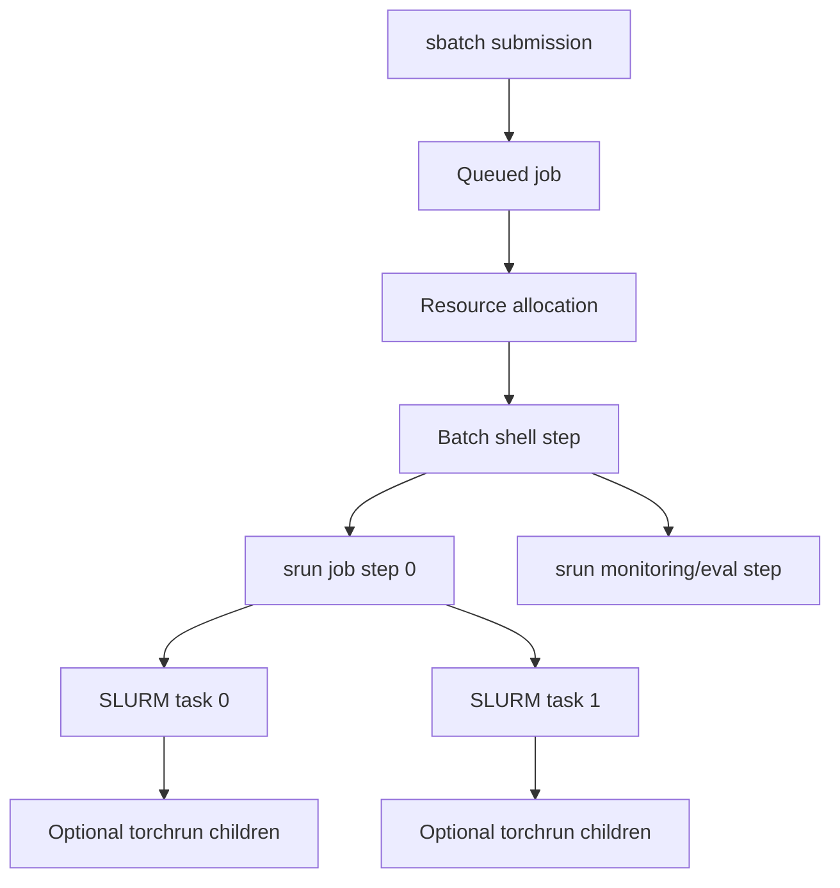
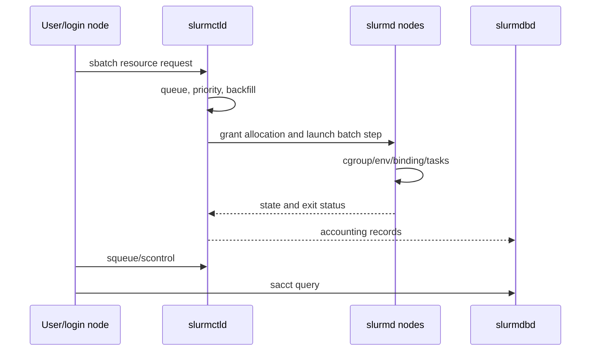
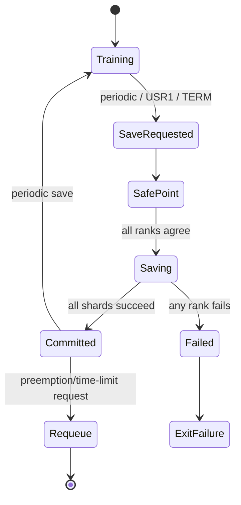

> 对应原书：*Distributed AI Systems*，Chapter 8：*Running Distributed Training with SLURM*
> 本章主题：如何把DDP、FSDP、DeepSpeed和Megatron从单机代码变成资源隔离、进程拓扑正确、可监控、可恢复的多节点训练作业。

---

## 0. 本章要回答的核心问题

1. 为什么分布式算法正确不等于能在共享GPU集群稳定运行？
2. Resource manager、scheduler、launcher和training framework各负责什么？
3. `slurmctld`、`slurmd`、`slurmdbd`怎样协作？
4. Job、allocation、batch step、job step和task分别是什么？
5. `sbatch`、`salloc`、`srun`、`torchrun`的边界如何划分？
6. 节点、task、GPU、CPU、memory之间如何建立可验证的资源账本？
7. `--gres=gpu:4`与`--gpus-per-task=1`、`--gpu-bind`有什么区别？
8. 为什么SLURM task的`CUDA_VISIBLE_DEVICES`可能把物理GPU重新编号？
9. `SLURM_PROCID`、`SLURM_LOCALID`、`SLURM_NODEID`在哪个作用域才可靠？
10. `RANK`、`LOCAL_RANK`、`WORLD_SIZE`、`MASTER_ADDR/PORT`怎样从allocation派生？
11. “每GPU一个SLURM task”和“每节点一个torchrun agent”为什么不能混用？
12. Shell变量在batch shell和`srun` task shell中的展开时机为何会破坏node rank？
13. 如何选择不冲突且所有ranks一致的rendezvous endpoint？
14. DDP/FSDP为何使用相同launcher却有不同memory/collective生命周期？
15. DeepSpeed到底会自动发现哪些环境，哪些仍应显式设置？
16. Megatron的TP×PP×CP×DP怎样与SLURM world size对应？
17. 为什么一个8B checkpoint可能远大于BF16 model weights本身？
18. Job arrays怎样无遗漏地映射笛卡尔超参数网格？
19. `salloc`和`srun`怎样支持不绕过scheduler的交互调试？
20. Job dependencies如何表达预处理、训练、评估和转换DAG？
21. Time-limit/preemption信号怎样安全传播到所有training ranks？
22. 为什么signal handler只能设置flag，而不能直接执行`torch.save`或collective？
23. DDP rank-0 checkpoint与FSDP/ZeRO/Megatron sharded checkpoint有何不同？
24. Atomic publish、commit marker、latest pointer和resume test分别解决什么？
25. `scontrol requeue`为何通常比handler里重新`sbatch`更安全？
26. 如何累计跨restart训练时间、step、RNG和data cursor？
27. NCCL algorithm bandwidth与bus bandwidth怎样正确计算？
28. 为什么Ring和Tree必须用独立process-group runs测试？
29. 如何从job state、pending reason、step exit和accounting定位失败？
30. 如何在不SSH compute node的情况下监控分配内GPU？
31. Rank-0-only profiler为什么可能漏掉straggler和collective故障？
32. Logs怎样避免interleaving和共享文件系统metadata storm？
33. 节点不可用、GPU绑定错误、NCCL错误与hang分别从哪层排查？
34. 如何把一次成功的smoke test逐级扩展为可恢复生产训练？

本章的统一视角是四张账：

```text
Resource ledger: nodes / tasks / GPUs / CPUs / RAM / time
Process graph: allocation -> srun tasks -> optional torchrun children
Rendezvous contract: rank / world / local device / endpoint
Recovery contract: signal -> safe point -> committed checkpoint -> requeue
```

---

## 1. Introduction to clusters for HPC and AI training

### 1.1 为什么需要集群调度器

现代训练集群包含：

- Compute nodes：GPU、CPU、RAM、local storage；
- High-speed fabric：NVLink/NVSwitch、InfiniBand、RoCE或Ethernet；
- Shared/object storage：datasets、checkpoints、logs；
- Login/head nodes：提交、编译、轻量管理，不应跑重训练；
- Controller/accounting services；
- 多users/projects/quotas/QOS。

多个用户若直接SSH节点并启动进程，会产生：

- GPU/CPU/RAM抢占；
- 无法公平排队；
- 无统一time limit和preemption；
- Process残留；
- 无accounting；
- 故障资源仍被调度；
- 拓扑与资源请求不可复现。

SLURM把“我要在哪些机器上启动多少进程”变成声明式resource request，并在allocation边界内执行。

### 1.2 Cluster scheduler不等于distributed launcher

| 层 | 工具 | 职责 |
| --- | --- | --- |
| Resource manager/scheduler | SLURM | 排队、分配nodes/GPUs/CPU/RAM/time、隔离/accounting |
| Job-step launcher | `srun` | 在已分配nodes上创建tasks、注入task env、绑定资源、收集exit |
| Framework launcher | `torchrun`、DeepSpeed launcher等 | 在节点内/节点间派生framework workers、elastic/rendezvous |
| Training runtime | DDP/FSDP/DeepSpeed/Megatron | Process groups、collectives、model/data state |

SLURM不知道你的Transformer layer；DDP也不决定queue priority。边界混乱是大多数启动脚本错误的来源。

### 1.3 Job、allocation、step、task

#### Job

用户提交的resource request及执行生命周期，以job ID标识。

#### Allocation

Scheduler授予job的一组nodes、CPUs、memory、GRES和time window。

#### Batch step

`sbatch`作业中运行batch shell script的特殊step，通常在allocation的第一个node上执行。脚本不是在login node继续运行。

#### Job step

Allocation内一次`srun`启动形成的并行执行单元。一个job可依次/并发创建多个steps。

#### Task

由`srun`启动的一个process/rank。Task不等于GPU，除非你明确请求/绑定一task一GPU。



### 1.4 HPC与HTC

- HPC：少量大、紧耦合并行jobs，依赖低延迟collectives；
- HTC：大量独立jobs，追求长期completed jobs/time；
- AI训练兼有二者：单次大规模训练是HPC，超参sweep/job arrays像HTC。

这解释了SLURM既支持gang allocation与network-aware jobs，也支持arrays/dependencies/accounting。

### 1.5 Scheduler生态

原章提到PBS/OpenPBS、LSF、HTCondor、Kubernetes/Volcano。选择通常由组织基础设施决定；本章方法可迁移：

```text
Request resources explicitly
Map orchestrator process identity to framework ranks
Bind devices deterministically
Checkpoint before revocation
Observe allocation, process, communication and application layers
```

---

## 2. Why SLURM for AI training

### 2.1 GPU GRES与隔离

SLURM通过GRES（Generic RESources）描述GPU等非CPU资源：

```shell
# Generic GPUs
#SBATCH --gres=gpu:4

# Specific type, if configured by the site
#SBATCH --gres=gpu:a100:4
```

Controller知道节点有多少/何种GPU，cgroup/GRES plugins负责分配与device visibility。是否支持GPU type、MIG、binding和accounting由管理员配置决定。

“Exclusive GPU”不等于exclusive node。若只请求4/8 GPUs，其他job可能使用同node剩余GPU、CPU、RAM或NIC。需要整节点隔离时才考虑：

```shell
#SBATCH --exclusive
```

代价是占用/计费整节点，并不自动提升性能。

### 2.2 资源声明与调度

Scheduler根据：

- Requested resources；
- Partition/QOS；
- Priority/fair-share；
- Reservations；
- Dependencies；
- Backfill opportunities；
- Node features/topology；

决定何时/何地运行。Pending不等于失败；`Reason`可能是Resources、Priority、Dependency、QOS、Reservation或invalid request。

### 2.3 AI训练所需高级能力

- Gang allocation：所有required ranks一起启动；
- Job arrays：独立experiments；
- Dependencies：pipeline DAG；
- Signals/time limits/requeue；
- Accounting/fair share；
- GPU/CPU/memory binding；
- Heterogeneous jobs（高级）；
- cgroup cleanup；
- Prolog/epilog与site policy。

### 2.4 “与PyTorch无缝集成”的准确含义

SLURM提供：

```text
SLURM_PROCID / LOCALID / NODEID / NTASKS / NODELIST
```

PyTorch标准env需要：

```text
RANK / LOCAL_RANK / WORLD_SIZE / MASTER_ADDR / MASTER_PORT
```

二者概念对应，但**torchrun不会在所有版本/模式中自动把任意SLURM变量翻译好**。可靠做法是：

- `srun python`：在task shell/Python中显式翻译；或
- `srun`每节点启动一个`torchrun` agent，显式传`nnodes/node_rank/endpoint`。

不要把“可映射”误写成“无需配置自动读取”。

### 2.5 可扩展性与可移植性边界

相同SLURM语法能覆盖实验室到supercomputer，但site差异包括：

- Partition/QOS/account；
- GPU request flags；
- Modules/containers；
- Internet和shared storage；
- GRES/cgroup版本；
- MPI/PMI plugins；
- Network interfaces；
- Requeue/preemption policy；
- Accounting availability。

可移植脚本应把site-specific内容集中成参数/模块，而不是假定所有集群存在`eth0`、`ib0`、某conda路径。

---

## 3. SLURM architecture

### 3.1 `slurmctld`

Controller负责：

- 接收job requests；
- 维护queue和node/resource state；
- Scheduling/backfill；
- 分配allocation；
- 处理state transitions；
- 协调slurmd；
- HA controller failover（生产常见）。

它不直接执行每个training rank的model code。

### 3.2 `slurmd`

每个compute node上的daemon：

- 接收launch request；
- 创建tasks/job steps；
- 设置env、CPU/GPU binding；
- 借助cgroups限制/清理资源；
- 监控process并回报；
- 执行prolog/epilog（按site配置）。

### 3.3 `slurmdbd`

可选accounting daemon，将jobs、associations、usage、QOS/fair-share数据持久化到database。没有配置slurmdbd时，`sacct`字段/历史可能有限或不可用。

### 3.4 命令路径




### 3.5 Scheduling policy为何影响AI jobs

大job需要同时空出很多nodes，可能等待更久；backfill允许短job利用不延误已承诺大job启动的空档。夸大time/memory/node request会降低backfill机会，缩小请求又会TIMEOUT/OOM。

因此准确resource estimate既是效率问题，也是queue latency优化。

### 3.6 Job state lifecycle

常见：

```text
PENDING -> RUNNING -> COMPLETING -> COMPLETED
                    \-> FAILED / TIMEOUT / CANCELLED / NODE_FAIL / PREEMPTED
```

State和Reason分开：`PD`需看pending reason；`FAILED`需看step exit、signal和logs；`OUT_OF_MEMORY`可能来自cgroup CPU RAM而非GPU OOM。

---

## 4. Setting up SLURM for multi-GPU training

### 4.1 大多数用户不应自行安装生产SLURM

Controller、munge authentication、cgroups、GRES、database和HA是管理员职责。用户需要理解配置以诊断，而不是在共享cluster上自行启动daemon。

Local virtual setup适合：

- 验证SBATCH/srun语法；
- 环境变量映射；
- Job/step lifecycle；
- 基础multi-process code。

它不能验证：

- 真实跨node fabric/NCCL；
- DNS/firewall；
- Shared filesystem一致性；
- Node failure；
- Multi-host clocks；
- IB/RoCE/GPU-NIC topology。

### 4.2 一台物理机模拟多个SLURM nodes

原章为两个`slurmd`配置不同NodeName/ports，同一`NodeHostname`：

```text
NodeName=node6 NodeHostname=<actual-hostname> Port=17016 \
    CPUs=112 RealMemory=240000 Gres=gpu:1 State=UNKNOWN
NodeName=node7 NodeHostname=<actual-hostname> Port=17017 \
    CPUs=112 RealMemory=240000 Gres=gpu:1 State=UNKNOWN
```

GRES映射：

```text
NodeName=node6 Name=gpu File=/dev/nvidia6
NodeName=node7 Name=gpu File=/dev/nvidia7
```

需要管理员级配置，包括multi-slurmd支持、不同pid/spool/log/port、munge和cgroup兼容。`$HOSTNAME`不会在`slurm.conf`中自动像shell一样可靠展开；生成配置文件时应先替换为实际hostname。

### 4.3 Virtual node资源不能重复计算

若两个virtual nodes都声明 `CPUs=112 RealMemory=240000`，它们实际共享同一物理CPU/RAM。Controller会误以为总共有224 CPUs/480 GB，可能oversubscribe。

更安全的测试配置应把物理resources静态切分：

```text
Virtual node6 -> CPU set A, RAM budget A, GPU 6
Virtual node7 -> CPU set B, RAM budget B, GPU 7
```

若无法真正cgroup隔离，就明确它只是functional simulation，不做性能/容量结论。

### 4.4 GPU device mapping

`gres.conf`把logical GRES映射到device files。作业看到的`CUDA_VISIBLE_DEVICES`可能是physical ID列表，但CUDA进程内部通常按可见列表重新编号：

```text
Physical GPU 6 only visible
CUDA_VISIBLE_DEVICES=6
Inside process: torch.cuda.device_count() == 1, usable device is cuda:0
```

所以不能看到physical 6就调用`cuda:6`。训练程序使用**process-visible local device index**。

### 4.5 Figure 8.2的正确用途


它验证SLURM控制/launch语义，不验证inter-node network。尤其`MASTER_ADDR=127.0.0.1`在virtual nodes可能“成功”，到了真实cluster会让每node各连自己而失败；测试仍应使用第一node的可解析hostname。

---

## 5. Quick setup and verification

### 5.1 分层验收

#### Daemon/control plane

```shell
sinfo
scontrol show partition
scontrol show nodes
```

#### 单node task launch

```shell
srun --nodes=1 --ntasks=1 hostname
```

#### Multi-node task launch

```shell
srun --nodes=2 --ntasks=2 --ntasks-per-node=1 \
  bash -c 'echo "rank=$SLURM_PROCID node=$SLURMD_NODENAME host=$(hostname)"'
```

显式写`--ntasks`，不要依赖`srun -N 2`的site/default task count。

#### GPU allocation/visibility

```shell
srun --nodes=1 --ntasks=1 --gres=gpu:1 \
  bash -c 'echo "$CUDA_VISIBLE_DEVICES"; nvidia-smi -L'
```

#### 一task一GPU binding

```shell
srun --nodes=1 --ntasks=2 --gres=gpu:2 \
  --gpus-per-task=1 --gpu-bind=single:1 \
  bash -c 'echo "task=$SLURM_PROCID local=$SLURM_LOCALID visible=$CUDA_VISIBLE_DEVICES"'
```

GPU flags和binding支持依SLURM/site版本；若管理员规定不同语法，以site文档为准。

### 5.2 `sinfo`状态

```text
PARTITION AVAIL TIMELIMIT NODES STATE NODELIST
gpu*      up    infinite  2     idle  node[6-7]
```

- `*`：默认partition；
- `idle`：可分配；
- `mix`：部分资源使用；
- `alloc`：已分配；
- `drain/drng`：不接新job/正在排空；
- `down`：不可用。

### 5.3 Smoke test不等于training ready

`hostname`成功只证明task launch。完整递进：

```text
hostname
-> GPU visibility/binding
-> Python/torch import
-> one-rank CUDA tensor
-> two-rank Gloo/NCCL init
-> small AllReduce known answer
-> one training step
-> checkpoint save/load
-> target framework/model
```

### 5.4 Resource-count计算器

```python
from dataclasses import dataclass


@dataclass(frozen=True)
class SlurmResources:
    nodes: int
    tasks_per_node: int
    gpus_per_node: int
    cpus_per_task: int
    memory_gib_per_node: int

    def validate_one_task_per_gpu(self) -> None:
        if self.tasks_per_node != self.gpus_per_node:
            raise ValueError("One-task-per-GPU mode requires equal tasks and GPUs per node")

    @property
    def world_size(self) -> int:
        return self.nodes * self.tasks_per_node

    @property
    def total_gpus(self) -> int:
        return self.nodes * self.gpus_per_node

    @property
    def total_cpus(self) -> int:
        return self.world_size * self.cpus_per_task

    @property
    def total_memory_gib(self) -> int:
        return self.nodes * self.memory_gib_per_node


resources = SlurmResources(2, 4, 4, 8, 128)
resources.validate_one_task_per_gpu()
print(f"World size: {resources.world_size}")
print(f"GPUs: {resources.total_gpus}")
print(f"CPUs: {resources.total_cpus}")
print(f"RAM: {resources.total_memory_gib} GiB")
```

预期输出：

```text
World size: 8
GPUs: 8
CPUs: 64
RAM: 256 GiB
```

这里`--mem=128G`按node计；`--cpus-per-task=8`乘tasks。若改为one-agent-per-node，SLURM tasks只有2，PyTorch children/world仍是8，必须分别记账。

---

## 6. Submitting distributed training jobs

### 6.1 `srun`有两种常见上下文

#### 直接请求并运行

在没有allocation时：

```shell
srun --nodes=2 --ntasks=2 --ntasks-per-node=1 \
    --gres=gpu:1 --cpus-per-task=4 \
    python code/train.py
```

`srun`向controller申请资源，等待后创建job/step并运行。终端断开行为依配置，适合短调试。

#### 已有allocation内创建step

在`sbatch`脚本或`salloc` shell中：

```shell
srun --ntasks=2 hostname
```

复用当前allocation，不重新排一个独立job。可以创建训练step、监控step或诊断step，但资源不能超出allocation。

### 6.2 `srun -N 2`为何不够明确

`--nodes=2`只约束nodes，不总能唯一决定tasks数。原章写：

```shell
srun -N 2 --gres=gpu:1 --cpus-per-task=4 python code/train.py
```

在某些defaults下可能每node一task，也可能行为由配置决定。Distributed world必须显式：

```shell
srun --nodes=2 --ntasks=2 --ntasks-per-node=1 ...
```

若每node4 GPUs且一task一GPU，则：

```shell
srun --nodes=2 --ntasks=8 --ntasks-per-node=4 \
    --gres=gpu:4 --gpus-per-task=1 ...
```

### 6.3 `sbatch`脚本语义

```shell
#!/usr/bin/env bash
#SBATCH --job-name=distributed-training
#SBATCH --nodes=2
#SBATCH --ntasks-per-node=4
#SBATCH --gres=gpu:4
#SBATCH --gpus-per-task=1
#SBATCH --cpus-per-task=8
#SBATCH --mem=128G
#SBATCH --time=04:00:00
#SBATCH --output=logs/%x_%j.out
#SBATCH --error=logs/%x_%j.err
```

Directives由`sbatch`读取；shell运行时把它们当comments。重要限制：directive中的shell变量通常不会按你预期展开；使用SLURM filename substitutions如 `%j/%x/%N/%A/%a`。

### 6.4 Log directory何时创建

SLURM在batch script执行前就要打开`--output/--error`文件，因此脚本中的：

```shell
mkdir -p logs
```

可能太晚。提交前创建目录：

```shell
mkdir -p logs
sbatch train.slurm
```

或者输出到已存在路径。这个细节是“作业根本没启动/日志丢失”的常见原因。

### 6.5 Resource envelope

`#SBATCH`定义allocation上限，不自动定义训练process topology。例如：

```text
nodes=2
gres gpu:4 per node
ntasks-per-node=1
```

表示SLURM只创建每node一个task；该task可用4 GPUs。若它直接运行Python且不派生children，world只有2，6张GPU闲置。要么改为4 tasks/node，要么让每node agent通过torchrun派生4 workers。

### 6.6 Job submission与监控

```shell
job_id=$(sbatch --parsable train.slurm)
echo "$job_id"
squeue --jobs="$job_id" -o '%.18i %.9P %.16j %.2t %.10M %.6D %R'
scontrol show job "$job_id"
```

`--parsable`比解析“Submitted batch job ...”字符串稳健；在federation/cluster配置下可能返回额外cluster suffix，脚本需按site格式处理。

### 6.7 Job states与exit


作业完成后：

```shell
sacct -j "$job_id" \
    --format=JobID,JobName%24,State,ExitCode,Elapsed,AllocTRES,MaxRSS
```

Job、batch step、extern step和`srun` steps会分别出现。顶层`COMPLETED`需要batch script最后exit 0；pipeline中未检查失败的命令可能导致假成功。

### 6.8 Shell严格模式

```shell
set -euo pipefail
```

- `-e`：未处理command failure终止；
- `-u`：未定义变量报错；
- `pipefail`：pipeline中任一command失败传播。

仍需了解`if`、subshell、trap等语义；严格模式不是完整错误处理。训练step后保存exit status并cleanup：

```shell
set +e
srun ...
status=$?
set -e
echo "training exit=$status"
exit "$status"
```

---

## 7. Interactive execution with `srun` 与 `salloc`

### 7.1 Quick smoke test

```shell
srun --nodes=2 --ntasks=2 --ntasks-per-node=1 \
    --gres=gpu:1 --cpus-per-task=4 --time=00:10:00 \
    bash -lc '
        echo "rank=$SLURM_PROCID local=$SLURM_LOCALID node=$SLURM_NODEID"
        python -c "import torch; print(torch.cuda.device_count())"
    '
```

使用single quotes让`$SLURM_*`在remote task shell展开，而不是在提交端提前展开。

### 7.2 `salloc`工作流

```shell
salloc --nodes=2 --ntasks-per-node=1 --gres=gpu:1 \
    --cpus-per-task=8 --mem=64G --time=01:00:00

# Allocation granted:
srun hostname
srun nvidia-smi -L
srun python code/train_smoke.py

exit
```

`salloc`持有allocation；单独shell通常仍在login node，真正跨compute nodes运行要用`srun`。不要误以为`salloc`后当前shell自动位于每个compute node。

### 7.3 交互调试边界

- Idle时间也计费/占quota；
- 不在compute node直接启动allocation外process；
- 避免长时间占用scarce GPUs；
- 记录成功commands回写batch script；
- 调试多rank时仍使用相同binding/rendezvous；
- 退出前确认steps停止。

### 7.4 Attach到running allocation

有权限/site支持时：

```shell
srun --jobid="$JOB_ID" --overlap --nodes=1 --ntasks=1 \
    nvidia-smi
```

若不加`--overlap`，已有training step占满CPUs/GPUs时monitor step可能等待。具体overlap/exclusive行为和accounting由SLURM版本/site设置决定。

---

## 8. Batch submission with `sbatch`

### 8.1 Batch shell只运行一份

`sbatch train.slurm`不会让整个shell script在所有nodes各跑一遍。通常batch shell在一个node执行，然后用`srun`跨allocation启动tasks。只有`srun`内的command会按task数复制。

所以在batch shell中：

```shell
export RANK=$SLURM_PROCID
```

往往错误：batch step未必定义该task rank，且即使定义也只有一个值，随后所有tasks继承相同RANK。Per-task变量应在`srun` task环境里读取。

### 8.2 Master address

```shell
MASTER_ADDR=$(scontrol show hostnames "$SLURM_JOB_NODELIST" | head -n 1)
export MASTER_ADDR
```

要求：

- 所有nodes可解析/访问；
- 对应rank0 agent/task实际在该node；
- 使用可通信interface；
- 不用真实multi-node的`127.0.0.1`；
- 若node list排序与node ranks不一致，显式确保rank0 placement。

### 8.3 Master port

原章使用每次shell的 `$RANDOM`：

```shell
MASTER_PORT=$((29500 + RANDOM % 1000))
```

若在batch shell算一次并export，所有tasks一致，通常可用；但“随机”不保证不冲突，也可能落入site限制。更可复现做法从job ID派生并落入管理员允许区间：

```shell
port_base=20000
port_span=20000
export MASTER_PORT=$((port_base + SLURM_JOB_ID % port_span))
```

Job IDs不同通常降低同node冲突，但仍不是数学唯一（modulo）。最稳健方案是site-provided rendezvous/动态free port协调；不能让每rank独立选随机port。

### 8.4 Rendezvous contract

所有framework ranks必须一致：

```text
MASTER_ADDR
MASTER_PORT
WORLD_SIZE
Job/run identity
```

并各自唯一：

```text
RANK in [0, WORLD_SIZE)
LOCAL_RANK within visible devices/node
```

建议启动时每rank打印：hostname、pid、SLURM IDs、PyTorch IDs、`CUDA_VISIBLE_DEVICES`、selected device和master endpoint，再做known-answer AllReduce。

### 8.5 网络interface不能硬编码

```shell
export NCCL_SOCKET_IFNAME=^docker,lo
export GLOO_SOCKET_IFNAME=eth0
```

原章示例在某环境有效，但许多HPC nodes没有`eth0`，可能是`eno1`、`bond0`、`ib0`等。空泛排除docker/lo也可能让NCCL选management Ethernet而非IB/RoCE。

先检查：

```shell
srun --ntasks-per-node=1 ip -brief address
srun --ntasks-per-node=1 ibv_devinfo
```

再按site文档配置。GLOO control和NCCL data可以使用不同interfaces。

---

## 9. SLURM environment variables

### 9.1 Job/allocation级变量

| 变量 | 含义 | 注意 |
| --- | --- | --- |
| `SLURM_JOB_ID` | Job identifier | Requeue后是否保持/衍生行为按policy |
| `SLURM_JOB_NAME` | Job name | 不唯一 |
| `SLURM_JOB_NODELIST` | Compressed allocated nodes | 用`scontrol show hostnames`展开 |
| `SLURM_JOB_NUM_NODES` | Allocated node count | 不等于world size |
| `SLURM_SUBMIT_DIR` | Submit working directory | 代码可能被提交后修改 |
| `SLURM_CPUS_PER_TASK` | Requested CPUs/task | 只在请求/配置后可靠 |

### 9.2 Task/step级变量

| 变量 | 含义 | 映射 |
| --- | --- | --- |
| `SLURM_PROCID` | 当前step global task ID | Direct-srun模式的RANK |
| `SLURM_LOCALID` | 当前node内task ID | Direct-srun模式的LOCAL_RANK候选 |
| `SLURM_NODEID` | 当前step node index | One-agent模式的node rank候选 |
| `SLURM_NTASKS` | 当前step task count | Direct-srun模式WORLD_SIZE |
| `SLURM_STEP_NODELIST` | 当前step nodes | 可能是allocation子集 |
| `SLURMD_NODENAME` | 当前compute node名 | Diagnostics |

这些值由**当前job step**定义。Batch shell提前读取与`srun` tasks内读取不等价。

### 9.3 GPU相关变量

- `CUDA_VISIBLE_DEVICES`：由GRES/cgroup/task binding设置，最应信任；
- `SLURM_GPUS_ON_NODE`：格式/可用性随版本和request；
- `SLURM_JOB_GPUS`/`SLURM_STEP_GPUS`：可能是IDs/ranges，语义需查site；
- `LOCAL_RANK`：不是SLURM原生标准变量，需launcher/export。

不要仅以`SLURM_LOCALID`覆盖`CUDA_VISIBLE_DEVICES`。若每task只可见一个GPU，正确PyTorch device通常是`cuda:0`，而不是物理/SLURM local ID。

### 9.4 CPU与DataLoader

一task分配 $C$ CPUs。Python进程本身、OpenMP/MKL线程和DataLoader workers共享：

$$
1+N_{loader}+N_{aux}\lesssim C
$$

不是硬公式，但可避免严重oversubscription。常设置：

```shell
export OMP_NUM_THREADS=1
export MKL_NUM_THREADS=1
```

再让DataLoader workers接近 `CPUS_PER_TASK - reserve`，根据preprocessing和I/O实测。Megatron某些CPU算子可能需要更多OpenMP threads，不能一概为1。

### 9.5 Memory变量与单位

- `--mem=128G`通常per node；
- `--mem-per-cpu`按allocated CPU相乘；
- 二者一般互斥；
- `SLURM_MEM_PER_NODE/CPU`常以MB表示；
- cgroup OOM会kill process，日志未必显示Python MemoryError。

Pinned memory、datasets cache、CPU offload和checkpoint gathering都可能让host RAM成为瓶颈。

### 9.6 映射函数

```python
from dataclasses import dataclass


@dataclass(frozen=True)
class DistributedIdentity:
        rank: int
        local_rank: int
        world_size: int
        node_rank: int


def identity_from_slurm(env: dict[str, str]) -> DistributedIdentity:
        required = ("SLURM_PROCID", "SLURM_LOCALID", "SLURM_NTASKS", "SLURM_NODEID")
        missing = [name for name in required if name not in env]
        if missing:
                raise KeyError(f"Missing SLURM variables: {missing}")
        identity = DistributedIdentity(
                rank=int(env["SLURM_PROCID"]),
                local_rank=int(env["SLURM_LOCALID"]),
                world_size=int(env["SLURM_NTASKS"]),
                node_rank=int(env["SLURM_NODEID"]),
        )
        if not 0 <= identity.rank < identity.world_size:
                raise ValueError("Invalid global rank")
        if identity.local_rank < 0 or identity.node_rank < 0:
                raise ValueError("Ranks must be non-negative")
        return identity


sample = identity_from_slurm(
        {
                "SLURM_PROCID": "6",
                "SLURM_LOCALID": "2",
                "SLURM_NTASKS": "8",
                "SLURM_NODEID": "1",
        }
)
print(sample)
```

预期输出：

```text
DistributedIdentity(rank=6, local_rank=2, world_size=8, node_rank=1)
```

### 9.7 Figure 8.4的边界


图展示概念映射，不表示torchrun总会自动读取`SLURM_PROCID`。Direct `srun python`由应用/entrypoint翻译；torchrun模式则由agent根据`node_rank`为children生成`RANK/LOCAL_RANK/WORLD_SIZE`。

---

## 10. 两种正确的进程派生模式

### 10.1 模式A：每GPU一个SLURM task，直接运行Python

资源：

```shell
#SBATCH --nodes=2
#SBATCH --ntasks-per-node=4
#SBATCH --gres=gpu:4
#SBATCH --gpus-per-task=1
#SBATCH --cpus-per-task=8
```

启动：

```shell
srun --label --gpu-bind=single:1 \
    bash -lc '
        export RANK=$SLURM_PROCID
        export LOCAL_RANK=$SLURM_LOCALID
        export WORLD_SIZE=$SLURM_NTASKS
        exec python -u train.py
    '
```

若每task只可见一个GPU，Python应优先选`cuda:0`；若每task看见node全部GPU，则用LOCAL_RANK。代码可检测visible count：

```python
def select_cuda_device(local_rank: int) -> int:
        import torch

        visible = torch.cuda.device_count()
        if visible == 1:
                return 0
        if not 0 <= local_rank < visible:
                raise RuntimeError(f"LOCAL_RANK {local_rank} outside {visible} visible GPUs")
        return local_rank
```

优点：SLURM直接知道/监控每training rank；没有第二层process manager。缺点：torchrun elastic features不参与，应用负责SLURM env翻译。

### 10.2 模式B：每节点一个SLURM task，torchrun派生本地workers

资源：

```shell
#SBATCH --nodes=2
#SBATCH --ntasks-per-node=1
#SBATCH --gres=gpu:4
#SBATCH --cpus-per-task=32
```

启动：

```shell
srun --label --ntasks="$SLURM_JOB_NUM_NODES" --ntasks-per-node=1 \
    bash -lc '
        exec torchrun \
            --nnodes="$SLURM_JOB_NUM_NODES" \
            --nproc-per-node=4 \
            --node-rank="$SLURM_NODEID" \
            --master-addr="$MASTER_ADDR" \
            --master-port="$MASTER_PORT" \
            train.py
    '
```

**Single quotes关键**：`$SLURM_NODEID`在每个task shell展开。若外层batch shell用double quotes构造整个命令，它可能提前展开成同一个值，两个agents都认为自己node rank相同。

Torchrun为每个child设置：

```text
LOCAL_RANK=0..3
RANK=node_rank*4+local_rank
WORLD_SIZE=8
```

### 10.3 不要混成“每GPU task再各派生多GPU workers”

错误：

```text
SLURM tasks/node = 4
torchrun nproc-per-node = 4 in every task
=> 16 children/node competing for 4 GPUs
```

或SLURM tasks/node=4，每个task运行torchrun nproc=1但都使用同一`node_rank=SLURM_NODEID`，会产生重复global ranks。

### 10.4 原章DDP/FSDP示例为何恰好可行

原章设置`ntasks-per-node=1`、`nproc_per_node=1`：每node一个agent、一个child，所以没有overspawn。扩展到4 GPUs/node时不能只把两处都改成4；应选择：

- A：tasks-per-node=4，直接Python；或
- B：tasks-per-node=1，torchrun nproc=4。

### 10.5 Process count公式

模式A：

$$
W=N\cdot S
$$

$S$为SLURM tasks/node。

模式B：

$$
Agents=N,
\qquad
W=N\cdot P
$$

$P$为torchrun children/node。

一般嵌套launcher：

$$
Processes=N\cdot S\cdot P
$$

若 $S>1,P>1$，必须明确这是有意布局，否则大概率overspawn。

### 10.6 模式选择

| 需求 | 推荐起点 |
| --- | --- |
| 简单SLURM-native ranks | A：direct srun |
| 需要torchrun agent/elastic integration | B：one agent/node |
| DeepSpeed读取SLURM task env | A常更自然 |
| Site推荐Pyxis/PMI特定模式 | 遵循site模板 |
| Debug每rank exit/accounting | A |
| Local process supervision由torchrun管理 | B |

无论选择哪种，都先打印完整process graph并验证world/ranks唯一。

---

## 11. Launching distributed training frameworks with SLURM

### 11.1 框架无关的初始化契约

```python
import os
from datetime import timedelta

import torch
import torch.distributed as dist


def initialize_distributed() -> tuple[int, int, int, torch.device]:
        rank = int(os.environ["RANK"])
        world_size = int(os.environ["WORLD_SIZE"])
        local_rank = int(os.environ["LOCAL_RANK"])
        if not 0 <= rank < world_size:
                raise ValueError("RANK must be in [0, WORLD_SIZE)")

        visible = torch.cuda.device_count()
        if visible <= 0:
                raise RuntimeError("No CUDA devices are visible")
        device_index = 0 if visible == 1 else local_rank
        if not 0 <= device_index < visible:
                raise RuntimeError(
                        f"device index {device_index} invalid for {visible} visible GPUs"
                )
        torch.cuda.set_device(device_index)
        dist.init_process_group(
                backend="nccl",
                init_method="env://",
                timeout=timedelta(minutes=30),
        )
        if dist.get_rank() != rank or dist.get_world_size() != world_size:
                raise RuntimeError("Environment and process-group identity disagree")
        return rank, local_rank, world_size, torch.device("cuda", device_index)
```

Timeout不是性能调参，而是避免某rank失败后其余无限等待。30分钟只是长初始化/大checkpoint环境的保守例子，smoke test可更短。

### 11.2 Known-answer collective

```python
def verify_all_reduce(rank: int, world_size: int, device: torch.device) -> None:
        value = torch.tensor(float(rank), device=device)
        dist.all_reduce(value, op=dist.ReduceOp.SUM)
        expected = world_size * (world_size - 1) / 2
        if value.item() != expected:
                raise RuntimeError(f"AllReduce returned {value.item()}, expected {expected}")
```

它验证所有ranks加入同一group且collective能完成；不验证高性能、GPU binding唯一或复杂model correctness。另收集hostname/device UUID以检测重复GPU。

### 11.3 Figure 8.5的统一模型


```text
SLURM allocation
    -> tasks/agents on each node
    -> framework ranks
    -> process groups
    -> model/data/checkpoint ownership
```

SLURM只保证资源和process placement；framework负责collective order/state sharding。

---

## 12. DDP with SLURM

### 12.1 DDP前提

每rank完整model/buffers，处理不同data shard，backward对gradients同步。每rank通常对应一GPU。

$$
W=N\cdot G
$$

Global batch：

$$
B_{global}=B_{micro}\cdot W\cdot A
$$

$A$为gradient accumulation steps。扩world时若保持micro/accum不变，global batch变大，训练语义改变。

### 12.2 Training skeleton

```python
import torch.nn as nn
from torch.nn.parallel import DistributedDataParallel as DDP


def build_ddp_model(device: torch.device, device_index: int) -> DDP:
        model = nn.Linear(10, 1).to(device)
        return DDP(model, device_ids=[device_index], output_device=device_index)
```

真实训练还需：

- `DistributedSampler`或等价sharding；
- 每epoch `sampler.set_epoch(epoch)`；
- Loss/metrics按正确分母跨rank聚合；
- Rank-consistent control flow；
- Cleanup在`finally`执行；
- Seed区分model init与data/dropout streams。

### 12.3 推荐模式A脚本

```shell
#!/usr/bin/env bash
#SBATCH --job-name=ddp
#SBATCH --nodes=2
#SBATCH --ntasks-per-node=4
#SBATCH --gres=gpu:4
#SBATCH --gpus-per-task=1
#SBATCH --cpus-per-task=8
#SBATCH --mem=128G
#SBATCH --time=04:00:00
#SBATCH --output=logs/%x_%j.out
#SBATCH --error=logs/%x_%j.err

set -euo pipefail
cd "$SLURM_SUBMIT_DIR"

export MASTER_ADDR
MASTER_ADDR=$(scontrol show hostnames "$SLURM_JOB_NODELIST" | head -n 1)
export MASTER_PORT=$((20000 + SLURM_JOB_ID % 20000))
export NCCL_ASYNC_ERROR_HANDLING=1
export OMP_NUM_THREADS=1

srun --label --gpu-bind=single:1 \
    bash -lc '
        export RANK=$SLURM_PROCID
        export LOCAL_RANK=$SLURM_LOCALID
        export WORLD_SIZE=$SLURM_NTASKS
        exec python -u train_ddp.py
    '
```

`logs/`必须在`sbatch`前创建。`NCCL_ASYNC_ERROR_HANDLING`具体支持/推荐名称会随PyTorch/NCCL版本变化，按当前docs验证。

### 12.4 模式B脚本

```shell
#SBATCH --nodes=2
#SBATCH --ntasks-per-node=1
#SBATCH --gres=gpu:4
#SBATCH --cpus-per-task=32

srun --label --ntasks="$SLURM_JOB_NUM_NODES" --ntasks-per-node=1 \
    bash -lc '
        exec torchrun \
            --nnodes="$SLURM_JOB_NUM_NODES" \
            --nproc-per-node=4 \
            --node-rank="$SLURM_NODEID" \
            --master-addr="$MASTER_ADDR" \
            --master-port="$MASTER_PORT" \
            train_ddp.py
    '
```

Python只读torchrun生成的standard env，不再从SLURM_PROCID覆盖RANK。

### 12.5 数据与sampler

如果每rank读取相同完整dataset且不使用DistributedSampler，collective仍可正确，但数据重复，effective global batch错误。Resume还要恢复：

- Epoch；
- Sampler seed/epoch；
- Within-epoch data cursor（严格恢复时）；
- Gradient accumulation partial state；
- RNG。

### 12.6 DDP正确性检查

1. Ranks/GPUs唯一；
2. One-step output/loss对照single process同global batch；
3. Gradient/update一致；
4. Sampler samples无非预期重复/遗漏；
5. Metrics正确weighted reduce；
6. Rank0 checkpoint可由所有ranks恢复；
7. Kill rank后job有界失败。

---

## 13. FSDP with SLURM

### 13.1 Launcher为何与DDP相同

FSDP改变model state ownership和collectives，不改变“每GPU一framework rank”的基本要求。因此可复用模式A或B。

DDP：每rank完整weights/gradients/optimizer。FSDP：persistent state分片，forward/backward按unit AllGather/ReduceScatter。

### 13.2 FSDP1示意

```python
from functools import partial

from torch.distributed.fsdp import CPUOffload
from torch.distributed.fsdp import FullyShardedDataParallel as FSDP
from torch.distributed.fsdp.wrap import size_based_auto_wrap_policy


def wrap_fsdp1(model, device: torch.device) -> FSDP:
        policy = partial(size_based_auto_wrap_policy, min_num_params=1_000_000)
        return FSDP(
                model,
                auto_wrap_policy=policy,
                cpu_offload=CPUOffload(offload_params=False),
                device_id=device,
        )
```

原章直接把`size_based_auto_wrap_policy`函数传入可能缺少required threshold，取决于PyTorch签名；用`partial`明确参数。Transformer优先按block class wrap，而非纯size threshold。

### 13.3 FSDP2

PyTorch 2.4+可使用`fully_shard()`/DTensor路径。SLURM脚本不变，但：

- Bottom-up wrapping；
- DeviceMesh；
- Mixed precision policy；
- CPU offload policy；
- Checkpoint APIs；

均按目标PyTorch版本。不能把FSDP1 `CPUOffload`直接当FSDP2 API。

### 13.4 CPU offload影响SLURM resource request

Offload降低HBM，增加：

- Host RAM；
- Pinned memory；
- CPU memory bandwidth；
- PCIe/C2C；
- NUMA sensitivity；
- Checkpoint host pressure。

因此需提高`--mem`/CPU并绑定GPU-NIC-CPU locality。不要在示例中默认开启offload后仍沿用普通DDP的host request。

### 13.5 FSDP checkpoint

大模型优先`torch.distributed.checkpoint`/sharded state：所有ranks参与写local shards，避免rank0聚合full state OOM。Rank0-only Python `torch.save(model.state_dict())`不一定正确或可扩展。

恢复模板依current mesh/layout，world-size变更是否支持由checkpoint API与state类型决定。Scheduler/RNG/data cursor仍需单独保存。

### 13.6 FSDP smoke path

```text
world=1 FSDP correctness
-> 2 GPUs one node
-> 2 nodes one GPU
-> full node
-> target wrap/checkpoint/offload
```

先验证launcher/NCCL，再增加state complexity。

---

## 14. DeepSpeed with SLURM

### 14.1 “自动初始化”的边界

`deepspeed.init_distributed()`封装process-group初始化，但仍需要一致的rank/world/master/local-rank环境。它可能识别SLURM/MPI环境，具体auto-discovery随版本；生产脚本显式导出standard env更清晰。

### 14.2 模式A自然映射

```shell
#SBATCH --ntasks-per-node=4
#SBATCH --gres=gpu:4
#SBATCH --gpus-per-task=1

srun --label --gpu-bind=single:1 \
    bash -lc '
        export RANK=$SLURM_PROCID
        export LOCAL_RANK=$SLURM_LOCALID
        export WORLD_SIZE=$SLURM_NTASKS
        exec python -u train_deepspeed.py \
            --deepspeed_config ds_zero3_offload.json
    '
```

不要设置：

```shell
export CUDA_VISIBLE_DEVICES=$SLURM_LOCALID
```

这会覆盖SLURM已设置的visibility；例如task local 3本来只看到physical GPU 7并映射为`cuda:0`，覆盖为3可能暴露错误/不可见device。让GRES/binding控制visibility。

### 14.3 Python skeleton

```python
import deepspeed
from transformers import AutoModelForCausalLM


def build_deepspeed_engine(config_path: str):
        deepspeed.init_distributed(dist_backend="nccl")
        model = AutoModelForCausalLM.from_pretrained("gpt2")
        engine, optimizer, _, scheduler = deepspeed.initialize(
                model=model,
                model_parameters=model.parameters(),
                config=config_path,
        )
        return engine, optimizer, scheduler
```

训练用`engine.backward(loss)`、`engine.step()`；Gradient accumulation boundary与DeepSpeed config一致。

### 14.4 Batch equation

$$
B_{train}=B_{micro}\cdot A\cdot D
$$

若`train_batch_size=2`、micro=1、accum=1，但world/data-parallel size为8，配置不一致，DeepSpeed可能报错或推导行为依版本。原章JSON只适合2 ranks。扩到2×4 GPUs应设global 8，或让一项由`auto`/framework推导并验证logs。

### 14.5 ZeRO stage递进

```text
Stage 1/2 without offload: validate launch and optimizer
-> Stage 3: parameter materialization
-> CPU optimizer offload
-> Parameter offload
-> NVMe if truly required
```

每步记录persistent/peak GPU、host peak、PCIe、NCCL和step time。不要第一次multi-node smoke就叠ZeRO-3+双offload，把故障面全部混合。

### 14.6 Config语法

```json
{
    "train_batch_size": 8,
    "gradient_accumulation_steps": 1,
    "train_micro_batch_size_per_gpu": 1,
    "bf16": {"enabled": true},
    "zero_optimization": {
        "stage": 3,
        "offload_param": {"device": "cpu", "pin_memory": true},
        "offload_optimizer": {"device": "cpu", "pin_memory": true}
    },
    "optimizer": {
        "type": "AdamW",
        "params": {"lr": 0.00005, "weight_decay": 0.01}
    }
}
```

JSON不接受comments/尾逗号；实际支持的optimizer/offload组合按DeepSpeed版本和extensions。

### 14.7 Working directory

原章脚本`cd "$SLURM_SUBMIT_DIR"`后运行`python train.py`，但若文件位于`code/deepspeed/train.py`就会找错。稳健做法：

```shell
SCRIPT_DIR=$(cd -- "$(dirname -- "${BASH_SOURCE[0]}")" && pwd)
export SCRIPT_DIR
srun --chdir="$SCRIPT_DIR" ... python -u "$SCRIPT_DIR/train.py"
```

`SLURM_SUBMIT_DIR`是提交目录，不一定是脚本目录。

### 14.8 DeepSpeed checkpoint

使用engine checkpoint API让所有ranks参与；ZeRO shards不能由rank0单文件checkpoint替代。保存client state包含global step/scheduler/RNG/data cursor，恢复后验证loss trajectory。

---

## 15. Megatron-LM with SLURM

### 15.1 安装表面

`megatron-core`提供building blocks，不一定包含完整`megatron.training`和`pretrain_gpt.py`。完整训练常从Megatron-LM repo按release安装：

```shell
git clone https://github.com/NVIDIA/Megatron-LM.git
cd Megatron-LM
pip install --no-build-isolation '.[mlm,dev]'
```

不要随意“复制几个training scripts”而漏掉相对imports/configs；最好固定repo commit并从repo根运行documented entrypoint。

### 15.2 Parallel-size约束

Dense常见：

$$
W=T\cdot P\cdot C\cdot D
$$

所以：

$$
D=\frac{W}{TPC}
$$

必须整除。原章示例world=2、TP=PP=CP=1，则DP=2。若声称8B且每node1 GPU，weights本身每rank完整约16 GB，optimizer/activations可能不fit，需distributed optimizer/offload或更多model parallelism。

### 15.3 Global batch与microbatches

$$
M=\frac{B_{global}}{B_{micro}\cdot D}
$$

必须为正整数并满足pipeline schedule要求。原章global 128、micro1、DP2，$M=64$，数学可行；训练效率/语义另评估。

### 15.4 推荐one-agent-per-node

```shell
#SBATCH --nodes=2
#SBATCH --ntasks-per-node=1
#SBATCH --gres=gpu:4
#SBATCH --cpus-per-task=32

srun --label --ntasks="$SLURM_JOB_NUM_NODES" --ntasks-per-node=1 \
    bash -lc '
        exec torchrun \
            --nnodes="$SLURM_JOB_NUM_NODES" \
            --nproc-per-node=4 \
            --node-rank="$SLURM_NODEID" \
            --master-addr="$MASTER_ADDR" \
            --master-port="$MASTER_PORT" \
            pretrain_gpt.py \
            --tensor-model-parallel-size 4 \
            --pipeline-model-parallel-size 2 \
            ...
    '
```

例中world=8×? 注意：2 nodes×4 GPUs=8，TP4×PP2=8，所以DP1。参数按实际model/layers整除。

### 15.5 原章Megatron命令的展开风险

外层：

```shell
bash -c " ... --node_rank=\$SLURM_NODEID ... "
```

若转义正确，可在task展开；若漏反斜杠，batch shell先展开同值。嵌套double-quoted shell难审计，推荐如上single-quotedtask script，job-level变量export后继承。

### 15.6 `CUDA_DEVICE_MAX_CONNECTIONS`

原章设1以配合特定Megatron/NCCL overlap ordering。这是framework/hardware/version-sensitive性能参数，不是所有训练的通用正确性要求。遵循对应Megatron recipe并A/B profile。

### 15.7 Checkpoint size推导

设参数 $P=8.03$ billion：

- BF16 model weights：

$$
8.03\times10^9\times2=16.06\ GB\ (decimal)
$$

- Adam $m,v$ FP32：

$$
8.03\times10^9\times8=64.24\ GB
$$

若还有FP32 master weights，再加32.12 GB；gradient、RNG、scheduler和padding/format另计。总口径可能约80.3 GB（不含master）或112.4 GB（含master）。

原章将实际约108 GB归因于“distributed optimizer sharding overhead”不准确：Sharding不应凭空增加cluster aggregate理论state，实际大小取决于是否保存master weights、gradients、replicas、padding和序列化。应检查checkpoint keys/dtypes/numel，而非猜。

GB与GiB也要区分：

$$
108\ GB\approx100.6\ GiB
$$

### 15.8 Distributed checkpoint与export

训练checkpoint目标：可恢复model+optimizer+scheduler+RNG/data，常sharded `.distcp`。Inference export目标：完整/resharded model weights和config/tokenizer，不需optimizer。

转换不是简单`torch.load`拼文件：TP row/column、PP layer ownership、experts和vocab padding需正确重组。优先Megatron distributed checkpoint/Bridge/current官方converter，并做logit对照。

### 15.9 Storage/I/O规划

Checkpoint aggregate size $C$、保存间隔 $I$ seconds，有效写带宽 $B$：

$$
T_{save}\ge C/B
$$

若同步save：

$$
OverheadFraction\approx T_{save}/I
$$

还要考虑每rankfiles数量、metadata server、并发jobs、retention和copy到durable storage。`%N`日志和rank shards会造成小文件storm。

---

## 16. Advanced SLURM features for training

### 16.1 Job arrays是什么

一个array job包含多个独立array elements，共享script/resource template，但每个element有：

- `SLURM_ARRAY_JOB_ID`：array总ID；
- `SLURM_ARRAY_TASK_ID`：当前索引；
- 独立job state/exit/log/resource allocation。

它不是一个distributed world；不同array elements默认不通信，适合超参/seed/data shards。

### 16.2 完整笛卡尔网格

4 learning rates×3 batch sizes：

$$
N=4\times3=12
$$

所以array应为0～11，不是原章正文示例0～9（会漏2项）。映射：

$$
lr\_idx=id\bmod N_{lr}
$$

$$
bs\_idx=\left\lfloor id/N_{lr}\right\rfloor
$$

反向：

$$
id=bs\_idx\cdot N_{lr}+lr\_idx
$$

### 16.3 Array脚本

```shell
#!/usr/bin/env bash
#SBATCH --job-name=hp-search
#SBATCH --array=0-11%4
#SBATCH --nodes=1
#SBATCH --ntasks=1
#SBATCH --gres=gpu:1
#SBATCH --cpus-per-task=8
#SBATCH --mem=64G
#SBATCH --time=01:00:00
#SBATCH --output=logs/hp_%A_%a.out
#SBATCH --error=logs/hp_%A_%a.err

set -euo pipefail
LEARNING_RATES=(1e-4 3e-4 1e-3 3e-3)
BATCH_SIZES=(16 32 64)

num_lr=${#LEARNING_RATES[@]}
lr_idx=$((SLURM_ARRAY_TASK_ID % num_lr))
bs_idx=$((SLURM_ARRAY_TASK_ID / num_lr))

if ((bs_idx >= ${#BATCH_SIZES[@]})); then
    echo "Array index is outside the grid" >&2
    exit 2
fi

lr=${LEARNING_RATES[$lr_idx]}
batch_size=${BATCH_SIZES[$bs_idx]}
output_dir="results/${SLURM_ARRAY_JOB_ID}/${SLURM_ARRAY_TASK_ID}"
mkdir -p "$output_dir"

srun --ntasks=1 python -u train.py \
    --lr "$lr" \
    --batch-size "$batch_size" \
    --output-dir "$output_dir"
```

`%4`把同时运行elements限制为4，保护GPU、storage和tracking service。`%A/%a`用于array/job logs，避免覆盖。

### 16.4 Grid mapping计算器

```python
from itertools import product


def grid_point(task_id: int, learning_rates: list[float], batch_sizes: list[int]):
        total = len(learning_rates) * len(batch_sizes)
        if not 0 <= task_id < total:
                raise IndexError(f"task_id must be in [0, {total})")
        lr_index = task_id % len(learning_rates)
        batch_index = task_id // len(learning_rates)
        return learning_rates[lr_index], batch_sizes[batch_index]


learning_rates = [1e-4, 3e-4, 1e-3, 3e-3]
batch_sizes = [16, 32, 64]
mapped = [grid_point(index, learning_rates, batch_sizes) for index in range(12)]
expected = [(lr, batch) for batch in batch_sizes for lr in learning_rates]
assert mapped == expected
print(f"Grid points: {len(mapped)}, unique: {len(set(mapped))}")
print(f"First: {mapped[0]}, last: {mapped[-1]}")
```

预期输出：

```text
Grid points: 12, unique: 12
First: (0.0001, 16), last: (0.003, 64)
```

### 16.5 Array失败与collection

Collector必须处理：

- Missing/incomplete metrics；
- Failed/TIMEOUT elements；
- Duplicate retries；
- NaN/invalid val loss；
- Config identity；
- Different sample counts；
- Ties/uncertainty；
- Concurrent writes。

写metrics到temp后atomic rename，并包含array job/task ID、git/model/data revision。不要直接`return results[0]`而未检查空列表。

### 16.6 Seeds与公平性

单次val loss可能噪声大。优秀配置应多seeds：

$$
Score(config)=mean_{seed}(metric)
$$

同时报告variance/confidence。可将task ID映射到 `(lr,batch,seed)` 三维grid，或分阶段先粗搜后依赖job复验top candidates。

---

## 17. Interactive jobs with `salloc`

### 17.1 Allocation与step分离

```shell
salloc --nodes=2 --ntasks-per-node=1 --gres=gpu:1 \
    --cpus-per-task=8 --mem=64G --time=01:00:00

srun --ntasks-per-node=1 hostname
srun --ntasks-per-node=1 nvidia-smi
srun --ntasks-per-node=1 python -u train_smoke.py
exit
```

Allocation time从granted开始计，不是第一条`srun`开始。调试结束立即`exit`/`scancel`。

### 17.2 复现batch环境

Interactive失败若batch成功/反之，比较：

- Working directory；
- Modules/conda/container；
- Exported env；
- Task count；
- GPU binding；
- `ulimit`；
- Network interfaces；
- File permissions。

将环境设置写成共享shell function/container，而非手工激活导致漂移。

---

## 18. Job dependencies

### 18.1 Pipeline DAG

```text
Preprocess -> Train -> Evaluate -> Convert -> Publish
                                 \-> Failure diagnostics
```

提交：

```shell
prep_id=$(sbatch --parsable preprocess.slurm)
train_id=$(sbatch --parsable --dependency="afterok:$prep_id" train.slurm)
eval_id=$(sbatch --parsable --dependency="afterok:$train_id" eval.slurm)
convert_id=$(sbatch --parsable --dependency="afterok:$eval_id" convert.slurm)
sbatch --dependency="afternotok:$train_id" diagnose_failure.slurm
```

### 18.2 Dependency types

- `afterok`：前序exit 0；
- `afterany`：无论成功失败；
- `afternotok`：前序失败；
- `after`：开始/达到时间条件，非成功语义；
- `singleton`：同user/name避免并发（精确定义按SLURM docs）。

Cleanup常用`afterany`，evaluation应`afterok`。错误选择会让失败checkpoint被下游消费。

### 18.3 Dependency不是artifact commit

前序exit 0不保证artifact完整：程序可能提前退出、filesystem尚未同步、最后checkpoint部分写入。下游还应检查manifest/commit marker、checksums和schema/version。

### 18.4 Array dependencies

可以让整个array完成后collector运行，或使用element-corresponding dependency（支持/语法依SLURM版本）。明确是“所有elements”还是“相同index”；否则collector可能过早运行。

---

## 19. Checkpointing and job resumption

### 19.1 Failure/termination来源

- Time limit；
- Preemption；
- `scancel`；
- Node failure；
- OOM/cgroup kill；
- NCCL/network error；
- Filesystem failure；
- Application exception。

只有部分情况会给足grace signal。Node hard failure、SIGKILL无法执行handler，因此必须有周期性checkpoint，而非只靠结束前90秒。

### 19.2 `--signal`语义

```shell
#SBATCH --signal=B:USR1@120
#SBATCH --requeue
```

`B:`表示signal发给batch shell；不加scope时发送对象/行为依SLURM选项和step。Training ranks在`srun` child step，batch shell收到USR1后需转发、设置共享control或让ranks自身收到信号。原章只在batch shell `trap` 后另跑`checkpoint.py`，不能访问training process内model/optimizer状态，且可能与训练并发写。

### 19.3 Signal handler必须async-safe/minimal

Python signal handler在main thread边界执行，但不能安全地直接发collective、获取复杂locks或长时间`torch.save`。正确：

```python
import signal


class SignalState:
        def __init__(self) -> None:
                self.requested = False
                self.signum: int | None = None

        def handle(self, signum, frame) -> None:
                self.requested = True
                self.signum = signum


signal_state = SignalState()
signal.signal(signal.SIGUSR1, signal_state.handle)
signal.signal(signal.SIGTERM, signal_state.handle)
```

Training loop在safe point读取flag，所有ranks协调checkpoint。

### 19.4 Rank-consistent stop request

不是每rank都保证同时收到signal。每step safe point：

```python
def distributed_stop_requested(local_requested: bool, device: torch.device) -> bool:
        flag = torch.tensor(int(local_requested), device=device)
        if dist.is_initialized():
                dist.all_reduce(flag, op=dist.ReduceOp.MAX)
        return bool(flag.item())
```

任何rank收到即全体进入save path，避免一rank保存/退出、其他继续到collective hang。

### 19.5 Safe point

适合：

- 完整optimizer step后；
- Gradient accumulation boundary；
- 无未完成async collective；
- Data cursor可记录；
- All ranks同control-flow point。

若signal在microstep中到达，先完成当前safe unit，再checkpoint；grace period必须覆盖worst step + save + cleanup。

### 19.6 Checkpoint内容

至少：

```text
Model state
Optimizer state/master weights
LR scheduler/scaler
Global optimizer step
Epoch/data cursor/sampler
Python/NumPy/CPU/CUDA RNG
Gradient accumulation state if mid-boundary allowed
Wall-clock accumulated training time
Model/config/code/data revisions
Parallel layout/world size
Checkpoint schema version
```

### 19.7 Atomic publish protocol

```text
checkpoint/.tmp-step-100-job-123/
    rank shards
    metadata
    success markers

All ranks finish
    -> coordinator validates expected shards
    -> fsync/close as required
    -> write manifest/checksums
    -> atomic rename to step-100/ (same filesystem)
    -> atomically update latest pointer/manifest
```

Readers只接受committed manifest。Directory存在不表示完整。

### 19.8 Rank0与sharded save

- DDP model/optimizer每rank通常replicated：rank0可保存，其他ranks等待成功结果；
- FSDP/ZeRO/Megatron：state分片，所有ranks通常必须参与framework checkpoint API；
- Rank0-only full gather可能OOM；
- Signal checkpoint不能用一个独立`checkpoint.py`进程凭空访问正在运行的distributed state。

### 19.9 累计时间

```python
import time


class TrainingClock:
        def __init__(self, accumulated_seconds: float = 0.0) -> None:
                self.accumulated_seconds = accumulated_seconds
                self.segment_started = time.monotonic()

        def total_seconds(self) -> float:
                return self.accumulated_seconds + (time.monotonic() - self.segment_started)
```

使用monotonic测duration，checkpoint保存累计值；不要跨restart保存旧process的monotonic timestamp。

### 19.10 Resume选择

扫描checkpoint目录时：

1. 只接受committed manifest；
2. 验证schema/config/model identity；
3. 选择最大global step，不按文件mtime；
4. 验证expected shards/checksums；
5. 所有ranks对同一个checkpoint达成一致；
6. Load后广播/校验step；
7. 做一个已知batch continuation test。

### 19.11 Requeue vs resubmit

#### `scontrol requeue`

让同一job重新进入queue（需要`--requeue`和site允许），通常保留job identity/依赖语义更清晰。由batch shell/coordinator在checkpoint成功后：

```shell
scontrol requeue "$SLURM_JOB_ID"
```

随后当前attempt退出。需要防止requeue loop，检查`SLURM_RESTART_COUNT`（可用性依版本）或checkpoint state。

#### Handler里`sbatch train.slurm`

会创建新job，容易：

- 重复resubmission（多个ranks）；
- 当前checkpoint未commit就提交；
- Dependencies/accounting断裂；
- 无限jobs；
- Script/path/version漂移。

如必须resubmit，只由coordinator在global save success后进行，并保存new job ID/limit attempts。

### 19.12 Batch-shell signal forwarding模板

```shell
#!/usr/bin/env bash
#SBATCH --signal=B:USR1@120
#SBATCH --requeue

set -euo pipefail
child_pid=""

forward_usr1() {
    echo "Batch shell received USR1"
    if [[ -n "$child_pid" ]]; then
        kill -USR1 "$child_pid" 2>/dev/null || true
    fi
}
trap forward_usr1 USR1

srun --signal=USR1@120 ... python -u train.py &
child_pid=$!
wait "$child_pid"
status=$?
exit "$status"
```

Signal propagation的精确选项按SLURM版本/site测试；`srun`在后台时PID可能是client process，signal forwarding到remote tasks需验证，不能只看batch trap输出。

### 19.13 Resume测试

```text
Run K steps -> checkpoint -> continue J steps (reference)
Run K steps -> checkpoint -> kill all ranks -> resume J steps
Compare model/optimizer/scheduler/next data/loss within tolerance
```

再测试：time-limit signal、rank failure during save、partial directory、same/different world-size（若支持）、storage满和requeue attempt limit。

---

## 20. Monitoring and debugging

### 20.1 四层观测

```text
Scheduler layer: pending/running/state/reason/allocation
OS/resource layer: process/cgroup/CPU/RAM/GPU/NIC/storage
Distributed layer: ranks/collectives/topology/stragglers
Application layer: loss/step/tokens/s/checkpoint/data
```

只看GPU utilization无法判断loss是否NaN；只看`squeue RUNNING`也无法判断ranks是否hang。

### 20.2 Job monitoring commands

```shell
squeue -u "$USER" -o '%.18i %.2t %.10M %.10l %.6D %R'
scontrol show job "$JOB_ID"
sstat -j "${JOB_ID}.batch" --format=JobID,AveCPU,AveRSS,MaxRSS
sacct -j "$JOB_ID" \
    --format=JobID,JobName%24,State,ExitCode,Elapsed,AllocTRES,MaxRSS,NodeList
```

- `squeue`：当前queue；
- `scontrol`：live detail；
- `sstat`：running step统计（plugin/site依赖）；
- `sacct`：historical accounting。

### 20.3 Pending reason优先于猜测

```shell
squeue -j "$JOB_ID" -o '%i %t %r'
scontrol show job "$JOB_ID" | grep -E 'JobState|Reason|ReqNodeList|ExcNodeList'
```

常见：

- `Resources`：满足请求的resources暂不可用；
- `Priority`：更高优先job在前；
- `Dependency`：前序未满足；
- `QOS*`/`Assoc*`：limit；
- `ReqNodeNotAvail`：指定/required nodes不可用；
- `Partition*`：request与partition不兼容。

不要看到idle GPUs就认定job应立即启动；可能缺连续nodes、CPU/RAM、GPU type、QOS或reservation。

### 20.4 GPU telemetry

在allocation内：

```shell
srun --jobid="$JOB_ID" --overlap \
    --ntasks-per-node=1 \
    nvidia-smi \
        --query-gpu=timestamp,index,uuid,utilization.gpu,utilization.memory,memory.used,memory.total \
        --format=csv,noheader,nounits
```

若monitor step看到了节点全部GPUs而非job分配GPU，说明binding/GRES step语义需要调整。DCGM exporter更适合持续cluster monitoring；`nvidia-smi`短采样可能漏掉bursty kernels。

### 20.5 为什么原题逐node启动`srun`有风险

原题monitor对每node运行：

```text
srun -w node nvidia-smi ...
```

问题：

- 未指定`--jobid`时可能创建新allocation/job而非附着；
- Existing training step占满resources时阻塞；
- 每轮每node创建step，controller开销高；
- 未检查return code/timeout；
- `squeue %N`对pending/completing可能为空/压缩；
- `nvidia-smi`输出locale/格式异常导致parse错误。

更好：部署node exporter/DCGM；临时诊断时单个overlap step覆盖每node一task，并用timeout/check=True。

### 20.6 Training progress

每rank/至少rank0定期发structured metrics：

```json
{
    "job_id": "12345",
    "rank": 0,
    "global_step": 1000,
    "loss": 2.31,
    "tokens_per_second": 125000,
    "learning_rate": 0.0002,
    "grad_norm": 1.7,
    "data_seconds": 0.04,
    "forward_seconds": 0.11,
    "backward_seconds": 0.19,
    "optimizer_seconds": 0.05
}
```

JSON line便于解析，包含job/rank/step。每rank高频写shared filesystem会造成metadata/I/O storm；可local logs后聚合，或metrics system采集。

### 20.7 Straggler指标

各rank step time $t_r$：

$$
S_{straggler}=\frac{\max_rt_r}{median_rt_r}
$$

接近1表示均衡；明显大于1需定位data、GPU clocks、NIC、topology或CPU binding。只看平均GPU utilization会掩盖最慢rank。

### 20.8 Logging策略

#### `srun --label`

快速把task ID前缀加到stdout，适合smoke/debug。

#### `%N` per-node logs

```shell
#SBATCH --output=logs/%x_%j_%N.out
```

是否在多node batch/steps按预期拆文件需实测；batch shell本身通常只在一个node。

#### Per-rank logs

Python文件名包含job ID/rank，console只rank0。文件先写node-local scratch，作业结束聚合到shared storage，降低小文件压力。

#### Flush/buffering

使用`python -u`或logging flush避免崩溃时末尾信息留在buffer。不要每step强制fsync。

### 20.9 Rank-aware logging实现

```python
import logging
import os
from pathlib import Path


def setup_rank_logging(log_dir: str) -> logging.Logger:
        rank = int(os.environ.get("RANK", "0"))
        job_id = os.environ.get("SLURM_JOB_ID", "local")
        path = Path(log_dir)
        path.mkdir(parents=True, exist_ok=True)

        logger = logging.getLogger(f"train.rank{rank}")
        logger.setLevel(logging.INFO)
        logger.propagate = False
        if logger.handlers:
                return logger

        formatter = logging.Formatter(
                f"job={job_id} rank={rank} %(asctime)s %(levelname)s %(message)s"
        )
        file_handler = logging.FileHandler(path / f"job_{job_id}_rank_{rank}.log")
        file_handler.setFormatter(formatter)
        logger.addHandler(file_handler)
        if rank == 0:
                console = logging.StreamHandler()
                console.setFormatter(formatter)
                logger.addHandler(console)
        return logger
```

检查`logger.handlers`避免函数重复调用产生重复lines。

---

## 21. Profiling distributed training

### 21.1 Rank0-only trace的局限

原章只rank0 export避免文件冲突，这能看rank0，但会漏：

- 其他rank data stalls；
- Topology asymmetry；
- Collective arrival skew；
- One-rank OOM/error；
- PP stage imbalance。

推荐短窗口选择所有ranks或代表性ranks，每rank唯一trace：

```text
trace_job123_rank0.json
trace_job123_rank1.json
...
```

文件多，控制steps和profile schedule。

### 21.2 PyTorch profiler schedule

```python
from torch.profiler import ProfilerActivity, profile, schedule, tensorboard_trace_handler


def make_profiler(output_dir: str, rank: int):
        return profile(
                activities=[ProfilerActivity.CPU, ProfilerActivity.CUDA],
                schedule=schedule(wait=2, warmup=2, active=4, repeat=1),
                on_trace_ready=tensorboard_trace_handler(
                        f"{output_dir}/rank_{rank}",
                        use_gzip=True,
                ),
                record_shapes=False,
                profile_memory=True,
                with_stack=False,
        )
```

训练loop每step调用`prof.step()`。`record_shapes/with_stack`开销较高，只在需要时启用；profiler结果不能当无profile性能数字。

### 21.3 需要标记的阶段

```text
data_wait
host_to_device
forward
loss
backward
gradient_collective
optimizer
checkpoint
```

Framework可能已用NVTX标记；自定义`record_function`补业务阶段。

### 21.4 NCCL debug

```shell
export NCCL_DEBUG=INFO
export NCCL_DEBUG_SUBSYS=INIT,NET,GRAPH,COLL
export TORCH_DISTRIBUTED_DEBUG=DETAIL
```

`ALL`日志量巨大，会改变timing并淹没shared logs。先`WARN`生产，debug window选择subsystems；收集每rank/host前缀。

### 21.5 NCCL algorithm bandwidth

Tensor payload $S$ bytes，$n$ iterations，elapsed $T$：

$$
AlgBW=\frac{nS}{T}
$$

AllReduce ring bus bandwidth常换算：

$$
BusBW=AlgBW\cdot\frac{2(W-1)}{W}
$$

原题使用 `(size_mb * 2 * 10)/elapsed`，既忽略world factor，又把MB/s打印成GB/s。若size以decimal MB：

$$
AlgGB/s=\frac{n\cdot size\_mb}{1000T}
$$

Tree/CollNet等algorithm不应都解释为“实际每rank正好2×data moved”；busbw是比较约定，最终以nccl-tests定义为准。

### 21.6 CUDA timing

CPU `time.time()`配前后`synchronize`可测，但更精确使用CUDA Events；所有ranks在每个size前barrier，最后取slowest rank时间：

$$
T_{collective}=\max_rT_r
$$

否则rank0先后偏差或straggler被隐藏。

### 21.7 Ring vs Tree实验

`NCCL_ALGO=Ring`/`Tree`通常在communicator初始化时读取，不能在同一已初始化process group里循环改env得到可靠对比。用两个fresh job/process runs：

```shell
NCCL_ALGO=Ring sbatch nccl_diag.slurm
NCCL_ALGO=Tree sbatch nccl_diag.slurm
```

或同一allocation内依次启动两个完全独立process groups，确保前一个销毁且所有ranks一致env。

### 21.8 Point-to-point latency

Rank0依次ping每rank会把所有其他ranks挂在recv中，功能上可行但串行且受ordering影响。Latency定义：一次round trip包含send+recv：

$$
OneWayApprox=RTT/2
$$

GPU send/recv需同步/等待完成；测不同node/local pairs，并交换source-target角色。小tensor结果主要是software/launch latency，不代表large-message bandwidth。

### 21.9 推荐nccl-tests

自写diagnostic验证framework wiring；性能结论优先官方`all_reduce_perf`、`all_gather_perf`、`reduce_scatter_perf`等，报告：

- In-place/out-of-place；
- Dtype；
- Message sizes；
- Ranks/node；
- Algorithm/protocol；
- Algbw/busbw；
- Correctness errors；
- Topology/NCCL version。

### 21.10 Communication瓶颈不只靠增batch修

原章建议增batch/gradient accumulation。注意gradient accumulation减少**optimizer updates frequency**，但如果DDP每microstep仍同步而未使用`no_sync()`，不会减少collective次数。正确使用accum：非边界microsteps关闭gradient sync，边界同步，并验证global batch语义。

其他方向：bucket、overlap、compression、TP/PP/DP degree、topology、hierarchical collectives、straggler/data pipeline。

---

## 22. Best practices

### 22.1 资源显式化

脚本明确：partition/account/QOS（site要求）、nodes、tasks、GPUs、CPU/task、memory、time、exclusive/constraints。注释process topology和global batch。

### 22.2 请求“足够且准确”

- CPU少：DataLoader饿GPU；过多：queue更久/浪费；
- RAM少：cgroup OOM；过多：backfill差；
- Time少：频繁timeout；过多：backfill/priority影响；
- Nodes多：communication/queue成本；
- Exclusive：隔离但昂贵。

用`sacct`历史调下一次request。

### 22.3 Environment可复现

- Container/conda lock；
- Git commit；
- Model/data revision；
- `pip freeze`/module list；
- Driver/CUDA/NCCL/PyTorch；
- Full command/config；
- SLURM job env；
- Host topology。

代码从shared working tree运行时，提交后被修改会让不同重启/节点读取不一致。提交时snapshot或使用immutable container/artifact。

### 22.4 Checkpoint频率

若故障近似均匀，interval $I$ 的平均lost work约：

$$
E[Lost]\approx I/2
$$

Checkpoint耗时 $C$。经典近似最优interval与failure MTBF相关（Young/Daly思想）：

$$
I^*\approx\sqrt{2C\cdot MTBF}
$$

它忽略很多现实因素，但说明save越贵/故障越少，interval可更长。还受time-limit grace、storage、async save和quality milestones约束。

### 22.5 Resume必须提前演练

短job：训练→save→cancel→resume→比较reference。覆盖RNG/data/scheduler，不只检查file exists。

### 22.6 Failure handling

- Process-group timeout；
- First-error capture；
- All ranks fail fast；
- Signal/requeue attempt limit；
- Periodic + pre-timeout checkpoint；
- Partial checkpoint rejection；
- Data I/O retry仅限transient/idempotent reads；
- Alert与automatic cleanup。

### 22.7 Data loader retry边界

不是所有filesystem错误都该重试。Checksum mismatch/permission/not found可能永久；盲重试让ranks不同步并最终collective hang。分类错误、有限backoff、全rank failure policy。

### 22.8 Automatic resubmission

优先scheduler requeue/site-native mechanism。若wrapper resubmit：唯一coordinator、attempt count、singleton/dedup、checkpoint commit检查和backoff。不要每rank`os.system("sbatch ...")`。

### 22.9 Security

- 不在logs打印tokens/credentials；
- Rendezvous port仅cluster network；
- Shared checkpoint permissions；
- Job scripts/config不包含secrets；
- Containers/image provenance；
- SSH仅login节点/site policy；
- `trust_remote_code`审计。

---

## 23. Troubleshooting common issues

### 23.1 分层路由

```text
Job pending?
    -> scheduler/resource/QOS
Job starts but no process?
    -> batch shell/path/env
Processes but wrong GPU/ranks?
    -> task topology/binding
Init fails?
    -> rendezvous/DNS/firewall/interface
Collective hangs/fails?
    -> missing rank/order/NCCL/topology
Runs but slow?
    -> data/straggler/communication/kernels/storage
Checkpoint fails?
    -> ownership/memory/filesystem/atomic protocol
```

### 23.2 Nodes not available

```shell
sinfo -N -l
squeue -j "$JOB_ID" -o '%i %t %r'
scontrol show job "$JOB_ID"
```

不要在共享生产cluster自行`RESUME` drained/down nodes；那是管理员操作。原章` scontrol update ... State=RESUME`只适合你管理的local test cluster。

检查request是否矛盾：GPU type、features、memory、partition、node count、reservation。

### 23.3 GPU allocation issues

```shell
scontrol show node "$NODE" | grep -E 'Gres|CfgTRES|AllocTRES'
srun --nodes=1 --ntasks=1 --gres=gpu:1 \
    bash -lc 'echo "$CUDA_VISIBLE_DEVICES"; nvidia-smi -L'
```

Python打印：visible count、current device、UUID。常见：GRES未配置、cgroup未限制、tasks共享GPU、`CUDA_VISIBLE_DEVICES`被脚本覆盖、MIG/type request不匹配。

### 23.4 Rendezvous错误

症状：connection refused、timeout、address in use。

检查：

```text
All ranks same MASTER_ADDR/PORT?
Rank0 really on MASTER_ADDR?
Hostname resolves consistently?
Port allowed/not occupied?
WORLD_SIZE matches launched ranks?
Duplicate RANK/node_rank?
```

每rank独立随机port是错误；真实多node用localhost是错误。

### 23.5 NCCL communication errors

先功能层：

```shell
srun --ntasks-per-node=1 getent hosts "$MASTER_ADDR"
srun --ntasks-per-node=1 bash -lc 'ip -brief addr; ibv_devinfo || true'
```

`ping`可能被禁用且不验证TCP/NCCL/RDMA。再用Gloo/TCPStore、NCCL known-answer和nccl-tests逐层。

临时`NCCL_IB_DISABLE=1`可判断IB路径是否问题，但fallback Ethernet成功不表示性能可接受。

### 23.6 Job hanging

最常见：

- 少一个rank/重复rank/world mismatch；
- 某rank earlier exception；
- Rank-dependent branch跳过collective；
- DataLoader/filesystem stuck；
- Checkpoint只部分ranks调用；
- Different process-group creation order；
- GPU OOM后其他ranks等待；
- Forked subprocess/CUDA misuse。

不要优先SSH并猜。收集每ranklast log、step state、processes和timeout exception。找**最早失败rank**，不是最后报NCCL timeout的rank。

### 23.7 `ps aux | grep python`的边界

许多HPC禁止SSH compute nodes；使用`srun --jobid ... ps`或admin monitoring。容器PID namespace也使host/client观察不同。`sstat`, `scontrol listpids`, site tools可能更合适。

### 23.8 CPU OOM vs GPU OOM

- GPU OOM：PyTorch CUDA allocator error、GPU peak；
- CPU cgroup OOM：step `OUT_OF_MEMORY`、kernel/cgroup logs、MaxRSS接近request，进程可能SIGKILL；
- Pinned/offload/checkpoint可导致CPU OOM；
- Node physical OOM影响多个jobs，需管理员。

### 23.9 Data path错误

所有nodes必须看到一致文件和permissions。`SLURM_SUBMIT_DIR`路径在shared FS上才可用；node-local data需stage。检查symlink、relative paths、current directory和dataset shards。

### 23.10 Performance regression

逐层：

1. Global batch/sequence/precision是否相同；
2. GPU clocks/power/ECC；
3. Data wait；
4. Per-rank step skew；
5. Collective exposed tail；
6. Network route；
7. CPU/GPU/NUMA binding；
8. Storage/checkpoint；
9. Profiler/debug overhead；
10. Software/algorithm version。

### 23.11 Debug escalation sequence

```text
1 rank, CPU/GPU
-> 2 ranks one node
-> all GPUs one node
-> 2 nodes x 1 GPU
-> 2 nodes full GPUs
-> target scale
```

每级做known-answer collective和one-step training。这个顺序最大化故障归因能力。

---

## 24. Code summary、links 与 references

### 24.1 命令职责

| 命令 | 主要职责 | 常见误区 |
| --- | --- | --- |
| `sbatch` | 提交batch job | 不会自动在每node运行完整script |
| `salloc` | 获取interactive allocation | 当前shell不一定在compute node |
| `srun` | Allocation内创建parallel job step/tasks | `-N`不等于明确task count |
| `squeue` | 当前queue/state/reason | 不提供完整历史资源统计 |
| `sacct` | Accounting/history | 依赖site accounting配置 |
| `sstat` | Running steps资源统计 | 字段/plugin/site-sensitive |
| `sinfo` | Partitions/nodes state | Idle GPU不保证job constraints可满足 |
| `scontrol` | 查看/控制job/node/config | 生产node state通常仅管理员修改 |
| `scancel` | 取消job/step | Signal/grace行为按options/policy |
| `torchrun` | PyTorch process agent/rendezvous | 不应与多SLURM tasks重复fan-out |

### 24.2 Useful links

- [SLURM documentation](https://slurm.schedmd.com/)
- [SLURM GRES](https://slurm.schedmd.com/gres.html)
- [SLURM sbatch](https://slurm.schedmd.com/sbatch.html)
- [SLURM srun](https://slurm.schedmd.com/srun.html)
- [SLURM job arrays](https://slurm.schedmd.com/job_array.html)
- [PyTorch Distributed overview](https://pytorch.org/tutorials/beginner/dist_overview.html)
- [PyTorch FSDP](https://pytorch.org/tutorials/intermediate/FSDP_tutorial.html)
- [PyTorch Distributed Checkpoint](https://pytorch.org/docs/stable/distributed.checkpoint.html)
- [DeepSpeed](https://www.deepspeed.ai/)
- [Megatron-LM](https://github.com/NVIDIA/Megatron-LM)
- [Megatron-Bridge](https://github.com/NVIDIA-NeMo/Megatron-Bridge)
- [NCCL tests](https://github.com/NVIDIA/nccl-tests)

Production使用site documentation优先，因为partition/GRES/container/network/requeue policy是本地配置。

### 24.3 References的作用

原章列PBS、LSF、HTCondor、Kubernetes/Volcano和SchedMD。它们说明workload management有不同生态，不证明SLURM适合每一种cloud-native service。训练job的关键要求是gang scheduling、GPU topology、high-speed collectives、accounting和checkpoint/preemption integration。

### 24.4 证据层级

```text
Official SLURM/site docs -> exact resource and launch semantics
Framework docs/source   -> env/process-group/checkpoint behavior
Functional smoke tests  -> rank/device/rendezvous correctness
nccl-tests/profile      -> communication capability
Real training + resume  -> final correctness/performance evidence
```

---

## 25. Exercises：五道练习的参考实现与分析

### 25.1 练习目标与本地边界

```text
Correct resource/process topology
  -> signal-safe committed checkpoint and requeue
  -> NCCL correctness/bandwidth diagnostics
  -> complete array grid and robust collection
  -> allocation/application monitoring and anomaly detection
```

当前是Windows、没有SLURM/NCCL GPU cluster：

- Python/shell/JSON可做静态语法和pure utility测试；
- `sbatch/srun/sacct/scontrol`行为必须在目标Linux SLURM环境验证；
- NCCL performance必须用目标fabric/GPUs；
- Signal propagation/requeue需要site policy实测。

### 25.2 练习一：Write a basic SLURM job script

#### 选择的派生模式

题目要求2 nodes×4 GPUs。采用模式A：8个SLURM tasks，每task一GPU，直接运行Python，不再嵌套torchrun。

#### 完整脚本

```shell
#!/usr/bin/env bash
#SBATCH --job-name=ddp-training
#SBATCH --nodes=2
#SBATCH --ntasks-per-node=4
#SBATCH --gres=gpu:4
#SBATCH --gpus-per-task=1
#SBATCH --cpus-per-task=8
#SBATCH --mem=128G
#SBATCH --time=04:00:00
#SBATCH --signal=B:USR1@120
#SBATCH --output=logs/%x_%j.out
#SBATCH --error=logs/%x_%j.err

set -euo pipefail

# Create logs before sbatch, because SLURM opens these paths before this runs.
cd "${SLURM_SUBMIT_DIR:?SLURM_SUBMIT_DIR is required}"

# Replace these site-specific module commands with the cluster's documented stack.
module purge
module load cuda
source "$HOME/miniconda3/etc/profile.d/conda.sh"
conda activate research

mapfile -t hosts < <(scontrol show hostnames "$SLURM_JOB_NODELIST")
if ((${#hosts[@]} != SLURM_JOB_NUM_NODES)); then
  echo "Expanded node count disagrees with SLURM_JOB_NUM_NODES" >&2
  exit 2
fi
export MASTER_ADDR=${hosts[0]}
export MASTER_PORT=$((20000 + SLURM_JOB_ID % 20000))

export OMP_NUM_THREADS=1
export NCCL_DEBUG=${NCCL_DEBUG:-WARN}
export TORCH_DISTRIBUTED_DEBUG=${TORCH_DISTRIBUTED_DEBUG:-OFF}

echo "job=$SLURM_JOB_ID nodes=${hosts[*]} master=$MASTER_ADDR:$MASTER_PORT"

set +e
srun --label --kill-on-bad-exit=1 --gpu-bind=single:1 \
  bash -lc '
    set -euo pipefail
    export RANK=$SLURM_PROCID
    export LOCAL_RANK=$SLURM_LOCALID
    export WORLD_SIZE=$SLURM_NTASKS
    echo "host=$(hostname) rank=$RANK local=$LOCAL_RANK visible=$CUDA_VISIBLE_DEVICES"
    exec python -u train_ddp.py --checkpoint-dir checkpoints/$SLURM_JOB_ID
  '
status=$?
set -e

echo "training step exited with status=$status"
exit "$status"
```

提交前：

```shell
mkdir -p logs
sbatch train.slurm
```

### 25.3 脚本为什么有效

- Allocation与world均为8；
- `--gpus-per-task=1`+binding让每task独占一个visible GPU；
- RANK等在task shell展开；
- MASTER只在batch shell计算一次并export；
- 没有torchrun二次派生；
- `--kill-on-bad-exit=1`帮助某task失败后终止step（精确行为按SLURM版本）；
- Exit status返回job state；
- Paths/conda/modules仍是site-specific占位。

### 25.4 Training entrypoint preflight

```python
import os
import socket

import torch


def distributed_preflight() -> dict[str, object]:
    required = ["RANK", "LOCAL_RANK", "WORLD_SIZE", "MASTER_ADDR", "MASTER_PORT"]
    missing = [name for name in required if name not in os.environ]
    if missing:
        raise RuntimeError(f"Missing distributed variables: {missing}")
    visible = torch.cuda.device_count()
    local_rank = int(os.environ["LOCAL_RANK"])
    device = 0 if visible == 1 else local_rank
    if visible <= device:
        raise RuntimeError(f"Cannot select local device {device} from {visible}")
    return {
        "host": socket.gethostname(),
        "rank": int(os.environ["RANK"]),
        "local_rank": local_rank,
        "world_size": int(os.environ["WORLD_SIZE"]),
        "visible_devices": os.environ.get("CUDA_VISIBLE_DEVICES", "<unset>"),
        "selected_device": device,
        "master": f"{os.environ['MASTER_ADDR']}:{os.environ['MASTER_PORT']}",
    }
```

启动先把结果按rank log，然后init和known-answer AllReduce。GPU UUID可通过PyTorch device properties/NVML补充，检查8 ranks没有重复UUID。

### 25.5 验证清单

```shell
sbatch --test-only train.slurm        # Site/version support permitting
squeue -u "$USER"
scontrol show job "$JOB_ID"
sacct -j "$JOB_ID" --format=JobID,State,ExitCode,AllocTRES,Elapsed
```

实际job验证：8 unique ranks、每node4 local ranks、8 unique GPUs、AllReduce expected sum28、one optimizer step、logs和exit。

### 25.6 练习二：Automatic checkpointing with SLURM

#### 设计状态机



### 25.7 Signal-safe checkpointer

```python
from __future__ import annotations

import json
import os
import random
import signal
import time
from pathlib import Path
from typing import Any

import numpy as np
import torch
import torch.distributed as dist


class SLURMCheckpointer:
    def __init__(
        self,
        checkpoint_dir: str,
        model,
        optimizer,
        scheduler=None,
        *,
        accumulated_seconds: float = 0.0,
    ) -> None:
        self.root = Path(checkpoint_dir)
        self.model = model
        self.optimizer = optimizer
        self.scheduler = scheduler
        self.step = 0
        self.accumulated_seconds = accumulated_seconds
        self.segment_started = time.monotonic()
        self._signal_requested = False
        self._signum: int | None = None

        signal.signal(signal.SIGTERM, self._handle_signal)
        if hasattr(signal, "SIGUSR1"):
            signal.signal(signal.SIGUSR1, self._handle_signal)

    def _handle_signal(self, signum, frame) -> None:
        self._signal_requested = True
        self._signum = signum

    @property
    def rank(self) -> int:
        return dist.get_rank() if dist.is_initialized() else 0

    @property
    def world_size(self) -> int:
        return dist.get_world_size() if dist.is_initialized() else 1

    def total_training_seconds(self) -> float:
        return self.accumulated_seconds + (time.monotonic() - self.segment_started)

    def global_stop_requested(self, device: torch.device) -> bool:
        flag = torch.tensor(int(self._signal_requested), device=device)
        if dist.is_initialized():
            dist.all_reduce(flag, op=dist.ReduceOp.MAX)
        return bool(flag.item())

    def _rank_state(self) -> dict[str, Any]:
        state = {
            "step": self.step,
            "model": self.model.state_dict(),
            "optimizer": self.optimizer.state_dict(),
            "scheduler": self.scheduler.state_dict() if self.scheduler else None,
            "python_rng": random.getstate(),
            "numpy_rng": np.random.get_state(),
            "torch_rng": torch.get_rng_state(),
            "cuda_rng": torch.cuda.get_rng_state_all() if torch.cuda.is_available() else None,
            "accumulated_seconds": self.total_training_seconds(),
            "world_size": self.world_size,
        }
        return state

    def save(self) -> Path:
        """Teaching implementation: one state file per rank, then rank-0 commit."""
        self.root.mkdir(parents=True, exist_ok=True)
        job_id = os.environ.get("SLURM_JOB_ID", "local")
        temp_dir = self.root / f".tmp-step-{self.step}-job-{job_id}"
        final_dir = self.root / f"step-{self.step:012d}"

        if self.rank == 0:
            if temp_dir.exists():
                raise FileExistsError(f"Temporary checkpoint exists: {temp_dir}")
            temp_dir.mkdir(parents=True)
        if dist.is_initialized():
            dist.barrier()

        rank_file = temp_dir / f"rank-{self.rank:06d}.pt"
        torch.save(self._rank_state(), rank_file)
        success = torch.tensor(1, device="cuda" if torch.cuda.is_available() else "cpu")
        if dist.is_initialized():
            dist.all_reduce(success, op=dist.ReduceOp.MIN)
            dist.barrier()

        if self.rank == 0:
            expected = [temp_dir / f"rank-{rank:06d}.pt" for rank in range(self.world_size)]
            missing = [str(path) for path in expected if not path.exists()]
            if missing or not success.item():
                raise RuntimeError(f"Incomplete checkpoint: {missing}")
            manifest = {
                "step": self.step,
                "world_size": self.world_size,
                "job_id": job_id,
                "files": [path.name for path in expected],
                "committed": True,
            }
            (temp_dir / "manifest.json").write_text(
                json.dumps(manifest, indent=2),
                encoding="utf-8",
            )
            temp_dir.replace(final_dir)
            latest_tmp = self.root / ".latest.tmp"
            latest_tmp.write_text(final_dir.name, encoding="utf-8")
            latest_tmp.replace(self.root / "latest")

        if dist.is_initialized():
            dist.barrier()
        return final_dir

    def load(self) -> bool:
        latest = self.root / "latest"
        if not latest.exists():
            return False
        checkpoint_dir = self.root / latest.read_text(encoding="utf-8").strip()
        manifest = json.loads((checkpoint_dir / "manifest.json").read_text(encoding="utf-8"))
        if not manifest.get("committed"):
            raise RuntimeError("Checkpoint is not committed")
        if manifest["world_size"] != self.world_size:
            raise RuntimeError("Teaching checkpoint requires the same world size")
        state = torch.load(
            checkpoint_dir / f"rank-{self.rank:06d}.pt",
            map_location="cpu",
            weights_only=False,
        )
        self.model.load_state_dict(state["model"])
        self.optimizer.load_state_dict(state["optimizer"])
        if self.scheduler and state["scheduler"] is not None:
            self.scheduler.load_state_dict(state["scheduler"])
        self.step = int(state["step"])
        self.accumulated_seconds = float(state["accumulated_seconds"])
        self.segment_started = time.monotonic()
        random.setstate(state["python_rng"])
        np.random.set_state(state["numpy_rng"])
        torch.set_rng_state(state["torch_rng"])
        if torch.cuda.is_available() and state["cuda_rng"] is not None:
            torch.cuda.set_rng_state_all(state["cuda_rng"])
        return True
```

### 25.8 教学checkpointer边界

它每rank保存完整`model.state_dict()`，适合DDP小模型；FSDP/ZeRO/Megatron应替换`save/load`为framework sharded API，保留signal/safe-point/commit控制结构。

进一步生产要求：

- Exception通过all-rank status传播，否则某rank save失败时其他barrier hang；
- Checksums/fsync/object-store commit；
- Data cursor/scaler/EMA；
- Retention和concurrent save lock；
- World-size reshard；
- Storage full handling；
- Async checkpoint consistency。

### 25.9 Training loop

```python
checkpointer = SLURMCheckpointer("checkpoints", model, optimizer, scheduler)
checkpointer.load()

exit_for_requeue = False
for step in range(checkpointer.step, max_steps):
    loss = train_step(model, optimizer, batch_for_step(step))
    checkpointer.step = step + 1

    periodic = checkpointer.step % checkpoint_interval == 0
    signaled = checkpointer.global_stop_requested(device)
    if periodic or signaled:
        checkpointer.save()
    if signaled:
        exit_for_requeue = True
        break

if dist.is_initialized():
    dist.barrier()

# Do not call sbatch here. Exit with a documented code; the batch wrapper
# or site-native requeue policy acts only after the committed save.
raise SystemExit(75 if exit_for_requeue else 0)
```

Batch shell看到75后：

```shell
if [[ $status -eq 75 ]]; then
  scontrol requeue "$SLURM_JOB_ID"
  exit 0
fi
exit "$status"
```

是否requeue on exit、job ID/restart env以及允许用户调用`scontrol requeue`按site policy。使用特殊exit code前与scheduler/accounting约定，避免被误判普通failure。

### 25.10 练习三：Configure Multi-Node NCCL communication

#### 诊断目标

分四层：

```text
Rank/device uniqueness
  -> rendezvous and known-answer collective
  -> message-size bandwidth/latency sweep
  -> topology/algorithm comparison and report
```

“AllReduce能完成”证明基本通信，不证明GPU绑定唯一或性能达标。

### 25.11 带宽工具函数

```python
from dataclasses import dataclass


@dataclass(frozen=True)
class CollectiveMeasurement:
    size_bytes: int
    iterations: int
    elapsed_seconds: float
    world_size: int

    @property
    def algorithm_gib_per_second(self) -> float:
        return (
            self.size_bytes
            * self.iterations
            / self.elapsed_seconds
            / 1024**3
        )

    @property
    def bus_gib_per_second(self) -> float:
        factor = 2 * (self.world_size - 1) / self.world_size
        return self.algorithm_gib_per_second * factor

    @property
    def average_microseconds(self) -> float:
        return self.elapsed_seconds / self.iterations * 1e6
```

`algorithm bandwidth`用logical payload；`bus bandwidth`按AllReduce约定换算，便于不同world size比较。它不是NIC wire counter。

### 25.12 完整诊断脚本

```python
import json
import os
import socket
import time
from pathlib import Path

import torch
import torch.distributed as dist


def initialize_nccl() -> tuple[int, int, torch.device]:
    local_rank = int(os.environ["LOCAL_RANK"])
    visible = torch.cuda.device_count()
    device_index = 0 if visible == 1 else local_rank
    if not 0 <= device_index < visible:
        raise RuntimeError(f"Cannot map local rank {local_rank} to {visible} GPUs")
    torch.cuda.set_device(device_index)
    dist.init_process_group("nccl", init_method="env://")
    return dist.get_rank(), dist.get_world_size(), torch.device("cuda", device_index)


def inventory(rank: int, device: torch.device) -> dict[str, object]:
    properties = torch.cuda.get_device_properties(device)
    return {
        "rank": rank,
        "host": socket.gethostname(),
        "device_index": device.index,
        "device_name": properties.name,
        "visible_devices": os.environ.get("CUDA_VISIBLE_DEVICES", "<unset>"),
        "slurm_node": os.environ.get("SLURMD_NODENAME", "<unset>"),
    }


def verify_known_answer(rank: int, world_size: int, device: torch.device) -> None:
    value = torch.tensor(float(rank), device=device)
    dist.all_reduce(value)
    expected = world_size * (world_size - 1) / 2
    if value.item() != expected:
        raise RuntimeError(f"AllReduce correctness: {value.item()} != {expected}")


def benchmark_all_reduce(
    size_mib: int,
    iterations: int,
    device: torch.device,
    world_size: int,
) -> CollectiveMeasurement:
    elements = size_mib * 1024**2 // torch.tensor([], dtype=torch.float32).element_size()
    tensor = torch.zeros(elements, dtype=torch.float32, device=device)

    for _ in range(5):
        dist.all_reduce(tensor)
    torch.cuda.synchronize(device)
    dist.barrier()

    started = time.perf_counter()
    for _ in range(iterations):
        dist.all_reduce(tensor)
    torch.cuda.synchronize(device)
    local_elapsed = time.perf_counter() - started

    elapsed = torch.tensor(local_elapsed, dtype=torch.float64, device=device)
    dist.all_reduce(elapsed, op=dist.ReduceOp.MAX)
    return CollectiveMeasurement(
        size_bytes=size_mib * 1024**2,
        iterations=iterations,
        elapsed_seconds=elapsed.item(),
        world_size=world_size,
    )


def diagnose_nccl(output_path: str) -> None:
    rank, world_size, device = initialize_nccl()
    try:
        local_inventory = inventory(rank, device)
        inventories: list[dict[str, object] | None] = [None] * world_size
        dist.all_gather_object(inventories, local_inventory)
        verify_known_answer(rank, world_size, device)

        measurements = []
        for size_mib in (1, 16, 128, 512):
            measurement = benchmark_all_reduce(
                size_mib,
                iterations=20 if size_mib <= 16 else 10,
                device=device,
                world_size=world_size,
            )
            measurements.append(
                {
                    "size_mib": size_mib,
                    "average_us": measurement.average_microseconds,
                    "algbw_gib_s": measurement.algorithm_gib_per_second,
                    "busbw_gib_s": measurement.bus_gib_per_second,
                }
            )

        if rank == 0:
            report = {
                "job_id": os.environ.get("SLURM_JOB_ID", "local"),
                "nccl_algo": os.environ.get("NCCL_ALGO", "auto"),
                "world_size": world_size,
                "hosts": inventories,
                "measurements": measurements,
            }
            Path(output_path).write_text(
                json.dumps(report, indent=2),
                encoding="utf-8",
            )
            print(json.dumps(report, indent=2))
    finally:
        dist.destroy_process_group()


# if __name__ == "__main__":
#     diagnose_nccl(os.environ.get("NCCL_REPORT", "nccl_report.json"))
```

### 25.13 为什么benchmark tensor用零

Repeated AllReduce会原地修改tensor。若初始非零，每轮乘world size，很快overflow；虽然communication仍跑，correctness状态混乱。性能tensor用零保持稳定，另用小known-answer tensor验证语义。

### 25.14 Ring与Tree fresh runs

```shell
for algo in Ring Tree; do
  export NCCL_ALGO=$algo
  export NCCL_REPORT="reports/nccl_${SLURM_JOB_ID}_${algo}.json"
  srun --label --gpu-bind=single:1 \
    bash -lc '
      export RANK=$SLURM_PROCID
      export LOCAL_RANK=$SLURM_LOCALID
      export WORLD_SIZE=$SLURM_NTASKS
      exec python -u diagnose_nccl.py
    '
done
```

每次Python进程退出并销毁communicator，下一run才读取新`NCCL_ALGO`。创建`reports`目录需在提交前/已存在输出路径。

### 25.15 Inter-node与intra-node分离

全world AllReduce混合NVLink和network，不能单独归因。再运行：

```text
1 node x all GPUs -> intra-node baseline
2 nodes x 1 GPU  -> pure inter-node sensitivity
2 nodes x all GPUs -> hierarchical/full workload
```

相同message sizes与software。比较busbw、latency和slowest rank。

### 25.16 Bottleneck判断

- 1 MiB低：latency/launch/control path；
- 大message低：bandwidth/NIC/PCIe/topology；
- One-node快、2×1慢：inter-node path；
- Ring/Tree crossover异常：algorithm/topology；
- Rank times skew：straggler/affinity/link；
- Correctness失败：rank/group/device issue，先停止性能结论。

最终与`nccl-tests`同配置交叉验证；自写脚本不是替代品。

### 25.17 带宽公式测试

```python
measurement = CollectiveMeasurement(
    size_bytes=1024**3,
    iterations=10,
    elapsed_seconds=1.0,
    world_size=8,
)
assert measurement.algorithm_gib_per_second == 10.0
assert measurement.bus_gib_per_second == 17.5
assert measurement.average_microseconds == 100_000.0
print("NCCL bandwidth formula tests passed")
```

预期输出：

```text
NCCL bandwidth formula tests passed
```

### 25.18 练习四：Job array for hyperparameter search

#### Array脚本

使用16.3的完整0～11映射，并让训练写明确result contract：

```shell
#!/usr/bin/env bash
#SBATCH --job-name=hp-search
#SBATCH --array=0-11%4
#SBATCH --nodes=1
#SBATCH --ntasks=1
#SBATCH --gres=gpu:1
#SBATCH --cpus-per-task=8
#SBATCH --mem=64G
#SBATCH --time=01:00:00
#SBATCH --output=logs/hp_%A_%a.out
#SBATCH --error=logs/hp_%A_%a.err

set -euo pipefail
cd "$SLURM_SUBMIT_DIR"

learning_rates=(1e-4 3e-4 1e-3 3e-3)
batch_sizes=(16 32 64)
num_lr=${#learning_rates[@]}
task_id=$SLURM_ARRAY_TASK_ID
lr_idx=$((task_id % num_lr))
bs_idx=$((task_id / num_lr))

if ((bs_idx >= ${#batch_sizes[@]})); then
  echo "Invalid array index: $task_id" >&2
  exit 2
fi

lr=${learning_rates[$lr_idx]}
batch_size=${batch_sizes[$bs_idx]}
output_dir="results/${SLURM_ARRAY_JOB_ID}/hp_${task_id}"
mkdir -p "$output_dir"

srun --ntasks=1 python -u train.py \
  --lr "$lr" \
  --batch-size "$batch_size" \
  --task-id "$task_id" \
  --output-dir "$output_dir"
```

### 25.19 Atomic metrics writer

```python
import json
import math
from pathlib import Path


def write_trial_metrics(
    output_dir: str,
    *,
    task_id: int,
    learning_rate: float,
    batch_size: int,
    validation_loss: float,
    global_step: int,
) -> Path:
    if not math.isfinite(validation_loss):
        raise ValueError("validation_loss must be finite")
    directory = Path(output_dir)
    directory.mkdir(parents=True, exist_ok=True)
    payload = {
        "schema_version": 1,
        "status": "completed",
        "task_id": task_id,
        "lr": learning_rate,
        "batch_size": batch_size,
        "val_loss": validation_loss,
        "global_step": global_step,
    }
    temporary = directory / ".metrics.json.tmp"
    final = directory / "metrics.json"
    temporary.write_text(json.dumps(payload, indent=2), encoding="utf-8")
    temporary.replace(final)
    return final
```

训练异常不写`status=completed`。Atomic rename只在同一filesystem内有预期原子性；object store使用其commit protocol。

### 25.20 Robust collector

```python
from dataclasses import dataclass


@dataclass(frozen=True)
class TrialResult:
    task_id: int
    learning_rate: float
    batch_size: int
    validation_loss: float
    global_step: int


def load_trial_result(path: Path) -> TrialResult:
    payload = json.loads(path.read_text(encoding="utf-8"))
    required = {
        "schema_version",
        "status",
        "task_id",
        "lr",
        "batch_size",
        "val_loss",
        "global_step",
    }
    if set(payload) != required:
        raise ValueError(f"Unexpected metrics schema in {path}")
    if payload["schema_version"] != 1 or payload["status"] != "completed":
        raise ValueError(f"Uncommitted or unsupported metrics in {path}")
    loss = float(payload["val_loss"])
    if not math.isfinite(loss):
        raise ValueError(f"Non-finite validation loss in {path}")
    return TrialResult(
        task_id=int(payload["task_id"]),
        learning_rate=float(payload["lr"]),
        batch_size=int(payload["batch_size"]),
        validation_loss=loss,
        global_step=int(payload["global_step"]),
    )


def collect_hp_results(results_dir: str, expected_tasks: set[int]) -> list[TrialResult]:
    root = Path(results_dir)
    by_task: dict[int, TrialResult] = {}
    for result_path in sorted(root.glob("hp_*/metrics.json")):
        result = load_trial_result(result_path)
        if result.task_id in by_task:
            raise ValueError(f"Duplicate result for task {result.task_id}")
        by_task[result.task_id] = result

    missing = expected_tasks - set(by_task)
    unexpected = set(by_task) - expected_tasks
    if missing or unexpected:
        raise RuntimeError(f"Missing tasks={sorted(missing)}, unexpected={sorted(unexpected)}")
    return sorted(by_task.values(), key=lambda result: result.validation_loss)
```

### 25.21 Collector CLI逻辑

```python
def print_top_results(results: list[TrialResult], limit: int = 5) -> TrialResult:
    if not results:
        raise ValueError("No valid results")
    print("Top configurations:")
    for index, result in enumerate(results[:limit], start=1):
        print(
            f"{index}. task={result.task_id} lr={result.learning_rate:g} "
            f"batch={result.batch_size} val_loss={result.validation_loss:.4f}"
        )
    return results[0]
```

提交collector：

```shell
array_id=$(sbatch --parsable hp_array.slurm)
sbatch --dependency="afterany:$array_id" \
  --export="ALL,ARRAY_ID=$array_id" \
  collect_results.slurm
```

用`afterany`让collector能明确报告failed/missing tasks；若只希望全部成功才运行可用`afterok`，但失败时不会生成summary。Collector还可调用`sacct -j "$ARRAY_ID"`附带states。

### 25.22 Collector tests

```python
import tempfile


with tempfile.TemporaryDirectory() as directory:
    for task_id in range(12):
        write_trial_metrics(
            f"{directory}/hp_{task_id}",
            task_id=task_id,
            learning_rate=[1e-4, 3e-4, 1e-3, 3e-3][task_id % 4],
            batch_size=[16, 32, 64][task_id // 4],
            validation_loss=2.0 - task_id / 100,
            global_step=1000,
        )
    results = collect_hp_results(directory, expected_tasks=set(range(12)))
    assert len(results) == 12
    assert results[0].task_id == 11
    assert results[-1].task_id == 0
    print("Hyperparameter result tests passed")
```

预期输出：

```text
Hyperparameter result tests passed
```

### 25.23 练习五：Monitor and profile SLURM jobs

#### 架构选择

Production优先：

```text
Node-local DCGM/node exporters
  -> Prometheus/time-series store
  -> Dashboard/alerts

Training process structured metrics
  -> same telemetry backend

SLURM exporter/accounting
  -> allocation/job labels
```

教学版提供allocation-scoped one-shot sampler和rolling analyzer，不假装高频`srun`轮询是完整监控系统。

### 25.24 GPU CSV parser

Sampler让每行带hostname和GPU UUID：

```shell
srun --jobid="$JOB_ID" --overlap --ntasks-per-node=1 \
  bash -lc '
    host=$(hostname)
    nvidia-smi \
      --query-gpu=uuid,utilization.gpu,memory.used,memory.total \
      --format=csv,noheader,nounits |
    while IFS= read -r line; do printf "%s,%s\n" "$host" "$line"; done
  '
```

```python
from dataclasses import dataclass


@dataclass(frozen=True)
class GPUSample:
    node: str
    uuid: str
    utilization_percent: float
    memory_used_mib: float
    memory_total_mib: float

    @property
    def memory_fraction(self) -> float:
        return self.memory_used_mib / self.memory_total_mib


def parse_gpu_samples(text: str) -> list[GPUSample]:
    samples = []
    for line_number, raw_line in enumerate(text.splitlines(), start=1):
        line = raw_line.strip()
        if not line:
            continue
        fields = [field.strip() for field in line.split(",")]
        if len(fields) != 5:
            raise ValueError(f"Line {line_number}: expected 5 CSV fields")
        node, uuid, utilization, used, total = fields
        sample = GPUSample(
            node=node,
            uuid=uuid,
            utilization_percent=float(utilization),
            memory_used_mib=float(used),
            memory_total_mib=float(total),
        )
        if not 0 <= sample.utilization_percent <= 100:
            raise ValueError(f"Line {line_number}: invalid utilization")
        if sample.memory_total_mib <= 0 or not 0 <= sample.memory_used_mib <= sample.memory_total_mib:
            raise ValueError(f"Line {line_number}: invalid memory values")
        samples.append(sample)
    return samples
```

### 25.25 Command runner

```python
import subprocess


def collect_job_gpu_samples(job_id: int, timeout_seconds: float = 30) -> list[GPUSample]:
    remote_command = (
        'host=$(hostname); '
        'nvidia-smi '
        '--query-gpu=uuid,utilization.gpu,memory.used,memory.total '
        '--format=csv,noheader,nounits | '
        'while IFS= read -r line; do printf "%s,%s\\n" "$host" "$line"; done'
    )
    result = subprocess.run(
        [
            "srun",
            f"--jobid={job_id}",
            "--overlap",
            "--ntasks-per-node=1",
            "bash",
            "-lc",
            remote_command,
        ],
        capture_output=True,
        text=True,
        timeout=timeout_seconds,
        check=True,
    )
    return parse_gpu_samples(result.stdout)
```

目标site若不支持`--overlap`或step没有额外CPU，改用exporter；不要移除error/timeout处理后无限hang。

### 25.26 Rolling anomalies

单次低util可能是checkpoint/eval/data transition，不应立刻报警。对最近窗口：

```python
from collections import defaultdict


def detect_gpu_anomalies(
    history: list[list[GPUSample]],
    *,
    window: int = 3,
    low_utilization: float = 20,
    high_memory_fraction: float = 0.95,
) -> list[str]:
    if window <= 0:
        raise ValueError("window must be positive")
    recent = history[-window:]
    if len(recent) < window:
        return []

    by_gpu: dict[tuple[str, str], list[GPUSample]] = defaultdict(list)
    for samples in recent:
        for sample in samples:
            by_gpu[(sample.node, sample.uuid)].append(sample)

    anomalies = []
    for (node, uuid), samples in sorted(by_gpu.items()):
        if len(samples) != window:
            anomalies.append(f"{node}/{uuid}: missing samples")
            continue
        average_utilization = sum(s.utilization_percent for s in samples) / window
        if average_utilization < low_utilization:
            anomalies.append(
                f"{node}/{uuid}: sustained low utilization {average_utilization:.1f}%"
            )
        if max(s.memory_fraction for s in samples) > high_memory_fraction:
            anomalies.append(f"{node}/{uuid}: memory usage exceeded threshold")
    return anomalies
```

### 25.27 Training progress与stragglers

每rank周期性上报 `{step, tokens, loss, step_ms, data_ms, timestamp}`。Aggregator检查：

- Global step是否持续前进；
- Ranks step差是否超过pipeline/async允许范围；
- Max/median step time；
- Loss finite；
- Tokens/s显著下降；
- Checkpoint interval；
- Communication tail。

GPU低util只能触发调查，不能直接断言异常。

### 25.28 Dashboard

终端最小dashboard可每30秒显示job state、每node average GPU util/memory、global step/loss/tokens/s、anomalies。生产使用Grafana等，不在每个用户进程无限刷新`scontrol/srun`。

Alert channels：stdout/log、email/webhook/PagerDuty等；需要dedup、cooldown、severity和job owner labels，避免每GPU每采样一次告警。

### 25.29 Parser/anomaly tests

```python
sample_text = """node1, GPU-a, 10, 900, 1000
node2, GPU-b, 80, 500, 1000
"""
samples = parse_gpu_samples(sample_text)
assert len(samples) == 2 and samples[0].memory_fraction == 0.9

history = [samples, samples, samples]
anomalies = detect_gpu_anomalies(history, window=3)
assert anomalies == ["node1/GPU-a: sustained low utilization 10.0%"]
print("SLURM monitoring utility tests passed")
```

预期输出：

```text
SLURM monitoring utility tests passed
```

### 25.30 Expected learning outcomes

完成五题后，应能：

1. 将nodes/tasks/GPUs/CPUs/RAM写成一致resource ledger。
2. 选择direct-srun或one-agent-per-node而不重复派生。
3. 在task作用域正确映射rank/local rank/world。
4. 尊重SLURM设置的GPU visibility和binding。
5. 构造全rank一致的rendezvous endpoint。
6. 用known-answer collective验证process group。
7. 让signal handler只置flag，并在safe point协调保存。
8. 区分DDP rank0与sharded checkpoint ownership。
9. 通过临时目录、manifest和atomic rename发布checkpoint。
10. 选择requeue而不是每rank重新`sbatch`。
11. 计算AllReduce algbw与busbw且使用slowest-rank时间。
12. 以fresh communicator比较Ring/Tree。
13. 用完整job array覆盖笛卡尔grid并限制并发。
14. 原子写metrics并拒绝missing/duplicate/NaN results。
15. 在allocation范围采集GPU telemetry而不绕过scheduler。
16. 用rolling window检测信号而非单样本误报。
17. 联合SLURM、GPU、distributed和application metrics定位straggler。
18. 在目标集群验证site-specific flags、signals和network。

---

## 26. 统一公式与术语速查

### 26.1 资源总量

节点数 $N$、每节点SLURM tasks $S$、每节点GPUs $G$、每task CPUs $C$、每节点memory $M$：

$$
SLURMTasks=N\cdot S
$$

$$
TotalGPUs=N\cdot G
$$

$$
AllocatedCPUs=N\cdot S\cdot C
$$

$$
AllocatedRAM=N\cdot M
$$

一task一GPU要求 $S=G$，还需GRES/binding确保唯一映射。

### 26.2 两种process topology

Direct `srun python`：

$$
W=N\cdot S
$$

One torchrun agent/node、每agent派生 $P$ workers：

$$
Agents=N,
\qquad
W=N\cdot P
$$

一般嵌套：

$$
Processes=N\cdot S\cdot P
$$

如果 $S>1$ 且 $P>1$，必须证明没有overspawn和duplicate ranks。

### 26.3 Rank映射

均匀每节点 $P$ framework workers：

$$
RANK=node\_rank\cdot P+LOCAL\_RANK
$$

$$
0\le RANK<W,
\qquad
0\le LOCAL\_RANK<P
$$

非均匀tasks-per-node时不能套这个简式，应使用launcher实际rank assignment。

### 26.4 Global batch

DDP/data-parallel degree $D$、per-rank microbatch $B_m$、accumulation $A$：

$$
B_{global}=B_m\cdot D\cdot A
$$

TP/PP/CP ranks协作处理同一logical samples，不额外乘入global batch。

### 26.5 Megatron dense layout

$$
W=T\cdot P\cdot C\cdot D
$$

$$
D=\frac{W}{TPC}
$$

Microbatches/update：

$$
M_{micro}=\frac{B_{global}}{B_mD}
$$

两式都需整数与model shape/stage约束。

### 26.6 Checkpoint state size

参数数 $P$：

$$
C\approx P(b_{model}+b_{master}+b_{grad}+b_m+b_v)+Metadata
$$

只保存训练恢复所需项；不同optimizer/precision/framework口径不同。Sharding改变per-rank file，不应凭空改变理想aggregate bytes。

### 26.7 Checkpoint保存下界与开销

Aggregate checkpoint $C$ bytes、有效写带宽 $B$：

$$
T_{save}\ge C/B
$$

每 $I$ 秒同步保存：

$$
Overhead\approx T_{save}/I
$$

Failure均匀发生时平均lost work：

$$
E[Lost]\approx I/2
$$

Young近似：

$$
I^*\approx\sqrt{2T_{save}\cdot MTBF}
$$

### 26.8 Job array grid

$A$个第一维、$B$个第二维：

$$
N_{array}=AB
$$

Row-major映射：

$$
i=id\bmod A,
\qquad
j=\lfloor id/A\rfloor
$$

$$
id=jA+i
$$

### 26.9 AllReduce bandwidth

Payload $S$ bytes、iterations $n$、slowest-rank elapsed $T$：

$$
AlgBW=\frac{nS}{T}
$$

Ring-style AllReduce bus bandwidth convention：

$$
BusBW=AlgBW\cdot\frac{2(W-1)}{W}
$$

明确使用decimal GB/s还是GiB/s。

### 26.10 Point-to-point latency

$n$ round trips、elapsed $T$：

$$
RTT=T/n
$$

对称路径粗略one-way：

$$
Latency_{oneway}\approx RTT/2
$$

这个近似包含software/launch/sync，不是纯物理链路延迟。

### 26.11 Straggler ratio

$$
S_{straggler}=\frac{\max_rt_r}{median_rt_r}
$$

同步训练step时间接近最慢rank，故tail比平均更重要。

### 26.12 Scaling efficiency

从 $W_0$ 到 $W_1$：

$$
Speedup=\frac{Throughput(W_1)}{Throughput(W_0)}
$$

$$
Efficiency=\frac{Speedup}{W_1/W_0}
$$

需固定model、global batch/tokens、precision、quality和checkpoint/profile设置。

### 26.13 GPU utilization不是训练效率

GPU busy ratio $U$只能说明采样窗口内有kernel：

$$
U\ne MFU\ne ScalingEfficiency\ne TimeToQuality
$$

高util可能运行低效kernels/重复数据；低util可能处于checkpoint/eval或小模型本就不饱和。

---

## 27. 常见误区与纠偏

| 误区 | 为什么错误 | 正确做法 |
| --- | --- | --- |
| SLURM就是distributed training framework | 它分配资源/启动tasks，不实现model collectives | 分清scheduler、launcher、runtime |
| `sbatch`脚本会在每个node各执行一遍 | Batch shell通常只运行一份 | 用`srun`创建跨node steps |
| `--nodes=2`自然等于两个ranks | Nodes不唯一决定tasks | 显式`--ntasks/--ntasks-per-node` |
| Request 4 GPUs就自动启动4 processes | GRES只分资源 | 选择tasks=4或torchrun nproc=4 |
| Task天然等于GPU | 需`gpus-per-task`/binding | 验证visible GPU UUID |
| `--gres=gpu:4`保证node exclusive | 其他resources/GPU可能共享 | 必要时才用`--exclusive` |
| GPU exclusive等于无性能干扰 | NIC/CPU/RAM/storage仍共享 | 监控所有共享资源 |
| `CUDA_VISIBLE_DEVICES=6`就应使用`cuda:6` | Visible list会重编号 | 单visible GPU通常用`cuda:0` |
| 应手工设`CUDA_VISIBLE_DEVICES=$SLURM_LOCALID` | 会覆盖GRES/cgroup映射 | 信任SLURM binding，检测visible count |
| Batch shell可直接export每rank RANK | 它只有一个context | 在`srun`task或torchrun child设置 |
| 所有SLURM env在batch/task里相同 | PROCID/LOCALID/NODEID属于step/task | 在正确scope读取 |
| `SLURM_JOB_NUM_NODES`就是WORLD_SIZE | 一个node可有多workers | 从选定process topology推导 |
| Torchrun总会自动读取SLURM rank vars | 模式/version不保证 | 显式传node rank/endpoint或标准env |
| `srun torchrun`总是正确 | 两层都fan-out会overspawn | 每node一个agent才配nproc>1 |
| tasks/node=4再nproc/node=4得到8 ranks | 实际2 nodes产生32 children | 先画process graph |
| Double-quoted远程shell里的NODEID每node不同 | 可能被batch shell提前展开 | Single quotes或显式task script |
| `localhost`可做多节点MASTER_ADDR | 每node指自己 | 用rank0 node可达hostname/IP |
| 每rank随机MASTER_PORT可避免冲突 | Ranks会连接不同端口 | 在共同父context选一次并export |
| Job-ID取模端口绝不冲突 | Modulo仍可能碰撞 | 使用site range并检测/协调 |
| Ping成功证明NCCL正常 | 不验证端口/RDMA/GPU collectives | 分层做DNS/TCP/Gloo/NCCL tests |
| 硬编码`eth0/ib0`可移植 | Interface/GID因site不同 | 探测并遵循site文档 |
| `NCCL_IB_DISABLE=1`修复了问题 | 只是fallback，可能极慢 | 用它归因后修正IB路径 |
| DDP与FSDP需要不同SLURM launcher | 都是每GPU一个rank | Wrapper/state/checkpoint不同，launcher同类 |
| FSDP默认解决所有host memory | CPU offload反而增加host压力 | 建GPU/CPU/PCIe账本 |
| FSDP rank0保存普通state_dict即可 | Sharded state需所有ranks/API | 使用DCP/framework checkpoint |
| DeepSpeed会自动发现一切，无需env | 仍需rank/world/master/local device | 显式标准env并检查logs |
| DeepSpeed global batch与world无关 | 受micro×accum×DP约束 | 验证batch equation |
| 一开始就ZeRO-3+双offload最稳 | 故障面和性能变量最多 | Stage1/2逐级增加 |
| `SLURM_SUBMIT_DIR`就是脚本目录 | 它是提交cwd | 独立计算SCRIPT_DIR |
| `megatron-core`包一定有完整training scripts | Core与training infrastructure不同 | 固定Megatron-LM repo/release |
| Megatron parallel sizes可任意填 | 需world与shape整除 | 先解TP×PP×CP×DP |
| Sharded optimizer让aggregate checkpoint额外膨胀 | Sharding主要改ownership/files | 检查master/grad/replica/metadata口径 |
| GB与GiB可混用 | 相差约7.4% | 始终标单位 |
| Job array是一个distributed job | Elements独立allocations | 用于独立trials，训练内另做distributed launch |
| 4×3 grid用array 0-9足够 | 只运行10/12组合 | 使用0-11并assert mapping |
| Array越并行越快 | 会冲击GPU/storage/tracker | 使用`%concurrency`限流 |
| Dependency afterok证明checkpoint完整 | 只证明exit code | 下游验证manifest/checksum |
| `afterany`适合evaluation | 前序失败也运行 | Eval用afterok，cleanup/summary按需afterany |
| `salloc`后当前shell就在compute node | 通常仍是提交shell | 用`srun`执行allocation内命令 |
| Signal handler可直接`torch.save` | 长操作/collective/locks不安全 | Handler置flag，safe point保存 |
| Batch trap运行checkpoint.py能保存训练model | 外部进程无内存state | Training ranks自身参与save |
| 只有rank0需看到checkpoint signal | 其他ranks会继续collective | AllReduce stop flag，全体进入save |
| SIGUSR1@90可覆盖所有故障 | Hard failure/SIGKILL无grace | 周期checkpoint+signal checkpoint |
| 每rank收到signal后都`sbatch`即可 | 会提交W个重复jobs | Coordinator requeue/resubmit一次 |
| Requeue永远可用 | 受`--requeue`和site policy | 先验证权限/attempt semantics |
| Directory存在表示checkpoint完整 | Partial shards也会留下目录 | Commit marker/manifest/atomic publish |
| 按mtime选latest可靠 | Clock/write order会误导 | 按committed global step |
| Checkpoint只需model weights | Resume还需optimizer/RNG/data等 | 建完整recovery contract |
| Epoch边界保存总是够 | Epoch可能数小时 | 按steps/time/risk设计 |
| `squeue RUNNING`表示训练健康 | Process可能hang/NaN/idle | 联合application progress |
| SSH compute nodes是标准监控方式 | 许多site禁止且绕过scheduler | 用srun step/exporters/site tools |
| 每30秒每node启动一个`srun`最合理 | Controller/step开销且可能阻塞 | DCGM exporter或单allocation step |
| 单次GPU util<50%就是异常 | 可能checkpoint/eval/phase变化 | Rolling window+training context |
| 95% GPU memory一定危险 | Engine可能稳定预留 | 看peak、OOM headroom和趋势 |
| Rank0 profile代表全job | 会漏straggler/topology/stage差异 | 采代表/全部ranks短trace |
| NCCL累计kernel时长等于overhead | 可与compute overlap | 分executed与exposed time |
| AllReduce bandwidth是`2*size/time` | 需world factor与单位 | 报algbw/busbw定义 |
| 同一process group动态改NCCL_ALGO即可比较 | Config多在init读取 | Fresh processes/communicators |
| Random tensor反复AllReduce适合correctness | 值指数放大可overflow | 性能用zeros，另做known answer |
| Rank0 elapsed代表collective | Slowest rank决定同步step | AllReduce MAX elapsed |
| 增大gradient accumulation自动减少通信 | 若每microstep仍sync则不会 | 非边界使用`no_sync()` |
| Hang通常就是NCCL bug | 更常是missing rank/earlier exception/data | 找最早失败rank与collective mismatch |
| CPU OOM会给Python异常 | cgroup可能直接SIGKILL | 看sacct/MaxRSS/step state |
| 用户可随意RESUME drained nodes | 生产节点由管理员管理 | 只在自建test cluster操作 |
| Logs越多越好 | Shared FS小文件/日志I/O可拖慢训练 | 控制频率、local聚合、structured metrics |

---

## 28. 本章知识结构

```mermaid
flowchart TD
    ROOT[Distributed training on SLURM] --> RESOURCE[Resource management]
    ROOT --> PROCESS[Process topology]
    ROOT --> FRAMEWORK[Training frameworks]
    ROOT --> WORKFLOW[Workflow and recovery]
    ROOT --> OBS[Monitoring and debugging]

    RESOURCE --> NODE[Nodes / partitions / QOS]
    RESOURCE --> TRES[Tasks / CPUs / RAM / GPU GRES]
    RESOURCE --> BIND[cgroups / CPU-GPU binding]
    RESOURCE --> STATE[Job states / accounting]

    PROCESS --> BATCH[sbatch batch shell]
    PROCESS --> SRUN[srun job steps]
    PROCESS --> DIRECT[One task per GPU]
    PROCESS --> AGENT[One torchrun agent per node]
    PROCESS --> RDZV[Rank / world / rendezvous]

    FRAMEWORK --> DDP[DDP]
    FRAMEWORK --> FSDP[FSDP / DCP]
    FRAMEWORK --> DS[DeepSpeed / ZeRO]
    FRAMEWORK --> MEGA[Megatron multi-dimensional]

    WORKFLOW --> ARRAY[Job arrays]
    WORKFLOW --> DEP[Dependencies]
    WORKFLOW --> SIGNAL[Signals / safe point]
    WORKFLOW --> CKPT[Committed checkpoints]
    WORKFLOW --> REQUEUE[Requeue / resume]

    OBS --> SQUEUE[squeue / scontrol / sacct / sstat]
    OBS --> GPU[GPU / CPU / RAM / NIC / storage]
    OBS --> PROFILE[PyTorch profiler / NCCL tests]
    OBS --> STRAG[Rank stragglers]
    OBS --> TROUBLE[Layered troubleshooting]
```



六条复习主线：

1. **资源线**：request → queue → allocation → cgroup/binding → accounting。
2. **进程线**：batch shell → `srun` tasks → optional agents/children → ranks。
3. **身份线**：SLURM task IDs → framework rank/world/local device → process groups。
4. **框架线**：相同launcher骨架 → DDP/FSDP/ZeRO/Megatron不同state ownership。
5. **恢复线**：periodic/signal → safe point → all-rank save → commit → requeue/load。
6. **证据线**：job state → resource telemetry → rank progress → collective trace → resume test。

---

## 29. 核心结论

1. **SLURM解决资源分配与进程启动，训练框架解决model/data state与collectives。**
2. 分布式训练可靠性的第一步不是NCCL调参，而是画清资源账和process graph。
3. Job、allocation、batch step、job step和task是不同层级。
4. `sbatch`脚本通常只执行一份，跨node命令由`srun`启动。
5. Nodes、tasks和GPUs互不等价，必须显式指定数量与绑定。
6. GRES分配GPU不自动保证一task一GPU；验证可见UUID。
7. `CUDA_VISIBLE_DEVICES`会重编号，physical GPU ID不等于process local device index。
8. Batch-shell env与`srun` task env作用域不同，per-task rank只能在task/child确定。
9. Direct-srun模式由SLURM tasks形成world；one-agent模式由torchrun children形成world。
10. 两层launcher同时fan-out会overspawn、重复rank和GPU冲突。
11. 每节点一个torchrun agent时，`SLURM_NODEID`必须在该node task中展开。
12. Rendezvous要求所有ranks共享endpoint/world且rank唯一。
13. 真实多节点不能以localhost作master；每rank不能独立选port。
14. 网络interface和IB/RoCE参数是site-specific，不可照抄。
15. DDP与FSDP可用相同SLURM launcher；差异在state生命周期与checkpoint。
16. DDP必须正确shard data和保持global batch语义。
17. FSDP/ZeRO/Megatron sharded checkpoints通常要求所有ranks参与。
18. CPU offload把HBM问题转成host RAM、NUMA和PCIe问题，需相应资源请求。
19. DeepSpeed自动初始化不消除rank/world/master/local-device契约。
20. DeepSpeed global batch必须等于microbatch×accumulation×DP degree。
21. Megatron world需满足TP×PP×CP×DP整数关系和shape constraints。
22. Megatron checkpoint大小必须按model/master/optimizer/gradient具体dtype与保存内容推导。
23. GB/GiB和per-rank/aggregate口径必须明确。
24. Job arrays是独立experiments，不是一个distributed process group。
25. 笛卡尔grid要证明index mapping完整、唯一并限制并发。
26. Job dependency表达调度顺序，不证明artifact已经原子提交。
27. `salloc`提供allocation，真正compute命令仍通过`srun`。
28. Signal handler只置flag；复杂checkpoint在training safe point执行。
29. 任何rank请求停止都应归约成全rank一致control flow。
30. Periodic checkpoint覆盖hard failures，pre-timeout signal只补充graceful save。
31. Checkpoint完整性需要temporary state、expected shards、manifest和commit。
32. Resume需要optimizer、scheduler、RNG、data cursor与累计时间，不只model。
33. Requeue通常比handler里重新`sbatch`更易保持job语义，但受site policy。
34. Checkpoint/resume必须在长训练前通过kill-and-continue对照。
35. `squeue`显示调度状态，不能证明application progress。
36. Pending先看Reason；失败要看job与step states/ExitCode。
37. GPU telemetry要在allocation/site monitoring边界内采集，避免频繁job-step风暴。
38. 单次util阈值不足以告警，应结合rolling window和训练phase。
39. Rank0-only trace无法发现所有straggler和stage/topology问题。
40. NCCL性能要分algbw/busbw、message size、algorithm、world和topology。
41. Collective elapsed取slowest rank，Ring/Tree用fresh communicators比较。
42. 自写NCCL脚本验证wiring，最终性能用nccl-tests交叉验证。
43. 通信kernel总时长不等于critical-path overhead，overlap需看timeline。
44. Hang优先找missing/duplicate rank、earliest exception和collective-order mismatch。
45. CPU RAM、data/storage与GPU/NIC同样会导致OOM、hang和低util。
46. 从1 rank逐级扩到目标scale能最有效隔离故障层。
47. 资源请求过大和过小都会损害整体效率，应用accounting数据迭代。
48. Immutable environment/code/data revisions是跨nodes和restarts复现的基础。
49. 自动重试必须有错误分类、attempt limit和dedup，不能无限resubmit。
50. 生产完成标准是正确、可监控、可恢复且资源效率可解释，而非一次跑通。

---

## 30. 从本章提炼出的通用问题解决方法

### 第一步：写resource ledger

列nodes、tasks/node、GPUs/node、GPUs/task、CPU/task、RAM/node、time、partition/QOS/account，计算总量并检查site limits。

### 第二步：画process graph

明确batch shell、每个`srun` step、SLURM tasks、torchrun agents/children和最终world。禁止含糊使用“process”。

### 第三步：选择唯一fan-out层

要么每GPU一个SLURM task直启Python，要么每node一个task由torchrun派生local workers。除非有明确高级设计，不让两层同时fan-out。

### 第四步：建立identity contract

每rank打印job/step IDs、hostname、PID、SLURM ranks、framework ranks、visible GPU、UUID、master endpoint；assert唯一与范围。

### 第五步：验证resource binding

先`hostname`，再GPU visibility/binding、CPU affinity、RAM/cgroup。不要进入model代码后才发现8 ranks使用同一GPU。

### 第六步：验证rendezvous与known answer

DNS/TCP endpoint → Gloo/NCCL init → rank-sum AllReduce。功能不通过时不做性能调优。

### 第七步：固定environment与working directory

Immutable container/env、repo commit、config/model/data revisions；明确SCRIPT_DIR与SUBMIT_DIR，不依赖交互shell状态。

### 第八步：单rank训练正确性

One step loss/update、data、checkpoint。Distributed launch不能修复单rank代码错误。

### 第九步：扩到2 ranks单node

验证local GPU binding、sampler、collective、global batch和rank logs。

### 第十步：扩到2 nodes×1 GPU

最小化GPU topology复杂度，专门验证DNS/firewall/interface/NCCL/shared data。

### 第十一步：扩满单node与两节点

分别建立intra-node和inter-node collective baseline，再目标scale。

### 第十二步：只改变framework state层

DDP baseline后再FSDP/ZeRO/Megatron。Launcher尽量不变，每次只增加一种sharding/offload/model-parallel复杂度。

### 第十三步：验证batch与parallel algebra

Global batch、TP/PP/CP/DP、microbatches、heads/layers整除都assert，避免进程启动后才在深处失败。

### 第十四步：设计完整checkpoint contract

列state、owner、writers、format、commit、latest、retention、world-size compatibility和load validation。

### 第十五步：实现periodic与signal safe point

Handler只置flag，全rank归约，在optimizer/accum boundary保存。Grace period按worst-case save实测。

### 第十六步：做failure drill

正常save/load、USR1、TERM、rank kill、partial save、storage full、node failure、requeue attempt逐项测试。

### 第十七步：构建workflow DAG

Preprocess/train/eval/convert/publish用dependencies；每个artifact用manifest，不依赖exit code或目录存在。

### 第十八步：用arrays做独立实验

Assert完整grid、unique output、concurrency cap、atomic metrics、failed/missing trial和multi-seed统计。

### 第十九步：建立四层observability

SLURM state/accounting、OS/GPU/NIC/storage、distributed rank/collective、application loss/step/tokens。使用统一job/rank/run labels。

### 第二十步：先功能诊断再性能诊断

Known-answer → nccl-tests → profiler timeline → real model scaling。不要从NCCL timeout直接跳到随机env flags。

### 第二十一步：分析slowest rank

聚合max/median step/data/collective时间和GPU clocks/util。同步job吞吐由tail决定。

### 第二十二步：用accounting迭代resource request

根据Elapsed、MaxRSS、GPU/NIC/utilization、checkpoint I/O和queue reason调CPU/RAM/time/nodes，不凭感觉永久超配。

### 第二十三步：定义production exit criteria

目标scale连续运行、loss/quality正确、SLO/throughput达标、checkpoint/resume一致、failure有界、logs/metrics可追溯、成本可解释。

---

## 31. 复习与自测

### 31.1 概念题

1. SLURM与DDP分别负责什么？
2. Job、allocation、step和task有何区别？
3. Batch step在哪里运行？
4. `srun`在allocation外和内分别做什么？
5. GRES是什么？
6. Exclusive GPU与exclusive node有何区别？
7. 为什么nodes不能直接当world size？
8. 为什么tasks不能自动当GPUs？
9. `gpus-per-task`与`gpu-bind`各解决什么？
10. `CUDA_VISIBLE_DEVICES`为何会重编号？
11. `SLURM_PROCID/LOCALID/NODEID`的scope是什么？
12. `SLURM_JOB_NODELIST`怎样展开？
13. `SLURM_SUBMIT_DIR`为什么不一定是script directory？
14. Direct-srun的world由谁创建？
15. One-agent模式的world由谁创建？
16. 两层launcher怎样造成overspawn？
17. 为什么remote `bash -c`的quote方式影响node rank？
18. MASTER_ADDR需要满足哪些条件？
19. MASTER_PORT为什么必须所有ranks一致？
20. 为什么随机port不保证无冲突？
21. 为何不能硬编码`eth0`？
22. Known-answer AllReduce证明什么、不证明什么？
23. DDP如何保证数据不重复？
24. Global batch怎样受world size影响？
25. DDP和FSDP为何能共用SLURM launcher？
26. FSDP CPU offload需要增加哪些resources？
27. FSDP sharded checkpoint为何不能rank0普通保存？
28. DeepSpeed auto init仍依赖什么环境？
29. ZeRO global batch equation是什么？
30. Megatron TP/PP/CP/DP怎样约束world？
31. Megatron checkpoint为什么可能包含FP32 master weights？
32. Job array与distributed job有何区别？
33. 4×3 grid如何映射task ID？
34. Array并发上限 `%4`解决什么？
35. `afterok/afterany/afternotok`分别何时用？
36. Dependency为何不能证明artifact完整？
37. `salloc`后为什么仍要`srun`？
38. SIGUSR1与SIGTERM场景有何不同？
39. Signal handler为何只置flag？
40. Safe checkpoint point有哪些条件？
41. 如何让一个rank的signal成为全rank stop request？
42. DDP与FSDP checkpoint writers有何不同？
43. Atomic checkpoint publish有哪些步骤？
44. 为什么不能按mtime选择latest？
45. Requeue与重新sbatch的区别是什么？
46. Resume需恢复哪些非model state？
47. `squeue/scontrol/sstat/sacct`分别回答什么？
48. Pending job最先看哪个字段？
49. 为什么单次GPU util低不能直接报警？
50. Rank0-only profiler会漏什么？
51. Algbw和busbw的定义差异是什么？
52. 为什么collective时间取max rank？
53. Ring/Tree为何需fresh communicator？
54. 为什么zeros适合重复AllReduce性能测试？
55. Ping为何不能证明NCCL/RDMA可用？
56. Gradient accumulation何时才减少DDP sync次数？
57. Job hang最常见的非网络原因有哪些？
58. CPU cgroup OOM如何与GPU OOM区分？
59. 为什么用户不应RESUME生产drained nodes？
60. 分布式调试为何按1 rank→2 local→2 nodes递进？

### 31.2 计算题

#### 题1：Direct-srun world

4 nodes、8 tasks/node、一task一GPU：

$$
W=4\times8=32
$$

若CPU/task=12，总allocated CPUs为384。

#### 题2：One-agent world

4 nodes、1 SLURM task/node、torchrun nproc=8：agents=4，framework world=32，而`SLURM_NTASKS=4`只描述agent step，不能作为child WORLD_SIZE。

#### 题3：Overspawn

2 nodes、4 SLURM tasks/node，每task运行torchrun nproc=4：

$$
Processes=2\times4\times4=32
$$

若只有8 GPUs，平均4 processes/GPU。

#### 题4：Global batch

DP16、microbatch2、accum4：

$$
B_{global}=16\times2\times4=128
$$

#### 题5：Megatron DP

World128、TP4、PP4、CP2：

$$
D=128/(4\times4\times2)=4
$$

Global batch1024、micro2：

$$
M_{micro}=1024/(2\times4)=128
$$

#### 题6：Checkpoint state

10B params，BF16 model 2 bytes、FP32 master 4、Adam m/v 8：

$$
C_{lower}=10B\times(2+4+8)=140\ GB
$$

未计gradient/metadata/padding。

#### 题7：Save overhead

Checkpoint 1 TiB，有效50 GiB/s：

$$
T_{save}\ge1024/50=20.48\ s
$$

每10分钟同步保存，开销下界：

$$
20.48/600=3.41\%
$$

#### 题8：Expected lost work

每30分钟checkpoint，故障均匀：平均lost work约15分钟，最坏接近30分钟。

#### 题9：Young interval

Save 60 s、MTBF 24 h=86400 s：

$$
I^*\approx\sqrt{2\times60\times86400}
\approx3219.9\ s\approx53.7\ min
$$

#### 题10：Array mapping

4 LRs×3 batches，task 9：

$$
lr\_idx=9\bmod4=1
$$

$$
bs\_idx=\lfloor9/4\rfloor=2
$$

对应第二个LR和第三个batch。

#### 题11：AllReduce bandwidth

1 GiB payload、20 iterations、2 s、world8：

$$
AlgBW=10\ GiB/s
$$

$$
BusBW=10\times14/8=17.5\ GiB/s
$$

#### 题12：Straggler

Rank step ms `[100,101,99,160]`，median约100.5：

$$
S=160/100.5\approx1.59
$$

同步step被160 ms rank拖慢。

#### 题13：Scaling efficiency

8 GPUs 100k tokens/s，64 GPUs 620k：

$$
Speedup=6.2,
\qquad
Efficiency=6.2/8=77.5\%
$$

#### 题14：CPU memory

2 nodes、4 tasks/node、每task8 DataLoader workers，每worker缓存2 GiB，粗略仅worker cache：

$$
4\times8\times2=64\ GiB/node
$$

还未计主进程、dataset page cache、pinned/offload。

### 31.3 实践检查表

1. 明确partition/account/QOS和site GPU request语法。
2. 写resource ledger并计算总CPUs/RAM/GPUs。
3. 画batch/srun/torchrun process graph。
4. 只选一层负责GPU fan-out。
5. 提交前创建log/output directories。
6. 使用strict shell和传播training exit code。
7. 区分SCRIPT_DIR与SLURM_SUBMIT_DIR。
8. 固定container/env/code/model/data revisions。
9. 打印所有SLURM与framework identity字段。
10. 检查每rankvisible GPU和UUID唯一。
11. 验证CPU/GPU/NUMA binding。
12. 从第一node推导可达MASTER_ADDR。
13. 所有ranks共享MASTER_PORT且避免固定冲突。
14. 不硬编码network interface/GID。
15. 运行rank-sum known-answer collective。
16. 单rank验证one-step training。
17. 两rank单node验证sampler/global batch。
18. 两nodes×1 GPU验证inter-node path。
19. 运行one-node和multi-node nccl-tests。
20. DDP baseline后再启FSDP/ZeRO/Megatron。
21. Assert DeepSpeed batch equation。
22. Assert Megatron parallel/batch algebra。
23. 为CPU offload请求/监控host resources。
24. 使用framework-native sharded checkpoint API。
25. 保存optimizer/scheduler/RNG/data cursor。
26. Implement temporary/manifest/commit/latest protocol。
27. 周期checkpoint与pre-timeout signal同时启用。
28. Handler置flag，全rank在safe point保存。
29. 验证requeue权限、attempt和exit semantics。
30. 做save-kill-resume-reference对照。
31. 模拟rank failure during checkpoint。
32. Job arrays assert全部grid points且unique outputs。
33. 设置array concurrency limit。
34. Collector拒绝missing/duplicate/NaN trials。
35. Dependencies与artifact manifests双重验证。
36. 用`squeue/scontrol/sacct/sstat`分层监控。
37. GPU telemetry通过allocation step或exporter。
38. Training发structured step/loss/tokens metrics。
39. 计算max/median rank straggler ratio。
40. Profile代表/所有ranks短窗口并用唯一文件。
41. 分报NCCL algbw/busbw/exposed tail。
42. Fresh runs比较Ring/Tree和不同message sizes。
43. Debug日志限定subsystems和时间窗口。
44. 测checkpoint I/O与metadata file count。
45. 检查CPU MaxRSS、page cache和pinned memory。
46. Overload/timeout/node drain/preemption均演练。
47. 找最早失败rank而非最后timeout rank。
48. 从1 rank逐级扩大到目标scale。
49. 用accounting数据调整下一次resource request。
50. 达到正确、可恢复、可观测、可解释后再长跑。

完成这些检查后，应能把“提交一个多节点训练作业”转化为可证伪的运行协议：SLURM分配了哪些资源、哪一层派生多少进程、每个rank为何选择这张GPU并连接同一rendezvous、framework state由谁持有和保存、信号到来时怎样原子提交并恢复，以及性能/故障结论由哪些跨层证据支持。
