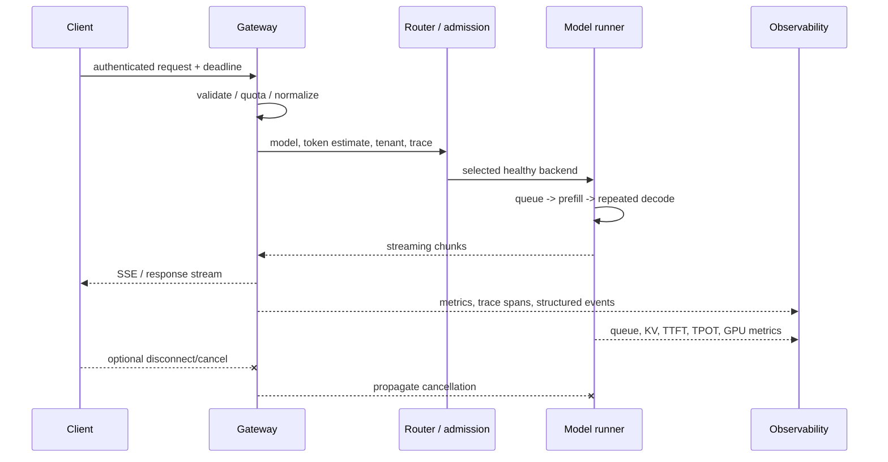

> 对应原书：*Distributed AI Systems*，Chapter 9：*Production LLM Serving Stack*
> 本章主题：如何把高性能推理engine包装成可路由、可扩缩、可观测、可灰度、可恢复且成本可控的生产服务。

---

## 0. 本章要回答的核心问题

1. 为什么“模型能在GPU上生成文本”离生产服务还很远？
2. LLM serving与传统固定输入/输出模型服务的根本差异是什么？
3. API Gateway、model runner、tokenizer、router、queue和observability各自负责什么？
4. Gateway应验证哪些字段，又不应复制哪些engine逻辑？
5. Streaming请求如何传播client cancellation和backpressure？
6. End-to-end latency怎样拆成gateway、queue、prefill、decode和network？
7. TTFT、TPOT/ITL、E2E、throughput、goodput分别回答什么问题？
8. Token count用于billing/rate limit时，怎样保证与model runner tokenizer一致？
9. Multi-model路由如何验证model alias、backend capability和tenant authorization？
10. Feature-based routing为何容易产生误路由和质量偏差？
11. Round-robin、least-connections和weighted balancing为何都不等于LLM work balancing？
12. 如何用prompt/output token work、KV pressure和queue预测backend成本？
13. Canary rollout和A/B test为什么目标不同、统计要求不同？
14. 一致性assignment怎样防止用户跨variant污染实验？
15. Canary的自动rollback为什么需要最小样本、置信度、guardrails和hysteresis？
16. Metrics、traces、structured logs如何互补？
17. 为什么Prometheus histogram bucket设计决定p99是否可信？
18. 如何控制trace/log中的prompt、user ID和token数据风险？
19. Bounded queue、admission control、timeout、retry和circuit breaker怎样配合？
20. Autoscaling为何不能只看CPU/GPU utilization或raw RPS？
21. LLM cold start、model loading与KV warmup如何影响scale-up？
22. Spot/preemptible capacity怎样与on-demand baseline和drain结合？
23. Kubernetes Deployment、Pod、Service、Ingress/Gateway、HPA、PDB、probes分别保证什么？
24. Startup、readiness和liveness probes为何不能互相替代？
25. GPU extended resources、device plugin、MIG和node affinity怎样影响调度？
26. k3d GPU passthrough适合验证什么，不能证明什么？
27. 多个k3d“nodes”看到同一物理GPU为什么可能产生重复分配？
28. Model weights缓存使用hostPath、emptyDir、PVC或object store各有什么边界？
29. Multi-model与multi-engine routing的route key怎样设计才不泄露内部实现？
30. 同一OpenAI-compatible API下，不同engine语义如何做contract test？
31. llm-d的Envoy、Inference Gateway、vLLM、NIXL和Kubernetes各自负责什么？
32. Prefix-aware routing、disaggregated KV cache和PD拆分如何改变请求路径？
33. llm-d的well-lit path为何仍需目标hardware/workload验证？
34. 如何从手工k3d实验迁移到生产，而不是直接复用开发配置？
35. 如何实现正确的gateway、distributed rate limit、canary controller和trace propagation？
36. 怎样用YAML/schema/static tests验证多模型Kubernetes部署？

本章统一使用五张账：

```text
Request ledger: identity / model / tokens / deadline / stream / tenant
Latency ledger: ingress / queue / prefill / decode / egress
Capacity ledger: replicas / GPUs / KV / queue / token work / warm state
Release ledger: stable / canary / cohort / evidence / rollback
Evidence ledger: metrics / traces / logs / probes / experiments
```

---

## 1. Anatomy of a production LLM serving system

### 1.1 从推理engine到生产service

vLLM/SGLang解决：

- Model loading；
- KV cache；
- Continuous batching；
- Paged/prefix attention；
- TP/PP/EP；
- Sampling与OpenAI-compatible engine API。

生产系统还需要：

```text
Internet/client protocol
Authentication and authorization
Schema/token/deadline validation
Tenant quota and rate limiting
Model/version/capability routing
Admission and bounded queues
Load balancing and affinity
Retries/circuit breakers/failover
Canary/A-B rollout control
Metrics/traces/logs/audit
Autoscaling and capacity planning
Secrets/storage/security policy
Graceful drain and disaster recovery
```

Engine是stateful GPU data plane，不应同时承担所有edge/control-plane职责。

### 1.2 LLM workload为何特殊

传统classifier常有固定shape和单次forward；LLM有：

- Input tokens变长；
- Output长度事前未知；
- Prefill与decode资源画像不同；
- 每个live request占KV；
- Streaming连接持续数秒到数分钟；
- Sampling/stop/tools/grammar各异；
- 同一RPS的token work可相差几个数量级。

请求work proxy：

$$
W_i\approx aL_{in,i}+bL_{out,i}+cL_{in,i}^2
$$

$a,b,c$依model/kernel；这个proxy只用于说明RPS不是capacity单位。长prompt和长output应分别计量。

### 1.3 端到端时序



### 1.4 Latency ledger

$$
T_{E2E}=
T_{edge}+T_{gateway}+T_{route}+T_{queue}+T_{prefill}+T_{decode}+T_{egress}
$$

$$
TTFT\approx
T_{edge}+T_{gateway}+T_{route}+T_{queue}+T_{prefill}+T_{first\ decode}+T_{first\ egress}
$$

若输出 $N_o>1$：

$$
TPOT=\frac{t_{last}-t_{first}}{N_o-1}
$$

Client-side和server-side打点都要保留。只在gateway看E2E不能判断是queue、prefill还是network。

### 1.5 Serving objectives

Raw throughput：

$$
OutputTPS=\frac{\sum_iN_{out,i}}{T}
$$

SLO goodput：

$$
Goodput=\frac{\#\{requests\ satisfying\ TTFT,TPOT,error\ SLO\}}{T}
$$

成本：

$$
CostPerGoodToken=
\frac{InfrastructureCost}{GoodOutputTokens}
$$

最大化raw tokens/s可通过大batch牺牲TTFT；生产通常在SLO约束下优化goodput/cost。

### 1.6 API Gateway职责

- TLS termination（或由edge proxy）；
- AuthN/AuthZ；
- Request schema/body size；
- Model alias/capability validation；
- Token/deadline/quota checks；
- Routing/load balance；
- Rate limiting/admission；
- Trace context；
- Streaming proxy与disconnect；
- Error normalization；
- Usage/audit events。

不应：

- 在每请求重复加载tokenizer/model；
- 持有GPU model state；
- 静默修改sampling语义；
- 对已streamed请求无状态重试；
- 把backend内部URL暴露给clients；
- 在日志记录完整敏感prompt。

### 1.7 Model runner职责

Model runner（vLLM/SGLang等）持有：

- Weights/quantization；
- GPU workers/process groups；
- KV cache；
- Scheduler/batches；
- Prefix cache；
- Sampling/grammar/speculation；
- Engine metrics；
- Request cancellation。

它是stateful：backend之间不能像无状态HTTP workers一样随意迁移in-flight requests，因为KV和stream state位于原backend。

### 1.8 Observability不是独立“旁路服务”

Instrumentation嵌入gateway、router和runner，通过：

```text
Metrics -> Prometheus-compatible endpoint / collector
Traces  -> OpenTelemetry SDK / Collector / backend
Logs    -> stdout/agent/log pipeline
GPU     -> DCGM exporter/device telemetry
K8s     -> kube-state-metrics/events
```

Observability pipeline失败不能阻塞inference critical path；使用bounded async exporters/drop policy，并监控自身丢弃。

### 1.9 Optional tokenizer service

适用：

- Pre-admission token count；
- Billing估算；
- Custom backend；
- 多种modal tokenization；
- Gateway避免加载大型tokenizer集合。

风险：

- Tokenizer/model revision drift；
- Chat template不一致；
- Double tokenization增加latency；
- Text/token IDs跨network增大payload；
- Unicode/normalization差异；
- 独立service成为SPOF。

Billing/security上不能仅信client token count；runner实际usage为权威，pre-count用于admission estimate。

### 1.10 Token count一致性契约

Tokenizer identity至少：

$$
ID=(ModelRevision,TokenizerRevision,ChatTemplate,SpecialTokens)
$$

Gateway estimate与runner actual差：

$$
Error=N_{actual}-N_{estimated}
$$

监控error distribution，预留margin。若上限严格，以runner同版本tokenizer做最终validation。

### 1.11 Figure 9.1


图中gateway→runner是data path；observability跨所有组件；tokenizer可内置或独立。Production还通常有identity provider、config/control plane、secret manager、artifact registry、autoscaler和persistent telemetry。

### 1.12 Basic FastAPI stack的正确定位

原章`code/basic`示例是学习边界：

```text
FastAPI gateway :8000
Tokenizer       :8001 (optional)
Model runner    :8002
```

它证明service分层和HTTP forwarding，不证明：HA、distributed rate limit、streaming backpressure、multi-replica consistency或Kubernetes production readiness。

### 1.13 依赖与版本

原章固定FastAPI/httpx/Pydantic/Transformers/vLLM版本有助复现，但CUDA/PyTorch/driver必须兼容。生产使用lockfile/container digest和model revision，而不是只保存`pip install`命令。

```shell
conda create -n llm-serving python=3.12
conda activate llm-serving
pip install fastapi uvicorn httpx pydantic transformers vllm
```

验证不仅`import`：启动runner、真实prompt、streaming、cancel、metrics和GPU kernel。

### 1.14 Secret handling

```shell
export HF_TOKEN=...
```

只适合本地临时环境。生产使用Kubernetes Secret/external secret manager、最小权限、rotation和不落日志。CLI/history、Pod spec明文和debug dumps都可能泄露。

### 1.15 启动顺序

```text
Start model runner
  -> load weights
  -> initialize KV / compile / warmup
  -> readiness true
Start gateway or register backend
  -> health/readiness check
  -> accept traffic
```

Gateway进程先起来但backend未ready时，应返回bounded 503/queue，不无限等待。

### 1.16 Basic request

```shell
curl --fail-with-body --max-time 30 \
  -X POST http://127.0.0.1:8000/generate \
  -H "Content-Type: application/json" \
  -d '{"prompt":"What is machine learning?","max_tokens":100}'
```

Production还需request ID、auth、model alias、deadline、streaming、idempotency/retry policy和usage。

### 1.17 Model loading与warmup

Cold start可拆：

$$
T_{cold}=T_{schedule}+T_{image}+T_{weights}+T_{engine}+T_{compile/graph}+T_{warm}
$$

30～60秒不是普适值；大模型、remote weights、slow PVC可达数分钟。Kubernetes autoscaling若只在过载后加pod，用户会先经历完整cold-start queue。

### 1.18 独立tokenizer示意的局限

Qwen tokenizer与CLIP tokenizer是不同任务；CLIP tokenization只是diffusion pipeline输入的一部分，不代表tokenizer service即可“服务diffusion”。要固定preprocessor/config/image/text encoder revision。

### 1.19 可运行的latency/goodput计算器

```python
from dataclasses import dataclass


@dataclass(frozen=True)
class RequestTiming:
    started: float
    first_token: float
    finished: float
    output_tokens: int
    success: bool = True

    @property
    def ttft(self) -> float:
        return self.first_token - self.started

    @property
    def tpot(self) -> float:
        intervals = self.output_tokens - 1
        return (self.finished - self.first_token) / intervals if intervals > 0 else 0.0


def serving_goodput(
    timings: list[RequestTiming],
    window_seconds: float,
    ttft_slo: float,
    tpot_slo: float,
) -> float:
    if window_seconds <= 0:
        raise ValueError("window_seconds must be positive")
    good = sum(
        timing.success
        and timing.ttft <= ttft_slo
        and timing.tpot <= tpot_slo
        for timing in timings
    )
    return good / window_seconds


samples = [
    RequestTiming(0.0, 0.2, 1.1, 10),
    RequestTiming(0.0, 0.8, 1.7, 10),
    RequestTiming(0.0, 0.3, 2.1, 10),
]
print(f"Goodput: {serving_goodput(samples, 10, 0.5, 0.15):.2f} req/s")
```

预期输出：

```text
Goodput: 0.10 req/s
```

只有第一条同时满足TTFT≤0.5s、TPOT=0.1s。第三条TTFT合格，但TPOT=0.2s不合格。

---

## 2. Request routing and traffic management

### 2.1 两阶段路由

生产routing通常拆成：

```text
Model / variant / engine selection
  -> replica / pod selection within that backend pool
```

第一阶段决定语义、质量、价格和capability；第二阶段决定queue、cache locality、health和latency。把两者混在一个`if/else`会让实验、故障和扩缩难以归因。

### 2.2 Route key

至少包含：

- Public model alias；
- API operation（chat/completion/embedding/rerank）；
- Required capabilities（vision/tools/grammar/logprobs）；
- Tenant/region/data residency；
- Release cohort；
- Optional engine preference（内部/实验）；
- Deadline/cost/quality class。

Route返回：backend pool + normalized request，不应允许client任意指定cluster-internal URL。

### 2.3 Feature-based routing

根据prompt/request分类到代码、chat、vision等model。优点是不同模型发挥特长；风险：

- Keyword容易被prompt injection操纵；
- Classification自身有latency/cost/error；
- Request可能多意图；
- 模型capability/version变化；
- 错路由造成质量/合规事故；
- Content inspection有隐私风险。

生产用显式task/capability优先，classifier为fallback；低confidence进入通用model或拒绝，不静默选择不支持backend。

### 2.4 Dynamic model selection

可建约束优化：

$$
m^*=\arg\min_m ExpectedCost(m,x)
$$

约束：

$$
P(Latency_m(x)\le Deadline)\ge q
$$

$$
ExpectedQuality_m(x)\ge Q_{min}
$$

$$
Capability_m\supseteq Required(x)
$$

实时load、queue和price是输入；quality estimator不确定性也要纳入。不能只按“小模型便宜”路由高风险请求。

### 2.5 A/B assignment

同一实验用户应稳定落variant，避免同一用户体验混杂和样本相关性破坏。使用稳定hash，而不是Python内置`hash()`（默认跨进程/重启随机化）。

$$
u=Hash(ExperimentID,TenantID,UserID,Salt)/2^k
$$

按cumulative weights落bucket。Salt/experiment ID改变可独立重分桶。

### 2.6 可运行的一致性分桶

```python
import hashlib
from itertools import accumulate


def stable_unit_interval(*parts: str) -> float:
    payload = "\x1f".join(parts).encode("utf-8")
    digest = hashlib.blake2b(payload, digest_size=8).digest()
    value = int.from_bytes(digest, byteorder="big")
    return value / 2**64


def assign_variant(
    experiment: str,
    subject_id: str,
    weights: dict[str, float],
    *,
    salt: str,
) -> str:
    if not weights or any(weight < 0 for weight in weights.values()):
        raise ValueError("Weights must be non-negative and non-empty")
    total = sum(weights.values())
    if total <= 0:
        raise ValueError("At least one weight must be positive")
    point = stable_unit_interval(experiment, subject_id, salt) * total
    cumulative = 0.0
    for variant, weight in weights.items():
        cumulative += weight
        if point < cumulative:
            return variant
    return next(reversed(weights))


weights = {"stable": 0.9, "canary": 0.1}
first = assign_variant("model-v2", "user-123", weights, salt="2026-08")
second = assign_variant("model-v2", "user-123", weights, salt="2026-08")
assert first == second
print(f"Stable assignment: {first}")
```

确切variant取决于hash，但同输入始终相同。权重dict iteration顺序是route contract的一部分，生产显式排序/配置顺序并版本化。

### 2.7 Sticky assignment的统计单位

若同一用户发很多requests，不能把每request当独立样本夸大显著性。Randomization unit是user/session时，分析应按该unit cluster-robust或先聚合。

机器人/重度用户会主导request-weighted metrics；同时报告user-level与request/token-level结果。

### 2.8 Model selection与authorization

Gateway必须验证tenant是否允许：

- 使用该model/version；
- 发送该modal/tool；
- 请求该max tokens/context；
- 使用logprobs/parallel samples；
- 选择昂贵quality tier；
- 指定data region。

Unknown model返回404或documented error；unauthorized返回403，不fallback到另一个model造成语义惊喜。

---

## 3. Load balancing

### 3.1 Round-robin

每次选择下一个healthy replica。适用：同构replicas、请求cost近似、无强cache affinity。LLM请求长度差异大时，request count均衡不等于work均衡。

### 3.2 Least connections

选择active connections最少。Streaming连接持续时间与output长度相关，比RR好一些；但一个32K-prefill新连接可能比10个短decode连接更重。

### 3.3 Weighted balancing

根据H100/A100等capacity设置weights。Static weight不能反映实时KV pressure、prefix cache、thermal throttling或不同request mix；需要持续capacity benchmark/telemetry校准。

### 3.4 LLM-aware work score

Replica $j$ cost可估：

$$
Score_j=
\alpha QueuedInputTokens_j+
\beta ActiveDecodeTokens_j+
\gamma KVPressure_j+
\delta PredictedRequestWork-
\epsilon PrefixMatch_j
$$

再加health、deadline、tenant priority。系数来自profile；预测输出长度未知，使用quantile/limit。Score是placement hint，backend仍做admission。

### 3.5 Queueing与Little's Law

稳定系统：

$$
N=\lambda W
$$

平均arrival 100 req/s、E2E 2 s，约200 in-flight。Autoscaler/router若只看RPS而忽略service time，会低估并发/KV。

### 3.6 Prefix/cache-aware routing

对vLLM/SGLang/llm-d，routing还可看prefix owner。收益与Chapter 7相同：cache locality vs queue balance。Gateway的cache metadata可能过期，只能做hint；runner本地精确验证。

### 3.7 Health states

不应只有boolean：

```text
Starting: process alive, model not ready
Ready: can accept new requests
Draining: finish in-flight, no new traffic
Overloaded: healthy but admission limited
Unhealthy: remove/circuit open
Terminating: cancellation/drain deadline
```

Load balancer只选Ready（或明确允许Overloaded fallback）。

### 3.8 Streaming与connection draining

Rolling update时：

1. Readiness false；
2. Gateway停止新requests；
3. 已有streams继续；
4. `preStop`/termination grace等待；
5. 超deadline取消/关闭；
6. Pod退出。

Grace period应覆盖高percentile generation duration或业务定义的max stream time；无限输出需server max tokens/deadline。

### 3.9 Retry边界

安全重试：connect失败、明确未接收、429/部分503且未stream。危险：read timeout或已收到chunks后重发，可能重复GPU工作/文本/计费。

使用request ID与server cancellation/dedup可改善，但生成通常不是透明可恢复stream。

---

## 4. Canary deployments and A/B testing

### 4.1 两者目标不同

| 维度 | Canary | A/B test |
| --- | --- | --- |
| 目的 | 降低新release风险 | 比较备选策略/质量 |
| 时间 | 短、逐级扩流 | 达到预注册样本/时长 |
| Guardrails | Error/latency/safety/resource | Primary metric + guardrails |
| Assignment | 可按request/tenant，但需可控 | 通常sticky user/session |
| 结果 | Promote/rollback | Choose/learn，未必全量 |

### 4.2 Traffic shifting：Canary阶段

```text
Shadow (optional, no user response)
-> 1% internal/low-risk
-> 5%
-> 10%
-> 25%
-> 50%
-> 100%
```

原章10→25→50→75→100只是示意。每阶段必须满足min duration、min samples、SLO和quality guardrails；峰谷traffic覆盖也重要。

### 4.3 Error rate

$$
\widehat p=E/N
$$

若stable 0 errors/10、canary 1/10，canary error 10%并不足以稳定断言；小样本方差巨大。需要confidence interval/Bayesian posterior或sequential test。

### 4.4 Wilson interval

对binomial proportion，Wilson区间比小样本normal近似更稳。中心与半宽：

$$
center=\frac{\widehat p+z^2/(2n)}{1+z^2/n}
$$

$$
half=\frac{z}{1+z^2/n}
\sqrt{\frac{\widehat p(1-\widehat p)}{n}+\frac{z^2}{4n^2}}
$$

Rollback可要求canary lower bound超过absolute threshold，或canary-vs-stable风险差posterior足够高；具体policy按风险。

### 4.5 Latency比较

不能只比较mean。LLM output lengths不同会扭曲E2E。分层：

- Input/output length buckets；
- TTFT p50/p95/p99；
- TPOT/ITL；
- Error/timeout；
- Goodput；
- Cost/token；
- Quality/safety。

Canary收到的traffic若随机波动出更多长requests，未分层比较会误rollback。

### 4.6 自动rollback guardrails

```text
minimum canary samples
minimum stage duration
absolute error threshold
relative risk vs stable
latency/goodput guardrail
quality/safety guardrail
consecutive bad windows
cooldown / no oscillation
manual override
```

“canary error超过stable两倍”在stable接近0时不稳定；同时用absolute floor和smoothing。

### 4.7 Exposure与结果不能只存在进程内存

Gateway多replicas时，内存counter分片；restart丢失。Assignment、exposure和outcome写入shared telemetry/experiment store，使用request/subject/experiment/version ID关联。

### 4.8 Shadow traffic

复制request给canary但用户仍看stable。可验证errors/latency/compatibility，但：

- 双倍GPU cost；
- Sensitive data复制；
- Nondeterministic outputs难逐字比较；
- Side-effecting tools必须禁用；
- Shadow不能测真实用户quality反馈。

### 4.9 A/B实验设计

- Pre-register primary metric和guardrails；
- Stable unit assignment；
- Sample size/power；
- Exposure logging；
- No cross-variant cache/state contamination；
- Concurrent experiments分层/orthogonalization；
- Novelty/day-of-week；
- Multiple testing correction；
- Quality evaluator bias。

### 4.10 可运行的Wilson区间

```python
from math import sqrt


def wilson_interval(successes: int, trials: int, z: float = 1.96) -> tuple[float, float]:
    if trials <= 0 or not 0 <= successes <= trials:
        raise ValueError("Require 0 <= successes <= trials and trials > 0")
    proportion = successes / trials
    denominator = 1 + z * z / trials
    center = (proportion + z * z / (2 * trials)) / denominator
    half = (
        z
        * sqrt(
            proportion * (1 - proportion) / trials
            + z * z / (4 * trials * trials)
        )
        / denominator
    )
    return center - half, center + half


small = wilson_interval(1, 10)
large = wilson_interval(100, 1000)
print(f"1/10: [{small[0]:.3f}, {small[1]:.3f}]")
print(f"100/1000: [{large[0]:.3f}, {large[1]:.3f}]")
```

预期输出：

```text
1/10: [0.018, 0.404]
100/1000: [0.083, 0.120]
```

相同10% observed rate，小样本区间极宽，说明不能100次模拟中遇到几个errors就武断自动rollback。

---

## 5. Operations：observability、reliability 与 cost

### 5.1 Three pillars不是三个孤岛

Metrics发现“p99 TTFT高”；trace定位“queue span高”；logs查到“tenant burst与backend overload”。三者用同一request/trace/model/replica/release IDs关联。

### 5.2 Metrics

#### Traffic

- Requests/s、input/output tokens/s；
- Concurrent streams；
- Request size distributions；
- Model/tenant/region/release。

#### Latency

- Gateway/route/queue；
- TTFT；
- TPOT/ITL；
- E2E；
- Tokenizer；
- KV transfer。

#### Capacity

- Running/waiting requests；
- Batched tokens；
- KV usage/hits/evictions；
- GPU utilization/memory/power；
- CPU/RAM/network；
- Cold starts/ready time。

#### Reliability

- HTTP/error categories；
- Timeout/cancel/retry；
- Probe failures/restarts；
- Queue rejection；
- Circuit state；
- Canary guardrails。

### 5.3 Prometheus语义

Metrics instrumentation通常对每事件更新counter/histogram，但Prometheus按scrape interval采集累计state；不是“每请求都存一条record”。Histogram buckets决定可计算quantile精度；summary quantiles不易跨replicas聚合。

低cardinality labels：model alias、status class、region、release。禁止把request/user/prompt/session IDs作metric labels，会造成cardinality explosion。

### 5.4 Histogram buckets

TTFT可能从50ms到数十秒，线性小bucket不足。选择覆盖SLO附近的指数/业务buckets，例如：

```text
0.05, 0.1, 0.2, 0.5, 1, 2, 5, 10, 30, 60 seconds
```

TPOT使用更细毫秒范围。Bucket变更会影响dashboard/alerts，版本化。

### 5.5 Distributed tracing

典型spans：

```text
gateway.receive
auth
rate_limit
request.validate/tokenize-estimate
gateway.route
backend.queue
model.prefill
model.decode
stream.write
gateway.respond
```

Trace context用W3C `traceparent/tracestate`等通过HTTP传播。Async queues需显式保留context/link；采样决定哪些traces导出。

### 5.6 Trace属性与privacy

合理：model alias/version、engine、input/output token count、tenant tier、status、cache-hit count、GPU pool。谨慎/禁止：完整prompt/output、API key、raw user ID、tool secrets。

User/tenant可用access-controlled pseudonymous ID；定义retention、sampling和redaction。

### 5.7 Structured logging

JSON fields：timestamp、severity、service、request_id、trace_id、model、release、backend、status、duration、tokens、error category。Prompt内容默认不记录或严格采样/脱敏。

日志同步写远端会阻塞stream；stdout+agent或bounded async pipeline。监控dropped logs。

### 5.8 Reliability：cold start

Warmup请求可触发kernels/graphs，不能替代weights下载/缓存。Keep-alive避免某些平台scale-to-zero/idle，但浪费GPU并污染metrics/cache；更合理是min replicas、predictive scale、pre-pulled images/weights和startup probes。

### 5.9 Autoscaling信号

CPU utilization对GPU serving通常弱相关；GPU utilization在overload时可能已饱和且scale-up太晚；RPS忽略token work。优先组合：

```text
queue delay / queued tokens
arrival input/output token work
TTFT/TPOT SLO pressure
KV capacity
per-replica measured service rate
ready replicas and cold-start forecast
```

### 5.10 Capacity公式

单ready replica在目标traffic/SLO下goodput $g$，arrival demand $\lambda$，目标utilization headroom $u<1$：

$$
R_{needed}=\left\lceil\frac{\lambda}{ug}\right\rceil
$$

再加failure/domain reserve。$g$不是固定model常数，而随input/output分布、batch、engine和GPU变化。

### 5.11 Scale-up ahead of cold start

Cold start $T_c$，demand增长率 $d\lambda/dt$。Reactive scaler在queue出现后才创建pod，至少等待 $T_c$。可用leading indicators、scheduled events、predictive scaling或overprovisioning。

Scale-down要先drain，cooldown>短期traffic波动，并保留min replicas。缩容cache-rich pod还会降低prefix hit，autoscaler应考虑warm state价值。

### 5.12 Bounded queue/backpressure

Queue最大token work或requests：

$$
Q\le Q_{max}
$$

满时立即429（rate/quota）或503（capacity），附`Retry-After`/documented error。无限queue把overload变成长timeout并占连接/RAM。

Queue应按deadline/tenant/cost有公平性，防单一长prompt阻塞。Admission先检查max context/output和estimated token budget。

### 5.13 Timeout层次

- Client overall deadline；
- Gateway connect/read/write/pool；
- Queue deadline；
- Backend generation deadline/max tokens；
- Stream idle timeout；
- Graceful termination deadline。

上游timeout应传播cancel，避免client已走但GPU继续生成。Timeout层级要留清理时间，不能所有层相同导致race。

### 5.14 Circuit breaker与bulkhead

Breaker隔离连续失败backend；bulkhead按model/tenant/pool隔离queue/concurrency，防一个大模型耗尽全gateway connections。Fallback model必须获得用户/产品许可，不能silent downgrade质量/隐私属性。

### 5.15 Cost

分解：

$$
Cost=RequestGPUTime+IdleWarmCapacity+Network+Storage+ControlPlane+Telemetry
$$

更实用：

$$
CostPerGoodToken=
\frac{GPUHours\cdot Price+OtherCost}{SLOCompliantOutputTokens}
$$

仅按raw token成本优化会鼓励高batch，却可能违背latency。

### 5.16 Spot/preemptible

原章“50% spot baseline”不是通用建议。Baseline通常由on-demand/reserved保证，spot承担可丢失/可快速替换的burst；比例由interruption rate、cold start、SLO和region capacity决定。

Serving spot策略：

- Diversify instance/zone；
- Interruption notice触发readiness false/drain；
- 不把唯一model replica放spot；
- On-demand headroom承接；
- Warm weights/images；
- Streaming max duration；
- Track interruption-induced errors/cost。

### 5.17 Model routing cost

小模型不一定每token恰好便宜一半；成本取决于GPU utilization、batch、quantization和quality/retry。按实际good token和task success评估。

### 5.18 SLO/error budget

Availability target $A$，窗口requests $N$：

$$
AllowedBad=(1-A)N
$$

例如99.9%、1M requests允许1000 bad。Bad需定义：5xx、deadline miss、TTFT/TPOT violation、invalid output？Release/operations按error-budget burn rate报警，而不是任何单次error回滚。

---

## 6. Deploying LLM serving on Kubernetes

### 6.1 Kubernetes解决什么

Kubernetes持续把actual state收敛到declarative desired state：

- Schedule Pods；
- Restart failed containers；
- Recreate replicas；
- Service discovery/network；
- Rolling updates；
- Resource requests/limits；
- Config/Secret/volume；
- Autoscaler/controller extension。

它不自动理解：KV cache、TTFT/TPOT、model parallel process groups、prefix locality、stream drain或model quality。需要serving stack/operator/gateway把LLM语义映射到K8s primitives。

### 6.2 核心对象

#### Pod

最小调度单位，共享network namespace和volumes，可含model runner、KV transfer sidecar等containers。Pod IP/本地KV是ephemeral。

#### Deployment

管理replica Pods、rolling update和ReplicaSet。适合独立model replicas；多节点紧耦合TP/PP可能需要Job、StatefulSet、LeaderWorkerSet或专用operator/gang scheduler。

#### Service

为一组ready Pods提供稳定virtual IP/DNS。普通Service负载均衡不理解prefix、queue/token work或stream stickiness。

#### Ingress/Gateway API

North-south HTTP routing/TLS。Body-based `model` routing和LLM-aware scheduling通常需custom gateway/Inference Extension，不是基础Ingress普遍能力。

#### ConfigMap/Secret

Non-secret config与sensitive credentials分离。Secret默认只是base64 object，etcd encryption/RBAC/external manager仍需配置。

### 6.3 原章Kubernetes映射的边界

| Serving概念 | K8s primitive | 不能自动保证 |
| --- | --- | --- |
| Replicas | Deployment/StatefulSet | KV迁移、stream恢复 |
| Load balancing | Service/Ingress/Gateway | LLM work/cache-aware routing |
| Autoscaling | HPA/KEDA/custom controller | 准确token capacity/predictive warmup |
| Health | Probes | Model quality、SLO、所有GPU ranks健康 |
| Canary | Gateway/service mesh/controller | 统计显著、quality guardrails |
| Fault tolerance | Restart/reschedule | In-flight state不丢失 |
| Voluntary disruption | PDB | Node failure/Pod crash防护 |
| GPU scheduling | Device plugin/resources | Topology-aware multi-GPU group、GPU sharing安全 |

PDB只限制voluntary disruptions（如drain/upgrade）中同时不可用Pods数量；它不会阻止硬件故障，也不会“重启pod”。


### 6.4 GPU extended resources

通常：

```yaml
resources:
    limits:
        nvidia.com/gpu: 1
```

Extended resource不可overcommit，通常只写limits，Kubernetes将request等同limit（具体版本/device plugin）。默认整GPU独占。

若需要MIG、time-slicing或MPS，管理员配置device plugin/resource classes；它们有不同memory/fault/isolation语义。仅把vLLM `--gpu-memory-utilization`设0.2不会让scheduler在同GPU安全放5个Pods，因为K8s仍看到一个不可分割resource。

### 6.5 Topology与多GPU

TP需要同node高速互连：

- Request多GPUs同Pod，scheduler保证同node；
- Node labels/affinity选择GPU type；
- Topology Manager/NUMA policy；
- `CUDA_VISIBLE_DEVICES`由device plugin；
- NVLink topology不一定由普通resource request优化；
- Multi-node TP/PP需gang scheduling和distributed launcher/operator。

### 6.6 Probes：startup、readiness、liveness

#### Startup probe

保护长model load：在成功前，liveness/readiness按Kubernetes语义不会导致过早liveness restart。比猜`initialDelaySeconds=180`更稳健。

#### Readiness probe

决定是否进入Service endpoints。应在weights加载、engine/KV初始化、必要warmup完成后成功；overload/drain可暂时false。

#### Liveness probe

判断process是否不可恢复，需要restart。不能因为一次慢请求/GC就失败；探针应轻量，不依赖外部下游，阈值保守。

### 6.7 Probe示意

```yaml
startupProbe:
    httpGet:
        path: /health
        port: 8000
    periodSeconds: 10
    failureThreshold: 60
readinessProbe:
    httpGet:
        path: /health
        port: 8000
    periodSeconds: 5
    failureThreshold: 2
livenessProbe:
    httpGet:
        path: /health
        port: 8000
    periodSeconds: 15
    failureThreshold: 4
```

若engine只有一个`/health`，可用但语义受限；production最好区分live/ready/startup或gateway结合engine metrics。`failureThreshold×period`为startup窗口下界，不含timeout细节。

### 6.8 Graceful termination

Pod deletion：

```text
readiness false / endpoint removal
-> preStop/drain begins
-> SIGTERM
-> stop accepting
-> finish/cancel in-flight streams
-> flush telemetry
-> exit before terminationGracePeriodSeconds
-> SIGKILL if deadline exceeded
```

Endpoint removal和proxy propagation有race，application必须拒绝新请求并跟踪in-flight。`preStop`占用grace period，不能设置很长sleep而不给stream收尾时间。

### 6.9 PDB

```yaml
apiVersion: policy/v1
kind: PodDisruptionBudget
metadata:
    name: model-pdb
spec:
    minAvailable: 1
    selector:
        matchLabels:
            app: model-runner
```

只有1 replica且minAvailable=1时，voluntary node drain可能无法进行；需要容量/运维权衡。PDB不在zero-ready replicas时凭空创建capacity。

### 6.10 HPA与KEDA

HPA根据metrics控制replicas。CPU-based HPA常不适合GPU inference；custom/external metrics可用queue/token work。KEDA擅长event/queue-driven scale，包括scale-to-zero，但LLM cold start可能违背interactive SLO。

Autoscaling control loop：

```text
Observe metric
-> desired replicas
-> schedule node/GPU
-> pull image/weights
-> initialize/warm
-> readiness
-> gateway traffic
```

若GPU node autoscaler也需扩node，cold path更长。

### 6.11 HPA metric陷阱

- RPS忽略tokens；
- GPU utilization saturated才scale太晚；
- Queue length按requests忽略long prompts；
- In-flight streams与KV occupancy更相关；
- Metrics lag/scrape delay；
- New unready Pods不应计capacity；
- Scale-down驱逐warm cache。

Variant autoscaler/LLM-aware controller需要per-replica service curves和traffic mix。

### 6.12 Scheduling与priority

- Node selector/affinity：GPU type/region；
- Taints/tolerations：GPU nodes只给GPU workloads；
- PriorityClass/preemption：高优服务；
- Topology spread：replicas跨nodes/zones；
- Anti-affinity：避免同failure domain；
- ResourceQuota/LimitRange：tenant治理；
- Gang scheduler：multi-Pod distributed replica。

K8s preemption可能驱逐低priority Pods，但不会保存KV；要drain/retry/capacity reserve。

### 6.13 Storage choices

#### Image layer

把weights烘进image可重现但image巨大、distribution慢、license/rotation复杂。

#### `emptyDir`

Pod-local ephemeral，重启/换Pod丢失；`medium: Memory`消耗node RAM，适合`/dev/shm`而非巨大weights。

#### `hostPath`

本地开发方便，绑定node路径、security风险，不适合作为可移植production default。

#### PVC/shared filesystem

跨Pod持久，但并发model load可能形成read storm/metadata bottleneck。ReadOnlyMany、cache tier和prefetch规划。

#### Object store/download

可扩展artifact source，但cold load耗network；node-local cache/image pre-pull优化。

### 6.14 `/dev/shm`

多进程PyTorch/IPC可能需要较大shared memory。原章说NCCL/IPC buffers“都通过它”过于笼统：NCCL transport可用P2P/SHM/network，具体路径按topology/config；不足可能导致shared-memory transport或multiprocessing失败，但不是所有collective都必然hang。

K8s：

```yaml
volumes:
    -
        name: dshm
        emptyDir:
            medium: Memory
            sizeLimit: 8Gi
```

这是node RAM backed tmpfs，需计入memory capacity；size按process count/engine profile，不照抄32G。

### 6.15 Security context

- Run as non-root；
- Read-only root FS（若兼容）；
- Drop capabilities；
- Seccomp；
- No privilege escalation；
- NetworkPolicy；
- Minimal ServiceAccount/RBAC；
- Secret mounts/env治理；
- Signed images/SBOM/scanning；
- Gated model license/access。

GPU runtime有额外device权限，不能因此给Pod `privileged`作为默认解决方案。

---

## 7. Local development with k3d

### 7.1 k3d/k3s是什么

k3d在Docker containers中运行轻量k3s cluster，适合快速验证Kubernetes APIs、YAML、Service/ConfigMap/probes和gateway routing。它不是VM/真实多机。

### 7.2 它可以验证

- Manifests apply/schema；
- Deployment/Service/ConfigMap/Secret wiring；
- Basic device plugin detection；
- Gateway route；
- Probe/lifecycle；
- Local image/volume；
- Multi-model API contract。

不能证明：

- Multi-node GPU isolation；
- IB/RoCE/RDMA/NIXL；
- Real failure domains；
- Cloud load balancer；
- Production storage；
- HPA+node autoscaler cold path；
- Security/multi-tenancy；
- Large-scale performance。

### 7.3 Custom k3s CUDA image

原章build脚本把k3s/containerd与NVIDIA CUDA/runtime工具组合，并部署NVIDIA device plugin。版本矩阵：host driver必须支持container CUDA；k3s/containerd/device-plugin也需兼容。

```shell
K3S_TAG=v1.32.0-k3s1 \
CUDA_TAG=13.0.0-base-ubuntu24.04 \
./build.sh
```

示例版本会过时；不要以`nvidia-smi`显示的“CUDA Version”误认为host已安装相同toolkit，它表示driver支持上限。


### 7.4 k3d多个node与同一host GPU风险

原章说每个container node都报告相同8 GPUs“expected”。这在本地可见性上可能发生，但Kubernetes schedulers把不同nodes视为独立资源：

```text
node A reports GPU 0..7
node B reports GPU 0..7
```

实际上都指同一host physical GPUs，两个Pods调到不同container nodes可能重复分配同一GPU，造成冲突/OOM。开发环境应：

- 只让一个agent node暴露GPUs；或
- 将不同physical GPUs精确分给不同containers；或
- 限制GPU workloads到唯一GPU node；
- 不从nested nodes得出capacity/isolation结论。

### 7.5 Manifests“原样用于生产”不成立

Kubernetes API对象可迁移，但production需要替换：

- `hostPath`；
- Local image；
- `port-forward`；
- Single replicas；
- Dev secrets；
- No TLS/auth/network policy；
- Resource/probe values；
- StorageClass；
- GPU node labels/topology；
- Monitoring/autoscaling/PDB。

本地YAML是起点，不是production-certified config。

### 7.6 Setup递进

```text
Docker sees GPU
-> one k3d node sees allocatable nvidia.com/gpu
-> CUDA sample Pod
-> one vLLM Pod
-> Service/port-forward
-> gateway/multi-model
-> probes/restart/drain
```

不要直接加载模型来诊断device plugin。

### 7.7 GPU验证

```shell
kubectl get nodes -o wide
kubectl describe node "$GPU_NODE"
kubectl get daemonset -A | grep -i nvidia
kubectl get pods -A -o wide
```

`Capacity`是plugin报告总量，`Allocatable`是scheduler可分配，`Allocated resources`是requests/limits统计；实际进程需CUDA sample验证。


### 7.8 Local cluster cleanup

```shell
k3d cluster delete mycluster-gpu
docker image rm "k3s-cuda:$IMAGE_TAG"
```

还检查port-forward/background processes、model cache、PVC/local directories和Secrets。删除cluster不一定删除host model cache。

---

## 8. Deploying vLLM on k3d

### 8.1 Secret

```shell
kubectl create namespace llm-serving
kubectl -n llm-serving create secret generic hf-token-secret \
    --from-literal=token="$HF_TOKEN"
```

Shell history/process list风险依命令；更安全用external secret或stdin/file，避免把token提交YAML。

### 8.2 Deployment核心

```yaml
apiVersion: apps/v1
kind: Deployment
metadata:
        name: vllm-qwen
        namespace: llm-serving
spec:
        replicas: 1
        selector:
                matchLabels:
                        app: vllm-qwen
        template:
                metadata:
                        labels:
                                app: vllm-qwen
                spec:
                        nodeSelector:
                                accelerator: nvidia-gpu
                        containers:
                                -
                                        name: vllm
                                        image: "vllm/vllm-openai:VERSION_TO_PIN"
                                        args:
                                                - Qwen/Qwen2.5-0.5B-Instruct
                                                - --host
                                                - 0.0.0.0
                                                - --port
                                                - "8000"
                                        ports:
                                                -
                                                        name: http
                                                        containerPort: 8000
                                        env:
                                                -
                                                        name: HF_TOKEN
                                                        valueFrom:
                                                                secretKeyRef:
                                                                        name: hf-token-secret
                                                                        key: token
                                        resources:
                                                requests:
                                                        cpu: "2"
                                                        memory: 8Gi
                                                limits:
                                                        cpu: "4"
                                                        memory: 16Gi
                                                        nvidia.com/gpu: 1
                                        startupProbe:
                                                httpGet:
                                                        path: /health
                                                        port: http
                                                periodSeconds: 10
                                                failureThreshold: 60
                                        readinessProbe:
                                                httpGet:
                                                        path: /health
                                                        port: http
                                                periodSeconds: 5
                                                failureThreshold: 2
                                        livenessProbe:
                                                httpGet:
                                                        path: /health
                                                        port: http
                                                periodSeconds: 15
                                                failureThreshold: 4
                                        volumeMounts:
                                                -
                                                        name: dshm
                                                        mountPath: /dev/shm
                        terminationGracePeriodSeconds: 120
                        volumes:
                                -
                                        name: dshm
                                        emptyDir:
                                                medium: Memory
                                                sizeLimit: 8Gi
```

`VERSION_TO_PIN`是占位，部署前替换为真实immutable tag/digest。Node label需管理员创建；若不存在Pod Pending。

### 8.3 Service

```yaml
apiVersion: v1
kind: Service
metadata:
        name: vllm-qwen
        namespace: llm-serving
spec:
        selector:
                app: vllm-qwen
        ports:
                -
                        name: http
                        port: 8000
                        targetPort: http
```

Service只发送到Ready endpoints；不提供auth或public ingress。

### 8.4 Startup观测

```shell
kubectl -n llm-serving get pods -w
kubectl -n llm-serving describe pod "$POD_NAME"
kubectl -n llm-serving logs -f deployment/vllm-qwen
kubectl -n llm-serving get events --sort-by=.lastTimestamp
```

`ContainerCreating`可能是image pull、volume、device injection；`Pending`多为unschedulable/resources；`CrashLoopBackOff`看previous logs/exit；Running不等于Ready。


### 8.5 `gpu-memory-utilization`

它控制engine可用于weights/KV等GPU memory预算（精确语义按vLLM版本）。0.2适合本地谨慎试验，但：

- 不保证model fit；
- 降KV capacity/throughput；
- 不让K8s自动共享整GPU；
- 其他CUDA/context/workspace仍占memory；
- 0.8～0.9也非生产通用最优。

通过启动logs和目标concurrency/length测定。

### 8.6 Weight cache

原章说`/models`持久化。具体volume类型决定：

- `emptyDir`：Pod消失即丢；
- hostPath：node-local且不可迁移；
- PVC：持久但性能/共享模式各异；
- Read-only preloaded node cache：快但需daemon/artifact管理。

多个Pods同时写同HF cache需locking/permissions；避免partial weights被当完整。

### 8.7 Port-forward

```shell
kubectl -n llm-serving port-forward service/vllm-qwen 8000:8000
```

只适合本地调试，单client connection、无TLS/HA/public LB。生产使用Gateway/Ingress/Service类型和auth。

### 8.8 API smoke

```shell
curl --fail-with-body --max-time 60 \
    http://127.0.0.1:8000/v1/chat/completions \
    -H "Content-Type: application/json" \
    -d '{
        "model":"Qwen/Qwen2.5-0.5B-Instruct",
        "messages":[{"role":"user","content":"Hello"}],
        "temperature":0,
        "max_tokens":32
    }'
```

还测试streaming、cancel、invalid model/max context、health/readiness、usage和restart后cache。


---

## 9. Multi-Model and Multi-Engine serving

### 9.1 Multi-model为何不是一个Pod里塞越多越好

两种：

#### Dedicated replicas/model

每model独立Deployment/Service/GPU。隔离、独立扩缩、简单；weights重复和低流量idle成本。

#### Dynamic/multi-model server

同server加载/卸载多个models/adapters。提高共享但有cache thrash、cold load、memory fragmentation、noisy neighbor和复杂scheduling。

原章采用dedicated services + gateway，适合解释routing。


### 9.2 Route table

```yaml
routing:
        -
                model: meta-llama/Llama-3.2-1B-Instruct
                service_name: vllm-llama.multi-models.svc.cluster.local
        -
                model: microsoft/Phi-tiny-MoE-instruct
                service_name: vllm-phi.multi-models.svc.cluster.local
```

Gateway加载时校验：duplicate aliases、URL scheme/host allowlist、model/capabilities、health path、timeouts。Config update要atomic/versioned，旧in-flight继续原route。

### 9.3 Model alias与revision

Client public alias可如`chat-standard`; backend artifact为immutableHF revision。直接暴露repo name让rollout/versioning困难。Route record：

```text
alias -> artifact revision -> engine/config -> backend pool
```

Response返回served model/release metadata（按API/security），便于audit。

### 9.4 `/v1/models`聚合

不能简单concat：

- Deduplicate aliases；
- Filter tenant permissions；
- 只列至少一个Ready backend；
- Capabilities/context/ownership；
- Cache与短TTL；
- Partial backend failure时定义结果；
- 不泄露内部engine URL。

### 9.5 Multi-engine routing

同model在vLLM/SGLang运行，用于benchmark/migration/fallback。Engine-specific字段如`inference_server`不属于标准OpenAI schema，公开给clients会形成vendor coupling。更好：


- Internal experiment assignment；
- Header/tenant policy；
- Stable public model alias；
- Capability negotiation；
- Contract tests。

### 9.6 Engine contract tests

同请求验证：

- Chat template/token usage；
- Streaming SSE shape/`[DONE]`；
- Finish reason；
- Stop strings；
- Tools/JSON schema；
- Logprobs；
- Errors/status；
- Cancellation；
- Determinism tolerance；
- Usage/billing。

“OpenAI-compatible”不保证所有extensions/edge cases相同。

### 9.7 Default route

`inference_server:null` fallback到vLLM是示意。Production默认必须显式且可观测；unknown engine应400而非silent fallback，否则实验/quality不可归因。

### 9.8 GPU capacity

两个model各要一GPU时，本地只有一GPU就不可能同时Running，除非MIG/time-slicing或共享机制。原章management scripts需按实际GPU count顺序stop/start；`gpu-memory-utilization`不替代scheduler resource count。

### 9.9 Namespace cleanup

删除namespace会删namespaced resources，但不必删cluster-scoped CRDs、device plugin、PV、host cache或port-forward。Cleanup应列出scope，避免误删共享cluster组件。

---

## 10. Kubernetes deployment with llm-d

### 10.1 Kubernetes-native serving方案光谱

原章提到：

- KServe：模型serving/control plane、traffic governance，与Gateway/Knative/Istio组合随安装模式；
- KubeAI：较轻量operator、model pools/scale功能，具体依release；
- vLLM Production Stack：vLLM生态部署与LMCache等集成；
- llm-d：vLLM-first、Inference Gateway、NIXL/disaggregation和well-lit paths。

“需要/不需要某依赖”“支持某硬件”随release快速变化。选型使用当前compatibility matrix、CRD/API maturity、community与operational fit，不以本章静态表永久定论。

### 10.2 llm-d是什么

llm-d不是新的Transformer engine；主要组合：

```text
Kubernetes controllers/CRDs/Helm
+ Gateway API Inference Extension / Inference Gateway
+ Envoy data-plane proxy
+ vLLM model servers
+ NIXL / KV transfer path
+ autoscaling / observability recipes
```

它把Chapter 6/7的engine与routing/disaggregation提升为Kubernetes-native部署模式。

### 10.3 Envoy与Inference Gateway职责

#### Envoy

- HTTP connection/TLS（按部署）；
- Proxy/load balancing execution；
- Streaming；
- Timeouts/retries/circuit（配置）；
- Telemetry hooks。

#### Inference Gateway/scheduler

- Model/capability-aware backend selection；
- Queue/load/token work；
- Prefix-cache locality；
- PD prefill/decode placement；
- SLO/priority policy；
- Backend state/metrics。

IGW做decision/control，Envoy执行data path；实际组件边界按Gateway API Inference Extension版本。

### 10.4 Figure 9.9


请求：client→Envoy/Gateway→inference scheduling→vLLM。Disaggregated模式增加prefill→KV transfer→decode。Observability贯穿所有组件。

### 10.5 Intelligent inference scheduling

传统connection count不知道prompt length、KV match或decode occupancy。LLM-aware score可考虑：

$$
Cost_j=
QueueWork_j+
PredictedPrefill(L-M_j)+
PredictedDecode(O)+
KVPressure_j+
SLOPenalty_j
$$

$M_j$为prefix match。Prediction有误差，runner仍做最终admission，gateway需fallback和telemetry calibration。

### 10.6 Prefix-aware routing

Gateway维护近似cache state/index；backend做精确命中。Cache locality提升TTFT但可能hotspot，使用load guard。跨instance shared cache若可用，route cost还包括remote fetch vs recompute。

### 10.7 Prefill/Decode disaggregation

与Chapter 7相同：prefill pool和decode pool独立扩展，新增KV transfer。

$$
T_{PD}=T_{queue,p}+T_{prefill}+T_{transfer}+T_{queue,d}+T_{decode}
$$

统一：

$$
T_{unified}=T_{queue}+T_{prefill/interference}+T_{decode/interference}
$$

PD只有在specialization/干扰收益超过route+transfer时获益。原章“RDMA几毫秒搬gigabytes”取决于payload、bandwidth、registration和topology，不能泛化。

### 10.8 NIXL角色

NIXL提供跨memory/storage/network的data transfer abstraction，可利用RDMA等backend。它不负责：

- 生成KV；
- 决定route；
- 保证model/layout compatibility；
- 自动reserve destination KV；
- 恢复failed decode stream；
- 让slow fabric变快。

测pack/register/transfer/unpack/ready全链路。

### 10.9 Disaggregated cache层次

#### Local/offloaded cache（North/South）

GPU KV向host/NVMe层级扩展。容量增加，访问latency/bandwidth下降；工作集/prefetch决定收益。

#### Shared cache（East/West）

Instances间共享/传输prefix KV，避免重算。新增network、directory一致性和ownership。

#### Global index

Cluster-wide查prefix位置。提高placement，但metadata更新、staleness、failure和tenant isolation复杂。

Cache key仍包括model/tokenizer/adapter/layout/dtype等namespace；不能跨不兼容variants复用。

### 10.10 Variant autoscaling

不同model/engine/hardware/phase是variants。Autoscaler需估：

- Traffic mix（input/output tokens）；
- Per-replica service curve；
- SLO tier；
- Ready/warming capacity；
- KV/cache state；
- Prefill/decode pool balance；
- GPU node availability/cold start；
- Cost。

不是简单“target QPS”。同QPS下32K prompt与128-token prompt容量差异巨大。

### 10.11 Hardware support的证据边界

原章列NVIDIA/AMD/TPU/Intel。必须核对目标release：

- Core engine backend；
- Kubernetes device plugin/operator；
- NIXL/transfer backend；
- Quantization/kernels；
- Well-lit path测试矩阵；
- Multi-node fabric；
- Feature parity。

“项目支持vendor”不等于所有高级feature在该vendor production-ready。

### 10.12 Getting started前提

原章建议Kubernetes 1.29+和production hardware，这是写作时点。实际遵循llm-d release support matrix。还需：

- Gateway API/Inference Extension CRDs；
- Helm；
- GPU operator/device plugin；
- Storage/secret；
- Metrics stack；
- Network/RDMA operator（若PD）；
- DNS/cert/ingress；
- Node labels/topology；
- Quotas/PDB/security policy。

### 10.13 Helm values的角色

Values不是通用Kubernetes API，而是chart version的configuration contract。固定chart repo/version与values schema，先：

```shell
helm repo update
helm show values "$CHART" --version "$CHART_VERSION" > reference-values.yaml
helm template release "$CHART" \
    --version "$CHART_VERSION" \
    --values values.yaml > rendered.yaml
```

再用schema/kubeconform/server dry-run验证。不要仅`helm install`后在cluster发现拼写被忽略。

### 10.14 概念性values

```yaml
model: {name: Qwen/Qwen2.5-0.5B-Instruct, revision: REVISION_TO_PIN, engine: vllm}
resources: {tensorParallelSize: 1, gpuMemoryUtilization: 0.9}
gateway: {enabled: true, replicas: 2}
autoscaling: {enabled: true, minReplicas: 2, maxReplicas: 8, metric: queued_tokens}
```

这不是保证匹配当前llm-d chart的可直接安装values，只展示声明维度；实际keys从固定chart schema获取，revision marker需替换。

### 10.15 Well-lit paths

含义是项目维护者重点测试/benchmark的recipe，降低组合风险；不是：

- 所有hardware都同样验证；
- 无需capacity benchmark；
- 自动满足你的SLO/security；
- 永久API稳定；
- 一键无运维。

采用时保存path/version/hardware/model/config，并在目标trace复测。

### 10.16 Intelligent scheduling path

最小改动：vLLM behind Inference Gateway。适合多replicas、变长请求、prefix reuse。先比较round-robin baseline，观察route overhead、match accuracy、queue和goodput。

### 10.17 PD path

适合长prompt/phase interference且fast transfer fabric。先测统一worker和KV transfer下界；没有RDMA或短prompt时可能不值得。

### 10.18 Wide expert parallel path

MoE需expert ownership、token dispatch、data/TP/EP groups和high-bisection network。llm-d/K8s负责部署协调，实际collective/kernel由vLLM/DeepEP等；仍需load imbalance和group topology验证。

### 10.19 Monitoring

除了generic K8s/GPU：

- Gateway decision/queue；
- Predicted vs actual token work；
- Prefix match/fetch；
- PD transfer bytes/latency/fail；
- Prefill/decode pool queue；
- KV tiers/eviction；
- TTFT/TPOT/goodput；
- Variant desired/ready/warming replicas；
- Envoy active streams/retries；
- NIXL errors/fallback。

### 10.20 Choosing a path

```text
Start unified vLLM + intelligent gateway
    -> measure
Long TTFT from queue/prefill interference?
    -> evaluate PD transfer economics
Few KV heads / MoE bottleneck?
    -> evaluate DPA/EP path
Prefix hit low?
    -> inspect workload/routing before adding cache tiers
Autoscaling late?
    -> improve token-work forecast/min warm capacity
```

复杂feature由measured bottleneck触发，不按feature list全开。

### 10.21 Multi-model serving

每model有ModelService/pool，Gateway根据`model`发现/route。自动发现仍需：

- Alias uniqueness；
- Tenant authorization；
- Ready capacity；
- Version/revision；
- Capabilities；
- Per-model autoscaling/quotas；
- Unknown model error；
- `/v1/models`过滤。

Figure 9.10：


### 10.22 Direct service vs Gateway

分别port-forward每model仅验证backend；单Gateway才验证model-aware route。测试要区分：

```text
Backend smoke
Gateway route contract
Intelligent scheduling/cache locality
Production ingress/auth/TLS
```

### 10.23 vLLM版本锁定

llm-d chart通常验证特定vLLM/NIXL/Gateway image matrix，可能落后standalone latest。不要擅自替换image tag后仍认为well-lit；运行compatibility/contract/performance suite。

### 10.24 Multi-engine支持是时间敏感事实

原章指出写作时native routing以vLLM-first，SGLang support在开发，custom gateway作为workaround。到当前部署时必须查release/issues。不要将实验目录等同正式native feature，也不要永久断言“不支持”。

### 10.25 k3d vs llm-d

| 维度 | 手工k3d | llm-d生产路径 |
| --- | --- | --- |
| 目标 | 学习/本地contract | 标准化生产recipes |
| Routing | 自写gateway | Inference Gateway extension |
| Cache-aware | 需自行实现 | 集成能力，按release |
| PD/NIXL | 难真实验证 | Well-lit path/fast fabric |
| Autoscaling | 手工HPA/custom | Variant-aware方向 |
| Observability | 自行拼装 | 提供集成recipe |
| 灵活性 | 高、责任全在自己 | 约束更多、兼容矩阵 |
| Production guarantee | 无 | 仍需目标环境验证 |

原章表中“built-in full production stack”是方向性描述，不是免运维SLA。

---

## 11. Summary、Code summary、links 与 references

### 11.1 原章主线

```text
Production stack anatomy
    -> model/replica routing and traffic experiments
    -> observability/reliability/cost
    -> Kubernetes primitives
    -> local k3d vLLM/multi-model/multi-engine
    -> llm-d standardized intelligent serving
```

核心迁移是：engine优化token执行，production stack管理请求、版本、容量和故障。

### 11.2 原章结论的边界

- 30～60秒cold start：model/storage/hardware-dependent；
- 120%/50% autoscale thresholds：示意，不是控制定律；
- 60～90% spot discount：region/provider/time-dependent；
- 7B比13B每token便宜一半：不保证，取决于utilization/quality；
- GPU memory 0.2适合shared cluster：K8s默认仍不共享GPU；
- Probe delay 120～180秒：startup probe/实际load更稳健；
- k3d manifests原样production：错误，需替换dev assumptions；
- llm-d硬件/features：按release matrix。

### 11.3 Code summary

| API/tool | 职责 | Production caveat |
| --- | --- | --- |
| FastAPI | Gateway/service HTTP | 多workers state需共享，stream/cancel |
| StreamingResponse/SSE | Token streaming | Proxy buffering、disconnect、retry |
| Uvicorn | ASGI process | Worker count与GPU/model state |
| httpx AsyncClient | Backend forwarding | Connection pool/timeouts/stream close |
| Pydantic | Request validation | Business/auth/token limits另加 |
| AutoTokenizer | Token count | Revision/template一致性 |
| Prometheus client | Counters/histograms | Labels/buckets/cardinality |
| OpenTelemetry | Context/spans | Sampling/export/privacy |
| kubectl/Helm | Deploy/inspect/render | 固定contexts/versions，dry-run |

### 11.4 Useful links

- [vLLM](https://github.com/vllm-project/vllm)
- [vLLM Production Stack](https://github.com/vllm-project/production-stack)
- [SGLang](https://github.com/sgl-project/sglang)
- [Kubernetes](https://kubernetes.io/)
- [Kubernetes HPA](https://kubernetes.io/docs/tasks/run-application/horizontal-pod-autoscale/)
- [Kubernetes PDB](https://kubernetes.io/docs/tasks/run-application/configure-pdb/)
- [Gateway API](https://gateway-api.sigs.k8s.io/)
- [Gateway API Inference Extension](https://github.com/kubernetes-sigs/gateway-api-inference-extension)
- [k3d](https://k3d.io/)
- [NVIDIA device plugin](https://github.com/NVIDIA/k8s-device-plugin)
- [llm-d](https://github.com/llm-d/llm-d)
- [NIXL](https://github.com/ai-dynamo/nixl)
- [OpenTelemetry](https://opentelemetry.io/)
- [Prometheus](https://prometheus.io/)

### 11.5 References的使用

原章KServe、KubeAI、vLLM production-stack、llm-d、IGW、Envoy、NIXL、Istio、RDMA、NVMe等引用分别回答组件能力。最终配置必须回到同一release时点的compatibility matrix；跨项目latest文档可能互不兼容。

### 11.6 证据层级

```text
API/CRD/chart schema -> configuration validity
Engine/gateway source/docs -> exact semantics
Contract tests -> model/stream/error compatibility
Load tests -> SLO/capacity/autoscaling
Chaos/rollout tests -> reliability
Cost and quality experiments -> production decision
```

### 11.7 下一章连接

下一章benchmarking应使用本章定义的client/server TTFT、TPOT、input/output TPS、goodput、release/route labels和workload distributions。没有生产请求路径与可观测性，benchmark很容易只测engine microbenchmark而非用户体验。

---

## 12. Exercises：五道练习的参考实现与分析

### 12.1 练习目标与本地边界

```text
Validated model routing and health
  -> bounded per-client token bucket
  -> evidence-gated canary rollback
  -> propagated distributed traces
  -> valid multi-model Kubernetes manifests
```

当前环境无Kubernetes GPU cluster/model servers：

- Gateway、limiter、canary可用`httpx.MockTransport`/pure tests执行；
- OpenTelemetry代码可编译，真实collector/Jaeger需目标环境；
- Kubernetes YAML可用PyYAML/kubeconform/static consistency验证；
- k3d/GPU/device-plugin/actual generation必须在Linux NVIDIA环境验证。

### 12.2 练习一：Build an API gateway with model routing

#### Route contract

输入必须有model，并由API path决定chat/completion。Gateway不根据是否存在`messages`猜endpoint，因为错误请求应返回明确validation error。

#### 完整ModelRouter

```python
from __future__ import annotations

from dataclasses import dataclass
from typing import Any, AsyncIterator

import httpx


class ModelNotFoundError(LookupError):
    pass


class BackendUnavailableError(RuntimeError):
    pass


@dataclass(frozen=True)
class Backend:
    model: str
    base_url: str


class ModelRouter:
    SUPPORTED_PATHS = {"/v1/chat/completions", "/v1/completions"}

    def __init__(
        self,
        model_endpoints: dict[str, str],
        *,
        client: httpx.AsyncClient | None = None,
        timeout_seconds: float = 60.0,
    ) -> None:
        if not model_endpoints:
            raise ValueError("At least one model endpoint is required")
        self.backends = {
            model: Backend(model, url.rstrip("/"))
            for model, url in model_endpoints.items()
        }
        self._owns_client = client is None
        self.client = client or httpx.AsyncClient(
            timeout=httpx.Timeout(
                timeout_seconds,
                connect=min(10.0, timeout_seconds),
                pool=min(10.0, timeout_seconds),
            )
        )
        self._healthy = {model: False for model in self.backends}

    async def aclose(self) -> None:
        if self._owns_client:
            await self.client.aclose()

    def _backend_for(self, request: dict[str, Any]) -> Backend:
        model = request.get("model")
        if not isinstance(model, str) or not model:
            raise ValueError("request.model must be a non-empty string")
        try:
            backend = self.backends[model]
        except KeyError as error:
            raise ModelNotFoundError(f"Unknown model: {model}") from error
        if not self._healthy[model]:
            raise BackendUnavailableError(f"Model backend is not ready: {model}")
        return backend

    async def check_health(self, model: str) -> bool:
        try:
            backend = self.backends[model]
        except KeyError as error:
            raise ModelNotFoundError(f"Unknown model: {model}") from error
        try:
            response = await self.client.get(f"{backend.base_url}/health")
            healthy = response.status_code == 200
        except (httpx.HTTPError, TimeoutError):
            healthy = False
        self._healthy[model] = healthy
        return healthy

    async def check_all_health(self) -> dict[str, bool]:
        return {
            model: await self.check_health(model)
            for model in self.backends
        }

    async def route_request(
        self,
        request: dict[str, Any],
        path: str = "/v1/chat/completions",
    ) -> dict[str, Any]:
        if path not in self.SUPPORTED_PATHS:
            raise ValueError(f"Unsupported path: {path}")
        backend = self._backend_for(request)
        response = await self.client.post(
            f"{backend.base_url}{path}",
            json=request,
        )
        response.raise_for_status()
        payload = response.json()
        if not isinstance(payload, dict):
            raise ValueError("Backend response must be a JSON object")
        return payload
```

### 12.3 FastAPI error mapping

```python
from fastapi import FastAPI, HTTPException, Request


app = FastAPI()
router: ModelRouter  # Initialize during application lifespan.


@app.post("/v1/chat/completions")
async def chat_completions(request: Request):
    payload = await request.json()
    try:
        return await router.route_request(payload, "/v1/chat/completions")
    except ModelNotFoundError as error:
        raise HTTPException(status_code=404, detail=str(error)) from error
    except BackendUnavailableError as error:
        raise HTTPException(status_code=503, detail=str(error)) from error
    except httpx.TimeoutException as error:
        raise HTTPException(status_code=504, detail="Backend timeout") from error
    except httpx.HTTPStatusError as error:
        # Production should normalize/redact backend error details.
        raise HTTPException(status_code=502, detail="Backend request failed") from error


@app.post("/v1/completions")
async def completions(request: Request):
    payload = await request.json()
    try:
        return await router.route_request(payload, "/v1/completions")
    except ModelNotFoundError as error:
        raise HTTPException(status_code=404, detail=str(error)) from error
    except BackendUnavailableError as error:
        raise HTTPException(status_code=503, detail=str(error)) from error
```

生产应使用Pydantic schemas/body limits/auth，避免直接接受任意dict。Exception handler可去重。

### 12.4 Streaming边界

上面`route_request`缓冲完整JSON，不支持stream。Streaming需`client.stream()`逐chunk转发，保留SSE headers，并在client disconnect时关闭upstream/cancel。不可在已有chunk后自动retry。

### 12.5 Health checker

Health不应在每个user request同步探测，增加latency/风暴。Background loop周期更新state，带timeout、jitter、consecutive failure/success和circuit breaker；readiness与liveness区分。

### 12.6 Mock test

```python
import asyncio


async def test_model_router() -> None:
    async def handler(request: httpx.Request) -> httpx.Response:
        if request.url.path == "/health":
            return httpx.Response(200)
        body = request.read().decode("utf-8")
        return httpx.Response(
            200,
            json={"backend_host": request.url.host, "body": body},
        )

    client = httpx.AsyncClient(transport=httpx.MockTransport(handler))
    model_router = ModelRouter(
        {
            "llama-3.2-1b": "http://llama-backend",
            "qwen-0.5b": "http://qwen-backend",
        },
        client=client,
    )
    health = await model_router.check_all_health()
    assert health == {"llama-3.2-1b": True, "qwen-0.5b": True}

    response = await model_router.route_request(
        {"model": "llama-3.2-1b", "prompt": "Hello"},
        path="/v1/completions",
    )
    assert response["backend_host"] == "llama-backend"
    try:
        await model_router.route_request({"model": "unknown", "prompt": "x"})
    except ModelNotFoundError:
        pass
    else:
        raise AssertionError("Unknown model should fail")
    await client.aclose()
    print("ModelRouter tests passed")


asyncio.run(test_model_router())
```

预期输出：

```text
ModelRouter tests passed
```

### 12.7 生产缺失项

- Multiple replicas/model与LLM-aware balancer；
- AuthZ/capabilities；
- Shared route config/control plane；
- Health background/circuit；
- Connection pool per backend；
- Streaming/cancel/backpressure；
- Retry/dedup；
- Trace propagation；
- Metrics/audit；
- Graceful drain；
- SSRF-safe endpoint allowlist。

### 12.8 练习二：Implement rate limiting middleware

#### Token bucket

Capacity $B$，refill rate：

$$
r=RPM/60\quad tokens/s
$$

Elapsed $\Delta t$ 后：

$$
tokens'=\min(B,tokens+r\Delta t)
$$

请求cost $c$，若 $tokens'\ge c$ 则扣除并允许，否则拒绝。原题`requests_per_minute=10, burst_size=5`可解释为steady 10/min、最多瞬时5 requests。

### 12.9 单进程实现

```python
from __future__ import annotations

import asyncio
import math
import time
from dataclasses import dataclass
from typing import Callable


@dataclass
class Bucket:
    tokens: float
    updated_at: float
    last_seen: float


@dataclass(frozen=True)
class RateLimitDecision:
    allowed: bool
    remaining: int
    retry_after_seconds: float
    reset_after_seconds: float


class RateLimiter:
    def __init__(
        self,
        requests_per_minute: int,
        burst_size: int = 5,
        *,
        stale_after_seconds: float = 3600,
        clock: Callable[[], float] = time.monotonic,
    ) -> None:
        if requests_per_minute <= 0 or burst_size <= 0:
            raise ValueError("Rate and burst must be positive")
        self.refill_per_second = requests_per_minute / 60.0
        self.capacity = float(burst_size)
        self.stale_after_seconds = stale_after_seconds
        self.clock = clock
        self._buckets: dict[str, Bucket] = {}
        self._locks: dict[str, asyncio.Lock] = {}

    def _refill(self, bucket: Bucket, now: float) -> None:
        elapsed = max(0.0, now - bucket.updated_at)
        bucket.tokens = min(
            self.capacity,
            bucket.tokens + elapsed * self.refill_per_second,
        )
        bucket.updated_at = now
        bucket.last_seen = now

    async def check(
        self,
        client_id: str,
        *,
        cost: float = 1.0,
    ) -> RateLimitDecision:
        if not client_id or not 0 < cost <= self.capacity:
            raise ValueError("Invalid client_id or request cost")
        lock = self._locks.setdefault(client_id, asyncio.Lock())
        async with lock:
            now = self.clock()
            bucket = self._buckets.setdefault(
                client_id,
                Bucket(self.capacity, now, now),
            )
            self._refill(bucket, now)
            allowed = bucket.tokens >= cost
            if allowed:
                bucket.tokens -= cost
            deficit = max(0.0, cost - bucket.tokens)
            retry_after = deficit / self.refill_per_second if not allowed else 0.0
            reset_after = (self.capacity - bucket.tokens) / self.refill_per_second
            return RateLimitDecision(
                allowed=allowed,
                remaining=max(0, math.floor(bucket.tokens)),
                retry_after_seconds=retry_after,
                reset_after_seconds=reset_after,
            )

    async def check_rate_limit(self, client_id: str) -> bool:
        return (await self.check(client_id)).allowed

    def get_remaining_requests(self, client_id: str) -> int:
        bucket = self._buckets.get(client_id)
        if bucket is None:
            return int(self.capacity)
        now = self.clock()
        # This synchronous helper is an estimate; middleware should use Decision.
        projected = min(
            self.capacity,
            bucket.tokens + max(0, now - bucket.updated_at) * self.refill_per_second,
        )
        return max(0, math.floor(projected))

    def cleanup_stale(self) -> int:
        now = self.clock()
        stale = [
            client_id
            for client_id, bucket in self._buckets.items()
            if now - bucket.last_seen >= self.stale_after_seconds
            and not self._locks[client_id].locked()
        ]
        for client_id in stale:
            del self._buckets[client_id]
            del self._locks[client_id]
        return len(stale)
```

### 12.10 Deterministic test

```python
class FakeClock:
    def __init__(self) -> None:
        self.value = 0.0

    def __call__(self) -> float:
        return self.value

    def advance(self, seconds: float) -> None:
        self.value += seconds


async def test_rate_limiter() -> None:
    clock = FakeClock()
    limiter = RateLimiter(
        requests_per_minute=60,
        burst_size=3,
        stale_after_seconds=100,
        clock=clock,
    )
    decisions = [await limiter.check("client") for _ in range(4)]
    assert [decision.allowed for decision in decisions] == [True, True, True, False]
    assert decisions[-1].retry_after_seconds == 1.0

    clock.advance(1.0)
    decision = await limiter.check("client")
    assert decision.allowed and decision.remaining == 0

    clock.advance(100.0)
    assert limiter.cleanup_stale() == 1
    print("RateLimiter tests passed")


asyncio.run(test_rate_limiter())
```

预期输出：

```text
RateLimiter tests passed
```

### 12.11 Headers

Response可带：

```text
RateLimit-Limit / X-RateLimit-Limit
RateLimit-Remaining / X-RateLimit-Remaining
RateLimit-Reset / X-RateLimit-Reset
Retry-After (on 429)
```

标准/legacy header语义需文档化：reset是epoch timestamp还是seconds。不要泄露其他tenant状态。

### 12.12 Distributed limiter

多gateway workers/Pods各自内存bucket会把总quota乘replicas，restart也重置。Production使用Redis/KeyDB等共享store与atomic Lua/script，或edge gateway distributed rate limit service。Key包括tenant/API key/model/tier，设置TTL。

还需：

- Trusted client identity，不能直接信可伪造IP/header；
- Requests和token quotas；
- Reservations based on max tokens，完成后reconcile actual usage；
- Concurrent streams limit；
- Global/model/tenant hierarchical limits；
- Fail-open vs fail-closed policy；
- Clock/atomicity；
- Hot-key scaling；
- 429 metrics。

### 12.13 练习三：Canary deployment with automated rollback

#### Controller设计

使用稳定subject assignment，避免同一user在stable/canary跳动。Metrics使用有界rolling window，避免进程内无限增长；生产写共享telemetry/controller state。

```python
from __future__ import annotations

import hashlib
import math
import time
from collections import deque
from dataclasses import dataclass
from typing import Any


@dataclass(frozen=True)
class Outcome:
    success: bool
    latency_ms: float


def _wilson(errors: int, trials: int, z: float = 1.96) -> tuple[float, float]:
    proportion = errors / trials
    denominator = 1 + z * z / trials
    center = (proportion + z * z / (2 * trials)) / denominator
    half = (
        z
        * math.sqrt(
            proportion * (1 - proportion) / trials
            + z * z / (4 * trials * trials)
        )
        / denominator
    )
    return center - half, center + half


class CanaryDeployment:
    STAGES = (0.0, 10.0, 25.0, 50.0, 100.0)

    def __init__(
        self,
        stable_endpoint: str,
        canary_endpoint: str,
        *,
        client: Any | None = None,
        window_size: int = 1000,
        assignment_salt: str = "canary-v1",
    ) -> None:
        if window_size <= 0:
            raise ValueError("window_size must be positive")
        self.stable_endpoint = stable_endpoint.rstrip("/")
        self.canary_endpoint = canary_endpoint.rstrip("/")
        self.client = client
        self.assignment_salt = assignment_salt
        self._percentage = 0.0
        self._stable: deque[Outcome] = deque(maxlen=window_size)
        self._canary: deque[Outcome] = deque(maxlen=window_size)

    @property
    def canary_percentage(self) -> float:
        return self._percentage

    def set_canary_percentage(self, percentage: float) -> None:
        if not 0 <= percentage <= 100:
            raise ValueError("percentage must be in [0, 100]")
        self._percentage = float(percentage)

    def increase_traffic(self) -> float:
        next_stage = next(
            (stage for stage in self.STAGES if stage > self._percentage),
            100.0,
        )
        self._percentage = next_stage
        return next_stage

    def _assign_canary(self, subject_id: str) -> bool:
        if not subject_id:
            raise ValueError("A stable subject_id is required")
        digest = hashlib.blake2b(
            f"{self.assignment_salt}\x1f{subject_id}".encode(),
            digest_size=8,
        ).digest()
        bucket = int.from_bytes(digest, "big") / 2**64 * 100
        return bucket < self._percentage

    async def route_request(
        self,
        request: dict[str, Any],
        *,
        subject_id: str,
        path: str = "/v1/chat/completions",
    ) -> dict[str, Any]:
        if self.client is None:
            raise RuntimeError("An async HTTP client is required for routing")
        is_canary = self._assign_canary(subject_id)
        endpoint = self.canary_endpoint if is_canary else self.stable_endpoint
        started = time.perf_counter()
        try:
            response = await self.client.post(f"{endpoint}{path}", json=request)
            response.raise_for_status()
            payload = response.json()
        except Exception:
            self.record_result(is_canary, False, (time.perf_counter() - started) * 1000)
            raise
        self.record_result(is_canary, True, (time.perf_counter() - started) * 1000)
        return payload

    def record_result(self, is_canary: bool, success: bool, latency_ms: float) -> None:
        if latency_ms < 0 or not math.isfinite(latency_ms):
            raise ValueError("latency_ms must be finite and non-negative")
        target = self._canary if is_canary else self._stable
        target.append(Outcome(success, latency_ms))

    @staticmethod
    def _errors(outcomes: deque[Outcome]) -> int:
        return sum(not outcome.success for outcome in outcomes)

    def should_rollback(
        self,
        error_threshold: float = 0.05,
        *,
        min_canary_samples: int = 50,
        min_stable_samples: int = 50,
    ) -> bool:
        if not 0 <= error_threshold <= 1:
            raise ValueError("error_threshold must be in [0, 1]")
        if len(self._canary) < min_canary_samples or len(self._stable) < min_stable_samples:
            return False
        canary_errors = self._errors(self._canary)
        stable_errors = self._errors(self._stable)
        canary_rate = canary_errors / len(self._canary)
        canary_low, _ = _wilson(canary_errors, len(self._canary))
        _, stable_high = _wilson(stable_errors, len(self._stable))
        return canary_rate > error_threshold and canary_low > stable_high

    def evaluate_and_rollback(self, **kwargs) -> bool:
        rollback = self.should_rollback(**kwargs)
        if rollback:
            self.set_canary_percentage(0)
        return rollback
```

### 12.14 Canary test

```python
canary = CanaryDeployment("http://stable", "http://canary")
canary.set_canary_percentage(10)

for _ in range(100):
    canary.record_result(False, True, 100)
for index in range(100):
    canary.record_result(True, index >= 10, 110)

assert canary.should_rollback(error_threshold=0.05)
assert canary.evaluate_and_rollback(error_threshold=0.05)
assert canary.canary_percentage == 0

small = CanaryDeployment("http://stable", "http://canary")
for _ in range(10):
    small.record_result(False, True, 100)
    small.record_result(True, False, 100)
assert not small.should_rollback(error_threshold=0.05)
print("Canary controller tests passed")
```

预期输出：

```text
Canary controller tests passed
```

### 12.15 仍需的guardrails

实现满足error rollback核心，但production还要：

- Stage minimum duration；
- Consecutive windows/hysteresis；
- TTFT/TPOT/goodput；
- Quality/safety evaluator；
- Input/output length stratification；
- Stable release自身异常检测；
- Shared durable state和leader election；
- Manual pause/override；
- Exposure logging；
- Rollback后drain canary streams；
- Metrics lag与late outcomes。

原题模拟代码有缩进错误且`is_canary`由外部random决定，没有验证route assignment；本实现分离稳定assignment与outcome。

### 12.16 练习四：Distributed tracing with OpenTelemetry

#### Span结构

```text
gateway.receive (SERVER)
  auth/rate_limit/validate
  gateway.route
    HTTP client span -> backend
      tokenizer.encode
      model.queue
      model.prefill
      model.decode
      tokenizer.decode
  gateway.respond / stream
```

跨service由W3C trace context形成同一trace，不是把所有spans都在gateway process手工创建。

### 12.17 SDK setup

```python
from opentelemetry import trace
from opentelemetry.sdk.resources import Resource
from opentelemetry.sdk.trace import TracerProvider
from opentelemetry.sdk.trace.export import BatchSpanProcessor
from opentelemetry.exporter.otlp.proto.http.trace_exporter import OTLPSpanExporter


def configure_tracing(service_name: str, endpoint: str) -> None:
    provider = TracerProvider(
        resource=Resource.create({"service.name": service_name})
    )
    provider.add_span_processor(
        BatchSpanProcessor(OTLPSpanExporter(endpoint=endpoint))
    )
    trace.set_tracer_provider(provider)
```

`SimpleSpanProcessor(ConsoleSpanExporter())`适合测试，会同步输出并显著干扰性能；production用batch exporter到Collector，配置queue/export timeout/drop metrics。

### 12.18 Gateway context propagation

```python
from opentelemetry import propagate, trace
from opentelemetry.trace import SpanKind, Status, StatusCode


tracer = trace.get_tracer("llm-serving.gateway")


async def traced_gateway_call(
    request_headers: dict[str, str],
    backend_url: str,
    payload: dict,
    client,
) -> dict:
    parent_context = propagate.extract(request_headers)
    model = str(payload.get("model", "unknown"))
    with tracer.start_as_current_span(
        "gateway.receive",
        context=parent_context,
        kind=SpanKind.SERVER,
    ) as server_span:
        server_span.set_attribute("gen_ai.request.model", model)
        with tracer.start_as_current_span("gateway.route") as route_span:
            route_span.set_attribute("backend.pool", "selected-pool")

        outbound_headers: dict[str, str] = {}
        propagate.inject(outbound_headers)
        try:
            response = await client.post(
                backend_url,
                json=payload,
                headers=outbound_headers,
            )
            response.raise_for_status()
        except Exception as error:
            server_span.record_exception(error)
            server_span.set_status(Status(StatusCode.ERROR))
            raise
        server_span.set_attribute("http.response.status_code", response.status_code)
        return response.json()
```

实际应使用FastAPI/httpx instrumentation自动创建HTTP SERVER/CLIENT spans，再添加业务spans，避免重复。Semantic conventions版本会变化，`gen_ai.*`属性按当前OpenTelemetry定义。

### 12.19 Backend spans

```python
async def traced_model_execution(model_name: str, input_tokens: int, engine):
    with tracer.start_as_current_span("model.inference") as span:
        span.set_attribute("gen_ai.request.model", model_name)
        span.set_attribute("gen_ai.usage.input_tokens", input_tokens)
        queued_at = time.perf_counter()
        result = await engine.generate()
        span.set_attribute("model.queue_ms", result.queue_seconds * 1000)
        span.set_attribute("latency.ttft_ms", result.ttft_seconds * 1000)
        span.set_attribute("latency.total_ms", (time.perf_counter() - queued_at) * 1000)
        span.set_attribute("gen_ai.usage.output_tokens", result.output_tokens)
        return result
```

真正prefill/decode spans应由engine instrumentation产生；gateway不能从完整response准确重建server TTFT。Streaming span结束时机应定义为headers、first token还是last token，通常root request span到stream close。

### 12.20 Trace采样

Head sampling在请求开始决定，可能漏slow/error；tail sampling在Collector看到完整trace后保留error/high latency，但需要buffer。常见policy：

- 100% errors；
- 100% canary；
- High latency；
- 小比例normal；
- Tenant/compliance限制；
- 不采prompt/output内容。

### 12.21 Trace测试

验证：

- Incoming `traceparent`成为parent；
- Outbound header存在且同trace；
- Gateway/backend spans形成树；
- Error status/exception；
- Streaming结束后span close；
- Sampling/export不阻塞；
- Sensitive attributes不存在；
- Trace ID出现在structured log。

本机未安装OpenTelemetry SDK，因此该部分做语法检查；目标环境用in-memory exporter assertion和Collector integration test。

### 12.22 练习五：Deploy multi-model serving on k3d

#### 容量前提

两个Deployments各请求1个`nvidia.com/gpu`，要同时Ready至少需要2个**不重复的allocatable physical GPU resources**。单GPUhost不能因两个模型都“小”就让两个whole-GPU requests同时调度。可选：

- 两张GPU；
- 一次只deploy一个model；
- 明确配置MIG/time-slicing并接受其隔离/性能；
- 使用CPU/mock backend做routing contract测试。

#### Cluster

```shell
k3d cluster create llm-serving \
  --gpus=all \
  --volume "$MODEL_CACHE:/models@agent:0" \
  --port "8080:80@loadbalancer"
```

GPU-capable custom k3s/containerd image和device plugin按第7节准备。仅让一个agent暴露host GPUs，避免多个nested nodes重复报告同一device。

### 12.23 Namespace与route ConfigMap

```yaml
apiVersion: v1
kind: Namespace
metadata:
    name: multi-models
---
apiVersion: v1
kind: ConfigMap
metadata:
    name: model-routing
    namespace: multi-models
data:
    routing.yaml: |
        routes:
            Qwen/Qwen2.5-0.5B-Instruct:
                base_url: http://vllm-qwen:8000
                capabilities:
                    - chat
                    - completion
            meta-llama/Llama-3.2-1B-Instruct:
                base_url: http://vllm-llama:8000
                capabilities:
                    - chat
                    - completion
```

Gateway image读取该文件并严格校验。Route config没有secret。

### 12.24 Qwen Deployment与Service

```yaml
apiVersion: apps/v1
kind: Deployment
metadata:
    name: vllm-qwen
    namespace: multi-models
spec:
    replicas: 1
    selector:
        matchLabels:
            app: vllm-qwen
    template:
        metadata:
            labels:
                app: vllm-qwen
                model: qwen-0-5b
        spec:
            containers:
                -
                    name: vllm
                    image: "vllm/vllm-openai:VERSION_TO_PIN"
                    args:
                        - Qwen/Qwen2.5-0.5B-Instruct
                        - --host
                        - 0.0.0.0
                        - --port
                        - "8000"
                        - --max-model-len
                        - "4096"
                    ports:
                        -
                            name: http
                            containerPort: 8000
                    env:
                        -
                            name: HF_HOME
                            value: /models/huggingface
                    resources:
                        requests:
                            cpu: "2"
                            memory: 8Gi
                        limits:
                            cpu: "4"
                            memory: 16Gi
                            nvidia.com/gpu: 1
                    startupProbe:
                        httpGet:
                            path: /health
                            port: http
                        periodSeconds: 10
                        failureThreshold: 60
                    readinessProbe:
                        httpGet:
                            path: /health
                            port: http
                        periodSeconds: 5
                        failureThreshold: 2
                    livenessProbe:
                        httpGet:
                            path: /health
                            port: http
                        periodSeconds: 15
                        failureThreshold: 4
                    volumeMounts:
                        -
                            name: model-cache
                            mountPath: /models
                        -
                            name: dshm
                            mountPath: /dev/shm
            terminationGracePeriodSeconds: 120
            volumes:
                -
                    name: model-cache
                    hostPath:
                        path: /models
                        type: DirectoryOrCreate
                -
                    name: dshm
                    emptyDir:
                        medium: Memory
                        sizeLimit: 4Gi
---
apiVersion: v1
kind: Service
metadata:
    name: vllm-qwen
    namespace: multi-models
spec:
    selector:
        app: vllm-qwen
    ports:
        -
            name: http
            port: 8000
            targetPort: http
```

`hostPath`只为本地k3d；production换PVC/node cache/artifact strategy。

### 12.25 Llama Deployment与Service

```yaml
apiVersion: apps/v1
kind: Deployment
metadata:
    name: vllm-llama
    namespace: multi-models
spec:
    replicas: 1
    selector:
        matchLabels:
            app: vllm-llama
    template:
        metadata:
            labels:
                app: vllm-llama
                model: llama-3-2-1b
        spec:
            containers:
                -
                    name: vllm
                    image: "vllm/vllm-openai:VERSION_TO_PIN"
                    args:
                        - meta-llama/Llama-3.2-1B-Instruct
                        - --host
                        - 0.0.0.0
                        - --port
                        - "8000"
                        - --max-model-len
                        - "4096"
                    ports:
                        -
                            name: http
                            containerPort: 8000
                    env:
                        -
                            name: HF_TOKEN
                            valueFrom:
                                secretKeyRef:
                                    name: hf-token-secret
                                    key: token
                        -
                            name: HF_HOME
                            value: /models/huggingface
                    resources:
                        requests:
                            cpu: "2"
                            memory: 8Gi
                        limits:
                            cpu: "4"
                            memory: 16Gi
                            nvidia.com/gpu: 1
                    startupProbe:
                        httpGet:
                            path: /health
                            port: http
                        periodSeconds: 10
                        failureThreshold: 60
                    readinessProbe:
                        httpGet:
                            path: /health
                            port: http
                        periodSeconds: 5
                        failureThreshold: 2
                    livenessProbe:
                        httpGet:
                            path: /health
                            port: http
                        periodSeconds: 15
                        failureThreshold: 4
                    volumeMounts:
                        -
                            name: model-cache
                            mountPath: /models
                        -
                            name: dshm
                            mountPath: /dev/shm
            terminationGracePeriodSeconds: 120
            volumes:
                -
                    name: model-cache
                    hostPath:
                        path: /models
                        type: DirectoryOrCreate
                -
                    name: dshm
                    emptyDir:
                        medium: Memory
                        sizeLimit: 4Gi
---
apiVersion: v1
kind: Service
metadata:
    name: vllm-llama
    namespace: multi-models
spec:
    selector:
        app: vllm-llama
    ports:
        -
            name: http
            port: 8000
            targetPort: http
```

部署前创建gated-model secret：

```shell
kubectl -n multi-models create secret generic hf-token-secret \
  --from-literal=token="$HF_TOKEN"
```

### 12.26 Gateway Deployment与Service

Gateway image由练习一的ModelRouter应用构建。它读取`/etc/gateway/routing.yaml`，后台health-check并提供OpenAI-compatible endpoints。

```yaml
apiVersion: apps/v1
kind: Deployment
metadata:
    name: llm-gateway
    namespace: multi-models
spec:
    replicas: 2
    selector:
        matchLabels:
            app: llm-gateway
    template:
        metadata:
            labels:
                app: llm-gateway
        spec:
            containers:
                -
                    name: gateway
                    image: "YOUR_REGISTRY/llm-gateway:VERSION_TO_PIN"
                    args:
                        - --config
                        - /etc/gateway/routing.yaml
                        - --host
                        - 0.0.0.0
                        - --port
                        - "8000"
                    ports:
                        -
                            name: http
                            containerPort: 8000
                    resources:
                        requests:
                            cpu: 250m
                            memory: 256Mi
                        limits:
                            cpu: "1"
                            memory: 1Gi
                    readinessProbe:
                        httpGet:
                            path: /ready
                            port: http
                        periodSeconds: 5
                    livenessProbe:
                        httpGet:
                            path: /live
                            port: http
                        periodSeconds: 15
                    volumeMounts:
                        -
                            name: routing
                            mountPath: /etc/gateway
                            readOnly: true
            volumes:
                -
                    name: routing
                    configMap:
                        name: model-routing
---
apiVersion: v1
kind: Service
metadata:
    name: llm-gateway
    namespace: multi-models
spec:
    type: LoadBalancer
    selector:
        app: llm-gateway
    ports:
        -
            name: http
            port: 80
            targetPort: http
```

Gateway replicas=2意味着rate-limit/canary state必须共享，不能使用练习二/三的进程内dict作为全局真相。

### 12.27 Deploy/test script

假设上述文档保存为`namespace-routing.yaml`、`qwen.yaml`、`llama.yaml`、`gateway.yaml`：

```shell
#!/usr/bin/env bash
set -euo pipefail

: "${HF_TOKEN:?HF_TOKEN is required for the gated Llama model}"

kubectl apply -f namespace-routing.yaml
kubectl -n multi-models create secret generic hf-token-secret \
  --from-literal=token="$HF_TOKEN" \
  --dry-run=client -o yaml | kubectl apply -f -
kubectl apply -f qwen.yaml
kubectl apply -f llama.yaml
kubectl apply -f gateway.yaml

kubectl -n multi-models rollout status deployment/vllm-qwen --timeout=10m
kubectl -n multi-models rollout status deployment/vllm-llama --timeout=10m
kubectl -n multi-models rollout status deployment/llm-gateway --timeout=5m

curl --fail-with-body http://127.0.0.1:8080/v1/models
curl --fail-with-body http://127.0.0.1:8080/v1/chat/completions \
  -H "Content-Type: application/json" \
  -d '{"model":"Qwen/Qwen2.5-0.5B-Instruct","messages":[{"role":"user","content":"Hello"}],"max_tokens":16}'
curl --fail-with-body http://127.0.0.1:8080/v1/chat/completions \
  -H "Content-Type: application/json" \
  -d '{"model":"meta-llama/Llama-3.2-1B-Instruct","messages":[{"role":"user","content":"Hello"}],"max_tokens":16}'
```

在`k3d cluster create`已映射`8080:80@loadbalancer`时访问8080。否则使用port-forward。

### 12.28 Static consistency checks

对rendered YAML检查：

```text
Deployment selectors == Pod labels
Service selectors match Pods
Named targetPort exists
ConfigMap name/key/mount path align
Secrets exist before Llama Pod
Two model Pods request total two GPUs
Images have pinned real tags
Gateway image exists/pulls
Probe endpoints match applications
Host model cache mounted into agent
No duplicate model aliases
```

### 12.29 Runtime checks

```shell
kubectl -n multi-models get deploy,pod,svc -o wide
kubectl -n multi-models get events --sort-by=.lastTimestamp
kubectl -n multi-models logs deployment/llm-gateway
kubectl -n multi-models logs deployment/vllm-qwen
kubectl -n multi-models logs deployment/vllm-llama
```

再测试unknown model 404、backend not-ready 503、streaming、disconnect、rate limit、gateway replica restart、model Pod restart和GPU count不足时Pending reason。

### 12.30 Production upgrades

替换hostPath、LoadBalancer local mapping、dev Secret和custom image placeholder；加入TLS/auth、NetworkPolicy、PDB/topology spread、HPA/custom metrics、Prometheus/OTel、external secrets、artifact cache、resource quotas、drain、canary controller和backup/DR。

### 12.31 Expected learning outcomes

完成五题后，应能：

1. 以model/capability白名单路由chat和completion。
2. 将unknown、unready、timeout和backend error映射为稳定API错误。
3. 用background health而非每请求探测backend。
4. 识别完整JSON代理与streaming proxy的不同生命周期。
5. 实现单调时钟token bucket、burst/refill/retry/reset。
6. 解释进程内limiter为何不能横向扩展。
7. 设计request/token/concurrency多层quota。
8. 使用stable subject assignment而非随机逐请求canary。
9. 用最小样本和Wilson区间防止小样本误rollback。
10. 分离canary release safety与A/B experiment learning。
11. 构造gateway/backend span tree并传播W3C context。
12. 限制高cardinality/敏感trace attributes。
13. 设计tail sampling保留error/slow/canary traces。
14. 编写selector/Service/ConfigMap一致的多模型YAML。
15. 使用startup/readiness/liveness各自正确语义。
16. 正确请求GPU并识别双model的两GPU容量前提。
17. 区分k3d hostPath/port mapping与生产storage/ingress。
18. 对多模型gateway执行route、stream、failure与restart测试。

---

## 13. 随章 PDF 权益说明

原章最后提供Packt PDF/配套权益二维码，也可访问 [packtpub.com/unlock](https://packtpub.com/unlock)，按书名和edition确认。它属于出版附加内容，不参与生产架构论证。

---

## 14. 统一公式与术语速查

### 14.1 End-to-end latency

$$
T_{E2E}=T_{edge}+T_{gateway}+T_{route}+T_{queue}+T_{prefill}+T_{decode}+T_{egress}
$$

### 14.2 TTFT与TPOT

$$
TTFT=t_{first\ token}-t_{request\ start}
$$

$$
TPOT=\frac{t_{last}-t_{first}}{N_{out}-1},\quad N_{out}>1
$$

SSE chunk不一定等于token；精确ITL需token级instrumentation。

### 14.3 Throughput与goodput

$$
InputTPS=\frac{\sum_iN_{in,i}}{T},
\qquad
OutputTPS=\frac{\sum_iN_{out,i}}{T}
$$

$$
Goodput=\frac{\#\{requests\ satisfying\ all\ SLOs\}}{T}
$$

### 14.4 Request work proxy

$$
W_i\approx aL_{in,i}+bL_{out,i}+cL_{in,i}^2
$$

系数由model/kernel/batch/profile拟合；用于routing/autoscaling，不是精确FLOP模型。

### 14.5 Little's Law

稳定系统：

$$
N=\lambda W
$$

Arrival、平均system time决定平均in-flight/KV demand。

### 14.6 Utilization与queue

简单服务率 $\mu$、arrival $\lambda$：

$$
\rho=\lambda/\mu
$$

当 $\rho\rightarrow1$，queue tail通常快速上升。Autoscaling target应保留headroom，不能以100%为目标。

### 14.7 Replica capacity

单replica SLO goodput $g$、需求 $\lambda$、目标utilization $u$：

$$
R=\left\lceil\frac{\lambda}{ug}\right\rceil
$$

再加failure/zone/cold-start reserve。

### 14.8 Cold start

$$
T_{cold}=T_{node}+T_{schedule}+T_{image}+T_{weights}+T_{engine}+T_{compile}+T_{warm}
$$

若node pool已warm，可去掉部分；scale-to-zero需承担全部。

### 14.9 Token bucket

$$
r=QuotaPerMinute/60
$$

$$
tokens' = \min(B,tokens+r\Delta t)
$$

Allow iff $tokens'\ge cost$，然后扣除cost。

### 14.10 Stable experiment assignment

$$
u=Hash(Experiment,Subject,Salt)/2^k
$$

按cumulative variant weights映射；subject是randomization unit。

### 14.11 Error rate

$$
\widehat p=Errors/Requests
$$

小样本使用Wilson/Bayesian区间，不仅看点估计。

### 14.12 Canary relative risk

带平滑/足够样本时：

$$
RR=\frac{p_{canary}}{p_{stable}}
$$

Stable接近0时RR不稳定，应同时使用absolute threshold和confidence bounds。

### 14.13 Error budget

$$
AllowedBad=(1-A)N
$$

Bad事件定义必须包含需要治理的latency/error/validity维度。

### 14.14 Availability组合

若串联组件独立且availability $A_i$：

$$
A_{series}=\prod_iA_i
$$

独立性是假设；shared dependencies会形成相关故障。每加一个critical service都消耗availability budget。

### 14.15 Queue admission

按token work：

$$
QueuedWork+EstimatedRequestWork\le Budget
$$

比单纯`queue length`更适合变长LLM请求。

### 14.16 Cost

$$
CostPerGoodToken=\frac{GPUHours\cdot Price+Network+Storage+ControlPlane}{GoodOutputTokens}
$$

Quality失败/重试tokens不应算good tokens。

### 14.17 Autoscaling desired replicas

若metric按每replica target：

$$
Desired\approx Current\cdot\frac{ObservedMetric}{TargetMetric}
$$

这是HPA控制直觉；LLM custom controller还需warm capacity、traffic forecast和variant constraints。

### 14.18 KV/cache-aware route

$$
Score_j=QueueWork_j+Compute(L-M_j,O)+KVPressure_j+SLOPenalty_j
$$

$M_j$为prefix match；最大match不一定最低score。

### 14.19 PD transfer

$$
T_{transfer}\ge T_0+KVBytes/B_{effective}
$$

只有干扰/专用硬件收益大于新增route+transfer+handoff时值得拆分。

### 14.20 Histogram quantile

Prometheus histogram quantile由bucket累计counts插值，是近似值；SLO附近bucket越粗，p99误差越大。需要同时看bucket设计与sample count。

---

## 15. 常见误区与纠偏

| 误区 | 为什么错误 | 正确做法 |
| --- | --- | --- |
| Engine能生成就等于production service | 缺auth、routing、SLO、failure、ops | 建完整request/capacity/release/evidence账 |
| Gateway只是反向代理 | 还需model/capability/quota/deadline policy | 明确edge/control/data职责 |
| Gateway应重实现engine scheduler | 造成双重状态与语义漂移 | Gateway做admission/placement，engine做batch/KV |
| Model runner是无状态Pod | 持weights、KV、queue、streams | Drain/cancel，不能任意迁移 |
| 独立tokenizer总能提速 | 可能double tokenize和revision drift | 仅在pre-admission/复用明确时拆分 |
| Gateway token count就是billing真相 | Template/special tokens可能不一致 | Runner actual usage最终reconcile |
| OpenAI-compatible表示完全相同 | Extensions/stream/errors/usage不同 | 做engine contract tests |
| Client可指定任意backend URL | 产生SSRF/绕过auth | Alias到allowlisted pool |
| Unknown model可fallback默认model | 语义/质量/成本意外 | 明确404/400，只有授权策略才fallback |
| Feature keyword routing足够可靠 | 易误分类/注入/隐私问题 | 显式capability+confidence/fallback |
| Dynamic routing只选最便宜model | 可能不满足quality/safety | 带quality/capability/SLO约束 |
| Python `hash()`适合A/B | 跨进程/重启随机 | 用稳定加密hash+salt |
| 每request随机canary最简单 | 同user混variant、实验污染 | Stable subject assignment |
| Request samples都独立 | 同user多请求相关 | 按randomization unit分析 |
| Round-robin均衡LLM工作 | 请求token/duration差异巨大 | Token work/queue/KV-aware score |
| Least connections等于least work | 一个长prompt可重于多个短连接 | 估计prefill/decode work |
| Weighted LB配置一次即可 | Hardware/traffic/cache会变 | 用service curve持续校准 |
| Prefix match最长就一定最快 | Hot queue可抵消重算 | 比saved compute与wait |
| Health只有up/down | Starting/draining/overloaded不同 | 多状态+readiness/circuit |
| Rolling update直接kill旧Pod | Streaming/KV在途 | Readiness false→drain→deadline |
| Read timeout可透明retry | Backend可能已生成/计费 | 只在安全阶段retry或dedup |
| Canary和A/B是同一事 | 一个降release风险，一个学习 | 分开目标、指标、时长 |
| 100次请求足够自动rollback | 取决于baseline/error effect | Min samples+confidence+duration |
| Canary error是stable两倍就回滚 | Stable近0时比值爆炸 | Absolute+relative+interval |
| 只看mean latency | Tail和length mix被掩盖 | TTFT/TPOT p95/p99分层 |
| Canary traffic百分比可立即升 | Warmup/cache/样本不足 | Stage duration与consecutive windows |
| A/B变体可以共享conversation state | 产生cross-contamination | Variant sticky与state namespace |
| Shadow traffic完全无风险 | 双倍成本/隐私/side effects | 禁side effects、采样、隔离 |
| Metrics存了每个请求明细 | Prometheus存聚合time series | Traces/logs记录sample/events |
| User ID适合作metric label | 高cardinality爆炸 | Metrics低cardinality，ID进trace/log受控 |
| Histogram默认bucket即可 | p99可能无法分辨SLO | 以业务latency范围设计bucket |
| Trace采100%最好 | 成本/隐私/collector压力 | Tail/head sampling与guardrails |
| Prompt放trace便于debug | 敏感数据泄露 | 默认redact/hash/受控sampling |
| Logs同步发送最可靠 | 会阻塞critical path | Bounded async/stdout agent |
| Keep-alive dummy请求是最佳warm策略 | 浪费GPU、污染metrics | Min replicas/predictive warmup |
| CPU HPA能扩GPU LLM | CPU弱相关 | Queue/token/SLO custom metrics |
| GPU util到100%再scale | Cold start时已经过载 | Leading metrics/headroom/forecast |
| RPS是统一capacity单位 | Token work相差巨大 | Input/output token distributions |
| Scale-down只看低流量 | 会丢warm cache/断stream | Cooldown、drain、cache value |
| 无限queue能吸收burst | 转化成长timeout/RAM占用 | Bounded admission + 429/503 |
| 429与503可随意互换 | Quota与capacity语义不同 | 文档化状态和Retry-After |
| Client timeout后GPU自动停 | Cancellation可能未传播 | Propagate cancel并监控orphan work |
| Circuit breaker等于autoscaler | 一个隔离失败，一个调capacity | 组合使用 |
| Silent fallback小模型提高可用性 | 质量/合规变化 | 明示policy/用户授权 |
| Spot做唯一baseline最省钱 | Interruption导致容量丢失 | On-demand reserve+drain+diversify |
| 小模型成本一定按参数线性降 | Utilization/quality/retry不同 | Cost per successful/good token |
| Kubernetes理解LLM cache | 它只看声明资源/health | Gateway/operator提供LLM语义 |
| Deployment自动恢复in-flight stream | 新Pod无旧KV/connection | Client retry与durable request semantics |
| PDB提供Pod crash fault tolerance | 只限制voluntary disruption | Replicas/health/restart/zone reserve |
| Readiness和liveness可共用高敏感阈值 | Liveness flap会重启健康慢Pod | Startup/readiness/liveness分离 |
| `initialDelaySeconds`能精确覆盖load | Model load变化大 | Startup probe长窗口 |
| Running Pod就是Ready | Engine可能仍加载 | 看Ready condition/probe |
| `gpu-memory-utilization=0.2`可共享5 Pods | K8s GPU仍whole-device exclusive | MIG/MPS/time-slice显式配置 |
| GPU request可只写CPU-style request | Extended resource语义特殊 | 按device-plugin docs写limits |
| `/dev/shm`就是GPU KV cache | 是host shared memory/IPC路径 | 单独预算HBM与host shm |
| 32G shm通用最优 | 消耗host RAM且需求不同 | 按process/path profile |
| hostPath适合production weights | Node绑定/security/不可迁移 | PVC/object/node cache策略 |
| emptyDir持久跨Pod | Pod删除后消失 | 明确ephemeral |
| k3d每node看到同一GPU是安全的 | Scheduler会重复计算physical capacity | 只暴露一个GPU node/精确切分 |
| k3d YAML可原样production | Dev storage/ingress/security不同 | Render后做production overlay |
| Port-forward是生产入口 | 无HA/TLS/LB | Gateway/Ingress/Service |
| Multi-model只需route table | 还需auth/capability/capacity/version | Model registry/pools |
| 公开engine selector很灵活 | Vendor coupling/绕过实验 | Internal assignment或稳定alias |
| `/v1/models`直接concat backends | 重复/未授权/不ready泄露 | Dedup/filter/health/capability |
| Namespace删除清理一切 | PV/CRD/host cache/port-forward可残留 | 按scope cleanup inventory |
| llm-d是推理engine | 它编排vLLM/gateway/transfer | 区分engine/data plane/control plane |
| Envoy决定LLM最优route | Decision来自Inference Gateway/policy | Envoy执行代理/route |
| NIXL自动完成PD | 只负责data transfer abstraction | Route/layout/reserve/failure另处理 |
| RDMA让KV transfer零成本 | 有payload/registration/sync | 测端到端exposed transfer |
| Global KV index保证命中 | Metadata可能stale且layout不兼容 | Backend精确验证/namespace |
| Variant autoscaler只需QPS | 需tokens/SLO/warm capacity | 使用traffic mix/service curves |
| Well-lit path无需benchmark | 只是重点验证recipe | 目标环境复测correctness/SLO |
| 项目支持某vendor等于feature parity | Backend/kernels/transfer各异 | 查release matrix |
| Helm values key可凭经验写 | Unknown keys可能被忽略 | 固定chart schema/render/validate |
| Upgrade vLLM image不影响llm-d | Integration matrix可能破坏 | 使用tested image matrix |
| Native multi-engine支持永久不变 | 快速演进 | 查当前release，不依赖旧issue |

---

## 16. 本章知识结构

```mermaid
flowchart TD
    ROOT[Production LLM serving] --> EDGE[API and traffic]
    ROOT --> ENGINE[Model data plane]
    ROOT --> OPS[Operations]
    ROOT --> K8S[Kubernetes platform]
    ROOT --> STACK[llm-d standardized stack]
    ROOT --> EVIDENCE[Evidence]

    EDGE --> AUTH[Auth / validation / quota]
    EDGE --> ROUTE[Model and replica routing]
    EDGE --> LB[Work and cache-aware balancing]
    EDGE --> RELEASE[Canary / A-B / shadow]
    EDGE --> STREAM[Streaming / cancel / retry]

    ENGINE --> VLLM[vLLM / SGLang]
    ENGINE --> KV[KV / queue / batching]
    ENGINE --> TOKEN[Tokenizer and usage]

    OPS --> METRIC[Prometheus metrics]
    OPS --> TRACE[OpenTelemetry traces]
    OPS --> LOG[Structured logs]
    OPS --> RELIABILITY[Backpressure / circuit / drain]
    OPS --> SCALE[Autoscaling / cost]

    K8S --> POD[Pods / Deployments / Services]
    K8S --> PROBE[Startup / readiness / liveness]
    K8S --> GPU[Device plugin / topology]
    K8S --> STORAGE[Weights / shm / secrets]
    K8S --> GATEWAY[Gateway API]

    STACK --> IGW[Inference Gateway]
    STACK --> ENVOY[Envoy]
    STACK --> NIXL[NIXL KV transfer]
    STACK --> PD[Prefill / decode pools]
    STACK --> CACHE[Distributed KV cache]
    STACK --> VARIANT[Variant autoscaler]

    EVIDENCE --> CONTRACT[API and YAML contract tests]
    EVIDENCE --> LOAD[Load / SLO / goodput]
    EVIDENCE --> CHAOS[Failure / rollout tests]
    EVIDENCE --> QUALITY[Quality and cost]
```



六条复习主线：

1. **请求线**：auth → validate → route → queue → stream → cancel/usage。
2. **容量线**：token work → ready replicas → GPU/KV → autoscale/warm。
3. **发布线**：stable assignment → canary evidence → promote/rollback。
4. **证据线**：metrics发现 → traces定位 → logs解释 → experiment决策。
5. **平台线**：K8s desired state → GPU/storage/probes → lifecycle/failure。
6. **高级栈线**：Inference Gateway → vLLM → NIXL/cache/PD → variant scaling。

---

## 17. 核心结论

1. **生产LLM服务的优化目标是质量与SLO约束下的goodput、availability和成本。**
2. 推理engine是GPU data plane，不是完整生产stack。
3. Gateway是单一入口和policy enforcement point，但不应重写engine scheduler。
4. Model runner持有KV/queue/stream state，不能像无状态web worker任意迁移。
5. LLM请求cost取决于input/output tokens、batch/cache和model，不由RPS代表。
6. TTFT和TPOT分别暴露prefill/queue与decode体验，必须分报。
7. Client-side E2E与server-stage metrics需要trace ID关联。
8. Tokenizer service是可选优化，revision/template不一致会破坏quota/billing。
9. Runner actual usage是最终计费/统计权威，gateway pre-count是estimate。
10. Model routing先选择语义/capability pool，再选择具体replica。
11. Feature-based routing需要confidence、安全和fallback，不能依赖关键词。
12. Dynamic selection必须同时约束quality、capability、latency和cost。
13. A/B使用稳定subject hash；Python内置hash不适合跨进程assignment。
14. Randomization unit决定统计独立性，同一user多请求不可伪装成独立样本。
15. Round-robin/least-connections都无法准确表示变长LLM work。
16. LLM-aware load balancing应考虑queued tokens、decode occupancy、KV和prefix match。
17. Streaming drain和cancel是rolling update/reliability核心。
18. 已streamed请求不能无状态透明retry。
19. Canary用于release safety，A/B用于学习，目标与停止规则不同。
20. Canary自动rollback需要最小样本、持续时间、置信区间和多维guardrails。
21. Stable近零错误率时relative ratio不稳定，应结合absolute threshold。
22. Latency比较必须按input/output length分层并看tail/goodput。
23. Metrics、traces、logs分别提供聚合、因果路径和事件细节。
24. Prometheus histogram不是每请求明细，bucket设计决定quantile精度。
25. Metric labels必须低cardinality；敏感IDs进入受控trace/log而非labels。
26. OpenTelemetry通过跨service context形成trace，不应在gateway伪造backend spans。
27. Tail sampling适合保留error/slow/canary，同时控制成本。
28. Bounded queue和admission让overload快速、有界、可重试。
29. Timeout必须向下游传播cancel，避免orphan GPU generation。
30. Autoscaling应基于token work、queue/SLO和ready capacity，不只CPU/RPS。
31. Cold start包含node/image/weights/engine/compile/warm，多层共同决定。
32. Scale-down需drain、cooldown和warm-cache价值，不能只看低util。
33. Cost应按SLO-compliant good tokens，不按raw token或GPU util孤立优化。
34. Spot适合可替换burst，不应成为无reserve的唯一critical baseline。
35. Kubernetes提供desired-state orchestration，不理解KV/TTFT/model-parallel语义。
36. Pod restart恢复process，不恢复in-flight stream或local KV。
37. PDB只约束voluntary disruption，不保证crash availability。
38. Startup/readiness/liveness分别解决启动保护、接流量和不可恢复restart。
39. GPU extended resource默认whole-device不可overcommit；engine memory比例不改变scheduler容量。
40. Multi-GPU topology/gang launch需要operator/scheduler额外能力。
41. `/dev/shm`是host IPC资源，不是GPU KV cache；大小需计host RAM。
42. Weight storage选择影响cold start、迁移、共享I/O和security。
43. k3d适合API/YAML/routing开发，不证明真实多节点GPU隔离/性能。
44. Nested k3d nodes看到同一host GPU可能重复计算capacity，必须限制暴露。
45. 本地manifests不能原样作为production配置，需storage/security/ingress/HA overlay。
46. Multi-model route table还需model registry、authorization、version和capacity。
47. Multi-engine必须做stream/errors/tools/usage等contract test。
48. Public engine selector形成vendor coupling，内部experiment assignment更稳健。
49. llm-d组合Inference Gateway、Envoy、vLLM、NIXL与K8s，而非替代engine。
50. Envoy执行代理，Inference Gateway提供LLM-aware决策。
51. NIXL优化data movement，不解决route、layout compatibility或recovery。
52. PD只有在specialization/干扰收益超过KV transfer时有净收益。
53. Distributed cache需要namespace、directory一致性、staleness和tenant isolation。
54. Variant autoscaler必须理解traffic mix、warm capacity和phase pools。
55. Well-lit path降低组合风险，但仍需目标hardware/model/trace验证。
56. Helm values和CRDs是版本化API，render/schema/dry-run应进入CI。
57. llm-d/vLLM/Gateway/NIXL必须使用tested compatibility matrix。
58. 项目级hardware support不代表所有高级feature parity。
59. Exercise中的进程内router/limiter/canary state只适合单实例教学，production需shared control state。
60. Production完成标准是API正确、SLO达标、release安全、failure有界、成本可解释。

---

## 18. 从本章提炼出的通用问题解决方法

### 第一步：定义workload与SLO

记录input/output长度、arrival、concurrency、streaming、models/capabilities、tenants、quality，以及TTFT/TPOT/E2E/error/goodput目标。

### 第二步：建立request contract

版本化OpenAI-compatible schema/extensions、model aliases、auth、limits、deadline、usage、errors、stream/cancel语义。

### 第三步：建立latency ledger

在edge/gateway/route/queue/prefill/decode/egress打点，client/server分层，统一trace/request IDs。

### 第四步：建立capacity ledger

Per-replica service curves、GPU/KV、queued token work、ready/warming replicas、cold start和failure reserve。

### 第五步：分离gateway与runner职责

Gateway做policy/admission/placement；runner做KV/batching/model execution。避免双重scheduler和状态漂移。

### 第六步：固定tokenizer/model identity

Alias映射immutable model/tokenizer/template/engine config。Pre-count与actual usage持续对账。

### 第七步：先单model单replica baseline

验证chat/completion/stream/stop/tools/errors/cancel、TTFT/TPOT和health。无baseline不扩复杂routing。

### 第八步：加入bounded admission

Max body/context/output、token/concurrency quota、bounded queues、429/503和deadline/cancel，先保证过载有界。

### 第九步：加入多replica负载均衡

RR baseline后比较least-work/token/KV/cache-aware，记录route overhead和prediction error。

### 第十步：加入multi-model registry

Model alias、capabilities、tenant permission、ready pools、version和unknown errors。`/v1/models`按权限/health聚合。

### 第十一步：实现stable experiments

Subject hash、exposure/outcome logging、pre-registered metrics、sample size和guardrails。Canary与A/B controller分开。

### 第十二步：建立三柱observability

Low-cardinality metrics、propagated traces、redacted structured logs，加GPU/K8s/engine metrics，监控telemetry自身。

### 第十三步：设计reliability state machine

Starting/Ready/Draining/Overloaded/Unhealthy，timeout/retry/circuit/bulkhead和graceful termination。

### 第十四步：从open-loop load找到SLO knee

按生产token分布逐级加offered load，观察queue、TTFT/TPOT、goodput和KV，不用固定短prompt RPS代替。

### 第十五步：设计autoscaling control loop

Queue/token forecast→desired→GPU node→image/weights→warm→ready。Min capacity覆盖cold start，scale-down保护streams/cache。

### 第十六步：把cost绑定good output

GPU-hours、idle、network/storage/control plane除以SLO+quality合格tokens；对model/quantization/spot做同口径实验。

### 第十七步：Kubernetes从最小合法manifest开始

Deployment/Service/resources/probes/shm/secret，YAML schema与selector consistency进入CI；本地k3d只验证contract。

### 第十八步：加入production overlays

Immutable images、external secrets、PVC/cache、TLS/Gateway、NetworkPolicy、PDB/topology、HPA、telemetry和RBAC。

### 第十九步：验证GPU和lifecycle

Device plugin/allocatable/unique devices、startup/ready/live、rollout drain、Pod/node failure、GPU OOM和cache loss。

### 第二十步：多模型/多引擎做contract matrix

Models×engines×features（stream/tools/grammar/logprobs）自动测试，禁止silent fallback。

### 第二十一步：采用llm-d前证明瓶颈

先intelligent scheduling；只有prefill/decode interference+fast fabric时加PD；MoE瓶颈才加wide EP；每项A/B。

### 第二十二步：固定compatibility matrix

K8s/CRDs/chart/Gateway/Envoy/vLLM/NIXL/GPU operator versions和model config全部记录，rendered manifests归档。

### 第二十三步：做failure与release drills

Backend/gateway/collector/node/NIC failure、stream disconnect、queue overflow、canary bad release、secret rotation、rolling drain、cache stale。

### 第二十四步：以证据收敛

满足correctness、quality、SLO、availability、security和cost后选择最小复杂度。记录未采用PD/共享cache/多engine的理由。

---

## 19. 复习与自测

### 19.1 概念题

1. Production stack比inference engine多哪些职责？
2. 为什么model runner是stateful？
3. Gateway应做哪些validation，不应做什么？
4. LLM请求为何不能只用RPS衡量？
5. TTFT与TPOT分别主要受哪些阶段影响？
6. Goodput与raw throughput有何区别？
7. Tokenizer service适合何时拆分？
8. Gateway token estimate为何可能与runner不同？
9. Model alias为何优于直接暴露repo name？
10. Feature routing有哪些安全/质量风险？
11. Dynamic model selection需要哪些约束？
12. 为什么Python内置hash不适合A/B？
13. A/B randomization unit是什么？
14. Round-robin为何不均衡token work？
15. Least connections为何仍可能误判？
16. Prefix-aware routing如何与queue冲突？
17. Ready、draining、overloaded、unhealthy有何区别？
18. Streaming rolling update怎样drain？
19. 何时可以安全retry？
20. Canary与A/B的目标差异是什么？
21. Canary为何需要min samples/duration？
22. Stable error接近0时relative risk为何不稳？
23. 为什么按length buckets比较latency？
24. Shadow traffic有哪些风险？
25. Metrics、traces、logs分别回答什么？
26. Prometheus为何不存每请求明细？
27. Histogram buckets怎样影响p99？
28. 为什么request ID不能作metric label？
29. Trace context怎样跨HTTP传播？
30. Tail sampling适合什么？
31. 哪些LLM数据不应进入trace/log？
32. Cold start有哪些组成？
33. Keep-alive与min replicas有何权衡？
34. 为什么CPU/RPS HPA不足？
35. Autoscaler为什么要区分ready/warming？
36. Bounded queue为何比无限queue可靠？
37. 429与503分别表达什么？
38. Timeout为何必须传播cancellation？
39. Circuit breaker与bulkhead有何区别？
40. Cost per good token为何比raw token好？
41. Spot capacity怎样安全使用？
42. Kubernetes desired state不能恢复哪些LLM state？
43. Pod、Deployment、Service和Gateway分别做什么？
44. Startup/readiness/liveness有何区别？
45. PDB保证什么、不保证什么？
46. GPU extended resources为何不可普通overcommit？
47. Engine memory utilization为何不等于GPU sharing？
48. `/dev/shm`与HBM KV cache有何区别？
49. hostPath/emptyDir/PVC各有什么生命周期？
50. k3d可验证什么、不能验证什么？
51. 为什么nested k3d nodes会重复计算GPU？
52. Port-forward为何不是production ingress？
53. Multi-model registry还需哪些metadata？
54. Multi-engine contract应覆盖哪些edge cases？
55. Public engine selector有什么代价？
56. llm-d中Envoy与IGW分别做什么？
57. NIXL解决什么、不解决什么？
58. Distributed KV cache有哪三个层次？
59. Variant autoscaler为何需traffic mix？
60. Well-lit path为什么仍需复测？
61. Helm values为什么必须与chart version绑定？
62. Hardware support为何不等于feature parity？
63. 练习的内存RateLimiter为何不能部署多个gateway replicas？
64. Canary controller为什么需要leader/shared state？
65. Kubernetes YAML静态验证应检查哪些关系？

### 19.2 计算题

#### 题1：Latency ledger

Edge20 ms、gateway10、route5、queue200、prefill300、decode900、egress15：

$$
E2E=1450\ ms
$$

首token若first decode/egress共20 ms：

$$
TTFT=20+10+5+200+300+20=555\ ms
$$

#### 题2：TPOT

首token0.5s、末token2.3s、输出10 tokens：

$$
TPOT=(2.3-0.5)/9=0.2\ s
$$

#### 题3：Goodput

60秒完成6000 requests，5400同时满足所有SLO：

$$
Goodput=90\ req/s
$$

Raw完成率100 req/s。

#### 题4：Little's Law

Arrival80 req/s、平均E2E 2.5s：

$$
N=80\times2.5=200
$$

平均约200 in-flight streams/requests。

#### 题5：Replica count

Demand240 req/s、单replica SLO goodput40、target utilization0.75：

$$
R=\lceil240/(40\times0.75)\rceil=8
$$

还未加failure reserve。

#### 题6：Token bucket

Quota120/min：

$$
r=2\ tokens/s
$$

Burst10耗尽后，恢复一个request token需0.5s。

#### 题7：Canary samples

Canary 1 error/10，point estimate10%，Wilson 95%约[1.8%,40.4%]；无法精确断言真实错误率就是10%。

#### 题8：Error budget

99.9%、2M requests：

$$
AllowedBad=0.001\times2{,}000{,}000=2000
$$

#### 题9：Series availability

三个独立critical services各99.9%：

$$
A=0.999^3\approx99.7003\%
$$

显示每加critical hop会消耗budget。

#### 题10：Cold scale-up

Node60s、image45、weights120、engine30、warm15，若完全串行：

$$
T_{cold}=270\ s=4.5\ min
$$

Reactive scaler无法立即救当前burst。

#### 题11：Canary allocation

10% canary、10000 unique users，期望canary约1000；实际有binomial波动，不能要求精确1000。

#### 题12：Cost per good token

1小时8 GPUs，每GPU-hour 3 currency units，产出10M raw tokens但8M满足质量/SLO：

$$
CostPerMillionGoodTokens=24/8=3
$$

按raw tokens会误报2.4。

#### 题13：HPA直觉

Current4 replicas、observed queued-token metric200、target100：

$$
Desired\approx4\times200/100=8
$$

实际还受max、stabilization、ready/warming和node capacity。

#### 题14：Queue token work

Queue有20个100-token请求与2个10000-token请求：request count22，但input token work22000；long requests占90.9%。Shortest request count无法表示。

#### 题15：PD transfer

KV 8 GiB、effective80 GiB/s、fixed3ms：

$$
T\ge8/80\times1000+3=103\ ms
$$

Specialization至少要省超过这个暴露成本。

### 19.3 实践检查表

1. 固定public API/model aliases/version contract。
2. 定义auth/AuthZ、tenant、region和capabilities。
3. 限制body/input/output/context/parallel samples。
4. Runner actual token usage回传并对账。
5. 打通client/gateway/backend trace IDs。
6. 分解queue/prefill/decode/egress latency。
7. 分报TTFT/TPOT/E2E/InputTPS/OutputTPS/goodput。
8. 设置bounded queue和明确429/503。
9. Client disconnect传播backend cancel。
10. Streaming proxy关闭不必要buffering。
11. Unknown/unauthorized model不silent fallback。
12. 为每model维护capability和ready pool。
13. RR baseline后测试token/KV/cache-aware balancing。
14. 比较route predicted与actual service time。
15. A/B assignment使用stable hash和experiment salt。
16. Exposure/outcome以subject ID关联并持久化。
17. Canary设置min samples/duration/consecutive windows。
18. Guardrails覆盖errors、TTFT、TPOT、quality、安全、cost。
19. Canary rollback后drain而非kill streams。
20. Prometheus labels做cardinality review。
21. Histogram buckets覆盖SLO附近。
22. Trace/log执行PII/secret redaction审计。
23. Collector/export failure不阻塞请求。
24. Autoscaling基于queued tokens/SLO/service curves。
25. 记录ready/warming/desired和cold-start分解。
26. Scale-down有cooldown、drain和min replicas。
27. Spot interruption做drain/failover演练。
28. 使用immutable images/model revisions。
29. Secret使用external manager/RBAC/rotation。
30. Startup/readiness/liveness分别测试。
31. PDB/topology spread与zone reserve匹配。
32. GPU device plugin/allocatable/unique devices验证。
33. k3d只让一个node暴露host GPUs或精确切分。
34. YAML parse/schema/selector/port/config refs进入CI。
35. HostPath/port-forward在production overlay移除。
36. Weight cache/PVC并发load和partial artifact测试。
37. Multi-model两GPU容量前提验证。
38. Multi-engine streaming/tools/errors/usage contract matrix。
39. `/v1/models`按auth/health dedup。
40. Gateway route config atomic/versioned reload。
41. llm-d chart/CRD/vLLM/NIXL版本锁定。
42. Helm template后做schema/server dry-run。
43. Intelligent gateway与RR做同traffic A/B。
44. PD先测KV payload/bandwidth/end-to-end收益。
45. Distributed cache验证namespace/staleness/failure。
46. Variant autoscaler用production traffic replay。
47. Backend/gateway/node/collector/NIC chaos tests。
48. Rolling upgrade验证drain和no capacity collapse。
49. Cost按good tokens和quality统计。
50. 只有correctness、SLO、security、reliability、cost都达标才生产发布。

完成这些检查后，应能把“把vLLM部署到Kubernetes”提升为可验证的生产协议：请求如何鉴权和分流、容量如何以token work预测、版本如何在统计证据下灰度、每个延迟阶段如何观测、过载和故障如何有界退化、GPU和模型artifact如何被Kubernetes正确调度，以及何时值得采用llm-d的智能调度、分布式cache或PD解耦。
