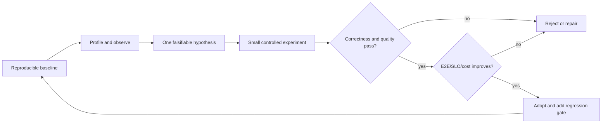

> 对应原书：*Distributed AI Systems*，Chapter 10：*Distributed Benchmarking and Performance Optimization*
> 本章主题：如何把训练和推理性能问题变成可复现、可统计检验、可归因且不牺牲正确性的实验。

---

## 0. 本章要回答的核心问题

1. 为什么“系统能跑”与“系统高效”之间可能相差数倍成本？
2. 为什么单GPU计时方法不能直接推广到多节点？
3. Benchmark要固定哪些workload、hardware、software和quality变量？
4. Microbenchmark、component benchmark、end-to-end benchmark分别回答什么？
5. Weak scaling和strong scaling为何不能混在一张效率图里？
6. Throughput speedup应相对1 GPU还是可运行的baseline $W_0$？
7. GPU utilization、SM occupancy、MFU、HFU和scaling efficiency有什么区别？
8. 为什么45% GPU utilization不能直接解释成“浪费55% GPU算力”？
9. Mean、median、P95、P99、max和variance各揭示什么？
10. P99至少需要多少样本，如何量化其不确定性？
11. 为什么fixed-concurrency/closed-loop benchmark会产生coordinated omission？
12. Warmup何时结束，为什么不能机械固定5次或50次？
13. CUDA异步执行如何让CPU计时低估GPU工作？
14. `torch.cuda.synchronize()`、CUDA Events和profiler分别适合哪种计时？
15. 为什么同步会改变原本可重叠的执行，不能用于所有细粒度phase？
16. 如何区分data、forward、backward、communication、optimizer和checkpoint时间？
17. DDP communication“总kernel时长”和critical-path exposed overhead为何不同？
18. Scaling efficiency公式在非1-GPU baseline下怎样写？
19. Amdahl、Gustafson和通信模型分别提供什么上限？
20. Network raw bandwidth、NCCL algbw、busbw和application effective bandwidth如何区分？
21. AllReduce小消息为何latency-bound，大消息为何bandwidth-bound？
22. PyTorch Profiler与Nsight Systems分别适合什么层级？
23. Profiler本身如何扰动时间、memory和kernel schedule？
24. DataLoader bottleneck应怎样用证据定位，而不是盲目增加workers？
25. Gradient accumulation何时减少DDP同步，何时完全不减少？
26. 如何判断bucket tuning、overlap、compression或更快fabric值得做？
27. Training throughput应按samples、tokens还是effective non-padding tokens？
28. 分布式优化后如何证明loss、update和下游quality没有退化？
29. Inference TPS、RPS、TTFT、ITL/TPOT和E2E怎样关联？
30. Input TPS与output TPS为何必须分开？
31. Open-loop与closed-loop负载分别回答什么？
32. 如何找到throughput saturation point和SLO knee？
33. Cold start、warm engine、warm prefix cache和steady traffic如何分开测？
34. Reasoning/agent系统为何必须分解model、tool、retrieval和orchestration？
35. Quantization/engine比较应使用什么quality metric和统计方法？
36. 如何设计CI performance gate避免噪声导致flaky failure？
37. 如何从一次profile形成“假设→单变量实验→验证→回归测试”的优化闭环？

统一实验对象：

```text
Result = f(
  workload distribution,
  model and quality,
  parallel/config,
  hardware/topology,
  software versions,
  load-generation policy,
  measurement boundary,
  system state,
  random/environment noise
)
```

---

## 1. The performance gap in distributed systems

### 1.1 Functional correctness只是起点

DDP能同步、FSDP能fit、vLLM能返回token、production gateway能route，只证明功能路径存在。Production还要回答：

- 每step/token花多少时间？
- 扩GPU后获得多少增益？
- 尾延迟是否达SLO？
- GPU/CPU/network/storage谁限制？
- 优化是否改变quality？
- 每个good token/sample成本多少？
- 结论能否在另一时段/节点/版本复现？

### 1.2 原章64 GPU案例的准确解读

原章给出GPU utilization 45%、8→64 scaling efficiency 52%，并说相当于约33张GPU有效compute。

若效率是相对**理想64-GPU throughput**定义：

$$
EquivalentGPU=64\times0.52=33.28
$$

但前提是baseline能线性外推到64，且throughput定义固定。若52%是相对8-GPU baseline：

$$
E_{8\rightarrow64}=\frac{T_{64}/T_8}{64/8}=0.52
$$

则：

$$
T_{64}=4.16T_8
$$

不能在不知道1→8效率时直接称等价33张单GPU。

更重要：45% GPU utilization与52% scaling efficiency不是同一指标，不能相乘/互相解释。GPU utilization只说明采样窗口内GPU有活动kernel，并不说明kernel做的是有用model FLOPs。

### 1.3 “闲置48%”成本估算的边界

336小时×64 GPUs×48%：

$$
WastedGPUHours\approx10321.9
$$

若每GPU-hour 4～5 currency units，粗略41.3k～51.6k。这是假设inefficiency可完全消除且cost线性；现实中通信、serial work和reserve不可全消除。优化目标应是可实现baseline，不是理论100%。

### 1.4 性能gap来源

```text
Input: data decode / storage / CPU / H2D
Compute: kernels / precision / shapes / fusion / compile
Memory: HBM capacity / bandwidth / allocator / cache
Communication: collectives / topology / arrival skew
Synchronization: barriers / host sync / control flow
Scheduling: batches / queues / bubbles / stragglers
Operations: checkpoint / logging / profiling / telemetry
Quality constraints: larger batch / lower precision / compression
```

Benchmark的任务是先归因，再选择对应优化；不能看到低GPU utilization就默认“网络慢”。

### 1.5 Figure 10.1的含义


Absolute step time下降同时communication share上升是常见现象。Share高不等于通信总时间必然增长，也可能compute被分得更快。应同时看：absolute compute/comm、overlap、step critical path和throughput。

---

## 2. Why benchmarking matters

### 2.1 Distributed额外变量

单GPU主要有kernel/data/memory；distributed增加：

- Rank placement；
- NVLink/PCIe/IB/RoCE topology；
- Collective algorithms/protocols；
- Message sizes/buckets；
- Rank arrival skew；
- Cross-node storage；
- Process launch/binding；
- Failure/retry；
- Global batch changes；
- Sharded state/materialization。

同一代码在不同node allocation上结果可变，硬件拓扑必须进入benchmark metadata。

### 2.2 Technology selection必须匹配workload

原章举fixed prompt比较vLLM/SGLang，却漏掉production shared/variable prefixes。更一般：

```text
Benchmark workload support should cover production distribution:
input/output lengths
arrival process
concurrency
prefix reuse
sampling/grammar/tools
model variants
tenant priorities
```

框架优化点不在synthetic workload出现，就不能据此淘汰。

### 2.3 Capacity planning

没有scaling curve就只能按线性或保守倍数采购。需要：

$$
Capacity(W,Workload,SLO)=MeasuredGoodput
$$

而不是：

$$
Capacity(W)=W\times SingleGPUThroughput
$$

### 2.4 Bottleneck证据

GPU utilization 45%可能来自data wait、small kernels、barriers、checkpoint或CPU launch；只有phase/profile/trace才能判断。

原章“50-dollar SSD可省10000”是说明便宜组件可限制昂贵GPU，不是可直接套用的ROI。应先测storage throughput、data queue和GPU idle correlation。

### 2.5 SLA/SLO realism

用100-token synthetic prompt通过P99不能代表长文档production。Benchmark必须在相同SLO边界测client-observed latency，并包含queue与routing；仅engine latency不能证明production SLA。

### 2.6 Benchmark作为回归契约

Benchmark不仅一次性调优，还应：

- PR/版本性能回归；
- Driver/CUDA/framework upgrade；
- Model/quantization变更；
- New hardware/instance；
- Capacity/autoscaler参数；
- Canary release guardrail。

Performance gate需统计容忍和稳定runner，避免噪声阻塞开发。

---

## 3. Benchmarking fundamentals

### 3.1 先写问题，再选metric

| 问题 | Primary metric | Supporting evidence |
| --- | --- | --- |
| Training多久完成 | tokens/s、time-to-quality | phase、MFU、cost |
| 增GPU是否值得 | strong/weak scaling efficiency | comm/straggler/network |
| Interactive是否响应快 | client TTFT/TPOT p95/p99 | queue/prefill/decode spans |
| 最大服务容量 | SLO goodput vs offered load | queue/KV/errors |
| Quantization是否值得 | cost/good token | quality delta/memory |
| Data bottleneck | GPU idle correlated data wait | CPU/storage/H2D |

Metric没有问题上下文就容易被优化成错误目标。

### 3.2 Measurement boundary

#### Kernel microbenchmark

只测operator/device time，适合kernel tuning，不代表application。

#### Component benchmark

DataLoader、AllReduce、prefill、decode、router等，适合归因。

#### End-to-end

包含真实请求/step路径，适合SLO/cost。难以直接归因，需要component证据。

三层应共同存在：micro improvement若不改善E2E，可能被其他瓶颈/overlap隐藏。

### 3.3 Experimental control

固定/记录：

```text
model/revision/config/precision/quality
global batch, sequence, valid tokens
world and parallel degrees
hardware SKU/count/topology/clocks/power
driver/CUDA/NCCL/framework/engine/commit
data/tokenizer/storage/cache
warmup/measurement/repetitions
load generation/arrival/concurrency
profiler/debug/env flags
background jobs/node health
```

### 3.4 一次只改变一个主变量

比较TP4→TP8时，不同时改batch、quantization、max context和engine version。若必须联合改动（因为fit约束），明确这是configuration comparison而非单因素因果。

### 3.5 Paired与randomized runs

系统性能随时间/cluster congestion漂移。可交替A/B：

```text
A1 B1 B2 A2 A3 B3 ...
```

或随机run order，减少“上午A/下午B”的时间偏差。Paired differences比两个独立means更有统计power。

### 3.6 Replication层级

- Iterations within one process；
- Independent process restarts；
- Different node allocations；
- Different times/days；
- Different seeds/workload samples。

100 iterations在同一warm process不是100个独立环境replicates。报告within-run和between-run variance。

---

## 4. Understanding percentile latencies

### 4.1 Empirical percentile

排序samples $x_{(1)}\le\cdots\le x_{(n)}$。线性插值常用位置：

$$
h=(n-1)q
$$

$$
Q(q)=x_{(\lfloor h\rfloor+1)}(1-r)+x_{(\lceil h\rceil+1)}r
$$

$r=h-\lfloor h\rfloor$。不同库使用不同quantile definitions，小样本P99会不同；报告工具/方法。

### 4.2 P50、P95、P99

- P50：typical；
- P95：较常见tail/SLO；
- P99：1%最慢边界；
- Max：极端、样本数敏感；
- Mean：总resource/queueing有用，但掩盖tail。

“P99比average重要”不是绝对：capacity/cost可能需要mean，用户SLO需要tail。两者一起报。

### 4.3 P99样本量

100 samples的P99几乎由最大几个点决定，不稳定。若希望观察约100个tail samples：

$$
n\times(1-0.99)\approx100\Rightarrow n\approx10000
$$

这不是confidence保证，只是直觉。Bootstrap CI或order-statistic/binomial interval量化不确定性。

### 4.4 Tail ratio

$$
TailAmplification=P99/P50
$$

10×提示稀有stall/heterogeneous workload，但需按input/output length、cache hit、model/tenant分层，避免把正常长请求当异常。

### 4.5 CDF与histogram

CDF便于读percentiles；histogram揭示多峰。多峰可能是：cold/warm、short/long prompt、cache hit/miss、不同backend、retry。不要只给三个percentile丢失结构。

### 4.6 Coordinated omission

Closed-loop client等上一个完成才发下一个；server变慢时arrival自动降低，漏记本应在此期间到达/排队的请求，tail被低估。

Open-loop按计划时间发请求，即使server慢也继续，能暴露overload queue。若generator本身跟不上，要记录scheduled-vs-actual send lag。

### 4.7 可运行percentile工具

```python
from math import floor


def percentile(values: list[float], quantile: float) -> float:
    if not values or not 0 <= quantile <= 1:
        raise ValueError("Need values and quantile in [0, 1]")
    ordered = sorted(values)
    position = (len(ordered) - 1) * quantile
    lower = floor(position)
    upper = min(lower + 1, len(ordered) - 1)
    weight = position - lower
    return ordered[lower] * (1 - weight) + ordered[upper] * weight


samples = [10, 11, 12, 13, 14, 15, 16, 17, 18, 100]
print(f"mean={sum(samples) / len(samples):.1f}")
print(f"p50={percentile(samples, 0.50):.1f}")
print(f"p95={percentile(samples, 0.95):.1f}")
print(f"p99={percentile(samples, 0.99):.1f}")
```

预期输出：

```text
mean=22.6
p50=14.5
p95=63.1
p99=92.6
```

一个100ms outlier已显著拉高P95/P99；只有10 samples时tail estimate很不稳。

### 4.8 Bootstrap confidence interval

对run-level samples重采样，可估mean/percentile CI。时间序列相关时普通iid bootstrap不适用，考虑block bootstrap或以independent runs为unit。

```python
import random
from math import floor


def _quantile(values: list[float], probability: float) -> float:
    ordered = sorted(values)
    position = (len(ordered) - 1) * probability
    lower = floor(position)
    upper = min(lower + 1, len(ordered) - 1)
    weight = position - lower
    return ordered[lower] * (1 - weight) + ordered[upper] * weight


def bootstrap_statistic(
    values: list[float],
    statistic,
    *,
    resamples: int = 2000,
    seed: int = 0,
) -> tuple[float, float]:
    if not values or resamples <= 0:
        raise ValueError("Need values and positive resamples")
    generator = random.Random(seed)
    estimates = []
    for _ in range(resamples):
        sample = [generator.choice(values) for _ in values]
        estimates.append(float(statistic(sample)))
    return _quantile(estimates, 0.025), _quantile(estimates, 0.975)
```

CI描述sampling uncertainty，不覆盖systematic bias（错误workload、coordinated omission、profile扰动）。

---

## 5. Efficiency metrics

### 5.1 Speedup

相对baseline $W_0$ GPUs：

$$
S(W;W_0)=\frac{Throughput(W)}{Throughput(W_0)}
$$

或固定workload下：

$$
S(W;W_0)=\frac{Time(W_0)}{Time(W)}
$$

两种在工作量固定时等价。

### 5.2 Scaling efficiency

$$
E(W;W_0)=\frac{S(W;W_0)}{W/W_0}
=\frac{Throughput(W)/W}{Throughput(W_0)/W_0}
$$

原章选择题公式 `throughput_N/(throughput_1*N)`只适用于$W_0=1$。

### 5.3 Strong vs weak scaling

#### Strong scaling

总problem/global batch固定，增加GPUs，目标缩短time。Communication/小local batch使效率下降。

#### Weak scaling

Per-GPU workload固定，总problem随GPUs增长，目标step time近似不变/throughput线性。Global batch/optimization semantics变化。

不能把weak-scaling throughput曲线称为固定任务speedup。

### 5.4 GPU utilization

通常来自采样窗口内GPU忙碌程度。高util可能运行：

- Useful tensor-core model compute；
- Low-efficiency kernels；
- Communication kernels；
- Recompute；
- Busy-wait。

所以：

$$
GPUUtil\ne MFU
$$

### 5.5 MFU与HFU

#### Model FLOPs Utilization

$$
MFU=\frac{ModelTheoreticalFLOPsPerStep/StepTime}{HardwarePeakFLOPs}
$$

Model FLOPs通常不计activation recompute等implementation overhead，反映model useful compute效率。

#### Hardware FLOPs Utilization

$$
HFU=\frac{ActuallyExecutedFLOPs/s}{HardwarePeakFLOPs}
$$

包含recompute等执行FLOPs，可能高于MFU。Peak需匹配dtype、sparsity、GPU count和clock；FLOP估算口径必须公开。

### 5.6 Memory Efficiency：Memory metrics

- Allocated vs reserved vs device-used；
- Peak vs steady；
- Persistent vs temporary；
- Fragmentation/allocator retries；
- Max batch/context capacity；
- Host pinned/offload memory。

“20GB free但不能alloc 10GB”可能是fragmentation，也可能被其他process、virtual-address/contiguous workspace或统计口径误导；用memory snapshot/allocator evidence确认。

### 5.7 Cost per Token/Sample：Cost efficiency

Training：

$$
CostPerGoodTrainingToken=\frac{GPUHours\cdot Price+OtherCost}{ValidTokens\ reaching\ quality}
$$

Inference：

$$
CostPerSLOGoodOutputToken=\frac{ServingCost}{OutputTokens\ satisfying\ SLO/quality}
$$

只按raw token会奖励质量退化和SLO violation。

### 5.8 Scaling工具

```python
def scaling_metrics(
    baseline_gpus: int,
    baseline_throughput: float,
    target_gpus: int,
    target_throughput: float,
) -> dict[str, float]:
    if min(baseline_gpus, target_gpus) <= 0:
        raise ValueError("GPU counts must be positive")
    if min(baseline_throughput, target_throughput) <= 0:
        raise ValueError("Throughputs must be positive")
    speedup = target_throughput / baseline_throughput
    ideal = target_gpus / baseline_gpus
    return {
        "speedup": speedup,
        "ideal_speedup": ideal,
        "efficiency": speedup / ideal,
    }


metrics = scaling_metrics(8, 1000, 64, 4160)
print(f"speedup={metrics['speedup']:.2f}x")
print(f"ideal={metrics['ideal_speedup']:.1f}x")
print(f"efficiency={metrics['efficiency']:.1%}")
```

预期输出：

```text
speedup=4.16x
ideal=8.0x
efficiency=52.0%
```

### 5.9 效率阈值不是普适等级

原章将>90%、70～90%、50～70%、<50%分级，适合作为提醒，不是跨workload标准。Large-scale、long context、model fit、cost和time-to-quality可能让60%仍值得；small scale 85%也可能有明显可修瓶颈。以边际cost/benefit判断。

---

## 6. Benchmarking methodology

### 6.1 Warmup不是固定次数

Warmup要覆盖：

- CUDA context/library initialization；
- Kernel/JIT/`torch.compile`；
- CUDA graph capture；
- Memory pools/allocator；
- NCCL communicator；
- Data/page/filesystem cache；
- Engine scheduler/KV/prefix cache；
- Thermal/power steady state。

Eager 5～10、compile 20～50只是原章经验。更可靠：监控rolling median/variance、compile/capture日志，达到稳定准则后开始；设置max warmup防无限等待。

### 6.2 Cold与warm都应测

Warm benchmark不能替代cold start。分别：

```text
Cold process/node/model
Warm process, cold data/prefix
Warm engine, warm common prefix
Steady open-loop traffic
```

### 6.3 CUDA异步计时

CPU call只enqueue kernel。错误：

```python
start = time.perf_counter()
model(inputs)
elapsed = time.perf_counter() - start
```

它可能只测launch。E2E step计时前后synchronize；单kernel/device phase用CUDA Events并确保stream依赖。

### 6.4 Synchronize的扰动

在forward/backward每个subphase都插`torch.cuda.synchronize()`会破坏communication-compute overlap，所得phase sum不代表原始step。选择：

- E2E wall time：step边界sync；
- Natural timeline：profiler/Nsight；
- Isolated operator：Events/sync；
- Phase attribution：NVTX/record_function，不强制每阶段sync。

### 6.5 Warmup与测量工具

```python
import statistics
import time
from collections.abc import Callable

import torch


def benchmark_cuda_callable(
    operation: Callable[[], None],
    *,
    warmup: int = 10,
    iterations: int = 100,
) -> dict[str, float]:
    if warmup < 0 or iterations <= 0:
        raise ValueError("Invalid warmup or iteration count")
    for _ in range(warmup):
        operation()
    torch.cuda.synchronize()

    samples_ms = []
    for _ in range(iterations):
        torch.cuda.synchronize()
        started = time.perf_counter()
        operation()
        torch.cuda.synchronize()
        samples_ms.append((time.perf_counter() - started) * 1000)

    return {
        "mean_ms": statistics.fmean(samples_ms),
        "stdev_ms": statistics.stdev(samples_ms) if len(samples_ms) > 1 else 0.0,
        "p50_ms": percentile(samples_ms, 0.50),
        "p95_ms": percentile(samples_ms, 0.95),
        "p99_ms": percentile(samples_ms, 0.99),
    }
```

该函数故意isolates每iteration，不适合测pipeline overlap/throughput；文档中应注明boundary。

### 6.6 Multiple runs

每config：

```text
fresh process warmup
-> fixed measurement window/iterations
-> save raw samples
-> repeat independent runs
-> aggregate run-level estimates and CI
```

100 iterations是起点，短kernel需更多，昂贵训练step可更少但多runs。报告实际n。

### 6.7 Outlier policy

不要看到tail难看就删outliers。预先定义：

- Functional invalid（OOM/network error）作为failure；
- Known external disturbance是否剔除并报告；
- Robust median/MAD；
- Raw distribution保留；
- Winsorization仅有业务理由。

Production tail本来就是benchmark对象。

### 6.8 Isolation与realism冲突

Isolated nodes减少噪声，适合algorithm comparison；shared production-like环境反映真实contention。两套都可测：controlled benchmark与fleet/trace benchmark，不能互相冒充。

### 6.9 Reproducibility manifest

```text
benchmark code commit
model/tokenizer/data revisions
command/config/env
container digest
driver/CUDA/NCCL/framework
GPU/CPU/RAM/storage/network/topology
node names/clocks/power limits
warmup/iterations/runs/random seeds
raw samples and failures
profiler enabled?
date/time/load context
```

### 6.10 Optimization闭环



一次只优化profile证明的主瓶颈；优化后重新profile，因为bottleneck会移动。

---

## 7. Training benchmarking

### 7.1 Training pipeline

```text
Fetch/read/decode/augment
  -> host batch wait
  -> H2D
  -> forward
  -> loss
  -> backward + overlapping collectives
  -> optimizer/update
  -> logging/eval/checkpoint
```

Step只测forward/backward会漏data/checkpoint；E2E epoch只给总时间又无法归因。需要两层边界。

### 7.2 Samples/s与tokens/s

Samples固定shape时：

$$
Samples/s=\frac{GlobalSamples}{StepTime}
$$

LLM变长/packing下更合理：

$$
ValidTokens/s=\frac{\sum nonpadding\ tokens}{WallTime}
$$

同时报告processed tokens（含padding）可揭示packing efficiency：

$$
PackingEfficiency=ValidTokens/ProcessedTokens
$$

只报samples/s会把128-token与8K-token batch当同样工作。

### 7.3 Step time与time-to-quality

Step throughput高但需要更多steps才能达到同quality，未必训练更快。

$$
TimeToQuality=\sum_{step=1}^{K(Q)}StepTime+Eval/Checkpoint/Recovery
$$

$K(Q)$为达到quality $Q$所需steps。Large global batch/precision/compression可能改变收敛。

### 7.4 Training指标表

| 类别 | 指标 |
| --- | --- |
| Throughput | samples/s、valid tokens/s、steps/s |
| Time | data/H2D/forward/backward/update/checkpoint |
| Compute | GPU util、MFU/HFU、kernel occupancy |
| Memory | allocated/reserved/device peak、host/offload |
| Communication | collective count/bytes/time/exposed tail |
| Scale | strong/weak speedup/efficiency |
| Quality | loss curve、task metric、time-to-quality |
| Cost | GPU-hours/good token、energy（若测） |
| Stability | variance、straggler、retries/failures |

### 7.5 GPU utilization低于80%的边界

原章把<80%作为bottleneck提示，只是经验。小模型/latency-optimized kernels可能合理低；高util也可能是communication/recompute。结合MFU、kernel timeline、data wait和power。

### 7.6 Communication overhead的三个口径

1. Executed communication kernel time；
2. Network bytes/bandwidth；
3. Exposed step delay（未被compute overlap隐藏）。

不能用NCCL kernel duration之和直接除step time：kernels可能在different streams与backward重叠，sum甚至可超过wall time。

### 7.7 Phase关系

自然step wall time不一定等于phase times简单相加：

$$
T_{step}\le T_{compute}+T_{comm}+T_{H2D}
$$

当overlap存在严格小于。Profiler timeline比强制serial phase计时更真实。

---

## 8. PyTorch Profiler

### 8.1 适用层级

PyTorch profiler把Python/ATen/CUDA/memory和distributed ops关联，适合回答：

- 哪些operators耗时；
- CPU launch gaps；
- Shapes/memory；
- NCCL与compute overlap；
- 哪个module/phase触发；
- Rank间trace差异。

### 8.2 基础配置代价

- `record_shapes=True`持有tensor references/增加overhead；
- `profile_memory=True`记录allocation；
- `with_stack=True`开销更大；
- 全程profile产生巨大trace/改变performance。

只在短active window启用，并另跑无profiler baseline。

### 8.3 Scheduled profiler

```python
from pathlib import Path

from torch.profiler import ProfilerActivity, profile, schedule, tensorboard_trace_handler


def build_profiler(output_dir: str, rank: int):
    rank_dir = Path(output_dir) / f"rank_{rank}"
    rank_dir.mkdir(parents=True, exist_ok=True)
    return profile(
        activities=[ProfilerActivity.CPU, ProfilerActivity.CUDA],
        schedule=schedule(wait=2, warmup=2, active=4, repeat=1),
        on_trace_ready=tensorboard_trace_handler(
            str(rank_dir),
            use_gzip=True,
        ),
        record_shapes=False,
        profile_memory=True,
        with_stack=False,
    )
```

Loop中每step `prof.step()`，否则schedule不前进。所有rank可短trace；文件按rank隔离。只rank0会漏straggler和pipeline stage。

### 8.4 `record_function`

标记：

```text
data_wait
host_to_device
forward
loss
backward
optimizer
checkpoint
```

DDP bucket collectives通常由runtime触发，timeline中与backward operators重叠。不要为了“测通信”手工再做额外AllReduce。

### 8.5 Trace阅读顺序

1. 找step boundary与GPU idle gaps；
2. 对齐CPU enqueue与GPU kernels；
3. 找NCCL开始/结束和overlap；
4. 找rank arrival skew；
5. Memory peak前的allocations；
6. Data/H2D gaps；
7. 再看operator table。

Table total time可能double-count nested/overlapped ranges；timeline先于简单sum。

### 8.6 Profiler不能回答的全部问题

NIC counters、OS scheduling、multi-process system interactions、driver details和custom kernel hardware counters更适合Nsight/DCGM/Nsight Compute。

---

## 9. NVIDIA Nsight Systems

### 9.1 Nsight Systems vs Compute

- Nsight Systems：system timeline、CPU threads、CUDA APIs、kernels、memcpy、NCCL、NVTX；
- Nsight Compute：单kernel hardware counters/roofline/occupancy；
- PyTorch Profiler：framework/operator/module语义。

从PyTorch→Nsight Systems→Nsight Compute逐级深入。

### 9.2 命令

```shell
nsys profile \
  --trace=cuda,nvtx,osrt \
  --sample=none \
  --output=training_profile \
  python train.py

nsys stats --report gputrace training_profile.nsys-rep
```

Distributed每rank都profile会产生巨量数据。选择representative ranks/node或用capture range：NVTX/CUDA profiler API控制只采稳定steps。参数按Nsight版本核对。

### 9.3 关注点

- CUDA API launch latency；
- Long CPU gaps；
- H2D/D2H/pageable vs pinned；
- Kernel serialization/streams；
- NCCL overlap；
- Rank/process timelines；
- Checkpoint I/O间GPU idle；
- Context switches/CPU affinity。

### 9.4 Nsight overhead

Trace本身可能改变launch、I/O和storage。Profile run用于归因，不作为最终throughput数字；优化前后都用无profile重复测E2E。

---

## 10. Custom training benchmark

### 10.1 为什么需要custom harness

Profiler适合深挖，custom harness适合配置matrix、CI和raw sample持久化。它应控制warmup、measurement、sync boundary、rank aggregation、failure和metadata。

### 10.2 Natural step timer

不在每phase插synchronize，而用CPU wall data wait + step边界GPU sync，phase细分交给NVTX/profiler：

```python
from dataclasses import dataclass
import time

import torch
import torch.distributed as dist


@dataclass(frozen=True)
class StepSample:
    data_wait_ms: float
    step_ms: float
    valid_tokens: int


def benchmark_training_steps(
    model,
    optimizer,
    data_iterator,
    train_step,
    *,
    warmup_steps: int,
    measured_steps: int,
    device: torch.device,
) -> list[StepSample]:
    samples = []
    total_steps = warmup_steps + measured_steps
    for step in range(total_steps):
        data_started = time.perf_counter()
        batch, valid_tokens = next(data_iterator)
        data_wait_ms = (time.perf_counter() - data_started) * 1000

        torch.cuda.synchronize(device)
        step_started = time.perf_counter()
        train_step(model, optimizer, batch, device)
        torch.cuda.synchronize(device)
        step_ms = (time.perf_counter() - step_started) * 1000

        if step >= warmup_steps:
            samples.append(StepSample(data_wait_ms, step_ms, int(valid_tokens)))
    return samples
```

如果data prefetch与GPU step overlap，`next(iterator)`只测暴露wait，不是data pipeline总CPU work；这正是step critical path需要的量。

### 10.3 Distributed aggregation

同步step由slowest rank决定。对每step：

$$
T_{step}=\max_rT_{r}
$$

Valid tokens是全rank sum：

$$
Tokens=\sum_rTokens_r
$$

如果每rank等长也不要简单乘world，padding/packing可能不同。用collective聚合；原始per-rank samples另存以找straggler。

### 10.4 Phase阈值不是诊断定律

原章“data>10%就加workers”“backward>2×forward就checkpoint”不可靠：

- Backward天然可能约forward的2倍或更多；
- Activation checkpoint会**增加**backward重算，不是修复慢backward；
- Data wait比例受prefetch overlap；
- More workers可能CPU/RAM/I/O contention变差。

应以profile证据和A/B sweep决定。

### 10.5 DataLoader实验

扫描：

```text
num_workers: 0,1,2,4,8,... <= allocated CPUs
pin_memory: false/true
persistent_workers
prefetch_factor
batch decode/augmentation
local vs shared storage/cache
```

记录valid tokens/s、data wait p95、CPU/RAM、storage throughput和GPU idle。原章“workers为CPU cores per GPU的2～4倍”通常会严重oversubscribe；合理上限受allocated CPU和每worker内线程影响。

### 10.6 H2D优化

Pinned memory + `non_blocking=True`只有在source pinned、stream/dependency允许时异步；用prefetch stream可overlap。Pinned memory过多消耗host RAM并影响OS。

---

## 11. Measuring scaling efficiency

### 11.1 Figure 10.2


每点必须是相同strong/weak protocol、独立重复和同quality，而不是从单次run连线。

### 11.2 Strong-scaling protocol

- Fixed model/global batch/sequence/valid tokens；
- Adjust per-rank microbatch/accumulation；
- Same optimizer/learning semantics；
- Same data and measured steps；
- World sizes 1/2/4/8...（若model fit）；
- Record local batch变小后的kernel efficiency。

当global batch小于world或local microbatch太小，strong scaling天然停止。

### 11.3 Weak-scaling protocol

- Fixed per-rank microbatch/sequence；
- Global batch随world增长；
- Step time/throughput scaling；
- Quality/time-to-quality另测，因为optimization changes。

### 11.4 Baseline不能fit怎么办

70B可能1 GPU OOM。选择最小可行$W_0$并明确：

$$
E(W;W_0)=\frac{T(W)/W}{T(W_0)/W_0}
$$

不要把$W_0=8$结果误称“相对1 GPU efficiency”。

### 11.5 Marginal efficiency

从$W_a$到$W_b$：

$$
E_{marginal}=\frac{Throughput_b-Throughput_a}{Throughput_a}\bigg/\frac{W_b-W_a}{W_a}
$$

或更直观看新增GPU带来的incremental throughput/cost。整体效率可能尚可但最后一档不值得。

### 11.6 Scaling曲线预测边界

原章从8 GPU 81%推16 GPU约13×不可靠：efficiency通常随scale变化，不能假设保持81%。必须至少用communication/Amdahl模型拟合或实测16。

---

## 12. Validating distributed training accuracy

### 12.1 公平性前提

保持：

- Effective global batch；
- Optimizer/LR schedule（按tokens还是steps）；
- Total valid tokens；
- Data order/sampler；
- Initialization；
- Precision/loss scaling；
- Gradient clipping；
- Dropout/RNG policy；
- Evaluation data/code。

单GPU和distributed若global batch不同，“相同超参”不等于相同实验。

### 12.2 分层correctness

```text
Operator/shard output
-> one-step loss/grad/update
-> few-step trajectory
-> fixed-token training curve
-> downstream quality/multiple seeds
```

越早层越容易精确定位；最终quality证明optimization可接受。

### 12.3 Equivalence不是bitwise identity

Collective reduction order、TF32/BF16和kernels会产生小差异；长训练chaotic divergence不代表bug。定义tolerance和statistical equivalence，而不是要求最终weights bitwise相等。

### 12.4 Statistical test

多个seeds得到paired metric differences $d_i=optimized_i-baseline_i$。不仅做“是否差异显著”，还做non-inferiority：

$$
H_0:E[d]\le-\Delta
$$

$\Delta$为最大可接受退化。p=0.3不证明“相同”，可能只是power不足；报告effect size和CI。

### 12.5 原章“0.5%, p=0.001”

显著但是否业务重要取决于non-inferiority margin；“0.5%, p=0.3”也不能自动当noise。样本量、test assumptions和multiple comparisons必须检查。

### 12.6 Time-to-quality

不同throughput/收敛：

$$
TTQ(Q)=Time\ until\ validation\ metric\ reaches\ Q
$$

若某优化快20%但需多30% tokens达到Q，最终更慢。

---

## 13. Network and communication profiling

### 13.1 Figure 10.3


原章600 GB/s NVLink、200 GB/s IB、12.5 GB/s 100GbE是粗略峰值/代际示意。注意bits/bytes、uni/bi-directional、aggregate/per-link和protocol overhead，不能直接与application algbw比。

### 13.2 Raw network baseline

- `iperf3`：TCP/UDP host network；
- `ib_write_bw/read_bw`：RDMA verbs；
- NCCL tests：GPU collective path；
- Application trace：真实message/overlap。

Iperf 100Gbps而training 20Gbps不一定是“communication pattern bug”：可能GPU-NIC PCIe、collective bus factor、small messages、compute overlap、multi-rail/config或metric口径。

### 13.3 Ring AllReduce α-β模型

$p$ ranks、payload $n$ bytes、per-step latency $\alpha$、effective bandwidth $B$。Ring有reduce-scatter+all-gather，各$p-1$ phases：

$$
T_{ring}\approx2(p-1)\alpha+2\frac{p-1}{p}\frac{n}{B}
$$

小$n$第一项主导；大$n$第二项主导。Tree有不同phase/latency-bandwidth trade-off，NCCL按topology/size选algorithm/protocol。

### 13.4 AllReduce bandwidth口径

$$
AlgBW=\frac{n}{T}
$$

Ring AllReduce busbw convention：

$$
BusBW=AlgBW\cdot\frac{2(p-1)}{p}
$$

使用nccl-tests的定义和GB/GiB，不能把wire bytes粗略2×后随意标GB/s。

### 13.5 可运行Ring模型

```python
def ring_all_reduce_seconds(
    ranks: int,
    payload_bytes: int,
    latency_seconds: float,
    bandwidth_bytes_per_second: float,
) -> float:
    if ranks <= 0 or payload_bytes < 0 or latency_seconds < 0:
        raise ValueError("Invalid Ring inputs")
    if bandwidth_bytes_per_second <= 0:
        raise ValueError("Bandwidth must be positive")
    if ranks == 1:
        return 0.0
    return (
        2 * (ranks - 1) * latency_seconds
        + 2 * (ranks - 1) / ranks * payload_bytes / bandwidth_bytes_per_second
    )


for size_kib in (4, 1024, 102400):
    seconds = ring_all_reduce_seconds(
        ranks=8,
        payload_bytes=size_kib * 1024,
        latency_seconds=2e-6,
        bandwidth_bytes_per_second=25e9,
    )
    print(f"{size_kib:6d} KiB: {seconds * 1e6:8.2f} us")
```

预期输出：

```text
    4 KiB:    28.29 us
  1024 KiB:   101.40 us
102400 KiB:  7368.03 us
```

模型忽略topology、protocol、contention和kernel overhead，只解释size regime。

### 13.6 Communication profiling协议

```text
nccl-tests sizes sweep
one node vs two nodes x one GPU vs full nodes
collective types matching workload
actual bucket/message histogram
rank arrival timestamps
executed bytes/time
exposed wait in real step
```

### 13.7 Straggler与collective

Collective开始取决于最晚rank到达。某rank data/compute慢会让其他rank在NCCL wait，看起来“communication bottleneck”。比较每rank pre-collective timeline，找arrival skew。

### 13.8 Overlap

$$
T_{exposed}\ge\max(0,T_{comm}-T_{independent\ compute})
$$

Overlap不减少bytes；bucket过小增加latency，过大延迟first communication/占memory。Profile调bucket，不机械25MB。

---

## 14. Scaling bottleneck analysis

### 14.1 Amdahl's Law

Parallel fraction $P$、serial $1-P$、$N$ processors：

$$
S(N)=\frac{1}{(1-P)+P/N}
$$

$$
S(\infty)=\frac{1}{1-P}
$$

Serial 10%→上限10×。Distributed communication通常随N变化，不是固定serial fraction，所以Amdahl是上限直觉，不是完整预测。

### 14.2 Gustafson's Law

Weak scaling扩大problem：

$$
S_G(N)=N-(1-P)(N-1)
$$

解释为何更多GPU可训练更大problem，即使固定problem strong scaling饱和。但训练global batch扩大可能改变quality。

### 14.3 可运行计算器

```python
def amdahl_speedup(parallel_fraction: float, processors: int) -> float:
    if not 0 <= parallel_fraction <= 1 or processors <= 0:
        raise ValueError("Invalid Amdahl inputs")
    return 1 / ((1 - parallel_fraction) + parallel_fraction / processors)


def gustafson_speedup(parallel_fraction: float, processors: int) -> float:
    if not 0 <= parallel_fraction <= 1 or processors <= 0:
        raise ValueError("Invalid Gustafson inputs")
    return processors - (1 - parallel_fraction) * (processors - 1)


print(f"Amdahl P=0.9, N=64: {amdahl_speedup(0.9, 64):.2f}x")
print(f"Gustafson P=0.9, N=64: {gustafson_speedup(0.9, 64):.2f}x")
```

预期输出：

```text
Amdahl P=0.9, N=64: 8.77x
Gustafson P=0.9, N=64: 57.70x
```

### 14.4 Extended scaling model

$$
T(N)=T_{serial}+T_{parallel}/N+T_{comm}(N)+T_{imbalance}(N)+T_{overhead}(N)
$$

用多个world points和phase traces拟合/解释，避免把所有非理想都塞进“serial fraction”。

### 14.5 Bottleneck patterns

#### Data-bound

GPU gaps与`next(dataloader)`/storage相关；local cache改善。扫描workers/prefetch/format/storage。

#### Communication-bound

NCCL exposed tail随scale增、large-message bw低或arrival skew。检查topology、buckets、overlap、parallel layout。

#### Compute-bound

GPU持续busy且MFU仍可能低，检查shapes、precision、fusion、compile、local batch。

#### Memory-bound

High HBM bandwidth/low compute；decode、norm/elementwise、小GEMM等。量化/fusion/batching/TP bandwidth。

#### Synchronization-bound

Barriers、host `.item()`、logging、rank-dependent control、small collectives。

#### Checkpoint/I/O-bound

周期性长idle、filesystem saturation。Distributed/async checkpoint、interval/retention。

### 14.6 Gradient accumulation的准确语义

DDP非边界microsteps需`no_sync()`：

```python
for micro_step, batch in enumerate(micro_batches):
    synchronize = micro_step == len(micro_batches) - 1
    context = nullcontext() if synchronize else ddp_model.no_sync()
    with context:
        loss = ddp_model(batch) / len(micro_batches)
        loss.backward()
optimizer.step()
optimizer.zero_grad(set_to_none=True)
```

否则每次backward仍AllReduce，只是延迟optimizer step。Accum增加global batch/activation/runtime，质量和memory需验证。

### 14.7 Compression边界

FP16/BF16 reduction、quantized gradients、PowerSGD等减少bytes/时间，但引入error、kernel和state。必须比较time-to-quality，不只step throughput。

### 14.8 Systematic decision table

| Evidence | Hypothesis | Cheapest discriminating experiment |
| --- | --- | --- |
| Data wait p95高 | Loader/storage | Preloaded synthetic batch对照 |
| NCCL exposed高 | Network/bucket | One-node vs two-node + nccl-tests |
| Kernels tiny/gaps | Launch/local batch | Larger microbatch/compile A/B |
| HBM saturated | Memory bound | Precision/fusion/batch sweep |
| One rank slow | Straggler | Rank phase/clock/data placement |
| Checkpoint spikes | I/O | Disable/save interval/storage A/B |

优化必须由证据选择，不列一串flags同时开启。

---

## 15. Inference benchmarking

### 15.1 为什么与training不同

Training workload由job控制；serving workload由arrival、变长prompt/output、cache和streaming决定。Benchmark既要测no-queue engine capability，也要测有queue production SLO。

### 15.2 Figure 10.4


指标分：throughput（work/time）、request latency、token latency、capacity/memory、quality/cost。

### 15.3 Tokens per Second（TPS）：Input/Output/Total TPS

$$
InputTPS=\frac{\sum_iN_{in,i}}{T}
$$

$$
OutputTPS=\frac{\sum_iN_{out,i}}{T}
$$

$$
TotalTPS=InputTPS+OutputTPS
$$

Prefill/decode资源路径不同，必须分报。只说“TPS”不注明口径没有可比性。

### 15.4 System TPS与per-request TPS

- System output TPS：所有requests aggregate；
- Per-request generation rate：某request output tokens/active decode time；
- 每个stream ITL体验可在高system TPS下变差（batching/fairness）。

Figure 10.5：


### 15.5 Requests per second

$$
RPS=CompletedRequests/T
$$

RPS只有在input/output分布固定时可比。1-token与1000-token outputs不能当等价request。

### 15.6 E2E latency

Client-observed：

$$
E2E=t_{last\ byte/token}-t_{send}
$$

包含network、gateway、queue、tokenization、prefill、decode、detokenization/stream。Figure 10.6：


### 15.7 Time to First Token（TTFT）

Client TTFT：

$$
TTFT=t_{first\ visible\ content}-t_{send}
$$

包含routing/queue；原章只列tokenization/prefill/first generation是不完整的server-centric描述。Figure 10.7：


首个SSE event可能只有role/metadata，不应当first token。

### 15.8 ITL与TPOT

Individual ITL：

$$
ITL_j=t_j-t_{j-1}
$$

Request average TPOT：

$$
TPOT=\frac{t_{last}-t_{first}}{N_{out}-1}
=mean(ITL_2,\ldots,ITL_N)
$$

所以原章选择题说“同一件事”是简化：TPOT常是平均，ITL可指每个interval及其distribution。Figure 10.8：


### 15.9 Metric relationship

若无中途stall定义差异：

$$
E2E\approx TTFT+(N_{out}-1)TPOT
$$

短output TTFT占主导；长output TPOT占主导。但最后serialization/network、empty chunks可能产生小差异。

### 15.10 Latency distribution

Figure 10.9：


分层维度：input/output length、cache hit、model、tenant、backend、release、error/retry、cold/warm。总体P99可能只是workload mix变化。

### 15.11 Goodput vs offered load

随着offered load：

```text
Low load: latency flat, throughput ~= offered
Knee: queue/tail begins rising
Saturation: throughput plateaus
Overload: errors/timeouts, goodput may fall
```

Capacity是满足SLO的最高stable offered load，不是最大完成TPS。

### 15.12 Concurrency sweep

Fixed concurrency closed-loop可找batch saturation但隐藏coordinated omission。至少：

- No-queue concurrency1；
- Concurrency sweep；
- Open-loop RPS/token-work sweep；
- Bursts；
- Production trace replay。

### 15.13 Memory/KV指标

- Weight/runtime/KV pool；
- Used/free KV blocks；
- Max concurrent tokens/sequences；
- Prefix hit/eviction；
- Preemption/recompute；
- OOM/error；
- GPU allocated/reserved/device-used。

Throughput拐点可能来自KV pressure而非compute saturation。

---

## 16. Benchmarking tools：genai-bench

### 16.1 工具价值

标准load generator减少自写错误，支持prompt/output distributions、concurrency/arrival和结果统计。原章以SGLang项目`genai-bench`为例；另有GenAI-Perf、NIM benchmarking、fmwork等。

注意名字“GenAI-Bench”也用于text-to-visual accuracy benchmark，和inference load tool不是同一项目。

### 16.2 Scenario syntax

原章示意`D(100,100)`表示deterministic input/output tokens。CLI/API/分布语法随版本变化，运行：

```shell
genai-bench --help
```

并固定tool commit/version。不要从书中字符串假定latest完全兼容。

### 16.3 Workload matrix

```text
Input: 128 / 512 / 2K / 8K / production distribution
Output: 32 / 128 / 512 / production distribution
Concurrency: 1 / 4 / 16 / 64 / ...
Arrival: closed / Poisson / burst / trace
Prefix: unique / shared system / multi-turn
Sampling: greedy / production settings
API: chat / completion / grammar / tools
```

### 16.4 Token length真实性

工具生成文本/token IDs的方式要与target tokenizer一致。请求“512 tokens”需记录actual prompt/completion tokens；EOS可能使output短于target。若强制ignore EOS改变workload/quality，要标注。

### 16.5 Load generator不应是瓶颈

监控client CPU、connections、event loop、scheduled-vs-actual send time、network。Generator与server分机/隔离，clock sync用于跨host timestamps；client wall-clock E2E只需同一client monotonic。

### 16.6 Results contract

保存raw per-request：

```text
request ID, scheduled/send/first/last times
actual input/output tokens
status/error/retry
model/backend/release
cache/cold labels if available
```

Aggregate可重算；只保存summary无法事后分层/纠正。

---

## 17. Custom inference benchmarks

### 17.1 何时自写

- Nonstandard API；
- Agent/tools/retrieval；
- Custom SLO/goodput；
- CI smoke；
- 特殊stream/grammar/multimodal；
- 与业务trace紧密集成。

但要复用成熟HTTP/SSE/parser/statistics，不手写错误load generator。

### 17.2 Streaming event model

```python
from dataclasses import dataclass


@dataclass(frozen=True)
class StreamEvent:
    timestamp: float
    text: str
    token_count: int = 1


@dataclass(frozen=True)
class InferenceTiming:
    started: float
    finished: float
    events: tuple[StreamEvent, ...]
    input_tokens: int

    @property
    def output_tokens(self) -> int:
        return sum(event.token_count for event in self.events)

    @property
    def ttft(self) -> float:
        return (self.events[0].timestamp if self.events else self.finished) - self.started

    @property
    def itls(self) -> list[float]:
        return [
            current.timestamp - previous.timestamp
            for previous, current in zip(self.events, self.events[1:])
        ]

    @property
    def tpot(self) -> float:
        intervals = self.itls
        return sum(intervals) / len(intervals) if intervals else 0.0

    @property
    def e2e(self) -> float:
        return self.finished - self.started
```

SSE chunk可能包含0/多tokens，因此`token_count=1`只是token-aligned instrumentation时使用；否则从server usage/tokenizer统计，chunk ITL不等于token ITL。

### 17.3 Timing utility test

```python
timing = InferenceTiming(
    started=0.0,
    finished=1.1,
    events=(
        StreamEvent(0.2, "A"),
        StreamEvent(0.3, "B"),
        StreamEvent(0.5, "C"),
    ),
    input_tokens=10,
)
assert timing.output_tokens == 3
assert abs(timing.ttft - 0.2) < 1e-12
assert timing.itls == [0.09999999999999998, 0.2]
assert abs(timing.tpot - 0.15) < 1e-12
assert abs(timing.e2e - 1.1) < 1e-12
print("Inference timing tests passed")
```

预期输出：

```text
Inference timing tests passed
```

### 17.4 Open-loop scheduling

Poisson arrivals的inter-arrival：

$$
\Delta t=-\ln(U)/\lambda
$$

Load generator按absolute schedule sleep，不能“上一个发完后再sleep”，否则send overhead累计漂移。记录lag；lag高说明generator饱和。

### 17.5 Goodput

每request同时满足status、TTFT、TPOT、E2E/quality：

$$
Goodput=GoodRequests/MeasurementWindow
$$

Output good-token throughput则只累计good requests的tokens。

### 17.6 CI performance gates

不要单次“P99增加5%则fail”。CI噪声高，使用：

- Stable dedicated runner；
- Short correctness/perf smoke每PR；
- Nightly full benchmark；
- Baseline distribution/repeated paired runs；
- Absolute SLO + relative regression；
- CI/effect threshold；
- Raw artifacts；
- Retry policy防flaky但不掩盖。

---

## 18. Cold start vs warm performance

### 18.1 状态分类

```text
Cold node/container/image
Cold model weights
Cold CUDA/context/kernels/graphs
Warm engine but empty KV/prefix cache
Warm common prefix
Steady loaded traffic
```

把“第一请求/后续请求”二分不足以定位cold来源。

### 18.2 Cold start测量

从用户/Autoscaler视角：desired replica/Pod create→Ready→first successful token。Engine视角：process start→model ready。分别打点。

每次cold run需fresh process/cache/node条件；重复同一process不再cold。

### 18.3 原章倍率边界

3～5×、16×、50×是特定模型/stack经验，不按参数量固定。Model download、local cache、compile和node provisioning决定；直接测absolute seconds更有价值。

### 18.4 Autoscaling影响

若cold 30s、SLO 1s，reactive new replica无法帮助当前requests。Min warm replicas、predictive scaling、pre-pull/weights cache、faster startup和bounded queue共同解决。

---

## 19. Reasoning and multi-step models

### 19.1 Session latency

Agent总时间：

$$
T_{session}=\sum_k(T_{model,k}+T_{tool,k}+T_{retrieval,k}+T_{orchestration,k})-T_{parallel\ overlap}
$$

只测LLM inference可能遗漏多数用户等待。

### 19.2 指标

- Steps/session；
- Per-step TTFT/TPOT/tokens；
- Tool/retrieval p50/p99/errors/retries；
- Parallel tool overlap；
- Total session latency；
- Success/answer quality；
- Cost/session；
- Loop/max-step termination；
- Cache hit。

### 19.3 Critical path

并行tools总wall由slowest critical dependency决定，不是所有duration之和。Trace DAG比flat timers更适合。

### 19.4 60% external call经验

原章说agent latency常60%+来自external calls，是提醒，不是常数。Benchmark通过trace分解；若tool主导，优化model 2×的Amdahl收益有限。

### 19.5 Agent质量

性能优化可能减少reasoning tokens/steps却降低success。报告task completion、tool correctness、安全和cost，不能只追session latency。

---

## 20. Validating inference accuracy

### 20.1 Quality metric按任务

- Classification：accuracy/F1/AUROC；
- QA：exact match/F1；
- Summarization：ROUGE + human/LLM judge；
- Translation：BLEU/COMET；
- Semantic：BERTScore；
- Code：Pass@k/unit tests；
- Reasoning：exact/task success；
- Safety：violation/refusal；
- Retrieval/agent：end-to-end success。

BLEU/ROUGE不适合所有open-ended chat，n-gram overlap低不等于错误。

### 20.2 Deterministic vs sampling

Greedy可做engine token/logit equivalence；sampling输出不同是正常，需要distribution/quality repeated seeds。固定seed不总保证distributed bitwise determinism。

### 20.3 Quantization comparison

固定model/data/prompt/template/sampling，比较：

- Logit/perplexity；
- Task quality；
- Worst slices/long context；
- Throughput/latency/memory；
- Unsupported/fallback layers；
- Engine kernel/version。

2× throughput配15% math drop显然不合格，但可接受margin由业务定义。

### 20.4 Engine comparison

不同engine可能：

- Chat template/tokenizer config不同；
- Precision/reduction/order；
- Sampling implementation；
- Quantization kernels；
- Stop/EOS；
- Prefix/batching composition；
- Bugs。

先做same prompt/token IDs logits/greedy outputs，再质量benchmark。

### 20.5 Pass@k

从$n$ samples中有$c$正确，无放回选$k$至少一个正确的估计：

$$
Pass@k=1-\frac{\binom{n-c}{k}}{\binom nk}
$$

若$n-c<k$则1。Samples需符合sampling protocol，不能把重复greedy答案当独立。

```python
from math import comb


def pass_at_k(total: int, correct: int, k: int) -> float:
    if not 0 <= correct <= total or not 1 <= k <= total:
        raise ValueError("Invalid Pass@k inputs")
    if total - correct < k:
        return 1.0
    return 1 - comb(total - correct, k) / comb(total, k)


print(f"Pass@1: {pass_at_k(100, 20, 1):.3f}")
print(f"Pass@10: {pass_at_k(100, 20, 10):.3f}")
```

预期输出：

```text
Pass@1: 0.200
Pass@10: 0.905
```

### 20.6 Significance与equivalence

Matched prompts做paired comparison。报告metric delta、bootstrap CI和non-inferiority margin。p>0.05不证明等价；large samples会让微小无业务意义差异显著。

### 20.7 Pareto frontier

Configuration A若在quality、latency、throughput、memory、cost所有维度不劣且至少一项更好，则dominate B。最终选择Pareto frontier上的点并按业务权重，而不是单metric冠军。

### 20.8 Accuracy benchmark vs genai-bench命名

原章特别提醒：SGLang `genai-bench`是performance load tool；text-to-visual `GenAI-Bench`是quality benchmark。记录repo/version，避免报告中混淆。

---

## 21. Summary、Code summary、links 与 reference

### 21.1 原章总结

```text
Rigorous methodology
  -> training phase/profile/scaling/network
  -> inference workload/latency/throughput
  -> performance + quality dual gate
  -> reproducible optimization loop
```

Benchmark不是报告一个TPS数字，而是让系统选择和优化可证伪。

### 21.2 原章六点结论的边界

1. Warmup/multiple runs重要，但次数由稳定性决定；
2. Tools各有measurement boundary，不能互换；
3. Performance与accuracy必须共同通过；
4. Network常是瓶颈，但必须profile证明；
5. Amdahl提供上限，不替代communication model；
6. Reproducibility不仅seed，还包含hardware/software/workload/raw data。

### 21.3 Tool map

| Tool | 最适合 | 边界 |
| --- | --- | --- |
| `torch.profiler` | Framework/operator/memory/trace | Overhead、system/network counters有限 |
| `torch.utils.benchmark` | CPU/PyTorch microbench | 不代表distributed E2E |
| Nsight Systems | Multi-process CUDA/NCCL timeline | Trace大、需NVIDIA环境 |
| Nsight Compute | Single kernel counters | 高扰动，不做E2E吞吐 |
| nccl-tests | Collective baseline | 不含application overlap/arrival skew |
| genai-bench | LLM serving load | API/version/workload syntax需固定 |
| GenAI-Perf/NIM tools | NVIDIA serving生态 | Metric/version/config口径 |
| nvidia-ml-py/DCGM | GPU telemetry | Util不等于MFU |
| psutil/py-spy | Host/process/Python | Container/permissions/sample bias |
| MLPerf logging | Standardized methodology/log | 遵守具体rules才可比较 |
| TensorBoard/W&B | Experiment visualization | 数据质量取决于instrumentation |

### 21.4 Accuracy tools

- GLUE/SuperGLUE：language understanding tasks；
- MMLU：多学科multiple choice；
- HumanEval：code pass@k；
- HELM：holistic scenarios/metrics；
- HF Evaluate：metric implementation；
- NeMo Evaluator等：evaluation orchestration。

Benchmark contamination、prompt format、few-shot、scoring和dataset version必须固定。

### 21.5 Useful links

- [genai-bench](https://github.com/sgl-project/genai-bench)
- [PyTorch Profiler](https://pytorch.org/tutorials/recipes/recipes/profiler_recipe.html)
- [Nsight Systems](https://developer.nvidia.com/nsight-systems)
- [NVIDIA GenAI-Perf](https://docs.nvidia.com/deeplearning/triton-inference-server/user-guide/docs/perf_analyzer/genai-perf/README.html)
- [NVIDIA NIM benchmarking](https://docs.nvidia.com/nim/benchmarking/llm/latest/index.html)
- [MLPerf Inference](https://arxiv.org/abs/1911.02549)
- [MLCommons](https://mlcommons.org/)
- [HELM](https://crfm.stanford.edu/helm/)
- [HumanEval](https://github.com/openai/human-eval)

### 21.6 证据层级

```text
Static formula/roofline -> feasibility and expected regime
Microbenchmark          -> component capability
Profiler/trace          -> causal bottleneck evidence
End-to-end load test    -> SLO/capacity
Quality evaluation      -> optimization validity
Repeated runs/CI        -> confidence and reproducibility
Production telemetry    -> external validity
```

---

## 22. Exercises：原章题目详解与实践扩展

### 22.1 Multiple choice答案与解释

| 题 | 答案 | 解释与边界 |
| ---: | :---: | --- |
| 1 | B | Warmup排除lazy init/JIT/cache等cold effects；不是固定次数保证 |
| 2 | B（给定选项） | Engine TTFT含tokenize/prefill/first token；client TTFT还含network/gateway/queue |
| 3 | B | 若相对1 GPU，8 GPU speedup=6.8×；需明确strong/weak和baseline |
| 4 | C | TTFT代表初始响应；持续stream体验还需ITL/TPOT |
| 5 | B | NCCL operations表明collective；kernel duration不等于exposed overhead |
| 6 | B | Serial fraction限制strong-scaling上限；实际还含N-dependent communication |
| 7 | B | Sweep concurrency/offered load找saturation/SLO knee，不只是max batch |
| 8 | B（简化） | Sync可隔离计时但会破坏overlap；优先profiler natural timeline |
| 9 | B（概念近似） | ITL是各token intervals，TPOT常是其request average，不完全同一统计对象 |
| 10 | B | 超出预设non-inferiority margin且有统计证据才是实际问题 |
| 11 | B | 取决于SLA写P95还是P99，不存在永久“最重要”percentile |
| 12 | C | 仅当baseline=1 GPU；一般公式包含$W_0$ |
| 13 | B | `nvidia-smi topo -m`显示GPU/NIC/CPU affinity拓扑，不测实时bandwidth |
| 14 | B | 重复量化variance/CI；多iterations与independent runs都需要 |

### 22.2 Short answer 1：为何GPU越多communication overhead常上升

- Collective participants增加；
- 跨node慢层级；
- Local compute/batch下降，comm/compute ratio增大；
- More phases/latency；
- Rank arrival skew概率提高；
- Network contention；
- Model-parallel collectives频率。

但absolute communication time未必单调；hierarchical algorithms、更多links和overlap可改善。测absolute/exposed/bytes。

### 22.3 Short answer 2：P50 50ms、P99 500ms

Tail amplification 10×。可能有long requests、cold/cache misses、GC、queue、retry、straggler或多backend。先按input/output/cache/release分层，再trace最慢1%，不直接判“系统不稳定”。

### 22.4 Short answer 3：降低communication overhead

无需改model architecture的方向：

- Bucket/overlap；
- `no_sync` accumulation；
- Lower-precision/compression（验证quality）；
- Faster/topology-aware fabric；
- Hierarchical collectives；
- Reduce arrival skew/data stalls；
- Increase useful local compute（可能改global batch semantics）。

### 22.5 Short answer 4：同quantized weights、不同engine质量差异

Quant/dequant kernel、accumulation dtype、scales、unsupported layer fallback、sampling/softmax、tokenizer/template、batch reduction order、bugs和version。先固定token IDs/greedy/logits，再task quality。

### 22.6 Short answer 5：training samples/s vs inference tokens/s

Samples/s按training examples；example token长度可变，LLM更应报valid tokens/s。Inference tokens/s要分input/output/system/per-request，并受output length/concurrency。两者都需定义padding/actual tokens。

### 22.7 实践一：Scaling curve analyzer

```python
from dataclasses import dataclass


@dataclass(frozen=True)
class ScalingPoint:
    gpus: int
    throughput: float


def analyze_scaling(points: list[ScalingPoint]) -> list[dict[str, float]]:
    if not points:
        raise ValueError("Need scaling points")
    points = sorted(points, key=lambda point: point.gpus)
    if len({point.gpus for point in points}) != len(points):
        raise ValueError("GPU counts must be unique")
    if any(point.gpus <= 0 or point.throughput <= 0 for point in points):
        raise ValueError("GPU counts and throughput must be positive")
    baseline = points[0]
    return [
        {
            "gpus": float(point.gpus),
            "throughput": point.throughput,
            "speedup": point.throughput / baseline.throughput,
            "efficiency": (
                point.throughput / baseline.throughput
                / (point.gpus / baseline.gpus)
            ),
            "throughput_per_gpu": point.throughput / point.gpus,
        }
        for point in points
    ]


curve = analyze_scaling(
    [ScalingPoint(8, 1000), ScalingPoint(16, 1850), ScalingPoint(32, 3200)]
)
for point in curve:
    print(
        f"GPU={point['gpus']:.0f} speedup={point['speedup']:.2f}x "
        f"efficiency={point['efficiency']:.1%}"
    )
```

预期输出：

```text
GPU=8 speedup=1.00x efficiency=100.0%
GPU=16 speedup=1.85x efficiency=92.5%
GPU=32 speedup=3.20x efficiency=80.0%
```

报告应标“relative to 8-GPU baseline”，不能写成absolute 32-GPU efficiency。

### 22.8 实践二：SLO knee analyzer

```python
from dataclasses import dataclass


@dataclass(frozen=True)
class LoadPoint:
    offered_rps: float
    completed_rps: float
    goodput_rps: float
    p99_ttft_ms: float
    error_rate: float


def max_slo_capacity(
    points: list[LoadPoint],
    *,
    max_p99_ttft_ms: float,
    max_error_rate: float,
) -> LoadPoint:
    eligible = [
        point
        for point in points
        if point.p99_ttft_ms <= max_p99_ttft_ms
        and point.error_rate <= max_error_rate
    ]
    if not eligible:
        raise RuntimeError("No load point satisfies the SLO")
    return max(eligible, key=lambda point: point.goodput_rps)


points = [
    LoadPoint(20, 20, 20, 200, 0.00),
    LoadPoint(40, 40, 39, 350, 0.01),
    LoadPoint(60, 55, 40, 900, 0.08),
]
capacity = max_slo_capacity(
    points,
    max_p99_ttft_ms=500,
    max_error_rate=0.02,
)
print(f"SLO capacity: offered={capacity.offered_rps}, goodput={capacity.goodput_rps}")
```

预期输出：

```text
SLO capacity: offered=40, goodput=39
```

### 22.9 实践三：Paired non-inferiority gate

```python
import random
from math import floor


def _paired_quantile(values: list[float], probability: float) -> float:
    ordered = sorted(values)
    position = (len(ordered) - 1) * probability
    lower = floor(position)
    upper = min(lower + 1, len(ordered) - 1)
    weight = position - lower
    return ordered[lower] * (1 - weight) + ordered[upper] * weight


def paired_difference_ci(
    baseline: list[float],
    candidate: list[float],
    *,
    resamples: int = 5000,
    seed: int = 0,
) -> tuple[float, float, float]:
    if len(baseline) != len(candidate) or not baseline:
        raise ValueError("Need non-empty paired samples")
    differences = [new - old for old, new in zip(baseline, candidate)]
    generator = random.Random(seed)
    means = []
    for _ in range(resamples):
        sample = [generator.choice(differences) for _ in differences]
        means.append(sum(sample) / len(sample))
    effect = sum(differences) / len(differences)
    return (
        effect,
        _paired_quantile(means, 0.025),
        _paired_quantile(means, 0.975),
    )


def passes_noninferiority(
    baseline: list[float],
    candidate: list[float],
    allowed_drop: float,
) -> bool:
    _, lower, _ = paired_difference_ci(baseline, candidate)
    return lower > -allowed_drop


baseline = [0.80, 0.82, 0.81, 0.83, 0.79]
candidate = [0.80, 0.81, 0.81, 0.82, 0.80]
effect, lower, upper = paired_difference_ci(baseline, candidate)
print(f"effect={effect:+.3f}, 95% CI=[{lower:+.3f}, {upper:+.3f}]")
print(f"passes 0.02 margin: {passes_noninferiority(baseline, candidate, 0.02)}")
```

预期输出：

```text
effect=-0.002, 95% CI=[-0.008, +0.004]
passes 0.02 margin: True
```

具体bootstrap输出取决于seed但确定。CI样本仅5 seeds，教学演示；生产做power/sample设计。

### 22.10 实践四：Benchmark manifest

```python
from dataclasses import asdict, dataclass
import json
from pathlib import Path


@dataclass(frozen=True)
class BenchmarkManifest:
    benchmark_commit: str
    model_revision: str
    software: dict[str, str]
    hardware: dict[str, str | int]
    workload: dict[str, object]
    warmup_iterations: int
    measured_iterations: int
    independent_runs: int


def write_manifest(path: str, manifest: BenchmarkManifest) -> None:
    target = Path(path)
    temporary = target.with_suffix(target.suffix + ".tmp")
    temporary.write_text(
        json.dumps(asdict(manifest), indent=2, sort_keys=True),
        encoding="utf-8",
    )
    temporary.replace(target)
```

Manifest与raw samples、summary、logs/traces放同一immutable run directory，避免只剩截图。

### 22.11 原章Expected learning outcomes扩展

完成本章后应能：

1. 选择与问题一致的metric和measurement boundary。
2. 区分mean/percentiles/CI并识别coordinated omission。
3. 设计adaptive warmup和independent repeated runs。
4. 正确计时CUDA异步执行而不破坏natural overlap。
5. 区分GPU util、MFU/HFU和scaling efficiency。
6. 进行baseline-relative strong/weak scaling。
7. 使用PyTorch Profiler和Nsight分层归因。
8. 计算AllReduce α-β regime、algbw/busbw。
9. 识别data/compute/memory/communication/straggler瓶颈。
10. 使用`no_sync`正确减少accumulation sync。
11. 构建open-loop inference workload并找到SLO knee。
12. 正确定义TTFT、ITL/TPOT、input/output TPS和goodput。
13. 分开cold/warm/prefix/steady states。
14. 分解agent model/tool/retrieval critical path。
15. 用paired CI/non-inferiority保护quality。
16. 以time-to-quality和cost/good token决定优化。
17. 保存manifest/raw samples以实现可复现回归。

---

## 23. 统一公式与术语速查

### 23.1 Training throughput

$$
Samples/s=GlobalSamples/StepTime
$$

$$
ValidTokens/s=\sum NonPaddingTokens/WallTime
$$

### 23.2 Packing efficiency

$$
PackingEfficiency=ValidTokens/ProcessedTokens
$$

### 23.3 Mean与sample standard deviation

$$
\bar x=\frac1n\sum_ix_i
$$

$$
s=\sqrt{\frac{1}{n-1}\sum_i(x_i-\bar x)^2}
$$

Coefficient of variation：

$$
CV=s/\bar x
$$

### 23.4 Empirical quantile

线性插值位置：

$$
h=(n-1)q
$$

具体definition依library，报告方法。

### 23.5 Tail amplification

$$
TailRatio=P99/P50
$$

需先按workload分层。

### 23.6 Speedup

$$
S(W;W_0)=Throughput(W)/Throughput(W_0)
$$

或固定workload的time ratio。

### 23.7 Scaling efficiency

$$
E(W;W_0)=\frac{S(W;W_0)}{W/W_0}
=\frac{Throughput(W)/W}{Throughput(W_0)/W_0}
$$

### 23.8 Marginal scaling

$$
E_{marginal}=
\frac{(T_b-T_a)/T_a}{(W_b-W_a)/W_a}
$$

$T$表示throughput。

### 23.9 MFU/HFU

$$
MFU=ModelUsefulFLOPs/s\,/\,HardwarePeakFLOPs/s
$$

$$
HFU=ExecutedFLOPs/s\,/\,HardwarePeakFLOPs/s
$$

### 23.10 Amdahl

$$
S_A(N)=\frac1{(1-P)+P/N}
$$

$$
S_A(\infty)=1/(1-P)
$$

### 23.11 Gustafson

$$
S_G(N)=N-(1-P)(N-1)
$$

### 23.12 Extended distributed time

$$
T(N)=T_s+T_p/N+T_{comm}(N)+T_{imbalance}(N)+T_{overhead}(N)
$$

### 23.13 Ring AllReduce

$$
T_{ring}\approx2(p-1)\alpha+2\frac{p-1}{p}\frac{n}{B}
$$

### 23.14 AllReduce bandwidth

$$
AlgBW=n/T
$$

$$
BusBW=AlgBW\cdot2(p-1)/p
$$

### 23.15 Exposed communication

$$
T_{exposed}\ge\max(0,T_{comm}-T_{independent\ compute})
$$

### 23.16 TTFT/ITL/TPOT

$$
TTFT=t_1-t_0
$$

$$
ITL_j=t_j-t_{j-1}
$$

$$
TPOT=(t_N-t_1)/(N-1)
$$

### 23.17 E2E

$$
E2E\approx TTFT+(N_{out}-1)TPOT
$$

### 23.18 Input/Output TPS与RPS

$$
InputTPS=\sum N_{in}/T,
\qquad
OutputTPS=\sum N_{out}/T
$$

$$
RPS=CompletedRequests/T
$$

### 23.19 Goodput

$$
Goodput=GoodRequests/MeasurementWindow
$$

### 23.20 Little's Law

$$
N=\lambda W
$$

### 23.21 Time to quality

$$
TTQ(Q)=WallTime\ until\ validation\ metric\ reaches\ Q
$$

### 23.22 Cost

$$
CostPerGoodToken=TotalCost/GoodTokens
$$

### 23.23 Pass@k

$$
Pass@k=1-\frac{\binom{n-c}{k}}{\binom nk}
$$

### 23.24 Non-inferiority

Quality difference $d=candidate-baseline$，允许退化$\Delta$：

$$
H_0:E[d]\le-\Delta
$$

当difference CI lower bound高于$-\Delta$，才有non-inferiority证据。

### 23.25 Profiler overhead

$$
Overhead=\frac{T_{profiled}-T_{normal}}{T_{normal}}
$$

Profile结果用于归因；最终性能取normal run。

---

## 24. 常见误区与纠偏

| 误区 | 为什么错误 | 正确做法 |
| --- | --- | --- |
| 系统能跑就性能合格 | 可能低util/低efficiency/高tail | 建baseline与SLO/cost |
| GPU utilization等于有效算力 | Busy kernel可能低效/通信/recompute | 同看MFU/HFU/timeline |
| 45% GPU util就是浪费55%成本 | 指标不线性且部分overhead不可消除 | 以measured improvement/cost估算 |
| Scaling efficiency可由GPU util推导 | 两者定义不同 | 用throughput和baseline公式 |
| 8→64的52%等于绝对64-GPU efficiency | 需知道baseline $W_0$ | 标明relative baseline |
| 更多GPU必更快 | Communication/local batch/serial limit | 测strong/weak curves |
| 8 GPU 81%可预测16 GPU也81% | Efficiency随scale变化 | 实测或拟合comm model |
| >90%才值得用 | Workload/cost/time-to-quality不同 | 用marginal economics |
| 平均latency足够 | Tail影响SLO/users | Mean+P50/P95/P99/distribution |
| P99总比mean重要 | Capacity/cost仍需mean | Metric与问题匹配 |
| 100 samples能稳定估P99 | 几乎由最大值决定 | 更多samples+CI |
| Max可跨不同n比较tail | 样本越多max越高 | 固定n/percentiles/EVT谨慎 |
| Percentile定义所有库相同 | 小样本插值不同 | 记录quantile method |
| Outlier都应删除 | Tail可能是真实故障 | 预注册policy，保留raw |
| Closed-loop反映生产overload | Server慢时自动降arrival | Open-loop/trace replay |
| Fixed concurrency就是RPS | Service time变化使RPS变化 | 分报offered/completed/concurrency |
| 100 iterations是100个独立实验 | 同process/节点高度相关 | 多独立runs/allocations |
| 固定5次warmup适合所有情况 | Compile/graph/cache不同 | 稳定准则+max warmup |
| Warm benchmark包含cold start | 两种状态不同 | 分开测cold/warm/steady |
| CPU timer围住CUDA call即可 | CUDA async只enqueue | Sync边界或CUDA events |
| 每phase synchronize最准确 | 破坏natural overlap | Profiler/NVTX，step边界sync |
| CUDA Events可测完整E2E | 只测device stream区间 | Client/wall time另测 |
| Profiler run就是最终吞吐 | Profiler有overhead | 无profile重复测 |
| record_shapes/with_stack免费 | 增memory/time | 按问题最小开启 |
| Operator table totals等于wall | Nested/overlap会double-count | 先看timeline |
| Rank0 trace代表distributed job | 漏straggler/stages/topology | 多rank representative traces |
| Nsight比PyTorch profiler全面所以先用 | 数据大、语义层级不同 | 从high-level逐级深入 |
| Samples/s跨不同sequence可比 | 每sample token work不同 | 报valid tokens/s |
| Processed tokens/s就是有效吞吐 | Padding也计入 | 报packing efficiency |
| Step throughput高就time-to-quality低 | 收敛可能改变 | 固定quality/TTQ |
| Global batch变化仍是strong scaling | Problem/optimization改变 | 明确strong/weak protocol |
| 不能1 GPU跑就不能算efficiency | 可选最小$W_0$ | 标relative baseline |
| GPU free memory证明memory efficient | Reserved/fragmentation/workspace不同 | Peak/snapshot/allocator证据 |
| 20GB free但10GB alloc失败必是fragmentation | 可能其他process/口径/workspace | Memory snapshot复核 |
| Backward>2×forward说明异常 | Backward天然更贵 | Profile operators/comm |
| Backward慢应启activation checkpoint | Checkpoint增加backward recompute | 只为memory换compute |
| Data wait>10%就加workers | 更多workers可争CPU/I/O/RAM | Workers sweep+telemetry |
| Workers应为CPU cores的2～4倍 | 常严重oversubscribe | 不超过allocation并A/B |
| pin_memory永远更快 | Host RAM/pipeline依赖 | H2D overlap实测 |
| Communication time=NCCL kernel sum | Overlap/streams | 分executed与exposed |
| NCCL占55%说明55% step在等网络 | Kernel可能overlap | 看critical path |
| Iperf达线速说明NCCL应同速 | GPU-NIC/collective/metric不同 | nccl-tests+topology |
| Marketing NVLink/IB值可直接比较algbw | uni/bi/per-link/aggregate不同 | 统一口径实测 |
| AllReduce wire volume就是2×payload | 有world factor/algorithm | 用busbw约定 |
| Small/large message用同优化 | 分别latency/bandwidth-bound | Sweep message sizes |
| Collective慢一定是network | Rank arrival skew可让others wait | 比较pre-collective timeline |
| 25MB DDP bucket通用最优 | Model/compute/network不同 | Profile bucket sweep |
| Gradient accumulation自动减少AllReduce | 每microstep默认仍sync | 非边界`no_sync()` |
| Accumulation不改变训练 | Global batch/steps/memory改变 | 固定optimization语义 |
| Gradient compression只影响性能 | 可能改变convergence | Time-to-quality gate |
| Amdahl能精确预测distributed scaling | Comm随N变化 | Extended model+measurement |
| Gustafson证明weak scaling无代价 | Problem/global batch改变 | Quality与step time一起测 |
| DataLoader synthetic batch快就能直接采用 | 仅证明data bottleneck | 修真实pipeline并复测E2E |
| Optimization一次开多个flags更快 | 无法归因/interaction | 单一假设实验 |
| TPS一个数字足够 | Input/output/system/per-request不同 | 明确TPS口径 |
| RPS跨workload可比 | Request token lengths不同 | 固定/分层distribution |
| TTFT只含model prefill | Client还含network/route/queue | 标measurement boundary |
| 首个SSE event就是first token | 可能metadata/empty delta | 首个有效content/token |
| ITL与TPOT完全同一值 | ITL是interval，TPOT常平均 | 报ITL distribution+TPOT |
| E2E精确等于TTFT+(N-1)TPOT | Egress/definition可能差 | 视作近似并直接测E2E |
| Concurrency越高TPS越高 | Saturation后plateau/下降 | Sweep到overload |
| 最大TPS就是capacity | 可能tail/error失控 | 以SLO goodput knee定义 |
| Cold start只测first request | Node/image/model/compile多层 | 分阶段打点/fresh runs |
| Cold/warm倍率按模型大小固定 | Storage/cache/stack差异大 | 报absolute distribution |
| genai-bench syntax永久稳定 | Tool演进 | 固定version/`--help` |
| 目标output length就是actual output | EOS会提前 | 记录actual tokens |
| Load generator不需监控 | Client也会饱和/延迟发送 | 记录send lag/CPU/network |
| CI单次P99回归5%就fail | 环境噪声会flaky | Repeated paired+CI+SLO |
| Agent性能只看model latency | Tools/retrieval可主导 | Trace session critical path |
| External calls常60%所以总是优先优化 | 只是经验 | 实测当前DAG |
| Faster agent一定更好 | 可能少reasoning/quality降 | Task success/cost一起测 |
| BLEU/ROUGE适合所有生成 | Open-ended semantic不匹配 | Task-specific/human/judge |
| 固定seed保证engine输出一致 | Distributed/numerical差异 | Greedy/logit tolerance与quality |
| p>0.05证明质量相同 | 可能power不足 | Non-inferiority/equivalence CI |
| p<0.05表示业务重要 | Effect可能微小 | Effect size+margin |
| Pass@k用重复greedy samples即可 | 不独立/无diversity | 正确sampling protocol |
| Quantization2×throughput即成功 | Quality/latency/memory需过门 | Pareto/time-to-quality |
| 只保存summary就可复现 | 无raw data无法重分析 | Manifest+raw samples+failures |

---

## 25. 本章知识结构

```mermaid
flowchart TD
    ROOT[Distributed benchmarking] --> DESIGN[Experiment design]
    ROOT --> TRAIN[Training]
    ROOT --> INFER[Inference]
    ROOT --> TOOLS[Profiling tools]
    ROOT --> QUALITY[Correctness and quality]
    ROOT --> LOOP[Optimization loop]

    DESIGN --> WORK[Workload / boundary]
    DESIGN --> WARM[Cold / warm / steady]
    DESIGN --> STATS[Runs / percentiles / CI]
    DESIGN --> REPRO[Manifest / raw data]

    TRAIN --> THR[Samples and valid tokens/s]
    TRAIN --> SCALE[Strong / weak scaling]
    TRAIN --> COMM[AllReduce / topology / overlap]
    TRAIN --> DATA[Data / H2D / checkpoint]
    TRAIN --> MFU[GPU util / MFU / HFU]

    INFER --> TPS[Input / output TPS / RPS]
    INFER --> LAT[TTFT / ITL / TPOT / E2E]
    INFER --> LOAD[Open-loop / saturation / goodput]
    INFER --> CACHE[KV / prefix / cold]
    INFER --> AGENT[Reasoning / tools / session]

    TOOLS --> PT[PyTorch Profiler]
    TOOLS --> NSYS[Nsight Systems]
    TOOLS --> NCU[Nsight Compute]
    TOOLS --> NCCL[nccl-tests / network]
    TOOLS --> GENAI[genai-bench]

    QUALITY --> STEP[One-step equivalence]
    QUALITY --> CURVE[Loss / time-to-quality]
    QUALITY --> TASK[Task metrics / Pass@k]
    QUALITY --> NI[Non-inferiority / Pareto]

    LOOP --> BASE[Baseline]
    LOOP --> HYP[Hypothesis]
    LOOP --> EXP[Controlled experiment]
    LOOP --> GATE[Quality + E2E + cost gate]
    LOOP --> REG[Regression benchmark]
```



六条复习主线：

1. **设计线**：问题 → workload → boundary → controls → repetitions。
2. **统计线**：raw samples → distribution → percentiles/CI → effect。
3. **训练线**：data/compute/comm/update → scaling → time-to-quality。
4. **推理线**：arrival/queue/prefill/decode → SLO knee → goodput。
5. **工具线**：framework profiler → system timeline → kernel/network。
6. **闭环线**：baseline → hypothesis → A/B → correctness → regression。

---

## 26. 核心结论

1. **Benchmark的目标是支持决策，而不是生产一个漂亮数字。**
2. Functional success、performance、quality、cost是四个不同验收维度。
3. Distributed performance由workload、topology、software和state共同决定。
4. Benchmark问题必须先于metric和工具选择。
5. Micro/component/E2E benchmarks各有边界，需组合。
6. Workload必须复现production的length、arrival、prefix和feature分布。
7. 一次只改变一个主变量，联合配置比较要明确因果限制。
8. Iterations不是独立runs；between-run/node/time variance需测。
9. Randomized/paired run order减少时间漂移偏差。
10. Warmup应以steady state为准，不用固定次数教条。
11. Cold、warm engine、warm cache和steady traffic必须分开。
12. CUDA异步要求明确sync/event/wall-clock计时边界。
13. 过度synchronize会破坏真实overlap并扭曲phase归因。
14. Profiler用于归因，最终吞吐由无profiler run测。
15. Mean反映aggregate，percentiles反映tail，二者不可互相替代。
16. 小样本P99不稳，需要足够tail samples与CI。
17. Closed-loop会coordinated omission，open-loop才能测overload。
18. GPU utilization不等于MFU、scaling efficiency或time-to-quality。
19. MFU/HFU需公开FLOP与peak dtype/sparsity口径。
20. Scaling efficiency必须写baseline $W_0$和strong/weak protocol。
21. 无法单GPUfit时可用最小可行baseline，不伪称1-GPU效率。
22. Marginal efficiency比整体效率更适合最后一档扩容决策。
23. Amdahl解释serial上限，Gustafson解释scaled problem，两者都不含完整通信。
24. Extended scaling模型要包括communication、imbalance和overhead。
25. Training应优先报valid tokens/s和packing efficiency。
26. Step throughput必须由time-to-quality和task quality约束。
27. Communication kernel总时长不等于exposed step overhead。
28. Rank arrival skew会伪装成NCCL bottleneck。
29. Ring α-β模型解释小消息latency与大消息bandwidth regime。
30. Raw network、NCCL algbw/busbw和application bandwidth不能混用。
31. Bucket大小在latency、overlap和memory间权衡，不存在通用25MB最优。
32. DataLoader workers受allocated CPU/RAM/I/O限制，不能按倍数盲设。
33. Backward比forward慢不是自动异常，activation checkpoint会增加backward work。
34. Gradient accumulation只有配合`no_sync`才减少DDP sync频率。
35. Compression/low precision以time-to-quality而非step speed验收。
36. PyTorch Profiler、Nsight Systems、Nsight Compute分别从framework到system到kernel。
37. Rank0-only profile可能漏掉straggler、PP stage和topology问题。
38. Inference TPS必须分input/output/system/per-request口径。
39. RPS只有在request work分布固定时可比。
40. Client TTFT包含network/gateway/queue，不只是prefill。
41. ITL是逐interval，TPOT通常是request average，需分布一起报。
42. Capacity是SLO goodput knee，不是raw TPS最大点。
43. Load generator也可能成为瓶颈，需记录send lag与client resources。
44. genai-bench等工具必须固定version和actual token counts。
45. Cold-start倍数不是参数量定律，应测absolute phase times。
46. Agent benchmark必须包含tools/retrieval/orchestration critical path。
47. Quality metric需匹配task；BLEU/ROUGE不适合所有open-ended生成。
48. Engine/quantization比较先做greedy/logit correctness，再统计quality。
49. p>0.05不证明等价，使用non-inferiority margin与CI。
50. Pass@k依赖正确sampling，不可用重复greedy伪造。
51. Performance与quality/cost形成Pareto frontier，不存在单一全局冠军。
52. CI performance gate需要stable runner、重复实验和effect threshold。
53. Raw samples、failures、manifest和版本是可复现的必要条件。
54. Profile后只做最小可证伪实验，避免同时开启多个flags。
55. 优化会移动瓶颈，采用后必须重新profile。
56. Controlled benchmark与production telemetry分别提供internal/external validity。
57. Cost估算应基于实际可实现改进，不把所有非100%效率当可消除浪费。
58. 每项性能优化都需correctness和quality hard gate。
59. 最终决策指标是time-to-quality或SLO goodput/cost。
60. 有效benchmark是一套持续回归契约，而非一次性报告。

---

## 27. 从本章提炼出的通用问题解决方法

### 第一步：写清决策问题

是选engine、调bucket、扩GPU、达SLO、降成本还是验证quantization？不要先打开profiler。

### 第二步：定义quality与SLO hard constraints

训练validation target、推理task quality、安全、TTFT/TPOT/error和memory。性能不能越过这些边界。

### 第三步：定义production-like workload

Model/data/tokenizer、input/output lengths、global batch、arrival、concurrency、prefix、sampling、agent/tools。

### 第四步：选择measurement boundary

Micro/component/E2E各测什么，client/server timestamps，是否包含data/network/queue/checkpoint。

### 第五步：固定manifest

Hardware/topology、software/commit、config/env、seeds、data、tool versions、profiler状态。

### 第六步：建立无优化baseline

Correctness通过、warm/cold状态明确、raw samples保存、independent runs足够。

### 第七步：验证load generator/measurement本身

CUDA sync正确、client send lag低、clock/stream parser正确、profiler overhead量化。

### 第八步：先看distribution

Mean、P50/P95/P99、histogram/CDF、between-run variance和failure，按workload slices分层。

### 第九步：画phase/timeline

Training data/H2D/compute/comm/update/checkpoint；inference route/queue/prefill/decode/egress；agent tool DAG。

### 第十步：提出单一可证伪假设

例如“data wait限制step”而非“GPU util低”。选择能区分假设的最便宜实验。

### 第十一步：做controlled A/B

Randomize/alternate order、相同nodes/workload、fresh state，除目标变量外固定。

### 第十二步：先通过correctness/quality gate

One-step、loss curve、task metric、non-inferiority；失败立即拒绝，不用性能补偿。

### 第十三步：检查E2E与SLO

Micro gain是否改善step/time-to-quality或goodput；若没有，说明非critical path或bottleneck转移。

### 第十四步：计算cost与marginal return

新增GPU/复杂度/运维/风险换来多少good work。决定是否扩容/采用。

### 第十五步：扩展scale矩阵

One node→two nodes→target；strong/weak分开；NCCL component与application一起。

### 第十六步：做统计确认

Independent repeated runs、paired differences、CI/effect size；避免单run和p-value滥用。

### 第十七步：保存raw artifacts

Manifest、raw request/step samples、summary、logs、profiles、quality outputs和failures。

### 第十八步：采用并加回归门

CI/nightly/fleet dashboards，绝对SLO+relative regression，稳定runner和噪声policy。

### 第十九步：重新profile

原瓶颈消失后，下一瓶颈会暴露。重复闭环直到边际收益不值得。

### 第二十步：验证production外部有效性

Trace replay/canary telemetry检查controlled benchmark结论在真实traffic、contention、failures下成立。

---

## 28. 复习与自测

### 28.1 概念题

1. Functional与optimized system有什么区别？
2. 为什么GPU utilization不能推导scaling efficiency？
3. 8→64的efficiency怎样计算？
4. “equivalent GPUs”需要哪些假设？
5. Micro/component/E2E benchmark分别回答什么？
6. 为什么workload distribution比平均长度重要？
7. 一次改多个flags为何无法归因？
8. Iterations与independent runs有何不同？
9. Paired/randomized run order解决什么bias？
10. Warmup要覆盖哪些状态？
11. 为什么warmup不能固定次数？
12. Cold/warm/steady分别怎样构造？
13. CUDA异步为什么使CPU timer错误？
14. Synchronize为何会破坏overlap？
15. CUDA Event与wall time边界是什么？
16. Mean/P50/P95/P99各回答什么？
17. 为什么100 samples的P99不稳？
18. Tail amplification 10×可能有哪些原因？
19. CDF与histogram各有何价值？
20. Coordinated omission是什么？
21. Open-loop generator如何避免send drift？
22. Bootstrap CI有哪些假设？
23. Outlier为什么不能随意删除？
24. Speedup与efficiency有何区别？
25. 非1-GPU baseline公式是什么？
26. Strong和weak scaling分别固定什么？
27. Marginal efficiency有什么价值？
28. GPU util、MFU、HFU有何区别？
29. MFU peak FLOPs为何要匹配dtype？
30. Memory allocated/reserved/device-used有何区别？
31. Training为何应报valid tokens/s？
32. Packing efficiency怎样计算？
33. Step throughput与time-to-quality为何可能冲突？
34. Communication overhead有哪些口径？
35. 为什么phase times不一定相加等于step？
36. PyTorch Profiler schedule如何工作？
37. record_shapes/with_stack有什么代价？
38. Nsight Systems与Compute有何区别？
39. Rank0 profile会漏什么？
40. Data wait应该怎样测？
41. 为什么增加workers可能变慢？
42. Backward/forward ratio为何不能直接诊断？
43. Activation checkpoint对时间有什么影响？
44. DDP bucket怎样影响overlap？
45. Gradient accumulation何时减少sync？
46. Strong scaling local batch为何成为瓶颈？
47. Amdahl与Gustafson各解释什么？
48. Extended scaling model包含哪些项？
49. Ring α-β模型两项各是什么？
50. Algbw与busbw有何区别？
51. Iperf与NCCL bandwidth为何不可直接等同？
52. Rank arrival skew为何看起来像通信慢？
53. TPS有哪些不同口径？
54. RPS为何需要固定token distribution？
55. Client TTFT包含哪些阶段？
56. ITL与TPOT为何不完全等价？
57. SLO knee与maximum TPS有何不同？
58. genai-bench load generator也要监控什么？
59. Target output tokens与actual为什么不同？
60. CI performance gate如何避免flaky？
61. Cold start有哪些层次？
62. Agent critical path怎样分析？
63. BLEU/ROUGE为何不适合所有任务？
64. Quantized engine比较应先验证什么？
65. p>0.05为何不证明相同？
66. Non-inferiority margin是什么？
67. Pass@k公式前提是什么？
68. Pareto frontier如何选择配置？
69. Benchmark manifest为什么重要？
70. 优化后为何必须重新profile？

### 28.2 计算题

#### 题1：Relative scaling

8 GPUs 1000 tokens/s，64 GPUs 4160：

$$
S=4.16,
\qquad
E=4.16/8=52\%
$$

#### 题2：Equivalent capacity

若52%相对理想64且baseline per-GPU线性：

$$
64\times0.52=33.28\ GPU-equivalents
$$

不满足前提时不能这样解释。

#### 题3：Wasted GPU-hour proxy

64 GPUs、336h、48%：

$$
64\times336\times0.48=10321.92\ GPUh
$$

只是理论gap proxy。

#### 题4：P99 tail count

10000 requests中最慢1%约100 requests；100 requests中最慢1%仅约1个。

#### 题5：Packing

Processed 1M、valid 760k：

$$
Efficiency=76\%
$$

Valid TPS若76k，processed TPS为100k。

#### 题6：Strong scaling

4 GPUs baseline2000 samples/s，16 GPUs6500：

$$
S=3.25,
\qquad
Ideal=4,
\qquad
E=81.25\%
$$

#### 题7：Amdahl

Parallel90%、64 processors：

$$
S=1/(0.1+0.9/64)=8.77
$$

Infinite上限10×。

#### 题8：Gustafson

同P/N：

$$
S_G=64-0.1\times63=57.7
$$

#### 题9：Ring payload

8 ranks、100 MiB、25 GB/s、2us latency：约7.368ms（按本章模型）。

#### 题10：Overlap

Communication8ms，可独立compute5ms：

$$
Exposed\ge3ms
$$

#### 题11：Inference E2E

TTFT0.3s、100 output tokens、TPOT0.05s：

$$
E2E\approx0.3+99\times0.05=5.25s
$$

#### 题12：Goodput

60秒完成6000，其中4800满足全部SLO：

$$
Goodput=80 req/s
$$

#### 题13：Little's Law

Arrival50 req/s、mean E2E4s：

$$
N=200
$$

#### 题14：Pass@k

100 samples、20 correct：Pass@1=0.2，Pass@10约0.905。

#### 题15：Cost

8 GPUs×10h×4 cost/hour=320；good output 100M tokens：

$$
CostPerMillionGoodTokens=3.2
$$

### 28.3 实践检查表

1. 写明benchmark决策问题。
2. 定义quality、SLO和cost constraints。
3. 固定model/tokenizer/data/prompt revisions。
4. 固定global batch/valid tokens/sequence。
5. 固定hardware/topology/clocks/power。
6. 固定driver/CUDA/NCCL/framework/engine。
7. 定义micro/component/E2E boundaries。
8. 分开cold/warm/cache/steady states。
9. Warmup达到稳定而非机械次数。
10. 保存raw samples而非只summary。
11. 至少多次independent process runs。
12. Randomize/alternate A/B run order。
13. 记录failed/OOM/timeout cases。
14. 报mean/stdev/P50/P95/P99和n。
15. 给关键effect CI。
16. 检查coordinated omission。
17. 监控load generator send lag/resources。
18. CUDA计时边界含正确sync/events。
19. Final throughput不用profiler run。
20. PyTorch Profiler只采短稳定窗口。
21. 多rank trace使用唯一路径。
22. Nsight capture范围受控。
23. 训练报valid/processed tokens与packing。
24. 分报data/H2D/step/checkpoint exposed time。
25. 计算MFU时公开FLOP/peak口径。
26. Strong/weak scaling分开。
27. 标明baseline $W_0$。
28. 每scale点独立重复。
29. 计算marginal efficiency/cost。
30. 运行one-node/two-node nccl-tests。
31. 报algbw/busbw/message sizes。
32. 对齐rank arrival检查straggler。
33. DataLoader workers做sweep并监控CPU/RAM/I/O。
34. `no_sync`验证accumulation collective count。
35. Compression/precision做time-to-quality gate。
36. One-step/few-step/quality多层correctness。
37. Inference分InputTPS/OutputTPS/RPS。
38. Client测TTFT/ITL/E2E并解析有效content。
39. Concurrency与open-loop offered load都扫。
40. 找SLO goodput knee而非max TPS。
41. 记录actual input/output tokens/EOS。
42. 分层cache hit/miss和lengths。
43. Cold start分node/image/model/compile/warm。
44. Agent trace覆盖tools/retrieval/orchestration。
45. Accuracy metric匹配task并多seeds。
46. Non-inferiority margin预先定义。
47. Quantization/engine比较做contract/logit checks。
48. 以Pareto和cost/good token决策。
49. Manifest包含完整命令/env/versions。
50. 采用优化后添加CI/nightly/fleet regression并重新profile。

完成这些检查后，应能把“系统慢”改写为一个可证伪的性能工程问题：在明确workload和quality约束下，哪一段critical path限制good work，证据来自哪种measurement boundary，优化是否在独立重复实验中改善E2E/SLO/cost，以及结论能否通过manifest、raw samples和回归门长期复现。
