> 对应原书：*Distributed AI Systems*，Chapter 11：*The Evolving Landscape of Distributed AI*
> 本章主题：在DDP/FSDP/ZeRO/Megatron、vLLM/SGLang和生产运维基础上，如何理解MoE、edge-cloud、超大规模通信、容错、多模态、联邦学习、agentic systems与经济约束的演进。

---

## 0. 本章要回答的核心问题

1. 分布式AI的“未来趋势”中，哪些是稳定机制，哪些只是论文/厂商/版本快照？
2. 为什么基础并行策略没有过时，而是被组合进更复杂系统？
3. 从training-first转向inference-heavy意味着哪些资源和指标改变？
4. 电力、散热、网络、存储与可靠性为什么可能比GPU数量更先成为约束？
5. MoE怎样增加total capacity，却只激活少量experts/token？
6. Top-k routing、soft routing、ReLU routing和slimmable experts分别改变什么？
7. Training top-k与inference-time expert scaling为何不能任意互换？
8. Load balance、capacity、quality、communication之间如何权衡？
9. Edge inference为何常受memory bandwidth而非peak FLOPs限制？
10. Weight bits降低4倍为何不保证端到端恰好加速4倍？
11. Edge-cloud routing如何联合考虑latency、privacy、network、quality和energy？
12. Edge-cloud speculative decoding如何保持cloud target distribution？
13. Network RTT何时会吃掉draft-verify收益？
14. 100K GPU规模为何要求hierarchical collectives、容错与持续checkpoint？
15. Torchcomms、NCCLX/RCCLX等声明应怎样按版本和硬件解释？
16. TP×PP×DP之外，CP/SP/EP怎样进入真实world-size与process groups？
17. Megatron sequence parallel、context parallel、Ulysses和Ring Attention为何不能混称？
18. Ring Attention如何以communication rounds换取KV memory？
19. GPU reliability已很高时，为什么集群“每天无故障”概率仍近零？
20. Checkpoint interval如何平衡保存成本和预期丢失工作？
21. Async checkpoint怎样保证snapshot一致，不把训练中变化state写成混合版本？
22. Heartbeat timeout如何避免false positive，又不让dead rank拖太久？
23. Elastic training为何往往是全group重新rendezvous/restart，而非简单少一个rank继续？
24. Worker数变化时，global batch、LR、sampler和optimizer语义怎样维持？
25. Multimodal模型中的vision/audio/video/text为什么有不同parallelism和batch策略？
26. Cross-modal attention的通信与memory瓶颈在哪里？
27. Modalities怎样保持sample alignment、mask和ordering？
28. Federated learning与data-parallel training的信任、通信和统计假设有何不同？
29. FedAvg为什么必须按local sample count加权？
30. Non-IID、partial participation和system heterogeneity如何导致client drift？
31. FedProx和SCAFFOLD分别如何修正异构数据？
32. Secure aggregation与differential privacy各保护什么、不保护什么？
33. “数据不离开设备”为什么仍不等于隐私安全？
34. Federated LoRA怎样把LLM update通信量从全参数降到adapter规模？
35. Agentic system为什么是一个distributed DAG，而不是单次model call？
36. Sequential、parallel、hierarchical agents分别适合什么依赖结构？
37. Distributed tool execution如何做sandbox、placement、state affinity和idempotency？
38. Long reasoning chain的latency、cost、reliability怎样累积？
39. Public cloud、on-prem和near-edge如何按workload而非品牌选择？
40. MIG、MPS、time-slicing与whole-GPU sharing有何隔离/效率差异？
41. Top-k gradient sparsification的压缩率为何不能只写$1/k$？
42. Error feedback为什么有助收敛，却不是无条件保证？
43. 8-bit gradient quantization相对FP32和BF16分别节省多少？
44. 如何持续跟踪快速变化的论文、API、release和hardware，而不追逐每个新名词？

本章的统一观察框架：

```text
Stable mechanism: ownership / data movement / critical path / failure semantics
Evidence level: paper / current source / vendor benchmark / target experiment
Constraint: quality / latency / throughput / memory / energy / privacy / cost
Lifecycle: train / checkpoint / deploy / serve / adapt / retire
```

---

## 1. The evolution of distributed AI

### 1.1 基础没有消失，组合方式在演进

全书已建立：

```text
Training:
  DDP -> FSDP/ZeRO -> TP/PP/CP/EP -> hybrid

Inference:
  KV cache -> Paged/Radix attention -> continuous batching
  -> TP/PP/DP/EP -> gateway/cache-aware/PD disaggregation

Operations:
  SLURM/Kubernetes -> observability -> benchmark -> recovery
```

新技术通常不会替代所有旧层，而是在某个ownership或critical path上改变实现。例如更快collective backend不会消除正确process groups；new MoE router也不消除expert dispatch和load balance。

### 1.2 证据四层

#### 论文/算法

证明方法在假设下可行，常用有限models/hardware/baselines。

#### 项目当前source/docs

说明某release真正支持的API、backend、dtype和限制。

#### Vendor/project benchmark

展示优化潜力，但绑定hardware、scale、workload、baseline和测量口径。

#### 目标系统实验

决定你的quality/SLO/cost。前三级不能替代它。

所以本章中“10～50%”“6×”“16,215 tok/s”“under 4%”等都保留为有边界的published claims，不作为普适预期。

### 1.3 时效声明清单

原章写作时点提及：

- 100K+ GPU clusters；
- Torchcomms和NCCLX/RCCLX；
- SGLang fleet/throughput；
- DeepSeek-V3训练成本；
- Inference占AI基础设施支出比例；
- Gemma 3n memory footprint；
- 多vendor engine support。

这些会随release、统计范围、价格和定义变化。笔记关心由此揭示的机制：超大规模fault probability、inference lifetime economics、edge memory bandwidth、backend portability和TCO约束。

### 1.4 Where we stand today

#### 训练规模扩大

规模提升使每个GPU独立可靠性不再足够，collective topology、checkpoint I/O、repair time和power delivery成为系统问题。

#### Sparse capacity扩大

DeepSeek-V3一类MoE展示total parameters与active parameters分离：模型capacity可很大，每token compute较小。但all expert weights仍要placement，tokens仍需route。

#### Edge跨过可用阈值

Small models、4-bit weights、mobile NPU使local generation可行。可行不等于适合所有task；quality、memory、thermal和battery仍约束。

#### Inference生命周期放大

Training执行有限次，popular model inference重复亿万次。哪边支出更高取决于产品规模、training cadence和统计口径，但每token serving efficiency的长期杠杆越来越大。

### 1.5 新bottlenecks

#### Power

Cluster IT power：

$$
P_{IT}=N_{GPU}P_{GPU}+P_{CPU}+P_{network}+P_{storage}
$$

Facility power常以PUE描述：

$$
PUE=\frac{TotalFacilityEnergy}{ITEquipmentEnergy}
$$

$$
FacilityEnergy=PUE\cdot ITEnergy
$$

PUE越接近1越高效，但不表示能源碳强度低。

#### Cooling/thermal

Rack density、liquid cooling、ambient、power caps影响sustained clocks。Benchmark必须记录power/thermal state，否则峰值短跑不能预测长训练。

#### Grid/capacity lead time

GPU可以买到仍可能没有足够power、transformer/cooling/network/building。Cloud capacity reservations也成为planning变量。

#### Reliability

更多devices/links/daemons使任一组件failure rate累积。

### 1.6 Emerging trends roadmap

| 趋势 | 改变的核心对象 | 主要代价 |
| --- | --- | --- |
| Advanced MoE | Active capacity/routing granularity | Balance、A2A、quality |
| Edge AI | Compute/data locality | Memory/thermal/quality fragmentation |
| New collectives | Data movement/overlap | Backend maturity/topology lock-in |
| Long context | Sequence/context ownership | Attention compute/KV/network |
| Async recovery | Failure/checkpoint critical path | Snapshot consistency/storage |
| Multimodal | Modality-specific pipelines | Alignment/imbalance/cross-attention |
| Federated | Data stays distributed | Non-IID/privacy/slow networks |
| Agents | Inference becomes DAG | Tail/cost/security/state |
| Multi-tenancy | Resource sharing | Isolation/fairness/noisy neighbors |
| Compression | Communication bytes | Error/metadata/convergence |

### 1.7 可运行的energy/TCO计算器

```python
def facility_energy_kwh(
    gpu_count: int,
    gpu_watts: float,
    other_it_kw: float,
    hours: float,
    pue: float,
) -> dict[str, float]:
    if gpu_count < 0 or min(gpu_watts, other_it_kw, hours) < 0 or pue < 1:
        raise ValueError("Invalid energy inputs")
    it_kw = gpu_count * gpu_watts / 1000 + other_it_kw
    it_kwh = it_kw * hours
    return {
        "it_kw": it_kw,
        "it_kwh": it_kwh,
        "facility_kwh": it_kwh * pue,
    }


energy = facility_energy_kwh(
    gpu_count=2048,
    gpu_watts=350,
    other_it_kw=150,
    hours=24,
    pue=1.2,
)
print(f"IT power: {energy['it_kw']:.1f} kW")
print(f"Daily facility energy: {energy['facility_kwh']:,.0f} kWh")
```

预期输出：

```text
IT power: 866.8 kW
Daily facility energy: 24,964 kWh
```

这是nameplate-style estimate，不含实际utilization/DVFS/aux变化。碳排需乘时空相关grid carbon intensity，不能用单一全球因子。

---

## 2. Mixture of experts：the dominant architecture

### 2.1 MoE的基本目标

Dense FFN每token激活全部parameters。MoE有$E$ experts，router只激活$k$：

$$
k\ll E
$$

Total expert capacity近似随$E$增长，active FFN compute近似随$k$增长：

$$
Compute/token\propto kP_{expert}
$$

而weight memory/placement：

$$
Memory\propto EP_{expert}
$$

所以MoE“容量不同比例增加compute”，不表示memory/communication免费，也不表示model size变小。

### 2.2 Top-k routing

Token hidden $x$，router logits：

$$
z=xW_r
$$

Probabilities：

$$
p=softmax(z)
$$

选择：

$$
S=TopK(p,k)
$$

输出：

$$
y=\sum_{e\in S}\widetilde p_eE_e(x)
$$

$\widetilde p$常在selected experts内renormalize，具体architecture可能不同。

### 2.3 训练难点

- TopK selection离散、non-differentiable boundary；
- Experts可能collapse/hotspot；
- Capacity overflow/drop/padding；
- Expert parallel All-to-All；
- Tiny token groups导致GEMM低效；
- Router numerical precision；
- Shared experts；
- Checkpoint/layout；
- Aux loss影响主任务quality。

### 2.4 Load balance指标

Expert $e$ assignments $n_e$，总assignments $A=Nk$：

$$
\bar n=A/E
$$

$$
Imbalance=\max_en_e/\bar n
$$

还报告coefficient of variation、entropy、drop/padding和per-rank load。Perfect count balance不保证equal latency：experts/hardware/topology可能异构。

### 2.5 Load-balancing loss

经典Switch-style形式有不同常数，直觉将token fraction $f_e$与router probability mass $P_e$相关：

$$
L_{balance}=\alpha E\sum_ef_eP_e
$$

若少数expert同时收到高probability和高traffic，loss增大。Aux coefficient太大可损害task objective；aux-loss-free方法通过router bias/other mechanisms平衡，仍需验证quality和dynamics。

### 2.6 Capacity factor

每expert capacity：

$$
C=\left\lceil\phi\frac{Nk}{E}\right\rceil
$$

$\phi$大：padding/memory浪费；小：overflow/drop或额外routing。Inference通常不能随意drop token而不改变output，需动态 kernels/queue。

### 2.7 LatentMoE

原章将其描述为hardware-software co-design，以accuracy/FLOP适配不同inference scenarios。稳定理解：MoE architecture不仅router algorithm，还要联合expert shape、memory hierarchy、kernel和hardware。论文结果按其模型/accelerator/release验证，不把“adopted”当通用优越性。

### 2.8 MoSE：slimmable experts

Expert支持variable width：

$$
E_e(x;w),\quad w\in\mathcal W
$$

Runtime可按budget选择width。难点：

- Training让所有width保持quality；
- Weight nesting/layout；
- Dynamic shape kernel效率；
- Batch内不同width fragmentation；
- Calibration/routing；
- SLO-aware policy。

连续accuracy-compute knob不是免费，必须建立每width quality/latency curve。

### 2.9 Elastic MoE

训练top-$k_t$，推理使用$k_i>k_t$可能改善quality，前提是unselected experts学到了有用分工且router probabilities可组合。代价近似：

$$
ActiveComputeRatio\approx k_i/k_t
$$

还增加dispatch、KV-independent FFN work和latency。不能任意将top-2改top-6并期待单调改善；按论文recipe/model验证。

### 2.10 ReMoE

ReLU-based routing用连续激活替代硬TopK+Softmax选择的某些限制。直觉：

$$
g_e=ReLU(z_e)
$$

Active set由positive gates产生，可能动态稀疏。Fully differentiable不等于自然balanced或固定compute budget；需要sparsity regularization/threshold/capacity和efficient variable routing。

### 2.11 MoE前沿的共同轴

```text
Which experts?       -> routing
How many experts?    -> active k / elastic
How wide experts?    -> slimmable width
Where experts live?  -> EP/topology
How compute executes?-> grouped GEMM/kernel
How balance?         -> aux/bias/placement
How quality scales?  -> evaluation curve
```

### 2.12 适用范围

MoE适合增加capacity和特化，尤其large-scale model；不适合所有小batch/edge场景，因为expert weights、routing/A2A和kernel complexity可能超过dense收益。

---

## 3. The Edge-cloud continuum

### 3.1 不是edge或cloud二选一

```text
On-device only
Nearby edge / on-prem
Regional cloud
Central large-model cloud
```

每层在latency、privacy、quality、energy、availability和cost上不同。Routing可逐请求甚至逐step选择。

### 3.2 Edge价值

- 无network RTT的低latency；
- Offline；
- 数据locality/privacy；
- 降cloud variable cost；
- Personalization；
- Resilience。

边界：device被攻破、model extraction、battery、thermal、small-model quality、更新碎片化和hardware heterogeneity。

### 3.3 Memory bandwidth roofline

Autoregressive decode每token需读取大部分weights。Weight bytes $W_b$、effective memory bandwidth $B_m$：

$$
T_{token}\gtrsim W_b/B_m
$$

$$
TPS\lesssim B_m/W_b
$$

若4-bit把weight bytes从2 bytes/param（BF16）降到0.5，理想weight-read上限4×；实际还有KV、activations、dequant、cache miss和kernel overhead。

### 3.4 Quantized weight memory

Parameters $P$、bits $b$：

$$
M_{weights}\approx Pb/8+M_{scales}+M_{metadata}
$$

1B参数4-bit payload约0.5GB decimal，不含scales/runtime/KV。原章model memory表是特定quantization/architecture估计，不是参数量唯一函数。

### 3.5 GPTQ与AWQ

- GPTQ：post-training weight quantization，通过second-order/approx reconstruction降低误差；
- AWQ：根据activation-aware salience保护重要weights/channels。

二者是算法族/implementations，支持的bits/group size/kernel/hardware不同。Quality和actual speed必须在目标runtime测；压缩文件小不代表kernel快。

### 3.6 Per-Layer Embeddings

原章以Gemma 3n说明通过per-layer/parameter-efficient memory design降低active footprint。应从具体architecture docs理解哪些parameters resident、streamed或shared；“5B/8B以2B/4B footprint运行”是该模型实现声明，不是一般embedding技巧可让任意model减半。

### 3.7 Edge thermal与energy

Sustained generation会触发thermal throttling。Benchmark至少：

- Cold burst与10分钟sustained TPS；
- Device temperature/clock；
- Energy/token；
- Battery drain；
- Memory peak；
- Foreground contention；
- Quality。

### 3.8 Offloading决策

Edge local预计latency $L_e$、quality $Q_e$、energy $E_e$；cloud包括uplink/downlink/queue/inference：

$$
L_c=L_{up}+L_{queue}+L_{cloud}+L_{down}
$$

在privacy/capability约束下选择：

$$
\arg\min_{local,cloud,hybrid}
\alpha L+\beta Cost+\gamma Energy-\delta Quality
$$

权重由产品/tenant决定；网络不稳定时加风险/availability term。

### 3.9 Edge-cloud speculative decoding

Edge draft提出$\gamma$ tokens，cloud target一次验证。Sampling正确性仍需：

$$
a(x)=\min(1,p(x)/q(x))
$$

拒绝后从$[p-q]_+$ correction采样。若只接受与target argmax相同tokens，那是greedy变体，不保持一般target sampling distribution。

### 3.10 跨网络收益模型

每轮draft time $T_d$、uplink/downlink+queue $T_n$、target verify $T_v$、平均提交tokens$E[K]$。标准cloud逐token时间$T_t$：

$$
Speedup\approx\frac{E[K]T_t}{T_d+T_n+T_v}
$$

只有分母更小才加速。High RTT、低acceptance、draft太慢会减速。结构化/code常更predictable但3～4×仍是workload claim，不保证。

### 3.11 Figure 11.1


Rejected position后，后续draft tokens条件于错误prefix，必须丢弃/rollback；edge与cloud各自KV lifecycle也需管理。

### 3.12 Privacy边界

Local routing减少data egress，但cloud offload仍可能发送prompt、draft tokens、metadata。需要：

- Data classification；
- User consent/policy；
- Encryption；
- Minimize/redact；
- Region/retention；
- Local fallback；
- Telemetry privacy。

### 3.13 Adaptive routing feedback

Router可以学习local success/latency，但要防feedback bias：只有offloaded requests能看到cloud outcome；local confidence可能miscalibrated。定期exploration、offline labels和safety guardrails。

### 3.14 可运行memory/roofline计算器

```python
def quantized_weight_payload_gb(parameters: int, bits: int) -> float:
    if parameters < 0 or bits <= 0:
        raise ValueError("Invalid quantization inputs")
    return parameters * bits / 8 / 1e9


def bandwidth_limited_tps(weight_gb: float, bandwidth_gb_s: float) -> float:
    if weight_gb <= 0 or bandwidth_gb_s <= 0:
        raise ValueError("Inputs must be positive")
    return bandwidth_gb_s / weight_gb


parameters = 1_000_000_000
for bits in (16, 8, 4):
    weight_gb = quantized_weight_payload_gb(parameters, bits)
    print(
        f"{bits:2d}-bit payload={weight_gb:.2f} GB, "
        f"ideal@64GB/s={bandwidth_limited_tps(weight_gb, 64):.1f} token/s"
    )
```

预期输出：

```text
16-bit payload=2.00 GB, ideal@64GB/s=32.0 token/s
 8-bit payload=1.00 GB, ideal@64GB/s=64.0 token/s
 4-bit payload=0.50 GB, ideal@64GB/s=128.0 token/s
```

这是每token读取一次完整weight、无其他traffic的上限proxy；现实TPS更低或因cache/batch不同。

---

## 4. Parallelism at scale

### 4.1 100K规模改变的是failure与hierarchy，不是矩阵乘法

单个collective参与者更多、网络层级更多、跨rack差异更大、rank arrival skew更常见。Scale-out要求：

- Hierarchical process groups；
- Topology-aware placement；
- Multiple rails/NICs；
- Async overlap；
- Fault domains；
- Scalable rendezvous/control plane；
- Checkpoint/storage；
- Observability cardinality；
- Power-aware scheduling。

### 4.2 The communication revolution

原章提及Torchcomms、NCCLX/RCCLX和Direct Data Access。稳定抽象：

```text
Frontend collective API
  -> process groups / hints
  -> backend and transport
  -> topology-specific algorithm/protocol
  -> GPU/NIC data path
```

Decoupling允许backend快速演进，但应用仍要保证collective order、tensor lifetime、stream synchronization和group membership。

### 4.3 Eager initialization vs lazy

原章强调eager initialization/model hints。大规模lazy-init在首个collective集中创建communicators、memory和connections，造成长tail/timeout。Eager可在训练前预热、验证topology并更早失败。

代价：启动更慢、预分配资源，若groups很多可能内存/connection爆炸。只初始化实际需要groups，按全局一致顺序。

### 4.4 Heterogeneous hardware支持的边界

同一job混合vendor/generation并非“API支持就高效”：

- Collective backend compatibility；
- Dtype/kernel；
- Slowest rank；
- Memory capacity；
- Different peak/clock；
- Network paths；
- Binary/container；
- Failure/monitoring。

更常见做法是按homogeneous pools组成groups，在higher-level pipeline/router跨pool协作，而不是每个synchronous collective混杂设备。

### 4.5 10～50% AllReduce speedup怎样读

必须问：

```text
Which backend baseline/version?
What GPU/NIC/topology/world size?
Which message sizes/dtypes?
Algbw or busbw?
In-place/out-of-place?
Standalone collective or application exposed time?
```

Collective 50%快若已完全overlap，step可能不变；若在critical tail，收益显著。

### 4.6 Hierarchical parallelism

Dense Transformer常见：

$$
W=D\cdot T\cdot P\cdot C
$$

- $D$ data parallel；
- $T$ tensor parallel；
- $P$ pipeline parallel；
- $C$ context parallel。

MoE还需expert group/layout，不能总机械再乘一个$E$；取决于EP/EDP如何重组已有ranks。

### 4.7 Topology映射

经验起点：

```text
TP: highest-bandwidth local domain
EP/CP: high-bisection domain
PP: lower-frequency boundary across nodes
DP: hierarchical global sync
```

例外由payload×frequency×latency sensitivity决定。Million-token PP boundary可能很大；EP可能必须跨node。

### 4.8 Process-group坐标

Dense rank coordinate $(d,p,c,t)$，一种layout：

$$
rank=(((dP+p)C+c)T+t)
$$

每个group固定其他坐标，只变化一维。所有ranks必须同序创建groups；跨多个communicators collective order一致。

### 4.9 配置计算器

```python
from dataclasses import dataclass


@dataclass(frozen=True)
class DenseParallelLayout:
    world_size: int
    tensor_parallel: int
    pipeline_parallel: int
    context_parallel: int

    @property
    def model_parallel(self) -> int:
        return self.tensor_parallel * self.pipeline_parallel * self.context_parallel

    @property
    def data_parallel(self) -> int:
        if self.world_size % self.model_parallel:
            raise ValueError("World size must be divisible by TP * PP * CP")
        return self.world_size // self.model_parallel


layout = DenseParallelLayout(1024, 8, 8, 4)
print(f"Model-parallel size: {layout.model_parallel}")
print(f"Data-parallel size: {layout.data_parallel}")
```

预期输出：

```text
Model-parallel size: 256
Data-parallel size: 4
```

### 4.10 Sequence parallelism名词歧义

#### Megatron狭义SP

与TP配合，沿sequence切LayerNorm/dropout等非attention activations，减少复制；attention heads/linear仍TP。不是把full attention context分开。

#### Context Parallelism

沿context切Q/K/V/token positions，attention需要跨ranks交换/聚合KV或statistics，支持长context。

#### Ulysses类sequence-to-head

All-to-All把sequence-sharded layout转为head-sharded layout，在local做full-sequence heads，再转回。

原章“sequence parallelism all-gather full K/V”是某种context-sharding直觉，不是Megatron SP统一定义。

### 4.11 AllGather K/V的memory问题

Local sequence $L/C$，若AllGather full K/V，则compute前每rank materialize $L$ KV，峰值不再按$1/C$下降。可通过streaming blocks/ring避免全量materialization。

### 4.12 Ring Attention

每rank持local $Q_i,K_i,V_i$。共$C$轮：

```text
Compute Q_i against current K/V block
Update online softmax accumulator
Send K/V to next rank, receive previous
```

每rank最终看过所有KV；local resident chunk近似$L/C$，communication总量随$C$轮。

### 4.13 Online softmax

对每block logits $s_j$维护maximum $m$、normalizer $l$和weighted output $o$：

$$
m'=\max(m,\max s_j)
$$

$$
l'=e^{m-m'}l+\sum_ke^{s_{jk}-m'}
$$

$$
o'=e^{m-m'}o+\sum_ke^{s_{jk}-m'}v_{jk}
$$

最终$O=o/l$，与full softmax等价（数值误差内）。

### 4.14 Causal masking与load balance

Ring中不同Q block对不同KV blocks可见；causal mask按global positions。Naive causal ring早期queries工作少，可能load imbalance；zig-zag/placement/schedule改善。

### 4.15 Communication与overlap

每轮KV transfer time $T_c$、block attention compute $T_a$：

$$
T_{round}\gtrsim\max(T_c,T_a)
$$

理想overlap。若network慢或block太小，communication暴露；block太大提高memory。Ring不是“无限上下文”，总attention FLOPs仍近$O(L^2)$，只解决memory/placement。

### 4.16 Long-context benchmark边界

原章SGLang million-token/3.31×/81%等是特定model/version/hardware。需同时验证：

- Actual max context；
- TTFT/input TPS；
- KV/activation peak；
- Retrieval/needle/long-context quality；
- Truncation/rope scaling；
- Network/PP bubble；
- Cost/request。

Advertised context window不保证有效利用整段信息。

---

## 5. When things go wrong：fault tolerance

### 5.1 Cluster failure probability

单GPU一天survival $r$，独立假设，$N$ GPUs全部survive：

$$
P(no\ failure)=r^N
$$

至少一个failure：

$$
P(any)=1-r^N
$$

Expected failed devices：

$$
E[F]=N(1-r)
$$

$N=100000,r=0.999$，expected=100，no-failure概率极小。

Independence并不现实：power/network/rack failures相关，cluster-level tail可能更差。Device “daily reliability”定义也可能不是failure probability。

### 5.2 可运行failure计算器

```python
from math import exp, log


def cluster_failure_stats(devices: int, daily_survival: float) -> dict[str, float]:
    if devices < 0 or not 0 < daily_survival <= 1:
        raise ValueError("Invalid reliability inputs")
    log_no_failure = devices * log(daily_survival)
    no_failure = exp(log_no_failure) if log_no_failure > -745 else 0.0
    return {
        "expected_failures": devices * (1 - daily_survival),
        "no_failure_probability": no_failure,
        "any_failure_probability": 1 - no_failure,
    }


stats = cluster_failure_stats(100_000, 0.999)
print(f"Expected failures/day: {stats['expected_failures']:.0f}")
print(f"P(no failures/day): {stats['no_failure_probability']:.2e}")
```

预期输出：

```text
Expected failures/day: 100
P(no failures/day): 3.54e-44
```

### 5.3 Checkpoint目标

Failure恢复不仅model：optimizer/master、scheduler、scaler、RNG、data cursor、global tokens/step、parallel layout和config。Checkpoint必须committed/atomic，partial不能选latest。

### 5.4 Synchronous checkpoint

所有ranks在safe point停，写完再继续。优点snapshot简单；代价GPU idle。Aggregate state TB级时分钟级。

### 5.5 Async checkpoint pipeline

常分两阶段：

```text
Training state -> immutable/staged CPU buffers (synchronous snapshot boundary)
Background thread/process -> serialize/write storage
```

训练可以在I/O阶段继续，但staging copy仍有时间/memory/bandwidth。不能让background writer直接读取训练中还在mutation的tensor，否则checkpoint混合不同steps。

### 5.6 Cached save plans

Tensor keys/shapes/dtypes/placements不变时复用planner metadata，减少CPU/GIL/coordination。Architecture/world/layout变化必须invalidate；错误复用会缺state或写错shard。

### 5.7 Incremental save边界

训练中几乎所有model/optimizer tensors每step变化，“只写changed tensors”不总有大收益。可对immutable/config、sparse changes、chunk dedup、storage snapshots有效；需要dirty tracking/checksums，增加CPU/read overhead。

### 5.8 6× async checkpoint claim

说明某版本/benchmark的processing speedup。问：训练pause、end-to-end durability、state size、storage、CPU/RAM、world size、baseline。Background I/O快不等于checkpoint已durable；publish/commit后才可恢复。

### 5.9 Checkpoint interval

Save cost $C$、MTBF $M$，Young近似：

$$
I^*\approx\sqrt{2CM}
$$

Daly有更细修正。假设failure process/constant cost，实际还受queue/time limit、async overlap、storage和recovery cost。

### 5.10 Checkpoint interval计算器

```python
from math import sqrt


def young_checkpoint_interval_seconds(
    checkpoint_seconds: float,
    mtbf_seconds: float,
) -> float:
    if checkpoint_seconds <= 0 or mtbf_seconds <= 0:
        raise ValueError("Inputs must be positive")
    return sqrt(2 * checkpoint_seconds * mtbf_seconds)


interval = young_checkpoint_interval_seconds(120, 6 * 3600)
print(f"Young interval: {interval / 60:.1f} minutes")
```

预期输出：

```text
Young interval: 37.9 minutes
```

### 5.11 Failure detection

Heartbeat interval $h$、miss threshold $m$：最早detect约$mh$加network/scheduling delay。短：false positives/controller load；长：wasted GPU-hours。

Heartbeat只表明process/control alive，不证明GPU kernel/collective progress。加progress watchdog、step counters、NCCL timeout和node telemetry。

### 5.12 Phi accrual思想

固定miss threshold不适应latency variance。Accrual detector根据heartbeat inter-arrival distribution输出suspicion $\phi$，策略按risk阈值。它减少硬阈值局限，但相关network partition仍难区分。

### 5.13 Failure scope

- Single process/GPU；
- Whole node；
- Rack/network partition；
- Storage/control plane；
- Silent data corruption；
- Performance degradation/straggler。

Response可restart rank/group、replace node、rollback checkpoint、continue degraded或abort。Synchronous collectives通常不能单纯让一个rank离开后其余继续。

### 5.14 Elastic training真实流程

常见TorchElastic式：

```text
Worker fails/joins
-> agent terminates/restarts worker group
-> rendezvous forms new world
-> load latest committed checkpoint
-> rebuild process groups/shards/data
-> continue
```

不是在任意collective中“删掉rank”无缝继续。

### 5.15 World-size变化的训练语义

若per-rank microbatch $b$、accumulation $A$：

$$
B_{global}=bDA
$$

$D$变化时要：

- 调$b/A$保持global batch，或接受变化；
- LR schedule按tokens/steps修正；
- Sampler/data cursor reshard；
- Optimizer/model shards reshard；
- RNG；
- Pipeline microbatches；
- Metrics/normalization。

### 5.16 Elastic checkpoint要求

Rank-local files绑定world通常不能直接换world加载。需要global tensor metadata/distributed checkpoint reshard，或offline conversion。Optimizer state重分片尤其复杂。

### 5.17 False positive成本

False failure会杀死健康group、丢未checkpoint工作并占queue/restart成本。Detector要结合heartbeat、progress、network/node signals，使用grace/suspicion而非单一ping。

---

## 6. Beyond text：multimodal distributed training

### 6.1 Multimodal pipeline

```text
Image/video/audio preprocessing
-> modality encoder(s)
-> projector/resampler
-> cross-attention or token fusion
-> language/reasoning decoder
-> multimodal loss(es)
```

每阶段shape、compute、memory、batchability不同。

### 6.2 Cross-modal attention

Text queries $Q_t$，vision keys/values $K_v,V_v$：

$$
Z=softmax\left(\frac{Q_tK_v^T}{\sqrt{d_k}}+M\right)V_v
$$

Text length $L_t$、vision tokens $L_v$，score work：

$$
O(L_tL_vd)
$$

High-resolution/video使$L_v$巨大。Resampler/token pruning/compression降低vision tokens，但可能损失细节。

### 6.3 不同submodel的parallelism

- Vision encoder：fixed patches、大batch、image augment；
- Audio encoder：variable frames/streaming；
- Video：frames×patches、temporal parallel；
- LLM：variable text、TP/PP/CP；
- Cross attention：heads/tokens/layout transform。

统一DP degree可能让某阶段idle。可pipeline不同stages或使用heterogeneous placement，但增加activation transfer。

### 6.4 TP cross-attention

按attention heads切Q/K/V和output projection，类似self-attention。若vision features replicated，memory大；按tokens切则需context collectives。Projector输出layout要与LLM TP兼容，避免额外AllGather。

### 6.5 Modality alignment

一个sample包含text+对应images/audio/video。Distributed sampler必须让所有modalities、masks、labels、augmentation seeds保持同sample ID和ordering。

不能分别shuffle text/image datasets再zip；缺失modality要explicit mask，不能错配。

### 6.6 Variable shapes与batching

- Images可resize/pad；
- Video frame count不同；
- Audio duration不同；
- Text length不同。

Bucket by modality sizes降低padding，但会改变sampling/order。Batch token/pixel/frame预算比sample count更准确。

### 6.7 Workload units

定义：

```text
text tokens
vision tokens/pixels/images
audio frames/seconds
video frames
cross-attention token pairs
```

只报samples/s不可比不同modal mix。

### 6.8 Pipeline imbalance

Stage times $t_i$，pipeline clock：

$$
t_{clock}=\max_i t_i
$$

Vision stage快、LLM慢时vision idle；高res image反过来。Profile按modal buckets动态placement/replicas。

### 6.9 Activation transfer

若vision encoder远端产生$L_v\times d$ features，传输：

$$
Bytes=B L_v d b
$$

压缩/quantization/project earlier可降network，需quality验证。跨service传raw images也有privacy/network。

### 6.10 Memory

视频/long audio activations可超过weights。Activation checkpoint、sequence/context parallel、streaming chunks和offload按不同stage组合。

### 6.11 Correctness

- Modal alignment IDs；
- Single/distributed logits/loss；
- Masks/position IDs；
- Variable-length padding；
- Missing modalities；
- Data augmentation determinism；
- Per-modality and joint quality；
- Sharded checkpoint/export。

### 6.12 MultimodalDataParallel的边界

Scattering batch只是第一步。必须保证nested structures、variable lists和metadata正确移动；`DistributedSampler`按sample，不按单modal tensor独立切。Production可用custom collator/packed representation。

---

## 7. Federated learning：an alternative paradigm

### 7.1 从“data to compute”翻转为“model to data”

此前默认dataset可进入共同datacenter。医疗、金融、mobile、IoT中，法规、商业边界、ownership、network使raw data不能集中。Federated learning（FL）每轮把model发往clients，clients local training，只回传updates，由server aggregate。


> Figure 11.2强调raw data不离client；但model update仍可能泄露信息，因此不等于天然privacy。

### 7.2 Federated objective

Client $k$有$n_k$ samples，local empirical objective $F_k(w)$，总样本$n=\sum_k n_k$：

$$
F(w)=\sum_{k=1}^{K}\frac{n_k}{n}F_k(w)
$$

这与IID centralized SGD相似的前提是sampling/weighting合理；现实clients的distribution、availability和sample counts不同。

### 7.3 Canonical FedAvg

Round $t$：

1. Server选择client subset $S_t$并发送$w_t$；
2. Client $k$做$E$个local epochs/steps，得到$w_{t+1}^{(k)}$；
3. Server按participating sample count加权：

$$
w_{t+1}=\sum_{k\in S_t}\frac{n_k}{\sum_{j\in S_t}n_j}w_{t+1}^{(k)}
$$

不能默认做unweighted client average，否则一个10-sample client和10,000-sample client权重相同。反过来，纯sample weighting也可能让大clients支配公平性；objective须由产品目标定义。

### 7.4 Local steps的trade-off

增加$E$：round communication下降、local compute增加；non-IID时client drift上升。最佳$E$依赖bandwidth、dropout、heterogeneity和target convergence，不是越大越好。

### 7.5 Where FL thrives

- Healthcare：跨医院imaging/diagnosis；
- Mobile keyboard：本地行为personalization；
- Financial services：跨机构fraud patterns；
- Edge/IoT：sensor data昂贵或不能上传。

“用了FL所以HIPAA/GDPR compliant”是错误推论。Compliance还要求purpose limitation、consent、retention、access control、audit、data residency、breach response等。

### 7.6 三种heterogeneity

#### Statistical heterogeneity

Non-IID：不同国家keyboard、不同医院population、不同sensor regime。Local gradients方向不同，FedAvg oscillate或偏向常在线clients。

#### System heterogeneity

Compute、RAM、battery、network不同，stragglers/dropouts。Synchronous round若等最慢client会拖延；deadline又造成fast-client selection bias。

#### Participation heterogeneity

Devices只在charging/Wi-Fi/idle参与。参与probability与user population相关时，训练数据不是随机sample，会产生availability bias。

### 7.7 Communication约束

Datacenter里collective经NVLink/InfiniBand；cross-device FL经internet/mobile uplink。主要手段：

- Fewer rounds/more local work；
- Quantization/sparsification；
- Smaller adapters；
- Client sampling；
- Compression + error feedback；
- Straggler-aware deadlines。

需同时计server downlink、client uplink、retries和secure aggregation overhead。

### 7.8 FedProx

Client $k$在global $w_t$附近优化：

$$
\min_w F_k(w)+\frac{\mu}{2}\lVert w-w_t\rVert_2^2
$$

$\mu>0$抑制local drift，允许不同local work。太大会使client几乎不适配；不能消除participation bias或adversarial clients。

### 7.9 SCAFFOLD

使用server control variate $c$与client $c_k$校正local gradient：

$$
w\leftarrow w-\eta\left(\nabla F_k(w)-c_k+c\right)
$$

直觉：估计并抵消client update相对global direction的drift。它增加state和communication，并要求正确更新/control variates；不是免费的FedAvg替换。

### 7.10 Differential privacy（DP）

典型user-level central DP：先clip每client update $u_k$：

$$
\bar u_k=u_k\min\left(1,\frac{C}{\lVert u_k\rVert_2}\right)
$$

再aggregate并加calibrated Gaussian noise。Guarantee以$(\epsilon,\delta)$和accountant/composition表述。

- Smaller $\epsilon$通常privacy stronger；
- Clip controls sensitivity但改变optimization；
- Noise损害utility，尤其参与clients少；
- Example-level与user-level guarantee不同；
- Central DP依赖aggregator/trusted secure aggregation；local DP噪声更大。

只说“加noise”不构成DP，必须给adjacency、clip unit、sampling、noise multiplier、rounds和accountant。

### 7.11 Secure aggregation

Protocol让server只得到：

$$
\sum_{k\in S_t}u_k
$$

而看不到单个$u_k$。常用pairwise masks相消，并用threshold secret sharing处理dropout。

它与DP不同：

| Mechanism | 主要隐藏什么 | 不自动解决什么 |
|---|---|---|
| Data stays local | Raw records不上传 | Update leakage、malicious code |
| Secure aggregation | Individual update对server不可见 | Aggregate/model leakage |
| Differential privacy | 限制单个user对output影响 | Correctness、poisoning |

Secure aggregation还暴露参与/时序/size metadata，且clients太少或collusion会削弱threat model。

### 7.12 Security不仅privacy

FL还面临model poisoning、backdoors、Sybil clients、malicious server下发exfiltration model、rollback、membership inference。Robust aggregation（median/trimmed mean等）与secure aggregation可能冲突：server看不到individual updates就难做per-client anomaly filtering。

### 7.13 Federated LLM fine-tuning with LoRA

冻结base weight $W\in\mathbb{R}^{m\times n}$，只训练rank-$r$ update：

$$
\Delta W=BA,\quad B\in\mathbb{R}^{m\times r},\ A\in\mathbb{R}^{r\times n}
$$

Trainable parameters从$mn$降到$r(m+n)$（另有scales/bias）。好处：client memory/communication降低；限制：

- Base model本身仍需fit/quantize/offload；
- Adapter optimizer activations仍占memory；
- Different domains的low-rank updates可冲突；
- Aggregate adapters的scale/rank/config必须一致；
- LoRA update也会泄露private information。

### 7.14 Split learning

Client运行前几层，把activations发server；server完成forward/backward并回传cut-layer gradient。Client不持有full model，但activations/gradients可能被inversion；每batch online round-trip latency高，server成为bottleneck。它不是raw-data privacy的充分保证。

### 7.15 On-device personalization

Global model提供shared prior，本地adapter/user embedding持续适配。要决定哪些state回传、哪些永不离device；防止catastrophic drift，处理device replacement和backup privacy。

### 7.16 Flower framework

原章推荐Flower：client API、FedAvg/FedProx等strategies、PyTorch/TensorFlow/JAX integration、simulation和deployment。具体class names/signatures随版本变化；实现前锁version并检查当前docs。

Simulation在单机模拟很多logical clients，适合algorithm tests；它不能复现真实mobile network、battery、dropout、TEE或cross-silo trust。

### 7.17 加权FedAvg计算器

```python
def weighted_fedavg(
    client_models: list[list[float]],
    sample_counts: list[int],
) -> list[float]:
    if not client_models or len(client_models) != len(sample_counts):
        raise ValueError("Need one positive sample count per client")
    width = len(client_models[0])
    if width == 0 or any(len(model) != width for model in client_models):
        raise ValueError("Client models must have equal non-zero length")
    if any(count <= 0 for count in sample_counts):
        raise ValueError("Sample counts must be positive")

    total = sum(sample_counts)
    return [
        sum(model[index] * count for model, count in zip(client_models, sample_counts))
        / total
        for index in range(width)
    ]


models = [[1.0, 2.0], [3.0, 4.0], [5.0, 8.0]]
print(weighted_fedavg(models, [5, 15, 30]))
```

预期输出：

```text
[4.0, 6.2]
```

Production对millions of tensors逐key聚合，检查shape/dtype/version，通常还要clip、secure aggregation和DP。

### 7.18 何时选FL

| Consider FL | Prefer centralized training |
|---|---|
| Data法律/商业上不能离源 | Data可合法安全集中 |
| Data天然分布在edge/organizations | 单organization控制infra |
| Raw data transfer不可行 | High-bandwidth datacenter |
| Collaboration价值大于heterogeneity成本 | 快速收敛/简单运维更重要 |

先问能否做data clean room、trusted central enclave或de-identified centralized training；FL不是默认最优，只是在约束下打开新的feasible set。

---

## 8. Agentic AI：the next frontier

### 8.1 Agent workload不是一次forward pass

Agent循环包含：model inference、planning、memory retrieval、tool RPC、observation、retry、human approval。它可能持续分钟，且stateful、branching、外部依赖多。

Distribution动机：

- Model serving需要TP/PP/DP；
- Tools需要不同resources/security domains；
- Independent branches可parallel；
- Stateful browser/database session要affinity；
- Long jobs要durable state/recovery；
- Multi-tenancy要budget/fairness。

### 8.2 三种multi-agent pattern


#### Sequential

Extract → reason → format。Latency近各stage之和；handoff契约清楚，但错误向后传播。

#### Parallel

多个agents独立探索，再aggregate/select：

$$
T\approx\max_i T_i+T_{aggregate}
$$

可增加diversity或race fastest，但成本近各branch之和，结果相关时收益小。

#### Hierarchical

Coordinator分解subtasks，workers回报，再synthesize。适合自然DAG；coordinator可能成为single point/bottleneck，错误decomposition影响所有workers。

### 8.3 Multi-agent不是自动更聪明

增加agents会增加tokens、latency、coordination、contradictory state和attack surface。应与single-agent+tools、single-agent self-consistency做matched-budget evaluation。

### 8.4 DAG关键路径

Unlimited workers下，wall time由critical path而非总工作量决定。Task $v$ duration $d_v$：

$$
E_v=d_v+\max_{u\in pred(v)}E_u
$$

Graph completion $\max_v E_v$。现实还受worker count、queue、rate limits和data transfer。

### 8.5 可运行critical-path计算器

```python
def critical_path_seconds(
    tasks: dict[str, tuple[float, list[str]]],
) -> float:
    finished: dict[str, float] = {}
    visiting: set[str] = set()

    def earliest_finish(task: str) -> float:
        if task in finished:
            return finished[task]
        if task in visiting:
            raise ValueError("Task graph contains a cycle")
        if task not in tasks:
            raise ValueError(f"Unknown dependency: {task}")
        visiting.add(task)
        duration, dependencies = tasks[task]
        if duration < 0:
            raise ValueError("Duration cannot be negative")
        start = max((earliest_finish(dep) for dep in dependencies), default=0.0)
        visiting.remove(task)
        finished[task] = start + duration
        return finished[task]

    return max((earliest_finish(task) for task in tasks), default=0.0)


workflow = {
    "research": (4.0, []),
    "analyze": (3.0, ["research"]),
    "implement": (5.0, ["research"]),
    "synthesize": (2.0, ["analyze", "implement"]),
}
print(f"Total work: {sum(item[0] for item in workflow.values()):.0f} s")
print(f"Critical path: {critical_path_seconds(workflow):.0f} s")
```

预期输出：

```text
Total work: 14 s
Critical path: 11 s
```

### 8.6 Distributed tool executor

Tool registry应声明：

```text
capabilities and schema
CPU/GPU/memory/browser/sandbox requirements
stateful/session affinity
network/credential policy
timeout/retry/idempotency
cost/rate limits
input/output data classification
```

Scheduler先hard constraints过滤，再按queue/latency/cost/affinity选择worker。Frequently used stateless tools可replicate；stateful sessions pin，但需migration/recovery。

### 8.7 Control plane与data plane

- Control plane：plan、task state、routing、lease、policy、budget；
- Data plane：LLM tokens、tool payloads、artifacts、browser state。

不要把large artifacts全塞message queue；存object store，message传content-addressed reference、schema/version和access scope。

### 8.8 Delivery semantics

RPC timeout时caller不知道tool是否执行成功。Distributed system通常实现at-least-once，加：

- Idempotency key；
- Durable task state；
- Deduplication；
- Lease/fencing token；
- Compensating action；
- Side-effect confirmation。

“Exactly once”通常是应用层状态机效果，不是network神奇保证。支付、删数据、发邮件不能blind retry。

### 8.9 Tool security

Code interpreter必须sandbox：filesystem/network/syscall/CPU/RAM/time limits。Browser需防SSRF、localhost/cloud metadata、download malware。Credentials按tool/task最小权限短期发放，输出做data-loss policy和prompt-injection边界。

Agent生成command不是authorization。高风险动作需要policy engine和human approval。

### 8.10 Reasoning agent状态机

```text
THINK -> CALL_TOOL -> OBSERVE -> THINK -> ... -> FINAL
```

Production state包含task ID、model/config、messages、tool calls/results、artifacts、budgets、approvals和checkpoint version。Step limit防infinite loops，但还要token/cost/wall-clock/tool-call budgets。

### 8.11 Reasoning trace边界

原章以“running record of thoughts”解释机制。Production不应假定需要暴露或永久保存private chain-of-thought；可存简洁decision summary、tool/audit events和verifiable artifacts。Trace含PII/secrets/tool outputs，需retention/access control。

### 8.12 Backpressure与cancellation

Parent取消后child tools/agents也要收到cancellation；否则orphan work继续花钱。Queue设置tenant quotas、bounded fan-out、admission control。Streaming response不等于backend task完成，disconnect policy必须明确。

### 8.13 Observability

一个trace串起：agent step → model request → retrieval → tool RPC → external API。记录critical path、queue vs service time、token/cost、retry、cache hit、tool error和quality outcome；只有latency均值会隐藏tail和failed branches。

### 8.14 Evaluation

- Task success/verified correctness；
- End-to-end p50/p95/p99；
- Cost/success，不只是cost/request；
- Tool precision/recall；
- Unsafe action rate；
- Recovery after timeout/worker loss；
- Single-agent matched-budget baseline。

---

## 9. The economics of scale

### 9.1 原章workload shares是调查快照

| Workload | Source-reported share |
|---|---:|
| Inference at scale | 34.6% |
| Foundation model training | 24.9% |
| Domain-specific training | 23.3% |
| Fine-tuning | 17.2% |

这些数合计100%，但缺少survey、sample、region、year、spend/compute/job-count定义，不能泛化为industry truth。保留为原章claim，决策前找primary source。

### 9.2 Hybrid placement

- Public cloud：elastic/uncertain demand、fast access；
- On-prem：steady high utilization、data control；
- Near-edge：latency/data locality；
- Device：privacy/offline/zero network path。

真正比较TCO：

$$
TCO=C_{compute}+C_{network}+C_{storage}+C_{power}+C_{cooling}+C_{ops}+C_{idle}+C_{risk}
$$

Cloud hourly price与owned GPU depreciation不可直接比；加utilization、commit discount、egress、staff、lead time和failure spare。

### 9.3 Cost per useful outcome

训练可看cost/quality target；serving看：

$$
CostPerSuccess=\frac{TotalCost}{SuccessfulVerifiedTasks}
$$

低cost/token但quality下降/retries增加可能更贵。Agent系统尤其应以success为denominator。

### 9.4 Adaptive allocation

原章allocator按model size、batch、priority估GPU。Production scheduler至少分两层：

1. Feasibility：memory、GPU type、interconnect、locality、security；
2. Optimization：priority、deadline、fairness、fragmentation、energy、queue age。

Model size alone不能估memory；还要precision、optimizer、activations、KV cache、parallelism、workspace和headroom。

### 9.5 Queueing与autoscaling

Arrival rate $\lambda$、service rate per replica $\mu$、replicas $c$。必要稳定条件：

$$
\lambda<c\mu
$$

但接近100% utilization时tail latency激增。Autoscaler看queue delay、tokens/s、KV occupancy和SLO，而非只看GPU utilization；scale-up有model load/warmup delay。

### 9.6 Multi-tenant GPU sharing

- Time slicing：简单，contexts切换，memory isolation有限；
- Spatial partition/MIG类：stronger isolation，partition rigidity；
- MPS/concurrent kernels：提高利用率，interference难预测；
- Batch merging：同model请求最有效，但queue/SLO trade-off。

Priority-weighted round robin不自动公平。要定义GPU-time、memory-time、tokens或dominant-resource fairness；防starvation并设quota。

### 9.7 Preemption

Inference request可cancel/requeue；training job需checkpoint。Preemption cost：lost work + checkpoint/write + reload/warmup + cache loss。Scheduler比较priority gain与真实cost，而非只看priority integer。

### 9.8 Fragmentation

空闲4块GPU分散在4 nodes不能满足单node 4-GPU TP。Metric除aggregate free GPUs外，需看topology-shaped free capacity。Gang scheduling避免部分ranks占资源等待。

### 9.9 Top-k sparsification

保留absolute largest $k$ gradients。若dense有$n$个$d$-bit values，保留fraction $p$，至少发送values+indices：

$$
Bits_{sparse}\approx pn\left(d+\lceil\log_2n\rceil\right)
$$

所以“保留1% = 100× wire compression”忽略indices、metadata、alignment和collective format。

### 9.10 Error feedback

设residual $r_t$：

$$
u_t=g_t+r_t,\quad c_t=C(u_t),\quad r_{t+1}=u_t-D(c_t)
$$

被丢弃信息累计到后续step，改善biased compressor convergence。Residual本身需full-size memory；checkpoint要不要保存取决于reproducibility。

### 9.11 Sparse communication不是dense AllReduce换payload

不同ranks top-k indices不同。要AllGather sparse pairs再aggregate、parameter server、global top-k或special sparse collective；index union可能膨胀，decode/scatter和sorting成本高。Bandwidth saving不保证step speedup。

### 9.12 Quantization

FP32 → INT8 nominal value payload 4×下降，但要scales/zero points；small tensors overhead高。Gradient quantization需控制unbiasedness/error；stochastic rounding常比naive deterministic rounding稳。

Sparsification可与quantization组合，但errors、metadata和kernel overhead也组合。必须测end-to-end exposed communication和convergence-to-target。

### 9.13 Wire compression计算器

```python
from math import ceil, log2


def topk_wire_compression_ratio(
    elements: int,
    keep_fraction: float,
    value_bits: int = 32,
) -> float:
    if elements <= 1 or not 0 < keep_fraction <= 1 or value_bits <= 0:
        raise ValueError("Invalid compression inputs")
    kept = ceil(elements * keep_fraction)
    index_bits = ceil(log2(elements))
    dense_bits = elements * value_bits
    sparse_bits = kept * (value_bits + index_bits)
    return dense_bits / sparse_bits


ratio = topk_wire_compression_ratio(1_000_000, 0.01)
print(f"1% top-k value-only claim: 100.00x")
print(f"Values + minimal indices: {ratio:.2f}x")
```

预期输出：

```text
1% top-k value-only claim: 100.00x
Values + minimal indices: 61.54x
```

仍是upper-boundish：未计tensor IDs、counts、padding、packet headers，也未利用delta/entropy coding。

### 9.14 Energy and power

Energy $=power\times time$。更快GPU即使instant power高，也可能energy/job低；反之低utilization cluster浪费static power。需报：IT energy、facility PUE、carbon intensity/time/location、embodied carbon（若scope包含）。

### 9.15 Cost optimization顺序

1. Remove failed/useless work；
2. Improve quality per token/FLOP；
3. Raise batching/cache/utilization；
4. Reduce exposed communication/I/O；
5. Right-size hardware/placement；
6. Negotiate price。

只压hourly GPU price通常不是最大leverage。

---

## 10. Preparing for the future

### 10.1 Skills to develop

#### MoE/sparse architectures

掌握routing、capacity、load balancing、EP All-to-All、expert placement、elastic inference。不要只会调用TopKRouter。

#### Edge-cloud coordination

掌握memory roofline、GPTQ/AWQ验证、speculative decoding acceptance、privacy-aware offload和device profiling。

#### Large-scale communication

掌握collective cost、topology/process groups、overlap、async checkpoint snapshot语义、failure domains。Torchcomms/NCCLX/RCCLX是时效API名，principles更持久。

#### Inference optimization

掌握PagedAttention/Radix-style prefix reuse、continuous batching、KV sizing、long-context CP/PP、multi-tenancy SLO。

#### Agentic systems

掌握DAG orchestration、tool security、idempotency、state recovery、critical path和cost/success evaluation。

#### Federated learning

掌握non-IID optimization、partial participation、secure aggregation、DP accounting、poisoning和adapter aggregation。

### 10.2 三层知识保鲜

| Layer | Half-life | 学习对象 |
|---|---|---|
| Mechanism | 长 | data movement、math、failure semantics |
| Implementation | 中 | engine/backend/algorithm choices |
| Claim/API | 短 | version、benchmark、fleet、pricing |

先学mechanism，再追implementation；短期claim必须日期化。

### 10.3 Evidence ladder

1. Peer-reviewed paper/technical report；
2. Official docs/release notes/source/tests；
3. Reproducible benchmark artifacts；
4. Engineering blog；
5. Conference talk/social post；
6. Secondary summary。

“官方”不等于benchmark可比；marketing数字仍要methodology。

### 10.4 Staying current

原章建议：

- arXiv `cs.DC`/`cs.LG` alerts；
- vLLM、SGLang、DeepSpeed、Megatron-LM release/issues；
- PyTorch Discuss、Hugging Face forums、project communities；
- NeurIPS/ICML/ICLR；
- MLSys/OSDI/SOSP；
- GTC/PyTorch Conference和industry blogs。

更有效的习惯是每周只选一个claim做复现，记录commit/container/hardware/workload/result，而不是收藏大量链接。

### 10.5 Benchmark claim card

```text
Claim and source/date:
Code/model/engine commit:
Hardware/topology/software:
Input-output lengths and distribution:
Batch/concurrency/SLO:
Metric definition and baseline:
Quality/correctness check:
Warmup/repetitions/error bars:
Power/cost boundary:
Known exclusions:
```

### 10.6 API churn策略

Pin version/lockfiles/container；在thin adapter后封装framework API；contract tests验证shape/dtype/state/collective semantics；upgrade一次一个layer。不要把blog snippet当stable API。

### 10.7 未来准备的核心

最值得积累的不是某个class name，而是：

1. 画出data/state flow；
2. 写出compute/memory/network/cost model；
3. 找critical path和failure domains；
4. 建single-device correctness baseline；
5. 用versioned evidence验证claim；
6. 把quality、reliability、privacy和cost一起优化。

---

## 11. Summary：对原章八点总结的校准

### 11.1 The great shift to inference

原章称inference已占AI infrastructure spending 55%以上。方向合理：训练一次、服务反复；用户/agent增长、long context和reasoning增加serving。数字缺primary survey边界，应写成：

> 在原章引用语境下，inference spend已成为主要部分；具体比例随年份、组织、是否计cloud/API/edge以及“spend”口径变化。

不要把spend share解释成FLOPs share、GPU count或energy share。

### 11.2 MoE dominance

DeepSeek-V3类systems展示large total capacity、small active subset的价值。原章671B total、37B active/token、约550万美元训练成本均为特定report口径；cost需核对tokens、hardware prices、failed experiments、staff、power和pretraining-only boundary。

可迁移结论：MoE把难题从纯dense compute转向routing、balance、capacity、All-to-All、placement和serving memory。

### 11.3 On-device AI is practical

Sub-billion models、4-bit weights、mobile runtimes和speculative edge-cloud打开本地use cases。可迁移结论是memory bandwidth/footprint常先约束decode；“能加载”不等于quality、thermal、battery和latency达标。

### 11.4 100K+ accelerator scale

更大规模推动communication API/backend、hierarchical collectives、topology mapping和observability。某个Torchcomms/NCCLX/RCCLX feature不是100K的充分条件；control plane、storage、power和fault recovery同样决定可用规模。

### 11.5 Fault tolerance is essential

100K devices、99.9% daily survival的独立toy model得到约100 expected failures/day。该算式说明“failure是steady state”；不能当真实fleet measurement。Async checkpoint、committed snapshots、progress detection和group restart是核心机制。

### 11.6 Multimodal and agentic

VLM引入cross-modal token/layout/alignment；agents引入DAG、stateful tools、side effects和long-lived state。二者不是简单“多加一种input”或“多开几个model calls”，而是新的data/control planes。

### 11.7 Federated learning

当raw data不能集中时，FL允许model-to-data collaboration。FedProx/SCAFFOLD缓解non-IID drift，secure aggregation隐藏individual updates，DP限制individual influence；三者目标不同，常需组合。

### 11.8 Inference engine evolution

原章给出SGLang 16,215 tok/s、vLLM KV waste低于4%等数字。它们必须绑定engine/model/hardware/input-output lengths/concurrency/version。稳定结论：prefix reuse、paged KV、continuous batching、chunked/pipeline execution能减少waste或提高sharing，但收益高度workload-dependent。

### 11.9 最终systems view

本书DDP、FSDP、DeepSpeed、Megatron-LM、vLLM、SGLang等是工具实例；长期可迁移的是：

```text
Partition state
Map computation
Move data
Schedule resources
Recover failures
Validate correctness
Measure quality, latency, cost, privacy, and energy
```

Power/cooling常成为datacenter deployment约束，但“已超过silicon availability成为唯一primary bottleneck”仍取决于region、lead time、grid、facility和supply chain。

---

## 12. Code summary与implementation map

### 12.1 原章列出的接口

| Interface | 用途 | 使用前确认 |
|---|---|---|
| `torch.distributed.checkpoint.save/load` | Sharded distributed state | PyTorch version、planner、resharding、atomic commit |
| `torch.distributed.elastic.multiprocessing` | Worker launch/restart | Rendezvous、restart policy、checkpoint integration |
| `torch.ao.quantization.quantize_dynamic` | Dynamic quantization | Supported modules/backend；它主要适合某些CPU paths |
| `flwr.client.NumPyClient` | Flower client abstraction | Flower version与新旧API migration |
| `flwr.server.strategy.FedAvg` | Federated aggregation | Weighting、failure acceptance、metrics |
| `megatron.core.transformer.moe.router.TopKRouter` | MoE routing | Megatron-Core commit/config/capacity semantics |
| `vllm.LLM` | Paged/continuous-batched inference | Model/backend/version/serving vs offline API |
| `sglang.Engine` | SGLang runtime | Current package/API、Radix cache/config |

### 12.2 接口清单不是可运行程序

Distributed implementation还要补：

- Process launch/env/rank mapping；
- Device placement and streams；
- State/schema/version；
- Storage path/atomicity；
- Timeout/retry/cancellation；
- Security/credentials；
- Metrics/traces；
- Single/distributed tests。

### 12.3 Dynamic quantization caveat

`torch.ao.quantization.quantize_dynamic`并不是通用GPU LLM 4-bit方案。GPTQ/AWQ等weight-only runtimes与PyTorch dynamic quantization的backend/kernel/accuracy路径不同，不要因都叫quantization而互换。

### 12.4 Recommended implementation order

1. 锁定framework/model commits；
2. 单device correctness；
3. 两rank tiny test；
4. Failure injection/restart；
5. Representative benchmark；
6. Scale/topology sweep；
7. Production SLO/cost/security review。

---

## 13. Useful links与references

> 以下保留原章学习入口。项目API、blog benchmark和带日期的preprint可能变化；阅读时记录访问日期、commit/version，并优先核验primary artifact。

### 13.1 MoE architectures

- [DeepSeek-V3 Technical Report](https://arxiv.org/abs/2412.19437)
- [LatentMoE](https://arxiv.org/abs/2601.18089)
- [MoSE](https://arxiv.org/abs/2602.06154)
- [Elastic MoE](https://arxiv.org/abs/2501.03140)
- [ReMoE](https://arxiv.org/abs/2412.14711)

### 13.2 Communication and scale

- [NVIDIA NCCL](https://developer.nvidia.com/nccl)
- [Torchcomms API blog](https://pytorch.org/blog/torchcomms/)
- [RCCLX source-linked engineering blog](https://engineering.fb.com/2026/02/24/data-center-engineering/rrcclx-innovating-gpu-communications-amd-platforms-meta/)
- [PyTorch Distributed Checkpoint](https://pytorch.org/docs/stable/distributed.checkpoint.html)
- [Async checkpointing improvements](https://pytorch.org/blog/6x-faster-async-checkpointing/)
- [Deep Gradient Compression](https://arxiv.org/abs/1712.01887)

### 13.3 Inference engines

- [SGLang paper](https://arxiv.org/abs/2312.07104)
- [SGLang pipeline-parallelism source link](https://lmsys.org/blog/2026-01-15-chunked-pipeline/)
- [SGLang documentation](https://sgl-project.github.io/)
- [vLLM/PagedAttention paper](https://arxiv.org/abs/2309.06180)
- [vLLM documentation](https://docs.vllm.ai/)
- [Speculative decoding](https://arxiv.org/abs/2211.17192)

### 13.4 Memory-efficient attention

- [Multi-head Latent Attention/DeepSeek-V2](https://arxiv.org/abs/2405.04434)
- [Ring Attention](https://arxiv.org/abs/2310.01889)
- [FlashAttention-2](https://arxiv.org/abs/2307.08691)

### 13.5 On-device AI and quantization

- [GPTQ](https://arxiv.org/abs/2210.17323)
- [AWQ](https://arxiv.org/abs/2306.00978)
- [KV cache compression](https://arxiv.org/abs/2405.12981)
- [Google LiteRT](https://ai.google.dev/edge/litert)
- [Gemma 3n](https://ai.google.dev/gemma/docs/gemma-3n)

### 13.6 Reasoning and agentic AI

- [DeepSeek-R1](https://arxiv.org/abs/2501.12948)
- [ReAct](https://arxiv.org/abs/2210.03629)

### 13.7 Fault tolerance and elastic training

- [PyTorch Elastic](https://pytorch.org/docs/stable/elastic/run.html)
- [TorchSnapshot](https://pytorch.org/torchsnapshot/)

### 13.8 Federated learning

- [FedAvg](https://arxiv.org/abs/1602.05629)
- [FedProx](https://arxiv.org/abs/1812.06127)
- [SCAFFOLD](https://arxiv.org/abs/1910.06378)
- [Secure Aggregation](https://eprint.iacr.org/2017/281)
- [Flower](https://flower.ai/)
- [NVIDIA FLARE](https://github.com/NVIDIA/NVFlare)
- [FedIT](https://arxiv.org/abs/2409.12568)

### 13.9 原章编号references

1. LMSYS/SGLang project updates：[GitHub](https://github.com/sgl-project/sglang)、[blog](https://lmsys.org/blog/)。
2. LatentMoE：[arXiv:2601.18089](https://arxiv.org/abs/2601.18089)。
3. MoSE：[arXiv:2602.06154](https://arxiv.org/abs/2602.06154)。
4. Elastic MoE：[arXiv:2501.03140](https://arxiv.org/abs/2501.03140)。
5. ReMoE：[arXiv:2412.14711](https://arxiv.org/abs/2412.14711)。
6. GPTQ：[arXiv:2210.17323](https://arxiv.org/abs/2210.17323)。
7. AWQ：[arXiv:2306.00978](https://arxiv.org/abs/2306.00978)。
8. Speculative Decoding：[arXiv:2211.17192](https://arxiv.org/abs/2211.17192)。
9. Ring Attention：[arXiv:2310.01889](https://arxiv.org/abs/2310.01889)。
10. FedAvg：[arXiv:1602.05629](https://arxiv.org/abs/1602.05629)。
11. NVIDIA FLARE：[GitHub](https://github.com/NVIDIA/NVFlare)。
12. FedProx：[arXiv:1812.06127](https://arxiv.org/abs/1812.06127)。
13. SCAFFOLD：[arXiv:1910.06378](https://arxiv.org/abs/1910.06378)。
14. Secure Aggregation：[IACR 2017/281](https://eprint.iacr.org/2017/281)。
15. FedIT：[arXiv:2409.12568](https://arxiv.org/abs/2409.12568)。
16. Flower：[official site](https://flower.ai/)。
17. DeepSeek-R1：[arXiv:2501.12948](https://arxiv.org/abs/2501.12948)。
18. Deep Gradient Compression：[arXiv:1712.01887](https://arxiv.org/abs/1712.01887)。

### 13.10 Link audit提醒

原章部分URLs/identifiers带2026日期或未来序号，且一个RCCLX URL slug写作`rrcclx`。本笔记忠实保留source link，但不把可访问性、论文存在性或API状态当成已验证事实；使用时应联网检查。

---

## 14. Exercises

### 14.1 Multiple choice questions

#### 1. MoE的主要优势是什么？

- a. Faster training convergence
- b. Scales model capacity without proportional compute increase
- c. Eliminates distributed training
- d. Reduces total model size

**答案：b。** 每token只激活少数experts，active compute不随total parameters等比例增长。MoE不保证更快收敛、不消除distributed training，且total weights通常更大。

#### 2. 64 experts、top-2 routing时，每token由多少experts处理？

- a. 1
- b. 2
- c. 32
- d. 64

**答案：b。** Router为每token选择2个experts；capacity overflow/drop/fallback可能改变实际执行，但top-2定义如此。

#### 3. Mobile on-device LLM inference的主要瓶颈是什么？

- a. CPU compute
- b. Storage
- c. Memory bandwidth
- d. Battery capacity

**答案：c（按原章典型decode语境）。** Autoregressive decode常低batch、每token扫描大量weights，memory-bandwidth bound。具体device/prefill/model也可能compute、thermal或battery bound，因此不是无条件定律。

#### 4. Edge-cloud speculative decoding做什么？

- a. Reduce model size
- b. Small draft proposes tokens, larger model verifies them
- c. Eliminate network latency
- d. Compress gradients

**答案：b。** Exact speculative sampling用target分布接受/修正，可保留target分布；它减少target sequential steps，不消除RTT，draft质量差时反而可能变慢。

#### 5. 100K GPUs、每GPU daily reliability 99.9%，约多少failures/day？

- a. 1
- b. 10
- c. 100
- d. 1000

**答案：c。** 在独立且“daily reliability=survival probability”的toy assumption下，$100000\times(1-0.999)=100$。真实failure相关且metric定义可能不同。

#### 6. MoE load-balancing loss的目的？

- a. Reduce memory
- b. Encourage balanced expert utilization
- c. Speed inference directly
- d. Compress weights

**答案：b。** 它惩罚router probability/assignment集中，避免hot experts和capacity overflow；太强会牺牲specialization，且不能单独保证跨rank均衡。

#### 7. Expert parallelism最昂贵的communication pattern通常是什么？

- a. Broadcast
- b. Reduce
- c. All-to-All
- d. Gather

**答案：c。** Tokens按router结果dispatch到expert owners，再combine回来，通常形成两个variable-size All-to-All阶段。若experts local或hierarchical routing，实际pattern可优化。

#### 8. Ring Attention用什么换memory下降？

- a. Accuracy
- b. More communication rounds
- c. Larger batches
- d. Fewer experts

**答案：b。** KV blocks环传并用online softmax累计；避免每rank materialize full KV，但有多轮communication。它不应在算法上牺牲attention accuracy，数值实现另论。

### 14.2 Short answer questions

#### 1. 为什么inference spending会超过training？

Training通常是阶段性run；上线后的模型对每个用户/request持续prefill/decode。用户量、生成长度、reasoning steps、多modal inputs、agent retries和低latency冗余使lifetime serving demand累积。与此同时foundation training集中在少数组织，许多组织主要fine-tune/serve。

但“55%”必须绑定调查年份和口径。Spending受API markup、utilization、hardware depreciation影响，不能直接代表FLOPs或energy。

#### 2. Synchronous与asynchronous checkpoint的区别，为什么后者在scale重要？

Synchronous checkpoint在snapshot/write完成前暂停training，状态边界清楚但全体GPU idle。Async checkpoint先在一致step把mutable state复制/冻结到staging buffers，再background serialize/write；训练可与I/O overlap，降低exposed pause。

Async不是“随时从活tensor读取”。它消耗host memory/copy bandwidth；只有storage write及atomic commit成功后才durable。Scale越大，state和GPU idle cost越高，overlap越有价值。

#### 3. VLM cross-modal attention是什么？分布式挑战是什么？

Text query attends to vision/audio keys and values，例如：

$$
softmax\left(Q_tK_v^T/\sqrt{d_k}+M\right)V_v
$$

挑战之一是vision tokens数量随resolution/frames变化。若vision encoder和LLM跨devices，必须选择复制、AllGather或分片$K_v,V_v$；这在memory、network和load balance间trade off。同时sample/modal alignment和mask必须保持正确。

#### 4. Top-k sparsification与quantization的trade-off？

Top-k发送少量large-magnitude values，适合高度稀疏可压缩gradients；代价是selection/sort、indices、irregular sparse collectives和bias，常用error feedback。Quantization发送所有coordinates的低-bit approximation，dense kernels/collectives更规则；代价是rounding/noise、scale metadata和outlier sensitivity。

两者可组合，但nominal ratios不能直接相乘：metadata、encoding、decode和convergence-to-target决定真实收益。

### 14.3 Hands-on：实现basic MoE routing

目标：

- 输入shape为`(..., model_dim)`；
- Router为每token选top-k experts；
- 选中weights重新归一化；
- 汇总weighted expert outputs；
- 返回Switch-style differentiable load-balancing loss；
- 报告hard expert utilization；
- 验证forward、assignment count和backward。

```python
import torch
from torch import nn


class TopKMoE(nn.Module):
    def __init__(
        self,
        model_dim: int,
        hidden_dim: int,
        num_experts: int,
        top_k: int,
    ) -> None:
        super().__init__()
        if model_dim <= 0 or hidden_dim <= 0 or num_experts <= 0:
            raise ValueError("Dimensions and expert count must be positive")
        if not 1 <= top_k <= num_experts:
            raise ValueError("top_k must be between 1 and num_experts")

        self.model_dim = model_dim
        self.num_experts = num_experts
        self.top_k = top_k
        self.router = nn.Linear(model_dim, num_experts, bias=False)
        self.experts = nn.ModuleList(
            [
                nn.Sequential(
                    nn.Linear(model_dim, hidden_dim),
                    nn.GELU(),
                    nn.Linear(hidden_dim, model_dim),
                )
                for _ in range(num_experts)
            ]
        )

    def forward(
        self,
        inputs: torch.Tensor,
    ) -> tuple[torch.Tensor, torch.Tensor, dict[str, torch.Tensor]]:
        if inputs.ndim < 2 or inputs.shape[-1] != self.model_dim:
            raise ValueError(f"Expected (..., {self.model_dim}) inputs")

        original_shape = inputs.shape
        tokens = inputs.reshape(-1, self.model_dim)
        router_probabilities = torch.softmax(self.router(tokens).float(), dim=-1)
        top_weights, top_indices = torch.topk(
            router_probabilities,
            self.top_k,
            dim=-1,
        )
        top_weights = top_weights / top_weights.sum(dim=-1, keepdim=True)

        combined = torch.zeros_like(tokens)
        for expert_id, expert in enumerate(self.experts):
            token_indices, slots = torch.where(top_indices == expert_id)
            if token_indices.numel() == 0:
                continue
            expert_output = expert(tokens[token_indices])
            weighted_output = expert_output * top_weights[token_indices, slots, None]
            combined.index_add_(0, token_indices, weighted_output)

        assignments = torch.bincount(
            top_indices.reshape(-1),
            minlength=self.num_experts,
        )
        assignment_fraction = assignments.float() / top_indices.numel()
        mean_router_probability = router_probabilities.mean(dim=0)
        load_balancing_loss = self.num_experts * torch.sum(
            assignment_fraction.detach() * mean_router_probability
        )
        statistics = {
            "assignments": assignments,
            "assignment_fraction": assignment_fraction,
            "mean_router_probability": mean_router_probability.detach(),
            "mean_selected_weight_sum": top_weights.sum(dim=-1).mean().detach(),
        }
        return combined.reshape(original_shape), load_balancing_loss, statistics


torch.manual_seed(7)
moe = TopKMoE(model_dim=8, hidden_dim=16, num_experts=4, top_k=2)
inputs = torch.randn(3, 5, 8, requires_grad=True)
outputs, auxiliary_loss, statistics = moe(inputs)
loss = outputs.square().mean() + 0.01 * auxiliary_loss
loss.backward()

assert outputs.shape == inputs.shape
assert statistics["assignments"].sum().item() == 3 * 5 * 2
assert torch.allclose(
    statistics["assignment_fraction"].sum(),
    torch.tensor(1.0),
)
assert torch.allclose(
    statistics["mean_selected_weight_sum"],
    torch.tensor(1.0),
)
assert inputs.grad is not None and torch.isfinite(inputs.grad).all()
assert torch.isfinite(auxiliary_loss)

print(f"Output shape: {tuple(outputs.shape)}")
print(f"Assignments: {statistics['assignments'].tolist()}")
print(f"Assignment total: {statistics['assignments'].sum().item()}")
print(f"Auxiliary loss finite: {torch.isfinite(auxiliary_loss).item()}")
print(f"Input gradient finite: {torch.isfinite(inputs.grad).all().item()}")
```

在本章固定seed/CPU环境下，预期输出：

```text
Output shape: (3, 5, 8)
Assignments: [7, 7, 8, 8]
Assignment total: 30
Auxiliary loss finite: True
Input gradient finite: True
```

### 14.4 这段实现做对了什么

1. Router softmax用FP32，避免低precision logits/probability不稳定；
2. Top-k weights在选中集合内归一化，每token contribution sum为1；
3. 同一token可由多个experts返回，`index_add_`做weighted combine；
4. Hard assignment fraction用于balance target，mean router probability保留gradient；
5. Utilization按assignments计数，top-2总assignments为tokens的2倍；
6. Test覆盖shape、conservation、normalization、finite loss和backward。

### 14.5 教学实现没有覆盖什么

- Capacity factor、padding/drop/reroute；
- Expert parallel dispatch/combine All-to-All；
- Grouped GEMM/fused router；
- Shared experts；
- Router z-loss、jitter/noise；
- Sequence masks；
- Uneven tokens across data-parallel ranks；
- Distributed auxiliary statistics；
- Deterministic tie-breaking；
- Mixed precision/autocast；
- Checkpoint reshard/export。

### 14.6 进一步实验

1. 用biased router weights制造expert collapse，观察counts与aux loss；
2. 加capacity $C=\lceil\alpha Tk/E\rceil$，报告overflow；
3. 比较top-1/top-2的quality proxy、FLOPs和utilization；
4. 把per-expert Python loop换成sorted tokens + grouped GEMM；
5. 两rank上实现dispatch/combine并验证single-rank parity；
6. 扫aux coefficient，画task loss与load imbalance Pareto curve。

---

## 15. 全章公式速查

### 15.1 Energy and edge inference

| 主题 | 公式 | 含义 |
|---|---|---|
| Facility energy | $E_{facility}=P_{IT}\cdot t\cdot PUE$ | PUE把IT energy扩到facility boundary |
| Weight payload | $Bytes=N_{param}b/8$ | 只计nominal weights，不计scales/KV/runtime |
| Bandwidth roofline | $TPS\lesssim BW/Bytes_{token}$ | Low-batch decode的ideal upper bound |
| Offload decision | $T_{local}$ vs $T_{up}+T_{cloud}+T_{down}$ | 还需加入quality/privacy/cost constraints |
| Speculative acceptance | $a(x)=\min(1,p(x)/q(x))$ | Exact sampling的accept/reject核心 |

### 15.2 MoE

| 主题 | 公式 | 含义 |
|---|---|---|
| Weighted experts | $y(x)=\sum_{i\in TopK}g_i(x)E_i(x)$ | 只执行selected experts |
| Capacity | $C=\lceil\alpha Tk/E\rceil$ | $\alpha$是capacity factor |
| Switch-style balance | $L_{bal}=E\sum_i f_i p_i$ | Hard load $f_i$与mean probability $p_i$ |
| Active compute | roughly proportional to $k$ | Total capacity可随$E$增大，不代表communication不增 |

### 15.3 Parallelism and attention

| 主题 | 公式 | 含义 |
|---|---|---|
| Dense world size | $W=D\cdot T\cdot P\cdot C$ | DP×TP×PP×CP；EP常重组已有ranks |
| Ring rounds | $C$ context ranks | 每rank让local Q看完所有KV blocks |
| Online max | $m'=\max(m,\max s_j)$ | Stable blockwise softmax |
| Online normalizer | $l'=e^{m-m'}l+\sum_ke^{s_{jk}-m'}$ | 跨blocks累计denominator |
| Overlapped round | $T_{round}\gtrsim\max(T_a,T_c)$ | Attention compute与KV transfer overlap |

### 15.4 Reliability

| 主题 | 公式 | 含义 |
|---|---|---|
| No failure | $P_0=r^N$ | 仅在independent identical survival下 |
| Any failure | $1-r^N$ | Scale使“至少一个failure”迅速接近1 |
| Expected failures | $N(1-r)$ | 期望值，不描述correlation/tail |
| Young interval | $I^*\approx\sqrt{2CM}$ | Save cost $C$、MTBF $M$的近似 |
| Global batch | $B=bDA$ | Elastic DP变化会改变optimization |

### 15.5 Multimodal

| 主题 | 公式 | 含义 |
|---|---|---|
| Cross attention | $softmax(Q_tK_v^T/\sqrt{d_k}+M)V_v$ | Text queries attend to modality features |
| Work | $O(L_tL_vd)$ | Vision/video token count可主导 |
| Transfer | $B L_v d b$ bytes | Batch×vision tokens×width×bytes |
| Pipeline clock | $\max_i t_i$ | Slowest stage决定steady-state clock |

### 15.6 Federated learning

| 主题 | 公式 | 含义 |
|---|---|---|
| Global objective | $F(w)=\sum_k(n_k/n)F_k(w)$ | 按samples定义canonical objective |
| FedAvg | $w'=\sum_{k\in S}n_kw_k/\sum_{j\in S}n_j$ | 对participating clients加权 |
| FedProx | $F_k(w)+\mu\lVert w-w_t\rVert^2/2$ | 限制local drift |
| SCAFFOLD step | $w\leftarrow w-\eta(\nabla F_k-c_k+c)$ | Control variates校正drift |
| DP clipping | $\bar u=u\min(1,C/\lVert u\rVert_2)$ | Bound sensitivity，再calibrate noise |
| LoRA | $\Delta W=BA$ | Parameters从$mn$降至$r(m+n)$ |

### 15.7 Agents and economics

| 主题 | 公式 | 含义 |
|---|---|---|
| DAG finish | $E_v=d_v+\max_{u\in pred(v)}E_u$ | Unlimited-worker critical path |
| Cost/success | $TotalCost/SuccessfulVerifiedTasks$ | 同时纳入quality与retry |
| Queue stability | $\lambda<c\mu$ | Necessary，不保证tail SLO |
| Sparse bits | $pn(d+\lceil\log_2n\rceil)$ | Values外还要indices |
| Error feedback | $u_t=g_t+r_t,\ r_{t+1}=u_t-D(C(u_t))$ | 延后而非永久丢弃compression error |

### 15.8 公式使用纪律

每次套公式前写清：

```text
Units
Population/sample boundary
Independence/stationarity assumptions
What bytes/state are excluded
Whether result is expectation, bound, or measurement
Version/hardware/workload
```

---

## 16. 常见误区与纠正

### 16.1 Architecture and MoE

1. **误区：MoE total parameters大，所以每token FLOPs同样大。** 纠正：active experts决定主要FFN compute；router、dispatch和memory仍有成本。
2. **误区：Top-2就是把两个expert平均。** 纠正：通常按router weights combine并重新归一化。
3. **误区：Balance越均匀越好。** 纠正：过强balance会压制specialization；目标是避免collapse/overflow，不是每batch绝对均匀。
4. **误区：EP只需把experts平均放GPU。** 纠正：token distribution、expert popularity、topology和redundancy决定placement。
5. **误区：Differentiable/ReLU routing自动解决系统效率。** 纠正：可变激活数会让capacity、kernel和communication更难。

### 16.2 Edge and inference

6. **误区：4-bit比16-bit永远4倍快。** 纠正：只有纯weight-bandwidth roofline近似如此；dequant、KV、compute和kernel限制收益。
7. **误区：模型能放进RAM就能流畅运行。** 纠正：还需peak memory、bandwidth、thermal、battery和quality。
8. **误区：Speculative decoding改变target输出分布。** 纠正：正确accept/rejection算法可保持target distribution；greedy shortcut另论。
9. **误区：Edge-cloud把privacy问题解决了。** 纠正：发送prompts、activations、drafts或metadata都可能泄露。
10. **误区：Advertised million-token context代表model能有效使用所有tokens。** 纠正：window、systems capacity和retrieval/reasoning quality是三件事。

### 16.3 Parallelism and reliability

11. **误区：Sequence parallelism和context parallelism同义。** 纠正：Megatron SP常切非attention activations；CP切attention context。
12. **误区：Ring Attention把$O(L^2)$变线性。** 纠正：主要降低resident memory并分布compute，full attention work仍近quadratic。
13. **误区：Collective microbenchmark快50%，training也快50%。** 纠正：取决于该collective是否暴露在critical path。
14. **误区：Async checkpoint完全没有pause。** 纠正：一致snapshot/staging通常仍同步，主要overlap后续I/O。
15. **误区：Heartbeat活着说明training有progress。** 纠正：process可活着但GPU/collective hang，需progress watchdog。
16. **误区：Elastic training允许一个rank随时退出collective。** 纠正：通常重启worker group、重新rendezvous并从checkpoint恢复。
17. **误区：100 expected failures/day意味着每天恰好100次。** 纠正：这是特定independent model期望；真实distribution和correlation不同。

### 16.4 Multimodal, federated, and agents

18. **误区：Multimodal batch只需把image和text分别scatter。** 纠正：必须保持sample alignment、masks、variable lengths和augmentation state。
19. **误区：Data不离device就有formal privacy。** 纠正：updates可泄露；secure aggregation与DP提供不同保障。
20. **误区：Secure aggregation就是DP。** 纠正：前者隐藏individual update，后者限制individual influence on output。
21. **误区：LoRA让7B base model自动适合所有手机。** 纠正：base weights、activations和runtime仍需fit。
22. **误区：FL client平均就可以。** 纠正：canonical FedAvg按sample counts；公平目标可能又需不同weighting。
23. **误区：多agent一定优于单agent。** 纠正：要matched-budget比较，coordination和error propagation可能抵消diversity。
24. **误区：Tool timeout后直接retry安全。** 纠正：side effect可能已发生，需要idempotency/dedup/compensation。
25. **误区：保存完整reasoning trace是debug最佳实践。** 纠正：可能泄露private chain-of-thought、PII和secrets；保存audit events和verifiable summaries。

### 16.5 Economics and evidence

26. **误区：Top-1%等于100× wire compression。** 纠正：indices、metadata和format使ratio更低。
27. **误区：GPU utilization 100%就是经济最优。** 纠正：可能导致tail latency、queueing、quality/reliability下降。
28. **误区：Cloud hourly price和owned GPU hourly depreciation可直接比较。** 纠正：utilization、network、staff、lead time和risk boundary不同。
29. **误区：Blog TPS可以跨engine横比。** 纠正：model、hardware、lengths、concurrency、SLO和metric必须一致。
30. **误区：最新API名就是长期skill。** 纠正：data movement、state ownership、critical path和failure semantics更持久。

---

## 17. 知识结构图

```mermaid
flowchart TD
    A[Distributed AI evolution] --> B[Capacity]
    A --> C[Placement]
    A --> D[Scale]
    A --> E[New workloads]
    A --> F[Economics]

    B --> B1[MoE routing]
    B1 --> B2[Balance and capacity]
    B1 --> B3[Expert parallel All-to-All]

    C --> C1[Device]
    C --> C2[Edge cloud]
    C --> C3[Federated clients]
    C1 --> C4[Quantization and bandwidth]
    C2 --> C5[Offload and speculative decoding]
    C3 --> C6[FedAvg FedProx SCAFFOLD]
    C3 --> C7[Secure aggregation and DP]

    D --> D1[Hierarchical TP PP CP DP]
    D1 --> D2[Ring Attention]
    D --> D3[Fault tolerance]
    D3 --> D4[Async checkpoint]
    D3 --> D5[Detection and elastic restart]

    E --> E1[Multimodal]
    E1 --> E2[Cross attention and alignment]
    E --> E3[Agentic systems]
    E3 --> E4[DAG critical path]
    E3 --> E5[Tool placement and security]

    F --> F1[Hybrid resource allocation]
    F --> F2[Multi tenancy]
    F --> F3[Compression]
    F --> F4[Power and TCO]

    G[Invariant systems method] --> G1[State ownership]
    G --> G2[Data movement]
    G --> G3[Critical path]
    G --> G4[Failure domains]
    G --> G5[Quality cost privacy energy]

    B3 --> G2
    D2 --> G2
    D4 --> G1
    E5 --> G4
    F4 --> G5
```



### 17.1 一条主线串联全章

```text
Model capacity increases
-> sparse activation and more distributed state
-> communication/topology becomes first-class
-> larger failure surface requires recovery
-> inference moves across cloud/edge/clients/tools
-> scheduling, privacy, energy, and cost become joint objectives
```

### 17.2 四类distribution不要混淆

| 类型 | 分的是什么 | 主要通信 | 典型风险 |
|---|---|---|---|
| Model parallel | Parameters/activations/context | Collectives | Topology、ordering、memory |
| Data parallel | Samples/gradients/state | AllReduce/reduce-scatter | Batch semantics、stragglers |
| Federated | Trust domains/data owners | Internet model updates | Non-IID、privacy、dropout |
| Agent/tool | Tasks/state/side effects | RPC/queues/artifacts | Idempotency、security、critical path |

---

## 18. 核心结论

1. **Sparse compute转移而非消除复杂度。** MoE降低active FLOPs，却增加routing、communication、capacity和serving memory问题。
2. **Memory bandwidth是edge decode的重要first-order model。** 但最终决策必须以device measurement和quality为准。
3. **100K规模首先是hierarchy与reliability问题。** API/backend只是data plane一环，control/storage/power同等重要。
4. **Long context要区分capacity、cost和quality。** CP/Ring解决placement/memory，不自动解决quadratic work或有效reasoning。
5. **Async checkpoint的本质是一致snapshot与I/O overlap。** 没有immutable staging/commit protocol就可能得到不可恢复state。
6. **Elasticity会改变训练数学。** World size变化影响global batch、LR schedule、sampler、shards和RNG。
7. **Multimodal分布式训练的第一约束是alignment。** 算得快但modalities错配，结果仍错误。
8. **Federated learning是constraint-driven alternative。** 不是centralized training的免费replacement，也不是privacy guarantee的同义词。
9. **Agentic distribution受critical path和side effects控制。** Fan-out越大并不等于更快或更正确。
10. **Compression ratio必须按wire bytes算。** Indices、metadata、encoding与collective algorithm决定真实traffic。
11. **经济目标应是cost per verified outcome。** Token、GPU-hour和utilization都是中间指标。
12. **越新的领域越要把机制和claim分层。** Mechanism可迁移，API/benchmark/fleet数字必须versioned验证。

---

## 19. 可复用方法论：怎样评估一项新distributed AI技术

### Step 1：先写problem statement

明确它解决的是capacity、latency、throughput、memory、network、availability、privacy还是cost。若同时宣称全改善，要求Pareto evidence。

### Step 2：画state ownership

列出model、optimizer、KV、router state、client update、agent task、credentials分别由谁拥有，何时mutable，如何checkpoint/replicate。

### Step 3：画data movement

对每条edge写：payload shape/bytes、frequency、collective/RPC、source/destination topology、是否在critical path。很多“算法创新”的真实成本在这里。

### Step 4：写最小cost model

至少包含：

$$
T\approx\max(T_{compute},T_{memory},T_{network})+T_{exposed\ overhead}
$$

再加capacity/queue/failure model。先用upper/lower bound筛掉不合理claim，再benchmark。

### Step 5：定义correctness invariant

例：

- MoE selected weight sum=1、assignment count守恒；
- Ring output等价full attention；
- Checkpoint代表单一logical step；
- FedAvg weights按objective；
- Tool side effect最多一次的应用层效果；
- Multimodal IDs不变。

### Step 6：建立最小baseline

Single-device、dense、centralized、single-agent或uncompressed baseline。固定seed/input/model/quality target。没有baseline就无法归因。

### Step 7：设计discriminating experiment

一次只改变一个关键变量：world size、message size、context、non-IID degree、failure rate、fan-out或compression fraction。测机制预测的量，而不只测最终TPS。

### Step 8：注入failure与adversarial cases

Kill worker、truncate checkpoint、drop client、delay tool、duplicate RPC、hot expert、corrupt modality ID、burst traffic。Happy-path benchmark不能证明production readiness。

### Step 9：按完整boundary计量

同时报告quality/correctness、p50/p95/p99 latency、throughput、peak memory、wire bytes、recovery、power和cost。注明excluded work与warmup/cache state。

### Step 10：写claim card并决定

记录source/date/version/hardware/workload/baseline/result/error bars。最后选择Pareto point，而不是单指标冠军。

### 19.1 决策检查表

- [ ] Problem与non-goals清楚；
- [ ] State/data/control flow已画；
- [ ] Units和assumptions已写；
- [ ] Correctness parity通过；
- [ ] Representative workload而非toy only；
- [ ] Tail/failure/security已测；
- [ ] Quality没有被性能优化隐藏；
- [ ] Cost/energy boundary一致；
- [ ] API/benchmark绑定version；
- [ ] Rollback与migration路径存在。

---

## 20. 自测题

### 20.1 Level A：概念辨析

1. MoE的total parameters、active parameters和resident parameters为何不同？
2. 为什么top-k load balance不能只看每个expert收到多少tokens？
3. Megatron sequence parallelism和context parallelism的核心区别？
4. Ring Attention降低什么memory，保留什么compute complexity？
5. Async checkpoint何时才算durable？
6. Secure aggregation、DP与data locality分别保证什么？
7. Agent parallel fan-out为何可能降低cost efficiency？
8. 为什么1% top-k的wire compression通常小于100×？

### 20.2 Level B：计算与推导

1. 4096 GPUs，TP=8、PP=8、CP=4，DP是多少？
2. 10亿parameters，4-bit nominal weight payload是多少GB（decimal）？若bandwidth 100 GB/s，ideal decode roofline是多少token/s？
3. 20,000 devices，daily survival 99.99%，expected failures/day是多少？独立模型下no-failure概率约多少？
4. Checkpoint cost 180 s、MTBF 12 h，Young interval约多少分钟？
5. 三个FL clients分别有10/30/60 samples，scalar models 1/3/5，FedAvg结果是多少？
6. $n=2^{20}$、FP32、keep 1%，最小20-bit index时，忽略headers的compression ratio是多少？
7. Agent DAG中A=2 s；B=5 s和C=3 s都依赖A；D=4 s依赖B/C。Unlimited workers时total work和critical path分别多少？

### 20.3 Level C：系统设计

1. 设计一个8-node MoE placement：说明TP/EP/DP groups、token dispatch、hot expert和node failure恢复。
2. 设计mobile draft + cloud target speculative service：说明state、RTT、acceptance、privacy和fallback。
3. 设计可从1024 ranks缩到960 ranks的training job：说明checkpoint schema、reshard、global batch和sampler。
4. 设计跨10家医院的FL：说明threat model、secure aggregation、user-level DP、dropout和poisoning。
5. 设计distributed browser agent：说明session affinity、sandbox、credentials、idempotency、cancellation和audit。
6. 设计gradient compression benchmark：要求证明time-to-quality收益，而不是只证明payload变小。

### 20.4 Level D：代码实验

- [ ] 运行本章全部Python blocks；
- [ ] 给`TopKMoE`加capacity和overflow metric；
- [ ] 用full softmax实现验证online blockwise softmax；
- [ ] 模拟non-IID clients比较FedAvg/FedProx；
- [ ] 模拟tool timeout和duplicate delivery，验证idempotency key；
- [ ] 比较dense FP32、INT8和top-k的实际serialized bytes与runtime。

### 20.5 参考答案

#### Level A要点

1. Total含所有experts；active是每token执行subset；resident还取决于sharding/offload/replication。
2. Counts是hard load；还要router probability、capacity overflow、per-expert token cost和跨rank placement。
3. 狭义SP切非attention sequence activations；CP切attention context/KV。
4. 降低每rank resident KV/score materialization；full exact attention work仍近$O(L^2)$。
5. 一致snapshot已完整写入并atomic commit/publish后。
6. Data locality不上传raw data；secure aggregation隐藏individual updates；DP限制individual influence。
7. Branches消耗更多tokens/tools，aggregator和stragglers增加latency，结果可能高度相关。
8. 要发送indices/metadata，并有padding/headers/encoding overhead。

#### Level B结果

1. $D=4096/(8\times8\times4)=16$。
2. Payload $=10^9\times4/8=0.5$ GB；ideal roofline $=100/0.5=200$ token/s。
3. Expected $=20000\times0.0001=2$；$P_0=0.9999^{20000}\approx e^{-2}\approx0.1353$。
4. $\sqrt{2\times180\times43200}=3943$ s，约65.7 min。
5. $(10\times1+30\times3+60\times5)/100=4$。
6. Sparse/dense fraction $=0.01(32+20)/32=0.01625$，ratio约61.54×。
7. Total work $=2+5+3+4=14$ s；critical path A→B→D $=11$ s。

### 20.6 掌握标准

如果能在不看答案时完成以下任务，说明已真正掌握本章：

1. 遇到新框架claim，能写出boundary和discriminating benchmark；
2. 给定world/model/workload，能画groups与data movement；
3. 能从failure probability推导checkpoint/restart需求；
4. 能区分privacy mechanisms与threat models；
5. 能把agent workflow变成有state、timeout、retry的DAG；
6. 能用wire bytes、critical path和cost/success纠正表面指标；
7. 能指出哪些结论是stable mechanism，哪些必须按version重新核验。

---

## 21. 一页复盘

```text
Architecture: MoE grows capacity with sparse activation.
Placement: AI spans device, edge, cloud, and federated trust domains.
Scale: Hierarchical parallelism and topology control data movement.
Context: Ring/CP distribute memory, not the quadratic law itself.
Reliability: Checkpoint, detection, restart, and reshard are one protocol.
Modalities: Alignment and variable work are correctness and scheduling issues.
Federation: Non-IID optimization, privacy, and security are separate layers.
Agents: Critical path, side effects, and durable state dominate orchestration.
Economics: Optimize verified outcomes across quality, latency, energy, and cost.
Method: Trust versioned evidence; reason from state, bytes, paths, and failures.
```

原章末尾PDF/QR promotion不属于技术知识，未作为正文展开；对应asset保留在source目录。
