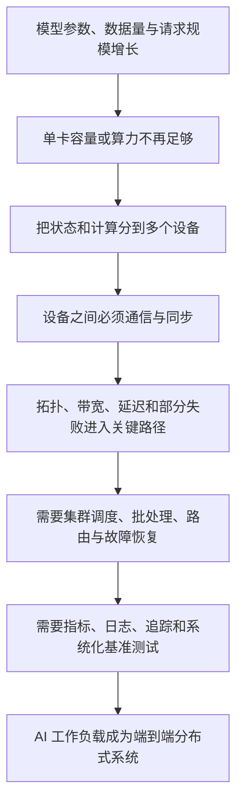
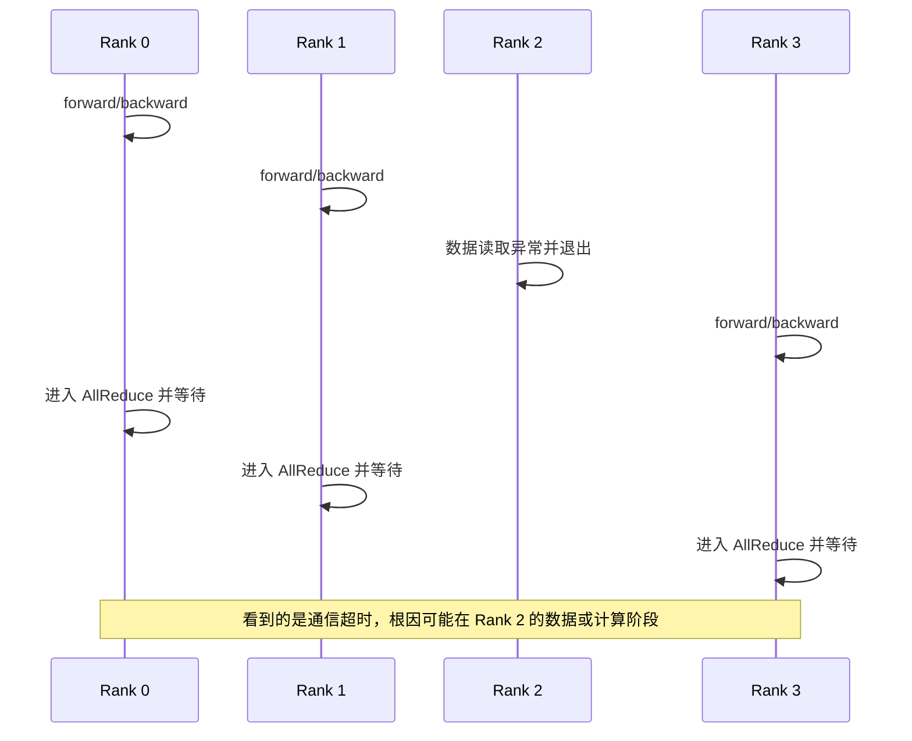
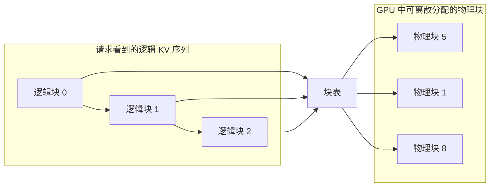
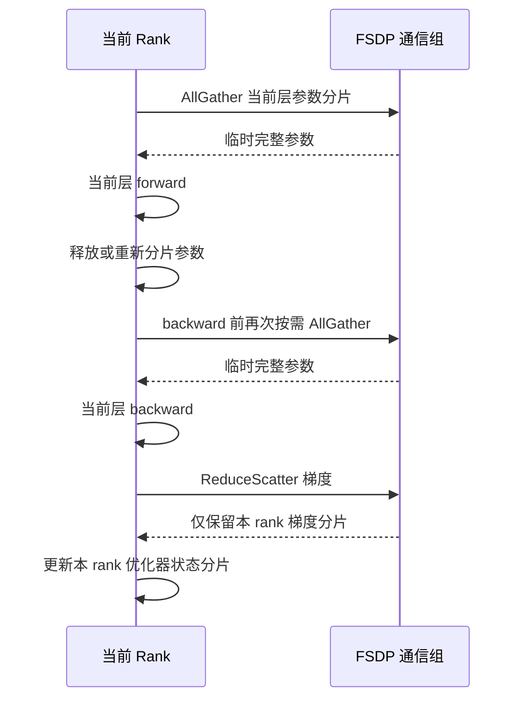

> 对应原文：Preface.md
>
> 本笔记严格沿序言的叙述顺序展开：先解释大模型为什么把 AI 变成分布式系统问题，再说明本书的目标读者与十一章路线，最后整理实践环境、配套资源、排版约定和反馈渠道。序言本身不包含算法推导；文中标为“理解模型”或“背景知识”的公式、数值例子与伪代码，是为了把序言提出的问题讲透，不应误认为原书序言逐式给出的内容。具体框架接口仍应以对应正文和配套仓库为准。

## 0. 阅读目标与全篇主线

序言不是正文知识的简单目录。它先完成一个更重要的工作：**重新定义问题**。

当模型只有一张 GPU 就能容纳、一次训练进程就能完成计算时，工程师主要关心模型结构、损失函数和优化器。模型达到数十亿、数千亿乃至万亿参数后，单个设备无法同时承担模型状态、激活值和中间缓冲区，计算也无法在可接受时间内完成。此时，训练与服务不再只是“运行一个更大的 PyTorch 程序”，而变成资源如何切分、数据如何流动、多个进程如何协调、故障如何恢复以及线上目标如何持续满足的问题。

读完序言及本笔记，应能回答以下问题：

1. 为什么参数规模增长会引发显存、通信、调度和运维的一连串问题？
2. 训练、推理和生产服务分别是什么，它们为什么需要不同的优化目标？
3. DDP、FSDP、PagedAttention、批处理、作业调度和可观测性在全书路线中各自解决哪一层问题？
4. 为什么作者强调建立系统直觉，而不是背诵某一版框架 API？
5. 十一章如何从资源估算逐步推进到训练、推理、集群运行、生产部署、性能优化与未来趋势？
6. 不同岗位应怎样使用本书，开始学习前需要哪些知识和硬件条件？

序言的核心因果链可以概括为：



这里最值得记住的不是“模型越大就多买几张卡”，而是：**资源一旦跨越设备边界，局部计算问题就转化为协调问题；系统性能也由最慢、最拥塞或最不可靠的环节共同决定。**

---

## 1. 序言开场：大模型为什么是分布式系统问题

### 1.1 规模变化何时引起问题性质变化

序言以一个事实开场：现代 AI 模型已经达到数十亿甚至万亿参数。参数数量首先是一个模型规模指标，但它会直接传导到四类系统资源：

| 规模增长影响 | 直接后果 | 随后出现的系统问题 |
| --- | --- | --- |
| 参数更多 | 权重、梯度和优化器状态占用更多显存 | 模型状态如何切分与保存 |
| 层更宽、更深，序列更长 | 激活值和临时张量增大 | 前向与反向计算如何分割、重计算或流水化 |
| 训练数据更多 | 单步计算总量和训练时长增长 | 如何扩展吞吐量、分发数据并保持样本语义正确 |
| 线上请求更多且长度不同 | KV cache 与排队量增长 | 如何批处理、调度、隔离和满足延迟目标 |

因此，“大”不只意味着算术运算次数更多。它同时改变了**容量约束、时间约束和协调约束**：

- **容量约束**：一个设备放不下模型或运行时状态。
- **时间约束**：一个设备虽然可能放得下，但完成训练或推理需要太久。
- **协调约束**：使用多个设备后，正确性和性能依赖通信、执行顺序及故障处理。

只有时间约束时，可以通过复制模型做数据并行来提高吞吐；出现容量约束时，仅复制模型没有用，必须切分参数、计算或运行时缓存。这个区别预告了后文为什么不能用一种并行策略解决所有问题。

### 1.2 理解模型：先用参数量估算最低显存需求

设模型参数量为 $P$，每个权重平均使用 $b_w$ 字节，则仅加载权重所需的理想内存为：

$$
M_{weights}=P b_w
$$

例如，BF16 或 FP16 权重通常占 2 字节：

| 模型规模 | 仅权重的理想大小 | 直接含义 |
| ---: | ---: | --- |
| 7B | 14 GB | 还未计 KV cache、激活值和框架缓冲区 |
| 70B | 140 GB | 无法完整放入常见单卡显存 |
| 1T | 2 TB | 必然需要跨大量设备或使用更激进的存储层级 |

“仅权重”绝不是训练总显存。一个常用的混合精度 Adam 训练粗略模型为：

$$
M_{state}=P(b_w+b_g+b_m+b_v+b_{master})
$$

其中 $b_g$ 是梯度，$b_m$、$b_v$ 是 Adam 的一阶和二阶矩，$b_{master}$ 是可能存在的 FP32 主权重。若分别按 2、2、4、4、4 字节估算，则约为：

$$
M_{state}\approx 16P\ \mathrm{bytes}
$$

于是 7B 模型的模型状态约需 112 GB，70B 约需 1.12 TB，且仍未包含激活值、通信桶、临时工作区、内存碎片和框架开销。这不是所有训练配置的精确常数：优化器、精度、是否保留主权重以及实现方式都会改变它。它的用途是快速判断数量级，避免把“14 GB 的 7B 权重”误解为“14 GB 就能训练 7B 模型”。

训练峰值显存可以写成更完整的概念式：

$$
M_{peak}=M_{state}+M_{activation}+M_{temporary}+M_{fragmentation}
$$

每一项对应不同手段：

- 状态太大：参数、梯度和优化器状态分片，例如 FSDP 或 ZeRO。
- 激活太大：激活检查点、序列并行或减少微批量大小。
- 临时张量太大：更换算子、精度或注意力实现。
- 碎片和保留内存太多：使用更合适的分配策略，并通过分析工具区分“已分配”与“已保留”。

这就是作者从“模型规模”走向“GPU memory”的第一步：**先把抽象参数量换算成设备上的具体字节，再判断应该复制还是切分。**

### 1.3 为什么多 GPU 不是把单 GPU 代码复制几遍

设有 $N$ 个工作进程。如果每个进程独立训练自己的模型副本且从不交换信息，那么它们得到的是 $N$ 个不同模型，而不是一个更快训练完成的共同模型。为了保持一个逻辑训练任务，进程必须在某些边界交换状态。

以同步数据并行为例，每个 rank 处理不同的局部批次并得到局部梯度 $g_r$。全局平均梯度为：

$$
g=\frac{1}{N}\sum_{r=0}^{N-1}g_r
$$

`AllReduce` 等集合通信负责让每个 rank 获得这个聚合结果。只要有一个 rank 没有进入同一个 collective、使用的张量形状不同、进程已经失败，或者网络路径异常，其他 rank 就可能一直等待。这解释了序言提出的典型问题：“为什么梯度同步会挂起？”

挂起之所以难排查，在于表面症状与根因可能相距很远：



因此，分布式调试不能只盯着报错进程。必须同时检查：

1. 所有 rank 是否执行了相同顺序、相同次数的 collective；
2. collective 的张量形状、dtype 和设备是否一致；
3. 是否有 rank 更早在数据加载、CUDA 内核或内存分配处失败；
4. rank、world size、主节点地址与端口是否一致；
5. 网络接口、拓扑和超时配置是否符合实际环境。

### 1.4 高速互连为什么成为算法的一部分

分布式训练的一步耗时可以用一个简化模型表示：

$$
T_{step}=T_{compute}+T_{communication}-T_{overlap}+T_{input}+T_{imbalance}
$$

- $T_{compute}$：GPU 执行矩阵运算等有效计算的时间；
- $T_{communication}$：梯度、参数或激活在设备间移动的时间；
- $T_{overlap}$：计算和通信重叠后隐藏的时间；
- $T_{input}$：数据准备与主机到设备传输时间；
- $T_{imbalance}$：不同 rank 速度不一致造成的等待。

若一次通信传输数据量为 $V$，链路有效带宽为 $B$，并经历 $k$ 次有意义的启动或同步延迟 $L$，则可用下式建立直觉：

$$
T_{communication}\gtrsim kL+\frac{V}{B}
$$

小消息更容易受延迟支配，大消息更容易受带宽支配；跨节点链路通常又比节点内 GPU 互连更慢。因此，同一并行策略在“单机 NVLink”和“跨机普通以太网”上可能得出完全相反的性能结论。硬件拓扑并非部署细节，而是并行算法选择的输入条件。

### 1.5 集合通信：把多点交换封装成共同动作

序言点名了 collective communication。集合通信不是某个单独框架的偶然 API，而是一组反复出现的分布式数据移动模式：

| 原语 | 直觉 | AI 中的典型用途 |
| --- | --- | --- |
| Broadcast | 一个 rank 的数据发给所有 rank | 初始化配置、同步初始状态 |
| AllReduce | 聚合所有 rank 的数据，并把结果给所有 rank | DDP 梯度同步 |
| AllGather | 收集各 rank 的分片，并让所有 rank 获得完整集合 | 临时重建分片参数或结果 |
| ReduceScatter | 先聚合，再把结果切片分发 | 分片梯度归约 |
| All-to-All | 每个 rank 向每个其他 rank 发送不同部分 | 专家并行中的 token 路由 |

理解这些原语有两个价值：

- **正确性层面**：知道哪些进程必须共同参与、结果最终位于哪里。
- **性能层面**：能估算移动的数据量，并判断通信是否能与计算重叠。

框架可能更换，但“复制、聚合、分片、交换”这些数据移动模式会长期存在，这正是序言所说的持久系统模式。

### 1.6 DDP 与 FSDP：复制和分片解决不同问题

序言把“什么时候 FSDP 胜过 DDP”作为要建立的系统直觉之一。

**DistributedDataParallel（DDP）**在每个 rank 保留完整模型副本，各自处理不同数据，然后同步梯度。它主要解决**计算吞吐扩展**问题：模型单卡能放下，但一个设备算得太慢。

**Fully Sharded Data Parallel（FSDP）**把参数、梯度和优化器状态分散到多个 rank，需要计算某层时再聚合必要参数，之后释放或重新分片。它主要解决**模型状态容量**问题：完整训练状态无法在每张卡上各放一份。

若先忽略激活值和临时缓冲区，DDP 每卡模型状态近似为：

$$
M_{DDP,rank}\approx M_{state}
$$

理想完全分片时，每卡持久模型状态近似为：

$$
M_{FSDP,rank}\approx\frac{M_{state}}{N}
$$

但 FSDP 不是免费节省显存。它通常增加参数 AllGather、梯度 ReduceScatter、临时重建缓冲和执行调度开销。由此形成选择逻辑：

| 场景 | 更自然的起点 | 原因 |
| --- | --- | --- |
| 模型单卡轻松容纳，目标是提高训练吞吐 | DDP | 路径简单，通信模式直接 |
| 完整模型状态单卡放不下 | FSDP / ZeRO | 必须消除每卡完整复制 |
| 节点内互连快、跨节点慢 | 混合分片 | 在内存收益与慢链路通信之间折中 |
| 模型很小、计算时间短 | 未必适合重分片 | 额外集合通信可能吞掉收益 |

因此，“FSDP 比 DDP 更高级”是错误理解。二者优化的首要约束不同，最终选择取决于模型大小、显存容量、互连拓扑、计算通信比和实现复杂度。

### 1.7 训练、推理、服务：三个相关但不同的层次

序言把全书范围从 distributed training 一直延伸到 inference 和 production serving。三者必须先分清：

| 层次 | 核心任务 | 主要输入与输出 | 常见首要指标 |
| --- | --- | --- | --- |
| 训练（training） | 用数据更新模型参数 | 数据集 → 新模型权重 | 每秒样本/token、收敛时间、训练稳定性、成本 |
| 推理（inference） | 固定权重执行预测或生成 | 单个/一批输入 → 模型输出 | 单次延迟、吞吐、显存、数值质量 |
| 服务（serving） | 持续可靠地向用户提供推理能力 | 请求流 → 有 SLO 的响应流 | 排队延迟、可用性、吞吐、公平性、弹性、成本、可观测性 |

推理是服务的数据路径核心，但不等于完整服务。一个离线脚本能成功调用模型，只证明推理算子可运行；生产服务还要处理请求接入、批处理、路由、限流、超时、取消、版本发布、故障恢复和监控。

同样，训练快也不代表模型容易服务。训练通常能预先组织大小较一致的批次，线上生成请求却可能随机到达、输入输出长度差异巨大，而且用户直接感知首 token 和后续 token 的等待时间。工作负载不同，优化目标自然不同。

### 1.8 推理批处理：吞吐和延迟之间的基本权衡

批处理将多个请求合并执行，提高 GPU 利用率并摊薄固定开销。若在时间窗口 $\Delta t$ 内完成 $Q$ 个请求或生成 $K$ 个 token，则吞吐量分别为：

$$
Throughput_{request}=\frac{Q}{\Delta t},\qquad
Throughput_{token}=\frac{K}{\Delta t}
$$

但等待更多请求凑批会增加排队延迟。一个用户请求的端到端延迟可拆成：

$$
T_{e2e}=T_{queue}+T_{prefill}+T_{decode}+T_{network}+T_{runtime}
$$

增大批次可能降低单位 token 成本，却提高 $T_{queue}$；不同长度请求放在固定批次中，短请求还可能等待长请求。于是服务系统需要连续批处理、抢占或更细粒度调度，而不能只把离线静态 batching 原样搬到线上。

### 1.9 PagedAttention 为什么会改变服务经济性

自回归 Transformer 在生成下一个 token 时，需要重复使用此前 token 的 Key 和 Value。KV cache 用显存换取避免重复计算，但请求长度变化、预留空间和释放时机不同，会造成浪费与碎片。

序言以 PagedAttention 为例强调：系统机制可以直接改变“同样硬件能服务多少请求”的经济性。它借鉴操作系统分页思想，把逻辑上连续的 KV cache 映射到固定大小、物理上不必连续的块：



其因果链是：

1. 固定块按需分配，减少为未知最大长度提前预留的大段空间；
2. 逻辑连续与物理连续解耦，降低外部碎片；
3. 可用显存中能同时驻留更多序列；
4. 调度器有更多请求可组成有效批次；
5. GPU 利用率和吞吐上升，单位请求成本下降。

需要避免两个误区：PagedAttention 不会消除 KV cache 本身的容量增长，也不保证任何负载都同比加速。块大小会影响内部碎片和管理开销；最终收益还取决于模型、上下文长度分布、并发度和调度策略。

### 1.10 作业调度器与生产编排为何进入同一本书

当任务跨多个节点时，“找几张空闲 GPU”只是调度的开始。训练作业往往要求一组资源同时可用，并需要一致的 rank 编排、网络环境、数据挂载和失败策略；推理服务则要求副本扩缩容、滚动升级、健康检查和流量路由。

序言因此把 SLURM 与 Kubernetes 都纳入全书，但它们服务的工作负载重心不同：

| 系统 | 典型重心 | 主要抽象 |
| --- | --- | --- |
| SLURM | HPC/批处理训练作业 | job、allocation、node、task、queue |
| Kubernetes | 长期运行的容器化服务 | Pod、Deployment、Service、scheduler、controller |

二者都做资源与生命周期管理，却不能简单视为同义词。前者天然围绕有开始和结束的批作业，后者天然围绕期望状态持续收敛的服务。实际平台可以组合使用，但应先从工作负载语义出发，而不是从工具名称出发。

### 1.11 可观测性：优化与可靠性的共同前提

序言列出的最后一层能力是 production observability，并提出“调优前先分析什么”。原因是，端到端变慢可能来自完全不同的环节：

- GPU 计算没有吃满；
- 显存不足导致缩小批次或频繁换入换出；
- collective 被慢链路或慢 rank 拖住；
- CPU 数据预处理跟不上；
- 请求都在路由器或队列中等待；
- 某些长请求造成队头阻塞；
- 错误重试制造了额外负载。

如果没有测量，任何优化都只是猜测。一个可靠的顺序是：

```text
定义目标与负载
    -> 建立可复现基线
    -> 分解端到端时间和资源使用
    -> 找到主导瓶颈
    -> 一次改变一个关键变量
    -> 复测收益、成本和回归
```

这也解释了为什么全书在训练、推理、生产栈之后才安排独立的 benchmarking 与 performance optimization 章节：必须先知道各层如何工作，测量结果才有正确语义。

### 1.12 为什么作者选择“系统直觉”，而不是 API 记忆

框架接口会变化，以下因果关系却相对稳定：

- 完整状态放不下，就必须分片、压缩、卸载或重计算；
- 使用更多设备，就必须支付通信和协调成本；
- 链路层级不同，就应让高频大流量尽量留在快链路内；
- 请求到达和长度不规则，就需要动态调度而非静态批处理；
- 系统目标不可见，就无法判断优化是否有效；
- 分布式执行存在部分失败，就必须设计超时、诊断、重试与恢复。

作者的选择由此形成：用可运行代码连接具体实现，但把学习目标放在这些可迁移模式上。这样，即使 PyTorch、vLLM、SGLang、SLURM 或 Kubernetes 的具体配置改变，读者仍能先判断问题属于容量、计算、通信、调度还是运维，再寻找当时合适的工具。

---

## 2. 谁适合阅读本书

### 2.1 目标读者不是单一岗位

序言列出的读者覆盖模型、平台和基础设施三侧：

| 角色 | 常见问题 | 从本书获得的主要视角 |
| --- | --- | --- |
| ML 工程师 | 模型放不下、训练太慢、推理成本高 | 选择并行策略并把实验扩展到集群 |
| AI 研究者 | 大规模实验难复现，系统瓶颈影响研究速度 | 区分算法效果与系统实现限制 |
| DevOps 工程师 | GPU 服务如何部署、监控和恢复 | 理解 AI 工作负载不同于普通无状态服务之处 |
| 平台工程师 | 如何为多团队提供统一训练与推理能力 | 建立资源、作业、制品和服务之间的契约 |
| HPC 集群管理员 | 通信、拓扑和队列如何影响训练 | 把传统集群能力映射到分布式 AI 作业 |
| 云架构师 | 如何在性能、弹性和成本之间选型 | 从端到端数据流评估计算、网络与编排方案 |

这种读者范围本身就是作者论点的证据：大模型系统横跨多个传统职责边界，任何单一岗位都很难只理解自己的一层。

### 2.2 必要前置知识

序言要求读者具备：

- Python 基础；
- PyTorch 基础；
- 命令行与虚拟环境的基本使用能力；
- 深度学习基本概念，例如模型、优化器和损失函数。

这些要求的原因是，书中的代码要把系统原理落实为可执行实验。若不理解张量、前向传播、反向传播和参数更新，就很难判断一次通信同步的是何种状态，也难以解释为什么分布式结果应与单进程基线一致。

### 2.3 有帮助但不要求预先掌握的知识

分布式系统、集群调度器和容器编排经验会帮助读者更快进入后半部分，但序言明确说它们不是入门门槛。本书从资源估算、数据准备和硬件基础讲起，再逐步引入这些主题。

这个安排体现了一个重要教学选择：先让读者看到 AI 工作负载提出的具体约束，再引入解决约束的系统机制。这样，`rank`、collective、scheduler 或 Pod 不会变成孤立术语，而会对应“谁参与计算”“数据如何移动”“资源如何获得”“进程如何持续运行”等具体问题。

### 2.4 不同读者应共享同一张端到端地图

角色可以有不同阅读重点，但不应把本书切成互不相干的部分：


研究者若不了解服务约束，可能只优化离线指标却制造难以部署的模型；平台团队若不了解训练通信，可能按普通 CPU 作业方式切分 GPU 资源；运维团队若不了解 KV cache，可能无法解释副本显存为何随流量形态变化。共享地图的价值，是让各岗位能看到局部决策如何影响上下游。

---

## 3. 全书内容与十一章学习路线

### 3.0 章节顺序背后的解题逻辑

序言按以下顺序介绍十一章：


这个顺序不是产品清单，而是一条逐步放宽假设的路线：

1. 先假设只需理解一个最小分布式任务，建立资源与进程模型。
2. 再打开硬件黑盒，理解性能为什么受计算、内存和网络共同限制。
3. 从最容易理解的完整模型复制出发，学习同步数据并行。
4. 当完整复制违反显存约束时，引入状态分片。
5. 当仅分片状态仍无法获得足够容量或计算效率时，再切分层内计算、层间流水线、序列与专家。
6. 参数固定后，问题转向不规则请求、KV cache 和生成调度。
7. 单请求优化之后，再利用请求之间的公共前缀、结构约束和阶段差异。
8. 能运行多进程程序后，才讨论如何在共享集群中可靠获得和管理资源。
9. 能启动推理引擎后，才补齐路由、发布、弹性、可靠性与可观测性。
10. 系统各层可见后，才能做有意义的端到端基准和瓶颈归因。
11. 最后从已学机制推断新架构、新硬件和新工作负载会怎样改变约束。

这条路线隐含一个通用原则：**不要在尚未建立正确基线时直接堆叠高级并行和生产组件。每增加一个分布式维度，都会同时增加状态空间、通信和故障模式。**

### 3.1 第 1 章：现代分布式 AI 导论

原书标题是 *Introduction to Modern Distributed AI*。这一章从资源估算、数据准备和第一个 PyTorch 分布式训练示例开始，并建立训练、推理、服务三阶段的生命周期视图。

#### 3.1.1 为什么先估算资源

并行策略不应从“哪个框架最流行”开始，而应从约束开始。第 1 章要先回答三个问题：

1. **能否放下**：权重、训练状态、激活或 KV cache 是否超过单设备容量？
2. **能否及时完成**：即使放得下，单设备完成训练或处理流量是否太慢？
3. **是否值得分布式化**：多设备收益能否覆盖通信、空闲等待和运维复杂度？

对稠密 Transformer，可用一个常见数量级模型理解训练计算量：若参数量为 $P$，训练 token 数为 $D$，则总浮点运算量近似为：

$$
F_{train}\approx 6PD
$$

系数 6 粗略来自每个参数在前向传播以及反向传播中的多次乘加工作。它不是适用于所有架构和算子的精确公式，但能用于容量规划。若有 $N$ 个设备，每个设备峰值算力为 $C_{peak}$，端到端实际利用率为 $u$，则理想训练时间数量级为：

$$
T_{train}\approx\frac{F_{train}}{N C_{peak}u}
$$

$u$ 把内存访问、通信、数据加载、气泡和软件开销都折入实际效率。直接用峰值算力并令 $u=1$ 会严重低估训练时间。这正说明资源估算不能只看厂商的理论 FLOPS。

#### 3.1.2 数据准备为什么属于分布式基础

多 rank 训练时，每个 rank 应得到不同的数据子集，同时所有子集共同保持预期的数据分布。若每个 rank 都读取完整数据，计算量虽然增加了 $N$ 倍，有效样本覆盖却没有相应增加；若切分遗漏或重复，训练语义也会改变。

第 1 章由此引入 `DistributedSampler` 一类机制。它要协调四件事：

- 按 world size 和 rank 切分索引；
- 在每个 epoch 采用一致但变化的随机顺序；
- 处理数据集大小不能被 rank 数整除的边界；
- 让所有 rank 通常执行相同数量的 step，避免 collective 次数不一致。

这说明数据准备不是训练前的附属步骤，而是分布式正确性的一部分。

#### 3.1.3 第一个分布式闭环要验证什么

最小示例的价值不在于获得更好的模型，而在于把以下抽象连接起来：

- **process group**：哪些进程共同通信；
- **rank**：一个进程在组内的唯一编号；
- **world size**：组内进程总数；
- **collective**：全体参与者按约定共同执行的数据交换；
- **launcher**：为进程设置环境并启动各 rank；
- **DDP**：把梯度同步接入反向传播。

正确的第一个实验应同时比较单 GPU 基线和多 GPU 结果，检查损失趋势、样本覆盖和参数更新是否符合预期，而不只看程序是否退出。第 1 章解决“建立共同语言和最小闭环”，尚不负责给出所有高级性能调优答案。

### 3.2 第 2 章：GPU 硬件、网络与并行策略

原书标题是 *GPU Hardware, Networking, and Parallelism Strategies*。本章打开执行底座，讨论 CPU、GPU、TPU、NPU、高速互连、SPMD、CUDA、集合通信及并行策略选择。

#### 3.2.1 为什么硬件知识不能被框架完全隐藏

框架可以隐藏 kernel 启动和通信调用的细节，却不能消除物理约束。一个算子可能受计算单元限制，也可能受显存带宽限制。设算子完成 $F$ 次浮点运算，并从内存移动 $Q$ 字节，则算术强度为：

$$
I=\frac{F}{Q}
$$

若设备峰值计算吞吐为 $C_{peak}$、显存带宽为 $B_{mem}$，Roofline 模型给出的性能上界直觉是：

$$
C_{attainable}\le\min(C_{peak},\ B_{mem}I)
$$

当 $B_{mem}I<C_{peak}$ 时，继续增加理论计算单元不会直接解决瓶颈；应减少内存移动、融合算子或提高复用。分布式环境还多出一层网络 Roofline：一个 rank 计算得再快，也可能在等待参数、梯度、激活或 token 路由。

#### 3.2.2 CPU、GPU 与互连构成一条数据路径

GPU 并不孤立工作。数据可能经历存储、主存、PCIe、GPU 显存、节点内 GPU 互连和节点间网络。CPU 核数、NUMA 亲和性、数据加载进程和 pinned memory 都会影响 GPU 是否有数据可算。

因此，看到 GPU 利用率低时，不能直接得出“模型计算量太小”的结论。还应检查：

- CPU 是否在解码或预处理处饱和；
- 进程是否跨 NUMA 节点访问内存；
- 主机到设备传输是否与计算重叠；
- GPU 是否在等待 collective；
- 作业是否使用了预期的 NIC 和节点内拓扑。

#### 3.2.3 并行策略是一组“切哪一维”的选择

第 2 章建立后续全书会反复使用的分类：

| 策略 | 主要切分对象 | 首要解决的问题 | 主要新增代价 |
| --- | --- | --- | --- |
| 数据并行 | 样本/批次 | 提高训练或推理吞吐 | 梯度同步或副本管理 |
| 状态分片 | 参数、梯度、优化器状态 | 降低每卡持久状态 | 参数聚合与分片通信 |
| 张量并行 | 单层张量与矩阵运算 | 单层太大或需协同计算 | 高频层内通信 |
| 流水线并行 | 网络层/阶段 | 模型深度跨设备 | 流水线气泡与阶段平衡 |
| 序列/上下文并行 | token 序列维度 | 长上下文激活或注意力过大 | 边界交换或环形通信 |
| 专家并行 | MoE 专家 | 稀疏激活模型容量与计算扩展 | token All-to-All 与负载不均 |

选择策略时可以连续问三个问题：

1. **什么放不下或算不完？** 这决定切分对象。
2. **切分后每一步要交换什么？** 这决定通信量和链路要求。
3. **交换发生多频繁，能否隐藏？** 这决定实际扩展效率。

混合并行就是同时沿多个正交维度切分。例如一个训练 world size 可能满足：

$$
N=N_{DP}N_{TP}N_{PP}
$$

在具体系统中还可能加入上下文或专家维度，但并非所有维度都能无条件相乘；专家并行可能与数据并行复用进程组定义。公式的重点是：每个 rank 同时属于若干不同通信组，必须明确每一组负责哪类交换。

### 3.3 第 3 章：使用 PyTorch DDP 进行分布式训练

原书标题是 *Distributed Training with PyTorch DDP*。本章从单节点扩展到多节点，覆盖梯度桶、计算通信重叠、混合精度、调试、性能分析、检查点和弹性训练。

#### 3.3.1 DDP 的完整一步

DDP 的基本执行链可写成：

```text
每个 rank 初始化相同模型
    -> DistributedSampler 分发不同局部批次
    -> 各 rank 独立前向传播
    -> 各 rank 独立反向计算局部梯度
    -> 梯度就绪后按 bucket 发起 AllReduce
    -> 所有 rank 获得一致的聚合梯度
    -> 各 rank 独立执行相同 optimizer step
```

由于各 rank 在更新前得到一致梯度并从相同参数开始，它们更新后仍保持相同参数。这是 DDP 正确性的核心不变量。

#### 3.3.2 全局批量大小与优化语义

设每个 rank 的局部批量为 $B_{local}$，数据并行 rank 数为 $N_{DP}$，每次参数更新前累积 $A$ 个 microbatch，则全局有效批量为：

$$
B_{global}=B_{local}N_{DP}A
$$

从 1 卡扩到 8 卡而保持 $B_{local}$ 不变，会使 $B_{global}$ 扩大 8 倍。这样即使代码可运行，优化轨迹也不再与单卡基线等价；学习率、warmup、正则化和总更新步数可能都需重新考虑。DDP 的系统正确不自动保证实验语义不变。

#### 3.3.3 为什么使用梯度桶与重叠

若等到整个反向传播结束才同步全部梯度，通信与计算串行，step 时间近似为二者之和。DDP 把参数梯度组成 bucket；当某个 bucket 中的梯度全部就绪，就在后续层仍进行反向计算时发起通信。

理想重叠后：

$$
T_{step}\approx\max(T_{backward},T_{allreduce})+T_{unhidden}
$$

而不是简单的 $T_{backward}+T_{allreduce}$。bucket 太小会产生大量启动延迟，太大又会推迟第一次通信；因此 bucket 大小是计算图、网络特征和重叠机会之间的权衡，不能只凭一个固定推荐值。

#### 3.3.4 调试为什么要逐级扩展

本章的可靠排查路径是：

1. 先验证单进程训练，排除模型和数据本身的问题；
2. 再用单机单进程走分布式初始化；
3. 扩到单机多 GPU，验证 rank、采样和 collective；
4. 最后扩到多节点，才引入 NIC、防火墙和跨机拓扑变量。

这种逐级扩展不是保守，而是在控制变量。直接从复杂多节点作业开始，任何错误都可能表现为同一个“超时”或“hang”。

#### 3.3.5 DDP 的边界

DDP 擅长模型单卡可容纳、每卡计算量足以摊薄 AllReduce 的场景。它不能通过增加 rank 降低每卡模型状态，因为每卡仍保存完整副本；对小模型或慢网络，通信开销也可能让多卡更慢。这自然引出下一章的 FSDP。

### 3.4 第 4 章：使用 FSDP 扩展大模型训练

原书标题是 *Scaling with Fully Sharded Data Parallel (FSDP)*。本章研究参数分片、混合分片、预取、激活检查点、CPU offload 与分布式检查点。

#### 3.4.1 从“完整复制”转向“按需重建”

FSDP 的关键不是简单地把模型切成 $N$ 份后各算各的，而是让每个 rank **持久保存自己的状态分片，在执行某个单元时临时收集所需完整参数**。一个典型生命周期是：



其有效性来自两个事实：

1. 并非所有层的完整参数都必须在同一时刻驻留显存；
2. 优化器只需要更新自己负责的参数分片。

代价是通信进入每个被包装单元的执行路径。分片粒度太粗会产生较大峰值临时参数，太细则产生更多 collective 启动和调度开销。

#### 3.4.2 FSDP1、FSDP2 与 device mesh

正文进一步区分早期扁平参数式 FSDP1 与以每参数分片、`fully_shard` 和 device mesh 为核心的 FSDP2。对序言读者而言，重要的不是记住接口版本，而是理解抽象演进方向：

- 从“包装整个模块”走向更显式的分片布局；
- 用 device mesh 表达一维完全分片或二维混合分片拓扑；
- 让分片关系更容易与张量并行、编译器和分布式检查点组合。

版本接口会变化，但“布局、进程组、生命周期、重建时机”四个问题不会消失。

#### 3.4.3 激活检查点与 CPU offload 解决不同容量项

FSDP 主要减少模型状态，激活检查点主要减少激活保存，CPU offload 则把部分状态移到更大但更慢的主存：

| 手段 | 节省哪类显存 | 交换的代价 |
| --- | --- | --- |
| 状态分片 | 参数、梯度、优化器状态 | GPU 间通信 |
| 激活检查点 | 前向激活 | 反向前重计算部分 forward |
| CPU offload | GPU 中的模型状态 | PCIe/NVLink-C2C 等主机设备传输与 CPU 内存 |

容量问题必须先定位到具体项，再选择手段。模型状态已经很小却仍因长序列 OOM 时，仅进一步切分优化器状态可能收益有限；此时激活才是主导项。

#### 3.4.4 检查点为什么也必须分布式化

状态被分片后，保存和恢复不再只是 rank 0 对一个普通 `state_dict` 写文件。系统要处理：

- 多 rank 如何并行写入且不冲突；
- 分片元数据如何描述逻辑参数与物理文件的映射；
- world size 改变时能否重新分片恢复；
- 保存中途失败时如何避免得到看似存在但不完整的检查点；
- 训练恢复所需的优化器、随机数和进度状态是否齐全。

因此正文引入 Distributed Checkpoint 一类 API。它体现了一个普遍规律：**计算状态如何分布，持久化协议就必须理解同一种分布。**

### 3.5 第 5 章：使用 DeepSpeed 与 Megatron 超越状态分片

原书标题是 *Beyond State Sharding with DeepSpeed and Megatron*。本章先系统展开 ZeRO 各阶段与 offload，再转向 Megatron 风格的张量、流水线、序列、上下文和专家并行。

#### 3.5.1 ZeRO 为什么分阶段

ZeRO 按照消除冗余状态的范围逐级推进：

| 阶段 | 分片内容 | 相比前一级的收益 | 新增通信或复杂度 |
| --- | --- | --- | --- |
| ZeRO-1 | 优化器状态 | Adam 状态通常占比很大 | 更新后需保持参数一致 |
| ZeRO-2 | 优化器状态 + 梯度 | 进一步减少梯度复制 | 梯度分区与归约管理 |
| ZeRO-3 | 优化器状态 + 梯度 + 参数 | 消除完整模型状态复制 | 按计算需要聚合参数 |

它不是“数字越大越应该选”。若 ZeRO-1 已满足容量，直接使用 ZeRO-3 可能增加不必要的高频参数通信。正确选择仍是找到当前主导约束，然后采用足够解决问题的最低复杂度阶段。

#### 3.5.2 offload 是容量层级交换，不是凭空增加显存

ZeRO-Offload 和 ZeRO-Infinity 分别利用 CPU 内存与 NVMe 扩展可用容量。可以把存储层级理解为：

```text
GPU HBM: 容量最小，带宽最高，计算可直接使用
CPU DRAM: 容量更大，访问需跨主机设备链路
NVMe: 容量更大，延迟更高、带宽更低
```

offload 有效的前提，是状态传输能被计算隐藏，或用户愿意用更长训练时间换取“原本完全放不下”的可运行性。若每一步都等待大量 NVMe 数据，系统可能容量可行但时间不可接受。因此容量可行性和性能可行性必须分别验证。

#### 3.5.3 状态分片与计算分片是两条轴

FSDP/ZeRO 主要消除训练状态复制；Megatron 风格并行进一步切分实际算子：

- **张量并行（TP）**：把一个大矩阵乘法沿行或列分到多卡，适合单层权重或计算无法由一张卡承担的情况。
- **流水线并行（PP）**：把不同层放在不同 stage，以 microbatch 形成流水线，适合模型深度切分。
- **序列/上下文并行**：沿序列维度拆分激活或注意力，面向长上下文。
- **专家并行（EP）**：把 MoE 专家分散到设备，只把 token 发送给被选中的专家。

以列并行线性层为例，若权重按输出维切为 $W=[W_1,W_2,\ldots,W_n]$，则：

$$
Y=XW=[XW_1,XW_2,\ldots,XW_n]
$$

每个 rank 计算一个 $XW_i$，最后按后续算子需求拼接或继续分片。这个分解成立来自矩阵分块规则；其性能是否好，则取决于输入复制、输出聚合和后续层通信能否有效组织。

#### 3.5.4 流水线为什么会有气泡

把模型切成 $p$ 个 stage 后，一个 microbatch 必须依次经过各 stage。若一次迭代只有很少 microbatch，部分 stage 会在流水线填充和排空期间空闲。对均衡 stage、仅用于建立直觉的简化前向流水线，若有 $m$ 个 microbatch，利用率近似为：

$$
U_{pipeline}\approx\frac{m}{m+p-1}
$$

增大 $m$ 可以降低气泡比例，但会影响调度、激活存储和有效批量；stage 计算不均衡时，最慢 stage 还会成为节拍瓶颈。实际训练包含前向与反向调度，公式会随 1F1B 等策略变化，但“增加 stage 会引入填充、排空与平衡问题”的直觉不变。

#### 3.5.5 为什么需要混合并行

没有一个维度能独自解决超大模型的全部约束：

- 数据并行增加吞吐，但复制或分片的组内通信随模型状态而来；
- 张量并行切开大层，但通常需要低延迟、高带宽的频繁通信；
- 流水线并行减少跨 stage 的通信频率，却有气泡与负载平衡问题；
- 上下文并行支持长序列，但注意力边界通信依旧昂贵；
- 专家并行让总参数量增长不等于每 token 计算量增长，却引入 All-to-All 和热点专家。

实际配置通常把高频 TP 放在节点内快互连，把较低频的 PP 或 DP 放到跨节点链路，并用状态分片控制每卡持久显存。这不是固定规则，而是“让通信频率和链路层级匹配”的应用。

### 3.6 第 6 章：分布式推理与 vLLM

原书标题是 *Distributed Inference and vLLM*。本章从训练转向固定参数下的生成，解释 prefill、decode、KV cache、PagedAttention、连续批处理及 TP、DP、PP、EP 的推理用法。

#### 3.6.1 Prefill 与 decode 为什么要分开理解

对输入长度为 $S$、生成长度为 $G$ 的请求：

- **Prefill** 一次处理输入 token，能形成较大的并行矩阵运算，通常计算密集；
- **Decode** 每轮只为每个活跃序列生成下一个 token，要重复 $G$ 轮，常受 KV cache 读取和调度开销限制。

这两个阶段的资源特征不同，因此“平均每请求延迟”会隐藏重要信息。服务端常分别观察：

- TTFT（time to first token）：主要反映排队与 prefill；
- ITL/TPOT（inter-token latency/time per output token）：主要反映 decode 节拍；
- 输出 token 吞吐：反映系统在一定并发下的总体生成能力。

#### 3.6.2 KV cache 为什么随并发和上下文增长

对仅作数量级理解的 decoder-only Transformer，设层数为 $L$，每个 token 的 KV 表示宽度为 $H_{kv}$，元素字节数为 $b$，则单序列长度 $S$ 的 KV cache 近似为：

$$
M_{KV}\approx 2LSH_{kv}b
$$

系数 2 对应 Key 与 Value。若同时驻留请求数为 $R$，且长度分别为 $S_r$，总量近似为：

$$
M_{KV,total}\approx 2LH_{kv}b\sum_{r=1}^{R}S_r
$$

不同注意力结构会改变 $H_{kv}$，分页分配会增加块级开销，因此这仍是估算式。它解释了一个关键事实：模型权重固定不变，服务显存却会随活跃请求数和上下文长度动态变化。

#### 3.6.3 vLLM 的解决思路如何形成

问题链是：生成需要 KV cache -> 请求长度不可预知 -> 连续大块预留浪费显存 -> 可驻留请求少 -> batching 机会不足。vLLM 用 PagedAttention 降低 KV cache 管理浪费，并由调度器让新请求动态加入、完成请求及时离开，即 continuous batching。

因此，内存管理与调度不是两个独立优化：前者提高可驻留序列数，后者把这些序列转化为更高设备利用率。

#### 3.6.4 推理并行仍需从目标出发

- TP 常用于让单个模型副本跨多卡，并降低单请求计算时间，但会占用高频通信。
- DP 复制多个推理引擎，适合高并发吞吐，可由路由器分发请求。
- PP 让模型深度跨节点，但可能增加单请求流水线延迟与气泡。
- EP 面向 MoE 模型，把专家放到不同设备，并依赖 token 路由。

“更多 GPU”不必然降低用户延迟。若模型单卡能放下且请求并发高，多个独立副本可能比一个大 TP 组有更高总吞吐；若单卡放不下，则 TP/PP 先是容量条件，再谈性能。

### 3.7 第 7 章：使用 SGLang 做跨请求优化

原书标题是 *Cross-Request Optimization with SGLang*。本章从单次生成引擎继续向上，研究公共前缀复用、结构化生成、路由、prefill/decode 分离及多节点部署。

#### 3.7.1 为什么优化单位要从请求内部扩展到请求之间

很多线上请求共享前缀，例如相同 system prompt、同一文档模板或多轮会话历史。若每次都重新 prefill 相同 token，系统重复支付计算并生成相同前缀的 KV cache。

SGLang 的 RadixAttention 用 radix tree 一类前缀结构组织可复用 KV cache。对请求前缀长度 $S$、命中缓存长度 $H$，本次需重新 prefill 的长度从 $S$ 降为：

$$
S_{new}=S-H
$$

收益取决于命中率、缓存容量、淘汰策略和路由局部性。若后续会话被负载均衡到没有该前缀缓存的 worker，逻辑上存在的复用机会也无法转化为性能收益。因此 session affinity 与 cache-aware routing 是缓存机制的组成部分，而非外围细节。

#### 3.7.2 结构化生成为什么应进入解码过程

如果要求输出满足 JSON schema，一种低效做法是任模型自由生成，再解析、失败、重试。约束解码在每一步根据语法状态屏蔽不合法 token，使输出从生成过程中就保持在合法语言内。

其关系可以表达为：

$$
V_t^{allowed}=f(q_t,\ grammar)
$$

其中 $q_t$ 是解析器当前状态，$V_t^{allowed}$ 是第 $t$ 步允许采样的词表子集。这样减少格式失败与重试，但不能保证字段内容在业务上真实或正确。**语法正确、模式正确和语义正确是三个层次。**

#### 3.7.3 Prefill/decode 分离的推理依据

Prefill 偏计算密集，decode 偏内存带宽与调度敏感。把二者放在独立 worker 池，可以分别配置硬件、batching 和扩缩容策略，并避免大 prefill 阻塞 decode 节拍。

代价是两池之间必须传输 KV 状态，还要处理路由、背压和故障。只有当阶段资源差异、负载规模和可调度收益足以覆盖传输成本时，分离才有价值。小规模部署不应因为架构更新颖就默认采用它。

#### 3.7.4 SGLang 与 vLLM 的关系

序言将二者安排在相邻章节：第 6 章先建立高效推理引擎和单机/多机并行基础，第 7 章再强调跨请求结构与路由层优化。它们代表的是问题层次递进，而不是“后者简单替代前者”的排行榜。实际版本中能力可能重叠，选择应以负载、接口、生态和实测为依据。

### 3.8 第 8 章：使用 SLURM 运行分布式训练

原书标题是 *Running Distributed Training with SLURM*。本章把此前能手工启动的 DDP、FSDP、DeepSpeed 和 Megatron 作业接入共享 HPC 集群。

#### 3.8.1 调度器解决的是资源竞争与生命周期

在共享集群中，用户不能假设所需节点随时空闲，也不应手工登录每台机器启动进程。SLURM 负责：

- 接收作业资源声明；
- 在队列与策略约束下分配节点、CPU、GPU 和内存；
- 建立 job、step 与 task 的运行边界；
- 注入节点列表和 task 标识等环境信息；
- 收集退出状态、日志和资源统计；
- 处理时间限制、信号、依赖与重排队。

训练框架仍负责 process group 和 collective；SLURM 负责“在哪里、以什么资源、何时启动这些进程”。二者边界不同但必须通过 rank、主节点地址和资源数量正确衔接。

#### 3.8.2 `srun`、`sbatch` 与 `salloc` 的语义

- `srun` 启动作业 step 或交互式任务，适合直接运行并行命令。
- `sbatch` 提交批处理脚本，适合可重复、可排队的正式训练。
- `salloc` 先获得一段资源分配，再在其中交互调试。

理解它们的关键不是背命令，而是区分“申请资源”“定义批作业”“在已分配资源中启动 task”三个动作。

#### 3.8.3 为什么检查点与调度策略必须联动

长训练会遇到时间上限、抢占、节点故障或计划维护。如果作业只在结束时保存，任何中断都可能丢失数小时甚至数天计算。可靠流程应在收到终止前信号时保存一致检查点，并让后续作业自动恢复。

检查点间隔存在权衡：太频繁会增加 I/O 和训练停顿，太稀疏会增大故障后的重算量。它应结合故障率、保存耗时、恢复耗时和允许的进度损失来选择，而不是机械设为固定分钟数。

### 3.9 第 9 章：生产级 LLM 服务栈

原书标题是 *Production LLM Serving Stack*。本章从推理引擎扩展到请求路由、流量管理、可靠性、成本、Kubernetes、GPU 调度、多模型服务和可观测性。

#### 3.9.1 生产服务多出的控制面

推理引擎负责模型执行，生产栈还要回答：

- 请求先到哪里，怎样鉴权、限流和选择模型？
- 多个副本负载不同时，怎样路由且保留缓存局部性？
- 新模型版本如何灰度、观测和回滚？
- 副本失败或节点失联时，未完成请求如何处理？
- 如何区分引擎计算慢、排队长、网络慢和下游重试？
- 多租户共享 GPU 时，如何隔离容量与成本？

这些问题构成控制面与运营面，不能由一个高性能 kernel 自动解决。

#### 3.9.2 路由策略为什么是多目标决策

简单轮询只考虑请求数量，但 LLM 请求成本与输入长度、预期输出长度、模型、缓存命中和当前运行序列有关。更合理的路由器可能同时观察：

- 活跃请求和排队 token 数；
- worker 可用 KV cache 与前缀命中；
- 模型版本或租户约束；
- 会话亲和性；
- 故障、熔断与健康状态。

追求最均匀的请求数可能破坏缓存局部性，追求最高缓存命中又可能制造热点。路由本质上是延迟、吞吐、公平性和复用率之间的在线权衡。

#### 3.9.3 Kubernetes 提供什么，不提供什么

Kubernetes 通过 Pod、Deployment、Service、调度器和控制器管理容器化服务的期望状态，适合副本管理、滚动发布、健康检查和服务发现。GPU device plugin、节点标签与专用调度扩展可以帮助放置 GPU 工作负载。

但 Kubernetes 不理解模型内部的 KV cache、TP 通信组或 token 级负载。生产方案仍需推理引擎、模型感知路由器、指标体系和正确的资源声明。把容器放进集群，只解决了部署编排的一部分。

#### 3.9.4 灰度发布为什么要同时看系统与模型指标

新版本可能系统性能更好但模型质量退化，也可能模型质量提高却令 p99 延迟或成本超标。canary 是否晋级至少应同时检查：

- 错误率、超时率和可用性；
- TTFT、ITL、端到端延迟和吞吐；
- token/请求成本与显存占用；
- 任务质量、安全和业务结果；
- 不同租户、语言、长度区间是否出现局部回归。

平均值可能掩盖尾部或子群体问题，因此自动回滚条件不能只绑定一个总体均值。

### 3.10 第 10 章：分布式基准测试与性能优化

原书标题是 *Distributed Benchmarking and Performance Optimization*。本章建立训练与推理指标、百分位延迟、扩展效率、profiling 方法和正确性验证。

#### 3.10.1 基准测试先要固定问题

“系统每秒能生成多少 token”只有在以下条件明确时才可比较：

- 模型、精度、量化和并行配置；
- 硬件型号、数量、拓扑和软件版本；
- 输入/输出长度分布及并发模型；
- warmup、测量窗口和冷/热启动状态；
- batching、采样和缓存策略；
- 是否满足相同质量与 SLO。

若改变负载形态或牺牲输出质量，吞吐数字即使变大也不证明系统更好。

#### 3.10.2 为什么看百分位而非只看平均值

p99 延迟表示 99% 的观测不超过该值，剩余约 1% 更慢。它不是“最慢请求”，也不能由平均值推导。LLM 请求长度重尾、batch 等待和共享资源干扰会让尾部尤其重要。

若一天有 100 万次请求，1% 就是约 1 万次用户体验。平均延迟漂亮并不能抵消大量尾部超时。因此生产基准应报告分布、分位数和按长度/租户等维度分组的结果。

#### 3.10.3 扩展效率如何定义

用 1 个设备的性能为 $X_1$，$N$ 个设备性能为 $X_N$，加速比与强扩展效率可写为：

$$
S_N=\frac{X_N}{X_1},\qquad E_N=\frac{S_N}{N}
$$

若 8 卡吞吐是单卡的 6.4 倍，则 $E_8=0.8$，即 80%。损失来自通信、同步、负载不均和额外调度。若模型单卡放不下，则没有可直接运行的 $X_1$，此时应选最小可行配置作为基线，并清楚说明效率定义。

Amdahl 定律进一步解释固定问题规模下的上限。若可并行比例为 $p$，不可并行比例为 $1-p$，则理想加速上限为：

$$
S(N)=\frac{1}{(1-p)+p/N}
$$

即使设备无限增加，不可并行部分仍限制总加速。这是为什么优化应先找主导串行段和通信段，而不是机械增加 GPU。

#### 3.10.4 Profiling 为什么必须和正确性验证并列

减少同步、改变精度、调整 batch 或缓存都可能提高速度，却也可能改变训练收敛、输出质量或请求语义。有效优化必须满足：

$$
G_{\mathrm{perf}}>0 \quad \land \quad Q\ge Q_{\min}
$$

PyTorch profiler、Nsight Systems 和通信测试分别提供算子、时间线和链路证据；它们帮助回答“时间花在哪里”，但最终还要通过基线对照判断“结果是否仍然正确”。

### 3.11 第 11 章：分布式 AI 的演进版图

原书标题是 *The Evolving Landscape of Distributed AI*。本章讨论 MoE、边缘与云协同、更大规模并行、容错、多模态、联邦学习、智能体及规模经济。

#### 3.11.1 为什么用趋势章收尾

具体工具快速演进，未来工作负载还会改变。最后一章不是要求读者预测赢家，而是练习用前十章的稳定框架分析新事物：

1. 新架构改变了哪类状态、计算或请求？
2. 新瓶颈发生在容量、算力、带宽、延迟还是协调？
3. 需要怎样的数据移动和故障模型？
4. 它改善哪项指标，又把成本转移到哪里？
5. 现有测量方法能否验证宣传的收益？

#### 3.11.2 MoE：总参数量与每 token 计算量解耦

Mixture of Experts 让路由器为每个 token 只选择少数专家。若共有 $E$ 个专家、每 token 激活 $k$ 个，且 $k\ll E$，模型总容量可以随 $E$ 增长，而每 token 的专家计算主要随 $k$ 增长。

但专家分布到不同设备后，token 必须通过 All-to-All 到达目标专家，再把结果送回。热门专家还会导致负载不均。因此 MoE 把一部分稠密计算压力转换成路由、网络和负载均衡压力，不能简单理解为“免费增加参数”。

#### 3.11.3 边缘云协同与联邦学习不能混为一谈

**边缘云协同**关注计算放在哪里：低延迟、隐私敏感或离线部分在设备端，更重的计算在云端。**联邦学习**关注训练数据不集中收集时，多个参与方如何协作更新模型。

两者都涉及分散设备和隐私，但目标与协议不同。边缘推理可以完全不做联邦训练；联邦学习也可以发生在数据中心或机构服务器之间。它们共同面对设备异构、连接不稳定和资源受限，却不能用同一个标签替代。

#### 3.11.4 多模态与智能体带来的新分布式形态

多模态训练要协调文本、图像、音频或视频的不同数据率、编码器和张量形状，瓶颈可能从单一模型计算扩展到跨模态数据管线与同步。

智能体系统则把一次模型调用扩展成规划、工具执行、外部服务调用和多轮状态更新。分布式难点不只在 GPU collective，还包括任务队列、幂等性、超时、权限、状态一致性和外部副作用。前十章建立的测量、调度、容错和可观测性思路仍然适用，但执行单元从“一个训练 step 或生成请求”变成更长的工作流。

#### 3.11.5 长期能力：追踪约束，而不是追逐名词

第 11 章最终回到序言的主张：框架会继续变化，系统模式更持久。面对任何新技术，都可以用同一组问题检验：

- 它切分、复制、缓存或迁移了什么状态？
- 它在哪些参与者之间建立了同步边界？
- 正常路径和失败路径分别移动多少数据？
- 收益依赖什么硬件、负载和规模前提？
- 用哪些指标和基线可以证伪它的效果？

能回答这些问题，才算把十一章从工具教程连成了系统知识。

---

## 4. 如何最大化利用本书

### 4.1 原书给出的硬件与软件环境

序言建议使用以下环境：

| 项目 | 建议 | 为什么需要 |
| --- | --- | --- |
| GPU | 至少一张 NVIDIA GPU | 大部分示例依赖 CUDA 生态和实际 GPU 行为 |
| 多 GPU | 后续分布式训练与推理章节使用 | 验证 rank、collective、显存分布和扩展效率 |
| 多节点 | 后续跨节点章节使用 | 引入真实网络、节点拓扑和部分失败 |
| 操作系统 | 以 Linux 为主 | CUDA、NCCL、SLURM 和容器工具链通常以 Linux 为主要环境 |
| 语言与框架 | Python + PyTorch | 全书示例的共同执行环境 |
| 基础工具 | shell、虚拟环境、包管理 | 安装依赖、启动多进程和隔离版本 |

“至少一张 NVIDIA GPU”是运行大多数示例的建议起点，不等于一张卡能复现所有章节。多 GPU、多节点、SLURM 和带 GPU 的 Kubernetes 分别验证不同层次的问题，不能通过在一张卡上启动多个进程完整替代。

### 4.2 区分学习前提与复现实验前提

没有目标硬件时，仍然可以理解：

- 参数、激活和 KV cache 的容量模型；
- rank、world size、进程组和 collective 语义；
- DDP、FSDP、TP、PP、EP 的切分思路；
- SLURM 脚本如何描述资源和启动方式；
- Kubernetes 清单如何描述服务期望状态；
- 指标、日志和 trace 应回答什么问题。

但以下结论必须依赖真实环境测量：

- NCCL 在特定拓扑上的有效带宽；
- 计算与通信实际能重叠多少；
- 8 卡相对 1 卡的加速比；
- TP 跨节点是否比其他切分方式更合适；
- 某个 vLLM/SGLang 配置的 p99 延迟和最大并发；
- GPU 容器调度、驱动挂载和节点故障恢复是否正确。

换言之，**可以在无集群环境中学习协议和配置，却不能据此宣称获得了真实集群性能证据。**

### 4.3 为什么推荐按章节顺序实践

序言建议克隆配套代码，并按章节顺序完成示例。原因不是后章在文件结构上机械依赖前章，而是诊断能力逐步积累：

1. 第 1 章先建立单 GPU 基线和最小 distributed baseline。
2. 第 2 章教会读者读取硬件、拓扑和带宽证据。
3. 第 3 章在模型完整可容纳时，隔离数据并行和梯度同步问题。
4. 第 4、5 章才增加状态与计算分片，避免一开始同时面对过多进程组。
5. 第 6、7 章把注意力转向生成阶段、KV cache 和请求调度。
6. 第 8、9 章将已理解的程序接入共享集群与长期运行服务。
7. 第 10 章用统一测量方法验证此前每一层的优化。

跳过基线直接运行复杂配置，程序也许能启动，但出现性能或正确性问题时很难判断是模型、数据、通信、调度还是部署造成的。

### 4.4 推荐的实验记录方式

每个练习至少记录以下信息：

| 类别 | 应记录内容 |
| --- | --- |
| 目标 | 要验证的假设，例如“FSDP 能让此模型在 4 卡上容纳” |
| 软件 | Python、PyTorch、CUDA、NCCL、框架及容器镜像版本 |
| 硬件 | GPU 型号/数量、CPU、内存、节点数与网络拓扑 |
| 工作负载 | 模型、精度、batch、序列长度、数据量、请求长度分布 |
| 配置 | DP/TP/PP/EP 度数、分片策略、环境变量、启动命令 |
| 正确性 | 损失、输出质量、样本覆盖、恢复一致性 |
| 性能 | 显存峰值、step time、吞吐、TTFT、ITL、p99、通信时间 |
| 结论 | 假设是否成立、适用条件、代价与下一次实验 |

这样的记录能把“这个参数好像更快”转化为可复查证据，也能避免几周后无法解释某个数字来自什么配置。

### 4.5 可运行示例：阅读前的资源数量级计算器

下面的代码不是序言原有示例，而是把第 1 节的估算公式转成最小可运行工具。它只估算权重和模型状态，不包含激活、临时缓冲与碎片，因此输出是下界而不是采购结论。

```python
"""用数量级估算判断应优先研究哪类分布式策略。"""


def estimate_memory_gb(
    parameters_billions: float,
    weight_bytes: int = 2,
    training_state_bytes: int = 16,
) -> tuple[float, float]:
    parameters = parameters_billions * 1_000_000_000
    weights_gb = parameters * weight_bytes / 1_000_000_000
    training_state_gb = parameters * training_state_bytes / 1_000_000_000
    return weights_gb, training_state_gb


def scaling_efficiency(devices: int, measured_speedup: float) -> float:
    return measured_speedup / devices


for model_size in (7, 70, 1000):
    weights, training_state = estimate_memory_gb(model_size)
    print(
        f"{model_size:4g}B: weights={weights:7.0f} GB, "
        f"training_state={training_state:7.0f} GB"
    )

efficiency = scaling_efficiency(devices=8, measured_speedup=6.4)
print(f"8 GPUs, 6.4x speedup: efficiency={efficiency:.0%}")
```

实际输出：

```text
   7B: weights=     14 GB, training_state=    112 GB
  70B: weights=    140 GB, training_state=   1120 GB
1000B: weights=   2000 GB, training_state=  16000 GB
8 GPUs, 6.4x speedup: efficiency=80%
```

代码与原理逐项对应：

- `parameters_billions * 1_000_000_000` 把 “B” 转成参数个数；
- `parameters * weight_bytes` 对应 $M_{weights}=Pb_w$；
- `training_state_bytes=16` 对应前文混合精度 Adam 的示意估算；
- `measured_speedup / devices` 对应 $E_N=S_N/N$；
- 使用十进制 GB 是为了与 7B × 2 byte = 14 GB 的心算一致，不是 GiB；
- 函数没有估算激活和 KV cache，因为二者还依赖 batch、层数、宽度、序列长度和注意力结构。

如何使用结果：

- 权重已超过单卡显存：推理至少要考虑量化、TP/PP、CPU offload 或更大显存设备。
- 训练状态超过单卡但模型权重可放下：优先研究 FSDP/ZeRO，而不是只增加 DDP 副本。
- 内存可行但效率很低：先 profile 通信、输入和负载不均，不要继续盲目加卡。

### 4.6 没有本地多 GPU 时怎样学习

序言提出，Kaggle 等提供 GPU 的云端 notebook 可以替代第 1 章中的部分本地实验。应把这种环境视为受限实验场：实例类型、GPU 数量、运行时间、网络能力和可用性可能变化，不能假设一定能获得某种配置。

一个务实的降级顺序是：

1. 在 CPU 或单 GPU 上验证代码、数据与单进程基线。
2. 用单节点可用 GPU 验证多进程初始化和 collective 语义。
3. 在云端临时多 GPU 实例测量同节点扩展。
4. 只有涉及跨节点网络时，才申请真正的多节点环境。
5. 把昂贵实验所需的镜像、数据和命令先在低成本环境准备好。

模拟 world size 可以帮助理解控制流，却不能重现真实显存分布和链路性能；CPU 后端也不能替代 NCCL/CUDA 行为。

### 4.7 集群章节需要什么环境

序言认为以下环境是理想条件，但不是理解启动模式和配置的硬性要求：

- 训练集群章节：可访问的 SLURM 环境；
- 生产服务章节：带 GPU 节点的本地或远程 Kubernetes 集群；
- 多节点通信实验：节点间网络与匹配的软件栈；
- 容器化实验：兼容驱动、NVIDIA Container Toolkit 和相应运行时。

没有这些环境时，可以做静态检查：核对资源数量、rank 映射、主节点发现、挂载、探针、端口和失败策略。真正宣告配置可用前，仍需在目标环境做小规模 smoke test。

---

## 5. 配套代码与彩图

### 5.1 示例代码仓库

序言提供的官方配套仓库是：

- [PacktPublishing/Distributed-AI-Systems](https://github.com/PacktPublishing/Distributed-AI-Systems)

作者/出版社可能在出版后更新代码，因此仓库版本可能比纸书内容新。也可以从 Packt 的图书产品页进入 **Support** 区域下载代码文件。Packt 其他图书和视频的代码集合位于：

- [PacktPublishing](https://github.com/PacktPublishing/)

“使用最新代码”不等于不记录版本。为了复现实验，应保存 commit hash、依赖锁定信息、容器镜像 digest 及运行日期。若最新版与书中 API 不同，应先判断这是勘误、兼容性更新还是行为变化。

### 5.2 彩色图片

书中截图和图表的彩色 PDF 可从以下地址下载：

- [Packt 彩图 PDF](https://packt.link/gbp/9781807301712)

彩图对于阅读拓扑、时序和性能 trace 尤其有帮助，因为节点、链路、rank 和时间区段在灰度图中可能难以区分。图示仍应与正文解释结合阅读，不能只凭颜色推断语义。

### 5.3 配套代码的可靠使用方式

建议第一次运行时不要立即修改核心配置，而应：

1. 阅读对应章节，明确示例要证明什么；
2. 检查仓库 README、分支和依赖版本；
3. 用最小数据与最少设备做 smoke test；
4. 保存原始输出作为基线；
5. 一次只改变一个关键变量；
6. 将本地修改与上游 commit 一起记录。

示例代码主要用于学习机制，不应在未经安全、可靠性、许可证和容量审查时直接作为生产配置。

---

## 6. 原书的排版约定

### 6.1 行内代码 `CodeInText`

等宽行内格式用于表示：

- 代码标识符；
- 数据库表名；
- 文件夹、文件名和扩展名；
- 路径与占位 URL；
- 用户输入；
- 社交媒体账号等字面值。

因此，看到 `world_size`、`torchrun`、`.py` 或 `/path/to/model` 时，应把它们当作可精确引用的符号，而不是普通强调文本。序言采用的 WebStorm 磁盘映像示例属于出版社通用排版示例，与分布式 AI 技术路线本身无关。

### 6.2 代码块

代码块用于完整程序片段。序言用一段 SGLang 示例展示这种格式，其中：

- `Engine` 创建推理引擎；
- `model_path` 指定一个指令模型；
- Python 字典描述 JSON schema；
- `properties` 定义字段及类型；
- `required` 指定必需字段。

这个片段在排版约定中的直接作用只是展示代码块，但内容也提前呼应第 7 章的结构化生成：schema 不是普通提示文本，而是机器可检查的输出约束。

阅读代码块时应区分三层信息：

1. **语法层**：当前版本的类名、参数名和导入路径；
2. **机制层**：引擎加载模型，并在解码时应用结构约束；
3. **前提层**：包版本、GPU、模型访问和运行时是否满足要求。

只有机制层最可能长期稳定；语法与环境必须以仓库和当前文档复核。

### 6.3 命令行块

shell 围栏表示用户应在终端执行的命令或可能看到的输出。序言示例是拉取 SGLang runtime 容器镜像。命令行示例要特别注意：

- 当前目录；
- shell 类型；
- 是否需要管理员权限；
- 环境变量是否已设置；
- 镜像标签和工具版本是否仍存在；
- 命令展示的是输入还是输出。

`latest` 标签便于快速尝试，却不适合严格复现；正式实验应记录不可变版本或 digest。

### 6.4 粗体与提示块

**粗体**用于新术语、重点词或重要信息，也可能表示界面中的菜单项。引用块用于警告或重要说明。

排版不是装饰。分布式命令里一个环境变量名、rank 数或路径写错就可能改变行为；把字面输入、概念强调和警告明确区分，有助于降低复制与理解错误。

---

## 7. 反馈、勘误与联系渠道

### 7.1 一般反馈

关于本书任何方面的问题或一般反馈，可以发送到 `customercare@packt.com`，并在邮件主题中写明书名。这样出版社才能把问题路由到对应图书。

### 7.2 勘误

若发现技术或文字错误，序言建议访问：

- [Packt Submit Errata](https://www.packt.com/submit-errata)

选择 **Submit Errata** 并填写表单。高质量勘误应包含章节、位置、原文、期望修正、复现环境和证据。代码问题最好同时说明使用的仓库 commit、依赖版本及最小复现步骤。

勘误与一般反馈不同：前者指出可验证的错误，后者可以是阅读体验、主题建议或一般问题。分开提交能提高处理效率。

### 7.3 盗版报告

若在网上发现非法副本，序言请求将网站名称或具体链接发送到 `copyright@packt.com`。这里的目标是提供位置线索，不应自行下载、传播或公开扩散副本。

### 7.4 成为作者

序言邀请有专业主题经验的读者申请写作或参与图书创作，但当前转换后的 Preface.md 在“please visit”之后没有保留有效链接。因此，本地文本无法提供可验证的具体申请地址；应从 Packt 官方网站的作者相关入口重新确认，而不能根据残缺文本猜测 URL。

---

## 8. 随书免费权益

序言说明本书附带可解锁的免费权益。操作顺序是：

1. 访问 [packtpub.com/unlock](https://packtpub.com/unlock)，或扫描序言中的二维码；
2. 按书名搜索；
3. 确认正确版本；
4. 按页面步骤完成解锁。

序言提醒保留购买发票；直接从 Packt 购买通常不需要发票。这里“确认版本”很重要，因为不同版次的代码、勘误和配套材料可能不同。

权益概览和二维码保存在序言的本地资源目录中；它们属于访问说明，不影响本书技术内容的理解。

---

## 9. 分享书评

序言最后邀请读者阅读后在 Amazon 分享评价，对应链接为：

- [本书 Amazon 评价页](https://packt.link/r/1807301710)

出版社认为评价既能反馈内容质量，也能帮助技术社区判断本书是否适合自身需求。技术书评价若能说明读者背景、实际复现范围、版本和最有价值或存在问题的章节，会比只有笼统好恶更有参考价值。

---

## 10. 容易混淆的概念与常见误区

### 10.1 “用了多张 GPU”不等于“系统有效扩展”

多设备只说明资源数量增加，不说明吞吐按比例增加，更不说明成本效率提高。应同时报告：

- 单设备基线；
- 多设备吞吐或 step time；
- 加速比 $S_N$；
- 扩展效率 $E_N$；
- 每次训练或每百万 token 的成本；
- 正确性和质量是否保持。

若 8 张卡只达到 2 倍加速，程序虽然是分布式的，系统却可能被通信、输入或负载不均主导。

### 10.2 容量不足与算力不足不是同一个问题

- **容量不足**：状态无法同时放进设备，即使愿意等很久也运行不了。
- **算力不足**：状态能放下，但完成任务太慢。

前者要求分片、量化、offload、重计算或更大容量设备；后者才主要考虑复制工作、提高并行度和优化 kernel。DDP 能提高吞吐，却不减少每卡完整模型状态，因而不能直接解决容量不足。

### 10.3 数据并行、DDP 与 FSDP 不是三个同级同义词

**数据并行**是一类思想：不同 worker 处理不同数据。**DDP**是同步复制式数据并行实现：每个 rank 有完整模型并同步梯度。**FSDP**仍保留数据并行语义，但把模型状态分片，并在计算时按需重建参数。

因此，FSDP 不是“模型并行取代数据并行”，而是**带全状态分片的数据并行**；它也可以与张量或流水线并行组合。

### 10.4 状态分片与计算分片不能互相替代

- FSDP/ZeRO 主要回答“模型状态长期存在哪里”。
- TP/PP/上下文并行主要回答“一次算子或一段网络在哪里计算”。

FSDP 可以让模型状态容量可行，但单层矩阵仍可能太大或计算太慢；TP 可以切开单层计算，但优化器状态仍可能需要分片。超大规模训练往往需要两条轴组合。

### 10.5 复制、分片、offload 与重计算是四种不同手段

| 手段 | 做法 | 主要收益 | 主要代价 |
| --- | --- | --- | --- |
| 复制 | 多设备各保留一份状态 | 并行处理更多工作 | 内存冗余与同步 |
| 分片 | 状态或计算拆到多设备 | 降低单设备负担 | 通信与协调 |
| offload | 状态迁到 CPU/NVMe | 扩展可用容量 | 慢层级传输 |
| 重计算 | 不保存部分中间结果，稍后重算 | 节省激活显存 | 额外计算 |

它们可以组合，却不能只用“省显存”概括。每种方法把成本转移到了不同资源。

### 10.6 权重、训练状态、激活和 KV cache 不能混算

- **权重**：模型学习到的固定参数；训练和推理都需要。
- **梯度与优化器状态**：参数更新所需；常规推理不需要。
- **激活**：当前 forward/backward 的中间张量；与 batch、序列和网络结构相关。
- **KV cache**：自回归推理复用的历史注意力状态；与活跃序列长度和并发相关。

“7B 模型约 14 GB”只描述 2 字节权重，不代表训练只用 14 GB，也不代表推理峰值一定是 14 GB。

### 10.7 显存 OOM 不一定只由模型参数过大造成

OOM 还可能来自：

- batch 或序列长度导致激活过大；
- 并发与上下文导致 KV cache 过大；
- collective 或算子的临时工作区；
- 不应保留的计算图或张量引用；
- 分配碎片与框架保留内存；
- rank 负载不均，让个别设备先达到峰值。

处理 OOM 应先看各项峰值和发生阶段，而不是条件反射地换 FSDP 或清缓存。

### 10.8 带宽与延迟不是同一个网络指标

**带宽**描述单位时间可传多少数据，**延迟**描述发起一次传输或同步要等多久。大梯度桶通常更受带宽影响，大量小 collective 更受启动延迟影响。

把小消息合并能减少延迟成本，却可能推迟通信开始并降低与计算重叠；因此“bucket 越大越好”同样错误。

### 10.9 吞吐、延迟、利用率与效率不是同义词

- **吞吐**：单位时间完成多少请求、样本或 token。
- **延迟**：单个请求或一步需要多久。
- **GPU 利用率**：采样窗口中 GPU 忙碌程度的某种设备指标。
- **扩展效率**：增加设备后性能增长相对理想线性的比例。

提高并发通常能提高吞吐和 GPU 利用率，却可能增加排队延迟；高 GPU 利用率也可能来自执行无用 padding 或重算，不能单独证明成本有效。

### 10.10 平均延迟、p99、TTFT 与 ITL 分别回答不同问题

- 平均延迟适合描述总体中心趋势，但容易掩盖长尾。
- p99 关注尾部体验，但必须说明样本量和统计窗口。
- TTFT 关注请求到首 token 的等待，受队列和 prefill 显著影响。
- ITL/TPOT 关注流式输出节拍，更能反映 decode 体验。

对交互式聊天，只报总 token/s 不能说明用户是否等了很久才看到第一个 token。

### 10.11 静态 batching 与 continuous batching 不同

静态批处理让一组请求一起开始，通常也在固定边界结束；长请求可能拖住短请求。连续批处理允许调度器在解码迭代之间加入新请求、移除已完成请求，从而适应不规则到达与长度。

连续批处理提高调度灵活性，但也引入抢占、公平性和 KV cache 管理问题，不代表 batch 越大越好。

### 10.12 PagedAttention 不是把注意力计算变成操作系统分页

它借鉴的是**分页式 KV cache 内存管理**：通过逻辑块到物理块映射降低预留浪费与碎片。注意力的数学语义仍需保持。PagedAttention 主要改变运行时状态布局与访问方式，不应与稀疏注意力、滑动窗口注意力或 FlashAttention 混为一谈。

### 10.13 前缀缓存命中不等于答案缓存命中

RadixAttention 一类前缀缓存复用的是已有前缀对应的 KV 状态，后续 token 仍由模型生成。答案缓存则直接复用整个请求结果，通常要求更严格的请求等价、失效和安全判断。

前缀缓存减少重复 prefill，但不会保证相同后缀输出，也不会自动解决模型随机性。

### 10.14 结构化输出不等于事实正确

约束解码可以确保 JSON 可解析、字段存在或语法合法，却不能证明字段值真实、符合业务规则或没有安全风险。验证链至少应区分：

```text
语法合法 -> schema 合法 -> 业务约束合法 -> 事实与任务质量可接受
```

每一层都需要不同检查。

### 10.15 分布式 hang 不一定是网络坏了

collective 等不到全部参与者时，幸存 rank 常在通信调用处超时，但缺席 rank 可能更早因数据异常、OOM、CUDA 错误或条件分支离开。应先寻找全体 rank 中最早的异常，而不是只分析最后打印超时的进程。

### 10.16 `torchrun`、SLURM 与 Kubernetes 不做同一件事

- `torchrun` 主要启动并组织 PyTorch 多进程作业。
- SLURM 主要为共享 HPC 集群分配资源并管理批作业。
- Kubernetes 主要维持容器化服务的期望状态并提供部署编排。

它们可以嵌套或集成。例如 SLURM 分配节点后用 `srun`/`torchrun` 启动 rank；Kubernetes 创建推理 worker 后由框架建立通信组。不能因为都有“调度”二字就互换。

### 10.17 检查点不等于只有模型权重

用于推理发布的权重可能只需模型参数和配置；用于精确恢复训练的检查点通常还需要：

- 优化器状态；
- 学习率调度器状态；
- 当前 epoch、step 和数据进度；
- 随机数状态；
- 混合精度 scaler 等运行状态；
- 分片布局与完整性元数据。

只加载权重可以“继续训练一个模型”，却未必是从中断点语义等价地恢复。

### 10.18 可观测性、profiling 与 benchmarking 各有职责

- **可观测性**：长期从指标、日志、trace 和事件推断运行状态。
- **profiling**：在有限窗口内细看时间和资源花在哪里。
- **benchmarking**：在受控方法下比较系统或配置的性能。

监控图能发现退化，profiler 能帮助定位瓶颈，benchmark 才能严谨比较优化前后。三者互补，不应以一次 profiler trace 代替生产长期指标。

### 10.19 峰值 FLOPS、利用率和端到端吞吐不能直接互推

厂商峰值通常要求特定精度、数据布局和理想算子。实际工作负载还包括内存访问、kernel 间隙、collective、CPU 输入和同步。端到端结果应实测，理论峰值主要用于计算上界和发现数量级异常。

### 10.20 云 notebook 能运行示例，不等于复现生产集群

云 notebook 很适合验证 API 和小规模机制，但常缺少固定拓扑、节点控制、长时间作业、可重复网络和生产调度权限。它提供学习证据，不自动提供多节点扩展或可靠性证据。

### 10.21 最新框架不一定是当前场景的最佳选择

序言强调持久模式，是为了避免把学习变成版本追逐。成熟度、调试工具、团队经验、硬件支持和负载匹配往往比“发布日期更新”更重要。先进机制只有在解决真实瓶颈且收益经测量成立时才有价值。

---

## 11. 综合算例：从 70B 模型推导系统选择

下面用一个简化的 70B 模型同时演示训练和推理的思考路径。数字用于建立数量级直觉，不是某个具体模型的容量承诺。

### 11.1 已知条件与第一轮估算

假设：

- 参数量 $P=70\times10^9$；
- 权重和梯度各按 2 字节；
- Adam 矩、主权重等使每参数总训练状态按 16 字节粗估；
- 集群有 8 张 80 GB GPU；
- 暂不计算激活、临时工作区和碎片。

仅权重为：

$$
M_{weights}=70\times10^9\times2=140\ \mathrm{GB}
$$

训练状态为：

$$
M_{state}=70\times10^9\times16=1120\ \mathrm{GB}
$$

第一条结论立即得到：单卡既不能以该精度容纳推理权重，更不能容纳训练状态。

### 11.2 为什么 8 卡 DDP 不可行

DDP 在每卡复制完整模型状态，因此每卡理想状态仍约 1120 GB，远超 80 GB。8 卡提供了更多总显存，却没有让任何一张卡的副本变小。

即使忽略容量，梯度同步也很重。若 BF16 梯度大小约为 140 GB，ring AllReduce 在 $N$ 个 rank 上每 rank 的发送数据量数量级为：

$$
V_{ring}\approx2\frac{N-1}{N}G
$$

其中 $G$ 是梯度总大小。取 $N=8$：

$$
V_{ring}\approx2\times\frac{7}{8}\times140=245\ \mathrm{GB/step}
$$

接收量也在同一数量级。实际库会采用分块、多通道和拓扑感知算法，且通信可与反向计算重叠；这个估算只说明大模型并行策略必须认真考虑链路，而不能把 AllReduce 当作零成本函数调用。

### 11.3 为什么理想 8 卡完全分片仍然不够

若训练状态理想均匀分到 8 卡，每卡持久状态下界为：

$$
M_{shard}=\frac{1120}{8}=140\ \mathrm{GB}
$$

仍超过 80 GB，而且尚未加入激活与临时完整层参数。因此，“总显存 8 × 80 = 640 GB”显然也小于 1120 GB；任何只在这 8 张卡的 HBM 中保存全部训练状态的方案都不可能成立。

这一步排除了“只打开 FSDP 就能解决”的错误方案。候选方向变为：

1. 增加 GPU 数量；仅按状态下界就至少需要 $\lceil1120/80\rceil=14$ 张，实际还要为激活和临时峰值留余量。
2. 改变状态表示，例如采用不同精度、优化器或更省内存实现；必须重新估算且验证收敛。
3. 把部分优化器/参数状态 offload 到 CPU 或 NVMe，用传输时间换容量。
4. 使用激活检查点降低另一大项显存，再结合状态分片。
5. 使用 TP/PP 等切分计算，满足单层计算、通信拓扑或吞吐需求。

这里没有仅凭参数量就能确定的唯一配置。还需知道层数、隐藏维度、序列长度、batch、节点拓扑、目标训练时间和主存/NVMe 能力。

### 11.4 一种形成训练方案的顺序

对这个案例，更可靠的设计顺序是：

```text
确认数值精度与优化器状态格式
    -> 精确测量单层参数和激活峰值
    -> 选择足以容纳持久状态的 FSDP/ZeRO 组
    -> 用激活检查点控制序列与 microbatch 峰值
    -> 若单层或计算仍不可行，再加入 TP/PP/上下文并行
    -> 把高频通信组映射到节点内快链路
    -> 设计分布式检查点与故障恢复
    -> 从最小可行规模做正确性和扩展测试
```

为什么不是一开始就选“四维并行”？因为每多一维都会增加进程组、通信路径和调试状态。先解决可证实的首要约束，才能判断下一维是否真的必要。

### 11.5 同一个 70B 模型的推理问题不同

推理不再需要梯度与 Adam 状态，仅 2 字节权重约 140 GB。两张 80 GB GPU 在理想均分时每卡约 70 GB 权重，看似能放下，但每卡只剩很少空间给 KV cache、临时张量、通信工作区和碎片，实际配置可能不可用或并发极低。

四张 80 GB GPU 若均分权重，每卡约 35 GB，容量余量更大，但 TP 会增加每层通信。选择还要看服务目标：

- 低并发且必须以原精度容纳模型：可能优先用一个 4 卡 TP 副本。
- 高并发且量化后单个副本能放入较少 GPU：多个 DP 副本可能提供更高总吞吐。
- 跨节点 TP 链路较慢：可考虑让 TP 留在节点内，再用 PP 或副本跨节点。
- 长上下文或高并发：KV cache 可能成为主导，应测 PagedAttention、块大小和最大驻留 token。
- 请求共享大前缀：应进一步测前缀缓存与 cache-aware routing。

### 11.6 从服务目标反推基准负载

假设产品要求：

- 输入长度中位数 2K、p95 为 16K；
- 输出长度中位数 256、p95 为 2K；
- TTFT p99 小于某个目标；
- 流式 ITL 也有上限；
- 峰值到达率显著高于平均值。

则只用固定 128 token 输入/输出测最大 token/s 没有决策价值。基准应重放接近真实的长度与到达分布，并分别观察：

- 正常与峰值负载下的排队；
- 短请求是否被长 prefill 阻塞；
- KV cache 使用、抢占和命中；
- 每种 TP/DP 组合的 TTFT、ITL、吞吐和成本；
- 节点或 worker 失败时的错误率与恢复时间。

综合算例的结论不是“70B 应该固定使用某配置”，而是展示作者倡导的方法：**从字节和工作负载出发排除不可能方案，再通过拓扑、正确性和基准逐步选择可行方案。**

---

## 12. 本篇知识结构

```mermaid
flowchart TD
    ROOT[Distributed AI Systems 序言]

    ROOT --> WHY[问题意识]
    WHY --> SCALE[参数、数据与请求规模增长]
    SCALE --> CAP[容量约束]
    SCALE --> TIME[时间约束]
    SCALE --> COORD[协调与故障约束]

    ROOT --> CORE[稳定系统模式]
    CORE --> MEM[状态布局<br/>复制 / 分片 / offload / 重计算]
    CORE --> COMM[通信<br/>collective / 拓扑 / 重叠]
    CORE --> SCHED[调度<br/>作业 / batch / 路由 / 编排]
    CORE --> OBS[证据<br/>指标 / 日志 / trace / benchmark]

    ROOT --> TRAINING[训练路线]
    TRAINING --> DDP[DDP<br/>完整复制与梯度同步]
    TRAINING --> FSDP[FSDP / ZeRO<br/>训练状态分片]
    TRAINING --> MP[TP / PP / CP / EP<br/>计算多维切分]
    TRAINING --> CKPT[分布式检查点与恢复]

    ROOT --> INFERENCE[推理路线]
    INFERENCE --> KV[KV cache]
    KV --> PAGED[PagedAttention]
    INFERENCE --> BATCH[continuous batching]
    INFERENCE --> PREFIX[前缀复用与结构化生成]
    INFERENCE --> PD[prefill/decode 分离]

    ROOT --> PROD[生产路线]
    PROD --> SLURM[SLURM 批训练]
    PROD --> K8S[Kubernetes 服务编排]
    PROD --> ROUTE[流量路由与多模型服务]
    PROD --> REL[可靠性、成本与发布]

    ROOT --> METHOD[学习与解题方法]
    METHOD --> EST[先估算]
    METHOD --> BASE[建基线]
    METHOD --> PROFILE[再测量]
    METHOD --> CHANGE[单变量优化]
    METHOD --> VERIFY[验证正确性与收益]
```



这张图可以沿三条轴阅读：

1. **生命周期轴**：训练 -> 推理 -> 服务 -> 观测与优化。
2. **资源轴**：计算、显存、网络、存储、调度与人员运维。
3. **方法轴**：估算 -> 排除不可行 -> 建基线 -> 测量瓶颈 -> 选择机制 -> 验证。

十一章就是这三条轴逐步交叉的结果。

---

## 13. 核心结论

1. **模型规模跨过单设备边界后，AI 工程的核心难题从局部计算扩展为状态、通信、调度和故障协调。**
2. **分布式不是目的。** 只有容量、完成时间或服务流量要求超过单设备能力时，增加分布式复杂度才有理由。
3. **先把参数量换算成字节和计算量。** 不做资源估算，就无法区分复制、分片、offload 或重计算是否必要。
4. **训练、推理与服务属于同一生命周期，却有不同状态和指标。** 训练关心参数更新，推理关心固定权重执行，服务还关心请求流与 SLO。
5. **DDP 解决吞吐扩展，FSDP/ZeRO 解决状态冗余，TP/PP/上下文/专家并行解决不同计算维度。** 它们不是简单的替代关系。
6. **通信是并行算法的一部分。** 消息大小、collective 频率、链路带宽/延迟和拓扑决定理论切分能否转化为实际收益。
7. **PagedAttention 的价值在于连接内存管理和调度。** 更高效的 KV cache 布局让更多请求驻留，进而创造更好的 batching 机会。
8. **推理引擎不等于生产服务。** 路由、限流、发布、弹性、故障处理、成本和可观测性必须单独设计。
9. **SLURM、Kubernetes 和框架 launcher 分别管理不同层次。** 正确集成依赖清晰的资源与进程边界。
10. **没有可信基线和正确性约束，性能优化没有意义。** 更快但结果错误、质量下降或成本更高，不是有效优化。
11. **真实扩展必须看效率，而不只看设备数。** 通信、串行段、负载不均和输入管线会让线性加速失效。
12. **框架 API 会更新，稳定的问题分类更值得长期掌握。** 容量、计算、通信、调度、可靠性和证据链能迁移到新工具。
13. **可运行代码是连接原理与现实的实验装置。** 示例应在明确版本和硬件条件下复现，不能脱离前提外推。
14. **端到端视角是多岗位协作的共同语言。** 模型、平台、HPC、DevOps 和云架构的局部决策会互相影响。

---

## 14. 从序言提炼出的通用问题解决方法

### 第一步：定义工作负载和成功标准

先明确是训练还是服务、模型和数据规模、输入输出长度、并发与到达分布。再定义硬约束：显存、训练期限、TTFT、p99、可用性、质量与预算。

没有这一层，所有“最佳并行策略”都缺少上下文。

### 第二步：把逻辑对象换算成物理资源

估算：

- 权重、梯度、优化器、激活和 KV cache；
- 单步/总计算量；
- 关键 collective 的消息量；
- 检查点、数据集和日志存储；
- 峰值而不只是平均使用量。

估算不求一次精确，但要能排除数量级上不可能的方案。

### 第三步：区分“放不下”与“跑不快”

- 放不下：先改变状态布局或表示。
- 跑不快：先 profile 主导时间，再决定是否加设备或改算子。
- 两者都有：先建立容量可行方案，再优化性能。

容量尚不可行时讨论 90% 扩展效率没有意义；性能尚未测量时直接增加并行维度也缺少依据。

### 第四步：建立最小正确基线

从单进程、最小数据和可比较输出开始，逐级增加：

```text
单进程 -> 单机分布式 -> 多机分布式 -> 调度器托管 -> 生产负载
```

每一级只引入少量新变量，并保留上一层的结果作为对照。

### 第五步：选择要切分的对象

用约束反推策略：

```text
若完整训练状态单卡放不下：考虑 FSDP / ZeRO
若单层权重或计算需跨卡：考虑 TP
若模型深度适合分阶段：评估 PP 与气泡
若长序列激活/注意力主导：评估序列或上下文并行
若是 MoE：评估 EP、All-to-All 和专家负载
若模型可容纳但吞吐不足：先评估 DP/副本扩展
```

这是候选生成规则，不是无需测量的自动答案。

### 第六步：为每种切分画出数据流

明确：

- 哪些 rank 属于哪个通信组；
- 每一步移动参数、梯度、激活、token 还是 KV cache；
- 消息多大、多久一次；
- 哪些交换位于节点内，哪些跨节点；
- 哪些可以和计算重叠；
- 一个参与者缺席时谁会等待。

画不出数据流，通常意味着尚未真正理解配置。

### 第七步：把并行组映射到硬件拓扑

高频、低延迟敏感的通信优先放到快互连内；跨节点维度尽量选择通信频率或数据量更适合慢链路的方式。还要检查 CPU NUMA、NIC 绑定和存储路径。

逻辑 world size 相同，不同映射可能产生截然不同的性能。

### 第八步：同时维护正确性不变量

训练应检查：

- 样本切分与全局 batch；
- 梯度与参数是否保持预期一致；
- 混合精度与累积是否改变优化语义；
- 检查点恢复是否连续。

服务应检查：

- 输出质量和结构约束；
- 取消、超时、重试是否重复副作用；
- 路由和缓存是否跨租户泄漏状态；
- 发布前后各子群体是否回归。

### 第九步：先观测，再优化

建立端到端基线后分解：

```text
计算时间 + 通信时间 + 输入时间 + 排队时间 + 空闲/不均衡时间
```

用 profiler 或 trace 验证主导项，一次改变一个关键变量，并同时复测性能、质量和资源成本。

### 第十步：用真实负载做可复现基准

固定软件、硬件、模型、精度和负载分布；区分 cold/warm；报告平均值和分位数；保存原始样本与运行配置。任何比较都应确保约束相同。

### 第十一步：主动测试失败路径

至少验证：

- 一个 rank 提前退出；
- 一个 worker 变慢或失联；
- 检查点保存中断；
- 服务副本滚动更新；
- 队列突发和超长请求；
- 路由器或依赖服务异常。

正常路径性能优秀，不代表系统可以运营。

### 第十二步：记录适用边界并设置复查条件

最终结论应写成：

> 在给定模型、精度、负载、硬件拓扑和软件版本下，方案 A 满足这些目标；它以这些通信、成本或复杂度为代价。当上下文长度、并发、模型结构、设备或框架版本变化时重新基准。

这种带前提的结论比“框架 A 永远优于框架 B”更可靠，也正是序言所强调的可迁移系统直觉。

---

## 15. 复习与自测

### 15.1 概念题

1. 为什么模型参数从十亿增长到万亿会让问题从深度学习计算转变为分布式系统问题？
2. 仅知道参数量，能估算哪些资源，不能精确估算哪些资源？
3. 训练、推理和服务分别维护什么状态，优化什么目标？
4. DDP 与 FSDP 的首要约束分别是什么？
5. 状态分片与张量并行的数据流有什么本质差异？
6. 为什么 collective hang 的根因可能不在打印超时的 rank？
7. 为什么节点内与节点间拓扑会改变并行策略选择？
8. PagedAttention 如何从内存布局影响服务吞吐？
9. continuous batching 与静态 batch 的差异是什么？
10. 为什么语法约束不能保证生成内容正确？
11. SLURM、`torchrun` 和 Kubernetes 各自负责哪一层？
12. 为什么性能优化必须同时验证模型质量或训练正确性？

### 15.2 计算题

1. 一个 13B 模型使用 2 字节权重，仅权重约多少 GB？若训练状态按每参数 16 字节，状态下界约多少 GB？
2. 4 个数据并行 rank，每 rank microbatch 为 8，累积 4 次后更新，全局有效 batch 是多少？
3. 16 张 GPU 相对 1 张 GPU 达到 12 倍加速，扩展效率是多少？
4. 一个 4-stage 简化流水线使用 16 个 microbatch，按 $m/(m+p-1)$ 估算的利用率是多少？
5. 若 8-rank ring AllReduce 的梯度大小为 20 GB，每 rank 发送量的数量级是多少？

答案要点：

1. 约 26 GB 与 208 GB，均未计运行时额外项。
2. $8\times4\times4=128$。
3. $12/16=75\%$。
4. $16/(16+4-1)=16/19\approx84.2\%$；真实训练调度会更复杂。
5. $2\times(7/8)\times20=35$ GB，接收量同量级。

### 15.3 实践题

选择一个你能访问的模型和设备，完成以下最小报告：

1. 估算权重与训练/推理主要状态。
2. 说明单设备是否容量可行，并列出估算未覆盖的项。
3. 画出拟采用并行策略的数据流和通信组。
4. 定义一个正确性基线和三个性能指标。
5. 写出从单进程扩展到目标环境的验证阶梯。
6. 设计一个能暴露部分失败的实验。
7. 记录最终结论的硬件、软件、负载前提和失效条件。

若能完整回答这七项，就已经掌握了序言希望读者在全书中持续建立的能力：不是背诵命令，而是从约束出发，沿状态与数据流分析系统，再用实验把判断变成证据。
