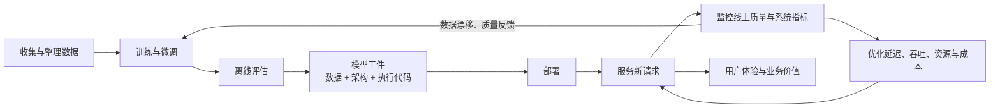
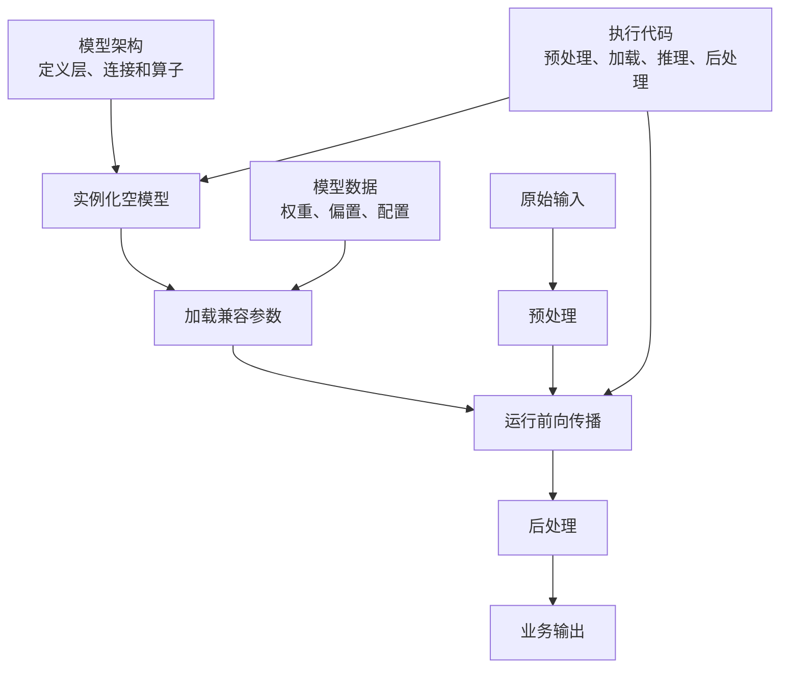
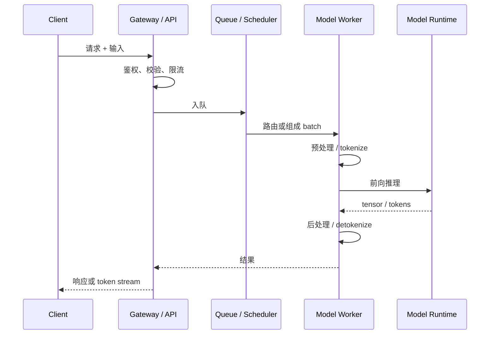
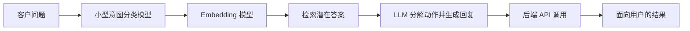
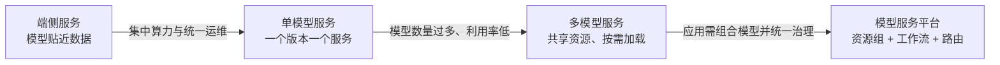
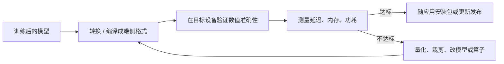
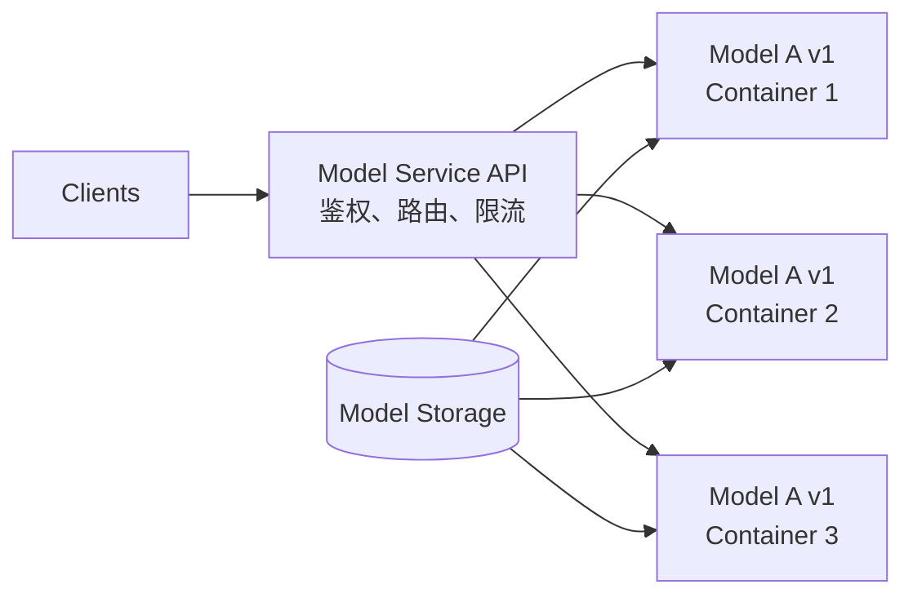
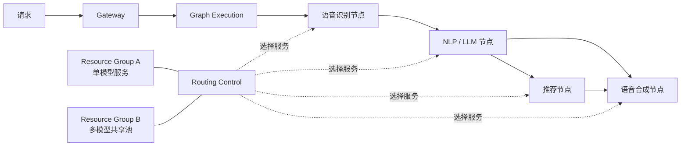
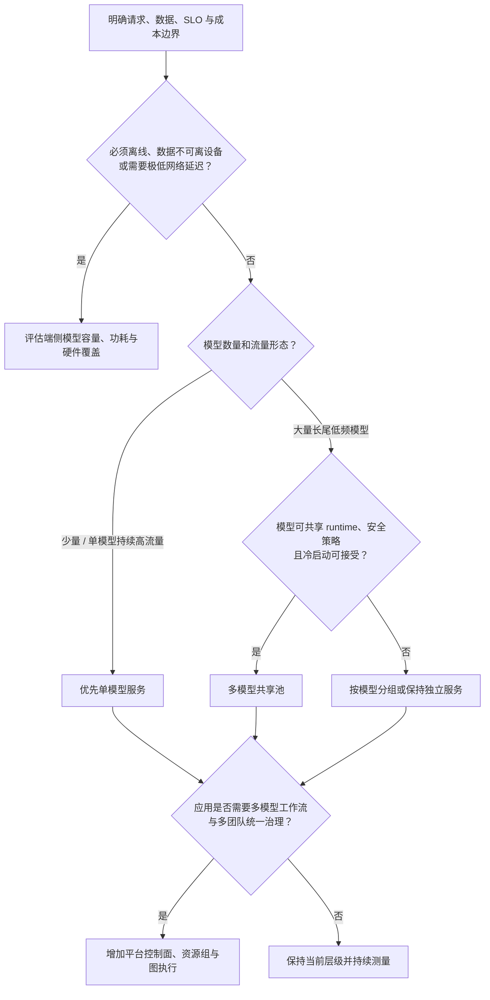
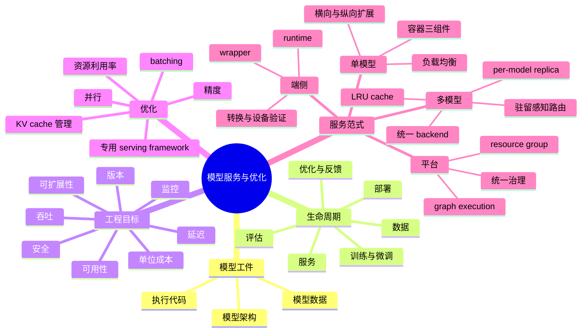

> 原章：*Introduction to Model Serving and Optimization*
> 核心问题：一个训练完成的模型怎样变成可被真实用户稳定调用的生产能力？面对延迟、吞吐、可靠性、安全和成本约束，应如何在端侧、单模型服务、多模型服务与平台化服务之间做选择，并通过软硬件协同优化让 LLM 服务在经济上可持续？

## 0. 本章定位、学习目标与分析主线

训练解决的是“怎样从数据中学得参数”，模型服务解决的是“怎样让这些参数持续创造业务价值”。一个模型即使离线指标很好，如果无法按要求接收请求、及时返回结果、承受流量、保护数据并控制成本，仍然不是可用的生产系统。

本章是全书的概念地图，作者的论证按以下顺序推进：

1. 先从工程视角拆开“模型”，说明它不只是权重文件，而是**数据、架构与执行代码**共同构成的可执行工件。
2. 再把服务放回完整 ML 生命周期，区分训练、部署、服务与持续优化。
3. 给出模型服务的定义和工程目标，解释为什么即使使用云服务或基础模型，也必须理解服务系统。
4. 说明 LLM 为何尤其需要优化，并用 vLLM 的吞吐案例展示专用服务框架的价值。
5. 最后按复杂度递增介绍四种服务范式：**端侧服务 → 单模型服务 → 多模型服务 → 模型服务平台**。



读完本章，应能够回答：

- 模型权重、模型架构、执行代码和模型配置分别是什么，为什么缺一不可？
- deployment、serving、inference、prediction 与 optimization 的关系是什么？
- 为什么训练框架可以做推理，却往往不适合作为生产服务框架？
- 延迟、吞吐、利用率、可用性与单位服务成本之间有什么约束和冲突？
- on-device、single-model、multi-model 和 serving platform 各解决什么问题，又引入什么新问题？
- 为什么简单轮询不一定能均衡推理负载？为什么多模型路由必须感知模型驻留位置？
- 什么时候应该购买托管服务，什么时候值得自建，为什么不存在永久正确的架构？

> **数据口径说明**：本章中的云折扣、供应商价格和性能倍数来自作者写作时的案例或特定实验。它们用于说明数量级和决策方法，不是对当前价格、任意模型或任意硬件的保证。真正选型必须用自己的模型、请求分布、SLA 和价格重新基准测试。

---

## 1. Anatomy of a Model：从工程角度理解模型

### 1.1 学术定义与工程定义关注点不同

从机器学习角度看，模型是一个从数据中学习出来的参数化函数。若输入为 $x$，可学习参数为 $\theta$，推理可抽象成：

$$
y = f_{\theta}(x).
$$

训练阶段寻找合适的 $\theta$：

$$
\theta^* = \arg\min_{\theta}\mathcal{L}(f_{\theta}(X),Y),
$$

其中 $\mathcal{L}$ 是损失函数；服务阶段通常固定 $\theta^*$，对新输入执行前向计算：

$$
\hat y = f_{\theta^*}(x_{\mathrm{new}}).
$$

学术视角关心模型怎样学到规律、损失怎样下降以及泛化能力怎样；工程与运维视角更关心以下问题：

- 工件有哪些文件，如何存储、校验和版本化？
- 用什么运行时和硬件加载它？
- 输入怎样预处理，输出怎样后处理？
- 怎样暴露稳定 API、并发处理请求并隔离故障？
- 怎样升级、回滚、监控和优化？

因此，服务工程师常把模型当成黑盒，但“黑盒”不是“不需要理解模型”。它表示服务层通过稳定契约封装内部细节；遇到 LLM 的显存、KV cache、批处理和并行瓶颈时，仍需理解 Transformer 的执行特征。

### 1.2 模型由三类内容组成

原章将模型工件拆成三个部分：

| 组成 | 回答的问题 | 典型内容 | 缺失后的结果 |
|---|---|---|---|
| **模型数据（model data）** | 模型“学到了什么”，运行参数是什么？ | 权重、偏置、标签、嵌入配置、输入输出张量描述、最大 batch 等 | 架构只有空壳，无法复现训练所得行为 |
| **模型架构（model architecture）** | 计算图“长什么样”？ | 层类型与数量、层间连接、算子、维度、前向传播顺序 | 不知道如何解释权重，也无法构建计算过程 |
| **模型执行代码（execution code）** | 怎样真正把输入变成输出？ | 初始化架构、加载权重、切换推理模式、预处理、前向执行、后处理 | 文件不能自行运行，也不能接入应用 |

三者的关系可以写成：



“模型只是一个大号数据文件”是常见误解。权重确实通常占用绝大部分存储，但只有在对应架构和执行语义下才有意义。相同的一组字节若按错误的张量形状、层名或算子读取，不会得到原模型。

### 1.3 PyTorch 示例：三部分怎样协作

原章用一个小型卷积网络说明三部分。架构定义了两层卷积、池化和三层全连接：

```python
import torch
from torch import nn
from torch.nn import functional as F

class TheModelClass(nn.Module):
    def __init__(self):
        super().__init__()
        self.conv1 = nn.Conv2d(3, 6, 5)
        self.pool = nn.MaxPool2d(2, 2)
        self.conv2 = nn.Conv2d(6, 16, 5)
        self.fc1 = nn.Linear(16 * 5 * 5, 120)
        self.fc2 = nn.Linear(120, 84)
        self.fc3 = nn.Linear(84, 10)

    def forward(self, inputs):
        hidden = self.pool(F.relu(self.conv1(inputs)))
        hidden = self.pool(F.relu(self.conv2(hidden)))
        hidden = hidden.view(-1, 16 * 5 * 5)
        hidden = F.relu(self.fc1(hidden))
        hidden = F.relu(self.fc2(hidden))
        return self.fc3(hidden)
```

若输入图像为 $32\times 32$、3 通道，维度依次变化：

$$
(3,32,32)
\xrightarrow{5\times5\ \mathrm{conv}}
(6,28,28)
\xrightarrow{2\times2\ \mathrm{pool}}
(6,14,14)
$$

$$
\xrightarrow{5\times5\ \mathrm{conv}}
(16,10,10)
\xrightarrow{2\times2\ \mathrm{pool}}
(16,5,5).
$$

所以展平后有 $16\times5\times5=400$ 个特征，正好对应 `fc1` 的输入维度。这个推导说明：**参数文件和架构必须在名称、形状及语义上相容**。

训练完成后，只保存状态字典：

```python
torch.save(model.state_dict(), "model_weights.pt")
```

服务进程中的执行代码重新构造架构、加载数据并执行：

```python
model = TheModelClass()
state = torch.load("model_weights.pt", weights_only=True)
model.load_state_dict(state)
model.eval()

with torch.inference_mode():
    predictions = model(inputs)
```

各行与原理的对应关系是：

1. `TheModelClass()` 创建计算图和参数槽位，此时参数还不是训练结果。
2. `load_state_dict` 将 checkpoint 中的权重按键名和形状装入槽位。
3. `eval()` 将 dropout、batch normalization 等切到推理行为；它**不会**自动关闭梯度。
4. `torch.inference_mode()` 关闭训练所需的梯度记录和相关开销。
5. `model(inputs)` 执行固定参数下的前向传播。

代码能运行还不等于生产服务完成了。真正的服务还需要输入校验、batch 调度、超时、并发控制、API、指标、日志、健康检查和故障恢复。

### 1.4 为什么建议将架构与权重分开保存

保存整个 Python 对象虽然方便，却往往把类路径、代码版本和序列化环境耦合在一起。分开保存有几个好处：

- **可检查**：状态字典可以查看每个张量的键名、形状和类型。
- **可迁移**：执行代码可以演进，兼容参数仍可复用。
- **可局部加载**：新增分类头、删除旧层或扩展架构时，可加载匹配参数。
- **易版本化**：代码版本、配置版本和权重版本可以分别记录并组合验证。
- **安全边界更清楚**：只加载权重数据通常比反序列化任意可执行对象风险更低。

设旧 checkpoint 的键集合为 $K_c$，新架构期望的键集合为 $K_m$：

- 可加载键：$K_c\cap K_m$，且张量形状相同；
- 缺失键：$K_m-K_c$，新模型有而 checkpoint 没有；
- 多余键：$K_c-K_m$，checkpoint 有而新模型不再使用；
- 即使键相同，形状不同也不能直接加载。

部分加载适合迁移学习、增加新层或受控的增量升级，但它不是自动正确。跳过的参数通常仍是随机初始化，必须重新训练或验证；如果预处理、tokenizer 或标签映射发生变化，即使权重成功加载，语义也可能已经不一致。

### 1.5 “模型是程序”的运维含义

把模型视作可执行程序，会自然得到几个工程结论：

1. **模型需要供应链治理**：记录来源、哈希、许可证、版本和签名。
2. **模型加载需要信任边界**：不应对不可信工件执行任意反序列化代码。
3. **模型升级需要兼容性测试**：API schema 不变不代表数值行为不变。
4. **模型配置属于行为的一部分**：tokenizer、精度、最大上下文、采样参数都可能改变输出。
5. **模型上线需要可回滚**：应把模型版本、容器版本与运行参数共同纳入发布单元。

---

## 2. Model Lifecycle：从训练到服务

### 2.1 六个阶段及各自产物

原章把 ML 生命周期概括为六个阶段：

| 阶段 | 主要问题 | 典型产物 | 关键风险 |
|---|---|---|---|
| 数据收集 | 用什么数据学习？ | 清洗、标注、划分后的训练与评估集 | 偏差、泄漏、隐私、质量不足 |
| 训练与微调 | 怎样得到满足任务要求的参数？ | checkpoint、训练配置、tokenizer | 欠拟合、过拟合、成本过高 |
| 评估 | 模型是否达到上线门槛？ | accuracy、loss、任务基准、安全评测 | 离线指标与线上价值错位 |
| 部署 | 怎样把模型工件放进生产环境？ | 版本化工件、镜像、基础设施配置 | 依赖不兼容、发布失败 |
| 服务 | 怎样持续接收新输入并返回推理结果？ | API、在线或批量预测、服务指标 | 延迟、过载、故障、安全问题 |
| 优化与迭代 | 怎样改善质量、性能、可靠性和成本？ | 新配置、新运行时、新模型版本 | 局部优化破坏其他目标 |

这不是一次性的瀑布流程，而是反馈闭环。线上请求暴露真实输入分布，监控可能发现数据漂移、错误模式和容量瓶颈；这些证据再驱动重新训练、调整架构或改变服务策略。

### 2.2 Deployment、serving 与 inference 不等价

- **Deployment（部署）**：把模型及其依赖发布到目标环境，使之具备被启动和管理的条件。
- **Serving（服务）**：让部署后的模型以稳定接口持续处理请求，包含路由、排队、扩缩容、监控、版本和安全等系统行为。
- **Inference / prediction（推理 / 预测）**：模型对某一输入执行前向计算并产生结果，是 serving 的核心计算步骤。

可以概括为：

$$
\mathrm{Serving}
=\mathrm{Inference}
+\mathrm{API}
+\mathrm{Scheduling}
+\mathrm{Operations}.
$$

原书在宽泛语境下会交替使用 serving、inference 和 prediction，但进行系统设计时最好保持上述层次，否则容易把“成功运行一次前向传播”误当成“已经建成生产服务”。

### 2.3 从训练转向生产后，目标函数发生变化

训练常以降低损失、提高准确率为核心；生产服务需要同时满足多个约束：

$$
\min C_{\mathrm{serve}}
\quad\mathrm{s.t.}\quad
Q\ge Q_{\min},\quad
L_{p95}\le L_{\mathrm{SLO}},\quad
A\ge A_{\mathrm{SLA}},\quad
S\ge S_{\min},
$$

其中：

- $C_{\mathrm{serve}}$：单位服务成本；
- $Q$：模型或业务质量；
- $L_{p95}$：95 分位延迟；
- $A$：可用性；
- $S$：安全与合规水平。

这是一类多目标、带约束的系统优化问题。提高 batch 往往能提升吞吐，却可能让请求等待更久；使用更低精度可减少显存和计算，却可能损失精度；保留冗余实例提高可用性，却会增加空闲成本。生产优化的难点不在于找到单个最大值，而在于找到符合业务边界的折中点。

---

## 3. What Is Model Serving：模型服务究竟是什么

### 3.1 定义与完整请求路径

模型服务是把 ML 模型部署在生产环境，并配置必要的软件和硬件，使它能够高效、可扩展、可靠地接收新数据、执行推理并返回结果的过程。

一次典型在线请求不是只有 GPU kernel：



因此端到端延迟可以拆成：

$$
L_{\mathrm{e2e}}
=L_{\mathrm{network}}
+L_{\mathrm{gateway}}
+L_{\mathrm{queue}}
+L_{\mathrm{pre}}
+L_{\mathrm{infer}}
+L_{\mathrm{post}}.
$$

只优化模型 kernel，不一定能改善用户看到的延迟。例如过载时 $L_{\mathrm{queue}}$ 可能远大于 $L_{\mathrm{infer}}$；远程服务中网络和跨区传输也可能占主要部分。

### 3.2 三种部署位置

原章按执行位置给出三类例子：

| 位置 | 原章案例 | 为什么这样放 | 主要限制 |
|---|---|---|---|
| **本地 / 端侧** | 仓库机器人在 Raspberry Pi + Coral TPU 上运行 YOLO | 决策必须即时，断网也要工作 | 算力、内存、功耗和更新受限 |
| **企业集群 / 本地数据中心** | 用 Sentence-BERT 为内部文档生成向量 | 数据留在组织边界内，便于安全与合规 | 需自行采购、运维和扩容 |
| **远程 / 云端** | 客服机器人调用 SageMaker 或模型供应商的 LLM | 获得弹性资源和托管能力，启动快 | 网络延迟、费用、供应商依赖和数据边界 |

位置不是二选一。生产系统常使用混合架构：端侧先做唤醒词或隐私过滤，云端处理复杂生成；敏感检索在本地集群完成，只将最小化上下文交给远程模型。

### 3.3 服务工程的七个关注面

#### 3.3.1 Deployment：模型与硬件匹配

部署要决定：

- 模型来自训练流水线、开源仓库还是供应商；
- 使用 CPU、GPU、TPU、NPU 或其他加速器；
- 模型是否能装入单卡或单机内存；
- 使用何种精度、运行时、容器和依赖；
- 怎样做灰度、健康检查和回滚。

仅看“GPU 型号更强”不够。模型可能受算力、显存容量、显存带宽、互联或 CPU 预处理中的某一项限制，真正瓶颈决定硬件价值。

#### 3.3.2 Scalability 与 availability：规模和持续可用

**可扩展性**回答流量增长后系统能否增加处理能力；**可用性**回答部分组件故障时服务是否仍可访问。二者相关但不相同：系统可以扩得很大，却因单点故障而不可用；也可以有冗余而保持可用，却没有足够容量应对突发流量。

若观察窗口为 $T$，完成请求数为 $N$，吞吐为：

$$
X=\frac{N}{T}\quad (\mathrm{requests/s}).
$$

LLM 还常报告 token throughput：

$$
X_{\mathrm{token}}=\frac{N_{\mathrm{output\ tokens}}}{T}\quad (\mathrm{tokens/s}).
$$

两者不可混用。一个长输出请求可能只有 1 request，却生成数千 token；不同输入输出长度下，只比较 requests/s 会失真。

可用性常写成：

$$
A=\frac{T_{\mathrm{total}}-T_{\mathrm{down}}}{T_{\mathrm{total}}}.
$$

但生产 SLA 还需要明确测量窗口、哪些错误算失败、计划维护是否排除以及违约处理。

#### 3.3.3 Latency：用户等待了多久

一般模型可看整体响应时间；生成式 LLM 需要进一步拆分：

- **TTFT（time to first token）**：从提交请求到收到第一个 token，受排队、预填充和调度影响；
- **TPOT（time per output token）**：首 token 后平均每个输出 token 的时间；
- **ITL（inter-token latency）**：相邻 token 的间隔分布；
- **端到端延迟**：直到最后一个 token 或完整响应结束。

平均延迟会掩盖尾部等待，应同时关注 $p50/p95/p99$。实时交互通常对 TTFT 与 ITL 都敏感；离线批处理可能更看重总吞吐。

#### 3.3.4 Monitoring：系统健康不等于模型健康

需要至少监控三层：

| 层次 | 示例指标 | 能发现的问题 |
|---|---|---|
| 基础设施 | GPU 利用率、显存、功耗、CPU、网络、磁盘 | 资源瓶颈、泄漏、硬件异常 |
| 服务系统 | QPS、队列长度、batch、错误率、TTFT、TPOT | 过载、路由失衡、冷启动、退化 |
| 模型与数据 | 输入分布、输出质量、拒答率、漂移、安全指标 | 数据漂移、质量下降、行为风险 |

只看 GPU 100% 不能断言“系统很高效”，因为 GPU 可能在执行低价值工作或产生大量失败；只看模型准确率也不能说明服务能承受线上流量。

#### 3.3.5 Versioning：版本是一个组合，而非单一权重号

可复现的服务版本至少包括：

$$
V=(V_{\mathrm{weights}},V_{\mathrm{architecture}},V_{\mathrm{tokenizer}},V_{\mathrm{runtime}},V_{\mathrm{config}},V_{\mathrm{API}}).
$$

升级时可使用滚动发布、蓝绿发布或金丝雀发布；出现质量、延迟或错误回归时，应能回到已知组合，而不是只替换权重。

#### 3.3.6 Security：保护数据、模型与接口

基本问题包括：身份认证、授权、传输和静态加密、租户隔离、审计、输入滥用、供应链安全、模型窃取以及日志中的敏感信息。端侧、本地和云端只是数据边界不同，任何一种都不会自动安全。

#### 3.3.7 Cost-to-serve：最终约束

若资源每小时总成本为 $C_h$，每小时成功完成 $N_s$ 个请求，最简单的单位成本为：

$$
C_{\mathrm{request}}=\frac{C_h}{N_s}.
$$

若按输出 token 计量：

$$
C_{1\mathrm{M\ tokens}}
=\frac{C_h}{N_{\mathrm{tokens/hour}}}\times10^6.
$$

这里必须使用**成功且满足质量要求**的工作量作分母。若便宜配置导致超时、重试或质量失败，表面上的每 token 计算成本降低，实际每个成功业务结果的成本可能更高。

完整成本还包括：

$$
C_{\mathrm{TCO}}
=C_{\mathrm{compute}}
+C_{\mathrm{storage}}
+C_{\mathrm{network}}
+C_{\mathrm{managed}}
+C_{\mathrm{idle}}
+C_{\mathrm{operations}}
+C_{\mathrm{people}}.
$$

这解释了作者为什么把 cost-to-serve 称为最有决定性的因素：它汇总了资源效率、流量规模、可靠性和运维复杂度，而不只是 GPU 单价。

---

## 4. Why Study Model Serving：为什么仍要学习服务系统

作者通过三个问题逐层反驳“直接购买 API 就够了”的直觉。重点不是宣称自建总是更好，而是说明：**不理解底层服务，就无法判断托管产品是否适合自己，也无法知道何时应切换方案。**

### 4.1 问题一：已经使用 AWS、Azure 等云平台，为何还要懂服务

托管云服务的优势很明确：

- 不必直接管理硬件和底层补丁；
- 能快速完成 POC；
- 通常带有部署、扩缩容、监控和权限集成；
- 可把大量前期资本支出转为按量付费。

但购买服务没有消除设计问题，只是改变了问题所在：

1. **产品选择仍复杂**：单模型端点、多模型端点、无服务器、实时、异步和批量方案有不同限制。
2. **集成仍需工程工作**：身份、网络、数据格式、重试、限流、监控和客户端兼容不会自动完成。
3. **通用默认值不等于业务最优值**：供应商面向许多客户设计，batch、实例类型、扩缩容和并发仍需调整。
4. **价格模型会影响架构**：按实例、token、请求或占用时长计费，会导向不同优化方式。
5. **迁移与锁定风险存在**：专有 API 和特性越多，切换成本越高。

所以学习服务不是为了重复造一个云平台，而是为了理解供应商替你承担了哪些责任、留下了哪些约束，以及每项便利值多少钱。

### 4.2 问题二：基础 LLM 足够强，为何还要自有服务栈

真实应用很少只调用一个最大模型。原章给出的典型客服流水线包括：



这里体现了模型分工：

- 简单、频繁、边界清楚的任务交给便宜的小模型；
- embedding 模型负责语义检索，不需要生成模型代替；
- 复杂理解、规划和自然语言生成才交给 LLM。

这样做同时改善成本、延迟和可控性。若每一步都调用最大模型，不仅昂贵，也可能更慢且难以稳定约束输出。

作者还给出三类自有栈动机：

1. **成本**：书中示例称，在 AWS EC2 自托管开源 LLM 可能比 SageMaker 托管方案低 30%～60%，预留实例还可能有约 70% 折扣。
2. **隐私与安全**：敏感或专有数据可能不能越过组织或司法辖区边界。
3. **定制模型**：供应商可能不支持客户自己的微调版本，或收取更高费用；原章以 2025 年初 OpenAI 微调模型服务贵约 50% 为例。

这些数字不能直接迁移到其他时点。自托管是否更便宜取决于利用率、工程团队、冗余、网络、峰谷流量和采购折扣。低利用率下，按量 API 往往更经济；稳定高利用率下，自托管更可能摊薄固定成本。

### 4.3 问题三：自建很贵，什么情况下值得

作者用两个业务阶段说明选择会随规模变化。

#### 教育创业公司

早期需要验证“LLM 批改作业和生成学习计划”是否有价值。托管 API 能最小化前期投入、快速迭代。随着用量增加，单位 API 费用开始威胁业务毛利，团队才有理由评估开源模型、专用服务框架和性能调优。

这里的关键不是“创业公司最终一定自建”，而是**先购买速度，后按证据优化单位经济**。

#### CRM 公司

系统要处理邮件、Slack、客户笔记、通话转录和结构化销售数据，既有高推理量，又有客户敏感数据。自有服务栈可能带来：

- 更低的单位推理成本；
- 对 GDPR、HIPAA 等合规要求的控制；
- 更可预测的性能和延迟；
- 对模型、路由和数据路径的定制能力。

代价是专用硬件资本、容量规划、升级、故障处理和专业工程人员。因而 build-vs-buy 不能只比较 API 单价和 GPU 租价。

### 4.4 可操作的 build-vs-buy 判断方法

可以先计算一个简化的盈亏平衡点。设：

- 托管方案单位请求成本为 $c_m$；
- 自建方案每月固定成本为 $F_s$；
- 自建每请求可变成本为 $c_s$；
- 月请求量为 $N$。

两者成本分别为：

$$
C_m=Nc_m,
$$

$$
C_s=F_s+Nc_s.
$$

当 $c_m>c_s$ 时，理论盈亏平衡请求量为：

$$
N^*=\frac{F_s}{c_m-c_s}.
$$

这个公式给出直觉：固定投入越高，需要越大且越稳定的流量才能摊薄；单位价差越大，越早值得自建。但它没有计入迁移风险、需求波动、安全收益和机会成本，最终还要加入定性约束：

| 维度 | 更偏向托管 | 更偏向自建或深度定制 |
|---|---|---|
| 产品阶段 | 探索、POC、需求不确定 | 稳定、大规模、长期运行 |
| 流量 | 小、突发、难预测 | 高、稳定、可提高利用率 |
| 数据 | 可交给供应商处理 | 严格隐私、主权或隔离要求 |
| 模型 | 通用基础模型足够 | 私有微调、特殊运行时或多模型协作 |
| 团队 | 缺少基础设施经验 | 能长期维护 GPU 和分布式系统 |
| 控制 | 接受供应商 SLA 和功能边界 | 需要细粒度性能、版本和路由控制 |

### 4.5 没有“一次选定、永久有效”的架构

原章最重要的管理结论是：模型、硬件、框架、价格和法规都在变化，因此不存在一劳永逸的最佳方案。成熟做法是持续保留可比较的数据：

1. 记录单位成功请求成本和服务 SLO；
2. 定期用代表性 workload 比较候选方案；
3. 将供应商依赖封装在清晰接口之后；
4. 当规模、隐私或定制需求跨过阈值时再迁移；
5. 避免因追逐新技术而忽略迁移成本和运维能力。

---

## 5. Why Optimize Model Serving：为什么部署后还必须优化

### 5.1 “功能可用”与“生产可行”之间的差距

未经优化的 LLM 服务可能在 demo 中正确生成文本，却在真实流量下出现：

- 排队增长，尾延迟迅速恶化；
- GPU 显存被碎片或 KV cache 占满；
- 吞吐在远低于硬件上限处停滞；
- 负载增长时成本近似线性甚至更快上升；
- 为满足峰值预留大量昂贵的空闲资源。

所以模型托管成功之后，下一问题不是“是否还能更快一点”，而是“怎样在 SLA 下让每单位硬件完成更多有用工作”。

### 5.2 优化目标及彼此关系

模型服务优化是降低延迟、提高吞吐、改善资源利用率并控制成本的过程。

若单台设备有效吞吐为 $X_d$，实例数为 $k$，理想总吞吐近似为：

$$
X_{\mathrm{total}}\approx kX_d.
$$

现实中还要乘上扩展效率 $\eta(k)\le1$：

$$
X_{\mathrm{total}}=kX_d\eta(k),
$$

因为通信、同步、调度和负载不均会损失效率。

若设备每小时成本为 $C_d$，忽略其他成本，每个请求计算成本近似为：

$$
C_{\mathrm{request}}\approx\frac{C_d}{3600X_d}.
$$

在设备价格不变且质量、延迟仍达标时，将吞吐提高 $r$ 倍，单位计算成本理论上可降到原来的 $1/r$。这就是优化具有商业影响的直接原因。

但吞吐与延迟不是同义词。增加 batch 能让矩阵运算更充分，常会提高总吞吐；为了凑 batch 而等待会增加队列延迟。生产调优应寻找满足延迟 SLO 的最大吞吐，而不是脱离延迟单独追求峰值 TPS。

### 5.3 为什么 LLM 尤其需要优化

LLM 的服务难点来自多个维度：

- 参数多，加载权重需要大显存；
- 上下文和并发请求需要 KV cache，动态占用显存；
- 输入、输出长度差异大，请求耗时高度不均；
- decode 自回归地逐 token 执行，无法一次生成所有 token；
- 实时服务既要低 TTFT，又希望通过连续批处理提高利用率；
- 多卡部署带来通信开销。

一个粗略的权重显存估算是：参数量为 $P$，每参数 $b$ bit，则仅权重需要：

$$
M_{\mathrm{weights}}\approx\frac{Pb}{8}\ \mathrm{bytes}.
$$

例如 20B 参数若用 BF16（每参数 2 bytes），仅权重约 $40$ GB；还未计 KV cache、临时激活、运行时 workspace 和碎片。因此“显存刚好等于权重大小”通常不足以稳定服务。

原章引用 2023 年的说法：一次 LLM 请求可能比传统关键词搜索贵 10 倍，并可能形成数十亿美元级额外成本。精确倍数依 workload 而变，但论点成立：LLM 单次推理更重，规模放大后每一点利用率差异都会变成显著费用。

### 5.4 训练框架与服务框架为什么不同

| 比较面 | 模型训练 | 模型服务 |
|---|---|---|
| 生命周期位置 | 产生或更新模型 | 将固定模型用于新输入 |
| 目标 | 最小化损失，尽快完成训练 | 在 SLO 下高效、稳定地返回预测 |
| 计算 | 前向 + 反向 + 优化器更新 | 主要是前向；LLM decode 逐 token 迭代 |
| batch | 常用大而规则的 batch 提高吞吐 | 请求在线到达、长度不一，batch 动态变化 |
| 状态 | 保存梯度、激活、优化器状态 | 不需要梯度，但 LLM 要维护每请求 KV cache |
| 调度 | 数据集可预先组织 | 必须处理到达时间、优先级、超时和取消 |
| 资源 | 多 GPU/TPU 分布式训练 | 可从端侧 CPU/NPU 到多 GPU 集群 |
| 工程重点 | checkpoint、容错训练、数据并行 | API、排队、连续批处理、缓存、扩缩容、监控 |

训练框架当然可以执行推理，适合开发、验证和低流量任务；问题在于它通常没有为动态请求调度、KV cache 管理、连续批处理和生产 API 做完整优化。专用框架如 NVIDIA Triton、vLLM、SGLang 和 TensorRT-LLM 围绕服务目标重新设计执行路径。

### 5.5 vLLM 案例：配置怎样改变吞吐

原章用类似下面的命令说明 vLLM 的关键旋钮。为保证命令结构完整，这里补齐行续接并保留其核心参数：

```bash
python -m vllm.entrypoints.openai.api_server \
  --model openai/gpt-oss-20b \
  --dtype bf16 \
  --gpu-memory-utilization 0.9 \
  --max-num-seqs 16 \
  --max-num-batched-tokens 16384 \
  --tensor-parallel-size 2
```

参数的含义和主要权衡如下：

| 参数 | 含义 | 为什么可能有效 | 风险或边界 |
|---|---|---|---|
| `--dtype bf16` | 权重/计算使用 BF16 | 比 FP32 少占显存，现代 GPU 支持良好 | 硬件需支持；精度与 kernel 兼容性需验证 |
| `--gpu-memory-utilization 0.9` | 允许框架使用约 90% GPU 显存 | 给 KV cache 更大空间，提高并发潜力 | 太高可能因峰值 workspace 或碎片 OOM |
| `--max-num-seqs 16` | 单轮可调度的最大序列数 | 增加并发和 batch 机会 | 更高并发会争用 cache，可能恶化单请求延迟 |
| `--max-num-batched-tokens 16384` | 一次调度处理的 token 上限 | 控制批量规模与资源使用 | 需按上下文长度和 TTFT 目标调节 |
| `--tensor-parallel-size 2` | 把模型张量切到 2 张 GPU | 单卡装不下或希望并行计算时可用 | 引入 GPU 间通信；这里实际需要两张 GPU |

PagedAttention 在相应 vLLM 版本中通常由引擎内部启用，不是上述命令把“PagedAttention 设置成 KV cache”。正确关系是：

- **KV cache** 是 Transformer decode 为避免重复计算历史 key/value 而保存的数据；
- **PagedAttention** 是管理和访问 KV cache 内存的一种机制，借鉴虚拟内存分页思想，减少连续大块分配造成的浪费，并支持更灵活地放置 cache block。

因此二者不是同义词，也不是互相替代的开关。

原章列出几组性能信息：

- 对 2023 年的 Llama-7B/A10G 与 Llama-13B/A100 40GB 实验，正文写“最高可达 HF Transformers 的 24 倍、TGI 的 3.5 倍”；
- 图 1-3 的标题给出相应图中约为 HF 的 8.5～15 倍、TGI 的 3.3～3.5 倍；
- 作者强调，恰当优化有机会在不增加基础设施时得到约 6 倍吞吐和 3 倍更低延迟；
- DeepSeek R1 案例中，启用 FP8 MLA kernels 并提高 batch 后，吞吐从 38 TPS 提升到 600 TPS，约为 $600/38\approx15.8$ 倍。

这些数据共同证明“服务框架和配置可造成数量级差异”，但不能互相混为同一实验结论。正文的“最高 24 倍”和图中的“8.5～15 倍”显然口径不同，可能对应不同请求分布、实现版本或比较项；原章没有提供足够信息将它们统一。正确阅读方式是保留各自实验条件，而不是把最大倍数当作 vLLM 对任何 workload 的保证。

### 5.6 为什么这些优化有效：瓶颈视角

服务性能可粗略受限于四类资源：

$$
X\le\min(X_{\mathrm{compute}},X_{\mathrm{memory}},X_{\mathrm{communication}},X_{\mathrm{scheduler}}).
$$

- 低精度和优化 kernel 改善计算吞吐，也减少数据搬运；
- PagedAttention 改善 KV cache 内存管理，降低浪费，使更多序列可并发驻留；
- batching 将多个小计算合并，更充分利用 GPU；
- tensor parallel 解决单卡容量或计算不足，但可能把瓶颈转移到互联；
- 合理并发让 GPU 少空闲，但过高并发会增加排队、cache 压力和尾延迟。

所以调优不是把所有旋钮调大。正确流程是：

1. 固定模型版本、精度、硬件和代表性请求分布；
2. 明确 SLO，选择 TTFT、TPOT、吞吐、错误率和成本指标；
3. 建立未经优化的 baseline；
4. 用 profile 或资源指标判断当前瓶颈；
5. 每次改变一个主要因素并重复压测；
6. 检查质量、OOM、尾延迟和稳定性，而不只看平均 TPS；
7. 以每个成功结果成本选择配置，并保留回滚参数。

---

## 6. Model Serving Paradigms：四种服务范式

原章不是把四种方案列成互斥产品，而是按系统规模逐层增加能力：



每次升级都解决上一级的规模问题，也引入新的控制面复杂度。选型首先问业务约束，而不是问哪一种“更先进”。

### 6.1 On-Device（Edge）Serving：让模型靠近数据

#### 6.1.1 定义与四项价值

端侧服务是让模型直接在智能手机、机器人、无人机、摄像头、VR 头显等用户侧设备上运行，不依赖每次通过网络访问远程服务。

| 价值 | 因果关系 | 原章式例子 |
|---|---|---|
| 成本低 | 利用用户已有设备，减少持续云 API 和传输费用 | 智能音箱本地识别语音 |
| 高效 / 低延迟 | 省去网络往返，专用 NPU 可提高能效 | 手机实时照片增强 |
| 隐私 | 原始数据无需离开设备 | 本地分析健康数据 |
| 个性化 | 可用个人数据在设备上适配，而不上传敏感记录 | 键盘学习个人输入习惯 |

“本地”主要消除的是网络依赖，并不保证计算一定更快。若端侧芯片太弱，复杂模型的本地推理可能比云端加网络还慢。因此应比较完整的：

$$
L_{\mathrm{remote}}=L_{\mathrm{uplink}}+L_{\mathrm{queue}}+L_{\mathrm{cloud\ infer}}+L_{\mathrm{downlink}}
$$

与

$$
L_{\mathrm{edge}}=L_{\mathrm{local\ pre}}+L_{\mathrm{local\ infer}}+L_{\mathrm{local\ post}}.
$$

#### 6.1.2 端侧应用的两个核心组件

原章把端侧 AI 应用拆成应用逻辑、model wrapper 和 model runtime，其中后两者最关键。

**Model runtime（模型运行时）**是模型与硬件之间的执行层，例如 LiteRT、ONNX Runtime、Core ML。它负责：

- 读取特定模型格式；
- 构建和优化执行图；
- 调用 CPU、GPU、NPU 或其他加速器；
- 管理张量、内存和算子；
- 屏蔽操作系统与芯片差异。

运行时常通过 **delegate** 把部分算子从 CPU 下放到 GPU/NPU。delegate 不是“把整个模型自动变快”的魔法：只有支持的算子才能下放；若计算图频繁在 CPU 与加速器之间切换，数据拷贝反而可能抵消收益。

**Model wrapper（模型封装层）**由应用开发者实现，为业务逻辑提供稳定推理函数。它通常负责：

1. 将摄像头、音频或文本转换为模型输入张量；
2. 加载模型并初始化 runtime；
3. 调用 runtime；
4. 将 tensor、logits 或检测框转换成业务对象；
5. 隐藏模型版本和底层 API 差异。

二者容易混淆：runtime 是通用执行引擎，wrapper 是针对某个应用和模型的适配层。

#### 6.1.3 端侧模型准备流程

训练环境中的模型通常不能原样塞进设备。原章给出的流程是：



以 LiteRT 为例，PyTorch ResNet 可通过类似调用转换：

```python
edge_model = ai_edge_torch.convert(resnet18.eval(), sample_input)
```

`sample_input` 不只是示例数据，它帮助转换器确定输入形状和追踪计算路径。转换之后必须做两类验证：

1. **数值验证**：同一组输入分别送入训练侧模型和设备侧模型，比较输出差异。
2. **业务验证**：即使输出张量差异很小，也要确认最终准确率、召回率或感知质量仍达标。

若服务器输出为 $y_s$，设备输出为 $y_e$，可先观察绝对和相对误差：

$$
e_{\mathrm{abs}}=\max_i|y_{s,i}-y_{e,i}|,
$$

$$
e_{\mathrm{rel}}=\max_i\frac{|y_{s,i}-y_{e,i}|}{|y_{s,i}|+\epsilon}.
$$

阈值取决于任务和精度转换，不能机械要求逐 bit 相等。量化、算子融合和不同硬件 kernel 都可能产生可接受的数值差异。

然后在真实目标机而非开发工作站上测：启动时间、p50/p95 延迟、峰值内存、包体积、温升、功耗和持续运行稳定性。Qualcomm AI Hub 等工具可自动化编译、优化和设备验证，但仍需要业务验收标准。

#### 6.1.4 什么时候适合端侧

端侧优先的典型条件：

- 原始数据必须留在设备，如生物识别和健康数据；
- 控制回路要求毫秒级且可预测，如机器人、手势和 AR/VR；
- 网络不可靠或完全不可用，如远程传感器、车辆和无人机；
- 任务固定、模型较小，芯片对相关算子有良好支持；
- 需要持续推理且云端传输费用过高。

主要约束：

- **算力与存储**：大型复杂模型难以装入；原章以面向端侧的 Gemma 3 270M 说明小模型更现实。
- **功耗与散热**：实时视频增强等重负载可能迅速耗电和降频。
- **更新困难**：模型版本随应用分发，旧设备可能长期不升级。
- **硬件碎片化**：Apple Neural Engine、Qualcomm NPU 和纯 CPU 设备能力不同。
- **可观测性有限**：设备离线、日志受隐私限制，故障重现更难。

当模型太大、更新频繁或需要集中弹性算力时，就自然转向服务器侧。也可采用 hybrid：端侧完成隐私过滤、特征提取或轻量分类，困难请求再上云。

### 6.2 Single-Model Service：一个模型版本一个服务

#### 6.2.1 架构与隔离边界

单模型服务为每个模型、每个版本部署独立 Web 服务，通过 HTTP 或 gRPC 暴露预测 API。前端 API 接收请求并把它们分配给后端 worker/container，后者执行模型。

该设计接近标准微服务：



容器化把应用、依赖、库和配置封装进隔离环境，使同一镜像能较一致地运行在开发、测试和生产。Docker 容器或 Kubernetes Pod 是常见部署单元。容器不是虚拟机，也不是安全性的充分条件；它主要提供可重复打包、进程隔离和资源管理基础。

#### 6.2.2 容器内部的三个组件

| 组件 | 职责 | 典型实现 |
|---|---|---|
| API Server | 暴露 HTTP/gRPC、解析请求、校验与返回结果 | FastAPI、自定义 gRPC、框架内置 server |
| Model Management | 下载、校验、解压、版本选择、加载和刷新模型 | 初始化脚本、sidecar、控制器 |
| Inference Backend | 实际构图、管理内存、调度并执行推理 | TensorFlow Serving、TorchServe、vLLM、TensorRT-LLM |

启动过程通常是：

1. 训练流水线或 Ops 将版本化模型上传到模型存储；
2. Model Management 发现目标版本并下载到本地；
3. 校验工件后让 Inference Backend 加载；
4. 模型 warm-up 并通过 readiness check；
5. API 层才把实例加入流量；
6. 更新时逐实例替换，避免全部副本同时不可用。

API 的“存活”与模型的“就绪”应区分。进程能响应 health endpoint，不代表权重已经加载、GPU kernel 已初始化并能在时限内推理。

#### 6.2.3 路由：为什么 round robin 不总是均衡

若三个容器 $c_1,c_2,c_3$，round robin 按顺序分配第 1、2、3、4 个请求到 $c_1,c_2,c_3,c_1$。它均衡的是**请求数量**，不是**计算工作量**。

假设四个请求预计耗时分别为 $10,1,1,1$ 秒：

| 请求 | 耗时 | round robin 目标 |
|---|---:|---|
| $r_1$ | 10 s | $c_1$ |
| $r_2$ | 1 s | $c_2$ |
| $r_3$ | 1 s | $c_3$ |
| $r_4$ | 1 s | $c_1$ |

当 $c_2,c_3$ 已空闲时，$r_4$ 仍在 $c_1$ 后排队。LLM 请求的 prompt 长度、输出长度和采样配置不同，图像分辨率也不同，所以服务时间天然异质。

原章列出以下策略：

| 策略 | 决策依据 | 适用点 | 局限 |
|---|---|---|---|
| Weighted round robin | 静态权重 | 实例硬件能力不同且负载相对稳定 | 不感知实时请求成本和队列 |
| Least connections | 活跃连接数 | 连接时长大致代表负载 | 一个长 LLM 请求和一个短请求都算 1 条连接 |
| Least response time | 近期响应时间 | 能反馈实例快慢 | 历史指标滞后，可能集中流量造成振荡 |
| Dynamic load balancing | CPU/GPU、显存、队列、请求复杂度 | 异质动态 workload | 实现复杂，需要及时可靠的状态 |

对 LLM，还可估计输入 token 数、当前 running sequences、KV cache 占用和队列 token 总量。估计不必完美，只要比“所有请求成本相同”的假设更接近真实，并避免路由器本身成为瓶颈。

#### 6.2.4 Horizontal scaling：复制服务实例

水平扩展（scale out）是增加相同服务实例，并把请求分散到更多机器。它主要解决**并发流量超过单实例处理能力**的问题。

若到达率为 $\lambda$，单实例可持续服务率为 $\mu$，至少需要的理想实例数为：

$$
k_{\min}=\left\lceil\frac{\lambda}{\mu}\right\rceil.
$$

生产还要留余量 $0<\rho_{\max}<1$，避免利用率逼近 100% 后队列急剧增长：

$$
k=\left\lceil\frac{\lambda}{\mu\rho_{\max}}\right\rceil.
$$

autoscaling 可依据 CPU、GPU、内存、延迟、活跃请求或队列长度调整实例数；Kubernetes HPA 是常见机制。对 LLM，仅用平均 CPU 常常无效，因为瓶颈可能在 GPU/KV cache/队列，而且新副本加载大模型需要较长冷启动。更实用的信号包括 pending tokens、排队时间、running sequences 和 cache 压力，并需要提前扩容、设置稳定窗口和最小 warm replicas。

#### 6.2.5 Vertical scaling 与模型并行

垂直扩展（scale up）严格来说是给单个实例换更强的 CPU、更多内存或更大显存的 GPU。若模型单卡装不下，还可采用模型并行，把模型分到多张 GPU；这与传统“换一台更强机器”相关，但概念不完全相同。

原章给出 vLLM 的 tensor parallel 示例：

```bash
python -m vllm.entrypoints.api_server \
  --model meta-llama/Llama-2-13b-hf \
  --tensor-parallel-size 4
```

这表示用 4 张 GPU 共同承载一个模型实例。需要区分：

- **数据/副本并行**：每张 GPU 有完整模型，不同副本处理不同请求，主要提高总吞吐；
- **张量并行**：同一层的张量运算切到多张 GPU，解决容量或单步计算问题；
- **流水线并行**：不同层放到不同设备，激活在阶段间传递；
- **水平扩展服务**：增加完整服务副本，包含 API、调度和模型 worker。

作者建议能在单机多 GPU（intra-node）完成时，优先于跨机器多 GPU（inter-node）。原因是单机常有 NVLink/NVSwitch 等更低延迟、更高带宽的互联；跨机器需要网络通信、同步和更多故障处理。该建议不是绝对规则：模型确实装不进单机、单机 GPU 数不足或系统需要跨节点弹性时，仍必须 inter-node。

#### 6.2.6 为什么单模型服务是默认起点

单模型服务的优点来自隔离：

- 没有其他模型争抢同一进程内的显存和算力，性能更可预测；
- 每个模型可按自己的流量独立扩缩容；
- 日志、指标、依赖、发布和回滚边界清楚；
- 一个模型崩溃通常不会拖垮其他模型服务；
- 可为每个模型选择最匹配的硬件和运行时。

因此作者建议“能用单模型就先用单模型”。它的不足也来自隔离：若 100 个客户各有 10 个低流量模型，就要管理 1000 个服务。每个服务都保留进程、容器、模型副本和监控，许多模型长期不用却仍占资源。此时运营复杂度和空闲成本推动系统转向多模型服务。

### 6.3 Multi-Model Service：多个模型共享资源

#### 6.3.1 定义与引入原因

多模型服务在一个 serving container 中托管多个模型，让它们共享 CPU/GPU、内存和服务进程，并按请求动态加载或卸载模型。

它要解决的核心问题是：

$$
\mathrm{大量低频模型}
+\mathrm{有限昂贵资源}
\Longrightarrow
\mathrm{不能让所有模型永久驻留}.
$$

在 1000 个自定义模型的例子中，只有被请求的模型才加载；不活跃模型可被淘汰，把资源留给当前 workload。代价是首次请求或换入模型会经历冷启动。

#### 6.3.2 容器架构：统一后端与模型缓存

相比单模型容器，多模型服务多出两个关键能力。

**Model server inference backend** 通过统一预测 API 支持多种模型格式。其内部并不是用同一执行器理解所有模型，而是为 TensorFlow、ONNX、PyTorch、TensorRT 等格式配置不同 backend，再在外层统一加载、调度和协议。NVIDIA Triton Inference Server 是原章推荐的通用开源实现。

**Model cache management** 负责：

1. 从远程 model storage 下载目标模型；
2. 将模型加载进匹配的 inference backend；
3. 记录哪些模型驻留在内存和本地磁盘；
4. 资源达到阈值时卸载低价值模型；
5. 避免并发请求重复加载同一模型。

原章采用 LRU（least recently used）思路：优先淘汰最久没有使用的模型。简化伪代码如下：

```text
predict(model_id, input):
    if model_id not in loaded_models:
        acquire per-model load lock
        while free_memory < required_memory(model_id):
            victim = least_recently_used_idle_model()
            unload(victim)
        download_if_missing(model_id)
        backend.load(model_id)
        release load lock

    mark model_id as recently used
    return backend.infer(model_id, input)
```

实际系统不能只看“内存是否超过 80%”。它还要处理：

- 正在执行的模型不能被直接卸载；
- 不同模型大小不同，淘汰一个小模型未必腾出足够空间；
- 热模型即使刚好暂时没请求，也不应频繁换出；
- 下载、磁盘 cache、反序列化、GPU 加载各有不同成本；
- 同一模型的并发 miss 需要合并，避免 cache stampede；
- 依赖或 backend 不兼容可能要求进程级隔离。

LRU 只利用“最近使用时间”预测未来，适合访问局部性较强的 workload。若模型大小和加载成本差异大，可采用 size-aware、frequency-aware 或 cost-aware 策略，例如优先保留单位显存带来更多命中收益的模型。

#### 6.3.3 命中、冷启动与模型交换

一次请求有三种路径：

1. **命中**：模型已加载，直接转发给 backend；
2. **未命中且有空间**：下载或从磁盘读取、加载、warm-up，再推理；
3. **未命中且无空间**：先选择 victim 卸载，再加载目标模型。

冷启动延迟可拆成：

$$
L_{\mathrm{cold}}
=L_{\mathrm{download}}
+L_{\mathrm{deserialize}}
+L_{\mathrm{device\ copy}}
+L_{\mathrm{initialize}}
+L_{\mathrm{warmup}}.
$$

若还需淘汰旧模型，则增加 $L_{\mathrm{evict}}$。大模型的这些时间可能远高于一次热推理，因此多模型服务的经济性来自节约长期驻留资源，而不是每个请求都更快。

设 cache 命中率为 $h$，热路径平均延迟为 $L_h$，冷路径为 $L_c$，粗略平均为：

$$
E[L]=hL_h+(1-h)L_c.
$$

但交互系统不能只看平均值：少量冷启动可能主导 p99。应按模型分别观察命中率、加载时长和尾延迟，必要时为热模型 pin 住副本。

#### 6.3.4 为什么多模型路由必须感知驻留位置

多模型场景有两个耦合问题：

1. **请求路由**：若模型 A 已在 $C_1$，却把请求发到未加载 A 的 $C_2$，会无谓触发冷启动或换入。
2. **按模型扩缩容**：模型 A 很热、模型 B 很冷，不能只扩容整个容器池而不控制各模型副本数。

原章在前端路由层加入两类状态：

- 模型元数据中的 `replica`：期望有多少个容器加载该模型；
- `model <-> hosts` 映射：当前哪些容器实际加载了该模型。

若模型 A 的副本数为 2，控制器选择 $C_1,C_3$ 加载 A，路由器之后只在这两个 host 之间均衡 A 的请求。流量上升时增加 replica，并选择新的容器；流量下降时减少副本。

容器选择类似带约束 bin packing。设容器 $j$ 的剩余显存为 $G_j$、CPU 为 $C_j$，模型 $i$ 需要显存 $g_i$、CPU $c_i$，可放置的必要条件是：

$$
g_i\le G_j,\qquad c_i\le C_j.
$$

还应考虑 backend 兼容、GPU 型号、安全租户、预期流量、已有模型干扰和故障域。目标不只是“塞得下”，还要减少碎片和冷启动、保持副本跨故障域分散，并避免热点模型集中争抢同一 GPU。

控制面还必须处理状态一致性。`model <-> hosts` 若过期，路由器会把请求发到已卸载模型的容器。常见做法是让容器周期上报状态、加载/卸载通过带版本的控制协议确认，并在请求失败时刷新映射而不是无限重试。

#### 6.3.5 多模型服务何时必要，何时不合适

适合条件：

- 模型数量远大于可同时驻留数量；
- 单模型流量低或呈明显长尾；
- 模型较小且加载成本可接受；
- 模型共享相似运行时和安全策略；
- 节省空闲资源足以覆盖更复杂控制面的成本。

不适合条件：

- 单个模型已大到占满一张或多张 GPU；
- 热模型持续高流量，必须永久驻留并要求稳定低延迟；
- 模型间安全、租户或依赖隔离要求不同；
- 频繁交换造成 thrashing，加载时间和 p99 无法接受；
- 团队无法承担 per-model 路由、缓存、扩缩容和兼容性运维。

单模型与多模型不是替代关系。常见组合是：热点、大模型、关键模型采用独立服务；大量长尾小模型进入共享池。

### 6.4 Model Serving Platform：组合模型与统一资源治理

#### 6.4.1 为什么把服务放在一起还不够

业务增长后出现两个更高层问题。

第一，应用需要多个模型协作。语音助手的一次请求可能依次调用语音识别、NLP、推荐和语音合成，某些步骤还可并行或条件执行。仅有若干独立 endpoint，应用仍需自己处理工作流、失败传播和中间数据。

第二，多个团队共享 GPU、CPU 和内存，需要统一配额、隔离、优先级和成本治理。若每个团队自行部署，容易造成资源争抢、重复建设和缺乏全局利用率。

#### 6.4.2 平台的两个核心抽象

**Resource group（资源组）**把不同应用或业务场景的工作负载隔离，并为每组分配 CPU、GPU、内存配额。一个资源组内部可同时包含单模型服务与多模型服务。它解决的是“谁能使用多少资源、不同业务如何互不干扰”。

**Graph execution（图执行）**表示多步骤推理工作流。应用团队定义有向图，Ray、Airflow 或其他工作流引擎按依赖执行；每个模型节点再通过 routing component 找到合适服务。



图执行带来组合能力，也引入端到端可靠性问题。若串行步骤延迟为 $L_1,\ldots,L_n$，忽略额外调度，总延迟约为：

$$
L_{\mathrm{serial}}\approx\sum_{i=1}^{n}L_i.
$$

若无依赖的节点并行，关键路径决定延迟：

$$
L_{\mathrm{parallel}}\approx\max_i L_i.
$$

因此工作流优化应找 critical path，而不是平均优化每个节点。一个节点重试、超时或降级也会影响全图，需要定义每步 timeout、幂等、fallback 和部分结果策略。

#### 6.4.3 图中省略但生产不可缺的能力

原章为突出核心概念，没有在图中画出以下平台能力：

- 身份认证、授权、租户隔离与审计；
- 指标、日志、trace 和模型质量监控；
- 模型注册表、版本、审批、发布与回滚；
- 配额、限流、优先级、计费和成本归属；
- 数据治理、密钥、网络策略和供应链安全；
- 故障恢复、容量管理与跨可用区部署；
- 开发者 SDK、schema、测试环境和自助部署。

这也说明“平台”不是把 Triton、vLLM 和 Kubernetes 装在一起。平台的价值来自统一契约和控制面，使不同团队能安全、可观测、可治理地复用服务能力。

---

## 7. 四种范式的关系与选型

### 7.1 对比表

| 维度 | 端侧服务 | 单模型服务 | 多模型服务 | 模型服务平台 |
|---|---|---|---|---|
| 部署单位 | 设备内模型 | 一个模型版本一个服务 | 一个容器动态托管多个模型 | 多服务 + 工作流 + 统一控制面 |
| 主要目标 | 低网络延迟、离线、隐私 | 隔离、性能、独立扩缩容 | 提高长尾模型资源利用率 | 组合模型并治理多团队资源 |
| 冷启动 | 应用/模型初始化 | 新实例加载模型 | cache miss 时尤其明显 | 由底层服务与工作流共同决定 |
| 性能可预测性 | 受设备差异影响 | 通常最高 | 受模型争用和交换影响 | 取决于资源隔离与调度 |
| 运维复杂度 | 设备碎片化、发布慢 | 单服务简单，数量多时膨胀 | 缓存、驻留路由、per-model scaling 复杂 | 控制面、工作流和治理最复杂 |
| 资源效率 | 使用端侧已有资源 | 低流量模型可能空闲 | 长尾场景通常最好 | 可做全局优化，但有平台开销 |
| 典型场景 | 机器人、手机、IoT | 热点模型、关键 LLM endpoint | 大量客户自定义小模型 | 企业级多应用 AI 基础设施 |

### 7.2 一个逐步决策流程



决策时依次问：

1. 数据能否离开设备或组织边界？
2. SLO 是实时交互、近线处理还是离线吞吐？
3. 模型能否装入目标硬件，是否需要多卡？
4. 单模型流量是持续热点还是长尾稀疏？
5. 冷启动和模型交换的 p95/p99 是否可接受？
6. 模型能否共享依赖、安全策略和故障域？
7. 是否存在多模型 DAG 和跨团队资源治理需求？
8. 团队是否有能力长期运营所选复杂度？

原则是使用能满足约束的**最简单层级**。平台化不是成熟度勋章；若只有一个稳定 endpoint，额外控制面只会增加成本和故障面。

---

## 8. 容易混淆的概念与常见误区

### 8.1 模型权重 = 完整模型

错误。权重需要匹配的架构、配置、tokenizer 和执行语义。保存整个对象也不会消除依赖，只是把耦合隐藏进序列化文件。

### 8.2 `eval()` = 已关闭梯度

错误。`eval()` 改变 dropout、batch normalization 等模块行为；`inference_mode()` 或 `no_grad()` 才关闭梯度记录。推理通常两者都需要。

### 8.3 部署 = 服务 = 推理

三者层次不同。部署发布工件；推理执行一次模型计算；服务在推理周围加入 API、调度、扩缩容、监控、安全和版本治理。

### 8.4 黑盒服务 = 完全不必理解模型

错误。稳定接口允许日常运维忽略内部细节，但 LLM 的 batch、KV cache、上下文长度、量化与并行都直接决定系统瓶颈。优化时必须跨越抽象边界。

### 8.5 吞吐高 = 延迟低

错误。增大 batch 可能提高总 tokens/s，却让单个请求等待更久。必须在固定 workload 和延迟 SLO 下比较吞吐。

### 8.6 TPS 是一个无需说明口径的指标

错误。TPS 可能指 input、output 或 total tokens/s，也可能是单请求 decode 速度或系统总吞吐。必须同时说明并发、输入输出长度分布、硬件、精度和采样配置。

### 8.7 GPU utilization 高 = 单位成本最优

错误。利用率是手段，不是业务目标。无效重试、超时结果或过长输出同样可以让 GPU 满载。分母应是满足质量和 SLO 的成功工作量。

### 8.8 PagedAttention = KV cache

错误。KV cache 是保存历史 key/value 的数据；PagedAttention 是组织和访问这些 cache block 的内存管理与 attention 执行方法。

### 8.9 Tensor parallel = 增加独立服务副本

错误。tensor parallel 让多张 GPU 合作执行同一个模型实例；副本扩展让多个完整实例处理不同请求。前者解决容量/单步计算，后者主要提高并发吞吐和可用性。

### 8.10 Horizontal scaling 和 vertical scaling 可以随意互换

错误。水平扩展增加实例，垂直扩展增强单实例。模型切到多 GPU 又属于模型并行问题。三者会组合使用，但通信、故障和扩容粒度不同。

### 8.11 Round robin 一定公平

它只在请求成本和实例能力近似相同时较公平。LLM 长短请求差异大，按请求数均衡可能造成按计算量严重失衡。

### 8.12 多模型服务一定比单模型便宜

只有大量长尾模型、较高 cache 命中且交换成本可控时成立。大模型或热点模型频繁换入换出，会增加延迟并形成 thrashing；复杂控制面的开发运维成本也要计入。

### 8.13 端侧天然更快、更安全

端侧省去网络并让数据少外传，但弱硬件可能更慢；设备仍可能被攻破，模型仍可能被提取，日志和更新链路仍需保护。

### 8.14 云服务与自建是永久二选一

错误。方案可以按模型、数据敏感度和业务阶段混合，也会随流量、价格、团队和技术变化。早期托管、热点自建、长尾共享和敏感任务本地化可以同时存在。

### 8.15 书中的性能倍数可以直接用于容量预算

错误。倍数依赖模型、硬件、框架版本、精度、prompt/output 分布、并发和比较 baseline。容量预算必须来自自己的基准测试，并同时检查质量和尾延迟。

---

## 9. 从本章抽象出的通用问题解决方法

作者虽然介绍了许多产品和框架，但更值得复用的是分析路径。

### 第一步：先定义可执行工件和契约

明确权重、架构、tokenizer、运行代码、输入输出 schema 和版本。若工件边界不清，后面的部署、回滚和复现都不可靠。

### 第二步：从业务结果反推 SLO

确认实时性、可用性、质量、安全和单位成本，而不是先选 GPU 或框架。不同 workload 的最优目标不同：聊天看 TTFT/TPOT，批量 embedding 更看总吞吐。

### 第三步：画出端到端请求路径

把网络、网关、排队、预处理、推理和后处理全部列出。优化最大瓶颈，而不是只优化最显眼的模型 kernel。

### 第四步：用请求分布而非单个样例建模

记录输入长度、输出长度、模型热度、并发、峰谷和错误分布。平均值不足以设计 p99，也无法暴露长尾模型和冷启动。

### 第五步：选择满足约束的最简单服务范式

- 必须本地、离线：评估端侧；
- 少量热点模型：单模型服务；
- 大量低频模型：多模型共享池；
- 多模型工作流和多团队治理：再增加平台层。

### 第六步：先 baseline，再基于瓶颈提出假设

一次只改变主要变量，如精度、batch、并发、cache 或并行度，并同时测吞吐、延迟、显存、错误和质量。没有 baseline 的“优化”无法证明有效。

### 第七步：把动态系统当成反馈控制问题

路由和 autoscaling 都依赖指标、阈值和状态更新。信号滞后会振荡，冷启动会让扩容来不及，过期驻留映射会错误路由。因此要设计观测、决策、执行和确认闭环。

### 第八步：用总拥有成本与成功结果作判断

把硬件、空闲、网络、托管、运维和人员全部计入；用满足质量和 SLO 的成功请求或业务结果作分母。只比较 GPU 小时价或 API token 价会漏掉主要成本。

### 第九步：保留演进与退出路径

模型服务没有永久架构。通过标准 API、版本化配置、可重复 benchmark 和回滚机制，让系统可以在供应商、运行时和服务范式之间演进。

---

## 10. 本章知识结构与核心结论

### 10.1 知识结构



### 10.2 核心结论

1. **模型不是孤立权重，而是可执行工件。** 数据、架构和执行代码共同决定行为，配置与 tokenizer 也必须纳入版本。
2. **训练完成只意味着获得参数，不意味着获得生产能力。** 部署、服务、监控和优化才把离线模型转化为持续业务价值。
3. **模型服务是一门系统工程。** 核心推理之外，还有 API、排队、路由、扩缩容、版本、安全、可靠性和成本。
4. **服务优化是约束下的多目标优化。** 不能脱离质量和尾延迟追求吞吐，也不能脱离成功工作量谈单位成本。
5. **LLM 的规模、自回归执行、动态序列与 KV cache 让专用服务框架很重要。** vLLM 案例说明框架和参数配置可能带来数量级性能差异，但效果必须在目标 workload 上实测。
6. **端侧、单模型、多模型和平台化是逐层解决不同问题的工具。** 端侧优化数据距离，单模型优化隔离和可预测性，多模型优化长尾资源利用率，平台优化组合工作流和组织级治理。
7. **每层抽象都会交换复杂度。** 多模型节省资源却带来冷启动、缓存和驻留路由；平台统一治理却增加控制面与端到端故障处理。
8. **单模型服务是服务器侧默认起点，多模型是有条件的成本优化。** 热点关键模型通常应独立；大量低频小模型更适合共享池。
9. **购买云服务不会取消架构决策。** 它只是把部分责任转给供应商。是否托管、自建或混合，取决于阶段、规模、隐私、定制和团队能力。
10. **没有永久最佳方案。** 技术、价格、模型和法规持续变化，真正的长期能力是测量、理解权衡并低风险迁移。

### 10.3 一句话复盘

本章建立的总框架是：**先把模型当作可版本化的可执行工件，再从真实业务 SLO 出发设计完整请求路径；依据数据位置、模型数量和流量形态选择最简单可行的服务范式，通过瓶颈测量和软硬件协同提高有效吞吐，最终以满足质量、可靠性和安全约束的单位成功结果成本来评价系统。**

---

## 11. 术语速查

| 术语 | 简明定义 | 不要与之混淆 |
|---|---|---|
| Model data | 权重、偏置和运行配置等数据 | 不等于完整可执行模型 |
| Model architecture | 层、连接与算子的结构 | 不包含训练所得参数值 |
| Execution code | 初始化、加载和调用模型的逻辑 | 不等于对外服务的全部代码 |
| Inference | 固定参数下对新输入执行前向计算 | Training 会更新参数 |
| Deployment | 将模型工件发布到目标环境 | Serving 还包含持续运营 |
| Model serving | 通过生产系统持续提供推理能力 | 不只是运行一次 `forward` |
| Runtime | 跨硬件执行模型的通用引擎 | Wrapper 是应用侧适配层 |
| Delegate | 将 runtime 的部分算子下放给加速器 | 不保证整个图都在加速器运行 |
| Latency | 单次请求经历的时间 | Throughput 是单位时间完成量 |
| TTFT | LLM 请求到首 token 的时间 | 不代表完整响应时长 |
| TPOT / ITL | 生成阶段每 token 或 token 间隔 | 不包含全部排队与 prefill 时间 |
| Throughput | 单位时间完成的请求或 token | 必须说明计量口径 |
| Container | 封装应用与依赖的隔离运行环境 | 不等于完整虚拟机或绝对安全边界 |
| Horizontal scaling | 增加服务实例 | Vertical scaling 增强单实例 |
| Tensor parallel | 多 GPU 分担同一模型张量运算 | Replica 是完整模型副本 |
| KV cache | 保存历史 token 的 attention key/value | PagedAttention 是其管理/访问技术 |
| Cold start | 模型未就绪时的下载、加载和初始化路径 | 热推理不承担完整加载开销 |
| LRU | 淘汰最久未使用对象的缓存策略 | 不一定是所有 workload 的最优策略 |
| Replica | 同一模型的可服务实例数 | 容器数不一定等于某模型副本数 |
| Resource group | 按应用或业务隔离并分配资源的逻辑组 | 不只是机器标签 |
| Graph execution | 按依赖执行多步骤推理工作流 | 单个模型内部计算图是另一层概念 |
| Cost-to-serve | 提供模型服务所需的单位成本 | 不只是 GPU 租金或 API 标价 |
