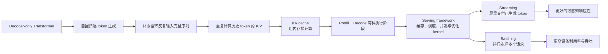
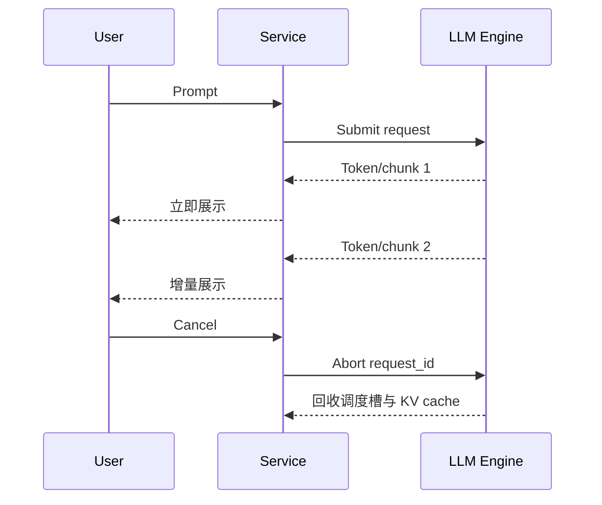
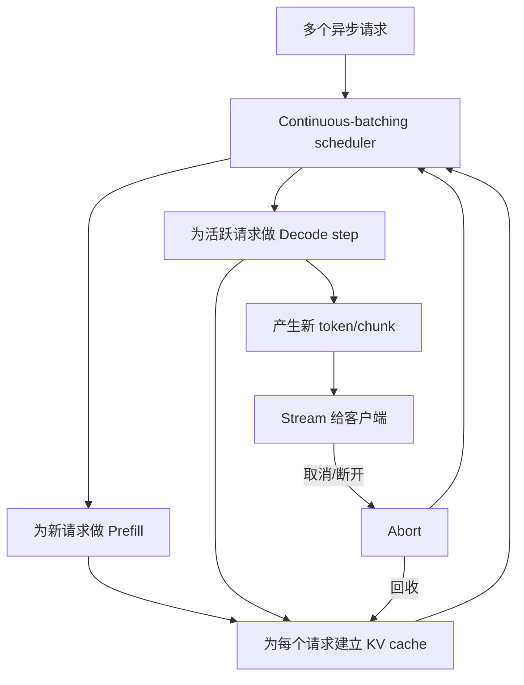
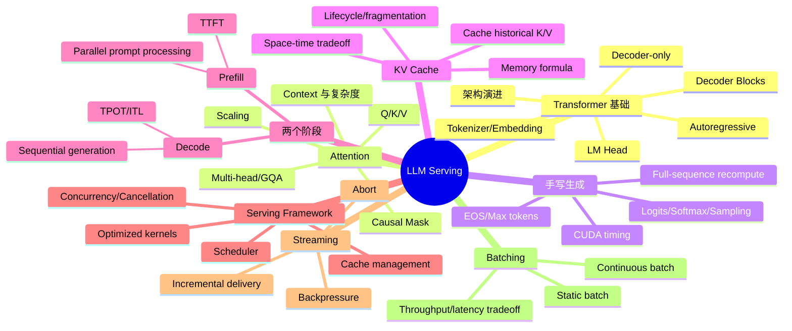

> 原章：*Large Language Model Serving*
> 核心问题：decoder-only Transformer 为什么必须逐 token 生成？这种执行方式怎样形成重复计算、首 token 延迟、KV cache 内存和低 GPU 利用率等服务难题？如何从手写推理循环出发，理解 prefill、decode、streaming、batching 与 vLLM 等服务框架所解决的问题？

## 0. 本章定位、学习目标与因果主线

第 1 章回答“模型服务系统有哪些形态”，第 2 章进一步打开 LLM 黑盒，回答“LLM 一次请求在设备上究竟怎样执行”。作者刻意从最小代码开始，而不是先展示生产平台，因为只有看清逐 token 生成中的状态变化，才能理解后续框架为什么需要 KV cache、调度器、流式输出与连续批处理。

本章的论证链如下：



学习本章后，应能回答：

1. RNN、BERT 与 GPT 的执行结构为何不同，为什么本书聚焦 decoder-only Transformer？
2. tokenizer、embedding、Transformer blocks 与 LM head 怎样把文本变成下一 token？
3. $Q/K/V$ 分别表示什么，scaled dot-product attention 为什么要除以 $\sqrt{d_k}$？
4. causal mask、multi-head attention、hidden state、logit、概率与采样是什么关系？
5. 朴素生成循环为什么越来越慢，KV cache 具体缓存了什么、没有缓存什么？
6. prefill 和 decode 的计算形态为何不同，各自应看哪些性能指标？
7. Hugging Face `pipeline`、手写 PyTorch 推理和 vLLM serving framework 分别适合什么阶段？
8. streaming 改善的是计算延迟还是结果交付？batching 为什么提高吞吐却未必降低单请求延迟？
9. static batching 与 continuous batching 有何区别，为什么后者更适合长度不一的在线请求？

> **实验口径说明**：本章的 9.1205 s、3.1416 s、1.12 s、19.58 s、1.0626 s、2.3865 s 以及 10～20×、23× 等数据来自作者的特定模型、硬件、框架版本和 workload。它们能说明机制可能带来的数量级差异，但不是任意环境的性能承诺。比较前必须固定模型、精度、输入输出 token 长度、采样、并发、warm-up 和计时边界。

---

## 1. Inside the Mind of a Transformer：从服务视角看 Transformer

### 1.1 LLM Evolution：架构演进为什么影响服务

作者先回顾语言模型历史，不是为了罗列年份，而是为了说明每次架构变化都在改变推理的**依赖关系、并行能力和状态管理方式**。

#### 1.1.1 从稀疏符号到稠密表示

早期 n-gram 依据前面有限个符号估计下一词：

$$
p(x_t\mid x_{<t})\approx p(x_t\mid x_{t-n+1},\ldots,x_{t-1}).
$$

它简单、可计数，但上下文窗口固定，未见组合容易稀疏，语义相近的词也不能自然共享统计。2013 年 Word2Vec 推广了稠密词向量：每个词不再只是离散 ID，而是向量空间中的点，语义或用法相近的词可能拥有相近表示。

Word2Vec 解决的是表示问题，不是完整的长上下文生成架构。它通常给一个词相对静态的向量，同一个词在不同句子中的表示不会像 Transformer hidden state 那样随上下文动态改变。

#### 1.1.2 RNN/LSTM/GRU：能记序列，但难以并行

RNN 将历史压缩进隐藏状态：

$$
h_t=f(h_{t-1},x_t).
$$

因为 $h_t$ 依赖 $h_{t-1}$，第 $t$ 步必须等第 $t-1$ 步完成。这让 RNN 符合序列直觉，却形成严格的时间依赖链，GPU 很难并行处理一个序列中的全部位置。普通 RNN 还会因梯度消失或爆炸难以保留长距离信息。

LSTM 与 GRU 用门控机制决定哪些信息保留、遗忘或输出，缓解了长期依赖问题，但没有消除按时间步递归的结构。对服务而言，这意味着上下文处理吞吐仍受串行路径限制。

#### 1.1.3 Transformer：把递归换成 attention

2017 年 Transformer 用 self-attention 和位置编码替代循环层。对已经给定的输入序列，各位置的 $Q/K/V$ 投影和大部分矩阵运算可以并行完成；任意两个位置也能通过一层 attention 直接交互，不必让信息逐步穿过所有中间时间步。

这带来两项关键收益：

- **训练与 prefill 可并行**：已知输入序列的多个 token 可一起形成大矩阵运算，适合 GPU。
- **长距离关系路径变短**：远距离 token 可直接计算相关性。

代价是标准 attention 对序列长度 $n$ 形成 $n\times n$ 分数矩阵，计算和中间数据会随上下文快速增长。Transformer 解决了 RNN 的串行瓶颈，却把长上下文的计算与内存问题推到服务系统面前。

#### 1.1.4 BERT 与 GPT：同源架构，不同可见范围与用途

| 模型族 | 常见结构 | token 能看到什么 | 典型训练目标 | 更擅长 |
|---|---|---|---|---|
| BERT | encoder-only | 左右两侧上下文 | masked language modeling | 分类、抽取、embedding、理解 |
| GPT/Llama/Qwen | decoder-only | 当前位置及其左侧 | next-token prediction | 自回归生成 |
| 原始 Transformer | encoder-decoder | encoder 双向；decoder 因果并 cross-attend encoder | 条件序列生成 | 翻译、摘要等输入到输出任务 |

“BERT 是双向，GPT 是单向”描述的是 attention 可见范围，不是计算只向某个物理方向流动。decoder-only 模型通过 causal mask 禁止位置 $i$ 读取未来位置 $j>i$，因此训练时即使所有位置并行计算，信息约束仍与逐 token 生成一致。

大规模无标签文本上的 next-token 或 masked-token 目标更准确地称为**自监督学习**：监督信号直接从文本本身构造，而不需要人工逐条标注。预训练得到通用模型，再微调或通过提示适配任务，避免每个任务都从零训练。

#### 1.1.5 “Large”的标准会变化

原章以 GPT-1 的 117M、GPT-3 的 175B 和 DeepSeek R1 的 671B 参数说明规模增长。参数越多通常意味着：

- 权重需要更多存储和设备内存；
- 每个 token 需要更多权重读取与矩阵计算；
- 单卡可能装不下，需要量化、offload 或多 GPU 并行；
- 服务成本和优化价值同时增大。

但 LLM 没有永恒的参数阈值。今天的“小模型”可能大于早年的“大模型”；现代语言模型还可能是多模态、Mixture-of-Experts 或带工具能力。原章后续使用 **LLM/Transformer 专指生成式 decoder-only Transformer**，这是本章的讨论边界，不是对整个领域的永久定义。

### 1.2 The Autoregressive Nature：为什么必须逐 token 生成

#### 1.2.1 概率分解决定执行顺序

给定 prompt $x_{1:n}$，要生成 $m$ 个 token $y_{1:m}$，自回归模型把条件概率分解为：

$$
p(y_{1:m}\mid x_{1:n})
=\prod_{t=1}^{m}
p(y_t\mid x_{1:n},y_{1:t-1}).
$$

生成 $y_t$ 需要已经知道 $y_{1:t-1}$，因此 decode 存在不可消除的 token 级依赖：第 $t+1$ 个输出不能在第 $t$ 个输出确定前完成。GPU 可以并行计算某一步内部的大量矩阵运算，也可以并行处理多个请求，但单个序列的未来 token 不能像 prompt token 那样全部同时确定。

以原章的首都提示为例：

```text
prompt
  -> Washington
prompt + Washington
  -> D.C.
prompt + Washington + D.C.
  -> is
prompt + Washington + D.C. + is
  -> the
```

生成在以下条件之一发生时停止：

- 产生模型定义的 EOS token；
- 达到 `max_new_tokens`；
- 匹配应用指定的 stop token/stop string；
- 客户端取消或服务端超时；
- 安全策略或资源限制中断请求。

#### 1.2.2 “token by token”不等于“word by word”

tokenizer 可能把一个词拆成多个 subword，也可能让标点、空格或单个汉字成为 token。原章为叙述方便交替使用 word 与 token，并给出英文平均 1 token 约 0.75 word 的粗略经验；该比例不适用于所有 tokenizer、语言、代码或数字文本。

服务容量必须按实际 tokenizer 后的 token 数计算，因为计算量、上下文上限、KV cache 和供应商计费都围绕 token，而不是人眼看到的单词数。

### 1.3 Decoder-Only Transformer Architecture：下一 token 从哪里来

模型可分为 tokenizer/embedding、堆叠 decoder blocks 与 LM head。完整数据流是：

```mermaid
flowchart LR
    TXT[输入文本] --> TOK[Tokenizer]
    TOK --> IDS[Token IDs<br/>B × N]
    IDS --> EMB[Embedding + 位置信息<br/>B × N × d]
    EMB --> BLK[重复 L 个 Decoder Blocks]
    BLK --> HS[Contextual hidden states<br/>B × N × d]
    HS --> LAST[选择最后位置<br/>B × d]
    LAST --> HEAD[LM head]
    HEAD --> LOGITS[Vocabulary logits<br/>B × V]
    LOGITS --> SAMPLE[解码策略<br/>argmax / sampling]
    SAMPLE --> NEXT[Next token ID]
```



其中 $B$ 是 batch size，$N$ 是当前序列长度，$d$ 是 hidden size，$V$ 是 vocabulary size。

#### 1.3.1 Tokenizer 与 embedding

tokenizer 完成：

1. 按固定词表和分词算法把文本切成 token；
2. 将 token 映射为整数 ID；
3. 添加模型需要的特殊 token 或 chat template。

embedding 层以 token ID 查表：若 embedding 矩阵 $E\in\mathbb{R}^{V\times d}$，ID 为 $i$ 的初始向量为：

$$
e_i=E[i]\in\mathbb{R}^{d}.
$$

token ID 本身没有“大小”语义，ID 1000 不比 ID 10 更重要。语义进入模型的是对应 embedding 向量及后续上下文化结果。

原章称首都提示被分成 11 个 token，但展示的可见 token 字符串数量与 ID 列表不完全一致。这类差异可能来自空格前缀、引号显示或文中省略，不能手工按单词猜 token 数；应始终调用目标模型的 tokenizer 验证：

```python
encoded = tokenizer(prompt, add_special_tokens=True)
print(len(encoded["input_ids"]))
print(tokenizer.convert_ids_to_tokens(encoded["input_ids"]))
```

tokenizer 必须与权重配套。换用词表不同的 tokenizer，即使输入仍能转换成整数，也会让 ID 对应错误 embedding，从根本上破坏模型行为。

#### 1.3.2 Decoder blocks 与 hidden states

设 embedding 输出为 $H^{(0)}\in\mathbb{R}^{B\times N\times d}$，经过 $L$ 层 block：

$$
H^{(\ell+1)}=\mathrm{Block}_{\ell}(H^{(\ell)}),
\qquad \ell=0,\ldots,L-1.
$$

最终 $H^{(L)}$ 的每个位置都不再只是该 token 的静态 embedding，而是结合其可见历史得到的 contextualized hidden state。生成下一 token 通常只需最后位置 $h_N^{(L)}$；训练时则会使用多个位置同时预测各自的下一 token。

#### 1.3.3 LM head、logits、概率和采样

LM head 将最后 hidden state 投影到词表维度：

$$
z=W_{\mathrm{vocab}}h_N+b,
\qquad z\in\mathbb{R}^{V}.
$$

$z_i$ 是 token $i$ 的 **logit**，即未经归一化的分数，不是概率。softmax 才把 logits 变成概率：

$$
p_i=\frac{\exp(z_i/T)}{\sum_{j=1}^{V}\exp(z_j/T)},
$$

其中 $T$ 是 temperature：

- $T<1$ 使分布更尖锐，更偏向高分 token；
- $T>1$ 使分布更平坦，增加随机性；
- 工程 API 常把 `temperature=0` 解释为 greedy，而不是直接代入除法。

“通常总选最高概率 token”只描述 greedy decoding。开放式生成常先做 top-$k$ 或 top-$p$ 截断再采样；beam search、重复惩罚和 constrained decoding 也会改变选择过程。模型负责产生 logits，解码策略负责从分布中决定 token，二者共同决定输出。

#### 1.3.4 用 Qwen 2.5 配置建立资源直觉

原章读取 `Qwen/Qwen2.5-0.5B` 配置，得到：

| 配置 | 书中值 | 服务含义 |
|---|---:|---|
| `hidden_size` | 896 | hidden state 和多数主干矩阵的宽度 |
| `num_hidden_layers` | 24 | 每个 token 要经过 24 个 decoder blocks，也决定 KV cache 层数 |
| `num_attention_heads` | 14 | query heads 数量；每头维度通常为 $896/14=64$ |
| `intermediate_size` | 4864 | FFN 中间宽度，影响参数量和计算量 |
| `vocab_size` | 151,936 | LM head 输出维度和 embedding 行数 |
| `max_position_embeddings` | 32,768 | 配置支持的最大位置范围之一，不等于任意服务配置都能经济地跑满 |
| 总参数量 | 494,032,768 | 约 0.5B，决定权重内存的主要数量级 |

基础检查代码：

```python
from transformers import AutoConfig

model_name = "Qwen/Qwen2.5-0.5B"
config = AutoConfig.from_pretrained(model_name, trust_remote_code=True)

fields = [
    "hidden_size",
    "num_hidden_layers",
    "num_attention_heads",
    "num_key_value_heads",
    "intermediate_size",
    "vocab_size",
    "max_position_embeddings",
]
for field in fields:
    print(field, getattr(config, field, None))
```

只检查配置不必先加载全部权重，适合部署前快速判断兼容性。若以每参数 2 bytes 的 BF16/FP16 粗估，494,032,768 个参数仅权重约为：

$$
494{,}032{,}768\times2
=988{,}065{,}536\ \mathrm{bytes}
\approx0.92\ \mathrm{GiB}.
$$

实际显存还包含 KV cache、临时激活、CUDA context、kernel workspace 和碎片。配置中的最大上下文也只是模型能力边界；服务能否支持该长度取决于显存预算、并发和运行时设置。

检查配置有助于选择量化、蒸馏、offload、tensor parallel 或 pipeline parallel，但不能代替实测。参数量相同的模型可能因 attention 类型、激活函数和 kernel 支持而有不同性能。

### 1.4 Transformer Decoder Block：计算集中在哪里

一个现代 decoder block 通常不只有图中的两块，还包含 normalization、residual connection 和位置编码。用 pre-norm 结构可概括为：

$$
\widetilde H
=H+\mathrm{Attention}(\mathrm{Norm}(H)),
$$

$$
H'
=\widetilde H+\mathrm{FFN}(\mathrm{Norm}(\widetilde H)).
$$

#### 1.4.1 Self-attention：在 token 间搬运上下文

attention 让每个位置按相关性聚合可见 token 的信息。它解决“同一个词在不同上下文含义不同”以及远距离依赖问题，例如 `capital` 应结合 `US` 判断为“首都”而不是“资本”。

#### 1.4.2 FFN：对每个位置独立做非线性变换

attention 在 token 间混合信息；FFN 对每个位置的向量应用相同参数的非线性映射。简化 FFN 为：

$$
\mathrm{FFN}(h)=W_2\,\sigma(W_1h+b_1)+b_2.
$$

Qwen 等模型常使用 gated MLP，因此会看到 `gate_proj`、`up_proj`、`down_proj` 与 SiLU。FFN 不直接让位置互相通信，却通常占用很大一部分参数和 FLOPs。把 attention 说成“理解上下文”、FFN 说成“存储知识”是有用直觉，但不是严格模块分工；能力分布在所有层和参数中。

#### 1.4.3 Qwen block 的实际模块

原章打印出的典型层级为：

```text
Qwen2DecoderLayer
  self_attn: Qwen2Attention
    q_proj: Linear
    k_proj: Linear
    v_proj: Linear
    o_proj: Linear
  mlp: Qwen2MLP
    gate_proj: Linear
    up_proj: Linear
    down_proj: Linear
    act_fn: SiLU
  input_layernorm: Qwen2RMSNorm
  post_attention_layernorm: Qwen2RMSNorm
```

这些名字直接对应优化入口：

- `q/k/v/o_proj` 可采用 fused attention、低精度 GEMM 或量化；
- `gate/up/down_proj` 是大矩阵乘法热点；
- RMSNorm 与激活可做算子融合；
- 多层可做 pipeline sharding，层内矩阵可做 tensor parallel；
- rotary position embedding 影响长上下文与 KV cache 的位置处理。

“查看模块结构”比只看模型名称更可靠，因为同一家族不同版本可能更换 MHA/GQA、激活、归一化或位置编码，适合的 kernel 也会变化。

### 1.5 Capture Token Context：attention 怎样计算上下文

#### 1.5.1 从 hidden state 得到 Q、K、V

对一层输入 $X\in\mathbb{R}^{N\times d}$：

$$
Q=XW_Q,\qquad K=XW_K,\qquad V=XW_V.
$$

直觉上：

- **Query**：当前位置“想找什么信息”；
- **Key**：每个可见位置“能用什么特征被匹配”；
- **Value**：若该位置重要，实际聚合什么内容。

Query 与 Key 决定权重，Value 决定被汇总的信息。缓存 K/V 而通常不缓存历史 Q，正是因为新 token 只需要用自己的 query 去查询历史 keys，再聚合历史 values；历史 query 不参与这次输出。

#### 1.5.2 Scaled dot-product attention 的每一步

完整的因果 self-attention 写成：

$$
\mathrm{Attention}(Q,K,V)
=\mathrm{softmax}\!\left(
\frac{QK^\top}{\sqrt{d_k}}+M
\right)V,
$$

其中 $M$ 是 causal mask：允许的位置加 $0$，未来位置加 $-\infty$。推导步骤是：

1. $QK^\top$ 计算每个 query 与所有 key 的点积，得到 $N\times N$ 相关性分数。
2. 除以 $\sqrt{d_k}$。若 Q/K 各维近似独立、均值 0、方差 1，点积方差约为 $d_k$；缩放后方差回到常数量级，避免 softmax 过度饱和、梯度或数值行为不稳定。
3. 加 causal mask，确保位置 $i$ 看不到 $j>i$ 的未来 token。
4. 沿 key 维做 softmax，把可见位置分数归一化为和为 1 的权重。
5. 权重乘 $V$，得到上下文加权表示。

一个极简数值例子：某 query 与三个历史 key 的缩放后分数为 $[2,1,0]$，则：

$$
\mathrm{softmax}([2,1,0])
\approx[0.665,0.245,0.090].
$$

输出为：

$$
o=0.665v_1+0.245v_2+0.090v_3.
$$

这不是“选择一个 token”，而是对 value 向量做连续加权混合。

#### 1.5.3 Multi-head attention

一个 attention 头只有一套投影。multi-head attention 使用 $h$ 套子空间：

$$
\mathrm{head}_i
=\mathrm{Attention}(QW_i^Q,KW_i^K,VW_i^V),
$$

$$
\mathrm{MHA}(Q,K,V)
=\mathrm{Concat}(\mathrm{head}_1,\ldots,\mathrm{head}_h)W_O.
$$

不同头能够学习不同关系，如局部搭配、位置、指代或任务格式，但不应把每个头机械标成固定的人类概念。现代模型还常采用 grouped-query attention（GQA）或 multi-query attention（MQA），让多个 query heads 共享较少的 K/V heads，以减少 KV cache 和内存带宽。

#### 1.5.4 Attention 可视化能说明什么

原章使用 BertViz `head_view` 展示 Qwen 某层各 head 的 attention weight。线越粗表示该 query 对相应 key 的权重越高，颜色区分 head；示例中第 10 层 `capital` 对 `US` 和 `write` 有较强连接。

可视化适合检查模型“这一层这一头把权重放在哪里”，但有三项边界：

- attention weight 不等于完整因果解释，输出还经过 value、output projection、residual、FFN 和后续层；
- 高权重不必然表示该 token 对最终答案最重要；
- 开启 `output_attentions=True` 可能关闭某些优化 attention kernel、显著增加内存，适合分析而非生产默认。

#### 1.5.5 服务工程师要掌握到什么程度

不必先推完全部训练数学，至少要知道：

- prefill 对多个 prompt token 形成大 attention 计算，标准实现对长度呈二次关系；
- decode 在 KV cache 下每步只有新 query，但要读取不断增长的历史 K/V；
- attention head 数、KV head 数、head dimension、层数决定 cache 大小；
- kernel、精度、batch、上下文长度和并行策略会改变瓶颈。

这些事实足以解释为什么长 prompt、长输出与高并发会对系统产生不同压力。

---

## 2. Executing LLM Generation：逐行理解推理

### 2.1 Run the Qwen Model：先用高层 API 建立基线

Hugging Face `pipeline` 封装 tokenizer、模型加载、生成和解码：

```python
from transformers import pipeline

generator = pipeline("text-generation", model="Qwen/Qwen2.5-0.5B")
prompt = "Write a short introduction about the US capital city."
result = generator(prompt, max_new_tokens=50, num_return_sequences=1)
print(result[0]["generated_text"])
```

这里使用 `max_new_tokens` 比原章的 `max_length=50` 更清晰：

- `max_length` 常表示“prompt + output”的总 token 上限；
- `max_new_tokens` 只限制新生成 token 数。

`pipeline` 适合验证模型与应用逻辑，却隐藏了 prefill、decode、cache、调度和 timing 边界。为了理解服务瓶颈，作者接着手动展开生成循环。

### 2.2 Model Prediction, Line by Line：无 KV cache 的朴素循环

#### 2.2.1 Example 2-1：修正后的完整教学实现

原章把代码拆成多个片段，核心逻辑如下。这里补齐 import、括号、计时同步与 EOS 处理，使流程可直接阅读和运行；它仍是**教学实现，不是生产 serving loop**。

```python
import time

import torch
from transformers import AutoModelForCausalLM, AutoTokenizer

model_name = "Qwen/Qwen2.5-0.5B"
device = "cuda" if torch.cuda.is_available() else "cpu"

tokenizer = AutoTokenizer.from_pretrained(model_name, trust_remote_code=True)
model = AutoModelForCausalLM.from_pretrained(
    model_name,
    trust_remote_code=True,
).to(device).eval()

prompt = "Write a short introduction about the US capital city."
all_ids = tokenizer(prompt, return_tensors="pt").input_ids.to(device)
max_new_tokens = 100
token_times = []

for _ in range(max_new_tokens):
    if device == "cuda":
        torch.cuda.synchronize()
    started_at = time.perf_counter()

    with torch.inference_mode():
        outputs = model(input_ids=all_ids, use_cache=False)
        next_logits = outputs.logits[:, -1, :]
        probabilities = torch.softmax(next_logits, dim=-1)
        next_id = torch.multinomial(probabilities, num_samples=1)

    if device == "cuda":
        torch.cuda.synchronize()
    token_times.append(time.perf_counter() - started_at)

    all_ids = torch.cat((all_ids, next_id), dim=1)
    print(tokenizer.decode(next_id[0]), end="", flush=True)

    if next_id.item() == tokenizer.eos_token_id:
        break

generated_text = tokenizer.decode(all_ids[0], skip_special_tokens=True)
```

各步骤的状态变化：

1. tokenizer 生成初始 `all_ids`，形状为 $[1,n]$。
2. 每轮把**完整增长序列**交给模型，logits 形状为 $[1,t,V]$。
3. `[:, -1, :]` 只保留最后位置的 $V$ 个 logits，因为只需预测下一个 token。
4. softmax 产生分布，`multinomial` 按概率采样一个 ID。
5. 将 ID 追加到 `all_ids`，下一轮序列长度从 $t$ 变成 $t+1$。
6. EOS 或最大输出数终止循环。

`torch.inference_mode()` 同时表达“不训练”并减少 autograd 开销；模型还应 `.eval()`，二者作用不同。CUDA kernel 异步提交，精确 wall-clock 计时要在起止点同步，否则可能只测到 CPU 发射时间。

#### 2.2.2 为什么无缓存越来越慢

设 prompt 长度为 $n$，已经生成 $t-1$ 个 token，第 $t$ 轮完整输入长度为：

$$
s_t=n+t-1.
$$

无 cache 时，每轮重新计算全部 $s_t$ 个位置的 Q/K/V、attention 与 FFN。只看 attention 分数，单层约为 $O(s_t^2d)$；跨 $m$ 个输出 token 的重复 attention 工作约为：

$$
\sum_{t=1}^{m}O((n+t-1)^2d).
$$

当 $m$ 很大时，其中包含近似三次增长项。更完整的模型还有每个位置的线性投影和 FFN，约随 $s_t$ 线性增长。核心结论不依具体常数：**已处理的历史位置每一轮都被重新计算**。

原章实验生成 100 token 共 9.1205 s，平均约：

$$
\frac{9.1205}{100}=0.091205\ \mathrm{s/token}.
$$

后续 token 逐渐变慢正是完整输入越来越长的外在表现。但第一个 token 还可能包含 kernel 初始化、内存分配或 warm-up，不能只凭一条曲线把全部首轮开销都归因于 attention。

### 2.3 Enable the KV Cache：用内存消除历史重复计算

#### 2.3.1 缓存什么，为什么正好是 K/V

在第 $\ell$ 层，新 token 的 query 需要与所有历史 key 比较，再聚合历史 value。历史 token 的 K/V 在模型权重和 token 序列不变时不会改变，因此可在第一次计算后保存：

$$
K_{1:t}^{(\ell)}
=\mathrm{Concat}(K_{1:t-1}^{(\ell)},K_t^{(\ell)}),
$$

$$
V_{1:t}^{(\ell)}
=\mathrm{Concat}(V_{1:t-1}^{(\ell)},V_t^{(\ell)}).
$$

新一步只计算 $Q_t,K_t,V_t$，再执行：

$$
o_t
=\mathrm{softmax}\!\left(
\frac{Q_t(K_{1:t})^\top}{\sqrt{d_k}}
\right)V_{1:t}.
$$

历史 Q 不再需要，因为服务只求新位置的输出；历史 attention 输出和 FFN 也无须重算。这是典型的**空间换时间**。

#### 2.3.2 Example 2-2：修正后的 KV cache 循环

```python
import time

import torch
from transformers import AutoModelForCausalLM, AutoTokenizer

model_name = "Qwen/Qwen2.5-0.5B"
device = "cuda" if torch.cuda.is_available() else "cpu"

tokenizer = AutoTokenizer.from_pretrained(model_name, trust_remote_code=True)
model = AutoModelForCausalLM.from_pretrained(
    model_name,
    trust_remote_code=True,
).to(device).eval()

prompt_ids = tokenizer(
    "Write a short introduction about the US capital city.",
    return_tensors="pt",
).input_ids.to(device)

all_ids = prompt_ids
step_ids = prompt_ids
past_key_values = None
token_times = []

for _ in range(100):
    if device == "cuda":
        torch.cuda.synchronize()
    started_at = time.perf_counter()

    with torch.inference_mode():
        outputs = model(
            input_ids=step_ids,
            past_key_values=past_key_values,
            use_cache=True,
        )
        past_key_values = outputs.past_key_values
        next_logits = outputs.logits[:, -1, :]
        probabilities = torch.softmax(next_logits, dim=-1)
        next_id = torch.multinomial(probabilities, num_samples=1)

    if device == "cuda":
        torch.cuda.synchronize()
    token_times.append(time.perf_counter() - started_at)

    all_ids = torch.cat((all_ids, next_id), dim=1)
    step_ids = next_id

    if next_id.item() == tokenizer.eos_token_id:
        break

print(tokenizer.decode(all_ids[0], skip_special_tokens=True))
```

第一轮 `step_ids` 是完整 prompt，模型创建所有 prompt token 的 K/V；之后 `step_ids` 只有形状 $[1,1]$ 的新 token，而 `past_key_values` 携带全部层的历史状态。`all_ids` 只用于最终解码和业务记录，不再作为每轮模型输入。

原章示例中的 `num_interations` 有拼写问题，并把 `max_new_tokens`、`min_new_tokens` 传给底层 model forward；这两个通常属于高级 `generate()` 配置，而不是 causal LM 的单次 forward 参数。教学循环应由外层 `for` 控制 token 数，如上所示。

#### 2.3.3 KV cache 改变了什么复杂度

设当前历史长度为 $s$。有 cache 的单步 decode：

- 只对新 token 做 Q/K/V、FFN 等投影；
- 新 query 仍需与 $s$ 个历史 keys 比较，并读取 $s$ 个 values。

因此 cache 没有让 attention 与上下文长度完全无关：单步 attention 仍约为 $O(sd)$，而不是 $O(1)$；它消除了对所有历史 query 重新形成 $s\times s$ attention 和重复 FFN 的工作。

这也解释了为何 cache 后 token 时间更稳定但不一定绝对水平：上下文增长会增加 K/V 读取和新 query 对历史的 attention，长序列仍可能逐渐变慢。

#### 2.3.4 KV cache 的内存公式

设：

- batch/并发序列数为 $B$；
- cache 长度为 $T$；
- 层数为 $L$；
- K/V head 数为 $H_{kv}$；
- 每头维度为 $d_h$；
- 每元素字节数为 $b$。

K 和 V 两份 cache 的近似大小为：

$$
M_{KV}
\approx2BLTH_{kv}d_hb.
$$

前面的 2 表示 K 与 V。若 Qwen 配置报告 $L=24$、$H_{kv}=2$、$d_h=64$，BF16 为 2 bytes，则每个序列每 token：

$$
2\times24\times2\times64\times2
=12{,}288\ \mathrm{bytes}
\approx12\ \mathrm{KiB}.
$$

单序列 32,768 token 约需：

$$
12\ \mathrm{KiB}\times32{,}768
=384\ \mathrm{MiB}.
$$

若模型使用 14 个独立 KV heads 而非 2 个共享 heads，cache 会放大 7 倍。这正是 GQA/MQA 对服务很重要的原因。公式是连续、无额外开销的粗估；实际还受 block 分配、对齐、数据类型、并行切分和碎片影响。

#### 2.3.5 实验收益和边界

原章开启 cache 后 100 token 用时 3.1416 s，平均约 31.416 ms/token；相对无 cache：

$$
\mathrm{speedup}
=\frac{9.1205}{3.1416}
\approx2.90.
$$

KV cache 的收益受 prompt/output 长度、模型、硬件、kernel 和计时方式影响。它也有局限：

- cache 按层、序列和 token 增长，高并发时可能比权重更先耗尽显存；
- 每个请求的 cache 生命周期不同，传统连续内存容易碎片化；
- batch 中序列完成时间不同，需要动态回收和复用 cache block；
- 新请求通常不能直接复用其他请求的 cache，除非前缀完全兼容且运行时支持 prefix caching；
- 修改历史 token 或位置后，其后续 cache 通常失效。

### 2.4 Prefill and Decode：同一请求中的两种硬件行为

#### 2.4.1 Prefill

prefill（prompt processing）一次处理已有的 $n$ 个 prompt token，并为每层建立初始 KV cache。因所有 token 已知，投影和 FFN 可组成大矩阵并行执行；标准 attention 的分数工作约为 $O(n^2d)$。

prefill 常被称为 compute-intensive，是因为大矩阵运算具有较高算术强度，较容易用满 GPU 计算单元。它不是“只有 attention 有成本”，权重投影和 FFN 也很大；对于不同模型和长度，实际瓶颈需 profile。

#### 2.4.2 Decode

decode 每轮只接收新 token，读取权重和不断增长的 KV cache，产生一个下一 token。单请求每步的矩阵较小，自回归依赖又限制了同一序列的时间并行，因此更容易受 HBM 内存带宽和 cache 读取限制，常称 memory-bandwidth-intensive。

| 维度 | Prefill | Decode |
|---|---|---|
| 输入 | 整个 prompt，$n$ 个 token | 每步 1 个新 token/序列 |
| 并行性 | prompt 位置可大规模并行 | 单序列 token 间串行，可跨请求 batch |
| KV cache | 创建 prompt 的 cache | 读取历史并追加新 K/V |
| 常见瓶颈 | 大矩阵 compute、长序列 attention | 权重/KV 带宽、小矩阵利用率 |
| 用户指标 | TTFT 的主要计算部分 | TPOT/ITL、输出吞吐 |
| 典型重负载 | 超长文档 prompt、RAG 大上下文 | 短 prompt 长回答、故事或代码生成 |

#### 2.4.3 TTFT、TPOT 与端到端延迟

若排队时间为 $L_q$，prefill 为 $L_p$，首轮采样和传输为 $L_s$，则：

$$
\mathrm{TTFT}\approx L_q+L_p+L_s.
$$

若输出 $m$ 个 token，平均 token 间隔为 TPOT，则端到端时间可粗估为：

$$
L_{\mathrm{e2e}}
\approx\mathrm{TTFT}+(m-1)\mathrm{TPOT}+L_{\mathrm{finalize}}.
$$

所以只报告 total latency 无法判断慢在长 prompt、排队还是 decode。streaming 应用通常同时约束 TTFT 与 p95 ITL；离线任务可能只关心每小时处理 token 数。

图中第一根柱包含 prompt prefill 并产生首 token，因此显著较高；后续柱对应 cache-assisted decode。严格地说，首 token 延迟还可能含首次 kernel 编译、CUDA graph 捕获、内存分配和 warm-up，benchmark 应预热后多次测量。

#### 2.4.4 为什么区分阶段会改变优化选择

- 长 prompt 工作负载优先考虑 prefix caching、chunked prefill、FlashAttention、限制/压缩上下文或 prefill/decode 分离。
- 长输出工作负载优先考虑更高效 decode kernel、量化、continuous batching、KV cache 精度/管理和 speculative decoding。
- 混合流量中，大 prefill 可能阻塞正在 decode 的交互请求，需要调度器分块或设置优先级。

“prefill compute-bound、decode memory-bound”是实用默认模型，不是无需测量的定律。batch 足够大时 decode 也能提高算术强度；极长上下文下 KV 读取和 attention 也可能改变 prefill 瓶颈。

### 2.5 Run the LLM with a Serving Framework：为什么不把教学循环上线

手写循环展示机制，却缺少生产必需能力：

- 多请求并发和公平调度；
- 动态 batching/micro-batching；
- KV cache 分配、回收、交换与碎片管理；
- streaming、取消、超时和 backpressure；
- 多 GPU 并行与 worker 故障处理；
- optimized/fused kernels、量化和 CUDA graph；
- API、指标、日志与兼容多个模型架构。

vLLM、SGLang 等 serving framework 把这些能力放到统一执行引擎中。它们的价值不只是“少写几行代码”，而是让多个动态请求共享模型权重和设备，同时持续吸收 PagedAttention、prefix caching、speculative decoding 等优化。

### 2.6 Serve Qwen with vLLM

最小离线批量调用：

```python
from vllm import LLM, SamplingParams

model_name = "Qwen/Qwen2.5-0.5B"
llm = LLM(model=model_name, dtype="float16")

sampling_params = SamplingParams(
    temperature=0.8,
    top_p=0.95,
    max_tokens=128,
)

outputs = llm.generate(
    ["Write a short introduction about the US capital city."],
    sampling_params,
)
for output in outputs:
    print(output.outputs[0].text)
```

`LLM` 负责模型与执行引擎，`SamplingParams` 负责生成行为。必须分开理解两类参数：

| 层次 | 示例 | 影响 |
|---|---|---|
| 模型/引擎配置 | dtype、max model length、GPU memory utilization、parallel size、cache block | 显存、并发、吞吐、兼容和部署拓扑 |
| 每请求采样配置 | temperature、top-p、top-k、max tokens、stop、penalty | 输出随机性、长度、质量和单请求工作量 |

原章还列出 `swap_space`、`block_size`、prefix caching、chunked prefill、CUDA graph、Ray 和 custom all-reduce 等高级概念。它们解决的问题分别是：

- CPU swap 为被换出的请求状态提供后备空间，但 PCIe 传输会增加延迟；
- cache block 控制 PagedAttention 的分配粒度，太大会内部浪费，太小会增加元数据/调度开销；
- prefix caching 复用相同前缀的 KV；
- chunked prefill 把大 prompt 切块调度，降低其长时间独占执行批次的影响；
- CUDA graph 减少重复 CPU launch 开销，但形状和动态行为受约束；
- Ray 或多进程负责分布式 worker 编排；
- custom all-reduce 优化多 GPU collective，但依拓扑和版本决定。

这些参数名和构造函数签名会随 vLLM 版本变化。原章高级代码更适合作为“可调维度清单”，不应不加验证地复制；以安装版本的 CLI/API 文档为准，并先用默认值建立 baseline。

采样参数也有边界：penalty 并非越多越好，叠加 frequency、presence 与 repetition penalty 可能过度抑制正常重复；stop string 可能跨 token 边界；`temperature=0` 的确定性还可能受并行 kernel 和平台数值差异影响。

### 2.7 vLLM Versus Hugging Face：怎样正确阅读 17×

原章报告同一 Qwen/prompt 下：

| 实现 | 书中耗时 |
|---|---:|
| vLLM | 1.12 s |
| Hugging Face 示例 | 19.58 s |

比值为：

$$
\frac{19.58}{1.12}\approx17.48.
$$

作者据此说明 vLLM 在其测试中约 17×，并概括许多 benchmark 可达 10～20× throughput。核心原因可能包括优化 kernel、KV cache 管理、调度和 batch 能力，而不是模型数学发生变化。

但该片段不足以证明严格 apples-to-apples：

- HF 使用 `max_length=128`，vLLM 使用 `max_tokens=128`，前者可能含 prompt、后者通常指新 token；
- 是否包含模型加载、首次 warm-up 与 tokenizer 时间需明确；
- sampling seed、EOS、输出长度可能不同；
- CUDA 异步计时应同步；
- 单 prompt wall time 不是并发 throughput。

可复现实验应固定实际输入/输出长度，预热多轮，分别测 TTFT、TPOT、端到端延迟、tokens/s、峰值显存与质量，并报告软件/硬件版本。实践路线仍然合理：先用 Transformers 快速验证，再在代表性 workload 上评估 vLLM，而不是因一个倍数无条件迁移。

---

## 3. LLM Streaming Serving Basics：生成即交付

### 3.1 为什么引入 streaming

非流式 `generate()` 即使内部逐 token 计算，也会等完整结果生成后一次返回。若输出 $m$ 个 token，用户在接近 $L_{e2e}$ 时才看到内容。streaming 在首 token 可用后就发送，并持续推送新增 token/chunk：



streaming 主要改善**结果交付和可感知响应性**，不自动减少模型 prefill/decode 计算。TTFT 不变时，首 token 仍不会更早生成；但用户不必等待完整答案，且能提前阅读或取消。

### 3.2 Async engine 的核心模式

概念代码如下，具体 import 与返回对象语义依 vLLM 版本确认：

```python
import uuid

from vllm import SamplingParams
from vllm.engine.arg_utils import AsyncEngineArgs
from vllm.engine.async_llm_engine import AsyncLLMEngine

engine_args = AsyncEngineArgs(
    model="Qwen/Qwen2.5-0.5B",
    dtype="float16",
)
engine = AsyncLLMEngine.from_engine_args(engine_args)

async def generate_text(prompt: str, max_tokens: int = 100):
    request_id = str(uuid.uuid4())
    params = SamplingParams(
        temperature=0.0,
        max_tokens=max_tokens,
        stop=["\n"],
    )

    previous_text = ""
    try:
        async for request_output in engine.generate(prompt, params, request_id):
            current_text = request_output.outputs[0].text
            delta = current_text[len(previous_text):]
            previous_text = current_text
            yield delta
    except GeneratorExit:
        await engine.abort(request_id)
        raise
```

关键点：

1. request ID 必须对并发请求唯一，不能都写成 `test-request`。
2. `async for` 允许等待新 token 时把 event loop 交还给其他连接。
3. 某些引擎版本每次返回的是**累计文本**，直接打印 `chunk.text` 会重复；需计算 delta 或使用明确的增量字段。
4. 客户端断开后应调用 abort，使调度器尽快停止 decode 并回收 KV cache。
5. `abort` 是否需要 `await`、import 路径和 API 签名随版本变化，示例表达的是控制流而非永久 API 契约。

### 3.3 从引擎 stream 到 Web stream 还缺什么

真实 Web 服务要选择 SSE、chunked HTTP、WebSocket 或 gRPC streaming，并处理：

- **buffering**：反向代理或客户端若缓冲，模型虽逐 token 产出，用户仍收不到；
- **backpressure**：慢客户端的发送队列不能无限增长；
- **断开检测**：用户关闭页面后及时 abort；
- **错误协议**：流已开始后不能简单改 HTTP 状态码，需要定义流内错误事件；
- **Unicode/token 边界**：单 token 解码未必构成完整可显示字符，通常按安全文本 chunk 发送；
- **节流**：逐 token 网络包开销较大，可按数个 token 或几十毫秒合并 chunk；
- **指标**：记录 TTFT、ITL、取消率、取消前已生成 token 与浪费计算。

### 3.4 Cancellation 的业务与成本价值

若用户在生成 $m$ 个计划 token 中的第 $k$ 个取消，理想情况下可避免约 $m-k$ 个 decode steps。取消同时需要传播到引擎，单纯停止向客户端发送却让后端继续生成，只改善界面而不节省 GPU。

取消也必须与计费、审计和部分输出语义一致：已经发送的内容无法收回；工具调用或外部副作用一旦执行，abort 模型不等于回滚业务操作。

---

## 4. LLM Batch Serving Basics：让多个请求共享一次设备执行

### 4.1 为什么单请求执行浪费 GPU

一个 decode step 对单序列只处理一个 token，矩阵较窄，常无法占满 GPU 的并行单元。batching 把 $B$ 个请求的 token/序列组成更大的张量，共享同一份模型权重并并行计算，从而摊薄 kernel launch 与权重读取开销。

若时间窗口 $T$ 内完成 $N$ 个请求：

$$
\mathrm{throughput}_{req}=\frac{N}{T}.
$$

LLM 请求长度不同，更应同时报告：

$$
\mathrm{throughput}_{tok}
=\frac{N_{input\ tokens}+N_{output\ tokens}}{T},
$$

并区分 input 与 output tokens/s。

### 4.2 原章四请求实验

```python
import time

from vllm import SamplingParams

prompts = [
    "What is the meaning of life?",
    "Write a short story about a robot learning to love.",
    "Explain quantum physics in simple terms.",
    "Translate 'Hello, world!' into Spanish.",
]
params = SamplingParams(temperature=0.8, top_p=0.95, max_tokens=100)

started_at = time.perf_counter()
batch_outputs = llm.generate(prompts, params)
batch_time = time.perf_counter() - started_at

started_at = time.perf_counter()
sequential_outputs = []
for prompt in prompts:
    sequential_outputs.extend(llm.generate([prompt], params))
sequential_time = time.perf_counter() - started_at

print(f"batch={batch_time:.4f}s, sequential={sequential_time:.4f}s")
```

作者测得：

- 四请求 batch：1.0626 s；
- 逐个处理总计：2.3865 s。

请求吞吐分别约为：

$$
X_{batch}=\frac{4}{1.0626}\approx3.76\ \mathrm{req/s},
$$

$$
X_{seq}=\frac{4}{2.3865}\approx1.68\ \mathrm{req/s}.
$$

相对提升：

$$
\frac{X_{batch}}{X_{seq}}
=\frac{2.3865}{1.0626}
\approx2.25,
$$

与原章所称约 2.2× 一致。它证明本 workload 的**总完成吞吐**提高，不代表 batch 中每个请求的 TTFT 都缩短。为了等 batch 到齐而排队，在线请求 latency 甚至可能上升。

### 4.3 Static batching 的填充与尾部问题

传统 static batch 在开始前收集固定请求，一起运行到完成。prompt 长度不同需要 padding 或变长 attention 管理，造成无效计算；生成长度也不同，短请求结束后，其槽位若不能立即被新请求使用，就会形成尾部浪费。

假设四个请求分别需生成 $[10,20,80,100]$ token。固定 batch 若按最长序列运行 100 steps，可用 token 工作为 $210$，理想槽位容量为 $4\times100=400$，粗略有效比例只有：

$$
\frac{210}{400}=52.5\%.
$$

实际引擎可 mask 已完成序列，但若不能补入新请求，设备并行度仍逐渐下降。

### 4.4 Continuous batching：按 iteration 动态重组

continuous batching 不让一个 batch 从头到尾固定，而是在每个或若干 decode iteration 后：

1. 移除已完成、取消或超时的序列；
2. 回收其 KV cache blocks；
3. 从等待队列选择新请求；
4. 在 token/cache/并发预算内加入下一轮；
5. 同时调度 prefill 与已有请求的 decode。

```text
while engine is running:
    retire finished and cancelled sequences
    reclaim their KV-cache blocks
    admit waiting requests under token and memory budgets
    choose prefill chunks and decode tokens for this iteration
    execute one model step for the active batch
    stream new outputs and update request state
```

它解决静态 batch 的空槽问题，更适合到达时间、prompt 长度和输出长度都不一致的在线流量。原章引用 2023 年 Anyscale 研究，continuous batching 吞吐最高可提高 23×并降低 p50 latency；同样应保留其 workload 与实现条件，不能视为固定倍数。

### 4.5 Batching 的约束和调度难题

- **batch 越大不一定越好**：显存、KV cache 和排队延迟会上升，超过某点吞吐也会饱和。
- **prefill 与 decode 会互相干扰**：长 prompt prefill 可占用大 token budget，使正在对话的请求 ITL 抖动。
- **公平性**：短请求优先可改善平均延迟，却可能让长请求饥饿；FIFO 公平却可能被超长 prompt 阻塞。
- **SLO 分层**：交互聊天、离线摘要和高优先级请求可能需要不同队列和 batch 策略。
- **内存是 admission constraint**：不能只按序列数，需按预计 token 与 KV cache 判断是否接纳。
- **输出长度不可预知**：`max_tokens` 是上限，不是实际长度，容量规划需要分布而非单值。

服务框架的调度器正是在吞吐、TTFT、ITL、公平性和内存之间做动态折中。

---

## 5. Streaming、Batching 与 KV Cache 的关系

三者常被并列成“优化技术”，实际作用层不同：

| 技术 | 主要操作对象 | 首要收益 | 主要代价 |
|---|---|---|---|
| KV cache | 单请求历史 attention 状态 | 消除 decode 的历史重复计算 | 显存随层数、序列和并发增长 |
| Streaming | 结果交付路径 | 降低用户等待完整结果的时间，支持取消 | 协议、backpressure、增量状态更复杂 |
| Batching | 多请求设备调度 | 提高 GPU 利用率与系统吞吐 | 排队、内存和请求间干扰 |

它们在 serving framework 中相互依赖：



没有 KV cache，continuous batching 仍会重复计算历史；没有调度器，多个 cache 无法高效共享设备；没有 streaming，内部 token 虽持续产生，用户仍要等全部完成；没有取消传播，前端停止接收也不会释放后端资源。

---

## 6. 容易混淆的概念与常见误区

### 6.1 Token = word

错误。token 由模型 tokenizer 定义，可能是词、词片段、汉字、空格或标点。英文 0.75 word/token 只是粗略平均。

### 6.2 Transformer 完全消除了序列计算

错误。prompt 已知时 Transformer 可并行处理位置，但 autoregressive decode 的下一 token 依赖上一 token，单序列仍有串行链。

### 6.3 Decoder-only 就是原始 Transformer decoder 原封不动

不准确。它沿用 masked self-attention block 思想，但通常没有 encoder cross-attention，并加入 RoPE、RMSNorm、GQA、gated MLP 等现代变体。

### 6.4 Hidden state、logit 与 probability 是同一种输出

不是。hidden state 是 $d$ 维上下文表示；LM head 产生 $V$ 维 logits；softmax 才产生概率；解码策略再选择 token。

### 6.5 模型总是选择概率最高的 token

错误。greedy 才选 argmax。temperature、top-$k$、top-$p$、beam search 和 penalties 都可能选择其他 token。

### 6.6 Attention weight 就是模型解释

错误。attention 只是一个中间混合权重，最终输出还受 value、residual、FFN 与后续层影响。可视化能辅助观察，不能单独证明因果。

### 6.7 KV cache 缓存模型输出或最终 token

错误。它缓存每层历史 token 的 attention K/V 张量。生成 token 仍要执行新 token 的各层计算与采样。

### 6.8 KV cache 使每个 decode step 成为 $O(1)$

错误。它避免重算历史位置，但新 query 仍要读取和 attend 长度为 $s$ 的历史 K/V，attention 部分仍随上下文增长。

### 6.9 KV cache 只提高速度，没有代价

错误。代价是大量动态显存。高并发、长上下文时 cache 可能成为容量与成本的第一约束。

### 6.10 Prefill = 第一个 token 的全部时间

不完全等同。首 token 时间包含排队、tokenization、prefill、采样、调度和网络，冷启动时还可能含 kernel 初始化；prefill 是其中的模型执行阶段。

### 6.11 Prefill 永远 compute-bound，decode 永远 memory-bound

这是常见工作模型而非定律。模型、batch、长度、硬件和 kernel 会改变瓶颈，最终以 profile 为准。

### 6.12 Streaming 会让模型算得更快

通常不会。它让已生成 token 更早到达用户，并允许提前取消；底层 compute 若不变，纯 streaming 不降低 TPOT。

### 6.13 Streaming 就是每个 token 发一个网络包

不必如此。可以按安全字符边界、小 chunk 或时间窗口合并，以降低协议和渲染开销。

### 6.14 Batching 同时提高吞吐并降低所有请求延迟

错误。batching 通常提高吞吐，却可能因等待组 batch、资源争用而增加 TTFT 或尾延迟。continuous batching 只是改善折中，不会消除冲突。

### 6.15 Batch size = 并发用户数

不等价。并发用户包含排队、prefill、decode 和网络等待中的请求；某次 model step 的 active batch 只是其中被调度的序列。

### 6.16 `max_length` = `max_new_tokens`

通常不等价。前者常限制 prompt 与输出总长度，后者只限制新增输出。benchmark 若混用，生成工作量并不相同。

### 6.17 单 prompt 快 17× = 并发吞吐必然快 17×

错误。latency 与 throughput 是不同指标，倍数还依输出长度、warm-up、计时和框架版本。必须按目标 workload 重测。

### 6.18 Serving framework 自动给出最优配置

错误。框架提供高效机制和参数，但最优 batch、cache、精度与并行策略取决于模型、硬件、流量和 SLO。默认值只是起点。

---

## 7. 从本章抽象出的性能分析方法

### 第一步：从概率依赖推导执行依赖

先确认哪些 token 已知、哪些必须等待。prompt 可并行 prefill，output 必须自回归 decode。不能用训练阶段的大 batch 直觉直接推断在线生成。

### 第二步：把一次请求拆成阶段和状态

画出 tokenize → queue → prefill → KV cache → repeated decode → detokenize/stream，记录每步输入形状和持久状态。状态不清就无法判断什么能缓存、何时释放。

### 第三步：找重复计算，再判断能否以空间换时间

无 cache 循环重复计算历史 K/V 和 hidden states；这些值在历史不变时可复用，于是引出 KV cache。所有缓存都应回答：key 是什么、value 是什么、有效期多久、失效条件和内存上限是什么。

### 第四步：先写资源公式，再做容量测量

用参数量估权重、用 $2BLTH_{kv}d_hb$ 估 KV cache，再留运行时余量。估算用于排除不可能方案，最终用实际峰值显存和 OOM 边界校准。

### 第五步：按阶段选择指标

- prefill：input tokens/s、prefill latency、TTFT；
- decode：output tokens/s、TPOT、ITL；
- 系统：request throughput、p95/p99、队列、错误和单位成功请求成本。

只看平均 total latency 会把瓶颈混在一起。

### 第六步：区分 compute optimization 与 delivery optimization

KV cache、kernel、量化和 batching 改变设备工作；streaming 改变结果何时交付。二者都重要，但不能把 UI 更早显示误判为模型更快。

### 第七步：从单请求走向请求分布

生产流量有不同到达时间、prompt/output 长度、优先级和取消率。单 prompt demo 只能验证功能；调度策略必须用分布和并发压测。

### 第八步：固定 workload 做 apples-to-apples benchmark

固定模型/权重、dtype、prompt token、实际 output token、sampling seed、并发、warm-up 与计时边界；报告硬件、软件版本、TTFT、TPOT、吞吐、显存和质量。

### 第九步：以 SLO 约束下的吞吐选配置

不要最大化裸 tokens/s。应求：

$$
\max X
\quad\mathrm{s.t.}\quad
\mathrm{TTFT}_{p95}\le S_1,
\quad\mathrm{ITL}_{p95}\le S_2,
\quad\mathrm{error}\le\epsilon,
\quad Q\ge Q_{min}.
$$

这会自然限制 batch、排队、量化与过量并发。

### 第十步：让取消和回收贯穿全链路

客户端取消必须传到 Web handler、引擎 scheduler 和 KV allocator。资源只有真正停止 decode 并回收 cache 后才算节省。

---

## 8. 本章知识结构与核心结论

### 8.1 知识结构



### 8.2 核心结论

1. **LLM 服务难题来自模型执行依赖。** decoder-only Transformer 将序列概率分解为逐 token 条件概率，因此单序列 decode 天然串行。
2. **Transformer 同时拥有并行与串行两面。** 已知 prompt 可在 prefill 中并行处理，未知输出只能在 decode 中一步接一步生成。
3. **下一 token 是 tokenizer、blocks、LM head 与 decoding policy 共同作用的结果。** logits 不是概率，最高 logit 也不一定被选中。
4. **Attention 用 Q/K 匹配并加权 V，causal mask 保证不能偷看未来。** multi-head/GQA 不只影响建模能力，也直接影响 KV cache 容量。
5. **朴素循环慢在重复处理完整历史。** KV cache 保存每层历史 K/V，让后续步骤只处理新 token，但仍要读取增长的历史 cache。
6. **KV cache 是空间换时间，不是免费加速。** 它显著降低 decode 重算，却可能成为长上下文和高并发下最大的动态显存消费者。
7. **prefill 与 decode 应分开观测和优化。** 前者常偏计算密集并决定 TTFT，后者常偏带宽密集并决定 TPOT/ITL。
8. **Serving framework 的核心是共享执行引擎。** vLLM 不只是包装 `forward`，还管理 cache、动态请求、batch、stream、取消和优化 kernel。
9. **Streaming 优化交付时机，batching 优化设备利用率。** 前者让用户更早看到结果并可取消，后者用多请求并行提高吞吐；二者都不保证降低所有延迟。
10. **Continuous batching 适配在线请求的动态长度。** 它按 iteration 移除完成请求并补入新请求，减少静态 batch 的空槽，但仍需平衡公平、内存和 SLO。
11. **性能倍数必须绑定实验条件。** 2.9×、17×、2.2× 或 23× 都是机制证据，不是容量规划常数。
12. **理解执行时间线是后续优化的共同基础。** PagedAttention、prefix caching、speculative decoding、chunked prefill 与多 GPU 调度，都建立在本章的 token、phase 和 cache 心智模型之上。

### 8.3 一句话复盘

本章的总方法是：**从自回归概率依赖推导逐 token 执行，沿时间线找出完整历史重算，用 KV cache 以显存换取 decode 计算，再把请求拆成 compute-heavy prefill 与 bandwidth-heavy decode；最后由 serving framework 跨请求管理缓存和调度，通过 streaming 提前交付结果、通过 continuous batching 提高硬件利用率，并始终在真实请求分布与延迟 SLO 下验证收益。**

---

## 9. 术语速查

| 术语 | 简明定义 | 不要与之混淆 |
|---|---|---|
| Token | tokenizer 定义的离散文本单元 | 不一定是完整单词 |
| Token ID | token 在词表中的整数索引 | 数值大小没有语义顺序 |
| Embedding | token ID 对应的稠密初始向量 | Hidden state 已结合上下文 |
| Decoder-only | 只用因果 self-attention 主干的生成架构 | 不是带 encoder cross-attention 的原始 decoder 原样复制 |
| Autoregressive | 下一 token 条件依赖 prompt 和全部历史输出 | 不表示每一步内部不能并行 |
| Hidden state | 某层某位置的上下文化向量 | 不是词表概率 |
| Logit | LM head 输出的未归一化 token 分数 | Softmax 后才是概率 |
| Temperature | 调整概率分布尖锐程度的参数 | 不直接改变模型权重 |
| Top-k | 只在最高分的 $k$ 个候选中采样 | Top-p 按累计概率截断 |
| Query | 当前表示要匹配的信息特征 | 历史 query 通常不进入 KV cache |
| Key | 可被 query 匹配的特征 | 与 value 作用不同 |
| Value | 按 attention 权重聚合的内容 | 权重来自 Q/K 匹配 |
| Causal mask | 禁止位置读取未来 token 的 mask | 不等于 padding mask |
| Multi-head attention | 多套投影并行学习不同子空间关系 | GQA 可让 query heads 共享 K/V heads |
| KV cache | 每层历史 token 的 key/value 张量 | 不是最终文本或模型权重 cache |
| Prefill | 一次处理 prompt 并建立初始 KV cache | TTFT 还含排队、网络等 |
| Decode | 利用 cache 逐 token 生成输出 | 单步仍读取历史 K/V |
| TTFT | 请求到首 token 可用的时间 | 不等于完整响应时间 |
| TPOT | 首 token 后平均每个输出 token 的耗时 | 平均值可能掩盖 ITL 抖动 |
| ITL | 相邻输出 token 的延迟 | 不含最初 prefill |
| Streaming | 增量向客户端交付生成内容 | 不自动加快模型计算 |
| Batching | 一次 model step 并行处理多个序列 | 不等于所有并发请求都在 active batch |
| Static batching | batch 开始后成员基本固定 | 长度差异会形成 padding/空槽 |
| Continuous batching | 在迭代边界动态加入和移除请求 | 仍受 token、显存与 SLO 预算约束 |
| Prefix caching | 复用完全相同前缀对应的 KV 状态 | 不等于单请求内部的普通 KV cache |
| PagedAttention | 以分块方式管理和访问 KV cache | KV cache 是数据，PagedAttention 是管理/执行机制 |
| Serving framework | 为推理、缓存、调度、并发和 API 优化的运行系统 | 不只是一个更短的模型调用函数 |
