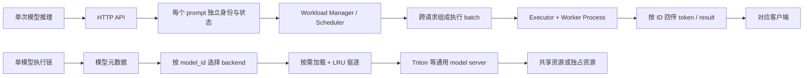
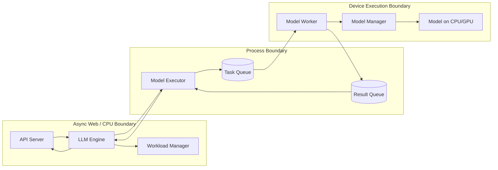
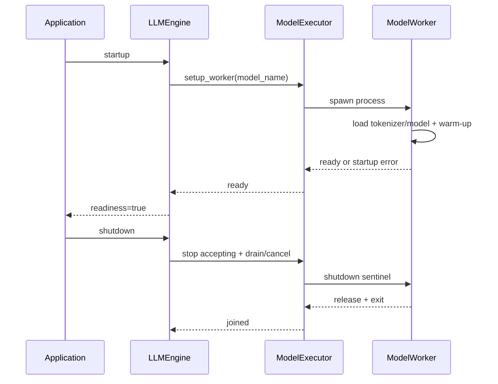
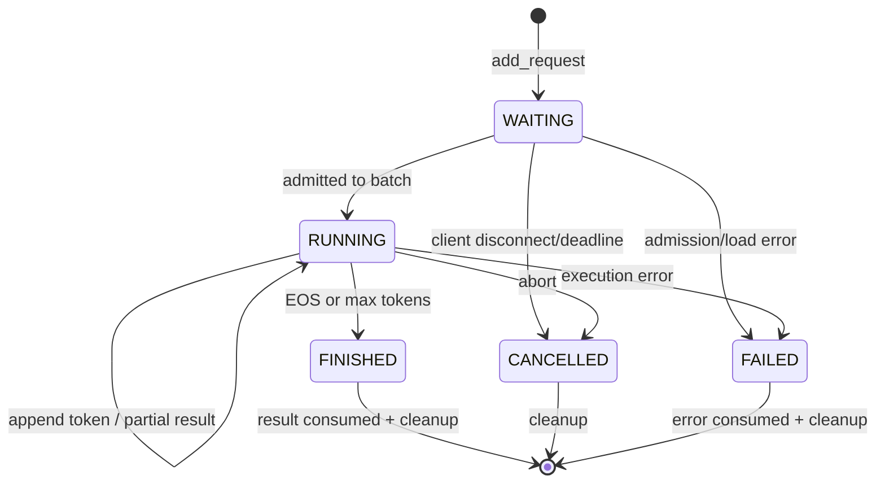
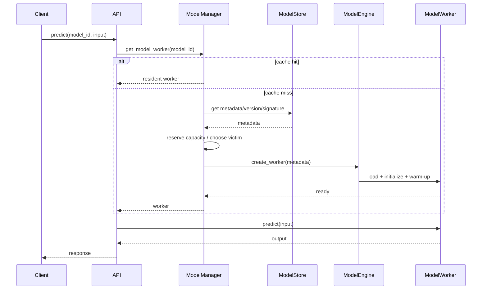
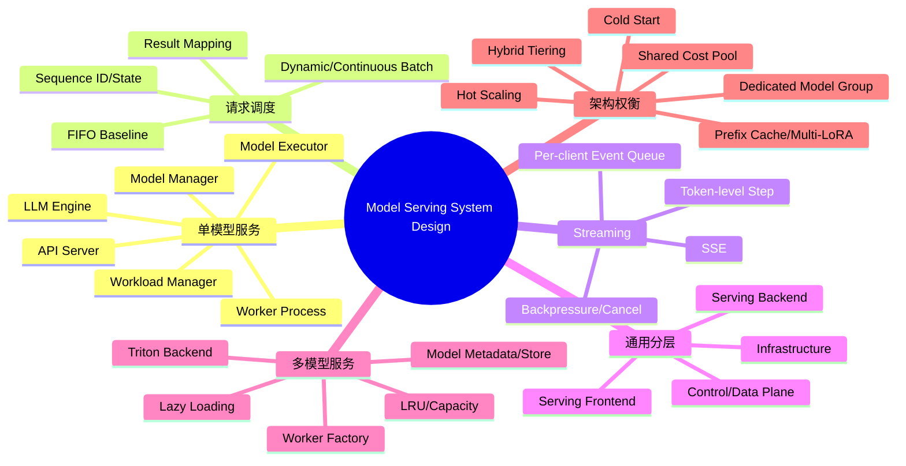

> 原章：*Model Serving System Design: A Deep Dive*
> 核心问题：怎样把第 2 章的单次模型推理组织成可并发访问的在线服务？API、调度、batch、stream、进程隔离和模型执行应怎样分工？当一个系统要共享资源托管多个异构模型时，又应怎样设计元数据、worker、缓存、路由和扩缩容，并在成本、延迟与运维复杂度之间取舍？

## 0. 本章定位、学习目标与设计主线

第 1 章给出了端侧、单模型、多模型和平台化服务范式；第 2 章解释了 LLM 的 token-by-token 执行、KV cache、prefill、decode、streaming 和 batching。本章把两者接起来：从一次 `model.generate()` 出发，补上 Web API、请求身份、调度、跨进程通信、结果回传和资源生命周期，形成完整服务。

作者没有直接把 vLLM、Triton 或云服务当答案，而是先做两个简化系统：

1. 单模型 LLM 服务：从单请求，逐步加入跨请求 batching 和 SSE streaming；
2. 多模型服务：从自定义 worker、元数据和 LRU cache，逐步过渡到 Triton backend；
3. 最后比较共享资源的成本优先设计和模型独占资源的延迟优先设计。



读完本章，应能回答：

- API Server、LLM Engine、Workload Manager、Model Executor、Model Worker、Model Manager 各自拥有哪类状态？
- 为什么 Web 请求不能直接等同于一次 GPU 调用，`Sequence` 为什么是调度基本单位？
- client-side batch、server-side dynamic batch 与 token-level continuous batch 有何区别？
- 多个请求合成 batch 后，怎样把结果准确、有序地送回原客户端？
- SSE、async event loop、后台线程和 worker 进程怎样跨边界协作？
- 为什么 GPU execution 常放在独立进程，进程隔离解决什么，又增加什么？
- 稳定基础设施、业务 frontend 与快速演进的模型 backend 为什么要分层？
- 多模型服务如何用 metadata 选择 worker，LRU 为什么只是教学起点？
- Triton 接管哪些职责，外层 wrapper/service 仍需承担哪些职责？
- 成本优先与延迟优先设计分别优化什么目标，什么时候应采用混合策略？

> **代码边界说明**：原章明确说明代码经过选取和简化，完整上下文在配套仓库。原文片段中还存在缩进、变量名不一致、缺失锁/超时/关闭流程等问题。本笔记保留其架构意图，并在关键处给出可解析的改写或伪代码；它们用于理解职责和数据流，不应直接作为生产实现。

---

## 1. Build an Online LLM Serving Service from Scratch

### 1.1 为什么先手写一个简化服务

vLLM、Triton 等框架已经封装大量工作，但如果只会调用入口 API，遇到低吞吐、stream 中断、结果串线或 cache 爆满时，很难判断问题属于模型、调度还是网络。作者采用“逐层加能力”的方法：

$$
\text{单请求}
\rightarrow\text{批处理}
\rightarrow\text{流式批处理}
\rightarrow\text{专业 serving framework}.
$$

每一步都由上一版的明确缺陷推动：

- 单请求版本功能正确，但 GPU 每次只处理一个 prompt，吞吐低；
- batch 版本提高吞吐，但要等整个输出完成，用户等待长；
- streaming + batching 逐 token 交付，但线程、队列、cache 和调度复杂度急剧上升；
- vLLM 将这些通用而高风险的机制交给专业引擎。

### 1.2 Design Goals：教学系统要揭示什么

样例启动时加载一个可在 CPU 上运行的 `facebook/opt-125m`，同时支持 batch 和 stream。它不是为了做性能领先的服务，而是让以下问题可见：

1. HTTP schema 怎样表达单 prompt、多个 prompt 和 stream；
2. 请求从 API 到 engine、scheduler、executor、worker 再返回的完整路径；
3. 多个并发请求怎样重组为设备 batch；
4. 结果怎样按 prompt ID 映射回原请求和原顺序；
5. 每个 decode step 产生的 token 怎样跨线程送回 async client；
6. CPU orchestration 与模型执行怎样隔离；
7. bottleneck 可能出现在哪个边界。

这里的“可扩展到生产”是指**组件边界和问题类型具有代表性**，不表示样例已有多节点容错、安全、KV cache 管理或高性能 IPC。

### 1.3 Service Architecture：六个组件和三种边界

原章的单模型系统包含六个组件：

| 组件 | 核心职责 | 主要状态 | 不应承担的职责 |
|---|---|---|---|
| API Server | HTTP schema、鉴权入口、响应/stream | 连接、request context | 直接管理 GPU cache |
| LLM Engine | 端到端编排，连接控制面与执行面 | engine lifecycle、生成配置 | 实现所有模型 kernel |
| Workload Manager | 入队、Sequence 状态、batch 选择 | incoming/active/finished sequences | 处理 HTTP 协议 |
| Model Executor | 启动 worker、IPC、分组和调用 | process/queue/worker handles | 解释业务 payload |
| Model Worker | 在绑定设备上执行模型 | 模型、tokenizer、device state | 面向外部客户端 |
| Model Manager | 加载、缓存和提供模型 | model artifacts/cache | 决定 Web 路由 |

可进一步把架构理解成三类边界：



#### 1.3.1 为什么 worker 要独立进程

常见原因有：

- 将某个进程绑定到特定 GPU，明确设备所有权；
- 隔离 CUDA context、模型内存和 native library 故障；
- Web event loop 保持响应，不直接执行耗时推理；
- CPU tokenization、网络和 GPU 工作可以流水重叠；
- 多 GPU 时可用多个 worker 构成并行组。

但“多进程会自动让 GPU 不空闲”并不成立。若 scheduler 每次只发一个短任务、IPC 复制巨大 tensor、CPU 预处理太慢或 worker 同步等待，GPU 仍会空闲。隔离只是结构基础，利用率来自异步流水、batch 和足够的待执行工作。

进程还会增加：序列化/复制成本、启动与模型加载时间、错误传播、worker 健康检查、队列背压以及优雅关闭。生产系统常用共享内存、CUDA IPC、RPC 或框架自己的 transport，而不只是 `multiprocessing.Queue`。

### 1.4 Implement Single Generation Request Handling

#### 1.4.1 启动顺序与生命周期

原章的 `LLMEngine` 创建 executor 和 workload manager，再启动一个加载 OPT-125M 的 worker。正确生命周期应是：



若 API 在 worker 加载完成前就报告 ready，首批请求会排队、超时或收到不确定错误。`liveness` 只说明进程活着，`readiness` 才说明模型可服务。

#### 1.4.2 Executor 与 worker 的队列协议

原章使用 `task_queue` 和 `result_queue`：executor 放入任务，worker 循环取任务并放回结果。最低限度的消息应包含：

```python
from dataclasses import dataclass
from typing import Any

@dataclass(frozen=True)
class InferenceTask:
    request_id: str
    payload: Any
    stream: bool = False

@dataclass(frozen=True)
class InferenceResult:
    request_id: str
    output: Any = None
    error: str | None = None
    finished: bool = True
```

`request_id` 不是装饰字段。若多个 API 线程共享一个 result queue，简单执行 `result_queue.get()` 可能取到别人的结果。必须由单一 result dispatcher 按 ID 交给对应 Future/Sequence，或为调用建立专属响应通道。

还要定义：

- queue 满时阻塞、拒绝还是降级；
- worker 崩溃后在途任务怎样失败；
- 每个任务的 deadline 与 cancellation；
- shutdown sentinel，避免 `while True` 永远挂起；
- 错误对象怎样跨进程序列化。

#### 1.4.3 单请求执行路径

原章的路径可还原为：

1. `POST /basic_generate` 校验 `prompt`；
2. engine 创建 UUID 和 `Sequence`；
3. executor 把任务放入 `task_queue`；
4. worker 从队列取出，执行 `model.generate()`；
5. worker 解码并把带 request ID 的结果放入 `result_queue`；
6. executor/engine 收到匹配结果；
7. API 返回 `GenerateResponse`。

接口 schema 的价值在于把传输契约与内部模型解耦：

```python
from pydantic import BaseModel, Field

class GenerateRequest(BaseModel):
    prompt: str = Field(min_length=1, max_length=100_000)

class GenerateResponse(BaseModel):
    request_id: str
    generated_text: str
```

原章把 FastAPI endpoint 声明为 `async def`，内部却同步调用阻塞式 `llm.basic_generate()`。这会阻塞 event loop，导致同一 worker 中其他连接不能及时处理。可选择：

- endpoint 使用普通 `def`，让 FastAPI 放到 thread pool；
- 用 `await asyncio.to_thread(...)` 包装阻塞调用；
- 更好地让 engine 返回 awaitable Future，由 result dispatcher 完成。

“async 语法”本身不会把同步推理变成非阻塞。

#### 1.4.4 Model Manager、Worker 与生成结果

单模型 worker 启动时加载模型和 tokenizer，之后所有请求复用权重。推理应使用 `.eval()` 和 inference mode；输出是否包含 prompt 取决于生成 API，解码时需要明确只返回新增 token 还是完整序列。

```python
class ModelWorker:
    def generate(self, task: InferenceTask) -> InferenceResult:
        try:
            # Tokenize -> model.generate -> decode new tokens.
            generated_text = self.generate_text(task.payload)
            return InferenceResult(
                request_id=task.request_id,
                output={"generated_text": generated_text},
            )
        except Exception as error:
            return InferenceResult(
                request_id=task.request_id,
                error=f"{type(error).__name__}: {error}",
            )
```

样例测试 `POST /basic_generate` 只能验证 happy path。生产还需测试：空/超长 prompt、超时、模型异常、worker crash、并发结果不串线、客户端取消、shutdown 时在途请求和输入 token 上限。

#### 1.4.5 单请求版本为何吞吐低

若一次只处理一个 prompt，GPU 每个 decode step 的矩阵较小，权重读取和 kernel launch 难以摊薄。设单请求平均服务时间为 $S$，单 worker 理想吞吐上限约为：

$$
X\le\frac{1}{S}.
$$

即使有许多并发 HTTP 请求，它们也只是在 task queue 排队，不会自动变成设备并行。于是作者引入 batch：把 Web 并发转换成模型可以利用的张量并行度。

### 1.5 Batching：把请求边界与执行边界解耦

#### 1.5.1 三种容易混淆的 batch

| 类型 | 谁组合 | 例子 | 局限 |
|---|---|---|---|
| Client/API batch | 一个客户端一次提交多个 prompts | `/generate {prompts:[...]}` | 不能自动合并不同客户端 |
| Server-side dynamic batch | 服务将一定时间窗内多个请求重组 | A 的 2 个 + B 的 3 个 prompt | 需要 ID、等待窗口和结果映射 |
| Token-level continuous batch | 每个 decode iteration 动态加入/移除 Sequence | 完成的槽位立即补新请求 | 需要 KV cache 和精细 scheduler |

原章 API 接收 prompt list，但核心设计目标更进一步：把来自不同 Web 请求的 prompt 合入更大的 backend batch。

#### 1.5.2 两个核心难题

假设 request 1 含 A/B，request 2 含 C/D/E：

1. **调度**：怎样把 A～E 组成若干 batch，使设备利用率高且等待可接受？
2. **关联**：模型返回的输出如何准确映射回 request 1/2，并保持各自输入顺序？

解决思路是把每个 prompt 包装成独立 `Sequence`。一个 Web 请求包含多个 Sequence；一个 backend batch 也包含多个 Sequence，但两种集合划分无需相同。

#### 1.5.3 Sequence 是调度单元，不只是 DTO

Sequence 至少应包含：

```text
id
original prompt / token ids
generated token ids
status: WAITING | RUNNING | FINISHED | FAILED | CANCELLED
request deadline / priority
sampling parameters
stream or result future
arrival order
KV-cache handle or block table
```

可画成状态机：



每次状态转换都应是原子的，并触发相应资源动作。例如 `RUNNING -> CANCELLED` 不只改布尔值，还要从 active batch 移除、回收 KV cache 并通知客户端。

#### 1.5.4 Example 3-1：FIFO Workload Manager

原章用 batch size 4 和 FIFO 建立直觉。修正后的核心轮廓：

```python
from collections import deque
from dataclasses import dataclass, field
from enum import Enum, auto
from threading import Lock
from uuid import uuid4

class SequenceStatus(Enum):
    WAITING = auto()
    RUNNING = auto()
    FINISHED = auto()

@dataclass
class Sequence:
    id: str
    prompt: str
    output: list[str] = field(default_factory=list)
    status: SequenceStatus = SequenceStatus.WAITING

class WorkloadManager:
    def __init__(self, batch_size: int = 4):
        self.batch_size = batch_size
        self.incoming = deque()
        self.sequence_map = {}
        self.lock = Lock()

    def add_request(self, prompt: str) -> str:
        sequence = Sequence(id=str(uuid4()), prompt=prompt)
        with self.lock:
            self.incoming.append(sequence)
            self.sequence_map[sequence.id] = sequence
        return sequence.id

    def get_next_batch(self) -> list[Sequence]:
        batch = []
        with self.lock:
            while self.incoming and len(batch) < self.batch_size:
                sequence = self.incoming.popleft()
                sequence.status = SequenceStatus.RUNNING
                batch.append(sequence)
        return batch
```

FIFO 简单、可解释，按到达顺序避免普通请求被后来的请求插队。但它不感知 prompt 长度、deadline、优先级、预计输出、KV cache 或租户配额，容易产生 head-of-line blocking。生产 scheduler 往往在公平性、SLO 和吞吐间做加权选择。

batch size 4 只是样例常量。更大 batch 能提高并行度，却增加等待和显存：

$$
\max_B X(B)
\quad\text{s.t.}\quad
L_{p95}(B)\le SLO,
\quad M(B)\le M_{device}.
$$

#### 1.5.5 Example 3-2：engine 怎样恢复请求边界

原章 engine 记录本次 Web 请求对应的 `prompt_ids`，反复执行 batch，待这些 ID 全部完成后按原数组顺序读取结果。关键不变量是：

$$
\mathrm{output}[i]
=\mathrm{resultOf}(\mathrm{prompt\_id}[i]).
$$

而不是依赖 worker 返回顺序。概念代码：

```python
class LLMEngine:
    def generate(self, prompts: list[str]) -> list[str]:
        prompt_ids = [
            self.workload_manager.add_request(prompt)
            for prompt in prompts
        ]

        while not self.workload_manager.are_finished(prompt_ids):
            sequences = self.workload_manager.get_next_batch()
            if not sequences:
                self.workload_manager.wait_for_progress(timeout=0.1)
                continue
            results = self.model_executor.execute_batch(sequences)
            self.workload_manager.update(results)

        outputs = [
            self.workload_manager.get_sequence(prompt_id).output_text
            for prompt_id in prompt_ids
        ]
        self.workload_manager.remove_all(prompt_ids)
        return outputs
```

原片段混用了 `prompt_id/request_id` 与 `prompt_ids/request_ids`，真实实现必须统一。更重要的是，这个同步 `while` 若由每个 API 请求各自运行，会产生多个线程争抢 scheduler 和 worker；更合理的结构是**唯一后台 scheduler loop**，API 只注册 Sequence 并等待各自 Future。这样 batch 的唯一所有者清晰，也能跨所有请求统一调度。

“所有 prompt 完成才返回 list”还会产生 request-level head-of-line：同一 API batch 中四个短任务和一个长任务，短结果也要等长任务。若业务允许，stream 或异步 job API 可避免这一点。

#### 1.5.6 追踪每个 prompt 的价值

逐 prompt 追踪带来：

- 跨客户端 dynamic batching；
- 结果关联和输入顺序恢复；
- 每个 prompt 独立 timeout、priority、cancel 和采样参数；
- token 级统计与计费；
- continuous batching 中独立加入/退出；
- 独立 KV cache 生命周期。

因此 Sequence 是 Web request 与 device execution 之间的解耦层。它类似操作系统中的进程控制块：模型执行不必知道客户端连接细节，API 也不必知道某一 token 属于哪次 GPU kernel。

### 1.6 Streaming with Batching：高吞吐与低感知延迟共存

#### 1.6.1 Table 3-1 的时间线

原章的目标体验如下：

| 时间 | 新事件 | Backend active batch | 当步交付 |
|---|---|---|---|
| T0 | A 提交 Prompt1 | `[P1]` | P1: `a` |
| T1 | B 提交 Prompt2 | `[P1,P2]` | P1: `student`；P2: `see` |
| T2 | C 提交 Prompt3 | `[P1,P2,P3]` | P1: `[end]`；P2: `a`；P3: `eat` |
| T3 | P1 退出，D 提交 P4 | `[P2,P3,P4]` | P2/P3/P4 的新 token |

这已经不是固定 batch，而是 continuous batching 的简化形态：每一轮每个 active Sequence 生成一个 token，完成者退出，新请求补位。

#### 1.6.2 数据流的七步

1. API 接收 prompt，建立 SSE response；
2. engine 为 prompt 创建含 output buffer 与 event queue 的 Sequence；
3. 唯一后台线程循环选择 active batch；
4. worker 对 batch 中每个 Sequence 生成一个新 token；
5. worker 返回 `{sequence_id, token, finished}`；
6. engine 按 ID 更新输出、prompt/token IDs 和状态；
7. engine 将事件放入对应客户端 queue，API 从 queue 读取并写成 SSE frame。

同一 token 同时经过两个方向：向内更新模型状态，向外更新用户界面。必须保证先后与幂等语义，避免重试后重复发送或 cache 状态落后。

#### 1.6.3 为什么需要线程到 event loop 的桥

模型调度循环在普通后台线程中，客户端 queue 是某个 asyncio event loop 所拥有的 `asyncio.Queue`。普通线程不能直接安全调用其异步方法，因此使用：

```python
future = asyncio.run_coroutine_threadsafe(
    sequence.client_stream.put(event),
    sequence.loop,
)
```

这把 coroutine 调度到正确 loop。还需处理 `future` 的异常和 queue 背压；若无限 `put` 而客户端很慢，内存会持续增长。

更一致的架构可以让 scheduler 本身运行在 async task，或使用线程安全 channel；具体选择取决于 model call 是否阻塞、框架 API 和性能要求。

#### 1.6.4 Example 3-3：batch-processing loop

原片段混用 `token/result`，且完成分支没有清楚说明最后 token 是否先发送。更严谨的概念实现：

```python
import asyncio
import json

def publish(sequence, payload):
    return asyncio.run_coroutine_threadsafe(
        sequence.client_stream.put(payload),
        sequence.loop,
    )

def handle_step_results(self, results):
    for result in results:
        sequence = self.workload_manager.get_sequence(result["request_id"])

        if result.get("token"):
            self.workload_manager.append_token(
                sequence.id,
                result["token"],
            )
            publish(sequence, json.dumps({
                "token": result["token"],
                "sequence_id": sequence.id,
            }))

        reached_limit = sequence.token_count >= self.max_tokens
        if result["is_finished"] or reached_limit:
            sequence.finished = True
            publish(sequence, None)
            self.workload_manager.retire(sequence.id)
```

生产实现还应等待或检查 publish Future；若先 `retire` 清掉 queue 引用，未执行的 callback 可能丢事件。发送 EOS token、finish metadata 和 stream close 的协议也应明确。

#### 1.6.5 每个客户端的 async generator 与 SSE

```python
async def event_generator(self, prompt: str):
    loop = asyncio.get_running_loop()
    queue = asyncio.Queue(maxsize=64)
    sequence_id = self.workload_manager.add_streaming_request(
        prompt,
        queue,
        loop,
    )
    try:
        while True:
            data = await queue.get()
            if data is None:
                break
            yield f"data: {data}\n\n"
    finally:
        self.cancel_if_active(sequence_id)
```

SSE frame 用空行结尾，`Content-Type` 为 `text/event-stream`。SSE 是服务器到客户端的单向文本流，适合 token 输出；若需要高频双向消息，可考虑 WebSocket 或 bidirectional gRPC。

`finally` 很关键：客户端断开时 async generator 被关闭，系统必须取消 Sequence、停止后续 decode 并回收 cache。否则只是停止发送，GPU 仍在为无人接收的请求工作。

#### 1.6.6 Streaming + batching 的关键难点

- **顺序**：同一 Sequence 的 token 必须按 generation step 有序；
- **隔离**：A 的 token 不能进入 B 的 queue；
- **背压**：慢客户端不能拖垮全局 scheduler；
- **公平**：持续加入短请求不能让长请求永远得不到 step；
- **取消**：断开信号要穿过 API、engine、scheduler、worker；
- **finish race**：最后 token、完成事件和清理顺序不能冲突；
- **进度状态**：worker 若只收到拼接文本而不使用 KV cache，会重复计算全部历史；
- **故障**：后台线程异常不能静默死亡，否则所有 stream 永久等待。

### 1.7 Batch Serving with vLLM

#### 1.7.1 为什么手写后仍应交给框架

教学实现揭示了问题，但生产引擎还需高效 KV cache block、continuous batching、异构长度调度、optimized kernels、量化、多 GPU、取消和内存压力处理。重写这些机制不仅工作量大，还很容易在并发和正确性上出错。

#### 1.7.2 Example 3-4：vLLM batch 接入

```python
from vllm import LLM, SamplingParams

class LLMEngine:
    def __init__(self, max_tokens: int = 20):
        self.max_tokens = max_tokens
        self.vllm_model = LLM(model="facebook/opt-125m")

    def generate_vllm(self, prompts: list[str]) -> list[str]:
        params = SamplingParams(
            temperature=0.7,
            top_p=0.95,
            max_tokens=self.max_tokens,
        )
        outputs = self.vllm_model.generate(prompts, params)
        return [output.outputs[0].text for output in outputs]
```

十余行代码能完成 batch，是因为复杂度没有消失，而是移到了 vLLM 内部。团队仍需理解并配置：最大并发序列、batch token budget、GPU memory utilization、模型长度、prefix caching、量化、parallel size 和调度策略。参数名随版本变化，应以所用版本文档为准。

#### 1.7.3 Library mode 与 standalone server mode

| 模式 | 优势 | 代价 | 适合 |
|---|---|---|---|
| 嵌入 library | 同进程调用、定制控制流、少一层网络 | 生命周期耦合，Web crash 可能影响 engine，扩缩容绑定 | 单应用、紧密集成、教学/内部工具 |
| Standalone server | 独立升级/扩缩容/故障域，标准 REST/stream API | 多一层 RPC、部署与认证 | 多客户端共享、生产平台 |

实际生产常让业务 frontend 调用独立 vLLM/SGLang server：frontend 负责身份、RAG、计费和策略，backend 专注模型性能。

---

## 2. A General Design for Single-Model LLM Serving

### 2.1 Requirements：生产系统到底优化什么

#### 2.1.1 通用要求

| 要求 | 建议指标 | 设计含义 |
|---|---|---|
| 低延迟 | TTFT、TPOT/ITL、e2e p95/p99 | 控制排队、prefill、decode 和网络 |
| 高吞吐 | requests/s、input/output tokens/s | batch、cache 与 GPU 利用率 |
| 可扩展性 | 扩容时间、最大稳定到达率 | 副本、负载均衡、容量信号 |
| 可靠/可用 | success rate、availability、MTTR | 多副本、健康检查、重试/降级 |
| 资源与成本 | GPU-hours、单位成功 token/request 成本 | 精度、利用率、空闲容量 |
| 可观测性 | queue、batch、cache、error、trace | 能定位瓶颈和证明 SLO |

QPS 是 queries/s，TPS 在 LLM 语境中可能表示 tokens/s，也可能被其他系统用作 transactions/s，必须声明口径。吞吐目标要和延迟 SLO 绑定：

$$
\max X
\quad\mathrm{s.t.}\quad
\mathrm{TTFT}_{p95}\le S_1,
\quad\mathrm{ITL}_{p95}\le S_2,
\quad A\ge A_{min}.
$$

#### 2.1.2 LLM 特有要求

- 权重可达数十至数百 GB，单 GPU 可能装不下；
- KV cache 随并发、上下文、层数和 KV heads 增长；
- token streaming 是交互体验的一部分；
- prompt/output 长度不一，服务时间高度异质；
- prefill 和 decode 的资源形态不同；
- 模型架构快速变化，MHA/GQA/MQA、MoE 或多模态会改变执行路径。

因此 LLM 不能始终作为完全黑盒。稳定的基础设施能力应与快速演进、模型感知的 execution backend 隔离，避免每换一种 attention 就重写鉴权和 autoscaling 平台。

### 2.2 General Design：三层关注点分离

作者把需求分成：

1. **Service infrastructure management**：扩缩容、可用性、故障恢复、资源与监控；
2. **Business logic handling**：客户接口、鉴权、外部系统、validation、限流、batch/stream 协议；
3. **Model serving performance**：模型执行、KV cache、quantization、continuous batching、GPU kernel。

#### 2.2.1 Part A：可复制服务单元与分布式基础设施

将 serving logic 封装成 Docker container/Kubernetes Pod，并交给平台：

- 按流量水平扩缩副本；
- 重启不健康实例；
- 分配 CPU/GPU/内存；
- 跨故障域放置；
- 暴露 metrics/logs；
- 通过 load balancer 隐藏副本变化。

平台能重启 Pod，却不知道模型何时真正 ready。LLM 启动可能包括下载几十 GB 权重、加载到 GPU、编译 kernel 和 warm-up，因此需要 startup/readiness probe、graceful drain 和足够 termination grace period。

autoscaling 也不应只看 CPU。可使用 queue wait、pending/running sequences、token backlog、TTFT、KV cache utilization 和 GPU 指标。扩容有长冷启动时，系统需要最小热副本、预测性扩容或预热池。

#### 2.2.2 Part B：Serving frontend

frontend 是业务与模型之间的防腐层，负责：

- 认证、授权、租户和配额；
- 对接客户数据、metadata、审计与计费；
- 模型下载/配置编排；
- schema validation、标准化、token 限制；
- rate limit、admission control、日志；
- RAG/tool 等业务前后处理；
- 对 backend 的请求转换和错误映射。

模型下载究竟由 frontend、sidecar、init container 还是 backend 完成可按系统选择；关键是唯一所有者、完整性校验、版本原子切换和 readiness 语义清楚。

#### 2.2.3 Part C：Serving backend

backend 通常是独立进程或服务，只接受 frontend 调用，专注：

- 加载模型并持有设备资源；
- 高性能推理与 kernel；
- quantization、KV cache、continuous batching；
- tensor/pipeline parallel；
- token stream、cancel 和模型级指标。

vLLM、Triton 等适合承担该层。独立 backend 既减少业务代码干扰 GPU，也能单独升级模型执行技术。

#### 2.2.4 Control plane 与 data plane

还可按请求频率区分：

| Plane | 操作 | 特征 |
|---|---|---|
| Control plane | 部署版本、资源策略、加载/卸载、扩缩容目标、路由表 | 低频、要求一致性和审计 |
| Data plane | prompt/token inference、stream、batch | 高频、要求低延迟与高吞吐 |

不要让每次 prediction 都同步依赖慢 control-plane 数据库。配置可缓存并带版本；模型切换通过发布流程完成。

#### 2.2.5 分层不是免费午餐

额外边界带来网络 hop、序列化、trace propagation、超时预算分配和更多部署单元。分层的判断标准不是“组件越多越专业”，而是职责是否独立演进、是否需要故障隔离、能否单独扩容，以及边界成本是否可接受。

---

## 3. Build a Multi-Model Serving Service from Scratch

### 3.1 为什么单模型范式不够

当系统拥有多个版本、任务或租户模型时，每个模型一个独立常驻服务会出现：

- 低流量模型独占进程/GPU，利用率低；
- 服务数量与模型数量线性增长，发布和监控复杂；
- 某些模型空闲，另一些过载，资源不能共享；
- 相同 runtime 和基础设施被重复部署。

多模型服务让多个模型共享实例，按 model ID 路由，并根据访问动态加载/卸载。它最适合大量较小、长尾、非同时活跃的模型；大而持续热点的 LLM 通常仍适合独立服务。

### 3.2 Design Goals

样例托管两个 Transformer 语言相关模型和一个图像分类模型，全部运行在 CPU，关注三件事：

1. **Cross-framework support**：PyTorch/Transformers、TorchVision/ONNX 等需要不同 loader 和 executor；
2. **Unified API**：外部使用统一 `/predict` 和 `model_id`，内部选择 backend；
3. **Resource management**：按需加载，达到上限时用 LRU 驱逐。

“统一 API”不等于所有模型拥有相同 tensor schema。统一的是 envelope、身份、错误与路由；模型具体输入输出仍需 signature/version 描述。

### 3.3 Service Architecture：五个组件

| 组件 | 职责 |
|---|---|
| API Server | 接收 model ID 与 payload，返回统一 response envelope |
| Model Manager | cache policy、加载协调、worker 生命周期 |
| Model Store | 模型 metadata 与版本定位 |
| Model Engine | 根据 metadata 创建适配的 worker 类型 |
| Model Worker | 加载特定 framework 模型、预处理、推理和后处理 |

典型 miss path：



### 3.4 Core Implementation

#### 3.4.1 API envelope 与错误语义

原章使用 `model_id: str` 和 `input_data: Any`：

```python
from typing import Any

from pydantic import BaseModel, ConfigDict

class PredictionRequest(BaseModel):
    model_config = ConfigDict(protected_namespaces=())
    model_id: str
    input_data: Any
```

它足以展示路由，却把 schema error 推到 worker 深处。生产 metadata 应包含 model signature，frontend 在占用昂贵 worker 前校验 dtype、shape、字段和大小。统一 response 还应包含 `model_id`、`version`、`request_id` 和 typed error。

`get_model_worker()` 返回 `None` 时，API 应返回 404/明确错误，而不是对 `None.predict` 抛 500；输入错误适合 4xx，backend 暂不可用适合 503，timeout 适合 504。错误分类会直接影响客户端是否重试。

#### 3.4.2 Model metadata 是执行契约

原章 metadata 包含 ID、name、type、framework、version、description。生产通常还需要：

```text
artifact URI + checksum/signature
framework/backend + runtime version
input/output names, dtype, shape, batching rules
preprocessing/postprocessing version
hardware requirements and estimated memory
security/tenant policy
warm-up samples and health criteria
generation/default parameters
```

ID 应定位不可变版本，或显式区分 logical alias 与 immutable revision。若 `model_id` 指向的内容可静默变化，cache、审计与重现都会失效。

本地 JSON `ModelStore` 适合 demo；生产 registry/metadata service 需要并发更新、版本、访问控制、审计和高可用。data plane 可缓存 metadata，但要有 TTL/version invalidation。

#### 3.4.3 Worker factory：用 adapter 隔离框架差异

`ModelEngine.create_worker()` 根据 `framework` 创建 `TransformerWorker`、`TorchVisionWorker` 等，本质是 Factory + Adapter：

```python
class ModelEngine:
    def __init__(self):
        self.worker_factories = {}

    def register(self, framework, factory):
        self.worker_factories[framework] = factory

    def create_worker(self, metadata):
        try:
            factory = self.worker_factories[metadata.framework]
        except KeyError as error:
            raise ValueError(
                f"unsupported framework: {metadata.framework}"
            ) from error
        return factory(metadata)
```

相比长 `if/elif`，registry 允许以 plugin 增加 backend，不修改 manager 主逻辑。但 worker 仍要统一 `load/predict/close/health` 生命周期。

Transformer classification worker 的步骤是 tokenize → forward → softmax。`torch.no_grad()` 关闭梯度，但模型也应 `.eval()`，输入 tensor 应移到模型设备；输出 label mapping 和概率语义需来自 config，而不应只返回裸 list。

#### 3.4.4 LRU model cache 的基本算法

原章使用 `OrderedDict`，hit 时 `move_to_end`，满时 `popitem(last=False)`：

```text
get(model_id):
    if resident(model_id):
        mark model_id most recently used
        return worker

    metadata = store.lookup(model_id)
    while insufficient capacity:
        victim = least recently used idle worker
        unload(victim)
    worker = load(metadata)
    register worker as most recently used
    return worker
```

平均 lookup 可为 $O(1)$，但真正昂贵的是下载、反序列化、设备复制和 warm-up。

原章以 `max_models=2` 控制数量，这仅适合模型大小近似的 demo。若 A 占 20 GB、B 占 1 GB，“两个模型”不是可靠容量单位。应按多资源约束：

$$
\sum_{i\in resident}M_i\le M_{budget},
\qquad
\sum C_i\le C_{budget},
$$

并保留 runtime workspace 和碎片余量。

#### 3.4.5 LRU 的并发正确性

真实系统必须补上：

- **single-flight load**：同一 cold model 的 20 个并发请求只加载一次，其余等待同一 Future；
- **pin/reference count**：正在推理的 worker 不能被淘汰；
- **atomic publish**：加载成功且 warm-up 后才放入 cache；失败不能留下半初始化项；
- **eviction lock**：多个线程不能同时选择同一 victim；
- **graceful unload**：停止接新请求，等待/取消在途任务，再释放资源；
- **load admission**：新模型过大时应拒绝，而不是无限驱逐仍装不下；
- **negative caching/backoff**：损坏工件不应每个请求都重新下载。

简单全局锁若包住耗时加载，会阻塞所有其他 cache hit；通常使用短全局 metadata lock + per-model loading Future。

#### 3.4.6 LRU 是否是最佳策略

LRU 假设“最近访问过的更可能再次访问”，在 temporal locality 强时有效。它忽略：模型大小、加载时长、访问频率、SLO 和未来预约。更一般可为 resident model $i$ 定义保留收益：

$$
U_i
=\frac{\lambda_i\,C_{miss,i}\,W_i}{M_i},
$$

其中 $\lambda_i$ 是请求率，$C_{miss,i}$ 是 miss 额外成本，$W_i$ 是业务权重，$M_i$ 是内存。低 $U_i$ 更适合淘汰。实际可组合 LRU/LFU、size-aware、TTL、pinning、预约预热和热点预测。

#### 3.4.7 命中率怎样影响延迟

若 hit latency 为 $L_h$，miss 需 download/load/warm-up 的延迟为 $L_m$，命中率为 $h$：

$$
E[L]=hL_h+(1-h)L_m.
$$

若 $L_h=100$ ms、$L_m=10$ s、$h=0.95$：

$$
E[L]=0.95\times0.1+0.05\times10=0.595\ \text{s}.
$$

仅 5% miss 就把平均延迟放大近 6 倍，并很可能主导 p99。因此多模型设计不能只汇报平均 cache hit rate，还要按 model/tenant 报 cold-start 分布和 timeout。

### 3.5 Using NVIDIA Triton as a Model Server

#### 3.5.1 Triton 提供的两个 API 面

Triton 以独立 Web 服务运行：

- **Model management API**：load、unload、repository index、model ready/config；
- **Inference API**：通过 HTTP/gRPC 发送具名 tensor 并取回具名输出。

典型流程：

```bash
curl -X POST \
  http://localhost:8000/v2/repository/models/densenet_onnx/load

curl -X POST \
  http://localhost:8000/v2/models/densenet_onnx/infer \
  -H "Content-Type: application/json" \
  --data-binary @request.json
```

第一条只表示发出 load 请求，之后还应检查响应和 readiness；第二条需要符合模型 config 的输入 payload，空 POST 通常不足以完成真实推理。

Model repository 通常按模型名/版本组织，并有 `config.pbtxt` 描述 platform/backend、input/output、dtype、dims、instance group 和 batching。工件格式受相应 backend 支持范围约束。

#### 3.5.2 替换哪些组件，保留哪些组件

Triton 替代自定义 framework-specific ModelEngine/Worker 的核心执行部分，承担模型加载、backend 选择、tensor inference、instance management 和部分 batching/metrics。

外层服务仍负责：

- 客户身份、业务 API 和统一错误；
- model ID 到 Triton repository name/version 映射；
- 工件下载、校验和 repository lifecycle；
- 组织级 cache/placement policy；
- 预处理/后处理或其版本编排；
- 计费、审计、租户隔离与路由。

使用 Triton 不是“无需 Model Manager”，而是重新划分职责。

#### 3.5.3 TritonWorker 的输入适配

原章示例把 list/shape 转成 FP32 NumPy，再构造 `InferInput`，请求硬编码输出 `fc6_1`。这正好暴露统一 backend 的现实要求：模型 config 是 tensor contract。

通用 worker 不应硬编码所有模型为 FP32 或同一输出名，而应读取 metadata/config：

```python
def build_triton_inputs(input_data, signature, httpclient):
    inputs = []
    for spec in signature.inputs:
        array = spec.to_numpy(input_data[spec.name])
        tensor = httpclient.InferInput(
            spec.name,
            array.shape,
            spec.triton_dtype,
        )
        tensor.set_data_from_numpy(array)
        inputs.append(tensor)
    return inputs
```

还需验证 shape、batch dimension、byte order、string encoding 和最大 payload。图像的 resize/normalize、文本的 tokenizer 到底在 client、wrapper、Triton ensemble 还是 Python backend 执行，也必须固定版本，否则同一权重会产生不同语义。

#### 3.5.4 地址、协议与安全边界

`0.0.0.0` 适合服务端 bind，客户端通常连接 `localhost`、容器 DNS 名或具体地址，不应把 `0.0.0.0` 当稳定目标。原章管理 API 示例为 8000，Triton 常见默认 HTTP/gRPC/metrics 端口需以部署配置为准；示例中的 8009 是自定义值。

管理 API 权限高于普通 inference，不应无认证暴露给客户。外层服务应限制可加载模型、校验 repository 路径和工件，并通过私有网络、mTLS/身份和审计保护 control plane。

#### 3.5.5 不要依赖 `__del__` 卸载模型

Python destructor 不保证在进程退出、引用环或异常时及时运行；多个 wrapper 若共享同一 Triton model，一个对象析构也不能擅自 unload。应使用显式生命周期：

```python
class TritonModelLease:
    def close(self):
        if not self.closed:
            self.registry.release(self.model_name)
            self.closed = True

    def __enter__(self):
        return self

    def __exit__(self, exc_type, exc_value, traceback):
        self.close()
```

registry 用 reference count/desired state 决定何时真正 unload，并等待在途 inference 完成。控制器还要在进程崩溃后 reconcile Triton 实际 loaded state 与期望状态。

---

## 4. Trade-offs in Multi-Model Serving Designs

### 4.1 Challenges：成本收益背后的两大用户体验问题

多模型服务适合每天只运行 3～4 小时的定时任务，或 1000 个客户模型中同时最多约 200 个活跃的场景。共享池避免为每个模型常驻一套资源，但带来：

#### 4.1.1 Cold-start latency

cache miss 可能依次经历：

$$
L_{cold}
=L_{route}+L_{evict}+L_{download}+L_{verify}
+L_{deserialize}+L_{device\ copy}+L_{warmup}.
$$

原章指出这可能是数秒甚至数十秒，足以触发上游 timeout。大量冷模型同时被请求还会争抢网络、磁盘、CPU 和 GPU，形成 load storm；客户端无脑重试会进一步放大，导致级联故障。

#### 4.1.2 Hot-model scaling

某模型突然变热时，需要：

1. 决定期望 replica 数；
2. 找到有容量且满足硬件/租户约束的实例；
3. 在新实例加载和 warm-up；
4. 更新 model-to-host routing map；
5. 等 ready 后切流；
6. 流量下降时安全缩容。

每个实例 cache 独立，放置与 routing state 可能暂时不一致；扩容又慢于流量突增，所以系统天然是滞后的反馈控制器。

### 4.2 A Cost-Optimized Multi-Model Design

#### 4.2.1 架构

- 多个 multi-model serving instances 共享资源；
- 每个实例的 frontend/cache manager 管理本地模型；
- backend（常用 Triton）执行推理；
- 全局 Model Service API 维护 model-to-instances 映射；
- router 优先命中已加载模型；
- controller 调整 per-model replica；
- placement 用 bin packing 尽量把模型装入较少服务器。

若实例 $j$ 剩余显存为 $G_j$、模型 $i$ 需要 $g_i$，必要约束为 $g_i\le G_j$。真实 bin packing 还要同时考虑 CPU、host memory、backend compatibility、安全域、GPU 型号和故障域，是多维约束优化，通常 NP-hard，只能用启发式近似。

#### 4.2.2 为什么省钱

设独占设计为 $N$ 个模型各预留容量 $C_i$，共享池容量依据并发活跃集合峰值配置：

$$
C_{dedicated}=\sum_{i=1}^{N}C_i,
$$

$$
C_{shared}\approx
\mathrm{capacity\ of\ concurrent\ working\ set}.
$$

只要模型活跃时间错开，$C_{shared}<C_{dedicated}$，固定资源和空闲成本下降。bin packing 进一步减少碎片。

#### 4.2.3 代价与局限

- 系统在流量出现后才加载/扩 replica，突发时不可避免地落后；
- route map、实例 cache 和实际 backend state 要保持最终一致；
- cache miss、swap 和资源争用使 tail latency 不稳定；
- placement、eviction、autoscaling 相互作用，调试困难；
- 一个租户的 load storm 可能干扰其他模型；
- 高利用率减少成本，却降低吸收突发的 headroom。

可用预热、最小 replica、热点预测、模型分层存储、single-flight 和 admission control 缓解，但这些措施都以额外容量或复杂度换取延迟。

### 4.3 A Latency-Optimized Multi-Model Design

#### 4.3.1 架构

- 每个模型有专属 single-model instance group；
- client 先调用 model provisioning service；
- provisioning 创建资源、加载模型、warm-up 并更新 routing map；
- prediction API 只把请求发到已 ready 的 group；
- 每个模型独立配置实例类型、最小/最大副本和 scaling policy。

这把 cold start 从 prediction critical path 移到显式 provisioning workflow。所谓“没有 cold start”是指**成功预置之后的请求**；第一次 provision 仍要等待资源和模型加载，必须由产品流程提前触发。

#### 4.3.2 优势

- 模型常驻，热请求延迟稳定；
- 热模型独立扩缩，不受其他模型 cache 影响；
- 故障、指标和发布边界清楚；
- 不同模型可使用不同硬件、SLO 和安全策略；
- router 只需 model-to-group，不需追踪每实例动态 cache。

#### 4.3.3 代价

- 冷门模型也可能保留空闲实例；
- 难预测流量时容易过度配置；
- 服务/实例组数量随模型增长，控制面对象增多；
- 若 scale-to-zero，cold start 又会回来；
- 每组独立留 headroom，聚合容量高于共享池。

该方案适合高需求、稳定可预测、低延迟或强隔离模型。

### 4.4 两种设计的对比与混合策略

| 维度 | 成本优先共享池 | 延迟优先独占组 |
|---|---|---|
| 模型驻留 | 按需、可驱逐 | 预置、通常常驻 |
| 资源利用率 | 高 | 低流量模型可能浪费 |
| Cold start | cache miss 在请求路径 | provision 后热路径无加载 |
| Hot scaling | 需放置、加载、更新 cache-aware route | 每模型独立扩副本 |
| Tail latency | 更易抖动 | 更可预测 |
| 隔离 | 模型间共享与干扰 | 强 |
| 控制面复杂度 | cache、placement、route state 复杂 | 对象多但逻辑更直接 |
| 最适合 | 大量长尾、错峰、小模型 | 热点、关键、稳定流量模型 |

现实最常见的是分层混合：

- 热点/关键/大模型：独占组并保留最小热副本；
- 温模型：共享池中 pin 一定时间；
- 冷模型：按需加载，可接受异步 job 或较宽 SLO；
- 明确预约任务：在计划前预热，任务后卸载。

可用每模型决策比较常驻空闲成本与 miss 成本。设常驻每单位时间成本 $C_{idle,i}$，请求率 $\lambda_i$，miss probability $p_i$，每次 miss 的业务/资源代价 $C_{miss,i}$：

$$
\text{keep model }i\text{ warm if}
\quad
C_{idle,i}
<\lambda_i p_i C_{miss,i}.
$$

这是简化直觉；还需加入 SLO 硬约束、内存机会成本和 load storm 风险。

### 4.5 Multi-Model Serving 也适用于 LLM

完整 LLM 权重很大，通常采用单模型独占服务，但“共享某部分、动态切换某部分”的多模型思想仍适用：

#### Prefix-cache-aware routing

多个 replica 权重相同，但 KV/prefix cache 内容不同。将共享 system prompt、文档或模板前缀的请求路由到已有 cache 的 replica，可减少重复 prefill。此时 routing key 不只有 model ID，还包括可复用 prefix 的 hash/tenant/version。

必须确保 tokenizer、模型版本、位置/attention 配置和前缀 token 完全兼容；cache-aware affinity 还要与负载均衡折中，不能把所有热门前缀压到一个 replica。

#### Multi-LoRA

多个租户共享一个 base model，动态加载体积较小的 LoRA adapters。相比为每个微调版本复制完整权重，它更接近“base 常驻 + adapter 多模型 cache”：

$$
W'=W+BA,
$$

其中 base $W$ 共享，低秩 $A/B$ 按请求选择。系统仍需 adapter ID/version、显存 cache、batch compatibility、租户隔离与路由。

---

## 5. 容易混淆的概念与常见误区

### 5.1 Web request = Model execution

错误。一个 Web 请求可含多个 prompts，一个 device batch 可混合多个 Web 请求，一个 streaming 请求又会经历多次 model steps。Sequence 才是调度和结果关联单位。

### 5.2 并发 HTTP 请求会自动提高 GPU 并行度

错误。它们可能只在队列中串行等待。必须由 scheduler 合并成 batch，并满足设备内存与执行引擎要求。

### 5.3 Client batch = Dynamic batching

错误。客户端一次提交列表只组合自己的输入；server-side batching 会跨请求重组，continuous batching 还会逐 iteration 改变成员。

### 5.4 `async def` 内调用同步推理就是异步服务

错误。同步阻塞函数会占住 event loop。要使用真正异步 engine、Future/queue，或转移到 thread/process。

### 5.5 两个全局队列足以支持任意并发

错误。没有 request ID dispatcher，调用者可能拿错结果；还缺 timeout、error、cancel、backpressure 和 worker death 协议。

### 5.6 独立 worker 进程一定更快

错误。它主要提供设备所有权、隔离和并行组织；IPC、复制和调度不足可能让它更慢。性能需测量。

### 5.7 Streaming 与 batching 冲突

不冲突。内部每个 step 对多个 Sequence 做 batch，外部按 Sequence ID 将新 token 分流。前者优化设备，后者优化交付体验。

### 5.8 SSE 是模型 streaming 本身

SSE 只是传输协议。模型引擎必须先增量产生 token，服务还要桥接 queue、处理 flush、断开和 backpressure。

### 5.9 返回 finish 后可以立即删除所有状态

不一定。要确保最后 token/finish event 已交付、计费与 trace 已落盘、KV cache 和 worker 引用安全释放。清理顺序属于协议的一部分。

### 5.10 使用 vLLM 后无需理解 scheduler

错误。机制由框架实现，但 token budget、最大序列、cache、模型长度和 SLO 仍需配置；错误参数会把问题变成 OOM 或尾延迟。

### 5.11 Unified API = 任意模型输入完全相同

错误。可统一 request envelope 和管理协议，模型 tensor 名称、shape、dtype、预处理和输出语义仍由 signature 定义。

### 5.12 `max_models=2` 就能限制内存

错误。模型大小差异巨大，应按 GPU/CPU memory、workspace 和并发约束，而非只按对象数。

### 5.13 LRU 一定能获得最高命中率或最低延迟

错误。LRU 只利用 recency，不知道大小、加载成本、频率、预约和业务优先级。它是简单 baseline。

### 5.14 Cache hit 时 worker 就一定安全可用

错误。worker 可能正在 unload、失败、版本过期或达到并发上限。cache entry 需要 lifecycle 与 health state。

### 5.15 Triton 取代整个多模型平台

错误。Triton 专注模型管理和推理 backend；业务鉴权、全局 placement、元数据治理、计费、租户和外部路由通常仍在外层。

### 5.16 `0.0.0.0` 是客户端应连接的地址

错误。它通常表示服务端监听所有本地接口；客户端应连接可路由主机名/IP。

### 5.17 在 `__del__` 中 unload 足以保证资源清理

错误。析构时机不可靠且不理解共享引用。应使用显式 close、lease/refcount 和控制器 reconciliation。

### 5.18 成本优先设计只是延迟优先设计少配几台机器

不准确。两者控制逻辑不同：前者动态管理 cache/placement/model-to-host，后者通过 provisioning 建立 model-to-dedicated-group。复杂度与故障模式也不同。

### 5.19 独占资源完全没有 cold start

只有预置完成后的 prediction path 没有模型加载。首次 provisioning、扩容新副本和版本更新仍有启动时间。

### 5.20 Multi-model 不适合任何 LLM

错误。完整大权重常独占，但 prefix cache affinity、多个 LoRA adapters、小模型路由和长尾微调版本都体现多模型管理思想。

---

## 6. 从本章抽象出的系统设计方法

### 第一步：从最小正确路径开始

先让一个已加载模型通过 typed API 完成一次请求，明确启动、ready、执行、错误与关闭。没有正确生命周期就不要先做复杂 batch。

### 第二步：画出所有并发边界

标出 async event loop、后台线程、worker 进程、GPU 和远程 backend。每跨一个边界都回答：消息 schema、ownership、serialization、timeout、backpressure、cancel 和 failure propagation。

### 第三步：选择稳定的调度实体

不要把 Web request 当 GPU job。为每个 prompt/sequence 建立唯一 ID、状态机、deadline、输出和资源句柄，让前端请求划分与后端 batch 划分相互独立。

### 第四步：明确 scheduler 的唯一所有者

用一个中心 loop 选择 batch、提交执行并更新状态；API handler 只注册任务并等待 Future/stream。避免每个请求各自驱动共享 scheduler。

### 第五步：先保证关联正确，再优化 batch

结果必须按 ID 而非返回位置关联，客户端数组按原 ID 顺序重建。然后才调整 batch size、等待窗口、priority 和 continuous admission。

### 第六步：把 stream 当端到端协议

定义 token event、finish、error、heartbeat、取消和断开；从 worker 到 client 每层都要传播。仅在 API 最外层使用 SSE 不等于支持真实 streaming。

### 第七步：把稳定基础设施与模型执行隔离

平台负责副本、资源、健康与监控；frontend 负责业务契约；backend 负责模型性能。隔离应服务于独立演进和故障域，而不是机械拆微服务。

### 第八步：多模型先定义 metadata/signature

在写 worker factory 前，定义不可变版本、工件、framework、输入输出、资源、预处理和安全策略。metadata 是控制面与 data plane 的契约。

### 第九步：缓存策略必须带生命周期和容量模型

实现 hit/miss/evict 之外，还要 single-flight、pin、atomic load、graceful unload 和 reconcile。按 bytes/多资源而非模型个数限制容量。

### 第十步：用工作集和 SLO 选择共享或独占

测每模型请求率、同时活跃集合、大小、加载时间、hit rate、tail latency 与业务权重。热点独占、长尾共享通常比全局单一策略更稳妥。

### 第十一步：先委托通用执行，再保留业务控制

用 vLLM/Triton 承担 kernel、cache 和 backend 调度；外层保留身份、策略、路由、元数据和产品逻辑。不要重造成熟引擎，也不要把组织职责全部塞给引擎。

### 第十二步：按端到端 SLO 验证

分别测 queue、load/cold start、prefill、decode、stream、IPC 与网络，并注入 worker crash、backend timeout、client disconnect、cache stampede 和 load storm。平均 happy-path latency 不足以证明生产可用。

---

## 7. 本章知识结构与核心结论

### 7.1 知识结构



### 7.2 核心结论

1. **模型服务的难点不只是运行模型，而是管理并发状态。** 请求身份、排队、batch、stream、取消和资源回收决定系统是否正确。
2. **Sequence 是连接 Web 与设备执行的核心抽象。** 它让 prompt 独立于原始请求被调度，并支持跨请求 batching、结果关联和 token 级生命周期。
3. **Batching 的前提是结果可追踪。** 先以稳定 ID 保证输出不会串线，再讨论吞吐；不能依赖 batch 返回顺序恢复业务请求。
4. **Streaming 与 batching 可以同时成立。** backend 在每一步批量生成，frontend 将 token 按 Sequence queue 分流；一个优化设备，一个优化体验。
5. **异步、线程、进程和 GPU 是不同并发层。** 每层都需要清楚的 ownership、协议、背压、错误和关闭，而不是靠 `async` 或 queue 自动解决。
6. **专业框架消除的是重复实现，不是系统设计责任。** vLLM 接管高性能 cache/scheduler/kernel，团队仍需按流量和 SLO 配置与集成。
7. **单模型通用设计应分离基础设施、业务 frontend 和推理 backend。** 稳定能力与模型特定优化可独立演进和扩缩容。
8. **多模型服务的本质是 metadata-driven routing + resource-aware residency。** model ID 决定 worker/backend，cache policy 决定哪些模型留在有限资源中。
9. **LRU 是教学 baseline，不是完整资源管理。** 生产还需按内存、加载成本和热度决策，并处理 single-flight、pin、并发驱逐和显式 unload。
10. **Triton 提供统一模型管理和 tensor inference backend，但不是完整业务平台。** 外层服务仍负责元数据、身份、placement、工件和组织策略。
11. **成本优先和延迟优先是不同控制系统。** 共享池提高利用率却引入 cold start、placement 和 route state；独占组提高可预测性却承担空闲容量。
12. **最合理的生产架构通常是分层混合。** 热点关键模型独占，长尾模型共享，预约任务预热，prefix/LoRA 按可复用状态路由。

### 7.3 一句话复盘

本章的总方法是：**先将单次推理拆成 API、Sequence 调度、executor 和隔离 worker，用稳定 ID 把客户端请求与设备 batch 解耦，再以事件队列把 token 从集中式执行流准确分发给各客户端；随后把同样的“元数据驱动 + 生命周期管理”扩展到多模型 residency，并依据工作集、cold-start 代价和 SLO，在共享资源池、独占模型组及两者的混合方案之间选择。**

---

## 8. 术语速查

| 术语 | 简明定义 | 不要与之混淆 |
|---|---|---|
| API Server | 处理外部协议、schema 与连接 | 不应直接拥有 GPU 调度状态 |
| LLM Engine | 端到端生成编排层 | 不等于底层模型 kernel |
| Workload Manager | 管理 Sequence 状态与 batch 选择 | 不等于 HTTP request queue |
| Model Executor | 管理 worker/IPC 并提交执行 | Worker 才持有并执行模型 |
| Model Worker | 绑定设备并运行模型的执行单元 | 不直接面向最终客户端 |
| Model Manager | 模型加载、cache 与生命周期 | Model Store 主要保存 metadata |
| Sequence | 单 prompt 的调度与状态单元 | 一个 Web request 可含多个 Sequence |
| Client batch | 客户端一次提交多个输入 | Dynamic batch 可跨客户端 |
| Continuous batch | 在 token step 边界动态加入/移除 Sequence | 不是固定成员 batch |
| Result correlation | 用稳定 ID 将异步结果送回原请求 | 不能只依赖完成顺序 |
| SSE | 服务器向客户端持续发送文本事件的 HTTP 协议 | 模型本身仍需增量生成 |
| Backpressure | 消费者过慢时限制生产/缓冲增长 | 不只是 rate limit 新请求 |
| Readiness | 实例已加载模型并可接受流量 | Liveness 只说明进程未死 |
| Serving frontend | 业务接口、身份、校验、集成和流控层 | Backend 专注模型执行 |
| Serving backend | 高性能模型加载与推理引擎 | 不替代所有业务逻辑 |
| Control plane | 管理版本、加载、资源和路由期望状态 | Data plane 处理高频 inference |
| Model metadata | 描述工件、framework、version、signature 和资源的契约 | 不只是人读的 description |
| Model Store | 保存/查询 metadata 的 registry | Model repository 常保存实际工件 |
| Lazy loading | 首次需要时才加载模型 | 会引入 cold start |
| LRU | 淘汰最久未使用 cache entry | 不感知大小、成本和频率 |
| Single-flight | 同一 key 并发 miss 合并为一次加载 | 不等于全局串行所有 load |
| Model pin/lease | 在途使用期间禁止驱逐的引用 | 普通 cache hit 不保证 pin |
| Triton management API | 加载/卸载并查询模型状态 | Inference API 用于预测 |
| Cold start | miss 后下载、加载、初始化和 warm-up | 常驻模型也可能在扩容时 cold start |
| Hot model | 当前请求率或资源需求很高的模型 | 不仅表示最近访问过 |
| Cost-optimized pool | 多模型共享实例并动态 residency | 牺牲部分尾延迟与简单性 |
| Latency-optimized group | 每模型独立预置服务组 | 以额外空闲容量换可预测性 |
| Prefix-cache-aware routing | 按可复用前缀 cache 选择 replica | 不只是按 model ID 负载均衡 |
| Multi-LoRA | base 权重共享、动态选择多个 adapter | 不等于加载多个完整 LLM |
