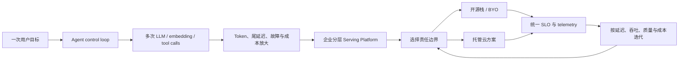
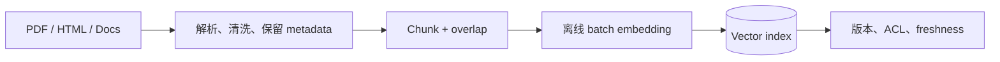
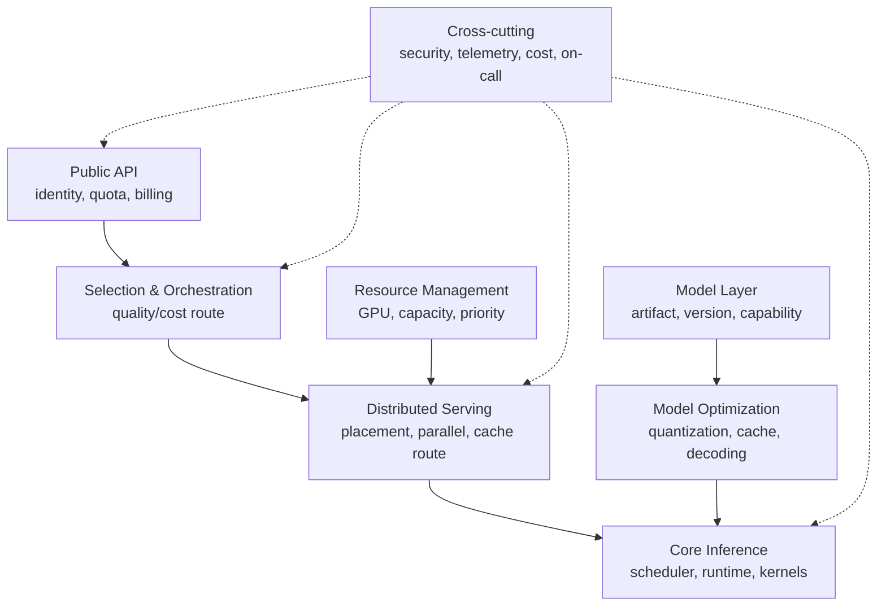
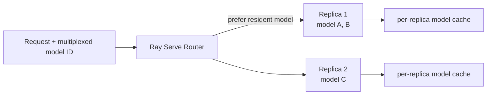
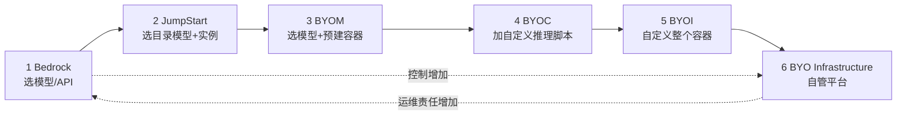
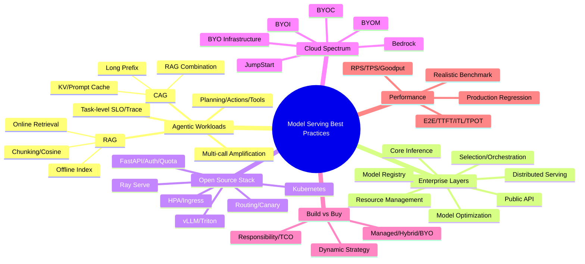

> 原章：*Model Serving Best Practices*
> 核心问题：当 LLM 从一次简单推理变成 agent 多步骤工作流、企业级共享平台和全球在线服务后，模型服务应怎样分层、治理和选型？如何在开源自建与云端托管之间动态选择责任边界，并用正确的延迟、吞吐与成本指标判断架构是否真的更好？

## 0. 本章定位、学习目标与因果主线

第 2 章解释 LLM 的 prefill、decode、KV cache、streaming 和 batching；第 3 章将单次推理组织成单模型和多模型服务。本章再向外扩一层，从“怎样构建 endpoint”转向“endpoint 如何嵌入真实业务和企业平台”。

作者依次讨论四个问题：

1. **为什么 agent 改变 serving workload**：一次用户操作会触发规划、检索、工具和多次 LLM 调用；
2. **企业平台怎样分层**：公共 API、资源、编排、分布式服务、推理、优化和模型各有不同变化速度与责任；
3. **自建还是购买多少**：用开源栈和 AWS 六档方案说明托管程度是连续谱；
4. **怎样证明选择有效**：用 E2E、TTFT、ITL/TPOT、RPS 与 TPS 建立可复现的测量方法。



读完本章，应能够回答：

- Agent 与普通 chatbot 的根本差别是什么，为什么一次交互会放大 token、尾延迟和负载波动？
- Planner、Action Executor、RAG 和 model serving 怎样形成闭环？
- RAG 的离线索引和在线检索分别做什么，chunk size 为什么是精度与上下文的折中？
- CAG 到底缓存什么，什么时候能替代部分检索，为什么 RAG 与 CAG可以组合？
- 企业 serving 平台七层各解决什么，层间契约和故障如何传递？
- Kubernetes、FastAPI、Ingress、Ray Serve、vLLM 与 Triton 分别位于哪一层？
- JWT/API key、限流、HPA、canary 和 model selection 的示例有哪些生产边界？
- Bedrock、JumpStart、BYOM、BYOC、BYOI、BYO infrastructure 各把哪些责任交给云厂商？
- Build vs buy 为什么不是永久二选一，如何计算简化盈亏平衡点？
- E2E、TTFT、ITL、TPOT、RPS 和 TPS 如何定义，哪些指标可以被“做高”却没有业务价值？

> **时效与实验口径说明**：本章涉及 2025 年前后的模型能力、AWS 产品、实例价格和框架 API。模型目录、价格、端口契约、超时和参数名会变化；本笔记保留原章数字以解释决策方法，不将其视为 2026 年或任意区域的当前保证。采购与上线前应查目标版本官方文档并用实际 workload 验证。

---

## 1. Model Serving in an Agentic World

### 1.1 Agent 为什么重塑 serving 需求

传统 endpoint 的简化模型是：

$$
\text{one user request}\rightarrow\text{one model call}\rightarrow\text{one response}.
$$

Agent workload 更像动态控制图：

$$
\text{goal}\rightarrow
\text{plan}\rightarrow
\text{retrieve/tool}\rightarrow
\text{observe}\rightarrow
\text{replan}\rightarrow\cdots\rightarrow
\text{final answer}.
$$

一次用户交互可能包含 embedding、向量检索、多次生成、工具 API 和重试。于是 serving 不只面对“更多请求”，还面对：

- 每个任务的模型调用数随机；
- 后续 prompt 携带前面结果，上下文不断增长；
- 不同分支调用不同模型和工具；
- tool latency 和 model latency 交替，呈 bursty traffic；
- 用户只关心整个任务，而不是单个模型调用是否快。

若工作流串行调用 $k$ 次，各调用端到端延迟为 $L_i$，工具和编排开销为 $O$：

$$
L_{task}=\sum_{i=1}^{k}L_i+O.
$$

若若干步骤可并行，任务延迟由 DAG critical path 决定，而不是所有节点之和。即使每个调用的平均延迟不变，链条越长，至少一个调用落入尾部的概率越高。若独立调用各有 $p$ 概率满足目标，则 $k$ 次全满足的概率为：

$$
P(\text{all meet target})=p^k.
$$

例如每次 99% 达标，10 次链式调用全达标仅约：

$$
0.99^{10}\approx90.4\%.
$$

因此 agent SLO 必须按任务端到端定义，并将预算分配给关键步骤；只优化单 endpoint 的 p50 不足以改善最终体验。

### 1.2 Defining Agents：什么是 Agent

原章将 agent 定义为由 LLM 驱动、能够以很少或没有人工干预完成目标的自治系统。能力包括：

- 理解高层自然语言目标；
- 推理并规划实现路径；
- 选择和调用外部工具或数据源；
- 根据中间结果、环境或人类反馈调整；
- 最终交付结果。

典型类型：研究 agent 阅读论文并综合综述；coding agent 编写、测试、调试和部署；业务 agent 做数据录入、报表和分发。

#### Agent 与固定工作流的边界

| 系统 | 路径由谁决定 | 优点 | 风险 |
|---|---|---|---|
| 规则程序 | 开发者预定义全部分支 | 可预测、易审计、低成本 | 难覆盖开放任务 |
| LLM assistant | 用户逐步下指令，模型回答 | 交互灵活 | 用户承担编排 |
| Agent | 模型/策略根据目标动态选动作 | 自主处理复杂任务 | 路径、成本和风险更难预测 |

“使用 LLM”不自动等于 agent；单次问答缺少持续目标、行动循环与环境反馈。相反，agent 也不应把所有决策都交给自由生成：权限、预算、终止、安全和高风险动作应由确定性 policy 约束。

### 1.3 A Sample Knowledge Agent

样例 Knowledge Agent 查询本地 PDF，支持直接问答、规划、摘要和比较分析。为便携性，它使用 OpenAI 托管的 `text-embedding-3-small` 与 `gpt-4.1-nano`，文档和向量仅放内存。

该取舍让样例易运行，却不适合直接推导生产属性：进程重启会丢索引，多实例没有共享状态，文档规模受内存限制，外部 API 又引入网络、价格、速率限制和数据治理问题。

### 1.4 The Agent's Design：四个核心组件

| 组件 | 职责 | 对 serving 的需求 |
|---|---|---|
| Knowledge Agent / Orchestrator | 保存任务状态、协调组件和最终输出 | timeout、trace、budget、failure policy |
| RAG System | 解析 PDF、embedding、vector search | 离线 batch embedding + 在线低延迟 embedding |
| Planner | LLM 将目标分解为 action sequence | 低 TTFT、结构化输出、稳定 schema |
| Actions / Executor | 执行检索、分析、摘要等动作 | 异构 endpoint、工具安全、结果传递 |

embedding 模型把文本映射到向量 $e\in\mathbb{R}^d$；生成模型负责规划和自然语言综合。二者目标和性能形态不同，没必要由同一大模型承担。

### 1.5 The Agent's Internal Workflow

以“比较数据库查询优化和数据结构优化”为例：

1. 用户提交目标；
2. Planner 调用 LLM；
3. LLM 返回 `query_rag_with_context -> generate_analysis -> generate_summary`；
4. Executor 执行 RAG action；
5. 检索相关 chunks，并调用 LLM 整理上下文；
6. analysis action 把问题和上下文交给 LLM；
7. LLM 生成比较分析；
8. summary action 再调用 LLM；
9. orchestrator 聚合并返回。

这条路径至少有 planner、RAG 后生成、analysis、summary 四次 LLM call，另有 query embedding 与 vector search。若每次都带完整历史，输入 token 成本近似：

$$
C_{token}
=\sum_{i=1}^{k}
\left(c_{in}N_{in,i}+c_{out}N_{out,i}\right),
$$

其中 $c_{in},c_{out}$ 是单位 token 价格。工作流重复传递文档和中间分析时，$N_{in,i}$ 会累积；prefix caching、context compaction 和减少不必要步骤因此具有直接经济价值。

#### Plan 的结构化契约

计划应通过 JSON schema/typed output 验证，例如：

```json
{
  "plan": [
    "query_rag_with_context",
    "generate_analysis",
    "generate_summary"
  ],
  "reasoning": "Retrieve, compare, then summarize.",
  "estimated_steps": 3
}
```

不能仅相信模型给出的 action 名称。Executor 应使用 allow-list，校验参数，限制最大 steps/费用，检测循环，并在 action 失败时选择 retry、fallback、skip 或 human escalation。

### 1.6 Agent Autonomy

#### 1.6.1 Defining actions

Action 是 Planner 可选择的离散能力。样例以不同 prompt template 实现查询、摘要和分析；生产 action 还可调用搜索、数据库、文件、工作流或系统 API。

prompt-based analysis action 的原理是把角色、问题、证据与输出结构显式写入模板：

```python
def create_analysis_prompt(query: str, context: str) -> str:
    return f"""You are an expert analyst.

Question: {query}

Context:
{context}

Provide:
1. A comprehensive analysis
2. Key insights and findings
3. Examples grounded in the context
4. Limitations or missing evidence
"""
```

模板改善一致性，却不是安全边界。外部文档可能包含 prompt injection；必须将检索内容标为不可信数据、限制 tool permission，并由代码验证最终 action。

#### 1.6.2 MCP 的作用边界

Model Context Protocol（MCP）标准化 tool discovery、结构化输入和结果返回，使 tool provider 与 agent core 解耦。它减少每个工具自定义协议，但不会自动解决：

- 工具是否可信、最小权限和用户授权；
- 参数是否安全、是否允许副作用；
- timeout、重试、幂等与审计；
- 工具返回内容中的注入；
- 网络与凭据隔离。

协议提供一致接口，治理仍由宿主系统负责。

#### 1.6.3 Planning with LLMs

Planner 将 query 与 available actions 写入 prompt，以较低 temperature 生成计划，再解析 JSON。低 temperature 降低随机性，但不能保证 schema 或正确性。可靠流程为：

```text
build typed planning context
call model with deadline and token budget
parse against JSON schema
reject unknown action/arguments
check policy, cycle and step budget
execute one action
observe result and decide continue/replan/finish
```

Planning 的价值是动态路径；代价是额外调用、错误分解与不可预测步数。对于稳定高频任务，可把已验证路径编译成确定性 workflow，或只让 LLM 做有限 router，而不是每次重新规划。

### 1.7 Retrieval-Augmented Generation（RAG）

#### 1.7.1 Why RAG

LLM 参数知识有训练截止点，可能缺少私有领域知识，并会生成流畅但错误的内容。RAG 在 query time 检索外部证据并注入 prompt，解决的是**知识 grounding、更新与访问私有数据**，而不是修改模型权重。

RAG 能降低无依据回答风险，但不能保证事实正确：retriever 可能漏检/错检，文档可能过期，模型也可能忽略或误读证据。生产答案应保留 source metadata/citation，并分别评估 retrieval 与 generation。

#### 1.7.2 Index-building workflow（离线）

流程为：



原章给出约 1000 token/chunk 的典型值，这不是通用最优值。chunking 同时决定：

- retrieval 粒度；
- embedding 次数、索引大小和离线成本；
- query 时返回多少冗余文本；
- 是否保留跨段语义；
- LLM context budget。

小 chunk 提高局部 precision，却可能丢失上下文；大 chunk 保留语义，却让无关内容稀释 embedding，并浪费 prompt token。可使用 overlap、按标题/段落语义切分、parent-child retrieval 或 query-specific expansion 缓解。

#### 1.7.3 Query/retrieval workflow（在线）

1. 用与文档相同 embedding 模型编码 query；
2. 在 vector index 做 nearest-neighbor search；
3. 根据 metadata/ACL 过滤；
4. deduplicate、rerank 和限制 token budget；
5. 将 top chunks 与 query 交给生成模型。

常用 cosine similarity：

$$
\mathrm{cos}(q,d)
=\frac{q\cdot d}{\|q\|_2\|d\|_2}.
$$

值越大表示方向越相似。若向量已 L2-normalized，cosine 等于 dot product。向量相似只是 embedding 空间中的语义近似，不等于事实相关或有权限，因此还需过滤和 rerank。

在线 RAG 延迟可拆为：

$$
L_{RAG}
=L_{query\ embed}+L_{search}+L_{rerank}
+L_{prompt\ build}+L_{LLM}.
$$

索引离线预计算文档 embedding，正是为了避免每次 query 重新编码全部知识库。

#### 1.7.4 Context window 预算

若最大上下文为 $W$，system/tool/history/query 占 $S$，期望输出保留 $O$，可用于 retrieved context 的预算满足：

$$
R\le W-S-O.
$$

召回更多 chunks 不总更好：超过预算会截断，过多噪声会降低模型注意力质量，prompt 更长还增加 TTFT 和费用。

### 1.8 Cache-Augmented Generation（CAG）

#### 1.8.1 引入动机

RAG 每次都要 embedding、search 和 rerank，且 top-$k$ 可能选错。随着 context window 变大，某些有限、稳定知识库可预先放入 prompt，并将其 prefill 后的 KV cache 复用给多个 query。原章以 2025 年 8 月 Claude Sonnet 4 支持 100 万 token context 为例说明趋势；具体限制与 cache API 需按供应商当前文档确认。

#### 1.8.2 CAG 缓存的准确含义

CAG 不是把知识永久“训练进模型”，而是：

1. 将共享知识序列作为长前缀；
2. 对该前缀做一次 prefill；
3. 保存各层 K/V 或使用 provider prompt cache；
4. 后续 query 在兼容前缀之后继续 decode。

它节省重复 prefill，而不是让长 context 没有内存。KV cache 近似随层数、token 数、KV heads 和并发增长：

$$
M_{KV}\approx2BLTH_{kv}d_hb.
$$

query decode 仍要读取长前缀 K/V，超长 context 可能增加 attention latency；缓存还需要命中、版本、租户隔离、失效和 placement。

#### 1.8.3 RAG 与 CAG 不是简单替代关系

| 维度 | RAG | CAG |
|---|---|---|
| 主要目标 | 动态选择相关外部知识 | 复用已计算的共享上下文 |
| Freshness | 更新索引后可快速变化 | 知识变化会使 cache 失效 |
| Query-time 开销 | embedding/search/rerank | cache lookup + 长前缀 attention |
| Context | 只注入 top chunks | 预载较大知识集合 |
| 主要风险 | 漏检、错检、检索复杂 | KV memory、长上下文干扰、低命中 |
| 适合 | 大、动态、需要权限过滤的知识库 | 小到中等、稳定、高复用前缀 |

原章强调的组合方式更实用：RAG 负责找对知识，CAG/prefix caching 负责对热门共享结果或模板复用 prefill。若每个 query 检索出的 chunks 顺序都不同，CAG 命中率可能很低；可对稳定 system prompt、tenant corpus 或标准文档包建立 cache。

### 1.9 How Agents Use Model Serving

Agent 常调用：推理/规划 LLM、embedding、视觉/语音模型、分类/代码模型和外部工具。Tool calling 的四步是：

1. LLM 观察目标与可用工具；
2. 输出结构化 tool name 和 arguments；
3. Agent 在权限与 schema 检查后执行；
4. 工具结果回到 LLM，循环到完成。

因此 agent serving 平台需要的不只是低 latency endpoint，还包括 model routing、并发 quota、context/cache、trace、tool timeout、budget、cancel 和任务级 observability。每个子调用都应携带同一个 task/trace ID，才能把最终慢或贵的任务还原为调用图。

---

## 2. LLM Serving in Enterprise Systems：分层架构

大规模平台还要处理认证、定价、资源、网络、优化、实验、可观测与 on-call。分层的目的不是画更多框，而是让不同团队在清晰契约下独立演进，同时把故障和变化限制在局部。

### 2.1 Public API Layer

负责全球网络入口、认证、租户、定价/计量、限流和 request routing。关键挑战：

- 大量并发连接，stream 会长时间占用连接；
- quota、公平性、防滥用与精确计费；
- geo-routing 与数据主权，不能只按最近 region；
- DDoS、凭据、tenant isolation 和 payload 安全；
- API version、idempotency、error contract 与兼容性。

该层应尽早拒绝无权限、超配额和超大请求，避免消耗后端 GPU。Rate limit 可按 request、input/output token、并发 sequence 和每日预算组合；单纯 RPS 无法反映 LLM 工作量。

### 2.2 Resource Management Layer

管理跨 region 的 CPU、异构 GPU、内存、磁盘和网络，并做预算与成本归属。核心问题：

- 从历史与产品计划预测 demand；
- 在 headroom 与昂贵 overprovisioning 间取舍；
- 不同 GPU capability/显存/互联与模型匹配；
- critical workload reservation 与低优先级 preemption；
- node/pod 冷启动、模型加载和碎片化；
- showback/chargeback 到 tenant、model 和产品。

资源利用率高不是唯一目标。逼近 100% 会让 burst 进入队列并放大 p99；应在目标 SLO 下最大化有效吞吐。

### 2.3 Model Selection and Orchestration Layer

根据 query、tenant、质量、成本、region 和负载选择一个或多个模型，并执行 fallback、cascade 或 speculative decoding。

可形式化为约束决策：

$$
m^*=\arg\min_m C(m,x)
$$

$$
\text{s.t.}\quad
Q(m,x)\ge Q_{min},\quad
L(m,x)\le L_{SLO},\quad
m\in A_{tenant,region}.
$$

最大的模型不是每个请求的最优解。router 本身也会犯错，因此要监控 route 分布、fallback、质量与成本，而不只是 backend latency。

#### Speculative decoding

小 draft model 一次提出多个候选 token，大 target model 并行验证；接受正确前缀，遇到差异再修正。若验证算法严格，target distribution 不变，但收益取决于 draft 接受率、draft 成本、verification batch 和硬件并行。它是推理优化，不是普通“先用小模型，失败再调用大模型”的 routing cascade。

### 2.4 Distributed Serving Layer

承担两类分布式问题：

1. 大模型超过单 GPU，需 tensor/pipeline/expert parallel 和多节点通信；
2. KV、prompt、prefix、semantic cache 跨 replica 放置与路由，减少重复计算。

多 GPU 需要低延迟高带宽 collective；跨节点网络会进入每个 decode step 的 critical path。Cache-aware routing 可提高命中，却可能造成负载倾斜，需在 locality 与 least-loaded 间折中。

### 2.5 Core Inference Layer

真正执行模型，集成 vLLM、Triton、TensorRT-LLM、SGLang 与 FlashAttention、GEMM、PagedAttention 等 kernel，并暴露内部 API/stream。该层关注：

- model compatibility 和精度；
- batch scheduler、KV allocator、cancel；
- kernel/hardware 拓扑；
- TTFT、TPOT、tokens/s 和 OOM；
- process/device failure。

### 2.6 Model Optimization Layer

应用量化、蒸馏、剪枝、kernel fusion、speculative decoding、并行、cache 和其他无需完整重新训练的优化。每项优化都要同时验证：

$$
(\Delta Q,\Delta TTFT,\Delta TPOT,\Delta X,\Delta M,\Delta C).
$$

性能更快但质量下降或运维复杂度过高，不一定是生产收益。

### 2.7 Model Layer

连接训练/外部模型源与生产：

- artifact 导入、扫描、签名和 provenance；
- 按语音、推理、视频等 capability 分类；
- sandbox、experiment、canary、production promotion；
- 权重、tokenizer、config、license 和版本追踪；
- rollback、deprecation 和兼容性。

### 2.8 层间关系与端到端责任



请求跨越多层，timeout budget、trace context、tenant identity 和 model version 必须端到端传播。某一层的局部 retry 可能放大总负载；应由明确 owner 根据 idempotency 和 remaining deadline 决定。

---

## 3. Building with an Open Source Stack

原章选择 Kubernetes 作为资源、网络、路由、扩缩容、metrics 和日志基础，再用 FastAPI、Nginx/Envoy、Ray Serve、vLLM/Triton 等拼出各层。

Kubernetes 解决容器编排，不自动解决模型质量、token-aware scheduling 或 GPU kernel。每个附加组件仍需版本、容量、升级、安全和 on-call owner。

### 3.1 Implementing Public API

#### 3.1.1 FastAPI endpoint、身份与租户上下文

```python
@app.post("/v1/chat/completions")
async def chat(req: ChatReq, identity=Depends(require_auth)):
    await rate_limit(identity["tenant"], req)
    # Select a model and route with tenant policy.
```

身份结果不仅是“允许/拒绝”，还向下游携带 tenant、plan、region、model allow-list 和 quota。认证（你是谁）与授权（你能做什么）不可混淆。

JWT 验证至少要固定允许算法、验证签名、`iss/aud/exp/nbf`、处理 key rotation，并防止把 token header 中任意算法当可信。原章示意使用 `algorithms=[headers["alg"]]`；生产不应由未验证 header 决定允许算法，应在服务配置中 allow-list，例如 `RS256`。

API key 不应明文存储或记录，应只显示一次，服务器保存 hash/前缀索引，支持 scope、rotation、revoke 和审计。401 表示缺少/无效认证，403 表示身份有效但无权限。

#### 3.1.2 HPA 示例与边界

原章 HPA 在平均 CPU 超过 70% 时把 API deployment 保持在 3～15 replicas。准确说法是 HPA 在区间内计算 desired replicas，而不是每次“再加 3～15 个”。近似控制关系：

$$
R_{desired}
=\left\lceil
R_{current}\frac{U_{current}}{U_{target}}
\right\rceil.
$$

这适合 CPU-bound public API；模型 backend 常受 GPU、queue 和 KV cache 限制，CPU 70% 可能毫无代表性。backend 应使用 custom/external metrics，如 pending tokens、queue wait、TTFT、active sequences 和 GPU memory，并考虑模型加载冷启动。

#### 3.1.3 Ingress 限流示例

Nginx 配置 `limit-rps: 50`、burst multiplier 5、body 8 MiB，属于 gateway 级粗限流。它不能替代 tenant token quota：1 个 100k-token 请求和 1 个 10-token 请求都算一个 request。生产通常组合：

- IP/global DDoS limit；
- tenant RPS/RPM；
- input/output token budget；
- concurrent stream limit；
- model-specific quota；
- cost/credit limit。

多副本 rate limiter 若只保存在本地，会把总额度乘以副本数；需要共享原子计数、集中 rate-limit service 或网关一致实现。

### 3.2 Implementing Model Selection

原章在 chat endpoint 中按 model、tenant 与 `max_new_tokens > 1024` 选择 direct path 或 speculative decode，并支持 weighted canary 和 tenant override。

#### 3.2.1 Routing policy 的决策顺序

更稳妥的顺序：

```text
validate requested model/alias
apply tenant model allow-list and data-region policy
resolve immutable model versions
filter healthy/ready endpoints
apply tenant override/reservation
choose stable/canary cohort deterministically
load-balance within eligible pool
record route reason and policy version
```

原章 `random() < canary_weight` 每次请求随机，可能让同一用户多轮对话在版本间跳转并破坏 cache。常用 tenant/user/conversation ID 做稳定 hash：

$$
bucket=H(key,experiment\_id)\bmod10000,
$$

当 `bucket < 10000w` 时进入权重为 $w$ 的 canary。这样 cohort 稳定且可复现。

#### 3.2.2 Speculative threshold 不是普适常量

`max_new_tokens > 1024` 只是简化 classifier。`max_new_tokens` 是上限而非实际输出，收益还取决于 draft acceptance、prompt、batch 和 target/draft 部署。应从 traces 训练/校准 router，并在不适合时 fallback direct。

Model selection 自身必须低延迟、高可用；复杂 LLM router 若比节省的成本还高，就失去意义。

### 3.3 Implementing a Model Serving Endpoint

#### 3.3.1 Single-model hosting on Ray

原章把 vLLM `AsyncLLMEngine` 封装为 Ray Serve deployment，3 replicas 每个声明 1 GPU。各 replica 在初始化时加载 Qwen 模型，async request 调用 engine 并收集输出。

架构职责：

- vLLM：模型执行、KV cache、batch 与 token generation；
- Ray Serve：replica lifecycle、请求路由和应用部署；
- Ray scheduler：按 `num_cpus/num_gpus` 放置 actor；
- Kubernetes/集群：node 与底层资源。

`num_replicas=3` 不等于模型内部 tensor parallel 3。这里是三个完整副本，各占 1 GPU；`tensor_parallel_size=1` 表示每副本单 GPU。若单模型跨多 GPU，需要 placement group/资源声明与 vLLM parallel config 一致。

原示例的 `text_delta` 字段和 vLLM API 会随版本变化，部分版本返回累计 `text`；实现前须验证 delta 语义，避免重复拼接。若最终一次性返回字符串，外层仍不是 HTTP streaming，即使内部 async 迭代。

#### 3.3.2 Multi-model hosting on Ray

Ray Serve model multiplexing 让多个 replicas 动态缓存不同 model IDs。`@serve.multiplexed(max_num_models_per_replica=2)` 表示每 replica 最多缓存两个模型，超限时由 Ray 管理 eviction；header 指定目标 model ID。



相比单模型 preload，multiplexing 在 miss 时 lazy load；注解不会让“每次请求都下载”，而是 cache hit 复用。仍需处理：

- 同一 model 的并发 cold load；
- model 大小差异，按数量 2 不等于内存安全；
- 下载凭据、artifact integrity 和 revision pinning；
- load timeout 与 fallback；
- 正在执行时不能 eviction；
- header 不能允许用户加载任意仓库，应通过 allow-listed registry 映射。

将 `from_pretrained` 放入 `asyncio.to_thread` 避免阻塞 event loop，但加载占用 CPU、磁盘、网络和内存，仍需 admission control。Transformers worker 要将 model/input 放到同一 device，使用 inference mode，并定义 label mapping。

#### 3.3.3 “自建不难”的合理解读

框架让 happy path 易组装，不代表 enterprise-grade 容易。生产还需 supply chain、升级、灾备、安全、容量、计费、故障演练和 24/7 on-call。最佳实践是把成熟组件用于其擅长领域，同时明确每个集成边界的 owner 和 SLO，而不是低估总拥有成本。

---

## 4. Building with a Cloud Vendor：六档 AWS 方案

六个选项不是六个互斥产品，而是一条**逐步收回责任与控制**的梯子：



> 原章为叙述方便交替使用 image/container，但严格来说 image 是不可变模板，container 是 image 的运行实例。架构、发布和安全讨论中应区分二者。

### 4.1 Option 1：Fully Managed Foundation-Model Serving

Amazon Bedrock 提供 catalog 中 foundation models 的高层 API，AWS 管理硬件、加载、扩缩和 runtime；用户按请求/token 等使用量付费。

**用户负责**：选择模型、prompt/application、数据治理、IAM、quota、质量评估和客户端错误处理。
**AWS 负责**：底层模型 serving infrastructure 和大部分运维。

优点：启动最快、无 endpoint uptime 管理、适合原型和波动低流量。限制：模型/region/config catalog 有边界，不能任意改架构、container、硬件或 runtime；自有 fine-tuned model 支持范围以当前产品为准。

原示例把 bearer token 写入 `os.environ` 只适合说明调用，不应在代码/日志中硬编码 secret。生产使用 IAM role、短期凭据和 secret manager。

**适用**：标准 foundation model 足够、时间优先、团队不想运维。
**不适用**：必须自有模型、深度 kernel/runtime 定制、严格可移植或特殊网络路径。

### 4.2 Option 2：One-Click Foundation-Model Deployment

SageMaker JumpStart 从 curated catalog 自动选择 artifact/image 并部署到用户 SageMaker endpoint。用户可选部分实例、数量、日志环境变量，按实例 uptime 付费。

与 Bedrock 的关键差别：计算 endpoint 在用户选择的 SageMaker infrastructure 上，用户承担持续实例费用并看到更多部署对象；但模型、镜像和多数推理行为仍由 JumpStart recipe 约束。

限制包括：部分模型仅部署不支持微调/评估；实例组合有限；pre/postprocess、schema、CUDA/PyTorch、context/batch 等可调性有限。

**适用**：需要在自己 AWS 环境快速部署 catalog 中流行模型，并愿意接受 recipe。
**不适用**：非 catalog 模型、非标准 payload、深度性能定制。

### 4.3 Option 3：Bring Your Own Model（BYOM）

用户提供模型 artifact，并主动选择 SageMaker Deep Learning Container/LMI/DJL 等预建 serving image；容器提供框架和 inference server，通常无需自写 serving code。

相比 JumpStart，多了对 framework/container version 的选择，能部署 catalog 外但格式受支持的模型。示例包括 PyTorch/TorchServe MNIST，以及 LMI + DJL/vLLM 部署 Llama，配置 tensor parallel 4、rolling batch 128。

#### 契约与限制

- image tag 固定 OS、Python、framework、CUDA 等组合；
- artifact 目录和格式必须符合 handler；
- 标准 SageMaker container 常需监听 8080，支持 `/ping` 与 `/invocations`；
- 原章举 standard response 默认 60 s timeout，应按当前 endpoint 类型确认；
- 默认 schema/pre/postprocess 难改。

**适用**：已有标准 PyTorch/TF/HF 等模型，默认 handler 足够，希望少写代码但能选 runtime 版本。
**不适用**：需要特殊输入输出、复杂预后处理或容器内部依赖组合。

### 4.4 Option 4：Bring Your Own Code（BYOC / Script Mode）

继续使用 vendor container 和 SageMaker infrastructure，但提供 entry script，实现 initialize、preprocess、inference、postprocess。它把“模型代码”责任交给用户，runtime/HTTP contract 仍由 vendor image 决定。

原章 LMI 伪代码中：

- `serving.properties` 选择 Python engine、tensor parallel 2、vLLM rolling batch 和 S3 artifact；
- `initialize` 加载模型；
- `handle` 在首次/暖机调用初始化，解析 JSON；
- `run_inference` 每 128 条 batch tokenize、forward 并返回 embedding；
- code/model/config 打包 tar.gz 上传 S3，再以 LMI image 部署。

示例是教学伪代码，存在 `onnx_model/model` 命名不一致、空 warm-up 语义、全局状态和结果反向拼接等细节，不能直接运行。生产 handler 需要 thread safety、model eval/inference mode、device consistency、batch order、错误、max payload 和 timeout。

限制：仍继承 image 的 OS/CUDA/Python/serving library 和外部 HTTP 契约。
**适用**：标准容器能运行模型，但需要自定义 preprocessing、postprocessing、batch 或多模型逻辑。
**升级条件**：依赖/runtime/API 本身受限时转 Option 5。

### 4.5 Option 5：Bring Your Own Serving Image（BYOI）

用户构建整个 Docker image，选择语言、framework、系统依赖、进程和内部 API；SageMaker 管理实例、endpoint 和容器部署。容器仍必须满足 SageMaker health/invocation contract，并发布到 ECR。

优点：可用 vendor 尚未支持的新 vLLM、C++ runtime、自定义 metrics/sidecar 和系统优化。代价：用户负责 Dockerfile、漏洞补丁、base image、CUDA compatibility、server、health、日志、测试和 image supply chain。

单个自定义容器仍不等于拥有跨 endpoint 的分布式 cache/routing control plane；这推动 Option 6。

### 4.6 Option 6：Build Your Own Serving Infrastructure

在 EKS 等 managed Kubernetes/VM primitives 上自建完整平台。用户选择 Triton、vLLM、TensorRT-LLM、KServe、Ray Serve，负责 traffic、autoscaling、安全、可观测和成本；仍可购买 EKS、ALB/NLB、ECR、S3、IAM、CloudWatch 等基础组件。

适用条件：

- 需要 kernel、batch、tokenization、sidecar、gRPC/SSE 全控制；
- 需要 spot GPU、MIG/MPS、bin packing、token-aware autoscaling；
- 私有集群、VPC-only egress、tenant isolation、定制审计；
- 新硬件、KV sharding、speculative decode、cache-aware routing；
- 大规模下深度调优收益覆盖平台人力和风险。

“自建 infrastructure”通常仍建立在云厂商硬件和 managed control plane 上，不等于没有 vendor dependency；它表示用户拥有 serving platform 的主要工程责任。

### 4.7 Comparing the Options

| 选项 | 自有模型 | 自有推理代码 | 自有 image | 自管平台 | 启动速度 | 控制 |
|---|---:|---:|---:|---:|---|---|
| 1 Bedrock | 受 catalog/产品支持限制 | 否 | 否 | 否 | 最快 | 最低 |
| 2 JumpStart | catalog 模型 | 否 | 否 | endpoint 部分 | 很快 | 低 |
| 3 BYOM + DLC | 是，支持格式 | 通常否 | 否 | endpoint 部分 | 快 | 中低 |
| 4 Script Mode | 是 | 是 | 否 | endpoint 部分 | 中 | 中高 |
| 5 BYOI | 是 | 是 | 是 | SageMaker 托管外层 | 慢 | 高 |
| 6 BYO infra | 是 | 是 | 是 | 是 | 最慢 | 最高 |

选择时除易用性，还要比较：模型/硬件支持、SLO、稳定与峰值流量、数据边界、feature gap、团队能力、锁定、TCO 和迁移可逆性。

#### 原章价格例子的盈亏平衡直觉

原章举例：按 $0.10$/百万 input tokens 与 $1.172$/实例小时比较。若只考虑这两个数字，忽略 output、空闲、冗余和运维，等价 token 率为：

$$
N^*
=\frac{1.172}{0.10}\times10^6
=11.72\ \text{million input tokens/hour}.
$$

只有自托管实例每小时能稳定完成超过该规模的**有效工作**，单看 input token 成本才可能更低。真实比较还要加入 output price、实例数量、利用率、失败/重试、network、storage、HA 和人力；书中数字也可能不是当前 Qwen3/Bedrock 的实际可用价格，因此不能直接采购。

---

## 5. Build or Buy? Understanding Strategies

### 5.1 这是一条责任连续谱，不是开关

前六个选项证明，每一层都可单独购买或自建：hardware、cluster、container、runtime、model、router、API。大多数团队位于中间，例如在 SageMaker/EKS 上运行自定义 vLLM endpoint，或保留 Bedrock 默认路径，仅将某些高流量/敏感模型迁出。

### 5.2 Why Knowing How to Build Helps

理解内部机制即使不自建也能：

- 将 vendor 参数映射到 batch、cache、quantization、adapter 和 parallel；
- 看出托管层隐藏了哪些 ceiling 与责任；
- 比较 BYOM/BYOC/BYOI 的真实 feature gap；
- 保留 80% 默认路径，只替换有证据的 20%；
- 在黑盒日志有限时，按 queue/prefill/decode/cache 层次排障；
- 设计稳定抽象，减少迁移锁定。

80/20 是策略直觉，不是固定比例。替换点应由 SLO、成本、合规或产品能力的可测 gap 驱动。

### 5.3 Our Selection Strategy

1. **Stay managed**：SLO 达标、成本可接受、速度最重要；
2. **Hybridize**：少数 endpoint 需要特殊 batch、route、隔离或性能；
3. **Go BYO**：必须控制 hardware/runtime/network，或规模让深度优化有经济回报；
4. **Move back managed**：流量稳定在低位，自建复杂度不再回本。

可把决策写成约束下 TCO：

$$
\min_{a\in Architecture} C_{TCO}(a)
$$

$$
\text{s.t.}\quad
Q(a)\ge Q_{min},\quad
L_{p95}(a)\le L_{SLO},\quad
A(a)\ge A_{min},\quad
a\in Compliance.
$$

其中：

$$
C_{TCO}
=C_{usage/compute}+C_{idle}+C_{network}+C_{storage}
+C_{licenses}+C_{people}+C_{risk}+C_{migration}.
$$

### 5.4 动态策略的工程前提

要能在谱系上移动，需保持：

- 稳定、尽量 provider-neutral 的业务 API；
- shared telemetry 与统一 benchmark；
- model/route config 与业务代码分离；
- 可导出的 artifact、prompt 和 evaluation set；
- 多 backend adapter、明确 timeout/fallback；
- 数据和 identity 不被某个 endpoint 私有化；
- 定期重算成本和 feature gap。

追求“零锁定”通常不现实，也会放弃 vendor 特性。目标应是知道锁定在哪里、收益是什么、退出成本是否可接受。

---

## 6. Measuring Performance in LLM Serving

架构必须用结果判断。Agent 需要 task latency，平台需要 capacity/cost，build-vs-buy 需要在同一 workload 下比较。核心是 latency 与 throughput，但它们必须带明确边界和请求分布。

### 6.1 Latency Metrics

#### 6.1.1 E2E latency

从定义的起点到完整 response 的时间。必须说明边界：

- **model latency**：engine 收到 tokenized/原始 request 到生成结束；
- **server latency**：API ingress 到 response/stream 完成，含 queue、route 和处理；
- **user-perceived latency**：客户端发送到最终渲染，含 network；
- **agent task latency**：从用户目标到所有模型/工具步骤完成。

不同边界不能直接比较。

#### 6.1.2 TTFT

从请求起点到第一个输出 token 可用/到达的时间。模型侧近似包含 input tokenization、queue、prefill、first decode/sampling 与首 token detokenization；用户侧还含网络和 gateway buffering。

原章简化为：

$$
TTFT\approx L_{prefill}+L_{first\ decode},
$$

因为忽略 tokenization/detokenization。生产更完整为：

$$
TTFT_{server}
=L_{admission}+L_{queue}+L_{tokenize}
+L_{prefill}+L_{first\ decode}+L_{first\ emit}.
$$

长 prompt、排队、大 prefill batch 和 cold start 会增大 TTFT。

#### 6.1.3 ITL 与 TPOT 的细微区别

**ITL** 是相邻可见 token/chunk 的间隔，得到一个分布：

$$
ITL_i=t_i-t_{i-1},\quad i=2,\ldots,N.
$$

**TPOT** 常定义为首 token 后生成其余 token 的平均时间：

$$
TPOT
=\frac{t_N-t_1}{N-1}
=\frac{1}{N-1}\sum_{i=2}^{N}ITL_i.
$$

所以 ITL 与 TPOT 相关，但不严格同义：ITL 可看 p95/p99 抖动，TPOT 是平均。原章为简化将二者并列。网络 chunking 还可能一次发送多个 token，使客户端观测 ITL 与模型 decode step 不同。

#### 6.1.4 E2E 公式与前提

若输出 $N\ge1$ 个 token，首 token 在 TTFT 时出现，后续间隔恒定为 ITL，忽略 finalize：

$$
L_{E2E}=TTFT+ITL\times(N-1).
$$

更一般地：

$$
L_{E2E}=TTFT+\sum_{i=2}^{N}ITL_i+L_{finalize}.
$$

例如 TTFT = 0.8 s，输出 101 tokens，TPOT = 30 ms：

$$
L_{E2E}\approx0.8+100\times0.03=3.8\ \text{s}.
$$

该公式不含 agent 的后续步骤，也不代表用户读完所需时间。

#### 6.1.5 不同 use case 的主指标

- Agent 下游必须等完整 JSON/tool arguments：E2E/critical-path latency；
- Chatbot 短回答：TTFT 最影响“是否响应”；
- 长代码/故事：TTFT 后 ITL/TPOT 决定流畅度；
- 离线摘要/embedding：总完成时间与 throughput 更重要；
- 实时语音：首音频与持续 chunk jitter 都重要。

优化 batch 可能提高 throughput 却增加 queue/TTFT；speculative decode 可能改善 TPOT；prefix cache 主要改善重复长 prompt 的 prefill/TTFT。没有一种优化必然改善全部指标。

### 6.2 Throughput Metrics

#### 6.2.1 RPS/RPM

$$
RPS=\frac{N_{completed\ requests}}{T}.
$$

通用、易理解，但 LLM 每请求工作量差异巨大。必须同时报告 input/output length distribution、并发、模型和成功率。1 RPS 的 10-token 分类与 1 RPS 的 100k-input/5k-output 生成不可比。

#### 6.2.2 TPS 的口径

原章将 TPS 定义为**生成 output tokens/s**：

$$
TPS_{out}=\frac{N_{generated\ output\ tokens}}{T}.
$$

业界还会使用 input TPS、total TPS、per-request decode TPS 和 aggregate system TPS。报告时必须写清：

$$
TPS_{in}=\frac{N_{input}}{T},\quad
TPS_{out}=\frac{N_{output}}{T},\quad
TPS_{total}=\frac{N_{input}+N_{output}}{T}.
$$

单用户 decode speed 约为 $1/TPOT$，但 aggregate output TPS 可通过同时 decode 多序列远高于单用户速度，二者不能混淆。

#### 6.2.3 为什么 throughput 容易被“做高”

- 缩短 input 减少 prefill 和 TTFT；
- 使用长度一致的请求减少 padding/straggler；
- 增大 batch 提高 GPU 利用率，却可能牺牲 latency；
- 只统计成功且短的请求，排除超时/失败；
- 使用更早 EOS 或更简单输出；
- 只报告 aggregate TPS，不报告 p95 TTFT/TPOT。

这些并非都不合法，但改变了 workload。公平 benchmark 必须固定/报告输入输出分布和 SLO。

#### 6.2.4 Goodput 比裸 throughput 更接近业务价值

定义满足正确性与延迟 SLO 的有效工作：

$$
Goodput
=\frac{N_{successful\ and\ within\ SLO}}{T}.
$$

若提高 batch 让 TPS 上升 20%，却让大量交互请求 TTFT 超标，裸 throughput 提高而 goodput 可能下降。成本也应除以 good tokens/requests，而不是所有生成 token。

### 6.3 Best Practices for Performance Measurement

#### 6.3.1 Identify latency-throughput trade-off

离线任务可用更大 batch/排队窗口追求吞吐；交互任务以 TTFT/ITL 为约束。绘制 Pareto frontier，而不是只找单一“最快”配置：一个配置只有在不比另一个更差且至少一项更优时才值得保留。

#### 6.3.2 Set use-case latency goals

先从用户体验和下游 timeout 定 SLO，再优化。聊天已从 1 s 降到 0.5 s 的边际价值可能低于降低成本；但医疗控制或语音场景阈值不同。避免没有业务目标的 endless tuning。

#### 6.3.3 Decompose E2E into TTFT and ITL

同时拆 queue、tokenize、prefill、first decode、decode、detokenize、network。TTFT 高先看 queue/prefill；TTFT 正常但输出拖沓看 TPOT/ITL；Agent E2E 高还要看调用图 critical path。

#### 6.3.4 Simulate real traffic

从 production traces 或产品假设建立联合分布：

- input/output tokens 及相关性；
- request arrival、日周期、burst；
- 并发与 stream duration；
- model/tenant mix；
- cache hit、cancel、retry；
- agent steps/tool latency。

Open-loop load generator 按外部到达率发请求，能暴露系统饱和后的 queue；closed-loop 等响应后再发，系统变慢时自动降低压力，可能掩盖 overload。两者用途应说明。

Little's Law 在稳定系统中提供 sanity check：

$$
L=\lambda W,
$$

$L$ 是系统平均在途请求，$\lambda$ 是到达率，$W$ 是平均停留时间。若 20 RPS、平均 2 s，则约 40 个在途请求；容量/连接指标相差巨大时应检查测量边界。

#### 6.3.5 Maintain experimental consistency

固定模型 revision、tokenizer、dtype、hardware、framework、sampling/seed、prompt/output distribution、concurrency、warm-up 和计时边界；一次只改一个主要变量。若研究交互效应，可用设计实验而不是随意同时改多个 knob。

每个实验多次运行，报告均值/中位数、p95/p99、方差或置信区间；记录 git/config/image/hardware ID，确保可复现。

#### 6.3.6 Monitor hardware utilization

同时看 GPU compute、HBM bandwidth、memory used、KV cache、CPU、host memory、PCIe/NVLink/network、power 和 queue。GPU utilization 100% 不说明完成的是有效工作；低 GPU utilization 也可能是 decode memory-bound，应结合 bandwidth 与 kernel profile。

#### 6.3.7 Avoid metric inflation

预注册 workload 与成功条件；公开 warm/cold、batch、长度和错误；不 cherry-pick 最佳一轮；质量与 performance 同测。Vendor 比较尤其要统一 output tokens 和 stop condition。

#### 6.3.8 Continuously monitor production

按 model/version/region/tenant/request class 分 slice 监控 E2E、TTFT、ITL、RPS/TPS、queue、errors、cache 和 cost。设置 burn-rate alert 而非只对瞬时平均值告警；trace agent task 到每个 model/tool call。

#### 6.3.9 Run periodic test suites

- regression：版本升级不恶化 latency/throughput/quality；
- scalability：逐渐加压找到 knee 与 saturation；
- burst/soak：突发、长时间泄漏和 thermal behavior；
- failure：GPU/worker/region、cache/backend 故障；
- peak simulation：Black Friday 等场景；
- A/B/canary：稳定 cohort 比较新优化；
- scale-down：低谷是否释放资源且恢复时满足 SLO。

A/B 必须同时看 quality、latency、cost 和用户结果，防止只优化 proxy metric。

### 6.4 一个完整的 benchmark 记录模板

```text
System:
  model/tokenizer revision, dtype/quantization
  engine/container/driver/CUDA version
  GPU type/count/topology, CPU/RAM/network
Workload:
  arrival model, duration, concurrency
  input/output token distributions
  sampling/stop, model/tenant mix
  warm/cold cache, streaming, cancellations
Results:
  success/error/timeout/cancel rates
  E2E, TTFT, ITL/TPOT p50/p95/p99
  RPS, input/output/total TPS, goodput
  GPU compute/bandwidth/memory, KV cache, queue
  cost per successful request / million good tokens
Quality:
  task metric, safety, structured-output validity
```

---

## 7. 容易混淆的概念与常见误区

### 7.1 Agent = 任意调用 LLM 的应用

错误。Agent 至少具有目标驱动的动态行动、工具/环境反馈和迭代；一次问答只是 LLM application。

### 7.2 Agent autonomy = 不需要确定性约束

错误。自主选择路径仍需 allow-list、权限、budget、termination、human approval 和审计，尤其是有副作用的工具。

### 7.3 单 endpoint p99 达标 = Agent task p99 达标

错误。串行调用、工具和重试累积，尾部命中概率也被放大。应测任务 critical path。

### 7.4 RAG 会消除 hallucination

错误。它提供证据，retrieval 和 generation 仍可能错误。需要检索评估、引用、freshness 和拒答策略。

### 7.5 Chunk 越小检索越好

错误。小 chunk 精确但丢上下文并增大索引；最优粒度依文档结构、query 和 context budget。

### 7.6 CAG 把知识永久写进模型

错误。它通常预载上下文并复用 KV/prompt cache；模型权重不变，cache 有容量、版本和有效期。

### 7.7 Context window 越大越应把全部知识塞入

错误。长 context 增加 prefill、KV memory、attention 和费用，也可能引入噪声；动态大知识库仍适合 RAG。

### 7.8 RAG 与 CAG 二选一

错误。RAG 选择知识，CAG 复用共享计算，可对热门检索前缀组合使用。

### 7.9 Speculative decoding = 小模型路由

错误。它在保持 target distribution 的验证算法中让 draft 提议 token；普通 model routing/cascade 会直接选择不同模型答案。

### 7.10 Kubernetes 自动解决 LLM serving

错误。它管理容器与资源，不提供模型感知 KV cache、continuous batching、质量评估或 kernel 优化。

### 7.11 HPA CPU 70% 可直接扩 GPU backend

错误。API CPU 与 GPU backend bottleneck 不同；backend 需 queue/token/cache/GPU 等指标并考虑冷启动。

### 7.12 JWT header 声明什么算法就验证什么算法

危险。允许算法应由服务器配置固定，且验证 issuer、audience、expiry 与 key rotation。

### 7.13 RPS rate limit 对 LLM 已足够公平

错误。请求 token 和生成长度差异大，还需 token、并发、模型和成本 quota。

### 7.14 Ray replica 数 = tensor parallel 数

错误。replica 是完整服务副本，tensor parallel 是一个模型实例跨设备切分。

### 7.15 Multiplexing 每次都重新加载模型

错误。miss lazy load，hit 从 per-replica cache 复用；cache 上限和 eviction 决定冷启动。

### 7.16 Image = container

严格不等价。image 是构建产物，container 是其运行实例；原章只为行文简化交替使用。

### 7.17 Bedrock = SageMaker JumpStart

错误。Bedrock 是高层托管 foundation-model API；JumpStart 将 curated model 部署为用户可选择实例的 SageMaker endpoint。

### 7.18 BYOM = BYOC = BYOI

错误。BYOM 提供权重；BYOC 还提供 handler；BYOI 再提供整个 runtime/container。责任逐级增加。

### 7.19 自建一定比云 API 便宜

错误。只有高且稳定利用率、优化收益覆盖 HA/人力/空闲时才可能；低流量和突发 workload 常由按量托管胜出。

### 7.20 Vendor managed = 无运维责任

错误。用户仍负责 prompt/application、身份、数据、quota、质量、客户端重试、预算和 vendor outage 策略。

### 7.21 TTFT = prefill

不完全。TTFT 还可能含 admission、queue、tokenization、first decode、detokenization 和发送。

### 7.22 ITL = TPOT

常被宽泛互换，但严格说 ITL 是每个间隔及其分布，TPOT 通常是首 token 后的平均间隔。

### 7.23 TPS 总有统一定义

错误。必须说明 output/input/total、aggregate/per-user 和统计窗口。原章采用 output TPS。

### 7.24 Throughput 高 = 用户体验好

错误。大 batch 可提高 TPS 却恶化 TTFT。应在 latency/quality SLO 下比较 goodput。

### 7.25 平均 latency 足够

错误。Agent 和在线系统受 p95/p99、burst 和 jitter 影响；均值会隐藏少数极慢请求。

---

## 8. 从本章抽象出的通用问题解决方法

### 第一步：先画业务调用图，而不是只画模型 endpoint

列出 planner、embedding、retrieval、tools、LLM、重试与并行关系，以 task outcome 为边界找 critical path 和 token amplification。

### 第二步：给自治设预算与确定性边界

定义 action schema、权限、最大 steps/token/cost/time、retry、终止和人工审批。Serving capacity 依据最坏与分布，而非 demo 的固定三步。

### 第三步：分开知识问题和执行问题

知识 freshness/grounding 用 RAG；重复前缀计算用 CAG/prefix cache。根据 corpus 大小、变化率、query locality 和内存选择或组合。

### 第四步：按变化速度和所有权分层

公共 API、资源、orchestration、distributed execution、inference、optimization、model 通过版本化契约连接。不要让快速变化的 kernel 侵入身份和计费。

### 第五步：明确每项能力的责任矩阵

对 identity、network、autoscale、runtime、artifact、patch、quality、observability 和 on-call 标记 vendor/user owner。产品名称不如责任边界可靠。

### 第六步：选择满足约束的最低定制档

从 managed 开始，只有 SLO、成本、合规或 feature gap 有证据时才收回一层；不要为未来假设提前承担完整平台。

### 第七步：保持可移动性，而非追求零锁定

稳定 API、共享 telemetry、外置 route/config、可导出 artifact/eval、backend adapter。定期比较退出成本与 vendor 特性收益。

### 第八步：先定义指标边界和口径

明确 user/server/model/task latency；TTFT、ITL/TPOT；output/input/total TPS；成功与 SLO 条件。没有口径的数字不能驱动决策。

### 第九步：用真实联合分布做实验

复现长度、到达、burst、并发、cache、cancel、model mix 和 agent steps；固定其他变量，一次验证一个假设。

### 第十步：优化 goodput 和单位成功结果成本

以 quality/latency 达标的任务为分母，不以裸 GPU utilization 或所有生成 token 为目标。

### 第十一步：让测试、生产监控和成本使用同一维度

相同 trace schema 和 metrics label 贯穿 benchmark、canary、production，才能发现 workload drift 并重放回归。

### 第十二步：把架构位置当动态决策

项目阶段、流量、价格、模型、法规和团队都会变化。周期性重新评估 managed/hybrid/BYO，而不是把迁移视为单向成熟路线。

---

## 9. 本章知识结构与核心结论

### 9.1 知识结构



### 9.2 核心结论

1. **Agent 把 serving 从单调用优化变成任务图优化。** 多次模型、检索和工具调用放大 token、尾延迟、故障与动态负载，必须使用 task-level SLO、trace 和 budget。
2. **Autonomy 必须包在确定性治理中。** Planner 可动态选 action，但 schema、权限、成本、终止与高风险审批由代码控制。
3. **RAG 解决动态知识 grounding，CAG 解决共享上下文的重复计算。** 二者目标不同，常可组合；长 context 不会取消检索和 cache 的资源代价。
4. **企业平台分层是为了独立演进和故障隔离。** API、资源、编排、分布式服务、推理、优化和模型之间需要稳定契约与端到端 telemetry。
5. **开源栈是能力组合，不是一个产品。** Kubernetes、Ray Serve、vLLM、Triton、FastAPI 和网关各解决不同层，集成与 on-call 仍是团队责任。
6. **安全、限流和扩缩容必须模型感知。** JWT allow-list、tenant/token quota、GPU queue/cache metrics 比示例中的单一算法、RPS 或 CPU 更接近生产需求。
7. **云端六档方案移动的是责任边界。** 从 Bedrock 到 BYO infrastructure，控制、可定制性、启动时间、运维与风险逐级增加。
8. **Build vs buy 是可逆的连续谱。** SLO 和成本达标时保持托管，局部 gap 时混合，深度控制确有回报时 BYO，复杂度不回本时可以迁回。
9. **价格比较必须用完整 TCO 与有效利用率。** API token 价和实例小时价不能脱离 output、空闲、HA、人力和成功率直接比较。
10. **延迟不是一个数字。** E2E、TTFT、ITL/TPOT 对应不同体验和瓶颈；Agent 还需 critical-path task latency。
11. **吞吐没有脱离 workload 的意义。** RPS 与 TPS 都受长度、batch、并发、cache 和成功条件影响，必须声明 input/output/total 与 aggregate/per-user 口径。
12. **真正目标是 SLO 下 goodput 和单位成功结果成本。** 裸 TPS、平均 latency 或 GPU utilization 都可能被优化到错误方向。
13. **测量必须真实、可复现且持续。** 生产分布、一次一变量、硬件 telemetry、canary、回归、burst/soak 和故障测试共同形成优化闭环。

### 9.3 一句话复盘

本章的总方法是：**先以用户任务为边界还原 agent 的多调用图，用 RAG 管理知识、用 CAG 复用上下文计算；再按职责与变化速度构建企业分层平台，并把开源自建和云端托管视为可动态移动的责任谱；最后在固定质量与 SLO 条件下，以真实流量测量 E2E、TTFT、ITL/TPOT、RPS/TPS、goodput 和完整 TCO，让架构选择由可复现证据而不是产品名或峰值数字驱动。**

---

## 10. 术语速查

| 术语 | 简明定义 | 不要与之混淆 |
|---|---|---|
| Agent | 根据高层目标规划、行动并利用反馈迭代的系统 | 不等于任意 LLM 调用 |
| Orchestrator | 保存任务状态并协调 planner/actions/tools | 不等于单个 model router |
| Action | Agent 可选择的离散操作 | 应受 schema 和 policy 约束 |
| Tool calling | LLM 结构化选择工具，宿主执行后回传结果 | LLM 本身通常不直接执行外部副作用 |
| MCP | 标准化 tool/data discovery 和调用的协议 | 不自动提供授权与安全 |
| RAG | query time 检索外部知识并注入 prompt | 不改变模型权重 |
| Chunking | 将文档分成检索/embedding 单元 | 越小不一定越好 |
| Cosine similarity | 比较向量方向相似度 | 不等于事实正确或授权 |
| CAG | 预载共享上下文并复用 KV/prompt cache | 不把知识永久训练进模型 |
| Context window | 单次处理的输入与输出 token 容量边界 | 大窗口不代表免费或全放更好 |
| Public API layer | 身份、quota、计费、网络和外部契约层 | 不负责底层 kernel |
| Resource layer | 管理 GPU/CPU/内存/容量和优先级 | 高利用率不是唯一目标 |
| Orchestration layer | 按质量、成本、延迟选择和组合模型 | 不等于 Kubernetes orchestration |
| Distributed serving | 模型并行和分布式 cache/routing | Core inference 执行具体 kernel |
| Speculative decoding | draft 提议、target 并行验证 token | 不等于普通小/大模型路由 |
| HPA | 基于指标调整 Kubernetes 副本数 | CPU HPA 不自动适合 GPU backend |
| Canary | 小比例稳定 cohort 使用新版本 | 不应每轮对话随机漂移 |
| Ray Serve replica | 一个独立服务副本/actor | 不等于 tensor-parallel shard |
| Model multiplexing | replica 按 model ID lazy load/cache 多模型 | 有 cold start 和 eviction |
| Bedrock | 高层 fully managed foundation-model API | 不等于用户 SageMaker endpoint |
| JumpStart | curated model 的低代码 SageMaker 部署 | 自定义能力低于 BYOM/BYOC |
| BYOM | 用户带模型，复用预建 serving container | 不一定带自定义 handler |
| BYOC | 用户带模型与推理脚本，复用 vendor image | 本章语境不同于有时称 BYOC container |
| BYOI | 用户自建整个 serving image | 外层 endpoint 仍可由 SageMaker 托管 |
| BYO infrastructure | 用户拥有主要 serving platform 责任 | 仍可购买 managed cloud primitives |
| SLI | 被测量的服务指标，如 p95 TTFT | SLO 是目标，SLA 是外部承诺 |
| SLO | 内部服务目标 | SLA 通常含客户承诺/后果 |
| E2E latency | 从明确起点到完整结果的时间 | 必须声明 model/server/user/task 边界 |
| TTFT | 到首 token 的时间 | 不只等于 prefill |
| ITL | 相邻输出 token/chunk 的时间间隔 | 可观察分布与 jitter |
| TPOT | 首 token 后平均每输出 token 时间 | 通常是 ITL 的平均摘要 |
| RPS/RPM | 单位时间完成的请求数 | 不表达每请求 token 工作量 |
| TPS | 单位时间 token 数 | 必须说明 input/output/total 等口径 |
| Goodput | 满足成功、质量和 SLO 的有效吞吐 | 比裸 throughput 更接近业务价值 |
| Little's Law | 稳态下 $L=\lambda W$ | 需稳定系统和一致测量边界 |
| TCO | compute、空闲、网络、人力、风险等总成本 | 不只是实例或 token 标价 |
